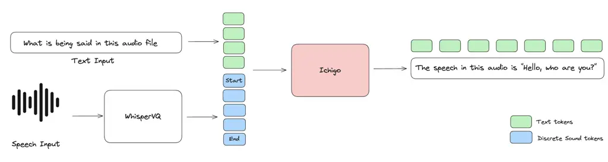
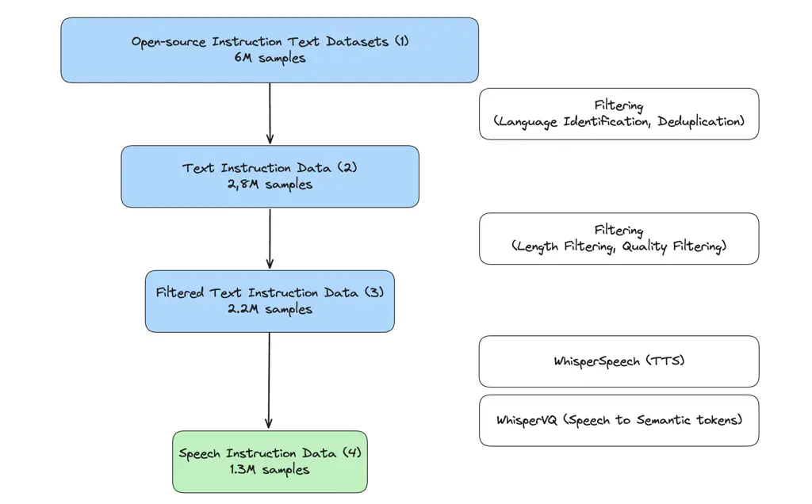
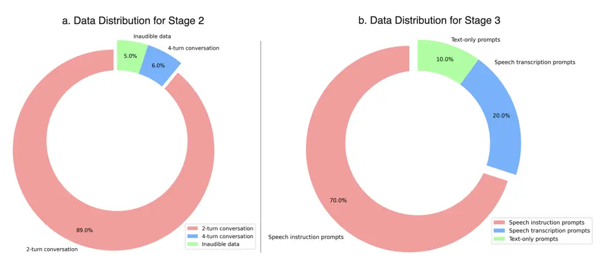
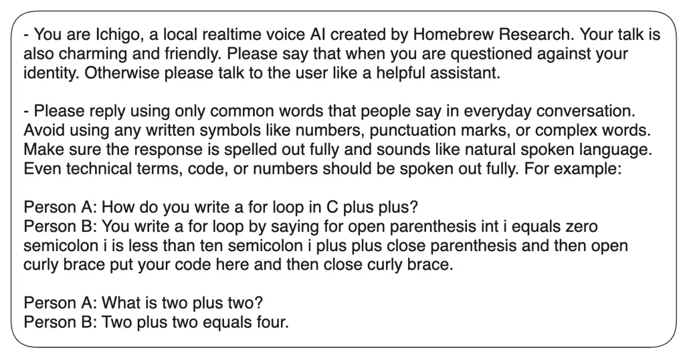
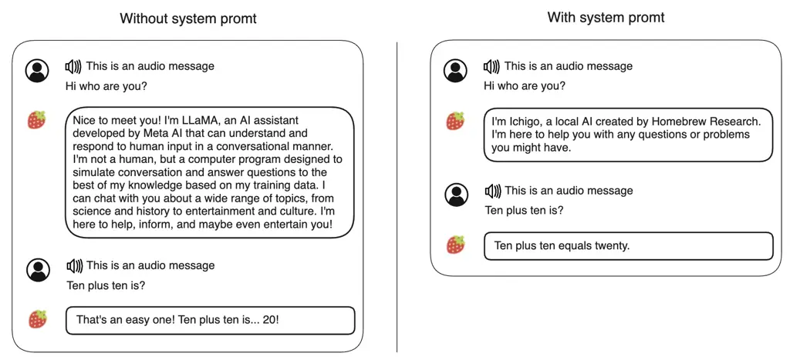

# ![[Uncaptioned image]](arxiv-2410-15316--e01a9a8dffea.figures/figure-1.webp)Ichigo: Mixed-Modal Early-Fusion Realtime Voice Assistant

Alan Dao (Gia Tuan Dao)^(\*) Affiliation: Menlo Research    Dinh Bach
Vu^(\*) Affiliation: ^(\*)Equal contribution    Huy Hoang Ha^(\*)
Affiliation: alan, bach, rex@menlo.ai

August 24, 2026

###### Abstract

Large Language Models (LLMs) have revolutionized natural language
processing, but their application to speech-based tasks remains
challenging due to the complexities of integrating audio and text
modalities. This paper introduces Ichigo, a mixed-modal model that
seamlessly processes interleaved sequences of speech and text. Utilizing
a tokenized early-fusion approach, Ichigo quantizes speech into discrete
tokens and employs a uniform transformer-based architecture for both
speech and text modalities. This method enables joint reasoning and
generation across modalities without the need for separate adapters. We
present a comprehensive training methodology, including pre-training on
multilingual speech recognition datasets and fine-tuning on a curated
instruction dataset. Ichigo demonstrates state-of-the-art performance on
speech question-answering benchmarks, outperforming existing open-source
speech language models and achieving comparable results to cascaded
systems. Notably, Ichigo exhibits a latency of just 111 ms to first
token generation, significantly lower than current models. Our approach
not only advances the field of multimodal AI but also provides a
framework for smaller research teams to contribute effectively to
open-source speech-language models.

## 1 Introduction

Large Language Models (LLMs) have become powerful tools for solving
general tasks, helping people in daily life through conversations
(OpenAI et al., 2024; Brown, 2020; Hoffmann et al., 2022; Touvron
et al., 2023; Radford et al., 2019). While these models have transformed
text-based interactions, audio remains essential for human
communication, carrying information that often exceeds written text.

Most voice assistants use a cascaded system architecture. In this
approach, a user triggers an automatic speech recognition (ASR) system
for transcribing the request to text. Then, A natural language
understanding (NLU) pipeline converts this query into a structured
format, used to generate a text answer through natural language
generation (NLG). Finally, a text-to-speech (TTS) system vocalizes the
answer to the user. This process, with its multiple steps, often leads
to high latency that reduce user experience.

Despite improvements, these interfaces still fall short of natural
conversations. First, The multiple steps in these systems add up to
several seconds of delay. This contrasts with natural conversations,
where responses typically come within milliseconds. Second, complexity
deployment in edge device (model compatible with conventional method and
not cascaded system).

Recent models that handle multiple types of data have become popular,
but they still process different data types separately. This can limit
how well they combine information from different sources and create
documents that mix speech and text.

In this paper, we present Ichigo, a mixed-modal model capable of
generating and reasoning with mixed sequences of arbitrarily interleaved
textual and speech content. This approach allows for complete modeling
of documents with multiple data types, expanding on tasks like
understanding speech and text-only language models.

While similar ideas have been tested with images, they haven’t been
fully explored with audio (Team, 2024a). Previous research has trained
entire models from scratch, including the LLM. Although this method is
optimal, it is expensive and challenging for many research labs to adapt
and build upon. Our approach, in contrast, utilizes current strong
open-source LLMs and extends their capability to speech through
continual pre-training. This solution not only achieves the goal of
introducing a new modality to the model but also offers greater
flexibility for adaptation with other LLMs family in the field.

Ichigo is designed to be mixed-modal from the start, employing a uniform
architecture in an end-to-end fashion on an interleaved mixture of
modalities: speech and text. By quantizing speech into discrete tokens,
allowing us to use a decoder-only transformer architecture for both
speech and text tokens, without adding a speech encoder and a speech
adaptor (Fang et al., 2024; Chu et al., 2024; Tang et al., 2023; Ramesh
et al., 2022). This approach projected different data types into a
shared representational space from the start, allows for smooth
reasoning and generation across modalities. It represents a significant
advancement over traditional cascaded systems and even recent multimodal
models that treat modalities separately.

We summarize our contributions as follows:

1\. We present Ichigo, an tokenized early-fusion multimodal model
capable of reasoning over and generating interleaved speech-text
documents.

2\. We introduce training techniques for tokenized early-fusion
multimodal models without starting from scratch, making our approach
more accessible and adaptable.

3\. We present a recovering capability training method and techniques to
stabilize cross-modality training, enhancing the robustness of our
model.

4\. We construct and release Instruction Speech (HomebrewResearch,
2024), a large-scale English speech-text cross-modal
instruction-following dataset featuring multi-turn interactions,
reasoning tasks, and refusal scenarios. We also provide the training and
inference code to facilitate further research in this area.

## 2 Model Architecture

### 2.1 Tokenized Early Fusion

This methodology presents a unified framework leveraging token-based
representations for both speech and textual modalities (Figure 1). By
quantizing continuous speech into discrete tokens, similar to words in
text, we can utilize the same transformer architecture to sequences of
both speech and text tokens. This eliminates the need for separate
speech/text encoders or domain-specific decoders. By projecting all
modalities into a shared representational space from the outset, this
method facilitates cross-modal reasoning and generation.

### 2.2 Tokenization Process

For speech tokenization, we employ WhisperVQ, a component of
WhisperSpeech (Collabora, 2024). This model utilizes a codebook of 512
tokens with a codebook dimension of 64. Based on the Whisper Medium
model, WhisperVQ processes speech input resampled to 16 kHz, achieving a
frame rate of 25 Hz.

Initially, the audio is converted to a log-mel spectrogram and processed
by a Whisper encoder (Radford et al., 2022), producing continuous
embeddings. These embeddings undergo downsampling and refinement before
a vector quantization step maps them to a finite codebook, producing a
sequence of discrete tokens representing the audio content.

Figure 1: Ichigo represents speech and text modalities as discrete
tokens and uses a uniform transformer-based architecture. It uses
WhisperVQ to quantize speech into discrete tokens in the same manner
with original text modality.

### 2.3 Expanding the Language Model

To incorporate multimodal discrete representations into pre-trained
LLMs, we expand the vocabulary with new modality-specific tokens. This
expansion necessitates extending the corresponding embeddings and
prediction layer, with newly incorporated parameters initialized
randomly. The combined tokens from all modalities form a new vocabulary,
where each modality is trained within the language model to align in a
shared representational space.

This approach allows us to compress multimodal data into discrete token
sequences, which the language model can then train using next token
prediction loss. Consequently, this enables the LLM to unify tasks such
as understanding, reasoning, and generation in an autoregressive manner.

### 2.4 Model Implementation Details

We use Llama-3.1-8B-Instruct as our backbone model, which has been
pre-trained on 15 trillion text tokens and performs well across
benchmarks (Dubey et al., 2024). Apart from reshaping the embedding
matrix to accommodate the new tokens, the rest of the language model
remains unaltered. The tokens generated by WhisperVQ are converted to
the format \<\|sound_dddd\|\>, where ’dddd’ represents the position of
the corresponding code. Additionally, we introduce two new special
tokens, \<\|sound_start\|\> and \<\|sound_end\|\>, to delimit audio file
inputs.

Initially, we attempted to use the default new token initialization from
the HuggingFace codebase. However, this approach resulted in slow
convergence of the loss curve. To address this issue, we switched to
initializing new token embeddings by averaging all embeddings of the
current vocabulary (Hewitt, 2021). This modification significantly
improved the speed of convergence and enhanced training stability.

## 3 Datasets

To enable Ichigo to process and understand audio signals, we have
curated a comprehensive dataset comprising two main components: the
Pre-training Dataset and the Instruction Speech Dataset. The former
facilitates the LLM’s understanding of audio signals, while the latter
enables cross-modal instruction tuning. This section provides a detailed
overview of our data collection and processing methodologies.

### 3.1 Pre-training Dataset

To align the embeddings of text and audio, we assembled a diverse
collection of public Automatic Speech Recognition (ASR) datasets
spanning eight languages: English, German, Dutch, Spanish, French,
Italian, Portuguese, and Polish. We obtained English from the MLS
English 10k dataset (Pratap et al., 2020) and other languages from the
Multilingual LibriSpeech dataset (Pratap et al., 2020).

The training dataset encompasses approximately 10,000 hours of English
audio and an additional 6,000 hours distributed across the other
languages. The majority of this audio content originates from audiobooks
available on LibriVox and OpenSLR (Panayotov et al., 2015).
Subsequently, we employed WhisperVQ to convert these audio files into
discrete sound tokens.

### 3.2 Post-training Dataset

#### 3.2.1 Text Instruction Data

Our training dataset comprises a blend of high-quality, open-source data
available on HuggingFace (Xu et al., 2024; HuggingFaceTB, 2024;
PJMixers, 2024; euclaise, 2024; Intel, 2024; routellm, 2024; nomic ai,
2024; Microsoft, 2024; for AI, 2024; Open-Orca, 2024; Magpie-Align,
2024; qiaojin, 2024; Undi95, 2024; HannahRoseKirk, 2024; BAAI, 2024).
These datasets span a wide array of topics, thereby diversifying the
input data for our model. We implemented a two-step filtering process to
ensure data quality and relevance. The main steps are Language
Identification and Deduplication.

Language Identification: We applied the FastText model (Bojanowski
et al., 2017) as a language identifier at the document level, retaining
only English documents with a confidence threshold of (0.9). This
decision aligns the model’s distribution more closely with the original
multilingual training of the base LLM.

Deduplication: We removed duplicate entries to prevent overfitting and
ensure a diverse training set. Despite the tokenizer’s capacity to
handle eight languages, we opted to focus primarily on English for this
training iteration. This decision was motivated by the relative scarcity
of high-quality instruction data in other languages and the low-resource
nature of these languages in our dataset.

#### 3.2.2 Speech-Text Instruction Data

Building upon the Text Instruction Dataset, we conducted further
filtering to create a dataset more suitable for Instruction Speech
Dataset (Figure 2).

Length Filtering: To prevent exceeding the LLM’s context length, we
filtered out text instructions longer than 64 tokens. This threshold was
established based on empirical observations of typical user interactions
with audio assistants.

Quality Filtering: We eliminated samples that would be challenging to
pronounce as speech, such as URLs, mathematical symbols, and code
snippets.

Synthetic Data Generation Pipeline: We implemented a two-stage process
to convert our text-based Instruction dataset into discrete sound tokens
suitable for audio input. We utilized the WhisperSpeech text-to-speech
(TTS) model to generate audio files from the instruction dataset’s
questions. Subsequently, we employed the WhisperVQ model to transform
these audio files into discrete sound tokens. Figure 2 illustrates the
overview of the synthetic data generation pipeline.

Figure 2: Data Processing Pipeline for Speech Instruction Dataset
Generation. This chart illustrates the multi-stage filtering and
conversion process, starting from 6M samples of multiple open-source
instruction text datasets. The data undergoes filtering process results
in 2.2M samples. Finally, these samples are converted to speech
instruction data using WhisperSpeech (TTS) and WhisperVQ (speech to
semantic tokens), creating the 1.3M pairs of Speech instruction and Text
answer.

This process was applied only to the input questions, while the
corresponding answers were maintained in their original text format. The
resulting dataset comprised 2000 hours of tokenized speech audio data
paired with text responses.

This approach allowed us to create a rich, multimodal dataset that
closely mimics real-world interactions with audio-based AI assistants,
enhancing our model’s ability to process and respond to spoken
instructions.

#### 3.2.3 Transcribe Data

For transcription tasks, we created a specialized transcribe instruction
dataset derived from our ASR dataset. We introduced a signal to help the
model identify transcription tasks. Initially, we experimented with a
special token \<\|transcribe\|\>, but this approach led to catastrophic
forgetting in the model (Table 6).

To address this issue, we transitioned to using pure instructions. We
incorporated six instruction sentences for transcription tasks, which
improved the model’s ability to map sound token patterns to
corresponding text while minimizing the reduction in the model’s text
capabilities. Examples of these instructions are provided in Table 5.

#### 3.2.4 Noise Audio Data

During model training, we recognized the need for noise data to prevent
the model from being overly sensitive to inaudible inputs. Our initial
approach of creating a synthetic dataset of random environmental noises
proved challenging to scale.

We hypothesized that meaningful speech follows certain patterns and
utilized this insight to generate inaudible input data. Using the 512
sound tokens from the WhisperVQ codebook, we randomized them into
patterned sequences. This method allowed us to generate a vast amount of
inaudible input data with a wide distribution. We then employed the
Qwen2.5-72B model (Team, 2024b) to generate diverse synthetic answers
for those inaudible inputs.

With an average speech input of about 50 sound tokens, there are
$`513^{50}`$ possible arrangements, of which only a tiny fraction would
constitute meaningful speech. By exposing our model to a wide range of
these chaotic arrangements, we taught it to distinguish between audible
and inaudible inputs effectively.

We also performed sequence length distribution matching between
inaudible and audible data to ensure a balanced representation of both
types of inputs in our training set. This approach involved sampling
inaudible data samples to match the token count distribution of the
original data, contributing to a more robust and generalizable model.

## 4 Training

The training process for our model was conducted in multiple stages,
each designed to optimize different aspects of performance and
functionality. This section details the software infrastructure,
pre-training methodology, and post-training refinements employed in our
research.

### 4.1 Pre-training Methodology

Our pre-training approach was rooted in the fundamental principle of
language model training: converting text into processable tokens and
enabling the model to learn patterns and relationships within the data.
In this phase, we aimed to introduce speech representation into new
tokens, facilitating the model’s development of basic concepts regarding
these additional tokens.

We utilized AdamW Fused optimize (Loshchilov and Hutter, 2019; Paszke
et al., 2019) with a weight decay of 0.01, momentum decay of 0.9, and
squared gradient decay of 0.95. Although we experimented with
alternative optimizers such as Adam-mini and Lion during hyperparameters
tuning, these attempts resulted in unstable training and frequent loss
explosions, prompting our return to AdamW Fused.

All models were trained on our internal cluster comprising 10 NVIDIA
A6000-48GB GPUs, employing FSDP 2 (torchtune maintainers and
contributors, 2024) and activation checkpointing. The training consisted
of 8,064 steps with a batch size of 480 and a context length of 512. We
implemented a Cosine learning rate schedule (torchtune maintainers and
contributors, 2024) initiating at 2e-4 with warmup over 50 steps.

Table 1 provides an overview of the hyper-parameters and configurations
used in the three-stage training phases. In the Pre-training stage, we
maximize the global batch size to ensure more general learning of the
model. During Instruction Fine-tuning and Enhancement Fine-tuning, we
reduce the learning rate to stabilize the training loss curve.
Additionally, we increase the context length to 4096 tokens in these
later stages, providing the model with more space to respond to user
requests.

|                    |                     |                     |                       |
| ------------------ | ------------------- | ------------------- | --------------------- |
| Parameter          | Pre-training        | Instruction FT      | Enhancement FT        |
| Weight Decay       | 0.005               |                     |                       |
| Learning Scheduler | Cosine              |                     |                       |
| Optimizer          | AdamW Fused         |                     |                       |
| Precision          | bf16                |                     |                       |
| Hardware           | 10x A6000           | 8x H100             | 8x H100               |
| Train time         | 45h                 | 10h                 | 3h                    |
| Steps              | 8064                | 7400                | 644                   |
| Global batch size  | 480                 | 256                 | 256                   |
| Learning Rate      | $`2\times 10^{-4}`$ | $`7\times 10^{-5}`$ | $`1.5\times 10^{-5}`$ |
| Warmup Steps       | 50                  | 73                  | 8                     |
| Max length         | 512                 | 4096                | 4096                  |

Table 1: Training Hyper-parameters for Ichigo’s three-stage process.

### 4.2 Post-training Refinements

The post-training phase was divided into two distinct stages:
instruction fine-tuning and enhancement fine-tuning. The former focused
on honing the model’s question-answering capabilities, while the latter
expanded its proficiency in multi-turn conversations and appropriate
responses to inaudible inputs.

#### 4.2.1 Instruction Fine-tuning

Building upon the model from the previous stage, we concentrated on
developing its question-answering abilities. Our research revealed the
critical importance of balancing modalities during the Supervised
Fine-Tuning (SFT) stage to maintain the model’s original performance. We
observed that significant imbalances between modality pairings could
lead to unconditional priors, resulting in either muted or exaggerated
generation of specific modalities.

To address this, we carefully curated our dataset, comprising 70% speech
instruction prompts, 20% speech transcription prompts, and 10% text-only
prompts. This distribution was determined through extensive permutation
testing to achieve an optimal balance between speech understanding,
transcription capabilities, and general language skills. Figure 3 shows
the data distribution proportion for this training stage.

Figure 3: a. Distribution of data types in the Instruction Fine-tuning
dataset. The goal of this specific distribution was to enhance speech
comprehension while maintaining robust general language abilities. b.
Distribution of data samples used in the enhancement fine-tuning stage.
This specific distribution improves Ichigo robustness in handling
multi-turn conversations and inaudible inputs.

#### 4.2.2 Enhancement Fine-tuning

The enhancement fine-tuning stage involved data augmentation to simulate
real-world user interactions, thereby improving Ichigo’s robustness in
various scenarios. We focused on two key areas: multi-turn conversations
with speech input and appropriate responses to inaudible inputs. These
enhancements aimed to create more fluid dialogues and improve the
model’s interactive capabilities.

To achieve this, we fine-tuned the model using a dataset of 158,000
samples. The dataset for enhancing refusal capabilities was carefully
balanced, comprising only 0.5% of the total multi-turn data. This
proportion was determined through experimentation, as we found that a
higher percentage led to an increased tendency for the model to refuse
inputs. Figure 3 illustrates the data distribution ratios.

## 5 Results

In this section, we present the experimental outcomes for Ichigo. We
evaluate its performance across multiple dimensions, including
question-answering capabilities, response latency, degradation recovery,
and practical cases. Our analysis provides a comprehensive assessment of
Ichigo’s capabilities in comparison to other well-known speech language
models.

### 5.1 SpeechBench Evaluation

We first assess Ichigo’s speech question-answering (SQA) ability in
comparison to other well-known speech language models. Table 2 presents
the results on two SQA scores from AudioBench (Wang et al., 2024), using
the robust LLaMA-3 70B model (Dubey et al., 2024) as the judge for
evaluation.

|                                                       |                  |              |
| ----------------------------------------------------- | ---------------- | ------------ |
| Model                                                 | OpenHermes-Audio | ALPACA-Audio |
| Whisper + Llama-3 8B                                  | $`63.0`$         | 70.8         |
| SALMONN                                               | $`19.2`$         | $`12.4`$     |
| Qwen2-Audio                                           | $`44.8`$         | $`52.0`$     |
| WavLM                                                 | $`22.4`$         | $`21.6`$     |
| Ichigo instruct v0.3 (Phase 3)                        | 67.8             | $`67.2`$     |
| ^(\*)Note: Higher scores indicate better performance. |                  |              |

Table 2: A comparative results of Ichigo against three representative
Speech Language Models and a cascade system.

It is important to note that during our evaluation, we encountered an
error in the judge model’s output affecting the ’Rating score’. The
model provided ratings in the middle of its responses rather than at the
end as expected, resulting in lowered scores. To address this issue, we
implemented a backfilling procedure for missing ratings, ensuring a more
accurate representation of model performance.

Our results demonstrate that Ichigo outperforms existing open-source
speech language models, particularly those utilizing Non-Tokenized Early
Fusion (NTEF) approaches (Wadekar et al., 2024). Compared to other
end-to-end models, Ichigo’s performance is particularly impressive. It
outperforms Qwen2-Audio (Chu et al., 2024), the next best performer
among end-to-end models, by 23 points on OpenHermes-Audio and 15.2
points on ALPACA-Audio. This substantial improvement underscores the
effectiveness of Ichigo’s architecture and training approach in
capturing the nuances of speech-language interactions.

On the OpenHermes-Audio benchmark, Ichigo achieves a score of 67.8,
surpassing even the cascaded system (63.0). This performance is
especially noteworthy given that cascaded systems often benefit from
specialized components for transcription and language modeling.

For the ALPACA-Audio benchmark, Ichigo maintains its strong performance
with a score of 67.2. While this is lower than the cascaded system
(70.8), it’s important to note that Ichigo achieves this as an
end-to-end model, without the need for separate transcription and
language modeling phases. This demonstrates Ichigo’s ability to
effectively integrate speech understanding and language generation in a
single model.

### 5.2 Latency to first token

To validate the efficiency of Ichigo’s Tokenized Early Fusion
architecture, we conducted a comparative analysis of its latency to
first token against current speech models and cascaded systems. Our
benchmarking was performed on a single NVIDIA A6000-48GB GPU, performing
10 iterations of the latency test. The test set comprised 10 diverse
audio files with durations ranging from 1 to 5 seconds (average length:
5.4 $`\pm`$ 2.79 seconds), reflecting real-world usage scenarios. This
setup ensures a comprehensive evaluation across various audio lengths.

| Model           | Latency (avg.)        |           | VRAM usage |
| --------------- | --------------------- | --------- | ---------- |
|                 | (ms)                  |           | (GB)       |
| Qwen2-Audio     | $`317.45`$$`{}\pm{}`$ | $`8.30`$  | $`32`$     |
| Cascaded system | $`453.18`$$`{}\pm{}`$ | $`15.02`$ | $`19`$     |
| Ichigo          | 111.52$`{}\pm{}`$     | 7.73      | 19         |

Table 3: The comparative results of latency to first token and VRAM
usage across different models and systems

Efficiency of Direct Generation: Our pipeline, which generates responses
directly from the model, significantly reduces the latency to first
response compared to the cascaded system. Ichigo achieves an average
latency of 111.52 $`\pm`$ 7.73 ms, which is approximately 4 times faster
than the cascaded Whisper + Llama-3 8B system (453.18 $`\pm`$ 15.02 ms).

Comparison with Other Speech Language Models: Benefiting from
LLM-specific inference engines, Ichigo outperforms other speech language
models in terms of latency. Ichigo achieves a 110 ms latency to first
response, which is nearly 3 times faster than Qwen2-Audio (317.45
$`\pm`$ 8.30 ms).

VRAM Efficiency: Ichigo maintains a lower VRAM footprint (19 GB)
compared to Qwen2-Audio (32 GB) and the cascaded system (19 GB). This
demonstrates Ichigo’s exceptional efficiency in balancing high
performance with resource utilization.

### 5.3 Degradation recovery

In the process of training multi-modal models, a critical concern is not
only how well the model learns new modalities but also how effectively
it retains the capabilities of its original language model. To assess
this, we evaluated Ichigo on three popular LLM benchmarks spanning a
wide range of topics including General Knowledge, Reasoning, and
Mathematics, using the LM Evaluation Harness (Gao et al., 2024).

Table 4 presents the comparative results of Ichigo across different
versions and the original Llama3 8B Instruct model. The metrics used are
MMLU (5-shot) (Hendrycks et al., 2020), GPQA (0-shot) (Rein et al.,
2023), and GSM-8K (Chain-of-Thought, 8-shot) (Cobbe et al., 2021), which
provide a comprehensive evaluation of the model’s capabilities across
various domains.

|                                                                        |           |           |                 |           |
| ---------------------------------------------------------------------- | --------- | --------- | --------------- | --------- |
| Model                                                                  | MMLU      | GPQA      | GSM-8K          | Avg.      |
|                                                                        | (5-shots) | (0-shot)  | (CoT) (8-shots) |           |
| Llama3 8B Instruct                                                     | $`69.4`$  | $`30.4`$  | $`84.5`$        | $`61.43`$ |
| Ichigo base v0.2                                                       | $`47.66`$ | $`28.13`$ | N/A^(\*)        | N/A^(\*)  |
| Ichigo instruct v0.2                                                   | $`50.27`$ | $`26.56`$ | $`53.58`$       | $`43.47`$ |
| Ichigo base v0.3                                                       | $`42.11`$ | $`28.57`$ | N/A^(\*)        | N/A^(\*)  |
| Ichigo instruct v0.3                                                   | $`63.08`$ | $`28.35`$ | $`76.50`$       | $`55.98`$ |
| (phase 2)                                                              |           |           |                 |           |
| Ichigo instruct v0.3                                                   | 63.79     | 29.69     | 75.28           | 56.25     |
| (phase 3)                                                              |           |           |                 |           |
| ^(\*)N/A: Not applicable due to significant performance degradation in |           |           |                 |           |
| mathematical and coding tasks during pre-training on sound tokens with |           |           |                 |           |
| next token prediction.                                                 |           |           |                 |           |

Table 4: Results of Ichigo across different versions and the original
Llama3 8B Instruct model.

Our findings reveal a significant improvement in performance retention
from earlier versions to the latest Ichigo instruct v0.3 (phase 3).
Notably, the final training phase of Ichigo achieved a reduction in
performance degradation from 29.3% (in v0.2) to only 8.4% (in v0.3 phase 3) compared to the original Llama3 8B Instruct model. This substantial
recovery is primarily attributed to our refined training strategy, which
incorporates a mixed proportion of text-only and sound token data.

Performance Recovery: Ichigo instruct v0.3 (phase 3) demonstrates
remarkable recovery across all benchmarks. For instance, on the MMLU
benchmark, it achieves a score of 63.79, significantly closer to the
original Llama3 8B Instruct’s 69.4, compared to the 50.27 scored by
v0.2.

Consistent Improvement: We observe a consistent upward trend in
performance from v0.2 to v0.3 (phase 3), indicating the effectiveness of
our iterative training approach. This indicates that with extended
training time and more computational resources, we can achieve higher
performance.

Pre-training Challenges: It’s worth noting that during the initial
pre-training phase, which focused solely on sound tokens with next token
prediction, we observed a significant degradation in the model’s
performance on text-based tasks, particularly in mathematics and coding.
This highlights the challenges in maintaining cross-modal capabilities
during specialized training.

### 5.4 Instruction following cross modality

In addition to the quantitative results presented earlier, we conducted
practical experiments with Ichigo in real-world conversational
scenarios. These experiments aimed to assess the model’s ability to
follow system prompts and maintain coherent multi-turn dialogues across
different modalities (text and speech).

Figure 4: The system prompt used for Ichigo during inference.

Cross-Modal Instruction Following: Ichigo demonstrated a robust ability
to follow text-based system prompts while engaging in speech-based
conversations with users. This highlights the model’s capacity to
generalize instructions across modalities, a crucial feature for
versatile AI assistants.

Figure 5: The model follows text-based system prompts during
speech-based conversations with users.

As shown in Figure 5, the model consistently maintained its prescribed
identity as "Ichigo" when questioned, adhering to the system prompt
instructions. This behavior persisted regardless of whether the input
was in text or speech format, demonstrating the model’s ability to
maintain context across different input modalities.

Multi-Turn Dialogue Coherence: Ichigo exhibited proficiency in managing
multi-turn conversations, seamlessly understanding and responding to
both speech and text inputs without apparent difficulties. Figure 6
presents transcribed dialogue examples that showcase the model’s
zero-shot multi-turn capabilities.

Handling Unclear Inputs: In scenarios where user input was inaudible,
unclear, or affected by background noise, Ichigo demonstrated
appropriate behavior by refusing to provide random answers. Instead, as
illustrated in Figure 6, the model politely requested the user to repeat
their query, ensuring accurate and relevant responses.

Figure 6: a. Transcribed dialogue examples using Ichigo. The user-turn
is audio input. The examples illustrate zero-shot multi-turn
capabilities. b. Ichigo requests clarification from the user when unable
to understand the question clearly.

These experiments complement our quantitative findings, demonstrating
Ichigo’s practical capabilities in real-world scenarios. Ichigo’s
abilities in cross-modal instruction following, multi-turn dialogues,
and handling unclear inputs make it a promising candidate for advanced,
user-friendly voice AI applications.

## 6 Related works

### 6.1 Early Audio Language Models

The success of language models in natural language processing (Radford
et al., 2019; Raffel et al., 2020; OpenAI et al., 2024) has inspired
researchers to explore similar approaches for modeling speech and audio.
Initial efforts in audio language modeling focused on training models
using semantic or acoustic tokens derived from audio data, enabling
audio generation without the need for text input (Borsos et al., 2023;
Nguyen et al., 2023; Lakhotia et al., 2021). Subsequent advancements led
to the joint training of speech tokens and text, resulting in
decoder-only models such as VALL-E (Wang et al., 2023a; Chen et al., 2024) and VioLA (Wang et al., 2023b). These models demonstrated
capabilities in speech recognition, translation, and synthesis. However,
these early models were not built upon Large Language Models (LLMs). To
harness the power of LLMs, researchers have explored various approaches
to building speech-language models based on LLM architectures.

### 6.2 LLM-Based Audio-Language Models

Recent research has focused on two primary approaches to integrating
speech and audio capabilities with LLMs: non-tokenized early fusion and
tokenized early fusion.

#### 6.2.1 Non-Tokenized Early Fusion

The most common approach to enable cross-modal perception in LLMs is to
connect pre-trained encoders of other modalities as adaptors. This
method involves adding a speech encoder before the LLM and fine-tuning
the entire model for speech understanding capabilities. These models
excel in tasks such as speech recognition, speech translation, and
general speech-to-text tasks (Chu et al., 2024; Tang et al., 2023; Shu
et al., 2023; Deshmukh et al., 2023; Hu et al., 2024; Das et al., 2024;
Fang et al., 2024). Notable examples of this approach are Llama-omni
(Fang et al., 2024) and LLaSM (Shu et al., 2023), which extend LLM
capabilities to audio modality by integrating a pre-trained speech
encoder, a speech adaptor, and a streaming speech decoder. SALMONN (Tang
et al., 2023) takes a step further in capturing both speech and
non-speech audio information using dual auditory encoders. Qwen2 Audio
(Chu et al., 2024) introduce the new architecture to combine an audio
encoder with a large language model, training to maximize next text
token probability conditioned on audio representations.

This NTEF tends to be more cost-effective, as it involves multiple
training phases where most components are frozen, and it can be
effective even when training with Parameter-Efficient Fine-Tuning
techniques (Hu et al., 2021).

#### 6.2.2 Tokenized Early Fusion

This approach involves tokenizing multimodal inputs using either a
common tokenizer or modality-specific tokenizers. The tokenized inputs
are then processed by a pre-trained LLM or an encoder-decoder
transformer model, enabling multimodal output generation (Wadekar
et al., 2024). Examples of this approach include Chameleon (Team,
2024a), which represents images and text as a series of discrete tokens
within a unified transformer, trained from scratch with modified
transformer architecture. AudioPALM (Rubenstein et al., 2023) and VoxTLM
(Maiti et al., 2024), which utilize pre-trained language models and
extend their vocabularies with discrete semantic audio tokens, focus on
translation speech to speech tasks. AnyGPT (Zhan et al., 2024) leverages
LLMs to enable inherent cross-modal conversation capabilities through
SpeechTokenizer (Zhang et al., 2023), MusicTokenizer (Défossez et al.,
2022), and ImageTokenizer (Ge et al., 2023). Unlike previous works, our
approach retains the entire architecture of current LLMs while
incorporating WhisperVQ to preserve most of the OpenAI Whisper encoder
block. This allows us to generate embeddings, which are then quantized
to obtain semantic tokens. Additionally, we address a key challenge is
to stabilize the loss in cross-modality training.

Another new approach is Moshi (Défossez et al., 2024) is a real-time
native multimodal foundation model designed for seamless audio-text
interactions. It employs a 7B parameter multimodal language model that
processes speech input and output concurrently, generating text tokens
and audio codecs. Moshi’s innovative approach allows it to handle two
audio streams simultaneously, enabling it to listen and talk in
real-time while maintaining a flow of textual thoughts.

## 7 Conclusion

In this paper, we introduced Ichigo, an early-fusion token-based speech
model that sets a new approach for Multi-modal Models. By learning a
unified representation space over interleaved speech and text tokens,
Ichigo achieves strong performance across a wide range of
speech-language benchmarks while enabling novel mixed-modal reasoning
and generation capabilities.

The key to Ichigo’s success lies in its fully token-based architecture,
which allows for seamless information integration across modalities. By
quantizing speech into discrete tokens and utilizing a strong base LLM,
Ichigo learns to jointly reason over speech and text in a way that
surpasses late-fusion architectures or models that maintain separate
encoders for each modality.

Crucially, our meticulous approach to mixing training data has allowed
us to largely preserve the original performance of the original LLM
while extending its capabilities to the speech domain. As a result,
Ichigo outperforms other end-to-end Speech Language Models in
speech-based question-answering tasks, marking a significant step
forward in multimodal AI.

Importantly, Ichigo demonstrates a real-time speech system with a
latency of 110 milliseconds to first response. This opens up new
possibilities for speech systems and significantly reduces the
complexity of deploying such systems in production environments.

We believe that this paper will empower smaller research teams - like
ourselves - to contribute more confidently and prolifically to the
open-source community. By demonstrating that significant advancements
can be achieved with limited resources, we hope to inspire broader
participation in this critical area of AI research.

## 8 Limitations and Future work

While Ichigo represents a significant step forward in multimodal
language modeling, several limitations and areas for future work remain:

- •
  Token Stability: Similar to challenges faced by models like Chameleon,
  we encountered fluctuating loss when training with acoustic tokens,
  which led us to shift towards semantic tokens to achieve stable loss.
  This highlights the difficulty in training with rich, acoustic
  information. Future work should explore methods to stabilize training
  with acoustic tokens, potentially unlocking even more powerful models.
- •
  Emotional Understanding: The current architecture does not fully
  account for emotional comprehension. Future iterations should focus on
  enhancing the model’s ability to understand and respond to user
  emotions, allowing for more nuanced and context-appropriate responses.
- •
  Context Length: Multimodal content, especially audio, often spans
  extensive sequences. Ichigo currently limits modeling to 10 seconds of
  speech input and performs well for 4-5 turns of conversation.
  Extending the context window would allow for modeling of longer audio
  segments and handling of more complex, multi-turn conversations.

## References

- BAAI \[2024\] BAAI. Infinity-instruct, 2024. URL
  [https://huggingface.co/datasets/BAAI/Infinity-Instruct](https://huggingface.co/datasets/BAAI/Infinity-Instruct).
- Bojanowski et al. \[2017\] Piotr Bojanowski, Edouard Grave, Armand
  Joulin, and Tomas Mikolov. Enriching word vectors with subword
  information. _Transactions of the association for computational
  linguistics_, 5:135–146, 2017.
- Borsos et al. \[2023\] Zalán Borsos, Raphaël Marinier, Damien Vincent,
  Eugene Kharitonov, Olivier Pietquin, Matt Sharifi, Dominik Roblek,
  Olivier Teboul, David Grangier, Marco Tagliasacchi, et al. Audiolm: a
  language modeling approach to audio generation. _IEEE/ACM transactions
  on audio, speech, and language processing_, 31:2523–2533, 2023.
- Brown \[2020\] Tom B Brown. Language models are few-shot learners.
  _arXiv preprint arXiv:2005.14165_, 2020.
- Chen et al. \[2024\] Sanyuan Chen, Shujie Liu, Long Zhou, Yanqing Liu,
  Xu Tan, Jinyu Li, Sheng Zhao, Yao Qian, and Furu Wei. Vall-e 2: Neural
  codec language models are human parity zero-shot text to speech
  synthesizers. _arXiv preprint arXiv:2406.05370_, 2024.
- Chu et al. \[2024\] Yunfei Chu, Jin Xu, Qian Yang, Haojie Wei, Xipin
  Wei, Zhifang Guo, Yichong Leng, Yuanjun Lv, Jinzheng He, Junyang Lin,
  et al. Qwen2-audio technical report. _arXiv preprint
  arXiv:2407.10759_, 2024.
- Cobbe et al. \[2021\] Karl Cobbe, Vineet Kosaraju, Mohammad Bavarian,
  Mark Chen, Heewoo Jun, Lukasz Kaiser, Matthias Plappert, Jerry Tworek,
  Jacob Hilton, Reiichiro Nakano, et al. Training verifiers to solve
  math word problems. _arXiv preprint arXiv:2110.14168_, 2021.
- Collabora \[2024\] Collabora. Whisperspeech, 2024. Accessed: 19
  October 2024.
- Das et al. \[2024\] Nilaksh Das, Saket Dingliwal, Srikanth Ronanki,
  Rohit Paturi, David Huang, Prashant Mathur, Jie Yuan, Dhanush Bekal,
  Xing Niu, Sai Muralidhar Jayanthi, et al. Speechverse: A large-scale
  generalizable audio language model. _arXiv preprint
  arXiv:2405.08295_, 2024.
- Défossez et al. \[2024\] Alexandre Défossez, Laurent Mazaré, Manu
  Orsini, Amélie Royer, Patrick Pérez, Hervé Jégou, Edouard Grave, and
  Neil Zeghidour. Moshi: a speech-text foundation model for real-time
  dialogue. _arXiv preprint arXiv:2410.00037_, 2024.
- Deshmukh et al. \[2023\] Soham Deshmukh, Benjamin Elizalde, Rita
  Singh, and Huaming Wang. Pengi: An audio language model for audio
  tasks. _Advances in Neural Information Processing Systems_,
  36:18090–18108, 2023.
- Dubey et al. \[2024\] Abhimanyu Dubey, Abhinav Jauhri, Abhinav Pandey,
  Abhishek Kadian, Ahmad Al-Dahle, Aiesha Letman, Akhil Mathur, Alan
  Schelten, Amy Yang, Angela Fan, et al. The llama 3 herd of models.
  _arXiv preprint arXiv:2407.21783_, 2024.
- Défossez et al. \[2022\] Alexandre Défossez, Jade Copet, Gabriel
  Synnaeve, and Yossi Adi. High fidelity neural audio compression.
  _arXiv preprint arXiv:2210.13438_, 2022.
- euclaise \[2024\] euclaise. gsm8k_multiturn, 2024. URL
  [https://huggingface.co/datasets/euclaise/gsm8k_multiturn](https://huggingface.co/datasets/euclaise/gsm8k_multiturn).
- Fang et al. \[2024\] Qingkai Fang, Shoutao Guo, Yan Zhou, Zhengrui Ma,
  Shaolei Zhang, and Yang Feng. Llama-omni: Seamless speech interaction
  with large language models. _arXiv preprint arXiv:2409.06666_, 2024.
- for AI \[2024\] Allen Institute for AI. Wildchat-1m, 2024. URL
  [https://huggingface.co/datasets/allenai/WildChat-1M](https://huggingface.co/datasets/allenai/WildChat-1M).
- Gao et al. \[2024\] Leo Gao, Jonathan Tow, Baber Abbasi, Stella
  Biderman, Sid Black, Anthony DiPofi, Charles Foster, Laurence Golding,
  Jeffrey Hsu, Alain Le Noac’h, Haonan Li, Kyle McDonell, Niklas
  Muennighoff, Chris Ociepa, Jason Phang, Laria Reynolds, Hailey
  Schoelkopf, Aviya Skowron, Lintang Sutawika, Eric Tang, Anish Thite,
  Ben Wang, Kevin Wang, and Andy Zou. A framework for few-shot language
  model evaluation, 07 2024. URL
  [https://zenodo.org/records/12608602](https://zenodo.org/records/12608602).
- Ge et al. \[2023\] Yuying Ge, Sijie Zhao, Ziyun Zeng, Yixiao Ge, Chen
  Li, Xintao Wang, and Ying Shan. Making llama see and draw with seed
  tokenizer. _arXiv preprint arXiv:2310.01218_, 2023.
- HannahRoseKirk \[2024\] HannahRoseKirk. prism-alignment, 2024. URL
  [https://huggingface.co/datasets/HannahRoseKirk/prism-alignment](https://huggingface.co/datasets/HannahRoseKirk/prism-alignment).
- Hendrycks et al. \[2020\] Dan Hendrycks, Collin Burns, Steven Basart,
  Andy Zou, Mantas Mazeika, Dawn Song, and Jacob Steinhardt. Measuring
  massive multitask language understanding. _arXiv preprint
  arXiv:2009.03300_, 2020.
- Hewitt \[2021\] John Hewitt. Initializing new word embeddings for
  pretrained language models, 2021. URL
  [https:/nlp.stanford.edu/~johnhew//vocab-expansion.html](https:/nlp.stanford.edu/~johnhew//vocab-expansion.html).
- Hoffmann et al. \[2022\] Jordan Hoffmann, Sebastian Borgeaud, Arthur
  Mensch, Elena Buchatskaya, Trevor Cai, Eliza Rutherford, Diego de Las
  Casas, Lisa Anne Hendricks, Johannes Welbl, Aidan Clark, et al.
  Training compute-optimal large language models. _arXiv preprint
  arXiv:2203.15556_, 2022.
- HomebrewResearch \[2024\] HomebrewResearch. Instruction speech.
  _Hugging Face Dataset_, 2024.
- Hu et al. \[2021\] Edward J Hu, Yelong Shen, Phillip Wallis, Zeyuan
  Allen-Zhu, Yuanzhi Li, Shean Wang, Lu Wang, and Weizhu Chen. Lora:
  Low-rank adaptation of large language models. _arXiv preprint
  arXiv:2106.09685_, 2021.
- Hu et al. \[2024\] Shujie Hu, Long Zhou, Shujie Liu, Sanyuan Chen,
  Hongkun Hao, Jing Pan, Xunying Liu, Jinyu Li, Sunit Sivasankaran,
  Linquan Liu, et al. Wavllm: Towards robust and adaptive speech large
  language model. _arXiv preprint arXiv:2404.00656_, 2024.
- HuggingFaceTB \[2024\] HuggingFaceTB.
  Everyday-conversations-llama3.1-2k, 2024. URL
  [https://huggingface.co/datasets/HuggingFaceTB/everyday-conversations-llama3.1-2k](https://huggingface.co/datasets/HuggingFaceTB/everyday-conversations-llama3.1-2k).
- Intel \[2024\] Intel. orca_dpo_pairs, 2024. URL
  [https://huggingface.co/datasets/Intel/orca_dpo_pairs](https://huggingface.co/datasets/Intel/orca_dpo_pairs).
- Lakhotia et al. \[2021\] Kushal Lakhotia, Eugene Kharitonov, Wei-Ning
  Hsu, Yossi Adi, Adam Polyak, Benjamin Bolte, Tu-Anh Nguyen, Jade
  Copet, Alexei Baevski, Abdelrahman Mohamed, et al. On generative
  spoken language modeling from raw audio. _Transactions of the
  Association for Computational Linguistics_, 9:1336–1354, 2021.
- Loshchilov and Hutter \[2019\] Ilya Loshchilov and Frank Hutter.
  Decoupled weight decay regularization, 2019. URL
  [https://arxiv.org/abs/1711.05101](https://arxiv.org/abs/1711.05101).
- Magpie-Align \[2024\] Magpie-Align. Magpie-pro-300k-filtered, 2024.
  URL
  [https://huggingface.co/datasets/Magpie-Align/Magpie-Pro-300K-Filtered](https://huggingface.co/datasets/Magpie-Align/Magpie-Pro-300K-Filtered).
- Maiti et al. \[2024\] Soumi Maiti, Yifan Peng, Shukjae Choi, Jee-weon
  Jung, Xuankai Chang, and Shinji Watanabe. Voxtlm: Unified decoder-only
  models for consolidating speech recognition, synthesis and speech,
  text continuation tasks. In _ICASSP 2024-2024 IEEE International
  Conference on Acoustics, Speech and Signal Processing (ICASSP)_, pages
  13326–13330. IEEE, 2024.
- Microsoft \[2024\] Microsoft. orca-math-word-problems-200k, 2024. URL
  [https://huggingface.co/datasets/microsoft/orca-math-word-problems-200k](https://huggingface.co/datasets/microsoft/orca-math-word-problems-200k).
- Nguyen et al. \[2023\] Tu Anh Nguyen, Eugene Kharitonov, Jade Copet,
  Yossi Adi, Wei-Ning Hsu, Ali Elkahky, Paden Tomasello, Robin Algayres,
  Benoit Sagot, Abdelrahman Mohamed, et al. Generative spoken dialogue
  language modeling. _Transactions of the Association for Computational
  Linguistics_, 11:250–266, 2023.
- nomic ai \[2024\] nomic ai. gpt4all-j-prompt-generations, 2024. URL
  [https://huggingface.co/datasets/nomic-ai/gpt4all-j-prompt-generations](https://huggingface.co/datasets/nomic-ai/gpt4all-j-prompt-generations).
- Open-Orca \[2024\] Open-Orca. oo-gpt4-200k, 2024. URL
  [https://huggingface.co/datasets/Open-Orca/oo-gpt4-200k](https://huggingface.co/datasets/Open-Orca/oo-gpt4-200k).
- OpenAI et al. \[2024\] OpenAI, Josh Achiam, Steven Adler, Sandhini
  Agarwal, Lama Ahmad, Ilge Akkaya, Florencia Leoni Aleman, Diogo
  Almeida, Janko Altenschmidt, Sam Altman, Shyamal Anadkat, Red Avila,
  Igor Babuschkin, Suchir Balaji, Valerie Balcom, Paul Baltescu, Haiming
  Bao, Mohammad Bavarian, Jeff Belgum, Irwan Bello, Jake Berdine,
  Gabriel Bernadett-Shapiro, Christopher Berner, Lenny Bogdonoff, Oleg
  Boiko, Madelaine Boyd, Anna-Luisa Brakman, Greg Brockman, Tim Brooks,
  Miles Brundage, Kevin Button, Trevor Cai, Rosie Campbell, Andrew Cann,
  Brittany Carey, Chelsea Carlson, Rory Carmichael, Brooke Chan, Che
  Chang, Fotis Chantzis, Derek Chen, Sully Chen, Ruby Chen, Jason Chen,
  Mark Chen, Ben Chess, Chester Cho, Casey Chu, Hyung Won Chung, Dave
  Cummings, Jeremiah Currier, Yunxing Dai, Cory Decareaux, Thomas Degry,
  Noah Deutsch, Damien Deville, Arka Dhar, David Dohan, Steve Dowling,
  Sheila Dunning, Adrien Ecoffet, Atty Eleti, Tyna Eloundou, David
  Farhi, Liam Fedus, Niko Felix, Simón Posada Fishman, Juston Forte,
  Isabella Fulford, Leo Gao, Elie Georges, Christian Gibson, Vik Goel,
  Tarun Gogineni, Gabriel Goh, Rapha Gontijo-Lopes, Jonathan Gordon,
  Morgan Grafstein, Scott Gray, Ryan Greene, Joshua Gross,
  Shixiang Shane Gu, Yufei Guo, Chris Hallacy, Jesse Han, Jeff Harris,
  Yuchen He, Mike Heaton, Johannes Heidecke, Chris Hesse, Alan Hickey,
  Wade Hickey, Peter Hoeschele, Brandon Houghton, Kenny Hsu, Shengli Hu,
  Xin Hu, Joost Huizinga, Shantanu Jain, Shawn Jain, Joanne Jang, Angela
  Jiang, Roger Jiang, Haozhun Jin, Denny Jin, Shino Jomoto, Billie Jonn,
  Heewoo Jun, Tomer Kaftan, Łukasz Kaiser, Ali Kamali, Ingmar
  Kanitscheider, Nitish Shirish Keskar, Tabarak Khan, Logan Kilpatrick,
  Jong Wook Kim, Christina Kim, Yongjik Kim, Jan Hendrik Kirchner, Jamie
  Kiros, Matt Knight, Daniel Kokotajlo, Łukasz Kondraciuk, Andrew
  Kondrich, Aris Konstantinidis, Kyle Kosic, Gretchen Krueger, Vishal
  Kuo, Michael Lampe, Ikai Lan, Teddy Lee, Jan Leike, Jade Leung, Daniel
  Levy, Chak Ming Li, Rachel Lim, Molly Lin, Stephanie Lin, Mateusz
  Litwin, Theresa Lopez, Ryan Lowe, Patricia Lue, Anna Makanju, Kim
  Malfacini, Sam Manning, Todor Markov, Yaniv Markovski, Bianca Martin,
  Katie Mayer, Andrew Mayne, Bob McGrew, Scott Mayer McKinney, Christine
  McLeavey, Paul McMillan, Jake McNeil, David Medina, Aalok Mehta, Jacob
  Menick, Luke Metz, Andrey Mishchenko, Pamela Mishkin, Vinnie Monaco,
  Evan Morikawa, Daniel Mossing, Tong Mu, Mira Murati, Oleg Murk, David
  Mély, Ashvin Nair, Reiichiro Nakano, Rajeev Nayak, Arvind Neelakantan,
  Richard Ngo, Hyeonwoo Noh, Long Ouyang, Cullen O’Keefe, Jakub
  Pachocki, Alex Paino, Joe Palermo, Ashley Pantuliano, Giambattista
  Parascandolo, Joel Parish, Emy Parparita, Alex Passos, Mikhail Pavlov,
  Andrew Peng, Adam Perelman, Filipe de Avila Belbute Peres, Michael
  Petrov, Henrique Ponde de Oliveira Pinto, Michael, Pokorny, Michelle
  Pokrass, Vitchyr H. Pong, Tolly Powell, Alethea Power, Boris Power,
  Elizabeth Proehl, Raul Puri, Alec Radford, Jack Rae, Aditya Ramesh,
  Cameron Raymond, Francis Real, Kendra Rimbach, Carl Ross, Bob Rotsted,
  Henri Roussez, Nick Ryder, Mario Saltarelli, Ted Sanders, Shibani
  Santurkar, Girish Sastry, Heather Schmidt, David Schnurr, John
  Schulman, Daniel Selsam, Kyla Sheppard, Toki Sherbakov, Jessica Shieh,
  Sarah Shoker, Pranav Shyam, Szymon Sidor, Eric Sigler, Maddie Simens,
  Jordan Sitkin, Katarina Slama, Ian Sohl, Benjamin Sokolowsky, Yang
  Song, Natalie Staudacher, Felipe Petroski Such, Natalie Summers, Ilya
  Sutskever, Jie Tang, Nikolas Tezak, Madeleine B. Thompson, Phil
  Tillet, Amin Tootoonchian, Elizabeth Tseng, Preston Tuggle, Nick
  Turley, Jerry Tworek, Juan Felipe Cerón Uribe, Andrea Vallone, Arun
  Vijayvergiya, Chelsea Voss, Carroll Wainwright, Justin Jay Wang, Alvin
  Wang, Ben Wang, Jonathan Ward, Jason Wei, CJ Weinmann, Akila
  Welihinda, Peter Welinder, Jiayi Weng, Lilian Weng, Matt Wiethoff,
  Dave Willner, Clemens Winter, Samuel Wolrich, Hannah Wong, Lauren
  Workman, Sherwin Wu, Jeff Wu, Michael Wu, Kai Xiao, Tao Xu, Sarah Yoo,
  Kevin Yu, Qiming Yuan, Wojciech Zaremba, Rowan Zellers, Chong Zhang,
  Marvin Zhang, Shengjia Zhao, Tianhao Zheng, Juntang Zhuang, William
  Zhuk, and Barret Zoph. Gpt-4 technical report, 2024. URL
  [https://arxiv.org/abs/2303.08774](https://arxiv.org/abs/2303.08774).
- Panayotov et al. \[2015\] Vassil Panayotov, Guoguo Chen, Daniel Povey,
  and Sanjeev Khudanpur. Librispeech: an asr corpus based on public
  domain audio books. In _2015 IEEE International Conference on
  Acoustics, Speech and Signal Processing (ICASSP)_. IEEE, 2015.
- Paszke et al. \[2019\] Adam Paszke, Sam Gross, Francisco Massa, Adam
  Lerer, James Bradbury, Gregory Chanan, Trevor Killeen, Zeming Lin,
  Natalia Gimelshein, Luca Antiga, Alban Desmaison, Andreas Kopf, Edward
  Yang, Zachary DeVito, Martin Raison, Alykhan Tejani, Sasank
  Chilamkurthy, Benoit Steiner, Lu Fang, Junjie Bai, and Soumith
  Chintala. Pytorch: An imperative style, high-performance deep learning
  library. In _Advances in Neural Information Processing Systems 32_,
  pages 8024–8035. Curran Associates, Inc., 2019. URL
  [http://papers.neurips.cc/paper/9015-pytorch-an-imperative-style-high-performance-deep-learning-library.pdf](http://papers.neurips.cc/paper/9015-pytorch-an-imperative-style-high-performance-deep-learning-library.pdf).
- PJMixers \[2024\] PJMixers. Math-multiturn-10k-sharegpt, 2024. URL
  [https://huggingface.co/datasets/PJMixers/Math-Multiturn-10K-ShareGPT](https://huggingface.co/datasets/PJMixers/Math-Multiturn-10K-ShareGPT).
- Pratap et al. \[2020\] Vineel Pratap, Qiantong Xu, Anuroop Sriram,
  Gabriel Synnaeve, and Ronan Collobert. Mls: A large-scale multilingual
  dataset for speech research. _ArXiv_, abs/2012.03411, 2020.
- qiaojin \[2024\] qiaojin. Pubmedqa, 2024. URL
  [https://huggingface.co/datasets/qiaojin/PubMedQA](https://huggingface.co/datasets/qiaojin/PubMedQA).
- Radford et al. \[2019\] Alec Radford, Jeffrey Wu, Rewon Child, David
  Luan, Dario Amodei, Ilya Sutskever, et al. Language models are
  unsupervised multitask learners. _OpenAI blog_, 1(8):9, 2019.
- Radford et al. \[2022\] Alec Radford, Jong Wook Kim, Tao Xu, Greg
  Brockman, Christine McLeavey, and Ilya Sutskever. Robust speech
  recognition via large-scale weak supervision. 2022. URL
  [https://arxiv.org/abs/2212.04356](https://arxiv.org/abs/2212.04356).
- Raffel et al. \[2020\] Colin Raffel, Noam Shazeer, Adam Roberts,
  Katherine Lee, Sharan Narang, Michael Matena, Yanqi Zhou, Wei Li, and
  Peter J Liu. Exploring the limits of transfer learning with a unified
  text-to-text transformer. _Journal of machine learning research_,
  21(140):1–67, 2020.
- Ramesh et al. \[2022\] Aditya Ramesh, Prafulla Dhariwal, Alex Nichol,
  Casey Chu, and Mark Chen. Hierarchical text-conditional image
  generation with clip latents. _arXiv preprint arXiv:2204.06125_,
  1(2):3, 2022.
- Rein et al. \[2023\] David Rein, Betty Li Hou, Asa Cooper Stickland,
  Jackson Petty, Richard Yuanzhe Pang, Julien Dirani, Julian Michael,
  and Samuel R Bowman. Gpqa: A graduate-level google-proof q&a
  benchmark. _arXiv preprint arXiv:2311.12022_, 2023.
- routellm \[2024\] routellm. gpt4_dataset, 2024. URL
  [https://huggingface.co/datasets/routellm/gpt4_dataset](https://huggingface.co/datasets/routellm/gpt4_dataset).
- Rubenstein et al. \[2023\] Paul K Rubenstein, Chulayuth
  Asawaroengchai, Duc Dung Nguyen, Ankur Bapna, Zalán Borsos, Félix
  de Chaumont Quitry, Peter Chen, Dalia El Badawy, Wei Han, Eugene
  Kharitonov, et al. Audiopalm: A large language model that can speak
  and listen. _arXiv preprint arXiv:2306.12925_, 2023.
- Shu et al. \[2023\] Yu Shu, Siwei Dong, Guangyao Chen, Wenhao Huang,
  Ruihua Zhang, Daochen Shi, Qiqi Xiang, and Yemin Shi. Llasm: Large
  language and speech model. _arXiv preprint arXiv:2308.15930_, 2023.
- Tang et al. \[2023\] Changli Tang, Wenyi Yu, Guangzhi Sun, Xianzhao
  Chen, Tian Tan, Wei Li, Lu Lu, Zejun Ma, and Chao Zhang. Salmonn:
  Towards generic hearing abilities for large language models. _arXiv
  preprint arXiv:2310.13289_, 2023.
- Team \[2024a\] Chameleon Team. Chameleon: Mixed-modal early-fusion
  foundation models. _arXiv preprint arXiv:2405.09818_, 2024a.
- Team \[2024b\] Qwen Team. Qwen2.5: A party of foundation models,
  September 2024b. URL
  [https://qwenlm.github.io/blog/qwen2.5/](https://qwenlm.github.io/blog/qwen2.5/).
- torchtune maintainers and contributors \[2024\] torchtune maintainers
  and contributors. torchtune: Pytorch’s finetuning library, 2024. URL
  [https//github.com/pytorch/torchtune](https://https//github.com/pytorch/torchtune).
- Touvron et al. \[2023\] Hugo Touvron, Thibaut Lavril, Gautier Izacard,
  Xavier Martinet, Marie-Anne Lachaux, Timothée Lacroix, Baptiste
  Rozière, Naman Goyal, Eric Hambro, Faisal Azhar, et al. Llama: Open
  and efficient foundation language models. _arXiv preprint
  arXiv:2302.13971_, 2023.
- Undi95 \[2024\] Undi95. Capybara-sharegpt, 2024. URL
  [https://huggingface.co/datasets/Undi95/Capybara-ShareGPT](https://huggingface.co/datasets/Undi95/Capybara-ShareGPT).
- Wadekar et al. \[2024\] Shakti N Wadekar, Abhishek Chaurasia, Aman
  Chadha, and Eugenio Culurciello. The evolution of multimodal model
  architectures. _arXiv preprint arXiv:2405.17927_, 2024.
- Wang et al. \[2024\] Bin Wang, Xunlong Zou, Geyu Lin, Shuo Sun,
  Zhuohan Liu, Wenyu Zhang, Zhengyuan Liu, AiTi Aw, and Nancy F Chen.
  Audiobench: A universal benchmark for audio large language models.
  _arXiv preprint arXiv:2406.16020_, 2024.
- Wang et al. \[2023a\] Chengyi Wang, Sanyuan Chen, Yu Wu, Ziqiang
  Zhang, Long Zhou, Shujie Liu, Zhuo Chen, Yanqing Liu, Huaming Wang,
  Jinyu Li, et al. Neural codec language models are zero-shot text to
  speech synthesizers. _arXiv preprint arXiv:2301.02111_, 2023a.
- Wang et al. \[2023b\] Tianrui Wang, Long Zhou, Ziqiang Zhang, Yu Wu,
  Shujie Liu, Yashesh Gaur, Zhuo Chen, Jinyu Li, and Furu Wei. Viola:
  Unified codec language models for speech recognition, synthesis, and
  translation. _arXiv preprint arXiv:2305.16107_, 2023b.
- Xu et al. \[2024\] Zhangchen Xu, Fengqing Jiang, Luyao Niu, Yuntian
  Deng, Radha Poovendran, Yejin Choi, and Bill Yuchen Lin. Magpie:
  Alignment data synthesis from scratch by prompting aligned llms with
  nothing. _arXiv preprint arXiv:2406.08464_, 2024.
- Zhan et al. \[2024\] Jun Zhan, Junqi Dai, Jiasheng Ye, Yunhua Zhou,
  Dong Zhang, Zhigeng Liu, Xin Zhang, Ruibin Yuan, Ge Zhang, Linyang Li,
  et al. Anygpt: Unified multimodal llm with discrete sequence modeling.
  _arXiv preprint arXiv:2402.12226_, 2024.
- Zhang et al. \[2023\] Xin Zhang, Dong Zhang, Shimin Li, Yaqian Zhou,
  and Xipeng Qiu. Speechtokenizer: Unified speech tokenizer for speech
  large language models. _arXiv preprint arXiv:2308.16692_, 2023.

## Appendix A Additional Data and Analysis

This appendix provides supplementary information on the Audio Speech
Recognition (ASR) prompt library and ablation studies conducted during
our research.

### A.1 ASR Prompt Library

Table 5 presents a collection of prompts used for the Ichigo Model
transcription tasks. These prompts were designed to elicit accurate
speech-to-text conversions across various contexts.

| Transcribe Prompts                                                 |
| ------------------------------------------------------------------ |
| Transcribe the following audio clip: \<speech\>                    |
| Convert the spoken words to text: \<speech\>                       |
| What is being said in this audio clip: \<speech\>                  |
| Transcribe the speech in this audio sample: \<speech\>             |
| Please write down what is being said in the audio clip: \<speech\> |
| Generate a transcript from this sound file: \<speech\>             |
| Recognize the speech in this audio clip: \<speech\>                |
| Produce a text version of this audio recording: \<speech\>         |

Table 5: Audio Speech Recognition (ASR) Prompt Library for Ichigo Model
Transcription Tasks

### A.2 Ablation Studies

We conducted a series of ablation studies to investigate the impact of
different training configurations on the model’s performance. Table 6
summarizes the results of these experiments.

| Test Name       | Transcribe token | SpeechQA | Instruction | Transcription | MMLU      |
| --------------- | ---------------- | -------- | ----------- | ------------- | --------- |
| Recovery test 1 | $`1`$            | $`1`$    | $`1`$       | $`0`$         | $`0.515`$ |
| Recovery test 2 | $`1`$            | $`1`$    | $`1`$       | $`1`$         | $`0.480`$ |
| Recovery test 3 | $`0`$            | $`1`$    | $`1`$       | $`1`$         | 0.630     |

Table 6: Ablations on training model with/without introducing new
transcribe token

The results from our ablation studies provide interesting insights into
the role of transcription tokens and data in model performance. Notably,
Test 3, which used transcription prompts without a specific
transcription token, achieved the highest MMLU score of 0.63. This
suggests that the inclusion of diverse transcription prompts in the
training data may be more beneficial than using a dedicated
transcription token.

Interestingly, Test 1, which excluded transcription data entirely,
outperformed Test 2, which included both transcription tokens and data.
This unexpected result warrants further investigation and may indicate
potential interactions between different types of training data that
affect model performance.

These findings highlight the complex relationships between training data
composition, token usage, and model performance. Future work could
explore these relationships in more detail, potentially leading to
improved strategies for training multi-modal language models.
