# VoiceTextBlender: Augmenting Large Language Models with Speech Capabilities via Single-Stage Joint Speech-Text Supervised Fine-Tuning

Yifan Peng ^(†)^(†)thanks: Equal contribution. Work done while Yifan was
an intern at NVIDIA. Affiliation: Carnegie Mellon University    Krishna
C. Puvvada^(\*) Affiliation: NVIDIA
Correspondence:[pengyf21@gmail.com](mailto:),
[kpuvvada@nvidia.com](mailto:), [zhehuaic@nvidia.com](mailto:)   
Zhehuai Chen^(\*) Affiliation: NVIDIA
Correspondence:[pengyf21@gmail.com](mailto:),
[kpuvvada@nvidia.com](mailto:), [zhehuaic@nvidia.com](mailto:)    Piotr
Zelasko Affiliation: NVIDIA
Correspondence:[pengyf21@gmail.com](mailto:),
[kpuvvada@nvidia.com](mailto:), [zhehuaic@nvidia.com](mailto:)    He
Huang Affiliation: NVIDIA Correspondence:[pengyf21@gmail.com](mailto:),
[kpuvvada@nvidia.com](mailto:), [zhehuaic@nvidia.com](mailto:)    Kunal
Dhawan Affiliation: NVIDIA Correspondence:[pengyf21@gmail.com](mailto:),
[kpuvvada@nvidia.com](mailto:), [zhehuaic@nvidia.com](mailto:)    Ke Hu
Affiliation: NVIDIA Correspondence:[pengyf21@gmail.com](mailto:),
[kpuvvada@nvidia.com](mailto:), [zhehuaic@nvidia.com](mailto:)    Shinji
Watanabe Affiliation: Carnegie Mellon University    Jagadeesh Balam
Affiliation: NVIDIA Correspondence:[pengyf21@gmail.com](mailto:),
[kpuvvada@nvidia.com](mailto:), [zhehuaic@nvidia.com](mailto:)    Boris
Ginsburg Affiliation: NVIDIA
Correspondence:[pengyf21@gmail.com](mailto:),
[kpuvvada@nvidia.com](mailto:), [zhehuaic@nvidia.com](mailto:)

###### Abstract

Recent studies have augmented large language models (LLMs) with speech
capabilities, leading to the development of speech language models
(SpeechLMs). Earlier SpeechLMs focused on single-turn speech-based
question answering (QA), where user input comprised a speech context and
a text question. More recent studies have extended this to multi-turn
conversations, though they often require complex, multi-stage supervised
fine-tuning (SFT) with diverse data. Another critical challenge with
SpeechLMs is catastrophic forgetting, where models optimized for speech
tasks suffer significant degradation in text-only performance. To
mitigate these issues, we propose a novel single-stage joint speech-text
SFT approach on the low-rank adaptation (LoRA) of the LLM backbone. Our
joint SFT combines text-only SFT data with three types of speech-related
data: speech recognition and translation, speech-based QA, and
mixed-modal SFT. Compared to previous SpeechLMs with 7B or 13B
parameters, our 3B model demonstrates superior performance across
various speech benchmarks while preserving the original capabilities on
text-only tasks. Furthermore, our model shows emergent abilities of
effectively handling previously unseen prompts and tasks, including
multi-turn, mixed-modal inputs.¹¹ 1 We will publicly release our data
generation scripts, training code, and pre-trained model weights:
[https://github.com/pyf98/NeMo_VoiceTextBlender](https://github.com/pyf98/NeMo_VoiceTextBlender)

## 1 Introduction

Large language models (LLMs) have demonstrated impressive success in
natural language processing OpenAI (2023); Reid et al. (2024); Dubey
et al. (2024), sparking a surge of research into multi-modal foundation
models that extend beyond text. Recent studies in speech processing have
focused on augmenting pre-trained LLMs with speech capabilities, giving
rise to a new class of models known as speech language models
(SpeechLMs) Gong et al. (2024); Tang et al. (2024); Rubenstein et al.
(2023); Wang et al. (2023b); Maiti et al. (2024); Chen et al. (2024);
Das et al. (2024); Chu et al. (2024); Dubey et al. (2024).

Initially, SpeechLMs were primarily designed for single-turn
speech-based question answering (SQA) tasks Gong et al. (2024); Tang
et al. (2024); Wang et al. (2023b); Chen et al. (2024), where the input
consists of an audio clip and a text question, with the model expected
to generate a text answer. While these models perform well on training
tasks such as automatic speech recognition (ASR), automatic speech
translation (AST), and SQA, they often struggle with general-purpose
textual or spoken instructions and are not capable of handling
multi-turn mixed-modal conversations.

Recent SpeechLMs aim to support multi-turn conversations where user
input can be entirely audio Chu et al. (2024); Dubey et al. (2024).
Developing these models requires aligning speech features with text
embeddings using large amounts of carefully curated data. However, no
well-established public methodology—including data generation scripts,
data specifications, or model training details—currently exists for
building such models. In this work, we present VoiceTextBlender (or
VTBlender in short), a voice-text language model that supports
multi-turn, mixed-modal conversations, where user turns may contain both
speech and text (see Figure 1 for example). We will publicly release our
data generation scripts, provide comprehensive details about our
training data and process, and make our pre-trained model weights
available.


Figure 1: Our VTBlender 3B with joint SFT enables multi-turn,
mixed-modal conversations, allowing user input in the form of pure
speech, pure text, or a combination of both. It’s worth noting that our
speech-related SFT data consists of only single-turn interactions, while
our text SFT data has multiple turns.

Another challenge in building SpeechLMs is maintaining the original
text-only performance while enhancing speech capabilities, which is
crucial for creating a truly multi-modal model. Some approaches, such as
Llama 3.1 Dubey et al. (2024), freeze the LLM to preserve text
capabilities, but this can lead to degraded speech performance, as shown
in Section 4.3 and prior work Wang et al. (2023b). Alternatively, models
like GPT-4o mix speech and text data during pre-training to create a
natively multi-modal model, but this requires access to extensive
pre-training data and infrastructure, making it computationally
expensive and requiring significant tuning. In this work, we propose
single-stage joint speech-text supervised fine-tuning (SFT) with
low-rank adaptation (LoRA) Hu et al. (2022), which preserves text-only
performance while achieving excellent speech understanding capabilities.

Our contributions are summarized below.

- •
  We propose a single-stage joint speech-text SFT strategy for training
  SpeechLMs, which simplifies the training process, preserves the LM’s
  original text-only performance, and delivers strong results on speech
  tasks.²² 2 The current work mainly focuses on the linguistic content
  of human speech. In the future, we will expand to diverse attributes
  such as speaker identity Wu et al. (2024). Our 3B model outperforms
  previous 7B or 13B SpeechLMs on most evaluated benchmarks.
- •
  We incorporate multiple methods for generating speech-related SFT
  data, including a novel approach that can construct mixed-modal
  interleaving speech-text SFT data by applying text-to-speech (TTS) to
  randomly selected sentences from text SFT data. These diverse training
  data enable our model to handle multi-turn, mixed-modal conversations
  and generalize to previously unseen prompts and tasks.
- •
  We will publicly release the pre-trained model weights, along with the
  code for data generation and training, to support and advance research
  on SpeechLMs.

## 2 Related Work

SpeechLM overview. SpeechLMs integrate language modeling with speech
foundation models, and can be broadly categorized into two types. The
first category of SpeechLMs directly models the distribution of speech
features to facilitate speech generation Lakhotia et al. (2021); Borsos
et al. (2023). In this case, speech signals are typically represented as
discrete tokens, which are extracted using self-supervised speech
encoders Hsu et al. (2021); Chen et al. (2022). The second category of
SpeechLMs aims to augment LLMs with speech understanding capabilities.
To preserve as much information from the speech input as possible, these
models commonly employ continuous features extracted by supervised
pre-trained speech encoders Radford et al. (2023); Zhang et al. (2023);
Peng et al. (2023); Puvvada et al. (2024). Earlier works in this area
primarily focused on single-turn speech-based QA tasks Gong et al.
(2024); Tang et al. (2024), where the input consists of a speech segment
and a text-based question. More recent research extends this approach to
multi-turn interactions, allowing user input to be entirely
speech-based Chu et al. (2024); Dubey et al. (2024). Our work falls
within the second category, aiming to support multi-turn mixed-modal
interactions in which user input can be pure text, pure speech, or a
combination of both.

SpeechLM training. SpeechLMs are typically trained in multiple stages
with supervised data. Gong et al. find that an appropriate curriculum is
crucial to train their LTU models. Specifically, they propose a
four-stage training procedure that gradually increases the number of
learnable parameters and the complexity of the training tasks. Tang
et al. adopt a three-stage training pipeline for their SALMONN models:
pre-training, instruction tuning, and activation tuning. SpeechVerse Das
et al. (2024) observes that training all learnable parameters from
scratch on diverse speech tasks often leads to divergence. Hence, they
propose two-stage training with gradually increased learnable modules
and speech tasks. While multi-stage curriculum learning methods are
intuitive and enhance training stability, they significantly increase
the complexity of design choices. These approaches require extensive
tuning and heuristics to determine the appropriate order for updating
modules and assigning tasks. In this work, we adopt a single-stage
training strategy that combines text-only SFT data with various
mixed-modal SFT data. Our approach streamlines the training pipeline
while achieving strong performance across diverse benchmarks.³³ 3 A
recent work, AudioChatLlama Fathullah et al. (2024), also conducts
single-stage training. However, it is not explicitly trained on diverse
speech tasks. Instead, it uses ASR data and relies on the
modal-invariance trick, which differs greatly from our training
objective.

Catastrophic forgetting in SpeechLM. Most SpeechLMs are optimized for
speech tasks, often at the expense of their original text capabilities,
a phenomenon known as catastrophic forgetting. To preserve the text-only
performance of instruction-tuned LMs, some studies freeze the backbone
LM Wang et al. (2023a); Fathullah et al. (2024); Dubey et al. (2024).
However, as discussed in Section 4.3 and by Wang et al., this approach
may degrade performance on speech tasks. Many other works use
parameter-efficient fine-tuning methods, such as LoRA adapters Hu et al.
(2022), to mitigate catastrophic forgetting Gong et al. (2024); Das
et al. (2024). However, our experiments in Section 4.3 reveal that
merging the LoRA parameters into the original model parameters
significantly degrades performance on text-only benchmarks,
demonstrating that LoRA alone does not ensure preservation of the
model’s original capabilities. A recent study in vision language models,
VILA Lin et al. (2024), finds that incorporating text SFT data in their
multi-stage training paradigm mitigates catastrophic forgetting.
However, it only considers the vision modality, not speech. Inspired by
this line of work, we propose a joint speech-text SFT approach, which
integrates text-only SFT data with speech-related SFT data. Our method
preserves text-only performance while achieving strong results on newly
added speech tasks.

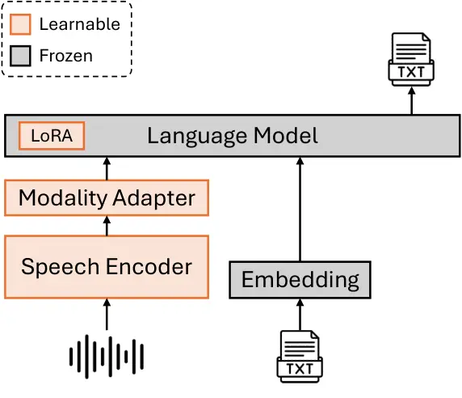

Figure 2: Model architecture. Only a pair of speech and text are
depicted for simplicity, but the input can contain multiple segments of
speech and text in any order.

(a) Generate speech-based QA data by prompting LLM.

(b) Generate mixed-modal SFT data with TTS.

Figure 3: Different types of SFT data are generated for training.

## 3 Proposed Method

### 3.1 Model Architecture

Figure 2 shows the overall architecture of our VTBlender, consisting of
three components: a speech encoder to extract continuous features from
raw speech input, a modality adapter to map speech features into a
shared embedding space with text, and a language model to generate text
responses conditioned on the input. Similar architectures have been
commonly used in prior works Chen et al. (2024); Das et al. (2024). The
speech encoder is initialized from a pre-trained Canary encoder Puvvada
et al. (2024). The LM has undergone text SFT to improve
instruction-following capabilities (see Section 4.1 for more details).
The modality adapter consists of randomly initialized Conformer
layers Gulati et al. (2020). During training, both the speech encoder
and modality adapter are fully fine-tuned, whereas the LM is partially
fine-tuned with LoRA adapters Hu et al. (2022).

Let $`S`$ and $`X`$ be the input speech waveform and text tokens,
respectively. They are mapped into a shared embedding space as follows:

```math
\displaystyle\mathbf{S}^{\text{enc}} \displaystyle=\text{Enc}(S)\quad\in\mathbb{R}^{T\times D}, \tag{1}
```

```math
\displaystyle\mathbf{S}^{\text{adp}} \displaystyle=\text{Adp}(\mathbf{S}^{\text{enc}})\quad\in\mathbb{R}^{T^{\prime}\times D^{\prime}}, \tag{2}
```

```math
\displaystyle\mathbf{X}^{\text{emb}} \displaystyle=\text{Emb}(X)\quad\in\mathbb{R}^{L\times D^{\prime}}, \tag{3}
```

where $`\mathbf{S}^{\text{enc}}`$ is the output of the speech encoder
with length $`T`$ and feature size $`D`$. $`\mathbf{S}^{\text{adp}}`$ is
the speech feature sequence after the modality adapter with length
$`T^{\prime}`$ and size $`D^{\prime}`$. $`\mathbf{X}^{\text{emb}}`$ is
the text feature sequence after the LM embedding layer with length $`L`$
and feature size $`D^{\prime}`$. Then, the speech and text features are
concatenated and fed into the LM to generate the output text $`Y`$:

```math
\displaystyle\mathbf{X}^{\text{inp}} \displaystyle=\text{Cat}(\mathbf{S}^{\text{adp}},\mathbf{X}^{\text{emb}})~~\in\mathbb{R}^{(T^{\prime}+L)\times D^{\prime}}, \tag{4}
```

```math
\displaystyle Y \displaystyle=\text{LM}(\mathbf{X}^{\text{inp}}), \tag{5}
```

where $`\mathbf{X}^{\text{inp}}`$ combines both speech and text features
and follows the chat template of the pre-trained LM. While only a pair
of speech and text are depicted for simplicity, our framework is
designed to accommodate any combination of speech and text inputs. For
each user turn, the input may consist of speech alone, text alone, or a
combination of both.

During training, we minimize the following loss:

```math
\displaystyle\mathcal{L}=-\log P(Y\mid S,X;\Theta), \tag{6}
```

where $`\Theta`$ is the set of learnable parameters, including the
speech encoder, modality adapter, and LoRA adapter.

### 3.2 Joint Speech-Text SFT

To preserve the original text capabilities while adding new capabilities
of speech understanding, we propose joint speech-text SFT, which mixes
text-only SFT data with three types of speech-related SFT data during
training. Our training process is single-stage, with different data
types sampled at specific probabilities when creating mini-batches.

Specifically, the text-only SFT data consists of multi-turn
conversations, commonly used to enhance the instruction-following
abilities of LLMs in the “post-training” stage. For speech-related SFT,
we employ three types of data to address various use cases and improve
the model’s performance with mixed-modal inputs, which will be discussed
in the following three sections. Note that the text-only SFT dataset has
multiple turns, whereas all the speech-related SFT datasets have only
one turn. Through joint SFT, our model can generalize to multi-turn
mixed-modal conversations (see Section 4.4 and Figure 1).

#### 3.2.1 Multilingual ASR and AST

ASR and AST are foundational tasks that enable the model to understand
speech, where each input includes speech and a text instruction
describing the task. During training, the same instruction is used for
all samples within a specific task and language. However, we observe
that our model is capable of understanding and following unseen
instructions for ASR and AST tasks (see Section 4.4.2).

#### 3.2.2 Speech-based QA from ASR Data

To enable general QA capabilities about speech, we create speech-based
QA data from English ASR data by prompting a pre-trained LLM. As shown
in Figure 3(a), we provide the transcript to an LLM⁴⁴ 4
[https://huggingface.co/google/gemma-2-27b-it](https://huggingface.co/google/gemma-2-27b-it)
and prompt it to generate a question-answer pair based on the provided
context. During training, the text question and corresponding speech
context are given as input, while the model is trained to predict the
text answer. This approach has been used in prior studies Tang et al.
(2024); Gong et al. (2024); Noroozi et al. (2024), but we scale it up to
20k hours of audio.

The SQA data includes large volumes of real audio from diverse acoustic
environments, helping mitigate overfitting. However, its limitation lies
in the restricted diversity of generated questions, which are less
varied than general-purpose instructions, and the answers tend to be
short and simple. Additionally, the input always consists of a speech
context and a text question, so the model often struggles with spoken
instructions or interleaving speech-text inputs. For example,
SALMONN Tang et al. (2024) is trained on SQA-style data. When we input a
pure spoken instruction into the model, it tends to disregard the
instruction and performs ASR instead.

#### 3.2.3 Mixed-Modal SFT Data with TTS

To overcome the limitations of SQA data and enable more flexible
mixed-modal input, we create another type of data containing mixed-modal
interleaving speech-text inputs. Specifically, our mixed-modal SFT data
is generated by applying TTS to existing single-turn text SFT data, as
illustrated in Figure 3(b). For each text SFT sample, we randomly select
a subset of consecutive sentences from the user turn and replace them
with synthesized audio. This mixed-modal input is then used for
training, resulting in each user input containing one speech segment
that may appear at the beginning, middle, or end. If all sentences are
replaced by audio, the user input is pure speech without text.

This data has more flexible input formats than SQA, making speech and
text inputs interchangeable. Instructions can now be conveyed through
speech rather than being limited to text. Additionally, text SFT data
typically covers more diverse instructions, and the responses maintain
high-quality language and style. This contributes to the overall quality
of our generated mixed-modal data. However, a potential limitation of
this data type is that the audio is synthetic, reflecting only the
limited acoustic conditions provided by the TTS model.⁵⁵ 5 For
simplicity, this work uses a single TTS model. Future work can explore
multiple TTS models with diverse speakers and emotions to enhance
robustness.

| Task            | Dataset       | \#Samples | \#Hours | Sampling Ratio |
| --------------- | ------------- | --------- | ------- | -------------- |
| Text-only SFT   | Nemotron      | 94.0k     | N/A     | 0.1500         |
| ASR, AST        | Canary        | 32.8M     | 85k     | 0.7556         |
| Speech-based QA | Canary Subset | 4.1M      | 20k     | 0.0378         |
| Mixed-modal SFT | Alpaca        | 55.3k     | 85      | 0.0189         |
|                 | Magpie        | 254.5k    | 461     | 0.0378         |

Table 1: Statistics of our training data mixture. When creating
mini-batches, different types of data are sampled according to the ratio
shown in the last column.

[TABLE]

Table 2: Summary of our evaluation datasets.

|                    |                        |       |       |       |                        |      |      |                        |      |      |                              |        |      |                     |                   |        |        |        |
| ------------------ | ---------------------- | ----- | ----- | ----- | ---------------------- | ---- | ---- | ---------------------- | ---- | ---- | ---------------------------- | ------ | ---- | ------------------- | ----------------- | ------ | ------ | ------ |
| Model              | ASR WER $`\downarrow`$ |       |       |       | En-X BLEU $`\uparrow`$ |      |      | X-En BLEU $`\uparrow`$ |      |      | Speech-based QA $`\uparrow`$ |        |      | Speech $`\uparrow`$ | Text $`\uparrow`$ |        |        |        |
|                    | En                     | De    | Es    | Fr    | De                     | Es   | Fr   | De                     | Es   | Fr   | SPGI                         | SQuAD2 | AIR. | IFEval              | GSM8K             | IFEval | BBH    | MMLU   |
| Prior studies      |                        |       |       |       |                        |      |      |                        |      |      |                              |        |      |                     |                   |        |        |        |
| Whisper-v3 1.5B    | 9.92                   | 6.17  | 4.94  | 11.18 | N/A                    |      |      | 33.4                   | 22.7 | 33.7 | N/A                          |        |      |                     |                   |        |        |        |
| SALMONN 7B         | 20.84                  | 40.83 | 37.47 | 36.78 | 18.0                   | 17.1 | 27.8 | 5.1                    | 7.1  | 3.3  | 0.778                        | 0.597  | \-   | 0.147               | \-                | \-     | \-     | \-     |
| SALMONN 13B        | 17.07                  | 44.08 | 28.47 | 38.52 | 19.0                   | 18.5 | 29.1 | 6.5                    | 3.6  | 3.8  | 0.778                        | 0.604  | 6.16 | 0.113               | \-                | \-     | \-     | \-     |
| Qwen2-Audio 7B^(†) | 8.78                   | 7.67  | 5.65  | 9.49  | 24.8                   | 18.9 | 27.7 | 30.7                   | 22.2 | 29.6 | 0.810                        | 0.656  | 7.24 | 0.140               | \-                | \-     | \-     | \-     |
| Text-only baseline |                        |       |       |       |                        |      |      |                        |      |      |                              |        |      |                     |                   |        |        |        |
| Gemma 2.5B         | N/A                    |       |       |       |                        |      |      |                        |      |      |                              |        |      |                     | 0.2479            | 0.2089 | 0.3324 | 0.3554 |
| Ours               |                        |       |       |       |                        |      |      |                        |      |      |                              |        |      |                     |                   |        |        |        |
| VTBlender 3B       | 7.90                   | 5.53  | 4.52  | 7.09  | 29.6                   | 22.5 | 38.6 | 36.3                   | 25.6 | 33.8 | 0.828                        | 0.684  | 6.31 | 0.191               | 0.2358            | 0.2237 | 0.3003 | 0.3484 |

Table 3: Comparison of our method against prior studies. ^(†)Qwen2-Audio
has two versions: base and instruct models. The instruct model often
generates additional text for ASR and AST, leading to much worse
performance. Hence, we follow their official evaluation script to use
the base model for ASR and AST, and the instruct model for others.

## 4 Experiments

### 4.1 Experimental Setups

Training data. Table 1 shows the statistics of our training data
mixture. Our text-only SFT data is from Nemotron’s training data Adler
et al. (2024), which consists of multi-turn conversations. During
training, the loss is computed only on model turns but not on user
turns. The ASR and AST datasets are the same as the training data of
Canary Puvvada et al. (2024). ASR has four languages: En, De, Es, and
Fr. AST has six language pairs: X-En and En-X, where X is any of De, Es,
or Fr. For ASR, the text instruction is: “Transcribe the content to
\[language\], with punctuations and capitalizations.” For AST, the
instruction is: “Translate the \[source language\] content to \[target
language\], with punctuations and capitalizations.” The SQA data is
synthesized using a subset of ASR data (20k hours in total) by prompting
gemma-2-27b-it (see Section 3.2.2). The prompt template is provided in
Appendix A. Lastly, we use a TTS model⁶⁶ 6
[https://catalog.ngc.nvidia.com/orgs/nvidia/teams/nemo/models/tts_en_multispeaker_fastpitchhifigan](https://catalog.ngc.nvidia.com/orgs/nvidia/teams/nemo/models/tts_en_multispeaker_fastpitchhifigan)
to synthesize mixed-modal SFT data on two public single-turn text SFT
datasets, Alpaca Taori et al. (2023) and Magpie Xu et al. (2024)⁷⁷ 7
[https://huggingface.co/datasets/Magpie-Align/Magpie-Gemma2-Pro-200K-Filtered](https://huggingface.co/datasets/Magpie-Align/Magpie-Gemma2-Pro-200K-Filtered).

Model configs. Our speech encoder is the pre-trained Canary encoder⁸⁸ 8
[https://huggingface.co/nvidia/canary-1b](https://huggingface.co/nvidia/canary-1b)
with 609M parameters. The modality adapter has 52M parameters and
consists of two Conformer layers with hidden size 1024. No subsampling
is applied after the speech encoder, resulting in a time resolution of
80 ms for the speech features. For LLM, we use Gemma with 2.5B
parameters Mesnard et al. (2024). We begin with the base LLM and perform
text-only SFT using our dataset, following Gemma’s chat template (see
Appendix D). This instruction-tuned LM is then used to initialize our
VTBlender.⁹⁹ 9 We do not use the official chat models, as we lack access
to their SFT data, which makes it challenging to compare performance
after applying joint SFT. The LoRA adapter of the LM has a rank of 32
and 36M parameters. It is applied to the linear layers in self-attention
and feed-forward networks.

Training configs. Our model is implemented using the NeMo
toolkit Kuchaiev et al. (2019) based on PyTorch Paszke et al. (2019).
The multimodal data loading is based on Lhotse Zelasko et al. (2021);
Żelasko et al. (2024). We use the Adam optimizer Kingma and Ba (2015)
with a peak learning rate of $`1e-4`$ and a cosine-annealing schedule.
The weight decay is $`1e-3`$. The model is trained for 100k steps; the
first $`2500`$ steps are the warmup stage. The final checkpoint is used
for evaluation. We use 64 NVIDIA A100 GPUs (80GB) for training. The
batch size per device is $`4`$ for speech-related SFT data and $`1`$ for
text-only SFT data. The total training time is 20 hours.

|                    |                        |      |      |      |                        |      |      |                        |      |      |                              |        |      |                     |                   |        |        |        |
| ------------------ | ---------------------- | ---- | ---- | ---- | ---------------------- | ---- | ---- | ---------------------- | ---- | ---- | ---------------------------- | ------ | ---- | ------------------- | ----------------- | ------ | ------ | ------ |
| Model              | ASR WER $`\downarrow`$ |      |      |      | En-X BLEU $`\uparrow`$ |      |      | X-En BLEU $`\uparrow`$ |      |      | Speech-based QA $`\uparrow`$ |        |      | Speech $`\uparrow`$ | Text $`\uparrow`$ |        |        |        |
|                    | En                     | De   | Es   | Fr   | De                     | Es   | Fr   | De                     | Es   | Fr   | SPGI                         | SQuAD2 | AIR. | IFEval              | GSM8K             | IFEval | BBH    | MMLU   |
| Text-only baseline |                        |      |      |      |                        |      |      |                        |      |      |                              |        |      |                     |                   |        |        |        |
| Gemma 2.5B         | N/A                    |      |      |      |                        |      |      |                        |      |      |                              |        |      |                     | 0.2479            | 0.2089 | 0.3324 | 0.3554 |
| Ours               |                        |      |      |      |                        |      |      |                        |      |      |                              |        |      |                     |                   |        |        |        |
| VTBlender 3B       | 7.90                   | 5.53 | 4.52 | 7.09 | 29.6                   | 22.5 | 38.6 | 36.3                   | 25.6 | 33.8 | 0.828                        | 0.684  | 6.31 | 0.191               | 0.2358            | 0.2237 | 0.3003 | 0.3484 |
| B1                 | 7.83                   | 5.50 | 4.36 | 7.11 | 30.6                   | 22.6 | 38.9 | 36.3                   | 24.9 | 33.7 | 0.828                        | 0.687  | 6.26 | 0.181               | 0.0243            | 0.1294 | 0.0023 | 0.2457 |
| B2                 | 9.96                   | 8.77 | 7.03 | 9.49 | 21.5                   | 18.3 | 29.3 | 31.3                   | 21.9 | 29.3 | 0.028                        | 0.121  | 3.22 | 0.150               | 0.2479            | 0.2089 | 0.3324 | 0.3554 |
| B3                 | 8.92                   | 6.67 | 5.39 | 7.97 | 26.3                   | 20.5 | 34.4 | 34.5                   | 23.2 | 31.4 | 0.666                        | 0.529  | 5.29 | 0.135               | 0.0675            | 0.1867 | 0.2622 | 0.2586 |

Table 4: Ablation studies. Our VTBlender uses single-stage joint SFT
where the LM is partially updated with LoRA. “B1” is trained with
speech-only SFT. “B2” uses a frozen LM with speech-only SFT. “B3” is
trained in two stages with speech-only SFT, where the first stage
freezes the LM and the second stage updates the LM with LoRA.

Evaluation setups. Greedy decoding is performed for inference. Table 2
summarizes the five types of evaluation tasks and their metrics. For ASR
and AST, we use standard multilingual benchmarks, namely Common
Voice Ardila et al. (2020) and FLEURS Conneau et al. (2022). We
normalize the text using Whisper’s normalizers Radford et al. (2023)
before computing the Word Error Rate (WER). For SQA, we create data from
three sources and evaluate the quality of responses with OpenAI’s GPT-4
API (see Appendix B). The first SQA test set consists of real audio
recordings from SPGISpeech ASR data O’Neill et al. (2021) and synthetic
text questions and answers from Nemotron-4 340B Adler et al. (2024). The
second SQA test set is a spoken version of a widely used text QA
benchmark, SQuAD 2.0 Rajpurkar et al. (2018), synthesized by NeMo
FastPitch TTS¹⁰¹⁰ 10
[https://catalog.ngc.nvidia.com/orgs/nvidia/teams/nemo/models/tts_en_multispeaker_fastpitchhifigan](https://catalog.ngc.nvidia.com/orgs/nvidia/teams/nemo/models/tts_en_multispeaker_fastpitchhifigan).
The third test set is the “Speech Chat” subset from a public benchmark,
AIR-Bench Yang et al. (2024). These three SQA test sets span diverse
acoustic conditions across various domains, offering a comprehensive
evaluation of our models. To assess spoken instruction-following
capabilities, we synthesize a spoken IFEval dataset from the original
text-based IFEval Zhou et al. (2023) using the aforementioned NeMo
FastPitch model. Unlike SQA tasks, where the input consists of both an
audio context and a text question, this task features speech-only user
input. Finally, we select four text-only benchmarks to evaluate
text-based performance: GSM8K for mathematical reasoning Cobbe et al.
(2021), IFEval for instruction following Zhou et al. (2023), BBH for
complex reasoning Suzgun et al. (2023), and MMLU for multi-task
knowledge assessment Hendrycks et al. (2021). We use
lm-evaluation-harness for text-only evaluation.¹¹¹¹ 11
[https://github.com/EleutherAI/lm-evaluation-harness](https://github.com/EleutherAI/lm-evaluation-harness)

### 4.2 Main Results

Table 3 compares our VTBlender 3B against previous models that are
publicly available:

- •
  Whisper-large-v3 Radford et al. (2023) is trained on 5 million hours
  of speech data for ASR and X-En AST.
- •
  SALMONN Tang et al. (2024) is trained on a few thousand hours of audio
  SFT data covering diverse audio tasks.
- •
  Qwen2-Audio Chu et al. (2024) is pre-trained on 520k hours of general
  audio data (including 370k hours of speech) and then post-trained with
  SFT and reinforcement learning. It is one of the state-of-the-art
  SpeechLMs, but the details of its training data have not been publicly
  released.

For ASR and AST, our VTBlender 3B achieves the best results among the
evaluated models. In speech-based QA, our model outperforms others on
SPGI and SQuAD 2.0, demonstrating its strong ability to recognize and
comprehend speech. AIR-Bench, however, contains questions about speech
attributes beyond linguistic content, such as emotion, speaker identity,
and gender. While SALMONN and Qwen2-Audio explicitly incorporate such
data in their training, our VTBlender does not utilize specialized data
for these attributes. Consequently, VTBlender 3B falls behind
Qwen2-Audio 7B in this domain, although it still outperforms SALMONN
13B.

Our VTBlender 3B also outperforms other 7B or 13B models on Spoken
IFEval, showing that it better follows spoken instructions.

Compared to the Gemma LM from which our model is initialized, our model
shows comparable results on text-only benchmarks, indicating that it
successfully preserves the original text capabilities.

### 4.3 Ablation Studies

Our VTBlender is trained with single-stage joint speech-text SFT in
which the LM is updated with LoRA adapters. To investigate the impact of
these strategies, we conduct three ablation studies and present our
results in Table 4.

Joint SFT vs. speech-only SFT. B1 is the same model trained exclusively
on speech-related SFT data, without incorporating text-only data. When
compared to our VTBlender 3B, B1 achieves similar performance on speech
tasks but performs significantly worse on text-only benchmarks. On GSM8K
and BBH, B1’s performance is nearly zero, and on MMLU, it approaches
random chance (25%) given the four-choice format of the questions. This
highlights that using LoRA alone does not prevent catastrophic
forgetting of the model’s original text capabilities. By incorporating
both text and speech SFT data, our model preserves its original text
performance while excelling on speech tasks.

LoRA vs. frozen LM. Our VTBlender 3B updates the LM using LoRA adapters.
As discussed in Section 2, a common strategy for preserving text-only
performance is to freeze the LM. To compare, we froze the LM backbone
and trained another model, B2, on all speech-related SFT data—excluding
text-only data, since the LM remains unchanged. B2 performs
significantly worse than our VTBlender in all speech benchmarks,
indicating that the model struggles to understand speech inputs unless
the LM itself is also adapted to speech.

Two-stage vs. single-stage training. Previous results of B1 and B2
indicate that freezing the LM negatively impacts speech performance,
while updating the LM with LoRA from the beginning leads to a loss of
text performance. Then, a natural alternative is to use a two-stage
training process with speech SFT data. In the first stage, the LM is
frozen, and the remaining components are trained for 100k steps. In the
second stage, the LM is updated with LoRA for an additional 15k steps.
This model is referred to as B3. Compared to B2 (with a frozen LM), B3
shows much better performance on most speech tasks. However, B3 still
experiences significant degradation on text-only evaluations. On GSM8K,
its performance is nearly zero, and on MMLU, it approaches random
chance. These results demonstrate that LoRA alone is insufficient to
preserve text-only performance, even when the model is updated for a
limited number of steps.

Our ablation studies demonstrate that the proposed joint speech-text SFT
is essential for preserving text-only performance while delivering
strong results on speech tasks.

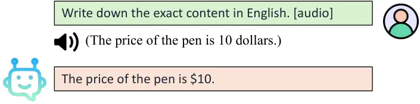

(a) ASR with unseen prompt.

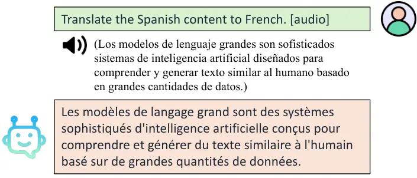

(b) AST between unseen language pairs.

Figure 4: Generalization to unseen instructions.

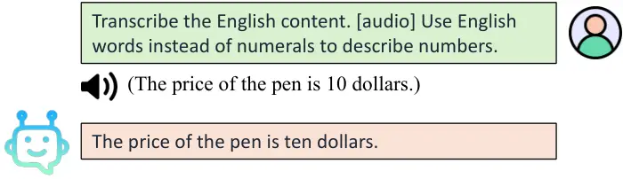

(a) ASR with text normalization.

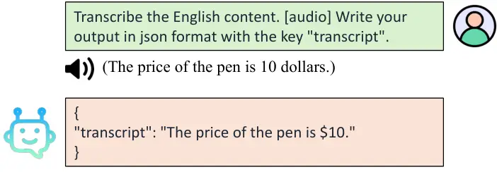

(b) ASR in json format.

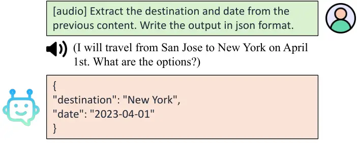

(c) Slot filling in json format.

Figure 5: Output style and format can be controlled.

### 4.4 Demonstrations

This section provides examples to demonstrate the various capabilities
of our proposed VTBlender 3B.

#### 4.4.1 Standard Speech Tasks

Figure 6 in Section E.1 shows that our model performs well for ASR, AST,
and SQA tasks.

#### 4.4.2 Generalization to Unseen Conditions

Multi-turn mixed-modal chat. As introduced in Section 3.2, our text-only
SFT data has multiple turns, whereas the speech-related data has only
one turn. Through joint SFT, our model can generalize to multi-turn
mixed-modal chat (see Figure 1).

ASR w/ unseen prompt. As described in Section 3.2.1 and Section 4.1, the
ASR instruction is fixed during training using the verb “transcribe”. In
Figure 4(a), our model understands a different verb phrase “write down”
and performs ASR correctly.

AST in unseen direction. Our AST training data consists of X-En and En-X
directions where X is one of De, Es, and Fr, but the model can also
perform other directions like Es-Fr as shown in Figure 4(b).

Controlling output format. Figure 5 shows three examples where we can
specify the output text style or format, which can benefit downstream
tasks. It works for different speech tasks like ASR or SQA. This
demonstrates that our VTBlender achieves good instruction-following
capabilities based on mixed-modal input.

Section E.2 presents examples of other tasks, including contextual
biasing ASR, math/coding based on information provided in both speech
and text inputs, and SQA based on multi-speaker audio despite being
trained on single-speaker data only.

## 5 Conclusion

We propose a novel single-stage joint speech-text SFT approach for
training SpeechLMs using LoRA adapters. This method simplifies the
training process, preserves the text-only performance of the LLM
backbone, and achieves excellent speech understanding capabilities.
Specifically, we combine multi-turn text-only SFT data with single-turn
speech-related SFT data during training. To extend beyond speech-based
QA tasks, we propose a novel data generation method that can create
mixed-modal interleaving speech-text inputs. Our model achieves
excellent performance across various speech benchmarks while retaining
performance on text-only benchmarks. Our 3B model even outperforms
previous 7B or 13B SpeechLMs on most evaluated benchmarks. Furthermore,
our model exhibits emergent capabilities in handling previously unseen
instructions and multi-turn mixed-modal conversations. We will publicly
release our codebase and pre-trained models to advance research in
SpeechLMs.

## Limitations

We primarily employ small-sized LMs with a few billion parameters. While
our model demonstrates strong performance across various benchmarks, its
overall capacity may be constrained compared to larger models,
particularly in terms of world knowledge and complex reasoning
abilities.

Our training data and tasks are also limited. The training data focuses
on linguistic content and does not encompass specialized speech tasks,
such as spoken language understanding, speaker recognition or
verification, multi-speaker ASR, or speech enhancement. This restricts
the applicability of the current model to certain use cases.
Furthermore, our efforts are concentrated on human speech, without
addressing general audio processing.

The text pre-training data of Gemma is not publicly released, which
might raise concerns. Due to license issues, some of the speech training
data cannot be directly released. Instead, we provide statistics about
those data and describe the details about our training procedure. For
SQA and mixed-modal SFT, we plan to release the data generation scripts.

We introduce speech capabilities at the SFT stage without involving
pre-training. Additionally, we do not utilize reinforcement learning
from human feedback (RLHF), which may result in hallucinations or
unexpected behavior in the model’s output. Therefore, it is important to
exercise caution and thoroughly verify the output when using this model.

## Broader Impacts and Ethics

We adhere to the ACL ethics policy and there is no violation of privacy
in the experiments. We plan to publicly release the data generation
scripts, training code, and pre-trained model weights, which can benefit
a broader audience within the research community.

## References

- Adler et al. (2024) Bo Adler, Niket Agarwal, Ashwath Aithal, Dong H
  Anh, Pallab Bhattacharya, Annika Brundyn, Jared Casper, Bryan
  Catanzaro, Sharon Clay, Jonathan Cohen, et al. 2024. Nemotron-4 340b
  technical report. _arXiv preprint arXiv:2406.11704_.
- Ardila et al. (2020) Rosana Ardila, Megan Branson, Kelly Davis,
  Michael Kohler, Josh Meyer, Michael Henretty, Reuben Morais, Lindsay
  Saunders, Francis M. Tyers, and Gregor Weber. 2020. [Common voice: A
  massively-multilingual speech
  corpus](https://aclanthology.org/2020.lrec-1.520/). In _Proceedings of
  The 12th Language Resources and Evaluation Conference, LREC 2020,
  Marseille, France, May 11-16, 2020_, pages 4218–4222. European
  Language Resources Association.
- Borsos et al. (2023) Zalán Borsos, Raphaël Marinier, Damien Vincent,
  Eugene Kharitonov, Olivier Pietquin, Matthew Sharifi, Dominik Roblek,
  Olivier Teboul, David Grangier, Marco Tagliasacchi, and Neil
  Zeghidour. 2023. [Audiolm: A language modeling approach to audio
  generation](https://doi.org/10.1109/TASLP.2023.3288409). _IEEE ACM
  Trans. Audio Speech Lang. Process._, 31:2523–2533.
- Chen et al. (2022) Sanyuan Chen, Chengyi Wang, Zhengyang Chen, Yu Wu,
  Shujie Liu, Zhuo Chen, Jinyu Li, Naoyuki Kanda, Takuya Yoshioka, Xiong
  Xiao, Jian Wu, Long Zhou, Shuo Ren, Yanmin Qian, Yao Qian, Jian Wu,
  Michael Zeng, Xiangzhan Yu, and Furu Wei. 2022. [Wavlm: Large-scale
  self-supervised pre-training for full stack speech
  processing](https://doi.org/10.1109/JSTSP.2022.3188113). _IEEE J. Sel.
  Top. Signal Process._, 16(6):1505–1518.
- Chen et al. (2024) Zhehuai Chen, He Huang, Andrei Andrusenko, Oleksii
  Hrinchuk, Krishna C. Puvvada, Jason Li, Subhankar Ghosh, Jagadeesh
  Balam, and Boris Ginsburg. 2024. [SALM: Speech-Augmented Language
  Model with in-Context Learning for Speech Recognition and
  Translation](https://doi.org/10.1109/ICASSP48485.2024.10447553). In
  _IEEE International Conference on Acoustics, Speech and Signal
  Processing, ICASSP 2024, Seoul, Republic of Korea, April 14-19, 2024_,
  pages 13521–13525. IEEE.
- Chu et al. (2024) Yunfei Chu, Jin Xu, Qian Yang, Haojie Wei, Xipin
  Wei, Zhifang Guo, Yichong Leng, Yuanjun Lv, Jinzheng He, Junyang Lin,
  et al. 2024. Qwen2-audio technical report. _arXiv preprint
  arXiv:2407.10759_.
- Cieri et al. (2004) Christopher Cieri, David Miller, and Kevin
  Walker. 2004. [The fisher corpus: a resource for the next generations
  of
  speech-to-text](http://www.lrec-conf.org/proceedings/lrec2004/summaries/767.htm).
  In _Proceedings of the Fourth International Conference on Language
  Resources and Evaluation, LREC 2004, May 26-28, 2004, Lisbon,
  Portugal_. European Language Resources Association.
- Cobbe et al. (2021) Karl Cobbe, Vineet Kosaraju, Mohammad Bavarian,
  Mark Chen, Heewoo Jun, Lukasz Kaiser, Matthias Plappert, Jerry Tworek,
  Jacob Hilton, Reiichiro Nakano, et al. 2021. Training verifiers to
  solve math word problems. _arXiv preprint arXiv:2110.14168_.
- Conneau et al. (2022) Alexis Conneau, Min Ma, Simran Khanuja,
  Yu Zhang, Vera Axelrod, Siddharth Dalmia, Jason Riesa, Clara Rivera,
  and Ankur Bapna. 2022. [FLEURS: few-shot learning evaluation of
  universal representations of
  speech](https://doi.org/10.1109/SLT54892.2023.10023141). In _IEEE
  Spoken Language Technology Workshop, SLT 2022, Doha, Qatar, January
  9-12, 2023_, pages 798–805. IEEE.
- Das et al. (2024) Nilaksh Das, Saket Dingliwal, Srikanth Ronanki,
  Rohit Paturi, Zhaocheng Huang, Prashant Mathur, Jie Yuan, Dhanush
  Bekal, Xing Niu, Sai Muralidhar Jayanthi, Xilai Li, Karel Mundnich,
  Monica Sunkara, Sundararajan Srinivasan, Kyu J. Han, and Katrin
  Kirchhoff. 2024. [Speechverse: A large-scale generalizable audio
  language model](https://doi.org/10.48550/ARXIV.2405.08295). _CoRR_,
  abs/2405.08295.
- Dubey et al. (2024) Abhimanyu Dubey, Abhinav Jauhri, Abhinav Pandey,
  Abhishek Kadian, Ahmad Al-Dahle, Aiesha Letman, Akhil Mathur, Alan
  Schelten, Amy Yang, Angela Fan, et al. 2024. The llama 3 herd of
  models. _arXiv preprint arXiv:2407.21783_.
- Díaz-Munío et al. (2021) Gonçal V. Garcés Díaz-Munío, Joan-Albert
  Silvestre-Cerdà, Javier Jorge, Adrià Giménez Pastor, Javier
  Iranzo-Sánchez, Pau Baquero-Arnal, Nahuel Roselló, Alejandro
  Pérez-González de Martos, Jorge Civera, Albert Sanchis, and Alfons
  Juan. 2021. [Europarl-ASR: A Large Corpus of Parliamentary Debates for
  Streaming ASR Benchmarking and Speech Data
  Filtering/Verbatimization](https://doi.org/10.21437/Interspeech.2021-1905).
  In _Proc. Interspeech 2021_, pages 3695–3699.
- Fathullah et al. (2024) Yassir Fathullah, Chunyang Wu, Egor Lakomkin,
  Ke Li, Junteng Jia, Yuan Shangguan, Jay Mahadeokar, Ozlem Kalinli,
  Christian Fuegen, and Mike Seltzer. 2024. [AudioChatLlama: Towards
  general-purpose speech abilities for
  LLMs](https://doi.org/10.18653/v1/2024.naacl-long.309). In
  _Proceedings of the 2024 Conference of the North American Chapter of
  the Association for Computational Linguistics: Human Language
  Technologies (Volume 1: Long Papers)_, pages 5522–5532, Mexico City,
  Mexico. Association for Computational Linguistics.
- Galvez et al. (2021) Daniel Galvez, Greg Diamos, Juan Torres, Keith
  Achorn, Juan Felipe Cerón, Anjali Gopi, David Kanter, Max Lam, Mark
  Mazumder, and Vijay Janapa Reddi. 2021. [The people’s speech: A
  large-scale diverse english speech recognition dataset for commercial
  usage](https://datasets-benchmarks-proceedings.neurips.cc/paper/2021/hash/202cb962ac59075b964b07152d234b70-Abstract-round1.html).
  In _Proceedings of the Neural Information Processing Systems Track on
  Datasets and Benchmarks 1, NeurIPS Datasets and Benchmarks 2021,
  December 2021, virtual_.
- Godfrey et al. (1992) John J. Godfrey, Edward Holliman, and Jane
  McDaniel. 1992. [SWITCHBOARD: telephone speech corpus for research and
  development](https://doi.org/10.1109/ICASSP.1992.225858). In _1992
  IEEE International Conference on Acoustics, Speech, and Signal
  Processing, ICASSP ’92, San Francisco, California, USA, March 23-26,
  1992_, pages 517–520. IEEE Computer Society.
- Gong et al. (2024) Yuan Gong, Hongyin Luo, Alexander H. Liu, Leonid
  Karlinsky, and James R. Glass. 2024. [Listen, think, and
  understand](https://openreview.net/forum?id=nBZBPXdJlC). In _The
  Twelfth International Conference on Learning Representations, ICLR
  2024, Vienna, Austria, May 7-11, 2024_. OpenReview.net.
- Gulati et al. (2020) Anmol Gulati, James Qin, Chung-Cheng Chiu, Niki
  Parmar, Yu Zhang, Jiahui Yu, Wei Han, Shibo Wang, Zhengdong Zhang,
  Yonghui Wu, and Ruoming Pang. 2020. [Conformer: Convolution-augmented
  transformer for speech
  recognition](https://doi.org/10.21437/INTERSPEECH.2020-3015). In _21st
  Annual Conference of the International Speech Communication
  Association, Interspeech 2020, Virtual Event, Shanghai, China, October
  25-29, 2020_, pages 5036–5040. ISCA.
- Hendrycks et al. (2021) Dan Hendrycks, Collin Burns, Steven Basart,
  Andy Zou, Mantas Mazeika, Dawn Song, and Jacob Steinhardt. 2021.
  [Measuring massive multitask language
  understanding](https://openreview.net/forum?id=d7KBjmI3GmQ). In _9th
  International Conference on Learning Representations, ICLR 2021,
  Virtual Event, Austria, May 3-7, 2021_. OpenReview.net.
- Hsu et al. (2021) Wei-Ning Hsu, Benjamin Bolte, Yao-Hung Hubert Tsai,
  Kushal Lakhotia, Ruslan Salakhutdinov, and Abdelrahman Mohamed. 2021.
  [Hubert: Self-supervised speech representation learning by masked
  prediction of hidden
  units](https://doi.org/10.1109/TASLP.2021.3122291). _IEEE ACM Trans.
  Audio Speech Lang. Process._, 29:3451–3460.
- Hu et al. (2022) Edward J. Hu, Yelong Shen, Phillip Wallis, Zeyuan
  Allen-Zhu, Yuanzhi Li, Shean Wang, Lu Wang, and Weizhu Chen. 2022.
  [Lora: Low-rank adaptation of large language
  models](https://openreview.net/forum?id=nZeVKeeFYf9). In _The Tenth
  International Conference on Learning Representations, ICLR 2022,
  Virtual Event, April 25-29, 2022_. OpenReview.net.
- Kingma and Ba (2015) Diederik P. Kingma and Jimmy Ba. 2015. [Adam: A
  method for stochastic optimization](http://arxiv.org/abs/1412.6980).
  In _3rd International Conference on Learning Representations, ICLR
  2015, San Diego, CA, USA, May 7-9, 2015, Conference Track
  Proceedings_.
- Kuchaiev et al. (2019) Oleksii Kuchaiev, Jason Li, Huyen Nguyen,
  Oleksii Hrinchuk, Ryan Leary, Boris Ginsburg, Samuel Kriman, Stanislav
  Beliaev, Vitaly Lavrukhin, Jack Cook, Patrice Castonguay, Mariya
  Popova, Jocelyn Huang, and Jonathan M. Cohen. 2019. [Nemo: a toolkit
  for building AI applications using neural
  modules](https://arxiv.org/abs/1909.09577). _CoRR_, abs/1909.09577.
- Lakhotia et al. (2021) Kushal Lakhotia, Eugene Kharitonov, Wei-Ning
  Hsu, Yossi Adi, Adam Polyak, Benjamin Bolte, Tu-Anh Nguyen, Jade
  Copet, Alexei Baevski, Abdelrahman Mohamed, and Emmanuel Dupoux. 2021.
  [On generative spoken language modeling from raw
  audio](https://doi.org/10.1162/tacl_a_00430). _Transactions of the
  Association for Computational Linguistics_, 9:1336–1354.
- Lin et al. (2024) Ji Lin, Hongxu Yin, Wei Ping, Pavlo Molchanov,
  Mohammad Shoeybi, and Song Han. 2024. [VILA: on pre-training for
  visual language models](https://doi.org/10.1109/CVPR52733.2024.02520).
  In _IEEE/CVF Conference on Computer Vision and Pattern Recognition,
  CVPR 2024, Seattle, WA, USA, June 16-22, 2024_, pages 26679–26689.
  IEEE.
- Maiti et al. (2024) Soumi Maiti, Yifan Peng, Shukjae Choi, Jee-Weon
  Jung, Xuankai Chang, and Shinji Watanabe. 2024. [Voxtlm: Unified
  decoder-only models for consolidating speech recognition, synthesis
  and speech, text continuation
  tasks](https://doi.org/10.1109/ICASSP48485.2024.10447112). In _IEEE
  International Conference on Acoustics, Speech and Signal Processing,
  ICASSP 2024, Seoul, Republic of Korea, April 14-19, 2024_, pages
  13326–13330. IEEE.
- Mesnard et al. (2024) Thomas Mesnard, Cassidy Hardin, Robert Dadashi,
  Surya Bhupatiraju, Shreya Pathak, Laurent Sifre, Morgane Rivière,
  Mihir Sanjay Kale, Juliette Love, Pouya Tafti, Léonard Hussenot,
  Aakanksha Chowdhery, Adam Roberts, Aditya Barua, Alex Botev, Alex
  Castro-Ros, Ambrose Slone, Amélie Héliou, Andrea Tacchetti, Anna
  Bulanova, Antonia Paterson, Beth Tsai, Bobak Shahriari, Charline Le
  Lan, Christopher A. Choquette-Choo, Clément Crepy, Daniel Cer, Daphne
  Ippolito, David Reid, Elena Buchatskaya, Eric Ni, Eric Noland, Geng
  Yan, George Tucker, George-Cristian Muraru, Grigory Rozhdestvenskiy,
  Henryk Michalewski, Ian Tenney, Ivan Grishchenko, Jacob Austin, James
  Keeling, Jane Labanowski, Jean-Baptiste Lespiau, Jeff Stanway, Jenny
  Brennan, Jeremy Chen, Johan Ferret, Justin Chiu, and et al. 2024.
  [Gemma: Open models based on gemini research and
  technology](https://doi.org/10.48550/ARXIV.2403.08295). _CoRR_,
  abs/2403.08295.
- Noroozi et al. (2024) Vahid Noroozi, Zhehuai Chen, Somshubra Majumdar,
  Steve Huang, Jagadeesh Balam, and Boris Ginsburg. 2024. Instruction
  data generation and unsupervised adaptation for speech language
  models. _arXiv preprint arXiv:2406.12946_.
- O’Neill et al. (2021) Patrick K O’Neill, Vitaly Lavrukhin, Somshubra
  Majumdar, Vahid Noroozi, Yuekai Zhang, Oleksii Kuchaiev, Jagadeesh
  Balam, Yuliya Dovzhenko, Keenan Freyberg, Michael D Shulman,
  et al. 2021. Spgispeech: 5,000 hours of transcribed financial audio
  for fully formatted end-to-end speech recognition. _arXiv preprint
  arXiv:2104.02014_.
- OpenAI (2023) OpenAI. 2023. [GPT-4 technical
  report](https://doi.org/10.48550/ARXIV.2303.08774). _CoRR_,
  abs/2303.08774.
- Panayotov et al. (2015) Vassil Panayotov, Guoguo Chen, Daniel Povey,
  and Sanjeev Khudanpur. 2015. [Librispeech: An ASR corpus based on
  public domain audio
  books](https://doi.org/10.1109/ICASSP.2015.7178964). In _2015 IEEE
  International Conference on Acoustics, Speech and Signal Processing,
  ICASSP 2015, South Brisbane, Queensland, Australia, April 19-24,
  2015_, pages 5206–5210. IEEE.
- Paszke et al. (2019) Adam Paszke, Sam Gross, Francisco Massa, Adam
  Lerer, James Bradbury, Gregory Chanan, Trevor Killeen, Zeming Lin,
  Natalia Gimelshein, Luca Antiga, Alban Desmaison, Andreas Köpf,
  Edward Z. Yang, Zachary DeVito, Martin Raison, Alykhan Tejani, Sasank
  Chilamkurthy, Benoit Steiner, Lu Fang, Junjie Bai, and Soumith
  Chintala. 2019. [Pytorch: An imperative style, high-performance deep
  learning
  library](https://proceedings.neurips.cc/paper/2019/hash/bdbca288fee7f92f2bfa9f7012727740-Abstract.html).
  In _Advances in Neural Information Processing Systems 32: Annual
  Conference on Neural Information Processing Systems 2019, NeurIPS
  2019, December 8-14, 2019, Vancouver, BC, Canada_, pages 8024–8035.
- Paul and Baker (1992) Douglas B Paul and Janet Baker. 1992. The design
  for the Wall Street Journal-based CSR corpus. In _Proc. Workshop on
  Speech and Natural Language_.
- Peng et al. (2023) Yifan Peng, Jinchuan Tian, Brian Yan, Dan Berrebbi,
  Xuankai Chang, Xinjian Li, Jiatong Shi, Siddhant Arora, William Chen,
  Roshan S. Sharma, Wangyou Zhang, Yui Sudo, Muhammad Shakeel, Jee-Weon
  Jung, Soumi Maiti, and Shinji Watanabe. 2023. [Reproducing
  whisper-style training using an open-source toolkit and publicly
  available data](https://doi.org/10.1109/ASRU57964.2023.10389676). In
  _IEEE Automatic Speech Recognition and Understanding Workshop, ASRU
  2023, Taipei, Taiwan, December 16-20, 2023_, pages 1–8. IEEE.
- Pratap et al. (2020) Vineel Pratap, Qiantong Xu, Anuroop Sriram,
  Gabriel Synnaeve, and Ronan Collobert. 2020. [MLS: A large-scale
  multilingual dataset for speech
  research](https://doi.org/10.21437/INTERSPEECH.2020-2826). In
  _Interspeech 2020, 21st Annual Conference of the International Speech
  Communication Association, Virtual Event, Shanghai, China, 25-29
  October 2020_, pages 2757–2761. ISCA.
- Puvvada et al. (2024) Krishna C. Puvvada, Piotr Żelasko, He Huang,
  Oleksii Hrinchuk, Nithin Rao Koluguri, Kunal Dhawan, Somshubra
  Majumdar, Elena Rastorgueva, Zhehuai Chen, Vitaly Lavrukhin, Jagadeesh
  Balam, and Boris Ginsburg. 2024. [Less is more: Accurate speech
  recognition & translation without web-scale
  data](https://doi.org/10.21437/Interspeech.2024-2294). In _Interspeech
  2024_, pages 3964–3968.
- Radford et al. (2023) Alec Radford, Jong Wook Kim, Tao Xu, Greg
  Brockman, Christine McLeavey, and Ilya Sutskever. 2023. [Robust speech
  recognition via large-scale weak
  supervision](https://proceedings.mlr.press/v202/radford23a.html). In
  _International Conference on Machine Learning, ICML 2023, 23-29 July
  2023, Honolulu, Hawaii, USA_, volume 202 of _Proceedings of Machine
  Learning Research_, pages 28492–28518. PMLR.
- Rajpurkar et al. (2018) Pranav Rajpurkar, Robin Jia, and Percy
  Liang. 2018. [Know what you don’t know: Unanswerable questions for
  SQuAD](https://doi.org/10.18653/v1/P18-2124). In _Proceedings of the
  56th Annual Meeting of the Association for Computational Linguistics
  (Volume 2: Short Papers)_, pages 784–789, Melbourne, Australia.
  Association for Computational Linguistics.
- Reid et al. (2024) Machel Reid, Nikolay Savinov, Denis Teplyashin,
  Dmitry Lepikhin, Timothy P. Lillicrap, Jean-Baptiste Alayrac, Radu
  Soricut, Angeliki Lazaridou, Orhan Firat, Julian Schrittwieser,
  Ioannis Antonoglou, Rohan Anil, Sebastian Borgeaud, Andrew M. Dai,
  Katie Millican, Ethan Dyer, Mia Glaese, Thibault Sottiaux, Benjamin
  Lee, Fabio Viola, Malcolm Reynolds, Yuanzhong Xu, James Molloy, Jilin
  Chen, Michael Isard, Paul Barham, Tom Hennigan, Ross McIlroy, Melvin
  Johnson, Johan Schalkwyk, Eli Collins, Eliza Rutherford, Erica
  Moreira, Kareem Ayoub, Megha Goel, Clemens Meyer, Gregory Thornton,
  Zhen Yang, Henryk Michalewski, Zaheer Abbas, Nathan Schucher, Ankesh
  Anand, Richard Ives, James Keeling, Karel Lenc, Salem Haykal, Siamak
  Shakeri, Pranav Shyam, Aakanksha Chowdhery, Roman Ring, Stephen
  Spencer, Eren Sezener, and et al. 2024. [Gemini 1.5: Unlocking
  multimodal understanding across millions of tokens of
  context](https://doi.org/10.48550/ARXIV.2403.05530). _CoRR_,
  abs/2403.05530.
- Rubenstein et al. (2023) Paul K. Rubenstein, Chulayuth Asawaroengchai,
  Duc Dung Nguyen, Ankur Bapna, Zalán Borsos, Félix de Chaumont Quitry,
  Peter Chen, Dalia El Badawy, Wei Han, Eugene Kharitonov, Hannah
  Muckenhirn, Dirk Padfield, James Qin, Danny Rozenberg, Tara N.
  Sainath, Johan Schalkwyk, Matthew Sharifi, Michelle Tadmor Ramanovich,
  Marco Tagliasacchi, Alexandru Tudor, Mihajlo Velimirovic, Damien
  Vincent, Jiahui Yu, Yongqiang Wang, Vicky Zayats, Neil Zeghidour,
  Yu Zhang, Zhishuai Zhang, Lukas Zilka, and Christian Havnø
  Frank. 2023. [Audiopalm: A large language model that can speak and
  listen](https://doi.org/10.48550/ARXIV.2306.12925). _CoRR_,
  abs/2306.12925.
- Suzgun et al. (2023) Mirac Suzgun, Nathan Scales, Nathanael Schärli,
  Sebastian Gehrmann, Yi Tay, Hyung Won Chung, Aakanksha Chowdhery, Quoc
  Le, Ed Chi, Denny Zhou, and Jason Wei. 2023. [Challenging BIG-bench
  tasks and whether chain-of-thought can solve
  them](https://doi.org/10.18653/v1/2023.findings-acl.824). In _Findings
  of the Association for Computational Linguistics: ACL 2023_, pages
  13003–13051, Toronto, Canada. Association for Computational
  Linguistics.
- Tang et al. (2024) Changli Tang, Wenyi Yu, Guangzhi Sun, Xianzhao
  Chen, Tian Tan, Wei Li, Lu Lu, Zejun Ma, and Chao Zhang. 2024.
  [SALMONN: towards generic hearing abilities for large language
  models](https://openreview.net/forum?id=14rn7HpKVk). In _The Twelfth
  International Conference on Learning Representations, ICLR 2024,
  Vienna, Austria, May 7-11, 2024_. OpenReview.net.
- Taori et al. (2023) Rohan Taori, Ishaan Gulrajani, Tianyi Zhang, Yann
  Dubois, Xuechen Li, Carlos Guestrin, Percy Liang, and Tatsunori B
  Hashimoto. 2023. Alpaca: A strong, replicable instruction-following
  model. _Stanford Center for Research on Foundation Models.
  https://crfm. stanford. edu/2023/03/13/alpaca. html_, 3(6):7.
- Wang et al. (2021) Changhan Wang, Morgane Riviere, Ann Lee, Anne Wu,
  Chaitanya Talnikar, Daniel Haziza, Mary Williamson, Juan Pino, and
  Emmanuel Dupoux. 2021. [VoxPopuli: A large-scale multilingual speech
  corpus for representation learning, semi-supervised learning and
  interpretation](https://doi.org/10.18653/v1/2021.acl-long.80). In
  _Proceedings of the 59th Annual Meeting of the Association for
  Computational Linguistics and the 11th International Joint Conference
  on Natural Language Processing (Volume 1: Long Papers)_, pages
  993–1003, Online. Association for Computational Linguistics.
- Wang et al. (2023a) Chen Wang, Minpeng Liao, Zhongqiang Huang,
  Jinliang Lu, Junhong Wu, Yuchen Liu, Chengqing Zong, and Jiajun Zhang.
  2023a. [BLSP: bootstrapping language-speech pre-training via behavior
  alignment of continuation
  writing](https://doi.org/10.48550/ARXIV.2309.00916). _CoRR_,
  abs/2309.00916.
- Wang et al. (2023b) Mingqiu Wang, Wei Han, Izhak Shafran, Zelin Wu,
  Chung-Cheng Chiu, Yuan Cao, Nanxin Chen, Yu Zhang, Hagen Soltau,
  Paul K. Rubenstein, Lukas Zilka, Dian Yu, Golan Pundak, Nikhil
  Siddhartha, Johan Schalkwyk, and Yonghui Wu. 2023b. [SLM: bridge the
  thin gap between speech and text foundation
  models](https://doi.org/10.1109/ASRU57964.2023.10389703). In _IEEE
  Automatic Speech Recognition and Understanding Workshop, ASRU 2023,
  Taipei, Taiwan, December 16-20, 2023_, pages 1–8. IEEE.
- Wu et al. (2024) Junkai Wu, Xulin Fan, Bo-Ru Lu, Xilin Jiang, Nima
  Mesgarani, Mark Hasegawa-Johnson, and Mari Ostendorf. 2024. Just ASR+
  LLM? A Study on Speech Large Language Models’ Ability to Identify And
  Understand Speaker in Spoken Dialogue. In _2024 IEEE Spoken Language
  Technology Workshop (SLT)_, pages 1137–1143. IEEE.
- Xu et al. (2024) Zhangchen Xu, Fengqing Jiang, Luyao Niu, Yuntian
  Deng, Radha Poovendran, Yejin Choi, and Bill Yuchen Lin. 2024.
  [Magpie: Alignment data synthesis from scratch by prompting aligned
  llms with nothing](https://doi.org/10.48550/ARXIV.2406.08464). _CoRR_,
  abs/2406.08464.
- Yang et al. (2024) Qian Yang, Jin Xu, Wenrui Liu, Yunfei Chu, Ziyue
  Jiang, Xiaohuan Zhou, Yichong Leng, Yuanjun Lv, Zhou Zhao, Chang Zhou,
  and Jingren Zhou. 2024. [AIR-bench: Benchmarking large audio-language
  models via generative
  comprehension](https://doi.org/10.18653/v1/2024.acl-long.109). In
  _Proceedings of the 62nd Annual Meeting of the Association for
  Computational Linguistics (Volume 1: Long Papers)_, pages 1979–1998,
  Bangkok, Thailand. Association for Computational Linguistics.
- Żelasko et al. (2024) Piotr Żelasko, Zhehuai Chen, Mengru Wang, Daniel
  Galvez, Oleksii Hrinchuk, Shuoyang Ding, Ke Hu, Jagadeesh Balam,
  Vitaly Lavrukhin, and Boris Ginsburg. 2024. Emmett: Efficient
  multimodal machine translation training. _arXiv preprint
  arXiv:2409.13523_.
- Zelasko et al. (2021) Piotr Zelasko, Daniel Povey, Jan "Yenda" Trmal,
  and Sanjeev Khudanpur. 2021. [Lhotse: a speech data representation
  library for the modern deep learning
  ecosystem](https://arxiv.org/abs/2110.12561). _CoRR_, abs/2110.12561.
- Zhang et al. (2023) Yu Zhang, Wei Han, James Qin, Yongqiang Wang,
  Ankur Bapna, Zhehuai Chen, Nanxin Chen, Bo Li, Vera Axelrod, Gary
  Wang, Zhong Meng, Ke Hu, Andrew Rosenberg, Rohit Prabhavalkar,
  Daniel S. Park, Parisa Haghani, Jason Riesa, Ginger Perng, Hagen
  Soltau, Trevor Strohman, Bhuvana Ramabhadran, Tara N. Sainath,
  Pedro J. Moreno, Chung-Cheng Chiu, Johan Schalkwyk, Françoise
  Beaufays, and Yonghui Wu. 2023. [Google USM: scaling automatic speech
  recognition beyond 100
  languages](https://doi.org/10.48550/ARXIV.2303.01037). _CoRR_,
  abs/2303.01037.
- Zhou et al. (2023) Jeffrey Zhou, Tianjian Lu, Swaroop Mishra,
  Siddhartha Brahma, Sujoy Basu, Yi Luan, Denny Zhou, and Le Hou. 2023.
  Instruction-following evaluation for large language models. _arXiv
  preprint arXiv:2311.07911_.

## Appendix A Prompt Template for SQA Data Generation

As introduced in Section 3.2, we generate speech-based QA training data
from ASR data by prompting an LLM. The prompt template is:

I will provide you with several sentences. Please generate \*\*one\*\*
question that is closely related to the content of these sentences,
along with a corresponding answer. Ensure that your answer is
\*\*accurate\*\* and clearly stated. Write your output in a single line
in json format:

{"question": "xxx", "answer": "xxx"}

If the question and answer contain a double quote, insert backslash
before it to ensure the output can be loaded by python library
‘json.loads()‘. Do not add unnecessary backslash for symbols like dollar
\$, ampersand &, etc. However, if the sentences are meaningless, please
return \*\*none\*\* in those fields.

Here are the sentences:

PROVIDE THE TRANSCRIPT HERE.

## Appendix B Prompt Template for GPT Scoring

As described in Section 4.1, we use OpenAI’s GPT APIs to evaluate SQA
tasks. For the public benchmark AIR-Bench Yang et al. (2024), we follow
the standard evaluation script with gpt-4-0125-preview. For the other
two test sets, APGI and SQuAD2, we use a more recent API,
gpt-4o-2024-08-06, with the following prompt template.

The system message is:

You are an expert evaluator of question-answering performance.

Your task is to evaluate the "correctness" and "redundancy" of an AI
assistant’s response to a user question based on the provided context.

Provide your output following the schema provided.

Here is a description of the required fields:

- correctness_score: either 0 or 1

- Score 0: The AI assistant’s answer is incorrect based on the provided
  context, or the AI assistant’s answer simply copies the context.

- Score 1: The AI assistant’s answer is correct based on the provided
  context, and it does not simply copy the context.

- correctness_explanation: explanation of your score for "correctness".

- redundancy_score: an integer score between 1 and 10, where a higher
  score indicates that the AI assistant’s answer copies more redundant
  information from the context.

- redundancy_explanation: explanation of your score for "redundancy".

The input is:

\[Question\]

QUESTION HERE

\[Context\]

CONTEXT HERE

\[Start of Reference Answer\]

REFERENCE ANSWER HERE

\[End of Reference Answer\]

\[Start of Assistant’s Answer\]

MODEL RESPONSE HERE

\[End of Assistant’s Answer\]

Finally, we report the average correctness score for all test samples.

## Appendix C Training Data and Licenses

Our use of various data is consistent with their intended use. The data
has been commonly used in this area, which does not contain personally
identifying information or offensive content. The Canary training
data Puvvada et al. (2024) consists of the following subsets:

- •
  LibriSpeech Panayotov et al. (2015): CC BY 4.0
- •
  Fisher Corpus Cieri et al. (2004): LDC
- •
  Switchboard Godfrey et al. (1992): LDC
- •
  WSJ Paul and Baker (1992): LDC
- •
  National Speech Corpus¹²¹² 12
  [https://www.imda.gov.sg/how-we-can-help/national-speech-corpus](https://www.imda.gov.sg/how-we-can-help/national-speech-corpus):
  Singapore Open Data Licence
- •
  VCTK¹³¹³ 13
  [https://huggingface.co/datasets/CSTR-Edinburgh/vctk](https://huggingface.co/datasets/CSTR-Edinburgh/vctk):
  CC BY 4.0
- •
  VoxPopuli Wang et al. (2021): Attribution-NonCommercial 4.0
  International
- •
  Europarl-ASR Díaz-Munío et al. (2021): License is described here:
  [https://www.mllp.upv.es/git-pub/ggarces/Europarl-ASR/#licence](https://www.mllp.upv.es/git-pub/ggarces/Europarl-ASR/#licence)
- •
  Multilingual LibriSpeech Pratap et al. (2020): CC BY 4.0
- •
  Mozilla Common Voice¹⁴¹⁴ 14
  [https://commonvoice.mozilla.org/en/datasets](https://commonvoice.mozilla.org/en/datasets):
  CC0-1.0
- •
  People’s Speech Galvez et al. (2021): CC-BY-SA and CC-BY 4.0
- •
  Other in-house data

## Appendix D Chat Template for SFT

We use the chat template of Gemma Mesnard et al. (2024), as shown below:

```ltx_verbatim
<start_of_turn>user
[USER1]<end_of_turn>
<start_of_turn>model
[MODEL1]<end_of_turn>
<start_of_turn>user
[USER2]<end_of_turn>
<start_of_turn>model
[MODEL2]<end_of_turn>
...
```

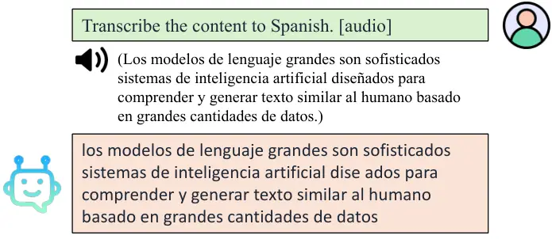

(a) ASR

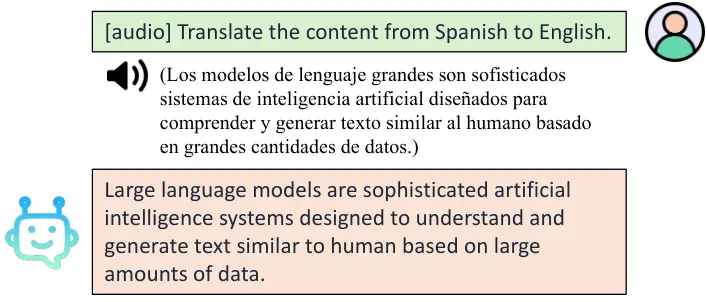

(b) AST

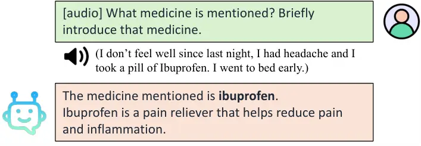

(c) SQA

Figure 6: Examples of standard tasks.

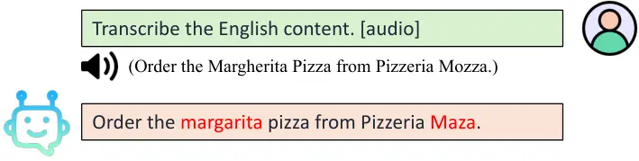

(a) ASR without contextual biasing.

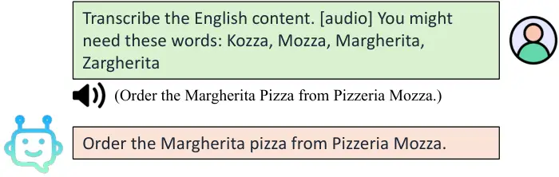

(b) ASR with contextual biasing.

Figure 7: Additional contexts improve ASR results on entity names.

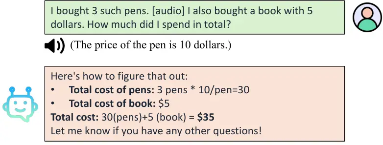

Figure 8: Example of solving a math question based on mixed-modal input.

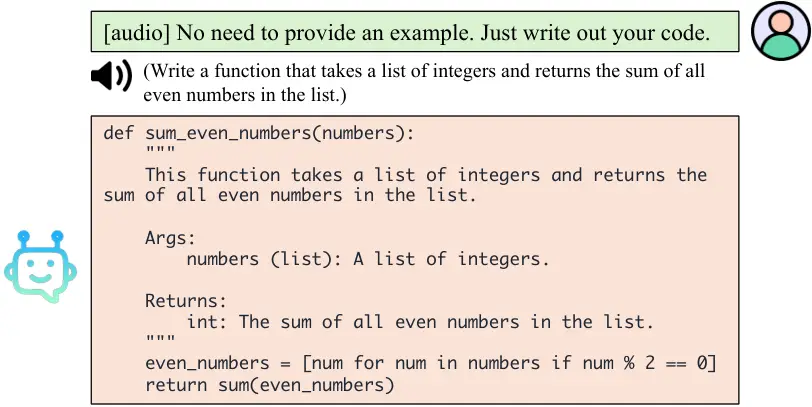

Figure 9: Example of coding.

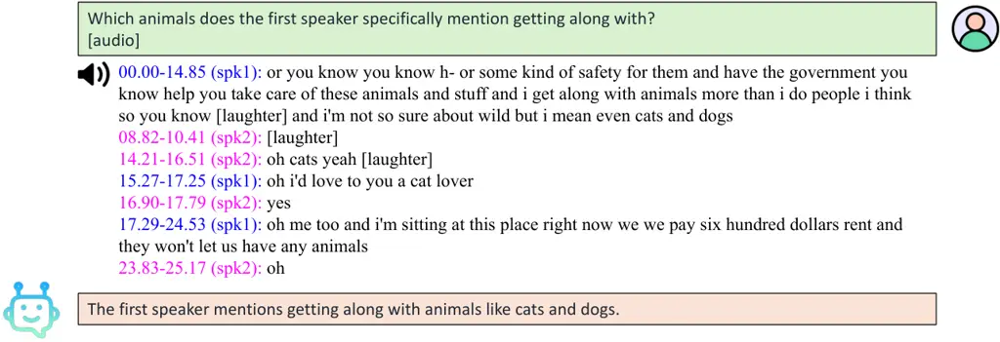

(a) Example 1

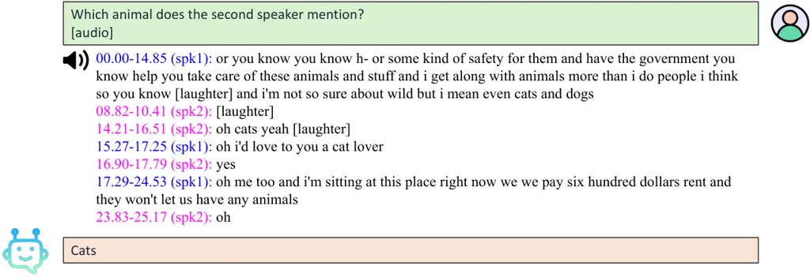

(b) Example 2

Figure 10: Our VTBlender can understand some multi-speaker dialog,
despite being trained on single-speaker data only.

## Appendix E Additional Demonstrations

### E.1 Standard Speech Tasks

Figure 6 presents examples of ASR, AST, and SQA tasks. Our
VTBlender performs well on those standard tasks.

### E.2 Generalization to Unseen Conditions

Figure 7, Figure 8, Figure 9, and Figure 10 are examples of contextual
biasing ASR, math, coding, and SQA with multiple speakers.

Contextual biasing. Figure 7 shows that the model can utilize additional
contextual information when performing ASR. This can enhance ASR
performance in specific domains without updating model parameters.

Math w/ mixed-modal input. Figure 8 is an example of solving a math
question using the information from both speech and text. The answer is
correct and well formated, demonstrating that our VTBlender well
preserves LLM’s original capabilities.

Coding. Figure 9 is a coding example, where the model generates a
correct response to the spoken instruction. Again, this shows that our
VTBlender maintains the original LLM’s capabilities in different
domains.

SQA w/ multi-speaker input. The training data has only one speaker, but
our model can also understand some multi-speaker conversations. In
Figure 10, the audio contains two speakers with overlap. Our model can
answer some questions related to different speakers correctly.
