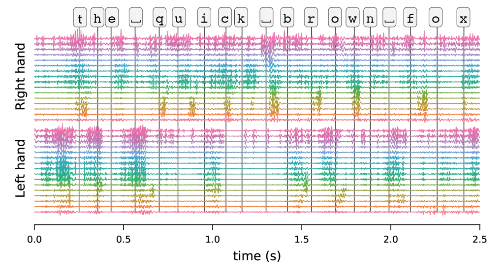
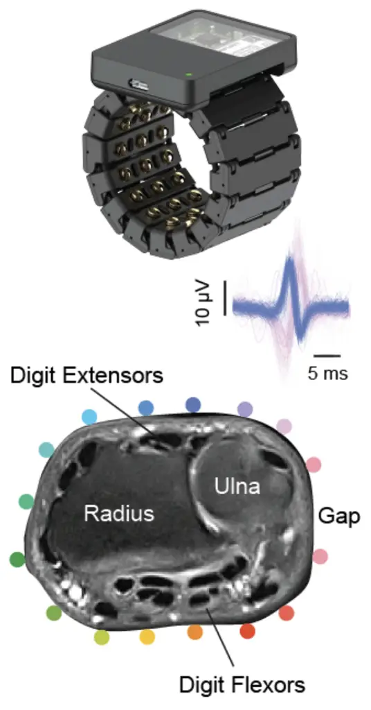
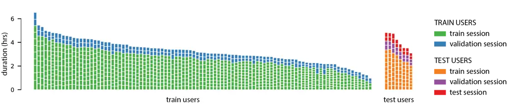

# emg2qwerty: A Large Dataset with Baselines for Touch Typing using Surface Electromyography

Viswanath Sivakumar ^(†)^(†)thanks: Correspondence: viswanath@meta.com
Affiliation: Reality Labs, Meta    Jeffrey Seely ^(†)^(†)thanks: Work
done while at Meta. Affiliation: Reality Labs, Meta    Alan Du
Affiliation: Reality Labs, Meta    Sean R Bittner Affiliation: Reality
Labs, Meta    Adam Berenzweig Affiliation: Reality Labs, Meta   
Anuoluwapo Bolarinwa Affiliation: Reality Labs, Meta    Alexandre
Gramfort Affiliation: Reality Labs, Meta    Michael I Mandel
Affiliation: Reality Labs, Meta

###### Abstract

Surface electromyography (sEMG) non-invasively measures signals
generated by muscle activity with sufficient sensitivity to detect
individual spinal neurons and richness to identify dozens of gestures
and their nuances. Wearable wrist-based sEMG sensors have the potential
to offer low friction, subtle, information rich, always available
human-computer inputs. To this end, we introduce emg2qwerty, a
large-scale dataset of non-invasive electromyographic signals recorded
at the wrists while touch typing on a QWERTY keyboard, together with
ground-truth annotations and reproducible baselines¹¹ 1
[https://github.com/facebookresearch/emg2qwerty](https://github.com/facebookresearch/emg2qwerty).
With 1,135 sessions spanning 108 users and 346 hours of recording, this
is the largest such public dataset to date. These data demonstrate
non-trivial, but well defined hierarchical relationships both in terms
of the generative process, from neurons to muscles and muscle
combinations, as well as in terms of domain shift across users and user
sessions. Applying standard modeling techniques from the closely related
field of Automatic Speech Recognition (ASR), we show strong baseline
performance on predicting key-presses using sEMG signals alone. We
believe the richness of this task and dataset will facilitate progress
in several problems of interest to both the machine learning and
neuroscientific communities.

   

|     |
| --- |
|     |

## 1 Introduction

The bandwidth of communication from computers to humans has increased
dramatically over the past several decades through the development of
high fidelity visual and auditory displays (Koch et al., 2006). The
bandwidth from humans to computers, however, has remained severely
rate-limited by keyboard, mouse, and touch screen control for the vast
majority of applications—modalities that have changed little in the past
50 years. One potential approach to increasing human-to-machine
bandwidth is to leverage the high dimensional output of the human
peripheral motor system. Ultimately, it is this system that evolved to
perform all human actions on the world.

Non-invasive interfaces based on electromyographic signals (sEMG)
capturing neuro-muscular activity at the wrist (CTRL-labs at Reality
Labs et al., 2024), have the potential to achieve higher bandwidth
human-to-machine input by measuring not just the activity of individual
muscles, but also the individual motor neurons that control them. With
each muscle composed of hundreds of motor units (Floeter and Karpati,
2010; Enoka and Pearson, 2013), this expansion has the potential to
unlock orders of magnitude higher bandwidth if subjects can learn to
control them individually (Harrison and Mortensen, 1962; Basmajian,
1963). In comparison, methods that capture brain activity non-invasively
such as fMRI or EEG do not offer the resolution of individual action
potentials, and are often cumbersome for broader applicability beyond
clinical or in-lab settings.

More generally, the transduction of neural signals (peripheral or
central) to language (text or speech) has the potential for broad
applications, as evidenced by a number of recent works using
intracranial recordings (Fan et al., 2023; Metzger et al., 2023; Willett
et al., 2023) or non-invasive EEG or MEG signals (Duan et al., 2023;
Défossez et al., 2023). The rapid adoption of mobile computing has been
at the cost of reduced human-computer bandwidth, via thumb-typed and
swipe-based text entry, compared to the era of desktop computing. In
existing augmented and virtual reality (AR/VR) environments, text is
input through cumbersome point-and-click typing or speech transcription.
While speech-to-text systems have a lower barrier for adoption, they are
largely only suitable for tasks that can be formulated as dictation or
conversation, whereas neuromotor interfaces can additionally be utilized
for a broad range of realtime motor tasks like robotic control.
Furthermore, the wider adoption of speech interfaces is limited by
social privacy implications, in particular in public and semi-public
(e.g., open-plan office) settings. For these reasons, a high bandwidth
and private text input system via sEMG, such as typing without a
keyboard with wrists resting on laps or a flat surface, can be highly
useful for for AR/VR environments.

While wrist-based sEMG is a flexible and practical human-computer input
modality, progress has been challenging due to the cumbersome nature of
data collection, and the lack of large-scale datasets with well-defined
tasks and measurable benchmarks. To facilitate scientific progress, and
in anticipation of the potentially wide adoption of sEMG measurement
hardware that can provide both user convenience and high signal quality,
we introduce a large dataset for the task of predicting key-presses
while touch typing on a keyboard using sEMG activity alone. Transcribing
typing from sEMG is analogous to Automatic Speech Recognition (ASR) in
that a fixed-rate sequence of continuous high dimensional features is
transduced into a sequence of characters or words. It has a complicated,
but well defined input-output relationship that is amenable to modeling
while remaining highly non-trivial.

As a machine learning problem, the task of transcribing key-presses from
sEMG is interesting and challenging for several reasons. Like ML systems
based on EEG, there is a great deal of domain shift across
sessions (Kobler et al., 2022; Bakas et al., 2023; Gnassounou et al.,
2023). We will refer to a session as one episode of one user donning and
doffing the band. This domain shift has at least three causes:
cross-user variation due to differences in anatomy and physiology,
cross-session variation due to differences in band placement relative to
the anatomy, and cross-user behavioral differences due to different
typing strategies (e.g., finger-to-key mapping, force level, response to
keyboard properties like key travel, etc.). The benchmarks included with
this dataset are designed to explicitly characterize the ability of
models to generalize across these various forms of domain shift. To give
a sense of the magnitude of these domain shifts, the unpersonalized
performance on a new user in our benchmark is over 50% character error
rate (Section 5.3), indicating that the model cannot successfully
transcribe the majority of keystrokes without some labeled data from the
user.

A second interesting aspect of the problem is that, while similar in
structure to speech signals, the process through which sEMG is generated
is quite different. In particular, a good approximation to the speech
production process is the application of a time-varying filter to a
time-varying source (Fant, 1971). sEMG, on the other hand, is generated
through a purely additive combination of muscles in a process described
in Section 2. Furthermore, the speech signal itself has developed so as
to be directly interpreted by a wide range of listeners, whereas sEMG is
one step removed from direct interpretability. Specifically in the case
of typing, it is the key-press itself that is the target output, and
there are fewer constraints on consistency across individuals in how
this is achieved.

A third interesting aspect, and contrast to ASR, is the difference
between spoken language and typing. In particular, typing occurs
directly at the character level, whereas speech consists of a sequence
of phonemes, which are mapped via a complex and heterogeneous process to
written characters (especially for English). This difference is most
apparent in the use of the backspace key in typing, which language
models operating on sEMG-to-text predictions must account for, unlike in
spoken language. Furthermore, while the transcription of spoken language
can result in homophones—words that are pronounced the same but spelled
differently—no such ambiguity is present in typed text. Finally, it is
possible to type character strings that are difficult or impossible to
speak and are certainly outside of a given lexicon. This is particularly
relevant when it comes to entering passwords or URLs, but more generally
is applicable when using keyboards for tasks other than typing full
sentences.

In this paper, we introduce emg2qwerty, a dataset of sEMG signals
recorded at the wrists while typing on a QWERTY keyboard. To our
knowledge, this is the largest such public sEMG dataset to date with
recordings from 108 users and 1,135 sessions spanning 346 hours, and
with precise ground-truth annotations. We describe baseline models
leveraging standard ASR components and methodologies, benchmarks to
evaluate zero-shot generalization to unseen population and
data-efficient personalization, and reproducible baseline experimental
results against these benchmarks. We conclude with open problems and
future directions.

## 2 Background on sEMG

|                                                           |                                                           |
| --------------------------------------------------------- | --------------------------------------------------------- |
|  |  |

Figure 1: Left: An example surface electromyographic (sEMG) recording
for the prompt “the quick brown fox” showing 32-channel sEMG signals
from left and right wristbands, along with key-press times. Vertical
lines indicate keystroke onset. The signal from each electrode channel
is high-pass filtered. Right: The sEMG research device (sEMG-RD) used
for data collection together with a schematic denoting the electrode
placement around the wrist circumference. The left and right wristbands
are worn such that one is a mirror of the other, and therefore the
positioning of the electrodes around the wrist physiology remains the
same, albeit with a reversed electrode polarity with respect to the
wrist.

Surface electromyography (sEMG) is the measurement at the skin surface
of electrical potentials generated by muscles (Merletti and Farina,
2016). It has the ability to detect the activity caused by individual
motor neurons while being non-invasive. Specifically, a single spinal
motor neuron, with cell body in the spinal cord, projects a long axon to
many fibers of a single muscle. Each muscle fiber is innervated by only
one motor neuron. When that neuron fires, it triggers all of the muscle
fibers that it innervates to contract, and in the process they generate
a large electrical pulse, in effect amplifying the pulse from the
neuron. It is this electrical signal from the muscle fibers that sEMG
sensors on the skin can detect.

A single motor neuron and the muscle fibers that it innervates are known
together as a _motor unit_. Muscles vary widely in terms of how many
motor units they contain as well as how many muscle fibers each motor
unit contains. For the hand and forearm, muscles contain on the order of
hundreds of motor units, each of which contains hundreds of muscle
fibers (Floeter and Karpati, 2010; Kandel et al., 2013). One interesting
property of the sEMG signal relevant to brain-computer interfaces is
that, because it is generated during muscle fiber stimulation, it
typically precedes the onset of the corresponding motion by tens of
milliseconds (Trigili et al., 2019, e.g.,). This can be seen in Figure 1
where the left hand’s sEMG shows a strong activation before the “t” key
is pressed and the right hand before the subsequent “h”. This property
means that sEMG-based interfaces have the potential to detect activity
with _negative_ latency, i.e., before the corresponding physical gesture
occurs.

With regards to machine learning modeling, the motor system is organized
in a very structured way. Typically, within a given muscle, there is a
more or less fixed order in which motor units are _recruited_ as a
function of force generated by that muscle (Henneman, 1957; De Luca and
Contessa, 2012). Thus there is a motor unit that is generally recruited
first, which is activated before the motor unit that is generally
recruited second, etc. While this was traditionally shown to be true for
isometric contractions (i.e., with joints held at fixed angles, and
therefore muscles at fixed lengths), there are some recent (Formento
et al., 2021; Marshall et al., 2022; Hug et al., 2023) and less recent
works (Harrison and Mortensen, 1962; Basmajian, 1963) showing that this
ordering may depend on additional factors such as muscle length or
target motion.

## 3 Related Work

| Dataset               | Hardware grade | Application           | Recording location | Subject count | Multiple sessions/subject |
| --------------------- | -------------- | --------------------- | ------------------ | ------------- | ------------------------- |
| Amma et al. 2015      | Clinical       | HCI                   | Forearm            | 5             | Yes                       |
| Du et al. 2017        | Clinical       | HCI                   | Forearm            | 23            | Yes                       |
| Malesevic et al. 2021 | Clinical       | Neuroprosthetics      | Forearm            | 20            | No                        |
| Jiang et al. 2021     | Clinical       | HCI, Neuroprosthetics | Wrist              | 20            | Yes                       |
| Ozdemir et al. 2022   | Clinical       | Neuroprosthetics      | Forearm            | 40            | No                        |
| Kueper et al. 2024    | Clinical       | Neuroprosthetics      | Forearm            | 8             | Yes                       |
| Palermo et al. 2017   | Clinical       | Neuroprosthetics      | Forearm            | 10            | Yes                       |
| Atzori et al. 2012    | Consumer       | Neuroprosthetics      | Forearm, Wrist     | 27            | No                        |
| Pizolato et al. 2017  | Consumer       | Neuropresthetics      | Forearm, Wrist     | 78            | No                        |
| Lobov et al. 2018     | Consumer       | Neuropresthetics      | Forearm            | 37            | No                        |
| emg2qwerty            | Consumer       | HCI                   | Wrist              | 108           | Yes                       |

Table 1: Comparison with prior electromyographic datasets

The direct mapping of neuromotor activity to text enables high bandwidth
human-computer interfaces for regularly abled people, but brain-computer
interfaces could be applicable even for those without full use of their
limbs. Willett et al. (2021) demonstrated an intracortical
brain-computer interface that allowed a single subject with a paralyzed
hand to generate text at a rate of 90 characters per minute through
imagined writing motions. Speech decoding from cerebral cortical
activity has been demonstrated in paralyzed participants (Moses et al.,
2021; Willett et al., 2023), where latest results achieve 62 words per
minute on large vocabularies while decoding sentences in real time with
25.6% word error rate. Modeling methodologies that prove successful on
the emg2qwerty benchmark could be adapted with some care for use in such
brain-computer interfaces.

While there are several public sEMG datasets, emg2qwerty is unique in
its hardware properties, scale, and the type of participant activity. In
terms of hardware, existing sEMG datasets use either clinical-grade
high-density electrode arrays and amplifiers (Amma et al., 2015; Du
et al., 2017; Malešević et al., 2021; Jiang et al., 2021; Ozdemir
et al., 2022; Kueper et al., 2024), or consumer-grade hardware that only
records coarse sEMG energy at low sampling rates (Atzori et al., 2012;
Pizzolato et al., 2017; Lobov et al., 2018). The clinical-grade setup
records hundreds of channels of sEMG with high sampling rate and bit
depth, but requires careful setup including shaving and abrading the
skin, applying conductive gel, and taping the electrode array(s) in
place for the duration of the recording. The now discontinued
consumer-grade Myo armband by Thalmic Labs can be worn without any
preparation, but only measures 8 channels of sEMG and has a low sampling
rate (200 Hz) after the signal has been rectified and smoothed. On the
other hand, emg2qwerty uses a new research-grade dry electrode device,
sEMG-RD (CTRL-labs at Reality Labs et al., 2024), that offers
consumer-grade practicality while providing signal quality approaching
that of the clinical-grade setup.

In terms of scale, emg2qwerty is not only among the largest in raw hours
of data, but also in the number of subjects and number of sessions per
subject. Many of the existing datasets only include a single recording
session per subject (Atzori et al., 2012; Atzori et al., 2014; Pizzolato
et al., 2017; Lobov et al., 2018; Malešević et al., 2020; Malešević
et al., 2021; Ozdemir et al., 2022), although a small number include
more. In particular, Palermo et al. (2017) include 10 subjects with 10
sessions each, Amma et al. (2015) include 5 subjects with 5 sessions
each, Du et al. (2017) include 23 subjects with 3 sessions for 10 of
them, Jiang et al. (2021) include 20 subjects with 2 sessions each, and
Kueper et al. (2024) include 8 subjects with 10 sessions each. In
comparison, emg2qwerty is over an order of magnitude larger, with 108
subjects and an average of 10 sessions per subject, making it feasible
to evaluate the ability of models to generalize both across sessions and
across subjects. This focus on broader generalization makes emg2qwerty
more challenging than the existing benchmarks.

In terms of activity, emg2qwerty focuses on the natural behavior of
typing, while existing datasets focus for the most part on static hand
poses. Atzori et al. (2012) introduced a set of 50 hand gestures, many
of which may be considered “abstract” in that they are not natural
movements that a subject would spontaneously make in everyday life, such
as the flexion or extension of individual fingers or pairs of fingers. A
subset of 23 of the gestures does however focus on grasping and
functional movements. Each gesture is held for 5 seconds as a static
posture. Many subsequent datasets have utilized the same or similar
gestural vocabularies (Atzori et al., 2014; Pizzolato et al., 2017; Amma
et al., 2015; Du et al., 2017; Lobov et al., 2018; Malešević et al.,
2021; Jiang et al., 2021; Ozdemir et al., 2022; Kueper et al., 2024).
One exception to the use of static poses is Malešević et al. (2020), who
prompt users to follow temporally evolving cues. However, they are
recorded intra-muscularly using inserted electrodes rather than
non-invasively on the surface. In contrast, we present non-invasive sEMG
recordings of the natural, rapidly time-varying task of typing on a
keyboard. Keystroke events occur much more rapidly than held poses, and
the mean keystroke rate in our dataset is 4.4 characters per second
(Table 2). Moreover, subjects are much more familiar with typing than
with performing abstract movements of their individual hand joints.
Typing style does, however, vary considerably across individuals,
especially those who are not fluent touch typists, adding to the
challenge of generalization across subjects.

## 4 Dataset and Benchmark

|                             |           |          |
| --------------------------- | --------- | -------- |
| Total subjects              | 108       |          |
| Total sessions              | 1,135     |          |
| Avg sessions per subject    | 10        |          |
| Max sessions per subject    | 18        |          |
| Min sessions per subject    | 1         |          |
| Total duration              | 346.4     | hours    |
| Avg duration per subject    | 3.2       | hours    |
| Max duration per subject    | 6.5       | hours    |
| Min duration per subject    | 15.3      | minutes  |
| Avg duration per session    | 18.0      | minutes  |
| Max duration per session    | 47.5      | minutes  |
| Min duration per session    | 9.5       | minutes  |
| Avg typing rate per subject | 265       | keys/min |
| Max typing rate per subject | 439       | keys/min |
| Min typing rate per subject | 130       | keys/min |
| Total keystrokes            | 5,262,671 |          |

Table 2: emg2qwerty dataset statistics

#### sEMG-RD Hardware

All data were recorded using the sEMG research device (sEMG-RD)
described in CTRL-labs at Reality Labs et al. (2024) and visualized in
Figure 1. Each sEMG-RD has 16 differential electrode pairs utilizing dry
gold-plated electrodes. Signals are sampled at 2 kHz with a bit depth of
12 bits and a maximum signal amplitude of 6.6 mV. Measurements are
bandpass filtered with -3 dB cutoffs at 20 Hz and 850 Hz before
digitization. Data are digitized on the sEMG-RD and streamed via
Bluetooth to the laptop that the subject is simultaneously typing on.
Identical devices are worn on the left and right wrists, with the same
electrode indices aligning with the same anatomical features, but the
polarity of the differential sensing reversed.

#### Data Collection Setup

Data collection participants were initially screened for their touch
typing ability via self-reporting. Those reported as being able to type
without looking at the keyboard and achieve the correct finger to key
mapping at least about 90% of the time subsequently took part in a
typing test, and only those meeting adequate typing speed and accuracy
levels were included in the study. In the spirit of making the dataset
realistic for broader usage where the majority of real world touch
typists are not perfect in their finger to key mapping, we do not
enforce a rigid constraint beyond the aforementioned screening process.

Participants partake in a few sessions of typing prompted text after
donning two sEMG-RDs, one per wrist. During each session, the
participant is prompted with a sequence of text that they type on an
Apple Magic Keyboard (US English). The text prompts consist of words
sampled randomly from a dictionary as well as sentences sampled from
English Wikipedia (after filtering out offensive terms), and are
processed to only contain lower-case and basic punctuation characters. A
keylogger records the typed characters, together with key-down and
key-up timestamps, as ground-truth. Participants are allowed to freely
use the backspace key to correct for typos. Session duration varied from
9.5 to 47.5 minutes depending on the typing speed of the participant
(Table 2). Between sessions, the bands were doffed and donned to include
realistic variability in electrode placement and therefore the recorded
signals. Figure 1 visualizes an example sEMG recording.

This study was approved by an Institutional Review Board (IRB),
participation was on a purely voluntary basis, participants provided
informed consent to include their data, and the data have been
de-identified by removing any personally identifiable information.
Subjects were allowed to withdraw from the study during their
participation.

#### Dataset Details

Recorded sessions undergo minimal post-processing—basic signal quality
checks, high-pass filtering with 40 Hz cutoff, and an algorithm to
correct for clock drift and synchronize timestamps across the sEMG
devices and the host laptop. The signals from the left and right bands
are temporally aligned by interpolating to the nearest sample (i.e.,
0.5 ms). The entire dataset consists of 1,135 session files from 108
participants and 346 hours of recording (Table 2). Each session file
follows a simple HDF5 format comprising the aligned left and right sEMG
signal timeseries spanning the duration of the recording, ground-truth
keylogger sequence, timestamps corresponding to sEMG and the keystrokes,
and additional metadata. To facilitate usage of the data in the
neuroscience community, a script is provided to convert the data to BIDS
format (Pernet et al., 2019; Poldrack et al., 2024).

#### Benchmark Setup

Figure 2: Visualization of emg2qwerty dataset splits. Each column
represents a user. Each block represents a session, with the vertical
extent of each block indicating its duration. Train users correspond to
the data used for training a single generic model. A personalized model
is produced for each of the 8 test users. Sessions used for training,
validation and testing are color-coded.

The key difficulties in building models based on sEMG at scale are of
generalization to unseen population and data-efficiency of
personalization. Differences in human physiology, high variance in
typing behavior, and complexity of data acquisition all contribute to
the problem. With this mind, we define our dataset splits as follows: we
sample 8 test users out of the 108 participants to be held out for
personalization. For each of these 8 users, we hold out 2 sessions each
for validation and testing, and the remaining sessions are used to train
per-user personalized models. The sessions from the remaining 100 users
are used to train a generic user model which can then be finetuned and
personalized to each of the 8 test users. Figure 2 visualizes the data
splits.

#### Metric

We measure the predictive power of the models in terms of Character
Error Rate (CER), which we define as the Levenshtein edit-distance
between the predicted and the ground-truth sequences of keystrokes,
normalized by the length of the ground-truth sequence. The CER of the
generic model on the test sessions from each of the 8 held-out users
measures generalization to unseen population. The same evaluation of the
personalized models measures the data-efficiency of personalization.

## 5 Baselines

### 5.1 Baseline Model

The similarity between the emg2qwerty task and that of recognizing
speech from audio waveforms allows us to borrow from the field of ASR in
our modeling approach. Both tasks map continuous waveform signals (1D
for ASR, 32D for emg2qwerty) at a fixed sample rate, to a sequence of
tokens (phonemes or words for ASR, characters for emg2qwerty). The
components of our baseline model spanning preprocessing and feature
extraction, data augmentation, model architecture, loss function,
language model and decoder are largely applications of ASR
methodologies.

#### Feature Extraction

In ASR, models commonly use log mel-scale filter banks for features,
although fully end-to-end models trained from the raw waveform have been
explored (Palaz et al., 2013; Tüske et al., 2014; Hoshen et al., 2015;
Zeghidour et al., 2018; Baevski et al., 2020). The mel scale is adapted
from human auditory perception, and thus is not necessarily appropriate
for the spectral characteristics of sEMG signals. We use analogous
spectral features on a different log frequency scale with appropriate
cutoffs. Spectral features outperformed rectification of the time domain
signal, which is a standard preprocessing method for sEMG (Halliday and
Farmer, 2010). As a way of normalizing the spectral features, we add a
2D batch normalization step as the first layer of our network that
computes per-channel spectrogram statistics.

#### Data Augmentation

SpecAugment (Park et al., 2019) is a simple but effective data
augmentation strategy in ASR. It applies time- and frequency-aligned
masks to spectral features during training. We find modest but
consistent improvements with SpecAugment in our baseline model.
Additionally, we include two other forms of data augmentation that are
specific to our use case: 1) _rotation augmentation_ rotates (permutes)
the electrodes by $`-1`$, $`0`$, or $`+1`$ positions sampled uniformly,
meaning, the electrode channels are all shifted one position to the
left, remain unshifted, or are shifted one position to the right
respectively; 2) _temporal alignment jitter_ randomly jitters the
alignment between left and right sEMG timeseries in the raw signal space
by an offset value sampled uniformly in the range of $`0`$ to $`120`$
samples (60 ms for 2 kHz signal).

#### Model Architecture

We adopt Time Depth Separable ConvNets (TDS) developed by Hannun et al.
(2019) for the ASR domain. The parameter-efficiency of TDS convolutions
allows for wider receptive fields which have proven important in
emg2qwerty modeling. While the sEMG activity profile corresponding to a
single key-press is fairly short, “co-articulation” activity is dominant
in the signal. Specifically, the sEMG of a keystroke is affected by the
characters typed immediately before and after it due to various
preparatory behaviors. We thus find it effective to use a model with a
receptive field long enough to capture sEMG activity related to bigrams
or trigrams, especially for fast typists, but not so long as to
essentially learn an implicit language model. The TDS architecture
allows parameter-efficient control of this trade-off, and our baseline
model uses a receptive field of 1 second. Alternative architectures such
as convolutional ResNets, RNNs and transformers have all been effective
in ASR (Synnaeve et al., 2019), though we do not explore them here.
Additionally, our model architecture includes two “Rotation-Invariance”
modules, one for each band. Each of these is composed of a linear layer
and a ReLU activation, which get applied to electrode channel shifts of
$`-1`$, $`0`$, and $`+1`$ positions, and their outputs averaged over. We
concatenate the outputs of the Rotation-Invariance module corresponding
to each band prior to being fed into the TDS network. The
Rotation-Invariance modules, together with rotation augmentation, aim to
improve the model’s generalization across a user’s sessions, since
doffing and donning each band between sessions can result in electrode
shifts corresponding to small rotations of the band’s placement on the
wrist.

#### Loss Function

In ASR, the alignment problem of identifying precise timings of output
tokens can be circumvented using losses such as Connectionist Temporal
Classification (CTC) (Graves et al., 2006), sequence-to-sequence
(Seq2Seq) (Chorowski et al., 2015; Chan et al., 2016), or RNN-transducer
(RNN-T) (Graves, 2012). emg2qwerty includes precise key-press and
key-release event timings, allowing for the use of a cross-entropy
classification loss averaged over all time points in the output
sequence. Nevertheless, we empirically find the best performance with
CTC loss which we therefore use in our baseline.

#### Language Model and Decoder

At test time, we apply a simple, lexicon-free, character-level n-gram
language model (LM) to the model predictions. In our experiments, we use
a 6-gram modified Kneser-Ney LM (Heafield et al., 2013) generated from
WikiText-103 raw dataset (Merity et al., 2016), and built using the
KenLM package (Heafield, 2011). The LM is integrated with the CTC logits
using an efficient first-pass beam-search decoder similar to Pratap
et al. (2019). As noted earlier, the ability to modify history using the
backspace key makes this a more complex task compared to ASR decoding.
Therefore, we implement a modified backspace-aware beam-search decoder
that safely updates LM states, which we include in our open-source
repository.

### 5.2 Training Setup

With the data splits described in Section 4, we train one generic user
model with sessions from 100 users, as well as 8 independent
personalized models for each of the held-out test users. For the generic
model, 2 sessions from each of the 100 users are used for validation.
This ensures that the test users do not bear any influence on the
hyperparameter choices of the generic user model. The personalized
models for test users are trained using the splits defined in Section 4,
and are initialized either with random weights or with the weights of
the generic model.

All training runs use the architecture described in Section 5.1.
Training and validation operate over batches of contiguous 4 second
windows, whereas at test time, we feed entire sessions at once without
batching to avoid padding effects on test scores. We train using windows
asymmetrically padded as in Pratap et al. (2020), with 900 ms past and
100 ms future contexts, to minimize the dependency on future inputs and
facilitate streaming applications. The input to the network are
33-dimensional log-scaled spectral features for each of the 32 electrode
channels spanning the left and right bands, computed every 8 ms with a
32 ms window. We apply SpecAugment style time masking (maximum 3 masks
of segments of length up to 200 ms) and frequency masking (maximum 2
masks of up to 4 contiguous frequency bins) on the log spectrogram
features for each of the 32 channels i.i.d. We also apply band rotation
and temporal alignment jitter augmentations described in Section 5.1.
The $`33\times 16=528`$ spectral features per band are input into their
respective Rotation-Invariance modules following batch normalization.
Each Rotation-Invariance module outputs 384-dimensional features which
are then concatenated and fed into a sequence of 4 TDS convolutional
blocks, each with a kernel width of 32 temporal samples. The network, in
conjunction with the spectrogram features, has a total receptive field
of 1 second (125 samples).

The generic model was trained on 8 A10 GPUs and each of the personalized
models on a single A10 GPU, using a batch size of 32 per GPU, and
optimized with Adam (Kingma and Ba, 2017) for a total of 150 epochs. The
learning rate linearly ramps every epoch from 1e-8 to 1e-3 for the first
10 epochs, and then follows a cosine annealing schedule (Loshchilov and
Hutter, 2016) towards a minimum of 1e-6 for the remaining epochs. Both
the generic and personalized models share the same set of
hyperparameters, which were initialized to reasonable values without
investing in a thorough sweep as that is not the focus of the paper. Our
code uses PyTorch (Paszke et al., 2019) and PyTorch Lightning (Falcon, 2019) for training, and Hydra (Yadan, 2019) for configuration.

### 5.3 Experimental Results

|                              | No LM             |                   | 6-gram char-LM    |                   |
| ---------------------------- | ----------------- | ----------------- | ----------------- | ----------------- |
| Model benchmark              | Val CER           | Test CER          | Val CER           | Test CER          |
| Generic (no personalization) | $`55.57\pm 4.40`$ | $`55.38\pm 4.10`$ | $`52.10\pm 5.54`$ | $`51.78\pm 4.61`$ |
| Personalized (random-init)   | $`15.65\pm 5.95`$ | $`15.38\pm 5.88`$ | $`11.03\pm 4.45`$ | $`9.55\pm 5.16`$  |
| Personalized (finetuned)     | $`11.39\pm 4.28`$ | $`11.28\pm 4.45`$ | $`8.31\pm 3.19`$  | $`6.95\pm 3.61`$  |

Table 3: A comparison of test subject performance across model
benchmarks. Mean and standard deviation aggregates of character error
rates (CER) across test subjects are reported. Lower is better. The
reported test CER improvements arising out of personalization as well as
the inclusion of the language model (LM), all have $`p<.005`$.

For each of the 8 held-out users, we evaluate performance on their
validation and test sessions with (1) the generic model, (2) respective
personalized models initialized with random weights, (3) respective
personalized models initialized with the generic model weights. Table 3
reports the mean and standard deviation of the character error rates
(CER) aggregated over the 8 test users for each of the three scenarios,
without and with the usage of the language model (LM) described in
Section 5.1.

Not surprisingly, the approach of finetuning the generic model with
user-specific sessions to obtain personalized models performs the best
by achieving a mean test CER of 6.95% (with LM). The best performing
user achieves a test CER as low as 3.16%. We note that, in practice,
models tend to become usable at a CER of approximately 10% or less. To
further ground this, Palin et al. (2019) find an uncorrected error rate
(percentage of errors remaining after user editing) of 2.3% from a
large-scale study of typing on a mobile keyboard that could include
autocorrect and other assistance.

“Personalized (finetuned)” in Table 3 outperforming “Personalized
(random-init)” across all metrics demonstrates that generalizable
representations of sEMG can indeed be learned across users, despite
variations in sensor placement, anatomy, physiology, and behavior. When
evaluated directly against unseen subjects though, the generic model is
simply unusable with a CER over 50%. This can be attributed to the scale
of the generic model in terms of the number of users it has been trained
with. CTRL-labs at Reality Labs et al. (2024) demonstrate that
performant out-of-the-box generalization of sEMG models across people
can indeed be achieved with an order of magnitude more training users,
albeit for different tasks. Still, it is exciting to see generalization
emerge even at the scale of 100 users, and motivates research into
data-efficient strategies to improve generalization further to alleviate
the need for cumbersome and expensive large-scale supervised data
collection.

## 6 Limitations

The biggest limitation is that emg2qwerty models require the skill of
touch typing on a QWERTY keyboard in addition to being limited only to
English. Although this dataset is meant to be a starting point, these
imply that the generated models would only be applicable to a subset of
the society.

Additionally, the dataset was collected using a physical keyboard on a
desk, whereas real-world use cases would be aimed at removing physical
constraints to enable seamless text entry such as typing while on the
move or with hands on the lap. Moreover, the force generated while
typing on a physical keyboard, and thus the amplitude of the detected
sEMG, might be different compared to keyboard-free sEMG-based typing,
leading to a domain mismatch.

During deployment, the model would need to run as close to the source of
the signal as possible, preferably on the wristband itself. This is
ideal for reasons around latency, user privacy, and avoidance of
Bluetooth contention or interference arising from streaming sEMG off the
wristband. While compute and battery constraints on the wristband might
pose a challenge, the advent of low-cost edge inference for machine
learning makes this a practical solution.

Finally, the lack of broader access to the proprietary research-grade
sEMG hardware might be limiting in some ways such as not being able to
perform human-in-the-loop testing of models.

Further ethical and societal implications are discussed in Appendix B.

## 7 Conclusion and Future Directions

sEMG-based typing interfaces operating at a rate of hundreds of
characters per minute, demonstrate the feasibility of practical and
scalable neuromotor interfaces, and set the stage for increases in
human-to-computer bandwidth. These could also be the starting point for
highly personalizable neuromotor interfaces that adapt to minimize the
amount of physical effort necessary, while simultaneously customizing
the action-to-intent mapping based on task, context, and stylistic
preference.

There is a lot of excitement about the potential of practical
brain-computer or peripheral neuromotor interfaces. Yet, to date there
has been no satisfactory public dataset with the scale adequate to build
broadly applicable systems leveraging the strides in the field of
machine learning. We believe emg2qwerty is an early step towards
addressing this gap. In contrast to prior sEMG systems that focus on
neuroprosthetics or clinical settings, our focus is on a practical high
bandwidth input interface for AR/VR that can work across the population.
We demonstrate that standard paradigms and off-the-shelf components from
the closely related field of ASR, facilitate the creation of models that
enter the realm of usability. Our benchmarks empirically quantify the
difficulty of the task arising out of physiological and behavioral
domain shift, and offer a yard stick to measure progress.

For the machine learning community, we hope emg2qwerty will be a useful
benchmark for existing research problems. Advances in areas such as
domain adaptation, self-supervision, end-to-end sequence learning and
differentiable language models will serve to benefit this task. For the
neuroscience community, we believe access to a large sEMG dataset opens
up new research avenues. Advances in white-box feature extraction
methods such as unsupervised spike detection and sorting could enable
the construction of models that are robust to variability in electrode
placement and physiology.

## Acknowledgments

We thank Joseph Zhong for implementing the data collection protocol,
Gabriel Synnaeve and Awni Hannun for sharing their ASR wisdom, Rudi
Chiarito, Sam Russell and Krunal Naik for engineering support, Dan
Wetmore, Ron Weiss and Simone Totaro for their feedback on the paper,
Vittorio Caggiano and Nafissa Yakubova for helpful discussions, Patrick
Kaifosh and Thomas R. Reardon for their vision and sponsorship, and the
entire CTRL-labs team whose efforts this work builds upon.

## References

- Amma et al. \[2015\] C. Amma, T. Krings, J. Böer, and T. Schultz.
  Advancing muscle-computer interfaces with high-density
  electromyography. In _Proceedings of the 33rd Annual ACM Conference on
  Human Factors in Computing Systems_, CHI ’15, page 929–938, New York,
  NY, USA, 2015. Association for Computing Machinery.
  ISBN 9781450331456. doi: 10.1145/2702123.2702501. URL
  [https://doi.org/10.1145/2702123.2702501](https://doi.org/10.1145/2702123.2702501).
- Atzori et al. \[2012\] M. Atzori, A. Gijsberts, S. Heynen, A.-G.
  Mittaz Hager, O. Deriaz, P. Van der Smagt, C. Castellini, B. Caputo,
  and H. Müller. Building the ninapro database: a resource for the
  biorobotics community. In _IEEE International Conference on Biomedical
  Robotics and Biomechatronics_, 2012.
- Atzori et al. \[2014\] M. Atzori, A. Gijsberts, C. Castellini,
  B. Caputo, A.-G. M. Hager, S. Elsig, G. Giatsidis, F. Bassetto, and
  H. Müller. Electromyography data for non-invasive naturally-controlled
  robotic hand prostheses. _Scientific Data_, 1, 2014. doi:
  doi.org/10.1038/sdata.2014.53.
- Baevski et al. \[2020\] A. Baevski, Y. Zhou, A. Mohamed, and M. Auli.
  wav2vec 2.0: A framework for self-supervised learning of speech
  representations. _Advances in Neural Information Processing Systems_,
  33, 2020.
- Bakas et al. \[2023\] S. Bakas, S. Ludwig, D. A. Adamos, N. Laskaris,
  Y. Panagakis, and S. Zafeiriou. Latent alignment with deep set eeg
  decoders, 2023.
- Basmajian \[1963\] J. V. Basmajian. Control and training of individual
  motor units. _Science_, 141(3579):440–441, 1963. ISSN 0036-8075. doi:
  10.1126/science.141.3579.440. URL
  [https://science.sciencemag.org/content/141/3579/440](https://science.sciencemag.org/content/141/3579/440).
- Chan et al. \[2016\] W. Chan, N. Jaitly, Q. Le, and O. Vinyals.
  Listen, attend and spell: A neural network for large vocabulary
  conversational speech recognition. In _2016 IEEE International
  Conference on Acoustics, Speech and Signal Processing (ICASSP)_, pages
  4960–4964. IEEE, 2016.
- Chorowski et al. \[2015\] J. Chorowski, D. Bahdanau, D. Serdyuk,
  K. Cho, and Y. Bengio. Attention-based models for speech
  recognition, 2015.
- CTRL-labs at Reality Labs et al. \[2024\] CTRL-labs at Reality Labs,
  D. Sussillo, P. Kaifosh, and T. Reardon. A generic noninvasive
  neuromotor interface for human-computer interaction. _bioRxiv_, 2024.
  doi: 10.1101/2024.02.23.581779. URL
  [https://www.biorxiv.org/content/early/2024/02/28/2024.02.23.581779](https://www.biorxiv.org/content/early/2024/02/28/2024.02.23.581779).
- De Luca and Contessa \[2012\] C. J. De Luca and P. Contessa.
  Hierarchical control of motor units in voluntary contractions.
  _Journal of neurophysiology_, 107(1):178–195, 2012.
- Défossez et al. \[2023\] A. Défossez, C. Caucheteux, J. Rapin,
  O. Kabeli, and J.-R. King. Decoding speech perception from
  non-invasive brain recordings. _Nature Machine Intelligence_,
  5(10):1097–1107, 2023. doi: 10.1038/s42256-023-00714-5. URL
  [https://doi.org/10.1038/s42256-023-00714-5](https://doi.org/10.1038/s42256-023-00714-5).
- Du et al. \[2017\] Y. Du, W. Jin, W. Wei, Y. Hu, and W. Geng. Surface
  EMG-based inter-session gesture recognition enhanced by deep domain
  adaptation. _Sensors_, 17(3):458, 2017.
- Duan et al. \[2023\] Y. Duan, C. Zhou, Z. Wang, Y.-K. Wang, and
  C. teng Lin. Dewave: Discrete encoding of EEG waves for EEG to text
  translation. In _Thirty-seventh Conference on Neural Information
  Processing Systems_, 2023. URL
  [https://openreview.net/forum?id=WaLI8slhLw](https://openreview.net/forum?id=WaLI8slhLw).
- Enoka and Pearson \[2013\] R. M. Enoka and K. G. Pearson. The motor
  unit and muscle action. In E. R. Kandel, J. H. Schwartz, T. M.
  Jessell, S. A. Siegelbaum, and A. J. Hudspeth, editors, _Principles of
  neural science_, chapter 34. McGraw-Hill, Health Professions Division,
  5th edition, 2013.
- Falcon \[2019\] e. a. Falcon, WA. Pytorch lightning. _GitHub. Note:
  https://github.com/PyTorchLightning/pytorch-lightning_, 3, 2019.
- Fan et al. \[2023\] C. Fan, N. Hahn, F. Kamdar, D. Avansino, G. H.
  Wilson, L. Hochberg, K. V. Shenoy, J. M. Henderson, and F. R. Willett.
  Plug-and-play stability for intracortical brain-computer interfaces: A
  one-year demonstration of seamless brain-to-text communication. In
  _Thirty-seventh Conference on Neural Information Processing
  Systems_, 2023. URL
  [https://openreview.net/forum?id=STqaMqhtDi](https://openreview.net/forum?id=STqaMqhtDi).
- Fant \[1971\] G. Fant. _Acoustic Theory of Speech Production_. De
  Gruyter Mouton, 1971. ISBN 978-3-11-087342-9. doi:
  doi:10.1515/9783110873429. URL
  [https://doi.org/10.1515/9783110873429](https://doi.org/10.1515/9783110873429).
- Floeter and Karpati \[2010\] M. K. Floeter and G. Karpati. Structure
  and function of muscle fibers and motor units. In D. Hilton-Jones,
  K. Bushby, and R. C. Griggs, editors, _Disorders of Voluntary Muscle_,
  page 1–19. Cambridge University Press, 8 edition, 2010. doi:
  10.1017/CBO9780511674747.005.
- Formento et al. \[2021\] E. Formento, P. Botros, and J. M. Carmena. A
  non-invasive brain-machine interface via independent control of
  individual motor units. _bioRxiv_, 2021. doi:
  10.1101/2021.03.22.436518. URL
  [https://www.biorxiv.org/content/early/2021/04/21/2021.03.22.436518](https://www.biorxiv.org/content/early/2021/04/21/2021.03.22.436518).
- Gnassounou et al. \[2023\] T. Gnassounou, R. Flamary, and A. Gramfort.
  Convolution monge mapping normalization for learning on sleep data. In
  _Thirty-seventh Conference on Neural Information Processing
  Systems_, 2023. URL
  [https://openreview.net/forum?id=CuHymkHRus](https://openreview.net/forum?id=CuHymkHRus).
- Graves \[2012\] A. Graves. Sequence transduction with recurrent neural
  networks. _arXiv preprint arXiv:1211.3711_, 2012.
- Graves et al. \[2006\] A. Graves, S. Fernández, F. Gomez, and
  J. Schmidhuber. Connectionist temporal classification: labelling
  unsegmented sequence data with recurrent neural networks. In
  _Proceedings of the 23rd international conference on Machine
  learning_, pages 369–376, 2006.
- Halliday and Farmer \[2010\] D. M. Halliday and S. F. Farmer. On the
  need for rectification of surface emg. _Journal of neurophysiology_,
  103(6):3547–3547, 2010.
- Hannun et al. \[2019\] A. Hannun, A. Lee, Q. Xu, and R. Collobert.
  Sequence-to-sequence speech recognition with time-depth separable
  convolutions. In _INTERSPEECH_, pages 3785–3789, 2019. URL
  [https://doi.org/10.21437/Interspeech.2019-2460](https://doi.org/10.21437/Interspeech.2019-2460).
- Harrison and Mortensen \[1962\] V. F. Harrison and O. Mortensen.
  Identification and voluntary control of single motor unit activity in
  the tibialis anterior muscle. _The Anatomical Record_,
  144(2):109–116, 1962.
- Heafield \[2011\] K. Heafield. KenLM: Faster and smaller language
  model queries. In _Proceedings of the Sixth Workshop on Statistical
  Machine Translation_, pages 187–197, Edinburgh, Scotland, July 2011.
  Association for Computational Linguistics. URL
  [https://www.aclweb.org/anthology/W11-2123](https://www.aclweb.org/anthology/W11-2123).
- Heafield et al. \[2013\] K. Heafield, I. Pouzyrevsky, J. H. Clark, and
  P. Koehn. Scalable modified Kneser-Ney language model estimation. In
  _Proceedings of the 51st Annual Meeting of the Association for
  Computational Linguistics (Volume 2: Short Papers)_, pages 690–696,
  Sofia, Bulgaria, Aug. 2013. Association for Computational Linguistics.
  URL
  [https://www.aclweb.org/anthology/P13-2121](https://www.aclweb.org/anthology/P13-2121).
- Henneman \[1957\] E. Henneman. Relation between size of neurons and
  their susceptibility to discharge. _Science_,
  126(3287):1345–1347, 1957. ISSN 00368075, 10959203. URL
  [http://www.jstor.org/stable/1752769](http://www.jstor.org/stable/1752769).
- Hoshen et al. \[2015\] Y. Hoshen, R. J. Weiss, and K. W. Wilson.
  Speech acoustic modeling from raw multichannel waveforms. In _2015
  IEEE International Conference on Acoustics, Speech and Signal
  Processing (ICASSP)_, pages 4624–4628, 2015. doi:
  10.1109/ICASSP.2015.7178847.
- Hug et al. \[2023\] F. Hug, S. Avrillon, J. Ibáñez, and D. Farina.
  Common synaptic input, synergies and size principle: Control of spinal
  motor neurons for movement generation. _The Journal of physiology_,
  601(1):11–20, 2023.
- Jiang et al. \[2021\] X. Jiang, X. Liu, J. Fan, X. Ye, C. Dai, E. A.
  Clancy, M. Akay, and W. Chen. Open access dataset, toolbox and
  benchmark processing results of high-density surface electromyogram
  recordings. _IEEE Transactions on Neural Systems and Rehabilitation
  Engineering_, pages 1–1, 2021. doi: 10.1109/TNSRE.2021.3082551.
- Kandel et al. \[2013\] E. R. Kandel, J. H. Schwartz, T. M. Jessell,
  S. A. Siegelbaum, and A. J. Hudspeth. _Principles of neural science_.
  McGraw-Hill, Health Professions Division, 5th edition, 2013.
- Kingma and Ba \[2017\] D. P. Kingma and J. Ba. Adam: A method for
  stochastic optimization, 2017.
- Kobler et al. \[2022\] R. Kobler, J.-i. Hirayama, Q. Zhao, and
  M. Kawanabe. Spd domain-specific batch normalization to crack
  interpretable unsupervised domain adaptation in eeg. In S. Koyejo,
  S. Mohamed, A. Agarwal, D. Belgrave, K. Cho, and A. Oh, editors,
  _Advances in Neural Information Processing Systems_, volume 35, pages
  6219–6235. Curran Associates, Inc., 2022. URL
  [https://proceedings.neurips.cc/paper_files/paper/2022/file/28ef7ee7cd3e03093acc39e1272411b7-Paper-Conference.pdf](https://proceedings.neurips.cc/paper_files/paper/2022/file/28ef7ee7cd3e03093acc39e1272411b7-Paper-Conference.pdf).
- Koch et al. \[2006\] K. Koch, J. McLean, R. Segev, M. A. Freed, M. J.
  Berry, V. Balasubramanian, and P. Sterling. How much the eye tells the
  brain. _Current Biology_, 16(14):1428–1434, 2006. ISSN 0960-9822. doi:
  https://doi.org/10.1016/j.cub.2006.05.056. URL
  [https://www.sciencedirect.com/science/article/pii/S0960982206016393](https://www.sciencedirect.com/science/article/pii/S0960982206016393).
- Kueper et al. \[2024\] N. Kueper, K. Chari, J. Bütefür, J. Habenicht,
  T. Rossol, S. K. Kim, M. Tabie, F. Kirchner, and E. A. Kirchner. Eeg &
  emg dataset for the detection of errors introduced by an active
  orthosis device. _Frontiers in Human Neuroscience_, 18:1304311, 2024.
- Lobov et al. \[2018\] S. Lobov, N. Krilova, I. Kastalskiy,
  V. Kazantsev, and M. V.A. Latent factors limiting the performance of
  semg-interfaces. _Sensors_, 18:1122, 2018. doi: 10.3390/s18041122.
- Loshchilov and Hutter \[2016\] I. Loshchilov and F. Hutter. SGDR:
  stochastic gradient descent with restarts. _CoRR_,
  abs/1608.03983, 2016. URL
  [http://arxiv.org/abs/1608.03983](http://arxiv.org/abs/1608.03983).
- Malešević et al. \[2020\] N. Malešević, A. Björkman, G. S. Andersson,
  A. Matran-Fernandez, L. Citi, C. Cipriani, and C. Antfolk. A database
  of multi-channel intramuscular electromyogram signals during isometric
  hand muscles contractions. _Sci Data_, 7, 2020. doi:
  https://doi.org/10.1038/s41597-019-0335-8.
- Malešević et al. \[2021\] N. Malešević, A. Olsson, P. Sager,
  E. Andersson, C. Cipriani, M. Controzzi, A. Björkman, and C. Antfolk.
  A database of high-density surface electromyogram signals comprising
  65 isometric hand gestures. _Sci Data_, 8, 2021. doi:
  https://doi.org/10.1038/s41597-021-00843-9.
- Marshall et al. \[2022\] N. J. Marshall, J. I. Glaser, E. M.
  Trautmann, E. A. Amematsro, S. M. Perkins, M. N. Shadlen, L. Abbott,
  J. P. Cunningham, and M. M. Churchland. Flexible neural control of
  motor units. _Nature neuroscience_, 25(11):1492–1504, 2022.
- Merity et al. \[2016\] S. Merity, C. Xiong, J. Bradbury, and
  R. Socher. Pointer sentinel mixture models. _CoRR_,
  abs/1609.07843, 2016. URL
  [http://arxiv.org/abs/1609.07843](http://arxiv.org/abs/1609.07843).
- Merletti and Farina \[2016\] R. Merletti and D. Farina. _Surface
  electromyography: physiology, engineering, and applications_. John
  Wiley & Sons, 2016.
- Metzger et al. \[2023\] S. L. Metzger, K. T. Littlejohn, A. B. Silva,
  D. A. Moses, M. P. Seaton, R. Wang, M. E. Dougherty, J. R. Liu, P. Wu,
  M. A. Berger, I. Zhuravleva, A. Tu-Chan, K. Ganguly, G. K.
  Anumanchipalli, and E. F. Chang. A high-performance neuroprosthesis
  for speech decoding and avatar control. _Nature_,
  620(7976):1037–1046, 2023. doi: 10.1038/s41586-023-06443-4. URL
  [https://doi.org/10.1038/s41586-023-06443-4](https://doi.org/10.1038/s41586-023-06443-4).
- Moses et al. \[2021\] D. A. Moses, S. L. Metzger, J. R. Liu, G. K.
  Anumanchipalli, J. G. Makin, P. F. Sun, J. Chartier, M. E. Dougherty,
  P. M. Liu, G. M. Abrams, A. Tu-Chan, K. Ganguly, and E. F. Chang.
  Neuroprosthesis for decoding speech in a paralyzed person with
  anarthria. _New England Journal of Medicine_, 385(3):217–227, 2021.
  doi: 10.1056/NEJMoa2027540. URL
  [https://doi.org/10.1056/NEJMoa2027540](https://doi.org/10.1056/NEJMoa2027540).
- Ozdemir et al. \[2022\] M. A. Ozdemir, D. H. Kisa, O. Guren, and
  A. Akan. Dataset for multi-channel surface electromyography (semg)
  signals of hand gestures. _Data in brief_, 41:107921, 2022.
- Palaz et al. \[2013\] D. Palaz, R. Collobert, and M. M. Doss.
  Estimating phoneme class conditional probabilities from raw speech
  signal using convolutional neural networks, 2013.
- Palermo et al. \[2017\] F. Palermo, M. Cognolato, A. Gijsberts,
  H. Müller, B. Caputo, and M. Atzori. Repeatability of grasp
  recognition for robotic hand prosthesis control based on semg data. In
  _2017 International Conference on Rehabilitation Robotics (ICORR)_,
  pages 1154–1159, July 2017. doi: 10.1109/ICORR.2017.8009405.
- Palin et al. \[2019\] K. Palin, A. M. Feit, S. Kim, P. O. Kristensson,
  and A. Oulasvirta. How do people type on mobile devices? observations
  from a study with 37,000 volunteers. In _Proceedings of the 21st
  International Conference on Human-Computer Interaction with Mobile
  Devices and Services_, MobileHCI ’19, New York, NY, USA, 2019.
  Association for Computing Machinery. ISBN 9781450368254. doi:
  10.1145/3338286.3340120. URL
  [https://doi.org/10.1145/3338286.3340120](https://doi.org/10.1145/3338286.3340120).
- Park et al. \[2019\] D. S. Park, W. Chan, Y. Zhang, C.-C. Chiu,
  B. Zoph, E. D. Cubuk, and Q. V. Le. Specaugment: A simple data
  augmentation method for automatic speech recognition. _Proc.
  Interspeech 2019_, pages 2613–2617, 2019.
- Paszke et al. \[2019\] A. Paszke, S. Gross, F. Massa, A. Lerer,
  J. Bradbury, G. Chanan, T. Killeen, Z. Lin, N. Gimelshein, L. Antiga,
  A. Desmaison, A. Kopf, E. Yang, Z. DeVito, M. Raison, A. Tejani,
  S. Chilamkurthy, B. Steiner, L. Fang, J. Bai, and S. Chintala.
  Pytorch: An imperative style, high-performance deep learning library.
  In H. Wallach, H. Larochelle, A. Beygelzimer, F. d'Alché-Buc, E. Fox,
  and R. Garnett, editors, _Advances in Neural Information Processing
  Systems 32_, pages 8024–8035. Curran Associates, Inc., 2019. URL
  [http://papers.neurips.cc/paper/9015-pytorch-an-imperative-style-high-performance-deep-learning-library.pdf](http://papers.neurips.cc/paper/9015-pytorch-an-imperative-style-high-performance-deep-learning-library.pdf).
- Pernet et al. \[2019\] C. R. Pernet, S. Appelhoff, K. J. Gorgolewski,
  G. Flandin, C. Phillips, A. Delorme, and R. Oostenveld. Eeg-bids, an
  extension to the brain imaging data structure for
  electroencephalography. _Scientific Data_, 6(1):103, 2019. doi:
  10.1038/s41597-019-0104-8. URL
  [https://doi.org/10.1038/s41597-019-0104-8](https://doi.org/10.1038/s41597-019-0104-8).
- Pizzolato et al. \[2017\] S. Pizzolato, L. Tagliapietra, M. Cognolato,
  M. Reggiani, H. Müller, and M. Atzori. Comparison of six
  electromyography acquisition setups on hand movement classification
  tasks. _PLOS ONE_, 12(10):1–17, 10 2017. doi:
  10.1371/journal.pone.0186132. URL
  [https://doi.org/10.1371/journal.pone.0186132](https://doi.org/10.1371/journal.pone.0186132).
- Poldrack et al. \[2024\] R. A. Poldrack, C. J. Markiewicz,
  S. Appelhoff, Y. K. Ashar, T. Auer, S. Baillet, S. Bansal,
  L. Beltrachini, C. G. Benar, G. Bertazzoli, S. Bhogawar, R. W. Blair,
  M. Bortoletto, M. Boudreau, T. L. Brooks, V. D. Calhoun, F. M.
  Castelli, P. Clement, A. L. Cohen, J. Cohen-Adad, S. D’Ambrosio,
  G. de Hollander, M. de la Iglesia-Vayá, A. de la Vega, A. Delorme,
  O. Devinsky, D. Draschkow, E. P. Duff, E. DuPre, E. Earl, O. Esteban,
  F. W. Feingold, G. Flandin, A. Galassi, G. Gallitto, M. Ganz, R. Gau,
  J. Gholam, S. S. Ghosh, A. Giacomel, A. G. Gillman, P. Gleeson,
  A. Gramfort, S. Guay, G. Guidali, Y. O. Halchenko, D. A. Handwerker,
  N. Hardcastle, P. Herholz, D. Hermes, C. J. Honey, R. B. Innis, H.-I.
  Ioanas, A. Jahn, A. Karakuzu, D. B. Keator, G. Kiar, B. Kincses, A. R.
  Laird, J. C. Lau, A. Lazari, J. H. Legarreta, A. Li, X. Li, B. C.
  Love, H. Lu, E. Marcantoni, C. Maumet, G. Mazzamuto, S. L. Meisler,
  M. Mikkelsen, H. Mutsaerts, T. E. Nichols, A. Nikolaidis, G. Nilsonne,
  G. Niso, M. Norgaard, T. W. Okell, R. Oostenveld, E. Ort, P. J. Park,
  M. Pawlik, C. R. Pernet, F. Pestilli, J. Petr, C. Phillips, J.-B.
  Poline, L. Pollonini, P. R. Raamana, P. Ritter, G. Rizzo, K. A.
  Robbins, A. P. Rockhill, C. Rogers, A. Rokem, C. Rorden, A. Routier,
  J. M. Saborit-Torres, T. Salo, M. Schirner, R. E. Smith, T. Spisak,
  J. Sprenger, N. C. Swann, M. Szinte, S. Takerkart, B. Thirion, A. G.
  Thomas, S. Torabian, G. Varoquaux, B. Voytek, J. Welzel, M. Wilson,
  T. Yarkoni, and K. J. Gorgolewski. The past, present, and future of
  the brain imaging data structure (BIDS). _Imaging Neuroscience_,
  2:1–19, 03 2024. ISSN 2837-6056. doi: 10.1162/imag_a_00103. URL
  [https://doi.org/10.1162/imag_a_00103](https://doi.org/10.1162/imag_a_00103).
- Pratap et al. \[2019\] V. Pratap, A. Hannun, Q. Xu, J. Cai, J. Kahn,
  G. Synnaeve, V. Liptchinsky, and R. Collobert. Wav2letter++: A fast
  open-source speech recognition system. _ICASSP 2019 - 2019 IEEE
  International Conference on Acoustics, Speech and Signal Processing
  (ICASSP)_, May 2019. doi: 10.1109/icassp.2019.8683535. URL
  [http://dx.doi.org/10.1109/ICASSP.2019.8683535](http://dx.doi.org/10.1109/ICASSP.2019.8683535).
- Pratap et al. \[2020\] V. Pratap, Q. Xu, J. Kahn, G. Avidov,
  T. Likhomanenko, A. Hannun, V. Liptchinsky, G. Synnaeve, and
  R. Collobert. Scaling up online speech recognition using
  convnets, 2020.
- Synnaeve et al. \[2019\] G. Synnaeve, Q. Xu, J. Kahn, T. Likhomanenko,
  E. Grave, V. Pratap, A. Sriram, V. Liptchinsky, and R. Collobert.
  End-to-end asr: from supervised to semi-supervised learning with
  modern architectures. _arXiv preprint arXiv:1911.08460_, 2019.
- Trigili et al. \[2019\] E. Trigili, L. Grazi, S. Crea, A. Accogli,
  J. Carpaneto, S. Micera, N. Vitiello, and A. Panarese. Detection of
  movement onset using EMG signals for upper-limb exoskeletons in
  reaching tasks. _Journal of neuroengineering and rehabilitation_,
  16, 2019. doi: 10.1186/s12984-019-0512-1.
- Tüske et al. \[2014\] Z. Tüske, P. Golik, R. Schlüter, and H. Ney.
  Acoustic modeling with deep neural networks using raw time signal for
  LVCSR. In H. Li, H. M. Meng, B. Ma, E. Chng, and L. Xie, editors,
  _INTERSPEECH 2014, 15th Annual Conference of the International Speech
  Communication Association, Singapore, September 14-18, 2014_, pages
  890–894. ISCA, 2014. URL
  [http://www.isca-speech.org/archive/interspeech_2014/i14_0890.html](http://www.isca-speech.org/archive/interspeech_2014/i14_0890.html).
- Willett et al. \[2021\] F. R. Willett, D. T. Avansino, L. R. Hochberg,
  J. M. Henderson, and K. V. Shenoy. High-performance brain-to-text
  communication via handwriting. _Nature_, 593:249–254, 2021. doi:
  doi.org/10.1038/s41586-021-03506-2.
- Willett et al. \[2023\] F. R. Willett, E. M. Kunz, C. Fan, D. T.
  Avansino, G. H. Wilson, E. Y. Choi, F. Kamdar, M. F. Glasser, L. R.
  Hochberg, S. Druckmann, et al. A high-performance speech
  neuroprosthesis. _Nature_, 620(7976):1031–1036, 2023.
- Yadan \[2019\] O. Yadan. Hydra - a framework for elegantly configuring
  complex applications. Github, 2019. URL
  [https://github.com/facebookresearch/hydra](https://github.com/facebookresearch/hydra).
- Zeghidour et al. \[2018\] N. Zeghidour, N. Usunier, G. Synnaeve,
  R. Collobert, and E. Dupoux. End-to-end speech recognition from the
  raw waveform. _arXiv preprint arXiv:1806.07098_, 2018.

## Checklist

1.  1.  For all authors…

    1.  (a)
        Do the main claims made in the abstract and introduction
        accurately reflect the paper’s contributions and scope? \[Yes\]
    1.  (b)
        Did you describe the limitations of your work? \[Yes\] See
        Section 6.
    1.  (c)
        Did you discuss any potential negative societal impacts of your
        work? \[Yes\] See Section 6 and Appendix B.
    1.  (d)
        Have you read the ethics review guidelines and ensured that your
        paper conforms to them? \[Yes\]

2.  2.  If you are including theoretical results…

    1.  (a)
        Did you state the full set of assumptions of all theoretical
        results? \[N/A\]
    1.  (b)
        Did you include complete proofs of all theoretical results?
        \[N/A\]

3.  3.  If you ran experiments (e.g. for benchmarks)…

    1.  (a)
        Did you include the code, data, and instructions needed to
        reproduce the main experimental results (either in the
        supplemental material or as a URL)? \[Yes\] The code and data,
        with instructions to reproduce experimental results, are
        publicly accessible at
        [github.com/facebookresearch/emg2qwerty](https://github.com/facebookresearch/emg2qwerty).
    1.  (b)
        Did you specify all the training details (e.g., data splits,
        hyperparameters, how they were chosen)? \[Yes\] See Sections 4
        and 5.2.
    1.  (c)
        Did you report error bars (e.g., with respect to the random seed
        after running experiments multiple times)? \[Yes\] Table 3
        reports error bars obtained over experiments run with multiple
        randomly sampled users.
    1.  (d)
        Did you include the total amount of compute and the type of
        resources used (e.g., type of GPUs, internal cluster, or cloud
        provider)? \[Yes\] See Section 5.2.

4.  4.  If you are using existing assets (e.g., code, data, models) or
        curating/releasing new assets…

    1.  (a)
        If your work uses existing assets, did you cite the creators?
        \[Yes\] Our work uses existing model architectures and ASR
        methodologies (see Section 5.1) which we cite.
    1.  (b)
        Did you mention the license of the assets? \[Yes\] See
        Appendix A, which mentions that the code and dataset will be
        released under CC-BY-NC-SA 4.0 license.
    1.  (c)
        Did you include any new assets either in the supplemental
        material or as a URL? \[Yes\] The primary assets are the dataset
        and the code to reproduce experiments, which can be accessed at
        [github.com/facebookresearch/emg2qwerty](https://github.com/facebookresearch/emg2qwerty).
    1.  (d)
        Did you discuss whether and how consent was obtained from people
        whose data you’re using/curating? \[Yes\] See Section 4 which
        discusses IRB approval for the study and informed consent by the
        participants.
    1.  (e)
        Did you discuss whether the data you are using/curating contains
        personally identifiable information or offensive content?
        \[Yes\] We discuss filtering out offensive text from data
        collection prompts and removing participants’ personally
        identifiable information in Section 4.

5.  5.  If you used crowdsourcing or conducted research with human subjects…

    1.  (a)
        Did you include the full text of instructions given to
        participants and screenshots, if applicable? \[N/A\] No
        additional instructions were given to the participants beyond
        what is discussed in Section 4 and Appendix A.
    1.  (b)
        Did you describe any potential participant risks, with links to
        Institutional Review Board (IRB) approvals, if applicable?
        \[Yes\] The study was approved by an independent external IRB
        and conducted after consent by the participants as discussed in
        Section 4 and Appendix A.
    1.  (c)
        Did you include the estimated hourly wage paid to participants
        and the total amount spent on participant compensation? \[N/A\]
        External participants were compensated pursuant to their
        agreement with their employer, a third-party vendor company Meta
        engaged to recruit and hire study participants. See Appendix A.

## Appendix A Datasheet

Motivation: The motivation for emg2qwerty is to address the lack of
wide-spread, sufficiently large, non-invasive surface electromyographic
(sEMG) datasets with high-quality ground-truth annotations for a
concrete task. sEMG as a technology has the potential to revolutionize
how humans interact with devices, and this public dataset is motivated
to facilitate progress in this niche domain without needing specialized
hardware. This dataset was created by the CTRL-labs group within Reality
Labs at Meta.

Composition: The dataset consists of 1,135 HDF5 files, each containing a
single session’s data. A session here refers to a span of 10 to 45
minutes wherein a participant wearing a sEMG band (see Section 4) on
each wrist types out prompted text on a keyboard. Each session file
includes sEMG data from the left and right bands, the prompted text, the
ground-truth key presses recorded by a keylogger, as well as the
timestamps for all of these. The sEMG signal is sampled at 2 kHz, and
each wristband has 16 electrode channels. The session files include the
raw signal after having been high-pass filtered, and after aligning the
signals from the left and right wristbands to the nearest timestamps.
The 1,135 session files are from a pool of 108 participants involved in
the data collection process. Additionally, the dataset includes a
metadata file in CSV format to act as an index for the dataset. All
metadata have been de-identified to remove any personally identifiable
information and does not identify any sub-population. See Section 4 for
additional details on the dataset and Table 2 for statistics about the
dataset such as the number of participants, the total duration, as well
as the number of sessions, their duration, and the typing rate broken
down along various axes. The recommended data split, which is also what
we use in our benchmarks, is to hold out a small number of subjects for
personalization, and further split the sessions belonging to each
subject for training, validation and testing. This is detailed in
Section 4. The configuration for the precise data splits used in our
experiments is included in our public GitHub repository, together with a
script to regenerate them based on a random seed.

Collection Process: The study was approved by an independent
Institutional Review Board (IRB), participation was purely on a
voluntary basis, participants provided informed consent to include their
data, and the data have been de-identified by removing any personally
identifiable metadata. External participants were compensated pursuant
to their agreement with their employer, a vendor company that Meta
engaged to recruit and hire study participants. Participants are further
allowed to withdraw from the study during their participation. During a
single session of data collection, the participant wears two sEMG
wristbands, one on each arm, and types out a series of prompted text on
an Apple Magic Keyboard (US English). The text prompts consist of words
sampled randomly from a dictionary as well as sentences sampled from
English Wikipedia. They were filtered to remove offensive terms, and
were processed to only contain lower-case and basic punctuation
characters. The sEMG devices are connected via Bluetooth to the laptop
that the subject is typing on. A keylogger records the typed characters,
together with precise key-down and key-up timestamps. Participants are
allowed to freely use the backspace key to correct for typos.

Preprocessing/Cleaning/Labeling: The raw sEMG signals are included in
the dataset after high-pass filtering and no further preprocessing was
done. Basic quality checks were performed on all the sessions, and those
with issues such as missing sEMG due to Bluetooth failures or missing
keylogger ground-truth were discarded. Further quality checks were
applied to detect artifacts in the signal due to contact with external
objects (such as the desk) or unexpected noise, and we include the
output of these quality checks per session in the metadata CSV file
included in the dataset. No additional labeling was performed beyond the
ground-truth provided by the keylogger as part of the collection
process.

Uses: The dataset and the associated tooling are meant to be used only
to advance sEMG-based research topics of interest within the academic
community for purely non-commercial purposes and applications. Our code
for baseline models, built on top of frameworks such as PyTorch, PyTorch
Lightning and Hydra, is designed such that it can be easily extended to
the exploration of different models and novel techniques for this task.
The dataset and the associated code are not intended to be used in
conjunction with any other data types.

Distribution and Maintenance: The dataset and the code to reproduce the
baselines can be accessed at
[github.com/facebookresearch/emg2qwerty](https://github.com/facebookresearch/emg2qwerty).
The dataset is hosted on Amazon S3, the code to reproduce the baseline
experiments on GitHub, and they are released under CC-BY-NC-SA 4.0
license. We welcome contributions from the research community. Any
future update, as well as ongoing maintenance including tracking and
resolving issues identified by the broader community, will be performed
and distributed through the GitHub repository.

## Appendix B Ethical and Societal Implications

Our dataset contains de-identified timeseries of sEMG recorded from
consenting participants while touch typing prompted text on a keyboard,
together with key-press sequences and timestamps recorded by keylogger
to act as ground-truth. The sEMG and key-press data being made available
do not provide the ability to identify individuals who participated in
the research study.

Given that the amount of data collected per subject is variable among
the 108 participants as noted in Table 2, a generic model trained from
the dataset could end up performing better for a subset of the
population. While we release all available data to facilitate research,
for experiments that demand keeping the amount of data per subject
constant, we remark that n=94 out of the 108 participants in the dataset
have 2 hours or more data each.

Beyond this paper, the broader usage of sEMG, and the specific
development of sEMG-based textual input models, may pose novel ethical
and societal considerations, while also offering numerous societal
benefits. sEMG allows one to directly interface a person’s neuromotor
intent with a computing device. This can be used to create novel device
controls for the general population as well as facilitate more inclusive
human-computer interactions (HCI) for people who might struggle to use
existing interfaces such as those with tremor.

## Appendix C Dataset and Code Access

The entirety of the emg2qwerty dataset can be downloaded from
[https://fb-ctrl-oss.s3.amazonaws.com/emg2qwerty/emg2qwerty-data-2021-08.tar.gz](https://fb-ctrl-oss.s3.amazonaws.com/emg2qwerty/emg2qwerty-data-2021-08.tar.gz).
The dataset consists of 1,136 files in total—1,135 session files
spanning 108 users and 346 hours of recording, and one metadata.csv
file. Each session file is in a simple HDF5 format and includes the left
and right sEMG signal data, prompted text, keylogger ground-truth, and
their corresponding timestamps.

The associated code repository to load the dataset and reproduce the
experiments in Section 5 can be found at
[https://github.com/facebookresearch/emg2qwerty](https://github.com/facebookresearch/emg2qwerty).
The README.md file in the GitHub repository contains detailed
instructions for installing the package and running experiments with the
precise model configuration and hyperparameters needed to reproduce the
baseline experimental results in Table 3.

Model checkpoint files for the experimental results, as well as the
6-gram character-level language model used, can be found at
[https://github.com/facebookresearch/emg2qwerty/tree/main/models](https://github.com/facebookresearch/emg2qwerty/tree/main/models).
The “Testing” section of README.md contains the commands necessary to
reproduce the numbers in Table 3 using these checkpoint files.

The Hydra configuration for the dataset splits can be found under the
emg2qwerty/config/user directory in the GitHub repository, and contains
the training, validation and test splits for the user generalization and
personalization benchmarks discussed in Section 4. They can be
re-generated by running the Python script
emg2qwerty/scripts/generate_splits.py. Detailed statistics about the
emg2qwerty dataset beyond what is reported in Table 2 can be generated
by running the Python script emg2qwerty/scripts/print_dataset_stats.py.

The dataset and the code are CC-BY-NC-SA 4.0 licensed, as found in the
emg2qwerty/LICENSE file, and will continue to be maintained via GitHub.
