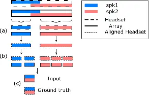
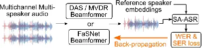
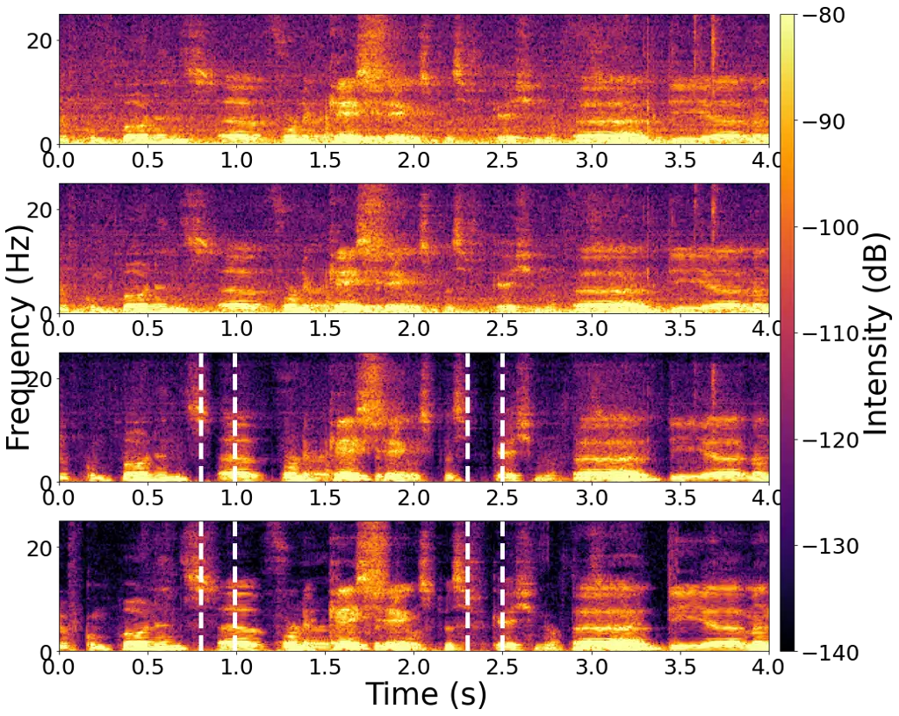

# Joint Beamforming and Speaker-Attributed ASR for Real Distant-Microphone Meeting Transcription

Can Cui ^(†)^(†)thanks: This work was mostly conducted while Can Cui was
pursuing her PhD with Inria Centre at Université de Lorraine (Nancy,
France). Affiliation: iFLYTEK Co., Ltd.  
Shanghai, China  
cancui11@iflytek.com    Imran Sheikh Affiliation: Vivoka  
Metz, France  
imran.sheikh@vivoka.com    Mostafa Sadeghi, Emmanuel Vincent
Affiliation: Université de Lorraine, CNRS, Inria, LORIA, F-54000  
Nancy, France  
{mostafa.sadeghi, emmanuel.vincent}@inria.fr Affiliation: 

###### Abstract

Distant-microphone meeting transcription is a challenging task.
State-of-the-art end-to-end speaker-attributed automatic speech
recognition (SA-ASR) architectures lack a multichannel noise and
reverberation reduction front-end, which limits their performance. In
this paper, we introduce a joint beamforming and SA-ASR approach for
real meeting transcription. We first describe a data alignment and
augmentation method to pretrain a neural beamformer on real meeting
data. We then compare fixed, hybrid, and fully neural beamformers as
front-ends to the SA-ASR model. Finally, we jointly optimize the fully
neural beamformer and the SA-ASR model. Experiments on the real AMI
corpus show that, while state-of-the-art method based on channel fusion
fails to improve ASR performance, fine-tuning SA-ASR on the fixed
beamformer’s output and jointly fine-tuning SA-ASR with the neural
beamformer reduce the word error rate by 8% and 9% relative,
respectively.

###### Index Terms: 

Beamforming, delay-and-sum, FaSNet, speaker-attributed ASR, joint
optimization

## I Introduction

Transcription of real distant-microphone conversational meetings or
domestic data is an active research area \[1, 2, 3\]. It remains
challenging today due to noise, reverberation, and overlapping speech.
To improve performance, many studies have employed a front-end
multichannel speech separation module or a series of (fixed,
statistical, or neural) beamformers steered toward the speakers to
extract individual speech signals from the overlapping speech mixture
and subsequently feed each of them to a single-speaker ASR module \[4,
5\]. Unfortunately, the separation error then propagates to the ASR
module. Later studies \[6, 7, 8\] proposed jointly optimizing ASR and
front-end separation by back-propagating ASR losses to the separation
module via permutation invariant training (PIT), albeit at higher
computational cost.

End-to-end multi-speaker ASR based on serialized output training (SOT)
\[9\] addresses these limitations. \[10\] introduced an end-to-end
Transformer-based speaker-attributed ASR (SA-ASR) system for joint
recognition of speech and speaker identities from single-channel log Mel
features, later extended to multichannel SA-ASR (MC-SA-ASR) by
integrating log Mel \[11\] and phase \[12\] features with time-varying
multi-frame cross-channel attention (MFCCA). Such multichannel attention
schemes are often believed to outperform classical beamforming yielding
state-of-the-art performance. Yet, in contrast to a frequency-dependent
complex-valued beamformer, they rely on frequency-independent
real-valued weights, which results in limited noise and reverberation
reduction.

In this paper, we propose to combine SA-ASR with a beamforming-based
noise and reverberation reduction front-end to improve speech and
speaker recognition in far-field conditions. The beamformer fuses the
mixture channels into a single-channel enhanced mixture fed to SA-ASR.
While such a front-end is common in single-speaker scenarios, extending
it to real multi-speaker scenarios is non trivial. First, the beamformer
must dynamically adapt its spatial response based on the speakers’
positions and activity patterns, which vary over time. This complexity
explains the scarcity of multi-speaker beamforming front-ends in the
literature. BeamformIt \[13\] was used as a front-end for PIT-based
multi-speaker ASR \[6\] and single-speaker ASR baselines for
multi-speaker ASR tasks \[14, 1\], while minimum variance
distortion-less response (MVDR) beamforming was used as a front-end for
SA-ASR in \[15\] without comparison to MFCCA. To our knowledge, no
full-neural beamforming front-end has been used for SA-ASR so far.
Second, pretraining a neural beamformer on real meeting data is
challenging due to the absence of ground truth noiseless dry mixture
signals as pretraining targets.

The contributions of this paper are as follows. First, we introduce data
alignment and augmentation techniques to pretrain a multi-speaker neural
beamformer on a real meeting corpus containing both distant microphone
and headset recordings. Note that the beamformer is employed to reduce
noise and reverberation, but not to extract the individual speakers.
Second, we propose a pipeline integrating beamforming with SA-ASR,
aiming to improve both speech and speaker recognition. Third, we
evaluate the differences in performance between statistical, hybrid, and
neural beamformers. Finally, we jointly optimize the neural beamformer
and the SA-ASR model. Our experiments on the AMI corpus \[16\] reveal
that, while MFCCA-based channel fusion does not improve ASR performance,
fine-tuning SA-ASR on the fixed beamformer’s output and jointly
fine-tuning SA-ASR with the neural beamformer reduces the WER by 8% and
9% relative, respectively.

The paper is organized as follows. Section II reviews the beamformers
considered in this work and SA-ASR model. Section III introduces our
joint system and the AMI data alignment and augmentation pipeline.
Section IV describes our experimental setup and results, and we conclude
in Section V.

## II Background

### II-A Beamforming and dereverberation methods

The delay-and-sum (DAS) beamformer \[17\] is a fixed beamformer, which
depends only on the delays between the microphone signals and a
reference microphone. It involves computing the delays using a time
difference of arrival estimator such as the generalized
cross-correlation with phase transform \[18\], shifting the phase of the
microphone signals accordingly in the complex short-time Fourier
transform domain, and summing them.

Deep neural network (DNN)-based MVDR beamforming \[19, 20\] combines
neural networks with traditional beamforming methods. The DNN is trained
to estimate masks in the time-frequency domain that enhance the desired
signals and suppress interference. This information is then used to
compute the MVDR beamformer weights, which minimize the output power
while preserving the signals from the target direction. This method can
be seen as a transition between traditional optimization-based
beamforming and fully neural network-based approaches.

The Filter-and-Sum Network (FaSNet) system \[21\] aims to directly
estimate time-domain beamforming filters. It employs a two-stage design:
the first stage estimates filters for a reference microphone, and the
second stage estimates filters for the remaining microphones based on
pairwise cross-channel features between the pre-separated output and
each microphone. The FaSNet architecture utilizes dual-path recurrent
neural networks \[22\] to extract information from both the channel and
frame levels. The Transform-average-concatenate (TAC) \[23\] design
paradigm addresses channel permutation and is capable of handling
various numbers of microphones.

Multichannel dereverberation using weighted prediction error (WPE)
\[24\] reduces reverberation by modeling and subtracting late
reverberant components from the observed audio signal using linear
prediction. This technique optimizes prediction coefficients and error
weights to enhance speech clarity and intelligibility in reverberant
environments.

### II-B Speaker-attributed ASR

A Transformer-based end-to-end SA-ASR system was proposed in \[10\].
Following the SOT principle \[9\], the output is the concatenation of
all speakers’ sentences in first-in-first-out order, where each token is
associated with one speaker ID and distinct speakers are separated by an
\<sc\> token. The inputs to the model consist of an acoustic feature
sequence (log-Mel filterbank) and a set of reference speaker embeddings.
A Conformer-based ASR Encoder first encodes acoustic information, along
with a speaker encoder to encode speaker information. Then, the
Transformer-based ASR decoder and speaker decoder modules decode text
and speaker information, respectively. The speaker decoder generates a
speaker representation corresponding to each token in the ASR Decoder’s
output token sequence. This representation is used to assign speakers by
computing a dot product with the reference speaker embeddings.

## III Proposed methods

### III-A Real meeting data alignment and augmentation for neural beamformer training

Neural beamforming on real-world far-field data is challenging due to
the lack of ground truth enhanced signals for training. Real meeting
corpora such as AMI include headset recordings for each speaker, but
these can’t be used directly as ground truth because of variable delays
caused by the speakers’ positions. To address this, we generate aligned
array and headset signals in three steps (see Fig. 1): (a) extract all
non-overlapping speech segments for each speaker based on dataset
annotations; (b) align each non-overlapping headset segment with the
corresponding array segment using matched filters, then cut them into
fixed-length clips; (c) randomly sample and mix array clips from
different speakers to create far-field mixtures, and mix the
corresponding aligned headset clips to obtain the reference noise and
reverberation-free mixtures enhanced mixtures.



Fig. 1: Mixture generation from real meeting data.

The matched filters $`f_{ij}(t)`$ in step (b) are calculated in the
least squares sense by solving

```math
\displaystyle\min_{f_{ij}}\sum_{t}(f_{ij}\star h_{j}(t)-x_{i}(t))^{2} \tag{1}
```

where $`h_{j}(t)`$ and $`x_{i}(t)`$ stand for the headset signal of
speaker $`j`$ and the array signal at microphone $`i`$, respectively,
and $`\star`$ denotes time-domain convolution. The solution is obtained
as the finite impulse response Wiener filter, which is commonly employed
for filter estimation.

### III-B Joint multichannel beamforming and SA-ASR

We propose a joint system integrating beamforming and SA-ASR for
multichannel, distant-microphone meeting transcription. As illustrated
in Fig. 2, the multichannel audio is first processed by a beamformer to
generate enhanced single-channel audio. The output audio is then fed to
SA-ASR to obtain speech and speaker recognition results. We compare the
performance of the fixed DAS beamformer, the hybrid DNN-MVDR (simply
refered to as MVDR) beamformer, and the fully neural FaSNet beamformer,
when fine-tuning the SA-ASR model on training data enhanced with the
respective beamformer. In addition, we backpropagate the loss from
SA-ASR to FaSNet, in order to fine-tune the neural beamformer according
to the SA-ASR training objective.



Fig. 2: Proposed joint system of Beamformer and SA-ASR

## IV Experimental evaluation

This section details our experimental setup and results. For
reproducibility, our code is available online.¹¹ 1
https://github.com/can-cui/joint-beamforming-sa-asr

### IV-A Datasets

Mixed AMI — To train the MVDR and the FaSNet beamformer, we apply the
method described in Section III-A to the AMI meeting corpus. This method
creates mixtures of real single-speaker AMI segments and their
corresponding ground truths. We name this dataset Mixed AMI. We only use
one-quarter of all meetings and fix the clip length to 4 s. The mixtures
are generated by overlapping randomly selected clips from 1 to 4
speakers. The training, development, and test sets contain 150 h, 17 h,
and 16 h of speech data, respectively.  
Multi-speaker LibriSpeech — To optimize performance on AMI, the SA-ASR
model requires pretraining on a larger simulated dataset \[25\]. We
created a 960 h training set and a 20 h development set from LibriSpeech
\[26\] train-960 and dev-clean. We adopted the room simulation and
speaker mixture settings described in \[12\].  
Real AMI — Once pretrained on Multi-speaker LibriSpeech, the SA-ASR
model is fine-tuned and evaluated on real AMI multiple distant
microphones (MDM) data. We utilize the segmentation method in \[12\] to
partition the MDM data into 5 s chunks and adjust the chunk start/end
times to non-overlapped word boundaries. The resulting Real AMI dataset
contains respectively 165 h, 19 h, and 19 h for training, development,
and test. For both Mixed AMI and Real AMI, we consider 2- and 8-channel
settings.

### IV-B Metrics

We evaluate the beamforming performance using the scale-invariant
signal-to-distortion ratio (SI-SDR) and its improvement (SI-SDRi),
implemented in Asteroid toolkit \[27\], measured in dB on the Mixed AMI
test set. We calculate the baseline SI-SDR for SA-ASR by defining the
array mixture signal as the estimated signal, ensuring that the SI-SDRi
is 0 dB without beamforming. For all beamforming methods, we calculate
the SI-SDR by defining the beamformed signal as the estimated signal and
compute SI-SDRi by subtracting the corresponding baseline SI-SDR. The
performance of SA-ASR is evaluated by the word error rate (WER) and the
sentence-level speaker error rate (SER) \[28\] in %.

### IV-C Models description

We utilize the implementation of DAS from the SpeechBrain toolkit
\[29\]. For the MVDR model, we utilize the implementation in TorchAudio
\[30\]. The number of filterbank output channels and the number of bins
in the estimated masks are both 513. The implementation of FaSNet with
TAC is from the Asteroid toolkit. The encoder dimension and feature
dimension are 64. The dual path blocks consist of a 4-layer dual model.

We implemented SA-ASR and the MFCCA-based MC-SA-ASR system in \[12\] as
a baseline using SpeechBrain. In SA-ASR and MC-SA-ASR, the
Conformer-based encoder, the Transformer-based decoder and the speaker
decoder have 12, 6 and 2 layers, respectively. All multi-head attention
mechanisms have 4 heads, the model dimension is 256, and the size of the
feedforward layer is 2,048. The speaker embedding model is a
pretrained²² 2 Available at
https://huggingface.co/speechbrain/spkrec-ecapa-voxceleb Emphasized
Channel Attention, Propagation, and Aggregation in Time-Delay Neural
Network \[31\], yielding 192 dimensional embeddings.

Additionally, we test the performance obtained with WPE, implemented by
\[32\], during the evaluation of the MC-SA-ASR model.

### IV-D Training setup

The MVDR and FaSNet beamformer are trained on Mixed AMI for 200 epochs
with early stopping, using the Adam optimizer with a learning rate of
$`10^{-3}`$.

The ASR modules in SA-ASR and MC-SA-ASR are pretrained on Multi-speaker
LibriSpeech for 80 epochs using Adam with a learning rate of
$`5\times 10^{-4}`$. The ASR and speaker modules are then further
pretrained on Multi-speaker LibriSpeech for 60 epochs with a learning
rate of $`2.5\times 10^{-4}`$. SA-ASR and MC-SA-ASR are fine-tuned on
either unprocessed (baseline) or beamformed Real AMI data for 15 epochs,
using Adam with a learning rate of $`3\times 10^{-4}`$.

### IV-E Evaluation results

|               |        |        |                    |      |       |       |       |       |             |       |                   |       |       |       |       |       |             |       |
| ------------- | ------ | ------ | ------------------ | ---- | ----- | ----- | ----- | ----- | ----------- | ----- | ----------------- | ----- | ----- | ----- | ----- | ----- | ----------- | ----- |
| System        | \# Prm | \# Chn | Mixed AMI test set |      |       |       |       |       |             |       | Real AMI test set |       |       |       |       |       |             |       |
|               |        |        | 1-spk              |      | 2-spk |       | 3-spk |       | 1,2,3,4-spk |       | 1-spk             |       | 2-spk |       | 3-spk |       | 1,2,3,4-spk |       |
|               |        |        | SDR                | SDRi | SDR   | SDRi  | SDR   | SDRi  | SDR         | SDRi  | WER               | SER   | WER   | SER   | WER   | SER   | WER         | SER   |
| SA-ASR        | 69M    | 1      | 5.41               | 0    | 5.75  | 0     | 5.79  | 0     | 5.66        | 0     | 26.76             | 11.92 | 40.23 | 32.66 | 52.31 | 45.11 | 44.54       | 34.73 |
| MC-SA-ASR     | 59M    | 2      | 5.41               | 0    | 5.75  | 0     | 5.79  | 0     | 5.66        | 0     | 26.41             | 11.73 | 40.79 | 32.64 | 52.59 | 43.82 | 44.99       | 34.43 |
| +WPE (test)   |        | 2      | 5.72               | 0.31 | 5.93  | 0.18  | 5.92  | 0.13  | 5.87        | 0.21  | 26.43             | 12.13 | 40.80 | 32.54 | 52.32 | 44.14 | 44.72       | 34.65 |
| DAS-SA-ASR    | 69M    | 2      | 5.62               | 0.21 | 5.42  | -0.33 | 5.23  | -0.56 | 5.39        | -0.27 | 25.59             | 12.82 | 40.36 | 33.87 | 52.04 | 45.55 | 44.03       | 35.56 |
|               |        | 8      | 5.66               | 0.25 | 5.48  | -0.27 | 5.30  | -0.49 | 5.38        | -0.28 | 23.51             | 12.13 | 38.41 | 33.12 | 50.43 | 43.44 | 41.71       | 34.40 |
| +WPE          |        | 8      | 6.18               | 0.77 | 5.54  | -0.21 | 5.04  | -0.75 | 5.35        | -0.31 | 23.49             | 11.43 | 37.89 | 32.67 | 50.12 | 43.59 | 41.37       | 33.84 |
| MVDR-SA-ASR   | 74M    | 2      | 7.40               | 1.98 | 7.42  | 1.67  | 7.46  | 1.80  | 7.44        | 1.78  | 26.54             | 12.94 | 41.07 | 34.47 | 52.81 | 45.18 | 44.39       | 35.92 |
|               |        | 8      | 8.14               | 2.72 | 8.10  | 2.34  | 8.10  | 2.30  | 8.11        | 2.44  | 27.31             | 12.42 | 41.27 | 34.52 | 52.63 | 45.07 | 44.23       | 35.21 |
| +WPE          |        | 8      | 8.40               | 2.99 | 8.09  | 2.34  | 8.03  | 2.24  | 8.14        | 2.48  | 26.35             | 12.93 | 41.03 | 33.72 | 52.12 | 44.26 | 44.12       | 35.37 |
| FaSNet-SA-ASR | 72M    | 2      | 10.21              | 4.79 | 9.85  | 4.09  | 9.56  | 3.76  | 9.76        | 4.10  | 26.86             | 11.33 | 40.91 | 35.67 | 52.57 | 47.12 | 44.57       | 36.24 |
|               |        | 8      | 10.41              | 4.99 | 10.01 | 4.25  | 9.72  | 3.92  | 9.96        | 4.29  | 26.53             | 10.73 | 39.93 | 34.78 | 51.70 | 45.28 | 44.11       | 35.51 |
| +WPE          |        | 8      | 5.88               | 0.47 | 5.88  | 0.47  | 5.66  | -0.13 | 5.85        | 0.19  | 26.16             | 10.78 | 39.35 | 34.89 | 51.22 | 45.25 | 43.39       | 35.41 |

- •
  Note: For all the tables, we employed the SCTK toolkit \[33\] to
  conduct significance tests, specifically the Matched Pair Sentence
  Segment test. For the mixture of 1,2,3 and/or 4 speakers, the best
  WER/SER and the results statistically equivalent to it at a 0.05
  significance level are highlighted.

TABLE I: Results for models fine-tuned and tested on unprocessed (SA-ASR
and MC-SA-ASR) or beamformed (DAS-SA-ASR, MVDR-SA-ASR, FaSNet-SA-ASR)
data. For convenience, we denote SI-SDR and SI-SDRi as SDR and SDRi,
respectively.

#### IV-E1 Fine-tuning SA-ASR with DAS vs. with frozen MVDR and FaSNet

We initially evaluated an SA-ASR model fine-tuned on the first channel
of Real AMI. The resulting WER and SER on mixtures of 1, 2, 3, or 4
speakers were 44.54% and 34.73%, respectively. However, when testing the
same model on FaSNet beamformed 2-channel Real AMI, the WER, and SER
increased to 64.32% and 46.30%. Therefore, in all following experiments,
we fine-tune the SA-ASR model on real AMI training data enhanced using
the same beamformer as the test data. This adaptation is essential to
align the model with the specific conditions of the test set.

Table I shows the test results of the baseline models (SA-ASR and
MC-SA-ASR) and the combination of SA-ASR with three beamformers, where
the parameters of MVDR and FaSNet are frozen during fine-tuning. Without
WPE, the WER comparison between SA-ASR (44.54%) and MC-SA-ASR (44.99%)
demonstrates that, while MFCCA had achieved a 13% relative WER reduction
on simulated data in \[12\], it is inefficient on real meeting data. In
general, fine-tuning the SA-ASR model on beamformed audio improves the
ASR performance, particularly in the 8-channel setting, where using the
DAS beamformer leads to a 6% relative reduction in WER without WPE
(41.71%) and 8% with WPE (40.96%) compared to SA-ASR. It is also
interesting to note that, despite FaSNet’s superior denoising and
dereverberation performance in terms of SI-SDRi, the SA-ASR model
trained on speech beamformed by FaSNet performs less effectively than
the one trained on speech beamformed by DAS. In the 8-channel setting,
without WPE, using DAS results in a 5% relative reduction in WER
compared to using FaSNet (from 44.11% to 41.71%). The WER relative
reduction is up to 6% (from 44.23% to 41.71%) compared to the
MVDR-SA-ASR system. The latter system has a similar performance to the
FaSNet-SA-ASR system.



Fig. 3: Spectrogram of one 8-channel Mixed AMI test chunk. From top to
bottom: 1st array channel; DAS beamformed signal; FaSNet beamformed
signal; ground truth.

To find the reason for the difference between DAS-SA-ASR and
FaSNet-SA-ASR, we visualize the spectrogram of one 8-channel Mixed AMI
test chunk before and after beamforming (see Fig. 3). It can be seen
that, although FaSNet exhibits effective denoising, it also removes a
portion of the speech signal, as highlighted by the white columns in the
figure. On the contrary, DAS can preserve a significant portion of all
speech signals while providing some denoising, which results in better
speech and speaker recognition results.

| Mixed AMI test set |      |      |            |        | Real AMI test set |       |           |       |       |       |
| ------------------ | ---- | ---- | ---------- | ------ | ----------------- | ----- | --------- | ----- | ----- | ----- |
| Pretrained         |      |      | Fine-tuned |        | 1-spk             |       | 3-spk mix |       | Total |       |
| \# Epo             | SDR  | SDRi | SDR        | SDRi   | WER               | SER   | WER       | SER   | WER   | SER   |
| 0                  | 5.66 | 0    | -16.21     | -21.87 | 25.31             | 11.37 | 48.63     | 43.07 | 41.71 | 33.68 |
| 5                  | 9.27 | 3.61 | 5.13       | -0.53  | 24.91             | 13.06 | 47.49     | 45.00 | 40.60 | 34.87 |
| 10                 | 9.46 | 3.79 | 6.12       | 0.46   | 24.99             | 11.80 | 48.02     | 44.75 | 40.82 | 34.29 |
| 50                 | 9.69 | 4.02 | 7.05       | 1.39   | 24.54             | 13.51 | 47.71     | 43.87 | 40.52 | 34.43 |

TABLE II: Results for jointly trained 2-channel FaSNet and SA-ASR
models. “Total”: test set with 1,2,3,4-speaker mix.

Table I also shows the performance differences for each system with or
without WPE for dereverberation. First, even without beamforming, using
WPE only during the inference phase for MC-SA-ASR results in a 0.21 dB
improvement in SI-SDR and a slight absolute WER reduction of 0.27% (from
44.99% to 44.72%). For systems using beamformed signals, integrating WPE
during the beamforming phase improves the SI-SDRi for DAS and MVDR but
not for FaSNet. However, using WPE during beamforming to fine-tune the
SA-ASR model systematically improves ASR and speaker identification
performance. This demonstrates that WPE aids in reverberation reduction
for fixed beamformers. However, the improvement in recognition
performance for neural beamformers (MVDR and FaSNet) is less pronounced,
likely because these beamformers have already learned to reduce
reverberation during their training process.

#### IV-E2 Joint optimization of FaSNet and SA-ASR

Moreover, we pretrain FaSNet for 0, 5, 10, or 50 epochs and subsequently
fine-tune it for 15 epochs jointly with SA-ASR by backpropagating the
SA-ASR loss. The results in Table II show that joint optimization of
FaSNet and SA-ASR (40.52%) reduces the WER by 9% relative to the frozen
FaSNet (44.57%) and to SA-ASR (44.54%). We also observed the lowest SER
as 33.68%, 7% relatively lower than using the frozen FaSNet (36.24%).
However, the fine-tuned FaSNet exhibits a smaller SI-SDRi than the
pretrained one. This indicates that joint training optimizes FaSNet for
ASR performance rather than maximum noise and reverberation reduction at
the cost of greater speech distortion. Furthermore, while the number of
FaSNet pretraining epochs significantly impacts the SI-SDRi, it does not
significantly impact the result of joint optimization, provided it’s
nonzero. This demonstrates the insensitivity of the joint optimization
to the pretraining level.

## V Conclusion

This paper explored the integration of beamforming with SA-ASR for joint
speech and speaker recognition of far-field meeting audio. We evaluated
the impact of fine-tuning SA-ASR on the outputs of DAS, MVDR, or FaSNet
beamformers and jointly fine-tuning SA-ASR with the latter, and compared
it with state-of-the-art MFCCA-based channel fusion. Experiments
revealed that, in contrast to previously published results on simulated
data, MFCCA’s performance is limited on real AMI data. This highlights
the importance of systematically evaluating SA-ASR on real meeting data.
Experiments show that DAS and jointly trained FaSNet-SA-ASR reduce WER
by 8% and 9%, respectively, while adding WPE to DAS-SA-ASR yields a 3%
gain in both WER and SER.

## References

- \[1\] Shinji Watanabe, Michael Mandel, Jon Barker, Emmanuel Vincent,
  Ashish Arora, Xuankai Chang, Sanjeev Khudanpur, Vimal Manohar, Daniel
  Povey, et al., “CHiME-6 Challenge: Tackling multispeaker speech
  recognition for unsegmented recordings,” in CHiME, 2020, pp. 1–7.
- \[2\] Fan Yu, Shiliang Zhang, Yihui Fu, Lei Xie, Siqi Zheng, Zhihao
  Du, Weilong Huang, Pengcheng Guo, Zhijie Yan, et al., “M2Met: The
  ICASSP 2022 Multi-Channel Multi-Party Meeting Transcription
  Challenge,” in ICASSP, 2022, pp. 6167–6171.
- \[3\] Samuele Cornell, Matthew S. Wiesner, Shinji Watanabe, Desh Raj,
  Xuankai Chang, Paola Garcia, Yoshiki Masuyam, Zhong-Qiu Wang, Stefano
  Squartini, and Sanjeev Khudanpur, “The CHiME-7 DASR Challenge: Distant
  meeting transcription with multiple devices in diverse scenarios,” in
  CHiME, 2023, pp. 1–6.
- \[4\] Takuya Yoshioka, Hakan Erdogan, Zhuo Chen, Xiong Xiao, and Fil
  Alleva, “Recognizing overlapped speech in meetings: A multichannel
  separation approach using neural networks,” in Interspeech, 2018, pp.
  3038–3042.
- \[5\] Naoyuki Kanda, Christoph Boeddeker, Jens Heitkaemper, Yusuke
  Fujita, Shota Horiguchi, Kenji Nagamatsu, and Reinhold Haeb-Umbach,
  “Guided source separation meets a strong ASR backend:
  Hitachi/Paderborn University joint investigation for dinner party
  ASR,” in Interspeech, 2019, pp. 1248–1252.
- \[6\] Xuankai Chang, Wangyou Zhang, Yanmin Qian, Jonathan Le Roux, and
  Shinji Watanabe, “MIMO-Speech: End-to-end multi-channel multi-speaker
  speech recognition,” in ASRU, 2019, pp. 237–244.
- \[7\] Jian Wu, Zhuo Chen, Sanyuan Chen, Yu Wu, Takuya Yoshioka,
  Naoyuki Kanda, Shujie Liu, and Jinyu Li, “Investigation of practical
  aspects of single channel speech separation for ASR,” in Interspeech,
  2021, pp. 3066–3070.
- \[8\] Jing Shi, Xuankai Chang, Shinji Watanabe, and Bo Xu, “Train from
  scratch: Single-stage joint training of speech separation and
  recognition,” Computer Speech & Language, vol. 76, pp. 101387, 2022.
- \[9\] Naoyuki Kanda, Yashesh Gaur, Xiaofei Wang, Zhong Meng, and
  Takuya Yoshioka, “Serialized output training for end-to-end overlapped
  speech recognition,” in Interspeech, 2020, pp. 2797–2801.
- \[10\] Naoyuki Kanda, Guoli Ye, Yashesh Gaur, Xiaofei Wang, Zhong
  Meng, Zhuo Chen, and Takuya Yoshioka, “End-to-end speaker-attributed
  ASR with Transformer,” in Interspeech, 2021, pp. 4413–4417.
- \[11\] Fan Yu, Shiliang Zhang, Pengcheng Guo, Yuhao Liang, Zhihao Du,
  Yuxiao Lin, and Lei Xie, “MFCCA: Multi-frame cross-channel attention
  for multi-speaker ASR in multi-party meeting scenario,” in SLT, 2023,
  pp. 144–151.
- \[12\] Can Cui, Imran Sheikh, Mostafa Sadeghi, and Emmanuel Vincent,
  “End-to-end multichannel speaker-attributed ASR: Speaker guided
  decoder and input feature analysis,” in ASRU, 2023.
- \[13\] Xavier Anguera, Chuck Wooters, and Javier Hernando, “Acoustic
  beamforming for speaker diarization of meetings,” IEEE Transactions on
  Audio, Speech, and Language Processing, vol. 15, no. 7, pp.
  2011–2022, 2007.
- \[14\] Tsubasa Ochiai, Shinji Watanabe, Takaaki Hori, John R Hershey,
  and Xiong Xiao, “Unified architecture for multichannel end-to-end
  speech recognition with neural beamforming,” IEEE Journal of Selected
  Topics in Signal Processing, vol. 11, no. 8, pp. 1274–1288, 2017.
- \[15\] Naoyuki Kanda, Jian Wu, Xiaofei Wang, Zhuo Chen, Jinyu Li, and
  Takuya Yoshioka, “Vararray meets T-Sot: Advancing the state of the art
  of streaming distant conversational speech recognition,” in ICASSP,
  2023, pp. 1–5.
- \[16\] Jean Carletta, Simone Ashby, Sebastien Bourban, Mike Flynn,
  Mael Guillemot, Thomas Hain, Jaroslav Kadlec, Vasilis Karaiskos,
  Wessel Kraaij, et al., “The AMI meeting corpus: A pre-announcement,”
  in International Workshop on Machine Learning for Multimodal
  Interaction, 2005, pp. 28–39.
- \[17\] Don H.. Johnson and Dan E.. Dudgeon, Array signal processing:
  concepts and techniques, Prentice Hall., 1993.
- \[18\] C. Knapp and G. Carter, “The generalized correlation method for
  estimation of time delay,” IEEE Transactions on Acoustics, Speech, and
  Signal Processing, vol. 24, no. 4, pp. 320–327, 1976.
- \[19\] Yen-Ju Lu, Samuele Cornell, Xuankai Chang, Wangyou Zhang,
  Chenda Li, Zhaoheng Ni, Zhong-Qiu Wang, and Shinji Watanabe, “Towards
  low-distortion multi-channel speech enhancement: The espnet-se
  submission to the l3das22 challenge,” in ICASSP, 2022, pp. 9201–9205.
- \[20\] Minseung Kim, Sein Cheong, and Jong Won Shin, “DNN-based
  Parameter Estimation for MVDR Beamforming and Post-filtering,” in
  Interspeech, 2023, pp. 3879–3883.
- \[21\] Yi Luo, Cong Han, Nima Mesgarani, Enea Ceolini, and Shih-Chii
  Liu, “FaSNet: Low-latency adaptive beamforming for multi-microphone
  audio processing,” in ASRU, 2019, pp. 260–267.
- \[22\] Yi Luo, Zhuo Chen, and Takuya Yoshioka, “Dual-path RNN:
  efficient long sequence modeling for time-domain single-channel speech
  separation,” in ICASSP, 2020, pp. 46–50.
- \[23\] Yi Luo, Zhuo Chen, Nima Mesgarani, and Takuya Yoshioka,
  “End-to-end microphone permutation and number invariant multi-channel
  speech separation,” in ICASSP, 2020, pp. 6394–6398.
- \[24\] Tomohiro Nakatani, Takuya Yoshioka, Keisuke Kinoshita, Masato
  Miyoshi, and Biing-Hwang Juang, “Speech dereverberation based on
  variance-normalized delayed linear prediction,” IEEE Transactions on
  Audio, Speech, and Language Processing, vol. 18, no. 7, pp.
  1717–1731, 2010.
- \[25\] Muqiao Yang, Naoyuki Kanda, Xiaofei Wang, Jian Wu, Sunit
  Sivasankaran, Zhuo Chen, Jinyu Li, and Takuya Yoshioka, “Simulating
  realistic speech overlaps improves multi-talker ASR,” in ICASSP, 2023,
  pp. 1–5.
- \[26\] Vassil Panayotov, Guoguo Chen, Daniel Povey, and Sanjeev
  Khudanpur, “Librispeech: An ASR corpus based on public domain audio
  books,” in ICASSP, 2015, pp. 5206–5210.
- \[27\] Manuel Pariente, Samuele Cornell, Joris Cosentino, Sunit
  Sivasankaran, Efthymios Tzinis, Jens Heitkaemper, Michel Olvera,
  Fabian-Robert Stöter, Mathieu Hu, et al., “Asteroid: the PyTorch-based
  audio source separation toolkit for researchers,” in
  Interspeech, 2020.
- \[28\] Naoyuki Kanda, Yashesh Gaur, Xiaofei Wang, Zhong Meng, Zhuo
  Chen, Tianyan Zhou, and Takuya Yoshioka, “Joint speaker counting,
  speech recognition, and speaker identification for overlapped speech
  of any number of speakers,” in Interspeech, 2020, pp. 36–40.
- \[29\] Mirco Ravanelli, Titouan Parcollet, Peter Plantinga, Aku Rouhe,
  Samuele Cornell, Loren Lugosch, Cem Subakan, Nauman Dawalatabad,
  Abdelwahab Heba, et al., “SpeechBrain: A general-purpose speech
  toolkit,” 2021, arXiv:2106.04624.
- \[30\] Yao-Yuan Yang, Moto Hira, Zhaoheng Ni, Anjali Chourdia, Artyom
  Astafurov, Caroline Chen, Ching-Feng Yeh, Christian Puhrsch, David
  Pollack, Dmitriy Genzel, Donny Greenberg, Edward Z. Yang, Jason Lian,
  Jay Mahadeokar, Jeff Hwang, Ji Chen, Peter Goldsborough, Prabhat Roy,
  Sean Narenthiran, Shinji Watanabe, Soumith Chintala, Vincent
  Quenneville-Bélair, and Yangyang Shi, “Torchaudio: Building blocks for
  audio and speech processing,” arXiv preprint arXiv:2110.15018, 2021.
- \[31\] Brecht Desplanques, Jenthe Thienpondt, and Kris Demuynck,
  “ECAPA-TDNN: Emphasized channel attention, propagation and aggregation
  in TDNN based speaker verification,” in Interspeech, 2020, pp.
  3830–3834.
- \[32\] Lukas Drude, Jahn Heymann, Christoph Boeddeker, and Reinhold
  Haeb-Umbach, “NARA-WPE: A python package for weighted prediction error
  dereverberation in Numpy and Tensorflow for online and offline
  processing,” in ITG Fachtagung Sprachkommunikation, 2018.
- \[33\] NIST, “SCTK,” https://github.com/usnistgov/SCTK.git, 2024,
  GitHub repository.
