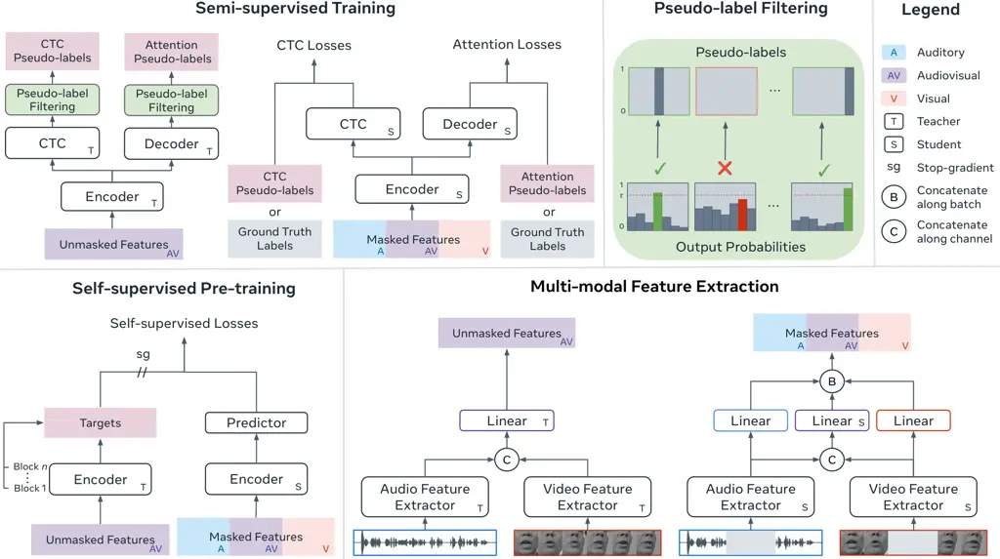

# Unified Speech Recognition: A Single Model for Auditory, Visual, and Audiovisual Inputs

Alexandros Haliassos Affiliation: Imperial College
Email: [ah2214@ic.ac.uk](mailto:)    Rodrigo Mira Affiliation: Imperial
College Email: [rs2517@ic.ac.uk](mailto:)    Honglie Chen
Affiliation: Meta AI Email: [hongliechen@meta.com](mailto:)    Zoe
Landgraf Affiliation: Meta AI Email: [zoelandgraf@meta.com](mailto:)   
Stavros Petridis Affiliation: Meta AI / Imperial College
Email: [stavrosp@meta.com](mailto:)    Maja Pantic Affiliation: Meta AI
/ Imperial College Email: [majapantic@meta.com](mailto:)

###### Abstract

Research in auditory, visual, and audiovisual speech recognition (ASR,
VSR, and AVSR, respectively) has traditionally been conducted
independently. Even recent self-supervised studies addressing two or all
three tasks simultaneously tend to yield separate models, leading to
disjoint inference pipelines with increased memory requirements and
redundancies. This paper proposes unified training strategies for these
systems. We demonstrate that training a single model for all three tasks
enhances VSR and AVSR performance, overcoming typical optimisation
challenges when training from scratch. Moreover, we introduce a greedy
pseudo-labelling approach to more effectively leverage unlabelled
samples, addressing shortcomings in related self-supervised methods.
Finally, we develop a self-supervised pre-training method within our
framework, proving its effectiveness alongside our semi-supervised
approach. Despite using a single model for all tasks, our unified
approach achieves state-of-the-art performance compared to recent
methods on LRS3 and LRS2 for ASR, VSR, and AVSR, as well as on the newly
released WildVSR dataset. Code and models are available at
[https://github.com/ahaliassos/usr](https://github.com/ahaliassos/usr).

## 1 Introduction

Speech recognition can be achieved using auditory signals (known as
auditory/automatic speech recognition; ASR) \[1, 2\], visual cues from
lip movements (visual speech recognition; VSR) \[3, 4\], or both
(audiovisual speech recognition; AVSR) \[5, 6\]. Audio typically offers
the most relevant information in videos of talking faces, but lipreading
can greatly enhance recognition, especially when the audio is noisy or
wholly unavailable \[6\]. Despite the similarities between ASR, VSR, and
AVSR, research in these fields has largely developed independently \[7,
8, 3, 9\].

The Transformer architecture’s versatility \[10, 11, 12\] has spurred
efforts to unify speech recognition by pre-training a single model on
various unlabelled inputs (visual, auditory, and audiovisual) through
self-supervision \[13, 14, 15\]. However, these methods often require
separate fine-tuning stages for ASR, VSR, and AVSR, leading to separate
models for each task, which increases computational load and complexity.
u-HuBERT \[16\] shows that a single pre-trained model can be fine-tuned
for all three tasks, yet does not reach the performance of separately
fine-tuned models \[17, 18\].

In this paper, we delve deeper into strategies for unified speech
recognition (USR) by training a single model to perform ASR, VSR, and
AVSR. We find that training such a model from scratch on the LRS3
dataset \[19\] achieves competitive performance on all tasks. This is
notable given the known optimisation difficulties in VSR training, which
previously required self-supervised pre-training \[13\], supervised
feature extractor pre-training \[6\], or curriculum learning
strategies \[9\]. Our findings suggest that including audio improves the
optimisation landscape for VSR and AVSR supervised training, as observed
in a different context by \[20\].

Furthermore, we propose a semi-supervised pseudo-labelling approach to
leverage unlabelled audiovisual data, addressing shortcomings of
standard fine-tuning in self-supervised methods \[13, 14, 17, 18\].
Fine-tuning often leads to overfitting due to using fewer samples than
pre-training, requiring various “tricks” to reach optimal
performance \[13, 17\]. This issue is particularly pronounced in
encoder-decoder architectures where usually only the encoder is
pre-trained, and attempts to pre-train the decoder have yielded
inconsistent results \[21, 22\]. Our semi-supervised approach generates
pseudo-labels via an encoder-decoder momentum-based teacher \[23\] to
leverage unlabelled samples throughout training, effectively mitigating
overfitting. Training on all three modalities simultaneously helps
alleviate the computational cost of pseudo-labelling as the cost is
amortised across the inputs.

Lastly, inspired by recent self-supervised works, we design a
pre-training method within our unified framework. We combine
pre-training with pseudo-labelling and show that our semi-supervised
approach is complementary to self-supervision. Our final unified models
achieve state-of-the-art results across multiple settings, surpassing
existing methods that use separate models for each task.

## 2 Related Work

#### Audiovisual self-supervised speech representation learning.

Recent interest in audiovisual self-supervised learning for speech
recognition has focused on leveraging the correspondence between audio
waveforms and silent lip movements to capture shared semantic content
across the modalities \[13, 17, 14, 15, 18\]. These methods employ
cross-modal learning and masked prediction \[24\] to develop
contextualised representations from large unlabelled datasets, which are
more readily available than transcribed datasets. After pre-training, a
randomly initialised decoder is appended to the encoder, often with an
optional CTC layer \[25\]. The system is then fine-tuned on a smaller
set of labelled samples for tasks such as ASR, VSR, and AVSR, usually
resulting in different models for each task \[13, 15\]. However, these
methods may fail to leverage unlabelled samples fully since the pretext
tasks are not directly aligned with speech recognition. Furthermore, the
decoder, trained on limited data during fine-tuning, is highly
susceptible to overfitting, necessitating strategies such as freezing
encoder layers \[13\] or employing variable learning rates across layers
to optimise performance \[17, 26\].

#### Pseudo-labelling for speech recognition.

Pseudo-labelling has been explored in audiovisual speech recognition
literature, with methods such as offline pseudo-labelling \[9, 27\] and
frame-wise distillation using frozen teacher models \[28\]. While these
approaches rely on frozen external ASR models trained on large-scale
datasets \[7, 29\], our USR method eliminates this dependency using a
randomly initialised teacher model that improves throughout training.

Iterative pseudo-labelling has shown promise for ASR. Some employ
multiple rounds of pseudo-labelling using costly beam search and
filtering strategies \[30, 31, 32, 33\], while others continuously and
efficiently update pseudo-labels using a CTC-only loss \[34, 35\].
However, eliminating filtering and attention losses can impact training
due to low-quality pseudo-labels, as observed in a recent method \[36\]
that aims to apply these approaches for ASR, VSR, and AVSR but lags
behind the state-of-the-art (see Appendix J). In contrast, USR uses an
encoder-decoder architecture to generate CTC and attention pseudo-labels
at each iteration through a greedy approach, while pseudo-label quality
is maintained via a token-wise filtering mechanism inspired by the
semi-supervised FixMatch technique \[37\] in image recognition. We note
that sharing the same pseudo-labels across auditory, visual, and
audiovisual inputs amortises generation costs, leading to efficient
CTC-attention training.

#### Single model for multiple modalities.

An earlier study \[38\] trained a single recurrent neural network \[39\]
for ASR, VSR, and AVSR, but noted significant performance differences
compared to modality-specific models. Recent works have shown that the
Transformer architecture \[10\] can handle multiple modalities using the
same weights, with minimal performance degradation \[11, 12\]. In speech
recognition, some \[13, 14, 15\] use the same Transformer encoder for
auditory, visual, and audiovisual inputs during pre-training, but then
separately fine-tune the parameters for ASR, VSR, and AVSR, resulting in
separate models during deployment. u-HuBERT \[16\] uses the same weights
for all modalities when fine-tuning a pre-trained AV-HuBERT
backbone \[13\], demonstrating the viability of a unified model.
However, it encounters limitations common to other self-supervised
approaches, such as proneness to overfitting during supervised
fine-tuning. Our proposed semi-supervised approach leverages unlabelled
samples during the fine-tuning stage, significantly alleviating these
concerns.

## 3 Unified Speech Recognition

Our unified method trains a pre-LN \[40\] Transformer \[10\]
encoder-decoder model for ASR, VSR, and AVSR. Section 3.1 describes the
task of unified speech recognition using supervised training, where we
have ground-truth annotation for each audio-visual pair. Sections 3.2
and 3.3 then introduce our proposed idea, which employs semi-supervised
training and self-supervised pre-training to effectively utilise
unlabelled samples. An overview of USR’s components is depicted in
Figure 1.

### 3.1 Unified Supervised Training



Figure 1: Unified Speech Recognition. Our USR method combines
self-supervised pre-training with semi-supervised fine-tuning. For
semi-supervised training, pseudo-labels are generated from unmasked
audiovisual features using an EMA (exponential moving average)-based
teacher. The student, intaking masked inputs, predicts pseudo-labels for
unlabelled data and ground-truth labels for labelled data. To obtain the
pseudo-labels, an argmax operation is applied to the CTC and attention
teacher output probabilities; the tokens with predicted probability
below a fixed threshold are discarded. For self-supervised pre-training,
a student encoder processes masked visual, auditory, and audiovisual
samples and predicts targets, generated by an EMA-based teacher intaking
unmasked audiovisual samples, via a shallow predictor. The targets are
the average outputs of the teacher blocks. The resulting student weights
are used to initialise the student and teacher in semi-supervised
fine-tuning. Feature extraction is achieved through modality-specific
feature extractors, whose features are concatenated along the channel
dimension to produce the audiovisual inputs. The auditory, visual, and
audiovisual student inputs are batched together for training efficiency.

#### Inputs.

Let $`\{(\mathbf{v}_{b},\mathbf{a}_{b},\mathbf{y}_{b}):b\in[1,B]\}`$ be
a batch of $`B`$ labelled samples, where $`\mathbf{v}_{b}`$ denotes a
$`T_{\text{v}}`$-frame video of lip movements, $`\mathbf{a}_{b}`$
denotes the corresponding (raw) audio waveform of
$`T_{\text{a}}=640T_{\text{v}}`$ frames¹¹ 1 We assume the video is
sampled at 25 frames per second and the audio at 16,000kHz., and
$`\mathbf{y}_{b}`$ denotes the label sequence of length
$`T_{\text{l}}`$. Following \[9, 17\], $`\mathbf{v}_{b}`$ and
$`\mathbf{a}_{b}`$ are zero-masked with a maximum duration of 0.4 and
0.6 seconds for each second of video and audio, respectively.

#### Multi-modal feature extraction.

The raw video and audio are fed into ResNet-18 \[41\] architectures: a
2D version with a 3D stem  \[42\] for video and a 1D version for audio,
sub-sampling the audio to match the video’s sampling rate \[17\]. Linear
layers follow the feature extractors to produce the visual and auditory
features. The audiovisual features are formed by concatenating the
feature extractor outputs along the channel dimension and applying a
linear transformation. Finally, the features from the three modalities
are concatenated along the batch dimension for efficient processing. We
provide the model with all three input types, enabling it to perform
well on ASR, VSR, and AVSR.

#### Losses.

The encoder outputs pass through a linear + softmax layer to yield
output probabilities $`\mathbf{c}_{b,m}`$ for each modality
$`m\in\{\text{v},\text{a},\text{av}\}`$. The CTC loss for each modality
is given by

```math
\displaystyle\mathcal{C}_{m}=\frac{1}{B}\sum_{b=1}^{B}l_{\text{ctc}}(\mathbf{c}_{b,m},\mathbf{y}_{b}), \tag{1}
```

where $`l_{\text{ctc}}`$ is the standard CTC loss \[25\]. Further, let
$`\mathbf{a}_{b,m}`$ denote the attention probabilities from the outputs
of the decoder in teacher forcing mode \[43\]. The batch attention loss
can be expressed as

```math
\displaystyle\mathcal{A}_{m}=\frac{1}{B}\sum_{b=1}^{B}l_{\text{ce}}(\textbf{a}_{b,m},\textbf{y}_{b}), \tag{2}
```

where $`l_{\text{ce}}`$ is the summed cross-entropy loss for each token.
The CTC and attention losses are combined to obtain

```math
\displaystyle\mathcal{L}_{m}=\lambda_{\text{ctc}}\mathcal{C}_{m}+(1-\lambda_{\text{ctc}})\mathcal{A}_{m}, \tag{3}
```

where $`\lambda_{\text{ctc}}`$ is the relative weight placed on the CTC
loss versus the attention loss. We set $`\lambda_{\text{ctc}}`$ to 0.1,
following \[27, 17, 18\]. The overall labelled loss is given by

```math
\displaystyle\mathcal{L}^{\text{lab}}=\lambda_{\text{v}}\mathcal{L}_{\text{v}}+(1-\lambda_{\text{v}})(\mathcal{L}_{\text{a}}+\mathcal{L}_{\text{av}}), \tag{4}
```

where $`\lambda_{\text{v}}`$ controls the weight of the video loss
relative to the audio/audiovisual losses. We do not use separate weights
for the audio/audiovisual losses due to similar training dynamics
observed in preliminary experiments.

### 3.2 Unified Semi-supervised Training

We introduce a student-teacher pseudo-labelling framework to utilise
unlabelled samples alongside labelled examples. The student, equipped
with labelled losses, mirrors the model in Section 3.1.

#### Inputs.

In addition to the labelled batch from Section 3.1, we now also have
$`B^{\text{u}}`$ unlabelled video and audio samples
$`\{(\mathbf{v}_{b}^{\text{u}},\mathbf{a}_{b}^{\text{u}}):b\in[1,B^{\text{u}}]\}`$.
The student inputs are masked as before.

#### Pseudo-labels.

The teacher, sharing the same architecture as the student, generates
pseudo-labels for unlabelled samples. The student is optimised as usual,
but no gradients are passed to the teacher. Instead, the teacher’s
weights $`\theta_{t}`$ are updated at each iteration via an exponential
moving average (EMA) of the student’s weights $`\theta_{s}`$ \[44\]:
$`\theta_{t}\leftarrow\mu\theta_{t}+(1-\mu)\theta_{s}`$, where $`\mu`$
increases throughout training from 0.999 to 1 using a cosine scheduler.

For an unmasked audiovisual sample, let $`\mathbf{\tilde{c}}_{b}`$ and
$`\mathbf{\tilde{a}}_{b}`$ denote the CTC probabilities from the teacher
encoder and the attention probabilities from the teacher decoder,
respectively. The CTC and attention pseudo-labels are given by
$`\argmax(\mathbf{\tilde{c}}_{b})`$ and
$`\argmax(\mathbf{\tilde{a}}_{b})`$, respectively, where $`\argmax`$ is
applied token-wise. Hence, the pseudo-labels correspond to units with
the maximum probability across the vocabulary for each input/output
time-step. The attention targets are generated auto-regressively by
selecting, at each time-step, the most likely unit as the input for the
next time-step, without using a costly beam search strategy. Our greedy
approach allows for efficient label generation.

#### Filtering.

The teacher may not consistently generate high-quality predictions,
especially early in training. We propose a straightforward token-wise
filtering mechanism, creating masks
$`\mathbbm{1}(\max(\mathbf{\tilde{c}}_{b})\geq\tau)`$ and
$`\mathbbm{1}(\max(\mathbf{\tilde{a}}_{b})\geq\tau)`$, where the
operations are applied token-wise. We thus discard a pseudo-label for a
given time-step if its confidence falls below a certain threshold
$`\tau`$. This mechanism draws inspiration from image recognition
literature \[37\] and is adapted to sequences.

#### Unlabelled losses.

The unlabelled losses are computed via the cross-entropy between the
student predictions and the teacher pseudo-labels. That is, the
per-modality CTC losses are given by

```math
\displaystyle\mathcal{C}_{m}^{\text{u}}=\frac{1}{B^{\text{u}}}\sum^{B^{\text{u}}}_{b=1}\mathbbm{1}(\max(\mathbf{\tilde{c}}_{b})\geq\tau)\odot l_{\text{ce}}(\textbf{c}_{b,m}^{\text{u}},\argmax(\mathbf{\tilde{c}}_{b})), \tag{5}
```

where $`\odot`$ denotes the Hadamard product and
$`\textbf{c}_{b,m}^{\text{u}}`$ the student outputs. The attention
losses $`\mathcal{A}_{m}^{\text{u}}`$ are computed similarly. The
unlabelled losses $`\mathcal{L}_{m}^{\text{u}}`$ are obtained as in Eq.
3:

```math
\displaystyle\mathcal{L}_{m}^{\text{u}}=\lambda_{\text{ctc}}\mathcal{C}_{m}^{\text{u}}+(1-\lambda_{\text{ctc}})\mathcal{A}_{m}^{\text{u}}, \tag{6}
```

#### Final loss.

The total semi-supervised loss $`\mathcal{L}^{\text{semi}}`$ combines
the per-modality labelled (see Eq. 3) and unlabelled losses (see Eq. 6):

```math
\mathcal{L}^{\text{semi}}=\gamma_{\text{v}}\lambda_{\text{v}}\mathcal{L}_{\text{v}}+\gamma_{\text{a}}(1-\lambda_{\text{v}})(\mathcal{L}_{\text{a}}+\mathcal{L}_{\text{av}})+(1-\gamma_{\text{v}})\lambda_{\text{v}}\mathcal{L}_{\text{v}}^{\text{u}}+(1-\gamma_{\text{a}})(1-\lambda_{\text{v}})(\mathcal{L}_{\text{a}}^{\text{u}}+\mathcal{L}_{\text{av}}^{\text{u}}), \tag{7}
```

where $`\gamma_{\text{a}}`$ and $`\gamma_{\text{v}}`$ weigh the
contribution of the labelled loss versus the unlabelled loss for
audio/audiovisual and visual inputs, respectively. In Section 4.2, we
show the benefits of using separate weights for each modality rather
than a single weight for both.

### 3.3 Unified Self-supervised Pre-training

Transformers typically benefit from self-supervised pre-training \[45,
13, 17, 15\], even with the same data used during fine-tuning \[46,
45\]. Inspired by recent work \[17, 18, 15\], we propose a
self-supervised method within our framework that can precede
semi-supervised fine-tuning.

#### Inputs.

For pre-training, we use only the unlabelled $`B^{u}`$ samples from
Section 3.2. Following \[17\], we mask the student inputs by selecting
each video frame index as the start of a three-frame mask with a 0.4
probability, applying a corresponding enlarged mask to the audio in
temporal alignment. The elements of the mask $`\mathbf{h}_{b}`$ are set
to 0 and 1 for unmasked and masked tokens, respectively.

#### Targets.

The targets are generated by an EMA-based teacher encoder model from
unmasked audiovisual inputs, similarly to Section 3.2. Following \[15,
18\], the targets $`\textbf{e}_{b}`$ are generated by averaging the
outputs from all encoder blocks and applying instance normalisation
 \[47\]. Using only audio targets, as in \[15\], can make the student’s
final layers more relevant to speech, which has proven beneficial for
fine-tuning with few samples, where there is high chance of
overfitting \[17\]. Our fine-tuning process instead uses abundant
unlabelled data with pseudo-labels which help reduce overfitting and
allow the network to learn from rich audiovisual targets.

#### Predictor.

Following \[17\], we employ a 512-dimensional two-block Transformer
predictor that processes student encoder outputs and mask tokens to
produce predictions $`\textbf{p}_{b,m}`$. Unlike the separate predictors
for video and audio used in \[17\], we use a single predictor for all
inputs.

#### Loss.

The loss for modality $`m`$ can be expressed as

```math
\displaystyle\mathcal{L}_{m}^{\text{self}}=-\frac{1}{B^{\text{u}}}\sum^{B^{\text{u}}}_{b=1}\mathbf{h}_{b}\odot\cos(\mathbf{p}_{b,m},\mathbf{e}_{b}), \tag{8}
```

where $`\cos`$ denotes cosine similarity, applied token-wise. Thus, the
student aims to predict the teacher targets corresponding to the masked
inputs. The self-supervised loss $`\mathcal{L}^{\text{self}}`$ is then

```math
\displaystyle\mathcal{L}^{\text{self}}=\lambda_{\text{v}}\mathcal{L}_{\text{v}}^{\text{self}}+(1-\lambda_{\text{v}})(\mathcal{L}_{\text{a}}^{\text{self}}+\mathcal{L}_{\text{av}}^{\text{self}}). \tag{9}
```

## 4 Main Properties

In this section, we investigate the behaviour of our unified model. For
all experiments, we use a 12-block Base model with hidden size of 512
(see Appendix C.4 for model details). We report test set word error
rates (WER) for direct comparison with the main results. Note that we
used the validation set from \[13\] in the exploration stage to avoid
overfitting to the test set.

### 4.1 Unified Supervised Training

|          |         |     |      |
| -------- | ------- | --- | ---- |
| Params   | WER (%) |     |      |
|          | V       | A   | AV   |
| Shared   | 36.4    | 2.3 | 2.1  |
| Unshared | 85.5    | 2.1 | 63.4 |

(a) Sharing model parameters vs. using modality-specific models.

|      |         |     |     |
| ---- | ------- | --- | --- |
| Mod  | WER (%) |     |     |
|      | V       | A   | AV  |
| Rand | 36.2    | 2.3 | 2.2 |
| All  | 36.4    | 2.3 | 2.1 |

(b) Modality sampling. Random sampling is trained for $`3\times`$ more
epochs as it sees one-third of the data at each iteration.

|                 |         |     |     |
| --------------- | ------- | --- | --- |
| $`\lambda_{v}`$ | WER (%) |     |     |
|                 | V       | A   | AV  |
| 0.1             | 42.9    | 2.2 | 1.9 |
| 0.3             | 36.4    | 2.3 | 2.1 |
| 0.5             | 35.2    | 2.4 | 2.2 |

(c) Relative weight for video loss.

Table 1: Supervised ablations on the full LRS3 dataset using our Base
model. Default settings are in gray in all tables of the paper.

In Table 1, we investigate properties of training our unified model from
scratch on the full LRS3 dataset \[19\] (see Section 3.1). Training
details are provided in Section C.5.

#### Sharing weights.

Table 1(a) studies the impact of weight sharing versus separate models
per task (ASR, VSR, AVSR). While using only auditory inputs yields
strong performance, training VSR and AVSR models from scratch encounters
optimisation challenges, in line with prior research \[13, 17\].
Interestingly, these hurdles are overcome with weight sharing, resulting
in robust VSR and AVSR performance without self-supervised
pre-training \[17\] or training techniques like curriculum
learning \[9\]. This is likely due to audio containing denser verbal
information than video, enhancing the optimisation landscape for visual
modalities \[20\].

#### Modality sampling.

We employ a weighted average to combine the per-modality losses (see
Eq. 4). In contrast, other methods \[13, 15\] randomly sample, at each
iteration, input types with different probabilities, which may vary
during training. Table 1(b) shows that our approach performs similarly
with random sampling when training the latter for $`3\times`$ more
epochs. Our approach offers benefits such as sharing computational costs
among feature extractor forward passes and amortising the cost of
pseudo-label generation across input types (see Section 3.2), as all
modalities use the same targets.

#### Input type weight.

Table 1(c) studies the effect of using different weights for the visual
modality. We observe that using a higher $`\lambda_{\text{v}}`$ for the
VSR loss improves VSR but worsens ASR/AVSR. We choose
$`\lambda_{\text{v}}=0.3`$ as our default setting, striking a balance in
performance among the different tasks.

### 4.2 Unified Semi-supervised Training

In Table 2, we ablate various components to better understand our
unified semi-supervised framework (see Section 3.3). We adopt the common
low-resource setting \[13\]: the 30-hour “trainval” partition of LRS3
serves as our labelled dataset, while the remaining portion of LRS3
(without labels) provides our unlabelled samples. See Appendix C.5 for
training details.

#### Filtering predicted tokens.

Figure 2 investigates the impact of the threshold parameter
$`\tau\in\{0,0.8,1\}`$. We plot (from left to right) (1) the proportion
of tokens exceeding $`\tau`$, (2) the validation attention accuracy of
the decoder using teacher forcing, and (3) the CTC loss, as a function
of the epoch number. We also show the final WER. We observe that
$`\tau=1`$, where only labelled samples contribute to training, results
in poor attention accuracy, high CTC loss, and high WER across input
types. Conversely, $`\tau=0`$, implying no filtering (i.e., all tokens
are considered regardless of confidence level), yields competitive
performance, suggesting some robustness to low-quality pseudo-labels.
Finally, for $`\tau=0.8`$, the proportion of tokens with confidence over
$`\tau`$ begins at a low level and steadily increases throughout
training as the teacher network improves. This yields improved
performance in terms of attention accuracy, CTC loss, and final WER,
demonstrating the efficacy of filtering via a simple confidence
threshold. A more fine-grained analysis of $`\tau`$ values are given in
Section D.1.

#### Quantity/quality trade-off.

Pseudo-labels tend to be abundant but noisy, while ground-truth
transcriptions are scarce yet high-quality. The balance between quantity
and quality is adjustable via the hyperparameters $`\gamma_{\text{v}}`$
and $`\gamma_{\text{a}}`$ in Eq. 7. Table 2(a) explores different values
for $`\gamma_{\text{v}}`$ and $`\gamma_{\text{a}}`$, revealing better
performance when $`\gamma_{\text{a}}>\gamma_{\text{v}}`$. Noisy
pseudo-labels generated from audiovisual samples may suffice for VSR,
which often performs worse than ASR/AVSR and benefits from data
abundance. Conversely, ASR/AVSR is less prone to overfitting and may
suffer with excessive reliance on low-quality pseudo-labels, requiring a
higher relative weight on labelled losses.

#### Momentum.

Table 2(b) shows the effect of updating the teacher’s weight via EMA
($`\mu=0.999`$) compared to simply copying the student’s weights at
every iteration ($`\mu=0`$). Using EMA results in better performance,
yet good results are achieved even without it.

#### Loss types.

CTC and attention-based encoder-decoder frameworks are dominant
approaches in speech recognition. While attention typically outperforms
CTC, it may struggle with proper alignment prediction, requiring tuning
of various decoding hyperparameters \[48\]. To address these challenges,
we adopt a CTC-attention hybrid framework \[48\], as in \[17, 9, 27\].
The costly auto-regressive attention pseudo-label generation is made
computationally feasible via our greedy strategy and multi-modal feature
extraction (which amortises pseudo-label generation costs). Table 2(c)
demonstrates a significant improvement in results by using both CTC and
attention compared to CTC alone.

|          |         |     |     |
| -------- | ------- | --- | --- |
| $`\tau`$ | WER (%) |     |     |
|          | V       | A   | AV  |
| 0.0      | 40.7    | 4.9 | 4.7 |
| 0.8      | 37.8    | 4.0 | 3.9 |
| 1.0      | 61.8    | 8.9 | 8.4 |

Figure 2: Pseudo-label filtering threshold. Left: Validation plots for
different values of threshold $`\tau`$. Right: Final WER for different
values of $`\tau`$.

|                       |                       |         |     |     |
| --------------------- | --------------------- | ------- | --- | --- |
| $`\gamma_{\text{a}}`$ | $`\gamma_{\text{v}}`$ | WER (%) |     |     |
|                       |                       | V       | A   | AV  |
| 0.5                   | 0.5                   | 42.3    | 4.1 | 4.0 |
| 0.2                   | 0.2                   | 38.0    | 4.2 | 4.1 |
| 0.5                   | 0.2                   | 37.8    | 4.0 | 3.9 |

(a) Relative labelled weight for audio and video.

|         |         |     |     |
| ------- | ------- | --- | --- |
| $`\mu`$ | WER (%) |     |     |
|         | V       | A   | AV  |
| 0       | 38.9    | 4.1 | 4.0 |
| 0.999   | 37.8    | 4.0 | 3.9 |

(b) Teacher’s EMA momentum parameter.

|           |         |     |     |
| --------- | ------- | --- | --- |
| Loss type | WER (%) |     |     |
|           | V       | A   | AV  |
| CTC       | 45.6    | 5.2 | 5.0 |
| CTC-att   | 37.8    | 4.0 | 3.9 |

(c) CTC vs. CTC-attention losses.

Table 2: Semi-supervised ablations under the LRS3 low-resource setting
using our Base model.

### 4.3 Unified Self-supervised Pre-training

Table 3(c) examines the main properties of our self-supervised method
(see Section 3.3). We fine-tune pre-trained models with different
hyperparameters using our semi-supervised approach (Section 3.2). We use
the LRS3 low-resource setting, as in Section 4.2. See Appendix C.6 for
training details.

#### Target modality.

In Table 3(a), we evaluate our method with targets derived from the
different input modalities. Across all cases, pre-training outperforms
training from scratch, highlighting the complementarity of semi- and
self-supervised training. Visual targets enhance VSR but diminish
ASR/AVSR performance compared to auditory targets; overall, audiovisual
targets consistently perform best. These results suggest that
cross-modal-only pre-training may lose crucial modality-specific
information, reducing generalisation when fine-tuning on all data
(including unlabelled samples), i.e., via pseudo-labelling. Our
observations are in contrast to previous findings with supervised
fine-tuning, where visual or audiovisual pre-training targets tend to
underperform \[13, 17, 15\]. See Appendix F for an in-depth analysis
comparing supervised and semi-supervised fine-tuning.

#### Averaging targets.

\[15, 18\] demonstrate that using the average of encoder blocks as
targets outperforms using the last block alone. Table 3(b) confirms this
finding in our setting.

#### Predictor depth.

In Table 3(c), we study the influence of predictor depth. A deeper
predictor yields more abstract encoder representations, while a
shallower one retains more task-specific features \[17\]. We observe
strong performance at our default depth of 2. Notably, our
semi-supervised fine-tuning approach is less sensitive to predictor
depth than standard methods \[17, 18\].

|         |         |     |     |
| ------- | ------- | --- | --- |
| Target  | WER (%) |     |     |
|         | V       | A   | AV  |
| Scratch | 37.8    | 4.0 | 3.9 |
| V       | 36.2    | 3.7 | 3.4 |
| A       | 37.3    | 3.2 | 3.1 |
| AV      | 36.0    | 3.2 | 3.0 |

(a) Target type. “Scratch” refers to semi-supervised training only.

|            |         |     |     |
| ---------- | ------- | --- | --- |
| Target     | WER (%) |     |     |
|            | V       | A   | AV  |
| Last block | 37.2    | 3.4 | 3.1 |
| Avg blocks | 36.0    | 3.2 | 3.0 |

(b) Averaging blocks vs. using only last encoder block.

|       |         |     |     |
| ----- | ------- | --- | --- |
| Depth | WER (%) |     |     |
|       | V       | A   | AV  |
| 1     | 37.0    | 3.2 | 3.0 |
| 2     | 36.0    | 3.2 | 3.0 |
| 4     | 36.9    | 3.1 | 2.9 |

(c) Predictor depth.

Table 3: Self-supervised ablations under the LRS3 low-resource setting
using our Base model.

## 5 Comparisons with Previous Results

|                    |                |               |            |     |     |            |     |     |
| ------------------ | -------------- | ------------- | ---------- | --- | --- | ---------- | --- | --- |
| Method             | Pre-train data | Shared params | WER (%) LR |     |     | WER (%) HR |     |     |
|                    |                |               | V          | A   | AV  | V          | A   | AV  |
| Base(+) models     |                |               |            |     |     |            |     |     |
| AV-HuBERT \[13\]   | LRS3           | ✗             | 51.8       | 4.9 | 4.7 | 44.0       | 3.0 | 2.8 |
| VATLM \[14\]       | LRS3           | ✗             | 48.0       | \-  | 3.6 | \-         | \-  | \-  |
| RAVEn \[17\]       | LRS3           | ✗             | 47.0       | 4.7 | \-  | 39.1       | 2.2 | \-  |
| AV-data2vec \[15\] | LRS3           | ✗             | 45.2       | 4.4 | 4.2 | 39.0       | 2.0 | 1.8 |
| Lip2Vec \[20\]     | LRS3           | ✗             | 49.5       | \-  | \-  | 42.0       | \-  | \-  |
| BRAVEn \[18\]      | LRS3           | ✗             | 43.4       | 4.0 | 4.0 | 36.0       | 1.9 | \-  |
| USR                | LRS3           | ✓             | 36.0       | 3.2 | 3.0 | 34.3       | 1.9 | 1.6 |
| Base(+) models     |                |               |            |     |     |            |     |     |
| AV-HuBERT \[13\]   | LRS3+Vox2      | ✗             | 46.1       | 4.6 | 4.0 | 34.8       | 2.0 | 1.8 |
| VATLM \[14\]       | LRS3+Vox2      | ✗             | 42.6       | \-  | 3.4 | 34.2       | \-  | 1.7 |
| RAVEn \[17\]       | LRS3+Vox2      | ✗             | 40.2       | 3.8 | \-  | 33.1       | 1.9 | \-  |
| AV-data2vec \[15\] | LRS3+Vox2      | ✗             | 37.8       | 3.7 | 3.3 | 32.9       | 1.7 | 1.4 |
| Lip2Vec \[20\]     | LRS3+Vox2      | ✗             | 40.6       | \-  | \-  | 34.1       | \-  | \-  |
| BRAVEn \[18\]      | LRS3+Vox2      | ✗             | 35.1       | 3.0 | \-  | 28.8       | 1.4 | \-  |
| USR                | LRS3+Vox2      | ✓             | 28.4       | 2.6 | 2.5 | 26.5       | 1.6 | 1.3 |
| Large models       |                |               |            |     |     |            |     |     |
| AV-HuBERT \[13\]   | LRS3+Vox2      | ✗             | 32.5       | 2.9 | 3.3 | 28.6       | 1.3 | 1.4 |
| VATLM \[14\]       | LRS3+Vox2      | ✗             | 31.6       | \-  | 2.7 | 28.4       | \-  | 1.2 |
| RAVEn \[17\]       | LRS3+Vox2      | ✗             | 32.5       | 2.7 | \-  | 28.2       | 1.4 | \-  |
| AV-data2vec \[15\] | LRS3+Vox2      | ✗             | 30.8       | 2.7 | 2.7 | 28.5       | 1.3 | 1.3 |
| Lip2Vec \[20\]     | LRS3+Vox2      | ✗             | 31.2       | \-  | \-  | 26.0       | \-  | \-  |
| BRAVEn \[18\]      | LRS3+Vox2      | ✗             | 30.8       | 2.3 | \-  | 26.6       | 1.2 | \-  |
| u-HuBERT \[16\]    | LRS3+Vox2      | ✓             | \-         | \-  | \-  | 29.1       | 1.5 | 1.3 |
| USR                | LRS3+Vox2      | ✓             | 26.9       | 2.4 | 2.4 | 22.3       | 1.2 | 1.1 |

Table 4: Comparisons with self-supervised methods. LRS3 results for the
low-resource (LR) and high-resource (HR) labelled data settings, with 30
and 433 hours of labelled data, respectively. Best results in bold,
second-best underlined.

### 5.1 Comparisons with Self-supervised Methods

Table 4 compares our approach on LRS3 \[19\] with self-supervised
methods under similar model sizes and data settings. We combine
pre-training (Section 3.3) with standard fine-tuning (Section 3.1) when
using identical pre-training and fine-tuning data, and with
semi-supervised fine-tuning (Section 3.2) when using extra unlabelled
data. In addition to the low-resource labelled data setting outlined in
Section 4.2, we test in a high-resource setting using the full 433-hour
LRS3 dataset for fine-tuning. Our pre-training employs either LRS3 alone
or combined with a 1,326-hour English-only version of VoxCeleb2 \[49,
13\]. We experiment with Base, Base+, and Large Transformers (see
Appendix C.4).

#### Low-resource.

Using the Base model and LRS3 for pre-training, our approach
significantly exceeds the previous state-of-the-art across VSR, ASR, and
AVSR, when fine-tuning on 30 hours. Increasing the pre-training data and
model size enhances performance, demonstrating our method’s scalability.
With the Large model and LRS3+Vox2 as pre-training data, we achieve
26.9% WER for VSR and 2.4% WER for both ASR and AVSR, matching BRAVEn on
ASR and surpassing it on VSR. Unlike other methods, which use separate
models for each task, USR employs a single model for all tasks.

#### High-resource.

In the high-resource setting, our results are comparable to
modality-specific models for ASR/AVSR and superior for VSR across all
settings. Our top model obtains 22.3% WER for VSR, 1.2% WER for ASR, and
1.1% WER for VSR, significantly outperforming u-HuBERT, which also uses
a single model for all modalities. Furthermore, USR’s low-resource VSR
performance is superior to u-HuBERT’s high-resource VSR result.

|                        |                |                  |                |               |         |     |     |
| ---------------------- | -------------- | ---------------- | -------------- | ------------- | ------- | --- | --- |
| Method                 | Labelled hours | Unlabelled hours | Language model | Shared params | WER (%) |     |     |
|                        |                |                  |                |               | V       | A   | AV  |
| Supervised^(\*)        |                |                  |                |               |         |     |     |
| V2P \[50\]             | 3,886          | \-               | ✗              | ✗             | 55.1    | \-  | \-  |
| RNN-T \[38\]           | 31,000         | \-               | ✗              | ✓             | 33.6    | 4.8 | 4.5 |
| VTP \[51\]             | 2,676          | \-               | ✓              | ✗             | 30.7    | \-  | \-  |
| Auto-AVSR \[27\]       | 1,902          | \-               | ✓              | ✗             | 23.5    | 1.0 | 1.0 |
| Auto-AVSR \[27\]       | 3,448          | \-               | ✓              | ✗             | 19.1    | 1.0 | 0.9 |
| ViT3D-CM \[52\]        | 90,000         | \-               | ✗              | ✗             | 17.0    | \-  | 1.6 |
| SynthVSR \[53\]        | 6,720          | \-               | ✓              | ✗             | 16.9    | \-  | \-  |
| LP Conf \[54\]         | 100,000        | \-               | ✗              | ✗             | 12.8    | \-  | 0.9 |
| Self/semi-supervised   |                |                  |                |               |         |     |     |
| AV-HuBERT w/ ST \[13\] | 433            | 1,326            | ✗              | ✗             | 28.6    | \-  | \-  |
| RAVEn w/ ST \[17\]     | 433            | 1,326            | ✓              | ✗             | 23.1    | 1.4 | \-  |
| USR                    | 433            | 1,326            | ✓              | ✓             | 21.5    | 1.2 | 1.1 |

Table 5: Comparisons with the state-of-the-art on LRS3. ^(\*)Labels
include automatic transcriptions from ASR models trained on large-scale,
often non-public datasets. “ST” desnote offline self-training.

|                      |                |                  |                |               |         |     |     |
| -------------------- | -------------- | ---------------- | -------------- | ------------- | ------- | --- | --- |
| Method               | Labelled hours | Unlabelled hours | Language model | Shared params | WER (%) |     |     |
|                      |                |                  |                |               | V       | A   | AV  |
| Supervised^(\*)      |                |                  |                |               |         |     |     |
| CM-seq2seq \[6\]     | 380            | \-               | ✓              | ✗             | 37.9    | 3.9 | 3.7 |
| CM-aux \[9\]         | 1,459          | \-               | ✓              | ✗             | 25.5    | \-  | \-  |
| VTP \[51\]           | 698            | \-               | ✓              | ✗             | 28.9    | \-  | \-  |
| VTP \[51\]           | 2,676          | \-               | ✓              | ✗             | 22.6    | \-  | \-  |
| Auto-AVSR \[27\]     | 818            | \-               | ✓              | ✗             | 27.9    | 2.6 | \-  |
| Auto-AVSR \[27\]     | 3,448          | \-               | ✓              | ✗             | 14.6    | 1.5 | 1.5 |
| Self/semi-supervised |                |                  |                |               |         |     |     |
| Uni-AVSR \[55\]      | 223            | 60,000           | ✗              | ✗             | 43.2    | 2.7 | 2.6 |
| LiRA \[56\]          | 223            | 433              | ✓              | ✗             | 38.8    | \-  | \-  |
| RAVEn \[17\]         | 223            | 1,759            | ✗              | ✗             | 23.2    | 2.5 | \-  |
| RAVEn w/ ST \[17\]   | 223            | 1,759            | ✓              | ✗             | 17.9    | 2.3 | \-  |
| USR                  | 223            | 1,759            | ✗              | ✓             | 16.0    | 2.0 | 1.9 |
| USR                  | 223            | 1,759            | ✓              | ✓             | 15.4    | 1.9 | 1.9 |

Table 6: Comparisons with the state-of-the-art on LRS2. ^(\*)Includes
methods that use automatic transcriptions from ASR models trained on
large-scale datasets. “ST” stands for self-training.

### 5.2 Comparisons with the State-of-the-Art

#### LRS3.

In Table 5, we compare our best model against the state-of-the-art on
LRS3. We present our USR results with a language model incorporated via
shallow fusion \[17, 27\], improving VSR performance from 22.3% to
21.5%. Despite using a shared model for all tasks, our performance
exceeds multiple supervised methods and approaches top results \[27, 52,
53\], which use significantly more labelled data. USR surpasses
Auto-AVSR on VSR (21.5% vs. 23.5%) despite the latter using more total
data and external ASR models for transcription. Finally, we outperform
self-supervised methods \[13, 17\] using self-training that require a
costly beam search strategy combining CTC, attention, and language model
scores. Our simpler, greedy approach is effective, and we aim to explore
additional offline pseudo-labelling for USR in future work.

#### LRS2.

We also compare with the state-of-the-art on the LRS2 dataset \[57\]
(see Table 6). We train our model using the same hyperparameters as for
the high-resource LRS3 setting. Consistent with our LRS3 results from
Table 5, USR surpasses all other self-supervised methods across ASR,
VSR, and AVSR, and outperforms strong supervised methods \[27\] trained
with $`>`$ 4$`\times`$ more labelled data (433 vs. 1,759 hours). Results
on the WildVSR dataset are in Appendix E.

## 6 Conclusion

Despite their similarities, research in VSR, ASR, and AVSR has typically
focused on developing separate models for each task. In this paper, we
propose unified training strategies that use a single model to address
all three tasks simultaneously. Our USR approach combines
self-supervised learning with a greedy pseudo-labelling semi-supervised
technique to achieve state-of-the-art results, surpassing related
methods that use separate models for each task. Future work could
explore alternative encoder architectures, strategies to improve
pseudo-label quality, and methods to incorporate extra audio-only data.
We hope to inspire further efforts towards consolidating ASR, VSR, and
AVSR systems.

## Acknowledgements

Only Imperial College co-authors downloaded, accessed, and used the
datasets. Imperial College authors conducted all of the dataset
pre-processing at Imperial College.

## References

- \[1\] O. Abdel-Hamid, A.-r. Mohamed, H. Jiang, L. Deng, G. Penn, and
  D. Yu, “Convolutional neural networks for speech recognition,”
  _IEEE/ACM Transactions on audio, speech, and language processing_,
  vol. 22, no. 10, pp. 1533–1545, 2014.
- \[2\] C.-C. Chiu, T. N. Sainath, Y. Wu, R. Prabhavalkar, P. Nguyen,
  Z. Chen, A. Kannan, R. J. Weiss, K. Rao, E. Gonina _et al._,
  “State-of-the-art speech recognition with sequence-to-sequence
  models,” in _2018 IEEE international conference on acoustics, speech
  and signal processing (ICASSP)_. IEEE, 2018, pp. 4774–4778.
- \[3\] Y. M. Assael, B. Shillingford, S. Whiteson, and N. De Freitas,
  “Lipnet: End-to-end sentence-level lipreading,” _arXiv preprint
  arXiv:1611.01599_, 2016.
- \[4\] B. Martinez, P. Ma, S. Petridis, and M. Pantic, “Lipreading
  using temporal convolutional networks,” in _ICASSP 2020-2020 IEEE
  International Conference on Acoustics, Speech and Signal Processing
  (ICASSP)_. IEEE, 2020, pp. 6319–6323.
- \[5\] S. Petridis, T. Stafylakis, P. Ma, F. Cai, G. Tzimiropoulos, and
  M. Pantic, “End-to-end audiovisual speech recognition,” in _2018 IEEE
  international conference on acoustics, speech and signal processing
  (ICASSP)_. IEEE, 2018, pp. 6548–6552.
- \[6\] P. Ma, S. Petridis, and M. Pantic, “End-to-end audio-visual
  speech recognition with conformers,” in _ICASSP 2021-2021 IEEE
  International Conference on Acoustics, Speech and Signal Processing
  (ICASSP)_. IEEE, 2021, pp. 7613–7617.
- \[7\] A. Baevski, Y. Zhou, A. Mohamed, and M. Auli, “wav2vec 2.0: A
  framework for self-supervised learning of speech representations,”
  _Advances in neural information processing systems_, vol. 33, pp.
  12 449–12 460, 2020.
- \[8\] W.-N. Hsu, B. Bolte, Y.-H. H. Tsai, K. Lakhotia,
  R. Salakhutdinov, and A. Mohamed, “Hubert: Self-supervised speech
  representation learning by masked prediction of hidden units,”
  _IEEE/ACM Transactions on Audio, Speech, and Language Processing_,
  vol. 29, pp. 3451–3460, 2021.
- \[9\] P. Ma, S. Petridis, and M. Pantic, “Visual speech recognition
  for multiple languages in the wild,” _Nature Machine Intelligence_,
  vol. 4, no. 11, pp. 930–939, 2022.
- \[10\] A. Vaswani, N. Shazeer, N. Parmar, J. Uszkoreit, L. Jones,
  A. N. Gomez, Ł. Kaiser, and I. Polosukhin, “Attention is all you
  need,” _Advances in neural information processing systems_,
  vol. 30, 2017.
- \[11\] H. Akbari, L. Yuan, R. Qian, W.-H. Chuang, S.-F. Chang, Y. Cui,
  and B. Gong, “Vatt: Transformers for multimodal self-supervised
  learning from raw video, audio and text,” _Advances in Neural
  Information Processing Systems_, vol. 34, pp. 24 206–24 221, 2021.
- \[12\] R. Girdhar, M. Singh, N. Ravi, L. van der Maaten, A. Joulin,
  and I. Misra, “Omnivore: A single model for many visual modalities,”
  in _Proceedings of the IEEE/CVF Conference on Computer Vision and
  Pattern Recognition_, 2022, pp. 16 102–16 112.
- \[13\] B. Shi, W.-N. Hsu, K. Lakhotia, and A. Mohamed, “Learning
  audio-visual speech representation by masked multimodal cluster
  prediction,” _arXiv preprint arXiv:2201.02184_, 2022.
- \[14\] Q. Zhu, L. Zhou, Z. Zhang, S. Liu, B. Jiao, J. Zhang, L. Dai,
  D. Jiang, J. Li, and F. Wei, “Vatlm: Visual-audio-text pre-training
  with unified masked prediction for speech representation learning,”
  _IEEE Transactions on Multimedia_, 2023.
- \[15\] J. Lian, A. Baevski, W.-N. Hsu, and M. Auli, “Av-data2vec:
  Self-supervised learning of audio-visual speech representations with
  contextualized target representations,” _arXiv preprint
  arXiv:2302.06419_, 2023.
- \[16\] W.-N. Hsu and B. Shi, “u-hubert: Unified mixed-modal speech
  pretraining and zero-shot transfer to unlabeled modality,” _Advances
  in Neural Information Processing Systems_, vol. 35, pp.
  21 157–21 170, 2022.
- \[17\] A. Haliassos, P. Ma, R. Mira, S. Petridis, and M. Pantic,
  “Jointly learning visual and auditory speech representations from raw
  data,” _arXiv preprint arXiv:2212.06246_, 2022.
- \[18\] A. Haliassos, A. Zinonos, R. Mira, S. Petridis, and M. Pantic,
  “Braven: Improving self-supervised pre-training for visual and
  auditory speech recognition,” in _ICASSP 2024-2024 IEEE International
  Conference on Acoustics, Speech and Signal Processing (ICASSP)_. IEEE,
  2024, pp. 11 431–11 435.
- \[19\] T. Afouras, J. S. Chung, and A. Zisserman, “Lrs3-ted: a
  large-scale dataset for visual speech recognition,” _arXiv preprint
  arXiv:1809.00496_, 2018.
- \[20\] Y. A. D. Djilali, S. Narayan, H. Boussaid, E. Almazrouei, and
  M. Debbah, “Lip2vec: Efficient and robust visual speech recognition
  via latent-to-latent visual to audio representation mapping,” in
  _Proceedings of the IEEE/CVF International Conference on Computer
  Vision_, 2023, pp. 13 790–13 801.
- \[21\] J. Ao, Z. Zhang, L. Zhou, S. Liu, H. Li, T. Ko, L. Dai, J. Li,
  Y. Qian, and F. Wei, “Pre-training transformer decoder for end-to-end
  asr model with unpaired speech data,” _arXiv preprint
  arXiv:2203.17113_, 2022.
- \[22\] A. Elkahky, W.-N. Hsu, P. Tomasello, T.-A. Nguyen, R. Algayres,
  Y. Adi, J. Copet, E. Dupoux, and A. Mohamed, “Do coarser units benefit
  cluster prediction-based speech pre-training?” in _ICASSP 2023-2023
  IEEE International Conference on Acoustics, Speech and Signal
  Processing (ICASSP)_. IEEE, 2023, pp. 1–5.
- \[23\] A. Tarvainen and H. Valpola, “Mean teachers are better role
  models: Weight-averaged consistency targets improve semi-supervised
  deep learning results,” _Advances in neural information processing
  systems_, vol. 30, 2017.
- \[24\] J. Devlin, M.-W. Chang, K. Lee, and K. Toutanova, “Bert:
  Pre-training of deep bidirectional transformers for language
  understanding,” _arXiv preprint arXiv:1810.04805_, 2018.
- \[25\] A. Graves, S. Fernández, F. Gomez, and J. Schmidhuber,
  “Connectionist temporal classification: labelling unsegmented sequence
  data with recurrent neural networks,” in _Proceedings of the 23rd
  international conference on Machine learning_, 2006, pp. 369–376.
- \[26\] K. Clark, M.-T. Luong, Q. V. Le, and C. D. Manning, “Electra:
  Pre-training text encoders as discriminators rather than generators,”
  _arXiv preprint arXiv:2003.10555_, 2020.
- \[27\] P. Ma, A. Haliassos, A. Fernandez-Lopez, H. Chen, S. Petridis,
  and M. Pantic, “Auto-avsr: Audio-visual speech recognition with
  automatic labels,” in _ICASSP 2023-2023 IEEE International Conference
  on Acoustics, Speech and Signal Processing (ICASSP)_. IEEE, 2023, pp.
  1–5.
- \[28\] T. Afouras, J. S. Chung, and A. Zisserman, “Asr is all you
  need: Cross-modal distillation for lip reading,” in _ICASSP 2020-2020
  IEEE International Conference on Acoustics, Speech and Signal
  Processing (ICASSP)_. IEEE, 2020, pp. 2143–2147.
- \[29\] V. Panayotov, G. Chen, D. Povey, and S. Khudanpur,
  “Librispeech: an asr corpus based on public domain audio books,” in
  _2015 IEEE international conference on acoustics, speech and signal
  processing (ICASSP)_. IEEE, 2015, pp. 5206–5210.
- \[30\] D. S. Park, Y. Zhang, Y. Jia, W. Han, C.-C. Chiu, B. Li, Y. Wu,
  and Q. V. Le, “Improved noisy student training for automatic speech
  recognition,” _arXiv preprint arXiv:2005.09629_, 2020.
- \[31\] Q. Xu, T. Likhomanenko, J. Kahn, A. Hannun, G. Synnaeve, and
  R. Collobert, “Iterative pseudo-labeling for speech recognition,”
  _arXiv preprint arXiv:2005.09267_, 2020.
- \[32\] Y. Zhang, J. Qin, D. S. Park, W. Han, C.-C. Chiu, R. Pang,
  Q. V. Le, and Y. Wu, “Pushing the limits of semi-supervised learning
  for automatic speech recognition,” _arXiv preprint
  arXiv:2010.10504_, 2020.
- \[33\] J. Kahn, A. Lee, and A. Hannun, “Self-training for end-to-end
  speech recognition,” in _ICASSP 2020-2020 IEEE International
  Conference on Acoustics, Speech and Signal Processing (ICASSP)_. IEEE,
  2020, pp. 7084–7088.
- \[34\] T. Likhomanenko, Q. Xu, J. Kahn, G. Synnaeve, and R. Collobert,
  “slimipl: Language-model-free iterative pseudo-labeling,” _arXiv
  preprint arXiv:2010.11524_, 2020.
- \[35\] Y. Higuchi, N. Moritz, J. L. Roux, and T. Hori, “Momentum
  pseudo-labeling for semi-supervised speech recognition,” _arXiv
  preprint arXiv:2106.08922_, 2021.
- \[36\] A. Rouditchenko, R. Collobert, and T. Likhomanenko, “Av-cpl:
  Continuous pseudo-labeling for audio-visual speech recognition,”
  _arXiv preprint arXiv:2309.17395_, 2023.
- \[37\] K. Sohn, D. Berthelot, N. Carlini, Z. Zhang, H. Zhang, C. A.
  Raffel, E. D. Cubuk, A. Kurakin, and C.-L. Li, “Fixmatch: Simplifying
  semi-supervised learning with consistency and confidence,” _Advances
  in neural information processing systems_, vol. 33, pp. 596–608, 2020.
- \[38\] T. Makino, H. Liao, Y. Assael, B. Shillingford, B. Garcia,
  O. Braga, and O. Siohan, “Recurrent neural network transducer for
  audio-visual speech recognition,” in _2019 IEEE automatic speech
  recognition and understanding workshop (ASRU)_. IEEE, 2019, pp.
  905–912.
- \[39\] A. Sherstinsky, “Fundamentals of recurrent neural network (rnn)
  and long short-term memory (lstm) network,” _Physica D: Nonlinear
  Phenomena_, vol. 404, p. 132306, 2020.
- \[40\] R. Xiong, Y. Yang, D. He, K. Zheng, S. Zheng, C. Xing,
  H. Zhang, Y. Lan, L. Wang, and T. Liu, “On layer normalization in the
  transformer architecture,” in _International Conference on Machine
  Learning_. PMLR, 2020, pp. 10 524–10 533.
- \[41\] K. He, X. Zhang, S. Ren, and J. Sun, “Deep residual learning
  for image recognition,” in _Proceedings of the IEEE conference on
  computer vision and pattern recognition_, 2016, pp. 770–778.
- \[42\] T. Stafylakis and G. Tzimiropoulos, “Combining residual
  networks with lstms for lipreading,” _arXiv preprint
  arXiv:1703.04105_, 2017.
- \[43\] R. J. Williams and D. Zipser, “A learning algorithm for
  continually running fully recurrent neural networks,” _Neural
  computation_, vol. 1, no. 2, pp. 270–280, 1989.
- \[44\] J.-B. Grill, F. Strub, F. Altché, C. Tallec, P. Richemond,
  E. Buchatskaya, C. Doersch, B. Avila Pires, Z. Guo, M. Gheshlaghi Azar
  _et al._, “Bootstrap your own latent-a new approach to self-supervised
  learning,” _Advances in neural information processing systems_,
  vol. 33, pp. 21 271–21 284, 2020.
- \[45\] K. He, X. Chen, S. Xie, Y. Li, P. Dollár, and R. Girshick,
  “Masked autoencoders are scalable vision learners,” in _Proceedings of
  the IEEE/CVF conference on computer vision and pattern recognition_,
  2022, pp. 16 000–16 009.
- \[46\] M. Caron, H. Touvron, I. Misra, H. Jégou, J. Mairal,
  P. Bojanowski, and A. Joulin, “Emerging properties in self-supervised
  vision transformers,” in _Proceedings of the IEEE/CVF international
  conference on computer vision_, 2021, pp. 9650–9660.
- \[47\] D. Ulyanov, A. Vedaldi, and V. Lempitsky, “Instance
  normalization: The missing ingredient for fast stylization,” _arXiv
  preprint arXiv:1607.08022_, 2016.
- \[48\] S. Kim, T. Hori, and S. Watanabe, “Joint ctc-attention based
  end-to-end speech recognition using multi-task learning,” in _2017
  IEEE international conference on acoustics, speech and signal
  processing (ICASSP)_. IEEE, 2017, pp. 4835–4839.
- \[49\] J. S. Chung, A. Nagrani, and A. Zisserman, “Voxceleb2: Deep
  speaker recognition,” _arXiv preprint arXiv:1806.05622_, 2018.
- \[50\] B. Shillingford, Y. Assael, M. W. Hoffman, T. Paine, C. Hughes,
  U. Prabhu, H. Liao, H. Sak, K. Rao, L. Bennett _et al._, “Large-scale
  visual speech recognition,” _arXiv preprint arXiv:1807.05162_, 2018.
- \[51\] K. Prajwal, T. Afouras, and A. Zisserman, “Sub-word level lip
  reading with visual attention,” in _Proceedings of the IEEE/CVF
  conference on Computer Vision and Pattern Recognition_, 2022, pp.
  5162–5172.
- \[52\] D. Serdyuk, O. Braga, and O. Siohan, “Transformer-based video
  front-ends for audio-visual speech recognition for single and
  multi-person video,” _arXiv preprint arXiv:2201.10439_, 2022.
- \[53\] X. Liu, E. Lakomkin, K. Vougioukas, P. Ma, H. Chen, R. Xie,
  M. Doulaty, N. Moritz, J. Kolar, S. Petridis _et al._, “Synthvsr:
  Scaling up visual speech recognition with synthetic supervision,” in
  _Proceedings of the IEEE/CVF Conference on Computer Vision and Pattern
  Recognition_, 2023, pp. 18 806–18 815.
- \[54\] O. Chang, H. Liao, D. Serdyuk, A. Shahy, and O. Siohan,
  “Conformer is all you need for visual speech recognition,” in _ICASSP
  2024-2024 IEEE International Conference on Acoustics, Speech and
  Signal Processing (ICASSP)_. IEEE, 2024, pp. 10 136–10 140.
- \[55\] X. Pan, P. Chen, Y. Gong, H. Zhou, X. Wang, and Z. Lin,
  “Leveraging unimodal self-supervised learning for multimodal
  audio-visual speech recognition,” _arXiv preprint
  arXiv:2203.07996_, 2022.
- \[56\] P. Ma, R. Mira, S. Petridis, B. W. Schuller, and M. Pantic,
  “Lira: Learning visual speech representations from audio through
  self-supervision,” _arXiv preprint arXiv:2106.09171_, 2021.
- \[57\] J. Son Chung, A. Senior, O. Vinyals, and A. Zisserman, “Lip
  reading sentences in the wild,” in _Proceedings of the IEEE conference
  on computer vision and pattern recognition_, 2017, pp. 6447–6456.
- \[58\] A. Haliassos, K. Vougioukas, S. Petridis, and M. Pantic, “Lips
  don’t lie: A generalisable and robust approach to face forgery
  detection,” in _Proceedings of the IEEE/CVF conference on computer
  vision and pattern recognition_, 2021, pp. 5039–5049.
- \[59\] Y. A. D. Djilali, S. Narayan, E. LeBihan, H. Boussaid,
  E. Almazrouei, and M. Debbah, “Do vsr models generalize beyond lrs3?”
  in _Proceedings of the IEEE/CVF Winter Conference on Applications of
  Computer Vision_, 2024, pp. 6635–6644.
- \[60\] T. Kudo and J. Richardson, “Sentencepiece: A simple and
  language independent subword tokenizer and detokenizer for neural text
  processing,” _arXiv preprint arXiv:1808.06226_, 2018.
- \[61\] G. Huang, Y. Sun, Z. Liu, D. Sedra, and K. Q. Weinberger, “Deep
  networks with stochastic depth,” in _Computer Vision–ECCV 2016: 14th
  European Conference, Amsterdam, The Netherlands, October 11–14, 2016,
  Proceedings, Part IV 14_. Springer, 2016, pp. 646–661.
- \[62\] I. Loshchilov and F. Hutter, “Decoupled weight decay
  regularization,” _arXiv preprint arXiv:1711.05101_, 2017.
- \[63\] P. Goyal, P. Dollár, R. Girshick, P. Noordhuis, L. Wesolowski,
  A. Kyrola, A. Tulloch, Y. Jia, and K. He, “Accurate, large minibatch
  sgd: Training imagenet in 1 hour,” _arXiv preprint
  arXiv:1706.02677_, 2017.
- \[64\] I. Loshchilov and F. Hutter, “Sgdr: Stochastic gradient descent
  with warm restarts,” _arXiv preprint arXiv:1608.03983_, 2016.
- \[65\] S. Watanabe, T. Hori, S. Karita, T. Hayashi, J. Nishitoba,
  Y. Unno, N. Enrique Yalta Soplin, J. Heymann, M. Wiesner, N. Chen,
  A. Renduchintala, and T. Ochiai, “ESPnet: End-to-end speech processing
  toolkit,” in _Proceedings of the 19th Annual Conference of
  International Speech Communication Association (INTERSPEECH)_, 2018,
  pp. 2207–2211.
- \[66\] S. Watanabe, T. Hori, S. Kim, J. R. Hershey, and T. Hayashi,
  “Hybrid ctc/attention architecture for end-to-end speech recognition,”
  _IEEE Journal of Selected Topics in Signal Processing_, vol. 11,
  no. 8, pp. 1240–1253, 2017.
- \[67\] A. Varga and H. J. Steeneken, “Assessment for automatic speech
  recognition: Ii. noisex-92: A database and an experiment to study the
  effect of additive noise on speech recognition systems,” _Speech
  communication_, vol. 12, no. 3, pp. 247–251, 1993.

## Appendix A Limitations

USR uses unlabelled samples during fine-tuning via pseudo-labelling,
which is more computationally intensive than standard supervised
fine-tuning due to (1) the increased data volume and (2) the high cost
of pseudo-labelling. However, our semi-supervised approach without
pre-training still outperforms state-of-the-art self-supervised methods
(37.8% vs. 43.4% WER \[18\] in the LRS3 low-resource setting).
Additionally, our approach efficiently generates pseudo-labels using a
simple thresholding mechanism. Despite this, higher-quality labels are
known to improve speech recognition, often enhanced by techniques like
beam search, language modelling, and combining CTC and attention scores.
We do not explore alternative filtering mechanisms, which we defer to
future work.

## Appendix B Societal Impact

Speech recognition technology can greatly benefit people with
disabilities who may struggle to interact with devices using traditional
input methods like keyboards. Visual speech recognition can assist
individuals with aphonia, who cannot produce voiced speech. It has also
been shown that models trained for visual speech recognition can also
aid in detecting fake videos by understanding natural mouth
movements \[58\].

However, speech recognition technology also poses societal risks. It can
be exploited for surveillance through, e.g., CCTV, necessitating
appropriate government regulations. As in other machine learning
applications, there may be biases in the datasets used to train the
models. Biases related to gender, age, or ethnic background can lead to
reduced performance for underrepresented groups. Addressing this
requires training models on balanced data or employing bias-reduction
techniques.

## Appendix C Experiment Details

### C.1 Dataset Details

#### LRS3.

The LRS3 dataset \[19\] is the largest publicly accessible audio-visual
dataset for continuous speech recognition with transcriptions. It
includes approximately 430 hours of spoken sentences from TED Talks and
features a vocabulary of over 50,000 words spoken by thousands of
different speakers. The dataset is collected by automatically tracking
faces, synchronising the video/audio streams, and splitting the videos
into individual sentences. The test set comprises roughly 1 hour of
utterances from speakers not included in the training set.

#### LRS2.

The LRS2 dataset \[57\], totalling 223 hours of footage from BBC
programs, is the second-largest transcribed audio-visual dataset
available for continuous speech recognition. The test set is around 0.5
hours long. Like LRS3, LRS2 features an unrestricted vocabulary and
includes thousands of diverse speakers. However, LRS3 tends to contain
videos of more variable quality, making it a more challenging dataset
for VSR.

#### WildVSR.

WildVSR \[59\] is a recent VSR dataset, created by closely following the
LRS3 dataset curation processes. The VSR dataset contains more
challenging samples compared with LRS3, leading to significant drops in
the VSR performance of models evaluated on WildVSR. The test set
contains around 5 hours of footage.

#### VoxCeleb2.

VoxCeleb2 \[49\] is a large-scale audio-visual dataset containing
talking faces of celebrities, with about 6,000 speakers and over 2,400
hours of footage. The dataset includes elements like laughter,
cross-talk, music, and other interference, with an unconstrained
vocabulary. Since VoxCeleb2 is multilingual, we use an English-only
version curated by \[13\], which consists of 1,323 hours of footage.

### C.2 Data Licenses

LRS3 \[19\], VoxCeleb2 \[49\], and WildVSR \[59\] are licensed under CC
BY-NC-ND 4.0. LRS2 \[57\] allows for academic, non-commercial research.

### C.3 Pre-processing

We follow the video pre-processing protocol from related works \[9, 13,
17, 18\]. We remove motion jitter from the videos, crop a
$`96\times 96`$ region centred around the mouth for each frame, and
apply a grayscale transformation. We note that raw audio is used without
pre-processing. As in \[13, 17, 18\], we tokenise the targets using
SentencePiece \[60\] subword units with a vocabulary size of 1,000.

### C.4 Model Configurations

|                     |      |       |       |
| ------------------- | ---- | ----- | ----- |
|                     | Base | Base+ | Large |
| Parameters (M)      | 86   | 171   | 503   |
| Encoder blocks      | 12   | 12    | 24    |
| Decoder blocks      | 6    | 6     | 9     |
| Attention dimension | 512  | 768   | 1024  |
| Attention heads     | 8    | 12    | 16    |
| MLP size            | 2048 | 3072  | 4096  |

Table 7: Configuration of our models. Unlike in \[13, 17, 18\], the
number of parameters includes the whole model, including the decoder and
feature extractors.

Following \[18\], we use three model sizes: Base, Base+, and Large.
While the Transformer encoders and decoders vary in size, the feature
extractors remain unchanged, consistent with \[17, 18\] (which use the
same feature extractors). The configuration of the models is summarised
in Table 7. Base+ corresponds to the Base models used in similar
works \[13, 14, 15\]. We train our Base, Base+, and Large models on 32,
64, and 128 A100 40GB GPUs, respectively.

|                                     |                                         |
| ----------------------------------- | --------------------------------------- |
| Hyperparameter                      | Value                                   |
| Training epochs                     | 75                                      |
| Warmup epochs                       | 20                                      |
| Optimiser                           | AdamW                                   |
| Learning rate                       | 3e-3 (LRS3), 2e-3 (LRS3+Vox2)           |
| Optimiser $`(\beta_{1},\beta_{2})`$ | $`(0.9,0.98)`$                          |
| Weight decay                        | 0.04                                    |
| Learning rate schedule              | Cosine decay                            |
| Drop rate \[61\]                    | 0.1 (Base), 0.2 (Large)                 |
| Gradient clipping threshold         | 3.0                                     |
| Video augmentations                 | RandomCrop + HorizontalFlip             |
| Frames per GPU (labelled)           | 155 (low-resource), 700 (high-resource) |
| Frames per GPU (unlabelled)         | 2,400 (LRS3), 1,400 (LRS3+Vox2)         |

Table 8: Supervised/semi-supervised training settings.

### C.5 Supervised/Semi-supervised Training Settings

We use consistent settings across supervised training (Section 3.1) and
semi-supervised training (Section 3.2). We train our models using
AdamW \[62\] for 75 epochs with a 20-epoch linear warmup \[63\] and a
cosine learning rate decay \[64\]. We use gradient clipping and drop
path \[61\] for regularisation. In addition to the masking discussed in
the main text, we also perform random spatial cropping (size
$`88\times 88`$) and horizontal flipping (probability 0.5) on the videos
in a temporally consistent manner, as in \[17, 18\]. The hyperparameter
details are presented in Table 8. We fix the seed to 42. It takes
approximately 12 hours to train the Base model on the labelled data (32
GPUs). It takes around one, four, and six days to train the Base (32
GPUs), Base+ (64 GPUs), and Large (128 GPUs) models, respectively. Note
that Base is trained on LRS3, and Base+ and Large on LRS3+Vox2.

### C.6 Pre-training Settings

|                                     |                                          |
| ----------------------------------- | ---------------------------------------- |
| Hyperparameter                      | Value                                    |
| Training epochs                     | 150 (LRS3), 75 (LRS3+VoxCeleb2)          |
| Warmup epochs                       | 40 (LRS3), 20 (LRS3+VoxCeleb2)           |
| Optimiser                           | AdamW                                    |
| Learning rate                       | 5e-3 (LRS3), 2e-3 (LRS3+VoxCeleb2)       |
| Optimiser $`(\beta_{1},\beta_{2})`$ | $`(0.9,0.98)`$                           |
| Weight decay                        | 0.04                                     |
| Learning rate schedule              | Cosine decay                             |
| Drop rate \[61\]                    | 0.1 (Base), 0.2 (Large)                  |
| Gradient clipping threshold         | 3.0                                      |
| Video augmentations                 | RandomCrop + HorizontalFlip              |
| Frames per GPU                      | 2,400 (Base), 1,800 (Base+), 900 (Large) |

Table 9: Settings for pre-training.

The pre-training settings are similar. We use a longer schedule (in
terms of number of epochs) for LRS3 with 150 total training epochs and
40 warmup epochs. We also use a higher learning rate of
$`5\times 10^{-3}`$. The full settings are given in Table 9. It takes
approximately two days to pre-train all models.

### C.7 Decoding

We use the ESPNet framework \[65\] for decoding, as in \[17, 18\],
employing beam search with a beam size of 40. The final beam search
score is

```math
\displaystyle\mathcal{S}=\alpha\mathcal{S}_{\text{ctc}}+(1-\alpha)\mathcal{S}_{\text{att}}+\beta\mathcal{S}_{\text{lm}}, \tag{10}
```

where $`\mathcal{S}_{\text{ctc}}`$ and $`\mathcal{S}_{\text{att}}`$ are
scores from the CTC and attention branches, respectively, and
$`\mathcal{S}_{\text{lm}}`$ is the optional score from a pre-trained
language model, which is incorporated through shallow fusion \[66\].
Following \[27, 17\], we set $`\alpha=0.1`$ for all experiments. When
using a language model, we select $`\beta`$ from $`\{0.1,0.2,0.3,0.4\}`$
based on the validation set.

## Appendix D More Ablations

|                       |                       |         |     |     |
| --------------------- | --------------------- | ------- | --- | --- |
| $`\tau_{\text{ctc}}`$ | $`\tau_{\text{att}}`$ | WER (%) |     |     |
|                       |                       | V       | A   | AV  |
| 0.60                  | 0.60                  | 37.2    | 3.3 | 3.1 |
| 0.80                  | 0.80                  | 36.0    | 3.2 | 3.0 |
| 0.95                  | 0.95                  | 36.6    | 3.3 | 3.1 |
| 0.60                  | 0.80                  | 36.7    | 3.1 | 2.9 |
| 0.95                  | 0.80                  | 36.2    | 3.3 | 3.2 |
| 0.80                  | 0.60                  | 37.7    | 3.2 | 3.0 |
| 0.80                  | 0.95                  | 36.5    | 3.3 | 3.1 |

(a) Filtering thresholds $`\tau_{\text{ctc}}`$ and $`\tau_{\text{att}}`$
for CTC and attention, respectively.

(b) Hard versus soft sampling. Sampling WER (%) V A AV Hard 36.0 3.2 3.0
Soft 37.5 3.4 3.4

Table 10: More semi-supervised ablations under the LRS3 low-resource
setting using our Base model (includes self-supervised pre-training).

### D.1 Semi-supervised ablations.

#### Confidence threshold.

Our default setting uses a pseudo-labelling confidence threshold
$`\tau`$ of 0.8 both for the CTC and attention losses, for simplicity.
In Table 10(a), we investigate different threshold values, including the
use of separate thresholds for the two losses. We observe that USR’s
performance remains consistent across a range of different thresholds,
with no clear improvement when using separate thresholds.

#### Hard versus soft sampling.

Our greedy attention pseudo-labelling strategy involves choosing at each
generation step the most likely pseudo-label according to the
probability distribution given by the decoder. For comparison, we
consider an alternative “soft sampling” approach as well. We use
weighted sampling at each generation step, drawing a label based on the
entire distribution given by the decoder. Each label has a chance of
being selected proportional to its estimated probability. This approach
increases the variety of pseudo-labels but may reduce their quality
since low-probability pseudo-labels are more frequently used.

In Table 10(b) we compare the two approaches. We observe that hard
sampling outperforms soft sampling for all three modalities. Future work
can explore alternative methods to effectively increase pseudo-label
variety.

|                  |         |     |     |
| ---------------- | ------- | --- | --- |
| Mask probability | WER (%) |     |     |
|                  | V       | A   | AV  |
| 0.2              | 37.1    | 3.4 | 3.2 |
| 0.4              | 36.0    | 3.2 | 3.0 |
| 0.6              | 36.7    | 3.1 | 2.9 |
| 0.8              | 38.0    | 3.3 | 3.1 |

(a) Mask probability.

|        |         |     |     |
| ------ | ------- | --- | --- |
| Target | WER (%) |     |     |
|        | V       | A   | AV  |
| AV     | 36.0    | 3.2 | 3.0 |
| A+V+AV | 36.2    | 3.2 | 3.0 |

(b) Pre-training target types.

Table 11: More self-supervised ablations under the LRS3 low-resource
setting using our Base model.

### D.2 Self-supervised ablations.

#### Mask probability.

In Table 11(a), we compare different mask probabilities for
pre-training. A low mask probability can result in a trivial learning
task, whereas a high probability can make the task overly challenging.
We find that a probability between 0.4 and 0.6 achieves a good balance.

#### Combining targets.

During pre-training, targets are generated from audio-visual input and
predicted by students using masked auditory, visual, and audio-visual
inputs. We explore predicting the combined targets from all input types
by summing the corresponding outputs from the teacher, but as shown in
Table 11(b), this does not yield improvements over simply predicting the
audio-visual targets.

## Appendix E Comparisons with the State-of-the-Art on WildVSR

WildVSR \[59\] is a recent test set featuring more challenging
"in-the-wild" samples than LRS3. In Table 12, we evaluate our Large
model on WildVSR, trained using the high-resource setting (see Table 5).
Our unified approach achieves similar VSR results to the
modality-specific RAVEn when the latter uses an additional self-training
stage.

|                                   |                |                  |               |         |
| --------------------------------- | -------------- | ---------------- | ------------- | ------- |
| Method                            | Labelled hours | Unlabelled hours | Shared params | WER (%) |
| Supervised                        |                |                  |               |         |
| CM-seq2seq \[6\]                  | 1,459          | \-               | ✗             | 58.4    |
| VTP \[51\]                        | 698            | \-               | ✗             | 75.6    |
| VTP \[51\]                        | 2,676          | \-               | ✗             | 68.7    |
| Auto-AVSR \[27\]                  | 661            | \-               | ✗             | 62.3    |
| Auto-AVSR \[27\]                  | 1,759          | \-               | ✗             | 49.3    |
| Auto-AVSR \[27\]                  | 3,448          | \-               | ✗             | 38.6    |
| Self/semi-supervised              |                |                  |               |         |
| AV-HuBERT \[13\]                  | 433            | 1,326            | ✗             | 51.7    |
| AV-HuBERT w/ self-training \[13\] | 433            | 1,326            | ✗             | 48.7    |
| RAVEn \[17\]                      | 433            | 1,326            | ✗             | 52.2    |
| RAVEn w/ self-training \[17\]     | 433            | 1,326            | ✗             | 46.7    |
| USR                               | 433            | 1,326            | ✓             | 46.4    |

Table 12: WildVSR results. We test our model from Table 5 for VSR.

|                |         |     |     |
| -------------- | ------- | --- | --- |
| Fine-tuning    | WER (%) |     |     |
|                | V       | A   | AV  |
| Sup            | 52.5    | 5.8 | 5.4 |
| Sup w/ tricks  | 45.6    | 5.2 | 5.0 |
| Semi           | 36.0    | 3.2 | 3.0 |
| Semi w/ tricks | 39.3    | 3.2 | 3.0 |

(a) Fine-tuning “tricks” for supervised and semi-supervised fine-tuning.

|        |         |     |     |
| ------ | ------- | --- | --- |
| Target | WER (%) |     |     |
|        | V       | A   | AV  |
| V      | 63.2    | 9.0 | 8.9 |
| A      | 43.9    | 4.8 | 4.6 |
| AV     | 45.6    | 5.2 | 5.0 |

(b) Pre-training target types for supervised fine-tuning.

Table 13: Comparisons between supervised and our semi-supervised
fine-tuning. We use the LRS3 low-resource setting and our Base model.

## Appendix F Supervised vs. Semi-supervised Fine-tuning

In Table 13, we closely evaluate the differences between supervised and
semi-supervised fine-tuning.

Supervised fine-tuning with few labelled samples is prone to
overfitting, necessitating various training “tricks” to improve
performance. For example, \[17, 18\] use a smaller decoder for the
low-resource setting, different learning rates for the encoder and
decoder, and layer-wise learning rate decay \[26\]. We use our Base
model and the low-resource setting to evaluate supervised and
semi-supervised (our default) fine-tuning, with and without these
strategies. As shown in Table 13(a), while these “tricks” significantly
benefit supervised training (consistent with \[17\]), they actually hurt
semi-supervised fine-tuning. This suggests that semi-supervised training
is less prone to overfitting, making these regularisation methods
unnecessary. In general, we noticed that using semi-supervised
fine-tuning results in less sensitivity to pre-training hyperparameters
(e.g., compare Tables 13(b) and 3(a)).

In Table 3(a), we observed that our semi-supervised fine-tuning benefits
most from audiovisual targets. Here, we fine-tune the same pre-trained
model using only labeled data to assess the influence of target type on
supervised fine-tuning. Table 13(b) shows that audio-only targets
perform best for supervised fine-tuning, consistent with findings from
other works \[15, 17\]. As discussed in the main text, semi-supervised
fine-tuning allows the model to leverage the rich and diverse
information in audiovisual targets, which supervised fine-tuning
struggles to achieve.

|             |                                            |                                            |                                              |                                              |
| ----------- | ------------------------------------------ | ------------------------------------------ | -------------------------------------------- | -------------------------------------------- |
|             |                                            | SNR (dB)                                   |                                              |                                              |
|             | Clean                                      | 5                                          | 0                                            | -5                                           |
| BRAVEn (A)  | 4.0                                        | 15.6                                       | 24.6                                         | 99.0                                         |
| BRAVEn (AV) | 4.0 $`\scriptstyle=`$                      | 12.4 $`\scriptstyle\downarrow 3.2`$        | 15.0 $`\scriptstyle\downarrow 9.6`$          | 48.5 $`\scriptstyle\downarrow 50.5`$         |
| USR (A)     | 3.2                                        | 14.3                                       | 26.9                                         | 100.4                                        |
| USR (AV)    | 3.0 $`\scriptstyle\downarrow\mathbf{0.2}`$ | 6.1 $`\scriptstyle\downarrow\mathbf{8.2}`$ | 10.1 $`\scriptstyle\downarrow\mathbf{16.8}`$ | 35.7 $`\scriptstyle\downarrow\mathbf{64.7}`$ |

Table 14: Experiments with auditory noise. We compare USR with the
modality-specific BRAVEn method on LRS3 with different
signal-to-noise-ratio (SNR) levels. We use Base models trained under the
low-resource setting.

|               |                  |                  |                  |
| ------------- | ---------------- | ---------------- | ---------------- |
| Setting       | WER (%)          |                  |                  |
|               | V                | A                | AV               |
| Low-resource  | $`36.2\pm 0.40`$ | $`3.25\pm 0.10`$ | $`3.02\pm 0.04`$ |
| High-resource | $`34.2\pm 0.56`$ | $`1.77\pm 0.18`$ | $`1.68\pm 0.11`$ |

Table 15: Error bars. We report the mean and standard deviation over
five runs with random seeds. We use our Base model with LRS3 as the
pre-training dataset.

## Appendix G Experiments with Auditory Noise

We have demonstrated that AVSR slightly outperforms ASR on the clean
LRS3 test set. However, it is in the presence of auditory noise that
AVSR truly excels, as visual cues help clarify ambiguous utterances.
Table 14 presents ASR and AVSR results under varying levels of audio
babble noise from the NOISEX dataset \[67\]. We employ our Base model
under the low-resource setting with LRS3 as the pre-training dataset.
Notably, the noise is added to the LRS3 test set, and the model is not
trained on noisy data. We observe that as noise levels increase (and the
signal-to-noise ratio decreases), the performance gap between AVSR and
ASR widens. Interestingly, this gap is more pronounced for USR compared
to the modality-specific BRAVEn.

## Appendix H Error Bars

Due to high computational demands and in line with previous
studies \[13, 17, 18, 15, 16\], we do not include error bars for our
main results. To assess the variability of our method across multiple
training runs, Table 15 presents the mean and standard deviation over
five runs with different random seeds for our low- and high-resource
settings, using our Base model with LRS3 as the pre-training dataset. We
observe that the results are consistently stable around the mean.

## Appendix I Qualitative Differences between Self-supervised Pretext Tasks

Our pre-training method shares similarities with recent audio-visual
self-supervised tasks, RAVEn \[17\], BRAVEn \[18\], and
AV-data2vec \[15\]. These methods employ an EMA-based teacher to
generate targets from unmasked data, which the student predicts using
masked inputs. Here, we compare and contrast our USR pretext task with
these methods.

### I.1 Comparisons with RAVEn/BRAVEn

RAVEn and BRAVEn pre-train separate Transformer encoders for visual and
auditory inputs, which are then fine-tuned for ASR and VSR. AVSR can be
performed through shallow fusion of visual and auditory features. In
contrast, USR pre-trains a single student Transformer encoder for
auditory, visual, and audiovisual inputs, significantly reducing
training and inference costs.

We adopt the approach of using a shallow Transformer encoder as a
predictor, which has been shown to improve representation
learning \[17\]. However, while RAVEn and BRAVEn use separate predictors
for visual and auditory features (with BRAVEn also using
differently-sized predictors), we use a single predictor for all
modalities, simplifying the architectural design.

### I.2 Comparisons with AV-data2vec

AV-data2vec also unifies pre-training by using a single Transformer
encoder for all modalities. However, while AV-data2vec employs random
modality sampling, we compute all per-modality losses at each iteration,
amortising the cost of target generation (see Section 4.1).
AV-data2vec’s use of a scheduler for modality probabilities increases
the complexity of the pre-training process. Furthermore, AV-data2vec
uses audio-only targets, whereas we use audiovisual targets, which are
shown to perform best for our semi-supervised fine-tuning (see
Section 3.2).

## Appendix J Comparison with AV-CPL

|               |            |      |      |            |     |     |
| ------------- | ---------- | ---- | ---- | ---------- | --- | --- |
| Method        | WER (%) LR |      |      | WER (%) HR |     |     |
|               | V          | A    | AV   | V          | A   | AV  |
| AV-CPL \[36\] | 56.7       | 10.0 | 10.4 | 47.4       | 2.3 | 2.2 |
| USR           | 26.9       | 2.4  | 2.4  | 22.3       | 1.2 | 1.1 |

Table 16: Comparison with AV-CPL. LRS3 results for the low-resource (LR)
and high-resource (HR) labelled data settings. We show results for the
Large model using LRS3+Vox2 as the pre-training dataset.

As mentioned in Section 2, the recent AV-CPL method \[36\] uses
pseudo-labelling to train a single model for ASR, VSR, and AVSR, similar
to our semi-supervised approach described in Section 3.2. Table 16
compares USR with AV-CPL on the low- and high-resource labelled data
settings using the Large model and LRS3+Vox2 as the pre-training
dataset. We observe dramatic WER differences between the two methods,
which we attribute to USR’s use of CTC-attention training,
self-supervised pre-training, and pseudo-label filtering, among other
design choices studied in Section 4.

## Appendix K Summary of the Impact of Semi- and Self-supervised Training

Sections 4.2, 4.3, and Appendix F demonstrate the impact of self- and
semi-supervised learning on speech recognition performance. Table 17
summarizes the contributions of each component. Self-supervised
pre-training on the full LRS3 dataset, followed by supervised
fine-tuning on 30 hours of LRS3 (see Appendix F), outperforms supervised
training on the same 30 hours alone, as expected. Additionally,
semi-supervised training (without pre-training) significantly surpasses
the self-supervised baseline. Combining self-supervised pre-training
with semi-supervised fine-tuning yields the best results.

|                         |                              |                 |         |     |     |
| ----------------------- | ---------------------------- | --------------- | ------- | --- | --- |
| Setting                 | Self-supervised pre-training | Fine-tuning     | WER (%) |     |     |
|                         |                              |                 | V       | A   | AV  |
| Only labelled data      | ✗                            | Supervised      | 61.8    | 8.9 | 8.4 |
| Self-supervised         | ✓                            | Supervised      | 43.9    | 4.8 | 4.6 |
| Semi-supervised         | ✗                            | Semi-supervised | 37.8    | 4.0 | 3.9 |
| Self- + semi-supervised | ✓                            | Semi-supervised | 36.0    | 3.2 | 3.0 |

Table 17: Summary of the impact of semi- and self-supervised training
under the LRS3 low-resource setting using our Base model. We compare
four approaches: supervised training on 30 hours of labelled data,
self-supervised pre-training with supervised fine-tuning,
semi-supervised training, and self-supervised pre-training with
semi-supervised fine-tuning.

|             |                                                                                               |
| ----------- | --------------------------------------------------------------------------------------------- |
| Source      | Transcription                                                                                 |
| Groundtruth | And all of this matters greatly because public safety to me is the most important function    |
| VSR         | And all of these matters are crazy because public safety to me is the most important function |
| ASR         | And all of this matters greatly because public safety to me is the most important function    |
| AVSR        | And all of this matters greatly because public safety to me is the most important function    |
| Groundtruth | I’m here to tell you the story of crazy love, a psychological trap disguised as love          |
| VSR         | I’m here to tell you the story of crazy love, a psychological trap denies the love            |
| ASR         | I’m here to tell you the story of crazy love, a psychological trap disguised as love          |
| AVSR        | I’m here to tell you the story of crazy love, a psychological trap disguised as love          |
| Groundtruth | It took six days to deploy a global malware campaign                                          |
| VSR         | It took six days to deploy our global market campaign                                         |
| ASR         | It took six days to deploy our global Mali Wear campaign                                      |
| AVSR        | It took six days to deploy a global malware campaign                                          |
| Groundtruth | It worked for the Oakland A’s and it worked in the state of New Jersey                        |
| VSR         | It worked for the Oaklands and it worked in the state of New Jersey                           |
| ASR         | It worked for the Oakland Asia and it worked in the state of New Jersey                       |
| AVSR        | It worked for the Oakland A’s and it worked in the state of New Jersey                        |

Table 18: Failure cases on the LRS3 test set. We use the Large model
trained in the high-resource setting with LRS3+VoxCeleb2.

## Appendix L Failure Cases

Table 18 presents some failure cases from the LRS3 test set. We
evaluated our Large model trained in a high-resource setting with LRS3
and VoxCeleb2. While VSR tends to produce more errors than ASR and AVSR,
these errors are often related to phonetically similar sounds, such as
“this” vs. “these” or “disguised” vs. “denies.” Additionally, using both
auditory and visual modalities (AVSR) can improve the model’s ability to
distinguish challenging samples, such as “Mali Wear” vs. “malware.”

## NeurIPS Paper Checklist

1.  1.  Claims
2.  Question: Do the main claims made in the abstract and introduction
    accurately reflect the paper’s contributions and scope?
3.  Answer: \[Yes\]
4.  Justification: See Sections 1, 3, and 5.
5.  Guidelines:
    - •
      The answer NA means that the abstract and introduction do not
      include the claims made in the paper.
    - •
      The abstract and/or introduction should clearly state the claims
      made, including the contributions made in the paper and important
      assumptions and limitations. A No or NA answer to this question
      will not be perceived well by the reviewers.
    - •
      The claims made should match theoretical and experimental results,
      and reflect how much the results can be expected to generalize to
      other settings.
    - •
      It is fine to include aspirational goals as motivation as long as
      it is clear that these goals are not attained by the paper.

6.  2.  Limitations
7.  Question: Does the paper discuss the limitations of the work
    performed by the authors?
8.  Answer: \[Yes\]
9.  Justification: See Appendix A.
10. Guidelines:
    - •
      The answer NA means that the paper has no limitation while the
      answer No means that the paper has limitations, but those are not
      discussed in the paper.
    - •
      The authors are encouraged to create a separate "Limitations"
      section in their paper.
    - •
      The paper should point out any strong assumptions and how robust
      the results are to violations of these assumptions (e.g.,
      independence assumptions, noiseless settings, model
      well-specification, asymptotic approximations only holding
      locally). The authors should reflect on how these assumptions
      might be violated in practice and what the implications would be.
    - •
      The authors should reflect on the scope of the claims made, e.g.,
      if the approach was only tested on a few datasets or with a few
      runs. In general, empirical results often depend on implicit
      assumptions, which should be articulated.
    - •
      The authors should reflect on the factors that influence the
      performance of the approach. For example, a facial recognition
      algorithm may perform poorly when image resolution is low or
      images are taken in low lighting. Or a speech-to-text system might
      not be used reliably to provide closed captions for online
      lectures because it fails to handle technical jargon.
    - •
      The authors should discuss the computational efficiency of the
      proposed algorithms and how they scale with dataset size.
    - •
      If applicable, the authors should discuss possible limitations of
      their approach to address problems of privacy and fairness.
    - •
      While the authors might fear that complete honesty about
      limitations might be used by reviewers as grounds for rejection, a
      worse outcome might be that reviewers discover limitations that
      aren’t acknowledged in the paper. The authors should use their
      best judgment and recognize that individual actions in favor of
      transparency play an important role in developing norms that
      preserve the integrity of the community. Reviewers will be
      specifically instructed to not penalize honesty concerning
      limitations.

11. 3.  Theory Assumptions and Proofs
12. Question: For each theoretical result, does the paper provide the
    full set of assumptions and a complete (and correct) proof?
13. Answer: \[N/A\]
14. Justification: The paper does not include theoretical results.
15. Guidelines:
    - •
      The answer NA means that the paper does not include theoretical
      results.
    - •
      All the theorems, formulas, and proofs in the paper should be
      numbered and cross-referenced.
    - •
      All assumptions should be clearly stated or referenced in the
      statement of any theorems.
    - •
      The proofs can either appear in the main paper or the supplemental
      material, but if they appear in the supplemental material, the
      authors are encouraged to provide a short proof sketch to provide
      intuition.
    - •
      Inversely, any informal proof provided in the core of the paper
      should be complemented by formal proofs provided in appendix or
      supplemental material.
    - •
      Theorems and Lemmas that the proof relies upon should be properly
      referenced.

16. 4.  Experimental Result Reproducibility
17. Question: Does the paper fully disclose all the information needed
    to reproduce the main experimental results of the paper to the
    extent that it affects the main claims and/or conclusions of the
    paper (regardless of whether the code and data are provided or not)?
18. Answer: \[Yes\]
19. Justification: See Section 4 and Appendix C.1.
20. Guidelines:
    - •
      The answer NA means that the paper does not include experiments.
    - •
      If the paper includes experiments, a No answer to this question
      will not be perceived well by the reviewers: Making the paper
      reproducible is important, regardless of whether the code and data
      are provided or not.
    - •
      If the contribution is a dataset and/or model, the authors should
      describe the steps taken to make their results reproducible or
      verifiable.
    - •
      Depending on the contribution, reproducibility can be accomplished
      in various ways. For example, if the contribution is a novel
      architecture, describing the architecture fully might suffice, or
      if the contribution is a specific model and empirical evaluation,
      it may be necessary to either make it possible for others to
      replicate the model with the same dataset, or provide access to
      the model. In general. releasing code and data is often one good
      way to accomplish this, but reproducibility can also be provided
      via detailed instructions for how to replicate the results, access
      to a hosted model (e.g., in the case of a large language model),
      releasing of a model checkpoint, or other means that are
      appropriate to the research performed.
    - •
      While NeurIPS does not require releasing code, the conference does
      require all submissions to provide some reasonable avenue for
      reproducibility, which may depend on the nature of the
      contribution. For example
      1.  (a)
          If the contribution is primarily a new algorithm, the paper
          should make it clear how to reproduce that algorithm.
      2.  (b)
          If the contribution is primarily a new model architecture, the
          paper should describe the architecture clearly and fully.
      3.  (c)
          If the contribution is a new model (e.g., a large language
          model), then there should either be a way to access this model
          for reproducing the results or a way to reproduce the model
          (e.g., with an open-source dataset or instructions for how to
          construct the dataset).
      4.  (d)
          We recognize that reproducibility may be tricky in some cases,
          in which case authors are welcome to describe the particular
          way they provide for reproducibility. In the case of
          closed-source models, it may be that access to the model is
          limited in some way (e.g., to registered users), but it should
          be possible for other researchers to have some path to
          reproducing or verifying the results.

21. 5.  Open access to data and code
22. Question: Does the paper provide open access to the data and code,
    with sufficient instructions to faithfully reproduce the main
    experimental results, as described in supplemental material?
23. Answer: \[Yes\]
24. Justification: We provide code as part of the supplementary
    material.
25. Guidelines:
    - •
      The answer NA means that paper does not include experiments
      requiring code.
    - •
      Please see the NeurIPS code and data submission guidelines
      ([https://nips.cc/public/guides/CodeSubmissionPolicy](https://nips.cc/public/guides/CodeSubmissionPolicy))
      for more details.
    - •
      While we encourage the release of code and data, we understand
      that this might not be possible, so “No” is an acceptable answer.
      Papers cannot be rejected simply for not including code, unless
      this is central to the contribution (e.g., for a new open-source
      benchmark).
    - •
      The instructions should contain the exact command and environment
      needed to run to reproduce the results. See the NeurIPS code and
      data submission guidelines
      ([https://nips.cc/public/guides/CodeSubmissionPolicy](https://nips.cc/public/guides/CodeSubmissionPolicy))
      for more details.
    - •
      The authors should provide instructions on data access and
      preparation, including how to access the raw data, preprocessed
      data, intermediate data, and generated data, etc.
    - •
      The authors should provide scripts to reproduce all experimental
      results for the new proposed method and baselines. If only a
      subset of experiments are reproducible, they should state which
      ones are omitted from the script and why.
    - •
      At submission time, to preserve anonymity, the authors should
      release anonymized versions (if applicable).
    - •
      Providing as much information as possible in supplemental material
      (appended to the paper) is recommended, but including URLs to data
      and code is permitted.

26. 6.  Experimental Setting/Details
27. Question: Does the paper specify all the training and test details
    (e.g., data splits, hyperparameters, how they were chosen, type of
    optimizer, etc.) necessary to understand the results?
28. Answer: \[Yes\]
29. Justification: See Section 4 and Appendix C.1.
30. Guidelines:
    - •
      The answer NA means that the paper does not include experiments.
    - •
      The experimental setting should be presented in the core of the
      paper to a level of detail that is necessary to appreciate the
      results and make sense of them.
    - •
      The full details can be provided either with the code, in
      appendix, or as supplemental material.

31. 7.  Experiment Statistical Significance
32. Question: Does the paper report error bars suitably and correctly
    defined or other appropriate information about the statistical
    significance of the experiments?
33. Answer: \[Yes\]
34. Justification: See Appendix H.
35. Guidelines:
    - •
      The answer NA means that the paper does not include experiments.
    - •
      The authors should answer "Yes" if the results are accompanied by
      error bars, confidence intervals, or statistical significance
      tests, at least for the experiments that support the main claims
      of the paper.
    - •
      The factors of variability that the error bars are capturing
      should be clearly stated (for example, train/test split,
      initialization, random drawing of some parameter, or overall run
      with given experimental conditions).
    - •
      The method for calculating the error bars should be explained
      (closed form formula, call to a library function, bootstrap, etc.)
    - •
      The assumptions made should be given (e.g., Normally distributed
      errors).
    - •
      It should be clear whether the error bar is the standard deviation
      or the standard error of the mean.
    - •
      It is OK to report 1-sigma error bars, but one should state it.
      The authors should preferably report a 2-sigma error bar than
      state that they have a 96% CI, if the hypothesis of Normality of
      errors is not verified.
    - •
      For asymmetric distributions, the authors should be careful not to
      show in tables or figures symmetric error bars that would yield
      results that are out of range (e.g. negative error rates).
    - •
      If error bars are reported in tables or plots, The authors should
      explain in the text how they were calculated and reference the
      corresponding figures or tables in the text.

36. 8.  Experiments Compute Resources
37. Question: For each experiment, does the paper provide sufficient
    information on the computer resources (type of compute workers,
    memory, time of execution) needed to reproduce the experiments?
38. Answer: \[Yes\]
39. Justification: See Appendices C.4, C.5, and C.6.
40. Guidelines:
    - •
      The answer NA means that the paper does not include experiments.
    - •
      The paper should indicate the type of compute workers CPU or GPU,
      internal cluster, or cloud provider, including relevant memory and
      storage.
    - •
      The paper should provide the amount of compute required for each
      of the individual experimental runs as well as estimate the total
      compute.
    - •
      The paper should disclose whether the full research project
      required more compute than the experiments reported in the paper
      (e.g., preliminary or failed experiments that didn’t make it into
      the paper).

41. 9.  Code Of Ethics
42. Question: Does the research conducted in the paper conform, in every
    respect, with the NeurIPS Code of Ethics
    [https://neurips.cc/public/EthicsGuidelines](https://neurips.cc/public/EthicsGuidelines)?
43. Answer: \[Yes\]
44. Justification: The research does not violate the NeurIPS Code of
    Ethics.
45. Guidelines:
    - •
      The answer NA means that the authors have not reviewed the NeurIPS
      Code of Ethics.
    - •
      If the authors answer No, they should explain the special
      circumstances that require a deviation from the Code of Ethics.
    - •
      The authors should make sure to preserve anonymity (e.g., if there
      is a special consideration due to laws or regulations in their
      jurisdiction).

46. 10. Broader Impacts
47. Question: Does the paper discuss both potential positive societal
    impacts and negative societal impacts of the work performed?
48. Answer: \[Yes\]
49. Justification: See Appendix B.
50. Guidelines:
    - •
      The answer NA means that there is no societal impact of the work
      performed.
    - •
      If the authors answer NA or No, they should explain why their work
      has no societal impact or why the paper does not address societal
      impact.
    - •
      Examples of negative societal impacts include potential malicious
      or unintended uses (e.g., disinformation, generating fake
      profiles, surveillance), fairness considerations (e.g., deployment
      of technologies that could make decisions that unfairly impact
      specific groups), privacy considerations, and security
      considerations.
    - •
      The conference expects that many papers will be foundational
      research and not tied to particular applications, let alone
      deployments. However, if there is a direct path to any negative
      applications, the authors should point it out. For example, it is
      legitimate to point out that an improvement in the quality of
      generative models could be used to generate deepfakes for
      disinformation. On the other hand, it is not needed to point out
      that a generic algorithm for optimizing neural networks could
      enable people to train models that generate Deepfakes faster.
    - •
      The authors should consider possible harms that could arise when
      the technology is being used as intended and functioning
      correctly, harms that could arise when the technology is being
      used as intended but gives incorrect results, and harms following
      from (intentional or unintentional) misuse of the technology.
    - •
      If there are negative societal impacts, the authors could also
      discuss possible mitigation strategies (e.g., gated release of
      models, providing defenses in addition to attacks, mechanisms for
      monitoring misuse, mechanisms to monitor how a system learns from
      feedback over time, improving the efficiency and accessibility of
      ML).

51. 11. Safeguards
52. Question: Does the paper describe safeguards that have been put in
    place for responsible release of data or models that have a high
    risk for misuse (e.g., pretrained language models, image generators,
    or scraped datasets)?
53. Answer: \[N/A\]
54. Justification: The paper poses no such risks.
55. Guidelines:
    - •
      The answer NA means that the paper poses no such risks.
    - •
      Released models that have a high risk for misuse or dual-use
      should be released with necessary safeguards to allow for
      controlled use of the model, for example by requiring that users
      adhere to usage guidelines or restrictions to access the model or
      implementing safety filters.
    - •
      Datasets that have been scraped from the Internet could pose
      safety risks. The authors should describe how they avoided
      releasing unsafe images.
    - •
      We recognize that providing effective safeguards is challenging,
      and many papers do not require this, but we encourage authors to
      take this into account and make a best faith effort.

56. 12. Licenses for existing assets
57. Question: Are the creators or original owners of assets (e.g., code,
    data, models), used in the paper, properly credited and are the
    license and terms of use explicitly mentioned and properly
    respected?
58. Answer: \[Yes\]
59. Justification: See Section C.2.
60. Guidelines:
    - •
      The answer NA means that the paper does not use existing assets.
    - •
      The authors should cite the original paper that produced the code
      package or dataset.
    - •
      The authors should state which version of the asset is used and,
      if possible, include a URL.
    - •
      The name of the license (e.g., CC-BY 4.0) should be included for
      each asset.
    - •
      For scraped data from a particular source (e.g., website), the
      copyright and terms of service of that source should be provided.
    - •
      If assets are released, the license, copyright information, and
      terms of use in the package should be provided. For popular
      datasets,
      [paperswithcode.com/datasets](https://paperswithcode.com/datasets)
      has curated licenses for some datasets. Their licensing guide can
      help determine the license of a dataset.
    - •
      For existing datasets that are re-packaged, both the original
      license and the license of the derived asset (if it has changed)
      should be provided.
    - •
      If this information is not available online, the authors are
      encouraged to reach out to the asset’s creators.

61. 13. New Assets
62. Question: Are new assets introduced in the paper well documented and
    is the documentation provided alongside the assets?
63. Answer: \[N/A\]
64. Justification: We do not release new assets.
65. Guidelines:
    - •
      The answer NA means that the paper does not release new assets.
    - •
      Researchers should communicate the details of the
      dataset/code/model as part of their submissions via structured
      templates. This includes details about training, license,
      limitations, etc.
    - •
      The paper should discuss whether and how consent was obtained from
      people whose asset is used.
    - •
      At submission time, remember to anonymize your assets (if
      applicable). You can either create an anonymized URL or include an
      anonymized zip file.

66. 14. Crowdsourcing and Research with Human Subjects
67. Question: For crowdsourcing experiments and research with human
    subjects, does the paper include the full text of instructions given
    to participants and screenshots, if applicable, as well as details
    about compensation (if any)?
68. Answer: \[N/A\]
69. Justification: The paper does not involve crowdsourcing or research
    with human subjects.
70. Guidelines:
    - •
      The answer NA means that the paper does not involve crowdsourcing
      nor research with human subjects.
    - •
      Including this information in the supplemental material is fine,
      but if the main contribution of the paper involves human subjects,
      then as much detail as possible should be included in the main
      paper.
    - •
      According to the NeurIPS Code of Ethics, workers involved in data
      collection, curation, or other labor should be paid at least the
      minimum wage in the country of the data collector.

71. 15. Institutional Review Board (IRB) Approvals or Equivalent for
        Research with Human Subjects
72. Question: Does the paper describe potential risks incurred by study
    participants, whether such risks were disclosed to the subjects, and
    whether Institutional Review Board (IRB) approvals (or an equivalent
    approval/review based on the requirements of your country or
    institution) were obtained?
73. Answer: \[N/A\]
74. Justification: The paper does not involve crowdsourcing or research
    with human subjects.
75. Guidelines:
    - •
      The answer NA means that the paper does not involve crowdsourcing
      nor research with human subjects.
    - •
      Depending on the country in which research is conducted, IRB
      approval (or equivalent) may be required for any human subjects
      research. If you obtained IRB approval, you should clearly state
      this in the paper.
    - •
      We recognize that the procedures for this may vary significantly
      between institutions and locations, and we expect authors to
      adhere to the NeurIPS Code of Ethics and the guidelines for their
      institution.
    - •
      For initial submissions, do not include any information that would
      break anonymity (if applicable), such as the institution
      conducting the review.
