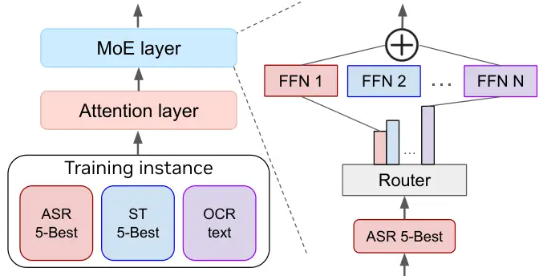
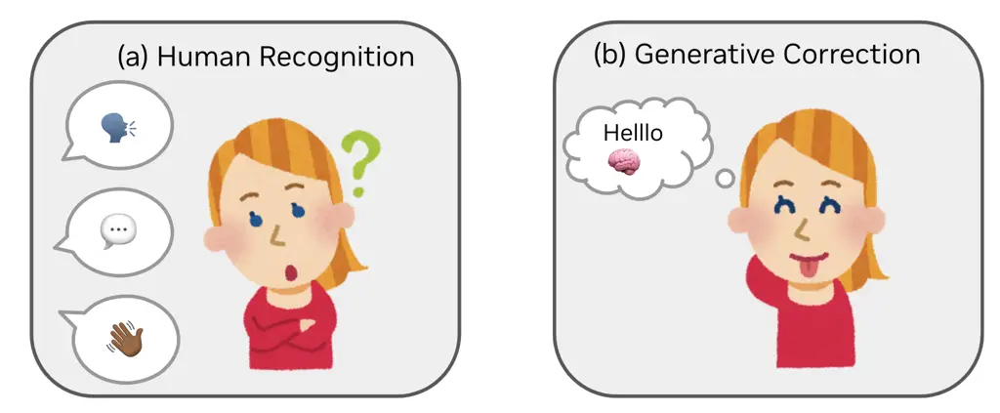

# ![[Uncaptioned image]](arxiv-2411-05945--9ff273b85c64.figures/figure-1.webp)NeKo: Cross-Modality Post-Recognition Error Correction with Tasks-Guided Mixture-of-Experts Language Model

Yen-Ting Lin Zhehuai Chen Piotr Zelasko Zhen Wan Xuesong Yang Zih-Ching
Chen Krishna C Puvvada Szu-Wei Fu  Ke Hu  Jun Wei Chiu  Jagadeesh Balam
 Boris Ginsburg  Yu-Chiang Frank Wang  Chao-Han Huck Yang  
NVIDIA  
corresponding authors: ytl@ieee.org, hucky@nvidia.com ^(†)^(†)thanks:
Work done at NVIDIA research as an intern.

###### Abstract

Construction of a general-purpose post-recognition error corrector poses
a crucial question: how can we most effectively train a model on a large
mixture of domain datasets? The answer would lie in learning
dataset-specific features and digesting their knowledge in a single
model. Previous methods achieve this by having separate correction
language models, resulting in a significant increase in parameters. In
this work, we present Mixture-of-Experts as a solution, highlighting
that MoEs are much more than a scalability tool. We propose a Multi-Task
Correction MoE, where we train the experts to become an “expert” of
speech-to-text, language-to-text and vision-to-text datasets by learning
to route each dataset’s tokens to its mapped expert. Experiments on the
Open ASR Leaderboard show that we explore a new state-of-the-art
performance by achieving an average relative $`5.0`$% WER reduction and
substantial improvements in BLEU scores for speech and translation
tasks. On zero-shot evaluation, NeKo outperforms GPT-3.5 and Claude-3.5
Sonnet with $`15.5`$% to $`27.6`$% relative WER reduction in the
Hyporadise benchmark. NeKo performs competitively on grammar and
post-OCR correction as a multi-task model.

## 1 Introduction

Figure 1: Proposed NeKo, a new form multi-task model to boost
post-recognition results over speech, text, and visual inputs. NeKo
could work for (i) post automatic speech recognition (ASR) correction,
(ii) post speech translation (ST) and machine translation (MT)
correction, and (iii) post optical character recognition (OCR)
correction. NeKo discover new state-of-the-art results in (iv) zero-shot
ASR correction and performs competitively as a general-purpose (v)
multi-task corrector.

Human recognition capabilities span multiple modalities, including
speech recognition, visual patterns, and extensions to semantic and
textual interpretations. These faculties, however, are not infallible
and often incorporate mis-recognition errors. Despite these
imperfections, humans efficiently communicate using speech, language, or
facial expressions.

For instance, two non-native speakers (Lev-Ari, 2015; Valaki et al., 2004) can often achieve mutual understanding through this imperfect
recognition and subsequent interpretative processes, even when the
conversation is marred by lexical inaccuracies and subdued accents. In
other words, humans (as intelligent agents) exhibit a robust capacity
for generative understanding Jiang et al. (2020); Cheng et al. (2021)
that extends beyond initial recognition results. In neuroscience Zatorre
and Gandour (2008), the inferior temporal gyrus and the temporal lobe
are not confined to rudimentary perception but are also integral to the
post-recognition processes that facilitate semantic understanding of
language (Levinson and Evans, 2010), speech (Marshall et al., 2015), and
visual patterns (Vink et al., 2020). This form of “post-recognition
correction,” exemplified by the application of language modeling (LM) to
initial recognition outputs, has been introduced to the field for both
acoustic (automatic speech recognition, ASR) and visual (optical
character recognition, OCR) modalities.

With the LMs scaling up to LLMs (Brown et al., 2020), recent
efforts (Chan et al., 2023; Yang et al., 2023; CHEN et al., 2023; Hu
et al., 2024a) have focused on exploring a “generative modeling” for
post-recognition correction. This generative error correction (GER)
approach uses LLMs to conduct final recognition from given first-pass
text-based predictions from recognition models, including ASR, image
captioning (IC), and machine translation (MT). This cascaded two-agents
text-to-text GER model has outperformed larger single multi-modal and
multi-task models in these tasks. Meanwhile, these GER solutions heavily
depends on domain-specific fine-tuning processes (Chen et al., 2024a)
that utilize parameter-efficient components, which often suffers a
performance degradation from a lack of generalizability across different
datasets, domains, and tasks.

To characterize “model generalization,” mixture-of-experts (MoE) (Jiang
et al., 2024a) has emerged as a promising approach for multi-task
learning, consisting of of a set of expert networks and a gating network
that learns to route the input to the most appropriate
expert (Sukhbaatar et al., 2024). This enables MoE models to learn more
specialized and fine-grained representations compared to monolithic
models. However, most MoE models are designed for general-purpose
language modeling(Dai et al., 2024), with experts not explicitly
assigned to specific tasks, but rather learn to specialize in different
aspects of the input space through data-driven training. Effectively
leverage MoE for multi-task error correction, where the experts need to
capture task-specific features while allowing knowledge sharing, remains
an open question.

In this work, we propose NeKo, a “geNerative multi-tasK error
correction” approach that leverages a pre-trained MoE model to drive
diverse tasks and cross-domain knowledge, as shown in Figure 1. The key
idea is to continuously pre-train MoE model on a mixture of error
correction datasets, with each expert specializing in a specific domain.
This task-guided MoE fine-tuning approach enables the experts to capture
task-specific features while allowing knowledge sharing through the
router. We further pursue this direction by modeling MoE on error
correction and highlight the effectiveness and robustness of MoEs in
learning from a mixture of correction datasets.

NeKo captures the nuances of each task, benefiting from shared knowledge
across experts. Evaluated on tasks such as ASR, ST, OCR, and unseen
textual error correction (TEC), NeKo consistently outperforms baseline
models, including Claude-3.5 Sonnet and GPT-3.5. It achieves
state-of-the-art WER reduction on the Hyporadise benchmark and
large-scale Open ASR Leaderboard (Srivastav et al., 2023). NeKo also
significant improves in OCR error correction. Further analysis confirms
its robust multi-task capabilities. In summary, the main contributions
of this work include:

1.  1.  We introduce NeKo, a multi-task error correction LLM that leverages
        task-guided mixture-of-experts for diverse post-recognition
        correction tasks. To the best of our knowledge, this is the first
        work that explores the use of MoE for multi-task error correction.
2.  2.  NeKo has been studied under a new form of cross-modalities
        post-recognition correction evaluation, serving as strong
        open-source ASR, ST, OCR, and TEC baselines. Our results show that
        NeKo discovers new state-of-the-art performance in ASR as a
        multi-task correction model.
3.  3.  We discovered emergent abilities for cross-task correction from NeKo
        as a first-of-its-kind multi-task correction approach toward a
        general-purpose post-recognition LM designs.
4.  4.  The NeKo models, newly created source datasets, and training
        processes are scheduled to open source under the CC BY-SA 4.0
        license to support reproducibility in future research.

## 2 Method



Figure 2: The architecture of our proposed model, NeKo, which integrates
MoE layers within a Transformer architecture. During inference, we do
not assume knowledge of the specific task an input belongs to and each
token is routed to the top-$`2`$ experts solely based on their router
probabilities.

### 2.1 Mixture-of-Experts (MoE)

Our method, NeKo, is based on a Transformer architecture (Vaswani
et al., 2017) with modifications similar to those described in Jiang
et al. (2023). The key difference is that we replace the feedforward
blocks with Mixture-of-Expert (MoE) layers. In a MoE layer, each input
token is assigned to a subset of experts by a gating network (router).
The output of the MoE layer is the weighted sum of the outputs of the
selected experts, where the weights are determined by the gating
network. Formally, given $`n`$ expert networks
$`\{E_{0},E_{1},...,E_{n-1}\}`$, the output of the MoE layer for an
input token $`x`$ is:

```math
y=\sum_{i=0}^{n-1}G(x)_{i}\cdot E_{i}(x), \tag{1}
```

where $`G(x)_{i}`$ is the weight assigned to the $`i`$-th expert by the
gating network, and $`E_{i}(x)`$ is the output of the $`i`$-th expert
network for input $`x`$. The gating network $`G(x)`$ is implemented as a
softmax over the top-$`K`$ logits of a linear layer:

```math
G(x)=\text{Softmax}(\text{TopK}(x\cdot W_{g})), \tag{2}
```

where $`\text{TopK}(\ell)_{i}=\ell_{i}`$ if $`\ell_{i}`$ is among the
top-$`K`$ coordinates of logits $`\ell\in\mathbb{R}^{n}`$, and
$`\text{TopK}(\ell)_{i}=-\infty`$ otherwise. The number of experts $`K`$
used per token is a hyperparameter that controls the computational cost.

### 2.2 Tasks-Guided Auxiliary Expert Assignment

The key idea of NeKo is to assign each expert to a specific task during
training. Given a set of tasks
$`\mathcal{T}=\{T_{1},T_{2},...,T_{m}\}`$, we define a mapping function
$`f:\mathcal{T}\rightarrow\{1,2,...,n\}`$ that assigns each task to a
unique expert. During training, for an input token $`x`$ from task
$`T_{i}`$, we deterministically route $`x`$ to the expert $`f(T_{i})`$
in addition to the top-1 expert selected by the gating network. This
ensures that each expert learns task-specific features while still
allowing for knowledge sharing through the gating network. Formally, the
output of the MoE layer for an input token $`x`$ from task $`T_{i}`$
during training is:

```math
y=G(x)_{f(T_{i})}\cdot E_{f(T_{i})}(x)+G(x)_{\text{top1}}\cdot E_{\text{top1}}(x), \tag{3}
```

where $`\text{top1}=\argmax_{j\neq f(T_{i})}G(x)_{j}`$ is the index of
the top-1 expert selected by the gating network, excluding the
task-specific expert $`f(T_{i})`$.

During inference, we do not assume knowledge of the specific task an
input token belongs to. Instead, we route each token to the top-$`K`$
experts selected by the gating network based on their predicted
probabilities. This approach allows the model to leverage the
task-specific knowledge learned by the experts during training while
still being able to generalize to new, potentially unseen tasks and
domains during inference.

### 2.3 Training Objective

We train NeKo on a mixture of error correction datasets
$`\mathcal{D}=\{D_{1},D_{2},...,D_{m}\}`$, where each dataset $`D_{i}`$
corresponds to a specific task $`T_{i}`$. The training objective is to
minimize the negative log-likelihood of the target sequences:

```math
\mathcal{L}=-\sum_{i=1}^{m}\sum_{(x,y)\in D_{i}}\log p(y|x,T_{i}), \tag{4}
```

where $`x`$ is the input sequence (e.g., ASR hypotheses, OCR output),
$`y`$ is the target sequence (e.g., ground-truth transcription,
corrected text), and $`p(y|x,T_{i})`$ is the probability of the target
sequence given the input sequence and the task prompt (Figure 3.) By
jointly training on multiple error correction datasets with task-guided
expert assignment, NeKo learns to capture task-specific features while
allowing for knowledge sharing across tasks through the shared gating
network and other model components.

## 3 Experiments

### 3.1 Training and Evaluation Datasets

#### ASR

To assess the ability to handle diverse and noisy real-world speech, we
use the Open ASR Leaderboard (Gandhi et al., 2022; Srivastav et al., 2023) for ASR evaluation, which comprises nine diverse datasets spanning
various domains and speaking styles. These include LibriSpeech
(Panayotov et al., 2015), Common Voice 9 (Ardila et al., 2020),
VoxPopuli (Wang et al., 2021), TED-LIUM (Hernandez et al., 2018),
GigaSpeech (Chen et al., 2021), SPGISpeech (O’Neill et al., 2021),
Earnings-22 (Del Rio et al., 2022), and AMI (Carletta, 2007; Renals
et al., 2007), as one most representative benchmark due to its scale and
data diversity. We include the training set of above 8 datasets for NeKo
training. We use the word error rate as the evaluation metric for ASR.

#### ST and MT

For the translation error correction task, we use the subset of the
HypoTranslate dataset (Hu et al., 2024b) for training and evaluation.
This dataset includes translation from FLEURS (Conneau et al., 2022),
CoVoST-2 (Wang et al., 2020), and MuST-C (Di Gangi et al., 2019),
covering a range of languages such as Spanish, French, Italian,
Japanese, Portuguese, Chinese, and Persian.

#### OCR

For the optical character recognition (OCR) error correction task, we
use the en-us portion of the OCR dataset (PleIAs, 2023), which contains
newspaper texts from Chronicling America.

#### TEC

For the textual error correction (TEC) task, we use a subset of the
CoEdIT dataset (Raheja et al., 2023) from Grammarly, which contains 82K
task-specific instructions for text editing.

### 3.2 Task-Specific Recognition Systems and Baselines

#### ASR

We compare against state-of-the-art ASR models,
Whisper-V2-Large (Radford et al., 2022), Canary (NVIDIA, 2024) without
applying GEC method. End-to-end ASR-LLM, SALM (Chen et al., 2024b),
Qwen2-audio, and Gemini-2-Flash have been also compared. For all
Cascaded ASR+GEC Methods, the task-specific system is the Canary model.
This model transcribes the speech data and generate 5-best hypotheses
for each utterance using temperature-based sampling (Ackley et al., 1985) with $`p=0.3`$. This allows us to capture a diverse set of
potential transcriptions for each utterance, which can be fed into our
error correction model.

#### ST and MT

For the speech and machine translation tasks, we compare against
state-of-the-art models SeamlessM4T (Barrault et al., 2023a),
GenTranslate(Hu et al., 2024c), and cascaded approaches combining ASR
and machine translation models (e.g., Whisper + NLLB (Costa-jussà
et al., 2022)). These baselines cover both end-to-end speech translation
models and pipeline approaches. We use SeamlessM4T-Large V2 as the
task-specific system to decode $`N`$-best hypotheses from input speech
by beam search algorithm. We did this in two steps by first transcribing
the speech and then translating the text, following (Hu et al., 2024c).
LLMs then take the N-best hypotheses to produce a final speech
translation result. To investigate the generalization of our model, we
also evaluate it in an alternative scenario: a direct speech translation
model, Canary, is used as the task-specific system to produce
hypotheses.

#### OCR and TEC

We compare our proposed method against two baselines: (1) the input text
without any correction (denoted as Baseline) and (2) a Mixtral 8x7B
model fine-tuned only on the respective dataset for each task (denoted
as Mistral 8x7B Direct Finetune). This allows us to assess the
effectiveness of our task-guided expert assignment approach in handling
OCR and TEC errors, as its ability to leverage knowledge from multiple
tasks to improve performance on individual tasks compared to direct
fine-tuning on a single dataset.

|                   |              |          |                                             |                                            |                                            |                                            |                                             |                                            |                                                     |          |       |
| ----------------- | ------------ | -------- | ------------------------------------------- | ------------------------------------------ | ------------------------------------------ | ------------------------------------------ | ------------------------------------------- | ------------------------------------------ | --------------------------------------------------- | -------- | ----- |
| Domain            | Test Set     | Baseline | GPT-3.5 Turbo                               |                                            | Claude-3.5 Sonnet                          |                                            | 0-shot w/ NeKo                              |                                            |                                                     | _Oracle_ |       |
| Shift             |              |          | 0-shot                                      | 5-shot                                     | 0-shot                                     | 5-shot                                     | NeKo-FFT                                    | NeKo-BTX                                   | NeKo-MoE                                            | N-best   | Comp. |
| Specific Scenario | WSJ-_dev93_  | 9.0      | $`8.5_{{\color[rgb]{0,0.5,0.5}-5.6\%}}`$    | $`7.7_{{\color[rgb]{0,0.5,0.5}-14.4\%}}`$  | $`8.2_{{\color[rgb]{0,0.5,0.5}-8.9\%}}`$   | $`7.4_{{\color[rgb]{0,0.5,0.5}-17.8\%}}`$  | $`8.6_{{\color[rgb]{0,0.5,0.5}-4.4\%}}`$    | $`7.5_{{\color[rgb]{0,0.5,0.5}-16.7\%}}`$  | $`\textbf{6.8}_{{\color[rgb]{0,0.5,0.5}-24.4\%}}`$  | 6.5      | 5.3   |
|                   | WSJ-_eval92_ | 7.6      | $`7.3_{{\color[rgb]{0,0.5,0.5}-3.9\%}}`$    | $`6.6_{{\color[rgb]{0,0.5,0.5}-13.2\%}}`$  | $`7.0_{{\color[rgb]{0,0.5,0.5}-7.9\%}}`$   | $`6.3_{{\color[rgb]{0,0.5,0.5}-17.1\%}}`$  | $`7.4_{{\color[rgb]{0,0.5,0.5}-2.6\%}}`$    | $`6.4_{{\color[rgb]{0,0.5,0.5}-15.8\%}}`$  | $`\textbf{5.8}_{{\color[rgb]{0,0.5,0.5}-23.7\%}}`$  | 5.5      | 4.7   |
|                   | ATIS         | 5.8      | $`5.5_{{\color[rgb]{0,0.5,0.5}-5.2\%}}`$    | $`5.0_{{\color[rgb]{0,0.5,0.5}-13.8\%}}`$  | $`5.2_{{\color[rgb]{0,0.5,0.5}-10.3\%}}`$  | $`4.7_{{\color[rgb]{0,0.5,0.5}-19.0\%}}`$  | $`5.6_{{\color[rgb]{0,0.5,0.5}-3.4\%}}`$    | $`4.8_{{\color[rgb]{0,0.5,0.5}-17.2\%}}`$  | $`\textbf{4.2}_{{\color[rgb]{0,0.5,0.5}-27.6\%}}`$  | 3.5      | 2.4   |
| Common Noise      | CHiME4-_bus_ | 18.8     | $`17.6_{{\color[rgb]{0,0.5,0.5}-6.4\%}}`$   | $`16.2_{{\color[rgb]{0,0.5,0.5}-13.8\%}}`$ | $`17.1_{{\color[rgb]{0,0.5,0.5}-9.0\%}}`$  | $`15.7_{{\color[rgb]{0,0.5,0.5}-16.5\%}}`$ | $`17.7_{{\color[rgb]{0,0.5,0.5}-5.9\%}}`$   | $`15.9_{{\color[rgb]{0,0.5,0.5}-15.4\%}}`$ | $`\textbf{14.5}_{{\color[rgb]{0,0.5,0.5}-22.9\%}}`$ | 16.8     | 10.7  |
|                   | CHiME4-_caf_ | 16.1     | $`14.7_{{\color[rgb]{0,0.5,0.5}-8.7\%}}`$   | $`13.7_{{\color[rgb]{0,0.5,0.5}-14.9\%}}`$ | $`14.2_{{\color[rgb]{0,0.5,0.5}-11.8\%}}`$ | $`13.2_{{\color[rgb]{0,0.5,0.5}-18.0\%}}`$ | $`14.8_{{\color[rgb]{0,0.5,0.5}-8.1\%}}`$   | $`13.4_{{\color[rgb]{0,0.5,0.5}-16.8\%}}`$ | $`\textbf{12.2}_{{\color[rgb]{0,0.5,0.5}-24.2\%}}`$ | 13.3     | 9.1   |
|                   | CHiME4-_ped_ | 11.5     | $`10.9_{{\color[rgb]{0,0.5,0.5}-5.2\%}}`$   | $`9.7_{{\color[rgb]{0,0.5,0.5}-15.7\%}}`$  | $`10.5_{{\color[rgb]{0,0.5,0.5}-8.7\%}}`$  | $`9.3_{{\color[rgb]{0,0.5,0.5}-19.1\%}}`$  | $`11.0_{{\color[rgb]{0,0.5,0.5}-4.3\%}}`$   | $`9.5_{{\color[rgb]{0,0.5,0.5}-17.4\%}}`$  | $`\textbf{8.6}_{{\color[rgb]{0,0.5,0.5}-25.2\%}}`$  | 8.5      | 5.5   |
|                   | CHiME4-_str_ | 11.4     | $`10.9_{{\color[rgb]{0,0.5,0.5}-4.4\%}}`$   | $`9.7_{{\color[rgb]{0,0.5,0.5}-14.9\%}}`$  | $`10.5_{{\color[rgb]{0,0.5,0.5}-7.9\%}}`$  | $`9.3_{{\color[rgb]{0,0.5,0.5}-18.4\%}}`$  | $`11.0_{{\color[rgb]{0,0.5,0.5}-3.5\%}}`$   | $`9.4_{{\color[rgb]{0,0.5,0.5}-17.5\%}}`$  | $`\textbf{8.5}_{{\color[rgb]{0,0.5,0.5}-25.4\%}}`$  | 9.0      | 6.0   |
| Speaker Accent    | MCV-_af_     | 25.3     | $`24.9_{{\color[rgb]{0,0.5,0.5}-1.6\%}}`$   | $`23.6_{{\color[rgb]{0,0.5,0.5}-6.7\%}}`$  | $`24.4_{{\color[rgb]{0,0.5,0.5}-3.6\%}}`$  | $`23.0_{{\color[rgb]{0,0.5,0.5}-9.1\%}}`$  | $`25.0_{{\color[rgb]{0,0.5,0.5}-1.2\%}}`$   | $`23.3_{{\color[rgb]{0,0.5,0.5}-7.9\%}}`$  | $`\textbf{21.0}_{{\color[rgb]{0,0.5,0.5}-17.0\%}}`$ | 23.6     | 21.7  |
|                   | MCV-_au_     | 25.8     | $`25.1_{{\color[rgb]{0,0.5,0.5}-2.7\%}}`$   | $`24.0_{{\color[rgb]{0,0.5,0.5}-7.0\%}}`$  | $`24.6_{{\color[rgb]{0,0.5,0.5}-4.7\%}}`$  | $`23.4_{{\color[rgb]{0,0.5,0.5}-9.3\%}}`$  | $`25.2_{{\color[rgb]{0,0.5,0.5}-2.3\%}}`$   | $`23.7_{{\color[rgb]{0,0.5,0.5}-8.1\%}}`$  | $`\textbf{21.4}_{{\color[rgb]{0,0.5,0.5}-17.1\%}}`$ | 24.9     | 21.8  |
|                   | MCV-_in_     | 28.6     | $`27.6_{{\color[rgb]{0,0.5,0.5}-3.5\%}}`$   | $`25.0_{{\color[rgb]{0,0.5,0.5}-12.6\%}}`$ | $`27.0_{{\color[rgb]{0,0.5,0.5}-5.6\%}}`$  | $`24.3_{{\color[rgb]{0,0.5,0.5}-15.0\%}}`$ | $`27.8_{{\color[rgb]{0,0.5,0.5}-2.8\%}}`$   | $`24.6_{{\color[rgb]{0,0.5,0.5}-14.0\%}}`$ | $`\textbf{22.2}_{{\color[rgb]{0,0.5,0.5}-22.4\%}}`$ | 27.1     | 22.6  |
|                   | MCV-_sg_     | 26.4     | $`26.5_{{\color[rgb]{0.5,0.5,0.5}+0.4\%}}`$ | $`25.1_{{\color[rgb]{0,0.5,0.5}-4.9\%}}`$  | $`25.9_{{\color[rgb]{0,0.5,0.5}-1.9\%}}`$  | $`24.5_{{\color[rgb]{0,0.5,0.5}-7.2\%}}`$  | $`26.6_{{\color[rgb]{0.5,0.5,0.5}+0.8\%}}`$ | $`24.7_{{\color[rgb]{0,0.5,0.5}-6.4\%}}`$  | $`\textbf{22.3}_{{\color[rgb]{0,0.5,0.5}-15.5\%}}`$ | 25.5     | 22.2  |

Table 1: Cross-domain ASR correction results in zero-shot and few-shot
settings on the Hyporadise benchmark (CHEN et al., 2023). We compare
NeKo against GPT-4 Turbo and Claude-3.5 Sonnet in 0- and 5-shot
settings. The baseline represents the WER of task-specific model
Whisper-Large. The oracle results used in CHEN et al. (2023) (N-best and
Compositional) provide an upper bound for the correction performance.

|                                                              |                 |                     |       |            |            |          |          |      |         |       |       |
| ------------------------------------------------------------ | --------------- | ------------------- | ----- | ---------- | ---------- | -------- | -------- | ---- | ------- | ----- | ----- |
| Model                                                        | Inference Para. | Avg. $`\downarrow`$ | AMI   | Earnings22 | Gigaspeech | LS Clean | LS Other | SPGI | Tedlium | Voxp. | MCV9  |
| _ASR or SpeechLMs: End-to-end Voice Understanding Models_    |                 |                     |       |            |            |          |          |      |         |       |       |
| Distil-Whisper-V2-L (Gandhi et al., 2023)                    | 0.75B           | 8.31                | 14.65 | 12.12      | 10.31      | 2.95     | 6.39     | 3.28 | 4.30    | 8.22  | 12.60 |
| Whisper-V2-L (Radford et al., 2022)                          | 1.5B            | 8.06                | 16.82 | 12.02      | 10.57      | 2.56     | 5.16     | 3.77 | 4.01    | 7.50  | 10.11 |
| Canary (NVIDIA, 2024)                                        | 2B              | 6.67                | 14.00 | 12.25      | 10.19      | 1.49     | 2.49     | 2.06 | 3.58    | 5.81  | 7.75  |
| Bestow Speech LM (Chen et al., 2024c)                        | 1.8B            | 6.50                | 12.58 | 12.86      | 10.06      | 1.64     | 3.07     | 2.11 | 3.41    | 5.84  | 6.97  |
| Qwen2-Audio (Chu et al., 2024)                               | 8B              | 7.43                | \-    | \-         | \-         | 1.6      | 3.6      | \-   | \-      | \-    | \-    |
| Gemini-2.0-Flash                                             | \-              | 8.56                | \-    | \-         | \-         | \-       | \-       | \-   | \-      | \-    | \-    |
| _ASR+LLM: Frozen Whisper-v2-L (1.5B) + Voice Correction LMs_ |                 |                     |       |            |            |          |          |      |         |       |       |
| + Gemma 2B (Team et al., 2024) FFT                           | 3.5B (2B)       | 6.61                | 13.20 | 12.30      | 10.40      | 1.60     | 2.60     | 2.20 | 3.70    | 6.00  | 7.50  |
| + Gemma 8x2B FFT                                             | 3.5B (2B)       | 6.51                | 13.10 | 12.20      | 10.30      | 1.50     | 2.50     | 2.10 | 3.60    | 5.90  | 7.40  |
| + NeKo (Ours) Gemma 8x2B                                     | 3.5B (2B)       | 6.41                | 13.00 | 12.10      | 10.20      | 1.40     | 2.40     | 2.00 | 3.50    | 5.80  | 7.30  |
| + NeKo (Ours) Qwen1.5-MoE                                    | 4.2B (2.7B)     | 5.90                | 12.60 | 11.82      | 9.95       | 1.30     | 2.32     | 1.94 | 3.20    | 5.80  | 7.30  |
| + Mistral 7B (Jiang et al., 2023) FFT                        | 8.5B (7B)       | 6.40                | 13.07 | 11.87      | 10.09      | 1.48     | 2.46     | 2.04 | 3.55    | 5.75  | 7.29  |
| + Mixtral 8x7B (Jiang et al., 2024b) FFT                     | 8.5B (7B)       | 6.51                | 12.91 | 12.19      | 10.34      | 1.54     | 2.55     | 2.12 | 3.64    | 5.89  | 7.43  |
| + Mixtral 8x7B Lora                                          | 8.5B (7B)       | 6.60                | 12.96 | 12.24      | 10.38      | 1.55     | 2.56     | 2.13 | 3.66    | 5.92  | 7.47  |
| + Mistral 8x7B BTM (Sukhbaatar et al., 2024)                 | 8.5B (7B)       | 6.43                | 13.13 | 11.93      | 10.14      | 1.49     | 2.47     | 2.05 | 3.57    | 5.78  | 7.33  |
| + NeKo (Ours) Mixtral 8x7B                                   | 8.5B (7B)       | 6.34                | 12.55 | 11.82      | 10.02      | 1.49     | 2.47     | 2.05 | 3.52    | 5.76  | 7.25  |
| + NeKo (Ours) Mixtral 8x22B                                  | 23.5B (22B)     | 6.40                | 12.61 | 11.93      | 10.15      | 1.52     | 2.51     | 2.09 | 3.58    | 5.82  | 7.33  |

Table 2: ASR correction results on the Open ASR Leaderboard. We report
the Word Error Rate (WER) for each dataset and the average across all 9
datasets. NeKo establishes a new state-of-the-art performance on the
leaderboard, outperforming both end-to-end ASR methods and cascaded
ASR+GEC approaches. We report the actual tuning parameter in parentheses
(.) and the sum of the frozen Whisper results in front.

### 3.3 Post-recognition LLMs Setup

We implement NeKo using the Transformer architecture (Vaswani et al., 2017) and fine-tune both dense and MoE models for comparison. For dense
models, we fine-tune Gemma 2B (Team et al., 2024) and Mistral 7B (Jiang
et al., 2024b). For MoE models, we fine-tune Gemma 8x2B¹¹ 1 We made an
up-cycled (Komatsuzaki et al., 2023) Gemma 8x2B MoE setup extended from
single Gemma-2B (Team et al., 2024). and Mixtral 8x7B without applying
our task-guided expert assignment. We explore the Branch-Train-Mix
approach (Sukhbaatar et al., 2024), which involves branching from the
Mistral 7B model to an 8x7B MoE model as one competing setup. To
investigate the scalability of our method, we design NeKo to three
different sizes of MoE models: Gemma 8x2B, Mixtral 8x7B, and Mixtral
8x22B. We further compared low-rank adaptation (LoRA(Hu et al., 2021))
with full fine-tuning (FFT) on 8x7B MoE setup.

For MoE models, we use top-k routing as proposed in (Lepikhin et al., 2021) to balance the computational cost and model capacity. We use a
global batch size of 2 million tokens and apply sample packing (Raffel
et al., 2020) to maximize the GPU utilization.

|                                                     |        |      |      |      |      |      |      |          |      |      |      |        |      |      |      |
| --------------------------------------------------- | ------ | ---- | ---- | ---- | ---- | ---- | ---- | -------- | ---- | ---- | ---- | ------ | ---- | ---- | ---- |
| En$`\rightarrow`$X                                  | FLEURS |      |      |      |      |      |      | CoVoST-2 |      |      |      | MuST-C |      |      |      |
|                                                     | Es     | Fr   | It   | Ja   | Pt   | Zh   | Avg. | Fa       | Ja   | Zh   | Avg. | Es     | It   | Zh   | Avg. |
| _End-to-end ST Methods_                             |        |      |      |      |      |      |      |          |      |      |      |        |      |      |      |
| SeamlessM4T-Large (Barrault et al., 2023a)          | 23.8   | 41.6 | 23.9 | 21.0 | 40.8 | 28.6 | 30.0 | 18.3     | 24.0 | 34.1 | 25.5 | 34.2   | 29.9 | 16.2 | 26.8 |
| GenTranslate (Hu et al., 2024c)                     | 25.4   | 43.1 | 25.5 | 28.3 | 42.4 | 34.3 | 33.2 | 21.1     | 29.1 | 42.8 | 31.0 | 33.9   | 29.4 | 18.5 | 27.3 |
| SeamlessM4T-Large-V2 (Barrault et al., 2023b)       | 23.8   | 42.6 | 24.5 | 21.7 | 43.0 | 29.5 | 30.9 | 16.9     | 23.5 | 34.6 | 25.0 | 32.1   | 27.5 | 15.6 | 25.1 |
| GenTranslate-V2 (Hu et al., 2024c)                  | 25.5   | 44.0 | 26.3 | 28.9 | 44.5 | 34.9 | 34.0 | 19.4     | 29.0 | 43.6 | 30.7 | 32.2   | 27.3 | 18.1 | 25.9 |
| _Cascaded ASR+MT Methods_                           |        |      |      |      |      |      |      |          |      |      |      |        |      |      |      |
| Whisper + NLLB-3.3b (Costa-jussà et al., 2022)      | 25.1   | 41.3 | 25.0 | 19.0 | 41.5 | 23.5 | 29.2 | 13.6     | 19.0 | 32.0 | 21.5 | 35.3   | 29.9 | 13.5 | 26.2 |
| SeamlessM4T-Large (ASR+MT) (Barrault et al., 2023a) | 24.6   | 44.6 | 25.4 | 22.5 | 41.9 | 31.2 | 31.7 | 18.8     | 24.0 | 35.1 | 26.0 | 35.1   | 30.8 | 17.7 | 27.9 |
| SeamlessM4T-V2 (ASR+MT) (Barrault et al., 2023b)    | 24.7   | 44.1 | 25.1 | 20.6 | 43.6 | 30.6 | 31.5 | 17.4     | 23.8 | 35.4 | 25.5 | 33.0   | 27.8 | 14.5 | 25.1 |
| _Cascaded ASR+GEC Methods_                          |        |      |      |      |      |      |      |          |      |      |      |        |      |      |      |
| GenTranslate                                        | 26.8   | 45.0 | 26.6 | 29.4 | 43.1 | 36.8 | 34.6 | 21.8     | 30.5 | 43.3 | 31.9 | 35.5   | 31.0 | 19.6 | 28.7 |
| GenTranslate-V2                                     | 27.0   | 44.3 | 26.4 | 27.8 | 44.5 | 36.1 | 34.4 | 20.8     | 29.7 | 43.5 | 31.3 | 33.2   | 28.3 | 16.9 | 26.1 |
| NeKo-Gemma-2B-FT                                    | 26.9   | 44.2 | 26.3 | 27.7 | 44.4 | 36.0 | 34.3 | 20.7     | 29.6 | 43.4 | 31.2 | 33.1   | 28.2 | 16.8 | 26.0 |
| NeKo-Gemma-8x2B–BTX                                 | 27.2   | 44.5 | 26.7 | 28.0 | 44.7 | 36.3 | 34.6 | 21.0     | 29.9 | 43.8 | 31.6 | 33.4   | 28.5 | 17.1 | 26.3 |
| NeKo-Gemma-8x2B-MoE                                 | 28.5   | 46.2 | 28.0 | 30.1 | 46.3 | 38.7 | 36.3 | 23.4     | 32.6 | 46.5 | 34.2 | 37.2   | 32.8 | 21.5 | 30.5 |

Table 3: Speech translation results on FLEURS, CoVoST-2, and MuST-C
En$`{\rightarrow}`$X test sets in terms of BLEU score.We use bold to
highlight surpassing SeamlessM4T baseline, and use underline to
highlight the state-of-the-art performance. The baseline methods are
introduced in §3.2, and all of their results are reproduced by
ourselves.

### 3.4 Post-recognition Correction Results

#### ASR

We first evaluate the zero-shot ability of NeKo on unseen domain
compared to two general-purpose LLMs, including GPT-3.5 Turbo and
Claude-3.5 Sonnet. With a task-specific recognition baseline of
Whisper-V2-Large (third column) in Table 1, NeKo-MoE (i.e., Qwen1.5-MoE
or Mixtral) shows the best zero-shot ability with a relative 22.3%
average WER reduction. GPT-3.5 Turbo and Claude-3.5 Sonnet have relative
4.3% and 7.3% of zero-shot improvements, where NeKo consistently
outperform their 5-shot ASR correction.

Table 2 shows the WER scores on individual datasets and average
performance on the Open ASR Leaderboard. We observe that the proposed
NeKo improves the task-specific baseline Canary, with an average 5.0%
WER reduction. Individually, we observe a significant performance
increase with NeKo on more challenging datasets, like AMI
(conversational speech) and VoxPopuli (accented speech) due to experts
learning dataset-specific features. While, Earnings22 shows a slight
performance drop possibly due to the reduced representation in the
batch.

Compared to other leading models on the leaderboard, NeKo establishes a
new state-of-the-art, outperforming speech-only foundational models like
Whisper and Canary and end-to-end ASR-LLM like SALM (Chen et al., 2024b)
across most datasets. On the AMI dataset, NeKo achieves a WER of 12.58%,
significantly lower than Whisper’s 16.82%. On VoxPopuli, NeKo obtains
5.84% WER, a 1.66 point reduction from Whisper’s 7.5%. The strong
performance of NeKo demonstrates the effectiveness of our speech-adapted
MoE approach in handling diverse speech datasets and learning robust
representations.

#### ST and MT

Table 3 presents the speech translation results on the FLEURS, CoVoST-2,
and MuST-C datasets. For these experiments, we use SeamlessM4T-Large as
the task-specific model to generate the initial speech translation
hypotheses. NeKo is then applied to correct the outputs from
SeamlessM4T-Large. Compared to the task-specific SeamlessM4T-Large
model, NeKo achieves significant improvements, with an average BLEU
score increase of 5.4 points on the FLEURS dataset, 9.2 points on the
CoVoST-2 dataset, and 5.4 points on the MuST-C dataset. These results
demonstrate the effectiveness of NeKo in correcting errors made by the
first-pass speech translation model. Moreover, NeKo outperforms other
correction baselines, including the state-of-the-art GenTranslate model.

|                            |                        |                        |                   |
| -------------------------- | ---------------------- | ---------------------- | ----------------- |
| En$`\rightarrow`$X         | WMT’20 Ja $`\uparrow`$ | WMT’20 Zh $`\uparrow`$ | Avg. $`\uparrow`$ |
| ALMA-13b                   |   3.5                  | 11.3                   |   7.4             |
| BigTranslate               |   7.3                  | 29.0                   | 18.2              |
| NLLB-3.3b                  | 11.6                   | 26.9                   | 19.3              |
| SeamlessM4T-Large          | 17.0                   | 27.0                   | 22.0              |
| GenTranslate (fine-tuned)  | 21.4                   | 30.7                   | 26.1              |
| NeKo-Gemma-MoE (zero-shot) | 18.1                   | 27.6                   | 22.9              |

Table 4: Machine translation BLEU scores on the WMT’20 Japanese (Ja) and
Chinese (Zh) test sets (Barrault et al., 2020a). NeKo is evaluated in a
zero-shot setting, while other models are fine-tuned on the respective
language pairs. Higher BLEU scores indicate better translation quality.

To further assess the generalization ability of NeKo , we evaluate it on
the WMT’20 machine translation benchmark for Japanese and Chinese in a
zero-shot setting. As shown in Table 4, NeKo achieves competitive
performance compared to fine-tuned MT models, obtaining an average BLEU
score of 22.9. This result highlights the potential of NeKo to handle
unseen translation tasks by leveraging the knowledge learned from
pre-training.

#### OCR and TEC

For the OCR task, NeKo achieves a substantial error reduction, lowering
the WER from 71.03% to 14.43%. This represents a significant improvement
over the baseline and demonstrates the model’s ability to correct OCR
errors effectively. Compared to the Mixtral-MoE model fine-tuned
directly on the OCR dataset, NeKo obtains a 1.02% lower WER,
highlighting the benefit of the task-guided expert assignment approach.
In the TEC task, NeKo showcases its versatility by improving the
performance on both grammar correction and coherence improvement
subtasks. For grammar correction, NeKo reduces the WER from 31.41% to
9.42%, outperforming the directly fine-tuned Mixtral-MoE model by 1.31%.
On the coherence subtask, NeKo achieves a WER of 9.71%, which is 0.46%
higher than the directly fine-tuned model but still a significant
improvement over the baseline.

|                           |                    |                   |       |
| ------------------------- | ------------------ | ----------------- | ----- |
| Task / WER $`\downarrow`$ | Grammar Correction | Coherence Improv. | OCR   |
| Mixtral-MoE (frozen)      | 31.41              | 13.48             | 71.03 |
| GPT-3.5-turbo             | 17.43              |   12.25           | 39.45 |
| Mixtral-MoE-FFT           | 10.73              |   12.05           | 45.32 |
| NeKo-Mixtral-MoE          |   9.42             |   9.71            | 14.43 |

Table 5: WER comparison of NeKo against the baseline and a directly
fine-tuned Mixtral-MoE model (8x7B) on grammar correction and coherence
improvement tasks from the CoEdIT dataset (Raheja et al., 2023), and the
OCR task using the PleIAs/Post-OCR-Correction dataset (PleIAs, 2023).

## 4 Conclusion

In this work, we proposed NeKo, a multi-task GER approach that leverages
task-guided MoEs to handle diverse tasks. NeKo assigns each expert to a
specific dataset during training, enabling the experts to capture
task-specific features while allowing knowledge sharing through the
gating network. Our results show that task-guided expert assignment is a
promising approach for multi-task learning in error correction and other
natural language processing tasks. By aligning experts with datasets,
NeKo can effectively capture the nuances and specificities of each task
while benefiting from the shared knowledge learned by the gating network
and other model components. Future work includes exploring more advanced
expert assignment strategies, such as dynamically assigning experts
based on the input characteristics.

## Ethical Considerations

We aim to provide a transparent and comprehensive understanding of the
current scope of NeKo, and pave the way for future research to further
improve the NeKo model.

#### Dataset Diversity and Size and Assumptions in Error Distribution

This study addresses a mixture of error correction tasks, including ASR,
ST, OCR, and TEC, using representative task-specific datasets such as
LibriSpeech for ASR, CoVoST for ST, ICDAR 2019 for OCR, and CoNLL-2014
for TEC. While these datasets are widely recognized benchmarks, they may
not cover all possible error correction scenarios, particularly those
involving more complex or less common error types found in real-world
data. This setup assumes that the error distributions in the training
datasets are representative of those in real-world applications.
Consequently, the performance of NeKomight be overestimated for certain
types of data not covered by these benchmarks, affecting the
generalizability of the results to more diverse and noisy real-world
scenarios. Future research should include a broader range of datasets,
particularly those with more diverse and challenging error types, and
investigate methods to dynamically adapt to varying error distributions,
possibly through online learning Yasunaga et al. (2021) or domain
adaptation techniques Khurana et al. (2021), to better evaluate the
robustness and generalizability of the model.

#### Societal Considerations

The study does not extensively address the ethical and societal
implications of deploying NeKo in real-world applications. There could
be unintended consequences, such as biases in error correction or misuse
of the technology in sensitive applications. Future work should include
a thorough analysis of the ethical and societal impacts of the model,
along with strategies to mitigate potential negative consequences. This
could involve incorporating fairness and bias detection mechanisms Liu
et al. (2022) into the model to ensure responsible and ethical
deployment.

#### Boarder Impacts

The NeKo model’s application of MoE for multi-domain and multi-task
error correction has the potential to significantly enhance automated
system’s performance across various domains, such as healthcare,
education and customer service. By improving standard mediums of
communication such as speech recognition, translation and optical
character recognition NeKo can facilitate more inclusive technologies,
benefiting individuals with impairments or non-native speakers.
Additionally, the economic benefits from reduced manual correction
efforts and educational advantages from more accurate communication
system can be substantial. The open-sourcing of NeKo under the CC BY-SA
4.0 license encourages collaboration and reproducibility with in the
reserach community, fostering innovation and broader application. Future
work should also consider optimizing the training process to minimize
the environmental impact, promoting sustainable AI development
practices.

## References

- Ackley et al. (1985) David H. Ackley, Geoffrey E. Hinton, and
  Terrence J. Sejnowski. 1985. [A learning algorithm for boltzmann
  machines](https://doi.org/10.1207/S15516709COG0901_7). _Cogn. Sci._,
  9(1):147–169.
- Aksënova et al. (2021) Alëna Aksënova, Daan van Esch, James Flynn, and
  Pavel Golik. 2021. How might we create better benchmarks for speech
  recognition? In _Proceedings of the 1st workshop on benchmarking:
  Past, present and future_, pages 22–34.
- Ardila et al. (2020) Rosana Ardila, Megan Branson, Kelly Davis,
  Michael Kohler, Josh Meyer, Michael Henretty, Reuben Morais, Lindsay
  Saunders, Francis M. Tyers, and Gregor Weber. 2020. [Common voice: A
  massively-multilingual speech
  corpus](https://aclanthology.org/2020.lrec-1.520/). In _Proceedings of
  The 12th Language Resources and Evaluation Conference, LREC 2020,
  Marseille, France, May 11-16, 2020_, pages 4218–4222. European
  Language Resources Association.
- Barrault et al. (2020a) Loïc Barrault, Magdalena Biesialska, Ondrej
  Bojar, Marta R. Costa-jussà, Christian Federmann, Yvette Graham, Roman
  Grundkiewicz, Barry Haddow, Matthias Huck, Eric Joanis, Tom Kocmi,
  Philipp Koehn, Chi-kiu Lo, Nikola Ljubesic, Christof Monz, Makoto
  Morishita, Masaaki Nagata, Toshiaki Nakazawa, Santanu Pal, Matt Post,
  and Marcos Zampieri. 2020a. [Findings of the 2020 conference on
  machine translation (WMT20)](https://aclanthology.org/2020.wmt-1.1/).
  In _Proceedings of the Fifth Conference on Machine Translation,
  WMT@EMNLP 2020, Online, November 19-20, 2020_, pages 1–55. Association
  for Computational Linguistics.
- Barrault et al. (2020b) Loïc Barrault, Magdalena Biesialska, Ondřej
  Bojar, Marta R. Costa-jussà, Christian Federmann, Yvette Graham, Roman
  Grundkiewicz, Barry Haddow, Matthias Huck, Eric Joanis, Tom Kocmi,
  Philipp Koehn, Chi-kiu Lo, Nikola Ljubešić, Christof Monz, Makoto
  Morishita, Masaaki Nagata, Toshiaki Nakazawa, Santanu Pal, Matt Post,
  and Marcos Zampieri. 2020b. [Findings of the 2020 conference on
  machine translation (WMT20)](https://aclanthology.org/2020.wmt-1.1).
  In _Proceedings of the Fifth Conference on Machine Translation_, pages
  1–55, Online. Association for Computational Linguistics.
- Barrault et al. (2023a) Loïc Barrault, Yu-An Chung, Mariano Cora
  Meglioli, David Dale, Ning Dong, Paul-Ambroise Duquenne, Hady Elsahar,
  Hongyu Gong, Kevin Heffernan, John Hoffman, et al. 2023a.
  Seamlessm4t-massively multilingual & multimodal machine translation.
  _arXiv preprint arXiv:2308.11596_.
- Barrault et al. (2023b) Loïc Barrault, Yu-An Chung, Mariano Coria
  Meglioli, David Dale, Ning Dong, Mark Duppenthaler, Paul-Ambroise
  Duquenne, Brian Ellis, Hady Elsahar, Justin Haaheim, et al. 2023b.
  Seamless: Multilingual expressive and streaming speech translation.
  _arXiv preprint arXiv:2312.05187_.
- Brown et al. (2020) Tom B. Brown, Benjamin Mann, Nick Ryder, Melanie
  Subbiah, Jared Kaplan, Prafulla Dhariwal, Arvind Neelakantan, Pranav
  Shyam, Girish Sastry, Amanda Askell, Sandhini Agarwal, Ariel
  Herbert-Voss, Gretchen Krueger, T. J. Henighan, Rewon Child, Aditya
  Ramesh, Daniel M. Ziegler, Jeff Wu, Clemens Winter, Christopher Hesse,
  Mark Chen, Eric Sigler, Mateusz Litwin, Scott Gray, Benjamin Chess,
  Jack Clark, Christopher Berner, Sam McCandlish, Alec Radford, Ilya
  Sutskever, and Dario Amodei. 2020. [Language models are few-shot
  learners](https://api.semanticscholar.org/CorpusID:218971783).
  _ArXiv_, abs/2005.14165.
- Carletta (2007) Jean Carletta. 2007. [Unleashing the killer corpus:
  experiences in creating the multi-everything AMI Meeting
  Corpus](https://doi.org/10.1007/s10579-007-9040-x). _Language
  Resources and Evaluation_, 41(2):181–190.
- Chan et al. (2023) David Chan, Austin Myers, Sudheendra
  Vijayanarasimhan, David Ross, and John Canny. 2023. Ic3: Image
  captioning by committee consensus. In _Proceedings of the 2023
  Conference on Empirical Methods in Natural Language Processing_, pages
  8975–9003.
- Chan et al. (2016) William Chan, Navdeep Jaitly, Quoc Le, and Oriol
  Vinyals. 2016. Listen, attend and spell: A neural network for large
  vocabulary conversational speech recognition. In _2016 IEEE
  international conference on acoustics, speech and signal processing
  (ICASSP)_, pages 4960–4964. IEEE.
- CHEN et al. (2023) CHEN CHEN, Yuchen Hu, Chao-Han Huck Yang,
  Sabato Marco Siniscalchi, Pin-Yu Chen, and Ensiong Chng. 2023.
  Hyporadise: An open baseline for generative speech recognition with
  large language models. In _Thirty-seventh Conference on Neural
  Information Processing Systems Datasets and Benchmarks Track_.
- Chen et al. (2024a) Chen Chen, Ruizhe Li, Yuchen Hu, Sabato Marco
  Siniscalchi, Pin-Yu Chen, Ensiong Chng, and Chao-Han Huck Yang. 2024a.
  It’s never too late: Fusing acoustic information into large language
  models for automatic speech recognition. _arXiv preprint
  arXiv:2402.05457_.
- Chen et al. (2021) Guoguo Chen, Shuzhou Chai, Guanbo Wang, Jiayu Du,
  Wei-Qiang Zhang, Chao Weng, Dan Su, Daniel Povey, Jan Trmal, Junbo
  Zhang, Mingjie Jin, Sanjeev Khudanpur, Shinji Watanabe, Shuaijiang
  Zhao, Wei Zou, Xiangang Li, Xuchen Yao, Yongqing Wang, Yujun Wang,
  Zhao You, and Zhiyong Yan. 2021. [GigaSpeech: An Evolving,
  Multi-domain ASR Corpus with 10,000 Hours of Transcribed
  Audio](https://arxiv.org/abs/2106.06909). _arXiv e-prints_,
  arXiv:2106.06909.
- Chen et al. (2024b) Zhehuai Chen, He Huang, Andrei Andrusenko, Oleksii
  Hrinchuk, Krishna C Puvvada, Jason Li, Subhankar Ghosh, Jagadeesh
  Balam, and Boris Ginsburg. 2024b. Salm: Speech-augmented language
  model with in-context learning for speech recognition and translation.
  In _ICASSP 2024-2024 IEEE International Conference on Acoustics,
  Speech and Signal Processing (ICASSP)_, pages 13521–13525. IEEE.
- Chen et al. (2024c) Zhehuai Chen, He Huang, Oleksii Hrinchuk,
  Krishna C Puvvada, Nithin Rao Koluguri, Piotr Żelasko, Jagadeesh
  Balam, and Boris Ginsburg. 2024c. Bestow: Efficient and streamable
  speech language model with the best of two worlds in gpt and t5.
  _arXiv preprint arXiv:2406.19954_.
- Cheng et al. (2021) Lauretta SP Cheng, Danielle Burgess, Natasha
  Vernooij, Cecilia Solís-Barroso, Ashley McDermott, and Savithry
  Namboodiripad. 2021. The problematic concept of native speaker in
  psycholinguistics: Replacing vague and harmful terminology with
  inclusive and accurate measures. _Frontiers in psychology_, 12:715843.
- Chu et al. (2024) Yunfei Chu, Jin Xu, Qian Yang, Haojie Wei, Xipin
  Wei, Zhifang Guo, Yichong Leng, Yuanjun Lv, Jinzheng He, Junyang Lin,
  et al. 2024. Qwen2-audio technical report. _arXiv preprint
  arXiv:2407.10759_.
- Conneau et al. (2022) Alexis Conneau, Min Ma, Simran Khanuja,
  Yu Zhang, Vera Axelrod, Siddharth Dalmia, Jason Riesa, Clara Rivera,
  and Ankur Bapna. 2022. [FLEURS: few-shot learning evaluation of
  universal representations of
  speech](https://doi.org/10.1109/SLT54892.2023.10023141). In _IEEE
  Spoken Language Technology Workshop, SLT 2022, Doha, Qatar, January
  9-12, 2023_, pages 798–805. IEEE.
- Costa-jussà et al. (2022) Marta R. Costa-jussà, James Cross, Onur
  Çelebi, Maha Elbayad, Kenneth Heafield, Kevin Heffernan, Elahe
  Kalbassi, Janice Lam, Daniel Licht, Jean Maillard, Anna Y. Sun, Skyler
  Wang, Guillaume Wenzek, Al Youngblood, Bapi Akula, Loïc Barrault,
  Gabriel Mejia Gonzalez, Prangthip Hansanti, John Hoffman, Semarley
  Jarrett, Kaushik Ram Sadagopan, Dirk Rowe, Shannon Spruit, Chau Tran,
  Pierre Andrews, Necip Fazil Ayan, Shruti Bhosale, Sergey Edunov,
  Angela Fan, Cynthia Gao, Vedanuj Goswami, Francisco Guzmán, Philipp
  Koehn, Alexandre Mourachko, Christophe Ropers, Safiyyah Saleem, Holger
  Schwenk, and Jeff Wang. 2022. [No language left behind: Scaling
  human-centered machine
  translation](https://doi.org/10.48550/ARXIV.2207.04672). _CoRR_,
  abs/2207.04672.
- Dai et al. (2024) Damai Dai, Chengqi Deng, Chenggang Zhao, R. X. Xu,
  Huazuo Gao, Deli Chen, Jiashi Li, Wangding Zeng, Xingkai Yu, Y. Wu,
  Zhenda Xie, Y. K. Li, Panpan Huang, Fuli Luo, Chong Ruan, Zhifang Sui,
  and Wenfeng Liang. 2024. [Deepseekmoe: Towards ultimate expert
  specialization in mixture-of-experts language
  models](https://doi.org/10.48550/ARXIV.2401.06066). _CoRR_,
  abs/2401.06066.
- Del Rio et al. (2022) Miguel Del Rio, Peter Ha, Quinten McNamara,
  Corey Miller, and Shipra Chandra. 2022. [Earnings-22: A Practical
  Benchmark for Accents in the Wild](https://arxiv.org/abs/2203.15591).
  _arXiv e-prints_, arXiv:2203.15591.
- Deng et al. (2013) Li Deng, Jinyu Li, Jui-Ting Huang, Kaisheng Yao,
  Dong Yu, Frank Seide, Michael Seltzer, Geoff Zweig, Xiaodong He, Jason
  Williams, et al. 2013. Recent advances in deep learning for speech
  research at microsoft. In _2013 IEEE international conference on
  acoustics, speech and signal processing_, pages 8604–8608. IEEE.
- Di Gangi et al. (2019) Mattia A. Di Gangi, Roldano Cattoni, Luisa
  Bentivogli, Matteo Negri, and Marco Turchi. 2019. [MuST-C: a
  Multilingual Speech Translation
  Corpus](https://doi.org/10.18653/v1/N19-1202). In _Proceedings of the
  2019 Conference of the North American Chapter of the Association for
  Computational Linguistics: Human Language Technologies, Volume 1 (Long
  and Short Papers)_, pages 2012–2017, Minneapolis, Minnesota.
  Association for Computational Linguistics.
- Du et al. (2016) Jun Du, Yan-Hui Tu, Lei Sun, Feng Ma, Hai-Kun Wang,
  Jia Pan, Cong Liu, Jing-Dong Chen, and Chin-Hui Lee. 2016. The
  ustc-iflytek system for chime-4 challenge. _Proc. CHiME_, 4(1):36–38.
- Fedus et al. (2022) William Fedus, Barret Zoph, and Noam
  Shazeer. 2022. [Switch transformers: Scaling to trillion parameter
  models with simple and efficient
  sparsity](http://jmlr.org/papers/v23/21-0998.html). _J. Mach. Learn.
  Res._, 23:120:1–120:39.
- Gandhi et al. (2022) Sanchit Gandhi, Patrick von Platen, and
  Alexander M. Rush. 2022. [ESB: A benchmark for multi-domain end-to-end
  speech recognition](https://doi.org/10.48550/ARXIV.2210.13352).
  _CoRR_, abs/2210.13352.
- Gandhi et al. (2023) Sanchit Gandhi, Patrick von Platen, and
  Alexander M Rush. 2023. Distil-whisper: Robust knowledge distillation
  via large-scale pseudo labelling. _arXiv preprint arXiv:2311.00430_.
- He et al. (2019) Yanzhang He, Tara N Sainath, Rohit Prabhavalkar, Ian
  McGraw, Raziel Alvarez, Ding Zhao, David Rybach, Anjuli Kannan,
  Yonghui Wu, Ruoming Pang, et al. 2019. Streaming end-to-end speech
  recognition for mobile devices. In _ICASSP 2019-2019 IEEE
  International Conference on Acoustics, Speech and Signal Processing
  (ICASSP)_, pages 6381–6385. IEEE.
- Hernandez et al. (2018) François Hernandez, Vincent Nguyen, Sahar
  Ghannay, Natalia Tomashenko, and Yannick Estève. 2018. TED-LIUM 3:
  Twice as Much Data and Corpus Repartition for Experiments on Speaker
  Adaptation. In _Speech and Computer_, pages 198–208. Springer
  International Publishing.
- Hu et al. (2021) Edward J Hu, Yelong Shen, Phillip Wallis, Zeyuan
  Allen-Zhu, Yuanzhi Li, Shean Wang, Lu Wang, and Weizhu Chen. 2021.
  Lora: Low-rank adaptation of large language models. _arXiv preprint
  arXiv:2106.09685_.
- Hu et al. (2024a) Yuchen Hu, Chen Chen, Chao-Han Huck Yang, Ruizhe Li,
  Chao Zhang, Pin-Yu Chen, and EnSiong Chng. 2024a. Large language
  models are efficient learners of noise-robust speech recognition.
  _arXiv preprint arXiv:2401.10446_.
- Hu et al. (2024b) Yuchen Hu, Chen Chen, Chao-Han Huck Yang, Ruizhe Li,
  Dong Zhang, Zhehuai Chen, and Eng Siong Chng. 2024b. [Gentranslate:
  Large language models are generative multilingual speech and machine
  translators](https://doi.org/10.48550/ARXIV.2402.06894). _CoRR_,
  abs/2402.06894.
- Hu et al. (2024c) Yuchen Hu, Chen Chen, Chao-Han Huck Yang, Ruizhe Li,
  Dong Zhang, Zhehuai Chen, and Eng Siong Chng. 2024c. Gentranslate:
  Large language models are generative multilingual speech and machine
  translators. _arXiv preprint arXiv:2402.06894_.
- Jiang et al. (2023) Albert Q Jiang, Alexandre Sablayrolles, Arthur
  Mensch, Chris Bamford, Devendra Singh Chaplot, Diego de las Casas,
  Florian Bressand, Gianna Lengyel, Guillaume Lample, Lucile Saulnier,
  et al. 2023. Mistral 7b. _arXiv preprint arXiv:2310.06825_.
- Jiang et al. (2024a) Albert Q. Jiang, Alexandre Sablayrolles, Antoine
  Roux, Arthur Mensch, Blanche Savary, Chris Bamford, Devendra Singh
  Chaplot, Diego de Las Casas, Emma Bou Hanna, Florian Bressand, Gianna
  Lengyel, Guillaume Bour, Guillaume Lample, Lélio Renard Lavaud, Lucile
  Saulnier, Marie-Anne Lachaux, Pierre Stock, Sandeep Subramanian,
  Sophia Yang, Szymon Antoniak, Teven Le Scao, Théophile Gervet, Thibaut
  Lavril, Thomas Wang, Timothée Lacroix, and William El Sayed. 2024a.
  [Mixtral of experts](https://doi.org/10.48550/ARXIV.2401.04088).
  _CoRR_, abs/2401.04088.
- Jiang et al. (2024b) Albert Q. Jiang, Alexandre Sablayrolles, Antoine
  Roux, Arthur Mensch, Blanche Savary, Chris Bamford, Devendra Singh
  Chaplot, Diego de Las Casas, Emma Bou Hanna, Florian Bressand, Gianna
  Lengyel, Guillaume Bour, Guillaume Lample, L’elio Renard Lavaud,
  Lucile Saulnier, Marie-Anne Lachaux, Pierre Stock, Sandeep
  Subramanian, Sophia Yang, Szymon Antoniak, Teven Le Scao, Théophile
  Gervet, Thibaut Lavril, Thomas Wang, Timothée Lacroix, and William El
  Sayed. 2024b. [Mixtral of
  experts](https://api.semanticscholar.org/CorpusID:266844877). _ArXiv_,
  abs/2401.04088.
- Jiang et al. (2020) Xiaoming Jiang, Kira Gossack-Keenan, and Marc D
  Pell. 2020. To believe or not to believe? how voice and accent
  information in speech alter listener impressions of trust. _Quarterly
  Journal of Experimental Psychology_, 73(1):55–79.
- Khurana et al. (2021) Sameer Khurana, Niko Moritz, Takaaki Hori, and
  Jonathan Le Roux. 2021. Unsupervised domain adaptation for speech
  recognition via uncertainty driven self-training. In _ICASSP 2021-2021
  IEEE International Conference on Acoustics, Speech and Signal
  Processing (ICASSP)_, pages 6553–6557. IEEE.
- Komatsuzaki et al. (2023) Aran Komatsuzaki, Joan Puigcerver, James
  Lee-Thorp, Carlos Riquelme Ruiz, Basil Mustafa, Joshua Ainslie,
  Yi Tay, Mostafa Dehghani, and Neil Houlsby. 2023. [Sparse upcycling:
  Training mixture-of-experts from dense
  checkpoints](https://openreview.net/pdf?id=T5nUQDrM4u). In _The
  Eleventh International Conference on Learning Representations, ICLR
  2023, Kigali, Rwanda, May 1-5, 2023_. OpenReview.net.
- Lepikhin et al. (2021) Dmitry Lepikhin, HyoukJoong Lee, Yuanzhong Xu,
  Dehao Chen, Orhan Firat, Yanping Huang, Maxim Krikun, Noam Shazeer,
  and Zhifeng Chen. 2021. [Gshard: Scaling giant models with conditional
  computation and automatic
  sharding](https://openreview.net/forum?id=qrwe7XHTmYb). In _9th
  International Conference on Learning Representations, ICLR 2021,
  Virtual Event, Austria, May 3-7, 2021_. OpenReview.net.
- Lev-Ari (2015) Shiri Lev-Ari. 2015. Comprehending non-native speakers:
  Theory and evidence for adjustment in manner of processing. _Frontiers
  in psychology_, 5:111794.
- Levinson and Evans (2010) Stephen C Levinson and Nicholas Evans. 2010.
  Time for a sea-change in linguistics: Response to comments on ‘the
  myth of language universals’. _Lingua_, 120(12):2733–2758.
- Liu et al. (2022) Ruibo Liu, Chenyan Jia, Jason Wei, Guangxuan Xu, and
  Soroush Vosoughi. 2022. Quantifying and alleviating political bias in
  language models. _Artificial Intelligence_, 304:103654.
- Loshchilov and Hutter (2019) Ilya Loshchilov and Frank Hutter. 2019.
  [Decoupled weight decay
  regularization](https://openreview.net/forum?id=Bkg6RiCqY7). In _7th
  International Conference on Learning Representations, ICLR 2019, New
  Orleans, LA, USA, May 6-9, 2019_. OpenReview.net.
- Marshall et al. (2015) Chloë Marshall, Anna Jones, Tanya Denmark,
  Kathryn Mason, Joanna Atkinson, Nicola Botting, and Gary Morgan. 2015.
  Deaf children’s non-verbal working memory is impacted by their
  language experience. _Frontiers in psychology_, 6:527.
- NVIDIA (2024) NVIDIA. 2024. [New standard for speech recognition and
  translation from the nvidia nemo canary
  model](https://developer.nvidia.com/blog/new-standard-for-speech-recognition-and-translation-from-the-nvidia-nemo-canary-model/).
  Accessed: 2024-05-20.
- O’Neill et al. (2021) Patrick K. O’Neill, Vitaly Lavrukhin, Somshubra
  Majumdar, Vahid Noroozi, Yuekai Zhang, Oleksii Kuchaiev, Jagadeesh
  Balam, Yuliya Dovzhenko, Keenan Freyberg, Michael D. Shulman, Boris
  Ginsburg, Shinji Watanabe, and Georg Kucsko. 2021. [SPGISpeech: 5,000
  Hours of Transcribed Financial Audio for Fully Formatted End-to-End
  Speech Recognition](https://doi.org/10.21437/Interspeech.2021-1860).
  In _Proc. Interspeech 2021_, pages 1434–1438.
- Panayotov et al. (2015) Vassil Panayotov, Guoguo Chen, Daniel Povey,
  and Sanjeev Khudanpur. 2015. [Librispeech: An ASR corpus based on
  public domain audio
  books](https://doi.org/10.1109/ICASSP.2015.7178964). In _2015 IEEE
  International Conference on Acoustics, Speech and Signal Processing
  (ICASSP)_, pages 5206–5210.
- Papineni et al. (2002) Kishore Papineni, Salim Roukos, Todd Ward, and
  Wei-Jing Zhu. 2002. [Bleu: a method for automatic evaluation of
  machine translation](https://doi.org/10.3115/1073083.1073135). In
  _Proceedings of the 40th Annual Meeting of the Association for
  Computational Linguistics, July 6-12, 2002, Philadelphia, PA, USA_,
  pages 311–318. ACL.
- PleIAs (2023) PleIAs. 2023.
  [Post-ocr-correction](https://huggingface.co/datasets/PleIAs/Post-OCR-Correction).
- Radford et al. (2022) Alec Radford, Jong Wook Kim, Tao Xu, Greg
  Brockman, Christine McLeavey, and Ilya Sutskever. 2022. [Robust Speech
  Recognition via Large-Scale Weak
  Supervision](https://cdn.openai.com/papers/whisper.pdf). Technical
  report, OpenAI.
- Raffel et al. (2020) Colin Raffel, Noam Shazeer, Adam Roberts,
  Katherine Lee, Sharan Narang, Michael Matena, Yanqi Zhou, Wei Li, and
  Peter J. Liu. 2020. [Exploring the limits of transfer learning with a
  unified text-to-text
  transformer](http://jmlr.org/papers/v21/20-074.html). _J. Mach. Learn.
  Res._, 21:140:1–140:67.
- Raheja et al. (2023) Vipul Raheja, Dhruv Kumar, Ryan Koo, and Dongyeop
  Kang. 2023. [Coedit: Text editing by task-specific instruction
  tuning](https://arxiv.org/abs/2305.09857).
- Rajbhandari et al. (2020) Samyam Rajbhandari, Jeff Rasley, Olatunji
  Ruwase, and Yuxiong He. 2020. [Zero: memory optimizations toward
  training trillion parameter
  models](https://doi.org/10.1109/SC41405.2020.00024). In _Proceedings
  of the International Conference for High Performance Computing,
  Networking, Storage and Analysis, SC 2020, Virtual Event / Atlanta,
  Georgia, USA, November 9-19, 2020_, page 20. IEEE/ACM.
- Ravanelli et al. (2021) Mirco Ravanelli, Titouan Parcollet, Peter
  Plantinga, Aku Rouhe, Samuele Cornell, Loren Lugosch, Cem Subakan,
  Nauman Dawalatabad, Abdelwahab Heba, Jianyuan Zhong, et al. 2021.
  Speechbrain: A general-purpose speech toolkit. _arXiv preprint
  arXiv:2106.04624_.
- Renals et al. (2007) Steve Renals, Thomas Hain, and Herve
  Bourlard. 2007. [Recognition and understanding of meetings the AMI and
  AMIDA projects](https://doi.org/10.1109/ASRU.2007.4430116). In _2007
  IEEE Workshop on Automatic Speech Recognition and Understanding
  (ASRU)_, pages 238–247.
- Shah and de Melo (2020) Kshitij Shah and Gerard de Melo. 2020.
  Correcting the autocorrect: Context-aware typographical error
  correction via training data augmentation. In _Proceedings of the 12th
  Language Resources and Evaluation Conference (LREC 2020)_, Paris,
  France.
- Shazeer et al. (2017) Noam Shazeer, Azalia Mirhoseini, Krzysztof
  Maziarz, Andy Davis, Quoc V. Le, Geoffrey E. Hinton, and Jeff
  Dean. 2017. [Outrageously large neural networks: The sparsely-gated
  mixture-of-experts layer](https://openreview.net/forum?id=B1ckMDqlg).
  In _5th International Conference on Learning Representations, ICLR
  2017, Toulon, France, April 24-26, 2017, Conference Track
  Proceedings_. OpenReview.net.
- Srivastav et al. (2023) Vaibhav Srivastav, Somshubra Majumdar, Nithin
  Koluguri, Adel Moumen, Sanchit Gandhi, Hugging Face Team, Nvidia NeMo
  Team, and SpeechBrain Team. 2023. [Open automatic speech recognition
  leaderboard](https://huggingface.co/spaces/huggingface.co/spaces/open-asr-leaderboard/leaderboard).
  _Hugging Face_.
- Sukhbaatar et al. (2024) Sainbayar Sukhbaatar, Olga Golovneva, Vasu
  Sharma, Hu Xu, Xi Victoria Lin, Baptiste Rozière, Jacob Kahn, Daniel
  Li, Wen-tau Yih, Jason Weston, and Xian Li. 2024. [Branch-train-mix:
  Mixing expert llms into a mixture-of-experts
  LLM](https://doi.org/10.48550/ARXIV.2403.07816). _CoRR_,
  abs/2403.07816.
- Team et al. (2024) Gemma Team, Thomas Mesnard, Cassidy Hardin, Robert
  Dadashi, Surya Bhupatiraju, Shreya Pathak, Laurent Sifre, Morgane
  Rivière, Mihir Sanjay Kale, Juliette Love, et al. 2024. Gemma: Open
  models based on gemini research and technology. _arXiv preprint
  arXiv:2403.08295_.
- Valaki et al. (2004) CE Valaki, F Maestu, PG Simos, W Zhang,
  A Fernandez, CM Amo, TM Ortiz, and AC Papanicolaou. 2004. Cortical
  organization for receptive language functions in chinese, english, and
  spanish: a cross-linguistic meg study. _Neuropsychologia_,
  42(7):967–979.
- Vaswani et al. (2017) Ashish Vaswani, Noam Shazeer, Niki Parmar, Jakob
  Uszkoreit, Llion Jones, Aidan N Gomez, Łukasz Kaiser, and Illia
  Polosukhin. 2017. Attention is all you need. _Advances in neural
  information processing systems_, 30.
- Vink et al. (2020) Matthijs Vink, Thomas Edward Gladwin, Sanne
  Geeraerts, Pascal Pas, Dienke Bos, Marissa Hofstee, Sarah Durston, and
  Wilma Vollebergh. 2020. Towards an integrated account of the
  development of self-regulation from a neurocognitive perspective: A
  framework for current and future longitudinal multi-modal
  investigations. _Developmental Cognitive Neuroscience_, 45:100829.
- Wang et al. (2021) Changhan Wang, Morgane Riviere, Ann Lee, Anne Wu,
  Chaitanya Talnikar, Daniel Haziza, Mary Williamson, Juan Pino, and
  Emmanuel Dupoux. 2021. [VoxPopuli: A Large-Scale Multilingual Speech
  Corpus for Representation Learning, Semi-Supervised Learning and
  Interpretation](https://doi.org/10.18653/v1/2021.acl-long.80). In
  _Proceedings of the 59th Annual Meeting of the Association for
  Computational Linguistics and the 11th International Joint Conference
  on Natural Language Processing (Volume 1: Long Papers)_, pages
  993–1003, Online. Association for Computational Linguistics.
- Wang et al. (2020) Changhan Wang, Anne Wu, and Juan Miguel Pino. 2020.
  [Covost 2: A massively multilingual speech-to-text translation
  corpus](https://arxiv.org/abs/2007.10310). _CoRR_, abs/2007.10310.
- Watanabe et al. (2018) Shinji Watanabe, Takaaki Hori, Shigeki Karita,
  Tomoki Hayashi, Jiro Nishitoba, Yuya Unno, Nelson Enrique Yalta
  Soplin, Jahn Heymann, Matthew Wiesner, Nanxin Chen, et al. 2018.
  Espnet: End-to-end speech processing toolkit. _arXiv preprint
  arXiv:1804.00015_.
- Watanabe et al. (2017) Shinji Watanabe, Takaaki Hori, Suyoun Kim,
  John R Hershey, and Tomoki Hayashi. 2017. Hybrid ctc/attention
  architecture for end-to-end speech recognition. _IEEE Journal of
  Selected Topics in Signal Processing_, 11(8):1240–1253.
- Wolf et al. (2020) Thomas Wolf, Lysandre Debut, Victor Sanh, Julien
  Chaumond, Clement Delangue, Anthony Moi, Pierric Cistac, Tim Rault,
  Rémi Louf, Morgan Funtowicz, Joe Davison, Sam Shleifer, Patrick von
  Platen, Clara Ma, Yacine Jernite, Julien Plu, Canwen Xu, Teven Le
  Scao, Sylvain Gugger, Mariama Drame, Quentin Lhoest, and Alexander M.
  Rush. 2020. [Transformers: State-of-the-art natural language
  processing](https://www.aclweb.org/anthology/2020.emnlp-demos.6). In
  _Proceedings of the 2020 Conference on Empirical Methods in Natural
  Language Processing: System Demonstrations_, pages 38–45, Online.
  Association for Computational Linguistics.
- Yang et al. (2023) Chao-Han Huck Yang, Yile Gu, Yi-Chieh Liu, Shalini
  Ghosh, Ivan Bulyko, and Andreas Stolcke. 2023. Generative speech
  recognition error correction with large language models and
  task-activating prompting. In _2023 IEEE Automatic Speech Recognition
  and Understanding Workshop (ASRU)_, pages 1–8. IEEE.
- Yang et al. (2021) Chao-Han Huck Yang, Linda Liu, Ankur Gandhe, Yile
  Gu, Anirudh Raju, Denis Filimonov, and Ivan Bulyko. 2021. Multi-task
  language modeling for improving speech recognition of rare words. In
  _2021 IEEE Automatic Speech Recognition and Understanding Workshop
  (ASRU)_, pages 1087–1093. IEEE.
- Yasunaga et al. (2021) Michihiro Yasunaga, Jure Leskovec, and Percy
  Liang. 2021. Lm-critic: Language models for unsupervised grammatical
  error correction. _arXiv preprint arXiv:2109.06822_.
- Zatorre and Gandour (2008) Robert J Zatorre and Jackson T
  Gandour. 2008. Neural specializations for speech and pitch: moving
  beyond the dichotomies. _Philosophical Transactions of the Royal
  Society B: Biological Sciences_, 363(1493):1087–1104.

## Appendix A Appendix

#### Training Details

We fine-tune the model for 3 epochs using the AdamW optimizer
(Loshchilov and Hutter, 2019) with a learning rate of $`1e-4`$ and a
weight decay of $`0.01`$. We use a cosine learning rate scheduler with a
warmup ratio of $`0.1`$ and a gradient clipping threshold of $`1.0`$.
For the expert-dataset mapping, we randomly assign each dataset to one
of the 8 experts in the Mixtral model. This random assignment serves as
a strong baseline and allows us to focus on the effectiveness of the
task-guided expert assignment approach. We leave the exploration of more
advanced expert assignment strategies for future work. To efficiently
train the large-scale model, we leverage DeepSpeed Zero (Rajbhandari
et al., 2020) for memory optimization and Hugging Face Transformers
(Wolf et al., 2020) for model implementation.

Translation Tasks. As an extra zero-shot textual correction setup, we
evaluate NeKo on machine translation (MT) of WMT’20 for Japanese and
Chinese (Barrault et al., 2020b). We use the BLEU score (Papineni
et al., 2002) as the evaluation metric for ST (with training and test)
and MT (zero-shot).

Grammar Correction Tasks. These text error correction (TEC) tasks focus
on correcting grammatical errors and improving the overall coherence of
the text, making them suitable for evaluating the effectiveness of our
model in handling TEC-related editing instructions. We use the word
error rate as the evaluation metric.

OCR Tasks. The dataset includes original texts with varying numbers of
OCR mistakes and their corresponding corrected versions. To evaluate our
model, we take the first 1,000 characters of both the input text with
OCR errors and the ground-truth corrected text. We use the WER as the
evaluation metric.

#### Mixture of Experts Background

Mixture-of-experts (MoE) (Shazeer et al., 2017) is a machine learning
concept that employs multiple expert layers, each of which specializes
in solving a specific subtask. The experts then work together to solve
the entire task at hand. Recently, MoE has been widely applied to
large-scale distributed Deep Learning models by using a cross-GPU layer
that exchanges hidden features from different GPUs (Lepikhin et al.,
2021; Fedus et al., 2022). The MoE approach is differentiated from
existing scale-up approaches for DNNs, such as increasing the depth or
width of DNNs, in terms of its high cost-efficiency. Specifically,
adding more model parameters (experts) in MoE layers does not increase
the computational cost per token at inference time. Thus, MoE has been
studied for scaling the models to trillion-size parameters in NLP (Fedus
et al., 2022).

#### Prompt Format

We provide detailed correction example per \[TASK\] and actual prompt
format of INPUT: used in the our experiments for qualitative studies as
shown in Figure 3. For instance, each task will have a specific
task-activation prompt format, where ASR, ST, and MT would be based on
the sampling or beam search results. On the other hand, OCR and TEC will
use input texts for end-to-end mapping.

Figure 3: Example prompts of various correction tasks using Automatic
Speech Recognition (ASR), Machine Translation (MT), Speech Translation
(ST), Optical Character Recognition (OCR), and Textual Error Correction
(TEC).

#### Correction Examples

We randomly select post-recognition example by NeKo . In Figure 4, a
long form ASR output has been selected and it remain the top 1-best
correction with NeKo. or the ST and MT correction result in Figure 5 and
in Figure 6, although the post-NeKo corrected output does not perfectly
align with the ground truth, it boosts the general semantic meaning, as
reviewed by native speakers. Meanwhile, the OCR and TEC correction
results in Figures  7 and  8 demonstrate various types of corrections,
such as pattern-wise character misrecognition and understanding-based
coherence improvements.

Figure 4: Examples of NeKo outputs for asr error correction task in
SPGISpeech O’Neill et al. (2021).

Figure 5: Examples of NeKo outputs for speech translation correction
task in FLEURS Conneau et al. (2022).

Figure 6: Examples of NeKo outputs for machine translation correction
task in WMT20 Barrault et al. (2020b).

#### Additional Discussion on Human Recognition from Speech and Text Inputs

Human recognition (e.g., speech, optical character, text translation)
and has naturally evolved to excel at recognizing and understanding
speech in a wide range of real-world scenarios He et al. (2019); Deng
et al. (2013). However, the field of automatic speech recognition (ASR)
has traditionally concentrated on training and evaluating models on
specific datasets Chan et al. (2016); Watanabe et al. (2017). These
models have shown limited adaptability to new environments Yang et al.
(2021); Du et al. (2016); Hu et al. (2024a), leading to decreased
accuracy and practicality in real-world settings. Recognizing the
challenges posed by single dataset models and the availability of
diverse datasets collected over time, unified models are being developed
that merge information from multiple datasets into a single framework
Barrault et al. (2023a). While Grammatical Error Correction (TEC) has
been actively explored Yang et al. (2023), ASR error correction is
distinct due to the arbitrariness of spoken language Aksënova et al.
(2021), requiring efforts from both speech, NLP, and cognitive science
communities as one human recognition example shown in Figure 9.

#### task-guided Inference for Mixture of Expert Models

During inference, the Neko-model utilizes top-2 expert routing, instead
of just top-1. Our pilot studies showed that top-1 routing indeed led to
worse performance due to limited knowledge sharing.

Using more than two experts (e.g., top-3 or higher) diverged from the
training setup and increased inference costs (ranging from $`23.5`$% to
$`75.5`$%) without significant gain (i.e., a relative difference of less
than $`0.06`$%).

#### Future Model Maintenance Plan and ASR Community

For ASR tasks, we used Canary-v0, Whisper-seires, and SeamlessM4T to
decode textual hypotheses data. For Whisper, we included it as a
widely-used baseline, but our key comparisons are to other GEC methods
also using Whisper (e.g. GenTranslate). Open eco-system, including
ESPnet (Watanabe et al., 2018) and SpeechBrain (Ravanelli et al., 2021)
models, are also our interests to be adapted as first-pass ASR in the
open code base. This will provide a more comprehensive evaluation across
model types. In general, NeKo’s post-ASR correction improvements are
consistent across datasets and first-pass models, suggesting the
benefits generalize beyond model-specific (i.e., Canary, Whisper, or
SeamlessM4T) ’s strengths as the initial medical term correction results
shown in Figure 10.

#### Emergent Unseen Task Zero-Shot Performance

We investigate NeKo’s generalization capabilities to unseen tasks using
an additional synthetic typographical error correction dataset (Shah and
de Melo, 2020). This dataset is derived from the IMDb test split,
featured low noise levels (3.75% character error rate) with corruption
applied using algorithms proposed in (Shah and de Melo, 2020). Our
evaluation focused on zero-shot and five-shot learning scenarios to
assess the adaptability of various models without and with minimal
task-specific training. In the zero-shot scenario, where models were
prompted to switch from an ASR task to typo correction without
additional training, the challenge proved significant. The models,
including the advanced Claude-Opus, yielded WERs above 30%. The
predictions were markedly irrelevant to the ground truth, highlighting
the difficulty of adapting to typo correction without specific
fine-tuning. This finding prompts further investigation into efficient
and effective training techniques for generalizing model capabilities
across diverse linguistic tasks. In the five-shot scenario, all models
improved against the corrupted baseline with Claude-Opus performing
best. Notably, NeKo outperformed GPT-3.5-Turbo, indicating some affinity
towards this task.

#### Task-Specific Fine-Tuning

The NeKo model employs task-guided MoE fine-tuning, where each expert is
assigned to a specific dataset. This approach may lead to overfitting to
the specific characteristics of the training datasets even though
knowledge could be shared. As a result, the model’s performance might
degrade when applied to new tasks or datasets that were not part of the
training set, limiting its adaptability. Investigating more dynamic and
adaptive fine-tuning strategies that can generalize better across unseen
tasks and datasets would be beneficial. Techniques such as meta-learning
or continual learning could be explored to enhance the model’s
adaptability and robustness.

#### Future Connections to In-Context and Auto-Agent Learning with NeKo

Integrating in-context learning (ICL) with NeKo could enable the model
to adapt to various error correction tasks by conditioning on input
examples without requiring explicit fine-tuning. This approach is
particularly beneficial in scenarios where obtaining large labeled
datasets for fine-tuning is impractical. By leveraging ICL, NeKo could
adapt to diverse error types and use in-context examples to correct
errors specific to new domains or applications, thereby improving its
generalizability to real-world data. Furthermore, ICL would allow the
model to dynamically adjust its error correction strategies based on the
input context, enhancing its robustness to varying error distributions.

|                                    |        |
| ---------------------------------- | ------ |
| Model                              | WER    |
| Baseline (Corrupt vs Ground Truth) | 18.35% |
| GPT-3.5-Turbo (5-shots)            | 12.72% |
| Claude-3-Sonnet (5-shots)          | 12.18% |
| Claude-3.5 Sonnet (5-shots)        | 8.18%  |
| NeKo-MoE (5-shots)                 | 11.62% |

Table 6: WER comparison of NeKo against GPT-3.5-Turbo, and Claude-Opus
on the 5-shot IMDb typographical error correction dataset (Shah and de
Melo, 2020). The baseline represents the WER between the corrupted text
and the ground truth. Lower WER indicates better performance in
correcting typographical errors.

#### Acknowledgment

The authors would like to acknowledge the Taipei-1 high-performance
computing support provided by the NVIDIA Taiwan Research and Development
Center (TRDC) project, and the initial feedback from NVIDIA’s Eric Kang,
Taejin Park, Boyi Li, and Yejin Choi.

Figure 7: Examples of NeKo outputs for OCR correction task in
[PleIAs/Post-OCR-Correction](https://huggingface.co/datasets/PleIAs/Post-OCR-Correction).

Figure 8: Examples of NeKo outputs for textual error correction (TEC)
tasks in CoEdIT Raheja et al. (2023).



Figure 9: Examples of (a) Human recognition given different input
modalities, including audio, text, and visual patterns; (b) generative
inference and correction Marshall et al. (2015); Levinson and Evans
(2010) to understand the recognition results.

Figure 10: We provide medical post-ASR recognition correction on the
Medical-ASR-EN dataset
([https://huggingface.co/datasets/jarvisx17/Medical-ASR-EN](https://huggingface.co/datasets/jarvisx17/Medical-ASR-EN)),
where NeKo demonstrates the ability to (1) refine clinically related
term errors and (2) correct grammar format.
