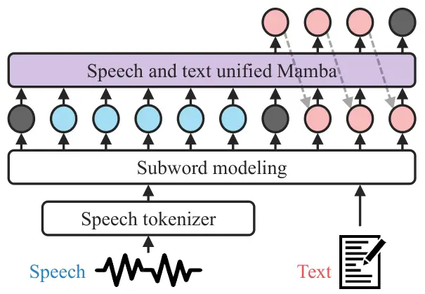
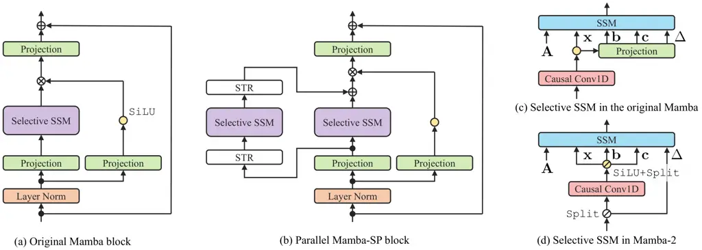

document

# Mamba-based Decoder-Only Approach with Bidirectional Speech Modeling for Speech Recognition

###### Abstract

Selective state space models (SSMs) represented by Mamba have
demonstrated their computational efficiency and promising outcomes in
various tasks, including automatic speech recognition (ASR). Mamba has
been applied to ASR task with the attention-based encoder-decoder
framework, where the cross-attention mechanism between encoder and
decoder remains. This paper explores the capability of Mamba as the
decoder-only architecture in ASR task. Our MAmba-based DEcoder-ONly
approach (MADEON) consists of a single decoder that takes speech tokens
as a condition and predicts text tokens in an autoregressive manner. To
enhance MADEON, we further propose speech prefixing that performs
bidirectional processing on speech tokens, which enriches the contextual
information in the hidden states. Our experiments show that MADEON
significantly outperforms a non-selective SSM. The combination of speech
prefixing and the recently proposed Mamba-2 yields comparable
performance to Transformer-based models on large datasets.

###### Index Terms: 

State-space model, Mamba, speech recognition, decoder-only model, prefix
language model

## 1 Introduction

Transformer \[1\] and its variants \[2, 3\] have dramatically improved
the performance of a wide range of speech processing tasks, including
automatic speech recognition (ASR). The key to their success is the
attention mechanism that can dynamically aggregate the information from
the entire sequence. Meanwhile, the attention mechanism typically
suffers from its quadratic computational complexity with respect to the
sequence length. To mitigate this issue, deep state space models (SSMs)
have been developed \[4, 5, 6\]. SSMs can be trained with a
sub-quadratic complexity owing to tailored algorithms, and their
recurrent nature reduces the required memory during inference.
Furthermore, SSMs have shown promising performance in various speech
processing tasks such as ASR \[7, 8, 9, 10\], speech synthesis \[11\],
and speech enhancement \[12, 13\]. Existing SSMs, e.g., structured SSM
(S4) \[4\], are built on linear time-invariant (LTI) systems, and their
parameters are fixed regardless of the input sequence. This
input-independent architecture inhibits the capability of SSMs. The
selective SSM introduced in Mamba \[14\] dynamically computes the SSM
parameters based on the input sequence and has demonstrated outstanding
performance in computer vision \[15\], natural language
processing \[16\], and speech processing tasks \[17, 18, 19, 20\]. In
particular to ASR task, Mamba has been validated on the encoder-only
approach with the connectionist temporal classification (CTC) \[20\] and
on the attention-based encoder-decoder (AED) approach \[19, 20\].
Notably, Mamba outperforms Transformer and S4 when used as a decoder in
the joint CTC/AED framework \[21\]. While Mamba has been used
non-autoregressively in speech applications, the decoder-only model is
simple yet effective for sequence-to-sequence tasks, where the model
autoregressively predicts the next token \[22, 23\]. It has been
successfully applied to unified speech and text processing, either by
adapting a pre-trained large language model \[24, 25, 26, 27, 28\] or by
training a model from scratch \[29, 30, 31, 32, 33\]. Most of these
models are based on Transformer and require quadratic complexity to
handle a long sequence comprising speech and text tokens. On the other
hand, Mamba can reduce the computational complexity, while it has shown
promising performance as a decoder in the joint CTC/AED
framework \[20\].



Figure 1: Overview of MADEON for ASR task. The blue and red circles show
the speech and text tokens obtained through subword modeling,
respectively. The black circles are special tokens, and the gray dotted
lines indicate the autoregressive text generation.

In this paper, we explore a MAmba-based DEcoder-ONly approach (MADEON)
in ASR task towards SSM-based unified speech and text modeling. As
depicted in Fig. 1, MADEON employs a single Mamba decoder that takes
speech tokens as a condition and predicts the transcription in an
autoregressive manner. We further propose speech prefixing, which
performs bidirectional processing on speech tokens to enhance the
contextual modeling capability of MADEON. We also investigate
Mamba-2 \[34\] that can leverage larger hidden states more efficiently
than the original Mamba. Our experiments show that Mamba significantly
improves the word error rate (WER) from a non-selective SSM. Although
the unidirectional MADEON lags behind Transformer-based models, the
integration of speech prefixing and Mamba-2, MADEON-2SP, achieves a
comparable performance to Transformer-based models on large datasets.
Our contributions are summarized as follows:

- •
  We explored the efficacy of Mamba in a decoder-only approach while
  existing studies with Mamba were built upon the AED approach \[19,
  20\].
- •
  We proposed speech prefixing to enhance the contextual modeling
  capability of MADEON.
- •
  We confirmed the effectiveness of Mamba-2 in ASR task.

## 2 Related Works

### 2.1 Overview of S4 and Mamba

SSMs have gained much attention as an alternative to recurrent neural
networks and Transformers due to their efficiency in capturing
long-range dependencies \[4, 5, 6\]. SSMs are typically based on LTI
systems and map a sequence $`\mathbf{x}_{l}\in\mathbb{R}^{M}`$ to
$`\mathbf{y}_{l}\in\mathbb{R}^{M}`$ by leveraging hidden states. For
instance, a time-invariant SSM handles each entry of $`\mathbf{x}_{l}`$
and $`\mathbf{y}_{l}`$ separately, and its discretized formulation is
given by

```math
\displaystyle\mathbf{h}_{m,l} \displaystyle=\overline{\mathbf{A}}_{m}\mathbf{h}_{m,l-1}+\overline{\mathbf{b}}_{m}x_{m,l}, \tag{1a}
```

```math
\displaystyle y_{m,l} \displaystyle=\mathbf{c}^{\mathsf{T}}\mathbf{h}_{m,l}+d_{m}x_{m,l}, \tag{1b}
```

```math
\displaystyle\overline{\mathbf{A}}_{m},\overline{\mathbf{b}}_{m} \displaystyle=\exp(\Delta_{m}\mathbf{A}),\Delta_{m}\mathbf{b}, \tag{1c}
```

where $`\mathbf{h}_{m,l}\in\mathbb{R}^{N}`$ is the hidden state for the
$`m`$-th entry of the features, and $`(\cdot)^{\mathsf{T}}`$ denotes the
transpose. The SSM parameters, $`\mathbf{A}\in\mathbb{R}^{N\times N}`$,
$`\mathbf{b}\in\mathbb{R}^{N}`$, $`\mathbf{c}\in\mathbb{R}^{N}`$, and
$`d_{m}\in\mathbb{R}`$ are optimized together with other parameters of a
neural network. In (1c), $`\Delta_{m}\in\mathbb{R}_{+}`$ represents the
time step for discretizing $`(\mathbf{A},\mathbf{b})`$. Despite its
recurrent nature in (1a), we can train SSM in sequence parallel by using
a structured matrix for $`\mathbf{A}`$ \[4\]. This paper assumes its
diagonality. Typical SSMs, e.g., S4 \[4\], are not designed for
input-dependent processing. Mamba introduces a selection mechanism that
computes the SSM parameters from the input sequence \[14\]:

```math
\displaystyle\mathbf{b}_{l},\mathbf{c}_{l} \displaystyle=\mathbf{W}_{B}\mathbf{x}_{l},\mathbf{W}_{C}\mathbf{x}_{l}, \tag{2a}
```

```math
\displaystyle\Delta_{m,l} \displaystyle=\texttt{softplus}(\Delta_{m}+\mathbf{w}_{\Delta}^{\mathsf{T}}\mathbf{x}_{l}), \tag{2b}
```

where $`\mathbf{W}_{B}\in\mathbb{R}^{N\times M}`$,
$`\mathbf{W}_{C}\in\mathbb{R}^{N\times M}`$, and
$`\mathbf{w}_{\Delta}\in\mathbb{R}^{M}`$ are the additional parameters
of the neural network, and $`\texttt{softplus}(\cdot)`$ refers to
$`\log(1+\exp(\cdot))`$. By replacing the time-invariant parameters in
(1) by $`(\mathbf{b}_{l},\mathbf{c}_{l},\Delta_{m,l})`$, Mamba
outperforms various non-selective SSMs \[14\]. Although the efficient
algorithm used in S4 is not applicable, its training leverages the
parallel scan \[35\] to avoid sequential recursion and reduces the
memory requirement by recomputation. Mamba has been applied to various
speech processing tasks such as ASR \[19, 20\], speech synthesis \[20\],
and speech enhancement \[17, 19\]. These studies focus on the efficiency
of Mamba, and Mamba is used to handle an entire sequence
non-autoregressively. A paper relevant to ours \[20\] uses Mamba in the
decoder of the joint CTC/AED-based framework \[21\]. It demonstrates the
benefit of Mamba in the decoder but still requires the cross-attention
mechanism between the encoder and decoder. Meanwhile, we explore the
efficacy of Mamba in an attention-free decoder-only model.

### 2.2 ASR with discrete speech tokens

Discrete speech tokens are a compact alternative representation to
high-dimensional real-valued features \[36, 37, 38\] and suitable for
unified speech and text modeling \[32, 33\]. Semantic tokens, obtained
by $`k`$-means clustering on self-supervised learning (SSL) features,
have shown superior ASR performance to discrete tokens obtained by other
techniques \[39\]. During $`k`$-means clustering, the cluster centers
$`\{\boldsymbol{\mu}_{1},\ldots,\boldsymbol{\mu}_{K}\}`$ are optimized
on a training dataset, where $`K`$ is the number of clusters. The
discrete tokens for each utterance $`(k_{1},\ldots,k_{T})`$ are obtained
by assigning a cluster index to the SSL features
$`(\mathbf{z}_{1},\ldots,\mathbf{z}_{T})`$:

```math
k_{t}=\arg\min_{k}\|\mathbf{z}_{t}-\boldsymbol{\mu}_{k}\|_{2}^{2}, \tag{3}
```

where $`t=1,\ldots,T`$ denotes the frame index. The sequence of the
cluster indices typically contain repetition and co-occurrences. To
reduce the redundancy, previous studies remove the repetition and apply
subword modeling \[39\]:

```math
\displaystyle\mathcal{O} \displaystyle=(o_{1},\ldots,o_{L_{\text{speech}}})
```

```math
\displaystyle=\texttt{Subwording}(\texttt{DeDuplication}(k_{1},\ldots,k_{T})), \tag{4}
```

where $`L_{\text{speech}}`$ is the number of discrete speech tokens
after subword modeling. These tokens $`\mathcal{O}`$ are passed to a
neural network along with text tokens. We compute the discrete speech
tokens via ESPnet \[40\] and use SentencePiece \[41\] for subword
modeling.

## 3 Proposed method

In this section, we present the Mamba-based decoder-only approach
(MADEON) as depicted in Fig. 1. Furthermore, we introduce speech
prefixing to enhance its performance.

### 3.1 Unidirectional MADEON for ASR task

Let $`\mathcal{W}=(w_{1},\ldots,w_{L_{\text{text}}})`$ be the text
sequence representing the transcription, where $`L_{\text{text}}`$ is
the number of text tokens after subword modeling. To predict
$`\mathcal{W}`$ from the discrete speech tokens $`\mathcal{O}`$, MADEON
performs the next token prediction for the text tokens while taking the
discrete speech tokens as a condition:

```math
\displaystyle p(\mathcal{W}) \displaystyle=\prod_{l=1}^{L_{\text{text}}+1}p(w_{l}\mid w_{0},w_{1},\ldots,w_{l-1},\mathcal{O})
```

```math
\displaystyle=\prod_{l=1}^{L_{\text{text}}+1}\texttt{MADEON}(w_{0},w_{1},\ldots,w_{l-1},\mathcal{O}), \tag{5}
```

where $`w_{0}`$ and $`w_{L_{\text{text}}+1}`$ are special tokes, \<BOS\>
and \<EOS\>, respectively. We further add another special token
indicating the beginning of speech, \<Speech\>, to $`\mathcal{O}`$ as
$`o_{0}`$. MADEON consists of an embedding layer, a series of Mamba
blocks, and an output layer. The embedding layer converts the discrete
tokens into $`M_{\text{in}}`$-dimensional embeddings, and the output
layer predicts the next token. The architecture of the Mamba block
follows the original implementation \[14\] as depicted in Fig. 2 (a).
Within the Mamba block, the input feature is expanded to
$`\mathbb{R}^{M}`$ via an input projection layer. The selective SSM
block mixes the information across tokens, where SSM uses the
input-dependent parameters
$`(\mathbf{b}_{l},\mathbf{c}_{l},\Delta_{m,l})`$ given by (2). An output
projection layer converts the features back to
$`\mathbb{R}^{M_{\text{in}}}`$. During inference, Mamba can leverage the
hidden states in its recurrent formulation (1). With the hidden states
of all the Mamba blocks $`\mathbf{H}_{l-1}`$, we can reformulate (5) as
follows:

```math
p(\mathcal{W})=\prod_{l=1}^{L_{\text{text}}+1}\texttt{MADEON}(w_{l-1},\mathbf{H}_{l-1}), \tag{6}
```

which enables efficient inference. Furthermore, the training of MADEON
requires only subquadratic complexity with respect to the sequence
length due to parallel scan. The cross-entropy loss is computed only on
the text tokens with teacher forcing.



Figure 2: Architecture of (a) the original Mamba block and (b) the
parallel Mamba-SP block. The selective SSM blocks used in the original
Mamba and Mamba-2 are shown in (c) and (d), respectively. The symbol
$`\oslash`$ indicates that a single vector is split into multiple
vectors \[34\]. STR denotes the speech token reversal whose detail is
shown in Fig. 3.

### 3.2 MADEON with speech prefixing (MADEON-SP)

In MADEON, Mamba performs unidirectional processing for both speech and
text tokens. Meanwhile, bidirectional Mamba has shown its efficacy in an
encoder of the AED framework \[19, 20\] similar to well-developed
bidirectional RNNs. However, bidirectional Mamba is not directly
applicable to an autoregressive decoder-only model. We, thus, propose
MADEON with speech prefixing (MADEON-SP) that performs bidirectional
processing only on speech tokens while preserving unidirectional
processing for text tokens. We expect that speech prefixing enriches the
contextual information in the hidden states through bidirectional speech
modeling. To realize MADEON-SP, we introduce a speech token reversal
that rearranges the features of speech tokens in reverse order, as
depicted in Fig. 3, and design two variants of the Mamba block. Parallel
Mamba-SP block: Fig. 2 (b) shows the parallel Mamba-SP block inspired by
the vision Mamba \[15\]. This architecture shares the layer
normalization and projection layers for both forward and backward
modeling, enabling efficient bidirectional processing. By applying the
speech token reversal before and after the backward selective SSM, we
preserve the original temporal order of the tokens. Serial Mamba-SP
block: A serial Mamba-SP block alternately stacks the original
unidirectional Mamba block and the speech token reversal inspired by
\[42\]. The Mamba block following the speech token reversal performs
backward modeling for speech tokens, where the parameters are not shared
with the forward processing. Speech prefixing is closely related to
prefix language modeling (prefixLM) that allows a decoder-only model to
leverage bidirectional context within a condition \[43\]. In the case of
Transformer-based models, prefixLM is realized by amending the attention
mask to allow non-causal attention within the prefix. SSMs are
inherently unidirectional, and thus we introduce the speech token
reversal.

Figure 3: Illustration of the speech token reversal that rearranges the
features of speech tokens in reverse order. Features of speech and text
tokens are colored by blue and red, respectively.

### 3.3 MADEON-2 based on Mamba-2

Mamba-2 is another selective SSM that incorporates the multihead
patterns inspired by Transformer and simplifies $`\mathbf{A}_{m}`$ to a
scalar \[34\]. These modifications allow to increase the state size
$`N`$ with a moderate number of parameters and to derive a
hardware-efficient algorithm. It is advantageous to increase the state
size because MADEON should preserve the speech context in the hidden
states. In Mamba-2, the input feature
$`\mathbf{x}_{l}\in\mathbb{R}^{M}`$ is reshaped into $`I`$ heads of
dimension $`J`$, where $`IJ=M`$. The scalar SSM for Mamba-2 is defined
as follows:

```math
\displaystyle\mathbf{h}_{i,j,l} \displaystyle=\overline{a}_{i,l}\mathbf{h}_{i,j,l}+\overline{\mathbf{b}}_{i,l}x_{i,j,l}, \tag{7a}
```

```math
\displaystyle y_{i,j,l} \displaystyle=\mathbf{c}_{l}^{\mathsf{T}}\mathbf{h}_{i,j,l}+d_{i}x_{i,j,l}, \tag{7b}
```

```math
\displaystyle\overline{a}_{i,l},\overline{\mathbf{b}}_{i,l} \displaystyle=\exp(\Delta_{i,l}a_{i}),\Delta_{i,l}\mathbf{b}_{l}, \tag{7c}
```

where $`i=1,\ldots,I`$ is the head index, $`j=1,\ldots,J`$ is the index
in each head, and the SSM parameters are shared within each head. In
contrast to the original Mamba, Mamba-2 computes the SSM parameters in
parallel with the input feature $`\mathbf{x}_{l}`$, as illustrated in
Fig.  2 (d)¹¹ 1 We opt not to use the extra normalization layer
introduced in \[34\] due to instabilities in our preliminary
experiments. , which reduces the number of parameters. We develop
MADEON-2 by replacing Mamba in MADEON with Mamba-2. Since the difference
between Mamba and Mamba-2 is the design of the selective SSM blocks as
shown in Fig. 2 (c)–(d), speech prefixing is easily incorporated with
MADEON-2 as MADEON-2SP.

## 4 Effectiveness of speech prefixing

### 4.1 Experimental setups

We first investigate the ASR performance of the decoder-only approach
with different SSMs and demonstrate the benefit of speech prefixing. We
used the ESPnet \[40\] for training and evaluation²² 2 Our
configurations and training scripts are available online:
[https://github.com/YoshikiMas/madeon-asr](https://github.com/YoshikiMas/madeon-asr).
. Data and pre-processing: We used the 100h subset of the LibriSpeech
dataset \[44\]. Following \[39\], we augmented the training data with
speed perturbation of factors 0.9 and 1.1 and used the WavLM \[45\]³³ 3
[https://huggingface.co/microsoft/wavlm-large](https://huggingface.co/microsoft/wavlm-large)
features of the 21st layer for $`k`$-means clustering. The number of
clusters $`K`$ was set to 2,000. We performed de-duplication and subword
modeling as in (4) with 10,000 subword units. Models: MADEON consisted
of the 16 Mamba blocks, where the embedding dimension
$`M_{\text{in}}=384`$, the Mamba input dimension $`M=1536`$, and the
state size $`N=16`$. When using the parallel Mamba-SP block, we reduced
the state size for each direction to $`8`$ to align the number of
parameters to the unidirectional model. Meanwhile, the serial Mamba-SP
block used the same state size, i.e., $`N=16`$. As Mamba-2 can increase
the state size without rapidly growing the model size, we set $`N`$ to
128 for both unidirectional and bidirectional cases, where the head
dimension $`J`$ was 64. Training: The AdamW optimizer with 5,000 warm-up
steps was used with the peak learning rate at $`0.006`$. We randomly
masked out input token embeddings \[29\]. The training of MADEON-2SP
took about one day with a single A100 GPU.

|         |          |        |             |       |              |       |
| ------- | -------- | ------ | ----------- | ----- | ------------ | ----- |
| Model   |          |        | Dev WER (%) |       | Test WER (%) |       |
| SSM     | Prefix   | Params | clean       | other | clean        | other |
| S4      | \-       | 32.9   | 39.8        | 39.3  | 39.8         | 40.1  |
| Mamba   | \-       | 38.5   | 4.9         | 7.4   | 5.0          | 8.3   |
| Mamba-2 | \-       | 37.9   | 4.7         | 7.5   | 4.7          | 8.2   |
| Mamba   | serial   | 38.5   | 4.3         | 7.0   | 4.3          | 7.5   |
| Mamba   | parallel | 39.9   | 4.4         | 6.8   | 4.4          | 7.4   |
| Mamba-2 | serial   | 37.9   | 4.2         | 6.9   | 4.3          | 7.6   |
| Mamba-2 | parallel | 38.0   | 4.3         | 6.8   | 4.2          | 7.3   |

Table 1: WER (%) for different SSMs on LibriSpeech 100h. Params refers
to the total number of parameters ($`\times 10^{6})`$.

### 4.2 Results

Table 1 compares WER of different SSMs. Among the unidirectional SSMs,
Mamba significantly outperformed a non-selective SSM, S4. Intuitively,
the decoder-only approach in the ASR task is relevant to the selective
copying task \[14\] that aims to output some specified tokens in an
input sequence. This task requires selectively remembering or ignoring
the input tokens, and S4 fails while Mamba achieves almost 100%
accuracy \[14\]. Since the decoder-only approach also requires
selectively remembering the speech tokens, we expect Mamba to be
essential. Mamba-2 moderately improved WER by increasing the state size
with the scalar SSM given by (7). MADEON-SP with both serial and
parallel configurations improved WER compared to the unidirectional
MADEON. In particular, we observed a substantial reduction in WER around
the end of long-form speech. Fig. 4 depicts the normalized WERs across
different word positions, where we used the parallel configuration for
speech prefixing. MADEON and MADEON-2 suffered from transcribing the
latter part of utterances, while speech prefixing significantly
mitigated this issue. Hence, the bidirectional modeling of speech tokens
successfully enriches the contextual information in the hidden states to
improve subsequent text generation. The combination of Mamba-2 and
speech prefixing performed best, which confirms the effectiveness of the
integration of Mamba-2 and speech prefixing, i.e., MADEON-2SP.

Figure 4: Illustration of normalized WERs of MADEON and MADEON-2 with
and without speech prefixing across different word positions on
LibriSpeech 100h.

## 5 Comprehensive evaluation of decoder-only approach

### 5.1 Experimental setups

We conduct a comprehensive evaluation of decoder-only approach based on
Transformer, Mamba, and Mamba-2. Data and pre-processing: We used six
diverse datasets to cover various acoustic conditions: read English
speech (LibriSpeech 960h and its 100h subset \[44\]), spontaneous
English speech (TEDLIUM3 \[46\] and GigaSpeech \[47\]), and non-English
speech (AISHELL \[48\] and CSJ \[49\]). For English datasets, we used
the WavLM features since discrete speech tokens obtained from them have
shown superior performance than other discrete speech tokens \[38, 39\].
Meanwhile, we leveraged language-dependent SSL models for non-English
datasets, i.e., Chinese HuBERT⁴⁴ 4
[https://huggingface.co/TencentGameMate/chinese-hubert-large](https://huggingface.co/TencentGameMate/chinese-hubert-large)
for AISHELL and Japanese HuBERT⁵⁵ 5
[https://huggingface.co/rinna/japanese-hubert-large](https://huggingface.co/rinna/japanese-hubert-large)
for CSJ. The number of subword units was set to 10,000 regardless of
datasets, and other configuration is summarized in Table 2.

| Dataset          | Language | \# of clusters | \# of Epochs |
| ---------------- | -------- | -------------- | ------------ |
| LibriSpeech 100h | EN       | 2,000          | 100          |
| LibriSpeech 960h | EN       | 2,000          | 35           |
| TEDLIUM3         | EN       | 1,000          | 35           |
| GigaSpeech       | EN       | 1,000          | 20           |
| AISHELL          | CH       | 2,000          | 70           |
| CSJ              | JP       | 2,000          | 35           |

Table 2: Dataset-dependent configurations.

Models: The Transformer-based decoder consists of 12 blocks, a 384-unit
attention layer with 12 heads for each, and a 2560-unit feed-forward
layer to align the number of parameters to MADEON. We did not use
positional encoding as in \[33\], which performed better than the model
with positional encoding in our preliminary experiment. The
configuration for MADEON followed the previous experiment, and the
parallel configuration was used for MADEON-SP.

### 5.2 Results

Table 3 summarizes the main results evaluated in WER or the character
error rate (CER). Among SSMs, MADEON-2SP achieved promising performance
across a wide range of datasets. MADEON variants performed slightly
worse than the Transformer-based model on small English datasets, e.g.,
LibriSpeech 100h. We observed that Mamba was prone to face an
overfitting problem on the small datasets, while a similar tendency was
reported in the Mamba-based joint CTC/AED framework \[20\]. This problem
was alleviated on large datasets, i.e., LibriSpeech 960h and GigaSpeech,
and MADEON-2SP achieved comparable performance to the Transformer-based
model. The training of MADEON-2 took 6 hours on LibriSpeech 960h, while
the Transformer model required 8 hours and consumed twice as much GPU
memory. This result confirms the efficiency of Mamba-2. An interesting
finding is that MADEON outperformed the Transformer-based model on
non-English datasets even without speech prefixing. For these datasets,
we also investigated the performance of MADEON with the discrete speech
tokens from a multi-lingual SSL model called XLS-R. It results in CERs
of 10.8/11.2 % and 11.6/8.8/9.6 % on AISHELL and CSJ, respectively.
These CERs are much worse than those with the language-dependent HuBERT
in Table 3, which suggests the importance of appropriate SSL models in
ASR with discrete tokens.

| Dataset                 | Metric | Eval sets                 | Results $`\downarrow`$ |                       |                       |                       |
| ----------------------- | ------ | ------------------------- | ---------------------- | --------------------- | --------------------- | --------------------- |
|                         |        |                           | MADEON                 | MADEON-SP             | MADEON-2SP            | Transformer           |
| LibriSpeech 100h \[44\] | WER    | {dev,test}\_{clean,other} | 4.9 / 7.4 / 5.0 / 8.3  | 4.4 / 6.8 / 4.4 / 7.4 | 4.3 / 6.8 / 4.2 / 7.3 | 4.0 / 6.6 / 3.9 / 7.1 |
| LibriSpeech 960h \[44\] | WER    | {dev,test}\_{clean,other} | 2.7 / 4.8 / 2.7 / 5.2  | 2.3 / 4.7 / 2.5 / 4.8 | 2.2 / 4.6 / 2.4 / 4.7 | 2.3 / 4.6 / 2.4 / 4.8 |
| TEDLIUM3 \[46\]         | WER    | dev / test                | 10.7 / 9.6             | 9.7 / 9.7             | 8.9 / 8.9             | 8.7 / 8.7             |
| GigaSpeech \[47\]       | WER    | dev / test                | 11.2 / 11.3            | 11.0 / 11.2           | 11.0 / 11.1           | 11.1 / 11.1           |
| AISHELL \[48\]          | CER    | dev / test                | 5.4 / 5.6              | 4.8 / 5.0             | 5.0 / 5.2             | 5.5 / 5.7             |
| CSJ \[49\]              | CER    | eval1 / eval2 / eval3     | 5.7 / 4.3 / 4.6        | 5.1 / 3.7 / 4.2       | 5.2 / 3.7 / 4.1       | 5.9 / 4.6 / 4.9       |

Table 3: ASR results for Transformer-based and SSM-based decoder-only
approaches. The performance is evaluated by WER for English datasets and
by CER for non-English corpora. All results are obtained without an
external language model.

|                             |                |           |        |         |       |
| --------------------------- | -------------- | --------- | ------ | ------- | ----- |
| Model                       |                |           |        | WER (%) |       |
| Encoder                     | Decoder        | CTC       | Params |         |       |
| LibriSpeech 960h (test set) |                |           |        | clean   | other |
| ​​E-Branchformer            | Transformer    | \-        | 40.4   | 2.7     | 4.6   |
| ​​E-Branchformer            | Transformer    | $`\surd`$ | 40.4   | 2.3     | 4.3   |
| ​​E-Branchformer            | Mamba          | \-        | 38.6   | 2.6     | 5.8   |
| ​​E-Branchformer            | Mamba          | $`\surd`$ | 38.6   | 2.1     | 4.2   |
| \-                          | Transformer    | \-        | 38.6   | 2.4     | 4.8   |
| \-                          | Transformer-SP | \-        | 38.6   | 2.4     | 4.7   |
| \-                          | MADEON-2SP     | \-        | 38.0   | 2.4     | 4.7   |
| GigaSpeech                  |                |           |        | dev     | test  |
| ​​E-Branchformer            | Transformer    | \-        | 38.8   | 11.2    | 11.2  |
| ​​E-Branchformer            | Transformer    | $`\surd`$ | 38.8   | 11.2    | 11.2  |
| ​​E-Branchformer            | Mamba          | \-        | 37.1   | 11.3    | 11.3  |
| ​​E-Branchformer            | Mamba          | $`\surd`$ | 37.1   | 11.2    | 11.2  |
| \-                          | Transformer    | \-        | 38.6   | 11.1    | 11.1  |
| \-                          | Transformer-SP | \-        | 38.6   | 11.1    | 11.1  |
| \-                          | MADEON-2SP     | \-        | 38.0   | 11.0    | 11.1  |

Table 4: Comparison between AED models, decoder-only models, and their
variants. The suffix SP for decoder-only models means the bidirectional
processing for speech tokens.

## 6 Comparison of Joint CTC/AED and decoder-only approaches

### 6.1 Experimental setups

This experiment compares the decoder-only models with AED models. We
also investigate the performance of Transformer-based prefixLM \[43\] as
it is relevant to speech prefixing. Data and pre-processing: We chose
LibriSpeech 960h and GigaSpeech, where the same configuration as in the
previous experiments was used for discretizing the WavLM features. For
the AED models, we separately applied subword modeling to speech and
text tokens because the encoder and decoder handle only speech and text
tokens, respectively \[39\]. Model: We trained AED models based on the
joint CTC/AED framework \[21\]. We constructed an encoder from 12
E-Branchformer blocks \[3\], where each block had $`4`$ attention heads
with a feed-forward layer of $`1024`$ units. We explored both
Transformer and Mamba decoders, where the combination of the
E-branchformer encoder and the Mamba decoder has shown the best WER
among Mamba-based models \[20\]. The Transformer decoder comprises $`6`$
blocks with $`4`$ attention heads, while the Mamba decoder also consists
of $`6`$ blocks. We further investigate the performance of
Transformer-based prefixLM (Transformer-SP). Its architecture was
similar to the decoder-only model, whereas we allowed non-causal
attention for the speech tokens. In addition, we used the relative
positional encoding presented in \[43\], because training of prefixLM
failed without the positional encoding. Training: The AED models were
trained using multi-task learning with the CTC loss \[21\], where the
weight for the CTC loss was $`0.3`$. We performed inference with and
without CTC for a fair comparison with the decoder-only models.

### 6.2 Results

Table 4 shows WER of the AED and decoder-only models. Among the AED
models, inference with CTC consistently improved WER. Comparing
Transformer and Transformer-SP, the performance improvement from the
bidirectional speech modeling was marginal, whereas it brought a
significant gain for the Mamba-based model in Table 3. Hence,
bidirectional speech modeling is more beneficial for Mamba. The joint
CTC/AED inference using the Mamba decoder performed best on LibriSpeech
960h. The CTC module uses the forward-backward algorithm during training
and enforces the alignment between the features and the transcription.
MADEON variants take the speech context into account only through their
hidden states and do not consider the explicit alignment between speech
and text tokens. This remains as room for improvement in future work.
Nonetheless, MADEON-2SP performed best on GigaSpeech and demonstrated
its potential.

## 7 Conclusion

We explored MADEON, a Mamba-based decoder-only approach, in ASR task.
Furthermore, we introduced speech prefixing that performs bidirectional
speech modeling to enrich contextual information in the hidden states.
Our experiments showed the advantage of Mamba in the decoder-only
approach compared to S4. The integration of the speech prefixing and
Mamba-2 resulted in the best performance among the MADEON variants and
was comparable to Transformer-based models on LibriSpeech 960h and
GigaSpeech.

## 8 References

## References

- \[1\] Ashish Vaswani et al. “Attention is all you need” In _Proc.
  NeurIPS_, 2017
- \[2\] Anmol Gulati et al. “Conformer: Convolution-augmented
  Transformer for Speech Recognition” In _Proc. Interspeech_, 2020
- \[3\] Yifan Peng et al. “A Comparative Study on E-Branchformer vs
  Conformer in Speech Recognition, Translation, and Understanding Tasks”
  In _Proc. Interspeech_, 2023, pp. 2208–2212 DOI:
  [10.21437/Interspeech.2023-1194](https://dx.doi.org/10.21437/Interspeech.2023-1194)
- \[4\] Albert Gu, Karan Goel and Christopher Re “Efficiently Modeling
  Long Sequences with Structured State Spaces” In _Proc. ICLR_, 2022
- \[5\] Albert Gu et al. “On the parameterization and initialization of
  diagonal state space models” In _Proc. NeurIPS_, 2022, pp. 35971–35983
- \[6\] Daniel Fu et al. “Hungry Hungry Hippos: Towards Language
  Modeling with State Space Models” In _Proc. ICLR_, 2023
- \[7\] George Saon, Ankit Gupta and Xiaodong Cui “Diagonal state space
  augmented transformers for speech recognition” In _Proc. ICASSP_, 2023
- \[8\] Koichi Miyazaki, Masato Murata and Tomoki Koriyama “Structured
  State Space Decoder for Speech Recognition and Synthesis” In _Proc.
  ICASSP_, 2023
- \[9\] Yassir Fathullah et al. “Multi-Head State Space Model for Speech
  Recognition” In _Proc. Interspeech_, 2023, pp. 241–245 DOI:
  [10.21437/Interspeech.2023-1036](https://dx.doi.org/10.21437/Interspeech.2023-1036)
- \[10\] Haozhe Shan et al. “Augmenting Conformers With Structured
  State-Space Sequence Models For Online Speech Recognition” In _Proc.
  ICASSP_, 2024, pp. 12221–12225
- \[11\] Karan Goel et al. “It’s raw! audio generation with state-space
  models” In _Proc. ICML_, 2022, pp. 7616–7633
- \[12\] Chen Chen et al. “A Neural State-Space Modeling Approach to
  Efficient Speech Separation” In _Proc. Interspeech_, 2023, pp.
  3784–3788 DOI:
  [10.21437/Interspeech.2023-696](https://dx.doi.org/10.21437/Interspeech.2023-696)
- \[13\] Pin-Jui Ku et al. “A Multi-dimensional Deep Structured State
  Space Approach to Speech Enhancement Using Small-footprint Models” In
  _Proc. Interspeech_, 2023, pp. 2453–2457 DOI:
  [10.21437/Interspeech.2023-1084](https://dx.doi.org/10.21437/Interspeech.2023-1084)
- \[14\] Albert Gu and Tri Dao “Mamba: Linear-time sequence modeling
  with selective state spaces” In _arXiv:2312.00752_, 2023
- \[15\] Lianghui Zhu et al. “Vision Mamba: Efficient visual
  representation learning with bidirectional state space model” In
  _arXiv:2401.09417_, 2024
- \[16\] Junxiong Wang et al. “MambaByte: Token-free selective state
  space model” In _arXiv:2401.13660_, 2024
- \[17\] Rong Chao et al. “An Investigation of Incorporating Mamba for
  Speech Enhancement” In _arXiv:2405.06573_, 2024
- \[18\] Kai Li and Guo Chen “SPMamba: State-space model is all you need
  in speech separation” In _arXiv:2404.02063_, 2024
- \[19\] Xiangyu Zhang et al. “Mamba in Speech: Towards an Alternative
  to Self-Attention” In _arXiv:2405.12609_, 2024
- \[20\] K. Miyazaki, Y. Masuyama and M. Murata “Exploring the
  Capability of Mamba in Speech Applications” In _arXiv:2406.16808_,
  2024
- \[21\] Takaaki Hori, Shinji Watanabe and John Hershey “Joint
  CTC/attention decoding for end-to-end speech recognition” In _Proc.
  ACL_, 2017
- \[22\] Alec Radford et al. “Improving language understanding by
  generative pre-training”, 2018
- \[23\] Tom Brown et al. “Language models are few-shot learners” In
  _Proc. NeurIPS_, 2020, pp. 1877–1901
- \[24\] Heting Gao et al. “WavPrompt: Towards Few-Shot Spoken Language
  Understanding with Frozen Language Models” In _Proc. Interspeech_,
  2022, pp. 2738–2742
- \[25\] Jian Wu et al. “On Decoder-Only Architecture For Speech-to-Text
  and Large Language Model Integration” In _Proc. ASRU_, 2023
- \[26\] Takuma Udagawa et al. “Multiple Representation Transfer from
  Large Language Models to End-to-End ASR Systems” In _Proc. ICASSP_,
  2024, pp. 10176–10180
- \[27\] Chen Chen et al. “It’s Never Too Late: Fusing Acoustic
  Information into Large Language Models for Automatic Speech
  Recognition” In _Proc. ICLR_, 2024
- \[28\] Yunfei Chu et al. “Qwen-audio: Advancing universal audio
  understanding via unified large-scale audio-language models” In
  _arXiv:2311.07919_, 2023
- \[29\] Qian Chen et al. “Loss Masking Is Not Needed In Decoder-Only
  Transformer For Discrete-Token-Based ASR” In _Proc. ICASSP_, 2024, pp.
  11056–11060
- \[30\] Emiru Tsunoo et al. “Decoder-only architecture for speech
  recognition with ctc prompts and text data augmentation” In
  _arXiv:2309.08876_, 2023
- \[31\] Tianrui Wang et al. “Viola: Unified codec language models for
  speech recognition, synthesis, and translation” In _arXiv:2305.16107_,
  2023
- \[32\] Paul Rubenstein et al. “Audiopalm: A large language model that
  can speak and listen” In _arXiv:2306.12925_, 2023
- \[33\] Soumi Maiti et al. “VoxtLM: Unified Decoder-Only Models for
  Consolidating Speech Recognition, Synthesis and Speech, Text
  Continuation Tasks” In _Proc. ICASSP_, 2024, pp. 13326–13330
- \[34\] T. Dao and A. Gu “Transformers are SSMs: Generalized Models and
  Efficient Algorithms Through Structured State Space Duality” In _Proc.
  ICML_, 2024
- \[35\] Jimmy.H. Smith, Andrew Warrington and Scott Linderman
  “Simplified State Space Layers for Sequence Modeling” In _Proc. ICLR_,
  2023
- \[36\] Ann Lee et al. “Direct Speech-to-Speech Translation With
  Discrete Units” In _Proc. ACL_, 2022, pp. 3327–3339
- \[37\] Zalán Borsos et al. “AudioLM: A Language Modeling Approach to
  Audio Generation” In _IEEE Trans. Audio, Speech, Lang. Process._ 31,
  2023, pp. 2523–2533
- \[38\] Yifan Yang et al. “Towards Universal Speech Discrete Tokens: A
  Case Study for ASR and TTS” In _Proc. ICASSP_, 2024, pp. 10401–10405
- \[39\] Xuankai Chang et al. “Exploring Speech Recognition,
  Translation, and Understanding with Discrete Speech Units: A
  Comparative Study” In _Proc. ICASSP_, 2024, pp. 11481–11485
- \[40\] Shinji Watanabe, Takaaki Hori and Shigeki Karita “ESPnet:
  End-to-End Speech Processing Toolkit” In _Proc. Interspeech_, 2018
- \[41\] Taku Kudo and John Richardson “SentencePiece: A simple and
  language independent subword tokenizer and detokenizer for Neural Text
  Processing” In _Proc. EMNLP_, 2018, pp. 66–71
- \[42\] Shufan Li, Harkanwar Singh and Aditya Grover “Mamba-ND:
  Selective State Space Modeling for Multi-Dimensional Data” In
  _arXiv:2402.05892_, 2024
- \[43\] Colin Raffel et al. “Exploring the Limits of Transfer Learning
  with a Unified Text-to-Text Transformer” In _J. Mach. Learn. Res._
  21.140, 2020, pp. 1–67
- \[44\] Vassil Panayotov et al. “LibriSpeech: An ASR corpus based on
  public domain audio books” In _Proc. ICASSP_, 2015, pp. 5206–5210
- \[45\] Sanyuan Chen “Wavlm: Large-scale self-supervised pre-training
  for full stack speech processing” In _IEEE J. Sel. Topics Signal
  Process._ 16.6, 2022, pp. 1505–1518
- \[46\] François Hernandez et al. “TED-LIUM 3: Twice as much data and
  corpus repartition for experiments on speaker adaptation” In _Proc.
  SPECOM_, 2018, pp. 198–208
- \[47\] Guoguo Chen et al. “GigaSpeech: An Evolving, Multi-Domain ASR
  Corpus with 10,000 Hours of Transcribed Audio” In _Proc. Interspeech_,
  2021, pp. 3670–3674
- \[48\] Hui Bu et al. “AISHELL-1: An open-source Mandarin speech corpus
  and a speech recognition baseline” In _Proc. O-COCOSDA_, 2017
- \[49\] Kikuo Maekawa et al. “Spontaneous Speech Corpus of Japanese” In
  _Proc. LREC_, 2000
