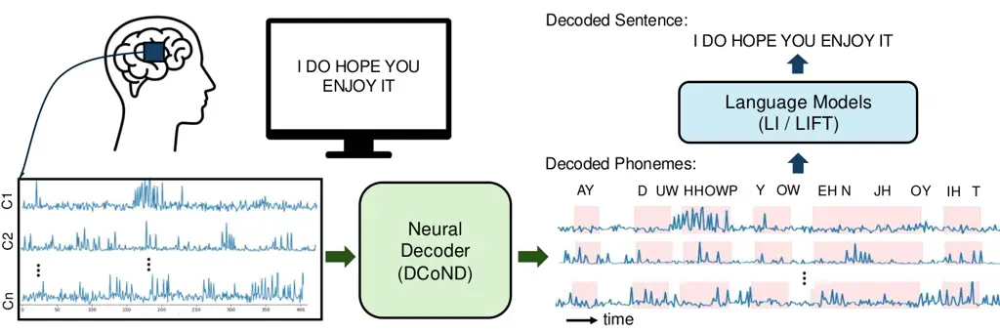
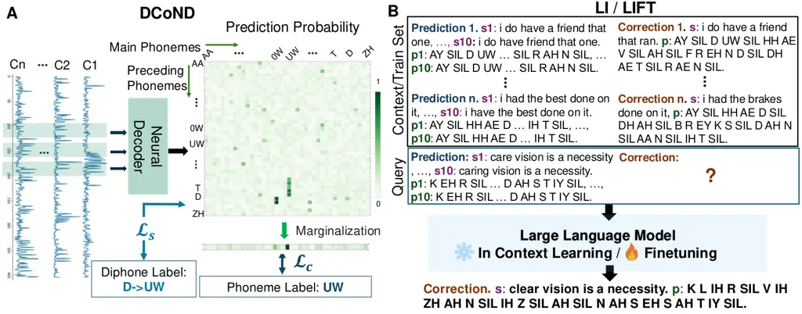
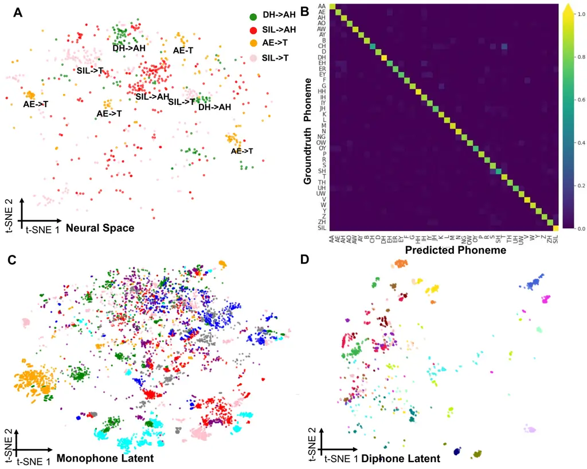
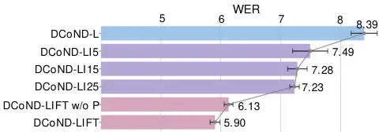
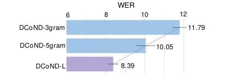
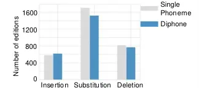

# Brain-to-Text Decoding with Context-Aware Neural Representations and Large Language Models

Jingyuan Li ^(†)^(†)thanks: Authors contributed equally to this work.
Affiliation: Department of Electrical and Computer Engineering
Affiliation: University of Washington Email: [jingyli6@uw.edu](mailto:)
   Trung Le^(\*) Affiliation: Department of Electrical and Computer
Engineering Affiliation: University of Washington
Email: [tle45@uw.edu](mailto:)    Chaofei Fan Affiliation: Department of
Computer Science Affiliation: Stanford University
Email: [stfan@stanford.edu](mailto:)    Mingfei Chen
Affiliation: Department of Electrical and Computer Engineering
Affiliation: University of Washington Email: [lasiafly@uw.edu ](mailto:)
   Eli Shlizerman Affiliation: Department of Applied Mathematics
Affiliation: Department of Electrical and Computer Engineering
Affiliation: University of Washington Email: [shlizee@uw.edu](mailto:)

###### Abstract

Decoding attempted speech from neural activity offers a promising avenue
for restoring communication abilities in individuals with speech
impairments. Previous studies have focused on mapping neural activity to
text using phonemes as the intermediate target. While successful,
decoding neural activity directly to phonemes ignores the context
dependent nature of the neural activity-to-phoneme mapping in the brain,
leading to suboptimal decoding performance. In this work, we propose the
use of diphone - an acoustic representation that captures the
transitions between two phonemes - as the context-aware modeling target.
We integrate diphones into existing phoneme decoding frameworks through
a novel divide-and-conquer strategy in which we model the phoneme
distribution by marginalizing over the diphone distribution. Our
approach effectively leverages the enhanced context-aware representation
of diphones while preserving the manageable class size of phonemes, a
key factor in simplifying the subsequent phoneme-to-text conversion
task. We demonstrate the effectiveness of our approach on the
Brain-to-Text 2024 benchmark, where it achieves state-of-the-art Phoneme
Error Rate (PER) of 15.34% compared to 16.62% PER of monophone-based
decoding. When coupled with finetuned Large Language Models (LLMs), our
method yields a Word Error Rate (WER) of 5.77%, significantly
outperforming the 8.93% WER of the leading method in the benchmark.

|     |
| --- |
|     |

## 1 Introduction

Verbal communication is a unique feature of human social interaction.
Loss of ability to articulate speech as a result of neurological
pathologies such as stroke and Amyotrophic Lateral Sclerosis (ALS) can
significantly reduce the quality of life for affected individuals.
Recent advancements in Brain-Computer Interfaces (BCI) offer promising
pathways toward restoring communication ability in these patients by
translating neural activity into communicative messages. These messages
can be conveyed through various modalities, including typed characters
(Pandarinath et al., 2017), handwriting (Willett et al., 2021), text
(Herff et al., 2015; Willett et al., 2023a; Metzger et al., 2023), and
synthesized speech (Metzger et al., 2023).

Among existing speech BCI systems, the methods with highest decoding
accuracy and throughput are those that translate neural signals
associated with orofacial movements during attempted speech into
fundamental acoustic units (phonemes), which are then decoded into words
and sentences (Willett et al., 2023a; Metzger et al., 2023; Card et al.,
2024). This two-staged approach typically involves (1) neural signal to
phonemes: using a temporal deep network to decode a binned multi-channel
neural time series into probability of phonemes being spoken at each
time step, and (2) phonemes to text: employing a language model (LM) to
infer the most probable sequence of words given the phoneme
probabilities.

Prior work shows that decoding phonemes as an intermediate
representation rather than directly decoding words, provides the system
the flexibility to decode phrases from extensive vocabularies a limited
set of training examples (Metzger et al., 2023), since from a fixed set
of 40 phonemes, one can practically construct any word of any arbitrary
length. This scalability is especially advantageous given the limited
availability of neural recordings in clinical settings. Indeed, prior
works and state of the art methods show that such an intermediate step
is advantageous.



Figure 1: Overview of the Brain-to-Text decoding pipeline. The Neural
Decoder with Divide-and-Conquer Strategy (DCoND) decodes multi-channel
neural activity into phonemes. The phonemes are subsequently converted
into words by LLMs using either ICL or fine-tuning techniques.

While decoding single phonemes from neural activity may offer more
scalability than direct decoding of words, it remains a challenging
task. Given the innate variability of neural signals, the mapping from
neural activity to phonemes is many-to-one and highly nonlinear.
Furthermore, evidence suggests that cortical activation patterns
producing a particular phoneme are not static, but can vary depending on
the context of surrounding phonemes, a phenomenon known as
coarticulation (Bouchard & Chang, 2014; Mugler et al., 2014). In other
words, cortical neurons at any given time during speech production are
likely encoding a phoneme along with its context, rather than a phoneme
in isolation. Given this observation, diphone (Nedel et al., 2000) - a
sequence of two adjacent phonemes - is a more suitable representation
for capturing this context dependency in neural signals and potentially
reducing the nonlinearity in phoneme decoding. Hence we propose to
decompose the phoneme classification task into the subtasks of 1)
diphone classification, after which 2) diphone probabilities are summed
up to obtain the phoneme prediction, i.e. predicting phoneme
distribution by marginalizing over the diphone distribution. We show
that this divide-and-conquer strategy significantly enhances phoneme
decoding performance.

Recently introduced approaches leverage language models, such as n-gram
model, to translate phoneme probabilities into words (Willett et al.,
2023a; Metzger et al., 2023; Benster et al., 2024). Notably, Benster
et al. (2024) further uses GPT3.5 (Brown et al., 2020) after a 5-gram
model to refine the resulting word sequences into coherent sentences by
ensembling multiple 5-gram transcription candidates. However, the
transcription candidates generated by the n-gram model can significantly
deviate from the ground truth phoneme sequence. To address this issue,
we propose to augment the ensembling method in (Benster et al., 2024) to
include decoded phonemes alongside transcription candidates, which
proves to provide extra information for GPT3.5 to infer the correct
transcription. In addition, we propose an In-Context Learning (ICL)
paradigm for LLMs, enabling them to adapt quickly to newly decoded
inputs in a gradient-free manner without the need for the
computationally expensive finetuning process. This approach offers a
more efficient alternative for improving transcription accuracy in
resource-constrained settings.

In summary, our contributions in this work are as follows:

- •
  We propose DCoND (Divide-and-Conquer Neural Decoder), a novel
  framework for decoding phonemes from neural activity during attempted
  speech. Backed by neuroscientific insights, DCoND infers the temporal
  phoneme distribution by marginalizing over the diphone distribution,
  leveraging the context-dependent nature of phonemes in neural
  representation. The divide-and-conquer strategy can serve as an
  adaptable component for various neural decoders in brain-to-text
  decoding.
- •
  We propose incorporating decoded phonemes alongside decoded words in
  an LLM-based ensembling strategy to enhance the speech decoding
  performance. We also propose the use of (ICL) paradigm (DCoND-LI) as
  an alternative to FineTuning LLMs (DCoND-LIFT), offering a more
  efficient solution for resource-constrained brain-to-text systems.
- •
  We demonstrate the effectiveness of our approaches on the
  Brain-to-Text 2024 benchmark, where our approach outperforms existing
  state-of-the-art (SOTA) approaches and achieves PER of 15.34% and WER
  of 5.77%, a significant improvement compared to 8.93% WER of the
  leading existing SOTA method.

## 2 Related Work

#### Brain-to-Text Decoding with Speech Waveforms

When the temporal correspondence between the neural signal and the
speech is known, the problem of decoding speech from neural activity is
relatively more manageable. Such a situation occurs during speech
perception tasks (Poeppel et al., 2008; Défossez et al., 2023; Fodor
et al., 2024; Yang et al., 2024). In this case, the mapping from neural
activity to perceived speech could be learned through supervised
learning (Fodor et al., 2024; Yang et al., 2024) or contrastive learning
(Défossez et al., 2023). Temporal correspondence between neural activity
and speech also exists in speech production experiments performed by
individuals who still retain the ability to speak normally, during which
concurrent speech waveforms are recorded. Studies for such scenarios
include (Jou et al., 2006; Schultz & Wand, 2010; Kapur et al., 2018;
Meltzner et al., 2018; Diener et al., 2018; Janke & Diener, 2017; Chen
et al., 2024). When the produced speech is not fully observed, Gaddy and
Klein propose to use dynamic time warping and canonical correlation
analysis to align the neural signals with recorded audio signal (Gaddy &
Klein, 2020; Gaddy & Klein, 2021). In contrast to these works, our study
focuses on speech decoding when audio recordings of speech are not
available.

#### Brain-to-Text Decoding without Speech Waveforms

In cases of individuals who cannot produce intelligible speech, the
speech decoding problem could be entirely avoided by using typing-based
systems, albeit with low throughput (Vansteensel et al., 2016;
Pandarinath et al., 2017; Linse et al., 2018). Early works on speech
decoding were demonstrated with a small vocabulary size (Moses et al.,
2021; Kellis et al., 2010), which could be improved by learning to
decode letters (Metzger et al., 2022). Other studies investigate
phonemes as the decoding target (Pei et al., 2011; Mugler et al., 2014;
Herff et al., 2015; Willett et al., 2023a; Metzger et al., 2023).
However, decoding phonemes directly can be a difficult task since neural
representations for phonemes could change depending on the contexts they
are spoken (Mugler et al., 2014). We leverage this observation to devise
our strategy using diphones as the decoding target.

#### Brain-to-Text Decoding vs. Speech-to-Text Decoding

While brain-to-text and speech-to-text decoding share certain
similarities decoding text from neural signals is a significantly more
challenging task. A key difference is that speech signals are
univariate, while neural activity is multivariate as it is recorded by
multi-channel electrodes. Furthermore, neural signals are far more
intricate. Less is known about how neurons encode speech within their
spiking activity, as well as the degree to which speech-relevant
components can be extracted from the complex interaction of neural
population. However, brain-to-text decoding methods have drawn
inspiration from speech-to-text decoding research, commonly referred to
as Automatic Speech Recognition (ASR). Earlier studies (Miao et al.,
2015; Aggarwal & Dave, 2011; Huang et al., 2014) use Hidden Markov
Models and Gaussian Mixture Models to decode recorded speech signals
into phonemes before translating into words. (Darjaa et al., 2011;
LAleye et al., 2016) suggest that using diphone or triphone could
enhance the accuracy of ASR systems. Modern ASR systems have
transitioned to end-to-end learning approaches, directly decoding speech
signals into words (Prabhavalkar et al., 2023; Graves, 2012; Gulati
et al., 2020; Hsu et al., 2021; Schneider et al., 2019). These systems
typically utilize Transformers (Dong et al., 2018; Zhang et al., 2020)
or hybrid architectures that combine Transformers with Convolutional
Neural Networks (Gulati et al., 2020). A common attribute to end-to-end
learning with Transformers based architectures is that this type of
learning requires large, multiple and diverse input-to-text datasets.
Such datasets are generally not available in the neuroscience domain.
Recurrent Neural Networks (RNNs) (Luong et al., 2015) decoders thereby
have been traditionally more commonly implemented in existing works that
address decoding tasks that involve neural activity. We therefore, as in
prior works of brain-to-text decoding, adopt the two-stage system for
brain-to-text decoding, where phonemes serve as the intermediate
decoding targets. Notably, the diphone representation and the divide and
conquer approach that we propose here do not rely on the particular
architecture of the neural decoder and could the decoder could be
interchanged without the need for adaptations. For existing benchmarks,
such as Brain-to-Text 24’, RNN neural decoder was identified as an
optimal architecture for the neural decoder as we confirmed in our
experiments in Table 6. However, as further datasets become available
the neural decoder is interchangeable with other potentially more
optimal architectures for the neural decoder.

#### In-Context Learning

LLMs pretrained on large corpora of texts exhibit the ability to learn
new tasks in-context (Brown et al., 2020). That is, conditioning on a
few demonstrations of input-target pairs, LLMs can generalize to unseen
cases without updating their weights. This ICL ability has proven useful
across a wide range of tasks (Wei et al., 2022; Touvron et al., 2023).
While ICL typically underperforms a specialized LLM finetuned for a
specific downstream task, it still surpasses zero-shot inference, and is
particularly valuable when finetuning is not feasible due to resource
constraints such as time or computational power, or the inacessibility
of proprietary LLMs (Mosbach et al., 2023).

## 3 Methods



Figure 2: A: Illustration of the brain-to-phoneme decoding pipeline
(DCoND). A Neural-Decoder in DCoND takes multi-channel neural signals as
inputs and generates diphone probabilities, which are then marginalized
into single phoneme probabilities. B: Illustration of the ensembling
method for refining transcription predictions (LI/LIFT). Given an
ensemble of phoneme and transcription candidates as a query, GPT3.5
produces the most sensible transcription composed from these inputs. To
do this, the LLM leverages examples of prediction-correction pairs
provided either in-context at inference time (LI) or as training data
during the finetuning process (LIFT).

#### Problem formulation

The problem of decoding phonemes from neural activity can be formulated
as follows. Let $`f:X\rightarrow Z`$ be the mapping from neural activity
$`X\in\mathbb{R}^{T\times D}`$ to phoneme sequence
$`Z\in\mathbb{Z}^{T^{\prime}}`$, where $`D`$ is the number of neural
features, $`T`$ is the number of neural time bins, and $`T^{\prime}`$ is
the number of ground truth phonemes in a sentence. We note that
$`T>T^{\prime}`$ in general, i.e. the articulation of one phoneme may
span multiple timesteps. We also emphasize that there is no ground truth
temporal alignment between $`X`$ and $`Z`$ due to the nature of the
silent speech task. Both $`T`$ and $`T^{\prime}`$ vary across trials
depending on the length of the sentence in that trial. We aim to learn a
model $`f_{\theta}:X\rightarrow Z`$ to approximate $`f`$ with a set of
parameters $`\theta`$, through a deep Neural-Decoder model.

For the Neural-Decoder, we employ an GRU recurrent neural network model.
Previous work investigated various architectures for the Neural-Decoder
and demonstrated that GRU shows superior performance (Willett et al.,
2023a; Benchetrit et al., 2023). A comparative study of alternative
architectures, such as LSTM and Transformer, is available in the
Appendix A.5. In particular, we reconfirm the previous results of
effectiveness of GRU vs. other architectures such as Transformers.
Notably, the proposed divide-and-conquer strategy is adaptable to
various decoder architecture and is designed to enhance the decoding
performance of the any decoder that has been chosen. Decoded phonemes
$`Z`$ can be subsequently translated to sentences $`Y`$ with the help of
a language model $`h_{\phi}:Z\rightarrow Y`$, where $`h_{\phi}`$ can be
a pre-built statistical language model, e.g. 5-gram, or an LLM, e.g.
GPT3 (Brown et al., 2020). The overall pipeline is depicted in Figure 1.

#### A Divide-and-Conquer strategy for phoneme decoding

Decoding phonemes from neural activity is a nontrivial task given the
highly nonlinear nature of $`f`$ and the variability of the neural
population dynamics. Evidence exists that the neural representations for
phonemes vary depending on the surrounding contexts (Bouchard & Chang,
2014; Mugler et al., 2014). We illustrate this observation in Figure 3
where segments of phoneme-aligned neural activity form clusters in the
neural space based on the context they are in. It can be seen that there
is no single cluster representing each phoneme, but rather each phoneme
is represented by multiple subclusters. We further show that the
subclusters are identifiable by the phoneme preceding the phoneme of
interest. For instance, the phoneme AH is represented by subclusters DH
$`\rightarrow`$ AH and SIL $`\rightarrow`$ AH (see further discussion in
Section 4.4). Learning to model these context-aware sub-units of speech
instead of single phonemes directly could facilitate the phoneme
decoding task. Concretely,

```math
f(x):=p(z|X)=\sum_{S}p(z,S|X)=\sum_{s\in S}g_{s}^{z}(x)\\
 \tag{1}
```

where $`S`$ is a random variable denoting the context surrounding the
phoneme $`z`$. To be noticed, $`z`$ takes values from phoneme classes,
such that $`z\in[1,C]`$. The problem of learning single phoneme classes
($`f`$) now reduces to the problem of learning the phoneme
context-dependent subclasses ($`g_{s}^{z}`$), which is more manageable
and in-line with the context-dependent nature of the data. We refer to
our phoneme decoder with this divide-and-conquer strategy as DCoND.

#### Diphone as a context-dependent representation of phonemes

The context-dependent subclasses could be defined in multiple ways. In
this work, we adopt diphone, a context-dependent representation for
phoneme sequences where transitions between phonemes are the subject of
interest. For example, the single phoneme representation of “hope”,
$`H,~~~OW,~~~P`$, will have a diphone representation

```math
SIL\rightarrow H,~~~H\rightarrow H,~~~H\rightarrow OW,~~~OW\rightarrow OW,~~~OW\rightarrow P,~~~P\rightarrow P,~~~P\rightarrow SIL,
```

where ’SIL’ indicates the silence between the words. Diphone expands the
length of phoneme sequence to $`T^{\prime\prime}=2T^{\prime}`$, where
$`T{\prime}`$ and $`T{\prime\prime}`$ indicate the lengths of single
phonemes and the diphone respectively, and increases the number of
decoding classes to $`C^{2}`$, where the number of classes $`C=40`$ for
the English language¹¹ 1 the phonemes are defined as per CMU Pronouncing
Dictionary:
[http://www.speech.cs.cmu.edu/cgi-bin/cmudict/](http://www.speech.cs.cmu.edu/cgi-bin/cmudict/).

Formally, we reformulate the problem of decoding a phoneme from neural
activity as the marginalization over the distribution of diphones,
conditioning on the observed neural activity

```math
p(Z=c_{i}|X)=\sum_{c_{j}\in S}p(c_{j},c_{i}|X),
```

where $`p(c_{j},c_{i}|X)`$ is the probability of neural activity X
encoding the diphone $`c_{j}\rightarrow c_{i}`$. A visualization of the
marginalization process is shown in Fig. 2A. Neural activity is
processed by a Neural Decoder to predict the probability of $`40^{2}`$
diphones being spoken at each timestep. The diphone probability is
depicted by a $`40\times 40`$ matrix where columns correspond to the
current phonemes and rows correspond to the preceding phonemes. The
single phoneme probability is then obtained by summing the joint
probabilities column-wise.

#### Parameter Optimization for Phoneme Decoding

As mentioned above, since there is no temporal alignment between $`T`$
timesteps of neural activity and $`T^{\prime}`$ ground truth phonemes in
each trial, we therefore use the Connectionist Temporal Classification
(CTC) loss as proposed in (Graves et al., 2006) to resolve the unaligned
sequences comparison. Specifically, for neural activity X and phoneme
sequence Z, CTC aims to maximize the probability of Z given X

```math
p(Z|X)=\sum_{A\in\mathcal{A}_{(X,Z)}}\prod_{t=1}^{T^{\prime}}p(a_{t}|X), \tag{2}
```

where $`A_{(X,Z)}`$ is the set of valid alignments between $`X`$ and
$`Z`$.

Given that we have the diphone representation for each ground truth
sentence we consider the CTC losses over both the diphone and single
phoneme representations

```math
\mathcal{L}=\alpha\mathcal{L}_{c}+(1-\alpha)\mathcal{L}_{s}, \tag{3}
```

where
$`\mathcal{L}_{c}=-\log(\sum_{A\in\mathcal{A}_{(X,Z)}}\prod_{t=1}^{T^{\prime}}p_{m}(a_{t}|X))`$
is the loss for single phoneme decoding,
$`\mathcal{L}_{s}=-\log(\sum_{A\in\mathcal{A}_{(X,S)}}\prod_{t=1}^{T^{\prime\prime}}p(a_{t}|X))`$
defines the loss over subclasses (diphone) decoding.

Coefficient $`\alpha`$ controls the balance of the single phoneme
decoding and diphone decoding. $`\alpha`$ is designed to be small at the
beginning and gradually increase over the course of training. See
Appendix A.6 for more implementation details.

#### Word Decoding with Language Models

The predicted phoneme probabilities are further transformed into
high-quality text through (i) Generation of transcription candidates
from phonemes, (ii) Re-scoring of transcription candidates, and (iii)
Error correction using an ensemble of selected candidates.

Transcription Generation. During the phase of candidate sentence
generation we convert the predicted phoneme probabilities into words
using a 5-gram model. Based on the predicted phoneme probability
distribution, the 5-gram model leverages its internal word and sentence
distributions to generate the most likely sentence candidates (Miao
et al., 2015; Willett et al., 2023a). Each candidate is associated with
a likelihood score provided by the 5-gram model.

Transcription Re-scoring LLMs trained on large corpora of texts, such as
the Open Pre-trained Transformer (OPT) (Zhang et al., 2022), could
provide more accurate likelihood of the generated transcriptions. Hence,
we use OPT to re-score the 5-gram likelihood outputs. The transcription
candidates with the highest likelihoods are selected (Willett et al.,
2023a).

Transcription Error Correction with Ensemble Method While the 5-gram and
OPT models can correct some phoneme errors made by the phoneme decoder
to produce more contextually sound sentences (transcriptions), these
sentences are not always perfect. Variations of the phoneme decoding
model could result in changes of generated and selected sentence
candidates. Ensembles of phoneme decoding models, with each model being
an expert in different situations, could mitigate the errors made by
another model.

In (Benster et al., 2024) GPT3.5 is finetuned to evaluate an ensemble of
$`10`$ transcription candidates and generate the most sensible sentence
from the 10 candidates. However, providing GPT3.5 only the candidate
transcriptions hinders the LLM’s ability to understand the underlying
phoneme sequences, which are the generating source of the transcriptions
and might have been incorrectly converted by the 5-gram model. We
therefore propose to include both the transcription candidates and the
corresponding phoneme sequences as inputs to GPT3.5, tasking the model
with generating both the correct transcription and phoneme sequence. An
illustration of such a task is shown in Fig.2. By finetuning the LLM in
this manner, we train it to infer the relationship between predicted
phonemes and the predicted transcriptions, as well as identifying common
model-specific mistakes made by the phoneme decoders across their
predictions. We show in Section 4.3 that this strategy further boosts
the WER from 8.06% to 5.77%.

In addition, since finetuning LLM is a resource-intensive process, we
also propose to leverage ICL as an alternative learning paradigm for
refining predicted transcriptions. Instead of finetuning GPT3.5 over
multiple batches of ($`10\times`$ predictions, $`1\times`$ ground truth)
pairs, we directly include $`N`$ examples of these pairs as context in
each prompt, along with a query input to be refined. The LLM then
leverages its ICL ability to quickly refine the query transcriptions
without updating its weights. The prompts used for both in-context
inference and finetuning are detailed in the Appendix A.8.

## 4 Experiments

### 4.1 Dataset

We demonstrate the effectiveness of DCoND-LIFT in decoding attempted
speech using the Brain-to-Text Benchmark 2024 (Willett et al., 2023a;
Willett et al., 2023b). The dataset was collected from a human subject
with ALS who had lost the ability to produce intelligible speech. In the
experiments, the subject attempts to silently speak sentences displayed
on a screen. These sentences are composed from a vocabulary set of
125,000 words. In each trial, one sentence is shown followed by an
auditory ‘Go’ cue, after which the subject attempts to speak at their
own pace. Neural activity (multiunit threshold crossings and spike band
power) is recorded from the ventral premotor cortex (6V) while the
subject attempted speaking. Due to the nature of the silent speech task,
the correspondence between neural activity and the produced speech is
unknown. The dataset is split into training, validation, and competition
sets with 8800, 600, and 1200 sentences, respectively.

### 4.2 Evaluation Metrics

PER Phoneme Error Rate (PER) is calculated by comparing the decoded
phoneme sequence with the ground truth phoneme sequence. After aligning
the recognized phoneme sequence with the reference phoneme sequence, the
number of insertions, deletions, and substitutions required to match the
sequences are counted. The sum of these operations is divided by the
total number of phonemes in the ground truth sequence to compute PER.
This metric reflects how accurately neural signals can be recognized
into phonetic units.

WER Similarly to PER, word error rate (WER) is computed by aligning the
sequence of recognized words with the ground truth sentence first and
then counting the number of insertions, deletions, and substitutions of
words needed to reconcile any discrepancies between the two sequences.
The total number of these operations is divided by the total number of
words in the reference sequence to obtain WER. As neural activity is
translated into phonemes before converted into words, WER reflects the
performance of both the neural decoder and the language model.

P-WER We adapt Perceptual Word Error Rate (P-WER) (Metzger et al., 2023)
to measure the quality of phoneme decoding at the word perception level.
Specifically, we use eSpeak-NG (Reece H. Dunn, 2015) to synthesize
speech from the decoded phoneme sequences. Then the synthesized speech
is translated into sentences by Whisper (Radford et al., 2022) from
which the WER is estimated. Considering the systematic errors introduced
by the eSpeak-NG synthesizer and the Whisper ASR system, we define P-WER
as follows

```math
\text{P-WER}=(1-\frac{1-\text{WER}_{\textit{Whisper-P}}}{1-\text{WER}_{\textit{Whisper-GT}}}),
```

where $`\text{WER}_{Whisper-GT}`$ and $`\text{WER}_{Whisper-P}`$ are the
WER measured on Whisper’s decoded transcriptions when audio is
synthesized with ground truth phoneme sequences (GT) and predicted
phoneme sequences (P), respectively.

### 4.3 Comparison with SOTA Methods

|                              |                             |                             |                               |
| ---------------------------- | --------------------------- | --------------------------- | ----------------------------- |
|                              | PER$`\times 100\downarrow`$ | WER$`\times 100\downarrow`$ | P-WER$`\times 100\downarrow`$ |
| NPTL (Willett et al., 2023a) | 16.62                       | 9.46                        | 11.33                         |
| LISA (Benster et al., 2024)  | –                           | 8.93                        | –                             |
| DCoND-L (Ours)               | 15.34                       | 8.06                        | 8.02                          |
| DCoND-LI (Ours)              | –                           | 7.29                        | –                             |
| DCoND-LIFT (Ours)            | –                           | 5.77                        | –                             |

Table 1: Performance comparison on Brain-to-Text 2024 Benchmark

Comparison of DCoND-LIFT performance with existing methods shows that
DCoND-LIFT achieves state-of-the-art performance on the Brain-to-Text
Benchmark 2024, where WER is the primary evaluation metric (see Table
1). Specifically, we compared DCoND-LIFT with the leading methods NPTL
(Willett et al., 2023a) and LISA (Benster et al., 2024). NPTL uses a
5-layer RNN to decode neural activity to phonemes, followed by a
combination of 5-gram and OPT language models (Miao et al., 2015; Zhang
et al., 2022) to translate decoded phonemes to text. LISA also uses RNN
as phonemes decoder from neural activity, however it leverages GPT3.5 to
further improve transcriptions given by the 5-gram model.

As seen in Table 1, DCoND model variants outperform the competing
methods. DCoND combined with 5-gram LM and OPT (DCoND-L) yields WER of
8.06%, compared to 9.46% WER of NPTL and 8.93% of LISA. Further
sensitivity analysis is provided in Table 4 of the Appendix. Given that
DCoND-L uses the same backbone, RNN decoder and LMs, as NPTL, we posit
that the improvements in WER are due to the effectiveness of our
proposed divide-and-conquer phoneme decoding strategy. Indeed, DCoND-L
achieves a better PER and P-WER (15.34% and 8.02% compared to 16.62% and
11.33% of NPTL).

Further improvement in WER is achieved when we equip DCoND-L with the
more powerful language model GPT3.5, to evaluate an ensemble of
predicted transcriptions and their associated phoneme representations.
When ensemble examplars are shown to GPT3.5 in-context (DCoND-LI), WER
improves from 8.06% to 7.29%. This performance is achieved with 25 ICL
examplars, the largest number of ICL examplars GPT3.5 can afford due to
its prompt length constraint. When we finetune GPT3.5 with all available
training examplars (DCoND-LIFT), WER is further boosted to 5.77%, a
significant improvement from 8.93% WER of LISA. These results support
our proposal of including both transcriptions and phoneme
representations in the demonstrations to GPT3.5 so that it can leverage
the relationship between phonemes and words to refine the
transcriptions.

### 4.4 Phoneme Decoding Analyses

#### Neural activity represents phonemes in context-dependent clusters

Previous works demonstrate that the decoding accuracy of phonemes from
neural activity could be reduced when phonemes are pronounced in the
context of other phonemes as opposed to being pronounced individually
(Mugler et al., 2014). To get a glimpse of how the brain encodes
phonemes, in Fig. 3A we visualize phoneme-aligned segments of neural
activity in the 2D t-SNE space (van der Maaten & Hinton, 2008). Since
the dataset does not have the exact temporal correspondence between
neural activity and phonemes, we leverage Dynamic Time Warping (DTW) to
align the ground truth phonemes to neural activity segments according to
the timestamps obtained from the decoded phonemes (Müller, 2007). We
annotate the neural activity segments based on the resulting phoneme
alignment. The visualization reveals that neural activity segments form
distinct clusters in the t-SNE space. Notably, these clusters are
organized based not only on single phonemes but also on the context in
which they are spoken. For instance, during periods where ‘T’ is the
main phoneme being spoken, corresponding neural activity is organized
into subclusters of AE$`\rightarrow`$T (orange) and SIL$`\rightarrow`$T
(pink), depending on whether phoneme ‘AE’ or ‘SIL’ is spoken before ‘T’.
Similar observations hold for subclusters DH$`\rightarrow`$AH (green)
and SIL$`\rightarrow`$AH (red) for the phoneme ‘AH’. We note that
further subclusters could exist within each subcluster, suggesting a
continuum of finer contexts beyond the preceding phoneme.

Diphone decoding leads to enhanced clusters in latent space We visualize
in Figure 3C and 3D the latent space at the last layer of the neural
decoder when trained to decode single phonemes (monophones) vs.
diphones. In Figure 3C, each color represents a single decoded phoneme
label. For clarity of the visualization, we selected five single phoneme
classes with the most samples. The clusters that correspond to single
phonemes appear to spread out over the whole space, and overlap with
each other. In Figure 3D, each color represents a decoded diphone. Since
there are fewer samples for each diphone, we visualize 16 diphone
classes with the highest occurrence. It can be observed that the neural
decoder represents diphones in the latent space by clusters that are
significantly more condensed and well-separated. Such clear structure
facilitates the subsequent classification of single phonemes and
demonstrates the effectiveness of our divide-and-conquer phoneme
decoding method.



Figure 3: A: 2D t-SNE visualization of neural signal projections
illustrating the context-dependent nature of phonemes in neural
reprentations. Different colors indicate different diphone classes. B:
Confusion matrix of ground truth phonemes vs. DCoND’s predicted
phonemes. C: 2D t-SNE visualization for the latent space of the neural
decoder trained with single phoneme decoding objective (Monophone).
Different colors indicate different phoneme classes. D: 2D t-SNE
visualization for the latent space of the neural decoder trained with
diphone decoding objective. Different colors indicate different diphone
classes.

Phoneme prediction error analysis In Figure 3B, we show the confusion
matrix of the predicted phonemes and the ground truth phonemes. It can
be seen from the figure that most phonemes are correctly classified with
accuracy greater than 80%. The mistakes that the model typically makes,
if any, are on phonemes that are pronounced similarly. For example, the
model usually confuses ‘SH’ with ‘S’, and ‘CH’ with ‘TH’. Since the
articulation of these phonemes is very similar, the neural activity
generating them is likely to be similar. Such confusion is expected to
some extent, given the ALS condition hindering the ability of the
subject to articulate the desired words clearly.

### 4.5 Ablation Study

#### Trade-off Between Diphone Loss and Monophone Loss

We systematically investigate the trade-off between diphone loss
$`\mathcal{L}_{c}`$ and monophone loss $`\mathcal{L}_{s}`$, controlled
by the parameter $`\alpha`$ in Equation 3. The impact of varying
$`\alpha`$ on model performance is shown in Table 2. We find that a
balance between these two losses, with $`\alpha=0.6`$, yields the most
optimal results. Consequently, we adopt $`\alpha=0.6`$ for all DCoND
models used in this paper.

|                             |                |                |                |                |                |
| --------------------------- | -------------- | -------------- | -------------- | -------------- | -------------- |
|                             | $`\alpha=0.2`$ | $`\alpha=0.4`$ | $`\alpha=0.6`$ | $`\alpha=0.8`$ | $`\alpha=1.0`$ |
|                             |                |                | (DCoND-L)      |                | (NPTL)         |
| PER$`\times 100\downarrow`$ | 15.64          | 15.26          | 15.34          | 15.49          | 16.62          |
| WER$`\times 100\downarrow`$ | 8.47           | 8.70           | 8.06           | 8.64           | 9.46           |

Table 2: Trade-offs between diphone loss and monophone loss.

#### Alternatives for context-dependent phoneme representations

Triphone DCoND-L K=50 K=100 K=200 Grouping PER$`\times 100\downarrow`$
15.34 16.01 15.02 15.11 28.55 WER$`\times 100\downarrow`$ 8.06 9.69 9.67
9.81 13.98

Table 3: Ablation study on alternative definitions of context-aware
phoneme representations.

Besides diphone, triphone is another way to define context-dependent
representations for phonemes. Each triphone class consists of three
consecutive phonemes, e.g. $`H\rightarrow OW\rightarrow P`$, providing a
finer granularity of context dependency with $`40^{3}`$ possible
classes. Such a large number of classes can be overwhelming for the
model to learn. Given that many of them have few to no presence in the
data, to efficiently maintain a manageable size of decoding classes we
select the top $`K`$ combinations of preceding and succeeding phonemes
for each main phoneme, e.g. $`*\rightarrow OW\rightarrow*`$, based on
their frequency of occurrence in the data, where $`K\in[50,100,200]`$.
Alternatively, the preceding and succeeding phonemes could be grouped
based on their articulatory similarity ("Grouping" in Table 3) (see
Appendix A.2 for more details).

Results in Table 3 suggest that triphone with appropriate class size
achieves comparable PER as the diphone counterpart (DCoND-L). However,
triphone modeling underperforms diphone modeling in terms of WER,
possibly due to the reduction in the triphone class size that is
potentially skewing the phoneme distribution output of the neural
decoder, making it incompatible with the distribution the subsequent
5-gram model was originally trained on single phoneme. Notably, while
the grouping method despite yields a class size similar to that of
$`K=200`$, it performs signficantly worse in both PER and WER. This
implies that neural encoding of phonemes is more intricate, and grouping
phonemes based on pronunciation similarity may not be optimal. Overall,
we empirically find that diphone, with its context-dependent nature and
manageable class size, as the most suitable modeling choice for this
task and dataset.



Figure 4: Ablation study on the contribution of LLMs.

#### Contribution of LLMs

LLMs play an important role in translating phonemes into sentences. As
detailed in Section 3, our LLM-based phoneme-to-text pipeline consists
of three steps: (i) transcription generation (5-gram), (ii)
transcription re-scoring (OPT), (iii) error correction via ensemble with
ICL GPT3.5 or finetuned GPT3.5. We show in Figure 4 how each step of the
LLM pipeline contributes to the overall WER. In particular, we consider
the following variants of LLMs, as an added component to DCoND:
5-gram+OPT as used in NPTL (DCoND-L), 5-gram+OPT+ICL GPT3.5 with context
length of 5 (DCoND-LI5), context length of 15 (DCoND-LI15) and context
length of 25 (DCoND-LI25), 5-gram+OPT+finetuned GPT3.5 without phoneme
inputs (DCoND-LIFT w/o P), and our most performative model –
5-gram+OPT+finetuned GPT3.5 with phoneme inputs (DCoND-LIFT). We show
that the use of GPT3.5 to refine the transcriptions from an ensemble of
candidates, selected from the highest re-scored likelihood given by the
5-gram+OPT step, leads to an improvement in WER. The most optimal WER is
achieved when GPT3.5 fully leverages the predicted phonemes to refine
query transcriptions (DCoND-LIFT). In an ablated version, where limited
ICL exemplars are given to GPT3.5 without fine-tuning (DCoND-LIxx), the
WER score is enhanced when compared to the baseline (DCoND-L), but does
not fully reach the accuracy of DCoND-LIFT. Such disparity between the
two modes of LLM effectiveness is expected since the two modes are
designed for different operational regimes: DCoND-LI is applicable in
scenarios with fast inference and constraints on response time, while
DCoND-LIFT is applicable in scenarios in which such constraints do not
exist. Additional ablations are provided in Section A.3 of the Appendix.

## 5 Conclusion

In this work, we propose a Divide-and-Conquer approach for Neural
Decoders (DCoND) together with an LLM-enhanced ensemble method (LI and
LIFT) for speech decoding from neural activity. DCoND is motivated by
the coarticulation principle in neuroscience research which informs that
there is context-dependent organization of phonemes in the brain. In
particular, DCoND proposes to utilize diphones, a context-dependent
representation for phoneme sequences, as the modeling target. We show
that decomposing the phoneme classification task into diphone
classification subtasks facilitates the phoneme decoding task,
subsequently improving the whole sentence decoding accuracy.
Furthermore, variants of DCoND (DCoND-LI and DCoND-LIFT) propose the
additional inclusion of an LLM-based ensemble approach to enhance DCoND
ability to refine the transcription candidates. In particular, these
approaches leverage GPT3.5 in two modes, ICL and fine-tuning, to further
map between phoneme sequence candidates and transcription candidates and
thus achieve further improvement in contextual word decoding. We show
that DCoND-LIFT achieves SOTA PER and WER on the Brain-to-Text 2024
Benchmark, outperforming leading methods by a large margin.

## 6 Acknowledgements

We acknowledge the support of HDR Institute: Accelerated AI Algorithms
for Data-Driven Discovery (A3D3) National Science Foundation grant
PHY-2117997 (ES, JL, TL, MC) and the departments of Applied Mathematics
(ES) and Electrical and Computer Engineering (ES, JL, TL, MC) at the
University of Washington. The authors are thankful to the Center of
Computational Neuroscience and the eScience Center at the University of
Washington.

## References

- Aggarwal & Dave (2011) Rajesh Kumar Aggarwal and Mayank Dave. Acoustic
  modeling problem for automatic speech recognition system: conventional
  methods (part i). _International Journal of Speech Technology_,
  14:297–308, 2011.
- Benchetrit et al. (2023) Yohann Benchetrit, Hubert Banville, and
  Jean-Rémi King. Brain decoding: toward real-time reconstruction of
  visual perception. _arXiv preprint arXiv:2310.19812_, 2023.
- Benster et al. (2024) Tyler Benster, Guy Wilson, Reshef Elisha,
  Francis R Willett, and Shaul Druckmann. A cross-modal approach to
  silent speech with llm-enhanced recognition. _arXiv preprint
  arXiv:2403.05583_, 2024.
- Bouchard & Chang (2014) Kristofer E Bouchard and Edward F Chang.
  Neural decoding of spoken vowels from human sensory-motor cortex with
  high-density electrocorticography. In _2014 36th Annual International
  Conference of the IEEE Engineering in Medicine and Biology Society_,
  pp. 6782–6785. IEEE, 2014.
- Brown et al. (2020) Tom B Brown, Benjamin Mann, Nick Ryder, Melanie
  Subbiah, Jared Kaplan, Prafulla Dhariwal, Arvind Neelakantan, Pranav
  Shyam, Girish Sastry, Amanda Askell, Sandhini Agarwal, Ariel
  Herbert-Voss, Gretchen Krueger, Tom Henighan, Rewon Child, Aditya
  Ramesh, Daniel M Ziegler, Jeffrey Wu, Clemens Winter, Christopher
  Hesse, Mark Chen, Eric Sigler, Mateusz Litwin, Scott Gray, Benjamin
  Chess, Jack Clark, Christopher Berner, Sam McCandlish, Alec Radford,
  Ilya Sutskever, and Dario Amodei. Language models are few-shot
  learners. _Advances in neural information processing systems_,
  33:1877–1901, 2020.
- Card et al. (2024) Nicholas S. Card, Maitreyee Wairagkar, Carrina
  Iacobacci, Xianda Hou, Tyler Singer-Clark, Francis R. Willett, Erin M.
  Kunz, Chaofei Fan, Maryam Vahdati Nia, Darrel R. Deo, Aparna
  Srinivasan, Eun Young Choi, Matthew F. Glasser, Leigh R. Hochberg,
  Jaimie M. Henderson, Kiarash Shahlaie, Sergey D. Stavisky, and
  David M. Brandman. An accurate and rapidly calibrating speech
  neuroprosthesis. _New England Journal of Medicine_,
  391(7):609–618, 2024.
- Chen et al. (2024) Xupeng Chen, Ran Wang, Amirhossein
  Khalilian-Gourtani, Leyao Yu, Patricia Dugan, Daniel Friedman, Werner
  Doyle, Orrin Devinsky, Yao Wang, and Adeen Flinker. A neural speech
  decoding framework leveraging deep learning and speech synthesis.
  _Nature Machine Intelligence_, pp. 1–14, 2024.
- Darjaa et al. (2011) Sakhia Darjaa, Miloš Cerňak, Štefan Beňuš, Milan
  Rusko, Róbert Sabo, and Marián Trnka. Rule-based triphone mapping for
  acoustic modeling in automatic speech recognition. In _Text, Speech
  and Dialogue: 14th International Conference, TSD 2011, Pilsen, Czech
  Republic, September 1-5, 2011. Proceedings 14_, pp. 268–275.
  Springer, 2011.
- Défossez et al. (2023) Alexandre Défossez, Charlotte Caucheteux,
  Jérémy Rapin, Ori Kabeli, and Jean-Rémi King. Decoding speech
  perception from non-invasive brain recordings. _Nature Machine
  Intelligence_, 5(10):1097–1107, 2023.
- Diener et al. (2018) Lorenz Diener, Gerrit Felsch, Miguel Angrick, and
  Tanja Schultz. Session-independent array-based emg-to-speech
  conversion using convolutional neural networks. In _Speech
  Communication; 13th ITG-Symposium_, pp. 1–5. VDE, 2018.
- Dong et al. (2018) Linhao Dong, Shuang Xu, and Bo Xu.
  Speech-transformer: a no-recurrence sequence-to-sequence model for
  speech recognition. In _2018 IEEE international conference on
  acoustics, speech and signal processing (ICASSP)_, pp. 5884–5888.
  IEEE, 2018.
- Fodor et al. (2024) Milán András Fodor, Tamás Gábor Csapó, and
  Frigyes Viktor Arthur. Towards decoding brain activity during passive
  listening of speech. _arXiv preprint arXiv:2402.16996_, 2024.
- Gaddy & Klein (2020) David Gaddy and Dan Klein. Digital voicing of
  silent speech. _arXiv preprint arXiv:2010.02960_, 2020.
- Gaddy & Klein (2021) David Gaddy and Dan Klein. An improved model for
  voicing silent speech. _arXiv preprint arXiv:2106.01933_, 2021.
- Graves (2012) Alex Graves. Sequence transduction with recurrent neural
  networks. _arXiv preprint arXiv:1211.3711_, 2012.
- Graves et al. (2006) Alex Graves, Santiago Fernández, Faustino Gomez,
  and Jürgen Schmidhuber. Connectionist temporal classification:
  labelling unsegmented sequence data with recurrent neural networks. In
  _Proceedings of the 23rd international conference on Machine
  learning_, pp. 369–376, 2006.
- Gulati et al. (2020) Anmol Gulati, James Qin, Chung-Cheng Chiu, Niki
  Parmar, Yu Zhang, Jiahui Yu, Wei Han, Shibo Wang, Zhengdong Zhang,
  Yonghui Wu, and Ruoming Pang. Conformer: Convolution-augmented
  transformer for speech recognition. _arXiv preprint
  arXiv:2005.08100_, 2020.
- Herff et al. (2015) Christian Herff, Dominic Heger, Adriana
  De Pesters, Dominic Telaar, Peter Brunner, Gerwin Schalk, and Tanja
  Schultz. Brain-to-text: decoding spoken phrases from phone
  representations in the brain. _Frontiers in neuroscience_,
  9:217, 2015.
- Hsu et al. (2021) Wei-Ning Hsu, Benjamin Bolte, Yao-Hung Hubert Tsai,
  Kushal Lakhotia, Ruslan Salakhutdinov, and Abdelrahman Mohamed.
  Hubert: Self-supervised speech representation learning by masked
  prediction of hidden units. _IEEE/ACM Transactions on Audio, Speech,
  and Language Processing_, 29:3451–3460, 2021.
- Huang et al. (2014) Xuedong Huang, James Baker, and Raj Reddy. A
  historical perspective of speech recognition. _Communications of the
  ACM_, 57(1):94–103, 2014.
- Janke & Diener (2017) Matthias Janke and Lorenz Diener. Emg-to-speech:
  Direct generation of speech from facial electromyographic signals.
  _IEEE/ACM Transactions on Audio, Speech, and Language Processing_,
  25(12):2375–2385, 2017.
- Jou et al. (2006) Szu-Chen Jou, Tanja Schultz, Matthias Walliczek,
  Florian Kraft, and Alex Waibel. Towards continuous speech recognition
  using surface electromyography. In _Ninth International Conference on
  Spoken Language Processing_, 2006.
- Kapur et al. (2018) Arnav Kapur, Shreyas Kapur, and Pattie Maes.
  Alterego: A personalized wearable silent speech interface. In _23rd
  International conference on intelligent user interfaces_, pp.
  43–53, 2018.
- Kellis et al. (2010) Spencer Kellis, Kai Miller, Kyle Thomson, Richard
  Brown, Paul House, and Bradley Greger. Decoding spoken words using
  local field potentials recorded from the cortical surface. _Journal of
  neural engineering_, 7(5):056007, 2010.
- LAleye et al. (2016) Fréjus AA LAleye, Laurent Besacier, Eugène C
  Ezin, and Cina Motamed. First automatic fongbe continuous speech
  recognition system: Development of acoustic models and language
  models. In _2016 Federated Conference on Computer Science and
  Information Systems (FedCSIS)_, pp. 477–482. IEEE, 2016.
- Linse et al. (2018) Katharina Linse, Elisa Aust, Markus Joos, and
  Andreas Hermann. Communication matters—pitfalls and promise of
  hightech communication devices in palliative care of severely
  physically disabled patients with amyotrophic lateral sclerosis.
  _Frontiers in neurology_, 9:379945, 2018.
- Luong et al. (2015) Minh-Thang Luong, Quoc V Le, Ilya Sutskever, Oriol
  Vinyals, and Lukasz Kaiser. Multi-task sequence to sequence learning.
  _arXiv preprint arXiv:1511.06114_, 2015.
- Meltzner et al. (2018) Geoffrey S Meltzner, James T Heaton, Yunbin
  Deng, Gianluca De Luca, Serge H Roy, and Joshua C Kline. Development
  of semg sensors and algorithms for silent speech recognition. _Journal
  of neural engineering_, 15(4):046031, 2018.
- Metzger et al. (2022) Sean L. Metzger, Jessie R. Liu, David A. Moses,
  Maximilian E. Dougherty, Margaret P. Seaton, Kaylo T. Littlejohn, Josh
  Chartier, Gopala K. Anumanchipalli, Adelyn Tu-Chan, Karunesh Ganguly,
  and Edward F. Chang. Generalizable spelling using a speech
  neuroprosthesis in an individual with severe limb and vocal paralysis.
  _Nature communications_, 13(1):6510, 2022.
- Metzger et al. (2023) Sean L. Metzger, Kaylo T. Littlejohn,
  Alexander B. Silva, David A. Moses, Margaret P. Seaton, Ran Wang,
  Maximilian E. Dougherty, Jessie R. Liu, Peter Wu, Michael A. Berger,
  Inga Zhuravleva, Adelyn Tu-Chan, Karunesh Ganguly, Gopala K.
  Anumanchipalli, and Edward F. Chang. A high-performance
  neuroprosthesis for speech decoding and avatar control. _Nature_, pp.
  1–10, 2023.
- Miao et al. (2015) Yajie Miao, Mohammad Gowayyed, and Florian Metze.
  Eesen: End-to-end speech recognition using deep rnn models and
  wfst-based decoding. In _2015 IEEE workshop on automatic speech
  recognition and understanding (ASRU)_, pp. 167–174. IEEE, 2015.
- Mosbach et al. (2023) Marius Mosbach, Tiago Pimentel, Shauli Ravfogel,
  Dietrich Klakow, and Yanai Elazar. Few-shot fine-tuning vs. in-context
  learning: A fair comparison and evaluation. _arXiv preprint
  arXiv:2305.16938_, 2023.
- Moses et al. (2021) David A. Moses, Sean L. Metzger, Jessie R. Liu,
  Gopala K. Anumanchipalli, Joseph G. Makin, Pengfei F. Sun, Josh
  Chartier, Maximilian E. Dougherty, Patricia M. Liu, Gary M. Abrams,
  Adelyn Tu-Chan, Karunesh Ganguly, and Edward F. Chang. Neuroprosthesis
  for decoding speech in a paralyzed person with anarthria. _New England
  Journal of Medicine_, 385(3):217–227, 2021.
- Mugler et al. (2014) Emily M Mugler, James L Patton, Robert D Flint,
  Zachary A Wright, Stephan U Schuele, Joshua Rosenow, Jerry J Shih,
  Dean J Krusienski, and Marc W Slutzky. Direct classification of all
  american english phonemes using signals from functional speech motor
  cortex. _Journal of neural engineering_, 11(3):035015, 2014.
- Müller (2007) Meinard Müller. Dynamic time warping. _Information
  retrieval for music and motion_, pp. 69–84, 2007.
- Nedel et al. (2000) Jon P Nedel, Rita Singh, and Richard M Stern.
  Phone transition acoustic modeling: application to speaker independent
  and spontaneous speech systems. In _INTERSPEECH_, pp. 572–575, 2000.
- Pandarinath et al. (2017) Chethan Pandarinath, Paul Nuyujukian,
  Christine H Blabe, Brittany L Sorice, Jad Saab, Francis R Willett,
  Leigh R Hochberg, Krishna V Shenoy, and Jaimie M Henderson. High
  performance communication by people with paralysis using an
  intracortical brain-computer interface. _elife_, 6:e18554, 2017.
- Pei et al. (2011) Xiaomei Pei, Dennis L Barbour, Eric C Leuthardt, and
  Gerwin Schalk. Decoding vowels and consonants in spoken and imagined
  words using electrocorticographic signals in humans. _Journal of
  neural engineering_, 8(4):046028, 2011.
- Poeppel et al. (2008) David Poeppel, William J Idsardi, and Virginie
  Van Wassenhove. Speech perception at the interface of neurobiology and
  linguistics. _Philosophical Transactions of the Royal Society B:
  Biological Sciences_, 363(1493):1071–1086, 2008.
- Prabhavalkar et al. (2023) Rohit Prabhavalkar, Takaaki Hori, Tara N
  Sainath, Ralf Schlüter, and Shinji Watanabe. End-to-end speech
  recognition: A survey. _IEEE/ACM Transactions on Audio, Speech, and
  Language Processing_, 2023.
- Radford et al. (2022) Alec Radford, Jong Wook Kim, Tao Xu, Greg
  Brockman, Christine McLeavey, and Ilya Sutskever. Robust speech
  recognition via large-scale weak supervision. arxiv (2022). _arXiv
  preprint arXiv:2212.04356_, 2022.
- Reece H. Dunn (2015) Alexander Epaneshnikov Reece H. Dunn,
  Valdis Vitolins. espeak ng text-to-speech. _GitHub_, 2015. URL
  [https://github.com/espeak-ng/espeak-ng](https://github.com/espeak-ng/espeak-ng).
- Schneider et al. (2019) Steffen Schneider, Alexei Baevski, Ronan
  Collobert, and Michael Auli. wav2vec: Unsupervised pre-training for
  speech recognition. _arXiv preprint arXiv:1904.05862_, 2019.
- Schultz & Wand (2010) Tanja Schultz and Michael Wand. Modeling
  coarticulation in emg-based continuous speech recognition. _Speech
  Communication_, 52(4):341–353, 2010.
- Touvron et al. (2023) Hugo Touvron, Thibaut Lavril, Gautier Izacard,
  Xavier Martinet, Marie-Anne Lachaux, Timothée Lacroix, Baptiste
  Rozière, Naman Goyal, Eric Hambro, Faisal Azhar, Aurelien Rodriguez,
  Armand Joulin, Edouard Grave, and Guillaume Lample. Llama: Open and
  efficient foundation language models. _arXiv preprint
  arXiv:2302.13971_, 2023.
- van der Maaten & Hinton (2008) Laurens van der Maaten and Geoffrey
  Hinton. Visualizing data using t-sne. _Journal of Machine Learning
  Research_, 9(86):2579–2605, 2008. URL
  [http://jmlr.org/papers/v9/vandermaaten08a.html](http://jmlr.org/papers/v9/vandermaaten08a.html).
- Vansteensel et al. (2016) Mariska J Vansteensel, Elmar GM Pels,
  Martin G Bleichner, Mariana P Branco, Timothy Denison, Zachary V
  Freudenburg, Peter Gosselaar, Sacha Leinders, Thomas H Ottens, Max A
  Van Den Boom, Peter C Van Rijen, Erik J Aarnoutse, and Nick F Ramsey.
  Fully implanted brain–computer interface in a locked-in patient with
  als. _New England Journal of Medicine_, 375(21):2060–2066, 2016.
- Wei et al. (2022) Jason Wei, Xuezhi Wang, Dale Schuurmans, Maarten
  Bosma, Fei Xia, Ed Chi, Quoc V Le, and Denny Zhou. Chain-of-thought
  prompting elicits reasoning in large language models. _Advances in
  neural information processing systems_, 35:24824–24837, 2022.
- Willett et al. (2021) Francis R Willett, Donald T Avansino, Leigh R
  Hochberg, Jaimie M Henderson, and Krishna V Shenoy. High-performance
  brain-to-text communication via handwriting. _Nature_,
  593(7858):249–254, 2021.
- Willett et al. (2023a) Francis R Willett, Erin M Kunz, Chaofei Fan,
  Donald T Avansino, Guy H Wilson, Eun Young Choi, Foram Kamdar,
  Matthew F Glasser, Leigh R Hochberg, Shaul Druckmann, Krishna Shenoy,
  and Jaimie M. Henderson. A high-performance speech neuroprosthesis.
  _Nature_, 620(7976):1031–1036, 2023a.
- Willett et al. (2023b) Francis R Willett, Erin M Kunz, Chaofei Fan,
  Donald T Avansino, Guy H Wilson, Eun Young Choi, Foram Kamdar,
  Matthew F Glasser, Leigh R Hochberg, Shaul Druckmann, Krishna Shenoy,
  and Jaimie M. Henderson. Data for: A high-performance speech
  neuroprosthesis \[dataset\]. _Dryad_, pp. 1–6, 2023b.
- Yang et al. (2024) Yiqian Yang, Yiqun Duan, Qiang Zhang, Renjing Xu,
  and Hui Xiong. Decode neural signal as speech. _arXiv preprint
  arXiv:2403.01748_, 2024.
- Zhang et al. (2020) Qian Zhang, Han Lu, Hasim Sak, Anshuman Tripathi,
  Erik McDermott, Stephen Koo, and Shankar Kumar. Transformer
  transducer: A streamable speech recognition model with transformer
  encoders and rnn-t loss. In _ICASSP 2020-2020 IEEE International
  Conference on Acoustics, Speech and Signal Processing (ICASSP)_, pp.
  7829–7833. IEEE, 2020.
- Zhang et al. (2022) Susan Zhang, Stephen Roller, Naman Goyal, Mikel
  Artetxe, Moya Chen, Shuohui Chen, Christopher Dewan, Mona Diab, Xian
  Li, Xi Victoria Lin, Todor Mihaylov, Myle Ott, Sam Shleifer, Kurt
  Shuster, Daniel Simig, Punit Singh Koura, Anjali Sridhar, Tianlu Wang,
  and Luke Zettlemoyer. Opt: Open pre-trained transformer language
  models. _arXiv preprint arXiv:2205.01068_, 2022.

## Appendix A Appendix

### A.1 Sensitivity Analysis

We report the mean and standard deviation of DCoND-L, DCoND-LI and
DCoND-LIFT in Table 4. The mean and standard deviation are obtained
across 5 random seeds. These results show that proposed methods
(DCoND-L, DCoND-LI and DCoND-LIFT) performance is robut and they
maintain a significant gap over the NPTL and LISA baselines Willett
et al. (2023a); Benster et al. (2024).

|                   |                             |                             |                               |
| ----------------- | --------------------------- | --------------------------- | ----------------------------- |
|                   | PER$`\times 100\downarrow`$ | WER$`\times 100\downarrow`$ | P-WER$`\times 100\downarrow`$ |
| NPTL \[46\]       | 16.62                       | 9.46                        | 11.33                         |
| LISA \[2\]        | –                           | 8.93                        | –                             |
| DCoND-L (Ours)    | 15.44 $`\pm`$ 0.46          | 8.39 $`\pm`$ 0.22           | 8.09 $`\pm`$ 1.62             |
| DCoND-LI (Ours)   | –                           | 7.23 $`\pm`$ 0.08           | –                             |
| DCoND-LIFT (Ours) | –                           | 5.90 $`\pm`$ 0.08           | –                             |

Table 4: Sensitivity analysis on Brain-to-Text 2024 Benchmark

### A.2 Triphone as an alternative for context-dependent phoneme representation

Triphones expand upon diphones by incorporating a larger context.
Specifically, a triphone considers one phoneme before and one phoneme
after the current main phoneme. Consequently, when a neural signal
segment is decoded into acoustic units based on the continuity of three
phonemes, it reflects a triphone structure. For example, the single
phoneme sequence

```math
H,~~~OW,~~~P
```

for “hope", can be transferred to triphone

```math
``SIL\rightarrow H\rightarrow OW,~~~H\rightarrow OW\rightarrow P,~~~OW\rightarrow P\rightarrow SIL".
```

In this scenario, the time steps required for decoding single phonemes
and triphones remain the same. However, triphones introduce a
substantial increase in the number of classes, scaling as $`N^{3}`$,
which can be prohibitively large (e.g., $`64000`$ when $`N=40`$). The
divide and conquer approach in this case is expressed as

```math
f(x)=p(Z=c_{i}|X)=\sum_{c_{j}\in C,c_{q}\in C}p(c_{j},c_{i},c_{q}|X)
```

Similarly to the diphone probability matrix, the triphone classes are
then mapped into a three dimensional triphone matrix (tensor), where
each element represents the probability of the current neural signal
encoding the phoneme transition from phoneme $`c_{j}`$ to phoneme
$`c_{i}`$ and concluding at phoneme $`c_{q}`$. By summing over the first
and last dimensions, we obtain $`p(Z=c_{i}|X)`$. Given the potential
sparsity of triphone combinations, certain triphone subclasses may not
occur frequently in a given language. To mitigate this, we select the
top $`K`$ subclasses for each triphone sample based on occurrence counts
within the current vocabulary. Specifically, for a main phoneme
$`c_{i}`$, we rank all possible combinations of $`*->c_{i}->*`$ and
retain the top $`K`$ as subclasses for the phoneme class $`c_{i}`$.

Aside from selecting the top $`K`$ subclasses, an alternative approach
involves grouping phones according to articulation similarity Herff
et al. (2015). This categorization leads to subclasses of the phoneme
$`c_{i}`$ as $`group_{j}->c_{i}->group_{q}`$. We categorize phonemes
into 14 groups, encompassing Bilabial Sounds, Labiodental Sounds, Dental
Sounds, Alveolar Sounds, Palatal Sounds, Velar Sounds, Glottal Sounds,
Front Vowels, Central Vowels, Back Vowels, and SIL. In this context, the
number of subclasses amounts to $`14*40*14`$, which is comparable to the
number of classes when $`K=200`$ (resulting in a total of 200\*40
subclasses).

### A.3 Additional Ablation Study on the Contribution of LMs

We conduct an additional study to assess the role of
phoneme-to-transcription generation and re-scoring methods (Figure 5).
We show that removing the re-scoring step performed by the OPT model in
DCoND-L significantly degrades WER (DCoND-3gram and DCoND-5gram),
highlighting the importance of the transcription re-scoring step. In
addition, the 5-gram model with longer phoneme dependency generates more
accurate transcription candidates compared to the 3-gram model.



Figure 5: Ablation study on the contribution of re-scoring step in the
phoneme-to-transcription pipeline.

### A.4 Open-Source LLMs for DCoND-LI & DCoND-LIFT

In addition to the closed-source GPT-3.5, we explored the use of the
open-source Llama-3.1-70B for refining transcription predictions. We
evaluated Llama-3.1-70B in both in-context learning (DCoND-LI) and
fine-tuning (DCoND-LIFT) scenarios and compare it against GPT3.5 (Table
5). Llama-3.1-70B performs on par with GPT3.5 in ICL setting, while
closely trail behind in the finetuning setting. Either variants appear
to outperform NPTL and LISA baselines. These results demonstrate DCoND
method’s robustness and generalizability to other LLMs besides GPT3.5,
and warrant the accessibility of our methods to the broad community.

|            |                   |             |
| ---------- | ----------------- | ----------- |
|            | Llama-3.1-70B WER | GPT 3.5 WER |
| DCoND-LI   | 7.38              | 7.29        |
| DCoND-LIFT | 6.85              | 5.77        |

Table 5: GPT-3.5 vs Llama-3.1-70B for error correction from ensemble of
transcriptions

### A.5 Investigation on Architecture Choices for Neural Decoders

We study the effects of different model architectures on the phoneme
decoding performance (PER) (Table 6). We observe a significant
performance degradation in PER when using Transformer as the neural
decoder. On the other hand, RNN counterparts (LSTM and GRU) perform
decently well, with GRU being the most performant model for both single
phoneme decoding (NPTL) and diphone decoding (DCoND).

|       |                    |                    |                    |
| ----- | ------------------ | ------------------ | ------------------ |
|       | PER                |                    |                    |
|       | Transformer        | LSTM               | GRU                |
| NPTL  | 39.58 $`\pm`$ 0.15 | 17.49 $`\pm`$ 0.32 | 16.63 $`\pm`$ 0.19 |
| DCoND | 38.88 $`\pm`$ 0.17 | 16.08 $`\pm`$ 0.23 | 15.44 $`\pm`$ 0.46 |

Table 6: Comparison of different model architectures on phoneme decoding
performance

### A.6 Implementation Details

We preprocess the recorded neural signals and construct an RNN neural
encoder following the methodology outlined in Willett et al. (2023a).
The raw neural signals $`X\in\mathbb{R}^{T\times D}`$ are initially
partitioned into smaller patches with a window size of $`W`$, where each
patch of shape $`X\in\mathbb{R}^{T^{\prime}\times(DW)}`$ can overlap and
the overlap between patches is determined by the stride size $`W`$.
Stride size is set to $`W=14`$ for diphone experiments and $`W=32`$ for
the triphone experiemnts. The bidirectional RNN processes these patched
neural signals as inputs, which are subsequently transformed into the
neural representation space
$`H=[h_{1},h_{2},\cdots,h_{T^{\prime}}]\in\mathbb{R}^{T^{\prime}\times d}`$.
A fully connected layer then maps hidden representations to diphone or
triphone subclasses, denoted as $`P(S=s_{i}|X)`$. The outputs of the
fully connected layer are used to compute $`\mathcal{L}_{s}`$. The
computation of single phoneme probabilities is detailed in Equation 3.
We merge the probability computed from diphone or triphone.

During the RNN training, we utilize a batch size of 32, a learning rate
of 0.02, and the Adam optimizer across various experiments the same set
of parameters as used in NPTL baseline Willett et al. (2023a). To
facilitate diphone and triphone learning, we initially train the
subclasses for 10 epochs and then gradually increase the ratio of the
single phoneme loss by 0.1 every 10 epochs until it reaches 0.6. The
number of training epochs varies across single phoneme learning, diphone
learning, and triphone learning. Specifically, we conduct experiments
for up to 100 epochs for single phoneme learning (NPTL baseline), 120
epochs for diphone learning, and 140 epochs for triphone learning since
the diphone and triphone include subclasses and require additional
subclass training procedures. Increasing the number of training epochs
can often lead to overfiting of the training data. Training was done on
2 GeForce RTX 2080 Ti with around 12GB memory. The training typically
took around 6-8 hours.

The 5-gram model takes the predicted phoneme logits as inputs, which can
be scaled by a temperature factor denoted as $`t`$ using the formula
$`logits:=logits/t`$. Through experimentation, we have found that
setting $`t=1.2`$ improves the decoding performance. Therefore, we use
$`t=1.2`$ for our experiments, including the implementation of NPTL,
which has resulted in improved baseline results. Specifically, the
leaderboard score has improved from 9.76 to 9.46.

### A.7 Phoneme Error Analysis



Figure 6: Phoneme error types analysis during single phoneme decoding
and diphone.

We conducted a detailed analysis of the various types of errors
encountered during phoneme decoding. This analysis involved assessing
the operations necessary to align the decoded phoneme sequence with the
ground truth phonemes, comparing scenarios where only single phoneme
decoding is used versus employing diphone subclass decoding. Overall,
our findings indicated that employing diphone subclass decoding leads to
a reduction in the number of operations required to align the decoded
sequence with the ground truth phonemes. Specifically, fewer editing
operations, particularly substitutions, are needed when utilizing the
diphone decoding paradigm compared to directly decoding single phonemes.

### A.8 Prompt for GPT3.5

#### Prompt used for to GPT3.5 is as follows:

Your task is to perform automatic speech recognition. Below are multiple
candidate transcriptions together with their corresponding phoneme
representations. The phonemes are taken from the CMU Pronouncing
Dictionary. The special symbol SIL represents the start of the sentence,
or the end of the sentence, or the space between two adjacent words.
Based on the transcription candidates and their phoneme representations,
come up with a transcription and its corresponding phoneme
representation that are most accurate, ensuring the transcription is
contextually and grammatically correct. Focus on key differences in the
candidates that change the meaning or correctness. Avoid selections with
repetitive or nonsensical phrases. In cases of ambiguity, select the
option that is most coherent and contextually sound, taking clues from
the phoneme representations. The candidate phoneme representations may
not always be the correct representation of the corresponding candidate
transcriptions. Some phonemes in the candidate phoneme sequences might
have been incorrectly added, removed, or replaced. However, the
candidate phonemes contain useful information that will help you come up
with the correct transcription and phoneme representation. You should
translate each subgroup of phonemes that is enclosed by two SIL symbols
into one single word. You should remove SIL symbols at the start or the
end of the phoneme sequence. Respond with your refined transcription and
its corresponding phoneme representation only, without any introductory
text.

#### Examples of prediction and correction pairs

Examples of prediction and correction pairs are presented in Table 7.
Additionally, we show In-Context-Learning prompts in Table 8.

|                             |                                                              |
| --------------------------- | ------------------------------------------------------------ |
| Transcription candidate 1:  | but we don’t know that.                                      |
| Transcription candidate 2:  | but we don’t know that.                                      |
| Transcription candidate 3:  | but you don’t know that.                                     |
| Transcription candidate 4:  | but you don’t know that.                                     |
| Transcription candidate 5:  | but you don’t know that.                                     |
| Transcription candidate 6:  | but you don’t know that.                                     |
| Transcription candidate 7:  | but you don’t know that.                                     |
| Transcription candidate 8:  | but you don’t know that.                                     |
| Transcription candidate 9:  | but we don’t know that.                                      |
| Transcription candidate 10: | but we don’t know that.                                      |
| Phoneme candidate 1:        | SIL B AH T SIL W IY SIL D OW N T SIL N OW SIL DH AE T SIL.   |
| Phoneme candidate 2:        | SIL B AH T SIL Y IY SIL D OW N T SIL N OW SIL DH AE T SIL.   |
| Phoneme candidate 3:        | SIL B AH T SIL Y UW SIL D OW N T SIL N OW SIL AE T SIL.      |
| Phoneme candidate 4:        | SIL B AH T SIL Y UW SIL D OW N T SIL N OW SIL DH AE T SIL.   |
| Phoneme candidate 5:        | SIL B AH T SIL DH UW SIL D OW N T SIL N OW SIL DH AE T SIL.  |
| Phoneme candidate 6:        | SIL B AH T SIL Y UW SIL D OW N T SIL N OW SIL DH AE T SIL.   |
| Phoneme candidate 7:        | SIL B AH T SIL Y UW SIL D OW N T SIL N OW SIL DH AE T SIL.   |
| Phoneme candidate 8:        | SIL B AH T SIL Y UW SIL D OW N T SIL N OW SIL DH AE T SIL.   |
| Phoneme candidate 9:        | SIL B AH T SIL W IY SIL D OW N T SIL N OW Z SIL DH AE T SIL. |
| Phoneme candidate 10:       | SIL B AH T SIL DH IY SIL D OW N T SIL N OW SIL AE T SIL.     |
| Transcription GT:           | but we don’t know that.                                      |
| Phoneme GT:                 | SIL B AH T SIL W IY SIL D OW N T SIL N OW SIL DH AE T SIL.   |

Table 7: Examples of prediction and ground truth (GT) pairs.

|                 |                                                                                                                                                                                                                                                                                                                                                                                                                                                                                                                                                                                                                                                                                                                                                                                                                                                                                                                                                                                                                                                                                                                                                                                                                                                                                                                                                                                                                                                                                           |
| --------------- | ----------------------------------------------------------------------------------------------------------------------------------------------------------------------------------------------------------------------------------------------------------------------------------------------------------------------------------------------------------------------------------------------------------------------------------------------------------------------------------------------------------------------------------------------------------------------------------------------------------------------------------------------------------------------------------------------------------------------------------------------------------------------------------------------------------------------------------------------------------------------------------------------------------------------------------------------------------------------------------------------------------------------------------------------------------------------------------------------------------------------------------------------------------------------------------------------------------------------------------------------------------------------------------------------------------------------------------------------------------------------------------------------------------------------------------------------------------------------------------------- |
| System Prompt:  | Your task is to perform automatic speech recognition. You are given ten candidates of an unknown transcription. Your job is to come up with a transcription that is most accurate, relying on the context that the candidates provide. First, observe the provided examples demonstrating how the task should be done, then work on the query candidates. In each example, ten transcription candidates, their corresponding phoeneme representations, and a ground truth transcription are given. The ground truth transcription is the correct transcription, while the transcription candidates and phoneme representations may or may not contain errors. Some phonemes in the phoneme sequences might have been incorrectedly added, removed, or replaced. However, the phonemes contain helpful information that will help you come up with the correct transcription. You should translate each subgroup of phonemes that is enclosed by two SIL symbols into one single word. You should remove SIL symbols at the start and the end of the phoneme sequence. Make sure your transcription based on the query candidates is contextually and grammatically correct. Focus on key differences in the candidates that change the meaning or correctness. Avoid selections with repetitive or nonsensical phrases. In cases of ambiguity, select the option that is most coherent and contextually sound. Respond with your final transcription only, without any introductory text. |
| Context prompt: | Example 1: Transcription candidate 1: i enjoyed it very much. $`\cdots`$ Transcription candidate 10: i enjoyed it very much. Phoneme candidate 1: AY SIL EH N JH OY D SIL IH T SIL V EH R IY SIL M AH CH SIL. $`\cdots`$ Phoneme candidate 10: AY SIL EH N JH OY D SIL IH T SIL V EH R IY SIL M AH CH SIL. $`\cdots`$ Ground truth phonemes: AY SIL EH N JH OY D SIL IH T SIL V EH R IY SIL M AH CH. Ground truth transcription: i enjoyed it very much. $`\cdots`$ Example N: Transcription candidate 1: the ranks of asian riders are falling too. $`\cdots`$ Transcription candidate candidate 10: the ranks of asian riders are willing to. Phoneme candidate 1: DH AH SIL R AE NG K S SIL AH V SIL EY ZH AH N SIL R AY D Z SIL AA R SIL F L D IH NG SIL T UW SIL. $`\cdots`$ Phoneme candidate 10: DH AH SIL R AE K S SIL AH V SIL EY ZH AH N SIL R EY D ER Z SIL AA R SIL F IY L IH NG SIL T UW SIL. Ground truth phonemes: DH AH SIL R AE NG K S SIL AH V SIL EY ZH AH N SIL R AY D ER Z SIL AA R SIL S W EH L IH NG SIL T UW. Ground truth transcription: the ranks of asian riders are swelling too                                                                                                                                                                                                                                                                                                                                                                              |
| Query:          | Transcription candidate 1: i’m originally from colorado. $`\cdots`$ Transcription candidate 10: i’m only from colorado. Phoneme candidate 1: SIL AY M SIL ER N AH L IY SIL F R AH M SIL K AO L ER AA D OW SIL. $`\cdots`$ Phoneme candidate 10: SIL AY M SIL AH N L IY SIL F R AH M SIL K AO L R AA D OW SIL.                                                                                                                                                                                                                                                                                                                                                                                                                                                                                                                                                                                                                                                                                                                                                                                                                                                                                                                                                                                                                                                                                                                                                                             |

Table 8: Example of In-Context-Learning (ICL) prompts and query.
