# WavChat: A Survey of Spoken Dialogue Models

Shengpeng Ji     Yifu Chen  ¹¹footnotemark: 1   Minghui
Fang  ¹¹footnotemark: 1   Jialong Zuo  ¹¹footnotemark: 1   Jingyu Lu 
  Hanting Wang ^(†)^(†)thanks: Equal contribution.
Affiliation:  Zhejiang University &
Email: [shengpengji@zju.edu.cn](mailto:)    Ziyue Jiang    Long Zhou 
  Shujie Liu    Xize Cheng    Xiaoda Yang    Zehan Wang
Affiliation:  Zhejiang University & Affiliation:  Microsoft  &
Email: [zhaozhou@zju.edu.cn](mailto:)    Qian Yang    Jian Li    Yidi
Jiang    Jingzhen He    Yunfei Chu    Jin Xu    Zhou Zhao
^(†)^(†)thanks: Corresponding author. Affiliation:  Zhejiang
University & Affiliation:  Alibaba Group & Affiliation:  Tencent YouTu
Lab

###### Abstract

Recent advancements in spoken dialogue models, exemplified by systems
like GPT-4o, have captured significant attention in the speech domain.
In the broader context of multimodal models, the speech modality offers
a direct interface for human-computer interaction, enabling direct
communication between AI and users. Compared to traditional three-tier
cascaded spoken dialogue models that comprise speech recognition (ASR),
large language models (LLMs), and text-to-speech (TTS), modern spoken
dialogue models exhibit greater intelligence. These advanced spoken
dialogue models not only comprehend audio, music, and other
speech-related features, but also capture stylistic and timbral
characteristics in speech. Moreover, they erate high-quality, multi-turn
speech responses with low latency, enabling real-time interaction
through simultaneous listening and speaking capability. Despite the
progress in spoken dialogue systems, there is a lack of comprehensive
surveys that systematically organize and analyze these systems and the
underlying technologies. To address this, we have first compiled
existing spoken dialogue systems in the chronological order and
categorized them into the cascaded and end-to-end paradigms. We then
provide an in-depth overview of the core technologies in spoken dialogue
models, covering aspects such as speech representation, training
paradigm, streaming, duplex, and interaction capabilities. Each section
discusses the limitations of these technologies and outlines
considerations for future research. Additionally, we present a thorough
review of relevant datasets, evaluation metrics, and benchmarks from the
perspectives of training and evaluating spoken dialogue systems. We hope
this survey will contribute to advancing both academic research and
industrial applications in the field of spoken dialogue systems. The
related material is available at
[https://github.com/jishengpeng/WavChat](https://github.com/jishengpeng/WavChat).

## 1 Introduction

Spoken dialogue models \[44, 243, 224\] represent one of the most direct
methods of human-computer interaction, evolving from traditional voice
assistants such as Alexa¹¹ 1
[https://www.alexa.com/](https://www.alexa.com/), Siri²² 2
[https://www.apple.com/siri/](https://www.apple.com/siri/), and Google
Assistant³³ 3
[https://assistant.google.com/](https://assistant.google.com/) to the
latest intelligent dialogue systems, such as GPT-4o⁴⁴ 4
[https://openai.com/index/chatgpt-can-now-see-hear-and-speak/](https://openai.com/index/chatgpt-can-now-see-hear-and-speak/).
The fundamental definition of a spoken dialogue model refers to a
dialogue system capable of generating intelligent verbal responses based
on the input speech. On the one hand, the speech modality serves as both
the input and output interface for the human-computer interaction in the
spoken dialogue models. On the other hand, the dialogue system \[52\]
requires the model to possess a certain level of textual intelligence,
including the ability to comprehend the knowledge of human society and
generating professional and intelligent responses. Recently, intelligent
spoken dialogue systems, exemplified by GPT-4o and Moshi \[44\], have
garnered significant attention for their ability to extend speech
intelligence capabilities beyond traditional text-based dialogue
models \[85\]. These dialogue models can not only generate natural,
human-like speech responses \[44, 196\] but also demonstrate an advanced
understanding and generation of acoustic features beyond text, such as
timbre, emotion, and style \[128, 129, 228\]. Additionally, they exhibit
strong performance in processing other speech-related representations,
including music and audio events \[33, 34, 67, 199\]. Their realistic
conversational interactivity \[61, 224\] and low-latency dialogue
experiences \[44\] further distinguish them among the traditional spoken
dialogue models.

The history of spoken dialogue models can be traced back to early
systems like dGSLM \[158\] and AudioGPT \[85\], leading up to more
recent advancements such as GPT-4o and Moshi \[44\]. During this period,
many notable spoken dialogue models have emerged. As shown in Figure 1,
we have organized these models in chronological order. Broadly, they can
be categorized into two types: cascaded spoken dialogue models \[33,
34\] and end-to-end \[150, 223, 247, 249\] spoken dialogue models. Given
that most current spoken dialogue models rely on alignment with the text
modality, the distinction between cascaded and end-to-end models is
crucial. As illustrated in Figure 2, we classify all spoken dialogue
models based on whether the core language model can directly understand
and generate speech representations, dividing them into cascaded and
end-to-end categories. Traditional cascaded spoken dialogue systems such
as AudioGPT \[85\] are structured around text as the central
intermediary, typically comprising three cascaded modules. First, the
input audio is transcribed into text by an automatic speech recognition
(ASR) module \[170\]. The transcribed text is then fed into a large
language model (LLM) such as ChatGPT to generate a textual response.
Finally, this textual response is converted back into audio through a
text-to-speech (TTS) module \[110, 177\]. While this cascaded
architecture leverages the strong in-context capabilities of large
language models, it introduces several challenges, including high
latency, limited interactivity, and the inability to process non-textual
information. To address these issues, recent research has taken two
primary directions. Some approaches \[34, 199\] focus on optimizing the
understanding and generation components within the cascaded system to
mitigate the aforementioned limitations. Some other approach \[223, 224,
245, 249\] seek to directly solve these problems by adopting end-to-end
architectures for spoken dialogue systems. Although end-to-end spoken
dialogue models exhibit various differences in terms of representations
and model architectures, they share a common feature: they do not rely
on text as the central intermediary. Instead, these models aim to
directly comprehend and generate speech representations. We define such
systems as end-to-end spoken dialogue models.

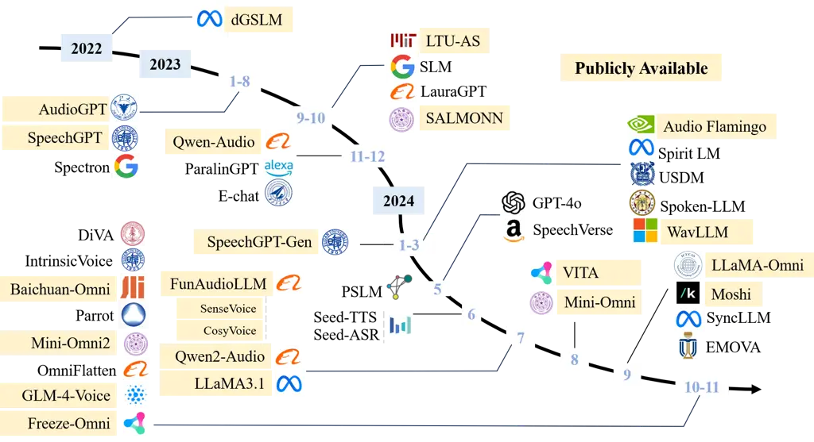

Figure 1: A timeline of existing spoken dialogue models in recent years.
The timeline was established mainly according to the release date (e.g.,
the submission date to arXiv) of the technical paper for each model. It
is worth noting that certain works, such as Westlake-Omni, MooER-Omni,
Hertz-dev, SpeechGPT2 and Fish-Agent do not have corresponding published
papers. Therefore, we have not included them in the figure. We mark the
publicly available model checkpoints in yellow color.

When constructing spoken dialogue systems, we identify four core
technologies closely related to spoken dialogue models, based on the
different levels of intelligence involved. The first is the design of
speech representations (i.e., tokenizers and detokenizers). The second
concerns the paradigm for training, inference, and generation,
specifically how to align the speech modality with the text modality
while preserving or enhancing the intelligence of existing text-based
dialogue models. This part also involves selecting different model
architectures, generation strategies, and multi-stage training
approaches. The third challenge involves the design of interactive,
duplex, streaming for spoken dialogue systems. Lastly, the fourth
challenge relates to data—specifically, how to construct training
datasets for spoken dialogue systems and evaluate their performance.

Given these considerations, in the following sections of this paper, we
address these four key technologies in the order outlined above. In
Section 2, we provide an overview of spoken dialogue systems, including
typical spoken dialogue scenarios (i.e., how to define a spoken dialogue
model) and recent developments in the cascaded and end-to-end spoken
dialogue models. Section 3 focuses on the speech representations used in
spoken dialogue systems. In Section 4, we systematically discuss the
training paradigms, with particular emphasis on how to align the speech
modality with the text modality, as well as multi-stage training
strategies, model architectures, and generation strategies. Section 5
highlights the unique characteristics of spoken dialogue systems,
particularly their duplex, streaming nature, which distinguishes them
from text-based dialogue systems. In Section 6, we examine the
construction of training datasets and the evaluation methodologies
specific to spoken dialogue models. At the end of each section, we
include a summary and discussion to reflect on the key insights.
Finally, in Section 7, we conclude the survey by summarizing the major
findings and discussing open issues for future research. Given the
complexity of the technical points, we provide an overview of the
structure of this survey in Figure 3.

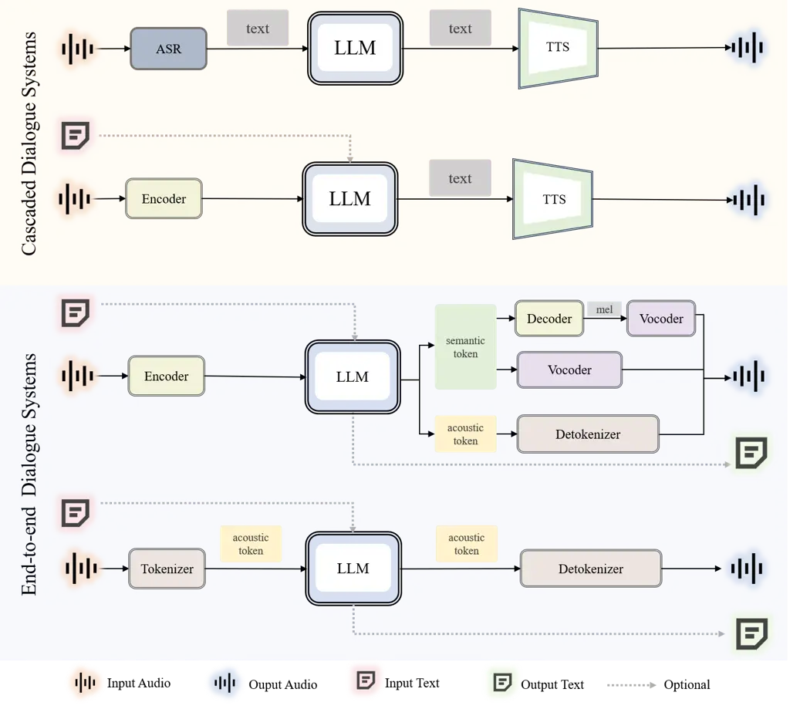

Figure 2: A general overview of current spoken dialogue systems. We
categorize these systems into two paradigms, cascaded spoken dialogue
models and end-to-end spoken dialogue models, based on whether the core
language model can directly understand and generate speech
representations. Additionally, we provide a visualization of the input
and output methods used in different spoken dialogue systems.

## 2 Overall

In this section, we will provide an overall overview of spoken dialogue
models. we begin by defining what constitutes an intelligent spoken
dialogue model by examining various dialogue scenarios. We then provide
a comprehensive overview of spoken dialogue models, distinguishing
between cascaded spoken dialogue models and end-to-end spoken dialogue
models.

### 2.1 Functions of Spoken Dialogue Systems

Based on the demos and inference interfaces of representative models
such as GPT-4o, Moshi \[44\], Qwen2-Audio \[33\], and VITA \[61\], we
categorize the usage scenarios of modern intelligent spoken dialogue
models into the following nine representative categories: 1) Text
Intelligence, 2) Speech Intelligence, 3) Audio and Music Generation, 4)
Audio and Music Understanding, 5) Multilingual Capability, 6) Context
Learning, 7) Interaction Capability, 8) Streaming Latency, and 9)
Multimodal Capability. For the nine distinct use cases in spoken
dialogue models, we provide corresponding examples for each scenario in
Figure 4. It is clear from these usage scenarios that a spoken dialogue
model is not simply an extension of a text-based dialogue model to the
speech modality (i.e., where the speech modality serves merely as an
interface for converting speech into text). Rather, an intelligent
spoken dialogue system must be capable of comprehending and generating
acoustic information embedded in speech (such as timbre, style, and
emotion) and of understanding and producing a wider range of audio
representations, including information related to audio events and
music. Additionally, unlike non-streaming text-based systems, spoken
dialogue models need to support real-time, interactive streaming
capabilities. These usage scenarios not only highlight the intelligence
inherent in spoken dialogue systems but also present significant
challenges for building end-to-end spoken dialogue models. Below, we
provide a detailed examination of each of the nine usage scenarios.

#### 2.1.1 Text Intelligence

As illustrated in Figure 4 (a), a spoken dialogue system must retain the
fundamental capabilities of the original text-based dialogue models,
such as ChatGPT. We define this usage scenario as textual intelligence.
In this context, the spoken dialogue model can intelligently respond to
user requests, generating appropriate responses such as travel
itineraries, work plans, and scheduling. However, due to the limitations
of voice-based interaction, the textual intelligence of current spoken
dialogue systems is more focused on the daily scenarios. In certain
contexts, such as complex mathematical theorem reasoning, the
performance requirements for spoken dialogue models differ from those of
text-based dialogue models \[201\]. These advanced aspects of textual
intelligence warrant further exploration in unified multimodal dialogue
models.

#### 2.1.2 Speech Intelligence

A distinguishing feature of spoken dialogue models, compared to
text-based dialogue models \[201\], is their ability to understand and
generate acoustic information beyond mere textual content. In the speech
modality, not only is the textual content present, but also additional
acoustic information, such as timbre (speaker identity) and style
(emotion, prosody, etc.). As illustrated in Figure 4 (b), an intelligent
spoken dialogue system should be capable of understanding the timbre and
style

Figure 3: A general overview about the structure of WavChat

of conversational speech and, ideally, generating responses with
specified timbre and style in a zero-shot manner.

This capability about speech intelligence involves several use cases.
First, on the comprehension side, the spoken dialogue system should
generate responses based on the speaker’s vocal style. For example, in
the E-chat \[228\], a classic example might be: if a user asks, "My
phone won’t turn on, what should I do?" in a cheerful tone, the system
might respond, "It looks like you’re excited about getting a new phone.
What type of phone are you interested in?" Conversely, if the user asks
the same question in a sad tone, the system might reply, "It’s
unfortunate your phone isn’t working. If you’re familiar with the repair
policy, let’s proceed with the next steps." This situation indicates
that the spoken dialogue system may generate responses with different
content based on varying acoustic information. Furthermore, the system
should comprehend various acoustic cues, such as accents or emotional
states, and adjust its responses of different acoustic information
accordingly. For instance, if the speaker is an American, the system
might reply with a native English accent, whereas if the speaker is a
Shanghainese user, the system could respond using the corresponding
dialect. Similarly, if the user speaks with a sad tone, the dialogue
system should be able to generate a more encouraging and empathetic
response.

On the generation side, speech intelligence is more prominently
reflected in its controllability, such as voice cloning and style
control. For example, the system could be instructed to mimic a specific
voice or respond in a designated style (e.g., mimicking a grandmother’s
soft and gentle voice for a comforting interaction). Additionally, the
system could use a voice prompt provided during the conversation to
fully clone the timbre from the prompt and generate speech in that same
voice. In summary, the ability to comprehend and generate acoustic
information is one of the key characteristics of an intelligent spoken
dialogue model.

#### 2.1.3 Audio and Music Generation

In the spoken dialogue models, beyond basic spoken dialogue
capabilities, an intelligent spoken dialogue system may be required to
generate music and audio. For example, a user might instruct the system
to generate a one-minute piano piece or a ten-second recording of a dog
barking. Additionally, users might provide lyrics and a musical melody,
asking the spoken dialogue model to create a pop song. The system should
thus inherit the generative capabilities of large-scale music \[2, 40,
117, 142\] and audio \[84, 135, 137\] models on the output side.

#### 2.1.4 Audio and Music Understanding

Complementing its music and audio generation capabilities, a spoken
dialogue model should also be able to understand music and audio on the
input side \[33, 199\]. For instance, when given an audio clip, the
intelligent system should identify both its content and acoustic
characteristics, such as recognizing whether the sound is a bird
chirping or a cat meowing, or whether the music is calm or energetic.
Moreover, the system could extend its understanding by creating literary
works—like poetry or songs—based on the given music or audio.

(a) Text Intelligence

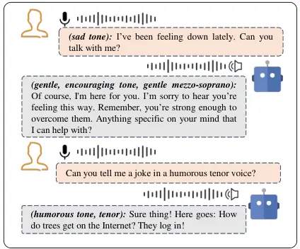

(b) Speech Intelligence

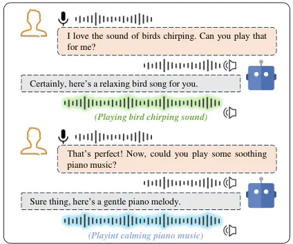

(c) Audio and Music Generation

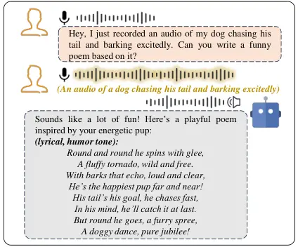

(d) Audio and Music Understanding

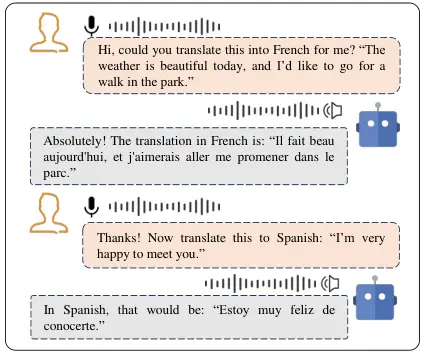

(e) Multilingual Capability

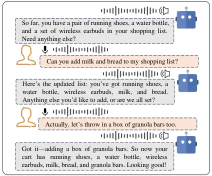

(f) Context Learning

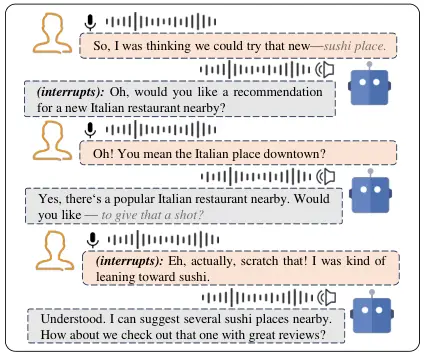

(g) Interaction Capability

(h) Streaming Latency

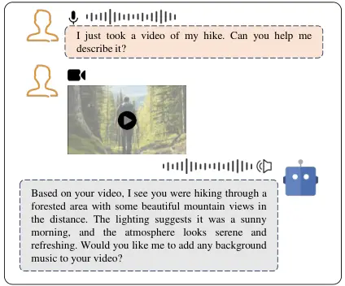

(i) Multimodal Capability

Figure 4: An overall demonstration of the functions of the spoken
dialogue systems. We describe the ideal capabilities of such systems
from nine different perspectives: Text Intelligence, Speech
Intelligence, Audio and Music Generation, Audio and Music Understanding,
Multilingual Capability, Context Learning, Interaction Capability,
Streaming Latency, and Multimodal Capability. Each function is
illustrated with corresponding dialogue examples.

#### 2.1.5 Multilingual Capability

Similar to text-based dialogue models, spoken dialogue systems are
expected to possess multilingual capabilities. Specifically, these
models should be able to perform multilingual content translation, such
as translating a spoken segment in Japanese into French speech clips,
effectively inheriting the capabilities of simultaneous interpretation.
In addition to multilingual content translation, the system should also
handle multilingual acoustic information. This means that the
intelligent spoken dialogue model should be able to generate responses
in various languages and accents, replying in the corresponding accent
of the target language based on the different input speech.

#### 2.1.6 Context Learning

In the spoken dialogue models, the ability to handle long-form and
multi-turn conversations is a key benchmark for evaluating
performance \[44\]. This requires that spoken dialogue models not only
support long-duration audio inputs but also generate extended audio
outputs. Moreover, they must be capable of engaging in multi-turn
conversations based on historical context. An important aspect of
multi-turn dialogue is the ability to revise previous responses based on
new user instructions. As shown in Figure 4 (f), an intelligent spoken
dialogue model should be able to continuously modify its previous
replies according to the user’s evolving requests.

#### 2.1.7 Interaction Capability

A distinguishing feature of spoken dialogue systems compared to the
text-based dialogue models is their duplex and interactive
nature \[44\]. In text-based dialogue, interactions typically follow a
half-duplex structure, where the response can only be provided after the
question has been completed, and the user is unable to interrupt the
reply in real-time. However, in the spoken dialogue systems, full-duplex
interaction is common. This means that a conversation does not need to
be fully completed before a response can be generated. Both the system
and the user can interrupt and interact in real time. For example, if
the user is unsatisfied with the system’s response, they can immediately
interrupt, causing the system to halt its current generation and respond
to the new input. Additionally, to emulate more natural conversational
settings, the system can also interrupt the user when appropriate, such
as when clarifying the user’s intent. Beyond the ability to interrupt,
interactive dialogue often includes the use of conversational fillers,
such as "okay," "haha," or "oh," which signal acknowledgment or
agreement. Including these within spoken dialogue models enhances the
realism and natural flow of conversations. The underlying requirement
for interaction capabilities is that the system should be able to listen
and speak simultaneously, responding dynamically to the flow of the
interaction.

#### 2.1.8 Streaming Latency

Streaming comprehension and generation are also fundamental
functionalities of spoken dialogue models \[224, 249, 57\]. In the
real-world scenarios, a model cannot wait until an entire minute-long
audio segment has been processed before generating a response. Instead,
the model must operate on a chunk-based mechanism, dynamically
processing and generating audio in real time, one chunk at a time.
Additionally, the streaming requirement means that the entire system
must operate in a causal manner—understanding and generating audio based
solely on past information, without relying on future information.
Streaming function is often closely tied to the need for low latency. In
practical conversational experiences, the latency of the first token
generated by the spoken dialogue model (i.e., the wait time for the
user) and the average latency of the generation process are critical
factors that influence the overall responsiveness and usability of the
spoken dialogue system.

#### 2.1.9 Multimodal Capability

Multimodal dialogue capability \[25, 61\] represents an advanced feature
of spoken dialogue models. In existing systems, this typically refers to
the ability to process inputs from multiple modalities, such as video,
images, and text, while generating intelligent speech responses. A
spoken dialogue model equipped with this capability achieves the ability
to “hear, see, and speak” simultaneously. Multimodal inputs
significantly enhance the potential of these systems; for instance,
users can employ various gestures to improve the quality of the model’s
generated responses, and the system can develop a deeper understanding
of the physical world. Beyond multimodal inputs, the future of dialogue
systems lies in large multimodal models that unify the comprehension and
generation capabilities across all modalities, with spoken dialogue
serving as the foundational modality.

### 2.2 Cascaded Spoken Dialogue Systems

The earliest prototype of cascaded spoken dialogue systems can be traced
back to AudioGPT \[85\]. To achieve speech-to-speech dialogue
functionality, the system first employed an Automatic Speech Recognition
(ASR) model to convert speech into text, followed by ChatGPT for
text-based dialogue, and finally, a Text-to-Speech (TTS) model to
convert the generated text back into speech. In this primitive version,
speech was used solely as an input-output interface, retaining only the
most basic textual intelligence. For example, in the Huggingface’s
open-source Speech-To-Speech framework⁵⁵ 5
[https://github.com/huggingface/speech-to-speech](https://github.com/huggingface/speech-to-speech),
an additional Voice Activity Detection (VAD) module⁶⁶ 6
[https://github.com/snakers/silero-vad](https://github.com/snakers/silero-vad)
was further layered onto the traditional cascaded modules to distinguish
between speech and silent segments, as well as between different
speakers.

After the basic textual intelligence had been established in the
cascaded spoken dialogue models, researchers began incorporating
paralinguistic features, such as emotion and style, to enhance the
speech intelligence in the cascaded spoken dialogue models. For
instance, ParalinGPT \[129\] and E-chat \[228\] integrate conversational
context, speech embeddings, and paralinguistic attributes into an
autoregressive model via a sliding window, allowing the model to
generate more accurate text responses by combining historical text and
emotional representations. Similarly, Spoken-LLM \[128\] introduces an
Emotion2Vec \[144\] module to provide style vectors to the Llama2-Chat
model. Through LoRA \[80\] fine-tuning, Llama2-Chat is trained not only
to generate content-based text responses but also to produce text
responses with specific stylistic attributes (e.g., \<cheerful, fast,
normal\>), which can guide downstream TTS systems in generating
expressive speech.

In addition to understanding acoustic information within cascaded spoken
dialogue models, there have been efforts to directly input speech
representations while retaining text as the output modality \[41, 34,
112\]. This forces cascaded spoken dialogue systems to process input
speech directly. A common approach involves integrating frozen speech
encoders (such as Whisper \[170\]) with trainable encoder adapters,
allowing the speech input to be interpreted as a specialized form of
text by the large language model. By extending the vocabulary of the
text-based dialogue model, the large language model can process speech
as if it were a unique form of text, enabling the generation of
appropriate text responses in the cascaded spoken dialogue models.

Notably, these cascaded spoken dialogue models have further advanced
beyond the comprehension of human speech alone and can now understand a
variety of audio modalities, including music and audio \[67, 199\]. For
example, SALMONN \[199\] models both speech and audio information by
freezing the Whisper \[170\] and BEATs \[28\] encoder and bridging them
to a large language model via a Window-Level Q-Former \[122\]. As a
result, these cascaded spoken dialogue systems are capable of further
performing a wide range of tasks on the comprehension side. For
instance, models like Qwen-audio \[33, 34\] can handle multiple tasks
such as Automatic Speech Recognition (ASR), Speech-to-Text Translation
(S2TT), Automatic Audio Captioning (AAC), Acoustic Scene Classification
(ASC), Speech Emotion Recognition (SER), Audio Question Answering (AQA),
Vocal Sound Classification (VSC), and Music Note Analysis (MNA).
Consequently, these cascaded models are often regarded as part of
multitask speech-text large language models.

It is worth noting that the aforementioned cascaded spoken dialogue
models generate text only and then directly feed it into a pre-trained
TTS module. However, more recent cascaded spoken dialogue models, such
as Llama3.1, have begun integrating trainable TTS modules as part of the
decoder within the large language model (LLM). While these models have
made progress in incorporating low-latency streaming functionalities,
they are still fundamentally based on generating text content first,
which is then converted into speech. They do not directly generate
speech-related representations within the LLM itself. Therefore, we
classify these models as cascaded spoken dialogue systems.

In addition, some recent efforts have focused on enhancing models like
Qwen2-Audio \[33\] by incorporating multimodal comprehension
capabilities, thereby enabling a degree of multimodal dialogue
functionality. For instance, models such as VITA \[61\] and
Baichuan-Omni\[123\] integrate various encoders or tokenizers for
images, audio, and video into the LLM, allowing the model to understand
multimodal inputs and generate corresponding text responses.

The above developments concern the comprehension side of cascaded spoken
dialogue systems. On the generation side, two main types of speech
synthesis work are relevant to cascaded spoken dialogue systems.
Firstly, there has been a recent surge of advanced speech synthesis
systems that can produce highly expressive and natural audio based on
textual input, such as VALL-E (X) \[210, 251\], MegaTTS1/2 \[97, 98\],
CosyVoice \[49\], ChatTTS⁷⁷ 7
[https://github.com/2noise/ChatTTS](https://github.com/2noise/ChatTTS),
FishSpeech⁸⁸ 8
[https://github.com/fishaudio/fish-speech](https://github.com/fishaudio/fish-speech),
ParlerTTS \[141\], MaskGCT \[217\] and F5-TTS \[30\]. In addition, there
has been significant progress in the field of text-style controllable
TTS, with systems like TextrolSpeech \[93\], PromptTTS \[71\],
PromptTTS2 \[119\], InstructTTS \[232\], and ControlSpeech \[94\]. These
TTS systems can generate highly natural audio based both on the content
and style of the text output produced by the cascaded spoken dialogue
models.

### 2.3 End-to-End Spoken Dialogue Systems

Ideally, end-to-end spoken dialogue models should enable only speech
input and output during both training and inference, thereby achieving
multiple intelligent dialogue functions. However, considering that
speech modal is a low-density (contains a lot of acoustic information)
modality compared to text modal, and that the volume of available text
data far exceeds that of available speech data, many end-to-end spoken
dialogue models choose to align the speech modality with the text
modality to leverage pre-trained language models (LLMs). Consequently,
as showed in the Figure 2, as long as the large language models can
directly understand and generate speech representations, we classify
such systems as end-to-end spoken dialogue models. In contrast, if the
large language models can only generate text, we categorize the system
as cascaded spoken dialogue systems.

The earliest end-to-end spoken dialogue system can be traced back to
dGSLM \[158\], which was trained on thousands of hours of dual-track
data \[37\] using self-attention and cross-attention mechanisms to
simulate duplex interactions. Although dGSLM lacks integration with LLMs
and even basic textual intelligence, it is notable as the first fully
end-to-end spoken dialogue system that does not rely on text while
maintaining excellent conversational interactivity.

Following the release of dGSLM \[158\], the progress in the domain of
end-to-end spoken dialogue systems stagnated for a few months. However,
with the advent of ChatGPT, this field experienced rapid development. A
representative approach is SpeechGPT \[243\], which employs
autoregressive language modeling by using a sequence of speech tokens,
text tokens, text tokens, and speech tokens. This method enables the
direct generation of speech tokens using textual intelligence, inspiring
subsequent end-to-end spoken dialogue systems such as Spectron \[147\],
SpeechGPT-Gen \[245\], GLM-4-Voice⁹⁹ 9
[https://github.com/THUDM/GLM-4-Voice](https://github.com/THUDM/GLM-4-Voice),
and EMOVA \[25\]. These systems continue to use an autoregressive
framework, generating the text tokens followed by the speech tokens.
Although this approach allows LLMs to generate speech tokens directly,
it introduces latency issues since speech token generation cannot begin
until the generation of text tokens is complete. This leads to problems
in multi-turn dialogue and overall system delay.

Beyond the design of SpeechGPT \[243\], another intuitive approach is to
directly use the hidden states before the LLM’s softmax layer to predict
both text tokens and speech tokens through different projection layers.
This allows the network to share weights up to the projection layer,
thereby aligning the speech and text modalities. The PSLM \[155\] model
is a typical example of this design. Another method, proposed by Meta,
is the interleaving approach, as seen in Spirit-LM \[159\], where speech
and text sequences are concatenated into a single token stream and
trained using a word-level interleaving method with a small,
automatically curated speech-text parallel corpus. However, this
approach requires precise alignment between speech and text.

Recently, several new end-to-end spoken dialogue systems have emerged.
For instance, Moshi \[44\], which is based on a global-local
transformer, can simultaneously generate text and speech acoustic tokens
from a multi-layer quantizer. Starting from a text-based language model
backbone, Moshi generates speech tokens from the residual quantizer of a
neural audio codec while modeling both the user’s speech and the
system’s responses in parallel streams. This design eliminates the need
for explicit speaker turns and allows for the modeling of arbitrary
conversational dynamics. Moreover, Moshi extends previous hierarchical
semantic-to-acoustic token generation by first predicting time-aligned
text tokens as a prefix to audio tokens. Similarly, Mini-Omni \[223\]
uses a MusicGen-based \[40\] method to simultaneously generate text and
speech codec tokens. It introduces two strategies: autoregressive
generation without strict temporal alignment by padding text tokens and
batch-parallel inference strategies to boost performance.
Mini-Omni2 \[224\] further enhances this by incorporating multimodal
understanding and duplex functionality. At the same time,
Llama-Omni \[57\], Freeze-Omni \[213\] and IntrinsicVoice \[249\] design
an LLM for real-time voice interaction. Their commonality lies in the
fact that, at the generation stage, the hidden states of the LLM are
further fed into the corresponding decoder model. LLaMA-Omni \[57\]
integrates a pretrained speech encoder, a speech adapter, an LLM, and a
streaming speech decoder. It eliminates the need for speech
transcription, and can simultaneously generate text and speech responses
directly from speech instructions with low latency. Freeze-Omni  \[213\]
designed 3-stage training strategies both for the modeling of speech
input and output, enabling it to obtain speech-to-speech dialogue
ability noly by using text-speech paired data. The core idea of
Freeze-Omni lies in transferring the functionalities of spoken dialogue
models to the encoder (ASR) and decoder (TTS), rather than assigning
these tasks to the large language model. IntrinsicVoice \[249\]
facilitates the transfer of textual capabilities from pre-trained LLMs
to the speech modality by reducing the modality gap between text and
speech. By using a GroupFormer to generate HuBERT tokens from the LLM’s
hidden states, IntrinsicVoice effectively reduces speech sequences to
lengths comparable to text sequences, generating high-quality audio
while significantly speeding up inference and mitigating long-text
modeling issues. Additionally, some end-to-end spoken dialogue models
align speech and text through multi-stage training, eliminating the need
to generate text during inference. For example, Omni-Flatten \[247\]
employs modality alignment, half-duplex dialogue learning, and
full-duplex dialogue learning, along with a flattening-style
standardization of text and speech tokens, to achieve duplex, text-free
speech dialogue during inference. Similar approaches include
SyncLLM \[204\].

In this section, we have provided a general overview of current
end-to-end spoken dialogue systems. However, these systems differ
significantly in their speech representations, training paradigm, model
architectures and generation strategy. In Section 3 and 4, we will
present a detailed classificationfollowed by our discussions at the end
of each section.

## 3 Representations of Spoken Dialogue Models

Representations play a critical role in spoken dialogue systems as they
determine how the spoken dialogue system comprehends, processes, and
generates speech signals. Additionally, they serve as a bridge between
speech and other modalities, thereby directly influencing the system’s
performance, functionality, and range of applications. Compared to text
and visual representations, speech representations possess a unique
complexity. Text representations primarily rely on a well-defined
symbolic system, conveying meaning through structured elements like
vocabulary and syntax. Visual representations, on the other hand, focus
on capturing spatial relationships and visual features in images. In
contrast, speech signals contain both dynamic acoustic features (such as
timbre, prosody and emotion) and rich semantic content, requiring
representations that not only capture temporal variations but also
preserve an understanding of the underlying meaning.

The unique nature of speech has led to the development of two types of
representation models. The representations obtained by these two
modeling approaches are often classified as semantic tokens and acoustic
tokens. One category (semantic) is prediction-based modeling, these
models are trained for representation learning by predicting future
frames in an autoregressive manner \[35, 188\] or by using surrounding
frames to predict masked frames \[31, 79, 134\]. This approach tends to
prioritize capturing linguistic information within speech, making it
particularly useful for recognition and understanding tasks. The other
category (acoustic) focuses on speech compression and reconstruction
\[92, 43, 114, 239\]. These models quantify speech features (which are
downsampled from raw wavforms by one encoder) into a series of discrete
tokens, then use one decoder to upsample these discrete tokens into the
speech, calculating the reconstruction loss against the original signal.
By this approach, we can get discrete acoustic tokens with impressive
compression rates and high-fidelity acoustic information, making it more
suitable for tasks such as speech synthesis and emotion analysis.

In the spoken dialogue systems, as illustrated in Figure 2, different
spoken dialogue models employ various approaches for representation
selection. In the following part, we will enumerate the commonly used
speech representations in spoken dialogue models from both the input and
output perspectives. At the end of this section, we will thoroughly
discuss the advantages and limitations of these representations, as well
as the future trends in the development of representations used in
spoken dialogue models.

### 3.1 Speech Representations at the Inputs

Semantic. To enhance language models’ ability to understand speech
representations and align multimodal data at input, using pretrained
models such as Wav2Vec \[185\], HuBERT \[79\], Whisper \[170\], and
WavLM \[27\] to extract high-level semantic features from speech has
become a core strategy for many spoken dialogue systems.

$`\bullet`$ _Wav2Vec._ Wav2Vec \[185\] is a foundational work in the
field of speech representation learning, pioneering the extraction of
self-supervised speech representations from unlabeled speech data. This
approach has driven technological advancements in tasks such as speech
recognition, speaker identification, and other speech processing
applications. Wav2Vec employs a multi-layer, one-dimensional
convolutional neural network directly on raw speech waveforms to
progressively extract temporal speech features. Training is accomplished
through contrastive learning: the model selects a "correct" target (from
the current speech frame) alongside several "incorrect" targets
(negative samples). By learning to distinguish positive samples from
negatives, the model effectively learns to represent speech features in
latent space. As an improved version of Wav2Vec, Wav2Vec 2.0 \[10\]
introduces the Transformer architecture and masked modeling. Wav2Vec 2.0
quantizes the latent speech representations extracted by the CNN and
then uses a Transformer to model semantic information, similar to BERT
\[45\]. It also employs a contrastive learning objective, requiring the
model to distinguish the correct quantized representations from multiple
candidate representations. ParalinGPT \[129\] aims to incorporate
emotional expression in conversational interactions, choosing Wav2Vec
2.0 for its proven capability to encode rich prosodic information,
beneficial for speech emotion recognition \[124\]. Specifically,
ParalinGPT uses Wav2Vec 2.0’s intermediate layer (the 12th layer) for
frame-by-frame feature extraction, as this layer has shown optimal
results in linear probing tasks for emotion analysis. Additionally,
ParalinGPT applies mean pooling and a linear feature projector to
extract utterance embeddings.

$`\bullet`$ _XLS-R._ XLS-R \[9\] is a multilingual self-supervised
speech representation model based on the Wav2Vec 2.0 architecture. It
extends and optimizes Wav2Vec 2.0 to support a broader range of
languages, particularly low-resource languages. During cross-lingual
training, XLS-R employs multilingual data augmentation and denoising
techniques, enhancing the model’s adaptability when processing speech in
various languages. USDM \[107\] uses XLS-R to obtain continuous
intermediate representations at 50Hz, followed by a quantizer \[14\]
with $`K`$=10000 to generate speech tokens.

$`\bullet`$ _HuBERT._ HuBERT \[79\] is a commonly used unsupervised
learning model that performs K-Means clustering on the MFCC \[252\]
features of speech to assign pseudo-labels to each frame. It uses a
convolutional encoder to generate a sequence of features at a 20ms frame
rate from 16kHz sampled speech. Finally, it randomly masks a portion of
features from consecutive frames as input to the Transformer \[202\].
HuBERT generates masked content based on surrounding context, enabling
it to capture temporal and semantic information within speech and gain a
deeper understanding of contextual details. Spoken dialogue systems,
such as E-Chat \[228\], SpeechGPT \[243\], PSLM \[155\], IntrinsicVoice
\[249\], widely use HuBERT as their speech encoder. E-Chat extracts the
weighted sum of the 24 layers from the HuBERT to serve as speech
embeddings, and incorporates an additional set of weighted parameters to
extract emotion embeddings, thereby enabling emotion-aware capabilities.
SpeechGPT applies K-Means clustering to quantize the continuous features
extracted from HuBERT, converting them into discrete unit sequences.
These discrete units are then integrated into the vocabulary of the
large language model, enabling direct alignment between the text and
speech modalities. To more effectively integrate the language model with
speech streams, PSLM adds an additional embedding layer after extracting
features with HuBERT. IntrinsicVoice uses HuBERT as the speech
tokenizer, grouping speech tokens to reduce sequence length. An
embedding layer then converts these tokens into dense embeddings, which
are subsequently mapped into the language model’s embedding space using
a trainable speech adapter. Spirit-LM \[159\] extracts semantic features
using HuBERT, employing a K-Means model with 500 units as the basic
unit. It trains a feedforward quantizer with data augmentation
techniques \[64\] to produce discrete speech tokens. In the Align-SLM
\[130\], HuBERT is used and the cluster number K is set to 500. Notably,
when continuous representations are clustered into discrete units, they
primarily capture content information, which can be leveraged for
modeling and understanding. This process first extracts 25Hz frame-level
continuous representations from the 11-th layer of the HuBERT model,
assigns each frame to its closest cluster index, and then de-duplicates
consecutive identical indices to shorten the sequence.

$`\bullet`$ _Whisper._ Whisper \[170\], based on the classic
encoder-decoder architecture, has gained widespread attention in the
field of speech recognition. The encoder transforms input speech into
high-level feature representations, while the decoder generates the
corresponding text output from these representations. Pretrained on
large-scale data across various speech environments with text as the
target, Whisper demonstrates strong capabilities in extracting semantic
information from speech. Qwen-Audio \[34\], Qwen-Audio 2 \[33\] use
Whisper’s encoder to convert speech into continuous representations,
which are then combined with text representations and fed into the large
language model. Mini-Omni \[223\], Mini-Omni 2 \[224\], and LLama-Omni
\[57\] follow a similar approach, connecting a speech adapter after the
Whisper encoder. Their shared objective is to map speech representations
into the text embedding space of the large language model, enhancing the
model’s ability to understand speech by forcibly aligning them through
vocabulary expansion.

$`\bullet`$ _WavLM._ WavLM \[27\] is a pretrained model designed for
comprehensive speech processing tasks, playing a critical role in
advancing speech technology. Specifically, WavLM employs a masked speech
denoising and prediction framework, where some inputs consist of
simulated noise or overlapping speech with masked sections. The goal is
to predict pseudo-labels of the original speech in the masked areas.
This approach enables the model to learn ASR-related information through
masked speech prediction, while also gaining knowledge relevant to
non-ASR tasks through speech denoising modeling. The masking and
prediction pipeline for speech frames in WavLM is similar to that of
HuBERT. However, WavLM introduces an additional gated relative position
bias to enhance the model’s sensitivity to temporal information in
speech. SpeechVerse \[41\] leverages the pretrained WavLM Large as its
backbone speech encoder, encoding all intermediate layer features from
WavLM to capture various forms of semantics and achieve better
generalization performance. To address the significant length disparity
between speech features and text tokens, SpeechVerse applies a learnable
convolutional module for downsampling the speech features.

$`\bullet`$ _$`S^{3}`$ Tokenizer._ CosyVoice \[49\] proposes using a
supervised automatic speech recognition module to generate a supervised
semantic speech($`S^{3}`$) tokenizer. Unlike a standard ASR model, the
$`S^{3}`$ tokenizer splits the encoder into two parts and introduces a
vector quantization layer in between. The first encoder converts the mel
spectrogram into context-aware representations, while the second encoder
transforms discrete speech units into continuous hidden states. Finally,
a Transformer-based ASR decoder predicts the posterior probabilities of
text labels. Through supervision in multilingual ASR tasks, the
$`S^{3}`$ tokenizer can convert speech into semantically consistent
tokens that facilitate both speech understanding and generation.
OmniFlatten \[247\] uses the $`S^{3}`$ tokenizer to extract discrete
speech tokens, which are then directly fed into a text-speech
pre-trained Transformer.

$`\bullet`$ _SPIRAL._ SPIRAL \[86\] aims to learn representations from
speech data that are robust to noise and perturbations. It uses a
teacher-student network, where various perturbations—such as noise
addition, gain adjustment, and time-frequency warping—are applied to the
speech input of the student model. The teacher model then guides the
student model to produce consistent representations despite these
perturbations. EMOVA \[25\] utilizes the SPIRAL’s architecture as a
speech encoder to process speech, and employs the finite scalar
quantization \[150\] to discretize these features. This process aligns
speech with the text vocabulary, allowing for a more natural integration
into the LLM.

$`\bullet`$ _Others._ Some spoken dialogue systems do not use
pre-trained representation models; instead, they process input features
by stacking fundamental modules. VITA \[61\] initially decomposes the
speech signal using mel filter banks, mimicking the nonlinear perception
of sound in humans. It then processes the input features with a 4-layer
CNN downsampling module followed by a 24-layer Transformer. To align
with the subsequent language model, VITA employs a simple 2-layer MLP as
an adapter. Freeze-Omni \[214\] utilizes a chunk-wise streaming speech
encoder to transform input speech features into high-dimensional
representations. An adapter module then maps these high-dimensional
representations into the embedding space of the main LLM, ensuring a
quick, low-latency response to the input speech. The speech encoder
module consists of several downsampling convolutional layers and
Transformer blocks, while the adapter includes only a few downsampling
convolutional layers. Downsampling layers are used to reduce the frame
rate of speech features, increase the LLM’s processing speed during the
prefill phase, and minimize latency.

Acoustic. Considering that semantic features are insufficient to capture
the emotion, timbre, and style of speech, some representation models,
such as Emotion2Vec \[144\], attempt to extract acoustic information
through self-supervised training. Others focus on reconstruction
objectives to ensure high-fidelity speech, including models like Encodec
\[43\], SpeechTokenizer \[250\], Mimi \[44\].

$`\bullet`$ _Encodec._ EnCodec \[43\] is a straightforward, streaming,
convolution-based encoder-decoder architecture. Raw speech is
downsampled through a series of convolutional layers, mapping it to
latent feature representations. Residual vector quantization \[239\]
then discretizes the encoder’s continuous latent features. The
quantization objective is to map continuous features to a predefined set
of discrete tokens (known as a "codebook") for subsequent compression
and transmission. The decoder restores the discrete features to a
waveform close to the original speech through a series of de-convolution
layers. LauraGPT \[50\] employs an enhanced version of EnCodec as its
speech encoder with specific modifications: (1) adding a reconstruction
loss in the magnitude spectral domain to improve mid-to-high frequency
signal quality; (2) stacking five strided convolutional blocks with
strides of (8, 5, 4, 2, 2) to address the challenges of long sequence
lengths, resulting in a token rate of 25Hz per token group; and (3)
using 32 quantizers with structured dropout in the Residual Vector
Quantization (RVQ) module, each with a vocabulary size of 1024. This
revision increases speech quality by incorporating more quantizers while
preserving most information in the shallow quantizers. LauraGPT
ultimately selects the output from the first quantizer layer as the
speech token, balancing performance with sequence length efficiency. The
remaining quantizers are used only during the training of the
encoder-decoder model.

$`\bullet`$ _SpeechTokenizer._ SpeechTokenizer \[250\] unifies semantic
and acoustic tokens, hierarchically decomposing different aspects of
speech information across various RVQ layers. It is built on the
framework of RVQ-GANs, following the same pattern as SoundStream \[239\]
and EnCodec \[43\]. Notably, SpeechTokenizer has substituted the
two-layer LSTM, originally following the convolution blocks in the
EnCodec encoder, with a two-layer BiLSTM to augment the semantic
modeling ability. SpeechTokenizer uses HuBERT as a semantic teacher,
given HuBERT’s proven capacity to encode substantial content information
\[156\]. During training, it introduces two types of distillation:
continuous representation distillation and pseudo-label prediction. For
continuous representation distillation, SpeechTokenizer employs the 9th
layer HuBERT representation or the average representation across all
HuBERT layers as semantic teachers. The training objective is to
maximize the cosine similarity at the dimension level across all
timesteps between the outputs of RVQ first layer and semantic teacher
representations. For pseudo-label prediction, SpeechTokenizer adopts
HuBERT units as the target label. In dialogue systems, SpeechGPT-Gen
uses SpeechTokenizer RVQ-1 to process raw speech, primarily enhancing
the large language model’s ability to model the semantics of speech.

$`\bullet`$ _Mimi._ Taking inspiration from previous work on
SpeechTokenizer, Mimi \[44\] uses distillation to transfer non-causal,
high-level semantic information into the tokens produced by a causal
model, allowing for streaming encoding and decoding of semantic-acoustic
tokens. To improve the ability of Mimi to encode speech into compact
representations while reconstructing high-quality speech, Transformer
modules are added in the encoder and decoder. Mimi uses WavLM to distill
RVQ-1, enriching it with semantic information. Notably, performing
distillation significantly enhances the speech discrimination capability
of the first quantizer; however, it can also negatively impact speech
quality. Mimi hypothesizes that this is due to distilling semantic
information into the first level of a single RVQ: As higher-order
quantizers operate on the residual of the first one, the latter needs to
trade speech quality for phonetic discriminability. Mimi addresses this
issue by introducing a split-RVQ approach. Instead of using a single
8-level RVQ, it extracts semantic information into a simple VQ and
applies a parallel 7-level RVQ, combining their outputs at the end. This
removes the constraint that acoustic information must be preserved in
the residuals of the semantic quantizer. After careful design, Mimi
serves as the speech encoder in Moshi \[44\], this approach enhances the
model’s ability to capture both semantic and acoustic details.

$`\bullet`$ _Emotion2Vec._ Emotion2Vec \[144\] is a versatile speech
emotion representation model designed to extract emotional features from
speech. During the pre-training phase, Emotion2Vec conducts online
distillation with a teacher network and a student network. When a
specific downstream task is performed, Emotion2Vec is frozen and a
lightweight downstream model is trained. Emotion2Vec introduces an
utterance-level loss to control global emotion and employs a frame-level
loss to build a frame-wise pretext task, enabling it to learn contextual
emotions. Spoken-LLM \[128\] uses features extracted by Emotion2Vec as
input for the large language model, aiming to enable the model to
understand and respond to emotions.

### 3.2 Speech Representations at the Outputs

Semantic. At the output stage, Most spoken dialogue systems choose to
autoregressively model semantic tokens, such as $`S^{3}`$ tokens \[49\]
and HuBERT \[79\] units. It is worth noting that these semantic tokens
lack acoustic conditioning and therefore require a vocoder \[109, 167\]
or decoder, which futher takes semantic discrete units as input to
synthesize speech consistent with the speakers encountered during
training.

$`\bullet`$ _$`S^{3}`$ Tokenizer._ OmniFlatten \[247\] uses the LLM to
autoregressively predict $`S^{3}`$ tokens at the speech output stage.
When converting discrete tokens back into speech, it adopts the same
optimal transport conditional flow matching model (OT-CFM) as used in
CosyVoice \[49\]. OT-CFM transforms the speech token sequence into Mel
spectrogram, which is then used to generate the final speech with the
HiFi-GAN vocoder \[109\].

$`\bullet`$ _Hubert._ Speech tokens extracted by the pre-trained HuBERT
\[79\] are widely used as generation targets for large language models
in the spoken dialogue systems. SpeechGPT \[243\] and Spirit-LM \[159\]
use LLaMA \[201\] to autoregressively predict a sequence of units and
are trained with a HuBERT unit-based HiFi-GAN \[109\] to decode the
speech signal from discrete representations. PSLM \[155\] introduces an
additional speech projection layer after the Transformer layers to
process the hidden states, obtaining semantic tokens via the softmax
layler. The speech decoder in LLama-Omni \[57\] operates in a
non-autoregressive manner, taking the output hidden states of the large
language model as input to generate a discrete HuBERT unit sequence
corresponding to the speech response. The discrete units can be
converted into waveform with an additional unit-based vocoder \[167\].
IntrinsicVoice \[249\] introduces Group-Former to enhance the large
language model’s capability in sequence modeling. When the large
language model predicts the $`<speech>`$ token, the global embedding is
passed through a projection layer and delivered, along with a set of
learnable queries, to the group model, which then predicts units.
IntrinsicVoice uses HiFi-GAN \[109\], a non-autoregressive neural
vocoder that efficiently generates high-fidelity waveforms, for speech
detokenization to reduce overall latency. Align-SLM \[130\] also uses a
HiFiGAN-based \[109\] model to convert discrete units back into
waveforms, utilizing model checkpoints from the textlesslib \[103\]
library.

$`\bullet`$ _Others._ USDM \[107\] does not generate speech directly
from input speech; instead, it first transcribes the speech, generates
the response text, and then produces corresponding speech token in an
end-to-end pipeline. By inserting text-related tasks between speech
input and output, the model benefits from both pre-trained LLMs and
chain-of-thought \[219\] reasoning in the intermediate modality. Since
each stage in the pipeline processes all input and output tokens
generated by the previous stage. USDM is more robust to transcription
errors and better able to produce contextually relevant spoken responses
compared to a cascaded approach with separate modules. USDM uses the
Voicebox \[118\] architecture to train a unit-to-speech model for
reconstructing speech from units. EMOVA \[25\] generates a response in
the form of speech units when given an image or speech input, which is
then converted into an output waveform using the U2S detokenizer. The
U2S detokenizer follows the VAE architecture: it uses a speech unit
encoder to convert the predicted speech units into continuous
embeddings, combines these with style embeddings predicted by the large
language model to determine duration, and finally reconstructs the
speech waveform through the decoder.

Acoustic. Many spoken dialogue systems choose to directly generate
tokens from acoustic representation models, such as EnCodec \[43\],
SpeechTokenizer \[250\], and Mimi \[44\]. These acoustic tokens are then
upsampled into the raw waveform through the frozen codec decoder
directly.

$`\bullet`$ _Encodec._ LauraGPT \[50\] uses Qwen-1.8B \[11\] to predict
speech tokens. When synthesizing speech, it conditions the predictor not
only on the speech tokens predicted by the LLM but also on text and
speech inputs. Such text and speech conditionings allow the model to
generate high-quality speech signals by leveraging the diverse
information in prompt and noisy speeches, which is lacked in the
discrete tokens (output from the first quantizer of the Encodec). The
predicted speech tokens and conditioning inputs are delivered together
to the codec vocoder. An encoder-only Transformer models these inputs
into dense embeddings, which are then reconstructed into speech by the
codec decoder.

$`\bullet`$ _SNAC._ SNAC \[194\] encodes speech into hierarchical
tokens, similar to EnCodec \[43\] and DAC \[114\], by introducing
quantization at different time resolutions to form a multi-scale
discrete representation of speech. In this approach, shallow RVQ layers
have a lower sampling frequency, covering a broader time span, while
deeper RVQ layers sample at higher frequencies. SNAC introduces modest
enhancements over RVQ-GAN by incorporating residual noise blocks, deep
convolutions, and local window attention. The Mini-Omni \[223, 224\]
series continues the parallel generation method introduced by
MusicGen\[40\], utilizing SNAC \[194\] as the speech encoder, which
comprises seven complementary token layers. In a single step, it
generates eight tokens, including text, while maintaining a one-step
delay between layers. Furthermore, Mini-Omni and Mini-Omni 2
incorporates a batch approach that involves two samples: one requiring
both text and speech responses and the other necessitating a text-only
response. By discarding the text token from the first sample and
embedding the output from the second sample into the first, it
effectively transfer the model’s text-based capabilities to speech
tasks, significantly enhancing reasoning abilities with minimal resource
overhead.

$`\bullet`$ _SpeechTokenizer._ On the output side, SpeechGPT-Gen
synthesizes speech tokens using flow matching\[132\]. Flow matching
effectively models the transformation from a simple prior distribution
to complex data distributions, yielding promising results in speech
generation. SpeechGPT-Gen \[245\] applies flow matching for perceptual
modeling, generating speech tokens that align with those of
SpeechTokenizer \[250\]. Specifically, given speech $`S`$, semantic
representation $`V_{1}`$, perceptual representation $`V_{2:8}`$ and the
complete information representation $`V_{1:8}=V_{1}+V_{2:8}`$ extracted
by SpeechTokenizer, perceptual modeling refers to predicting the
complete representation $`V_{1:8}`$ given the prompt speech a and the
semantic representation $`V_{1}`$. SpeechGPT-Gen synthesizes response
speech by concatenating the output of SpeechGPT \[243\] with the prompt
speech and using a flow matching model.

$`\bullet`$ _Mimi._ Mimi \[44\] has eight codebooks at a frame rate of
12.5Hz, which requires 100 autoregressive steps to generate one second
speech. This results in high computational costs and incompatibility
with streaming inference. To address these issues, Moshi \[44\] proposes
the RQ-Transformer, comprising a temporal Transformer and a deep
Transformer. The RQ-Transformer breaks down a flattened sequence of
length $`K\cdot S`$ into $`S`$ timesteps for a large temporal
Transformer which produces a context embedding used to condition a
smaller depth Transformer over $`K`$ steps. This allows scaling to
longer sequences by increasing $`S`$ or to a higher depth by increasing
$`K`$ than modeling the flattened sequence with a single model.

$`\bullet`$ _TiCodec._ Ti-Codec \[178\] is a decoupled codec model which
can separate the time-varying and time-invariant information in speech
and quantize them separately. Inspired by VALL-E \[210\], Freeze-Omni
\[214\] uses a token-based speech decoder which contains NAR prefill and
AR generate stage to achieve speech output capabilities. The speech
decoder mainly consists of the NAR decoder, the AR decoder, and the
frozen decoder of a codec model \[178\]. Both the NAR decoder and AR
decoder are built upon transformer blocks. The NAR decoder is used to
model the semantic features from the output of LLM, and then the AR
decoder generates speech tokens based on the output of the NAR decoder.
Finally, the decoder of the codec model converts the speech tokens into
a speech stream.

[TABLE]

Table 1: The comparison of semantic and acoustic representations.

### 3.3 Discussions about Representation used in Spoken Dialogue Systems

#### 3.3.1 Semantic Representation vs. Acoustic Representation

Current dialogue systems typically choose different approaches for the
understanding (input) and generation (output) sides based on task
requirements. For example, Spirit-LM \[159\] uses semantic
representations (HuBERT \[79\]) consistently on both ends, while
Mini-Omni \[223\] uses semantic representations (Whisper \[170\]) on the
input side and acoustic representations (SNAC \[194\]) on the output
side. Each combination offers unique advantages and trade-offs, and a
consensus on a unified speech representation approach has yet to be
reached in practical applications.

We revisited the differences between semantic and acoustic
representations, as shown in Table 1. Benefiting from specific task
objectives, models such as Wav2Vec \[185\], HuBERT \[79\], WavLM \[27\],
and Whisper \[170\] focus on extracting semantic information embedded
within the spoken content. This inherent advantage allows speech to be
directly mapped into the embedding space of large language models
(LLMs), facilitating alignment with other modalities and fully
leveraging the LLM’s strengths. In contrast, acoustic representations
extracted by models like EnCodec \[43\] and DAC \[114\] are less
conducive to LLM understanding, which is why SpeechTokenizer \[250\] and
Mimi \[44\] opt for semantic distillation. In addition, semantic
representations offer higher compression rates. By configuring various
downsampling parameters in convolutional layers, models like HuBERT and
Whisper easily achieve frame rates of 25Hz to 50Hz. Spirit-LM \[159\],
for instance, uses 25Hz HuBERT units, meaning that only 25 tokens are
needed to represent one second of speech. In contrast, acoustic features
are designed with compression and reconstruction in mind, where the
constraints of signal transmission make extreme compression and
high-quality reconstruction challenging to achieve simultaneously.
Although Mimi \[44\] has achieved a frame rate of 12.5Hz, its use of 8
codebooks means that autoregressively predicting one second of speech
requires 100 steps. Finally, in certain scenarios, semantic
representations hold distinct advantages.

However, we must acknowledge that purely semantic representations fall
short in naturalness and expressiveness, especially in tasks involving
emotional expression or complex speech dynamics, where acoustic
representations provide more nuanced information. For instance, HuBERT
\[79\] cannot extract prosodic and stylistic features as effectively as
EnCodec \[43\] or Emotion2Vec \[144\]. Notably, using acoustic
representations allows for flexible handling of various data
types—speech, audio, music, and sound—making dialogue systems more
unified and versatile. Moreover, when acoustic representations are used
as the output of a language model, they can seamlessly connect to the
codec decoder for speech synthesis. In contrast, dialogue systems using
semantic features often require separately trained vocoders \[159, 107\]
or rely on additional text-to-speech toolkits \[57\]. This gap is
crucial for dialogue systems, as the resulting latency directly impacts
the user experience.

Given the unique advantages of semantic and acoustic features across
different tasks, future research may shift toward integrating these
features. A valuable perspective is that models like SpeechTokenizer
\[250\] and Mimi \[44\] have already attempted to distill semantic
representations from HuBERT \[79\] or WavLM \[27\] into RVQ-1, ensuring
a balanced representation of both semantic and acoustic information in
the system. With technological advancements, we look forward to more
unified and refined modeling approaches. A promising direction would be
to design new training objectives for speech tokenizers, exploring both
data-driven and objective-driven methods, thus avoiding the need for
additional pre-trained models. As spoken dialogue Systems are still
evolving, exploring more robust hybrid representations is indeed
valuable.

#### 3.3.2 Continuous Representation vs. Discrete Representation

There is still no consensus on whether to use continuous or discrete
representations in the spoken dialogue systems. Considerations on the
input side mainly depend on the type of representation model chosen by
the system. Some systems \[223, 224, 57\] use models like HuBERT \[79\]
or Whisper \[170\] to extract continuous speech representations, which
requires adding a speech adapter and an additional training phase
focused on modality alignment. Another systems \[243, 25, 44\] use
models like EnCodec \[43\] or Mimi \[44\] to extract discrete speech
representations, adding speech tokens directly to the LLM’s vocabulary,
thereby shifting the training burden onto the LLM itself. Despite the
different approaches, the key is to enable large language models to
effectively understand speech features. For autoregressive models, using
discrete inputs may appear more manageable; however, whether this truly
outperforms continuous inputs in terms of performance remains to be
explored.

Language models trained with next-token prediction objectives tend to
favor discrete modalities. Using discrete features on the output side
naturally supports simple codec decoders \[223, 224, 44, 214\] for
reconstructing high-fidelity speech, enhancing speech quality and
acoustic control while enabling an end-to-end system. In contrast,
continuous features may require additional text-to-speech toolkits
\[61\] or vocoders \[57\], resulting in a cascaded pipeline and making
it difficult to preserve detailed acoustic information. Another notable
advantage of using discrete representations as output is the ability to
quickly feed them into the input of the next dialogue round, as
demonstrated in OmniFlatten \[247\]. In the field of computer vision, a
range of work \[257, 222\] has emerged that combines discrete and
continuous representations, aiming to fully integrate these modes
without information loss, and has already achieved success in certain
areas. These approaches may provide valuable insights for the next
generation of spoken dialogue systems.

#### 3.3.3 Single-Layer Quantizer vs. Multi-Layer Quantizer

As previously mentioned regarding compression rates, the number of
quantizers must be carefully considered when using the speech codec.
Currently, dialogue systems commonly use multi-layer quantizers, such as
those in EnCodec \[43\], SpeechTokenizer \[250\], SNAC \[194\] and Mimi
\[44\]. This inevitably introduces generation latency, as residual
vector quantization requires each quantizer’s input to depend on the
output of the previous quantizer. Mini-Omni \[223\] and Mini-Omni 2
\[224\] adopt an approach similar to MusicGen \[40\], introducing
delayed steps to enable parallel generation across multiple quantizers.
Moshi \[44\] proposes splitting the RVQ, allowing the eight VQs to
generate independently in parallel. These strategies help mitigate
latency issues to some extent but still fall short of the efficiency
achieved with semantic representations.

Recently, research on single-layer quantizers has shown promising
breakthroughs. Models like WavTokenizer \[92\], Single-Codec \[120\],
and BigCodec \[225\] advocate using a single VQ to discretize speech,
achieving competitive results in both reconstruction and generation
tasks. Notably, WavTokenizer \[92\] has already achieved an impressive
compression rate of 40Hz. Integrating a single-layer quantizer with
dialogue systems is promising, as it allows for rapid extraction of
speech features on the input side and significantly reduces the burden
of autoregressive modeling.

#### 3.3.4 With Text Guidance vs. Without Text Guidance

In practice, researchers have found direct speech-to-speech generation
challenging \[223, 224, 57\] due to complex mapping relationships, so
intermediate texts are often generated to achieve higher generation
quality. Current end-to-end dialogue systems commonly adopt one of two
strategies: one \[57, 249\] generates the hidden states corresponding to
the text response first, which are then post-processed to obtain speech
tokens; the other \[223, 224, 44\] generates text and speech tokens in
parallel. These approaches leverage the text modeling capabilities of
large language models, essentially guiding the synthesis of semantically
consistent speech by first generating text. However, this comes at the
expense of response speed.

Although directly performing speech-to-speech generation presents
challenges such as increased model complexity and inference difficulty,
we believe it remains a promising direction for future research. One
approach is to retrain large spoken language models to adapt to specific
speech representations. However, this faces challenges related to data
resources, as large-scale and high-quality conversational datasets
remain scarce. Additionally, this method cannot completely eliminate
text prompts and requires multi-stage training, starting with
text-speech pairs to allow the model to progressively acquire
conversational capabilities. Another approach could begin with speech
codecs, as demonstrated by SpeechTokenizer and Mimi’s extensive work in
semantic distillation. We envision a novel speech codec that aligns text
and speech during the encoding phase, thereby reducing the generation
burden on large language models. By aligning speech representations with
the text representation space earlier in the process, the autoregressive
modeling would no longer require text guidance, giving rise to an
entirely new paradigm for conversational systems.

## 4 Training Paradigm of Spoken Dialogue Model

Existing text-based large language models have demonstrated strong
contextual understanding and reasoning abilities in the field of natural
language processing, such as GPT-4 \[1\], Llama 3.1 \[52\], and Qwen-2
\[229\]. Due to their training on large-scale corpora, these models
achieve exceptional accuracy when handling complex contexts. To further
expand the capabilities of large language models, some research \[25,
33, 61, 224\] has explored enabling them to understand other modalities,
thereby building multimodal interaction abilities. The spoken dialogue
model, also known as the speech-text dialogue model, allows users to
interact with LLMs naturally and straightforwardly through speech.
However, the transition from text intelligence to speech intelligence
involves two inherent hurdles: one core issue is the insufficient amount
of speech data compared to the massive datasets used for pre-training
text-based large language models. For instance, Llama 3.1 \[52\] uses
800 billion training tokens, and Qwen-2 \[229\] is trained on over 7
trillion tokens, whereas pure speech pre-training data often amounts to
hundreds of thousands or millions of hours. For example, Moshi’s \[44\]
pre-training speech data comprises 7 million hours, and the amount of
labeled speech data is even smaller, making it difficult to support LLMs
in achieving powerful speech intelligence comparable to text. Another
challenge is that speech information density is not as compact as text.
Text commonly uses byte-pair encoding (BPE) \[62, 187\] encoding to
compress it into a tight token space, whereas the speech modality
includes not only semantic information but also acoustical information,
which is less dense. This undoubtedly increases the difficulty for LLMs
to learn. Understanding and generating the inherent knowledge of the
speech modality more effectively is a significant challenge.

Consequently, existing spoken dialogue models aim to build upon
text-based LLMs by incorporating the speech modality into these large
language models. \[243, 25, 223, 44\] support speech-in and speech-out
capabilities for LLMs, forming the foundation of basic speech dialogue
capabilities. Some of the latest advanced approaches \[44, 247, 204\]
attempt to transition from traditional turn-based spoken dialogue
systems to full-duplex systems, aiming to simulate the natural
spontaneity of human conversation. While these advancements are
promising, achieving low latency and natural interaction in full-duplex
systems remains a significant challenge. Moreover, enhancing LLMs to
effectively handle the speech modality—mastering both speech
comprehension and generation—while maintaining robust natural language
text processing capabilities, is hindered by the limited size of labeled
speech datasets. These datasets are far smaller compared to the vast
amounts of pure text data available, which risks diminishing the models’
original text processing capabilities. Thus, building a truly end-to-end
conversational model that meets real-world requirements necessitates
careful consideration of model architecture, training paradigms, and
training data. Overall, we believe that several key aspects are crucial
in the training paradigm of spoken dialogue models: aligning speech-text
modalities to ensure consistent understanding, designing multi-stage
training strategies for gradual adaptation, and optimizing training
structures and inference paradigms for efficient performance.

### 4.1 Architecture Paradigm about Modal Alignment of Speech and Text

To enable large language models (LLMs) to handle both speech input and
output, a significant amount of prior work \[180, 52, 57, 223, 44\] has
focused on adapting text-based foundation models into robust spoken
dialogue models. Based on different architectural paradigms, these
approaches can be broadly categorized into five types, as shown in
Figure  5.

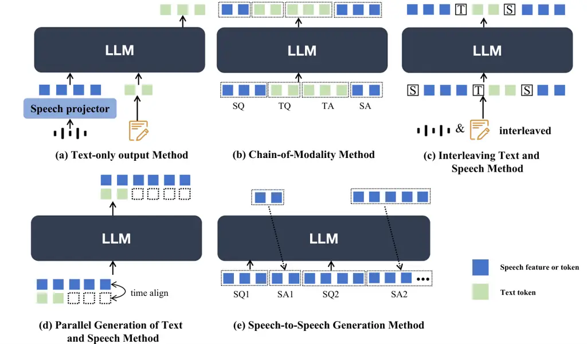

Figure 5: Categorization Diagram of Spoken Dialogue Model Architectural
Paradigms.

Text-Output Only Method. These systems \[33, 34, 67, 228, 199, 81, 41,
61\] maintain the text-based LLM’s foundational structure unchanged,
using an audio encoder and adaptor to map speech input into the LLM’s
pre-trained text latent space directly. This method of direct embedding
alignment, combined with a multi-task training strategy, equips the LLM
with the ability to ’listen,’ thus enabling it to understand and process
speech modality inputs effectively and perform exceptionally well in
various audio understanding tasks. Nevertheless, the output remains
text-based, which necessitates the use of an external text-to-speech
(TTS) system \[21, 49\] to generate speech output. LTU-AS \[67\] uses
Whisper \[170\] and the Time and Layer-Wise Transformer (TLTR) as its
audio encoder, allowing it to recognize both speech and audio events.
Qwen-Audio 1 \[34\] scales up audio-language pre-training to cover over
30 tasks and various audio types, facilitating universal audio
understanding abilities. It employs a unified encoder for all audio
inputs, bridging the gap between audio and textual modalities, and uses
the large language model Qwen-7B \[11\] as its foundational component.
Qwen-Audio 2 \[33\] simplifies the pre-training process by utilizing
natural language prompts for different data and tasks, with DPO \[171\]
optimizing the model’s performance in terms of factuality and adherence
to desired behavior. SALMMON \[199\] employs dual auditory encoders: a
speech encoder from the Whisper model and a non-speech BEATs \[28\]
audio encoder. The auditory features from these two encoders are
complementary, making them suitable for general audio inputs that
contain both speech and non-speech information. These inputs are then
connected to a well-trained LLM using Q-former style attention to
generate responses. VITA \[61\] implements a duplex solution through two
independent modules: one generates text responses to user queries, while
the other continuously monitors environmental input to selectively
provide updated interaction content, although it still requires an
external TTS system. All the aforementioned methods frequently overlook
paralinguistic information, including emotion, prosody, and non-verbal
elements, rendering them insufficient for scenarios that involve
emotional speech dialogue. ParalinGPT \[129\] utilizes an ASR model to
obtain text and a speech encoder to extract emotion embeddings, thereby
more accurately simulating both the linguistic content and
paralinguistic attributes of spoken responses. E-chat \[228\] employs a
Hubert speech encoder \[79\] to extract speech and emotion features,
using a connection module to map these features to the textual space
within the LLM decoder. Although these approaches have explored
emotional responses within spoken dialogue systems, they require
additional systems to synthesize speech from text and suffer from high
latency, making real-time dialogue challenging to achieve.

Chain-of-Modality (CoM) Method. This method tokenizes speech into
discrete tokens and extends the LLM’s vocabulary to handle both speech
input and output. To address alignment issues between speech and text
modalities, Recent works \[243, 245, 157, 25\] utilize a prompting
approach called Chain-of-Modality (CoM), which first generates response
text autoregressively before producing the corresponding speech. This
technique allows the text LLM’s output to guide speech generation,
thereby enhancing the quality of the response content. However, it is
not suitable for live interactions, as the model must complete the
entire text response before beginning speech generation, leading to
increased response latency. SpeechGPT \[243\] and SpeechGPT-gen \[245\]
employ the SpeechTokenizer \[250\] model as a speech token extractor,
breaking down speech generation into the prediction of semantic tokens
followed by acoustic tokens. Spectron \[157\] performs speech
continuation by predicting spectrograms frame-by-frame, optimizing the
LLM with a combination of cross-entropy loss for text and reconstruction
loss for speech frames. EMOVA \[25\], on the other hand, utilizes the
FSPIRAL \[86\] architecture for its speech encoder to capture phonetic
and tonal information, which is then discretized using finite scalar
quantization (FSQ) \[150\]. Its speech response procedure is divided
into three primary steps: 1) transcribing user instructions into text, 2) generating textual responses based on these instructions, and 3)
producing style labels and response speech units from the textual
responses. This process enables EMOVA to facilitate emotional speech
dialogue.

Interleaving Text and Speech Tokens. Some earlier models \[180, 146\]
employed supervised training methods, using specific input and output
sequences, and trained on mixed speech-text tasks, including
text-to-speech (TTS), automatic speech recognition (ASR), and
speech-to-speech translation. Spirit-LM \[159\] leverages the temporal
alignment between speech and its transcription, continuing training on a
pre-trained text-based LLM using alternating text and speech tokens.
This significantly improves the model’s performance in both speech
understanding and generation. However, it employs discrete Hubert units
\[79\] as speech representations, which results in some loss of
paralinguistic information. USDM \[107\] continues pretraining
Mistral-7B \[22\] with interleaved speech-text data to capture
multimodal semantics. For dialogue finetuning, it constructs templates
using both speech and transcripts of user input as instruction data.

Parallel Generation of Text and Speech. PSLM \[155\] proposes generating
speech and text tokens in parallel to reduce latency; however, this
approach may compromise response quality. Additionally, this method
still relies on speech recognition for input \[170\], which introduces
further delay. Llama-Omni \[57\] introduces a novel streaming speech
decoder that can simultaneously generate text responses and discrete
speech unit sequences, significantly reducing latency and meeting
real-time interaction needs. Moshi \[44\] and Mini-Omni \[223\] adopt
similar approaches, introducing dual streams that generate both speech
tokens and corresponding text tokens simultaneously on the assistant
side, facilitating the transfer of the pre-trained LLM’s textual
capabilities to the speech modality, enabling the model to directly
engage in reasoning through speech. The key difference lies in how
speech-text alignment is handled: Moshi \[44\] uses explicit alignment
information to supervise the model’s learning, while Mini-Omni \[223\]
allows the LLM to learn implicit alignment information. On the input
side, Mini-Omni feeds continuous speech embeddings from the Whisper
encoder \[170\] into the LLM, enhancing the model’s ability to
understand spoken instructions without requiring text input. However,
inconsistencies between speech input and output introduce additional
computational overhead, increasing latency in multi-turn dialogue
scenarios. In contrast, Moshi allows users to input speech without
relying on text, and generates both text and speech tokens in parallel
on the assistant side. Moshi further extends its architecture to model
several speech streams in parallel, allowing for conceptually and
practically simple handling of full-duplex dialogues with arbitrary
dynamics.

Speech-to-Speech Generation. This approach aims to remove the dependency
on intermediate text, thereby reducing latency and making the system
closer to real-time interaction. SyncLLM \[204\] achieves real-time
full-duplex interaction through time chunking methods, integrating time
information into LLMs to enable synchronous operation with the
real-world clock. IntrinsicVoice \[249\] utilizes a specific model to
generate multiple speech tokens in a single step, effectively reducing
speech token sequences to lengths comparable to text sequences while
producing high-quality audio. Align-SLM \[130\] utilizes a pre-trained
self-supervised Hubert model \[79\] with K-means clustering \[74\] to
convert continuous speech representations into discrete units. It
employs LoRA adapter \[80\] fine-tuning on a pre-trained Twist \[74\] to
produce multiple speech continuations from a given prompt and uses
semantic metrics to generate preference data for Direct Preference
Optimization (DPO) \[171\]. Experimental results indicate that
integrating the preference optimization method significantly improves
the semantic comprehension of the Spoken LLM.

### 4.2 Multi-stage Training strategy

This section primarily discusses the training process of the Spoken
Dialogue Model, building upon previous work on spoken dialogue systems.
Generally, this process consists of four stages: text LLM pre-training,
modality adaptation and alignment post-training, followed by supervised
fine-tuning, and optionally, preference optimization. The primary goal
in training most spoken dialogue systems is to preserve the model’s
original capabilities while integrating the speech modality for voice
interaction into the LLM. The diagram of multi-stage training can be
referred to in Figure  6.

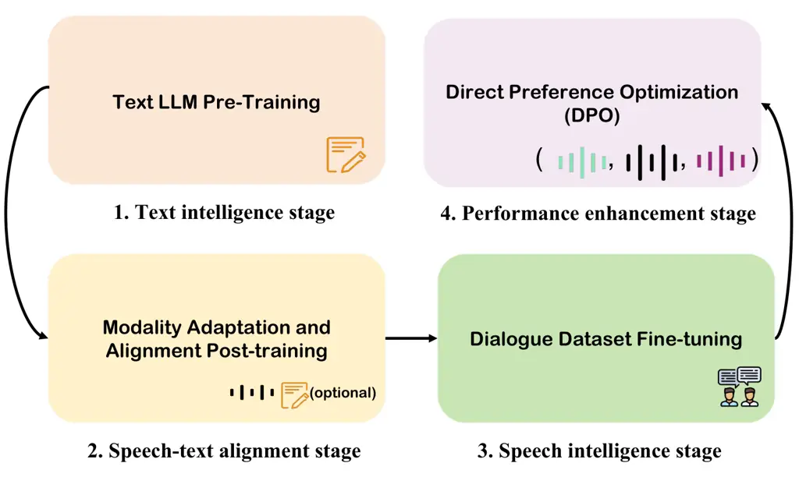

Figure 6: Diagram of Multi-stage Training Steps.

#### 4.2.1 Text LLM Pre-Training

The goal is to develop a text-intelligent LLM model capable of handling
complex contexts and possessing knowledge reasoning abilities, thus
preparing it for integration with speech-intelligent LLMs. Most spoken
dialogue systems utilize pre-trained large language models as
foundational models rather than pre-training with separate text data
themselves. A series of approaches \[243, 245, 159, 25, 57, 204\] use
the LLaMA model and its variants as their foundational language model.
On the other hand, \[50, 223, 224, 247\] employ the Qwen \[11, 229\]
family of large language models as their backbone. Meanwhile, Moshi
\[44\] employs an RQ-Transformer for hierarchical autoregressive
modeling of speech, utilizing a unique structure that involves
pre-training a text-only language model with datasets from the internet
(e.g., Wikipedia ¹⁰¹⁰ 10
[https://dumps.wikimedia.org/](https://dumps.wikimedia.org/) and
StackExchange ¹¹¹¹ 11
[https://archive.org/details/stackexchange/](https://archive.org/details/stackexchange/)).
The collected data was filtered using a comprehensive preprocessing
pipeline to ensure quality and relevance, which included deduplication
to remove redundant entries, language identification to retain text in
the desired language, and quality filtering to exclude low-quality or
irrelevant content based on criteria such as coherence and completeness.
VITA \[61\] utilizes Mixtral 8x7B1 \[96\], a representative LLM with a
sparse mixture of experts (SMoE) architecture, and performs pure-text
instruction tuning for its extended Chinese vocabulary.

#### 4.2.2 Modality Adaptation and Alignment Post-training

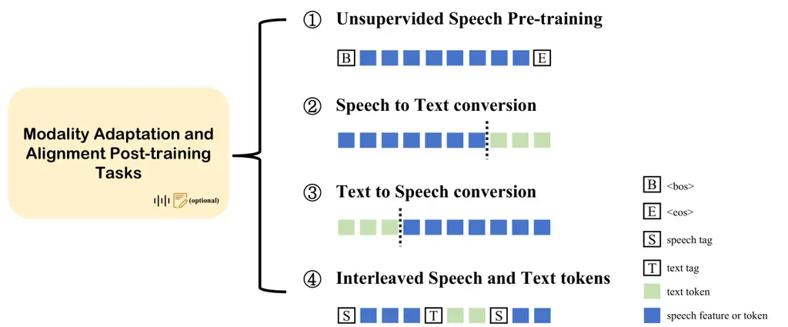

Figure 7: Alignment Post-training Methods.

This phase explores strategies to adapt text-based large language models
(LLMs) for speech modality input, focusing on aligning text and audio
modalities effectively. The primary goal is to enhance the models’
ability to understand and generate speech by bridging the gap between
these two modalities. Common approaches include multimodal training
techniques, leveraging unlabeled speech corpora, and employing
multi-task learning frameworks. These methods typically involve
fine-tuning existing LLMs with speech-related tasks and integrating
speech-specific modules, such as speech adaptors and decoders, to
facilitate seamless interaction between text and speech modalities.
Different training tasks for modality adaptation and alignment are shown
in Figure  7. Spirit-LM \[159\] continuously pretrains on text LLM
checkpoints using interleaved text and speech tokens to improve the
model’s performance in speech understanding and generation. LLaMA-Omni
\[57\] adopts a two-stage training strategy: the first stage jointly
trains a speech adaptor and LLM with speech input and text responses,
while the second stage uses the same dataset to train a streaming speech
decoder independently. Consequently, this LLM primarily possesses the
capability for speech input understanding, with speech generation
handled by a separate decoder module. SpeechGPT \[243\], Moshi \[44\],
and VITA \[61\] utilize unlabeled speech corpora to train models in a
next-token prediction task. In the first phase, VITA focuses on training
the audio encoder and connector, while in the second phase, it optimizes
both the connector and the LLM model through multimodal training.
Although capable of processing speech input, it outputs only text.
Spectron \[157\] addresses the alignment issue between text and speech
representations by jointly supervising multiple objectives.
IntrinsicVoice \[249\] employs a two-stage training approach,
constructing multiple cross-modal tasks from a single dataset to enable
the model to better learn the semantic consistency between speech and
text. Mini-Omni \[223\], EMOVA \[25\], and OmniFlatten \[247\] adopt
similar methodologies, commencing with supervised multi-task fine-tuning
of the text LLM backbone to achieve speech-text modality alignment and
develop a multimodal LLM \[100, 121\] using Automatic Speech Recognition
(ASR) and Text-to-Speech (TTS) tasks. Notably, Mini-Omni divides the
training of various modules into three phases: the first phase utilizes
data from speech recognition and synthesis to enhance the model’s
abilities in these aspects, training only the ASR and TTS adapters. The
second phase focuses exclusively on enhancing the model’s text
capabilities when given speech inputs, updating only the LLM parameters
while freezing other modules. Through these two training phases, the
original language LLM’s capabilities are maximally preserved, while
adapting to speech modality input and output, thereby addressing the
primary modality alignment tasks.

#### 4.2.3 Supervised Fine-tuning or Dialogue Dataset Fine-tuning

During this stage, most models use instruction-following datasets or
dialogue data for supervised fine-tuning of the LLM, enhancing natural
conversational abilities. \[243, 245\] propose a two-stage
instruction-tuning process that includes cross-modal instruction
fine-tuning and chain-of-modality instruction fine-tuning. Ultimately,
the model follows the A-T-T-A method to achieve end-to-end speech input
and output. EMOVA \[25\] employs a similar chain-of-modality concept to
construct instruction-tuning datasets, empowering it to respond
accurately to speech instructions. Moshi \[44\], Mini-Omni \[223\],
OmniFlatten \[247\], and SyncLLM \[204\] utilize spoken dialogue
datasets for fine-tuning, endowing the models with conversational
interaction capabilities. Remarkably, Moshi constructs a more natural
and realistic dialogue dataset that incorporates elements such as noise
and overlap, enabling the model to learn authentic multi-stream
interactions. OmniFlatten fine-tunes the speech-text LLM using
interleaved and serialized dialogues across three stages to
progressively train the model in acquiring half-duplex and full-duplex
communication capabilities. Similarly, SyncLLM employs a three-stage
training procedure that predominantly uses synthetic spoken dialogue
data along with a relatively small amount of real-world spoken dialogue
data to develop a full-duplex voice agent.

#### 4.2.4 Preference Optimization and Reinforcement Learning

The research on leveraging preference optimization to align a spoken
dialogue model with human preferences is virtually absent. Recently,
\[5, 244, 23\] adopted preference optimization for Text-to-Speech (TTS)
models to align speech synthesis quality with human preferences but not
for spoken dialogue models. Align-SLM \[130\] pioneers the integration
of Direct Preference Optimization (DPO) \[171\] in textless Spoken
Language Models (SLMs) to enhance semantic understanding. It transforms
continuous speech into discrete units using a pre-trained Hubert model
and K-means clustering. LoRA fine-tuning on a Spoken LLM generates
multiple speech continuations from prompts. Semantic metrics create
preference data offline, making DPO training efficient and stable,
eliminating the need for an external reward model. Coupled with
curriculum learning \[15\], Align-SLM progressively refines preference
data selection, optimizing semantic feedback, and improving SLM
performance.

### 4.3 Training Frameworks and Generation Strategies

Recent advanced methods in spoken dialogue models employ a variety of
innovative techniques to achieve more natural speech output and lower
latency. In this part, we explore various approaches that exemplify
these advancements:

$`\bullet`$ _LLama-Omni._ LLama-Omni \[57\] adds a streaming speech
decoder that operates after the LLM. This decoder runs in a
non-autoregressive manner, taking the output hidden states from the LLM
as input and generating the discrete unit sequence corresponding to the
speech response. To model the variable-length mapping between input and
output, LLama-Omni employs an upsample factor, denoted as $`\lambda`$,
along with Connectionist Temporal Classification (CTC) loss \[69\]. This
ensures that the model can generate speech responses simultaneously with
text responses. Additionally, a predefined chunk size is set to further
enable vocoder streaming synthesis of speech waveforms, facilitating
real-time interaction and reducing latency.

$`\bullet`$ _Mini-Omni._ Mini-Omni \[223\] selects SNAC \[194\], a
music-grade encoder, to discretize one second of audio into hundreds of
tokens, which significantly increases the burden on the LLM for modeling
speech tokens. Delay Pattern language model decoding strategies are
often applied in modeling multiple parallel streams of acoustic tokens
in speech tasks like MusicGen \[40\], VoiceCraft \[164\], and Parler-TTS
\[141\]. Compared with traditional sequential step decoding, this
strategy can effectively reduce the time steps required for LLM decoding
and generating speech tokens. Inspired by this, Mini-Omni innovatively
applies text-instructed delayed parallel generation to address the issue
of long SNAC codebook sequences, simultaneously producing audio and text
tokens. This effectively leverages and preserves the original
capabilities of the language model. Moreover, Mini-Omni proposes a Batch
Parallel Decoding method. Specifically, it generates two samples in
parallel for a single input: the first predicts text tokens, and the
second predicts both text and speech tokens simultaneously. The text
output from the first sample is embedded into the corresponding
positions of the second sample, while the second sample’s text output is
discarded. This further enhances the model’s reasoning capabilities
during dialogue, maximizing the transfer of its text-based abilities.

$`\bullet`$ _IntrinsicVoice._ IntrinsicVoice \[249\] introduces a speech
encoder and a streaming vocoder for the tokenization and detokenization
of speech, and a GroupFormer for modeling speech and text sequences.
This architecture integrates a large language model (LLM) with a
GroupModel. Specifically, it uses a pre-trained HuBERT encoder \[79\]
and its corresponding KMeans quantizer \[74\] to process speech inputs
into discrete units. These units are organized into a grouped token
sequence through a group partition operation. The grouped tokens are
then passed through an embedding layer and adaptor module to map these
embeddings into the LLM’s embedding space. The context embeddings output
by the LLM are processed through a linear layer and concatenated with a
specified number of learnable queries. This input is fed into a smaller
non-autoregressive transformer encoder model, dubbed the "GroupModel,"
to predict a group of speech tokens in one step. The introduction of
GroupFormer effectively improves the model’s ability to handle sequences
within a group, mitigates the modality gap between speech and text,
accelerates inference speed, and alleviates issues associated with
long-sequence modeling.

$`\bullet`$ _Moshi._ Moshi \[44\] introduces a mini codec model with 8
codebooks at a frame rate of 12.5 Hz for speech representation, where
one second corresponds to 100 speech tokens. It adopts an RQ-Transformer
consisting of a Temporal Transformer and a smaller Depth Transformer as
the backbone network for the LLM, hierarchically modeling multi-codebook
audio tokens. Similar architectures have appeared in prior research,
such as UniAudio \[233\] and Megabyte \[238\]. The Depth Transformer
models sub-sequence tokens conditioned on temporal context predicted by
the Temporal Transformer. Given the smaller size of the Depth
Transformer, sub-sequence generation can almost be viewed as parallel
generation. This allows the model to scale to longer sequences by
extending the temporal modeling capacity of the Temporal Transformer or
to achieve greater depth by enhancing the hierarchical modeling
capabilities of the Depth Transformer, rather than modeling the
flattened sequence with a single model.

$`\bullet`$ _SyncLLM._ SyncLLM \[204\] employs an auto-regressive
transformer decoder for full-duplex dialogue, integrating time
synchronization to align speech units with the real-world clock. It
predicts interleaved speech tokens for both dialogue partners,
maintaining timing with speaker tags. The model is trained on
deduplicated HuBERT token sequences to enhance semantic fidelity while
managing latency by anticipating user responses. Interpolation
reconstructs token sequences to fit expected structures, facilitating
seamless speech synthesis.

Text-guided generation. Some end-to-end methods like \[243, 245, 157,
25\] use chain-of-thought reasoning, which allows guiding speech
generation with the output of an underlying text LLM. However, this is
fundamentally incompatible with live interactions, as the model needs to
produce an entire answer as text before it starts speaking. Later
methods \[57, 223, 44\] can accept user speech input and simultaneously
output speech and text, ensuring high-quality responses while
significantly reducing latency. Lama-Omni \[57\] utilizes a streaming
decoder to generate text and speech tokens in parallel. Mini-Omni
\[223\] is restructured to transfer language reasoning abilities to
streaming audio output through a text-audio parallel decoding approach.
Moshi \[44\] details a novel feature, the Inner Monologue, which
consists of joint modeling of the textual and speech modalities on the
system side to improve the quality of interactions.

W/o text-guided generation. Other methods achieve speech-to-speech
generation without relying on text stream generation. IntrinsicVoice
\[249\] introduces a novel GroupModel that predicts a group of speech
tokens in one step based on global context embeddings. SyncLLM \[204\]
predicts interleaved chunks of token sequences at each time step,
allowing the model to handle all conversational cues such as
backchannels, overlaps, interruptions, etc.

### 4.4 Discussions about Training Paradigm in Spoken Dialogue Models

#### 4.4.1 Text and Speech Modality Alignment

In spoken dialogue systems, the alignment between speech and text
modalities is a crucial stage. To preserve the textual intelligence of
large language models (LLMs) as much as possible, nearly all current
methodologies \[243, 155, 57, 223, 224, 44, 247\] incorporate a
post-training phase utilizing speech-text paired data when developing
spoken dialogue models. This may involve either expanding the vocabulary
to treat speech tokens as an extension of the original vocabulary or
using speech adaptors to map speech embeddings to the original text
latent space of the LLM, and designing multi-task training objectives to
achieve alignment between text and speech modalities. For example, data
from speech recognition and speech synthesis can be used to train the
model’s speech recognition and synthesis capabilities. Although this is
an effective strategy, its implementation can still lead to a certain
degree of catastrophic forgetting in LLMs due to the large volume of
pre-trained text corpora and the imbalance with paired speech-text data,
which can harm the model’s text-based capabilities. Therefore, precise
parameter design and customized optimization strategies are needed to
mitigate this issue as much as possible, as demonstrated by approaches
like Moshi \[44\].

This raises a consideration: during the training phase of spoken
dialogue models, is it feasible to directly utilize speech data for
adaptation to text-based LLMs, thereby eliminating the necessity for
speech-text paired data? This is because unlabeled speech data is
abundant and easily accessible, making it convenient and beneficial for
training the speech intelligence of LLMs. This approach would require us
to obtain a pre-aligned speech representation with the text modality.
Perhaps we can consider further exploration and experimentation in the
speech tokenizer component, such as directly mapping the semantic
discrete units of speech onto the text token space to achieve enforced
alignment.

#### 4.4.2 Different Temporal Alignment Methods in Spoken Dialogue Models

In speech and text modalities, there is often a significant mismatch in
sequence lengths. Even when some speech tokenizers \[92, 120\] employ
extreme sequence compression methods, a length gap remains between the
two. Temporal alignment information between speech and text has been
explored in tasks like Automatic Speech Recognition (ASR) and
Text-to-Speech (TTS) as demonstrated by models such as Whisper \[170\],
FastSpeech \[177\], and VITS \[108\]. Recently, some spoken dialogue
systems have utilized temporal alignment information to enhance model
performance, yielding promising results. For instance, Spirit-LM \[159\]
uses interleaving text and speech tokens for continual pre-training on
the LLaMA base model, significantly boosting the model’s performance in
speech understanding and generation. Experimental visualizations
demonstrate that the similarity between text and speech features is
notably higher in models trained with interleaved token sequences
compared to those trained without this approach. This indicates that
providing the model with explicit fine-grained temporal alignment
information can effectively enhance modality alignment and improve the
performance of LLMs.

Mini-Omni \[223\] achieves parallel generation of text and speech by
padding text tokens to match the length of speech tokens, allowing the
LLM to implicitly learn the alignment information between speech and
text tokens. This can be viewed as a form of sentence-level temporal
alignment information, a method also utilized in recent speech synthesis
work \[30\]. Moshi \[44\], on the other hand, uses word-level
speech-text temporal alignment information and special marker tokens to
achieve similar parallel generation capabilities. The difference lies in
that Mini-Omni fully allows the LLM to implicitly learn the alignment,
whereas Moshi provides word-level alignment priors first, and then lets
the model learn finer-grained alignments.

Exploring the impact of introducing different levels of temporal
alignment priors on the training effectiveness of spoken dialogue
models, such as sentence-level, word-level, or phoneme-level, is an
intriguing area of research. Understanding how these various alignment
strategies affect model performance can guide the development of more
efficient and accurate systems. For instance, sentence-level alignment
might offer a broader contextual understanding, while word-level or
phoneme-level alignments could provide more detailed synchronization
between speech and text, potentially leading to improvements in nuanced
tasks like speech synthesis and understanding.

#### 4.4.3 Reinforcement Learning (RL) in Spoken Dialogue Models

Reinforcement Learning (RL) has proven to be an effective learning
paradigm in text and image processing \[186, 197, 205\]. Recent research
has shown that Direct Preference Optimization (DPO) \[171\] can be
extended to music and speech generation \[36, 244\]. MusicRL \[36\] uses
Reinforcement Learning from Human Feedback (RLHF) to improve music
generation by fine-tuning a pretrained model for better text adherence
and audio quality. By collecting extensive human feedback, MusicRL
creates a more refined and subjective music generation system. Seed-TTS
\[5\] explores RL methods, comparing external reward models like
REINFORCE with simpler methods like DPO. The study highlights using
REINFORCE to enhance speaker similarity and emotion controllability in
the Seed-TTS system. Qwen2-Audio \[33\] uses DPO to align with human
preferences by optimizing responses based on human-annotated data. This
enhances its ability to follow audio instructions accurately and
intelligently respond to complex audio inputs, improving its performance
in audio-centric tasks. However, in the dialogue system field,
reinforcement learning techniques based on human feedback \[83\] are
rarely applied. Considering the diversity of inputs and outputs in large
language models, exploring the incorporation of reinforcement learning
strategies such as Proximal Policy Optimization (PPO) \[186\] can be
beneficial. Additionally, considering the performance metrics for
evaluating spoken dialogue systems, designing targeted reinforcement
learning strategies and feedback functions to enhance different
objectives is also a direction worth exploring.

## 5 Streaming, Duplex, and Interaction

Streaming, full-duplex technology, and interactions, are crucial
elements for enhancing the interactive capabilities of spoken dialogue
models because they directly impact the system’s responsiveness, the
fluidity of natural interaction, and its ability to handle complex
interactions.Unlike text language models, spoken dialogue models require
real-time processing of user input. Streaming allows the system to
instantly acquire and process speech data; full-duplex technology
enables both the system and user to speak simultaneously, enhancing the
naturalness of interaction; and handling of interactions provides the
model with the ability to recognize and adapt to various conversational
contexts, making the dialogue more intelligent and realistic. Building
on early explorations, GPT-4o’s advanced spoken dialogue capabilities
have ignited a surge of research interest. With real-time voice
processing and natural conversational interaction, these models offer
users a seamless and efficient communication experience. However,
achieving these capabilities requires deep research into model
architecture, data collection, system design, and training methods. The
model needs to be carefully designed and optimized in terms of real-time
performance, stability, and response speed. At the same time, duplex
technology is an indispensable key implementation, which ensures that
the voice model has both "ears" and "mouths". Next, we will first
discuss the streaming processing method in Section 5.1, then introduce
the key technologies of duplex communication and explains how to handle
interactation to improve user experience in Section 5.2.

### 5.1 Streaming Spoken Dialogue Models

The core of streaming speech models lies in their "real-time" and
"continuous" capabilities, meaning they can process input and generate
output simultaneously without waiting for complete input. This includes
two main aspects:

$`\bullet`$ _Streaming Understanding._ The model can process audio input
as the user speaks, without needing to wait for the user to finish
entirely, allowing it to align more naturally with the flow of
conversation.

$`\bullet`$ _Streaming Generation._ This concept refers to the model’s
ability to generate output without waiting for all intermediate hidden
states. Instead, it can produce output progressively as processing
occurs, which improves responsiveness and allows for smoother, more
efficient interactions.

These streaming capabilities allow the model to perform more fluidly in
real-time interactions, providing a seamless communication experience
for users. We will explore streaming techniques in both end-to-end and
cascaded spoken dialogue models, discussing the implementation methods
of streaming in each system and highlighting their similarities and
differences.

#### 5.1.1 Streaming End-to-End Spoken Dialogue Models

End-to-end streaming spoken dialogue models often leverage the knowledge
of pre-trained text language models alongside an audio tokenizer,
employing an tokenizer-detokenizer architecture to process and output
audio signals. Based on the concepts of streaming input and output
discussed above, end-to-end models also require specific design
considerations to enable streaming capabilities. These designs center
around the model’s input and output handling and can be distilled into
three core techniques: causal convolution, causal attention mechanisms,
and queue management.

Causal Convolution. Causal Convolution \[12\] is a specialized form of
convolution widely used in time-series processing, especially suitable
for streaming speech models. The key feature of causal convolution is
that the current output depends only on the current and past inputs,
without being influenced by future inputs, thereby strictly respecting
temporal order. Unlike regular convolution, causal convolution achieves
this by "shifting" the convolution kernel to avoid accessing future
information. In a one-dimensional time series, if the convolution kernel
size is $`k`$, a standard convolution would use data from $`(t-k/2)`$ to
$`(t+k/2)`$ at the current time step $`t`$. Causal convolution, however,
pads the input on the left with $`k-1`$ zeros so that the kernel only
uses data from $`t-k+1`$ to $`t`$, aligning the kernel to only consider
current and past inputs. This padding ensures that each layer’s output
depends solely on current and prior information, maintaining causality.
To further expand the model’s receptive field while preserving
causality, dilated causal convolution can be used. This technique
introduces gaps within the kernel by inserting zeros between weights,
effectively expanding the convolution’s range. This allows the model to
capture longer dependencies in the data without increasing latency,
which is particularly useful for streaming applications. In streaming
spoken dialogue models, causal convolution plays a critical role in:

$`\bullet`$ _Ensuring real-time processing._ Causal convolution allows
the model to compute outputs without accessing future frames, enabling
real-time processing by generating outputs as input is received, which
is essential for streaming.

$`\bullet`$ _Reducing latency._ By not requiring future input data,
causal convolution significantly lowers the latency in speech models,
making it more suitable for real-time interaction applications, such as
voice assistants and live translation.

Causal Attention. Causal Attention is a specialized form of the
attention mechanism designed to ensure that each position in a sequence
can only attend to previous positions, thus preserving the temporal
order crucial for streaming models. This approach ensures that the
model’s current output depends only on past and present information,
preventing any “leakage” of future information, which is essential for
real-time processing tasks. In causal attention, the attention mask is
typically used to achieve causality. By applying a mask that blocks
connections to future time steps, the model restricts each token’s
receptive field to only the tokens before it. Specifically, a lower
triangular mask is applied to the attention matrix, setting values to
negative infinity for positions corresponding to future tokens. This
masking technique ensures that the model’s predictions for each time
step only consider current and past inputs, thereby adhering to a strict
causal structure. In streaming speech models, causal attention plays a
significant role in enabling real-time interaction. Unlike standard
attention, which requires access to the entire sequence, causal
attention can operate incrementally. As new inputs are processed, the
model can generate outputs without waiting for future context.

Queue Management \[221\]. Audio streams are typically split into frames,
then processed in sequence via a queue management system that ensures
real-time, orderly processing.

Some end-to-end models, such as Llama-Omni\[57\], Mini-Omni\[223\] and
Mini-Omni2\[224\], employ non-streaming ASR model Whisper as an audio
encoder components. These models have made improvements on the output
side to reduce latency.

$`\bullet`$ _Mini-Omni._ Mini-Omni use a generation strategy delayed
parallel decoding is a that layer-by-layer delays during audio token
generation. This allows the model to generate text and multiple audio
tokens simultaneously at each step, accelerating streaming audio
generation and ensuring low-latency real-time output.

$`\bullet`$ _Llama-Omni._ Llama-Omni incorporates a non-autoregressive
streaming speech decoder that leverages connectionist temporal
classification (CTC) to directly generate a sequence of discrete audio
tokens as the response.

$`\bullet`$ _Intrinsicvoice. \[249\]_ Intrinsicvoice introduced
GroupFormer module to group speech tokens, reducing the length of speech
sequences to match that of text sequences. This approach accelerates
inference, alleviates the challenges of long-sequence modeling, and
effectively narrows the gap between speech and text modalities.We think
they cannot be considered fully streaming because they are not designed
to be streaming on the input side.

$`\bullet`$ _Moshi. \[44\]_ In contrast, Moshi references the
architecture of SpeechTokenizer to train a streaming codec from scratch,
serving as the audio tokenizer-detokenizer. The entire model, including
the codec, transformer, and attention mechanism, is built on a causal
structure.

$`\bullet`$ _OmniFlatten. \[247\]_ OmniFlatten proposes chunk-based
processing of text and speech along with gradual learning techniques and
data handling to reduce turn-taking delays, such as response delays when
users finish speaking or interrupt the system. These models have
achieved true streaming capabilities and established a foundation for
diverse, bidirectional interactions.

#### 5.1.2 Streaming Cascaded Spoken Dialogue Models

Consistent with the above, ensuring streaming capability in a model
relies on designing both input and output for streaming. Due to its
cascaded nature, a cascaded model typically relies on external streaming
ASR and TTS components, placing the streaming responsibility on these
ASR and TTS modules.

In \[212\], comparative studies were conducted on the streaming ASR
model U2++ Conformer \[220\], streaming TTS model XTTS-v2 \[21\],
non-streaming ASR Whisper, and non-streaming TTS VITS \[110\]. The
combination of streaming components achieved the lowest latency and
significantly contributed to interactive interruption capabilities.

### 5.2 Duplex Technology and Interaction

#### 5.2.1 Duplex Technology

The term Duplex originates from the field of communications, used to
describe interaction modes between two parties in data transmission.
Depending on the type of communication, duplex is divided into
half-duplex and full-duplex.

With the development of audio processing and generation technology , the
concept of duplex has been introduced to speech systems, especially
within the context of speech language models. Here, duplex doesn’t just
refer to signal transmission but emphasizes the synchronization and
natural interaction in human-computer dialogue. Specifically, within
model architecture, it means that the model must retain its ability to
perceive external input even while generating a response—essentially,
the ability to listen while speaking.

Simplex. In simplex communication, data flows in only one direction. The
speaker can send data, while the listener can only receive it. As shown
in Figure 8(a), the robot continuously transmits audio, while the user
has no ability to respond. This fixed-direction, one-way communication
has the limitation of lacking interactivity.

Half-Duplex. In half-duplex communication, data flows in both directions
but not simultaneously. The two parties must take turns speaking and
listening. As illustrated in Figure 8(b), the user speaks first,
followed by a response delay during which the robot "thinks" before
replying. The robot’s response occurs only after the user has finished
speaking, and vice versa. This turn-taking method is similar to using a
walkie-talkie, where each party can only transmit after the other has
finished, limiting efficiency.Half-duplex is a common mode in early
voice interaction systems. In a typical half-duplex interaction, there
are noticeable pauses in the conversation; the user and the system
cannot “speak” simultaneously, making the conversation feel less smooth,
much like communication through a walkie-talkie. For example, voice
assistants like Siri use wake words or button presses to trigger the
dialogue and require the speaker to finish a complete sentence before
responding. These systems typically adopt an ASR-LM-TTS cascaded
structure and are often constrained by cascade delays and the turn-based
nature of text language models. Although this interaction method is
simple and easy to implement, it can feel rigid and disjointed in
natural conversational settings, with notable latency. It is designed
more for command execution rather than interactive communication.

Full-Duplex. Full-duplex communication allows both parties to send and
receive data simultaneously \[143\]. Figure 8(c) shows the user and
robot engaging in overlapping, real-time interaction, where backchannels
and interruptions are possible. This mode enables a natural, two-way
conversation, where both the user and robot can speak, respond, and even
interrupt each other as needed, much like a phone call.In dialogue
systems, full-duplex means that the system and user can speak
simultaneously and interrupt each other, making it closer to natural
conversation in real life. Full-duplex large voice models allow the
system not only to listen and understand the user while they speak but
also to interrupt at appropriate moments or respond with backchannel
cues. Moreover, the system can detect the user’s intent to interrupt and
pause itself accordingly, maintaining a smooth flow in the interaction.

(a) Simplex: One-way communication, and the direction is fixed.

(b) Half-duplex: Two-way communication, but not simultaneously.

(c) Full-duplex: Two-way communication, simultaneously.

Figure 8: The illustration of Simplex, Half-Duplex, and Full-Duplex.

The ultimate goal of a spoken dialogue moded is to make the user feel as
though they are conversing with a real human friend. Clearly,
full-duplex technology is essential for achieving natural voice dialogue
systems, enabling the system to send and receive audio signals
simultaneously, thus facilitating real-time interaction. Unlike
text-based models, it doesn’t “cover its ears” while speaking. Users and
intelligent agents can interrupt each other while listening or express
their attitude through non-verbal signals, such as interjections or
laughter. The challenges in realizing this lie in ensuring
conversational fluidity, seamless turn-taking, and precise timing of
interactions. Developing a full-duplex system that can both generate and
receive voice signals in complex interactive scenarios remains a key
focus in academic and industrial research.

#### 5.2.2 Interaction

Now that we understand duplex technology, we can further explore duplex
spoken dialogue model.

We start with some concept.Turn-taking is the core concept in duplex
dialogue. It refers to the process in which speakers take turns speaking
in an orderly manner during a conversation, forming a pattern of
turn-taking. Over the past few decades and has been extensively studied
across fields such as linguistics, phonetics, and sociology. Some
research  \[174, 181\]uses a non-deterministic finite-state machine with
six states to describe the turn-taking behavior between the system and
the user in a spoken dialogue system (SDS). It outlines all possible
states of turn-taking within an SDS, defining the objective of
turn-taking as minimizing mutual silence or overlap between
interlocutors, thereby improving communication efficiency. Turn-taking
encompasses three fundamental concepts:

$`\bullet`$ *Turn-taking cues* \[53, 54\]. These include voice, rhythm,
breathing, gaze, or gestures. Agents can use these cues to determine
whether to take a turn from the user or to relinquish the turn.

$`\bullet`$ _Turn-end detection or prediction._ The distinction between
detection \[73, 116\] and prediction \[115, 55\] lies in that detection
determines whether the agent should take a turn at the current moment,
whereas prediction decides when the turn-taking should occur in the
future.

$`\bullet`$ _Overlap._ This mainly involves two situations. When the
user and agent’s voices overlap, if the user intends to take the turn
from the agent, this behavior is defined as an interruption \[104,
147\]. If the user has no intention of taking the turn, this behavior is
considered backchannel \[72\] or a listener response, such as "uh-huh,"
"right."

Through these concepts, we can better understand turn-taking behavior in
duplex dialogues. In summary, our interactions with voice dialogue
systems can be categorized as interruptions, backchannels, and normal
turn exchanges.

The earliest full-duplex systems used a simple Voice Activity Detection
(VAD) component to model whether the user intended to interrupt.
However, this approach is inadequate for handling backchannel
interaction forms, leading to frequent interruptions and introducing
considerable delays.

We can briefly categorize the exploration of interactions into cascaded
systems and end-to-end systems based on duplex technology. Regardless of
the system type, the critical core idea is that the system must
continuously track external information in real-time, analyze it, and
determine the model’s operational state accordingly. An interactive
voice system must meet two requirements: 1) The ability to accept
external information in real-time at any moment. 2) The ability to
respond to this information accurately. This includes:

$`\bullet`$ _Detecting User Interactions._ When the user tries to
interject or provide new information, the system can recognize this
intent and immediately stop its output to allow the user to speak.

$`\bullet`$ _Backchanneling During User Speech._ While the user is
speaking, the system can provide brief acknowledgments like "uh-huh" or
"I see" to indicate active listening, which encourages the user to
continue.

$`\bullet`$ _Quickly Responding After User Completion._ When the user
finishes speaking, the system can promptly recognize this cue and
respond without unnecessary delays, maintaining a smooth conversational
flow.

$`\bullet`$ _Handling Pauses in User Speech._ When the user briefly
pauses, the system can interpret this as a moment of thought rather than
an invitation to respond, thus avoiding premature interruptions and
preserving the natural flow.

$`\bullet`$ _Interrupting the User When Necessary._ In situations where
the system detects critical information, it can choose to interrupt the
user to provide immediate feedback. For example, if the user is speaking
but the system needs to alert them to an error, it can intervene in
real-time to ensure effective communication.

Cascaded Systems. To enable interactive functionality, cascaded spoken
dialogue models typically require explicit modeling of dialogue turns.
As the core, the large language model needs effective context and turn
management. Next, we introduce several representative works on
interaction in cascaded systems.

$`\bullet`$ _Duplex Conversation._ In \[131\], three core modules are
proposed to achieve smooth full-duplex dialogue: user state detection,
response signal selection, and interruption detection. The user state
detection module not only focuses on traditional turn-end detection but
also identifies whether the user intends to switch turns, continue
speaking, or hesitates during their speech. To achieve this, the system
uses a multimodal model, taking audio and text as inputs, and
incorporates features such as speech rhythm, pitch, and pauses for more
accurate assessment of the user’s state, determining whether to respond
immediately or wait longer. The response signal selection module inserts
small backchannel cues (such as "uh-huh" or "right") at appropriate
times to simulate natural human conversation. By analyzing a large
volume of real dialogues, this module extracts and trains suitable
response signals for various conversation scenarios. Using multi-label
classification, the system selects the optimal response for each
dialogue context, significantly reducing user waiting time and enhancing
conversation flow. The interruption detection module flexibly responds
to user interruptions. Unlike traditional rule-based detection methods,
this system builds an end-to-end detection model with multimodal input
(audio and text) that not only identifies genuine user interruptions but
also avoids misinterpreting background noise or unintended voice signals
as interruptions.

$`\bullet`$ _Outbound Agent System._ \[99\] proposed a full-duplex
dialogue scheme for outbound systems, focusing on the issues of
conversational fluidity and timing of interaction in speech dialogue.
This scheme uses semantic analysis to determine whether the user truly
intends to interrupt the system and can handle disjointed expressions
when users mention named entities. The core of this system is a
full-duplex interaction finite-state machine (FSM), which retrieves text
snippets from ASR results every 300 milliseconds to decide whether to
interrupt. Through continuous semantic analysis of user speech, the
interruption model identifies meaningful user interruptions and avoids
frequent interruptions caused by brief, meaningless responses (like
"uh-huh"). The model employs a pre-trained BERT-based text classifier
and utilizes streaming input, ensuring that the system can process and
analyze user speech in real-time as it is received. Additionally, the
system includes a Discontinuous Expression module to handle user pauses
when mentioning named entities. Specifically, when users hesitate over
entities (such as numbers, locations, or company names), VAD may
erroneously detect turn-end.

The advent of Large Language Models has significantly advanced
generative AI development. Models like ChatGPT demonstrate strong
capabilities in semantic understanding and logical reasoning, offering a
simplified method to integrate various dialogue components into a
unified framework, which may simplify SDS construction. GPT-4o
represents a milestone for dialogue systems, showcasing a nearly
human-like conversational voice model. Its flexible interaction style
and interruption mechanisms make human-computer interaction more natural
and fluid. However, as a commercial model, its training data and
implementation details remain proprietary, making replication
challenging.

$`\bullet`$ _Full-duplex LLM._ \[212\] proposed a full-duplex spoken
dialogue models based on LLMs, enabling simultaneous reception and
transmission of voice signals through a perception module, an action
module, and a neural finite-state machine (FSM). The perception module
uses a streaming ASR model, capturing and processing user speech in
real-time with 640-millisecond intervals per time step, converting it
into token inputs for the LLM. The action module, utilizing a streaming
TTS model, instantly converts the LLM-generated text into audio output
and can pause or resume playback as needed, ensuring the system can
generate audio while receiving user input. At the core is the neural
FSM, allowing the LLM to switch between "speaking" and "listening"
states. Controlled by FSM signals, the system can dynamically decide to
continue speaking, listen, or interrupt based on the dialogue context.
Experimental results show that Wang et al.’s full-duplex streaming
system reduces response latency by threefold, achieves a response time
within 500 milliseconds in over 50% of dialogues, and handles user
interruptions at a rate of 96.7%, with an interruption accuracy of
54.7%.

$`\bullet`$ _VITA._ VITA is an open-source multimodal large language
model which aimed at enhancing multimodal interaction experiences. VITA
can process multiple modalities, such as video, image, text, and audio,
and achieves fluid human-computer interaction through a new duplex
architecture involving two simultaneously operating models: one for
generating responses to user queries, and another for continuously
monitoring environmental inputs. When a new user query is detected, the
generation model pauses, and the monitoring model processes the new
query and generates an updated response. This setup enables VITA to
support audio interruption, allowing users to ask new questions during
system generation, with the system immediately pausing the current
response to handle new input. VITA’s perception abilities are achieved
through multimodal alignment and instruction fine-tuning, enabling it to
switch automatically between different inputs. Additionally, VITA
employs state tokens to distinguish user input types, such as query
audio, background noise, and text input, facilitating wake-free
interaction. VITA’s enhanced listening module prevents unnecessary user
feedback from interrupting system responses, improving robustness.

$`\bullet`$ _CleanS2S._\[160\] This model employs a structured pipeline
to enable responsive and flexible interactions in a spoken dialogue
setting. Designed to facilitate seamless turn-taking and interruption
handling, the model consists of several interconnected modules working
in a coordinated sequence to optimize user experience. Starting with
user input, the system uses a Voice Activity Detection (VAD) module to
continuously monitor for incoming audio signals. As soon as a user
starts speaking, VAD captures the input and immediately initiates
processing by sending the audio data to the Automatic Speech Recognition
(ASR) module. This quick detection and response setup allows the system
to react to user input without delay. Once ASR transcribes the audio
into text, the transcription is passed to the Large Language Model
(LLM), which generates a relevant response based on the user’s query.
Meanwhile, the model is designed to be interruption-aware. During
response generation, if VAD detects a new user input (indicating an
interruption or a follow-up query), the system can promptly adjust its
processing flow. In this case, the LLM temporarily pauses its current
task, allowing ASR to transcribe the new input, which the LLM then uses
to generate an updated response. This interruption capability is
achieved through the model’s layered processing design, allowing for
adaptive turn-taking that feels natural and responsive. The
Text-to-Speech (TTS) module then converts the generated text response
into audio, which is transmitted to the user via WebSocket. To further
support interruption handling, TTS breaks down lengthy responses into
smaller audio segments that are sent progressively. This segmentation
allows the system to stop audio output instantly if an interruption
occurs, switching to the new input without delay. Each segment is
prepared and sent only after a brief VAD check, ensuring that the system
is ready to pause and handle new input at any time. This interconnected
processing chain—VAD detecting input, ASR transcribing, LLM generating
responses, and TTS outputting segmented audio—creates a duplex
interaction framework that balances response generation and user-driven
interruptions. By seamlessly coordinating these components, the model
provides a fluid, real-time dialogue experience that adapts to user
interactions dynamically.

End-to-End Systems. In contrast, end-to-end spoken dialogue models do
not require explicit modeling of dialogue turns; instead, they learn
interaction modeling directly from training data. Next, we introduce
several representative works on interaction in end-to-end systems.

$`\bullet`$ _dGSLM._ In end-to-end systems, the introduction of the
dGSLM model marks a significant milestone in full-duplex technology
development. Within the dGSLM framework, duplex technology is
effectively implemented. This model demonstrates how to capture complex
interactions within dialogues directly from raw audio data through
generative spoken dialogue modeling, without relying on text. The core
innovation of dGSLM is the dual-tower Transformer architecture, called
the Dialogue Transformer Language Model (DLM), which uses a
cross-attention mechanism to enable the system to process two parallel
audio channels simultaneously. Through this architecture, the model not
only independently generates speech for each channel but also shares
information between channels using cross-attention, effectively modeling
silences and interaction events. It leverages the HuBERT encoder and
HiFi-GAN decoder, combined with the dual-tower DLM, and is trained on
2,000 hours of dual-channel telephone conversation audio (Fisher
dataset), where each speaker in a conversation is allocated an
independent audio track. The dGSLM model transforms the audio on both
channels into discrete tokens using HuBERT, and the DLM model
autoregressively predicts the next audio token and its duration.
Finally, the HiFi-GAN\[109\] decoder reconstructs the audio for both
channels. This approach differs significantly from traditional
text-dependent spoken dialogue models, with a particular emphasis on
modeling turn-taking and backchanneling capabilities. This capability
gives dGSLM a notable advantage in duplex voice interaction, better
mimicking the natural dynamics of human conversation. Through its duplex
model design, dGSLM represents an essential step forward in interactive
capabilities and provides a foundation for further advancements.

$`\bullet`$ _Moshi._ As a novel full-duplex architecture, Moshi
incorporates a rich array of design concepts. Unlike dGSLM, Moshi does
not abandon the language model’s ability in text dialogue. Moshi’s
architecture is based on the Helium language model and Mimi neural audio
codec, both trained from scratch. Helium, as a large pre-trained text
language model, provides strong reasoning capabilities, while Mimi
handles audio signal encoding and decoding. To achieve real-time
interaction, Moshi is designed as a multi-stream architecture,
simultaneously processing "user" and "moshi" audio streams without
explicitly modeling speaker turns. Moshi also introduces the "Inner
Monologue" method within the "moshi" audio stream, a process that
jointly models text and audio tokens during training and inference. This
approach allows the model to fully utilize textual knowledge while
maintaining speech-to-speech system characteristics, significantly
enhancing generation quality. Mimi, a neural audio codec integrating
semantic and acoustic information through residual vector quantization
and knowledge distillation, captures high-quality user input audio and
Moshi’s output voice efficiently. To jointly model Moshi and user audio
streams alongside Moshi’s text tokens, Depth Transformer with streaming
inference capabilities is employed. The Mimi encoder and decoder combine
convolutional and Transformer layers, with causal convolutions, allowing
for streaming operation. Moshi is pre-trained on unsupervised audio data
to handle speech scenarios and then fine-tuned on the Fisher dataset to
address overlapping speech and interruptions. Finally, the system is
further optimized on a custom instruction-tuning dataset, ensuring
robust performance across various interactive scenarios. Experimental
results show that Moshi excels in speech modeling and spoken QA tasks,
especially in latency, achieving a theoretical latency of 160
milliseconds and 200 milliseconds in practice, significantly lower than
the typical 230 milliseconds in natural conversation, enhancing
real-time interaction and conversation flow.

$`\bullet`$ _Parrot._ Parrot \[149\] model incorporates multiple
features specifically designed to enhance interaction in spoken
dialogue. It uses a dual-channel audio setup, where each channel
represents a different speaker. This configuration allows Parrot to
manage both sides of a conversation independently, facilitating
real-time turn-taking. By distinguishing between the user’s input and
the system’s response on separate channels, the model can listen and
respond in parallel, creating a more natural conversational flow. To
handle simultaneous speaker inputs effectively, Parrot employs a
"next-token-pair prediction" mechanism, allowing it to predict tokens
for both channels in a coordinated sequence. This approach helps the
model manage conversational dynamics such as overlapping speech and
smooth transitions between turns, adjusting response timing based on the
user’s input. During inference, Parrot supports streaming input,
enabling continuous processing of user audio on one channel while
generating responses on the other. This streaming capability allows the
model to respond to live spoken input in real-time, handling
turn-taking, pauses, and interruptions dynamically. Unlike cascaded
systems that rely on intermediate text conversions, Parrot processes
audio directly, reducing latency and allowing immediate responses to
spoken input. These interaction-focused design choices make Parrot
highly responsive, enabling it to manage turn-taking naturally, respond
to interruptions, and handle overlapping speech,

$`\bullet`$ _Mini-Omni2._ Mini-Omni2 is an open-source multimodal large
language model aimed at simulating the multimodal capabilities of GPT-4o
in vision, hearing, and text, supporting real-time full-duplex
interaction. Mini-Omni2 combines visual and audio encoders with a
language model to enable simultaneous input and output of images, audio,
and text. The model incorporates an interrupt mechanism based on
instruction design for more flexible user interactions. This system uses
a delayed parallel generation algorithm, allowing the model to generate
text and audio responses simultaneously, greatly improving
conversational real-time capabilities and response speed. To achieve
full-duplex interaction, Mini-Omni2 introduces an interrupt mechanism
based on a limited instruction approach, trained on a specially
constructed dataset with specific irq (interrupt) and n-irq
(non-interrupt) state markers for model optimization. For training
Mini-Omni2’s interruption functionality, the researchers used noisy
speech data synthesized with specific command phrases (such as "Stop
Omni") in various voices and tones to simulate scenarios where users
might issue interrupt commands. The dataset also includes background
noises, such as environmental sounds, music, and other dialogues,
enhancing the model’s robustness in complex environments. During
training, Mini-Omni2 controls output flow through irq and n-irq state
markers, generating these markers in real-time to determine whether to
continue output. In this way, the model can immediately halt generation
based on user instructions and switch to "listening" mode in real-time
dialogue. The training data consists of long audio streams from which
the model extracts and encodes user commands like "Stop Omni."
Researchers inserted interrupt commands at various time points, marking
data after the insertion point as irq (interrupt) and data before as
n-irq (non-interrupt). This labeling method ensures that the model
learns to accurately identify interrupt commands in complex audio inputs
and respond appropriately.

$`\bullet`$ _SyncLLM._ SyncLLM achieves full-duplex dialogue and
interruption capabilities through multi-stream interleaving and chunk
processing. SyncLLM divides the conversation’s audio stream into
fixed-sized chunks, each corresponding to a specific time interval. The
model alternates between generating user and system speech segments
within each time step (chunk), ensuring real-time system responses while
processing user speech input. To maintain temporal synchronization with
the user, SyncLLM predicts the user’s speech at each time step before
generating each system chunk, using it as context to infer the system’s
next response. This mechanism enables the system to keep pace with the
conversation even with network latency. The chunk method allows SyncLLM
to handle both user and system audio streams simultaneously, supporting
complex dialogue features like speech overlap, interruption, and
real-time feedback. Additionally, by using de-duplicated speech token
sequences and periodic synchronization markers, the model efficiently
performs chunk-level real-time inference, making conversation more fluid
and natural.

$`\bullet`$ _OmniFlatten._ Similar to SyncLLM, the OmniFlatten model
achieves full-duplex and interruption functionality primarily through
multi-stream data processing and progressive training. To enable
full-duplex dialogue, the model adopts a multi-stream architecture that
interleaves the user’s speech stream with the assistant’s speech and
text streams into a single sequence for training, simplifying multimodal
modeling and enhancing real-time capability. The model first aligns the
text language model with modality through multitask supervised
fine-tuning, enabling it to understand and generate both speech and
text, ensuring basic capability for handling speech and text
simultaneously. Through a progressive training process, OmniFlatten
attains full-duplex capability in three stages: initial training for
half-duplex dialogue, then removing the user’s text stream to support
real-time prediction with multi-stream data, and finally removing the
assistant’s text stream to enable pure speech stream generation. These
steps reduce reliance on text and decrease latency, allowing the system
to generate voice responses while receiving user speech input. By using
a block-by-block generation strategy, OmniFlatten divides the input and
output speech sequences into fixed-size blocks, processing each segment
in turn. This effectively implements streaming processing, ensuring low
latency and high responsiveness in full-duplex dialogue, thereby
providing a more natural response to user interruptions.

$`\bullet`$ _Freeze-Omni._ To support duplex dialogue,
Freeze-Omni \[214\] uses a chunk-level state prediction mechanism for
natural turn-taking. When the user begins speaking, a voice activity
detection module identifies the audio input, prompting the model to
process the audio chunk by chunk. After processing each chunk, the
model’s classification layer predicts the conversation state to
determine the next action. There are three possible states: State 0,
where the model continues listening for more input, assuming the user
hasn’t completed their turn; State 1, where the model interrupts to
provide an immediate response if a quick acknowledgment or feedback is
needed; and State 2, where the model has completed processing the
current user input and is ready to generate and output a response, thus
transitioning smoothly into the response phase without further
listening. This chunk-wise state prediction enables the model to decide
effectively when to respond and when to continue listening, enhancing
its ability to handle natural conversational cues and support
interactive dialogue.

#### 5.2.3 Discussions about streaming and interaction

Significant progress has been made in dialogues models, particularly in
real-time interaction and semantic understanding, with notable
achievements in streaming processing and full-duplex interaction.
Current systems exhibit strong technical capabilities in reducing
response latency, enhancing interruption handling, and improving the
naturalness of conversation. However, existing spoken dialogues models
still lack a unified system that can handle all forms of interaction
seamlessly. Future research could explore new frameworks to better
manage both user interruptions and the system’s ability to interrupt
users, making interactions more natural. Additionally, standardized
benchmarks for evaluating interaction capabilities remain
underdeveloped. A unified evaluation benchmark would provide a
consistent method for assessing and comparing the performance of
different models, thereby advancing the development of more intelligent
and responsive interaction systems.

## 6 Training Resources and Evaluation

### 6.1 Training resources

Training a spoken dialogue system is a complex, multi-stage process,
with each stage relying on specific datasets to achieve distinct
training objectives and enhance system performance. This section
provides an in-depth analysis of the training resources about the spoken
dialogue models, showcasing the data collection and processing methods
at each stage and illustrating how these elements contribute to the
system’s intelligence. It further reveals how key steps, from
foundational architecture to fine-tuning, shape the intelligent
development of dialogue systems.

To address the limitations of existing training spoken dialogue data and
leverage the knowledge and reasoning capabilities of mature text-based
models, many approaches involve Continue Training on pre-trained text
language models. This training paradigm encompasses nearly all data
types required to build a spoken dialogue system. The following sections
focus on analyzing data acquisition and processing methods under this
training flow, covering the following core stages: Text Language Model
Pre-training, Post-Train for Audio Modal Adaption, Post-Train for
Dual-Stream Audio Processing, Enhancing Conversational Abilities and
Instruction Tuning. We have listed commonly used datasets for training
in Table 2. However, current spoken dialogue models lack exploration in
music and sound. To support future development in spoken dialogue
systems, we provide a list of common music and sound datasets in the
appendix A as a reference.

#### 6.1.1 Training resources about Text LLM Pre-training

Text Language Model pre-training serves as the foundational stage for
spoken dialogue models. Through unsupervised learning on large-scale
text data, the model acquires knowledge of vocabulary, grammar, and
contextual relationships, gaining essential knowledge and reasoning
capabilities. Most spoken dialogue systems are built upon pre-existing
open-source text language models (such as Llama \[201\], Palm \[6\],
etc). Although we does not delve into this stage in detail, it provides
a solid foundation for the model’s natural language understanding and
generation capabilities.

#### 6.1.2 Training resources about Post-Train for Audio Modal Alignment

After establishing a text-based foundational model, the system possesses
essential knowledge and reasoning abilities. In this stage, we introduce
the audio modality, enabling the text language model to understand and
generate speech while minimizing any potential loss of textual
knowledge. This process is known as modal adaption or modal alignment.
This multimodal structure incorporates an audio encoder with a codebook,
helping the model recognize linguistic, emotional, and tonal information
in speech. The audio decoder supports the generation of natural and
fluent speech output, while audio signal embeddings and special token
types (e.g., speaker-distinguishing tokens for Synchronous LLM,
task-distinguishing tokens for OmniFlatten, and state tokens for VITA)
are added to the vocabulary of the text language model.

The primary goal at this stage is to align information from different
modalities into a unified space or representation, allowing the model to
correlate and comprehend such information. Consequently, the model is
often trained on cross-modal tasks such as TTS , ASR , and audio
captioning. The datasets used include numerous paired audio and text
samples to ensure effective conversion between modalities. Commonly used
TTS and ASR datasets include Aishell-3 \[191\], LibriTTS \[241\],
TED-LIUM \[179\], VoxPopuli \[208\], Librispeech  \[161\], MLS \[169\],
Wenetspeech \[242\], Gigaspeech \[24\], VCTK \[203\], LJSpeech \[89\],
Common Voice \[8\], and others. For audio captioning, Wavcaps \[148\]
are frequently used. Some speech datasets require ASR model
transcription to generate corresponding text.

In this phase, the emphasis is placed on capturing and generating audio
features and aligning them with text in vector space, rather than
focusing on dialogue functionality.Therefore, the data typically
consists of single-channel audio, which can be used after resampling.
Notably, in some works, it is essential to ensure word-level alignment
between text tokens and audio tokens (e.g., Spirit-LM, Moshi, and
OmniFlatten), achievable through tools like the Whisper-timestamped
package or other alignment tool. In Moshi, to prevent catastrophic
forgetting, half of the training time is allocated to text data,
highlighting the importance of balancing text and audio data during
training.

|                        |               |                    |                               |                                                                                                                            |              |
| ---------------------- | ------------- | ------------------ | ----------------------------- | -------------------------------------------------------------------------------------------------------------------------- | ------------ |
| Stage                  | Task          | Dataset            | Size                          | URL                                                                                                                        | Modality     |
| Modal Alignment        | Mandarin ASR  | AISHELL-1\[18\]    | 170 hrs                       | [https://www.openslr.org/33/](https://www.openslr.org/33/)                                                                 | Text, Speech |
|                        | Mandarin ASR  | AISHELL-2\[48\]    | 1k hrs                        | [https://github.com/kaldi-asr/kaldi/tree/master/egs/aishell2](https://github.com/kaldi-asr/kaldi/tree/master/egs/aishell2) | Text, Speech |
|                        | Mandarin TTS  | AISHELL-3\[191\]   | 85 hrs, 88,035 utt., 218 spk. | [https://www.aishelltech.com/aishell_3](https://www.aishelltech.com/aishell_3)                                             | Text, Speech |
|                        | TTS           | LibriTTS\[241\]    | 585 hrs                       | [https://www.openslr.org/60/](https://www.openslr.org/60/)                                                                 | Text, Speech |
|                        | ASR           | TED-LIUM\[179\]    | 452 hrs                       | [https://lium.univ-lemans.fr/ted-lium3/](https://lium.univ-lemans.fr/ted-lium3/)                                           | Text, Speech |
|                        | ASR           | VoxPopuli\[208\]   | 1.8k hrs                      | [https://github.com/facebookresearch/voxpopuli](https://github.com/facebookresearch/voxpopuli)                             | Text, Speech |
|                        | ASR           | Librispeech\[161\] | 1,000 hrs                     | [https://www.openslr.org/12](https://www.openslr.org/12)                                                                   | Text, Speech |
|                        | ASR           | MLS\[169\]         | 44.5k hrs                     | [https://www.openslr.org/](https://www.openslr.org/)                                                                       | Text, Speech |
|                        | TTS           | Wenetspeech\[242\] | 22.4k hrs                     | [https://wenet.org.cn/WenetSpeech/](https://wenet.org.cn/WenetSpeech/)                                                     | Text, Speech |
|                        | ASR           | Gigaspeech\[24\]   | 40k hrs                       | [https://github.com/SpeechColab/GigaSpeech](https://github.com/SpeechColab/GigaSpeech)                                     | Text, Speech |
|                        | ASR           | VCTK\[203\]        | 300 hrs                       | [https://paperswithcode.com/dataset/voice-bank-demand](https://paperswithcode.com/dataset/voice-bank-demand)               | Text, Speech |
|                        | TTS           | LJSpeech\[89\]     | 24 hrs                        | [https://keithito.com/LJ-Speech-Dataset/](https://keithito.com/LJ-Speech-Dataset/)                                         | Text, Speech |
|                        | ASR           | Common Voice\[8\]  | 2,500 hrs                     | [https://commonvoice.mozilla.org/zh-CN](https://commonvoice.mozilla.org/zh-CN)                                             | Text, Speech |
|                        | Audio Caption | Wavcaps\[148\]     | 400k clips                    | [https://github.com/XinhaoMei/WavCaps](https://github.com/XinhaoMei/WavCaps)                                               | Text, Speech |
|                        | ASR           | LibriLight\[102\]  | 60k hrs                       | [https://github.com/facebookresearch/libri-light](https://github.com/facebookresearch/libri-light)                         | Text, Speech |
|                        | ASR           | PeopleSpeech\[63\] | 30k hrs                       | [https://huggingface.co/datasets/MLCommons/peoples_speech](https://huggingface.co/datasets/MLCommons/peoples_speech)       | Text, Speech |
|                        | Mandarin ASR  | KeSpeech\[200\]    | 1,542 hrs                     | [https://github.com/KeSpeech/KeSpeech](https://github.com/KeSpeech/KeSpeech)                                               | Text, Speech |
|                        | TTS           | Emilia\[75\]       | 101k hrs                      | [https://huggingface.co/datasets/amphion/Emilia-Dataset](https://huggingface.co/datasets/amphion/Emilia-Dataset)           | Text, Speech |
| Dual-Stream Processing | Instruction   | Alpaca\[145\]      | 52,000 items                  | [https://huggingface.co/datasets/tatsu-lab/alpaca](https://huggingface.co/datasets/tatsu-lab/alpaca)                       | Text + TTS   |
|                        | Instruction   | Moss               | \-                            | [https://huggingface.co/fnlp/moss-moon-003-sft](https://huggingface.co/fnlp/moss-moon-003-sft)                             | Text + TTS   |
|                        | Instruction   | BelleCN            | \-                            | [https://github.com/LianjiaTech/BELLE/tree/main](https://github.com/LianjiaTech/BELLE/tree/main)                           | Text + TTS   |
|                        | Dialogue      | UltraChat\[46\]    | 1.5 million                   | [https://github.com/thunlp/UltraChat](https://github.com/thunlp/UltraChat)                                                 | Text + TTS   |
|                        | Instruction   | Open-Orca\[125\]   | \-                            | [https://huggingface.co/datasets/Open-Orca/OpenOrca](https://huggingface.co/datasets/Open-Orca/OpenOrca)                   | Text + TTS   |
|                        | Noise         | DNS \[175\]        | 2425 hrs                      | [https://github.com/microsoft/DNS-Challenge](https://github.com/microsoft/DNS-Challenge)                                   | Noise data   |
|                        | Noise         | MUSAN \[195\]      | \-                            | [https://www.openslr.org/17/](https://www.openslr.org/17/)                                                                 | Noise data   |
| Conversation Fine-Tune | Dialogue      | Fisher             | 964 hrs                       | [https://catalog.ldc.upenn.edu/LDC2004T19](https://catalog.ldc.upenn.edu/LDC2004T19)                                       | Text, Speech |
|                        | Dialogue      | GPT-Talker\[138\]  | \-                            | [https://github.com/AI-S2-Lab/GPT-Talker](https://github.com/AI-S2-Lab/GPT-Talker)                                         | Text, Speech |
|                        | Instruction   | INSTRUCTS2S-200K   | 200k items                    | [https://github.com/ictnlp/LLaMA-Omni](https://github.com/ictnlp/LLaMA-Omni)                                               | Text + TTS   |
|                        | Instruction   | Open Hermes        | 900k items                    | [https://ollama.com/library/openhermes](https://ollama.com/library/openhermes)                                             | Text + TTS   |

Table 2: Datasets used in the various training stages

#### 6.1.3 Training resources about Post-Train for Dual-Stream Dialogue Processing

To ensure that the model possesses the ability to “listen while
speaking”. Most research such as Moshi \[44\] and OmniFlatten \[247\]
has implemented a dual audio-stream model: one audio stream generates
model output, while the other captures user audio. The objective of this
training phase is to enable the model’s dual-stream processing without
requiring complex human-computer interaction modeling. Consequently,
text dialogue data can be converted to speech and processed into
dual-track audio format. However, text dialogue data typically contains
content unsuitable for TTS conversion to speech (such as code, formulas,
URLs) or long, formal dialogue passages that do not align with spoken
language, as real dialogue is often more concise. Therefore, when
synthesizing from text dialogue data, it is necessary to preprocess the
text data. High-quality, open-source text dialogue data is first
collected, including datasets like Alpaca \[145\], Moss, BelleCN,
ultraChat \[46\], and Open-Orca \[125\]. To ensure suitability for
speech synthesis (TTS), heuristic rules are applied to filter out
samples with high proportions of non-text elements (such as code,
mathematical expressions), samples exceeding 200 words, and samples
containing rare symbols.

After filtering the text, TTS models \[49\] are used to synthesize
speech for each turn in the dialogues. For consistent voice effects, the
model audio stream maintains a uniform voice, while the user audio
stream is sampled with varied voices to enhance the model’s robustness.
The synthesized dialogue audio is arranged using simulation strategies
to achieve natural timing, such as turn-taking, well-timed
interruptions, and pauses to maintain fluency and naturalness. The final
dialogue audio is organized in dual-channel format: the conversation
begins with a user utterance, followed by alternating user and assistant
turns. After each user turn, the assistant responds immediately; upon
completion of the assistant’s turn, a sampled pause length is introduced
to simulate the natural rhythm of alternating dialogue. To better
simulate real scenarios, further data augmentation can be applied. For
example, random gain adjustments can be applied to the user audio
stream, and background noise randomly selected from datasets like
MUSAN \[195\] and DNS \[175\] can be added to the user audio channel
(OmniFlatten). To simulate echo effects from a user’s microphone,
portions of the audio stream can be scaled down and added to the user’s
audio stream with random delays between 100 to 500 milliseconds, along
with reverberation-like enhancements, helping the model adapt to
real-world environments.

#### 6.1.4 Training resources about Enhancing Conversational Abilities and Instruction Tuning

While the foundational model has been established, there remains a gap
between this and a complete dialogue system. The above model utilizes
non-overlapping dialogue audio, where one party remains silent while the
other speaks, failing to fully simulate real conversational dynamics.
Some speech datasets, such as Generative Expressive Conversational
Speech Synthesis \[138\] and Fisher, contain dialogues from real-world
settings, providing a basis for modeling interruptions and backchannels
scenarios in voice dialogue systems.

Currently, there is no suitable dataset for real-world speech
instructions. Most approaches use synthetic methods based on text
instruction data to perform instruction tuning in this stage. Common
text instruction datasets include Open Hermes and moss-002-sft-data,
though they face similar challenges as text dialogue data, such as
unsuitability for TTS conversion and inconsistency with spoken language
conventions. Following the synthetic processes provided by Moshi and
Llama-Omni, this aims to generate instruction data in the format of
(SpeechInstruction, TextInstruction, TextResponse, SpeechResponse).

The first method is synthetic generation from scratch. Contexts and
summaries are first generated by sourcing high-quality text data from
sources like Wikipedia and StackExchange, producing thematic paragraphs
as the dialogue foundation, referred to as “context.” Based on these
contexts, dialogue summaries are generated. Next, a specific prompt
template guides the generation of complete dialogues, including context
and requesting dialogues around the theme with roles as user and system.
The model is prompted to exhibit knowledge on the topic and include
interruptions (backchannels) and brief turn-taking, simulating the
natural flow of conversation. To enhance dialogue diversity, additional
instructions involving speech emotion and role-playing can be generated,
requesting dialogues in specific tones or styles. Furthermore, dialogues
containing spelling errors or misinformation are synthesized to train
the system in handling scenarios where user clarification or repetition
is required. Single-turn interactions on basic mathematics, grammar, and
factual questions are also generated to ensure the system can handle
simple factual tasks. Finally, scenarios involving ethical or NSFW
requests are created to train the system in declining to answer under
such conditions.

The second method involves filtering and refining existing text
instruction datasets. Initially, open-source text language models
paraphrase text instructions to match spoken language traits, adding
fillers like “uh” and “um” to mimic natural speech tone, while
converting numbers and symbols into spoken language to ensure the
instructions are concise and conversational. Generated text responses
are also optimized to meet TTS output requirements, removing lengthy
expressions and complex grammatical structures to make content clear and
concise for TTS output. After adjusting the instruction and response
text, a TTS system converts the text to audio.

### 6.2 Evaluation

Fair and comprehensive evaluation of spoken dialogue models presents a
multifaceted challenge. On the one hand, the field of spoken dialogue
still lacks publicly available test sets, comprehensive evaluation
metrics, and established benchmarks. On the other hand, assessing the
performance of spoken dialogue systems requires consideration from
multiple perspectives. Basic aspects include the quality of generated
speech, robustness, dialogue naturalness and accuracy, as well as
response speed and generation time. Beyond these, more advanced
evaluations are needed to assess multi-turn dialogue capabilities (such
as long-form speech editing), interaction abilities, and the system’s
proficiency in audio and music understanding and generation. Given these
requirements, and in line with the comprehensive expectations for spoken
dialogue systems outlined in Section 2.1, we will evaluate these systems
from two angles: common evaluations and advanced evaluations.
Specifically, we will assess eleven key factors: speech generation
quality, text intelligence, speech intelligence, audio and music
generation, audio and music understanding, multilingual capability,
context learning, interaction capability, streaming latency, multimodal
capability, and the safety of dialogue systems. Finally, we will list
the current benchmarks and summarize the common conclusions derived from
them.

|          |                         |                                    |            |        |            |          |           |         |           |      |                                  |
| -------- | ----------------------- | ---------------------------------- | ---------- | ------ | ---------- | -------- | --------- | ------- | --------- | ---- | -------------------------------- |
| Level    | Ability                 | Task                               | Benchmark  |        |            |          |           |         |           |      | Metric                           |
|          |                         |                                    | VoiceBench | SUPERB | AudioBench | AirBench | SpokenWOZ | SD-EVAL | SuperCLUE | MMAU |                                  |
| Basic    | Text Intelligence       | Reasoning                          | ✗          | ✗      | ✗          | ✗        | ✓         | ✗       | ✓         | ✓    | Acc-Metrics                      |
|          |                         | Instruction Following              | ✓          | ✗      | ✓          | ✗        | ✓         | ✗       | ✓         | ✗    | MT-Metrics                       |
|          |                         | Conversational QA                  | ✓          | ✗      | ✓          | ✗        | ✓         | ✗       | ✓         | ✓    | MT-Metrics                       |
|          | Speech Quality          | MOS, WER Evaluation                | ✗          | ✓      | ✗          | ✗        | ✗         | ✗       | ✗         | ✗    | MOS, WER                         |
|          | Streaming Latency       | Real-Time Dialogue                 | ✗          | ✗      | ✗          | ✗        | ✗         | ✗       | ✓         | ✗    | Real-Time Factor                 |
| Advanced | Audio U&G               | Audio Classification               | ✗          | ✓      | ✓          | ✓        | ✗         | ✓       | ✗         | ✓    | Acc-Metrics                      |
|          |                         | Sound Event Detection              | ✗          | ✓      | ✗          | ✓        | ✗         | ✓       | ✗         | ✓    | Acc-Metrics                      |
|          |                         | Audio Captioning                   | ✗          | ✗      | ✓          | ✓        | ✗         | ✓       | ✗         | ✗    | MT-Metrics                       |
|          |                         | Audio-Motivated Creative Writing   | ✗          | ✗      | ✗          | ✗        | ✗         | ✗       | ✗         | ✗    | Subjective Metrics               |
|          |                         | Audio Generation                   | ✗          | ✗      | ✗          | ✗        | ✗         | ✗       | ✗         | ✗    | MOS, FD, IS, KL, FAD, CLAP Score |
|          | Music U&G               | Music Captioning                   | ✗          | ✗      | ✗          | ✓        | ✗         | ✗       | ✗         | ✗    | MT-Metrics                       |
|          |                         | Music Classification               | ✗          | ✗      | ✗          | ✗        | ✗         | ✗       | ✗         | ✓    | Acc-Metrics                      |
|          |                         | Music Synthesis                    | ✗          | ✗      | ✗          | ✓        | ✗         | ✗       | ✗         | ✗    | MOS                              |
|          | Multilingual Capability | Speech Translation                 | ✗          | ✓      | ✗          | ✗        | ✗         | ✗       | ✗         | ✗    | MT-Metrics                       |
|          | Context Learning        | Context-Aware QA                   | ✗          | ✗      | ✗          | ✗        | ✗         | ✗       | ✓         | ✗    | MT-Metrics                       |
|          | Interaction Capability  | Interaction Events                 | ✗          | ✗      | ✗          | ✗        | ✗         | ✗       | ✓         | ✗    | Statistic-Method                 |
|          | Multimodal Capability   | Multimodal QA                      | ✗          | ✗      | ✗          | ✗        | ✗         | ✗       | ✗         | ✗    | MT-Metrics                       |
|          | Security                | Attack Events                      | ✓          | ✗      | ✗          | ✗        | ✗         | ✗       | ✓         | ✗    | Attack Success Rate              |
|          | Speech Intelligence     | Speaker Info                       | ✓          | ✓      | ✓          | ✓        | ✗         | ✗       | ✗         | ✗    | Acc-Metrics                      |
|          |                         | Paralinguistic info Classification | ✓          | ✓      | ✓          | ✓        | ✗         | ✓       | ✗         | ✓    | Acc-Metrics                      |
|          |                         | Conditioned response               | ✗          | ✗      | ✗          | ✓        | ✗         | ✓       | ✗         | ✗    | MT-Metrics                       |
|          |                         | Controllable Style Generation      | ✗          | ✗      | ✗          | ✗        | ✗         | ✗       | ✓         | ✗    | MT-Metrics                       |

Table 3: This table provides a comprehensive overview of the different
components used to evaluate dialogue systems, including various
abilities, common tasks, representative benchmarks, and corresponding
metrics. The abilities include Text Intelligence, Speech Quality, Audio
Understanding and Generation, Music Understanding and Generation,
Multilingual Capability, Context Learning, Interaction Capability,
Multimodal Capability, Security, and Speech Intelligence. The table
aligns these tasks with widely used benchmarks such as VoiceBench,
SUPERB, AudioBench, AirBench, SpokenWOZ, SD-EVAL, SuperCLUE, and MMAU,
highlighting the dimensions they assess. To ensure comprehensive
evaluation some metrics are defined: MT-Metrics, which evaluate the
quality of generated outputs using semantic and syntactic similarity;
Acc-Metrics, which measure recognition performance using precision,
recall, and F-score; Subjective Metrics, which assess creative and
generative tasks like speech quality and audio generation. This
structured framework provides a holistic view of benchmarks, tasks, and
evaluation criteria for assessing diverse model capabilities.

#### 6.2.1 Common Evaluation

Text Intelligence. As shown in Figure 4 (a), text intelligence refers to
the fundamental understanding and generation capabilities of the spoken
dialogue model. When evaluating text intelligence, the focus is solely
on the semantic content generated by the model, without considering
other aspects such as timbre, emotion, or style. In practical
evaluations of this kind, some spoken dialogue models output only
text \[192, 199, 34, 33, 228\], while others generate both text and
speech \[44, 223, 224\], or only speech \[247\]. Regardless of the
output format, we are concerned only with the generated text or the
transcribed text from the speech when evaluation the text intelligence
in the spoken dialogue models. There are typically two categories of
metrics and benchmarks used to assess text intelligence, MT-Metrics and
Acc-Metrics. The details are outlined as follows:

$`\bullet`$ _ACC-Metrics._ A common approach to evaluating text
intelligence is to use benchmarks typically \[198, 126, 240, 38, 182,
26, 256, 154, 216, 58\] employed for large language models, such as the
classic MMLU \[76\] and GSM-8K \[39\]. These benchmarks often include
complex multiple-choice questions, which assess the model’s reasoning
abilities through Acc-Metrics. Acc-Metrics refers to metrics that
measure recognition accuracy, such as accuracy, F-score, and Mean
Average Precision (mAP). It is noteworthy that these benchmarks often
evaluate the text-based intelligence of spoken dialogue models from
various perspectives. For example, MMLU \[76\] and GSM-8K \[39\] are
more focused on LLM’s core knowledge, Flan \[140, 218\] and
Self-instruct \[215\] are more focused on LLM’s instruction following
capability, CoQA \[176\] and OpenAssistant \[113\] are more focused on
LLM’s conversational capability. These benchmarks often contain
questions and corresponding answers. Most of these questions are
close-ended questions with short answers, so that they can have good
generalization ability, any model that can generate text answers can be
evaluated with these benchmarks and accuracy and F-Score can be easily
adopted as the evaluation metrics.

$`\bullet`$ _MT-Metrics._ With the development of the LLMs, LLMs can
follow instructions to accomplish many complex problems, so the scope of
the evaluation was further expanded to include open-ended questions.
These open-ended questions often lack standard answers, therefore it’s
difficult to measure them by common ACC-Metrics. A common approach is to
measure the grammatical similarity between generated and reference
utterances using the metrics used to measure grammatical similarity in
mechanical translation (e.g. BLEU \[162\], METEOR \[13\], ROUGE
\[127\]). We collectively refer to these evaluation metrics as
MT-Metrics. However, these metrics have certain limitations since one
meaning has many different ways to convey. So there are some metrics
like BertScore \[248\] focus on evaluating the semantic similarity
between two sentences. And there are also been some methods utilizing
LLM to judge the effectiveness of the responses which focusing on human
preference \[253, 139\]. The results of these large model-based
especially GPT4o-based ratings of evaluation metrics demonstrated a high
degree of correlation with human.

Speech Quality. Speech quality is one of the fundamental aspects for
evaluating the performance of spoken dialogue systems, as it is closely
tied to the experience of users. There are two common dimensions for
assessing speech quality: the clarity and naturalness (expressiveness
and prosody) of the generated audio, and the robustness of the generated
speech, such as the presence of missing or extra words. The former is
typically evaluated by using subjective MOS (Mean Opinion Score)
ratings, while the latter is commonly assessed by using WER (Word Error
Rate) or CER (Character Error Rate) metrics.

Streaming Latency. In addition to evaluating the quality of text
understanding and generated speech, the speed at which a spoken dialogue
system generates speech responses is also crucial. This necessitates the
ability to stream both the comprehension and generation of speech in
real time, achieving an effect of generating speech while
speaking \[249, 44, 57\]. To assess the streaming performance of a
model, one typically measures the time taken to generate the first token
of speech (i.e., the waiting time after the user finishes speaking) and
calculates the overall Real-Time Factor (RTF) of the spoken dialogue
model’s response. The RTF value is obtained by dividing the total
duration of the speech segment generated by the model by the time taken
by the model to generate that response.

#### 6.2.2 Advanced Evaluation

Speech Intelligence. Evaluating the speech intelligence of spoken
dialogue systems is one of the key aspects. The definition of speech
intelligence in spoken dialogue systems is discussed in detail in
Section 2.1.2. Given that speech intelligence encompasses a wide range
of application scenarios, we address the evaluation separately for the
understanding and generation components during the assessment.

$`\bullet`$ _Understanding._ Ordinary cascaded spoken dialog models
based on ASR getting text input will loss many paralinguistic
information like speaking style, accent, emotion, etc. Thus many spoken
dialogue models \[228, 129, 128\] devoted into helping dialog models
understand the paralinguistic information. Evaluating this capability
can start from two aspects: a) the accuracy of the paralinguistic
information’s understanding, b) the ability of automatically generating
appropriate and coherent content responses and acoustic information
based on the varying acoustic input. For the former, since the classes
of the paralinguistic information are always limited, for example,
sentiments are generally categorized as neural, negative, positive. So
the researchers always use Accuracy or F-Score to evaluate the models’
paralinguistic information understanding capability. Recently, there are
many studies \[66, 19, 168, 228, 128, 59, 20\] available for researchers
to use in identifying speech emotions in the dialogue scenes. In
addition to recognizing speech emotions, recent benchmarks \[7, 235\]
has also begun to investigate the influence of speaker age, accent, and
other factors on the evaluation of spoken dialogue models. For the
latter, recent work \[228\] has increasingly focused on the possibility
of generating appropriate content responses based on acoustic
information from the input. The current evaluation methods usually
transcript the output audio into text through Automatic Speech
Recognition and then evaluate the relevance between generated content
and the reference content in the internal dataset. Evaluations are
usually conducted in text, so commonly used evaluation metrics are as
the same as in the section 6.2.1, like BLEU and METEOR, which are used
to measure the similarity between two sentences. Currently, there is
limited research exploring whether spoken dialogue models can
autonomously generate appropriate acoustic responses based on varying
acoustic information, making it a promising area for future
investigation.

$`\bullet`$ _Generation._ In the generation component, evaluating the
speech intelligence of spoken dialogue systems primarily focuses on
controllability, i.e., the ability of the dialogue model to respond in a
user-specified style and timbre in the zero-shot scenarios. There are
various dimensions to assess style, such as pitch, speech rate, energy,
emotion, and accent, among others. ACC-metrics can be used to evaluate
whether the spoken dialogue model can generate speech in the desired
style. Additionally, the evaluation of voice cloning capabilities within
the model can borrow metrics from the zero-shot TTS domain \[210, 190,
91, 211\], using speaker similarity indices \[27\]. Currently, there are
few models that explore the generation of speech intelligence in spoken
dialogue systems, and this area warrants further refinement and
exploration in future work.

Audio Understanding and Generation. In real-world scenarios, the broader
definition of speech modality encompasses not only clear human speech
but also a wide range of natural sounds such as dog barking and bird
chirping, all of which can be considered forms of audio. Evaluating the
ability of spoken dialogue models to understand and generate such audio
is a critical aspect of assessing the model’s performance.

$`\bullet`$ _Audio Understanding._ On the audio comprehension side,
various sub-tasks are commonly employed to measure a system’s capacity
to understand audio, including tasks such as Audio Captioning (AudioCap)
\[106\], Sound Event Detection (SED) \[153\], audio classification, and
audio-motivated creative writing \[34\], among others. The core of these
tasks lies in evaluating the model’s ability to process and interpret
the complex acoustic information embedded within the audio. For tasks
like audio classification and SED, which involve fixed outputs,
evaluation is relatively straightforward, typically using objective
metrics such as accuracy or Mean Average Precision (mAP). However, for
the AudioCap task, the problem is generally open-ended, meaning there
are no fixed answers. As a result, existing evaluation methods are
primarily based on measuring the similarity between the generated text
and the reference text, using traditional metrics such as BLEU \[162\]
and METEOR \[13\], or newer evaluation approaches involving large
language models such as GPT-4o \[253\]. In the case of audio-motivated
creative writing, where the objective is to generate inventive
descriptions from a given audio input, evaluation typically relies on
subjective measures, given the divergent nature of the creative process
involved.

$`\bullet`$ _Audio Generation._ Additionally, on the audio generation
side, producing high-quality audio should be considered an advanced
capability for a conversational spoken dialogue model. However, as most
current spoken dialogue systems lack the ability to generate audio, this
remains an area for further exploration in the future end-to-end spoken
dialogue systems. The evaluation of generated audio can draw from
methods used in the text-to-audio domain \[82, 84\]. Typically, such
evaluations focus on the quality of the generated audio itself, using
metrics such as Mean Opinion Score (MOS) and the similarity between
generated and target audio. Objective evaluation metrics for audio
similarity often include Fréchet Distance (FD), Inception Score (IS),
Kullback-Leibler (KL) divergence, Fréchet Audio Distance (FAD), and CLAP
score. Specifically, Fréchet Audio Distance (FAD) \[105\] is adapted
from the Fréchet Inception Distance (FID) to the audio domain and serves
as a reference-free perceptual metric that quantifies the distance
between the generated and ground-truth audio distributions. The
Inception Score (IS) is an effective metric that evaluates both the
quality and diversity of generated audio. KL divergence is computed at
the paired sample level between generated and ground-truth audio, based
on the label distribution and averaged to produce a final result.
Fréchet Distance (FD) evaluates the similarity between the generated and
ground-truth audio distributions. FD, KL, and IS are built upon the
PANNs model \[111\], which takes mel-spectrograms as input. In contrast,
FAD uses VGGish \[77\] as an audio classifier, processing raw audio
waveforms as input. The CLAP score, adapted from the CLIP score \[78\],
is a reference-free metric used to assess audio-text alignment and
strongly correlates with human perception.

Music Understanding and Generation. In advanced spoken dialogue models,
the evaluation of music modality understanding and generation follows a
methodology similar to that used for audio modality. Unlike Audio
Understanding, which only requires a general description of the events
that occur in the audio, Music Understanding requires appreciating the
style and genre of music, understanding its keys, themes, and other rich
information. For classification, emotion recognition tasks in music,
common metrics such as accuracy can be used. For music captioning task,
MusicCaps \[2\] offers a general dataset for evaluating a model’s music
understanding capability. For music analysis, Nsynth \[56\] provides
rich note data information. In terms of evaluation for music generation,
subjective Mean Opinion Score (MOS) assessments or measures of
similarity between generated music and target music are commonly used.

Multilingual Capability. The ability to speak multiple languages is also
required for a spoken dialogue model, but most current models \[68, 128,
129, 192, 209, 228\] only focus on English and Chinese. A naive idea is
to directly evaluate spoken dialogue models’ capability in
speech-to-speech or speech-to-text translation tasks \[95, 207\]. These
evaluations can be done with common machine learning metrics like BLEU
\[162\] or BertScore \[248\]. However, evaluating the capability of
translation is insufficient to measure the model’s multilingual
conversational ability, and further exploration is still needed in this
area of evaluation. Explicitly requiring a spoken dialogue model to
perform speech translation is not a typical use case in conversational
scenarios. In most cases, when a user asks a question in a different
language or with a distinct accent, the model is expected to
automatically respond in the same language that the user is using. In
this context, it seems more reasonable to evaluate the accuracy of the
model’s generated speech in terms of language identification, combined
with subjective human assessments, as a more intuitive and appropriate
evaluation method.

Context Learning. The context learning capability is crucial for
maintaining the coherence of an entire conversation. Similar to a memory
function, the challenge lies in how to preserve this capability when
relying solely on speech. Typically, the evaluation of a spoken dialogue
model’s context learning ability depends on specific long-duration
dialogue test sets, after which standard MT-Metrics or Acc-Metrics used
in text intelligence evaluations can be applied. For instance, a model’s
context learning capability can be assessed by evaluating its QA
performance based on the given context \[133\]. However, it is important
to note the relevance of editing scenarios in long-duration spoken
dialogues. In real spoken dialogue scenarios, the users will modify some
certain key information, the model needs to promptly understand and
respond accordingly, e.g., the users offer wrong information for solving
a problem and modify the condition in the next dialog. So how to
evaluate the model’s online understanding ability is still needed
further study.

Interaction Capability. Interactive ability is also an essential metric
for assessing the advanced capabilities of spoken dialogue systems. As
illustrated in Figure 4 (b), basic interactive ability refers to the
system’s capacity to allow users to interrupt the conversation at any
time. In this context, it is crucial to evaluate whether the spoken
dialogue model can promptly comprehend the user’s new input and halt its
current response. This is commonly measured using accuracy. Furthermore,
it is important to assess whether the model can generate a coherent and
appropriate response based on the new input, which ties back to previous
evaluation standards related to text and speech intelligence.

In addition, in real-world scenarios, beyond basic interruptions,
various discourse markers such as "okay", "haha" are often used to
indicate interaction. Current spoken dialogue systems \[158\] typically
track the frequency of these markers as a standard evaluation metric.
Looking ahead, it may be valuable to assess whether future spoken
dialogue models can effectively and appropriately interrupt human
speakers, which could also represent a key dimension for evaluation the
interaction capability.

Multimodal Capability. Spoken dialogue models primarily focus on the
audio modality for both input and output. However, considering the close
coupling between video and audio modalities in practical applications of
dialogue systems, recent advancements in spoken dialogue models have
incorporated the understanding of video and images in the input
stage \[61, 123, 163\] , indicate that future spoken dialogue models
need to simultaneously understand visual information and audio
information to achieve real-time Audio-Visual Understandings. The
evaluation of such models generally still focuses on the evaluation of
dialogue quality, that is, whether the generated dialogue and the
reference dialogue are similar. Therefore, this aspect can still be
evaluated using metrics such as BLEU \[162\] and METEOR \[13\] to assess
sentence semantic similarity. However, research in this area also
focuses on the understanding of visual information, and how to evaluate
the model’s correct understanding of real-time visual information in
dialogue is also a difficulty, still can be a future benchmark
direction.

Security. Security is also an integral part of the evaluation, how to
ensure that the output of the model complies with ethical and social
norms is a critical aspect. Spoken dialogue models may encounter
security issues such as harmful content generation, privacy pitfalls,
bias, and adversarial attacks. There has been considerable research
progress in evaluating text modalities \[47\]. The commonly used metric
is to evaluate the attack success rate of injection attacks and so on.
However, there are relatively few evaluation methods in the field of
speech modality. How to construct a dataset for attacking spoken
dialogue models, avoid poisoning of speech data, and evaluate the
model’s speech defense capabilities as benchmarks are required further
research in the field of spoken dialogue model evaluation in the future.

### 6.3 Benchmark

We list the common benchmarks for evaluating voice dialogue systems in
the table3, and briefly introduce each benchmark in this section.

$`\bullet`$ _VoiceBench._ VoiceBench’s \[29\] Key evaluation dimensions
include general knowledge, instruction-following ability, and safety
compliance. The benchmark incorporates both synthetic and real spoken
instructions to simulate diverse speaker styles, environmental
conditions, and content variations. It challenges systems with tasks
involving accent adaptability, handling noisy environments, and
robustness against content irregularities such as grammatical errors,
disfluencies, and mispronunciations. Additionally, it explores the
systems’ resilience under varying speaker characteristics (age, pitch,
and speaking speed) and environmental challenges like reverberation,
background noise, and far-field effects.

$`\bullet`$ _SUPERB.\[236\]_ The benchmark evaluates speech processing
models across multiple dimensions, including content recognition,
speaker modeling, semantic understanding, and paralinguistic analysis.
Tasks in content recognition cover phoneme recognition, automatic speech
recognition, keyword spotting, and query-by-example spoken term
detection, focusing on transcription and content detection accuracy.
Speaker modeling involves tasks like speaker identification, automatic
speaker verification, and speaker diarization to assess speaker-related
features. Semantic understanding includes intent classification and slot
filling, testing models’ ability to infer high-level meaning directly
from raw audio. Paralinguistic analysis focuses on emotion recognition,
capturing models’ ability to interpret affective cues from speech. The
evaluation framework uses publicly available datasets and conventional
metrics to provide a standardized testbed for assessing generalizability
and task-specific performance.

$`\bullet`$ _AudioBench._ AudioBench \[206\] evaluates spoken dialogue
models across three primary dimensions: speech understanding, audio
scene understanding, and voice (paralinguistic) understanding. It
encompasses eight distinct tasks and leverages 26 datasets, including
seven newly developed datasets. The evaluation emphasizes models’
ability to handle instruction-following tasks conditioned on audio
signals, addressing aspects such as speech recognition accuracy,
environmental sound interpretation, and paralinguistic feature
extraction (e.g., emotion, gender, accent).

$`\bullet`$ _AirBench._ AIR-Bench \[235\] assesses the capabilities of
Spoken dialogue models to understand and interact based on various audio
types, including human speech, natural sounds, and music. It consists of
two primary components: a foundation benchmark with 19 specific audio
tasks and over 19,000 single-choice questions, and a chat benchmark
featuring more than 2,000 open-ended audio-prompted questions. The
foundation benchmark evaluates fundamental skills such as speech
recognition, acoustic scene classification, and music genre
identification, focusing on specific subtasks to diagnose model
weaknesses. The chat benchmark tests the models’ ability to handle
complex, real-world audio-based queries, including mixed audio with
varying loudness and temporal offsets. AIR-Bench introduces a novel
audio mixing strategy to simulate complex real-world scenarios and
employs GPT-4-based evaluation to judge model-generated hypotheses
against reference answers.

$`\bullet`$ _SpokenWOZ._ SpokenWOZ \[193\] evaluates task-oriented
dialogue (TOD) systems in spoken scenarios, addressing challenges unique
to spoken conversations, such as incremental processing, disfluencies,
incomplete utterances, and Automatic Speech Recognition (ASR) noise. It
introduces novel metrics to assess performance in tasks like cross-turn
slot detection and reasoning slot detection, which require integrating
information across multiple turns and reasoning from implicit cues. The
benchmark encompasses multi-domain, human-to-human dialogues with
diverse speech characteristics, testing systems on both textual and
auditory inputs through large-scale annotated datasets with over 200,000
utterances and 249 hours of audio

$`\bullet`$ _SD-EVAL._ SD-Eval \[7\] evaluates spoken dialogue models
across multiple dimensions, focusing on both spoken understanding and
response generation beyond textual content. It assesses models’
abilities to process three key types of information embedded in speech:
content (e.g., linguistic meaning), paralinguistic cues (e.g., emotion,
accent, age), and environmental context (e.g., background sounds). The
benchmark consists of four sub-tasks—emotion, accent, age, and
environment—constructed from diverse datasets and totaling 7,303
utterances spanning 8.76 hours.

$`\bullet`$ _SuperCLUE._ SuperCLUE evaluates spoken dialogue systems
across four main dimensions: voice interaction, general capabilities,
scenario applications, and response speed. Key metrics include
interruption recognition, speech tone adjustment, semantic
understanding, naturalness of speech, and memory accuracy. Additionally,
it measures real-time data retrieval, reasoning ability, compliance with
commands, and multilingual translation accuracy. Scenario-specific
applications like emotional counseling, health consultations, and
customer service are assessed for precision and effectiveness. The final
aspect is response timeliness, focusing on latency and delay
management.However, this benchmark is not open source and focuse on
Mandarine ability

$`\bullet`$ _MMAU._ MMAU \[183\] evaluates spoken dialogue models across
multiple dimensions, encompassing 27 distinct tasks divided into
reasoning and information extraction categories. It assesses models on
their ability to comprehend and reason about speech, sound, and music by
leveraging advanced cognitive skills and domain-specific knowledge. Key
evaluated areas include temporal event reasoning, speaker role mapping,
emotional tone interpretation, eco-acoustic knowledge, phonemic stress
pattern analysis, and melodic structure interpretation. It examines not
just basic recognition or transcription capabilities but also models’
proficiency in complex reasoning, contextual understanding, and the
ability to extract and apply world knowledge. Additionally, MMAU
scrutinizes performance consistency across varying difficulty levels,
testing systems’ depth of reasoning and robustness in real-world audio
scenarios.

## 7 Conclusion

In this work, we systematically review the research related to spoken
dialogue models, categorizing it according to two paradigms: cascaded
spoken dialogue models and end-to-end spoken dialogue models.
Additionally, we provide a detailed overview of the core technologies
behind spoken dialogue models, including speech representation, training
paradigms, streaming duplex systems, and interaction mechanisms. In the
speech representation module, we classify and explain the
representations from both the input and output perspectives, focusing on
different types of semantic and acoustic representations. In the
training paradigm module, we thoroughly discuss five modalities of
alignment for spoken dialogue models, multi-stage training strategies,
model architectures, and generation paradigms. Following this, we
provide an in-depth analysis of streaming input and output for spoken
dialogue models, as well as the related duplex interaction technologies.
Finally, we compile key training resources, evaluation metrics, and
benchmarks relevant to spoken dialogue models. We specifically address
the evaluation of different levels of intelligence in spoken dialogue
models across various scenarios. It is important to note that, given
that spoken dialogue models are a relatively new and emerging
technology, many aspects such as semantic and acoustic representations,
still lack well-established paradigms. Therefore, at the end of each
section, we include a dedicated discussion module to explore these open
issues. We hope that this survey will contribute to the further
development of the field of spoken dialogue systems.

## References

- \[1\] Josh Achiam, Steven Adler, Sandhini Agarwal, Lama Ahmad, Ilge
  Akkaya, Florencia Leoni Aleman, Diogo Almeida, Janko Altenschmidt, Sam
  Altman, Shyamal Anadkat, et al. Gpt-4 technical report. arXiv preprint
  arXiv:2303.08774, 2023.
- \[2\] Andrea Agostinelli, Timo I Denk, Zalán Borsos, Jesse Engel,
  Mauro Verzetti, Antoine Caillon, Qingqing Huang, Aren Jansen, Adam
  Roberts, Marco Tagliasacchi, et al. Musiclm: Generating music from
  text. arXiv preprint arXiv:2301.11325, 2023.
- \[3\] Sunghwan Ahn, Beom Jun Woo, Min Hyun Han, Chanyeong Moon, and
  Nam Soo Kim. Hilcodec: High fidelity and lightweight neural audio
  codec. arXiv preprint arXiv:2405.04752, 2024.
- \[4\] Yang Ai, Xiao-Hang Jiang, Ye-Xin Lu, Hui-Peng Du, and Zhen-Hua
  Ling. Apcodec: A neural audio codec with parallel amplitude and phase
  spectrum encoding and decoding. arXiv preprint arXiv:2402.10533, 2024.
- \[5\] Philip Anastassiou, Jiawei Chen, Jitong Chen, Yuanzhe Chen, Zhuo
  Chen, Ziyi Chen, Jian Cong, Lelai Deng, Chuang Ding, Lu Gao, et al.
  Seed-tts: A family of high-quality versatile speech generation models.
  arXiv preprint arXiv:2406.02430, 2024.
- \[6\] Rohan Anil, Andrew M Dai, Orhan Firat, Melvin Johnson, Dmitry
  Lepikhin, Alexandre Passos, Siamak Shakeri, Emanuel Taropa, Paige
  Bailey, Zhifeng Chen, et al. Palm 2 technical report. arXiv preprint
  arXiv:2305.10403, 2023.
- \[7\] Junyi Ao, Yuancheng Wang, Xiaohai Tian, Dekun Chen, Jun Zhang,
  Lu Lu, Yuxuan Wang, Haizhou Li, and Zhizheng Wu. Sd-eval: A benchmark
  dataset for spoken dialogue understanding beyond words. arXiv preprint
  arXiv:2406.13340, 2024.
- \[8\] Rosana Ardila, Megan Branson, Kelly Davis, Michael Henretty,
  Michael Kohler, Josh Meyer, Reuben Morais, Lindsay Saunders, Francis M
  Tyers, and Gregor Weber. Common voice: A massively-multilingual speech
  corpus. arXiv preprint arXiv:1912.06670, 2019.
- \[9\] Arun Babu, Changhan Wang, Andros Tjandra, Kushal Lakhotia,
  Qiantong Xu, Naman Goyal, Kritika Singh, Patrick Von Platen, Yatharth
  Saraf, Juan Pino, et al. Xls-r: Self-supervised cross-lingual speech
  representation learning at scale. arXiv preprint
  arXiv:2111.09296, 2021.
- \[10\] Alexei Baevski, Yuhao Zhou, Abdelrahman Mohamed, and Michael
  Auli. wav2vec 2.0: A framework for self-supervised learning of speech
  representations. Advances in neural information processing systems,
  33:12449–12460, 2020.
- \[11\] Jinze Bai, Shuai Bai, Yunfei Chu, Zeyu Cui, Kai Dang, Xiaodong
  Deng, Yang Fan, Wenbin Ge, Yu Han, Fei Huang, et al. Qwen technical
  report. arXiv preprint arXiv:2309.16609, 2023.
- \[12\] Shaojie Bai, J Zico Kolter, and Vladlen Koltun. An empirical
  evaluation of generic convolutional and recurrent networks for
  sequence modeling. arXiv preprint arXiv:1803.01271, 2018.
- \[13\] Satanjeev Banerjee and Alon Lavie. Meteor: An automatic metric
  for mt evaluation with improved correlation with human judgments. In
  Proceedings of the acl workshop on intrinsic and extrinsic evaluation
  measures for machine translation and/or summarization, pages
  65–72, 2005.
- \[14\] Loïc Barrault, Yu-An Chung, Mariano Coria Meglioli, David Dale,
  Ning Dong, Mark Duppenthaler, Paul-Ambroise Duquenne, Brian Ellis,
  Hady Elsahar, Justin Haaheim, et al. Seamless: Multilingual expressive
  and streaming speech translation. arXiv preprint
  arXiv:2312.05187, 2023.
- \[15\] Yoshua Bengio, Jérôme Louradour, Ronan Collobert, and Jason
  Weston. Curriculum learning. In Proceedings of the 26th annual
  international conference on machine learning, pages 41–48, 2009.
- \[16\] Rachel M Bittner, Justin Salamon, Mike Tierney, Matthias Mauch,
  Chris Cannam, and Juan Pablo Bello. Medleydb: A multitrack dataset for
  annotation-intensive mir research. In ISMIR, volume 14, pages
  155–160, 2014.
- \[17\] Juan J Bosch, Jordi Janer, Ferdinand Fuhrmann, and Perfecto
  Herrera. A comparison of sound segregation techniques for predominant
  instrument recognition in musical audio signals. In ISMIR, pages
  559–564, 2012.
- \[18\] Hui Bu, Jiayu Du, Xingyu Na, Bengu Wu, and Hao Zheng.
  Aishell-1: An open-source mandarin speech corpus and a speech
  recognition baseline. In 2017 20th conference of the oriental chapter
  of the international coordinating committee on speech databases and
  speech I/O systems and assessment (O-COCOSDA), pages 1–5. IEEE, 2017.
- \[19\] Carlos Busso, Murtaza Bulut, Chi-Chun Lee, Abe Kazemzadeh,
  Emily Mower, Samuel Kim, Jeannette N Chang, Sungbok Lee, and
  Shrikanth S Narayanan. Iemocap: Interactive emotional dyadic motion
  capture database. Language resources and evaluation, 42:335–359, 2008.
- \[20\] Carlos Busso, Srinivas Parthasarathy, Alec Burmania, Mohammed
  AbdelWahab, Najmeh Sadoughi, and Emily Mower Provost. Msp-improv: An
  acted corpus of dyadic interactions to study emotion perception. IEEE
  Transactions on Affective Computing, 8(1):67–80, 2016.
- \[21\] Edresson Casanova, Kelly Davis, Eren Gölge, Görkem Göknar,
  Iulian Gulea, Logan Hart, Aya Aljafari, Joshua Meyer, Reuben Morais,
  Samuel Olayemi, et al. Xtts: a massively multilingual zero-shot
  text-to-speech model. arXiv preprint arXiv:2406.04904, 2024.
- \[22\] Devendra Singh Chaplot. Albert q. jiang, alexandre
  sablayrolles, arthur mensch, chris bamford, devendra singh chaplot,
  diego de las casas, florian bressand, gianna lengyel, guillaume
  lample, lucile saulnier, lélio renard lavaud, marie-anne lachaux,
  pierre stock, teven le scao, thibaut lavril, thomas wang, timothée
  lacroix, william el sayed. arXiv preprint arXiv:2310.06825, 2023.
- \[23\] Chen Chen, Yuchen Hu, Wen Wu, Helin Wang, Eng Siong Chng, and
  Chao Zhang. Enhancing zero-shot text-to-speech synthesis with human
  feedback. arXiv preprint arXiv:2406.00654, 2024.
- \[24\] Guoguo Chen, Shuzhou Chai, Guanbo Wang, Jiayu Du, Wei-Qiang
  Zhang, Chao Weng, Dan Su, Daniel Povey, Jan Trmal, Junbo Zhang, et al.
  Gigaspeech: An evolving, multi-domain asr corpus with 10,000 hours of
  transcribed audio. arXiv preprint arXiv:2106.06909, 2021.
- \[25\] Kai Chen, Yunhao Gou, Runhui Huang, Zhili Liu, Daxin Tan, Jing
  Xu, Chunwei Wang, Yi Zhu, Yihan Zeng, Kuo Yang, et al. Emova:
  Empowering language models to see, hear and speak with vivid emotions.
  arXiv preprint arXiv:2409.18042, 2024.
- \[26\] Mark Chen, Jerry Tworek, Heewoo Jun, Qiming Yuan, Henrique
  Ponde De Oliveira Pinto, Jared Kaplan, Harri Edwards, Yuri Burda,
  Nicholas Joseph, Greg Brockman, et al. Evaluating large language
  models trained on code. arXiv preprint arXiv:2107.03374, 2021.
- \[27\] Sanyuan Chen, Chengyi Wang, Zhengyang Chen, Yu Wu, Shujie Liu,
  Zhuo Chen, Jinyu Li, Naoyuki Kanda, Takuya Yoshioka, Xiong Xiao,
  et al. Wavlm: Large-scale self-supervised pre-training for full stack
  speech processing. IEEE Journal of Selected Topics in Signal
  Processing, 16(6):1505–1518, 2022.
- \[28\] Sanyuan Chen, Yu Wu, Chengyi Wang, Shujie Liu, Daniel Tompkins,
  Zhuo Chen, and Furu Wei. Beats: Audio pre-training with acoustic
  tokenizers. arXiv preprint arXiv:2212.09058, 2022.
- \[29\] Yiming Chen, Xianghu Yue, Chen Zhang, Xiaoxue Gao, Robby T Tan,
  and Haizhou Li. Voicebench: Benchmarking llm-based voice assistants.
  arXiv preprint arXiv:2410.17196, 2024.
- \[30\] Yushen Chen, Zhikang Niu, Ziyang Ma, Keqi Deng, Chunhui Wang,
  Jian Zhao, Kai Yu, and Xie Chen. F5-tts: A fairytaler that fakes
  fluent and faithful speech with flow matching. arXiv preprint
  arXiv:2410.06885, 2024.
- \[31\] Po-Han Chi, Pei-Hung Chung, Tsung-Han Wu, Chun-Cheng Hsieh,
  Yen-Hao Chen, Shang-Wen Li, and Hung-yi Lee. Audio albert: A lite bert
  for self-supervised learning of audio representation. In 2021 IEEE
  Spoken Language Technology Workshop (SLT), pages 344–350. IEEE, 2021.
- \[32\] Cheol Jun Cho, Peter Wu, Tejas S Prabhune, Dhruv Agarwal, and
  Gopala K Anumanchipalli. Articulatory encodec: Vocal tract kinematics
  as a codec for speech. arXiv preprint arXiv:2406.12998, 2024.
- \[33\] Yunfei Chu, Jin Xu, Qian Yang, Haojie Wei, Xipin Wei, Zhifang
  Guo, Yichong Leng, Yuanjun Lv, Jinzheng He, Junyang Lin, et al.
  Qwen2-audio technical report. arXiv preprint arXiv:2407.10759, 2024.
- \[34\] Yunfei Chu, Jin Xu, Xiaohuan Zhou, Qian Yang, Shiliang Zhang,
  Zhijie Yan, Chang Zhou, and Jingren Zhou. Qwen-audio: Advancing
  universal audio understanding via unified large-scale audio-language
  models. arXiv preprint arXiv:2311.07919, 2023.
- \[35\] Yu-An Chung, Hao Tang, and James Glass. Vector-quantized
  autoregressive predictive coding. arXiv preprint
  arXiv:2005.08392, 2020.
- \[36\] Geoffrey Cideron, Sertan Girgin, Mauro Verzetti, Damien
  Vincent, Matej Kastelic, Zalán Borsos, Brian McWilliams, Victor
  Ungureanu, Olivier Bachem, Olivier Pietquin, et al. Musicrl: Aligning
  music generation to human preferences. arXiv preprint
  arXiv:2402.04229, 2024.
- \[37\] Christopher Cieri, David Miller, and Kevin Walker. The fisher
  corpus: A resource for the next generations of speech-to-text. In
  LREC, volume 4, pages 69–71, 2004.
- \[38\] Peter Clark, Isaac Cowhey, Oren Etzioni, Tushar Khot, Ashish
  Sabharwal, Carissa Schoenick, and Oyvind Tafjord. Think you have
  solved question answering? try arc, the ai2 reasoning challenge. arXiv
  preprint arXiv:1803.05457, 2018.
- \[39\] Karl Cobbe, Vineet Kosaraju, Mohammad Bavarian, Mark Chen,
  Heewoo Jun, Lukasz Kaiser, Matthias Plappert, Jerry Tworek, Jacob
  Hilton, Reiichiro Nakano, et al. Training verifiers to solve math word
  problems. arXiv preprint arXiv:2110.14168, 2021.
- \[40\] Jade Copet, Felix Kreuk, Itai Gat, Tal Remez, David Kant,
  Gabriel Synnaeve, Yossi Adi, and Alexandre Défossez. Simple and
  controllable music generation. Advances in Neural Information
  Processing Systems, 36, 2024.
- \[41\] Nilaksh Das, Saket Dingliwal, Srikanth Ronanki, Rohit Paturi,
  David Huang, Prashant Mathur, Jie Yuan, Dhanush Bekal, Xing Niu,
  Sai Muralidhar Jayanthi, et al. Speechverse: A large-scale
  generalizable audio language model. arXiv preprint
  arXiv:2405.08295, 2024.
- \[42\] Michaël Defferrard, Kirell Benzi, Pierre Vandergheynst, and
  Xavier Bresson. FMA: A dataset for music analysis. In 18th
  International Society for Music Information Retrieval Conference
  (ISMIR), 2017.
- \[43\] Alexandre Défossez, Jade Copet, Gabriel Synnaeve, and Yossi
  Adi. High fidelity neural audio compression. arXiv preprint
  arXiv:2210.13438, 2022.
- \[44\] Alexandre Défossez, Laurent Mazaré, Manu Orsini, Amélie Royer,
  Patrick Pérez, Hervé Jégou, Edouard Grave, and Neil Zeghidour. Moshi:
  a speech-text foundation model for real-time dialogue. arXiv preprint
  arXiv:2410.00037, 2024.
- \[45\] Jacob Devlin. Bert: Pre-training of deep bidirectional
  transformers for language understanding. arXiv preprint
  arXiv:1810.04805, 2018.
- \[46\] Ning Ding, Yulin Chen, Bokai Xu, Yujia Qin, Zhi Zheng,
  Shengding Hu, Zhiyuan Liu, Maosong Sun, and Bowen Zhou. Enhancing chat
  language models by scaling high-quality instructional conversations.
  arXiv preprint arXiv:2305.14233, 2023.
- \[47\] Zhichen Dong, Zhanhui Zhou, Chao Yang, Jing Shao, and Yu Qiao.
  Attacks, defenses and evaluations for llm conversation safety: A
  survey. arXiv preprint arXiv:2402.09283, 2024.
- \[48\] Jiayu Du, Xingyu Na, Xuechen Liu, and Hui Bu. Aishell-2:
  Transforming mandarin asr research into industrial scale. arXiv
  preprint arXiv:1808.10583, 2018.
- \[49\] Zhihao Du, Qian Chen, Shiliang Zhang, Kai Hu, Heng Lu, Yexin
  Yang, Hangrui Hu, Siqi Zheng, Yue Gu, Ziyang Ma, et al. Cosyvoice: A
  scalable multilingual zero-shot text-to-speech synthesizer based on
  supervised semantic tokens. arXiv preprint arXiv:2407.05407, 2024.
- \[50\] Zhihao Du, Jiaming Wang, Qian Chen, Yunfei Chu, Zhifu Gao,
  Zerui Li, Kai Hu, Xiaohuan Zhou, Jin Xu, Ziyang Ma, et al. Lauragpt:
  Listen, attend, understand, and regenerate audio with gpt. arXiv
  preprint arXiv:2310.04673, 2023.
- \[51\] Zhihao Du, Shiliang Zhang, Kai Hu, and Siqi Zheng. Funcodec: A
  fundamental, reproducible and integrable open-source toolkit for
  neural speech codec. In ICASSP 2024-2024 IEEE International Conference
  on Acoustics, Speech and Signal Processing (ICASSP), pages 591–595.
  IEEE, 2024.
- \[52\] Abhimanyu Dubey, Abhinav Jauhri, Abhinav Pandey, Abhishek
  Kadian, Ahmad Al-Dahle, Aiesha Letman, Akhil Mathur, Alan Schelten,
  Amy Yang, Angela Fan, et al. The llama 3 herd of models. arXiv
  preprint arXiv:2407.21783, 2024.
- \[53\] Starkey Duncan. Some signals and rules for taking speaking
  turns in conversations. Journal of personality and social psychology,
  23(2):283, 1972.
- \[54\] Starkey Duncan Jr and George Niederehe. On signalling that it’s
  your turn to speak. Journal of experimental social psychology,
  10(3):234–247, 1974.
- \[55\] Erik Ekstedt and Gabriel Skantze. Turngpt: a transformer-based
  language model for predicting turn-taking in spoken dialog. arXiv
  preprint arXiv:2010.10874, 2020.
- \[56\] Jesse Engel, Cinjon Resnick, Adam Roberts, Sander Dieleman,
  Mohammad Norouzi, Douglas Eck, and Karen Simonyan. Neural audio
  synthesis of musical notes with wavenet autoencoders. In International
  Conference on Machine Learning, pages 1068–1077. PMLR, 2017.
- \[57\] Qingkai Fang, Shoutao Guo, Yan Zhou, Zhengrui Ma, Shaolei
  Zhang, and Yang Feng. Llama-omni: Seamless speech interaction with
  large language models. arXiv preprint arXiv:2409.06666, 2024.
- \[58\] Jiazhan Feng, Qingfeng Sun, Can Xu, Pu Zhao, Yaming Yang,
  Chongyang Tao, Dongyan Zhao, and Qingwei Lin. Mmdialog: A large-scale
  multi-turn dialogue dataset towards multi-modal open-domain
  conversation. arXiv preprint arXiv:2211.05719, 2022.
- \[59\] Mauajama Firdaus, Hardik Chauhan, Asif Ekbal, and Pushpak
  Bhattacharyya. Meisd: A multimodal multi-label emotion, intensity and
  sentiment dialogue dataset for emotion recognition and sentiment
  analysis in conversations. In Proceedings of the 28th international
  conference on computational linguistics, pages 4441–4453, 2020.
- \[60\] Eduardo Fonseca, Xavier Favory, Jordi Pons, Frederic Font, and
  Xavier Serra. Fsd50k: an open dataset of human-labeled sound events.
  IEEE/ACM Transactions on Audio, Speech, and Language Processing,
  30:829–852, 2021.
- \[61\] Chaoyou Fu, Haojia Lin, Zuwei Long, Yunhang Shen, Meng Zhao,
  Yifan Zhang, Xiong Wang, Di Yin, Long Ma, Xiawu Zheng, et al. Vita:
  Towards open-source interactive omni multimodal llm. arXiv preprint
  arXiv:2408.05211, 2024.
- \[62\] Philip Gage. A new algorithm for data compression. The C Users
  Journal, 12(2):23–38, 1994.
- \[63\] Daniel Galvez, Greg Diamos, Juan Ciro, Juan Felipe Cerón, Keith
  Achorn, Anjali Gopi, David Kanter, Maximilian Lam, Mark Mazumder, and
  Vijay Janapa Reddi. The people’s speech: A large-scale diverse english
  speech recognition dataset for commercial usage. arXiv preprint
  arXiv:2111.09344, 2021.
- \[64\] Itai Gat, Felix Kreuk, Tu Anh Nguyen, Ann Lee, Jade Copet,
  Gabriel Synnaeve, Emmanuel Dupoux, and Yossi Adi. Augmentation
  invariant discrete representation for generative spoken language
  modeling. arXiv preprint arXiv:2209.15483, 2022.
- \[65\] Jort F Gemmeke, Daniel PW Ellis, Dylan Freedman, Aren Jansen,
  Wade Lawrence, R Channing Moore, Manoj Plakal, and Marvin Ritter.
  Audio set: An ontology and human-labeled dataset for audio events. In
  2017 IEEE international conference on acoustics, speech and signal
  processing (ICASSP), pages 776–780. IEEE, 2017.
- \[66\] Arushi Goel, Zhifeng Kong, Rafael Valle, and Bryan Catanzaro.
  Audio dialogues: Dialogues dataset for audio and music understanding.
  arXiv preprint arXiv:2404.07616, 2024.
- \[67\] Yuan Gong, Alexander H Liu, Hongyin Luo, Leonid Karlinsky, and
  James Glass. Joint audio and speech understanding. In 2023 IEEE
  Automatic Speech Recognition and Understanding Workshop (ASRU), pages
  1–8. IEEE, 2023.
- \[68\] Yuan Gong, Hongyin Luo, Alexander H Liu, Leonid Karlinsky, and
  James Glass. Listen, think, and understand. arXiv preprint
  arXiv:2305.10790, 2023.
- \[69\] Alex Graves, Santiago Fernández, Faustino Gomez, and Jürgen
  Schmidhuber. Connectionist temporal classification: labelling
  unsegmented sequence data with recurrent neural networks. In
  Proceedings of the 23rd international conference on Machine learning,
  pages 369–376, 2006.
- \[70\] Haohan Guo, Fenglong Xie, Kun Xie, Dongchao Yang, Dake Guo,
  Xixin Wu, and Helen Meng. Socodec: A semantic-ordered multi-stream
  speech codec for efficient language model based text-to-speech
  synthesis. arXiv preprint arXiv:2409.00933, 2024.
- \[71\] Zhifang Guo, Yichong Leng, Yihan Wu, Sheng Zhao, and Xu Tan.
  Prompttts: Controllable text-to-speech with text descriptions. In
  ICASSP 2023-2023 IEEE International Conference on Acoustics, Speech
  and Signal Processing (ICASSP), pages 1–5. IEEE, 2023.
- \[72\] Kohei Hara, Koji Inoue, Katsuya Takanashi, and Tatsuya
  Kawahara. Prediction of turn-taking using multitask learning with
  prediction of backchannels and fillers. Listener, 162:364, 2018.
- \[73\] Kohei Hara, Koji Inoue, Katsuya Takanashi, and Tatsuya
  Kawahara. Turn-taking prediction based on detection of transition
  relevance place. In INTERSPEECH, pages 4170–4174, 2019.
- \[74\] Michael Hassid, Tal Remez, Tu Anh Nguyen, Itai Gat, Alexis
  Conneau, Felix Kreuk, Jade Copet, Alexandre Defossez, Gabriel
  Synnaeve, Emmanuel Dupoux, et al. Textually pretrained speech language
  models. Advances in Neural Information Processing Systems, 36, 2024.
- \[75\] Haorui He, Zengqiang Shang, Chaoren Wang, Xuyuan Li, Yicheng
  Gu, Hua Hua, Liwei Liu, Chen Yang, Jiaqi Li, Peiyang Shi, et al.
  Emilia: An extensive, multilingual, and diverse speech dataset for
  large-scale speech generation. arXiv preprint arXiv:2407.05361, 2024.
- \[76\] Dan Hendrycks, Collin Burns, Steven Basart, Andy Zou, Mantas
  Mazeika, Dawn Song, and Jacob Steinhardt. Measuring massive multitask
  language understanding. arXiv preprint arXiv:2009.03300, 2020.
- \[77\] Shawn Hershey, Sourish Chaudhuri, Daniel PW Ellis, Jort F
  Gemmeke, Aren Jansen, R Channing Moore, Manoj Plakal, Devin Platt,
  Rif A Saurous, Bryan Seybold, et al. Cnn architectures for large-scale
  audio classification. In 2017 ieee international conference on
  acoustics, speech and signal processing (icassp), pages 131–135.
  IEEE, 2017.
- \[78\] Jack Hessel, Ari Holtzman, Maxwell Forbes, Ronan Le Bras, and
  Yejin Choi. Clipscore: A reference-free evaluation metric for image
  captioning. arXiv preprint arXiv:2104.08718, 2021.
- \[79\] Wei-Ning Hsu, Benjamin Bolte, Yao-Hung Hubert Tsai, Kushal
  Lakhotia, Ruslan Salakhutdinov, and Abdelrahman Mohamed. Hubert:
  Self-supervised speech representation learning by masked prediction of
  hidden units. IEEE/ACM transactions on audio, speech, and language
  processing, 29:3451–3460, 2021.
- \[80\] Edward J Hu, Yelong Shen, Phillip Wallis, Zeyuan Allen-Zhu,
  Yuanzhi Li, Shean Wang, Lu Wang, and Weizhu Chen. Lora: Low-rank
  adaptation of large language models. arXiv preprint
  arXiv:2106.09685, 2021.
- \[81\] Shujie Hu, Long Zhou, Shujie Liu, Sanyuan Chen, Lingwei Meng,
  Hongkun Hao, Jing Pan, Xunying Liu, Jinyu Li, Sunit Sivasankaran,
  et al. Wavllm: Towards robust and adaptive speech large language
  model. arXiv preprint arXiv:2404.00656, 2024.
- \[82\] Jiawei Huang, Yi Ren, Rongjie Huang, Dongchao Yang, Zhenhui Ye,
  Chen Zhang, Jinglin Liu, Xiang Yin, Zejun Ma, and Zhou Zhao.
  Make-an-audio 2: Temporal-enhanced text-to-audio generation. arXiv
  preprint arXiv:2305.18474, 2023.
- \[83\] Lei Huang, Weijiang Yu, Weitao Ma, Weihong Zhong, Zhangyin
  Feng, Haotian Wang, Qianglong Chen, Weihua Peng, Xiaocheng Feng, Bing
  Qin, et al. A survey on hallucination in large language models:
  Principles, taxonomy, challenges, and open questions. arXiv preprint
  arXiv:2311.05232, 2023.
- \[84\] Rongjie Huang, Jiawei Huang, Dongchao Yang, Yi Ren, Luping Liu,
  Mingze Li, Zhenhui Ye, Jinglin Liu, Xiang Yin, and Zhou Zhao.
  Make-an-audio: Text-to-audio generation with prompt-enhanced diffusion
  models. In International Conference on Machine Learning, pages
  13916–13932. PMLR, 2023.
- \[85\] Rongjie Huang, Mingze Li, Dongchao Yang, Jiatong Shi, Xuankai
  Chang, Zhenhui Ye, Yuning Wu, Zhiqing Hong, Jiawei Huang, Jinglin Liu,
  et al. Audiogpt: Understanding and generating speech, music, sound,
  and talking head. In Proceedings of the AAAI Conference on Artificial
  Intelligence, volume 38, pages 23802–23804, 2024.
- \[86\] Wenyong Huang, Zhenhe Zhang, Yu Ting Yeung, Xin Jiang, and Qun
  Liu. Spiral: Self-supervised perturbation-invariant representation
  learning for speech pre-training. arXiv preprint
  arXiv:2201.10207, 2022.
- \[87\] Zhichao Huang, Chutong Meng, and Tom Ko. Repcodec: A speech
  representation codec for speech tokenization. arXiv preprint
  arXiv:2309.00169, 2023.
- \[88\] Iris AM Huijben, Matthijs Douze, Matthew Muckley, Ruud JG van
  Sloun, and Jakob Verbeek. Residual quantization with implicit neural
  codebooks. arXiv preprint arXiv:2401.14732, 2024.
- \[89\] Keith Ito and Linda Johnson. The lj speech dataset.
  [https://keithito.com/LJ-Speech-Dataset/](https://keithito.com/LJ-Speech-Dataset/), 2017.
- \[90\] Shengpeng Ji, Minghui Fang, Ziyue Jiang, Rongjie Huang, Jialung
  Zuo, Shulei Wang, and Zhou Zhao. Language-codec: Reducing the gaps
  between discrete codec representation and speech language models.
  arXiv preprint arXiv:2402.12208, 2024.
- \[91\] Shengpeng Ji, Ziyue Jiang, Hanting Wang, Jialong Zuo, and Zhou
  Zhao. Mobilespeech: A fast and high-fidelity framework for mobile
  zero-shot text-to-speech. arXiv preprint arXiv:2402.09378, 2024.
- \[92\] Shengpeng Ji, Ziyue Jiang, Wen Wang, Yifu Chen, Minghui Fang,
  Jialong Zuo, Qian Yang, Xize Cheng, Zehan Wang, Ruiqi Li, et al.
  Wavtokenizer: an efficient acoustic discrete codec tokenizer for audio
  language modeling. arXiv preprint arXiv:2408.16532, 2024.
- \[93\] Shengpeng Ji, Jialong Zuo, Minghui Fang, Ziyue Jiang, Feiyang
  Chen, Xinyu Duan, Baoxing Huai, and Zhou Zhao. Textrolspeech: A text
  style control speech corpus with codec language text-to-speech models.
  In ICASSP 2024-2024 IEEE International Conference on Acoustics, Speech
  and Signal Processing (ICASSP), pages 10301–10305. IEEE, 2024.
- \[94\] Shengpeng Ji, Jialong Zuo, Minghui Fang, Siqi Zheng, Qian Chen,
  Wen Wang, Ziyue Jiang, Hai Huang, Xize Cheng, Rongjie Huang, et al.
  Controlspeech: Towards simultaneous zero-shot speaker cloning and
  zero-shot language style control with decoupled codec. arXiv preprint
  arXiv:2406.01205, 2024.
- \[95\] Ye Jia, Michelle Tadmor Ramanovich, Quan Wang, and Heiga Zen.
  Cvss corpus and massively multilingual speech-to-speech translation.
  arXiv preprint arXiv:2201.03713, 2022.
- \[96\] Albert Q Jiang, Alexandre Sablayrolles, Antoine Roux, Arthur
  Mensch, Blanche Savary, Chris Bamford, Devendra Singh Chaplot, Diego
  de las Casas, Emma Bou Hanna, Florian Bressand, et al. Mixtral of
  experts. arXiv preprint arXiv:2401.04088, 2024.
- \[97\] Ziyue Jiang, Jinglin Liu, Yi Ren, Jinzheng He, Zhenhui Ye,
  Shengpeng Ji, Qian Yang, Chen Zhang, Pengfei Wei, Chunfeng Wang,
  et al. Mega-tts 2: Boosting prompting mechanisms for zero-shot speech
  synthesis. In The Twelfth International Conference on Learning
  Representations, 2024.
- \[98\] Ziyue Jiang, Yi Ren, Zhenhui Ye, Jinglin Liu, Chen Zhang, Qian
  Yang, Shengpeng Ji, Rongjie Huang, Chunfeng Wang, Xiang Yin, et al.
  Mega-tts: Zero-shot text-to-speech at scale with intrinsic inductive
  bias. arXiv preprint arXiv:2306.03509, 2023.
- \[99\] Chunxiang Jin, Minghui Yang, and Zujie Wen. Duplex conversation
  in outbound agent system. In Interspeech, pages 4866–4867, 2021.
- \[100\] Yizhang Jin, Jian Li, Yexin Liu, Tianjun Gu, Kai Wu, Zhengkai
  Jiang, Muyang He, Bo Zhao, Xin Tan, Zhenye Gan, et al. Efficient
  multimodal large language models: A survey. arXiv preprint
  arXiv:2405.10739, 2024.
- \[101\] Zeqian Ju, Yuancheng Wang, Kai Shen, Xu Tan, Detai Xin,
  Dongchao Yang, Yanqing Liu, Yichong Leng, Kaitao Song, Siliang Tang,
  et al. Naturalspeech 3: Zero-shot speech synthesis with factorized
  codec and diffusion models. arXiv preprint arXiv:2403.03100, 2024.
- \[102\] Jacob Kahn, Morgane Riviere, Weiyi Zheng, Evgeny Kharitonov,
  Qiantong Xu, Pierre-Emmanuel Mazaré, Julien Karadayi, Vitaliy
  Liptchinsky, Ronan Collobert, Christian Fuegen, et al. Libri-light: A
  benchmark for asr with limited or no supervision. In ICASSP 2020-2020
  IEEE International Conference on Acoustics, Speech and Signal
  Processing (ICASSP), pages 7669–7673. IEEE, 2020.
- \[103\] Eugene Kharitonov, Jade Copet, Kushal Lakhotia, Tu Anh Nguyen,
  Paden Tomasello, Ann Lee, Ali Elkahky, Wei-Ning Hsu, Abdelrahman
  Mohamed, Emmanuel Dupoux, et al. textless-lib: A library for textless
  spoken language processing. arXiv preprint arXiv:2202.07359, 2022.
- \[104\] Hatim Khouzaimi, Romain Laroche, and Fabrice Lefèvre.
  Reinforcement learning for turn-taking management in incremental
  spoken dialogue systems. In IJCAI, pages 2831–2837, 2016.
- \[105\] Kevin Kilgour, Mauricio Zuluaga, Dominik Roblek, and Matthew
  Sharifi. Fr$`\backslash`$’echet audio distance: A metric for
  evaluating music enhancement algorithms. arXiv preprint
  arXiv:1812.08466, 2018.
- \[106\] Chris Dongjoo Kim, Byeongchang Kim, Hyunmin Lee, and Gunhee
  Kim. Audiocaps: Generating captions for audios in the wild. In
  Proceedings of the 2019 Conference of the North American Chapter of
  the Association for Computational Linguistics: Human Language
  Technologies, Volume 1 (Long and Short Papers), pages 119–132, 2019.
- \[107\] Heeseung Kim, Soonshin Seo, Kyeongseok Jeong, Ohsung Kwon,
  Jungwhan Kim, Jaehong Lee, Eunwoo Song, Myungwoo Oh, Sungroh Yoon, and
  Kang Min Yoo. Unified speech-text pretraining for spoken dialog
  modeling. arXiv preprint arXiv:2402.05706, 2024.
- \[108\] Jaehyeon Kim, Jungil Kong, and Juhee Son. Conditional
  variational autoencoder with adversarial learning for end-to-end
  text-to-speech. In International Conference on Machine Learning, pages
  5530–5540. PMLR, 2021.
- \[109\] Jungil Kong, Jaehyeon Kim, and Jaekyoung Bae. Hifi-gan:
  Generative adversarial networks for efficient and high fidelity speech
  synthesis. Advances in neural information processing systems,
  33:17022–17033, 2020.
- \[110\] Jungil Kong, Jihoon Park, Beomjeong Kim, Jeongmin Kim, Dohee
  Kong, and Sangjin Kim. Vits2: Improving quality and efficiency of
  single-stage text-to-speech with adversarial learning and architecture
  design. arXiv preprint arXiv:2307.16430, 2023.
- \[111\] Qiuqiang Kong, Yin Cao, Turab Iqbal, Yuxuan Wang, Wenwu Wang,
  and Mark D Plumbley. Panns: Large-scale pretrained audio neural
  networks for audio pattern recognition. IEEE/ACM Transactions on
  Audio, Speech, and Language Processing, 28:2880–2894, 2020.
- \[112\] Zhifeng Kong, Arushi Goel, Rohan Badlani, Wei Ping, Rafael
  Valle, and Bryan Catanzaro. Audio flamingo: A novel audio language
  model with few-shot learning and dialogue abilities. arXiv preprint
  arXiv:2402.01831, 2024.
- \[113\] Andreas Köpf, Yannic Kilcher, Dimitri von Rütte, Sotiris
  Anagnostidis, Zhi Rui Tam, Keith Stevens, Abdullah Barhoum, Duc
  Nguyen, Oliver Stanley, Richárd Nagyfi, et al. Openassistant
  conversations-democratizing large language model alignment. Advances
  in Neural Information Processing Systems, 36, 2024.
- \[114\] Rithesh Kumar, Prem Seetharaman, Alejandro Luebs, Ishaan
  Kumar, and Kundan Kumar. High-fidelity audio compression with improved
  rvqgan. Advances in Neural Information Processing Systems, 36, 2024.
- \[115\] Divesh Lala, Koji Inoue, and Tatsuya Kawahara. Smooth
  turn-taking by a robot using an online continuous model to generate
  turn-taking cues. In 2019 International Conference on Multimodal
  Interaction, pages 226–234, 2019.
- \[116\] Divesh Lala, Pierrick Milhorat, Koji Inoue, Masanari Ishida,
  Katsuya Takanashi, and Tatsuya Kawahara. Attentive listening system
  with backchanneling, response generation and flexible turn-taking. In
  Proceedings of the 18th Annual SIGdial Meeting on Discourse and
  Dialogue, pages 127–136, 2017.
- \[117\] Max WY Lam, Qiao Tian, Tang Li, Zongyu Yin, Siyuan Feng, Ming
  Tu, Yuliang Ji, Rui Xia, Mingbo Ma, Xuchen Song, et al. Efficient
  neural music generation. Advances in Neural Information Processing
  Systems, 36, 2024.
- \[118\] Matthew Le, Apoorv Vyas, Bowen Shi, Brian Karrer, Leda Sari,
  Rashel Moritz, Mary Williamson, Vimal Manohar, Yossi Adi, Jay
  Mahadeokar, et al. Voicebox: Text-guided multilingual universal speech
  generation at scale. Advances in neural information processing
  systems, 36, 2024.
- \[119\] Yichong Leng, Zhifang Guo, Kai Shen, Xu Tan, Zeqian Ju,
  Yanqing Liu, Yufei Liu, Dongchao Yang, Leying Zhang, Kaitao Song,
  et al. Prompttts 2: Describing and generating voices with text prompt.
  arXiv preprint arXiv:2309.02285, 2023.
- \[120\] Hanzhao Li, Liumeng Xue, Haohan Guo, Xinfa Zhu, Yuanjun Lv,
  Lei Xie, Yunlin Chen, Hao Yin, and Zhifei Li. Single-codec:
  Single-codebook speech codec towards high-performance speech
  generation. arXiv preprint arXiv:2406.07422, 2024.
- \[121\] Jian Li, Weiheng Lu, Hao Fei, Meng Luo, Ming Dai, Min Xia,
  Yizhang Jin, Zhenye Gan, Ding Qi, Chaoyou Fu, Ying Tai, Wankou Yang,
  Yabiao Wang, and Chengjie Wang. A survey on benchmarks of multimodal
  large language models, 2024.
- \[122\] Junnan Li, Dongxu Li, Silvio Savarese, and Steven Hoi. Blip-2:
  Bootstrapping language-image pre-training with frozen image encoders
  and large language models. In International conference on machine
  learning, pages 19730–19742. PMLR, 2023.
- \[123\] Yadong Li, Haoze Sun, Mingan Lin, Tianpeng Li, Guosheng Dong,
  Tao Zhang, Bowen Ding, Wei Song, Zhenglin Cheng, Yuqi Huo, et al.
  Baichuan-omni technical report. arXiv preprint arXiv:2410.08565, 2024.
- \[124\] Yuanchao Li, Yumnah Mohamied, Peter Bell, and Catherine Lai.
  Exploration of a self-supervised speech model: A study on emotional
  corpora. In 2022 IEEE Spoken Language Technology Workshop (SLT), pages
  868–875. IEEE, 2023.
- \[125\] Wing Lian, Bleys Goodson, Eugene Pentland, Austin Cook,
  Chanvichet Vong, and "Teknium". Openorca: An open dataset of gpt
  augmented flan reasoning traces.
  [https://https://huggingface.co/Open-Orca/OpenOrca](https://https://huggingface.co/Open-Orca/OpenOrca), 2023.
- \[126\] Percy Liang, Rishi Bommasani, Tony Lee, Dimitris Tsipras,
  Dilara Soylu, Michihiro Yasunaga, Yian Zhang, Deepak Narayanan, Yuhuai
  Wu, Ananya Kumar, et al. Holistic evaluation of language models. arXiv
  preprint arXiv:2211.09110, 2022.
- \[127\] Chin-Yew Lin. Rouge: A package for automatic evaluation of
  summaries. In Text summarization branches out, pages 74–81, 2004.
- \[128\] Guan-Ting Lin, Cheng-Han Chiang, and Hung-yi Lee. Advancing
  large language models to capture varied speaking styles and respond
  properly in spoken conversations. arXiv preprint
  arXiv:2402.12786, 2024.
- \[129\] Guan-Ting Lin, Prashanth Gurunath Shivakumar, Ankur Gandhe,
  Chao-Han Huck Yang, Yile Gu, Shalini Ghosh, Andreas Stolcke, Hung-yi
  Lee, and Ivan Bulyko. Paralinguistics-enhanced large language modeling
  of spoken dialogue. In ICASSP 2024-2024 IEEE International Conference
  on Acoustics, Speech and Signal Processing (ICASSP), pages
  10316–10320. IEEE, 2024.
- \[130\] Guan-Ting Lin, Prashanth Gurunath Shivakumar, Aditya Gourav,
  Yile Gu, Ankur Gandhe, Hung yi Lee, and Ivan Bulyko. Align-slm:
  Textless spoken language models with reinforcement learning from ai
  feedback, 2024.
- \[131\] Ting-En Lin, Yuchuan Wu, Fei Huang, Luo Si, Jian Sun, and
  Yongbin Li. Duplex conversation: Towards human-like interaction in
  spoken dialogue systems. In Proceedings of the 28th ACM SIGKDD
  Conference on Knowledge Discovery and Data Mining, pages
  3299–3308, 2022.
- \[132\] Yaron Lipman, Ricky TQ Chen, Heli Ben-Hamu, Maximilian Nickel,
  and Matt Le. Flow matching for generative modeling. arXiv preprint
  arXiv:2210.02747, 2022.
- \[133\] Samuel Lipping, Parthasaarathy Sudarsanam, Konstantinos
  Drossos, and Tuomas Virtanen. Clotho-aqa: A crowdsourced dataset for
  audio question answering. In 2022 30th European Signal Processing
  Conference (EUSIPCO), pages 1140–1144. IEEE, 2022.
- \[134\] Andy T Liu, Shu-wen Yang, Po-Han Chi, Po-chun Hsu, and Hung-yi
  Lee. Mockingjay: Unsupervised speech representation learning with deep
  bidirectional transformer encoders. In ICASSP 2020-2020 IEEE
  International Conference on Acoustics, Speech and Signal Processing
  (ICASSP), pages 6419–6423. IEEE, 2020.
- \[135\] Haohe Liu, Zehua Chen, Yi Yuan, Xinhao Mei, Xubo Liu, Danilo
  Mandic, Wenwu Wang, and Mark D Plumbley. Audioldm: Text-to-audio
  generation with latent diffusion models. arXiv preprint
  arXiv:2301.12503, 2023.
- \[136\] Haohe Liu, Xuenan Xu, Yi Yuan, Mengyue Wu, Wenwu Wang, and
  Mark D Plumbley. Semanticodec: An ultra low bitrate semantic audio
  codec for general sound. arXiv preprint arXiv:2405.00233, 2024.
- \[137\] Haohe Liu, Yi Yuan, Xubo Liu, Xinhao Mei, Qiuqiang Kong, Qiao
  Tian, Yuping Wang, Wenwu Wang, Yuxuan Wang, and Mark D Plumbley.
  Audioldm 2: Learning holistic audio generation with self-supervised
  pretraining. IEEE/ACM Transactions on Audio, Speech, and Language
  Processing, 2024.
- \[138\] Rui Liu, Yifan Hu, Ren Yi, Yin Xiang, and Haizhou Li.
  Generative expressive conversational speech synthesis. arXiv preprint
  arXiv:2407.21491, 2024.
- \[139\] Yang Liu, Dan Iter, Yichong Xu, Shuohang Wang, Ruochen Xu, and
  Chenguang Zhu. G-eval: Nlg evaluation using gpt-4 with better human
  alignment. arXiv preprint arXiv:2303.16634, 2023.
- \[140\] Shayne Longpre, Le Hou, Tu Vu, Albert Webson, Hyung Won Chung,
  Yi Tay, Denny Zhou, Quoc V Le, Barret Zoph, Jason Wei, et al. The flan
  collection: Designing data and methods for effective instruction
  tuning. In International Conference on Machine Learning, pages
  22631–22648. PMLR, 2023.
- \[141\] Dan Lyth and Simon King. Natural language guidance of
  high-fidelity text-to-speech with synthetic annotations. arXiv
  preprint arXiv:2402.01912, 2024.
- \[142\] Yinghao Ma, Anders Øland, Anton Ragni, Bleiz MacSen Del Sette,
  Charalampos Saitis, Chris Donahue, Chenghua Lin, Christos Plachouras,
  Emmanouil Benetos, Elio Quinton, et al. Foundation models for music: A
  survey. arXiv preprint arXiv:2408.14340, 2024.
- \[143\] Ziyang Ma, Yakun Song, Chenpeng Du, Jian Cong, Zhuo Chen,
  Yuping Wang, Yuxuan Wang, and Xie Chen. Language model can listen
  while speaking. arXiv preprint arXiv:2408.02622, 2024.
- \[144\] Ziyang Ma, Zhisheng Zheng, Jiaxin Ye, Jinchao Li, Zhifu Gao,
  Shiliang Zhang, and Xie Chen. emotion2vec: Self-supervised
  pre-training for speech emotion representation. arXiv preprint
  arXiv:2312.15185, 2023.
- \[145\] Kiwan Maeng, Alexei Colin, and Brandon Lucia. Alpaca:
  Intermittent execution without checkpoints. Proceedings of the ACM on
  Programming Languages, 1(OOPSLA):1–30, 2017.
- \[146\] Soumi Maiti, Yifan Peng, Shukjae Choi, Jee-weon Jung, Xuankai
  Chang, and Shinji Watanabe. Voxtlm: Unified decoder-only models for
  consolidating speech recognition, synthesis and speech, text
  continuation tasks. In ICASSP 2024-2024 IEEE International Conference
  on Acoustics, Speech and Signal Processing (ICASSP), pages
  13326–13330. IEEE, 2024.
- \[147\] Matthew Marge, Carol Espy-Wilson, Nigel G Ward, Abeer Alwan,
  Yoav Artzi, Mohit Bansal, Gil Blankenship, Joyce Chai, Hal Daumé III,
  Debadeepta Dey, et al. Spoken language interaction with robots:
  Recommendations for future research. Computer Speech & Language,
  71:101255, 2022.
- \[148\] Xinhao Mei, Chutong Meng, Haohe Liu, Qiuqiang Kong, Tom Ko,
  Chengqi Zhao, Mark D Plumbley, Yuexian Zou, and Wenwu Wang. Wavcaps: A
  chatgpt-assisted weakly-labelled audio captioning dataset for
  audio-language multimodal research. IEEE/ACM Transactions on Audio,
  Speech, and Language Processing, 2024.
- \[149\] Ziqiao Meng, Qichao Wang, Wenqian Cui, Yifei Zhang, Bingzhe
  Wu, Irwin King, Liang Chen, and Peilin Zhao. Sd-gpt: Autoregressive
  spoken dialogue language modeling with decoder-only transformers. In
  Audio Imagination: NeurIPS 2024 Workshop AI-Driven Speech, Music, and
  Sound Generation.
- \[150\] Fabian Mentzer, David Minnen, Eirikur Agustsson, and Michael
  Tschannen. Finite scalar quantization: Vq-vae made simple. arXiv
  preprint arXiv:2309.15505, 2023.
- \[151\] Annamaria Mesaros, Toni Heittola, Aleksandr Diment, Benjamin
  Elizalde, Ankit Shah, Emmanuel Vincent, Bhiksha Raj, and Tuomas
  Virtanen. Dcase 2017 challenge setup: Tasks, datasets and baseline
  system. In DCASE 2017-workshop on detection and classification of
  acoustic scenes and events, 2017.
- \[152\] Annamaria Mesaros, Toni Heittola, and Tuomas Virtanen. Tut
  database for acoustic scene classification and sound event detection.
  In 2016 24th European Signal Processing Conference (EUSIPCO), pages
  1128–1132. IEEE, 2016.
- \[153\] Annamaria Mesaros, Toni Heittola, Tuomas Virtanen, and Mark D
  Plumbley. Sound event detection: A tutorial. IEEE Signal Processing
  Magazine, 38(5):67–83, 2021.
- \[154\] Swaroop Mishra, Daniel Khashabi, Chitta Baral, and Hannaneh
  Hajishirzi. Cross-task generalization via natural language
  crowdsourcing instructions. arXiv preprint arXiv:2104.08773, 2021.
- \[155\] Kentaro Mitsui, Koh Mitsuda, Toshiaki Wakatsuki, Yukiya Hono,
  and Kei Sawada. Pslm: Parallel generation of text and speech with llms
  for low-latency spoken dialogue systems. arXiv preprint
  arXiv:2406.12428, 2024.
- \[156\] Abdelrahman Mohamed, Hung-yi Lee, Lasse Borgholt, Jakob D
  Havtorn, Joakim Edin, Christian Igel, Katrin Kirchhoff, Shang-Wen Li,
  Karen Livescu, Lars Maaløe, et al. Self-supervised speech
  representation learning: A review. IEEE Journal of Selected Topics in
  Signal Processing, 16(6):1179–1210, 2022.
- \[157\] Eliya Nachmani, Alon Levkovitch, Roy Hirsch, Julian Salazar,
  Chulayuth Asawaroengchai, Soroosh Mariooryad, Ehud Rivlin,
  RJ Skerry-Ryan, and Michelle Tadmor Ramanovich. Spoken question
  answering and speech continuation using spectrogram-powered llm. arXiv
  preprint arXiv:2305.15255, 2023.
- \[158\] Tu Anh Nguyen, Eugene Kharitonov, Jade Copet, Yossi Adi,
  Wei-Ning Hsu, Ali Elkahky, Paden Tomasello, Robin Algayres, Benoit
  Sagot, Abdelrahman Mohamed, et al. Generative spoken dialogue language
  modeling. Transactions of the Association for Computational
  Linguistics, 11:250–266, 2023.
- \[159\] Tu Anh Nguyen, Benjamin Muller, Bokai Yu, Marta R Costa-Jussa,
  Maha Elbayad, Sravya Popuri, Paul-Ambroise Duquenne, Robin Algayres,
  Ruslan Mavlyutov, Itai Gat, et al. Spirit-lm: Interleaved spoken and
  written language model. arXiv preprint arXiv:2402.05755, 2024.
- \[160\] Yazhe Niu, Shuai Hu, and Yun Chen. Cleans2s: High-quality and
  streaming speech-to-speech interactive agent in a single file.
  [https://github.com/opendilab/CleanS2S](https://github.com/opendilab/CleanS2S), 2024.
- \[161\] Vassil Panayotov, Guoguo Chen, Daniel Povey, and Sanjeev
  Khudanpur. Librispeech: an asr corpus based on public domain audio
  books. In 2015 IEEE international conference on acoustics, speech and
  signal processing (ICASSP), pages 5206–5210. IEEE, 2015.
- \[162\] Kishore Papineni, Salim Roukos, Todd Ward, and Wei-Jing Zhu.
  Bleu: a method for automatic evaluation of machine translation. In
  Proceedings of the 40th annual meeting of the Association for
  Computational Linguistics, pages 311–318, 2002.
- \[163\] Se Jin Park, Chae Won Kim, Hyeongseop Rha, Minsu Kim, Joanna
  Hong, Jeong Hun Yeo, and Yong Man Ro. Let’s go real talk: Spoken
  dialogue model for face-to-face conversation. arXiv preprint
  arXiv:2406.07867, 2024.
- \[164\] Puyuan Peng, Po-Yao Huang, Daniel Li, Abdelrahman Mohamed, and
  David Harwath. Voicecraft: Zero-shot speech editing and text-to-speech
  in the wild. arXiv preprint arXiv:2403.16973, 2024.
- \[165\] Leonardo Pepino, Pablo Riera, and Luciana Ferrer. Encodecmae:
  Leveraging neural codecs for universal audio representation learning.
  arXiv preprint arXiv:2309.07391, 2023.
- \[166\] Karol J Piczak. Esc: Dataset for environmental sound
  classification. In Proceedings of the 23rd ACM international
  conference on Multimedia, pages 1015–1018, 2015.
- \[167\] Adam Polyak, Yossi Adi, Jade Copet, Eugene Kharitonov, Kushal
  Lakhotia, Wei-Ning Hsu, Abdelrahman Mohamed, and Emmanuel Dupoux.
  Speech resynthesis from discrete disentangled self-supervised
  representations. arXiv preprint arXiv:2104.00355, 2021.
- \[168\] Soujanya Poria, Devamanyu Hazarika, Navonil Majumder, Gautam
  Naik, Erik Cambria, and Rada Mihalcea. Meld: A multimodal multi-party
  dataset for emotion recognition in conversations. arXiv preprint
  arXiv:1810.02508, 2018.
- \[169\] Vineel Pratap, Qiantong Xu, Anuroop Sriram, Gabriel Synnaeve,
  and Ronan Collobert. Mls: A large-scale multilingual dataset for
  speech research. arXiv preprint arXiv:2012.03411, 2020.
- \[170\] Alec Radford, Jong Wook Kim, Tao Xu, Greg Brockman, Christine
  McLeavey, and Ilya Sutskever. Robust speech recognition via
  large-scale weak supervision. In International conference on machine
  learning, pages 28492–28518. PMLR, 2023.
- \[171\] Rafael Rafailov, Archit Sharma, Eric Mitchell, Christopher D
  Manning, Stefano Ermon, and Chelsea Finn. Direct preference
  optimization: Your language model is secretly a reward model. Advances
  in Neural Information Processing Systems, 36, 2024.
- \[172\] Zafar Rafii, Antoine Liutkus, Fabian-Robert Stöter,
  Stylianos Ioannis Mimilakis, and Rachel Bittner. Musdb18-a corpus for
  music separation. 2017.
- \[173\] Anton Ratnarajah, Shi-Xiong Zhang, and Dong Yu. M3-audiodec:
  Multi-channel multi-speaker multi-spatial audio codec. arXiv preprint
  arXiv:2309.07416, 2023.
- \[174\] Antoine Raux and Maxine Eskenazi. A finite-state turn-taking
  model for spoken dialog systems. In Proceedings of human language
  technologies: The 2009 annual conference of the North American chapter
  of the association for computational linguistics, pages 629–637, 2009.
- \[175\] CK Reddy, E Beyrami, H Dubey, V Gopal, R Cheng, R Cutler,
  S Matusevych, R Aichner, A Aazami, S Braun, et al. The interspeech
  2020 deep noise suppression challenge: Datasets, subjective speech
  quality and testing framework. arxiv 2020. arXiv preprint
  arXiv:2001.08662.
- \[176\] Siva Reddy, Danqi Chen, and Christopher D Manning. Coqa: A
  conversational question answering challenge. Transactions of the
  Association for Computational Linguistics, 7:249–266, 2019.
- \[177\] Yi Ren, Chenxu Hu, Xu Tan, Tao Qin, Sheng Zhao, Zhou Zhao, and
  Tie-Yan Liu. Fastspeech 2: Fast and high-quality end-to-end text to
  speech. arXiv preprint arXiv:2006.04558, 2020.
- \[178\] Yong Ren, Tao Wang, Jiangyan Yi, Le Xu, Jianhua Tao, Chu Yuan
  Zhang, and Junzuo Zhou. Fewer-token neural speech codec with
  time-invariant codes. In ICASSP 2024-2024 IEEE International
  Conference on Acoustics, Speech and Signal Processing (ICASSP), pages
  12737–12741. IEEE, 2024.
- \[179\] Anthony Rousseau, Paul Deléglise, and Yannick Esteve.
  Ted-lium: an automatic speech recognition dedicated corpus. In LREC,
  pages 125–129, 2012.
- \[180\] Paul K Rubenstein, Chulayuth Asawaroengchai, Duc Dung Nguyen,
  Ankur Bapna, Zalán Borsos, Félix de Chaumont Quitry, Peter Chen,
  Dalia El Badawy, Wei Han, Eugene Kharitonov, et al. Audiopalm: A large
  language model that can speak and listen. arXiv preprint
  arXiv:2306.12925, 2023.
- \[181\] Harvey Sacks, Emanuel A Schegloff, and Gail Jefferson. A
  simplest systematics for the organization of turn-taking for
  conversation. language, 50(4):696–735, 1974.
- \[182\] Keisuke Sakaguchi, Ronan Le Bras, Chandra Bhagavatula, and
  Yejin Choi. Winogrande: An adversarial winograd schema challenge at
  scale. Communications of the ACM, 64(9):99–106, 2021.
- \[183\] S Sakshi, Utkarsh Tyagi, Sonal Kumar, Ashish Seth,
  Ramaneswaran Selvakumar, Oriol Nieto, Ramani Duraiswami, Sreyan Ghosh,
  and Dinesh Manocha. Mmau: A massive multi-task audio understanding and
  reasoning benchmark. arXiv preprint arXiv:2410.19168, 2024.
- \[184\] Justin Salamon, Christopher Jacoby, and Juan Pablo Bello. A
  dataset and taxonomy for urban sound research. In Proceedings of the
  22nd ACM international conference on Multimedia, pages
  1041–1044, 2014.
- \[185\] Steffen Schneider, Alexei Baevski, Ronan Collobert, and
  Michael Auli. wav2vec: Unsupervised pre-training for speech
  recognition. arXiv preprint arXiv:1904.05862, 2019.
- \[186\] John Schulman, Filip Wolski, Prafulla Dhariwal, Alec Radford,
  and Oleg Klimov. Proximal policy optimization algorithms. arXiv
  preprint arXiv:1707.06347, 2017.
- \[187\] Rico Sennrich. Neural machine translation of rare words with
  subword units. arXiv preprint arXiv:1508.07909, 2015.
- \[188\] Cory Shain and Micha Elsner. Acquiring language from speech by
  learning to remember and predict. In Proceedings of the 24th
  Conference on Computational Natural Language Learning, pages
  195–214, 2020.
- \[189\] Slava Shechtman and Avihu Dekel. Low bitrate high-quality
  rvqgan-based discrete speech tokenizer. In Interspeech 2024, pages
  4174–4178, 2024.
- \[190\] Kai Shen, Zeqian Ju, Xu Tan, Yanqing Liu, Yichong Leng, Lei
  He, Tao Qin, Sheng Zhao, and Jiang Bian. Naturalspeech 2: Latent
  diffusion models are natural and zero-shot speech and singing
  synthesizers. arXiv preprint arXiv:2304.09116, 2023.
- \[191\] Yao Shi, Hui Bu, Xin Xu, Shaoji Zhang, and Ming Li. Aishell-3:
  A multi-speaker mandarin tts corpus and the baselines. arXiv preprint
  arXiv:2010.11567, 2020.
- \[192\] Yu Shu, Siwei Dong, Guangyao Chen, Wenhao Huang, Ruihua Zhang,
  Daochen Shi, Qiqi Xiang, and Yemin Shi. Llasm: Large language and
  speech model, 2023.
- \[193\] Shuzheng Si, Wentao Ma, Haoyu Gao, Yuchuan Wu, Ting-En Lin,
  Yinpei Dai, Hangyu Li, Rui Yan, Fei Huang, and Yongbin Li. Spokenwoz:
  A large-scale speech-text benchmark for spoken task-oriented dialogue
  agents. Advances in Neural Information Processing Systems, 36, 2024.
- \[194\] Hubert Siuzdak, Florian Grötschla, and Luca A Lanzendörfer.
  Snac: Multi-scale neural audio codec. arXiv preprint
  arXiv:2410.14411, 2024.
- \[195\] David Snyder, Guoguo Chen, and Daniel Povey. Musan: A music,
  speech, and noise corpus. arXiv preprint arXiv:1510.08484, 2015.
- \[196\] Tongyi SpeechTeam. Funaudiollm: Voice understanding and
  generation foundation models for natural interaction between humans
  and llms. arXiv preprint arXiv:2407.04051, 2024.
- \[197\] Richard S Sutton, David McAllester, Satinder Singh, and Yishay
  Mansour. Policy gradient methods for reinforcement learning with
  function approximation. Advances in neural information processing
  systems, 12, 1999.
- \[198\] Alon Talmor, Jonathan Herzig, Nicholas Lourie, and Jonathan
  Berant. Commonsenseqa: A question answering challenge targeting
  commonsense knowledge. arXiv preprint arXiv:1811.00937, 2018.
- \[199\] Changli Tang, Wenyi Yu, Guangzhi Sun, Xianzhao Chen, Tian Tan,
  Wei Li, Lu Lu, Zejun Ma, and Chao Zhang. Salmonn: Towards generic
  hearing abilities for large language models. arXiv preprint
  arXiv:2310.13289, 2023.
- \[200\] Zhiyuan Tang, Dong Wang, Yanguang Xu, Jianwei Sun, Xiaoning
  Lei, Shuaijiang Zhao, Cheng Wen, Xingjun Tan, Chuandong Xie, Shuran
  Zhou, et al. Kespeech: An open source speech dataset of mandarin and
  its eight subdialects. In Thirty-fifth Conference on Neural
  Information Processing Systems Datasets and Benchmarks Track (Round
  2), 2021.
- \[201\] Hugo Touvron, Thibaut Lavril, Gautier Izacard, Xavier
  Martinet, Marie-Anne Lachaux, Timothée Lacroix, Baptiste Rozière,
  Naman Goyal, Eric Hambro, Faisal Azhar, et al. Llama: Open and
  efficient foundation language models. arXiv preprint
  arXiv:2302.13971, 2023.
- \[202\] A Vaswani. Attention is all you need. Advances in Neural
  Information Processing Systems, 2017.
- \[203\] Christophe Veaux, Junichi Yamagishi, and Simon King. The voice
  bank corpus: Design, collection and data analysis of a large regional
  accent speech database. In 2013 international conference oriental
  COCOSDA held jointly with 2013 conference on Asian spoken language
  research and evaluation (O-COCOSDA/CASLRE), pages 1–4. IEEE, 2013.
- \[204\] Bandhav Veluri, Benjamin N Peloquin, Bokai Yu, Hongyu Gong,
  and Shyamnath Gollakota. Beyond turn-based interfaces: Synchronous
  llms as full-duplex dialogue agents. arXiv preprint
  arXiv:2409.15594, 2024.
- \[205\] Bram Wallace, Meihua Dang, Rafael Rafailov, Linqi Zhou, Aaron
  Lou, Senthil Purushwalkam, Stefano Ermon, Caiming Xiong, Shafiq Joty,
  and Nikhil Naik. Diffusion model alignment using direct preference
  optimization. In Proceedings of the IEEE/CVF Conference on Computer
  Vision and Pattern Recognition, pages 8228–8238, 2024.
- \[206\] Bin Wang, Xunlong Zou, Geyu Lin, Shuo Sun, Zhuohan Liu, Wenyu
  Zhang, Zhengyuan Liu, AiTi Aw, and Nancy F Chen. Audiobench: A
  universal benchmark for audio large language models. arXiv preprint
  arXiv:2406.16020, 2024.
- \[207\] Changhan Wang, Juan Pino, Anne Wu, and Jiatao Gu. Covost: A
  diverse multilingual speech-to-text translation corpus. arXiv preprint
  arXiv:2002.01320, 2020.
- \[208\] Changhan Wang, Morgane Riviere, Ann Lee, Anne Wu, Chaitanya
  Talnikar, Daniel Haziza, Mary Williamson, Juan Pino, and Emmanuel
  Dupoux. Voxpopuli: A large-scale multilingual speech corpus for
  representation learning, semi-supervised learning and interpretation.
  arXiv preprint arXiv:2101.00390, 2021.
- \[209\] Chen Wang, Minpeng Liao, Zhongqiang Huang, Jinliang Lu,
  Junhong Wu, Yuchen Liu, Chengqing Zong, and Jiajun Zhang. Blsp:
  Bootstrapping language-speech pre-training via behavior alignment of
  continuation writing. arXiv preprint arXiv:2309.00916, 2023.
- \[210\] Chengyi Wang, Sanyuan Chen, Yu Wu, Ziqiang Zhang, Long Zhou,
  Shujie Liu, Zhuo Chen, Yanqing Liu, Huaming Wang, Jinyu Li, et al.
  Neural codec language models are zero-shot text to speech
  synthesizers. arXiv preprint arXiv:2301.02111, 2023.
- \[211\] Chunhui Wang, Chang Zeng, Bowen Zhang, Ziyang Ma, Yefan Zhu,
  Zifeng Cai, Jian Zhao, Zhonglin Jiang, and Yong Chen. Ham-tts:
  Hierarchical acoustic modeling for token-based zero-shot
  text-to-speech with model and data scaling. arXiv preprint
  arXiv:2403.05989, 2024.
- \[212\] Peng Wang, Songshuo Lu, Yaohua Tang, Sijie Yan, Yuanjun Xiong,
  and Wei Xia. A full-duplex speech dialogue scheme based on large
  language models. arXiv preprint arXiv:2405.19487, 2024.
- \[213\] Xiong Wang, Yangze Li, Chaoyou Fu, Lei Xie, Ke Li, Xing Sun,
  and Long Ma. Freeze-omni: A smart and low latency speech-to-speech
  dialogue model with frozen llm, 2024.
- \[214\] Xiong Wang, Yangze Li, Chaoyou Fu, Lei Xie, Ke Li, Xing Sun,
  and Long Ma. Freeze-omni: A smart and low latency speech-to-speech
  dialogue model with frozen llm. arXiv preprint arXiv:2411.00774, 2024.
- \[215\] Yizhong Wang, Yeganeh Kordi, Swaroop Mishra, Alisa Liu, Noah A
  Smith, Daniel Khashabi, and Hannaneh Hajishirzi. Self-instruct:
  Aligning language models with self-generated instructions. arXiv
  preprint arXiv:2212.10560, 2022.
- \[216\] Yizhong Wang, Swaroop Mishra, Pegah Alipoormolabashi, Yeganeh
  Kordi, Amirreza Mirzaei, Anjana Arunkumar, Arjun Ashok, Arut Selvan
  Dhanasekaran, Atharva Naik, David Stap, et al.
  Super-naturalinstructions: Generalization via declarative instructions
  on 1600+ nlp tasks. arXiv preprint arXiv:2204.07705, 2022.
- \[217\] Yuancheng Wang, Haoyue Zhan, Liwei Liu, Ruihong Zeng, Haotian
  Guo, Jiachen Zheng, Qiang Zhang, Shunsi Zhang, and Zhizheng Wu.
  Maskgct: Zero-shot text-to-speech with masked generative codec
  transformer. arXiv preprint arXiv:2409.00750, 2024.
- \[218\] Jason Wei, Maarten Bosma, Vincent Y Zhao, Kelvin Guu,
  Adams Wei Yu, Brian Lester, Nan Du, Andrew M Dai, and Quoc V Le.
  Finetuned language models are zero-shot learners. arXiv preprint
  arXiv:2109.01652, 2021.
- \[219\] Jason Wei, Xuezhi Wang, Dale Schuurmans, Maarten Bosma, Fei
  Xia, Ed Chi, Quoc V Le, Denny Zhou, et al. Chain-of-thought prompting
  elicits reasoning in large language models. Advances in neural
  information processing systems, 35:24824–24837, 2022.
- \[220\] Di Wu, Binbin Zhang, Chao Yang, Zhendong Peng, Wenjing Xia,
  Xiaoyu Chen, and Xin Lei. U2++: Unified two-pass bidirectional
  end-to-end model for speech recognition. arXiv preprint
  arXiv:2106.05642, 2021.
- \[221\] Yi-Chiao Wu, Israel D Gebru, Dejan Marković, and Alexander
  Richard. Audiodec: An open-source streaming high-fidelity neural audio
  codec. In ICASSP 2023-2023 IEEE International Conference on Acoustics,
  Speech and Signal Processing (ICASSP), pages 1–5. IEEE, 2023.
- \[222\] Jinheng Xie, Weijia Mao, Zechen Bai, David Junhao Zhang,
  Weihao Wang, Kevin Qinghong Lin, Yuchao Gu, Zhijie Chen, Zhenheng
  Yang, and Mike Zheng Shou. Show-o: One single transformer to unify
  multimodal understanding and generation. arXiv preprint
  arXiv:2408.12528, 2024.
- \[223\] Zhifei Xie and Changqiao Wu. Mini-omni: Language models can
  hear, talk while thinking in streaming. arXiv preprint
  arXiv:2408.16725, 2024.
- \[224\] Zhifei Xie and Changqiao Wu. Mini-omni2: Towards open-source
  gpt-4o with vision, speech and duplex capabilities, 2024.
- \[225\] Detai Xin, Xu Tan, Shinnosuke Takamichi, and Hiroshi
  Saruwatari. Bigcodec: Pushing the limits of low-bitrate neural speech
  codec. arXiv preprint arXiv:2409.05377, 2024.
- \[226\] Yaoxun Xu, Hangting Chen, Jianwei Yu, Wei Tan, Rongzhi Gu,
  Shun Lei, Zhiwei Lin, and Zhiyong Wu. Mucodec: Ultra low-bitrate music
  codec. arXiv preprint arXiv:2409.13216, 2024.
- \[227\] Zhongweiyang Xu, Yong Xu, Vinay Kothapally, Heming Wang,
  Muqiao Yang, and Dong Yu. Spatialcodec: Neural spatial speech coding.
  In ICASSP 2024-2024 IEEE International Conference on Acoustics, Speech
  and Signal Processing (ICASSP), pages 1131–1135. IEEE, 2024.
- \[228\] Hongfei Xue, Yuhao Liang, Bingshen Mu, Shiliang Zhang, Qian
  Chen, and Lei Xie. E-chat: Emotion-sensitive spoken dialogue system
  with large language models. arXiv preprint arXiv:2401.00475, 2023.
- \[229\] An Yang, Baosong Yang, Binyuan Hui, Bo Zheng, Bowen Yu, Chang
  Zhou, Chengpeng Li, Chengyuan Li, Dayiheng Liu, Fei Huang, et al.
  Qwen2 technical report. arXiv preprint arXiv:2407.10671, 2024.
- \[230\] Dongchao Yang, Haohan Guo, Yuanyuan Wang, Rongjie Huang, Xiang
  Li, Xu Tan, Xixin Wu, and Helen Meng. Uniaudio 1.5: Large language
  model-driven audio codec is a few-shot audio task learner. arXiv
  preprint arXiv:2406.10056, 2024.
- \[231\] Dongchao Yang, Songxiang Liu, Rongjie Huang, Jinchuan Tian,
  Chao Weng, and Yuexian Zou. Hifi-codec: Group-residual vector
  quantization for high fidelity audio codec. arXiv preprint
  arXiv:2305.02765, 2023.
- \[232\] Dongchao Yang, Songxiang Liu, Rongjie Huang, Chao Weng, and
  Helen Meng. Instructtts: Modelling expressive tts in discrete latent
  space with natural language style prompt. IEEE/ACM Transactions on
  Audio, Speech, and Language Processing, 2024.
- \[233\] Dongchao Yang, Jinchuan Tian, Xu Tan, Rongjie Huang, Songxiang
  Liu, Xuankai Chang, Jiatong Shi, Sheng Zhao, Jiang Bian, Xixin Wu,
  et al. Uniaudio: An audio foundation model toward universal audio
  generation. arXiv preprint arXiv:2310.00704, 2023.
- \[234\] Haici Yang, Inseon Jang, and Minje Kim. Generative
  de-quantization for neural speech codec via latent diffusion. In
  ICASSP 2024-2024 IEEE International Conference on Acoustics, Speech
  and Signal Processing (ICASSP), pages 1251–1255. IEEE, 2024.
- \[235\] Qian Yang, Jin Xu, Wenrui Liu, Yunfei Chu, Ziyue Jiang,
  Xiaohuan Zhou, Yichong Leng, Yuanjun Lv, Zhou Zhao, Chang Zhou, et al.
  Air-bench: Benchmarking large audio-language models via generative
  comprehension. arXiv preprint arXiv:2402.07729, 2024.
- \[236\] Shu-wen Yang, Po-Han Chi, Yung-Sung Chuang, Cheng-I Jeff Lai,
  Kushal Lakhotia, Yist Y Lin, Andy T Liu, Jiatong Shi, Xuankai Chang,
  Guan-Ting Lin, et al. Superb: Speech processing universal performance
  benchmark. arXiv preprint arXiv:2105.01051, 2021.
- \[237\] Zhen Ye, Peiwen Sun, Jiahe Lei, Hongzhan Lin, Xu Tan, Zheqi
  Dai, Qiuqiang Kong, Jianyi Chen, Jiahao Pan, Qifeng Liu, Yike Guo, and
  Wei Xue. Codec does matter: Exploring the semantic shortcoming of
  codec for audio language model. arXiv preprint arXiv:2408.17175, 2024.
- \[238\] Lili Yu, Dániel Simig, Colin Flaherty, Armen Aghajanyan, Luke
  Zettlemoyer, and Mike Lewis. Megabyte: Predicting million-byte
  sequences with multiscale transformers. Advances in Neural Information
  Processing Systems, 36:78808–78823, 2023.
- \[239\] Neil Zeghidour, Alejandro Luebs, Ahmed Omran, Jan Skoglund,
  and Marco Tagliasacchi. Soundstream: An end-to-end neural audio codec.
  IEEE/ACM Transactions on Audio, Speech, and Language Processing,
  30:495–507, 2021.
- \[240\] Rowan Zellers, Ari Holtzman, Yonatan Bisk, Ali Farhadi, and
  Yejin Choi. Hellaswag: Can a machine really finish your sentence?
  arXiv preprint arXiv:1905.07830, 2019.
- \[241\] Heiga Zen, Viet Dang, Rob Clark, Yu Zhang, Ron J Weiss,
  Ye Jia, Zhifeng Chen, and Yonghui Wu. Libritts: A corpus derived from
  librispeech for text-to-speech. arXiv preprint arXiv:1904.02882, 2019.
- \[242\] Binbin Zhang, Hang Lv, Pengcheng Guo, Qijie Shao, Chao Yang,
  Lei Xie, Xin Xu, Hui Bu, Xiaoyu Chen, Chenchen Zeng, et al.
  Wenetspeech: A 10000+ hours multi-domain mandarin corpus for speech
  recognition. In ICASSP 2022-2022 IEEE International Conference on
  Acoustics, Speech and Signal Processing (ICASSP), pages 6182–6186.
  IEEE, 2022.
- \[243\] Dong Zhang, Shimin Li, Xin Zhang, Jun Zhan, Pengyu Wang,
  Yaqian Zhou, and Xipeng Qiu. Speechgpt: Empowering large language
  models with intrinsic cross-modal conversational abilities. arXiv
  preprint arXiv:2305.11000, 2023.
- \[244\] Dong Zhang, Zhaowei Li, Shimin Li, Xin Zhang, Pengyu Wang,
  Yaqian Zhou, and Xipeng Qiu. Speechalign: Aligning speech generation
  to human preferences. arXiv preprint arXiv:2404.05600, 2024.
- \[245\] Dong Zhang, Xin Zhang, Jun Zhan, Shimin Li, Yaqian Zhou, and
  Xipeng Qiu. Speechgpt-gen: Scaling chain-of-information speech
  generation. arXiv preprint arXiv:2401.13527, 2024.
- \[246\] Lichao Zhang, Ruiqi Li, Shoutong Wang, Liqun Deng, Jinglin
  Liu, Yi Ren, Jinzheng He, Rongjie Huang, Jieming Zhu, Xiao Chen,
  et al. M4singer: A multi-style, multi-singer and musical score
  provided mandarin singing corpus. Advances in Neural Information
  Processing Systems, 35:6914–6926, 2022.
- \[247\] Qinglin Zhang, Luyao Cheng, Chong Deng, Qian Chen, Wen Wang,
  Siqi Zheng, Jiaqing Liu, Hai Yu, and Chaohong Tan. Omniflatten: An
  end-to-end gpt model for seamless voice conversation. arXiv preprint
  arXiv:2410.17799, 2024.
- \[248\] Tianyi Zhang, Varsha Kishore, Felix Wu, Kilian Q Weinberger,
  and Yoav Artzi. Bertscore: Evaluating text generation with bert. arXiv
  preprint arXiv:1904.09675, 2019.
- \[249\] Xin Zhang, Xiang Lyu, Zhihao Du, Qian Chen, Dong Zhang,
  Hangrui Hu, Chaohong Tan, Tianyu Zhao, Yuxuan Wang, Bin Zhang, et al.
  Intrinsicvoice: Empowering llms with intrinsic real-time voice
  interaction abilities. arXiv preprint arXiv:2410.08035, 2024.
- \[250\] Xin Zhang, Dong Zhang, Shimin Li, Yaqian Zhou, and Xipeng Qiu.
  Speechtokenizer: Unified speech tokenizer for speech large language
  models. arXiv preprint arXiv:2308.16692, 2023.
- \[251\] Ziqiang Zhang, Long Zhou, Chengyi Wang, Sanyuan Chen, Yu Wu,
  Shujie Liu, Zhuo Chen, Yanqing Liu, Huaming Wang, Jinyu Li, et al.
  Speak foreign languages with your own voice: Cross-lingual neural
  codec language modeling. arXiv preprint arXiv:2303.03926, 2023.
- \[252\] Fang Zheng, Guoliang Zhang, and Zhanjiang Song. Comparison of
  different implementations of mfcc. Journal of Computer science and
  Technology, 16:582–589, 2001.
- \[253\] Lianmin Zheng, Wei-Lin Chiang, Ying Sheng, Siyuan Zhuang,
  Zhanghao Wu, Yonghao Zhuang, Zi Lin, Zhuohan Li, Dacheng Li, Eric
  Xing, et al. Judging llm-as-a-judge with mt-bench and chatbot arena.
  Advances in Neural Information Processing Systems,
  36:46595–46623, 2023.
- \[254\] Yannan Zheng, Jiawei Luo, Weiling Chen, Zuoyong Li, and
  Tiesong Zhao. Fuvc: A flexible codec for underwater video
  transmission. IEEE Transactions on Geoscience and Remote
  Sensing, 2024.
- \[255\] Youqiang Zheng, Weiping Tu, Li Xiao, and Xinmeng Xu.
  Supercodec: A neural speech codec with selective back-projection
  network. In ICASSP 2024-2024 IEEE International Conference on
  Acoustics, Speech and Signal Processing (ICASSP), pages 566–570.
  IEEE, 2024.
- \[256\] Wanjun Zhong, Ruixiang Cui, Yiduo Guo, Yaobo Liang, Shuai Lu,
  Yanlin Wang, Amin Saied, Weizhu Chen, and Nan Duan. Agieval: A
  human-centric benchmark for evaluating foundation models. arXiv
  preprint arXiv:2304.06364, 2023.
- \[257\] Chunting Zhou, Lili Yu, Arun Babu, Kushal Tirumala, Michihiro
  Yasunaga, Leonid Shamis, Jacob Kahn, Xuezhe Ma, Luke Zettlemoyer, and
  Omer Levy. Transfusion: Predict the next token and diffuse images with
  one multi-modal model. arXiv preprint arXiv:2408.11039, 2024.
- \[258\] Yongxin Zhu, Bocheng Li, Yifei Xin, and Linli Xu. Addressing
  representation collapse in vector quantized models with one linear
  layer. arXiv preprint arXiv:2411.02038, 2024.

## Appendix A Resources about Music and Sound Datasets

This section lists commonly used music and sound datasets. These
datasets cover different modalities, including environmental sounds,
music, and emotional sounds, and provide some help for the development
of future voice dialogue systems. The table 4 shows the basic
information of each dataset, including the dataset name, number of
samples, dataset link, and modality type.

|                                  |                                  |                                                                                                                          |          |
| -------------------------------- | -------------------------------- | ------------------------------------------------------------------------------------------------------------------------ | -------- |
| Dataset                          | Size                             | URL                                                                                                                      | Modality |
| ESC-50 \[166\]                   | 2,000 clips (5s each)            | [https://github.com/karoldvl/ESC-50](https://github.com/karoldvl/ESC-50)                                                 | Sound    |
| UrbanSound8K \[184\]             | 8,732 clips (\<=4s each)         | [https://urbansounddataset.weebly.com/urbansound8k.html](https://urbansounddataset.weebly.com/urbansound8k.html)         | Sound    |
| AudioSet \[65\]                  | 2000k+ clips (10s each)          | [https://research.google.com/audioset/](https://research.google.com/audioset/)                                           | Sound    |
| TUT Acoustic Scenes 2017 \[152\] | 52,630 segments                  | [https://zenodo.org/record/400515](https://zenodo.org/record/400515)                                                     | Sound    |
| Warblr                           | 10,000 clips                     | [https://warblr.net/](https://warblr.net/)                                                                               | Sound    |
| FSD50K \[60\]                    | 51,197 clips (total 108.3 hours) | [https://zenodo.org/record/4060432](https://zenodo.org/record/4060432)                                                   | Sound    |
| DCASE Challenge \[151\]          | varies annually                  | [http://dcase.community/](http://dcase.community/)                                                                       | Sound    |
| IRMAS \[17\]                     | 6,705 audio files (3s each)      | [https://www.upf.edu/web/mtg/irmas](https://www.upf.edu/web/mtg/irmas)                                                   | Music    |
| FMA \[42\]                       | 106,574 tracks                   | [https://github.com/mdeff/fma](https://github.com/mdeff/fma)                                                             | Music    |
| NSynth \[56\]                    | 305,979 notes                    | [https://magenta.tensorflow.org/datasets/nsynth](https://magenta.tensorflow.org/datasets/nsynth)                         | Music    |
| EMOMusic                         | 744 songs                        | [https://cvml.unige.ch/databases/emoMusic/](https://cvml.unige.ch/databases/emoMusic/)                                   | Music    |
| MedleyDB \[16\]                  | 122 multitrack recordings        | [https://medleydb.weebly.com/](https://medleydb.weebly.com/)                                                             | Music    |
| MagnaTagATune                    | 25,863 clips (30s each)          | [https://mirg.city.ac.uk/codeapps/the-magnatagatune-dataset](https://mirg.city.ac.uk/codeapps/the-magnatagatune-dataset) | Music    |
| MUSDB \[172\]                    | 150 songs                        | [https://paperswithcode.com/dataset/musdb18](https://paperswithcode.com/dataset/musdb18)                                 | Music    |
| M4Singer \[246\]                 | 700 songs                        | [https://github.com/M4Singer/M4Singer](https://github.com/M4Singer/M4Singer)                                             | Music    |
| Jamendo                          | 600k songs                       | [https://www.jamendo.com/?language=en](https://www.jamendo.com/?language=en)                                             | Music    |

Table 4: Music and Non-Speech Sound Datasets

## Appendix B Open-source Spoken Dialogue Models

In this section, we provide a comprehensive list of publicly available
and open-source spoken dialogue models in Table 5.

|                |                                                                                                                                                                        |
| -------------- | ---------------------------------------------------------------------------------------------------------------------------------------------------------------------- |
| Model          | URL                                                                                                                                                                    |
| AudioGPT       | [https://github.com/AIGC-Audio/AudioGPT](https://github.com/AIGC-Audio/AudioGPT)                                                                                       |
| SpeechGPT      | [https://github.com/0nutation/SpeechGPT](https://github.com/0nutation/SpeechGPT)                                                                                       |
| Freeze-Omni    | [https://github.com/VITA-MLLM/Freeze-Omni](https://github.com/VITA-MLLM/Freeze-Omni)                                                                                   |
| Baichuan-Omni  | [https://github.com/westlake-baichuan-mllm/bc-omni](https://github.com/westlake-baichuan-mllm/bc-omni)                                                                 |
| GLM-4-Voice    | [https://github.com/THUDM/GLM-4-Voice](https://github.com/THUDM/GLM-4-Voice)                                                                                           |
| Mini-Omni      | [https://github.com/gpt-omni/mini-omni](https://github.com/gpt-omni/mini-omni)                                                                                         |
| Mini-Omni2     | [https://github.com/gpt-omni/mini-omni2](https://github.com/gpt-omni/mini-omni2)                                                                                       |
| FunAudioLLM    | [https://github.com/FunAudioLLM](https://github.com/FunAudioLLM)                                                                                                       |
| Qwen-Audio     | [https://github.com/QwenLM/Qwen-Audio](https://github.com/QwenLM/Qwen-Audio)                                                                                           |
| Qwen2-Audio    | [https://github.com/QwenLM/Qwen2-Audio](https://github.com/QwenLM/Qwen2-Audio)                                                                                         |
| LLaMA3.1       | [https://www.llama.com](https://www.llama.com)                                                                                                                         |
| Audio Flamingo | [https://github.com/NVIDIA/audio-flamingo](https://github.com/NVIDIA/audio-flamingo)                                                                                   |
| Spirit LM      | [https://github.com/facebookresearch/spiritlm](https://github.com/facebookresearch/spiritlm)                                                                           |
| dGSLM          | [https://github.com/facebookresearch/fairseq/tree/main/examples/textless_nlp/dgslm](https://github.com/facebookresearch/fairseq/tree/main/examples/textless_nlp/dgslm) |
| Spoken-LLM     | [https://arxiv.org/abs/2305.11000](https://arxiv.org/abs/2305.11000)                                                                                                   |
| LLaMA-Omni     | [https://github.com/ictnlp/LLaMA-Omni](https://github.com/ictnlp/LLaMA-Omni)                                                                                           |
| Moshi          | [https://github.com/kyutai-labs/moshi](https://github.com/kyutai-labs/moshi)                                                                                           |
| SALMONN        | [https://github.com/bytedance/SALMONN](https://github.com/bytedance/SALMONN)                                                                                           |
| LTU-AS         | [https://github.com/YuanGongND/ltu](https://github.com/YuanGongND/ltu)                                                                                                 |
| VITA           | [https://github.com/VITA-MLLM/VITA](https://github.com/VITA-MLLM/VITA)                                                                                                 |
| SpeechGPT-Gen  | [https://github.com/0nutation/SpeechGPT](https://github.com/0nutation/SpeechGPT)                                                                                       |
| WavLLM         | [https://github.com/microsoft/SpeechT5/tree/main/WavLLM](https://github.com/microsoft/SpeechT5/tree/main/WavLLM)                                                       |
| Westlake-Omni  | [https://github.com/xinchen-ai/Westlake-Omni](https://github.com/xinchen-ai/Westlake-Omni)                                                                             |
| MooER-Omni     | [https://github.com/MooreThreads/MooER](https://github.com/MooreThreads/MooER)                                                                                         |
| Hertz-dev      | [https://github.com/Standard-Intelligence/hertz-dev](https://github.com/Standard-Intelligence/hertz-dev)                                                               |
| Fish-Agent     | [https://github.com/fishaudio/fish-speech](https://github.com/fishaudio/fish-speech)                                                                                   |
| SpeechGPT2     | [https://0nutation.github.io/SpeechGPT2.github.io/](https://0nutation.github.io/SpeechGPT2.github.io/)                                                                 |

Table 5: A comprehensive list of publicly available spoken dialogue
models and their URL

## Appendix C Open-source Codec Models

In this section, we provide a comprehensive list of publicly available
and open-source codec models, as shown in Table  6.

|                         |                                                                                                                                            |
| ----------------------- | ------------------------------------------------------------------------------------------------------------------------------------------ |
| Model                   | URL                                                                                                                                        |
| Encodec \[43\]          | [https://github.com/facebookresearch/encodec](https://github.com/facebookresearch/encodec)                                                 |
| SoundStream \[239\]     | [https://github.com/wesbz/SoundStream](https://github.com/wesbz/SoundStream)                                                               |
| DAC \[114\]             | [https://github.com/descriptinc/descript-audio-codec](https://github.com/descriptinc/descript-audio-codec)                                 |
| WavTokenizer \[92\]     | [https://github.com/jishengpeng/WavTokenizer](https://github.com/jishengpeng/WavTokenizer)                                                 |
| SpeechTokenizer \[250\] | [https://github.com/ZhangXInFD/SpeechTokenizer](https://github.com/ZhangXInFD/SpeechTokenizer)                                             |
| SNAC \[194\]            | [https://github.com/hubertsiuzdak/snac](https://github.com/hubertsiuzdak/snac)                                                             |
| SemantiCodec \[136\]    | [https://github.com/haoheliu/SemantiCodec-inference](https://github.com/haoheliu/SemantiCodec-inference)                                   |
| Mimi \[44\]             | [https://github.com/kyutai-labs/moshi](https://github.com/kyutai-labs/moshi)                                                               |
| HiFi-Codec \[231\]      | [https://github.com/yangdongchao/AcademiCodec](https://github.com/yangdongchao/AcademiCodec)                                               |
| FunCodec \[51\]         | [https://github.com/modelscope/FunCodec](https://github.com/modelscope/FunCodec)                                                           |
| APCodec \[4\]           | [https://github.com/YangAi520/APCodec/tree/main](https://github.com/YangAi520/APCodec/tree/main)                                           |
| AudioDec \[221\]        | [https://github.com/facebookresearch/AudioDec](https://github.com/facebookresearch/AudioDec)                                               |
| FACodec \[101\]         | [https://github.com/lifeiteng/naturalspeech3_facodec](https://github.com/lifeiteng/naturalspeech3_facodec)                                 |
| Language-Codec \[90\]   | [https://github.com/jishengpeng/Languagecodec](https://github.com/jishengpeng/Languagecodec)                                               |
| XCodec \[237\]          | [https://github.com/zhenye234/xcodec](https://github.com/zhenye234/xcodec)                                                                 |
| TiCodec \[178\]         | [https://github.com/y-ren16/TiCodec](https://github.com/y-ren16/TiCodec)                                                                   |
| SoCodec \[70\]          | [https://github.com/hhguo/SoCodec](https://github.com/hhguo/SoCodec)                                                                       |
| FUVC \[254\]            | [https://github.com/z21110008/FUVC](https://github.com/z21110008/FUVC)                                                                     |
| HILCodec \[3\]          | [https://github.com/aask1357/hilcodec](https://github.com/aask1357/hilcodec)                                                               |
| LaDiffCodec \[234\]     | [https://github.com/haiciyang/LaDiffCodec](https://github.com/haiciyang/LaDiffCodec)                                                       |
| LLM-Codec \[230\]       | [https://github.com/yangdongchao/LLM-Codec](https://github.com/yangdongchao/LLM-Codec)                                                     |
| SpatialCodec \[227\]    | [https://github.com/XZWY/SpatialCodec](https://github.com/XZWY/SpatialCodec)                                                               |
| BigCodec \[225\]        | [https://github.com/Aria-K-Alethia/BigCodec](https://github.com/Aria-K-Alethia/BigCodec)                                                   |
| SuperCodec \[255\]      | [https://github.com/exercise-book-yq/Supercodec](https://github.com/exercise-book-yq/Supercodec)                                           |
| RepCodec \[87\]         | [https://github.com/mct10/RepCodec](https://github.com/mct10/RepCodec)                                                                     |
| EnCodecMAE \[165\]      | [https://github.com/habla-liaa/encodecmae](https://github.com/habla-liaa/encodecmae)                                                       |
| MuCodec \[226\]         | [https://github.com/xuyaoxun/MuCodec](https://github.com/xuyaoxun/MuCodec)                                                                 |
| SPARC \[32\]            | [https://github.com/Berkeley-Speech-Group/Speech-Articulatory-Coding](https://github.com/Berkeley-Speech-Group/Speech-Articulatory-Coding) |
| BANC \[173\]            | [https://github.com/anton-jeran/MULTI-AUDIODEC](https://github.com/anton-jeran/MULTI-AUDIODEC)                                             |
| SpeechRVQ \[189\]       | [https://huggingface.co/ibm/DAC.speech.v1.0](https://huggingface.co/ibm/DAC.speech.v1.0)                                                   |
| QINCo \[88\]            | [https://github.com/facebookresearch/Qinco](https://github.com/facebookresearch/Qinco)                                                     |
| SimVQ \[258\]           | [https://github.com/youngsheen/SimVQ](https://github.com/youngsheen/SimVQ)                                                                 |

Table 6: A comprehensive list of publicly available codec models and
their URL
