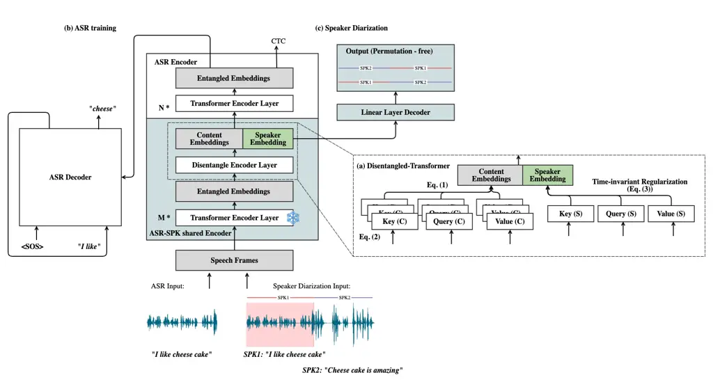
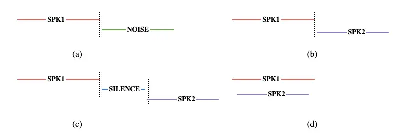
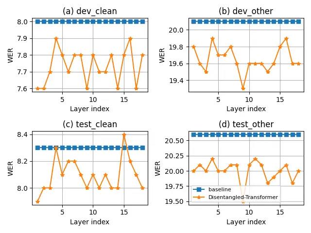
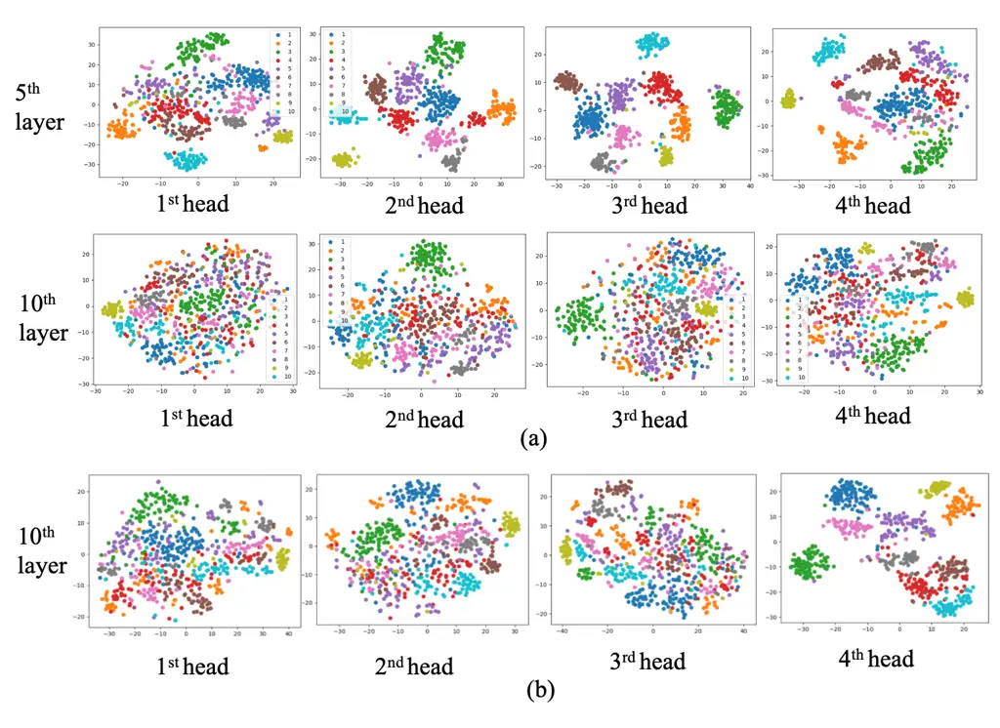
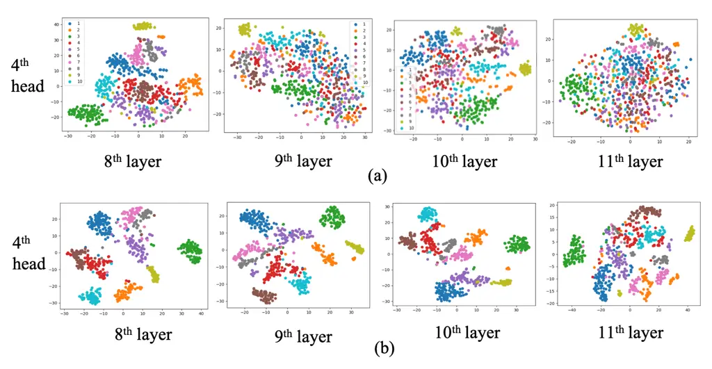

# Disentangled-Transformer: An Explainable End-to-End Automatic Speech Recognition Model with Speech Content-Context Separation Thanks: The research was supported by the Flemish Government under “Onderzoeksprogramma AI Vlaanderen” and FWO-SBO grant S004923N: NELF.

1^(st) Pu Wang Affiliation: Department of Electrical Engineering-ESAT  
KU Leuven  
Leuven, Belgium  
pu.wang@esat.kuleuven.be    2^(nd) Hugo Van hamme
Affiliation: Department of Electrical Engineering-ESAT  
KU Leuven  
Leuven, Belgium  
hugo.vanhamme@esat.kuleuven.be

###### Abstract

End-to-end transformer-based automatic speech recognition (ASR) systems
often capture multiple speech traits in their learned representations
that are highly entangled, leading to a lack of interpretability. In
this study, we propose the explainable Disentangled-Transformer, which
disentangles the internal representations into sub-embeddings with
explicit content and speaker traits based on varying temporal
resolutions. Experimental results show that the proposed
Disentangled-Transformer produces a clear speaker identity, separated
from the speech content, for speaker diarization while improving ASR
performance.

###### Index Terms: 

Explainable AI, Speech representation disentanglement, Speech
recognition, Speaker diarization.

## I Introduction

Modern automatic speech recognition (ASR) systems leverage data-driven
deep learning methods. The emergence of end-to-end (E2E) encoder-decoder
architectures, such as self-attention-based transformer models \[1, 2\],
has markedly enhanced recognition accuracy, paving the way for advanced
speech recognition applications like Google Home Assist, Apple Siri, and
more. However, deep learning methods are often perceived as “black
boxes”.

In particular, transformer-based speech models often capture multiple
speech traits in the learned representations at each encoder layer.
These traits are highly entangled—not only the intended speech content
(the actual linguistic information) but also speaker identity, dialect,
accent, emotion, background noise, and other contextual factors \[3, 4,
5, 6, 7\]. For example, researchers have observed speaker
characteristics and gender attributes in some of the learned
representations of the speech foundation model Wav2Vec 2.0 \[8, 9\],
leading to a lack of clear interpretability.

This lack of interpretability complicates the detection of flaws or
biases within ASR models when errors occur due to data mismatches.
Specifically, in the real world, speech data encompass significant
diversity, including variations in speakers, such as healthy speakers
versus dysarthric speakers, and speaking environments, for instance,
from a single-speaker lecture to dialogues involving multiple speakers
with overlapping speech. Research shows that training ASR models solely
on the majority “standard” speakers-typically adult, first-language
speakers without speech disabilities-results in notable disparities in
recognition accuracy across different speaker groups with diverse
sociolinguistic backgrounds \[10, 11, 12, 13, 14\]. For example, Wang et
al. \[15\] show that speech foundation models fine-tuned on one group of
dysarthric speakers exhibit significant fluctuations in recognition
performance when tested on other dysarthric groups. While the linguistic
information or speech content is expected to remain consistent across
different speakers, the model produces speech content-related
representations that are entangled with other speech traits not present
in the training data, such as speaker identity. Furthermore, studies
show that in well-trained transformer-based speech models,
representations extracted from certain attention heads in the first
several encoder layers form clear speaker and gender clusters, while
other layers or attention heads do not exhibit the same behavior \[3, 4,
5, 6, 7\]. This arbitrary and inconsistent entanglement can occur at
various components or layers within the model, making it challenging to
answer the question “Which aspects of the learned representations
contribute to fluctuations in recognition performance, and where in the
network architecture do they originate?”. Consequently, this
entanglement complicates efforts to improve the ASR model’s
generalization.



Fig. 1: Structure of (a) Disentangled-Transformer; (b) E2E ASR model
with Disentangled-Transformer (white rectangles); (c) E2E speaker
diarization model with shared ASR Disentangled-Transformer encoder (blue
rectangles).

In this study, we focus on enhancing the explainability of learned
representations in transformer-based E2E ASR models. We propose to
disentangle the internal representation of the ASR encoder into
sub-embeddings, with each sub-embedding explicitly correlated with a
specific speech trait (such as speaker identity), without compromising
ASR performance.

In existing work, speech representation disentanglement has been
primarily explored in speech editing or synthesis tasks. For instance,
Noé et al. \[16\] proposed disentangling the sex attribute from the
speaker representation to conceal personal information in a speech
privacy preservation task. Yang et al. \[17\] utilized mutual
information learning to disentangle speaker information in a one-shot
voice conversion (VC) task, enabling the conversion of speech content
from one speaker to another’s voice. Wang et al. \[18\] extended this
approach to disentangle accent and speaker features in an accent
transfer task, synthesizing speech with a specified accent. These
methods are typically built using adversarial vector-quantized
variational autoencoder (VQ-VAE) learning and reconstruction \[16, 17,
18, 19, 20, 21, 22, 23, 24\], which often come at the cost of reduced
speech content resolution and unstable training. Considering that the
main objective of this work is to enhance speech recognition, we avoid
incorporating additional signal reconstructors or training efforts.
Instead, we propose a simple yet effective approach to disentangle
speech representations within an ASR task.

In vanilla transformers, the self-attention operation efficiently
attends to all information across the full sequence simultaneously.
However, useful information changes at different rates: the what
(linguistic content) requires a resolution of a few tens of
milliseconds, while the who (speaker identity, dialect, foreign accent)
and how (speaking rate, formality, stress) vary at a slower pace.
Therefore, in this study, we propose to disentangle speech
trait-specific sub-embeddings based on the different temporal behaviors
of each trait. Specifically, we build a Disentangled-Transformer with
explicit content-embedding attention heads that capture the rapidly
varying embeddings, and a speaker-embedding attention head that captures
the slowly varying embeddings. This is implemented by introducing
time-invariant regularization to penalize rapid changes in the
speaker-embedding attention head of the encoder layer during ASR
training. This regularization can be applied to either a single layer or
the full set of encoder layers. To assess its explainability with
respect to disentangled speaker embedding, the Disentangled-Transformer
encoder is further shared with an E2E speaker diarization task by adding
a single linear decoder layer. It is evaluated under conditions
including single speaker and noise separation, two-speaker
non-overlapping diarization, and two-speaker fully-overlapping
separation.

In Section II, we first recapitulate the transformer architecture and
introduce the Disentangled-Transformer. The implementations for ASR and
speaker diarization are also detailed in this section. Section III
discusses the experimental setup and datasets used for evaluation, and
the corresponding results are presented in Section IV. In Section V we
will conclude our work.

## II Method

### II-A Transformer encoder

The transformer encoder is a layer-stacked model with each layer
containing one multi-head self-attention (MHSA) block and one
feed-forward block \[1\]. The output of the MHSA for the $`i`$-th frame
is a linear projection of the concatenated multi-scaled dot-product
self-attention operations as shown in (1)

```math
{MHSA}_{i}=W_{out}Concat(Attn^{1}_{i},Attn^{2}_{i},...Attn^{N}_{i}) \tag{1}
```

In each of the $`N`$ attention heads, the feature representation of the
sequential data is first linearly transformed into a sequence of Keys,
Values and Queries. The feature representation in the next layer is
built as a non-linear mapping of a weighted average of the Values. The
weight of each Value in the $`n^{th}`$ attention head is determined by
the similarity between the Key and the Query, as measured by a
dot-product (2).

```math
Attn^{n}_{i}=\sum_{j}S^{n}_{ij}V^{n}x_{j}\text{ with }S^{n}_{ij}=\text{Softmax}\left(\frac{x_{j}^{T}{K^{n}}^{T}Q^{n}x_{i}}{\sqrt{d_{k}^{n}}}\right) \tag{2}
```

where $`x`$ is the $`d`$-dimensional feature embedding of the previous
layer. $`Q^{n},K^{n}\in\mathbb{R}^{d_{k}^{n}\times d}`$,
$`V^{n}\in\mathbb{R}^{d_{v}^{n}\times d}`$ are the projection matrices
for Query, Key and Value in the $`n^{th}`$ attention head respectively.
$`d_{k}^{n}`$ is the width of the $`n^{th}`$ attention head.

### II-B Disentangled-Transformer

The idea of disentanglement is to partition the embedding from one
encoder layer into sub-embeddings with different temporal behaviour.

As shown in Figure 1 (a), the embeddings from the previous encoder layer
are disentangled into content embeddings $`c`$ and speaker embeddings
$`s`$ using separate Query, Key and Value projection matrices for
content related weights and speaker related weights. As explained in
Section I, content embeddings change rapidly over time, while speaker
embeddings remain stable for the same speaker. To achieve low temporal
variation in speaker embeddings $`s`$, time-invariant regularization
terms for $`s`$ in each time frame $`t`$ are added to the total loss
during training with the penalty scale $`\lambda_{s}`$
($`\lambda_{s}=0.1`$ is used by default):

```math
L_{s}=\lambda_{s}\frac{1}{L}\sum_{l}\frac{1}{\sqrt{d_{s}}}\sum_{t}(\sqrt{||s_{t+1}-s_{t}||^{2}}+\sqrt{||s_{t+5}-s_{t}||^{2}}) \tag{3}
```

where, $`l`$ indicates the index of the constrained layer (or
Disentangled-Transformer layer) within the transformer encoder,
$`d_{s}`$ is the dimension of the speaker embedding, and $`s_{t}`$ is
the speaker embedding at the $`t^{th}`$ frame.

With the constraint $`\sqrt{||s_{t+5}-s_{t}||^{2}}`$, the speaker
embeddings are encouraged to remain stable over 5 frames (typically 25
milliseconds per frame with a 10-millisecond frame shift), which is
longer than the average time resolution for uttering a phoneme. An
additional constraint with a time step 1
$`\sqrt{||s_{t+1}-s_{t}||^{2}}`$ is added to prevent periodic noise.
Here, we apply the constraint to a single attention head of the
Disentangled-Transformer layer, while the rest of the attention heads in
the same layer serve as content embeddings. The Disentangled-Transformer
layer can be applied to the single layer or the full set of layers in
the transformer encoder.

### II-C ASR with Disentangled-Transformer

The white rectangles in Figure 1 (b) illustrate the E2E ASR model, which
is built with stacked transformer layers and Disentangled-Transformer
layers as the encoder, and stacked transformer layers as the decoder. It
takes utterances from the single speaker as the inputs and generates
transcripts as the outputs.

The ASR model adopts a hybrid CTC/attention architecture from
ESPnet \[25, 26\], training with a combination of CTC loss $`L_{ctc}`$,
attention-based cross-entropy loss $`L_{attn}`$ and time-invariant
regularization $`L_{s}`$:

```math
L_{asr}=\alpha L_{ctc}+(1-\alpha)L_{attn}+L_{s} \tag{4}
```

We use $`\alpha=0.3`$ in this study. During decoding, CTC scores are
combined in one-pass beam search to further eliminate irregular
alignments.

### II-D Speaker diarization with Disentangled-Transformer

The blue rectangles in Figure 1 (c) illustrate the E2E speaker
diarization model. It takes utterances from at least one speaker as
input and indicates who speaks when.

The main target of speaker diarization task is to assess the
disentangled sub-embeddings. Therefore, it shares the
Dientangle-Transformer encoder with the ASR model and uses speaker
embeddings $`s`$ to estimate speaker(s)’ activities with a linear
decoder layer. The speaker diarization model predicts speaker activity
as binary multi-class labels $`\in{\{0,1\}}^{num_{spk}\times T}`$, where
$`num_{spk}`$ is the number of speakers. Therefore, it can model
overlapping speech by making the labels of overlapping speech frames all
active.

Both training and decoding are conducted in a permutation-free
manner \[27, 28\]. As shown in the “Output” rectangle in Figure 1 (c).
The speaker label itself is not the focus, rather, detecting speech
activity or speaker switches is more important.

## III Experimental Setup

### III-A Dataset

LibriSpeech100h is used for training the Disentangled-Transformer ASR
model. It contains 100 hours of read English speech derived from
audiobooks \[29\]. Each recording of LibriSpeech100h is utterance from
the single speaker. The ASR model is validated on dev and test splits:
dev clean, dev other, test clean and test other, they are named based on
the difficulty ASR systems may face in processing them. Each of the dev
and test sets contains about 5 hours of audio.

LibriMix is used for training and validating the
Disentangled-Transformer speaker diarization model. Each audio in
LibriMix data consists of one- or two-speaker mixture(s), with or
without noise. The speech utterances in LibriMix are taken from
LibriSpeech100h, dev, and test splits, and the noise samples are from
WHAM! \[30\]. During the evaluation phase, to avoid background noise in
the reference signals, we only use the speech from dev clean, and
test clean.

To stimulate realistic, conversation-like scenarios, we establish four
versions of datasets: (a) LibriMix 1.0: single speaker’s utterances,
non-overlapping, mixed with WHAM! noise; (b) LibriMix 2.0: two speakers’
utterances, non-overlapping, no-silence mixture; (c) LibriMix 3.0: two
speakers’ utterances, non-overlapping, with silence in the mixture; and
(d) LibriMix 4.0: two speakers’ utterances, fully overlapping. Examples
from these four datasets are shown in Figure 2. Mixtures of LibriMix
2.0, 3.0, and 4.0 are generated by randomly selecting utterances for
different speakers. The loudness of each utterance is uniformly sampled
between -25 and -33 LUFS.



Fig. 2: LibriMix example of: (a) LibriMix 1.0: single speaker’s
utterance, non-overlapping, mixed with WHAM! noise; (b) LibriMix 2.0:
two speakers’ utterances, non-overlapping, no-silence mixture; (c)
LibriMix 3.0: two speakers’ utterances, non-overlapping, with silence in
the mixture; and (d) LibriMix 4.0: two speakers’ utterances, fully
overlapping.

### III-B Implementation details

Both the ASR model and speaker diarization model are implemented with
ESPnet.

The ASR model is build with an 18-layer (Disentangled-)Transformer
encoder and a 6-layer transformer decoder. Each layer consists of a
4-head 64-dimensional MHSA and a feed-forward layer with the inner
dimensions of 1024. The Disentangled-Transformer layer(s) replaces one
or multiple transformer encoder layer(s) within the model. In the
Disentangled-Transformer layer, time-invariant regularization is applied
to the $`4^{th}`$ attention head as speaker embeddings $`s`$, while the
remaining three attention heads are used for content embeddings $`c`$.
The model is trained with default configurations specified in the
librispeech 100h recipe¹¹ 1
[https://github.com/espnet/espnet/tree/master/egs2/librispeech_100/asr1](https://github.com/espnet/espnet/tree/master/egs2/librispeech_100/asr1)..

The speaker diarization model is built with the shared ASR disentangled
encoder and a linear decoder layer. During training, all encoder
parameters are frozen except for the Dientangled-Transformer layer. The
default training configuration can be found in the librimix recipe²² 2
[https://github.com/espnet/espnet/tree/master/egs2/librimix/diar1](https://github.com/espnet/espnet/tree/master/egs2/librimix/diar1)..

### III-C Evaluation metrics

We report ASR performance using word error rate (WER(%)) and diarization
performance using diarization error rate (DER(%)) \[27, 28\] and speaker
error time (the total duration of incorrectly attributed speech in
seconds). When calculating the DER, collar tolerance of 0.0 sec and
median filtering of 11 frames are applied.

## IV Experimental Results

### IV-A ASR performance

As explained in Section I and Section III-B, the goal of this study is
to build an ASR model with explicitly disentangled speaker embeddings
without hurting its original ASR performance. Therefore, we use the
standard benchmark transformer ASR model which is built with an 18-layer
transformer encoder and a 6-layer transformer decoder, as the baseline.

We first substitute each transformer encoder layer of the benchmark
model with the Disentangled-Transformer layer, starting from the bottom
to the top. The WER results of each model are shown in Figure 3, where
the x-axis represents the layer index that is replaced with the
Disentangled-Transformer and the y-axis represents the WER.



Fig. 3: WER (%) as a function of indexed layers for the baseline
transformer (blue) and the proposed Disentangled-Transformer (orange) on
(a) dev clean; (b) dev other; (c) test clean; (d) test other, trained on
the Librispeech100h

In Figure 3, the blue dots record the benchmark results, and the orange
dots record the Disentangled-Transformer results. All
Disentangled-Transformer models significantly outperform the benchmark
model, except when replacing the $`15^{th}`$ encoder layer with
Disentangled-Transformer on test clean, which led to 0.1% performance
degradation. A potential reason for this, as suggested in \[31, 32\], is
that representations extracted from deeper layers in networks are less
likely to encode speaker information. This implies that the upper
layers, such as the $`15^{th}`$ encoder layer in this study, are
designed to focus more on spoken content and potentially discard speaker
information. While with a large penalty scale $`\lambda_{s}`$, more
speaker information is retained, which reduces the resolution of spoken
content. Therefore, a smaller penalty scale $`\lambda_{s}`$ is expected
to be more suitable for the upper layers when substituting a single
Disentangled-Transformer layer.

An alternative approach is to substitute multiple layers. By using the
average regularization loss $`L_{s}`$ across all replacement layers in
Eq. (3), the model can dynamically adjust the penalty distribution to
more suitable layers. Therefore, we further replace all the encoder
layers with Disentangled-Transformer. The WER results are summarized in
Table I. The results show that the proposed disentanglement operation
does not degrade the performance compared to the baseline. On the
contrary, the model benefits from the regularization and shows
improvement.



Fig. 4: T-SNE plots of embeddings extracted from each attention head of
different encoder layers of (a)baseline transformer and
(b)Disentangled-Transformer.

| Method                   | dev clean | dev other | test clean | test other |
| ------------------------ | --------- | --------- | ---------- | ---------- |
| Baseline transformer     | $`8.0`$   | $`20.1`$  | $`8.3`$    | $`20.6`$   |
| Disentangled-Transformer | $`7.8`$   | $`19.6`$  | $`8.1`$    | $`20.0`$   |

TABLE I: WER (%) for the baseline transformer and
Disentangled-Transformer, trained on Librispeech100h



Fig. 5: T-SNE plots of embeddings extracted from the $`4^{th}`$
attention head of (a)baseline transformer and
(b)Disentangled-Transformer.

To visualize the baseline entangled embeddings and disentangled
embeddings, we randomly select 8 minutes of speech from 10 speakers in
the test clean dataset and obtain the learned representations from each
attention head across different layers from both the baseline
transformer model and the Disentangled-Transformer model. The T-SNE
polts are shown in Figure 4, where each color represents one speaker. A
clustering pattern in the same color indicates clear speaker clustering.

From Figure 4 (a), we observe that in the baseline transformer, not
every attention head contains clear speaker information. For example,
the $`3^{nd}`$ attention head in the $`5^{th}`$ layer shows a clear
speaker pattern while different colors in the $`10^{th}`$ layer blend
together. This aligns with Section I that when we extract learned
representations from arbitrary layers and attention heads, it is
difficult to determine which specific speech traits are present in the
extracted representations, leading to a lack of explainability. In
contrast, after applying the time-invariant constraint to the $`4^{th}`$
attention head of the Disentangled-Transformer layer, the extracted
embeddings, as shown in Figure 4 (b) “$`10^{th}`$ layer $`4^{th}`$
head”, consistently show significant speaker patterns.

This is further verified by comparing the embeddings extracted from the
$`4^{th}`$ attention head in the $`8^{th}`$ to $`11^{th}`$ layers of
both the baseline transformer and the Disentangled-Transformer model.
The T-SNE results of 10 speakers are shown in Figure 5, where the
Disentangled-Transformer always shows clear speaker patterns, even in
the higher layers, which can serve as speaker embeddings. In contrast,
the baseline transformer model does not exhibit clear speaker
information.

### IV-B Speaker diarization performance

To further quantitatively assess the explainability of the disentangled
embeddings, the disentangled encoder trained on ASR targets is shared to
build a speaker diarization model for the Librimix dataset. The
benchmark model built in ESPnet is configured with 4 transformer encoder
layers \[27\], and we adopt a similar configuration, using 3 transformer
encoder layers and 1 Disentangled-Transformer layer at the top. Both
models are followed by a linear decoder layer trained for 5, and 10
epochs. The first 3 transformer encoder layers in the
Disentangled-Transformer are frozen during training, since the
Disentangled-Transformer can be seen as a pre-trained model (as all
speakers in LibriMix are also present in LibriSpeech100h). For a fair
comparison, we train a transformer ASR model on Librispeech100h without
the time-invariant constraint and use the same embeddings as the
Disentangled-Transformer for the LibriMix speaker diarization, we refer
it as “ASR-transformer” model. The performances on LibriMix 1.0-4.0 are
shown in Table II,III,IV,V.

| Method                   | 5 epochs  |            | 10 epochs |            |
| ------------------------ | --------- | ---------- | --------- | ---------- |
|                          | dev_clean | test_clean | dev_clean | test_clean |
| Benchmark Transformer    | $`19.5`$  | $`18.2`$   | $`7.6`$   | $`8.2`$    |
| Disentangled-Transformer | $`14.5`$  | $`12.7`$   | $`5.9`$   | $`5.7`$    |
| ASR-transformer          | $`19.8`$  | $`17.7`$   | $`7.5`$   | $`7.9`$    |

TABLE II: DER (%) for the Benchmark transformer,
Disentangled-Transformer, and ASR-transformer on LibriMix 1.0 over 5 and
10 epochs

| Method                   | 5 epochs   |            | 10 epochs |            |
| ------------------------ | ---------- | ---------- | --------- | ---------- |
|                          | dev_clean  | test_clean | dev_clean | test_clean |
| Benchmark Transformer    | $`2575.6`$ | $`2489.8`$ | $`77.9`$  | $`73.8`$   |
| Disentangled-Transformer | $`1631.4`$ | $`1602.6`$ | $`6.5`$   | $`6.9`$    |
| ASR-transformer          | $`2692.4`$ | $`3033.5`$ | $`92.7`$  | $`86.2`$   |

TABLE III: Speaker error time (sec) in total 28618.22 seconds speech
time for the Benchmark transformer, Disentangled-Transformer, and
ASR-transformer trained on LibriMix 2.0 over 5 and 10 epochs

| Method                   | 5 epochs  |            | 10 epochs |            |
| ------------------------ | --------- | ---------- | --------- | ---------- |
|                          | dev_clean | test_clean | dev_clean | test_clean |
| Benchmark Transformer    | $`16.87`$ | $`18.56`$  | $`7.05`$  | $`7.31`$   |
| Disentangled-Transformer | $`7.9`$   | $`8.7`$    | $`2.6`$   | $`2.5`$    |
| ASR-transformer          | $`20.4`$  | $`23.3`$   | $`8.8`$   | $`8.5`$    |

TABLE IV: DER (%) for the Benchmark transformer,
Disentangled-Transformer, and ASR-transformer trained on LibriMix 3.0
over 5 and 10 epochs

| Method                   | 5 epochs  |            | 10 epochs |            |
| ------------------------ | --------- | ---------- | --------- | ---------- |
|                          | dev_clean | test_clean | dev_clean | test_clean |
| Benchmark Transformer    | $`19.2`$  | $`19.4`$   | $`9.8`$   | $`9.0`$    |
| Disentangled-Transformer | $`10.7`$  | $`10.6`$   | $`5.6`$   | $`5.6`$    |
| ASR-transformer          | $`18.5`$  | $`21.6`$   | $`13.3`$  | $`12.9`$   |

TABLE V: DER (%) for the Benchmark transformer,
Disentangled-Transformer, and ASR-transformer trained on LibriMix 4.0
over 5 and 10 epochs

From these Tables, Disentangled-Transformer significantly outperforms
both the benchmark transformer and the ASR-transformer, thanks to the
explicit speaker embeddings. Pre-training on ASR target does not help
the ASR-Transformer to achieve better performance compared to the
benchmark transformer.

## V Conclusion

End-to-end encoder-decoder-based ASR models lack interpretability due to
the entangled representations captured in each encoder layer. We
therefore propose disentangling the internal representations into
explicit content embeddings and speaker embeddings based on the
different temporal behaviors of these two speech traits. Experimental
results on the speaker diarization task show that the
Disentangled-Transformer-based ASR model is more interpretable, with
clear speaker identity captured in a specific disentangled attention
head.

## Acknowledgment

The research was supported by the Flemish Government under
“Onderzoeksprogramma AI Vlaanderen” and FWO-SBO grant S004923N: NELF.

## References

- \[1\] Ashish Vaswani et al. “Attention is all you need” In _Advances
  in neural information processing systems_ 30, 2017
- \[2\] Anmol Gulati et al. “Conformer: Convolution-augmented
  Transformer for Speech Recognition” In _Interspeech 2020_, 2020
- \[3\] Ankita Pasad, Ju-Chieh Chou and Karen Livescu “Layer-wise
  analysis of a self-supervised speech representation model” In _2021
  IEEE Automatic Speech Recognition and Understanding Workshop (ASRU)_,
  2021, pp. 914–921
- \[4\] Chi-Luen Feng, Po-chun Hsu and Hung-yi Lee “Silence is sweeter
  than speech: Self-supervised model using silence to store speaker
  information” In _arXiv preprint arXiv:2205.03759_, 2022
- \[5\] Zhengyang Chen et al. “Large-scale self-supervised speech
  representation learning for automatic speaker verification” In _ICASSP
  2022_, 2022, pp. 6147–6151
- \[6\] Sanyuan Chen et al. “Why does Self-Supervised Learning for
  Speech Recognition Benefit Speaker Recognition?” In _Interspeech
  2022_, 2022, pp. 3168–3172
- \[7\] Sanyuan Chen et al. “Wavlm: Large-scale self-supervised
  pre-training for full stack speech processing” In _IEEE Journal of
  Selected Topics in Signal Processing_ 16.6, 2022, pp. 1505–1518
- \[8\] Zhiyun Fan, Meng Li, Shiyu Zhou and Bo Xu “Exploring wav2vec 2.0
  on speaker verification and language identification” In _Interspeech
  2021_, 2021
- \[9\] Kwanghee Choi and Eun Yeo “Opening the black box of wav2vec
  feature encoder” In _arXiv preprint arXiv:2210.15386_, 2022
- \[10\] Yuanyuan Zhang et al. “Exploring data augmentation in bias
  mitigation against non-native-accented speech” In _2023 IEEE Automatic
  Speech Recognition and Understanding Workshop (ASRU)_, 2023
- \[11\] Mahault Garnerin, Solange Rossato and Laurent Besacier
  “Investigating the impact of gender representation in ASR training
  data: A case study on librispeech” In _3rd Workshop on Gender Bias in
  Natural Language Processing_, 2021, pp. 86–92 Association for
  Computational Linguistics
- \[12\] Yuanyuan Zhang et al. “Mitigating bias against non-native
  accents.” In _Interspeech 2022_, 2022, pp. 3168–3172
- \[13\] Hemant Kathania, Sudarsana Kadiri, Paavo Alku and Mikko Kurimo
  “Study of formant modification for children ASR” In _ICASSP 2020_,
  2020, pp. 7429–7433
- \[14\] Martijn Bartelds et al. “Making More of Little Data: Improving
  Low-Resource Automatic Speech Recognition Using Data Augmentation” In
  _Proceedings of the 61st Annual Meeting of the Association for
  Computational Linguistics (Volume 1: Long Papers)_, 2023, pp. 715–729
- \[15\] Pu Wang and Hugo Van “Benefits of pre-trained mono-and
  cross-lingual speech representations for spoken language understanding
  of Dutch dysarthric speech” In _EURASIP Journal on Audio, Speech, and
  Music Processing_ 2023.1, 2023, pp. 15
- \[16\] Paul-Gauthier Noé et al. “Adversarial Disentanglement of
  Speaker Representation for Attribute-Driven Privacy Preservation” In
  _Interspeech 2021_, 2021
- \[17\] Sicheng Yang et al. “Speech Representation Disentanglement with
  Adversarial Mutual Information Learning for One-shot Voice Conversion”
  In _Interspeech 2022_, 2022
- \[18\] Linqin Wang et al. “Non-parallel Accent Transfer based on
  Fine-grained Controllable Accent Modelling” In _Findings of the
  Association for Computational Linguistics: EMNLP 2023_, 2023, pp.
  9288–9298
- \[19\] Andros Tjandra, Sakriani Sakti and Satoshi Nakamura
  “Transformer VQ-VAE for Unsupervised Unit Discovery and Speech
  Synthesis: ZeroSpeech 2020 Challenge” In _Interspeech 2020_, 2020
- \[20\] Hui Lu, Xixin Wu, Zhiyong Wu and Helen Meng “SpeechTripleNet:
  End-to-End Disentangled Speech Representation Learning for Content,
  Timbre and Prosody” In _Proceedings of the 31st ACM International
  Conference on Multimedia_, 2023, pp. 2829–2837
- \[21\] Adam Polyak et al. “Speech Resynthesis from Discrete
  Disentangled Self-Supervised Representations” In _Interspeech 2021_,
  2021
- \[22\] Jennifer Williams, Yi Zhao, Erica Cooper and Junichi Yamagishi
  “Learning disentangled phone and speaker representations in a
  semi-supervised VQ-VAE paradigm” In _ICASSP 2021_, 2021, pp. 7053–7057
- \[23\] Magdalena Proszewska et al. “GlowVC: Mel-spectrogram space
  disentangling model for language-independent text-free voice
  conversion” In _Interspeech 2022_, 2022
- \[24\] Tianchi Liu, Kong Lee, Qiongqiong Wang and Haizhou Li
  “Disentangling voice and content with self-supervision for speaker
  recognition” In _Advances in Neural Information Processing Systems_
  36, 2023, pp. 50221–50236
- \[25\] Shinji Watanabe et al. “Hybrid CTC/attention architecture for
  end-to-end speech recognition” In _IEEE Journal of Selected Topics in
  Signal Processing_ 11.8, 2017, pp. 1240–1253
- \[26\] Shinji Watanabe et al. “ESPnet: End-to-End Speech Processing
  Toolkit” In _Interspeech 2018_, 2018
- \[27\] Yusuke Fujita et al. “End-to-end neural speaker diarization
  with self-attention” In _2019 IEEE Automatic Speech Recognition and
  Understanding Workshop (ASRU)_, 2019, pp. 296–303
- \[28\] Soumi Maiti et al. “EEND-SS: Joint end-to-end neural speaker
  diarization and speech separation for flexible number of speakers” In
  _2022 IEEE Spoken Language Technology Workshop (SLT)_, 2023, pp.
  480–487
- \[29\] Vassil Panayotov, Guoguo Chen, Daniel Povey and Sanjeev
  Khudanpur “Librispeech: an asr corpus based on public domain audio
  books” In _ICASSP 2015_, 2015, pp. 5206–5210
- \[30\] Joris Cosentino et al. “Librimix: An open-source dataset for
  generalizable speech separation” In _arXiv preprint arXiv:2005.11262_,
  2020
- \[31\] Pierre Champion, Denis Jouvet and Anthony Larcher “Are
  disentangled representations all you need to build speaker
  anonymization systems?” In _Interspeech 2022_, 2022
- \[32\] Yossi Adi et al. “To reverse the gradient or not: An empirical
  comparison of adversarial and multi-task learning in speech
  recognition” In _ICASSP 2019_, 2019, pp. 3742–3746
