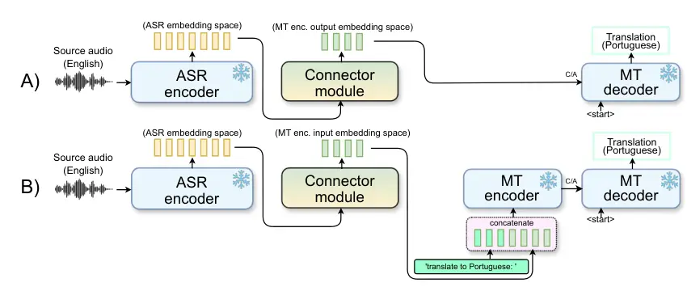
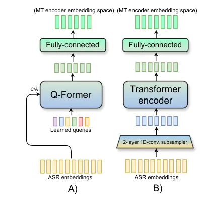

# Aligning Pre-trained Models for Spoken Language Translation

Šimon Sedláček    Santosh Kesiraju    Alexander Polok    Jan Černocký
Affiliation: Speech@FIT, Brno University of Technology, Czechia
Email: [{isedlacek,kesiraju,ipoloka,cernocky}@fit.vut.cz](mailto:)

###### Abstract

This paper investigates a novel approach to end-to-end speech
translation (ST) based on aligning frozen pre-trained automatic speech
recognition (ASR) and machine translation (MT) models via a small
connector module (Q-Former, our Subsampler-Transformer Encoder). This
connector bridges the gap between the speech and text modalities,
transforming ASR encoder embeddings into the latent representation space
of the MT encoder while being the only part of the system optimized
during training. Experiments are conducted on the How2
English-Portuguese dataset as we investigate the alignment approach in
a small-scale scenario focusing on ST. While keeping the size of the
connector module constant and small in comparison (\< 5% of the size of
the larger aligned models), increasing the size and capability of the
foundation ASR and MT models universally improves translation results.
We also find that the connectors can serve as domain adapters for the
foundation MT models, significantly improving translation performance in
the aligned ST setting. We conclude that this approach represents
a viable and scalable approach to training end-to-end ST systems.

## 1 Introduction

The task of speech translation (ST) is typically addressed by using
either a composite cascade ST system built from pre-trained automatic
speech recognition (ASR) and machine translation (MT) models, or by
training an end-to-end model, typically based on the transformer Vaswani
et al. (2017) architecture. However, both approaches have their caveats.
Cascade systems can sometimes suffer from error accumulation due to
potential domain and vocabulary mismatch of the foundation models,
amplified by first transcribing the input utterance and only
subsequently translating it. While end-to-end ST systems alleviate such
issues, training them from scratch requires more ST data, often
employing several pre-training stages and techniques involving transfer
learning and additional model supervision, to obtain better results
Inaguma et al. (2020); Kesiraju et al. (2023).

This work attempts to strike a middle-ground between the two ST
approaches, aiming at leveraging frozen pre-trained ASR and MT models
joined by a small connector module, bridging the gap between their
respective representation spaces.

### 1.1 Related works

A trend for this paradigm was set by Li et al. (2023), where a connector
network called Q-Former was used to map abstract image representations
from a frozen image encoder into the word embedding space of a large
language model (LLM), generating text annotations. During training, the
foundation models remain frozen and only the connector is trained,
decreasing the cost of the training process considerably. Other works
have subsequently adopted a similar approach to address different
cross-modal tasks Chen et al. (2023a); Dai et al. (2023); Zhang et al.
(2023); Lyu et al. (2023); Alayrac et al. (2022); Su et al. (2023); Chen
et al. (2023b).

The same model alignment paradigm has also been adopted for ASR and
other speech-oriented tasks. In Yu et al. (2023), the Q-Former is used
to join large ASR encoders and LLMs for the ASR task. Similarly,
a linear-projection connector with either a convolutional downsampling
or CTC compression frontend was used in Hono et al. (2023) for the same
purpose. In Wang et al. (2023), a large-scale multi-task training
approach was used to enhance the capabilities of an instruction-tuned
LLM to understand speech inputs, utilizing a transformer connector with
stochastic downsampling.

While these works all follow a similar approach, training the connector
network, the focus is on ASR or other general large-scale
speech-language tasks. In this work, we adopt the alignment approach on
a much smaller scale with a sole focus on ST. For ST, utilizing
a Q-Former-like connector network to bridge the gap between the speech
and text modalities of frozen ASR and MT models is attractive for a few
reasons. As opposed to training a conventional end-to-end ST model, the
connector network can be much smaller with much fewer parameters.
Moreover, even if the aligned pre-trained models are very powerful, the
connector only has to learn an approximate mapping between their
respective hidden representation spaces. Since only the connector
parameters are optimized, training runs are shorter and require fewer
computational resources, in contrast to conventional end-to-end models
of similar sizes.

### 1.2 Findings and contributions

- •
  The presented alignment framework (Section 2) is a viable and generic
  approach to solving speech translation (Sections 6, 7).
- •
  We find that our STE connector (Section 3.2) is superior to the
  Q-Former for our ST alignment scenario due its variable-length mapping
  capability, as determining an appropriate number of the Q-Former
  queries is difficult in comparison (Section 6.3).
- •
  Scaling up the aligned ASR and MT models leads to universally better
  speech translation results, while the size of the connector network
  can remain constant, and relatively small (Section 7).
- •
  The connector networks can serve as domain adapters, significantly
  improving translation performance for scenarios, where the aligned MT
  models are out-of-domain (Section 7.1).
- •
  We also study the effectiveness of the proposed framework under
  simulated low-resource scenarios (Section 8).

## 2 Alignment architectures

We experiment with two general alignment architectures, differing in the
configuration of the frozen MT model, as shown in Figure 1. For both
architectures, only the encoder part of the ASR model is used. Both
architectures are trained using the standard cross-entropy loss
objective at the output of the MT decoder.

### 2.1 ECD

The first alignment architecture (Figure 1A) –
_Encoder-Connector-Decoder_ (ECD) -- consists of a frozen ASR encoder,
which extracts hidden audio representations from the source speech
audio. These representations are then passed to a connector module,
whose outputs are further projected to the dimension of the frozen MT
decoder via a fully-connected layer -- the connector is used to align
the ASR encoder output embedding space with the output embedding space
of the MT encoder, essentially overtaking the responsibilities of the
removed MT encoder, while simultaneously adapting to the speech
modality¹¹ 1 We find that if the connector and MT encoder architectures
match, initializing the connector weights with the original MT encoder
marginally speeds up convergence. No performance gains were observed..

### 2.2 ECED

In the second _Encoder-Connector-Encoder-Decoder_ (ECED) setting
(Figure 1B), the connector module projects the speech embeddings into
the input word embedding space of the MT encoder. Here, the modality gap
between the output ASR embeddings and the input MT encoder text
embeddings should be narrower to the ECD case, as the connector only has
to propagate the raw textual information contained in the embeddings to
the MT encoder. a similar approach was explored in Wang et al. (2023),
where aligning the speech encoder with a language model from the
T5 Raffel et al. (2020) family allowed the authors to leverage the
original multi-task and reasoning capabilities of the foundation
multi-lingual language model, only enhanced in that the final model
could also process speech inputs. This encompasses first taking the
instruction prompt (‘translate to Portuguese:’), embedding it with the
MT encoder embedding layer, and prepending these instruction embeddings
to the connector module outputs.



Figure 1: Diagram of the ECD (A) and the ECED (B) alignment
architectures for ST. Modules annotated with the ‘\*‘ symbol are frozen.
In the ECD scenario, the connector outputs are passed directly to the
cross-attention (C/A) connection of the MT decoder. For the ECED
architecture, the connector outputs are directly injected past the input
embedding layer of the MT encoder. Additional task prompt word
embeddings can be prepended to the connector outputs before entering the
MT encoder.

## 3 Connector modules

This section presents the two connector modules used in our alignment
experiments: the Q-Former and our STE connector.

### 3.1 Q-Former

The Q-Former Li et al. (2023) (Figure 2A) is a simple transformer model,
which uses a sequence of trainable _queries_
$`\mathbf{Q}\in\mathbb{R}^{d_{q}\times n_{q}}`$ as input ($`d_{q}`$ is
the query dimension, $`n_{q}`$ is the number of queries used, which is
a hyperparameter). These queries interact with the supplied speech
embedding sequence $`\mathbf{S}\in\mathbb{R}^{d_{s}\times n_{s}}`$ via
cross-attention, extracting relevant information and transforming it
into the MT model representation space. The Q-Former therefore performs
a variable to fixed-length sequence mapping, where the information
density in the output query sequence $`\mathbf{Q}^{\prime}`$ is directly
correlated to the number of queries used $`n_{q}`$. Apart from the
fixed-length mapping performed by the Q-Former, it should also be noted
that the self-attention layer in the first decoder block operates only
on the raw queries, providing no value in the transformation process.
The Q-Former has previously been adopted in the ASR context Yu et al.
(2023), therefore we treat it as a baseline connector in our
experiments.



Figure 2: Diagram of the two connector modules. Variant A) is the
Q-Former, variant B) is the STE connector.

### 3.2 STE connector

Additionally, we experiment with another connector variant inspired
by Wang et al. (2023); Hono et al. (2023) (Figure 2B). This variant
addresses the fixed-length mapping of the Q-Former by introducing
a convolutional subsampling layer in replacement of the queries and
cross-attention connection, and we, therefore, refer to it as the ‘STE‘
connector (Subsampler-Transformer Encoder).

The subsampling layer is used to reduce the time dimension granularity
of the supplied ASR embeddings to better match the granularity and
information density of the token sequences processed by the MT model.
In Hono et al. (2023), CTC compression and convolutional downsampling
are explored, evaluating the convolutional approach as superior. In Wang
et al. (2023), similar subsampling is done by stochastically discarding
a fourth of the ASR embeddings. Our subsampling module is a 2-layer
stack of 1D convolutions, reducing the length of the input speech
embedding sequence $`\mathbf{S}\in\mathbb{R}^{d_{s}\times n_{s}}`$ by
a factor of 4, and simultaneously projecting the embeddings into the
hidden size $`d_{c}`$ of the connector:

```math
\mathbf{S}^{\prime}\in\mathbb{R}^{d_{c}\times n_{s}/4}=\text{Conv}(\mathbf{S}).\vskip-8.53581pt \tag{1}
```

The subsampler was inspired by the 1D conv. frontend used for ASR
systems in Wang et al. (2020). The subsampler is then followed by
a stack of transformer encoder blocks, and finally, the output
embeddings are projected into the MT model dimension $`d_{t}`$ by
a fully-connected layer.

## 4 Experimental setup

We conduct our experiments within the Hugging Face Transformers Wolf
et al. (2020) ecosystem, which allows us to easily access and reuse
various pre-trained off-the-shelf ASR and MT models for our experiments.
All training runs were done on a single Nvidia RTX A5000 24GB GPU, with
most alignment runs lasting around 10 hours on average, depending on the
sizes of the foundation models.

### 4.1 Data and evaluation

All models in this work are trained and evaluated using the How2 dataset
Sanabria et al. (2018). How2 is a multi-modal dataset of English
instructional videos, containing a smaller 300-hour audio subset with
crowd-sourced Portuguese translations, for which the two validation and
test partitions (val, test) both total just under 4 hours of speech
data. How2 is a commonly used standard benchmark dataset for MT and ST
systems Niehues et al. (2019); Inaguma et al. (2020); Vydana et al.
(2021); Kesiraju et al. (2023). As the data is relatively clean, it is
considered to be appropriate for studying and evaluating various
approaches for ST.

For our ASR models, we report normalized WER. Our translation models are
evaluated using 4-gram BLEU²² 2
case:mixed\|tok:13a\|ngram:4\|smooth:False Papineni et al. (2002) and
chrF2³³ 3
case:mixed\|char_o:6\|word_o:0\|$`\beta`$:2\|whtspc:False\|eps_smooth:False
scores Popović (2015) as implemented in the Hugging Face Evaluate v0.4.0
library.

## 5 Foundation and baseline models

To better ground our results, we take inspiration from ESPnet Inaguma
et al. (2020) How2 recipes⁴⁴ 4
[https://github.com/espnet/espnet/tree/master/egs/how2](https://github.com/espnet/espnet/tree/master/egs/how2)
and use the best-performing transformer models as reference points when
establishing our ASR, MT and ST baseline systems. We use these reference
models to evaluate our alignment methods in a more restricted in-domain
scenario on the How2 dataset, and subsequently also choose other, more
powerful off-the-shelf pre-trained ASR and MT models to evaluate the
alignment approach in a more general scenario, exploring the
dimensionality and domain adaptation capabilities of the connectors.

### 5.1 ASR models

For our reference ASR system (referred to as E-Branchformer small), we
train a small 12-layer E-Branchformer Kim et al. (2022) model with
a 6-layer transformer decoder for English ASR on the How2 dataset. The
model uses 4 attention heads, $`d_{\text{model}}`$ of 256, and
a lower-cased unigram Kudo (2018) sub-word vocabulary of size 5000 with
punctuation removed. In accordance to the ESPnet reference, an
additional CTC objective Karita et al. (2019) with a weight of 0.3 is
used alongside the standard cross-entropy loss. We use 80-dimensional
log-mel-filterbanks as features. Speed perturbation in factors \[0.9,
1.0, 1.1\] as well as SpecAugment Park et al. (2019) in the ‘LD’
strategy were applied during training. The final model achieves 12.2%
WER on the test set, as shown in Table 1.

| Model                        | WER  | Params. | $`d_{\text{model}}`$ |
| ---------------------------- | ---- | ------- | -------------------- |
|                              | test |         |                      |
| CTC/attn. E-Branch. small    | 12.2 | 38.5M   | 256                  |
| CTC/attn. E-Branch. medium   | 11.7 | 174M    | 512                  |
| Whisper-small.en             | 7.9  | 242M    | 768                  |
| ESPnet CTC/attn. transformer | 13.0 | 30M     | 256                  |

Table 1: WER performance of the foundation ASR systems evaluated on the
How2 test set. The E-Branchformer small and ESPnet reference models were
trained solely using How2 data, the E-Branchformer medium was not. The
ESPnet system is included for reference.

For the off-the-shelf models, we choose two models that have not
previously seen any of the How2 data. First, we use a scaled-up version
of our baseline CTC/attn. ASR system – 16-layer E-Branchformer model
with an 8-layer decoder and $`d_{\text{model}}`$ of 512. This model was
trained on 6k hours of English data, described in Appendix A along with
evaluation results. As shown in Table 1, the model achieves 11.7% WER on
the test set without fine-tuning, but we hope to leverage its
representation-building capabilities in our alignment experiments. It
will be further referred to as E-Branchformer medium. Lastly, we use
OpenAI Whisper-small.en Radford et al. (2023) as our last and most
powerful foundation ASR model, achieving 7.9% WER on the test set.

### 5.2 MT models

Our baseline MT system adopts the MarianMT Junczys-Dowmunt et al. (2018)
transformer implementation available in Hugging Face Transformers.
Again, following the ESPnet How2 recipes, both the encoder and decoder
consist of 6 layers with 4 attention heads, $`d_{\text{model}}`$ of 256,
and intermediate layer size of 2048. The source and target word
embedding layers were untied in accordance with Inaguma et al. (2020).
The system was trained in a true-cased to true-cased manner with both
the source and target BPE-based Gage (1994) vocabularies containing 8000
word units. As shown in Table 2, the model achieves 57 BLEU on the How2
test set, matching the results of ESPnet.

| Model          | BLEU |      | Params. | $`d_{\text{model}}`$ |
| -------------- | ---- | ---- | ------- | -------------------- |
|                | val  | test |         |                      |
| MarianMT small | 57.9 | 57.0 | 21.6M   | 256                  |
| T5 En-Pt       | 40.0 | 38.8 | 223M    | 768                  |

Table 2: BLEU performance of the foundation MT systems, evaluated on the
How2 test set. The MarianMT model was trained on How2, the T5 model is
out-of-domain on the How2 dataset.

Additionally, we select an En-Pt MT model based on the T5 Raffel et al.
(2020) architecture from Lopes et al. (2020). The model was based on the
English T5-base checkpoint, which was first pre-trained on Portuguese
language Carmo et al. (2020), and then fine-tuned for English to
Portuguese translation on a 5M English-Portuguese sentence subset of
ParaCrawl Esplà et al. (2019), as well as domain-specific data in
preparation for the WMT19 and WMT20 biomedical translation tasks. The
encoder and decoder consist of 12 layers with a $`d_{\text{model}}`$ of 768. This MT model is out-of-domain on How2, achieving ‘only’ 38.8 BLEU
on the test set. However, we chose it in hopes of being able to leverage
its Portuguese text-generation capabilities in our alignment
experiments. The model is freely available on Hugging Face⁵⁵ 5
[https://huggingface.co/unicamp-dl/translation-en-pt-t5](https://huggingface.co/unicamp-dl/translation-en-pt-t5)
and will be further referred to as simply the T5 model.

### 5.3 ST baselines

From our E-Branchformer small and MarianMT models trained on How2, we
construct two baseline ST systems. First, we once again adopt the ESPnet
approach on How2, where we use the ASR encoder and MT decoder of the
foundation systems to initialize the encoder and decoder of the ST
system. The vocabulary of the decoder is the same true-cased BPE
vocabulary used by the MarianMT model. The system is then trained for
a maximum of 40 epochs with a learning rate of $`1\text{e}^{-3}`$, 10000
warm-up steps, batch size of 128, and early stopping to avoid
overfitting. SpecAugment is no longer used, however, we keep the speed
perturbation with the same factors of \[0.9, 1.0, 1.1\]. The encoder is
kept frozen for the first 8 epochs of training. This baseline system
achieves 45.6 and 45.2 BLEU on the val and test How2 subsets,
respectively, which is on par with the results of the reference ESPnet
system, as shown in Table 3.

This E2E system represents the more robust, although more costly
solution to the ST task, obtaining good performance using a small model,
which employs only one decoding step and does not suffer from any domain
mismatch. However, optimizing all the model parameters is necessary to
get the best results, leading to bigger resource consumption if the
model were to scale up.

|                                                                |      |      |
| -------------------------------------------------------------- | ---- | ---- |
| Baseline ST system                                             | BLEU |      |
|                                                                | val  | test |
| E-Branchformer E2E (ASR + MT init.)                            | 45.6 | 45.2 |
| Cascade (Ebr. ASR $`\rightarrow`$ tc $`\rightarrow`$ MarianMT) | 40.9 | 40.4 |
| ESPnet transformer reference                                   | \-   | 45.7 |

Table 3: Comparison of both trained and reference ST systems. The ESPnet
reference is an E2E transformer system, utilizing the same ASR+MT
initialization approach as our E-Branchformer end-to-end system.

Table 3 also shows a cascade ST system we construct from the same
E-Branchformer small and MarianMT models. Because the vocabularies of
the models are mismatched both in size and in casing, we take
a pre-trained T5-based English casing and punctuation restoration model
from Hugging Face⁶⁶ 6
[https://huggingface.co/SJ-Ray/Re-Punctuate](https://huggingface.co/SJ-Ray/Re-Punctuate)
and use it to process the ASR transcriptions before translating them
with the MT model. Our cascade system represents a *naive* but cheap
solution to the ST task, as no parameters have to be tuned. However, the
system has to perform three decoding steps and the overall performance
suffers from error accumulation. The model only achieves 40.4 BLEU on
the test set, though the chrF2 scores reported later in Table 4 paint
the model in a more positive light.

## 6 Alignment architecture evaluation

In the first set of alignment experiments, we evaluate the two alignment
architecture variants (ECD, ECED) in conjunction with both of the
connector network types (Q-Former, STE). These experiments aim to
primarily determine the viability of the aligning approach to training
ST systems as a whole, juxtaposing them against the baseline methods. On
top of that, we test the effects of using different numbers of layers in
the connector. Unless specified otherwise, all aligned models are
trained for a maximum of 70 epochs with 15000 warm-up steps, a batch
size of 128, and a peak learning rate of $`2e^{-4}`$. We adopt early
stopping to avoid overfitting and apply speed perturbation with the
factors of \[0.9, 1.0, 1.1\]. Other than the layer count, the connector
network parameters are kept constant, with a $`d_{\text{model}}`$ of
256, 4 attention heads, and intermediate layer size of 2048, keeping the
Q-Former query count at 100. The results are shown in Table 4,
Appendix B then contains the full Table 8.

|               |     |     |       |           |      |            |      |
| ------------- | --- | --- | ----- | --------- | ---- | ---------- | ---- |
| Arch.         | C   | L   | \#P   | How2 BLEU |      | How2 chrF2 |      |
|               |     |     |       | val       | test | val        | test |
| ECD           | Q   | 6   | 9.6M  | 44.0      | 43.9 | 65.0       | 64.8 |
|               | STE | 6   | 10.7M | 45.0      | 44.8 | 66.0       | 65.8 |
|               | STE | 4   | 7.9M  | 44.1      | 44.4 | 65.3       | 65.3 |
| ECED          | Q   | 6   | 9.6M  | 44.1      | 44.2 | 65.3       | 65.2 |
|               | STE | 6   | 10.7M | 44.7      | 44.8 | 65.8       | 65.9 |
| E-Branch. E2E |     |     | 38.5M | 45.6      | 45.2 | 66.6       | 66.1 |
| Cascade       |     |     | \-    | 40.9      | 40.4 | 64.4       | 64.1 |

Table 4: Alignment architecture comparison for the E-Branchformer small
and MarianMT foundation models. Both connectors have
$`d_{\text{model}}`$ of 256, the Q-Former uses 100 queries. Headers C,
L, and \#P denote the connector type, connector layers and number of
trainable parameters, respectively.

### 6.1 ECD evaluation

As is shown in the first half of Table 4 the STE connector outperforms
the Q-Former by a significant margin, almost matching the performance of
the baseline E2E system, achieving 45.0 and 44.8 BLEU on the val and
test sets, respectively. It could be argued, that the STE connector
perhaps benefits too much from the parameters added by the convolutional
subsampler, however, even the 4-layer STE configuration still
outperforms the 6-layer Q-Former, suggesting that the problem lies
probably in the way the Q-Former represents and extracts information
from the input speech embeddings. This is further analyzed in
Section 6.3. We also find that the STE training process is more stable
and ‘well-behaved‘ than the one of the Q-Former, with faster convergence
and fewer spikes in validation metrics during training.

### 6.2 ECED evaluation

For the ECED architecture, the performance falloff is not as stark when
decreasing the number of connector layers, compared to ECD. The best
model once again uses the 6-layer STE connector, with results on par
with the equivalent ECD configuration, achieving 44.7 and 44.8 BLEU on
the val and test sets, respectively. The Q-Former maintains better
results in contrast to the ECD architecture, reinforcing the hypothesis
that the mapping problem for the ECED architecture is a simpler one to
that of ECD.

Concluding for both architectures, most of the aligned models outperform
our cascade baseline. Though none of them surpass the E2E baseline
system, comparable performance is obtained only tuning a small module
with less than a quarter of the parameters of the E2E system. This
indicates that there is potential in the alignment approach to ST, and
we further explore what can be achieved by scaling up the foundation ASR
and MT models in Section 7.

### 6.3 Evaluating the connectors on different input lengths

As the STE connector outperforms the Q-Former in previous experiments,
we argue that this stems from the variable to fixed-length mapping
performed by the Q-Former, directly defined by the number of queries
used. Contrary to Yu et al. (2023), we find that both choosing this
number to be too low (40 - 60) or too high (128+) comes with performance
degradation, as the Q-Former either does not have enough queries to
represent the necessary information or is unable to distribute it among
the queries effectively. We find that for every foundation model
configuration, there is a sweet spot for the number of queries used,
which has to be experimentally determined. On the contrary, the STE
connector output length is always monotonously correlated to the amount
of represented information, reducing the risk of propagating noise to
the downstream MT model.

To better demonstrate the Q-Former performance degradation, we train
five models with 40, 60, 80, 100, and 128 queries in the E-Branchformer
small/MarianMT ECD configuration and compare them to the best STE model
from Section 6.1. For this purpose, we partition the val and test sets
into four subsets by utterance lengths: 0 - 5, 5 - 10, 10 - 15, and
15 - 20 seconds. Because the majority of How2 concentrates in the 0 to
10-second range, the two long-utterance splits are considerably smaller
than the two shorter ones. However, we think the results show a clear
trend beyond any potential errors stemming from the smaller amounts of
test data (though the effect could probably be mitigated by adding
longer utterances to the training set). To obtain the final BLEU value
for each sub-split, the scores obtained for the val and test splits are
averaged to better illustrate the overall performance decline trend of
each evaluated system. The comparison is shown in Figure 3.

Figure 3: Performance study of the STE connector and the Q-Former (with
varying numbers of queries) in relation to input utterance lengths. The
final BLEU score is obtained by averaging BLEUs computed for both the
val and test How2 sets.

## 7 Foundation model scaling

We investigate the prospect of aligning different off-the-shelf
(possibly out-of-domain) pre-trained ASR and MT models, aiming to
improve ST performance by increasing the capability of the aligned
models. Ideally, the alignment process would overcome any domain
mismatch that would appear if the same systems were used as parts of
a cascade ST system⁷⁷ 7 We do not build a cascade system using the T5
model, as its performance on How2 is impaired (Table 2) by domain
mismatch, leaving no hope for good cascade ST results..

The size of the connector network is kept the same as in previous
experiments (6 layers, $`d_{\text{model}}`$ of 256), allowing for
shorter and more stable training runs. It could be argued that
a connector with a $`d_{\text{model}}`$ closer to that of the foundation
models would yield better performance, however, we argue that such
behavior is expected and the more interesting finding is that the
connector can, in fact, be much smaller than either of the foundation
models, while still bringing ST performance improvements when scaling up
the ASR and MT models.

|                             |           |                  |         |         |           |                      |           |      |            |      |
| --------------------------- | --------- | ---------------- | ------- | ------- | --------- | -------------------- | --------- | ---- | ---------- | ---- |
| ASR enc.                    | Connector | Connector layers | Queries | MT enc. | MT dec.   | Trainable parameters | How2 BLEU |      | How2 chrF2 |      |
|                             |           |                  |         |         |           |                      | val       | test | val        | test |
| Ebr. medium                 | Q         | 6                | 128     | \-      | Marian 6l | 10.4M                | 45.6      | 45.7 | 66.5       | 66.5 |
| Ebr. medium                 | Q         | 6                | 128     | \-      | T5 12l    | 10.5M                | 46.8      | 47.5 | 67.8       | 68.2 |
| Ebr. small                  | Q         | 6                | 128     | \-      | T5 12l    | 9.7M                 | 44.5      | 44.4 | 65.9       | 65.4 |
| Ebr. medium                 | STE       | 6                | \-      | \-      | Marian 6l | 12.0M                | 46.0      | 46.3 | 66.7       | 66.7 |
| Ebr. medium                 | STE       | 6                | \-      | \-      | T5 12l    | 12.0M                | 47.8      | 48.5 | 68.8       | 68.9 |
| Ebr. small                  | STE       | 6                | \-      | \-      | T5 12l    | 10.7M                | 45.4      | 45.6 | 67.0       | 66.7 |
| Ebr. medium                 | STE       | 6                | \-      | T5 12l  | T5 12l    | 12.0M                | 47.5      | 48.0 | 68.6       | 69.0 |
| Ebr. small                  | STE       | 6                | \-      | T5 12l  | T5 12l    | 10.7M                | 45.2      | 45.7 | 66.9       | 67.2 |
| Whisper small               | Q         | 6                | 100     | \-      | T5 12l    | 11.3M                | 47.4      | 47.6 | 66.4       | 66.3 |
| Whisper small               | STE       | 6                | \-      | \-      | T5 12l    | 13.3M                | 48.2      | 48.9 | 68.9       | 69.2 |
| E-Branchformer E2E baseline |           |                  |         |         |           | 38.5M                | 45.6      | 45.2 | 66.6       | 66.1 |
| Cascade baseline            |           |                  |         |         |           | \-                   | 40.9      | 40.4 | 64.4       | 64.1 |

Table 5: Aligned ST system performance with different combinations of
scaled-up foundation ASR and MT models.

All systems are trained with the same training hyper-parameters as in
previous experiments except for the two Whisper-small runs, where we
change the batch size to 48 with 3 gradient accumulation steps because
of memory constraints. We train most models in this section in the ECD
alignment configuration, with both the Q-Former and STE connectors. The
results are shown in Table 5.

Once again, the STE connector outperforms the Q-Former across all
possible foundation model configurations. The results also suggest that
increasing the size and capability of the ASR encoder might generally
yield a bigger performance improvement than when using a bigger MT
decoder. However, more experiments should be done to confirm this
hypothesis, as the chosen T5 model is perhaps not the fairest reference
point to draw such conclusions. Of course, utilizing both bigger ASR
encoders and bigger MT decoders yields the best translation results, as
is best demonstrated by the experiments we performed with the
Whisper-small.en model. In combination with the same STE connector⁸⁸ 8
Both the Whisper encoder and the T5 decoder have a $`d_{\text{model}}`$
of 768, the connector still has a $`d_{\text{model}}`$ of 256., this
system yields the best performance among all trained models, achieving
48.9 BLEU on the test set.

### 7.1 Connector modules as domain adapters

Interestingly, the BLEU scores achieved by the T5 system in the ECD
aligned scenario with the Whisper model far supersede the raw MT scores
on How2 from Section 5.2, bringing an improvement of over 9 BLEU points
on the test set compared to the base T5 MT scenario⁹⁹ 9 The original T5
MT score on the test set was only 38.8 BLEU.. We argue that this is due
to the connector network being able to serve as a domain adapter,
reinforcing the notion that the foundation ASR and MT models might not
require fine-tuning on the available ST data before alignment.

We also train two ECED systems with the T5 model, as one might argue
that a big part of the domain adaptation process is actually cutting off
the T5 encoder. To match the original operational context of the T5
model, the tokenized version of the task prompt ‘translate English to
Portuguese:’ is first embedded via the T5 encoder input embedding layer
and then prepended to the connector output embedding sequence, similarly
to Wang et al. (2023), and as shown in Figure 1.

The expectation would be that if the connector only tried to match the
text embedding representation of the translated sentence at the input of
the MT encoder, the domain adaptation would fail, as there would be no
distinction between the aligned scenario and the basic MT scenario in
the same domain. However (lines 7 - 8 in Table 5), both T5 models with
either ASR encoder almost match the performances of their ECD
counterparts. This suggests that the connector is doing something more
abstract, _steering_ the behavior of the MT model in a more nuanced way
than just passing it transformed ASR embeddings with textual
information, allowing the MT encoder to properly translate the original
sentence, without the out-of-domain effect becoming an issue.

## 8 Low resource scenario

To better understand the ST data requirements for successful alignment,
we train two ECED systems with the same 6-layer STE connector on three
low-resource simulation How2 splits, as similar scenarios are not
discussed in the related works.

| Model                      | 17h  | 51h  | 153h | 300h |
| -------------------------- | ---- | ---- | ---- | ---- |
| E-Branch. small + MarianMT | 25.0 | 38.3 | 43.3 | 44.8 |
| E-Branch. medium + T5      | 33.5 | 40.6 | 45.4 | 48.0 |

Table 6: ECED/STE system BLEU performance on the test set when trained
on different volumes of data.

As shown in Table 6, the training is reasonably successful even with the
153-hour How2 split. Results for the 17 and 51-hour splits show
potential for future work, as we still observe a clear performance gain
from utilizing more powerful foundation models. Namely, for the 51-hour
split, the ST result of the T5 model still exceeds its performance in
the base MT task on the test set.

## 9 Conclusions

In this paper, we explored an approach of aligning pre-trained frozen
ASR and MT models for ST. Our experiments show that the alignment
approach is a viable generic framework for establishing new end-to-end
speech ST. We find that scaling up the foundation ASR and MT models
leads to universally better ST results, while the size of the connector
network can remain constant, and relatively small. Our STE connector
outperforms the Q-Former due to performance degradation on longer input
sequences and the difficulty of choosing an appropriate number of
queries for the given task. The connectors also demonstrate good domain
adaptation capabilities, improving translation performance by more than
9 BLEU points on the test How2 set in case of the out-of-domain T5 model
with respect to its base MT performance on the test set.

## 10 Limitations

We identify some limitations of the presented alignment ST approach.
First, although initial experiments (Section 8) are promising, further
investigation is required to study the effectiveness of the proposed
framework in low-resource scenarios. We think that reducing the amount
of ST data needed for successfully performing the alignment procedure
should be a primary concern for future work so that this alignment
paradigm can become viable even for truly low-resource scenarios.

Second, perhaps unsurprisingly, the small size of the connector network
ultimately starts to negatively impact ST performance if the foundation
model $`d_{\text{model}}`$ exceeds a certain threshold. We attempt to
use a 233M parameter En-Pt MT model¹⁰¹⁰ 10
[https://huggingface.co/Helsinki-NLP/opus-mt-tc-big-en-pt](https://huggingface.co/Helsinki-NLP/opus-mt-tc-big-en-pt)
from the OPUS project Tiedemann and Thottingal (2020); Tiedemann (2020)
in the aligned scenario. This model achieves 58.2 BLEU on the test set
for the MT task without fine-tuning, suggesting good prospects for the
aligned ST scenario. However, we find that using the same 6-layer STE
connector with $`d_{\text{model}}`$ of 256, the training takes longer
than for other models to converge, ultimately yielding ‘only’ 47.3 BLEU
on the test set in conjunction with Whisper in the ECD setting. As this
MT model has a $`d_{\text{model}}`$ of 1024, we suspect that the
slightly subpar performance is likely caused by the hidden size mismatch
between the connector and the MT model. More experiments need to be
conducted to confirm this and we leave those for future work.

## References

- Alayrac et al. (2022) Jean-Baptiste Alayrac, Jeff Donahue, Pauline
  Luc, Antoine Miech, Iain Barr, Yana Hasson, Karel Lenc, Arthur Mensch,
  Katherine Millican, Malcolm Reynolds, Roman Ring, Eliza Rutherford,
  Serkan Cabi, Tengda Han, Zhitao Gong, Sina Samangooei, Marianne
  Monteiro, Jacob L. Menick, Sebastian Borgeaud, Andy Brock, Aida
  Nematzadeh, Sahand Sharifzadeh, Mikolaj Binkowski, Ricardo Barreira,
  Oriol Vinyals, Andrew Zisserman, and Karén Simonyan. 2022. [Flamingo:
  a visual language model for few-shot
  learning](http://papers.nips.cc/paper_files/paper/2022/hash/960a172bc7fbf0177ccccbb411a7d800-Abstract-Conference.html).
  In _Advances in Neural Information Processing Systems 35: Annual
  Conference on Neural Information Processing Systems 2022, NeurIPS
  2022, New Orleans, LA, USA, November 28 - December 9, 2022_.
- Ardila et al. (2020) Rosana Ardila, Megan Branson, Kelly Davis,
  Michael Kohler, Josh Meyer, Michael Henretty, Reuben Morais, Lindsay
  Saunders, Francis Tyers, and Gregor Weber. 2020. [Common Voice: A
  Massively-Multilingual Speech
  Corpus](https://aclanthology.org/2020.lrec-1.520). In _Proceedings of
  the Twelfth Language Resources and Evaluation Conference_, pages
  4218–4222, Marseille, France. European Language Resources Association.
- Carmo et al. (2020) Diedre Carmo, Marcos Piau, Israel Campiotti,
  Rodrigo Nogueira, and Roberto Lotufo. 2020. Ptt5: Pretraining and
  validating the t5 model on brazilian portuguese data. _arXiv preprint
  arXiv:2008.09144_.
- Chen et al. (2023a) Feilong Chen, Minglun Han, Haozhi Zhao, Qingyang
  Zhang, Jing Shi, Shuang Xu, and Bo Xu. 2023a. [X-llm: Bootstrapping
  advanced large language models by treating multi-modalities as foreign
  languages](https://arxiv.org/abs/2305.04160). _Preprint_,
  arXiv:2305.04160.
- Chen et al. (2023b) Guo Chen, Yin-Dong Zheng, Jiahao Wang, Jilan Xu,
  Yifei Huang, Junting Pan, Yi Wang, Yali Wang, Yu Qiao, Tong Lu, and
  Limin Wang. 2023b. [Videollm: Modeling video sequence with large
  language models](https://arxiv.org/abs/2305.13292). _Preprint_,
  arXiv:2305.13292.
- Dai et al. (2023) Wenliang Dai, Junnan Li, Dongxu Li, Anthony
  Meng Huat Tiong, Junqi Zhao, Weisheng Wang, Boyang Li, Pascale Fung,
  and Steven C. H. Hoi. 2023. [Instructblip: Towards general-purpose
  vision-language models with instruction
  tuning](http://papers.nips.cc/paper_files/paper/2023/hash/9a6a435e75419a836fe47ab6793623e6-Abstract-Conference.html).
  In _Advances in Neural Information Processing Systems 36: Annual
  Conference on Neural Information Processing Systems 2023, NeurIPS
  2023, New Orleans, LA, USA, December 10 - 16, 2023_.
- Esplà et al. (2019) Miquel Esplà, Mikel Forcada, Gema Ramírez-Sánchez,
  and Hieu Hoang. 2019. [ParaCrawl: Web-scale parallel corpora for the
  languages of the EU](https://aclanthology.org/W19-6721). In
  _Proceedings of Machine Translation Summit XVII: Translator, Project
  and User Tracks_, pages 118–119, Dublin, Ireland. European Association
  for Machine Translation.
- Gage (1994) Philip Gage. 1994. A new algorithm for data compression.
  _C Users J._, 12(2):23–38.
- Godfrey et al. (1992) J.J. Godfrey, E.C. Holliman, and
  J. McDaniel. 1992. [SWITCHBOARD: telephone speech corpus for research
  and development](https://doi.org/10.1109/ICASSP.1992.225858). In
  _\[Proceedings\] ICASSP-92: 1992 IEEE International Conference on
  Acoustics, Speech, and Signal Processing_, volume 1, pages 517–520
  vol.1.
- Hernandez et al. (2018) Francois Hernandez, Vincent Nguyen, Sahar
  Ghannay, Natalia Tomashenko, and Yannick Estève. 2018. [TED-LIUM 3:
  Twice as Much Data and Corpus Repartition for Experiments on Speaker
  Adaptation: 20th International Conference, SPECOM 2018, Leipzig,
  Germany, September 18–22, 2018,
  Proceedings](https://doi.org/10.1007/978-3-319-99579-3_21). pages
  198–208.
- Hono et al. (2023) Yukiya Hono, Koh Mitsuda, Tianyu Zhao, Kentaro
  Mitsui, Toshiaki Wakatsuki, and Kei Sawada. 2023. [An integration of
  pre-trained speech and language models for end-to-end speech
  recognition](https://arxiv.org/abs/2312.03668). _Preprint_,
  arXiv:2312.03668.
- Inaguma et al. (2020) Hirofumi Inaguma, Shun Kiyono, Kevin Duh,
  Shigeki Karita, Nelson Yalta, Tomoki Hayashi, and Shinji
  Watanabe. 2020. [ESPnet-ST: All-in-one speech translation
  toolkit](https://doi.org/10.18653/v1/2020.acl-demos.34). In
  _Proceedings of the 58th Annual Meeting of the Association for
  Computational Linguistics: System Demonstrations_, pages 302–311,
  Online. Association for Computational Linguistics.
- Junczys-Dowmunt et al. (2018) Marcin Junczys-Dowmunt, Roman
  Grundkiewicz, Tomasz Dwojak, Hieu Hoang, Kenneth Heafield, Tom
  Neckermann, Frank Seide, Ulrich Germann, Alham Fikri Aji, Nikolay
  Bogoychev, André F. T. Martins, and Alexandra Birch. 2018. [Marian:
  Fast neural machine translation in
  C++](https://doi.org/10.18653/v1/P18-4020). In _Proceedings of ACL
  2018, System Demonstrations_, pages 116–121, Melbourne, Australia.
  Association for Computational Linguistics.
- Karita et al. (2019) Shigeki Karita, Nelson Enrique Yalta Soplin,
  Shinji Watanabe, Marc Delcroix, Atsunori Ogawa, and Tomohiro
  Nakatani. 2019. [Improving Transformer-Based End-to-End Speech
  Recognition with Connectionist Temporal Classification and Language
  Model Integration](https://doi.org/10.21437/Interspeech.2019-1938). In
  _Proc. Interspeech 2019_, pages 1408–1412.
- Kesiraju et al. (2023) Santosh Kesiraju, Marek Sarvaš, Tomáš Pavlíček,
  Cécile Macaire, and Alejandro Ciuba. 2023. [Strategies for improving
  low resource speech to text translation relying on pre-trained asr
  models](https://doi.org/10.21437/interspeech.2023-2506). In
  _INTERSPEECH 2023_. ISCA.
- Kim et al. (2022) Kwangyoun Kim, Felix Wu, Yifan Peng, Jing Pan,
  Prashant Sridhar, Kyu Jeong Han, and Shinji Watanabe. 2022.
  [E-branchformer: Branchformer with enhanced merging for speech
  recognition](https://doi.org/10.1109/SLT54892.2023.10022656). In _IEEE
  Spoken Language Technology Workshop, SLT 2022, Doha, Qatar, January
  9-12, 2023_, pages 84–91. IEEE.
- Kudo (2018) Taku Kudo. 2018. [Subword regularization: Improving neural
  network translation models with multiple subword
  candidates](https://doi.org/10.18653/v1/P18-1007). In _Proceedings of
  the 56th Annual Meeting of the Association for Computational
  Linguistics (Volume 1: Long Papers)_, pages 66–75, Melbourne,
  Australia. Association for Computational Linguistics.
- Li et al. (2023) Junnan Li, Dongxu Li, Silvio Savarese, and Steven
  C. H. Hoi. 2023. [BLIP-2: bootstrapping language-image pre-training
  with frozen image encoders and large language
  models](https://proceedings.mlr.press/v202/li23q.html). In
  _International Conference on Machine Learning, ICML 2023, 23-29 July
  2023, Honolulu, Hawaii, USA_, volume 202 of _Proceedings of Machine
  Learning Research_, pages 19730–19742. PMLR.
- Lopes et al. (2020) Alexandre Lopes, Rodrigo Nogueira, Roberto Lotufo,
  and Helio Pedrini. 2020. [Lite training strategies for
  Portuguese-English and English-Portuguese
  translation](https://www.aclweb.org/anthology/2020.wmt-1.90). In
  _Proceedings of the Fifth Conference on Machine Translation_, pages
  833–840, Online. Association for Computational Linguistics.
- Lyu et al. (2023) Chenyang Lyu, Minghao Wu, Longyue Wang, Xinting
  Huang, Bingshuai Liu, Zefeng Du, Shuming Shi, and Zhaopeng Tu. 2023.
  [Macaw-llm: Multi-modal language modeling with image, audio, video,
  and text integration](https://arxiv.org/abs/2306.09093). _Preprint_,
  arXiv:2306.09093.
- Niehues et al. (2019) Jan Niehues, Rolando Cattoni, Sebastian Stüker,
  Matteo Negri, Marco Turchi, Thanh-Le Ha, Elizabeth Salesky, Ramon
  Sanabria, Loic Barrault, Lucia Specia, and Marcello Federico. 2019.
  [The IWSLT 2019 evaluation
  campaign](https://aclanthology.org/2019.iwslt-1.1). In _Proceedings of
  the 16th International Conference on Spoken Language Translation_,
  Hong Kong. Association for Computational Linguistics.
- Panayotov et al. (2015) Vassil Panayotov, Guoguo Chen, Daniel Povey,
  and Sanjeev Khudanpur. 2015. [Librispeech: An ASR corpus based on
  public domain audio
  books](https://doi.org/10.1109/ICASSP.2015.7178964). In _2015 IEEE
  International Conference on Acoustics, Speech and Signal Processing
  (ICASSP)_, pages 5206–5210. ISSN: 2379-190X.
- Papineni et al. (2002) Kishore Papineni, Salim Roukos, Todd Ward, and
  Wei-Jing Zhu. 2002. [Bleu: a method for automatic evaluation of
  machine translation](https://doi.org/10.3115/1073083.1073135). In
  _Proceedings of the 40th Annual Meeting of the Association for
  Computational Linguistics_, pages 311–318, Philadelphia, Pennsylvania,
  USA. Association for Computational Linguistics.
- Park et al. (2019) Daniel S. Park, William Chan, Yu Zhang, Chung-Cheng
  Chiu, Barret Zoph, Ekin D. Cubuk, and Quoc V. Le. 2019. [Specaugment:
  A simple data augmentation method for automatic speech
  recognition](https://doi.org/10.21437/interspeech.2019-2680). In
  _Interspeech 2019_. ISCA.
- Paul and Baker (1992) Douglas B. Paul and Janet M. Baker. 1992. [The
  Design for the Wall Street Journal-based CSR
  Corpus](https://aclanthology.org/H92-1073). In _Speech and Natural
  Language: Proceedings of a Workshop Held at Harriman, New York,
  February 23-26, 1992_.
- Popović (2015) Maja Popović. 2015. [chrF: character n-gram F-score for
  automatic MT evaluation](https://doi.org/10.18653/v1/W15-3049). In
  _Proceedings of the Tenth Workshop on Statistical Machine
  Translation_, pages 392–395, Lisbon, Portugal. Association for
  Computational Linguistics.
- Radford et al. (2023) Alec Radford, Jong Wook Kim, Tao Xu, Greg
  Brockman, Christine McLeavey, and Ilya Sutskever. 2023. [Robust speech
  recognition via large-scale weak
  supervision](https://proceedings.mlr.press/v202/radford23a.html). In
  _International Conference on Machine Learning, ICML 2023, 23-29 July
  2023, Honolulu, Hawaii, USA_, volume 202 of _Proceedings of Machine
  Learning Research_, pages 28492–28518. PMLR.
- Raffel et al. (2020) Colin Raffel, Noam Shazeer, Adam Roberts,
  Katherine Lee, Sharan Narang, Michael Matena, Yanqi Zhou, Wei Li, and
  Peter J. Liu. 2020. [Exploring the limits of transfer learning with a
  unified text-to-text
  transformer](http://jmlr.org/papers/v21/20-074.html). _J. Mach. Learn.
  Res._, 21:140:1–140:67.
- Sanabria et al. (2018) Ramon Sanabria, Ozan Caglayan, Shruti Palaskar,
  Desmond Elliott, Loïc Barrault, Lucia Specia, and Florian Metze. 2018.
  [How2: a large-scale dataset for multimodal language
  understanding](http://arxiv.org/abs/1811.00347). In _Proceedings of
  the Workshop on Visually Grounded Interaction and Language (ViGIL)_.
  NeurIPS.
- Su et al. (2023) Yixuan Su, Tian Lan, Huayang Li, Jialu Xu, Yan Wang,
  and Deng Cai. 2023. [PandaGPT: One model to instruction-follow them
  all](https://aclanthology.org/2023.tllm-1.2). In _Proceedings of the
  1st Workshop on Taming Large Language Models: Controllability in the
  era of Interactive Assistants!_, pages 11–23, Prague, Czech Republic.
  Association for Computational Linguistics.
- Tiedemann (2020) Jörg Tiedemann. 2020. [The tatoeba translation
  challenge – realistic data sets for low resource and multilingual
  MT](https://aclanthology.org/2020.wmt-1.139). In _Proceedings of the
  Fifth Conference on Machine Translation_, pages 1174–1182, Online.
  Association for Computational Linguistics.
- Tiedemann and Thottingal (2020) Jörg Tiedemann and Santhosh
  Thottingal. 2020. [OPUS-MT – building open translation services for
  the world](https://aclanthology.org/2020.eamt-1.61). In _Proceedings
  of the 22nd Annual Conference of the European Association for Machine
  Translation_, pages 479–480, Lisboa, Portugal. European Association
  for Machine Translation.
- Vaswani et al. (2017) Ashish Vaswani, Noam Shazeer, Niki Parmar, Jakob
  Uszkoreit, Llion Jones, Aidan N Gomez, Ł ukasz Kaiser, and Illia
  Polosukhin. 2017. [Attention is all you
  need](https://proceedings.neurips.cc/paper_files/paper/2017/file/3f5ee243547dee91fbd053c1c4a845aa-Paper.pdf).
  In _Advances in Neural Information Processing Systems_, volume 30.
  Curran Associates, Inc.
- Vydana et al. (2021) K. Hari Vydana, Martin Karafiát, Kateřina
  Žmolíková, Lukáš Burget, and Jan Černocký. 2021. [Jointly trained
  transformers models for spoken language
  translation](https://doi.org/10.1109/ICASSP39728.2021.9414159). In
  _ICASSP 2021 - 2021 IEEE International Conference on Acoustics, Speech
  and Signal Processing (ICASSP)_, pages 7513–7517. IEEE Signal
  Processing Society.
- Wang et al. (2021) Changhan Wang, Morgane Riviere, Ann Lee, Anne Wu,
  Chaitanya Talnikar, Daniel Haziza, Mary Williamson, Juan Pino, and
  Emmanuel Dupoux. 2021. [VoxPopuli: A Large-Scale Multilingual Speech
  Corpus for Representation Learning, Semi-Supervised Learning and
  Interpretation](https://doi.org/10.18653/v1/2021.acl-long.80). In
  _Proceedings of the 59th Annual Meeting of the Association for
  Computational Linguistics and the 11th International Joint Conference
  on Natural Language Processing (Volume 1: Long Papers)_, pages
  993–1003, Online. Association for Computational Linguistics.
- Wang et al. (2020) Changhan Wang, Yun Tang, Xutai Ma, Anne Wu, Dmytro
  Okhonko, and Juan Pino. 2020. [Fairseq S2T: Fast speech-to-text
  modeling with fairseq](https://aclanthology.org/2020.aacl-demo.6). In
  _Proceedings of the 1st Conference of the Asia-Pacific Chapter of the
  Association for Computational Linguistics and the 10th International
  Joint Conference on Natural Language Processing: System
  Demonstrations_, pages 33–39, Suzhou, China. Association for
  Computational Linguistics.
- Wang et al. (2023) Mingqiu Wang, Wei Han, Izhak Shafran, Zelin Wu,
  Chung-Cheng Chiu, Yuan Cao, Nanxin Chen, Yu Zhang, Hagen Soltau,
  Paul K. Rubenstein, Lukas Zilka, Dian Yu, Golan Pundak, Nikhil
  Siddhartha, Johan Schalkwyk, and Yonghui Wu. 2023. [SLM: bridge the
  thin gap between speech and text foundation
  models](https://doi.org/10.1109/ASRU57964.2023.10389703). In _IEEE
  Automatic Speech Recognition and Understanding Workshop, ASRU 2023,
  Taipei, Taiwan, December 16-20, 2023_, pages 1–8. IEEE.
- Wolf et al. (2020) Thomas Wolf, Lysandre Debut, Victor Sanh, Julien
  Chaumond, Clement Delangue, Anthony Moi, Pierric Cistac, Tim Rault,
  Remi Louf, Morgan Funtowicz, Joe Davison, Sam Shleifer, Patrick von
  Platen, Clara Ma, Yacine Jernite, Julien Plu, Canwen Xu, Teven
  Le Scao, Sylvain Gugger, Mariama Drame, Quentin Lhoest, and Alexander
  Rush. 2020. [Transformers: State-of-the-art natural language
  processing](https://doi.org/10.18653/v1/2020.emnlp-demos.6). In
  _Proceedings of the 2020 Conference on Empirical Methods in Natural
  Language Processing: System Demonstrations_, pages 38–45, Online.
  Association for Computational Linguistics.
- Yu et al. (2023) Wenyi Yu, Changli Tang, Guangzhi Sun, Xianzhao Chen,
  Tian Tan, Wei Li, Lu Lu, Zejun Ma, and Chao Zhang. 2023. [Connecting
  speech encoder and large language model for
  asr](https://arxiv.org/abs/2309.13963). _Preprint_, arXiv:2309.13963.
- Zhang et al. (2023) Hang Zhang, Xin Li, and Lidong Bing. 2023.
  [Video-LLaMA: An instruction-tuned audio-visual language model for
  video understanding](https://doi.org/10.18653/v1/2023.emnlp-demo.49).
  In _Proceedings of the 2023 Conference on Empirical Methods in Natural
  Language Processing: System Demonstrations_, pages 543–553, Singapore.
  Association for Computational Linguistics.

## Appendix A E-Branchformer medium

The E-Branchformer medium model was trained on a 6000-hour multi-domain
English dataset comprised of the following datasets: Fisher
(SWITCHBOARD) Godfrey et al. (1992), WSJ Paul and Baker (1992), Common
Voice en 13 Ardila et al. (2020), LibriSpeech Panayotov et al. (2015),
VoxPopuli Wang et al. (2021), TED-LIUM 3 Hernandez et al. (2018).
Table 7 shows the model performance when evaluated on these datasets as
well as on How2.

| Dataset                  | WER  |
| ------------------------ | ---- |
| LibriSpeech (test-clean) | 2.5  |
| LibriSpeech (test-other) | 5.6  |
| TED-LIUM 3               | 6.3  |
| VoxPopuli                | 7.3  |
| Common Voice en 13       | 12.1 |
| How2 (test)              | 11.7 |

Table 7: E-Branchformer medium evaluation WERs on different datasets.

## Appendix B Architecture evaluation full results

|               |     |     |       |           |      |            |      |
| ------------- | --- | --- | ----- | --------- | ---- | ---------- | ---- |
| Arch.         | C   | L   | \#P   | How2 BLEU |      | How2 chrF2 |      |
|               |     |     |       | val       | test | val        | test |
| ECD           | Q   | 6   | 9.6M  | 44.0      | 43.9 | 65.0       | 64.8 |
|               | Q   | 4   | 6.4M  | 42.5      | 42.6 | 63.9       | 63.7 |
|               | Q   | 2   | 3.2M  | 40.6      | 40.2 | 61.9       | 62.3 |
|               | STE | 6   | 10.7M | 45.0      | 44.8 | 66.0       | 65.8 |
|               | STE | 4   | 7.9M  | 44.1      | 44.4 | 65.3       | 65.3 |
|               | STE | 2   | 5.3M  | 42.8      | 42.9 | 64.1       | 64.0 |
| ECED          | Q   | 6   | 9.6M  | 44.1      | 44.2 | 65.3       | 65.2 |
|               | Q   | 4   | 6.4M  | 43.8      | 43.7 | 65.1       | 64.8 |
|               | Q   | 2   | 3.2M  | 42.3      | 41.5 | 63.6       | 62.9 |
|               | STE | 6   | 10.7M | 44.7      | 44.8 | 65.8       | 65.9 |
|               | STE | 4   | 8.1M  | 44.0      | 44.1 | 65.2       | 65.2 |
|               | STE | 2   | 5.5M  | 43.0      | 43.1 | 64.3       | 64.1 |
| E-Branch. E2E |     |     | 38.5M | 45.6      | 45.2 | 66.6       | 66.1 |
| Cascade       |     |     | \-    | 40.9      | 40.4 | 64.4       | 64.1 |

Table 8: Full alignment architecture comparison for the baseline
E-Branchformer small and MarianMT foundation models. Both connectors
have $`d_{\text{model}}`$ of 256, the Q-Former uses 100 queries. Headers
C, L, and \#P denote the connector type, connector layers, and number of
trainable parameters, respectively.
