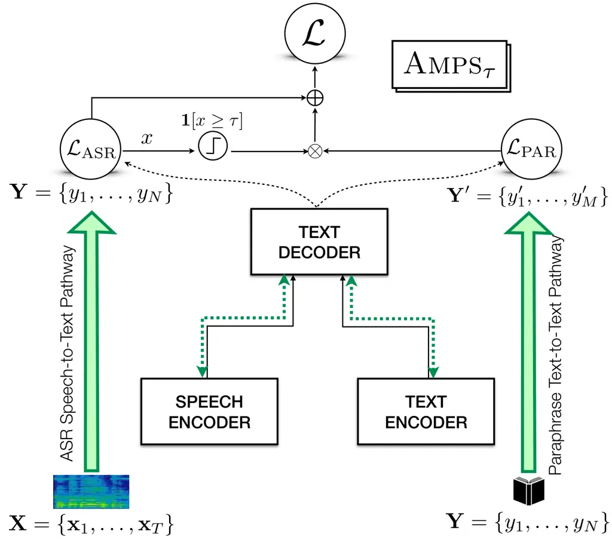

# Amps: ASR with Multimodal Paraphrase Supervision

Abhishek Gupta  Amruta Parulekar  Sameep Chattopadhyay  Preethi
JyothiIndian Institute of Technology Bombay, Mumbai, India
{abhishekumgupta,amrutaparulekar.iitb,sameep.ch.2002}@gmail.com,
pjyothi@cse.iitb.ac.in

###### Abstract

Spontaneous or conversational multilingual speech presents many
challenges for state-of-the-art automatic speech recognition (ASR)
systems. In this work, we present a new technique Amps that augments a
multilingual multimodal ASR system with paraphrase-based supervision for
improved conversational ASR in multiple languages, including Hindi,
Marathi, Malayalam, Kannada, and Nyanja. We use paraphrases of the
reference transcriptions as additional supervision while training the
multimodal ASR model and selectively invoke this paraphrase objective
for utterances with poor ASR performance. Using Amps with a
state-of-the-art multimodal model SeamlessM4T, we obtain significant
relative reductions in word error rates (WERs) of up to $`5\%`$. We
present detailed analyses of our system using both objective and human
evaluation metrics.

## 1 Introduction

^(\*)^(\*)footnotetext: These authors contributed equally to this work.

Automatic speech recognition (ASR) systems have shown considerable
progress in recent years but still falter when subjected to spontaneous
conversational speech containing disfluencies, loosely articulated
sounds, and other noise factors Gabler et al. (2023). This degradation
in ASR performance could be largely attributed to the unavailability of
labeled spontaneous speech in most languages. How can we effectively
utilize the limited quantities of existing labeled spontaneous speech?
Towards this, we propose Amps (ASR with Multimodal Paraphrase
Supervision) that augments an existing multilingual multimodal ASR
system with paraphrase-based supervision to improve ASR performance on
spontaneous speech in multiple languages.

Unlike standalone ASR models that are exclusively trained to perform
ASR, multimodal models (such as SpeechT5 Ao et al. (2022), MAESTRO Chen
et al. (2022), etc.) are trained on multiple tasks _including ASR_ using
speech and text data in various paired (and unpaired) forms. We focus on
one such multilingual multimodal model, SeamlessM4T  Communication
et al. (2023), that consists of dual encoders for speech and text and a
shared text decoder, thus creating both speech-to-text and text-to-text
pathways.

Amps ¹¹ 1 Code for AMPS is available at
[https://github.com/csalt-research/amps-asr](https://github.com/csalt-research/amps-asr).
leverages the multimodal nature of SeamlessM4T by introducing a
paraphrasing objective jointly with ASR. Along with using spontaneous
speech and its corresponding transcription to train the speech-to-text
pathway in SeamlessM4T, Amps also uses paraphrases of the reference
transcriptions as additional supervision to train the text-to-text
pathway. We selectively employ paraphrase-based augmentation during
training when the ASR loss is high (as determined by a predetermined
threshold); high ASR loss is typically triggered by noise or poorly
enunciated words in spontaneous speech. This selective intervention
offers the model an alternate path of opting for semantically close
words and phrases when the audio is not very clear. It is important that
the paraphrases should not significantly differ in word order from the
original transcripts, thus enabling the model to easily align
representations of speech, text, and its paraphrase.

With Amps, we derive significant improvements in ASR for spontaneous
speech in Hindi, Marathi, Malayalam, Kannada, and Nyanja compared to
strong ASR-only finetuned baselines. We report improvements not only in
terms of word error rate (WER) reductions but also using semantic
evaluation metrics. We also conduct a detailed human evaluation
comparing the outputs of Amps with the outputs from finetuning only with
the ASR objective and show consistent improvements in human scores. We
also present many ablations, including different paraphrasing
techniques, the influence of varying thresholds on the performance of
Amps, and using varying amounts of training data. We envision that
techniques like Amps could be used to improve ASR of atypical speech for
people with speech impairments where comprehensibility of the
transcripts is critical (more than faithfulness of transcripts to the
underlying speech, as highlighted in very recent work by Tomanek et al.
(2024)).

## 2 Related Work

In recent years, multimodal models for speech recognition have gained
significant recognition Ao et al. (2022); Chen et al. (2022); Rubenstein
et al. (2023); Zhang et al. (2023). These models are capable of
processing both speech and text inputs and can be adapted for tasks such
as translation and speech generation. A notable example is Meta AI’s
SeamlessM4T Communication et al. (2023), which can support nearly 100
languages. One of the key advantages of such models is their ability to
exploit text-only training to fine-tune shared parameters in the ASR
pipeline. Some of the recent work on text-based adaptation for ASR
models include Vuong et al. (2023); Bataev et al. (2023); Chen et al.
(2023); Mittal et al. (2023). One potential approach for leveraging
text-only data for ASR finetuning is through training the text decoder
with a paraphrasing objective. Emerging research Yu et al. (2023) has
shown that text paraphrasing can be used to augment LLM performance but
we are the first to show how paraphrases can be used to improve ASR.
Tomanek et al. (2024) is a recent study focusing on meaning preservation
in disordered speech transcription, but do not offer any technique to
help improve meaning preservation in ASR outputs.

## 3 Methodology

Amps scaffolds on a multimodal base model comprising a speech encoder, a
text encoder, and a shared decoder that takes inputs from both encoders.
SeamlessM4T is an example of such a model, capable of performing
multiple tasks including text-to-text translation (T2T), and
speech-to-text transcription/translation (S2T).



Figure 1: Multimodal Amps*(τ) Pipeline. Amps*(τ) applies a dual pass
through the S2T pipeline with an ASR objective and the T2T pipeline with
a paraphrasing objective. The paraphrasing loss is only incorporated
when the ASR loss exceeds a predefined threshold.

We introduce a new auxiliary task of text-to-text paraphrasing. This
allows the model to predict words that are semantically similar and fit
within the context of the sentence, without significantly altering its
word order. The shared decoder architecture of SeamlessM4T allows us to
exploit common parameters of both S2T and T2T pipelines and enhance the
ASR performance of the model.

Formally, consider a speech utterance
$`\mathbf{X}=\{\mathbf{x}_{1},\mathbf{x}_{2},\ldots,\mathbf{x}_{L}\,|\,\mathbf{x}_{i}\in\mathbb{R}^{d}\}`$
with its corresponding transcript
$`\mathbf{Y}=\{y_{1},y_{2},\ldots,y_{N}\}`$. For a transcript
$`\mathbf{Y}`$, we generate a paraphrase
$`\mathbf{Y}^{\prime}=\{y^{\prime}_{1},y^{\prime}_{2},\ldots,y^{\prime}_{M}\}`$.
Given a labeled instance
$`\{\mathbf{X},\mathbf{Y},\mathbf{Y}^{\prime}\}`$, the ASR, paraphrase,
and the Amps loss functions are as follows.

```math
\displaystyle\mathcal{L}_{\text{ASR}} \displaystyle=\sum_{t=1}^{N}\log p_{\theta}(y_{t}\mid y_{<t},\mathbf{X}),
```

```math
\displaystyle\mathcal{L}_{\text{PAR}} \displaystyle=\sum_{t=1}^{M}\log p_{\phi}(y^{\prime}_{t}\mid y^{\prime}_{<t},\mathbf{Y}),
```

```math
\displaystyle\mathcal{L}_{\text{{Amps} }} \displaystyle=\mathcal{L}_{\text{ASR}}+\mathcal{L}_{\text{PAR}}.
```

For each batch, we pass the audio through the S2T pathway and compute
the ASR loss between the predicted and ground-truth transcriptions. We
also pass the ground-truth transcriptions as input through the T2T
pathway with paraphrase-based supervision to compute
$`\mathcal{L}_{\text{PAR}}`$. Figure 1 illustrates a schematic of our
proposed architecture.

Language Evaluation Type Direct Inference All Data Hard 100
$`\Delta=\textsc{Amps${}_{\tau}$}-`$ ASR Configuration - ASR Amps
Amps_(τ) ASR Amps\_(τ) $`\Delta`$Hard $`\Delta`$All Marathi WER
$`\downarrow`$ 38.65 21.18 21.58 20.20 48.91 42.79 -6.12 -0.98 METEOR
$`\uparrow`$ 59.84 73.32 77.67 76.62 54.13 58.45 4.32 3.30 BERTScore
$`\uparrow`$ 81.01 90.40 92.31 91.92 84.73 85.82 0.99 1.52 Hindi WER
$`\downarrow`$ 29.16 20.63 20.83 20.12 49.09 45.91 -3.18 -0.51 METEOR
$`\uparrow`$ 72.25 81.04 81.38 81.56 57.66 60.91 3.25 0.52 BERTScore
$`\uparrow`$ 88.55 93.60 93.65 93.76 84.46 85.44 0.98 0.16 Malayalam WER
$`\downarrow`$ 56.15 42.06 42.09 39.97 74.86 64.66 -10.2 -2.09 METEOR
$`\uparrow`$ 43.69 60.39 60.31 62.01 32.48 40.58 8.10 1.62 BERTScore
$`\uparrow`$ 84.35 91.50 91.56 92.02 85.40 87.41 2.01 0.52 Kannada WER
$`\downarrow`$ 69.29 41.41 40.10 39.50 72.23 67.58 -4.65 -1.91 METEOR
$`\uparrow`$ 31.13 60.84 61.27 61.68 33.44 38.30 4.86 0.84 BERTScore
$`\uparrow`$ 76.65 89.84 90.21 90.41 82.36 85.54 3.18 0.57

Table 1: Comparing the performance of pure ASR, Amps, and Amps\_(τ)
systems using 50 hours of training data with round-trip translated
paraphrases. Best overall scores for each metric are highlighted in xx.

#### Amps\_(τ): Loss Function Thresholding.

We aim at improving the model’s performance in noisy regions where the
ASR loss is high by selectively triggering the paraphrase objective only
when the ASR loss exceeds a predefined threshold $`\tau`$.  
Thus, the loss for the system is given by

```math
\displaystyle\mathcal{L}_{\textsc{Amps${}_{\tau}$}} \displaystyle=\begin{cases}\mathcal{L}_{\text{ASR}}+\mathcal{L}_{\text{PAR}}&\text{if }\mathcal{L}_{\text{ASR}}>\tau,\\
\mathcal{L}_{\text{ASR}}&\text{otherwise},\end{cases} \tag{1}
```

where $`\tau`$ is a hyperparameter chosen based on ASR validation
losses. Henceforth, Amps with the best threshold will be referred to as
Amps\_(τ). $`\tau`$ values for various experiments are in Appendix  A.

## 4 Experimental Setup

For all our experiments, we use the SeamlessM4T multilingual multimodal
model Communication et al. (2023). The text encoder and decoder modules
are initialized using Meta’s No Language Left Behind (NLLB) model Team
et al. (2022). The speech encoder in SeamlessM4T uses Wav2Vec-BERT
2.0 Kessler et al. (2021), which is trained on over a million hours of
unlabeled speech data. Further model details are in Appendix  B.1.

#### Datasets.

The IndicVoices dataset Javed et al. (2024b) is a large collection of
natural speech (74% extempore, 17% conversational and 9% read) in 22
Indic languages. Among the languages we chose, Marathi, Kannada, and
Malayalam are classified as low-resource by SeamlessM4T Communication
et al. (2023), while Hindi is medium-resource. IndicVoices is the only
multilingual open-source Indian speech corpus containing spontaneous
speech and amongst the very few sources published after SeamlessM4T’s
release.²² 2 This dataset was chosen also to ensure that there was no
data leakage between the SeamlessM4T training data and the evaluation
sets. We also performed experiments on Nyanja (a low-resource language
from Zambia) from the Zambezi-Voice dataset Sikasote et al. (2023).

We use roughly 50 hours of (predominantly conversational, henceforth
referred to as _mixed_) training data for each of the four Indian
languages. For Hindi, we also simulate a very low-resource setting with
random 5-hour samples of mixed and read training speech. For Nyanja, we
used 5 hours of training data. (For Indic languages, our test sets are
the validation sets that are part of IndicVoices. For Nyanja, we use the
existing test set.) Given the limited amount of training data, we use
parameter-efficient finetuning of adapter layers Houlsby et al. (2019)
in the speech encoder and text decoder layers of the SeamlessM4T model;
more implementation details are in Appendix B.2.

#### Paraphrasing.

We translated the reference transcriptions into English using
IndicTrans-2 Gala et al. (2023) for the Indic languages and NLLB Team
et al. (2022) for Nyanja before translating them back to their original
languages. For the Hindi mixed 5-hr setting, we experimented with
top-$`K`$, $`K=50`$, and nucleus (top-$`P`$, $`P=0.95`$) sampling during
round-trip translation to produce more diverse paraphrases. We also
explored generating paraphrases using the multilingual LLM Aya-23 Üstün
et al. (2024). The exact prompt and other details are in Appendix C and
 D.2. We used round-trip translation-based paraphrases for all the
50-hour experiments due to poor-quality LLM paraphrases for low-resource
languages like Malayalam.

#### Evaluation Metrics.

Evaluation metrics used were Word Error Rate (WER), METEOR and the F1
score provided by BERTScore. More details are provided in Appendix E.

Language Paraphrase Direct Read Speech Mixed Speech Type Inference RT
Trans RT Trans LLM-Para TK+Nuc RT Trans Configuration - ASR Amps
Amps*(τ) ASR Amps Amps*(τ) Amps Amps*(τ) Amps Amps*(τ) Hindi WER
$`\downarrow`$ 29.16 28.19 28.94 28.57 23.14 23.14 22.80 22.35 22.20
22.58 22.81 METEOR $`\uparrow`$ 72.25 74.36 73.58 73.91 79.10 78.86
78.93 79.25 79.28 79.27 79.11 BERTScore $`\uparrow`$ 88.55 90.39 89.86
90.13 92.60 92.59 92.78 92.89 92.90 92.63 92.62

Table 2: Comparing ASR, Amps and Amps\_(τ) systems using 5 hours of mixed
(conversational and read) speech with round-trip translations (RT
Trans), LLM paraphrasing and top-K + nucleus paraphrasing.

## 5 Experiments and Results

Table 1 shows the main results for all the 50-hour Indian-language
experiments. Amps*(τ) consistently performs best compared to ASR, and
the WER reductions are statistically significant (at $`p<0.05`$ using
the mapsswe test).³³ 3 We also trained a variant where instances with a
ASR loss were downweighted and instances with a high ASR loss were
upweighted, thus forcing the model to focus more on the latter. This
performed comparably to our baseline ASR model. Apart from the overall
scores in *All Data*, we sorted the transcriptions in descending order
of WER using pure ASR and averaged metrics were calculated for both pure
ASR and Amps*(τ) for the first 100 (hardest) sentences. Improvements
from ASR to Amps*(τ) for these hardest 100 predictions are labeled
$`\Delta`$Hard in Table 1. We see that $`\Delta`$Hard consistently
exceeds $`\Delta`$All, indicating that the most improvement is observed
in cases where pure ASR performs poorly. This supports the thresholding
approach that triggers the paraphrase loss only when pure ASR
predictions fall below a threshold. From our manual inspection of Hindi
samples in the hardest-100 subset, we observe examples where pure ASR
tends to produce acoustically similar but incorrect words, while
Amps*(τ) correctly identifies the words. For example, pure ASR
misrecognized “hua" (meaning ’is’) as “ugwa" (meaning ’grows’) in a
Hindi example; Amps\_(τ) gets this example right.

Language ASR Amps Amps\_(τ) Marathi 4.199 4.271 4.314 Hindi 3.608 3.625
3.689 Malayalam 3.635 3.688 3.902 Kannada 3.433 3.542 3.597

Table 3: Comparison of human annotation results for ASR, Amps and
Amps\_(τ) on a scale from 0 to 5.

### 5.1 Comparing Paraphrase Techniques

Table 2 shows results from training on 5 hrs of read/mixed Hindi speech
and different paraphrasing techniques with mixed speech. Here, by mixed
speech, we refer to a mixture of both read and conversational speech.
Unsurprisingly, training on mixed speech yields significantly lower WERs
compared to training on read speech. The highest performance gains were
obtained using LLM paraphrasing for Hindi, suggesting that the LLM is a
good option for medium-resource languages like Hindi. LLM outputs are
subpar for low-resource languages like Kannada, and hence are not an
option. Comprehensive results comparing the paraphrase techniques for
other languages are given in Appendix F and G.

### 5.2 Human Evaluation

The transcription capabilities of ASR, Amps, and Amps*(τ) models were
verified through extensive human evaluation of the utterances with
differing model outputs. The annotators reviewed 172, 153, 216, and 229
instances for Hindi, Marathi, Kannada, and Malayalam, respectively,
giving a max score of 5 for a perfect transcript and penalizing them for
minor errors (spellings, etc.) and major errors (incorrect semantics).
The annotators were asked not to penalize a semantically identical word
that differs from the speech. More details and scoring guidelines are
provided in Appendix  H and qualitative examples are in Appendix D.1.
Table 3 shows the averaged scores with Amps*(τ) consistently performing
the best across all languages.

### 5.3 Amps for Nyanja

Table 4 shows overall results⁴⁴ 4 Only WER and METEOR are reported.
BERTScore does not support Nyanja. on Nyanja with 5 hours of training
data and round-trip translated paraphrases. Again, Amps\_(τ) performs the
best, showing that Amps could be applied to diverse languages across
language families.

Language Config. Direct ASR Amps Amps\_(τ) Inference Nyanja WER
$`\downarrow`$ 42.34 22.16 21.90 21.59 METEOR $`\uparrow`$ 66.71 79.25
79.30 80.10

Table 4: Comparison of WER (%) and METEOR for ASR, Amps and Amps\_(τ) for
5 hours Nyanja speech with round-trip translated paraphrases.

### 5.4 Conclusion

This work introduces a novel paraphrase-based supervision technique Amps
to improve the ASR performance of spontaneous speech in multimodal
models. This auxiliary supervision makes the model more robust and helps
the model generalize better, especially in utterances with large ASR
errors. We show significant ASR improvements on multiple and diverse
languages and further validate these improvements via a thorough human
evaluation.

The broader idea of using textual supervision, as we did with
paraphrases, to improve speech understanding is an interesting avenue to
explore further. Future work will investigate how techniques like Amps
could be used to improve ASR for atypical speech. Also, we used a
predefined threshold on the ASR loss to trigger the paraphrase
objective; this could be made a learnable quantity.

## 6 Acknowledgements

The authors thank the anonymous reviewers for their constructive
feedback that improved the quality of the draft. The last author
gratefully acknowledges support from the Amazon IITB AI ML Initiative.

## Limitations

The primary limitation of our study was the lack of any appropriate
pre-existing evaluation metric for the task. When supervising with
paraphrases, the model often predicts semantically similar words or
phrases that do not exactly match the transcript, making traditional
metrics like Word Error Rate (WER) overly harsh for such cases. While
BERTScore addresses semantic similarity, recent research suggests using
LLMs to directly assess whether sentence meaning is preserved Tomanek
et al. (2024). In the future, we plan to adopt LLM-based evaluation
alongside human reviews to improve assessment.

A second limitation was the occurrence of transliterated English words
caused minor spelling errors in the model. We plan to mitigate this in
the future by introducing code-switched words in our paraphrases to
teach the model to associate the transliterated English words with their
Latin script counterparts. Multilingual models like SeamlessM4T possess
the unique ability to link semantically similar words across languages,
thus comprehending code-switched speech easily and we aim to leverage
this ability as future work.

Additionally, the threshold value $`\tau`$ is manually defined and not a
dynamic value that is learned across languages. In future work, we plan
to make this threshold a learnable parameter.

## References

- Ao et al. (2022) Junyi Ao, Rui Wang, Long Zhou, Chengyi Wang, Shuo
  Ren, Yu Wu, Shujie Liu, Tom Ko, Qing Li, Yu Zhang, Zhihua Wei, Yao
  Qian, Jinyu Li, and Furu Wei. 2022. [SpeechT5: Unified-modal
  encoder-decoder pre-training for spoken language
  processing](https://doi.org/10.18653/v1/2022.acl-long.393). In
  _Proceedings of the 60th Annual Meeting of the Association for
  Computational Linguistics (Volume 1: Long Papers)_, pages 5723–5738,
  Dublin, Ireland. Association for Computational Linguistics.
- Banerjee and Lavie (2005) Satanjeev Banerjee and Alon Lavie. 2005.
  [METEOR: An automatic metric for MT evaluation with improved
  correlation with human judgments](https://aclanthology.org/W05-0909).
  In _Proceedings of the ACL Workshop on Intrinsic and Extrinsic
  Evaluation Measures for Machine Translation and/or Summarization_,
  pages 65–72, Ann Arbor, Michigan. Association for Computational
  Linguistics.
- Bataev et al. (2023) Vladimir Bataev, Roman Korostik, Evgeny Shabalin,
  Vitaly Lavrukhin, and Boris Ginsburg. 2023. [Text-only domain
  adaptation for end-to-end asr using integrated text-to-mel-spectrogram
  generator](https://api.semanticscholar.org/CorpusID:257219540). In
  _Interspeech_.
- Chen et al. (2023) Chang Chen, Xun Gong, and Yanmin Qian. 2023.
  [Efficient text-only domain adaptation for ctc-based
  asr](https://doi.org/10.1109/ASRU57964.2023.10389682). In _2023 IEEE
  Automatic Speech Recognition and Understanding Workshop (ASRU)_, pages
  1–7.
- Chen et al. (2022) Zhehuai Chen, Yu Zhang, Andrew Rosenberg, Bhuvana
  Ramabhadran, Pedro J. Moreno, Ankur Bapna, and Heiga Zen. 2022.
  [Maestro: Matched speech text representations through modality
  matching](https://api.semanticscholar.org/CorpusID:248006130). In
  _Interspeech_.
- Communication et al. (2023) Seamless Communication, Loïc Barrault,
  Yu-An Chung, Mariano Cora Meglioli, David Dale, Ning Dong,
  Paul-Ambroise Duquenne, Hady Elsahar, Hongyu Gong, Kevin Heffernan,
  John Hoffman, Christopher Klaiber, Pengwei Li, Daniel Licht, Jean
  Maillard, Alice Rakotoarison, Kaushik Ram Sadagopan, Guillaume Wenzek,
  Ethan Ye, Bapi Akula, Peng-Jen Chen, Naji El Hachem, Brian Ellis,
  Gabriel Mejia Gonzalez, Justin Haaheim, Prangthip Hansanti, Russ
  Howes, Bernie Huang, Min-Jae Hwang, Hirofumi Inaguma, Somya Jain,
  Elahe Kalbassi, Amanda Kallet, Ilia Kulikov, Janice Lam, Daniel Li,
  Xutai Ma, Ruslan Mavlyutov, Benjamin Peloquin, Mohamed Ramadan,
  Abinesh Ramakrishnan, Anna Sun, Kevin Tran, Tuan Tran, Igor Tufanov,
  Vish Vogeti, Carleigh Wood, Yilin Yang, Bokai Yu, Pierre Andrews, Can
  Balioglu, Marta R. Costa-jussà, Onur Celebi, Maha Elbayad, Cynthia
  Gao, Francisco Guzmán, Justine Kao, Ann Lee, Alexandre Mourachko, Juan
  Pino, Sravya Popuri, Christophe Ropers, Safiyyah Saleem, Holger
  Schwenk, Paden Tomasello, Changhan Wang, Jeff Wang, and Skyler
  Wang. 2023. [Seamlessm4t: Massively multilingual & multimodal machine
  translation](https://arxiv.org/abs/2308.11596). _Preprint_,
  arXiv:2308.11596.
- Devlin et al. (2019) Jacob Devlin, Ming-Wei Chang, Kenton Lee, and
  Kristina Toutanova. 2019. [Bert: Pre-training of deep bidirectional
  transformers for language
  understanding](https://arxiv.org/abs/1810.04805). _Preprint_,
  arXiv:1810.04805.
- Gabler et al. (2023) Philipp Gabler, Bernhard C Geiger, Barbara
  Schuppler, and Roman Kern. 2023. Reconsidering read and spontaneous
  speech: Causal perspectives on the generation of training data for
  automatic speech recognition. _Information_, 14(2):137.
- Gala et al. (2023) Jay Gala, Pranjal A Chitale, A K Raghavan, Varun
  Gumma, Sumanth Doddapaneni, Aswanth Kumar M, Janki Atul Nawale,
  Anupama Sujatha, Ratish Puduppully, Vivek Raghavan, Pratyush Kumar,
  Mitesh M Khapra, Raj Dabre, and Anoop Kunchukuttan. 2023.
  [Indictrans2: Towards high-quality and accessible machine translation
  models for all 22 scheduled indian
  languages](https://openreview.net/forum?id=vfT4YuzAYA). _Transactions
  on Machine Learning Research_.
- Hendrycks and Gimpel (2023) Dan Hendrycks and Kevin Gimpel. 2023.
  [Gaussian error linear units
  (gelus)](https://arxiv.org/abs/1606.08415). _Preprint_,
  arXiv:1606.08415.
- Houlsby et al. (2019) Neil Houlsby, Andrei Giurgiu, Stanislaw
  Jastrzebski, Bruna Morrone, Quentin Laroussilhe, Andrea Gesmundo, Mona
  Attariyan, and Sylvain Gelly. 2019. Parameter-efficient transfer
  learning for nlp.
- Javed et al. (2024a) Tahir Javed, Janki Nawale, Eldho George, Sakshi
  Joshi, Kaushal Bhogale, Deovrat Mehendale, Ishvinder Sethi, Aparna
  Ananthanarayanan, Hafsah Faquih, Pratiti Palit, Sneha Ravishankar,
  Saranya Sukumaran, Tripura Panchagnula, Sunjay Murali, Kunal Gandhi,
  Ambujavalli R, Manickam M, C Vaijayanthi, Krishnan Karunganni,
  Pratyush Kumar, and Mitesh Khapra. 2024a. [IndicVoices: Towards
  building an inclusive multilingual speech dataset for Indian
  languages](https://aclanthology.org/2024.findings-acl.639). In
  _Findings of the Association for Computational Linguistics ACL 2024_,
  pages 10740–10782, Bangkok, Thailand and virtual meeting. Association
  for Computational Linguistics.
- Javed et al. (2024b) Tahir Javed, Janki Atul Nawale, Eldho Ittan
  George, Sakshi Joshi, Kaushal Santosh Bhogale, Deovrat Mehendale,
  Ishvinder Virender Sethi, Aparna Ananthanarayanan, Hafsah Faquih,
  Pratiti Palit, Sneha Ravishankar, Saranya Sukumaran, Tripura
  Panchagnula, Sunjay Murali, Kunal Sharad Gandhi, Ambujavalli R,
  Manickam K M, C Venkata Vaijayanthi, Krishnan Srinivasa Raghavan
  Karunganni, Pratyush Kumar, and Mitesh M Khapra. 2024b. [Indicvoices:
  Towards building an inclusive multilingual speech dataset for indian
  languages](https://arxiv.org/abs/2403.01926). _Preprint_,
  arXiv:2403.01926.
- Kakwani et al. (2020) Divyanshu Kakwani, Anoop Kunchukuttan, Satish
  Golla, Gokul N.C., Avik Bhattacharyya, Mitesh M. Khapra, and Pratyush
  Kumar. 2020. IndicNLPSuite: Monolingual Corpora, Evaluation Benchmarks
  and Pre-trained Multilingual Language Models for Indian Languages. In
  _Findings of EMNLP_.
- Kessler et al. (2021) Samuel Kessler, Bethan Thomas, and Salah
  Karout. 2021. [Continual-wav2vec2: an application of continual
  learning for self-supervised automatic speech
  recognition](https://api.semanticscholar.org/CorpusID:236469084).
  _ArXiv_, abs/2107.13530.
- Mittal et al. (2023) Ashish Mittal, Sunita Sarawagi, and Preethi
  Jyothi. 2023. [In-situ text-only adaptation of speech models with
  low-overhead speech
  imputations](https://openreview.net/forum?id=T2Ncx_PN2K). In _The
  Eleventh International Conference on Learning Representations_.
- Patil et al. (2022) Omkar Patil, Rahul Singh, and Tarun Joshi. 2022.
  [Understanding metrics for
  paraphrasing](https://api.semanticscholar.org/CorpusID:249097807).
  _ArXiv_, abs/2205.13119.
- Radford et al. (2022) Alec Radford, Jong Wook Kim, Tao Xu, Greg
  Brockman, Christine McLeavey, and Ilya Sutskever. 2022. [Robust speech
  recognition via large-scale weak
  supervision](https://doi.org/10.48550/ARXIV.2212.04356). _arXiv
  preprint_.
- Rubenstein et al. (2023) Paul K. Rubenstein, Chulayuth Asawaroengchai,
  Duc Dung Nguyen, Ankur Bapna, Zalán Borsos, Félix de Chaumont Quitry,
  Peter Chen, Dalia El Badawy, Wei Han, Eugene Kharitonov, Hannah
  Muckenhirn, Dirk Padfield, James Qin, Danny Rozenberg, Tara Sainath,
  Johan Schalkwyk, Matt Sharifi, Michelle Tadmor Ramanovich, Marco
  Tagliasacchi, Alexandru Tudor, Mihajlo Velimirović, Damien Vincent,
  Jiahui Yu, Yongqiang Wang, Vicky Zayats, Neil Zeghidour, Yu Zhang,
  Zhishuai Zhang, Lukas Zilka, and Christian Frank. 2023. [Audiopalm: A
  large language model that can speak and
  listen](https://arxiv.org/abs/2306.12925). _Preprint_,
  arXiv:2306.12925.
- Shen et al. (2022a) Lingfeng Shen, Haiyun Jiang, Lemao Liu, and
  Shuming Shi. 2022a. [Revisiting the evaluation metrics of paraphrase
  generation](https://api.semanticscholar.org/CorpusID:246904511).
  _ArXiv_, abs/2202.08479.
- Shen et al. (2022b) Lingfeng Shen, Lemao Liu, Haiyun Jiang, and
  Shuming Shi. 2022b. [On the evaluation metrics for paraphrase
  generation](https://doi.org/10.18653/v1/2022.emnlp-main.208). In
  _Proceedings of the 2022 Conference on Empirical Methods in Natural
  Language Processing_, pages 3178–3190, Abu Dhabi, United Arab
  Emirates. Association for Computational Linguistics.
- Sikasote et al. (2023) Claytone Sikasote, Kalinda Siaminwe, Stanly
  Mwape, Bangiwe Zulu, Mofya Phiri, Martin Phiri, David Zulu, Mayumbo
  Nyirenda, and Antonios Anastasopoulos. 2023. [Zambezi Voice: A
  Multilingual Speech Corpus for Zambian
  Languages](https://doi.org/10.21437/Interspeech.2023-1979). In _Proc.
  INTERSPEECH 2023_, pages 3984–3988.
- Team et al. (2022) NLLB Team, Marta R. Costa-jussà, James Cross, Onur
  Çelebi, Maha Elbayad, Kenneth Heafield, Kevin Heffernan, Elahe
  Kalbassi, Janice Lam, Daniel Licht, Jean Maillard, Anna Sun, Skyler
  Wang, Guillaume Wenzek, Al Youngblood, Bapi Akula, Loic Barrault,
  Gabriel Mejia Gonzalez, Prangthip Hansanti, John Hoffman, Semarley
  Jarrett, Kaushik Ram Sadagopan, Dirk Rowe, Shannon Spruit, Chau Tran,
  Pierre Andrews, Necip Fazil Ayan, Shruti Bhosale, Sergey Edunov,
  Angela Fan, Cynthia Gao, Vedanuj Goswami, Francisco Guzmán, Philipp
  Koehn, Alexandre Mourachko, Christophe Ropers, Safiyyah Saleem, Holger
  Schwenk, and Jeff Wang. 2022. [No language left behind: Scaling
  human-centered machine translation](https://arxiv.org/abs/2207.04672).
  _Preprint_, arXiv:2207.04672.
- Tomanek et al. (2024) Katrin Tomanek, Jimmy Tobin, Subhashini
  Venugopalan, Richard Cave, Katie Seaver, Jordan R. Green, and Rus
  Heywood. 2024. [Large language models as a proxy for human evaluation
  in assessing the comprehensibility of disordered speech
  transcription](https://doi.org/10.1109/ICASSP48485.2024.10447177). In
  _ICASSP 2024 - 2024 IEEE International Conference on Acoustics, Speech
  and Signal Processing (ICASSP)_, pages 10846–10850.
- Vaswani (2017) A Vaswani. 2017. Attention is all you need. _Advances
  in Neural Information Processing Systems_.
- Vuong et al. (2023) Tyler Vuong, Karel Mundnich, Dhanush Bekal, Veera
  Elluru, Srikanth Ronanki, and Sravan Bodapati. 2023. [AdaBERT-CTC:
  Leveraging BERT-CTC for text-only domain adaptation in
  ASR](https://doi.org/10.18653/v1/2023.emnlp-industry.35). In
  _Proceedings of the 2023 Conference on Empirical Methods in Natural
  Language Processing: Industry Track_, pages 364–371, Singapore.
  Association for Computational Linguistics.
- Yu et al. (2023) Yijiong Yu, Yongfeng Huang, Zhixiao Qi, and Zhe
  Zhou. 2023. [Training with"paraphrasing the original text"improves
  long-context
  performance](https://api.semanticscholar.org/CorpusID:266359773).
- Zhang et al. (2023) Dong Zhang, Shimin Li, Xin Zhang, Jun Zhan, Pengyu
  Wang, Yaqian Zhou, and Xipeng Qiu. 2023. [Speechgpt: Empowering large
  language models with intrinsic cross-modal conversational
  abilities](https://arxiv.org/abs/2305.11000). _Preprint_,
  arXiv:2305.11000.
- Zhang et al. (2020) Tianyi Zhang, Varsha Kishore, Felix Wu, Kilian Q.
  Weinberger, and Yoav Artzi. 2020. [Bertscore: Evaluating text
  generation with bert](https://arxiv.org/abs/1904.09675). _Preprint_,
  arXiv:1904.09675.
- Üstün et al. (2024) Ahmet Üstün, Viraat Aryabumi, Zheng-Xin Yong,
  Wei-Yin Ko, Daniel D’souza, Gbemileke Onilude, Neel Bhandari,
  Shivalika Singh, Hui-Lee Ooi, Amr Kayid, Freddie Vargus, Phil Blunsom,
  Shayne Longpre, Niklas Muennighoff, Marzieh Fadaee, Julia Kreutzer,
  and Sara Hooker. 2024. [Aya model: An instruction finetuned
  open-access multilingual language
  model](https://arxiv.org/abs/2402.07827). _Preprint_,
  arXiv:2402.07827.

## Appendix

## Appendix A Thresholds for Amps\_(τ)

Table 5 contains the iteratively obtained best thresholds for the
training sets for our experiments. In case of inconsistency between
different metrics, the best threshold was chosen using the validation
WER for the pure ASR system.

Language Read Mixed Mixed Mixed Mixed BT BT BT LLM Top-K BT Hours \<5 50
5 5 5 Marathi 3.5 3.8 3.6 - 3.6 Hindi 3.2 3.2 3.6 3.6 3.6 Malayalam 3.8
3.8 3.4 - 3.4 Kannada 3.8 3.6 3.4 - 3.2 Nyanja - - 3.8 - -

Table 5: Iteratively obtained threshold values for all the experimental
datasets for Amps\_(τ).

## Appendix B Amps for SeamlessM4T

For all our experiments, we used the SeamlessM4T medium model along with
IndicVoices Javed et al. (2024a), and Zambezi-voice Sikasote et al.
(2023) datasets. Both the data and the models are free and open-sourced.

### B.1 Adapting SeamlessM4T

The SeamlessM4T (Medium) consists of 1.2B parameters. Full fine-tuning
of these components using limited amounts of labeled data for
low-resource languages may result in overfitting and degradation of ASR
performance. To address these issues, parameter-efficient fine-tuning
methods, such as the adapter framework, have become widely adopted in
natural language processing tasks. Adapters have proven effective in
low-resource ASR tasks, including accent and cross-lingual adaptation.

Formally, the operations performed in the $`i^{\text{th}}`$ speech
encoder layer can be described as follows:

```math
\displaystyle\mathbf{H} \displaystyle=\mathrm{MHA}(\mathbf{h}^{i-1},\mathbf{h}^{i-1},\mathbf{h}^{i-1})
```

```math
\displaystyle\mathbf{C} \displaystyle=\mathrm{Convolution}(\mathbf{H})
```

```math
\displaystyle\mathbf{\hat{h}^{i}} \displaystyle=\mathrm{FFN}(\mathbf{C})
```

```math
\displaystyle\mathbf{h}^{i} \displaystyle=\mathrm{Adapter}(\mathbf{\hat{h}}^{i})
```

Similarly, the operations in the $`i^{\text{th}}`$ decoder layer can be
summarized as:

```math
\displaystyle\mathbf{D} \displaystyle=\mathrm{MHA}(\mathbf{d}^{i-1},\mathbf{d}^{i-1},\mathbf{d}^{i-1})
```

```math
\displaystyle\mathbf{\hat{D}} \displaystyle=\mathrm{MHA}(\mathbf{d}^{i-1},\mathbf{h}^{\ell},\mathbf{h}^{\ell})
```

```math
\displaystyle\mathbf{\hat{d}^{i}} \displaystyle=\mathrm{FFN}(\mathbf{\hat{D}})
```

```math
\displaystyle\mathbf{d}^{i} \displaystyle=\mathrm{Adapter}(\mathbf{\hat{d}}^{i})
```

Here, $`\ell`$ refers to the final encoder layer, and MHA(Q, K, V)
denotes the standard multi-head attention mechanism Vaswani (2017),
where Q, K, and V are the queries, keys, and values, respectively.

### B.2 Implementation Details

The architecture of the SeamlessM4T medium incorporates a speech encoder
that has 12 conformer layers, while both the text encoder and text
decoder consist of 12 Transformer blocks, with a model dimension of
$`D_{1}=1024`$. In our experiments, adapters were introduced after each
encoder conformer layer and the decoder Transformer layer. These
adapters project the original $`D_{1}`$-dimensional features into a
reduced intermediate space of dimension $`D_{2}`$, apply a GeLU
non-linear activation function Hendrycks and Gimpel (2023), and then
project the features back to $`D_{1}`$. The projected layer dimension on
the adapters is $`D_{2}=2048`$. The value of $`D_{2}`$ controls the
number of trainable parameters, with smaller values of $`D_{2}`$
reducing parameter count. With $`D_{2}`$ set to half of $`D_{1}`$, this
setup introduced 100M trainable parameters while keeping the rest of the
model frozen.

All the fine-tuning experiments were conducted using the SeamlessM4T
codebase Communication et al. (2023) released by Meta AI using NVIDIA
RTX A6000 GPUs. The experiments were conducted over 20 epochs, utilizing
a batch size of 8 and a learning rate of $`5\times 10^{-6}`$. All the
reported results throughout this study are based on a single fixed
random seed.

The paraphrase generation using IndicTrans2 and NLLB employs a beam
width of 5, while Top-K and Nucleus sampling utilize $`K=50`$ and
$`P=0.95`$, respectively.

Language ASR Amps\_(τ) Meaning Explanation Marathi aaiskrim aayskrim
icecream Different native spelling of english word aplya sarkhya
aplyasarkhya like ours Compound words joined together tyoob tyub tube
Different native spelling of english word Hindi baaki kuch nahi aur kuch
nahi nothing else Semantically similar phrases bhajansangraha bhajan
sangraha prayer collection Compound words separated manobhavon bhavanaon
sentiments Semantically similar words

Table 6: Examples of semantically similar and linguistically different
phrases and words

## Appendix C LLM Prompts for Paraphrasing

The paraphrasing prompt given to the Aya model for our very specific
paraphrasing task has been stated below:  
Paraphrase the following sentence in lang, strictly adhering to these
guidelines:

1.  1.  Maintain the original sentence structure and word order as much as
        possible.
2.  2.  Replace at least one word, and aim to replace as many words as
        feasible with Hindi synonyms or words with similar meanings.
3.  3.  Do not add extra words or elaborate on the description.
4.  4.  Preserve named entities (e.g., proper names, places) in their
        original form.
5.  5.  Convert ALL numbers to their Hindi word equivalents. This includes
        dates, years, percentages, and any other numerical values.
6.  6.  Ensure that all replacements are common Hindi words, avoiding
        obscure or highly technical terms.
7.  7.  If a direct Hindi synonym is not available, use a phrase that
        conveys the same meaning.
8.  8.  Maintain the original tense and grammatical structure of the
        sentence.
9.  9.  If the original sentence contains English words commonly used in
        Hindi, you may keep them unchanged.

IMPORTANT: Double-check that NO numerical digits remain in your
paraphrase. All numbers must be written out in Hindi words.

Examples: Some Hindi examples with the required paraphrases were
provided

## Appendix D Some Qualitative examples

### D.1 Model Outputs

Table 6 depicts examples of phrases that were acceptable for human
annotation but would have incurred penalties on the use of other
metrics. It can be observed that the model outputs differ from the
ground truth due to native spellings of English words, whether compound
words are connected or not, and semantically similar but linguistically
different words and phrases. Such errors get penalized harshly by
metrics like WER.

### D.2 Paraphrases

Table 7 shows examples of sentences and their corresponding paraphrases
generated via round-trip translation, where word order has been
preserved to ensure semantic alignment. These were used as a guideline
to create the paraphrasing prompt of the LLM. We require paraphrases
where word order does not change much and where synonyms and
semantically similar but linguistically different phrases are used
frequently.

Language Ground Truth Paraphrase Marathi plij mala sagla informashun dya
krupaya tumhi mala sarva mahiti dya aani ashya bimarina rokhne aani
ashya roganpasun bachav karne Hindi draiving karte samay mobail fon ka
yuj nahi kare gaadi chalate samay mobail fon ka upyog na kare kareer
banana pasand karunga iska pramukh kaaran kareer banana chahunga jiska
mukhya kaaran

Table 7: Examples demonstrating the ideal paraphrases for Amps.

## Appendix E Paraphrase Evaluation Metrics

1.  1.  Word Error Rate (WER) measures the number of mistakes in
        transcription as a ratio of the number of words. These errors could
        be substitutions, insertions or deletions.

    ```math
    \text{WER}=\frac{\text{Substitutions+Inclusions+Deletions}}{\text{Words in Reference Text}} \tag{2}
    ```

2.  2.  METEOR Banerjee and Lavie (2005) is used for evaluating of machine
        translation quality. It has also previously been used for evaluating
        paraphrase qualityShen et al. (2022b). It aligns words in the
        candidate and reference translations based on word level matches,
        including same meaning words and stemming.
3.  3.  BERTScore Zhang et al. (2020) evaluates the similarity between two
        texts by using BERT embeddingsDevlin et al. (2019) (Bidirectional
        Encoder Representations from Transformers). It captures contextual
        meaning and semantics by computing the cosine similarity between
        token embeddings from a reference sentence and a candidate sentence.
        We used AI4Bharat’s IndicBERT Kakwani et al. (2020)for our
        BERTScores.
4.  4.  Other metrics like PARAScore Shen et al. (2022b), BBScore Shen
        et al. (2022a), LATTEScore Tomanek et al. (2024) and ROUGE Patil
        et al. (2022) have been used in the past for evaluation of
        paraphrases.

## Appendix F Amps for Read Speech

Table 8 depicts Amps for Marathi, Malayalam, and Kannada using all the
read speech of the IndicVoices Javed et al. (2024a) dataset. Training
sets of Kannada, Malayalam, and Marathi were of duration 2.64, 2.01, and
4.84, respectively. All validation sets were of a half-hour duration. It
can be observed that Amps\_(τ) performs the best for Marathi, Malayalam,
and Kannada round-trip translated read speech.

Language Paraphrase Baseline Read Speech Type RT Trans Configuration -
ASR Amps Amps\_(τ) Marathi WER $`\downarrow`$ 38.65 34.04 32.30 31.25
METEOR $`\uparrow`$ 59.84 67.26 68.83 70.04 BERTScore $`\uparrow`$ 81.01
87.71 88.65 89.18 Malayalam WER $`\downarrow`$ 56.15 55.38 55.17 54.58
METEOR $`\uparrow`$ 43.69 45.85 45.59 46.22 BERTScore $`\uparrow`$ 84.35
85.72 86.01 85.99 Kannada WER $`\downarrow`$ 69.29 61.86 61.3 59.64
METEOR $`\uparrow`$ 31.13 38.95 39.80 40.63 BERTScore $`\uparrow`$ 76.65
82.48 82.52 83.04

Table 8: Comparison of ASR performance for pure ASR, Amps and Amps\_(τ)
with round-trip translated (RT Trans) read-speech data for Marathi,
Malayalam and Kannada

## Appendix G 5 hour Amps for Other languages

Table 9 depicts the two different round-trip translation methods used
for Amps for 5 hours each of mixed Marathi, Malayalam and Kannada
speech. It can be observed that the two methods have comparable
performance, with normal round-trip translation performing slightly
better than the top-K and nucleus (top-P) setting.

Language Paraphrase - Mixed Speech Mixed Speech Type RT Trans TK+Nuc RT
Trans Configuration ASR Amps Amps*(τ) Amps Amps*(τ) Marathi WER
$`\downarrow`$ 24.70 24.44 24.60 24.56 24.75 METEOR $`\uparrow`$ 76.66
76.80 77.11 76.50 76.74 BERTScore $`\uparrow`$ 91.77 91.83 92.01 91.59
91.83 Malayalam WER $`\downarrow`$ 47.90 47.11 46.06 46.41 46.27 METEOR
$`\uparrow`$ 55.29 55.86 55.82 56.84 56.92 BERTScore $`\uparrow`$ 89.82
90.18 89.96 90.27 90.25 Kannada WER $`\downarrow`$ 46.77 46.53 46.35
46.24 46.22 METEOR $`\uparrow`$ 53.77 54.49 54.80 54.34 54.47 BERTScore
$`\uparrow`$ 87.90 87.78 87.92 87.86 87.99

Table 9: Comparison of ASR performance for pure ASR, Amps and Amps\_(τ)
for normal round-trip translated (RT Trans) and top K + Nucleus sampled
round-trip translated (TK+Nuc RT Trans) mixed data for Marathi,
Malayalam, and Kannada

## Appendix H Details of Human Evaluation

Human evaluation was outsourced to an annotation company based in India,
and INR 45 was paid for every audio. Each sentence was given a maximum
score of 5 for perfect transcription. In cases of erroneous
transcriptions, 0.5 points were deducted for every instance of a minor
error, and 1 point was deducted for every instance of a major error.
Minor errors included small character errors or tense changes that led
to wrong grammar. Major errors included wrong transcriptions, missed
words, and wrongly spelled native words. The annotators were instructed
to give no penalty for incomprehensible audio, varying native spellings
of English words or proper nouns, semantically similar but
linguistically different words, and broken or connected compound words.

## Appendix I Paraphrase Supervision for Purely Speech-to-Text Models

To provide a comparison for our multimodal model technique, we propose
an alternative approach involving pretraining and finetuning for purely
speech-to-text ASR models. The hypothesis is that training an ASR model
first on speech paired with paraphrased transcripts, followed by
finetuning it on speech with original transcripts, will result in a
model that is more robust to mispronunciations and noisy inputs. By
learning to associate unclear or imprecise utterances with semantically
similar phrases, this model should outperform one trained exclusively on
ground-truth labels when evaluated on noisy test sets despite exposure
to similar amounts of data. To support our hypothesis, we used the
Whisper ASR model trained sequentially using paraphrased transcripts
followed by the ground truth, with an ASR training objective.

### I.1 Whisper

Whisper Radford et al. (2022), developed by OpenAI, utilizes a
transformer-based encoder-decoder framework suitable for a range of
speech-related tasks. The model comprises an audio encoder that
processes raw audio inputs, transforming them into log-mel spectrograms.
This input is fed into multiple transformer layers designed to capture
long-range dependencies within the audio data. The text decoder,
operating autoregressively, generates transcriptions from the processed
audio features while integrating task-specific tokens for seamless
task-switching among any auxilliary tasks.

### I.2 Experiment and Results

The Whisper model was trained sequentially with 5-hour round-trip
translated read speech data in three different ways - training with
ground truth training followed by paraphrased training, paraphrase
training followed by ground truth training, and finally, ground truth
training repeated twice.

The WER (%) values for Hindi read speech were 87.68 for direct
inference, 42.33 for ground truth - ground truth training, 47.34 for
paraphrase - ground truth training and 43.78 for ground truth -
paraphrase training. Since pure ground truth training WER is the best,
we chose not to proceed with this experiment as this strongly supports
that multimodality of a model is essential for Amps.
