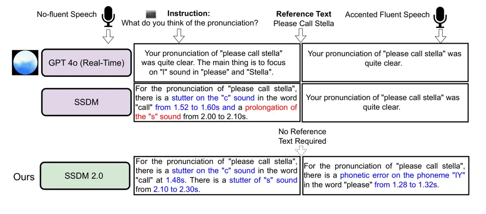
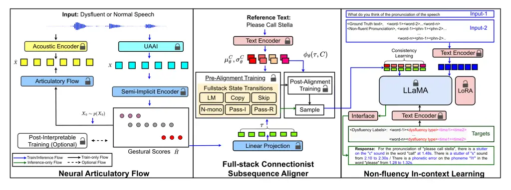
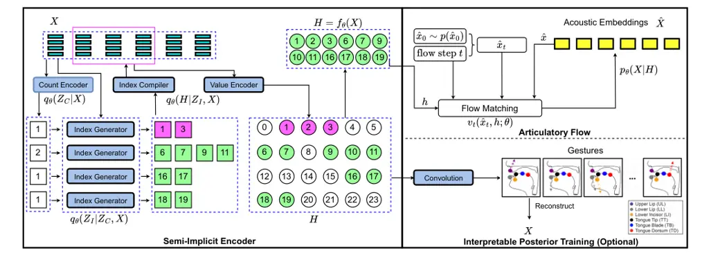
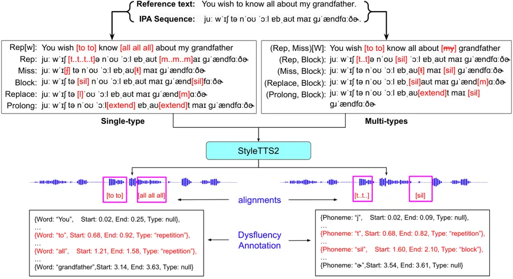
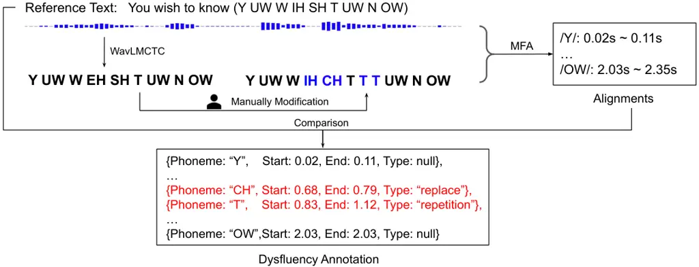
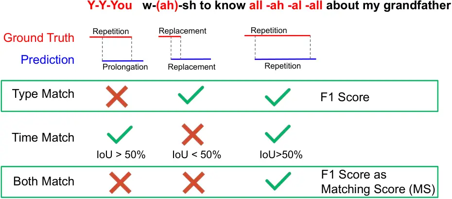
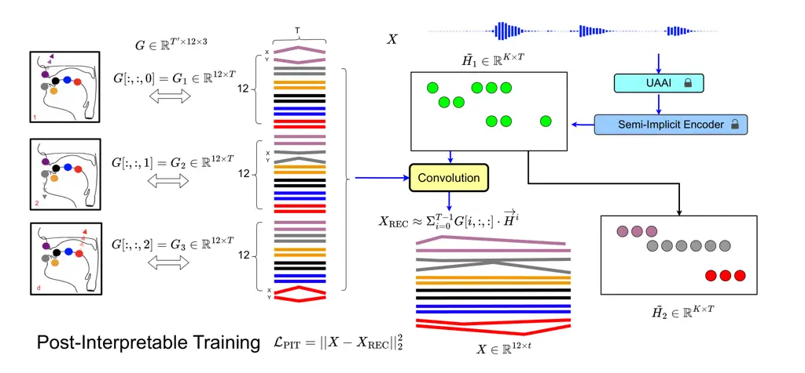

# SSDM 2.0: Time-Accurate Speech Rich Transcription with Non-Fluencies

Jiachen Lian Affiliation:  UC Berkeley
Email: [jiachenlian@berkeley.edu](mailto:)    Xuanru Zhou
Email: [gopala@berkeley.edu](mailto:)    Zoe Ezzes Affiliation:  UCSF   
Jet Vonk Affiliation:  UCSF    Brittany Morin Affiliation:  UCSF   
David Baquirin Affiliation:  UCSF    Zachary Miller Affiliation:  UCSF
   Maria Luisa Gorno Tempini Affiliation:  UCSF    Gopala Anumanchipalli
Affiliation:  UC Berkeley Affiliation:  Zhejiang University

###### Abstract

Speech is a hierarchical collection of text, prosody, emotions,
dysfluencies, etc. Automatic transcription of speech that goes beyond
text (words) is an underexplored problem. We focus on transcribing
speech along with non-fluencies (dysfluencies). The current
state-of-the-art pipeline (Lian et al., 2024) suffers from complex
architecture design, training complexity, and significant shortcomings
in the local sequence aligner, and it does not explore in-context
learning capacity. In this work, we propose SSDM 2.0, which tackles
those shortcomings via four main contributions: (1) We propose a novel
neural articulatory flow to derive highly scalable speech
representations. (2) We developed a full-stack connectionist subsequence
aligner that captures all types of dysfluencies. (3) We introduced a
mispronunciation prompt pipeline and consistency learning module into
LLM to leverage dysfluency in-context pronunciation learning abilities.
(4) We curated Libri-Dys (Lian et al., 2024) and open-sourced the
current largest-scale co-dysfluency corpus, Libri-Co-Dys, for future
research endeavors. In clinical experiments on pathological speech
transcription, we tested SSDM 2.0 using nfvPPA corpus primarily
characterized by articulatory dysfluencies. Overall, SSDM 2.0
outperforms SSDM and all other dysfluency transcription models by a
large margin. See our project demo page at
[https://berkeley-speech-group.github.io/SSDM2.0/](https://berkeley-speech-group.github.io/SSDM2.0/).

|     |
| --- |
|     |



.

Figure 1: SSDM 2.0 Demo. Audios available at
[https://shorturl.at/ITUu0](https://shorturl.at/ITUu0)

## 1 Introduction

¹¹footnotetext: Terms Dysfluency, Non-fluency, dysfluency are
interchangeable.

Current automatic speech recognition (ASR) systems (Radford et al., 2023) and speech language models (SLMs) (Wu et al., 2024) typically
transcribe speech into the words that were spoken (lexicalized speech)
rather than how the words were spoken (uttered speech). For example,
when someone says P-Please c-call st-ah-lla, these systems usually
perform denoising and output please call stella. This approach is
suitable for most spoken dialogue scenarios and services, and helps
reduce confusion in communications. However, in pathological speech
domain, uttered speech is required to accurately identify articulation
and pronunciation problems for diagnostic purposes. The gap between
lexicalized speech and uttered speech is referred to as dysfluency,
which includes repetition, deletion, insertion, replacement of sounds,
filler words, and hesitations (Lian et al., 2023c). Accurate
transcription of speech dysfluencies could substantially reduce the
workload of speech language pathologists while facilitating diagnosis
and serving as a powerful clinical assessment tool.

Pathological speech disorders are typically caused by neurological or
physiological factors and are associated with various dysfluencies, such
as motor and phonological (articulatory) dysfluencies (e.g., nfvPPA,
Parkinson’s disease, Broca’s aphasia) and higher-order (or semantic)
dysfluencies (e.g., svPPA, Wernicke’s aphasia, ASD). Diagnosing these
disorders is challenging due to case-by-case variability and differences
in severity. However, they share a common set of dysfluencies at the
behavioral level, making it possible to develop a general dysfluency
transcription system that can accommodate all disorders and support
follow-up diagnosis. Due to data constraints, however, it is not
feasible to test such a system on all pathological speech data.
Therefore, we focus on nfvPPA, leveraging the currently available data
to develop a dysfluency transcription tool specifically targeting
articulation-based dysfluencies.

Technically, SSDM (Lian et al., 2024) is the first end-to-end pipeline
that can transcribe both lexicalized speech and uttered speech (with
dysfluencies). However, it faces challenges in representation learning
complexity, limited dysfluency alignment coverage, and minimal
performance boost from language modeling. Technically, there are four
questions to address: (1) What are the most scalable speech
representations? (2) How to align dysfluent speech with text? (3) How to
curate large-scale dysfluent speech data with time-aware annotations?
(4) How to leverage pronunciation in-context learning from large
language models? We aim to address the aforementioned challenges and
present SSDM 2.0. Our key contributions are as follows:

- •
  We propose Neural Articulatory Flow, which encodes a semi-implicit
  speech representation that has been shown to be the most scalable
  dysfluency-aware representation, inspired by articulatory dysfluencies
  in pathological speech disorders.
- •
  We develop Full-Stack Connectionist Subsequence Aligner (FCSA),
  achieving comprehensive coverage of dysfluency alignments and precise
  distribution estimation.
- •
  We curate and opensource Libri-Dys-Co, the largest simulated speech
  co-dysfluency corpus, featuring over 6,000 hours of time-aware
  dysfluency annotations (word/phoneme).
- •
  We introduce Mispronunciation In-Context Learning and Consistency
  Learning in langauge model to achieve zero-shot dysfluency transfer
  and joint fluent-dysfluent ASR tasks transfer.

SSDM 2.0 significantly and consistently outperforms all existing
methods, including speech language models, and can serve as a
foundational dysfluency modeling tool.

## 2 SSDM 2.0 Overview

SSDM 2.0 (shown in Fig. 2) processes dysfluent speech and a textual
prompt as inputs, generating pronunciation transcriptions as output. To
achieve this, we propose the Neural Articulatory Flow (NAF), which
generates scalable speech representations referred to as gestural
scores. Subsequently, the gestural scores are aligned with the reference
text using a Full-stack Connectionist Subsequence Aligner, producing
aligned speech embeddings for each token in the reference text. These
aligned embeddings, combined with pre-defined prompts, are then input
into a LLaMA (Touvron et al., 2023) module for instruction tuning (Gong
et al., 2023b), a process we term Non-fluency In-context Learning. The
following subsections provide a detailed explanation of each module.

## 3 Neural Articulatory Flow

Current speech representation modeling typically uses explicit
$`D\times T`$ matrices, where T represents time and D represents channel
dimension, and these are learned densely in a data-driven manner.
However, human speech is produced by a sparse set of articulators with
sparse activation in time. If we define basic moving patterns of
articulators as a dictionary and project articulatory data into this
dictionary space, we obtain a sparse activation matrix. The dictionary
is called gestures and the sparse activation matrix is called gestural
scores  (Browman & Goldstein, 1992). This motivates us to ask: instead
of densely learning elementwise speech representations, can we sparsely
and implicitly learn such structural speech representations via
human-prior rules? At the same time, as we focus on articulatory
dysfluencies, modeling speech production processes helps identify the
specific articulation problems in the gestural space and brings the
representation closer to real human dysfluent speech. In this work, we
propose Neural Articulatory Flow, which involves a Semi-implicit Speech
Encoder (Section 3.1) to predict only the indices of active regions in
articulation, and an Articulatory Flow (Section 3.2) to distill speech
intelligibility from pretrained acoustic speech embeddings (WavLM (Chen
et al., 2022)). We also optionally introduce Interpretable Posterior
Training to visualize how speech is physically produced in articulation
and to derive articulatory feedback for pronunciation.



Figure 2: SSDM 2.0 architecture

### 3.1 Semi-Implicit Speech Encoder

Given a speech waveform, we adopt UAAI (Universal
Acoustic-to-Articulatory IInversion) (Cho et al., 2024) to obtain its
articulatory trajectory $`X\in\mathbb{R}^{D\times T}`$ at 50Hz. UAAI
consists of a WavLM (Chen et al., 2022) encoder followed by a linear
layer, which takes speech waveform as input and predicts articulatory
trajectories. The model was trained on the MNGU0 corpus (Richmond
et al., 2011), which contains 75 minutes of EMA (Electromagnetic
midsagittal articulography) data collected during newspaper reading. In
our setting, $`D=12`$ corresponds to the x and y coordinates of 6
articulators measured in the EMA recording process.

We define articulatory trajectory kernels (gestures)
$`G^{T^{\prime}\times D\times K}`$, where $`T^{\prime}`$ is the window
size and $`K`$ is the number of kernels. By projecting $`X`$ onto the
kernel space, we obtain gestural scores $`H\in\mathbb{R}^{K\times T}`$,
which is high-level abstraction of $`X`$. $`H`$ denotes when the
articulators are activated for how long. In this work, we directly
predict $`H`$ from $`X`$ without gestures $`G`$ for simplicity, focusing
only on active indices that indicate articulatory activation with a
Count Encoder, a Index Encoder and a Value Encoder. We provide a
visualization of gestural scores $`H`$ and its correlation with $`X`$
and Gestures $`G`$ in Appendix. A.5.

In our implementation, as shown in Fig. 3, the Count Encoder projects
$`X`$ into a $`K\times T`$ matrix. Each row $`X_{i}\in\mathbb{R}^{T}`$
is projected into a discrete number $`Z_{C_{i}}`$ sampled from
$`q_{\theta}(Z_{C_{i}}|X_{i})`$, indicating the number of activation
regions. An Index Generator takes $`X_{i}`$ as input to generate two
discrete numbers, repeated $`Z_{C_{i}}`$ times. After sorting, this
yields
$`Z_{I_{i}}=\left[(Z_{I_{i}}^{2\tau-1},Z_{I_{i}}^{2\tau})\right]_{\tau=1}^{Z_{C_{i}}}`$
where $`(Z_{I_{i}}^{2\tau-1},Z_{I_{i}}^{2\tau})`$ are start and end
indices of the $`\tau`$-th region in row $`i`$. An Index Compiler
predicts values for each span
$`(Z_{I_{i}}^{2\tau-1},Z_{I_{i}}^{2\tau})`$ in row $`i`$, returning
$`X_{i}^{\tau}=X_{i}\left[:,Z_{I_{i}}^{2\tau-1}\text{ to }Z_{I_{i}}^{2\tau}\right]`$.
A Value Encoder then predicts continuous values for
$`H_{i}^{\tau}=H_{i}\left[:,Z_{I_{i}}^{2\tau-1}\text{ to }Z_{I_{i}}^{2\tau}\right]`$.
Since $`H`$ is implicitly defined by durations and values, yet maintains
structural properties like sparsity typical of explicit representations,
we call it Semi-implicit Representation and the module the Semi-implicit
Encoder.

##### Posteriors and Priors

$`Z_{C_{i}}`$ and $`(Z_{I_{i}}^{2\tau-1},Z_{I_{i}}^{2\tau})`$ are
discrete variables. We set prior $`p(Z_{C_{i}})=1/{\mathbb{C}1}`$, and
$`p(Z_{I_{i}}^{2\tau})=p(Z_{I_{i}}^{2\tau-1})=1/{\mathbb{C}_{2}}`$,
where $`\mathbb{C}_{1}`$ is the maximum number of spans,
$`\mathbb{C}_{2}`$ is the maximum end index. We define
$`\mathbb{C}_{1}=T/4`$ and $`\mathbb{C}_{2}=T`$, where $`T`$ is the
total number of timesteps at 50Hz. Following Lian et al. (2024), we
adopt Gumbel-Softmax (Jang et al., 2016) for the discrete posterior. The
posterior for $`Z_{C_{i}}`$ and
$`(Z_{I_{i}}^{2\tau-1},Z_{I_{i}}^{2\tau})`$ is formulated in Eq. 1,
where
$`\tilde{\pi}^{i}_{c}=(\log(\pi^{i}_{c})+\epsilon^{i}_{c})/\varsigma`$,
$`c`$ and $`l`$ are discrete label class indices, $`\varsigma`$ is the
temperature parameter, and Gumbel noise
$`\epsilon^{i}_{c}=-\log(-\log(U_{c}))`$ where
$`U_{c}\sim\text{Uniform}(0,1)`$.
$`\pi^{i}\in\mathbb{R}^{\mathbb{C}_{1}}`$ is probability logits over
$`\mathbb{C}_{1}`$ classes. $`\tilde{\pi}^{i,\tau}_{c}`$ is defined
under the same criterion with one additional span index $`\tau`$. For
the continuous posterior
$`q_{\theta}(H_{i}^{\tau}|Z_{I_{i}}^{2\tau-1},Z_{I_{i}}^{2\tau},X_{i})`$,
we set $`p(H_{i}^{\tau})\sim\mathcal{N}(0,I)`$.

```math
\displaystyle\scalebox{1.2}{$\scriptstyle q_{\theta}(Z_{C_{i}}=c|X_{i})\approx\frac{\exp\left(\tilde{\pi}^{i}_{c}\right)}{\sum_{l=1}^{\mathbb{C}_{1}}\exp\left(\tilde{\pi}^{i}_{l}\right)}$}, \displaystyle\scalebox{1.4}{$\scriptstyle q_{\theta}(Z_{I_{i}}^{2\tau\text{ or }2\tau-1}=c|X_{i},Z_{C_{i}})\approx\frac{\exp\left(\tilde{\pi}^{i,\tau}_{c}\right)}{\sum_{l=1}^{\mathbb{C}_{2}}\exp\left(\tilde{\pi}^{i,\tau}_{l}\right)}$} \tag{1}
```

##### KL Loss

The Count Encoder models
$`q_{\theta}(Z_{C}|X)=\prod_{i=1}^{K}q_{\theta}(Z_{C_{i}}|X_{i})`$. The
Index Generator models
$`q_{\theta}(Z_{I}|X,Z_{C})=\prod_{i=1}^{K}\prod_{\tau=1}^{Z_{C_{i}}}q_{\theta}(Z_{I_{i}}^{2\tau-1}|X_{i},Z_{C_{i}})q_{\theta}(Z_{I_{i}}^{2\tau}|X_{i},Z_{C_{i}})`$.
The Index Compiler together with Value Encoder models
$`q_{\theta}(H|Z_{I},X)=\prod_{i=1}^{K}\prod_{\tau=1}^{Z_{C_{i}}}q_{\theta}(H_{i}^{\tau}|Z_{I_{i}}^{2\tau-1},Z_{I_{i}}^{2\tau},X_{i})`$.
The joint priors $`p(Z_{C})=\prod_{i=1}^{K}p(Z_{C_{i}})`$,
$`p(Z_{I})=\prod_{i=1}^{K}\prod_{\tau=1}^{Z_{C_{i}}}p(Z_{I_{i}}^{2\tau-1})p(Z_{I_{i}}^{2\tau})`$,
$`p(H)=\prod_{i=1}^{K}\prod_{\tau=1}^{Z_{C_{i}}}p(H_{i}^{\tau})`$. The
KL loss is displayed in Eq. 2.

```math
\mathcal{L}_{\text{KL}}=\mathbb{E}_{X\sim p(X)}\!\!\left[\text{KL}\!\left(\!q_{\theta}(Z_{C}\!\mid\!X)\,\|\,p(Z_{C})\!\right)\!+\!\text{KL}\!\left(\!q_{\theta}(Z_{I}\!\mid\!X,Z_{C})\,\|\,p(Z_{I})\!\right)\!+\!\text{KL}\!\left(\!q_{\theta}(H\!\mid\!Z_{I},X)\,\|\,p(H)\!\right)\right] \tag{2}
```

### 3.2 Articulatory Flow



Figure 3: Neural Articulatory Flow operates as follows: For a
$`4\times 6`$ matrix $`H`$, the Counter Encoder generates \[1,2,1,1\],
denoting active regions per row. The Index Generator predicts start and
end indices, e.g., \[1,3\] for row 1, indicating non-zero entries.
$`X[:,1:3]`$ then predicts three continuous values for $`H`$. $`H`$,
being rule-generated and sparse, represents a semi-implicit
representation. It generates speech $`\hat{X}`$ for intelligibility,
followed by post-interpretable training to enhance interpretability.

Articulatory flow simulates the human speech production process. Given
sparse gestural scores $`H`$, each row vector $`H_{i}`$ controls the
movement of one of $`K`$ articulators (Lian et al., 2024). While early
work achieved articulatory synthesis using articulatory kinematics data,
we take a different approach. We generate speech (WavLM (Chen et al., 2022) representations) $`\hat{X}`$ directly from sparse gestural scores
$`H`$ using conditional flow matching (CNF) (Lipman et al., 2022). CNF
models a vector field
$`v_{t}:[0,1]\times\mathbb{R}^{K}\rightarrow\mathbb{R}^{D}`$ that
constructs the flow
$`\phi_{t}:[0,1]\times\mathbb{R}^{K}\rightarrow\mathbb{R}^{D}`$ that
maps priors to speech representations, satisfying
$`\frac{d}{dt}\phi_{t}(\hat{x})=v_{t}(\phi_{t}(\hat{x}));\quad\phi_{0}(\hat{x})=\hat{x}`$,
where $`t`$ is the step index and $`\hat{x}\in\mathbb{R}^{D}`$ is a
column vector of $`\hat{X}`$. We follow Le et al. (2024) for vector
field implementation. Specifically, at each step $`t`$, noise
$`\hat{x}_{0}`$ is sampled, which gives
$`\hat{x}_{t}=(1-(1-\sigma_{\text{min}})t)\hat{x}_{0}+t\hat{x}`$. We set
$`u_{t}(\hat{x}_{t}|\hat{x})=\hat{x}-(1-\sigma_{min})\hat{x}_{0}`$. A
sinusoidal position embedder is employed for step encoding, denoted as
$`s_{t}\in\mathbb{R}^{K}`$, where $`K`$ is the number of gestures. We
use matrices $`\hat{X}_{t},\hat{X},H`$ in the actual computation.
$`s_{t}`$ is concatenated with $`H\in\mathbb{R}^{K\times T}`$,
$`\hat{X}_{t}`$, and $`\hat{X}`$ to form
$`\tilde{H}\in\mathbb{R}^{{(K+2D)}\times(T+1)}`$, which is then used to
predict $`V_{t}\in\mathbb{R}^{D\times T}`$, which matches the dimension
of $`\hat{X}`$. We keep the vector form in the loss objective, shown in
Eq. 3. Note that we do not perform an inference step, as we only use
articulatory flow to inject intelligibility into our gestural scores.

```math
\mathcal{L}_{\text{FLOW}}=\mathbb{E}_{t,\,q(\hat{x},h),\,p_{0}(\hat{x}_{0})}\left[\left\|u_{t}(\hat{x}_{t}\mid\hat{x})-v_{t}(\hat{x}_{t},h;\theta)\right\|^{2}\right], \tag{3}
```

### 3.3 Post-Interpretable Training

Gestural scores are traditionally paired with gestures (Browman &
Goldstein, 1992; Ramanarayanan et al., 2013). This work removes such
constraint by deriving only the former, simplifying overall system
training as described in  Lian et al. (2024). However, interpreting
gestural scores helps locate specific pronunciation errors related to
articulators  (Lian et al., 2024). To leverage this property, we
optionally perform post-training by applying k-means clustering to
articulatory data $`X`$ and obtaining gestures
$`G\in\mathbb{R}^{T^{\prime}\times 12\times K}`$, where $`T^{\prime}`$
is the window size, $`12`$ corresponds to $`x`$ and $`y`$ coordinates of
6 articulators, and $`K`$ is the number of gestures. We then employ
neural convolutive matrix factorization  (Lian et al., 2022a) for
gestural scores $`H`$ and gestures $`G`$ to reconstruct $`X`$, ensuring
$`H`$ is interpretable as actual human speech production. The loss
$`\hat{\mathcal{L}}_{\text{PIT}}`$ is the reconstruction loss for $`X`$
without additional sparsity constraints. Details are presented in
Appendix. A.5.

## 4 Fullstack Connectionist Subsequence Aligner

Figure 4: Fullstack Connectionist Subsequence Aligner (FCSA) employs
six-stack optimization for speech transitions: four active (1-4) and two
passive (5-6) states. The accompanying figure shows the neural forward
algorithm; with the backward process in Appendix A.9.

### 4.1 Fullstack State Transitions

Given frame-wise speech tokens
$`\tau=[\tau_{i}\in\mathbb{R}^{D}]_{i=1}^{T}`$ and reference text tokens
$`\gamma(C)=[\gamma(C_{j})\in\mathbb{R}^{D}]_{j=1}^{L}`$, the detection
of non-fluency in speech hinges on the alignment, which is usually a
$`L\times T`$ matrix. Emission probability
$`y^{i,j}=p(\tau_{j}|\tau_{i})`$ and transition probability
$`p(C_{m}|C_{n})`$ are usually introduced for optimizing the alignment
learning. For example, when the speech is normal or fluent, the
alignment would be completely monotonic and $`y^{i,j}`$ only depends on
$`y^{i-1,j}`$ and $`y^{i-1,j-1}`$, which is the case of vanilla CTC
optimization (Graves et al., 2006), and we call this Stack-1, named as
LM(CTC), as shown in Fig. 4. Stack-1 encodes normal language modeling.
Note that in the future discussion we use $`y^{i,j}`$ to refer to both
emission probability and position tokens $`(i,j)`$ for convenience. For
non-fluent speech, the alignment cases are diverse. Assume
$`\tau_{i-k}`$ and $`\tau_{i}`$ are aligned with $`C_{j-k}`$ and
$`C_{j}`$ respectively, and the other speech frames
$`[\tau_{i-k+1},\ldots,\tau_{i-1}]`$ are dysfluencies including
repetition, insertion, and block. Then we only consider
$`y^{i-k,j-1}\rightarrow y^{i,j}`$. CSA (Lian et al., 2024) implicitly
achieves this by performing Emission Copy such that
$`y^{i-k,j-1}=\ldots=y^{i-1,j-1}`$ so that we could still apply the
normal language modeling $`y^{i-1,j-1}\rightarrow y^{i,j}`$. This is
Stack-2, named as Copy. To give a concrete example, if speech
$`\tau=[P,L,IY,L,IY,Z]`$ (p-l-ea-l-ea-se) and text $`C=[P,L,IY,Z]`$
(please), then the last $`[\tau_{i-k+1},\tau_{i-1}]=[L,IY]`$ are
inserted or repetition tokens. In this work, we propose Fullstack State
Transitions in addition to these basic stacks. We introduce the other
four stacks in the following. Stack-3, designated as the Skip stack,
addresses missing dysfluencies. As illustrated in Fig. 4, the reference
text $`C_{j-1}`$ is omitted, consequently skipping the emission
$`y^{i-1,j-1}`$. In this scenario, the transition is represented as
$`y^{i-k,j-k}\rightarrow y^{i,j}`$, which constitutes a disrupted
language model. Stack-4, termed N-mono, introduces non-monotonicity that
may indicate replacement errors. For instance, the pronunciation
$`[P,L,EY,Z]`$ in contrast to $`[P,L,IY,Z]`$ for the word please. While
Stacks 1-4 primarily focus on fluent tokens $`y^{i,j}`$, where speech
$`\tau_{i}`$ precisely aligns with text $`C_{j}`$, misalignments can
occur, such as $`y^{i-1,j-1}`$ in Stack-2 and Stack-3. To address these
cases, we introduce Stack-5, wherein $`y^{i,j}`$ represents a passive
state indicating that $`\tau_{i}`$ is an inserted non-fluent token. We
designate this as Pass-I. Similarly, Stack-6 incorporates a passive
state corresponding to a removed non-fluent token, which we denote as
Pass-R. Based on these full-stack state transitions, we propose two
novel training approaches: Pre-Alignment Training and Post-Alignment
Training. The former incorporates a neural forward-backward algorithm,
while the latter is designed to stochastically optimize the non-fluent
full-stack alignments. We call our method Fullstack Connectionist
Subsequence Aligner. More context is provided in Appendix. A.7 and  A.8.

### 4.2 Pre-alignment Training

Define alignment function $`\gamma(C,\tau)=[\gamma(C_{j})]_{j=1}^{L}`$
such that $`\gamma(C_{j},\tau)=[\tau_{s_{j}},\tau_{e_{j}}]`$ where:
$`1\leq s_{j}\leq e_{j}\leq T`$, $`e_{j}\leq s_{j+1}`$,
$`s_{j}<s_{j+1}`$, $`e_{j}<e_{j+1}`$ for all $`j\in{1,2,\ldots,L-1}`$.
This formulation ensures that all elements $`\tau_{i}`$ in $`H`$ are
uniquely aligned to a target text token. It is important to note that
$`\gamma(C_{j},\tau)`$ may be an empty set, indicating that the
corresponding text is absent from the speech. There are multiple
possible alignments for each speech-text pair. Thus, we define
$`\Gamma(C,\tau)={{\gamma_{i}(C,\tau)}}_{i=1}^{N}`$ to represent all
$`N`$ possible alignments. We aim to find a stochastic alignment
$`\Gamma{\theta}(C,\tau)`$ that encompasses all six stacks. In this
case, the objective can be simply expressed as in Eq. 4.

```math
\max_{\theta}\mathbb{E}_{C,\tau}\left[p_{\theta}(\Gamma(C,\tau))\right]=\max_{\theta}\mathbb{E}_{C,\tau}\left[\sum_{i=1}^{N}p_{\theta}(\gamma_{i}(C,\tau))\right] \tag{4}
```

Note that CTC (Graves et al., 2006) (Stack-1 only) represents a special
case of this formulation when only monotonic alignment is considered. In
this context, the forward-backward algorithm is utilized to model
$`p_{\theta}(\gamma_{i}(C,\tau))`$. For joint Stack1-Stack2
probabilistic modeling, an LCS-aware (Hirschberg, 1977) forward-backward
algorithm (Lian et al., 2024) is employed. In this work, we propose the
Neural Forward-Backward Algorithm (NFB) to model
$`p_{\theta}(\gamma_{i}(C,\tau))`$ across all six stacks (Stack 1-6). We
start with deriving the emission probability
$`y^{i,j}=p_{\theta}(C_{j}|\tau_{i})\approx\exp(\tau_{i}\cdot C_{j}^{S})/\sum_{k=1}^{L}\exp(\tau_{i}\cdot C_{k}^{S})`$,
where $`C_{j}^{S}`$ is sampled from
$`\mathcal{N}(\mu_{\theta}^{C_{j}},(\sigma_{\theta}^{C_{j}})^{2})`$,
which is modeled by the text encoder (Lian et al., 2024). Let us examine
the transition dependencies in the forward branch ($`\alpha`$ branch).
$`\alpha^{i,j}`$ is derived from one or two previous states, as
specified in the six stacks. The challenge lies in the uncertainty
regarding the actual distribution of dysfluencies in speech at the frame
level, precluding the simple application of decayed hyperparameters for
these stacks, as proposed by Lian et al. (2024). To address this, we
introduce a simple multi-layer perceptron module that takes
$`\alpha^{m,n}`$ and the corresponding transition /emission probability
as input. The outputs are summed and processed by a sigmoid function
($`f^{0}`$) to produce a score. We denote this MLP module as
$`f_{\theta}^{1}`$, which is shared across all stacks. Let
$`\alpha_{u}^{i,j}`$ represent the score output from Stack-$`u`$. The
following rules then apply:

```math
\alpha_{1}^{i,j}=f^{0}\left(f_{\theta}^{1}(\alpha^{(i-1,j)},\phi_{\theta}(C_{j}|C_{j}),y^{i,j})+f_{\theta}^{1}(\alpha^{(i-1,j-1)},\phi_{\theta}(C_{j}|C_{j-1}),y^{i,j})\right) \tag{5}
```

Stacks 2-4 correspond to the non-fluency forward process, which is
uniformly shown in Eq. 6.

```math
\alpha_{u}^{i,j}=f^{0}\left(f_{\theta}^{1}(\alpha^{(i-a_{u},j-b_{u})},\phi_{\theta}(C_{j}|C_{j-b_{u}}),y^{i,j})+f_{\theta}^{1}(\alpha^{(i-\hat{a}_{u},j-\hat{b}_{u})},\phi_{\theta}(C_{j}|C_{j-\hat{b}_{u}}),y^{i,j})\right) \tag{6}
```

where
$`u\in\{2,3,4\},(a_{2},b_{2})=(k,1),(\hat{a}_{2},\hat{b}_{2})=(\hat{k},1),(a_{3},b_{3})=(k,k),(\hat{a}_{3},\hat{b}_{3})=(\hat{k},\hat{k}),(a_{4},b_{4})=(1,-k),(\hat{a}_{4},\hat{b}_{4})=(1,-\hat{k})`$,
and $`k\leq\hat{k}\leq\min(i,j)-1`$ are randomly sampled to increase
dysfluency diversity. For the passive states (stacks 5 and 6), we set
$`\alpha_{5}^{i,j}=1`$ and $`\alpha_{6}^{i,j}=\epsilon=10^{-5}`$. The
intuition behind this is that an inserted non-fluent token has no
influence on future states $`\alpha^{i+1,j+1}`$ but maintains the
history $`y^{i-k,j}\rightarrow y^{i,j}`$. Conversely, a removed
non-fluent token severs the information flow, as $`y^{i,j}`$ is detached
from both $`y^{i+1,j+1}`$ and $`y^{i-k,j-k}`$. Introducing another MLP
module $`f_{\theta}^{2}`$ and employing the same sigmoid function
$`f^{0}`$, we obtain:

```math
\alpha^{i,j}=f^{0}\left(f_{\theta}^{2}\left(\sum_{u=1}^{6}\alpha_{u}^{i,j}\right)\right) \tag{7}
```

We obtain $`\beta^{i,j}`$ similarly, as detailed in Appendix A.9. Our
proposed fullstack connectionist subsequence aligner (FCSA) loss
objective is shown in Eq.8. Following Graves et al. (2006), we
initialize $`\alpha^{1,1}=\beta^{-1,-1}=1`$,
$`\beta(:,1)=\alpha(:,1)=0`$, where $`-1`$ denotes the last token index.
During next stage, we adopt the longest common subsequence (Lian et al., 2024) for sampling the alignment.

```math
\mathcal{L_{\text{PRE}}}=-\mathbb{E}_{C,\tau}\left[\sum_{i=1}^{N}p_{\theta}(\gamma_{i}(C,\tau))\right]=-\mathbb{E}_{C,\tau,i,j}\left[\frac{\alpha^{i,j}\beta^{i,j}}{y^{i,j}}\right] \tag{8}
```

### 4.3 Post-Alignment Training

The application of Pre-Alignment Training is predicated on the
availability of only clean text and non-fluent (or noisy) speech, which
inherently lack natural monotonic alignment. However, our data
simulation stage provides access to ground truth non-fluent text
(phonemes), enabling the implementation of additional training
paradigms. We utilize speech input $`\tau=[\tau_{i}]_{i=1}^{T}`$ in
conjunction with non-fluent text tokens
$`C^{\text{NF}}=[C^{\text{NF}}_{i}]_{i=1}^{L}`$. In this context, the
alignment $`\gamma(\tau,C^{\text{NF}})`$ exhibits strict monotonicity,
corresponding to Stack-1 as illustrated in Fig. 4. For this
post-training objective, we employ the vanilla CTC loss (Graves et al., 2006) function, showing in Eq. 9.

```math
\mathcal{L}_{\text{POST}}=\mathbb{E}_{C^{\text{NF}},\tau}\left[\mathcal{L}_{\text{CTC}}(C^{\text{NF}},\tau)\right] \tag{9}
```

## 5 Non-fluency In-Context Learning

### 5.1 Mispronounced Prompt

SSDM (Lian et al., 2024) concludes that the inclusion of language models
yields minimal performance improvement. We hypothesize that this is
because language models may have memorized existing fluent word-phoneme
mappings. For instance, when encountering a non-fluent pronunciation
such as \<please\>\<P\>\<Block\>\<P\>\<L\>\<IY\>\<Z\>, language models
tend to bias towards the fluent pronunciation
\<please\>\<P\>\<L\>\<IY\>\<Z\>. To mitigate this issue, we augment the
input by including all non-fluent pronunciations in the sentence. This
format takes the structure \<Non-fluent
Pronunciation\>,\<word1\>\<phn\>\<non-fluency\>\<...\>,
\<word2\>\<phn\>\<non-fluency\>\<...\>. In addition, we include the
entire word sequence, \<Ground Truth
Text\>\<word-1\>\<word-2\>...\<word-n\>, to leverage zero-shot ASR
performance on fluent speech. This approach aims to train the language
model to recognize imperfect speech patterns. We utilize mispronounced
prompts to explore zero-shot non-fluency detection performance, i.e.,
non-fluency in-context learning. Does this method improve the detection
of other unseen types, such as insertion dysfluencies, even when only
prompting for repetition dysfluencies?

### 5.2 Consistency Learning

FCSA (Section 4) incorporates imperfect phonetic language modeling. As
described in Mispronounced Prompts, both fluent and non-fluent phonemes
are paired with fluent words. We introduce Consistency Learning. Given
the non-fluent speech text alignment
$`\gamma(C,\tau)=[\gamma(C_{j})]_{j=1}^{L}`$, we propose to align each
phoneme semantically with its associated word, as presented in Eq. 10.

```math
\mathcal{L_{\text{CON}}}=\sum_{j=1}^{L}\mathbb{E}_{\tau_{j}\sim\gamma(C_{j})}\frac{\exp^{\tau_{j}^{T}C_{j}}}{\sum_{i=1,i\notin\gamma(C_{j})}^{T}\exp^{\tau_{i}^{T}C_{j}}} \tag{10}
```

### 5.3 Input, Targets, Time Modeling, Loss Objective

We adopt the same language model configuration as Lian et al. (2024);
Gong et al. (2023b) for instruction tuning. During training, for each
sample $`i`$, the input includes a non-fluent speech text alignment
$`\gamma(C^{i},\tau^{i})`$ sampled from
$`p_{\theta}(\Gamma(C^{i},\tau^{i}))`$. The prompts comprises a general
prompt such as
\<what\>\<do\>\<you\>\<think\>\<of\>\<the\>\<pronunciation\>\<of\>\<the\>\<speech\>
(Input-1 in Figure 2), the ground truth word tokens, and the
mispronounced prompts (Section 5.1, Input-2 in Figure 2). Subsequently,
a text encoder (Gong et al., 2023b) processes these inputs. The targets
are derived from our automatic annotations generated during simulation
(Appendix A.1). They follow the format: \<dysfluency
labels\>\<word-1\>\<dysfluency
type\>\<time1\>\<time2\>...\<word-n\>\<...\>, and are processed by the
same text encoder. For time modeling, we adopt the frame-wise approach
proposed by Huang et al. (2024). During inference, only the speech-text
alignment and a general prompt (Input-1) are required. We have also
developed additional interface prompts to refine the final output. The
final objective is presented in Eq. 11, where
$`\hat{\mathcal{L}}_{\text{PIT}}`$ is the optional post-interpretable
loss (Sec. 3.3).
$`\lambda_{1},\lambda_{2},\lambda_{3},\lambda_{4},\lambda_{5},\lambda_{6}`$
are balancing factors. See details in Appendix. A.11.

```math
\mathcal{L}_{\text{FINAL}}=\lambda_{1}\mathcal{L}_{\text{KL}}+\lambda_{2}\mathcal{L}_{\text{FLOW}}+\lambda_{3}\mathcal{L}_{\text{PRE}}+\lambda_{4}\mathcal{L}_{\text{POST}}+\lambda_{5}\mathcal{L}_{\text{CON}}+\lambda_{6}\hat{\mathcal{L}}_{\text{PIT}} \tag{11}
```

## 6 Experiments

### 6.1 Co-dysfluency Data

We scale the Libri-Dys (Lian et al., 2024) to create a larger
co-dysfluency dataset named Libri-Co-Dys, with 6023.24 hours, compared
to the Libri-Dys’s 3938.44 hours. Co-Dysfluency indicates that each
utterance contains multiple instances of single-type dysfluency, and
multiple instances of multi-type dysfluency. In Libri-Co-Dys, each
utterance contains an average of 2.51 dysfluencies. To evaluate its
utility, we also tested Libri-Co-Dys’s Word Error Rate (WER) and Phoneme
Error Rate (PER) using Whisper (Radford et al., 2023) and phoneme
recognition model (Li et al., 2020). Details of dysfluency simulation
and evaluation are available in Appendix. A.1.1. We also evaluated other
simulated data VCTK++ (Lian et al., 2023c), VCTK-TTS (Zhou et al.,
2024b), VCTK-Stutter (Zhou et al., 2024b) and nfvPPA (Gorno-Tempini
et al., 2011). Details are in Appendix. A.1.2.

### 6.2 Evaluation metrics

We evaluate phonetic transcription and alignment using framewise F1
Score, and Duration-Aware Phoneme Error Rate (dPER). For dysfluency
evaluation, besides F1 Scores, we report the time-aware Matching Score
(MS). We follow Lian et al. (2024) for scalability evaluation: Scaling
factors SF1 for F1 score and SF2 for dPER(or MS) are computed as
$`(c-b)\times 0.3+(b-a)\times 0.4`$ for results \[a, b, c\] from
Libri-Dys \[30%, 60%, 100%\] (Training Data). Details are in Appendix
A.3.

| Method                          | Eval Data | F1 (%, $`\uparrow`$) | dPER (%, $`\downarrow`$) | F1 (%, $`\uparrow`$) | dPER (%, $`\downarrow`$) | F1 (%, $`\uparrow`$) | dPER (%, $`\downarrow`$) | F1 (%, $`\uparrow`$) | dPER (%, $`\downarrow`$) | F1 (%, $`\uparrow`$) | dPER (%, $`\downarrow`$) | SF1 (%, $`\uparrow`$) | SF2 (%, $`\downarrow`$) |
| ------------------------------- | --------- | -------------------- | ------------------------ | -------------------- | ------------------------ | -------------------- | ------------------------ | -------------------- | ------------------------ | -------------------- | ------------------------ | --------------------- | ----------------------- |
| Training Data                   |           | VCTK++               |                          | LibriTTS (100%)      |                          | Libri-Dys (30%)      |                          | Libri-Dys (60%)      |                          | Libri-Dys (100%)     |                          |                       |                         |
| HuBERT-Large (Hsu et al., 2021) | VCTK++    | 90.5                 | 40.3                     | 90.0                 | 40.0                     | 89.8                 | 41.2                     | 91.0                 | 40.2                     | 89.9                 | 41.2                     | 0.15                  | -0.1                    |
|                                 | Libri-Dys | 86.2                 | 50.3                     | 88.2                 | 47.4                     | 87.2                 | 42.3                     | 87.2                 | 43.4                     | 87.8                 | 42.9                     | 0.18                  | 0.29                    |
| WavLM-Large (Chen et al., 2022) | VCTK++    | 90.8                 | 40.5                     | 90.2                 | 40.3                     | 90.1                 | 41.6                     | 91.3                 | 40.6                     | 90.2                 | 41.5                     | 0.15                  | -0.67                   |
|                                 | Libri-Dys | 86.5                 | 50.7                     | 88.5                 | 47.8                     | 87.6                 | 42.7                     | 87.5                 | 43.7                     | 88.1                 | 43.2                     | 0.14                  | 0.25                    |
| SSDM (Lian et al., 2024)        | VCTK++    | 91.5                 | 39.0                     | 91.7                 | 38.3                     | 91.7                 | 38.6                     | 92.1                 | 37.0                     | 93.0                 | 37.0                     | 0.43                  | -0.64                   |
|                                 | Libri-Dys | 88.2                 | 40.9                     | 88.9                 | 40.9                     | 89.0                 | 40.8                     | 89.2                 | 39.0                     | 90.8                 | 39.0                     | 0.56                  | -0.72                   |
| NAF w/o AF (Ours)               | VCTK++    | 90.0                 | 40.1                     | 91.2                 | 38.8                     | 91.1                 | 38.8                     | 91.7                 | 38.1                     | 92.6                 | 37.2                     | 0.51                  | -0.55                   |
|                                 | Libri-Dys | 87.6                 | 41.4                     | 88.5                 | 41.2                     | 88.2                 | 41.0                     | 89.0                 | 39.2                     | 90.3                 | 38.0                     | 0.71                  | -0.56                   |
| NAF w/ AF (Ours)                | VCTK++    | 91.8                 | 38.0                     | 92.8                 | 38.0                     | 92.4                 | 37.6                     | 94.1                 | 36.0                     | 95.0                 | 34.1                     | 0.95                  | -1.21                   |
|                                 | Libri-Dys | 89.7                 | 38.4                     | 90.2                 | 38.9                     | 92.3                 | 37.8                     | 93.7                 | 36.0                     | 95.8                 | 33.6                     | 1.19                  | -1.44                   |
| NAF w/ PIT (Ours)               | VCTK++    | 91.6                 | 38.1                     | 92.6                 | 38.0                     | 92.3                 | 37.0                     | 94.0                 | 36.0                     | 94.7                 | 34.3                     | 0.89                  | -0.91                   |
|                                 | Libri-Dys | 89.4                 | 38.2                     | 90.1                 | 39.2                     | 92.0                 | 37.4                     | 93.2                 | 36.3                     | 95.0                 | 34.5                     | 1.02                  | -0.98                   |

Table 1: Scalable Dysfluent Phonetic Transcription Evaluation on
Single-Dysfluency Corpus

### 6.3 Neural Articulatory Flow is Scalable Phonetic Dysfluency Transcriber

To assess the scalability of dysfluency-aware speech representations
(using Neural Articulatory Flow, or NAF), we conducted framewise phoneme
classification experiments using simulated data as targets. We report
both framewise F1 scores and dPER (dysfluency-aware Phoneme Error Rate)
in Table 1. Scalability is evaluated based on scaling factors SF1 for F1
and SF2 for dPER. We use Libri-Dys (Lian et al., 2024) (The same test
set) and VCTK++ (Lian et al., 2023c) for fair comparison. We also
HuBERT-Large (Hsu et al., 2021) and WavLM-Large (Chen et al., 2022),
configured at 50Hz, for the same phoneme experiments. Our results
demonstrate that HuBERT and WavLM exhibit poor scalability and
suboptimal F1 and dPER scores. When comparing our NAF with the gestural
scores in SSDM (Lian et al., 2024), we observed that without the neural
articulatory flow loss $`\mathcal{L}_{\text{FLOW}}`$, NAF achieves lower
intelligibility but still maintains better scalability. Upon
incorporating the articulatory flow loss, we immediately observed
significant improvements in both F1 and dPER scores, as well as scaling
factors, outperforming SSDM by a considerable margin. This improvement
is consistent with our understanding of articulatory flow as the process
that transfers intelligibility from speech to gestural scores. It is
worth noting that post-interpretable training (PIT) does not introduce
additional performance improvements, as its primary function is for
visualization purposes only.

| Method                   | Eval Data    | F1 (%, $`\uparrow`$) | dPER (%, $`\downarrow`$) | F1 (%, $`\uparrow`$) | dPER (%, $`\downarrow`$) | F1 (%, $`\uparrow`$) | dPER (%, $`\downarrow`$) | SF1 (%, $`\uparrow`$) | SF2 (%, $`\downarrow`$) |
| ------------------------ | ------------ | -------------------- | ------------------------ | -------------------- | ------------------------ | -------------------- | ------------------------ | --------------------- | ----------------------- |
| Training Data            |              | Libri-Dys-Co (30%)   |                          | Libri-Dys-Co (60%)   |                          | Libri-Dys-Co (100%)  |                          |                       |                         |
| SSDM (Lian et al., 2024) | Libri-Dys-Co | 88.6                 | 42.4                     | 89.0                 | 39.9                     | 90.0                 | 39.4                     | 0.46                  | -1.15                   |
| NAF (Ours)               | Libri-Dys-Co | 92.7                 | 37.9                     | 93.8                 | 36.2                     | 96.0                 | 33.8                     | 1.10                  | -1.40                   |

Table 2: Scalable Dysfluent Phonetic Transcription Evaluation on
Co-Dysfluency Corpus

##### Co-Dysfluency Scalability

We further evaluated the dysfluency phonetic alignment scalability using
our Libri-Dys-Co dataset. For comparison purposes, we implemented SSDM
to generate results on this dataset. Our analysis demonstrates that the
Neural Articulatory Flow (NAF) consistently outperforms SSDM’s gestural
scores by a significant margin, as shown in Table. 2.

| Method                   | Eval Data | F1 (%, $`\uparrow`$) | MS (%, $`\uparrow`$) | F1 (%, $`\uparrow`$) | MS (%, $`\uparrow`$) | F1 (%, $`\uparrow`$) | MS (%, $`\uparrow`$) | F1 (%, $`\uparrow`$) | MS (%, $`\uparrow`$) | F1 (%, $`\uparrow`$) | MS (%, $`\uparrow`$) | SF1 (%, $`\uparrow`$) | SF2 (%, $`\uparrow`$) |
| ------------------------ | --------- | -------------------- | -------------------- | -------------------- | -------------------- | -------------------- | -------------------- | -------------------- | -------------------- | -------------------- | -------------------- | --------------------- | --------------------- |
| Training Data            |           | VCTK++               |                      | LibriTTS (100%)      |                      | Libri-Dys (30%)      |                      | Libri-Dys (60%)      |                      | Libri-Dys (100%)     |                      |                       |                       |
| SSDM (Lian et al., 2024) | VCTK++    | 84.8                 | 64.3                 | 87.8                 | 68.2                 | 88.5                 | 69.7                 | 89.0                 | 69.9                 | 89.2                 | 70.2                 | 0.26                  | 0.17                  |
|                          | Libri-Dys | 78.9                 | 68.3                 | 79.0                 | 69.4                 | 79.3                 | 69.8                 | 80.6                 | 69.9                 | 81.4                 | 70.4                 | 0.76                  | 0.19                  |
|   w/o LLaMA              | VCTK++    | 84.5$`\downarrow`$   | 64.0$`\downarrow`$   | 86.9$`\downarrow`$   | 68.0$`\downarrow`$   | 88.4$`\downarrow`$   | 69.7                 | 88.7$`\downarrow`$   | 69.8$`\downarrow`$   | 88.9$`\downarrow`$   | 69.9$`\downarrow`$   | 0.18                  | 0.07                  |
|                          | Libri-Dys | 78.2$`\downarrow`$   | 68.1$`\downarrow`$   | 78.3$`\downarrow`$   | 69.0$`\downarrow`$   | 78.8$`\downarrow`$   | 69.2$`\downarrow`$   | 79.6$`\downarrow`$   | 69.3$`\downarrow`$   | 80.7$`\downarrow`$   | 70.0$`\downarrow`$   | 0.65                  | 0.25                  |
|   w/ Curri               | VCTK++    | 85.6                 | 65.1                 | 87.1                 | 68.5                 | 88.8                 | 69.9                 | 89.2                 | 70.2                 | 90.0                 | 71.9                 | 0.4                   | 0.63                  |
|                          | Libri-Dys | 79.2                 | 68.4                 | 79.4                 | 69.5                 | 79.4                 | 69.9                 | 81.0                 | 70.5                 | 81.6                 | 71.0                 | 0.82                  | 0.39                  |
| SSDM+NAF (Ours)          | VCTK++    | 85.0                 | 64.5                 | 88.1                 | 68.4                 | 88.7                 | 70.0                 | 89.4                 | 70.4                 | 90.4                 | 71.3                 | 0.58                  | 0.43                  |
|                          | Libri-Dys | 79.3                 | 68.5                 | 79.1                 | 69.7                 | 79.3                 | 70.0                 | 81.2                 | 70.8                 | 83.0                 | 71.2                 | 1.30                  | 0.44                  |
| SSDM+FCSA (Ours)         | VCTK++    | 85.2                 | 64.6                 | 88.0                 | 68.3                 | 88.8                 | 69.9                 | 89.2                 | 70.4                 | 89.5                 | 70.5                 | 0.25                  | 0.23                  |
|                          | Libri-Dys | 79.2                 | 68.5                 | 79.3                 | 69.7                 | 79.7                 | 70.2                 | 80.9                 | 70.2                 | 81.7                 | 70.9                 | 0.72                  | 0.21                  |
| SSDM+NICL (Ours)         | VCTK++    | 85.4$`\uparrow`$     | 64.7$`\uparrow`$     | 88.1$`\uparrow`$     | 68.3$`\uparrow`$     | 88.7$`\uparrow`$     | 69.9$`\uparrow`$     | 89.1$`\uparrow`$     | 69.9                 | 89.8$`\uparrow`$     | 71.0$`\uparrow`$     | 0.37                  | 0.33                  |
|                          | Libri-Dys | 79.3$`\uparrow`$     | 68.6$`\uparrow`$     | 79.2$`\uparrow`$     | 69.9$`\uparrow`$     | 79.3                 | 69.9$`\uparrow`$     | 81.9$`\uparrow`$     | 71.9$`\uparrow`$     | 82.8$`\uparrow`$     | 72.4$`\uparrow`$     | 1.31                  | 0.95                  |
| SSDM 2.0 (Ours)          | VCTK++    | 85.7                 | 65.0                 | 88.5                 | 68.7                 | 88.9                 | 70.7                 | 90.4                 | 71.6                 | 92.6                 | 73.5                 | 1.26                  | 2.83                  |
|                          | Libri-Dys | 80.1                 | 69.2                 | 79.9                 | 70.3                 | 80.0                 | 70.3                 | 83.2                 | 73.4                 | 86.2                 | 75.9                 | 2.18                  | 1.99                  |

Table 3: Scalable Dysfluent Detection Evaluation on Single-Dysfluency
Corpus

### 6.4 Discussion on the Scalability of Dysfluency Detection

In Section 6.3, we evaluated the scalability of our scalable
representations. We subsequently assessed whether our entire system, as
well as each individual module, functions as an effective and scalable
dysfluency detector. As illustrated in Table 3, we systematically
replaced each module in SSDM. When we substituted SSDM gestural scores
with Neural Articulatory Flow (NAF), Connectionist Sequence Alignment
(CSA) with Full-stack Connectionist Sequence Alignment (FCSA), and the
original Language Model (LM) pipeline with our Non-fluency In-context
Learning (NICL), we consistently observed substantial improvements in
both detection accuracy (F1 and MS) and scaling factors (SF1 for F1 and
SF2 for MS). These results indicate the effectiveness of our proposed
NAF, FCSA, and NICL modules. It is noteworthy that in the original SSDM,
the incorporation of LLaMA (Touvron et al., 2023) did not appear to
enhance performance, as indicated by downward arrows in our results.
Finally, we report our SSDM 2.0 results, which combine NAF, FCSA, and
NICL. This iteration achieves state-of-the-art results, significantly
outperforming SSDM. We also conducted experiments with curriculum
learning (training each module separately before end-to-end training);
however, we did not observe any significant performance changes with
this approach.

| Method                            | Eval Data    | F1 (%, $`\uparrow`$) | MS (%, $`\uparrow`$) | F1 (%, $`\uparrow`$) | MS (%, $`\uparrow`$) | F1 (%, $`\uparrow`$) | MS (%, $`\uparrow`$) | SF1 (%, $`\uparrow`$) | SF2 (%, $`\uparrow`$) |
| --------------------------------- | ------------ | -------------------- | -------------------- | -------------------- | -------------------- | -------------------- | -------------------- | --------------------- | --------------------- |
| Training Data                     |              | Libri-Dys-Co (30%)   |                      | Libri-Dys-Co (60%)   |                      | Libri-Dys-Co (100%)  |                      |                       |                       |
| SSDM w/ Curri (Lian et al., 2024) | Libri-Dys-Co | 79.2                 | 68.4                 | 79.7                 | 68.8                 | 81.0                 | 70.2                 | 0.59                  | 0.52                  |
| SSDM 2.0 (Ours)                   | Libri-Dys-Co | 81.4                 | 72.3                 | 83.0                 | 73.7                 | 87.0                 | 76.3                 | 1.84                  | 1.34                  |

Table 4: Scalable Dysfluent Detection Evaluation on Co-Dysfluency Corpus

##### Co-Dysfluency Detection

We conducted a comparative analysis of SSDM (Lian et al., 2024)
(employing curriculum learning) and our proposed SSDM 2.0. The
evaluation was performed on the Libri-Dys-Co test set, utilizing various
splits of the training set. The results, presented in Table 4,
demonstrate that SSDM 2.0 functions as decent and scalable co-dysfluency
detector.

### 6.5 How much can SLMs tackle (co)dysfluency problems?

| Eval Data    | SALMONN-13B         |                     | SALMONN-13B-FT      |                     | GPT4                |                     | GPT4o               |                     | SSDM w/ Curri       |                     | SSDM 2.0 (Ours)     |                     |
| ------------ | ------------------- | ------------------- | ------------------- | ------------------- | ------------------- | ------------------- | ------------------- | ------------------- | ------------------- | ------------------- | ------------------- | ------------------- |
|              | F1(%, $`\uparrow`$) | MS(%, $`\uparrow`$) | F1(%, $`\uparrow`$) | MS(%, $`\uparrow`$) | F1(%, $`\uparrow`$) | MS(%, $`\uparrow`$) | F1(%, $`\uparrow`$) | MS(%, $`\uparrow`$) | F1(%, $`\uparrow`$) | MS(%, $`\uparrow`$) | F1(%, $`\uparrow`$) | MS(%, $`\uparrow`$) |
| Libri-Dys    | 7.7                 | 0                   | 11.0                | 2.5                 | 18.5                | 0                   | 18.3                | 0                   | 81.6                | 71.0                | 86.2                | 75.9                |
| Libri-Dys-Co | 2.4                 | 0                   | 13.9                | 6.8                 | 15.0                | 0                   | 22.9                | 0                   | 81.0                | 70.2                | 87.0                | 76.3                |
| nfvPPA       | 0                   | 0                   | 1.8                 | 0                   | 5.6                 | 0                   | 6.4                 | 0                   | 69.9                | 55.0                | 76.8                | 70.3                |

Table 5: Results comparison to speech language models. SALMONN-13B (Tang
et al., 2023), GPT4 (OpenAI et al., 2023), GPT4o (OpenAI, 2024), SSDM w/
Curri (Lian et al., 2024).

We compiled results from SALMONN (Tang et al., 2024), GPT4 speech
API (OpenAI et al., 2023), and GPT4o real-time API (OpenAI, 2024) to
evaluate performance on Libri-Dys, Libri-Dys-Co, and nfvPPA datasets.
Some of these results are sourced from Lian et al. (2024). Additionally,
we utilized the same data to perform instruction tuning with SALMONN
(referred to as SALMONN-13B-FT). As shown in Table. 5, current Speech
Language Models (SLMs) demonstrate inferior performance compared to the
SSDM series in the context of dysfluency detection and transcription.

### 6.6 Other Benchmarks

|                            |                      | Rep   |      | Block |      | Miss  |      | Replace |      | Prolong |      |
| -------------------------- | -------------------- | ----- | ---- | ----- | ---- | ----- | ---- | ------- | ---- | ------- | ---- |
| Methods                    | Dataset              | Acc.% | BL   | Acc.% | BL   | Acc.% | BL   | Acc.%   | BL   | Acc.%   | BL   |
| YOLO-Stutter(VCTK-Stutter) | VCTK-Stutter Testset | 99.16 | 26ms | 99.29 | 25ms | 80.00 | 18ms | \-      | \-   | 91.84   | 35ms |
| YOLO-Stutter(VCTK-TTS)     | VCTK-Stutter Testset | 83.11 | 27ms | 100   | 22ms | 40.00 | 17ms | \-      | \-   | 90.34   | 34ms |
| SSDM (VCTK-TTS)            | VCTK-Stutter Testset | 100   | 25ms | 100   | 21ms | 54.60 | 16ms | \-      | \-   | 91.80   | 32ms |
| SSDM2.0 (VCTK-TTS)         | VCTK-Stutter Testset | 100   | 25ms | 100   | 21ms | 88.50 | 15ms | \-      | \-   | 92.00   | 32ms |
| YOLO-Stutter(VCTK-Stutter) | VCTK-TTS Testset     | 78.31 | 66ms | 92.44 | 43ms | 43.33 | 42ms | \-      | \-   | 88.17   | 42ms |
| YOLO-Stutter(VCTK-TTS)     | VCTK-TTS Testset     | 98.78 | 27ms | 98.71 | 78ms | 70.00 | 8ms  | 73.33   | 10ms | 93.74   | 32ms |
| SSDM (VCTK-TTS)            | VCTK-TTS Testset     | 100   | 25ms | 100   | 66ms | 72.30 | 8ms  | 74.00   | 10ms | 94.67   | 30ms |
| SSDM2.0 (VCTK-TTS)         | VCTK-TTS Testset     | 100   | 25ms | 100   | 62ms | 80.80 | 6ms  | 78.00   | 8ms  | 95.02   | 28ms |

Table 6: Compare with YOLO-Stutter on Different Benchmarks

We also consider other decent dysfluency modeling efforts.
YOLO-Stutter (Zhou et al., 2024b) adapted YOLO (Redmon, 2016), treating
dysfluency detection as a time-domain object detection problem.
Stutter-Solver (Zhou et al., 2024a) extends YOLO-Stutter to multilingual
domain. Time-and-Tokens (Zhou et al., 2024c) revisits this problem as
ASR task, discarding time-based modeling. For our comparative analysis,
we focused on YOLO-Stutter and evaluated our model on their benchmark.
In this context, ACC represents type accuracy, and BL denotes normalized
boundary loss. The results are presented in Table 6, where the method is
followed by the training set in the Methods column. Our findings
demonstrate that SSDM 2.0 consistently outperforms all other methods. It
is worth noting that due to the relatively small scale of VCTK-TTS and
VCTK-Stutter datasets, some performance differences are not substantial,
or these datasets may be considered comparatively easy.

### 6.7 In-Context Learning: Zero-shot Dysfluencies and ASR Tasks Transfer

To assess our Non-fluency In-Context Learning (NICL), we devised two
tasks. Task-1 focuses on zero-shot dysfluency transfer: we trained the
model on single dysfluency (repetition) using Libri-Dys, then evaluated
it on other types (replacement, insertion, deletion). Table 7
illustrates that SSDM 2.0 exhibits significantly greater In-Context
Learning capacity than SSDM. Notably, the transfer from repetition to
deletion proves more challenging.

| Method          | Training Data        | F1 (%, $`\uparrow`$) | MS (%, $`\uparrow`$) | F1 (%, $`\uparrow`$) | MS (%, $`\uparrow`$) | F1 (%, $`\uparrow`$) | MS (%, $`\uparrow`$) |
| --------------- | -------------------- | -------------------- | -------------------- | -------------------- | -------------------- | -------------------- | -------------------- |
| Eval Data       |                      | Libri-Dys-Replace    |                      | Libri-Dys-Insertion  |                      | Libri-Dys-Deletion   |                      |
| SSDM w/ Curri   | Libri-Dys-Repetition | 23.2                 | 17.9                 | 32.4                 | 28.0                 | 11.0                 | 8.2                  |
| SSDM 2.0 (Ours) | Libri-Dys-Repetition | 55.4                 | 47.0                 | 66.2                 | 60.9                 | 32.4                 | 29.9                 |
| w/o NICL        | Libri-Dys-Repetition | 49.3                 | 43.9                 | 60.7                 | 53.0                 | 30.1                 | 29.9                 |

Table 7: Non-fluent In-context Learning: Zero-Shot Dyfluencies Transfer

For Task 2, we tested zero-shot ASR capability without additional ASR
training. Table 8 shows results using Whisper (Radford et al., 2023) for
normal ASR, and ASR instruction for direct transcription and WER
computation on the test set. While SSDM shows poor zero-shot
performance, SSDM 2.0 surprisingly achieves better-than-baseline
zero-shot ASR results, demonstrating its enhanced adaptability in speech
recognition tasks.

|                                             | Libri-Dys | Libri-Co-Dys (Multi-types) |
| ------------------------------------------- | --------- | -------------------------- |
| WER (Whisper) ($`\%\downarrow`$)            | 4.167     | 8.89                       |
| WER-Zero-Shot (SSDM) ($`\%\downarrow`$)     | 10.08     | 17.45                      |
| WER-Zero-Shot (SSDM 2.0) ($`\%\downarrow`$) | 3.92      | 7.10                       |

Table 8: Non-fluent In-context Learning: Zero-Shot ASR tasks Transfer

## 7 Conclusions and Limitations

We introduce SSDM 2.0, featuring Neural Articulatory Flow, Fullstack
Connectionist Subsequence Aligner, and Non-fluency In-Context Learning.
We open-sourced a large-scale co-dysfluency corpus Libri-Dys-Co. SSDM
2.0 significantly outperforms current works (Appendix. A.12). The
method’s potential with increased data remains unexplored. Additional
future work will focus on developing fine-grained simulation techniques,
addressing the primary bottleneck in this domain. On the clinical side,
due to data constraints, we evaluated only nfvPPA for articulation-based
dysfluencies, leaving out other disorders such as Parkinson’s disease
and Broca’s aphasia. It would also be valuable to extend this work to
semantic-based dysfluency disorders, such as svPPA, Wernicke’s aphasia,
and ASD, to enhance the pipeline’s applicability as a general speech
transcription tool for a broader range of speech disorders. This will be
addressed in future work.

## 8 Acknowledgement

Thanks for support from UC Noyce Initiative, Society of Hellman Fellows,
NIH/NIDCD, and the Schwab Innovation fund.

## References

- Alharbi et al. (2017) Sadeen Alharbi, Anthony JH Simons, Shelagh
  Brumfitt, and Phil D Green. Automatic recognition of children’s read
  speech for stuttering application. In _6th. Workshop on Child Computer
  Interaction (WOCCI 2017), eds. K. Evanini, M. Najafian, S. Safavi
  and K. Berkling_, pp. 1–6. International Speech Communication
  Association (ISCA), 2017.
- Alharbi et al. (2020) Sadeen Alharbi, Madina Hasan, Anthony JH Simons,
  Shelagh Brumfitt, and Phil Green. Sequence labeling to detect
  stuttering events in read speech. _Computer Speech & Language_,
  62:101052, 2020.
- Ardila et al. (2019) Rosana Ardila, Megan Branson, Kelly Davis,
  Michael Henretty, Michael Kohler, Josh Meyer, Reuben Morais, Lindsay
  Saunders, Francis M Tyers, and Gregor Weber. Common voice: A
  massively-multilingual speech corpus. _arXiv preprint
  arXiv:1912.06670_, 2019.
- Bain et al. (2023) Max Bain, Jaesung Huh, Tengda Han, and Andrew
  Zisserman. Whisperx: Time-accurate speech transcription of long-form
  audio. _INTERSPEECH 2023_, 2023.
- Bayerl et al. (2022a) Sebastian P. Bayerl, Dominik Wagner, Tobias
  Bocklet, and Korbinian Riedhammer. The Influence of
  Dataset-Partitioning on Dysfluency Detection Systems. In _Text,
  Speech, and Dialogue_. 2022a.
- Bayerl et al. (2023a) Sebastian P. Bayerl, Maurice Gerczuk, Anton
  Batliner, Christian Bergler, Shahin Amiriparian, Björn W. Schuller,
  Elmar Nöth, and Korbinian Riedhammer. Classification of stuttering -
  the compare challenge and beyond. _Comput. Speech Lang._, 81:101519,
  2023a. doi: 10.1016/J.CSL.2023.101519. URL
  [https://doi.org/10.1016/j.csl.2023.101519](https://doi.org/10.1016/j.csl.2023.101519).
- Bayerl et al. (2023b) Sebastian P. Bayerl, Dominik Wagner, Ilja
  Baumann, Florian Hönig, Tobias Bocklet, Elmar Nöth, and Korbinian
  Riedhammer. A stutter seldom comes alone - cross-corpus stuttering
  detection as a multi-label problem. _CoRR_, abs/2305.19255, 2023b.
  doi: 10.48550/ARXIV.2305.19255. URL
  [https://doi.org/10.48550/arXiv.2305.19255](https://doi.org/10.48550/arXiv.2305.19255).
- Bayerl et al. (2022b) Sebastian Peter Bayerl, Dominik Wagner, Elmar
  Nöth, and Korbinian Riedhammer. Detecting dysfluencies in stuttering
  therapy using wav2vec 2.0. In _Interspeech 2022, 23rd Annual
  Conference of the International Speech Communication Association,
  Incheon, Korea, 18-22 September 2022_, pp. 2868–2872. ISCA, 2022b.
  doi: 10.21437/INTERSPEECH.2022-10908. URL
  [https://doi.org/10.21437/Interspeech.2022-10908](https://doi.org/10.21437/Interspeech.2022-10908).
- Bernard & Titeux (2021) Mathieu Bernard and Hadrien Titeux.
  Phonemizer: Text to phones transcription for multiple languages in
  python. _Journal of Open Source Software_, 6(68):3958, 2021. doi:
  10.21105/joss.03958. URL
  [https://doi.org/10.21105/joss.03958](https://doi.org/10.21105/joss.03958).
- Browman & Goldstein (1990) Catherine P Browman and Louis Goldstein.
  Gestural specification using dynamically-defined articulatory
  structures. _Journal of Phonetics_, 18(3):299–320, 1990.
- Browman & Goldstein (1992) Catherine P Browman and Louis Goldstein.
  Articulatory phonology: An overview. _Phonetica_,
  49(3-4):155–180, 1992.
- Changawala & Rudzicz (2024) Vrushank Changawala and Frank Rudzicz.
  Whister: Using whisper’s representations for stuttering detection. In
  _Interspeech 2024_, pp. 897–901, 2024. doi:
  10.21437/Interspeech.2024-2293.
- Chee et al. (2009) Lim Sin Chee, Ooi Chia Ai, M. Hariharan, and Sazali
  Yaacob. Automatic detection of prolongations and repetitions using
  lpcc. In _2009 International Conference for Technical Postgraduates
  (TECHPOS)_, pp. 1–4, 2009. doi: 10.1109/TECHPOS.2009.5412080.
- Chen et al. (2022) Sanyuan Chen, Chengyi Wang, Zhengyang Chen, Yu Wu,
  Shujie Liu, Zhuo Chen, Jinyu Li, Naoyuki Kanda, Takuya Yoshioka, Xiong
  Xiao, et al. Wavlm: Large-scale self-supervised pre-training for full
  stack speech processing. _IEEE Journal of Selected Topics in Signal
  Processing_, 16(6):1505–1518, 2022.
- Chia Ai et al. (2012) Ooi Chia Ai, M. Hariharan, Sazali Yaacob, and
  Lim Sin Chee. Classification of speech dysfluencies with mfcc and lpcc
  features. _Expert Systems with Applications_, 39(2):2157–2165, 2012.
  ISSN 0957-4174. doi: https://doi.org/10.1016/j.eswa.2011.07.065. URL
  [https://www.sciencedirect.com/science/article/pii/S095741741101027X](https://www.sciencedirect.com/science/article/pii/S095741741101027X).
- Cho et al. (2024) Cheol Jun Cho, Peter Wu, Tejas S Prabhune, Dhruv
  Agarwal, and Gopala K Anumanchipalli. Articulatory encodec: Vocal
  tract kinematics as a codec for speech. _arXiv preprint
  arXiv:2406.12998_, 2024.
- Coker (1976) Cecil H Coker. A model of articulatory dynamics and
  control. _Proceedings of the IEEE_, 64(4):452–460, 1976.
- Dash et al. (2018) Ankit Dash, Nikhil Subramani, Tejas Manjunath,
  Vishruti Yaragarala, and Shikha Tripathi. Speech recognition and
  correction of a stuttered speech. In _2018 International Conference on
  Advances in Computing, Communications and Informatics (ICACCI)_, pp.
  1757–1760, 2018. doi: 10.1109/ICACCI.2018.8554455.
- Defossez et al. (2020) Alexandre Defossez, Gabriel Synnaeve, and Yossi
  Adi. Real time speech enhancement in the waveform domain. In
  _Interspeech_, 2020.
- Esmaili et al. (2016) Iman Esmaili, Nader Jafarnia Dabanloo, and
  Mansour Vali. Automatic classification of speech dysfluencies in
  continuous speech based on similarity measures and morphological image
  processing tools. _Biomedical Signal Processing and Control_,
  23:104–114, 2016. ISSN 1746-8094. doi:
  https://doi.org/10.1016/j.bspc.2015.08.006. URL
  [https://www.sciencedirect.com/science/article/pii/S1746809415001482](https://www.sciencedirect.com/science/article/pii/S1746809415001482).
- Gao et al. (2021) Yang Gao, Jiachen Lian, Bhiksha Raj, and Rita Singh.
  Detection and evaluation of human and machine generated speech in
  spoofing attacks on automatic speaker verification systems. In _2021
  IEEE Spoken Language Technology Workshop (SLT)_, pp. 544–551.
  IEEE, 2021.
- Gong et al. (2023a) Yuan Gong, Alexander H Liu, Hongyin Luo, Leonid
  Karlinsky, and James Glass. Joint audio and speech understanding. In
  _2023 IEEE Automatic Speech Recognition and Understanding Workshop
  (ASRU)_, pp. 1–8. IEEE, 2023a.
- Gong et al. (2023b) Yuan Gong, Hongyin Luo, Alexander H Liu, Leonid
  Karlinsky, and James Glass. Listen, think, and understand. _arXiv
  preprint arXiv:2305.10790_, 2023b.
- Gorno-Tempini et al. (2011) Maria Luisa Gorno-Tempini, Argye E Hillis,
  Sandra Weintraub, Andrew Kertesz, Mario Mendez, Stefano F Cappa,
  Jennifer M Ogar, Jonathan D Rohrer, Steven Black, Bradley F Boeve,
  et al. Classification of primary progressive aphasia and its variants.
  _Neurology_, 76(11):1006–1014, 2011.
- Graves et al. (2006) Alex Graves, Santiago Fernández, Faustino Gomez,
  and Jürgen Schmidhuber. Connectionist temporal classification:
  labelling unsegmented sequence data with recurrent neural networks. In
  _Proceedings of the 23rd international conference on Machine
  learning_, pp. 369–376, 2006.
- Grizzle et al. (2010) Jessy W Grizzle, Christine Chevallereau, Aaron D
  Ames, and Ryan W Sinnet. 3d bipedal robotic walking: models, feedback
  control, and open problems. _IFAC Proceedings Volumes_,
  43(14):505–532, 2010.
- Harvill et al. (2022) John Harvill, Mark Hasegawa-Johnson, and
  Changdong Yoo. Frame-level stutter detection. In _Proceedings of the
  Annual Conference of the International Speech Communication
  Association, INTERSPEECH_, volume 2022, pp. 2843–2847, 2022.
- Hirschberg (1977) Daniel S Hirschberg. Algorithms for the longest
  common subsequence problem. _Journal of the ACM (JACM)_,
  24(4):664–675, 1977.
- Howell & Sackin (1995) Peter Howell and Stevie Sackin. Automatic
  recognition of repetitions and prolongations in stuttered speech. In
  _Proceedings of the first World Congress on fluency disorders_,
  volume 2, pp. 372–374. University Press Nijmegen Nijmegen, The
  Netherlands, 1995.
- Howell et al. (2009) Peter Howell, Steve Davis, and Jon Bartrip. The
  uclass archive of stuttered speech. _Journal of Speech Language and
  Hearing Research_, 52:556, 2009. URL
  [https://api.semanticscholar.org/CorpusID:141419086](https://api.semanticscholar.org/CorpusID:141419086).
- Hsu et al. (2021) Wei-Ning Hsu, Benjamin Bolte, Yao-Hung Hubert Tsai,
  Kushal Lakhotia, Ruslan Salakhutdinov, and Abdelrahman Mohamed.
  Hubert: Self-supervised speech representation learning by masked
  prediction of hidden units. _IEEE/ACM Transactions on Audio, Speech,
  and Language Processing_, 29:3451–3460, 2021.
- Hu et al. (2021) Edward J. Hu, Yelong Shen, Phillip Wallis, Zeyuan
  Allen-Zhu, Yuanzhi Li, Shean Wang, Lu Wang, and Weizhu Chen. Lora:
  Low-rank adaptation of large language models, 2021.
- Huang et al. (2024) Bin Huang, Xin Wang, Hong Chen, Zihan Song, and
  Wenwu Zhu. Vtimellm: Empower llm to grasp video moments. In
  _Proceedings of the IEEE/CVF Conference on Computer Vision and Pattern
  Recognition_, pp. 14271–14280, 2024.
- Jang et al. (2016) Eric Jang, Shixiang Gu, and Ben Poole. Categorical
  reparameterization with gumbel-softmax. _arXiv preprint
  arXiv:1611.01144_, 2016.
- Jouaiti & Dautenhahn (2022a) Melanie Jouaiti and Kerstin Dautenhahn.
  Dysfluency classification in speech using a biological sound
  perception model. In _2022 9th International Conference on Soft
  Computing & Machine Intelligence (ISCMI)_, pp. 173–177, 2022a. doi:
  10.1109/ISCMI56532.2022.10068490.
- Jouaiti & Dautenhahn (2022b) Melanie Jouaiti and Kerstin Dautenhahn.
  Dysfluency classification in stuttered speech using deep learning for
  real-time applications. In _ICASSP 2022 - 2022 IEEE International
  Conference on Acoustics, Speech and Signal Processing (ICASSP)_, pp.
  6482–6486, 2022b. doi: 10.1109/ICASSP43922.2022.9746638.
- Kim et al. (2021) Jaehyeon Kim, Jungil Kong, and Juhee Son.
  Conditional variational autoencoder with adversarial learning for
  end-to-end text-to-speech. In _International Conference on Machine
  Learning_, pp. 5530–5540. PMLR, 2021.
- Kingma & Ba (2014) Diederik P Kingma and Jimmy Ba. Adam: A method for
  stochastic optimization. _arXiv preprint arXiv:1412.6980_, 2014.
- Kourkounakis et al. (2021) Tedd Kourkounakis, Amirhossein Hajavi, and
  Ali Etemad. Fluentnet: End-to-end detection of stuttered speech
  disfluencies with deep learning. _IEEE/ACM Transactions on Audio,
  Speech, and Language Processing_, 29:2986–2999, 2021.
- Le et al. (2024) Matthew Le, Apoorv Vyas, Bowen Shi, Brian Karrer,
  Leda Sari, Rashel Moritz, Mary Williamson, Vimal Manohar, Yossi Adi,
  Jay Mahadeokar, et al. Voicebox: Text-guided multilingual universal
  speech generation at scale. _Advances in neural information processing
  systems_, 36, 2024.
- Li et al. (2020) Xinjian Li, Siddharth Dalmia, Juncheng Li, Matthew
  Lee, Patrick Littell, Jiali Yao, Antonios Anastasopoulos, David R
  Mortensen, Graham Neubig, Alan W Black, and Metze Florian. Universal
  phone recognition with a multilingual allophone system. In _ICASSP
  2020-2020 IEEE International Conference on Acoustics, Speech and
  Signal Processing (ICASSP)_, pp. 8249–8253. IEEE, 2020.
- Li et al. (2023) Yinghao Aaron Li, Cong Han, Vinay Raghavan, Gavin
  Mischler, and Nima Mesgarani. Styletts 2: Towards human-level
  text-to-speech through style diffusion and adversarial training with
  large speech language models. In A. Oh, T. Naumann, A. Globerson,
  K. Saenko, M. Hardt, and S. Levine (eds.), _Advances in Neural
  Information Processing Systems_, volume 36, pp. 19594–19621. Curran
  Associates, Inc., 2023. URL
  [https://proceedings.neurips.cc/paper_files/paper/2023/file/3eaad2a0b62b5ed7a2e66c2188bb1449-Paper-Conference.pdf](https://proceedings.neurips.cc/paper_files/paper/2023/file/3eaad2a0b62b5ed7a2e66c2188bb1449-Paper-Conference.pdf).
- Lian & Anumanchipalli (2024) Jiachen Lian and Gopala Anumanchipalli.
  Towards hierarchical spoken language disfluency modeling. In Yvette
  Graham and Matthew Purver (eds.), _Proceedings of the 18th Conference
  of the European Chapter of the Association for Computational
  Linguistics (Volume 1: Long Papers)_, pp. 539–551, St. Julian’s,
  Malta, March 2024. Association for Computational Linguistics. URL
  [https://aclanthology.org/2024.eacl-long.32](https://aclanthology.org/2024.eacl-long.32).
- Lian et al. (2022a) Jiachen Lian, Alan W Black, Louis Goldstein, and
  Gopala Krishna Anumanchipalli. Deep Neural Convolutive Matrix
  Factorization for Articulatory Representation Decomposition. In _Proc.
  Interspeech 2022_, pp. 4686–4690, 2022a. doi:
  10.21437/Interspeech.2022-11233.
- Lian et al. (2022b) Jiachen Lian, Chunlei Zhang, Gopala Krishna
  Anumanchipalli, and Dong Yu. Towards Improved Zero-shot Voice
  Conversion with Conditional DSVAE. In _Proc. Interspeech 2022_, 2022b.
  doi: 10.21437/Interspeech.2022-11225.
- Lian et al. (2022c) Jiachen Lian, Chunlei Zhang, Gopala Krishna
  Anumanchipalli, and Dong Yu. Utts: Unsupervised tts with conditional
  disentangled sequential variational auto-encoder. _arXiv preprint
  arXiv:2206.02512_, 2022c.
- Lian et al. (2022d) Jiachen Lian, Chunlei Zhang, and Dong Yu. Robust
  disentangled variational speech representation learning for zero-shot
  voice conversion. In _ICASSP 2022-2022 IEEE International Conference
  on Acoustics, Speech and Signal Processing (ICASSP)_. IEEE, 2022d.
- Lian et al. (2023a) Jiachen Lian, Alexei Baevski, Wei-Ning Hsu, and
  Michael Auli. Av-data2vec: Self-supervised learning of audio-visual
  speech representations with contextualized target representations. In
  _2023 IEEE Automatic Speech Recognition and Understanding Workshop
  (ASRU)_, 2023a. doi: 10.1109/ASRU57964.2023.10389642.
- Lian et al. (2023b) Jiachen Lian, Alan W Black, Yijing Lu, Louis
  Goldstein, Shinji Watanabe, and Gopala K Anumanchipalli. Articulatory
  representation learning via joint factor analysis and neural matrix
  factorization. In _ICASSP 2023-2023 IEEE International Conference on
  Acoustics, Speech and Signal Processing (ICASSP)_, pp. 1–5. IEEE,
  2023b.
- Lian et al. (2023c) Jiachen Lian, Carly Feng, Naasir Farooqi, Steve
  Li, Anshul Kashyap, Cheol Jun Cho, Peter Wu, Robbie Netzorg, Tingle
  Li, and Gopala Krishna Anumanchipalli. Unconstrained dysfluency
  modeling for dysfluent speech transcription and detection. In _2023
  IEEE Automatic Speech Recognition and Understanding Workshop (ASRU)_,
  pp. 1–8. IEEE, 2023c.
- Lian et al. (2024) Jiachen Lian, Xuanru Zhou, Zoe Ezzes, Jet Vonk,
  Brittany Morin, David Baquirin, Zachary Mille, Maria Luisa Gorno
  Tempini, and Gopala Anumanchipalli. Ssdm: Scalable speech dysfluency
  modeling. _Advances in neural information processing systems_, 2024.
- Lipman et al. (2022) Yaron Lipman, Ricky TQ Chen, Heli Ben-Hamu,
  Maximilian Nickel, and Matt Le. Flow matching for generative modeling.
  _arXiv preprint arXiv:2210.02747_, 2022.
- McAuliffe et al. (2017) Michael McAuliffe, Michaela Socolof, Sarah
  Mihuc, Michael Wagner, and Morgan Sonderegger. Montreal forced
  aligner: Trainable text-speech alignment using kaldi. In _Interspeech
  2017_, pp. 498–502, 2017. doi: 10.21437/Interspeech.2017-1386.
- Microsoft (2021) Microsoft. Wavlm-ctc-hugginface.
  [https://huggingface.co/microsoft/wavlm-large](https://huggingface.co/microsoft/wavlm-large), 2021.
- Mildenhall et al. (2021) Ben Mildenhall, Pratul P Srinivasan, Matthew
  Tancik, Jonathan T Barron, Ravi Ramamoorthi, and Ren Ng. Nerf:
  Representing scenes as neural radiance fields for view synthesis.
  _Communications of the ACM_, 65(1):99–106, 2021.
- Mohamed et al. (2022) Abdelrahman Mohamed, Hung-yi Lee, Lasse
  Borgholt, Jakob D Havtorn, Joakim Edin, Christian Igel, Katrin
  Kirchhoff, Shang-Wen Li, Karen Livescu, Lars Maaløe, et al.
  Self-supervised speech representation learning: A review. _IEEE
  Journal of Selected Topics in Signal Processing_,
  16(6):1179–1210, 2022.
- Mohapatra et al. (2023) Payal Mohapatra, Bashima Islam, Md Tamzeed
  Islam, Ruochen Jiao, and Qi Zhu. Efficient stuttering event detection
  using siamese networks. In _ICASSP 2023 - 2023 IEEE International
  Conference on Acoustics, Speech and Signal Processing (ICASSP)_, pp.
  1–5, 2023. doi: 10.1109/ICASSP49357.2023.10094692.
- Mujtaba et al. (2024) Dena Mujtaba, Nihar R. Mahapatra, Megan Arney,
  J. Scott Yaruss, Caryn Herring, and Jia Bin. Inclusive asr for
  disfluent speech: Cascaded large-scale self-supervised learning with
  targeted fine-tuning and data augmentation. In _Interspeech 2024_, pp.
  1275–1279, 2024. doi: 10.21437/Interspeech.2024-2246.
- OpenAI (2024) OpenAI. Gpt4-o.
  [https://platform.openai.com/docs/guides/realtime](https://platform.openai.com/docs/guides/realtime), 2024.
- OpenAI et al. (2023) Josh OpenAI, Achiam, Steven Adler, Sandhini
  Agarwal, Lama Ahmad, Ilge Akkaya, Florencia Leoni Aleman, Diogo
  Almeida, Janko Altenschmidt, Sam Altman, Shyamal Anadkat, et al. Gpt-4
  technical report, 2023.
- Oue et al. (2015) Stacey Oue, Ricard Marxer, and Frank Rudzicz.
  Automatic dysfluency detection in dysarthric speech using deep belief
  networks. In Jan Alexandersson, Ercan Altinsoy, Heidi Christensen,
  Peter Ljunglöf, François Portet, and Frank Rudzicz (eds.),
  _Proceedings of SLPAT 2015: 6th Workshop on Speech and Language
  Processing for Assistive Technologies_, pp. 60–64, Dresden, Germany,
  September 2015. Association for Computational Linguistics. doi:
  10.18653/v1/W15-5111. URL
  [https://aclanthology.org/W15-5111](https://aclanthology.org/W15-5111).
- Radford et al. (2023) Alec Radford, Jong Wook Kim, Tao Xu, Greg
  Brockman, Christine McLeavey, and Ilya Sutskever. Robust speech
  recognition via large-scale weak supervision. In _International
  Conference on Machine Learning_, pp. 28492–28518. PMLR, 2023.
- Ramanarayanan et al. (2013) Vikram Ramanarayanan, Louis Goldstein, and
  Shrikanth S Narayanan. Spatio-temporal articulatory movement
  primitives during speech production: Extraction, interpretation, and
  validation. _The Journal of the Acoustical Society of America_,
  134(2):1378–1394, 2013.
- Redmon (2016) J Redmon. You only look once: Unified, real-time object
  detection. In _Proceedings of the IEEE conference on computer vision
  and pattern recognition_, 2016.
- Ren et al. (2020) Yi Ren, Chenxu Hu, Xu Tan, Tao Qin, Sheng Zhao, Zhou
  Zhao, and Tie-Yan Liu. Fastspeech 2: Fast and high-quality end-to-end
  text to speech. _arXiv preprint arXiv:2006.04558_, 2020.
- Richmond et al. (2011) Korin Richmond, Phil Hoole, and Simon King.
  Announcing the electromagnetic articulography (day 1) subset of the
  mngu0 articulatory corpus. In _Twelfth Annual Conference of the
  International Speech Communication Association_, 2011.
- Sakoe (1971) Hiroaki Sakoe. Dynamic-programming approach to continuous
  speech recognition. In _1971 Proc. the International Congress of
  Acoustics, Budapest_, 1971.
- Selvaraju et al. (2017) Ramprasaath R Selvaraju, Michael Cogswell,
  Abhishek Das, Ramakrishna Vedantam, Devi Parikh, and Dhruv Batra.
  Grad-cam: Visual explanations from deep networks via gradient-based
  localization. In _Proceedings of the IEEE international conference on
  computer vision_, pp. 618–626, 2017.
- Shi et al. (2022) Bowen Shi, Wei-Ning Hsu, Kushal Lakhotia, and
  Abdelrahman Mohamed. Learning audio-visual speech representation by
  masked multimodal cluster prediction. _arXiv preprint
  arXiv:2201.02184_, 2022.
- Shonibare et al. (2022) Olabanji Shonibare, Xiaosu Tong, and Venkatesh
  Ravichandran. Enhancing asr for stuttered speech with limited data
  using detect and pass. _arXiv preprint arXiv:2202.05396_, 2022.
- Strgar & Harwath (2023) Luke Strgar and David Harwath. Phoneme
  segmentation using self-supervised speech models. In _2022 IEEE Spoken
  Language Technology Workshop (SLT)_, pp. 1067–1073, 2023. doi:
  10.1109/SLT54892.2023.10022827.
- Tan et al. (2007) Tian-Swee Tan, Helbin-Liboh, A. K. Ariff, Chee-Ming
  Ting, and Sh-Hussain Salleh. Application of malay speech technology in
  malay speech therapy assistance tools. In _2007 International
  Conference on Intelligent and Advanced Systems_, pp. 330–334, 2007.
  doi: 10.1109/ICIAS.2007.4658401.
- Tang et al. (2023) Changli Tang, Wenyi Yu, Guangzhi Sun, Xianzhao
  Chen, Tian Tan, Wei Li, Lu Lu, Zejun Ma, and Chao Zhang. Salmonn:
  Towards generic hearing abilities for large language models. _arXiv
  preprint arXiv:2310.13289_, 2023.
- Tang et al. (2024) Changli Tang, Wenyi Yu, Guangzhi Sun, Xianzhao
  Chen, Tian Tan, Wei Li, Lu Lu, Zejun MA, and Chao Zhang. SALMONN:
  Towards generic hearing abilities for large language models. In _The
  Twelfth International Conference on Learning Representations_, 2024.
  URL
  [https://openreview.net/forum?id=14rn7HpKVk](https://openreview.net/forum?id=14rn7HpKVk).
- Touvron et al. (2023) Hugo Touvron, Thibaut Lavril, Gautier Izacard,
  Xavier Martinet, Marie-Anne Lachaux, Timothée Lacroix, Baptiste
  Rozière, Naman Goyal, Eric Hambro, Faisal Azhar, et al. Llama: Open
  and efficient foundation language models. _arXiv preprint
  arXiv:2302.13971_, 2023.
- Vaswani et al. (2017) Ashish Vaswani, Noam Shazeer, Niki Parmar, Jakob
  Uszkoreit, Llion Jones, Aidan N Gomez, Łukasz Kaiser, and Illia
  Polosukhin. Attention is all you need. _Advances in neural information
  processing systems_, 30, 2017.
- Wagner et al. (2024) Dominik Wagner, Sebastian P. Bayerl, Ilja
  Baumann, Elmar Noeth, Korbinian Riedhammer, and Tobias Bocklet. Large
  language models for dysfluency detection in stuttered speech. In
  _Interspeech 2024_, pp. 5118–5122, 2024. doi:
  10.21437/Interspeech.2024-2120.
- Wang et al. (2024) Wenbin Wang, Yang Song, and Sanjay Jha. Globe: A
  high-quality english corpus with global accents for zero-shot speaker
  adaptive text-to-speech. _arXiv preprint arXiv:2406.14875_, 2024.
- Wright et al. (2008) John Wright, Allen Y Yang, Arvind Ganesh,
  S Shankar Sastry, and Yi Ma. Robust face recognition via sparse
  representation. _IEEE transactions on pattern analysis and machine
  intelligence_, 31(2):210–227, 2008.
- Wu et al. (2024) Haibin Wu, Xuanjun Chen, Yi-Cheng Lin, Kai-wei Chang,
  Ho-Lam Chung, Alexander H Liu, and Hung-yi Lee. Towards audio language
  modeling-an overview. _arXiv preprint arXiv:2402.13236_, 2024.
- Wu et al. (2023) Peter Wu, Tingle Li, Yijing Lu, Yubin Zhang, Jiachen
  Lian, Alan W Black, Louis Goldstein, Shinji Watanabe, and Gopala K.
  Anumanchipalli. Deep Speech Synthesis from MRI-Based Articulatory
  Representations. In _Proc. INTERSPEECH 2023_, pp. 5132–5136, 2023.
  doi: 10.21437/Interspeech.2023-2316.
- Yamagishi et al. (2019) Junichi Yamagishi, Christophe Veaux, Kirsten
  MacDonald, et al. Cstr vctk corpus: English multi-speaker corpus for
  cstr voice cloning toolkit (version 0.92). _University of Edinburgh.
  The Centre for Speech Technology Research (CSTR)_, 2019.
- Zen et al. (2019) Heiga Zen, Viet Dang, Rob Clark, Yu Zhang, Ron J.
  Weiss, Ye Jia, Zhifeng Chen, and Yonghui Wu. Libritts: A corpus
  derived from librispeech for text-to-speech. In Gernot Kubin and
  Zdravko Kacic (eds.), _INTERSPEECH_, pp. 1526–1530. ISCA, 2019. URL
  [http://dblp.uni-trier.de/db/conf/interspeech/interspeech2019.html#ZenDCZWJCW19](http://dblp.uni-trier.de/db/conf/interspeech/interspeech2019.html#ZenDCZWJCW19).
- Zhou et al. (2024a) Xuanru Zhou, Cheol Jun Cho, Ayati Sharma, Brittany
  Morin, David Baquirin, Jet Vonk, Zoe Ezzes, Zachary Miller, Boon Lead
  Tee, Maria Luisa Gorno Tempini, Jiachen Lian, and Gopala
  Anumanchipalli. Stutter-solver: End-to-end multi-lingual dysfluency
  detection. _IEEE Spoken Language Technology Workshop_, 2024a.
- Zhou et al. (2024b) Xuanru Zhou, Anshul Kashyap, Steve Li, Ayati
  Sharma, Brittany Morin, David Baquirin, Jet Vonk, Zoe Ezzes, Zachary
  Miller, Maria Tempini, Jiachen Lian, and Gopala Anumanchipalli.
  Yolo-stutter: End-to-end region-wise speech dysfluency detection. In
  _Interspeech 2024_, pp. 937–941, 2024b. doi:
  10.21437/Interspeech.2024-1855.
- Zhou et al. (2024c) Xuanru Zhou, Jiachen Lian, Cheol Jun Cho, Jingwen
  Liu, Zongli Ye, Jinming Zhang, Brittany Morin, David Baquirin, Jet
  Vonk, Zoe Ezzes, Zachary Miller, Maria Luisa Gorno Tempini, and Gopala
  Anumanchipalli. Time and tokens: Benchmarking end-to-end speech
  dysfluency detection, 2024c. URL
  [https://arxiv.org/abs/2409.13582](https://arxiv.org/abs/2409.13582).

## Appendix A Appendix

### A.1 Dysfluency Simulation

#### A.1.1 Method

We utilize the TTS-based method (Zhou et al., 2024b) to perform
dysfluency simulation. To scale our Libri-Co-Dys using the LibriTTS (Zen
et al., 2019) corpus, we choose StyleTTS2 (Li et al., 2023) as our TTS
synthesizer. For Single-Type Co-dysfluency, we insert 2-3 instances of
the same type of dysfluency (TTS rules for each type of dysfluency are
detailed in Zhou et al. (2024b)) at various positions within an
utterance. For Multi-type Co-dysfluency, we incorporate 5 combinations
of dysfluencies: (rep-missing), (rep-block), (missing-block),
(replace-block) and (prolong-block), with 2 random positions chosen for
each combination within the utterance. Fig. 6 shows the distribution of
various types of dysfluency in the Libri-Co-Dys corpus. The pipeline of
simulation are detailed in Fig. 5. We have open sourced Libri-Co-Dys at
[https://bit.ly/3Y5boyZ](https://bit.ly/3Y5boyZ).



Figure 5: Dysfluency Simulation Pipeline: We first convert reference
text of LibriTTS into IPA sequences via the phonemizer (Bernard &
Titeux, 2021), then inject different types and groups of dysfluencies
according to the TTS rules (Zhou et al., 2024b).We take
dysfluency-injected IPA sequences as inputs, conduct the StyleTTS2 (Li
et al., 2023) inference procedure and obtain the dysfluent speech.
Finally We retrieve alignments from StyleTTS2 duration model, annotate
the type of dysfluency on the dysfluent region.

We also visualize Soft speech-text alignment in Appendix. A.13 to
highlight the challenges in dysfluency simulation and detection.

#### A.1.2 Simulated Datasets

- •
  VCTK++ (Lian et al., 2023c) For each waveform in the VCTK (Yamagishi
  et al., 2019) corpus, dysfluencies such as repetitions, prolongations,
  and blocks were simulated by directly injecting them into the acoustic
  space, using forced alignments from the Montreal Forced Aligner (MFA)
  (McAuliffe et al., 2017).
- •
  VCTK-Stutter (Zhou et al., 2024b) extends VCTK++ by incorporating
  word-level repetitions and deletions. Similar to how phoneme-level
  alignments are obtained using the MFA, VCTK-Stutter employs WhisperX
  (Bain et al., 2023) to acquire word-level alignments. The word-level
  dysfluencies are also injected at the acoustic level.
- •
  VCTK-TTS (Zhou et al., 2024a) is a TTS-based simulated dataset
  extended from VCTK. Dysfluencies at both phoneme and word level
  including repetition, missing, block, replacement and prolongation are
  injected into the text space, and a text-to-speech model - VITS (Kim
  et al., 2021) - is used to generate the dysfluent speech and
  corresponding alignment.

Fig. 7 compares the number of types and scale of currently available
simulated datasets. Libri-Co-Dys demonstrates significant advantages in
both type diversity and dataset size.

Figure 6: Distribution of Dysfluency types in Libri-Co-Dys

Figure 7: Comparison of Existing Simulated Dysfluency Datasets: The
arrows represent the chronological order and logical relationships in
the creation of the dataset.”

### A.2 nfvPPA

In our work, we choose to concentrate on a specific neurodegenerative
disease named nonfluent variant primary progressive aphasia (nfvPPA) for
testing our pipeline. This phenotype is one of the three distinct forms
of primary progressive aphasia (PPA), a group of disorders characterized
by initially having most prominent disturbances to speech and language
capabilities. The variants of PPA - semantic (svPPA), logopenic (lvPPA),
and nonfluent (nfvPPA) (Gorno-Tempini et al., 2011) - each display
unique clinical symptoms and distinct patterns of brain degeneration.
Disturbances to speech fluency can occur due to multiple underlying
causes subsuming different speech and language subsystems in all of
these variants; among these, nfvPPA is particularly noted for its impact
on speech dysfluency, characterized by primary deficits in syntax, motor
speech (i.e., in this case, apraxia of speech), or both. Its association
with apraxia of speech makes nfvPPA an ideal candidate for assessing
automatic processing of dysfluent speech.

Our collaborators are engaged in an observational research study where
they recruit patients diagnosed with this disease to participate in
detailed speech and language assessments conducted by a qualified
speech-language pathologist (SLP). These assessments includes a thorough
motor speech evaluation, which includes an oral mechanism exam,
diadochokinetic rates, maximum phonation time, reading multisyllabic
words, words of increasing length, reading passages, and connected
speech samples. For our present purposes, we are focusing on the speech
reading of participants as they read aloud the Grandfather Passage, a
passage frequently used clinically to assess motor speech due to its
inclusion of nearly all phonemes of the English language. We have
recordings for 38 participants with nfvPPA, captured using high-quality
microphones during both in-person and remote sessions. Note that nfvPPA
data will not be released.

#### A.2.1 Segmentation and Annotation

We first utilize the denoiser (Defossez et al., 2020) on all recordings.
Subsequently, each recording was manually segmented into 15 (or less)
clips, the segmentation rule of grandfather passage is as follows:

> You wish to know all about my grandfather  
> Well, he is nearly 93 years old  
> yet he still thinks as swiftly as ever  
> He dresses himself in an old black frock coat  
> usually several buttons missing  
> A long beard clings to his chin  
> giving those who observe him a pronounced feeling of the utmost
> respect  
> When he speaks  
> his voice is just a bit cracked and quivers a bit  
> Twice each day he plays skillfully and with zest upon a small organ  
> Except in the winter when the snow or ice prevents  
> he slowly takes a short walk in the open air each day  
> We have often urged him to walk more and smoke less  
> but he always answers, “Banana oil!”  
> Grandfather likes to be modern in his language

We have developed a complete nfvPPA annotation pipeline, which is
detailed in Fig. 8.



Figure 8: nfvPPA Annotation Pipeline: We first acquire the initial CMU
phoneme transcriptions from the denoised audio recordings using the
WavLM-CTC (Microsoft, 2021). These transcriptions are subsequently
manually modified to enhance its accuracy. Following this, the refined
transcriptions are processed through the Montreal Forced Aligner (MFA)
(McAuliffe et al., 2017) to obtain precise phoneme alignments. We then
perform a comparison between the reference text and the phoneme
alignments, obtain the annotations of dysfluencies, which are
incorporated as key “Type” in a JSON file.

### A.3 Evaluation

#### A.3.1 Phonetic Transcription(Alignment) Evaluation

To assess the precision of phoneme recognition transcription at the
frame level, we take the F1 Score (Lian et al., 2023c) as evaluation
metric. F1 score measures how many phonemes are correctly predicted,
which is different from Strgar & Harwath (2023) that focuses on the
accuracy of predicting phonetic boundaries in terms of time steps.
Additionally, to evaluate the performance of phoneme segmentation
performance in our methods, we utilize the duration-aware phoneme error
rate (dPER) (Lian et al., 2023c). dPER extends traditional Phoneme Error
Rate (PER) by assigning weights to each type of error - substitution,
insertion, and deletion - based on their duration. Denote
$`\hat{S},\hat{I},\hat{D},\hat{C}`$ as the weighted value of
substitutions, insertions, deletions, and correct samples respectively.
We compare phoneme $`p_{i}`$ and $`p_{j}`$ from the reference and
predicted sequences, with $`d(p_{i})`$ and $`d(p_{j})`$ representing
their respective durations. The update rule for each detected error type
is proposed following: $`\hat{S}\rightarrow\hat{S}+d(p_{i})+d(p_{j})`$,
$`\hat{I}\rightarrow\hat{I}+d(p_{j})`$,
$`\hat{D}\rightarrow\hat{D}+d(p_{i})`$,
$`\hat{C}\rightarrow\hat{C}+|d(p_{i})-d(p_{j})|`$. The ultimate formula
is:

```math
\text{dPER}=\frac{\hat{S}+\hat{D}+\hat{I}}{\hat{S}+\hat{D}+\hat{C}} \tag{12}
```

#### A.3.2 Dysfluency Evaluation

We evaluate dysfluency in segments of Aphasia speech through annotations
that capture all types of dysfluencies and corresponding accurate
timings. We assess the identification of dysfluency types using F1
Score. Additionally, the accuracy of dysfluency detection in terms of
time alignment is measured by calculating the Intersection over Union
(IoU) between the predicted time and the ground truth time boundaries. A
dysfluency is considered accurately detected if the IoU exceeds 0.5. We
also compute an F1 score for this matching evaluation, referred to as
the Matching Score (MS). The illustration of these metrics is shown in
Fig. 9.



Figure 9: Metrics of Dysfluency Evaluation

### A.4 Neural Implicit Speech Representations

Current speech representation modeling typically uses explicit
$`T\times D`$ matrices, where T is time and D is channel dimension.
However, human speech is produced by a limited set of articulators with
sparse activation in time (Browman & Goldstein, 1992), forming
structured sparse representations (Ramanarayanan et al., 2013) called
gestural scores. This sparse representation concept has been applied in
fields like face recognition (Wright et al., 2008). When a feature’s
physical structure is known, implicit representations can be employed,
as explored in Mildenhall et al. (2021). Can we develop functions for
implicit speech representations (gestural scores) as alternatives to
explicit dense matrices like mel-spectrograms or self-supervised
units (Mohamed et al., 2022). Implicit representations offer greater
efficiency and scalability due to their sparse nature. Previous work has
explored deriving spatial and temporal sparse activation matrices via
matrix factorization (Lian et al., 2022a; Lian et al., 2023b) or complex
entry-wise joint-duration-intensity modeling (Lian et al., 2024). We
propose to derive implicit gestural scores.

### A.5 Post-Interpretable Training



Figure 10: Illustration of Articulatory Gestures and Post-Interpretable
Training

Articulatory data $`X\in{\mathbb{R}^{D\times T}}`$ essentially
represents a sequence of motion data. The state-of-the-art
acoustic-to-articulatory inversion (AAI) method (Cho et al., 2024) has
demonstrated fully intelligible speech synthesis performance, thus it
can be considered a powerful articulatory-free representation. The term
articulatory-free signifies that actual bio-signal data is not required,
and the articulatory trajectory from AAI is analogous to other speech
features such as mel-spectrograms or self-supervised units (Mohamed
et al., 2022). Consequently, speech can also be conceptualized as motion
data. Any motion data can be decomposed into a set of bases (primitives)
of moving patterns and their activations. In robotics, this concept is
referred to as a gait library (Grizzle et al., 2010), while in speech,
it is termed gestures (cases) and gestural scores (activations) (Browman
& Goldstein, 1992). We provide a simple example to illustrate this
concept and its computation. As shown in Fig. 10, we have gestures
$`G\in\mathbb{R}^{T^{\prime}\times 12\times K}`$ where $`T^{\prime}`$ is
the window size, 12 represents the x, y coordinates of 6 articulators,
and K denotes the number of gestures. It should be noted that K=3 is
used here for visualization purposes only. In the actual implementation,
40 kernels are utilized, matching the size of the CMU dictionary. For
post-interpretable training, given semi-implicit gestural scores
$`\hat{H_{1}}\in\mathbb{R}^{K\times T}`$, we perform 1D convolution with
these gestures as convolution kernels. This process reconstructs
$`X_{\text{REC}}\approx\Sigma_{i=0}^{T-1}G[i,:,:]\cdot\overrightarrow{H}^{i}`$.
The reconstruction loss is defined as
$`\mathcal{L}_{\text{PIT}}=||X-X_{\text{REC}}||_{2}^{2}`$. Following
post-interpretable training, we obtain interpretable gestural scores
$`\hat{H}_{2}`$, which provide precise information about articulatory
movements and their correspondence to speech production. For instance,
in $`\hat{H}_{2}`$, we observe a sequence of upper lip elevation, lower
lip elevation, and finally, tongue dorsum elevation. To elaborate:

- •
  Upper lip elevation suggests a bilabial constriction (bringing both
  lips together), typically associated with sounds like /p/ or /b/.
- •
  Lower lip elevation, when the upper and lower lips are already in
  proximity, reinforces a bilabial closure, further supporting the
  likelihood of a /p/ or /b/ sound.
- •
  Tongue dorsum elevation involves raising the back of the tongue,
  characteristic of velar sounds such as /k/ or /g/.

The combination of these articulatory movements most likely generates a
sound sequence like /p/ or /b/ followed by /k/ or /g/. This articulatory
sequence is commonly associated with consonant clusters found in various
languages. In English, for example, a similar sequence occurs in words
such as ”back” (/bæk/) or ”pack” (/pæk/), where a bilabial sound (/p/ or
/b/) precedes a velar (/k/ or /g/) sound.

The primary objective of conducting post-interpretable training is to
visualize the origins of mispronunciations. By applying
gradient-weighted class activation mapping (Grad-CAM) (Selvaraju et al., 2017) to visualize the gradient of the interpretable gestural scores
$`\hat{H}_{2}`$, it becomes feasible to precisely locate articulatory
issues. This approach facilitates the provision of articulatory-aware
feedback, as proposed by Lian et al. (2024).

### A.6 Discussion about Interpretable Articulatory Feedback

In Section 3.3, we introduced Post-Interpretable Training to enhance
gestural score interpretability, enabling pronunciation error
localization via gradCAM (Selvaraju et al., 2017) (Appendix A.5).
Originally proposed in Lian et al. (2024), it lacks objective evaluation
metrics. We employ it as an optional pronunciation assistance tool
without formal evaluations which are left for future work.

### A.7 Local Sequence Alignment

For fluent speech, this alignment is strictly monotonic. A common
approach involves identifying local non-monotonic alignments by
excluding monotonic segments (Lian et al., 2023c). The latest
methodology (Lian et al., 2024) maintains a monotonic alignment paradigm
even when addressing speech disfluencies. For example, given the
reference text P-L-IY-Z and the spoken sequence P-P-L-EY-SIL-EY-Z, the
alignment is: \[P-\[P,P\], L-\[L\], IY-\[EY,SIL-EY\], Z-\[Z\]\]. In this
structure, the ground truth text is followed by its corresponding speech
elements, highlighting phenomena such as stuttering (”P”), blocking and
phonetic errors (”IY” vs. ”EY”), while other pronunciations match the
reference text. Lian et al. (2023c) posited that such an alignment
\[P-\[P,P\], L-\[L\], IY-\[EY,SIL-EY\], Z-\[Z\]\] can be derived via the
longest common subsequence (LCS) algorithm (Hirschberg, 1977). LCS is a
local sequence alignment algorithm; by local, it means that the cost
function only considers entries where a speech frame matches a text
token while disregarding other tokens, which is crucial for capturing
disfluencies. This approach differs significantly from global sequence
aligners such as Dynamic Time Warping (DTW) (Sakoe, 1971), where all
entries contribute to the cost function and thus are not well-suited for
modeling non-fluent speech. However, speech tokens are more abstract
than phonemes. Directly applying LCS does not necessarily yield a
dysfluency-aware alignment, and there could be multiple reasonable
alignments given speech sequence and text sequence. Consequently, a
differentiable, stochastic subsequence aligner is required.

SSDM (Lian et al., 2024) introduced connectionist subsequence alignment
(CSA) as the first proper estimation method. However, there are notable
limitations. (1) SSDM primarily focuses on Transition Skip
$`y^{i-k,j-1}\rightarrow y^{i,j}`$ for $`k>1`$, capturing dysfluencies
like repetition, blocking, and insertion, while other transition types,
such as word/phoneme omission $`y^{i-k,j-k}\rightarrow y^{i,j}`$, are
not explicitly addressed. Additionally, the emission probability
$`y^{i,j}`$ can be passive or skipped, which SSDM overlooks. (2) The
adapted forward-backward algorithm lacks interpretability regarding the
specific dysfluency patterns encoded. (3) The neural gestural score
$`H`$ is trained using a separate phoneme classification task, adding to
training complexity. In this work, we address the aforementioned
problems by introducing Pre-Alignment Training, which incorporates
full-stack transition modeling with clear interpretability and
controllability.

### A.8 Interprete Connectionist Subsequence Aligner

Strictly speaking, the original CSA (Lian et al., 2024) explicitly
encodes stack-1 and partially encodes stack-3 to some extent (albeit
with a potentially improper decay). The emission copy
($`y^{i-1,j}\rightarrow y^{i,j}`$, primarily encoded by
$`\alpha^{i-1,j}\rightarrow\alpha^{i,j}`$) implicitly encodes stack-2.
However, this approach presents several significant limitations:

- •
  The weights for each stack ($`\delta_{k}`$) are predefined, lacking
  flexibility for adjustment.
- •
  Stack-3 is only partially encoded, and some transitions lack logical
  consistency, potentially introducing noise.
- •
  Stacks 4-6 are entirely omitted from the encoding process.

These factors constitute significant limitations of the vanilla CSA. To
elucidate these points, we can decompose the original formula presented
in Lian et al. (2024). We examine the forward algorithm in Eq. 13 and
backward algorithm in Eq. 15.

```math
\displaystyle\alpha^{i,j} \displaystyle=\alpha^{i-1,j}+\sum_{k=1}^{j}\delta^{k}\alpha^{i-1,j-k}\cdot y^{i,j}\cdot\left(p_{\theta}(C^{S}_{j-1}|C^{S}_{j})\cdot\mathbf{1}_{\{k=1\}}+\mathbf{1}_{\{k\neq 1\}}\right)
```

```math
\displaystyle=\alpha^{i-1,j}+\delta\alpha^{i-1,j-1}\cdot y^{i,j}\cdot\left(p_{\theta}(C^{S}_{j-1}|C^{S}_{j})\right)(\text{Stack-1}) \tag{13}
```

```math
\displaystyle+\sum_{k=2}^{j}\delta^{k}\alpha^{i-1,j-k}\cdot y^{i,j}(\text{Partial Stack-3}) \tag{14}
```

```math
\displaystyle\beta^{i,j} \displaystyle=\beta^{i+1,j}+\sum_{k=1}^{T-j}\delta^{k}\beta^{i+1,j+k}\cdot y^{i,j}\cdot\left(p_{\theta}(C^{S}_{j}|C^{S}_{j+1})\cdot\mathbf{1}_{\{k=1\}}+\mathbf{1}_{\{k\neq 1\}}\right)
```

```math
\displaystyle=\beta^{i+1,j}+\delta\beta^{i+1,j-1}\cdot y^{i,j}\cdot\left(p_{\theta}(C^{S}_{j}|C^{S}_{j+1})\right)(\text{Stack-1}) \tag{15}
```

```math
\displaystyle+\sum_{k=2}^{T-j}\delta^{k}\beta^{i+1,j+k}\cdot y^{i,j}(\text{Partial Stack-3}) \tag{16}
```

### A.9 Neural Backward Process

Figure 11: Backward Process ($`\beta`$ Branch)

Due to page limit constraints, we only list the forward process in the
main text. However, we also have a backward process, as shown in Eq.17
and Eq.18.

```math
\beta_{1}^{i,j}=f^{0}\left(f_{\theta}^{1}(\beta^{(i+1,j)},\phi_{\theta}(C_{j}|C_{j}),y^{i,j})+f_{\theta}^{1}(\beta^{(i+1,j+1)},\phi_{\theta}(C_{j}|C_{j+1}),y^{i,j})\right) \tag{17}
```

Stacks 2-4 correspond to the non-fluency forward process, which is
uniformly shown in Eq. 18.

```math
\beta_{u}^{i,j}=f^{0}\left(f_{\theta}^{1}(\beta^{(i+a_{u},j+b_{u})},\phi_{\theta}(C_{j}|C_{j+b_{u}}),y^{i,j})+f_{\theta}^{1}(\beta^{(i+\hat{a}_{u},j+\hat{b}_{u})},\phi_{\theta}(C_{j}|C_{j+\hat{b}_{u}}),y^{i,j})\right) \tag{18}
```

where
$`u\in\{2,3,4\},(a_{2},b_{2})=(k,1),(\hat{a}_{2},\hat{b}_{2})=(\hat{k},1),(a_{3},b_{3})=(k,k),(\hat{a}_{3},\hat{b}_{3})=(\hat{k},\hat{k}),(a_{4},b_{4})=(1,-k),(\hat{a}_{4},\hat{b}_{4})=(1,-\hat{k})`$,
and $`k\leq\hat{k}\leq\min(\max(i)-i,\max(j)-j)-1`$ are randomly sampled
to increase dysfluency diversity.

### A.10 Sampling Process

Following the completion of both Pre-Alignment Training and
Post-Alignment Training, we obtain speech representations
$`\tau=[\tau_{1},\tau_{2},\ldots,\tau_{T}]`$, text tokens
$`C=[C_{1},C_{2},\ldots,C_{L}]`$, and the transition probability
function $`\phi_{\theta}(\cdot|\cdot)`$. Additionally, we have the
emission probability:
$`y^{i,j}=p_{\theta}(C_{j}|\tau_{i})\approx\frac{\exp(\tau_{i}\cdot C_{j}^{S})}{\sum_{k=1}^{L}\exp(\tau_{i}\cdot C_{k}^{S})}`$
where $`C_{j}^{S}`$ is sampled from the normal distribution
$`\mathcal{N}(\mu_{\theta}^{C_{j}},(\sigma_{\theta}^{C_{j}})^{2})`$.
These elements collectively define the distribution of all non-fluency
alignments $`\Gamma(C,\tau)`$. To sample an alignment from this
distribution, we employ the longest common subsequence
algorithm (Hirschberg, 1977), which has demonstrated superior
performance compared to traditional search algorithms such as beam
search. Our proposed algorithm is delineated as follows:

1: Input: Speech representations
$`\tau=[\tau_{1},\tau_{2},\ldots,\tau_{T}]`$

2: Input: Text tokens $`C=[C_{1},C_{2},\ldots,C_{L}]`$

3: Output: Alignment
$`\gamma(C,\tau)=[(\tau_{1},C_{\text{aligned to }\tau_{1}}),\ldots,(\tau_{T},C_{\text{aligned to }\tau_{T}})]`$

4: Initialize $`dp`$ table of size $`(T+1)\times(L+1)`$ with all zeros

5: Initialize $`\gamma(C,\tau)`$ array of length $`T`$ with $`None`$

6: for $`i=1`$ to $`T`$ do

7:   for $`j=1`$ to $`L`$ do

8:    Compute emission probability:
$`emission\_prob=p_{\theta}(C_{j}|\tau_{i})`$

9:    if $`j>1`$ then

10:      Compute transition probability:
$`transition\_prob=\phi_{\theta}(C_{j}|C_{j-1})`$

11:    else

12:      $`transition\_prob=1`$ $`\triangleright`$ No transition for the
first token

13:    end if

14:    $`combined\_prob=emission\_prob\times transition\_prob`$

15:    if $`combined\_prob>threshold`$ then

16:      $`dp[i][j]=dp[i-1][j-1]+1`$ $`\triangleright`$ Match: move
diagonally in DP table

17:    else

18:      $`dp[i][j]=\max(dp[i-1][j],dp[i][j-1])`$ $`\triangleright`$ No
match: take max of top or left

19:    end if

20:   end for

21: end for

22: Backtrack to find $`\gamma(C,\tau)`$:

23: $`i=T`$, $`j=L`$

24: while $`i>0`$ and $`j>0`$ do

25:   Compute emission probability:
$`emission\_prob=p_{\theta}(C_{j}|\tau_{i})`$

26:   if $`j>1`$ then

27:    Compute transition probability:
$`transition\_prob=\phi_{\theta}(C_{j}|C_{j-1})`$

28:   else

29:    $`transition\_prob=1`$

30:   end if

31:   $`combined\_prob=emission\_prob\times transition\_prob`$

32:   if $`combined\_prob>threshold`$ then

33:    $`\gamma(C,\tau)[i-1]=(\tau_{i},C_{j})`$ $`\triangleright`$ Store
alignment of $`\tau_{i}`$ with $`C_{j}`$

34:    $`i=i-1`$

35:    $`j=j-1`$

36:   else if $`dp[i-1][j]>dp[i][j-1]`$ then

37:    $`i=i-1`$

38:   else

39:    $`j=j-1`$

40:   end if

41: end while

42: for $`i=1`$ to $`T`$ do

43:   if $`\gamma(C,\tau)[i]=None`$ then

44:    $`\gamma(C,\tau)[i]=(\tau_{i},None)`$ $`\triangleright`$ No
alignment found for $`\tau_{i}`$

45:   end if

46: end for

47: Return $`\gamma(C,\tau)`$

Algorithm 1 Sampling Alignment $`\gamma(C,\tau)`$ during both Training
and Inference

### A.11 Langauge Modeling

For model setup and configurations, we follow Gong et al. (2023b); Lian
et al. (2024) regarding text encoder and embedding sizes (4096). For the
LoRA module, we set the rank to 8 and $`\alpha=16`$. The non-fluent
speech text alignment $`\gamma(C,\tau)`$, sampled from the longest
common subsequence algorithm, is concatenated frame-wise. Details are as
follows: Let $`\gamma^{-1}(\tau_{i})`$ denote the text aligned to speech
token $`\tau_{i}`$, where $`\gamma^{-1}`$ is the inverse function of
$`\gamma`$. Given speech sequences
$`\tau=[\tau_{1},\tau_{2},\ldots,\tau_{T}]\in\mathbb{R}^{D\times T}`$,
we obtain text tokens aligned to speech tokens as
$`C=[\gamma^{-1}(\tau_{1}),\gamma^{-1}(\tau_{2}),\ldots,\gamma^{-1}(\tau_{T})]\in\mathbb{R}^{D\times T}`$.
We concatenate at each time frame to obtain a $`2D\times T`$ matrix,
followed by one MLP ($`2D\times 4096`$) to form the final inputs, where
$`D=64`$. For time modeling, we follow Huang et al. (2024), converting
our time annotations (Appendix A.1) to frame indices for prediction. We
use a final interface prompt to convert predicted frame indices back and
refine the output:

> Please return the output via the following format: The speaker is
> attempting to speak the ground truth text \<1\>. We are going to
> analyze the pronunciation problem for each word:
>
> - •
>   For word \<1\>, the pronunciation problems are \<2\> at time \<3\>.
> - ⋮
> - •
>   For the last word \<1\>, the pronunciation problems are \<2\> at
>   time \<3\>.
>
> \[End of Template\] Instructions for filling the template:
>
> 1.  1.  Replace \<1\> with actual words.
> 2.  2.  Replace \<2\> with actual non-fluencies.
> 3.  3.  Replace \<3\> with either a time step or time range.
>     - •
>       If the time range is too short ($`<0.1`$s), only return the
>       start time for visualization.
>     - •
>       Convert frame-indices to exact time, considering each frame is
>       0.02s.
>
> Note: You may adjust the text for flexibility as needed, without
> strictly adhering to this template structure.

We also have a prompt to only extract dysfluency type and time
information for evaluation, such as the computation of F1 score and MS
score. The prompt is listed in the following:

> Please return the output in a JSON-friendly format, which includes the
> following fields:
>
> - •
>   word: the word being analyzed
> - •
>   dysfluency: the identified pronunciation problem (e.g., repetition,
>   prolongation)
> - •
>   time_start: the start time (in seconds)
> - •
>   time_end: the end time (in seconds, if applicable, otherwise leave
>   it null)
>
> The format for each word should be as follows:
>
> ```ltx_verbatim
> \{
>   "word": "<word>",
>   "dysfluency": "<dysfluency_type>",
>   "time_start": <start_time_in_seconds>,
>   "time_end": <end_time_in_seconds_or_null>
> \}
> ```
>
> The final JSON object should be an array of entries, where each entry
> corresponds to a word, its dysfluency, and the respective time
> information.
>
> Instructions for filling this format:
>
> 1.  1.  Replace \<word\> with the actual word from the ground truth text.
> 2.  2.  Replace \<dysfluency_type\> with the specific non-fluency issue
>         encountered.
> 3.  3.  Replace \<start_time_in_seconds\> with the exact time (in seconds)
>         corresponding to the start of the non-fluency event.
> 4.  4.  If applicable, replace \<end_time_in_seconds_or_null\> with the
>         time when the event ends. If the time range is very short
>         ($`<0.1`$s), only provide the start time and set time_end as null.
>
> For example:
>
> ```ltx_verbatim
> [
>   \{
>     "word": "Hello",
>     "dysfluency": "prolongation",
>     "time_start": 0.50,
>     "time_end": 0.70
>   \},
>   \{
>     "word": "world",
>     "dysfluency": "repetition",
>     "time_start": 1.20,
>     "time_end": null
>   \}
> ]
> ```
>
> Notes:
>
> - •
>   Ensure that frame indices are converted to seconds (with 1 frame =
>   0.02s).
> - •
>   If a dysfluency spans over a range of time, include both time_start
>   and time_end. Otherwise, only provide the time_start and set
>   time_end as null.

For $`\mathcal{L}_{\text{FINAL}}`$, we set
$`\lambda_{1}=\lambda_{2}=\lambda_{3}=\lambda_{4}=\lambda_{5}=\lambda_{6}=1`$.

### A.12 Model Architecture and Hyperparameters

##### Acoustic Encoder

We employ WavLM (Chen et al., 2022) large (50Hz, dimension=768) for
$`\hat{X}`$.

##### UAAI

A pretrained acoustic-to-articulatory inversion model (Cho et al., 2024)
generates 50Hz, 12-dimensional representations $`X`$.

##### Count Encoder

We utilize a one-layer MLP (12,512), projected to dimension 512,
followed by a 3-layer Transformer (Vaswani et al., 2017) Base. This is
succeeded by time-pooling ($`768\times T\rightarrow D\times 1`$) and
another 1D convolutional module (1x1 kernel is applied to predict
$`q_{\theta}(Z_{C}|X)`$).

##### Index Generator

This component employs an identical architecture to the Count Encoder,
generating indices multiple times based on the Count Encoder’s output.

##### Index Compiler

This module extracts the corresponding column vectors for input to the
Value Encoder.

##### Value Encoder

The Value Encoder processes a $`T^{\prime\prime}\times 12`$ tensor,
outputting $`T^{\prime\prime}\times 2`$ values with both means and
variances. It consists of a three-layer Transformer Base (512), with an
initial MLP (12,512) and a final MLP (512,2).

##### Interpretable Posterior Training

We implement the same one-layer convolution decoder as Lian et al.
(2022a), with a kernel size matching the gesture sizes
$`T^{\prime}\times 12\times 40`$, where $`T^{\prime}`$ (window size) is
200ms.

##### Articulatory Flow

We largely adhere to the Voicebox (Le et al., 2024) flow matching
configuration. We set $`\sigma_{min}=0.01`$, and $`v_{t}`$ is a 6-layer
Transformer encoder (dimension=512). This is preceded by an MLP
((K+2D),512)=(64,512) and followed by another MLP (512,768) to predict
WavLM features.

##### FCSA

The sole learnable module is the transition probability
$`\phi_{\theta}(C_{i}|C_{j})`$, implemented as a (64, 64) linear layer
with sigmoid activation, following SSDM (Lian et al., 2024). We adopt
the same text (phoneme encoder) as Ren et al. (2020).

##### Language Modeling

In accordance with Lian et al. (2024), we employ the same text encoder
as Gong et al. (2023a). All embedding sizes are 4090 (Touvron et al.,
2023; Gong et al., 2023a). Following Gong et al. (2023a), we use a rank
of 8 and $`\alpha=16`$ in LoRA (Hu et al., 2021). All other settings
remain constant.

##### Training Settings

In Equation 1, $`\tau=2`$. We utilize Adam (Kingma & Ba, 2014) with a
learning rate decay from 0.001 at a rate of 0.9 every 10n steps,
consistent with Lian et al. (2024). Our model is trained on two A6000
GPUs. Notably, while SSDM (Lian et al., 2024) requires approximately
3000 steps to converge, SSDM 2.0 achieves convergence in only 285 steps.

### A.13 Soft Speech-Text Alignment

Soft speech-text alignment is an intermediate product when simulating
dysfluent speech. We obtain $`|c_{text}|\times|z|`$ monotonic attention
matrix $`A`$ from StyleTTS2 (Li et al., 2023)’s duration model, which
indicates how each input phoneme aligns with target speech, where
$`c_{text}`$ is text dimension and $`z`$ the speech duration (with the
horizontal axis denoting speech and the vertical axis denoting text).
From the graph, we can observe non-monotonic and various noisy, jumping
phonemes, as monotonicity is severely disrupted. This disruption poses
significant challenges for dysfluency simulation and detection for
future work.

![[Uncaptioned
image]](arxiv-2412-00265--569a72d35145.figures/figure-8.webp)

### A.14 Efficiency Discussion

Due to space constraints, we did not elaborate extensively on this topic
in the main text. We will now discuss the efficiency of our proposed
methods from two perspectives:

\(1\) As detailed in Appendix A.12, SSDM 2.0 demonstrates a tenfold
improvement in training complexity or convergence rate compared to SSDM.

\(2\) In SSDM, the neural gestural scores are represented by a
$`K\times T`$ matrix, where $`K=40`$ and $`T`$ ranges from 100 to 2000.
In contrast, SSDM 2.0 employs a sparse matrix representation for
gestural scores. Our experimental observations, corroborated by Lian
et al. (2022a), indicate that typically only a maximum of 10% of the
entries are non-zero. Given our utilization of PyTorch sparse matrix
operations, our Neural Articulatory Flow (NAF) representation is
demonstrably more efficient than the gestural scores in SSDM.

### A.15 Dysfluency Transcription and ASR on Fluent Corpus

In this ablation study, we test our model’s capacity on fluent speech.
We focus on two tasks: dysfluency detection (transcribing what the
person actually said) and ASR (transcribing what the person intended to
say). Since fluent speech is assumed to have no dysfluencies, we only
report false positives (FP), ignoring time information. For FP
computation, we only consider the binary presence or absence of
dysfluencies. For each sample, we designed an additional prompt to
generate a binary score (0 or 1), where 1 indicates the presence of
dysfluencies. The FP rate is computed as the sum of ”1”s divided by the
total number of samples. The prompt is as follows:

Please analyze the transcript and determine whether there is any
dysfluency based on the existence of entries in the following format:

{"word": "\<word\>",  
"dysfluency": "\<dysfluency_type\>",  
"time_start": \<start_time_in_seconds\>,  
"time_end": \<end_time_in_seconds_or_null\>  
}

If there is at least one entry matching this format, return the
following JSON object indicating dysfluency exists:

{"has_dysfluency": 1  
}

If no such entry exists, return the following JSON object indicating no
dysfluency:

{"has_dysfluency": 0  
}

Instructions for evaluation:

1.  1.  Process the transcript and identify dysfluencies.
2.  2.  If any dysfluency is found, create at least one JSON entry in the
        specified format.
3.  3.  Use the presence or absence of these entries to determine the value
        of has_dysfluency:
    - •
      Set has_dysfluency to 1 if there is at least one entry.
    - •
      Set has_dysfluency to 0 if no entry is generated.

Example Outputs:

1.  1.  Transcript with Dysfluency:

    ```ltx_verbatim
    [
      {
        "word": "I",
        "dysfluency": "repetition",
        "time_start": 0.50,
        "time_end": null
      }
    ]
    {
      "has_dysfluency": 1
    }
    ```

2.  2.  Transcript without Dysfluency:

    ```ltx_verbatim
    []
    {
      "has_dysfluency": 0
    }
    ```

Notes:

- •
  Ensure that any detected dysfluency generates a properly formatted
  JSON entry.
- •
  The decision for has_dysfluency depends solely on the presence or
  absence of such entries.
- •
  Maintain compatibility with Overleaf by ensuring proper escaping and
  formatting.

For ASR tasks, we use Whisper V2 Radford et al. (2023) as a baseline. We
also use GPT4-o real-time speech API (OpenAI, 2024) to test the false
positives. We first test performance in a zero-shot setting on the
LibriTTS corpus. We then fine-tune our model on LibriTTS, where the
target dysfluency labels are set to ”None,” denoted as SSDM 2.0-Tuned,
with results shown in Table 9. We can see that Whisper delivers the best
ASR results due to its scaling efforts. GPT4-o speech real-time
interface produces some false positives on fluent speech. SSDM (Lian
et al., 2024) has worse FP and WER scores. SSDM 2.0 has better FP than
GPT4-o but worse ASR performance than Whisper. After ”fluent”
fine-tuning, SSDM 2.0-Tuned achieves the best FP scores and ASR
performance comparable to Whisper.

| Eval Data                         | LibriTTS-Test-Clean    |                         | LibriTTS-Test-Other    |                         |
| --------------------------------- | ---------------------- | ----------------------- | ---------------------- | ----------------------- |
|                                   | FP (%, $`\downarrow`$) | WER (%, $`\downarrow`$) | FP (%, $`\downarrow`$) | WER (%, $`\downarrow`$) |
| Ground Truth                      | 0                      | \-                      | 0                      | \-                      |
| Whisper (Radford et al., 2023)    | \-                     | 2.7                     | \-                     | 6.3                     |
| GPT4-o (OpenAI, 2024)             | 14.3                   | \-                      | 14.7                   | \-                      |
| SSDM w/ Curri (Lian et al., 2024) | 37.4                   | 16.5                    | 39.3                   | 19.9                    |
| SSDM 2.0 (Ours)                   | 13.4                   | 4.3                     | 13.7                   | 7.6                     |
| SSDM 2.0-Tuned (Ours)             | 7.4                    | 3.3                     | 9.2                    | 6.6                     |

Table 9: Evaluation on Fluent Speech

### A.16 Dysfluency Transcription on Accented Corpus

In this section, we test our model, GPT4-o (OpenAI, 2024) speech API,
and SSDM (Lian et al., 2024) on three accented corpora: VCTK (Yamagishi
et al., 2019), Common Voice (English) (Ardila et al., 2019), and
GLOBE (Wang et al., 2024). VCTK includes speech data uttered by 109
native speakers of English with various accents. We randomly select
approximately 20 speakers ( 10 hours) for inference. Common Voice
contains 3,347 hours of audio from 88,904 speakers, recorded at a 48kHz
sample rate. We only consider the English portion and randomly select
100 speakers ( 1 hour) with diverse accents (20 accents) for inference.
GLOBE is recorded from 23,519 speakers at 24kHz, totaling 535 hours. We
also randomly select 10 hours (20 accents) for inference. Note that
Common Voice contains more noise than VCTK and GLOBE. Following
Appendix A.15, we report False Positives from models. Unlike with fluent
speech, accented speech can be considered dysfluent to some extent if
the detected dysfluency type is phonetic error. Thus, we cannot say that
the ground truth FP is zero, so we leave it blank. In addition to FP, we
also report phonetic pronunciation error rate (PPER), which is computed
by dividing the number of utterances where phonetic errors are detected
(counted as one even when the number of errors exceeds 1) by the total
number of samples. Evaluating the results using only FP and PPER
presents challenges. Some predicted false positives or phonetic errors
might exactly match the accents, meaning they are not necessarily
undesirable (i.e., lower values are not always better). Since we lack
ground truth accent labels and human evaluation is prohibitively
expensive, we employ a heuristic method: We measure the overlap between
FP and PPER. The intuition is that the closer FP and PPER values are,
the more likely the predicted phonetic errors match actual accents.
Therefore, we define Ratio as PPER divided by FP. Results reported in
Table 10 indicate that all models—GPT-4-o, SSDM, and SSDM 2.0—can
predict both non-existent dysfluencies and dysfluencies corresponding to
accents. Based on our heuristic evaluation methods, SSDM 2.0 appears to
predict most accents accurately. However, determining the true false
positive rate remains challenging and is left for future work.

| Eval Data                         | VCTK   |          |                         | Common Voice |          |                         | GLOBE  |          |                         |
| --------------------------------- | ------ | -------- | ----------------------- | ------------ | -------- | ----------------------- | ------ | -------- | ----------------------- |
|                                   | FP (%) | PPER (%) | Ratio (%, $`\uparrow`$) | FP (%)       | PPER (%) | Ratio (%, $`\uparrow`$) | FP (%) | PPER (%) | Ratio (%, $`\uparrow`$) |
| Ground Truth                      | \-     | \-       | \-                      | \-           | \-       | \-                      | \-     | \-       | \-                      |
| GPT4-o (OpenAI, 2024)             | 11.0   | 4.3      | 39.1                    | 17.2         | 5.4      | 31.4                    | 17.4   | 5.0      | 28.7                    |
| SSDM w/ Curri (Lian et al., 2024) | 17.7   | 10.3     | 58.2                    | 23.9         | 15.0     | 62.8                    | 18.2   | 14.2     | 78.1                    |
| SSDM 2.0 (Ours)                   | 11.9   | 8.7      | 73.1                    | 16.5         | 11.4     | 69.0                    | 15.9   | 13.2     | 83.0                    |

Table 10: Evaluation on Accented Speech

### A.17 Real-world Stuttered Speech Evaluation

In addition to nfvPPA speech, we also explored other real-world
stuttered speech data. Following Yolo-Stutter (Zhou et al., 2024b), we
performed zero-shot inference on two stuttering datasets: UCLASS (Howell
et al., 2009) and SEP-28K (Bayerl et al., 2022a). SEP-28K is a
large-scale dataset containing 28,177 clips extracted from public
podcasts, though we excluded clips marked with ”unsure” annotations.
While UCLASS contains recordings from 128 stuttering speakers (both
children and adults), we could only utilize 25 files due to annotation
availability. Additionally, since these files lack block class
annotations, we maintained consistency by excluding this class across
all datasets. We evaluated both dysfluency type and timing, using manual
annotations from Zhou et al. (2024b) for evaluation. Since both UCLASS
and SEP-28K primarily contain repetition, prolongation, and block as
dysfluency types, we included these in our evaluation. For timing
assessment, we followed the Time F1 metric proposed in Zhou et al.
(2024b). Results shown in Table 11 demonstrate that SSDM 2.0 achieves
state-of-the-art performance under all settings.

|                                                  |         |                                 |         |       |                        |
| ------------------------------------------------ | ------- | ------------------------------- | ------- | ----- | ---------------------- |
| Methods                                          | Dataset | Accuracy ($`\%`$, $`\uparrow`$) |         |       | Time F1 ($`\uparrow`$) |
|                                                  |         | Rep                             | Prolong | Block |                        |
| Kourkounakis et al.  (Kourkounakis et al., 2021) | UCLASS  | 84.46                           | 94.89   | \-    | 0                      |
| Jouaiti et al.  (Jouaiti & Dautenhahn, 2022b)    | UCLASS  | 89.60                           | 99.40   | \-    | 0                      |
| H-UDM  (Lian & Anumanchipalli, 2024)             | UCLASS  | 75.18                           | \-      | 50.09 | 0.700                  |
| YOLO-Stutter (Zhou et al., 2024b)                | UCLASS  | 92.00                           | 91.43   | 56.00 | 0.893                  |
| SSDM (Lian et al., 2024)                         | UCLASS  | 92.00                           | 91.70   | 60.08 | 0.898                  |
| SSDM 2.0 (Ours)                                  | UCLASS  | 92.60                           | 92.00   | 64.78 | 0.904                  |
| Jouaiti et al.  (Jouaiti & Dautenhahn, 2022b)    | SEP-28K | 78.70                           | 93.00   | \-    | 0                      |
| H-UDM  (Lian & Anumanchipalli, 2024)             | SEP-28K | 70.99                           | \-      | 66.44 | 0.699                  |
| YOLO-Stutter (Zhou et al., 2024b)                | SEP-28K | 82.01                           | 89.19   | 68.09 | 0.813                  |
| SSDM (Lian et al., 2024)                         | SEP-28K | 84.08                           | 92.33   | 69.99 | 0.818                  |
| SSDM 2.0 (Ours)                                  | SEP-28K | 86.77                           | 93.44   | 70.02 | 0.830                  |

Table 11: Type-specific accuracy (ACC) and time F1-score

### A.18 Ablations of Each Modules and Loss Functions

Here we detail the ablations of each module and loss function. SSDM 2.0
has introduced three major modules (NAF, FCSA, NICL) and multiple loss
objectives for each module, making it necessary to explore the
importance of each component. While Table 3 discussed the results when
replacing individual SSDM (Lian et al., 2024) modules, here we present
additional ablation studies. For simplicity, we focus on Libri-Dys
inference experiments. We first explain the notation. Starting with the
baseline SSDM (Lian et al., 2024), single-module replacements are
denoted as: SSDM+NAF, where we replace SSDM’s gestural scores with our
NAF gestural scores; SSDM+FCSA, where we replace SSDM’s CSA with our
FCSA; and SSDM+NICL, where we replace SSDM’s vanilla language modeling
with our NICL. We can also replace multiple modules simultaneously:
SSDM+NAF+FCSA, SSDM+NAF+NICL, and SSDM+FCSA+NICL. Note that SSDM 2.0 is
equivalent to SSDM+NAF+FCSA+NICL. For loss objective ablations, we refer
to the complete loss function in Eq. 19. The NAF module involves three
losses:
$`\lambda_{1}\mathcal{L}_{\text{KL}}`$+$`\lambda_{2}\mathcal{L}_{\text{FLOW}}`$+$`\lambda_{6}\hat{\mathcal{L}}_{\text{PIT}}`$,
where only $`\hat{\mathcal{L}}_{\text{PIT}}`$ can be ablated as the
first two are essential. FCSA includes two losses:
$`\lambda_{3}\mathcal{L}_{\text{PRE}}`$+$`\lambda_{4}\mathcal{L}_{\text{POST}}`$,
each of which can be ablated. NICL has a single loss
$`\lambda_{5}\mathcal{L}_{\text{CON}}`$ that can be ablated. These
ablations are denoted as
$`\textit{SSDM+NAF-}\hat{\mathcal{L}}_{\text{PIT}}`$,
$`\textit{SSDM+FCSA-}{\mathcal{L}}_{\text{PRE}}`$,
$`\textit{SSDM+FCSA-}{\mathcal{L}}_{\text{POST}}`$, and
$`\textit{SSDM+NICL-}{\mathcal{L}}_{\text{CON}}`$.

All results are presented in Table 12. In terms of both F1 score and
Matching Score (MS), replacing any single module in SSDM leads to
performance improvement. Replacing an additional module (two modules in
total) further enhances performance. Regarding the loss function, the
posterior interpretable training (PIT) loss appears to have minimal
influence. An interesting observation with FCSA is that incorporating
both losses, $`\mathcal{L}_{\text{PRE}}`$ and
$`\mathcal{L}_{\text{POST}}`$, delivers strong performance. However,
removing either one results in a performance drop, although this trend
becomes less pronounced with more data available. Overall, each module
and each loss in our proposed framework demonstrates its effectiveness.
For scalability, when all components are integrated, scalability
increases dramatically. However, using only one or two modules yields
less effective scalability improvements. It should be noted that we have
observed speaker-dependent variations, wherein the model typically
demonstrates superior performance for certain speakers. Consequently, we
aim to investigate disentangled speech dysfluency representation
learning (Lian et al., 2022d; Lian et al., 2022b; Lian et al., 2022c) in
future research.

```math
\mathcal{L}_{\text{FINAL}}=\lambda_{1}\mathcal{L}_{\text{KL}}+\lambda_{2}\mathcal{L}_{\text{FLOW}}+\lambda_{3}\mathcal{L}_{\text{PRE}}+\lambda_{4}\mathcal{L}_{\text{POST}}+\lambda_{5}\mathcal{L}_{\text{CON}}+\lambda_{6}\hat{\mathcal{L}}_{\text{PIT}} \tag{19}
```

| Method                                   | Eval Data | F1 (%, $`\uparrow`$) | MS (%, $`\uparrow`$) | F1 (%, $`\uparrow`$) | MS (%, $`\uparrow`$) | F1 (%, $`\uparrow`$) | MS (%, $`\uparrow`$) | F1 (%, $`\uparrow`$) | MS (%, $`\uparrow`$) | SF1 (%, $`\uparrow`$) | SF2 (%, $`\uparrow`$) |
| ---------------------------------------- | --------- | -------------------- | -------------------- | -------------------- | -------------------- | -------------------- | -------------------- | -------------------- | -------------------- | --------------------- | --------------------- |
| Training Data                            |           | LibriTTS (100%)      |                      | Libri-Dys (30%)      |                      | Libri-Dys (60%)      |                      | Libri-Dys (100%)     |                      |                       |                       |
| SSDM (Lian et al., 2024)                 | Libri-Dys | 79.0                 | 69.4                 | 79.3                 | 69.8                 | 80.6                 | 69.9                 | 81.4                 | 70.4                 | 0.76                  | 0.19                  |
|    w/o LLaMA                             | Libri-Dys | 78.3$`\downarrow`$   | 69.0$`\downarrow`$   | 78.8$`\downarrow`$   | 69.2$`\downarrow`$   | 79.6$`\downarrow`$   | 69.3$`\downarrow`$   | 80.7$`\downarrow`$   | 70.0$`\downarrow`$   | 0.65                  | 0.25                  |
|    w/ Curri                              | Libri-Dys | 79.4                 | 69.5                 | 79.4                 | 69.9                 | 81.0                 | 70.5                 | 81.6                 | 71.0                 | 0.82                  | 0.39                  |
| SSDM+NAF (Ours)                          | Libri-Dys | 79.1                 | 69.7                 | 79.3                 | 70.0                 | 81.2                 | 70.8                 | 83.0                 | 71.2                 | 1.30                  | 0.44                  |
|      -$`\hat{\mathcal{L}}_{\text{PIT}}`$ | Libri-Dys | 79.0                 | 69.7                 | 79.2                 | 70.1                 | 81.2                 | 70.7                 | 82.8                 | 71.2                 | 1.28                  | 0.39                  |
|      +FCSA                               | Libri-Dys | 79.3                 | 70.2                 | 79.6                 | 70.3                 | 81.5                 | 71.1                 | 83.3                 | 71.6                 | 1.30                  | 0.47                  |
|      +NICL                               | Libri-Dys | 79.6                 | 70.0                 | 79.7                 | 70.5                 | 81.6                 | 71.3                 | 83.5                 | 71.8                 | 1.33                  | 0.47                  |
| SSDM+FCSA (Ours)                         | Libri-Dys | 79.3                 | 69.7                 | 79.7                 | 70.2                 | 80.9                 | 70.2                 | 81.7                 | 70.9                 | 0.72                  | 0.21                  |
|      -$`\mathcal{L}_{\text{PRE}}`$       | Libri-Dys | 79.0                 | 69.3                 | 79.4                 | 70.0                 | 80.4                 | 69.9                 | 81.3                 | 70.4                 | 0.67                  | 0.11                  |
|      -$`\mathcal{L}_{\text{POST}}`$      | Libri-Dys | 79.0                 | 69.5                 | 79.5                 | 70.1                 | 80.6                 | 70.2                 | 81.6                 | 70.8                 | 0.74                  | 0.22                  |
|      +NICL                               | Libri-Dys | 79.4                 | 70.0                 | 79.8                 | 70.6                 | 81.2                 | 70.7                 | 82.0                 | 71.3                 | 1.20                  | 1.00                  |
| SSDM+NICL (Ours)                         | Libri-Dys | 79.2$`\uparrow`$     | 69.9$`\uparrow`$     | 79.3                 | 69.9$`\uparrow`$     | 81.9$`\uparrow`$     | 71.9$`\uparrow`$     | 82.8$`\uparrow`$     | 72.4$`\uparrow`$     | 1.31                  | 0.95                  |
|      -$`\mathcal{L}_{\text{CON}}`$       | Libri-Dys | 79.0                 | 69.5                 | 79.0                 | 69.4                 | 81.5                 | 71.6                 | 82.3                 | 72.1                 | 1.24                  | 1.03                  |
| SSDM 2.0 (Ours)                          | Libri-Dys | 79.9                 | 70.3                 | 80.0                 | 70.3                 | 83.2                 | 73.4                 | 86.2                 | 75.9                 | 2.18                  | 1.99                  |

Table 12: Detailed Ablations on Libri-Dys Dysfluency Detection

## Appendix B Related Work

##### Dysfluency Modeling

Speech dysfluency modeling seeks to detect dysfluencies at both word and
phoneme levels, with precise timing given a reference text (Lian et al.,
2023c). Early work focused on hand-crafted features (Chia Ai et al.,
2012; Chee et al., 2009; Esmaili et al., 2016; Jouaiti & Dautenhahn,
2022a; Mujtaba et al., 2024) and end-to-end classification approaches at
both utterance level (Kourkounakis et al., 2021; Alharbi et al., 2020;
Jouaiti & Dautenhahn, 2022b; Oue et al., 2015; Bayerl et al., 2022b;
Howell & Sackin, 1995; Alharbi et al., 2017; Tan et al., 2007; Bayerl
et al., 2023a; Bayerl et al., 2023b; Dash et al., 2018; Mohapatra
et al., 2023; Wagner et al., 2024; Changawala & Rudzicz, 2024) and frame
level  (Shonibare et al., 2022; Harvill et al., 2022). The current
mainstream methods treat this problem as a time-based object detection
task (Lian et al., 2023c; Lian & Anumanchipalli, 2024; Zhou et al.,
2024b; Zhou et al., 2024a; Lian et al., 2024). More recently,
token-based methods (Zhou et al., 2024c) have also been explored and
have achieved comparable results.

##### Articulatory Speech Representation Learning

Modern industry-level articulatory-grounded speech representation
learning primarily focuses on lip-grounded speech representations (Shi
et al., 2022; Lian et al., 2023a), thereby disregarding the movements of
other articulators such as the tongue and jaw. Recent studies show
articulatory features’ effectiveness as scalable representations in
speech recognition (Lian et al., 2023b) and dysfluency modeling (Lian
et al., 2024). Although articulatory kinematics data can serve as speech
representations through inversion (Cho et al., 2024) in both EMA and
rtMRI modalities (Wu et al., 2023), it does not reflect the fundamental
mechanism of human speech production. Early research sought to resolve
speech dynamics through motion laws (Coker, 1976), simplified by
gestural theory (Browman & Goldstein, 1990; Browman & Goldstein, 1992)
which conceptualizes speech as sparse activations of articulatory
primitives, analogous to robotics’ gait libraries (Grizzle et al.,
2010). Subsequent work developed methods for automatic gesture
extraction (Ramanarayanan et al., 2013; Lian et al., 2022a; Lian et al.,
2023b). Recently, articulatory-to-speech inversion  (Cho et al., 2024)
enable extraction of articulatory-free representations as speech codecs
with full intelligibility, validated as optimal encodings for dysfluency
modeling (Lian et al., 2024).

## Appendix C Ethics Statement

For the nfvPPA data (Appendix. A.2) used for evaluation in our research,
all recordings are under IRB-approved consents for educational purposes.
We also employed speaker de-identification to anonymize (Gao et al., 2021) the participants. The nfvPPA data will not be released.
