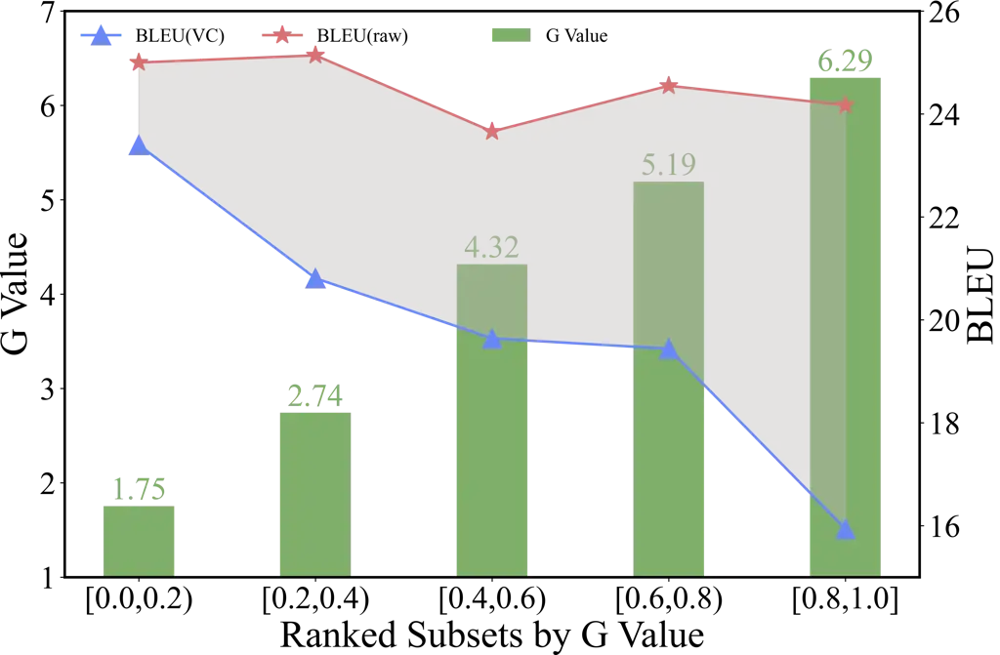
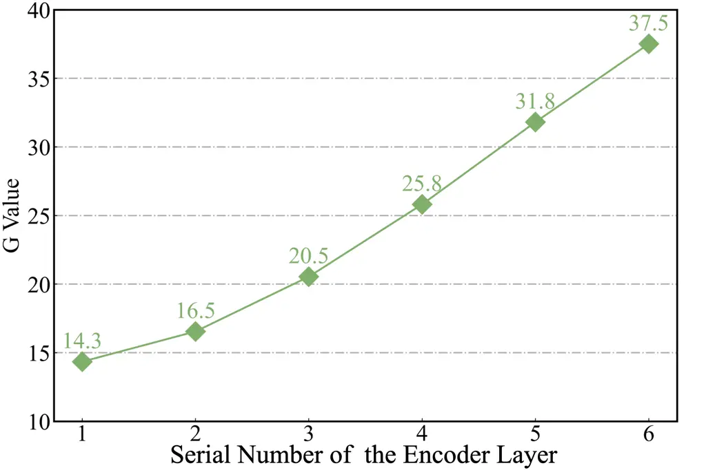
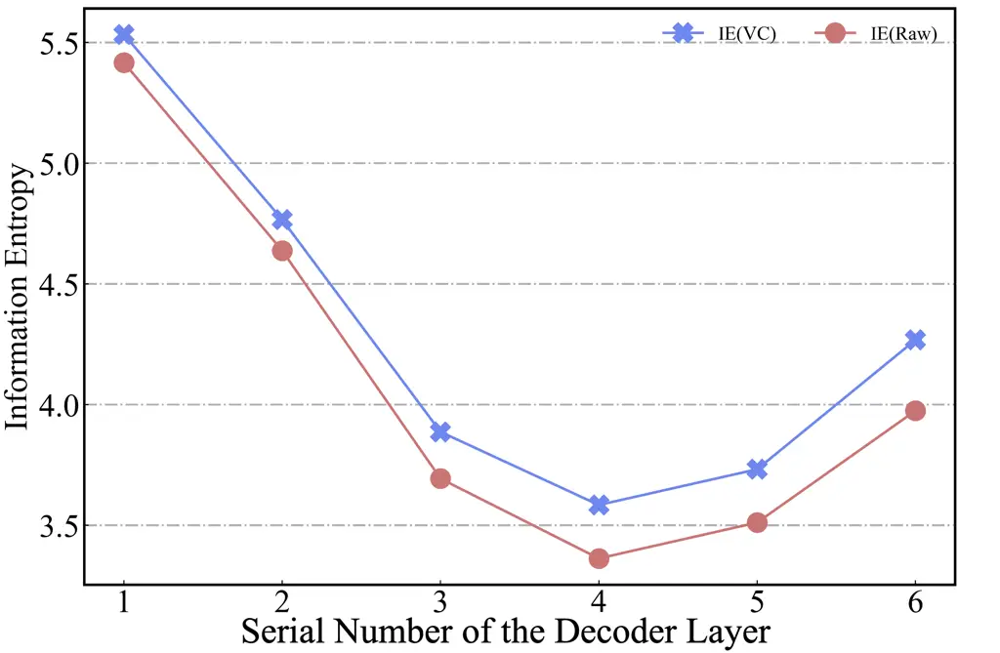
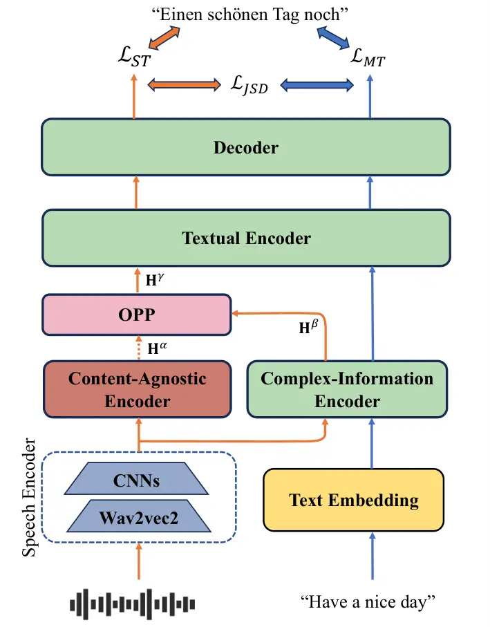
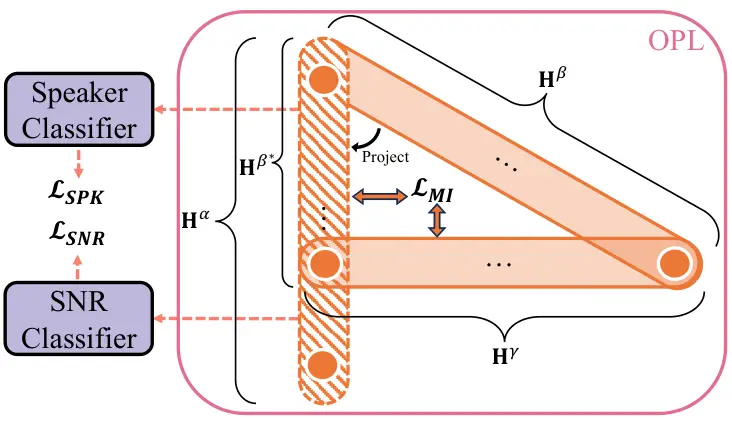
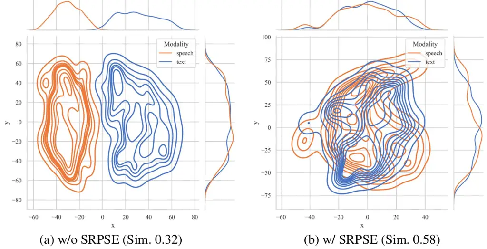
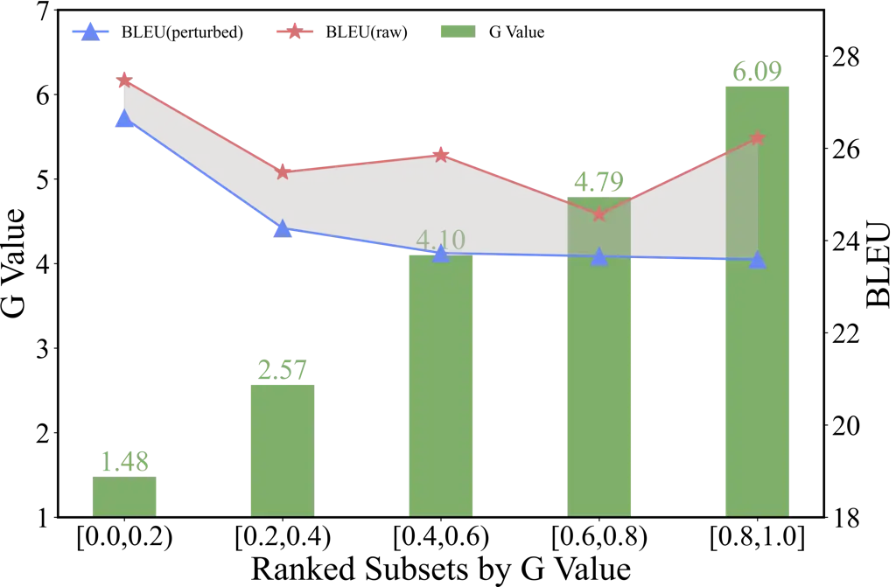
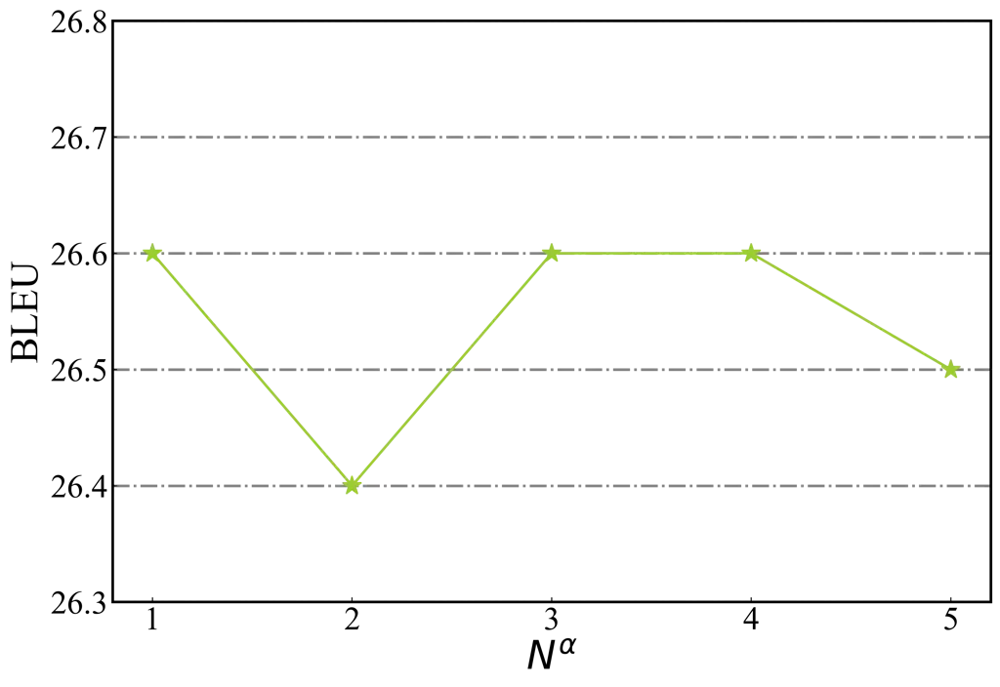
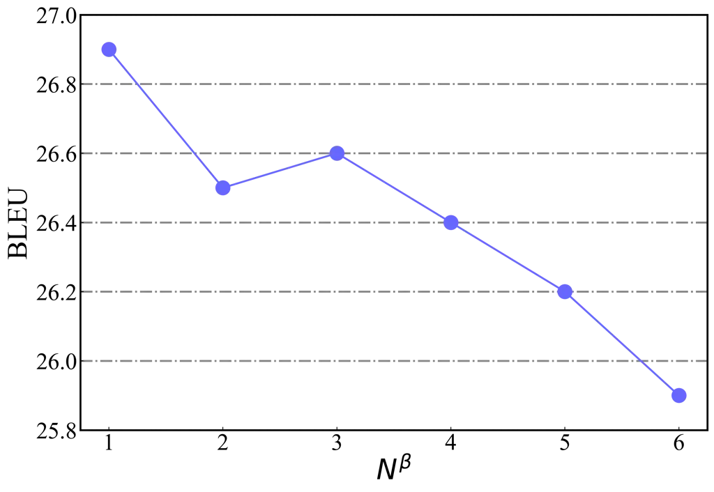
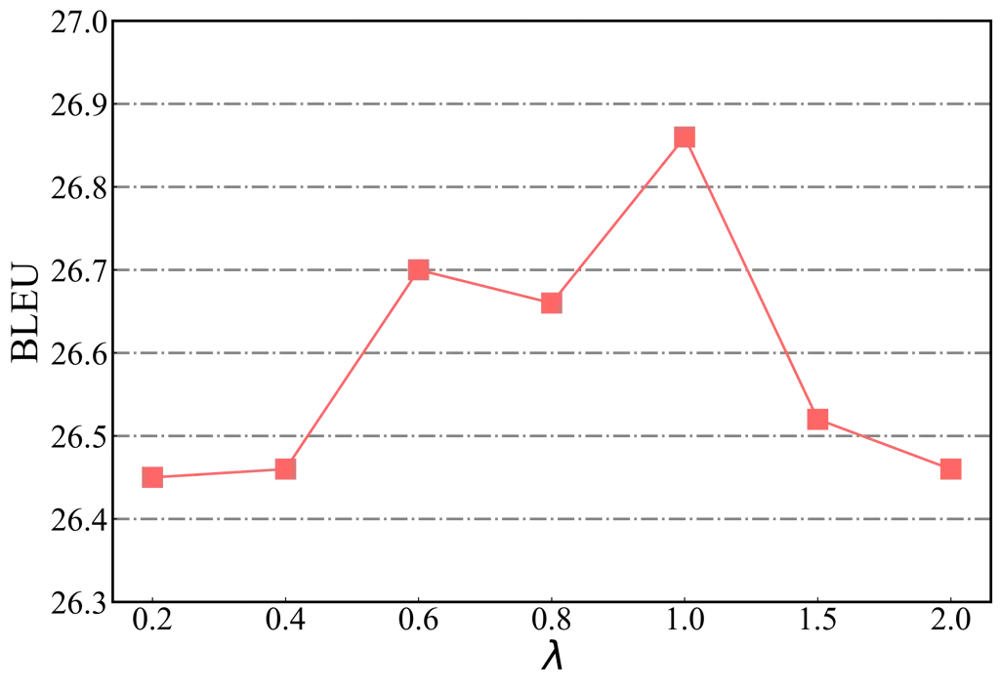

# Representation Purification for End-to-End Speech Translation

Chengwei Zhang Affiliation: School of Informatics, Xiamen University,
China Affiliation: Key Laboratory of Digital Protection and Intelligent
Processing of Intangible Cultural Heritageof Fujian and Taiwan, Ministry
of Culture and Tourism, China    Yue Zhou Affiliation: School of
Informatics, Xiamen University, China Affiliation: Key Laboratory of
Digital Protection and Intelligent Processing of Intangible Cultural
Heritageof Fujian and Taiwan, Ministry of Culture and Tourism, China   
Rui Zhao Affiliation: School of Informatics, Xiamen University, China
Affiliation: Key Laboratory of Digital Protection and Intelligent
Processing of Intangible Cultural Heritageof Fujian and Taiwan, Ministry
of Culture and Tourism, China Affiliation: Key Laboratory of Multimedia
Trusted Perception and Efficient ComputingMinistry of Education of
China, Xiamen University, Xiamen, China{cwzhang98, zhouyue1,
zhsqzr}@stu.xmu.edu.cn, {ydchen, mandel}@xmu.edu.cn    Yidong Chen
Affiliation: School of Informatics, Xiamen University, China
Affiliation: Key Laboratory of Digital Protection and Intelligent
Processing of Intangible Cultural Heritageof Fujian and Taiwan, Ministry
of Culture and Tourism, China Affiliation: Key Laboratory of Multimedia
Trusted Perception and Efficient ComputingMinistry of Education of
China, Xiamen University, Xiamen, China{cwzhang98, zhouyue1,
zhsqzr}@stu.xmu.edu.cn, {ydchen, mandel}@xmu.edu.cn    Xiaodong Shi
Affiliation: School of Informatics, Xiamen University, China
Affiliation: Key Laboratory of Digital Protection and Intelligent
Processing of Intangible Cultural Heritageof Fujian and Taiwan, Ministry
of Culture and Tourism, China

###### Abstract

Speech-to-text translation (ST) is a cross-modal task that involves
converting spoken language into text in a different language. Previous
research primarily focused on enhancing speech translation by
facilitating knowledge transfer from machine translation, exploring
various methods to bridge the gap between speech and text modalities.
Despite substantial progress made, factors in speech that are not
relevant to translation content, such as timbre and rhythm, often limit
the efficiency of knowledge transfer. In this paper, we conceptualize
speech representation as a combination of content-agnostic and
content-relevant factors. We examine the impact of content-agnostic
factors on translation performance through preliminary experiments and
observe a significant performance deterioration when content-agnostic
perturbations are introduced to speech signals. To address this issue,
we propose a Speech Representation Purification with Supervision
Enhancement (SRPSE) framework, which excludes the content-agnostic
components within speech representations to mitigate their negative
impact on ST. Experiments on MuST-C and CoVoST-2 datasets demonstrate
that SRPSE significantly improves translation performance across all
translation directions in three settings and achieves preeminent
performance under a transcript-free setting.

^(†)^(†)footnotetext: Equal contribution.

## 1 Introduction

Speech-to-text translation (ST) task aims to translate source language
speech into target language text. Earlier conventional ST
systems Sperber et al. (2017); Sperber et al. (2019); Indurthi et al.
(2023) typically cascade automatic speech recognition (ASR) and machine
translation (MT) to perform ST, which may suffer from error propagation
and high latency. Consequently, end-to-end (E2E) ST systems have gained
increasing attention due to their potential to mitigate these
deficiencies (Wang et al., 2020a; Wang et al., 2020c; Liu et al., 2020;
Xu et al., 2021; Du et al., 2022).

As a cross-modal task, ST encounters additional challenges compared to
MT, as speech encompasses not only the content information necessary for
translation but also other factors such as timbre and pitch. Therefore,
MT is often considered as the performance upper-bound of ST, prompting
researchers to devote considerable effort to designing sophisticated
methods for facilitating knowledge transfer from MT to ST, such as
multi-task learning (Ye et al., 2021a; Zhang et al., 2023c; Zhou et al.,
2024), knowledge distillation (Liu et al., 2019; Zhang et al., 2023b;
Lei et al., 2023), and cross-modal alignment (Fang et al., 2022; Ye
et al., 2022; Zhou et al., 2023; Yan et al., 2024; Le et al., 2023).
However, the inherent information divergence between speech and text
continues to hinder the efficiency of knowledge transfer and the
generalization capability (Chan and Ghosh, 2022; Zhang et al., 2024).
Despite impressive improvements achieved in previous research, the
impact of redundant speech factors on ST models is often overlooked.

In this paper, we view speech as an amalgamation of information, and
following previous works (Qian et al., 2020; Ho Chan et al., 2022), we
conceptualize it as a composite of four components: language content,
timbre, pitch, and rhythm. We define the language content as
content-relevant information, which refers to the textual information
contained in speech signals. Consequently, the other three components
are defined as content-agnostic information. We first conduct a
preliminary study (see Section 2) to investigate the correlation between
the model’s performance and the content-agnostic information. We
observed that the ST model is susceptible to perturbations in the
content-agnostic aspects of speech, with a significant performance gap
between using original and perturbed speech as input. Moreover, the
translation quality declines rapidly as content-agnostic information
increases. Based on these findings, we aim to purify the speech
representation by explicitly filtering out the content-agnostic
components.

To achieve this, we propose the Speech Representation Purification with
Supervision Enhancement (SRPSE) framework. Specifically, we introduce a
content-agnostic encoder and a complex-information encoder to extract
content-agnostic information and comprehensive speech features,
respectively. An orthogonal projection purification (OPP) module first
isolates the content-agnostic component within the complex features and
then eliminates it to obtain purified representations. Additionally, to
adequately extract content-agnostic information, we implement a
supervision enhancement method that perturbs the speech input during
training, accompanied by a consistency loss to constrain the
representation, thereby enhancing the model’s robustness and
purification capability.

Notably, our method does not require transcriptions or additional
annotations to accomplish the purification. As a result, it maintains
higher flexibility and can be applied to unwritten languages that do not
possess any transcription data.

We conduct experiments on the MuST-C and CoVoST-2 datasets, covering ten
translation directions, in scenarios with and without transcriptions, as
well as with additional MT data. The experimental results demonstrate
the superiority of our method on all translation directions, and
achieving preeminent performance without transcriptions.



Figure 1: BLEU scores on MuST-C En-De dev subsets. VC and raw denote the
BLEU scores are calculated with voice-converted audio
$`\tilde{\mathbf{s}}`$ and raw audio $`\mathbf{s}`$, respectively. The
Green bar denotes the G value.



Figure 2: Averaged $`G`$ values of each T-Enc layer’s outputs.



Figure 3: Averaged information entropy of cross-attention weights.

## 2 Preliminary Analysis

In this section, we examine the impact of content-agnostic perturbations
on the ST model. Typically, an ST dataset that contains triplet data can
be formed as $`\mathcal{D}=\{(\mathbf{s},\mathbf{x},\mathbf{y})\}`$,
where $`\mathbf{s}`$, $`\mathbf{x}`$, $`\mathbf{y}`$ denote source
speech, transcription, and translation, respectively. To perturb in the
content-agnostic aspects of speech while preserving the content-relevant
information, we use a voice conversion (VC) system Chou et al. (2019) to
modify the speaker’s information, transforming the source speech
$`\mathbf{s}`$ into its perturbed version $`\tilde{\mathbf{s}}`$. We
conduct experiments based on XSTNet (Ye et al., 2021a), more
experimental details are described in Appendix A. By feeding either
$`\mathbf{s}`$ or $`\tilde{\mathbf{s}}`$ into the model, we measure the
extent to which the model is influenced by content-agnostic
perturbations, quantified by $`G`$, which is defined as the
sentence-level L2 distance between the output representations of the
textual encoder:

```math
G=\parallel{\rm\mathbf{Avg}}(f_{e}(\mathbf{s}))-{\rm\mathbf{Avg}}(f_{e}(\tilde{\mathbf{s}}))\parallel_{2}, \tag{1}
```

where $`{\rm\mathbf{Avg}(\cdot)}`$ denotes average pooling on the
temporal dimension, and $`f_{e}(\cdot)`$ means the corresponding output
of textual encoder. A higher $`G`$ value indicates a greater impact on
the model.

Impact on Translation Quality To demonstrate the correlation between the
degree of perturbations and translation performance, we calculate $`G`$
for all samples in MuST-C (Di Gangi et al., 2019) En-De dev set and
divide the samples into five equal-sized subsets based on their $`G`$
values. As shown in Figure 1, when $`\tilde{\mathbf{s}}`$ is used as
input we observe a significant decline in BLEU scores as the $`G`$ value
increases; meanwhile, the BLEU gap (grey area in Figure 1) widens. These
findings suggest that the model focuses excessively on context-agnostic
information and is highly susceptible to perturbations.

Impact on Textual Encoder Furthermore, we investigate the response of
textual encoder to perturbations by tracking fluctuations of $`G`$ value
across each layer. As illustrated in Figure 2, as the layers deepen, the
$`G`$ value¹¹ 1 Note that layer normalization is applied at the top of
the final layer of the textual encoder, which accounts for the larger
scale of $`G`$ values in Figure 2 compared to Figure 1. consistently
rises, indicating that the textual encoder fails to neutralize
perturbations and cannot effectively extract content-relevant
information.

Impact on Decoder To explore the relationship between representation
perturbation and decoder performance, we compute the information entropy
(IE) of cross-attention weights in each decoder layer, as shown in
Figure 3. Higher IE values are observed in every decoder layer when
$`\tilde{\mathbf{s}}`$ input to the model, indicating greater
uncertainty during the decoding process. This phenomenon is more
pronounced in deeper layers, contributing to performance degradation.

Based on the observations and analyses above, we can conclude that the
model lacks robustness against content-agnostic information in speech,
ultimately leading to performance degradation. Inspired by these
findings, we aim to extract and eliminate content-agnostic information
from speech features to improve translation performance.

## 3 Method



Figure 4: Overview of our proposed framework. The text embedding and MT
forward path are deprecated during inference or training in the
transcript-free setting.



Figure 5: Diagram of OPP Module. It consists of two classifiers and an
orthogonal projection layer.

In this section, we present our model architecture in Section 3.1,
followed by a detailed explanation of the proposed Speech Representation
Purification with Supervision Enhancement (SRPSE) method in Section 3.2.
An overview of our framework is illustrated in Figure 4.

### 3.1 Model Architecture

Our model primarily comprises six modules: the speech encoder (S-Enc),
the content-agnostic encoder (CA-Enc), the complex-information encoder
(CI-Enc), the orthogonal projection purification (OPP) module, the
textual encoder (T-Enc), and the decoder.

Speech Encoder We adopt Wav2vec2.0 base (Baevski et al., 2020) to
extract low-level features, and a two-layer 1D CNN with stride 2 to
reduce the sequence length by a factor of 4.

CA-Enc & CI-Enc The CA-Enc and CI-Enc consist of $`N^{\alpha}`$ and
$`N^{\beta}`$ Transformer encoder layers, respectively, which use the
same configurations as the vanilla Transformer, except that pre-norm
(Xiong et al., 2020) is applied for stable training. The
hyper-parameters $`N^{\alpha}`$ and $`N^{\beta}`$ are both set to 1. The
CA-Enc is expected to extract content-agnostic information, while the
CI-Enc captures full information of speech.

Orthogonal Projection Purification (OPP) As depicted in Figure 5, the
OPP module mainly comprises three components: speaker classifier,
signal-to-noise ratio (SNR) classifier, and orthogonal projection layer
(OPL) (Qin et al., 2020). The speaker classifier and the SNR classifier
predict speaker IDs and background noise levels , respectively, using
the output representations of CA-Enc. These classifiers are designed to
provide supervisory information for CA-Enc. The OPL is introduced to
eliminate the content-agnostic aspects in complex features, thereby
producing purified representations that are only relevant to the speech
content.

Textual Encoder With the same configurations as the CA-Enc and CI-Enc,
the T-Enc further extracts the high-level semantic hidden
representations of speech and text.

Decoder We employ the base configuration as the vanilla Transformer
decoder. It generates the translation sequences for ST or MT tasks. The
corresponding translation objective is defined as:

```math
\mathcal{L}_{\rm ST}=-\sum_{(\mathbf{s},\mathbf{y})\in\mathcal{D}}\log P(\mathbf{y}\mid\mathbf{s}), \tag{2}
```

```math
\mathcal{L}_{\rm MT}=-\sum_{(\mathbf{x},\mathbf{y})\in\mathcal{D}}\log P(\mathbf{y}\mid\mathbf{x}). \tag{3}
```

Besides, we minimize the Jensen-Shannon Divergence (JSD) between MT and
ST probability distributions to transfer knowledge from MT to ST:

```math
\begin{split}\mathcal{L}_{\rm JSD}=\sum_{(\mathbf{s},\mathbf{x},\mathbf{y})\in\mathcal{D}}{\rm JSD}[P(\mathbf{y}\mid\mathbf{s})\parallel P(\mathbf{y}\mid\mathbf{x})].\end{split} \tag{4}
```

### 3.2 Speech Representation Purification with Supervision Enhancement(SRPSE)

As mentioned in Section 2, we aim to purify the complex speech
representations by dislodging the content-agnostic part. Two major
problems hamper us from achieving our goal: (1) Given the
content-agnostic representation $`\mathbf{H}^{\alpha}`$ output by CA-Enc
and the complex speech representation $`\mathbf{H}^{\beta}`$ output by
CI-Enc, how do we produce the ideal purified speech representation
$`\mathbf{H}^{\gamma}`$? (2) How do we ensure the
$`\mathbf{H}^{\alpha}`$ truly includes adequate content-agnostic
information?

Orthogonal Projection Purification To answer the first question we
introduce the orthogonal projection layer (OPL) to eliminate the
content-agnostic parts present in the complex features, producing a
purified representation $`\mathbf{H}^{\gamma}`$ which is only relevant
to the content.

Specifically, we first project the complex representation
$`\mathbf{H}^{\beta}`$ extracted by the CI-Enc to the content-agnostic
representation $`\mathbf{H}^{\alpha}`$ extracted by the CA-Enc to obtain
$`\mathbf{H}^{\beta^{*}}`$:

```math
\mathbf{H}^{\beta^{*}}=\frac{\mathbf{H}^{\beta}\cdot\mathbf{H}^{\alpha}}{\mid\mathbf{H}^{\alpha}\mid}\frac{\mathbf{H}^{\alpha}}{\mid\mathbf{H}^{\alpha}\mid}. \tag{5}
```

This operation entails the mining of content-agnostic components within
the complex features. Then we project $`\mathbf{H}^{\beta}`$ to the
orthogonal hyperplane of $`\mathbf{H}^{\beta^{*}}`$ to obtain
$`\mathbf{H}^{\gamma}`$. In practice, this projection formed as:

```math
\mathbf{H}^{\gamma}=\mathbf{H}^{\beta}-\mathbf{H}^{\beta^{*}}. \tag{6}
```

This process eradicates redundancy within complex features, yielding the
purified speech representation. However, we expect there is no
information overlapping between content-agnostic and purified
representations, but the orthogonality of representations does not imply
a complete absence of mutual information between them. Thus we introduce
vCLUB (Cheng et al., 2020) to minimize mutual information upper bound
between $`\mathbf{H}^{\gamma}`$ and $`\mathbf{H}^{\beta^{*}}`$:

```math
\begin{split}\mathcal{L}_{\rm MI}&=\frac{1}{N}\sum_{i=1}^{N}[\frac{1}{T}\sum_{t=1}^{T}\log q_{\theta}(\mathbf{H}_{i}^{\gamma}\mid\mathbf{H}_{i}^{\beta^{*}})\\
&-\frac{1}{N}\frac{1}{T}\sum_{j=1}^{N}\sum_{t=1}^{T}\log q_{\theta}(\mathbf{H}_{j}^{\gamma}\mid\mathbf{H}_{i}^{\beta^{*}})],\end{split} \tag{7}
```

where $`q_{\theta}(\mathbf{H}^{\gamma}\mid\mathbf{H}^{\beta^{*}})`$
serves as a variational approximation of posterior
$`p(\mathbf{H}^{\gamma}\mid\mathbf{H}^{\beta^{*}})`$ with approximation
network $`\theta`$. More details about the vCLUB and our implementation
are elaborated in Apppendix D.

Content-Agnostic Supervision Enhancement For the second question,
without stricter constraints on the CA-Enc, supervision signals
generated by the mutual information minimization task may be
insufficient. Therefore, we employ speech perturbations to introduce
richer supervision signals and further enhance the purification process.
We employ three perturbation policies: noise interference, pitch shift
and time stretch (Park et al., 2019). For each speech input, we randomly
sample a signal-to-noise ratio $`\varepsilon\in\{5,10,20,50,+\infty\}`$,
a pitch shift step $`\mu\in\{-1,0,+1\}`$ and a stretch rate
$`\tau\in\{0.8,0.9,1.0,1.1,1.2\}`$. Then a transformation defined by
these three factors is applied to each sample using torchaudio toolkit
(Yang et al., 2021):

```math
\tilde{\mathbf{s}}=f_{(\varepsilon,\mu,\tau)}(\mathbf{s}), \tag{8}
```

when $`\varepsilon=+\infty`$, $`\mu=0`$, and $`\tau=1.0`$, it denotes
the policy is not applied.

The $`\tilde{\mathbf{s}}`$ also forward in S-Enc, CA-Enc, CI-Enc, and
OPP module. With speaker IDs and $`\varepsilon`$ serving as
content-agnostic supervision signals, we can now regularize the CA-Enc
by these two classifiers mentioned in (Section 3.1) with:

```math
\begin{split}\mathcal{L}_{\rm SPK}&=-\frac{1}{2}{\textstyle\sum_{i=1}^{\mid\mathcal{D}\mid}}[\log P(\mathbf{spk}_{i}\mid\mathbf{H}^{\alpha})\\
&+\log P(\mathbf{spk}_{i}\mid\widetilde{\mathbf{H}}^{\alpha})],\end{split} \tag{9}
```

```math
\begin{split}\mathcal{L}_{\rm SNR}&=-\frac{1}{2}[{\textstyle\sum_{i=1}^{\mid\mathcal{D}\mid}}\log P(\varepsilon_{i}\mid\mathbf{H}^{\alpha})\\
&+{\textstyle\sum_{j=1}^{\mid\mathcal{D}\mid}}\log P(\varepsilon_{j}\mid\widetilde{\mathbf{H}}^{\alpha})],\end{split} \tag{10}
```

where $`\widetilde{\mathbf{H}}^{\alpha}`$ is the counterpart of
$`\mathbf{H}^{\alpha}`$ when $`\tilde{s}`$ input to the model. We don’t
utilize $`\mu`$ and $`\tau`$ explicitly, but incorporating these two
perturbations enhances the difficulty of predicting speaker IDs,
providing sterner regularization to CA-Enc.

Theoretically, if SRPSE is capable of filtering out all content-agnostic
information, it should generate a similar representation regardless of
the $`\mathbf{s}`$ or $`\tilde{\mathbf{s}}`$ serves as input to our
model. Therefore we anticipate a higher degree of proximity between
$`\mathbf{H}^{\gamma}`$ and its counterpart
$`\widetilde{\mathbf{H}}^{\gamma}`$. We average $`\mathbf{H}^{\gamma}`$
and $`\widetilde{\mathbf{H}}^{\gamma}`$ on temporal dimension to get
sentence-level representation and employ a consistency loss to bring
them together:

```math
\begin{split}\mathcal{L}_{\rm CONSIS}=\sum^{\mid\mathcal{D}\mid}\parallel{\rm\mathbf{Avg}}({\mathbf{H}^{\gamma}})-{\rm\mathbf{Avg}}(\widetilde{\mathbf{H}}^{\gamma})\parallel_{2}.\end{split} \tag{11}
```

The overall training objectives of transcript-free setting and
multi-task setting are as follows:

```math
\begin{split}\mathcal{L}_{\rm TF}&=\mathcal{L}_{\rm ST}+\mathcal{L}_{\rm SPK}+\mathcal{L}_{\rm SNR}\\
&+\lambda_{1}\mathcal{L}_{\rm CONSIS}+\lambda_{2}\mathcal{L}_{\rm MI},\end{split} \tag{12}
```

```math
\mathcal{L}_{\rm MTL}=\mathcal{L}_{\rm TF}+\mathcal{L}_{\rm MT}+\mathcal{L}_{\rm JSD}, \tag{13}
```

where $`\lambda_{1}`$ and $`\lambda_{2}`$ are hyper-parameters.

## 4 Experiments

### 4.1 Experimental Setup

Datasets We conduct experiments on MuST-C (Di Gangi et al., 2019) and
CoVoST-2 (Wang et al., 2020b) datasets. MuST-C is a one-to-many ST
dataset, covering pairs from English to Dutch (Nl), French (Fr), German
(De), Italian (It), Portuguese (Pt), Romanian (Ro), Russian (Ru), and
Spanish (Es). CoVoST-2 is a large and diversified multilingual ST
corpus, we experiment in the German-English and French-English
directions. Both of these datasets comprise triplet data sources:
speech, transcription, and translation, which are meticulously aligned
at the sentence level. For a fair and comprehensive comparison, we
follow Du et al. (2022); Zhou et al. (2023), the WMT16 En-De, WMT14
En-Fr, and WMT13 En-Es serve as external data for German, French, and
Spanish translation respectively. The detailed statistics for all
datasets are shown in Appendix B.

Training settings There are three settings for speech translation tasks:
transcript-free, multi-task, and expanded. For transcript-free setting,
only the $`(\mathbf{s},\mathbf{y})`$ pairs are used to train our model,
and the training objective is Equation 12. For multi-task setting, we
use $`(\mathbf{s},\mathbf{x},\mathbf{y})`$ triplets with Equation 13.
For expanded setting, we first pre-train the corresponding components
with the external MT dataset then fine-tune our model with progressive
training Ye et al. (2021b) on MuST-C triplets.

Experiment Details The implementation of our model is based on fairseq²²
2
[https://github.com/facebookresearch/fairseq](https://github.com/facebookresearch/fairseq) (Ott
et al., 2019). The hyper-parameters $`\lambda_{1}`$, $`\lambda_{2}`$,
$`N^{\alpha}`$, and $`N^{\beta}`$ are set to $`1.0`$, $`0.01`$, $`1`$ ,
and $`1`$, respectively. The textual encoder and the decoder consist of
5 and 6 layers, respectively. We report case-sensitive detokenized BLEU
scores using SacreBLEU (Post, 2018) in our main results, and
additionally present ChrF++ (Popović, 2017) and COMET (Rei et al., 2022)
scores in our ablation study and analysis. Appendix  C shows more
implementation details and explanations for the baselines. Detailed
hyper-parameter selection experiments are also provided in Appendix E.

|                                               |        |        |        |        |        |        |        |        |        |
| --------------------------------------------- | ------ | ------ | ------ | ------ | ------ | ------ | ------ | ------ | ------ |
| Models                                        | En-De  | En-Fr  | En-Ru  | En-Es  | En-It  | En-Nl  | En-Pt  | En-Ro  | Avg.   |
| Training in transcript-free setting           |        |        |        |        |        |        |        |        |        |
| Fairseq ST Wang et al. (2020a)                | 22.7   | 32.9   | 15.3   | 27.2   | 22.7   | 27.3   | 28.1   | 21.9   | 24.8   |
| Revisit ST Zhang et al. (2022)                | 23.0   | 33.5   | 15.6   | 28.0   | 23.5   | \-     | \-     | \-     | \-     |
| W2V2-TransformerFang et al. (2022)            | 24.1   | 35.0   | 16.3   | 29.4   | 24.8   | 28.9   | 30.0   | 23.1   | 26.5   |
| CCSRD Zhao et al. (2023)                      | 25.4   | 35.8   | 16.8   | 30.2   | 25.8   | \-     | \-     | \-     | \-     |
| DUB (Large) Zhang et al. (2023a)$`{\dagger}`$ | 26.2   | 35.3   | \-     | 30.4   | \-     | \-     | \-     | \-     | \-     |
| BT4ST Fang and Feng (2023)$`{\dagger}`$       | 26.6   | 36.9   | \-     | 31.2   | \-     | \-     | \-     | \-     | \-     |
| SRPSE                                         | 26.2\* | 36.5\* | 17.6\* | 31.2\* | 26.1\* | 30.4\* | 31.9\* | 24.6\* | 28.0\* |
| Training in multi-task setting                |        |        |        |        |        |        |        |        |        |
| Memory-ST Yuan et al. (2024)                  | 23.2   | 33.5   | \-     | 28.6   | 23.9   | 27.6   | 28.7   | \-     | \-     |
| XSTNet Ye et al. (2021b)                      | 25.5   | 36.0   | 16.9   | 29.6   | 25.5   | 30.0   | 31.3   | 25.1   | 27.5   |
| STEMM Fang et al. (2022)                      | 25.6   | 36.1   | 17.1   | 30.3   | 25.6   | 30.1   | 31.0   | 24.3   | 27.5   |
| ConST Ye et al. (2022)                        | 25.7   | 36.8   | 17.3   | 30.4   | 26.3   | 30.6   | 32.0   | 24.8   | 28.0   |
| MCTN Zhou et al. (2024)                       | 25.9   | 36.1   | 17.1   | 30.3   | 25.7   | \-     | \-     | \-     | \-     |
| Siamese-PT Le et al. (2023)                   | 26.2   | 36.9   | 16.8   | 29.8   | 25.9   | 29.8   | 32.1   | 24.8   | 27.8   |
| CCSRD Zhao et al. (2023)                      | 26.1   | 37.1   | 17.8   | 31.0   | 26.4   | \-     | \-     | \-     | \-     |
| M³ST Cheng et al. (2023)                      | 26.4   | 37.2   | 18.3   | 31.0   | 26.6   | 30.9   | 32.8   | 25.4   | 28.6   |
| CMOT Zhou et al. (2023)                       | 27.0   | 37.3   | 17.9   | 31.1   | 26.9   | 31.2   | 32.7   | 25.3   | 28.7   |
| SRPSE                                         | 26.9\* | 37.4\* | 18.3\* | 31.4\* | 27.0\* | 31.4\* | 32.8\* | 25.5\* | 28.8\* |

Table 1: BLEU scores on MuST-C tst-COMMON set under transcript-free
setting and multi-task setting. $`{\dagger}`$ indicates external
target-side MT data was used during training. \* denotes the
improvements over the W2V2-Transformer baseline in transcript-free
setting and XSTNet baseline in multitask-setting is statistically
significant ($`p<0.01`$).

| Models                                        | Fr-En | De-En |
| --------------------------------------------- | ----- | ----- |
| Transformer-ST Wang et al. (2020b)            | 26.3  | 17.1  |
| Revisit ST Zhang et al. (2022)                | 26.9  | 14.1  |
| U2TT (Large) Zhang et al. (2023a)             | 27.4  | 16.7  |
| DUB (Large) Zhang et al. (2023a)$`{\dagger}`$ | 29.5  | 19.5  |
| SRPSE                                         | 29.3  | 21.4  |

Table 2: BLEU scores on CoVoST-2 De-En and Fr-En test sets under
transcript-free setting. $`{\dagger}`$ indicates external targe-side MT
data was used during training.

|                                     |        |        |        |
| ----------------------------------- | ------ | ------ | ------ |
| Models                              | En-De  | En-Fr  | En-Es  |
| W2V2-Transformer Fang et al. (2022) | 26.9   | 36.6   | 30.0   |
| TDA Du et al. (2022)                | 27.1   | \-     | \-     |
| Chimera Han et al. (2021)           | 27.1   | 35.6   | 30.6   |
| SATE Xu et al. (2021)               | 28.1   | \-     | \-     |
| STEMM Fang et al. (2022)            | 28.7   | 37.4   | 31.0   |
| XSTNet Ye et al. (2021b)            | 27.8   | 38.0   | 30.8   |
| ConST Ye et al. (2022)              | 28.3   | 38.3   | 32.0   |
| CMOTZhou et al. (2023)              | 29.0   | 39.5   | 32.8   |
| SRPSE                               | 29.2\* | 39.9\* | 33.0\* |

Table 3: BLEU scores on MuST-C tst-COMMON set with external training
data (expended setting). \* means the improvements over XSTNet are
statistically significant ($`p<0.01`$).

### 4.2 Main Results

Comparison with End-to-End Baselines The main results on the MuST-C and
CoVoST-2 datasets are presented in Table 1 and Table 2, respectively. In
the transcript-free setting, our model achieves distinguished
performance, and significantly outperforms W2V2-Transformer (Fang
et al., 2022) by an average of 1.5 BLEU scores. It attains either
superior or comparable performance on MuST-C and CoVoST-2 with fewer
parameters and less training data³³ 3 DUB (larger) has a larger model
size than ours (260M vs. 160M), BT4ST employs multiple models for back
translation, and both of them utilize additional target-side MT data,
whereas our model only uses speech-translation pairs., compared to our
strongest baselines, DUB (Large) (Zhang et al., 2023a) and BT4ST (Fang
and Feng, 2023). In the multi-task setting, our model exceeds XSTNet (Ye
et al., 2021b) on MuST-C by an average of 1.3 BLEU scores and surpasses
our strongest baseline, CMOT (Zhou et al., 2023). As shown in Table 3,
with the introduction of external MT data, our model also gains an
average of 1.8 BLEU scores improvement compared with XSTnet and
outperforms CMOT slightly. These gains verify the effectiveness of our
approach.

Among all baselines, CCSRD (Zhao et al., 2023) aim to address similar
issues, they chose to encode the speech representation into two
components directly and the cyclic reconstruction is a sophisticated
decoupling approach. Unlike CCSRD, our approach focuses on extracting
and filtering out the redundant parts in speech representations.

Comparison with Cascaded Baselines Table 4 illustrates the performance
of our model compared to several cascaded baselines. Among these, the
Cascade refers to our implementation of a cascade system. The ASR part
is trained on a mixture of LibriSpeech Panayotov et al. (2015) and
MuST-C data, and the MT part is trained on external MT and MuST-C data.
The statistics denote SRPSE significantly outperforms all cascade
baselines.

|                               |        |        |
| ----------------------------- | ------ | ------ |
| Models                        | En-De  | En-Es  |
| Espnet (Inaguma et al., 2020) | 23.6   | 28.7   |
| Ye et al. (2021b)             | 25.2   | \-     |
| Xu et al. (2021)              | 28.1   | \-     |
| Cascade                       | 26.8   | 30.3   |
| SRPSE                         | 29.2\* | 33.0\* |

Table 4: Our method versus the cascaded models on MuST-C En-De and En-Es
tst-COMMON set. Cascade is a strong cascaded system we implemented. \*
mean the improvements over the cascaded baseline are statistically
significant ($`p<0.01`$).

### 4.3 Ablation Study

To evaluate the contribution of each training objective, we
progressively eliminate them, and the results are shown in Table 5.
First, we remove $`\mathcal{L}_{\rm SPK}`$ solely, resulting in a slight
drop in both BLEU and ChrF++ by 0.2 points, and COMET drop by 0.5
points, indicating that our method does not heavily rely on speaker
annotations from the ST dataset. In Exp.IV, when
$`\mathcal{L}_{\rm CONSIS}`$, $`\mathcal{L}_{\rm SPK}`$, and
$`\mathcal{L}_{\rm SNR}`$ are removed, BLEU scores decrease by 0.5
points, indicating the positive impact of our supervision enhancement
strategy. Further removing the $`\mathcal{L}_{\rm MI}`$ and deleting
CA-Enc and OPP Module in Exp.V, we observed a decrease of 0.3 BLEU
scores, proving that the constraint of mutual information is effective.
In Exp.VI, with the absence of $`\mathcal{L}_{\rm JSD}`$, the BLEU
scores dropped by $`0.4`$, highlighting the significant impact of
knowledge transfer.

| \#Exp. | $`\mathcal{L}_{\rm CONSIS}`$ | $`\mathcal{L}_{\rm SNR}`$ | $`\mathcal{L}_{\rm SPK}`$ | $`\mathcal{L}_{\rm MI}`$ | $`\mathcal{L}_{\rm JSD}`$ | BLEU | ChrF++ | COMET |
| ------ | ---------------------------- | ------------------------- | ------------------------- | ------------------------ | ------------------------- | ---- | ------ | ----- |
| I      | ✓                            | ✓                         | ✓                         | ✓                        | ✓                         | 26.9 | 54.1   | 75.2  |
| II     | ✓                            | ✓                         | $`\times`$                | ✓                        | ✓                         | 26.7 | 53.9   | 74.7  |
| III    | $`\times`$                   | ✓                         | ✓                         | ✓                        | ✓                         | 26.7 | 54.0   | 74.9  |
| IV     | $`\times`$                   | $`\times`$                | $`\times`$                | ✓                        | ✓                         | 26.4 | 53.6   | 74.1  |
| V      | $`\times`$                   | $`\times`$                | $`\times`$                | $`\times`$               | ✓                         | 26.1 | 53.3   | 73.7  |
| VI     | $`\times`$                   | $`\times`$                | $`\times`$                | $`\times`$               | $`\times`$                | 25.7 | 52.8   | 73.0  |

Table 5: Ablation on training objectives under multi-task setting. BLEU,
ChrF++, and COMET scores are reported on MuST-C En-De tst-COMMON set.



Figure 6: Bivariate KDE contour plot of speech and text representations
on MuST-C En-De tst-COMMON set. Yellow and blue lines are speech and
text representations respectively. T-SNE is utilized to reduce dimension
to 2D. Sim. denotes the cosine similarity between these two
representations. (a) The same configurations as that in Table 5 Exp.IV.
(b) Our SRPSE.

## 5 Analysis

### 5.1 Can SRPSE Purify Speech Representation?

To assess the effectiveness of our approach in purifying speech
representations, we extract text and speech representations from T-Enc
input and visualize them using t-SNE (Van der Maaten and Hinton, 2008).
Additionally, we calculate the average cosine similarity between
cross-modal representations. Figure 6 is the bivariate kernel density
estimation (KDE) plot, where greater overlap indicates more similar
representation distributions. Without SRPSE, speech and text
representations are clearly separated, with a relatively low average
cosine similarity of $`0.32`$. When SRPSE is applied, the
representations are brought significantly closer, leading to a higher
cosine similarity of $`0.58`$. Such phenomena suggest our approach can
generate purified speech representation that contains more
content-relevant information, and accounts for higher consistency with
its text counterpart.

### 5.2 Is SRPSE Robust to Content-agnostic Perturbations?



Figure 7: BLEU scores on MuST-C En-De dev subsets with our SRPSE.
Perturbed and raw denote the BLEU scores are calculated with perturbed
audio $`\tilde{\mathbf{s}}`$ and raw audio $`\mathbf{s}`$ respectively.
The Green bar denotes the $`G`$ value.

We conduct the same experiment as in Section 2, using voice conversion
to perturb the speech input to assess the robustness of our model.
Figure 7 illustrates the trend in BLEU scores as the $`G`$ value
increases. The averaged $`G`$ value across 5 subsets in Figure 1 is
$`4.05`$, while our model is $`3.8`$, suggesting the representations of
our model have higher stability. Notably, the BLEU gap (grey area) is
greatly reduced compared to Figure 1. As evident from these experimental
findings, SRPSE achieves better performance under perturbations,
confirming that our SRPSE enhances robustness.

### 5.3 What’s the Difference Between our Supervision Enhancement and Data Augmentation?

To validate the effectiveness of our architecture and differentiate our
approach from the conventional data augmentation method, we conduct
experiments for further analysis. We re-implement the Exp.V in Table 5,
but using the perturbation method described in Section 3.2 as a data
augmentation method, resulting in BLEU scores of $`26.12`$. Despite
augmenting the audio, there was only a negligible improvement compared
to Exp.V. This clarifies that the performance gains of our method stem
from a delicately designed model structure rather than merely expanding
the training data.

### 5.4 What’s the Additional Computational Cost Associated with the Introduction of New Modules?

To evaluate the efficiency of our pipeline, we conduct experiments on
MuST-C (Di Gangi et al., 2019) En-De tst-COMMOM set. We set both beam
size and batch size to 1 and performed inference on this set for 10
runs. For the baseline W2V2-Transformer (Fang et al., 2022), the average
time cost is $`421.83`$ seconds and the average tps (tokens per second)
is $`166.51`$. In comparison, our model has an average time cost of
$`442.78`$ seconds and a tps of $`156.72`$. This represents an
approximately $`5\%`$ increase in inference time and a $`6\%`$ decrease
in tps compared to the baseline. These results demonstrate that the
additional modules introduce minimal computational overhead.

## 6 Related Work

Training an end-to-end ST model that does not produce intermediate
transcriptions is no easy job because of the modality gap and the
scarcity of speech-transcription-translation supervised data. To address
these issues, many techniques have been used, including pretraining Pino
et al. (2020); Alinejad and Sarkar (2020); Dong et al. (2021); Xu et al.
(2021), multi-task learning Tang et al. (2021); Ye et al. (2021b);
Vydana et al. (2021), data augmentation Lam et al. (2022); Mi et al.
(2022), meta-learning Indurthi et al. (2020), and cross-modal
alignment Han et al. (2021); Xu et al. (2021); Ye et al. (2022); Fang
et al. (2022).

While most research chose to migrate the translation ability from MT to
ST by designing exquisite model architectures or training procedures,
few studies have investigated the correlation between speech
characteristics and translation performance. Zhang et al. (2024) noticed
the intrinsic modal differences and proposed to align the representation
space rather than individual sample pairs, avoiding directly modifying
the speech representation. Zhao et al. (2023) tackled this issue more
straightforwardly, they proposed to decompose speech representation into
content and non-content representation via disentanglement
representation learning.

Representation purification aims to decompose various components behind
data and utilize partial components to improve specific tasks, which is
used extensively across numerous fields (Qin et al., 2020; Kong et al.,
2023; Li et al., 2023; Zhu et al., 2023; Xie et al., 2022). In
text-to-speech (TTS) tasks, there has been a trend to decouple multiple
acoustic features from speech to generate expressive speech. Skerry-Ryan
et al. (2018), and Lee et al. (2021) proposed to disentangle prosody
information for synthesizing high-quality audio. Qian et al. (2020),
Yang et al. (2022) and Ho Chan et al. (2022) suggested that
disentangling more aspects of speech could boost the performance of TTS.
In this paper, we conduct comprehensive experiments to investigate the
correlation between speech translation quality and various speech
components. Based on our experiment results, our method distinct from
prior efforts, emphasizes the extraction of the content-agnostic part of
speech representations, coupled with a purification framework to
eliminate it, ultimately elevating translation quality.

## 7 Conclusion

In this paper, we propose SRPSE, an ST framework that purifies speech
representation by eliminating content-agnostic information. The
experimental results demonstrate the validity of the proposed framework
under three training settings. In-depth analyses demonstrate that SRPSE
successfully purifies the speech representation and achieves higher
robustness against content-agnostic perturbations.

## Limitations

Although the proposed method facilitates ST to purify speech
representation and obtains significant improvements over previous
methods, it still has some limitations: (1) There are too many
content-agnostic factors in speech, only some of which are explored in
this paper. (2) The content-agnostic factors extraction granularity is
not fine enough, some of these factors could be also used to improve ST.
(3) Whether our method can still be combined with multi-modal large
language models to further improve the translation performance is
unclear. We leave these to our future exploration.

## Acknowledgments

This work is supported by the National Science and Technology Major
Project (Grant No. 2022ZD0116101), the Key Support Project of
NSFC-Liaoning Joint Foundation (Grant No. U1908216), and the public
technology service platform project of Xiamen City (No. 3502Z20231043).

## References

- Alinejad and Sarkar (2020) Ashkan Alinejad and Anoop Sarkar. 2020.
  Effectively pretraining a speech translation decoder with machine
  translation data. In _Proc. of EMNLP_, pages 8014–8020.
- Ardila et al. (2020) R. Ardila, M. Branson, K. Davis, M. Henretty,
  M. Kohler, J. Meyer, R. Morais, L. Saunders, F. M. Tyers, and
  G. Weber. 2020. Common voice: A massively-multilingual speech corpus.
  In _Proceedings of the 12th Conference on Language Resources and
  Evaluation (LREC 2020)_, pages 4211–4215.
- Baevski et al. (2020) Alexei Baevski, Yuhao Zhou, Abdelrahman Mohamed,
  and Michael Auli. 2020. wav2vec 2.0: A framework for self-supervised
  learning of speech representations. _Advances in Neural Information
  Processing Systems_, 33:12449–12460.
- Chan and Ghosh (2022) David M. Chan and Shalini Ghosh. 2022.
  [Content-context factorized representations for automated speech
  recognition](https://arxiv.org/abs/2205.09872). _Preprint_,
  arXiv:2205.09872.
- Cheng et al. (2020) Pengyu Cheng, Weituo Hao, Shuyang Dai, Jiachang
  Liu, Zhe Gan, and Lawrence Carin. 2020. [CLUB: A contrastive log-ratio
  upper bound of mutual
  information](https://proceedings.mlr.press/v119/cheng20b.html). In
  _Proceedings of the 37th International Conference on Machine
  Learning_, volume 119 of _Proceedings of Machine Learning Research_,
  pages 1779–1788. PMLR.
- Cheng et al. (2023) Xuxin Cheng, Qianqian Dong, Fengpeng Yue, Tom Ko,
  Mingxuan Wang, and Yuexian Zou. 2023. M 3 st: Mix at three levels for
  speech translation. In _ICASSP 2023-2023 IEEE International Conference
  on Acoustics, Speech and Signal Processing (ICASSP)_, pages 1–5. IEEE.
- Chou et al. (2019) Ju-chieh Chou, Cheng-chieh Yeh, and Hung-yi
  Lee. 2019. One-shot voice conversion by separating speaker and content
  representations with instance normalization. _arXiv preprint
  arXiv:1904.05742_.
- Di Gangi et al. (2019) Mattia A. Di Gangi, Roldano Cattoni, Luisa
  Bentivogli, Matteo Negri, and Marco Turchi. 2019. [MuST-C: a
  Multilingual Speech Translation
  Corpus](https://doi.org/10.18653/v1/N19-1202). In _Proceedings of the
  2019 Conference of the North American Chapter of the Association for
  Computational Linguistics: Human Language Technologies, Volume 1 (Long
  and Short Papers)_, pages 2012–2017, Minneapolis, Minnesota.
  Association for Computational Linguistics.
- Dong et al. (2021) Qianqian Dong, Rong Ye, Mingxuan Wang, Hao Zhou,
  Shuang Xu, Bo Xu, and Lei Li. 2021. Listen, understand and translate:
  Triple supervision decouples end-to-end speech-to-text translation. In
  _Proc. of AAAI_, volume 35, pages 12749–12759.
- Du et al. (2022) Yichao Du, Zhirui Zhang, Weizhi Wang, Boxing Chen,
  Jun Xie, and Tong Xu. 2022. Regularizing end-to-end speech translation
  with triangular decomposition agreement. In _Proc. of AAAI_,
  volume 36, pages 10590–10598.
- Fang and Feng (2023) Qingkai Fang and Yang Feng. 2023. [Back
  translation for speech-to-text translation without
  transcripts](https://doi.org/10.18653/v1/2023.acl-long.251). In
  _Proceedings of the 61st Annual Meeting of the Association for
  Computational Linguistics (Volume 1: Long Papers)_, pages 4567–4587,
  Toronto, Canada. Association for Computational Linguistics.
- Fang et al. (2022) Qingkai Fang, Rong Ye, Lei Li, Yang Feng, and
  Mingxuan Wang. 2022. Stemm: Self-learning with speech-text manifold
  mixup for speech translation. In _Proceedings of the 60th Annual
  Meeting of the Association for Computational Linguistics (Volume 1:
  Long Papers)_, pages 7050–7062.
- Han et al. (2021) Chi Han, Mingxuan Wang, Heng Ji, and Lei Li. 2021.
  Learning shared semantic space for speech-to-text translation. In
  _Findings of the Association for Computational Linguistics: ACL-IJCNLP
  2021_, pages 2214–2225.
- Ho Chan et al. (2022) Chak Ho Chan, Kaizhi Qian, Yang Zhang, and Mark
  Hasegawa-Johnson. 2022. [Speechsplit2.0: Unsupervised speech
  disentanglement for voice conversion without tuning autoencoder
  bottlenecks](https://doi.org/10.1109/ICASSP43922.2022.9747763). In
  _ICASSP 2022 - 2022 IEEE International Conference on Acoustics, Speech
  and Signal Processing (ICASSP)_, pages 6332–6336.
- Inaguma et al. (2020) Hirofumi Inaguma, Shun Kiyono, Kevin Duh,
  Shigeki Karita, Nelson Yalta, Tomoki Hayashi, and Shinji
  Watanabe. 2020. Espnet-st: All-in-one speech translation toolkit. In
  _Proceedings of the 58th Annual Meeting of the Association for
  Computational Linguistics: System Demonstrations_, pages 302–311.
- Indurthi et al. (2023) Sathish Indurthi, Shamil Chollampatt, Ravi
  Agrawal, and Marco Turchi. 2023. [CLAD-ST: Contrastive learning with
  adversarial data for robust speech
  translation](https://doi.org/10.18653/v1/2023.emnlp-main.560). In
  _Proceedings of the 2023 Conference on Empirical Methods in Natural
  Language Processing_, pages 9049–9056, Singapore. Association for
  Computational Linguistics.
- Indurthi et al. (2020) Sathish Indurthi, Houjeung Han, Nikhil Kumar
  Lakumarapu, Beomseok Lee, Insoo Chung, Sangha Kim, and Chanwoo
  Kim. 2020. End-end speech-to-text translation with modality agnostic
  meta-learning. In _Proc. of ICASSP_, pages 7904–7908. IEEE.
- Kingma and Ba (2017) Diederik P. Kingma and Jimmy Ba. 2017. [Adam: A
  method for stochastic optimization](https://arxiv.org/abs/1412.6980).
  _Preprint_, arXiv:1412.6980.
- Kong et al. (2023) Yeqiu Kong, Zhongwei Xu, and Meng Mei. 2023.
  [Cross-domain sentiment analysis based on feature projection and
  multi-source attention in iot](https://doi.org/10.3390/s23167282).
  _Sensors_, 23(16).
- Kudo and Richardson (2018) Taku Kudo and John Richardson. 2018.
  [SentencePiece: A simple and language independent subword tokenizer
  and detokenizer for neural text
  processing](https://doi.org/10.18653/v1/D18-2012). In _Proceedings of
  the 2018 Conference on Empirical Methods in Natural Language
  Processing: System Demonstrations_, pages 66–71, Brussels, Belgium.
  Association for Computational Linguistics.
- Lam et al. (2022) Tsz Kin Lam, Shigehiko Schamoni, and Stefan
  Riezler. 2022. Sample, translate, recombine: Leveraging audio
  alignments for data augmentation in end-to-end speech translation. In
  _Proceedings of the 60th Annual Meeting of the Association for
  Computational Linguistics (Volume 2: Short Papers)_, pages 245–254.
- Le et al. (2023) Phuong-Hang Le, Hongyu Gong, Changhan Wang, Juan
  Pino, Benjamin Lecouteux, and Didier Schwab. 2023. [Pre-training for
  speech translation: CTC meets optimal
  transport](https://proceedings.mlr.press/v202/le23a.html). In
  _Proceedings of the 40th International Conference on Machine
  Learning_, volume 202 of _Proceedings of Machine Learning Research_,
  pages 18667–18685. PMLR.
- Lee et al. (2021) Keon Lee, Kyumin Park, and Daeyoung Kim. 2021.
  [Styler: Style factor modeling with rapidity and robustness via speech
  decomposition for expressive and controllable neural text to
  speech](https://arxiv.org/abs/2103.09474). _Preprint_,
  arXiv:2103.09474.
- Lei et al. (2023) Yikun Lei, Zhengshan Xue, Xiaohu Zhao, Haoran Sun,
  Shaolin Zhu, Xiaodong Lin, and Deyi Xiong. 2023. [CKDST:
  Comprehensively and effectively distill knowledge from machine
  translation to end-to-end speech
  translation](https://doi.org/10.18653/v1/2023.findings-acl.195). In
  _Findings of the Association for Computational Linguistics: ACL 2023_,
  pages 3123–3137, Toronto, Canada. Association for Computational
  Linguistics.
- Li et al. (2023) Wenbiao Li, Ziyang Wang, and Yunfang Wu. 2023. [A
  unified neural network model for readability assessment with feature
  projection and length-balanced
  loss](https://arxiv.org/abs/2210.10305). _Preprint_, arXiv:2210.10305.
- Liu et al. (2019) Yuchen Liu, Hao Xiong, Jiajun Zhang, Zhongjun He,
  Hua Wu, Haifeng Wang, and Chengqing Zong. 2019. End-to-end speech
  translation with knowledge distillation. _Proc. Interspeech 2019_,
  pages 1128–1132.
- Liu et al. (2020) Yuchen Liu, Junnan Zhu, Jiajun Zhang, and Chengqing
  Zong. 2020. [Bridging the modality gap for speech-to-text
  translation](https://arxiv.org/abs/2010.14920). _Preprint_,
  arXiv:2010.14920.
- Mi et al. (2022) Chenggang Mi, Lei Xie, and Yanning Zhang. 2022.
  Improving data augmentation for low resource speech-to-text
  translation with diverse paraphrasing. _Neural Networks_, 148:194–205.
- Ott et al. (2019) Myle Ott, Sergey Edunov, Alexei Baevski, Angela Fan,
  Sam Gross, Nathan Ng, David Grangier, and Michael Auli. 2019. fairseq:
  A fast, extensible toolkit for sequence modeling. In _Proceedings of
  NAACL-HLT 2019: Demonstrations_.
- Panayotov et al. (2015) Vassil Panayotov, Guoguo Chen, Daniel Povey,
  and Sanjeev Khudanpur. 2015. [Librispeech: An asr corpus based on
  public domain audio
  books](https://doi.org/10.1109/ICASSP.2015.7178964). In _2015 IEEE
  International Conference on Acoustics, Speech and Signal Processing
  (ICASSP)_, pages 5206–5210.
- Park et al. (2019) Daniel S. Park, William Chan, Yu Zhang, Chung-Cheng
  Chiu, Barret Zoph, Ekin D. Cubuk, and Quoc V. Le. 2019. [SpecAugment:
  A Simple Data Augmentation Method for Automatic Speech
  Recognition](https://doi.org/10.21437/Interspeech.2019-2680). In
  _Proc. Interspeech 2019_, pages 2613–2617.
- Pino et al. (2020) Juan Pino, Qiantong Xu, Xutai Ma, Mohammad Javad
  Dousti, and Yun Tang. 2020. Self-training for end-to-end speech
  translation.
- Popović (2017) Maja Popović. 2017. [chrF++: words helping character
  n-grams](https://doi.org/10.18653/v1/W17-4770). In _Proceedings of the
  Second Conference on Machine Translation_, pages 612–618, Copenhagen,
  Denmark. Association for Computational Linguistics.
- Post (2018) Matt Post. 2018. [A call for clarity in reporting BLEU
  scores](https://www.aclweb.org/anthology/W18-6319). In _Proceedings of
  the Third Conference on Machine Translation: Research Papers_, pages
  186–191, Belgium, Brussels. Association for Computational Linguistics.
- Qian et al. (2020) Kaizhi Qian, Yang Zhang, Shiyu Chang, Mark
  Hasegawa-Johnson, and David Cox. 2020. [Unsupervised speech
  decomposition via triple information
  bottleneck](https://proceedings.mlr.press/v119/qian20a.html). In
  _Proceedings of the 37th International Conference on Machine
  Learning_, volume 119 of _Proceedings of Machine Learning Research_,
  pages 7836–7846. PMLR.
- Qin et al. (2020) Qi Qin, Wenpeng Hu, and Bing Liu. 2020. [Feature
  projection for improved text
  classification](https://doi.org/10.18653/v1/2020.acl-main.726). In
  _Proceedings of the 58th Annual Meeting of the Association for
  Computational Linguistics_, pages 8161–8171, Online. Association for
  Computational Linguistics.
- Rei et al. (2022) Ricardo Rei, José G. C. de Souza, Duarte Alves,
  Chrysoula Zerva, Ana C Farinha, Taisiya Glushkova, Alon Lavie, Luisa
  Coheur, and André F. T. Martins. 2022. [COMET-22: Unbabel-IST 2022
  submission for the metrics shared
  task](https://aclanthology.org/2022.wmt-1.52). In _Proceedings of the
  Seventh Conference on Machine Translation (WMT)_, pages 578–585, Abu
  Dhabi, United Arab Emirates (Hybrid). Association for Computational
  Linguistics.
- Skerry-Ryan et al. (2018) RJ Skerry-Ryan, Eric Battenberg, Ying Xiao,
  Yuxuan Wang, Daisy Stanton, Joel Shor, Ron Weiss, Rob Clark, and
  Rif A. Saurous. 2018. [Towards end-to-end prosody transfer for
  expressive speech synthesis with
  tacotron](https://proceedings.mlr.press/v80/skerry-ryan18a.html). In
  _Proceedings of the 35th International Conference on Machine
  Learning_, volume 80 of _Proceedings of Machine Learning Research_,
  pages 4693–4702. PMLR.
- Sperber et al. (2017) Matthias Sperber, Graham Neubig, Jan Niehues,
  and Alex Waibel. 2017. Neural lattice-to-sequence models for uncertain
  inputs. In _Proc. of EMNLP_.
- Sperber et al. (2019) Matthias Sperber, Graham Neubig, Ngoc-Quan Pham,
  and Alex Waibel. 2019. [Self-attentional models for lattice
  inputs](https://doi.org/10.18653/v1/P19-1115). In _Proceedings of the
  57th Annual Meeting of the Association for Computational Linguistics_,
  pages 1185–1197, Florence, Italy. Association for Computational
  Linguistics.
- Tang et al. (2021) Yun Tang, Juan Pino, Xian Li, Changhan Wang, and
  Dmitriy Genzel. 2021. Improving speech translation by understanding
  and learning from the auxiliary text translation task. In _Proceedings
  of the 59th Annual Meeting of the Association for Computational
  Linguistics and the 11th International Joint Conference on Natural
  Language Processing (Volume 1: Long Papers)_, pages 4252–4261.
- Van der Maaten and Hinton (2008) Laurens Van der Maaten and Geoffrey
  Hinton. 2008. Visualizing data using t-sne. _Journal of machine
  learning research_, 9(11).
- Vydana et al. (2021) Hari Krishna Vydana, Martin Karafiát, Katerina
  Zmolikova, Lukáš Burget, and Honza Černockỳ. 2021. Jointly trained
  transformers models for spoken language translation. In _ICASSP
  2021-2021 IEEE International Conference on Acoustics, Speech and
  Signal Processing (ICASSP)_, pages 7513–7517. IEEE.
- Wang et al. (2020a) Changhan Wang, Yun Tang, Xutai Ma, Anne Wu, Dmytro
  Okhonko, and Juan Pino. 2020a. Fairseq s2t: Fast speech-to-text
  modeling with fairseq. In _Proceedings of the 1st Conference of the
  Asia-Pacific Chapter of the Association for Computational Linguistics
  and the 10th International Joint Conference on Natural Language
  Processing: System Demonstrations_, pages 33–39.
- Wang et al. (2020b) Changhan Wang, Anne Wu, and Juan Pino. 2020b.
  [Covost 2: A massively multilingual speech-to-text translation
  corpus](https://arxiv.org/abs/2007.10310). _Preprint_,
  arXiv:2007.10310.
- Wang et al. (2020c) Chengyi Wang, Yu Wu, Shujie Liu, Zhenglu Yang, and
  Ming Zhou. 2020c. [Bridging the gap between pre-training and
  fine-tuning for end-to-end speech
  translation](https://doi.org/10.1609/aaai.v34i05.6452). _Proceedings
  of the AAAI Conference on Artificial Intelligence_, 34(05):9161–9168.
- Xia et al. (2023) Yan Xia, Hai Huang, Jieming Zhu, and Zhou
  Zhao. 2023. [Achieving cross modal generalization with multimodal
  unified
  representation](https://proceedings.neurips.cc/paper_files/paper/2023/file/c89f09849eb5af489abb122394ff0f0b-Paper-Conference.pdf).
  In _Advances in Neural Information Processing Systems_, volume 36,
  pages 63529–63541. Curran Associates, Inc.
- Xie et al. (2022) Jiu-Cheng Xie, Chi-Man Pun, and Kin-Man Lam. 2022.
  [Implicit and explicit feature purification for age-invariant facial
  representation learning](https://doi.org/10.1109/TIFS.2022.3142998).
  _IEEE Transactions on Information Forensics and Security_, 17:399–412.
- Xiong et al. (2020) Ruibin Xiong, Yunchang Yang, Di He, Kai Zheng,
  Shuxin Zheng, Chen Xing, Huishuai Zhang, Yanyan Lan, Liwei Wang, and
  Tieyan Liu. 2020. [On layer normalization in the transformer
  architecture](https://proceedings.mlr.press/v119/xiong20b.html). In
  _Proceedings of the 37th International Conference on Machine
  Learning_, volume 119 of _Proceedings of Machine Learning Research_,
  pages 10524–10533. PMLR.
- Xu et al. (2021) Chen Xu, Bojie Hu, Yanyang Li, Yuhao Zhang, Shen
  Huang, Qi Ju, Tong Xiao, and Jingbo Zhu. 2021. Stacked
  acoustic-and-textual encoding: Integrating the pre-trained models into
  speech translation encoders. In _Proc. ACL_, pages 2619–2630.
- Yan et al. (2024) Brian Yan, Xuankai Chang, Antonios Anastasopoulos,
  Yuya Fujita, and Shinji Watanabe. 2024. [Cross-modal multi-tasking for
  speech-to-text translation via hard parameter
  sharing](https://doi.org/10.1109/ICASSP48485.2024.10447926). In
  _ICASSP 2024 - 2024 IEEE International Conference on Acoustics, Speech
  and Signal Processing (ICASSP)_, pages 11941–11945.
- Yang et al. (2022) SiCheng Yang, Methawee Tantrawenith, Haolin Zhuang,
  Zhiyong Wu, Aolan Sun, Jianzong Wang, Ning Cheng, Huaizhen Tang,
  Xintao Zhao, Jie Wang, and Helen Meng. 2022. [Speech Representation
  Disentanglement with Adversarial Mutual Information Learning for
  One-shot Voice
  Conversion](https://doi.org/10.21437/Interspeech.2022-571). In _Proc.
  Interspeech 2022_, pages 2553–2557.
- Yang et al. (2021) Yao-Yuan Yang, Moto Hira, Zhaoheng Ni, Anjali
  Chourdia, Artyom Astafurov, Caroline Chen, Ching-Feng Yeh, Christian
  Puhrsch, David Pollack, Dmitriy Genzel, Donny Greenberg, Edward Z.
  Yang, Jason Lian, Jay Mahadeokar, Jeff Hwang, Ji Chen, Peter
  Goldsborough, Prabhat Roy, Sean Narenthiran, Shinji Watanabe, Soumith
  Chintala, Vincent Quenneville-Bélair, and Yangyang Shi. 2021.
  Torchaudio: Building blocks for audio and speech processing. _arXiv
  preprint arXiv:2110.15018_.
- Ye et al. (2021a) Rong Ye, Mingxuan Wang, and Lei Li. 2021a.
  [End-to-End Speech Translation via Cross-Modal Progressive
  Training](https://doi.org/10.21437/Interspeech.2021-1065). In _Proc.
  Interspeech 2021_, pages 2267–2271.
- Ye et al. (2021b) Rong Ye, Mingxuan Wang, and Lei Li. 2021b.
  End-to-end speech translation via cross-modal progressive training.
  _arXiv preprint arXiv:2104.10380_.
- Ye et al. (2022) Rong Ye, Mingxuan Wang, and Lei Li. 2022. Cross-modal
  contrastive learning for speech translation. In _Proceedings of the
  2022 Conference of the North American Chapter of the Association for
  Computational Linguistics: Human Language Technologies_, pages
  5099–5113.
- Yuan et al. (2024) Yuxuan Yuan, Yue Zhou, and Xiaodong Shi. 2024.
  Memory-augmented speech-to-text translation with multi-scale context
  translation strategy. In _ICASSP 2024-2024 IEEE International
  Conference on Acoustics, Speech and Signal Processing (ICASSP)_, pages
  12727–12731. IEEE.
- Zhang et al. (2022) Biao Zhang, Barry Haddow, and Rico Sennrich. 2022.
  [Revisiting end-to-end speech-to-text translation from
  scratch](https://proceedings.mlr.press/v162/zhang22i.html). In
  _Proceedings of the 39th International Conference on Machine
  Learning_, volume 162 of _Proceedings of Machine Learning Research_,
  pages 26193–26205. PMLR.
- Zhang et al. (2023a) Dong Zhang, Rong Ye, Tom Ko, Mingxuan Wang, and
  Yaqian Zhou. 2023a. Dub: Discrete unit back-translation for speech
  translation. In _Findings of the Association for Computational
  Linguistics: ACL 2023_, pages 7147–7164.
- Zhang et al. (2023b) Hao Zhang, Nianwen Si, Yaqi Chen, Wenlin Zhang,
  Xukui Yang, Dan Qu, and Zhen Li. 2023b. [Decoupled non-parametric
  knowledge distillation for end-to-end speech
  translation](https://doi.org/10.1109/ICASSP49357.2023.10096899). In
  _ICASSP 2023 - 2023 IEEE International Conference on Acoustics, Speech
  and Signal Processing (ICASSP)_, pages 1–5.
- Zhang et al. (2024) Yuhao Zhang, Kaiqi Kou, Bei Li, Chen Xu, Chunliang
  Zhang, Tong Xiao, and Jingbo Zhu. 2024. [Soft alignment of modality
  space for end-to-end speech
  translation](https://doi.org/10.1109/ICASSP48485.2024.10447494). In
  _ICASSP 2024 - 2024 IEEE International Conference on Acoustics, Speech
  and Signal Processing (ICASSP)_, pages 11041–11045.
- Zhang et al. (2023c) Yuhao Zhang, Chen Xu, Bei Li, Hao Chen, Tong
  Xiao, Chunliang Zhang, and Jingbo Zhu. 2023c. Rethinking and improving
  multi-task learning for end-to-end speech translation. In _Proceedings
  of the 2023 Conference on Empirical Methods in Natural Language
  Processing_, pages 10753–10765.
- Zhao et al. (2023) Xiaohu Zhao, Haoran Sun, Yikun Lei, Shaolin Zhu,
  and Deyi Xiong. 2023. [CCSRD: Content-centric speech representation
  disentanglement learning for end-to-end speech
  translation](https://doi.org/10.18653/v1/2023.findings-emnlp.394). In
  _Findings of the Association for Computational Linguistics: EMNLP
  2023_, pages 5920–5932, Singapore. Association for Computational
  Linguistics.
- Zhou et al. (2023) Yan Zhou, Qingkai Fang, and Yang Feng. 2023. Cmot:
  Cross-modal mixup via optimal transport for speech translation. In
  _Proceedings of the 61st Annual Meeting of the Association for
  Computational Linguistics (Volume 1: Long Papers)_, pages 7873–7887.
- Zhou et al. (2024) Yue Zhou, Yuxuan Yuan, and Xiaodong Shi. 2024. A
  multitask co-training framework for improving speech translation by
  leveraging speech recognition and machine translation tasks. _Neural
  Computing and Applications_, pages 1–16.
- Zhu et al. (2023) Ziyue Zhu, Zhao Zhang, Zheng Lin, Xing Sun, and
  Ming-Ming Cheng. 2023. [Co-salient object detection with
  co-representation
  purification](https://doi.org/10.1109/TPAMI.2023.3234586). _IEEE
  Transactions on Pattern Analysis and Machine Intelligence_,
  45(7):8193–8205.

## Appendix A Preliminary Experiment Details

Our preliminary experiment are implemented base on XSTNet (Ye et al.,
2021b), we first train this model from scratch with MuST-C Di Gangi
et al. (2019) En-De training set. Then we convert the MuST-C training
samples with a one-shot voice conversion system (Chou et al., 2019)⁴⁴ 4
[https://github.com/jjery2243542/adaptive_voice_conversion](https://github.com/jjery2243542/adaptive_voice_conversion).
Specifically, we randomly collect 1000 samples from Common Voice (Ardila
et al., 2020) dataset with different speakers. For each sample in MuST-C
En-De, we randomly select 1 sample from 1000 CommonVoice samples to
perform on-shot voice conversion.

## Appendix B Statistics of all datasets

|                       |             |         |       |         |
| --------------------- | ----------- | ------- | ----- | ------- |
|                       | ST (MuST-C) |         | MT    |         |
| Lang                  | hours       | \#sents | name  | \#sents |
| MuST-C En $`\to`$ X   |             |         |       |         |
| En-De                 | 408         | 234K    | WMT16 | 4.6M    |
| En-Ru                 | 489         | 270K    | WMT14 | 40.8M   |
| En-Es                 | 504         | 270K    | WMT13 | 15.2M   |
| En-It                 | 465         | 258K    | \-    | \-      |
| En-Fr                 | 492         | 280K    | \-    | \-      |
| En-Ro                 | 432         | 240K    | \-    | \-      |
| En-Pt                 | 385         | 211K    | \-    | \-      |
| En-Nl                 | 442         | 253K    | \-    | \-      |
| CoVoST-2 X $`\to`$ En |             |         |       |         |
| De-En                 | 184         | \-      | \-    | \-      |
| Fr-En                 | 264         | \-      | \-    | \-      |

Table 6: Statistics of all the datasets we used.

## Appendix C Experimental Details

Training and Implementation Details For speech input, we use the raw
16-bit 16kHz mono-channel audio waveform. Training set samples with
speech frames greater than 480,000 or less than 1,000 are removed. For
each translation direction, we employ the unigram sentencepiece (Kudo
and Richardson, 2018) model to build a subword vocabulary with a size of
10000 on the text data from the training set, the dictionary is shared
across source and target languages.

We set the hidden size to 512, the FFN hidden dimension to 2048, and 8
attention heads. We set the number of layers of CA-Enc, CI-Enc, T-Enc,
and Decoder to 1,1,5, and 6, respectively. Both the classifiers in the
OPP module employ the same architecture that consists of two linear
layers with ReLU activation and a softmax classification layer, the
inner hidden size of the linear layer is set to 1024. According to the
settings demonstrated above, our model has approximately 165 million
trainable parameters. We use the Adam (Kingma and Ba, 2017) optimizer
and inverse square root learning schedule with 4k warm-up updates.

We set the learning rate to 1e-4, dropout to $`0.1`$, and label
smoothing value to $`0.1`$. We save a checkpoint at the end of each
epoch and the training will early stop if the BLEU scores don’t increase
for 10 epochs on the dev set. During inference, we average the model
parameters on the last 10 checkpoints based on the performance on the
dev set and adopt the beam search strategy with beam size 10. The length
penalty is set to $`1.0`$, $`1.0`$, $`0.5`$, $`0.2`$, $`0.3`$, $`0.5`$,
$`1.0`$, and $`1.2`$ for En to De, Fr, Ru, Es, It, Nl, Pt, and Ro,
respectively. To perform a fair comparison with other models, we
calculate and report case-sensitive detokenized BLEU scores using
sacreBLEU⁵⁵ 5
[https://github.com/mjpost/sacrebleu](https://github.com/mjpost/sacrebleu),
BLEU Signature: nrefs:1 — bs:1000 — seed:12345 — case:mixed — eff:no —
tok:13a — smooth:exp — version:2.0.0 (Post, 2018) on tst-COMMON set. We
also provide the ChrF++⁶⁶ 6 ChrF2++ Signature: nrefs:1 — bs:1000 —
seed:12345 — case:mixed — eff:yes — nc:6 — nw:2 — space:no —
version:2.0.0, and COMET (Rei et al., 2022) scores with wmt22-comet-da
model. We train all models with 2 Nvidia A40 GPUs, the training takes
about 2 days to converge.

Baselines We compared our approach with several strong end-to-end ST
systems under multitask setting including: our baseline model XSTnet Ye
et al. (2021a), Memory-ST Yuan et al. (2024), STEMM Fang et al. (2022),
ConST Ye et al. (2022), MCTN Zhou et al. (2024), Siamese-PT (Le et al.,
2023), CCSRD Zhao et al. (2023), M³ST Cheng et al. (2023), and CMOT Zhou
et al. (2023). We also compared our method to other methods without the
use of transcription data, including Transformer-ST with ASR
pre-training Wang et al. (2020b), Revisit ST Pino et al. (2020),
W2V2-Transformer Fang et al. (2022), and CCSRD Zhao et al. (2023),
DUB (Zhang et al., 2023a), and BT4ST (Fang and Feng, 2023). Note that
although we compare our model with DUB and BT4ST under transcript-free
setting, these two models utilized additional MT training data to
generate source speech or discrete audio tokens. In addition, we
compared our approach to these baseline systems that use additional MT
data.

## Appendix D Variational Mutual Information Upper-bound Estimation

0:  Content-agnostic representations $`\mathbf{H}^{\beta^{*}}`$;
Purified representation $`\mathbf{H}^{\gamma}`$; Our model
$`\theta^{m}`$; Approximation network $`\theta`$;
$`\mathcal{L}(\theta)=\frac{1}{N}\sum_{N}\log q_{\theta}(\mathbf{H}^{\gamma}\mid\mathbf{H}^{\beta^{*}})`$;

 for each training iteration do

  while $`\theta`$ is not converge do

   update $`\theta`$ by maximizing $`\mathcal{L}(\theta)`$

  end while

  Estimate MI upper bound by Equation 7

  Calculate the total loss (Equation 3)

  update $`\theta^{m}`$

 end for

Algorithm 1 Mutual Information Upper-bound Minimization with vCLUB

To estimate the mutual information upper-bound between
$`\mathbf{H}^{\gamma}`$ and $`\mathbf{H}^{\beta^{*}}`$, the contrastive
log-ratio upper bound (CLUB) (Cheng et al., 2020) is defined as:

```math
\begin{split}\mathcal{I}_{\rm CLUB}=\mathbb{E}_{p(\mathbf{H}^{\gamma},\mathbf{H}^{\beta^{*}})}[\log p(\mathbf{H}^{\gamma}\mid\mathbf{H}^{\beta^{*}})]\\
-\mathbb{E}_{p(\mathbf{H}^{\gamma})}\mathbb{E}_{p(\mathbf{H}^{\beta^{*}})}[\log p(\mathbf{H}^{\gamma}\mid\mathbf{H}^{\beta^{*}})],\end{split} \tag{14}
```

However, the conditional distribution
$`p(\mathbf{H}^{\gamma}\mid\mathbf{H}^{\beta^{*}})`$ is unknown in our
task. The CLUB was extended to more tasks by using a variational
distribution
$`q_{\theta}(\mathbf{H}^{\gamma}\mid\mathbf{H}^{\beta^{*}})`$ with an
approximation network $`\theta`$. This variational CLUB (vCLUB) is
consequently defined as:

```math
\begin{split}\mathcal{I}_{\rm vCLUB}=\mathbb{E}_{p(\mathbf{H}^{\gamma},\mathbf{H}^{\beta^{*}})}[\log q_{\theta}(\mathbf{H}^{\gamma}\mid\mathbf{H}^{\beta^{*}})]\\
-\mathbb{E}_{p(\mathbf{H}^{\gamma})}\mathbb{E}_{p(\mathbf{H}^{\beta^{*}})}[\log q_{\theta}(\mathbf{H}^{\gamma}\mid\mathbf{H}^{\beta^{*}})],\end{split} \tag{15}
```

In practice, the approximation network $`\theta`$ consists of two
sub-networks (both are stacks of 5 linear layers with activation
functions) that were used to model the posterior
$`p(\mathbf{H}^{\gamma}\mid\mathbf{H}^{\beta^{*}})`$ by predicting a set
of means and variances. This approximation network possesses an
independent optimizer and is optimized alternatively during training.
Additionally, following (Xia et al., 2023), we tailor it to suit our
task, the mutual information loss is defined as in Equation 7.

The detailed optimization process is demonstrated in Algorithm 1, for
every step: (1) speech features firstly forward in our main network to
get the content-agnostic and content-relevant representations. (2) Then
the approximation network was optimized by 10 steps to converge. Then it
will estimate the mutual information and we can calculate the $`L_{MI}`$
with Equation 7. (3) Our main network can perform backward and be
optimized.

## Appendix E Hyper-parameter Selection Experiments



Figure 8: BLEU scores with different number of CA-Enc layers
$`N^{\alpha}`$ on MuST-C En-De tst-COMMON set. Here the x-axis is the
number of layers.



Figure 9: BLEU scores with different number of CI-Enc layers
$`N^{\beta}`$ on MuST-C En-De tst-COMMON set. Here the x-axis is the
number of layers.



Figure 10: BLEU scores with different $`\lambda_{1}`$ on MuST-C En-De
tst-COMMON set. Here the x-axis is the weight of
$`\mathcal{L}_{\rm CONSIS}`$.

As demonstrated in Section 4.1, we set the hyper-parameters
$`\lambda_{1}`$, $`\lambda_{2}`$, $`N^{\alpha}`$, and $`N^{\beta}`$ to
$`1.0`$, $`0.01`$, $`1`$, and $`1`$, respectively. We detail the
hyper-parameter selection experiments in this section. Note that we set
the number of T-Enc layers to $`6-N^{\beta}`$ to maintain an approximate
model size with previous works for a fair comparison. Firstly, our
initial setup of $`\lambda_{1}`$, $`\lambda_{2}`$, $`N^{\alpha}`$, and
$`N^{\beta}`$ is $`1.0`$, $`0.01`$, $`3`$, and $`3`$, respectively.

The results of selecting $`N^{\alpha}`$ are shown in Figure 8. We find
the performance has almost no changes as the number of layers increases,
considering the computational expanse, we fix $`N^{\alpha}`$ to 1. The
results of selecting $`N^{\beta}`$ are shown in Figure 9, for better
translation quality, we set $`N^{\beta}`$ to 1. We also demonstrate the
selection experiments of $`\lambda_{1}`$ in Table 10, and we finally fix
the $`\lambda_{1}`$ to 1.0. We didn’t conduct experiments for selecting
$`\lambda_{2}`$, following Yang et al. (2022), we set $`\lambda_{2}`$ to
$`0.01`$, which means the performance of our model can still be improved
by conducting more experiments to select $`\lambda_{2}`$.
