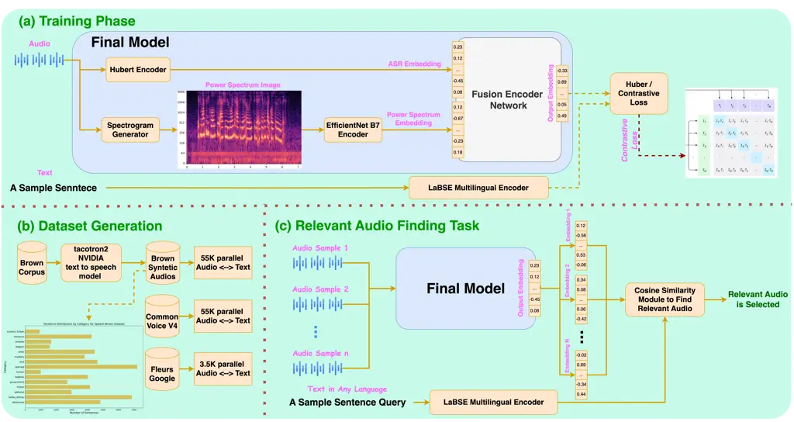
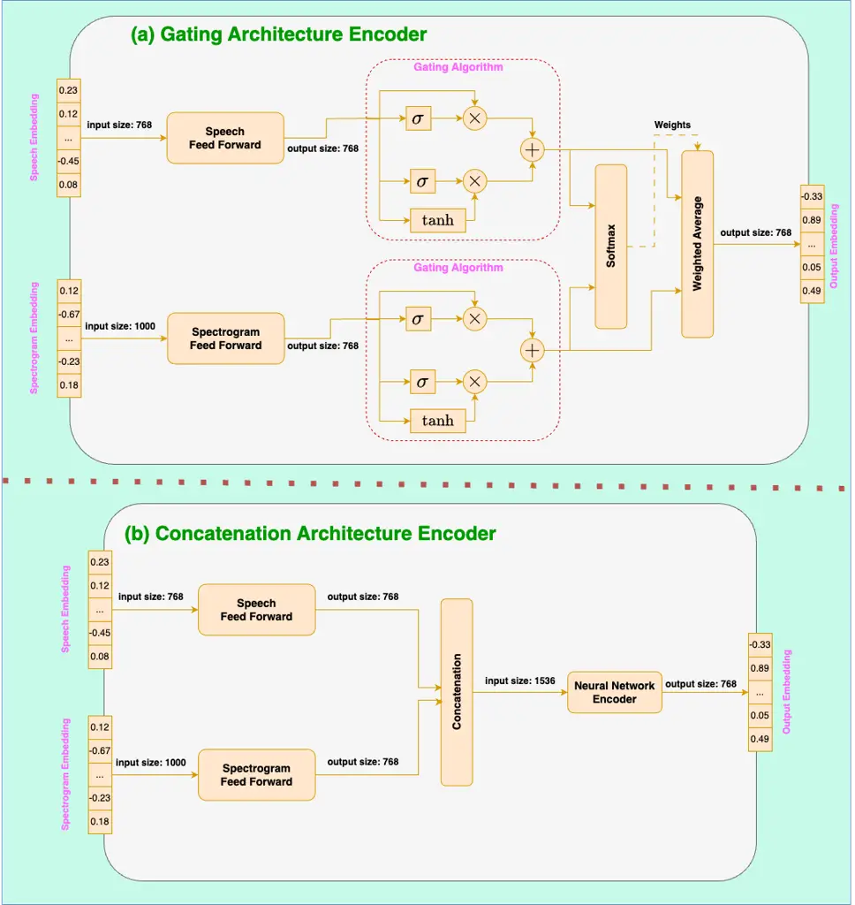
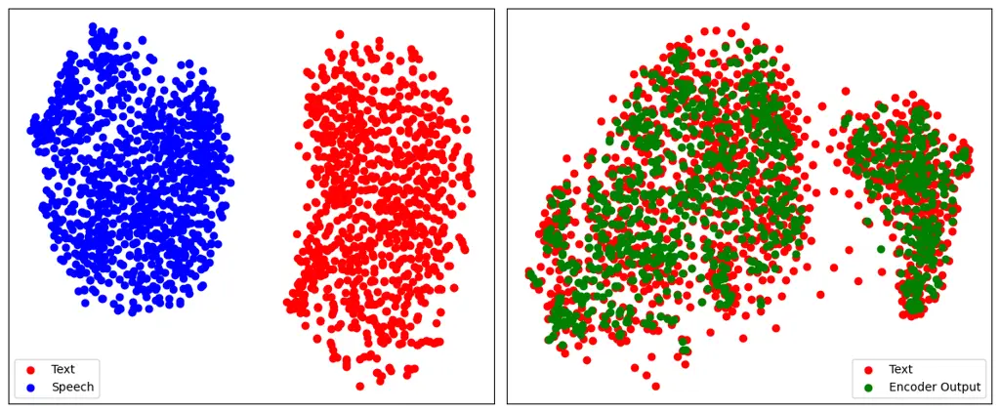
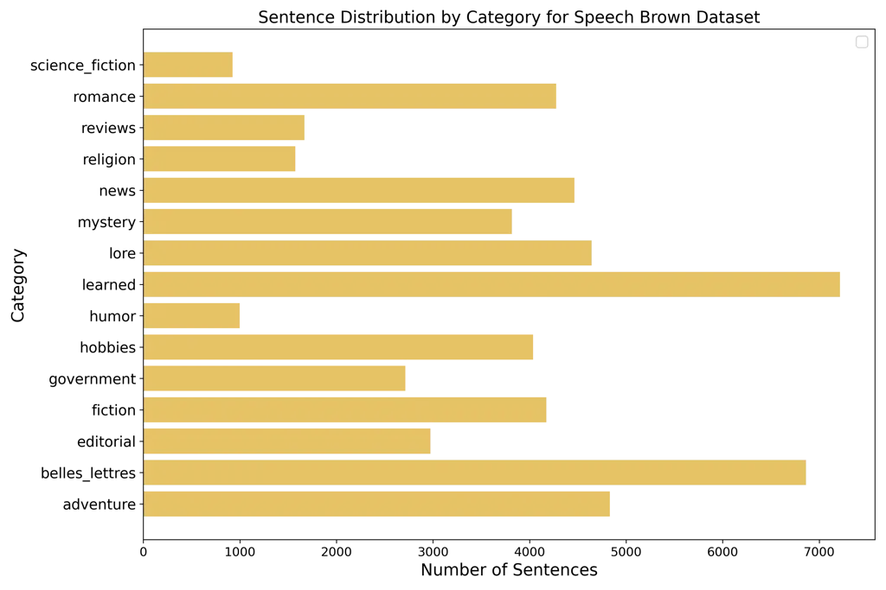

# CLASP: Contrastive Language-Speech Pretraining for Multilingual Multimodal Information Retrieval

Mohammad Mahdi Abootorabi and Ehsaneddin Asgari Affiliation: Qatar
Computing Research Institute (QCRI)
Email: [mahdi.abootorabi2@gmail.com](mailto:)
Email: [easgari@hbku.edu.qa](mailto:)

###### Abstract

This study introduces CLASP (Contrastive Language-Speech Pretraining), a
multilingual, multimodal representation tailored for audio-text
information retrieval. CLASP leverages the synergy between spoken
content and textual data. During training, we utilize our newly
introduced speech-text dataset, which encompasses 15 diverse categories
ranging from fiction to religion. CLASP’s audio component integrates
audio spectrograms with a pre-trained self-supervised speech model,
while its language encoding counterpart employs a sentence encoder
pre-trained on over 100 languages. This unified lightweight model
bridges the gap between various modalities and languages, enhancing its
effectiveness in handling and retrieving multilingual and multimodal
data. Our evaluations across multiple languages demonstrate that CLASP
establishes new benchmarks in HITS@1, MRR, and meanR metrics,
outperforming traditional ASR-based retrieval methods that rely on
transcribing speech into text for subsequent text retrieval, especially
in specific scenarios.

## 1 Introduction

Multimodal machine learning is a branch of artificial intelligence that
aims to integrate and model multiple forms of data, such as text,
images, and audio, to capture their common meaning and enable
cross-modal applications \[1, 2, 3, 4, 5\]. This field has recently
garnered considerable attention in the machine learning community. The
advent of multimodal foundation models has significantly changed the
landscape of machine learning tasks, particularly in natural language
processing (NLP) and information retrieval \[6, 7\]. Despite the field’s
primary focus on text and vision data, the speech modality often remains
underexplored. This oversight occurs even though speech content is
easier to generate for human beings and plays a crucial role in human
cognition and interaction. Speech and text, which are two distinctive
modalities of human language, fundamentally share substantial semantic
similarities. These complementary forms of communication raise an
intriguing question: how can they be represented to encapsulate their
inherent shared meaning effectively? Such a representation is crucial
for facilitating cross-modal applications including, but not limited to,
speech-to-text translation \[8\], speech/text retrieval \[9\], and
speech summarization \[10\].

The current progress in self-supervised learning (SSL) has permeated the
field of speech processing, addressing a broad array of challenges \[11,
12, 13\]. Speech SSL techniques are broadly categorized into masked
reconstruction \[11\], contrastive learning \[14\], classification
\[15\], multi-task learning \[16\], and knowledge distillation \[17\].
Beyond unimodal SSL approaches, the integration of multimodal data is
proposed further to enhance the performance of speech models in
different tasks, e.g., speaker identification \[18\] and emotion
detection \[19\]. One of the main challenges in multimodal speech is
aligning the latent spaces of audio and text in a common embedding
space. This challenge, similar to those faced by language-vision models,
e.g., CLIP \[20\] and Flamingo \[21\], has been particularly addressed
in recent literature and is the focus of this work, primarily for the
information retrieval.

## 2 Related Works

Recent works have focused on the cross-modal embedding of text and
speech by working on alignment and joint representation learning in
Automatic Speech Recognition (ASR) and language models using fusion
networks. \[22\] presents a strategy involving an embedding aligner and
modality switch training for bridging the mismatch between speech and
text encoders, achieving notable reductions in word error rate (WER).
SAMU-XLSR \[23\], focuses on learning multimodal multilingual speech
embeddings at the sentence level. Maestro model \[24\] is introduced to
learn unified representations of both speech and text modalities,
showing considerable improvements in various downstream tasks such as
ASR and Speech Translation (ST). The unsupervised Cross-Modal Alignment
\[25\], offers a framework for aligning speech and text embedding spaces
in an unsupervised fashion, beneficial for low or zero-resource
languages. SpeechUT \[26\] proposes a unified-modal speech-unit-text
pre-training model, ensuring improved performance on ASR and ST tasks by
aligning speech and text representations. In a similar vein, SpeechBERT
\[27\] presents a jointly learned audio-and-text model for end-to-end
Spoken Question Answering, emphasizing the effectiveness of the
end-to-end approach in handling ASR errors. The broader perspective of
multimodal machine learning, involving the integration of language,
vision, and speech, is discussed in \[2\]. SpeechCLIP \[28\] is an
example of efforts to bridge speech and text through images to enhance
speech models without requiring transcriptions. Acoustic Neighbor
Embeddings \[29\] propose a novel method for mapping speech or text
sequences into a shared low-dimensional space at the word level,
enabling tasks such as isolated word recognition while preserving
phonetic similarity through Euclidean distances. Generative Spoken
Language Modeling \[30\] explores unsupervised learning of linguistic
and acoustic representations directly from raw audio, offering insights
into generative approaches for speech understanding.

While many studies have investigated the alignment of speech-text
embedding models, they often focus on specific datasets and models,
which can limit their generalizability to new domains. Furthermore, much
emphasis has been placed on the ASR task, leaving an evaluation gap for
joint embeddings in retrieval tasks, e.g., searching textual content
within audio sources, such as a lecture or movie. These challenges
highlight the necessity for more robust and general speech-text
embedding approaches suitable for diverse retrieval contexts. Our
research addresses this gap. While SAMU-XLSR \[23\] is most similar to
our work, their model’s unavailability necessitates establishing new
baselines with our model’s backbones.

##### Contributions

In this work (i) we introduce CLASP (Contrastive Language-Speech
Pretraining) ¹¹ 1 Models:
[https://huggingface.co/llm-lab/CLASP](https://huggingface.co/llm-lab/CLASP),
a novel lightweight multilingual, multimodal representation designed for
audio-text retrieval ²² 2 Code:
[https://github.com/language-modeling-lab/CLASP](https://github.com/language-modeling-lab/CLASP).
(ii) We introduce a diverse paired speech-text dataset (Speech Brown) in
15 categories, encompassing a wide range of topics from fiction to
religion ³³ 3 Proposed Dataset:
[https://huggingface.co/datasets/llm-lab/SpeechBrown](https://huggingface.co/datasets/llm-lab/SpeechBrown).
(iii) We show that combining audio spectrograms with pre-trained
self-supervised speech embeddings enhances audio encoding for retrieval
applications. (iv) Evaluations in multiple languages demonstrate that
CLASP sets new benchmarks in HITS@1, Mean Reciprocal Rank (MRR), and
Mean Rank (meanR) metrics.

## 3 Approach

### 3.1 Dataset

For the effective training of a joint speech-text model, it is essential
to have a rich speech-text parallel dataset that spans a variety of
contexts and domains. The dataset generation pipeline is shown in part b
of Figure 1. In this study, we utilize the following key datasets:

##### (i) Common Voice V4 \[31\]

A comprehensive crowdsourced collection by Mozilla, this dataset is a
staple in speech recognition studies. It comprises approximately 55K
paired sentences and their voice recordings.

##### (ii) Fleurs \[32\]

Developed by Google and primarily utilized in speech recognition
studies, this dataset contains around 3.6K pairs of sentences and
corresponding speech, especially in content related to translation.

##### (iii) Synthetic Speech Brown

To enhance the linguistic diversity and domain coverage, we enriched
these datasets by employing the Brown Corpus \[33, 34\]. We created an
audio version of approximately 55K sentences from the Brown Corpus,
covering 15 different domain categories: ‘adventure’, ‘belles lettres’,
‘editorial’, ‘fiction’, ‘government’, ‘hobbies’, ‘humor’, ‘learned’,
‘lore’, ‘mystery’, ‘news’, ‘religion’, ‘reviews’, ‘romance’, and
‘science fiction’. These synthetic recordings were generated using the
Tacotron 2 text-to-speech model \[35\].

In aggregate, our combined datasets present over 110K sentences across
diverse categories and speakers. Dataset statistics are provided in
Table 1. This rich collection enhances the model’s linguistic
capabilities, ensuring robust adaptability across distinct domains.
Additional information about Speech Brown, including sentence
distribution by category, can be found in Appendix (§A).

| Datasets            | No. of Sentences | Unique Tokens | Avg Tokens/Sentence | Subjects                    |
| ------------------- | ---------------- | ------------- | ------------------- | --------------------------- |
|                     |                  |               |                     |                             |
| Common Voice V4     | 55,689           | 52,580        | 10.09               | Blogs, Books, Movies, etc.  |
| FLEURS              | 3,643            | 8,527         | 21.45               | Translation-related Phrases |
| Speech Brown (ours) | 55,173           | 50,667        | 19.00               | 15 Categories.              |
| Total               | 114,117          | 86,601        | 14.73               |                             |

Table 1: Overview of CLASP training dataset. We introduce “Speech
Brown”, an audio version of the Brown Corpus. Listed attributes include
sample count, unique tokens, and average tokens per sentence are
provided for Common Voice V4, FLEURS, and Speech Brown. Speech Brown
which is introduced by this study covers 15 diverse categories.

### 3.2 Model

In this section, we present our proposed method for the shared space
embedding of audio and text, leveraging a comprehensive parallel dataset
of aligned speech and text that we meticulously created in a prior step.
Our strategy involves encoding both modalities and aligning the
resulting embeddings. We trained two models based on different loss
functions for embedding alignment:

(i) LASP: This model uses Huber Loss, effectively balancing sensitivity
to outliers with robust handling of small errors, making it ideal for
noisy or imperfect alignment data, as demonstrated in studies such as
\[36\].

(ii) CLASP: This model employs Contrastive Loss as in \[20\] to be able
to learn from both positive and negative samples.

The training pipeline is shown in part a of Figure 1.

Figure 1: Overview of the pipelines and model architecture. (a): The
training pipeline and architecture for CLASP, utilizing batches of
speech inputs paired with their corresponding text data. (b): The
process of generating the final dataset for model training and
evaluation. (c): The inference pipeline for retrieving the exact or
nearest audio from the test dataset that matches a given text query in
any language.

#### 3.2.1 Speech Encoding

To generate the speech encoding, we employed a combination of
self-supervised speech encoding and speech spectrogram embedding. We
leveraged pre-trained encoders and utilized their feature extraction
capabilities to obtain these encodings. For the self-supervised learning
(SSL) embedding of speech, we consider two alternatives: the Wav2Vec2
model \[37\] and the HuBERT model \[11\]. To obtain an encoding
representation, we applied average pooling on the outputs of these
pre-trained encoders. For the spectrogram, we initially designed a
spectrogram module generator to create the power spectrum view over
time. Subsequently, to encode the speech spectrogram, we employed the
EfficientNet image encoder \[38\]. The rationale behind using the speech
spectrogram is that it provides a time-frequency representation of the
speech signal, which can reveal important and more abstract features and
characteristics of the speech that complement the self-supervised speech
encodings. After extracting these two encodings, our fusion encoder
network processes them to generate the final speech embedding. We
explore two distinct strategies for integrating these encodings:

##### (i) Concatenation Strategy

In the first strategy, each input embedding undergoes a transformation
through a feed-forward network. We then concatenate the speech and
spectrogram embeddings and pass them through a neural network encoder.
This encoder, which consists of linear, batch normalization, dropout,
and activation layers, is designed to output the final embeddings.

##### (ii) Gating Mechanism

After the initial transformations, the second strategy employs a gating
mechanism, inspired by LSTM \[39\] with some modifications. This
mechanism controls the influence of the speech embedding and the
spectrogram embedding in constructing the final encoding, determining
the optimal balance of information from each modality. A softmax
function then assigns weights for a weighted average, yielding the final
embedding.

Figure 2 shows these fusion encoder network architectures.

#### 3.2.2 Text Encoding

For text encoding, we adopt pre-trained multilingual language models for
multilingual search within audio content. We explore two powerful
multilingual backbones for text embedding:

(i) XLM-Roberta \[40\], which is capable of handling multiple languages
and providing robust text embeddings.

(ii) LaBSE \[41\], which is trained on parallel sentences encoded using
the BERT encoder with a form of contrastive loss, enhancing its ability
to represent multilingual text effectively.

Both the XLM-Roberta and LaBSE models serve as powerful encoders for our
text data, enabling us to achieve comprehensive and multilingual
audio-text embeddings. The frozen text encoder provides a stable
reference for guiding the embedding space of the speech encoding module.

Figure 2: Overview of the two proposed strategies for the fusion encoder
network architecture. (a) Gating Mechanism: A gating mechanism
determines the contribution of self-supervised speech and spectrogram
embeddings after initial transformations. (b) Concatenation Strategy:
After initial transformations, the resulting self-supervised speech and
spectrogram embeddings are concatenated and passed through a neural
network encoder comprising linear, batch normalization, dropout, and
activation layers to generate the final encoding.

| Stage 1: Performance Comparison of Models Based on Different Modalities                         |        |       |          |
| ----------------------------------------------------------------------------------------------- | ------ | ----- | -------- |
| Model                                                                                           | HITS@1 | MRR   | Macro-F1 |
| Spectrogram-Based Model                                                                         | 0.399  | 0.610 | 0.574    |
| Self-Supervised Audio Model                                                                     | 0.904  | 0.947 | 0.747    |
| Combined Audio-Spectrogram Model                                                                | 0.935  | 0.965 | 0.792    |
| Stage 2: Performance Comparison of Different Encoder Backbones and Fusion Encoder Architectures |        |       |          |
| Model Architecture                                                                              | HITS@1 | MRR   | Macro-F1 |
| XLM-RoBERTa + Wav2Vec2 - Gating                                                                 | 0.850  | 0.912 | 0.594    |
| XLM-RoBERTa + Wav2Vec2 - Concatenation                                                          | 0.866  | 0.922 | 0.801    |
| LaBSE + Wav2Vec2 - Gating                                                                       | 0.949  | 0.972 | 0.700    |
| LaBSE + Wav2Vec2 - Concatenation                                                                | 0.966  | 0.982 | 0.858    |
| XLM-RoBERTa + HuBERT - Gating                                                                   | 0.993  | 0.996 | 0.835    |
| XLM-RoBERTa + HuBERT - Concatenation                                                            | 0.996  | 0.997 | 0.950    |
| LaBSE + HuBERT - Gating                                                                         | 0.998  | 0.999 | 0.893    |
| LaBSE + HuBERT - Concatenation                                                                  | 0.999  | 0.999 | 0.956    |

| Stage 3: Performance Comparison of CLASP, LASP, and ASR-based Baselines     |        |       |        |          |
| --------------------------------------------------------------------------- | ------ | ----- | ------ | -------- |
| Model                                                                       | HITS@1 | MRR   | meanR  | Macro-F1 |
| LASP (ours)                                                                 | 0.878  | 0.909 | 9.092  | 0.534    |
| Wav2Vec2 ASR                                                                | 0.927  | 0.939 | 38.300 | 0.678    |
| CLASP (ours)                                                                | 0.940  | 0.955 | 7.710  | 0.710    |
| HuBERT ASR                                                                  | 0.953  | 0.963 | 17.840 | 0.679    |
| Stage 4: Performance of the Optimal Proposed Model in Non-English Languages |        |       |        |          |
| Language                                                                    | HITS@1 | MRR   | meanR  | Macro-F1 |
| Persian                                                                     | 0.794  | 0.848 | 26.960 | 0.670    |
| German                                                                      | 0.812  | 0.863 | 21.637 | 0.671    |
| French                                                                      | 0.849  | 0.892 | 16.100 | 0.718    |
| Chinese                                                                     | 0.822  | 0.871 | 27.125 | 0.743    |

Table 2: Different stages of evaluation on our test dataset for both
retrieval and classification tasks. The metrics HITS@1, MRR, and meanR
are used to evaluate the information retrieval experiment, while
Macro-F1 assesses the performance of the classification task. For more
details about each stage setup refer to the Evaluation subsection.

### 3.3 Evaluation

One primary objective of developing joint speech/text embeddings is to
facilitate multilingual text search within audio content, eliminating
the need for Automatic Speech Recognition (ASR). We assessed text-speech
embeddings for multimodal retrieval and binary classification to
evaluate text-speech semantic alignment. Metrics reported include MRR,
HITS@1, meanR (stages 3 and 4 only) for retrieval, and Macro-F1 for
classification. MRR evaluates overall ranking accuracy, while HITS@1
specifically measures the success rate of retrieving the top-ranked
result. MeanR provides additional insight by quantifying the average
rank of relevant results, highlighting the system’s ability to handle
outliers and maintain consistent performance. Macro-F1, a robust metric
for classification, equally weights all classes, making it well-suited
for imbalanced datasets.

Our dataset was divided into training, development, and testing sets
using an 80-10-10 split. Shared space embeddings were derived from
speeches using our model, while text embeddings were obtained from
queries via pre-trained text encoder. Retrieval of relevant speeches
involved calculating cosine similarity. For classification, we applied a
threshold of $`0.5`$ on cosine similarity scores to assess query
relevance to speeches. The training was performed using Adam optimizer
\[42\] with a learning rate of $`5\times 10^{-6}`$ and a batch size of 32. The evaluation process is illustrated in part c of Figure 1. The
evaluation stages are as follows:

##### 1. Various Modality Analysis

During this stage, we trained three models that incorporate different
modalities. The first model used only the speech spectrogram embedding.
The second model solely relied on self-supervised speech encoding. The
third model combined both encoding methods, as proposed in the Model
section. All models were trained for 50 epochs, employed a concatenation
strategy for the fusion encoder neural network, evaluated with five
random speech candidates per query, and optimized with Huber loss.

##### 2. Effect of Backbone and Fusion Encoder Network Architecture

During this stage, we examined all combinations of self-supervised
speech encoders, text encoders, and the fusion encoder architectures
mentioned earlier to evaluate their impact on performance. All models
were trained with early stopping, optimized using Huber loss, and
evaluated with five random speech candidates per query.

##### 3. Loss Effect Analysis and ASR-Based Baselines Comparison

At this stage, we use the optimal settings from prior stages. These
included using LaBSE and HuBERT models as encoders and a concatenation
strategy for the fusion encoder neural network architecture. We then
trained the model using two proposed loss functions and compared them to
ASR-based baselines (Wav2Vec2 and HuBERT ASR), which transcribed
speeches for unimodal text retrieval. To ensure a more rigorous
evaluation, all models used early stopping and were assessed using all
test dataset speeches as candidates per query.

##### 4. Multilingual Evaluation

Leveraging a multilingual text encoder allows us to conduct multilingual
queries within the speech vector database. The dataset was translated
into French, German, Chinese, and Persian using the SMALL-100 Model
translator \[43\]. The optimal model from stage 3 was evaluated under
the same challenging conditions.

## 4 Results

Our results for all stages are summarized in Table 2. To ensure the
robustness of our findings, we evaluated our models on a test dataset
comprising approximately 11K samples, providing a strong statistical
foundation for comparisons among models. In stage 1, the combination of
spectrogram and speech SSL model yielded the highest performance,
prompting us to integrate spectrogram embeddings with the SSL model in
later stages. In stage 2, we found that pairing the LaBSE text encoder
with HuBERT embeddings and employing the concatenation strategy for the
fusion encoder architecture achieved the highest retrieval scores, which
we then adopted for subsequent evaluations.

Stage 3 results show that training with contrastive loss enhances the
model’s ability to capture semantics. This suggests that the model not
only learns from positive samples but also differentiates between
negative samples, thereby leading to more robust and discriminative
representations. Furthermore, compared to ASR-based models, CLASP
performs better than Wav2Vec2 and nearly matches HuBERT, while offering
significant advantages in model size (reduced by approximately 50%) and
inference speed (improved by around 10%). Notably, CLASP was trained on
approximately 90K samples (about 130 hours), considerably less than the
over 60K hours used by HuBERT. Additionally, CLASP’s size is about 1.5
GB, substantially smaller than the 3.15 GB HuBERT-ASR pipeline. CLASP’s
lower meanR values compared to ASR-based models indicate superior
handling of outliers and improved retrieval positions for relevant
speech. Stage 4 results confirm that CLASP demonstrates exceptional and
consistent performance in multilingual retrieval scenarios, as evidenced
by evaluations in French, German, Chinese, and Persian.

Finally, as suggested by Figure 3, the projection of our model’s
embedding space into the multilingual text encoder space effectively
establishes a shared embedding space. These results confirm CLASP’s
capability to generate semantic, multilingual embeddings directly from
raw speech, potentially capturing information beyond ASR capabilities.

Figure 3: 2-D illustration of sentence-level embeddings from different
modalities, showing effective projection in the shared representation
space for the test dataset. On the left, the self-supervised speech
embeddings (blue) and text embeddings (red) are depicted. On the right,
the CLASP output embeddings for speech (green) and text embeddings (red)
are presented. These plots were generated using the t-SNE \[44\]
dimensionality reduction technique.

## 5 Conclusions

In summary, we presented CLASP, a specialized multilingual, multimodal
representation for audio-text retrieval that leverages the synergy
between spoken content and text. CLASP integrates audio spectrograms
with a self-supervised speech model and a multilingual sentence encoder,
trained on our newly introduced Speech Brown dataset alongside two
standard datasets, supporting nearly 100 languages. Our comprehensive
evaluations demonstrate that this unified lightweight model establishes
a new performance benchmark in audio-text retrieval across multiple
languages without the need to transcribe speeches, as required in
ASR-based pipelines. This unified model effectively bridges the gap
between speech and language in information retrieval. In the future, we
aim to enhance the comprehensiveness of the CLASP embeddings. One
potential avenue for this could involve incorporating speaker attributes
and other non-semantic information, such as gender or emotional state,
into embeddings to expand their applicability to tasks such as emotion
recognition and other speech understanding challenges beyond the
capabilities of ASR models.

## 6 Limitations

There are certain limitations associated with this work that have not
been explored within the scope of this project. A subset of potential
limitations is as follows: (i) The scalability of CLASP to handle very
large or real-time datasets remains unclear, and the paper does not
address potential challenges related to model scalability. (ii) CLASP
relies on the availability of audio data suitable for speech encoder
models, which may limit its application in scenarios where audio
recordings are of low quality. (iii) CLASP primarily focuses on the
information retrieval task, and we have not explored its potential
applications in ASR or other related applications within the scope of
this project.

## References

- \[1\] D. Elliott, D. Kiela, and A. Lazaridou, “Multimodal learning and
  reasoning,” in _Proceedings of the 54th Annual Meeting of the
  Association for Computational Linguistics: Tutorial
  Abstracts_. Berlin, Germany: Association for Computational
  Linguistics, Aug. 2016. \[Online\]. Available:
  [https://aclanthology.org/P16-5001](https://aclanthology.org/P16-5001)
- \[2\] L.-P. Morency and T. Baltrušaitis, “Multimodal machine learning:
  Integrating language, vision and speech,” in _Proceedings of the 55th
  Annual Meeting of the Association for Computational Linguistics:
  Tutorial Abstracts_. Vancouver, Canada: Association for Computational
  Linguistics, Jul. 2017, pp. 3–5. \[Online\]. Available:
  [https://aclanthology.org/P17-5002](https://aclanthology.org/P17-5002)
- \[3\] J. Hessel and L. Lee, “Does my multimodal model learn
  cross-modal interactions? it’s harder to tell than you might think!”
  in _Proceedings of the 2020 Conference on Empirical Methods in Natural
  Language Processing (EMNLP)_. Online: Association for Computational
  Linguistics, Nov. 2020, pp. 861–877. \[Online\]. Available:
  [https://aclanthology.org/2020.emnlp-main.62](https://aclanthology.org/2020.emnlp-main.62)
- \[4\] P.-Y. Huang, M. Patrick, J. Hu, G. Neubig, F. Metze, and
  A. Hauptmann, “Multilingual multimodal pre-training for zero-shot
  cross-lingual transfer of vision-language models,” in _Proceedings of
  the 2021 Conference of the North American Chapter of the Association
  for Computational Linguistics: Human Language Technologies_. Online:
  Association for Computational Linguistics, Jun. 2021, pp. 2443–2459.
  \[Online\]. Available:
  [https://aclanthology.org/2021.naacl-main.195](https://aclanthology.org/2021.naacl-main.195)
- \[5\] X. Yang, S. Feng, D. Wang, Q. Sun, W. Wu, Y. Zhang, P. Hong, and
  S. Poria, “Few-shot joint multimodal aspect-sentiment analysis based
  on generative multimodal prompt,” in _Findings of the Association for
  Computational Linguistics: ACL 2023_. Toronto, Canada: Association for
  Computational Linguistics, Jul. 2023, pp. 11 575–11 589. \[Online\].
  Available:
  [https://aclanthology.org/2023.findings-acl.735](https://aclanthology.org/2023.findings-acl.735)
- \[6\] W. Chen, H. Hu, X. Chen, P. Verga, and W. Cohen, “MuRAG:
  Multimodal retrieval-augmented generator for open question answering
  over images and text,” in _Proceedings of the 2022 Conference on
  Empirical Methods in Natural Language Processing_. Abu Dhabi, United
  Arab Emirates: Association for Computational Linguistics, Dec. 2022,
  pp. 5558–5570. \[Online\]. Available:
  [https://aclanthology.org/2022.emnlp-main.375](https://aclanthology.org/2022.emnlp-main.375)
- \[7\] X. Wang, G. Chen, G. Qian, P. Gao, X.-Y. Wei, Y. Wang, Y. Tian,
  and W. Gao, “Large-scale multi-modal pre-trained models: A
  comprehensive survey,” 2023.
- \[8\] R. Cattoni, M. A. Di Gangi, L. Bentivogli, M. Negri, and
  M. Turchi, “Must-c: A multilingual corpus for end-to-end speech
  translation,” _Computer Speech & Language_, vol. 66, p. 101155, 2021.
- \[9\] D. Karakos, R. Zbib, W. Hartmann, R. Schwartz, and J. Makhoul,
  “Reformulating information retrieval from speech and text as a
  detection problem,” in _Proceedings of the workshop on Cross-Language
  Search and Summarization of Text and Speech (CLSSTS2020)_. Marseille,
  France: European Language Resources Association, May 2020, pp. 38–43.
  \[Online\]. Available:
  [https://aclanthology.org/2020.clssts-1.7](https://aclanthology.org/2020.clssts-1.7)
- \[10\] P. Manakul, M. J. Gales, and L. Wang, “Abstractive spoken
  document summarization using hierarchical model with multi-stage
  attention diversity optimization.” ISCA, 2020.
- \[11\] W.-N. Hsu, B. Bolte, Y.-H. H. Tsai, K. Lakhotia,
  R. Salakhutdinov, and A. Mohamed, “Hubert: Self-supervised speech
  representation learning by masked prediction of hidden units,”
  _IEEE/ACM Trans. Audio, Speech and Lang. Proc._, vol. 29, p.
  3451–3460, oct 2021. \[Online\]. Available:
  [https://doi.org/10.1109/TASLP.2021.3122291](https://doi.org/10.1109/TASLP.2021.3122291)
- \[12\] A. Mohamed, H.-y. Lee, L. Borgholt, J. D. Havtorn, J. Edin,
  C. Igel, K. Kirchhoff, S.-W. Li, K. Livescu, L. Maaløe _et al._,
  “Self-supervised speech representation learning: A review,” _IEEE
  Journal of Selected Topics in Signal Processing_, 2022.
- \[13\] S. Liu, A. Mallol-Ragolta, E. Parada-Cabaleiro, K. Qian,
  X. Jing, A. Kathan, B. Hu, and B. W. Schuller, “Audio self-supervised
  learning: A survey,” _Patterns_, vol. 3, no. 12, 2022.
- \[14\] R. Ye, M. Wang, and L. Li, “Cross-modal contrastive learning
  for speech translation,” in _Proceedings of the 2022 Conference of the
  North American Chapter of the Association for Computational
  Linguistics: Human Language Technologies_. Seattle, United States:
  Association for Computational Linguistics, Jul. 2022, pp. 5099–5113.
  \[Online\]. Available:
  [https://aclanthology.org/2022.naacl-main.376](https://aclanthology.org/2022.naacl-main.376)
- \[15\] S. Banerjee, B. R. Chakravarthi, and J. P. McCrae, “Comparison
  of pretrained embeddings to identify hate speech in indian code-mixed
  text,” in _2020 2nd International Conference on Advances in Computing,
  Communication Control and Networking (ICACCCN)_. IEEE, 2020, pp.
  21–25.
- \[16\] X. Cai, J. Yuan, R. Zheng, L. Huang, and K. Church, “Speech
  emotion recognition with multi-task learning.” in _Interspeech_, vol.
  2021, 2021, pp. 4508–4512.
- \[17\] J. Ni, Y. Ma, W. Wang, Q. Chen, D. Ng, H. Lei, T. H. Nguyen,
  C. Zhang, B. Ma, and E. Cambria, “Adaptive knowledge distillation
  between text and speech pre-trained models,” in _ICASSP 2023-2023 IEEE
  International Conference on Acoustics, Speech and Signal Processing
  (ICASSP)_. IEEE, 2023, pp. 1–5.
- \[18\] J. Xiong, Y. Zhou, P. Zhang, L. Xie, W. Huang, and Y. Zha,
  “Look&listen: Multi-modal correlation learning for active speaker
  detection and speech enhancement,” _IEEE Transactions on
  Multimedia_, 2022.
- \[19\] Y. Liu, H. Sun, W. Guan, Y. Xia, and Z. Zhao, “Multi-modal
  speech emotion recognition using self-attention mechanism and
  multi-scale fusion framework,” _Speech Communication_, vol. 139, pp.
  1–9, 2022.
- \[20\] A. Radford, J. W. Kim, C. Hallacy, A. Ramesh, G. Goh,
  S. Agarwal, G. Sastry, A. Askell, P. Mishkin, J. Clark, G. Krueger,
  and I. Sutskever, “Learning transferable visual models from natural
  language supervision,” in _Proceedings of the 38th International
  Conference on Machine Learning, ICML 2021, 18-24 July 2021, Virtual
  Event_, ser. Proceedings of Machine Learning Research, M. Meila and
  T. Zhang, Eds., vol. 139. PMLR, 2021, pp. 8748–8763. \[Online\].
  Available:
  [http://proceedings.mlr.press/v139/radford21a.html](http://proceedings.mlr.press/v139/radford21a.html)
- \[21\] J.-B. Alayrac, J. Donahue, P. Luc, A. Miech, I. Barr,
  Y. Hasson, K. Lenc, A. Mensch, K. Millican, M. Reynolds _et al._,
  “Flamingo: a visual language model for few-shot learning,” _Advances
  in Neural Information Processing Systems_, vol. 35, pp.
  23 716–23 736, 2022.
- \[22\] W. Wang, S. Ren, Y. Qian, S. Liu, Y. Shi, Y. Qian, and M. Zeng,
  “Optimizing alignment of speech and language latent spaces for
  end-to-end speech recognition and understanding,” in _ICASSP 2022 -
  2022 IEEE International Conference on Acoustics, Speech and Signal
  Processing (ICASSP)_, 2022, pp. 7802–7806.
- \[23\] S. Khurana, A. Laurent, and J. Glass, “Samu-xlsr:
  Semantically-aligned multimodal utterance-level cross-lingual speech
  representation,” _IEEE Journal of Selected Topics in Signal
  Processing_, vol. 16, no. 6, pp. 1493–1504, 2022.
- \[24\] Z. Chen, Y. Zhang, A. Rosenberg, B. Ramabhadran, P. J. Moreno,
  A. Bapna, and H. Zen, “MAESTRO: Matched Speech Text Representations
  through Modality Matching,” in _Proc. Interspeech 2022_, 2022, pp.
  4093–4097.
- \[25\] Y.-A. Chung, W.-H. Weng, S. Tong, and J. Glass, “Unsupervised
  cross-modal alignment of speech and text embedding spaces,” in
  _Advances in Neural Information Processing Systems_, S. Bengio,
  H. Wallach, H. Larochelle, K. Grauman, N. Cesa-Bianchi, and
  R. Garnett, Eds., vol. 31. Curran Associates, Inc., 2018. \[Online\].
  Available:
  [https://proceedings.neurips.cc/paper_files/paper/2018/file/1ea97de85eb634d580161c603422437f-Paper.pdf](https://proceedings.neurips.cc/paper_files/paper/2018/file/1ea97de85eb634d580161c603422437f-Paper.pdf)
- \[26\] Z. Zhang, L. Zhou, J. Ao, S. Liu, L. Dai, J. Li, and F. Wei,
  “SpeechUT: Bridging speech and text with hidden-unit for
  encoder-decoder based speech-text pre-training,” in _Proceedings of
  the 2022 Conference on Empirical Methods in Natural Language
  Processing_. Abu Dhabi, United Arab Emirates: Association for
  Computational Linguistics, Dec. 2022, pp. 1663–1676. \[Online\].
  Available:
  [https://aclanthology.org/2022.emnlp-main.108](https://aclanthology.org/2022.emnlp-main.108)
- \[27\] Y.-S. Chuang, C.-L. Liu, H. yi Lee, and L. shan Lee,
  “SpeechBERT: An Audio-and-Text Jointly Learned Language Model for
  End-to-End Spoken Question Answering,” in _Proc. Interspeech 2020_,
  2020, pp. 4168–4172.
- \[28\] Y.-J. Shih, H.-F. Wang, H.-J. Chang, L. Berry, H.-y. Lee, and
  D. Harwath, “Speechclip: Integrating speech with pre-trained vision
  and language model,” in _2022 IEEE Spoken Language Technology Workshop
  (SLT)_, 2023, pp. 715–722.
- \[29\] W. Jeon, “Acoustic neighbor embeddings,” 2022. \[Online\].
  Available:
  [https://arxiv.org/abs/2007.10329](https://arxiv.org/abs/2007.10329)
- \[30\] K. Lakhotia, E. Kharitonov, W.-N. Hsu, Y. Adi, A. Polyak,
  B. Bolte, T.-A. Nguyen, J. Copet, A. Baevski, A. Mohamed, and
  E. Dupoux, “On generative spoken language modeling from raw audio,”
  _Transactions of the Association for Computational Linguistics_,
  vol. 9, pp. 1336–1354, 2021. \[Online\]. Available:
  [https://aclanthology.org/2021.tacl-1.79/](https://aclanthology.org/2021.tacl-1.79/)
- \[31\] R. Ardila, M. Branson, K. Davis, M. Henretty, M. Kohler,
  J. Meyer, R. Morais, L. Saunders, F. M. Tyers, and G. Weber, “Common
  voice: A massively-multilingual speech corpus,” in _Proceedings of the
  12th Conference on Language Resources and Evaluation (LREC 2020)_,
  2020, pp. 4211–4215.
- \[32\] A. Conneau, M. Ma, S. Khanuja, Y. Zhang, V. Axelrod, S. Dalmia,
  J. Riesa, C. Rivera, and A. Bapna, “Fleurs: Few-shot learning
  evaluation of universal representations of speech,” in _2022 IEEE
  Spoken Language Technology Workshop (SLT)_, 2023, pp. 798–805.
- \[33\] W. N. Francis and H. Kucera, “Brown corpus manual,” _Letters to
  the Editor_, vol. 5, no. 2, p. 7, 1979.
- \[34\] L. Schubert and M. Tong, “Extracting and evaluating general
  world knowledge from the brown corpus,” in _Proceedings of the
  HLT-NAACL 2003 Workshop on Text Meaning_, 2003, pp. 7–13. \[Online\].
  Available:
  [https://aclanthology.org/W03-0902](https://aclanthology.org/W03-0902)
- \[35\] J. Shen, R. Pang, R. J. Weiss, M. Schuster, N. Jaitly, Z. Yang,
  Z. Chen, Y. Zhang, Y. Wang, R. Skerrv-Ryan, R. A. Saurous,
  Y. Agiomvrgiannakis, and Y. Wu, “Natural tts synthesis by conditioning
  wavenet on mel spectrogram predictions,” in _2018 IEEE International
  Conference on Acoustics, Speech and Signal Processing (ICASSP)_, 2018,
  pp. 4779–4783.
- \[36\] M. Runz, K. Li, M. Tang, L. Ma, C. Kong, T. Schmidt, I. Reid,
  L. Agapito, J. Straub, S. Lovegrove _et al._, “Frodo: From detections
  to 3d objects,” in _Proceedings of the IEEE/CVF Conference on Computer
  Vision and Pattern Recognition_, 2020, pp. 14 720–14 729.
- \[37\] A. Baevski, Y. Zhou, A. Mohamed, and M. Auli, “wav2vec 2.0: A
  framework for self-supervised learning of speech representations,”
  _Advances in neural information processing systems_, vol. 33, pp.
  12 449–12 460, 2020.
- \[38\] M. Tan and Q. Le, “EfficientNet: Rethinking model scaling for
  convolutional neural networks,” in _Proceedings of the 36th
  International Conference on Machine Learning_, ser. Proceedings of
  Machine Learning Research, K. Chaudhuri and R. Salakhutdinov, Eds.,
  vol. 97. PMLR, 09–15 Jun 2019, pp. 6105–6114.
- \[39\] S. Hochreiter and J. Schmidhuber, “Long short-term memory,”
  _Neural Comput._, vol. 9, no. 8, p. 1735–1780, nov 1997. \[Online\].
  Available:
  [https://doi.org/10.1162/neco.1997.9.8.1735](https://doi.org/10.1162/neco.1997.9.8.1735)
- \[40\] A. Conneau, K. Khandelwal, N. Goyal, V. Chaudhary, G. Wenzek,
  F. Guzmán, E. Grave, M. Ott, L. Zettlemoyer, and V. Stoyanov,
  “Unsupervised cross-lingual representation learning at scale,” in
  _Proceedings of the 58th Annual Meeting of the Association for
  Computational Linguistics_. Online: Association for Computational
  Linguistics, Jul. 2020, pp. 8440–8451. \[Online\]. Available:
  [https://aclanthology.org/2020.acl-main.747](https://aclanthology.org/2020.acl-main.747)
- \[41\] F. Feng, Y. Yang, D. Cer, N. Arivazhagan, and W. Wang,
  “Language-agnostic BERT sentence embedding,” in _Proceedings of the
  60th Annual Meeting of the Association for Computational Linguistics
  (Volume 1: Long Papers)_. Dublin, Ireland: Association for
  Computational Linguistics, May 2022, pp. 878–891. \[Online\].
  Available:
  [https://aclanthology.org/2022.acl-long.62](https://aclanthology.org/2022.acl-long.62)
- \[42\] D. P. Kingma and J. Ba, “Adam: A method for stochastic
  optimization,” _CoRR_, vol. abs/1412.6980, 2014. \[Online\].
  Available:
  [https://api.semanticscholar.org/CorpusID:6628106](https://api.semanticscholar.org/CorpusID:6628106)
- \[43\] A. Mohammadshahi, V. Nikoulina, A. Berard, C. Brun,
  J. Henderson, and L. Besacier, “SMaLL-100: Introducing shallow
  multilingual machine translation model for low-resource languages,” in
  _Proceedings of the 2022 Conference on Empirical Methods in Natural
  Language Processing_. Abu Dhabi, United Arab Emirates: Association for
  Computational Linguistics, Dec. 2022, pp. 8348–8359. \[Online\].
  Available:
  [https://aclanthology.org/2022.emnlp-main.571](https://aclanthology.org/2022.emnlp-main.571)
- \[44\] L. van der Maaten and G. Hinton, “Visualizing data using
  t-SNE,” _Journal of Machine Learning Research_, vol. 9, pp.
  2579–2605, 2008. \[Online\]. Available:
  [http://www.jmlr.org/papers/v9/vandermaaten08a.html](http://www.jmlr.org/papers/v9/vandermaaten08a.html)

## Appendix A Speech Brown Additional Details

The Speech Brown Dataset comprises a substantial collection of speech
and text pairs with the following characteristics:

- •
  Total size: Approximately 30 GB
- •
  Number of samples: 55,173 pairs of speech and text
- •
  Maximum tokens in a sample: 48
- •
  Average characters per sample: 96.72

As shown in Figure 4, the dataset contains a diverse distribution of
sentences across 15 different categories, with ‘learned’ and
‘belles_lettres’ having the highest representation (approximately 7,000
sentences each), while categories such as ‘humor’ and ‘science_fiction’
have considerably fewer samples (approximately 1,000 sentences each).
This distribution highlights the dataset’s emphasis on academic and
literary content while maintaining coverage across various genres
including fiction, news, and specialized domains.

The extensive vocabulary size of 50,667 unique tokens indicates the rich
linguistic diversity captured in this dataset, making it particularly
valuable for our research on speech processing and natural language
understanding tasks.

Figure 4: Sentence Distribution by Category for Speech Brown Dataset.
This horizontal bar chart illustrates the number of sentences across 15
different textual categories in the Speech Brown Dataset.
