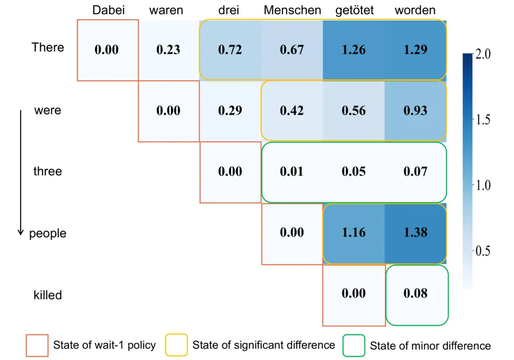
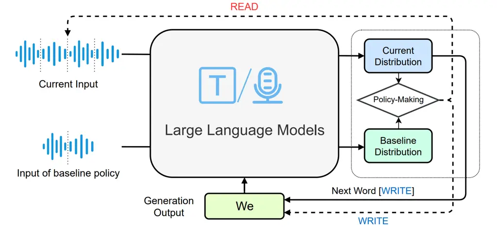
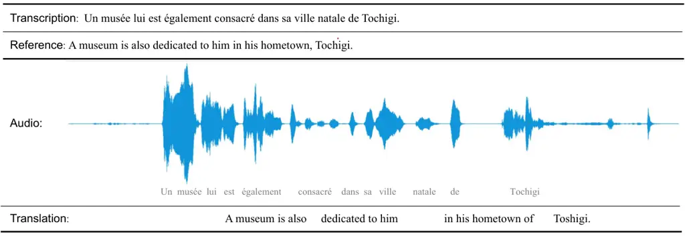
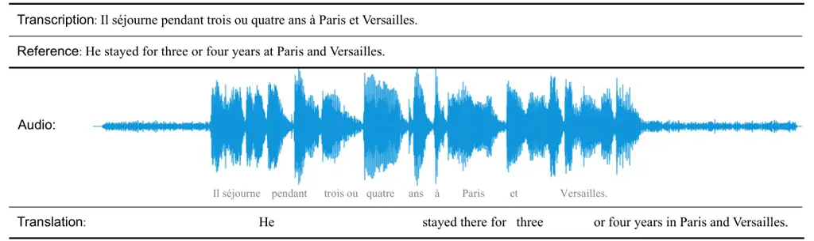

# Large Language Models Are Read/Write Policy-Makers for Simultaneous Generation

Shoutao Guo    Shaolei Zhang    Zhengrui Ma    Yang Feng ^(†)^(†)thanks:
Corresponding author: Yang Feng.

###### Abstract

Simultaneous generation models write generation results while reading
streaming inputs, necessitating a policy-maker to determine the
appropriate output timing. Existing simultaneous generation methods
generally adopt the traditional encoder-decoder architecture and learn
the generation and policy-making capabilities through complex dynamic
programming techniques. Although LLMs excel at text generation, they
face challenges in taking on the role of policy-makers through
traditional training methods, limiting their exploration in simultaneous
generation. To overcome these limitations, we propose a novel LLM-driven
Simultaneous Generation (LSG) framework, which allows the off-the-shelf
LLM to decide the generation timing and produce output concurrently.
Specifically, LSG selects the generation policy that minimizes latency
as the baseline policy. Referring to the baseline policy, LSG enables
the LLM to devise an improved generation policy that better balances
latency and generation quality, and writes generation results
accordingly. Experiments on simultaneous translation and streaming
automatic speech recognition tasks show that our method can achieve
state-of-the-art performance utilizing the open-source LLMs and
demonstrate practicality in real-world scenarios.

¹Key Laboratory of Intelligent Information Processing,

Institute of Computing Technology, Chinese Academy of Sciences (ICT/CAS)

² Key Laboratory of AI Safety, Chinese Academy of Sciences

³ University of Chinese Academy of Sciences, Beijing, China

guoshoutao22z@ict.ac.cn, zhangshaolei20z@ict.ac.cn, fengyang@ict.ac.cn

Code — https://github.com/ictnlp/LSG

## Introduction

Simultaneous generation models (Gu et al. 2017; Moritz, Hori, and Le
2020), which produce the target sentence before reading the entire
input, are widely used in streaming scenarios such as real-time
subtitles and online meetings. To achieve the goal of low latency and
high generation quality (Zhang and Feng 2022b), simultaneous generation
models require an optimal policy to determine the generation timing,
ensuring that the generated results are consistent with those in
non-streaming scenarios while minimizing latency (Alinejad, Shavarani,
and Sarkar 2021). Consequently, the learning of generation policy is
critical to the simultaneous generation tasks.

In simultaneous generation tasks such as simultaneous translation (Ma
et al. 2019) and streaming Automatic Speech Recognition (ASR) (Moritz,
Hori, and Le 2020), existing methods are constrained to using
non-streaming parallel data for model training due to the lack of
annotated policies. To learn the generation policy, previous methods (Ma
et al. 2020b; Miao, Blunsom, and Specia 2021) primarily utilize an
encoder-decoder architecture (Vaswani et al. 2017) coupled with complex
dynamic programming training techniques. This methodology endows
simultaneous generation models with both generation and policy-making
capabilities (Zhang and Feng 2023b). However, these models are
constrained by their expressive capacity, resulting in suboptimal
policies and generation performance. Additionally, they suffer from
significant memory consumption and slow training speeds during training
(Guo, Zhang, and Feng 2023a). More recently, the emergence of Large
Language Models (LLMs) (Touvron et al. 2023) prompts researchers to
explore their potential in simultaneous generation tasks (Koshkin,
Sudoh, and Nakamura 2024; Agostinelli et al. 2024).



Figure 1: The distribution difference of subsequent generation states
compared to wait-1 policy for a German$`\Rightarrow`$English translation
example. The distribution difference is measured by KL divergence.

Nevertheless, the decoder-only architecture and vast parameters of LLMs
pose challenges in applying traditional dynamic programming methods for
policy learning. Consequently, existing LLM-based methods leverage the
generation capabilities of LLMs to produce outputs guided by either
fixed policies (Ma et al. 2019) or policies provided by conventional
encoder-decoder models (Guo et al. 2024). Unfortunately, these external
policies not only introduce complex control processes but also result in
inferior performance without considering the context of LLMs. Therefore,
incorporating LLMs into simultaneous generation tasks remains
challenging.

To bypass the need for policy training and derive effective policies for
LLMs, a straightforward approach might be to compare the current outputs
with the non-streaming results, generating the target words only when
the two align. This is akin to deriving a new policy from a
full-sentence policy, where the model can use the complete input for
generation. However, this is not feasible in practice, as the model
cannot access the entire input in advance. On the other hand, minimum
source input is available during simultaneous generation. This insight
leads us to consider whether we can derive a policy by comparing the
generation results based on minimum input with those based on the
current input.

Therefore, we attempt to develop an enhanced policy that improves upon a
_baseline policy_, which defines the minimum input at each generation
step. To validate our hypothesis, we conduct a comprehensive preliminary
analysis. We utilize the wait-1 policy (Ma et al. 2019) as the baseline
policy and Llama2-7B-chat (Touvron et al. 2023) as the LLM. Initially,
we leverage the LLM to obtain the generation distribution for target
words at each generation state, based on available source content. We
then analyze the distribution differences between the baseline policy
and subsequent generation states. Figure 1 illustrates a notable trend
where the distribution differences gradually increase as more source
content is processed. Crucially, once the necessary source content is
available, the distribution differences become significant, indicating
an opportune moment for generation. These findings suggest that
leveraging distribution differences can effectively strike trade-offs
between latency and generation quality. However, Figure 1 also
highlights a special case where all distribution differences of some
target words remain relatively minor, as the wait-1 policy already
provides sufficient information for generation. This phenomenon,
inherently influenced by language characteristics and word reordering,
is unavoidable and necessitates specialized treatment in our approach.

In light of these insights, we propose the LLM-driven Simultaneous
Generation (LSG) method, a novel approach that empowers the
off-the-shelf LLM to determine the policies and generate outputs
concurrently. Our LSG method enables the LLM to derive an enhanced
policy from a baseline policy without needing policy learning. At each
step, the LLM compares the distribution difference between the current
input and the source content determined by the baseline policy. When
this distribution difference reaches a predetermined threshold, the LLM
is prompted to generate outputs. Otherwise, LSG continues to await the
upcoming input. To address the special case illustrated in Figure 1, we
utilize the confidence of the LLM to avoid excessive delays that might
be caused by minor distribution differences. To validate the
effectiveness of LSG, we conduct extensive experiments on simultaneous
translation and streaming ASR tasks. Leveraging open-source LLMs, our
method achieves state-of-the-art results on standard datasets and
demonstrates practicality in real-world scenarios.

## Background

#### Simultaneous Generation

Let $`\mathbf{x}`$ = $`(x_{1},...,x_{J})`$ denote the complete source
sequence, where $`x_{i}`$ represents a source word or a speech segment.
The simultaneous generation model incrementally produces the target
sentence $`\mathbf{y}`$ = $`(y_{1},...,y_{I})`$ with length $`I`$ based
on a generation policy. To represent this policy, we introduce the
notation $`g_{i}`$, which represents the length of the partial input
sequence when generating $`y_{i}`$. Therefore, the policy for generating
$`\mathbf{y}`$ from the source sequence $`\mathbf{x}`$ can be defined as
$`\mathbf{g}`$ = $`(g_{1},...,g_{I})`$. During inference, the
simultaneous generation model generates the target sentence according to
the following formula:

```math
p(\mathbf{y}|\mathbf{x},\mathbf{g})=\sum\limits_{i=1}^{I}p(y_{i}\mid\mathbf{x}_{\leq g_{i}},\mathbf{y}_{<i}), \tag{1}
```

where $`p(y_{i}\mid\mathbf{x}_{\leq g_{i}},\mathbf{y}_{<i})`$ is the
next token distribution.

#### Wait-k policy

Simultaneous generation models require a policy to determine the timing
of generating sentences. Currently, the most prevalent simultaneous
generation policy is the wait-k policy (Ma et al. 2019), which is simple
and exhibits relatively inferior performance. During inference, the
wait-k policy initially reads $`k`$ source elements (i.e., speech
segments or words), then alternates between generating a word and
reading a source element. Therefore, the wait-k policy can be expressed
by the following equation:

```math
g^{wait-k}_{i}=\min\bigl\{k+i-1,J\bigr\}, \tag{2}
```

where $`J`$ denotes the length of the whole input sequence. According to
the Average Lagging metric (Ma et al. 2019) for latency evaluation, the
policy with the minimum latency is the wait-0 policy. However, the
wait-0 policy is impractical, as it would result in the simultaneous
generation model producing the first word without conditioning on any
source information. Therefore, we select the wait-1 policy as the
baseline policy for our method.



Figure 2: The framework of LLM-driven Simultaneous Generation Model.

## Method

In this section, we introduce our LLM-driven Simultaneous Generation
(LSG) method, which empowers the LLM to perform policy-making and
generation sub-tasks concurrently. We first present the framework of LSG
and delineate its operational process. Subsequently, we elucidate how
the LLM leverages a baseline policy to derive an enhanced policy. To
address the limitations of the baseline policy in scenarios where the
source content is already sufficient, we introduce an additional
confidence condition for the enhanced policy. Finally, we implement a
range constraint for the obtained policy to ensure controllable latency
and mitigate the impact of some outlier policies. The following
subsections provide a detailed exposition of our method.

### Model Framework

As shown in Figure 2, we introduce the model framework of LSG. Our LSG
method empowers the LLM to perform both policy-making and generation
sub-tasks. To this end, the LLM pre-establishes a baseline policy before
initiating simultaneous generation.

At each generation step, LSG selects the source content corresponding to
the baseline policy as a new input, based on the currently available
input and previously generated words. Subsequently, LSG enables the LLM
to predict the next target word based on the current input and the input
determined by the baseline policy, respectively. This process yields two
probability distributions: the current generation distribution and the
distribution of baseline policy. LSG utilizes these distributions for
policy-making to determine the action to be taken. If the READ action is
selected, LSG refrains from producing any output at that moment and
awaits the upcoming input. Conversely, if the WRITE action is chosen,
LSG generates the target word based on the current distribution and
appends it to the previously generated words. After that, a new
generation step commences.

Our framework does not impose restrictions on the employed LLMs.
However, the baseline policy needs to be predetermined in advance of
simultaneous generation. As discussed in the Background section, to
ensure low latency and usability of the baseline policy, we choose the
wait-1 policy as our baseline policy.

### Policy-Making Procedure

In this subsection, we elaborate on the policy-making procedure in
Figure 2. Our LSG method aims to develop an improved policy by
referencing the baseline policy. At each generation step, it utilizes
the differences between the current generation distribution with the
distribution of the wait-1 policy to decide on the taken action.

At the current generation step, we assume that the available source
sequence is $`\mathbf{x}_{\leq j}`$ and generated target words are
$`\mathbf{y}_{<i}`$, where $`j`$ is greater than $`i`$. Therefore, we
can obtain $`p(y_{i}|\mathbf{x}_{\leq j},\mathbf{y}_{<i})`$, which
denotes the generation distribution of the LLM based on
$`\mathbf{x}_{\leq j}`$ and $`\mathbf{y}_{<i}`$. At the same time, under
the guidance of the wait-1 policy, the LLM utilizes
$`\mathbf{x}_{\leq i}`$ and $`\mathbf{y}_{<i}`$ to generate the
distribution $`p(y_{i}|\mathbf{x}_{\leq i},\mathbf{y}_{<i})`$. These two
distributions are used by LSG to calculate the KL divergence to decide
on the action to be taken:

```math
\mathbb{D}_{\textrm{KL}}\bigl[p(y_{i}|\mathbf{x}_{\leq j},\mathbf{y}_{<i})\mid\mid p(y_{i}|\mathbf{x}_{\leq i},\mathbf{y}_{<i})\bigr]>\delta, \tag{3}
```

where $`\delta`$ is the hyperparameter that represents the threshold. If
the condition in Eq.(3) is met, LSG generates the target word based on
the distribution $`p(y_{i}|\mathbf{x}_{\leq j},\mathbf{y}_{<i})`$ and
appends it to the previously generated sequence. Otherwise, our method
refrains from producing any output and waits for the upcoming input.

#### Confidence Condition

Up to now, we have developed improved policies by referencing the
baseline policy without needing traditional complex training methods
(Zhang and Feng 2023b). However, due to factors such as language
features and word reordering (Liu et al. 2021), the baseline policy may
have already provided sufficient source information for some target
words. As illustrated in Figure 1, this phenomenon can result in minor
distribution differences when generating these words according to the
condition in Eq.(3). We call this phenomenon as _false negative_, as it
instructs the model to excessively read source information even if
condition in Eq.(3) is met, resulting in redundant latency (Papi, Negri,
and Turchi 2023). However, this phenomenon is unavoidable due to the
diversity of language expression. To complement the condition in Eq.(3),
we introduce an additional confidence condition.

Since LLMs typically assign probability mass to favorable behaviors (Li
et al. 2023), the confidence of LLMs also reflects the credibility of
the generation. In the face of the false negative problem in the
condition of Eq.(3), we use the confidence of LLMs to mitigate this
issue:

```math
\max p(y_{i}|\mathbf{x}_{\leq j},\mathbf{y}_{<i})>\alpha, \tag{4}
```

where $`\alpha`$ is the confidence hyperparameter that enables
generation. Consequently, our LSG method executes the WRITE action when
either the condition in Eq.(3) or Eq.(4) is satisfied. Otherwise, LSG
awaits the upcoming input.

### Range constraint

After introducing the policy-making procedure, our LSG method can
leverage the LLM to perform both policy-making and generation sub-tasks.
However, when considering the practical applications, there are still
issues with the above policy-making procedure. In the current setup, the
search range for the target word $`y_{i}`$ is
$`[\min\bigl\{i,J\bigr\},J]`$, where $`J`$ denotes the length of the
whole input sequence. However, the presence of outlier policies will
inevitably lead to excessive latency or poor translation quality (Ma
et al. 2020b). Moreover, it is challenging to ensure that the
simultaneous generation model always responds within a fixed delay.
Therefore, it is necessary to impose constraints on the search range of
the policy.

In our LSG method, we set the search range for the target word $`y_{i}`$
as:

```math
[\min\bigl\{L+i-1,J\bigr\},\min\bigl\{L+i-1+U,J\bigr\}], \tag{5}
```

where $`L`$ denotes the number of pre-read elements before simultaneous
generation and $`U`$ represents the degree of autonomy afforded to the
LLM in policy-making.

## Experiments

### Datasets

We mainly conduct experiments on simultaneous text-to-text translation
(SimulT2TT), simultaneous speech-to-text translation (SimulS2TT), and
streaming ASR tasks.

WMT15¹¹ 1 www.statmt.org/wmt15 German$`\Rightarrow`$English
(De$`\Rightarrow`$En) We conduct SimulT2TT task on this dataset.
Consistent with Ma et al. (2020b), we use the newstest2015 set as the
test set.

MuST-C English$`\Rightarrow`$German (En$`\Rightarrow`$De) This dataset
(Di Gangi et al. 2019) is collected from TED talks and we conduct the
SimulT2TT task using its text data.

CoVoST2 French$`\Rightarrow`$English (Fr$`\Rightarrow`$En) We use this
dataset (Wang, Wu, and Pino 2020) to conduct both SimulS2TT and
streaming ASR tasks.

### System Settings

Since our method can be applied to SimulT2TT, SimulS2TT, and streaming
ASR tasks, we will delineate the comparative methods for each of these
tasks separately and then present the settings of our LSG method.

For SimulT2TT task, the baseline methods include wait-k (Ma et al.
2019), MMA (Ma et al. 2020b), ITST (Zhang and Feng 2022a), HMT (Zhang
and Feng 2023b) and Agent-SiMT (Guo et al. 2024). With the exception of
Agent-SiMT, the aforementioned methods all use the traditional
encoder-decoder architecture. HMT, which learns policies through
sophisticated dynamic programming training methods, achieves the
superior performance among conventional approaches. Agent-SiMT,
leveraging an agent collaboration mechanism and utilizing policies
provided by HMT to guide the LLMs in translation generation, has
achieved state-of-the-art performance in the SimulT2TT task.

For SimulS2TT task, we compare our method against DiSeg (Zhang and Feng
2023a) and StreamSpeech (Zhang et al. 2024). Both DiSeg and StreamSpeech
adopt the encoder-decoder architecture, with StreamSpeech achieving
state-of-the-art performance in the SimulS2TT task. To validate the
practical applicability of our method, we additionally evaluate all
approaches using computation-aware latency metrics for this task.

For streaming ASR task, Wav2Vec2-large (Baevski et al. 2020) and
Whisper-base (Radford et al. 2022) are used as the baseline methods.
Both Wav2Vec2 and Whisper are pre-trained models, with Whisper
demonstrating superior performance across multiple ASR datasets.

Since LSG is a general simultaneous generation framework, it does not
impose restrictions on the LLMs used. Due to the constraints of
different tasks, we employ different LLMs for different evaluated tasks.
For the SimulT2TT task, we maintain the same setup as Guo et al. (2024).
We employ Llama2-7B-chat²² 2
https://huggingface.co/meta-llama/Llama-2-7b-chat-hf as the LLM and
perform fine-tuning on 10w extracted samples using LoRA (Hu et al.
2021). For the SimulS2TT and streaming ASR tasks, we use the open-source
speech LLM, Qwen-Audio³³ 3 https://github.com/QwenLM/Qwen-Audio (Chu
et al. 2023). As the multimodal version of the Qwen (Bai et al. 2023)
series, Qwen-Audio achieves good comprehension and generation
capabilities in multiple speech tasks after audio-language pre-training.
During inference, the duration of each speech segment is set to 640 ms.
The prompt templates used in our experiments are consistent with those
used during the training of the LLMs. We set $`\delta`$ = 9.0 and
$`\alpha`$ = 0.6 for De$`\Rightarrow`$En task, $`\delta`$ = 7.5 and
$`\alpha`$ = 0.6 for En$`\Rightarrow`$De task, and $`\delta`$ = 7.0 and
$`\alpha`$ = 0.5 for Fr$`\Rightarrow`$En task. For different latency
scenarios, we set \[$`L`$, $`U`$\] as \[1, 4\], \[3, 4\], \[5, 6\], and
\[7, 6\], respectively.

### Evaluation

In evaluating streaming generation systems, we employ the SimulEval
toolkit (Ma et al. 2020a) to assess two critical aspects: latency and
generation quality. Systems that demonstrate low latency while
maintaining high generation quality are generally considered superior.

To quantify latency, we utilize the Average Lagging (AL) metric (Ma
et al. 2019), which measures the delay between input reception and
output generation in simultaneous generation systems. For textual input,
AL is calculated in terms of word count, whereas for speech input, it is
measured in milliseconds (ms). Additionally, for the SimulS2TT task, we
evaluate computation-aware latency on an NVIDIA RTX 3090 GPU, which
assesses the latency of the systems in practical applications.

To assess generation quality, we employ task-specific metrics. For
SimulT2TT and SimulS2TT tasks, we utilize the SacreBLEU metric (Post
2018), a widely used metric in translation. For the streaming ASR task,
we adopt the Word Error Rate (WER) as our primary evaluation metric.

(a) WMT15 De$`\Rightarrow`$En

(b) MuST-C En$`\Rightarrow`$De

(c) CoVoST2 Fr$`\Rightarrow`$En

Figure 3: Performance of simultaneous generation models on
De$`\Rightarrow`$En, En$`\Rightarrow`$De and Fr$`\Rightarrow`$En
datasets. We also evaluate the Computation-Aware (CA) latency on the
CoVoST2 Fr$`\Rightarrow`$En dataset to assess the usability of systems
in real-world scenarios.

| Method         | AL (ms) ($`\downarrow`$) | WER ($`\downarrow`$) |
| -------------- | ------------------------ | -------------------- |
| Wav2Vec2-large | 5684.38                  | 26.17                |
| Whisper-base   | 5684.38                  | 38.04                |
| LSG            | 3161.25                  | 31.71                |
|                | 4342.23                  | 23.76                |

Table 1: The streaming ASR performance of simultaneous generation models
on the CoVoST 2 Fr$`\Rightarrow`$En dataset.

### Main Results

We evaluate the performance of our method on SimulT2TT, SimulS2TT, and
streaming ASR tasks.

For the SimulT2TT task, we present the performance of various
simultaneous generation models in Figure 3(a) and Figure 3(b). Our
method achieves state-of-the-art performance across both datasets.
Compared to traditional approaches (Ma et al. 2020b; Zhang and Feng
2023b) that utilize the encoder-decoder framework, our method
demonstrates significant improvements in simultaneous translation
performance. Conventional methods require the design of intricate policy
modules integrated into the transformer architecture (Vaswani et al.
2017), followed by training through sophisticated dynamic programming
techniques. However, these traditional methods are often constrained by
their expressive capacity, resulting in inferior generation performance.
Our approach leverages the enhanced comprehension and generation
capabilities of LLMs, leading to superior performance. In addition to
the traditional methods, our method also outperforms LLM-based methods
(Guo et al. 2024). Previous LLM-based methods necessitate coupling an
external policy module with the LLM to accomplish simultaneous
translation tasks, which fails to provide appropriate policies for the
LLM and increases system complexity. In contrast, our method allows LLMs
to utilize their inherent understanding capabilities to acquire
policies, which then guide the translation generation process. This
results in better trade-offs between latency and translation quality.

For the SimulS2TT task, Figure 3(c) compares our method with other
simultaneous speech translation methods. As the first method to utilize
LLMs for simultaneous speech translation, our approach outperforms
previous methods across all latency levels. Previous approaches rely on
speech pre-training models (Zhang and Feng 2023a), multi-task training
(Zhang et al. 2024), and dynamic programming strategies (Liu et al. 2021) to enhance performance. However, these methods necessitate complex
and multiple training processes and are constrained by the generation
capabilities of the model. In contrast, our method transforms
off-the-shelf speech LLMs into simultaneous speech translation systems
directly, serving both policy-making and generation roles. By leveraging
the speech understanding and instruction-following capabilities of
Qwen-Audio, our method significantly further improves simultaneous
speech translation performance. Additionally, we provide results for
computation-aware latency, which considers both the delay between input
and output and the model inference time, reflecting the latency of
real-world scenarios. Despite using speech LLMs, our method can respond
to speech input with a delay of only 3 seconds, demonstrating its
practical applicability. Moreover, our method can be accelerated with
better GPUs and inference frameworks, making it well-suited for
simultaneous speech translation tasks.

For the streaming ASR task, we compare our method with previous
pre-trained speech models, as shown in Table 1. Our LSG method achieves
recognition quality comparable to previous methods with a delay of 6
seconds while maintaining only about a delay of 3 seconds. Although the
methods based on pre-trained models have been trained on large amounts
of speech data, they often lack language generation capabilities and
struggle to establish effective generation policies. In contrast, by
utilizing the speech comprehension and language generation abilities of
speech LLMs (Chu et al. 2023), our approach provides superior generation
policies in streaming scenarios. By combining advantages in both
generation and policy, our method achieves better streaming ASR
performance.

Therefore, by leveraging the policy-making and generation capabilities
of off-the-shelf LLMs, our LSG method can attain the best generation
performance across multiple simultaneous generation tasks.

## Analysis

To deepen the understanding of our approach, we conduct extensive
analyses. We then introduce each analytical experiment in detail
separately.

### Ablation Study

|        Method    | AL (word) ($`\downarrow`$) | SacreBLEU ($`\uparrow`$) |
| ---------------- | -------------------------- | ------------------------ |
| LSG              | 4.42                       | 31.60                    |
|                  | 7.37                       | 33.22                    |
|   w/o Confidence | 4.89                       | 31.34                    |
|                  | 6.75                       | 32.72                    |
|   w/o Range      | 3.62                       | 21.95                    |
|                  | 12.91                      | 29.90                    |

Table 2: The ablation experiments of our method, where “w/o Confidence”
represents the removal of the confidence condition and “w/o Range”
indicates our method without range constraint. The experimental results
are all based on the De$`\Rightarrow`$En task.

| Segment Size (ms) | AL (ms) ($`\downarrow`$) | SacreBLEU ($`\uparrow`$) |
| ----------------- | ------------------------ | ------------------------ |
| 320               | 1566.42                  | 31.71                    |
|                   | 3003.99                  | 36.08                    |
| 640               | 1582.94                  | 32.20                    |
|                   | 3022.18                  | 36.19                    |
| 960               | 3101.12                  | 36.47                    |

Table 3: Ablation study on speech segment size in the SimulS2TT task.
The experimental results are based on the Fr$`\Rightarrow`$En dataset.

To explore the impact of different settings in our method, we conduct
several ablation experiments.

Table 2 demonstrates that all components of our LSG method contribute to
the performance of simultaneous generation. Firstly, the introduction of
the confidence condition mitigates the false negative problem inherent
in using only the condition in Eq.(3). This confidence condition enables
our method to select the WRITE action when the current generation does
not satisfy the condition in Eq.(3) but exhibits high confidence. This
allows our method to avoid unnecessary delays caused by waiting for
additional source information (Tang et al. 2023), consequently achieving
superior performance. More importantly, the range constraint facilitates
even more substantial improvements in our method. By employing this
constraint, our approach effectively controls the scope and autonomy of
LLMs in determining generation policies. This constraint allows us to
limit the policy-making range of LLMs based on linguistic features
(Miao, Blunsom, and Specia 2021), striking better trade-offs while
ensuring timely responses.

We also investigate the influence of segment size when processing speech
input. Table 3 illustrates the performance of our method on the
SimulS2TT task across various segment sizes. The results indicate that
our approach exhibits robustness to changes in source speech segment
size. While a segment size of 960 achieves relatively strong
performance, it lacks the flexibility to adapt to low-latency
requirements in practical applications. Conversely, a segment size of
320 necessitates more frequent LLM inferences, resulting in increased
computational costs. Consequently, we opt for a speech segment size of
640 in our experimental setup. This choice delivers superior performance
among the three configurations while allowing for flexible latency
adjustments to meet diverse operational needs.

Figure 4: The performance of LSG framework when employing various LLMs.
The results are reported on the WMT22 Chinese$`\Rightarrow`$English
dataset.

|           |           |            |             |
| --------- | --------- | ---------- | ----------- |
| LLMs      | ParroT-7B | Bayling-7B | Bayling-13B |
| SacreBLEU | 18.73     | 20.72      | 23.57       |

Table 4: The performance of LLMs in non-streaming scenarios. The
numerical results are based on the WMT22 Chinese$`\Rightarrow`$English
dataset.

### Influence of LLMs

Following our ablation experiments, we further analyze the impact of
different LLMs on simultaneous generation performance. Our objective is
to investigate whether more advanced LLMs can yield better simultaneous
generation results within our LSG framework.

To this end, we evaluate ParroT-7B (Jiao et al. 2023), Bayling-7B (Zhang
et al. 2023), and Bayling-13B on the WMT22⁴⁴ 4
https://www.statmt.org/wmt22 Chinese$`\Rightarrow`$English translation
dataset. We initially assess the performance of these LLMs in
non-streaming scenarios in Table 4. The results demonstrate that the
models of the Bayling family outperform ParroT-7B, achieving superior
translation quality. Moreover, Bayling-13B, with its advantages of more
parameters, surpasses the performance of Bayling-7B.

Building upon the insights of non-streaming performance, we then
integrate these LLMs into our LSG framework. Figure 4 illustrates the
performance of our method when utilizing different LLMs. Leveraging
their enhanced Chinese$`\Rightarrow`$English translation capabilities,
the models of the Bayling family achieve better trade-offs between
latency and translation quality. Notably, Bayling-13B, with its
substantial number of parameters, attains superior performance in
simultaneous translation compared to Bayling-7B.

These findings underscore that our method serves as a versatile, unified
framework applicable to existing LLMs. Furthermore, it demonstrates the
potential to achieve enhanced streaming generation performance when
integrated with more advanced LLMs.

Figure 5: Comparison of the policy sufficiency of different simultaneous
generation policies. The experiments are based on the
De$`\Rightarrow`$En dataset.

### Quality of Policy

After exploring the relationship between LLMs and simultaneous
generation performance, we further investigate the quality of the
policies obtained by our LSG method. In simultaneous generation,
generation is considered sufficient if the target word is produced after
reading the aligned source information under the guidance of policy
(Guo, Zhang, and Feng 2024a). Conversely, when LLMs rely solely on their
anticipation capabilities for next-token prediction, the outcome is
undesired. Therefore, we want to compare the sufficiency of the
generation outputs under different policies to validate the quality of
our learned policy.

To this end, we employ the eflomal⁵⁵ 5
https://github.com/robertostling/eflomal toolkit to obtain input-output
alignments and calculate generation sufficiency. We evaluate the
sufficiency of our LSG method against external policies such as wait-k
and HMT when applied to the Llama2-7B-chat (Touvron et al. 2023) model.
The results in Figure 5 show that our method consistently achieves
higher generation sufficiency under all latency. Leveraging the
comprehension capabilities of LLMs, our method enables the LLM to
develop superior policies, surpassing the sufficiency of generation
under the guidance of external policies. This underscores that our LSG
method empowers LLMs to acquire suitable policies without the need for
explicit policy learning.

## Related Work

SimulT2TT Recent SimulS2TT methods are broadly divided into two
categories: encoder-decoder and LLMs. The approaches using the
encoder-decoder architecture initially employ the wait-k policy (Ma
et al. 2019) and enhance performance through training methods (Elbayad,
Besacier, and Verbeek 2020; Chen et al. 2021b; Guo, Zhang, and Feng
2023b; Guo, Zhang, and Feng 2024b). Further efforts in this line of work
employ techniques such as monotonic attention (Arivazhagan et al. 2019;
Ma et al. 2020b), wait-info (Zhang, Guo, and Feng 2022), hidden Markov
models (Zhang and Feng 2023b), CTC-based non-autoregressive structure
(Ma et al. 2023; Ma et al. 2024) to conduct policy learning and
translation concurrently. With the advent of LLMs, some methods
(Agostinelli et al. 2024) attempt to utilize external policy to guide
LLMs.

SimulS2TT Recent SimulS2TT approaches mainly focus on adapting speech
segmentation or enhancing model structures. Initial method (Ma, Pino,
and Koehn 2020) attempts to split source speech into fixed-length
segments. Subsequent work tries to adaptively segment speech using
techniques such as auxiliary ASR task (Zeng, Li, and Liu 2021; Chen
et al. 2021a), integrate-and-fire model (Dong et al. 2022), and
differentiable segmentation (Zhang and Feng 2023a), applying the wait-k
policy to the resulting segments. Other work enhances SimulS2TT
performance through enhanced architectures such as augmented Transducer
(Liu et al. 2021) and combinations of transducer and encoder-decoder
model (Tang et al. 2023; Ma, Feng, and Zhang 2024). To the best of our
knowledge, no prior research has explored the potential of leveraging
LLMs to address the SimulS2TT task.

Streaming ASR Previous Streaming ASR methods primarily rely on
transducer (Yeh et al. 2019; Li et al. 2020) and attention-based (Fan
et al. 2019; Moritz, Hori, and Roux 2019) architectures. More recently,
the robust performance of pre-trained speech models (Baevski et al.
2020; Radford et al. 2022) in various ASR tasks has also led to their
widespread adoption in streaming ASR tasks.

Previous simultaneous generation methods rarely explore the use of LLMs
and cannot fully harness the policy-making and generation capabilities
of LLMs. Therefore, our LSG method enables the off-the-shelf LLM to
develop improved policies by considering a baseline policy and then
completing generation accordingly. This allows the LLM to autonomously
and efficiently complete the simultaneous generation without the need
for complex training methods.

## Conclusion

In this paper, we propose a novel LLM-driven simultaneous generation
method that allows the LLMs to decide the generation timing and produce
output concurrently. Experiments show that our method achieves
state-of-the-art performance demonstrates practicality in real-world
scenarios.

## Acknowledgments

This paper is supported by National Natural Science Foundation of China
(Grant No. 62376260). We thank all the anonymous reviewers for their
valuable feedback and thorough reviews.

## References

- Agostinelli et al. (2024) Agostinelli, V.; Wild, M.; Raffel, M.;
  Fuad, K. A. A.; and Chen, L. 2024. Simul-LLM: A Framework for
  Exploring High-Quality Simultaneous Translation with Large Language
  Models. arXiv:2312.04691.
- Alinejad, Shavarani, and Sarkar (2021) Alinejad, A.; Shavarani, H. S.;
  and Sarkar, A. 2021. Translation-based Supervision for Policy
  Generation in Simultaneous Neural Machine Translation. In Moens,
  M.-F.; Huang, X.; Specia, L.; and Yih, S. W.-t., eds., _Proceedings of
  the 2021 Conference on Empirical Methods in Natural Language
  Processing_, 1734–1744. Online and Punta Cana, Dominican Republic:
  Association for Computational Linguistics.
- Arivazhagan et al. (2019) Arivazhagan, N.; Cherry, C.; Macherey, W.;
  Chiu, C.-C.; Yavuz, S.; Pang, R.; Li, W.; and Raffel, C. 2019.
  Monotonic Infinite Lookback Attention for Simultaneous Machine
  Translation. In Korhonen, A.; Traum, D.; and Màrquez, L., eds.,
  _Proceedings of the 57th Annual Meeting of the Association for
  Computational Linguistics_, 1313–1323. Florence, Italy: Association
  for Computational Linguistics.
- Baevski et al. (2020) Baevski, A.; Zhou, H.; Mohamed, A.; and
  Auli, M. 2020. wav2vec 2.0: A Framework for Self-Supervised Learning
  of Speech Representations. arXiv:2006.11477.
- Bai et al. (2023) Bai, J.; Bai, S.; Chu, Y.; Cui, Z.; Dang, K.; Deng,
  X.; Fan, Y.; Ge, W.; Han, Y.; Huang, F.; Hui, B.; Ji, L.; Li, M.; Lin,
  J.; Lin, R.; Liu, D.; Liu, G.; Lu, C.; Lu, K.; Ma, J.; Men, R.; Ren,
  X.; Ren, X.; Tan, C.; Tan, S.; Tu, J.; Wang, P.; Wang, S.; Wang, W.;
  Wu, S.; Xu, B.; Xu, J.; Yang, A.; Yang, H.; Yang, J.; Yang, S.; Yao,
  Y.; Yu, B.; Yuan, H.; Yuan, Z.; Zhang, J.; Zhang, X.; Zhang, Y.;
  Zhang, Z.; Zhou, C.; Zhou, J.; Zhou, X.; and Zhu, T. 2023. Qwen
  Technical Report. arXiv:2309.16609.
- Chen et al. (2021a) Chen, J.; Ma, M.; Zheng, R.; and Huang, L. 2021a.
  Direct Simultaneous Speech-to-Text Translation Assisted by
  Synchronized Streaming ASR. In Zong, C.; Xia, F.; Li, W.; and Navigli,
  R., eds., _Findings of the Association for Computational Linguistics:
  ACL-IJCNLP 2021_, 4618–4624. Online: Association for Computational
  Linguistics.
- Chen et al. (2021b) Chen, J.; Zheng, R.; Kita, A.; Ma, M.; and
  Huang, L. 2021b. Improving Simultaneous Translation by Incorporating
  Pseudo-References with Fewer Reorderings. In Moens, M.-F.; Huang, X.;
  Specia, L.; and Yih, S. W.-t., eds., _Proceedings of the 2021
  Conference on Empirical Methods in Natural Language Processing_,
  5857–5864. Online and Punta Cana, Dominican Republic: Association for
  Computational Linguistics.
- Chu et al. (2023) Chu, Y.; Xu, J.; Zhou, X.; Yang, Q.; Zhang, S.; Yan,
  Z.; Zhou, C.; and Zhou, J. 2023. Qwen-Audio: Advancing Universal Audio
  Understanding via Unified Large-Scale Audio-Language Models.
  arXiv:2311.07919.
- Di Gangi et al. (2019) Di Gangi, M. A.; Cattoni, R.; Bentivogli, L.;
  Negri, M.; and Turchi, M. 2019. MuST-C: a Multilingual Speech
  Translation Corpus. In Burstein, J.; Doran, C.; and Solorio, T., eds.,
  _Proceedings of the 2019 Conference of the North American Chapter of
  the Association for Computational Linguistics: Human Language
  Technologies, Volume 1 (Long and Short Papers)_, 2012–2017.
  Minneapolis, Minnesota: Association for Computational Linguistics.
- Dong et al. (2022) Dong, Q.; Zhu, Y.; Wang, M.; and Li, L. 2022.
  Learning When to Translate for Streaming Speech. In Muresan, S.;
  Nakov, P.; and Villavicencio, A., eds., _Proceedings of the 60th
  Annual Meeting of the Association for Computational Linguistics
  (Volume 1: Long Papers)_, 680–694. Dublin, Ireland: Association for
  Computational Linguistics.
- Elbayad, Besacier, and Verbeek (2020) Elbayad, M.; Besacier, L.; and
  Verbeek, J. 2020. Efficient wait-k models for simultaneous machine
  translation. _arXiv preprint arXiv:2005.08595_.
- Fan et al. (2019) Fan, R.; Zhou, P.; Chen, W.; Jia, J.; and
  Liu, G. 2019. An Online Attention-Based Model for Speech Recognition.
  In _Proc. Interspeech 2019_, 4390–4394.
- Gu et al. (2017) Gu, J.; Neubig, G.; Cho, K.; and Li, V. O. 2017.
  Learning to Translate in Real-time with Neural Machine Translation. In
  _Proceedings of the 15th Conference of the European Chapter of the
  Association for Computational Linguistics: Volume 1, Long Papers_,
  1053–1062. Valencia, Spain: Association for Computational Linguistics.
- Guo, Zhang, and Feng (2023a) Guo, S.; Zhang, S.; and Feng, Y. 2023a.
  Learning Optimal Policy for Simultaneous Machine Translation via
  Binary Search. In _Proceedings of the 61st Annual Meeting of the
  Association for Computational Linguistics_.
- Guo, Zhang, and Feng (2023b) Guo, S.; Zhang, S.; and Feng, Y. 2023b.
  Simultaneous Machine Translation with Tailored Reference. In Bouamor,
  H.; Pino, J.; and Bali, K., eds., _Findings of the Association for
  Computational Linguistics: EMNLP 2023_, 3070–3084. Singapore:
  Association for Computational Linguistics.
- Guo, Zhang, and Feng (2024a) Guo, S.; Zhang, S.; and Feng, Y. 2024a.
  Decoder-only Streaming Transformer for Simultaneous Translation.
  arXiv:2406.03878.
- Guo, Zhang, and Feng (2024b) Guo, S.; Zhang, S.; and Feng, Y. 2024b.
  Glancing Future for Simultaneous Machine Translation. In _ICASSP
  2024 - 2024 IEEE International Conference on Acoustics, Speech and
  Signal Processing (ICASSP)_, 11386–11390.
- Guo et al. (2024) Guo, S.; Zhang, S.; Ma, Z.; Zhang, M.; and
  Feng, Y. 2024. Agent-SiMT: Agent-assisted Simultaneous Machine
  Translation with Large Language Models. arXiv:2406.06910.
- Hu et al. (2021) Hu, E. J.; Shen, Y.; Wallis, P.; Allen-Zhu, Z.; Li,
  Y.; Wang, S.; Wang, L.; and Chen, W. 2021. LoRA: Low-Rank Adaptation
  of Large Language Models. arXiv:2106.09685.
- Jiao et al. (2023) Jiao, W.; Huang, J.-t.; Wang, W.; He, Z.; Liang,
  T.; Wang, X.; Shi, S.; and Tu, Z. 2023. ParroT: Translating during
  Chat using Large Language Models tuned with Human Translation and
  Feedback. In Bouamor, H.; Pino, J.; and Bali, K., eds., _Findings of
  the Association for Computational Linguistics: EMNLP 2023_,
  15009–15020. Singapore: Association for Computational Linguistics.
- Koshkin, Sudoh, and Nakamura (2024) Koshkin, R.; Sudoh, K.; and
  Nakamura, S. 2024. TransLLaMa: LLM-based Simultaneous Translation
  System. arXiv:2402.04636.
- Li et al. (2020) Li, B.; Chang, S.-y.; Sainath, T. N.; Pang, R.; He,
  Y.; Strohman, T.; and Wu, Y. 2020. Towards Fast and Accurate Streaming
  End-To-End ASR. In _ICASSP 2020 - 2020 IEEE International Conference
  on Acoustics, Speech and Signal Processing (ICASSP)_, 6069–6073.
- Li et al. (2023) Li, X. L.; Holtzman, A.; Fried, D.; Liang, P.;
  Eisner, J.; Hashimoto, T.; Zettlemoyer, L.; and Lewis, M. 2023.
  Contrastive Decoding: Open-ended Text Generation as Optimization. In
  Rogers, A.; Boyd-Graber, J.; and Okazaki, N., eds., _Proceedings of
  the 61st Annual Meeting of the Association for Computational
  Linguistics (Volume 1: Long Papers)_, 12286–12312. Toronto, Canada:
  Association for Computational Linguistics.
- Liu et al. (2021) Liu, D.; Du, M.; Li, X.; Li, Y.; and Chen, E. 2021.
  Cross Attention Augmented Transducer Networks for Simultaneous
  Translation. In Moens, M.-F.; Huang, X.; Specia, L.; and Yih, S.
  W.-t., eds., _Proceedings of the 2021 Conference on Empirical Methods
  in Natural Language Processing_, 39–55. Online and Punta Cana,
  Dominican Republic: Association for Computational Linguistics.
- Ma et al. (2019) Ma, M.; Huang, L.; Xiong, H.; Zheng, R.; Liu, K.;
  Zheng, B.; Zhang, C.; He, Z.; Liu, H.; Li, X.; Wu, H.; and
  Wang, H. 2019. STACL: Simultaneous Translation with Implicit
  Anticipation and Controllable Latency using Prefix-to-Prefix
  Framework. In Korhonen, A.; Traum, D. R.; and Màrquez, L., eds.,
  _Proceedings of the 57th Conference of the Association for
  Computational Linguistics, ACL 2019, Florence, Italy, July 28- August
  2, 2019, Volume 1: Long Papers_, 3025–3036. Association for
  Computational Linguistics.
- Ma et al. (2020a) Ma, X.; Dousti, M. J.; Wang, C.; Gu, J.; and
  Pino, J. 2020a. SIMULEVAL: An Evaluation Toolkit for Simultaneous
  Translation. In Liu, Q.; and Schlangen, D., eds., _Proceedings of the
  2020 Conference on Empirical Methods in Natural Language Processing:
  System Demonstrations_, 144–150. Online: Association for Computational
  Linguistics.
- Ma, Pino, and Koehn (2020) Ma, X.; Pino, J.; and Koehn, P. 2020.
  SimulMT to SimulST: Adapting Simultaneous Text Translation to
  End-to-End Simultaneous Speech Translation. arXiv:2011.02048.
- Ma et al. (2020b) Ma, X.; Pino, J. M.; Cross, J.; Puzon, L.; and
  Gu, J. 2020b. Monotonic Multihead Attention. In _8th International
  Conference on Learning Representations, ICLR 2020, Addis Ababa,
  Ethiopia, April 26-30, 2020_. OpenReview.net.
- Ma et al. (2024) Ma, Z.; Fang, Q.; Zhang, S.; Guo, S.; Feng, Y.; and
  Zhang, M. 2024. A Non-autoregressive Generation Framework for
  End-to-End Simultaneous Speech-to-Any Translation. In Ku, L.-W.;
  Martins, A.; and Srikumar, V., eds., _Proceedings of the 62nd Annual
  Meeting of the Association for Computational Linguistics (Volume 1:
  Long Papers)_, 1557–1575. Bangkok, Thailand: Association for
  Computational Linguistics.
- Ma, Feng, and Zhang (2024) Ma, Z.; Feng, Y.; and Zhang, M. 2024.
  Learning Monotonic Attention in Transducer for Streaming Generation.
  arXiv:2411.17170.
- Ma et al. (2023) Ma, Z.; Zhang, S.; Guo, S.; Shao, C.; Zhang, M.; and
  Feng, Y. 2023. Non-autoregressive Streaming Transformer for
  Simultaneous Translation. In Bouamor, H.; Pino, J.; and Bali, K.,
  eds., _Proceedings of the 2023 Conference on Empirical Methods in
  Natural Language Processing_, 5177–5190. Singapore: Association for
  Computational Linguistics.
- Miao, Blunsom, and Specia (2021) Miao, Y.; Blunsom, P.; and
  Specia, L. 2021. A Generative Framework for Simultaneous Machine
  Translation. In Moens, M.; Huang, X.; Specia, L.; and Yih, S. W.,
  eds., _Proceedings of the 2021 Conference on Empirical Methods in
  Natural Language Processing, EMNLP 2021, Virtual Event / Punta Cana,
  Dominican Republic, 7-11 November, 2021_, 6697–6706. Association for
  Computational Linguistics.
- Moritz, Hori, and Le (2020) Moritz, N.; Hori, T.; and Le, J. 2020.
  Streaming Automatic Speech Recognition with the Transformer Model. In
  _ICASSP 2020 - 2020 IEEE International Conference on Acoustics, Speech
  and Signal Processing (ICASSP)_, 6074–6078.
- Moritz, Hori, and Roux (2019) Moritz, N.; Hori, T.; and Roux,
  J. L. 2019. Triggered Attention for End-to-end Speech Recognition. In
  _ICASSP 2019 - 2019 IEEE International Conference on Acoustics, Speech
  and Signal Processing (ICASSP)_, 5666–5670.
- Papi, Negri, and Turchi (2023) Papi, S.; Negri, M.; and
  Turchi, M. 2023. Attention as a Guide for Simultaneous Speech
  Translation. In Rogers, A.; Boyd-Graber, J.; and Okazaki, N., eds.,
  _Proceedings of the 61st Annual Meeting of the Association for
  Computational Linguistics (Volume 1: Long Papers)_, 13340–13356.
  Toronto, Canada: Association for Computational Linguistics.
- Post (2018) Post, M. 2018. A Call for Clarity in Reporting BLEU
  Scores. In Bojar, O.; Chatterjee, R.; Federmann, C.; Fishel, M.;
  Graham, Y.; Haddow, B.; Huck, M.; Yepes, A. J.; Koehn, P.; Monz, C.;
  Negri, M.; Névéol, A.; Neves, M.; Post, M.; Specia, L.; Turchi, M.;
  and Verspoor, K., eds., _Proceedings of the Third Conference on
  Machine Translation: Research Papers_, 186–191. Brussels, Belgium:
  Association for Computational Linguistics.
- Radford et al. (2022) Radford, A.; Kim, J. W.; Xu, T.; Brockman, G.;
  McLeavey, C.; and Sutskever, I. 2022. Robust Speech Recognition via
  Large-Scale Weak Supervision. arXiv:2212.04356.
- Rei et al. (2020) Rei, R.; Stewart, C.; Farinha, A. C.; and
  Lavie, A. 2020. COMET: A Neural Framework for MT Evaluation. In
  Webber, B.; Cohn, T.; He, Y.; and Liu, Y., eds., _Proceedings of the
  2020 Conference on Empirical Methods in Natural Language Processing
  (EMNLP)_, 2685–2702. Online: Association for Computational
  Linguistics.
- Tang et al. (2023) Tang, Y.; Sun, A.; Inaguma, H.; Chen, X.; Dong, N.;
  Ma, X.; Tomasello, P.; and Pino, J. 2023. Hybrid Transducer and
  Attention based Encoder-Decoder Modeling for Speech-to-Text Tasks. In
  Rogers, A.; Boyd-Graber, J.; and Okazaki, N., eds., _Proceedings of
  the 61st Annual Meeting of the Association for Computational
  Linguistics (Volume 1: Long Papers)_, 12441–12455. Toronto, Canada:
  Association for Computational Linguistics.
- Touvron et al. (2023) Touvron, H.; Martin, L.; Stone, K.; Albert, P.;
  Almahairi, A.; Babaei, Y.; Bashlykov, N.; Batra, S.; Bhargava, P.;
  Bhosale, S.; Bikel, D.; Blecher, L.; Ferrer, C. C.; Chen, M.;
  Cucurull, G.; Esiobu, D.; Fernandes, J.; Fu, J.; Fu, W.; Fuller, B.;
  Gao, C.; Goswami, V.; Goyal, N.; Hartshorn, A.; Hosseini, S.; Hou, R.;
  Inan, H.; Kardas, M.; Kerkez, V.; Khabsa, M.; Kloumann, I.; Korenev,
  A.; Koura, P. S.; Lachaux, M.-A.; Lavril, T.; Lee, J.; Liskovich, D.;
  Lu, Y.; Mao, Y.; Martinet, X.; Mihaylov, T.; Mishra, P.; Molybog, I.;
  Nie, Y.; Poulton, A.; Reizenstein, J.; Rungta, R.; Saladi, K.;
  Schelten, A.; Silva, R.; Smith, E. M.; Subramanian, R.; Tan, X. E.;
  Tang, B.; Taylor, R.; Williams, A.; Kuan, J. X.; Xu, P.; Yan, Z.;
  Zarov, I.; Zhang, Y.; Fan, A.; Kambadur, M.; Narang, S.; Rodriguez,
  A.; Stojnic, R.; Edunov, S.; and Scialom, T. 2023. Llama 2: Open
  Foundation and Fine-Tuned Chat Models. arXiv:2307.09288.
- Vaswani et al. (2017) Vaswani, A.; Shazeer, N.; Parmar, N.; Uszkoreit,
  J.; Jones, L.; Gomez, A. N.; Kaiser, L.; and Polosukhin, I. 2017.
  Attention is All you Need. In Guyon, I.; von Luxburg, U.; Bengio, S.;
  Wallach, H. M.; Fergus, R.; Vishwanathan, S. V. N.; and Garnett, R.,
  eds., _Advances in Neural Information Processing Systems 30: Annual
  Conference on Neural Information Processing Systems 2017, December
  4-9, 2017, Long Beach, CA, USA_, 5998–6008.
- Wang, Wu, and Pino (2020) Wang, C.; Wu, A.; and Pino, J. 2020. CoVoST
  2 and Massively Multilingual Speech-to-Text Translation.
  arXiv:2007.10310.
- Yeh et al. (2019) Yeh, C.-F.; Mahadeokar, J.; Kalgaonkar, K.; Wang,
  Y.; Le, D.; Jain, M.; Schubert, K.; Fuegen, C.; and Seltzer,
  M. L. 2019. Transformer-Transducer: End-to-End Speech Recognition with
  Self-Attention. arXiv:1910.12977.
- Yu et al. (2024) Yu, D.; Kang, X.; Liu, Y.; Zhou, Y.; and
  Zong, C. 2024. Self-Modifying State Modeling for Simultaneous Machine
  Translation. arXiv:2406.02237.
- Zeng, Li, and Liu (2021) Zeng, X.; Li, L.; and Liu, Q. 2021.
  RealTranS: End-to-End Simultaneous Speech Translation with
  Convolutional Weighted-Shrinking Transformer. In Zong, C.; Xia, F.;
  Li, W.; and Navigli, R., eds., _Findings of the Association for
  Computational Linguistics: ACL-IJCNLP 2021_, 2461–2474. Online:
  Association for Computational Linguistics.
- Zhang et al. (2024) Zhang, S.; Fang, Q.; Guo, S.; Ma, Z.; Zhang, M.;
  and Feng, Y. 2024. StreamSpeech: Simultaneous Speech-to-Speech
  Translation with Multi-task Learning. arXiv:2406.03049.
- Zhang et al. (2023) Zhang, S.; Fang, Q.; Zhang, Z.; Ma, Z.; Zhou, Y.;
  Huang, L.; Bu, M.; Gui, S.; Chen, Y.; Chen, X.; and Feng, Y. 2023.
  BayLing: Bridging Cross-lingual Alignment and Instruction Following
  through Interactive Translation for Large Language Models.
  arXiv:2306.10968.
- Zhang and Feng (2022a) Zhang, S.; and Feng, Y. 2022a.
  Information-Transport-based Policy for Simultaneous Translation. In
  _Proceedings of the 2022 Conference on Empirical Methods in Natural
  Language Processing_, 992–1013. Abu Dhabi, United Arab Emirates:
  Association for Computational Linguistics.
- Zhang and Feng (2022b) Zhang, S.; and Feng, Y. 2022b. Modeling Dual
  Read/Write Paths for Simultaneous Machine Translation. In _Proceedings
  of the 60th Annual Meeting of the Association for Computational
  Linguistics (Volume 1: Long Papers)_, 2461–2477. Dublin, Ireland:
  Association for Computational Linguistics.
- Zhang and Feng (2023a) Zhang, S.; and Feng, Y. 2023a. End-to-End
  Simultaneous Speech Translation with Differentiable Segmentation. In
  Rogers, A.; Boyd-Graber, J.; and Okazaki, N., eds., _Findings of the
  Association for Computational Linguistics: ACL 2023_, 7659–7680.
  Toronto, Canada: Association for Computational Linguistics.
- Zhang and Feng (2023b) Zhang, S.; and Feng, Y. 2023b. Hidden Markov
  Transformer for Simultaneous Machine Translation. _CoRR_,
  abs/2303.00257.
- Zhang, Guo, and Feng (2022) Zhang, S.; Guo, S.; and Feng, Y. 2022.
  Wait-info Policy: Balancing Source and Target at Information Level for
  Simultaneous Machine Translation. In Goldberg, Y.; Kozareva, Z.; and
  Zhang, Y., eds., _Findings of the Association for Computational
  Linguistics: EMNLP 2022_, 2249–2263. Abu Dhabi, United Arab Emirates:
  Association for Computational Linguistics.

## Appendix

### Sufficiency Rate

In simultaneous generation, generation is deemed sufficient when the
target word is produced after reading the aligned source information
under the guidance of the policy (Yu et al. 2024). Consequently, the
sufficiency rate under different policies serves as a crucial indicator
of policy quality, as demonstrated in our analysis section. Here, we
provide a detailed explanation of the methodology for calculating the
sufficiency rate.

Given a source sequence $`\mathbf{x}=(x_{1},...,x_{J})`$, the LLM can
incrementally generate the translation $`\mathbf{y}=(y_{1},...,y_{I})`$
guided by the policy $`\mathbf{g}=(g_{1},...,g_{I})`$.

Utilizing the alignment tool, we can determine the input-output
alignments and subsequently obtain the sequence
$`\mathbf{a}=(a_{1},...,a_{I})`$, where $`a_{i}`$ denotes the index of
the last source element aligned with target word $`y_{i}`$. The
sufficiency rate is then calculated as follows:

```math
S=\frac{1}{I}\sum\limits_{i=1}^{I}\mathbb{I}(a_{i}\leq g_{i}), \tag{6}
```

where $`\mathbb{I}(\cdot)`$ is the indicator function, returning 1 when
the condition $`a_{i}\leq g_{i}`$ is satisfied and 0 otherwise. This
formulation allows us to quantify the sufficiency of generation, thereby
providing a robust metric for evaluating policy quality in simultaneous
generation tasks.

### Case Study

To provide a more comprehensive understanding of our LSG method, we
present a case analysis. We select two examples from the CoVoST2
Fr$`\Rightarrow`$En test set, specifically focusing on the SimulS2TT
task.

Figures 6 and 7 illustrate our analysis. In these figures,
‘Transcription’ refers to the French text corresponding to the audio,
while ‘Reference’ denotes the ground-truth English translation of the
French text. As the audio sequence is processed, LSG demonstrates its
ability to dynamically determine optimal timing for translation.
Leveraging the advanced generation capabilities of LLMs, LSG produces
translations that not only maintain semantic fidelity with the reference
but also exhibit enhanced fluency and naturalness in the target
language.

This case study showcases the effectiveness of our approach. Without the
need for policy learning, LSG navigates the complexities of simultaneous
generation, achieving the goal of low latency and high quality.



Figure 6: The results of LSG method on common_voice_fr_19617179 from the
CoVoST2 Fr-En test set.



Figure 7: The results of LSG method on common_voice_fr_19439076 from the
CoVoST2 Fr-En test set.

### Experiment Details

In this section, we delineate the system settings of our LSG method.

For the CoVoST2 Fr$`\Rightarrow`$En dataset, we directly leverage the
Qwen-Audio (Chu et al. 2023) as the LLM in our method. We set the
segment size to 640 ms, and employ greedy search for inference.

For the WMT15 De$`\Rightarrow`$En and MuST-C En$`\Rightarrow`$De
datasets, we maintain consistency with the settings described in Guo
et al. (2024). Given the inferior generation performance of the vanilla
Llama2-7B-chat⁶⁶ 6 https://huggingface.co/meta-llama/Llama-2-7b-chat-hf,
we fine-tune the LLMs on 100k samples using LoRA (Hu et al. 2021). For
the adapters of LoRA, we set $`r`$ to 8. We utilize a learning rate of
0.0001 and a batch size of 128. During inference, our method implements
greedy search.

To investigate the relationships between the employed LLMs and
simultaneous generation performance, we conduct SimulT2TT experiments on
the WMT22 Chinese$`\Rightarrow`$English dataset. We directly employ
Bayling-7B (Zhang et al. 2023), Bayling-13B, and ParroT-7B (Jiao et al. 2023) to validate our method, utilizing greedy search for inference
across all LLMs.

We also provide the prompt templates for LLMs on different tasks in
Figures 8, 9, and 10.

Figure 8: The prompt template of LLMs on the SimulT2TT task, where
‘input’ denotes the partial source sentence and ‘output’ represents the
generated translation.

Figure 9: The prompt template of LLMs on the SimulS2TT task, where
‘audio’ denotes the input audio.

Figure 10: The prompt template of LLMs on the Streaming ASR task, where
‘audio’ denotes the input audio.

### Numerical Results

In addition to the results presented in Figure 3, we provide the numeric
outcomes of the main experiment for a more comprehensive comparison.

For the WMT15 De$`\Rightarrow`$En dataset, we set $`\delta`$ to $`9.0`$
and $`\alpha`$ to $`0.6`$. Table 5 details the range of hyperparameters
and the corresponding results of LSG. Alongside the SacreBLEU metric, we
also compute the COMET metric (Rei et al. 2020) using
Unbabel/wmt22-comet-da⁷⁷ 7 https://huggingface.co/Unbabel/wmt22-comet-da
model to assess translation quality.

For the MuST-C En$`\Rightarrow`$De dataset, we set $`\delta`$ to $`7.5`$
and $`\alpha`$ to $`0.6`$. Table 6 outlines the corresponding LSG
results. The COMET metric is also evaluated for this dataset.

For the CoVoST2 Fr$`\Rightarrow`$En dataset, we configure $`\delta`$ to
$`7.0`$ and $`\alpha`$ to $`0.5`$. Table 7 demonstrates the range
hyperparameters and corresponding results of LSG, with the COMET metric
similarly assessed for this dataset.

| $`[L,U]`$ | AL (word) ($`\downarrow`$) | SacreBLEU ($`\uparrow`$) | COMET ($`\uparrow`$) |
| --------- | -------------------------- | ------------------------ | -------------------- |
| $`[1,4]`$ | 2.78                       | 28.60                    | 81.22                |
| $`[3,4]`$ | 4.42                       | 31.60                    | 84.10                |
| $`[5,6]`$ | 7.37                       | 33.22                    | 85.17                |
| $`[7,6]`$ | 8.95                       | 33.41                    | 85.29                |

Table 5: The performance of LSG method on the WMT15 De$`\Rightarrow`$En
dataset.

| $`[L,U]`$ | AL (word) ($`\downarrow`$) | SacreBLEU ($`\uparrow`$) | COMET ($`\uparrow`$) |
| --------- | -------------------------- | ------------------------ | -------------------- |
| $`[1,4]`$ | 0.29                       | 19.18                    | 69.47                |
| $`[3,4]`$ | 2.60                       | 26.61                    | 79.29                |
| $`[5,6]`$ | 5.34                       | 29.25                    | 82.38                |
| $`[7,6]`$ | 7.17                       | 29.87                    | 83.30                |

Table 6: The performance of LSG method on the MuST-C En$`\Rightarrow`$De
dataset.

| $`[L,U]`$ | AL (ms) ($`\downarrow`$) | AL_CA (ms) ($`\downarrow`$) | SacreBLEU ($`\uparrow`$) | COMET ($`\uparrow`$) |
| --------- | ------------------------ | --------------------------- | ------------------------ | -------------------- |
| $`[1,4]`$ | 1553.85                  | 3318.68                     | 32.10                    | 77.11                |
| $`[2,4]`$ | 2267.15                  | 4281.70                     | 34.55                    | 79.43                |
| $`[3,4]`$ | 3022.18                  | 4550.23                     | 36.19                    | 80.41                |
| $`[5,6]`$ | 4215.98                  | 5733.66                     | 37.76                    | 81.76                |

Table 7: The performance of LSG method on the CoVoST2
Fr$`\Rightarrow`$En dataset.
