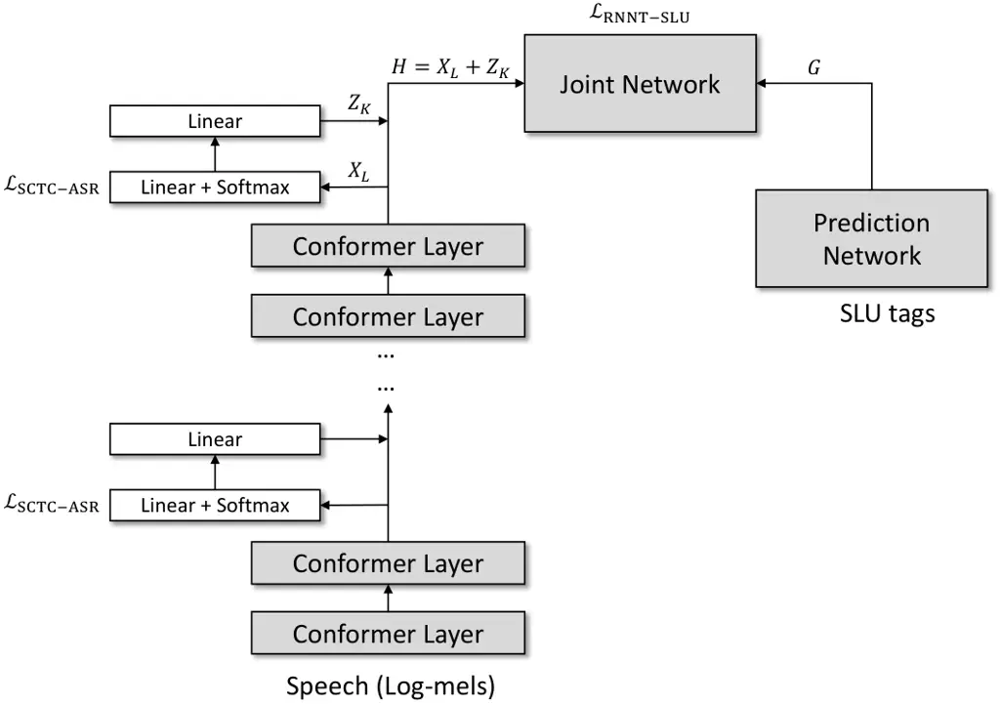
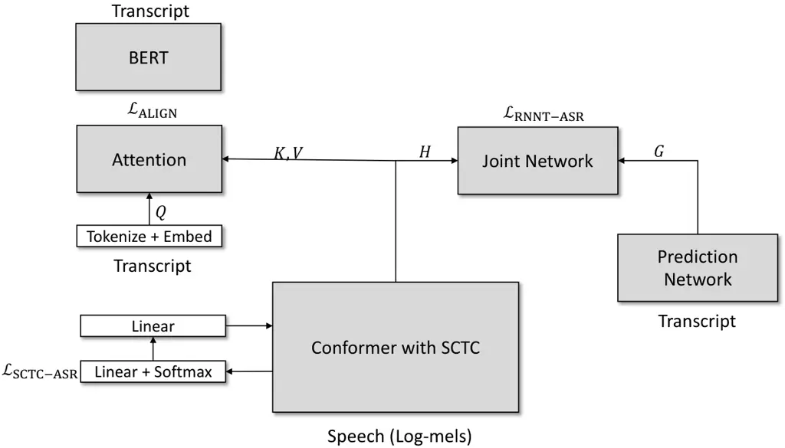
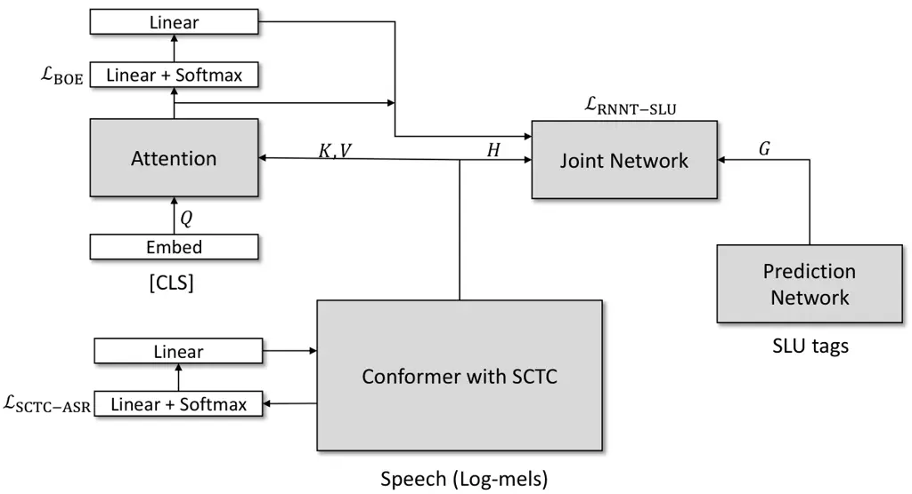
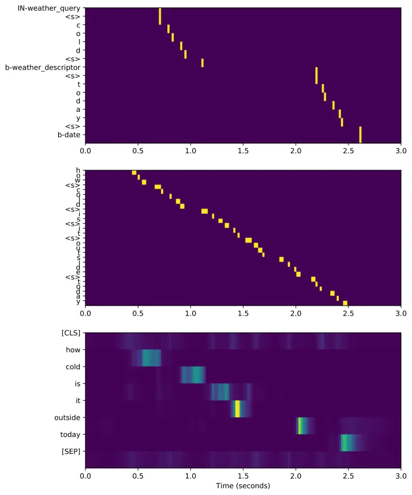

# Improving transducer-based spoken language understanding with self-conditioned CTC and knowledge transfer

Vishal Sunder    Eric Fosler-Lussier

###### Abstract

In this paper, we propose to improve end-to-end (E2E) spoken language
understand (SLU) in an RNN transducer model (RNN-T) by incorporating a
joint self-conditioned CTC automatic speech recognition (ASR) objective.
Our proposed model is akin to an E2E differentiable cascaded model which
performs ASR and SLU sequentially and we ensure that the SLU task is
conditioned on the ASR task by having CTC self conditioning. This novel
joint modeling of ASR and SLU improves SLU performance significantly
over just using SLU optimization. We further improve the performance by
aligning the acoustic embeddings of this model with the semantically
richer BERT model. Our proposed knowledge transfer strategy makes use of
a bag-of-entity prediction layer on the aligned embeddings and the
output of this is used to condition the RNN-T based SLU decoding. These
techniques show significant improvement over several strong baselines
and can perform at par with large models like Whisper with significantly
fewer parameters.

###### Index Terms: 

Spoken language understanding, RNN transducers, CTC, knowledge transfer.

^(†)^(†)address: The Ohio State University

## 1 Introduction

End-to-end spoken language understanding (E2E SLU) is the task of
extracting semantic entities from a spoken utterance’s acoustic signal
instead of first transcribing it. While the latter, cascaded modeling,
has been the traditional approach, E2E SLU has become very popular
recently, primarily due to its abilities to bypass the harmful cascading
effects of ASR errors and of using a smaller sized model. While large
language models (LLMs) have become extremely powerful language
understanding agents in the recent past, they are not robust to ASR
errors \[1\]. Therefore, for SLU, building-in ASR robustness into models
has been an area of active research, with E2E modeling being one of the
solutions.

In this paper, we focus on RNN transducer (RNN-T) based E2E SLU. RNN-T
was proposed as a recurrent neural network (RNN) based autoregressive
ASR model \[2\]. With the development of sequence encoding models like
transformers and conformers \[3, 4\], the RNN is usually switched with
these more powerful speech encoders. However, we still refer to these
models as RNN-Ts in this paper.

Compared to attention based encoder-decoder models (AED) for ASR \[5\],
RNN-T has the added benefit of being able to process streaming speech
while being autoregressive and thus having an implicit language modeling
capacity. This makes it a popular choice for ASR modeling in many
industrial applications, especially long-form ASR. Thus, many
large-scale ASR models are RNN-T based and SLU adaptation is done by
using these as seed models. Our proposed approaches in this paper, thus
use RNN-T as a base speech processing system. However, it is worth
noting that these approaches can be extended to AED based models as
well.

In this work, we propose a joint ASR-SLU modeling approach for improving
downstream SLU performance. The SLU task is modelled using an RNN-T
objective conditioned on the ASR output of the model, which in turn is
modelled as a CTC objective \[6\]. To make this model E2E differentiable
and single-pass during inference, we use the recently proposed
self-conditioned version of the CTC loss \[7\]. Instead of conditioning
the RNN-T based SLU loss on the ASR decoding of the model, we condition
it on the CTC alignment emission probabilities which serves as a soft
decode. We show that this approximation works well in practice. The
formulation of this approach is presented in section 3.

Recent advances in E2E SLU have shown that knowledge can be transferred
from LLMs into speech encoders in a fine-grained manner which leads to
semantically richer speech representations which in turn improves SLU
performance \[8\]. In this work, we further improve SLU performance by
incorporating this knowledge transfer (KT) technique and propose a novel
extension to this idea by incorporating an auxiliary prediction of
bag-of-entities present in an utterance.

In particular, we propose to incorporate a bag-of-entities prediction
layer into our model. The soft prediction from this layer is added into
the RNN-T joint network which acts as a soft prior on the prediction.
This helps the RNN-T prediction network perform an informed decoding of
the slots and values thus improving performance. A detailed and formal
description of this is provided in section 3.4.

We highlight the following novel contributions in this work. First, we
propose a fully E2E and differentiable cascading of ASR and SLU by
incorporating self-conditioned CTC based ASR objective into a transducer
based SLU model. While this has been explored for ASR and speech
translation tasks, we are the first to introduce this into an E2E SLU
model to the the best of our knowledge. Second, we improve previously
proposed LLM-based knowledge transfer techniques \[8, 9\] by
incorporating conditioning of the transducer decoder over
bag-of-entities prediction.

In the next section, we provide a literature review on the topic.
Section 3 is the formulation of the problem and details our approach to
it. Next, in section 4 we go through our implementation details, present
our results and provide a thorough quantitative and qualitative analysis
of our findings.

## 2 Related work

Cascaded ASR-NLU: Most research in ASR and natural language
understanding (NLU) has advanced in a somewhat disjoint manner. While
NLU models have made remarkable progress over the years, they still
greatly underperform in the presence of ASR errors \[10, 11, 1\]. Thus,
a lot of work has focused on building interfaces between ASR and NLU.
Along these lines, Raju et al. \[12\] explore ways of stitching together
ASR and NLU systems and Seo et al. \[13\] build an interface for E2E
training of large speech and language models. Arora et al. \[14\] build
an E2E ASR-NLU model where the NLU submodel is connected with the ASR
submodel by a cross-attention mechanism.

E2E SLU: Over the years, perhaps the most popular design choice for E2E
SLU has been to pretrain an encoder-decoder based ASR model and then
adapt this model for SLU in an E2E manner. Kuo et al. \[15\] train an
E2E attention based model and study how these models can be adapted to
new SLU domains without any ASR domain adaptation. RNN-T based E2E SLU
models have similarly been developed \[16, 17\]. Recently, scaling these
models with large amounts of data for ASR pretraining and SLU adaptation
has shown promise for the task \[18, 19\]. Self-supervised speech models
without ASR adaptation have also shown a great capability to perform E2E
SLU \[20\].

Auxiliary CTC for speech tasks: The connectionist temporal
classification (CTC) \[6\] is a non-autoregressive sequence tagging
objective primarily used for E2E ASR. One of the many benefits of CTC is
that it does not need additional parameters to be trained except a
classification layer. Therefore, for speech tasks, having an auxiliary
CTC objective can help speech align with the corresponding transcript
without needing too many excessive parameters. This advantage was
utilized to improve the attention-based ASR model by Kim et al. \[21\].
A similar use of the CTC objective \[22\] shows its advantage in
text-to-text and speech-to-text translation. Furthermore, recent work
has also shown the effectiveness of CTC objectives for massive
multilingual ASR by having an intermediate CTC predict the language ID
\[23\].

For SLU, Wang et al. \[24\] show that auxiliary CTC improves intent
recognition performance in pretrained self-supervised models. However,
their model does not use self-conditioning on intermediate CTC
emissions.

Knowledge transfer for speech tasks: With the advent of large language
models, techniques have emerged to transfer their expertise gained
through large scale training into speech models. Work by Sunder et al.
\[25, 9, 8, 26\] show how embedding-level alignment can be achieved
between speech and text using contrastive learning. Huang et al. \[27\]
also proposed an alignment strategy between speech and BERT embeddings
for better speech understanding. Even ASR performance has shown
significant improvements with similar knowledge transfer strategies
\[28, 8\].

## 3 Problem formulation

In the below formulation, we use the following notations: Let the speech
be represented by $`X=[x_{t}\in\mathbb{R}^{d}|t=1,..,T_{X}]`$ where
$`x_{t}`$ is a speech frame at time $`t`$. Next, let the sequence of SLU
tags be $`S=[s_{i}\in\mathcal{V}_{S}|i=1,..,T_{S}]`$ where $`s_{i}`$ is
an SLU tag from the set of SLU tag vocabulary $`\mathcal{V}_{S}`$.
Similarly, the transcript of $`X`$ is
$`Y=[y_{i}\in\mathcal{V}_{Y}|i=1,..,T_{Y}]`$ where $`y_{i}`$ is the
token from the set of vocabulary $`\mathcal{V}_{Y}`$.

### 3.1 Background on RNN transducers

RNN transducers are autoregressive speech-to-text models that learn an
alignment of length $`T_{X}+T_{Y}`$ between speech and text. When used
for E2E SLU, they learn an alignment of length $`T_{X}+T_{S}`$ between
speech and SLU tags. In general, given alignment $`A`$, RNN-T estimates
$`P(Y|X)`$ as,

```math
\displaystyle\begin{split}P(Y|X)&\approx\sum_{A\in\mathcal{B}_{rnnt}^{-1}(Y)}P(A|X)\\
&\approx\sum_{A\in\mathcal{B}_{rnnt}^{-1}(Y)}\prod_{t=1}^{T_{X}+T_{Y}}P(a_{t}|y_{1..t^{\prime}},X)\end{split}
```

Here, $`\mathcal{B}_{rnnt}(A)`$ is a collapsing function that converts
$`A`$ to $`Y`$, $`\mathcal{B}_{rnnt}^{-1}(Y)`$ is the corresponding
one-to-many mapping from $`Y`$ to $`A`$ and
$`y_{1..t^{\prime}}=\mathcal{B}_{rnnt}(a_{1..t-1})`$. The RNN-T uses a
transcription network to encode the speech $`X`$, a prediction network
to encode the token sequence $`y_{1..t^{\prime}}`$ and a joint network
that combines the two to estimate $`P(Y|X)`$.

### 3.2 Background on Self-Conditioned CTC

Self-conditioned CTC \[7\] was proposed to improve CTC-based ASR models
by having intermediate CTC objectives in neural network layers and
adding the prediction of these intermediate layers into higher layers.
The model thus performs iterative prediction refinements across layers
and this relaxes the conditional independence assumption among predicted
tokens in CTC. More formally, for a CTC alignment $`A`$ and a collapsing
function $`\mathcal{B}_{ctc}`$, CTC estimates,

```math
\displaystyle\begin{split}P(Y|X)&\approx\sum_{A\in\mathcal{B}_{ctc}^{-1}(Y)}P(A|X)\\
&\approx\sum_{A\in\mathcal{B}_{ctc}^{-1}(Y)}\prod_{t=1}^{T_{X}}P(a_{t}|X)\end{split}
```

Notice that unlike RNN-T, CTC is non-autoregressive. To relax this, SCTC
makes the following change,

```math
\displaystyle\begin{split}&P(Y|X)\approx\prod_{i=1}^{K}\sum_{A_{i}\in\mathcal{B}_{ctc}^{-1}(Y)}\prod_{t=1}^{T_{X}}P(a_{t}^{i}|X,Z_{i-1})\\
&Z_{i}=\text{Linear}_{i}^{1}(\underbrace{\text{Softmax}(\text{Linear}_{i}^{2}(\text{Conformer}_{i}(X_{i-1}+Z_{i-1})))}_{\text{Emissions from the $i^{th}$ CTC layer}})\end{split}
```

Here, we assume that there are $`K`$ intermediate CTC layers and the
emissions from each is used to compute the emissions from the next.
$`\text{Conformer}_{i}`$ refers to a sequence of conformer layers upto
the $`i^{th}`$ CTC, $`X_{i}`$ is the conformer output where the
$`i^{th}`$ CTC is present and $`Z_{0}=\textbf{0}`$.

### 3.3 Proposed joint ASR and SLU modeling



Figure 1: A sequence of $`L`$ conformer layers serve as the
transcription network. After every other conformer layer, we have an
intermediate CTC loss with self-connections.

The E2E SLU task consists of predicting a sequence of entities from the
acoustics of a spoken utterance. We model the sequence of entities as a
sequence of slots and values. For example, in the utterance, ”how cold
is it outside today”, from the SLURP dataset, the SLU tag is represented
as: IN-weather_query cold b-weather_descriptor today b-date. Here, the
first token is always the intent.

Let $`A_{Y}`$ be a valid CTC alignment between $`Y`$ and $`X`$, and
$`\mathcal{B}_{ctc}`$ be the collapsing function that converts $`A_{Y}`$
to $`Y`$. In the same way, $`A_{S}`$ is a valid RNN-T alignment between
$`S`$ and $`X`$ and $`\mathcal{B}_{rnnt}`$ is the corresponding
collapsing function.

In this work, we train a model to maximize the likelihood of the joint
distribution, $`P(Y,S|X)`$. This is modelled as,

```math
\displaystyle\begin{split}P(Y,S&|X)=P(S|Y,X)P(Y|X)\\
&\approx\sum_{A_{S}\in\mathcal{B}^{-1}_{rnnt}(S)}\sum_{A_{Y}\in\mathcal{B}^{-1}_{ctc}(Y)}P(A_{S}|A_{Y},X)P(A_{Y}|X)\\
\end{split}
```

The above likelihood is difficult to compute during training and would
require a two-pass decoding strategy during inference. Instead, we make
the above likelihood tractable and one-pass by using the SCTC model.
Following from section 3.2, we rewrite the above likelihood as,

```math
\displaystyle\begin{split}P(Y,S|X)&\approx\underbrace{\sum_{A_{S}}P(A_{S}|Z_{K},X)}_{P_{\text{RNNT}-\text{SLU}}}\underbrace{\prod_{i=1}^{K}\sum_{A_{Y}^{i}}P(A_{Y}^{i}|X,Z_{i-1}}_{P_{\text{SCTC}-\text{ASR}}})\end{split}
```

In $`P_{\text{RNNT}-\text{SLU}}`$, $`Z_{K}`$ is the emission from the
last CTC layer and $`Z_{i}`$ is defined in section 3.2. This serves as a
soft prediction and a proxy for $`A_{Y}`$. $`Z_{K}`$ is simply added to
the last conformer output before going into the joint network, thus the
final output of the transcription network is $`X_{L}+Z_{K}`$.
$`P_{\text{SCTC}-\text{ASR}}`$ is exactly the SCTC likelihood defined in
section 3.2. The joint loss function can be defined as,

```math
\displaystyle\begin{split}\mathcal{L}_{\text{JNT}}&=-\lambda\text{log}(P_{\text{RNNT}-\text{SLU}})-(1-\lambda)\text{log}(P_{\text{SCTC}-\text{ASR}})\\
&=\lambda\mathcal{L}_{\text{RNNT}-\text{SLU}}+(1-\lambda)\mathcal{L}_{\text{SCTC}-\text{ASR}}\end{split} \tag{1}
```

An overview of the model is shown in figure 1. Let the output from the
$`L`$ layer transcription network be $`H=X_{L}+Z_{K}`$ which is a
sequence of vectors, $`H=[h_{t}\in\mathbb{R}^{768}|t=1,..,T_{X}]`$. The
output from the prediction network, modeled as a single layer LSTM, is
$`G=[g_{u}\in\mathbb{R}^{1024}|u=1,..,T_{S}]`$. Then,
$`P_{\text{RNNT}-\text{SLU}}`$ is computed using dynamic programming
from the emissions, $`P(.|h_{t},g_{u})`$, from the RNN-T which is
modelled using a joint network as,

```math
\displaystyle\begin{split}P(.|h_{t},g_{u})=\text{Softmax}(W_{out}\text{tanh}(W_{enc}h_{t}+W_{pred}g_{u}+b))\end{split}
```

Here, $`W_{out}\in\mathbb{R}^{|\mathcal{V}_{S}|\times 256}`$,
$`W_{enc}\in\mathbb{R}^{256\times 768}`$,
$`W_{pred}\in\mathbb{R}^{256\times 1024}`$ and $`b\in\mathbb{R}^{256}`$
are learnable parameters.

### 3.4 Proposed knowledge transfer

We propose to further improve the above model by transferring knowledge
from a large language model. In this paper, we employ BERT¹¹ 1
https://huggingface.co/bert-base-uncased, but our method is applicable
to any LLM. For this, we utilize a method proposed by Sunder et al.
\[8\] and extend it further for improved performance.

Our method comprises of two stages. In the first stage, an ASR
pretraining is conducted with knowlege transfer (KT) from BERT. We adapt
this model for SLU in the second stage using a novel bag-of-entities
prediction loss.



Figure 2: ASR pretraining with knowledge transfer. The transcription
network is the same as figure 1. Both RNN-T and SCTC losses are computed
against the transcription.

ASR Pretraining with KT (figure 2): In this stage, we seek to transfer
the knowledge from BERT into the speech encoder. The transcript $`Y`$ is
fed to BERT to generate a sequence of embeddings
$`B_{Y}\in\mathbb{R}^{T_{Y}^{{}^{\prime}}\times 768}`$ which acts as the
teacher signal. A student signal,
$`B_{X}\in\mathbb{R}^{T_{Y}^{{}^{\prime}}\times 768}`$, is generated
from the speech encoder using an attention mechanism as,

```math
\displaystyle\begin{split}B_{X}=\text{Attention}(\text{Embedding}(\text{Tokenize}(Y)),H)\end{split}
```

Here, $`\text{Embedding}(\text{Tokenize}(.))`$ operation is the same as
BERT. $`B_{X}`$ is now aligned with $`B_{Y}`$ using a contrastive loss,

```math
\displaystyle\begin{split}\mathcal{L}_{\text{ALIGN}}=-\frac{\tau}{2b}\sum_{i=1}^{b}(&\log\frac{\exp(s_{ii}/\tau)}{\sum_{j=1}^{b}\exp(s_{ij}/\tau)}+\log\frac{\exp(s_{ii}/\tau)}{\sum_{j=1}^{b}\exp(s_{ji}/\tau)})\end{split}
```

$`B_{Y}`$ and $`B_{X}`$ across a batch are row-wise concatenated such
that $`B_{Y}`$ and $`B_{X}`$ are now $`\in\mathbb{R}^{b\times 768}`$,
where $`b`$ is the sum of all sequence lengths in a batch and $`s_{ij}`$
refers to the cosine similarity between the $`i^{th}`$ and $`j^{th}`$
rows of $`B_{Y}`$ and $`B_{X}`$. The final pretraining loss is defined
as,

```math
\displaystyle\begin{split}\mathcal{L}_{\text{ASR}-\text{KT}}=\lambda\mathcal{L}_{\text{RNNT}-\text{ASR}}+(1-\lambda)\mathcal{L}_{\text{SCTC}-\text{ASR}}+\alpha\mathcal{L}_{\text{ALIGN}}\end{split} \tag{2}
```

During pretraining, RNN-T loss is computed against the transcriptions,
not the SLU tags. We set $`\lambda=0.5`$, $`\alpha=1.0`$ and
$`\tau=0.07`$. Note that the SCTC component is also used here.



Figure 3: SLU adaptation with knowledge transfer. After the ASR
pretraining step in figure 2, the model is adapted for SLU where the
utterance level representation from the Attention block is utilized for
predicting the bag-of-entities and is added to the joint network as in
equation.

SLU adaptation with KT (figure 3): Pretraining with KT as explained
above makes the conformer encoder semantically rich. Furthermore, the
attention layer can produce embeddings which are close to BERT
embeddings. To make use of the attention layer during inference, we
utilize the \[CLS\] embedding as the attention query during SLU
adaptation. The \[CLS\] embedding is an utterance level representation
which is close to BERT’s \[CLS\] embedding. In the acoustic domain, we
call this $`x_{\text{[CLS]}}`$, i.e.
$`x_{\text{[CLS]}}=\text{Attention}(\text{Embedding}(\text{[CLS]}),H)`$.

Similar to Sunder et al. \[8\], we integrate $`x_{\text{[CLS]}}`$ into
the joint network of the RNN-T model. In addition, we propose a simple
yet novel approach of providing a soft signal to the RNN-T decoder about
the slot mentions in the SLU tag. For example, the SLU tag,
IN-weather*query cold b-weather_descriptor today b-date, has the
following slots: \[IN-weather_query, weather_descriptor, date\]. We have
an auxiliary classification layer after the attention layer which
predicts this set as a multi-hot, bag-of-entities (BOE) vector,
$`Y*{\text{BOE}}`$, as shown below,

```math
\displaystyle\begin{split}P_{\text{BOE}}(.|X)&=\text{Softmax}(\text{Linear}(x_{\text{[CLS]}}))\\
\mathcal{L}_{\text{BOE}}&=-\text{log}(P_{\text{BOE}}(Y_{\text{BOE}}|X))\end{split}
```

Here, $`Y_{\text{BOE}}`$ is the ground truth, L-1 normalized
representation of the multi-hot representation described above.

Finally, we update the joint network equation as follows,

```math
\displaystyle\begin{split}&\gamma=\sigma(W_{h}h_{t}+W_{g}g_{u}+b^{\prime})\odot(W_{b}P_{\text{BOE}}(.|X)+W_{c}x_{\text{[CLS]}})\\
&P(.|h_{t},g_{u})=\text{Softmax}(W_{out}\text{tanh}(W_{enc}h_{t}+W_{pred}g_{u}+b+\gamma))\end{split} \tag{3}
```

Here, $`\gamma`$ is the auxiliary information from the predicted
bag-of-entities and the utterance-level representation,
$`x_{\text{[CLS]}}`$. The sigmoid gate, $`\sigma(.)`$ controls this
information as a function of the current position ($`t,u`$) in the RNN-T
trellis. The RNN-T loss is now computed from the above emission
probability. We call this loss
$`\mathcal{L}_{\text{RNNT}-\text{SLU}}^{\text{CLS, BOE}}`$.

The loss function of the SLU adaptation is given as,

```math
\displaystyle\begin{split}\mathcal{L}_{\text{JNT}-\text{KT}}=\lambda\mathcal{L}_{\text{RNNT}-\text{SLU}}^{\text{CLS, BOE}}+(1-\lambda)\mathcal{L}_{\text{SCTC}-\text{ASR}}+\beta\mathcal{L}_{\text{BOE}}\end{split} \tag{4}
```

Here, $`\lambda=0.5`$ and $`\beta=0.1`$.

## 4 Experiments and results

|                                                                                                                                               |           |        |        |            |
| --------------------------------------------------------------------------------------------------------------------------------------------- | --------- | ------ | ------ | ---------- |
| Model                                                                                                                                         | Precision | Recall | SLU-F1 | Intent-Acc |
| Previous models                                                                                                                               |           |        |        |            |
| CTI \[13\]                                                                                                                                    | \-        | \-     | 74.66  | 86.92      |
| Sunder et al. \[8\]                                                                                                                           | \-        | \-     | 76.96  | 87.95      |
| Branchformer \[29\]                                                                                                                           | \-        | \-     | 77.70  | 88.10      |
| Arora et al. \[30\]                                                                                                                           | \-        | \-     | 78.50  | \-         |
| CIF \[31\]                                                                                                                                    | \-        | \-     | 78.67  | 89.60      |
| HuBERT-Large^(†) \[20\]                                                                                                                       | 80.54     | 77.44  | 78.96  | 89.37      |
| UniverSLU \[18\]                                                                                                                              | \-        | \-     | 79.50  | \-         |
| Whisper^(†) \[32\]                                                                                                                            | \-        | \-     | 79.70  | \-         |
| NeMo-Large^(†) \[27\]                                                                                                                         | 84.31     | 80.33  | 82.27  | 90.14      |
| Our baseline models                                                                                                                           |           |        |        |            |
| \(1\) ASR finetune RNN-T $`\rightarrow`$ SLU adapt RNN-T                                                                                      | 79.22     | 71.24  | 75.02  | 85.92      |
| \(2\) ASR finetune RNN-T w/ $`\mathcal{L}_{\text{ALIGN}}`$ $`\rightarrow`$ SLU adapt w/ $`\mathcal{L}_{\text{RNNT}-\text{SLU}}^{\text{CLS}}`$ | 79.88     | 73.95  | 76.80  | 87.95      |
| Our proposed models (Joint ASR+SLU)                                                                                                           |           |        |        |            |
| \(3\) No ASR finetuning $`\rightarrow`$ $`\mathcal{L}_{\text{JNT}}`$(1)                                                                       | 82.83     | 74.91  | 78.67  | 88.00      |
| \(4\) ASR finetune w/ RNN-T + SCTC $`\rightarrow`$ $`\mathcal{L}_{\text{JNT}}`$(1)                                                            | 82.01     | 75.50  | 78.62  | 87.89      |
| Our proposed models (Knowledge transfer)                                                                                                      |           |        |        |            |
| \(5\) $`\mathcal{L}_{\text{ASR}-\text{KT}}`$(2) $`\rightarrow`$ $`\mathcal{L}_{\text{JNT}}`$(1)                                               | 82.07     | 74.71  | 78.22  | 87.90      |
| \(6\) $`\mathcal{L}_{\text{ASR}-\text{KT}}`$(2) $`\rightarrow`$ $`\mathcal{L}_{\text{JNT}-\text{KT}}`$ w/o BOE component                      | 81.65     | 76.67  | 79.02  | 89.20      |
| \(7\) $`\mathcal{L}_{\text{ASR}-\text{KT}}`$(2) $`\rightarrow`$ $`\mathcal{L}_{\text{JNT}-\text{KT}}`$(4)                                     | 82.12     | 77.22  | 79.59  | 89.68      |

Table 1: Our proposed models are first pretrained for ASR on the Fisher
2000 hour dataset using
$`(\mathcal{L}_{\text{SCTC}-\text{ASR}},\mathcal{L}_{\text{RNNT}-\text{ASR}})`$.
Then, these models are ASR finetuned on SLURP
$`\xrightarrow[\text{by}]{\text{followed}}`$ SLU adapted on SLURP. This
is indicated by $`(...)`$ $`\rightarrow`$ $`(...)`$ using different
combinations of the proposed losses. ^(†) indicates that these models
either use significantly more pretraining data or significantly more
parameters or both compared to our proposed models. All our models have
$`\leq`$ 100 million parameters.

| SCTC-1 | SCTC-2 | SCTC-3 | Precision | Recall | SLU-F1 | Intent-Acc |
| ------ | ------ | ------ | --------- | ------ | ------ | ---------- |
| ASR    | ASR    | ASR    | 82.83     | 74.91  | 78.67  | 88.00      |
| ASR    | ASR    | SLU    | 76.50     | 74.58  | 76.03  | 86.90      |
| ASR    | SLU    | SLU    | 76.10     | 74.32  | 75.75  | 87.00      |
| SLU    | SLU    | SLU    | 75.75     | 74.67  | 75.21  | 86.60      |

Table 2: Effect of using ASR/SCTC objectives on the three intermediate
SCTC layers of our 6-layer conformer model.

### 4.1 Experiment settings

Model details: For our speech encoder, we use a 6-layer conformer with
768 hidden units and 12 attention heads. The prediction network is a
1-layer LSTM with 1024 hidden units. Our tokenization strategy is a
simple character-based tokenization for ASR. For SLU, we treat the
intent labels and slot labels as additional tokens to our ASR
vocabulary, with the slots being tokenized at the character level.

We also utilize SpecAugment \[33\] and sequence noise injection \[34\]
as regularization strategies. We obtain sequences of 40 dimensional
log-mel filterbank (LFB) features from speech resampled at 8kHz. We also
add $`\Delta`$ and $`\Delta^{2}`$ coefficients to the LFB features and
stack two consecutive frames, skipping every other frame resulting in a
feature dimension of 240 which gets fed into the conformer.

Data: As a first step, we train the above model on the 2000-hour Fisher
dataset with the ASR objective. This consists of a combination of
$`\mathcal{L}_{\text{RNNT}-\text{ASR}}`$ and
$`\mathcal{L}_{\text{SCTC}-\text{ASR}}`$. Our SLU models were
initialized with this pretrained ASR model.

For SLU, we perform experiments on the SLURP \[35\], which is a speech
dataset with both ASR and SLU labels. It contains 84 hours of speech
data in the training set and 6.9 hours and 10.2 hours of data in the dev
and test set respectively. For evaluation, we use the metrics proposed
in \[35\].

### 4.2 Discussion on results

The main results of our experiments are shown in table 1. We also
include the latest published results on the SLURP SLU task for
comparison. Rows (1) and (2) are the baselines without the proposed
joint ASR, SLU setup. Note that all results that follow (rows (3) to
(7)) give better SLU performance. All the proposed models are pretrained
for ASR on the Fisher 2000 hour dataset using
$`\mathcal{L}_{\text{SCTC}-\text{ASR}}+\mathcal{L}_{\text{RNNT}-\text{ASR}}`$.

Effect of SCTC: Rows (3) and (4) show the result of including an
auxiliary SCTC-based ASR loss for RNNT-based SLU as formulated in
section 3.3. We note a significant improvement in slot-filling
performance. We note that even without an ASR finetuning step on SLURP,
directly adapting the model for SLU gives an improved performance (row
(3)). This may be because the SCTC-based ASR objective takes care of the
acoustic domain adaptation and ”informing” the decoder about the
entities present. However, we also notice that the intent prediction
accuracy does not undergo a significant change. Since good intent
prediction depends on a good utterance-level representation, we use our
proposed integration of the utterance-level $`x_{\text{[CLS]}}`$ vector
for the same.

Analysis of the proposed KT mechanisms: Rows (5), (6) and (7) show the
results of the proposed KT-based ASR pretraining and SLU adaptation in
section 3.4. In row (5), we finetune the model for ASR using
$`\mathcal{L}_{\text{ASR}-\text{KT}}`$ defined in equation 2 and adapt
it for SLU using $`\mathcal{L}_{\text{JNT}}`$ (equation 1). We do not
observe an improvement in performance from the KT based pretraining.
However, when we ASR-finetune the model with
$`\mathcal{L}_{\text{ASR}-\text{KT}}`$ and adapt it for SLU by
incorporating KT into the SLU framework, as shown in row (6), we see
improvements across the board. We note that as $`x_{\text{[CLS]}}`$ is
now semantically rich with the KT based pretraining, it leads to better
entity extraction and intent prediction. Thus, even without the BOE
component, the performance improves, as shown in row (6).

Row (7) shows our best performing model when ASR-fintuned using
$`\mathcal{L}_{\text{ASR}-\text{KT}}`$ (equation 2) and SLU-adapted
using $`\mathcal{L}_{\text{JNT}-\text{KT}}`$ (equation 4). The
prediction ($`\mathcal{L}_{\text{BOE}}`$) and integration (equation 3)
of the bag-of-entities information serves as an effective prior over the
intent and slots present in the utterance.

From rows (5) and (6), we see that the KT incorporation improves recall
but degrades precision. Having the BOE component recovers the precision
by avoiding the false positives in a better way and serving as an
effective regularization.

Comparing with previous models: When comparing with previously reported
results on SLURP, our model comes close to Whisper’s SLU performance and
is second only to NeMo-Large. It is worth noting that the above version
of Whisper is pretrained on a very large amount of data with the ASR
objective and has close to 800 million parameters. NeMo-Large is also
pretrained on roughly 25,000 hours of speech. Compared to this, our
model utilizes 2,000 hours of pretraining data. Furthermore, the
proposed SCTC-based joint training can be easily integrated with the
above large industrial-scale models. Also, note that using the proposed
techniques, we are able to outperform HuBERT-Large based SLU which is
about 3 times larger than our models.

An analysis on SCTC objectives: The proposed joint training in equation
1 trained the SCTC layers using the speech transcriptions as targets,
i.e. SCTC was an ASR objective. However, we can also train SCTC across
various layers of the conformer using SLU tags as targets. Thus, for our
6-layer conformer model with 3 intermediate SCTC layers, we explore
using SLU objectives as shown in table 2.

We observe that anytime we introduce an SLU objective in any of the SCTC
layers, the performance is degraded. The performance is gradually
improved as we incorporate ASR until all SCTC layers are ASR objectives.
We hypothesize that the SLU task is difficult to perform
non-autoregressively and therefore using SCTC for SLU can give a soft
prediction which is noisy and may lead to cascading of errors.
Furthermore, the ASR objective in SCTC enables the model, in a fully
end-to-end differentiable way, to perform a cascaded ASR-SLU processing
of speech where the ASR can help the SLU. The ASR itself benefits from
layerwise iterations as in SCTC and this helps autoregressive decoding
of the SLU tags.



Figure 4: Alignment at different levels for a sample utterance ”how cold
is it outside today”. Top: The RNN-T alignment between the SLU tags and
the speech, Middle: character-level alignment at the last SCTC layer,
Bottom: subword-level alignment sfrom the attention layer during KT
pretraining.

Alignments learnt by our model: Our proposed model learns three levels
of alignments between the speech input and the utterance semantics.
These are shown in figure 4. The first is the alignment between the
speech signal and the semantic entities in the speech utterance which is
learnt by the RNN-T. We see that the model emits the tokens when the
corresponding entity is mentioned. The middle part of the figure shows
the alignment obtained by the last CTC layer. The bottom part shows the
attention map of the wordpiece tokenization of the utterance and the
speech input in the Attention layer used for knowledge transfer (figure
2).

## 5 Conclusion

This work presented a joint modeling approach for ASR and SLU and showed
that this joint modeling can help the SLU task. We explicitly
conditioned the output of the RNN-T based SLU model on the output of the
ASR model by using a self-conditioned CTC objective. Further
improvements in SLU were proposed by using a fine-grained knowledge
transfer strategy from BERT embeddings into conformer based acoustic
embeddings. Future work should look at how this model scales to large
datasets and larger model sizes.

## References

- \[1\] Mutian He and Philip N Garner, “Can chatgpt detect intent?
  evaluating large language models for spoken language understanding,”
  arXiv preprint arXiv:2305.13512, 2023.
- \[2\] Alex Graves, “Sequence transduction with recurrent neural
  networks,” arXiv preprint arXiv:1211.3711, 2012.
- \[3\] Ashish Vaswani, Noam Shazeer, Niki Parmar, Jakob Uszkoreit,
  Llion Jones, Aidan N Gomez, Lukasz Kaiser, and Illia Polosukhin,
  “Attention is all you need,” Advances in neural information processing
  systems, vol. 30, 2017.
- \[4\] Anmol Gulati, James Qin, Chung-Cheng Chiu, Niki Parmar,
  Yu Zhang, Jiahui Yu, Wei Han, Shibo Wang, Zhengdong Zhang, Yonghui Wu,
  et al., “Conformer: Convolution-augmented transformer for speech
  recognition,” arXiv preprint arXiv:2005.08100, 2020.
- \[5\] William Chan, Navdeep Jaitly, Quoc Le, and Oriol Vinyals,
  “Listen, attend and spell: A neural network for large vocabulary
  conversational speech recognition,” in 2016 IEEE international
  conference on acoustics, speech and signal processing (ICASSP). IEEE,
  2016, pp. 4960–4964.
- \[6\] Alex Graves, Santiago Fernández, Faustino Gomez, and Jürgen
  Schmidhuber, “Connectionist temporal classification: labelling
  unsegmented sequence data with recurrent neural networks,” in
  Proceedings of the 23rd international conference on Machine learning,
  2006, pp. 369–376.
- \[7\] Jumon Nozaki and Tatsuya Komatsu, “Relaxing the conditional
  independence assumption of ctc-based asr by conditioning on
  intermediate predictions,” arXiv preprint arXiv:2104.02724, 2021.
- \[8\] Vishal Sunder, Samuel Thomas, Hong-Kwang J Kuo, Brian Kingsbury,
  and Eric Fosler-Lussier, “Fine-grained textual knowledge transfer to
  improve rnn transducers for speech recognition and understanding,” in
  ICASSP 2023-2023 IEEE International Conference on Acoustics, Speech
  and Signal Processing (ICASSP). IEEE, 2023, pp. 1–5.
- \[9\] Vishal Sunder, Eric Fosler-Lussier, Samuel Thomas, Hong-Kwang J
  Kuo, and Brian Kingsbury, “Tokenwise contrastive pretraining for finer
  speech-to-bert alignment in end-to-end speech-to-intent systems,”
  arXiv preprint arXiv:2204.05188, 2022.
- \[10\] Seokhwan Kim, Yang Liu, Di Jin, Alexandros Papangelis, Karthik
  Gopalakrishnan, Behnam Hedayatnia, and Dilek Hakkani-Tür, ““how robust
  ru?”: Evaluating task-oriented dialogue systems on spoken
  conversations,” in 2021 IEEE Automatic Speech Recognition and
  Understanding Workshop (ASRU). IEEE, 2021, pp. 1147–1154.
- \[11\] Manaal Faruqui and Dilek Hakkani-Tür, “Revisiting the boundary
  between asr and nlu in the age of conversational dialog systems,”
  Computational Linguistics, vol. 48, no. 1, pp. 221–232, 2022.
- \[12\] Anirudh Raju, Milind Rao, Gautam Tiwari, Pranav Dheram, Bryan
  Anderson, Zhe Zhang, Chul Lee, Bach Bui, and Ariya Rastrow, “On joint
  training with interfaces for spoken language understanding,” arXiv
  preprint arXiv:2106.15919, 2021.
- \[13\] Seunghyun Seo, Donghyun Kwak, and Bowon Lee, “Integration of
  pre-trained networks with continuous token interface for end-to-end
  spoken language understanding,” in ICASSP 2022-2022 IEEE International
  Conference on Acoustics, Speech and Signal Processing (ICASSP). IEEE,
  2022, pp. 7152–7156.
- \[14\] Siddhant Arora, Siddharth Dalmia, Brian Yan, Florian Metze,
  Alan W Black, and Shinji Watanabe, “Token-level sequence labeling for
  spoken language understanding using compositional end-to-end models,”
  arXiv preprint arXiv:2210.15734, 2022.
- \[15\] Hong-Kwang J Kuo, Zoltán Tüske, Samuel Thomas, Yinghui Huang,
  Kartik Audhkhasi, Brian Kingsbury, Gakuto Kurata, Zvi Kons, Ron Hoory,
  and Luis Lastras, “End-to-end spoken language understanding without
  full transcripts,” arXiv preprint arXiv:2009.14386, 2020.
- \[16\] Samuel Thomas, Hong-Kwang J Kuo, George Saon, Zoltán Tüske,
  Brian Kingsbury, Gakuto Kurata, Zvi Kons, and Ron Hoory, “Rnn
  transducer models for spoken language understanding,” in ICASSP
  2021-2021 IEEE International Conference on Acoustics, Speech and
  Signal Processing (ICASSP). IEEE, 2021, pp. 7493–7497.
- \[17\] Anirudh Raju, Gautam Tiwari, Milind Rao, Pranav Dheram, Bryan
  Anderson, Zhe Zhang, Bach Bui, and Ariya Rastrow, “End-to-end spoken
  language understanding using rnntransducer asr,” arXiv preprint
  arXiv:2106.15919, 2021.
- \[18\] Siddhant Arora, Hayato Futami, Jee-weon Jung, Yifan Peng,
  Roshan Sharma, Yosuke Kashiwagi, Emiru Tsunoo, and Shinji Watanabe,
  “Universlu: Universal spoken language understanding for diverse
  classification and sequence generation tasks with a single network,”
  arXiv preprint arXiv:2310.02973, 2023.
- \[19\] He Huang, Jagadeesh Balam, and Boris Ginsburg, “Leveraging
  pretrained asr encoders for effective and efficient end-to-end speech
  intent classification and slot filling,” arXiv preprint
  arXiv:2307.07057, 2023.
- \[20\] Yingzhi Wang, Abdelmoumene Boumadane, and Abdelwahab Heba, “A
  fine-tuned wav2vec 2.0/hubert benchmark for speech emotion
  recognition, speaker verification and spoken language understanding,”
  arXiv preprint arXiv:2111.02735, 2021.
- \[21\] Suyoun Kim, Takaaki Hori, and Shinji Watanabe, “Joint
  ctc-attention based end-to-end speech recognition using multi-task
  learning,” in 2017 IEEE international conference on acoustics, speech
  and signal processing (ICASSP). IEEE, 2017, pp. 4835–4839.
- \[22\] Brian Yan, Siddharth Dalmia, Yosuke Higuchi, Graham Neubig,
  Florian Metze, Alan W Black, and Shinji Watanabe, “Ctc alignments
  improve autoregressive translation,” arXiv preprint
  arXiv:2210.05200, 2022.
- \[23\] William Chen, Brian Yan, Jiatong Shi, Yifan Peng, Soumi Maiti,
  and Shinji Watanabe, “Improving massively multilingual asr with
  auxiliary ctc objectives,” in ICASSP 2023-2023 IEEE International
  Conference on Acoustics, Speech and Signal Processing (ICASSP). IEEE,
  2023, pp. 1–5.
- \[24\] Jixuan Wang, Martin Radfar, Kai Wei, and Clement Chung,
  “End-to-end spoken language understanding using joint ctc loss and
  self-supervised, pretrained acoustic encoders,” in ICASSP 2023-2023
  IEEE International Conference on Acoustics, Speech and Signal
  Processing (ICASSP). IEEE, 2023, pp. 1–5.
- \[25\] Vishal Sunder, Samuel Thomas, Hong-Kwang J Kuo, Jatin Ganhotra,
  Brian Kingsbury, and Eric Fosler-Lussier, “Towards end-to-end
  integration of dialog history for improved spoken language
  understanding,” in ICASSP 2022-2022 IEEE International Conference on
  Acoustics, Speech and Signal Processing (ICASSP). IEEE, 2022, pp.
  7497–7501.
- \[26\] Vishal Sunder, Eric Fosler-Lussier, Samuel Thomas, Hong-Kwang J
  Kuo, and Brian Kingsbury, “Convkt: Conversation-level knowledge
  transfer for context aware end-to-end spoken language understanding,”
  in Annual Conference of the International Speech Communication
  Association, 2023.
- \[27\] Yinghui Huang, Hong-Kwang Kuo, Samuel Thomas, Zvi Kons, Kartik
  Audhkhasi, Brian Kingsbury, Ron Hoory, and Michael Picheny,
  “Leveraging unpaired text data for training end-to-end
  speech-to-intent systems,” in ICASSP 2020-2020 IEEE International
  Conference on Acoustics, Speech and Signal Processing (ICASSP). IEEE,
  2020, pp. 7984–7988.
- \[28\] Yotaro Kubo, Shigeki Karita, and Michiel Bacchiani, “Knowledge
  transfer from large-scale pretrained language models to end-to-end
  speech recognizers,” in ICASSP 2022-2022 IEEE International Conference
  on Acoustics, Speech and Signal Processing (ICASSP). IEEE, 2022, pp.
  8512–8516.
- \[29\] Yifan Peng, Siddharth Dalmia, Ian Lane, and Shinji Watanabe,
  “Branchformer: Parallel mlp-attention architectures to capture local
  and global context for speech recognition and understanding,” in
  International Conference on Machine Learning. PMLR, 2022, pp.
  17627–17643.
- \[30\] Siddhant Arora, Hayato Futami, Yosuke Kashiwagi, Emiru Tsunoo,
  Brian Yan, and Shinji Watanabe, “Integrating pretrained asr and lm to
  perform sequence generation for spoken language understanding,” arXiv
  preprint arXiv:2307.11005, 2023.
- \[31\] Linhao Dong, Zhecheng An, Peihao Wu, Jun Zhang, Lu Lu, and
  Zejun Ma, “Cif-pt: Bridging speech and text representations for spoken
  language understanding via continuous integrate-and-fire
  pre-training,” arXiv preprint arXiv:2305.17499, 2023.
- \[32\] Alec Radford, Jong Wook Kim, Tao Xu, Greg Brockman, Christine
  McLeavey, and Ilya Sutskever, “Robust speech recognition via
  large-scale weak supervision,” in International Conference on Machine
  Learning. PMLR, 2023, pp. 28492–28518.
- \[33\] Daniel S Park, William Chan, Yu Zhang, Chung-Cheng Chiu, Barret
  Zoph, Ekin D Cubuk, and Quoc V Le, “Specaugment: A simple data
  augmentation method for automatic speech recognition,” arXiv preprint
  arXiv:1904.08779, 2019.
- \[34\] George Saon, Zoltán Tüske, Kartik Audhkhasi, and Brian
  Kingsbury, “Sequence noise injected training for end-to-end speech
  recognition,” in ICASSP 2019-2019 IEEE International Conference on
  Acoustics, Speech and Signal Processing (ICASSP). IEEE, 2019, pp.
  6261–6265.
- \[35\] Emanuele Bastianelli, Andrea Vanzo, Pawel Swietojanski, and
  Verena Rieser, “Slurp: A spoken language understanding resource
  package,” arXiv preprint arXiv:2011.13205, 2020.
