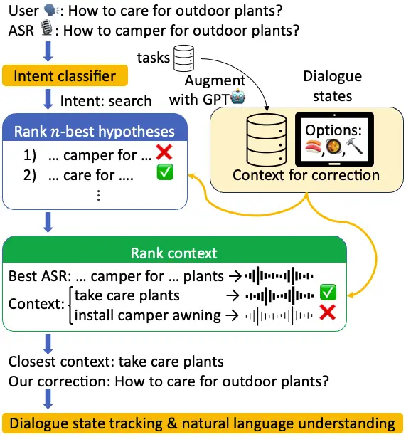
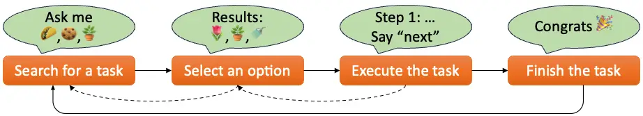

# Contextual ASR Error Handling with LLMs Augmentation for Goal-Oriented Conversational AI

Yuya Asano Affiliation: University of Pittsburgh    Sabit Hassan
Affiliation: University of Pittsburgh    Paras Sharma
Affiliation: University of Pittsburgh    Anthony Sicilia
Affiliation: Northeastern University    Katherine Atwell
Affiliation: Northeastern University     
Diane Litman Affiliation: University of Pittsburgh    Malihe Alikhani
Affiliation: {yua17, sabit.hassan, pas252, dlitman}@pitt.edu
Affiliation: {sicilia.a, atwell.ka, m.alikhani}@northeastern.edu
Affiliation: Northeastern University

###### Abstract

General-purpose automatic speech recognition (ASR) systems do not always
perform well in goal-oriented dialogue. Existing ASR correction methods
rely on prior user data or named entities. We extend correction to tasks
that have no prior user data and exhibit linguistic flexibility such as
lexical and syntactic variations. We propose a novel context
augmentation with a large language model and a ranking strategy that
incorporates contextual information from the dialogue states of a
goal-oriented conversational AI and its tasks. Our method ranks (1)
$`n`$-best ASR hypotheses by their lexical and semantic similarity with
context and (2) context by phonetic correspondence with ASR hypotheses.
Evaluated in home improvement and cooking domains with real-world users,
our method improves recall and F1 of correction by 34% and 16%,
respectively, while maintaining precision and false positive rate. Users
rated .8-1 point (out of 5) higher when our correction method worked
properly, with no decrease due to false positives.

## 1 Introduction and Related Work

Although domain-agnostic automatic speech recognition (ASR) models are
improving, advanced models still make errors, hindering fluent dialogues
with conversational AI (Radford et al., 2023). Most prior work on
context-based ASR error correction needs prior user interaction data to
model errors statistically (Sarma and Palmer, 2004; Jonson, 2006;
Shivakumar et al., 2019; Liu et al., 2019; Ponnusamy et al., 2022;
López-Cózar and Callejas, 2008; Weng et al., 2020; Zhou et al., 2023),
make natural language understanding robust to errors (Gupta et al.,
2019), or learn user preferences (Raghuvanshi et al., 2019; Cho et al.,
2021; Biś et al., 2022). These data are not always available, especially
when creating AI in a new domain.

One proposed solution is to use tasks that goal-oriented conversational
AI can accomplish as a primary source of context. It includes
restricting ASR hypotheses to the vocabularies that a natural language
understanding module can parse (He and Young, 2003; Whittaker and
Attwater, 1995) and remembering named entities and retrieving the most
probable one based on textual and phonetic similarities and $`n`$-best
ASR hypotheses (Georgila et al., 2003; Raghuvanshi et al., 2019; Wang
et al., 2021; Bekal et al., 2021). However, it overlooks three types of
flexibility in natural language in Table 1: lexical and syntactic
variations for the same goal, non-essential modifiers inserted in the
middle of task phrases, and the omission of words that are not needed to
specify a goal given a context. An ASR system could also omit some words
in error.

Figure 1: The overview of our ASR correction pipeline. After intent
classification, we re-rank $`n`$-best ASR hypotheses by the lexical and
semantic similarity of context retrieved from the dialogue states and
the GPT-augmented task list. If none of the hypotheses seems plausible,
we find a task or option that sounds phonetically similar to the best
hypothesis.

| Types                          | Original                      | Variations                                                                                                   |
| ------------------------------ | ----------------------------- | ------------------------------------------------------------------------------------------------------------ |
| Lexical & syntactic variations | How can I make a wood fence?  | How can a wood fence be built?                                                                               |
| Inserting modifiers            | Make a wood fence             | Make a wood privacy fence (this should not be mapped to “make privacy in a college dorm.”)                   |
| Omitting unneeded words        | I want to build a wood fence. | I want to build a fence. (options are “build a wood fence,” “paint a wood fence,” and “clean a wood fence.”) |

Table 1: Examples of the variations of task queries. These examples and
all other examples in this paper are not real-user conversations but
resemble them.

To tackle these challenges, we extend the work on the use of tasks as
context with

1.  1.  better ranking strategies robust to insertions and omissions of
        tokens,
2.  2.  reduction of the size of the context using the dialogue state and
        augmentation with partial matches (for token omissions), and
3.  3.  offline augmentation of tasks with a large language model (LLM) (for
        lexical and syntactic varieties).

These ranking and augmentation strategies are system-agnostic and
generalizable to any tasks if a list of the supported tasks is
available. They are lightweight and are not affected by the latency of
LLMs. The overview of our method is in Figure 1.

We deploy our method on Amazon Alexa and test its effectiveness with
real-world users. It improved recall and F1 of correction from a
baseline while keeping fair precision and false positive rate (FPR) in
offline evaluation. In online evaluation, our ratings have increased by
.8-1 point out of 5 when our method corrected errors properly and did
not decrease even with false positives.

## 2 Problem Description and Data

Figure 2: The flow of dialogues in our dataset. The most probable flows
are in solid arrows. A dashed arrow indicates that the path is possible
but unlikely compared to the solid arrows.

We define the goal of ASR correction for goal-oriented conversational AI
as to pass the corrected information from erroneous ASR transcripts to
the following modules (in our case, dialogue state tracking and natural
language understanding in Figure 1) so that AI can take the correct
action as requested by a user. This definition is similar to call
routing, which “is concerned with determining a caller’s task” Williams
and Witt (2004).

We implemented our system through Alexa Skills,¹¹ 1
[https://developer.amazon.com/en-US/alexa/alexa-skills-kit](https://developer.amazon.com/en-US/alexa/alexa-skills-kit)
which allows third-party developers to create conversational AI on
Alexa. Our Alexa Skill assists with cooking and home improvement tasks.
After our system’s introduction (cf. Appendix A), users typically start
with searching for a task (e.g., “How to fix a faucet?”) as illustrated
in Figure 2. The system replies with search results from an internal
dataset of Whole Foods recipes and WikiHow articles. Users select an
option and complete tasks step-by-step using voice commands (e.g.,
“next,” “go back”), instructions from our system (e.g., our system says,
“Say ‘start cooking’ when you’re ready for the recipe steps.”), or
Alexa’s touch screen. An example dialogue can be found in Appendix B.
Alexa’s ASR system provides up to 5-best hypotheses.

For evaluation, we sampled thousands of dialogues between March 28,
2023, and August 5, 2023, as part of the Alexa Prize TaskBot Challenge 2
(Agichtein et al., 2023). One author manually annotated ASR errors and
provided correct transcripts. 4.1% of the utterances had ASR errors and
18.2% of dialogues experienced at least one error. Of these, 51%
happened during search (the left most dialogue state in Figure 2), 17%
during selection (the second left state in Figure 2), and 13% during
task execution (the second right state in Figure 2).²² 2 The numbers do
not add up to 100% because some errors happened when intents fell into
none of these three intents.

## 3 Proposed Method

Our method starts with identifying likely user responses that can be
used as context for correction and deciding when to trigger the
correction based on dialogue states (Section 3.1). Next, we re-rank
$`n`$-best ASR hypotheses using this context (Section 3.2). If none is
plausible, we rank the context using phonetic information to fix errors
in the best ASR hypothesis (Section 3.3). To handle lexical and
syntactic varieties and word omissions, we augment the context and task
list for correction (Section 3.4). An overview of our pipeline is in
Figure 1.

### 3.1 Dialogue states as context

The first step of our method is identifying a context to correct ASR
errors. Dialogue states help predict what a user might say next. For
example, users often select an option after seeing search results (cf.
Figure 2) or pick a system-suggested query at the start (cf. Appendix
A). Therefore, we define a narrow context as a list of likely user
responses based on the current dialogue state. Our ranking method
matches a user’s utterance to this context. In our case, a narrow
context is the options presented by the system in the previous turn or
the voice commands to execute tasks.

However, users may not always respond within the scope of a narrow
context, making it difficult for the ranking methods in sections 3.2 and
3.3 to find matches, especially when starting a new task. In this case,
we retrieve context from all tasks using an indexed search for the ASR
hypotheses to get lexically overlapping tasks. We measure the cosine
similarity between the hypotheses and the search results using
Sentence-BERT (Reimers and Gurevych, 2019) embeddings and retain only
highly similar results (see sections 3.2 and 3.3 for the actual
thresholds) as context. Then, we rerun the methods with the new context.

To reduce false positives, our correction is triggered only in specific
dialogue states. It activates when a narrow context exists (the two
middle states in Figure 2 and at the beginning of a conversation) or the
system’s intent classifier predicts that the user intends to search for
or select a task and such intent is probable in the current state (the
two left states in Figure 2). Our method is not triggered when, for
example, the user tries to ask a question about the task they are
executing, or the system asks a question to them. Appendix C provides
details on deriving a narrow context and determining when to trigger the
method.

### 3.2 Re-ranking $`n`$-best ASR hypotheses

We re-rank ASR hypotheses by the lexical and semantic similarity to the
context. If a narrow context exists, we score hypotheses from best to
worst by fuzzy matching (Chaudhuri et al., 2003) with the context. We
stop if we find one exceeding a threshold.³³ 3 We set the threshold to
96% to allow small mistakes such as articles (“a” vs “the”) and singular
vs plural. If no match is found, we run an indexed search⁴⁴ 4 We tuned
the threshold for the indexed search using some examples from the
post-hoc analysis and set it to 0.8. for each ASR hypothesis and assign
the largest cosine similarity as the score of the hypothesis. The
highest-scored hypothesis is chosen as a correction. If the original
best hypothesis is picked, we interpret this as no correction needed.

Re-ranking $`n`$-best hypotheses handles modifier insertions. Suppose
“how to care for outdoor plants” is transcribed as “how to camper for
outdoor plants” and that $`n`$-best hypotheses have the correct
transcription. “How to camper for outdoor plants” does not return a good
search result since there is no such task. However, even if “how to care
for outdoor plants” is not on the list, our method can propose it as a
correction because its search result, “take care plant,” exceeds the
threshold.

### 3.3 Ranking context

Since $`n`$-best ASR hypotheses don’t always include the correct
transcripts, re-ranking them can fail. We solve this by ranking context
based on phonetic similarity to the best ASR hypothesis measured by the
longest common subsequences (LCSs) between the phoneme sequences of the
context and the best ASR hypothesis⁵⁵ 5 Phoneme sequences are obtained
from g2pE (Park and Kim, 2019), which looks up the CMU Pronouncing
Dictionary (Lenzo et al., 2007) or predicts the pronunciation using a
neural network model if a word is not in the dictionary.. We choose the
option from the context whose LCS covers a certain portion of the option
and is not too scattered as a candidate for correction. Then, we replace
the tokens in the best hypothesis covered by the LCS with those in the
candidate and accept the new hypothesis as the correction. The full
algorithm is in Appendix D.

LCSs help handle phrases inserted or removed in the middle of a task.
Suppose there is a task called “how to fix a bathroom faucet” and that
ASR transcribes “how can I fix a leaky bathroom faucet” as “how can I
fix a leaky bathroom for sit.” The LCS between the best ASR hypothesis
and the context comes from “fix a bathroom for sit” for the hypothesis.
Therefore, we can skip the word “leaky” in the original hypothesis to
replace “for sit” with “faucet” from the context to get the correct
transcript. The same mechanism works when there is a task called “how to
fix a leaky bathroom faucet” and ASR transcribes “how can I fix a
bathroom faucet” as “how can I fix a bathroom for sit.”

|                |                |     |     |     |                  |     |     |     |          |     |     |     |
| -------------- | -------------- | --- | --- | --- | ---------------- | --- | --- | --- | -------- | --- | --- | --- |
| Intent         | Search (91.6%) |     |     |     | Selection (8.4%) |     |     |     | Combined |     |     |     |
|                | Prec           | Rec | F1  | FPR | Prec             | Rec | F1  | FPR | Prec     | Rec | F1  | FPR |
| Baseline       | .17            | .04 | .06 | .01 | .92              | .47 | .62 | .01 | .56      | .18 | .27 | .01 |
| Baseline + GPT | .14            | .03 | .05 | .01 | .92              | .47 | .62 | .01 | .55      | .17 | .26 | .01 |
| Ours           | .22            | .38 | .28 | .05 | .98              | .86 | .91 | .01 | .37      | .54 | .44 | .04 |

Table 2: The precision (Prec), recall (Rec), F1 score, and
false-positive rate (FPR) of corrections from the baseline (cf. section
4.1.1) and our method, broken down by search and selection intents, as
well as both intents combined. The best results are in bold. Our method
outperformed the baseline in both intents, except for FPR in search. The
baseline has the highest precision for the two intents combined due to
low recall and FPR in the search intent.

| Original ASR                          | Correct transcript                         | Baseline                                 | Ours                                       |
| ------------------------------------- | ------------------------------------------ | ---------------------------------------- | ------------------------------------------ |
| Alexa how do I choose without polish? | Alexa how do I shine shoes without polish? | Alexa how do I choose without polish?    | Alexa how do I shine shoes without polish? |
| Cartoon electric guitar               | How to tune electric guitar                | Cartoon electric guitar                  | Tune an electric guitar                    |
| How to make a snowflake of paper      | How to make a snowflake out of paper       | How to make a snowflake out of paper     | How to make a snowflake out of paper       |
| Start another task                    | Start another task                         | Stay on task while working on a computer | Start another task                         |

Table 3: The correct and original ASR transcripts and the correction
made by the baseline and our method.

### 3.4 Augmenting context

Ranking $`n`$-best ASR hypotheses and context depends on the richness of
the context to better deal with erroneous hypotheses and lexical and
syntactic variety of user utterances. Therefore, we augment the context
used for ranking in two ways.

First, we expand the search space by distilling lexical and syntactic
variations from GPT to create an offline dataset, allowing ASR
correction to consider phrases not in the list of available tasks. To
avoid high costs and repetitive data, we cluster the task list and
generate variations only for cluster centroids. This allows for a
collection of the most representative yet diverse samples Hassan and
Alikhani (2023). Then, we index the augmented dataset for an indexed
search. The details of the implementation can be found in Appendix E,
and the evaluation is in Appendix F.

Second, we add partial matches to a narrow context if they uniquely
identify one option. For example, if the search results are “how to care
for indoor plants,” “how to water indoor plants,” and “how to fertilize
indoor plants,” we suggest “how to water indoor plants” as long as ASR
correctly transcribes “water.” Partial matches also handle the omission
of unneeded words.

## 4 Experiments

### 4.1 Post-hoc analysis for search & selection

We did a post-hoc analysis on the user utterances to search or select
home improvement (wikiHow) tasks because they have more linguistic
variations than recipes. We extracted these utterances from the
annotated dataset in section 2. 91.6% of this subset had the search
intent. Since the goal of our ASR correction is to identify the desired
intent (cf. Section 2), a proposed correction was considered correct if
it matched the manually corrected transcript or the correct option. We
evaluated the methods with Precision@1, Recall@1, and F1-score@1 since
our method does not rank beyond the first option, and the scores of our
two ranking strategies have different meanings.

#### 4.1.1 Baseline

We use the method by Raghuvanshi et al. (2019) as a baseline because it
does not require prior user interactions and its source code is publicly
available. This method matches potentially erroneous ASR output with
named entities and their synonyms stored in a database, based on textual
and phonetic similarities aided by $`n`$-best ASR hypotheses. We treated
each wikiHow article title in the private dataset as a named entity. We
also experimented with adding alternative titles from GPT (the same as
section 3.4) as synonyms of named entities.

#### 4.1.2 Results

We examined the search and selection intents separately and combined.
The results are summarized in Table 2. Our method has 36% higher recall
and 17% higher F1 than the baseline overall. Although its overall
precision was 19% lower and its FPR was 3% higher, our method
outperformed the baseline in every metric except for FPR in the search
intent when broken down by intent. This is because over 80% of the
utterances our method made corrections had the search intent, while the
baseline had fewer than 50%. Thus, combined precision favored the search
intent (harder) for our method and the selection intent (easier) for the
baseline. GPT augmentation worsened the baseline’s precision and recall
for the search intent.

Table 3 shows examples where our method corrected distorted transcripts
(the first two rows), while the baseline only fixed small errors such as
particles (the third row). About 93% of the baseline’s corrections were
also made by our method. The last row is a case where the baseline
falsely chose an alternative with one or two words overlapping the
original transcript.

We also compared the word error rate (WER) in Table 4. Our method showed
a marginal .5% increase compared to the original ASR transcript
($`p<.1`$), but no significant difference from the baseline ($`p>.6`$)
with a t-test and adjusted p-values using the Holm method. This increase
does not contradict the higher precision, recall, and F1 scores because
about 97% of the utterances with an increased WER are false positives.

| WER                  | M    | SD   |
| -------------------- | ---- | ---- |
| No correction method | .015 | .085 |
| Baseline             | .021 | .123 |
| Ours                 | .020 | .079 |

Table 4: The means (M) and standard deviations (SD) of word error rate
(WER) with no correction method, the baseline, and ours. An increase in
WER is due to false positives, but the overall identification rate of
tasks requested by users is vastly improved (cf. Table 2).

We did ablation studies to assess the contribution of the two ranking
strategies. Table 5 shows that ranking $`n`$-best is better for the
search intent while ranking context by phonemes is better for the
selection intent. Combining the two boosts precision and recall for
selection by 6-23%, as phonemes catch cases missed by $`n`$-best
re-ranking when the hypotheses do not contain the exact match with
narrow context. However, combining the two does not improve recall and
worsens precision, F1, and FPR for the search intent.

| Intent               | Search (91.6%) |      |      |      | Selection (8.4%) |      |      |      | Combined |      |      |      |
| -------------------- | -------------- | ---- | ---- | ---- | ---------------- | ---- | ---- | ---- | -------- | ---- | ---- | ---- |
|                      | Prec           | Rec  | F1   | FPR  | Prec             | Rec  | F1   | FPR  | Prec     | Rec  | F1   | FPR  |
| $`n`$-best + augment | +.07           | .00  | +.05 | -.02 | -.10             | -.23 | -.18 | -.01 | +.04     | -.08 | .00  | -.01 |
| Phoneme + augment    | -.11           | -.15 | -.16 | -.01 | -.06             | -.13 | -.10 | .00  | -.08     | -.21 | -.13 | .00  |

Table 5: The results of the ablation studies (the numbers are relative
to our full method at the bottom of Table 2).

We further performed an error analysis to understand failure cases, with
examples in Appendix G.  
Errors our method could not correct  Our method failed for the search
intent primarily for five reasons. 41% of the failures were due to
errors in key phrases in all hypotheses. In this case, the correct parts
were not sufficient to bring up good search results. 14% were due to
missing proper nouns not in the augmented dataset. 12% were due to
errors in prepositions not captured by cosine similarity. 12% were
caused by incorrect choices from $`n`$-best ASR hypotheses when the
correct one did not return a good search result during ranking. 12%
occurred when incorrect hypotheses scored high during ranking.

For the selection intent, our method missed errors only when the correct
transcripts were absent or when the errors were large (e.g., “automatic
writing” misheard as “ornamented lightning”).  
False positives due to a narrow context  51% of false positives were
caused by prioritizing a narrow context: (1) users requesting to exit
our system by opening another app on Alexa (39%), (2) users making
similar queries to be more specific or correct ASR by themselves (36%),
(3) ASR hypotheses including numbers (our method suggested it as
correction because our system allows users to select an option by number
like “option three” (8%), and (4) users asking for a chit-chat (5%).
Better intent classification could address (1) and (4).  
False positives not caused by a narrow context  Bad index search results
gave high scores to incorrect hypotheses (40%) and ungrammatical
hypotheses (9%) or did not give high scores to any hypotheses (24%).
Removing (sub) words was prevalent as well (27%) but the main intents
were mostly preserved.

### 4.2 Real-world deployment

We incrementally deployed our method for matching the system’s
suggestions (part of the search), selection, and keywords for task
execution for recipes and home improvement with real-world users. To
prevent dialogue disruption by false positives, our system asked “Did
you mean \<correction\>?” when suggesting a correction. Users rated the
quality of the conversations from 1 (worst) to 5 (best). We compared the
ratings of users who experienced proper correction by our method (true
positive), improper correction (false positive), no ASR errors and no
correction (true negative), and some ASR errors not handled by our
method (false negative) in Table 6.⁶⁶ 6 A user may experience two or
more categories in one interaction. We removed such users from our
analysis. We ran one-way ANCOVA to control for the number of turns and
the timestamps of the conversations since we also deployed other new
features and bug fixes incrementally. We adjusted p-values with Holm’s
method. There was a significant difference between true positive and
false negative ($`p<.05`$) but not between false positive and false
negative ($`p>.1`$) or between all positives and all negatives
($`p>.1`$). In the latter comparisons, the difference was attributed to
the number of turns. The results imply we maintained or even improved
the score even with false positives.

|                     |       |      |        |      |
| ------------------- | ----- | ---- | ------ | ---- |
|                     | Turns |      | Rating |      |
| ASR errors          | M     | SD   | M      | SD   |
| True positive (TP)  | 12.6  | 9.32 | 3.98   | 1.40 |
| False positive (FP) | 8.29  | 2.75 | 2.29   | 1.38 |
| TP + FP             | 11.5  | 8.30 | 3.54   | 1.56 |
| True negative (TN)  | 7.70  | 18.6 | 3.13   | 1.58 |
| False negative (FN) | 13.4  | 17.0 | 2.89   | 1.56 |
| TN + FN             | 8.45  | 10.1 | 3.10   | 1.64 |

Table 6: The mean (M) and standard deviations (SD) of the user turns and
rating of the conversations that experienced proper correction (true
positive), improper correction (false positive), no ASR errors and no
correction (true negative), and ASR errors not corrected (false
negative). Note that true and false negatives may receive correction by
our full method but did not at the time of the interactions due to
incremental deployment.

## 5 Discussion and Conclusion

Our approach corrects ASR errors in general terms in goal-oriented
dialogues by leveraging dialogue context more flexibly than existing
methods, which focus on named entities. Context is taken from tasks and
narrowed down by the dialogue state. We augment a narrow context via
partial matches and tasks with GPT to handle linguistic variability. We
re-rank $`n`$-best ASR hypotheses based on the semantic similarity with
context and rank context by phonetic correspondence with ASR hypotheses.
Unlike existing methods, our method requires no prior user interaction
data. Experiments show it improves recall and F1 from the baseline while
keeping reasonable precision and FPR. In a real-world deployment, it
improved user ratings when correct and had minimal impact when
incorrect.

Though evaluated in home improvement and cooking, our approach can be
applied to any domain or voice commands, provided there is a
comprehensive task list for LLM augmentation. Although it assumes
correct intent recognition, it can also enhance intent recognition if
textual cues for intents can be extracted from training data. Moreover,
although designed for goal-oriented dialogues where user speech is often
constrained by their goals, our method can also be adapted to open chat
by, for example, generating a narrow context through simulations with an
LLM. Future work can evaluate it in more domains and dialogue states.

The drawback of our method is an increase in FPR when correcting errors
using all tasks. To reduce it, we could consider phoneme similarities.
Suppose ASR transcribed “house” as “horse” when available options
include “house” and “hence.” g2pE converts “house” to \[“HH,” “AW1,”
“S”\], “horse” to \[“HH,” “AO1,” “R,” “S”\], and “hence” to \[“HH,”
“EH1,” “N,” “S”\]. Since LCSs do not consider similarities of phonemes,
both “house” and “hence” have the same length of LCS as “horse.”
However, intuitively, “AO1” should sound closer to “AW1” than “EH1,” so
“horse” should be corrected to “house.” This could be potentially solved
by using phoneme embedding to weigh the differences among phonemes (Fang
et al., 2020) and solving the heaviest LCS problem (Jacobson and Vo,
1992). This could be also addressed by an audio tokenizer and the
subsequent embedding in a pre-trained speech LLM (Borsos et al., 2023).

## Acknowledgements

This project was completed as part of and received funding from the
Alexa Prize TaskBot Challenge 2. We would like to thank the Alexa Prize
team, especially Lavina Vaz and Michael Johnston, for supporting us
throughout the competition and for giving us the resources to develop
and deploy our system to a large audience. We would also like to thank
our team members who are not in the authors list for making our research
possible: Mert Inan, Qi Cheng, Dipunj Gupta, and Jennifer Nwogu. We
would like to thank members in PETAL lab and FACET lab at the University
of Pittsburgh for giving us valuable feedback.

## Limitations

We acknowledge the limitations of the evaluation of our method. First,
while public benchmarks focusing on ASR errors exist, we evaluate our
method only on our private data instead because those public benchmarks
typically do not contain the broader context of functional
conversational AI. We argue that not evaluating our method against
public benchmarks does not affect the validity of our approach in
practical applications, as the primary objective of ASR error correction
lies in enhancing the performance of downstream conversational AI.
Although Amazon’s policy prevents this paper from reporting some
statistics in our dataset (e.g., the number of sampled dialogues),
listing real examples (we modify the user examples listed in this paper
but preserve actual errors from Alexa’s ASR), and releasing our code, we
provide the necessary details so that the industry community can easily
benchmark our method in various domains, including novel areas that do
not have any prior user interaction data, when developing a
conversational AI. This paper should serve as a cornerstone of the
advancement of ASR correction in the presence of linguistic flexibility
in practical real-world conversational AI applications.

Second, we assess our algorithm’s performance using precision, recall,
and F1-score only at rank one. As our algorithm stops ranking upon
identifying a suitable candidate to prevent over-correction, it
restricts the calculation of Precision@$`N`$, Recall@$`N`$, and
F1-score@$`N`$ for $`N>=2`$. In addition, Precision@$`N`$, Recall@$`N`$,
and F1-score@$`N`$ will be always 1 for the selection intent and for
$`N>=3`$ because we present only three options to users. That being
said, we intend to update the algorithm by adding multiple candidate
considerations and integrating varied selection criteria for candidate
options in future iterations.

We are also aware of a more advanced grapheme-to-phoneme conversion
model based on a transformer.⁷⁷ 7
[https://github.com/cmusphinx/g2p-seq2seq](https://github.com/cmusphinx/g2p-seq2seq)
We decided not to use it due to the restriction on latency imposed on
Alexa applications. The discussion of the performance and latency of our
method compared to existing deep learning approaches such as Bekal
et al. (2021) and Mai and Carson-Berndsen (2024) and the online use of
LLMs (Chen et al., 2023) is left for future work.

## Ethical Considerations

ASR is known to be biased against dialects, females, and racial
minorities (Tatman, 2017; Tatman and Kasten, 2017), possibly due to a
lack of their representation in training datasets. ASR struggles with
transcribing low-resource languages, too (Zellou and Lahrouchi, 2024).
Our work could potentially aid the experience of marginalized
populations with conversational AI as it does not rely on any data other
than a list of tasks/commands. However, this might not be the case
because the effectiveness of our method depends on the quality of ASR,
namely $`n`$-best hypotheses and phonetic information, and augmentation
by LLMs, which also have poor performance on low-resource languages
(Hangya et al., 2022). A closer investigation of how well our method
fills a gap between marginalized populations and white males speaking
general English is needed.

## References

- Agichtein et al. (2023) Eugene Agichtein, Michael Johnston, Anna
  Gottardi, Lavina Vaz, Cris Flagg, Yao Lu, Shaohua Liu, Sattvik Sahai,
  Giuseppe Castellucci, Jason Ingyu Choi, Prasoon Goyal, Di Jin, Saar
  Kuzi, Nikhita Vedula, Lucy Hu, Samyuth Sagi, Luke Dai, Hangjie Shi,
  Zhejia Yang, Desheng Zhang, Chao Zhang, Daniel Pressel, Heather
  Rocker, Leslie Ball, Osman Ipek, Kate Bland, James Jeun, Oleg
  Rokhlenko, Akshaya Iyengar, Arindam Mandal, Yoelle Maarek, and Reza
  Ghanadan. 2023. [Advancing conversational task assistance: the second
  alexa prize taskbot
  challenge](https://www.amazon.science/alexa-prize/proceedings/alexa-lets-work-together-introducing-the-second-alexa-prize-taskbot-challenge).
  In _Alexa Prize TaskBot Challenge 2 Proceedings_.
- Bekal et al. (2021) Dhanush Bekal, Ashish Shenoy, Monica Sunkara,
  Sravan Bodapati, and Katrin Kirchhoff. 2021. Remember the context! asr
  slot error correction through memorization. In _2021 IEEE Automatic
  Speech Recognition and Understanding Workshop (ASRU)_, pages 236–243.
  IEEE.
- Biś et al. (2022) Daniel Biś, Saurabh Gupta, Jie Hao, Xing Fan, and
  Chenlei Guo. 2022. [PAIGE: Personalized adaptive interactions graph
  encoder for query rewriting in dialogue
  systems](https://doi.org/10.18653/v1/2022.emnlp-industry.40). In
  _Proceedings of the 2022 Conference on Empirical Methods in Natural
  Language Processing: Industry Track_, pages 398–408, Abu Dhabi, UAE.
  Association for Computational Linguistics.
- Borsos et al. (2023) Zalán Borsos, Raphaël Marinier, Damien Vincent,
  Eugene Kharitonov, Olivier Pietquin, Matt Sharifi, Dominik Roblek,
  Olivier Teboul, David Grangier, Marco Tagliasacchi, et al. 2023.
  Audiolm: a language modeling approach to audio generation. _IEEE/ACM
  Transactions on Audio, Speech, and Language Processing_.
- Chaudhuri et al. (2003) Surajit Chaudhuri, Kris Ganjam, Venkatesh
  Ganti, and Rajeev Motwani. 2003. Robust and efficient fuzzy match for
  online data cleaning. In _Proceedings of the 2003 ACM SIGMOD
  international conference on Management of data_, pages 313–324.
- Chen et al. (2023) Chen Chen, Yuchen Hu, Chao-Han Huck Yang,
  Sabato Marco Siniscalchi, Pin-Yu Chen, and Eng Siong Chng. 2023.
  Hyporadise: an open baseline for generative speech recognition with
  large language models. In _Proceedings of the 37th International
  Conference on Neural Information Processing Systems_, pages
  31665–31688.
- Cho et al. (2021) Eunah Cho, Ziyan Jiang, Jie Hao, Zheng Chen, Saurabh
  Gupta, Xing Fan, and Chenlei Guo. 2021. [Personalized search-based
  query rewrite system for conversational
  AI](https://doi.org/10.18653/v1/2021.nlp4convai-1.17). In _Proceedings
  of the 3rd Workshop on Natural Language Processing for Conversational
  AI_, pages 179–188, Online. Association for Computational Linguistics.
- Fang et al. (2020) Anjie Fang, Simone Filice, Nut Limsopatham, and
  Oleg Rokhlenko. 2020. Using phoneme representations to build
  predictive models robust to asr errors. In _Proceedings of the 43rd
  International ACM SIGIR Conference on Research and Development in
  Information Retrieval_, pages 699–708.
- Georgila et al. (2003) Kallirroi Georgila, Kyrakos Sgarbas, Anastasios
  Tsopanoglou, Nikos Fakotakis, and George Kokkinakis. 2003. A
  speech-based human-computer interaction system for automating
  directory assistance services. _International Journal of Speech
  Technology_, 6:145–159.
- Gupta et al. (2019) Arshit Gupta, Peng Zhang, Garima Lalwani, and Mona
  Diab. 2019. [CASA-NLU: Context-aware self-attentive natural language
  understanding for task-oriented
  chatbots](https://doi.org/10.18653/v1/D19-1127). In _Proceedings of
  the 2019 Conference on Empirical Methods in Natural Language
  Processing and the 9th International Joint Conference on Natural
  Language Processing (EMNLP-IJCNLP)_, pages 1285–1290, Hong Kong,
  China. Association for Computational Linguistics.
- Hangya et al. (2022) Viktor Hangya, Hossain Shaikh Saadi, and
  Alexander Fraser. 2022. [Improving low-resource languages in
  pre-trained multilingual language
  models](https://doi.org/10.18653/v1/2022.emnlp-main.822). In
  _Proceedings of the 2022 Conference on Empirical Methods in Natural
  Language Processing_, pages 11993–12006, Abu Dhabi, United Arab
  Emirates. Association for Computational Linguistics.
- Hassan and Alikhani (2023) Sabit Hassan and Malihe Alikhani. 2023.
  [D-CALM: A dynamic clustering-based active learning approach for
  mitigating bias](https://doi.org/10.18653/v1/2023.findings-acl.342).
  In _Findings of the Association for Computational Linguistics: ACL
  2023_, pages 5540–5553, Toronto, Canada. Association for Computational
  Linguistics.
- He and Young (2003) Yulan He and S. Young. 2003. [A data-driven spoken
  language understanding
  system](https://doi.org/10.1109/ASRU.2003.1318505). In _2003 IEEE
  Workshop on Automatic Speech Recognition and Understanding (IEEE Cat.
  No.03EX721)_, pages 583–588.
- Jacobson and Vo (1992) Guy Jacobson and Kiem-Phong Vo. 1992. Heaviest
  increasing/common subsequence problems. In _Combinatorial Pattern
  Matching_, pages 52–66, Berlin, Heidelberg. Springer Berlin
  Heidelberg.
- Jonson (2006) Rebecca Jonson. 2006. Dialogue context-based re-ranking
  of asr hypotheses. In _2006 IEEE Spoken Language Technology Workshop_,
  pages 174–177. IEEE.
- Koupaee and Wang (2018) Mahnaz Koupaee and William Yang Wang. 2018.
  [Wikihow: A large scale text summarization
  dataset](https://arxiv.org/abs/1810.09305). _CoRR_, abs/1810.09305.
- Lenzo et al. (2007) Kevin Lenzo et al. 2007. The cmu pronouncing
  dictionary. _Carnegie Melon University_, 313:74.
- Liu et al. (2019) Chang Liu, Pengyuan Zhang, Ta Li, and Yonghong
  Yan. 2019. Semantic features based n-best rescoring methods for
  automatic speech recognition. _Applied Sciences_, 9(23):5053.
- López-Cózar and Callejas (2008) Ramón López-Cózar and Zoraida
  Callejas. 2008. Asr post-correction for spoken dialogue systems based
  on semantic, syntactic, lexical and contextual information. _Speech
  Communication_, 50(8-9):745–766.
- Mai and Carson-Berndsen (2024) Long Mai and Julie
  Carson-Berndsen. 2024. Enhancing conversation smoothness in language
  learning chatbots: An evaluation of gpt4 for asr error correction. In
  _ICASSP 2024-2024 IEEE International Conference on Acoustics, Speech
  and Signal Processing (ICASSP)_, pages 11001–11005. IEEE.
- Park and Kim (2019) Kyubyong Park and Jongseok Kim. 2019. g2pe.
  [https://github.com/Kyubyong/g2p](https://github.com/Kyubyong/g2p).
- Ponnusamy et al. (2022) Pragaash Ponnusamy, Alireza Ghias, Yi Yi,
  Benjamin Yao, Chenlei Guo, and Ruhi Sarikaya. 2022. Feedback-based
  self-learning in large-scale conversational ai agents. _AI magazine_,
  42(4):43–56.
- Radford et al. (2023) Alec Radford, Jong Wook Kim, Tao Xu, Greg
  Brockman, Christine Mcleavey, and Ilya Sutskever. 2023. [Robust speech
  recognition via large-scale weak
  supervision](https://proceedings.mlr.press/v202/radford23a.html). In
  _Proceedings of the 40th International Conference on Machine
  Learning_, volume 202 of _Proceedings of Machine Learning Research_,
  pages 28492–28518. PMLR.
- Raghuvanshi et al. (2019) Arushi Raghuvanshi, Vijay Ramakrishnan,
  Varsha Embar, Lucien Carroll, and Karthik Raghunathan. 2019. [Entity
  resolution for noisy ASR
  transcripts](https://doi.org/10.18653/v1/D19-3011). In _Proceedings of
  the 2019 Conference on Empirical Methods in Natural Language
  Processing and the 9th International Joint Conference on Natural
  Language Processing (EMNLP-IJCNLP): System Demonstrations_, pages
  61–66, Hong Kong, China. Association for Computational Linguistics.
- Reimers and Gurevych (2019) Nils Reimers and Iryna Gurevych. 2019.
  [Sentence-BERT: Sentence embeddings using Siamese
  BERT-networks](https://doi.org/10.18653/v1/D19-1410). In _Proceedings
  of the 2019 Conference on Empirical Methods in Natural Language
  Processing and the 9th International Joint Conference on Natural
  Language Processing (EMNLP-IJCNLP)_, pages 3982–3992, Hong Kong,
  China. Association for Computational Linguistics.
- Sarma and Palmer (2004) Arup Sarma and David D. Palmer. 2004.
  [Context-based speech recognition error detection and
  correction](https://aclanthology.org/N04-4022). In _Proceedings of
  HLT-NAACL 2004: Short Papers_, pages 85–88, Boston, Massachusetts,
  USA. Association for Computational Linguistics.
- Shivakumar et al. (2019) Prashanth Gurunath Shivakumar, Haoqi Li,
  Kevin Knight, and Panayiotis Georgiou. 2019. Learning from past
  mistakes: improving automatic speech recognition output via
  noisy-clean phrase context modeling. _APSIPA Transactions on Signal
  and Information Processing_, 8:e8.
- Tatman (2017) Rachael Tatman. 2017. [Gender and dialect bias in
  YouTube’s automatic captions](https://doi.org/10.18653/v1/W17-1606).
  In _Proceedings of the First ACL Workshop on Ethics in Natural
  Language Processing_, pages 53–59, Valencia, Spain. Association for
  Computational Linguistics.
- Tatman and Kasten (2017) Rachael Tatman and Conner Kasten. 2017.
  Effects of talker dialect, gender & race on accuracy of bing speech
  and youtube automatic captions. In _Interspeech_, pages 934–938.
- Wang et al. (2021) Haoyu Wang, John Chen, Majid Laali, Kevin Durda,
  Jeff King, William Campbell, and Yang Liu. 2021. [Leveraging ASR
  N-Best in Deep Entity
  Retrieval](https://doi.org/10.21437/Interspeech.2021-1370). In _Proc.
  Interspeech 2021_, pages 261–265.
- Wang et al. (2020) Wenhui Wang, Furu Wei, Li Dong, Hangbo Bao, Nan
  Yang, and Ming Zhou. 2020. [Minilm: Deep self-attention distillation
  for task-agnostic compression of pre-trained
  transformers](https://arxiv.org/abs/2002.10957). _Preprint_,
  arXiv:2002.10957.
- Weng et al. (2020) Yue Weng, Sai Sumanth Miryala, Chandra Khatri,
  Runze Wang, Huaixiu Zheng, Piero Molino, Mahdi Namazifar, Alexandros
  Papangelis, Hugh Williams, Franziska Bell, et al. 2020. Joint
  contextual modeling for asr correction and language understanding. In
  _ICASSP 2020-2020 IEEE International Conference on Acoustics, Speech
  and Signal Processing (ICASSP)_, pages 6349–6353. IEEE.
- Whittaker and Attwater (1995) SJ Whittaker and DJ Attwater. 1995.
  Advanced speech applications-the integration of speech technology into
  complex services. In _ESCA workshop on Spoken Dialogue Systems–Theory
  and Application_, pages 113–116.
- Williams and Witt (2004) Jason D Williams and Silke M Witt. 2004. A
  comparison of dialog strategies for call routing. _International
  Journal of Speech Technology_, 7(1):9–24.
- Zellou and Lahrouchi (2024) Georgia Zellou and Mohamed
  Lahrouchi. 2024. Linguistic disparities in cross-language automatic
  speech recognition transfer from arabic to tashlhiyt. _Scientific
  Reports_, 14(1):313.
- Zhou et al. (2023) Yingxue Zhou, Jie Hao, Mukund Rungta, Yang Liu,
  Eunah Cho, Xing Fan, Yanbin Lu, Vishal Vasudevan, Kellen Gillespie,
  and Zeynab Raeesy. 2023. [Unified contextual query
  rewriting](https://doi.org/10.18653/v1/2023.acl-industry.58). In
  _Proceedings of the 61st Annual Meeting of the Association for
  Computational Linguistics (Volume 5: Industry Track)_, pages 608–615,
  Toronto, Canada. Association for Computational Linguistics.

## Appendix A Our system’s preamble

When a user launches our system, it says something like the following:

> Hi, this is \<our system’s name\>. Welcome! I can help with a task you
> choose. You can ask me for things like recipes for cookies, how to fix
> a faucet, or how to make origami.

In this example, the suggestions from the system are “cookies,” “how to
fix a faucet,” and “how to make origami.”

## Appendix B Example dialogue

Table 7 shows an example of a dialogue between a user and our system.

| Speaker | Utterance                                                                                                                                                                                                                                                                                                                                                                              |
| ------- | -------------------------------------------------------------------------------------------------------------------------------------------------------------------------------------------------------------------------------------------------------------------------------------------------------------------------------------------------------------------------------------- |
| System  | Hi, this is \<our system’s name\>. Welcome! I can help with a task you choose. You can ask me for things like recipes for cookies, how to fix a faucet, or how to make origami.                                                                                                                                                                                                        |
| User    | How can I make salsa?                                                                                                                                                                                                                                                                                                                                                                  |
| System  | Let’s spice things up in the kitchen with these tasty Whole Foods recipes! Here’s what I found for your search on salsa: The top results are Salsa, Pico de Gallo (Fresh Salsa), and Homemade Salsa. Other users have rated the first one pretty high, and for a quick recipe, check out the second one. Don’t forget to select an option, summarize it, or search for something else. |
| User    | Fresh salsa.                                                                                                                                                                                                                                                                                                                                                                           |
| System  | Great! Before we get started, please be careful when using any tools or equipment. Remember, safety first! OK, here are the ingredients for Pico de Gallo (Fresh Salsa). The first ingredient is: 2 cups chopped tomatoes. Say “next” when you’re ready for another. Or say “start cooking” when you’re ready for the recipe steps.                                                    |
| User    | Start cooking.                                                                                                                                                                                                                                                                                                                                                                         |
| System  | Okay, here’s the first step. Combine all ingredients in a bowl, toss well and serve chilled or at room temperature.                                                                                                                                                                                                                                                                    |
| User    | Next.                                                                                                                                                                                                                                                                                                                                                                                  |
| System  | There are no more steps left. Would you like to finish this recipe?                                                                                                                                                                                                                                                                                                                    |
| User    | Yes.                                                                                                                                                                                                                                                                                                                                                                                   |
| System  | Congratulations! We completed the task! If you want help with another task, just ask me.                                                                                                                                                                                                                                                                                               |
| User    | Alexa, cancel.                                                                                                                                                                                                                                                                                                                                                                         |
|         | (End of conversation)                                                                                                                                                                                                                                                                                                                                                                  |

Table 7: An example of an interaction between a user and our system.

## Appendix C Details of our dialogue state tracking

To track the current dialogue state, we store numerous values from the
current and previous turn(s). These include whether a question is just
asked by the system, whether there exists an unanswered question from
the previous turn, search results (if there are any) from the previous
turn, the task (if any) the user is currently working on, and values
extracted from our natural language understanding module indicating the
user’s intent and dialogue slots for the current turn. These variables
allow the system to, at any given turn, track the current dialogue stage
(cf. Figure 2) and access any relevant contextual information.

We also implemented intent recognition and slot filling enhanced by the
rich contextual information coming from our state tracking. For example,
it was used to interpret the results of lightweight classifiers (e.g.,
rule-based classifiers for the intent to end the conversation and for
fine-grained intents that occur at specific points within a task, such
as the intent to go to the next step of a task). Database-specific
information, including frequently used verbs in our datasets, was
collected and used to further inform our slot-filling algorithm.

## Appendix D Pseudocode for ranking context

$`H\leftarrow`$ best ASR hypothesis

$`\alpha\leftarrow`$ index search threshold

$`r\leftarrow`$ range threshold, $`s\leftarrow`$ coverage threshold

$`L\leftarrow[]`$, $`S\leftarrow[]`$, $`R\leftarrow[]`$

$`C\leftarrow index\_search(H,\alpha)`$

$`H^{p}\leftarrow grapheme\_to\_phoneme(H)`$

for $`C_{i}`$ in C do

  $`C_{i}^{p}\leftarrow grapheme\_to\_phoneme(C_{i})`$

  $`LCS_{i}\leftarrow LCS(H^{p},C_{i}^{p})`$

  $`L_{i}\leftarrow len(LCS_{i})`$

  $`S_{i}\leftarrow\frac{L_{i}}{len(C_{i}^{p})}`$

  $`R_{i}\leftarrow`$ range of $`LCS_{i}`$ in $`H^{p}`$

end for

$`L_{MAX}\leftarrow max(L)`$

$`j\leftarrow index(L,L_{MAX})`$

if $`S_{j}\geq s`$ and $`\frac{R_{j}}{len(C_{j}^{p})}\leq r`$ then

  $`candidate=C_{j}`$

else

  $`S_{MAX}\leftarrow max(S)`$

  $`j\leftarrow index(S,S_{MAX})`$

  if $`S_{j}\geq s`$ and $`\frac{R_{j}}{len(C_{j}^{p})}\leq r`$ then

   $`candidate=C_{j}`$

  end if

end if

if $`candidate`$ not assigned then

  return no correction proposed

end if

$`N\leftarrow`$ rewrite of $`H`$ by matching its tokens with the ones in
$`candidate`$ covered by $`LCS_{j}`$

return $`N`$

Algorithm 1 Ranking context

Algorithm 1 shows the implementation of ranking context. We used
$`\alpha=0.5`$, $`r=1.5`$, and $`s=0.8`$. We tuned $`r`$ and $`s`$ based
on several ASR errors in real user dialogues initially and a handful of
false positives in real user dialogues after deployment. $`\alpha`$ was
determined by manually inspecting several examples during post-hoc
analysis.

## Appendix E Detailed implementation of GPT augmentation

Algorithm 2 summarizes the process of our index creation. We prepared a
public wikiHow dataset Koupaee and Wang (2018), which contains $`230K`$
instances of related tasks for augmentation, in addition to our private
list of $`50K`$ available wikiHow tasks to broaden the range of
potential correction scenarios and created a mapping between these
instances ($`(X,Y)`$ in Algorithm 2). We used MiniLM Wang et al. (2020)
for obtaining embeddings, Kmeans with default scikit-learn⁸⁸ 8
[https://scikit-learn.org/stable/modules/generated/sklearn.cluster.KMeans.html](https://scikit-learn.org/stable/modules/generated/sklearn.cluster.KMeans.html)
parameters for clustering, and GPT-3.5-turbo⁹⁹ 9
[https://platform.openai.com/docs/models/gpt-3-5](https://platform.openai.com/docs/models/gpt-3-5)
for generating variations. We used 20K clusters with k=8, resulting in
160K additional variations.

$`M\leftarrow\{\}`$, $`Q\leftarrow`$ query

$`X\leftarrow`$ public dataset, $`Y\leftarrow`$ private dataset

$`E_{X}\leftarrow`$ embed. (X), $`E_{Y}\leftarrow`$ embed. (Y)

$`\alpha\leftarrow`$ similarity threshold

for $`x_{i},y_{i}`$ in (X,Y) do

  $`S\leftarrow cosine\_sim(E_{Y}(y_{i}),E_{X}(x_{i}))`$

  if $`S>\alpha`$ then $`M[x_{i}]=y_{i}`$

  end if

end for

$`X^{\prime}\leftarrow\{x\in M\},E_{X^{\prime}}\leftarrow`$ Embed. (X’)

$`C_{1},C_{2},...C_{n}\leftarrow Centroids(Cluster(E_{X^{\prime}}))`$

for $`i=1,...i=n`$ do

  $`C_{i1},..C_{ik}\leftarrow`$ generate k variations

  for $`j=1,...j=k`$ do

   $`M[C_{ij}]=M[C_{i}]`$

  end for

end for

Algorithm 2 Context-augmented Index Creation

## Appendix F Evaluation of GPT augmentation

Table 8 shows examples of variations generated by GPT. A manual
inspection of 100 samples showed that 94% of the variations generated by
GPT were accurate variations of the original title. In a few cases (6%),
we observed that the variations were not accurate.

| Original                   | GPT variations                             |
| -------------------------- | ------------------------------------------ |
| learn quickly when reading | absorb information faster while reading    |
| start a computer           | boot up computer                           |
| kill mosquitoes            | exterminate mosquitos                      |
| make cinnamon sugar        | bake cookies with cinnamon honey and sugar |

Table 8: Examples of GPT-augmented data for indexed search. Variations
allow for a wider semantic search. The text in red shows possible
deviations GPT may make.

We manually evaluated the differences between our retrieval results and
the default retrieval system on 32 queries and observed that in 24% of
cases, our approach resulted in slight or significant improvement, while
in 3.5% of cases, this resulted in slightly worse performance. Before
returning the search results to the user, our top result was injected as
the third option in the retrieval list from the default search API
(containing $`10`$ results), after removing any duplicates. This was
done to minimize the effect of any bad search results returned by the
indexed search. Examples of retrievals by our method are provided in
Table 9.

| User query      | Context-aware retrieval    | Default API retrieval (top 3)                |
| --------------- | -------------------------- | -------------------------------------------- |
| clean my carpet | how to clean carpets       | how to spot clean carpet                     |
|                 |                            | how to clean carpet without a carpet cleaner |
|                 |                            | how to steam clean carpet                    |
| workout plans   | how to make a workout plan | how to cancel plans with a friend            |
|                 |                            | how to compare drug plans                    |
|                 |                            | how to do a tabata workout                   |

Table 9: Our proposed approach retrieves more relevant results compared
to the default search API

## Appendix G Examples of failure cases

Table 10 shows the errors in the search intent that were not corrected
by our method. Table 11 and Table 12 demonstrate false positives because
of and not because of a narrow context, respectively.

| Reason                                                                        | Best ASR (wrong)                                   | Correct transcript                                    | Our correction                               |
| ----------------------------------------------------------------------------- | -------------------------------------------------- | ----------------------------------------------------- | -------------------------------------------- |
| Errors in key phrases and correct transcript not in $`n`$-best (41%)          | how can i die my hair                              | how can i dye my hair                                 | (no correction proposed)                     |
| Errors in proper nouns not in the dataset (14%)                               | help me win monkey metal in blue tower defense six | help me win monkey meadow in bloons tower defense six | (no correction proposed)                     |
| Errors with prepositions (12%)                                                | how to get rid on ground bees                      | how to get rid of ground bees                         | (no correction proposed)                     |
| The correct transcript in $`n`$-best does not have a good search result (12%) | how to stretch press muscle                        | how to stretch breast muscle                          | (no correction proposed)                     |
| The Wrong hypothesis scored high (12%)                                        | how do i determine correct height for a white kane | how do i determine correct height for a white cane    | how do i determine correct height for a cane |

Table 10: Examples of ASR errors in the search intent that were not
corrected by our method.

| Reason                                                                       | Best ASR (correct)               | Our correction                                                            |
| ---------------------------------------------------------------------------- | -------------------------------- | ------------------------------------------------------------------------- |
| A user wanted to leave our system (39%)                                      | go to youtube                    | how to get youtube (from the search results)                              |
| More specific queries or self-correction of ASR errors after searching (36%) | turn on an alarm on a smartphone | how to test a security alarm (after our system searched only for “alarm”) |
| Number in one of the ASR hypotheses after search results are presented (8%)  | let’s do cycling                 | let’s two cycling (our system selects the second option)                  |
| Chit chat (5%)                                                               | tell me a dad joke               | how to tell a dad joke (from the search results)                          |

Table 11: Examples of false positives due to a narrow context.

| Reason                                          | Best ASR (correct)               | Our correction               |
| ----------------------------------------------- | -------------------------------- | ---------------------------- |
| High score for an incorrect hypothesis (40%)    | how to create an app             | how to create an apple       |
| Removal of (sub) words (27%)                    | how to grow grass in my backyard | how to grow grass in my yard |
| Bad search results for all hypotheses (24%)     | how do you take apart a macbook  | how do you start a macbook   |
| High score for an ungrammatical hypothesis (9%) | how to do bubble braids          | how to you do bubble braids  |

Table 12: Examples of false positives when a narrow context does not
exist or is not the cause.
