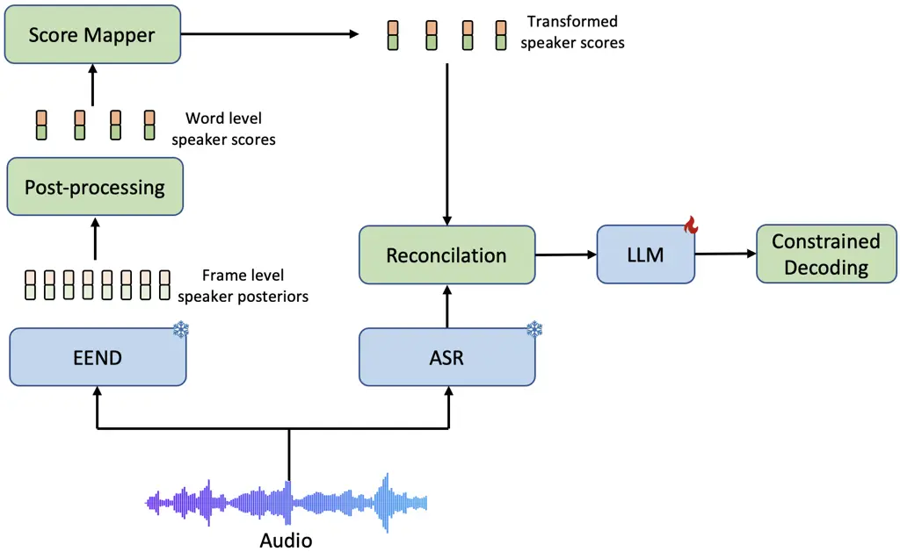
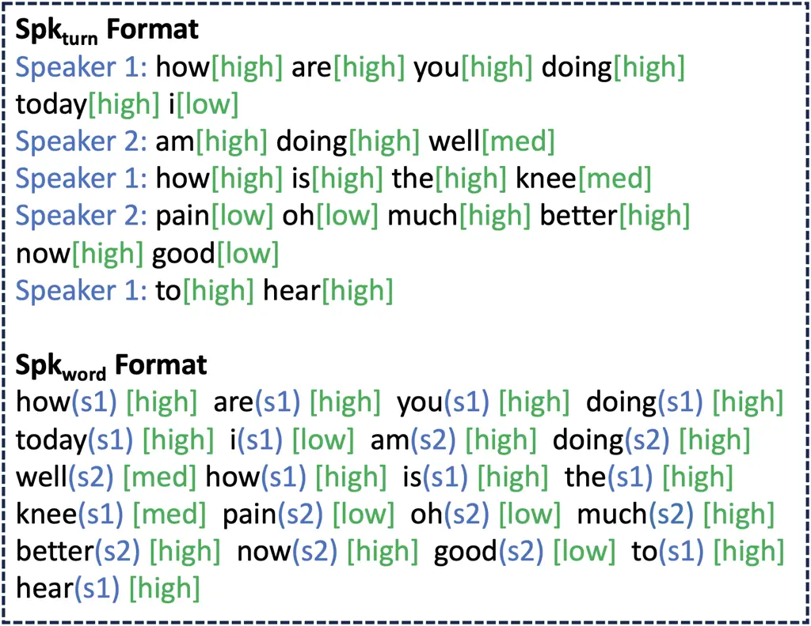
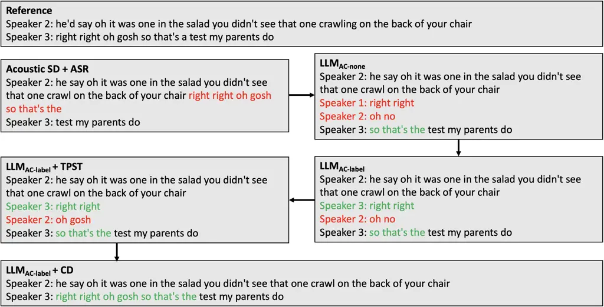

# SEAL: Speaker Error Correction using Acoustic-conditioned Large Language ModelsThanks: ^(†)Work performed during internship at AWS AI Labs.Thanks: ^(\*)These authors contributed equally to this work.

Anurag Kumar^(†\*) Affiliation: Ohio State University  
kumar.1109@osu.edu    Rohit Paturi^(\*) Affiliation: AWS AI Labs  
paturi@amazon.com    Amber Afshan Affiliation: AWS AI Labs  
afsamber@amazon.com    Sundararajan Srinivasan Affiliation: AWS AI
Labs  
sundarsr@amazon.com Affiliation: 

###### Abstract

Speaker Diarization (SD) is a crucial component of modern end-to-end ASR
pipelines. Traditional SD systems, which are typically audio-based and
operate independently of ASR, often introduce speaker errors,
particularly during speaker transitions and overlapping speech.
Recently, language models including fine-tuned large language models
(LLMs) have shown to be effective as a second-pass speaker error
corrector by leveraging lexical context in the transcribed output. In
this work, we introduce a novel acoustic conditioning approach to
provide more fine-grained information from the acoustic diarizer to the
LLM. We also show that a simpler constrained decoding strategy reduces
LLM hallucinations, while avoiding complicated post-processing. Our
approach significantly reduces the speaker error rates by 24-43% across
Fisher, Callhome, and RT03-CTS datasets, compared to the first-pass
Acoustic SD.

###### Index Terms: 

Speaker Diarization, LLMs, Error Correction

## I Introduction

Speaker Diarization (SD) solves the problem of determining “Who spoke
when” in an audio recording. SD systems can be broadly categorized into
two types: 1) Modular systems \[1, 2\], which consist of components like
a segmenter and an embedding model , and 2) End-to-end systems \[3, 4,
5\], which are designed to handle speech overlaps and are directly
optimized for diarization by incorporating permutation invariant
training loss, followed by a clustering phase . However, many real-world
applications like meeting analytics, call-center analytics, and video
captioning often require associating spoken words with the speaker
labels, as opposed to just the speaker time ranges predicted by SD
modules.

Conventional ASR \[6, 7, 8, 9\] systems are generally designed for
speaker-agnostic scenarios and answer the question “What was spoken”
without providing speaker labels. Multi-speaker transcription systems,
however, address the question “Who spoke what and when,” which is
essential for many practical applications. Various approaches have been
developed to achieve this, primarily falling into three categories: 1)
Speech/Speaker Separation followed by ASR \[10, 11, 12\], 2)
Speaker-attributed ASR \[13, 14, 15, 16\], and 3) Modular ASR and SD
systems. Challenges with Speech Separation and SA-ASR systems include
difficulties with a larger number of speakers \[10\], duplicated
artifacts \[11\], lack of speaker timestamps \[13\], and handling
long-form audio \[11\]. Independent ASR and SD systems, which operate
separately and later reconcile their results, offer a more practical
solution for multi-speaker transcription pipelines.

In modular ASR-SD systems, the ASR and SD components are trained
independently and combined using their respective timestamps, a process
we refer to as reconciliation. This reconciliation can lead to speaker
attribution errors, compounded by inherent errors in the SD system,
especially during speaker transitions or in overlapping speech regions
\[17, 18\]. Although End-to-End Neural Diarization (EEND) systems can
handle speech overlaps, since the speaker agnostic ASR system can only
detect words from one speaker at a time, this can still produce speaker
errors in overlap regions.

Lexical information, which complements acoustic data, can be crucial for
accurately assigning speaker labels \[17, 18, 19, 20\]. For example, by
analyzing a transcript like "how are you i am good", one can infer a
speaker change between "how are you" and "i am good". In this work, we
propose SEAL, a Speaker Error Corrector using Acoustic-conditioned Large
Language Models, which integrates the LLM’s inherent lexical knowledge
with acoustic information from the SD system. Additionally, we introduce
a Constrained Decoding (CD) technique to prevent the LLM from
hallucinating, ensuring that the generated word sequence strictly
matches the original transcript without modifying any words.

## II Related Work

Some earlier works \[21, 22\] have utilized lexical knowledge for
speaker diarization, but they have been limited to speakers with
specific roles. More recently, a Lexical Speaker Error Correction (SEC)
framework \[17\] and its extension with acoustic score fusion \[18\]
have been proposed to correct general speaker errors using a pre-trained
Language Model (LM) encoder, such as RoBERTa, demonstrating good
improvements. However, these methods only utilize a pre-trained LM
encoder and do not take advantage of the capabilities of modern
instruction-tuned large LLMs.

A few works \[23, 24, 25\] have explored the use of LLMs for either
performing SD or correcting speaker errors. For instance, \[23\] uses an
LLM to predict speaker probabilities for the next word, incorporating
these into beam search decoding along with the acoustic scores for
speaker diarization. However, this approach will be computationally
expensive since the LLM must be invoked for every word in the
transcript, and the beam search adds additional complexity. Other works
\[24, 25\] employ LLMs to correct speaker diarization errors from an
acoustic SD module by prompting a fine-tuned LLM to rectify errors in
the transcript. A limitation of this approach is that the LLM lacks
access to acoustic information in the audio which can lead to over or
under-correction as highlighted in \[18\]. Additionally, a challenge
with LLM-based speaker correction is word hallucination. To address
this, \[24\] introduces the "Transcript Preserving Speaker Transfer"
(TPST) algorithm, which maps predicted speaker labels back to the input
word sequence. While this removes any word hallucinations in the final
output, it doesn’t eliminate the LLM’s inherent tendency to hallucinate,
potentially leading to sub-optimal speaker assignments.

SEAL builds on the strengths of \[18\] and \[24\], proposing a method to
condition the LLM with acoustic speaker scores for enhanced error
correction. Inspired by previous works \[26, 27, 28\] that apply various
constraints to guide LLM generation, we implement a similar Constrained
Decoding (CD) strategy, which prevents LLM word hallucinations by
ensuring that generated word sequences strictly match the original
transcripts. Our results demonstrate that these approaches lead to
significant improvements in speaker error correction.



Fig. 1: Proposed framework of SEAL.

## III Speaker Error Correction using Acoustic-conditioned LLMs (SEAL)

An overview of the SEAL framework is shown in Fig 1.

### III-A First pass Speaker Diarization Module

EEND is a preferred choice as a first pass acoustic diarization module
for our setup as it can efficiently handle overlaps and output soft
speaker scores that can acoustically ground the LLM decisions for
speaker error correction. Given the frame level acoustic features
$`X=\{x_{i}\}_{i=1}^{t}`$, $`X\in R^{t\times f}`$, where $`t`$ and $`f`$
represent the number of frames and feature dimensions respectively, the
speaker posteriors $`P=\{p_{i}\}_{i=1}^{t}`$, $`P\in R^{t\times k}`$,
where k represents the number of speakers, are obtained using an EEND
network $`f_{EEND}`$

```math
\{p_{1},p_{2},...,p_{t}\}=f_{EEND}(x_{1},x_{2},...,x_{t}) \tag{1}
```

These frame-level posterior scores are then median-filtered and
mean-pooled at the word level to produce word-level aggregated
posteriors $`\{s_{i}\}_{i=1}^{W}`$, where $`W`$ is the number of words
in the transcript, with values ranging from \[0, 1\], following the
approach in \[18\].



Fig. 2: Different input transcript formats with acoustic score mapped to
3 labels: low, med, high.

### III-B Acoustic Conditioning

To account for the fact that LLMs are predominantly trained on text and
often struggle with understanding numerical values without specialized
mechanisms \[29\], we propose converting the soft scores from the EEND
module into more easily interpretable labels. We classify the scores
into three categories: “low”, “medium” and “high”. For each word-level
score $`s_{i}`$, we assign a category $`c_{i}`$ based on the following
formula:

```math
c_{i}=\begin{cases}high,&\text{for }Th_{med}<s_{i}\leq 1\\
med,&\text{for }Th_{low}<s_{i}\leq Th_{med}\\
low,&\text{for }0<s_{i}\leq Th_{low}\end{cases}
```

The thresholds $`Th_{low}`$, $`Th_{med}`$ are tuned based on a dev set
and we refer this component as the “Score Mapper” module in Figure 1. To
assess the effectiveness of this approach, we also conducted an ablation
study using the raw probabilities from the EEND module as well as a more
granular categorization approach that divides the scores into 10
uniformly distributed integer classes between \[0,1\]. We refer to the
model finteuned only on ASR transcripts without any acoustic
conditioning as LLM*(AC-none), the model acoustically conditioned with
raw speaker probabilities $`s*{i}`$ as LLM_(AC-prob), the model
acoustically conditioned with speaker confidence labels $`c*{i}`$ as
LLM*(AC-label) and the LLM conditioned on the 10 integer classes as
LLM\_(AC-int). These comparisons are detailed in Section V.

With these different conditioning strategies, we experimented with two
transcript formats: “Spk*(turn)”, which follows the same format from
\[24, 25\] where speaker turns are indicated after the speaker label,
and “Spk*(word)” where each word is followed by its speaker label and
corresponding acoustic label. These formats are illustrated in Fig 2.

### III-C Constrained Decoding (CD)

Fine-tuned LLMs may still hallucinate and produce non-verbatim outputs
\[24, 25\]. To address this, \[24\] introduces the "Transcript
Preserving Speaker Transfer" (TPST) algorithm, which maps predicted
speaker labels to the input word sequence. While this approach prevents
word hallucinations in the final output, it does not stop the LLM from
generating hallucinations during inference. This limitation affects
speaker assignments since TPST doesn’t leverage lexical context from the
input or generated transcripts.

To maintain output fidelity while correcting speaker errors, we propose
a Constrained Decoding (CD) strategy that limits the LLM’s predictions
to specific words at each step. The permitted words are either the next
word or a speaker label in the Spk*(turn) format, and only speaker
labels in the Spk*(word) format, as the LLM only needs to predict
speaker labels preceding each word. CD guarantees that the LLM adheres
to the input word sequence while adjusting speaker labels, preventing
word hallucinations. Algorithm 1 provides details of this strategy.

Inputs  
   Input sequence of length $`M:`$ $`w_{inp}=\{w\_in_{i}\}_{i=0}^{M}`$  
   LLM model$`:`$ $`LLM()`$  
   Allowed words module$`:`$ $`get\_allowed\_words()`$  
Outputs  
   Output sequence of length $`O:`$ $`w_{out}=\{w\_o_{i}\}_{i=0}^{O}`$

1: procedure ConstrainedDecoding

2:   $`w_{out}\leftarrow``"`$ $`\triangleright`$ Initialize $`w_{out}`$
to empty string

3:   for $`1\leq j\leq N`$ do $`\triangleright`$ $`N`$ is max supported
seq length

4:    $`curr\_inp\_seq\leftarrow\{w\_in_{i}\}_{i=0}^{j}`$

5:    $`next\_out\_dist\leftarrow LLM(curr\_inp\_seq)`$

6:    $`allowed\_words\leftarrow get\_allowed\_words(i,w_{inp})`$

7:    for each $`word`$ in $`next\_out\_dist`$ do

8:      if $`word`$ not in $`allowed\_words`$ then

9:       $`next\_out\_dist[word]\leftarrow\text{-inf}`$

10:      end if

11:      $`w\_o_{j}\leftarrow\text{argmax}(next\_out\_dist)`$

12:      if $`w\_o_{j}`$ is \<EOS\> then

13:       break

14:      end if

15:      $`w_{out}\leftarrow w_{out}+w\_o_{j}`$

16:    end for

17:   end for

18: end procedure

Algorithm 1 Constrained Decoding Algorithm

## IV Experimental Setup

### IV-A Dataset and Metrics

We use the Fisher dataset \[30, 31\] to finetune LLMs. The same
pre-processing as \[18, 24\] was done to get a single channel Fisher
audio inputs and respective ground-truth transcripts. We held out the
same partition of the dataset as test set as mentioned in \[32, 18,
24\]. In addition to that, we also test our models on CALLHOME American
English (CHAE) \[33\] and RT03-CTS \[34\].

|                 |       |              |       |              |
| --------------- | ----- | ------------ | ----- | ------------ |
|                 | CHAE  |              |       |              |
| Models          | Dev   |              | Test  |              |
|                 | cpWER | $`\Delta`$cp | cpWER | $`\Delta`$cp |
| LLM\_(AC-none)  | 17.6  | 7.47         | 14.88 | 5.89         |
| LLM\_(AC-prob)  | 18.2  | 8.07         | 15.15 | 6.16         |
| LLM\_(AC-int)   | 17.4  | 7.27         | 14.72 | 5.73         |
| LLM\_(AC-label) | 15.17 | 5.09         | 13.75 | 4.83         |

TABLE I: Ablation of acoustic conditioning variants for Spk\_(turn)
format with TPST. Model names are defined in Section III-B

We use the concatenated minimum permutation WER or cpWER \[35\] and
$`\Delta`$cp \[23\] as our main evaluation metrics which appropriately
captures the combined ASR and Speaker Diarization related errors.

[TABLE]

TABLE II: Evaluation of SEAL models with other baselines. LLM*(AC-none)
is the LLM without acoustic-conditioning, LLM*(AC-label) is the SEAL
model with speaker scores mapped to labels. Best scores are bolded and
second best are underlined.



Fig. 3: A Qualitative example of the incremental speaker error
corrections with each of the proposed strategies. Errors are shown in
red and the incremental corrections in green.

### IV-B Baseline

We use the same baseline EEND and ASR system as reported in \[18\]. The
EEND model consists of 6 stacked self-attention-based Transformer
layers, 8 attention heads with a hidden size of 256 and 1024 internal
units in the position-wise feed-forward layer. The ASR system comprises
of a Conformer Acoustic model \[36\] and a n-gram Language model.

We chose the publicly available Mistral 7b Instruct v0.2 \[37\] as the
backbone LLM for this work similar to \[25\]. We fine-tune the LLM
without any confidence scores and refer to it as the LLM\_(AC-none) which
serves as our finetuning baseline. For decoding, we use the TPST
algorithm from \[24\] as our decoding baseline.

### IV-C Training

The LLM fine-tuning was done using 4 A10 GPUs each with a VRAM of 24GB.
We set our batch size to 4, gradient accumulation steps to 5 and a
maximum sequence length to 1000. We used Quantized Low-Ranked Adaption
of Language Models \[38\] for efficient fine-tuning with a rank of 64
similar to \[25\], to balance computational resources with model
performance improvements. Similar to \[24, 18\], the input transcripts
to the LLM are transcribed and diarized by the ASR, SD systems and the
outputs that the LLMs are optimized on, are the Reference Speaker
transferred version of the input transcripts (referred as Oracle
transcripts in \[24\]). This is to ensure that the LLMs produce verbatim
transcripts and only correct the speaker labels.

During fine-tuning, each batch contained chunks limited to 64 words. The
chunks were normalized, converted to lowercase, and stripped of
punctuation before being processed by the LLM. The thresholds for
acoustic score integration, $`Th_{low}`$ and $`Th_{med}`$, were set at
0.5 and 0.8, respectively, following optimization on the Fisher dev set.

## V Results and Discussion

We evaluate different acoustic-conditioning variants of the SEAL models
in Table I. As expected, it can be observed that LLM*(AC-prob) struggles
with raw probabilities, leading to degraded $`\Delta`$cp compared to the
non acoustic-conditioned model, LLM*(AC-none). Although LLM*(AC-int)
shows marginal improvements, LLM*(AC-label) yields the best results by
converting speaker probabilities into simple, parsable words.

Based on these findings, Table II benchmarks the best-performing SEAL
model, LLM*(AC-label), against other baselines. The first part of the
table presents models without acoustic conditioning and the first-pass
Acoustic SD baseline. All systems share the same SD and ASR components,
resulting in identical WERs, as word hallucinations with the LLMs are
eliminated using TPST or CD. The LLM*(AC-none) with Spk*(turn) format
replicates the DiarizationLM framework \[24\] but with a different LLM
(Mistral 7b Instruct v0.2) and baseline ASR, SD systems. While
LLM*(AC-none) improves error correction on the Fisher test set, it
underperforms on other datasets, likely due to differing conversation
types (informal vs. formal) and limited domain adaptability. LSEC \[11\]
performs best among text-only models, underscoring the limitations of
LLMs in handling natural conversations without further conditioning.

The second part of Table II compares acoustic-conditioned models using
CD or TPST for generating verbatim transcripts. AG-LSEC \[18\]
consistently performs well across datasets, leading in two out of the
five data splits. Acoustic conditioning significantly improves LLM
performance across all datasets, as demonstrated by the LLM*(AC-label)
rows. CD further enhances performance significantly compared to TPST as
demonstrated by the TPST and CD rows with Spk*(turn) transcript format.
Additionally, changing the transcript format from Spk*(turn) to
Spk*(word) boosts performance in most data splits. Overall, non
acoustic-conditioned LLMs lag behind specialized LSEC \[17\] and AG-LSEC
\[18\] models, while SEAL models outperform AG-LSEC in most splits,
achieving relative $`\Delta`$cp improvements of 24-43% over first-pass
Acoustic SD. Qualitative examples of the different correction strategies
are shown in Figure 3.

## VI Conclusion

We introduce SEAL, a novel Speaker Error Corrector using
Acoustic-conditioned LLMs that incorporates acoustic information from
the SD system, coupled with a constrained decoding strategy to ensure
that generated word sequences align precisely with the original
transcripts. Our evaluations across three datasets shows that acoustic
conditioning significantly enhances the LLM’s Speaker Error Correction
(SEC) capabilities and its ability to generalize to diverse conversation
styles. The combination of our acoustic-conditioning and constrained
decoding consistently surpasses both the first-pass acoustic SD baseline
and the non acoustic-conditioned LLMs with TPST on the Fisher, Callhome,
and RT03-CTS datasets. While SEAL models also achieve modest
improvements over the specialized LSEC models, they offer the additional
advantage of being versatile for tasks beyond SEC and will continue to
improve as more powerful LLMs are developed. Future work will focus on
expanding this framework to languages beyond English.

## References

- \[1\] L. Wan, Q. Wang, A. Papir _et al._, “Generalized end-to-end loss
  for speaker verification,” in _ICASSP 2018_. IEEE, 2018, pp.
  4879–4883.
- \[2\] N. Dawalatabad, M. Ravanelli, F. Grondin _et al._, “ECAPA-TDNN
  Embeddings for Speaker Diarization,” in _Proc. Interspeech 2021_,
  2021, pp. 3560–3564.
- \[3\] Y. Fujita, N. Kanda, S. Horiguchi _et al._, “End-to-end neural
  speaker diarization with self-attention,” in _2019 IEEE ASRU_. IEEE,
  2019, pp. 296–303.
- \[4\] K. Kinoshita, M. Delcroix, and N. Tawara, “Integrating
  end-to-end neural and clustering-based diarization: Getting the best
  of both worlds,” in _ICASSP 2021_. IEEE, 2021, pp. 7198–7202.
- \[5\] X. Li, V. Govindan, R. Paturi, and S. Srinivasan, “Speakers
  unembedded: Embedding-free approach to long-form neural diarization,”
  in _Interspeech 2024_, 2024, pp. 27–31.
- \[6\] Y. Wang, A. Mohamed, D. Le _et al._, “Transformer-based acoustic
  modeling for hybrid speech recognition,” in _ICASSP 2020_. IEEE, 2020,
  pp. 6874–6878.
- \[7\] Y. Yang, P. Wang, and D. Wang, “A conformer based acoustic model
  for robust automatic speech recognition,” _arXiv preprint
  arXiv:2203.00725_, 2022.
- \[8\] D. Rekesh, N. R. Koluguri, S. Kriman _et al._, “Fast conformer
  with linearly scalable attention for efficient speech recognition,” in
  _2023 IEEE ASRU_. IEEE, 2023, pp. 1–8.
- \[9\] A. Radford, J. W. Kim, T. Xu _et al._, “Robust speech
  recognition via large-scale weak supervision,” in _International
  Conference on Machine Learning_. PMLR, 2023, pp. 28 492–28 518.
- \[10\] S. Chen, Y. Wu, Z. Chen _et al._, “Continuous speech separation
  with conformer,” in _ICASSP 2021_, 2021, pp. 5749–5753.
- \[11\] R. Paturi, S. Srinivasan _et al._, “Directed speech separation
  for automatic speech recognition of long form conversational speech,”
  in _Proc. INTERSPEECH 2022_, 2022, pp. 5388–5392.
- \[12\] S. Zhao and B. Ma, “Mossformer: Pushing the performance limit
  of monaural speech separation using gated single-head transformer with
  convolution-augmented joint self-attentions,” in _ICASSP 2023_. IEEE,
  2023, pp. 1–5.
- \[13\] N. Kanda, J. Wu, Y. Wu _et al._, “Streaming Multi-Talker ASR
  with Token-Level Serialized Output Training,” in _Proc. Interspeech
  2022_, 2022, pp. 3774–3778.
- \[14\] M. Shi, Z. Du, Q. Chen _et al._, “CASA-ASR: Context-Aware
  Speaker-Attributed ASR,” in _Proc. INTERSPEECH 2023_, 2023, pp.
  411–415.
- \[15\] I. Sklyar, A. Piunova, and Y. Liu, “Streaming multi-speaker asr
  with rnn-t,” in _ICASSP 2021_. IEEE, 2021, pp. 6903–6907.
- \[16\] S. Berger, P. Vieting, C. Boeddeker _et al._, “Mixture Encoder
  for Joint Speech Separation and Recognition,” in _Proc. INTERSPEECH
  2023_, 2023, pp. 3527–3531.
- \[17\] R. Paturi, S. Srinivasan, and X. Li, “Lexical Speaker Error
  Correction: Leveraging Language Models for Speaker Diarization Error
  Correction,” in _Proc. INTERSPEECH 2023_, 2023, pp. 3567–3571.
- \[18\] R. Paturi, X. Li, and S. Srinivasan, “Ag-lsec: Audio grounded
  lexical speaker error correction,” in _Interspeech 2024_, 2024.
- \[19\] T. J. Park and P. Georgiou, “Multimodal speaker segmentation
  and diarization using lexical and acoustic cues via sequence to
  sequence neural networks,” _arXiv preprint arXiv:1805.10731_, 2018.
- \[20\] W. Xia, H. Lu, Q. Wang _et al._, “Turn-to-diarize: Online
  speaker diarization constrained by transformer transducer speaker turn
  detection,” in _ICASSP 2022_. IEEE, 2022, pp. 8077–8081.
- \[21\] L. E. Shafey, H. Soltau, and I. Shafran, “Joint Speech
  Recognition and Speaker Diarization via Sequence Transduction,” in
  _Proc. Interspeech 2019_, 2019, pp. 396–400.
- \[22\] A. Adedeji, S. Joshi, and B. Doohan, “The sound of healthcare:
  Improving medical transcription asr accuracy with large language
  models,” _arXiv preprint arXiv:2402.07658_, 2024.
- \[23\] T. J. Park, K. Dhawan, N. Koluguri _et al._, “Enhancing speaker
  diarization with large language models: A contextual beam search
  approach,” in _ICASSP 2024_. IEEE, 2024, pp. 10 861–10 865.
- \[24\] Q. Wang, Y. Huang, G. Zhao _et al._, “Diarizationlm: Speaker
  diarization post-processing with large language models,” in
  _Interspeech 2024_, 2024, pp. 3754–3758.
- \[25\] G. Efstathiadis, V. Yadav, and A. Abbas, “Llm-based speaker
  diarization correction: A generalizable approach,” _arXiv preprint
  arXiv:2406.04927_, 2024.
- \[26\] S. Geng, M. Josifoski, M. Peyrard, and R. West,
  “Grammar-constrained decoding for structured nlp tasks without
  finetuning,” _arXiv preprint arXiv:2305.13971_, 2023.
- \[27\] B. T. Willard and R. Louf, “Efficient guided generation for
  large language models,” 2023. \[Online\]. Available:
  [https://arxiv.org/abs/2307.09702](https://arxiv.org/abs/2307.09702)
- \[28\] N. Das, S. Dingliwal, S. Ronanki, R. Paturi, D. Huang,
  P. Mathur, J. Yuan, D. Bekal, X. Niu, S. M. Jayanthi _et al._,
  “Speechverse: A large-scale generalizable audio language model,”
  _arXiv preprint arXiv:2405.08295_, 2024.
- \[29\] S. Imani, L. Du, and H. Shrivastava, “Mathprompter:
  Mathematical reasoning using large language models,” in _ACL 2023_,
  2023, pp. 37–42.
- \[30\] C. Cieri _et al._, “Fisher english training speech part 1
  speech ldc2004s13,” _Web Download. Philadelphia: Linguistic Data
  Consortium_, 2004.
- \[31\] ——, “Fisher english training part 2, speech ldc2005s13,” _Web
  Download. Philadelphia: Linguistic Data Consortium_, 2005.
- \[32\] Q. Wang, Y. Huang, H. Lu _et al._, “Highly efficient real-time
  streaming and fully on-device speaker diarization with multi-stage
  clustering,” _arXiv preprint arXiv:2210.13690_, 2022.
- \[33\] D. G. Canavan, Alexandra and G. Zipperlen, “Callhome american
  english speech ldc97s42,” _Web Download. Philadelphia: Linguistic Data
  Consortium_, 1997.
- \[34\] J. G. Fiscus _et al._, “2003 nist rich transcription evaluation
  data ldc2007s10,” _Web Download. Philadelphia: Linguistic Data
  Consortium_, 2007.
- \[35\] S. Watanabe, M. Mandel, J. Barker _et al._, “Chime-6 challenge:
  Tackling multispeaker speech recognition for unsegmented recordings,”
  in _CHiME 2020_, 2020.
- \[36\] A. Gulati, J. Qin, C.-C. Chiu _et al._, “Conformer:
  Convolution-augmented Transformer for Speech Recognition,” in _Proc.
  Interspeech 2020_, 2020, pp. 5036–5040.
- \[37\] A. Q. Jiang, A. Sablayrolles, A. Mensch _et al._, “Mistral 7b,”
  _arXiv preprint arXiv:2310.06825_, 2023.
- \[38\] T. Dettmers, A. Pagnoni, A. Holtzman, and L. Zettlemoyer,
  “Qlora: Efficient finetuning of quantized llms,” _Advances in Neural
  Information Processing Systems_, vol. 36, 2024.
