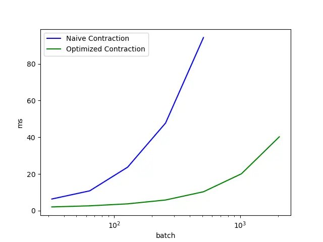
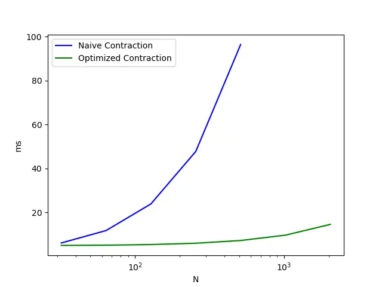
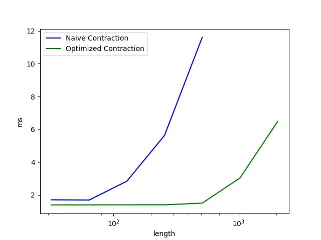

# Let SSMs be ConvNets: State-space Modeling with Optimal Tensor Contractions

Yan Ru Pei Affiliation: Brainchip Inc. Affiliation: Laguna Hills, CA
92653, USA Email: [yanrpei@gmail.com](mailto:)

###### Abstract

We introduce Centaurus, a class of networks composed of generalized
state-space model (SSM) blocks, where the SSM operations can be treated
as tensor contractions during training. The optimal order of tensor
contractions can then be systematically determined for every SSM block
to maximize training efficiency. This allows more flexibility in
designing SSM blocks beyond the depthwise-separable configuration
commonly implemented. The new design choices will take inspiration from
classical convolutional blocks including group convolutions, full
convolutions, and bottleneck blocks. We architect the Centaurus network
with a mixture of these blocks, to balance between network size and
performance, as well as memory and computational efficiency during both
training and inference. We show that this heterogeneous network design
outperforms its homogeneous counterparts in raw audio processing tasks
including keyword spotting, speech denoising, and automatic speech
recognition (ASR). For ASR, Centaurus is the first network with
competitive performance that can be made fully state-space based,
without using any nonlinear recurrence (LSTMs), explicit convolutions
(CNNs), or (surrogate) attention mechanism.

|     |
| --- |
|     |

## 1 Introduction

Sequence or temporal modeling encompasses a wide range of tasks from
audio processing to language modeling. Traditionally, there have been
many (related) statistical methods employed (Box et al., 2015). In the
age of deep learning, neural networks have been predominantly used
(LeCun et al., 2015), including recurrent neural networks (RNNs),
convolutional neural networks (CNNs), transformers (Vaswani, 2017), and
neural ODEs (Chen et al., 2018). In many cases, the model will
inevitably suffer from one of two drawbacks: 1) cannot be efficiently
trained (or fitted) in parallel due to the sequential nature of the
model, 2) cannot be efficiently configured for online inference due to
its large memory and computational requirement. To address this, deep
state-space models (SSMs) were adapted for sequence modeling, and have
shown incredible potential across a wide range of tasks (Gu et al.,
2021; Goel et al., 2022; Gu & Dao, 2023). Due to the linearity of the
SSM layers, they can not only be configured for efficient online
inference with small memory and computational resources, but also
configured for efficient training using parallel hardware with unrolling
strategies (Gu et al., 2022; Smith et al., 2022; Dao & Gu, 2024;
Heinsen, 2023).

Currently, most deep SSM networks (along with most neural networks in
general) follow the architectural recipe of transformers, where they are
composed of uniform “SSM blocks” throughout the network, containing
little to no variations in the shapes of the intermediate features or
weights. This simplifies the designs of deep SSM networks, but may
sacrifice performance and efficiency in practice. To explore the
opposite direction, we go “back to the future” to classical CNN designs
instead, where a much more heterogeneous design principle is followed.
More specifically, as we go deeper in the network, we will gradually
downsample the temporal dimension, increase the channel dimension, and
increase connective sparsity (Tan & Le, 2021), to balance between size
and efficiency (Pei & Coenen, 2024). In order to allow for the
possibility of such a heterogeneous design, we make two novel
contributions in this work. First, we express SSM blocks as tensor
networks (or with einsum expressions), where we can easily observe the
connective structure of existing SSM blocks as being mostly
depthwise-separable. This motivates us to design new SSM blocks using
this tensor network formalism, giving us connective structures such as
full and bottleneck SSM blocks, as inspired by classical CNN blocks.
Then, we optimize the contraction order of each SSM block dynamically
based on the type of the SSM block, the shape of the input features, and
the shapes of the SSM system matrices. This enables significant speedups
during training for all SSM blocks (both old and new ones). We name this
class of efficient CNN-like networks Centaurus¹¹ 1 As a quick
explanation of the name, we are exploring Tensorized Temporal Networks,
or TenTeNs, from which we get a hundred, or CENTaurus. Admittedly,
Centaurus is not actually composed of the word root “cent”, so this
wordplay is not too sensible. However, Centaurus is a constellation,
usually visualized as stars being linked; this is visually similar to
what a tensor network looks like, so some naming sense is recovered..
The model source code is available as supplementary material on [the
OpenReview page](https://openreview.net/forum?id=PkpNRmBZ32).

## 2 Related Work

### 2.1 Deep State-space Modeling

The seminal work proposing a memory encoding using orthogonal Legendre
polynomials in a recurrent state-space model is the Legendre Memory Unit
(LMU) (Voelker et al., 2019), where Legendre polynomials (a special case
of Jacobi polynomials) are used. The HiPPO formalism (Gu et al., 2020)
then generalized this to other common orthogonal functions. Later, this
sparked a cornucopia of works interfacing with deep state-space models
including S4 (Gu et al., 2021), H3 (Fu et al., 2022), and Mamba (Gu &
Dao, 2023), achieving impressive results on a wide range of tasks from
audio generation Goel et al. (2022) to language modeling. Besides a few
recent exceptions (Smith et al., 2022; Dao & Gu, 2024), These networks
mostly use an underlying depthwise structure, which may limit the
network capacity, albeit reducing the compute requirement of the
network. An important focal point of this work is to generalize such SSM
models to enable more connective flexibility, such that design choices
of classical convolutional blocks can be carried over to the Centaurus
model.

### 2.2 Classical convolutional blocks

Here, we look at the variants besides the standard full convolutional
layer (where every pair of input and output channels is connected).
First, the simplest variant is the depthwise convolutional layer, made
popular by the MobileNetV1 architecture (Howard et al., 2017). This
variant connects the input and output channels one-to-one, which
drastically reduces the connectivity of the architecture, hence also its
parameters and computational complexity. This architecture is prevalent
for both computer vision and speech domains (Kriman et al., 2020; Hannun
et al., 2019). Next, a variant with moderate connectivity is the grouped
convolutional layer, appearing as early as the AlexNet work (Krizhevsky
et al., 2012). In this structure, the input/output channels are divided
into groups, and each input-channel group is associated with an
output-channel group one-to-one. The input and output channels are then
only intra-connected within each group, but there are no
inter-connections between groups. Finally, there is a class of
convolutional blocks known as bottlenecks, typically containing a
sequence of three convolutional layers. This structure is used
prominently in the ResNet model (He et al., 2016), and also in
MobileNetV2 (Sandler et al., 2018) onwards. Typically, the order of
convolutional layers can be pointwise-depthwise-pointwise, resulting in
an output feature of the same tensor shape as the input feature.

### 2.3 Tensor Networks

Tensor networks were originally developed as a tool for approximating
the wavefunctions of many-body quantum systems (Orús, 2019). It can be
considered as an incredibly generalized form of low-rank decomposition,
where high-dimensional features can be compressed as the contraction of
a few low-dimensional tensors (Kolda & Bader, 2009). It has a direct
relationship to the einsum expression, where each einsum operand is
considered a node of the tensor network, and each contraction index is
considered a (hyper)edge. The memory- and compute-optimal contraction or
evaluation of a tensor network can be formulated as a congestion
optimization problem on the base graph, allowing tensor networks to
contest with “quantum supremacy” (Gray & Kourtis, 2021). The application
of tensor networks to machine learning began with the seminal work of
Novikov et al. (2015), where it is shown that the fully connected layers
of a neural network can be exponentially compressed with minimal
degradation in performance. This spawned a series of works applying
tensor networks for compressing convolutional and transformer blocks.
Our work extends this line of “tensorization” technique to deep
state-space models.

## 3 Background

### 3.1 State space models

State-space models (SSMs) are general representations of linear
time-invariant (LTI) systems (Hamilton, 1994), and they can be uniquely
specified by four matrices: $`A\in\mathbb{R}^{N\times N}`$,
$`B\in\mathbb{R}^{N\times H}`$, $`C\in\mathbb{R}^{H^{\prime}\times N}`$,
and $`D\in\mathbb{R}^{H^{\prime}\times H}`$. The first-order ODE
describing the LTI system is given as

```math
\dot{x}=Ax+Bu,\qquad y=Cx+Du, \tag{1}
```

where $`u\in\mathbb{R}^{H}`$ is the input signal, $`x\in\mathbb{R}^{N}`$
is the internal state, and $`y\in\mathbb{R}^{H^{\prime}}`$ is the
output. The parameters $`\{H,H^{\prime},N\}`$ denote the number of
features for the input, output, and internal state respectively. Setting
$`H=H^{\prime}=1`$ yields a single-input, single-output (SISO) SSMs (Gu
et al., 2021; Gu et al., 2022), and letting $`H>1,\,H^{\prime}>1`$
yields a multiple-input, multiple-output (MIMO) SSMs (Smith et al.,
2022). We discretize the system using zero-order hold (ZOH), which gives
us the discrete-time SSM matrices $`\overline{A}`$ and $`\overline{B}`$
as follows (Gu et al., 2022):

```math
\overline{A}=\exp(\Delta A),\qquad\overline{B}=(\Delta A)^{-1}\cdot(\exp(\Delta A)-1)\cdot\Delta B. \tag{2}
```

The discrete SSM is then given by

```math
x[t+1]=\overline{A}\,x[t]+\overline{B}\,u[t],\qquad y[t]=C\,x[t] \tag{3}
```

It is then straightforward to check that the discrete-time impulse
response is given as $`k[\tau]=C\,\overline{A}^{\tau}\,\overline{B}`$,
where $`\tau`$ denotes the kernel timestep. During training, $`k`$ can
be considered the “full” long 1D convolutional kernel with shape (output
channels, input channels, length), in the sense that the output $`y`$
can be computed via the long convolution
$`y_{j}[t]=\sum_{i}(u_{i}\ast k_{ji})[t]`$.

Similar to previous works (Gu et al., 2022), we assume $`\overline{A}`$
to be complex diagonal, but restrict $`\overline{B}`$ and $`C`$ to be
real projection matrices to reduce memory and computational loads. In
addition, we ignore the term $`Du`$ as it can be absorbed into the SSM
system. Justification of these restrictions is given in Appendix A. Like
previous works also, we allow the parameters $`\{A,B,C,\Delta\}`$ to be
directly learnable, which indirectly trains the kernel $`k`$. Unlike
previous works in deep SSMs, we do not try to keep the sizes $`H`$,
$`H^{\prime}`$, $`N`$ consistent, to allow for more flexibility in
feature extraction at each layer, mirroring the flexibility in selecting
channel and kernel sizes in CNNs²² 2 The size of the internal state
$`h`$, can be interpreted as the degree of parametrization of a basis
temporal kernel, or some implicit (dilated) “kernel size” in the
frequency domain.. The flexibility of the tensor shapes requires a
careful choice of the optimal order of operations during training to
minimize memory and computation, which will be the focal point of this
work.

### 3.2 Einstein summation notation

The Einstein summation notation (Einstein, 1922), or einsum, is a
concise representation of general tensor contractions. We do not give a
formal description of this notation here, but instead introduce it in
the context of describing a MIMO SSM. Recall that the output of a MIMO
SSM is computed by convolving the input with the impulse response, which
we normally would write as

```math
y_{j}[t]=\sum_{i}(u_{i}\ast k_{ji})[t]=\sum_{i}\Bigg(u_{i}\ast\Big(\sum_{n}\overline{B}_{ni}K_{n}C_{jn}\Big)\Bigg)[t], \tag{4}
```

where we defined the basis kernels $`K[\tau]=\Re(\overline{A}^{\tau})`$.
We get a rather messy expression involving three summation indices.
$`i`$ denotes the input channel, $`n`$ denotes the internal state index,
and $`j`$ denotes the output channel.

To lessen the notation burden, we observe that the summation expression
is redundant and can be inferred from the tensor indices. In particular,
if an index appears on the RHS of the equation but not the LHS, then it
must have been summed over (or contracted). This allows us to reduce the
expression down to

```math
y_{j}[t]=\bigg(u_{i}\ast\big(\overline{B}_{ni}K_{n}C_{jn}\big)\bigg)[t], \tag{5}
```

which is much better than before, and we can always assume the indices
$`i`$ and $`n`$ to be summed over without the explicit hinting of a
summation symbol. We can further simplify equation 5 by discarding
convolution operator $`\ast`$. Naturally, we can leverage the
convolution theorem, which states that the convolution operator is
mapped to pointwise multiplication in the frequency domain. If we index
the Fourier modes using $`f`$, then equation 5 can be expressed in the
frequency domain as

```math
\hat{y}_{j}[f]=\hat{u}_{i}[f]\overline{B}_{ni}\hat{K}_{n}[f]C_{jn}\quad\text{or}\quad\hat{y}_{jf}=\hat{u}_{if}\overline{B}_{ni}\hat{K}_{nf}C_{jn} \tag{6}
```

where the hat symbol denotes the Fourier transformed features (see
Appendix A for details).

### 3.3 A generalization

Looking at $`K_{n}`$, we realize that there is only one oscillation mode
per internal coefficient $`n`$, which in certain cases may limit the
expressiveness of the network. A natural generalization is to expand the
basis kernels as $`K_{nm}`$, and arrive at the following system that is
more expressive:

```math
\hat{y}_{jf}=\hat{u}_{if}\overline{B}_{ni}\hat{K}_{nmf}E_{nm}C_{jn}. \tag{7}
```

Here, $`E_{nm}`$ serves as additional weighting factors for the basis
kernels (which again we restrict to be real), representing the
importance of each oscillation mode. The recurrent form of this system
is then

```math
u^{\prime}_{n}[t]=\overline{B}_{ni}\,u_{i}[t],\qquad x_{nm}[t+1]=\overline{A}_{nm}\,x_{nm}[t]+u^{\prime}_{n},\qquad y_{j}[t]=C_{jn}\,E_{nm}\,\Re(x_{nm}[t]), \tag{8}
```

which can be considered a parallel cascade of $`n`$ SISO state-space
systems, intra-connected by the $`E_{nm}`$ factors, and inter-connected
by the $`\overline{B}_{ni}`$ and $`C_{jn}`$ projection matrices.
Alternatively, we can consider $`n`$ to index a “state block”, and $`m`$
to index “sub-states” within the state block, which is an extension
beyond the pure SISO and MIMO configurations. As a sidenote, this
configuration is similar to the Mamba block architecture (Gu & Dao,
2023), but without the data-gating mechanism and the gated MLP
structure.

Like Mamba, it is possible to configure the SSM matrices to be
data-dependent: $`A(u)`$, $`B(u)`$, $`C(u)`$, $`D(u)`$, in which case
the system becomes time-variant (Katsch, 2023; Gu & Dao, 2023; Dao & Gu,
2024). We will not place a major focus on this configuration in our work
for two (temporary) reasons. Under the present algorithmic
understanding, such dynamic systems require materialization of the
internal states for scan operations (in Mamba 1) or require the
introduction of a new sequence dimension into the tensor operands (in
Mamba 2), meaning that it can restrict the flexibility of tensor
contraction orders. On the more practical end, such models generally
require custom kernels (in Triton or CUDA) for specialized support
currently, making it difficult to build heterogeneous networks with
different connective configurations. We believe however that there are
no fundamental restrictions to combining our framework with the
data-gating mechanism in theory, and leave it as a future direction of
study to achieve this efficiently in practice.

## 4 SSMs and CNNs are tensor networks

Within an SSM layer, the temporal kernels are constructed via the basis
kernels, which are further generated (or parameterized) by the recurrent
coefficients in $`A`$. In other words, a temporal kernel can be
generated by a weighted sum of selected Fourier modes, where each mode
$`n`$ is associated with a complex frequency of $`A_{n}`$ and a (real)
weighting factor $`E_{n}`$. A natural viewpoint is that the parameters
of $`A`$ and $`E`$ are analogous to the parameters of convolutional
filters, but not directly parameterized. For instance, if we consider
$`A`$ having 3 complex parameters and $`E`$ having 3 real parameters,
then they together may contain the same “expressivity” as a
$`3\times 3`$ spatial filter, both representable with $`9`$ real
numbers. One may note that standard CNN spatial filters are local in
space, while our temporal IIR filters are global in time. Interestingly
however, by themselves, the difference between local convolutions and
global convolutions is not too fundamental. This is because, by the
convolution theorem, a temporal convolution is just simply a pointwise
product in the frequency domain, and vice versa. Therefore, a dual
viewpoint is that in the frequency domain, deep SSM models are simply
pointwise operations with “non-local” activation functions in between
playing the “frequency mixing” role. This idea is also explored in the
Hyena work (Poli et al., 2023).

### 4.1 General SSM operations with einsum expressions

Figure 1: A tensor network representation of the tensorial connection
structure of the different Centaurus block configurations, inspired by
classical convolutional blocks. Here, the indices $`\{i,j,n,g,f\}`$
index the input channel, output channel, internal state, group/head, and
Fourier mode respectively. Each (hyper)edge is denoted with one of the
indices, representing the dimension to contract over. Note that the
hyperedge associated with $`f`$ always connects to three tensors, as it
represents a convolution in the temporal domain, involving two input
tensors and one output tensor.

In standard CNN layers, besides the canonical convolution operation,
there is usually an additional interaction between the input and output
channels. For instance, we have configurations such as “depthwise
convolution”, “group convolution”, and “full convolution”, in increasing
degree of channel connectivity. In this section, we will detail how to
use the einsum expression to endow the $`A`$ tensor with these
channel-interaction structures. Naturally, matrices that are purely
channel-mixing like $`B`$ and $`C`$ are akin to “pointwise convolution”
layers or simply projection operations, which we will place less
emphasis on.

From here on, we will use $`\{i,j,n,g,f\}`$ to index the input channel,
output channel, internal state, group/head, and Fourier mode
respectively. The simplest example is a “depthwise” SSM block, or
$`\hat{y}_{if}=\hat{u}_{if}E_{in}\hat{K}_{in}`$, noting the appearance
of the “input channel” index $`i`$ in every operand and the total
absence of the “output channel” index $`j`$. Therefore, the layer by
itself will not see any interactions among the “channel” dimension,
hence why an additional mixing matrix $`M`$ is needed at the end
$`\hat{y}^{\prime}_{jf}=\hat{y}_{if}M_{ji}`$. In short, we have a pure
sequence-mixing layer followed by a pure channel-mixing layer, forming a
depthwise-separable structure, as also discussed in Gu et al. (2022).

On the other extreme, we have a “full” SSM block, or
$`\hat{y}_{jf}=\hat{u}_{if}E_{jin}\hat{K}_{jin}`$, where both indices
$`i`$ and $`j`$ appear for the basis kernels, as each input-output
pairing needs to be separately parameterized. In this case, both the
sequence-mixing and channel-mixing structures are “baked” into the full
SSM block, so not additional mixing layers are necessary. Figure. 1
depicts a tensor network representation of the different connectivity
structures corresponding to classical CNN blocks.

### 4.2 Optimal contraction orders for training: the depthwise example

In online inference mode, we have no choice but to explicitly
materialize and evolve the internal states, leaving little room for
optimization of the order of operations. This is also true for other
parallelization strategies where the internal states are materialized in
some form (Smith et al., 2022; Heinsen, 2023). Fortunately, we have the
flexibility of choosing the order of contraction if we perform the SSM
operations in the frequency domain (e.g. via FFTs), and considerable
speedups (at times, orders of magnitudes) can be achieved by choosing
the optimal contraction order. A slight drawback of using FFT is that
the time complexity is $`O(L\log L)`$ instead of the desired $`O(L)`$.
However, this is typically not a practical issue, as FFT is rarely a
compute-bound operation unless the sequence length is exceedingly large
or the operation is already kernel-fused (Fu et al., 2022). At this
point of discussion, we will start accounting for the batch dimension as
$`b`$, omitted previously for clarity of exposition. In practice, the
batch size will factor into the determination of the optimal contraction
order.

Taking again the depthwise SSM layer, or
$`\hat{y}_{bif}=\hat{u}_{bif}E_{ni}\hat{K}_{nif}`$, intuitively we would
opt to contract the $`E`$ and $`\hat{K}`$ tensors first to “collapse”
down the basis kernels along the state dimension (indexed $`n`$) as
such, $`\hat{k}_{if}=E_{ni}\hat{K}_{nif}`$. It then becomes much more
manageable to compute the output by simply taking the product
$`\hat{y}_{bif}=\hat{u}_{bif}\hat{k}_{if}`$. Note that

```math
\mathcal{F}(k_{i\tau})=\mathcal{F}(E_{ni}K_{ni\tau})=E_{ni}\mathcal{F}(K_{ni\tau}) \tag{9}
```

due to the linearity of the Fourier operator $`\mathcal{F}`$, hence
justifying the freedom of the contraction order. To optimize further, we
would ideally compute
$`\mathcal{F}(E_{ni\tau}K_{ni\tau})=\mathcal{F}(k_{i\tau})`$ instead of
$`E_{ni}\mathcal{F}(K_{ni\tau})`$, as the former requires performing the
Fourier transform on a much smaller tensor (vector). Even in this simple
example, we observe two important points: 1) the contraction order
matters, 2) the placement of the Fourier operators matters.

To make things clearer, it is useful to think of the Fourier operator
$`\mathcal{F}_{ft}`$ itself as an operand to be contracted. This will
allow us to write the SSM operations as

```math
y_{bit^{\prime}}=\mathcal{F}^{-1}_{t^{\prime}f}\big(\mathcal{F}_{ft}u_{bit}\big)\big(\mathcal{F}_{f\tau}E_{ni}K_{ni\tau}\big). \tag{10}
```

Here, we represented the Fourier operator as a matrix (i.e. the DFT
matrix), but unlike standard matrix multiplication, we know that
multiplying/contracting with a DFT matrix can be done via FFT, so that
it will not incur the same computational complexity as the standard
tensor contraction operation. Correctly accounting for the FFT
complexity is important in determining the optimal order of
contractions, which in this picture also includes the placement of the
FFT operators.

This is a simple example where the optimal contraction is somewhat
obvious and static, but there are cases where we have more terms to
contract and the differences between the contraction paths are more
subtle. And in these cases, the optimal contraction order is dynamically
linked with the shapes of the tensor operands. Fortunately, there is a
systematic way to evaluate the memory and compute requirement of an
einsum contraction path (used prominently in packages such as
opt-einsum) (Daniel et al., 2018), and we make a simple augmentation to
this prescription to handle “contractions” involving FFT operators,
while being somewhat mindful of the software and hardware backends
(PyTorch and CUDA).

### 4.3 A practical walkthrough: the bottleneck block

The main example that we will walk through here is the bottleneck layer
example, or
$`\hat{y}_{bif}=\hat{u}_{bif}\overline{B}_{ni}E_{nmi}\hat{K}_{nmf}C_{jn}`$,
where 5 tensor operands are involved. If we include the Fourier
operators as 3 additional operands, then we have a total of 8 operands,
which yields a sufficiently complex design where the systematic
optimization of contraction orders will show its power. See Listing 1 in
Appendix C for a minimal pseudocode of the bottleneck block operations
with the order of operations optimized, along with benchmarking on an
A100 GPU.

In theory, it is possible to have opt_einsum handle optimizing all the
contraction orders, and the pseudocode would appear much simpler (i.e.
we only need one einsum expression in line 43 of Listing 1). However,
there are certain SW and HW idiosyncrasies that make it more efficient
to explicitly “force” certain contraction patterns. For instance: 1)
complex tensors are not yet “natively” supported by CUDA, meaning that
it is more efficient to operate on real tensors as much as possible. In
other words, we perform computations in the complex frequency domain
only if necessary; 2) torch.compile may not yet be able to identify
kernel fusion opportunities within a sufficiently complex torch.einsum
expression. Therefore, it may be more efficient to explicitly modularize
and kernel-fuse certain contraction steps, particularly those that are
memory-bound.

We try to achieve a happy medium between full automation with einsum
expressions and full specialization with custom CUDA kernels. In other
words, we “semi-manually” inspect all possible contraction paths and
discard the clearly non-optimal ones. Then, we perform some amount of
practical optimization for the “feasible” contraction paths, as we will
explore in the following sections. Initially, for ease of exposition, we
will continue our discussion treating the temporal domain and frequency
domain as almost equivalent, as the two can be easily traversed via FFTs
(which is fairly light in compute). Only at the very end will we make
the effort to separate the two domains as we begin to consider the
optimal “insertion points” of the FFT operations, as the second-order
optimization.

First, based on visual inspection of the bottleneck tensor network
representation in Fig. 1, we can clearly see the first step should be to
always “contract away” the inner edge $`m`$, or equivalently compute the
kernel $`k_{n\tau}=E_{nm}K_{nm\tau}`$ first. However, we note that the
basis kernels $`K_{nm\tau}`$ themselves are generated by $`\Delta_{n}`$
and $`A_{nm}`$. Therefore, under kernel fusion, it is possible to not
even materialize the basis kernels $`K_{nm\tau}`$ in the GPU VRAM at
all, which shaves off memory and computational requirements considerably
during training. This is encapsulated in the get*kernel function in
Listing 1, which is meant to be (jit-)compiled during training, for
example with torch.compile or custom triton kernels. In the frequency
domain, we are now left with the expression
$`\hat{y}*{bif}=\hat{u}_{bif}\overline{B}_{ni}\hat{k}_{nf}C_{jn}`$,
which still allows for many possible contraction paths in theory.
However, heuristically speaking, we should try not to produce any
intermediate tensor of dimension greater than 3, as it will be
unfavorable to materialize and operate on it. Lemma 1 will heavily
restrict the “feasible” contraction paths based on this criteria, a full
proof of which is given in Appendix B.

###### Lemma 1.

Given the einsum expression
$`\hat{y}_{bif}=\hat{u}_{bif}\overline{B}_{ni}\hat{k}_{nf}C_{jn}`$
arranged in this order, all intermediate tensors will have at most 3
dimensions, if and only if $`\hat{u}`$ (and intermediate tensors
resulting from it) is contracted with only its neighboring operands.

###### Remark.

An interpretation of Lemma 1 is that the contraction order should
roughly follow the “natural order of operations” of the underlying
state-space system, in some form of “associative” fashion. The proof
sketch is to try contracting $`u`$ with its non-adjacent operands such
as $`k`$ or $`C`$, and observe the appearance of high dimensional
intermediate tensors, for instance,
$`\hat{u}_{bif}\hat{k}_{nf}=(\hat{u}\hat{k})_{binf}`$

Figure 2: The two feasible patterns for performing the SSM bottleneck
operations. a) Follow the “natural” order induced by the underlying SSM
system: first project the inputs, then convolve them with the kernels,
and finally project the outputs. b) Generate first the “full” SSM
kernels, then convolve them with the inputs in one stage to get the
output.

Under the restriction of Lemma 1, there are really only two “feasible”
contraction patterns as showcased in Fig. 2. First, we can perform the
operations from left to right, corresponding to projecting the input,
performing the FFT convolution, and then projecting the output. This is
just the “natural” order of operations induced by the underlying
state-space system. Alternatively, we can build the “full kernel” first,
then perform the full FFT convolution with the input as
$`\hat{x}_{bif}(\overline{B}_{ni}\hat{k}_{nf}C_{jn})=\hat{x}_{bif}\hat{\mathbf{k}}_{jif}=\hat{y}_{bjf}`$
in one step³³ 3 This is how convolutional networks typically handle full
convolutions, except there is no “kernel building” stage as the kernels
are explicitly parameterized.. We see that the optimal contraction order
is intimately linked with the dimensions of the tensor operands. More
formally, the first “natural” order of contraction is only optimal when
$`\frac{1}{B}+\frac{1}{N}>\frac{1}{H}+\frac{1}{H^{\prime}}`$, as shown
in Appendix B. For the first contraction pattern, if additionally the
condition $`N\leq H`$ is met, then it is clear that we should perform
the input projection $`x_{bnt}=u_{bit}B_{ni}`$ first before performing
the FFT on the projected input $`\mathcal{F}(x_{bnt})=\hat{x}_{bnf}`$,
as the projected input $`x`$ is smaller than the input $`u`$. Similarly,
for the second contraction pattern, if additionally the condition
$`HH^{\prime}\leq N`$ is met, then we can produce the full kernel
$`\mathbf{k}_{ij\tau}=\overline{B}_{ni}k_{n\tau}C_{jn}`$ first before
performing the FFT on the full kernel
$`\mathcal{F}(\mathbf{k}_{ij\tau})=\hat{\mathbf{k}}_{jif}`$, as the full
kernel $`\mathbf{k}`$ is actually smaller than $`k`$. These two
contraction patterns are explicitly forced via the if statements in the
opt_fft_conv function in Listing 1.

## 5 Experiments

Figure 3: The scaling of the classification error versus the number of
parameters and FLOPs per second during inference. The performance is
evaluated on the SC35 testset. For each network variant in the ablation
studies, we performed 10 training trials and took the median metric. DWS
is short of depthwise-separable (with the S6 variant using selective
scan), and PW is short of pointwise.

In our experiments, we study various configurations of Centaurus model
architectures (e.g. classifier, hourglass, multi-streams) and block
configurations (e.g. depthwise, bottleneck, full). This is to showcase
the structural flexibility of our model and adaptation to different
tasks, reminiscent of classical CNNs. At the same time, we try to keep
consistent the training pipeline (e.g. optimizers and schedulers) and
the auxiliary layers (e.g. normalization layers and activations), to
isolate the effects of only the core architectural changes in the SSM
blocks. See Appendix E for the training details and the basic design of
the Centaurus block. We will mainly be comparing the following
variants: 1) networks with all SSM layers being depthwise-separable
(S4D-like and S6-like with data gating), 2) networks with all SSM layers
being pointwise bottlenecks (S5-like), 3) networks with all SSM layers
being bottlenecks, 4) networks with all SSM layers being full
convolutions, and 5) hybrid networks with mixtures of SSM layer types
(inspired by classical CNN designs). We will put a strong emphasis on
the computational requirements of the network during online inference,
in addition to the typical parameter count. This is complimentary to the
theoretical and algorithmic components of our work, where optimal
contractions are leveraged to speed up training. See Appendix D for a
discussion of how the parameters and FLOPs are estimated for these
blocks during online recurrence. We show that our hybrid Centaurus
network can achieve competitive performance as a stand-alone SSM
network. In addition, we show that it can be well augmented by inserting
(explicit) convolutional layers or modules into it, following the modern
trend of designing hybrid SSM models (Lieber et al., 2024; Ren et al.,
2024; Patro & Agneeswaran, 2024; Glorioso et al., 2024). However, since
we aim for solutions that can be configured for efficient online
inference, we will avoid the use of any attention mechanism⁴⁴ 4 Variants
of the attention mechanism, such as sliding-window attention, can be
used to improve the online inference efficiency. Any surrogate (linear)
attention mechanism admitting a recurrent form (e.g. Linear transformer,
RWKV, Mamba) can also be used. We think the Centaurus model can
interface well with these blocks, but do not consider them here to limit
the scope of this work., though we expect it to also integrate well with
Centaurus.

### 5.1 Keyword spotting

We begin with the simple task of keyword spotting (KWS) with raw
waveforms, using the Google Speech Commands 35-class subset (Warden,
2018), or SC35. For each SSM configuration, we train networks of various
sizes, to estimate the scalability of the performance with respect to
the number of parameters and FLOPs per second during online inference.
See Fig. 3 for the scalability plots, where our hybrid architecture
outperformed all the homogeneous counterparts. All the network variants
we tested have six layers. Our Centaurus hybrid model contains two
layers of full SSM blocks, followed by two layers of bottleneck blocks,
followed by two final layers of pointwise bottleneck blocks (S5). This
is in accordance with the classical CNN design philosophy of using
sparser connective structures at deeper layers where the number of
channels becomes large. The training and network details are given in
Appendix E.1, along with a comparison against other deep SSMs, where our
hybrid network achieved similar performance with roughly 100 times fewer
FLOPs. Additionally in Appendix E.1, we compare against a hybrid variant
where the projection matrices ($`\overline{B}`$, $`C`$, and $`E`$) are
complex (similar to the original S4D and S5 layers), but it did not
outperform the real counterpart; furthermore, we compare against
variants with S6 layers of different state dimensions.

### 5.2 Speech enhancement

|                                            |                            |            |             |     |
| ------------------------------------------ | -------------------------- | ---------- | ----------- | --- |
| Model                                      | PESQ (VB-DMD) $`\uparrow`$ | Parameters | FLOPs / sec |     |
| Real-time Baselines (with processing)      |                            |            |             |     |
|     FRCRN (Zhao et al., 2022)              | 3.21                       | 6.9M       | 76.2G       |     |
|     DeepFilterNet3 (Schröter et al., 2023) | 3.16                       | 2.13M      | 0.688G      |     |
|     SEMamba (causal) (Chao et al., 2024)   | 2.76                       | 3.60M      | 0.76G       |     |
|     PercepNet (Valin et al., 2020)         | 2.73                       | 8.00M      | 1.60G       |     |
|     DEMUCS (Defossez et al., 2020)         | 2.65                       | 33.53M     | 15.44G      |     |
| Centaurus (DWS)                            | \-                         | 0.71M      | 0.39G       |     |
| Centaurus (DWS data-gated, or S6)          | \-                         | 0.66M      | 0.50G       |     |
| Centaurus (bottleneck)                     | \-                         | 0.87M      | 1.15G       |     |
| Centaurus (PW bottleneck)                  | 3.06                       | 0.83M      | 0.65G       |     |
| Centaurus (full)                           | 3.04                       | 2.53M      | 1.12G       |     |
| Centaurus (hybrid)                         | 3.12                       | 0.51M      | 0.29G       |     |
| Centaurus (hybrid, with Causal Conv)       | 3.25                       | 0.51M      | 0.29G       |     |

Table 1: Comparing real-time audio denoising networks. Note that only
the Centaurus network requires no additional signal processing (e.g.
STFT). To boost the denoising performance, we can prepend every SSM
block with a causal depthwise Conv1d layer with a kernel size of 4 (last
row).

Here, we focus on the task of real-time speech denoising directly on raw
audio waveforms. The macro network architecture used in this experiment
is adapted from a deep SSM hourglass autoencoder proposed in Pei et al.
(2024), where the SSM blocks were originally configured as DWS blocks
(S4D). Here, we modify the network to include multiple variants of SSM
blocks to enhance its connective flexibility, and in addition perform
real-time denoising on raw waveforms directly in the $`[-1,+1]`$ range
without one-hot encoding (Goel et al., 2022) or spectral processing
(Schröter et al., 2023). We will test variants of this network by simply
swapping out the pointwise-bottleneck SSM blocks with other variants.
The encoder architecture is based on the 6-layer KWS network backbone
(see Section 5.1), and the decoder is a reflection of the encoder. The
performance of the network is evaluated on the VoiceBank + DEMAND
(VB-DMD) testset and given in Table. 1. Details of the network
architectures and the training pipeline are given in Appendix E.2.

Surprisingly, the DWS and bottleneck homogeneous variants suffered from
severe training plateaus, and were not able to generate any meaningful
audio samples. In addition, using the data-gating mechanism (S6 layers)
did not solve the issue. The variant with homogeneous full SSM blocks
did manage to train, but despite its size, it did not achieve the best
performance. Out of all variants, the hybrid Centaurus model achieved
competitive PESQ scores, while requiring much fewer parameters and
FLOPs. There are concurrent works applying deep SSMs to speech
enhancement (in cases outperforming Centaurus), but they configure the
SSM layers as bidirectional, which sacrifices the online capability of
the network (Zhang et al., 2024; Chao et al., 2024).

### 5.3 Towards end-to-end speech recognition with SSMs

|                                        |                     |                    |                |           |
| -------------------------------------- | ------------------- | ------------------ | -------------- | --------- |
| Model                                  | test $`\downarrow`$ | dev $`\downarrow`$ | Parameters (M) | FLOPs (G) |
| Offline (full-context)                 |                     |                    |                |           |
|     Full Conv (Zeghidour et al., 2018) | 3.3 / 10.5          | 3.1 / 9.9          |                |           |
|     Transformer (Zhang et al., 2020)   | 3.1 / 7.3           |                    | 29             |           |
|     ContextNet (Han et al., 2020)      | 2.4 / 5.4           |                    | 31.4           |           |
|     Wav2Vec2 (Baevski et al., 2020)    | 2.1 / 4.8           | 1.8 / 4.7          | 94.4           | 285       |
|     Conformer (Gulati et al., 2020)    | 2.0 / 4.3           |                    | 30.7           | 45.2      |
| Online (streaming)                     |                     |                    |                |           |
|     Transformer                        | 5.0 / 11.6          |                    | 18.9           |           |
|     ContextNet                         | 4.5 / 10.0          |                    | 31.4           |           |
|     Conformer                          | 4.6 / 9.9           |                    | 30.7           |           |
| Centaurus (online, no attention)       |                     |                    |                |           |
|     Base (full SSM)                    | 6.0 / 13.1          | 5.9 / 13.1         | 12.4           | 20.6      |
|     with FFN                           | 5.4 / 11.5          | 5.2 / 11.3         | 18.0           | 32.1      |
|     with causal conv-block             | 4.8 / 10.6          | 4.8 / 10.5         | 23.6           | 43.7      |
|     with Mamba macro-block             | 4.4 / 10.2          | 4.3 / 9.9          | 29.9           | 46.9      |

Table 2: The reported metrics are word error rates (WERs) for the
clean/other splits, on the Librispeech test/dev-sets. The FLOPs are
estimated based on a 20.5-second audio segment.

Since this is not a work focused on training methodology, we opt for a
rather simple supervised/distillation pipeline here⁵⁵ 5 To train an ASR
model from scratch, the prevailing method is typically to perform
self-supervised learning on a large amount of unlabeled speech, then to
fine-tune on a relatively small amount of labeled speech.. At a high
level, we use a hybrid SSM backbone similar to our KWS hybrid network
(see Section 5.1), but wider and deeper (see Appendix E.3). We do not
use any additional lexicon or language model decoding (Zhang et al.,
2020; Gulati et al., 2020). And unlike previous works, we are not
integrating SSM layers as auxiliary layers in off-the-shelf transformer
models (Miyazaki et al., 2023; Shan et al., 2023). This means that the
Centaurus network is fully SSM based end-to-end, without any non-linear
recurrent mechanism (self-conditioned decoding) or attention mechanism.
In Table. 2, we report the performance and size of the base Centaurus
model on Librispeech (Panayotov et al., 2015), along with two augmented
variants: 1) one with a feed-forward (FF) module appended to every SSM
block, 2) one with a convolutional (Conv) module appended, 3) and one
with the Mamba gated macro-architecture (Gu & Dao, 2023) wrapped around
our core SSM layers. We describe the architecture of these modules in
Appendix E.3. Being a fully online-inference ASR model with minimal
optimization, the Centaurus network still remains competitive with
“benchmark” ASR networks like Conformer and Wav2Vec2 in streaming mode.

## 6 Conclusion

We introduced Centaurus, composed of SSM blocks with flexible
connectivity structures, trained using optimized tensor contractions. We
designed task-specific realizations of the Centaurus network balancing
between size and performance. As inspired by classical CNN designs, we
used blocks with dense connections in the shallower layers and opted for
sparser connections in the deeper layers. The hybrid networks achieved
competitive results on multiple audio processing tasks, while being
fully SSM based. In the future, it may be fruitful to explore how the
data-gating mechanism can be applied to the Centaurus network, and
explore its scalability to tasks that are of larger scales, such as
language modeling. In addition, it may also be of interest to explore
SSM convolutional structures in higher dimensions, incorporating
additional structures such as stride, dilation, and transposition, to
see whether Centaurus can be effective for computer vision tasks as
well.

## Acknowledgment

We would like to thank Nolan Ardolino, Olivier Coenen, M. Anthony Lewis,
Sidharth (in alphabetical order) for many inspiring discussions. In
addition, we thank Dhvani Kothari and Kurt Manninen for producing
spectacular demos using the Centaurus network. We also thank Daniel
Keller for providing a critical proofreading of the manuscript. Finally,
we thank the ICLR reviewers for offering much helpful feedback for
making our work more complete.

## Ethics Statement

We presented a novel state-space network for several important audio
processing tasks. We made sure that our networks are lightweight for
both training and inference, so that they can be easily experimented
with by both researchers and hobbyists alike. This can be done without
requiring too much computational resource, as part of our commitment to
democratizing AI and reducing carbon emissions. All of the datasets used
in our work are publicly available, with no private or sensitive data
used in our experiments.

## Reproducibility Statement

We gave the full details of the training pipeline of our networks in
Section 5 of the main text and Appendix E. Listing 1 in Appendix C
provides a pseudocode that can be easily adapted into PyTorch code, and
we additionally made it available as supplementary material on [the
OpenReview page](https://openreview.net/forum?id=PkpNRmBZ32).

## References

- Baevski et al. (2020) Alexei Baevski, Yuhao Zhou, Abdelrahman Mohamed,
  and Michael Auli. wav2vec 2.0: A framework for self-supervised
  learning of speech representations. _Advances in neural information
  processing systems_, 33:12449–12460, 2020.
- Box et al. (2015) George EP Box, Gwilym M Jenkins, Gregory C Reinsel,
  and Greta M Ljung. _Time series analysis: forecasting and control_.
  John Wiley & Sons, 2015.
- Chao et al. (2024) Rong Chao, Wen-Huang Cheng, Moreno La Quatra,
  Sabato Marco Siniscalchi, Chao-Han Huck Yang, Szu-Wei Fu, and Yu Tsao.
  An investigation of incorporating mamba for speech enhancement. _arXiv
  preprint arXiv:2405.06573_, 2024.
- Chen et al. (2018) Ricky TQ Chen, Yulia Rubanova, Jesse Bettencourt,
  and David K Duvenaud. Neural ordinary differential equations.
  _Advances in neural information processing systems_, 31, 2018.
- Cooley & Tukey (1965) James W Cooley and John W Tukey. An algorithm
  for the machine calculation of complex fourier series. _Mathematics of
  computation_, 19(90):297–301, 1965.
- Daniel et al. (2018) G Daniel, Johnnie Gray, et al.
  Opt$`\backslash`$\_einsum-a python package for optimizing contraction
  order for einsum-like expressions. _Journal of Open Source Software_,
  3(26):753, 2018.
- Dao & Gu (2024) Tri Dao and Albert Gu. Transformers are ssms:
  Generalized models and efficient algorithms through structured state
  space duality. _arXiv preprint arXiv:2405.21060_, 2024.
- Defossez et al. (2020) Alexandre Defossez, Gabriel Synnaeve, and Yossi
  Adi. Real time speech enhancement in the waveform domain. _arXiv
  preprint arXiv:2006.12847_, 2020.
- Einstein (1922) Albert Einstein. The general theory of relativity. In
  _The meaning of relativity_, pp. 54–75. Springer, 1922.
- Fu et al. (2022) Daniel Y Fu, Tri Dao, Khaled K Saab, Armin W Thomas,
  Atri Rudra, and Christopher Ré. Hungry hungry hippos: Towards language
  modeling with state space models. _arXiv preprint
  arXiv:2212.14052_, 2022.
- Glorioso et al. (2024) Paolo Glorioso, Quentin Anthony, Yury Tokpanov,
  James Whittington, Jonathan Pilault, Adam Ibrahim, and Beren Millidge.
  Zamba: A compact 7b ssm hybrid model. _arXiv preprint
  arXiv:2405.16712_, 2024.
- Goel et al. (2022) Karan Goel, Albert Gu, Chris Donahue, and
  Christopher Ré. It’s raw! audio generation with state-space models. In
  _International Conference on Machine Learning_, pp. 7616–7633.
  PMLR, 2022.
- Gray & Kourtis (2021) Johnnie Gray and Stefanos Kourtis.
  Hyper-optimized tensor network contraction. _Quantum_, 5:410, 2021.
- Gu & Dao (2023) Albert Gu and Tri Dao. Mamba: Linear-time sequence
  modeling with selective state spaces. _arXiv preprint
  arXiv:2312.00752_, 2023.
- Gu et al. (2020) Albert Gu, Tri Dao, Stefano Ermon, Atri Rudra, and
  Christopher Ré. Hippo: Recurrent memory with optimal polynomial
  projections. _Advances in neural information processing systems_,
  33:1474–1487, 2020.
- Gu et al. (2021) Albert Gu, Karan Goel, and Christopher Ré.
  Efficiently modeling long sequences with structured state spaces.
  _arXiv preprint arXiv:2111.00396_, 2021.
- Gu et al. (2022) Albert Gu, Karan Goel, Ankit Gupta, and Christopher
  Ré. On the parameterization and initialization of diagonal state space
  models. _Advances in Neural Information Processing Systems_,
  35:35971–35983, 2022.
- Gulati et al. (2020) Anmol Gulati, James Qin, Chung-Cheng Chiu, Niki
  Parmar, Yu Zhang, Jiahui Yu, Wei Han, Shibo Wang, Zhengdong Zhang,
  Yonghui Wu, et al. Conformer: Convolution-augmented transformer for
  speech recognition. _arXiv preprint arXiv:2005.08100_, 2020.
- Hamilton (1994) James D Hamilton. State-space models. _Handbook of
  econometrics_, 4:3039–3080, 1994.
- Han et al. (2020) Wei Han, Zhengdong Zhang, Yu Zhang, Jiahui Yu,
  Chung-Cheng Chiu, James Qin, Anmol Gulati, Ruoming Pang, and Yonghui
  Wu. Contextnet: Improving convolutional neural networks for automatic
  speech recognition with global context. _arXiv preprint
  arXiv:2005.03191_, 2020.
- Hannun et al. (2019) Awni Hannun, Ann Lee, Qiantong Xu, and Ronan
  Collobert. Sequence-to-sequence speech recognition with time-depth
  separable convolutions. _arXiv preprint arXiv:1904.02619_, 2019.
- Hasani et al. (2022) Ramin Hasani, Mathias Lechner, Tsun-Hsuan Wang,
  Makram Chahine, Alexander Amini, and Daniela Rus. Liquid structural
  state-space models. _arXiv preprint arXiv:2209.12951_, 2022.
- He et al. (2016) Kaiming He, Xiangyu Zhang, Shaoqing Ren, and Jian
  Sun. Deep residual learning for image recognition. In _Proceedings of
  the IEEE conference on computer vision and pattern recognition_, pp.
  770–778, 2016.
- Heinsen (2023) Franz A Heinsen. Parallelization of an ubiquitous
  sequential computation. _arXiv preprint arXiv:2311.06281_, 2023.
- Howard et al. (2017) Andrew G Howard, Menglong Zhu, Bo Chen, Dmitry
  Kalenichenko, Weijun Wang, Tobias Weyand, Marco Andreetto, and Hartwig
  Adam. Mobilenets: Efficient convolutional neural networks for mobile
  vision applications. _arXiv preprint arXiv:1704.04861_, 2017.
- Katsch (2023) Tobias Katsch. Gateloop: Fully data-controlled linear
  recurrence for sequence modeling. _arXiv preprint
  arXiv:2311.01927_, 2023.
- Kolda & Bader (2009) Tamara G Kolda and Brett W Bader. Tensor
  decompositions and applications. _SIAM review_, 51(3):455–500, 2009.
- Kriman et al. (2020) Samuel Kriman, Stanislav Beliaev, Boris Ginsburg,
  Jocelyn Huang, Oleksii Kuchaiev, Vitaly Lavrukhin, Ryan Leary, Jason
  Li, and Yang Zhang. Quartznet: Deep automatic speech recognition with
  1d time-channel separable convolutions. In _ICASSP 2020-2020 IEEE
  International Conference on Acoustics, Speech and Signal Processing
  (ICASSP)_, pp. 6124–6128. IEEE, 2020.
- Krizhevsky et al. (2012) Alex Krizhevsky, Ilya Sutskever, and
  Geoffrey E Hinton. Imagenet classification with deep convolutional
  neural networks. _Advances in neural information processing systems_,
  25, 2012.
- LeCun et al. (2015) Yann LeCun, Yoshua Bengio, and Geoffrey Hinton.
  Deep learning. _nature_, 521(7553):436–444, 2015.
- Lieber et al. (2024) Opher Lieber, Barak Lenz, Hofit Bata, Gal Cohen,
  Jhonathan Osin, Itay Dalmedigos, Erez Safahi, Shaked Meirom, Yonatan
  Belinkov, Shai Shalev-Shwartz, et al. Jamba: A hybrid
  transformer-mamba language model. _arXiv preprint
  arXiv:2403.19887_, 2024.
- Miyazaki et al. (2023) Koichi Miyazaki, Masato Murata, and Tomoki
  Koriyama. Structured state space decoder for speech recognition and
  synthesis. In _ICASSP 2023-2023 IEEE International Conference on
  Acoustics, Speech and Signal Processing (ICASSP)_, pp. 1–5.
  IEEE, 2023.
- Novikov et al. (2015) Alexander Novikov, Dmitrii Podoprikhin, Anton
  Osokin, and Dmitry P Vetrov. Tensorizing neural networks. _Advances in
  neural information processing systems_, 28, 2015.
- Orús (2019) Román Orús. Tensor networks for complex quantum systems.
  _Nature Reviews Physics_, 1(9):538–550, 2019.
- Panayotov et al. (2015) Vassil Panayotov, Guoguo Chen, Daniel Povey,
  and Sanjeev Khudanpur. Librispeech: an asr corpus based on public
  domain audio books. In _2015 IEEE international conference on
  acoustics, speech and signal processing (ICASSP)_, pp. 5206–5210.
  IEEE, 2015.
- Patro & Agneeswaran (2024) Badri N Patro and Vijay S Agneeswaran.
  Simba: Simplified mamba-based architecture for vision and multivariate
  time series. _arXiv preprint arXiv:2403.15360_, 2024.
- Pei & Coenen (2024) Yan Ru Pei and Olivier Coenen. Building temporal
  kernels with orthogonal polynomials. _arXiv preprint
  arXiv:2405.12179_, 2024.
- Pei et al. (2024) Yan Ru Pei, Ritik Shrivastava, and FNU Sidharth. Raw
  speech enhancement with deep state space modeling. _arXiv preprint
  arXiv:2409.03377_, 2024.
- Poli et al. (2023) Michael Poli, Stefano Massaroli, Eric Nguyen,
  Daniel Y Fu, Tri Dao, Stephen Baccus, Yoshua Bengio, Stefano Ermon,
  and Christopher Ré. Hyena hierarchy: Towards larger convolutional
  language models. In _International Conference on Machine Learning_,
  pp. 28043–28078. PMLR, 2023.
- Ren et al. (2024) Liliang Ren, Yang Liu, Yadong Lu, Yelong Shen, Chen
  Liang, and Weizhu Chen. Samba: Simple hybrid state space models for
  efficient unlimited context language modeling. _arXiv preprint
  arXiv:2406.07522_, 2024.
- Sandler et al. (2018) Mark Sandler, Andrew Howard, Menglong Zhu,
  Andrey Zhmoginov, and Liang-Chieh Chen. Mobilenetv2: Inverted
  residuals and linear bottlenecks. In _Proceedings of the IEEE
  conference on computer vision and pattern recognition_, pp.
  4510–4520, 2018.
- Schröter et al. (2023) Hendrik Schröter, Tobias Rosenkranz, Andreas
  Maier, et al. Deepfilternet: Perceptually motivated real-time speech
  enhancement. _arXiv preprint arXiv:2305.08227_, 2023.
- Shan et al. (2023) Haozhe Shan, Albert Gu, Zhong Meng, Weiran Wang,
  Krzysztof Choromanski, and Tara Sainath. Augmenting conformers with
  structured state space models for online speech recognition. _arXiv
  preprint arXiv:2309.08551_, 2023.
- Smith et al. (2022) Jimmy TH Smith, Andrew Warrington, and Scott W
  Linderman. Simplified state space layers for sequence modeling. _arXiv
  preprint arXiv:2208.04933_, 2022.
- Tan & Le (2021) Mingxing Tan and Quoc Le. Efficientnetv2: Smaller
  models and faster training. In _International conference on machine
  learning_, pp. 10096–10106. PMLR, 2021.
- Valin et al. (2020) Jean-Marc Valin, Umut Isik, Neerad Phansalkar,
  Ritwik Giri, Karim Helwani, and Arvindh Krishnaswamy. A
  perceptually-motivated approach for low-complexity, real-time
  enhancement of fullband speech. _arXiv preprint
  arXiv:2008.04259_, 2020.
- Vaswani (2017) A Vaswani. Attention is all you need. _Advances in
  Neural Information Processing Systems_, 2017.
- Voelker et al. (2019) Aaron Voelker, Ivana Kajić, and Chris Eliasmith.
  Legendre memory units: Continuous-time representation in recurrent
  neural networks. _Advances in neural information processing systems_,
  32, 2019.
- Warden (2018) Pete Warden. Speech commands: A dataset for
  limited-vocabulary speech recognition. _arXiv preprint
  arXiv:1804.03209_, 2018.
- Zeghidour et al. (2018) Neil Zeghidour, Qiantong Xu, Vitaliy
  Liptchinsky, Nicolas Usunier, Gabriel Synnaeve, and Ronan Collobert.
  Fully convolutional speech recognition. _arXiv preprint
  arXiv:1812.06864_, 2018.
- Zhang et al. (2020) Qian Zhang, Han Lu, Hasim Sak, Anshuman Tripathi,
  Erik McDermott, Stephen Koo, and Shankar Kumar. Transformer
  transducer: A streamable speech recognition model with transformer
  encoders and rnn-t loss. In _ICASSP 2020-2020 IEEE International
  Conference on Acoustics, Speech and Signal Processing (ICASSP)_, pp.
  7829–7833. IEEE, 2020.
- Zhang et al. (2024) Xiangyu Zhang, Qiquan Zhang, Hexin Liu, Tianyi
  Xiao, Xinyuan Qian, Beena Ahmed, Eliathamby Ambikairajah, Haizhou Li,
  and Julien Epps. Mamba in speech: Towards an alternative to
  self-attention. _arXiv preprint arXiv:2405.12609_, 2024.
- Zhao et al. (2022) Shengkui Zhao, Bin Ma, Karn N Watcharasupat, and
  Woon-Seng Gan. Frcrn: Boosting feature representation using frequency
  recurrence for monaural speech enhancement. In _ICASSP 2022-2022 IEEE
  International Conference on Acoustics, Speech and Signal Processing
  (ICASSP)_, pp. 9281–9285. IEEE, 2022.

## Appendix A Canonical form of a state-space model

It is a generic property (though not always true) that a diagonal form
exists for the state-space model, meaning that we can almost always
assume $`\overline{A}`$ to be diagonal, at the expense of potentially
requiring $`\overline{B}`$ and $`C`$ to be complex matrices. Since the
original system is a real system, the diagonal $`\overline{A}`$ matrix
can only contain real elements and/or complex elements in conjugate
pairs. In this work, we sacrifice a slight loss in expressivity by
continuing to restrict $`\overline{B}`$ and $`C`$ to be real matrices⁶⁶
6 This is in deviation of prior works, such as S4D and S5, where
$`\overline{B}`$ and $`C`$ are complex. and letting $`\overline{A}`$ be
a diagonal matrix with all complex elements, but not restricting them to
come in conjugate pairs. During online inference, we then need to
maintain the internal states $`x`$ as complex values but only need to
propagate their real parts to the next layer.

Recall that the discretized state-space system is given by

```math
x[t+1]=\overline{A}x[t]+\overline{B}u[t],\qquad y[t+1]=Cx[t+1]+Du[t+1], \tag{11}
```

To see that the term $`Du`$ can be absorbed into the state if we double
the internal states, we simply need to make the following substitution

```math
\overline{B}\rightarrow\begin{bmatrix}\begin{array}[]{c}\overline{B}\\
\hline\cr\mathbf{1}_{N\times H}\end{array}\end{bmatrix}\quad\overline{A}\rightarrow\begin{bmatrix}\begin{array}[]{c|c}\overline{A}&\mathbf{0}_{N\times N}\\
\hline\cr\mathbf{0}_{N\times N}&\mathbf{0}_{N\times N}\end{array}\end{bmatrix},\quad C\rightarrow\begin{bmatrix}\begin{array}[]{c|c}C&D\end{array}\end{bmatrix}. \tag{12}
```

In other words, we can trivially set aside a set of “memoryless”
internal states whose sole purpose is to duplicate the input $`u`$,
effectively routing directly the inputs to the outputs.

If we allow $`\overline{B}`$ and $`C`$ to be complex matrices, then we
can further assume $`\overline{A}`$ to be diagonal without any loss of
generality. To see why, we simply let
$`\overline{A}=P^{-1}\Lambda_{A}P`$ (where $`\Lambda_{A}`$ is the
diagonalized $`\overline{A}`$ matrix, and $`P`$ is the similarity
matrix) and observe the following:

```math
\begin{split}\forall t,\qquad k[t]&=C(P^{-1}\Lambda_{A}P)^{t-1}\overline{B}\\
&=CP^{-1}\underbrace{\Lambda_{A}(PP^{-1})\,...\,\Lambda_{A}(PP^{-1})}_{\text{repeat $t-1$ times}}P\overline{B}\\
&=(CP^{-1})\Lambda_{A}^{t-1}(P\overline{B})\\
&=C^{\prime}\Lambda_{A}^{t-1}\overline{B}^{\prime},\end{split} \tag{13}
```

where $`\overline{B}^{\prime}`$ and $`C^{\prime}`$ are complex matrices
that have “absorbed” the similarity matrix $`P`$, but WLOG we can just
redefine them to be $`\overline{B}`$ and $`C`$. Since $`\overline{A}`$
is a real matrix, the complex eigenvalues in $`\Lambda_{A}`$ must come
in conjugate pairs. And WLOG we can again redefine $`\Lambda_{A}`$ as
$`\overline{A}`$. Note that in this section, we only need to ensure that
$`\overline{A}`$ is a square matrix, and all the other state-space
matrices and state vectors can be of arbitrary shape, as long as they
are conformable.

Since we still want to work with real features⁷⁷ 7 This is a prior not
required, as technically we can configure our network as complex-valued
to handle complex features. However, we do not explore this
configuration in this work (complex-valued neural networks)., we then
only take the real part of the impulse response kernel as such:

```math
k[\tau]=\Re(C\overline{A}^{\tau}\overline{B})=C\Re(\overline{A}^{\tau})\overline{B}, \tag{14}
```

which equivalently in the state-space equation can be achieved by simply
letting $`y[t]=C\,\Re(x[t])`$. This means that during online inference,
we need to maintain the internal states $`x`$ as complex values, but
only need to propagate their real parts to the next layer. This
restriction of propagating real features is not required, and is merely
for better CUDA support, as discussed in Section 4.3.

We can then define the basis kernels to be
$`K_{n}[\tau]=\Re(\overline{A}^{\tau}`$). Furthermore, we use the hat
symbol to denote the Fourier transform of the features, or
$`\hat{x}=\mathcal{F}(x)`$ where $`\mathcal{F}`$ is the Fourier
operator. To be more explicitly, if $`\tau\in\{0,1,2,...,T-1\}`$, then
we have

```math
\hat{K}_{nf}=\mathcal{F}(K_{n}[\tau])=\sum_{\tau=0}^{T-1}\frac{1}{\sqrt{T}}K_{n}[\tau]\exp\big(-\frac{2\pi i\tau f}{T}\big), \tag{15}
```

noting that the index $`n`$ is not of importance, and can be replaced
with any (multi)index when needed. For now, we ignore the artifacts of
cyclic convolution (needing padding to ensure causality) and algorithmic
optimizations⁸⁸ 8 As an example, for a real signal, we only need to
extract half the Fourier modes, or up to the Nyquist frequency., except
for the obvious fact that the Fourier transform can be computed
efficiently via the Fast Fourier Transform (FFT) algorithm (Cooley &
Tukey, 1965). At this stage, we then have a condensed einsum expression
in the frequency domain that allows us to easily see the interactions
between the input signals, basis kernels, and system matrices.

## Appendix B Bottleneck SSM contraction orders

Recall that Lemma. 1 states that: Given the einsum expression
$`\hat{y}_{bif}=\hat{u}_{bif}\overline{B}_{ni}\hat{k}_{nf}C_{jn}`$
arranged in this order, all intermediate tensors will have at most 3
dimensions, if and only if $`\hat{u}`$ (and intermediate tensors
resulting from it) is contracted with only its neighboring operands.

###### Proof.

If we contract $`\hat{u}_{bif}`$ with $`\hat{k}_{nf}`$, this immediately
results in a 4D tensor $`(\hat{u}\hat{k})_{binf}`$. Similarly, if we
contract $`\hat{u}_{bif}`$ with $`C_{jn}`$, this immediately results in
a 5D tensor $`(\hat{u}C)_{bjinf}`$. This means that we can only contract
$`\hat{u}_{bif}`$ with $`\overline{B}_{ni}`$ first (its only neighboring
operand), resulting in the 3D tensor $`(\hat{u}B)_{bnf}`$.

At the second stage, if we contract $`(\hat{u}\overline{B})_{bnf}`$ with
$`C_{jn}`$, this will result in a 4D tensor
$`(\hat{u}\overline{B}C)_{bjnf}`$. This means that we can only contract
$`(\hat{u}\overline{B})`$ with $`\hat{k}_{nf}`$ (again its only
neighboring operand), resulting in the 3D tensor
$`(\hat{u}\overline{B}\hat{k})_{bnf}`$.

For the remaining contraction paths, we have to verify that any
contraction paths within $`\overline{B}_{ni}\hat{k}_{nf}C_{jn}`$ (not
including $`\hat{u}`$) will only result in intermediate tensors of
dimension at most 3:
$`\overline{B}_{ni}\hat{k}_{nf}=(\overline{B}\hat{k})_{nif}`$,
$`\hat{k}_{nf}C_{jn}=(\hat{k}C)_{jnf}`$, and
$`\overline{B}_{ni}C_{jn}=(\overline{B}C)_{jni}`$. ∎

An interpretation of Lemma 1 is that the contraction order should
roughly follow the “natural order of operations” of the underlying
state-space system, in some form of “associative” fashion. For example,
it clearly makes little sense to contract the input $`u`$ directly with
the output project matrix $`C`$ before even passing the input through
the internal states first, and this is formally reflected as the
production of a 5D intermediate tensor. Note that this is not to say
that the contractions of an einsum expression should be restricted to
neighboring operands. In fact, einsum expressions are agnostic to the
ordering of operands, meaning that contractions can be performed on any
two operands at any stage. The discussion here is only specific to the
state-space system
$`\hat{y}_{bif}=\hat{u}_{bif}\overline{B}_{ni}\hat{k}_{nf}C_{jn}`$, for
which this artificial ordering restriction is only needed for efficiency
concerns, and not functional correctness (which will be guaranteed
regardless of the contraction path taken).

Under the restriction of Lemma 1, there are really only two “feasible”
contraction patterns. First, we can perform the operations from left to
right, corresponding to projecting the input, performing the FFT
convolution, and then projecting the output. This is just the “natural”
order of operations induced by the underlying state-space system.
Alternatively, we can build the “full kernel” first, then perform the
full FFT convolution with the input as
$`\hat{x}_{bif}(\overline{B}_{ni}\hat{k}_{nf}C_{jn})=\hat{x}_{bif}\hat{\mathbf{k}}_{jif}=\hat{y}_{bjf}`$
in one step⁹⁹ 9 This is how convolutional networks typically handle full
convolutions, except there is no “kernel building” stage as the kernels
are explicitly parameterized.. If we only focus on the computational
requirements of the forward pass¹⁰¹⁰ 10 Under reverse-mode automatic
differentiation, it is not hard to show that the compute units required
for the backward pass are 2 times that of the forward pass, for any
einsum expression., then the first contraction order will result in
$`BNHF+BNF+BH^{\prime}NF\approx BNF(H+H^{\prime})`$ units of
computation. The second contraction order will result in
$`H^{\prime}NH+JNHF+BH^{\prime}HF\approx HH^{\prime}F(B+N)`$ units of
computation. Therefore, we see that the optimal contraction order is
intimately linked with the dimensions of the tensor operands. More
formally, the first “natural” order of contraction is only optimal when
$`BNF(H+H^{\prime})<H^{\prime}HF(B+N)`$ or
$`\frac{1}{B}+\frac{1}{N}>\frac{1}{H}+\frac{1}{H^{\prime}}`$.

## Appendix C Bottleneck SSM block pseudocode and benchmarking

1 \# assumes opt_einsum backend is enabled

2

3 def fft_conv(equation, x, k, \*args):

4 \# FFT conv with additional non-sequence tensors as args

5 L = x.shape\[-1\]

6 x_f = rfft(x, length=2\*L)

7 k_f = rfft(k, length=2\*L)

8 y_f = einsum(equation, x_f, k_f, \*args)

9 return irfft(y_f)\[..., :L\]

10

11 @compile

12 def get_kernel(delta, A, E, length):

13 dtA = einsum(’n,nm-\>nm’, delta, A)

14 K = einsum(’nm,t-\>nmt’, dtA, arange).exp()

15 return einsum(’nmt,nm-\>nt’, K.real, E)

16

17 def opt_fft_conv(u, k_real, B_discrete, C):

18 \# all the input arguments are real tensors

19 \# u: (batch, H_in, L)

20 \# k_real: (N, L)

21 \# B_discrete: (N, H_in)

22 \# C: (H_out, N)

23

24 \# force certain contraction paths based on the tensor shapes

25 batch, H_in, \_ = u.shape

26 H_out, N = C.shape

27

28 \# project inputs, perform FFT conv, then project outputs

29 if (1 / H_in + 1 / H_out) \< (1 / batch + 1 / N):

30 if N \<= H_in:

31 x = einsum(’bit,ni-\>bnt’, u, B_discrete)

32 x = fft_conv(’bnt,nt-\>bnt’, x, k_real)

33 return einsum(’bnt,jn-\>bjt’, x, C)

34 \# evaluate the full kernel, then perform full FFT conv with inputs

35 \# directly in one stage

36 else:

37 if H_in \* H_out \<= N:

38 k_full = einsum(’jn,ni,nt-\>jit’, C, B_discrete, k_real)

39 return fft_conv(’bit,jit-\>bjt’, x, k_full)

40

41 \# can simply just return this and ignore the above

42 \# if some loss of efficiency can be accepted

43 return fft_conv(’bit,nt,ni,jn-\>bjt’, u, k_real, B_discrete, C)

44

45 def ssm_bottleneck(u, delta, A, B, C, E):

46 length = u.shape\[-1\]

47 k_real = get_kernel(delta, A, E, length)

48 B_discrete = einsum(’n,ni-\>ni’, delta, B) \# ZOH discretization

49 return opt_fft_conv(u, k_real, B_discrete, C)

Listing 1: Contraction operations for the bottleneck SSM block

Here, we acknowledge that this semi-manual method, though efficient, is
not the most elegant or scalable approach, as it requires some amount of
“hard coding” for every SMM block variant. Fortunately, the bottleneck
block we walked through in this section is the most involved example,
and the other SSM block variants explored in this work are much simpler
in terms of feasible contraction paths. Nevertheless, we are working on
an extension of the opt_einsum library specifically for general temporal
sequence modeling using tensor networks that can: 1) identify any
kernel-fusion opportunities in the underlying tensor network, 2)
identify the optimal “insertion points” for FFT and iFFT operations
accounting for the preference of real tensors over complex ones.

We compare the training performance of the contraction-optimized SSM
block as given in Listing 1 against the naive contraction order
following the “natural” order of input projection, state evolution, and
output projection (as typically done for other SSM networks). To isolate
just the effect of optimal contraction, we focus on the total time it
takes for the forward plus backward pass on a single bottleneck SSM
block. We perform the benchmark in fp32 precision on $`1\times`$ A100
40GB SXM4 with PyTorch 2.5.1 under CUDA 12.4. The baseline dimensions
are $`\text{batch}=256`$, $`H=16`$, $`H^{\prime}=32`$,
$`\text{length}=2048`$, $`N=256`$, and $`M=16`$. We perform three
separate scaling studies along the batch, $`N`$, and length dimensions
respectively, and scale them from 32 to 2048.







Figure 4: The training time (forward plus backward pass time) scaling
with respect to the batch, state, and length dimensions. Note that the
x-axis is in log scale.

## Appendix D Estimation of parameters and FLOPs

It is very tempting to train network variants that are feasible by
optimal contractions, but eventually turn out to be incredibly memory or
computationally expensive during inference. An example would be to
aggressively use ‘‘full” SSM blocks with large channels and internal
states, which will result in the internal states of size (out channels,
input channels, states) needing to be maintained and updated during
inference. Even though the memory and computational bottlenecks can be
mitigated during training via optimal contractions, this is not possible
during online inference time if none of the internal states can be
‘‘contracted away’’¹¹¹¹ 11 Of course, this is a non-problem if the
network is to perform inference in an offline setting, where no internal
states need to be explicitly materialized during inference, and the
flexibility of contraction order is restored.. Therefore, following
classical designs of lightweight convolutional networks (Howard et al.,
2017; Sandler et al., 2018), we use full SSM blocks sparingly only in
the first few layers where the channel dimensions are still small, and
we will mostly be using (pointwise) bottleneck blocks in the deeper
layers where the channel dimensions become larger.

Note that the number of parameters and FLOPs differ between online
inference and training. For inference parameters, certain learnable
parameters can be absorbed into the system matrices, such as the
$`\Delta`$ parameter. For inference computations, the number of FLOPs is
always linear with respect to the sequence length; however, this is
often outweighed by the suboptimal order of operations imposed by the
explicit materialization of internal states. In Table. 3, we provide the
parameter count and the FLOPs per recurrent step when various SSM block
variants are configured for online inference. There are a couple of
points to note:

- •
  During online inference, the internal states need to be explicitly
  maintained and updated, meaning that the order of operation is always
  first the input projection, internal states update, output projection,
  and an optional mixer layer (for S4D).
- •
  The internal states are maintained as complex tensors, but we only
  take the real parts for the output projection. Note that a complex
  weight is doubled the parameter count of the real counterpart, and a
  complex multiplication is 6 times the FLOPs of the real counterpart (4
  multiplications + 2 additions). In addition, updating the internal
  state with the projected real input requires 1 FLOP, and 2 FLOPs if
  the project input is also complex.
- •
  In the case where the projection matrices (e.g. $`B`$ and $`C`$) are
  also complex, a complex dot product (used in matrix multiplications)
  is performed and will incur additionally 2 extra FLOPs per
  accumulation, resulting in a total of 8 FLOPs per matrix element.
  However, if we only need the real part of the projected outputs (or
  analogously only having real inputs), the projection operation will
  incur half the number of FLOPs compared to the full complex
  projection, or 4 FLOPs per matrix element.
- •
  We do not count peripheral parameters and FLOPs for biases or affine
  transformations in normalization layers, as they are negligible
  compared to the SSM operations.

| SSM Block                      | Parameters                  | FLOPs / step                   |
| ------------------------------ | --------------------------- | ------------------------------ |
| Depthwise                      | $`3HN`$                     | $`9HN`$                        |
| Depthwise Separable (S4D-like) | $`3HN+HH^{\prime}`$         | $`9HN+2HH^{\prime}`$           |
| Pointwise Bottleneck (S5-like) | $`HN+2N+H^{\prime}N`$       | $`2HN+7N+2H^{\prime}N`$        |
| Bottleneck                     | $`HN+3NM+H^{\prime}N`$      | $`2HN+9NM+2H^{\prime}N`$       |
| Full                           | $`3HH^{\prime}N`$           | $`9HH^{\prime}N`$              |
| Depthwise (complex)            | $`4HN`$                     | $`11HN`$                       |
| Depthwise Separable (complex)  | $`4HN+HH^{\prime}`$         | $`11HN+2HH^{\prime}`$          |
| Pointwise Bottleneck (complex) | $`2HN+2N+2H^{\prime}N`$     | $`4HN+8N+4H^{\prime}N`$        |
| Bottleneck (complex)           | $`2HN+4NM+2H^{\prime}N`$    | $`4HN+16NM+4H^{\prime}N`$      |
| Full (complex)                 | $`4HH^{\prime}N`$           | $`11HH^{\prime}N`$             |
| Depthwise Separable (S6-like)  | $`4HN+H^{2}/r+HH^{\prime}`$ | $`14HN+4H^{2}/r+2HH^{\prime}`$ |
| Mamba                          | $`8H^{2}+8HN+4H^{2}/r`$     | $`16H^{2}+28HN+16H^{2}/r`$     |

Table 3: The number of parameters and FLOPs per recurrent step during
online inference mode for the SSM block variants. We assume that all the
optimizations for online inference have already been done, including the
pre-computation of the SSM discretization and diagonalization, except
for the S6 block whose SSM matrices need to be dynamically generated.

In Centaurus, we restrict all model parameters except for the state
transition matrix $`\overline{A}`$ to be real. If we make the projection
matrices complex, we can then recover the original S4D and S5
implementations as DWS and PW bottleneck blocks respectively. Following
the original implementations, we still restrict the inputs and outputs
of the SSM layers to be real. Besides using complex projection matrices,
there are some additional idiosyncratic differences:

- •
  The original S4D layer uses a standard where a complex internal state
  is considered to be two states, whereas S5 and Centaurus do not and
  simply consider it as one full state.
- •
  The original S4D layer uses the GLU activation, meaning that the
  pre-activations hence the $`C`$ matrix will have double the size
  compared to Centaurus.

Note that if a direct residual connection is added to the SSM block,
there will only be a trivial amount of FLOPs added equaling
$`H^{\prime}`$. In the case where the residual connection is a
projection operation (necessary if $`H\neq H^{\prime}`$), then there
will be $`HH^{\prime}`$ additional parameters added and roughly
$`2HH^{\prime}`$ additional FLOPs. Residual projections will be used in
our Centaurus networks for keyword spotting and automatic speech
recognition.

For the S6 layer used in Mamba (Gu & Dao, 2023), we only extract the
core selective scan operation, and replace the depthwise SSM layer with
it for our ablations, while still maintaining the output mixer layer.
Note that every parameter and operation involved in the S6 layer is
fully in real space. The core of the S6 layer is the selective scan
mechanism, where the state matrices are data-controlled. This mechanism
is only meaningful if the channel (feature) dimension is greater than 1,
so for mono-channel layers we will always fallback to the standard
depthwise layer. The estimation of parameters and FLOPs for this layer
is as follows:

- •
  For the data-gating operation, the generation of $`\Delta`$ requires
  roughly $`H^{2}/r`$ parameters and $`4H^{2}/r`$ FLOPs, where $`r`$ is
  the low-rank factor and the low-rank dimension being
  $`\lceil H/16\rceil`$, chosen to be 16. The generation of the $`B`$
  and $`C`$ matrices requires a total of $`2HN`$ parameters and $`4HN`$
  FLOPs.
- •
  The discretization process has to occur dynamically due to the
  dynamicity of the $`\Delta`$ parameter. It does not incur additional
  parameters but does require additional FLOPs. This involves applying
  softplus to $`\Delta`$, performing an element-wise multiplication with
  the input and the transition matrix $`A`$, and exponentiating the
  latter. We conservatively estimate the FLOPs required to be $`5HN`$,
  under the assumption that the expf operation takes at least $`4`$
  FLOPs per element.
- •
  Finally, we have the actual depthwise SSM operations, which in real
  space, incur $`2HN`$ parameters and $`5HN`$ FLOPs.

In the original Mamba block, $`r=16`$ is kept constant. The channel
dimension $`H`$ also gets doubled before passing into the core S6 layer.
On top of this, the network has an additional non-linear “gating” path
that also has $`2H`$ features. The input and output projection layers
allowing for this macro structure will then result in a total of
$`8H^{2}`$ parameters and $`16H^{2}`$ FLOPs, in addition to the core S6
operations. There is also a lightweight causal depthwise Conv1D layer
that has negligible parameters and FLOPs. The Mamba block is like a
“bottleneck” block that does not alter the channel dimension $`H`$,
hence we can perform a channel projection during downsampling to project
$`H`$ to $`H^{\prime}`$ (see next Section).

## Appendix E Experiment details

Figure 5: We use a basic design for our Centaurus block, where the
lighter-shaded blocks are optional. The skip path is typically just an
identity connection, but can be a pointwise projection layer to change
the channel dimension. Similarly, the (optional) downsampling layer can
be a simple average pooling to preserve the channel dimension, or a
downsampling convolutional layer to project the channel dimension at the
same time. The downsampling layer can be replaced by the upsampling
layer if needed (e.g. in a decoder block of an auto-encoder).

Unless otherwise mentioned, all of our network variants are trained
with:

- •
  AdamW optimizer with the PyTorch default configs
- •
  a cosine decay scheduler with a linear warmup period equal to 0.01 of
  the total training steps, updating after every optimizer step
- •
  gradient clip value of 1
- •
  layer normalization (over the feature dimension) with elementwise
  affine parameters
- •
  SiLU activation
- •
  no dropout layers except for the keyword-spotting network

Additionally, we trained with automatic mixed precision (AMP) along with
torch.compile, except for the FFT convolution operations which are
performed in full fp32 precision and without compilation (due to
inability to handle complex data types currently).

Training configs not mentioned in the above list will be mentioned
separately in the following individual subsections. We initialize the
$`B`$ and $`C`$ projection matrices with the standard Kaiming uniform
distribution. For the initialization of the $`\Delta`$ and $`A`$
parameters, we follow the S4D initialization strategy due to its
simplicity. In other words, we set $`\Delta`$ to be geometrically ranged
from 0.001 to 0.1, and $`A_{n}=-1/2+in\pi`$. We suspect any sensible
initialization method should also work fine. Below, we explicitly
mention the dimension for which the initialization range is applied,
with the indices denoting the dimensions of the $`\Delta`$ and $`A`$
parameters (slight abuse of notation).

- •
  For S4D, we initialize $`\Delta_{cn}`$ over the $`c`$ dimension, and
  $`A_{cn}`$ over the $`n`$ dimension.
- •
  For S5, we split the internal states into groups of 4. $`\Delta_{n}`$
  is initialized across the groups, and $`A_{n}`$ is initialized within
  each group.
- •
  For the full SSM block, we initialize $`\Delta_{in}`$ over the $`i`$
  dimension, and $`A_{jin}`$ over the $`n`$ dimension.
- •
  For the bottleneck block, we initialize $`\Delta_{n}`$ over the $`n`$
  dimension, and $`A_{nm}`$ over the $`m`$ dimension.

All of our training runs and trials are done with PyTorch with
torch.compile enabled except for operations involving complex numbers
(e.g. FFTs). In addition, we enabled tensorfloat32 for matrix
multiplications, and the opt_einsum backend for all torch.einsum
operations.

### E.1 Keyword spotting

| Architecture                                                        | Channels                   | States                     |
| ------------------------------------------------------------------- | -------------------------- | -------------------------- |
| depthwise-separable (S4D/S6-like)                                   | $`[2,4,8,16,32,64]`$       | 4                          |
|                                                                     | $`[4,8,16,32,64,128]`$     | 4                          |
|                                                                     | $`[8,16,32,64,128,256]`$   | 4                          |
|                                                                     | $`[16,32,64,128,256,512]`$ | 4                          |
| pointwise bottleneck (S5-like)                                      | $`[2,4,8,16,32,64]`$       | $`[4,8,16,32,64,128]`$     |
|                                                                     | $`[4,8,16,32,64,128]`$     | $`[8,16,32,64,128,256]`$   |
|                                                                     | $`[8,16,32,64,128,256]`$   | $`[16,32,64,128,256,512]`$ |
| full                                                                | $`[2,4,8,16,32,64]`$       | 4                          |
|                                                                     | $`[4,8,16,32,64,128]`$     | 4                          |
|                                                                     | $`[8,16,32,64,128,256]`$   | 4                          |
| bottleneck                                                          | $`[2,4,8,16,32,64]`$       | $`[4,8,16,32,64,128]`$     |
|                                                                     | $`[4,8,16,32,64,128]`$     | $`[8,16,32,64,128,256]`$   |
|                                                                     | $`[8,16,32,64,128,256]`$   | $`[16,32,64,128,256,512]`$ |
| $`\text{full}\times 2+\text{bottleneck}\times 2+\text{S5}\times 2`$ | $`[2,4,8,16,32,64]`$       | $`[4,4,16,32,64,128]`$     |
|                                                                     | $`[4,8,16,32,64,128]`$     | $`[4,4,32,64,128,256]`$    |
|                                                                     | $`[8,16,32,64,128,256]`$   | $`[4,4,64,128,256,512]`$   |

Table 4: The different network variants tested. For the bottleneck
blocks, it is always assumed that the number of sub-states is 4.

For all our trials in this experiment, we

- •
  train for 200 epochs
- •
  use a learning rate of 0.01 with a weight decay 0.05
- •
  use a linear warmup period of 0.1 for the scheduler.
- •
  Dropout1d with probability 0.1, only applied if the number of features
  is greater than 4
- •
  perform training on a single NVIDIA A30 GPU with a batch size of 512

The network contains six SSM blocks, with output channels and internal
states given in Table. 4. Besides the first block of the network, every
SSM block is a residual block where the skip path is a pointwise
projection. We apply LayerNorm after the SSM operations but before the
skip merge, and apply the SiLU activation after the skip merge,
following the classical ResNet residual block design. After each SSM
layer, we perform 1D average pooling with window sizes
$`\{4,4,2,2,2,2\}`$ respectively. We apply this network over one-second
durations of raw audio waveforms, and a global-average-pooling (GAP) on
the features generated by the SSM backbone, followed by a 2-layer MLP
classification head¹²¹² 12 The application of the GAP layer is in
accordance with previous works. In a practical real-time inference
setting, the GAP layer will likely be removed, and the classification
head will be likely attached directly to the streaming output features
of the SSM backbone. Standard post-processing techniques such as
majority-filtering and early prediction can then be applied..

In addition, we test against a hybrid network variant where the
projection matrices are made complex, shown in Fig. 6. Over the model
sizes tested, it appears that real variants outperform the complex
variants when accounting for the model parameters and inference FLOPs.
Furthermore, we compare against network variants with S6 layers having
different state dimensions, as the number of states appears to be an
important factor for data-controlled SSM layers (Gu & Dao, 2023).

Figure 6: The scaling of the multiclass classification error with
respect to the number of parameters and the number of FLOPs per second
during inference. The performance is evaluated on the SC35 testset. We
compare the scaling of the hybrid network against its counterpart where
the projection matrices are made complex.

Figure 7: We compare the scaling of the hybrid network compared to
homogeneous network variants where all SSM layers are S6 layers (or
equivalently depthwise-separable SSM blocks where the SSM matrices are
data-controlled).

To compare with the top results achieved on KWS by other state-space
models, we use our largest Centaurus hybrid network architectured as
given in Table. 4. We report the performance and size of each model in
Table. 5 on the Speech Command 10-class subset (SC10), as it is a common
benchmark for all the models. Centaurus achieves SOTA results with less
parameters and orders of magnitude less FLOPs.

| Model                          | Accuracy $`\uparrow`$ | Parameters $`\downarrow`$ | FLOPs / sec $`\downarrow`$ |
| ------------------------------ | --------------------- | ------------------------- | -------------------------- |
| S4 (Gu et al., 2021)           | 98.32                 | 0.306M                    | 11.8G\*                    |
| S4D-Lin (Gu et al., 2022)      | 96.25                 | 0.306M                    | 11.8G\*                    |
| LiquidS4 (Hasani et al., 2022) | 98.51                 | 0.224M                    | \-                         |
| S5 (Smith et al., 2022)        | \-                    | 0.280M                    | 13.5G\*                    |
| Centaurus (hybrid)             | 98.53                 | 0.378M                    | 0.134G                     |

Table 5: Comparing our Centaurus hybrid network against other deep
state-space models on the SC10 testset. All networks operate on raw
input waveforms sampled at 16000kHz. Note that only our Centaurus
network performs downsampling, hence the small computational footprint
(despite having more parameters). The numbers with an asterisk are
estimated and not reported in the original works.

### E.2 Raw speech denoising

|                      |                   |          |                 |
| -------------------- | ----------------- | -------- | --------------- |
| Layers               | Resampling Factor | Channels | States          |
| Encoder              |                   |          |                 |
|    Block 1 (full)    | 4                 | 16       | 16              |
|    Block 2 (full)    | 4                 | 32       | 4               |
|    Block 3 (neck)    | 2                 | 64       | $`128\times 4`$ |
|    Block 4 (neck)    | 2                 | 96       | $`128\times 4`$ |
|    Block 5 (pw-neck) | 2                 | 128      | 256             |
|    Block 6 (pw-neck) | 2                 | 256      | 256             |
| Bottleneck           |                   |          |                 |
|    Block 1 (pw-neck) | 1                 | 256      | 256             |
|    Block 2 (pw-neck) | 1                 | 256      | 256             |
| Decoder              |                   |          |                 |
|    Block 1 (pw-neck) | 2                 | 128      | 256             |
|    Block 2 (pw-neck) | 2                 | 96       | 256             |
|    Block 3 (neck)    | 2                 | 64       | $`128\times 4`$ |
|    Block 4 (neck)    | 2                 | 32       | $`128\times 4`$ |
|    Block 5 (full)    | 4                 | 16       | 4               |
|    Block 6 (full)    | 4                 | 1        | 16              |
| Output               |                   |          |                 |
|    Block 1 (full)    | 1                 | 1        | 16              |
|    Block 2 (full)    | 1                 | 1        | 16              |

Table 6: Resampling factor and output channel of each block of the
network, which consists of an encoder performing down-samplings, an
intermediate bottleneck, a decoder performing up-samplings, and finally
an output processor. The number of sub-states for the “neck” SSM block
is always 4.

The high-level training pipeline for the raw audio denoising model is to
simply generate synthetic noisy audios by randomly mixing clean and
noise audio sources. The noisy sample is then used as input to the
model, and the clean sample is used as the target output. For the clean
training samples, we use the processed VCTK and LibriVox datasets that
can be downloaded from the Microsoft DNS4 challenge. We also use the
noise training samples from the DNS4 challenge as well, which contains
the Audioset, Freesound, and DEMAND datasets. For all audio samples, we
use the librosa library to resample them to 16 kHz and load them as
numpy arrays.

For the LibriVox audio samples which form long continuous segments of
human subjects reading from a book, we simply concatenate all the numpy
arrays, and pad at the very end such that the array can be reshaped into
$`(\text{segments},\,2^{17})`$, or roughly 8.192 second segments. For
all the other audio samples consisting of short disjoint segments, we
perform intermediate paddings when necessary, to ensure a single
recording does not span two rows in the final array. For audio samples
longer than length $`2^{17}`$, we simply discard them. The input length
to our network during training is then also $`2^{17}`$.

For every epoch, we use the entirety of the VCTK dataset and 10 percent
of a randomly sampled subset of the LibriVox dataset. For each clean
segment, we pair it with a randomly sampled noise segment (with
replacement). The clean and noise samples are added together with an SNR
sampled from -5 dB to 15 dB, and the synthesized noisy sample is then
rescaled to a random level from -35 dB to -15 dB. Furthermore, we
perform random temporal and frequency masking (part of the SpecAugment
transform) on only the input noisy samples.

For all our trials in this experiment, we

- •
  train for 500 epochs
- •
  use a learning rate of 0.005 with a weight decay 0.02
- •
  perform training on a single NVIDIA A30 GPU with a batch size of 192,
  resulting in around 1573 seconds of audio data per batch.

For the loss function, we combine SmoothL1Loss with spectral loss on the
ERB scale, without any equalization procedure on the raw waveforms or
spectrograms. The $`\beta`$ parameter of the SmoothL1Loss is set at 0.5,
and the spectral loss is weighted by a factor that grows from 0 to 1
linearly during training.

See Table. 6 for the Centaurus network architecture. The SSM blocks
themselves do not change the channel dimensions of the features. The
downsampling and upsampling layers are trainable convolutional layers,
which at the same time perform channel projections. For example, if the
input features are monoaural with shape (1, 16000), then the first SSM
block will retain this shape, but the following downsampling block will
project it to the shape (16, 4000). The network follows an hourglass
architecture, with a long-range skip connection branching after every
SSM block in the encoder, and merging before every corresponding SSM
block in the decoder (i.e. output features of encoder block 1 is added
to the input features of decoder block 6).

The homogeneous variants of the network is configured with the same
architecture, with the same resampling factors and channels. To keep the
parameters and FLOPs of the variants roughly at the same order, we use
the following state configurations:

- •
  For the depthwise-separable variants (S4D-like and S6-like), we use 64
  states.
- •
  For the pointwise bottleneck variant (S5-like), we use 256 states.
- •
  For the bottleneck variant, we use 256 states, with 4 sub-states per
  state.
- •
  For the full variant, we use 4 states per input-output channel
  pairing.

Surprisingly, using the Mamba blocks in their original form (including
the highly complex nested macro-architecture) resulted in severe
training plateaus, and resulted in many runs that did not outperform
random guessing, despite much effort in hyper-parameter tuning and
following the suggested “no weight decay” training recipe for the $`A`$
and $`D`$ matrices.

### E.3 Speech recognition

|                         |                   |             |              |                 |
| ----------------------- | ----------------- | ----------- | ------------ | --------------- |
| Layers                  | Resampling Factor | In Channels | Out Channels | States          |
| Backbone (12 layers)    |                   |             |              |                 |
|    Full Block           | 5                 | 1           | 16           | 64              |
|    Full                 | 4                 | 16          | 32           | 4               |
|    Neck $`\times 2`$    | 2                 | 32          | 64           | $`128\times 4`$ |
|    Neck $`\times 2`$    | 2                 | 64          | 128          | $`256\times 4`$ |
|    PW-Neck $`\times 2`$ | 2                 | 128         | 256          | $`512`$         |
|    PW-Neck $`\times 4`$ | 2                 | 256         | 512          | $`1024`$        |
| Head (6 layers)         |                   |             |              |                 |
|    PW-Neck              | 4                 | 512         | 512          | 1024            |
|    PW-Neck              | 2                 | 512         | 512          | 1024            |
|    PW-Neck $`\times 4`$ | 1                 | 512         | 512          | 1024            |

Table 7: Resampling factor, input/output channels, and internal states
of each block of the Centaurus ASR network. The number of sub-states for
the “neck” SSM block is always 4. The SSM block itself maintains the
feature shape, followed by the downsampling layer projecting the
temporal and channel dimension simultaneously. An optional feedforward
or convolutional module can be additionally appended to the end of each
block (again maintaining the feature shape). A block with a multiplier
means that the block is stacked multiple times, with only the first
occurrence of the block containing the downsampling layer (feature
projection).

The backbone is a 12-layer encoder, performing a total downsampling
factor of 320, effectively streaming output features at a period of 20
ms. The output features from the encoder are then branched into two
heads: 1) a smaller ‘‘character’’ head that is a 2-layer MLP, producing
character logits, 2) and a larger ‘‘language’’ head, consisting of six
additional pointwise-bottleneck SSM blocks, producing BERT token
logits¹³¹³ 13 Note that nowhere in our solution will we actually use the
BERT network. We only use the BERT tokenizer for the token encoding of
transcriptions and the token decoding of the network predictions.,
additionally downsampling the features by a factor of 8. The character
head is supervised with the soft logits from the
WAV2VEC2_ASR_LARGE_LV60K_960H teacher model, and the language head is
supervised via CTC loss with the tokenized transcripts. During
inference, we simply extract the most probable token produced by the
final layer of the “language head”.

The training pipeline involves supervised learning on transcribed audio
samples. The training dataset includes the LibriSpeech full 960h
training set, and the Multilingual LibriSpeech (MLS) English training
set. The training lasts 100 epochs, with each epoch containing the full
LibriSpeech training set and $`1\%`$ of the MLS English training set
randomly sampled (so that a full training run will see all training
data). To guarantee no data leakage, we check every sample in the
training set and remove it if it is sufficiently similar to any sample
in the development and testing sets. All the audio data are sampled at
16kHz before being fed into the network. Similar to the data
pre-processing pipeline for speech denoising (see E.2), we pack the
audio clips into segments of length $`327680`$ (or roughly 20.5
seconds), introducing paddings when necessary to ensure a single
recording does not span two segments.

For training the network, we

- •
  train for 100 epochs
- •
  use a learning rate of 0.02 with a weight decay of 0.1
- •
  perform training with $`8\times`$ 40GB A100 with a batch size of 32
  per GPU. This results in around 1.46 hours worth of audio data per
  effective batch.

The base Centaurus network can be augmented by appending an additional
module after every SSM block, to promote more local modeling
capabilities. We experiment with three types of (residual) modules here.

- •
  Feed-forward network (FFN): This consists of two pointwise layers in
  the main path, making it purely feature mixing. Both layers preserve
  the channel dimension, with no expansion factors.
- •
  Convolutional module (Conv): This is a residual module adapted from
  the Conformer architecture (Gulati et al., 2020). It consists of the
  pointwise-depthwise-pointwise pattern with an expansion ratio of 2 in
  the main path; the depthwise layer is a causal convolutional layer
  with a kernel size of 4.
- •
  Mamba block: This is a complex residual gated block containing three
  nested skip connections, adapted from the Mamba macro-architecture (Gu
  & Dao, 2023). It begins by projecting the input channels into 4 times
  the original dimension, and splitting the channel features into two
  paths, one path for the core SSM operations, and another path for
  gating. The SSM layer itself contains an inner skip connection via the
  $`D`$ matrix (which we ignored for our Centaurus block). Additionally,
  there is an outer residual connection wrapping the entire Mamba block
  itself.

For using the Mamba block, we only applied it for the last 4 “language
head” blocks as they are homogeneous. We also tested replacing the
shallower blocks with Mamba blocks but it resulted in unstable training,
which we believe was due to the highly complex Mamba blocks being too
“close” to the less featurized raw audio signals. In addition, we also
tested the Mamba blocks in their original form (with DWS gated S6
layers), but it also resulted in unstable training.
