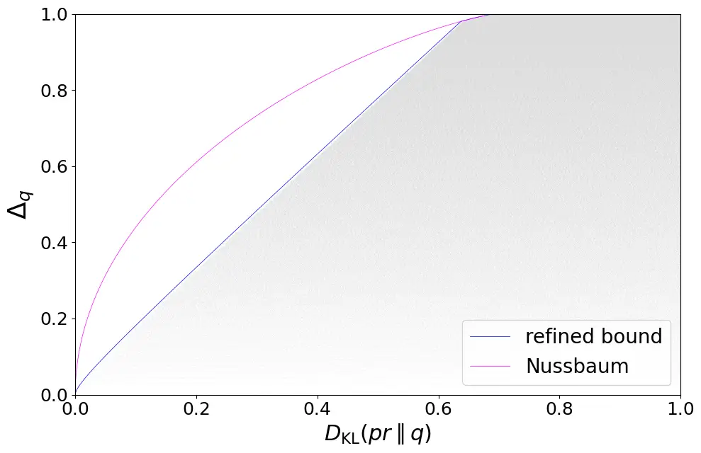
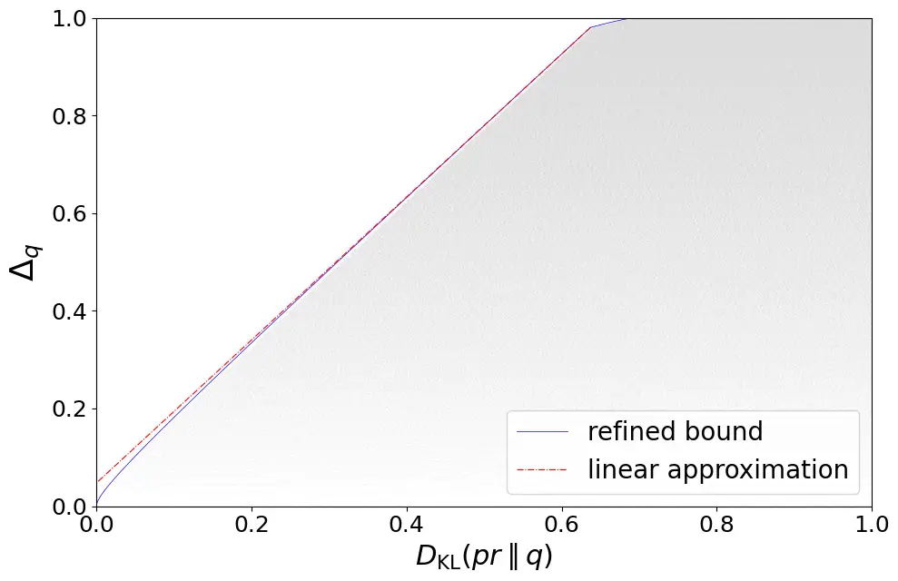
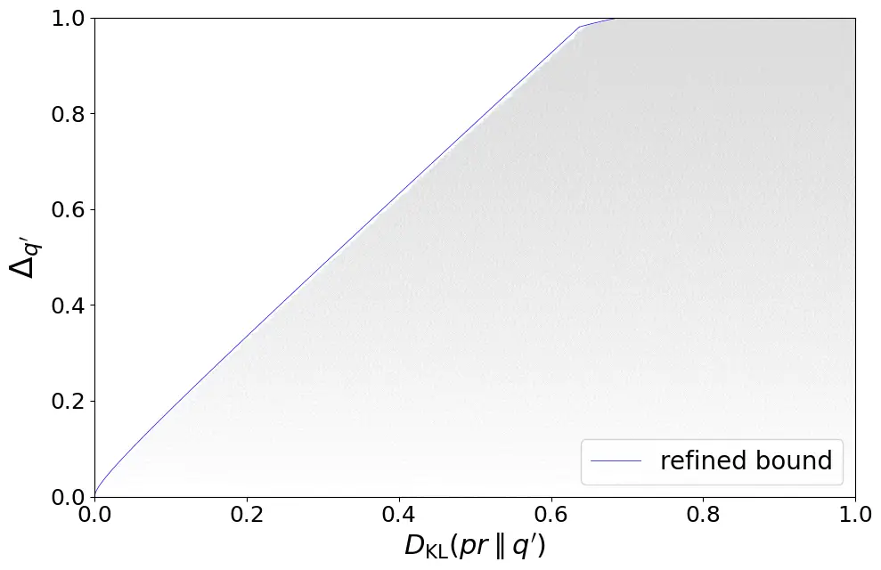

# Classification Error Bound for Low Bayes Error Conditions in Machine Learning

Zijian Yang¹², Vahe Eminyan¹, Ralf Schlüter¹², Hermann Ney¹²
Affiliation: ¹Machine Learning and Human Language Technology Group,
Lehrstuhl Informatik 6,  
Computer Science Department, RWTH Aachen University, Germany
Affiliation: ²AppTek GmbH, Germany

###### Abstract

In statistical classification and machine learning, classification error
is an important performance measure, which is minimized by the Bayes
decision rule. In practice, the unknown true distribution is usually
replaced with a model distribution estimated from the training data in
the Bayes decision rule. This substitution introduces a mismatch between
the Bayes error and the model-based classification error. In this work,
we apply classification error bounds to study the relationship between
the error mismatch and the Kullback-Leibler divergence in machine
learning. Motivated by recent observations of low model-based
classification errors in many machine learning tasks, bounding the Bayes
error to be lower, we propose a linear approximation of the
classification error bound for low Bayes error conditions. Then, the
bound for class priors are discussed. Moreover, we extend the
classification error bound for sequences. Using automatic speech
recognition as a representative example of machine learning
applications, this work analytically discusses the correlations among
different performance measures with extended bounds, including
cross-entropy loss, language model perplexity, and word error rate.

###### Index Terms: 

machine learning, classification error bound, speech recognition,
mismatch condition

## I Introduction

In statistical classification and machine learning tasks, such as
automatic speech recognition (ASR), Bayes decision rule is used to
minimize the classification error, which is the most critical
performance measure for these tasks. However, since the true
distribution in Bayes decision rule is unknown, in practice, a
probabilistic model trained on the training data is applied to
approximate the true distribution in Bayes decision rule. Thus, there is
a difference between the true distribution of the data and the
probabilistic model \[1, 2\]. While this difference is not addressed in
most of the studies, we will make a mathematically strict distinction
between true and model distributions in this work. As the classification
error mismatch between the Bayes error and the model-based decision
error reflects the proximity of model performance to the optimum, we
will study the relationship between error mismatch and other statistical
measures in this work.

Kullback–Leibler (KL) divergence is another important statistical
measure in machine learning tasks. It is closely associated with the
cross-entropy (CE) loss and language model (LM) perplexity (PPL). While
the correlation between word error rate (WER) and LM PPL has been
observed for a long time \[3, 4, 5\], most of the works only empirically
demonstrate the correlation. In this work, we aim to examine the
relationship from an analytical perspective.

The relationship between error mismatch and KL divergence was first
investigated in \[1\]. There, Ney introduced two error bounds on the
error mismatch. Later, Nussbaum et al. derived a generalized statistical
bound on error mismatch \[2, 6\], which included the KL divergence as an
implicit upper bound of the error mismatch. The bound derived in \[2,
6\] was proven to be tight when the true distribution is arbitrary.
However, when more information about the true distribution is obtained,
the bound can be improved. In practice, many systems/tasks have low
Bayes errors. For instance, the WER of human speech recognition, is
typically low \[7\], often dropping below 1% for a wide range of
conditions \[8\], indicating a bound on the Bayes error to be lower. In
\[9\], a refined tight bound between error mismatch and KL divergence is
derived when Bayes error is lower than a threshold. In this work, we
will revisit classification error bounds within the context of machine
learning under the low Bayes error condition. Contributions of this work
are as follows:

- •
  Simplify the bound with a linear approximation under the low Bayes
  error condition
- •
  Propose the bound for class priors and verify its tightness
- •
  Extend classification error bounds for sequences

With the extended bounds, correlations among different performance
measures including cross-entropy, language model perplexity and word
error rate will be discussed.

## II Statistical Measures

In a statistical classification problem, also known as multiple
hypothesis testing in information theory, for a joint event $`(c,x)`$,
where $`c\in\mathcal{C}`$ is a class and $`x\in\mathcal{X}`$ is a
discrete observation, the expected error is defined as:

```math
E[c|x]=\sum_{c^{\prime}}pr(c^{\prime}|x)\big(1-\delta(c,c^{\prime})\big)=1-pr(c|x) \tag{1}
```

where $`\delta`$ is Kroneker-Delta and $`pr(c|x)`$ is the true posterior
distribution. The minimum classification error is obtained by the Bayes
decision rule:

```math
c_{*}(x)=\argmax_{c}pr(c|x) \tag{2}
```

In practical applications, the true distribution is unknown. Therefore,
a model distribution $`q(c,x)`$ is employed to estimate the true
distribution. Recently, sequence-to-sequence (Seq2Seq) modeling methods
have achieved significant success in machine learning tasks, attaining
low classification errors on different tasks. \[10, 11, 12, 13\].
Instead of modeling the joint distribution $`q(c,x)`$, these models
directly model the posterior $`q(c|x)`$. For generalization purposes, we
consider the modeling of joint distribution $`q(c,x)`$ in this paper,
unless otherwise specified. All the results can be generalized to the
posterior modeling by defining $`q(c,x):=q(c|x)\cdot pr(x)`$. The
model-based decision rule is defined as:

```math
c_{q}(x)=\argmax_{c}q(c|x) \tag{3}
```

In statistical classification, the most important performance criterion
is the classification error. The global Bayesian and model-based
classification errors are then obtained by computing the expectation
across all observations:

```math
\displaystyle E_{*}=\sum_{x}pr(x)E[c_{*}(x)|x],\quad E_{q}=\sum_{x}pr(x)E[c_{q}(x)|x] \tag{4}
```

In the mismatch problem, we are interested in the global classification
error mismatch $`\Delta_{q}`$ between $`E_{*}`$ and $`E_{q}`$:

```math
\Delta_{q}=E_{q}-E_{*}=\sum_{x}pr(x)\big(pr(c_{*}(x)|x)-pr(c_{q}(x)|x)\big)
```

(5) Note that $`\Delta_{q}\geq 0`$, i.e. $`E_{q}`$ is lower bounded by
$`E_{*}`$. Therefore, minimizing $`\Delta_{q}`$ pushes the model toward
achieving the optimal classification error.

KL divergence is another statistical measure used to assess the
difference between two distributions, which is defined as:  
$`\displaystyle D_{\text{KL}}(pr\parallel q)`$
$`\displaystyle=\sum_{x,c}pr(c,x)\log\frac{pr(c,x)}{q(c,x)}`$ (6)

## III Classification Error Bounds

### III-A Existing Error Bounds

In the field of information theory, instead of the error mismatch
$`\Delta_{q}`$, the relationship between total variation distance $`V`$
and KL divergence has been elucidated in the past years. In \[14\],
Vadja proposed a refinement of Pinsker’s inequality. In machine
learning, \[15, p.10\] introduced the Bretagnolle-Huber bound for
density estimation. These bounds were not proposed for the error
mismatch $`\Delta_{q}`$. However, as pointed out in \[1\] that $`V`$ is
lower bounded by $`\Delta_{q}`$, the bounds for $`\Delta_{q}`$ can be
obtained by replacing the total variation distance $`V`$ in the
inequalities with $`\Delta_{q}`$. In \[1\], starting from $`V`$, Ney
also derived an error bound for $`D_{\text{KL}}(pr\parallel q)`$ as a
function of $`\Delta_{q}`$ more directly. Nevertheless, unlike $`V`$,
the error mismatch $`\Delta_{q}`$ is asymmetric. As a result,
introducing $`V`$ in the derivation leads to a non-tight bound for
$`\Delta_{q}\in(0,1]`$. In \[2, 6\], started directly from
$`\Delta_{q}`$, the following bound of $`\Delta_{q}`$ on
$`D_{\text{KL}}(pr\parallel q)`$ is derived, which is a tight bound for
the entire domain of $`\Delta_{q}`$ when the true and model
distributions are unconstrained.

```math
\displaystyle D_{\text{KL}}(pr\parallel q) \displaystyle\geq\frac{1}{2}\big((1+\Delta_{q})\log(1+\Delta_{q}) \tag{7}
```

```math
\displaystyle+(1-\Delta_{q})\log(1-\Delta_{q})\big)
```

```math
\displaystyle:=g(\Delta_{q})
```

### III-B Error bounds with Constraints on $`E_{*}`$

The bound $`g`$ introduced in (7) is a tight bound when the true
distribution $`pr`$ is unconstrained. However, if the true distribution
is subject to some constraints, the bound can be further improved. In
machine learning tasks like pattern and speech recognition, the Bayes
error is typically low. For instance, WERs of human speech recognition
can be below 1% for a wide range of conditions \[8\], and the Bayes
error is bounded to be lower. Under the constraint that
$`E_{*}\leq t<0.5`$, where $`t`$ is a given threshold, the bound can be
refined.



Fig. 1: Comparison of the Nussbaum bound and the refined bound in
Theorem 1. The simulation is done under the constraint
$`E_{*}\leq 0.01`$. The grey dots refer to simulation points.

###### Theorem 1.

When $`E_{*}\leq t<0.5`$, $`D_{\text{KL}}(pr\parallel q)`$ is
lower-bounded by the following function of the mismatch
$`\Delta_{q}`$,  
$`\displaystyle D_{\text{KL}}(pr\parallel q)\geq\underbrace{\left\{\begin{array}[]{lr}(\Delta_{q}+2t)g(\frac{\Delta_{q}}{\Delta_{q}+2t}),&0\leq\Delta_{q}<1-2t\\
g(\Delta_{q}),&1-2t\leq\Delta_{q}\leq 1\end{array}\right.}_{:=h_{t}(\Delta_{q})}`$
(8) where $`h_{t}`$ is the refined bound, and $`g`$ is defined as in
(7).

A detailed proof and the tightness of the bound are derived in our
previous work \[9\]. Figure 1 shows the comparison of the bound derived
in \[6, 2\] and the refined bound in \[9\], with each grey dot
representing the result of a single simulation. The simulation was
conducted by generating various distribution pairs $`(pr,q)`$ until all
the reachable areas were covered. All the simulations in this paper are
done with $`|\mathcal{C}|=7`$ and $`|\mathcal{X}|=15`$. The simulation
result show that the bound derived in \[6, 2\] is not tight under the
constrained $`E_{*}\leq t`$, while the bound in \[9\] exhibits tightness
across the full range of $`\Delta_{q}`$.



Fig. 2: The linear approximation of the refined bound in Theorem 1. The
simulations in the upper figure are under the constraint
$`E_{*}\leq 0.08`$, and for the lower figure, the constraint is
$`E_{*}\leq 0.01`$. Grey dots refer to the simulation points.

### III-C Linear Approximation of the Bound

By computing the derivative of $`h_{t}(\Delta_{q})`$, it can be observed
that when $`\Delta_{q}\gg t`$ and within the range
$`0\leq{\Delta}_{q}\leq 1-2t`$, the derivative is almost a constant
value. Therefore, the bound can be approximated linearly when $`t`$ is
small:

```math
\displaystyle D_{\text{KL}}(pr\parallel q)\geq\log(2-2t)\cdot{\Delta}_{q}+\beta. \tag{9}
```

where $`\beta=t\cdot(\log(1-t)+\log t+2\log 2)`$. Note that since
$`h_{t}`$ is convex, this linear bound is valid. Figure 2 demonstrates
the comparison between the refined bound and its linear approximation.
As illustrated in the lower figure for $`t=0.01`$, the exact bound is
effectively approximated by the linear bound across nearly the entire
domain of $`\Delta_{q}`$. However, for $`t=0.08`$ in the upper figure,
the accuracy of the approximation diminishes when $`\Delta_{q}`$ is
small, as $`\Delta_{q}\gg t`$ is not fulfilled.

### III-D Error Bound for Class Priors

Class prior is important in many statistical classification tasks. For
instance, in ASR, an LM (class sequence prior) is usually combined with
the acoustic model (AM) to achieve better performance. Therefore, it is
crucial to investigate the effect of the class prior. To quantify the
discrepancy between the true class prior and the model class prior, the
KL divergence between two priors $`pr(c)`$ and $`q(c)`$ is employed.

```math
D_{\text{KL}}\big(pr(c)\parallel q(c)\big)=\sum_{c}pr(c)\log\frac{pr(c)}{q(c)}
```

To eliminate the influence of modeling the AM, we assume a perfect
acoustic model $`q^{\prime}(x|c)=pr(x|c)`$. Effectively, we apply such
modeling $`q^{\prime}(c,x)=q^{\prime}(c)pr(x|c)`$ where
$`q^{\prime}(c)`$ is the model prior for classes. In this case, the KL
divergence between joint distributions collapses to between class
priors, and the bound proposed in Theorem 1 can be applied:

```math
D_{\text{KL}}(pr\parallel q^{\prime})=\sum_{c}pr(c)\log\frac{pr(c)}{q^{\prime}(c)}\geq h_{t}(\Delta_{q^{\prime}}) \tag{10}
```

Due to the specific assumption of the joint model distribution
$`q^{\prime}(c,x)`$, we must reconsider the tightness of the bound. The
equality for $`\Delta_{q^{\prime}}\in[0,1-2t)`$ can be achieved with the
following parameterized distribution with parameter
$`\lambda\in[0.5,1-2t)`$:

```math
\displaystyle pr(c,x_{1}) \displaystyle=\left\{\begin{array}[]{ll}1-\frac{t}{1-\lambda},&c=c_{1}\\
0,&\text{otherwise}\end{array}\right.
```

```math
\displaystyle pr(c,x_{2}) \displaystyle=\left\{\begin{array}[]{ll}\frac{t\lambda}{1-\lambda},&\quad c=c_{2}\\
t,&\quad c=c_{3}\\
0,&\quad\text{otherwise}\end{array}\right.
```

```math
\displaystyle q^{\prime}(c) \displaystyle=\lim_{\epsilon\rightarrow 0^{+}}\left\{\begin{array}[]{ll}1-\frac{t}{1-\lambda},&c=c_{1}\\
\frac{t}{1-\lambda}\cdot(0.5-\epsilon),&c=c_{2}\\
\frac{t}{1-\lambda}\cdot(0.5+\epsilon),&c=c_{3}\\
0,&\text{otherwise}\end{array}\right.
```

For $`\Delta_{q^{\prime}}\in[1-2t,1]`$, since the distributions used to
achieve equality in \[2\] meet the condition $`q(x|c)=pr(x|c)`$, the
same distributions can be applied to obtain equality here. Figure 3
presents the simulation result for the KL divergence between class
priors and the error mismatch. As shown in the figure, the bound derived
for joint distributions also holds for class priors and maintains its
tightness.



Fig. 3: Simulation results for KL divergence between class priors vs.
error mismatch. The simulation is done with $`E_{*}\leq 0.01`$. Grey
dots refer to the simulation points.

## IV Error Bound for Sequences

Since many machine learning tasks involve Seq2Seq modeling, in this
section, we will delve into the application of previously derived bounds
within the context of sequence-related scenarios, which bridges the
theoretical bound with the practical Seq2Seq machine learning tasks. To
simplify the discussion, we assume that all the class sequences have the
same length $`N`$. The class sequence is defined as $`c_{1}^{N}`$, while
the observation sequence is defined as $`X`$. A straightforward way to
extend the results from single observations to sequences is to treat the
full sequences $`c_{1}^{N}`$ and $`X`$ as individual events. In this
case, $`\Delta_{q}`$ is computed on sequence level, i.e. sentence error
mismatch. However, in Seq2Seq machine learning tasks like ASR, metrics
are typically defined at the token or state level for each position.
Therefore, a position-wise-defined error function is needed. We consider
a position-wise defined error function $`L`$ for the sequence pair
$`c_{1}^{N}`$ and $`\tilde{c}_{1}^{N}`$.  
$`\displaystyle L[c_{1}^{N},\tilde{c}_{1}^{N}]:=\frac{1}{N}\sum_{n=1}^{N}[1-\delta(c_{n},\tilde{c}_{n})]`$
(20) The expected error for a given sequence pair $`(X,c_{1}^{N})`$
is:  
$`\displaystyle E[c_{1}^{N}|X]`$
$`\displaystyle=\sum_{\tilde{c}_{1}^{N}}pr(\tilde{c}_{1}^{N}|X)L[c_{1}^{N},\tilde{c}_{1}^{N}]=1-\frac{1}{N}\sum_{n}pr_{n}(c_{n}|X)`$
(21) where $`pr_{n}(c|X)`$ is the marginal distribution at position
$`n`$.

```math
pr_{n}(c|X)=\sum_{c_{1}^{N}:c_{n}=c}pr(c_{1}^{N}|X) \tag{22}
```

For each position $`n`$, the minimum of the expected error is obtained
by the following Bayes decision rule:

```math
c_{*}^{n}(X)=\argmax_{c}pr_{n}(c|X) \tag{23}
```

Consequently, the Bayes decision rule and the corresponding Bayes error
for the whole sequence are defined as:

```math
\displaystyle\mathbf{c}_{*}(X)=c_{1}^{N}|c_{n}=c_{*}^{n}(X),\overline{E_{*}}=\sum_{X}pr(X)E[\mathbf{c}_{*}(X)|X] \tag{24}
```

The model-based decision rule and classification error can be defined
similarly:  
$`\displaystyle c_{q}^{n}(X)`$
$`\displaystyle=\argmax_{c}q_{n}(c|X),\text{ }\mathbf{c}_{q}(X)=c_{1}^{N}|c_{n}=c_{q}^{n}(X)`$
(25) $`\displaystyle\overline{E_{q}}`$
$`\displaystyle=\sum_{X}pr(X)E[\mathbf{c}_{q}(X)|X]`$ (26) The error
mismatch for the whole sequence is then computed as follows:

```math
\overline{\Delta_{q}}=\overline{E_{q}}-\overline{E_{*}}=\frac{1}{N}\sum_{n}\Delta_{q}^{n} \tag{27}
```

where

```math
\displaystyle\Delta_{q}^{n}=\sum_{X}pr(X)\Big[pr_{n}\big(c_{*}^{n}(X)|X\big)-pr_{n}\big(c_{q}^{n}(X)|X\big)\Big] \tag{28}
```

By employing Ineq. (25) in \[9\] and log-sum inequality, the
relationship between the sequence-level KL divergence
$`D_{\text{KL}}(pr\parallel q)`$ and $`\overline{\Delta_{q}}`$ can be
derived as follows:
$`\displaystyle\underbrace{D_{\text{KL}}(pr\parallel q)\geq\sum_{X}pr(X)\sum_{c_{1}^{N}}pr(c_{1}^{N}|X)\log\frac{pr(c_{1}^{N}|X)}{q(c_{1}^{N}|X)}}_{\text{Ineq. (25) in \cite[cite]{[\@@bibref{}{yang2024refined}{}{}]}}}`$
$`\displaystyle=\sum_{X}pr(X)\frac{1}{N}\sum_{n}\sum_{c}\underbrace{\sum_{c_{1}^{N}:c_{n}=c}pr(c_{1}^{N}|X)\log\frac{pr(c_{1}^{N}|X)}{q(c_{1}^{N}|X)}}_{\text{apply log-sum inequality}}`$
$`\displaystyle\geq\sum_{X}pr(X)\sum_{c}\frac{1}{N}\sum_{n}pr_{n}(c|X)\log\frac{pr_{n}(c|X)}{q_{n}(c|X)}`$
$`\displaystyle=\frac{1}{N}\sum_{n}\underbrace{\sum_{X}pr(X)\sum_{c}pr_{n}(c|X)\log\frac{pr_{n}(c|X)}{q_{n}(c|X)}}_{\text{apply Theorem \ref{theorem:refinedbound}}}`$
$`\displaystyle\geq\underbrace{\frac{1}{N}\sum_{n}h_{t}(\Delta_{q}^{n})}_{h_{t}\text{ is convex}}\geq h_{t}(\frac{1}{N}\sum_{n}\Delta_{q}^{n})=h_{t}(\overline{\Delta_{q}})`$
(29)

### IV-A Error Bound for the Model Classification Error

KL-divergence can be reformulated in terms of cross-entropy $`H(pr,q)`$
and entropy $`H(pr)`$.

```math
\displaystyle D_{\text{KL}}(pr\parallel q) \displaystyle=H(pr,q)-H(pr) \tag{30}
```

For a given task, the true distribution, $`\overline{E_{*}}`$ and
$`H(pr)`$ are fixed. Therefore, by applying (9) and (29), the model
error $`\overline{E_{q}}`$ is linear bounded by $`H(pr,q)`$:

```math
\displaystyle D_{\text{KL}}(pr\parallel q) \displaystyle\geq\log(2-2t)\cdot(\overline{E_{q}}-\overline{E_{*}})+\beta
```

```math
\displaystyle\Rightarrow H(pr,q) \displaystyle\geq\log(2-2t)\cdot\overline{E_{q}}+\text{const} \tag{31}
```

### IV-B Error Bound and CE Training Loss

When there is enough data, as discussed in \[1\], the true distribution
can be approximated by the empirical distribution:

```math
\displaystyle pr(c_{1}^{N},X) \displaystyle\approx\frac{1}{M}\sum_{m=1}^{M}\delta(c_{1}^{N},\mathbf{c}_{m})\cdot\delta(X,X_{m}), \tag{32}
```

```math
\displaystyle H(pr,q) \displaystyle=-\sum_{X,c_{1}^{N}}pr(c_{1}^{N},X)\log q(c_{1}^{N},X)
```

```math
\displaystyle\approx-\frac{1}{M}\sum_{m=1}^{M}\log q(\mathbf{c}_{m},X_{m}) \tag{33}
```

where $`(\mathbf{c}_{m},X_{m})`$ are sequence pairs in the training data
and $`M`$ is the number of sequences. Substituting the true distribution
with the empirical distribution transforms $`H(pr,q)`$ into the standard
CE training loss. The error bound (31) implies that the model error is
linearly upper bounded by the CE loss.

### IV-C The Correlation between Word Error Rate and Perplexity

In this section, we investigate the correlation between WER and LM PPL
via the derived error bound. Since the exact WER computation involves
the alignment problem, which makes the problem much more complicated, we
study the averaged Hamming distance instead, which is an upper bound to
the WER, if the hypothesis is not longer than the reference. By
definition, $`\overline{E_{q}}`$ is the error rate when applying Hamming
distance as the metric. Similar to the discussion in Section III-D, we
assume a perfect acoustic model to eliminate the influence of modeling
the AM. In this case, the cross-entropy is
$`H\big(pr(c_{1}^{N}),q^{\prime}(c_{1}^{N})\big)`$, which is effectively
the logarithm of the LM PPL. By applying (31), the relationship between
LM PPL and WER can be approximately derived as:

```math
\log\text{PPL}\geq\log(2-2t)\bar{E}_{q^{\prime}}+\text{const}\geq\log(2-2t)\text{WER}+\text{const}
```

This inequality indicates that the WER is linearly upper-bounded by the
logarithm of PPL. In \[5\], a log-linear relationship is observed
between PPL and WER. To verify this relationship in theory, refined
lower/upper bounds with further constraints on true/model distributions
would be needed.

## V Conclusion

In this work, bounds on the mismatch between the Bayes and model
classification error based on Kullback–Leibler divergence were discussed
for low Bayes error conditions. A linear approximation of the bound was
proposed for these low Bayes error conditions. Following discussions on
the bound for class priors, classification error bounds were extended
for sequences. Based on extended bounds, linear bounds between different
performance metrics including cross-entropy loss, language model
perplexity, and word error rate were derived.

## References

- \[1\] H. Ney, “On the relationship between classification error bounds
  and training criteria in statistical pattern recognition,” in _Pattern
  Recognition and Image Analysis: First Iberian Conference, IbPRIA 2003,
  Puerto de Andratx, Mallorca, Spain, JUne 4-6, 2003. Proceedings
  1_. Springer, 2003, pp. 636–645.
- \[2\] R. Schlüter, M. Nussbaum-Thom, E. Beck, T. Alkhouli, and H. Ney,
  “Novel tight classification error bounds under mismatch conditions
  based on f-divergence,” in _2013 IEEE Information Theory Workshop
  (ITW)_. IEEE, 2013, pp. 1–5.
- \[3\] L. R. Bahl, F. Jelinek, and R. L. Mercer, “A maximum likelihood
  approach to continuous speech recognition,” _IEEE transactions on
  pattern analysis and machine intelligence_, no. 2, pp. 179–190, 1983.
- \[4\] J. Makhoul and R. Schwartz, “State of the art in continuous
  speech recognition.” _Proceedings of the National Academy of
  Sciences_, vol. 92, no. 22, pp. 9956–9963, 1995.
- \[5\] D. Klakow and J. Peters, “Testing the correlation of word error
  rate and perplexity,” _Speech Communication_, vol. 38, no. 1-2, pp.
  19–28, 2002.
- \[6\] M. Nussbaum-Thom, E. Beck, T. Alkhouli, R. Schlüter, and H. Ney,
  “Relative error bounds for statistical classifiers based on the
  f-divergence.” in _Interspeech_, 2013, pp. 2197–2201.
- \[7\] T. Wesker, B. T. Meyer, K. Wagener, J. Anemüller, A. Mertins,
  and B. Kollmeier, “Oldenburg logatome speech corpus (ollo) for speech
  recognition experiments with humans and machines.” in
  _Interspeech_. Citeseer, 2005, pp. 1273–1276.
- \[8\] R. P. Lippmann, “Speech recognition by machines and humans,”
  _Speech communication_, vol. 22, no. 1, pp. 1–15, 1997.
- \[9\] Z. Yang, V. Eminyan, R. Schlüter, and H. Ney, “Refined
  Statistical Bounds for Classification Error Mismatches with
  Constrained Bayes Error,” _arXiv preprint arXiv:2409.01309_, 2024.
- \[10\] R. Prabhavalkar, T. Hori, T. N. Sainath, R. Schlüter, and
  S. Watanabe, “End-to-end speech recognition: A survey,” _arXiv
  preprint arXiv:2303.03329_, 2023.
- \[11\] A. Graves, S. Fernández, F. Gomez, and J. Schmidhuber,
  “Connectionist temporal classification: labelling unsegmented sequence
  data with recurrent neural networks,” in _Proceedings of the 23rd
  international conference on Machine learning_, 2006, pp. 369–376.
- \[12\] A. Graves, “Sequence transduction with recurrent neural
  networks,” _arXiv preprint arXiv:1211.3711_, 2012.
- \[13\] D. Bahdanau, J. Chorowski, D. Serdyuk, P. Brakel, and
  Y. Bengio, “End-to-end attention-based large vocabulary speech
  recognition,” in _2016 IEEE international conference on acoustics,
  speech and signal processing (ICASSP)_. IEEE, 2016, pp. 4945–4949.
- \[14\] A. A. Fedotov, P. Harremoës, and F. Topsoe, “Refinements of
  pinsker’s inequality,” _IEEE Transactions on Information Theory_,
  vol. 49, no. 6, pp. 1491–1498, 2003.
- \[15\] V. Vapnik, _Statistical Learning Theory_. Wiley, 1998.
