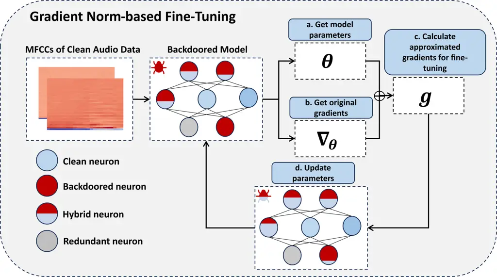
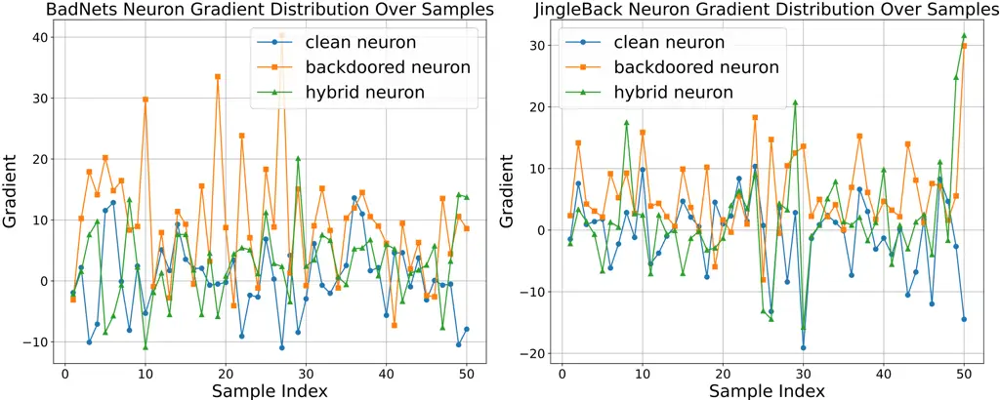
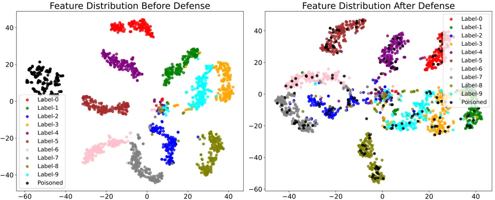

# Gradient Norm-based Fine-Tuning for Backdoor Defense in Automatic Speech Recognition

Nanjun Zhou Affiliation: The Hong Kong University of Science and
Technology (Guangzhou), Guangzhou, China Affiliation: South China
University of Technology, Guangzhou, China    Weilin Lin ^(†)^(†)thanks: \* Equal Contribution. Affiliation: The Hong Kong University of Science
and Technology (Guangzhou), Guangzhou, China    Li Liu ^(†)^(†)thanks:
\$†\$ Corresponds to Li Liu
([avrillliu@hkust-gz.edu.cn](mailto:avrillliu@hkust-gz.edu.cn)).
Affiliation: The Hong Kong University of Science and Technology
(Guangzhou), Guangzhou, China

###### Abstract

Backdoor attacks have posed a significant threat to the security of deep
neural networks (DNNs). Despite considerable strides in developing
defenses against backdoor attacks in the visual domain, the specialized
defenses for the audio domain remain empty. Furthermore, the defenses
adapted from the visual to audio domain demonstrate limited
effectiveness. To fill this gap, we propose Gradient Norm-based
Fine-Tuning (GN-FT), a novel defense strategy against the attacks in the
audio domain, based on the observation from the corresponding backdoored
models. Specifically, we first empirically find that the backdoored
neurons exhibit greater gradient values compared to other neurons, while
clean neurons stay the lowest. On this basis, we fine-tune the
backdoored model by incorporating the gradient norm regularization,
aiming to weaken and reduce the backdoored neurons. We further
approximate the loss computation for lower implementation costs.
Extensive experiments on two speech recognition datasets across five
models demonstrate the superior performance of our proposed method. To
the best of our knowledge, this work is the first specialized and
effective defense against backdoor attacks in the audio domain.

###### Index Terms: 

AI Security, Backdoor Defense, Automatic Speech Recognition,
Fine-Tuning.

## I Introduction

In recent years, deep neural networks (DNNs) have seen extensive
application across a wide range of fields, including face recognition
\[1, 2, 3\], autonomous driving \[4, 5\] in the visual domain, and
automatic speech recognition \[6, 7\] in the audio domain. However, with
advancements in technology, backdoor attacks \[8\] have emerged as a
severe security concern, threatening the safety of DNNs. In backdoor
attacks, attackers inject a specific trigger pattern into a portion of
training dataset to poison the data. Models trained on such poisoned
datasets, known as backdoored models, behave normally when presented
with clean data. Conversely, they maliciously misclassify data that
contains the trigger pattern to a predefined target label, which is
termed as backdoored effect. To avoid this effect, solutions on either
the poisoned-input detection (data-level) or the backdoored-model
repairing (model-level) are necessary \[9\].

Up to now, numerous studies have been dedicated to developing defenses
against backdoor attacks, which have achieved significant results \[10,
11, 12, 13, 14, 15\]. However, these defense methods are mostly designed
for the visual domain, and no specialized defense is proposed against
the backdoor attacks in the audio domain. Due to the different
characteristics between the two domains, _e.g._, audio signals own
larger information density as spectrum format compared to the RGB
images, the existing defense methods adapted from the visual
domain \[10, 16, 17\] demonstrate limited performance against the audio
backdoor attacks. As illustrated in Table I and Table II, the
model-level defense adapted from the visual domain, Fine-Pruning
(FP) \[10\], fails completely in the audio domain. Therefore, in this
work, we aim to design the first defense method specifically targeted at
audio backdoor attacks.



Fig. 1: Overview of our proposed method (GN-FT).

To investigate the characteristics of the backdoored models in the audio
domain, _i.e._, audio-backdoored models, we split its neurons into
different types as in \[18\] and further observe their learning
behaviors. Specifically, the neurons are categorized into clean neurons,
backdoored neurons, hybrid neurons, and redundant neurons according to
their loss changes on both clean and backdoor tasks¹¹ 1 Clean task
represents the normal classification task on clean samples. Similarly,
backdoor task indicates the task on poisoned samples. . Note that
backdoored neurons and hybrid neurons are the primary contributors to
the backdoor task, and our goal is to weaken their functionality. The
gradients with clean inputs on different neuron types are shown in
Fig. 2, we can observe that for most clean inputs, backdoored neurons
and hybrid neurons exhibit larger gradient values than clean neurons,
which solely contribute to clean task.

Based on this observation, we propose Gradient Norm-based Fine-Tuning
(GN-FT), where a gradient norm regularization term is added to the
original loss function. By doing so, the learning process attempts to
suppress the high-gradient backdoored neurons and hybrid neurons,
resulting in a repaired clean model after fine-tuning. Considering
computational efficiency, we adopt the approximation scheme introduced
in \[19\]. Extensive experiments demonstrate that our method
significantly outperforms FP in terms of defense effectiveness.

In summary, the main contributions of this work are threefold: 1) We
observe that the backdoored neurons in the audio-backdoored models
exhibit greater gradient values than others. 2) We propose a
gradient-regularized fine-tuning method to effectively mitigate
backdoored effect, marking the first specialized defense technique for
backdoor attacks in the audio domain. 3) Extensive experiments across
two datasets, five models, and seven attacks, show that our proposed
method consistently achieves state-of-the-art performance.



Fig. 2: Illustration of gradients of different neurons over 50 clean
samples. We used Audio BadNets \[8\] and JingleBack \[20\] on ResNet
\[21\] for illustrations. For most clean inputs, backdoored neurons and
hybrid neurons exhibit larger gradients, while clean neurons show
smaller gradients.

## II Related work

Backdoor Attacks. In backdoor attacks \[8\], an attacker injects a
specific pattern, known as trigger, into a portion of the training data
and assigns these samples a target label. The resulting backdoored model
performs normally on clean data but misclassifies inputs with the
trigger to the target label. Most backdoor attack techniques \[8, 22,
23, 24, 25, 26\] are designed for the visual domain, among which classic
examples include BadNets \[8\] and Blended \[22\]. In the audio domain,
Ultrasonic attack \[27\] is a representative method for automatic speech
recognition tasks, where the attacker uses an ultrasonic signal as the
backdoor trigger. To enable attacks in a physical scenario, naturally
occurring sounds are chosen as triggers in DABA \[28\]. Various
audio-specific methods \[20, 29\] have also been devised to increase the
stealthiness of attacks. Recently, a stealthy attack FlowMur \[30\] was
introduced, where it trains a model to generate triggers while ensuring
consistency between the target label and ground truth.

Backdoor Defenses. According to \[9\], backdoor defenses can be
categorized into data-level and model-level approaches. Data-level
defenses aim to identify and remove poisoned data from the dataset,
while model-level defenses attempt to mitigate backdoored effect in a
well-trained backdoored model using a small amount of clean data. In the
audio domain, existing backdoor defenses are all adaptations from the
visual domain and are primarily data-level \[16, 17\]. FP \[10\] is the
only adapted model-level defense for audio-backdoored models, which
prunes neurons with low activation on clean data and then fine-tunes the
pruned model. However, FP fails to effectively defend against most audio
backdoor attacks. In this work, we address this issue by proposing a
gradient-regularized fine-tuning technique from the model-level
perspective, which is the first specialized defense for the
audio-backdoored models.

## III Proposed Method

### III-A Problem Formulation

Threat Models. We assume that the attackers have full access to the
training set, and they poison it by injecting a trigger into a small
amount of randomly selected samples, indicated by the poisoning ratio.
The attackers aim to train the model with the poisoned training set so
that it misclassifies poisoned data as the target label $`y_{t}`$, while
functioning normally on clean data. We denote the model as $`F`$ with
$`L`$ layers, where $`f^{(i)}`$ parameterized as
$`\boldsymbol{\theta}^{(i)}`$ denotes $`i`$-th layer of the model.
Considering the convolutional layer, the weights of neurons in the
$`i`$-th layer can be denoted as
$`\{\boldsymbol{\theta}^{(i,j)}\in\mathbb{R}^{c_{i-1}\times h\times w}\}_{1\leq j\leq c_{i}}`$,
where $`c_{i}`$, $`h`$ and $`w`$ represent the number of neurons in
$`f^{(i)}`$, the height and width of the convolutional kernel,
respectively.

Defense Setting. The defender aims to eliminate the backdoored effect
while preserving the model performance on clean data. Following the
previous model-level defense settings \[10\], we assume that only 5% of
clean data is accessible to the defender for conducting defense, denoted
as $`\mathcal{D}_{c}`$.

### III-B Observations on Audio-Backdoored Models

Classification of Neurons in Backdoored Models. In line with the neuron
types defined in \[18\], we categorize the neurons in backdoored models
based on pruning and loss change, where pruning j-th neuron in the i-th
layer of the model means setting $`\boldsymbol{\theta}^{(i,j)}`$ to 0.
The loss change of a neuron is defined as the difference between the
loss values after and before pruning for the same inputs. To be
specific, Clean Loss Change (CLC) and Backdoor Loss Change (BLC) can be
formulated as:

```math
\displaystyle\text{CLC}(\boldsymbol{\theta},i,j) \displaystyle=\mathbb{E}_{(\boldsymbol{x},y)\in\mathcal{D}_{c}}\bigl[\mathcal{L}(F(\boldsymbol{x};\boldsymbol{\theta}\mid\boldsymbol{\theta}^{(i,j)}=0),y)
```

```math
\displaystyle\quad-\mathcal{L}(F(\boldsymbol{x};\boldsymbol{\theta}),y)\bigr] \tag{1}
```

```math
\displaystyle\text{BLC}(\boldsymbol{\theta},i,j) \displaystyle=\mathbb{E}_{(\boldsymbol{x},*)\in\mathcal{D}_{c},y_{t}}\bigl[\mathcal{L}(F(\delta(\boldsymbol{x});\boldsymbol{\theta}\mid\boldsymbol{\theta}^{(i,j)}=0),y_{t})
```

```math
\displaystyle\quad-\mathcal{L}(F(\delta(\boldsymbol{x});\boldsymbol{\theta}),y_{t})\bigr] \tag{2}
```

where $`\mathcal{D}_{c}`$ is the given clean data for defense;
$`\delta(\cdot)`$ is the poisoning function of the attack method;
$`y_{t}`$ is a predefined target label; and $`\mathcal{L}(\cdot)`$ is
the cross-entropy loss. Note that a larger value of CLC (or BLC)
represents a larger contribution of the current neuron to the clean task
(or backdoor task). Therefore, we can adopt it to classify the neurons
into different types.

Fig. 3: A scatter plot showing the BLC and CLC values for neurons in the
last two convolutional layers of an audio-backdoored model attacked by
Audio BadNets \[8\]. C-zone: Clean Zone; B-zone: Backdoor Zone; H-zone:
Hybrid Zone; R-zone: Redundant Zone.

Using this definition, we can obtain the CLCs and BLCs of all neurons
within the audio-backdoored model, as illustrated in Fig. 3. We divide
the plot into four zones based on the zero values of CLC and BLC: The
Clean Zone (C-zone) contains neurons with positive CLCs and negative
BLCs, indicating their contribution to the clean task while potentially
suppressing the backdoor task. The Backdoor Zone (B-zone) is
characterized by neurons with positive BLCs and negative CLCs,
suggesting a specific contribution to the backdoor task, potentially at
the expense of the clean task. In the Hybrid Zone (H-zone), neurons have
both positive CLCs and BLCs, meaning they could contribute to both
tasks. Finally, the Redundant Zone (R-zone) contains neurons that do not
contribute to either task. Based on these four zones, we can further
classify neurons into clean neurons, backdoored neurons, hybrid neurons,
and redundant neurons, respectively. Intuitively, our goal is to
suppress backdoored neurons and hybrid neurons for backdoor mitigation.

Suggestion Given by the Observation. As illustrated in Section I, in the
audio-backdoored models, backdoored neurons and hybrid neurons tend to
exhibit larger gradients on most clean inputs, while clean neurons stay
the smallest. Therefore, it suggests penalizing the high gradient norm
during fine-tuning to repair these two kinds of neurons, where the clean
neurons are less modified due to their small-gradient characteristic.

### III-C Gradient Norm-based Fine-Tuning

Based on the observations, we propose Gradient Norm-based Fine-Tuning to
penalize the high gradients from backdoor neurons and hybrid neurons. An
overview of the method is shown in Fig. 1. An $`L_{2}`$ norm of the
gradients is added as a regularization term to the fine-tuning loss
function, as shown below:

```math
\mathcal{L}(\boldsymbol{\theta})=\mathcal{L}_{ce}(\boldsymbol{\theta})+\lambda\cdot\left\|\nabla_{\boldsymbol{\theta}}\mathcal{L}_{ce}(\boldsymbol{\theta})\right\|_{2}, \tag{3}
```

where $`\mathcal{L}_{ce}(\cdot)`$ is the original cross-entropy loss,
$`\left\|\nabla_{\boldsymbol{\theta}}\mathcal{L}_{ce}(\boldsymbol{\theta})\right\|_{2}`$
corresponds to the $`L_{2}`$ norm of the gradients of the model, and
$`\lambda`$ is a trade-off coefficient to control the strength of
penalization. During the fine-tuning process, we aim to minimize this
loss function using the available clean set $`D_{c}`$. The object
function is formulated as:

```math
\min_{\boldsymbol{\theta}}\mathbb{E}_{(\boldsymbol{x},y)\in\mathcal{D}_{c}}[\mathcal{L}(F(\boldsymbol{x};\boldsymbol{\theta}),y)]. \tag{4}
```

However, direct optimization on equation (3) involves calculating a
Hessian matrix with $`O(n^{2})`$ time and space complexities, which is
infeasible. Inspired by the approximation scheme in \[19\], we choose to
simplify it similarly using Taylor expansion and additional optimization
steps. It can be formulated as:

```math
\begin{aligned} \nabla_{\boldsymbol{\theta}}\mathcal{L}(\boldsymbol{\theta})&=\nabla_{\boldsymbol{\theta}}\mathcal{L}_{ce}(\boldsymbol{\theta})+\nabla_{\boldsymbol{\theta}}(\lambda\cdot\left\|\nabla_{\boldsymbol{\theta}}\mathcal{L}_{ce}(\boldsymbol{\theta})\right\|_{2})\\
&=\nabla_{\boldsymbol{\theta}}\mathcal{L}_{ce}(\boldsymbol{\theta})+\lambda\cdot\nabla_{\boldsymbol{\theta}}^{2}\mathcal{L}_{ce}(\boldsymbol{\theta})\frac{\nabla_{\boldsymbol{\theta}}\mathcal{L}_{ce}(\boldsymbol{\theta})}{\left\|\nabla_{\boldsymbol{\theta}}\mathcal{L}_{ce}(\boldsymbol{\theta})\right\|_{2}}\\
&\approx\nabla_{\boldsymbol{\theta}}\mathcal{L}_{ce}(\boldsymbol{\theta})+\frac{\lambda}{r}\cdot(\nabla_{\boldsymbol{\theta}}\mathcal{L}_{ce}(\boldsymbol{\theta}+r\frac{\nabla_{\boldsymbol{\theta}}\mathcal{L}_{ce}(\boldsymbol{\theta})}{\left\|\nabla_{\boldsymbol{\theta}}\mathcal{L}_{ce}(\boldsymbol{\theta})\right\|_{2}})-\nabla_{\boldsymbol{\theta}}\mathcal{L}_{ce}(\boldsymbol{\theta}))\\
&=(1-\alpha)\nabla_{\boldsymbol{\theta}}\mathcal{L}_{ce}(\boldsymbol{\theta})+\alpha\nabla_{\boldsymbol{\theta}}\mathcal{L}_{ce}(\boldsymbol{\theta}+r\frac{\nabla_{\boldsymbol{\theta}}\mathcal{L}_{ce}(\boldsymbol{\theta})}{\left\|\nabla_{\boldsymbol{\theta}}\mathcal{L}_{ce}(\boldsymbol{\theta})\right\|_{2}}),\end{aligned} \tag{5}
```

where $`r`$ is for appropriating the Hessian multiplication, and
$`\alpha=\frac{\lambda}{r}`$ is used for trade-off. In the practical
defense process, we conduct an additional optimization step to
approximate the second term in equation (5), aiming to avoid the Hessian
computation:

```math
\nabla_{\boldsymbol{\theta}}\mathcal{L}_{ce}(\boldsymbol{\theta}+r\frac{\nabla_{\boldsymbol{\theta}}\mathcal{L}_{ce}(\boldsymbol{\theta})}{\left\|\nabla_{\boldsymbol{\theta}}\mathcal{L}_{ce}(\boldsymbol{\theta})\right\|_{2}})\approx\nabla_{\boldsymbol{\theta}}\mathcal{L}_{ce}(\boldsymbol{\theta})|_{\boldsymbol{\theta}=\boldsymbol{\theta}+r\frac{\nabla_{\boldsymbol{\theta}}\mathcal{L}_{ce}(\boldsymbol{\theta})}{{\|\nabla_{\boldsymbol{\theta}}}\mathcal{L}_{ce}(\boldsymbol{\theta})\|_{2}}}. \tag{6}
```

The details of the algorithm process are illustrated in Algorithm 1. For
each iteration (line 1$`\sim`$9 of the Algorithm), we first obtain a
mini-batch of data $`\boldsymbol{B}_{c}`$ (line 2) and the current
parameters $`\boldsymbol{\theta}^{t}`$ (line 3). Based on them, we
calculate the first term in equation (5) as $`\boldsymbol{g}_{1}`$ (line
4). Then, we temporally conduct an additional optimization step as
stated in equation (6) to approximate the second term in equation (5),
as $`\boldsymbol{g}_{2}`$ (line 5$`\sim`$6). By combining the two terms
with $`\alpha`$, we can calculate the final gradients to permanently
update $`\boldsymbol{\theta}^{t}`$ (line 7$`\sim`$8). After $`T`$
iterations, we can obtain a repaired model $`F_{c}`$, which is validated
effective towards audio-backdoored model in Section IV.

1: Clean dataset $`\mathcal{D}_{c}`$; backdoored model $`F`$; the number
of iterations $`T`$; hyper-parameters $`r`$ and $`\alpha`$;

2: The clean model $`F_{c}`$;

3: for $`t=1`$ to $`T`$ do

4:   Get a mini-batch $`\boldsymbol{B}_{c}`$ from $`\mathcal{D}_{c}`$;

5:   Extract the parameters $`\boldsymbol{\theta}^{t}`$ from $`F`$;

6:   Input $`\boldsymbol{B}_{c}`$ into $`F`$, calculate gradients
$`\boldsymbol{g}_{1}\leftarrow\nabla_{\boldsymbol{\theta}^{t}}\mathcal{L}_{ce}(\boldsymbol{\theta}^{t})`$;

7:   Copy the model $`F`$ as $`F^{\prime}`$, and define its parameters
as
$`\boldsymbol{\theta}^{\prime}\leftarrow\boldsymbol{\theta}^{t}+r\frac{\boldsymbol{g}_{1}}{\left\|\boldsymbol{g}_{1}\right\|_{2}}`$;

8:   Input $`\boldsymbol{B}_{c}`$ into $`F^{\prime}`$, calculate
gradients
$`\boldsymbol{g}_{2}\leftarrow\nabla_{\boldsymbol{\theta}^{\prime}}\mathcal{L}_{ce}(\boldsymbol{\theta}^{\prime})`$;

9:   Calculate the final gradient
$`\boldsymbol{g}\leftarrow(1-\alpha)\boldsymbol{g}_{1}+\alpha\boldsymbol{g}_{2}`$;

10:   Update $`\boldsymbol{\theta}^{t}`$ using $`\boldsymbol{g}`$;

11: end for

12: Return $`F_{c}`$ with parameters $`\boldsymbol{\theta}^{T}`$.

Algorithm 1 Gradient Norm-based Fine-Tuning

## IV Experiments

### IV-A Experimental Setups

Datasets and Models. We use Google’s Speech Commands Dataset (SCD)
\[6\], a commonly used dataset for speech recognition tasks. We employ
two versions: the first version contains 10 classes that were also used
in \[27\] (SCD-10), and the second version includes the full 30 classes
(SCD-30). We choose ResNet \[21\], LSTM \[31\], Small CNN \[32, 33\],
KWT \[34\] and EAT \[35\], which are commonly used as speech recognition
models, as our experimental models.

Attacker Settings. In our experiments, the poisoning ratio for the
attacks is set to 10%, and the target label is set to “up”. We employ
seven attack methods: Audio BadNets \[8\], Ultrasonic \[27\], JingleBack
\[20\], DABA \[28\], FlowMur \[30\], PBSM and VSVC \[29\]. Among these,
we extend the representative attack, BadNets \[8\] from the visual
domain, to Audio BadNets in the audio domain, where a white block is
added at a fixed position in the MFCC spectrogram \[36\] of the audio
signal to be poisoned.

Defender Settings. Since our GN-FT is designed as a model-level defense,
we compare it with the only known model-level defense method adapted to
the audio domain, FP \[10\]. We follow a similar setting with 5% (known
as clean data ratio) of the clean training data for defense purposes.
Since the hyperparameters $`r`$ and $`\alpha`$ are more related to the
approximation ability, and well-discussed in \[19\], we follow the
default setup to 0.05 and 0.7, respectively.

Evaluation Metrics. We use two metrics to evaluate the defense methods:
Clean Accuracy (CA) and Attack Success Rate (ASR). CA represents the
accuracy of the model on clean data, while ASR indicates the proportion
of poisoned data that the model predicts as the target label. The
boldfaced numbers represent the best performance among the same metric.

### IV-B Main Results

Results On SCD-10. Table I presents the performance comparisons on
SCD-10 dataset using ResNet, LSTM, Small CNN, KWT and EAT. The results
demonstrate that our method, GN-FT, exhibits significant advantages over
FP, effectively reducing ASR while maintaining a high CA in most cases.
For ResNet, GN-FT significantly lowers the average ASR from 91.72% to
9.73%, while the average CA only drops slightly from 94.54% to 90.40%.
Although FP performs better ASR in JingleBack and DABA, the sacrifices
on CA are unacceptable at 33.69% and 21.45%, respectively. Similarly,
for LSTM, Small CNN, KWT and EAT, GN-FT outperforms FP for nearly all
attacks. In contrast, FP fails to achieve effective defense against
these attack methods.

Results on SCD-30. Table II presents the defense performance on SCD-30
dataset using ResNet and LSTM. Similar to its performance on SCD-10
dataset, GN-FT significantly outperforms FP on SCD-30 dataset as well.
For ResNet, GN-FT demonstrates effective defense against most attacks,
although less effective on ASR towards the more stealthy attacks,
JingleBack and FlowMur. Notably, in DABA and FlowMur attacks, GN-FT can
increase the model’s CA compared to No Defense, improving it by 0.07%
and 8.68%, respectively, and the average CA after defense also increases
by 0.74%. For LSTM, GN-FT can successfully defend against all five
attacks with ASR lower than 10%. Similar to the performance on SCD-10
dataset, FP suffers from high ASRs or significant reduction in CAs.

Overall, we can see that GN-FT is an effective defense method against
all attack methods under different experimental setups.

TABLE I: Main experimental results on SCD-10 dataset (%).

|           |                     |                    |                 |                    |                 |                    |                 |
| --------- | ------------------- | ------------------ | --------------- | ------------------ | --------------- | ------------------ | --------------- |
| Models    | Backdoor attacks    | No Defense         |                 | FP \[10\]          |                 | GN-FT (Ours)       |                 |
|           |                     | ASR $`\downarrow`$ | CA $`\uparrow`$ | ASR $`\downarrow`$ | CA $`\uparrow`$ | ASR $`\downarrow`$ | CA $`\uparrow`$ |
| ResNet    | Audio BadNets \[8\] | 99.27              | 92.44           | 25.20              | 44.64           | 2.92               | 91.06           |
|           | Ultrasonic \[27\]   | 100.00             | 93.68           | 7.81               | 28.71           | 0.21               | 90.50           |
|           | JingleBack \[20\]   | 97.42              | 92.84           | 5.44               | 33.69           | 15.99              | 89.98           |
|           | DABA \[28\]         | 99.32              | 99.91           | 0.50               | 21.45           | 9.43               | 89.15           |
|           | FlowMur \[30\]      | 62.59              | 93.85           | 86.23              | 29.63           | 20.10              | 91.30           |
|           | Average             | 91.72              | 94.54           | 25.04              | 31.62           | 9.73               | 90.40           |
| LSTM      | Audio BadNets \[8\] | 100.00             | 94.37           | 82.06              | 81.40           | 3.96               | 85.17           |
|           | Ultrasonic \[27\]   | 100.00             | 94.37           | 97.21              | 51.42           | 1.85               | 89.94           |
|           | JingleBack \[20\]   | 99.40              | 93.50           | 86.07              | 75.28           | 6.25               | 85.93           |
|           | DABA \[28\]         | 99.26              | 99.27           | 98.21              | 83.97           | 9.08               | 88.04           |
|           | FlowMur \[30\]      | 75.60              | 92.38           | 34.30              | 62.20           | 33.10              | 86.46           |
|           | Average             | 94.85              | 94.78           | 79.57              | 70.85           | 10.85              | 87.11           |
| Small CNN | Audio BadNets \[8\] | 100.00             | 90.12           | 69.41              | 66.71           | 25.02              | 82.03           |
|           | Ultrasonic \[27\]   | 99.97              | 91.23           | 86.33              | 69.36           | 23.17              | 78.61           |
|           | JingleBack \[20\]   | 98.88              | 90.38           | 39.36              | 53.65           | 48.32              | 81.02           |
|           | Average             | 99.62              | 90.58           | 65.03              | 63.24           | 32.17              | 80.55           |
| KWT       | PBSM \[29\]         | 92.20              | 91.47           | 17.17              | 71.41           | 17.30              | 84.41           |
|           | VSVC \[29\]         | 99.83              | 91.16           | 23.18              | 71.60           | 15.90              | 84.11           |
|           | Average             | 96.02              | 91.32           | 20.18              | 71.51           | 16.60              | 84.26           |
| EAT       | PBSM \[29\]         | 100.00             | 95.60           | 0.00               | 10.09           | 2.92               | 94.94           |
|           | VSVC \[29\]         | 99.08              | 95.36           | 0.00               | 9.97            | 2.79               | 95.33           |
|           | Average             | 99.54              | 95.48           | 0.00               | 10.03           | 2.86               | 95.14           |

TABLE II: Main experimental results on SCD-30 dataset (%).

| Models | Backdoor attacks    | No Defense         |                 | FP \[10\]          |                 | GN-FT (Ours)       |                 |
| ------ | ------------------- | ------------------ | --------------- | ------------------ | --------------- | ------------------ | --------------- |
|        |                     | ASR $`\downarrow`$ | CA $`\uparrow`$ | ASR $`\downarrow`$ | CA $`\uparrow`$ | ASR $`\downarrow`$ | CA $`\uparrow`$ |
| ResNet | Audio BadNets \[8\] | 99.96              | 92.36           | 28.34              | 55.23           | 1.73               | 89.54           |
|        | Ultrasonic \[27\]   | 100.00             | 91.37           | 29.68              | 55.78           | 0.12               | 90.02           |
|        | JingleBack \[20\]   | 99.21              | 90.67           | 36.97              | 47.70           | 28.18              | 89.76           |
|        | DABA \[28\]         | 99.63              | 80.09           | 71.63              | 48.97           | 4.51               | 88.77           |
|        | FlowMur \[30\]      | 41.31              | 87.87           | 51.40              | 30.30           | 42.40              | 87.94           |
|        | Average             | 88.02              | 88.47           | 43.60              | 47.60           | 15.39              | 89.21           |
| LSTM   | Audio BadNets \[8\] | 100.00             | 94.04           | 83.23              | 82.59           | 1.19               | 82.47           |
|        | Ultrasonic \[27\]   | 100.00             | 93.81           | 99.60              | 83.34           | 0.12               | 90.02           |
|        | JingleBack \[20\]   | 99.72              | 93.96           | 84.10              | 79.95           | 7.97               | 84.75           |
|        | DABA \[28\]         | 99.90              | 78.90           | 98.85              | 53.13           | 4.02               | 82.74           |
|        | FlowMur \[30\]      | 46.93              | 91.05           | 4.18               | 66.53           | 2.72               | 82.16           |
|        | Average             | 89.31              | 90.35           | 73.99              | 73.11           | 3.20               | 84.43           |

### IV-C Ablation Studies

To verify the effectiveness of gradient regularization, we compare it
with the vanilla Fine-Tuning (FT for short). As shown in Table III, the
defense performances of FT on the audio-backdoored models are limited:
despite the high CAs, it fails to reduce ASRs. On the contrary, GN-FT
significantly reduces ASRs with a similar sacrifice on CAs. This further
underscores the importance of gradient regularization.

| Backdoor attacks    | FT                |                | GN-FT (Ours)      |                |
| ------------------- | ----------------- | -------------- | ----------------- | -------------- |
|                     | ASR$`\downarrow`$ | CA$`\uparrow`$ | ASR$`\downarrow`$ | CA$`\uparrow`$ |
| Audio BadNets \[8\] | 99.38             | 91.32          | 2.92              | 91.06          |
| Ultrasonic \[27\]   | 100.00            | 92.68          | 0.20              | 90.50          |
| JingleBack \[20\]   | 72.19             | 90.71          | 15.99             | 89.98          |

TABLE III: Comparison with FT on SCD-10 using ResNet (%).

### IV-D Further Analysis

Impact of Clean Data Ratio. We analyze the impact of different clean
data ratios, _i.e._, the proportion of clean data used for defense, on
the defense performance. As shown in Table IV, a smaller clean data
ratio is prone to bring a worse defense performance, especially for the
sacrifice of CAs. Once the proportion of clean data exceeds 10%, CAs can
maintain stably high at above 90% for different attacks, and ASRs
decrease to around 5% or even lower. This indicates that the performance
of GN-FT can be further improved and stabilized if there were more clean
data available for defense.

| Clean Data Ratio | Audio BadNets \[8\] |                | Ultrasonic \[27\] |                | JingleBack \[20\] |                |
| ---------------- | ------------------- | -------------- | ----------------- | -------------- | ----------------- | -------------- |
|                  | ASR$`\downarrow`$   | CA$`\uparrow`$ | ASR$`\downarrow`$ | CA$`\uparrow`$ | ASR$`\downarrow`$ | CA$`\uparrow`$ |
| 2%               | 10.00               | 85.20          | 5.86              | 85.15          | 11.66             | 85.51          |
| 5%               | 2.92                | 91.06          | 0.21              | 90.50          | 15.99             | 89.98          |
| 10%              | 3.54                | 93.46          | 1.04              | 92.87          | 5.26              | 92.87          |
| 20%              | 3.31                | 95.17          | 2.47              | 94.70          | 3.64              | 94.75          |
| 40%              | 2.88                | 95.89          | 0.76              | 95.64          | 2.66              | 95.64          |

TABLE IV: The impact of the clean data ratio on the defense performance
using ResNet (%).

Influences on Backdoored and Hybrid Neurons. To analyze the influences
of GN-FT on the backdoor and hybrid neurons, we observe the BLC-CLC
distribution of neurons in the last two convolutional layers after
defense. As shown in Fig. 4, GN-FT can effectively reduce the number of
neurons in the H-zone and B-zone compared to Fig. 3, while the number of
neurons in the R-zone increases, indicating that some hybrid neurons and
backdoored neurons have been moved to the R-zone after defense, which is
considered redundant. The result proves that our method can mitigate the
backdoor by reducing the number of backdoored and hybrid neurons.

Fig. 4: The BLC-CLC distribution of neurons after GN-FT against Audio
BadNets.

T-SNE Visualization. Fig.5 shows t-SNE \[37\] plots before and after
GN-FT defense. Before defense, the poisoned features form a clear
cluster (left of Fig.5), indicating the trigger features are
well-learned. After defense, the poisoned features become dispersed and
distributed among other classes (right of Fig. 5), while clean data
features remain clustered. This suggests the model ”forgets” the trigger
features but retains performance on clean data.



Fig. 5: The t-SNE plots before and after GN-FT against BadNets using
SCD-10. Black points indicate the poisoned features.

## V Conclusion

We propose Gradient Norm-based Fine-Tuning to mitigate the backdoored
effects in audio-backdoored models. Our study reveals that backdoored
and hybrid neurons in these models show larger gradients for clean
inputs. Our work highlights the need for specific backdoor defenses for
audio-backdoored models, which differ from visual models but were
previously overlooked. Our future work will focus on exploring the
differences between audio and visual domains to enhance the defense
performance against stealthy attacks like DABA and FlowMur.

## VI Acknowledgment

This work was supported by the National Natural Science Foundation of
China (No. 62471420 and 62101351), and Guangzhou-HKUST(GZ) Joint Funding
Program (Grant No.2023A03J0008), Education Bureau of Guangzhou
Municipality.

## References

- \[1\] Yaniv Taigman, Ming Yang, Marc’Aurelio Ranzato, and Lior Wolf,
  “Deepface: Closing the gap to human-level performance in face
  verification,” in Proceedings of the IEEE conference on computer
  vision and pattern recognition, 2014, pp. 1701–1708.
- \[2\] Divyarajsinh N Parmar and Brijesh B Mehta, “Face recognition
  methods & applications,” arXiv preprint arXiv:1403.0485, 2014.
- \[3\] Ratnawati Ibrahim and Zalhan Mohd Zin, “Study of automated face
  recognition system for office door access control application,” in
  2011 IEEE 3rd International Conference on Communication Software and
  Networks. IEEE, 2011, pp. 132–136.
- \[4\] Holger Caesar, Varun Bankiti, Alex H Lang, Sourabh Vora,
  Venice Erin Liong, Qiang Xu, Anush Krishnan, Yu Pan, Giancarlo Baldan,
  and Oscar Beijbom, “nuscenes: A multimodal dataset for autonomous
  driving,” in Proceedings of the IEEE/CVF conference on computer vision
  and pattern recognition, 2020, pp. 11621–11631.
- \[5\] Ekim Yurtsever, Jacob Lambert, Alexander Carballo, and Kazuya
  Takeda, “A survey of autonomous driving: Common practices and emerging
  technologies,” IEEE access, vol. 8, pp. 58443–58469, 2020.
- \[6\] Pete Warden, “Speech commands: A dataset for limited-vocabulary
  speech recognition,” arXiv preprint arXiv:1804.03209, 2018.
- \[7\] Mishaim Malik, Muhammad Kamran Malik, Khawar Mehmood, and Imran
  Makhdoom, “Automatic speech recognition: a survey,” Multimedia Tools
  and Applications, vol. 80, pp. 9411–9457, 2021.
- \[8\] Tianyu Gu, Kang Liu, Brendan Dolan-Gavitt, and Siddharth Garg,
  “Badnets: Evaluating backdooring attacks on deep neural networks,”
  IEEE Access, vol. 7, pp. 47230–47244, 2019.
- \[9\] Baochen Yan, Jiahe Lan, and Zheng Yan, “Backdoor attacks against
  voice recognition systems: A survey,” arXiv preprint
  arXiv:2307.13643, 2023.
- \[10\] Kang Liu, Brendan Dolan-Gavitt, and Siddharth Garg,
  “Fine-pruning: Defending against backdooring attacks on deep neural
  networks,” in International symposium on research in attacks,
  intrusions, and defenses. Springer, 2018, pp. 273–294.
- \[11\] Dongxian Wu and Yisen Wang, “Adversarial neuron pruning
  purifies backdoored deep models,” Advances in Neural Information
  Processing Systems, vol. 34, pp. 16913–16925, 2021.
- \[12\] Yige Li, Xixiang Lyu, Nodens Koren, Lingjuan Lyu, Bo Li, and
  Xingjun Ma, “Anti-backdoor learning: Training clean models on poisoned
  data,” Advances in Neural Information Processing Systems, vol. 34, pp.
  14900–14912, 2021.
- \[13\] Kunzhe Huang, Yiming Li, Baoyuan Wu, Zhan Qin, and Kui Ren,
  “Backdoor defense via decoupling the training process,” arXiv preprint
  arXiv:2202.03423, 2022.
- \[14\] Yige Li, Xixiang Lyu, Xingjun Ma, Nodens Koren, Lingjuan Lyu,
  Bo Li, and Yu-Gang Jiang, “Reconstructive neuron pruning for backdoor
  defense,” in International Conference on Machine Learning. PMLR, 2023,
  pp. 19837–19854.
- \[15\] Baoyuan Wu, Shaokui Wei, Mingli Zhu, Meixi Zheng, Zihao Zhu,
  Mingda Zhang, Hongrui Chen, Danni Yuan, Li Liu, and Qingshan Liu,
  “Defenses in adversarial machine learning: A survey,” arXiv preprint
  arXiv:2312.08890, 2023.
- \[16\] Yansong Gao, Change Xu, Derui Wang, Shiping Chen, Damith C
  Ranasinghe, and Surya Nepal, “Strip: A defence against trojan attacks
  on deep neural networks,” in Proceedings of the 35th annual computer
  security applications conference, 2019, pp. 113–125.
- \[17\] Wanlun Ma, Derui Wang, Ruoxi Sun, Minhui Xue, Sheng Wen, and
  Yang Xiang, “The” beatrix”resurrections: Robust backdoor detection via
  gram matrices,” arXiv preprint arXiv:2209.11715, 2022.
- \[18\] Nan Li, Haoyu Jiang, and Ping Yi, “Magnitude-based neuron
  pruning for backdoor defens,” arXiv preprint arXiv:2405.17750, 2024.
- \[19\] Yang Zhao, Hao Zhang, and Xiuyuan Hu, “Penalizing gradient norm
  for efficiently improving generalization in deep learning,” in
  International Conference on Machine Learning. PMLR, 2022, pp.
  26982–26992.
- \[20\] Stefanos Koffas, Luca Pajola, Stjepan Picek, and Mauro Conti,
  “Going in style: Audio backdoors through stylistic transformations,”
  in ICASSP 2023-2023 IEEE International Conference on Acoustics, Speech
  and Signal Processing (ICASSP). IEEE, 2023, pp. 1–5.
- \[21\] Kaiming He, Xiangyu Zhang, Shaoqing Ren, and Jian Sun, “Deep
  residual learning for image recognition,” in Proceedings of the IEEE
  conference on computer vision and pattern recognition, 2016, pp.
  770–778.
- \[22\] Xinyun Chen, Chang Liu, Bo Li, Kimberly Lu, and Dawn Song,
  “Targeted backdoor attacks on deep learning systems using data
  poisoning,” arXiv preprint arXiv:1712.05526, 2017.
- \[23\] Tuan Anh Nguyen and Anh Tran, “Input-aware dynamic backdoor
  attack,” Advances in Neural Information Processing Systems, vol. 33,
  pp. 3454–3464, 2020.
- \[24\] Anh Nguyen and Anh Tran, “Wanet–imperceptible warping-based
  backdoor attack,” arXiv preprint arXiv:2102.10369, 2021.
- \[25\] Zhenting Wang, Juan Zhai, and Shiqing Ma, “Bppattack: Stealthy
  and efficient trojan attacks against deep neural networks via image
  quantization and contrastive adversarial learning,” in Proceedings of
  the IEEE/CVF Conference on Computer Vision and Pattern Recognition,
  2022, pp. 15074–15084.
- \[26\] Baoyuan Wu, Zihao Zhu, Li Liu, Qingshan Liu, Zhaofeng He, and
  Siwei Lyu, “Attacks in adversarial machine learning: A systematic
  survey from the life-cycle perspective,” arXiv preprint
  arXiv:2302.09457, 2023.
- \[27\] Stefanos Koffas, Jing Xu, Mauro Conti, and Stjepan Picek, “Can
  you hear it? backdoor attacks via ultrasonic triggers,” in Proceedings
  of the 2022 ACM workshop on wireless security and machine learning,
  2022, pp. 57–62.
- \[28\] Qiang Liu, Tongqing Zhou, Zhiping Cai, and Yonghao Tang,
  “Opportunistic backdoor attacks: Exploring human-imperceptible
  vulnerabilities on speech recognition systems,” in Proceedings of the
  30th ACM International Conference on Multimedia, 2022, pp. 2390–2398.
- \[29\] Hanbo Cai, Pengcheng Zhang, Hai Dong, Yan Xiao, Stefanos
  Koffas, and Yiming Li, “Towards stealthy backdoor attacks against
  speech recognition via elements of sound,” IEEE Transactions on
  Information Forensics and Security, 2024.
- \[30\] J. Lan, J. Wang, B. Yan, Z. Yan, and E. Bertino, “Flowmur: A
  stealthy and practical audio backdoor attack with limited knowledge,”
  in 2024 IEEE Symposium on Security and Privacy (SP), 2024, pp.
  151–151.
- \[31\] Sepp Hochreiter and Jürgen Schmidhuber, “Long short-term
  memory,” Neural computation, vol. 9, no. 8, pp. 1735–1780, 1997.
- \[32\] Jianxin Wu, “Introduction to convolutional neural networks,”
  National Key Lab for Novel Software Technology. Nanjing University.
  China, vol. 5, no. 23, pp. 495, 2017.
- \[33\] Saeid Samizade, Zheng-Hua Tan, Chao Shen, and Xiaohong Guan,
  “Adversarial example detection by classification for deep speech
  recognition,” in ICASSP 2020-2020 IEEE International Conference on
  Acoustics, Speech and Signal Processing (ICASSP). IEEE, 2020, pp.
  3102–3106.
- \[34\] Axel Berg, Mark O’Connor, and Miguel Tairum Cruz, “Keyword
  transformer: A self-attention model for keyword spotting,” arXiv
  preprint arXiv:2104.00769, 2021.
- \[35\] Avi Gazneli, Gadi Zimerman, Tal Ridnik, Gilad Sharir, and Asaf
  Noy, “End-to-end audio strikes back: Boosting augmentations towards an
  efficient audio classification network,” arXiv preprint
  arXiv:2204.11479, 2022.
- \[36\] Shikha Gupta, Jafreezal Jaafar, WF Wan Ahmad, and Arpit Bansal,
  “Feature extraction using mfcc,” Signal & Image Processing: An
  International Journal, vol. 4, no. 4, pp. 101–108, 2013.
- \[37\] Laurens Van der Maaten and Geoffrey Hinton, “Visualizing data
  using t-sne.,” Journal of machine learning research, vol. 9, no.
  11, 2008.
