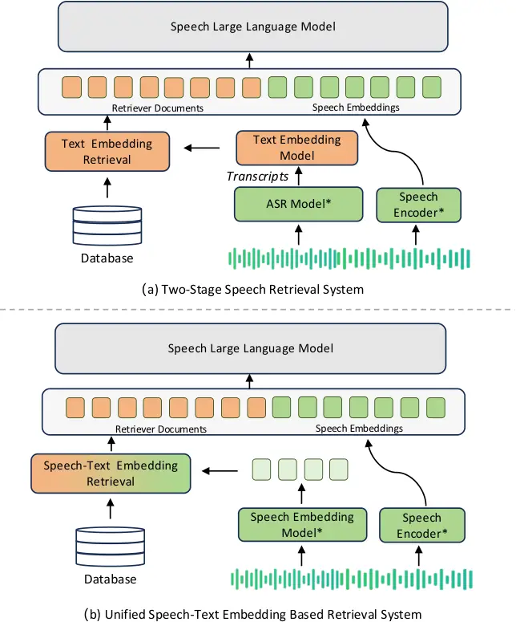
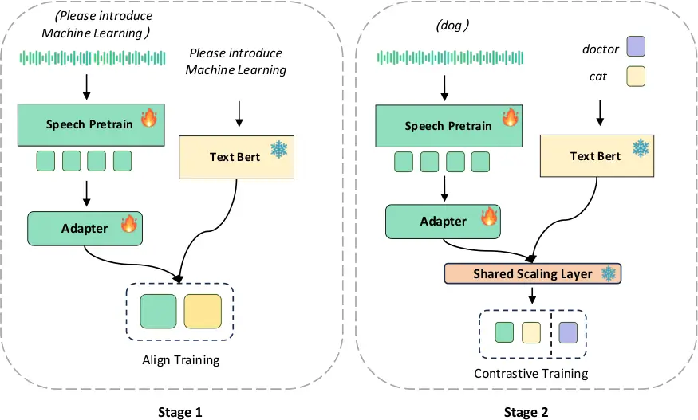

# ![[Uncaptioned image]](arxiv-2502-02603--81a6ba86b94c.figures/figure-1.webp) SEAL: Speech Embedding Alignment Learning for Speech Large Language Model with Retrieval-Augmented GenerationThanks:   $`\dagger`$ These authors contributed equally.

Chunyu Sun    Bingyu Liu    Zhichao Cui    Junhan Shi    Anbin Qi
Affiliation: SenseTime Research{sunchunyu, liubingyu, cuizhichao,
qianbin, zhangtianhao1, zhoudinghao, luotto}@sensetime.com    Tian-Hao
Zhang Affiliation: SenseTime Research{sunchunyu, liubingyu, cuizhichao,
qianbin, zhangtianhao1, zhoudinghao, luotto}@sensetime.com    Dinghao
Zhou Affiliation: SenseTime Research{sunchunyu, liubingyu, cuizhichao,
qianbin, zhangtianhao1, zhoudinghao, luotto}@sensetime.com    Lewei Lu
Affiliation: SenseTime Research{sunchunyu, liubingyu, cuizhichao,
qianbin, zhangtianhao1, zhoudinghao, luotto}@sensetime.com

###### Abstract

Embedding-based retrieval models have made significant strides in
retrieval-augmented generation (RAG) techniques for text and multimodal
large language models (LLMs) applications. However, when it comes to
speech larage language models (SLLMs), these methods are limited to a
two-stage process, where automatic speech recognition (ASR) is combined
with text-based retrieval. This sequential architecture suffers from
high latency and error propagation. To address these limitations, we
propose a unified embedding framework that eliminates the need for
intermediate text representations. Specifically, the framework includes
separate speech and text encoders, followed by a shared scaling layer
that maps both modalities into a common embedding space. Our model
reduces pipeline latency by 50% while achieving higher retrieval
accuracy compared to traditional two-stage methods. We also provide a
theoretical analysis of the challenges inherent in end-to-end speech
retrieval and introduce architectural principles for effective
speech-to-document matching. Extensive experiments demonstrate the
robustness of our approach across diverse acoustic conditions and
speaker variations, paving the way for a new paradigm in multimodal
SLLMs retrieval systems.

## 1 Introduction

In recent years, embedding models have made remarkable strides, becoming
foundational components for a wide range of natural language processing
tasks(Su et al., 2023) (Xiao et al., 2024) (Wang et al., 2023). These
models excel at capturing semantic relationships within text data,
enabling robust retrieval and matching capabilities. The success of text
embeddings has naturally extended to explorations in multimodal domains,
leading to significant advancements in text-image embedding models that
effectively align semantic spaces across modalities (Chen et al., 2022)
(Yasunaga et al., 2023) (Hu et al., 2023). However, despite the
pervasive presence of speech content in real-world applications, the
integration of speech modalities into embedding-based retrieval systems
remains underexplored, highlighting a critical gap in multimodal
information processing.



Figure 1: The traditional two-stage speech retrieval system and our
proposed unified speech-text embedding based retrieval system, where \*
indicates that some modules in the model can be shared.

This challenge becomes particularly pronounced in speech-based
retrieval-augmented generation (RAG) systems, which have emerged as a
promising approach to augment speech large language models (SLLMs) with
external knowledge (Jacqmin et al., 2023). Current speech RAG systems
predominantly adopt a two-stage paradigm: automatic speech recognition
(ASR) followed by text-based RAG as shown in Fig 1. While this approach
leverages well-established components, it suffers from two major
limitations. First, the sequential processing of ASR and text-based RAG
significantly increases system latency, rendering it impractical for
real-time applications where rapid responses are critical. Second, and
more fundamentally, this cascaded architecture is prone to error
propagation. ASR errors—particularly in challenging acoustic
environments or with non-standard speech—inevitably degrade downstream
retrieval performance. This cascading effect can result in entirely
irrelevant document retrieval, even when ASR errors impact only a few
key terms.

Several attempts have been made to address these challenges through
intermediate solutions, such as optimizing ASR for retrieval-specific
metrics or implementing early fusion techniques (Serdyuk et al., 2018)
(Szymański et al., 2023). However, these approaches still maintain the
fundamental separation between speech processing and document retrieval,
failing to capture the direct relationship between acoustic patterns and
document semantics. Furthermore, existing methods often struggle with
the inherent temporal nature of speech and the challenge of aligning
variable-length speech sequences with document embeddings.

To overcome these limitations, we propose an end-to-end speech RAG model
that directly learns to map speech inputs to relevant document
embeddings, enhancing the performance and scalability of SLLMs. Our
approach begins with separate speech and text encoders to extract
features from each modality, followed by a shared scaling layer to
produce the final unified speech-text embeddings. By learning a unified
embedding space that captures both acoustic and semantic features, our
method eliminates the need for intermediate text representations.
Through careful architectural design and innovative training strategies,
we achieve robust speech-to-document matching which is resilient to
acoustic variations and speaker differences. Extensive experiments
demonstrate that our model not only reduces pipeline latency by 50% but
also achieves higher retrieval accuracy compared to traditional
two-stage systems. Our contributions open new possibilities for
real-time speech-based information retrieval and challenge the
conventional wisdom about the necessity of intermediate text
representations in processing pipelines of RAG based SLLMs. The proposed
approach not only advances the state-of-the-art in speech RAG systems
but also provides a foundation for future research in end-to-end
multimodal retrieval systems.

## 2 Related Works

### 2.1 Multimodal Large Language Models

Recent advances in multimodal large language models (MLLMs) (Li et al., 2022) (Li et al., 2023) (Liu et al., 2024) have demonstrated impressive
capabilities in processing visual and linguistic information. Models
like LLaVA (Liu et al., 2024) have established effective architectures
combining LLMs with visual encoders through carefully designed
projection layers. This architecture typically involves a two-stage
training process: first aligning visual-textual representations, then
fine-tuning on instruction data. While most efforts have focused on
vision-language models, some recent work has explored speech-language
models by adapting similar architectures (Zhang et al., 2023) (Fang et
al., 2024). However, these models primarily focus on speech
understanding and generation rather than creating robust speech
embeddings for retrieval tasks. Our work bridges this gap by introducing
an embedding-focused architecture specifically designed for speech-text
alignment.

### 2.2 Multimodal Embeddings

In the field of multimodal embeddings, CLIP (Radford et al., 2021) has
established a strong foundation for vision-language understanding
through contrastive learning on large-scale image-text pairs. Its
success has inspired numerous follow-up works in visual-textual
alignment and retrieval. While vision-language embedding models have
made significant progress, the speech domain remains relatively
unexplored. Current speech-text retrieval systems typically rely on a
cascaded approach, first converting speech to transcripts through ASR
Hinton et al. (2012); Prabhavalkar et al. (2024); Zhang et al. (2024)
before applying text-based retrieval methods. This two-stage process,
while straightforward, introduces latency and error propagation issues.
The lack of end-to-end speech embedding models, analogous to CLIP’s role
in vision, represents a significant gap in multimodal understanding. Our
work addresses this limitation by introducing a unified speech embedding
framework that directly aligns speech with textual content,
demonstrating that end-to-end speech-text embeddings can achieve
superior performance while reducing computational overhead.



Figure 2: Overview of Our methods. The stage 1 is align training and the
stage 2 is contrastive training

## 3 Method

In this section, we introduce our proposed method (Fig 2) and the two
baseline methods we experimented with.

### 3.1 Training Workflow

#### 3.1.1 Speech-Text Alignment Pre-Training

We propose a two-stage training approach, with pre-training focusing on
aligning speech and text embeddings in a unified semantic space. Given
an input pair of speech signal $`x_{a}`$ and its corresponding text
transcript $`x_{t}`$, we first extract their respective features:

```math
h_{s}=f_{s}(x_{s})\in\mathbb{R}^{T\times d_{s}} \tag{1}
```

```math
z_{t}=f_{t}(x_{t})\in\mathbb{R}^{L\times d_{t}} \tag{2}
```

where $`f_{s}`$ and $`f_{t}`$ denote the speech and text encoders. $`T`$
and $`L`$ denote the sequence lengths of speech and text features
respectively, while $`d_{s}`$ and $`d_{t}`$ represent their feature
dimensions.

To bridge the modality gap between speech and text features, we
introduce an adaptation module inspired by LLaVA’s (Liu et al., 2024)
design. This module consists of two components: a temporal convolutional
layer for dimension reduction and a Multi-Layer Perceptron (MLP) for
feature projection. The adaptation process can be formulated as:

```math
z_{s}=\text{MLP}(\text{Conv1D}(h_{s}))\in\mathbb{R}^{T^{\prime}\times d_{t}} \tag{3}
```

where $`T^{\prime}`$ is the reduced sequence length after convolution,
and the output dimension matches BERT’s(Devlin, 2018) hidden size
$`d_{t}`$. The Conv1D layer uses a kernel size of k and stride s to
effectively capture local temporal dependencies while reducing the
sequence length. The MLP consists of two linear layers with a GELU
activation function:

```math
\text{MLP}(x)=W_{2}(\text{GELU}(W_{1}x+b_{1}))+b_{2} \tag{4}
```

During pre-training, we minimize the Mean Squared Error (MSE) loss
between the adapted speech features and text embeddings:

```math
\mathcal{L}_{\text{pre}}=\big\|\frac{1}{T^{\prime}}\sum_{i=1}^{T^{\prime}}z_{s}^{i}-\frac{1}{L}\sum_{i=1}^{L}z_{t}^{i}\big\|_{2}^{2} \tag{5}
```

where $`z_{s}^{i}`$ and $`z_{t}^{i}`$ represent the i-th token
embeddings of the adapted speech and text features respectively. This
alignment objective ensures that the speech features capture semantic
information that corresponds well with textual representations. Our
empirical analysis shows that this pre-training strategy effectively
reduces the modality gap while maintaining the rich acoustic information
necessary for accurate retrieval.

0:  Speech signal $`x_{s}`$, text $`x_{t}`$, positive document
$`d^{+}`$, negative documents $`\{d^{-}_{i}\}_{i=1}^{N}`$, temperature
$`\tau`$

1:  // Stage 1: Pre-training

2:  $`h_{s}\leftarrow f_{s}(x_{s})`$

3:  $`z_{t}\leftarrow f_{t}(x_{t})`$

4:  $`h_{s}^{\prime}\leftarrow\text{Conv1D}(h_{s})`$

5:  $`z_{s}\leftarrow\text{MLP}(h_{s}^{\prime})`$

6:
 $`\mathcal{L}_{\text{pre}}\leftarrow\big\|\frac{1}{T^{\prime}}\sum_{i=1}^{T^{\prime}}z_{s}^{i}-\frac{1}{L}\sum_{i=1}^{L}z_{t}^{i}\big\|_{2}^{2}`$

7:  // Stage 2: Task-specific Fine-tuning

8:  $`q\leftarrow\text{Linear}(\text{Adapter}(f_{s}(x_{s})))`$

9:  $`k^{+}\leftarrow\text{Linear}(f_{t}(d^{+}))`$

10:  for $`i\leftarrow 1`$ to $`N`$ do

11:   $`k^{-}_{i}\leftarrow\text{Linear}(f_{t}(d^{-}_{i}))`$

12:  end for

13:  // Select loss function by task type

14:  if task = retrieval then

15:
  $`\mathcal{L}\leftarrow-\log\frac{\exp(s(q,k^{+})/\tau)}{\exp(s(q,k^{+})/\tau)+\sum_{i=1}^{N}\exp(s(q,k^{-}_{i})/\tau)}`$

16:  else if task = sts then

17:
  $`\mathcal{L}\leftarrow\log(1+\sum_{s_{ij}>s_{mn}}e^{(s_{mn}-s_{ij})/\tau})`$

18:  else if task = classification then

19:
  $`\mathcal{L}\leftarrow-\log\frac{\exp(s(q,y^{+})/\tau)}{\exp(s(q,y^{+})/\tau)+\sum_{j}\exp(s(q,y^{-}_{j})/\tau)}`$

20:  end if

21:  Update parameters using $`\nabla\mathcal{L}_{\text{pre}}`$ and
$`\nabla\mathcal{L}`$

Algorithm 1 Cross-modal Speech-Text Alignment and Retrieval

#### 3.1.2 Speech-Text Retrieval Fine-Tuning

In the fine-tuning stage, we employ multi-task hybrid loss to optimize
the alignment between speech queries and relevant document embeddings.
For an speech query $`x_{s}`$ and its corresponding document $`d^{+}`$,
along with a set of negative documents $`\{d^{-}_{i}\}_{i=1}^{N}`$, we
first encode them using our pre-trained encoders. Inspired by
text-embedding-v3 (OpenAI, 2024) and Piccolo2 (Huang et al., 2024), we
scale up the embedding vector dimension to enhance model capacity. A
shared linear layer is then added to the final layers of both the speech
and text encoders. The operation can be formulated as:

```math
q=g_{\text{speech}}(x_{s})=\text{Linear}(\text{Adapter}(f_{s}(x_{s}))) \tag{6}
```

```math
k^{+}=g_{\text{doc}}(d^{+})=\text{Linear}(f_{t}(d^{+})) \tag{7}
```

```math
k^{-}_{i}=g_{\text{doc}}(d^{-}_{i})=\text{Linear}(f_{t}(d^{-}_{i})) \tag{8}
```

For different downstream tasks, we adopt different loss functions to
better optimize various objectives:

For retrieval and reranking tasks, we use InfoNCE loss (Gutmann and
Hyvärinen, 2010) with cosine similarity:

```math
\mathcal{L}_{\text{re}}=-\log\frac{\exp(s^{+}/\tau)}{\exp(s^{+}/\tau)+Z_{\text{neg}}} \tag{9}
```

where $`s^{+}=s(q,k^{+})`$ denotes the cosine similarity between query
and positive document,
$`Z_{\text{neg}}=\sum_{i=1}^{N}\exp(s(q,k^{-}_{i})/\tau)`$ is the sum
over negative pairs, and $`\tau`$ is the temperature parameter.

For STS and pair-classification tasks, considering the fine-grained
nature of similarity labels, we employ the cosent loss:

```math
\mathcal{L}_{\text{sts}}=\log\left(1+\sum_{s_{ij}>s_{mn}}e^{z_{mn}/\tau}\right) \tag{10}
```

where $`s_{ij}=s(x_{i},x_{j})`$ represents similarity score,
$`z_{mn}=\cos(x_{m},x_{n})-\cos(x_{i},x_{j})`$.

For classification and clustering tasks, we reformulate the data into
contrastive triplets using the SFR embedding method. Each input $`x`$ is
paired with its target label $`y^{+}`$ as the positive pair, while the
remaining labels $`\{y^{-}_{j}\}`$ serve as negative pairs:

```math
\mathcal{L}_{\text{cls}}=-\log\frac{\exp(\frac{s(x,y^{+})}{\tau})}{\exp(\frac{s(x,y^{+})}{\tau})+\sum_{j}\exp(\frac{s(x,y^{-}_{j})}{\tau})} \tag{11}
```

The final loss function is dynamically selected based on the task type:

```math
\mathcal{L}=\begin{cases}\mathcal{L}_{\text{cls}}&\text{if task is classification or clustering}\\
\mathcal{L}_{\text{sts}}&\text{if task is STS or pair-classification}\\
\mathcal{L}_{\text{re}}&\text{if task is retrieval or reranking}\end{cases} \tag{12}
```

This multi-task hybrid loss approach enables our model to learn robust
cross-modal representations that effectively capture the semantic
relationships between speech queries and relevant documents across
various downstream tasks.

### 3.2 Other baselines

#### 3.2.1 Projection to text space

Following the design philosophy of vision-language models like LLaVA, we
implement a baseline that projects speech features into text space
through a carefully designed three-stage training process:

- •
  Stage 1: Train only the adapter module while freezing both speech and
  text encoders to establish initial cross-modal connections
- •
  Stage 2: Jointly optimize speech encoder and adapter while keeping
  text encoder fixed as stable semantic anchors
- •
  Stage 3: End-to-end training of the entire pipeline to refine
  cross-modal relationships

The speech features go through a speech-adapter-text encoding pipeline:
$`h=f_{t}(\text{Adapter}(f_{s}(x_{s})))`$. While this approach
successfully transfers vision-language strategies to speech domain, we
find it challenging to preserve fine-grained acoustic information
through the cascaded transformations, particularly for speech
characteristics that lack direct textual correspondences.

#### 3.2.2 Speech-Text Alignment with CTC Loss

We also explore using Connectionist Temporal Classification (CTC) loss
(Graves et al., 2006) for temporal alignment between speech and text
sequences:

```math
\mathcal{L}_{\text{CTC}}=-\log P(y|h_{\text{speech}}) \tag{13}
```

where $`h_{\text{speech}}`$ represents the adapted speech features and
$`y`$ is the target text sequence. The adapter module maintains temporal
information through strategically designed convolutional layers before
projecting to the tokenizer’s index space of the text. While CTC
provides explicit temporal supervision and theoretically enables better
alignment between acoustic patterns and semantic content, our
experiments reveal that its strong emphasis on frame-level alignment
proves less effective for semantic retrieval tasks compared to our
proposed approach.

|                       |                |                 |           |           |         |
| --------------------- | -------------- | --------------- | --------- | --------- | ------- |
| Method                | Classification | Pairwise Class. | Reranking | Retrieval | Average |
| Text-Only (Piccolo2)  | 74.59          | 90.24           | 70.00     | 74.37     | 70.95   |
| Text-Only (Conan)     | 75.02          | 91.64           | 72.77     | 76.68     | 72.64   |
| ASR + Text (Piccolo2) | 72.08          | 86.09           | 64.43     | 54.69     | 60.78   |
| ASR + Text (Conan)    | 72.67          | 88.04           | 66.65     | 55.13     | 61.83   |
| Ours (Piccolo2)       | 70.98          | 90.18           | 68.08     | 65.99     | 65.95   |

Table 1: Performance Comparison of Different Methods on Various Tasks of
CMTEB

## 4 Experiments

### 4.1 Implementation Details

For text embedding, we utilize piccolo-large-zh-v2 (Huang et al., 2024)
as our text encoder, which provides 1024-dimensional text
representations. For speech encoding, we employ Whisper-large-v3 encoder
(Radford et al., 2023), leveraging its robust speech feature extraction
capabilities trained on large-scale speech-text data.

##### Training Infrastructure and Schedule

The training process is conducted on a large-scale distributed system
consisting of 256 NVIDIA V100 32GB GPUs. We use DeepSpeed for
distributed training with mixed-precision (FP16) to optimize memory
usage and training efficiency. The entire training process spans 168
hours, divided into two stages:

- •
  Pre-training: 3 epochs with learning rate $`1e^{-5}`$ and batch size 8
  per GPU
- •
  Fine-tuning: 3 epochs with learning rate $`8e^{-6}`$ and batch size 8
  per GPU

We employ the AdamW (Loshchilov and Hutter, ) optimizer with weight
decay of 0.01 and a linear learning rate scheduler with 10% warmup
steps. The temperature parameter $`\tau`$ in contrastive learning is set
to 0.07.

### 4.2 Datasets

In the training process, different datasets are used at each stage. For
the first stage, which is the alignment phase, we collected publicly
available data (Emilia) (He et al., 2024) and a subset of data from the
internet, totaling 170k hours. In the second stage, we used text
training data from PiccoloV2, which includes both open-source data and
data generated using specific methods. For each query, we generated data
using CosyVoice-300M (Du et al., 2024). During the generation process,
to ensure the model’s generalization ability, we also used six different
voice tones for generation. In the second stage, a total of 80k hours of
data were used for contrastive learning training. Inspired by Emilia, we
also built a data filtering pipeline. In the first stage of data
filtering, we applied several techniques, including Source Separation,
Speaker Diarization, and Fine-grained Segmentation by VAD, to split the
speech into clean speech from a specific speaker. Finally, we used ASR
to obtain the corresponding text. For both the first and second stages
of data, we employed DNSMOS P.835 OVRL(Reddy et al., 2022), keeping only
the speech with scores above 3.0. Additionally, any speech segments with
average phoneme durations exceeding 1.5 times the interquartile range
(IQR) were discarded.

### 4.3 Results

#### 4.3.1 CMTEB

As an authoritative benchmark for evaluating text embedding tasks, MTEB
(Massive Text Embedding Benchmark) (Muennighoff et al., 2022) was
introduced by Muennighoff et al. in 2022. For Chinese scenarios, Xiao et
al. developed CMTEB (Chinese Massive Text Embedding Benchmark) (Xiao et
al., 2024) in 2023, which contains 35 datasets covering 6 major
categories: Classification, Clustering, Pair Classification, Rerank,
Retrieval, and Semantic Textual Similarity (STS). In our experiments, we
utilized CosyVoice text-to-speech technology to convert these textual
data into corresponding speech data for evaluating our model’s
performance. We show the results in Table 1. As shown in the table, our
method outperforms the two-stage ASR approach, regardless of whether
Piccolo or the current state-of-the-art method, Conan (Li et al., 2024),
is used for alignment. We believe that if the alignment text model uses
Conan, the performance is likely to improve further.

#### 4.3.2 More Dataset

To evaluate our model, we conducted Top-1 and Top-3 accuracy tests on a
knowledge base containing tens of thousands of entries across multiple
domains. From the perspectives of both time efficiency and accuracy, the
speech embedding model from the first stage demonstrated significant
advantages. Overall, the accuracy of our approach falls between the ASR
pipeline and text-only models. Compared to the two-stage method, our
approach improves speed by more than 50% and accuracy by around 8%. The
results are shown in Table 2.

|                 |         |           |           |
| --------------- | ------- | --------- | --------- |
| Method          | Time(s) | Top1-Acc. | Top3-Acc. |
| Text-Only       | 0.03    | 90.41     | 95.89     |
| ASR Pipeline    | 0.67    | 79.45     | 85.62     |
| Project to text | 0.43    | 24.49     | 54.08     |
| Align with CTC  | 0.31    | 78.08     | 84.25     |
| Ours            | 0.31    | 86.36     | 92.47     |

Table 2: Evals of Different Methods

##### Analysis

During our investigation, we explored several alternative approaches
that provided valuable insights despite their limitations.

The first approach (Project to text) follows a design philosophy similar
to LLAVA models, projecting speech features into text space through an
adapter before feeding them into BERT. While this method yields some
results, it performs the worst among all baseline approaches. In the
process, we even experimented with larger-parameter MLP layers and
multi-stage freezing training strategies, but none achieved satisfactory
outcomes. Although it leverages pre-trained speech models, it fails to
effectively align the speech and text embedding models. We also explored
alignment strategies similar to those used in Qwen-Audio, but the
results were similarly suboptimal. We believe that the significant
difference in sequence length between speech and text poses a
fundamental challenge in embedding training tasks, making it difficult
to directly integrate with text embedding models through cascaded
transformations. Finding an effective way to better align the sequence
lengths of speech and text may be the key to overcoming the limitations
of this approach.

We also explored using Connectionist Temporal Classification (CTC) loss
for temporal alignment between speech and text sequences. While CTC
provides explicit temporal supervision and theoretically facilitates
better alignment between acoustic patterns and semantic content, its
strong focus on frame-level alignment proves to be less effective for
semantic retrieval tasks. The rigid frame-by-frame correspondence
enforced by CTC restricts the model’s ability to learn flexible,
context-aware representations that are critical for robust cross-modal
retrieval. Our experiments reveal that this approach performs
particularly poorly on longer speech segments, where maintaining
long-range dependencies becomes essential.

### 4.4 Ablation Study

For experimental convenience, we conducted ablation experiments on
training methods and speech pretraining models using a sampled dataset
with 10,000 hours of data.

|        |                  |           |           |
| ------ | ---------------- | --------- | --------- |
| Stage  | Pretrain         | Top1-Acc. | Top3-Acc. |
| Only 1 | Whisper          | 50.68     | 61.67     |
| Only 2 | Hubert           | 13.70     | 21.23     |
|        | SenseVoice-small | 10.96     | 20.55     |
|        | Whisper          | 32.19     | 42.17     |
| All    | Whisper          | 59.59     | 72.60     |

Table 3: Ablation Study

From the experimental results in Table 3, it can be observed that
whether only Stage 1 or Stage 2 is used, the performance of the final
model decreases significantly. Moreover, directly performing contrastive
training on a model without Stage 1 alignment poses significant
challenges. We believe this is because a speech pretraining model tends
to focus more on acoustic information. Without aligning the speech
features with textual information in the first stage, it becomes
challenging to extract meaningful speech representations solely through
contrastive learning. Therefore, the alignment process in the first
stage is crucial.

Additionally, in the experiments focusing solely on Stage 2 training, we
compared three pretraining models: Hubert (Hsu et al., 2021),
SenseVoice-small (FunAudioLLM, 2024), and Whisper (Radford et al.,
2023). The results showed that Whisper outperformed the other two
significantly, likely due to its use of a large amount of speech data
during pretraining.

## 5 Conclusion

In this paper, we present a novel end-to-end speech-text embedding model
designed to address the challenges of high latency and error propagation
that are common in traditional sequential architectures. Our approach
not only enhances the integration of RAG techniques within SLLMs, but
also marke a significant advancement in real-time speech interaction
systems. We provide a comprehensive overview of the methods employed in
our model, highlighting their effectiveness in optimizing the alignment
of speech and text modalities. Moreover, we observe a growing trend in
utilizing discrete tokens as end-to-end inputs for SLLMs, which we
believe presents a promising avenue for future research in the
development of more efficient and capable speech-text embedding models.

## References

- Chen et al. (2022) W. Chen, H. Hu, X. Chen, P. Verga, and W. Cohen
  MuRAG: multimodal retrieval-augmented generator for open question
  answering over images and text. In Proceedings of the 2022 Conference
  on Empirical Methods in Natural Language Processing, pp. 5558–5570.
  Cited by: §1.
- Devlin (2018) J. Devlin Bert: pre-training of deep bidirectional
  transformers for language understanding. arXiv preprint
  arXiv:1810.04805. Cited by: §3.1.1.
- Du et al. (2024) Z. Du, Q. Chen, S. Zhang, K. Hu, H. Lu, Y. Yang, H.
  Hu, S. Zheng, Y. Gu, Z. Ma, et al. Cosyvoice: a scalable multilingual
  zero-shot text-to-speech synthesizer based on supervised semantic
  tokens. arXiv preprint arXiv:2407.05407. Cited by: §4.2.
- Fang et al. (2024) Q. Fang, S. Guo, Y. Zhou, Z. Ma, S. Zhang, and Y.
  Feng Llama-omni: seamless speech interaction with large language
  models. arXiv preprint arXiv:2409.06666. Cited by: §2.1.
- FunAudioLLM (2024) FunAudioLLM SenseVoice. GitHub. External Links:
  [Link](https://github.com/FunAudioLLM/SenseVoice) Cited by: §4.4.
- Graves et al. (2006) A. Graves, S. Fernández, F. Gomez, and J.
  Schmidhuber Connectionist temporal classification: labelling
  unsegmented sequence data with recurrent neural networks. In
  Proceedings of the 23rd international conference on Machine learning,
  pp. 369–376. Cited by: §3.2.2.
- Gutmann and Hyvärinen (2010) M. Gutmann and A. Hyvärinen
  Noise-contrastive estimation: a new estimation principle for
  unnormalized statistical models. In Proceedings of the thirteenth
  international conference on artificial intelligence and statistics,
  pp. 297–304. Cited by: §3.1.2.
- He et al. (2024) H. He, Z. Shang, C. Wang, X. Li, Y. Gu, H. Hua, L.
  Liu, C. Yang, J. Li, P. Shi, et al. Emilia: an extensive,
  multilingual, and diverse speech dataset for large-scale speech
  generation. In 2024 IEEE Spoken Language Technology Workshop (SLT),
  pp. 885–890. Cited by: §4.2.
- Hinton et al. (2012) G. Hinton, L. Deng, D. Yu, G. E. Dahl, A.
  Mohamed, et al. Deep neural networks for acoustic modeling in speech
  recognition: the shared views of four research groups. IEEE Signal
  Processing Magazine 29, pp. 82–97. Cited by: §2.2.
- Hsu et al. (2021) W. Hsu, B. Bolte, Y. H. Tsai, K. Lakhotia, R.
  Salakhutdinov, and A. Mohamed Hubert: self-supervised speech
  representation learning by masked prediction of hidden units. IEEE/ACM
  transactions on audio, speech, and language processing 29,
  pp. 3451–3460. Cited by: §4.4.
- Hu et al. (2023) Z. Hu, A. Iscen, C. Sun, Z. Wang, K. Chang, Y.
  Sun, C. Schmid, D. A. Ross, and A. Fathi Reveal: retrieval-augmented
  visual-language pre-training with multi-source multimodal knowledge
  memory. In Proceedings of the IEEE/CVF conference on computer vision
  and pattern recognition, pp. 23369–23379. Cited by: §1.
- Huang et al. (2024) J. Huang, Z. Hu, Z. Jing, M. Gao, and Y. Wu
  Piccolo2: general text embedding with multi-task hybrid loss training.
  arXiv preprint arXiv:2405.06932. Cited by: §3.1.2, §4.1.
- Jacqmin et al. (2023) L. Jacqmin, L. Druart, Y. Estève, B.
  Favre, L. M. Rojas, and V. Vielzeuf OLISIA: a cascade system for
  spoken dialogue state tracking. In Proceedings of The Eleventh Dialog
  System Technology Challenge, pp. 95–104. Cited by: §1.
- Li et al. (2023) J. Li, D. Li, S. Savarese, and S. Hoi Blip-2:
  bootstrapping language-image pre-training with frozen image encoders
  and large language models. In International conference on machine
  learning, pp. 19730–19742. Cited by: §2.1.
- Li et al. (2022) J. Li, D. Li, C. Xiong, and S. Hoi Blip:
  bootstrapping language-image pre-training for unified vision-language
  understanding and generation. In International conference on machine
  learning, pp. 12888–12900. Cited by: §2.1.
- Li et al. (2024) S. Li, Y. Tang, S. Chen, and X. Chen Conan-embedding:
  general text embedding with more and better negative samples. arXiv
  preprint arXiv:2408.15710. Cited by: §4.3.1.
- Liu et al. (2024) H. Liu, C. Li, Q. Wu, and Y. J. Lee Visual
  instruction tuning. Advances in neural information processing systems 36. Cited by: §2.1, §3.1.1.
- \[18\] I. Loshchilov and F. Hutter Decoupled weight decay
  regularization. In International Conference on Learning
  Representations, Cited by: §4.1.
- Muennighoff et al. (2022) N. Muennighoff, N. Tazi, L. Magne, and N.
  Reimers MTEB: massive text embedding benchmark. arXiv preprint
  arXiv:2210.07316. Cited by: §4.3.1.
- OpenAI (2024) OpenAI Text embedding 3. Note:
  [https://platform.openai.com/docs/guides/embeddings](https://platform.openai.com/docs/guides/embeddings)
  Cited by: §3.1.2.
- Prabhavalkar et al. (2024) R. Prabhavalkar, T. Hori, T. N. Sainath, R.
  Schlüter, and S. Watanabe End-to-end speech recognition: A survey.
  IEEE/ACM Transactions on Audio, Speech, and Language Processing 32,
  pp. 325–351. Cited by: §2.2.
- Radford et al. (2021) A. Radford, J. W. Kim, C. Hallacy, A. Ramesh, G.
  Goh, S. Agarwal, G. Sastry, A. Askell, P. Mishkin, J. Clark, et al.
  Learning transferable visual models from natural language supervision.
  In International conference on machine learning, pp. 8748–8763. Cited
  by: §2.2.
- Radford et al. (2023) A. Radford, J. W. Kim, T. Xu, G. Brockman, C.
  McLeavey, and I. Sutskever Robust speech recognition via large-scale
  weak supervision. In International conference on machine learning,
  pp. 28492–28518. Cited by: §4.1, §4.4.
- Reddy et al. (2022) C. K. Reddy, V. Gopal, and R. Cutler DNSMOS p.
  835: a non-intrusive perceptual objective speech quality metric to
  evaluate noise suppressors. In ICASSP 2022-2022 IEEE International
  Conference on Acoustics, Speech and Signal Processing (ICASSP),
  pp. 886–890. Cited by: §4.2.
- Serdyuk et al. (2018) D. Serdyuk, Y. Wang, C. Fuegen, A. Kumar, B.
  Liu, and Y. Bengio Towards end-to-end spoken language understanding.
  In 2018 IEEE International Conference on Acoustics, Speech and Signal
  Processing (ICASSP), pp. 5754–5758. Cited by: §1.
- Su et al. (2023) H. Su, W. Shi, J. Kasai, Y. Wang, Y. Hu, M.
  Ostendorf, W. Yih, N. A. Smith, L. Zettlemoyer, and T. Yu One
  embedder, any task: instruction-finetuned text embeddings. In Findings
  of the Association for Computational Linguistics: ACL 2023,
  pp. 1102–1121. Cited by: §1.
- Szymański et al. (2023) P. Szymański, L. Augustyniak, M. Morzy, A.
  Szymczak, K. Surdyk, and P. Żelasko Why aren’t we ner yet? artifacts
  of asr errors in named entity recognition in spontaneous speech
  transcripts. In Proceedings of the 61st Annual Meeting of the
  Association for Computational Linguistics (Volume 1: Long Papers),
  pp. 1746–1761. Cited by: §1.
- Wang et al. (2023) L. Wang, N. Yang, X. Huang, L. Yang, R. Majumder,
  and F. Wei Improving text embeddings with large language models. arXiv
  preprint arXiv:2401.00368. Cited by: §1.
- Xiao et al. (2024) S. Xiao, Z. Liu, P. Zhang, N. Muennighoff, D. Lian,
  and J. Nie C-pack: packed resources for general chinese embeddings.
  SIGIR ’24, pp. 641–649. External Links: ISBN 9798400704314,
  [Link](https://doi.org/10.1145/3626772.3657878),
  [Document](https://dx.doi.org/10.1145/3626772.3657878) Cited by: §1,
  §4.3.1.
- Yasunaga et al. (2023) M. Yasunaga, A. Aghajanyan, W. Shi, R.
  James, J. Leskovec, P. Liang, M. Lewis, L. Zettlemoyer, and W. Yih
  Retrieval-augmented multimodal language modeling. In International
  Conference on Machine Learning, pp. 39755–39769. Cited by: §1.
- Zhang et al. (2023) D. Zhang, S. Li, X. Zhang, J. Zhan, P. Wang, Y.
  Zhou, and X. Qiu SpeechGPT: empowering large language models with
  intrinsic cross-modal conversational abilities. In Findings of the
  Association for Computational Linguistics: EMNLP 2023,
  pp. 15757–15773. Cited by: §2.1.
- Zhang et al. (2024) T. Zhang, D. Zhou, G. Zhong, J. Zhou, and B. Li
  CIF-T: A novel cif-based transducer architecture for automatic speech
  recognition. In IEEE International Conference on Acoustics, Speech and
  Signal Processing (ICASSP), pp. 10531–10535. Cited by: §2.2.
