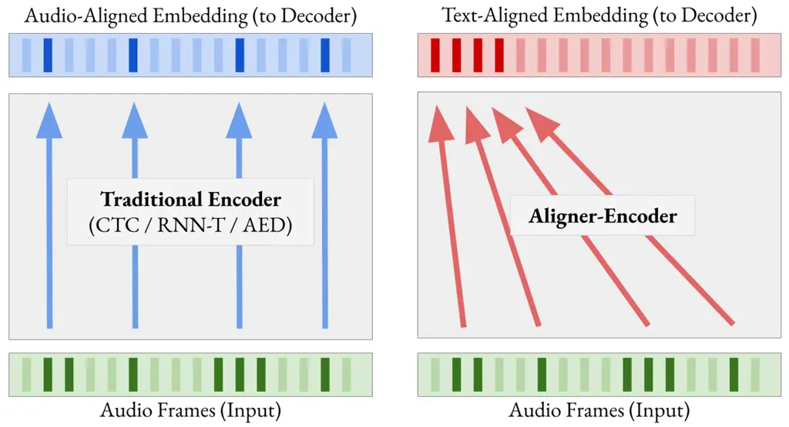
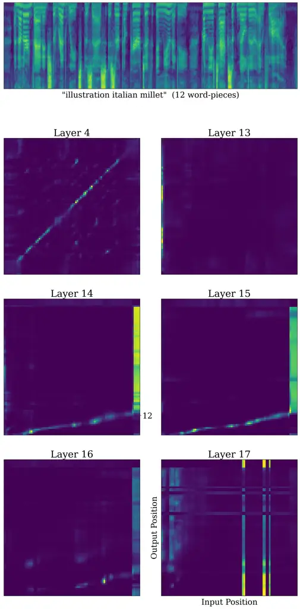
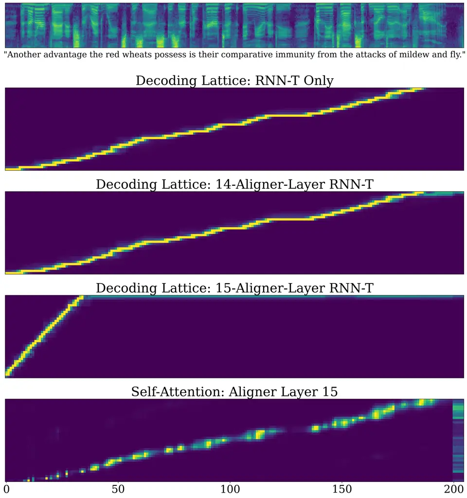
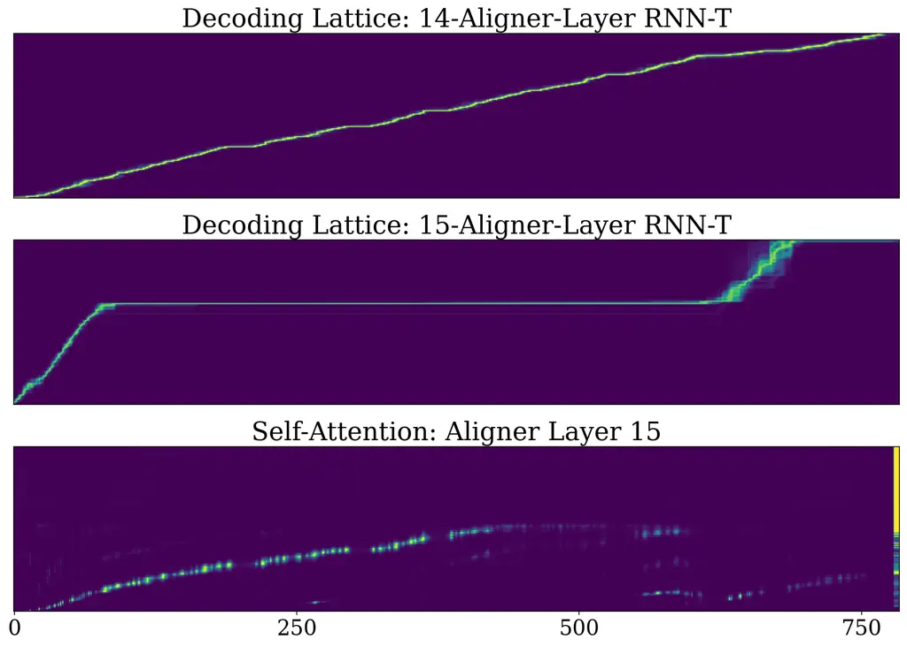
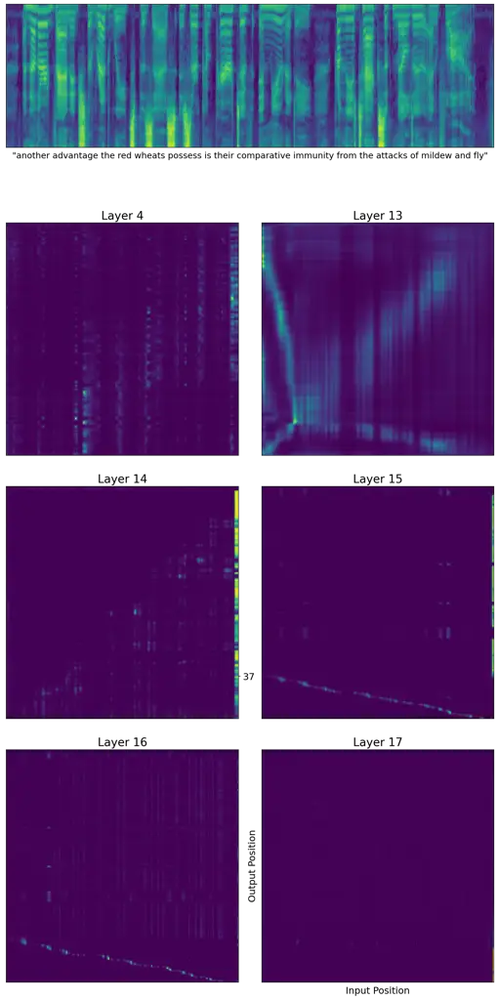

# Aligner-Encoders: Self-Attention Transformers Can Be Self-Transducers

Adam Stooke Affiliation: Google, USA
Email: [astooke@google.com](mailto:)    Rohit Prabhavalkar
Affiliation: Google, USA    Khe Chai Sim Affiliation: Google, USA   
Pedro Moreno Mengibar ^(†)^(†)thanks: Work performed while at Google,
USA.

###### Abstract

Modern systems for automatic speech recognition, including the
RNN-Transducer and Attention-based Encoder-Decoder (AED), are designed
so that the encoder is not required to alter the time-position of
information from the audio sequence into the embedding; alignment to the
final text output is processed during decoding. We discover that the
transformer-based encoder adopted in recent years is actually capable of
performing the alignment internally during the forward pass, prior to
decoding. This new phenomenon enables a simpler and more efficient
model, the “Aligner-Encoder”. To train it, we discard the dynamic
programming of RNN-T in favor of the frame-wise cross-entropy loss of
AED, while the decoder employs the lighter text-only recurrence of RNN-T
without learned cross-attention—it simply scans embedding frames in
order from the beginning, producing one token each until predicting the
end-of-message. We conduct experiments demonstrating performance
remarkably close to the state of the art, including a special inference
configuration enabling long-form recognition. In a representative
comparison, we measure the total inference time for our model to be 2x
faster than RNN-T and 16x faster than AED. Lastly, we find that the
audio-text alignment is clearly visible in the self-attention weights of
a certain layer, which could be said to perform “self-transduction”.

## 1 Introduction

The task of sequence transduction requires mapping from an input
sequence to an output sequence. It appears in several widespread
applications including machine translation and automatic speech
recognition (ASR). In ASR, which is the focus of this paper, the two
sequences lie in completely different modalities, and the audio input
representation is typically much longer than the output text. Thus, in
addition to identifying and converting speech sounds, the model must
find an “alignment” that moves information from wherever it appears in
the input sequence to wherever it belongs in the output. Among other
issues, the many possible variations in the pace of pronunciation make
transduction a challenging problem.

More than a decade ago, and almost a decade apart, two powerful
algorithms relying on dynamic programming were developed to perform the
sequence transduction task with recurrent neural networks (RNNs). The
motivation behind these algorithms was that RNNs require training every
output frame in the sequence—with one output per input frame, they
needed to be trained with alignments already prepared. The new
algorithms allowed training without prepared alignments by computing the
probability of the label marginalized over *all possible alignments* as
the optimization objective. The differences in sequence length are
accommodated by learning to output “blank” symbols in between true
labels and post-processing them out at inference time. The first
algorithm, Connectionist Temporal Classification (CTC) \[1\], models the
output frames as conditionally independent, and this limitation was
overcome in the follow-on work RNN-Transducer (RNN-T) \[2\], which
introduced auto-regressive decoding to achieve better performance.

A third algorithm appeared shortly after, called attention-based
encoder-decoder (AED). It uses a learned mechanism to account for
alignments \[3, 4, 5, 6\]; the encoder is followed by a recurrent
decoder that cross-attends at every step between its RNN state and the
entire encoder embedding sequence to produce its next state. The
cross-entropy loss is applied straightforwardly between the plain label
sequence and the leading output frames, with no blank symbol and no
dynamic programming required. The resulting model produces its output
auto-regressively until an end-of-sentence (\<EOS\>) token halts
decoding. AED models, together with CTC and RNN-T, have propelled
end-to-end deep neural networks to become the best performing ASR
systems across academia and industry (e.g., see surveys \[7, 8\]).

Despite their great successes, each of these algorithms has its
downsides. Implementing the probability summations for CTC and
especially RNN-T require non-trivial effort. A naive formulation of the
principle is intractable to compute, requiring a dynamic programming
approach, which in turn has been the subject of optimization efforts by
expert practitioners \[9, 10, 11, 12\]. Beyond that, RNN-T training
requires computing potentially unwieldy tensor quantities to do with
cross-pairing every frame of input with every token of output. Both
models suffer inefficiencies in decoding. RNN-T processes all frames
recurrently while producing a typically much shorter output sequence.
AED requires computing over the entire encoder embedding sequence at
every decoding step, which leads to slow operation from the high compute
load within the auto-regressive loop.

In an effort to resolve these difficulties, we ask the question: with
the advent of transformer-based encoders \[13, 14, 15, 16, 17, 18, 19,
20\], can the ASR _encoder_ itself learn to perform the alignment? The
answer we found is: yes, it can. Our main contribution is to show that
it is now possible to train neural network speech recognizers with
light-weight decoders in the style of RNN-T, but with the simple
frame-wise cross-entropy loss of AED. The resulting networks provide
accuracy remarkably close to state-of-the-art models while being more
efficient at training and decoding than any previous model. No explicit
dynamic programming is employed; instead, the encoder learns to perform
the alignment internally during the forward pass. The encoded embedding
frames are decoded consecutively from the beginning, one at a time, in
conjunction with a small recurrent network that only reads in the
previous label, producing exactly one label per frame until emitting
\<EOS\>.

Having originated in the era of long short-term memory (LSTM) \[21, 22\]
encoders, the preceeding algorithms all allow the encoder to process
information in-place in the time dimension, resulting in embeddings with
relevant information in roughly the same position in the sequence as it
appeared in the input. For several years now, however, ASR systems have
benefited from the adoption of more powerful transformer encoders, but
without changing their role. Our Aligner-Encoders are different in that,
simultaneous to encoding, they perform the additional task of moving the
relevant information to the beginning of the embedding sequence into a
label-aligned position. As it is performed solely through the
self-attention mechanism within the forward pass of the encoder, one
might call this a “self-transducer”. The previous style of information
flow is contrasted with ours in Figure 1. A main benefit of our model
utilizing an Aligner-Encoder is that it is dramatically simpler to
conceptualize, implement, and use.



Figure 1: Information flow through an Aligner-Encoder versus traditional
audio encoders.

This paper is organized as follows. First, we describe Aligner-Encoder
models and relate them to RNN-T and AED. Next, we relate other works
which have aimed at improving RNN-T modeling effectiveness or
efficiency. Then we report experiments demonstrating the accuracy of
Aligner models while also finding limitations for generalizing to long
test utterances. In response, we introduce techniques which can be
employed at inference-time to provide good long-form performance without
any additional training. In further experiments, we analyze how and when
Aligner-Encoders perform the alignment and make the surprising discovery
that it can happen primarily within a single self-attention layer.
Lastly, since ASR alignments are monotonic, we demonstrate that Aligners
can at least readily handle reverse alignments, making our model
promising for future work in non-monotonic applications such as
machine-translation or speech-translation.

## 2 Model

### 2.1 Aligner-Encoder Model

The Aligner-Encoder model combines the best elements of RNN-T and AED
systems into a more compact form. By requiring the encoder itself to
text-align its embedding, we avoid using 1) dynamic programming to sum
probabilities in the loss and 2) full-sequence cross-attention in the
decoder (in all models we refer to everything inside the auto-regressive
portion as the “decoder”). It may be simplest to first lay out our
model, which is formulated using the same components as RNN-T, and
afterwards draw contrasting points with the heritage.

We begin with an input sequence $`\mathbf{x}=(x_{1},x_{2},...,x_{T})`$
of length $`T`$, and output sequence
$`\mathbf{y}=(y_{1},y_{2},...,y_{U})`$ of length $`U\leq T`$. An
_encoder_ network, $`f_{\text{enc}}`$, processes the input sequence into
an acoustic embedding sequence,
$`\mathbf{h}=(h_{1},h_{2},...,h_{T^{\prime}})`$, where each frame of the
embedding sequence can depend on every frame of input, and typically
$`T^{\prime}\leq T`$ with subsampling. A _prediction network_,
$`f_{\text{pred}}`$, processes text labels with forward recurrence only
to produce a text embedding sequence,
$`\mathbf{g}=(g_{1},g_{2},...,g_{U})`$. The acoustic and text embeddings
are fed into a _joint network_, $`f_{\text{joint}}`$, to produce the
final prediction vector of dimension $`V`$ according to the vocabulary,
for each frame, with softmax probability normalization. The difference
in our model is that we enforce the alignment _at the encoder output_ by
restricting the model to use the acoustic and text embedding frames in a
one-to-one fashion (Equation $`(3)`$). The entire model is written by
its recurrence relations as:

```math
\displaystyle\mathbf{h} \displaystyle=f_{\text{enc}}(\mathbf{x}) \tag{1}
```

```math
\displaystyle g_{i} \displaystyle=f_{\text{pred}}(g_{i-1},y_{i-1}),\quad i\leq U \tag{2}
```

```math
\displaystyle P(y_{i}|\mathbf{x},y_{<i}) \displaystyle=f_{\text{joint}}(h_{i},g_{i}),\quad i\leq U \tag{3}
```

The encoder and the decoder–which includes both the prediction and joint
networks–are parameterized and learned together in an end-to-end manner,
with total parameters $`\theta`$. We maximize the log probabilities of
the correct labels, resulting in the familiar cross-entropy loss:

```math
\mathcal{L}_{Aligner}(\theta)=-\sum_{i=1}^{U}\log P(y_{i}|\mathbf{x},y_{<i};\theta) \tag{4}
```

The loss only applies to encoder frames within the length of the label,
$`T^{\prime}\leq U`$; all remaining frames ($`T^{\prime}>U`$) are
ignored. Hence the encoder must also learn to be an aligner.

We seed the prediction network with a start-of-sentence token, \<SOS\>,
at the first step, $`y_{0}`$, and empty state $`h_{0}=0`$. As is often
the case with AED and other uses of cross-entropy loss, we find label
smoothing to be a beneficial regularizer and always use it \[23, 24,
25\] (weight $`0.1`$). During inference the label length is unknown, so
the model must predict it, as in AED. We train the model to always
predict the end-of-sentence token, \<EOS\>, as the final token of every
training example¹¹ 1 We include the \<EOS\> in the label count $`U`$,
without loss of generality., so decoding proceeds token-by-token until
\<EOS\> is predicted.

It is also possible to formulate a non-autoregressive (non-AR) Aligner,
which applies a decoder, $`f_{\text{ind}}`$, to the embedding frames
independently, as in CTC:

```math
\displaystyle P(y_{i}|\mathbf{x})=f_{\text{ind}}(h_{i}) \tag{5}
```

and it can be trained under the same loss. During inference, all tokens
are predicted independently, and any tokens after the earliest \<EOS\>
in the sequence are discarded. We include an experiment with this
formulation; however, we found its performance to be significantly worse
than CTC in all but the shortest-utterance datasets.

### 2.2 Advantages over RNN-T & AED

Given that previous models were developed to overcome contemporary
neural encoders’ inability to align, the new model naturally brings
simplifications. RNN-T trains by explicitly marginalizing over all
possible alignments in the loss. This can be visualized in a label-frame
decoding lattice (see Figure 1 in \[2\]), where each node represents an
{encoder-frame, text-frame} pair, and every pairing is a valid state to
be considered, resulting in a $`U\times T`$ rectangular grid
(abbreviating $`T^{\prime}`$ as $`T`$). Beyond requiring a sophisticated
dynamic programming implementation to calculate tractably (involving
forward and backward probabilities scanned across the lattice), the
marginalization still leads to computing all $`U\times T\times V`$
logits of the lattice, a potentially memory-intensive step (it is
computing Equation ($`3`$) over all pairs of indices as
$`f_{\text{joint}}(h_{i},g_{j})`$). The Aligner loss can be viewed as
prescribing only the main diagonal of the lattice to be valid, reducing
the realized logits to the bare minimum $`U\times V`$.

Savings come during inference, as well. The decoder in AED operates with
$`O(U\times T)`$ complexity, since it cross-attends to the entire
encoder embedding sequence at every step, for $`U`$ steps. Furthermore
the constant factor is often relatively large in practice since a more
powerful decoder network is needed for computing the attention (the
recurrence relation is
$`g_{i}=f_{\text{dec,AED}}(\mathbf{h},g_{i-1},y_{i-1})`$, compare at our
Equation ($`2`$) which lacks $`\mathbf{h}`$ or even $`h_{i}`$). The
RNN-T decoder has complexity $`O(T+U)`$, since it must emit a blank at
every frame to advance to the end of the lattice in a addition to the
steps emitting a label. In contrast, by preparing the alignment within
the encoder, our model reduces decoder complexity to $`O(U)`$, the most
efficient possible for auto-regressive token prediction. In practice our
constant factor will also be small like RNN-T.

One final savings relative to RNN-T comes when using beam search during
inference, which can significantly improve overall accuracy. The
emissions of blank tokens in RNN-T means that the same text hypothesis
can be represented by different paths through the decoding lattice. Thus
a proper search requires a routine to combine the probabilities from
equivalent lattice paths at every step. Known as “path merging”, it can
actually be an expensive operation, leading others to sometimes
approximate the search without it, despite the potential loss of beam
diversity (e.g., see discussion in \[26\]). Since our model, like AED,
does not emit any blank tokens, path merging does not apply.

## 3 Related Works

Before end-to-end ASR, the previous generation of “hybrid” ASR
systems \[27\] relied on a separate base system to provide frame-level
alignments which could then be used to train frame-level neural network
acoustic models. Most modern ASR systems use an end-to-end framework;
the most prominent modeling techniques are CTC \[1\], RNN-T \[2\], and
AED \[4, 5\].

A number of works have aimed at modifying the base RNN-T model in order
to gain efficiency or efficacy. In Monotonic RNN-T \[28\], the loss and
decoder are modified to step forward every frame, preventing multiple
token emissions per label and speeding up the decoder complexity to
$`O(T)`$. More recently,  \[12\] proposed a method to reduce memory
usage of the RNN-T loss, especially for cases with large vocabulary size
such as Chinese character-based, by using a linearized joint network
first to identify a relevant sub-region of the lattice likely to contain
the true alignment. They only compute the full joint network on that
sub-region and still train successfully. Another issue with RNN-T
systems arises when trying to treat the prediction network as a language
model, which can be improved through text-only training, because its
language modeling function is polluted by having to predict blanks. To
ameliorate this, multiple works \[29, 30, 31\] have introduced a
separate network component for predicting blanks, and re-formulated the
overall prediction model accordingly, resulting in much greater
receptiveness to language training. One aim of our design was to avoid
the use of blank tokens entirely, although in the present work we do not
pursue additional text training.

Monotonic alignments have also been developed for attention-based
systems \[32\], requiring newly devised loss functions to enforce
monotonicity differentiably and encourage discreteness.
Integrate-and-fire systems are another approach proposed to limit the
context window needed for cross-attention to the encoder embedding, by
introducing a soft monotonic alignment mechanism \[33, 34, 35\]. It
steps forwards through the encoder frames one at a time, accumulating
weighted information from the embedding until an activation threshold is
reached, upon which a token is emitted. CTC and attention-based systems
have previously been combined \[36, 37\] resulting in improved learning
and decoding, and it is not uncommon to train AED models with a CTC
auxiliary loss. We did not pursue the analogous combination of non-AR
and AR decoders for Aligners, although it would be simple to implement.
Another interesting, concurrent line of work is the Bayes-CTC \[38\] and
Bayes-Transducer \[39\] models, which add a modulating factor to the
respective losses in order to encourage earlier token emission in
decoding; however, only our simpler model achieves full text alignment
with no blank embedding frames between tokens.

A common way to improve the efficiency of ASR systems is to downsample
the time dimension within the encoder, known as frame reduction (i.e.,
$`T^{\prime}<T`$; \[40\]). In addition to reducing encoder complexity,
which scales as $`O(T^{2})`$ with self-attention, frame reduction yields
decoder efficiencies. It was necessary in the original Listen, Attend
Spell (LAS) model \[5\] to enable learnability for the cross-attention
by presenting a manageable number of frames to the decoder. In RNN-T it
reduces the number of decoder steps, which scale with $`T`$, and can in
some circumstances be carried out to an extreme, packing multiple labels
per frame \[41\]. In the few cases we tried, we found Aligners to have
similar robustness to downsampling as RNN-T, but we did not study this
in-depth. Aligners are like CTC in that they cannot downsample the
encoder to fewer frames than the length of the text sequence, although
perhaps they could be trained to decode multiple tokens per frame.

## 4 Experiments

We conducted a range of experiments to explore the performance of
Aligners and compare them against previous models on an equal footing.
After describing the common configurations and datasets used, we present
three different sets of experiments. The first explores the performance
of basic Aligner models, the second studies techniques to employ at
test-time to attain long-form recognition, and the final set examines
the alignment process occurring within the encoders.

### 4.1 Datasets

We experiment on three U.S. English datasets with very different
characteristics. The first is LibriSpeech-960 hour (LS) \[42\]. The
second is a Voice Search (VS) dataset comprised of real traffic,
totalling over 100M utterances and nearly 500k hours of speech, with an
average duration of 3.4 seconds; utterances are anonymized before
processing. The majority of the utterances are pseudo-labeled by a
teacher model \[43\], and a small portion are human transcribed. Only 5%
of the queries are greater than 7.6 seconds long. The test sets for VS
include a main set which covers many common types of utterances, and
several rare-word sets generated using TTS from specific domains–maps,
queries, and news. Lastly, we include a long-form dataset drawn from
random YouTube videos (YT). The training set is comprised of utterances
with pseudo-labels generated by a previous ASR system \[43\], cleaned to
ensure no speaker overlap occurs, and ranging from 5-15 seconds each.
The total training set size is roughly 670K hours. The test set includes
30 hours of long-form audio, at an average of 8 minutes per example,
spanning a range of topic sources including lifestyle, entertainment,
sports, gaming, and society. In all datasets, the audio input is
represented using log-mel features with a 32ms window size at a 10ms
stride.

|                  |       |       |        |
| ---------------- | ----- | ----- | ------ |
| Setting          | LS    | VS    | YT     |
| Log-Mel Features | 80    | 128   | 128    |
| 2-D Conv Layers  | 2     | 2     | 3      |
| Enc Dimension    | 512   | 768   | 1024   |
| Enc \# Layers    | 17    | 24    | 24     |
| Enc \# Params    | 100M  | 300M  | 600M   |
| LSTM Size        | 1x640 | 1x256 | 1x1024 |
| Vocab Size       | 1024  | 4096  | 4096   |

Table 1: Settings used with each dataset: LibriSpeech, Voice Search, and
YouTube.

### 4.2 Neural Networks Specifications

We used the same neural encoder architecture for every algorithm, with
settings adjusted for each dataset as listed in Table 1. Our networks
begin with learnable 2-D convolutional subsampling layers, with kernel
size 3 and stride 2, 128 features in the first layer and 32 thereafter.
We employ state-of-the-art Conformer encoders \[20\], which include in
each layer: a feed-forward unit, a multi-headed self-attention layer, a
1-D convolution layer for localized processing, followed by an outgoing
feed-forward unit and finally residual connection. The number of layers
and model dimension vary by dataset, as shown in the table. We did not
find RNN-T nor Aligner experiments to be highly sensitive to decoder
dimensions–they can operate with surprisingly small prediction
networks–although results sometimes did improve slightly with larger
prediction networks when also using a wider beam search.

All our models use a word-piece tokenizer \[44\], as is common in
state-of-the-art systems. Word pieces may be as small as a single
letter, or could be an entire word, such as “wednesday”. Unlike
phonemes, word pieces of a given vocabulary exhibit a wide range in
duration, not to mention complexity, of audio content associated with
them. Although this likely makes the alignment problem more difficult,
word piece vocabularies are very effective because they cover the text
distribution efficiently. For label smoothing, we estimate the
word-piece prior on-the-fly using batch-wide label counts.

To enhance the beam search, we apply label smoothing debiasing \[45\],
which essentially removes low-probability tokens from the posterior and
then re-normalizes it. Similar to \[45\], we find that a relatively
large debiasing parameter of 2 (so the threshold becomes $`2/V`$) is
helpful, and we use it with a modest beam size of 6 in our experiments
for a small but consistent improvement in accuracy.

### 4.3 Base Model Results

|                | VS  | RM   | RN   | RQ   |
| -------------- | --- | ---- | ---- | ---- |
| RNN-T          | 3.6 | 12.6 | 14.6 | 20.5 |
| Aligner        | 3.7 | 12.5 | 13.1 | 20.4 |
| CTC            | 4.3 | 14.3 | 17.8 | 23.8 |
| Non-AR Aligner | 4.5 | 15.3 | 27.3 | 23.5 |

Table 2: WER (%) on the Voice Search test sets. VS: Main Test, and
rare-words RM: Maps, RN: News, RQ: Search Queries

Table 2 shows results in Voice Search, including the rare-word test
sets, and Aligners perform comparably to RNN-T in all cases. We also
compare CTC and non-AR Aligners, which perform nearly as well in Voice
Search. We found that increasing the vocabulary size to 32K improved the
performance of the non-AR Aligner, yet it still suffers from many
deletions on the NEWS rare-word set, which contains longer utterances.
Our non-AR model performed relatively poorly on LibriSpeech and YouTube.
For sequences beyond a very short length, an auto-regressive decoder,
however small, is essential for producing a high quality final output
from the encoder embedding.

In LibriSpeech, we report results comparing CTC, RNN-T, AED, and
Aligners in Table 3. All models used the same 17-layer conformer encoder
architecture and dimensions, except for differences in relative position
attention, described in the following paragraph. Performance of our
Aligner models was remarkably close to RNN-T, matched or beat AED, and
clearly beat CTC. For each model, we report the best score from a small
number of runs and checkpoints. Full training settings are provided in
the appendix, along with a brief commentary on the relative performance
between RNN-T and AED.

|         | dev | test-clean | test-other |
| ------- | --- | ---------- | ---------- |
| CTC     | 2.6 | 2.8        | 6.4        |
| RNN-T   | 2.1 | 2.1        | 4.6        |
| AED     | 2.2 | 2.4        | 5.5        |
| Aligner | 2.2 | 2.3        | 5.1        |

Table 3: WER (%) on LibriSpeech.

The distribution of training utterance lengths in LibriSpeech has a
sharp drop-off after 17 seconds, and we observed both AED and Aligners
losing performance when generalizing to longer test utterances, which
run as long as 36 seconds. (See Tables 7,8 in the appendix for a
breakdown by test utterance duration.) To improve performance of these
models, we randomly concatenated a small subset of utterances in each
training batch (e.g., 15%), creating some examples up to 36 seconds.
Thus, with adequate training, Aligners were able to self-transduce
sequences of up to 900 frames. Learned relative attention
encoding \[46\] trained slowly, so AED, CTC, and our model were trained
with the faster Rotary Position Embedding \[47\] (RNN-T achieved
slightly better test scores with learned relative encoding, reported in
the table). In the following section, we discuss ways to use our model
to perform long-form recognition to arbitrary lengths beyond what is
seen in training.

### 4.4 Long-Form Recognition

It is not always practical to train with examples as long as the desired
usage, and for any given Aligner-Encoder architecture there is likely
some maximum alignable length. So it may be necessary to perform
recognition on utterances longer than a trained model’s capability. Our
baseline method for comparing long-form recognition is “blind
segmenting”: 1) cut the audio into fixed-length, non-overlapping
segments, 2) transcribe them separately, and 3) concatenate the
resulting text segments. Perhaps the main shortcoming of blind
segmenting is that recognition at the boundaries is prone to error,
where the audio might cut in the middle of a word. One applicable
solution is to use overlapping segments with an appropriate routine to
stitch the hypothesis together in post-processing \[48, 49\]. Here, we
instead describe how to improve continuity using the model itself, using
only inference configurations which require no further training.

In our approach, cutting and re-concatenating the sequence happens
within the model–called “chunking” to distinguish from the baseline. We
preserve some continuity by cutting the audio only after the 2-D
convolutional feature layers. The chunks are processed independently in
parallel through the conformer, after which they are re-concatenated
before decoding. The decoder processes the full-length embedding
sequence into the full transcription hypothesis, using awareness of the
chunk boundaries. Within each chunk, the decoder ignores frames after
the first \<EOS\> emission, and it resumes decoding at the beginning of
the next chunk. Ideally, the decoder’s prediction network will carry its
state forward across the chunk boundaries to evenly incorporate all
tokens.

When we experimented with chunk sizes close to the training length,
however, it led to increased deletions near the chunk ends. It was
actually better to reset the prediction network state. This is
understandable as the decoder was only ever trained to begin each
utterance with a blank state, and it may be helping to count frames
until \<EOS\>. The best performance, however, came from a middle
approach: at the chunk boundary we reset the prediction network state
but then “prime” it by re-processing the last several tokens through it.
We found state-priming to reduce the number of errors at the boundary
without raising later deletions.

|         | 15s Segmented | Unsegmented |
| ------- | ------------- | ----------- |
| RNN-T   | 7.6           | 6.8         |
| Aligner | 7.6           | 7.3         |

Table 4: WER (%) on YouTube long-form test set.

For testing, we turn to the YouTube domain, where the training
utterances ranged from 5-15 seconds long but test utterances spanned
several minutes. Table 4 compares results from RNN-T and the
Aligner-Encoder. They achieved equal WER ($`7.6\%`$) with a 15-second
blind segmenter, due to equivalent errors at the boundaries. In the
unsegmented arrangement, the RNN-T, with local attention of width 256,
generalized well to the full utterance length; its WER improved to
$`6.8\%`$²² 2 It is not automatically the case that RNN-T models exhibit
good length generalization; it is by some combination of deliberate
preparation and chance that our cases do.. Inside the Aligner, we
applied a chunking period of 14 seconds (176 embedding frames). We found
it best to reset the prediction network at the chunk boundaries and
prime it with 10 tokens of history, which achieved $`7.3\%`$ WER
($`7.5\%`$ without state-priming). While falling short of the RNN-T in
this case, the Aligner did improve performance by smoothing the chunk
boundaries, even without having been trained to do so. This result
demonstrates our model’s capability for long-form recognition, and could
possibly be improved, such as by introducing additional training for
this mode.



Figure 2: Self-attention probabilities from a single head at different
layers in a 17-layer Aligner-Encoder performing audio-to-text alignment.

### 4.5 Alignments

#### 4.5.1 Self-Attention Probabilities

To study how the encoder predicts the alignment, we examine the
self-attention probabilities it computes during the forward pass.
Figure 2 shows self-attention probabilities (every row sums to one) from
the same head at different layers within one of our 17-layer encoders
trained on LibriSpeech. A striking pattern emerges. One might expect the
alignment to happen gradually in a network replete with residual
connections, and indeed the self-attention in layer 4 is highly diagonal
along the sequence; its output positions (vertical) draw from very near
their own position from the input (horizontal). By layer 13, however,
this pattern changes completely, and information concentrated in the
front of the sequence appears to be distributed broadly. Suddenly, in
the next two layers, the audio-to-text alignment is clearly visible. The
label contains 12 word-pieces, and precisely that many output positions
receive information from points distributed monotonically along the
inputs to these layers. The remaining output positions are possibly
populated with filler values–these positions in the final output
embedding receive no training. The alignment is complete even before the
final layer, where an unrelated distribution is seen.

In this network, all the attention heads showed the same alignment
operation happening in the 14th and 15th layers, for every input example
we observed. Early to middle layers performed different mixtures of
diagonal (local) and non-diagonal (global) attentions for different
heads, which were less interpretable. Overall, the self-attention layers
appear to be primarily performing audio encoding roughly in-place for
many layers, and then they very explicitly perform the full alignment
within as little as two layers. Interestingly, positions near the
beginning and end of the sequence are perhaps used as margins for
bookkeeping, where the training utterances often contain silence anyway.

The alignment itself is useful in many applications, and can be
estimated from token emission positions when decoding with RNN-T. Our
model has obscured that information, but the observed behavior affords
the possibility of extracting alignments during inference. The bottom
subplot of Figure 3 shows the average of all attention heads in Layer 15. Seen side by side, they closely track the RNN-T alignment, which is
likely close to ground truth.

#### 4.5.2 Embedding Alignment

To further study the alignment process, we also examined the
intermediate embeddings themselves by the following procedure. Given the
converged Aligner-Encoder model, we trained an RNN-T model of the same
size, which is randomly initialized except that the parameter values
from the beginning layers of the Aligner are used in the corresponding
layers of the new encoder. The Aligner weights were kept frozen, so that
the portion of the model trained by RNN-T receives as input the
intermediate Aligner embedding. Finally, we could measure alignments
through the RNN-T decoder as usual–we computed the full forward-backward
probabilities of the decoding lattice. By repeating this procedure using
different numbers of Aligner-Encoder layers as the foundation, we traced
the alignment progression of the internal representation through the
forward pass of the original model.

The result is shown in Figure 3, where the suddenness of the process is
apparent. Within a single layer the representation shifts from its
original layout to become fully front-aligned with the output. This is
the same layer that exhibited the most pronounced alignment
self-attention probabilities previously. In the figure, each subplot is
independently normalized, and the decoding lattice probabilities
(computed from the forward and backward passes) are re-computed using a
high temperature to exaggerate the tails of the distributions, which are
tightly peaked. The bottom subplot shows the self-attention
probabilities averaged over all heads in Layer 15, normalized by row but
not temperature-adjusted. The hot spots track closely with the original
RNN-T alignment—note the lattice calculation fills in probability mass
where the blank token is to be emitted, whereas the Aligner
self-attention ignores those segments. The close correspondence of the
pauses is especially visible.



Figure 3: Decoding lattice probabilities ($`U`$ vs $`T`$) from
RNN-T-on-Aligner and self-attention weights exhibiting successful
alignment, within a specific layer.

#### 4.5.3 Failure Mode Analysis

Using the same diagnostic technique, we can examine the failure mode of
poor length generalization. Figure 4 shows such a case, for an utterance
that is 1.5x longer than any training example. The model is only able to
align a portion of the utterance, explaining why sometimes many
deletions occur from dropping the latter part of the text.
Interestingly, the RNN-T model trained atop the 15 frozen
Aligner-Encoder layers (as in the previous subsection) still assigns
some probability to the remainder of the label sequence, in a somewhat
aligned fashion but pushed to the tail of the embedding sequence. This
part is not decoded successfully. As we increased the number of Aligner
layers used, we observed that the RNN-T hypotheses began to lose tail
words several layers prior to the apparent alignment layer. Along with
the self-attention visualization of Figure 2, this supports the
conclusion that the Aligner works for several layers to prepare for the
alignment operation; the over-length sequences already begin to be
disrupted earlier. Separately, we note that for sequences which are near
the length-capacity of the all-Aligner model, when deletions begin to
occur, we observed them to often happen somewhere in the middle.



Figure 4: Decoding lattice probabilities ($`U`$ vs $`T`$) from
RNN-T-on-Aligner and self-attention weights exhibiting a failure mode
for an utterance 1.5x longer than trained.

#### 4.5.4 Reverse Alignment

We conducted one final experiment to demonstrate the likely
applicability of Aligner-Encoders to tasks other than ASR. Specifically,
we desired to show that our model has greater flexibility in aligning
information than only the monotonic and increasing alignment
relationship of standard ASR. To do so, we constructed the extreme case
of decreasing alignment by completely reversing the audio input, so
frames at the end of the audio input correspond to the beginning of the
text output, and vice versa. Experimenting in LibriSpeech, the resulting
model achieved similar performance as the regular model on utterances
within the training length. Further, the self-attention weights
exhibited the same behavior as in the forward model, except that in the
aligning layer the weights trace from the upper-left to lower-right,
showing the sequence reversal in action (compare against the bottom
panel of Figure 3). We include alignment plots for this model in the
appendix, Figure 5. The equal ability to completely reverse the order of
the information in the encoder embedding strongly suggests that our
model could perform non-monotonic tasks, as well, which require more
varied information re-ordering. Two prominent non-monotonic tasks where
Aligner-Encoders have potential to simplify modeling include machine
translation (MT) (e.g. \[50\]) and automatic speech translation (AST)
(e.g. \[51, 52, 53, 54\]).

### 4.6 Computational Efficiency

Considering training speed, memory usage, and inference speed, we
observed favorable comparisons for our model owing to its reduced
complexity. While the exact numbers will depend on many hardware and
implementation details, we present a representative case using our
100M-parameter encoder LibriSpeech models in Table 5. Notably, the RNN-T
spent roughly 290ms per training step in the decoder and loss (forward +
backward propagation), whereas our model required only 29ms, a 10x gain.
Our RNN-T loss implementation is highly optimized, so the majority of
the gains came from eliminating the scan associated with the $`T`$
dimension of the joint network output. The peak memory usage for our
model decreased by 18% (by 1.4G per accelerator)³³ 3 Total training time
was roughly a day and a half.. The 4-layer AED decoder trained with a
step time essentially as fast as ours, thanks to good parallelization of
transformers, and did tend to converge in significantly fewer steps
(see A.2).

|                                       |     |       |         |
| ------------------------------------- | --- | ----- | ------- |
| (milliseconds)                        | AED | RNN-T | Aligner |
| Training Step: (Encoder=560ms)        |     |       |         |
| Decoder+Loss                          | 31  | 290   | 29      |
| Total                                 | 591 | 850   | 589     |
| Inference: (Encode=32ms; T=300,U=100) |     |       |         |
| Decode Step                           | 8.5 | 0.19  | 0.19    |
| Decode                                | 850 | 76    | 19      |
| Total                                 | 832 | 108   | 51      |

Table 5: Example measured compute times for our LibriSpeech models
(lower is better).

The inference speed of our model, however, was by far the fastest,
especially relative to AED. We profiled all models using 11.5 seconds of
audio, a batch size of 8, and beam search of size 6 (effective decoder
batch size 48). The decode step for the Aligner and RNN-T⁴⁴ 4 We
disabled path merging for RNN-T. (LSTM + Joint network) measured a mere
190$`\mu`$s. As discussed earlier, we can estimate the total decode time
as the step time multiplied by the text length $`(U)`$ for our model,
versus multiplying by the sum of the audio and text lengths $`(T+U)`$
for the RNN-T, resulting in substantial savings. We approximate with
$`T=300,U=100`$. Turning to AED, each step through the transformer
decoder was almost two orders of magnitude slower, at 8.5ms (and $`U`$
steps are executed).⁵⁵ 5 Our implementation included both self-attention
and cross-attention in all layers, and a decode cache. The forward pass
itself required 5ms per step, and re-ordering the decoder state as part
of the beam search occupied the other 3.5ms. The re-ordering time was
negligible in our model due to the minuscule LSTM state. Including the
encoder, the total inference time of our model is estimated at 2x faster
than RNN-T and 16x faster than AED in this scenario.

## 5 Conclusion

We have shown that transformer-based encoders are able to perform
audio-to-text sequence alignment internally during a forward pass, using
only self-attention (i.e., prior to decoding, unlike previous models).
This finding enables the use of a much simpler ASR model, the
Aligner-Encoder, which has a simple training loss and achieves lower
decoding complexity than past models. A key design point of our model is
to keep the benefit of auto-regressive modeling while removing as much
computation as possible from the auto-regressive loop. Desirable
extensions to our model for ASR that would require further study
include: use in streaming recognition, ability for multilingual
recognition, and incorporation of traditional pretrained encoders, to
name a few. Fusion with an external language model \[24\] could be
simplified relative to RNN-T owing to the absence of blank tokens, and
for the same reason our model may be more receptive to training on other
losses such as from text-only data. Looking beyond ASR, application to
machine (text) translation would require some modification to permit
output sequences longer than the input, although speech translation
would not. Altogether, Aligner-Encoders and their newly identified
ability to learn self-transduction present promising opportunities for
future research and application.

## Acknowledgments and Disclosure of Funding

The authors would like to acknowledge the numerous members of the Google
Speech Team who contributed either directly or indirectly through work
on a shared code base, data preparation and maintenance, experiment and
evaluation infrastructure, and furthermore by providing guidance and
answering questions pertaining to these elements and other past research
experience. We also thank the several anonymous reviewers who provided
valuable feedback resulting in significant improvements in the quality
of this paper.

## References

- \[1\] Alex Graves, Santiago Fernández, Faustino Gomez, and Jürgen
  Schmidhuber. Connectionist temporal classification: labelling
  unsegmented sequence data with recurrent neural networks. In
  _Proceedings of the 23rd international conference on Machine
  learning_, pages 369–376, 2006.
- \[2\] Alex Graves. Sequence transduction with recurrent neural
  networks. _arXiv preprint arXiv:1211.3711_, 2012.
- \[3\] Jan Chorowski, Dzmitry Bahdanau, Kyunghyun Cho, and Yoshua
  Bengio. End-to-end continuous speech recognition using attention-based
  recurrent nn: First results. _arXiv preprint arXiv:1412.1602_, 2014.
- \[4\] Jan K Chorowski, Dzmitry Bahdanau, Dmitriy Serdyuk, Kyunghyun
  Cho, and Yoshua Bengio. Attention-based models for speech recognition.
  _Advances in neural information processing systems_, 28, 2015.
- \[5\] William Chan, Navdeep Jaitly, Quoc V Le, and Oriol Vinyals.
  Listen, attend and spell. _arXiv preprint arXiv:1508.01211_, 2015.
- \[6\] Dzmitry Bahdanau, Jan Chorowski, Dmitriy Serdyuk, Philémon
  Brakel, and Yoshua Bengio. End-to-end attention-based large vocabulary
  speech recognition. In _2016 IEEE International Conference on
  Acoustics, Speech and Signal Processing (ICASSP)_, pages
  4945–4949, 2016.
- \[7\] Jinyu Li. Recent advances in end-to-end automatic speech
  recognition. _APSIPA Transactions on Signal and Information
  Processing_, 11(1), 2022.
- \[8\] Rohit Prabhavalkar, Takaaki Hori, Tara N. Sainath, Ralf
  Schlüter, and Shinji Watanabe. End-to-end speech recognition: A
  survey. _IEEE/ACM Transactions on Audio, Speech, and Language
  Processing_, 32:325–351, 2024a. doi: 10.1109/TASLP.2023.3328283.
- \[9\] Tom Bagby, Kanishka Rao, and Khe Chai Sim. Efficient
  implementation of recurrent neural network transducer in tensorflow.
  In _2018 IEEE Spoken Language Technology Workshop (SLT)_, pages
  506–512, 2018. doi: 10.1109/SLT.2018.8639690.
- \[10\] Khe Chai Sim, Arun Narayanan, Tom Bagby, Tara N. Sainath, and
  Michiel Bacchiani. Improving the efficiency of forward-backward
  algorithm using batched computation in tensorflow. In _2017 IEEE
  Automatic Speech Recognition and Understanding Workshop (ASRU)_, pages
  258–264, 2017. doi: 10.1109/ASRU.2017.8268944.
- \[11\] Jay Mahadeokar, Yuan Shangguan, Duc Le, Gil Keren, Hang Su,
  Thong Le, Ching-Feng Yeh, Christian Fuegen, and Michael L. Seltzer.
  Alignment restricted streaming recurrent neural network transducer. In
  _2021 IEEE Spoken Language Technology Workshop (SLT)_, pages
  52–59, 2021.
- \[12\] Fangjun Kuang, Liyong Guo, Wei Kang, Long Lin, Mingshuang Luo,
  Zengwei Yao, and Daniel Povey. Pruned rnn-t for fast, memory-efficient
  asr training, 2022.
- \[13\] Ashish Vaswani, Noam Shazeer, Niki Parmar, Jakob Uszkoreit,
  Llion Jones, Aidan N Gomez, Łukasz Kaiser, and Illia Polosukhin.
  Attention is all you need. _Advances in neural information processing
  systems_, 30, 2017.
- \[14\] Linhao Dong, Shuang Xu, and Bo Xu. Speech-transformer: A
  no-recurrence sequence-to-sequence model for speech recognition. In
  _2018 IEEE International Conference on Acoustics, Speech and Signal
  Processing (ICASSP)_, pages 5884–5888, 2018.
- \[15\] Shigeki Karita, Nanxin Chen, Tomoki Hayashi, Takaaki Hori,
  Hirofumi Inaguma, Ziyan Jiang, Masao Someki, Nelson Enrique Yalta
  Soplin, Ryuichi Yamamoto, Xiaofei Wang, Shinji Watanabe, Takenori
  Yoshimura, and Wangyou Zhang. A comparative study on transformer vs
  rnn in speech applications. In _2019 IEEE Automatic Speech Recognition
  and Understanding Workshop (ASRU)_, pages 449–456, 2019.
- \[16\] Zhengkun Tian, Jiangyan Yi, Jianhua Tao, Ye Bai, and Zhengqi
  Wen. Self-attention transducers for end-to-end speech recognition. In
  _Interspeech_, pages 2019–2023, 2019.
- \[17\] Ching-Feng Yeh, Jay Mahadeokar, Kaustubh Kalgaonkar, Yongqiang
  Wang, Duc Le, Mahaveer Jain, Kjell Schubert, Christian Fuegen, and
  Michael L Seltzer. Transformer-transducer: End-to-end speech
  recognition with self-attention. _arXiv preprint
  arXiv:1910.12977_, 2019.
- \[18\] Yongqiang Wang, Abdelrahman Mohamed, Due Le, Chunxi Liu, Alex
  Xiao, Jay Mahadeokar, Hongzhao Huang, Andros Tjandra, Xiaohui Zhang,
  Frank Zhang, et al. Transformer-based acoustic modeling for hybrid
  speech recognition. In _ICASSP 2020-2020 IEEE International Conference
  on Acoustics, Speech and Signal Processing (ICASSP)_, pages 6874–6878.
  IEEE, 2020.
- \[19\] Qian Zhang, Han Lu, Hasim Sak, Anshuman Tripathi, Erik
  McDermott, Stephen Koo, and Shankar Kumar. Transformer transducer: A
  streamable speech recognition model with transformer encoders and
  rnn-t loss. In _ICASSP 2020 - 2020 IEEE International Conference on
  Acoustics, Speech and Signal Processing (ICASSP)_, pages
  7829–7833, 2020. doi: 10.1109/ICASSP40776.2020.9053896.
- \[20\] Anmol Gulati, James Qin, Chung-Cheng Chiu, Niki Parmar,
  Yu Zhang, Jiahui Yu, Wei Han, Shibo Wang, Zhengdong Zhang, Yonghui Wu,
  et al. Conformer: Convolution-augmented transformer for speech
  recognition. _arXiv preprint arXiv:2005.08100_, 2020.
- \[21\] Sepp Hochreiter and Jürgen Schmidhuber. Long short-term memory.
  _Neural computation_, 9(8):1735–1780, 1997.
- \[22\] Felix A Gers, Jürgen Schmidhuber, and Fred Cummins. Learning to
  forget: Continual prediction with lstm. _Neural computation_,
  12(10):2451–2471, 2000.
- \[23\] Christian Szegedy, Vincent Vanhoucke, Sergey Ioffe, Jon Shlens,
  and Zbigniew Wojna. Rethinking the inception architecture for computer
  vision. In _Proceedings of the IEEE conference on computer vision and
  pattern recognition_, pages 2818–2826, 2016.
- \[24\] Jan Chorowski and Navdeep Jaitly. Towards better decoding and
  language model integration in sequence to sequence models. _arXiv
  preprint arXiv:1612.02695_, 2016.
- \[25\] Chung-Cheng Chiu, Tara N. Sainath, Yonghui Wu, Rohit
  Prabhavalkar, Patrick Nguyen, Zhifeng Chen, Anjuli Kannan, Ron J.
  Weiss, Kanishka Rao, Ekaterina Gonina, Navdeep Jaitly, Bo Li, Jan
  Chorowski, and Michiel Bacchiani. State-of-the-art speech recognition
  with sequence-to-sequence models. In _2018 IEEE International
  Conference on Acoustics, Speech and Signal Processing (ICASSP)_, pages
  4774–4778, 2018. doi: 10.1109/ICASSP.2018.8462105.
- \[26\] Kanishka Rao, Haşim Sak, and Rohit Prabhavalkar. Exploring
  architectures, data and units for streaming end-to-end speech
  recognition with rnn-transducer. In _2017 IEEE Automatic Speech
  Recognition and Understanding Workshop (ASRU)_, pages 193–199.
  IEEE, 2017.
- \[27\] Hervé Bourlard and Nelson Morgan. Hybrid connectionist models
  for continuous speech recognition. In _Automatic Speech and Speaker
  Recognition: Advanced Topics_, pages 259–283. Springer, 1996.
- \[28\] Anshuman Tripathi, Han Lu, Hasim Sak, and Hagen Soltau.
  Monotonic recurrent neural network transducer and decoding strategies.
  In _2019 IEEE Automatic Speech Recognition and Understanding Workshop
  (ASRU)_, pages 944–948, 2019. doi: 10.1109/ASRU46091.2019.9003822.
- \[29\] Ehsan Variani, David Rybach, Cyril Allauzen, and Michael Riley.
  Hybrid autoregressive transducer (hat). In _ICASSP 2020-2020 IEEE
  International Conference on Acoustics, Speech and Signal Processing
  (ICASSP)_, pages 6139–6143. IEEE, 2020.
- \[30\] Xie Chen, Zhong Meng, Sarangarajan Parthasarathy, and Jinyu Li.
  Factorized neural transducer for efficient language model adaptation.
  In _ICASSP 2022 - 2022 IEEE International Conference on Acoustics,
  Speech and Signal Processing (ICASSP)_, pages 8132–8136, 2022.
- \[31\] Zhong Meng, Tongzhou Chen, Rohit Prabhavalkar, Yu Zhang, Gary
  Wang, Kartik Audhkhasi, Jesse Emond, Trevor Strohman, Bhuvana
  Ramabhadran, W Ronny Huang, et al. Modular hybrid autoregressive
  transducer. In _2022 IEEE Spoken Language Technology Workshop (SLT)_,
  pages 197–204. IEEE, 2023.
- \[32\] Colin Raffel, Minh-Thang Luong, Peter J. Liu, Ron J. Weiss, and
  Douglas Eck. Online and linear-time attention by enforcing monotonic
  alignments, 2017.
- \[33\] Linhao Dong and Bo Xu. Cif: Continuous integrate-and-fire for
  end-to-end speech recognition, 2020.
- \[34\] Keqi Deng and Philip C Woodland. Label-synchronous neural
  transducer for end-to-end asr. _arXiv preprint
  arXiv:2307.03088_, 2023.
- \[35\] Tian-Hao Zhang, Dinghao Zhou, Guiping Zhong, Jiaming Zhou, and
  Baoxiang Li. Cif-t: A novel cif-based transducer architecture for
  automatic speech recognition. In _ICASSP 2024 - 2024 IEEE
  International Conference on Acoustics, Speech and Signal Processing
  (ICASSP)_, pages 10531–10535, 2024.
- \[36\] Shinji Watanabe, Takaaki Hori, Suyoun Kim, John R Hershey, and
  Tomoki Hayashi. Hybrid ctc/attention architecture for end-to-end
  speech recognition. _IEEE Journal of Selected Topics in Signal
  Processing_, 11(8):1240–1253, 2017.
- \[37\] Yun Tang, Anna Sun, Hirofumi Inaguma, Xinyue Chen, Ning Dong,
  Xutai Ma, Paden Tomasello, and Juan Pino. Hybrid transducer and
  attention based encoder-decoder modeling for speech-to-text tasks. In
  Anna Rogers, Jordan Boyd-Graber, and Naoaki Okazaki, editors,
  _Proceedings of the 61st Annual Meeting of the Association for
  Computational Linguistics (Volume 1: Long Papers)_, pages 12441–12455,
  July 2023.
- \[38\] Jinchuan Tian, Brian Yan, Jianwei Yu, Chao Weng, Dong Yu, and
  Shinji Watanabe. Bayes risk ctc: Controllable ctc alignment in
  sequence-to-sequence tasks. _arXiv preprint arXiv:2210.07499_, 2022.
- \[39\] Jinchuan Tian, Jianwei Yu, Hangting Chen, Brian Yan, Chao Weng,
  Dong Yu, and Shinji Watanabe. Bayes risk transducer: Transducer with
  controllable alignment prediction. _arXiv preprint
  arXiv:2308.10107_, 2023.
- \[40\] Weiran Wang, Rohit Prabhavalkar, Dongseong Hwang, Qiujia Li,
  Khe Chai Sim, Bo Li, James Qin, Xingyu Cai, Adam Stooke, Zhong Meng,
  CJ Zheng, Yanzhang He, Tara Sainath, and Pedro Moreno Mengibar.
  Massive end-to-end models for short search queries, 2023.
- \[41\] Rohit Prabhavalkar, Zhong Meng, Weiran Wang, Adam Stooke,
  Xingyu Cai, Yanzhang He, Arun Narayanan, Dongseong Hwang, Tara N
  Sainath, and Pedro J Moreno. Extreme encoder output frame rate
  reduction: Improving computational latencies of large end-to-end
  models. In _ICASSP 2024-2024 IEEE International Conference on
  Acoustics, Speech and Signal Processing (ICASSP)_, pages 11816–11820.
  IEEE, 2024b.
- \[42\] Vassil Panayotov, Guoguo Chen, Daniel Povey, and Sanjeev
  Khudanpur. Librispeech: an asr corpus based on public domain audio
  books. In _2015 IEEE international conference on acoustics, speech and
  signal processing (ICASSP)_, pages 5206–5210. IEEE, 2015.
- \[43\] Dongseong Hwang, Khe Chai Sim, Zhouyuan Huo, and Trevor
  Strohman. Pseudo label is better than human label. In Hanseok Ko and
  John H. L. Hansen, editors, _Interspeech 2022, 23rd Annual Conference
  of the International Speech Communication Association, Incheon, Korea,
  18-22 September 2022_, pages 1421–1425. ISCA, 2022. doi:
  10.21437/INTERSPEECH.2022-11034. URL
  [https://doi.org/10.21437/Interspeech.2022-11034](https://doi.org/10.21437/Interspeech.2022-11034).
- \[44\] Yonghui Wu, Mike Schuster, Zhifeng Chen, Quoc V Le, Mohammad
  Norouzi, Wolfgang Macherey, Maxim Krikun, Yuan Cao, Qin Gao, Klaus
  Macherey, et al. Google’s neural machine translation system: Bridging
  the gap between human and machine translation. _arXiv preprint
  arXiv:1609.08144_, 2016.
- \[45\] Bowen Liang, Pidong Wang, and Yuan Cao. The implicit length
  bias of label smoothing on beam search decoding. _arXiv preprint
  arXiv:2205.00659_, 2022.
- \[46\] Zihang Dai, Zhilin Yang, Yiming Yang, Jaime Carbonell, Quoc V
  Le, and Ruslan Salakhutdinov. Transformer-xl: Attentive language
  models beyond a fixed-length context. _arXiv preprint
  arXiv:1901.02860_, 2019.
- \[47\] Jianlin Su, Murtadha Ahmed, Yu Lu, Shengfeng Pan, Wen Bo, and
  Yunfeng Liu. Roformer: Enhanced transformer with rotary position
  embedding. _Neurocomputing_, 568:127063, 2024.
- \[48\] Chung-Cheng Chiu, Arun Narayanan, Wei Han, Rohit Prabhavalkar,
  Yu Zhang, Navdeep Jaitly, Ruoming Pang, Tara N. Sainath, Patrick
  Nguyen, Liangliang Cao, and Yonghui Wu. Rnn-t models fail to
  generalize to out-of-domain audio: Causes and solutions. In _2021 IEEE
  Spoken Language Technology Workshop (SLT)_, pages 873–880, 2021. doi:
  10.1109/SLT48900.2021.9383518.
- \[49\] Tae Gyoon Kang, Ho-Gyeong Kim, Min-Joong Lee, Jihyun Lee, and
  Hoshik Lee. Partially overlapped inference for long-form speech
  recognition. In _ICASSP 2021-2021 IEEE International Conference on
  Acoustics, Speech and Signal Processing (ICASSP)_, pages 5989–5993.
  IEEE, 2021.
- \[50\] Dzmitry Bahdanau, Kyunghyun Cho, and Yoshua Bengio. Neural
  machine translation by jointly learning to align and translate. In
  _International Conference on Learning Representations_, 2015.
- \[51\] Alexandre Berard, Olivier Pietquin, Christophe Servan, and
  Laurent Besacier. Listen and translate: A proof of concept for
  end-to-end speech-to-text translation. In _NIPS Workshop on End-to-End
  Learning for Speech and Audio Processing_, 2016.
- \[52\] Dan Liu, Mengge Du, Xiaoxi Li, Ya Li, and Enhong Chen. Cross
  attention augmented transducer networks for simultaneous translation.
  In Marie-Francine Moens, Xuanjing Huang, Lucia Specia, and Scott
  Wen-tau Yih, editors, _Proceedings of the 2021 Conference on Empirical
  Methods in Natural Language Processing_, pages 39–55, November 2021.
- \[53\] Shun-Po Chuang, Yung-Sung Chuang, Chih-Chiang Chang, and
  Hung-yi Lee. Investigating the reordering capability in CTC-based
  non-autoregressive end-to-end speech translation. In Chengqing Zong,
  Fei Xia, Wenjie Li, and Roberto Navigli, editors, _Findings of the
  Association for Computational Linguistics: ACL-IJCNLP 2021_, pages
  1068–1077, Online, August 2021.
- \[54\] Jian Xue, Peidong Wang, Jinyu Li, Matt Post, and Yashesh Gaur.
  Large-Scale Streaming End-to-End Speech Translation with Neural
  Transducers. In _Proc. Interspeech 2022_, pages 3263–3267, 2022.
- \[55\] Kwangyoun Kim, Felix Wu, Yifan Peng, Jing Pan, Prashant
  Sridhar, Kyu J Han, and Shinji Watanabe. E-branchformer: Branchformer
  with enhanced merging for speech recognition. In _2022 IEEE Spoken
  Language Technology Workshop (SLT)_, pages 84–91. IEEE, 2023.

## Appendix A Appendix / supplemental material

### A.1 LibriSpeech – Expanded Settings and Results

|                              |                      |
| ---------------------------- | -------------------- |
| Setting                      | Value                |
| Learning rate                | 5.0                  |
| Learning rate decay          | square-root          |
| Learning rate warmup (steps) | linear (10,000)      |
| Optimizer                    | Adam                 |
| Optimizer beta-1, beta-2     | 0.9, 0.98            |
| Optimizer EMA decay          | 0.9999               |
| Clip grad norm               | 5.0                  |
| L-2 regularizer weight       | 1e-6                 |
| Batch size                   | 2,048                |
| Training steps               | 150,000              |
| Variational Noise scale      | 0.075                |
| Variational Noise variables  | text embedding, LSTM |
| Spectrum Augmentation        | time & freq mask     |
| Conformer Conv 1-D Kernel    | 10 (RNN-T: 32)       |
| Self-Attention Heads         | 8                    |
| Text Embedding Size          | 128 (AED: 512)       |
| Label Smoothing Weight       | 0.1 (RNN-T: N/A)     |

Table 6: LibriSpeech common training settings.

|                |           |        |           |     |     |
| -------------- | --------- | ------ | --------- | --- | --- |
| Test-Clean     | $`<`$ 17s | 17-21s | $`>`$ 21s |     | All |
| CTC            | 2.8       | 2.7    | 3.5       |     | 2.8 |
| RNN-T          | 2.1       | 1.9    | 2.8       |     | 2.1 |
| AED            | 2.3       | 2.1    | 15.3      |     | 3.3 |
| Aligner        | 2.4       | 7.0    | 28.0      |     | 4.8 |
| AED-Concat     | 2.4       | 2.1    | 2.8       |     | 2.4 |
| Aligner-Concat | 2.2       | 2.1    | 2.9       |     | 2.3 |

Table 7: WER (%) on LibriSpeech Test-Clean set by utterance duration,
including models trained with concatenated training examples covering up
to the maximum test length of 36s. The number of test utterances in each
category is 2466, 89, and 65, in order of length.

|                |           |        |           |     |     |
| -------------- | --------- | ------ | --------- | --- | --- |
| Test-Other     | $`<`$ 17s | 17-21s | $`>`$ 21s |     | All |
| CTC            | 6.6       | 6.0    | 4.3       |     | 6.4 |
| RNN-T          | 4.7       | 4.4    | 3.1       |     | 4.6 |
| AED            | 5.4       | 5.4    | 24.2      |     | 6.3 |
| Aligner        | 5.2       | 8.4    | 29.2      |     | 6.5 |
| AED-Concat     | 5.6       | 5.6    | 3.0       |     | 5.5 |
| Aligner-Concat | 5.2       | 5.3    | 3.3       |     | 5.1 |

Table 8: WER (%) on LibriSpeech Test-Other set by utterance duration,
including models trained with concatenated training examples covering up
to the maximum test length of 36s. The number of test utterances in each
category is 2834, 70, and 35, in order of length.

### A.2 LibriSpeech – AED versus RNN-T Performance

While historically AED has out-performed RNN-T on LibriSpeech, this
appears to have changed with the introduction of the Conformer \[20\].
To this point, there are several relevant factors worth noting for our
case. Both models receive positional encoding following the feature
convolution layers. Our RNN-T is trained and operated in a non-streaming
mode (e.g., with non-causal attention). We trained AED with label
smoothing (weight of 0.1) to prevent overfitting. Our AED models did
often converge much faster, sometimes in as few as 25k training steps;
we conducted a small hyperparameter search over learning rate and
schedule to ensure against overfitting. Lastly, our AED decoder is a
4-layer transformer with 18M parameters (total model parameters 128M),
which is already significantly larger than the 3.5M-parameter LSTM
decoder for the RNN-T. A 148M-parameter conformer AED was reported
in \[55\] to achieve $`2.16\%`$ and $`4.74\%`$ on Test-Clean and
Test-Other, respectively, which is better than our smaller AED baseline
but still less good than our RNN-T, which we keep as the relevant SOTA
for comparison.

### A.3 Reverse Alignment Experiment Figure



Figure 5: Self-attention weights in an Aligner-Encoder (from a single
head) trained on reversed audio; the reverse alignment is clearly
visible in layers 15 and 16. (LibriSpeech, 17-layer encoder).
