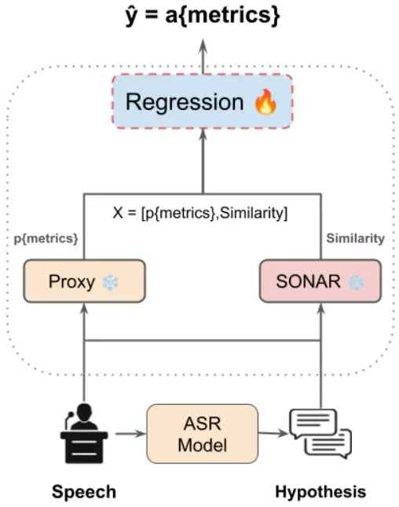
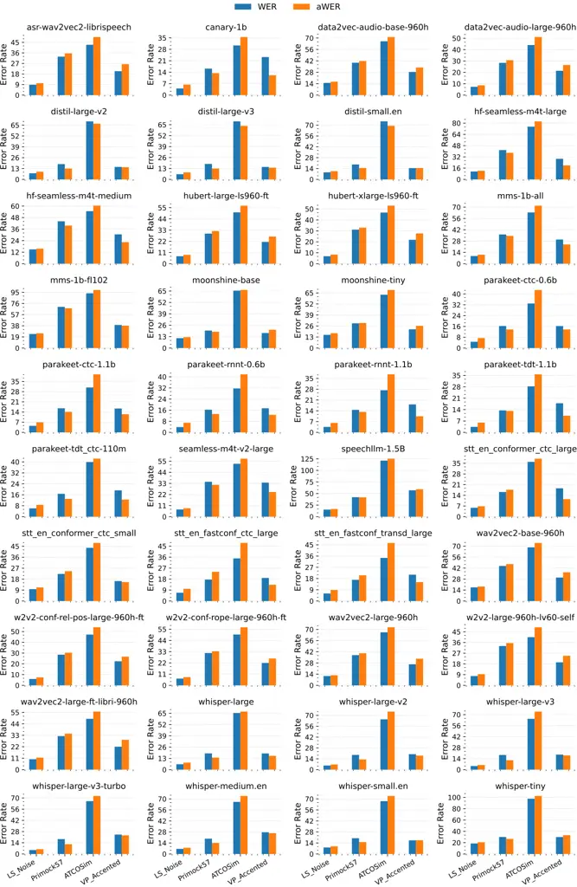
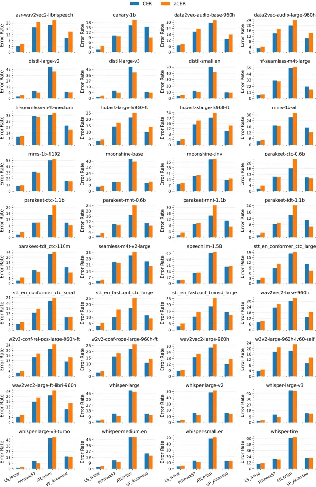

# On the Robust Approximation of ASR Metrics

Abdul Waheed       Hanin Atwany       Rita Singh       Bhiksha Raj
Email: [{abdulw,bhiksha,rsingh}@cs.cmu.edu˜˜˜˜˜˜˜˜hanin.atwany@mbzuai.ac.ae](mailto:%CB%9C%CB%9C%CB%9C%CB%9C%CB%9C%CB%9C%CB%9C%CB%9C)
Affiliation: Carnegie Mellon University      Affiliation: MBZUAI

###### Abstract

Recent advances in speech foundation models are largely driven by
scaling both model size and data, enabling them to perform a wide range
of tasks, including speech recognition. Traditionally, ASR models are
evaluated using metrics like Word Error Rate (WER) and Character Error
Rate (CER), which depend on ground truth labels. As a result of limited
labeled data from diverse domains and testing conditions, the true
generalization capabilities of these models beyond standard benchmarks
remain unclear. Moreover, labeling data is both costly and
time-consuming. To address this, we propose a novel label-free approach
for approximating ASR performance metrics, eliminating the need for
ground truth labels. Our method utilizes multimodal embeddings in a
unified space for speech and transcription representations, combined
with a high-quality proxy model to compute proxy metrics. These features
are used to train a regression model to predict key ASR metrics like
Word Error Rate (WER) and Character Error Rate (CER). We experiment with
over 40 models across 14 datasets representing both standard and
in-the-wild testing conditions. Our results show that we approximate the
metrics within a single-digit absolute difference across all
experimental configurations, outperforming the most recent baseline by
more than 50%.

## 1 Introduction

Automatic Speech Recognition (ASR) models have made significant
advancements in recent years, achieving near-human performance on
several standard evaluation benchmarks (Radford et al., 2022; Seamless
Communication et al., 2023; Communication et al., 2023; Harper et al.,
2024, inter alia). These models are typically evaluated using metrics
like Word Error Rate (WER) and Character Error Rate (CER) Likhomanenko
et al. (2020), which are essential for assessing model performance.

However, these metrics are dependent on ground truths, which are often
scarce in resource-constrained environments, and human labeling is both
costly and time-consuming. To mitigate this challenge, several
reference-free evaluation methods are proposed Yuksel et al. (2023b);
Kalgaonkar et al. (2015); Swarup et al. (2019); Qiu et al. (2021);
Del-Agua et al. (2018); Raj et al. (2011). While these approaches
eliminate the reliance on labeled data, they primarily offer relative
assessments of transcription quality, rather than providing precise
error counts or rates. As a result, their applicability in real-world
scenarios, where actionable performance metrics are crucial for further
model refinement and deployment, is limited.

Given the limitations of both methods, approximating ASR metrics has
emerged as a promising alternative for label-free evaluation Chowdhury
and Ali (2023); Sheshadri et al. (2021b); Ali and Renals (2018). This
approach typically involves training regression Jalalvand et al. (2016)
and/or classification models Sheshadri et al. (2021a) on top of speech
and text encoders. While this method offers a close approximation of
error metrics, several important questions remain unresolved.
Specifically, an approximation model trained on dataset sampled from
$`D`$ to predict ASR metrics for a source model $`M`$ must be evaluated
under diverse conditions: 1) on test data that is IID (independent and
identically distributed) sampled from $`D`$; 2) on out-of-distribution
(OOD) data representing diverse domains and recording conditions; 3) on
IID data, but transcription from a target model $`T`$; and 4) on OOD
data with transcriptions from a target model $`T`$. Most prior
works Chowdhury and Ali (2023); Sheshadri et al. (2021b) focus primarily
on the first condition. Moreover, recent advancements in multimodal
foundation models offer new opportunities to directly train regression
models on unified speech and text embeddings.

To address these critical research gaps, we propose a novel framework
for approximating the performance of a wide range of ASR models, both on
standard benchmarks and in-the-wild scenarios. Specifically, we compute
the similarity between speech and text embeddings in a unified space,
capturing the semantic alignment between the two modalities.
Additionally, we incorporate a high-quality reference model as a proxy,
based on the intuition that agreement with a reliable proxy correlates
with transcription quality, as shown in prior works Waheed et al.
(2025). These features are then used to train a regression model to
predict key ASR metrics, such as WER, CER, and absolute word and
character error counts.

In summary, our work represents one of the most comprehensive studies to
date on approximating ASR metrics at scale, in terms of both data and
model coverage. Our proposed approach serves as a reference-free
evaluation particularly suited for label-scarce scenarios. Beyond
evaluation, our method is especially valuable for tasks such as
pseudo-labeling, where high-quality transcriptions are essential for
downstream applications like knowledge distillation Waheed et al.
(2024); Gandhi et al. (2023).

Our contributions are as follows:

- •
  We evaluate over 40 ASR models across 14 diverse evaluation setups,
  including both standard benchmarks and domain-specific, unseen
  conditions, followed by training regression models to approximate ASR
  metrics.
- •
  We compare our approach with the most recent work on approximating ASR
  metrics and show over a 50% reduction in absolute difference against
  the strong baseline.
- •
  We conduct a rigorous ablation study to analyze the impact of
  different experimental configurations, providing deeper insights into
  the robustness of our approach. Our findings show that our method is
  resilient to diverse evaluation setups and requires only a small
  amount of training data.

Outline. The remainder of this paper is organized as follows: Section 2
reviews related work. Section 3 presents our proposed methodology.
Sections 4 and 5 detail our experimental setup, results, and ablation
study, respectively. Section 6 concludes the paper and outlines future
directions.

## 2 Related Work

Automatic speech recognition (ASR) has witnessed significant
advancements in recent years, primarily due to the scaling of both data
and model size Radford et al. (2022); Communication et al. (2023).
Transformer Vaswani et al. (2023) based models, in particular, have
significantly contributed to these developments by effectively capturing
long-range dependencies and contextual nuances in speech, achieving
state-of-the-art (SOTA) performance across diverse benchmarks Kheddar
et al. (2024); Dhanjal and Singh (2024); Zimerman and Wolf (2023). While
traditional evaluation metrics like Word Error Rate (WER) and Character
Error Rate (CER) are de-facto evaluation metrics in benchmarking ASR
systems Lin et al. (2021); Park et al. (2024), scenarios where ground
truth transcriptions are unavailable have caught interest in
reference-free ASR evaluation methods Karbasi and Kolossa (2022); Wang
et al. (2024); Kuhn et al. (2024).

Reference-free ASR evaluation methods aim to estimate ASR performance
without requiring ground truth transcriptions Ospanov et al. (2024).
Earlier approaches rely on heuristic features or metadata such as
speaker demographics, background noise, and linguistic characteristics
Litman et al. (2000); Yoon et al. (2010), limiting their applicability
across varied contexts. However, recent advancements focus on deep
learning-based frameworks, such as convolutional neural networks
(CNNs) Elloumi et al. (2018) and contrastive learning methods Yuksel
et al. (2023a), to predict ASR quality directly from encoded speech and
text. For instance, methods like NoRefER Yuksel et al. (2023b) use
Siamese architectures fine-tuned on ASR hypotheses, achieving high
correlation with traditional metrics and improving WER by optimizing
hypothesis ensembling Park et al. (2024).

Efforts to approximate ASR metrics explore hybrid approaches that
combine traditional and reference-free methods, such as leveraging word
confidence scores, linguistic embeddings, or post-processing adaptations
to estimate WER and CER without explicit references Ali and Renals
(2020); Ali and Renals (2018); Kuhn et al. (2024); Negri et al. (2014).
However, these approaches often suffer from reliance on specific ASR
models or domain characteristics, limiting their generalizability.
Unlike existing methods, our work addresses these limitations by
introducing a robust, model and data-agnostic framework that evaluates
ASR outputs across diverse datasets and configurations, emphasizing
adaptability to unseen domains and variations.

## 3 Methodology

We present a scalable and robust method to approximate ASR performance
metrics using multimodal unified embeddings, proxy references, and
regression models. The primary goal is to eliminate reliance on
ground-truth labels, enabling performance evaluation in label-scarce
scenarios. The pipeline consists of three components: representation
similarity in a unified speech-text embedding space, agreement with a
high-quality proxy reference, and a regression model trained on these
features to predict ASR metrics. Our pipeline diagram is shown in
Figure 1.

### 3.1 Similarity in Unified Representation Space

The foundation of our approach is the SONAR model Duquenne et al.
(2023), a state-of-the-art multimodal (speech-text) model trained to
produce unified embeddings for both speech and text inputs. Let
$`x_{\text{speech}}`$ represent the input speech signal and
$`x_{\text{text}}`$ denote the corresponding ASR-generated
transcription. SONAR maps these inputs to a shared embedding space,
generating $`e_{\text{speech}}`$ and $`e_{\text{text}}`$:

```math
e_{\text{speech}}=f_{\text{SONAR}}(x_{\text{speech}}),\quad e_{\text{text}}=f_{\text{SONAR}}(x_{\text{text}}) \tag{1}
```

where $`f_{\text{SONAR}}`$ represents the embedding model. The alignment
between these embeddings is quantified using cosine similarity:

```math
\text{Similarity}(x_{\text{speech}},x_{\text{text}})=\frac{e_{\text{speech}}\cdot e_{\text{text}}}{\|e_{\text{speech}}\|\|e_{\text{text}}\|} \tag{2}
```

The similarity metric serves as an indicator of transcription quality,
with higher values suggest better alignment between speech and text
representations.

### 3.2 Agreement with a Proxy Reference

To complement the similarity score, we utilize proxy references
generated by a high-quality ASR model, denoted as $`x_{\text{proxy}}`$.
The comparison between the ASR-generated transcription
$`x_{\text{text}}`$ and the proxy reference $`x_{\text{proxy}}`$ is
quantified using Word Error Rate (pWER) and Character Error Rate (pCER)
as defined in Appendix A.1.

These metrics assess transcription quality by comparing it with a
reliable proxy reference, without using ground-truth labels at any
stage. Proxy references are dynamically selected by profiling 41 models
across datasets and ranking them by average performance. For each target
ASR model, the reference is the highest-ranking model other than the
target itself. For example, if whisper-large-v3 ranks highest, the
reference for whisper will be the second-best model. This ensures the
proxy reference is both relevant and reliable for evaluating the target
model.



Figure 1: High-level diagram for our framework. The proxy is an ASR
model that takes input speech and generates a transcription. We use the
output from the source model as a hypothesis, and the output from the
proxy model as a reference, to calculate metrics like WER and CER
(pmetrics), which we denote as pWER and pCER. We then use this, along
with the the similarity between SONAR embeddings of the input speech and
the hypothesis, to train the regression that gives approximated metrics
(ametrics), e.g., aWER/aCER.

### 3.3 Regression Model for Metric Prediction

The extracted features, including similarity scores and proxy metrics,
are concatenated to form the input to a regression model. Let
$`z=[\text{Similarity},\text{pWER}/\text{pCER}]`$ represent the feature
vector. The regression model $`g`$ estimates the ASR metrics
$`\hat{y}`$, denoted as aWER and/or aCER:

```math
\hat{y}=g(z) \tag{3}
```

The regression model is an ensemble of Random Forest, Gradient Boosting,
and Histogram-based Gradient Boosting regressors. Each base model is
fine-tuned via grid search for hyperparameter optimization. The ensemble
is trained to minimize the mean absolute error between predicted and
ground-truth metrics. Additionally, a ridge regression model with
non-negativity constraints is included in the ensemble to ensure
predictions remain within valid ranges. Additional details of our
regression pipeline are provided in Section 4, with hyperparameter
details in Appendix A.4.

### 3.4 Evaluation

We evaluate the regression model’s performance across four setups,
including IID and OOD data and different model configurations.
Specifically, we train our regression model on one ASR system (source)
on one dataset and evaluate it on both IID and OOD data for the source
and target models. We provide a detailed analysis of the distribution
shift in Appendix A.5.

Let $`\mathcal{D}_{M,B}`$ denote the 10 benchmark datasets, and
$`\mathcal{D}_{M,W}`$ represent the four in-the-wild datasets, as
described in Section 4.1, where $`M\in\{S,T\}`$ refers to either the
source model $`S`$ or the target model $`T`$.

The regression model is trained on data
$`\mathcal{D}_{S,B}^{\text{train}}\sim\mathcal{D}_{S,B}`$ and evaluated
on the IID test set
$`\mathcal{D}_{S,B}^{\text{test-IID}}\sim\mathcal{D}_{S,B}`$, consisting
of $`80\%`$ and $`20\%`$ of the data, respectively. Additionally, the
model is evaluated on $`\mathcal{D}_{T,B}^{\text{test-IID}}`$,
$`\mathcal{D}_{S,W}`$, and $`\mathcal{D}_{T,W}`$. Below, we detail the
formulation of each evaluation setup.

##### Case 1: IID Evaluation (Source $`S`$)

The regression model is trained on $`\mathcal{D}_{S,B}^{\text{train}}`$
and evaluated on $`\mathcal{D}_{S,B}^{\text{test-IID}}`$. Let
$`x_{1}^{S}=f(s,o^{S})`$ represent the similarity between input speech
$`s`$ and the ASR output $`o^{S}`$, and $`x_{2}^{S}=g(o^{S},r)`$
represent the agreement with the proxy reference $`r`$, where $`o^{S}`$
is the ASR output produced by the source model $`S`$. The evaluation is
formulated as:

```math
\mathcal{L}_{\text{IID}}^{S}=\mathbb{E}_{(x_{1}^{S},x_{2}^{S},y)\sim\mathcal{D}_{S,B}^{\text{test-IID}}}\big[\mathcal{L}(h(x_{1}^{S},x_{2}^{S}),y)\big] \tag{4}
```

##### Case 2: IID Evaluation (Target $`T`$)

The regression model trained on $`\mathcal{D}_{S,B}^{\text{train}}`$ is
evaluated on the IID test set $`\mathcal{D}_{T,B}^{\text{test-IID}}`$.
Let $`x_{1}^{T}=f(s,o^{T})`$ represent the similarity between input
speech $`s`$ and the ASR output $`o^{T}`$, and $`x_{2}^{T}=g(o^{T},r)`$
represent the agreement with the proxy reference $`r`$, where $`o^{T}`$
is the ASR output produced by the target model $`T`$. The evaluation is
expressed as:

```math
\mathcal{L}_{\text{IID}}^{T}=\mathbb{E}_{(x_{1}^{T},x_{2}^{T},y)\sim\mathcal{D}_{T,B}^{\text{test-IID}}}\big[\mathcal{L}(h(x_{1}^{T},x_{2}^{T}),y)\big] \tag{5}
```

##### Case 3: OOD Evaluation (Source $`S`$)

The regression model trained on $`\mathcal{D}_{S,B}^{\text{train}}`$ is
evaluated on the out-of-distribution set $`\mathcal{D}_{S,W}`$. Let
$`x_{1}^{S}=f(s,o^{S})`$ represent the similarity between the input
speech $`s`$ and the ASR output $`o^{S}`$, and $`x_{2}^{S}=g(o^{S},r)`$
represent the agreement with the proxy reference $`r`$, where $`o^{S}`$
is the ASR output produced by the source model $`S`$. The evaluation is
defined as:

```math
\mathcal{L}_{\text{OOD}}^{S}=\mathbb{E}_{(x_{1}^{S},x_{2}^{S},y)\sim\mathcal{D}_{S,W}}\big[\mathcal{L}(h(x_{1}^{S},x_{2}^{S}),y)\big] \tag{6}
```

##### Case 4: OOD Evaluation (Target $`T`$)

The regression model trained on $`\mathcal{D}_{S,B}^{\text{train}}`$ is
evaluated on the out-of-distribution set $`\mathcal{D}_{T,W}`$, using
the ASR output produced by the target model $`T`$. Let
$`x_{1}^{T}=f(s,o^{T})`$ represent the similarity between the input
speech $`s`$ and the ASR output $`o^{T}`$, and $`x_{2}^{T}=g(o^{T},r)`$
represent the agreement with the proxy reference $`r`$, where $`o^{T}`$
is the ASR output produced by the target model $`T`$. The evaluation is
expressed as:

```math
\mathcal{L}_{\text{OOD}}^{T}=\mathbb{E}_{(x_{1}^{T},x_{2}^{T},y)\sim\mathcal{D}_{T,W}}\big[\mathcal{L}(h(x_{1}^{T},x_{2}^{T}),y)\big] \tag{7}
```

Note. For computational feasibility, the primary experiments train the
regression model on 9 out of the 10 datasets in
$`\mathcal{D}_{S,B}^{\text{train}}`$ and evaluate it on the remaining
dataset, as well as on all four datasets in
$`\mathcal{D}_{S,B}^{\text{OOD}}`$. This process is repeated for each
dataset in $`\mathcal{D}_{S,B}^{\text{train}}`$, ensuring robust
evaluation across various testing conditions. No examples from
$`\mathcal{D}_{M,\text{OOD}}`$ are used at any stage for training the
regression model.

## 4 Experiments

In this section, we present the experimental setup to evaluate our ASR
metrics approximation tool. We describe the datasets, models, and
regression pipeline used in our experiments, highlighting the diversity
of ASR systems and testing conditions.

### 4.1 Datasets

To evaluate the robustness and generalizability of our ASR metrics
approximation tool, we use datasets sourced from multiple distributions,
divided into two types: Standard Benchmark and Wild Challenge datasets.
We describe these datasets below and provide additional details in
Appendix A.2, Table 5.

Standard Benchmark Datasets. We include widely used datasets
representing diverse domains and acoustic conditions.
LibriSpeech Panayotov et al. (2015) provides 1,000 hours of English read
audiobooks, covering both clean and noisy conditions. TED-LIUM Rousseau
et al. (2014) consists of TED talks from 2,000 speakers. GigaSpeech Chen
et al. (2021) spans audiobooks, podcasts, and YouTube, incorporating
both read and spontaneous speech. SPGISpeech Technologies (2021)
features 5,000 hours of earnings calls with a focus on orthographic
accuracy. Common Voice Ardila et al. (2020) is a multilingual,
crowdsourced corpus with diverse accents. Earnings22 Rio et al. (2022)
provides 119 hours of accented, real-world earnings calls. Additional
datasets include AMI (IHM) Carletta et al. (2005), with 100 hours of
English meeting recordings from non-native speakers, and People’s
Speech Galvez et al. (2021), emphasizing inclusivity and linguistic
diversity. SLUE-VoXCeleb Shon et al. (2022) contains conversational
voice snippets, capturing diverse speaking styles and emotions.

Wild Datasets. The wild set focuses on real-world variability and
challenging scenarios. Primock57 Papadopoulos Korfiatis et al. (2022)
includes telemedicine consultations with diverse accents, ages, and
scenarios, recorded by clinicians and actors. VoxPopuli Accented Wang
et al. (2021) contains multilingual speeches from European Parliament
recordings, rich in named entities. ATCOsim Jan van Doorn (2023)
features 10 hours of non-native English speech from air traffic control
simulations with clean utterance-level transcriptions. Additionally, we
include a noisy subset of LibriSpeech Panayotov et al. (2015), which
reflects challenging real-world conditions.

In addition to the above datasets, we also run a small experiment to
assess the cross-lingual transferability of the trained regression
model. Specifically, we train the model on English data and evaluate it
on both German and English data, and vice versa, using the English and
German splits from LibriSpeech Panayotov et al. (2015) and Common
Voice Ardila et al. (2020). In our ablation study, we compare the
trained regression model with a proxy reference. To broaden this
evaluation, we expand the in-the-wild dataset to include four additional
datasets: a privately collected Medical ASR dataset with clinical
conversations; standard data with eight synthetic perturbations (white
noise, time stretch, pitch shift, cross-lingual noise, reverberation,
pub noise, echo, and distortion); noisy home recordings BERSt Tuttösí
et al. (2025); and CHiME-6(noisy subset) Watanabe et al. (2020).

### 4.2 Models

We evaluate our approximation framework for a range of state-of-the-art
ASR models, put into three categories based on their architecture and
functionality. Below we describe the datasets and provide additional
details in Appendix A.2 and in Table 6.

Encoder-Decoder Models. We include multiple encoder-decoder families of
models capable of performing ASR tasks in a zero-shot setting. More
specifically, we include whisper Radford et al. (2023) and
distil-whisper Gandhi et al. (2023) models that perform really well
across diverse testing settings. We also include seamless  Communication
et al. (2023); Seamless Communication et al. (2023); Barrault et al.
(2025), SpeechT5 Ao et al. (2022) which are unified encoder-decoder
frameworks for tasks such as ASR, speech synthesis, translation, and
voice conversion. MMS Pratap et al. (2023) supports hundreds of
languages and excels in resource-constrained scenarios. Moonshine
(2) Jeffries et al. (2024), a lightweight and efficient model, is
designed for edge deployments with strong performance. Additionally, we
include speech language models like SpeechLLM Rajaa and Tushar (), which
combine speech embeddings with language models to predict metadata such
as speaker attributes, emotions, and accents, offering robust multimodal
capabilities.

NeMo-ASR Models. We use multiple models from the NeMo-ASR Gulati et al.
(2020); Variani et al. (2020); Noroozi et al. (2024); Tang et al.
(2023); Harper et al. (2024) toolkit by NVIDIA. We include models such
as Canary and Parakeet, which use highly efficient speech encoders like
Fast-Conformer Rekesh et al. (2023). In addition to that, we use models
based on various encoders and decoders (CTC, RNN-T, TDT,
Conformer-CTC Guo et al. (2021). In our work, we evaluate 11 models from
the NeMo-ASR toolkit.

Encoder-Only. We include self-supervised encoder-only models and their
derivatives. Specifically, we use Wav2Vec2 Schneider et al. (2019);
Baevski et al. (2020), HuBERT Hsu et al. (2021), and Data2Vec Baevski
et al. (2022).

### 4.3 Experimental Setup

We evaluate all models listed in Section 4.2 on $`1000`$ examples
sampled randomly from the $`test`$ split of each dataset, as described
in Section 4.1. Since all models are trained at a 16 kHz sampling rate,
we (re)sample the speech accordingly. For ASR, we use greedy decoding
and all other parameters are default unless otherwise specified. We
apply basic text post-processing ¹¹ 1
[https://bit.ly/enormwhisper](https://bit.ly/enormwhisper) before
computing ASR metrics. We obtain all models from Huggingface Hub ²² 2
[https://huggingface.co/models](https://huggingface.co/models) and
implement the ASR pipeline using the Transformers Wolf et al. (2020)
library.

For multimodal embeddings, we use SONAR Duquenne et al. (2023), a
1024-dimensional sentence-level multilingual model. Specifically, we
utilize text_sonar_basic_encoder for text encoding and
speech_sonar_basic_encoder for speech encoding.

The regression framework uses a stacking ensemble with base regressors
and a final estimator. Hyperparameter tuning is performed with
RandomizedSearchCV to minimize MAE. The model is trained on 9 benchmark
datasets and evaluated on the remaining benchmark dataset and
four in-the-wild datasets. This process is repeated for all 10 benchmark
datasets. Additional details of the regression pipeline are provided in
Section 3 and low-level details in Appendix A.4.1.

We conduct ASR experiments on a single A100/H100 GPU, while the
regression model training runs on CPUs. Although ASR time and memory
consumption depend on the model size, embedding extraction for $`1000`$
audio-text pairs takes approximately one minute on a single
consumer-grade GPU without parallelization or additional efficiency
measures. Appendix A.4 provides further experimental setup details.

Baselines. Recent studies directly aligned with our approach are
limited. For instance, eWER Ali and Renals (2018) and eWER2 Ali and
Renals (2020) estimate error rates based on the input signal, which
differs from our approach. In contrast, we incorporate the model’s
output transcript into the error rate approximation function. The most
closely related recent works are WERBERT Sheshadri et al. (2021a) and
eWER3 Chowdhury and Ali (2023), which share a similar pipeline. Both use
encoders for text, speech, and other data, followed by a regression
model trained in an end-to-end setting. Since eWER3 is the more recent
of the two, we use it as our baseline. In eWER3, the speech encoder is
*wav2vec2* Baevski et al. (2020), and the text encoder is
*roberta-base* Liu et al. (2019), with a regression model trained on top
while both encoders remain frozen. Given the unavailability of public
code or pretrained models for evaluation, we implement eWER3 with some
modifications to ensure a fair comparison. Specifically, we extract
features from both encoders and apply PCA for dimensionality reduction
on each modality before training our regression pipeline. For both
speech and text, we experiment with 32 and 64 PCA components (referred
to as $`nc`$ in Table 3).

## 5 Results

We conduct experiments using two dataset categories: standard benchmarks
and in-the-wild, as described in Section 4.1. For each ASR model, a
leave-one-out strategy is used, training the regression model on 9
benchmark datasets and testing it on the remaining benchmark dataset and
all four in-the-wild datasets to ensure comprehensive evaluation on
out-of-domain data. Additionally, in-domain testing is included in
ablation studies, as detailed in Section 5.4. The regression model is
trained to predict absolute error counts (word and character levels),
which are normalized by the reference length to compute approximate
error rates ($`aWER`$ and $`aCER`$). We also train regression models to
directly predict WER and CER. We provide results for fine-grained
metrics in Table 12.

### 5.1 Evaluation on In-the-Wild Datasets

The wild datasets provide a realistic testbed for evaluating the
regression model’s ability to approximate error rates under real-world
conditions. As shown in Table 1, high-performing models, like canary-1b,
demonstrate strong agreement between predicted and actual error rates.
For example, on VP_Accented, canary-1b achieves mean absolute difference
of $`1.1\%`$. On Primock57, the model shows robustness with a WER of
$`16.2\%`$ and an $`aWER`$ of $`13.4\%`$, highlighting its effective
generalization across diverse and domain-specific contexts.

For models like data2vec-audio-large-960h our approximation is pretty
close to actual error rates with difference consistently under $`2\%`$
on various datasets. For example, on LibriSpeech-test-noise, the model’s
actual WER is $`7.2\%`$ while the approximated $`aWER`$ is $`8.6\%`$.
Even on acoustically complex datasets like ATCOsim, where the WER is
$`44.0\%`$ and the $`aWER`$ is $`51.1\%`$, the model exhibits a
reasonable alignment between approximated and actual error rates.

In contrast, models with high actual error rates, such as mms-1b-fl102,
show slightly larger deviations, particularly on datasets with
challenging conditions. For instance, on ATCOsim, the WER is $`93.4\%`$
and the $`aWER`$ is $`99.0\%`$, resulting in a significant deviation of
$`5.6\%`$, the highest observed across all in-the-wild datasets.
Similarly, on Primock57, where the WER is $`70.2\%`$ and the $`aWER`$ is
$`67.8\%`$, the approximation also struggles to align due to the
inherently high error rates. This highlights that extreme error cases
often correspond to semantically nonsensical outputs, where the
distinction between high and extremely high error rates becomes less
relevant.

| Model          | LS_Noise  | Primock57 | ATCOsim     | VP_Acc    |
| -------------- | --------- | --------- | ----------- | --------- |
| w2v2-ls        | 8.8/10.2  | 32.8/35.6 | 43.0/49.5   | 20.4/26.4 |
| can-1b         | 4.1/6.4   | 16.2/13.4 | 30.4/35.5   | 23.2/12.1 |
| d2v-base       | 14.9/16.4 | 39.6/41.7 | 66.0/71.2   | 28.4/33.8 |
| d2v-large      | 7.2/8.6   | 28.3/30.7 | 44.0/51.1   | 21.4/26.5 |
| distil-l-v2    | 7.3/9.2   | 18.3/13.0 | 69.5/66.7   | 14.9/14.5 |
| distil-l-v3    | 6.1/8.3   | 18.4/12.9 | 69.0/63.6   | 14.8/14.0 |
| distil-s.en    | 9.1/10.6  | 19.3/14.7 | 74.9/69.1   | 14.6/14.7 |
| sm4t-l         | 11.2/12.3 | 41.7/37.8 | 75.0/82.5   | 29.3/19.9 |
| sm4t-m         | 14.9/15.6 | 44.1/39.7 | 54.6/60.4   | 30.5/22.5 |
| hub-l-ls-ft    | 7.3/8.8   | 29.5/32.0 | 50.4/56.9   | 21.4/26.6 |
| hub-xl-ls-ft   | 6.8/8.3   | 31.1/32.9 | 46.7/53.0   | 21.8/27.7 |
| mms-1b-a       | 9.5/11.1  | 36.2/34.4 | 63.4/71.8   | 29.9/23.8 |
| mms-1b-f102    | 24.0/24.9 | 70.2/67.8 | 93.4/99.0   | 39.4/38.2 |
| moon-b         | 11.3/12.4 | 19.9/18.5 | 65.5/66.2   | 17.1/20.8 |
| moon-t         | 15.5/17.4 | 29.2/29.5 | 62.9/68.5   | 22.1/26.2 |
| par-ctc-0.6b   | 4.6/7.4   | 16.3/13.8 | 32.9/42.9   | 16.3/13.8 |
| par-ctc-1.1b   | 4.5/6.9   | 16.6/14.1 | 30.9/39.9   | 16.4/12.4 |
| par-rnnt-0.6b  | 3.8/6.9   | 16.3/13.2 | 31.6/41.8   | 17.3/12.6 |
| par-rnnt-1.1b  | 3.5/6.1   | 14.6/13.3 | 27.3/37.6   | 18.1/10.4 |
| par-tdt-1.1b   | 3.4/6.0   | 13.5/13.2 | 28.3/35.7   | 17.9/10.2 |
| pkt-ctc-110m   | 6.1/8.6   | 16.7/13.0 | 39.9/42.4   | 19.2/12.5 |
| sm4t-v2-l      | 7.2/8.4   | 34.6/31.7 | 52.4/57.6   | 33.8/24.5 |
| spchllm-1.5B   | 15.3/16.6 | 42.0/41.8 | 121.1/125.4 | 57.0/59.3 |
| spchllm-2B     | 13.9/15.6 | 39.4/40.3 | 60.6/64.1   | 39.2/44.1 |
| stt-cfc-l      | 5.8/6.8   | 16.1/17.6 | 35.9/38.0   | 18.6/11.5 |
| stt-cfc-s      | 9.7/11.2  | 22.2/24.6 | 43.7/47.7   | 16.4/15.6 |
| stt-fc-cfc-l   | 6.8/10.0  | 17.6/23.9 | 34.9/47.6   | 18.9/13.3 |
| stt-fc-td-l    | 6.0/8.8   | 17.0/20.6 | 34.5/46.5   | 21.1/15.1 |
| w2v2-960h      | 17.4/18.5 | 44.7/47.1 | 68.4/74.0   | 29.9/36.5 |
| w2v2-crelpos   | 5.9/7.4   | 28.5/30.3 | 47.2/54.0   | 22.4/26.7 |
| w2v2-crope     | 6.6/8.1   | 31.7/33.4 | 49.8/56.9   | 21.9/26.3 |
| w2v2-l-960h    | 11.6/12.6 | 37.8/40.2 | 66.4/72.7   | 26.3/33.3 |
| w2v2-l-lv60-s  | 7.8/9.4   | 33.1/35.5 | 40.5/48.8   | 19.3/24.9 |
| w2v2-l-rft-ls  | 10.0/11.5 | 32.2/34.6 | 48.9/55.7   | 22.0/28.6 |
| whisper-l      | 6.2/8.1   | 18.8/13.9 | 65.3/66.9   | 18.7/15.9 |
| whisper-l-v2   | 5.4/6.6   | 19.0/13.1 | 64.8/74.8   | 20.0/18.1 |
| whisper-l-v3   | 4.6/5.9   | 18.7/12.0 | 64.7/73.9   | 19.2/18.1 |
| whisper-l-v3-t | 4.9/6.0   | 18.5/12.3 | 66.0/72.5   | 24.3/23.2 |
| whisper-m.en   | 6.5/7.9   | 19.5/14.0 | 66.2/73.8   | 27.6/26.4 |
| whisper-s.en   | 8.2/9.7   | 20.0/15.1 | 67.1/73.8   | 17.3/17.5 |
| whisper-tiny   | 18.5/20.7 | 30.0/26.6 | 97.6/102.5  | 29.8/33.2 |

Table 1: Actual and approximated WER ($`\downarrow`$), separated by a
slash, on out-of-distribution wild datasets. The regression model is
trained independently for each ASR model on standard benchmarks, making
the wild datasets out-of-distribution. See Table 11 for full names.

### 5.2 Evaluation on Benchmark Datasets

We summarize results on 10 standard benchmark datasets in Appendix A.6
Tables 13 and 14. Each table reports actual WER/CER alongside the
approximated WER/CER (denoted by aWER/aCER).

Overall, models such as parakeet-tdt-1.1b and whisper-large-v3 show
relatively small differences between WER and aWER, indicating reliable
approximations. For instance, the actual WER for whisper-large-v3 on
AMI_IHM is 19.0% compared to aWER 17.1%, 1.9% gap. Conversely, some
challenging datasets (e.g., CV11 and Earnings22) reveal larger
discrepancies for specific models, particularly those with higher
overall error rates. For example, mms-1b-fl102 exhibits a wide WER/aWER
gap on Earnings22, suggesting difficulty handling accented or
domain-specific speech.

In general, high-performing ASR models demonstrate small WER–aWER gaps,
indicating that it’s easy to approximate when error rates are low.
However, models with higher WERs or faced with more acoustically or
linguistically challenging test sets tend to show wider divergences.
Despite these variations, most results remain within a reasonable
margin, highlighting the robustness of our approximation model on
diverse out-of-distribution data.

Figure 2: Actual and approximated WER for four models across standard
benchmark.

These results underscore the critical role of model quality in achieving
reliable approximations. The approximation framework remains effective
for high-performing models, while deviations tend to increase in cases
of semantically divergent or poorly structured outputs, reflecting the
inherent challenges in approximating errors for low-performing systems.

### 5.3 Multilingual Evaluation

We train the regression model on English and evaluate it on English and
German, and vice versa. We do this experiment with two models as source
and proxy, namely seamless-m4t-v2-large and whisper-large-v3. We report
the mean absolute difference between approximated and actual word error
counts in Table 2.

Source: seamless-m4t-v2-large  Proxy: whisper-large-v3
Train$`\setminus`$Test LS_De CV17_De LS_En CV17_En LS_De – 2.16 1.59
1.98 CV17_De 1.93 – 0.50 0.56 LS_En 1.60 0.75 – 0.66 CV17_En 1.82 0.66
0.56 –

Source: whisper-large-v3  Proxy: seamless-m4t-v2-large
Train$`\setminus`$Test LS_De CV17_De LS_En CV17_En LS_De – 2.03 1.11
1.96 CV17_De 1.74 – 0.51 0.76 LS_En 1.29 1.50 – 1.42 CV17_En 2.29 0.68
1.69 –

Table 2: Cross-lingual mean absolute difference ($`\downarrow`$) between
predicted and actual word error counts. Lower values mean better
approximation.

We find that our framework demonstrates strong cross-lingual
generalization: when trained on English data, the regression model
maintains low absolute differences when evaluated on German datasets,
and vice versa. This consistency across languages and datasets, using
both seamless-m4t-v2-large and whisper-large-v3 as source-proxy pairs,
underscores the robustness and language-agnostic nature of our approach.
These results validate that our method can be effectively applied in
multilingual settings without the need for language-specific
adaptations.

### 5.4 Ablation

We conduct comprehensive ablation experiments to evaluate the robustness
of the approximation model and the contributions of its individual
components. Using the evaluation setup outlined in Section 3.4, we
select data2vec-audio-base-960h as the source model ($`S`$) and
wav2vec2-base-960h as the target model ($`T`$). The results are
summarized in Table 3, where IID results correspond to Case-I 3.4, and
$`D`$, $`M`$, and $`D+M`$ under OOD represent Case II 3.4, Case-III 3.4,
and Case-IV 3.4, respectively. The reference model’s $`r`$ value
represents the average WER across all datasets. We include reference
models with varying $`r`$ values, such as whisper-large-v3 ($`r=17.8`$),
whisper-medium.en ($`r=20.1`$), whisper-tiny ($`r=33.4`$), and
mms-1b-fl102 ($`r=51.0`$).

The results in Table 3 demonstrate the importance of proxy references in
improving the regression model’s performance. Training without proxy
references (w/o PR) significantly increases the mean absolute error
(MAE) across all conditions. For instance, the IID MAE increases from
$`1.03`$ (Base) to $`3.13`$, and the OOD $`D+M`$ MAE rises from $`1.07`$
(Base) to $`3.33`$, highlighting the essential role of proxy references
in approximation.

Increasing the number of high-quality proxy references (MPR) further
reduces errors. Under IID conditions, the MAE decreases from $`1.00`$
with $`n=2`$ to $`0.93`$ with $`n=5`$. Similarly, in OOD $`D+M`$, the
error drops from $`1.06`$ (MPR, $`n=2`$) to $`0.95`$ (MPR, $`n=5`$),
demonstrating that multiple high-quality references enhance model
robustness.

|                |             |             |              |             |
| -------------- | ----------- | ----------- | ------------ | ----------- |
| Method         | IID         | OOD         |              |             |
|                |             | D           | M            | D + M       |
| eWER3(nc=32)   | 2.03^(0.07) | 2.09^(0.04) | 2.06 ^(0.03) | 2.12^(0.04) |
| eWER3(nc=64)   | 1.98^(0.06) | 2.07^(0.05) | 2.00^(0.04)  | 2.09^(0.05) |
| Base           | 1.03^(0.03) | 1.05^(0.01) | 1.03^(0.02)  | 1.07^(0.01) |
| w/o S          | 1.04^(0.03) | 1.05^(0.01) | 1.04^(0.03)  | 1.05^(0.01) |
| w/o PR         | 3.13^(0.07) | 3.22^(0.02) | 3.23^(0.05)  | 3.33^(0.02) |
| w/ MPR (n=2)   | 1.00^(0.02) | 1.04^(0.02) | 0.99^(0.02)  | 1.06^(0.02) |
| w/ MPR (n=3)   | 0.96^(0.02) | 0.97^(0.01) | 0.95^(0.02)  | 0.99^(0.01) |
| w/ MPR (n=4)   | 0.95^(0.02) | 0.96^(0.02) | 0.94^(0.02)  | 0.98^(0.02) |
| w/ MPR (n=5)   | 0.93^(0.02) | 0.93^(0.01) | 0.92^(0.02)  | 0.95^(0.01) |
| w/MPR (n=10)   | 0.90^(0.02) | 0.93^(0.01) | 0.88^(0.02)  | 0.95^(0.01) |
| w/MPR (n=20)   | 0.89^(0.02) | 0.96^(0.02) | 0.87^(0.02)  | 0.96^(0.02) |
| w/ mMPR (n=3)  | 0.98^(0.02) | 0.96^(0.02) | 0.97^(0.02)  | 0.98^(0.02) |
| w/ mMPR (n=5)  | 0.94^(0.02) | 0.94^(0.02) | 0.93^(0.01)  | 0.96^(0.02) |
| w/mMPR (n=10)  | 0.92^(0.02) | 0.94^(0.02) | 0.91^(0.02)  | 0.96^(0.02) |
| w/mMPR (n=20)  | 1.04^(0.02) | 1.05^(0.01) | 1.02^(0.02)  | 1.04^(0.01) |
| Base (r=17.8)  | 1.31^(0.04) | 1.44^(0.02) | 1.31^(0.04)  | 1.40^(0.01) |
| Base (r=20.1)  | 1.36^(0.04) | 1.36^(0.01) | 1.34^(0.03)  | 1.34^(0.01) |
| Base (r=33.4)  | 1.55^(0.04) | 1.69^(0.02) | 1.55^(0.04)  | 1.63^(0.02) |
| Base (r=51.0)  | 2.03^(0.02) | 2.10^(0.01) | 2.08^(0.05)  | 2.09^(0.01) |
| w/o S (r=17.8) | 1.47^(0.04) | 1.56^(0.01) | 1.48^(0.04)  | 1.54^(0.01) |
| w/o S (r=20.1) | 1.55^(0.02) | 1.50^(0.01) | 1.55^(0.03)  | 1.50^(0.01) |
| w/o S (r=33.4) | 1.79^(0.07) | 1.89^(0.02) | 1.78^(0.06)  | 1.82^(0.02) |
| w/o S (r=51.0) | 2.23^(0.02) | 2.24^(0.01) | 2.28^(0.04)  | 2.21^(0.01) |

Table 3: Mean absolute error ($`\downarrow`$) between predicted word
error count and actual error count (in absolute terms) across different
configurations. PR - Proxy Reference, S - Similarity, MPR - Multiple PR,
D - Data, M - Model. The OOD results are averaged across four wild
datasets. n is the number of proxy references. The r ($`\downarrow`$)
value represents the average WER for proxy reference across 14 datasets.
Superscript represents the standard deviation across five runs.

The quality of references, quantified by the $`r`$-value, also plays a
critical role. For example, in IID conditions, the MAE increases from
$`1.31`$ for $`r=17.8`$ to $`2.03`$ for $`r=51.0`$. A similar trend is
observed in OOD $`D+M`$, where the MAE rises from $`1.40`$ ($`r=17.8`$)
to $`2.09`$ ($`r=51.0`$). The absence of similarity (w/o S) combined
with low-quality proxies further degrades performance, underscoring the
importance of both high-quality references and similarity measures. We
provide character-level error count approximation in Appendix A.6
Table 10.

##### Scaling Training Data for Regression.

To evaluate the impact of training data size on the regression model, we
scale the data from 1K to 10K examples in increments of 1K. As shown in
Figure 3, the model’s performance does not exhibit a clear trend with
increasing training data size. Some datasets show slight improvements
with more data; others show minimal improvement. This suggests that the
regression model is largely agnostic to the size of the training data.
In fact, it appears that a relatively small dataset of just 1,000
examples is sufficient to train a robust approximation model. This
underscores the model’s ability to generalize effectively with limited
data, making it an efficient choice for scenarios with constrained
datasets.

Figure 3: Mean absolute error ($`\downarrow`$) between predicted and
actual word error counts across varying training data sizes for the
regression model. The model was trained on 10 standard benchmarks and
evaluated on four in-the-wild test sets.

##### Direct Comparison with Proxy Reference.

We evaluate our regression model and standard reference-free baseline
that computes the word error rate between the target and a proxy
hypothesis. We report the mean absolute difference and compare the
regression model (Ours) with direct calculation with proxy (w Proxy) in
Table 4.

Our results show that the regression model consistently reduces the
absolute difference compared to direct evaluation with the proxy across
seven of the eight datasets, with the only exception being MedicalASR.
We also find that the regression model trained using only similarity
features remains competitive. These findings demonstrate that our
approach generalizes well across domains and provides more reliable
reference-free ASR quality estimates than simply computing the error
against a proxy reference.

| Dataset      | PR (r=33.4) |      | PR (r=51.0) |      | w/o Proxy |
| ------------ | ----------- | ---- | ----------- | ---- | --------- |
|              | w Proxy     | Ours | w Proxy     | Ours | Ours      |
| Primock57    | 2.25        | 1.54 | 4.89        | 2.63 | 3.82      |
| ATCOSim      | 5.35        | 2.11 | 3.56        | 2.02 | 2.64      |
| VP_Accented  | 2.99        | 2.09 | 5.39        | 2.83 | 4.00      |
| LS_Noise     | 2.10        | 1.58 | 3.08        | 1.42 | 2.35      |
| BERSt        | 2.37        | 1.25 | 5.09        | 2.47 | 3.20      |
| Perturbed    | 1.84        | 1.34 | 3.38        | 1.75 | 2.81      |
| Medical      | 0.76        | 0.95 | 2.35        | 1.33 | 2.56      |
| CHiME6-Noisy | 2.32        | 1.43 | 3.29        | 1.93 | 2.74      |
| Average      | 2.50        | 1.54 | 3.88        | 2.05 | 3.02      |

Table 4: Mean absolute difference ($`\downarrow`$) between the predicted
and actual word error counts for our regression models and the baseline
direct comparison with proxy reference (w Proxy).

## 6 Conclusion

We present a framework for approximating ASR metrics, demonstrating its
effectiveness in generalizing to unseen, in-the-wild, and challenging
conditions. Our results show that the model performs well with absolute
error counts, consistently outperforming strong baseline, with error
rates remaining relatively low. We show that our proposed method
achieves consistent performance across 40 ASR models and 14 evaluation
setups, including both standard benchmarks and domain-specific
conditions. The trained regression model can be efficiently used to
approximate ASR metrics, particularly in data-constrained environments,
such as critical domains with limited labeled data. In summary, our work
bridges the gap between theoretical advancements and real-world
applications, paving the way for more reliable and scalable ASR systems.
While in this work, we evaluate monolingual and cross-lingual
generalization, future work will focus on extending this framework to
support a multilingual setting and exploring language-agnostic ASR
metric approximation.

## 7 Limitations

In this work, we introduced a framework for approximating ASR metrics,
evaluated across various ASR models and datasets. Despite the promising
results, there are several limitations to consider.

Evaluation. While our evaluation setup is comprehensive, consisting of
over 40 models and 14 datasets representing various acoustic and
linguistic conditions such as natural noise, dialects, and accents—far
surpassing previous works—we have not explored more nuanced conditions
such as gender, non-native speech, and approximation across various age
groups. Additionally, while the framework has shown strong performance
in approximating ASR metrics across multiple datasets, its
generalization to highly diverse or extreme real-world conditions might
still require further investigation.

Language. Additionally, the current evaluation focuses solely on
monolingual and bilingual settings. Extending this framework to include
multiple languages and rigorously testing it across diverse linguistic
contexts represents a critical direction for future research.

Compute. Unlike previous works, our final approximator is a simple
regression model that does not require GPUs to run, we do utilize a
single GPU for multimodal embedding extraction, which could be performed
on any consumer-grade GPU.

## 8 Ethics Statement

##### Data Collection and Release.

The datasets used in our experiments consist of publicly available ASR
data from both benchmark and in-the-wild sources, as detailed in
Section 4.1. We ensure that the use of these datasets aligns with the
principles of fair use, specifically in a non-commercial academic
context or as specified in their original license. All datasets are
openly accessible, and no private or confidential data is included in
this work to the best of our knowledge.

##### Intended Use.

By enabling the approximation of ASR performance metrics with minimal
data, our work has the potential to impact applications in domains with
limited data availability, such as healthcare, emergency response, and
low-resource language research. We believe our approach will foster
further research in scalable, low-cost ASR systems with comprehensive
evaluation, benefiting industries and research areas that serve
underrepresented or resource-limited populations.

##### Potential Misuse and Bias.

While our regression model has demonstrated effectiveness in
approximating ASR metrics, it is important to consider potential misuse
and bias. Given that our model is trained on diverse datasets, including
those with various linguistic, acoustic, and demographic variations,
there is a risk that the model may inherit biases present in the data,
particularly with respect to accents, dialects, and socio-linguistic
factors. Additionally, as our model approximates error rates, it could
be misused in applications where the approximation may not be sufficient
for real-world critical tasks. We recommend cautious deployment and
further evaluation in sensitive applications, especially those where
fairness and accuracy are critical.

## References

- Ali and Renals (2018) Ahmed Ali and Steve Renals. 2018. [Word error
  rate estimation for speech recognition:
  e-WER](https://doi.org/10.18653/v1/P18-2004). In _Proceedings of the
  56th Annual Meeting of the Association for Computational Linguistics
  (Volume 2: Short Papers)_, pages 20–24, Melbourne, Australia.
  Association for Computational Linguistics.
- Ali and Renals (2020) Ahmed M. Ali and Steve Renals. 2020. [Word error
  rate estimation without asr output:
  e-wer2](https://api.semanticscholar.org/CorpusID:221090197). In
  _Interspeech_.
- Ao et al. (2022) Junyi Ao, Rui Wang, Long Zhou, Chengyi Wang, Shuo
  Ren, Yu Wu, Shujie Liu, Tom Ko, Qing Li, Yu Zhang, Zhihua Wei, Yao
  Qian, Jinyu Li, and Furu Wei. 2022. [Speecht5: Unified-modal
  encoder-decoder pre-training for spoken language
  processing](https://arxiv.org/abs/2110.07205). _Preprint_,
  arXiv:2110.07205.
- Ardila et al. (2020) Rosana Ardila, Megan Branson, Kelly Davis,
  Michael Henretty, Michael Kohler, Josh Meyer, Reuben Morais, Lindsay
  Saunders, Francis M. Tyers, and Gregor Weber. 2020. Common voice: A
  massively-multilingual speech corpus.
  [https://commonvoice.mozilla.org/en/datasets](https://commonvoice.mozilla.org/en/datasets).
  Accessed: \[Insert Date\].
- Baevski et al. (2022) Alexei Baevski, Wei-Ning Hsu, Qiantong Xu, Arun
  Babu, Jiatao Gu, and Michael Auli. 2022. [data2vec: A general
  framework for self-supervised learning in speech, vision and
  language](https://arxiv.org/abs/2202.03555). _Preprint_,
  arXiv:2202.03555.
- Baevski et al. (2020) Alexei Baevski, Henry Zhou, Abdelrahman Mohamed,
  and Michael Auli. 2020. [wav2vec 2.0: A framework for self-supervised
  learning of speech representations](https://arxiv.org/abs/2006.11477).
  _Preprint_, arXiv:2006.11477.
- Barrault et al. (2025) Loïc Barrault, Yu-An Chung, Mariano Coria
  Meglioli, David Dale, Ning Dong, Paul-Ambroise Duquenne, Hady Elsahar,
  Hongyu Gong, Kevin Heffernan, John Hoffman, Christopher Klaiber,
  Pengwei Li, Daniel Licht, Jean Maillard, Alice Rakotoarison,
  Kaushik Ram Sadagopan, Guillaume Wenzek, Ethan Ye, Bapi Akula,
  Peng-Jen Chen, Naji El Hachem, Brian Ellis, Gabriel Mejia Gonzalez,
  Justin Haaheim, Prangthip Hansanti, Russ Howes, Bernie Huang, Min-Jae
  Hwang, Hirofumi Inaguma, Somya Jain, Elahe Kalbassi, Amanda Kallet,
  Ilia Kulikov, Janice Lam, Daniel Li, Xutai Ma, Ruslan Mavlyutov,
  Benjamin Peloquin, Mohamed Ramadan, Abinesh Ramakrishnan, Anna Sun,
  Kevin Tran, Tuan Tran, Igor Tufanov, Vish Vogeti, Carleigh Wood, Yilin
  Yang, Bokai Yu, Pierre Andrews, Can Balioglu, Marta R. Costa-jussà,
  Onur Çelebi, Maha Elbayad, Cynthia Gao, Francisco Guzmán, Justine Kao,
  Ann Lee, Alexandre Mourachko, Juan Pino, Sravya Popuri, Christophe
  Ropers, Safiyyah Saleem, Holger Schwenk, Paden Tomasello, Changhan
  Wang, Jeff Wang, Skyler Wang, and SEAMLESS Communication Team. 2025.
  [Joint speech and text machine translation for up to 100
  languages](https://doi.org/10.1038/s41586-024-08359-z). _Nature_,
  637(8046):587–593.
- Carletta et al. (2005) Jean Carletta, Simone Ashby, Sebastien Bourban,
  Mike Flynn, Mael Guillemot, Thomas Hain, Jaroslav Kadlec, Vasilis
  Karaiskos, Wessel Kraaij, Melissa Kronenthal, et al. 2005. The ami
  meeting corpus: A pre-announcement.
  [https://groups.inf.ed.ac.uk/ami/corpus/](https://groups.inf.ed.ac.uk/ami/corpus/).
  Accessed: \[Insert Date\].
- Chen et al. (2021) Guoguo Chen, Shuzhou Chai, Guanbo Wang, Jiayu Du,
  Wei-Qiang Zhang, Chao Weng, Dan Su, Daniel Povey, Jan Trmal, Junbo
  Zhang, et al. 2021. Gigaspeech: An evolving, multi-domain asr corpus
  with 10,000 hours of transcribed audio. _arXiv preprint
  arXiv:2106.06909_.
- Chowdhury and Ali (2023) Shammur Absar Chowdhury and Ahmed Ali. 2023.
  [Multilingual word error rate estimation:
  e-wer3](https://arxiv.org/abs/2304.00649). _Preprint_,
  arXiv:2304.00649.
- Communication et al. (2023) Seamless Communication, Loïc Barrault,
  Yu-An Chung, Mariano Cora Meglioli, David Dale, Ning Dong,
  Paul-Ambroise Duquenne, Hady Elsahar, Hongyu Gong, Kevin Heffernan,
  John Hoffman, Christopher Klaiber, Pengwei Li, Daniel Licht, Jean
  Maillard, Alice Rakotoarison, Kaushik Ram Sadagopan, Guillaume Wenzek,
  Ethan Ye, Bapi Akula, Peng-Jen Chen, Naji El Hachem, Brian Ellis,
  Gabriel Mejia Gonzalez, Justin Haaheim, Prangthip Hansanti, Russ
  Howes, Bernie Huang, Min-Jae Hwang, Hirofumi Inaguma, Somya Jain,
  Elahe Kalbassi, Amanda Kallet, Ilia Kulikov, Janice Lam, Daniel Li,
  Xutai Ma, Ruslan Mavlyutov, Benjamin Peloquin, Mohamed Ramadan,
  Abinesh Ramakrishnan, Anna Sun, Kevin Tran, Tuan Tran, Igor Tufanov,
  Vish Vogeti, Carleigh Wood, Yilin Yang, Bokai Yu, Pierre Andrews, Can
  Balioglu, Marta R. Costa-jussà, Onur Celebi, Maha Elbayad, Cynthia
  Gao, Francisco Guzmán, Justine Kao, Ann Lee, Alexandre Mourachko, Juan
  Pino, Sravya Popuri, Christophe Ropers, Safiyyah Saleem, Holger
  Schwenk, Paden Tomasello, Changhan Wang, Jeff Wang, and Skyler
  Wang. 2023. [Seamlessm4t: Massively multilingual & multimodal machine
  translation](https://arxiv.org/abs/2308.11596). _Preprint_,
  arXiv:2308.11596.
- Del-Agua et al. (2018) Miguel Ángel Del-Agua, Adrià Giménez, Albert
  Sanchis, Jorge Civera, and Alfons Juan. 2018. [Speaker-adapted
  confidence measures for asr using deep bidirectional recurrent neural
  networks](https://doi.org/10.1109/TASLP.2018.2819900). _IEEE/ACM
  Transactions on Audio, Speech, and Language Processing_,
  26(7):1198–1206.
- Dhanjal and Singh (2024) Amandeep Singh Dhanjal and Williamjeet
  Singh. 2024. A comprehensive survey on automatic speech recognition
  using neural networks. _Multimedia Tools and Applications_,
  83(8):23367–23412.
- Duquenne et al. (2023) Paul-Ambroise Duquenne, Holger Schwenk, and
  Benoît Sagot. 2023. Sonar: sentence-level multimodal and
  language-agnostic representations. _arXiv e-prints_, pages arXiv–2308.
- Elloumi et al. (2018) Zied Elloumi, Laurent Besacier, Olivier
  Galibert, Juliette Kahn, and Benjamin Lecouteux. 2018. [Asr
  performance prediction on unseen broadcast programs using
  convolutional neural networks](https://arxiv.org/abs/1804.08477).
  _Preprint_, arXiv:1804.08477.
- Galvez et al. (2021) Daniel Galvez, Greg Diamos, Juan Ciro,
  Juan Felipe Cerón, Keith Achorn, Anjali Gopi, David Kanter, Maximilian
  Lam, Mark Mazumder, and Vijay Janapa Reddi. 2021. [The people’s
  speech: A large-scale diverse english speech recognition dataset for
  commercial usage](https://arxiv.org/abs/2111.09344). _Preprint_,
  arXiv:2111.09344.
- Gandhi et al. (2023) Sanchit Gandhi, Patrick von Platen, and
  Alexander M. Rush. 2023. [Distil-whisper: Robust knowledge
  distillation via large-scale pseudo
  labelling](https://arxiv.org/abs/2311.00430). _Preprint_,
  arXiv:2311.00430.
- Gulati et al. (2020) Anmol Gulati, James Qin, Chung-Cheng Chiu, Niki
  Parmar, Yu Zhang, Jiahui Yu, Wei Han, Shibo Wang, Zhengdong Zhang,
  Yonghui Wu, and Ruoming Pang. 2020. [Conformer: Convolution-augmented
  transformer for speech recognition](https://arxiv.org/abs/2005.08100).
  _Preprint_, arXiv:2005.08100.
- Guo et al. (2021) Pengcheng Guo, Xuankai Chang, Shinji Watanabe, and
  Lei Xie. 2021. [Multi-speaker asr combining non-autoregressive
  conformer ctc and conditional speaker
  chain](https://arxiv.org/abs/2106.08595). _Preprint_,
  arXiv:2106.08595.
- Harper et al. (2024) Eric Harper, Somshubra Majumdar, Oleksii
  Kuchaiev, Li Jason, Yang Zhang, Evelina Bakhturina, Vahid Noroozi,
  Sandeep Subramanian, Koluguri Nithin, Huang Jocelyn, Fei Jia,
  Jagadeesh Balam, Xuesong Yang, Micha Livne, Yi Dong, Sean Naren, and
  Boris Ginsburg. 2024. [NeMo: a toolkit for Conversational AI and Large
  Language Models](https://github.com/NVIDIA/NeMo).
- Hsu et al. (2021) Wei-Ning Hsu, Benjamin Bolte, Yao-Hung Hubert Tsai,
  Kushal Lakhotia, Ruslan Salakhutdinov, and Abdelrahman Mohamed. 2021.
  [Hubert: Self-supervised speech representation learning by masked
  prediction of hidden units](https://arxiv.org/abs/2106.07447).
  _Preprint_, arXiv:2106.07447.
- Jalalvand et al. (2016) Shahab Jalalvand, Matteo Negri, Marco Turchi,
  José G. C. de Souza, Daniele Falavigna, and Mohammed R. H.
  Qwaider. 2016. [TranscRater: a tool for automatic speech recognition
  quality estimation](https://doi.org/10.18653/v1/P16-4008). In
  _Proceedings of ACL-2016 System Demonstrations_, pages 43–48, Berlin,
  Germany. Association for Computational Linguistics.
- Jan van Doorn (2023) Jan van Doorn. 2023. [atcosim (revision
  b5839d9)](https://doi.org/10.57967/hf/1378).
- Jeffries et al. (2024) Nat Jeffries, Evan King, Manjunath Kudlur, Guy
  Nicholson, James Wang, and Pete Warden. 2024. [Moonshine: Speech
  recognition for live transcription and voice
  commands](https://arxiv.org/abs/2410.15608). _Preprint_,
  arXiv:2410.15608.
- Kalgaonkar et al. (2015) Kaustubh Kalgaonkar, Chaojun Liu, Yifan Gong,
  and Kaisheng Yao. 2015. [Estimating confidence scores on asr results
  using recurrent neural
  networks](https://doi.org/10.1109/ICASSP.2015.7178922). In _2015 IEEE
  International Conference on Acoustics, Speech and Signal Processing
  (ICASSP)_, pages 4999–5003.
- Karbasi and Kolossa (2022) Mahdie Karbasi and Dorothea Kolossa. 2022.
  Asr-based speech intelligibility prediction: A review. _Hearing
  Research_, 426:108606.
- Kheddar et al. (2024) Hamza Kheddar, Mustapha Hemis, and Yassine
  Himeur. 2024. Automatic speech recognition using advanced deep
  learning approaches: A survey. _Information Fusion_, page 102422.
- Kuhn et al. (2024) Korbinian Kuhn, Verena Kersken, Benedikt Reuter,
  Niklas Egger, and Gottfried Zimmermann. 2024. Measuring the accuracy
  of automatic speech recognition solutions. _ACM Transactions on
  Accessible Computing_, 16(4):1–23.
- Likhomanenko et al. (2020) Tatiana Likhomanenko, Qiantong Xu, Vineel
  Pratap, Paden Tomasello, Jacob Kahn, Gilad Avidov, Ronan Collobert,
  and Gabriel Synnaeve. 2020. Rethinking evaluation in asr: Are our
  models robust enough? _arXiv preprint arXiv:2010.11745_.
- Lin et al. (2021) Yu-Yi Lin, Wei-Zhong Zheng, Wei Chung Chu, Ji-Yan
  Han, Ying-Hsiu Hung, Guan-Min Ho, Chia-Yuan Chang, and Ying-Hui
  Lai. 2021. A speech command control-based recognition system for
  dysarthric patients based on deep learning technology. _Applied
  Sciences_, 11(6):2477.
- Litman et al. (2000) Diane J. Litman, Julia B. Hirschberg, and Marc
  Swerts. 2000. [Predicting automatic speech recognition performance
  using prosodic cues](https://aclanthology.org/A00-2029/). In _1st
  Meeting of the North American Chapter of the Association for
  Computational Linguistics_.
- Liu et al. (2019) Yinhan Liu, Myle Ott, Naman Goyal, Jingfei Du,
  Mandar Joshi, Danqi Chen, Omer Levy, Mike Lewis, Luke Zettlemoyer, and
  Veselin Stoyanov. 2019. [Roberta: A robustly optimized bert
  pretraining approach](https://arxiv.org/abs/1907.11692). _Preprint_,
  arXiv:1907.11692.
- Negri et al. (2014) Matteo Negri, Marco Turchi, José G. C. de Souza,
  and Daniele Falavigna. 2014. [Quality estimation for automatic speech
  recognition](https://aclanthology.org/C14-1171/). In _Proceedings of
  COLING 2014, the 25th International Conference on Computational
  Linguistics: Technical Papers_, pages 1813–1823, Dublin, Ireland.
  Dublin City University and Association for Computational Linguistics.
- Noroozi et al. (2024) Vahid Noroozi, Somshubra Majumdar, Ankur Kumar,
  Jagadeesh Balam, and Boris Ginsburg. 2024. [Stateful conformer with
  cache-based inference for streaming automatic speech
  recognition](https://arxiv.org/abs/2312.17279). _Preprint_,
  arXiv:2312.17279.
- Ospanov et al. (2024) Azim Ospanov, Jingwei Zhang, Mohammad Jalali,
  Xuenan Cao, Andrej Bogdanov, and Farzan Farnia. 2024. Towards a
  scalable reference-free evaluation of generative models. _arXiv
  preprint arXiv:2407.02961_.
- Panayotov et al. (2015) Vassil Panayotov, Guoguo Chen, Daniel Povey,
  and Sanjeev Khudanpur. 2015. Librispeech: An asr corpus based on
  public domain audio books.
  [http://www.openslr.org/12/](http://www.openslr.org/12/). Accessed:
  \[Insert Date\].
- Papadopoulos Korfiatis et al. (2022) Alex Papadopoulos Korfiatis,
  Francesco Moramarco, Radmila Sarac, and Aleksandar Savkov. 2022.
  [PriMock57: A dataset of primary care mock
  consultations](https://doi.org/10.18653/v1/2022.acl-short.65). In
  _Proceedings of the 60th Annual Meeting of the Association for
  Computational Linguistics (Volume 2: Short Papers)_, pages 588–598,
  Dublin, Ireland. Association for Computational Linguistics.
- Park et al. (2024) Chanho Park, Hyunsik Kang, and Thomas Hain. 2024.
  Character error rate estimation for automatic speech recognition of
  short utterances. In _2024 32nd European Signal Processing Conference
  (EUSIPCO)_, pages 131–135. IEEE.
- Pratap et al. (2023) Vineel Pratap, Andros Tjandra, Bowen Shi, Paden
  Tomasello, Arun Babu, Sayani Kundu, Ali Elkahky, Zhaoheng Ni, Apoorv
  Vyas, Maryam Fazel-Zarandi, Alexei Baevski, Yossi Adi, Xiaohui Zhang,
  Wei-Ning Hsu, Alexis Conneau, and Michael Auli. 2023. [Scaling speech
  technology to 1,000+ languages](https://arxiv.org/abs/2305.13516).
  _Preprint_, arXiv:2305.13516.
- Qiu et al. (2021) David Qiu, Qiujia Li, Yanzhang He, Yu Zhang, Bo Li,
  Liangliang Cao, Rohit Prabhavalkar, Deepti Bhatia, Wei Li, Ke Hu,
  Tara N. Sainath, and Ian McGraw. 2021. [Learning word-level confidence
  for subword end-to-end
  asr](https://doi.org/10.1109/ICASSP39728.2021.9413966). In _ICASSP
  2021 - 2021 IEEE International Conference on Acoustics, Speech and
  Signal Processing (ICASSP)_, pages 6393–6397.
- Radford et al. (2022) Alec Radford, Jong Wook Kim, Tao Xu, Greg
  Brockman, Christine McLeavey, and Ilya Sutskever. 2022. [Robust speech
  recognition via large-scale weak
  supervision](https://arxiv.org/abs/2212.04356). _Preprint_,
  arXiv:2212.04356.
- Radford et al. (2023) Alec Radford, Jong Wook Kim, Tao Xu, Greg
  Brockman, Christine McLeavey, and Ilya Sutskever. 2023. Robust speech
  recognition via large-scale weak supervision. In _International
  conference on machine learning_, pages 28492–28518. PMLR.
- Raj et al. (2011) Bhiksha Raj, Rita Singh, and James Baker. 2011. [A
  paired test for recognizer selection with untranscribed
  data](https://doi.org/10.1109/ICASSP.2011.5947648). In _2011 IEEE
  International Conference on Acoustics, Speech and Signal Processing
  (ICASSP)_, pages 5676–5679.
- (44) Shangeth Rajaa and Abhinav Tushar. [SpeechLLM: Multi-Modal LLM
  for Speech Understanding](https://github.com/skit-ai/SpeechLLM).
- Rekesh et al. (2023) Dima Rekesh, Nithin Rao Koluguri, Samuel Kriman,
  Somshubra Majumdar, Vahid Noroozi, He Huang, Oleksii Hrinchuk, Krishna
  Puvvada, Ankur Kumar, Jagadeesh Balam, and Boris Ginsburg. 2023. [Fast
  conformer with linearly scalable attention for efficient speech
  recognition](https://arxiv.org/abs/2305.05084). _Preprint_,
  arXiv:2305.05084.
- Rio et al. (2022) MD Rio, Peter Ha, Quinten McNamara, Corey Miller,
  and Shipra Chandra. 2022. Earnings-22: A practical benchmark for
  accents in the wild.
- Rousseau et al. (2014) Anthony Rousseau, Paul Deléglise, and Yann
  Estève. 2014. Ted-lium 3: Twice as much data and corpus repartition
  for experiments on speaker adaptation.
  [https://lium.univ-lemans.fr/ted-lium3/](https://lium.univ-lemans.fr/ted-lium3/).
  Accessed: \[Insert Date\].
- Schneider et al. (2019) Steffen Schneider, Alexei Baevski, Ronan
  Collobert, and Michael Auli. 2019. [wav2vec: Unsupervised pre-training
  for speech recognition](https://arxiv.org/abs/1904.05862). _Preprint_,
  arXiv:1904.05862.
- Seamless Communication et al. (2023) Seamless Communication, Loïc
  Barrault, Yu-An Chung, Mariano Coria Meglioli, David Dale, Ning Dong,
  Mark Duppenthaler, Paul-Ambroise Duquenne, Brian Ellis, Hady Elsahar,
  Justin Haaheim, John Hoffman, Min-Jae Hwang, Hirofumi Inaguma,
  Christopher Klaiber, Ilia Kulikov, Pengwei Li, Daniel Licht, Jean
  Maillard, Ruslan Mavlyutov, Alice Rakotoarison, Kaushik Ram Sadagopan,
  Abinesh Ramakrishnan, Tuan Tran, Guillaume Wenzek, Yilin Yang, Ethan
  Ye, Ivan Evtimov, Pierre Fernandez, Cynthia Gao, Prangthip Hansanti,
  Elahe Kalbassi, Amanda Kallet, Artyom Kozhevnikov, Gabriel Mejia,
  Robin San Roman, Christophe Touret, Corinne Wong, Carleigh Wood, Bokai
  Yu, Pierre Andrews, Can Balioglu, Peng-Jen Chen, Marta R. Costa-jussà,
  Maha Elbayad, Hongyu Gong, Francisco Guzmán, Kevin Heffernan, Somya
  Jain, Justine Kao, Ann Lee, Xutai Ma, Alex Mourachko, Benjamin
  Peloquin, Juan Pino, Sravya Popuri, Christophe Ropers, Safiyyah
  Saleem, Holger Schwenk, Anna Sun, Paden Tomasello, Changhan Wang, Jeff
  Wang, Skyler Wang, and Mary Williamson. 2023. Seamless: Multilingual
  expressive and streaming speech translation.
- Sheshadri et al. (2021a) Akshay Krishna Sheshadri, Anvesh Rao Vijjini,
  and Sukhdeep Kharbanda. 2021a. [WER-BERT: Automatic WER estimation
  with BERT in a balanced ordinal classification
  paradigm](https://doi.org/10.18653/v1/2021.eacl-main.320). In
  _Proceedings of the 16th Conference of the European Chapter of the
  Association for Computational Linguistics: Main Volume_, pages
  3661–3672, Online. Association for Computational Linguistics.
- Sheshadri et al. (2021b) Akshay Krishna Sheshadri, Anvesh Rao Vijjini,
  and Sukhdeep Kharbanda. 2021b. [Wer-bert: Automatic wer estimation
  with bert in a balanced ordinal classification
  paradigm](https://arxiv.org/abs/2101.05478). _Preprint_,
  arXiv:2101.05478.
- Shon et al. (2022) Suwon Shon, Ankita Pasad, Felix Wu, Pablo Brusco,
  Yoav Artzi, Karen Livescu, and Kyu J Han. 2022. Slue: New benchmark
  tasks for spoken language understanding evaluation on natural speech.
  In _ICASSP 2022-2022 IEEE International Conference on Acoustics,
  Speech and Signal Processing (ICASSP)_, pages 7927–7931. IEEE.
- Swarup et al. (2019) Prakhar Swarup, Roland Maas, Sri Garimella,
  Sri Harish Mallidi, and Björn Hoffmeister. 2019. [Improving asr
  confidence scores for alexa using acoustic and hypothesis
  embeddings](https://www.amazon.science/publications/improving-asr-confidence-scores-for-alexa-using-acoustic-and-hypothesis-embeddings).
- Tang et al. (2023) Yun Tang, Anna Y. Sun, Hirofumi Inaguma, Xinyue
  Chen, Ning Dong, Xutai Ma, Paden D. Tomasello, and Juan Pino. 2023.
  [Hybrid transducer and attention based encoder-decoder modeling for
  speech-to-text tasks](https://arxiv.org/abs/2305.03101). _Preprint_,
  arXiv:2305.03101.
- Technologies (2021) Kensho Technologies. 2021. Spgispeech: A
  large-scale, high-quality dataset for speech recognition in financial
  earnings calls.
  [https://datasets.kensho.com/datasets/spgispeech](https://datasets.kensho.com/datasets/spgispeech).
  Accessed: \[Insert Date\].
- Tuttösí et al. (2025) Paige Tuttösí, Mantaj Dhillon, Luna Sang, Shane
  Eastwood, Poorvi Bhatia, Quang Minh Dinh, Avni Kapoor, Yewon Jin, and
  Angelica Lim. 2025. [Bersting at the screams: A benchmark for
  distanced, emotional and shouted speech
  recognition](https://arxiv.org/abs/2505.00059). _Preprint_,
  arXiv:2505.00059.
- Variani et al. (2020) Ehsan Variani, David Rybach, Cyril Allauzen, and
  Michael Riley. 2020. [Hybrid autoregressive transducer
  (hat)](https://arxiv.org/abs/2003.07705). _Preprint_,
  arXiv:2003.07705.
- Vaswani et al. (2023) Ashish Vaswani, Noam Shazeer, Niki Parmar, Jakob
  Uszkoreit, Llion Jones, Aidan N. Gomez, Lukasz Kaiser, and Illia
  Polosukhin. 2023. [Attention is all you
  need](https://arxiv.org/abs/1706.03762). _Preprint_, arXiv:1706.03762.
- Waheed et al. (2024) Abdul Waheed, Karima Kadaoui, and Muhammad
  Abdul-Mageed. 2024. [To distill or not to distill? on the robustness
  of robust knowledge
  distillation](https://doi.org/10.18653/v1/2024.acl-long.680). In
  _Proceedings of the 62nd Annual Meeting of the Association for
  Computational Linguistics (Volume 1: Long Papers)_, pages 12603–12621,
  Bangkok, Thailand. Association for Computational Linguistics.
- Waheed et al. (2025) Abdul Waheed, Karima Kadaoui, Bhiksha Raj, and
  Muhammad Abdul-Mageed. 2025. [udistil-whisper: Label-free data
  filtering for knowledge distillation in low-data
  regimes](https://arxiv.org/abs/2407.01257). _Preprint_,
  arXiv:2407.01257.
- Wang et al. (2021) Changhan Wang, Morgane Riviere, Ann Lee, Anne Wu,
  Chaitanya Talnikar, Daniel Haziza, Mary Williamson, Juan Pino, and
  Emmanuel Dupoux. 2021. [VoxPopuli: A large-scale multilingual speech
  corpus for representation learning, semi-supervised learning and
  interpretation](https://aclanthology.org/2021.acl-long.80). In
  _Proceedings of the 59th Annual Meeting of the Association for
  Computational Linguistics and the 11th International Joint Conference
  on Natural Language Processing (Volume 1: Long Papers)_, pages
  993–1003, Online. Association for Computational Linguistics.
- Wang et al. (2024) Haolan Wang, Amin Edraki, Wai-Yip Chan, Iván
  López-Espejo, and Jesper Jensen. 2024. No-reference speech
  intelligibility prediction leveraging a noisy-speech asr pre-trained
  model. In _Proc. Interspeech 2024_, pages 3849–3853.
- Watanabe et al. (2020) Shinji Watanabe, Michael Mandel, Jon Barker,
  Emmanuel Vincent, Ashish Arora, Xuankai Chang, Sanjeev Khudanpur,
  Vimal Manohar, Daniel Povey, Desh Raj, et al. 2020. Chime-6 challenge:
  Tackling multispeaker speech recognition for unsegmented recordings.
  In _CHiME 2020-6th International Workshop on Speech Processing in
  Everyday Environments_.
- Wolf et al. (2020) Thomas Wolf, Lysandre Debut, Victor Sanh, Julien
  Chaumond, Clement Delangue, Anthony Moi, Pierric Cistac, Tim Rault,
  Rémi Louf, Morgan Funtowicz, Joe Davison, Sam Shleifer, Patrick von
  Platen, Clara Ma, Yacine Jernite, Julien Plu, Canwen Xu, Teven Le
  Scao, Sylvain Gugger, Mariama Drame, Quentin Lhoest, and Alexander M.
  Rush. 2020. [Huggingface’s transformers: State-of-the-art natural
  language processing](https://arxiv.org/abs/1910.03771). _Preprint_,
  arXiv:1910.03771.
- Yoon et al. (2010) Su-Youn Yoon, Lei Chen, and Klaus Zechner. 2010.
  [Predicting word accuracy for the automatic speech recognition of
  non-native speech](https://doi.org/10.21437/Interspeech.2010-282). In
  _Interspeech 2010_, pages 773–776.
- Yuksel et al. (2023a) Kamer Ali Yuksel, Thiago Ferreira, Ahmet Gunduz,
  Mohamed Al-Badrashiny, and Golara Javadi. 2023a. [A reference-less
  quality metric for automatic speech recognition via
  contrastive-learning of a multi-language model with
  self-supervision](https://arxiv.org/abs/2306.13114). _Preprint_,
  arXiv:2306.13114.
- Yuksel et al. (2023b) Kamer Ali Yuksel, Thiago Ferreira, Golara
  Javadi, Mohamed El-Badrashiny, and Ahmet Gunduz. 2023b. [Norefer: a
  referenceless quality metric for automatic speech recognition via
  semi-supervised language model fine-tuning with contrastive
  learning](https://arxiv.org/abs/2306.12577). _Preprint_,
  arXiv:2306.12577.
- Zimerman and Wolf (2023) Itamar Zimerman and Lior Wolf. 2023. On the
  long range abilities of transformers. _arXiv preprint
  arXiv:2311.16620_.

## Appendix A Appendix

### A.1 Methodology

```math
\displaystyle\text{pWER}(x_{\text{text}},x_{\text{proxy}}) \displaystyle=\frac{\text{EditDistance}(x_{\text{text}},x_{\text{proxy}})}{\text{WordCount}(x_{\text{proxy}})} \tag{8}
```

```math
\displaystyle\text{pCER}(x_{\text{text}},x_{\text{proxy}}) \displaystyle=\frac{\text{EditDistance}(x_{\text{text}},x_{\text{proxy}})}{\text{CharCount}(x_{\text{proxy}})} \tag{9}
```

### A.2 Datasets

To evaluate the robustness and generalizability of our ASR metrics
approximation tool, data were sourced from multiple repositories, which
we divided into two distinct groups: Standard Benchmark and Wild
Challenge dataset.

#### A.2.1 Standard Benchmark Datasets

There are six datasets in total that fall under the benchmark group.
These datasets are categorized based on their frequent use in ASR model
training and their representation of commonly encountered domains in
real-world applications.

LibriSpeech Panayotov et al. (2015). prioritized speaker and content
balance over explicit consideration of speech characteristics. It
comprises approximately 1000 hours of English read audiobooks, with
subsets featuring both clean and noisy speech conditions to simulate
different acoustic environments. While the dataset covers diverse
subject matter, its focus on formal, clear speech from public domain
books means it lacks the natural variability of spontaneous speech,
limiting its representation of conversational or informal dialogue.  
TED-LIUM Rousseau et al. (2014). contains TED Talks totaling 452 hours
of English speech data from approximately 2,000 speakers, recorded in
close-talk microphone conditions. The corpus features narrated speaking
styles, capturing clear and articulate speech. While it provides
non-orthographic transcriptions, lacking formatting such as
capitalization and punctuation, it remains a valuable resource for
training and benchmarking automatic speech recognition (ASR) models.  
GigaSpeech Chen et al. (2021). is a multi-domain, multi-style speech
recognition corpus incorporating diverse acoustic and linguistic
conditions. It sources audio from three primary domains: audiobooks,
podcasts, and YouTube, covering a wide range of speaking styles,
including both read and spontaneous speech. The dataset covers a broad
spectrum of topics, such as arts, science, sports, and more, making it
highly versatile for training robust speech recognition models.  
SPGISpeech Technologies (2021). contains 5,000 hours of professionally
transcribed audio from corporate earnings calls, featuring both
spontaneous and narrated speaking styles. It emphasizes orthographic
accuracy, providing fully formatted text with capitalization,
punctuation, and denormalization of non-standard words.  
Common Voice Ardila et al. (2020). (a multilingual corpus of narrated
prompts built through crowdsourcing. Recorded in teleconference
conditions, the corpus features narrated speaking styles and emphasizes
inclusivity by covering a wide range of accents and languages, including
low-resource ones.  
Earnings22 Rio et al. (2022). is a 119-hour corpus of English-language
earnings calls from global companies, designed to address the lack of
real-world, accented speech data in ASR benchmarking

AMI (IHM) Carletta et al. (2005). The AMI Meeting Corpus is a 100-hour
dataset of English meeting recordings, featuring multimodal data
synchronized across close-talking and far-field microphones, room-view
and individual cameras, slide projectors, and whiteboards. It includes
mostly non-native speakers recorded in three rooms with varying
acoustics. Digital pens capture unsynchronized handwritten notes,
supporting research in speech recognition, diarization, and multimodal
interaction. Available under edinburghcstr/ami, it is widely used for
meeting analysis and speech processing studies.

People’s Speech Galvez et al. (2021). Thousands of hours of labeled
speech data collected from diverse speakers, covering a wide range of
topics, accents, and speaking styles. The dataset emphasizes inclusivity
and linguistic diversity, making it suitable for developing robust and
generalized speech models. It is widely used in academic and industrial
research to advance the state-of-the-art in automatic speech recognition
(ASR) and other speech-related applications.

SLUE - VolxCeleb Shon et al. (2022).consists of single-sided
conversational voice snippets extracted from YouTube videos, originally
designed for speaker recognition. The dataset represents natural,
unscripted speech in diverse real-world settings, capturing a wide range
of speaking styles, emotions, and acoustic conditions. Utterances
containing slurs were excluded, and partial words were trimmed using a
forced aligner to ensure clean, usable segments.

#### A.2.2 Wild Challenge Set

Primock57 Papadopoulos Korfiatis et al. (2022). contains mock
consultations conducted by seven clinicians and 57 actors posing as
patients, representing a diverse range of ethnicities, accents, and
ages. Each actor was provided with a detailed case card outlining a
primary care scenario, such as urinary tract infections, cardiovascular
issues, or mental health concerns, ensuring the conversations were
realistic and clinically relevant. The consultations were recorded using
telemedicine software, capturing separate audio channels for clinicians
and patients, and transcribed by experienced professionals to ensure
accuracy.  
VoxPopuli Accented Wang et al. (2021). is a comprehensive multilingual
speech corpus derived from European Parliament event recordings. It
includes audio, transcripts, and timestamps sourced directly from the
official Parliament website. Due to its origin, the dataset features a
rich collection of named entities, making it particularly suitable for
tasks like Named Entity Recognition (NER).

ATCOsim Jan van Doorn (2023).is a specialized database containing ten
hours of English speech from ten non-native speakers, recorded during
real-time ATC simulations using close-talk headset microphones. It
features orthographic transcriptions, speaker metadata, and session
details. With a 32 kHz sampling frequency and 10,078 clean,
utterance-level recordings.

| Name               | Type  | Description                                                                                                                                                       |
| ------------------ | ----- | ----------------------------------------------------------------------------------------------------------------------------------------------------------------- |
| LibriSpeech        | Bench | A corpus of approximately 1,000 hours of 16kHz read English speech, derived from LibriVox audiobooks, segmented and aligned for ASR tasks.                        |
| TED-LIUM           | Bench | Contains TED Talks totaling 452 hours of English speech data from approximately 2,000 speakers, recorded in close-talk microphone conditions.                     |
| GigaSpeech         | Bench | A multi-domain, multi-style speech recognition corpus incorporating diverse acoustic and linguistic conditions, sourced from audiobooks, podcasts, and YouTube.   |
| SPGISpeech         | Bench | Contains 5,000 hours of professionally transcribed audio from corporate earnings calls, featuring both spontaneous and narrated speaking styles.                  |
| Common Voice       | Bench | A multilingual corpus of narrated prompts built through crowdsourcing, recorded in teleconference conditions, covering a wide range of accents and languages.     |
| Earnings22         | Bench | A 119-hour corpus of English-language earnings calls from global companies, designed to address the lack of real-world, accented speech data in ASR benchmarking. |
| AMI (IHM)          | Bench | The AMI Meeting Corpus is a 100-hour dataset of English meeting recordings, featuring multimodal data synchronized across various devices.                        |
| People’s Speech    | Bench | Contains thousands of hours of labeled speech data collected from diverse speakers, covering a wide range of topics, accents, and speaking styles.                |
| SLUE - VoxCeleb    | Wild  | Consists of single-sided conversational voice snippets extracted from YouTube videos, originally designed for speaker recognition.                                |
| Primock57          | Wild  | Contains mock consultations conducted by seven clinicians and 57 actors posing as patients, representing a diverse range of ethnicities, accents, and ages.       |
| VoxPopuli Accented | Wild  | A comprehensive multilingual speech corpus derived from European Parliament event recordings, featuring a rich collection of named entities.                      |
| ATCOsim            | Wild  | A specialized database containing ten hours of English speech from ten non-native speakers, recorded during real-time air traffic control simulations.            |

Table 5: Overview of various ASR along with brief description.

### A.3 Models

Whisper Models Radford et al. (2023). is a transformer-based model that
processes 80-dimensional log-mel filter bank features from 16 kHz audio,
utilizing a 2D CNN stack followed by a transformer encoder-decoder
architecture. Trained on a vast multilingual dataset of 680,000 hours,
it incorporates timestamp tokens into its vocabulary and operates on
30-second audio windows during inference, auto-regressively generating
text sequences while leveraging encoder outputs as context. Variants of
Whisper, such as Distilled, Large, Base, and Medium, offer different
trade-offs in model size and performance, catering to diverse
computational and accuracy requirements.

Seamless Models Communication et al. (2023); Seamless Communication
et al. (2023); Barrault et al. (2025). is a cutting-edge multilingual
and multitask model for speech and text translation. Built on the UnitY
architecture, it uses w2v-BERT 2.0 for speech encoding and NLLB for text
encoding, supporting nearly 100 languages. A text decoder handles ASR
and translation, while a text-to-unit (T2U) model and multilingual
HiFi-GAN vocoder generate speech. Leveraging SONAR embeddings and
SeamlessAlign (443,000 hours of aligned speech/text data), it achieves
SOTA results in ASR, speech-to-text, speech-to-speech, and text-to-text
translation, excelling in low-resource languages. It introduces BLASER
2.0 for robust evaluation and outperforms competitors in noisy
environments.

Nemo-ASR-Models Gulati et al. (2020); Variani et al. (2020); Rekesh
et al. (2023); Noroozi et al. (2024); Tang et al. (2023); Harper et al.
(2024) We included several NVIDIA’s NeMo advanced automatic speech
recognition (ASR) models, including Canary, Parakeet (110M, 0.6B, and
1.1b), Conformer-CTC, and Fast-Conformer, as each is designed for
specific use cases and optimized for performance. Canary-1B is a
state-of-the-art multilingual, multitask model featuring a FastConformer
encoder and Transformer decoder. The Parakeet family includes models
with a FastConformer encoder paired with different decoders: CTC, RNN-T,
or TDT. Conformer-CTC is a non-autoregressive model based on the
Conformer architecture, combining self-attention and convolution for
global and local feature extraction. It uses CTC loss and a linear
decoder, supporting both sub-word (BPE) and character-level encodings.
While Fast-Conformer is an optimized version of the Conformer
architecture, offering significant speed improvements (2.4x faster) with
minimal quality degradation. It uses 8x depthwise convolutional
subsampling and reduced kernel sizes for efficiency.

Wav2Vec2 Models Schneider et al. (2019); Baevski et al. (2020). is a
self-supervised pre-trained model designed to process raw audio inputs
and generate speech representations. The model architecture consists of
three key components: a convolutional feature encoder, a context
network, and a quantization module. The convolutional feature encoder
converts raw waveforms into latent representations, which are then
processed by the context network a transformer based stack with 24
blocks, a hidden size of 1024, 16 attention heads, and a feed-forward
dimension of 4096 to capture contextual information.The quantization
module maps these latent representations to quantized forms.

HuBERT Models Hsu et al. (2021). is a self-supervised learning framework
designed for speech representation learning where CNN-encoded audio
features are randomly masked. During training, the model predicts
cluster assignments for masked regions of the input speech, forcing it
to learn both acoustic and language models from continuous inputs.

Audio/Speech Language Models 1.5B and 2B  Rajaa and Tushar () is a
multi-modal Language Model designed to analyze and predict metadata from
a speaker’s turn in a conversation. It integrates a speech encoder to
convert speech signals into meaningful embeddings, which are then
processed alongside text instructions by TinyLlama-1.1B-Chat-v1.0 to
generate predictions. The model accepts 16 KHz audio inputs and predicts
metadata such as SpeechActivity, Transcript, Gender, Age, Accent, and
Emotion.

SpeechT5 Ao et al. (2022). unified modal framework capable of handling a
wide range of tasks, including automatic speech recognition (ASR),
speech synthesis, speech translation, voice conversion, speech
enhancement, and speaker identification.Its audio post-net, which can
incorporate speaker embeddings to enable prosody transfer, making it
effective for tasks like voice conversion and speech synthesis. By
leveraging its encoder-decoder architecture, SpeechT5 can generate
high-quality mel-spectrograms from text input while preserving
speaker-specific characteristics like emotion and gender.

[TABLE]

Table 6: Overview of various ASR along with brief description.

### A.4 Experiments

#### A.4.1 Regression Pipeline.

The regression framework is a stacking ensemble comprising multiple base
regressors and a final estimator. We perform basic hyperparameter tuning
using RandomizedSearchCV with 5-fold cross-validation, with the
objective to minimize mean absolute error (MAE). The search explores key
hyperparameters such as n_estimators, max_depth, learning_rate, and
min_samples_split, balancing model complexity and generalization. We
provide hyperparameter and other details in 7. The model is trained on
14 datasets divided into two groups: bench (10 standard benchmark
datasets) and in-the-wild (4 diverse, real-world datasets). A
leave-one-out strategy is applied to the bench set, where the model is
trained on 9 datasets and evaluated on the remaining one. All trained
models are also evaluated on the in-the-wild set, which remains isolated
during training to assess out-of-domain generalization.

|                                    |                       |                                     |
| ---------------------------------- | --------------------- | ----------------------------------- |
| Model                              | Hyperparameter        | Values                              |
| Random Forest (RF)                 | n_estimators          | {100, 200, 300, 500, 700, 1000}     |
|                                    | max_depth             | {5, 10, 15, 20, 25, 30}             |
|                                    | min_samples_split     | {2, 5, 10, 15, 20}                  |
|                                    | min_samples_leaf      | {1, 2, 4, 8}                        |
| Gradient Boosting (GBR)            | n_estimators          | {100, 200, 400, 600, 800}           |
|                                    | learning_rate         | {0.001, 0.01, 0.05, 0.1, 0.2}       |
|                                    | max_depth             | {3, 5, 7, 10}                       |
|                                    | min_impurity_decrease | {0.0, 0.001, 0.01, 0.1, 0.2}        |
| HistGradientBoosting (HGB)         | max_iter              | {100, 200, 300, 400, 500}           |
|                                    | learning_rate         | {0.001, 0.01, 0.05, 0.1, 0.2}       |
|                                    | max_depth             | {3, 5, 7, 10, 15}                   |
|                                    | loss                  | {Poisson}                           |
| Ridge Regression (Final Estimator) | alpha                 | {1e-3, 1e-2, 0.1, 1, 10, 100, 1000} |
|                                    | positive              | {True}                              |
| Pipeline                           | passthrough           | {True}                              |

Table 7: Hyperparameter details for regression model.

### A.5 Domain Divergence and Phonetic Diversity Analysis

To quantify how our in-the-wild evaluation sets differ from the
LibriSpeech-clean corpus that was used to fine-tune both
data2vec-audio-base-960h (source) and wav2vec2-base-960h (target), we
measure acoustic domain divergence with _Central Moment Discrepancy_
(CMD) computed over SONAR speech embeddings and phonetic diversity with
_Total Vocabulary Overlap_ (TVO) calculated on the corresponding
transcripts. We report these numbers in Tables 8 and 9.

| Dataset              | CMD   | Interpretation         |
| -------------------- | ----- | ---------------------- |
| LibriSpeech (Noise)  | 0.062 | Low divergence         |
| Primock57            | 0.329 | Significant divergence |
| VoxPopuli (Accented) | 0.504 | High divergence        |
| ATCOSIM              | 0.538 | High divergence        |

Table 8: Acoustic domain divergence between LibriSpeech-clean and each
evaluation set, measured with Central Moment Discrepancy (CMD).

| Dataset              | TVO (%) | Interpretation   |
| -------------------- | ------- | ---------------- |
| LibriSpeech (Noise)  | 36.9    | High overlap     |
| VoxPopuli (Accented) | 20.3    | Low overlap      |
| Primock57            | 14.3    | Low overlap      |
| ATCOSIM              | 3.8     | Very low overlap |

Table 9: Total Vocabulary Overlap (TVO) between LibriSpeech-clean and
each evaluation set.

CMD values confirm that LibriSpeech (Noise) remains acoustically close
to the source domain because only artificial background sounds are
added, whereas Primock57, VoxPopuli (Accented), and ATCOSIM exhibit
substantial acoustic shifts. TVO scores tell a complementary story in
the lexical space: LibriSpeech (Noise) preserves more than one-third of
the vocabulary, while Primock57, VoxPopuli (Accented), and especially
ATCOSIM share far less with LibriSpeech-clean. Together, these metrics
justify the in-the-wild designation of our evaluation corpora and
highlight the importance of robust models that generalize beyond clean,
studio-quality speech.

### A.6 Results

|                |             |             |             |             |
| -------------- | ----------- | ----------- | ----------- | ----------- |
| Method         | IID         | OOD         |             |             |
|                |             | D           | M           | D + M       |
| Base           | 3.79^(0.16) | 3.56^(0.06) | 3.76^(0.18) | 3.69^(0.06) |
| w/o S          | 3.83^(0.14) | 3.65^(0.06) | 3.82^(0.16) | 3.73^(0.07) |
| w/o PR         | 8.43^(0.28) | 8.36^(0.08) | 8.67^(0.24) | 8.66^(0.08) |
| w/ MPR (n=2)   | 3.69^(0.14) | 3.57^(0.06) | 3.66^(0.17) | 3.69^(0.06) |
| w/ MPR (n=3)   | 3.62^(0.13) | 3.44^(0.07) | 3.58^(0.15) | 3.56^(0.07) |
| w/ MPR (n=4)   | 3.57^(0.13) | 3.40^(0.06) | 3.53^(0.13) | 3.52^(0.06) |
| w/ MPR (n=5)   | 3.49^(0.13) | 3.37^(0.06) | 3.47^(0.12) | 3.49^(0.07) |
| w/ mMPR (n=3)  | 3.61^(0.15) | 3.40^(0.09) | 3.57^(0.13) | 3.51^(0.09) |
| w/ mMPR (n=5)  | 3.80^(0.15) | 3.47^(0.03) | 3.77^(0.13) | 3.56^(0.04) |
| Base (r=11.9)  | 4.68^(0.17) | 5.16^(0.06) | 4.64^(0.16) | 5.06^(0.05) |
| Base (r=14.0)  | 4.84^(0.18) | 4.88^(0.07) | 4.75^(0.17) | 4.77^(0.07) |
| Base (r=20.2)  | 5.13^(0.12) | 5.38^(0.07) | 5.12^(0.10) | 5.30^(0.07) |
| Base (r=23.5)  | 5.60^(0.13) | 6.12^(0.07) | 5.69^(0.21) | 6.03^(0.05) |
| w/o S (r=11.9) | 5.50^(0.21) | 5.84^(0.06) | 5.55^(0.21) | 5.65^(0.05) |
| w/o S (r=14.0) | 5.73^(0.12) | 5.50^(0.05) | 5.71^(0.13) | 5.37^(0.06) |
| w/o S (r=20.2) | 6.16^(0.18) | 6.24^(0.08) | 6.13^(0.10) | 5.97^(0.09) |
| w/o S (r=23.5) | 6.38^(0.09) | 6.77^(0.08) | 6.43^(0.16) | 6.58^(0.08) |

Table 10: Mean absolute error between predicted character error count
and actual character error count (in absolute terms) across different
configurations. R - Regression, C - Classification, PR - Proxy
Reference, S - Silarity, MPR - Multiple PR. The OOD results are averaged
across five wild datasets. Superscript represents the standard deviation
across five runs.

| Model                                    | LS_Noise | Primock57 | Atcosim   | VP_accented |
| ---------------------------------------- | -------- | --------- | --------- | ----------- |
| asr-wav2vec2-librispeech                 | 4.2/5.8  | 17.2/20.8 | 18.8/21.9 | 9.8/14.0    |
| canary-1b                                | 1.5/3.8  | 10.1/9.7  | 16.4/19.4 | 15.6/9.0    |
| data2vec-audio-base-960h                 | 7.0/8.1  | 20.5/23.7 | 29.5/32.0 | 13.3/17.8   |
| data2vec-audio-large-960h                | 3.1/4.2  | 14.1/17.4 | 20.0/23.8 | 10.6/14.4   |
| distil-large-v2                          | 3.5/5.2  | 11.5/9.2  | 49.5/41.8 | 10.2/9.4    |
| distil-large-v3                          | 2.7/4.6  | 11.9/9.1  | 49.4/40.5 | 10.1/9.0    |
| distil-small.en                          | 4.2/5.8  | 12.2/10.4 | 50.7/41.8 | 9.7/9.2     |
| hf-seamless-m4t-large                    | 6.5/7.5  | 32.1/30.6 | 54.7/57.2 | 21.8/15.8   |
| hf-seamless-m4t-medium                   | 9.4/10.1 | 34.4/32.7 | 35.5/37.9 | 23.1/17.9   |
| hubert-large-ls960-ft                    | 3.0/4.2  | 14.4/17.4 | 21.3/25.0 | 10.0/14.3   |
| hubert-xlarge-ls960-ft                   | 2.7/4.1  | 15.3/18.1 | 20.1/23.8 | 10.2/14.5   |
| mms-1b-all                               | 3.6/4.8  | 19.5/19.1 | 27.2/31.8 | 17.0/12.6   |
| mms-1b-fl102                             | 9.0/10.0 | 35.0/33.2 | 55.4/57.3 | 18.2/17.6   |
| moonshine-base                           | 5.7/6.8  | 12.4/12.1 | 42.6/39.5 | 10.9/12.6   |
| moonshine-tiny                           | 8.5/9.9  | 17.9/19.0 | 38.2/38.4 | 13.2/15.1   |
| parakeet-ctc-0.6b                        | 1.7/3.7  | 10.1/9.9  | 16.2/22.7 | 9.7/9.0     |
| parakeet-ctc-1.1b                        | 1.7/3.6  | 10.0/10.1 | 14.8/21.4 | 10.0/8.0    |
| parakeet-rnnt-0.6b                       | 1.3/3.4  | 10.1/9.4  | 16.9/24.1 | 10.9/8.8    |
| parakeet-rnnt-1.1b                       | 1.3/3.3  | 9.1/9.7   | 14.5/21.3 | 11.2/7.2    |
| parakeet-tdt-1.1b                        | 1.1/3.1  | 8.2/9.4   | 14.0/20.0 | 10.9/6.8    |
| parakeet-tdt_ctc-110m                    | 2.5/4.7  | 10.3/9.2  | 22.3/24.2 | 12.4/8.6    |
| seamless-m4t-v2-large                    | 3.5/4.6  | 24.6/23.7 | 31.6/35.8 | 25.2/19.8   |
| speechllm-1.5B                           | 9.9/11.2 | 30.1/31.4 | 85.4/88.7 | 47.3/49.0   |
| speechllm-2B                             | 8.4/9.3  | 25.3/27.7 | 33.5/36.1 | 24.0/28.3   |
| stt_en_conformer_ctc_large               | 2.1/3.4  | 8.8/11.2  | 17.1/18.2 | 11.1/7.5    |
| stt_en_conformer_ctc_small               | 4.3/5.7  | 12.7/15.6 | 21.6/23.6 | 9.5/9.7     |
| stt_en_fastconformer_ctc_large           | 3.0/5.6  | 10.1/16.3 | 17.3/25.1 | 11.5/9.2    |
| stt_en_fastconformer_transducer_large    | 2.8/5.0  | 10.6/14.3 | 18.7/25.3 | 14.2/11.9   |
| wav2vec2-base-960h                       | 7.9/9.1  | 23.3/26.7 | 30.3/33.2 | 13.7/18.9   |
| wav2vec2-conformer-rel-pos-large-960h-ft | 2.6/3.8  | 14.7/17.4 | 21.0/24.5 | 11.2/14.7   |
| wav2vec2-conformer-rope-large-960h-ft    | 2.9/4.0  | 16.1/18.7 | 22.2/25.9 | 11.0/14.2   |
| wav2vec2-large-960h                      | 5.1/6.3  | 19.1/22.4 | 28.8/31.8 | 12.2/17.4   |
| wav2vec2-large-960h-lv60-self            | 3.5/5.0  | 17.6/21.0 | 18.6/23.0 | 9.3/13.6    |
| wav2vec2-large-robust-ft-libri-960h      | 4.5/5.8  | 15.7/19.0 | 20.7/24.2 | 10.0/14.7   |
| whisper-large                            | 2.9/4.2  | 13.7/10.6 | 49.3/47.5 | 13.7/11.9   |
| whisper-large-v2                         | 2.6/3.8  | 15.3/12.5 | 48.6/51.5 | 15.3/14.2   |
| whisper-large-v3                         | 2.0/3.3  | 12.3/8.7  | 48.9/48.3 | 14.3/13.6   |
| whisper-large-v3-turbo                   | 2.0/3.2  | 12.4/8.8  | 48.3/49.9 | 19.7/19.0   |
| whisper-medium.en                        | 3.3/4.3  | 13.1/10.5 | 49.1/49.2 | 23.8/20.6   |
| whisper-small.en                         | 4.2/5.3  | 13.1/10.8 | 48.4/51.2 | 12.5/12.7   |
| whisper-tiny                             | 9.8/11.3 | 19.3/18.2 | 60.8/63.0 | 21.0/22.3   |

Table 11: Actual and approximated CER ($`\downarrow`$), separated by a
slash, on out-of-distribution wild datasets. The regression model is
trained independently for each ASR model on standard benchmarks, making
the wild datasets out-of-distribution.

##### Fine-grained ASR Evaluation Metrics

To assess whether our framework can also approximate fine-grained ASR
evaluation metrics, we extend our experiments to cover insertions,
deletions, and substitutions. This addition aims to evaluate the
generalizability of our approach beyond overall word error rates and
provide a more detailed analysis of ASR performance. We train the
regression model under various configurations and examine its
performance across both in-distribution (IID) and out-of-distribution
(OOD) conditions. We report the results in Table 12.

|              | Method            | IID  | OOD  |      |       |
| ------------ | ----------------- | ---- | ---- | ---- | ----- |
|              |                   |      | D    | M    | D + M |
| Substitution | Base              | 0.76 | 0.77 | 0.77 | 0.79  |
|              | w/o S             | 0.76 | 0.76 | 0.77 | 0.78  |
|              | w/o PR            | 2.22 | 2.28 | 2.26 | 2.36  |
|              | w/ MPR (n=5)      | 0.65 | 0.68 | 0.66 | 0.69  |
|              | w/ mMPR (n=5)     | 0.68 | 0.69 | 0.69 | 0.72  |
|              | Base ($`r`$=17.8) | 0.97 | 1.09 | 0.98 | 1.11  |
|              | Base ($`r`$=51.0) | 1.41 | 1.39 | 1.45 | 1.42  |
| Insertion    | Base              | 0.59 | 0.58 | 0.61 | 0.59  |
|              | w/o S             | 0.58 | 0.56 | 0.60 | 0.57  |
|              | w/o PR            | 0.86 | 0.94 | 0.86 | 0.95  |
|              | w/ MPR (n=5)      | 0.54 | 0.55 | 0.55 | 0.57  |
|              | w/ mMPR (n=5)     | 0.56 | 0.56 | 0.58 | 0.57  |
|              | Base ($`r`$=17.8) | 0.63 | 0.80 | 0.65 | 0.82  |
|              | Base ($`r`$=51.0) | 0.69 | 0.76 | 0.71 | 0.79  |
| Deletion     | Base              | 0.66 | 0.63 | 0.67 | 0.64  |
|              | w/o S             | 0.69 | 0.60 | 0.69 | 0.60  |
|              | w/o PR            | 1.01 | 1.09 | 1.06 | 1.15  |
|              | w/ MPR (n=5)      | 0.60 | 0.56 | 0.60 | 0.56  |
|              | w/ mMPR (n=5)     | 0.61 | 0.57 | 0.61 | 0.58  |
|              | Base ($`r`$=17.8) | 0.76 | 0.82 | 0.78 | 0.85  |
|              | Base ($`r`$=51.0) | 0.92 | 1.05 | 0.97 | 1.09  |

Table 12: Mean absolute deviation between predicted and true counts for
substitutions, insertions, and deletions. Columns: IID (source
in-distribution), D (source out-of-distribution), M (target
in-distribution), D+M (target out-of-distribution). Lower values
indicate better approximation.

The results demonstrate that our regression model reliably approximates
these fine-grained error counts. Specifically, the absolute differences
remain low across substitutions, insertions, and deletions, even when
evaluated on challenging out-of-distribution data or using
transcriptions from models not seen during training. Furthermore, the
similarity-only variant, which does not rely on proxy information during
testing, remains competitive, highlighting the robustness and
generalizability of the learned acoustic and semantic representations.



Figure 4: Actual and approximated word error rate across different
models evaluated on four in-the-wild datasets.



Figure 5: Actual and approximated character error rate across different
models evaluated on four in-the-wild datasets.

| Model                                    | AMI_IHM   |           | CV11      |           | Earnings22 |           | Gigaspeech |           | LibriSpeech_clean |          |
| ---------------------------------------- | --------- | --------- | --------- | --------- | ---------- | --------- | ---------- | --------- | ----------------- | -------- |
|                                          | WER/aWER  | CER/aCER  | WER/aWER  | CER/aCER  | WER/aWER   | CER/aCER  | WER/aWER   | CER/aCER  | WER/aWER          | CER/aCER |
| asr-wav2vec2-librispeech                 | 28.4/30.5 | 13.8/17.6 | 25.0/29.7 | 11.7/15.0 | 37.3/33.2  | 21.3/16.1 | 16.6/16.5  | 6.9/7.4   | 1.8/3.8           | 0.5/2.2  |
| canary-1b                                | 15.4/17.6 | 9.2/12.7  | 8.7/14.2  | 4.1/8.5   | 21.8/16.0  | 15.8/9.1  | 11.1/6.9   | 5.5/4.3   | 1.5/5.7           | 0.5/3.5  |
| data2vec-audio-base-960h                 | 39.9/40.4 | 19.9/23.5 | 37.8/42.3 | 18.3/21.7 | 50.8/48.6  | 28.0/25.0 | 23.8/23.5  | 10.1/10.8 | 2.8/4.0           | 0.9/1.6  |
| data2vec-audio-large-960h                | 34.1/36.1 | 16.9/21.2 | 23.3/27.9 | 10.9/14.1 | 37.7/34.5  | 21.2/16.7 | 17.0/16.6  | 7.2/7.4   | 1.8/3.9           | 0.5/1.7  |
| distil-large-v2                          | 17.8/16.8 | 11.2/11.5 | 14.2/19.7 | 7.1/10.6  | 19.3/20.0  | 12.5/13.7 | 12.8/8.2   | 7.1/5.4   | 3.4/6.7           | 1.5/4.2  |
| distil-large-v3                          | 18.5/17.3 | 11.6/11.7 | 13.7/19.4 | 6.6/10.3  | 18.4/19.8  | 12.1/13.0 | 12.2/7.9   | 6.9/5.3   | 2.8/6.6           | 1.2/4.1  |
| distil-small.en                          | 18.5/18.4 | 11.1/12.6 | 18.5/23.1 | 9.4/12.5  | 21.2/21.4  | 13.6/14.7 | 13.1/8.6   | 7.3/5.7   | 3.7/7.6           | 1.6/4.5  |
| hf-seamless-m4t-large                    | 36.3/33.9 | 25.4/25.1 | 9.5/13.2  | 5.1/7.4   | 30.7/32.8  | 21.1/23.9 | 24.2/21.1  | 16.7/15.7 | 3.2/4.8           | 1.5/2.7  |
| hf-seamless-m4t-medium                   | 40.6/37.2 | 29.5/28.9 | 11.3/14.3 | 6.0/7.4   | 33.7/35.9  | 23.9/26.4 | 30.2/28.1  | 22.3/21.7 | 3.8/5.3           | 1.6/2.9  |
| hubert-large-ls960-ft                    | 31.1/33.6 | 15.2/19.8 | 24.1/28.8 | 10.6/13.6 | 37.6/34.4  | 20.6/16.3 | 19.3/18.3  | 8.1/7.8   | 2.1/3.7           | 0.6/1.6  |
| hubert-xlarge-ls960-ft                   | 31.1/34.3 | 15.0/20.0 | 24.1/28.7 | 10.5/13.9 | 37.3/34.9  | 20.4/15.9 | 18.1/17.4  | 7.3/7.6   | 2.0/3.8           | 0.6/1.7  |
| mms-1b-all                               | 37.0/36.2 | 19.1/20.8 | 22.5/27.5 | 8.9/12.5  | 34.1/30.6  | 19.6/15.1 | 19.4/16.9  | 8.3/7.6   | 4.2/6.2           | 1.3/2.7  |
| mms-1b-fl102                             | 75.4/73.3 | 35.1/33.9 | 42.6/45.3 | 17.8/19.9 | 50.6/52.3  | 24.2/26.5 | 37.2/35.7  | 15.7/15.2 | 15.8/17.3         | 5.1/5.9  |
| moonshine-base                           | 15.6/24.7 | 9.4/16.7  | 20.8/25.4 | 10.8/13.8 | 24.3/25.6  | 15.9/16.6 | 14.2/10.4  | 8.1/6.8   | 3.4/6.3           | 1.3/3.7  |
| moonshine-tiny                           | 21.3/25.3 | 12.8/16.7 | 26.7/31.7 | 14.4/17.3 | 31.2/32.7  | 19.7/20.2 | 16.6/14.1  | 9.1/8.6   | 4.5/7.2           | 1.8/4.2  |
| parakeet-ctc-0.6b                        | 17.0/23.1 | 10.0/16.3 | 10.7/21.1 | 5.1/11.2  | 24.7/19.1  | 16.9/11.5 | 12.0/8.6   | 6.1/5.2   | 2.0/5.1           | 0.7/2.5  |
| parakeet-ctc-1.1b                        | 15.7/21.4 | 9.0/15.3  | 10.5/20.1 | 5.2/11.0  | 24.0/17.7  | 16.6/10.7 | 12.2/7.9   | 6.2/5.0   | 1.8/5.4           | 0.5/2.6  |
| parakeet-rnnt-0.6b                       | 18.8/24.0 | 11.7/17.9 | 8.5/19.9  | 4.2/10.8  | 25.2/18.7  | 17.5/11.5 | 11.7/9.0   | 6.2/5.4   | 1.8/5.5           | 0.6/3.2  |
| parakeet-rnnt-1.1b                       | 18.6/23.5 | 11.7/17.2 | 6.7/19.6  | 3.4/10.5  | 25.7/17.9  | 18.4/11.4 | 11.3/8.4   | 6.0/5.0   | 1.5/5.0           | 0.5/3.3  |
| parakeet-tdt-1.1b                        | 17.1/23.5 | 10.2/16.9 | 7.2/19.6  | 3.4/10.6  | 24.5/16.6  | 17.1/10.0 | 10.2/7.8   | 4.9/4.7   | 1.3/6.0           | 0.4/2.9  |
| parakeet-tdt_ctc-110m                    | 18.5/18.8 | 10.7/13.6 | 12.7/17.7 | 6.9/10.1  | 22.2/14.8  | 15.7/9.2  | 12.6/8.2   | 6.2/5.0   | 2.6/6.7           | 0.9/3.8  |
| seamless-m4t-v2-large                    | 43.0/42.3 | 30.2/30.2 | 8.2/12.3  | 3.9/6.3   | 47.3/47.4  | 33.7/33.9 | 25.7/23.2  | 18.1/17.2 | 2.7/4.4           | 1.0/2.5  |
| speechllm-1.5B                           | 67.7/69.3 | 51.5/55.0 | 18.5/22.7 | 10.0/12.7 | 50.8/48.2  | 38.3/35.4 | 27.5/26.0  | 18.1/18.3 | 10.5/12.1         | 7.3/9.2  |
| speechllm-2B                             | 38.6/40.8 | 24.3/28.2 | 24.6/28.2 | 16.5/18.3 | 47.3/45.0  | 32.5/30.8 | 24.4/23.6  | 13.5/13.8 | 7.0/9.3           | 4.5/4.8  |
| stt_en_conformer_ctc_large               | 15.3/19.9 | 7.9/13.4  | 10.4/15.4 | 4.7/8.0   | 24.8/20.0  | 16.4/10.7 | 13.2/10.6  | 5.9/5.6   | 2.2/3.7           | 0.7/2.4  |
| stt_en_conformer_ctc_small               | 21.2/24.4 | 11.2/15.4 | 19.1/24.1 | 8.9/12.2  | 29.3/25.3  | 19.0/14.1 | 15.5/14.9  | 7.2/7.7   | 3.9/5.4           | 1.4/3.1  |
| stt_en_fastconformer_ctc_large           | 20.3/24.0 | 11.7/15.3 | 9.5/19.3  | 4.6/10.2  | 27.3/21.5  | 18.3/13.0 | 14.5/14.7  | 7.2/8.2   | 1.9/5.2           | 0.7/2.8  |
| stt_en_fastconformer_transducer_large    | 19.8/22.0 | 12.9/16.8 | 9.3/18.0  | 4.7/9.8   | 31.5/26.9  | 23.0/18.8 | 13.6/13.2  | 7.4/7.8   | 1.8/3.9           | 0.6/2.6  |
| wav2vec2-base-960h                       | 37.9/38.7 | 18.7/21.9 | 40.6/45.7 | 19.5/22.8 | 51.1/48.6  | 28.2/25.4 | 26.2/26.6  | 11.7/12.2 | 3.7/4.5           | 1.1/1.9  |
| wav2vec2-conformer-rel-pos-large-960h-ft | 35.0/38.7 | 18.5/24.1 | 23.7/28.0 | 10.7/13.7 | 38.4/36.2  | 21.7/17.6 | 18.5/17.2  | 8.5/7.9   | 1.6/3.3           | 0.5/1.5  |
| wav2vec2-conformer-rope-large-960h-ft    | 34.3/36.4 | 18.0/22.7 | 23.6/28.5 | 11.6/15.0 | 36.9/33.9  | 21.4/16.7 | 17.9/17.7  | 7.3/7.6   | 1.8/3.8           | 0.5/1.6  |
| wav2vec2-large-960h                      | 34.0/36.4 | 16.4/20.2 | 34.1/38.6 | 16.2/19.4 | 46.4/43.4  | 25.4/21.7 | 20.6/20.5  | 8.6/9.1   | 2.9/4.3           | 0.8/2.1  |
| wav2vec2-large-960h-lv60-self            | 29.1/31.5 | 15.5/19.5 | 23.1/28.8 | 11.0/15.0 | 36.7/32.5  | 20.8/15.7 | 17.6/17.2  | 7.5/8.0   | 1.7/3.5           | 0.5/1.9  |
| wav2vec2-large-robust-ft-libri-960h      | 30.5/33.9 | 13.8/19.2 | 25.0/29.3 | 10.7/13.8 | 37.1/33.5  | 20.5/15.7 | 18.0/17.6  | 7.1/7.7   | 2.8/4.3           | 0.8/2.3  |
| whisper-large                            | 18.5/18.3 | 12.3/13.0 | 13.0/18.0 | 6.6/9.3   | 18.8/20.3  | 12.3/14.9 | 12.2/7.7   | 7.1/5.1   | 2.8/5.1           | 1.4/3.5  |
| whisper-large-v2                         | 18.6/17.1 | 12.1/11.8 | 11.3/15.5 | 5.7/8.0   | 19.0/21.5  | 13.0/15.8 | 12.5/7.1   | 7.3/4.9   | 2.8/5.1           | 1.5/3.2  |
| whisper-large-v3                         | 19.0/17.1 | 12.3/12.0 | 9.9/14.5  | 4.9/6.9   | 18.2/20.7  | 12.1/14.9 | 12.5/7.3   | 7.2/4.9   | 2.2/4.0           | 0.9/2.9  |
| whisper-large-v3-turbo                   | 19.0/17.5 | 12.3/11.9 | 12.6/16.1 | 6.3/8.1   | 18.8/21.1  | 12.9/15.6 | 12.2/6.8   | 7.1/4.6   | 2.4/4.4           | 1.1/2.5  |
| whisper-medium.en                        | 20.3/18.8 | 13.7/14.5 | 14.3/17.8 | 7.2/9.2   | 20.1/22.6  | 13.3/16.5 | 12.8/7.6   | 7.6/5.5   | 3.3/5.5           | 1.8/3.5  |
| whisper-small.en                         | 19.8/17.9 | 12.8/12.2 | 17.8/21.9 | 9.3/11.3  | 20.6/22.9  | 13.6/16.3 | 12.8/8.1   | 7.3/5.1   | 3.3/5.6           | 1.4/3.1  |
| whisper-tiny                             | 26.7/25.1 | 16.7/17.0 | 33.5/40.3 | 17.7/20.9 | 33.8/35.4  | 22.0/25.4 | 20.6/18.2  | 12.0/11.0 | 7.9/11.2          | 3.4/5.1  |

Table 13: Actual and approximated WER and CER, separated by a slash,
across five standard datasets. The regression model is trained on nine
datasets and tested on one, with this process repeated for all datasets,
ensuring that the test data is always out-of-distribution.

| Model                                    | peoples_speech |           | slue_voxceleb |           | spgispeech_S |           | tedlium-dev-test |           | voxpopuli_en |           |
| ---------------------------------------- | -------------- | --------- | ------------- | --------- | ------------ | --------- | ---------------- | --------- | ------------ | --------- |
|                                          | WER/aWER       | CER/aCER  | WER/aWER      | CER/aCER  | WER/aWER     | CER/aCER  | WER/aWER         | CER/aCER  | WER/aWER     | CER/aCER  |
| asr-wav2vec2-librispeech                 | 35.6/32.9      | 19.8/17.7 | 19.5/20.4     | 9.8/12.2  | 11.1/12.2    | 4.8/4.7   | 10.3/11.1        | 5.2/5.8   | 14.3/12.6    | 6.6/5.1   |
| canary-1b                                | 16.5/22.5      | 11.1/15.2 | 14.9/11.1     | 10.8/8.2  | 3.2/6.7      | 2.0/3.9   | 7.9/7.6          | 5.9/5.0   | 6.4/4.9      | 3.9/3.4   |
| data2vec-audio-base-960h                 | 43.4/38.6      | 24.4/20.8 | 26.1/27.6     | 13.0/15.5 | 19.2/19.8    | 8.2/7.9   | 13.6/14.2        | 6.3/6.4   | 18.9/17.5    | 8.5/7.1   |
| data2vec-audio-large-960h                | 35.1/31.3      | 20.0/17.3 | 20.4/22.1     | 10.3/12.9 | 11.3/12.0    | 4.9/4.7   | 9.9/10.6         | 4.5/5.0   | 14.9/13.4    | 6.9/5.5   |
| distil-large-v2                          | 17.4/21.8      | 12.2/14.1 | 16.0/10.8     | 11.4/7.4  | 3.7/7.6      | 1.8/4.5   | 10.4/8.5         | 8.8/5.4   | 9.5/8.2      | 5.8/4.6   |
| distil-large-v3                          | 17.4/21.6      | 12.4/13.8 | 14.4/10.0     | 10.3/6.8  | 3.6/7.4      | 1.8/4.5   | 10.7/9.2         | 8.6/5.7   | 9.3/6.7      | 5.8/4.1   |
| distil-small.en                          | 19.0/22.5      | 13.3/14.3 | 15.9/11.4     | 11.3/7.8  | 4.0/7.9      | 1.9/4.7   | 10.8/8.8         | 9.1/5.6   | 10.2/7.4     | 6.4/4.3   |
| hf-seamless-m4t-large                    | 38.5/41.5      | 29.2/30.1 | 47.2/42.8     | 39.4/36.1 | 16.2/18.7    | 11.5/13.0 | 19.8/19.1        | 15.7/14.4 | 8.1/6.5      | 5.0/3.6   |
| hf-seamless-m4t-medium                   | 43.6/45.7      | 33.6/34.2 | 50.9/47.4     | 43.2/40.3 | 12.9/15.5    | 8.8/10.4  | 27.0/26.2        | 21.3/20.0 | 8.8/7.3      | 5.5/4.4   |
| hubert-large-ls960-ft                    | 34.1/31.3      | 18.8/17.7 | 20.8/22.0     | 10.1/12.3 | 11.6/12.4    | 4.9/4.6   | 11.0/12.0        | 5.3/5.4   | 15.0/13.6    | 6.9/5.4   |
| hubert-xlarge-ls960-ft                   | 35.5/31.5      | 19.5/16.0 | 20.3/22.1     | 9.9/12.3  | 11.9/12.3    | 4.8/4.5   | 10.1/11.2        | 4.2/5.0   | 14.5/12.8    | 6.7/5.3   |
| mms-1b-all                               | 32.2/36.0      | 16.8/18.7 | 27.6/26.3     | 14.6/14.8 | 10.0/12.5    | 3.8/4.9   | 13.5/13.3        | 7.3/6.5   | 8.9/7.6      | 4.4/3.1   |
| mms-1b-fl102                             | 52.4/52.7      | 26.0/25.5 | 51.7/48.7     | 26.1/23.2 | 19.1/22.9    | 5.9/8.6   | 29.7/30.3        | 12.9/12.9 | 22.6/20.5    | 9.3/7.9   |
| moonshine-base                           | 26.4/26.2      | 18.1/17.5 | 17.0/13.8     | 11.6/9.1  | 6.4/7.5      | 3.4/3.9   | 5.8/7.0          | 3.4/4.1   | 11.7/9.9     | 6.7/4.6   |
| moonshine-tiny                           | 31.8/30.8      | 20.5/19.1 | 20.1/17.2     | 13.4/11.8 | 9.1/9.9      | 4.8/5.3   | 9.8/9.5          | 6.7/5.8   | 14.9/12.9    | 8.2/7.2   |
| parakeet-ctc-0.6b                        | 24.2/20.0      | 16.5/12.6 | 13.1/11.0     | 8.7/7.8   | 6.4/7.5      | 3.6/3.8   | 4.3/7.2          | 2.6/4.4   | 7.0/7.2      | 4.1/3.7   |
| parakeet-ctc-1.1b                        | 20.7/18.1      | 13.9/11.8 | 13.0/11.6     | 8.7/8.3   | 6.4/7.1      | 3.7/3.6   | 5.0/7.4          | 3.0/4.4   | 6.7/6.5      | 3.9/3.3   |
| parakeet-rnnt-0.6b                       | 21.9/17.9      | 15.4/12.2 | 14.5/11.6     | 10.0/8.6  | 4.9/7.3      | 2.9/3.7   | 5.0/6.9          | 3.0/4.0   | 6.4/6.7      | 3.8/3.7   |
| parakeet-rnnt-1.1b                       | 23.3/17.2      | 16.6/11.8 | 14.1/10.9     | 9.8/8.9   | 4.5/7.7      | 2.7/4.4   | 5.2/7.7          | 3.5/4.9   | 5.6/6.0      | 3.4/3.2   |
| parakeet-tdt-1.1b                        | 24.5/17.9      | 16.6/12.6 | 13.5/10.6     | 9.1/7.9   | 5.4/7.7      | 3.2/4.2   | 4.4/7.1          | 2.8/4.4   | 5.5/6.0      | 3.3/3.1   |
| parakeet-tdt_ctc-110m                    | 16.6/21.4      | 11.5/15.1 | 15.3/11.5     | 10.7/8.3  | 3.8/7.3      | 2.2/4.0   | 5.2/6.6          | 3.3/4.1   | 7.5/6.2      | 4.6/3.1   |
| seamless-m4t-v2-large                    | 35.0/36.3      | 25.1/24.9 | 45.1/43.2     | 35.9/34.7 | 11.7/13.6    | 7.6/8.7   | 26.5/25.5        | 21.0/19.1 | 8.0/7.8      | 5.7/5.0   |
| speechllm-1.5B                           | 45.1/44.5      | 32.7/32.0 | 60.3/60.8     | 44.1/46.8 | 10.6/10.9    | 6.2/5.8   | 19.4/17.6        | 14.2/11.9 | 30.8/29.9    | 22.0/21.3 |
| speechllm-2B                             | 52.9/53.1      | 36.6/35.7 | 36.9/37.8     | 25.8/27.3 | 14.6/15.3    | 8.1/7.5   | 18.8/16.7        | 12.9/9.4  | 28.7/27.7    | 18.5/17.5 |
| stt_en_conformer_ctc_large               | 24.2/21.5      | 15.2/13.0 | 12.6/14.7     | 7.6/9.4   | 7.9/7.3      | 4.1/3.4   | 5.9/7.7          | 3.3/4.4   | 6.9/5.3      | 3.9/2.7   |
| stt_en_conformer_ctc_small               | 31.3/26.9      | 19.0/15.7 | 16.6/17.8     | 9.6/11.7  | 10.0/9.4     | 5.1/4.1   | 8.0/9.9          | 3.9/5.2   | 8.9/7.3      | 5.0/3.8   |
| stt_en_fastconformer_ctc_large           | 26.9/20.5      | 18.3/12.9 | 15.4/14.0     | 9.9/9.7   | 6.9/8.4      | 3.7/4.1   | 5.7/7.8          | 3.1/4.5   | 6.3/6.0      | 3.8/3.3   |
| stt_en_fastconformer_transducer_large    | 26.5/20.4      | 19.0/13.8 | 16.9/15.1     | 11.3/11.1 | 6.0/7.9      | 3.4/4.0   | 4.9/7.0          | 2.8/4.4   | 6.7/6.9      | 4.1/3.8   |
| wav2vec2-base-960h                       | 44.7/40.1      | 24.5/20.6 | 27.3/28.7     | 13.5/15.7 | 21.5/22.4    | 8.9/8.7   | 13.8/14.7        | 6.1/6.6   | 20.5/19.4    | 9.1/7.8   |
| wav2vec2-conformer-rel-pos-large-960h-ft | 37.3/34.7      | 21.2/19.7 | 20.3/22.1     | 10.6/13.4 | 12.0/12.2    | 5.2/4.6   | 11.7/12.3        | 6.6/6.3   | 14.8/13.1    | 6.9/5.5   |
| wav2vec2-conformer-rope-large-960h-ft    | 35.3/32.1      | 20.4/19.3 | 20.6/22.1     | 10.4/12.9 | 11.7/12.5    | 5.1/4.8   | 10.9/11.8        | 5.5/6.0   | 14.5/13.4    | 6.9/5.4   |
| wav2vec2-large-960h                      | 38.9/35.7      | 21.6/19.2 | 23.2/25.1     | 11.5/13.7 | 16.3/17.1    | 6.9/6.6   | 12.2/13.2        | 5.6/6.1   | 18.1/16.7    | 8.2/7.0   |
| wav2vec2-large-960h-lv60-self            | 32.5/29.4      | 18.7/15.7 | 20.2/20.8     | 10.7/12.9 | 10.4/12.2    | 4.3/4.7   | 9.5/10.5         | 4.2/4.9   | 13.5/12.5    | 6.4/5.2   |
| wav2vec2-large-robust-ft-libri-960h      | 36.2/32.6      | 19.2/16.9 | 20.9/23.0     | 9.6/12.5  | 11.8/12.5    | 5.0/4.8   | 10.6/11.9        | 4.8/5.4   | 15.4/14.0    | 7.0/5.8   |
| whisper-large                            | 31.2/32.4      | 24.6/23.0 | 17.6/12.6     | 13.7/10.5 | 3.7/7.4      | 2.1/4.4   | 19.3/16.1        | 14.0/10.3 | 8.9/6.0      | 5.5/3.2   |
| whisper-large-v2                         | 18.8/25.2      | 14.2/18.1 | 18.7/15.1     | 14.8/12.1 | 4.1/7.7      | 2.4/4.8   | 28.3/25.3        | 19.4/14.4 | 8.7/6.8      | 5.5/3.8   |
| whisper-large-v3                         | 20.4/27.5      | 15.6/19.5 | 15.6/11.9     | 11.8/8.7  | 3.2/6.3      | 1.7/4.0   | 10.5/8.3         | 8.7/5.5   | 11.0/8.6     | 7.8/6.1   |
| whisper-large-v3-turbo                   | 16.0/23.7      | 12.0/16.5 | 15.3/11.9     | 11.5/9.0  | 3.1/6.3      | 1.7/3.9   | 9.9/8.1          | 8.5/5.2   | 13.3/11.1    | 9.8/7.9   |
| whisper-medium.en                        | 20.1/25.1      | 15.3/18.0 | 21.2/16.1     | 16.6/13.2 | 4.0/7.7      | 2.2/5.0   | 17.3/14.6        | 18.3/14.2 | 9.0/7.2      | 5.6/3.2   |
| whisper-small.en                         | 21.2/25.1      | 16.5/18.0 | 18.2/14.1     | 13.9/10.9 | 3.9/7.5      | 2.1/4.6   | 10.6/8.3         | 15.6/12.0 | 9.5/8.1      | 5.9/3.4   |
| whisper-tiny                             | 30.1/31.9      | 21.7/21.5 | 24.0/20.3     | 17.5/14.4 | 8.1/11.9     | 3.9/6.7   | 17.6/15.3        | 13.0/9.5  | 13.2/11.2    | 7.4/6.3   |

Table 14: Actual and approximated WER and CER, separated by a forward
slash, across five standard datasets. The regression model is trained on
nine datasets and tested on one, with this process repeated for all
datasets, ensuring that the test data is always out-of-distribution.
