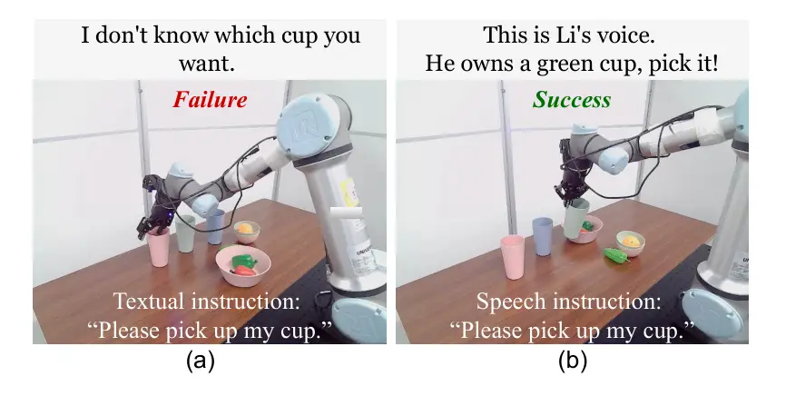
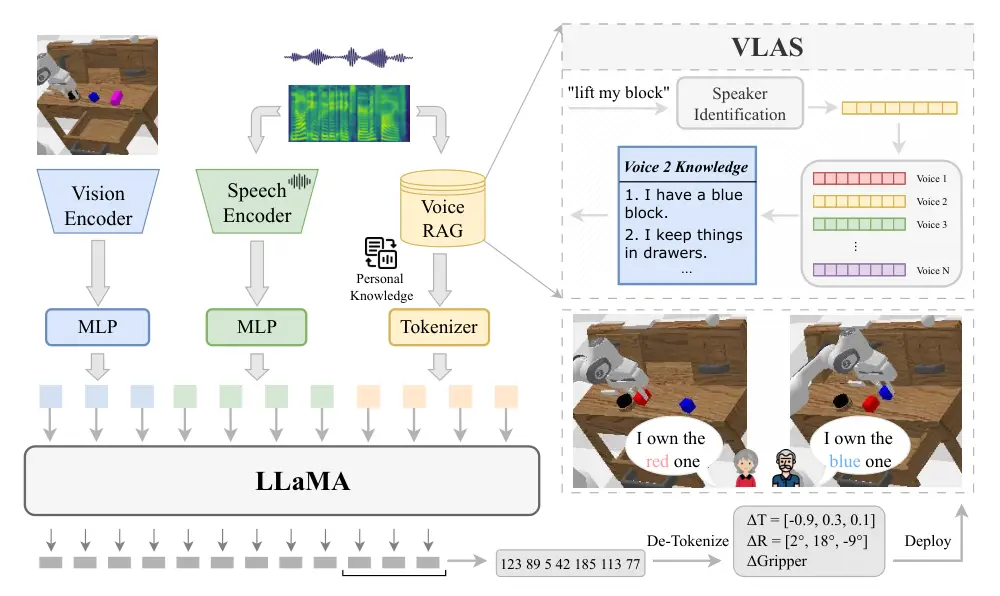
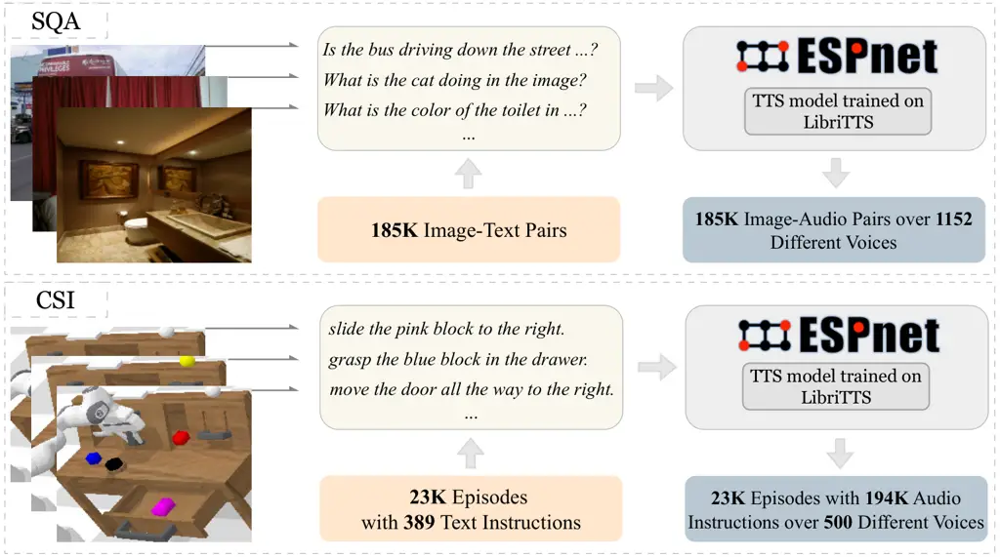
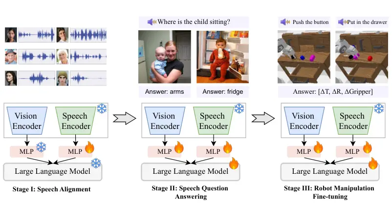
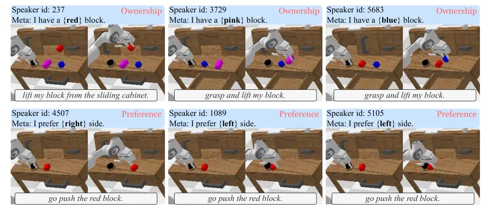
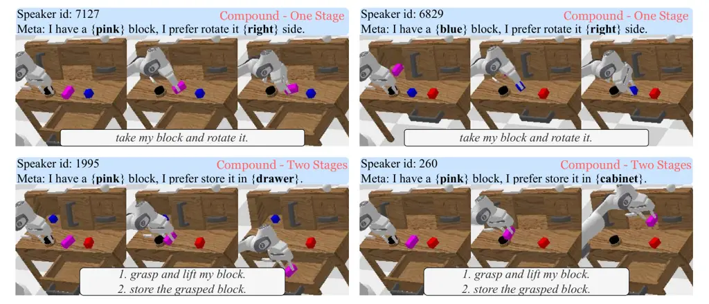
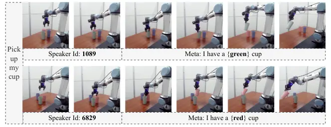
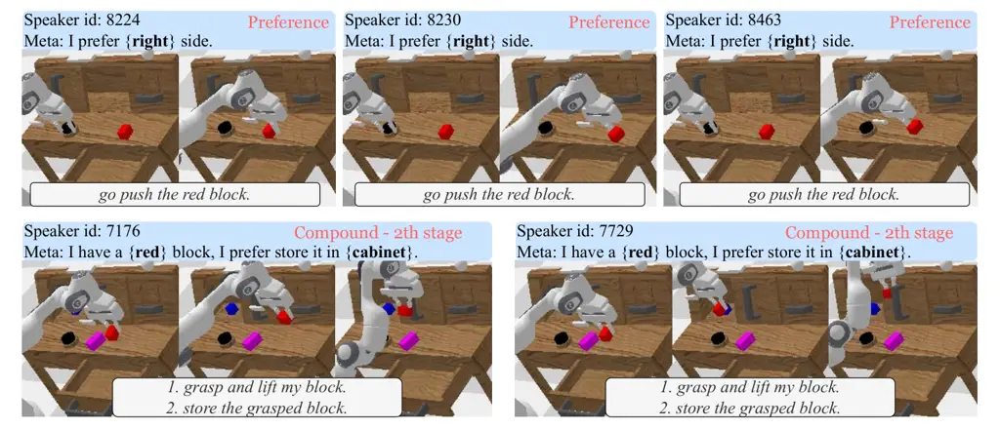
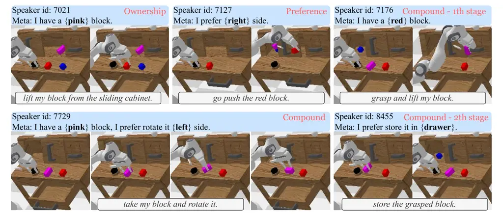

# VLAS: Vision-Language-Action Model with Speech Instructions for Customized Robot Manipulation

Wei Zhao Affiliation: Westlake University    Pengxiang Ding
Affiliation: Westlake University Affiliation: Zhejiang University    Min
Zhang Affiliation: Westlake University    Zhefei Gong
Affiliation: Westlake University    Shuanghao Bai Affiliation: Xi’an
Jiaotong University    Han Zhao Affiliation: Westlake University
Affiliation: Zhejiang University    Donglin Wang ^(†)^(†)thanks:
Corresponding author: wangdonglin@westlake.edu.cn Affiliation: Westlake
University

###### Abstract

Vision-language-action models (VLAs) have become increasingly popular in
robot manipulation for their end-to-end design and remarkable
performance. However, existing VLAs rely heavily on vision-language
models (VLMs) that only support text-based instructions, neglecting the
more natural speech modality for human-robot interaction. Traditional
speech integration methods usually involves a separate speech
recognition system, which complicates the model and introduces error
propagation. Moreover, the transcription procedure would lose
non-semantic information in the raw speech, such as voiceprint, which
may be crucial for robots to successfully complete customized tasks. To
overcome above challenges, we propose VLAS, a novel end-to-end VLA that
integrates speech recognition directly into the robot policy model. VLAS
allows the robot to understand spoken commands through inner speech-text
alignment and produces corresponding actions to fulfill the task. We
also present two new datasets, SQA and CSI, to support a three-stage
tuning process for speech instructions, which empowers VLAS with the
ability of multimodal interaction across text, image, speech, and robot
actions. Taking a step further, a voice retrieval-augmented generation
(RAG) paradigm is designed to enable our model to effectively handle
tasks that require individual-specific knowledge. Our extensive
experiments show that VLAS can effectively accomplish robot manipulation
tasks with diverse speech commands, offering a seamless and customized
interaction experience.

|     |
| --- |
|     |

## 1 Introduction

With the advent of large vision-language models (VLMs) and the
availability of extensive robotic datasets, vision-language-action
models (VLAs) (Brohan et al., 2022; Brohan et al., 2023; Kim et al., 2024) have become a promising approach for learning policies in robotic
manipulation. These models demonstrate enhanced generalization to novel
objects and semantically diverse instructions, as well as a range of
emergent capabilities. VLAs, such as RT-2 (Brohan et al., 2023), which
are fine-tuned from foundation VLMs like PaLM-E (Driess et al., 2023)
using robotic trajectory data, can take human instructions and visual
observations as inputs to generate robot actions. However, these models
primarily focus on textual and visual modalities, leaving the speech
modality largely unexplored.

Imagining a scenario where robots provide daily assistance in home care,
it is crucial to acknowledge that individuals may exhibit significant
variations in physical abilities and subjective preferences. To improve
the user experience, robots need to be more accessible and customizable.
Speech serves as an ideal modality for achieving this goal, enabling
natural and intuitive communication. Given these practical needs and
existing technologies, a key question arises: How can we integrate
vision-language-action models with speech modality to produce a simpler
and better end-user experience?

Based on the above analysis, we propose guiding a robot’s behavior
through speech rather than text. A typical approach involves leveraging
an external automatic speech recognition (ASR) system (Radford et al.,
2023; Yu et al., 2023) to transcribe speech into text for downstream
tasks. However, this method presents two significant issues: Firstly,
such a cascading pipeline leads to a larger and more complex robotic
system, potentially expanding computational demands and memory
consumption. Secondly, the transcription process may lose auxiliary
information beyond semantics, such as identity, emotion, and intonation,
which are vital for the robot’s comprehension of human intent. Many
everyday human instructions are unstructured and can only be accurately
understood with the support of above auxiliary information from speech.
For instance, as illustrated in Figure 1 (a), when given the task
“Please pick up my cup”, a traditional VLA with text instructions or a
VLA incorporating an ASR system may fail to select the correct cup.
Therefore, developing a policy model that utilizes raw speech for voice
recognition can greatly improve task execution.



Figure 1: For personalization tasks, (a) previous VLAs with text
instructions fail, while (b) our VLAS with speech instructions could
successfully address them.

To alleviate these two problems, we present VLAS, an innovative
end-to-end policy model that seamlessly integrates speech modality for
robot manipulation. Notably, VLAS is capable of directly processing both
textual and speech instructions alongside visual observations. VLAS is
built upon the widely adopted open-source vision-language model,
LLaVA (Liu et al., 2023), and is developed through three distinct
training phases. Firstly, we employ an established encoder to process
speech for hidden representations. The multi-layer perceptrons (MLPs)
are fine-tuned to transform these representations into the unified
language space of LLaVA. Secondly, we fine-tune the LLaVA model and
above MLPs together with multimodal datasets, including our curated
Speech Question Answering (SQA) dataset and Visual Question Answering
(VQA) datasets. The resulting model, termed VLAS-Base, can effectively
generate responses to both text-image and speech-image instructions.
Finally, we further fine-tune VLAS-Base through behavior cloning (Ross
et al., 2011) on our curated CSI dataset, which encompasses image
observations, speech instructions, and robot manipulation trajectories.
The voice retrieval-augmented generation (RAG) is subsequently proposed
to enable VLAS to perform personalized operations based on
individual-specific knowledge. Experimental results show that the
proposed VLAS, following either textual or speech instructions, can
achieve performance comparable to traditional VLAs on the CALVIN
benchmark. In addition, we created a benchmark consisting of
customization tasks, where our VLAS demonstrates improved performance by
fully leveraging the auxiliary information in speech.

To sum up, the main contributions of this work are listed as follows: 1)
We propose VLAS, the first vision-language-action model that integrates
speech for robot manipulation without needing external speech
recognition systems, enabling more natural communication with robots. 2)
A Voice RAG paradigm is designed to enable VLAS to effectively address
customized tasks that require individual-specific knowledge. 3) Besides
the robot policy model, we introduce VLAS-Base, which extends the widely
used vision-language model LLaVA to accept speech instructions. This
model is also valuable for other downstream tasks involving speech
inputs. We also present two new datasets, SQA and CSI for community
further study. The model, data and code will be publicly available at
[https://github.com/whichwhichgone/VLAS](https://github.com/whichwhichgone/VLAS).

## 2 Related Work

Vision-Language Model Large language models (LLMs), such as
FLAN-PaLM (Chung et al., 2022), InstructGPT (Ouyang et al., 2022),
LLaMA (Touvron et al., 2023), and Mamba (Gu & Dao, 2024), trained on
web-scale instruction-following datasets, have demonstrated exceptional
effectiveness in performing few-shot and zero-shot natural language
processing tasks. This approach has also been rapidly adopted in the
field of computer vision. Building on these pretrained LLMs, researchers
have developed various vision-language models (VLMs), including
OpenFlamingo (Awadalla et al., 2023), BLIP-2 (Li et al., 2023),
LLaMA-Adapter (Zhang et al., 2024), IDEFICS (Laurençon et al., 2023),
Prismatic (Karamcheti et al., 2024), LLaVA (Liu et al., 2023) and
Cobra (Zhao et al., 2025), capable of processing inputs from both text
and image modalities simultaneously. Many VLMs tailored for video
modalities have also emerged, such as VideoLLaMA (Zhang et al., 2023),
VideoLLaMA 2 (Cheng et al., 2024), PiTe (Liu et al., 2024),
Video-LLaVA (Lin et al., 2024), and LLaVA-NeXT-Interleave (Li et al.,
2024a).

It is worth mentioning that the VLMs discussed in this work refer to
models that work in a question-answering format, as opposed to models
like CLIP (Radford et al., 2021) and BLIP (Li et al., 2022), which are
specifically designed to learn joint representations of linguistic and
visual information. Among the prevalent VLMs, LLaVA stands out as a
significant milestone due to its full accessibility, reproducibility,
and outstanding performance. The key to LLaVA’s success lies in its
two-stage visual instruction tuning and the utilization of a carefully
curated image-text pair dataset. In the first training stage, LLaVA
fine-tunes a multilayer perceptron (MLP) on the image-captioning task,
aiming to map the output tokens from the image encoder into the language
embedding space. In the second training stage, all network components,
except for the pre-trained image encoder, are updated to optimize the
model’s instruction-following capabilities. Despite its strong
performance in visual question answering (VQA), LLaVA lacks support for
instructions in the form of speech. Many studies have also explored the
direct integration of audio information processing into multimodal LLMs,
such as ImageBind-LLM (Han et al., 2023) and Unified-IO 2 (Lu et al.,
2024). However, there were fewer VLMs capable of supporting raw speech
understanding until the recent introduction of GPT-4o (OpenAI, 2024),
Gemini (Team et al., 2024) and VITA (Fu et al., 2024).

Vision-Language-Action Model A growing body of research has focused on
applying VLMs in robotics, aiming to transfer general intelligence from
software applications to the physical world. Specifically, two primary
approaches have emerged for utilizing vision-language foundation models
in the field of robot manipulation. One category of methods employs
these foundation models only for high-level task planning, such as
PaLM-E (Driess et al., 2023), SayCan (Ahn et al., 2022) and Code as
Policies (Liang et al., 2023). In such studies, robots are typically
equipped with pre-trained primitive skills, while the VLM is responsible
for organizing these low-level skills to accomplish the target task. The
other approach, exemplified by models such as RT-2 (Brohan et al.,
2023), Roboflamingo (Li et al., 2024b), and OpenVLA (Kim et al., 2024),
seeks to generate robot actions directly by fine-tuning the VLM with
robot manipulation data. These models are commonly referred to as
vision-language-action (VLA) models (Ding et al., 2024; Tong et al.,
2024; Yue et al., 2024; Zhang et al., 2025). However, current VLA models
typically focus on processing only two input modalities: textual
instructions and visual observations (Belkhale et al., 2024). Some
studies have also explored integrating additional input modalities, such
as haptics and depth information, to further enhance model
performance (Cai et al., 2024; Zhen et al., 2024). Although MUTEX (Shah
et al., 2023) provides a unified policy for multimodal task
specifications, it does not fully leverage the capabilities of recent
vision-language models.

Nevertheless, few studies have investigated how speech modality inputs
could be incorporated into VLA models. The most common approach to
enabling speech input is to convert speech to text using an external
speech recognition tool. However, this approach is not only complex but
also results in the loss of auxiliary information present in the speech.
To that end, an increasing body of research has recently started to
explore the direct integration of speech into large language models in
an end-to-end manner (Fu et al., 2024). Thus, our work takes a step
further by developing a VLA model that supports speech instructions,
showcasing how speech modality input enhances performance in scenarios
where personalized knowledge is required.

## 3 Method

We present VLAS, a VLA model directly supporting speech instructions for
robot manipulation. As illustrated in Figure 2, we first provide an
overview of the VLAS architecture (Section 3.1). Section 3.2 introduces
the curated SQA and CSI datasets, which are employed to train the VLAS
model. Finally, in Section 3.3, we detail the training paradigm for
speech instruction tuning.

### 3.1 Architecture of VLAS

Overall Framework VLAS takes human speech instructions $`s`$ and visual
observations $`\mathbf{O}`$ as input to directly generate robot actions
$`\mathbf{a}`$. The input image and speech instruction represented by
frequency domain features are each converted into a sequence of
embedding tokens through their corresponding encoders. During the
inference phase, the output $`\rm RAG(s)`$ of the voice
retrieval-augmented generation module is also tokenized into a sequence
of embedding tokens. Both visual and speech tokens are transferred to
separate MLPs to map them into the same language space. Subsequently,
all the embedding tokens are concatenated as input to the LLM backbone.
Formally:

```math
{\rm Emb}(s,\mathbf{O})={\rm concat}({\rm MLP}_{s}({\rm Emb}_{s}(s)),{\rm Tok}_{l}({\rm RAG}(s)),{\rm MLP}_{v}({\rm Emb}_{v}(\mathbf{O}))), \tag{1}
```

where $`{\rm Emb}_{s}`$, and $`{\rm Emb}_{v}`$ denotes speech and vision
encoder, respectively; $`{\rm MLP}_{s}`$ and $`{\rm MLP}_{v}`$ means
corresponding projector; $`{\rm Tok}_{l}`$ is the text tokenizer. This
concatenated embedding is then fed into the LLM backbone to produce the
predicted actions in an autoregressive manner as:

```math
p\left(\mathbf{a}\mid{\rm Emb}(s,\mathbf{O})\right)=\prod_{i=1}^{N}p\left(a_{i}\mid{\rm Emb}(s,\mathbf{O}),a_{<i}\right) \tag{2}
```

where $`N`$ denotes the number of dimensions for a single step action,
and $`\mathbf{a}`$ is the discretized action tokens, which require a
detokenizer to be converted into continuous values.



Figure 2: Overall Framework of VLAS. VLAS encodes visual and speech
inputs via encoders and MLP layers to obtain respective embeddings. The
Voice RAG module retrieves personalized knowledge based on speaker
identification and converts it into embeddings using a text tokenizer.
All embeddings are then processed by LLaMA to generate action tokens,
which are subsequently detokenized into continuous values to control the
robot’s movements.

Network Backbone VLAS is built upon the vision-language model LLaVA, as
illustrated in Figure 2. In addition to the LLaMA LLM backbone, the key
components of LLaVA are the Vision Transformer (ViT) (Dosovitskiy
et al., 2021), which converts input image patches into a sequence of
embedding tokens, and MLPs that map these tokens to the same semantic
space as the LLM. When the vision tokens and text tokens are fed in
together, the LLM can correlate these inputs and generate a
corresponding response. In particular, we use the CLIP (Radford et al., 2021) model as the visual encoder and Vicuna (Chiang et al., 2023), a
fine-tuned variant of LLaMA, as the foundation model.

Speech Encoder To equip our model with the ability to process speech
modality input, we employ the Whisper (Radford et al., 2023) encoder
$`{\rm Emb}_{s}`$ to convert a speech instruction $`s`$ into a sequence
of hidden states $`{\rm Emb}_{s}(s)`$, similar to the visual tokens.
Before being fed into the Whisper encoder, the speech signal is first
transformed into an 80-bin mel-spectrogram using short-time Fourier
transform (STFT) and then padded to a fixed length of 3000 frames. The
speech encoder processes this mel-spectrogram and produces a sequence of
1500 hidden representations. Given that a long sequence of speech tokens
may impose a significant computational burden when directly input into
the LLM, we apply a simple reshape operation along the time dimension,
using a reduction factor of 5. An MLP is used to project the speech
tokens into the semantic space shared with the text and vision tokens.

Voice RAG Retrieval-Augmented Generation (RAG) (Zhao et al., 2024) is a
highly effective method for equipping large language models with the
capability to efficiently process dynamic and up-to-date information.
Human-spoken instructions frequently exhibit informality and lack of
structure, resulting in inadequate semantic content for task completion.
To address this issue, we propose a novel Voice RAG framework to bolster
model performance on tasks that require extensive personal knowledge.
The Voice RAG module allows our model to access additional customized
knowledge beyond the original instruction content. As illustrated in
Figure 2, the raw speech command is processed by the speaker
identification module to extract a voiceprint. This voiceprint serves as
a key to query an external database, retrieving relevant information.
The retrieved data is then integrated as background knowledge and passed
to the LLM, in conjunction with visual and speech tokens. To streamline
this process, we utilize a pre-trained voiceprint extraction module,
avoiding the need for from-scratch training. The integration of the
Voice RAG significantly enhances the model’s ability to comprehend and
execute complex spoken commands by supplementing additional contextual
information.

Action Tokenization We discretize a continuous action value into 256
uniformly spaced bins and represent them as integer indices.
Specifically, we reutilize the 256 least frequently used tokens in the
LLM vocabulary to serve as action tokens. Then, the robot action tokens
across all motion dimensions can be concatenated with a space character
to form a textual string, which serves as the training label.
Consequently, a 7-dimensional action value is formatted as:

```math
[x,\;y,\;z,\;\phi,\;\theta,\;\psi,\;g], \tag{3}
```

where $`x,y,z`$ represent the Cartesian coordinates of the end
effector’s position, $`\phi,\theta,\psi`$ denote the rotation angles of
the end effector along each axis, and $`g`$ is the gripper state.

### 3.2 DATA COLLECTION FOR VLAS



Figure 3: Data collection process for the SQA and CSI datasets.

Since traditional datasets used for fine-tuning VLM or VLA models do not
include speech instructions, we constructed two new datasets to train
our proposed model.

Speech Question Answering (SQA) Dataset The original visual instruction
tuning dataset used for LLaVA contains extensive image-text question
answering pairs, covering conversations, detailed descriptions, and
complex reasoning tasks. Among the three aforementioned task types, the
conversation subset follows a multi-turn format, whereas the others are
single-turn. To construct the SQA dataset, we randomly sampled one round
of dialogue from the multi-turn conversation subset and converted the
textual questions into corresponding speech as shown in Figure3. These
speech instructions, paired with associated images and textual answers,
form the SQA dataset. We used the text-to-speech (TTS) tool
ESPnet Hayashi et al. (2020) to generate the speech, specifically
employing the pre-trained VITS TTS model Kim et al. (2021) trained on
the LibriTTS dataset Zen et al. (2019), which supports over 2,000
distinct voices. During the conversion of textual questions to speech,
the speaker’s voice was randomly selected. In total, 185K SQA samples
were generated, featuring over 1,152 different voices.

CALVIN with Speech Instructions (CSI) Dataset Given that conventional
robot manipulation datasets contain only textual task instructions, we
utilized the aforementioned TTS model to generate the corresponding
speech instructions. For the CALVIN dataset, which contains 389 textual
instructions, we employed 500 different voices to convert each
instruction into speech, resulting in approximately 194K audio samples.
In the training process, the raw robot manipulation datasets are
structured as pairs of (($`{\rm Image}_{t}`$,
$`{\rm Instruction}_{text}`$), $`{\rm Action}_{t}`$). To enable the
robot policy model to support both text and speech instructions, we
randomly replaced half of the training samples with the synthesized
speech instructions.

### 3.3 TRAINING PARADIGM OF VLAS



Figure 4: Training paradigm of VLAS. The training process of VLAS is
divided into three stages. Stage I: Speech Alignment, where the model
aligns speech with text through MLP fine-tuning. Stage II: Speech
Question Answering, where the model is trained on both speech and visual
question answering tasks to facilitate comprehension of multimodal
inputs. Stage III: Robot Manipulation Fine-tuning, where the model is
further fine-tuned to execute robot manipulation tasks using both speech
and text instructions.

The training process of VLAS consists of three stages, as depicted in
Figure 4. The details of each stage are outlined below.

Stage I: Speech Alignment The first stage focuses on coarse-grained
modality alignment between speech and text, achieved by fine-tuning the
model using the LibriSpeech-360 speech recognition dataset Panayotov
et al. (2015). During this phase, only the MLP layer between the speech
encoder and the LLM backbone is updated to fulfill speech recognition
tasks. It is worth mentioning that the speaker identification module for
voiceprint extraction can be co-trained during this stage. However, this
is optional, as we may directly employ a pre-trained speaker
identification model.

Stage II: Speech Question Answering Fine-tuning The second stage focuses
on further enhancing the model’s capability to process information from
multiple input modalities. At this stage, the model is fine-tuned using
both our curated speech question answering (SQA) dataset and the
original visual question answering (VQA) datasets from LLaVA, as well as
the LibriSpeech-100 speech recognition dataset Panayotov et al. (2015).
Throughout this phase, all network components are updated, with the
exception of the pre-trained image and speech encoders. Notably, after
this stage, we obtain the foundation model, referred to as VLAS-Base,
for the subsequent robot manipulation task. The VLAS-Base model can also
serve as a valuable resource for the research community in advancing
studies on multimodal large language models.

Stage III: Robot Manipulation Fine-tuning In the final training stage,
the model is fine-tuned on the CSI robot manipulation dataset in a
manner similar to that of stage 2. Each sample in this dataset contains
a complete motion trajectory, represented as a sequence of robot
actions, along with visual observations from two distinct views and
corresponding human instructions in either textual or speech form. For
simplicity, the two images at each time step are concatenated together.

## 4 Experiments And Results

In this section, we conduct a series of experiments to assess the
effectiveness of the proposed method from multiple perspectives.
Section 4.1 first provides a quantitative evaluation of the performance
of our VLAS model on the CALVIN benchmark. In Section 4.2, we then
constructed a new benchmark consisting of various customized tasks to
further assess our method. Finally, in Section 4.4, to verify whether
our foundation model for robot manipulation truly understands speech
instructions without compromising LLaVA’s original performance, we
evaluate VLAS-Base on general multimodal benchmarks, as well as two
benchmarks for speech understanding.

### 4.1 Robot Manipulation with Speech Instructions

To quantitatively assess the performance of our proposed model for robot
manipulation tasks, we conduct experiments on the CALVIN benchmark,
which comprises 1,000 long-horizon tasks. Each long-horizon task
consists of a sequence of five successive sub-tasks, accompanied by a
corresponding human command. We trained a traditional VLA model with the
same configurations by directly fine-tuning the LLaVA backbone, without
support for speech instructions, as the baseline.

|                                     |        |         |         |         |         |         |        |
| ----------------------------------- | ------ | ------- | ------- | ------- | ------- | ------- | ------ |
| Models                              | Splits | LH-1    | LH-2    | LH-3    | LH-4    | LH-5    | Len    |
| MCIL$`{}^{\textbf{+}}`$             | ABCD/D | 37.3%   | 2.7%    | 0.2%    | 0.0%    | 0.0%    | 0.40   |
| HULC$`{}^{\textbf{+}}`$             | ABCD/D | 89.2%   | 70.1%   | 54.8%   | 42.0%   | 33.5%   | 2.90   |
| RT-1$`{}^{\textbf{+}}`$             | ABCD/D | 84.4%   | 61.7%   | 43.8%   | 32.3%   | 22.7%   | 2.45   |
| VLA$`{}^{\textbf{+}}`$              | ABCD/D | _95.5%_ | _85.0%_ | _74.9%_ | _66.8%_ | _58.2%_ | _3.80_ |
| VLAS$`{}^{\textbf{+}}`$             | ABCD/D | _94.5%_ | _84.4%_ | _73.6%_ | _64.6%_ | _56.6%_ | _3.74_ |
| Roboflamingo$`{}^{\textbf{*}}`$+ASR | ABCD/D | 89.8%   | 78.6%   | 68.2%   | 56.5%   | 48.3%   | 3.41   |
| VLA$`{}^{\textbf{*}}`$+ASR          | ABCD/D | 88.7%   | 74.1%   | 61.0%   | 49.2%   | 40.2%   | 3.13   |
| VLAS$`{}^{\textbf{*}}`$             | ABCD/D | 94.2%   | 84.0%   | 73.2%   | 64.3%   | 54.6%   | 3.70   |
| VLAS$`{}^{\textbf{*}}`$(Real)       | ABCD/D | 93.6%   | 82.8%   | 71.6%   | 61.4%   | 51.3%   | 3.61   |

Table 1: Performance of different robot policy models on the CALVIN
benchmark. $`{}^{\textbf{+}}`$: Evaluated with the ground truth textual
instructions. $`{}^{\textbf{*}}`$: Evaluated with the speech
instructions. On this benchmark, the Voice RAG module is not utilized by
VLAS to acquire any customized knowledge.

As shown in Table 1, our VLAS, with either textual or speech
instructions, significantly outperforms the official MCIL Lynch\* &
Sermanet\* (2021) model and other prevalent models such as HULC Mees
et al. (2022) and RT-1 Brohan et al. (2022). Specifically, VLAS with
textual instructions also achieves performance comparable to the
baseline VLA model. Moreover, our VLAS is compared for speech modality
input with the baseline VLA model and another powerful VLA model,
Roboflamingo, both similarly derived from the VLM. Since traditional
robot policy models do not directly support speech instructions, we
employ an external ASR model to transcribe the speech instructions into
text. The most powerful ASR model, Whisper large-v2, released by OpenAI
is used in the experiments. To generate the speech instructions for
evaluation, the previously discussed TTS model is employed with 39 novel
voices not included in the SQA and CSI datasets. For each instruction, a
corresponding voice is randomly sampled. In addition, we have included
real speech instructions recorded from 10 individuals for evaluation. As
can be observed, even with real speech instructions, our VLAS still
achieves strong performance, only slightly behind the VLA baseline with
a gap of 0.19.

We found that VLAS significantly outperforms the other two methods that
utilize a cascading pipeline for speech understanding. We attribute this
to the higher accuracy of our method in recognizing speech instructions
for robot manipulation, as the model has been fine-tuned on a
specialized dataset. Conversely, the external ASR model is less
sensitive to controlling commands for the robot, leading to amplified
propagation errors. It is important to highlight our method is
orthogonal to other VLA models, and thus, can be combined with them to
achieve superior performance.

### 4.2 Robot Manipulation for Customized Tasks

|                               |           |            |          |                     |         |       |
| ----------------------------- | --------- | ---------- | -------- | ------------------- | ------- | ----- |
| Models                        | Ownership | Preference | Compound | Compound-Multistage |         | Avg.  |
|                               |           |            |          | Stage-1             | Stage-2 |       |
| VLA$`{}^{\textbf{+}}`$        | 17.9%     | 30.8%      | 23.1%    | 35.9%               | 5.1%    | 19.2% |
| VLAS$`{}^{\textbf{*}}`$       | 94.7%     | 84.6%      | 100.0%   | 100.0%              | 66.7%   | 86.5% |
| VLAS$`{}^{\textbf{*}}`$(Real) | 89.5%     | 70.0%      | 100.0%   | 90.0%               | 55.0%   | 78.6% |
| VLAS$`{}^{\textbf{*}}-`$RAG   | 15.4%     | 12.8%      | 25.6%    | 33.3%               | 10.3%   | 16.0% |
| VLA$`{}^{\textbf{+}}+`$RAG    | 97.4%     | 84.6%      | 97.4%    | 82.1%               | 48.7%   | 82.0% |

Table 2: Performance of three types of customized tasks for robot
manipulation. $`{}^{\textbf{+}}`$: Evaluated with the ground truth
textual instructions. $`{}^{\textbf{*}}`$: Evaluated with the speech
instructions. On this benchmark, the Voice RAG module is utilized by
VLAS to acquire customized knowledge.

To evaluate our model’s capability in executing personalized tasks, we
developed a new benchmark comprising diverse, unstructured spoken
instructions within the simulation environment. All these tasks require
the robot to utilize personal knowledge beyond superficial semantic
content. Particularly, this benchmark includes three task categories:
(1) Object Ownership Tasks: The robot must interact with the appropriate
objects according to their ownership. When given a spoken instruction,
the robot needs to identify the person’s intention and use the correct
object belonging to them. (2) User Preference Tasks: These tasks
necessitate the robot to comprehend the user’s preferences. Given the
identical command, the robot is expected to perform different actions
depending on the specific user’s preferences. (3) Compound Tasks: Tasks
in this category require the robot not only to select appropriate
objects, but also to perform actions that align with the user’s
preferences. In particular, this category includes multistage tasks
where the robot is required to respond to two successive human
instructions. Since the outcome of the previous task can easily impact
the execution of the subsequent task, these multistage tasks pose a
greater challenge. For each task category, there are a total of 39
unseen voices beyond training datasets.

Table 2 presents a detailed comparison between the VLA baseline and
VLAS. Because the VLA baseline relies solely on text instructions and
lacks access to background knowledge, its performance is severely
limited, with an average success rate of below $`20\%`$. Such a model
can only perform tasks through random attempts or by drawing inferences
from contextual information. However, VLAS, which directly receives raw
speech input, leverages the Voice RAG to access individual-specific
knowledge, allowing it to perform customized operations more
effectively. As a result, our model demonstrates much better performance
on this benchmark, achieving an average success rate of over $`86\%`$.
Figure 5 and Figure 6 present several concrete case studies showing how
the proposed method performs customized operations for different users.

We introduce real speech instructions for evaluation, which also
demonstrates acceptable performance. Ablation studies are conducted to
further validate the effectiveness of our proposed Voice RAG module. It
can be seen from Table 2 that when the RAG module is removed, the
performance of VLAS significantly degrades on the customized benchmark.
Meanwhile, when our RAG module is integrated with the VLA, its
performance significantly improves. Both of the ablation studies above
demonstrate the effectiveness of the Voice RAG module.



Figure 5: Demonstration of object ownership tasks (top row) and user
preference tasks (bottom row) for customized robot manipulation.



Figure 6: Demonstration of compound tasks for customized robot
manipulation.

### 4.3 Experiments with a Real-World UR5 Robot Arm

We fine-tune our VLAS-Base by utilizing both the Berkeley UR5
demonstration dataset and our own cup-picking dataset. This results in a
VLAS model that can be deployed on real-world robots. As shown in Figure
 7, our model can respond to different actions according to the personal
information of the speaker, like picking up the specific cup considering
the ownership.



Figure 7: Demonstration of success cases of VLAS on the real-world UR5
robot arm.

### 4.4 Analysis for the VLAS-Base Foundation Model

The multimodal understanding capability of the VLAS-Base is critical
when fine-tuning it with robot trajectories to develop the proposed
VLAS. Therefore, we quantitatively assess the performance of our
VLAS-Base from two perspectives. First, the VLAS-Base is expected to
achieve performance comparable to the original LLaVA model, as the
ability to comprehend visual and language information serves as the
foundation for intelligent robot manipulation.

Table 3 provides a detailed comparison between the VLAS-Base and other
prevalent VLMs across general multimodal benchmarks. As can be observed,
VLAS-Base obtains nearly the same performance to LLaVA, while
significantly outperforming other VLMs. These results indicate that the
introduction of the speech modality does not degrade the performance of
the foundation model.

Second, the VLAS-Base model is also expected to have a strong
understanding of speech modality input. For this purpose, we conduct
experiments on the LibriSpeech automatic speech recognition benchmark
and our self-constructed speech question answering benchmark, SGQA.
Given the lack of Q&A evaluation benchmarks for image-speech pairs, we
converted all textual questions in the GQA benchmark for visual question
answering into speech format with an external TTS model, resulting in
the SGQA benchmark. For the speech recognition benchmark, we employ the
state-of-the-art Whisper large-v2 model as the baseline. For the speech
question answering benchmark, since prevalent VLMs typically do not
support speech input, we use LLaVA and BLIP-2 with ground-truth textual
instructions as baselines.

In Table 4, VLAS-Base achieves comparable performance to Whisper
large-v2 on the LibriSpeech test set. Considering that a reduction
factor is applied to downsample the speech spectrum for VLAS-Base, its
performance could potentially be improved by optimizing this factor or
by employing a more advanced downsampling module. Moreover, although
VLAS-Base falls behind LLaVA with ground-truth textual instructions on
the SGQA benchmark, it still surpasses BLIP-2.

These results indicate that our foundation model, used for developing
VLAS, can effectively process diverse speech instructions. We can even
utilize co-training with robot trajectories and speech question
answering data to further improve VLAS’s capacity to handle more complex
human commands.

| Model        | LLM        | VQA^(v2) | VizWiz | SQA^(I) | VQA^(T) | POPE | GQA  |
| ------------ | ---------- | -------- | ------ | ------- | ------- | ---- | ---- |
| BLIP-2       | Vicuna-13B | 65.0     | 19.6   | 61.0    | 42.5    | 85.3 | 41.0 |
| InstructBLIP | Vicuna-13B | \-       | 33.4   | 63.1    | 50.7    | 78.9 | 49.5 |
| Qwen-VL      | Qwen-7B    | 78.8     | 35.2   | 67.1    | 63.8    | \-   | 59.3 |
| LLaVA v1.5   | Vicuna-7B  | 78.8     | 50.0   | 66.8    | 58.2    | 85.9 | 62.0 |
| VLAS-Base    | Vicuna-7B  | 78.7     | 51.1   | 72.2    | 58.1    | 85.5 | 62.0 |

Table 3: Performance comparison between state-of-the-art VLMs to
VLAS-Base across diverse multimodal evaluation benchmarks.

| Model      | LibriSpeech (WER) | SGQA |
| ---------- | ----------------- | ---- |
| LLaVA v1.5 | N/A               | 62.0 |
| BLIP-2     | N/A               | 41.0 |
| Whisper    | 2.7%              | N/A  |
| VLAS-Base  | 2.79%             | 50.8 |

Table 4: Performance comparison on LibriSpeech and SGQA benchmark, using
word error rate (WER) and accuracy as evaluation metrics. LLaVA and
BLIP-2 employ the ground truth textual insturctions on SGQA.

## 5 Conclusion

This paper presents an end-to-end VLA model for robot manipulation that
is capable of understanding speech instructions without relying on an
external speech recognition system. As the raw speech is directly taken
as the model’s input, auxiliary information in the speech, such as
voiceprint, can be fully utilized to more effectively complete the given
task. In particular, we introduce a Voice RAG method for our model to
improve its performance in following spoken instructions that require
extensive individual-specific knowledge. Consequently, the integration
of speech modality data in VLAS not only simplifies the overall pipeline
for robot control but also enables the robot to handle a wide range of
customized tasks. Our future work may focus on exploring other auxiliary
information in human speech or environmental sounds to enable the robot
to better understand and complete complex tasks.

## References

- Ahn et al. (2022) Michael Ahn, Anthony Brohan, Noah Brown, Yevgen
  Chebotar, Omar Cortes, Byron David, Chelsea Finn, Chuyuan Fu,
  Keerthana Gopalakrishnan, Karol Hausman, Alex Herzog, Daniel Ho,
  Jasmine Hsu, Julian Ibarz, Brian Ichter, Alex Irpan, Eric Jang,
  Rosario Jauregui Ruano, Kyle Jeffrey, Sally Jesmonth, Nikhil Joshi,
  Ryan Julian, Dmitry Kalashnikov, Yuheng Kuang, Kuang-Huei Lee, Sergey
  Levine, Yao Lu, Linda Luu, Carolina Parada, Peter Pastor, Jornell
  Quiambao, Kanishka Rao, Jarek Rettinghouse, Diego Reyes, Pierre
  Sermanet, Nicolas Sievers, Clayton Tan, Alexander Toshev, Vincent
  Vanhoucke, Fei Xia, Ted Xiao, Peng Xu, Sichun Xu, Mengyuan Yan, and
  Andy Zeng. Do as i can and not as i say: Grounding language in robotic
  affordances. In _arXiv preprint arXiv:2204.01691_, 2022.
- Awadalla et al. (2023) Anas Awadalla, Irena Gao, Josh Gardner, Jack
  Hessel, Yusuf Hanafy, Wanrong Zhu, Kalyani Marathe, Yonatan Bitton,
  Samir Gadre, Shiori Sagawa, Jenia Jitsev, Simon Kornblith, Pang Wei
  Koh, Gabriel Ilharco, Mitchell Wortsman, and Ludwig Schmidt.
  Openflamingo: An open-source framework for training large
  autoregressive vision-language models. _arXiv preprint
  arXiv:2308.01390_, 2023.
- Belkhale et al. (2024) Suneel Belkhale, Tianli Ding, Ted Xiao, Pierre
  Sermanet, Quon Vuong, Jonathan Tompson, Yevgen Chebotar, Debidatta
  Dwibedi, and Dorsa Sadigh. RT-H: Action Hierarchies Using Language,
  March 2024. URL
  [http://arxiv.org/abs/2403.01823](http://arxiv.org/abs/2403.01823).
  arXiv:2403.01823 \[cs\].
- Brohan et al. (2022) Anthony Brohan, Noah Brown, Justice Carbajal,
  Yevgen Chebotar, Joseph Dabis, Chelsea Finn, Keerthana Gopalakrishnan,
  Karol Hausman, Alex Herzog, Jasmine Hsu, et al. Rt-1: Robotics
  transformer for real-world control at scale. _arXiv preprint
  arXiv:2212.06817_, 2022.
- Brohan et al. (2023) Anthony Brohan, Noah Brown, Justice Carbajal,
  Yevgen Chebotar, Xi Chen, Krzysztof Choromanski, Tianli Ding, Danny
  Driess, Avinava Dubey, Chelsea Finn, Pete Florence, Chuyuan Fu,
  Montse Gonzalez Arenas, Keerthana Gopalakrishnan, Kehang Han, Karol
  Hausman, Alexander Herzog, Jasmine Hsu, Brian Ichter, Alex Irpan,
  Nikhil Joshi, Ryan Julian, Dmitry Kalashnikov, Yuheng Kuang, Isabel
  Leal, Lisa Lee, Tsang-Wei Edward Lee, Sergey Levine, Yao Lu, Henryk
  Michalewski, Igor Mordatch, Karl Pertsch, Kanishka Rao, Krista
  Reymann, Michael Ryoo, Grecia Salazar, Pannag Sanketi, Pierre
  Sermanet, Jaspiar Singh, Anikait Singh, Radu Soricut, Huong Tran,
  Vincent Vanhoucke, Quan Vuong, Ayzaan Wahid, Stefan Welker, Paul
  Wohlhart, Jialin Wu, Fei Xia, Ted Xiao, Peng Xu, Sichun Xu, Tianhe Yu,
  and Brianna Zitkovich. Rt-2: Vision-language-action models transfer
  web knowledge to robotic control, 2023. URL
  [https://arxiv.org/abs/2307.15818](https://arxiv.org/abs/2307.15818).
- Cai et al. (2024) Wenxiao Cai, Iaroslav Ponomarenko, Jianhao Yuan,
  Xiaoqi Li, Wankou Yang, Hao Dong, and Bo Zhao. Spatialbot: Precise
  spatial understanding with vision language models, 2024. URL
  [https://arxiv.org/abs/2406.13642](https://arxiv.org/abs/2406.13642).
- Cheng et al. (2024) Zesen Cheng, Sicong Leng, Hang Zhang, Yifei Xin,
  Xin Li, Guanzheng Chen, Yongxin Zhu, Wenqi Zhang, Ziyang Luo, Deli
  Zhao, and Lidong Bing. VideoLLaMA 2: Advancing Spatial-Temporal
  Modeling and Audio Understanding in Video-LLMs, October 2024. URL
  [http://arxiv.org/abs/2406.07476](http://arxiv.org/abs/2406.07476).
  arXiv:2406.07476.
- Chiang et al. (2023) Wei-Lin Chiang, Zhuohan Li, Zi Lin, Ying Sheng,
  Zhanghao Wu, Hao Zhang, Lianmin Zheng, Siyuan Zhuang, Yonghao Zhuang,
  Joseph E. Gonzalez, Ion Stoica, and Eric P. Xing. Vicuna: An
  open-source chatbot impressing gpt-4 with 90%\* chatgpt quality,
  March 2023. URL
  [https://lmsys.org/blog/2023-03-30-vicuna/](https://lmsys.org/blog/2023-03-30-vicuna/).
- Chung et al. (2022) Hyung Won Chung, Le Hou, Shayne Longpre, Barret
  Zoph, Yi Tay, William Fedus, Yunxuan Li, Xuezhi Wang, Mostafa
  Dehghani, Siddhartha Brahma, Albert Webson, Shixiang Shane Gu, Zhuyun
  Dai, Mirac Suzgun, Xinyun Chen, Aakanksha Chowdhery, Alex Castro-Ros,
  Marie Pellat, Kevin Robinson, Dasha Valter, Sharan Narang, Gaurav
  Mishra, Adams Yu, Vincent Zhao, Yanping Huang, Andrew Dai, Hongkun Yu,
  Slav Petrov, Ed H. Chi, Jeff Dean, Jacob Devlin, Adam Roberts, Denny
  Zhou, Quoc V. Le, and Jason Wei. Scaling instruction-finetuned
  language models, 2022. URL
  [https://arxiv.org/abs/2210.11416](https://arxiv.org/abs/2210.11416).
- Ding et al. (2024) Pengxiang Ding, Han Zhao, Wenjie Zhang, Wenxuan
  Song, Min Zhang, Siteng Huang, Ningxi Yang, and Donglin Wang.
  QUAR-VLA: Vision-Language-Action Model for Quadruped Robots. In
  _Computer Vision – ECCV 2024: 18th European Conference, Milan, Italy,
  September 29–October 4, 2024, Proceedings, Part V_, pp. 352–367,
  Berlin, Heidelberg, October 2024. Springer-Verlag. ISBN
  978-3-031-72651-4. doi: 10.1007/978-3-031-72652-1_21. URL
  [https://doi.org/10.1007/978-3-031-72652-1_21](https://doi.org/10.1007/978-3-031-72652-1_21).
- Dosovitskiy et al. (2021) Alexey Dosovitskiy, Lucas Beyer, Alexander
  Kolesnikov, Dirk Weissenborn, Xiaohua Zhai, Thomas Unterthiner,
  Mostafa Dehghani, Matthias Minderer, Georg Heigold, Sylvain Gelly,
  Jakob Uszkoreit, and Neil Houlsby. An image is worth 16x16 words:
  Transformers for image recognition at scale, 2021. URL
  [https://arxiv.org/abs/2010.11929](https://arxiv.org/abs/2010.11929).
- Driess et al. (2023) Danny Driess, Fei Xia, Mehdi S. M. Sajjadi, Corey
  Lynch, Aakanksha Chowdhery, Brian Ichter, Ayzaan Wahid, Jonathan
  Tompson, Quan Vuong, Tianhe Yu, Wenlong Huang, Yevgen Chebotar, Pierre
  Sermanet, Daniel Duckworth, Sergey Levine, Vincent Vanhoucke, Karol
  Hausman, Marc Toussaint, Klaus Greff, Andy Zeng, Igor Mordatch, and
  Pete Florence. Palm-e: An embodied multimodal language model, 2023.
  URL
  [https://arxiv.org/abs/2303.03378](https://arxiv.org/abs/2303.03378).
- Fu et al. (2024) Chaoyou Fu, Haojia Lin, Zuwei Long, Yunhang Shen,
  Meng Zhao, Yifan Zhang, Shaoqi Dong, Xiong Wang, Di Yin, Long Ma,
  Xiawu Zheng, Ran He, Rongrong Ji, Yunsheng Wu, Caifeng Shan, and Xing
  Sun. VITA: Towards Open-Source Interactive Omni Multimodal LLM,
  September 2024. URL
  [http://arxiv.org/abs/2408.05211](http://arxiv.org/abs/2408.05211).
  arXiv:2408.05211 \[cs\].
- Gu & Dao (2024) Albert Gu and Tri Dao. Mamba: Linear-Time Sequence
  Modeling with Selective State Spaces. In _First Conference on Language
  Modeling_, August 2024. URL
  [https://openreview.net/forum?id=tEYskw1VY2#discussion](https://openreview.net/forum?id=tEYskw1VY2#discussion).
- Han et al. (2023) Jiaming Han, Renrui Zhang, Wenqi Shao, Peng Gao,
  Peng Xu, Han Xiao, Kaipeng Zhang, Chris Liu, Song Wen, Ziyu Guo,
  Xudong Lu, Shuai Ren, Yafei Wen, Xiaoxin Chen, Xiangyu Yue, Hongsheng
  Li, and Yu Qiao. ImageBind-LLM: Multi-modality Instruction Tuning,
  September 2023. URL
  [http://arxiv.org/abs/2309.03905](http://arxiv.org/abs/2309.03905).
- Hayashi et al. (2020) Tomoki Hayashi, Ryuichi Yamamoto, Katsuki Inoue,
  Takenori Yoshimura, Shinji Watanabe, Tomoki Toda, Kazuya Takeda,
  Yu Zhang, and Xu Tan. Espnet-TTS: Unified, Reproducible, and
  Integratable Open Source End-to-End Text-to-Speech Toolkit. In
  _International Conference on Acoustics, Speech and Signal Processing_,
  pp. 7654–7658, Barcelona, Spain, May 2020. doi:
  10.1109/ICASSP40776.2020.9053512. ISSN: 2379-190X.
- Karamcheti et al. (2024) Siddharth Karamcheti, Suraj Nair, Ashwin
  Balakrishna, Percy Liang, Thomas Kollar, and Dorsa Sadigh. Prismatic
  VLMs: Investigating the Design Space of Visually-Conditioned Language
  Models. In _Proceedings of the 41st International Conference on
  Machine Learning_, pp. 23123–23144. PMLR, July 2024. URL
  [https://proceedings.mlr.press/v235/karamcheti24a.html](https://proceedings.mlr.press/v235/karamcheti24a.html).
  ISSN: 2640-3498.
- Kim et al. (2021) Jaehyeon Kim, Jungil Kong, and Juhee Son.
  Conditional Variational Autoencoder with Adversarial Learning for
  End-to-End Text-to-Speech. In _Proceedings of the 38th International
  Conference on Machine Learning_, pp. 5530–5540. PMLR, July 2021. URL
  [https://proceedings.mlr.press/v139/kim21f.html](https://proceedings.mlr.press/v139/kim21f.html).
  ISSN: 2640-3498.
- Kim et al. (2024) Moo Jin Kim, Karl Pertsch, Siddharth Karamcheti, Ted
  Xiao, Ashwin Balakrishna, Suraj Nair, Rafael Rafailov, Ethan Foster,
  Grace Lam, Pannag Sanketi, Quan Vuong, Thomas Kollar, Benjamin
  Burchfiel, Russ Tedrake, Dorsa Sadigh, Sergey Levine, Percy Liang, and
  Chelsea Finn. Openvla: An open-source vision-language-action
  model, 2024. URL
  [https://arxiv.org/abs/2406.09246](https://arxiv.org/abs/2406.09246).
- Laurençon et al. (2023) Hugo Laurençon, Lucile Saulnier, Léo Tronchon,
  Stas Bekman, Amanpreet Singh, Anton Lozhkov, Thomas Wang, Siddharth
  Karamcheti, Alexander M. Rush, Douwe Kiela, Matthieu Cord, and Victor
  Sanh. OBELICS: An Open Web-Scale Filtered Dataset of Interleaved
  Image-Text Documents, August 2023. URL
  [http://arxiv.org/abs/2306.16527](http://arxiv.org/abs/2306.16527).
  arXiv:2306.16527.
- Li et al. (2024a) Feng Li, Renrui Zhang, Hao Zhang, Yuanhan Zhang,
  Bo Li, Wei Li, Zejun Ma, and Chunyuan Li. LLaVA-NeXT-Interleave:
  Tackling Multi-image, Video, and 3D in Large Multimodal Models, July
  2024a. URL
  [http://arxiv.org/abs/2407.07895](http://arxiv.org/abs/2407.07895).
  arXiv:2407.07895.
- Li et al. (2022) Junnan Li, Dongxu Li, Caiming Xiong, and Steven Hoi.
  Blip: Bootstrapping language-image pre-training for unified
  vision-language understanding and generation, 2022. URL
  [https://arxiv.org/abs/2201.12086](https://arxiv.org/abs/2201.12086).
- Li et al. (2023) Junnan Li, Dongxu Li, Silvio Savarese, and Steven
  Hoi. Blip-2: Bootstrapping language-image pre-training with frozen
  image encoders and large language models, 2023. URL
  [https://arxiv.org/abs/2301.12597](https://arxiv.org/abs/2301.12597).
- Li et al. (2024b) Xinghang Li, Minghuan Liu, Hanbo Zhang, Cunjun Yu,
  Jie Xu, Hongtao Wu, Chilam Cheang, Ya Jing, Weinan Zhang, Huaping Liu,
  Hang Li, and Tao Kong. Vision-language foundation models as effective
  robot imitators, 2024b. URL
  [https://arxiv.org/abs/2311.01378](https://arxiv.org/abs/2311.01378).
- Liang et al. (2023) Jacky Liang, Wenlong Huang, Fei Xia, Peng Xu,
  Karol Hausman, Brian Ichter, Pete Florence, and Andy Zeng. Code as
  policies: Language model programs for embodied control, 2023. URL
  [https://arxiv.org/abs/2209.07753](https://arxiv.org/abs/2209.07753).
- Lin et al. (2024) Bin Lin, Yang Ye, Bin Zhu, Jiaxi Cui, Munan Ning,
  Peng Jin, and Li Yuan. Video-LLaVA: Learning United Visual
  Representation by Alignment Before Projection. In Yaser Al-Onaizan,
  Mohit Bansal, and Yun-Nung Chen (eds.), _Proceedings of the 2024
  Conference on Empirical Methods in Natural Language Processing_, pp.
  5971–5984, Miami, Florida, USA, November 2024. Association for
  Computational Linguistics. URL
  [https://aclanthology.org/2024.emnlp-main.342](https://aclanthology.org/2024.emnlp-main.342).
- Liu et al. (2023) Haotian Liu, Chunyuan Li, Qingyang Wu, and Yong Jae
  Lee. Visual instruction tuning, 2023. URL
  [https://arxiv.org/abs/2304.08485](https://arxiv.org/abs/2304.08485).
- Liu et al. (2024) Yang Liu, Pengxiang Ding, Siteng Huang, Min Zhang,
  Han Zhao, and Donglin Wang. PiTe: Pixel-Temporal Alignment for Large
  Video-Language Model. In _Computer Vision – ECCV 2024: 18th European
  Conference, Milan, Italy, September 29–October 4, 2024, Proceedings,
  Part V_, pp. 160–176, Berlin, Heidelberg, October 2024.
  Springer-Verlag. ISBN 978-3-031-72651-4. doi:
  10.1007/978-3-031-72652-1_10. URL
  [https://doi.org/10.1007/978-3-031-72652-1_10](https://doi.org/10.1007/978-3-031-72652-1_10).
- Lu et al. (2024) Jiasen Lu, Christopher Clark, Sangho Lee, Zichen
  Zhang, Savya Khosla, Ryan Marten, Derek Hoiem, and Aniruddha Kembhavi.
  Unified-IO 2: Scaling Autoregressive Multimodal Models with Vision,
  Language, Audio, and Action. In _2024 IEEE/CVF Conference on Computer
  Vision and Pattern Recognition (CVPR)_, pp. 26429–26445, Seattle, WA,
  USA, June 2024. IEEE. ISBN 9798350353006. doi:
  10.1109/CVPR52733.2024.02497. URL
  [https://ieeexplore.ieee.org/document/10657364/](https://ieeexplore.ieee.org/document/10657364/).
- Lynch\* & Sermanet\* (2021) Corey Lynch\* and Pierre Sermanet\*.
  Language Conditioned Imitation Learning Over Unstructured Data. In
  _Robotics: Science and Systems XVII_. Robotics: Science and Systems
  Foundation, July 2021. ISBN 978-0-9923747-7-8. doi:
  10.15607/RSS.2021.XVII.047. URL
  [http://www.roboticsproceedings.org/rss17/p047.pdf](http://www.roboticsproceedings.org/rss17/p047.pdf).
- Mees et al. (2022) Oier Mees, Lukas Hermann, and Wolfram Burgard. What
  matters in language conditioned robotic imitation learning over
  unstructured data. _IEEE Robotics and Automation Letters (RA-L)_,
  7(4):11205–11212, 2022.
- OpenAI (2024) OpenAI. Gpt-4: Generative pre-trained transformer 4.
  [https://openai.com/index/hello-gpt-4o/](https://openai.com/index/hello-gpt-4o/), 2024.
- Ouyang et al. (2022) Long Ouyang, Jeff Wu, Xu Jiang, Diogo Almeida,
  Carroll L. Wainwright, Pamela Mishkin, Chong Zhang, Sandhini Agarwal,
  Katarina Slama, Alex Ray, John Schulman, Jacob Hilton, Fraser Kelton,
  Luke Miller, Maddie Simens, Amanda Askell, Peter Welinder, Paul
  Christiano, Jan Leike, and Ryan Lowe. Training language models to
  follow instructions with human feedback, 2022. URL
  [https://arxiv.org/abs/2203.02155](https://arxiv.org/abs/2203.02155).
- Panayotov et al. (2015) Vassil Panayotov, Guoguo Chen, Daniel Povey,
  and Sanjeev Khudanpur. Librispeech: An ASR corpus based on public
  domain audio books. In _2015 IEEE International Conference on
  Acoustics, Speech and Signal Processing (ICASSP)_, pp. 5206–5210,
  April 2015. doi: 10.1109/ICASSP.2015.7178964. URL
  [https://ieeexplore.ieee.org/document/7178964](https://ieeexplore.ieee.org/document/7178964).
  ISSN: 2379-190X.
- Radford et al. (2021) Alec Radford, Jong Wook Kim, Chris Hallacy,
  Aditya Ramesh, Gabriel Goh, Sandhini Agarwal, Girish Sastry, Amanda
  Askell, Pamela Mishkin, Jack Clark, Gretchen Krueger, and Ilya
  Sutskever. Learning transferable visual models from natural language
  supervision, 2021. URL
  [https://arxiv.org/abs/2103.00020](https://arxiv.org/abs/2103.00020).
- Radford et al. (2023) Alec Radford, Jong Wook Kim, Tao Xu, Greg
  Brockman, Christine McLeavey, and Ilya Sutskever. Robust speech
  recognition via large-scale weak supervision. In _Proceedings of the
  40th International Conference on Machine Learning_, volume 202 of
  _ICML’23_, pp. 28492–28518, Honolulu, Hawaii, USA, July 2023.
  JMLR.org.
- Ross et al. (2011) Stephane Ross, Geoffrey J. Gordon, and J. Andrew
  Bagnell. A reduction of imitation learning and structured prediction
  to no-regret online learning, 2011. URL
  [https://arxiv.org/abs/1011.0686](https://arxiv.org/abs/1011.0686).
- Shah et al. (2023) Rutav Shah, Roberto Martín-Martín, and Yuke Zhu.
  MUTEX: Learning Unified Policies from Multimodal Task Specifications.
  In _Proceedings of The 7th Conference on Robot Learning_, pp.
  2663–2682. PMLR, December 2023. URL
  [https://proceedings.mlr.press/v229/shah23b.html](https://proceedings.mlr.press/v229/shah23b.html).
  ISSN: 2640-3498.
- Team et al. (2024) Gemini Team, Rohan Anil, Sebastian Borgeaud, and
  Alayrac. Gemini: A Family of Highly Capable Multimodal Models,
  June 2024. URL
  [http://arxiv.org/abs/2312.11805](http://arxiv.org/abs/2312.11805).
  arXiv:2312.11805.
- Tong et al. (2024) Xinyang Tong, Pengxiang Ding, Donglin Wang, Wenjie
  Zhang, Can Cui, Mingyang Sun, Yiguo Fan, Han Zhao, Hongyin Zhang,
  Yonghao Dang, Siteng Huang, and Shangke Lyu. QUART-Online:
  Latency-Free Large Multimodal Language Model for Quadruped Robot
  Learning, December 2024. URL
  [http://arxiv.org/abs/2412.15576](http://arxiv.org/abs/2412.15576).
  arXiv:2412.15576 \[cs\].
- Touvron et al. (2023) Hugo Touvron, Thibaut Lavril, Gautier Izacard,
  Xavier Martinet, Marie-Anne Lachaux, Timothée Lacroix, Baptiste
  Rozière, Naman Goyal, Eric Hambro, Faisal Azhar, Aurelien Rodriguez,
  Armand Joulin, Edouard Grave, and Guillaume Lample. Llama: Open and
  efficient foundation language models, 2023. URL
  [https://arxiv.org/abs/2302.13971](https://arxiv.org/abs/2302.13971).
- Yu et al. (2023) Wenyi Yu, Changli Tang, Guangzhi Sun, Xianzhao Chen,
  Tian Tan, Wei Li, Lu Lu, Zejun Ma, and Chao Zhang. Connecting Speech
  Encoder and Large Language Model for ASR, September 2023. URL
  [http://arxiv.org/abs/2309.13963](http://arxiv.org/abs/2309.13963).
  arXiv:2309.13963 \[cs, eess\].
- Yue et al. (2024) Yang Yue, Yulin Wang, Bingyi Kang, Yizeng Han,
  Shenzhi Wang, Shiji Song, Jiashi Feng, and Gao Huang. Deer-vla:
  Dynamic inference of multimodal large language models for efficient
  robot execution. _NeurIPS_, 2024.
- Zen et al. (2019) Heiga Zen, Viet Dang, Rob Clark, Yu Zhang, Ron J.
  Weiss, Ye Jia, Zhifeng Chen, and Yonghui Wu. LibriTTS: A Corpus
  Derived from LibriSpeech for Text-to-Speech. In _Interspeech 2019_,
  pp. 1526–1530. ISCA, September 2019. doi:
  10.21437/Interspeech.2019-2441. URL
  [https://www.isca-archive.org/interspeech_2019/zen19_interspeech.html](https://www.isca-archive.org/interspeech_2019/zen19_interspeech.html).
- Zhang et al. (2023) Hang Zhang, Xin Li, and Lidong Bing. Video-LLaMA:
  An Instruction-tuned Audio-Visual Language Model for Video
  Understanding. In Yansong Feng and Els Lefever (eds.), _Proceedings of
  the 2023 Conference on Empirical Methods in Natural Language
  Processing: System Demonstrations_, pp. 543–553, Singapore,
  December 2023. Association for Computational Linguistics. doi:
  10.18653/v1/2023.emnlp-demo.49. URL
  [https://aclanthology.org/2023.emnlp-demo.49](https://aclanthology.org/2023.emnlp-demo.49).
- Zhang et al. (2025) Hongyin Zhang, Pengxiang Ding, Shangke Lyu, Ying
  Peng, and Donglin Wang. Gevrm: Goal-expressive video generation model
  for robust visual manipulation. _arXiv preprint
  arXiv:2502.09268_, 2025.
- Zhang et al. (2024) Renrui Zhang, Jiaming Han, Chris Liu, Peng Gao,
  Aojun Zhou, Xiangfei Hu, Shilin Yan, Pan Lu, Hongsheng Li, and
  Yu Qiao. Llama-adapter: Efficient fine-tuning of language models with
  zero-init attention, 2024. URL
  [https://arxiv.org/abs/2303.16199](https://arxiv.org/abs/2303.16199).
- Zhao et al. (2025) Han Zhao, Min Zhang, Wei Zhao, Pengxiang Ding,
  Siteng Huang, and Donglin Wang. Cobra: Extending Mamba to Multi-Modal
  Large Language Model for Efficient Inference, January 2025. URL
  [http://arxiv.org/abs/2403.14520](http://arxiv.org/abs/2403.14520).
  arXiv:2403.14520 \[cs\].
- Zhao et al. (2024) Siyun Zhao, Yuqing Yang, Zilong Wang, Zhiyuan He,
  Luna K. Qiu, and Lili Qiu. Retrieval augmented generation (rag) and
  beyond: A comprehensive survey on how to make your llms use external
  data more wisely, 2024. URL
  [https://arxiv.org/abs/2409.14924](https://arxiv.org/abs/2409.14924).
- Zhen et al. (2024) Haoyu Zhen, Xiaowen Qiu, Peihao Chen, Jincheng
  Yang, Xin Yan, Yilun Du, Yining Hong, and Chuang Gan. 3D-VLA: A 3D
  Vision-Language-Action Generative World Model. In _Proceedings of the
  41st International Conference on Machine Learning_, pp. 61229–61245.
  PMLR, July 2024. URL
  [https://proceedings.mlr.press/v235/zhen24a.html](https://proceedings.mlr.press/v235/zhen24a.html).
  ISSN: 2640-3498.

## Appendix A Training Details

We perform fine-tuning in Stage I on the train-clean-100 split of the
LibriSpeech dataset for 5 epochs, using a learning rate of 1e-3 and a
batch size of 16. Subsequently, the fine-tuning in Stage II is conducted
on our SQA dataset, along with the released LLaVA 665K
instruction-following dataset and the train-clean-360 split of
LibriSpeech, for 1 epoch using a learning rate of 2e-5 and a batch size
of 16. Finally, we fine-tune the model on the CSI robot manipulation
dataset for 1 epoch, with a learning rate of 2e-5 and a batch size of 16. Specifically, we combined actions from 5 time steps into a single
training label to increase the operating frequency of the robot policy
model. The Adam optimizer without weight decay and a cosine learning
rate schedule with a 3% warmup ratio are used throughout the
experiments. Flash Attention 2, BF16, and TF32 are enabled to achieve a
balance between training speed and precision.

All models are trained using 8× A100 GPUs, except for the fine-tuning in
Stage I. We empirically found that employing a single GPU for
coarse-grained speech alignment yields better performance.

## Appendix B Extended Experimental Results

### B.1 Failure cases of VLAS and VLA on the Customization Benchmark



Figure 8: Demonstration of failure cases of VLAS on the customization
benchmark.



Figure 9: Demonstration of failure cases of VLA on the customization
benchmark.

We conducted additional analysis on the failure cases of VLAS and VLA on
the customization benchmark to better identify the underlying reasons.
As observed in the Figure 8, failure cases of the VLAS model mainly
occur in the preference task and the second phase of the compound task.
The error pattern is more consistent, suggesting that the model
understands the instructions but fails to execute the actions
successfully. We conjecture this issue can be addressed by refining the
policy model’s architecture and training process. On the contrary, the
VLA model exhibits a diverse range of error patterns, as illustrated in
Figure 9. Since the VLA model has access only to superficial semantic
information from human instructions, it relies on random attempts to
complete these personalized tasks, leading to numerous failures.

### B.2 Comparison with RoboFlamingo on the CALVIN Benchmark

RoboFlamingo is another prominent VLA model reported on the CALVIN
Benchmark. Table 5 provides a comparison between VLAS and RoboFlamingo
on the CALVIN Benchmark using textual instructions. It can be seen that
VLAS performs slightly behind RoboFlamingo mainly due to lack of
historical information when predicting actions. When the historical
information, i.e. the LSTM policy head, is removed, the performance of
RoboFlamingo significantly deteriorates. Thus, we can leverage similar
approaches to further enhance the performance of our model, as these two
methods are completely orthogonal.

| Models                                    | Splits | LH-1        | LH-2        | LH-3        | LH-4        | LH-5        | Len         |
| ----------------------------------------- | ------ | ----------- | ----------- | ----------- | ----------- | ----------- | ----------- |
| Roboflamingo$`{}^{\textbf{+}}`$           | ABCD/D | 96.4%       | 89.6%       | 82.4%       | 74.0%       | 66.0%       | 4.09        |
| Roboflamingo$`{}^{\textbf{+}}`$(w/o Hist) | ABCD/D | $`\sim`$60% | $`\sim`$20% | $`\sim`$20% | $`\sim`$20% | $`\sim`$20% | $`\sim`$1.0 |
| VLAS$`{}^{\textbf{+}}`$                   | ABCD/D | 94.5%       | 84.4%       | 73.6%       | 64.6%       | 56.6%       | 3.74        |

Table 5: Comparison with RoboFlamingo on the CALVIN Benchmark. The
performance of RoboFlamingo without historical information is derived
from results presented in their original paper. $`{}^{\textbf{+}}`$:
Evaluated with the ground truth textual instructions.

### B.3 Comparison With OpenVLA on the CALVIN Benchmark

We further compare the performance of our model with both a pre-trained
OpenVLA model and its fine-tuned variant on the CALVIN benchmark. For
the pre-trained OpenVLA model, we directly utilized the
“openvla-7b-finetuned-libero-10” checkpoint, as it has been tailored for
the Franka Emika Panda in a simulation environment, closely resembling
our experimental setup. For the fine-tuned OpenVLA model, we followed
their officially recommended fine-tuning setup. The CALVIN dataset was
converted into the unified RLDS format to enable the fine-tuning of
OpenVLA, as they suggested.

It can be observed from Table 6 that the pre-trained OpenVLA model fails
to achieve a zero shot generalization on the CALVIN benchmark. In
addition, though the fine-tuned OpenVLA model can complete some tasks in
the initial stage of the long-horizon sequence, its overall performance
remains suboptimal. We hypothesize that the poor performance of OpenVLA
is due to its limitation of supporting only third-person view input.
Visual feedback from the robot’s end effector is of vital importance for
facilitating precise manipulation tasks, such as object grasping and
rotation. However, this functionality is absent in the current OpenVLA.

| Models                                 | Splits | LH-1  | LH-2  | LH-3  | LH-4  | LH-5  | Len  |
| -------------------------------------- | ------ | ----- | ----- | ----- | ----- | ----- | ---- |
| Pre-trained OpenVLA$`{}^{\textbf{+}}`$ | ABCD/D | 0.0%  | 0.0%  | 0.0%  | 0.0%  | 0.0%  | 0    |
| Fine-tuned OpenVLA$`{}^{\textbf{+}}`$  | ABCD/D | 30.4% | 2.6%  | 0.4%  | 0.1%  | 0.0%  | 0.34 |
| VLAS$`{}^{\textbf{+}}`$                | ABCD/D | 94.5% | 84.4% | 73.6% | 64.6% | 56.6% | 3.74 |

Table 6: Comparison with OpenVLA on the CALVIN Benchmark.
$`{}^{\textbf{+}}`$: Evaluated with the ground truth textual
instructions.

### B.4 Experimental Evaluation on the CALVIN Benchmark Using ABC/D Splits

To better evaluate our model’s generalization capability to novel
scenes, we conducted experiments in which the model was trained on ABC
splits and tested on the D split. It can be observed that, despite all
models experiencing performance degradation due to the domain gap, our
VLAS achieved performance comparable to RoboFlamingo while outperforming
the other models.

|                                 |        |       |       |       |       |       |      |
| ------------------------------- | ------ | ----- | ----- | ----- | ----- | ----- | ---- |
| Models                          | Splits | LH-1  | LH-2  | LH-3  | LH-4  | LH-5  | Len  |
| MCIL$`{}^{\textbf{+}}`$         | ABC/D  | 30.4% | 1.3%  | 0.2%  | 0.0%  | 0.0%  | 0.31 |
| HULC$`{}^{\textbf{+}}`$         | ABC/D  | 41.8% | 16.5% | 5.7%  | 1.9%  | 1.1%  | 0.67 |
| RT-1$`{}^{\textbf{+}}`$         | ABC/D  | 53.3% | 22.2% | 9.4%  | 3.8%  | 1.3%  | 0.9  |
| VLA$`{}^{\textbf{+}}`$          | ABC/D  | 83.1% | 58.4% | 34.7% | 23.1% | 15.1% | 2.14 |
| Roboflamingo$`{}^{\textbf{+}}`$ | ABC/D  | 82.4% | 61.9% | 46.6% | 33.1% | 23.5% | 2.48 |
| VLAS$`{}^{\textbf{+}}`$         | ABC/D  | 85.9% | 59.2% | 38.5% | 25.9% | 17.6% | 2.27 |
| VLA$`{}^{\textbf{*}}`$+ASR      | ABC/D  | 74.7% | 54.1% | 38.4% | 24.1% | 16.5% | 2.04 |
| VLAS$`{}^{\textbf{*}}`$         | ABC/D  | 87.2% | 64.2% | 40.9% | 28.1% | 19.6% | 2.40 |

Table 7: Performance of different robot policy models on the CALVIN
benchmark. $`{}^{\textbf{+}}`$: Evaluated with the ground truth textual
instructions. $`{}^{\textbf{*}}`$: Evaluated with the speech
instructions. On this benchmark, the Voice RAG module is not utilized by
VLAS to acquire any customized knowledge.

Moreover, we conducted similar experiments on our personalization
benchmark. The results demonstrate that our model is capable of handling
novel scenes.

|                             |           |            |          |                     |         |       |
| --------------------------- | --------- | ---------- | -------- | ------------------- | ------- | ----- |
| Models                      | Ownership | Preference | Compound | Compound-Multistage |         | Avg.  |
|                             |           |            |          | Stage-1             | Stage-2 |       |
| VLA$`{}^{\textbf{+}}`$      | 20.5%     | 5.1%       | 0.0%     | 10.3%               | 0.0%    | 6.4%  |
| VLAS$`{}^{\textbf{*}}`$     | 64.1%     | 61.5%      | 87.2%    | 74.4%               | 7.7%    | 55.1% |
| VLAS$`{}^{\textbf{*}}-`$RAG | 15.4%     | 23.1%      | 0.0%     | 12.8%               | 0.0%    | 9.6%  |
| VLA$`{}^{\textbf{+}}+`$RAG  | 82.1%     | 71.8%      | 84.6%    | 82.1%               | 10.3%   | 62.2% |

Table 8: Performance of three types of customized tasks for robot
manipulation. $`{}^{\textbf{+}}`$: Evaluated with the ground truth
textual instructions. $`{}^{\textbf{*}}`$: Evaluated with the speech
instructions. On this benchmark, the Voice RAG module is utilized by
VLAS to acquire customized knowledge.

### B.5 Inference Efficiency Analysis

This paper employs two key optimizations to enhance the inference speed
of VLAS: downsampling the speech spectrogram and implementing an action
update strategy with multi-step prediction and execution. Speech
spectrogram downsampling is a widely used strategy to accelerate speech
signal processing, where adjacent x-frame spectrograms are aggregated
into a single-frame feature through a reshaping operation, effectively
reducing the time dimension length. In our experiments, we used the x = 5. Since the effectiveness of this approach has been validated in
numerous speech recognition and generation tasks, we did not perform
additional related analyses. Given that the state of the environment
typically does not change significantly over a short period, our work
adopts a simple yet effective multi-step prediction and execution
policy. Specifically, we set the number of steps for both VLA and VLAS
to r=5. As shown in Table 9, when r=5 , both the VLA and VLAS models
achieve significant speedups while also demonstrating improved
performance on the CALVIN benchmark.

| Models                       | Actions / Sec (Hz) | Len  |
| ---------------------------- | ------------------ | ---- |
| VLA$`{}^{\textbf{+}}`$(r=1)  | 1.89               | 2.30 |
| VLAS$`{}^{\textbf{*}}`$(r=1) | 1.17               | 2.02 |
| VLA$`{}^{\textbf{+}}`$(r=5)  | 3.60               | 3.80 |
| VLAS$`{}^{\textbf{*}}`$(r=5) | 2.50               | 3.70 |

Table 9: Inference efficiency of different models and their average
performance on the CALVIN benchmark. $`{}^{\textbf{+}}`$: Evaluated with
the ground truth textual instructions. $`{}^{\textbf{*}}`$: Evaluated
with the speech instructions.

| Models                        | Actions / Sec (Hz) | Len  |
| ----------------------------- | ------------------ | ---- |
| VLAS$`{}^{\textbf{*}}`$(r=1)  | 1.17               | 2.02 |
| VLAS$`{}^{\textbf{*}}`$(r=5)  | 2.50               | 3.70 |
| VLAS$`{}^{\textbf{*}}`$(r=12) | 2.88               | 3.35 |
| VLAS$`{}^{\textbf{*}}`$(r=20) | 3.80               | 0.70 |

Table 10: Inference efficiency of different models and their average
performance on the CALVIN benchmark. $`{}^{\textbf{+}}`$: Evaluated with
the ground truth textual instructions. $`{}^{\textbf{*}}`$: Evaluated
with the speech instructions.

We supplemented our results with an analysis of the inference speed and
performance of VLAS across different values of r. Table 10 indicates
that r=5 achieves an optimal balance between inference efficiency and
manipulation performance.
