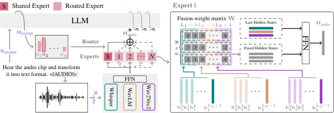

# Enhancing Speech Large Language Models with Prompt-Aware Mixture of Audio Encoders

Weiqiao Shan Affiliation: School of Computer Science and Engineering,
Northeastern University, Shenyang, China    Yuang Li Affiliation: Huawei
Translation Services Center, Beijing, China    Yuhao Zhang
Affiliation: The Chinese University of Hong Kong, Shenzhen, China   
yingfeng luo Affiliation: School of Computer Science and Engineering,
Northeastern University, Shenyang, China    Chen Xu Affiliation: College
of Computer Science and Technology, Harbin Engineering University,
Harbin, China    Xiaofeng Zhao Affiliation: Huawei Translation Services
Center, Beijing, China    Long Meng Affiliation: School of Computer
Science and Engineering, Northeastern University, Shenyang, China   
Yunfei Lu Affiliation: Huawei Translation Services Center, Beijing,
China    Min Zhang Affiliation: Huawei Translation Services Center,
Beijing, China    Hao Yang Affiliation: Huawei Translation Services
Center, Beijing, China    Tong Xiao ^(†)^(†)thanks: Corresponding author
Affiliation: School of Computer Science and Engineering, Northeastern
University, Shenyang, China Affiliation: NiuTrans Research, Shenyang,
China    Jingbo Zhu Affiliation: School of Computer Science and
Engineering, Northeastern University, Shenyang, China
Affiliation: NiuTrans Research, Shenyang, China

###### Abstract

Connecting audio encoders with large language models (LLMs) allows the
LLM to perform various audio understanding tasks, such as automatic
speech recognition (ASR) and audio captioning (AC). Most research
focuses on training an adapter layer to generate a unified audio feature
for the LLM. However, different tasks may require distinct features that
emphasize either semantic or acoustic aspects, making task-specific
audio features more desirable. In this paper, we propose Prompt-aware
Mixture (PaM) to enhance the Speech LLM that uses multiple audio
encoders. Our approach involves using different experts to extract
different features based on the prompt that indicates different tasks.
Experiments demonstrate that with PaM, only one Speech LLM surpasses the
best performances achieved by all single-encoder Speech LLMs on ASR,
Speaker Number Verification, and AC tasks. PaM also outperforms other
feature fusion baselines, such as concatenation and averaging. Our code
will be available
at: [https://github.com/shanweiqiao/PaM](https://github.com/shanweiqiao/PaM)

## 1 Introduction

Large language models (LLMs) have demonstrated exceptional performance
across various natural language processing tasks OpenAI (2023), paving
the way for developing multimodal models Li et al. (2023); Xu et al.
(2025); Wang et al. (2024b). In recent work, there has been a growing
focus on merging speech encoders with LLMs, so that the LLM can
understand the spoken content without the need for explicit
transcription, promoting tasks such as direct speech translation Chen
et al. (2024b) and named entity recognition from speech Li et al.
(2024). Much of this work leverages adapter layers like attention
layers Yu et al. (2024), adaptive CTC downsamplers Ling et al. (2023),
and convolutional layers Fathullah et al. (2023) to downsample and map
speech features into the LLM’s embedding space. Beyond semantic
understanding tasks, Speech LLMs have been extended to encompass a
broader range of applications, including audio event detection and audio
captioning Chu et al. (2024).

Figure 1: ASR and Audio Caption tasks favor different encoders and
layers of features. The x-axis corresponds to each layer of the encoder,
while the bar chart illustrates the fine-grained layer importance, based
on the normalized weight across layers from all encoders. The dotted
lines indicate the average (AVG) importance of different encoders.

Multitasking requires that the input audio features contain as much
relevant information as possible, representing the input speech, which
may include speech content, noise, and speaker-specific characteristics.
When fine-tuning self-supervised speech encoders, researchers assign
learnable weights to each layer and observe that different downstream
tasks prioritize different levels of features Chen et al. (2022). In our
Speech LLM framework, a similar trend is evident, where different tasks
prioritize different encoders and feature levels (Figure 5). These
biases arise from the inherent differences in the tasks themselves. For
instance, the automatic speech recognition (ASR) task focuses solely on
the speech content, disregarding other factors such as speaker
characteristics and background noise. In contrast, tasks like audio
captioning (AC) may rely on these additional factors that ASR
intentionally excludes.

Consequently, researchers have proposed using multiple encoders to
extract more robust features. For instance, WavLLM Hu et al. (2024)
employs both the WavLM Chen et al. (2022) and the Whisper Radford et al.
(2022) encoder, while SALMONN Tang et al. (2024) integrates the Whisper
encoder and the BEATs Chen et al. (2023). However, these approaches
consider all encoders equally important and merge the features from
different encoders based on a simple concatenation method across all
tasks. As demonstrated in our experiments (Table 1), such conventional
approaches can enhance performance in some tasks (e.g., audio
captioning) but degrade others (e.g., ASR). Moreover, MoWE Zhang et al.
(2024) employs a strong encoder and multiple weaker encoders via the
Mixture of Experts (MoE) approach. However, MoWE only utilizes the input
audio to control the routing mechanism, without incorporating
task-specific information in prompts, which leads to suboptimal results
(Table 11).

In this paper, we introduce Prompt-aware Mixture (PaM), a novel method
based on MoE for merging multiple encoders to enhance Speech LLMs. Our
approach integrates a prompt-aware routing mechanism, emphasizes feature
fusion, and considers the relative importance of each encoder for
different tasks, aiming to improve all downstream performance. PaM
employs three distinct audio encoders: the Whisper encoder, WavLM, and
Wav2Vec2 Baevski et al. (2020). We train a set of experts for
prompt-aware feature fusion, comprising one shared expert and four
task-specific experts. On each task, an expert learns the optimal
weights for each encoder and its respective layers, and subsequently
maps the resulting features to the embedding space of the Qwen2.5
model Team (2024). The embedding of the prompt is utilized to determine
the appropriate routing. Notably, in PaM, the routing guides the
selection of the fusion parameters rather than the choice of the
encoder. Experiments are conducted across three tasks: ASR, speaker
number verification (SNV), and AC. On all datasets, including
LibriSpeech Panayotov et al. (2015), AMI Kraaij et al. (2005), AIR-Bench
(SNV) Yang et al. (2024), and AudioCaps Kim et al. (2019), PaM achieves
relative improvements of 15%, 25%, 3.4%, and 7.6%, respectively, in
comparison to the best-performing single-encoder Speech LLM, and
achieves a better average rank on all tasks compared with conventional
approaches. Our contributions can be summarized as follows:

- •
  We propose a novel multi-encoder Speech LLM, which effectively
  leverages features from every layer of each encoder.
- •
  We introduce PaM, a method based on MoE that incorporates a
  prompt-aware routing mechanism to assign distinct weights to each
  encoder and its layers based on the task.
- •
  We conducted comprehensive experiments demonstrating that PaM
  significantly enhances the overall performance of all downstream
  tasks. Additionally, we present detailed feature importance analyses
  and explore various combinations of speech encoders and LLMs.



Figure 2: The architecture of the proposed PaM method. The output
feature $`\mathbf{H}_{\text{prompt}}`$ of the prompt
$`\mathbf{X}_{\text{prompt}}`$ guides the routing of the MoE structure
adapter, which incorporates a fixed shared expert (denoted as expert S)
and a single routed expert (denoted as expert $`i\in[1,N]`$, where $`N`$
represents the total number of routed experts). For each expert, the
last hidden states from all encoders $`\mathbf{h}_{i}^{L_{i}-1}`$ are
concatenated with $`K`$ fused hidden states ($`K`$ being a
hyperparameter, with the default value $`K=3`$) derived from a fusion
weight matrix $`\mathbf{W}`$. Subsequently, a feedforward network (FFN)
is applied to align with the dimensions of the LLM.

## 2 Method

In this section, we begin with an overview of the proposed PaM method
(Figure 2). We then elaborate on the details of the encoder fusion
process executed by a single expert, and describe the prompt-aware
routing method.

### 2.1 Overall Architecture

The architecture of the proposed PaM method is depicted in Figure 2
(left). As described in Equation 1, the LLM accepts the text prompt
$`\mathbf{X}_{\text{prompt}}`$, which includes task-related information,
along with the speech features $`\mathbf{H}_{\text{audio}}`$ as input,
and subsequently generates the response $`\mathbf{Y}`$.

```math
\displaystyle\mathbf{Y}=\text{LLM}(\mathbf{X}_{\text{prompt}},\mathbf{H}_{\text{audio}}) \tag{1}
```

To obtain $`\mathbf{H}_{\text{audio}}`$, we employ three encoders: the
Whisper encoder, WavLM, and Wav2Vec2. For each encoder, the hidden
states are initially processed by a feed-forward network (FFN) as
described in Equation 2¹¹ 1 The FFN module projects the hidden states
from the encoder’s dimension to the LLM’s dimension, and maps the
features from each encoder into a unified space that is shared across
all encoders., resulting in the feature of each encoder, denoted as
$`\mathbf{H}_{i}`$.

```math
\displaystyle\mathbf{H}_{i}=\text{FFN}_{i}(\text{Encoder}_{i}(\mathbf{X}_{\text{audio}})) \tag{2}
```

Next, as shown in Equation 3, we combine these features using a fusion
method based on MoE, which includes a shared expert and N routed
experts, where the number of routed experts corresponds to the number of
predefined tasks. During inference, only one routed expert is selected,
based on the task indicated by the prompt.

```math
\displaystyle\mathbf{H}_{\text{audio}}=\text{Expert}_{\text{share}}(\mathbf{H}_{\{1,2,3\}})
```

```math
\displaystyle+\sum_{j=1}^{N}\text{G}_{j}(\mathbf{X}_{\text{prompt}})\times\text{Expert}_{j}(\mathbf{H}_{\{1,2,3\}}) \tag{3}
```

Overall, each expert processes the features from all encoders
($`\mathbf{H}_{\{1,2,3\}}`$) for feature fusion. The shared expert
extracts common features for all tasks, while the routed expert performs
task-specific feature fusion. The routing is determined by the user
input, which is the prompt.

### 2.2 Multi-layer Fusion

We describe the multi-layer fusion process in Figure 2 (right).
Different encoders exhibit distinct strengths. For example, WavLM is
excellent at extracting speaker information Chen et al. (2022), while
Wav2Vec2 excels in capturing semantic content Baevski et al. (2020). The
Whisper encoder Radford et al. (2022), trained on a vast amount of data,
provides superior features for AC and ASR in noisy environments²² 2
These biases in the ability of different encoders on different tasks are
also consistent with the results of our single-encoder baselines shown
in Table 1. Additionally, features from different layers contain varying
levels of information. Deeper layers hold high-level semantic
information, whereas lower layers may contain fine-grained acoustic
details. Thus, for feature fusion, we consider features from all layers
of all three encoders. Specifically, for the feature $`\mathbf{H}_{i}`$
from a single encoder, it includes hidden states from all $`L_{i}`$
Transformer Vaswani et al. (2017) layers as well as
$`\mathbf{h}_{i}^{0}`$, the hidden states following the convolutional
layers (Equation 4).

```math
\displaystyle\mathbf{H}_{i}=\{\mathbf{h}_{i}^{0},\mathbf{h}_{i}^{1},\ldots\mathbf{h}_{i}^{L_{i}-1}\} \tag{4}
```

As illustrated in Equation 5, we consider the hidden states
$`\mathbf{h}_{i}^{\{0,1,\ldots,(L_{i}\text{-}2)\}}`$ to derive the fused
hidden states $`\mathbf{h}_{k}^{\text{fused}}`$. For each hidden state
$`\mathbf{h}^{l}_{i}`$ of all three encoders, a set of scalar weights
containing $`\sum_{i}^{3}(L_{i}-1)`$ elements is assigned to control its
relative importance. We denote a set of scalar weights as
$`\{w_{i,k}^{l}|i\in[1,3],l\in[1,L_{i}-1]\}`$ and then use it to
generate fused hidden states $`\mathbf{h}_{k}^{\text{fused}}`$. To
maintain the diversity of the fusion feature, we utilize $`K`$ sets of
scalar weights. Thus, the dimension of the whole learnable matrices is
$`\mathbf{W}\in\mathbb{R}^{K\times(\sum_{i}^{3}(L_{i}-1))}`$.

```math
\displaystyle\mathbf{h}_{k}^{\text{fused}}=\sum_{i=1}^{3}\sum_{l=1}^{L_{i}-1}w_{i,k}^{l}\cdot\mathbf{h}^{l}_{i} \tag{5}
```

Finally, we concatenate the last hidden states of the three encoders
$`\mathcal{H}^{\text{last}}=\{\mathbf{h}_{i}^{L_{i}-1}|i\in[1,3]\}`$
with the $`K`$ fused hidden states
$`\mathbf{h}_{\{1,\ldots,K\}}^{\text{fused}}`$ along the feature
dimension. Afterward, we apply an FFN to compress the feature dimension
to match the dimension of the LLM embedding (Equation 6)³³ 3 We leverage
both the final and fused hidden states, which are commonly used in
semantic-related tasks (e.g., ASR) and acoustic-related tasks (e.g.,
audio captioning). The subsequent FFN module projects the concatenated
features to the dimension of the LLM input embeddings, ensuring
alignment between the feature space of speech features and text
features..

```math
\displaystyle\mathbf{h}^{\text{final}} \displaystyle=\text{Concat}(\mathcal{H}^{\text{last}},\mathbf{h}_{\{1,\ldots,K\}}^{\text{fused}})
```

```math
\displaystyle\text{Expert}(\cdot) \displaystyle=\text{FFN}(\mathbf{h}^{\text{final}}) \tag{6}
```

The parameters in our fusion method are independent among the routed
experts. The use of fusion weight matrices highlights multi-level
feature fusion, while the final concatenation followed by the FFN
provides more fine-grained feature fusion.

### 2.3 Prompt Aware Routing

A prompt refers to a text segment that provides context or objectives
for generation, which can typically be categorized into several distinct
types according to task. For instance, speech-related tasks,
sound-related tasks, and speech chat tasks Yang et al. (2024). In this
paper, we investigate three tasks: ASR, SNV, and AC. We utilize distinct
experts for each task. For effective routing, the router must identify
the task type based on the prompt. We employ a simple classification
approach (Equation 7 and 8) wherein we use the last hidden states
$`\mathbf{H}_{\text{prompt}}`$ of the prompt from the LLM, followed by
an FFN and Softmax activation, to obtain the task posteriors
$`\text{P}(\text{Task}|\mathbf{H}_{\text{prompt}})`$.

```math
\displaystyle\mathbf{H}_{\text{prompt}} \displaystyle=\text{LLM}(\mathbf{X}_{\text{prompt}}) \tag{7}
```

```math
\displaystyle\text{P}(\text{Task}|\mathbf{H}_{\text{prompt}}) \displaystyle=\text{Softmax}(\text{FFN}(\mathbf{H}_{\text{prompt}})) \tag{8}
```

As shown in Equation 9, we select the routed expert with the Top-1
probability by the indicator function.

```math
\displaystyle\text{G}_{j}=\begin{cases}1&\text{if }j\in\text{Top-1}(\text{P}(\text{Task}|\mathbf{H}_{\text{prompt}}))\\
0&\text{otherwise}\end{cases} \tag{9}
```

To train the FFN, we create diverse prompts for each task using the LLM.
Specifically, we manually write several prompts for each task and
instruct ChatGPT to rewrite these prompts. We list the examples of these
prompts in Appendix A.1. It is important to note that the audio features
follow the prompt because we use the prompt to guide feature extraction
and fusion. This approach differs from other works, where the audio
features \<\|AUDIO\|\> can be positioned before the prompt.

### 2.4 Training Objective

The training loss function, as illustrated in Equation 10, is the sum of
the cross-entropy loss $`\mathcal{L}_{\text{G}}`$ for prompt-aware
routing and the cross-entropy loss $`\mathcal{L}_{\text{llm}}`$ between
the LLM’s output $`\mathbf{Y}`$ and the ground truth
$`\hat{\mathbf{Y}}`$. $`\hat{\mathbf{Y}}`$.

```math
\displaystyle\mathcal{L} \displaystyle=\mathcal{L}_{\text{G}}(\text{P}(\text{Task}|\mathbf{H}_{\text{prompt}}),\text{Task})
```

```math
\displaystyle+\mathcal{L}_{\text{llm}}(\mathbf{Y},\hat{\mathbf{Y}}) \tag{10}
```

## 3 Experimental Setups

### 3.1 Datasets and Evaluation Metrics

We assess the efficacy of our method across three audio-to-text tasks:
automatic speech recognition (ASR), speaker number verification (SNV),
and audio captioning (AC). We list the detailed information on training
data in Appendix A.2. In total, the training data contains 450 hours of
audio signals. The test dataset includes LibriSpeech-test-clean,
LibriSpeech-test-other, AMI, the SNV test set from AIR-Bench, and the
test set of AudioCaps along with its corresponding QA version from
AudioBench Wang et al. (2024a), which contains diverse questions. ASR
tasks focus on semantics. The LibriSpeech test set originates from
audiobooks, demonstrating ASR performance in a clean scenario. AMI, a
real meeting corpus containing spontaneous talk, reflects ASR
performance in a more challenging, real-world scenario. SNV and AC test
sets can indicate the Speech LLM’s ability to understand speaker and
acoustic information. We evaluate the performance using word error rate
(WER) for ASR tasks, accuracy for SNV, and METEOR Banerjee and Lavie
(2005) for AC. Additionally, we list the results on AC and AC QA tasks
with more metrics in Appendix A.4.

|                                     |                          |                          |                   |                 |                    |                    |                        |
| ----------------------------------- | ------------------------ | ------------------------ | ----------------- | --------------- | ------------------ | ------------------ | ---------------------- |
| Model                               | LibriSpeech              |                          | AMI               | SNV             | AudioCaps          | AudioCaps QA       | AVG Rank$`\downarrow`$ |
|                                     | WER(clean)$`\downarrow`$ | WER(other)$`\downarrow`$ | WER$`\downarrow`$ | Acc$`\uparrow`$ | METEOR$`\uparrow`$ | METEOR$`\uparrow`$ |                        |
| Single-encoder Baselines            |                          |                          |                   |                 |                    |                    |                        |
|    - Whisper Radford et al. (2022)  | 9.61                     | 16.73                    | 16.27             | 18.8%           | 32.96              | 15.04              | 5.67                   |
|    - WavLM Chen et al. (2022)       | 5.59                     | 10.57                    | 18.97             | 41.4%           | 27.14              | 12.77              | 5.50                   |
|    - Wav2Vec2 Baevski et al. (2020) | 4.30                     | 9.46                     | 26.69             | 39.0%           | 23.81              | 11.20              | 5.33                   |
| Multi-encoder Baselines             |                          |                          |                   |                 |                    |                    |                        |
|    - WavLLM Hu et al. (2024)        | 4.95 (- 0.65)            | 9.19 (+0.27)             | 15.29 (+0.98)     | 39.2% (- 2.20)  | 34.93 (+1.97)      | 16.35 (+1.31)      | 2.67                   |
|    - SALMONN Tang et al. (2024)     | 5.04 (- 0.74)            | 9.70 (- 0.24)            | 19.04 (- 2.77)    | 49.4% (+8.00)   | 34.86 (+1.90)      | 15.97 (+0.93)      | 3.50                   |
|    - Average                        | 4.76 (- 0.46)            | 10.43 (- 0.97)           | 17.20 (- 0.93)    | 45.5% (+4.10)   | 33.22 (+0.26)      | 15.53 (+0.49)      | 3.67                   |
| PaM (Ours)                          | 3.65 (+0.65)             | 7.07 (+2.39)             | 12.79 (+3.48)     | 42.8% (+1.40)   | 35.47 (+2.51)      | 15.70 (+0.66)      | 1.67                   |

Table 1: Comparison of the proposed PaM method with single and
multi-encoder baselines. Values in the brackets indicate performance
improvement (green) or degradation (red) compared to the best single
encoder result. The AVG rank column shows the average rank on each task.
Smaller ranks indicate better performance.

### 3.2 Model Architecture and Training

We train our model based on Huggingface Transformers Library⁴⁴ 4
[https://github.com/huggingface/transformers](https://github.com/huggingface/transformers).
Our model consists of three audio encoders, a pre-fusion adapter for
each encoder, a PaM fusion module, and an LLM. In our main experiments,
the encoders are Whisper-Small encoder, WavLM-Base-Plus, and
Wav2Vec2-Base-960h⁵⁵ 5 The links to the pretrained models and datasets
used can be found in Appendix A.2. The implementation details of
baseline methods are available in Appendix A.3., each with approximately
100 million parameters. We downsample the features from the Whisper
encoder by a factor of two, resulting in a frame length of 40ms,
consistent with the frame length of Wav2Vec2 and WavLM. The pre-fusion
adapter is an FFN that transforms the encoder’s hidden dimension
$`D_{\text{E}}`$ to the LLM’s hidden dimension $`D_{\text{LLM}}`$. Each
expert in the PaM fusion module includes a fusion weight matrix
($`\mathbb{R}^{3L\times 3}`$) and a linear layer
($`\mathbb{R}^{6D_{\text{LLM}}\times D_{\text{LLM}}}`$) to fuse features
from all encoders. Here, $`L`$ represents the number of layers in the
encoder, which is 12 for all encoders in our experiments. For the fused
features, we set $`K=3`$, corresponding to the number of last hidden
states. We utilize four routed experts, each corresponding to a specific
task category: ASR-clean, ASR-noisy, SNV, and AC. For each category, we
generate 50 prompts using ChatGPT OpenAI (2023)⁶⁶ 6 We provide a few
examples of the prompts we used in Appendix A.11. For the LLM model, we
select the Qwen2.5-3B Team (2024). In Section 4, we also experiment with
other encoders, including Hubert-Base-LS960, Whisper-Large-v3, and
WavLM-Large.⁷⁷ 7 Additionally, we add the BEATs model, which performs
well on the AC task, to further enhance PaM in Appendix A.5.

We list the training and inference parameters in Appendix A.6.

|              |                          |                          |                   |                 |                    |                    |                        |
| ------------ | ------------------------ | ------------------------ | ----------------- | --------------- | ------------------ | ------------------ | ---------------------- |
| Encoders     | LibriSpeech              |                          | AMI               | SNV             | AudioCaps          | AudioCaps QA       | AVG Rank$`\downarrow`$ |
|              | WER(clean)$`\downarrow`$ | WER(other)$`\downarrow`$ | WER$`\downarrow`$ | Acc$`\uparrow`$ | METEOR$`\uparrow`$ | METEOR$`\uparrow`$ |                        |
| Whisper+X    | 4.42                     | 8.92                     | 13.96             | 43.70%          | 35.41              | 16.11              | 4.5                    |
| WavLM+X      | 4.07                     | 7.97                     | 18.47             | 47.47%          | 32.48              | 15.01              | 5.5                    |
| Wav2Vec2+X   | 3.42                     | 7.20                     | 18.18             | 45.13%          | 32.33              | 15.02              | 4.3                    |
| HuBERT+X     | 3.87                     | 8.21                     | 19.49             | 36.90%          | 31.82              | 15.08              | 6.8                    |
| Whisper+X+Y  | 4.22                     | 8.11                     | 13.79             | 49.77%          | 35.37              | 16.31              | 3.0                    |
| WavLM+X+Y    | 3.72                     | 7.99                     | 16.35             | 38.73%          | 34.23              | 15.82              | 4.0                    |
| Wav2Vec2+X+Y | 3.77                     | 6.90                     | 16.90             | 42.63%          | 34.23              | 15.82              | 3.8                    |
| HuBERT+X+Y   | 4.03                     | 7.96                     | 17.13             | 44.17%          | 34.18              | 16.13              | 4.0                    |

Table 2: Results with different combinations of encoders. The first and
last four rows represent combinations of two and three encoders
respectively. Each row’s results are the average performance of a fixed
encoder paired with all possible combinations of one or two other
encoders, highlighting the unique strengths of each encoder.

## 4 Results

### 4.1 Main Results

As demonstrated in Table 1, we compare the proposed PaM method with
single and multi-encoder baselines. Each encoder exhibits distinct
advantages. When utilizing a single encoder, the Speech LLM with the
Whisper encoder performs best on the AMI dataset and AC tasks. The
primary reason is that the Whisper model is trained on vast speech data,
exposing it to diverse acoustic conditions. Consequently, it excels in
challenging ASR and AC tasks in real-world environments and noisy
conditions. The WavLM encoder, trained on multi-speaker speech signals,
provides the best features for the SNV task. The Wav2Vec2 encoder
performs best on the LibriSpeech dataset mainly because it was
pretrained on this dataset. However, since the LibriSpeech dataset
consists of clean audiobooks, the Speech LLM with the Wav2Vec2 encoder
shows poor performance on the AMI and AudioCap datasets.

We reimplemented the feature fusion methods of WavLLM and SALMONN,
training the Speech LLM with the three audio encoders in our setups.
Both methods use concatenation but are followed by different projection
layers: WavLLM with a linear layer and SALMONN with a Q-former layer.
Additionally, we implemented a simple averaging method that directly
computes the average of the features from the three encoders. Compared
to the best performance of single encoder baselines, all three fusion
methods achieve better METEOR scores on AC tasks. However, performance
may degrade on other tasks. For example, we observed performance
degradation for all three methods on the LibriSpeech test-clean subset.
This is expected since the same features are used for all tasks.
Features containing more useful acoustic information for AC tasks may
lack useful semantic information for ASR tasks.

PaM consistently outperforms all single encoder baselines, delivering
performance improvements across all tasks. This consistent improvement
can be attributed to the MoE structure adapter, which provides unique
features tailored for each task. Compared to other fusion methods (i.e.,
concatenation and averaging), PaM achieves significantly lower WERs on
the LibriSpeech and AMI datasets and similar performance on SNV and AC
tasks.

### 4.2 Feature Importance

Figure 3: The weights for each encoder and its layers.

In Figure 3, we visualize the fusion weights for each expert, excluding
the shared expert, which can be interpreted as the fusion weight for
each task. We sum the weights for every four layers to enhance clarity,
resulting in the total weight for shallow, middle, and deep layers.
Generally, different tasks require different features, so each expert
has distinct fusion weights. Specifically, when the expert for ASR-clean
is activated, it mainly focuses on features from WavLM and Wav2Vec2,
especially the deep layers. When the expert for ASR-noise is activated,
it primarily focuses on features from the Whisper encoder and WavLM. For
SNV and AC tasks, all three encoders have similar fusion weights. For
the SNV task, features from the middle layers are more important, while
for the AC task, shallow layers contribute more.

### 4.3 Combinations of Encoders

In Table 2, we extend our investigation to encompass more combinations
of encoders, including two and three encoders, and incorporate the
HuBERT encoder. To highlight the strengths of each encoder, we calculate
the performance by keeping one encoder fixed and varying the other
encoders, then computing the average. The average (AVG) rank reflects
the overall performance across multitasks. It is evident that using
three encoders significantly outperforms using two encoders in all
combinations, thereby demonstrating the effectiveness of employing more
encoders for Speech LLMs.

We can observe that different encoders offer varying benefits, which
proves that the task-specific encoders can significantly improve the
performance on the corresponding tasks. For example, when Whisper is
used, regardless of how many encoders are employed, the Speech LLM
achieves the lowest WER on AMI and the highest METEOR scores on
AudioCaps. On the other hand, Wav2Vec2 provides an advantage for
recognizing speech signals in LibriSpeech. This indicates that when
selecting encoders for Speech LLM, it is essential to consider the
domain, downstream tasks, and the capabilities of each encoder. We
suggest using a robust general domain model like Whisper in combination
with domain-specific encoders such as Wav2Vec2.

|                          |                          |                          |                   |                 |                    |                    |
| ------------------------ | ------------------------ | ------------------------ | ----------------- | --------------- | ------------------ | ------------------ |
| Models                   | LibriSpeech              |                          | AMI               | SNV             | AudioCaps          | AudioCaps QA       |
|                          | WER(clean)$`\downarrow`$ | WER(other)$`\downarrow`$ | WER$`\downarrow`$ | Acc$`\uparrow`$ | METEOR$`\uparrow`$ | METEOR$`\uparrow`$ |
| Base PaM                 | 3.65                     | 07.07                    | 12.79             | 42.8%           | 35.47              | 15.70              |
| PaM with Larger Encoders |                          |                          |                   |                 |                    |                    |
|    - ① Whisper-Medium    | 3.93                     | 07.93                    | 12.43             | 47.5%           | 35.61              | 15.58              |
|    - ② WavLM-Large       | 3.75                     | 06.43                    | 12.10             | 45.6%           | 35.95              | 16.71              |
|    - ③ Wav2Vec2-Large    | 3.74                     | 06.49                    | 15.06             | 47.6%           | 35.50              | 16.74              |
|    - ① + ② + ③           | 3.58                     | 05.93                    | 11.51             | 56.9%           | 36.94              | 16.50              |
| PaM with Different LLMs  |                          |                          |                   |                 |                    |                    |
|    - Qwen2.5-7B          | 3.68                     | 08.36                    | 15.26             | 43.7%           | 35.46              | 15.71              |
|    - LLaMA3.2-3B         | 4.98                     | 11.57                    | 15.57             | 50.5%           | 35.83              | 16.34              |
|    - LLaMA3.1-8B         | 4.85                     | 08.87                    | 15.01             | 50.8%           | 35.81              | 15.82              |

Table 3: Results with larger encoders and various LLMs. To enhance
performance, we replaced the Base version’s encoders and experimented
with different LLMs.

### 4.4 Larger Encoders and LLMs

We aim to further enhance performance by replacing the encoders in the
proposed method with their larger versions (Table 3). Specifically, we
replace the Whisper-Small encoder with the Whisper-Medium encoder,
Wav2Vec2-Base-960h with Wav2Vec2-Large-960h, and WavLM-Base-Plus with
WavLM-Large. Our observations indicate that on the LibriSpeech-clean
dataset, performance does not significantly improve and may even
slightly degrade. However, for the SNV and AC tasks, performance
consistently improves, suggesting that more challenging sound-related
tasks benefit more from better encoders. Additionally, we observe that
when all encoders are replaced with their larger versions, we achieve
the best performance across almost all tasks, albeit at the cost of
increased computation.

In our investigation of other LLMs, including Qwen2.5-7B, LLaMA3.2-3B,
and LLaMA3.1-8B, we observed some improvements in certain tasks.
However, the overall performance was not superior to that of Qwen2.5-3B.
The potential reason for this is that we used short audios samples, and
both the prompts and answers were brief, thereby not fully utilizing the
strong semantic understanding capabilities of the larger LLMs.
Consequently, we opted to use Qwen2.5-3B in this paper. It is important
to emphasize that for Speech LLMs, the extracted features may be more
critical than the LLM itself for many downstream tasks. In addition, we
also compare the concatenation fusion strategy (WavLLM) and PaM using
larger LLMs based on the LLaMA3.1-8B and Qwen2.5-7B. We find that the
performance of the concatenation fusion strategy is inconsistent across
different base models of similar size, whereas PaM maintains stability,
as detailed in Appendix A.7.

### 4.5 Parameters of the Adapter

In PaM, we employ multiple experts, merge and concatenate various
features. Consequently, the number of parameters is slightly higher than
that of the baseline concatenation and average methods. To ensure a fair
comparison, we reduce the dimensionality within PaM, resulting in only
29M total parameters, similar to the baselines. PaM outperforms the
baseline across almost all tasks, with similar overall parameters.
Notably, during inference, PaM activates only 26M parameters, in
contrast to the 37M parameters activated by the concatenation method,
demonstrating the efficiency of PaM. In this configuration, each expert
contains only 0.9M parameters, which is smaller than other components of
the model, such as the LLM and encoders. Consequently, PaM can be
further enhanced by increasing the number of experts with minimal impact
on computational cost.

Figure 4: Performance comparison of a smaller PaM (29M parameters) with
Concatenation (37M parameters) and Average (24M parameters).

## 5 Discussions

Ablation study and routing method: To further validate the effectiveness
of PaM, we conducted an ablation study, such as PaM without the shared
expert, as detailed in Appendix A.8. We also compare PaM against a
learnable routing approach without task information, commonly employed
in MoE models. The results indicate that PaM is more efficient and
better suited to handling multiple downstream tasks than conventional
routing and fusion strategies. Moreover, Table 3 highlights the
strengths of each encoder. These findings encourage researchers to
select encoders tailored to their downstream tasks for the Speech LLM.
While we did not incorporate this prior knowledge into the routing
mechanism, leveraging it presents a promising direction for future work.

Other further work: 1.More and Unseen Tasks. Although our experiments
involve three tasks and five datasets, they are representative as they
encompass both semantic and acoustic-related tasks. We believe PaM can
be extended to other tasks, which we will validate in future work.
2.Leverage Multimodal LLMs. Features across various encoders hinder
initialization from pretrained multimodal LLMs in our work
(Appendix A.9). We will explore strategies to more effectively leverage
pretrained multimodal LLMs, such as Lai et al. (2024). 3.Efficiency.
Improving the efficiency of LLMs has attracted much attention. Enhancing
the computational efficiency of speech LLMs presents another promising
avenue for exploration (Appendix A.9).

## 6 Related Works

#### Audio Encoders:

Audio encoders can be classified into supervised and self-supervised
models. Supervised models typically employ ASR tasks to train an
end-to-end model with an audio encoder and a text decoder. By omitting
the decoder, the encoder can serve as a feature extractor Radford et al.
(2022); Baevski et al. (2020). Self-supervised models can be trained on
unlabeled speech signals. For instance, Wav2Vec2 Baevski et al. (2020)
and HuBERT Hsu et al. (2021) were trained to predict the pseudo-discrete
targets at masked time steps. WavLM Chen et al. (2022) is a variant of
HuBERT, designed to facilitate speaker identity extraction by using
multi-speaker signals. Different model architectures, training methods,
and data can result in encoders with distinct properties and advantages,
making the mixture of audio encoders effective for Speech LLMs.

#### Speech LLM:

To construct end-to-end speech LLMs, a natural approach is to extract
discrete tokens from continuous speech signals and then expand the
vocabulary of text LLMs to understand these speech tokens Rubenstein
et al. (2023b); Veluri et al. (2024); Ma et al. (2024a). An alternative
is to use an adapter layer to directly convert the continuous speech
features into the continuous embedding space of the LLM. For example,
QwenAudio Chu et al. (2024) employs average pooling to downsample speech
features, followed by two linear layers for projection. SALMONN Tang
et al. (2024) utilizes the Q-former Yu et al. (2024), a
cross-attention-based adapter, to achieve a higher compression ratio. In
parallel, to achieve high compression, Soundwave replaces
cross-attention with a lightweight self-attention module that treats the
inputs as queries Zhang et al. (2025). Compared to previous works, our
adapter handles more encoders and generates different features based on
the prompt, rather than a single feature for all prompts.

#### Mixture of Experts:

MoE has attracted growing interest, which replaces the FFN sub-layer in
Transformer models with multiple experts Shazeer et al. (2017). These
MoE methods typically employ massive experts and extremely sparse
activation routing, increasing model size while maintaining constant
inference costs, without explicitly considering the specialization of
individual experts Fedus et al. (2022); Lepikhin et al. (2020). However,
the vast scale of these models presents significant challenges for
deployment. In contrast, the earliest MoE research introduced a
data-dependent, trainable combining method Jacobs et al. (1991);
Masoudnia and Ebrahimpour (2014), which aims to decompose complex tasks
into simpler sub-tasks, each managed by a dedicated expert. Such works
have inspired recent advances in developing modular models called expert
specialization Ma et al. (2018); Gupta et al. (2022), providing
solutions for deploying large-scale MoE models Lu et al. (2024) and
enabling individual experts to learn and decompose diverse knowledge Dai
et al. (2024). Inspired by these insights, we propose a specialized
fusion method based on MoE integrating multiple audio features to
enhance Speech LLMs.

## 7 Conclusion

In conclusion, we propose PaM, a feature fusion method designed to
provide a Speech LLM with diverse features from multiple encoders based
on users’ input prompts. Experimental results indicate that PaM
surpasses both single-encoder and multi-encoder baselines across a
variety of tasks and datasets. We provide a detailed analysis of the
feature importance of different encoders, demonstrating that PaM
effectively leverages different encoders and levels of features for
distinct tasks. Additionally, we present comprehensive experimental
results for the selection and combination of encoders. For future work,
we intend to expand the training data and incorporate additional tasks.

## 8 Limitations

Owing to resource constraints, our training data is limited to several
hundred hours. It would be preferable to implement our method in
larger-scale experiments to facilitate comparison with existing strong
Speech LLMs such as Qwen-Audio Chu et al. (2024) on a more comprehensive
benchmark like Air-Bench Yang et al. (2024). Additionally, we train the
PaM model from scratch using a predefined list of audio encoders. It
would be beneficial to investigate the addition of new encoders to an
already trained Speech LLM to enhance its performance on new tasks or in
new domains. We leave this for future work.

## Acknowledgements

This work was supported in part by the National Science Foundation of
China (Nos. 62276056 and U24A20334), the Yunnan Fundamental Research
Projects (No.202401BC070021), the Yunnan Science and Technology Major
Project (No. 202502AD080014), and the Program of Introducing Talents of
Discipline to Universities, Plan 111 (No.B16009).

## References

- Ardila et al. (2019) Rosana Ardila, Megan Branson, Kelly Davis,
  Michael Henretty, Michael Kohler, Josh Meyer, Reuben Morais, Lindsay
  Saunders, Francis M Tyers, and Gregor Weber. 2019. Common voice: A
  massively-multilingual speech corpus. _arXiv preprint
  arXiv:1912.06670_.
- Baevski et al. (2020) Alexei Baevski, Yuhao Zhou, Abdelrahman Mohamed,
  and Michael Auli. 2020. wav2vec 2.0: A framework for self-supervised
  learning of speech representations. _Advances in neural information
  processing systems_, 33:12449–12460.
- Banerjee and Lavie (2005) Satanjeev Banerjee and Alon Lavie. 2005.
  Meteor: An automatic metric for mt evaluation with improved
  correlation with human judgments. In _Proc. ACL_.
- Chen et al. (2022) S. Chen, C. Wang, Z. Chen, Y. Wu, S. Liu, Z. Chen,
  J. Li, N. Kanda, T. Yoshioka, X. Xiao, et al. 2022. WavLM: Large-scale
  self-supervised pre-training for full stack speech processing. _IEEE
  Journal of Selected Topics in Signal Processing_.
- Chen et al. (2023) Sanyuan Chen, Yu Wu, Chengyi Wang, Shujie Liu,
  Daniel Tompkins, Zhuo Chen, Wanxiang Che, Xiangzhan Yu, and Furu
  Wei. 2023. Beats: Audio pre-training with acoustic tokenizers. In
  _Proc. ICML_, pages 5178–5193.
- Chen et al. (2024a) Wenxi Chen, Yuzhe Liang, Ziyang Ma, Zhisheng
  Zheng, and Xie Chen. 2024a. [Eat: Self-supervised pre-training with
  efficient audio transformer](https://doi.org/10.24963/ijcai.2024/421).
  In _Proceedings of the Thirty-Third International Joint Conference on
  Artificial Intelligence, IJCAI-24_, pages 3807–3815. International
  Joint Conferences on Artificial Intelligence Organization. Main Track.
- Chen et al. (2024b) Zhehuai Chen, He Huang, Andrei Andrusenko, Oleksii
  Hrinchuk, Krishna C. Puvvada, Jason Li, Subhankar Ghosh, Jagadeesh
  Balam, and Boris Ginsburg. 2024b. Salm: Speech-augmented language
  model with in-context learning for speech recognition and translation.
  In _Proc. ICASSP_.
- Chu et al. (2024) Yunfei Chu, Jin Xu, Qian Yang, Haojie Wei, Xipin
  Wei, Zhifang Guo, Yichong Leng, Yuanjun Lv, Jinzheng He, Junyang Lin,
  Chang Zhou, and Jingren Zhou. 2024. Qwen2-audio technical report.
  _arXiv preprint arXiv:2407.10759_.
- Dai et al. (2024) Damai Dai, Chengqi Deng, Chenggang Zhao, RX Xu,
  Huazuo Gao, Deli Chen, Jiashi Li, Wangding Zeng, Xingkai Yu, Y Wu,
  et al. 2024. Deepseekmoe: Towards ultimate expert specialization in
  mixture-of-experts language models. _arXiv preprint arXiv:2401.06066_.
- Fathullah et al. (2023) Yassir Fathullah, Chunyang Wu, Egor Lakomkin,
  Junteng Jia, Yuan Shangguan, Ke Li, Jinxi Guo, Wenhan Xiong, Jay
  Mahadeokar, Ozlem Kalinli, Christian Fuegen, and Mike Seltzer. 2023.
  Prompting large language models with speech recognition abilities.
  _arXiv preprint arXiv:2307.11795_.
- Fedus et al. (2022) William Fedus, Barret Zoph, and Noam
  Shazeer. 2022. Switch transformers: Scaling to trillion parameter
  models with simple and efficient sparsity. _Journal of Machine
  Learning Research_, 23(120):1–39.
- Gupta et al. (2022) Shashank Gupta, Subhabrata Mukherjee, Krishan
  Subudhi, Eduardo Gonzalez, Damien Jose, Ahmed H Awadallah, and
  Jianfeng Gao. 2022. Sparsely activated mixture-of-experts are robust
  multi-task learners. _arXiv preprint arXiv:2204.07689_.
- Hsu et al. (2021) Wei-Ning Hsu, Benjamin Bolte, Yao-Hung Hubert Tsai,
  Kushal Lakhotia, Ruslan Salakhutdinov, and Abdelrahman Mohamed. 2021.
  HuBERT: Self-supervised speech representation learning by masked
  prediction of hidden units. _IEEE/ACM Transactions on Audio, Speech,
  and Language Processing_, 29:3451–3460.
- Hu et al. (2022) Edward J Hu, yelong shen, Phillip Wallis, Zeyuan
  Allen-Zhu, Yuanzhi Li, Shean Wang, Lu Wang, and Weizhu Chen. 2022.
  LoRA: Low-rank adaptation of large language models. In _Proc. ICLR_.
- Hu et al. (2024) Shujie Hu, Long Zhou, Shujie Liu, Sanyuan Chen,
  Lingwei Meng, Hongkun Hao, Jing Pan, Xunying Liu, Jinyu Li, Sunit
  Sivasankaran, Linquan Liu, and Furu Wei. 2024. Wavllm: Towards robust
  and adaptive speech large language model. _arXiv preprint
  arXiv:2404.00656_.
- Jacobs et al. (1991) Robert A Jacobs, Michael I Jordan, Steven J
  Nowlan, and Geoffrey E Hinton. 1991. Adaptive mixtures of local
  experts. _Neural computation_, 3(1):79–87.
- Kim et al. (2019) Chris Dongjoo Kim, Byeongchang Kim, Hyunmin Lee, and
  Gunhee Kim. 2019. Audiocaps: Generating captions for audios in the
  wild. In _NAACL-HLT_.
- Kraaij et al. (2005) W. Kraaij, T. Hain, M. Lincoln, and
  W. Post. 2005. The AMI meeting corpus. _Proc. International Conference
  on Methods and Techniques in Behavioral Research_.
- Kudugunta et al. (2021) Sneha Kudugunta, Yanping Huang, Ankur Bapna,
  Maxim Krikun, Dmitry Lepikhin, Minh-Thang Luong, and Orhan
  Firat. 2021. Beyond distillation: Task-level mixture-of-experts for
  efficient inference. _arXiv preprint arXiv:2110.03742_.
- Lai et al. (2024) Xin Lai, Zhuotao Tian, Yukang Chen, Yanwei Li, Yuhui
  Yuan, Shu Liu, and Jiaya Jia. 2024. Lisa: Reasoning segmentation via
  large language model. In _Proceedings of the IEEE/CVF Conference on
  Computer Vision and Pattern Recognition_, pages 9579–9589.
- Lepikhin et al. (2020) Dmitry Lepikhin, HyoukJoong Lee, Yuanzhong Xu,
  Dehao Chen, Orhan Firat, Yanping Huang, Maxim Krikun, Noam Shazeer,
  and Zhifeng Chen. 2020. Gshard: Scaling giant models with conditional
  computation and automatic sharding. _arXiv preprint arXiv:2006.16668_.
- Leviathan et al. (2023) Yaniv Leviathan, Matan Kalman, and Yossi
  Matias. 2023. Fast inference from transformers via speculative
  decoding. In _International Conference on Machine Learning_, pages
  19274–19286. PMLR.
- Li et al. (2023) Junnan Li, Dongxu Li, Silvio Savarese, and Steven
  Hoi. 2023. Blip-2: Bootstrapping language-image pre-training with
  frozen image encoders and large language models. In _International
  conference on machine learning_, pages 19730–19742. PMLR.
- Li et al. (2024) Yuang Li, Jiawei Yu, Min Zhang, Mengxin Ren, Yanqing
  Zhao, Xiaofeng Zhao, Shimin Tao, Jinsong Su, and Hao Yang. 2024. Using
  large language model for end-to-end chinese asr and ner. In _Proc.
  Interspeech_.
- Ling et al. (2023) Shaoshi Ling, Yuxuan Hu, Shuangbei Qian, Guoli Ye,
  Yao Qian, Yifan Gong, Ed Lin, and Michael Zeng. 2023. Adapting large
  language model with speech for fully formatted end-to-end speech
  recognition. _arXiv preprint arXiv:2307.08234_.
- Lu et al. (2024) Xudong Lu, Qi Liu, Yuhui Xu, Aojun Zhou, Siyuan
  Huang, Bo Zhang, Junchi Yan, and Hongsheng Li. 2024. Not all experts
  are equal: Efficient expert pruning and skipping for
  mixture-of-experts large language models. _arXiv preprint
  arXiv:2402.14800_.
- Luo et al. (2025) Yingfeng Luo, Tong Zheng, Yongyu Mu, Bei Li,
  Qinghong Zhang, Yongqi Gao, Ziqiang Xu, Peinan Feng, Xiaoqian Liu,
  Tong Xiao, et al. 2025. Beyond decoder-only: Large language models can
  be good encoders for machine translation. _arXiv preprint
  arXiv:2503.06594_.
- Ma et al. (2018) Jiaqi Ma, Zhe Zhao, Xinyang Yi, Jilin Chen, Lichan
  Hong, and Ed H Chi. 2018. Modeling task relationships in multi-task
  learning with multi-gate mixture-of-experts. In _Proceedings of the
  24th ACM SIGKDD international conference on knowledge discovery & data
  mining_, pages 1930–1939.
- Ma et al. (2024a) Ziyang Ma, Yakun Song, Chenpeng Du, Jian Cong, Zhuo
  Chen, Yuping Wang, Yuxuan Wang, and Xie Chen. 2024a. Language model
  can listen while speaking. _arXiv preprint arXiv:2408.02622_.
- Ma et al. (2024b) Ziyang Ma, Guanrou Yang, Yifan Yang, Zhifu Gao,
  Jiaming Wang, Zhihao Du, Fan Yu, Qian Chen, Siqi Zheng, Shiliang
  Zhang, et al. 2024b. An embarrassingly simple approach for llm with
  strong asr capacity. _arXiv preprint arXiv:2402.08846_.
- Masoudnia and Ebrahimpour (2014) Saeed Masoudnia and Reza
  Ebrahimpour. 2014. Mixture of experts: a literature survey.
  _Artificial Intelligence Review_, 42:275–293.
- OpenAI (2023) OpenAI. 2023. GPT-4 technical report. _arXiv preprint
  arXiv:2303.08774_.
- Panayotov et al. (2015) Vassil Panayotov, Guoguo Chen, Daniel Povey,
  and Sanjeev Khudanpur. 2015. LibriSpeech: an ASR corpus based on
  public domain audio books. _Proc. ICASSP_.
- Radford et al. (2022) Alec Radford, Jong Wook Kim, Tao Xu, Greg
  Brockman, Christine McLeavey, and Ilya Sutskever. 2022. Robust speech
  recognition via large-scale weak supervision. _arXiv preprint
  arXiv:2212.04356_.
- Rubenstein et al. (2023a) Paul K. Rubenstein, Chulayuth
  Asawaroengchai, Duc Dung Nguyen, Ankur Bapna, Zalán Borsos, Félix
  de Chaumont Quitry, Peter Chen, Dalia El Badawy, Wei Han, Eugene
  Kharitonov, Hannah Muckenhirn, Dirk Ryan Padfield, James Qin, Daniel
  Rozenberg, Tara N. Sainath, Johan Schalkwyk, Matthew Sharifi,
  Michelle D. Tadmor, Ramanovich, Marco Tagliasacchi, Alexandru Tudor,
  Mihajlo Velimirovi’c, Damien Vincent, Jiahui Yu, Yongqiang Wang,
  Victoria Zayats, Neil Zeghidour, Yu Zhang, Zhishuai Zhang, Lukás
  Zilka, and Christian Havnø Frank. 2023a. [Audiopalm: A large language
  model that can speak and
  listen](https://api.semanticscholar.org/CorpusID:259224345). _ArXiv_,
  abs/2306.12925.
- Rubenstein et al. (2023b) Paul K Rubenstein, Chulayuth Asawaroengchai,
  Duc Dung Nguyen, Ankur Bapna, Zalán Borsos, Félix de Chaumont Quitry,
  Peter Chen, Dalia El Badawy, Wei Han, Eugene Kharitonov, et al. 2023b.
  Audiopalm: A large language model that can speak and listen. _arXiv
  preprint arXiv:2306.12925_.
- Shazeer et al. (2017) Noam Shazeer, Azalia Mirhoseini, Krzysztof
  Maziarz, Andy Davis, Quoc Le, Geoffrey Hinton, and Jeff Dean. 2017.
  Outrageously large neural networks: The sparsely-gated
  mixture-of-experts layer. _arXiv preprint arXiv:1701.06538_.
- Tang et al. (2024) Changli Tang, Wenyi Yu, Guangzhi Sun, Xianzhao
  Chen, Tian Tan, Wei Li, Lu Lu, Zejun MA, and Chao Zhang. 2024.
  SALMONN: Towards generic hearing abilities for large language models.
  In _Proc. ICLR_.
- Team (2024) Qwen Team. 2024. [Qwen2.5: A party of foundation
  models](https://qwenlm.github.io/blog/qwen2.5/).
- Vaswani et al. (2017) Ashish Vaswani, Noam Shazeer, Niki Parmar, Jakob
  Uszkoreit, Llion Jones, Aidan N Gomez, Ł ukasz Kaiser, and Illia
  Polosukhin. 2017. Attention is all you need. In _Proc. NeurIPS_,
  volume 30.
- Veluri et al. (2024) Bandhav Veluri, Benjamin Peloquin, Bokai Yu,
  Hongyu Gong, and Shyamnath Gollakota. 2024. Beyond turn-based
  interfaces: Synchronous llms as full-duplex dialogue agents. In _Proc.
  EMNLP_, pages 21390–21402.
- Wang et al. (2024a) Bin Wang, Xunlong Zou, Geyu Lin, Shuo Sun, Zhuohan
  Liu, Wenyu Zhang, Zhengyuan Liu, AiTi Aw, and Nancy F Chen. 2024a.
  Audiobench: A universal benchmark for audio large language models.
  _arXiv preprint arXiv:2406.16020_.
- Wang et al. (2024b) Yi Wang, Kunchang Li, Xinhao Li, Jiashuo Yu, Yinan
  He, Guo Chen, Baoqi Pei, Rongkun Zheng, Zun Wang, Yansong Shi, et al.
  2024b. Internvideo2: Scaling foundation models for multimodal video
  understanding. In _European Conference on Computer Vision_, pages
  396–416. Springer.
- Xu et al. (2025) Jin Xu, Zhifang Guo, Jinzheng He, Hangrui Hu, Ting
  He, Shuai Bai, Keqin Chen, Jialin Wang, Yang Fan, Kai Dang,
  et al. 2025. Qwen2. 5-omni technical report. _arXiv preprint
  arXiv:2503.20215_.
- Yang et al. (2024) Qian Yang, Jin Xu, Wenrui Liu, Yunfei Chu, Ziyue
  Jiang, Xiaohuan Zhou, Yichong Leng, Yuanjun Lv, Zhou Zhao, Chang Zhou,
  et al. 2024. Air-bench: Benchmarking large audio-language models via
  generative comprehension. _arXiv preprint arXiv:2402.07729_.
- Yu et al. (2024) Wenyi Yu, Changli Tang, Guangzhi Sun, Xianzhao Chen,
  Tian Tan, Wei Li, Lu Lu, Zejun Ma, and Chao Zhang. 2024. Connecting
  speech encoder and large language model for asr. In _Proc. ICASSP_.
- Zhang et al. (2024) Wenyu Zhang, Shuo Sun, Bin Wang, Xunlong Zou,
  Zhuohan Liu, Yingxu He, Geyu Lin, Nancy F. Chen, and Ai Ti Aw. 2024.
  Mowe-audio: Multitask audiollms with mixture of weak encoders. _arXiv
  preprint arXiv:2409.06635_.
- Zhang et al. (2025) Yuhao Zhang, Zhiheng Liu, Fan Bu, Ruiyu Zhang,
  Benyou Wang, and Haizhou Li. 2025. Soundwave: Less is more for
  speech-text alignment in llms. _arXiv preprint arXiv:2502.12900_.
- Zhang et al. (2023) Zhenyu Zhang, Ying Sheng, Tianyi Zhou, Tianlong
  Chen, Lianmin Zheng, Ruisi Cai, Zhao Song, Yuandong Tian, Christopher
  Ré, Clark Barrett, et al. 2023. H2o: Heavy-hitter oracle for efficient
  generative inference of large language models. _Advances in Neural
  Information Processing Systems_, 36:34661–34710.
- Zheng et al. (2023) Tong Zheng, Bei Li, Huiwen Bao, Jiale Wang,
  Weiqiao Shan, Tong Xiao, and Jingbo Zhu. 2023. Partialformer: Modeling
  part instead of whole for machine translation. _arXiv preprint
  arXiv:2310.14921_.
- Zuo et al. (2021) Simiao Zuo, Xiaodong Liu, Jian Jiao, Young Jin Kim,
  Hany Hassan, Ruofei Zhang, Tuo Zhao, and Jianfeng Gao. 2021. Taming
  sparsely activated transformer with stochastic experts. _arXiv
  preprint arXiv:2110.04260_.

## Appendix A Appendix

### A.1 Prompt Example

|                |                                                                                            |
| -------------- | ------------------------------------------------------------------------------------------ |
| ASR            | 1. Hear the audio clip and transform it into text format. \<\|AUDIO\|\>                    |
|                | 2. Listen to the following audio and create a corresponding text transcript. \<\|AUDIO\|\> |
| Speaker Number | 1. How many speakers’ contributions are in this recording? \<\|AUDIO\|\>                   |
| Verification   | 2. What is the number of speakers in this spoken content? \<\|AUDIO\|\>                    |
| AC             | 1. Listen to this audio and provide a detailed description. \<\|AUDIO\|\>                  |
|                | 2. Analyze the recording and summarize its contents. \<\|AUDIO\|\>                         |

Table 4: Examples of prompts for different tasks.

### A.2 Details of Models and Datasets

In this paper, we leverage multiple audio encoders and LLM to construct
the end-to-end speech LLM. Our training dataset is sourced from commonly
used open-source datasets, totaling approximately 450 hours of audio
data, corresponding to 313,208 samples, as outlined in Table 5. For SNV,
we randomly concatenate individual utterances to form new speech signals
with the number of speakers ranging from one to four.

|                          |      |              |        |
| ------------------------ | ---- | ------------ | ------ |
| Data Source              | Task | Hours        | Sample |
| Librispeech-clean-100    | ASR  | 100h         | 28539  |
| Panayotov et al. (2015)  |      |              |        |
| AMI Kraaij et al. (2005) | ASR  | 100h         | 108502 |
| Common Voice V4 (Part)   | SNV  | $`\sim`$150h | 137041 |
| Ardila et al. (2019)     |      |              |        |
| Audio Caption            | AC   | 100h         | 39126  |
| Kim et al. (2019)        |      |              |        |

Table 5: The complete training dataset.

In our paper, we adopt multiple pre-trained audio encoders and LLMs, and
we list the architecture settings for all models we used in our
experiments in Table 6. Notably, for the Whisper model, we only used its
encoder part as an audio feature extractor.

|                                                                                     |            |        |                      |                    |           |       |      |
| ----------------------------------------------------------------------------------- | ---------- | ------ | -------------------- | ------------------ | --------- | ----- | ---- |
| Audio Encoder Models                                                                | Enc Param  | Layers | $`d_{\text{model}}`$ | $`d_{\text{ffn}}`$ | $`d_{k}`$ | $`H`$ | Norm |
| [openai/whisper-small](https://huggingface.co/openai/whisper-small)                 | 88M        | 12     | 768                  | 3072               | 64        | 12    | Pre  |
| [microsoft/wavlm-base-plus](https://huggingface.co/microsoft/wavlm-base-plus)       | 94M        | 12     | 768                  | 3072               | 64        | 12    | Post |
| [facebook/wav2vec2-base-960h](https://huggingface.co/facebook/wav2vec2-base-960h)   | 94M        | 12     | 768                  | 3072               | 64        | 12    | Post |
| [openai/whisper-medium](https://huggingface.co/openai/whisper-medium)               | 307M       | 24     | 1024                 | 4096               | 64        | 16    | Pre  |
| [microsoft/wavlm-large](https://huggingface.co/microsoft/wavlm-large)               | 315M       | 24     | 1024                 | 4096               | 64        | 16    | Post |
| [facebook/wav2vec2-large-960h](https://huggingface.co/facebook/wav2vec2-large-960h) | 315M       | 24     | 1024                 | 4096               | 64        | 16    | Post |
| Large Language Models                                                               | Lora Param | Layers | $`d_{\text{model}}`$ | $`d_{\text{ffn}}`$ | $`d_{k}`$ | $`H`$ | Norm |
| [Qwen/Qwen2.5-3B](https://huggingface.co/Qwen/Qwen2.5-3B)                           | 7M         | 36     | 2048                 | 11008              | 128       | 16    | Pre  |
| [Qwen/Qwen2.5-7B](https://huggingface.co/Qwen/Qwen2.5-7B)                           | 10M        | 28     | 3584                 | 18944              | 128       | 28    | Pre  |
| [meta-llama/Llama-3.2-3B](https://huggingface.co/meta-llama/Llama-3.2-3B)           | 9M         | 28     | 3072                 | 128256             | 128       | 24    | Pre  |
| [meta-llama/Llama-3.1-8B](https://huggingface.co/meta-llama/Llama-3.1-8B)           | 13M        | 32     | 4096                 | 14336              | 128       | 32    | Pre  |

Table 6: The settings of the pre-trained model we used in our
experiments. For the audio encoder models, we utilize only the encoder
component and freeze all parameters. For the LLMs, we freeze the base
model parameters and apply LoRA adapters to fine-tune the model.

### A.3 Details of Baseline Implementation

In our work, we compare our method against two types of baselines. The
first baseline consists of models using a single encoder, while the
second baseline involves fusing multiple audio encoders, either as in
previous work Hu et al. (2024); Tang et al. (2024) or through an
averaging operation.

For the single encoder baseline, we train the model using the same
settings as in our method. For the second baseline, we train the model
using the open-source codebases from
[WavLLM](https://github.com/microsoft/SpeechT5/tree/main/WavLLM) and
[SALMONN](https://github.com/bytedance/SALMONN). We integrate the
adapter components from these repositories into our code and train the
baseline model using our training data, employing the same pre-trained
audio encoders and LLMs as in our method. During training, we applied
the same hyperparameters as our method. Since we use different encoders
and LLMs compared to the baselines, we adjust the dimensions of the
adapter to match the specific audio encoder and LLM we used while
maintaining other dimensions independent of the audio encoders and LLM
unchanged. Notably, we trained SALMONN adapter with query length=32 (as
training with the original setting query length=1 failed) to ensure
comparable performance with the other baseline methods.

### A.4 Results on Audio Caption with More Metrics

Due to the multiple evaluation metrics for the AC task, we evaluated the
AC and AC QA tasks using more metrics in Table 7, including CIDEr, SPICE
(with [coco-caption toolkit](https://github.com/tylin/coco-caption)),
FENSE metric, and Sentence-BERT⁸⁸ 8 We used the FENSE open-source
repository GitHub and scored the entire dataset with eval_system.py. For
the SBERT model, we loaded the paraphrase-mpnet-base-v2 model, and for
the echecker, we used echecker_clotho_audiocaps_base. However, we
encountered a bug when loading the echecker model, which had an
unexpected key encoder.embeddings.position_ids. To resolve this, we set
strict=False. Additionally, we included results based on similarity
using the SBERT model.. We found that different models exhibited similar
performance trends across almost all metrics.

|                          |                    |                   |                   |                   |                   |                    |                   |                   |                   |                   |
| ------------------------ | ------------------ | ----------------- | ----------------- | ----------------- | ----------------- | ------------------ | ----------------- | ----------------- | ----------------- | ----------------- |
| Models                   | AudioCaps          |                   |                   |                   | AudioCaps QA      |                    |                   |                   |                   |                   |
|                          | METEOR$`\uparrow`$ | FENSE$`\uparrow`$ | SBERT$`\uparrow`$ | CIDEr$`\uparrow`$ | SPICE$`\uparrow`$ | METEOR$`\uparrow`$ | FENSE$`\uparrow`$ | SBERT$`\uparrow`$ | CIDEr$`\uparrow`$ | SPICE$`\uparrow`$ |
| Single-encoder Baselines |                    |                   |                   |                   |                   |                    |                   |                   |                   |                   |
|    - Whisper             | 32.96              | 0.108             | 0.596             | 0.431             | 0.158             | 15.04              | 0.105             | 0.402             | 0.205             | 0.083             |
|    - WavLM               | 27.14              | 0.106             | 0.500             | 0.290             | 0.122             | 12.77              | 0.104             | 0.337             | 0.127             | 0.049             |
|    - Wav2Vec2            | 23.81              | 0.096             | 0.414             | 0.205             | 0.095             | 11.20              | 0.092             | 0.282             | 0.073             | 0.038             |
| Multi-encoder Baselines  |                    |                   |                   |                   |                   |                    |                   |                   |                   |                   |
|    - WavLLM              | 34.93              | 0.109             | 0.640             | 0.569             | 0.175             | 16.35              | 0.108             | 0.448             | 0.303             | 0.109             |
|    - SALMONN             | 34.86              | 0.109             | 0.631             | 0.542             | 0.158             | 15.97              | 0.108             | 0.432             | 0.254             | 0.093             |
|    - Average             | 33.22              | 0.108             | 0.615             | 0.471             | 0.166             | 15.53              | 0.108             | 0.425             | 0.229             | 0.093             |
| PaM                      | 35.47              | 0.111             | 0.644             | 0.581             | 0.183             | 15.70              | 0.108             | 0.428             | 0.267             | 0.087             |

Table 7: More results based on various metrics on the AC task. The SBERT
represents Sentence-BERT.

### A.5 PaM with More Encoders

We added the BEATs encoder to our framework, resulting in a total of
four encoders, and found that it significantly improved the performance
of our system on the AC task (Table 8). Although adding the new encoder
had limited impact on the AMI and SNV tasks, incorporating the BEATs
encoder improved the system’s average rank across downstream tasks
(Table 9). We plan to conduct additional experiments with the EAT
encoder Chen et al. (2024a) in future work.

|                            |                          |                          |                   |                 |                    |                    |
| -------------------------- | ------------------------ | ------------------------ | ----------------- | --------------- | ------------------ | ------------------ |
| Prompt-aware Mixture (PaM) | LibriSpeech              |                          | AMI               | SNV             | AudioCaps          | AudioCaps QA       |
|                            | WER(clean)$`\downarrow`$ | WER(other)$`\downarrow`$ | WER$`\downarrow`$ | Acc$`\uparrow`$ | METEOR$`\uparrow`$ | METEOR$`\uparrow`$ |
|    - PaM                   | 3.65                     | 7.07                     | 12.79             | 42.8%           | 35.47              | 15.70              |
|    - PaM (BEATs)           | 3.76                     | 7.22                     | 13.11             | 49.2%           | 35.70              | 16.36              |

Table 8: Results of PaM with more encoders.

|          |         |       |          |        |         |         |                   |                    |             |
| -------- | ------- | ----- | -------- | ------ | ------- | ------- | ----------------- | ------------------ | ----------- |
| Model    | Whisper | WavLM | Wav2Vec2 | WavLLM | SALMONN | Average | PaM (audio-based) | PaM (prompt-aware) | PaM (BEATs) |
| AVG Rank | 7.7     | 7.5   | 7.3      | 4.5    | 5.0     | 5.3     | 3.5               | 2.5                | 1.7         |

Table 9: Average result rank in all downstream tasks of different
models.

### A.6 Details of Training and Inference Parameters

We train our model for five epochs with a learning rate of 5e-5, 2000
warmup steps, and bf16 precision. We freeze all encoders and the LLM,
only train adapters and the fusion modules. For the LLM, we apply
LoRA Hu et al. (2022) with a rank of 32 and an alpha of 64, adding LoRA
only to the q_proj and k_proj. Each task has the same probability during
training. During the inference stage, we select the last checkpoint on
the validation set and perform greedy search.

### A.7 WavLLM and PaM with Larger LLM

We experiment with WavLLM (concatenation) and PaM under a larger scale
LLM based on Qwen2.5-7B and Llama3.1-8B, as shown in Table 10. We found
that PaM consistently outperforms concatenation on LibriSpeech. However,
in noisier ASR scenarios such as AMI, concatenation performs better. On
tasks like SNV, AC, and AC QA, concatenation’s performance is not
stable. In the Qwen-based speech large language model, the performance
on these three tasks is better than PaM, but in the Llama-based model,
the performance on these tasks is significantly worse than PaM.

|             |                          |                          |                   |                 |                    |                    |
| ----------- | ------------------------ | ------------------------ | ----------------- | --------------- | ------------------ | ------------------ |
| Models      | LibriSpeech              |                          | AMI               | SNV             | AudioCaps          | AudioCaps QA       |
|             | WER(clean)$`\downarrow`$ | WER(other)$`\downarrow`$ | WER$`\downarrow`$ | Acc$`\uparrow`$ | METEOR$`\uparrow`$ | METEOR$`\uparrow`$ |
| Qwen2.5-7B  |                          |                          |                   |                 |                    |                    |
|    - WavLLM | 5.13                     | 10.81                    | 13.66             | 51.1%           | 36.27              | 16.55              |
|    - PaM    | 3.68                     | 08.36                    | 15.26             | 43.7%           | 35.46              | 15.71              |
| LLaMA3.1-8B |                          |                          |                   |                 |                    |                    |
|    - WavLLM | 6.38                     | 14.08                    | 13.95             | 03.1%           | 34.91              | 14.76              |
|    - PaM    | 4.85                     | 08.87                    | 15.01             | 50.8%           | 35.81              | 15.82              |

Table 10: Results based on our PaM adapter and WavLLM with larger LLMs.

We note that the concatenation method in the Llama-based model performs
significantly worse on SNV, with only 3.1% accuracy. This is because it
becomes difficult to follow the instructions of the SNV task during the
inference stage. After further experiments, we found that the
concatenation method becomes progressively less effective on SNV. This
suggests that the method struggles to achieve a balance between
multitasking as training progresses.

### A.8 Ablation Experiments of Routing Method

We adopt a prompt-aware routing method to better utilize the information
in the prompt based on the LLM, as described in Equations 7 and 8. To
further evaluate the impact of different routing strategies, we
conducted ablation experiments on various forms of routing methods, as
presented in Table 11.

- •
  Audio-based Routing Method. The routing method employed in most of the
  MoE models, such as Switch Transformers Fedus et al. (2022),
  DeepSeekMoE Dai et al. (2024), and MoWE Zhang et al. (2024), which use
  the current layer input as the routing module input, and optimize the
  routing module directly based on the loss of outputs. However, this
  approach ignores information from task labels.

  ```math
  \displaystyle=\text{Top-}k(\text{Softmax}(\mathbf{X})) \tag{11}
  ```

  We set $`k=1`$ in the $`\text{Top-}k`$ function, consistent with the
  configuration used in our PaM setup. In our model, the MoE layer is
  positioned after multiple encoders, since we use the fused features
  from multiple encoders as the routing inputs.

  ```math
  \displaystyle\mathbf{X} \displaystyle=\text{FFN}(\text{Concat}(\mathcal{H}^{\text{last}})) \tag{12}
  ```

In addition, we also performed ablation experiments with our PaM routing
method.

- •
  Without Shared Expert. We maintain the full model configuration but
  remove the shared expert.
- •
  Without Task Label. We retain the use of task-related information
  extracted from the LLM prompt as input to the routing module, without
  any additional labeling information. Specifically, we remove the
  auxiliary loss term
  $`\mathcal{L}_{\text{G}}(\text{P}(\text{Task}|\mathbf{H}_{\text{prompt}}),\text{Task})`$
  in Equation 10. In contrast to the audio-based routing method, this
  variant of the PaM routing method uses the prompt feature
  $`\mathbf{X}_{\text{prompt}}`$ as input but without the task label.

|                          |                          |                          |                   |                 |                    |                    |                        |
| ------------------------ | ------------------------ | ------------------------ | ----------------- | --------------- | ------------------ | ------------------ | ---------------------- |
| Models                   | LibriSpeech              |                          | AMI               | SNV             | AudioCaps          | AudioCaps QA       | AVG Rank$`\downarrow`$ |
|                          | WER(clean)$`\downarrow`$ | WER(other)$`\downarrow`$ | WER$`\downarrow`$ | Acc$`\uparrow`$ | METEOR$`\uparrow`$ | METEOR$`\uparrow`$ |                        |
| MoE (audio-based)        | 4.12                     | 8.32                     | 11.21             | 26.0%           | 35.66              | 15.61              | 3.17                   |
| PaM (with one expert)    | 4.27                     | 10.04                    | 13.77             | 45.8%           | 35.76              | 16.47              | 2.83                   |
| PaM (without shared)     | 4.31                     | 7.89                     | 13.43             | 45.2%           | 35.27              | 16.35              | 3.33                   |
| PaM (without task label) | 3.97                     | 7.97                     | 13.14             | 43.5%           | 35.54              | 15.42              | 3.17                   |
| PaM (ours)               | 3.65                     | 7.07                     | 12.79             | 42.8%           | 35.47              | 15.70              | 2.50                   |

Table 11: Ablation results on our routing method and the results based
on the audio-based routing method

We found that the PaM routing method outperforms audio-based routing on
most ASR and AC QA tasks, especially SNV tasks. This suggests that, in
our setting, PaM is superior to the basic MoE routing method for fusing
multi-encoder features.

For the PaM without shared experts, we found that it still outperforms
the single model baseline and maintains better or comparable performance
compared to the multi-encoder baseline on almost all tasks. Compared to
PaM without shared experts, PaM with shared experts gains on several
tasks but is slightly weaker on AC QA and SNV. This suggests that while
shared experts may slightly degrade performance on a few tasks, they can
significantly improve the overall effectiveness of the PaM model.

Compared to PaM without task labels and PaM, we found that PaM achieved
improvement on most of the tasks, which further illustrates the
effectiveness of incorporating task information in the prompt when
handling multiple downstream tasks.

### A.9 Initialization setup for LLM

We initialize the LLM module in PaM from the open-source base model,
following the setup used widely in prior work Hu et al. (2024); Ma
et al. (2024b); Tang et al. (2024); Rubenstein et al. (2023a). An
interesting alternative is to initialize our LLM module with the LLM
module in a pretrained multimodal model like Qwen-Audio. We are not
adapting such a setup because Qwen-Audio’s feature alignment was
specifically designed for Whisper’s encoder, which can potentially
"overfit" to features from Whisper. Our new experiments in Table 12
reveal that the feature spaces of Wav2Vec2 and WavLM are relatively
similar, while Whisper’s feature space shows greater divergence. This
pattern is also reflected in the weight distribution in Figure 3, where
Wav2Vec2 and WavLM appear more closely aligned and significantly
different from Whisper. Therefore, using other encoders and
restructuring the projector module would still require re-adapting the
LLM to comprehend new features.

|                    |       |       |       |       |       |       |       |       |       |       |       |       |       |
| ------------------ | ----- | ----- | ----- | ----- | ----- | ----- | ----- | ----- | ----- | ----- | ----- | ----- | ----- |
| Cosine similarity  | emb   | 1     | 2     | 3     | 4     | 5     | 6     | 7     | 8     | 9     | 10    | 11    | 12    |
| Whisper & WavLM    | -0.91 | -0.76 | -0.79 | -0.83 | -0.83 | -0.85 | -0.89 | -0.89 | -0.89 | -0.84 | -0.69 | -0.38 | -0.85 |
| Whisper & Wav2Vec2 | -0.90 | -0.73 | -0.77 | -0.80 | -0.81 | -0.84 | -0.89 | -0.89 | -0.89 | -0.85 | -0.75 | -0.69 | -0.86 |
| WavLM & Wav2Vec2   | 0.99  | 0.13  | 0.26  | 0.44  | 0.52  | 0.60  | 0.95  | 0.99  | 0.99  | 0.52  | 0.06  | -0.38 | 0.48  |

Table 12: The cosine similarity of the hidden states between the layers
of different encoders.

### A.10 All Detailed Results

The detailed results of our experiments with multiple encoders are
summarized in Table 13. We observe that, in most cases, the audio
encoder that performed well on a single task also enhanced the
performance of the fusion model on that task. In cases where performance
degradation occurs on a specific task when using the corresponding
encoder, the fusion model consistently includes the HuBERT audio
encoder, suggesting that incorporating the HuBERT model may have a
detrimental effect. This could be attributed to the fact that the HuBERT
model is trained on a smaller pre-trained dataset compared to other
audio encoders. Notably, even in this case, fusing four audio encoders
yields comparable results to fusing three encoders on the AVG Rank,
indicating that incorporating more encoders can still lead to
performance improvements.

|          |           |           |           |           |                          |                          |                   |                 |                    |                    |                |              |          |
| -------- | --------- | --------- | --------- | --------- | ------------------------ | ------------------------ | ----------------- | --------------- | ------------------ | ------------------ | -------------- | ------------ | -------- |
| Encoders | Whisper   | WavLM     | Wav2Vec2  | HuBERT    | LibriSpeech              |                          | AMI               | SNV             | AudioCaps          | AudioCaps QA       | Avg            |              | AVG Rank |
|          |           |           |           |           | WER(clean)$`\downarrow`$ | WER(other)$`\downarrow`$ | WER$`\downarrow`$ | Acc$`\uparrow`$ | METEOR$`\uparrow`$ | METEOR$`\uparrow`$ | $`\downarrow`$ | $`\uparrow`$ |          |
| 1        | $`\surd`$ | \-        | \-        | \-        | 9.61                     | 16.73                    | 16.27             | 18.8%           | 32.96              | 15.04              | 14.20          | 22.27        | 11.67    |
| 1        | \-        | $`\surd`$ | \-        | \-        | 5.59                     | 10.57                    | 18.97             | 41.4%           | 27.14              | 12.77              | 11.71          | 27.10        | 11.50    |
| 1        | \-        | \-        | $`\surd`$ | \-        | 4.30                     | 09.46                    | 26.69             | 39.0%           | 23.81              | 11.20              | 13.48          | 24.67        | 11.67    |
| 1        | \-        | \-        | \-        | $`\surd`$ | 7.47                     | 13.85                    | Fail              | 31.1%           | 23.94              | 11.28              | Fail           | 22.10        | 14.00    |
| Best-1   |           |           |           |           | 4.30                     | 09.46                    | 16.27             | 41.4%           | 32.96              | 15.04              | 13.13          | 24.04        |          |
| 2        | $`\surd`$ | $`\surd`$ | \-        | \-        | 5.07                     | 09.50                    | 13.59             | 49.5%           | 35.47              | 16.16              | 09.38          | 33.71        | 06.00    |
| 2        | $`\surd`$ | \-        | $`\surd`$ | \-        | 3.82                     | 07.55                    | 13.51             | 38.4%           | 35.43              | 15.55              | 08.29          | 29.79        | 05.83    |
| 2        | $`\surd`$ | \-        | \-        | $`\surd`$ | 4.37                     | 09.70                    | 14.79             | 43.2%           | 35.33              | 16.62              | 09.62          | 31.72        | 06.50    |
| 2        | \-        | $`\surd`$ | $`\surd`$ | \-        | 3.17                     | 06.76                    | 19.60             | 61.2%           | 31.70              | 14.89              | 09.84          | 35.93        | 05.83    |
| 2        | \-        | $`\surd`$ | \-        | $`\surd`$ | 3.96                     | 07.64                    | 22.24             | 31.7%           | 30.28              | 13.99              | 11.28          | 25.32        | 10.33    |
| 2        | \-        | \-        | $`\surd`$ | $`\surd`$ | 3.27                     | 07.29                    | 21.43             | 35.8%           | 29.85              | 14.62              | 10.66          | 26.76        | 09.00    |
| Best-2   |           |           |           |           | 3.17                     | 06.76                    | 13.51             | 61.2%           | 35.47              | 16.62              | 09.85          | 36.65        |          |
| 3        | $`\surd`$ | $`\surd`$ | $`\surd`$ | \-        | 3.65                     | 07.07                    | 12.79             | 42.8%           | 35.47              | 15.70              | 07.83          | 31.32        | 04.00    |
| 3        | $`\surd`$ | $`\surd`$ | \-        | $`\surd`$ | 4.42                     | 10.26                    | 13.47             | 47.4%           | 35.32              | 16.62              | 09.38          | 33.11        | 06.50    |
| 3        | $`\surd`$ | \-        | $`\surd`$ | $`\surd`$ | 4.58                     | 06.99                    | 15.11             | 59.1%           | 35.33              | 16.62              | 08.89          | 37.02        | 05.50    |
| 3        | \-        | $`\surd`$ | $`\surd`$ | $`\surd`$ | 3.09                     | 06.64                    | 22.80             | 26.0%           | 31.90              | 15.14              | 10.84          | 24.35        | 07.67    |
| Best-3   |           |           |           |           | 3.09                     | 06.64                    | 12.79             | 59.1%           | 35.47              | 16.62              | 09.24          | 31.45        |          |
| 4        | $`\surd`$ | $`\surd`$ | $`\surd`$ | $`\surd`$ | 3.94                     | 07.28                    | 14.06             | 57.3%           | 35.37              | 16.79              | 08.43          | 36.49        | 04.00    |

Table 13: Detailed results of incorporating different combinations of
audio encoders.

### A.11 Prompts in Training and Inference Stage

In practice, large speech-language models typically address downstream
tasks using prompts that are semantically explicit but textually
diverse, as illustrated in Figure 5(a). Unlike classical MoE routing
methods that rely on hidden states, or other approaches such as
predefined task labels (e.g., “Task ID = 3”) Kudugunta et al. (2021),
and random routing Zuo et al. (2021), our model leverages natural
language prompts to route inputs to the appropriate expert.

These prompts vary in phrasing but convey the same task intent. We
utilize the semantic understanding capabilities of a pretrained LLM to
extract task information from these prompts, rather than depending on
fixed task labels. As an example, in our ASR task, we trained the
routing module using 50 diverse prompts (Figure 5(b)). During
evaluation, the model was tested on 200 prompts, 150 of which were
unseen during training (Figure 5(c)). Our prompt-based router, powered
by the LLM, achieved 100% expert selection accuracy, demonstrating
strong generalization to previously unseen prompts.

Figure 5: Example of prompts.

### A.12 Efficiency

The low decoding efficiency of LLMs is due to repeated invocations of
the entire decoder stack during autoregressive generation. Several
methods have been proposed to address this issue, including speculative
sampling Leviathan et al. (2023) and KV-cache compression Zhang et al.
(2023). Recently, researchers have explored using LLMs as encoders Luo
et al. (2025), thereby leveraging their knowledge while improving
decoding efficiency. Additionally, enhancing the computational
efficiency and performance of adapters in end-to-end speech models
through optimized FFN dimension design Zheng et al. (2023) represents a
viable solution.
