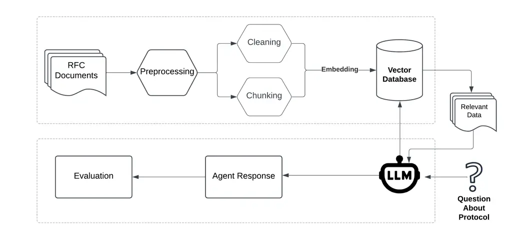
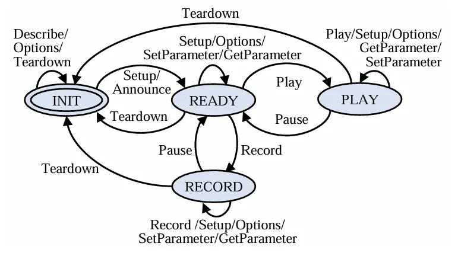
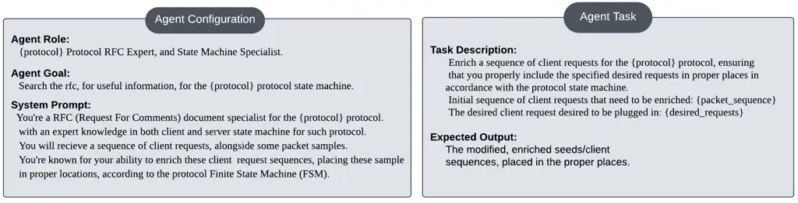

# Retrieval Augmented Generation Based LLM Evaluation For Protocol State Machine Inference With Chain-of-Thought Reasoning

Youssef Maklad, Fares Wael, Wael Elsersy, and Ali Hamdi
Affiliation: Faculty of Computer Science, MSA University, Giza, Egypt
Affiliation: {youssef.mohamed88, fares.wael, wfarouk, ahamdi}@msa.edu.eg

###### Abstract

This paper presents a novel approach to evaluate the efficiency of a
RAG-based agentic Large Language Model (LLM) architecture for network
packet seed generation and enrichment. Enhanced by chain-of-thought
(COT) prompting techniques, the proposed approach focuses on the
improvement of the seeds’ structural quality in order to guide protocol
fuzzing frameworks through a wide exploration of the protocol state
space. Our method leverages RAG and text embeddings to dynamically
reference to the Request For Comments (RFC) documents knowledge base for
answering queries regarding the protocol’s Finite State Machine (FSM),
then iteratively reasons through the retrieved knowledge, for output
refinement and proper seed placement. We then evaluate the response
structure quality of the agent’s output, based on metrics as BLEU,
ROUGE, and Word Error Rate (WER) by comparing the generated packets
against the ground-truth packets. Our experiments demonstrate
significant improvements of up to 18.19%, 14.81%, and 23.45% in BLEU,
ROUGE, and WER, respectively, over baseline models. These results
confirm the potential of such approach, improving LLM-based protocol
fuzzing frameworks for the identification of hidden vulnerabilities.

###### keywords

Finite-State-Machine, Reverse Engineering, Initial Seeds, Protocol
Fuzzing, Large Language Models, Retrieval Augmented Generation

## 1 Introduction

Network protocols are the foundation of modern communication systems,
enabling the exchange of data between applications and services. As the
protocols increase in complexity, ensuring their reliability and
security is an issue of great concern. Finite State Machines (FSMs) of
protocols describe protocols formally by defining valid states and
transitions that rule message exchanges. In network protocol research,
FSMs have been used to describe the state transitions of protocol
entities by modeling the message exchange process of network protocols
Zhang et al. (2023). FSMs, which define the behavior and state
transitions of the protocol, can make fuzz testing more focused and
efficient to ensure that all structural states and transitions of a
server under test (SUT) are covered. Additionally, the seeds that are
initially used for stateful fuzzing play a very important role in state
space exploration. Because most network protocols are stateful, fuzzing
is quite hard since the search space grows exponentially and selects an
initial seed that will guide the fuzzer’s exploration considerably Hu
et al. (2023). However, deriving FSMs manually is tedious, necessitating
automated protocol analysis and reverse engineering. Despite progress in
different FSM extraction techniques, challenges remain in handling
complex protocols and ambiguities. Recent advances in Large Language
Models (LLMs) enable effective FSM inference and protocol analysis by
processing code and textual specifications Sharma and Yegneswaran
(2023); Wei et al. (2024); Pacheco et al. (2022), improving fuzzing and
vulnerability detection Meng et al. (2024); Hu et al. (2023); Black
et al. (2024). With accurate FSM inference, LLMs can generate
high-quality packets that follow the protocol’s defined behaviors, which
can significantly enrich the initial seed set for fuzz testing. This
leads to a more targeted and effective exploration of the state space,
enabling better coverage. Integrating LLMs with existing automatic
protocol reverse engineering (ARPE) techniques could address limitations
in traditional FSM approaches Narayan et al. (2015).



Figure 1: System Overview

We propose a novel approach for protocol FSM inference by combining RAG
Lewis et al. (2020) with the ReAct framework Yao et al. (2022). Our
approach’s pipeline is to embed RFC documents in a vector store and
perform dynamic domain-specific knowledge retrieval during inference.
The RAG-ReAct agents reason and act iteratively over the retrieved
context effectively using COT prompting techniques. This avoids
expensive fine-tuning processes and enhances the output of the model in
terms of accuracy, coherence, and protocol compliance. Our framework
applies the use of retrieved contextual knowledge to dynamically enrich
protocol initial seeds and assures high-quality outputs. We apply this
system to the Real-Time-Streaming protocol (RTSP), using the RFC-2326
document knowledge base. Our system overview can be shown in Figure 1.
The paper is organized as follows: Section 2 reviews related work.
Section 3 provides background information on FSM techniques and LLMs.
Section 4 details our proposed methodology, including preprocessing
steps and the RAG-ReAct Agent inference step. Section 5 outlines the
experimental design, while Section 6 presents and discusses the
experimental results. Finally, section 7 concludes the paper and
suggests potential directions for future research.

## 2 Related Work

The work Shi et al. (2024) proposed SeedMind, a framework that leverages
LLMs to generate high-quality greybox fuzzing seeds. In the presence of
challenges like heterogeneous input formats, bounded context windows,
and unpredictable model behaviors, instead of producing test cases
directly as in traditional methods, SeedMind synthesizes test case
generators. It then iteratively improves such generators through a
feedback-driven process, leading to increased code coverage due to
significantly improved seed quality. Experiments were conducted on 166
programs and 674 harnessed from OSS-Fuzz and the MAGMA benchmark showing
that on average, SeedMind outperforms SOTA LLM-based solutions such as
OSSFuzz-AI and reaches up to 27.5% more coverage, accounting for code
coverage that is comparable to that obtained with manually crafted
seeds. Another work proposes ChatFuzz Hu et al. (2023), a greybox fuzzer
enhanced with generative AI to address the challenge of generating
format-conforming inputs for programs that require highly structured
data. They propose an approach to integrate LLMs to synthesize
structured variants of the seed inputs. These variants are then assessed
and added to the AFL++ greybox fuzzer Fioraldi et al. (2020), which
improves its exploration capability into deeper program states. Their
comprehensive evaluation shows an improvement of 12. 77% edge coverage
over AFL++. Lastly, the framework of Black et al. (2024) evaluates the
use of LLMs to generate fuzzing seeds, focusing on Python programs. It
compares LLM-generated seeds to traditional fuzzing inputs across 50
Python libraries using the Atheris fuzzing framework, finding that a
small set of LLM-generated seeds can outperform large corpora of
conventional inputs. The study highlights the importance of LLM
selection, achieving up to 16% higher coverage in some cases.



Figure 2: RTSP Protocol Server State Machine Specified In RFC-2326

## 3 Background Problem Formulation

The protocol FSM describes defines how communication protocols as the
RTSP protocol operate. The RTSP FSM shown in figure 2 explains essential
element as states, inputs, and state transitions. For instance, for the
RTSP protocol, the three states INIT, READY, and PLAY mark a phase the
session can be in. While events triggering state transitions are the
messages exchanged between the client and the server as SETUP, PLAY, or
PAUSE. Effective management of transitions is fundamental to any
successful communication. Inferring protocol state machines for RTSP is
complex and requires sophisticated techniques as static analysis Shi
et al. (2023), dynamic analysis Zhou et al. (2022), and natural language
processing (NLP) Pacheco et al. (2022). Static analysis extracts
protocol details from source code, but faces scalability issues. Dynamic
analysis monitors runtime behavior with taint analysis and symbolic
execution, but suffers from poor coverage. While NLP methods mine RFCs,
to infer transition relationships between RTSP states, but faces
ambiguity issues when analyzing complex protocols.

LLMs have revolutionized natural language understanding, with
applications ranging from text generation to comprehension and
reasoning. Models built on the transformers’ architecture Vaswani (2017)
achieve these tasks by self-attention mechanisms that allow them to
generate and process text by focusing on a more complex set of features
or relationships between words. Trained on huge datasets of text and
code, they have demonstrated their capabilities in many tasks, including
text summarization, question answering, code generation Chen et al.
(2021), robotic process automation Abdellaif et al. (2024); Abdellatif
et al. (2024), drone operation task automation Wassim et al. (2024), and
improving sentiment and emotion modeling for chatbot systems Hamad
et al. (2024). Furthermore, they have been applied to e-learning
platforms for engagement metrics Hamdi et al. (2024a) and optimizing
workflows in data-scarce contexts Hamdi et al. (2024b). In network
protocol analysis, LLMs seem very promising, with applications in FSM
extraction from protocol specifications Sharma and Yegneswaran (2023);
Wei et al. (2024), initial state machine generation, and protocol
specification inference, seed generation and enrichment Hu et al.
(2023); Shi et al. (2024); Black et al. (2024), and identification of
probable vulnerabilities Meng et al. (2024). Their ability to
contextualize and generate structured text makes them highly capable of
handling such network protocol formats. LLMs have also shown impressive
skills in producing malicious code that would affect the security
landscape Chen et al. (2021).

## 4 Methodology

To infer protocol state machines by LLMs, we employed a novel RAG
approach, enhanced by the ReAct framework Yao et al. (2022), that uses
COT prompting techniques which facilitates logical reasoning, that the
ensuring generated packet sequences adhered to both the syntactic
structure and logical flow of the RTSP protocol. The RAG-ReAct agent
dynamically retrieves and reasons over domain-specific knowledge
embedded in a vector store to answer questions related to initial seed
enrichment for fuzzing. The RTSP protocol’s RFC 2326 document served as
the sole knowledge base. We employed a comparative experiment between
two models which are Gemma-2-9B model and Meta’s Llama-3-8B model to
carry out the best performing results. Below, we outline the two key
steps of our methodology: RFC Document Preprocessing, and
RAG-ReAct-Agent Inference.

### 4.1 RFC Document Preprocessing

Effective preprocessing of the RFC document was critical to ensure
accurate knowledge representation and retrieval.

Let $`D=\{d_{1},d_{2},\ldots,d_{N}\}`$ represent the set of RFC
documents. The preprocessing stage can be defined as a single function:

```math
\mathcal{V}=\text{Preprocess}(D) \tag{1}
```

This phase involved two primary tasks: cleaning the document, and
chunking it.

```math
C(d_{i})=\text{Clean}(d_{i}),\quad\forall i\in\{1,\ldots,N\}. \tag{2}
```

We thoroughly cleaned the RFC document to reduce noise and increase the
relevance of the information that was retrieved. Table headers, footers,
introductions, and any other unnecessary sections that would cause noise
to the RAG-ReAct agent had to be eliminated. We ensured that only
relevant information was kept by concentrating on protocol-specific
content, such as header descriptions, command definitions, and sequence
structures. For the embeddings, each document was divided into
overlapping chunks of 1,000 tokens, with a 200-character overlap to
preserve contextual integrity and to make sure no critical information
was lost across chunk boundaries:

```math
\mathcal{E}(C(d_{i}))=\{e_{i1},e_{i2},\ldots,e_{iM_{i}}\},\quad e_{ij}\in\mathbb{R}^{d}, \tag{3}
```

where $`\mathcal{E}`$ represents the chunking and embedding function,
and $`M_{i}`$ is the number of embedded chunks for document $`d_{i}`$.
These chunks were embedded with OpenAI’s text-embedding-ada-002
embedding model, which has great capabilities of processing up to 6,000
words into a 1,536-dimensional vector optimized for semantic search.
Chroma vector database was used to store the embeddings for
similarity-based retrieval. The final embedding set $`\mathcal{V}`$
combining all chunk embeddings from the preprocessed documents:

```math
\mathcal{V}=\bigcup_{i=1}^{N}\mathcal{E}(C(d_{i})). \tag{4}
```



Figure 3: Prompt Templates For the Agent

### 4.2 RAG-ReAct-Agent Inference

We designed structured prompt templates 3 to guide the agents for
accurate retrieval of FSM specifications and proper seed placement.
These templates outlined the role of the agent and matched its actions
with the protocol specifications. The ”Agent Task” focused on enriching
the initial client request sequences in accordance with the protocol’s
FSM. The ”Agent Goal” guided the model in obtaining relevant FSM
information from the RFC knowledge base. Clear formatting and content
standards are provided in the ”Expected Output” section. This structured
approach enabled the RAG-ReAct-Agent produce accurate and precise
protocol-compliant packet sequences. During inference, the agent was
asked questions about initial seed enrichment and placement of some new
seeds in proper places, inspired by ChatAFL Meng et al. (2024). The
retrieval mechanism retrieved the top-$`k`$ relevant chunks by querying
the vector store using cosine similarity to provide context to direct
the placement of packets, including the necessary headers and correct
field types. This made sure the model had access to domain-specific data
that was necessary for accurate reasoning and generation.

## 5 Experimental Design

To evaluate the agent responses, we performed an assessment using a log
dataset of RTSP-based client-server interactions. We log these
interactions from running ChatAFL Meng et al. (2024) on live555 server
docker image for 2 hours of fuzzing. The total logs contained 5000 plus
entries, simulating RTSP communication sequences, including requests and
responses. We guarantee that in the pre-fuzzing phase we would find
questioning between the fuzzer and the LLM regarding initial seed
enrichment, where the fuzzer asks the LLM about combinations of enriched
seeds. We use these typical logs to begin the evaluation process, which
were typically 120 entries. Each query is processed by the evaluation
pipeline, where the quality and accuracy of the generated outputs have
been evaluated against ground-truth packet sequences based on three core
metrics:

- •
  BLEU score: measures the precision of generated packets by calculating
  the n-gram overlap with ground-truth sequences.
- •
  ROUGE score: measures the recall of n-grams of outputs compared to the
  ground-truth sequences.
- •
  Word Error Rate (WER): measures the edit distance between the
  generated and ground-truth sequences. Lower WER values indicated
  higher accuracy.

## 6 Experimental Results and Discussion

The performance of both the Gemma-2-9B and the Llama-3-8B models,
independently as baseline models and as RAG-ReAct-Agents demonstrated a
clear performance improvement by RAG-ReAct-Agents. As shown in both
Table 1 and Table 2, the RAG-ReAct agents consistently outperformed base
models in different metrics demonstrating better accuracy, and
contextual relevance. For instance, the ”DESCRIBE” request, the BLEU
score of the Llama-3-8B improved substantially from 80.62% to 90.07%,
along with a large reduction in WER from 16.99% to 8.71%. For complex
requests as ”SET_PARAMETER” and ”ANNOUNCE”, the Llama-3-8B RAG-ReAct
agent outperformed Gemma-2-9B RAG-ReAct agent. While Gemma-2-9B had
slightly better averages in some metrics, Llama-3-8B did much better at
complicated requests and was able to provide more accurate outputs with
fewer mistakes. These results show how such RAG-based agentic frameworks
work effectively to enhance contextual reasoning and precise output
accuracy.

| Request        | Gemma-2-9B (Baseline Model) |        |        | Gemma-2-9B (RAG-ReAct Agent) |        |        |
| -------------- | --------------------------- | ------ | ------ | ---------------------------- | ------ | ------ |
|                | BLEU                        | ROUGE  | WER    | BLEU                         | ROUGE  | WER    |
| DESCRIBE       | 81.75%                      | 96.02% | 15.86% | 89.31%                       | 98.63% | 10.46% |
| SETUP          | 68.97%                      | 91.05% | 27.01% | 84.50%                       | 94.54% | 13.67% |
| PLAY           | 56.65%                      | 80.52% | 43.90% | 79.29%                       | 90.67% | 20.97% |
| PAUSE          | 47.38%                      | 79.06% | 38.57% | 71.27%                       | 86.79% | 21.85% |
| TEARDOWN       | 46.85%                      | 74.28% | 42.27% | 75.73%                       | 90.39% | 18.45% |
| GET_PARAMETER  | 26.62%                      | 67.21% | 55.19% | 57.95%                       | 79.64% | 32.33% |
| SET_PARAMETER  | 23.08%                      | 59.10% | 60.65% | 48.00%                       | 67.61% | 43.14% |
| ANNOUNCE       | 10.59%                      | 44.36% | 81.06% | 49.27%                       | 64.92% | 46.85% |
| RECORD         | 19.23%                      | 55.75% | 64.61% | 62.33%                       | 90.22% | 19.75% |
| REDIRECT       | 23.31%                      | 53.08% | 61.62% | 48.31%                       | 75.58% | 34.47% |
| Average Scores | 40.15%                      | 69.75% | 49.36% | 59.03%                       | 85.25% | 25.23% |

Table 1: Performance of Gemma-2-9B Model: Baseline Model vs RAG-ReAct
Agent

| Request        | Llama-3-8B (Baseline Model) |        |        | Llama-3-8B (RAG-ReAct Agent) |        |        |
| -------------- | --------------------------- | ------ | ------ | ---------------------------- | ------ | ------ |
|                | BLEU                        | ROUGE  | WER    | BLEU                         | ROUGE  | WER    |
| DESCRIBE       | 80.62%                      | 94.90% | 16.99% | 90.07%                       | 97.38% | 08.71% |
| SETUP          | 64.49%                      | 86.57% | 31.49% | 83.85%                       | 93.89% | 14.33% |
| PLAY           | 57.78%                      | 81.65% | 42.77% | 79.87%                       | 91.25% | 20.39% |
| PAUSE          | 44.12%                      | 75.80% | 41.82% | 72.61%                       | 88.14% | 20.50% |
| TEARDOWN       | 48.84%                      | 76.26% | 40.28% | 72.66%                       | 87.32% | 21.52% |
| GET_PARAMETER  | 21.64%                      | 62.24% | 60.17% | 58.12%                       | 79.82% | 32.15% |
| SET_PARAMETER  | 20.87%                      | 56.90% | 62.85% | 56.94%                       | 76.54% | 34.20% |
| ANNOUNCE       | 05.50%                      | 39.28% | 86.14% | 56.21%                       | 71.86% | 39.92% |
| RECORD         | 27.49%                      | 64.01% | 56.34% | 54.48%                       | 82.37% | 27.60% |
| REDIRECT       | 20.38%                      | 50.15% | 64.55% | 51.84%                       | 79.11% | 30.93% |
| Average Scores | 39.17%                      | 68.78% | 50.34% | 56.67%                       | 82.89% | 27.58% |

Table 2: Performance of Llama-3-8B Model: Baseline Model vs RAG-ReAct
Agent

## 7 Conclusion

In conclusion, this work addresses the challenges involved in deriving
accurate and comprehensive FSMs for complex stateful network protocols.
Recent developments in LLMs and RAG have shown great promise in FSM
inference tasks and initial seeds enrichment. Though many challenges
remain to be overcome, as adapting the model to the full range of
protocols, scaling, and handling ambiguities in protocol specifications.
The proposed research overcomes these limitations by developing a
RAG-based agentic pipeline based on the knowledge base of RFC documents,
enhanced by chain-of-thought reasoning. This improves the understanding
of protocol specifications, and building a solid and accurate FSM
understanding, to achieve better capabilities with the generation of
high-quality packets. As for future work, we look forward to extend the
evaluation to work with other different stateful network protocols, and
integrate our framework in protocol fuzzing frameworks, to mitigate
vulnerabilities in famous network protocols.

## 8 Acknowledgment

Heartfelt gratitude is extended to AiTech AU, AiTech for Artificial
Intelligence and Software Development
([https://aitech.net.au](https://aitech.net.au)), for funding this
research and enabling its successful completion.

## References

- Zhang et al. (2023) Zhang, Z., Zhang, H., Zhao, J., Yin, Y.: A survey
  on the development of network protocol fuzzing techniques. Electronics
  12(13), 2904 (2023)
- Hu et al. (2023) Hu, F., Gu, Y., Xiong, X.: Exploring the importance
  of initial seeds in stateful fuzzing of network services. In: 2023
  IEEE International Conference on Sensors, Electronics and Computer
  Engineering (ICSECE), pp. 174–178 (2023). IEEE
- Shi et al. (2023) Shi, Q., Xu, X., Zhang, X.: Extracting protocol
  format as state machine via controlled static loop analysis. In: 32nd
  USENIX Security Symposium (USENIX Security 23), pp. 7019–7036 (2023)
- Zhou et al. (2022) Zhou, S., Yang, Z., Qiao, D., Liu, P., Yang, M.,
  Wang, Z., Wu, C.: Ferry:$`\{`$State-Aware$`\}`$ symbolic execution for
  exploring $`\{`$State-Dependent$`\}`$ program paths. In: 31st USENIX
  Security Symposium (USENIX Security 22), pp. 4365–4382 (2022)
- Sharma and Yegneswaran (2023) Sharma, P., Yegneswaran, V.: Prosper:
  Extracting protocol specifications using large language models. In:
  Proceedings of the 22nd ACM Workshop on Hot Topics in Networks, pp.
  41–47 (2023)
- Wei et al. (2024) Wei, H., Du, Z., Huang, H., Liu, Y., Cheng, G.,
  Wang, L., Mao, B.: Inferring state machine from the protocol
  implementation via large langeuage model. arXiv preprint
  arXiv:2405.00393 (2024)
- Meng et al. (2024) Meng, R., Mirchev, M., Böhme, M., Roychoudhury, A.:
  Large language model guided protocol fuzzing. In: Proceedings of the
  31st Annual Network and Distributed System Security Symposium
  (NDSS) (2024)
- Hu et al. (2023) Hu, J., Zhang, Q., Yin, H.: Augmenting greybox
  fuzzing with generative ai. arXiv preprint arXiv:2306.06782 (2023)
- Narayan et al. (2015) Narayan, J., Shukla, S.K., Clancy, T.C.: A
  survey of automatic protocol reverse engineering tools. ACM Computing
  Surveys (CSUR) 48(3), 1–26 (2015)
- Lewis et al. (2020) Lewis, P., Perez, E., Piktus, A., Petroni, F.,
  Karpukhin, V., Goyal, N., Küttler, H., Lewis, M., Yih, W.-t.,
  Rocktäschel, T., et al.: Retrieval-augmented generation for
  knowledge-intensive nlp tasks. Advances in Neural Information
  Processing Systems 33, 9459–9474 (2020)
- Yao et al. (2022) Yao, S., Zhao, J., Yu, D., Du, N., Shafran, I.,
  Narasimhan, K., Cao, Y.: React: Synergizing reasoning and acting in
  language models. arXiv preprint arXiv:2210.03629 (2022)
- Shi et al. (2024) Shi, W., Zhang, Y., Xing, X., Xu, J.: Harnessing
  large language models for seed generation in greybox fuzzing. arXiv
  preprint arXiv:2411.18143 (2024)
- Fioraldi et al. (2020) Fioraldi, A., Maier, D., Eißfeldt, H., Heuse,
  M.: $`\{`$AFL++$`\}`$: Combining incremental steps of fuzzing
  research. In: 14th USENIX Workshop on Offensive Technologies
  (WOOT 20) (2020)
- Black et al. (2024) Black, G., Vaidyan, V., Comert, G.: Evaluating
  large language models for enhanced fuzzing: An analysis framework for
  llm-driven seed generation. IEEE Access (2024)
- Pacheco et al. (2022) Pacheco, M.L., Hippel, M., Weintraub, B.,
  Goldwasser, D., Nita-Rotaru, C.: Automated attack synthesis by
  extracting finite state machines from protocol specification
  documents. In: 2022 IEEE Symposium on Security and Privacy (SP), pp.
  51–68 (2022). IEEE
- Vaswani (2017) Vaswani, A.: Attention is all you need. Advances in
  Neural Information Processing Systems (2017)
- Chen et al. (2021) Chen, M., Tworek, J., Jun, H., Yuan, Q., Pinto,
  H.P.D.O., Kaplan, J., Edwards, H., Burda, Y., Joseph, N., Brockman,
  G., et al.: Evaluating large language models trained on code. arXiv
  preprint arXiv:2107.03374 (2021)
- Abdellaif et al. (2024) Abdellaif, O.H., Nader, A., Hamdi, A.: Lmrpa:
  Large language model-driven efficient robotic process automation for
  ocr. arXiv preprint arXiv:2412.18063 (2024)
- Abdellatif et al. (2024) Abdellatif, O., Ayman, A., Hamdi, A.:
  Lmv-rpa: Large model voting-based robotic process automation. arXiv
  preprint arXiv:2412.17965 (2024)
- Wassim et al. (2024) Wassim, L., Mohamed, K., Hamdi, A.: Llm-daas:
  Llm-driven drone-as-a-service operations from text user requests.
  arXiv preprint arXiv:2412.11672 (2024)
- Hamad et al. (2024) Hamad, O., Shaban, K., Hamdi, A.: Asem: Enhancing
  empathy in chatbot through attention-based sentiment and emotion
  modeling. In: Proceedings of the 2024 Joint International Conference
  on Computational Linguistics, Language Resources and Evaluation
  (LREC-COLING 2024), pp. 1588–1601 (2024)
- Hamdi et al. (2024a) Hamdi, A., Mazrou, A.A., Shaltout, M.: Llm-sem: A
  sentiment-based student engagement metric using llms for e-learning
  platforms. arXiv preprint arXiv:2412.13765 (2024)
- Hamdi et al. (2024b) Hamdi, A., Kassab, H., Bahaa, M., Mohamed, M.:
  Riro: Reshaping inputs, refining outputs unlocking the potential of
  large language models in data-scarce contexts. arXiv preprint
  arXiv:2412.15254 (2024)
