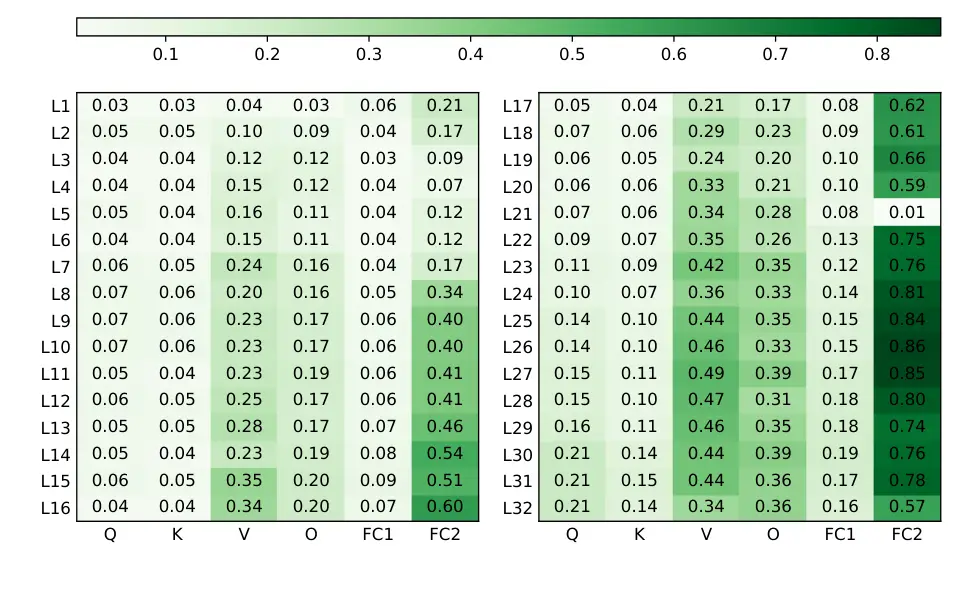

# LiteASR: Efficient Automatic Speech Recognition with Low-Rank Approximation

Keisuke Kamahori Affiliation: University of Washington
Affiliation: Kotoba Technologies,
Inc.{kamahori,baris}@cs.washington.edu, {jkasai,nkojima}@kotoba.tech   
Jungo Kasai Affiliation: Kotoba Technologies,
Inc.{kamahori,baris}@cs.washington.edu, {jkasai,nkojima}@kotoba.tech   
Noriyuki Kojima Affiliation: Kotoba Technologies,
Inc.{kamahori,baris}@cs.washington.edu, {jkasai,nkojima}@kotoba.tech   
Baris Kasikci Affiliation: University of Washington

###### Abstract

Modern automatic speech recognition (ASR) models, such as OpenAI’s
Whisper, rely on deep encoder-decoder architectures, and their encoders
are a critical bottleneck for efficient deployment due to high
computational intensity. We introduce LiteASR, a low-rank compression
scheme for ASR encoders that significantly reduces inference costs while
maintaining transcription accuracy. Our approach leverages the strong
low-rank properties observed in intermediate activations: by applying
principal component analysis (PCA) with a small calibration dataset, we
approximate linear transformations with a chain of low-rank matrix
multiplications, and further optimize self-attention to work in reduced
dimensionality. Evaluation results show that our method can compress
Whisper large-v3’s encoder size by over 50%, matching Whisper medium’s
size with better transcription accuracy, thereby establishing a new
Pareto frontier of accuracy and efficiency. The code of LiteASR is
available at
[https://github.com/efeslab/LiteASR](https://github.com/efeslab/LiteASR).

## 1 Introduction

Automatic speech recognition (ASR) systems have made significant strides
in recent years, achieving near-human transcription performance Radford
et al. (2023); Puvvada et al. (2024). Modern ASR models, such as
OpenAI’s Whisper family, typically adopt an encoder-decoder architecture
Radford et al. (2023). For instance, Whisper large-v3 comprises 32
Transformer blocks in both its encoder and decoder, totaling
approximately 1.6 billion parameters, and has set new standards in
multilingual transcription accuracy.

Despite these advances, deploying ASR systems in real-world applications
poses substantial efficiency challenges. First, many applications, such
as live transcription, voice assistants, and real-time translation,
impose strict latency requirements Macháček et al. (2023); Bevilacqua
et al. (2024); Nguyen et al. (2020); Wang et al. (2022); Jeffries et al.
(2024). Latency refers to the delay between the input of audio and the
output of the transcribed text. In real-time applications, even a few
seconds of delay can significantly degrade user experience.

Second, while the overall model size may be moderate compared to the
latest large language models (LLMs), ASR encoders are computationally
intensive due to the long input sequences they must process. For
instance, the encoder Transformers in the Whisper series consistently
process input sequences of length 1500. For real-time applications, this
encoder must be processed frequently, making it a significant
computational bottleneck.

Figure 1: The relationship between encoder size and accuracy, as
measured by word error rate (WER), for models in the Whisper family. The
stars denote variants compressed via our method, which achieves an
optimal trade-off between accuracy and efficiency.

These challenges are acute in both on-device and data center settings.
In on-device scenarios (e.g., laptops or smartphones), limited hardware
capabilities make it difficult to meet latency constraints. Even in data
center environments, which serve multiple concurrent users, the high
computational intensity of ASR encoders becomes a critical bottleneck.
Although batching can improve serving throughput for memory-bound
workloads, such as ASR decoders, it provides limited benefits for
compute-bound encoders (as discussed in §2).

Moreover, recent works have shown that the decoder component of ASR
models can be aggressively compressed. For example, OpenAI’s Whisper
large-v3-turbo successfully reduced the number of decoder layers from 32
down to 4 layers via distillation. Other variants, such as
Distill-Whisper and Kotoba-Whisper, have taken this even further,
compressing the decoder to as few as 2 layers Gandhi et al. (2023);
Kotoba Technologies (2024). However, the encoder part remains largely
unexplored, making its optimization increasingly crucial for efficient
ASR systems.

In this work, we propose LiteASR, a novel compression scheme that
targets ASR encoders by exploiting the low-rank structure of hidden
activations during inference. A key insight driving our approach is that
intermediate activations, both in self-attention and multi-layer
perceptron (MLP) layers, consistently exhibit low-rank properties across
a wide variety of inputs. This phenomenon stems from ASR encoders’ use
of Mel spectrograms, the 2D time-frequency audio representations.
Real-world audio (e.g., human speech) exhibits strong correlations
between frequency components Huang et al. (2012); Zergat and Amrouche
(2013); Tian et al. (2024); Kacha et al. (2020), resulting in low-rank
characteristics of the intermediate features.

Our method first analyzes the low-rank properties of activations using a
small amount of calibration data. We then perform a principal component
analysis (PCA) Wold et al. (1987) to extract the dominant components and
approximate linear transformations with rank-$`k`$ projections. This
factorization allows each weight matrix to be expressed as the product
of two lower-rank matrices, thereby reducing the total number of
floating-point operations (FLOPs) required for inference. We employ an
adaptive mechanism based on the threshold to determine the optimal
degree of low-rank approximation for each layer.

To further capitalize on the optimization, we also modify the
self-attention algorithm to operate in reduced dimensionality. We
implement a specialized GPU kernel based on FlashAttention Dao et al.
(2022) to accelerate the computation of attention scores and outputs.

Our evaluation shows that LiteASR achieves an optimal trade-off between
accuracy and efficiency (see Figure 1). When applied to Whisper
large-v3, LiteASR reduces the encoder size by approximately 40%,
yielding an execution speedup of around 1.4x with negligible accuracy
loss. In alternative configurations, we further reduce the model size to
less than half, resulting in a model comparable in size to Whisper
medium, while delivering improved accuracy. We also demonstrate the
applicability of the method across different languages and models (§4).

In summary, this paper makes the following contributions:

1.  1.  We introduce LiteASR, a compression method for ASR encoders using a
        low-rank approximation of activation values. This method
        approximates linear layers with a chain of low-rank matrix
        multiplications and optimizes self-attention to operate in reduced
        dimensionality.
2.  2.  We present a comprehensive evaluation demonstrating that our method
        achieves a Pareto frontier of accuracy and efficiency.

The rest of this paper is organized as follows: §2 gives background on
ASR efficiency, §3 presents our low-rank approximation framework, §4
details the experimental setup, results, and analysis, §5 reviews
related work, and §6 concludes the paper.

## 2 Background

### 2.1 Automatic Speech Recognition (ASR)

ASR models convert spoken language into text by transforming raw audio
into a compact representation, such as a Mel spectrogram, and processing
it with neural networks. Modern systems often use encoder-decoder
architectures, typically employing Transformers Radford et al. (2023);
Puvvada et al. (2024); Rekesh et al. (2023); Gulati et al. (2020). For
instance, OpenAI’s Whisper mainly uses Transformer blocks, each of which
consists of self-attention and MLP layers with a large number of linear
transformations (query/key/value/out projections for self-attention and
two larger linear transformations for MLP). A notable recent trend in
ASR models is the reduction in decoder size without compromising
performance, as exemplified by models such as Whisper large-v3-turbo
Radford et al. (2023) and Distill-Whisper Gandhi et al. (2023), which
reduced the number of decoder layers from 32 to 4 and 2, respectively.

Figure 2: Latency breakdown of encoder and decoder relative to
end-to-end latency for Whisper large-v3 and Whisper large-v3-turbo
models under varying batch sizes (1 and 8).

### 2.2 Compute Requirements of ASR Models

Since the encoder often processes long sequences (e.g., fixed at 1500
for Whisper), it often emerges as the primary runtime bottleneck.
Figure 2 shows the latency breakdown between the encoder and decoder
across three hardware setups (NVIDIA RTX 4090, NVIDIA RTX A6000, and
Apple M1 Pro), two models (Whisper large-v3 and Whisper large-v3-turbo),
and two batch sizes (1 and 8).¹¹ 1 We use vLLM Kwon et al. (2023) (ver.
0.7.0) and MLX Hannun et al. (2023) (ver. 0.21.1) to transcribe a sample
audio clip from the ESB dataset Gandhi et al. (2022).

Although the encoder only accounts for about 15% of the overall latency
for single-batch Whisper large-v3 on GPUs, it represents a more
significant bottleneck in other scenarios. For the newer Whisper
large-v3-turbo model, the latency contribution of the encoder increases
significantly due to the reduced size of the decoder. Similarly, for
on-device inference (e.g., M1 Pro), the encoder’s relative latency is
higher due to the limited computational power of such devices compared
to GPUs.

In data center deployment scenarios where multiple requests are batched,
the encoder’s latency impact is further exacerbated. For example, with a
batch size of 8 and using Whisper large-v3-turbo, the encoder can
consume over 90% of the total latency. This disproportionate latency is
primarily due to the encoder’s high computational intensity Williams
et al. (2009); batching is therefore ineffective at increasing
throughput for encoders. In contrast, the decoder generates tokens one
at a time in an autoregressive manner and is memory-bound, bottlenecked
by memory bandwidth rather than computational power, making batching an
effective strategy to enhance throughput Chen (2023). Consequently,
although batching can substantially improve serving throughput for the
decoder, it offers limited benefits for the compute-bound encoder and
the encoder becomes a notable bottleneck for large batch sizes.

These findings collectively highlight the encoder as a critical
bottleneck for efficient ASR deployment in both on-device and data
center environments. This issue becomes more pronounced with recent
trends toward smaller decoders. Therefore, there is a strong demand for
methods to reduce the computational requirements of the encoder.

Figure 3: A simplified illustration of our proposal. We use low-rank
decomposition of activation values (Y) to compress the weight (W).

## 3 Methodology

Our method, LiteASR, compresses the ASR encoder by extracting the
low-rank features from activations at different layers of the model. To
do so, we first use calibration data to analyze activations and then
convert the dense matrix multiplication within the model to the product
of low-rank matrices (Figure 3 shows a simplified overview of the
method). We further modify the self-attention algorithm to work
efficiently in reduced dimensionality. In this section, we explain the
methodologies in detail.

### 3.1 Analyzing Activations in Transformers

Consider a linear layer defined by

```math
Y=XW+b, \tag{1}
```

where the weight matrix
$`W\in\mathbb{R}^{D_{\text{in}}\times D_{\text{out}}}`$ and the bias
vector $`b\in\mathbb{R}^{D_{\text{out}}}`$ are learnable model
parameters. Here, the input activations
$`X\in\mathbb{R}^{L\times D_{\text{in}}}`$ produce the output
activations $`Y\in\mathbb{R}^{L\times D_{\text{out}}}`$ during the
forward pass. In this notation, $`D_{\text{in}}`$ and $`D_{\text{out}}`$
denote the input and output dimensions of the layer, respectively, and
$`L`$ is the sequence length.²² 2 For Whisper encoders, this is always
$`1500`$.

To study the distribution of activations, we collect calibration data
consisting of $`N_{\text{calib}}`$ inputs. For each linear layer, we
record the corresponding output $`Y`$. The resulting dataset can be
viewed as $`L\times N_{\text{calib}}`$ samples, where each sample is a
$`D_{\text{out}}`$-dimensional vector. For simplicity, we refer to this
collection of samples as $`Y`$.

Our goal is to approximate the observed activations by projecting them
onto their principal components. First, let
$`Y_{\mathrm{M}}\in\mathbb{R}^{D_{\text{out}}}`$ denote the mean vector
of the dataset $`Y`$. Following the standard PCA procedure, we perform a
singular value decomposition (SVD) on the mean-centered data:

```math
U,S,V=\mathrm{SVD}(Y-Y_{\mathrm{M}}). \tag{2}
```

Here, $`V\in\mathbb{R}^{D_{\text{out}}\times D_{\text{out}}}`$ is the
matrix of right singular vectors. By selecting the first $`k`$ columns
of $`V`$, denoted by $`V_{k}\in\mathbb{R}^{D_{\text{out}}\times k}`$, we
capture the top-$`k`$ principal components of the data. The original
activations can then be approximated as:

```math
Y-Y_{\mathrm{M}}\approx(Y-Y_{\mathrm{M}})\,V_{k}\,V_{k}^{\top}. \tag{3}
```

This approximation retains the most significant features of $`Y`$ while
reducing its dimensionality.

### 3.2 Compressing Model Layers

Using the PCA approximation from Equation 3, we can rewrite the original
linear layer $`Y=XW+b`$ as a combination of low-rank matrix
multiplications. Substituting $`Y=XW+b`$ gives

```math
\displaystyle Y-Y_{\mathrm{M}} \displaystyle\approx(XW+b-Y_{\mathrm{M}})\,V_{k}\,V_{k}^{\top} \tag{4}
```

```math
\displaystyle Y \displaystyle\approx(XW+b-Y_{\mathrm{M}})\,V_{k}\,V_{k}^{\top}+Y_{\mathrm{M}}.
```

This expression can be reorganized as

```math
Y\approx X(WV_{k})V_{k}^{\top}+\Bigl(Y_{\mathrm{M}}+(b-Y_{\mathrm{M}})\,V_{k}\,V_{k}^{\top}\Bigr). \tag{5}
```

In this factorization, the original layer is decomposed into:

- •
  Two low-rank linear transformations, with weight matrices
  $`WV_{k}\in\mathbb{R}^{D_{\text{in}}\times k}`$ and
  $`V_{k}^{\top}\in\mathbb{R}^{k\times D_{\text{out}}}`$, and
- •
  A constant bias term given by
  $`Y_{\mathrm{M}}+(b-Y_{\mathrm{M}})\,V_{k}\,V_{k}^{\top}`$.

Since both weight matrices and bias can be pre-computed using
calibration data, this decomposition significantly reduces FLOPs when
$`k`$ is much smaller than the original dimension.

#### 3.2.1 How to Choose $`k`$

Choosing the appropriate value for $`k`$ involves a trade-off between
accuracy and efficiency. A smaller $`k`$ leads to a more aggressive
approximation, which increases efficiency but may incur a larger
accuracy loss.

##### Accuracy Constraint.

To preserve accuracy, the top-$`k`$ principal components must capture a
sufficient portion of total variance. Let
$`S\in\mathbb{R}^{D_{\text{out}}}`$ denote the singular values from the
SVD of the mean-centered activations (assumed to be sorted in decreasing
order). We enforce

```math
\sum_{i=1}^{k}S_{i}^{2}\;>\;\theta\sum_{i=1}^{D_{\text{out}}}S_{i}^{2}, \tag{6}
```

where $`\theta`$ is a threshold that controls the trade-off between
accuracy and efficiency (i.e., the extent of data compression).

##### Efficiency Constraint.

The original linear layer requires
$`\mathcal{O}(LD_{\text{in}}D_{\text{out}})`$ FLOPs for its matrix
multiplication. In contrast, the decomposed form in Equation 4 requires
$`\mathcal{O}(LD_{\text{in}}k+LkD_{\text{out}})`$ FLOPs. To ensure that
our approximation results in a reduction of computation, we require

```math
LD_{\text{in}}k+LkD_{\text{out}}<LD_{\text{in}}D_{\text{out}}, \tag{7}
```

which simplifies to

```math
k(D_{\text{in}}+D_{\text{out}})<D_{\text{in}}D_{\text{out}}. \tag{8}
```

For example, in Whisper large-v3, the dimensions for self-attention
layers are $`(D_{\text{in}},D_{\text{out}})=(1280,1280)`$, and for MLP
layers they are $`(1280,5120)`$ or $`(5120,1280)`$. This implies that
the efficiency constraint requires $`k<640`$ for self-attention and
$`k<1024`$ for MLP layers.

##### Practical Considerations.

To maximize the GPU efficiency, we further restrict $`k`$ to be a
multiple of $`16`$. Therefore, we choose $`k`$ as the smallest multiple
of $`16`$ that satisfies both Equation 6 and 7. We empirically find that
$`\theta`$ values between $`0.99`$ and $`0.999`$ achieve a good balance
between accuracy and efficiency. A detailed sensitivity study on the
choice of $`\theta`$ is provided in §4.

#### 3.2.2 Optimizing Self-Attention

Moreover, there is a potential to optimize the self-attention layers
further. Specifically, if the rank $`k`$ is smaller than the per-head
dimension, we can compute the attention score and the value projection
in alternative ways to reduce the FLOPs requirement while preserving the
mathematical operations.

##### Standard Self-Attention.

For multi-head attention, let $`D_{\text{head}}`$ denote the dimension
per head and $`h`$ the number of heads (i.e., the total model dimension
is $`D_{\text{head}}\times h`$). In the $`i`$-th head, given an input
activation matrix $`X\in\mathbb{R}^{L\times D_{\text{in}}}`$, the
self-attention mechanism first computes three linear projections:

```math
Q_{i}=XW_{Q}^{i},\quad K_{i}=XW_{K}^{i},\quad V_{i}=XW_{V}^{i}, \tag{9}
```

where
$`W_{Q}^{i},\,W_{K}^{i},\,W_{V}^{i}\in\mathbb{R}^{D_{\text{in}}\times D_{\text{head}}}`$
are the corresponding weight matrices. The standard attention output is
then given by

```math
\text{Attention}(Q_{i},K_{i},V_{i})=\text{softmax}\!\left(\frac{Q_{i}K_{i}^{\top}}{\sqrt{D_{\text{head}}}}\right)V_{i}, \tag{10}
```

with the softmax applied row-wise.

Attention Score Computation. Using our low-rank approximation, we can
factorize each projection as follows:

```math
\displaystyle Q_{i} \displaystyle=(XW_{Q_{1}})W_{Q_{2}}^{i}+b_{Q}^{i}, \tag{11}
```

```math
\displaystyle K_{i} \displaystyle=(XW_{K_{1}})W_{K_{2}}^{i}+b_{K}^{i},
```

```math
\displaystyle V_{i} \displaystyle=(XW_{V_{1}})W_{V_{2}}^{i}+b_{V}^{i},
```

where $`W_{Q_{1}}\in\mathbb{R}^{D_{\text{in}}\times k_{Q}}`$,
$`W_{Q_{2}}^{i}\in\mathbb{R}^{k_{Q}\times D_{\text{head}}}`$, and
$`b_{Q}^{i}\in\mathbb{R}^{D_{\text{head}}}`$ are parameters relevant for
$`i`$-th head after low-rank approximation (with analogous definitions
for $`K`$ and $`V`$). Here, $`k_{Q}`$, $`k_{K}`$, and $`k_{V}`$ are the
respective rank sizes. For brevity, let $`A=XW_{Q_{1}}`$ and
$`B=XW_{K_{1}}`$. Expanding the product $`Q_{i}K_{i}^{\top}`$, we
obtain:

```math
\displaystyle Q_{i}K_{i}^{\top} \displaystyle=\Bigl(AW_{Q_{2}}^{i}+b_{Q}^{i}\Bigr)\Bigl(BW_{K_{2}}^{i}+b_{K}^{i}\Bigr)^{\top} \tag{12}
```

```math
\displaystyle=\Bigl(AW_{Q_{2}}^{i}+b_{Q}^{i}\Bigr)\Bigl(W_{K_{2}}^{i\,\top}B^{\top}+b_{K}^{i\,\top}\Bigr)
```

```math
\displaystyle=AW_{Q_{2}}^{i}W_{K_{2}}^{i\,\top}B^{\top}
```

```math
\displaystyle+AW_{Q_{2}}^{i}b_{K}^{i\,\top}+b_{Q}^{i}W_{K_{2}}^{i\,\top}B^{\top}+b_{Q}^{i}b_{K}^{i\,\top}.
```

In this expansion, the term
$`AW_{Q_{2}}^{i}W_{K_{2}}^{i\,\top}B^{\top}`$ dominates the
computational cost, while the other three terms are bias contributions.

The standard approach (Equation 10) computes $`Q_{i}`$ and
$`K_{i}^{\top}`$ separately and then multiplies them, which requires
approximately $`\mathcal{O}(L^{2}D_{\text{head}})`$ FLOPs. In contrast,
Equation 12 allows us to first compute the smaller matrix product
$`W_{Q_{2}}^{i}W_{K_{2}}^{i\,\top}`$ and then multiply by $`A`$ and
$`B`$, reducing the computational cost to
$`\mathcal{O}(L\,k_{Q}\,k_{K}+L^{2}\,\min(k_{Q},k_{K}))`$. This is
beneficial when $`\min(k_{Q},k_{K})<D_{\text{head}}`$.³³ 3 We take the
minimum of $`k_{Q}`$ and $`k_{K}`$ because we can choose the
multiplication order to minimize computation. Thus, we adopt Equation 12
if the rank is sufficiently small.

Value projection. After computing the attention score matrix

```math
S_{i}=\text{softmax}\!\left(\frac{Q_{i}K_{i}^{\top}}{\sqrt{D_{\text{head}}}}\right)\in\mathbb{R}^{L\times L}, \tag{13}
```

the final output is obtained by multiplying $`S_{i}`$ with $`V_{i}`$:

```math
\displaystyle S_{i}V_{i} \displaystyle=S_{i}\Bigl((XW_{V_{1}})W_{V_{2}}^{i}+b_{V}^{i}\Bigr) \tag{14}
```

```math
\displaystyle=S_{i}(XW_{V_{1}})W_{V_{2}}^{i}+S_{i}b_{V}^{i}.
```

Conventionally, one would first compute $`(XW_{V_{1}})W_{V_{2}}^{i}`$
and then multiply by $`S_{i}`$, which would cost
$`\mathcal{O}(L^{2}D_{\text{head}}+L\,k_{V}\,D_{\text{head}})`$ FLOPs.
However, by computing $`S_{i}(XW_{V_{1}})`$ first, the cost becomes
$`\mathcal{O}(L^{2}k_{V}+L\,k_{V}\,D_{\text{head}})`$ FLOPs, making this
approach more efficient when $`k_{V}<D_{\text{head}}`$.

Moreover, since each row of $`S_{i}`$ sums to $`1`$, the bias term
simplifies:⁴⁴ 4 Here, $`b_{V}^{i}`$ is broadcast across each row of
$`S_{i}`$.

```math
S_{i}b_{V}^{i}=b_{V}^{i}. \tag{15}
```

Thus, the value projection can be rewritten as:

```math
S_{i}V_{i}=\Bigl(S_{i}(XW_{V_{1}})\Bigr)W_{V_{2}}^{i}+b_{V}^{i}, \tag{16}
```

which is more efficient if $`k_{V}<D_{\text{head}}`$.

Implementation. To efficiently execute the operations in Equations 12
and 16, we implement a specialized kernel using Triton Tillet et al.
(2019). This kernel extends the original FlashAttention
implementation Dao et al. (2022) to handle our optimized computation
strategy.

|          |             |         |      |      |      |      |      |     |     |      |               |
| -------- | ----------- | ------- | ---- | ---- | ---- | ---- | ---- | --- | --- | ---- | ------------- |
| Model    | Config.     | WER (↓) |      |      |      |      |      |     |     |      | Size (↓)      |
|          |             | VP      | AMI  | E22  | GS   | LS-C | LS-O | SG  | TED | Avg. |               |
| Large-v3 | Original    | 8.8     | 25.9 | 19.5 | 11.1 | 2.4  | 5.5  | 3.3 | 4.4 | 10.1 | 635M (100.0%) |
|          | LiteASR (a) | 8.7     | 25.7 | 18.9 | 11.1 | 2.5  | 5.0  | 3.4 | 5.1 | 10.1 | 429M (67.6%)  |
|          | LiteASR (b) | 8.4     | 28.7 | 15.8 | 12.0 | 2.7  | 6.1  | 3.1 | 4.8 | 10.2 | 377M (59.4%)  |
|          | LiteASR (c) | 8.7     | 33.4 | 17.2 | 12.3 | 2.8  | 7.4  | 3.5 | 5.4 | 11.3 | 308M (48.5%)  |
| Turbo    | Original    | 9.5     | 26.8 | 17.4 | 11.4 | 2.6  | 5.5  | 3.8 | 4.3 | 10.1 | 635M (100.0%) |
|          | LiteASR (a) | 9.0     | 27.7 | 17.0 | 11.4 | 2.8  | 6.2  | 3.1 | 4.5 | 10.2 | 421M (66.2%)  |
|          | LiteASR (b) | 8.9     | 43.2 | 16.7 | 11.7 | 3.1  | 7.8  | 4.0 | 5.0 | 12.6 | 374M (58.8%)  |
|          | LiteASR (c) | 10.8    | 69.7 | 35.1 | 16.0 | 4.2  | 13.7 | 5.0 | 6.4 | 20.1 | 313M (49.3%)  |
| Medium   | Original    | 8.7     | 31.3 | 25.9 | 25.9 | 3.9  | 8.8  | 5.9 | 8.2 | 14.8 | 306M (48.1%)  |

Table 1: Accuracy measured by WER percentages on ESB benchmarks and
encoder sizes across different configurations. Abbreviations: VP
(VoxPopuli), AMI (AMI), E22 (Earnings-22), GS (GigaSpeech), LS-C
(LibriSpeech test.clean), LS-O (LibriSpeech test.other), SG
(SPGISpeech), TED (TED-LIUM). For encoder size, we show relative size
against the original Whisper large-v3 inside parenthesis.

## 4 Experiments

In this section, we describe our experimental setup and results,
focusing on both the accuracy and efficiency of LiteASR.

### 4.1 Setup

Our primary accuracy evaluation focuses on compressing Whisper large-v3
and Whisper large-v3-turbo, both of which have encoders of the same
size. We use test data from the End-to-end Speech Benchmark (ESB) Gandhi
et al. (2022), a comprehensive collection of English ASR benchmarking
datasets, to assess the word error rate (WER) of both the compressed and
original models. We randomly choose 1000 audio clips from each of the
eight subsets of ESB: VoxPopuli, AMI, Earnings-22, GigaSpeech,
LibriSpeech (test.clean and test.other), SPGISpeech, and TED-LIUM. For
the calibration data, we randomly select 100 clips (non-overlapping with
the test data), and the calibration process is completed within 10
minutes using a single RTX 4090 GPU. We employ greedy sampling with a
temperature set to 0.

We present three configurations of $`\theta`$ for different deployment
requirements: (a) Quality-Focused: $`\theta=0.999`$ for all layers. (b)
Balanced: $`\theta=0.99`$ for self-attention layers and $`\theta=0.999`$
for MLP layers. (c) Efficiency-Focused: $`\theta=0.99`$ for
self-attention layers and $`\theta=0.995`$ for MLP layers. Later, we
conduct a sensitivity study for different values of $`\theta`$,
languages, and models.

Regarding efficiency, we evaluate the encoder latency on NVIDIA RTX
4090, NVIDIA RTX A6000, and Apple M1 Pro. For GPUs, we modify OpenAI’s
Whisper implementation⁵⁵ 5
[https://github.com/openai/whisper](https://github.com/openai/whisper)
to use CUDA Graph with PyTorch Ansel et al. (2024) (ver. 2.5.1), and we
use Triton Tillet et al. (2019) (ver. 3.2.0) for a customized
self-attention GPU kernel. On the Apple device, we use MLX Hannun et al.
(2023) (ver. 0.21.1). The presented latency data are averaged over 10
runs. Note that the encoder always takes fixed-length audio as input, so
the computational requirements are exactly the same for different data.

### 4.2 Accuracy Evaluation

Table 1 compares the WER and encoder size. LiteASR is evaluated on
Whisper large-v3 and Whisper large-v3-turbo models, with Whisper medium
as a reference. The quality-focused configuration (a) cuts model size by
over 30% with an increase of less than 0.1 percentage points in WER for
both Whisper large-v3 and Whisper large-v3-turbo. For more
efficiency-focused scenarios, configuration (b) reduces encoder size by
over 40% with comparable WER for Whisper large-v3, and about 2.5 points
degradation for Whisper large-v3-turbo. Configuration (c) compresses
Whisper large-v3 model to less than half, matching Whisper medium’s
size, with better WER by about 3.5 points. Overall, LiteASR
significantly reduces the model size while largely maintaining accuracy.
We emphasize that, unlike typical knowledge distillation methods which
require substantial data and compute,⁶⁶ 6 For example,
Distill-Whisper Gandhi et al. (2023) used ¿20k audio hours and the
distillation took days on TPU v4-8. our approach achieves significant
compression without accuracy degradation using only 100 audio clips and
under 10 minutes on a single GPU.

Figure 4: Execution speed of the encoder in Whisper large-v3, compared
as a ratio to the original model.

### 4.3 Efficiency Evaluation

Figure 4 presents the efficiency evaluation results, measuring the
speedup of end-to-end latency of the encoder execution compared to the
original model. LiteASR consistently achieves latency improvements
across all three hardware setups, with average speedups of 1.29x for
(a), 1.38x for (b), and 1.54x for (c). The best performance is observed
with the RTX 4090 using (c), reaching a peak speedup of 1.57x.

Figure 5: Our Triton kernel’s performance against PyTorch
implementation.

Moreover, Figure 5 compares our Triton kernel’s performance with
PyTorch’s scaled dot product attention (SDPA) implementation in Whisper
large-v3’s encoder self-attention layers. The RTX 4090 shows roughly 17%
and 30% improvements over baseline, while the RTX A6000 exhibits gains
of approximately 14% and 22% for matrix ranks 32 and 16, respectively
(i.e., $`k_{Q}`$, $`k_{K}`$, $`k_{V}`$ in §3, assuming all share the
same value).



Figure 6: Compression ratio for each linear layer of Whisper large-v3.
Smaller values mean more aggressive compression

### 4.4 Analysis

#### 4.4.1 Compression Ratio per Layer

Figure 6 illustrates the compression ratio (i.e., defined as the
quotient of $`k`$ divided by the original dimension size) for each
linear layer within the Whisper large-v3 encoder. The data are presented
for configuration (c). In general, the initial layers allow for more
substantial compression, with some exceptions, such as the FC2 stage in
layer 21. This tendency is most pronounced in FC2 layers, where the
earlier layers exhibit a compression ratio of less than 0.2, whereas the
subsequent layers reach values larger than 0.8. Among the layers, the
Q/K projection and FC1 layers display a smaller compression ratio
compared to other layers.

Figure 7: Sensitivity of WER and encoder size on the value of
$`\theta`$.

#### 4.4.2 Sensitivity to $`\theta`$

Figure 7 analyzes the sensitivity of the average WER and encoder size to
$`\theta`$ by independently varying $`\theta`$ from 0.95 to 0.999 for
self-attention and MLP layers in Whisper large-v3. Our results show a
significant increase in WER when $`\theta`$ is below 0.99 for both
layers. In contrast, WER improves as $`\theta`$ increases, with
$`\theta=0.999`$ achieving the best performance. The encoder size
exhibits the opposite trend, positively correlated with $`\theta`$ in a
steady and roughly linear fashion. In the extreme scenario where
$`\theta=0.95`$ is applied to both layers, the encoder size can be
reduced by around 80%, although this comes with a significant increase
in WER.

|             |         |      |         |          |
| ----------- | ------- | ---- | ------- | -------- |
| Config      | WER (↓) |      | CER (↓) | Size (↓) |
|             | FR      | DE   | JA      |          |
| Original    | 7.2     | 13.2 | 10.8    | 635M     |
| LiteASR (a) | 7.4     | 8.7  | 10.7    | 429M     |
| LiteASR (b) | 6.8     | 7.7  | 11.2    | 377M     |
| LiteASR (c) | 9.1     | 10.1 | 12.4    | 308M     |

Table 2: Sensitivity study on other languages. Abbreviations: FR
(French), DE (German), JA (Japanese).

#### 4.4.3 Sensitivity to Languages

To further investigate how LiteASR generalizes to out-of-distribution
data and its sensitivity to languages, we extend our evaluation to
non-English benchmarks. We use MLS Pratap et al. (2020) for French and
German, and the JSUT basic5000 Sonobe et al. (2017) for Japanese.⁷⁷ 7
For Japanese, we use the character error rate (CER) instead of the WER
since Japanese does not have explicit word boundaries. Here, we use the
same English calibration data as in previous experiments to compress
Whisper large-v3, and evaluate its accuracy on non-English audio. The
results presented in Table 2 demonstrate LiteASR’s robustness: for (a),
there is almost no degradation in accuracy, and even for (c), the
degradation is less than 2 percentage points in WER/CER. In some cases,
such as with German, we even observe an improvement in accuracy.

|             |         |               |
| ----------- | ------- | ------------- |
| Config      | WER (↓) | Size (↓)      |
| Original    | 9.1     | 609M (100.0%) |
| LiteASR (a) | 9.1     | 593M (97.3%)  |
| LiteASR (b) | 9.1     | 579M (95.0%)  |
| LiteASR (c) | 9.1     | 545M (89.4%)  |

Table 3: Accuracy and encoder size with Canary 1B model.

#### 4.4.4 Sensitivity to Models

We also evaluate on Canary 1B Puvvada et al. (2024), NVIDIA’s
state-of-the-art ASR model, to determine LiteASR’s applicability to a
broader range of models. The encoder of Canary employs the FastConformer
architecture Rekesh et al. (2023), and our optimizations are confined to
linear layers within the feed-forward and self-attention modules,
leaving the convolution modules unaltered. Table 3 presents the encoder
size and the average WER for ESB datasets. The data indicate that there
is minimal degradation in the WER, although the reduction in size is
moderate compared to the Whisper models, achieving approximately a 10%
reduction for configuration (c).

## 5 Related Work

### 5.1 Efficient ASR Inference

Several prior works have aimed to enhance the efficiency of ASR models.
FasterWhisper uses optimized inference kernels SYSTRAN (2023), while
WhisperX further improves it for long-form audio Bain et al. (2023).
Whisper.cpp is a C/C++ implementation for portability on both the CPU
and GPU Gerganov (2023). Whisper_streaming supports live transcription
for streaming purposes Macháček et al. (2023). NVIDIA’s NeMo is a
modular toolkit for deploying speech models Harper et al. (). However,
they do not effectively reduce ASR encoder computational demands. Some
works provide model weight quantization, but they are limited to weights
(weight-only quantization) and do not accelerate the compute-bound
encoder inference. Our approach can be integrated with these frameworks.

Various studies, including Whisper large-v3-turbo, Distill-Whisper, and
Kotoba-Whisper use distillation techniques to shrink decoder size
Radford et al. (2023); Gandhi et al. (2023); Kotoba Technologies (2024).
Other approaches combine distillation with quantization or lightweight
modular ASR fine-tuning for underrepresented languages Shao et al.
(2023); Ferraz et al. (2023). Our work complements these efforts by
further reducing the encoder’s computational requirements. Unlike these
methods that require substantial data and compute resources, often
tailored for specific downstream tasks, our work incurs minimal
data/compute overhead. Our work also complements them by further
reducing the encoder’s computational requirements; for instance, our
compression technique can be effectively applied to models like Whisper
large-v3-turbo, which is derived from the larger Whisper large-v3 model.

### 5.2 Model Compression with Low-Rank Approximation

The low-rank approximation has been used to compress machine learning
models, such as for parameter-efficient fine-tuning Hu et al. (2021) or
the LLM’s KV cache compression Liu et al. (2024); Chang et al. (2024).
Yu and Wu (2023) have suggested that activations in Transformer models
exhibit low-rank and compressed models, mainly targeting vision models.
However, their method is limited to linear layers, leaving
self-attention layers unoptimized, and its applicability to speech
models has not been studied. Another work by Winata et al. (2020)
presented a model architecture that adopts low-rank weights at
train-time, whereas we propose a post-training technique for compressing
pre-trained ASR models by analyzing activation patterns, avoiding costly
retraining.

## 6 Conclusion

In this work, we introduced a compression method for ASR encoders that
leverages the inherent low-rank structure of activations in linear
layers. By applying the PCA algorithm, this method approximates linear
layers with a chain of low-rank matrix multiplications and optimizes
self-attention to operate in reduced dimensionality. Our comprehensive
evaluation demonstrates that our method achieves a Pareto frontier of
accuracy and efficiency, paving the way for more efficient ASR
deployments for both on-device and data center environments.

## 7 Limitations

Our method focuses on compressing linear layers and the self-attention
mechanism, yielding substantial improvements for Whisper models.
However, other architectures, such as the Conformer, include additional
components such as convolution layers, which may provide further
compression opportunities (see §4). Additionally, our evaluation is
currently limited to standard benchmarks in English and a few other
major languages; evaluating performance on low-resource languages and
domain-specific applications remains an important direction for future
research. Finally, while our improvements do not introduce new risks per
se, the enhanced efficiency could accelerate the broader adoption of ASR
systems, which may amplify concerns related to privacy, surveillance, or
inherent biases in large-scale deployments.

## 8 Ethics Statement

All data and models used in this paper are publicly accessible and are
distributed under Creative Commons, Apache-2.0, MIT, or other
open-source licenses that permit research use.

## References

- Ansel et al. (2024) Jason Ansel, Edward Yang, Horace He, Natalia
  Gimelshein, Animesh Jain, Michael Voznesensky, Bin Bao, Peter Bell,
  David Berard, Evgeni Burovski, et al. 2024. Pytorch 2: Faster machine
  learning through dynamic python bytecode transformation and graph
  compilation. In _Proceedings of the 29th ACM International Conference
  on Architectural Support for Programming Languages and Operating
  Systems, Volume 2_, pages 929–947.
- Bain et al. (2023) Max Bain, Jaesung Huh, Tengda Han, and Andrew
  Zisserman. 2023. Whisperx: Time-accurate speech transcription of
  long-form audio. _arXiv preprint arXiv:2303.00747_.
- Bevilacqua et al. (2024) Antonio Bevilacqua, Paolo Saviano, Alessandro
  Amirante, and Simon Pietro Romano. 2024. Whispy: Adapting stt whisper
  models to real-time environments. _arXiv preprint arXiv:2405.03484_.
- Chang et al. (2024) Chi-Chih Chang, Wei-Cheng Lin, Chien-Yu Lin,
  Chong-Yan Chen, Yu-Fang Hu, Pei-Shuo Wang, Ning-Chi Huang, Luis Ceze,
  Mohamed S Abdelfattah, and Kai-Chiang Wu. 2024. Palu: Compressing
  kv-cache with low-rank projection. _arXiv preprint arXiv:2407.21118_.
- Chen (2023) Lequn Chen. 2023. [Dissecting batching effects in gpt
  inference](https://le.qun.ch/en/blog/2023/05/13/transformer-batching/).
- Dao et al. (2022) Tri Dao, Dan Fu, Stefano Ermon, Atri Rudra, and
  Christopher Ré. 2022. Flashattention: Fast and memory-efficient exact
  attention with io-awareness. _Advances in Neural Information
  Processing Systems_, 35:16344–16359.
- Ferraz et al. (2023) Thomas Palmeira Ferraz, Marcely Zanon Boito,
  Caroline Brun, and Vassilina Nikoulina. 2023. Distilwhisper: Efficient
  distillation of multi-task speech models via language-specific
  experts. _arXiv preprint arXiv:2311.01070_.
- Gandhi et al. (2022) Sanchit Gandhi, Patrick Von Platen, and
  Alexander M Rush. 2022. Esb: A benchmark for multi-domain end-to-end
  speech recognition. _arXiv preprint arXiv:2210.13352_.
- Gandhi et al. (2023) Sanchit Gandhi, Patrick von Platen, and
  Alexander M Rush. 2023. Distil-whisper: Robust knowledge distillation
  via large-scale pseudo labelling. _arXiv preprint arXiv:2311.00430_.
- Gerganov (2023) Georgi Gerganov. 2023. whisper.cpp: Port of openai’s
  whisper model in c/c++.
  [https://github.com/ggerganov/whisper.cpp](https://github.com/ggerganov/whisper.cpp).
- Gulati et al. (2020) Anmol Gulati, James Qin, Chung-Cheng Chiu, Niki
  Parmar, Yu Zhang, Jiahui Yu, Wei Han, Shibo Wang, Zhengdong Zhang,
  Yonghui Wu, et al. 2020. Conformer: Convolution-augmented transformer
  for speech recognition. _arXiv preprint arXiv:2005.08100_.
- Hannun et al. (2023) Awni Hannun, Jagrit Digani, Angelos
  Katharopoulos, and Ronan Collobert. 2023. [MLX: Efficient and flexible
  machine learning on apple silicon](https://github.com/ml-explore).
- (13) Eric Harper, Somshubra Majumdar, Oleksii Kuchaiev, Li Jason, Yang
  Zhang, Evelina Bakhturina, Vahid Noroozi, Sandeep Subramanian,
  Koluguri Nithin, Huang Jocelyn, Fei Jia, Jagadeesh Balam, Xuesong
  Yang, Micha Livne, Yi Dong, Sean Naren, and Boris Ginsburg. [NeMo: a
  toolkit for Conversational AI and Large Language
  Models](https://github.com/NVIDIA/NeMo).
- Hu et al. (2021) Edward J Hu, Yelong Shen, Phillip Wallis, Zeyuan
  Allen-Zhu, Yuanzhi Li, Shean Wang, Lu Wang, and Weizhu Chen. 2021.
  Lora: Low-rank adaptation of large language models. _arXiv preprint
  arXiv:2106.09685_.
- Huang et al. (2012) Po-Sen Huang, Scott Deeann Chen, Paris Smaragdis,
  and Mark Hasegawa-Johnson. 2012. Singing-voice separation from
  monaural recordings using robust principal component analysis. In
  _2012 IEEE International Conference on Acoustics, Speech and Signal
  Processing (ICASSP)_, pages 57–60. IEEE.
- Jeffries et al. (2024) Nat Jeffries, Evan King, Manjunath Kudlur, Guy
  Nicholson, James Wang, and Pete Warden. 2024. Moonshine: Speech
  recognition for live transcription and voice commands. _arXiv preprint
  arXiv:2410.15608_.
- Kacha et al. (2020) Abdellah Kacha, Francis Grenez, Juan Rafael
  Orozco-Arroyave, and Jean Schoentgen. 2020. Principal component
  analysis of the spectrogram of the speech signal: Interpretation and
  application to dysarthric speech. _Computer Speech & Language_,
  59:114–122.
- Kotoba Technologies (2024) Kotoba Technologies. 2024. Kotoba-whisper
  (v2.0).
  [https://huggingface.co/kotoba-tech/kotoba-whisper-v2.0](https://huggingface.co/kotoba-tech/kotoba-whisper-v2.0).
- Kwon et al. (2023) Woosuk Kwon, Zhuohan Li, Siyuan Zhuang, Ying Sheng,
  Lianmin Zheng, Cody Hao Yu, Joseph Gonzalez, Hao Zhang, and Ion
  Stoica. 2023. Efficient memory management for large language model
  serving with pagedattention. In _Proceedings of the 29th Symposium on
  Operating Systems Principles_, pages 611–626.
- Liu et al. (2024) Aixin Liu, Bei Feng, Bing Xue, Bingxuan Wang, Bochao
  Wu, Chengda Lu, Chenggang Zhao, Chengqi Deng, Chenyu Zhang, Chong
  Ruan, et al. 2024. Deepseek-v3 technical report. _arXiv preprint
  arXiv:2412.19437_.
- Macháček et al. (2023) Dominik Macháček, Raj Dabre, and Ondřej
  Bojar. 2023. Turning whisper into real-time transcription system.
  _arXiv preprint arXiv:2307.14743_.
- Nguyen et al. (2020) Thai Son Nguyen, Jan Niehues, Eunah Cho, Thanh-Le
  Ha, Kevin Kilgour, Markus Muller, Matthias Sperber, Sebastian Stueker,
  and Alex Waibel. 2020. Low latency asr for simultaneous speech
  translation. _arXiv preprint arXiv:2003.09891_.
- Pratap et al. (2020) Vineel Pratap, Qiantong Xu, Anuroop Sriram,
  Gabriel Synnaeve, and Ronan Collobert. 2020. Mls: A large-scale
  multilingual dataset for speech research. _arXiv preprint
  arXiv:2012.03411_.
- Puvvada et al. (2024) Krishna C Puvvada, Piotr Żelasko, He Huang,
  Oleksii Hrinchuk, Nithin Rao Koluguri, Kunal Dhawan, Somshubra
  Majumdar, Elena Rastorgueva, Zhehuai Chen, Vitaly Lavrukhin,
  et al. 2024. Less is more: Accurate speech recognition & translation
  without web-scale data. _arXiv preprint arXiv:2406.19674_.
- Radford et al. (2023) Alec Radford, Jong Wook Kim, Tao Xu, Greg
  Brockman, Christine McLeavey, and Ilya Sutskever. 2023. Robust speech
  recognition via large-scale weak supervision. In _International
  conference on machine learning_, pages 28492–28518. PMLR.
- Rekesh et al. (2023) Dima Rekesh, Nithin Rao Koluguri, Samuel Kriman,
  Somshubra Majumdar, Vahid Noroozi, He Huang, Oleksii Hrinchuk, Krishna
  Puvvada, Ankur Kumar, Jagadeesh Balam, et al. 2023. Fast conformer
  with linearly scalable attention for efficient speech recognition. In
  _2023 IEEE Automatic Speech Recognition and Understanding Workshop
  (ASRU)_, pages 1–8. IEEE.
- Shao et al. (2023) Hang Shao, Wei Wang, Bei Liu, Xun Gong, Haoyu Wang,
  and Yanmin Qian. 2023. Whisper-kdq: A lightweight whisper via guided
  knowledge distillation and quantization for efficient asr. _arXiv
  preprint arXiv:2305.10788_.
- Someki et al. (2025) Masao Someki, Yifan Peng, Siddhant Arora, Markus
  Müller, Athanasios Mouchtaris, Grant Strimel, Jing Liu, and Shinji
  Watanabe. 2025. Context-aware dynamic pruning for speech foundation
  models. In _The Thirteenth International Conference on Learning
  Representations_.
- Sonobe et al. (2017) Ryosuke Sonobe, Shinnosuke Takamichi, and Hiroshi
  Saruwatari. 2017. Jsut corpus: free large-scale japanese speech corpus
  for end-to-end speech synthesis. _arXiv preprint arXiv:1711.00354_.
- SYSTRAN (2023) SYSTRAN. 2023. Faster whisper transcription with
  ctranslate2.
  [https://github.com/SYSTRAN/faster-whisper](https://github.com/SYSTRAN/faster-whisper).
- Tian et al. (2024) Yusheng Tian, Junbin Liu, and Tan Lee. 2024.
  User-driven voice generation and editing through latent space
  navigation. _arXiv e-prints_, pages arXiv–2408.
- Tillet et al. (2019) Philippe Tillet, Hsiang-Tsung Kung, and David
  Cox. 2019. Triton: an intermediate language and compiler for tiled
  neural network computations. In _Proceedings of the 3rd ACM SIGPLAN
  International Workshop on Machine Learning and Programming Languages_,
  pages 10–19.
- Wang et al. (2022) Peidong Wang, Eric Sun, Jian Xue, Yu Wu, Long Zhou,
  Yashesh Gaur, Shujie Liu, and Jinyu Li. 2022. Lamassu: Streaming
  language-agnostic multilingual speech recognition and translation
  using neural transducers. _arXiv preprint arXiv:2211.02809_.
- Williams et al. (2009) Samuel Williams, Andrew Waterman, and David
  Patterson. 2009. Roofline: an insightful visual performance model for
  multicore architectures. _Communications of the ACM_, 52(4):65–76.
- Winata et al. (2020) Genta Indra Winata, Samuel Cahyawijaya, Zhaojiang
  Lin, Zihan Liu, and Pascale Fung. 2020. Lightweight and efficient
  end-to-end speech recognition using low-rank transformer. In _ICASSP
  2020-2020 IEEE International Conference on Acoustics, Speech and
  Signal Processing (ICASSP)_, pages 6144–6148. IEEE.
- Wold et al. (1987) Svante Wold, Kim Esbensen, and Paul Geladi. 1987.
  Principal component analysis. _Chemometrics and intelligent laboratory
  systems_, 2(1-3):37–52.
- Yu and Wu (2023) Hao Yu and Jianxin Wu. 2023. Compressing
  transformers: features are low-rank, but weights are not! In
  _Proceedings of the AAAI Conference on Artificial Intelligence_,
  volume 37, pages 11007–11015.
- Zergat and Amrouche (2013) Kawthar Yasmine Zergat and Abderrahmane
  Amrouche. 2013. Robust support vector machines for speaker
  verification task. _arXiv preprint arXiv:1306.2906_.

## Appendix A Additional Sensitivity Studies

### A.1 Comparison to Other Baselines

Unlike LiteASR, which compresses the model with a minimal amount of data
and compute during post-training, most of the existing works on pruning
or knowledge distillation for speech models require a substantial amount
of data and compute, often tailored for the downstream tasks Gandhi
et al. (2023); Shao et al. (2023); Kotoba Technologies (2024); Someki
et al. (2025). Therefore, they are not directly comparable with our
method. Rather, they are complementary to us; for example, Whisper
large-v3-turbo is trained based on a larger Whisper large-v3 model, and
we can apply our method on top of it.

One compression approach that works similarly to LiteASR regarding
data/compute requirements is quantization, which can synergize with our
approach. Table 4 presents the performance following int8 quantization
of FasterWhisper SYSTRAN (2023), applied on top of the original and
compressed versions of Whisper large-v3. The results demonstrate a
slight reduction in accuracy for both the original and our compressed
models due to quantization, with a marginally more pronounced effect on
the compressed version. Nevertheless, our compressed model maintains a
high accuracy level, outperforming alternatives such as the Whisper
medium.

It is important to note that the quantization implementation in
FasterWhisper targets only the model weights, leaving activation values
at high precision. This strategy effectively reduces memory footprint
but does not inherently accelerate compute-bound encoders, where
performance is primarily dictated by arithmetic operation throughput
rather than memory bandwidth. Our method, therefore, offers distinct
advantages and can be combined with such quantization schemes for
comprehensive efficiency gains.

|                   |              |          |
| ----------------- | ------------ | -------- |
| Config            | Avg. WER (↓) | Size (↓) |
| Original, FP16    | 10.1         | 635M     |
| Original, INT8    | 10.2         | 635M     |
| LiteASR (b), FP16 | 10.2         | 377M     |
| LiteASR (b), INT8 | 11.0         | 377M     |

Table 4: Accuracy with different weight quantization configurations.

|          |          |              |          |
| -------- | -------- | ------------ | -------- |
| Domain   | Quantity | Avg. WER (↓) | Size (↓) |
| EN       | 10       | 11.4         | 351M     |
| EN       | 100      | 10.2         | 377M     |
| EN       | 200      | 10.2         | 382M     |
| EN-Clean | 100      | 11.0         | 371M     |
| EN-Noisy | 100      | 10.8         | 360M     |
| FR       | 100      | 10.8         | 374M     |
| DE       | 100      | 13.1         | 378M     |
| JA       | 100      | 12.8         | 344M     |

Table 5: Accuracy with different choices on calibration data quantity
and domain (language).

### A.2 Sensitivity to Calibration Data Selection

In our experiments in §4, we randomly select 100 audio clips from the
English-only ESB dataset to serve as calibration data. Here, we show a
sensitivity study on different aspects of calibration data selection.
For these experiments, we employ Whisper large-v3 with the balanced
setting (configuration (b)), varying the quantity and the selection
method of the calibration data, reported in Table 5.

Quantity. First, we vary the number of calibration audio samples by
randomly selecting 10, 100, and 200 samples from the ESB dataset, same
as the main experiments (denoted as EN in the Table 5). The results
indicate that using only 10 samples is insufficient, as they show a
worse WER than 100 samples by more than 1 point. However, beyond 100
samples, increasing the amount is of little benefit, with the average
WER remaining almost the same between 100 and 200 samples and the
encoder size differing by only about 1%.

Domain. Next, to evaluate the effect of data domain, we examine the
impact of audio quality by selecting calibration data from different
subsets of the ESB dataset, each exhibiting distinct levels of audio
noise. Rather than sampling uniformly across the entire ESB dataset, we
focus on the LibriSpeech test.clean subset and the AMI subset, which
consistently show the lowest and highest WER, respectively, representing
clean and noisy audio sources (denoted as EN-Clean and EN-Noisy in Table
5). We also compare results using calibration data sampled from
non-English sources, for which we select 100 audio samples from the MLS
(French, German) or JSUT (Japanese) dataset.

While the calibration data from the noisy subset yields slightly better
performance than that from the clean subset, the original mixed setting
(combining clean and noisy data) achieves significantly higher accuracy.
This result shows the importance of utilizing diverse calibration
datasets during model compression to preserve the original model’s
performance. In terms of language, although French outperforms both
German and Japanese, non-English calibration data generally
underperforms compared to the original ESB dataset. This is likely
because the original model was trained with English as the primary
language.

Randomness. The results presented in Table 1 are from a single instance.
To assess the robustness against randomness in calibration data
selection, we conduct additional experiments in which the compression is
run five times with different random seeds. For Whisper large-v3 with
configuration (b), the mean WER across five runs is 10.15% with a
standard deviation of 0.16%, while the average number of parameters is
378.5M with a standard deviation of 0.7M. These low standard deviations
demonstrate that LiteASR is robust to calibration dataset randomness,
with minimal impact on both WER and compression ratio.

|            |      |              |              |              |
| ---------- | ---- | ------------ | ------------ | ------------ |
| $`\sigma`$ | SNR  | WER Original | WER Ours (a) | WER Ours (b) |
| 0.01       | 14.7 | 3.1          | 3.3          | 3.4          |
| 0.02       | 8.7  | 4.2          | 4.7          | 5.3          |
| 0.03       | 5.1  | 6.6          | 6.9          | 8.5          |
| 0.04       | 2.7  | 9.6          | 10.6         | 13.0         |
| 0.05       | 0.7  | 13.2         | 14.8         | 18.3         |
| 0.06       | -0.9 | 18.2         | 20.2         | 24.9         |
| 0.07       | -2.2 | 23.2         | 26.1         | 33.3         |
| 0.08       | -3.4 | 29.0         | 33.5         | 40.4         |
| 0.09       | -4.4 | 35.7         | 40.2         | 48.6         |
| 0.1        | -5.3 | 46.7         | 47.4         | 56.2         |

Table 6: Transcription accuracy with different degrees of noise.

### A.3 Robustness of Compressed Models for Noisy Data

To evaluate the robustness of LiteASR against noisy audio data, we start
from the clean data of the LibriSpeech test.clean subset, and add noise
to evaluate the relation between WER and Signal-to-Noise Ratio (SNR). We
inject zero-mean Gaussian noise into normalized audio by specifying a
noise standard deviation ($`\sigma`$), producing samples that range from
nearly clean to heavily corrupted, and compute the resulting SNR in
decibels by comparing the average power of the clean waveform to that of
the added noise. We select $`\sigma`$ between 0.01 and 0.1. A larger SNR
value means cleaner audio. For the evaluation, we use the original and
compressed versions (configurations (a) and (b)) of Whisper large-v3.

Table 6 presents the results. For both the original and compressed
models, transcription accuracy degrades for larger noise level
$`\sigma`$ and smaller SNR values. While the compressed model maintains
comparable performance under mild noise conditions, it demonstrates
reduced robustness to severe noise compared to the original model.
Additionally, there is a trade-off between noise robustness and
inference efficiency: conservative compression preserves greater noise
tolerance, while aggressive compression prioritizes efficiency at the
cost of robustness.

|                                       |              |          |
| ------------------------------------- | ------------ | -------- |
| Config ($`\theta`$ for attention/MLP) | Avg. WER (↓) | Size (↓) |
| 0.99 / 0.999 (b)                      | 12.6         | 374M     |
| 0.99 / 0.998                          | 13.3         | 351M     |
| 0.99 / 0.997                          | 15.8         | 336M     |
| 0.99 / 0.996                          | 17.3         | 324M     |
| 0.99 / 0.995 (c)                      | 20.1         | 313M     |

Table 7: Further analysis of Whisper large-v3-turbo.

### A.4 Further Analysis of Whisper large-v3-turbo

In Table 1, we observe a large jump in WER for Whisper large-v3-turbo
between configurations (b) and (c). Table 7 shows a sensitivity study
about finer-grained compression rates between (b) and (c), varying the
$`\theta`$ value for the MLP layers. The data indicate that the Whisper
large-v3-turbo model is sensitive to the degree of compression applied
to the MLP layers. The initial step (from 0.999 to 0.998) shows a modest
degradation in performance, and further reductions lead to a more
significant drop in accuracy. This trend also suggests that our
PCA-based compression method successfully identifies the critical
features required to preserve model performance within the given
capacity. This demonstrates that the $`\theta`$ parameter acts as a
powerful lever for balancing the trade-off between model compactness and
accuracy.
