# Pruning Deep Neural Networks via a Combination of the Marchenko-Pastur Distribution and Regularization

Leonid Berlyand Affiliation: Department of Mathematics Affiliation:
Pennsylvania State University Affiliation: University Park, PA 16802,
USA    Theo Bourdais Affiliation: Department of Computing and
Mathematical Sciences Affiliation: California Institute of Technology
Affiliation: 1200 E California Blvd Affiliation: Pasadena, CA 91125, USA
   Houman Owhadi Affiliation: Department of Computing and Mathematical
Sciences Affiliation: California Institute of Technology Affiliation:
1200 E California Blvd Affiliation: Pasadena, CA 91125, USA    Yitzchak
Shmalo Affiliation: Department of Mathematics Affiliation: Pennsylvania
State University Affiliation: University Park, PA 16802, USA

###### Abstract

Deep neural networks (DNNs) have brought significant advancements in
various applications in recent years, such as image recognition, speech
recognition, and natural language processing. In particular, Vision
Transformers (ViTs) have emerged as a powerful class of models in the
field of deep learning for image classification. In this work, we
propose a novel Random Matrix Theory (RMT)-based method for pruning
pre-trained DNNs, based on the sparsification of weights and singular
vectors, and apply it to ViTs. RMT provides a robust framework to
analyze the statistical properties of large matrices, which has been
shown to be crucial for understanding and optimizing the performance of
DNNs. We demonstrate that our RMT-based pruning can be used to reduce
the number of parameters of ViT models (trained on ImageNet) by 30-50%
with less than 1% loss in accuracy¹¹ 1 Code for this can be found at
[https://github.com/yspennstate/RMT_pruning_ViT](https://github.com/yspennstate/RMT_pruning_ViT).
To our knowledge, this represents the state-of-the-art in pruning for
these ViT models. We also show numerically that RMT-based pruning can be
used to increase the accuracy of fully connected DNNs. Furthermore, we
provide a rigorous mathematical underpinning of the above numerical
studies, namely we proved a theorem for fully connected DNNs, and other
more general DNN structures, describing how the randomness in the weight
matrices of a DNN decreases as the weights approach a local or global
minimum (during training). This decrease in randomness may explain why
RMT-based pruning can enhance DNN performance for fully connected DNNs,
as the pruning can help reduce the randomness in the weight layers,
allowing for faster convergence to the minima. We finally verify this
theorem through numerical experiments on fully connected DNNs, providing
empirical support for our theoretical findings. Moreover, we prove a
theorem that describes how DNN loss decreases as we remove randomness in
the weight layers, and show a monotone dependence of the decrease in
loss with the amount of randomness that we remove. Our results also
provide significant RMT-based insights into the role of regularization
during training and pruning.

###### Contents

1.  1 Introduction
2.  2 Randomness in Deep Neural Networks
    1.  2.1 Introduction to Deep Neural Networks
    2.  2.2 The MP Distribution in Machine Learning contexts
    3.  2.3 Reduction of randomness in DNN weights via MP Distribution
3.  3 Pruning Visual Transformers (ViTs)
    1.  3.1 Pruning strategy based on Random Matrix Theory
        1.  3.1.1 Singular vector pruning
        2.  3.1.2 Direct coefficients pruning
        3.  3.1.3 Regularization
    2.  3.2 Pruning procedure overview
    3.  3.3 Results for the visual transformer Vit_Base_Patch16_224
        Model
    4.  3.4 Pruning the visual transformer Vit_large_Patch16_224 Model
    5.  3.5 Pruning results for ViT-B16/224 and ViT-L16/224 on ImageNet
    6.  3.6 RMT-based pruning of DeiT
4.  4 Main theoretical results
    1.  4.1 Assumptions for main theorems: Gaussian case
    2.  4.2 A theorem on the asymptotic magnitude of the noise
    3.  4.3 A theorem on how pruning randomness reduces loss
    4.  4.4 Key lemmas: how removing randomness from DNN weight layers
        affects the output, loss and accuracy of a DNN
5.  5 Generalized Main Theoretical Results
    1.  5.1 Assumptions for Generalized Main Theorems
    2.  5.2 Main Theoretical results for RMT-based decrease in loss
    3.  5.3 Key Lemmas: how removing randomness from DNN weight layers
        affects the output, loss and accuracy of a DNN
6.  References
7.  A Other Numerical Results
8.  B A simple illustration of the relationship between RMT-based
    pruning and regularization
    1.  B.1 Regularization in a simple regression setting
    2.  B.2 Proof of Lemma
    3.  B.3 Training of a DNN with three weight layers using L1 and L2
        regularization with varying layer widths
        1.  B.3.1 Analysis of $`b(N)`$
    4.  B.4 Some key lemmas: how accuracy and loss are affected when
        removing the random matrix $`R_{2}`$
    5.  B.5 Proof of Lemma
9.  C Proof of Theorems and
10. D Some known results on perturbation of matrices
    1.  D.1 Asymptotics of singular values and singular vectors of
        deformation matrix
    2.  D.2 Asymptotic behavior of singular values and vectors of the
        deformed matrix model given in Subsection
    3.  D.3 Proof of Theorems , , and .
11. E Algorithms for RMT-Based pruning of DNN
    1.  E.1 BEMA technique for computing $`\lambda_{+}`$
    2.  E.2 Importance of singular value decomposition in Deep Learning
    3.  E.3 How well does the ESD of $`X`$ fit the MP Distribution with
        Spikes
    4.  E.4 Eliminating singular values while preserving accuracy
    5.  E.5 Algorithm for Sparsifying Singular Vectors of a DNN Layer
    6.  E.6 Algorithm for element-wise sparsification of a matrix
    7.  E.7 The MP and spike metrics of a DNN model
12. F ViT model architecture
    1.  F.1 Image representation and embedding
    2.  F.2 Positional encoding
    3.  F.3 Self-Attention Mechanism
    4.  F.4 Calculation of attention
        1.  F.4.1 Output of the Attention Layer
    5.  F.5 Position-Wise Feed-Forward Networks

## 1 Introduction

DNNs have emerged as a powerful tool in the realm of classification
tasks, where they categorize objects from a set
$`S\subset\mathbb{R}^{n}`$. They are a class of parametric functions and
will be defined in section 2.1. The training of DNNs on labeled training
datasets $`T\subset\mathbb{R}^{n}`$ is done by optimizing its parameters
to minimize a loss in order to increase the network’s accuracy,
typically the cross-entropy loss, as shown in (3). DNNs have been
applied to various real-world challenges, achieving remarkable results
in fields such as handwriting recognition \[28\], image classification
\[27\], speech recognition \[23\], and natural language processing
\[50\] among others. One significant hurdle in DNN training is
overfitting, where the model excessively adapts to the training data,
leading to poor generalization of unseen data. This often results in a
decline in performance on test datasets despite high accuracy on the
training set T. To mitigate overfitting, researchers have developed
various regularization strategies, including dropout \[48\], early
stopping \[42\], and weight decay regularization \[39\].

Recently, Random Matrix Theory (RMT) has emerged as a promising approach
to tackling overfitting in deep learning \[33, 30\]. This includes the
development of RMT-based stopping criteria \[35\] and regularization
methods \[56\]. Furthermore, RMT has been applied to analyze the
spectrum of weight layer matrices \[51\] and study the input-output
Jacobian matrix \[40, 41\]. Investigations into RMT-based
initializations for DNNs have also been conducted, see e.g, \[44\]. It
has been demonstrated that the spectral characteristics of DNN weight
layer matrices can provide insightful information about the network’s
performance, even in the absence of test data. In particular, it has
been shown in \[34, 32\] that the spectrum of the weight layers of a DNN
can be indicative of the DNN’s accuracy on unseen test sets. In this
work, we show that analyzing these spectral properties helps identify
weights that have minimal impact on accuracy, enabling the pruning of a
DNN’s weights while maintaining its accuracy.

In the comprehensive review by \[53\], numerous studies on pruning are
categorized into three main strategies: magnitude-based pruning,
redundancy identification through clustering, and sensitivity
analysis-based pruning. Other works and surveys on pruning in deep
learning can be found in \[14\] and \[25\]. Several previous studies,
such as \[59, 58, 12, 3, 57\], have leveraged Singular Value
Decomposition (SVD) to prune small singular values from DNN weight
matrices, focusing on empirical techniques like energy thresholds and
validation set error monitoring. In our work, we introduce a
theoretically grounded magnitude-based pruning method using RMT. The
Marcenko-Pastur (MP) distribution, a famous RMT distribution (see
Section 2.2), characterizes the distribution of the singular values of
random matrices. Using the MP distribution, we may recover the amount of
noise in the weight layers and compare their spectrum to that of purely
random matrices. Eigenvalues that deviate significantly from what would
be expected in a purely random matrix indicate weights that contain
information and are critical to the network’s function. Conversely,
weights associated with eigenvalues that align closely with those of
random matrices are considered candidates for removal. Additionally, we
quantify the degree to which each layer’s spectrum aligns with the MP
distribution, providing a measure of “randomness” that guides targeted
training and regularization efforts. For the classical case of fully
connected DNNs, it has been demonstrated in \[10\] both numerically and
theoretically using rigorous mathematical analysis that MP-based pruning
can reduce a network’s parameters by over $`99\%`$ while increasing its
accuracy.

The goal of this work is to develop state-of-the-art pruning algorithms
for Vision Transformer (ViT) models based on the MP spectral approach
from RMT theory. We compare our pruning algorithms with those presented
in \[61, 22, 38, 47\]. A key feature of our method, compared to other
works, is that our pruning does not rely on any access to a validation
or test set. In principle, this pruning approach can be extended to
other deep neural network models, such as Convolutional Neural Networks
(CNNs). We also provide a rigorous mathematical analysis of how removing
randomness from the weight layers of DNNs reduces loss without affecting
accuracy. We demonstrate that during training, the randomness in the DNN
weight layers diminishes over time. As DNN parameters converge to a
local minimum, the randomness vanishes.

The paper has been organized as follows. In Sections 1 and 2, a brief
overview of key notions and concepts is presented. In Section 3, we
apply our MP-based pruning and fine-tuning approach to ViTs pre-trained
on the 1K ImageNet dataset \[19\]. We study the reduction in parameters
and how it affects the accuracy of the DNN on the ImageNet validation
set. We compare our results with the following work \[47\] and the
references therein, showing that we achieve higher pruning with less
reduction in accuracy.

In Sections 4 and 5, we present our main mathematical results that
explain the evolution of randomness in DNN weight layers during
training. We prove two key theorems. Our first theorem demonstrates that
for a DNN trained with $`L2`$ regularization, the random parameters
within the network’s weight matrices diminish and vanish as the
network’s loss approaches a local or global minimum. This result
underscores the transition of the network’s parameters from a regime
dominated by randomness (from their initialization) to one where
deterministic structures prevail, thereby contributing to how DNNs
extract information from noisy data under training. The second theorem
describes how DNN loss decreases as we remove randomness in the weight
layers and shows a monotone dependence of the decrease in loss with the
amount of randomness that we remove.

Our numerical findings and corresponding mathematical results illustrate
the interplay between regularization and pruning (see Theorem 4.2),
emphasizing the critical role of regularization techniques in the
training and pruning of DNNs. Our numerical approach is underpinned by
rigorous mathematical results and tested on advanced ViT models,
demonstrating its applicability to modern deep-learning models.

## 2 Randomness in Deep Neural Networks

### 2.1 Introduction to Deep Neural Networks

In classification tasks, the goal is to categorize elements of a set
$`S`$ into one of $`K`$ distinct classes. Let $`C(s)\in\{1,..,K\}`$ be
the correct class of $`s\in S`$. Given a labeled training set
$`T\subset S`$, we wish to develop an approximate classifier to extend
the accurate classification from the training set $`T`$ to the entire
set $`S`$. To do so, we use a DNN as a parameter-dependant classifier
$`\phi(s,\alpha)`$, where $`\alpha\in\mathbb{R}^{\nu}`$ are its
parameters. The DNN outputs a probability vector
$`(p_{1}(s),\dots,p_{K}(s))`$ such that $`p_{k}(s):=\mathbb{P}[C(s)=k]`$
is the estimated probability distribution of $`C(s)`$.  
We consider DNNs which are a composition $`\rho\circ X(\cdot,\alpha)`$,
with $`\rho`$ the softmax (given in (2)) and $`X(\cdot,\alpha)`$ defined
as follows. Let

```math
X(\cdot,\alpha)=\lambda\circ M_{L}(\cdot,\alpha)\circ\cdots\circ\lambda\circ M_{1}(\cdot,\alpha) \tag{1}
```

with:

- •
  $`M_{k}(\cdot,\alpha)`$ an affine function
  $`\mathbb{R}^{N_{k-1}}\to\mathbb{R}^{N_{k}}`$ parameterized by a
  weight matrix $`W_{k}\in\mathbb{R}^{N_{k}\times N_{k-1}}`$ and bias
  vector $`\beta_{k}\in\mathbb{R}^{N_{k}}`$ such that
  $`M_{k}(x)=W_{k}\cdot x+\beta_{k}`$.
- •
  $`\lambda:\mathbb{R}^{m}\mapsto\mathbb{R}^{m}`$ is a nonlinear
  activation function. In this case, we assume $`\lambda`$ is the
  absolute value activation function, such that
  $`\lambda:x\in\mathbb{R}^{m}\mapsto(|x_{1}|,\dots,|x_{m}|)\in\mathbb{R}^{m}`$.
- •
  The softmax function $`\rho`$ normalizes the outputs of
  $`X(\cdot,\alpha)`$ into a probability vector over $`\{1,\dots,K\}`$.
  The individual components of $`\rho`$ are computed as:

  ```math
  \rho(v)_{i}=\frac{\exp(v_{i})}{\sum_{i=1}^{K}\exp(v_{i})}\text{ for }v\in\mathbb{R}^{K} \tag{2}
  ```

Given the neural network architecture above, we train our classifier
$`\phi(\cdot,\alpha)`$ by minimizing the cross-entropy loss. This loss
quantifies the accuracy of our classifier over the training set, and is
defined as

```math
L(\alpha)=-\frac{1}{|T|}\sum_{s\in T}\log\left(\phi_{C(s)}(s,\alpha)\right). \tag{3}
```

Training a DNN is fundamentally about exploring a complex,
high-dimensional, and non-convex landscape of loss to identify the
global minimum. However, the intricacies of these landscapes often
result in the emergence of local minima, saddle points, and broad flat
regions. These features can act as impediments in the learning process,
obstructing the path to an optimal solution. The prevalence of such
challenges escalates with the increase in dimensionality and complexity
of the DNN \[18, 15\].

In this context, the potential of RMT is noteworthy. By applying RMT to
prune DNN weight layers, we can simplify the loss landscape, thereby
reducing local minima and saddle points. This simplification assists the
optimization process in finding the global minimum, potentially leading
to higher training accuracy without reaching a plateau and overall
improved model performance. We observe this improvement in performance
(higher accuracy) for fully connected DNNs trained with $`L1`$ and
$`L2`$ regularization; see Appendix A.

### 2.2 The MP Distribution in Machine Learning contexts

The identification of the Marchenko-Pastur distribution, a fundamental
result in RMT, has far-reaching implications in fields like signal
processing, wireless communication, and machine learning. References
such as \[55, 21, 45, 16\] detail its applications. This distribution
provides insights into the spectral density of large random matrices,
revealing the asymptotic eigenvalue distribution in these matrices and
predicting their behavior under various conditions. Furthermore, the MP
distribution is pivotal in dimension reduction techniques, including
principal component analysis (PCA), as highlighted in \[1, 11, 43\].  
We introduce the concept of the empirical spectral distribution (ESD)
for an $`N\times M`$ matrix $`G`$, then state the Marcenko-Pastur
theorem:

###### Definition 2.1.

The ESD for an $`N\times M`$ matrix $`X`$ is defined as:

```math
\mu_{X_{M}}=\frac{1}{M}\sum_{i=1}^{M}\delta_{\sigma_{i}}, \tag{4}
```

where $`\sigma_{i}`$ are the non-zero singular values of $`X`$, and
$`\delta`$ signifies the Dirac measure.

###### Theorem 2.2 (Marchenko and Pastur (1967) \[31\]).

Consider an $`N\times M`$ random matrix $`W`$ with $`M\leq N`$. Let the
entries $`W_{i,j}`$ be independent, identically distributed with zero
mean and finite variance $`\sigma^{2}`$. Let $`X=\frac{1}{N}W^{T}W`$.
When $`N\to\infty`$ and $`\frac{M}{N}\to c\in(0,+\infty)`$, the ESD of
$`X`$, denoted by $`\mu_{X_{M}}`$, converges in distribution to the
Marchenko-Pastur probability distribution:

```math
\frac{1}{2\pi\sigma^{2}}\frac{\sqrt{(\lambda_{+}-x)(x-\lambda_{-})}}{cx}\mathbf{1_{[\lambda_{-},\lambda_{+}]}}dx \tag{5}
```

with

```math
\lambda_{\pm}=\sigma^{2}(1\pm\sqrt{c})^{2}. \tag{6}
```

Theorem 2.2 states that as the dimensions of a random matrix increase,
its eigenvalue distribution converges to the MP distribution. The MP
distribution is deterministic and hinges on two parameters: the variance
of the matrix’s entries, $`\sigma^{2}`$, and the aspect ratio of the
matrix, denoted by $`c`$.

### 2.3 Reduction of randomness in DNN weights via MP Distribution

As outlined in Subsection 2.1, a DNN is composed of affine functions
$`M_{l}`$, represented by an $`N\times M`$ matrix $`W_{l}`$ of
parameters and a bias vector $`\beta_{l}`$. Before training, these
matrices are often initialized with i.i.d. entries according to a normal
distribution $`\mathcal{N}(0,\frac{1}{N})`$. Given the large size of
these matrices, the Empirical Spectral Distribution (ESD) of
$`X_{l}=\frac{1}{N}W_{l}^{T}W_{l}`$ is close to the MP distribution
_before training_. Yet, previous studies have used the spiked model in
random matrices to examine $`W_{l}`$, showing that the ESD of $`X_{l}`$
_after training_ exhibits eigenvalues that diverge from the
Marchenko-Pastur limit $`\lambda_{+}`$ \[33, 49\]. This observation
suggests that the weight matrices contain signal obtained from the data
after training.

With random initialization and training through Stochastic Gradient
Descent (SGD), the sequence of parameters during training $`\alpha(t)`$
satisfies

```math
\displaystyle\alpha(0)\text{ is i.i.d. Gaussian} \tag{7}
```

```math
\displaystyle\alpha(t+1)=\alpha(t)-\tau\nabla L(\alpha(t)) \tag{8}
```

While $`\nabla L(\alpha(t))`$ contains information derived from the
training data (signal) it also includes noise due to the data itself
possibly being noisy, and the use of random minibatches by SGD. Thus,
each update of $`\alpha`$ contains both noise and signal. To account for
this observation, we model the training process using the following
suppositions:

##### Supposition 1

After $`t`$ steps of training, the weight matrix at layer $`l`$ can be
decomposed as

```math
W_{l}(t)=R_{l}(t)+S_{l}(t) \tag{9}
```

where $`S_{l}(t)`$ represents the signal (structured information learned
from the data) and $`R_{l}(t)`$ is an independent random noise
perturbation.

As training progresses, we expect the magnitude of the signal
$`\lVert S_{l}(t)\rVert_{F}`$ to increase while the magnitude of the
noise $`\lVert R_{l}(t)\rVert_{F}`$ decreases, where $`\|\cdot\|_{F}`$
is the Frobenius norm of a matrix. The theory will explore this question
in detail. Given this decomposition, we will use the MP distribution to
separate the signal from the noise. To do so, we assume that the signal
in $`W_{l}`$ is strong enough to be distinguishable from the noise.
Since the singular values of $`R_{l}`$ are determined by the MP
distribution, with maximal value $`\sqrt{\lambda_{+}}`$, this
supposition can be reformulated as:

##### Supposition 2

Singular values $`\sigma_{i}`$ of $`W_{l}`$ below $`\sqrt{\lambda_{+}}`$
are likely from $`R_{l}`$, where $`\lambda_{+}`$ is the upper bound of
the MP distribution of $`R_{l}^{T}R_{l}`$

In section 3, we will use Supposition 2 to design a pruning strategy and
apply it to VIT models. In section 4, we formalize these suppositions
and prove that removing $`R_{l}(t)`$ does not decrease accuracy (see
Lemma 4.4). The theory, through Theorem 2.2, provides insights into how
the training reduces the noise in weight matrices. We first present our
result for a simplified case where the DNN has only three weight layer
matrices and no bias vector. In future works, the results will be
extended to more general ViT models.

## 3 Pruning Visual Transformers (ViTs)

ViTs have emerged as state-of-the-art models for image classification
tasks on benchmarks such as ImageNet \[19\]. Most weights in ViTs are
organized as dense matrices, representing affine transformations through
matrix-vector products, such as in Multi-Layer Perceptrons (MLPs) and
Attention layers \[54\]. This structure makes ViTs particularly
compatible with the framework of RMT. For further details on the
architecture of ViTs, see Appendix F.

### 3.1 Pruning strategy based on Random Matrix Theory

In this section, we detail our pruning strategy that leverages insights
from RMT. The pruning process involves selectively removing weights from
a DNN based on certain criteria derived from RMT. Our goal is to reduce
the model size while preserving its accuracy.

Our pruning strategy is based on the suppositions made in section 2.3,
and extensive experiments on ViT models. Given our supposition that the
weight matrices are perturbed low-rank structures, we can prune them by
setting small values, which are likely noise, to zero. We define the
pruning function for $`x,\theta\in\mathbb{R}`$:

```math
\text{Prune}(x,\theta)=\left\{\begin{matrix}x\text{ if }\lvert x\rvert>\theta\\
0\text{ if }\lvert x\rvert\leq\theta\end{matrix}\right. \tag{10}
```

This function can be vectorized for matrices
$`W\in\mathbb{R}^{N\times M}`$ s.t.
$`\text{Prune}(W,\theta)_{i,j}=\text{Prune}(W_{ij},\theta)`$.  
There are three types of pruning that can be done:

1.  1.  Singular Vector Pruning: Small values in the singular vectors may be
        interpreted as noise. This step helps protect the model during
        pruning by enhancing the low-rank structure and preserving accuracy.
2.  2.  Singular value Pruning: Although small singular values could be
        considered noise according to our suppositions, experiments showed
        that pruning these values significantly degraded the network’s
        performance. Therefore, this technique was excluded from our final
        pruning procedure.
3.  3.  Direct coefficients pruning: We may also directly set to zero small
        coefficients in the weights layer, as they may be interpreted as
        noise.

After pruning, we observe that applying a combination of $`L_{1}`$ and
$`L_{2}`$ regularization helps in refining the weight matrices,
promoting sparsity while maintaining the network’s performance.  
To guide the pruning and define what is interpreted as noise, we
introduce two key metrics:

- •
  Spike Metric $`\gamma`$: This metric quantifies the proportion of
  spikes in the weight matrices of the layers. It is defined as:

  ```math
  \gamma=\frac{1}{N}\cdot\text{Card}\left\{\sigma\leq\sqrt{\lambda_{+}N},\text{ for }\sigma\text{ singular value of }W_{\ell}\right\}
  ```

  where $`N`$ is the size of the weight matrix $`W_{\ell}`$, and
  $`\lambda_{+}`$ is the upper edge of the Marchenko-Pastur distribution
  fitted to the Empirical Spectral Density (ESD) of
  $`X_{\ell}=\frac{1}{N}W_{\ell}^{T}W_{\ell}`$. In the base ViT
  described below, its average value is 88.55%. This metric suggests how
  large the rank of the deterministic matrix $`S`$ is compared to the
  total rank of $`W`$. See Appendix E for more on spikes.

- •
  MP Fit Metric $`\mu`$: This metric measures the error in fitting the
  MP distribution to the ESD of
  $`X_{\ell}=\frac{1}{N}W_{\ell}^{T}W_{\ell}`$. It is computed based on
  a fitting algorithm (see Subsection E.3). In the base VIT described
  below, its average value is 0.3.

#### 3.1.1 Singular vector pruning

For a triplet $`(v,w,\sigma)`$ of respectively left, right singular
vectors and singular value, we apply pruning such that:

```math
v\leftarrow\text{Prune}\left(v,\theta\max\left\{\frac{1}{750},\left[1-\frac{\sigma}{\sqrt{\lambda_{+}}}\right]^{30}\right\}\right) \tag{11}
```

A similar update is performed on $`w`$. The specifics of this pruning
were found by extensive experiments. The pruning of the components of
the singular vectors is based on their size, with smaller components
being pruned. The threshold of this pruning is based on
$`\theta=.00001125\times r\times N\times M`$, with $`N`$ and $`M`$ being
the sizes of the matrix. This process reduces the complexity of the
model by removing less significant components of the singular vectors.
It seems to "protect" the DNN during the pruning phase and make the
weight layers "more" low rank, see Subsection E.5.

#### 3.1.2 Direct coefficients pruning

To prune the weight matrices, we use the metric $`\zeta_{1}(t)`$, which
depends on the randomness of the layer and the current pruning cycle
$`t`$. It is defined as:

```math
\zeta_{1}(t)=\left[(1-\mu)\cdot\gamma\right]^{\frac{1.5}{t}}\cdot r\cdot\text{Card}\left\{|W_{\ell}|_{ij}>0\right\} \tag{12}
```

where:

- •
  $`\mu`$ is the MP Fit Metric of the layer.
- •
  $`\gamma`$ is the spike metric of the layer.
- •
  $`r`$ is the desired proportion of parameters to remove in each
  pruning cycle (set to $`r=6\%`$).
- •
  $`t`$ is the current pruning cycle (with total cycles
  $`N_{\text{cycle}}=19`$).
- •
  $`\text{Card}\left\{|W_{\ell}|_{ij}>0\right\}`$ is the number of
  non-zero parameters in the weight matrix $`W_{\ell}`$.

The above equation for $`\zeta_{1}(t)`$ was derived through a process of
trial and error, but it also embodies some common sense principles. In
particular, weight matrices that are determined to be more random—based
on the randomness criteria provided by the MP Fit Metric ($`\mu`$) and
the spike metric ($`\gamma`$)—are pruned more aggressively in the
initial pruning cycles. This approach leverages the idea that less
structured (i.e., more random) weights are likely to be less critical to
the network’s performance.

The exponent $`\frac{1.5}{t}`$ ensures that as we progress through the
pruning cycles (i.e., as $`t`$ increases), the influence of the
randomness metrics $`\mu`$ and $`\gamma`$ diminishes. This design allows
us to focus more on pruning layers that are identified as more random in
the early cycles and shift towards a more uniform pruning strategy in
later cycles. Using this, each matrix is updated using the following
rule:

```math
W_{\ell}\leftarrow\text{Prune}(W_{\ell},f\max\{3,5[(1-\mu)\gamma]^{\frac{1.5}{t}}\}) \tag{13}
```

where $`f`$ is the pruning factor. $`f`$ is found to be the smallest
number so that the total amount of weights pruned in the matrix is
larger or equal to $`\zeta_{1}(t)`$. In practice, $`f`$ is initialized
at $`f=1e-6`$ and increased by steps of $`5e-6`$ until the total amount
of weights pruned is more than $`\zeta_{1}(t)`$.

#### 3.1.3 Regularization

Regularization helps mitigate potential accuracy loss due to pruning. It
also helps in refining the weight matrices after pruning, promoting
sparsity while maintaining the network’s performance.

After every pruning cycle, we minimize the loss function

```math
\mathcal{L}=\mu_{1}\|W\|_{1}+\mu_{2}\|W\|_{2}^{2},
```

with $`\mu_{1}=5\times 10^{-6}`$ and $`\mu_{2}=2\times 10^{-6}`$ using
SGD and a learning rate of $`0.05\times 10^{-6}`$ (without any training
data), so that although an infinite number of minimization steps would
drive all weights to zero, the finite number of epochs applied causes
the weights to simply become smaller—with some small weights
vanishing—thus allowing us to decay the weight magnitudes without
directly pruning them. Again, note that no training data is used during
this regularization, and there are no other constraints for this
minimization.

### 3.2 Pruning procedure overview

Having defined the different steps used in our procedure, we may now
describe the overall process. To progressively remove weights, we
perform $`N_{cycle}=19`$ times the following pruning cycle. First, we
prune the singular vectors (only every other cycle). Then, coefficients
of the weight matrix are pruned by direct coefficient pruning. Finally,
we perform regularization for $`n_{reg}`$ epochs. We start with
$`n_{reg}=15`$ and increase by 5 epochs each cycle, up to a maximum of
40 epochs.

##### Fine-tuning

Finally, after completing all pruning and regularization cycles, we
fine-tune the model to recover any potential loss in accuracy. This
fine-tuning is performed while keeping the pruned weights frozen, thus
keeping the sparsification we obtained through the procedure described
above. We use SGD with a momentum of $`0.9`$, a base learning rate of
$`3\times 10^{-5}`$ with the cosine annealing scheduler and a warmup
phase of 2 epochs (learning rate divided by 100). The model is
fine-tuned for 20 epochs over the entire training set using
cross-entropy loss. Finally, the gradient norm is clipped at $`1`$ to
prevent exploding gradients.  
Results are presented before and after fine-tuning.

### 3.3 Results for the visual transformer Vit_Base_Patch16_224 Model

Our numerical simulations explore the pruning of a pre-trained
vit_base_patch16_224 model using RMT. This model has approximately 86.5
million parameters and archives a $`85.1\%`$ top-1 accuracy on the
ImageNet validation set. We reduce the DNN’s size by 30-40% and evaluate
its accuracy. We assess the model’s top-1 and top-5 accuracy on the
ImageNet validation set, consisting of $`\approx 200,000`$ objects.

###### Remark 3.1.

Some layers of this DNN model fit the MP distribution (based on
Algorithm E.3) with an error of $`1\%`$ while others fit the MP
distribution with an error of over $`50\%`$, see Subsection E.7 for
more. The spike metric and MP fit metric depends on $`\alpha`$, see
Subsection E.7. When $`\alpha=.25`$, we have that LRM is $`86.25`$ and
MP fit metric of this ViT model is $`.18`$.

As the pruning progresses, the process yields a series of models with
varying levels of sparsity and performance metrics. The final model
selection can be based on a trade-off between accuracy and complexity.
See Fig. 1 for the accuracies of the ViT model vs the number of
parameters kept (there is no fine-tuning yet). We see that the DNN that
was pruned by approximately $`30\%`$ has a reduction in top-1 accuracy
by only $`1.1\%`$. After 1 epoch of fine-tuning the ViT model on the
ImageNet training set, the DNN accuracy improved to $`84.5\%`$,
resulting in a total decrease in accuracy of only $`.6\%`$.

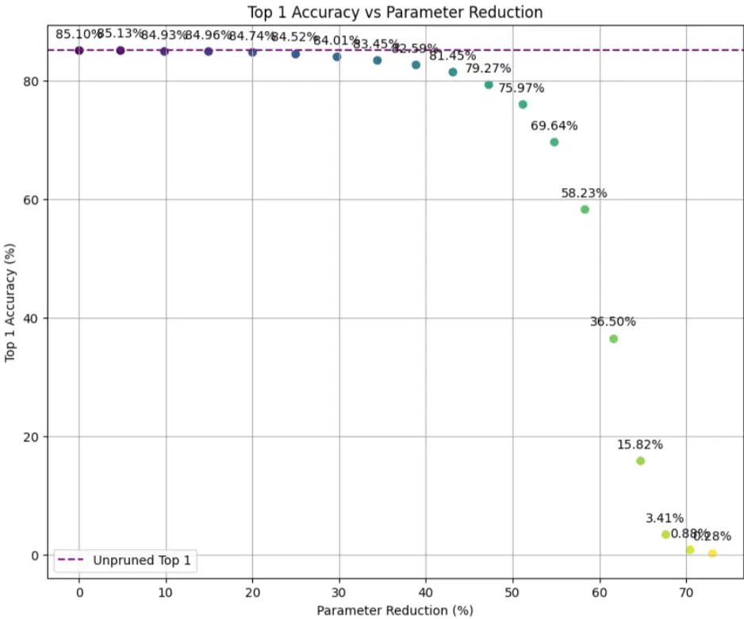

(a)

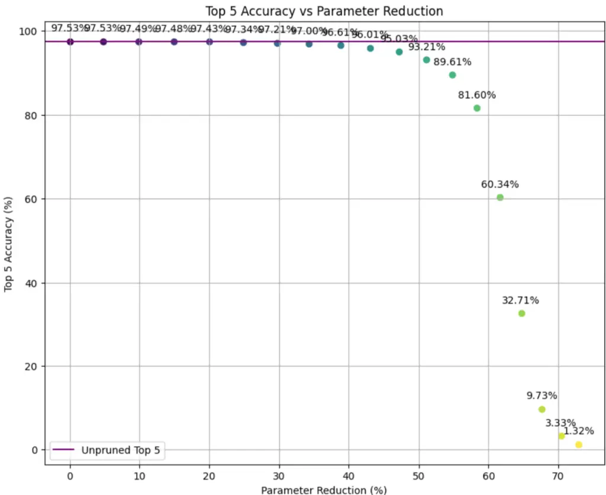

(b)

Figure 1: The top 1 accuracy and top-5 accuracy of ViT-base vs.
percentage of parameters kept for pruning through RMT-based
sparsification and no fine-tuning. The accuracy of the DNN is given as a
percentage above the data points.

### 3.4 Pruning the visual transformer Vit_large_Patch16_224 Model

We performed the same pruning strategy on the Vit_large_Patch16_224
Model. This ViT model is bigger than the one in the previous subsection,
having approximately 300 million parameters. It achieves a $`85.85\%`$
accuracy on the ImageNet validation set. In Fig. 2, we see the accuracy
vs percentage of parameters kept for this pruning. After pruning
$`30\%`$ of the DNN parameters, the accuracy only drops by $`.8\%`$.
Again, after fine-tuning for only one epoch, we recover that full
reduction in accuracy (i.e., has a 85.85% accuracy). Finally, we also
took the DNN for which $`50\%`$ of the parameters were pruned and
fine-tuned for $`12`$ epochs, obtaining a $`84.48\%`$ accuracy after the
fine-tuning.

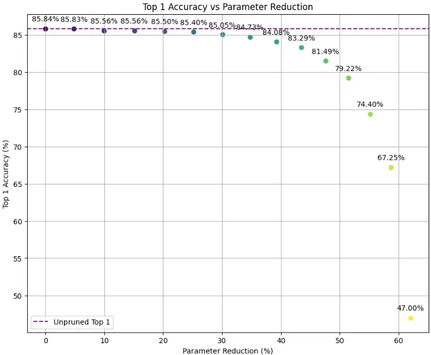

(a)

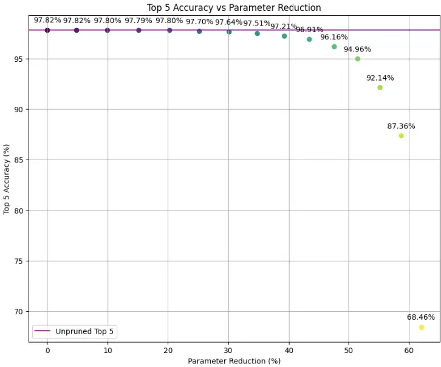

(b)

Figure 2: The top 1 accuracy and top-5 accuracy of ViT-large model vs.
percentage of parameters kept for pruning through RMT-based
sparsification and no fine-tuning. The accuracy of the DNN is given as a
percentage above the data points.

### 3.5 Pruning results for ViT-B16/224 and ViT-L16/224 on ImageNet

In this section, we compare our pruning results with CP-ViT \[47\],
using the same architecture but different pre-trained weights. Our
initial accuracies are higher: 85.1% for ViT-B16/224 and 85.85% for
ViT-L16/224, compared to 77.91% and 76.5% in CP-ViT. Figure 3 shows the
pruning results with FLOP reduction and accuracy reduction. Our
fine-tuning was done for $`20`$ epochs, while the fine-tuning in \[47\]
was done with $`30`$ epochs.

Figure 3: Comparison of pruning results between our method and CP-ViT
\[47\]

### 3.6 RMT-based pruning of DeiT

We perform the same pruning strategy with the same hyperparameters from
Subsection 3.1 on the three DeiT models, tiny, small and base. Table 1
shows the result of our RMT-based pruning method and compares them with
other pruning methods, both with and without fine-tuning. For these
models, we fine-tune for only $`7`$ epochs, which is much less than the
fine-tuning done in the other works; for example, in \[47\], they
fine-tune for $`30`$ epochs. From Table 1 and Fig. 3, we see that we
always outperform \[47\] when there is no fine-tuning. Furthermore, Fig.
3 shows that we outperform \[47\] for large DNNs even with fine-tuning,
which makes sense from an RMT perspective given that the larger the DNN
and the more parameters we have, the more RMT applies. Given the massive
DNNs being trained these days, with over a trillion parameters, this RMT
perspective becomes especially important.

|                       |               |              |               |              |
| --------------------- | ------------- | ------------ | ------------- | ------------ |
|                       | Not Finetune  |              | Finetune      |              |
| Model                 | Top-1 Acc.(%) | FLOPs Saving | Top-1 Acc.(%) | FLOPs Saving |
| DeiT-Ti 16/224 \[52\] |               |              |               |              |
| Baseline \[52\]       | 72.20         | \-           | 72.20         | \-           |
| VTP \[61\]            | 69.37 (-2.83) | 21.68%       | 70.55 (-1.65) | 45.32%       |
| PoWER \[22\]          | 69.56 (-2.64) | 20.32%       | 70.05 (-2.15) | 41.26%       |
| HVT \[38\]            | 68.43 (-3.77) | 21.17%       | 70.01 (-2.19) | 47.32%       |
| CP-ViT \[47\]         | 71.06 (-1.14) | 23.02%       | 71.24 (-0.96) | 43.34%       |
| RMT-based (ours)      | 71.09 (-1.11) | 24.83%       |               |              |
| DeiT-S 16/224 \[52\]  |               |              |               |              |
| Baseline \[52\]       | 79.80         | \-           | 79.80         | \-           |
| VTP \[61\]            | 77.35 (-2.45) | 20.74%       | 78.24 (-1.56) | 42.52%       |
| PoWER \[22\]          | 77.02 (-2.78) | 21.46%       | 78.30 (-1.50) | 41.36%       |
| HVT \[38\]            | 76.72 (-3.08) | 20.52%       | 78.05 (-1.75) | 47.80%       |
| CP-ViT \[47\]         | 78.84 (-0.96) | 20.96%       | 79.08 (-0.72) | 42.24%       |
| RMT-based (ours)      | 78.91 (-0.89) | 23.72%       | 78.34 (-1.46) | 41.92%       |
| DeiT-B 16/224 \[52\]  |               |              |               |              |
| Baseline \[52\]       | 81.82         | \-           | 81.82         | \-           |
| VTP \[61\]            | 79.46 (-2.36) | 19.84%       | 80.70 (-1.12) | 43.20%       |
| PoWER \[22\]          | 79.09 (-2.73) | 20.75%       | 80.17 (-1.65) | 39.24%       |
| HVT \[38\]            | 78.88 (-2.94) | 20.14%       | 79.94 (-1.88) | 44.78%       |
| CP-ViT \[47\]         | 80.91 (-0.91) | 22.16%       | 81.13 (-0.69) | 41.62%       |
| RMT-based (ours)      | 81.44 (-0.38) | 21.38%       | 80.58 (-1.24) | 44%          |

Table 1: Comparison with different ViT pruning methods on the ImageNet
dataset. The accuracy without finetuning was not mentioned in VTP,
PoWER, and HVT but were replicated in \[47\]. We fine-tune for only
$`7`$ epochs on the ImageNet training set.

## 4 Main theoretical results

### 4.1 Assumptions for main theorems: Gaussian case

For simplicity of the presentation, we choose a DNN with only three
weight layer matrices and have other simplifying assumptions. However,
many of the assumptions on the DNN and the weight layer matrices can be
relaxed. For example, we can include arbitrary layers (see Subsection
C), components of $`R_{2}`$ can be i.i.d. from a distribution different
then the normal distribution, and other activation functions can be used
(such as Leaky ReLU). In Section 5, we present these results for more
general DNN structures. Recall the $`\ell_{1}`$ norm of a matrix $`W`$
with entries $`w_{ij}`$:

```math
\|W\|_{1}=\max_{1\leq j\leq n}\sum_{i=1}^{m}|w_{ij}|.
```

###### Assumption 1.

Architecture of the DNN and bounds on the norms of weight layer
matrices: We consider the following DNN $`\phi`$:

```math
\displaystyle X(\alpha,s) \displaystyle=\lambda\circ W_{3}\circ\lambda\circ W_{2}\circ\lambda\circ W_{1}s,\hskip 11.38092pts\in T, \tag{14}
```

```math
\displaystyle\phi(\alpha,s) \displaystyle=\rho\circ X(\alpha,s) \tag{15}
```

where $`W_{1},W_{2},W_{3}`$ are the weight layer matrices and
$`\lambda`$ is the absolute value or ReLU activation function, $`T`$ is
the training set, $`X(\alpha,s)`$ outputs the components of the DNN, and
$`\rho`$ is the softmax. We also denote $`\{W_{l}(t)\}_{l=1}^{3}`$ the
weight layer matrices to highlight the dependence in training time
$`t`$  
We wish to study the behavior of the inner layer $`W_{2}`$ for large
$`N`$, as training progresses. Thus, we assume the outer layers satisfy:
For all $`s`$ in the training set $`T`$, the quantity

```math
a(N,s):=\frac{\|W_{3}\|_{1}\|W_{1}s\|_{2}}{N^{1.5/4}} \tag{16}
```

converges towards $`0`$ as $`N\to\infty`$ (see Subsection B.3 for more
details).

###### Assumption 2.

Deformed matrix form of matrix $`W_{2}`$:

The $`N\times N`$ matrix $`W_{2}(t)`$, is such that:

```math
W_{2}(t)=R_{2}(t)+S_{2}(t),\quad(\textit{deformed matrix}) \tag{17}
```

where $`R_{2}(t)`$ is a matrix with i.i.d. random normal entries that
have mean zero and variance less than $`\frac{1}{N}`$, i.e. such that
$`R_{2}(t)_{i,j}\overset{i.i.d.}{\sim}\mathcal{N}(0,\frac{g(t)}{N})`$,
where $`g(t)\leq 1`$. The bound of $`g(t)`$ is unimportant and taken to
be less than 1 for simplicity. It is necessary that
$`Var[R_{2}(t)_{i,j}]=\mathcal{O}(\frac{1}{N})`$ so that $`R_{2}(t)`$
has a bounded spectral norm as $`N\to\infty`$.

###### Remark 4.1.

Similar results will apply with a rectangular matrix
$`W_{2}(t)\in\mathbb{R}^{N\times M}`$ such that

```math
\frac{M}{N}\to c\in(0,+\infty) \tag{18}
```

###### Assumption 3.

Low-rank nature of $`S_{2}(t)`$:

Let $`\lambda_{+}`$ be the rightmost edge of the Marchenko-Pastur
distribution (see (6)) for the empirical spectral distribution of the
Wishart matrix $`R_{2}^{T}(t)R_{2}(t)`$ as $`N\to\infty`$. Writing
$`S_{2}(t)`$ in its singular value decomposition (SVD) form with
singular values $`\sigma_{i}(t)`$ and singular vectors
$`u_{i}(t),v_{i}(t)\in\mathbb{R}^{N}`$:

```math
S_{2}(t)=\sum_{i=1}^{N}\sigma_{i}(t)u_{i}(t)v_{i}^{T}(t)=\sum_{i=1}^{r}\sigma_{i}(t)u_{i}(t)v_{i}^{T}(t), \tag{19}
```

the singular values $`\sigma_{i}(t)`$ satisfy:

```math
\displaystyle\sigma_{i}(t) \displaystyle=0\quad(N\geq i>r)\quad\text{indicating low-rank nature of $S_{b}(t)$} \tag{20}
```

```math
\displaystyle\sigma_{i}(t) \displaystyle>\frac{\sqrt{\lambda_{+}}}{2}\quad(1\leq i\leq r)\quad\text{to ensure eigenvalues extend beyond $\lambda_{+}$}. \tag{21}
```

We assume that as $`N\to\infty`$, $`r`$ remains constant, ensuring the
low rank of $`S_{2}(t)`$.

###### Remark 4.2.

For a detailed numerical analysis of $`a(N,s)`$, see Subsection B.3.

### 4.2 A theorem on the asymptotic magnitude of the noise

We consider the cross-entropy loss function with L2 regularization for a
DNN $`\phi(\cdot,\alpha(t))`$, expressed as follows:

```math
L(\alpha(t))=-\frac{1}{|T|}\sum_{s\in T}\log\left(\phi_{C(s)}(s,\alpha(t))\right)+\mu\sum_{i=1}^{L}\|W_{i}(t)\|_{F}^{2},\mu>0, \tag{22}
```

where $`C(s)`$ denotes the correct class of the object $`s`$. The term
$`\mu`$ acts as a regularization hyperparameters and prevents
overfitting in the DNN.

###### Theorem 4.1.

Suppose Assumptions 1, 2 and 3 hold. If the parameters $`\alpha`$ of the
DNN converge as $`t\to\infty`$ to a local minimum of the loss (22),
denoted $`\alpha^{*}(N)`$, as $`t\to\infty`$, then
$`\forall\epsilon>0`$:

```math
\lim_{N\to\infty}\lim_{t\to\infty}\mathbb{P}(\|R_{2}\|_{F}\leq\epsilon)\to 1. \tag{23}
```

The proof of this theorem can be found in Section C.

The theorem states that the random part of the weight matrix $`W_{2}`$
vanishes as the network is trained and its parameters converge towards a
local minimum ($`\alpha(t)\to\alpha^{*}`$). It is impossible to
decompose $`W_{2}`$ into $`R_{2}`$ + $`S_{2}`$ , where $`R_{2}`$
satisfies Assumption 2 and $`S_{2}`$ satisfies Assumption 3. If such a
decomposition were possible, the ESD of $`W_{2}`$ would exhibit an MP
bulk and spikes (see \[4, 8, 17\] and Appendices D.7 and E.1). However,
at the local minimum, as we will show, $`W_{2}`$ ’s ESD lacks these
features, ruling out any such decomposition.

It should be noted that for a matrix $`R`$ with i.i.d, centered Gaussian
entries,

```math
\displaystyle\frac{1}{N}\lVert R\rVert_{2}^{2}\overset{a.s.}{\underset{N\to\infty}{\sim}}4\ Var[R_{ij}] \tag{24}
```

```math
\displaystyle\lVert R\rVert_{F}^{2}\overset{a.s.}{\underset{N\to\infty}{\sim}}N^{2}Var[R_{ij}]. \tag{25}
```

Through Assumption 2, we assume i.i.d Gaussianity with mean zero, and
$`Var[R_{ij}]=\mathcal{O}(\frac{1}{N})`$. However, we may see from (25)
that this does not straightforwardly imply $`\lVert R\rVert_{F}\to 0`$,
as the theorem proves. Hence, we prove that the random fluctuations of
the weight matrices have to be much smaller than originally assumed.

One might assume that a local minimum of the loss is deterministic, and
thus the random part of the weights would have to vanish. While
intuitive, this reasoning is not accurate. First, the theorem states
that for any decomposition of $`W_{2}`$ into $`R_{2}+S_{2}`$ satisfying
the above assumptions we would have that
$`\lim_{N\to\infty}\lim_{t\to\infty}\mathbb{P}\left(\|R_{2}\|_{F}\leq\epsilon\right)\to 1`$.
This means that at a local minimum of the loss if one takes a nonzero
random matrix $`R_{2}`$ and then sets $`S_{2}=W_{2}-S_{2}`$, we would
have that $`S_{2}`$ will not satisfy Assumption 3 (with some probability
depending on $`N`$). Otherwise, the theorem would be violated.
Furthermore, the training data $`T`$ itself might have noise, and so the
loss landscape, which depends on the training data, might have some
noise/randomness. That is, the local minima might be somewhat random
(meaning that the parameters $`\alpha`$ at the local min might be
random). However, when we train with regularization, so long as we can
decompose $`W_{2}`$ into $`R_{2}+S_{2}`$ satisfying Assumptions 2 and 3,
we have that
$`\lim_{N\to\infty}\lim_{t\to\infty}\mathbb{P}\left(\|R_{2}\|_{F}\leq\epsilon\right)\to 1`$.

The role of the regularization in (22) is well known in Machine
Learning. In particular, it limits the amount of noise from the data
being learned, as the DNN’s weight may otherwise reflect the random
nature of the data, see \[49\]. In our theory, it is essential in
showing that $`\lVert R\rVert_{F}\to 0`$. Thus regularization
successfully mitigates randomness in the network. It is important to
note that Assumption 2, which ensures that the deterministic matrix
$`S_{2}(t)`$ has no small nonzero singular values, essentially is a
statement about the data $`T`$. It says that any noise from the data
cannot be (in some sense) "much larger" than the deterministic part of
the data (relative also to the hyperparameter $`\mu`$).

It is interesting to note that this phenomenon does not necessarily
occur when there is no regularization. In fact, without regularization,
one can replace the random matrix $`R_{2}`$ with a different random
matrix (or add any random matrix to $`W_{2}`$), and the magnitude of the
loss will not change. Thus, around every local minima, there would be a
flat region of minima, all corresponding with parameters
$`W_{2}+R^{*}_{2}`$, with $`R^{*}_{2}`$ being some random matrix
satisfying Assumptions 2 and 3.

### 4.3 A theorem on how pruning randomness reduces loss

We can also show that reducing the randomness in the parameters reduces
the loss. Specifically, we show that for $`W_{2}=R_{2}+S_{2}`$, if we
replace $`W_{2}`$ in the DNN with $`S_{2}`$ (at some fixed time) then
with some probability (which goes to 1 as $`N\to\infty`$) we have that
the loss of the DNN with $`S_{2}`$ is smaller than the loss of the DNN
with $`W_{2}`$ by the amount $`\mu\|R_{2}\|^{2}_{F}`$.

###### Theorem 4.2.

Suppose Assumptions 1, 2 and 3 hold. For $`W_{2}=R_{2}+S_{2}`$, remove
$`R_{2}`$ so that the second weight layer matrix is $`S_{2}`$ alone.
Then $`\forall\epsilon>0`$ and any fixed training time t we have

```math
\lim_{N\to\infty}\mathbb{P}(L(\alpha_{S_{2}})<(1+\epsilon)(L(\alpha_{W_{2}})-\mu\|R_{2}\|^{2}_{F}))\to 1. \tag{26}
```

Furthermore $`\exists G(N)\to 0`$ as $`N\to\infty`$ s.t.

```math
\lim_{N\to\infty}\mathbb{P}\bigg(|acc_{\alpha_{W_{2}}}(t)-acc_{\alpha_{S_{2}}}(t)|\leq G(N)\bigg)\to 1, \tag{27}
```

where $`\alpha_{S_{2}}`$ and $`\alpha_{W_{2}}`$ represent the DNNs with
weight layer matrices $`S_{2}`$ and $`W_{2}`$ respectively, $`L`$ is the
loss function in (22) and $`\mu`$ is the regularization

The proof for this theorem can be found in Subsection D.3. For a
numerical simulation that shows that removing (or adding) a random
matrix from the DNN reduces its loss, see Example A.3. This theorem
demonstrates that pruning random weights in a DNN reduces its loss.
While Theorem 4.1 suggests that randomness vanishes near a local
minimum, Theorem 4.2 provides a partial answer to whether removing
randomness accelerates convergence, showing that it at least lowers the
loss. The intuition behind this result lies in the perturbations caused
by $`R_{2}`$ : the cross-entropy term is not affected by adding or
removing $`R_{2}`$, while the regularization term is influenced by its
Frobenius norm and decreases as we remove $`R_{2}`$. Since the
regularization perturbation dominates (as shown in (25) and (24)),
removing $`R_{2}`$ significantly reduces the loss. Theorem 4.2
formalizes this, showing that removing the random part $`R_{2}`$ of the
weight matrix $`W_{2}`$ in the DNN $`\phi(\alpha,s)`$ reduces the loss
by an amount proportional to $`\|R_{2}\|_{F}^{2}`$. Specifically, when
$`W_{2}=S_{2}`$ (i.e., $`R_{2}`$ is removed), the loss satisfies:

```math
L(\alpha_{S_{2}},s)+\mu\|R_{2}\|^{2}_{F}<(1+\epsilon)L(\alpha_{W_{2}},s), \tag{28}
```

with high probability. This implies that the loss decreases by
approximately $`\mu\|R_{2}\|_{F}^{2}`$ when $`R_{2}`$ is removed, as the
regularization term involving $`R_{2}`$ vanishes.

This effect can be extended by introducing a scaling factor
$`\gamma\in[0,1]`$ to $`R_{2}`$ , defining the modified weight matrix
as:

```math
W_{2}(\gamma)=\gamma R_{2}+S_{2}. \tag{29}
```

As $`\gamma`$ decreases from 1 to 0, the randomness in $`W_{2}`$ is
reduced, and the corresponding loss decreases proportionally by
$`\gamma\mu\|R_{2}\|_{F}^{2}`$ .

Thus, we can obtain the following corollary:

###### Corollary 4.3.

Suppose Assumptions 1, 2 and 3 hold. For any $`\gamma\in[0,1]`$, define
the modified second-layer weight matrix by

```math
W_{2}(\gamma)=\gamma R_{2}+S_{2},
```

and let $`\alpha_{W_{2}(\gamma)}`$ denote the corresponding DNN. Then
for every $`\epsilon>0`$ and any fixed training time $`t`$, we have

```math
\lim_{N\to\infty}\mathbb{P}\Big(L(\alpha_{W_{2}(\gamma)})<(1+\epsilon)\Big(L(\alpha_{W_{2}})-\gamma\,\mu\,\|R_{2}\|_{F}^{2}\Big)\Big)\to 1.
```

Supporting evidence from \[49\] shows that removing small singular
values in weight matrices (reducing noise) improves accuracy for DNNs
trained on noisy data. Additionally, numerical simulations (e.g.,
Example A.1) confirm that MP-based pruning reduces loss and increases
accuracy, highlighting the practical benefits of this approach. See
Appendices A and B for numerical results on classification and
regression problems that confirm these theoretical findings.

### 4.4 Key lemmas: how removing randomness from DNN weight layers affects the output, loss and accuracy of a DNN

To prove the previous theorems, we rely on two key lemmas presented
here. These lemmas demonstrate that replacing $`W_{2}`$ with its
deterministic part has minimal effect on the DNN’s output, accuracy, and
loss. Since the random component primarily acts as noise, its removal
results in negligible changes.

###### Lemma 4.4.

Suppose assumptions 1, 2, and 3, and suppose we replace the weight layer
matrix $`W_{2}`$ with the deterministic matrix $`S_{2}`$. Then

```math
\mathbb{P}\bigg(|X_{i}(s,\alpha_{S_{2}})-X_{i}(s,\alpha_{W_{2}})|\leq a(N,s)\bigg)\geq 1-2\exp(-\frac{N^{1/4}}{2}). \tag{30}
```

Here, $`a(N,s)=`$(16), and $`\alpha_{S_{2}}`$ are the parameters of the
DNN, which has the weight matrix $`S_{2}`$ and $`\alpha_{W_{2}}`$ are
the parameters of the DNN with the weight layer matrix $`W_{2}`$.

For a proof of the Lemma see Subsection B.2. This lemma examines the
impact of removing the random component from a weight matrix in a DNN
layer. It shows that replacing $`W_{2}`$ with $`S_{2}(t)`$ alone results
in a small difference in the DNN’s output with high probability.
Intuitively, the random component $`R_{2}(t)`$ acts as noise and has a
diminishing effect in large networks due to averaging. The deterministic
part S$`{}_{2}(t)`$, which captures the network’s learned structure,
dominates the behavior. As a result, removing $`R_{2}(t)`$ has
negligible impact on the output, reinforcing that the deterministic
component sufficiently preserves the network’s function. To prove
Theorem 4.2 we use this lemma and then show that the regularization part
of the loss decreases by $`\mu\|R_{2}\|_{F}`$ when we replace $`W_{2}`$
with $`S_{2}`$.

## 5 Generalized Main Theoretical Results

In this section, we generalize the previous results for DNNs with
different architectures and for the case where the random matrix $`R`$
is not necessarily i.i.d Gaussian.

### 5.1 Assumptions for Generalized Main Theorems

###### Assumption 4.

Consider a DNN denoted by $`\phi`$, and assume that it can be written
as:

```math
\phi=\rho\circ\psi_{2}\circ(R+S)\circ\psi_{1}, \tag{31}
```

where $`\psi_{1}`$ and $`\psi_{2}`$ are arbitrary functions and $`\rho`$
is softmax. Furthermore, assume that $`\exists C_{1}`$ constant such
that for any two arbitrary vectors $`v`$ and $`w`$ we have that
$`\|\psi_{2}v-\psi_{2}w\|_{\infty}\leq C_{1}\|\psi_{2}(v-w)\|_{\infty}`$,
with $`\|\cdot\|_{\infty}`$ the max norm of the vector.

Take $`W=R+S`$ and assume that the matrices $`R`$ and $`S`$ satisfying
the following assumptions:

### Assumptions on the matrices $`R`$ and $`S`$

We considered a class of admissible matrices $`W`$, where $`W=R+S`$ and
$`W`$, $`R`$ and $`S`$ satisfy the following three assumptions. The
first assumption is a condition on $`R`$:

###### Assumption 5.

Assume $`R`$ is a $`N\times M`$ matrix such that for any vector $`v`$ we
have:

```math
\mathbb{P}(\|Rv\|_{\infty}>d_{1}(N)J(v))\leq d_{2}(N), \tag{32}
```

with $`d_{1}(N),d_{2}(N)\to 0`$ as $`N\to\infty`$ and $`J(v)`$ some
function that depends on $`v`$ alone. Further, as $`N\to\infty`$, we
have that $`\sigma_{\max}(R)\to\sqrt{\lambda_{+}}`$ a.s.

###### Example 5.1.

For example, when $`R`$ is i.i.d Gaussian, one can show, using the
Borell-TIS inequality (see Theorem B.2), that:

```math
\mathbb{P}\left(\|Rv\|_{\infty}>(\sqrt{\frac{2\log N}{N}}+\frac{1}{N^{\frac{3}{8}}})\|v\|_{2}\right)\leq 2\exp\left(-\frac{N^{\frac{1}{4}}}{2}\right)
```

See Subsection B.2 for a proof.

We then assume the following for the matrix $`S`$:

###### Assumption 6.

Assume $`S`$ is a matrix with
$`S=\sum_{i=1}^{r}\sigma_{i}u_{i}v^{T}_{i}=U\Sigma V^{T}`$, with
$`\sigma_{i}`$ the singular values and $`u_{i}`$, $`v^{T}_{i}`$ column
and row vectors of $`U`$ and $`V`$. Thus, $`S`$ has $`r`$ non-zero
singular values corresponding to the diagonal entries of $`\Sigma`$, and
all other singular values of $`S`$ are zero. We also assume that these
$`r`$ singular values of $`S`$ have multiplicity $`1`$.

Finally, we assume for $`W:=R+S`$:

###### Assumption 7.

Take $`\sigma_{i}`$ to be the singular values of $`S`$, with
corresponding left and right singular vectors $`u_{i}`$ and
$`v^{T}_{i}`$ and $`\sigma^{\prime}_{i}`$ to be the singular values of
$`W=R+S`$, with corresponding left and right singular vectors
$`u^{\prime}_{i}`$ and $`v^{\prime T}_{i}`$. First we assume that
$`\frac{N}{M}\to c\in(0,+\infty)`$ as $`N\to\infty`$. Second, assume
also that we know explicit functions $`g_{\sigma_{i},R}`$,
$`g_{v_{i},R}`$ and $`g_{u_{i},R}`$ such that as $`N\to\infty`$:

```math
\sigma^{\prime}_{i}(W)\xrightarrow[\text{}]{a.s.}\begin{cases}g_{\sigma_{i},R}&\sigma_{i}>\bar{\theta}(\lambda_{+})\\
\sqrt{\lambda_{+}}&\sigma_{i}<\bar{\theta}(\lambda_{+}),\end{cases} \tag{33}
```

```math
|<u^{\prime}_{i},u_{i}>|^{2}\xrightarrow[\text{}]{a.s.}\begin{cases}g_{u_{i},R}&\sigma_{i}>\bar{\theta}(\lambda_{+})\\
0&\sigma_{i}<\bar{\theta}(\lambda_{+}),\end{cases} \tag{34}
```

and

```math
|\langle v^{\prime}_{i},v_{i}\rangle|^{2}\xrightarrow[\text{}]{a.s.}\begin{cases}g_{v_{i},R}&\sigma_{i}>\bar{\theta}(\lambda_{+})\\
0&\sigma_{i}<\bar{\theta}(\lambda_{+}).\end{cases} \tag{35}
```

Third, also assume that for $`i\neq j`$:

```math
|<v^{\prime}_{i},v_{j}>|^{2}\xrightarrow[\text{}]{a.s.}0 \tag{36}
```

and

```math
|<u^{\prime}_{i},u_{j}>|^{2}\xrightarrow[\text{}]{a.s.}0. \tag{37}
```

Here we take $`\bar{\theta}(\lambda_{+})`$ to be a known explicit
function depending on $`\lambda_{+}`$, for example see (78). For the
function $`g_{\sigma_{i},R}`$ we assume the following: if
$`\sigma_{i}>\bar{\theta}(\lambda_{+})`$ then
$`\sigma^{\prime}_{i}(W)>\lambda_{+}`$ a.s., furthermore,
$`\sigma^{\prime}_{i}(W)>\sigma_{i}`$ a.s. Finally, for $`\gamma`$ a
variable between $`0`$ and $`1`$, take $`W=\gamma R+S`$ we have that
$`\sigma^{\prime}_{i}(W)\to\sigma_{i}`$ monotonically, a.s., as
$`\gamma\to 0`$.

Empirically, it has been observed that these assumptions are reasonable
for weight matrices of a DNN; see \[51, 49\]. There are various spiked
models in which Assumptions 5-7 hold, for more on the subject see \[4,
8, 20, 17, 6, 36, 2, 13, 5, 29, 60, 20, 37\]. Also, a number of works in
RMT addressed the connection between a random matrix $`R`$ and the
singular values and singular vectors of the deformed matrix $`W=R+S`$,
see \[7, 8\].

These assumptions are quite natural and hold for a wide range of DNN
architectures. Assumption 5 focuses on the random matrix $`R`$. This
assumption ensures that the random matrix $`R`$ captures the essential
randomness in the weight layer while also satisfying the requirements
given in Theorem 2.2.

Assumption 6-7 pertains to the deterministic matrix $`S`$, which is
assumed to have a specific structure, with $`r`$ non-zero singular
values and all other singular values being zero. Moreover, these $`r`$
singular values have multiplicity 1, which is a reasonable expectation
for a deterministic matrix that contributes to the information content
in the weight layer matrix $`W`$.

The assumption that the singular values of the deterministic matrix
$`S`$ are larger than some $`\bar{\theta}(\lambda_{+})`$ is also quite
natural, see \[51, 49\]. This is because the deterministic matrix $`S`$
represents the information contained in the weight layer, and its
singular values are expected to be large, reflecting the importance of
these components in the overall performance of the DNN. On the other
hand, the random matrix $`R`$ captures the inherent randomness in the
weight layer, and with high probability depending on $`N`$, its singular
values should be smaller than the MP-based threshold. This means that
there is a clear boundary between the information and noise in the layer
$`W`$, which is also natural, see \[49\].

This distinction between the singular values of $`S`$ and $`R`$
highlights the separation between the information and noise in the
weight layer, allowing us to effectively remove the small singular
values without impacting the accuracy of the DNN. The assumption thus
provides a solid basis for studying the behavior of DNNs with weight
layers modeled as spiked models. It contributes to our understanding of
the effects of removing small singular values based on the random matrix
theory MP-based threshold $`\sqrt{\lambda_{+}}`$.

One can show that the following two simpler properties on the matrices
$`R`$ and $`S`$ are sufficient to ensure that $`R`$ and $`S`$ satisfy
the above Assumptions 5-7.

Recall that a bi-unitary invariant random matrix $`R`$ is a matrix with
components taken from i.i.ds such that for any two unitary matrices
$`U`$ and $`V^{T}`$, the components of the matrix $`URV^{T}`$ have the
same distribution as the components of $`R`$. We then assume:

Property 1 (statistical isotropy): Assume $`R`$ to be a bi-unitary
invariant random $`N\times M`$ matrix with components taken from i.i.ds
with zero mean and variance $`\frac{1}{N}`$.

We then assume the following for the deterministic matrix $`S`$:

Property 2 (low rank of deterministic matrix): Assume $`S`$ is a
deterministic matrix with
$`S=\sum_{i=1}^{r}\sigma_{i}u_{i}v^{T}_{i}=U\Sigma V^{T}`$, with
$`\sigma_{i}`$ the singular values and $`u_{i}`$, $`v^{T}_{i}`$ column
and row vectors of $`U`$ and $`V`$. Thus, $`S`$ has $`r`$ non-zero
singular values contained on the diagonal entries of $`\Sigma`$, and all
other singular values are zero. We also assume that these $`r`$ singular
values of $`S`$ have multiplicity $`1`$. Finally, we assume that
$`\frac{N}{M}\to c\in(0,+\infty)`$ as $`N\to\infty`$.

An explicit relationship between Properties 1-2 and Assumptions 5-7 can
be found in \[8\]. The Property $`1`$ is indeed strong, as it implies
that the random matrix $`R`$ is random in every direction. In other
words, for any unitary matrices $`U`$ and $`V^{T}`$, the matrix
$`URV^{T}`$ has the same distribution as $`R`$. Random matrices with
complex Gaussian entries, also known as Ginibre matrices, are a class of
random matrices that are bi-unitary invariant \[26\].

For a DNN $`\phi`$ satisfying Assumption 4 we start by defining,

```math
g_{\phi}(s):=C_{1}\|\psi_{1}s\|_{2}\|\psi_{2}\|_{2}, \tag{38}
```

where $`\|\cdot\|_{2}`$ is the induced $`l_{2}`$ operator norm (for the
case $`\|\psi_{2}\|_{2}`$) and $`C_{1}`$ comes from Assumption 4. Note
that $`\psi_{1}s`$ is simply a vector. We also define,

```math
h_{\phi}(s):=C_{1}J(\psi_{1}s)\|\psi_{2}\|_{1}, \tag{39}
```

where $`\|\cdot\|_{1}`$ is the induced $`l_{1}`$ operator norm and
$`J(\cdot)`$ is given in (60).

### 5.2 Main Theoretical results for RMT-based decrease in loss

In the context of analyzing DNNs, we consider the cross-entropy loss
function with L2 regularization for a DNN $`\phi(\cdot,\alpha(t))`$,
expressed as follows:

```math
L(\alpha(t))=-\frac{1}{|T|}\sum_{s\in T}\log\left(\phi_{C(s)}(s,\alpha(t))\right)+\mu\sum_{i=1}^{L}\|W_{i}(t)\|_{F}^{2}, \tag{40}
```

where $`W_{i}`$ are the weight layer matrices of the DNN, and $`C(s)`$
denotes the correct class of the object $`s`$. The term $`\mu`$ acts as
a regularization constant, which is employed to prevent overfitting in
the DNN.

###### Theorem 5.2.

Let $`\phi`$ be a DNN satisfying Assumptions 4-7. Assume the following:

1.  1.  $`\forall s\in T`$, the quantity
        $`a_{\phi}(N,s):=h_{\phi}(s)d_{1}(N)\to 0`$ as $`N\to\infty`$ (with
        $`h_{\phi}(s)`$ defined in (39) and $`d_{1}(N)`$ coming from (60)
        see Subsection B.3 for more details).
2.  2.  The loss function (22) attains a local minimum at $`\alpha^{*}(N)`$,
        where $`N`$ is the size of the matrix $`W`$.
3.  3.  As training time $`t\to\infty`$, the parameter $`\alpha(t,N)`$
        converges to $`\alpha^{*}(N)`$.

Then, $`\forall\epsilon>0`$:

```math
\lim_{N\to\infty}\lim_{t\to\infty}\mathbb{P}(\|R\|_{F}\leq\epsilon)\to 1. \tag{41}
```

The proof of this theorem can be found in Appendix C.

We can also show that reducing the randomness in the parameters reduces
the loss:

###### Theorem 5.3.

Assume the setup and conditions of Theorem 4.1, particularly regarding
the DNN $`\phi`$ satisfying Assumptions 4-7. Assume that
$`\forall s\in T`$, the quantity
$`a_{\phi}(N,s):=h_{\phi}(s)d_{1}(N)\to 0`$ as $`N\to\infty`$ (see
Subsection B.3 for more details).

Let $`R`$ be removed such that the second weight layer matrix is $`S`$
alone. Then $`\forall\epsilon>0`$ and for any fixed time $`t`$, we have

```math
\lim_{N\to\infty}\mathbb{P}(L(\alpha_{S})<(1+\epsilon)(L(\alpha_{W})-\mu\|R\|^{2}_{F}))\to 1 \tag{42}
```

Furthermore, $`\exists G(N)\to 0`$ as $`N\to\infty`$ s.t.

```math
\lim_{N\to\infty}\mathbb{P}\bigg(|acc_{\alpha_{W}}(t)-acc_{\alpha_{S}}(t)|\leq G(N)\bigg)\to 1, \tag{43}
```

where $`\alpha_{S}`$ and $`\alpha_{W}`$ are the parameters of the DNNs
with weight layer matrices $`S`$ and $`W`$ respectively, $`L`$ is the
loss function in (22) and $`\mu`$ is the regularization hyperparameter.

### 5.3 Key Lemmas: how removing randomness from DNN weight layers affects the output, loss and accuracy of a DNN

In order to prove the main result, we will consider a few critical
lemmas. These lemmas describe how the output, accuracy, and loss of a
DNN remain largely unaffected when we replace the matrix $`W_{2}`$ with
its deterministic part only. In other words, the random component of
$`W_{2}`$ does not significantly affect the loss, accuracy, and output
of the DNN. This outcome should be expected, as the random part should
act more like noise, without causing substantial changes in the loss and
accuracy. The following lemmas illustrate this concept.

Recall: We define the final output of the DNN before softmax as:

```math
X=\psi_{2}\circ(R+S)\circ\psi_{1}(s). \tag{44}
```

###### Lemma 5.4.

Given (44), let $`W+R+S`$ be a $`N\times N`$ matrix such that
$`W(t)=R(t)+S(t)`$, with $`R(t)`$ a random matrix with components i.i.d.
and $`S(t)`$ a deterministic matrix satisfying Assumptions 4-7.

Suppose we replace the weight layer matrix $`W`$ with the deterministic
matrix $`S`$. Then

```math
\mathbb{P}\bigg(|X_{i}(s,\alpha_{S})-X_{i}(s,\alpha_{W})|\leq d_{1}(N)h_{\phi}(s)\bigg)\geq 1-d_{2}(N)). \tag{45}
```

See (60) for the details on $`d_{1}(N)`$ and $`d_{2}(N)`$, and (39) for
the details of $`h_{\phi}(s)`$. Here, $`\alpha_{S}`$ are the parameters
of the DNN, which has the weight matrix $`S`$ and $`\alpha_{W}`$ are the
parameters of the DNN with the weight layer matrix $`W`$.

For a proof of the Lemma see Subsection B.2.

### Acknowledgments

LB, HO and YS acknowledge support from NASA via the AIST program (Kernel
Flows: Emulating Complex Models for Massive Data Sets). This work
started when LB was on a sabbatical stay at Caltech hosted by H. Owhadi.
Both LB and YS are grateful for the hospitality during their visit,
supported by NASA.

The work of LB was partially supported by NSF grant DMS-2005262 and NSF
grant IMPRESS-U 2401227. TB and HO acknowledge support from the Air
Force Office of Scientific Research under MURI awards number
FA9550-20-1-0358 (Machine Learning and Physics-Based Modeling and
Simulation), FOA-AFRL-AFOSR-2023-0004 (Mathematics of Digital Twins), by
the Department of Energy under award number DE-SC0023163 (SEA-CROGS:
Scalable, Efficient, and Accelerated Causal Reasoning Operators, Graphs
and Spikes for Earth and Embedded Systems). Additionally, HO
acknowledges support from the DoD Vannevar Bush Faculty Fellowship
Program.

## References

- \[1\] Hervé Abdi and Lynne J Williams. Principal component analysis.
  _Wiley Interdisciplinary Reviews: Computational Statistics_,
  2(4):433–459, 2010.
- \[2\] Joshua Agterberg, Zachary Lubberts, and Carey E Priebe.
  Entrywise estimation of singular vectors of low-rank matrices with
  heteroskedasticity and dependence. _IEEE Transactions on Information
  Theory_, 68(7):4618–4650, 2022.
- \[3\] Xing Anhao, Zhang Pengyuan, Pan Jielin, and Yan Yonghong.
  Svd-based dnn pruning and retraining. _Journal of Tsinghua University
  (Science and Technology)_, 56(7):772–776, 2016.
- \[4\] Jinho Baik, Gérard Ben Arous, and Sandrine Péché. Phase
  transition of the largest eigenvalue for nonnull complex sample
  covariance matrices. 2005.
- \[5\] Zhigang Bao and Dong Wang. Eigenvector distribution in the
  critical regime of bbp transition. _Probability Theory and Related
  Fields_, 182(1-2):399–479, 2022.
- \[6\] Zhigang Bao, Xiucai Ding, Wang, and Ke. Singular vector and
  singular subspace distribution for the matrix denoising model. 2021.
- \[7\] Florent Benaych-Georges and Raj Rao Nadakuditi. The eigenvalues
  and eigenvectors of finite, low rank perturbations of large random
  matrices. _Advances in Mathematics_, 227(1):494–521, 2011.
- \[8\] Florent Benaych-Georges and Raj Rao Nadakuditi. The singular
  values and vectors of low rank perturbations of large rectangular
  random matrices. _Journal of Multivariate Analysis_,
  111:120–135, 2012.
- \[9\] Leonid Berlyand, Pierre-Emmanuel Jabin, and C Alex Safsten.
  Stability for the training of deep neural networks and other
  classifiers. _Mathematical Models and Methods in Applied Sciences_,
  31(11):2345–2390, 2021.
- \[10\] Leonid Berlyand, Etienne Sandier, Yitzchak Shmalo, and Lei
  Zhang. Enhancing accuracy in deep learning using random matrix theory.
  _arXiv preprint arXiv:2310.03165_, 2023.
- \[11\] Rasmus Bro and Age K Smilde. Principal component analysis.
  _Analytical methods_, 6(9):2812–2831, 2014.
- \[12\] Chenghao Cai, Dengfeng Ke, Yanyan Xu, and Kaile Su. Fast
  learning of deep neural networks via singular value decomposition. In
  _Pacific Rim International Conference on Artificial Intelligence_,
  pages 820–826. Springer, 2014.
- \[13\] Yuxin Chen, Chen Cheng, and Jianqing Fan. Asymmetry helps:
  Eigenvalue and eigenvector analyses of asymmetrically perturbed
  low-rank matrices. _Annals of statistics_, 49(1):435, 2021.
- \[14\] Hongrong Cheng, Miao Zhang, and Javen Qinfeng Shi. A survey on
  deep neural network pruning-taxonomy, comparison, analysis, and
  recommendations. _arXiv preprint arXiv:2308.06767_, 2023.
- \[15\] Anna Choromanska, Mikael Henaff, Michael Mathieu, Gérard Ben
  Arous, and Yann LeCun. The loss surfaces of multilayer networks. In
  _Artificial Intelligence and Statistics_, pages 192–204. PMLR, 2015.
- \[16\] Romain Couillet and Merouane Debbah. _Random matrix methods for
  wireless communications_. Cambridge University Press, 2011.
- \[17\] Romain Couillet and Zhenyu Liao. _Random Matrix Methods for
  Machine Learning_. Cambridge University Press, 2022.
- \[18\] Yann N Dauphin, Razvan Pascanu, Caglar Gulcehre, Kyunghyun Cho,
  Surya Ganguli, and Yoshua Bengio. Identifying and attacking the saddle
  point problem in high-dimensional non-convex optimization. _Advances
  in Neural Information Processing Systems_, 27, 2014.
- \[19\] Jia Deng, Wei Dong, Richard Socher, Li-Jia Li, Kai Li, and Li
  Fei-Fei. Imagenet: A large-scale hierarchical image database. In _2009
  IEEE Conference on Computer Vision and Pattern Recognition_, pages
  248–255, 2009. doi: 10.1109/CVPR.2009.5206848.
- \[20\] Prathapasinghe Dharmawansa, Pasan Dissanayake, and Yang Chen.
  The eigenvectors of single-spiked complex wishart matrices: Finite and
  asymptotic analyses. _IEEE Transactions on Information Theory_,
  68(12):8092–8120, 2022.
- \[21\] Jungang Ge, Ying-Chang Liang, Zhidong Bai, and Guangming Pan.
  Large-dimensional random matrix theory and its applications in deep
  learning and wireless communications. _Random Matrices: Theory and
  Applications_, 10(04):2230001, 2021.
- \[22\] Saurabh Goyal, Anamitra Roy Choudhury, Saurabh Raje, Venkatesan
  Chakaravarthy, Yogish Sabharwal, and Ashish Verma. Power-bert:
  Accelerating bert inference via progressive word-vector elimination.
  In _International Conference on Machine Learning_, pages 3690–3699.
  PMLR, 2020.
- \[23\] Geoffrey Hinton, Li Deng, Dong Yu, George E Dahl, Abdel-rahman
  Mohamed, Navdeep Jaitly, Andrew Senior, Vincent Vanhoucke, Patrick
  Nguyen, Tara N Sainath, et al. Deep neural networks for acoustic
  modeling in speech recognition: The shared views of four research
  groups. _IEEE Signal Processing Magazine_, 29(6):82–97, 2012.
- \[24\] Zheng Tracy Ke, Yucong Ma, and Xihong Lin. Estimation of the
  number of spiked eigenvalues in a covariance matrix by bulk eigenvalue
  matching analysis. _Journal of the American Statistical Association_,
  pages 1–19, 2021.
- \[25\] Ashish Khetan and Zohar Karnin. Prunenet: Channel pruning via
  global importance. _arXiv preprint arXiv:2005.11282_, 2020.
- \[26\] Holger Kösters and Alexander Tikhomirov. Limiting spectral
  distributions of sums of products of non-hermitian random matrices.
  _arXiv preprint arXiv:1506.04436_, 2015.
- \[27\] Alex Krizhevsky, Ilya Sutskever, and Geoffrey E Hinton.
  Imagenet classification with deep convolutional neural networks.
  _Communications of the ACM_, 60(6):84–90, 2017.
- \[28\] Yann LeCun, Bernhard Boser, John Denker, Donnie Henderson,
  Richard Howard, Wayne Hubbard, and Lawrence Jackel. Handwritten digit
  recognition with a back-propagation network. _Advances in Neural
  Information Processing Systems_, 2, 1989.
- \[29\] William E Leeb. Matrix denoising for weighted loss functions
  and heterogeneous signals. _SIAM Journal on Mathematics of Data
  Science_, 3(3):987–1012, 2021.
- \[30\] Michael Mahoney and Charles Martin. Traditional and heavy
  tailed self regularization in neural network models. In _International
  Conference on Machine Learning_, pages 4284–4293. PMLR, 2019.
- \[31\] Vladimir Alexandrovich Marchenko and Leonid Andreevich Pastur.
  Distribution of eigenvalues for some sets of random matrices.
  _Matematicheskii Sbornik_, 114(4):507–536, 1967.
- \[32\] Charles H Martin and Michael W Mahoney. Heavy-tailed
  universality predicts trends in test accuracies for very large
  pre-trained deep neural networks. In _Proceedings of the 2020 SIAM
  International Conference on Data Mining_, pages 505–513. SIAM, 2020.
- \[33\] Charles H Martin and Michael W Mahoney. Implicit
  self-regularization in deep neural networks: Evidence from random
  matrix theory and implications for learning. _The Journal of Machine
  Learning Research_, 22(1):7479–7551, 2021.
- \[34\] Charles H Martin, Tongsu Peng, and Michael W Mahoney.
  Predicting trends in the quality of state-of-the-art neural networks
  without access to training or testing data. _Nature Communications_,
  12(1):4122, 2021.
- \[35\] Xuran Meng and Jianfeng Yao. Impact of classification
  difficulty on the weight matrices spectra in deep learning and
  application to early-stopping. _Journal of Machine Learning Research_,
  24:1–40, 2023.
- \[36\] Sean O’Rourke, Van Vu, and Ke Wang. Random perturbation of low
  rank matrices: Improving classical bounds. _Linear Algebra and its
  Applications_, 540:26–59, 2018.
- \[37\] SEAN O’ROURKE, VU VAN, and Ke Wang. Matrices with gaussian
  noise: optimal estimates for singular subspace perturbation. _arXiv
  e-prints_, pages arXiv–1803, 2018.
- \[38\] Zizheng Pan, Bohan Zhuang, Jing Liu, Haoyu He, and Jianfei Cai.
  Scalable vision transformers with hierarchical pooling. In
  _Proceedings of the IEEE/cvf international conference on computer
  vision_, pages 377–386, 2021.
- \[39\] Jiyoung Park, Ian Pelakh, and Stephan Wojtowytsch. Minimum norm
  interpolation by perceptra: Explicit regularization and implicit bias.
  _NeurIPS_, 2023.
- \[40\] Leonid Pastur. On random matrices arising in deep neural
  networks. gaussian case. _arXiv preprint arXiv:2001.06188_, 2020.
- \[41\] Leonid Pastur and Victor Slavin. On random matrices arising in
  deep neural networks: General iid case. _Random Matrices: Theory and
  Applications_, 12(01):2250046, 2023.
- \[42\] Lutz Prechelt. Early stopping—but when? _Neural Networks:
  Tricks of the Trade: Second Edition_, pages 53–67, 2012.
- \[43\] Markus Ringnér. What is principal component analysis? _Nature
  Biotechnology_, 26(3):303–304, 2008.
- \[44\] Thiziri Nait Saada and Jared Tanner. On the initialisation of
  wide low-rank feedforward neural networks. _arXiv preprint
  arXiv:2301.13710_, 2023.
- \[45\] Vadim Ivanovich Serdobolskii. _Multivariate statistical
  analysis: A high-dimensional approach_, volume 41. Springer Science &
  Business Media, 2000.
- \[46\] Yitzchak Shmalo, Jonathan Jenkins, and Oleksii Krupchytskyi.
  Deep learning weight pruning with rmt-svd: Increasing accuracy and
  reducing overfitting. _arXiv preprint arXiv:2303.08986_, 2023.
- \[47\] Zhuoran Song, Yihong Xu, Zhezhi He, Li Jiang, Naifeng Jing, and
  Xiaoyao Liang. Cp-vit: Cascade vision transformer pruning via
  progressive sparsity prediction. _arXiv preprint
  arXiv:2203.04570_, 2022.
- \[48\] Nitish Srivastava, Geoffrey Hinton, Alex Krizhevsky, Ilya
  Sutskever, and Ruslan Salakhutdinov. Dropout: a simple way to prevent
  neural networks from overfitting. _The Journal of Machine Learning
  Research_, 15(1):1929–1958, 2014.
- \[49\] Max Staats, Matthias Thamm, and Bernd Rosenow. Boundary between
  noise and information applied to filtering neural network weight
  matrices. _arXiv preprint arXiv:2206.03927_, 2022.
- \[50\] Ilya Sutskever, Oriol Vinyals, and Quoc V Le. Sequence to
  sequence learning with neural networks. _Advances in Neural
  Information Processing Systems_, 27, 2014.
- \[51\] Matthias Thamm, Max Staats, and Bernd Rosenow. Random matrix
  analysis of deep neural network weight matrices. _Physical Review E_,
  106(5):054124, 2022.
- \[52\] Hugo Touvron, Matthieu Cord, Matthijs Douze, Francisco Massa,
  Alexandre Sablayrolles, and Hervé Jégou. Training data-efficient image
  transformers & distillation through attention. In _International
  conference on machine learning_, pages 10347–10357. PMLR, 2021.
- \[53\] Sunil Vadera and Salem Ameen. Methods for pruning deep neural
  networks. _IEEE Access_, 10:63280–63300, 2022.
- \[54\] Ashish Vaswani, Noam Shazeer, Niki Parmar, Jakob Uszkoreit,
  Llion Jones, Aidan N Gomez, Łukasz Kaiser, and Illia Polosukhin.
  Attention is all you need. _Advances in neural information processing
  systems_, 30, 2017.
- \[55\] Roman Vershynin. High-dimensional probability by roman
  vershynin, 2018.
- \[56\] Xuanzhe Xiao, Zeng Li, Chuanlong Xie, and Fengwei Zhou.
  Heavy-tailed regularization of weight matrices in deep neural
  networks. _arXiv preprint arXiv:2304.02911_, 2023.
- \[57\] Yuhui Xu, Yuxi Li, Shuai Zhang, Wei Wen, Botao Wang, Wenrui
  Dai, Yingyong Qi, Yiran Chen, Weiyao Lin, and Hongkai Xiong. Trained
  rank pruning for efficient deep neural networks. In _2019 Fifth
  Workshop on Energy Efficient Machine Learning and Cognitive
  Computing-NeurIPS Edition (EMC2-NIPS)_, pages 14–17. IEEE, 2019.
- \[58\] Jian Xue, Jinyu Li, and Yifan Gong. Restructuring of deep
  neural network acoustic models with singular value decomposition. In
  _Interspeech_, pages 2365–2369, 2013.
- \[59\] Huanrui Yang, Minxue Tang, Wei Wen, Feng Yan, Daniel Hu, Ang
  Li, Hai Li, and Yiran Chen. Learning low-rank deep neural networks via
  singular vector orthogonality regularization and singular value
  sparsification. In _Proceedings of the IEEE/CVF Conference on Computer
  Vision and Pattern Recognition Workshops_, pages 678–679, 2020.
- \[60\] Zhixiang Zhang and Guangming Pan. Tracy-widom law for the
  extreme eigenvalues of large signal-plus-noise matrices. _arXiv
  preprint arXiv:2009.12031_, 2020.
- \[61\] Mingjian Zhu, Kai Han, Yehui Tang, and Yunhe Wang. Visual
  transformer pruning. _arXiv preprint arXiv:2104.08500_, 2(6):7, 2021.

## Appendix A Other Numerical Results

This appendix provides some numerical results which shows that MP-based
pruning leads to a reduction in loss and an increase in accuracy, which
is relevant to Theorem 4.2. We also confirm that adding (which in this
context is the same as removing) and random matrix to the weight layer
matrices of the DNN does not lead to a change in accuracy or
cross-entropy loss but does lead to a change in the $`L_{2}`$ loss,
numerically confirming Theorem 4.2 and Lemma 4.4.

###### Example A.1.

In this example, we trained on Fashion MNIST a fully connected DNN with
ReLU activation and inner dimensions as the following sequence, which we
call its topology:

```math
[784,3000,3000,3000,3000,500,10],
```

This means our network has 6 layers followed by activation functions,
with layer $`k`$ being a linear layer
$`L_{k}:\mathbb{R}^{T_{k}}\to\mathbb{R}^{T_{k+1}}`$. The training was
performed multiple times, with no regularization and no PM-based
pruning, with $`L_{1}`$ regularization, $`L_{2}`$ regularization,
$`L_{1}+L_{2}`$ regularization and MP pruning (see Algorithm 3) and so
on to compare these different forms of training. We also compare our
approach with stable rank regularization, that is adding the sum over
$`l`$ of:

```math
\text{stable}(W_{l})=\frac{\|W_{l}\|^{2}_{F}}{\|W_{l}\|^{2}_{2}} \tag{46}
```

to the loss function, see \[56\] for more. This regularization is
supposed to help induce heavy tail in the weight layer matrices, making
the weight layer matrices "less random".

In all cases, the training was done for $`100`$ epochs. MP-pruning based
training essentially involved pruning the small singular values in the
weight layer matrices based on the MP distribution, and using this
reduction in rank to reduce the number of parameters in the DNN, see
Appendix 3 and \[46, 10\] for more information. The ReLU activation
function was applied after every layer, including the final layer (which
is not typical). While it might be easier to train DNNs without applying
the activation function to the final layer, we found that we obtained
the highest accuracies when training with the affirmation structure
while using MP-based pruning. For example, using $`L1+L2`$
regularization and MP-pruning, we obtained a $`91.12\%`$ accuracy on the
Fashion MNIST test set, which is the highest accuracy we observed on the
data set using a fully connected DNN (see Example A.2). Without the
activation function being applied to all layers, the accuracy was less
than $`90\%`$ (both with or without MP-pruning). MP-based pruning also
increases the accuracy of fully connected DNNs that do not have an
activation function on the final layer; for example, see Subsection B.

Every $`4`$ epochs, we kept a portion of the smallest singular values
(singular values less than $`\sqrt{\lambda_{+}}`$ given in Assumption
$`2`$ in Subsection 5.1) based on the formula:

```math
f(\text{{epoch}})=\max\left(0,-\frac{1}{200}\cdot\text{{epoch}}+1\right). \tag{47}
```

By doing this, we are essentially removing "some" of the random matrices
$`R_{l}`$ during training. Once the training is finished, we sparsify
the weight layer matrices of the DNN by removing the weights smaller
than some threshold $`\xi`$, see Algorithm 5. The results are given in
Fig. 4 and Table 3. In \[10\], the authors showed that one can reduce
the number of parameters by a much larger amount (a reduction in
parameters by up to $`99.98\%`$) if we remove

```math
f(\text{{epoch}})=\max\left(0,-\frac{1}{100}\cdot\text{{epoch}}+1\right) \tag{48}
```

of the smallest singular values and sparsify the matrix once the
training is complete. However, the accuracy that is obtained is also
lower (see \[10\] for more on the relationship between MP-based pruning
and sparsification). In Fig. 4, we show how accuracy drops as we
sparsify the DNNs.

|                                                         |                                |                               |
| ------------------------------------------------------- | ------------------------------ | ----------------------------- |
| Training method                                         | Final accuracy on training set | Final accuracy on testing set |
| ~~MP-based pruning~~, ~~$`L_{1}`$~~, ~~$`L_{2}`$~~      | 78.03%                         | 71.64%                        |
| MP-based pruning, ~~$`L_{1}`$~~, ~~$`L_{2}`$~~          | 88.12%                         | 81.22%                        |
| MP-based pruning, $`L_{1}`$, $`L_{2}`$                  | 99.82%                         | 90.53%                        |
| ~~MP-based pruning~~, $`L_{1}`$, $`L_{2}`$              | 87.57%                         | 81.70%                        |
| ~~MP-based pruning~~, $`L_{1}`$, ~~$`L_{2}`$~~          | 87.42%                         | 81.46%                        |
| ~~MP-based pruning~~, ~~$`L_{1}`$~~, $`L_{2}`$          | 87.37%                         | 81.31%                        |
| MP-based pruning, $`L_{1}`$, $`L_{2}`$, stable rank     | 99.97%                         | 90.16%                        |
| ~~MP-based pruning~~, $`L_{1}`$, $`L_{2}`$, stable rank | 79.01%                         | 71.38%                        |
| MP-based pruning, $`L_{2}`$                             | 99.98%                         | 90.16%                        |

Table 2: Performance of fully connected DNN at final epoch for various
training strategies.

|                                                         |                            |
| ------------------------------------------------------- | -------------------------- |
| Training method                                         | Final loss on training set |
| ~~MP-based pruning~~, ~~$`L_{1}`$~~, ~~$`L_{2}`$~~      | 0.629775                   |
| MP-based pruning, ~~$`L_{1}`$~~, ~~$`L_{2}`$~~          | 0.170905                   |
| MP-based pruning, $`L_{1}`$, $`L_{2}`$                  | 0.003104                   |
| ~~MP-based pruning~~, $`L_{1}`$, $`L_{2}`$              | 0.325156                   |
| ~~MP-based pruning~~, $`L_{1}`$, ~~$`L_{2}`$~~          | 0.399908                   |
| ~~MP-based pruning~~, ~~$`L_{1}`$~~, $`L_{2}`$          | .431001                    |
| MP-based pruning, $`L_{1}`$, $`L_{2}`$, stable rank     | .001134                    |
| ~~MP-based pruning~~, $`L_{1}`$, $`L_{2}`$, stable rank | .476791                    |
| MP-based pruning, $`L_{2}`$                             | 0.001588                   |

Table 3: Performance of fully connected DNN at final epoch for various
training strategies.

The hyperparameters for the training are given in Table 4.

|                                                   |                                    |
| ------------------------------------------------- | ---------------------------------- |
| hyperparameters                                   | Value                              |
| Stable rank (SR)                                  | 0.000001                           |
| Every how many epochs the SR was used in the loss | 6                                  |
| $`L_{1}`$                                         | 0.000001                           |
| $`L_{2}`$                                         | 0.000001                           |
| Every how many epochs the MP pruning was done     | 4                                  |
| Momentum                                          | 0.9                                |
| Learning rate                                     | 0.01 (decay by .96 every 4 epochs) |

Table 4: hyperparameter values

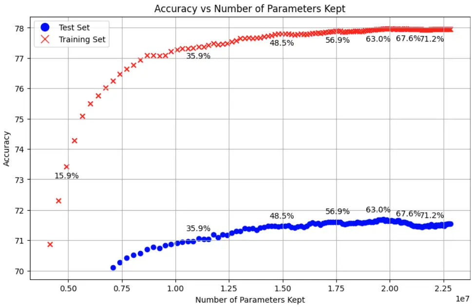

(a) No MP-based pruning, and no $`L_{1}`$ or $`L_{2}`$ regularization.

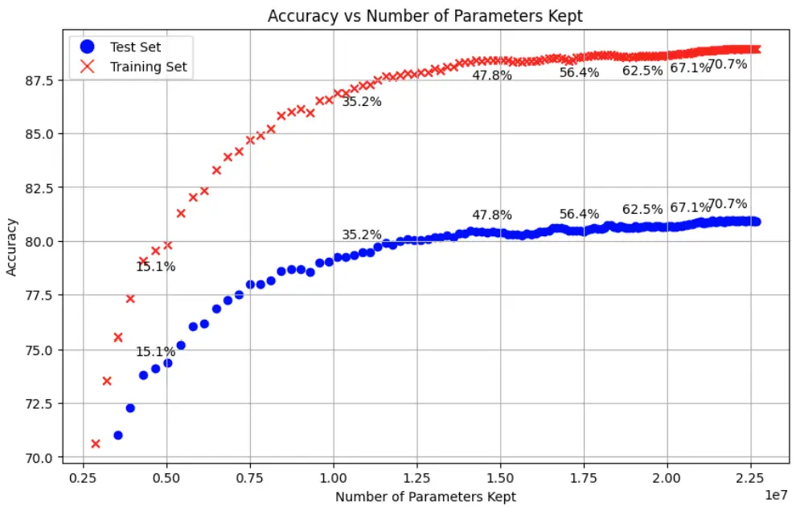

(b) MP–based pruning, no $`L_{1}`$ or $`L_{2}`$ regularization.

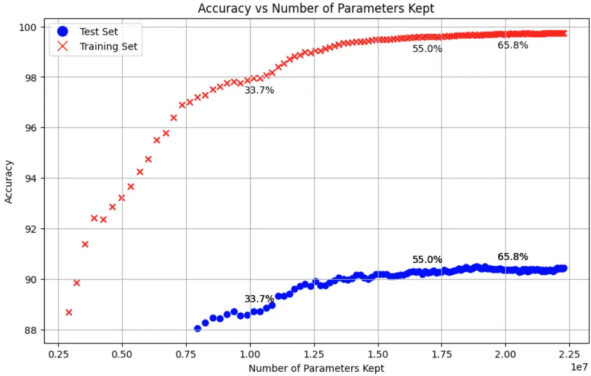

(c) MP-based training + $`L_{1}`$ and $`L_{2}`$ regularization.

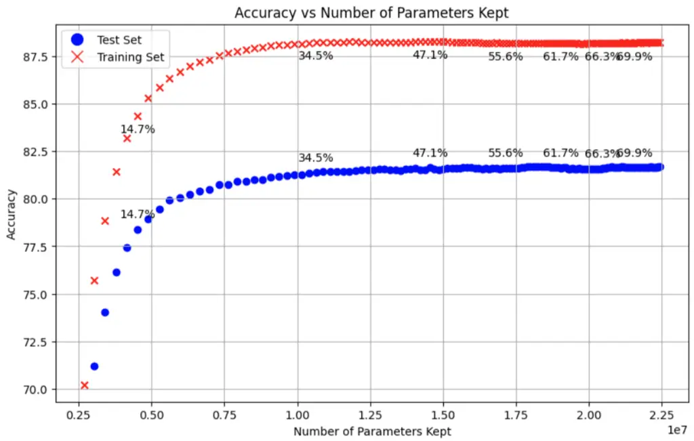

(d) No MP-based pruning, used $`L_{1}+L_{2}`$ regularization.

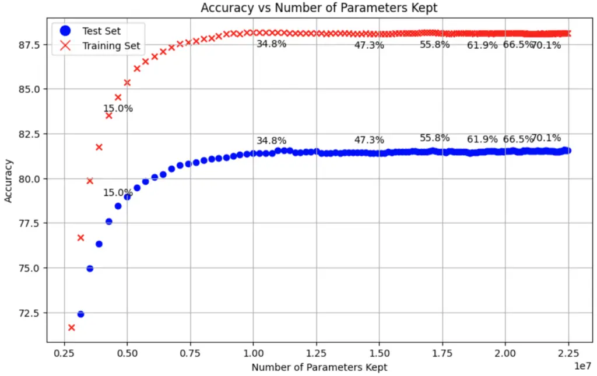

(e) Only used $`L_{1}`$ regularization.

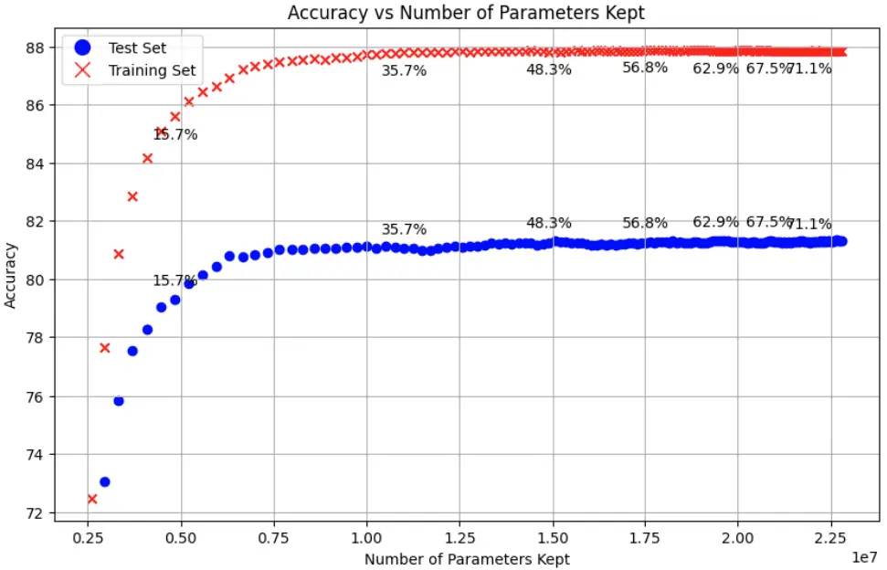

(f) Only used $`L_{2}`$ regularization.

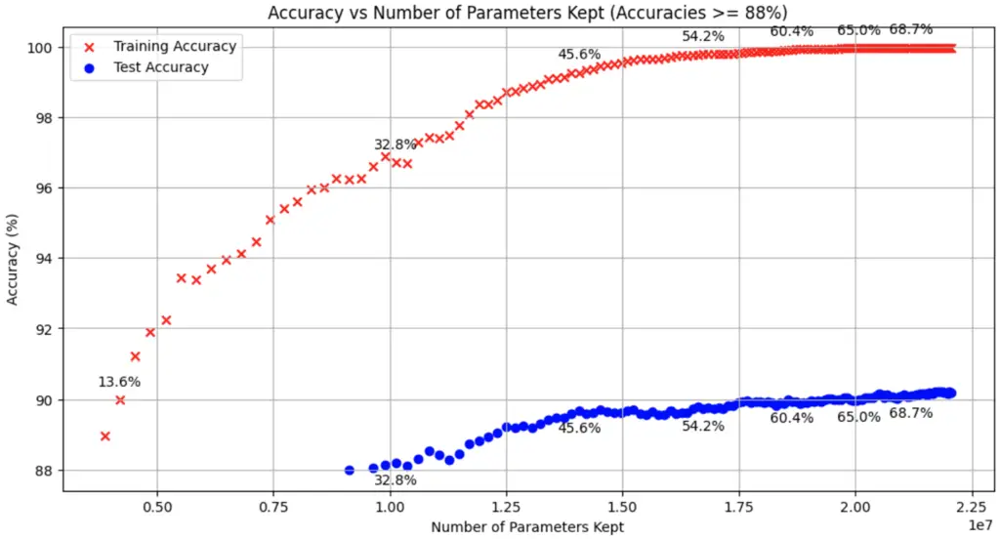

(g) MP-based pruning, $`L_{1}`$, $`L_{2}`$, stable rank.


(h) $`L_{1}`$, $`L_{2}`$ and stable rank.

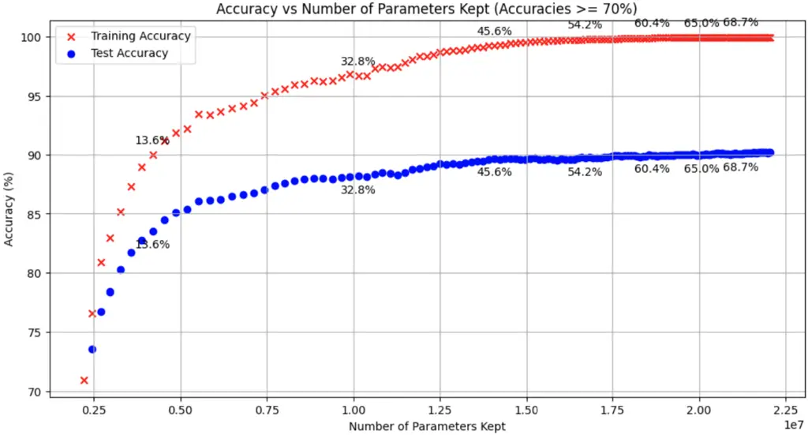

(i) MP-based pruning with $`L_{2}`$.

Figure 4: DNN performance vs. sparsification

###### Example A.2.

In this example, we trained on Fashion MNIST a fully connected DNN with
ReLU activation (on all but the final layer) and topology:

```math
[784,5000,5000,5000,5000,5000,5000,5000,10].
```

This means our network has 7 layers followed by activation functions
(excluding the final layer), with layer $`k`$ being a linear layer
$`L_{k}:\mathbb{R}^{T_{k}}\to\mathbb{R}^{T_{k+1}}`$. The training was
performed with $`L_{1}+L_{2}`$ regularization and PM-based pruning (see
Algorithm 3) and compared with using regularization alone.

In all cases, the training was done for $`1000`$ epochs. The ReLU
activation function was applied after every layer, excluding the final
layer (which is typical). Without MP-based pruning, the accuracy on the
test set was lower than $`90\%`$. For the MP-based pruning, every $`12`$
epochs we kept a portion of the smallest singular values (singular
values less than $`\sqrt{\lambda_{+}}`$ given in Assumption $`2`$ in
Subsection 5.1) based on the formula:

```math
f(\text{{epoch}})=\max\left(0,-\frac{1}{1000}\cdot\text{{epoch}}+1\right). \tag{49}
```

We used SGD together with a momentum of .97 and a learning rate of
$`.001`$ with the CosineAnnealingLR scheduler. The L1 and L2
regularization hyperparameters were $`0.0000005`$. Using MP-based
pruning, the test set accuracy was $`91.37`$.

###### Example A.3.

In this example, we trained on Fashion MNIST a fully connected DNN with
relu activation and topology:

```math
T=[784,3000,3000,3000,3000,500,10],
```

This means our network has 6 layers followed by activation functions,
with layer $`k`$ being a linear layer
$`L_{k}:\mathbb{R}^{T_{k}}\to\mathbb{R}^{T_{k+1}}`$. We use the
MP-pruning approach that can be found in Example A.1, to achieve a
$`90.5\%`$ accuracy on the test set. Note that in Lemma B.5, the method
for training the DNN does not matter; only the loss and accuracy of the
DNN at time $`t`$ is what matters. Furthermore, this lemma is equally
valid if instead of replacing $`W_{2}`$ with $`S_{2}`$, we replace the
weight layer matrix $`W_{2}`$ with a new matrix
$`W_{2}+R^{\prime}_{2}`$, with $`R^{\prime}_{2}`$ a random matrix with
components i.i.d. taken from $`N(1,\epsilon)`$ with
$`\epsilon\sim\frac{1}{N}`$. Thus, to all but the final layer matrix of
the DNN we add a random matrix $`R^{\prime}_{b}`$ with components i.i.d.
from the distribution $`N(0,\epsilon)`$ and, in Fig. 5, we plot the loss
(both with and without L2 regularization) and accuracy of the DNN as we
vary $`\epsilon`$. We see that for $`\epsilon\sim\frac{1}{N}`$ we have
that the cross-entropy loss and accuracy don’t change much, which
numerically confirms Lemma B.5.

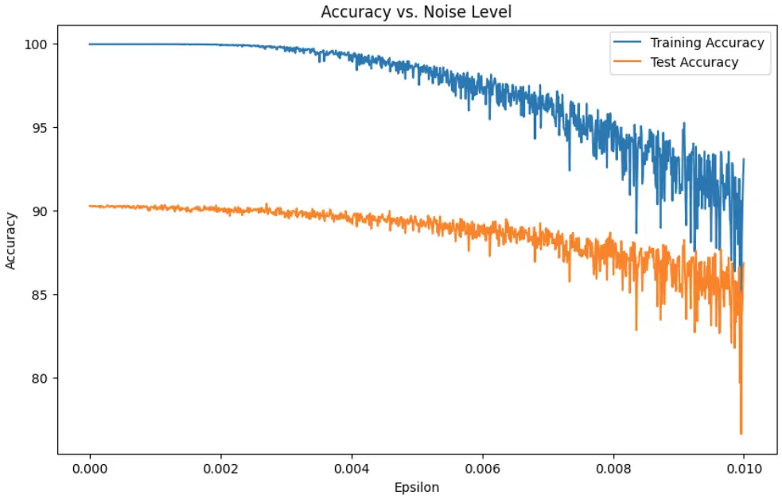

(a) Accuracy of the DNN on the training and test sets, vs. $`\epsilon`$.

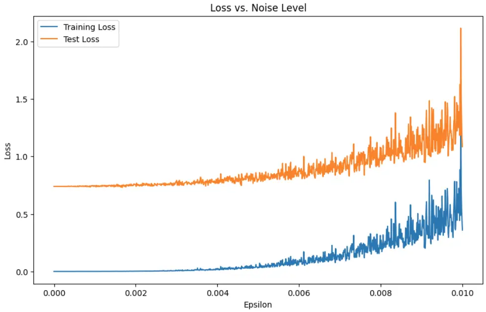

(b) DNN loss (with no regularization) on training and test set vs.
$`\epsilon`$.

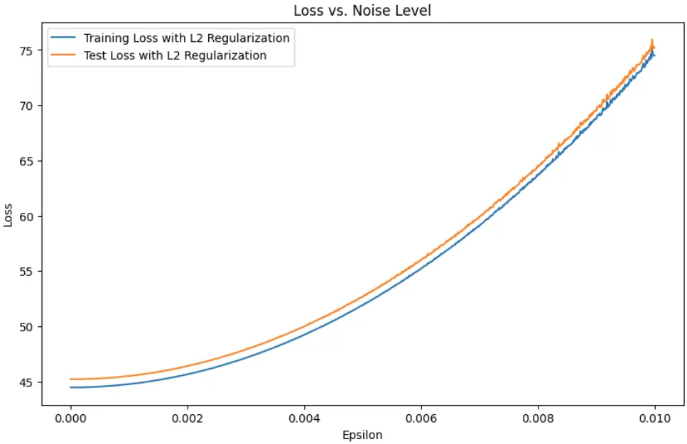

(c) DNN loss with $`L_{2}`$ regularization on training and test set vs.
$`\epsilon`$. The hyperparameter $`\mu`$ in the regularization is
$`.01`$.

Figure 5: Accuracy and loss as we add noise to the weight layers of the
DNN.

1: procedure

2:   Pick parameters $`\alpha\in(0,1/2),\beta\in(0,1)`$.

3:   for each $`\alpha N\leq k\leq(1-\alpha)N`$ do

4:    Calculate $`q_{k}`$, the $`(k/N)`$ upper-quantile of the MP
distribution with $`\sigma^{2}=1`$ and $`c=1`$.

5:    $`q_{k}`$ satisfies
$`\int\limits_{0}^{q_{k}}\frac{1}{2\pi}\frac{\sqrt{(4-\lambda)\lambda}}{\lambda}=k/N`$.

6:   end for

7:   Evaluate
$`\hat{\sigma}^{2}=\frac{\sum_{\alpha N\leq k\leq(1-\alpha)N}q_{k}\lambda_{k}}{\sum_{\alpha N\leq k\leq(1-\alpha)N}q_{k}^{2}}`$.

8:   Derive $`t_{1-\beta}`$, the $`(1-\beta)`$ quantile of the
Tracy-Widom distribution.

9:   Conclude with
$`\lambda_{+}=\hat{\sigma}^{2}[4+2^{4/3}t_{1-\beta}\cdot N^{-2/3}]`$.

10: end procedure

Algorithm 1 Computing Parameter $`\lambda_{+}`$ using MP and Tracy-Widom
Distribution

1: procedure

2:   Take $`X=\frac{1}{N}W^{T}W`$ as input where $`W`$ is $`N\times M`$.

3:   Derive the spectrum of $`X=\{\sigma_{1},\dots,\sigma_{M}\}`$.

4:   Ascertain the observed cumulative spectral distribution of $`X`$,
denoted $`F_{X}`$.

5:   Apply the BEMA technique with parameters $`\alpha`$ and $`\beta`$
to discern $`\hat{\sigma}^{2}`$, the expected coordinate variance of
$`W`$.

6:   Determine $`0\leq i_{\text{min}}<i_{\text{max}}\leq M`$ with:

- •
  $`i_{\text{min}}`$ as the least integer for which
  $`\frac{i_{\text{min}}}{M}\geq\alpha`$.
- •
  $`i_{\text{max}}`$ as the greatest integer for which
  $`\frac{i_{\text{max}}}{M}\leq 1-\alpha`$.

7:   Describe $`F_{X}^{\prime}`$ as the theoretical CDF for the MP
distribution using parameters $`\hat{\sigma}^{2}`$ and $`\lambda=N/M`$.

8:   Compute
$`s=\max_{i\in[i_{\text{min}},i_{\text{max}}]}\left|F_{X}(i)-F_{X}^{\prime}(i)\right|`$.

9:   If $`s>\gamma`$, rule out the idea that $`X`$ is governed by the
stated distribution. Else, if $`s\leq\gamma`$, retain this notion.

10: end procedure

Algorithm 2 Spectral Analysis using BEMA Technique

1: $`\ell`$, a predetermined number of epochs; $`\tau`$, a threshold for
the MP fit criteria in Subsection E.3; $`f(\text{epoch})`$, a
monotonically decreasing function from $`1`$ to $`0`$ (i.e. (49)) and
for each $`1\leq l\leq L`$ and weight layer matrix $`W_{l}`$ state
$`split_{l}=false`$.

2: Initialize: Train the DNN for $`\ell`$ epochs. Take
$`\text{epoch}:=\ell`$.

3: while a predefined training condition is met (i.e.
$`\text{epoch}\leq 100)`$ do

4:   for each $`l`$, if $`split_{l}=false`$ then for weight matrix
$`W_{l}`$ in the DNN $`\phi`$ do

5:    Perform SVD on $`W_{l}`$ to obtain
$`W_{l}=U_{l}\Sigma_{l}V_{l}^{T}`$.

6:    Calculate eigenvalues of $`W_{l}^{T}W_{l}`$.

7:    Apply BEMA algorithm (see Subsection E.1) to find the best fit MP
distribution for ESD of $`X=W_{l}^{T}W_{l}`$ and corresponding
$`\lambda_{+}`$.

8:    Check if ESD of $`X`$ fits the MP distribution using MP fit
criteria from Subsection and threshold $`\tau`$.

9:    if ESD fits the MP distribution then

10:      Eliminate the portion ($`1-f(\text{epoch})`$) of singular
values smaller than $`\sqrt{\lambda_{+}}`$ to obtain $`\Sigma^{\prime}`$
and form $`W^{\prime}_{l}=U_{l}\Sigma^{\prime}_{l}V_{l}^{T}`$.

11:      Use $`\Sigma^{\prime}`$ to create
$`W^{\prime}_{1,l}=U_{l}\sqrt{\Sigma^{\prime}_{l}}`$ and
$`W^{\prime}_{2,l}=\sqrt{\Sigma^{\prime}_{l}}V_{l}^{T}`$.

12:      if $`W^{\prime}_{1,l}`$ and $`W^{\prime}_{2,l}`$ together have
fewer parameters than $`W^{\prime}_{l}`$ then

13:       Replace $`W_{l}`$ in the DNN $`\phi`$ with
$`W^{\prime}_{1,l}W^{\prime}_{2,l}`$, change $`split_{l}=true`$.

14:      else

15:       Replace $`W_{l}`$ in the DNN $`\phi`$ with $`W^{\prime}_{l}`$.

16:      end if

17:    else

18:      Don’t replace $`W_{l}`$.

19:    end if

20:   end for

21:   Train the DNN for $`\ell`$ epochs. Take
$`\text{epoch}:=\text{epoch}+\ell`$.

22:   for each $`l`$, if $`split_{l}=true`$ do

23:    if for $`W_{l}:=W^{\prime}_{1,l}W^{\prime}_{2,l}`$ the ESD of
$`X_{l}`$ fits the MP distribution with thresholds $`\tau`$ and
$`\lambda_{+}`$ and if, we (hypothetically) applied steps 4-12 to
$`W_{l}`$, the number of parameters in the DNN $`\phi`$ would decrease
then

24:      replace $`W^{\prime}_{1,l}W^{\prime}_{2,l}`$ with $`W_{l}`$ and
$`split_{l}=false`$.

25:    else

26:      Don’t change anything.

27:    end if

28:   end for

29: end while

Algorithm 3 MP-based pruning algorithm

1: Let $`W_{l}`$ denote the $`l`$-th layer matrix of a DNN of size
$`N\times N`$ and an initial threshold $`\theta`$.

2: Perform SVD on $`W_{l}`$: $`W_{l}=U\Sigma V^{T}`$.

3: Given threshold $`\sqrt{\lambda_{+}}`$.

4: for $`i=1,\ldots,N`$ do

5:   if $`\Sigma_{ii}<\sqrt{\lambda_{+}}`$ then

6:    $`M_{i}=1`$

7:   else

8:    $`M_{i}=0`$

9:   end if

10:
  $`T_{i}(\sigma)=\theta\cdot\left(1-\frac{\sigma}{\sqrt{\lambda_{+}}}\right)^{30}`$

11:   if $`M_{i}=1`$ then

12:    $`U_{:,i}=\text{apply\_sparsity}(U_{:,i},T_{i}(\Sigma_{ii}))`$

13:    $`V_{i,:}=\text{apply\_sparsity}(V_{i,:},T_{i}(\Sigma_{ii}))`$

14:   end if

15: end for

16: Extra universal sparsification step:

17: Given a threshold, $`\theta`$.

18: for $`i=1,\ldots,N`$ do

19:   $`U_{:,i}=\text{apply\_sparsity}(U_{:,i},\frac{\theta}{750})`$

20:   $`V_{i,:}=\text{apply\_sparsity}(V_{i,:},\frac{\theta}{750})`$

21: end for

22: Recompose matrix: $`W_{l}^{\prime}=U\Sigma V^{T}`$.

Algorithm 4 Sparsify Singular Vectors

1: Input: Matrix $`W_{l}`$, threshold $`\xi`$

2: Output: Sparsified matrix $`W_{l}^{\prime}`$

3: for each element $`w_{ij}`$ in $`W_{l}`$ do

4:   if $`w_{ij}<\xi`$ then

5:    $`w_{ij}^{\prime}=0`$

6:   else

7:    $`w_{ij}^{\prime}=w_{ij}`$

8:   end if

9: end for

10: return $`W_{l}^{\prime}`$

Algorithm 5 Element-wise Sparsification

## Appendix B A simple illustration of the relationship between RMT-based pruning and regularization

The core concept underlying the developed pruning method relies on the
observation that Neural Network weight matrices frequently exhibit
characteristics akin to those of a low-rank matrix addition to a random
matrix component. The idea of the pruning method developed relies on the
observation that oftentimes, the weight matrices of Neural Networks
behave like a very low-rank matrix with an added random matrix. The
origin of the randomness is two-fold. Firstly, Neural Networks undergo
training through various iterations of stochastic gradient descent.
Consequently, the resultant trained network serves as an approximate
minimizer of the associated loss function, with its weight distribution
potentially reflecting the inherent stochastic nature of the
optimization algorithm employed. Secondly, the sample data used to train
the network introduces randomness to the training process, particularly
when the dataset incorporates random noise. The act of pruning can be
conceptualized as a regularization technique operating across the
spectrum aimed at promoting the recovery of this low-rank matrix
structure.  
In order to better understand the implications of pruning, we present a
simple problem designed to illuminate the effect outcomes of pruning in
comparison to alternative forms of regularization.

### B.1 Regularization in a simple regression setting

Having a low-rank weight matrix implies that the DNN has found a feature
map representation of the task that is lower dimensional than the set
dimension of the weight matrix. In order to emulate this situation, we
introduce a simple regression model where an optimal representation is
known. We sample $`M`$ random function
$`y^{(k)}\in Span\{\cos(\pi f\cdot),\sin(\pi f\cdot),\text{ for }f\in\{0,0.2,..,2\}\}`$,
and take random, noisy samples
$`(X_{j},Y_{j})\in\mathbb{R}\times\mathbb{R}^{M}`$ s.t.
$`(Y_{j})_{k}=y^{(k)}(X_{j})+7\epsilon_{j}`$, with
$`\epsilon_{j}\sim\mathcal{N}(0,1)`$. Our objective entails the recovery
of the $`y^{(k)}`$ functions from this dataset. An illustrative example
of such data along one coordinate is provided in Figure 6. Because of
the structure of this problem, an efficient feature map representation
of the data is through the Fourier transform, as $`y`$ belongs to a
vector space of low frequency. It has been argued that Neural Networks
can be interpreted as a kernel with a learned feature map based on the
data. For the sake of simplicity in this context, we assume a fixed
feature map, the Fourier feature map. Accordingly, the Neural Network
materializes as a linear layer on top of the selected feature map,
equivalent to the kernel regression defined by the said feature map.

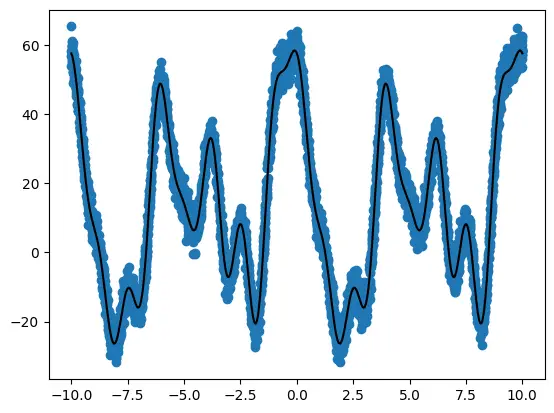

Figure 6: Example of data generated from the problem statement on one
axis. The blue line is the function $`y_{0}`$, and the blue dots are the
data points.

In the following paragraphs, we will study the impact of different
regularizations, including pruning, on the singular values of the linear
layer’s weight matrix. Given the significant variations in these
singular values on a logarithmic scale, we visualize the cumulative
distribution of singular values rather than conventional histograms.

##### Ideal case

In the absence of noise, the optimal weight matrix has a low rank, as
$`y`$ belongs to a functional space with a finite number of distinct
frequencies. Using kernel regression theory, we find the optimal weight
matrix and visualize its singular values in figure 7. Most singular
values, barring 16, approach zero (numerically below $`10^{-15}`$). This
confirms that the optimal weight matrix is inherently low-rank in the
absence of noise. Subsequently, our regression task pertains to
recovering this low-dimensional structure when confronted with noisy
data.

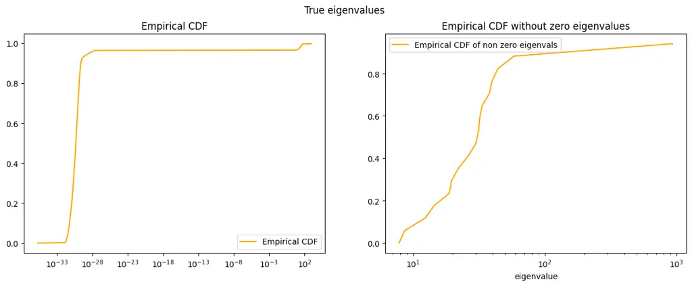

Figure 7: Cumulative distribution of singular values of the optimal
weight matrix

We will now try the pruning regularisation and compare it to two
classical regularisations, $`L^{2}`$ and $`L^{1}`$ regularisation.

##### $`L^{2}`$ regularisation in the Presence of Noise

Employing Kernel Ridge Regression, we obtain a $`L^{2}`$ regularised
weight matrix. We plot the singular values of this matrix in figure 8.
We can see a large number of minimal singular values. By running the
BEMA algorithm on this matrix, we identify a spectrum resembling the
Marchenko-Pastur distribution. Moreover, the algorithm finds an upper
bound for random singular values consistent with the ideal spectrum we
observed above. This alignment with the Marchenko-Pastur distribution
implies that the predominant source of randomness in our weight matrices
is data noise rather than the stochastic nature of the optimization
algorithm. Indeed, the weight matrix obtained here is deterministic when
conditioned on the data, as the loss admits a minimizer with a
closed-form solution.

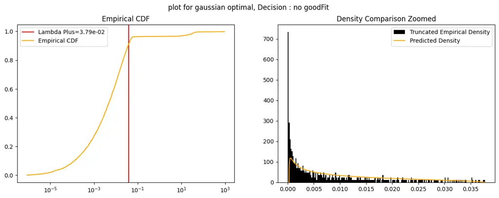

Figure 8: Cumulative distribution of singular values of the $`L^{2}`$
regularised weight matrix

##### $`L^{1}`$ regularisation in the Presence of Noise

Turning to $`L^{1}`$ regularization, using kernelized Lasso Regression,
we plot the singular values of the resulting matrix in Figure 9.
Notably, 40% of the singular values have been zeroed out compared to the
$`L^{2}`$ case. However, the remaining spectrum approximates an MP
distribution, underscoring that the noise-induced randomness persists to
some degree. It must be pointed out that $`L^{1}`$ regularisation tends
to nullify coefficients of the weight matrix instead of singular values.
In this scenario, our selected ideal feature map endows the optimal
weight matrix with sparsity, thus rendering the recovery of a sparse
weight matrix equivalent to the recovery of a low-rank one. It warrants
emphasis, however, that with an alternate feature map, $`L^{1}`$
regularization might prove less effective in revealing the weight
matrix’s low-rank structure and could even significantly diminish
performance if weighed too heavily.

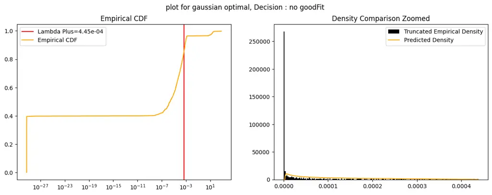

Figure 9: Cumulative distribution of singular values of the $`L^{1}`$
regularised weight matrix

##### Pruning in the Presence of Noise

We visualize the singular values of the unregularised matrix in Figure 10. We see that this spectrum is very similar to the spectrum of the
$`L^{2}`$ regularised weight matrix. This confirms the intuition that
$`L^{2}`$ is not an efficient spectrum regularisation. Nonetheless, the
BEMA algorithm successfully identifies a precise upper bound for the
matrix’s random singular values. This shows the capacity of pruning
regularization to eliminate the noise-driven randomness from the weight
matrix.

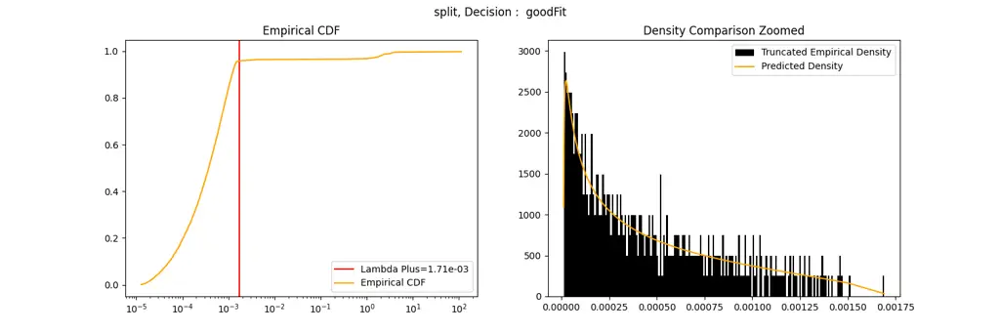

Figure 10: Cumulative distribution of singular values of the weight
matrix prior to pruning

In this simple illustrative instance, pruning regularization emerges as
an effective tool for sparsifying the weight matrix’s spectrum, thereby
facilitating the recuperation of the underlying low-rank structure
intrinsic to the problem at hand. Table 5 reports the effects of the
different regularizations on the mean squared error. We see that
successfully removing the random part of the weight matrix spectrum
allows better accuracy.

|                   |                    |
| ----------------- | ------------------ |
| Model             | Mean Squared Error |
| No Regularization | 2.5735             |
| L2 Regularization | 2.5627             |
| L1 Regularization | 0.4157             |
| Pruning           | 0.1491             |

Table 5: Mean Squared Errors of Different Models for the simple
regression task

### B.2 Proof of Lemma 4.4

We want to bound the probability of a single component of the output of
the DNN when a random matrix $`R`$ is included. Specifically, we aim to
bound the probability that the $`i`$-th component of the following
expression exceeds $`t`$:

###### Proof.

Step 1: Apply the Triangle Inequality

By the triangle inequality, we can remove the activation functions
(absolute value) and simplify the terms inside the norm:

```math
\displaystyle Z=\mathbb{P}\left(|W_{3}\circ\lambda\circ(R+S)\circ\lambda\circ W_{1}s-W_{3}\circ\lambda\circ S\circ\lambda\circ W_{1}s|_{i}>t\right) \tag{50}
```

Step 2: Factor Out $`W_{3}`$

We can now factor out $`W_{3}`$, using the inequality
$`|(Av)_{i}|\leq\|A\|_{1}\|v\|_{\infty}`$, to move $`W_{3}`$ outside of
the norm:

```math
\displaystyle Z=\mathbb{P}\left(\|W_{3}\|_{1}\cdot\|(R+S)\circ\lambda\circ W_{1}s-S\circ\lambda\circ W_{1}s)\|_{\infty}>t\right) \tag{51}
```

Step 3: Focus on $`R`$

We now separate the terms involving $`R`$ and $`S`$, leaving us with:

```math
\displaystyle Z\leq\mathbb{P}\left(\|W_{3}\|_{1}\cdot\|(R\circ\lambda\circ W_{1}s)\|_{\infty}>t\right) \tag{52}
```

Step 4: Focus on the Random Matrix $`R`$ Let
$`Y=R\circ\lambda\circ W_{1}s`$. Each element of $`Y`$ is a weighted sum
of independent Gaussian random variables:

```math
Y_{i}=\sum_{j}R_{ij}(\lambda\circ W_{1}s)_{j}
```

The variance of each $`Y_{i}`$ is:

```math
\text{Var}(Y_{i})=\frac{1}{N}\sum_{j}(\lambda\circ W_{1}s)_{j}^{2}=\frac{\|W_{1}s\|_{2}^{2}}{N}
```

Step 5: Apply Borell-TIS Inequality We can now apply the Borell-TIS
inequality to $`Y`$. Note that each $`Y_{i}`$ is a Gaussian random
variable with mean 0 and variance $`\frac{\|W_{1}s\|_{2}^{2}}{N}`$. Let
$`s_{Y}^{2}=\frac{\|W_{1}s\|_{2}^{2}}{N}`$.

From the Borell-TIS inequality, for any $`t>0`$:

```math
\mathbb{P}\left(\|Y\|_{\infty}>\sqrt{\frac{2\log N}{N}}\|W_{1}s\|_{2}+k\right)\leq 2\exp\left(-\frac{Nk^{2}}{2\|W_{1}s\|_{2}^{2}}\right)
```

Step 6: Incorporate Deterministic Matrix $`W_{3}`$

Next, incorporate the effect of the deterministic matrix $`W_{3}`$.
Using the properties of matrix norms, we have:

```math
\|W_{3}Y\|_{i}\leq\|W_{3}\|_{1}\|Y\|_{\infty}
```

Therefore, the probability bound becomes:

```math
\displaystyle Z \displaystyle\leq\mathbb{P}\left(\|W_{3}\|_{1}\|Y\|_{\infty}>(\sqrt{\frac{2\log N}{N}}\|W_{1}s\|_{2}+k)\|W_{3}\|_{1}\right) \tag{53}
```

```math
\displaystyle\leq 2\exp\left(-\frac{Nk^{2}}{2\|W_{1}s\|_{2}^{2}}\right), \tag{54}
```

with $`t=(\sqrt{\frac{2\log N}{N}}\|W_{1}s\|_{2}+k)\|W_{3}\|_{1}`$.

Step 7: Final Bound

Substituting $`k=\frac{\|W_{1}s\|_{2}}{N^{1.5/4}}`$ results in:

```math
Z\leq 2\exp\left(-\frac{N^{1-1.5/2}}{2}\right)=2\exp\left(-\frac{N^{1/4}}{2}\right)
```

Conclusion:

```math
\displaystyle Z=\mathbb{P}\Big(\big|\lambda\circ W_{3}\circ\lambda\circ(R+S)\circ\lambda\circ W_{1}s-\lambda\circ W_{3}\circ\lambda\circ S\circ\lambda\circ W_{1}s\big|_{i}> \tag{55}
```

```math
\displaystyle\sqrt{\frac{2\log N}{N}}\|W_{1}s\|_{2}\|W_{3}\|_{1}+\frac{\|W_{3}\|_{1}\|W_{1}s\|_{2}}{N^{1.5/4}}\Big)\leq 2\exp\left(-\frac{N^{1/4}}{2}\right) \tag{56}
```

∎

For a DNN with more than three-layer matrices, the proof would be the
same. For example, in the case of four-layer matrices, we have:

###### Proof.

Step 1: Express the Problem We start with the probability we want to
bound, now with four weight layers:

```math
\displaystyle Z=\mathbb{P}\left(|\lambda\circ W_{4}\circ\lambda\circ W_{3}\circ\lambda\circ(S+R)\circ\lambda\circ W_{1}s-\lambda\circ W_{4}\circ\lambda\circ W_{3}\circ\lambda\circ S\circ\lambda\circ W_{1}s|_{i}>t\right) \tag{57}
```

Step 2: Use Matrix Norm Properties We can bound this using the
$`\ell_{\infty}`$ norm and properties of matrix norms:

```math
\displaystyle Z\leq\mathbb{P}\left(\|W_{4}\|_{1}\cdot\|W_{3}\|_{1}\cdot\|R\circ\lambda\circ W_{1}s\|_{\infty}>t\right) \tag{58}
```

The rest of the proof then proceeds as above. ∎

For a more general DNN, we first restate the relevant assumptions:

Assumption 4:

Consider a DNN denoted by $`\phi`$, and assume that it can be written
as:

```math
\phi=\rho\circ\psi_{2}\circ(R+S)\circ\psi_{1}, \tag{59}
```

where $`\psi_{1}`$ and $`\psi_{2}`$ are arbitrary functions and $`\rho`$
is softmax. Furthermore, assume that $`\exists C_{1}`$ constant such
that for any two arbitrary vectors $`v`$ and $`w`$ we have that
$`\|\psi_{2}v-\psi_{2}w\|_{\infty}\leq C_{1}\|\psi_{2}(v-w)\|_{\infty}`$,
with $`\|\cdot\|_{\infty}`$ the max norm of the vector. Take $`W=R+S`$
and assume that the matrices $`R`$ and $`S`$ satisfying the following
assumptions:

### Assumptions on the matrices $`R`$ and $`S`$

We considered a class of admissible matrices $`W`$, where $`W=R+S`$ and
$`W`$, $`R`$ and $`S`$ satisfy the following three assumptions. The
first assumption is a condition on $`R`$:

Assumption 5: Assume $`R`$ is a $`N\times M`$ matrix such that for any
vector $`v`$ we have:

```math
\mathbb{P}(\|Rv\|_{\infty}>d_{1}(N)J(v))\leq d_{2}(N), \tag{60}
```

with $`d_{1}(N),d_{2}(N)\to 0`$ as $`N\to\infty`$ and $`J(v)`$ some
function that depends on $`v`$ alone. Further, as $`N\to\infty`$, we
have that $`\sigma_{\max}(R)\to\sqrt{\lambda_{+}}`$ a.s.

###### Example B.1.

As mentioned, when $`R`$ is i.i.d Gaussian one can show, using the
Borell-TIS inequality (see Theorem B.2), that:

```math
\mathbb{P}\left(\|Rv\|_{\infty}>(\sqrt{\frac{2\log N}{N}}+\frac{1}{N^{\frac{3}{8}}})\|v\|_{2}\right)\leq 2\exp\left(-\frac{N^{\frac{1}{4}}}{2}\right)
```

We now prove Lemma 5.4.

###### Proof.

Step 1: Apply Assumption 4

Take

```math
Z:=\mathbb{P}\left(|\psi_{2}\circ(R+S)\circ\psi_{1}s-\psi_{2}\circ(S)\circ\psi_{1}s|_{i}>t\right) \tag{61}
```

By Assumption 4, we have:

```math
\displaystyle Z\leq\mathbb{P}\left(C_{1}\|\psi_{2}\circ((R+S)\circ\psi_{1}s-(S)\circ\psi_{1}s)\|_{\infty}>t\right) \tag{62}
```

Step 2: Factor Out $`\psi_{2}`$

We can now factor out $`\psi_{2}`$, using the inequality
$`|(\psi_{2}v)_{i}|\leq\|\psi_{2}\|_{1}\|v\|_{\infty}`$, to move
$`\psi_{2}`$ outside of the norm:

```math
\displaystyle Z\leq\mathbb{P}\left(C_{1}\|\psi_{2}\|_{1}\cdot\|(R+S)\circ\psi_{1}s-S\circ\psi_{1}s)\|_{\infty}>t\right) \tag{63}
```

Step 3: Focus on $`R`$

We now separate the terms involving $`R`$ and $`S`$, leaving us with:

```math
\displaystyle Z\leq\mathbb{P}\left(C_{1}\|\psi_{2}\|_{1}\cdot\|(R\circ\psi_{1}s)\|_{\infty}>t\right) \tag{64}
```

Step 4: Focus on the Random Matrix $`R`$ From Assumption 5, for any
$`t>0`$:

```math
\mathbb{P}\left(\|R\circ\psi_{1}s\|_{\infty}>d_{1}(N)J(\psi_{1}s)))\leq d_{2}(N)\right)
```

Step 6: Incorporate $`\psi_{2}`$

Next, incorporate the effect of $`\psi_{2}`$. Using the properties of
matrix norms, we have:

```math
\displaystyle Z\leq\mathbb{P}(C_{1}\|\psi_{2}\|_{1}\|R\circ\psi_{1}s\|_{\infty}>C_{1}\|\psi_{2}\|_{1}d_{1}(N)J(\psi_{1}s))\leq d_{2}(N)), \tag{65}
```

with $`t=C_{1}\|\psi_{2}\|_{1}d_{1}(N)J(\psi_{1}s)`$.

∎

### Borell-TIS Inequality for i.i.d. Gaussian Variables

###### Theorem B.2 (Borell-TIS Inequality).

Let $`X_{1},X_{2},\ldots,X_{n}`$ be i.i.d. centered Gaussian random
variables with $`X_{i}\sim N(0,\sigma^{2})`$. Set
$`s_{X}^{2}:=\max_{i=1,\ldots,n}\mathbb{E}(X_{i}^{2})=\sigma^{2}`$. Then
for each $`t>0`$:

```math
P\left(\max_{i=1,\ldots,n}|X_{i}|-\mathbb{E}\left[\max_{i=1,\ldots,n}X_{i}\right]>t\right)\leq\exp\left(-\frac{t^{2}}{2s_{X}^{2}}\right).
```

For the absolute value bound:

```math
P\left(|\max_{i=1,\ldots,n}|X_{i}|-\mathbb{E}\left[\max_{i=1,\ldots,n}X_{i}\right]|>t\right)\leq 2\exp\left(-\frac{t^{2}}{2s_{X}^{2}}\right).
```

In particular, if $`X_{i}\sim N(0,\frac{1}{N})`$:

```math
s_{X}^{2}=\frac{1}{N},
```

and for any $`t>0`$:

```math
P\left(\max_{i=1,\ldots,n}|X_{i}|>\sqrt{\frac{2\log n}{N}}+t\right)\leq 2\exp\left(-\frac{Nt^{2}}{2}\right).
```

### Generalized Chernoff Bound

###### Theorem B.3 (Chernoff Bound).

For any random variable $`X`$ with moment-generating function
$`M_{X}(t)=\mathbb{E}[e^{tX}]`$ and for any $`t>0`$:

```math
P(X\geq a)=P(e^{tX}\geq e^{ta})\leq M_{X}(t)e^{-ta}.
```

For the absolute value bound:

```math
P(|X|\geq a)\leq M_{X}(t)e^{-ta}+M_{-X}(t)e^{-ta}.
```

If the distribution is symmetric, such that $`M_{X}(t)=M_{-X}(t)`$:

```math
P(|X|\geq a)\leq 2M_{X}(t)e^{-ta}.
```

### Chernoff Bound for Normal Distribution

###### Theorem B.4 (Chernoff Bound: normal distribution).

For a random variable $`X`$ that is normally distributed with
$`X\sim N(0,1/N)`$, the moment-generating function is
$`M_{X}(t)=\mathbb{E}[e^{tX}]=e^{\frac{1}{2N}t^{2}}`$. For any $`t>0`$:

```math
P(X\geq a)\leq e^{\frac{1}{2N}t^{2}}e^{-ta}.
```

By choosing $`t=Na`$:

```math
P(X\geq a)\leq e^{-\frac{Na^{2}}{2}}.
```

For the absolute value bound:

```math
P(|X|\geq a)\leq 2e^{-\frac{Na^{2}}{2}}.
```

### B.3 Training of a DNN with three weight layers using L1 and L2 regularization with varying layer widths

The goal of this subsection is to check how
$`a(N)=\sqrt{\frac{2\log N}{N}}\|W_{1}s\|_{2}\|W_{3}\|_{1}+\frac{\|W_{3}\|_{1}\|W_{1}s\|_{2}}{N^{1.5/4}}`$
depends on $`N`$ and the training process. From equation (55), we know
that removing the random matrix $`R_{2}`$ from the DNN will change the
components of the outputs $`X`$ by less than $`a(N)`$. We want to see if
this change in the output is small in practice. We train a DNN with
three fully connected weight layers:
$`\mathbf{W_{1}},\mathbf{W_{2}},\mathbf{W_{3}}`$. The middle layer
matrix $`\mathbf{W_{2}}`$ is of variable width $`N`$, which we vary
across different experiments. We aim to analyze how varying $`N`$
affects both the network’s accuracy and certain key norms of the weight
matrices.

We use both L1 and L2 regularization during training, with the
regularization strengths kept small ($`.0000001`$) so that they
minimally affect the training process. Additionally, the learning rate
is set to a small value of $`0.0001`$ to ensure that the weight matrices
do not change significantly during the training period.

#### Normalization of the Fashion MNIST Dataset

The Fashion MNIST dataset consists of grayscale images of size
$`28\times 28`$. To normalize the data, we ensure that the largest
element across the entire dataset has an L2 norm of $`0.1`$. This
normalization is essential for controlling the magnitude of the input
vector, which ensures that $`a(N)`$ stays small.

The normalization procedure involves the following steps:

1.  1.  Compute the L2 norm of each input vector (each image flattened to a
        1D array).
2.  2.  Find the maximum norm among all vectors in the dataset.
3.  3.  Scale all input vectors so that the largest vector has norm $`0.1`$
        .

#### Training procedure

The network is trained for 10 epochs, and we keep the learning rate at
$`0.0001`$. The weights are initialized from $`N(0,1/N)`$, with $`N`$
the number of column vectors.

#### Analysis and metrics

For each value of $`N`$ (the layer weight matrix $`W_{2}`$ has size
$`N\times N`$), we compute two key quantities:

- •
  $`a(N)`$: This is a metric based on the norms of the weight matrices,
  calculated as:

  ```math
  a(N)=\sqrt{\frac{2\log N}{N}}\|W_{1}s\|_{2}\|W_{3}\|_{1}+\frac{\|W_{3}\|_{1}\|W_{1}s\|_{2}}{N^{1.5/4}}
  ```

  where $`\|W_{3}\|_{1}`$ is the L1 norm of the final weight layer and
  $`\|W_{1}s\|_{2}`$ is the largest L2 norm of the transformed input
  data.

- •
  Test Accuracy: The percentage of correctly classified test samples,
  which allows us to track how network performance evolves as the width
  $`N`$ increases.

We analyze the behavior of both $`a(N)`$ and the test accuracy as
functions of the layer weight matrix $`W_{2}`$ of size $`N\times N`$.
The values of $`N`$ that we test for are
$`[500,1000,1500,2000,3000,4000,5000,7000,10000,20000]`$. Fig. 11 shows
that as we increase the size $`W_{2}`$, we have that $`a(N)`$ goes to
zero quickly.

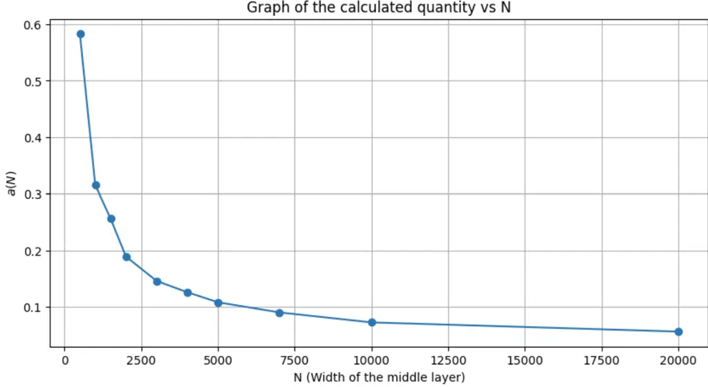

Figure 11: Plot of $`a(N)`$ vs. the width $`N`$ of the middle layer
$`\mathbf{W_{2}}`$. This plot shows how the complexity-related metric
$`a(N)`$ behaves as the width $`N`$ is increased, reflecting changes in
the norms of the weight matrices and their dependence on $`N`$.

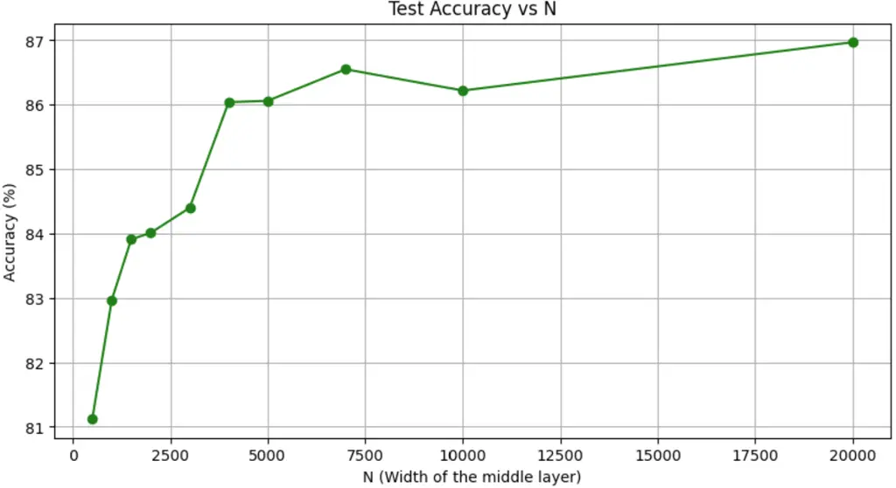

Figure 12: Plot of test accuracy vs. the width $`N`$ of the middle layer
$`\mathbf{W_{2}}`$. This plot demonstrates how the performance of the
DNN changes with increasing $`N`$, showing the relationship between
network width and generalization ability on the Fashion MNIST dataset.

#### Normalization and Initialization of Weight Matrices

In this experiment, we normalize the input vectors such that the largest
input vector has a norm of $`10`$. The normalization process is
identical to that described previously, but instead of scaling the
largest vector to $`0.1`$, we scale it to $`1`$.

Additionally, the weight matrices for each layer are initialized such
that each entry is sampled from a normal distribution with zero mean and
variance $`1/N^{2}`$, where $`N`$ is the number of columns in the weight
matrix.

#### B.3.1 Analysis of $`b(N)`$

Similar to the previous metric $`a(N)`$, we introduce a new metric
$`b(N)`$, which is computed exactly like $`a(N)`$, but each occurrence
of $`N`$ is squared in the formula. Specifically, $`b(N)`$ is defined
as:

```math
b(N)=\sqrt{\frac{2\log N^{2}}{N^{2}}}\|W_{1}s\|_{2}\|W_{3}\|_{1}+\frac{\|W_{3}\|_{1}\|W_{1}s\|_{2}}{(N^{2})^{1.5/4}}
```

where $`\|W_{3}\|_{1}`$ is the L1 norm of the final weight layer and
$`\|W_{1}s\|_{2}`$ is the largest L2 norm of the transformed input data.

Note, given the above initialization, equation 55 has $`b(N)`$ on the
LHS rather then $`a(N)`$.

#### Results and Observations

We analyze the behavior of both $`b(N)`$ and the test accuracy as
functions of the width $`N`$ of the middle weight matrix
$`\mathbf{W_{2}}`$. The values of $`N`$ tested are
$`[500,1000,1500,2000,3000,4000,5000,7000,10000,20000]`$. Here, the DNN
was trained for $`20`$ epochs with a learning rate of $`.001`$.

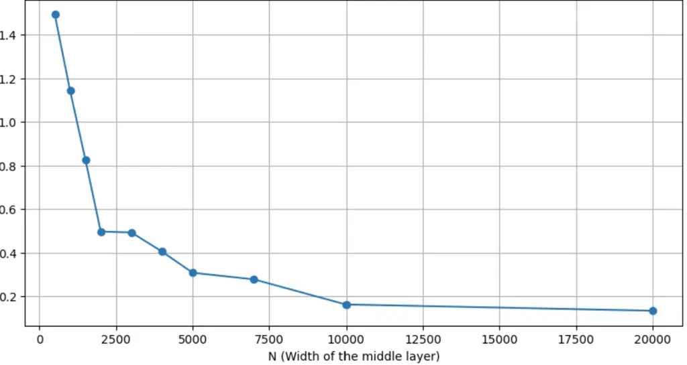

Figure 13: Plot of $`b(N)`$ vs. the width $`N`$ of the middle layer
$`\mathbf{W_{2}}`$. This plot shows how the metric $`b(N)`$ behaves as
the size of the middle layer increases, incorporating a stronger
dependence on $`N^{2}`$.

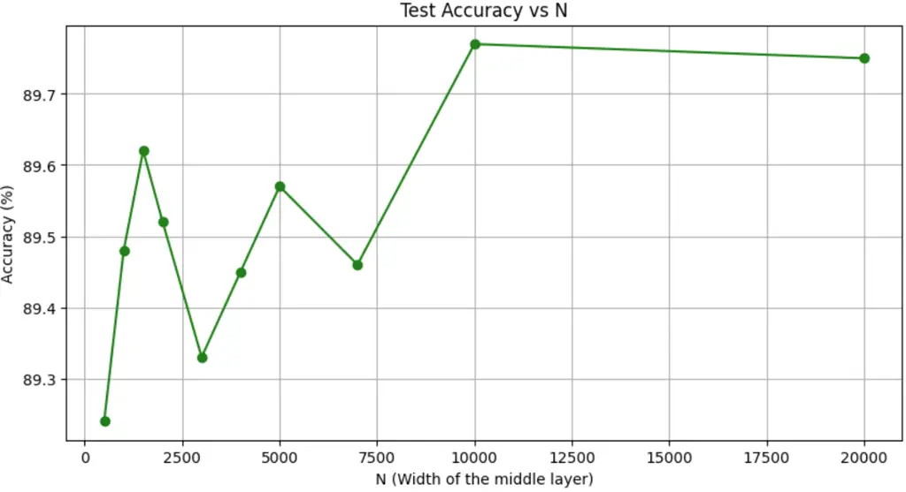

Figure 14: Plot of test accuracy vs. the width $`N`$ of the middle layer
$`\mathbf{W_{2}}`$. This plot demonstrates how the network’s accuracy
changes as $`N`$ increases, with weight matrices initialized using
$`1/N^{2}`$.

From Fig. 13, we observe that as we increase the size of $`W_{2}`$, the
metric $`b(N)`$ converges toward zero at a faster rate compared to
$`a(N)`$. This suggests that the dependence on $`N^{2}`$ significantly
impacts the network’s behavior.

Additionally, in Fig. 14, we see the test accuracy improving as the
width $`N`$ increases, consistent with the expectations from larger
model capacity, though the gains diminish at higher values of $`N`$. The
training period for each network was kept constant at 10 epochs with a
learning rate of $`0.0001`$, ensuring consistent comparisons between the
different experiments.

### B.4 Some key lemmas: how accuracy and loss are affected when removing the random matrix $`R_{2}`$

Next, we introduce a lemma that describes how the loss, without
regularization, and the accuracy of the DNN are affected when we remove
the random matrix $`R_{2}`$ from the weight layer matrix $`W_{2}`$. We
define:

```math
L_{\cancel{\text{reg}}}(\alpha(t))=-\frac{1}{|T|}\sum_{s\in T}\log\left(\phi_{C(s)}(s,\alpha(t))\right). \tag{66}
```

thus

```math
L_{\cancel{\text{reg}}}=-\frac{1}{|T|}\sum_{s\in T}\log\left(\frac{e^{X_{C(s)}(\alpha(t),s)}}{\sum_{i=1}^{K}e^{(X_{i}(\alpha(t),s))}}\right), \tag{67}
```

with $`K`$ the number of classes in our classification problem.

We now introduce the classification confidence, see \[9\]. Take
$`X(s,\alpha)`$ to be the output of the final layer in our DNN before
softmax. The classification confidence is defined as follows:

```math
\delta X(s,\alpha):=X_{C(s)}(s,\alpha)-\max_{j\neq C(s)}X_{j}(s,\alpha). \tag{68}
```

In other words,

- •
  $`\delta X(s,\alpha(t))>0\Rightarrow s`$ is well-classified by
  $`\phi`$.
- •
  $`\delta X(s,\alpha(t))<0\Rightarrow s`$ is misclassified by $`\phi`$

For $`T^{\prime}`$ the test set we can now define the accuracy of the
DNN on $`T^{\prime}`$ using the classification confidence,

```math
\text{acc}_{\alpha}(t)=\frac{\#\left(\{s\in T^{\prime}:\delta X(s,\alpha(t))>0\}\right)}{\#T^{\prime}}. \tag{69}
```

###### Lemma B.5.

Let $`\phi`$ be a DNN with weight layer matrices $`W_{1},W_{2},W_{3}`$
and $`\lambda`$ the absolute value activation function:

```math
\vskip-5.69046pt\phi(\alpha,s)=\rho\circ\lambda\circ W_{3}\circ\lambda\circ W_{2}\circ\lambda\circ W_{1}s,\hskip 11.38092pts\in\mathbb{R}^{n}. \tag{70}
```

Given (22), let $`W_{2}`$ be a $`N\times N`$ matrix such that
$`W_{2}(t)=R_{2}(t)+S_{2}(t)`$, with $`R_{2}`$ and $`S_{2}`$ satisfying
Assumptions 2-3.

Suppose we replace the weight layer matrix $`W_{2}`$ with the
deterministic matrix $`S_{2}`$. Then $`\exists G_{1}(N)`$ s.t.

```math
\mathbb{P}\bigg(|L_{\cancel{\text{reg}}}(\alpha_{S_{2}}(t))-L_{\cancel{\text{reg}}}(\alpha_{W_{2}}(t))|\leq G(N)H(\phi)\bigg)\geq 1-G(N), \tag{71}
```

with $`G_{1}(N)\to 0`$ as $`N\to\infty`$ and $`H(\phi)`$ some function
depending on $`\phi`$ with $`H(\phi)\to 0`$ as $`N\to\infty`$ if
$`a(N,s):=\frac{\|W_{3}\|_{1}\|W_{1}s\|_{2}}{N^{1.5/4}}\to 0`$ as
$`N\to\infty`$.

See Subsection B.5 for a proof of this lemma. See also Example A.3 for a
numerical example of this lemma.

### B.5 Proof of Lemma B.5

Recall, we define:

```math
L_{\cancel{\text{reg}}}(\alpha(t))=-\frac{1}{|T|}\sum_{s\in T}\log\left(\phi_{C(s)}(s,\alpha(t))\right). \tag{72}
```

thus

```math
L_{\cancel{\text{reg}}}=-\frac{1}{|T|}\sum_{s\in T}\log\left(\frac{e^{X_{C(s)}(\alpha(t),s)}}{\sum_{i=1}^{K}e^{(X_{i}(\alpha(t),s))}}\right), \tag{73}
```

with $`K`$ the number of classes in our classification problem.

From Lemma 4.4, we have that:

```math
\mathbb{P}\bigg((|X_{i}(\alpha_{W},s)-X_{i}(\alpha_{S},s)|\leq a(N,s)\bigg)\geq 1-F(N), \tag{74}
```

with $`F(N)\to 0`$ as $`N\to\infty`$.

Thus, for any fixed $`s\in T^{\prime}`$, we have that, for big enough
$`N`$, $`\exists G(N)\to 0`$ as $`N\to\infty`$ such that:

```math
\mathbb{P}\bigg(|\log\left(\frac{e^{X_{C(s)}(\alpha_{S}(t),s)}}{\sum_{i=1}^{K}e^{(X_{i}(\alpha_{S}(t),s))}}\right)-\log\left(\frac{e^{X_{C(s)}(\alpha_{W}(t),s)}}{\sum_{i=1}^{K}e^{(X_{i}(\alpha_{W}(t),s))}}\right)|\leq G(N)C(s,\phi)\bigg)\geq 1-G(N). \tag{75}
```

Furthermore, because the exponential and log functions are continuous,
we have that if $`a(N,s)\to 0`$, then $`G(N)C(s,\phi)\to 0`$. Because
that $`T^{\prime}`$ is a finite set, and because (75) holds for all
$`s\in T^{\prime}`$, we have that $`\exists H(\phi)`$ such that:

```math
\mathbb{P}\bigg(|-\frac{1}{|T|}\sum_{s\in T}\log\left(\frac{e^{X_{C(s)}(\alpha_{S}(t),s)}}{\sum_{i=1}^{K}e^{(X_{i}(\alpha_{S}(t),s))}}\right)+\frac{1}{|T|}\sum_{s\in T}\log\left(\frac{e^{X_{C(s)}(\alpha_{S}(t),s)}}{\sum_{i=1}^{K}e^{(X_{i}(\alpha_{S}(t),s))}}\right)|\leq G(N)H(\phi)\bigg)\geq 1-G(N). \tag{76}
```

This proves the first part of Lemma B.5 and gives us equation (94).

## Appendix C Proof of Theorems 4.1 and 5.2

.

In this section, we prove Theorem 4.1. Using the more general
Assumptions 4-7 for Theorem 5.2, we can use the proof for these results
as well. Before proving this theorem, we state some useful RMT results
for the type of model given in assumptions 1-3 in Subsection 5.1.

## Appendix D Some known results on perturbation of matrices

Matrix perturbation theory is concerned with understanding how small
changes in a matrix can affect its properties, such as eigenvalues,
eigenvectors, and singular values. In this section, we state a couple of
known results from matrix perturbation theory.

### D.1 Asymptotics of singular values and singular vectors of deformation matrix

The results in this subsection are taken from \[8\]. Given the
assumptions 1’-2’ on $`R`$ and $`S`$ described in Section B, the authors
were able to show that the largest eigenvalues and corresponding
eigenvectors of $`W=S+R`$ are well approximated by the largest
eigenvalues and eigenvectors of $`S`$.

We start by defining the following function:

```math
D_{\mu_{R}}(z)=\left[\int\frac{z}{z^{2}-t^{2}}d\mu_{R}(t)\right]\times\left[c\int\frac{z}{z^{2}-t^{2}}d\mu_{R}(t)+\frac{1-c}{z}\right] \tag{77}
```

for $`z>\sqrt{\lambda_{+}}`$, with $`\lambda_{+}`$ given by the MP
distribution of $`R^{T}R`$. Take $`D^{-1}_{\mu_{R}}(\cdot)`$ to be its
functional inverse.

Set

```math
\bar{\theta}=D_{\mu_{R}}(\sqrt{\lambda_{+}})^{-\frac{1}{2}} \tag{78}
```

###### Theorem D.1.

Theorem for large singular values \[Benaych-Georges and Nadakuditi
(2012)\] Take $`W=R+S`$, with $`W,R`$ and $`S`$ all $`N\times M`$
matrices satisfying assumptions $`1^{\prime}-2^{\prime}`$. The $`r`$
largest singular values of $`W`$, denoted as $`\sigma^{\prime}_{i}(W)`$
for $`1\leq i\leq r`$, exhibit the following behaviour as
$`N\to\infty`$:

```math
\sigma^{\prime}_{i}(W)\xrightarrow[\text{}]{a.s.}\begin{cases}D^{-1}_{\mu_{R}}(\frac{1}{(\sigma_{i})^{2}})&\sigma_{i}>\bar{\theta}\\
\sqrt{\lambda_{+}}&\sigma_{i}<\bar{\theta}\end{cases} \tag{79}
```

###### Theorem D.2.

Norm of projection of largest singular vectors \[Benaych-Georges and
Nadakuditi (2012)\]

Take indices $`i_{0}\in\{1,...,r\}`$ such that
$`\sigma_{i_{0}}>\bar{\theta}`$. Take
$`\sigma^{\prime}_{i_{0}}=\sigma^{\prime}_{i_{0}}(W)`$ and let
$`u^{\prime},v^{\prime}`$ be left and right unit singular vectors of
$`W`$ associated with the singular value $`\sigma^{\prime}_{i_{0}}`$ and
$`u,v`$ be the corresponding singular vectors of $`S`$. Then we have, as
$`N\to\infty`$:

```math
|<u^{\prime},\mathrm{Span}\{u_{i}\ s.t.\ \sigma_{i}=\sigma_{i_{0}}\}>|^{2}\xrightarrow[\text{}]{a.s.}\frac{-2\phi_{\mu_{R}}(\rho)}{\sigma^{2}_{i_{0}}D^{\prime}_{\mu_{R}}(\rho)} \tag{80}
```

and

```math
|<v^{\prime},\mathrm{Span}\{v_{i}\ s.t.\ \sigma_{i}=\sigma_{i_{0}}\}>|^{2}\xrightarrow[\text{}]{a.s.}\frac{-2\phi_{\mu_{R}}(\rho)}{\sigma^{2}_{i_{0}}D^{\prime}_{\tilde{\mu_{R}}}(\rho)} \tag{81}
```

Here $`\rho=D^{-1}_{\mu_{R}}(\frac{1}{(\sigma_{i_{0}})^{2}})`$ and
$`\tilde{\mu_{R}}=c\mu_{R}+(1+c)\delta_{0}`$.

Further,

```math
|<u^{\prime},\mathrm{Span}\{u_{i}\ s.t.\ \sigma_{i}\neq\sigma_{i_{0}}\}>|^{2}\xrightarrow[\text{}]{a.s.}0 \tag{82}
```

```math
|<v^{\prime},\mathrm{Span}\{v_{i}\ s.t.\ \sigma_{i}\neq\sigma_{i_{0}}\}>|^{2}\xrightarrow[\text{}]{a.s.}0 \tag{83}
```

###### Example D.3.

Take $`S=\sum_{i=1}^{r}\sigma_{i}u_{i}v_{i}^{T}`$ to be a $`N\times N`$
deterministic matrix, with $`\sigma_{i}`$ the singular values and
$`v_{i}`$ and $`u_{i}`$ the singular vectors of $`S`$. Take $`R`$ to be
a $`N\times N`$ random matrix with real i.i.d components taken from the
normal distribution $`N(0,\frac{1}{N})`$. For $`W=R+S`$ we have:

###### Theorem D.4.

(Theorem for large singular values for Example D.6) The $`r`$ largest
singular values of $`W`$, denoted $`\sigma^{\prime}_{i}(W)`$ for
$`1\leq i\leq r`$, exhibit the following behaviour as $`N\to\infty`$:

```math
\sigma^{\prime}_{i}(W)\xrightarrow[\text{}]{a.s.}\begin{cases}\frac{1+\sigma_{i}^{2}}{\sigma_{i}}&\sigma_{i}>1\\
2&\sigma_{i}<1\end{cases}
```

###### Theorem D.5.

(Theorem for large singular vectors for Example D.6) Assuming that the
$`r`$ largest singular values of $`W`$ have multiplicity $`1`$, then the
right and left singular vectors $`u^{\prime}_{i},v^{\prime}_{i}`$ of
$`W`$ corresponding with the $`r`$ largest singular values
$`\sigma^{\prime}_{i}(W)`$ exhibits the following behaviour as
$`N\to\infty`$:

```math
|<v_{i},v^{\prime}_{i}>|^{2},|<u_{i},u^{\prime}_{i}>|^{2}\xrightarrow[\text{}]{a.s.}\begin{cases}(1-\frac{1}{\sigma^{2}_{i}})&\sigma_{i}>1\\
0&\sigma_{i}<1\end{cases}
```

### D.2 Asymptotic behavior of singular values and vectors of the deformed matrix model given in Subsection 5.1

The following results can be found in \[4, 8\]. See \[17\] for other
similar results.

###### Example D.6.

Take $`S=\sum_{i=1}^{r}\sigma_{i}u_{i}v_{i}^{T}`$ to be a $`N\times N`$
deterministic matrix, with $`\sigma_{i}`$ the singular values and
$`v_{i}`$ and $`u_{i}`$ the singular vectors of $`S`$. Take $`R`$ to be
a $`N\times N`$ random matrix with real i.i.d. components taken from
normal distribution $`N(0,\frac{1}{N})`$. For $`W=R+S`$ we have:

###### Theorem D.7.

(Theorem for large singular values for Example D.6) The $`r`$ largest
singular values of $`W`$, denoted $`\sigma^{\prime}_{i}(W)`$ for
$`1\leq i\leq r`$, exhibit the following behaviour as $`N\to\infty`$:

```math
\sigma^{\prime}_{i}(W)\xrightarrow[\text{}]{a.s.}\begin{cases}\frac{1+\sigma_{i}^{2}}{\sigma_{i}}&\sigma_{i}>1\\
2&\sigma_{i}<1\end{cases}
```

###### Remark D.1.

We say that $`X_{n}\to X`$ in probability if $`\forall\epsilon`$
$`\mathbb{P}(|X_{n}-X|>\epsilon)\to 0`$ as $`n\to\infty`$. One can show
that $`X_{n}\to X`$ a.s. implies that $`X_{n}\to X`$ in law. Thus for
Theorem D.7 $`\forall\epsilon`$ we have:

```math
\mathbb{P}(|\sigma^{\prime}_{i}(W)-\frac{1+\sigma_{i}^{2}}{\sigma_{i}}|>\epsilon)<B_{N}(\epsilon). \tag{84}
```

In our case, we want the variance of $`R(t)`$ to depend on $`t`$. That
is, The matrix $`W_{b}(t)`$ is expressed as:

```math
W_{b}(t)=R_{b}(t)+S_{b}(t),\quad(\textit{deformed matrix}) \tag{85}
```

where $`R_{b}(t)`$ is an $`N\times M`$ matrix with i.i.d. entries drawn
from $`N(0,\frac{C(t)}{N})`$, with $`C(t)\leq 1`$ representing the
training time-dependent variance, and $`S_{b}(t)`$ is a deterministic
matrix.

###### Lemma D.8 (Lemma for large singular values with training time-dependent variance).

Consider the matrix $`W_{b}(t)=R_{b}(t)+S_{b}(t)`$, where $`R_{b}(t)`$
is an $`N\times M`$ random matrix with i.i.d. entries drawn from
$`N(0,\frac{g(t)}{N})`$ and $`S_{b}(t)`$ is a deterministic matrix. The
$`r`$ largest singular values of $`W_{b}(t)`$, denoted
$`\sigma^{\prime}_{i}(W_{b}(t))`$ for $`1\leq i\leq r`$, exhibit the
following behaviour as $`N\to\infty`$:

```math
\sigma^{\prime}_{i}(W_{b}(t))\xrightarrow[\text{}]{a.s.}\sqrt{g(t)}\times\begin{cases}\frac{1+(\frac{\sigma_{i}}{\sqrt{g(t)}})^{2}}{\frac{\sigma_{i}}{\sqrt{g(t)}}}&\frac{\sigma_{i}}{\sqrt{g(t)}}>1\\
2&\frac{\sigma_{i}}{\sqrt{g(t)}}<1\end{cases}
```

###### Proof.

Define $`W^{\prime}=R^{\prime}+S^{\prime}`$ where
$`R^{\prime}=\frac{1}{\sqrt{g(t)}}R_{b}(t)`$ and
$`S^{\prime}=\frac{1}{g(t)}S_{b}(t)`$. The entries of $`R^{\prime}`$ are
now drawn from $`N(0,\frac{1}{N})`$, matching the classical case.

For $`W^{\prime}`$, the classical theorem gives the behavior of its
largest singular values. Specifically, if $`\sigma^{\prime}_{i}`$ are
the singular values of $`S^{\prime}`$, then the singular values of
$`W^{\prime}`$, denoted as $`\sigma^{\prime}_{i}(W^{\prime})`$, behave
as:

```math
\sigma^{\prime}_{i}(W^{\prime})\xrightarrow[\text{}]{a.s.}\begin{cases}\frac{1+\sigma^{\prime 2}_{i}}{\sigma^{\prime}_{i}}&\sigma^{\prime}_{i}>1\\
2&\sigma^{\prime}_{i}<1\end{cases}
```

Since $`\sigma^{\prime}_{i}=\frac{\sigma_{i}}{\sqrt{g(t)}}`$, the
theorem for $`W^{\prime}`$ becomes:

```math
\sigma^{\prime}_{i}(W^{\prime})\xrightarrow[\text{}]{a.s.}\sqrt{g(t)}\times\begin{cases}\frac{1+(\frac{\sigma_{i}}{\sqrt{g(t)}})^{2}}{\frac{\sigma_{i}}{\sqrt{g(t)}}}&\frac{\sigma_{i}}{\sqrt{g(t)}}>1\\
2&\frac{\sigma_{i}}{\sqrt{g(t)}}<1\end{cases}
```

To revert to the original matrix $`W_{b}(t)`$, we multiply the singular
values of $`W^{\prime}`$ by $`\sqrt{g(t)}`$. This gives the asymptotic
behavior of the singular values of $`W_{b}(t)`$ as stated in the lemma.
∎

### D.3 Proof of Theorems 4.1, 4.2, 5.2 and 5.3.

###### Proof.

We will prove the main result by showing that if the random component
$`R_{2}(t)`$ of the weight matrix $`W_{2}(t)`$ is non-zero at a local
minimum, it contradicts the assumption of a local minimum.

### 1. Notation and Assumptions:

- •
  We assume that $`\alpha^{*}`$ is a local minimum of the loss function
  $`L(\alpha(t))`$ defined in Eq. (95).
- •
  We assume that $`\|R_{2}(\alpha^{*})\|_{2}\neq 0`$, which implies the
  random component $`R_{2}(\alpha^{*})`$ is not zero.

### 2. Constructing a DNN at the local minimum:

- •
  We initialize a DNN with parameters $`\alpha^{*}`$ and a loss function
  $`\bar{L}(\alpha(a))`$ such that $`\bar{L}(\alpha(0))=L(\alpha^{*})`$.
  That is, we create a new training time, denoted with the variable
  $`a`$, such that when $`a=0`$, the DNN parameters are those at the
  critical point $`\alpha^{*}`$. This is achievable as the loss function
  is continuous.

### 3. Introducing a controlled random noise:

- •
  We define a random matrix $`R(a)`$ with i.i.d. entries drawn from
  $`N(0,\frac{g(a)}{N})`$. We will choose $`g(a)`$ to vanish as $`a`$
  approaches infinity.

### 4. Key Inequality and its Consequence:

- •
  We claim that there exists a constant $`g(a)`$ such that
  $`g(a)\rightarrow 0`$ as $`a\rightarrow\infty`$ and for all $`a>0`$
  and $`N>N_{0}`$ (for some $`N_{0}`$) we have that $`\exists D(N)`$
  such that:

  ```math
  \mathbb{P}\bigg(L(\alpha^{*})\geq\bar{L}(\alpha(a))\bigg)>1-D(N), \tag{86}
  ```

  with $`D(N)\to 0`$ as $`N\to\infty`$.

### 5. Proof of the Key Inequality:

- •
  We will utilize the following properties:
  - –
    Lemma B.5: This lemma states that removing the random component
    $`R_{2}`$ from the weight matrix $`W_{2}`$ has a minimal impact on
    the loss function with high probability. That is based on Lemma B.5,
    we know that:

    ```math
    \mathbb{P}\bigg(|L_{\cancel{\text{reg}}}(\alpha_{S_{2}}(a))-L_{\cancel{\text{reg}}}(\alpha_{W_{2}}(a))|\leq G(N)H(\phi)\bigg)\geq 1-G(N), \tag{87}
    ```

    where $`G(N)\rightarrow 0`$ as $`N\rightarrow\infty`$ and
    $`\alpha_{S_{2}}(t)`$ denotes the parameters of the DNN with the
    deterministic weight matrix $`S_{2}(t)`$.

  - –
    Frobenius norm:

    ```math
    \|A\|_{F}=\sqrt{\sum_{i=1}^{N}\sum_{j=1}^{N}A_{ij}^{2}}=\sqrt{\sigma_{1}^{2}+\sigma_{2}^{2}+\ldots+\sigma_{N}^{2}}. \tag{88}
    ```

  - –
    The loss:

    ```math
    L(\alpha(a))=-\frac{1}{|T|}\sum_{s\in T}\log\left(\phi_{i(s)}(s,\alpha(a))\right)+\sum_{i=1}^{L}\mu\|W_{i}(a)\|_{F}^{2}, \tag{89}
    ```

  - –
    Lemma D.8. We are assuming that for the non-zero singular values of
    $`S`$ we have, $`\sigma_{i}(a)>1`$. Because $`0\leq g(a)\leq 1`$, we
    have, by Lemma D.8, that:

    ```math
    \sigma^{\prime}_{i}(W^{\prime})\xrightarrow[\text{}]{a.s.}g(a)\frac{1+(\frac{\sigma_{i}}{\sqrt{g(a)}})^{2}}{\frac{\sigma_{i}}{\sqrt{g(a)}}}. \tag{90}
    ```

    That is, $`\exists D_{2}(N,\epsilon)`$ such that
    $`\forall\epsilon`$:

    ```math
    \mathbb{P}\bigg(|\sigma^{\prime}_{i}(W^{\prime})-C(a)\frac{1+(\frac{\sigma_{i}}{\sqrt{C(a)}})^{2}}{\frac{\sigma_{i}}{\sqrt{C(a)}}}|>\epsilon\bigg)\leq D_{2}(N,\epsilon), \tag{91}
    ```

    with $`D_{2}(N,\epsilon)\to 0`$ as $`N\to\infty`$.

- •
  Take $`\alpha^{*}`$ to be a local min of (95), and suppose
  $`\|R(\alpha^{*})\|_{2}\not=0`$. Initialize the DNN

  ```math
  \phi(\alpha,s)=\rho\circ\lambda\circ W_{3}\circ\lambda\circ W_{2}\circ\lambda\circ W_{1}s \tag{92}
  ```

  with parameters $`\alpha^{*}`$ and loss $`\bar{L}(\alpha(a))`$ s.t.
  $`\bar{L}(\alpha(0))=L(\alpha^{*})`$. Assume that $`R_{2}(0)`$ is a
  random matrix with i.i.d. $`N(0,\frac{g(a=0)}{N})`$, such that at
  $`a=0`$ we have that $`W_{2}(0)=R_{2}(0)+S_{2}(0)`$ satisfying the
  assumptions in Subsection 5.1. Then there $`\exists g(a)\to 0`$
  monotonically as $`a\to\infty`$, and take $`R_{2}(a)`$ to be a random
  matrix with i.i.d. taken from $`N(0,\frac{g(a)}{N})`$ and
  $`W_{2}(a)=R_{2}(a)+S_{2}(0)`$. By Lemma B.5, we know that:

  ```math
  \mathbb{P}\bigg(|L_{\cancel{\text{reg}}}(\alpha_{S_{2}}(a))-L_{\cancel{\text{reg}}}(\alpha_{W_{2}}(a))|\leq G(N)H(\phi)\bigg)\geq 1-G(N). \tag{93}
  ```

  Furthermore, one can apply the same proof that was used to prove Lemma
  B.5 to show that $`\forall a`$:

  ```math
  \mathbb{P}\bigg(|L_{\cancel{\text{reg}}}(\alpha_{S_{2}}(0))-L_{\cancel{\text{reg}}}(\alpha_{W_{2}}(a))|\leq G(N)H(\phi)\bigg)\geq 1-G(N), \tag{94}
  ```

  given that $`W_{2}(a)=R_{2}(a)+S_{2}(0)`$ and the random part
  $`R_{2}(a)`$ has i.i.d. components with zero mean and variance
  $`\frac{g(a)}{N}`$. That is, as $`a\to\infty`$ if the only change in
  $`W_{2}`$ is that the random part $`R_{2}`$ goes to zero, then the
  loss $`L_{\cancel{\text{reg}}}`$ won’t change significantly with
  probability depending on $`N`$.

  However, the loss:

  ```math
  L(\alpha(a))=-\frac{1}{|T|}\sum_{s\in T}\log\left(\phi_{C(s)}(s,\alpha(a))\right)+\mu\sum_{i=1}^{L}\|W_{i}(a)\|_{F}^{2}, \tag{95}
  ```

  will be decreasing because the term
  $`\mu\sum_{i=1}^{L}\|W_{i}(a)\|_{F}^{2}`$ will get smaller
  monotonically as $`a\to\infty`$. This can be seen from the equations:

  ```math
  \|A\|_{F}=\sqrt{\sum_{i=1}^{N}\sum_{j=1}^{N}A_{ij}^{2}}=\sqrt{\sigma_{1}^{2}+\sigma_{2}^{2}+\ldots+\sigma_{N}^{2}}, \tag{96}
  ```

  and (91). By (91), the $`r`$ largest singular values of $`W_{2}`$ will
  becomes smaller as $`a\to\infty`$ (with some probability depending on
  $`N`$), making $`\mu\sum_{i=1}^{L}\|W_{i}(a)\|_{F}^{2}`$ smaller
  monotonically (again with probability depending on $`N`$).
  Furthermore, the $`N-r`$ smallest singular values of $`W_{2}`$ will
  also go to zero monotonically as $`a\to\infty`$, again ensuring that
  $`\mu\sum_{i=1}^{L}\|W_{i}(a)\|_{F}^{2}`$ decrease (with probability
  depending on $`N`$). Thus, because for (95) the term
  $`-\frac{1}{|T|}\sum_{s\in T}\log\left(\phi_{C(s)}(s,\alpha(a))\right)`$
  does not change as $`a\to\infty`$ (with probability depending on
  $`N`$) and $`\mu\sum_{i=1}^{L}\|W_{i}(a)\|_{F}^{2}`$ decreases as
  $`a\to\infty`$ (again with probability depending on $`N`$), we have
  that the loss given in (95) must be decreasing as $`a\to\infty`$ (with
  probability depending on $`N`$). That is, for $`a>0`$,
  $`\exists D(N)`$ such that $`\forall\epsilon`$:

  ```math
  \mathbb{P}\bigg(L(\alpha^{*})>\bar{L}(\alpha(a))\bigg)>1-D(N). \tag{97}
  ```

  That is, $`\alpha^{*}`$ is not a local min (with probability depending
  on $`N`$).

  Furthermore, for a fixed training time $`t`$ as $`N\to\infty`$ we have
  that removing the random matrix $`R_{2}`$ will not affect the cross
  entropy term in the loss but will remove the singular values of
  $`W_{2}`$ smaller then $`\sqrt{\lambda_{+}}`$. That is, the singular
  values of $`W_{2}`$ corresponding to those of $`R_{2}`$ will be set to
  zero, which means that the loss will decrease by
  $`\mu\|R_{2}\|^{2}_{F}`$. This proves Theorem 4.2. In fact, if
  $`R_{2}\not 0`$, then one can remove it (by sending $`g(t)\to 0`$),
  and the loss will decrease monotonically (with some probability
  depending on $`N`$) by $`\mu\|R_{2}\|^{2}_{F}`$, showing that we were
  not in a local min.

∎

## Appendix E Algorithms for RMT-Based pruning of DNN

### E.1 BEMA technique for computing $`\lambda_{+}`$

We outline the BEMA technique for identifying the optimal fit
$`\lambda_{+}`$ for $`\frac{1}{N}R^{T}R`$ from the ESD of $`X=R+S`$.
This is beneficial when analyzing matrices with information added to
noise, aiming to pinpoint the furthest boundary of the MP distribution’s
compact support. The BEMA technique is known for its computational
efficiency and precision for matrices with added noise. The complete
procedure can be located in \[24\]. Below, we present a more streamlined
version for an $`N\times N`$ matrix $`R`$:

###### Example E.1.

In this example, we create a random $`N\times N`$ matrix $`R`$ with
random i.i.d. $`\mathcal{N}(0,1)`$ (zero mean and unit variance
($`\sigma^{2}=1`$), Gaussian).

In this example, we generate a random $`N\times N`$ matrix $`R`$, where
each entry is independently sampled from a standard normal distribution
$`\mathcal{N}(0,1)`$ with zero mean and unit variance
($`\sigma^{2}=1`$). We take $`S`$ to be a $`N\times N`$ deterministic
matrix with components given by

```math
S[i,j]=\tan(\frac{\pi}{2}+\frac{1}{j+1})+\cos(i)\cdot\log(i+j+1)+\sin(j)\cdot\cos(\frac{i}{j}), \tag{98}
```

$`W=R+S`$ and $`X=\frac{1}{N}W^{T}W`$. The BEMA algorithm is used to
find the $`\lambda_{+}`$ of the ESD of $`X`$, as described in Algorithm

1. $`R`$ is a random matrix satisfying the conditions of Theorem 2.2,
   and so the ESD of $`\frac{1}{N}R^{T}R`$ converges to the
   Marchenko-Pastur distribution as $`N\to\infty`$ and has a
   $`\lambda_{+}`$ that determines the rightmost edge of its compact
   support. We can imagine a situation in which $`R`$ is not directly
   known, and the goal is to find an estimator of $`\lambda_{+}`$ from the
   ESD of $`X`$. See Fig. 15 for the result of the ESD of $`X`$ with the
   Marchenko-Pastur distribution that best fits the ESD shown in red.

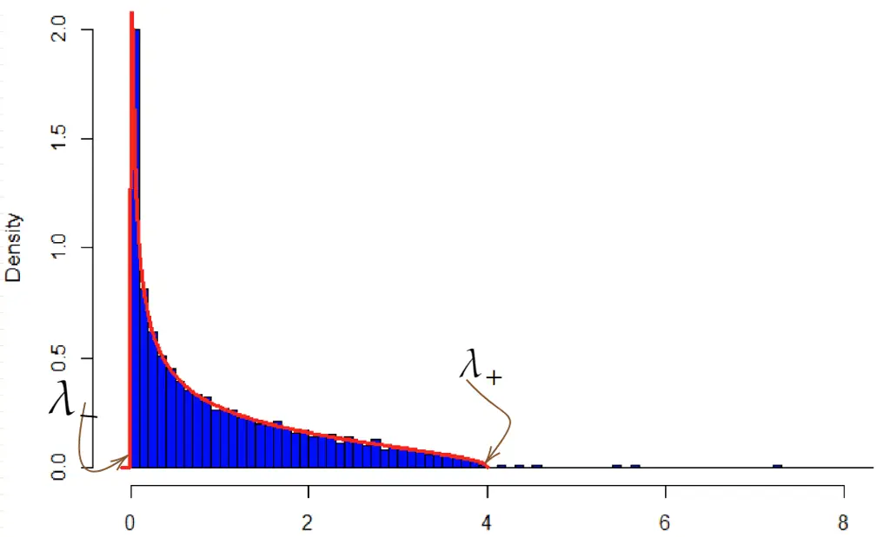

Figure 15: In blue we have the ESD of X, in red the Marchenko-Pastur
distribution which best fits the ESD based on the BEMA algorithm.

###### Remark E.1.

The method relies on parameters $`\alpha\in(0,1/2),\beta\in(0,1)`$. This
dependency can be observed by adjusting $`\alpha`$ and $`\beta`$ as
showcased in Fig. 16. The highlighted line represents $`\lambda_{+}=4`$,
the accurate $`\lambda_{+}`$ for $`\frac{1}{N}R^{T}R`$. In this case,
while the influence of $`\alpha`$ is minimal for ample values, adjusting
$`\beta`$ regulates the assurance that the eigenvalues of the matrix
$`R`$ will remain below the $`\lambda_{+}`$ estimator of the MP
distribution.

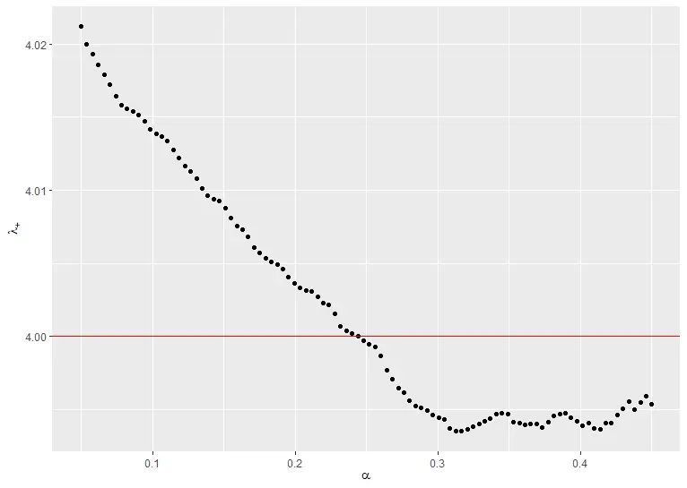

(a) Dependence of algorithm the choice of $`\alpha`$, $`\beta=0.5`$. In
this example the rank of the deterministic matrix $`S`$ is fairly low.

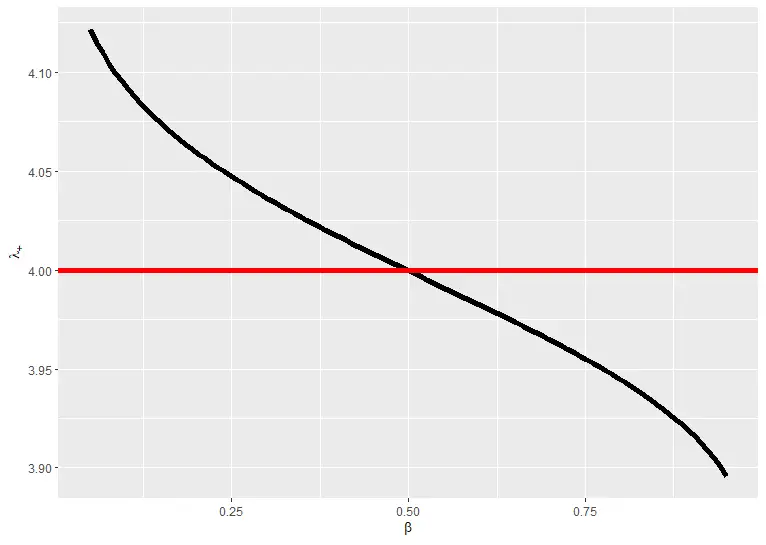

(b) Dependence of algorithm on the choice of $`\beta`$, $`\alpha=0.25`$.

Figure 16: How $`\lambda_{+}`$ depends on the hyperparameters $`\alpha`$
and $`\beta`$.

The BEMA technique will be utilized to deduce $`\lambda_{+}`$ from
$`X_{l}(t)`$’s ESD. As DNN learning evolves, most of the $`X_{l}(t)`$
eigenvalues are anticipated to fit the MP distribution. Yet, certain
eigenvalues might surpass the MP distribution’s bulk and correspond to
$`S_{l}(t)`$’s singular values. The BEMA’s objective is to spot the MP
distribution’s outermost boundary, which aids in assessing
$`\lambda_{+}`$. Grasping $`\lambda_{+}`$ is pivotal as it provides an
understanding of the DNN’s functionality during learning and its
adaptability to fresh data.

Together with the SVD, the BEMA technique can guide which singular
values of DNN’s weight matrices $`W_{l}`$ to omit during learning. The
SVD dissects the weight matrix, yielding a breakdown into singular
values and vectors, which facilitates an RMT-driven analysis of their
distribution. By employing the BEMA, one can distinguish eigenvalues
corresponding to $`S_{l}`$’s singular values from those linked to
$`R_{l}`$’s singular values. Removing eigenvalues tied to $`R_{l}`$ can
enhance the DNN learning process’s effectiveness.

### E.2 Importance of singular value decomposition in Deep Learning

For a matrix $`A`$ of dimensions $`N\times M`$, its SVD comprises a
factorization $`A=U\Sigma V^{T}`$, where:

- •
  $`U`$ is a square orthogonal matrix of size $`N\times N`$.
- •
  $`V`$ is a square orthogonal matrix of size $`M\times M`$.
- •
  $`\Sigma`$ is a diagonal matrix of dimensions $`N\times M`$, with its
  diagonal entries corresponding to singular values $`\sigma_{i}`$, and
  non-diagonal entries being zero.

For matrix $`X=W^{T}W`$, with eigenvalues $`\lambda_{i}`$, the
associated singular values of $`W`$ are denoted by
$`\sigma_{i}=\sqrt{\lambda_{i}}`$. This ties singular values to
eigenvalues of a matrix $`W`$’s symmetrization.

For a DNN’s weight matrix $`W_{l}`$, studies have shown that omitting
insignificant singular values through its SVD during training can
diminish parameters yet augment accuracy. In the upcoming sections, we
will elucidate how RMT can assist in determining which singular values
to exclude from a DNN layer, ensuring the DNN’s precision remains
intact.

Specifically, integrating the BEMA technique with the SVD of $`W_{l}`$
can determine which singular values to exclude during training. This is
accomplished by first computing $`W_{l}`$’s SVD, followed by determining
the eigenvalues of the symmetrical matrix
$`X_{l}=\frac{1}{N}W_{l}^{T}W_{l}`$. The derived eigenvalues can be
related to the singular values of $`W_{l}`$ via
$`N\lambda_{i}=\sigma_{i}^{2}`$. Using the BEMA to estimate
$`\lambda_{+}`$ enables setting a threshold for $`W_{l}`$’s singular
values. Those below this threshold can be discarded without affecting
accuracy, as they are probably less vital for the DNN’s output. This
procedure can be recurrent during training, updating the threshold as
required.

### E.3 How well does the ESD of $`X`$ fit the MP Distribution with Spikes

In this subsection, we outline a method to investigate whether the ESD
of $`X`$ may be derived from a particular MP distribution that may
contain spiked eigenvalues. The starting point of this method uses the
BEMA technique to pinpoint the most appropriate MP distribution. The
best-fitting distribution offers a theoretical cumulative distribution
function (CDF), while the observed cumulative spectral distribution for
$`X`$ is obtainable. Contrasting these distributions, we can rule out
the idea that $`X`$ is governed by the proposed MP distribution if there
is a notable disparity between them. We will now elaborate on these
notions, beginning with the empirical cumulative spectral distribution.

###### Definition E.2.

Consider $`G`$ as an $`N\times M`$ matrix with its ESD $`\mu_{G_{M}}`$
as presented in Definition 2.1. The observed cumulative spectral
distribution of $`G`$, denoted as $`F_{G}:\mathbb{R}\to\mathbb{R}`$, is:

```math
F_{G}(a)=\mu_{G_{m}}((-\infty,a]) \tag{99}
```

Remarkably, the CDFs for the MP distribution are available in an
explicit form. Using these formulas, we can lucidly detail our approach.
A tuning parameter $`\gamma\in(0,1)`$ specifies the sensitivity of our
evaluation.

This approach measures the utmost disparity between the predicted and
observed CDFs by sampling at each point in the observed distribution. As
this is meant for the special scenario of testing for MP distributions
with spikes, this knowledge allows us to refine our evaluation over
simply determining the $`L^{\infty}`$ disparity between the two
distributions.

This refinement is evident in the step that determines
$`i_{\text{min}}`$ and $`i_{\text{max}}`$. Given that BEMA solely
utilizes data in the quantile between $`(\alpha,1-\alpha)`$ for the
optimal fit, it’s reasonable to inspect the fit within the same
boundaries. In this scenario, a spiked MP distribution would likely be
inadequately represented by its generative MP distribution around the
predominant eigenvalues (the spikes), so it’s logical to test only the
core values for fit accuracy.

### E.4 Eliminating singular values while preserving accuracy

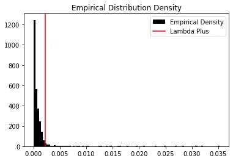

(a)

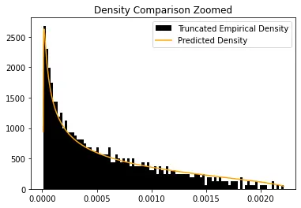

(b)

Figure 17: The ESD of $`X_{l}`$ and its best fit MP distribution

Algorithm 3 is how we train DNNs together with MP-based pruning.

###### Example E.3.

Consider an original DNN with two hidden layers, each consisting of 10
nodes. The total number of parameters in this case would be 100. By
employing SVD and removing $`8`$ small singular values in the weight
layer matrix of this DNN, we can split the hidden layer into two,
resulting in a new DNN with three hidden layers. The first layer will
have 10 nodes, the second layer will have 2 nodes, and the third layer
will have 10 nodes. By keeping only two singular values in the SVD, we
now have only 20 parameters, see Figure 18. In practice, we don’t
actually split the layer

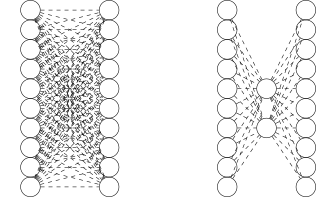

Figure 18: Original DNN with two hidden layers, each with 10 nodes
(total 100 parameters), is transformed into a new DNN with three hidden
layers. The first layer has 10 nodes, the second layer has 2 nodes
(keeping only two singular values in the SVD), and the third layer has
10 nodes, resulting in a total of 20 parameters.

###### Example E.4.

We used the above approach for a DNN trained on MNIST. In this example
the DNN has two layers, the first with a $`784\times 1000`$ matrix
$`W_{1}`$ and the second with a $`1000\times 10`$ matrix $`W_{2}`$. The
activation function was ReLU. We trained the DNN for $`10`$ epocs and
achieved a $`98\%`$ accuracy on the test set.

We perform a SVD on $`W_{1}`$, in this case $`\Sigma`$ is a
$`784\times 1000`$ matrix. Even if we only keep the biggest $`60`$
$`\sigma_{i}`$ of $`W_{1}`$ and transform the first layer into two
layers $`W_{1,1}`$ and $`W_{2,1}`$ the accuracy is still $`98\%`$.
$`W_{1}`$ has $`784\times 1000=784000`$ parameters but $`W_{1,1}`$ and
$`W_{2,1}`$ together have $`60\times 784+60\times 1000=106440`$
parameters. This is a significant reduction in the number of parameters
without any loss of accuracy.

### E.5 Algorithm for Sparsifying Singular Vectors of a DNN Layer

Let $`W_{l}`$ denote the $`l`$-th layer matrix of a DNN and for
simplicity we assume that it is $`N\times N`$. The SVD of $`W_{l}`$ is
given by $`W_{l}=U\Sigma V^{T}`$, where $`U`$ and $`V`$ are the left and
right singular vectors, and $`\Sigma`$ is a diagonal matrix of singular
values.

Given a threshold $`\sqrt{\lambda_{+}N}`$, the algorithm proceeds as
follows:

Note: The algorithm focuses on sparsifying the singular vectors based on
the dynamic threshold determined by the singular values and a predefined
threshold $`\theta`$. Here,
$`\text{apply\_sparsity}(U_{:,i},T_{i}(\Sigma_{ii}))`$ sets to zero all
elements in the vector $`U_{:,i}`$ below the threshold
$`T_{i}(\Sigma_{ii})`$.

### E.6 Algorithm for element-wise sparsification of a matrix

### E.7 The MP and spike metrics of a DNN model

First, we present two figures of the ESD of different layers of the base
ViT model studied in Subsection 3, see Figs. 19, 20. We see that some
layers fit the MP distribution "very" well, while some layers don’t.
When pruning layers of the DNN, we remove larger parameters in the
layers that are more random because of the larger amount of randomness
in those layers.

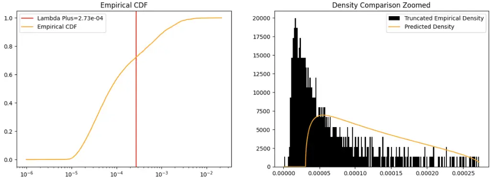

Figure 19: Best fit MP distribution (on the left) for $`\alpha=.25`$ and
$`\beta=.8`$ for a layer of the base ViT model. Here the MP fit error is
$`.74`$ while the percentage of singular values smaller than
$`\sqrt{\lambda_{+}}`$ is $`73\%`$. For more on the right figure, see
Section B.

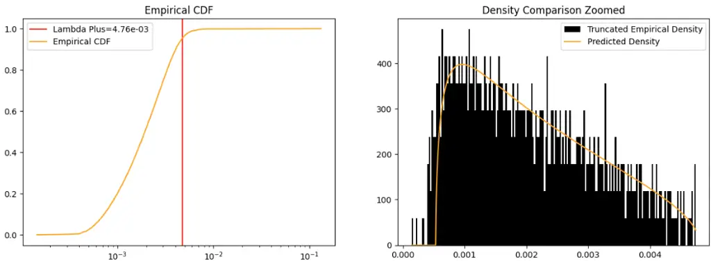

Figure 20: Best fit MP distribution (on the left) for $`\alpha=.25`$ and
$`\beta=.8`$ for a layer of the base ViT model. Here the MP fit error is
$`.01`$ while the percentage of singular values smaller than
$`\sqrt{\lambda_{+}}`$ is $`99.73\%`$. For more on the right figure, see
Section B.

Second, we show how the hyperparameter $`\alpha`$ discussed in Remark
E.1 affects the MP fit and spike metrics; see Fig. 21.

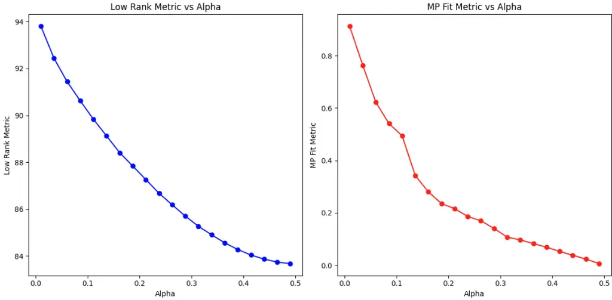

Figure 21: In the left figure, we have $`\alpha`$ vs LRM and on the
right we have $`\alpha`$ vs MP fit metric. This is for the base ViT
model studied in 1.

## Appendix F ViT model architecture

### F.1 Image representation and embedding

Consider an input image $`I`$ which is a matrix of pixels. This image is
divided into a grid of $`N`$ patches, $`\{P_{1},P_{2},...,P_{N}\}`$.
Each patch $`P_{i}`$ is then linearly embedded into a $`d`$-dimensional
space. This process is done by flattening each patch and then applying a
linear transformation, often followed by adding a positional encoding.

The mathematical process can be described as follows:

```math
\text{vec}(P_{i})=\text{Flatten}(P_{i})
```

We now apply a fully connected layer with no activation function:

```math
x_{i}=\text{vec}(P_{i})W+b
```

Here, $`\text{vec}(P_{i})`$ is the flattened vector of the patch
$`P_{i}`$, $`W`$ is a learnable weight matrix in
$`\mathbb{R}^{p\times d}`$, where $`p`$ is the number of pixels in a
patch, and $`b`$ is a learnable bias vector in $`\mathbb{R}^{d}`$. The
result $`x_{i}`$ is the embedded representation of the patch.

### F.2 Positional encoding

Due to the self-attention mechanism’s permutation-invariant nature, it
does not inherently account for the order or position of the input
elements. In the context of images, where the relative position of
patches is vital, positional encoding is added to the embedded
representations to retain this spatial information.

Positional encodings are typically vectors of the same dimension $`d`$
as the patch embeddings, which are added to the embeddings:

```math
x_{i}^{{}^{\prime}}=x_{i}+\text{PositionalEncoding}(i)
```

These encodings can be either learned during the training process or
predefined based on sinusoidal functions, capturing the relative or
absolute position of the patches in the image grid. This way, the
transformer can leverage the spatial structure of the image.

### F.3 Self-Attention Mechanism

In the self-attention mechanism, each element in the sequence is updated
by aggregating information from the entire sequence. This is done by
computing a weighted sum of value vectors $`V`$, where the weights are
determined by a compatibility function of query $`Q`$ and key $`K`$
vectors.

Each vector $`x_{i}`$ is transformed into a set of query $`Q`$, key
$`K`$, and value $`V`$ vectors through linear transformations (rather
then affine) using learnable weights $`W^{Q}`$, $`W^{K}`$, and
$`W^{V}`$:

```math
Q_{i}=x_{i}W^{Q},\quad K_{i}=x_{i}W^{K},\quad V_{i}=x_{i}W^{V}
```

where $`W^{Q},W^{K},W^{V}\in\mathbb{R}^{d_{emb}\times d_{k}}`$ and
$`d_{emb}`$ is the dimension space of the embeddings and
$`d_{k}<d_{emb}`$. Similar to the previous weight matrix $`W`$, matrices
$`W^{Q},W^{K}`$, and $`W^{V}`$ begin with random values that get learned
throughout the training.

### F.4 Calculation of attention

The attention mechanism is a fundamental concept in various models for
processing sequences of data (an example of such a sequence can be a
sequence of patches of data). Fundamentally, it calculates the
similarity of each part of the data sequence (patch) with respect to a
different element of the sequence (a different patch).

#### Attention Score

The attention score is a measure of the relevance or importance between
two elements in a sequence, typically represented as patches, tokens, or
vectors. The attention score between the $`i`$-th query vector $`Q_{i}`$
and the $`j`$-th key vector $`K_{j}`$ is computed using the dot product
of $`Q_{i}`$ and $`K_{j}`$, which is then scaled by the inverse of the
square root of the dimension of the key vectors. Mathematically, it is
represented as:

```math
\text{Attention}(Q_{i},K_{j})=\text{softmax}\left(\frac{Q_{i}K_{j}^{T}}{\sqrt{d_{k}}}\right)
```

Here, $`d_{k}`$ represents the dimension of the key (and query) vectors.
The dot product $`Q_{i}K_{j}^{T}`$ computes a measure of similarity or
alignment between the query and key. The scaling factor
$`\frac{1}{\sqrt{d_{k}}}`$ is used to avoid overly large dot products as
the dimensionality increases, which can lead to gradients that are too
small for effective learning.

#### F.4.1 Output of the Attention Layer

Once the attention scores are computed, the output for each query vector
is obtained by taking a weighted sum of the value vectors, where the
weights are the attention scores. The output for the $`i`$-th query
vector is computed as:

```math
\text{Output}_{i}=\sum_{j=1}^{N}\text{Attention}(Q_{i},K_{j})V_{j}
```

In this equation, $`V_{j}`$ represents the value vector corresponding to
the $`j`$-th element of the sequence. The weighted sum allows the model
to aggregate information from the entire sequence, weighted by how
relevant each element is to the query.

### F.5 Position-Wise Feed-Forward Networks

Each layer of the Transformer also contains a feed-forward network,
which consists of two linear transformations with an absolute value
activation in between. These networks are applied to each position
separately and identically.

```math
\text{FFN}(x)=\text{Abs}(xW_{1}+b_{1})W_{2}+b_{2}
```
