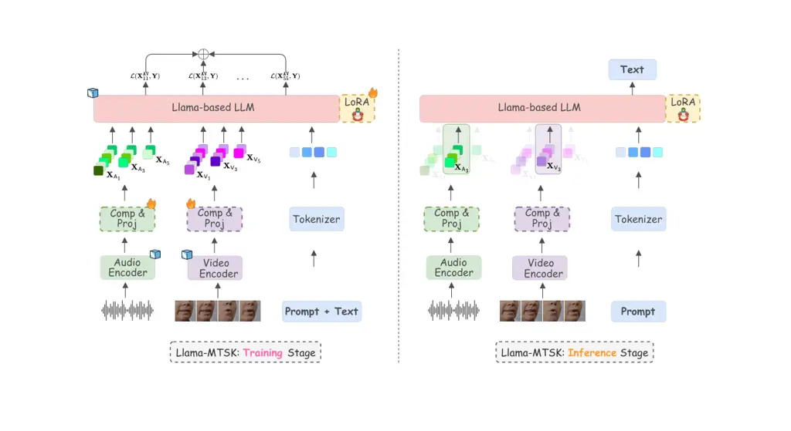
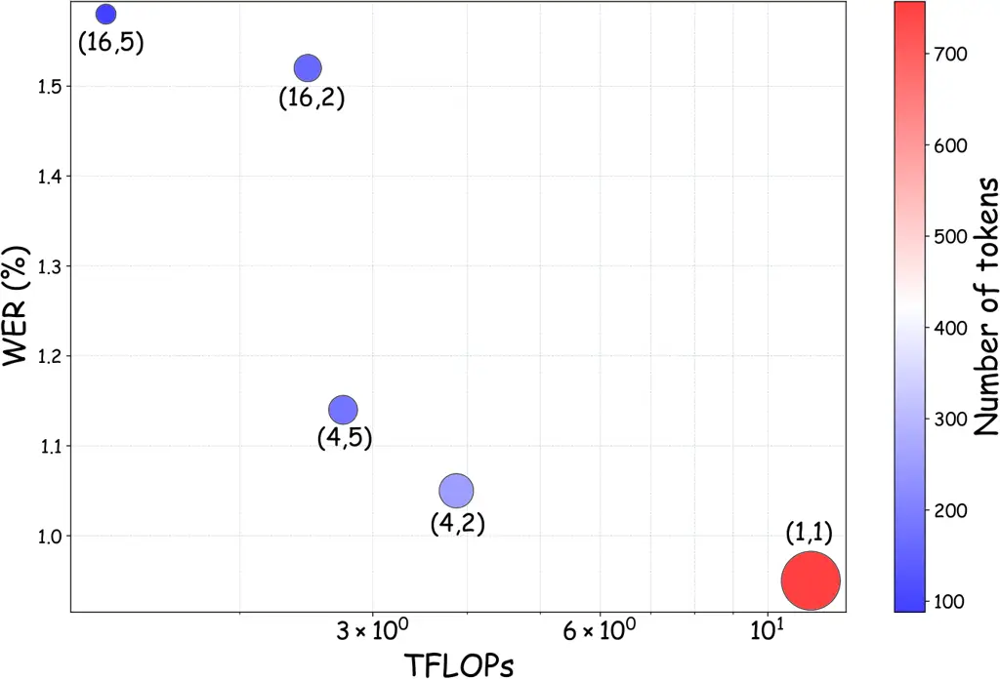

# Adaptive Audio-Visual Speech Recognition via Matryoshka-Based Multimodal LLMs

Umberto Cappellazzo ^(†)^(†)thanks: Collection and processing of the
LRS2 and LRS3 datasets, and running of the Whisper (OpenAI) model was
done by the Imperial College London authors on Imperial College London
systems. Affiliation: Imperial College London    Minsu Kim
Affiliation: Meta AI    Stavros Petridis Affiliation: Imperial College
London

###### Abstract

Audio-Visual Speech Recognition (AVSR) leverages audio and visual
modalities to improve robustness in noisy environments. Recent advances
in Large Language Models (LLMs) show strong performance in speech
recognition, including AVSR. However, the long speech representations
lead to high computational costs for LLMs. Prior methods compress inputs
before feeding them to LLMs, but high compression often harms accuracy.
To address this, we propose Llama-MTSK, the first Matryoshka-based
Multimodal LLM for AVSR, which flexibly adapts audio-visual token
allocation under varying compute constraints. Inspired by Matryoshka
Representation Learning, our model encodes representations at multiple
granularities with a single architecture, avoiding the need for separate
models. For efficient fine-tuning, we introduce three LoRA-based
strategies using global and scale-specific modules. Evaluations on major
AVSR datasets show Llama-MTSK matches or outperforms models trained at
fixed compression levels.

###### Index Terms: 

Audio-Visual Speech Recognition, Matryoshka Representation Learning,
Elastic Inference

## I Introduction

Audio-Visual Speech Recognition (AVSR) aims to improve the robustness of
speech recognition systems by utilizing both audio and visual signals to
recognize human speech. The correlation between audio and lip movements
enables the model to focus on relevant speech content while discarding
ambient or background noise. With the rising demand for robust speech
recognition systems and the widespread availability of cameras (e.g.,
smartphones), numerous studies have explored advancements in AVSR
technology. They have investigated different neural architectures \[1,
2, 3, 4, 5, 6\], training methods \[7, 8\], and methods using
self-supervised pretraining \[9, 10, 11, 12, 13\].

Recently, with the growing popularity and versatility of Large Language
Models (LLMs), new efforts have emerged to connect LLMs with speech
modeling \[14, 15, 16\]. Specifically, in Auditory Speech Recognition
(ASR) and Visual Speech Recognition (VSR), researchers have demonstrated
the possibility and effectiveness of LLMs in speech recognition \[17,
18, 19, 20, 21, 22, 23, 24, 25\]. By employing multi-modal speech
information, recent works propose to adapt LLMs in AVSR as well,
attaining state-of-the-art recognition performances \[26, 27\]. A common
focus of prior works is reducing the sequence length of speech
representations before feeding them into the LLM. Since LLMs have a
large number of parameters and speech sequences are much longer than
text, directly using speech representations imposes a significant
computational burden. At the same time, \[26\] demonstrate that there is
a trade-off between how much we compress the audio-visual speech
representations and performance: while higher compression ratios enhance
computational efficiency, they lead to a degradation in performance.
Therefore, a possible solution is training and distributing different
models with compression ratios tailored to individual users’
computational resources.

However, retraining existing models for different compression ratios,
each requiring a distinct coarse-to-fine granularity, is time-consuming
and impractical. For this reason, we propose to leverage the concept of
Matryoshka Representation Learning (MRL) \[28, 29, 30\] to encode
audio-visual information at different granularities using a single
model. This concept was recently explored in visual-linguistic
understanding and reasoning tasks in \[31, 32\], demonstrating that
Matryoshka-based large vision-language models can support multi-granular
visual processing at inference while achieving performance parity with
independently trained models for each compression rate.

For our audio-visual setting, with the aspiration to flexibly decide
between computational efficiency and performance at inference time
within the same model, we propose Llama-Matryoshka (abbreviated as
Llama-MTSK in the rest of the paper), a Matryoshka-based Multimodal LLM
which caters to different demands based on specific requirements by
training simultaneously audio-visual representations of different
granularities. Llama-MTSK first produces audio and video tokens using
pre-trained encoders, then reduces their length using average pooling or
stacking compression methods at multiple compression rates. Then, unlike
the previous works using MRL that directly fine-tune all the LLM’s
parameters \[31, 32\], we propose three LoRA-based Matryoshka approaches
(LoRA ![[Uncaptioned
image]](arxiv-2503-06362--b342a62ba046.figures/figure-1.webp) ) to
parameter-efficiently fine-tune the LLM (i.e., Llama \[33\]), which is
responsible to generate the transcriptions given the audio-visual tokens
and textual prompt. These approaches either employ a single global LoRA
to learn audio-visual feature tokens at multiple scales (Multi-Scale
LoRA ![[Uncaptioned
image]](arxiv-2503-06362--b342a62ba046.figures/figure-1.webp) ), or
define multiple LoRAs, each of them focusing on scale-specific
audio-visual information (Scale-Specific LoRA ![[Uncaptioned
image]](arxiv-2503-06362--b342a62ba046.figures/figure-1.webp) ), or a
combination of both (Multi-Scale-Specific LoRA ![[Uncaptioned
image]](arxiv-2503-06362--b342a62ba046.figures/figure-1.webp) ). At
inference, only the projector and LoRA modules associated with the
desired compression rate are activated, ensuring both flexibility and
efficiency. Our comprehensive experiments on the two largest AVSR
datasets demonstrate that our three proposed methods achieve comparable
or better performance than training separate models for each combination
of audio-video compression rates. Overall, Llama-MTSK exhibits strong
performance results, elastic inference, and computational efficiency
under a single set of weights.



Fig. 1: Training and inference stages for Llama-MTSK. (Left) During
training, we produce audio-visual tokens via pre-trained encoders,
followed by specific-scale compression and projection modules. Then, we
feed the concatenated audio-visual tokens at multiple scales to the
pre-trained Llama-based LLM, which is adapted through one of the three
proposed LoRA 
approaches following the Matryoshka Representation Learning principle.
(Right) At inference, Llama-MTSK allows us to change on-the-fly the
audio-visual compression rates for each input data conditioned on our
specific requirements using the same model architecture and weights,
enabling high flexibility. Furthermore, only one projector and one LoRA
module are activated at inference (in this figure, those associated with
the audio and video compression rates equal to $`3`$), guaranteeing
model’s scalability in training and no extra cost in inference.
 and
 represent
whether the parameters are trained or kept frozen, respectively.

Our key contributions are as follows:

- •
  We propose Llama-MTSK, the first Matryoshka-based Multimodal LLM
  designed for audio-visual speech recognition. By processing
  audio-visual tokens with multiple compression levels and
  granularities, and introducing three Matryoshka-based LoRA modules to
  efficiently fine-tune the pre-trained LLM, Llama-MTSK is able to
  dynamically adjust the number of tokens processed during inference
  using a single model, adapting to varying computational resources or
  desired accuracy levels.
- •
  Llama-MTSK achieves state-of-the-art results on LRS2 and LRS3, the two
  largest AVSR datasets, consistently exceeding the performance of
  models independently trained at specific compression levels. This
  trend is observed for the ASR, VSR, and AVSR tasks, across both the
  evaluated compression techniques and granularities.

## II Llama-MTSK

The objective of Llama-MTSK is to train an LLM (Llama-based in our
setting) that captures audio and visual information at multiple scales,
from coarse to fine, thus providing control over the audio-visual
granularity during inference. Consequently, a single “universal” model
allows us to dynamically adjust the performance-efficiency trade-off at
inference time, according to specific needs \[31, 32\].

Llama-MTSK follows the structure of Llama-AVSR \[26\], the first
Multimodal LLM (MLLM) tailored for audio-visual speech recognition, with
ad-hoc modifications to support MRL \[28\]. Llama-MTSK computes audio
and video tokens via modality-specific pre-trained encoders, and then
input them as prefix tokens to the LLM (together with the textual
tokens). This approach, denoted as decoder-only, is adopted by several
architectures due to its versatility and flexibility \[34, 35, 36, 37,
38, 39, 40, 41, 42, 43, 44\].

Llama-MTSK consists of three main components: 1) pre-trained audio and
video encoders, 2) audio and video compression and projection modules,
and 3) an LLM which is parameter-efficiently fine-tuned via ad-hoc
LoRA-based strategies (i.e., LoRA ![[Uncaptioned
image]](arxiv-2503-06362--b342a62ba046.figures/figure-1.webp) ).

### II-A Audio/Video Pre-Trained Encoders

We use pre-trained audio and video encoders to project the input audio
and video data into two sets of audio and video tokens. We denote with
$`\mathbf{X}^{\mathsf{A}}\in\mathbb{R}^{N_{\mathsf{A}}\times d_{\mathsf{A}}}`$
and
$`\mathbf{X}^{\mathsf{V}}\in\mathbb{R}^{N_{\mathsf{V}}\times d_{\mathsf{V}}}`$
the audio and video token sequences, respectively, where
$`N_{\mathsf{A}}`$/$`N_{\mathsf{V}}`$ is the number of audio/video
tokens, and $`d_{\mathsf{A}}`$/$`d_{\mathsf{V}}`$ is the audio/video
token dimension. The pre-trained encoders are maintained frozen during
the training stage ( ![[Uncaptioned
image]](arxiv-2503-06362--b342a62ba046.figures/figure-4.webp) in Figure
1).

### II-B Audio-Visual Compression and Projection

Since the dimensions of audio and video tokens often differ from that of
the textual tokens, MLLMs include a projection layer that maps audio and
video tokens into the LLM embedding space. It is common to employ either
linear projectors \[34, 45, 44, 42, 46, 47\] or abstractors (e.g.,
Q-Former, resampler) \[48, 49, 50\]. In our setting, following \[26\],
we use a two-layer MLP projector.

In addition to this, since the LLM predominantly accounts for the entire
computation and memory consumption of the MLLM, it is customary to
compress the number of multimodal tokens (in our case audio-visual
tokens) by a specific factor in order to find the optimal balance in
terms of efficiency and accuracy. For example, \[26, 22, 19, 21\] stack
multiple consecutive tokens along the token hidden dimension to reduce
the number of tokens, whereas other methods rely on the Q-Former
architecture \[49\] using a fixed number of query tokens \[51, 20, 39,
50\]. However, all these methods need to decide the compression rate to
apply beforehand, which means they generate outputs of a single,
predetermined length, lacking the ability to modulate the final sequence
length. This constraint limits the ability to balance information
density and computational efficiency, particularly in
resource-constrained deployment scenarios. Alternatively, one could
train a separate model for each desired compression rate, but this
approach can be time-consuming and cumbersome in practice.

Fig. 2: Our three proposed LoRA Matryoshka (LoRA
 ) approaches.
Multi-Scale (MS) LoRA
 uses a shared
global LoRA module for all the audio-visual token scales (in this
specific example there are three scales) to fine-tune the pre-trained
matrices of the LLM. The Specific-Scale (SS) variant defines a LoRA
module tailored to each scale, learning and specializing to a specific
scale. The third approach, Multi-Specific-Scale (MSS), combines MS and
SS to support both global and specific-scale LoRAs. The global LoRA is
responsible to capture relationships that can be shared among
different-scale tokens, while specific-scale LoRAs learn tokens based on
the specific scale.

In contrast, we propose to compress the audio and video tokens using
multiple compression rates, leading to token sequences at multiple
scales, and thus different granularities. We explore two different
compression methods to reduce the token sequence length: 1) average
pooling, and 2) hidden size stacking, where multiple consecutive frames
are stacked along the token hidden dimension. Therefore, we decide
beforehand a range of G audio compression rates
{$`a_{1},a_{2},\cdots,a_{\texttt{G}}`$} and $`T`$ video compression
rates {$`v_{1},v_{2},\cdots,v_{\texttt{T}}`$}. We gradually increase the
compression rates (i.e., $`a_{i+1}>a_{i}`$, $`i=1,\cdots,\texttt{G}`$).
With $`a_{i}`$ we refer both to the compression rate and the
corresponding scale interchangeably (e.g., if $`a_{i}`$ = $`4`$, then
the corresponding sequence would have
$`\lfloor\frac{N_{\mathsf{A}}}{4}\rfloor`$ tokens). We then compress the
audio and video tokens using the chosen rates, producing token sequences
at multiple scales:
\[$`\mathbf{X}^{\mathsf{A}}_{a_{1}},\mathbf{X}^{\mathsf{A}}_{a_{2}},\cdots,\mathbf{X}^{\mathsf{A}}_{a_{\texttt{G}}}`$\]
and
\[$`\mathbf{X}^{\mathsf{V}}_{v_{1}},\mathbf{X}^{\mathsf{V}}_{v_{2}},\cdots,\mathbf{X}^{\mathsf{V}}_{v_{\texttt{T}}}`$\].

At this point, each of these sequences are processed by compression
rate-specific linear projectors to align the audio-visual and text
tokens (see Figure 1).

### II-C LLM Adaptation via LoRA ![[Uncaptioned image]](arxiv-2503-06362--b342a62ba046.figures/figure-1.webp)

The LLM is responsible for generating the corresponding ASR
transcription in an auto-regressive fashion given the audio, video, and
textual tokens. We define $`\mathbf{X}^{\mathsf{AV}}_{ij}`$ as the
concatenation of audio and video tokens with audio and video compression
rates of $`a_{i}`$ and $`v_{j}`$, and the prompt textual tokens
$`\mathbf{X}^{P}`$:
$`\mathbf{X}^{\mathsf{AV}}_{ij}=[\mathbf{X}^{\mathsf{A}}_{a_{i}},\mathbf{X}^{\mathsf{V}}_{v_{j}},\mathbf{X}^{P}]`$.
To parameter-efficiently align the LLM with the multimodal inputs, we
use LoRA modules \[52\] to adapt the query and value projection matrices
of each layer. In our setting, the LLM is trained on multiple
audio-visual tokens with different scales. We investigate three
different strategies to efficiently fine-tune LLM’s pre-trained matrices
via LoRA approximation under a MRL setting: 1) Multi-Scale LoRA
Matryoshka (MS LoRA ![[Uncaptioned
image]](arxiv-2503-06362--b342a62ba046.figures/figure-1.webp) ), 2)
Specific-Scale LoRA Matryoshka (SS LoRA ![[Uncaptioned
image]](arxiv-2503-06362--b342a62ba046.figures/figure-1.webp) ), and 3)
Multi-Specific-Scale LoRA Matryoshka (MSS LoRA ![[Uncaptioned
image]](arxiv-2503-06362--b342a62ba046.figures/figure-1.webp) ). These
three methods are illustrated in detail in Figure 2.

The MS LoRA ![[Uncaptioned
image]](arxiv-2503-06362--b342a62ba046.figures/figure-1.webp) approach
uses a single “global” LoRA to approximate the query and value
projection matrices of each LLM’s self-attention layer, regardless of
the chosen scale and shared by all the input token sequences. For a
pre-trained weight matrix $`W`$, the projection output is computed as
follows:

```math
\mathbf{H}^{\mathsf{AV}}_{ij}\leftarrow\mathbf{X}^{\mathsf{AV}}_{ij}W+s\cdot\mathbf{X}^{\mathsf{AV}}_{ij}W_{\texttt{MS}}, \tag{1}
```

where $`s`$ is a tunable scalar hyperparameter,
$`W_{MS}=W_{\texttt{MS}}^{down}W_{\texttt{MS}}^{up}`$,
$`W_{\texttt{MS}}^{down}\in\mathbb{R}^{d\times r}`$ and
$`W_{\texttt{MS}}^{up}\in\mathbb{R}^{r\times d}`$, and $`r\ll d`$ ($`r`$
is the bottleneck dimension).

In contraposition to MS LoRA ![[Uncaptioned
image]](arxiv-2503-06362--b342a62ba046.figures/figure-1.webp) , we
propose to learn “expert” LoRA modules, which specialize to each scale.
We call this approach Specific-Scale (SS) LoRA ![[Uncaptioned
image]](arxiv-2503-06362--b342a62ba046.figures/figure-1.webp) .
Therefore, we define $`\texttt{G}\cdot\texttt{T}`$ LoRA modules, one for
each audio-visual scale. We compute the projection output as follows:

```math
\mathbf{H}^{\mathsf{AV}}_{ij}\leftarrow\mathbf{X}^{\mathsf{AV}}_{ij}W+s\cdot\mathbf{X}^{\mathsf{AV}}_{ij}W_{\texttt{SS}}^{ij}, \tag{2}
```

where $`W_{\texttt{SS}}^{ij}`$ is the LoRA decomposition matrix defined
for the $`i`$-th audio scale and $`j`$-th video scale, and it is defined
as $`W_{MS}`$. As we explain in subsection II-D, while all the LoRA
modules are used during the training stage, at inference we only
activate one LoRA module, corresponding to the selected audio and video
scales.

The third approach, MSS LoRA ![[Uncaptioned
image]](arxiv-2503-06362--b342a62ba046.figures/figure-1.webp) , is a
hybrid approach between MS and SS, which aims to learn both
scale-specific and multi-scale audio-visual representations.
Consequently, we define both a multi-scale global LoRA module, which is
always activated and shared among all the input sequences both at
training and at inference, and multiple scale-specific LoRA modules. In
this case, the output takes the following form:

```math
\mathbf{H}^{\mathsf{AV}}_{ij}\leftarrow\mathbf{X}^{\mathsf{AV}}_{ij}W+s\cdot\mathbf{X}^{\mathsf{AV}}_{ij}W_{\texttt{SS}}^{ij}+s\cdot\mathbf{X}^{\mathsf{AV}}_{ij}W_{\texttt{MS}}. \tag{3}
```

Regardless of the LoRA ![[Uncaptioned
image]](arxiv-2503-06362--b342a62ba046.figures/figure-1.webp)
fine-tuning approach we employ, Llama-MTSK is trained by averaging the
auto-regressive next token prediction loss for each audio-visual scale
$`ij`$ for each input data. The LLM predicts the response
$`\mathbf{Y}=\{y_{l}\}_{l=1}^{L}`$ conditioned on the multimodal input
tokens, where $`L`$ is the number of tokens of the ground truth
transcription to generate. Accordingly, for each Matryoshka audio-visual
representation $`\mathbf{X}^{\mathsf{AV}}_{ij}`$, the probability of the
target $`\mathbf{Y}`$ is computed by:

```math
p(\mathbf{Y}|\mathbf{X}^{\mathsf{AV}}_{ij})=\prod_{l=1}^{L}p_{\theta}(y_{l}|\mathbf{X}^{\mathsf{AV}}_{ij},y_{<l}), \tag{4}
```

where $`y_{<l}`$ is the generated output sequence up to token $`l-1`$,
and $`\theta`$ is the trainable parameters, which comprises the
projection layers and the LoRA ![[Uncaptioned
image]](arxiv-2503-06362--b342a62ba046.figures/figure-1.webp) modules
according to the LoRA ![[Uncaptioned
image]](arxiv-2503-06362--b342a62ba046.figures/figure-1.webp)
fine-tuning approach used.

The final objective is the average over all the audio-visual token
scales:

```math
\frac{1}{\texttt{G}\cdot\texttt{T}}\sum_{i=1}^{\texttt{G}}\sum_{j=1}^{\texttt{T}}-\log p(\mathbf{Y}|\mathbf{X}^{\mathsf{AV}}_{ij}). \tag{5}
```

### II-D Llama-MTSK: Training vs Inference

During training, Llama-MTSK learns multiple sets of audio-visual tokens,
each progressively incorporating more details as the scale increases. To
do so, the LLM processes all the multi-scale audio-visual tokens and
concurrently optimize over them using Eq. 5. This means that all the
projectors and LoRA ![[Uncaptioned
image]](arxiv-2503-06362--b342a62ba046.figures/figure-1.webp) modules
are involved. Instead, at inference time, for each input data, we choose
a specific audio-visual scale and we activate only the projector and
LoRA module associated with it. This is equivalent to one single
Llama-AVSR model trained on the specific scale. This principle is
similar to the behaviour of Mixture of Experts-based models \[53, 54,
55, 56, 57, 58, 59, 60\], which at inference time only activate a small
subset of the available experts (in our case the “experts” are the
projectors and LoRA ![[Uncaptioned
image]](arxiv-2503-06362--b342a62ba046.figures/figure-1.webp) modules).
Figure 1 depicts a schematic comparison of Llama-MTSK training and
inference processes.

## III Experiments and Results

### III-A Implementation Details

Datasets. We train and evaluate Llama-MTSK on LRS2 \[61\] and LRS3
\[62\], the two largest publicly available datasets for audio-visual
speech recognition. LRS2 includes $`225`$ hours of video clips from BBC
programs. LRS3 contains $`433`$ hours of transcribed English video clips
from TED talks.

Pre-Processing. We follow \[63, 26\] for the pre-processing of the
datasets. For the video modality, we crop the mouth region of interests
(ROIs) through a bounding box of $`96`$ × $`96`$. Each frame is
normalised by subtracting the mean and dividing by the standard
deviation of the training set. Audio data only undergo z-normalisation
per utterance.

Tasks. The AVSR task is studied for the main results, both for LRS2 and
LRS3. We also report the results for the ASR and VSR tasks on LRS3.

Llama-MTSK Details. We use Whisper Small and Medium \[64\] as
pre-trained audio encoder, whilst AV-HuBERT Large \[9\] for computing
the video tokens. Their weights remain frozen throughout the training
phase. The projectors consist of two linear layers with ReLU activation
in between. As for the LLM, based on the task and dataset, we experiment
with $`3`$ base pre-trained models of varying size from the Llama 3
family \[33\]: Llama 3.1-8B, Llama 3.2-3B, and Llama 3.2-1B. Each LoRA
module used to fine-tune the query and key projection matrices of each
LLM’s self-attention layer has a bottleneck dimension $`r`$ such that
the original LLM’s hidden size is reduced of a factor $`32`$ for Llama
3.2-3B and 3.2-1B, and $`64`$ for Llama 3.1-8B (e.g., for Llama 3.2-1B,
since the hidden size is $`2048`$, the rank is $`2048/32=64`$). The
hyperparameter $`s`$ is set to $`\frac{1}{8}`$.

|                                                                                        |                         |       |        |        |
| -------------------------------------------------------------------------------------- | ----------------------- | ----- | ------ | ------ |
| Method                                                                                 | Compression Rates (A,V) |       |        |        |
|                                                                                        | (4,2)                   | (4,5) | (16,2) | (16,5) |
| LRS3 Dataset                                                                           |                         |       |        |        |
| Llama-AVSR^(†)                                                                         | 2.4                     | 2.8   | 3.3    | 4.1    |
| Llama ![[Uncaptioned image]](arxiv-2503-06362--b342a62ba046.figures/figure-1.webp) MS  | 2.6                     | 2.7   | 3.7    | 4.1    |
| Llama ![[Uncaptioned image]](arxiv-2503-06362--b342a62ba046.figures/figure-1.webp) SS  | 2.3                     | 2.2   | 3.3    | 3.6    |
| Llama ![[Uncaptioned image]](arxiv-2503-06362--b342a62ba046.figures/figure-1.webp) MSS | 2.4                     | 2.4   | 3.2    | 3.5    |
| LRS2 Dataset                                                                           |                         |       |        |        |
| Llama-AVSR                                                                             | 4.1                     | 4.5   | 5.3    | 8.1    |
| Llama ![[Uncaptioned image]](arxiv-2503-06362--b342a62ba046.figures/figure-1.webp) MS  | 4.8                     | 5.9   | 6.4    | 8.9    |
| Llama ![[Uncaptioned image]](arxiv-2503-06362--b342a62ba046.figures/figure-1.webp) SS  | 3.4                     | 4.7   | 4.8    | 6.4    |
| Llama ![[Uncaptioned image]](arxiv-2503-06362--b342a62ba046.figures/figure-1.webp) MSS | 3.6                     | 4.8   | 6.1    | 9.0    |

TABLE I: Comparison between Llama-AVSR and our proposed Llama
![[Uncaptioned
image]](arxiv-2503-06362--b342a62ba046.figures/figure-1.webp) MS, SS,
and MSS approaches on LRS2 and LRS3 benchmarks. ^(†)Llama-AVSR trains
$`4`$ independent models tailored to each configuration of audio-video
compression rates.

Audio-Visual Token Compression Rates. We choose the audio and video
compression rates to train and evaluate Llama-MTSK carefully, based on
the studied tasks. For ASR, we apply compression rates in the range of
{$`4`$, $`8`$, $`12`$, $`16`$, $`20`$}. For VSR, since the task is more
challenging, we can afford smaller rates: {$`1`$, $`2`$, $`3`$, $`4`$,
$`5`$} (we also include the case in which no compression is applied).
For AVSR, we apply audio rates in {$`4`$, $`16`$} and video rates in
{$`2`$, $`5`$}, leading to $`4`$ audio-visual configurations. To
compress the audio and video tokens, either we apply average pooling
with kernel size and stride equal to the desired compression rate, or we
stack consecutive frames along the hidden dimension according to the
rate (we denote this as “stacking”).

|                                                                                        |       |           |         |      |
| -------------------------------------------------------------------------------------- | ----- | --------- | ------- | ---- |
| Method                                                                                 | Rates | Lab.      | Dataset |      |
|                                                                                        | (A,V) | Hrs.      | LRS2    | LRS3 |
| CM-seq2seq                                                                             | (1,1) | 380/433   | 3.7     | 2.3  |
| Eff. Conf.                                                                             | (1,1) | 818/818   | 2.3     | 1.8  |
| auto-avsr                                                                              | (1,1) | 3448/1902 | 1.5     | 1.0  |
| W-Flamingo                                                                             | (1,1) | 1982/433  | 1.4     | 1.1  |
| USR                                                                                    | (1,1) | 1982/1759 | 1.9     | 1.1  |
| Llama-AVSR                                                                             | (4,2) | 223/433   | 2.4     | 0.9  |
| Llama ![[Uncaptioned image]](arxiv-2503-06362--b342a62ba046.figures/figure-1.webp) MS  | (4,2) | 223/433   | 2.1     | 1.0  |
| Llama ![[Uncaptioned image]](arxiv-2503-06362--b342a62ba046.figures/figure-1.webp) SS  | (4,2) | 223/433   | 2.4     | 0.9  |
| Llama ![[Uncaptioned image]](arxiv-2503-06362--b342a62ba046.figures/figure-1.webp) MSS | (4,2) | 223/433   | 2.4     | 1.2  |

TABLE II: Comparison between Llama ![[Uncaptioned
image]](arxiv-2503-06362--b342a62ba046.figures/figure-1.webp) and
multiple SOTA methods on the LRS2 and LRS3 benchmarks. The “Lab. Hrs.”
column with values X/Y specifies how many labeled hours have been used
in training for LRS2 (X) and LRS3 (Y).

Fig. 3: WER results for the average pooling (left) and stacking (right)
compression methods for the ASR task.

Training/Inference Details. Following \[26, 63\], we augment visual
inputs through horizontal flipping, random cropping, and adaptive time
masking, while for audio we only apply adaptive time masking. For
training, we sample babble noise from the NOISEX dataset \[65\] using a
uniform distribution. We define the textual prompts as in \[26\]:
“Transcribe {task_prompt} to text.”, where task_prompt $`\in`$
{“speech”, “video”, “speech and video”}. We train our model for $`10`$
epochs with the AdamW optimizer with cosine annealing scheduler and
weight decay set to $`0.1`$ using NVIDIA A40 GPUs. The learning rate is
1e-3 for ASR and AVSR tasks, and 5e-4 for VSR. For decoding, we use beam
search with a beam width of $`15`$ and temperature of $`0.6`$. The
evaluation metric for all the experiments is the Word Error Rate (WER,
%).

### III-B AVSR Main Results

We report the results achieved by Llama-MTSK MS, SS, and MSS on the LRS2
and LRS3 datasets in Table I. We replace “MTSK” with ![[Uncaptioned
image]](arxiv-2503-06362--b342a62ba046.figures/figure-1.webp) in the
tables and in the following sections to simplify the notation. For both
datasets, we use Whisper Small as audio encoder. For the LLM, we use
Llama 3.2-1B for LRS3 and Llama 3.2-3B for LRS2. The smaller size of the
LRS2 dataset necessitates the larger LLM to mitigate higher WERs. We
apply audio compression rates of $`4`$ and $`16`$ and video compression
rates of $`2`$ and $`5`$, resulting in $`4`$ different compression
configurations. We compare these results with those achieved by training
Llama-AVSR independently on the $`4`$ configurations, leading to $`4`$
models. During inference, Llama-AVSR employs a separate model trained
for each audio-video rate. In contrast, our Llama ![[Uncaptioned
image]](arxiv-2503-06362--b342a62ba046.figures/figure-1.webp) uses a
single pre-trained model, activating the projector and LoRA
![[Uncaptioned
image]](arxiv-2503-06362--b342a62ba046.figures/figure-1.webp) modules
corresponding to the desired rate. On the LRS3 dataset, the three
proposed Llama ![[Uncaptioned
image]](arxiv-2503-06362--b342a62ba046.figures/figure-1.webp)
approaches achieve comparable or superior performance to Llama-AVSR,
particularly for the SS and MSS configurations. These two methods use
LoRA modules specialized for specific rates, which are activated during
inference based on specific requirements. On the LRS2 dataset, Llama
![[Uncaptioned
image]](arxiv-2503-06362--b342a62ba046.figures/figure-1.webp) SS
outperforms all other approaches across all rates.

Llama ![[Uncaptioned
image]](arxiv-2503-06362--b342a62ba046.figures/figure-1.webp) vs SOTA
Methods. In Table II, we compare Llama ![[Uncaptioned
image]](arxiv-2503-06362--b342a62ba046.figures/figure-1.webp) with
state-of-the-art (SOTA) methods on LRS2 and LRS3 for the AVSR task. We
equip Llama ![[Uncaptioned
image]](arxiv-2503-06362--b342a62ba046.figures/figure-1.webp) with
Whisper Medium and Llama 3.1-8B. We report results from $`5`$ recent
SOTA AVSR methods: CM-seq2seq \[5\], Efficient Conformer \[66\],
auto-avsr \[63\], Whisper-Flamingo \[67\], and USR \[13\]. Notably, all
these methods do not reduce the token sequence length, whereas
Llama-AVSR and Llama ![[Uncaptioned
image]](arxiv-2503-06362--b342a62ba046.figures/figure-1.webp) reduce
the number of tokens by a factor $`4`$ for audio and $`2`$ for video.
For LRS3, Llama ![[Uncaptioned
image]](arxiv-2503-06362--b342a62ba046.figures/figure-1.webp) achieves
SOTA results, with its SS variant surpassing Llama-AVSR, which is
trained on those specific compression rates, and outperforming methods
like auto-avsr and USR, which use more training hours. For LRS2, Llama
![[Uncaptioned
image]](arxiv-2503-06362--b342a62ba046.figures/figure-1.webp) SS and
MSS perform comparably to Llama-AVSR, while MS achieves better results.
Additionally, our methods perform as well as or better than CM-seq2seq
and Efficient Conformer but slightly underperform other SOTA methods.
However, Llama ![[Uncaptioned
image]](arxiv-2503-06362--b342a62ba046.figures/figure-1.webp) is
trained only on the $`223`$ hours of LRS2, whereas all competing methods
utilize at least $`1982`$ hours. We leave for future work the
integration of additional training data to enable a fairer comparison.
Finally, more AVSR experiments can be found in the Appendix.

### III-C Additional Results

In this section, we extend our analysis to the tasks of ASR and VSR,
where only audio or video tokens are fed to the LLM, respectively. We
finally present the computational cost analysis of Llama ![[Uncaptioned
image]](arxiv-2503-06362--b342a62ba046.figures/figure-1.webp) .

Fig. 4: WER results for the average pooling (left) and stacking (right)
compression methods for the VSR task. We use AVHuBERT Large as video
encoder and Llama 3.2-3B as LLM.

ASR Results. For the ASR task, we consider $`5`$ compression rates in
the range {$`4`$, $`8`$, $`12`$, $`16`$, $`20`$}. In Figure 3, we report
the results on the LRS3 dataset when using average pooling compression
(left) and stacking compression (right). With the exception of rate =
$`20`$, all the three Llama ![[Uncaptioned
image]](arxiv-2503-06362--b342a62ba046.figures/figure-1.webp) methods
outperform separately-trained Llama-AVSR methods. The MSS configuration
achieves the best WER performance across all the compression rates, even
surpassing or equaling the performance of Llama-AVSR trained at the
lowest compression rate of $`20`$.

|                                                                                       |                  |      |      |      |       |
| ------------------------------------------------------------------------------------- | ---------------- | ---- | ---- | ---- | ----- |
| Method                                                                                | Compression Rate |      |      |      |       |
|                                                                                       | 2                | 4    | 6    | 8    | 10    |
| Avg Pooling                                                                           | 4.3              | 13.5 | 46.1 | 89.2 | 160.0 |
| Llama ![[Uncaptioned image]](arxiv-2503-06362--b342a62ba046.figures/figure-1.webp) MS | 2.5              | 2.3  | 2.3  | 2.7  | 3.0   |

TABLE III: Comparison between Llama ![[Uncaptioned
image]](arxiv-2503-06362--b342a62ba046.figures/figure-1.webp) MS and a
training-free Llama-AVSR-based approach that reduces the tokens via
average pooling at inference time for the ASR task on LRS3.

VSR Results. Figure 4 shows WER results for the VSR task, similar to the
ASR results in Figure 3. The video rates are {$`1`$, $`2`$, $`3`$,
$`4`$, $`5`$}, lower than the ASR rates due to the greater complexity of
VSR. For both average pooling and stack compression, all three Llama
![[Uncaptioned
image]](arxiv-2503-06362--b342a62ba046.figures/figure-1.webp)
approaches outperform Llama-AVSR, with increasing gains at higher rates.
The MS and SS approaches using average pooling achieve WER reductions
exceeding $`10`$ at the highest rates. We attribute this improvement at
higher compression rates to the joint training of multi-scale tokens.
The performance of the three LoRA ![[Uncaptioned
image]](arxiv-2503-06362--b342a62ba046.figures/figure-1.webp)
approaches varies slightly depending on the compression method,
suggesting that no single approach is superior across all
configurations. However, all of them significantly outperform
Llama-AVSR.

Llama ![[Uncaptioned
image]](arxiv-2503-06362--b342a62ba046.figures/figure-1.webp) vs Avg
Pooling at Inference Time. Llama ![[Uncaptioned
image]](arxiv-2503-06362--b342a62ba046.figures/figure-1.webp) trains a
single model that supports multiple scales at inference time by applying
different compression rates. We compare our method with a training-free
approach that trains a single Llama-AVSR model without compression and
then applies the desired compression rate at inference on-the-fly by
average pooling the tokens. In Table III, we study the ASR setting with
audio rates in the range {$`2`$, $`4`$, $`6`$, $`8`$, $`10`$}. The
performance of the average-pooling baseline is severely impacted by a
decrease in the number of tokens, while Llama ![[Uncaptioned
image]](arxiv-2503-06362--b342a62ba046.figures/figure-1.webp) MS is
much more robust. These results demonstrate that Llama ![[Uncaptioned
image]](arxiv-2503-06362--b342a62ba046.figures/figure-1.webp) MS can be
effectively used with diverse computational resources.

Computation Cost Analysis. In Figure 5, we illustrate the benefits of
Llama ![[Uncaptioned
image]](arxiv-2503-06362--b342a62ba046.figures/figure-1.webp) MS in
terms of TFLOPS and inference costs. Without compression (i.e., (1,1)),
we assume the LLM processes $`500`$ audio tokens, $`250`$ video tokens
(the resolution of the audio encoder is twice that of the video
encoder), and $`7`$ tokens for the textual prompt, totaling $`757`$. By
increasing the audio-visual compression rates, we reduce the number of
tokens processed by the LLM, and thus the TFLOPs, by up to $`8.6`$x when
applying compression rates of (16,5), resulting in $`88`$ tokens.
Despite this substantial reduction in TFLOPs, the resulting increase in
WER remains modest. Moreover, Llama ![[Uncaptioned
image]](arxiv-2503-06362--b342a62ba046.figures/figure-1.webp) MS
enables elastic inference by allowing users to select compression rates
based on their computational constraints.



Fig. 5: Comparison of Llama
 MS in terms of
number of audio-visual processed tokens, WER, and TFLOPS.

## IV Conclusion

We introduce Llama-MTSK, a versatile audio-visual MLLM capable of
elastic inference across multiple tasks and computational resources.
Llama-MTSK exploits matryoshka representation learning to adapt the
pre-trained LLM through ad-hoc LoRA ![[Uncaptioned
image]](arxiv-2503-06362--b342a62ba046.figures/figure-1.webp) modules,
achieving performance comparable to or better than models separately
trained on each compression rate while significantly reducing
computational costs.

## References

- \[1\] S. Dupont and J. Luettin, “Audio-visual speech modeling for
  continuous speech recognition,” _IEEE transactions on multimedia_,
  vol. 2, no. 3, pp. 141–151, 2000.
- \[2\] K. Noda, Y. Yamaguchi, K. Nakadai, H. G. Okuno, and T. Ogata,
  “Audio-visual speech recognition using deep learning,” _Applied
  intelligence_, vol. 42, pp. 722–737, 2015.
- \[3\] T. Afouras, J. S. Chung, A. Senior, O. Vinyals, and
  A. Zisserman, “Deep audio-visual speech recognition,” _IEEE
  transactions on pattern analysis and machine intelligence_, vol. 44,
  no. 12, pp. 8717–8727, 2018.
- \[4\] S. Petridis, T. Stafylakis, P. Ma, G. Tzimiropoulos, and
  M. Pantic, “Audio-visual speech recognition with a hybrid
  ctc/attention architecture,” in _2018 IEEE Spoken Language Technology
  Workshop (SLT)_. IEEE, 2018, pp. 513–520.
- \[5\] P. Ma, S. Petridis, and M. Pantic, “End-to-end audio-visual
  speech recognition with conformers,” in _ICASSP 2021-2021 IEEE
  International Conference on Acoustics, Speech and Signal Processing
  (ICASSP)_. IEEE, 2021, pp. 7613–7617.
- \[6\] J. Hong, M. Kim, D. Yoo, and Y. M. Ro, “Visual context-driven
  audio feature enhancement for robust end-to-end audio-visual speech
  recognition,” in _Interspeech_, 2022, pp. 2838–2842.
- \[7\] P. Ma, A. Haliassos, A. Fernandez-Lopez, H. Chen, S. Petridis,
  and M. Pantic, “Auto-avsr: Audio-visual speech recognition with
  automatic labels,” in _ICASSP 2023-2023 IEEE International Conference
  on Acoustics, Speech and Signal Processing (ICASSP)_. IEEE, 2023, pp.
  1–5.
- \[8\] J. Hong, M. Kim, J. Choi, and Y. M. Ro, “Watch or listen: Robust
  audio-visual speech recognition with visual corruption modeling and
  reliability scoring,” in _Proceedings of the IEEE/CVF Conference on
  Computer Vision and Pattern Recognition_, 2023, pp. 18 783–18 794.
- \[9\] B. Shi, W.-N. Hsu, K. Lakhotia, and A. Mohamed, “Learning
  audio-visual speech representation by masked multimodal cluster
  prediction,” in _International Conference on Learning
  Representations_, 2022.
- \[10\] A. Haliassos, P. Ma, R. Mira, S. Petridis, and M. Pantic,
  “Jointly learning visual and auditory speech representations from raw
  data,” in _International Conference on Learning
  Representations_, 2023.
- \[11\] A. Haliassos, A. Zinonos, R. Mira, S. Petridis, and M. Pantic,
  “Braven: Improving self-supervised pre-training for visual and
  auditory speech recognition,” in _ICASSP 2024-2024 IEEE International
  Conference on Acoustics, Speech and Signal Processing (ICASSP)_. IEEE,
  2024, pp. 11 431–11 435.
- \[12\] W.-N. Hsu and B. Shi, “u-hubert: Unified mixed-modal speech
  pretraining and zero-shot transfer to unlabeled modality,” _Advances
  in Neural Information Processing Systems_, vol. 35, pp.
  21 157–21 170, 2022.
- \[13\] A. Haliassos, R. Mira, H. Chen, Z. Landgraf, S. Petridis, and
  M. Pantic, “Unified speech recognition: A single model for auditory,
  visual, and audiovisual inputs,” in _NeurIPS_, 2024.
- \[14\] K. Lakhotia, E. Kharitonov, W.-N. Hsu, Y. Adi, A. Polyak,
  B. Bolte, T.-A. Nguyen, J. Copet, A. Baevski, A. Mohamed _et al._, “On
  generative spoken language modeling from raw audio,” _Transactions of
  the Association for Computational Linguistics_, vol. 9, pp.
  1336–1354, 2021.
- \[15\] R. Huang, M. Li, D. Yang, J. Shi, X. Chang, Z. Ye, Y. Wu,
  Z. Hong, J. Huang, J. Liu _et al._, “Audiogpt: Understanding and
  generating speech, music, sound, and talking head,” in _Proceedings of
  the AAAI Conference on Artificial Intelligence_, vol. 38, no. 21,
  2024, pp. 23 802–23 804.
- \[16\] S. J. Park, C. W. Kim, H. Rha, M. Kim, J. Hong, J. H. Yeo, and
  Y. M. Ro, “Let’s go real talk: Spoken dialogue model for face-to-face
  conversation,” in _Proceedings of the 62nd Annual Meeting of the
  Association for Computational Linguistics (Volume 1: Long
  Papers)_, 2024.
- \[17\] C. Chen _et al._, “It’s never too late: Fusing acoustic
  information into large language models for automatic speech
  recognition,” in _ICLR_, 2024.
- \[18\] Y. Hu _et al._, “Large language models are efficient learners
  of noise-robust speech recognition,” in _ICLR_, 2024.
- \[19\] Z. Ma, G. Yang, Y. Yang, Z. Gao, J. Wang, Z. Du, F. Yu,
  Q. Chen, S. Zheng, S. Zhang _et al._, “An embarrassingly simple
  approach for llm with strong asr capacity,” _arXiv preprint
  arXiv:2402.08846_, 2024.
- \[20\] W. Yu, C. Tang, G. Sun, X. Chen, T. Tan, W. Li, L. Lu, Z. Ma,
  and C. Zhang, “Connecting speech encoder and large language model for
  asr,” in _ICASSP 2024-2024 IEEE International Conference on Acoustics,
  Speech and Signal Processing (ICASSP)_. IEEE, 2024, pp. 12 637–12 641.
- \[21\] Y. Fathullah, C. Wu, E. Lakomkin, J. Jia, Y. Shangguan, K. Li,
  J. Guo, W. Xiong, J. Mahadeokar, O. Kalinli _et al._, “Prompting large
  language models with speech recognition abilities,” in _ICASSP
  2024-2024 IEEE International Conference on Acoustics, Speech and
  Signal Processing (ICASSP)_. IEEE, 2024, pp. 13 351–13 355.
- \[22\] Q. Fang, S. Guo, Y. Zhou, Z. Ma, S. Zhang, and Y. Feng,
  “Llama-omni: Seamless speech interaction with large language models,”
  _arXiv preprint arXiv:2409.06666_, 2024.
- \[23\] K.-H. Lu, Z. Chen, S.-W. Fu, C.-H. H. Yang, J. Balam,
  B. Ginsburg, Y.-C. F. Wang, and H.-y. Lee, “Developing
  instruction-following speech language model without speech
  instruction-tuning data,” in _ICASSP_, 2025.
- \[24\] W. Tan, H. Inaguma, N. Dong, P. Tomasello, and X. Ma, “Ssr:
  Alignment-aware modality connector for speech language models,” _arXiv
  preprint arXiv:2410.00168_, 2024.
- \[25\] J. H. Yeo, S. Han, M. Kim, and Y. M. Ro, “Where visual speech
  meets language: Vsp-llm framework for efficient and context-aware
  visual speech processing,” in _Findings of the Association for
  Computational Linguistics: EMNLP 2024_, 2024, pp. 11 391–11 406.
- \[26\] U. Cappellazzo, M. Kim, H. Chen, P. Ma, S. Petridis,
  D. Falavigna, A. Brutti, and M. Pantic, “Large language models are
  strong audio-visual speech recognition learners,” in _ICASSP_, 2025.
- \[27\] U. Cappellazzo, M. Kim, S. Petridis, D. Falavigna, and
  A. Brutti, “Scaling and enhancing llm-based avsr: A sparse mixture of
  projectors approach,” _arXiv preprint arXiv:2505.14336_, 2025.
- \[28\] A. Kusupati, G. Bhatt, A. Rege, M. Wallingford, A. Sinha,
  V. Ramanujan, W. Howard-Snyder, K. Chen, S. Kakade, P. Jain _et al._,
  “Matryoshka representation learning,” _Advances in Neural Information
  Processing Systems_, vol. 35, pp. 30 233–30 249, 2022.
- \[29\] S. Kudugunta, A. Kusupati, T. Dettmers, K. Chen, I. Dhillon,
  Y. Tsvetkov, H. Hajishirzi, S. Kakade, A. Farhadi, P. Jain _et al._,
  “Matformer: Nested transformer for elastic inference,” in
  _NeurIPS_, 2024.
- \[30\] P. Nair, P. Datta, J. Dean, P. Jain, and A. Kusupati,
  “Matryoshka quantization,” _arXiv preprint arXiv:2502.06786_, 2025.
- \[31\] M. Cai, J. Yang, J. Gao, and Y. J. Lee, “Matryoshka multimodal
  models,” _arXiv preprint arXiv:2405.17430_, 2024.
- \[32\] W. Hu, Z.-Y. Dou, L. H. Li, A. Kamath, N. Peng, and K.-W.
  Chang, “Matryoshka query transformer for large vision-language
  models,” _arXiv preprint arXiv:2405.19315_, 2024.
- \[33\] A. Dubey, A. Jauhri, A. Pandey, A. Kadian, A. Al-Dahle,
  A. Letman, A. Mathur, A. Schelten, A. Yang, A. Fan _et al._, “The
  llama 3 herd of models,” _arXiv preprint arXiv:2407.21783_, 2024.
- \[34\] H. Liu, C. Li, Q. Wu, and Y. J. Lee, “Visual instruction
  tuning,” _Advances in neural information processing systems_,
  vol. 36, 2023.
- \[35\] J. Lin, H. Yin, W. Ping, P. Molchanov, M. Shoeybi, and S. Han,
  “Vila: On pre-training for visual language models,” in _Proceedings of
  the IEEE/CVF Conference on Computer Vision and Pattern Recognition_,
  2024, pp. 26 689–26 699.
- \[36\] R. Fang, C. Duan, K. Wang, H. Li, H. Tian, X. Zeng, R. Zhao,
  J. Dai, H. Li, and X. Liu, “Puma: Empowering unified mllm with
  multi-granular visual generation,” _arXiv preprint
  arXiv:2410.13861_, 2024.
- \[37\] X. Fan, T. Ji, C. Jiang, S. Li, S. Jin, S. Song, J. Wang,
  B. Hong, L. Chen, G. Zheng _et al._, “Mousi: Poly-visual-expert
  vision-language models,” _arXiv preprint arXiv:2401.17221_, 2024.
- \[38\] Z. Zong, B. Ma, D. Shen, G. Song, H. Shao, D. Jiang, H. Li, and
  Y. Liu, “Mova: Adapting mixture of vision experts to multimodal
  context,” in _NeurIPS_, 2024.
- \[39\] S. Zhang, Q. Fang, Z. Yang, and Y. Feng, “Llava-mini: Efficient
  image and video large multimodal models with one vision token,” _arXiv
  preprint arXiv:2501.03895_, 2025.
- \[40\] B.-K. Lee, C. W. Kim, B. Park, and Y. M. Ro, “Meteor:
  Mamba-based traversal of rationale for large language and vision
  models,” in _NeurIPS_, 2024.
- \[41\] E. Fini, M. Shukor, X. Li, P. Dufter, M. Klein, D. Haldimann,
  S. Aitharaju, V. G. T. da Costa, L. Béthune, Z. Gan _et al._,
  “Multimodal autoregressive pre-training of large vision encoders,”
  _arXiv preprint arXiv:2411.14402_, 2024.
- \[42\] J. Li, X. Wang, S. Zhu, C.-W. Kuo, L. Xu, F. Chen, J. Jain,
  H. Shi, and L. Wen, “Cumo: Scaling multimodal llm with co-upcycled
  mixture-of-experts,” in _NeurIPS_, 2024.
- \[43\] S. Tong, Z. Liu, Y. Zhai, Y. Ma, Y. LeCun, and S. Xie, “Eyes
  wide shut? exploring the visual shortcomings of multimodal llms,” in
  _Proceedings of the IEEE/CVF Conference on Computer Vision and Pattern
  Recognition_, 2024, pp. 9568–9578.
- \[44\] H. Yao, W. Wu, T. Yang, Y. Song, M. Zhang, H. Feng, Y. Sun,
  Z. Li, W. Ouyang, and J. Wang, “Dense connector for mllms,” in
  _NeurIPS_, 2024.
- \[45\] G. Luo, Y. Zhou, Y. Zhang, X. Zheng, X. Sun, and R. Ji, “Feast
  your eyes: Mixture-of-resolution adaptation for multimodal large
  language models,” _arXiv preprint arXiv:2403.03003_, 2024.
- \[46\] Z. Liu, L. Zhu, B. Shi, Z. Zhang, Y. Lou, S. Yang, H. Xi,
  S. Cao, Y. Gu, D. Li _et al._, “Nvila: Efficient frontier visual
  language models,” _arXiv preprint arXiv:2412.04468_, 2024.
- \[47\] B. Zhang, K. Li, Z. Cheng, Z. Hu, Y. Yuan, G. Chen, S. Leng,
  Y. Jiang, H. Zhang, X. Li _et al._, “Videollama 3: Frontier multimodal
  foundation models for image and video understanding,” _arXiv preprint
  arXiv:2501.13106_, 2025.
- \[48\] D. Zhu, J. Chen, X. Shen, X. Li, and M. Elhoseiny, “Minigpt-4:
  Enhancing vision-language understanding with advanced large language
  models,” _arXiv preprint arXiv:2304.10592_, 2023.
- \[49\] J. Li, D. Li, S. Savarese, and S. Hoi, “Blip-2: Bootstrapping
  language-image pre-training with frozen image encoders and large
  language models,” in _International conference on machine
  learning_. PMLR, 2023, pp. 19 730–19 742.
- \[50\] J. Cha, W. Kang, J. Mun, and B. Roh, “Honeybee:
  Locality-enhanced projector for multimodal llm,” in _Proceedings of
  the IEEE/CVF Conference on Computer Vision and Pattern Recognition_,
  2024, pp. 13 817–13 827.
- \[51\] C. Tang, W. Yu, G. Sun, X. Chen, T. Tan, W. Li, L. Lu, Z. Ma,
  and C. Zhang, “Salmonn: Towards generic hearing abilities for large
  language models,” _arXiv preprint arXiv:2310.13289_, 2023.
- \[52\] E. J. Hu, Y. Shen, P. Wallis, Z. Allen-Zhu, Y. Li, S. Wang,
  L. Wang, and W. Chen, “Lora: Low-rank adaptation of large language
  models,” _arXiv preprint arXiv:2106.09685_, 2021.
- \[53\] N. Shazeer, A. Mirhoseini, K. Maziarz, A. Davis, Q. Le,
  G. Hinton, and J. Dean, “Outrageously large neural networks: The
  sparsely-gated mixture-of-experts layer,” _arXiv preprint
  arXiv:1701.06538_, 2017.
- \[54\] W. Fedus, B. Zoph, and N. Shazeer, “Switch transformers:
  Scaling to trillion parameter models with simple and efficient
  sparsity,” _Journal of Machine Learning Research_, vol. 23, no. 120,
  pp. 1–39, 2022.
- \[55\] B. Zoph, I. Bello, S. Kumar, N. Du, Y. Huang, J. Dean,
  N. Shazeer, and W. Fedus, “St-moe: Designing stable and transferable
  sparse expert models,” _arXiv preprint arXiv:2202.08906_, 2022.
- \[56\] B. Mustafa, C. Riquelme, J. Puigcerver, R. Jenatton, and
  N. Houlsby, “Multimodal contrastive learning with limoe: the
  language-image mixture of experts,” _Advances in Neural Information
  Processing Systems_, vol. 35, pp. 9564–9576, 2022.
- \[57\] J. Puigcerver, C. Riquelme, B. Mustafa, and N. Houlsby, “From
  sparse to soft mixtures of experts,” _arXiv preprint
  arXiv:2308.00951_, 2023.
- \[58\] U. Cappellazzo, D. Falavigna, and A. Brutti, “Efficient
  fine-tuning of audio spectrogram transformers via soft mixture of
  adapters,” _arXiv preprint arXiv:2402.00828_, 2024.
- \[59\] A. Q. Jiang, A. Sablayrolles, A. Roux, A. Mensch, B. Savary,
  C. Bamford, D. S. Chaplot, D. d. l. Casas, E. B. Hanna, F. Bressand
  _et al._, “Mixtral of experts,” _arXiv preprint
  arXiv:2401.04088_, 2024.
- \[60\] N. Muennighoff, L. Soldaini, D. Groeneveld, K. Lo, J. Morrison,
  S. Min, W. Shi, P. Walsh, O. Tafjord, N. Lambert _et al._, “Olmoe:
  Open mixture-of-experts language models,” _arXiv preprint
  arXiv:2409.02060_, 2024.
- \[61\] J. Son Chung, A. Senior, O. Vinyals, and A. Zisserman, “Lip
  reading sentences in the wild,” in _Proceedings of the IEEE conference
  on computer vision and pattern recognition_, 2017, pp. 6447–6456.
- \[62\] T. Afouras, J. S. Chung, and A. Zisserman, “Lrs3-ted: a
  large-scale dataset for visual speech recognition,” _arXiv preprint
  arXiv:1809.00496_, 2018.
- \[63\] P. Ma, A. Haliassos, A. Fernandez-Lopez, H. Chen, S. Petridis,
  and M. Pantic, “Auto-avsr: Audio-visual speech recognition with
  automatic labels,” in _ICASSP_, 2023.
- \[64\] A. Radford, J. W. Kim, T. Xu, G. Brockman, C. McLeavey, and
  I. Sutskever, “Robust speech recognition via large-scale weak
  supervision,” in _International conference on machine learning_. PMLR,
  2023, pp. 28 492–28 518.
- \[65\] A. Varga, “Assessment for automatic speech recognition: Ii.
  noisex-92: A database and an experiment to study the effect of
  additive noise on speech recognition systems,” _Elsevier Speech
  Commun_, vol. 2, no. 3, p. 247, 1992.
- \[66\] M. Burchi and R. Timofte, “Audio-visual efficient conformer for
  robust speech recognition,” in _Proceedings of the IEEE/CVF Winter
  Conference on Applications of Computer Vision_, 2023, pp. 2258–2267.
- \[67\] A. Rouditchenko, Y. Gong, S. Thomas, L. Karlinsky, H. Kuehne,
  R. Feris, and J. Glass, “Whisper-flamingo: Integrating visual features
  into whisper for audio-visual speech recognition and translation,” in
  _Interspeech_, 2024.

## Appendix A Appendix

Fig. 6: Additional WER results using stacking compression for the ASR
task with {$`2`$, $`4`$, $`6`$, $`8`$, $`10`$} rates.

## Appendix B Additional Experiments for ASR

Fig. 7: Additional results for Llama
 using stacking
compression on the LRS3 dataset.

In this section, we report additional results for the ASR task when
using compression rates in a different range, specifically {$`2`$,
$`4`$, $`6`$, $`8`$, $`10`$}. Compared to Figure 3 in the main paper,
the increment between two consecutive rates is halved. We argue that it
is more useful to use more diverse rates for ASR since we do not observe
much deterioration of the WER results when doubling the rate (in Figure
6, the baseline Llama-AVSR achieves similar results when compressing the
tokens of a factor $`2`$, $`4`$, and $`6`$). Figure 6 shows that Llama
![[Uncaptioned
image]](arxiv-2503-06362--b342a62ba046.figures/figure-1.webp) MS and
MSS achieves comparable or better performance than Llama-AVSR. As for
the SS approach, it performs slightly worse than Llama-AVSR for the
first compression rates, and we believe this is because having a
specific LoRA module for multiple rates which do not show WER
deterioration leads to overfitting as one global LoRA is sufficient.
This argument also explains why for rates $`8`$ and $`10`$ the MS
variant performs better than the other ones.

## Appendix C AVSR Results with Stacking Compression

We include additional results for AVSR on LRS3 using the stacking
compression method in Figure 7. The methods use Whisper Small and Llama
3.2-1B as LLM. Our three proposed Matryoshka approaches performs better
than or equally well as Llama-AVSR, especially under conditions of high
audio compression, underscoring the effectiveness of our proposed Llama
![[Uncaptioned
image]](arxiv-2503-06362--b342a62ba046.figures/figure-1.webp) .

## Appendix D Full AVSR Results with Whisper Medium and LLama 3.1-8B

In Table 2 in the main paper, we only included for Llama-AVSR and Llama
![[Uncaptioned
image]](arxiv-2503-06362--b342a62ba046.figures/figure-1.webp) the
results with audio and video compression rates equal to $`4`$ and $`2`$,
respectively. In Table IV, we also report additional configurations of
audio-video compression rates. We use Whisper medium as audio encoder
and Llama 3.1-8B as LLM. Once more, our proposed methods perform on par
or even better than independently-trained Llama-AVSR models for each
compression rates configurations. In particular, we highlight the
sizeable gains brought by all the three LoRA ![[Uncaptioned
image]](arxiv-2503-06362--b342a62ba046.figures/figure-1.webp)
approaches for LRS3 when we apply the highest compression rates
configuration (16,5).

|                                                                                        |                         |       |        |        |
| -------------------------------------------------------------------------------------- | ----------------------- | ----- | ------ | ------ |
| Method                                                                                 | Compression Rates (A,V) |       |        |        |
|                                                                                        | (4,2)                   | (4,5) | (16,2) | (16,5) |
| LRS3 Dataset                                                                           |                         |       |        |        |
| Llama-AVSR^(†)                                                                         | 0.9                     | 0.9   | 1.6    | 2.1    |
| Llama ![[Uncaptioned image]](arxiv-2503-06362--b342a62ba046.figures/figure-1.webp) MS  | 1.0                     | 1.1   | 1.5    | 1.6    |
| Llama ![[Uncaptioned image]](arxiv-2503-06362--b342a62ba046.figures/figure-1.webp) SS  | 0.9                     | 1.0   | 1.7    | 1.8    |
| Llama ![[Uncaptioned image]](arxiv-2503-06362--b342a62ba046.figures/figure-1.webp) MSS | 1.2                     | 1.0   | 1.5    | 1.6    |
| LRS2 Dataset                                                                           |                         |       |        |        |
| Llama-AVSR                                                                             | 2.4                     | 2.2   | 2.9    | 3.3    |
| Llama ![[Uncaptioned image]](arxiv-2503-06362--b342a62ba046.figures/figure-1.webp) MS  | 2.1                     | 2.3   | 2.9    | 3.2    |
| Llama ![[Uncaptioned image]](arxiv-2503-06362--b342a62ba046.figures/figure-1.webp) SS  | 2.4                     | 2.1   | 2.9    | 2.9    |
| Llama ![[Uncaptioned image]](arxiv-2503-06362--b342a62ba046.figures/figure-1.webp) MSS | 2.4                     | 2.5   | 3.2    | 3.4    |

TABLE IV: Comparison between Llama-AVSR and our proposed Llama
![[Uncaptioned
image]](arxiv-2503-06362--b342a62ba046.figures/figure-1.webp) MS, SS,
and MSS approaches on LRS2 and LRS3 benchmarks. We employ Whisper medium
and Llama 3.1-8B. ^(†)Llama-AVSR trains $`4`$ independent models
tailored to each configuration of audio-video compression rates.
