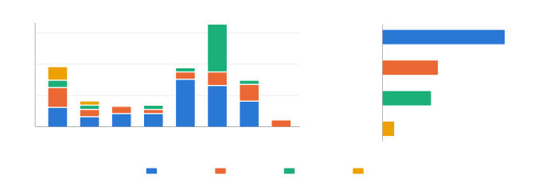

\[orcid=0009-0008-3723-0607\]

\[orcid=0009-0007-3670-6100\]

\[orcid=0009-0007-8534-3633\]

\[orcid=0009-0005-5505-4174\]

\[orcid=0009-0000-0124-4814\]

\[orcid=0009-0002-7279-7752\]

\[orcid=0000-0002-4089-2088\]

\[orcid=0000-0002-1671-2753\]

^(†)^(†)highlights: Structured review of the S4 to Mamba lineage with a
stated selection protocol. Cross-cutting analysis of selectivity, scan
versus convolution and cache behavior. State-space duality developed as
the thread linking Mamba-2 to attention and hybrids. Reported results
are tabulated with its configuration and an evidence level. Dedicated
treatment of failure modes, deployment, quantization and edge memory.

# Advancing Intelligent Sequence Modeling: Evolution, Trade-offs, and Applications of State-Space Architectures from S4 to Mamba

Shriyank Somvanshi shriyank@txstate.edu    Md Monzurul Islam
monzurul@txstate.edu    Mahmuda Sultana Mimi qnb9@txstate.edu    Sazzad
Bin Bashar Polock pay28@txstate.edu    Gaurab Chhetri gaurab@txstate.edu
   Anandi Dutta    Ph.D anandi.dutta@txstate.edu    Amir Rafe    Ph.D
amir.rafe@txstate.edu    Subasish Das    Ph.D subasish@txstate.edu
organization=Civil Engineering, Texas State University, addressline=601
University Drive, city=San Marcos, postcode=78666 TX, country=USA
organization=Computer Science, Texas State University, addressline=601
University Drive, city=San Marcos, postcode=78666 TX, country=USA

###### Abstract

Structured State Space Models (SSMs) have become a prominent class of
sequence models, developed against two long-standing difficulties: the
sequential computation and gradient propagation limits of Recurrent
Neural Networks (RNNs), and the quadratic time and memory cost of
self-attention in Transformers. By combining structured recurrence with
state-space representations, SSMs attain linear or near-linear scaling
in sequence length and hold a constant-size recurrent state during
autoregressive decoding, so that no key-value cache grows with context.
This paper is a structured review of the lineage running from the
Structured State Space Sequence model (S4), through its diagonal and
simplified successors S4D, Diagonal State Spaces (DSS) and S5, to the
selective models Mamba and Mamba-2, and on to SSM-attention hybrids.
Rather than describing models one at a time, the analysis is organized
around cross-cutting design dimensions: input-dependent selectivity, the
recurrent and convolutional views and when each is preferable,
diagonalization, cache behavior at inference, hardware-aware kernels,
and hybridization. Structured state-space duality is treated as a
central thread, because it accounts for the equivalence between the
recurrent and the attention-like form and for why hybrid designs work.
Reported efficiency and accuracy results are presented with their
measurement configuration and evidence level, because observed speedups
reflect the combined effects of the algorithm, implementation kernel and
hardware rather than an intrinsic property of the model alone. SSMs are
competitive with Transformers and more efficient in specific
long-context regimes, whereas attention retains an advantage on tasks
dominated by exact retrieval and associative recall. The review closes
with limitations, failure modes, deployment considerations and open
problems.

###### keywords

Structured State Space Sequence Models ,Mamba ,Jamba ,SSM

^(†)^(†)credit: Draft manuscript preparation^(†)^(†)credit: Draft
manuscript preparation^(†)^(†)credit: Draft manuscript
preparation^(†)^(†)credit: Draft manuscript preparation^(†)^(†)credit:
Draft manuscript preparation^(†)^(†)credit: Draft manuscript
preparation^(†)^(†)credit: Draft manuscript preparation^(†)^(†)credit:
Draft manuscript preparation^(†)^(†)corresponding: Corresponding author

## 1 Introduction

Traditional sequence modeling architectures, such as Recurrent Neural
Networks (RNNs) and Transformers, have demonstrated significant
limitations in handling long-range dependencies, particularly in domains
such as natural language processing (NLP), speech processing, vision,
and time-series forecasting. RNNs suffer from the vanishing and
exploding gradient problem, limiting their ability to retain information
over extended sequences, and their inherently sequential nature
restricts parallelization, making them inefficient for long-range tasks
(Patro and Agneeswaran, 2025). While Long Short-Term Memory (LSTM)
networks alleviate some of these issues through gating mechanisms, they
still introduce additional complexity and computational overhead.
Transformers, on the other hand, rely on self-attention mechanisms that
capture global dependencies but scale poorly due to their quadratic time
and space complexity (O(N²) (Patro and Agneeswaran, 2025). Moreover,
Transformers face challenges with fixed-length positional embeddings and
excessive memory consumption, making them inefficient for processing
extremely long sequences.

Beyond these challenges, RNNs struggle with slow training times due to
their sequential processing, while Transformers become impractical for
extremely long inputs, such as document-level NLP tasks or long-duration
speech modeling, due to their memory-intensive pairwise attention
computations (Gu et al., 2022b). These issues have motivated the
development of Structured State Space Models (SSMs), which offer a
fundamentally different approach to sequence modeling. Relative to RNNs,
SSMs mitigate rather than eliminate the gradient decay problem: a
structured, and in the diagonal case explicitly parameterized, state
transition keeps the spectrum of the recurrence under control, so that
gradient signal decays far more slowly over long horizons instead of not
decaying at all (Gu et al., 2022b; Gu et al., 2022a). Relative to
Transformers, SSMs replace pairwise attention with a state-space
recurrence whose cost grows linearly in the sequence length $`T`$ for a
fixed state size $`N`$, rather than quadratically in $`T`$.

Structured recurrence and continuous-time parameterization are what make
this practical. Stable reparameterizations of the state transition are
what allow long-term memory to be retained without the exponential decay
characteristic of unconstrained recurrent models (Wang and Li, 2024).
Two distinct computational routes exploit that structure. When the
recurrence is linear and time-invariant, the whole sequence can be
produced as a single long convolution and evaluated in $`O(T\log T)`$
time with the fast Fourier transform, which is the route S4 takes at
training time (Gu et al., 2022b). When the recurrence must be evaluated
step by step, an associative parallel scan recovers parallelism across
the sequence, which is the route S5 and the selective models take (Smith
et al., 2023b). The Structured State Space Sequence model (S4)
introduced the parameterization that made the first route tractable,
reducing the memory cost of the state transition while preserving the
state-space formulation (Gu et al., 2022b).Additionally, hybrid
architectures such as State sPace AugmenteD TransformEr (SPADE)
incorporate SSMs into Transformer layers to enhance global information
capture while maintaining local contextual refinement through efficient
attention mechanisms (Zuo et al., 2022).

On the Long Range Arena (LRA) benchmark, S4 was the first model to
exceed chance on the Path-X task at sequence length 16,384, and it
reported roughly 60 times the autoregressive generation throughput of a
vanilla Transformer baseline, 48K against 0.8K tokens per second on
WikiText-103 and 20.84 against 0.32 images per second on CIFAR-10,
measured on a single A100 with the batch size raised to fill memory (Gu
et al., 2022b). These results represent large-batch generation
throughput rather than per-request latency and are specific to the
evaluated model, baseline, tasks and hardware configuration.
Accordingly, Section 9 reports efficiency results together with the
conditions under which they were measured.

Selective SSMs make the state update depend on the input, so that the
model can decide what to write into and what to discard from a
fixed-size state (Gu and Dao, 2024). This is the change that closed much
of the content-based reasoning gap between linear SSMs and attention,
and it is examined as a design dimension in Section 8. Models built this
way have been applied across language, speech, vision, time-series,
graph and multimodal settings; Section 10 reviews that evidence domain
by domain, and is explicit about where the comparison against a strong
Transformer baseline has actually been run and where it has not.

### 1.1 Objective of the Survey

SSMs have emerged as a promising alternative to Transformer-based
architectures, offering efficient sequence modeling with linear
computational complexity. The evolution of SSMs, beginning with the
foundational S4 model, has led to significant advancements, including
Mamba, S5, and Jamba, which incorporate selective mechanisms to improve
performance across various domains. Early SSMs, such as S4, were
primarily designed for long-range sequence modeling but had limitations
in expressive power, particularly in content-based reasoning tasks
(Cirone et al., 2024). The introduction of Mamba refined these models by
integrating a selective state-space mechanism that allows
input-dependent processing, significantly enhancing expressivity and
accuracy (Cirone et al., 2024). Mamba-2 then reformulated the selective
recurrence so that its core computation is dominated by matrix
multiplications, which run on the matrix units of modern accelerators.
Dao and Gu report that a dedicated kernel for this formulation is 2 to 8
times faster than Mamba’s fused selective scan in a core-layer
microbenchmark on a single A100 80GB PCIe device at state size 64, swept
over sequence lengths from 512 to 512K (Dao and Gu, 2024). This is a
kernel-level measurement of one layer rather than an end-to-end model
speedup, and Section 4.3 develops the duality result that makes it
possible.

SSMs offer a computational advantage over Transformers, which scale
quadratically in sequence length, making them expensive for long-form
processing. Instead, models like Mamba and S5 achieve linear scaling,
improving inference speed and reducing memory requirements while
maintaining comparable accuracy (Cirone et al., 2024; Smith et al.,
2023b). S5 introduces a multi-input, multi-output (MIMO) SSM, enhancing
parallelism and efficiency over S4, allowing it to match Transformer
performance while using fewer computational resources (Smith et al.,
2023b). This advantage has led to SSMs being increasingly adopted in
various real-world applications, such as speech processing (Miyazaki
et al., 2024; Smith et al., 2023b), medical imaging (Bansal et al.,
2024), and NLP (Dao and Gu, 2024). While Transformers still dominate NLP
tasks, hybrid models like Jamba, which combine Transformer layers with
Mamba components, report throughput and memory advantages in
long-context settings; the specific results and the conditions under
which they were measured are given in the paragraph below and in Table 5
(Jamba Team, 2024).

Despite these advancements, challenges remain. Training SSMs efficiently
at scale is still an open problem compared to Transformer-based
architectures, which benefit from a well-established optimization
ecosystem (Dao and Gu, 2024). Hybrid architectures show what the
combination buys. Jamba, which interleaves Mamba and attention layers at
a ratio of seven to one and adds mixture-of-experts layers, reports
approximately three times the throughput of Mixtral on a single A100
80GB in int8 at an 8K context with 512 output tokens (Lenz et al.,
2025). Jamba-1.5 reports a key-value cache of 9 GB at a 256K context in
16-bit precision, against 80 GB for a 70B-parameter Transformer of
comparable class (Jamba Team, 2024). The cache requirement, rather than
the throughput multiplier, is the more durable advantage because it
follows from the architecture rather than from a particular kernel. SSMs
are also being explored for multimodal learning, where their efficiency
could complement Transformer-based representations (Bansal et al.,
2024). Future research directions include enhancing hardware
optimization, improving selective state-space mechanisms, and expanding
SSMs’ applicability in multimodal and real-time processing tasks (Wang
et al., 2024b).

While these developments show the growing role of SSMs as a scalable
alternative to Transformers, a consolidated analysis of their evolution,
capabilities and limitations is needed to judge where they actually
help. This paper is a structured review, and Section 1.3 states the
scope, sources and selection criteria on which it rests. This review
traces the lineage from S4 to Mamba-2 and the hybrids that follow it,
and evaluates the design decisions along the way against Transformer
baselines. It is organized around four objectives.

1.  1.  Lineage. Follow the developmental path from continuous-time
        state-space theory and HiPPO through S4 and its diagonal successors
        to selective models, treating each step as a response to a specific
        limitation of the step before it.
2.  2.  Cross-cutting analysis. Compare the model families along design
        dimensions that cut across them, namely selectivity, the scan and
        convolution views, diagonalization, inference-time cache behavior,
        hardware assumptions, context extrapolation and hybridization,
        rather than describing each model in isolation.
3.  3.  Evidence. Separate training cost, autoregressive inference cost, and
        memory cost instead of collapsing them into a single complexity
        column, and report every performance and efficiency result together
        with the configuration under which it was obtained.
4.  4.  Applicability and limits. Set out where SSMs are the better choice,
        where attention or a hybrid remains preferable, and what stands in
        the way of deployment.

### 1.2 Positioning relative to existing SSM and Mamba reviews

The state-space literature has been extensively reviewed, so any new
survey must clearly define its distinct contribution. Table 1 sets this
survey beside the main existing ones. Read as a group, those surveys
divide into two kinds. The first kind is domain-scoped: vision (Zhang
et al., 2024a; Xu et al., 2024), medical image analysis (Bansal et al.,
2024; Heidari et al., 2024) and remote sensing (Bao et al., 2025) each
survey Mamba within one application area, and each organizes by task.
The second kind is a broad catalog of models and results (Patro and
Agneeswaran, 2025; Qu et al., 2026; Salam et al., 2025; Wang et al.,
2024b), organized by block design, scanning strategy or modality; the
last of these frames the field explicitly as a search for a replacement
for the Transformer, which is a framing this review does not adopt and
Section 8 argues against. Both approaches are valuable, but the present
paper takes a different analytical approach.

| Survey                                                              | Year | Organizing basis                                                                                         | Covers to      | Domain scope                                 | Protocol | Depth        | What it centers on                                                                                                                       |
| ------------------------------------------------------------------- | ---- | -------------------------------------------------------------------------------------------------------- | -------------- | -------------------------------------------- | -------- | ------------ | ---------------------------------------------------------------------------------------------------------------------------------------- |
| Mamba-360 (Patro and Agneeswaran, 2025)                             | 2025 | Three model paradigms: gating, structural, recurrent; applications then grouped by domain                | Apr. 2024      | Multi-domain                                 | No       | Catalog      | Consolidating reported benchmark results across LRA, WikiText and ImageNet                                                               |
| A Survey of Mamba (Qu et al., 2026)                                 | 2026 | Three axes: architecture advances, adaptation to data modalities, applications                           | 2026 (v8)      | Cross-domain                                 | No       | Architecture | How Mamba is adapted to each data modality                                                                                               |
| State Space Model as a Transformer Alternative (Wang et al., 2024b) | 2024 | Principles first, then existing state-space implementations, then applications grouped by domain         | Apr. 2024      | Multi-domain                                 | No       | Architecture | Positioning state-space models as a general replacement for Transformers across modalities                                               |
| A Comprehensive Survey on Mamba (Salam et al., 2025)                | 2025 | Architectural variants of Mamba, then challenges                                                         | Early 2025     | Architecture-centric                         | No       | Catalog      | A short magazine-length orientation to the architecture and its open issues                                                              |
| A Survey on Visual Mamba (Zhang et al., 2024a)                      | 2024 | Backbone models separated from convolution-, recurrence- and attention-enhanced models; then by task     | Apr. 2024      | Vision only                                  | No       | Architecture | Vision backbones and the task areas they serve                                                                                           |
| Visual Mamba: A Survey and New Outlooks (Xu et al., 2024)           | 2024 | Backbones, then applications by modality; scanning techniques classified separately                      | Nov. 2024      | Vision only                                  | No       | Architecture | Scanning strategy as the critical design choice for vision, over 200 papers                                                              |
| Mamba for Medical Image Analysis (Bansal et al., 2024)              | 2024 | Architecture first: pure Mamba, U-Net variants, and CNN, Transformer and GNN hybrids                     | Oct. 2025 (v3) | Medical imaging                              | No       | Architecture | Medical architectures, scanning, datasets and results                                                                                    |
| Computation-Efficient Era (Heidari et al., 2024)                    | 2024 | Three-way classification by application, imaging modality and target organ                               | Jun. 2024      | Medical imaging                              | Yes      | Catalog      | The only prior survey in this group that states its databases and search phrases                                                         |
| Vision Mamba in Remote Sensing (Bao et al., 2025)                   | 2025 | Five dimensions from foundations through micro- and macro-architecture to benchmarking and open problems | May 2025       | Remote sensing                               | No       | Architecture | About 120 remote-sensing studies, benchmarked by task                                                                                    |
| This review                                                         | 2026 | Developmental lineage from HiPPO to Mamba-2, crossed with design dimensions that cut across families     | 2025           | Broad, plus dynamic and cross-modal settings | Yes      | Derivation   | Why each family appeared, structured state-space duality as the connecting result, and cost separated into training, inference and cache |

Table 1: Comparison of this review with existing surveys of state-space
and Mamba models.

Note: “Protocol” records whether the survey names the databases and
search terms it used. “Depth” records the level of the technical
treatment: _catalog_ tabulates models and reported results,
_architecture_ describes block structure and design choices, and
_derivation_ develops the underlying mathematics.

Five distinctions help clarify the contribution of this survey and are
stated in a form that readers can assess against the surveys discussed
above. First, the organizing thread is the _lineage_ of state-space
models rather than a taxonomy of completed architectures. Each family is
presented in relation to a limitation or design challenge that motivated
the next development: HiPPO provides a principled initialization, S4
makes the resulting operator computationally tractable, DSS and S4D show
that much of this machinery can be simplified once the state matrix is
diagonal, S5 restores parallelism through a scan, selectivity introduces
content dependence while relaxing time invariance, and structured
state-space duality recovers hardware efficiency affected by that
change. Thus, alongside describing what the models are, the survey
emphasizes the technical motivations underlying their progression.
Second, structured state-space duality is examined as an important
connecting result rather than only as a recent architectural
development. Several earlier surveys predate Mamba-2, while others
necessarily provide only limited discussion of it. Section 4.3 therefore
develops this connection in greater detail, and Section 5 uses it to
interpret the operation of hybrid architectures. Third, computational
cost is reported separately for training, autoregressive inference, and
memory or cache behavior. These dimensions can differ substantially, and
treating them as a single asymptotic measure may obscure the deployment
relevance of a recurrent state whose size does not increase with context
length. Fourth, each reproduced efficiency or accuracy result is
accompanied by its measurement configuration and an evidence level. As
discussed in Section 9, many reported results are based on kernel-level
microbenchmarks conducted on particular hardware configurations and may
not generalize directly across systems or deployment settings. Fifth,
the technical discussion extends from architectural description to
selected derivations, corresponding to the “Depth” column of Table 1. In
particular, Section 4.3 derives the semiseparable representation of the
state-space operator and the associated rank bound, which provides the
basis for the capability discussions in Sections 8 and 11. This
derivation supports a more precise discussion of the structural
conditions under which exact retrieval remains challenging for this
model family. These distinctions are intended to complement, rather than
replace, the strengths of the existing literature. This survey does not
claim exhaustive coverage of any single application domain. For vision,
medical imaging and remote sensing, the domain-specific surveys
identified above remain the more comprehensive references and are cited
accordingly rather than reproduced here.

### 1.3 Scope, sources and paper selection

This study adopts a structured review design rather than a systematic
review in the technical sense. The review was not based on an exhaustive
protocol-driven search and does not claim PRISMA compliance. The
procedures described below define the scope of the literature corpus,
the search strategy, and the criteria used to determine study
eligibility. The literature search covered seven sources: Google
Scholar, arXiv, DBLP, Semantic Scholar, Scopus, Web of Science and IEEE
Xplore. Google Scholar, arXiv, DBLP and Semantic Scholar were used to
identify the broad body of relevant literature, including conference
papers and preprints that constitute a substantial share of research in
this area. Scopus, Web of Science and IEEE Xplore were used to
supplement coverage and establish publication status. Proceedings
websites were also consulted when indexed records remained associated
with preprint versions.

The search strategy combined the core terms ‘state space model”,
‘structured state space”, ‘selective state space”, ‘S4” and ‘Mamba” with
architecture-related terms, including ‘hybrid”, ‘diagonal”, ‘duality”
and ‘scan”; task-related terms, including ‘long-range”, ‘language
modeling”, ‘segmentation”, ‘forecasting”, ‘point cloud” and ‘dynamic
graph”; and modality-related terms, including ‘vision”, ‘speech”,
‘multimodal” and “medical”. Backward and forward citation searches were
conducted from S4, Mamba and Mamba-2 to identify relevant studies not
retrieved through keyword searches. Foundational work in control theory
and recurrent modeling was included without a date restriction when
necessary to establish the theoretical development of the field.
Coverage of the modern state-space deep learning literature extends from
HiPPO in 2020 through the end of 2025.

Studies were eligible for inclusion if they satisfied at least one of
the following criteria: development of the theory of structured or
continuous-time state-space sequence models; introduction of an
S4-family or selective state-space architecture; integration of
state-space layers with attention; adaptation of a state-space model to
a specific data modality with comparison against a non-SSM baseline; or
review of the state-space modeling literature. Adjacent subquadratic
sequence models without a direct state-space lineage were included only
where needed to provide technical context and are identified separately
in Section 7. Studies were excluded when the state-space component was
incidental to the principal contribution, when no comparative baseline
was reported, or when the work duplicated an already included
publication. At the completion of the review, $`21`$ cited works
remained available only as preprints because no corresponding
peer-reviewed version had been identified.

The final list comprises $`103`$ works. Of these, $`85`$ were published
from 2020 onward and represent the core state-space literature, while
the remaining $`18`$ provide the necessary foundations in control
theory, recurrent and convolutional networks and attention. Venue type
was classified consistently from the bibliographic record: conference
papers were identified through proceedings, journal articles through
peer-reviewed journals, preprints where no peer-reviewed version was
available, and all remaining works as books, book chapters or theses.
Using this classification, the corpus includes $`53`$ conference papers,
$`24`$ journal articles, $`21`$ preprints and $`5`$ books and book
chapters. Figure 1 summarizes the temporal and venue-type distribution
of the corpus.



Note: Counts are derived from the bibliography supplied with this
submission. Works published in 2019 or earlier are pooled, since they
are foundational rather than part of the state-space era. Color encodes
venue type only.

Figure 1: Composition of the reference corpus by year and venue type.

### 1.4 Reproducibility Resources

Given the pace of development in this area, a static reference list can
become outdated quickly, while the methodological conditions attached to
reported results are often lost when findings are reproduced across
studies. To support continued verification and updating, the review
corpus is released as a maintained open index at
[https://github.com/pozapas/s4-to-mamba](https://github.com/pozapas/s4-to-mamba)
under the MIT license.

The index extends beyond a conventional bibliography in four respects.
First, papers are organized using the same model families and membership
criteria defined in Section 7, allowing the taxonomy to be examined and
revised transparently. Second, each reported efficiency result is
accompanied by the baseline, device, batch size and measurement scope
provided in the original source, consistent with the reporting
convention established in Section 8. Third, the benchmark provenance
documented in Section 9.1 is retained in full, including source
attribution and averaging conventions. Fourth, the index includes
dedicated resources for the dynamic and cross-modal settings discussed
in Sections 10.4 and 10.3, distinguishing datasets and benchmarks on
which state-space models have been evaluated from related problem
settings for which evidence is not yet available. Contributions and
corrections are accepted through the repository subject to verified
metadata and explicit measurement conditions. Each entry also records
whether a quantitative result originates from the primary authors or
from an independent source, enabling subsequent revisions to be
evaluated against the underlying evidence.

## 2 Fundamentals of State Space Models (SSMs)

### 2.1 Mathematical Foundation of SSMs

SSMs constitute a powerful mathematical approach broadly employed in
diverse fields, including control theory, systems engineering,
economics, and artificial intelligence, to describe complex dynamical
systems. At their core, SSMs characterize the evolution of system states
over time through first-order differential or difference equations,
explicitly capturing the influence of external inputs and their
relationship with observable outputs (Hangos et al., 2006).
Distinguished from classical autoregressive models, SSMs offer
substantial advantages, such as the intuitive handling of multivariate
systems, straightforward interpretation of internal dynamics, and
seamless transitions between continuous and discrete-time domains (Gu
et al., 2022b). Recent advancements have expanded the computational
efficiency and interpretability of SSMs by demonstrating equivalence
among their continuous, recurrent, and convolutional representations,
further solidifying their relevance in modern sequence modeling
frameworks (Gu et al., 2022b; Wang et al., 2024b).

#### 2.1.1 General Formulation

Classical SSMs are mathematically defined by equations that describe the
evolution of hidden states over time and the generation of observable
outputs, as introduced by Kalman (Kalman, 1960). These models serve as a
foundational framework for modeling dynamic systems across various
scientific and engineering domains, such as control theory, signal
processing, and economics. Classical SSMs encapsulate how a system’s
internal states evolve in response to external inputs and how these
states influence observable outputs (Hangos et al., 2006). A notable
strength of classical SSMs lies in their ability to explicitly represent
both internal dynamics and external interactions using first-order
differential equations, making them indispensable for capturing complex
behaviors in dynamic systems. Figure 2 illustrates the fundamental
structure of SSMs, showcasing three key perspectives: continuous-time
state-space dynamics, long-range dependencies, and discrete-time
representations.

Figure 2: Conceptual Representation of State Space Models, adapted from
(Gu et al., 2022b)

In the left panel, a continuous-time SSM is depicted, where an input
$`u(t)`$ influences the latent state $`x(t)`$ via the system matrix
$`A`$, with matrices $`A,B,C,`$ and $`D`$ defining state evolution,
input interaction, and output mapping. The middle panel illustrates how
specialized $`A`$ matrices enable deep SSMs to capture long-range
dependencies, ensuring stable memory retention over long sequences, an
improvement over traditional recurrent models. The right panel
demonstrates how structured parameterization allows SSMs to transition
into fast discrete representations, efficiently leveraging either a
recurrent or convolutional framework. This enables scalability in deep
learning applications like speech recognition, time-series forecasting,
and NLP. .

Recent advancements in deep learning have led to the development of
SSMs, a specialized class of SSMs designed for efficient sequence
modeling. Unlike classical SSMs, which focus on modeling physical and
control systems, Structured SSMs such as S4, Mamba, and S5 leverage
structured recurrence and diagonalized state-space representations to
capture long-range dependencies in sequential data. These models have
been evaluated in natural language processing, speech recognition and
time-series forecasting, and the specific results supporting that
evidence are collected with their measurement conditions in Table 5.
Throughout this paper, we refer to ”Structured SSMs” when discussing
their role in deep learning, differentiating them from classical
state-space models.”

```math
\dot{x}(t)=Ax(t)+Bu(t),\quad y(t)=Cx(t)+Du(t) \tag{1}
```

Equation (1) represents the State-Space Representation of a dynamical
system.

Here, $`x(t)\in\mathbb{R}^{n}`$ denotes the state vector encapsulating
the system’s internal states at time $`t`$, while
$`u(t)\in\mathbb{R}^{m}`$ represents the input or control vector
externally influencing the system. The output vector
$`y(t)\in\mathbb{R}^{p}`$ describes observable quantities (Wang et al.,
2024b). The matrices $`A,B,C,D`$ are constant and define system
dynamics, input influence, state-to-output mapping, and direct
input-to-output relationships, respectively. The structure and
dimensions of these matrices depend on the complexity and nature of the
system being modeled.

where:

- •
  $`x(t)\in\mathbb{R}^{n}`$ is the state vector representing the
  internal state of the system=.
- •
  $`u(t)\in\mathbb{R}^{m}`$ is the input (control) vector influencing
  the state evolution=.
- •
  $`y(t)\in\mathbb{R}^{p}`$ is the output (observation) vector.
- •
  $`A\in\mathbb{R}^{n\times n}`$ is the state transition matrix,
  governing the dynamics of the system.
- •
  $`B\in\mathbb{R}^{n\times m}`$ is the control matrix, mapping input
  effects to the state.
- •
  $`C\in\mathbb{R}^{p\times n}`$ is the observation matrix, defining how
  the internal state maps to the output.
- •
  $`D\in\mathbb{R}^{p\times m}`$ is the feedthrough matrix, which
  directly relates the input to the output.

#### 2.1.2 Discrete-Time Representation of SSMs

SSMs originate from control theory, where they are traditionally
formulated in continuous time using differential equations. However, for
practical digital computation, deep learning applications, and real-time
simulations, these continuous representations must be discretized. The
process of converting continuous-time equations into discrete-time
involves numerical discretization techniques such as the bilinear
transform, Euler method, and Z-transform. Among these, the bilinear
transform is often preferred due to its ability to preserve system
stability while maintaining computational efficiency (Hamilton, 1994;
Kailath, 1980).

A discrete-time SSM is mathematically defined as:

```math
x_{t+1}=A_{d}x_{t}+B_{d}u_{t},\quad y_{t}=C_{d}x_{t}+D_{d}u_{t} \tag{2}
```

where $`A_{d},B_{d},C_{d},D_{d}`$ are the discretized counterparts of
their continuous-time parameters. These parameters govern the evolution
of the system’s state over discrete time steps, enabling efficient
sequential modeling of time-series data (Gu et al., 2021; Gu et al.,
2022b). The transformation from continuous to discrete form is commonly
performed using matrix exponentials, formulated as:

```math
A_{d}=e^{A\Delta t},\quad B_{d}=\int_{0}^{\Delta t}e^{A\tau}Bd\tau \tag{3}
```

where $`\Delta t`$ represents the sampling interval used for
discretization. This method ensures that the system’s temporal dynamics
are accurately captured, allowing for efficient computation and
numerical stability compared to simpler approximation methods (Smith
et al., 2023b).

An alternative approach for discretization is using the bilinear
transformation, which improves system stability while maintaining
accuracy. The discrete transition matrix $`\bar{A}`$ is computed as:

```math
\bar{A}=(I-\alpha\Delta tA)^{-1}(I+(1-\alpha)\Delta tA) \tag{4}
```

where:

- •
  $`I`$ is the identity matrix,
- •
  $`A`$ is the continuous-time state transition matrix,
- •
  $`\alpha`$ is a weighting parameter that determines the approximation
  method,
- •
  $`\Delta t`$ is the discretization step size.

This transformation ensures that the discrete-time system remains
numerically stable while effectively approximating the continuous
dynamics of the model. The bilinear transformation is particularly
useful in machine learning applications, where preserving long-range
dependencies and computational efficiency is crucial for model
scalability.

Figure 3: Three Views of Linear State Space Layer, adapted from (Gu
et al., 2021).

As illustrated in Figure 3, the discrete-time SSM can be implemented in
either a recurrent or convolutional framework. In the recurrent
formulation, the model updates its hidden state sequentially at each
time step, following a structured recurrence similar to RNNs. This
allows for effective memory retention and autoregressive sequence
modeling, making it well-suited for applications like speech
recognition, reinforcement learning, and finance (Gu et al., 2021; Gu
et al., 2022b). The structured recurrence also improves gradient
propagation, addressing the vanishing gradient issue found in
traditional RNNs.

In contrast, the convolutional representation of discrete-time SSMs
offers parallelized training and inference by applying a discretized
convolutional kernel across the entire input sequence. This
representation significantly reduces computational bottlenecks, making
it ideal for large-scale sequence modeling tasks such as NLP, genomics,
and time-series forecasting (Dao and Gu, 2024). Unlike standard
convolutional neural networks (CNNs), which operate with fixed kernel
sizes, convolutional SSMs use learned state-space parameterizations,
allowing for more flexible and efficient long-sequence modeling.

The dual formulation of discrete-time SSMs, recurrent and convolutional,
demonstrates their versatility and adaptability to different
computational constraints. Recurrent SSMs are more suitable for
streaming and autoregressive tasks, where maintaining sequential order
is essential. Convolutional SSMs, on the other hand, excel in batch
processing and large-scale training, benefiting from depthwise
computation and GPU acceleration. The choice between the two is
therefore a deployment decision taken per phase rather than a property
of the model, and Section 8 develops the rule for making it. As research
continues to evolve, the discrete-time representation of SSMs is proving
to be a powerful alternative to Transformers for many real-world
applications. By leveraging structured state-space dynamics, these
models can efficiently handle long sequences, bridging the gap between
differential equation-based models, RNNs, and convolutional
architectures (Gu et al., 2021).

#### 2.1.3 Convolutional and recurrent formulations

The convolutional perspective of SSMs transforms the input sequence
through a structured, linear state transition, allowing for parallel
computation over long sequences. As depicted in the provided image, SSMs
can be rewritten in a discretized convolutional form, where the latent
state evolution is governed by a transition matrix $`A`$ and input
transformation matrix $`B`$ (Gu et al., 2021). This results in a system
response that can be computed efficiently using the following
discrete-time formulation:

```math
h_{t}=Ah_{t-1}+Bu_{t},\quad y_{t}=Ch_{t}+Du_{t} \tag{5}
```

where:

- •
  $`h_{t}`$ represents the hidden state,
- •
  $`u_{t}`$ is the input at time step $`t`$,
- •
  $`A,B,C,D`$ are learned parameters that define state transitions.

In the convolutional interpretation, the state-space model behaves as an
implicit filter, where the system response is equivalent to convolving
the input sequence with a learned kernel:

```math
K=(CA^{*}B) \tag{6}
```

This formulation enables efficient parallelization, similar to CNNs,
making SSMs highly scalable for long-sequence processing (Gu et al.,
2021; Dao and Gu, 2024). Unlike standard CNNs, where the kernel size is
fixed, SSMs implicitly parameterize kernels through structured matrices,
offering a more flexible and learnable representation.

Convolutional SSMs offer several advantages over traditional recurrent
architectures. One key benefit is parallel computation: unlike RNNs,
which require sequential updates, convolutional SSMs can process entire
sequences in parallel, significantly reducing training time, making them
efficient for handling large-scale datasets. Morover, another advantage
is their ability to model long-range dependencies effectively. The
implicit kernel representation enables better memory retention over long
sequences, making these models well-suited for applications such as
genomics, video processing, and speech recognition. By leveraging
structured matrices, SSMs learn a kernel whose effective length is not
fixed in advance, which is the specific respect in which they are less
constrained than a convolution with a fixed kernel size. Finally,
hardware efficiency is a crucial factor. Convolutional SSMs utilize
structured matrix multiplications, allowing them to efficiently exploit
modern hardware accelerators such as GPUs and TPUs. This computational
advantage makes them ideal for high-performance machine learning
applications where both scalability and efficiency are critical.

The recurrent view is the same layer read the other way, and the two are
worth setting side by side rather than in separate subsections, because
Section 8 argues that choosing between them is a deployment decision
taken per phase. In contrast to the convolutional approach, the
recurrent perspective of SSMs treats the hidden state as an evolving
memory, similar to RNNs but with structured linear recurrence. This
formulation explicitly updates the state at each time step, preserving
sequential information flow without the need for explicit convolutional
filtering.

The recurrent form of an SSM follows:

```math
h_{t}=Ah_{t-1}+Bu_{t}\quad y_{t}=Ch_{t} \tag{7}
```

where the state $`h_{t}`$ is updated at each time step rather than
applying a global convolution over the input. This design shares
similarities with traditional RNNs but introduces structured state
transitions that mitigate issues such as vanishing gradients (Gu et al.,
2021; Patro and Agneeswaran, 2025).

A key difference between SSM recurrence and classical RNNs is that SSMs
employ structured matrices for the transition dynamics. Unlike vanilla
RNNs, where the hidden state evolution is unconstrained, SSMs impose a
structured transformation on $`A`$, allowing for more stable long-range
dependency modeling (Gu et al., 2021; Dao and Gu, 2024).

Recurrent SSMs offer several advantages over conventional sequence
models. First, they reduce computational complexity compared to
Transformers, which scale quadratically with sequence length. SSMs
maintain a linear complexity of $`O(T)`$, making them efficient for long
sequences. Second, their use of structured state-space matrices
constrains the spectrum of the recurrence, which slows rather than
eliminates the gradient decay that affects standard RNNs, as Section 8
discusses. Finally, SSM recurrence enables efficient sequential
processing while preserving long-range dependencies. Whether that
translates into an accuracy advantage is task dependent, and Section 9
reports the evidence with the configurations under which it was obtained
rather than asserting a general advantage.

#### 2.1.4 Related sequence-modeling architectures

The three architectures that state-space layers are measured against are
summarized here in the terms the comparison of Table 2 uses, namely
cost, parallelism and what each can and cannot represent.

Recurrent neural networks. RNNs have a rich history dating back to the
early work of Elman (Elman, 1990), who introduced the foundational Elman
network as a simple recurrent model designed for sequence processing.
RNNs were developed to handle sequential data by employing recurrent
connections that allow the hidden state to retain information from
previous time steps, effectively capturing temporal dependencies (Patro
and Agneeswaran, 2025). Early RNN models, including Jordan networks
(Jordan, 1997) and Elman networks (Elman, 1990), established the core
principle of using hidden states to model sequential dependencies (Gu
et al., 2021). However, traditional RNNs struggled with vanishing
gradients when learning long-range dependencies, leading to the
development of architectures such as LSTM by by Hochreiter & Schmidhuber
(Hochreiter and Schmidhuber, 1997). Mathematically, the hidden state
$`h_{t}`$ at time step $`t`$ is updated based on the current input
$`x_{t}`$ and the previous hidden state $`h_{t-1}`$, following the
equation:

```math
h_{t}=\sigma(W_{h}h_{t-1}+W_{x}x_{t}+b) \tag{8}
```

where $`W_{h}`$, $`W_{x}`$, and $`b`$ are trainable parameters, and
$`\sigma`$ is typically a nonlinear activation function such as the
hyperbolic tangent (tanh). Despite their theoretical strength in
capturing temporal dependencies, RNNs suffered from practical issues
like the vanishing and exploding gradient problems, which severely
restricted their effectiveness in modeling long sequences (Hochreiter
and Schmidhuber, 1997). These limitations necessitated improvements,
eventually leading to the introduction of gated architectures such as
LSTMs and Gated Recurrent Units (GRUs) (Gu and Dao, 2024).

Convolutional neural networks. CNNs, first introduced by LeCun et al.
(1989), were initially designed for computer vision tasks but later
adapted for sequential data processing. CNNs leverage convolutional
layers to efficiently capture local patterns by applying kernels
(filters) across input data. In sequence modeling, a one-dimensional
convolution operation is commonly defined as:

```math
y_{i}=\sum_{j=0}^{k-1}x_{i+j}w_{j}+b \tag{9}
```

where $`x`$ represents the input sequence, $`w`$ denotes the kernel
weights, $`b`$ is a bias term, and $`k`$ is the kernel size. CNNs
exhibit high computational efficiency due to their parallelization
capabilities, making them more scalable than RNNs. However, their
limited receptive fields inherently restrict their ability to model
long-range dependencies, requiring deeper architectures or advanced
techniques such as dilated convolutions to extend their contextual reach
(LeCun et al., 1998).

Transformers. The Transformer architecture, introduced by Vaswani et
al.(Vaswani et al., 2017), revolutionized sequence modeling,
particularly in natural language processing, by introducing
self-attention mechanisms. Self-attention allows each element in a
sequence to directly attend to every other element, effectively
capturing global dependencies. The core mathematical operation of
self-attention is defined as:

```math
\text{Attention}(Q,K,V)=\text{softmax}\left(\frac{QK^{T}}{\sqrt{d_{k}}}\right)V \tag{10}
```

```math
Q=W_{q}X,\quad K=W_{k}X,\quad V=W_{v}X \tag{11}
```

where $`Q`$, $`K`$, and $`V`$ are linear transformations of the input,
representing queries, keys, and values, respectively, and $`d_{k}`$ is
the dimensionality of the keys. Transformers mitigate the long-range
dependency issues observed in RNNs and CNNs, enabling efficient parallel
computation. However, they incur a quadratic computational complexity
$`O(T^{2})`$ with respect to sequence length, posing scalability
challenges for extremely long sequences (Vaswani et al., 2017).

State space models. SSMs originate from control theory and signal
processing (Kalman, 1960), but recent advancements have positioned them
as a subquadratic alternative to Transformers for sequence modeling,
particularly for very long sequences. Unlike Transformers, which have
quadratic complexity due to self-attention operations, SSMs provide a
structured linear representation of latent state dynamics, reducing the
asymptotic training cost and enabling efficient parallel computation (Gu
et al., 2022b; Gu et al., 2021; Wang et al., 2024b). The mathematical
formulation, including continuous and discrete-time representations and
discretization techniques, is given in Section 2 above; Section 8 takes
up the question of when that asymptotic advantage is the one that binds
in practice.

### 2.2 Comparison with Other Sequence Models

A concise comparison of RNNs, Transformers, CNNs, and SSMs in terms of
computational complexity, strengths, and weaknesses is provided in Table 2.

RNNs process sequences efficiently with linear complexity $`O(T)`$,
updating hidden states at each step based on prior states and inputs.
However, they accumulate unnecessary information over long sequences,
leading to inefficiencies and vanishing gradient issues, which hinder
their ability to model long-range dependencies effectively (Hochreiter
and Schmidhuber, 1997). While LSTMs and GRUs introduce gating mechanisms
to mitigate these limitations, they still scale poorly with sequence
length due to their reliance on storing past states (Cahuantzi et al.,
2023).

Transformers (Vaswani et al., 2017) address this limitation by using
self-attention to model global interactions across sequence elements.
However, this flexibility comes at a cost: quadratic complexity
$`O(T^{2})`$, making Transformers computationally expensive,
particularly for long sequences. CNNs, originally designed for vision
tasks, have been adapted for sequence modeling using 1D convolutions
over temporal data (Bhat, 2024). CNNs efficiently capture local patterns
in sequences, making them computationally efficient. However, their
fixed kernel sizes limit their ability to model long-range dependencies
unless large receptive fields or stacked layers are used, which
increases computational cost (Agrawal and Mittal, 2020).

In contrast, SSMs, including architectures such as S4 and Mamba, offer
an efficient alternative with linear complexity $`O(T)`$ while
maintaining strong long-range dependency modeling. Unlike Transformers,
which rely on self-attention, SSMs utilize structured state transitions
to model dependencies more efficiently (Gu et al., 2021; Gu et al.,
2022b). Moreover, Selective SSMs dynamically update their hidden states,
retaining only relevant information rather than storing full past states
like RNNs. This enables efficient memory compression, reducing
computational overhead while maintaining scalability (Cirone et al.,
2024). Unlike CNNs, which rely on fixed receptive fields and struggle
with long-range dependencies, SSMs do not require predefined kernel
sizes and can adaptively model dependencies across varying timescales
(Ding et al., 2025). Their structured approach ensures scalability and
efficiency, making them a strong contender for sequence modeling tasks
that demand both long-term memory and computational efficiency.

By balancing memory retention, efficiency, and scalability, Selective
SSMs provide a more flexible and computationally efficient framework
than RNNs, CNNs, and Transformers. Their ability to selectively retain
critical information while discarding irrelevant data makes them
particularly effective for long-sequence tasks such as NLP, time-series
forecasting, and signal processing.

| Family                                                                         | Training cost                                  | Infer. cost / token              | Decoding state                                             | Execution mode (train / decode)                            | Hardware assumption                                                                                    | Where it is strong                                                                     | Where it fails                                                                                  |
| ------------------------------------------------------------------------------ | ---------------------------------------------- | -------------------------------- | ---------------------------------------------------------- | ---------------------------------------------------------- | ------------------------------------------------------------------------------------------------------ | -------------------------------------------------------------------------------------- | ----------------------------------------------------------------------------------------------- |
| RNN / LSTM (Hochreiter and Schmidhuber, 1997; Cahuantzi et al., 2023)          | $`O(Td^{2})`$                                  | $`O(d^{2})`$                     | $`O(d)`$, constant                                         | Sequential recurrence in both phases                       | None beyond dense matrix-vector products; poor device utilization                                      | Streaming; small constant memory                                                       | Gradient decay over long horizons; no parallelism in $`T`$, so wall-clock training scales badly |
| CNN (Agrawal and Mittal, 2020)                                                 | $`O(Tkd^{2})`$                                 | $`O(kd^{2})`$                    | $`O(kd)`$, constant                                        | Parallel convolution / sliding window                      | Standard convolution kernels; well served by matrix units                                              | Local structure; fully parallel                                                        | Receptive field grows only with depth, so long-range dependencies need many layers              |
| Transformer (Vaswani et al., 2017)                                             | $`O(T^{2}d)`$                                  | $`O(Td)`$, grows with context    | $`O(Td)`$, grows linearly with context                     | Parallel attention / cached incremental attention          | Matrix units plus sufficient memory bandwidth for the cache; benefits from fused attention kernels     | Exact retrieval and in-context learning; mature tooling                                | Quadratic training cost; the key-value cache is the binding constraint at long context          |
| S4 family, LTI (Gu et al., 2022b; Gupta et al., 2022; Gu et al., 2022a)        | $`O(Td\log T)`$ via FFT convolution            | $`O(Nd)`$                        | $`O(Nd)`$, constant                                        | Global convolution by FFT / step-by-step recurrence        | Efficient long FFT; the two phases run different kernels, so both must be implemented                  | Long smooth signals; strong on LRA                                                     | Time-invariant, so it cannot condition on content; weak on token-level filtering and copying    |
| S5 (Smith et al., 2023b)                                                       | $`O(TNd)`$ via parallel scan                   | $`O(Nd)`$                        | $`O(Nd)`$, constant                                        | Associative parallel scan / recurrence                     | Scan primitive with good memory locality; no FFT required                                              | Removes the FFT while keeping parallelism; multi-input multi-output state              | Still time-invariant, so the same content-dependence limit applies                              |
| Selective SSM (Mamba) (Gu and Dao, 2024)                                       | $`O(TN^{2})`$ via selective scan               | $`O(Nd)`$                        | $`O(Nd)`$, constant                                        | Fused selective scan / recurrence                          | Custom fused kernel and a memory hierarchy that keeps the state on chip; does _not_ reach matrix units | Content-dependent gating of a fixed-size state; constant-cost decoding                 | A fixed state bounds exact recall; scan kernels leave matrix units idle                         |
| Mamba-2 / SSD (Dao and Gu, 2024)                                               | $`O(TN^{2})`$, dominated by matrix products    | $`O(Nd)`$                        | $`O(Nd)`$, constant                                        | Block decomposition of a semiseparable matrix / recurrence | Matrix units, the same assumption attention makes; this is what the duality buys                       | Same asymptotics as Mamba at much higher hardware utilization, permitting larger $`N`$ | State transition restricted to scalar times identity, a deliberate loss of expressivity         |
| SSM-attention hybrid (Lenz et al., 2025; Ren et al., 2025; Dong et al., 2025)  | Between the two, set by the attention fraction | Between the two                  | Constant part plus a small cache from the attention layers | Both mechanisms in one pass, by layer or in parallel heads | Both sets of kernels must be present and interleaved efficiently                                       | Recovers exact retrieval at a bounded cache cost                                       | Inherits the tuning burden of both; the attention fraction is another hyperparameter            |
| Adjacent subquadratic (Peng et al., 2023; Sun et al., 2023; Poli et al., 2023) | $`O(Td^{2})`$ or $`O(Td\log T)`$               | $`O(d)`$, or convolution history | $`O(d)`$ constant, or none                                 | Parallel or chunkwise form / recurrence, where one exists  | Varies; the convolutional members need long FFTs, the recurrent members need a scan                    | Constant-time decoding without a state-space derivation                                | Mixing is fixed by position rather than learned from content, except in the gated members       |

Table 2: Sequence-model families compared along separated cost axes.

Note: “Execution mode” records how the sequence is traversed at training
and at decoding time, since several families change mechanism between
the two. “Hardware assumption” records what a family needs from the
device to reach its stated cost. $`T`$ is the sequence length, $`N`$ the
state size, $`d`$ the model width and $`k`$ the convolution kernel
width.

## 3 The Foundation of Modern SSMs

### 3.1 Introduction to S4

The advancement of deep learning has led to remarkable progress in
sequence modeling tasks such as NLP, time series forecasting, and speech
recognition. However, conventional models like RNNs and transformers
face significant challenges when handling extremely long sequences. RNNs
struggle with vanishing and exploding gradients, making them inefficient
for long-range dependencies (Bengio et al., 1994; Hochreiter and
Schmidhuber, 1997). Meanwhile, transformers, which rely on
self-attention mechanisms, suffer from quadratic complexity $`O(N^{2})`$
for sequence length, limiting their scalability for long-sequence
modeling (Vaswani et al., 2017). To address these limitations,
structured SSMs have gained attention as an alternative, particularly
the S4 model, which provides a novel approach for handling long-range
dependencies efficiently (Gu et al., 2022b).

S4 is a structured state-space model that significantly improves upon
previous RNN and attention-based methods by leveraging continuous-time
state-space formulations (Gu et al., 2023). The foundation of S4 lies in
classical state-space models, which have been extensively used in
control theory and signal processing (Kalman, 1960; Ljung, 1987). These
models define system dynamics through differential equations, which are
then discretized for computation (Chen et al., 2018). While traditional
SSMs were impractical for deep learning due to their computational
overhead, S4 introduces a structured formulation that allows for fast
and scalable computation (Gu et al., 2020). This innovation enables S4
to efficiently capture long-range dependencies without suffering from
gradient degradation, making it a promising solution for long-sequence
modeling tasks.

#### 3.1.1 First Structured SSM Designed for Long-Sequence Modeling

S4 represents a paradigm shift in sequence modeling by introducing a
mathematically grounded and computationally efficient alternative to
traditional architectures. A key innovation in S4 is the use of the
High-Order Polynomial Projection Operator (HiPPO) framework, which
provides a mathematically rigorous approach to preserving long-range
dependencies in sequential data (Gu et al., 2020). HiPPO enables
continuous memory retention through an optimal polynomial projection
mechanism, addressing the limitations faced by earlier sequence models
such as LSTMs (Hochreiter and Schmidhuber, 1997), GRUs (Chung et al.,
2014), and vanilla RNNs (Bengio et al., 1994).

Figure 4 illustrates the HiPPO framework, which optimally projects past
information onto a polynomial basis to maintain a compressed yet
expressive memory representation. In this process, a function $`f(t)`$
is approximated by projecting it onto polynomial bases using a weighting
measure $`\mu(t)`$. The function’s history is then represented as a set
of evolving coefficients governed by a structured ODE:

```math
\frac{d}{dt}c(t)=A(t)c(t)+B(t)f(t).
```

To ensure efficient computation, this continuous ODE is discretized into
a recurrence relation:

```math
c_{k+1}=A_{k}c_{k}+B_{k}f_{k}.
```

This approach allows sequence models to retain information across long
time horizons efficiently, a key principle that later influenced S4’s
structured state-space design.

Figure 4: HiPPO Framework for Online Function Approximation, adapted
from (Gu et al., 2020)

Unlike previous architectures that relied on explicit gating mechanisms
or self-attention, S4 leverages structured matrices for efficient
long-term information retention (Katharopoulos et al., 2020; Tay et al.,
2022). Another breakthrough of S4 is its ability to achieve subquadratic
computational complexity while maintaining high expressivity.
Transformers, while powerful, require $`\mathcal{O}(N^{2})`$ complexity
due to self-attention computations, making them infeasible for very long
sequences (Brown et al., 2020; Vaswani et al., 2017). In contrast, S4
achieves $`\mathcal{O}(N\log N)`$ complexity by leveraging structured
state-space computations, significantly reducing computational
overhead (Gu et al., 2023). This advantage has positioned S4 as a more
scalable alternative to transformers, particularly in time series
forecasting, speech recognition, and text processing (Bain et al., 2021;
Lim et al., 2021).

S4’s efficiency is also attributed to its use of diagonal plus low-rank
parameterization, which allows it to approximate long-sequence
dependencies while remaining computationally stable (Gu et al., 2023).
This contrasts with previous state-space representations that required
expensive matrix multiplications, making them impractical for deep
learning applications. By introducing structured recurrence, S4 can
effectively learn from long sequential data without explicit recurrence
mechanisms like those in standard RNNs (Graves et al., 2013). One of the
most important contributions of S4 is its compatibility with modern
hardware accelerators, such as GPUs and TPUs, which enable efficient
parallelization (Raffel et al., 2020; Shoeybi et al., 2019). Many
earlier sequence models, including attention-based transformers, require
significant memory overhead, limiting their feasibility for
long-sequence processing (Raffel et al., 2020). S4, however, benefits
from its structured state-space computations, allowing it to handle
sequences of tens of thousands of tokens without excessive memory
consumption (Dai et al., 2019; Wang et al., 2020).

Beyond efficiency, S4 was applied across several domains in the period
following its release. It has been used for long-range time-series
forecasting, where the comparison of interest is against attention-based
forecasters such as the temporal fusion transformer (Lim et al., 2021),
and for biomedical signal analysis, where long electroencephalogram and
electrocardiogram recordings are exactly the regime in which a
linear-time model is attractive (Tang et al., 2023). These are reported
results in individual studies rather than controlled comparisons across
a common protocol, and Section 9 explains why that distinction matters
throughout this literature. Despite its advantages, implementing S4 is
not without challenges. One of the primary difficulties is the
optimization of structured state-space matrices, which requires
specialized initialization techniques to maintain numerical
stability (Gu et al., 2023). Unlike standard architectures such as
transformers, where training dynamics are well-understood, S4 introduces
complexities in parameter tuning that necessitate novel training
techniques such as spectral normalization (Miyato et al., 2018).

S4’s success has inspired the development of several extensions.
Structured State-Space Sequence Model with Simplified Representations
(S5) introduces a streamlined version of S4 with fewer hyperparameters,
improving ease of implementation (Smith et al., 2023b). Additionally,
hybrid models that combine S4 with self-attention mechanisms have been
explored to further enhance their modeling capabilities (Smith et al.,
2023a). These developments indicate a growing interest in structured
state-space approaches as a replacement for traditional sequence models.

### 3.2 Key Innovations in S4

The S4 model introduces several groundbreaking innovations that
distinguish it from traditional sequence models such as RNNs, LSTMs, and
Transformers. These innovations primarily revolve around structured
recurrence, efficient convolutional formulations, and FFT acceleration,
all of which contribute to making S4 scalable, efficient, and
well-suited for long-sequence modeling tasks (Gu et al., 2022b).

#### 3.2.1 State-space Formulation (Structured Recurrence)

One of the most fundamental innovations in S4 is its state-space
formulation, which provides a structured alternative to traditional
recurrence-based models. Unlike standard RNNs, which rely on hidden
states that evolve sequentially over time, S4 models sequences using
continuous-time state-space equations, allowing for a more
mathematically rigorous representation of long-range dependencies (Gu
et al., 2023). Traditional SSMs have long been used in control theory,
signal processing, and dynamical systems, but their direct application
to deep learning has been limited due to their computational
inefficiency (Kalman, 1960; Ljung, 1987). S4 overcomes these challenges
by introducing a structured representation that enables efficient
parallelization while retaining the expressiveness of SSMs (Chen et al.,
2018; Lim et al., 2021). The core equation governing S4’s structured
recurrence is:

```math
\dot{x}(t)=Ax(t)+Bu(t) \tag{12}
```

```math
y(t)=Cx(t)+Du(t) \tag{13}
```

where $`A`$, $`B`$, $`C`$, and $`D`$ are learnable structured matrices
that define the evolution of the internal state $`x(t)`$ over time (Gu
et al., 2022b). Unlike conventional RNNs that require sequential updates
of hidden states, S4 converts these state-space operations into an
efficient convolutional representation, allowing for fast parallel
computations (Gu et al., 2023; Gu et al., 2021). The advantage of this
structured formulation is that it implicitly maintains long-range
dependencies, addressing one of the fundamental weaknesses of both
recurrent architectures and self-attention mechanisms (Katharopoulos
et al., 2020; Wang et al., 2020).

This structured recurrence mechanism is illustrated in Figure 5, which
provides an overview of the S4 layer architecture. The model is
formulated as a large state-space system (SSM) with state size $`HN`$,
where each independent SSM operates in parallel, leveraging
block-diagonal state, input, and output matrices for efficient sequence
modeling. The architecture integrates HiPPO-based initialization to
approximate long-range dependencies and employs a Diagonal Plus Low-Rank
parameterization to derive an optimized convolutional kernel. This
parameterization enables efficient memory retention and fast sequence
processing while reducing computational complexity. By structuring the
recurrence in this manner, S4 efficiently models long-range dependencies
with reduced memory overhead, making it a scalable and expressive
alternative to traditional sequence modeling architectures.

Figure 5: S4 Layer Structure adapted from (Smith et al., 2023b)

#### 3.2.2 Efficient Convolutions Replacing RNN-style Recurrence

S4 replaces traditional RNN-style recurrence with convolutional
operations, allowing it to handle long sequences in a much more
efficient manner (Gu et al., 2022b). While classical recurrent
architectures update states sequentially, S4 instead applies a
convolutional filter over the input sequence, which effectively replaces
recurrence with a learned convolutional response. This shift is
significant because convolutions are inherently parallelizable, unlike
recurrence, which requires sequential dependencies. In contrast, RNNs
update hidden states one step at a time, preventing parallel execution
and leading to inefficiencies when processing long sequences (Hochreiter
and Schmidhuber, 1997). The convolutional nature of S4 also enables
smoother long-range dependencies, allowing the model to capture patterns
spanning thousands of tokens without requiring explicit memory gating
mechanisms like those used in LSTMs or GRUs (Chung et al., 2014). This
makes S4 particularly advantageous for tasks such as video
understanding (Bain et al., 2021), protein sequence modeling (Jumper
et al., 2021), and large-scale language modeling (Gu et al., 2023).

#### 3.2.3 FFT Acceleration for Parallelized Computations

Another major innovation in S4 is its use of FFT acceleration, which
enables highly efficient sequence processing (Gu et al., 2022b). By
converting state-space operations into the frequency domain using FFT,
S4 significantly reduces computational overhead and improves
scalability. FFT acceleration allows S4 to compute convolutions in
$`\mathcal{O}(N\log N)`$ time, making it dramatically faster than
traditional sequence models. This optimization is particularly important
in real-time applications, such as speech recognition and time series
forecasting, where rapid inference is critical (Lim et al., 2021).
Furthermore, FFT-based parallelization enables S4 to be highly optimized
for GPU and TPU architectures, making it practical for large-scale
deployments (Raffel et al., 2020; Shoeybi et al., 2019). This sets S4
apart from traditional RNNs, which suffer from poor hardware utilization
due to their inherently sequential nature.

### 3.3 Strengths & Limitations

While S4 introduces a range of powerful innovations, it also comes with
certain challenges and trade-offs. This section discusses both the
strengths and limitations of the model.

Strengths. One of the primary advantages of S4 is its ability to process
extremely long sequences efficiently, scaling as $`O(T\log T)`$ at
training time against the $`O(T^{2})`$ of self-attention and the
sequential $`O(T)`$ of an RNN (Gu et al., 2022b). Its structured
recurrence and FFT acceleration enable it to handle sequences of tens of
thousands of tokens, making it ideal for applications like DNA sequence
modeling (Smith et al., 2023a), weather forecasting (Lim et al., 2021),
and long-context NLP tasks (Zhang et al., 2024b). Unlike RNNs, which
suffer from sequential computation bottlenecks, S4 is highly
parallelizable, making it suitable for GPU and TPU acceleration (Huang
et al., 2019; Shoeybi et al., 2019). This makes S4 a practical choice
for large-scale machine learning applications. S4’s structured
recurrence gives an implicit memory whose decay is controlled by the
parameterization rather than learned from scratch, which is what allows
it to retain dependencies over horizons where an LSTM’s gradient signal
has already vanished (Gu et al., 2021). This is particularly useful for
tasks requiring long-term context understanding, such as speech-to-text
processing (Radford et al., 2023) and financial time series
analysis (Tay et al., 2021).

Limitations. One of the major drawbacks of S4 is its complex
initialization process. Training S4 requires specialized parameter
tuning to maintain numerical stability, as the structured state-space
formulation can be sensitive to improper initialization (Gu et al.,
2023). Spectral normalization techniques have been explored to mitigate
this issue, but further research is needed to simplify S4’s optimization
dynamics (Gogianu et al., 2021). Unlike attention-based models, where
attention weights provide interpretability, S4’s state-space formulation
lacks an easily interpretable mechanism for analyzing how it processes
sequential information (Zhang et al., 2024b). This makes it challenging
to understand how the model prioritizes different parts of an input
sequence, particularly in applications such as medical decision-making.
While S4 is designed for efficiency, it requires carefully optimized
implementations to utilize its computational benefits fully (Gu et al.,
2023). This can be a limitation in environments where high-performance
GPUs/TPUs are unavailable.

## 4 Evolution of S4-Based Models

### 4.1 Mamba: Optimized Successor to S4

The rapid advancement of sequence modeling has led to the widespread
adoption of Transformers, yet their quadratic computational complexity
poses significant scalability challenges, particularly for long-sequence
tasks. SSMs, such as S4, have emerged as promising alternatives by
leveraging structured state-space dynamics to enhance efficiency in
sequence modeling. However, S4’s reliance on static parameters and its
computational overhead in handling long-range dependencies limit its
scalability. Mamba, a novel Selective State Space Model (SSSM), builds
upon S4 by introducing dynamic parameterization and a hardware-aware
parallel algorithm, enabling linear-time complexity and substantial
improvements in computational efficiency and memory utilization (Dao and
Gu, 2024). Unlike S4, which depends on fixed state-space updates, Mamba
introduces a data-dependent selection mechanism that dynamically filters
inputs, improving long-range dependency modeling (Wang et al., 2024a).
It also employs an efficient hardware-aware algorithm that optimizes
memory hierarchy and reduces IO operations, achieving linear-time
complexity (O(L)), whereas Transformers suffer from quadratic complexity
(O(L²)) (Wang et al., 2024a). Additionally, parallel scanning, kernel
fusion, and strategic recalculation further enhance computational speed
while maintaining accuracy (Heidari et al., 2024).

Unlike Transformers, which rely on full self-attention mechanisms, Mamba
employs a Gated State Space Model (GSSM) that selectively propagates and
forgets information, improving sequence retention and long-range
dependency modeling. This selective propagation is further enhanced by
input-dependent matrices, which replace costly self-attention mechanisms
while retaining the computational efficiency of state-space models
(Zhang et al., 2024a). Additionally, Mamba’s Selective Scan Algorithm
optimizes training efficiency by improving GPU memory usage and reducing
IO overhead, allowing for faster computation compared to traditional
SSMs (Zhang et al., 2024a). The resultusually quoted for this is a
fivefold throughput gain, and it needs its conditions. Gu and Dao report
4 to 5 times the autoregressive inference throughput of a similarly
sized Transformer, measured at a large batch size on a single A100 80GB
PCIe device with a 2048-token prompt and 128 generated tokens (Gu and
Dao, 2024). It is a throughput measurement at a batch size chosen to
fill the device, not a single-request latency reduction, and Section 9
reports it alongside the other efficiency results in this literature
under the same convention. By eliminating the need for computationally
expensive attention operations, Mamba provides a hardware-efficient
alternative for sequence modeling, making it highly suitable for
long-sequence tasks and high-resolution data processing (Zhang et al.,
2024a). These advantages extend to graph-based modeling, as seen in
Graph-Mamba, whose authors report reductions in GPU memory of up to 74
percent relative to the attention module it replaces, on the long-range
graph benchmarks they evaluate (Wang et al., 2024a).As with the other
reductions quoted in this review, this result comes from the originating
authors and is specific to that baseline and those datasets.
Specifically, Graph-Mamba replaces the attention module in the GraphGPS
framework with the Graph-Mamba Block (GMB), which integrates an
edge-based Message Passing Neural Network (MPNN) and a node-centric
Mamba model for efficient graph learning. By incorporating node
prioritization, permutation-based sparsification, and input-dependent
context filtering, Graph-Mamba enhances computational scalability and
long-range dependency modeling (as illustrated in Figure. 6).

Figure 6: Architecture of Graph-Mamba adapted from (Wang et al., 2024a)

Figure 7: Architecture of MambaTS adapted from (Cai et al., 2024)

Additionally, in multivariate time-series forecasting, selective
state-space models have been reported to improve on the Transformer
forecasters they were compared against by mitigating
permutation-invariant biases and improving variable selection through an
optimized scan mechanism (Cai et al., 2024). The comparison is the
originating authors’ own, on the forecasting datasets they selected, and
it is not evidence of a general advantage over attention in this domain.
This advantage is exemplified in MambaTS, a specialized adaptation
designed for time-series modeling. As illustrated in Figure 7, MambaTS
consists of an embedding layer, instance normalization, multiple stacked
Temporal Mamba Blocks (TMBs), and a prediction head. It employs patching
and tokenization to reduce redundancy, while Variable Scan along Time
(VST) arranges tokens in a structured manner to improve long-range
dependency modeling. The encoder integrates SSM-based sequence modeling
and gated non-linearity, enhancing efficiency and accuracy in capturing
temporal patterns. Finally, a channel-independent linear decoder
generates predictions, ensuring scalability and computational
efficiency.

### 4.2 Multi-Input, Multi-Output SSM

SSMs have emerged as a powerful alternative to Transformers for sequence
modeling, offering linear computational complexity and improved
efficiency in handling long-range dependencies. Among these, the S5
introduces key architectural advancements that enable MIMO processing,
distinguishing it from its predecessor, S4 (Smith et al., 2023b). Unlike
S4, which relies on a bank of independent single-input, single-output
(SISO) SSMs, S5 integrates a single MIMO SSM, streamlining computation
and enhancing information exchange across multiple channels (Smith
et al., 2023b). Additionally, S5 replaces S4’s convolutional and
frequency-domain approach with a parallel scan operation, optimizing its
efficiency for multi-modal data processing. This parallel scan mechanism
eliminates the need for computationally expensive FFT operations,
enabling S5 to scale efficiently while maintaining state transitions
across multiple input-output channels (Smith et al., 2023b).

The computational structure of S5 is illustrated in Figure 8. As shown,
S5 enhances efficiency by utilizing a parallel scan operation on a
diagonalized linear SSM, allowing it to compute outputs recurrently in
the time domain rather than relying on frequency-domain convolutions
(Smith et al., 2023b). The transition from independent SISO state models
in S4 to a unified MIMO framework in S5 enables more efficient
computation of long sequences while preserving computational complexity.
Additionally, S5 leverages HiPPO initialization schemes, a key feature
inherited from S4, to optimize its internal state representations for
improved sequence modeling. After computing the SSM outputs, a nonlinear
activation function is applied to produce the final layer outputs,
ensuring efficient transformation of sequential dependencies.

Figure 8: Computational Components of the S5 Layer With Parallel Scan on
a Diagonalized Linear SSM for Sequence Modeling, Followed by a Nonlinear
Activation adapted from (Smith et al., 2023b)

The Mamba architecture further refines these structured state space
models by introducing Selective State Space Mechanisms (S6), which
dynamically adjust hidden states based on input context, improving
scalability and enabling efficient parallelization (Dao and Gu, 2024).
Mamba also depends on a hardware-aware implementation: its fused
selective-scan kernel is reported to be 20 to 40 times faster than a
naive scan written in PyTorch, measured on a single A100 80GB PCIe at
model dimension 1024, state size 16 and batch size 1 in bfloat16 (Gu and
Dao, 2024). The comparison is against an unoptimized reference
implementation rather than against a Transformer, and it is a kernel
measurement rather than an end-to-end one. Compared to S5, Mamba’s
associative parallel scans extend beyond structured sequence modeling,
improving scalability in long-sequence tasks (Smith et al., 2023b). This
makes Mamba particularly effective for multi-modal processing, as seen
in architectures like VL-Mamba and Coupled Mamba, which introduce
state-coupling mechanisms to enhance cross-modal information fusion (Li
et al., 2024; Qiao et al., 2024).

Coupled Mamba lets the state of one modality’s recurrence influence
another’s while keeping the per-modality dynamics separate, which
preserves the parallel evaluation that a fully coupled formulation would
lose (Li et al., 2024). KalMamba further extends Mamba by integrating
probabilistic inference with Kalman filtering, allowing efficient
time-parallel belief state estimation for reinforcement learning
applications, although it is not explicitly focused on multi-modal
fusion (Becker et al., 2024). Furthermore, SiMBA, a Mamba-based variant,
introduces Einstein FFT (EinFFT) for spectral channel mixing,
specifically optimizing Mamba for vision and multivariate time-series
tasks, thereby addressing scalability concerns in high-dimensional data
processing (Patro and Agneeswaran, 2024).

### 4.3 Mamba-2 and structured state-space duality

Selectivity solved an expressivity problem and created a hardware
problem. Once $`\mathbf{A}`$, $`\mathbf{B}`$ and $`\mathbf{C}`$ depend
on the input, the recurrence is no longer time-invariant, the global
convolution view is unavailable, and training must fall back on a scan.
Mamba’s scan is a carefully engineered fused kernel, but a scan is an
associative reduction, and associative reductions do not use the
matrix-multiplication units that dominate the arithmetic throughput of a
modern accelerator. Structured state-space duality (SSD) is the result
that recovers those units without giving up selectivity (Dao and Gu,
2024).

#### 4.3.1 The sequence transformation as a structured matrix

Any linear sequence transformation can be written as multiplication by a
single matrix $`\mathbf{M}`$, with $`y=\mathbf{M}x`$. For a causal
state-space model with state size $`N`$, that matrix is not arbitrary.
Writing out the recurrence and collecting terms gives

```math
\mathbf{M}_{ji}\;=\;\mathbf{C}_{j}^{\top}\,\mathbf{A}_{j}\mathbf{A}_{j-1}\cdots\mathbf{A}_{i+1}\,\mathbf{B}_{i},\qquad j\geq i, \tag{14}
```

and zero above the diagonal. A lower-triangular matrix of this form is
_$`N`$-semiseparable_: every submatrix drawn entirely from the region on
or below the diagonal has rank at most $`N`$, the state size. The rank
bound is not incidental, it is the matrix-level statement of what a
state-space model does, namely route all information from the past to
the future through a state of fixed width. Dao and Gu prove the converse
as well, so that structured state-space models and semiseparable
matrices in sequentially semiseparable representation are the same
object viewed two ways.

The duality follows immediately. Computing $`y=\mathbf{M}x`$ by
materializing $`\mathbf{M}`$ and multiplying costs $`O(T^{2})`$, and
this is the quadratic, attention-like mode. Computing it by exploiting
the rank structure, that is by carrying the state forward, costs
$`O(TN^{2})`$ and is the linear, recurrent mode. The two modes are not
two models. They are two orderings of the same contraction, and which
one is preferable is a question about sequence length, state size and
hardware rather than about modeling.

#### 4.3.2 Attention as a special case

The same argument runs in the other direction. Masked kernel attention
computes
$`\mathbf{Y}=(\mathbf{L}\circ\mathbf{Q}\mathbf{K}^{\top})\mathbf{V}`$,
where $`\mathbf{L}`$ is the causal mask. Ordinary causal linear
attention takes $`\mathbf{L}`$ to be the lower-triangular matrix of
ones, and the reason linear attention is fast is that multiplying by
that particular mask is a cumulative sum. Dao and Gu observe that
nothing requires the mask to be all ones: any $`\mathbf{L}`$ admitting
subquadratic multiplication preserves the efficient mode. Replacing the
mask with an arbitrary structured matrix gives _structured masked
attention_, of which causal linear attention is the all-ones case and
the decay mask of retentive networks is another.

Setting $`\mathbf{A}_{t}=a_{t}\mathbf{I}`$, a scalar times the identity,
makes Equation (14) factor as
$`\mathbf{M}=\mathbf{L}\circ(\mathbf{C}\mathbf{B}^{\top})`$ with
$`\mathbf{L}_{ji}=a_{j}a_{j-1}\cdots a_{i+1}`$, a $`1`$-semiseparable
matrix. Evaluating that product naively is exactly quadratic masked
kernel attention. This is the precise sense in which a selective
state-space model with scalar state transitions _is_ a form of
attention, and conversely $`1`$-semiseparable structured masked
attention is a special case of a diagonal state-space model.

#### 4.3.3 What changes between Mamba and Mamba-2

Mamba-2 buys this correspondence with a deliberate restriction, and
Table 3 sets out what is traded. Mamba’s $`\mathbf{A}_{t}`$ is diagonal,
so each channel evolves with its own decay rate. Mamba-2 collapses the
diagonal to a single scalar per head per step. Expressivity falls, and
the authors say so plainly. What is bought is that the block
decomposition of the semiseparable matrix becomes dominated by dense
matrix multiplications on $`N\times N`$ blocks, which run on the
accelerator’s matrix units. The asymptotic training cost is unchanged at
$`O(TN^{2})`$; what changes is the fraction of that cost the hardware
executes at peak rate.

The restriction also makes a larger state affordable. Mamba’s released
models use $`N=16`$; Mamba-2 raises the state by roughly a factor of
eight or more, with $`N=64`$, $`128`$ and $`256`$ all appearing across
its experiments. Since the recurrent state is the model’s entire memory
of the past, this is a direct increase in capacity rather than a
bookkeeping change, and it is visible on associative-recall tasks, where
Dao and Gu report that moving from $`N=16`$ to $`N=64`$ and then
$`N=256`$ improves performance consistently.

|                                     |                                                 |                                                                                                                                                                    |
| ----------------------------------- | ----------------------------------------------- | ------------------------------------------------------------------------------------------------------------------------------------------------------------------ |
|                                     | Mamba (S6)                                      | Mamba-2 (SSD)                                                                                                                                                      |
| State transition $`\mathbf{A}_{t}`$ | Diagonal, one decay rate per channel            | Scalar times identity, one decay per head per step                                                                                                                 |
| State size $`N`$                    | $`16`$ in the released models                   | Raised roughly eightfold or more; $`64`$, $`128`$ and $`256`$ used across experiments                                                                              |
| Head dimension $`P`$                | $`P=1`$; every channel has independent dynamics | $`P>1`$, typically $`64`$ or $`128`$, analogous to multi-head attention                                                                                            |
| Training algorithm                  | Fused associative selective scan in custom CUDA | Block decomposition of the semiseparable matrix, dominated by dense matrix products                                                                                |
| Hardware units used                 | Does not use matrix-multiplication units        | Runs the dominant work on matrix-multiplication units                                                                                                              |
| Training cost                       | $`O(TN^{2})`$                                   | $`O(TN^{2})`$, unchanged asymptotically                                                                                                                            |
| Reported kernel speed               | Baseline                                        | $`2`$ to $`8\times`$ faster than the Mamba scan^(o), core-layer microbenchmark, one A100 80GB PCIe, $`N=64`$, sequence lengths $`512`$ to $`512`$K; batch size N/R |
| Expressivity                        | Higher, per-channel dynamics                    | Deliberately reduced, traded for hardware utilization                                                                                                              |

Note: Evidence markers: ^(o) reported by the originating authors;
N/R not reported.

Table 3: Differences between Mamba and Mamba-2.

The efficiency claim attached to this reformulation needs its conditions
stated, because it is frequently repeated without them. A dedicated SSD
kernel is reported to be 2 to 8 times faster than Mamba’s fused
selective scan. That measurement is a core-layer microbenchmark on a
single A100 80GB PCIe device at state size $`64`$, swept over sequence
lengths from $`512`$ to $`512`$K, and the range is the spread across
that sweep rather than a single operating point. It is not an end-to-end
model speedup, the paper does not report the batch size used, and it
should not be merged with the separate comparison against
FlashAttention-2 in the same figure. Dao and Gu also note the
counter-case: at sequence lengths around $`2`$K a complete Mamba-2 model
can still train more slowly than a parameter-matched Transformer,
because half of the Transformer’s layers are multilayer perceptrons,
which are close to ideal for matrix units.

#### 4.3.4 Why this matters for hybrids

The duality is the reason the hybrid designs of Section 5 are a
principled construction rather than an empirical convenience. Two
consequences follow. The systems consequence is that attention and
state-space layers stop being separate engineering problems. Once the
state-space layer is expressed as structured masked attention, the
tensor and sequence parallelism strategies, the kernel fusion patterns
and the memory layouts developed for attention transfer to it, which
lowers the cost of putting both in one model.

The modeling consequence is sharper. The rank bound that defines
$`N`$-semiseparability is also a capacity bound: everything the model
can carry forward from position $`i`$ to position $`j`$ passes through
$`N`$ numbers. Attention has no such bound, since it retains every key
and value, which is why its memory grows with context and why it does
not fail at exact retrieval. Stating it this way makes the division of
labor in a hybrid explicit. State-space layers supply linear-time
throughput and a constant-size decoding state; a small number of
attention layers supply the unbounded, exact lookup that a fixed-width
state provably cannot. This is also why the empirically preferred
attention fraction is small rather than zero or large: Dao and Gu find
roughly ten percent of layers to be the best setting in their own
ablation, where a $`350`$M-parameter model on the Pile reaches
perplexity $`8.26`$ with six attention blocks against $`8.60`$ for pure
Mamba-2 and $`8.68`$ for a strong Transformer recipe.

## 5 SSM-attention hybrids

Pure state-space models and pure Transformers exhibit complementary
limitations, as clarified by the duality discussed in Section 4.3. A
state-space layer summarizes the input history within a
fixed-dimensional state of width $`N`$. This enables linear-time
sequence processing and keeps the decoding state independent of context
length, but it also limits the amount of information that can be
retrieved exactly. In contrast, attention preserves all keys and values,
supporting direct retrieval from the full context at the cost of a cache
that grows linearly with sequence length. Hybrid architectures combine
these strengths by inserting a small number of attention layers into a
state-space backbone, thereby improving retrieval while retaining much
of the computational and memory efficiency of state-space models. The
architectures discussed below differ primarily in how these two
components are integrated, and these design choices lead to distinct
tradeoffs in efficiency, memory use, and retrieval capability.

### 5.1 How the two mechanisms are combined

Four arrangements appear in the literature, and they differ in where the
attention sits rather than in what it does.

##### Interleaving in depth.

Jamba alternates Mamba and attention layers at a ratio of seven to one,
in blocks of eight layers, and inserts mixture-of-experts layers every
second layer with sixteen experts and top-two routing, giving 12B active
of 52B total parameters at a 256K context (Lenz et al., 2025). It
reports roughly three times the throughput of Mixtral on a single A100
80GB in int8 at an 8K context with 512 output tokens. Jamba-1.5 scales
the same recipe and reports the deployment-relevant metric: a key-value
cache of 9 GB at a 256K context in 16-bit precision, compared with 80 GB
for a 70B-parameter Transformer of comparable class (Jamba Team, 2024).
Note that Jamba-1.5 reports a latency curve rather than a bare
throughput multiplier, so the widely repeated “three times faster” claim
belongs to Jamba and not to Jamba-1.5.

##### Sharing one attention block.

Zamba takes the interleaving idea to its sparsest limit. A single global
block, self-attention followed by a multilayer perceptron, has its
weights shared and is reapplied roughly every six Mamba blocks, with its
input concatenated with the original embedding and a separate output
projection per application (Glorioso et al., 2024). Attention is thus
present at several depths while being paid for once in parameters. The
model is 7B parameters over 80 layers, trained on 1T tokens.

##### Sequential stacking with local attention.

Samba stacks Mamba, then sliding-window attention with a window of 2048,
then a multilayer perceptron, and repeats (Ren et al., 2025). Because
the attention is windowed rather than global, the per-step cost is
bounded regardless of context, which is what allows the 3.8B model,
trained on 3.2T tokens at a 4K context, to extrapolate to 256K. It
reports 3.73 times the prompt-processing throughput of Llama-3 at 1.6B
scale on a 128K prompt, single A100 in bfloat16.

##### Parallel heads within a layer.

Hymba differs from all of the above in that it does not interleave at
all (Dong et al., 2025). Attention heads and state-space heads run _in
parallel inside the same layer_ on the same input, and their outputs are
normalized and combined with learned scalars. The two mechanisms
therefore see identical inputs rather than each other’s outputs, which
the authors argue lets attention supply high-resolution recall while the
state-space heads supply a summarized context. Combined with
sliding-window attention, it reports an 11.67-fold cache reduction and
3.49 times the throughput of Llama-3.2-3B at an 8K sequence length,
batch size 128, on an A100 with a 16-bit cache.

##### Gated linear recurrence with local attention.

Griffin sits slightly outside the state-space family proper. It
interleaves two blocks of a gated linear recurrent unit with one block
of local multi-query attention at a window of 1024 (De et al., 2024),
and RecurrentGemma is the released model built on that recipe, with a
window of 2048 and 2B and 9B variants trained on 2T tokens (Botev
et al., 2024). It is included here because the hybridization pattern is
the same even though the recurrence is not derived from a
continuous-time state-space formulation.

### 5.2 Obtaining a hybrid without pretraining

A hybrid need not be trained from scratch, which matters more for
adoption than any of the architectural choices above. MOHAWK distils a
pretrained Transformer into a Mamba-2-based student in three stages,
aligning the sequence-mixing matrices, then the hidden states, then
transferring the remaining weights with knowledge distillation, using
about 3.0B tokens in total (Bick et al., 2024). Its hybrid variant
retains four of twenty-four attention layers and uses 5B tokens. This
matters for the practical argument of Section 11: the cost of moving to
a state-space backbone need not be a full pretraining run.

### 5.3 What the pattern shows

Two things are consistent across these designs. The attention fraction
is small and deliberately so, from one layer in eight in Jamba down to a
single shared block in Zamba, and the ablation in Mamba-2 puts the
optimum near ten percent of layers. And the reported advantage that
survives across papers is the cache, not the throughput multiplier.
Throughput results vary with kernel, precision, batch size, and device,
and the values quoted above were each measured under different
conditions. The cache reduction follows from the architecture itself,
which is why it is the claim this review treats as durable.

## 6 S4-family variants

The Structured State-Space Sequence model revolutionized long-range
sequence modeling, but its diagonal-plus-low-rank parameterization is
intricate, its initialization is delicate, and its time invariance
prevents content-dependent filtering. The models in this section are the
direct responses to those three difficulties. Each retains a structured
state-space recurrence with a learned state transition, which is the
membership rule used throughout this review and stated in the caption of
Table 4. Two boundaries are worth drawing before the descriptions begin.
Models that reach subquadratic sequence mixing without such a
recurrence, including Hyena, RWKV, Mega and the Toeplitz networks, are
treated in Section 7 and are not S4 descendants, whatever their names
suggest. Models that keep the recurrence unchanged and adapt it to a
data modality, such as U-Mamba and FusionMamba, are architectural
applications rather than architectural variants and are treated in
Section 10 beside comparable work in their own domains.

### 6.1 Multi-Dimensional S4 (S4ND)

S4ND extends S4 to multi-dimensional signals like images and videos by
converting state-space equations to partial differential equations
(PDEs) (Nguyen et al., 2022). Unlike S4, which operates on
one-dimensional sequences, S4ND characterizes multi-dimensional signals
in terms of:

```math
\frac{\partial x}{\partial t^{(1)}}=A^{(1)}x+B^{(1)}u, \tag{15}
```

```math
\frac{\partial x}{\partial t^{(2)}}=A^{(2)}x+B^{(2)}u. \tag{16}
```

Discretization of the above PDEs allows S4ND to construct
multi-dimensional convolution kernels that can effectively process
high-dimensional data. S4ND can be used to substitute Conv2D and
self-attention layers to improve performance on vision tasks. Its
authors report a 1.5 percentage point gain over a Vision Transformer
baseline on ImageNet-1k and a 4 percentage point gain over a 3D ConvNeXt
on HMDB-51 video classification (Nguyen et al., 2022). Both are drop-in
substitutions into an otherwise unchanged backbone, reported by the
originating authors under their own training recipe, and neither has
been reproduced independently.

One of its strengths is its resolution-invariant, implicitly learned
convolutional kernels that encourage scale generalization. A
band-limiting extension also minimizes aliasing, which the authors
demonstrate in a deliberately narrow zero-shot setting: trained on
8$`\times`$8 images and tested at 32$`\times`$32 without retraining, the
model exceeds a two-dimensional convolutional baseline by 40 percentage
points (Nguyen et al., 2022). The size of that margin reflects how badly
a fixed-size kernel transfers across resolutions rather than a general
40 percent advantage, and it does not carry over to matched-resolution
training. While S4ND’s multiple-state matrix support increases
computational cost, its ability to capture spatial dependency makes it
an interesting candidate for medical imaging and video recognition
tasks.

### 6.2 Diagonal State Spaces (DSS)

DSS simplifies the S4 model by constraining the state matrix $`A`$ to be
diagonal, significantly reducing computational load while maintaining
most of S4’s performance (Gupta et al., 2022). The state-space method is
formulated as:

```math
x^{\prime}(t)=Ax(t)+Bu(t),\quad y(t)=Cx(t). \tag{17}
```

DSS avoids low-rank corrections in S4, resulting in a more efficient
implementation. The convolution kernel is reduced to:

```math
K_{l}=\sum_{n=1}^{N}C_{n}e^{\lambda_{n}\Delta l}B_{n}. \tag{18}
```

This design allows DSS to achieve competitive performance with S4 on
long-range sequence modeling tasks while being easier to implement and
optimize (Gupta et al., 2022). However, the use of diagonal matrices
limits interactions between state dimensions, reducing expressiveness in
complex sequence tasks. Despite this, DSS performs comparably to S4 on
benchmarks such as the LRA and speech classification (Gupta et al.,
2022).

### 6.3 Diagonal S4 (S4D)

S4D strengthens DSS by incorporating S4 initialization methods while
retaining a diagonal state matrix (Gu et al., 2022a). It generalizes
DSS’s diagonal structure but enhances long-range dependency modeling
through specialized initialization techniques. The convolution kernel is
given by:

```math
K_{l}=\sum_{n=0}^{N-1}C_{n}\lambda_{n}^{l}B_{n}. \tag{19}
```

S4D balances expressiveness and computational cost by maintaining the
advantages of DSS while avoiding the computational burden of full-rank
state matrices. It is compatible with Vandermonde matrix-based kernel
computation, retaining the same theoretical complexity as S4 but with a
simpler implementation (Gu et al., 2022a).

Compared to DSS, S4D supports more flexible initialization schemes, such
as HiPPO matrix-based methods, leading to improved performance on
long-range sequence modeling tasks. Its authors report results on image,
audio and time-series benchmarks in which the best S4D initialization
exceeds DSS, at lower implementation cost (Gu et al., 2022a). The margin
depends on which initialization is used, and Table 5 reports the three
variants separately for that reason.

### 6.4 Liquid S4

Liquid-S4 augments S4 with an input-sensitive state transition scheme,
drawing inspiration from Liquid Time-Constant (LTC) networks (Hasani
et al., 2023). The state-space representation is modified as:

```math
x^{\prime}(t)=(A+B\odot f(x,u))x+B\odot f(x,u). \tag{20}
```

Here, $`f(x,u)`$ is a dynamically changing nonlinear function with
respect to the input, enabling the model to selectively filter or
emphasize information. This responsiveness allows Liquid-S4 to better
handle variable-length dependencies compared to regular SSMs.

Compared with standard S4, which relies on a fixed state transition
matrix, Liquid-S4’s adaptive mechanism enables generalization across
more diverse input sequences. Its authors report improved Long Range
Arena results over S4 and stronger speech-command recognition than a
convolutional baseline at fewer parameters (Hasani et al., 2023). As
with the other Long Range Arena results collected in Section 9, these
are the originating authors’ own results under their own protocol.
However, its non-linearity imposes additional computational costs and
may require more regularization to ensure stable training.

### 6.5 Gated State Space Models (GSS)

GSS models enhance state-space modeling efficiency and scalability by
incorporating gating mechanisms to regulate information flow selectively
(Mehta et al., 2023). Building upon S4 and DSS, GSS addresses
computational inefficiencies by dynamically activating state updates,
improving performance in autoregressive sequence modeling.

The GSS architecture consists of a gated state-space module that
controls information flow between dense layers and state-space
components, allowing efficient long-range dependency modeling (Mehta
et al., 2023). By using fast Fourier transform convolutions, GSS keeps
the $`O(T\log T)`$ training cost of the diagonal state-space layer it
builds on rather than the quadratic cost of attention. Its authors
report training roughly two to three times faster than DSS at comparable
accuracy, and zero-shot generalization to sequences of up to 65K tokens;
both results are the originating authors’ own and were obtained in their
language-modeling setting rather than under an independent protocol.

A hybrid variant of GSS integrates self-attention layers, enhancing
short-range modeling while maintaining state-space efficiency(Mehta
et al., 2023). Despite its advantages, GSS faces trade-offs in
expressivity and speed, as it remains less optimized than highly tuned
Transformer models (Gu and Dao, 2024; Mehta et al., 2023). Ongoing
research focuses on refining hybridization strategies and optimizing GPU
and TPU implementations for broader applicability.

### 6.6 Hungry Hungry Hippos (H3)

H3 is the model that first closed most of the language-modeling gap
between state-space layers and attention, and it did so before
selectivity existed (Fu et al., 2023). Its authors diagnosed the gap
concretely rather than generically: a linear time-invariant state-space
layer fails at two synthetic abilities that language modeling depends
on, namely recalling a token seen earlier in the sequence and comparing
tokens across the sequence.

The response is architectural. H3 stacks two state-space layers with a
multiplicative interaction between them. A shift matrix in the first
layer gives the model an explicit short window over recent tokens, while
a diagonal state-space layer in the second carries information over the
full sequence, and the multiplicative gate lets the second layer’s
output be modulated by the first. The composition is what supplies an
approximate lookup that neither layer provides alone. The authors also
contributed FlashConv, a fused kernel for the state-space convolution,
which is a direct ancestor of the hardware-aware kernels that
Section 4.3 discusses.

H3 belongs in this section rather than among the adjacent models because
both of its mixing layers are structured state-space recurrences. Its
principal limitation is that the lookup it provides is approximate and
architecturally fixed: the window is a design constant rather than a
function of the input. Selectivity, one year later, replaced that fixed
construction with an input-dependent one, which is why H3 is best read
as the last and most successful attempt to obtain content-dependence
without giving up time invariance. Considering together, these variants
converge on a single conclusion that Section 8 develops: once the state
matrix is diagonal and the initialization is derived rather than
guessed, most of the original S4 machinery is unnecessary, and the
remaining limitation is time invariance itself.

## 7 Adjacent subquadratic sequence models

The models in this section reach subquadratic sequence mixing without
implementing a structured state-space recurrence with a learned state
transition. They are included because they share the design pressure
that produced the state-space family and are routinely benchmarked
against it, but they are not state-space descendants and this review
does not treat them as such. Stating the boundary matters: several
published taxonomies place these models inside the state-space family,
which makes the family’s defining property impossible to recover from
the taxonomy itself. Applying the rule consistently also moves two
models the other way, since the gated state-space layer and H3 are
state-space recurrences despite being commonly grouped with the models
below, and both are therefore described in Section 6.

### 7.1 Linear recurrent models

#### 7.1.1 RWKV

The RWKV model is a hybrid neural architecture that combines the
parallelized training efficiency of Transformers with the sequential
inference benefits of RNNs (Peng et al., 2023). By employing a linear
attention mechanism, RWKV efficiently scales to long sequences while
significantly reducing computational complexity. This design allows it
to overcome the quadratic memory and compute requirements of
Transformers while retaining expressiveness (Peng et al., 2023; Li
et al., 2025b). The hidden state is updated through

```math
p_{t}=\omega\odot p_{t-1}+e^{k_{t}}\odot v_{t},\quad q_{t}=\omega\odot q_{t-1}+e^{k_{t}}, \tag{21}
```

```math
h_{t}=\sigma(r_{t})\odot\frac{p_{t}}{q_{t}}, \tag{22}
```

so that sequences are processed with constant memory at inference.

RWKV integrates key architectural elements from both paradigms. It
employs a Receptance Vector (R) to regulate memory retention, a Weight
Decay Vector (W) to modulate historical influence, and Key (K) and Value
(V) vectors similar to attention mechanisms in Transformers. These
components are structured within stacked residual blocks, where
time-mixing and channel-mixing sub-blocks facilitate efficient
long-range dependency modeling. The time-mixing mechanism employs a
weighted decay function to manage token interactions, while
channel-mixing enhances expressivity across feature dimensions (Peng
et al., 2023; Li et al., 2025b).

The model has undergone several refinements, with RWKV-4 introducing
time- and channel-mixing mechanisms, RWKV-5 (Eagle) incorporating
multi-head matrix-valued states to improve expressiveness, and RWKV-6
(Finch) optimizing data-driven interpolation for enhanced sequence
modeling (Li et al., 2025b). These iterations have broadened RWKV’s
applicability across NLP, computer vision and audio processing,
including high-resolution medical image segmentation, 3D point cloud
perception and automatic speech recognition.

Because the recurrence is linear and its decay is parameterized rather
than learned through a saturating nonlinearity, RWKV is far less exposed
to the gradient decay that limits a standard RNN, and it can be trained
in parallel in the manner of a Transformer. Its authors report
perplexity competitive with Transformers of comparable parameter count
on The Pile and WikiText-103, at lower inference cost (Peng et al.,
2023). These are the originating authors’ results at the scales they
trained, and the comparison has not been re-run here. The structural
cost is the one this review returns to throughout: RWKV compresses the
past into a single fixed hidden state, so exact recall of a specific
earlier token is bounded in the same way it is for a selective
state-space model.

#### 7.1.2 Retentive networks

The retentive network is the closest of the adjacent models to the
state-space family, and comparing the two makes the boundary drawn in
this section concrete (Sun et al., 2023). It replaces attention with a
retention operator that admits three computational forms of the same
function: a parallel form used for training, a recurrent form that
decodes in constant time and constant memory, and a chunkwise recurrent
form that processes a long input in blocks, encoding each block in
parallel while summarizing across blocks recurrently. The first two are
precisely the dual views that Section 2 develops for a linear
time-invariant state-space layer, and the third anticipates the block
decomposition that structured state-space duality later formalizes in
Section 4.3.

The reason it is nonetheless adjacent is that its decay is fixed rather
than learned. Retention applies a scalar decay to a relative position,
so the operator is a particular structured mask rather than a state
transition estimated from data. In the vocabulary of Section 4.3 this
makes it an instance of structured masked attention with a decay mask,
which is one of the cases the duality result covers explicitly. The
practical consequence is the one the whole section turns on: a retentive
network inherits constant-time decoding and the associated cache
advantage, so on the deployment axis of Section 8 it behaves like a
state-space model, but it has no continuous-time derivation, no learned
state matrix and no principled initialization theory to inherit.

#### 7.1.3 Linear recurrent units

The linear recurrent unit was introduced to answer a specific question:
how much of a deep state-space layer’s advantage comes from the
state-space formulation itself, and how much from properties that a
plain recurrent network could also have (Orvieto et al., 2023). The
answer was that a standard recurrent network can be brought close to
S4-level performance on the Long Range Arena by three changes, namely
removing the nonlinearity from the recurrence, using a complex diagonal
parameterization with a stable exponential form, and normalizing the
hidden state at initialization. Linearity is what allows the recurrence
to be evaluated by a parallel scan, so the parallel training that a
state-space layer enjoys is recovered without the continuous-time
derivation. The construction has since been carried into applied
settings, for instance sequential recommendation, where the long user
histories and the strict latency budget of a serving system both favor a
linear recurrence (Yue et al., 2024).

This result is more important to the lineage than its citation count
suggests, because it separates two things that are easily conflated.
Parallelizable training and stable long-range gradient flow come from
linearity and from a controlled spectrum, not from the HiPPO theory.
What the state-space derivation contributes is a principled
initialization, which is a real contribution but a narrower one than the
framing of the earlier literature implies. The linear recurrent unit is
therefore treated here as an adjacent model, since it has no state-space
derivation, while being the clearest available diagnostic of what that
derivation actually buys.

#### 7.1.4 Hierarchically gated recurrent networks

The hierarchically gated recurrent network is a gated linear recurrent
model, described by its authors as such rather than as a state-space
model (Qin et al., 2023b). It places a forget gate inside a linear
recurrence and adds one structural constraint: the gate has a learnable
lower bound that increases monotonically with depth. Lower layers may
therefore forget quickly and model local structure, while upper layers
are forced to retain information over long spans. The model is evaluated
on language modeling, image classification and the Long Range Arena.
HGRN2 subsequently expands the recurrent state while keeping the gating
scheme (Qin et al., 2024).

It is included in this section, and not among the state-space families,
for two reasons. Its recurrence is not derived from a discretized
continuous-time system, and its decay behavior is imposed by an explicit
architectural constraint rather than arising from the parameterization
of a state matrix. It is nonetheless directly relevant, because the
monotonic lower bound is an alternative answer to the question
selectivity also addresses: how a fixed-width recurrent state should
decide what to keep. The state-space family answers it by conditioning
the transition on the input; HGRN answers it by conditioning on depth.

### 7.2 Long-convolution and gated-attention models

#### 7.2.1 Hyena

Hyena serves as a replacement for self-attention, utilizing long
convolutions coupled with gating mechanisms to achieve sub-quadratic
complexity without sacrificing expressiveness (Poli et al., 2023). The
model output is given by

```math
y(t)=g(t)\odot(W*_{l}x)(t), \tag{23}
```

where $`(W*_{l}x)`$ represents a convolutional kernel and $`g(t)`$ is a
data-dependent gating function. Unlike self-attention, which performs
pairwise interactions between all tokens, Hyena integrates
data-dependent implicit long convolutions, preserving sequence-wide
context while avoiding quadratic cost. Hyena has demonstrated
competitive performance in long-context modeling tasks such as language
modeling on WikiText-103 and The Pile, with its authors reporting
perplexity comparable to Transformers at roughly 20 percent less
training compute at the scales they evaluated (Poli et al., 2023). The
compute reduction is measured at the sequence lengths and model sizes in
that paper, and the margin narrows as sequence length falls.

Hyena is placed here rather than among the S4 variants because its
kernel is produced by an implicit parameterization, typically a small
feedforward network over positional encodings, rather than by a state
transition applied recurrently. There is no state to carry at inference,
which is why its decoding behavior is that of a long convolution and not
that of a recurrence. Its remaining weakness is the one that motivated
selectivity: it may fall short of attention when token-specific
retrieval is required.

#### 7.2.2 Mega

Mega addresses two limitations of Transformers, their weak inductive
bias and the quadratic cost of attention, by introducing moving-average
equipped gated attention (Ma et al., 2023). It refines its hidden state
as

```math
y_{t}=\sigma(q_{t}\odot k_{t})\odot v_{t}, \tag{24}
```

where $`(q_{t},k_{t},v_{t})`$ are learned feature representations and
$`\sigma`$ is an element-wise gating function. The key ingredient is a
multi-dimensional damped exponential moving average folded into the
attention computation, which smooths the input with a learnable decay
factor and supplies the position-aware local bias that plain attention
lacks. Mega further employs single-head gated attention, reaching
expressivity comparable to multi-head self-attention at lower cost, and
the Mega-chunk variant applies the mechanism chunk-wise to reduce the
quadratic term to near-linear scaling.

Mega is evaluated by its authors on the Long Range Arena, WMT16
translation, and image and speech classification, and reports
competitive results across that range at the scales tested (Ma et al.,
2023), including gains over Transformer and S4 baselines on
WikiText-103. Its breadth of evaluation is unusual for this group of
models, which is worth noting given how narrowly most are assessed. It
is adjacent rather than state-space because the exponential moving
average is a fixed, input-independent smoothing operator attached to an
attention block, not a learned state transition carrying the sequence.
Tuning the decay parameters is the practical difficulty, and the gating
mechanism adds hyperparameters that require calibration.

#### 7.2.3 Toeplitz Neural Networks (TNN)

The TNN is an efficient sequence modeling architecture that replaces
traditional attention mechanisms with Toeplitz matrices, reducing
computational complexity from quadratic to log-linear (Qin et al.,
2023a). Unlike Transformers, which depend on pairwise token relations
and position embeddings, TNN models sequences based solely on relative
positional relations, enabling scalability to sequences up to 14K tokens
while maintaining strong performance. TNN’s architecture is built on
Gated Toeplitz Units (GTU) and Gated Linear Units (GLU), with the
Toeplitz Neural Operator (TNO) handling token mixing purely based on
relative positional information. The Relative Position Encoder (RPE)
enables dynamic position embeddings, allowing generalization across
different sequence lengths without retraining (Qin et al., 2023a).
Additionally, TNN integrates an exponential decay bias, similar to
ALiBi, to enhance extrapolation for long sequences.

The Toeplitz network is evaluated on the Long Range Arena, on
autoregressive and bidirectional language modeling, and on ImageNet-1K,
with its authors reporting perplexity improvements over the Transformer
and state-space baselines they compare against (Qin et al., 2023a). Its
mixing depends only on relative position, so it cannot be content aware,
which is the same limitation that time invariance imposes on the S4
family and which selectivity was introduced to remove.

Table 4 collects the models discussed in Sections 6 and 7 together with
the foundational, selective and hybrid families of the preceding
sections, grouped by family and described along the same fields. The
grouping carries the inclusion rule: models appear under the S4 or
selective headings only when they implement a structured state-space
recurrence with a learned state transition, models that reach
subquadratic sequence mixing by other means are listed separately as
adjacent, and models that leave the recurrence unchanged while fitting
it to a modality are listed as domain adaptations. Quantitative results
are kept out of that table deliberately and reported in Table 5, where
each number can be shown with the configuration under which it was
measured.

| Model                                                                                            | Core mechanism                                                                                                                  | Training cost                          | Decoding state                       | Input-dep. | Typical domain                                       | Principal limitation                                                                                                    |
| ------------------------------------------------------------------------------------------------ | ------------------------------------------------------------------------------------------------------------------------------- | -------------------------------------- | ------------------------------------ | ---------- | ---------------------------------------------------- | ----------------------------------------------------------------------------------------------------------------------- |
| Foundational theory                                                                              |                                                                                                                                 |                                        |                                      |            |                                                      |                                                                                                                         |
| HiPPO (Gu et al., 2020; Gu et al., 2023)                                                         | Optimal projection of the input history onto an orthogonal polynomial basis; supplies the initialization, not a layer           | N/R                                    | $`O(N)`$                             | No         | Theory; online function approximation                | A principle rather than an architecture; the projection is only optimal for the measure it is derived under             |
| LSSL (Gu et al., 2021)                                                                           | Unifies the recurrent, convolutional and continuous-time views of a linear state-space layer                                    | $`O(TN^{2}d)`$                         | $`O(Nd)`$                            | No         | Sequential benchmarks; proof of concept              | Computationally impractical: the state transition is dense, which S4 was written to fix                                 |
| S4 family: linear time-invariant structured state spaces (Section 6)                             |                                                                                                                                 |                                        |                                      |            |                                                      |                                                                                                                         |
| S4 (Gu et al., 2022b)                                                                            | Diagonal-plus-low-rank state matrix, evaluated as a global convolution by fast Fourier transform                                | $`O(Td\log T)`$                        | $`O(Nd)`$                            | No         | Long-range benchmarks; raw audio; long time series   | Intricate parameterization and initialization; time invariance prevents content-dependent filtering                     |
| DSS (Gupta et al., 2022)                                                                         | Drops the low-rank correction; purely diagonal state matrix with a closed-form kernel                                           | $`O(Td\log T)`$                        | $`O(Nd)`$                            | No         | Long-range benchmarks; speech classification         | Sensitive to the parameterization of the diagonal; no coupling between state dimensions                                 |
| S4D (Gu et al., 2022a)                                                                           | Diagonal state matrix with a principled initialization derived from the HiPPO analysis                                          | $`O(Td\log T)`$                        | $`O(Nd)`$                            | No         | Image, audio and time-series benchmarks              | Remains linear and time-invariant; complex eigenvalues complicate implementation                                        |
| S5 (Smith et al., 2023b)                                                                         | Single multi-input multi-output state, evaluated by an associative parallel scan rather than by convolution                     | $`O(TNd)`$                             | $`O(Nd)`$                            | No         | Long-range benchmarks                                | The HiPPO matrix is not stably diagonalizable, so initialization relies on an approximation                             |
| S4ND (Nguyen et al., 2022)                                                                       | Extends the state-space kernel to multiple spatial dimensions for images and video                                              | $`O(Td\log T)`$ per axis               | $`O(Nd)`$                            | No         | Image classification; video classification           | Multiple state matrices and higher parameter count; little benefit for one-dimensional data                             |
| Liquid-S4 (Hasani et al., 2023)                                                                  | State transition modulated by an input-dependent correction term drawn from liquid time-constant networks                       | $`O(Td\log T)`$                        | $`O(Nd)`$                            | Partly     | Long-range benchmarks; speech commands               | Nonlinear dynamics are harder to train; per-step overhead for the correction                                            |
| GSS (Mehta et al., 2023)                                                                         | Gating applied to a diagonal state-space layer, with a fast Fourier transform convolution                                       | $`O(Td\log T)`$                        | $`O(Nd)`$                            | Partly     | Autoregressive language modeling                     | Still behind well-tuned Transformers on some tasks                                                                      |
| BiGS (Wang et al., 2023)                                                                         | Bidirectional gated state-space layer used as a masked-language-model encoder in place of attention                             | $`O(Td\log T)`$                        | $`O(Nd)`$                            | Partly     | Masked language modeling; GLUE                       | Static layers with no pairwise interaction, so its inductive bias differs from a Transformer encoder                    |
| H3 (Fu et al., 2023)                                                                             | Two stacked state-space layers, a shift and a diagonal, combined multiplicatively to approximate lookup                         | $`O(Td\log T)`$                        | $`O(Nd)`$                            | No         | Language modeling; synthetic recall tasks            | The lookup window is an architectural constant, not a function of the input; a perplexity gap persists at larger scales |
| Selective state spaces                                                                           |                                                                                                                                 |                                        |                                      |            |                                                      |                                                                                                                         |
| Mamba (S6) (Gu and Dao, 2024)                                                                    | State transition, input and output projections all functions of the input; fused selective scan                                 | $`O(TN^{2})`$                          | $`O(Nd)`$                            | Yes        | Language modeling; genomics; audio                   | Loses the convolutional view; the scan kernel cannot use matrix units; fixed state bounds exact recall                  |
| Mamba-2 (SSD) (Dao and Gu, 2024)                                                                 | State transition restricted to a scalar times the identity, exposing the semiseparable structure and a matrix-product algorithm | $`O(TN^{2})`$, on matrix units         | $`O(Nd)`$                            | Yes        | Language modeling; associative recall                | Expressivity deliberately reduced relative to Mamba; short sequences may still favor a Transformer                      |
| SSM-attention hybrids (Section 5)                                                                |                                                                                                                                 |                                        |                                      |            |                                                      |                                                                                                                         |
| Jamba (Lenz et al., 2025)                                                                        | Mamba and attention layers interleaved seven to one, with mixture-of-experts layers                                             | Mixed                                  | Constant plus a small cache          | Yes        | Long-context language modeling                       | Two architectures to tune; the attention ratio is an extra hyperparameter                                               |
| Zamba (Glorioso et al., 2024)                                                                    | A single weight-shared attention and perceptron block reapplied at intervals through a Mamba backbone                           | Mixed                                  | Constant plus a small cache          | Yes        | General language modeling                            | Sharing constrains what the attention block can specialize to                                                           |
| Samba (Ren et al., 2025)                                                                         | Mamba, sliding-window attention and a perceptron stacked in sequence                                                            | Mixed                                  | Constant plus a bounded window cache | Yes        | Long-context language modeling; extrapolation        | Windowed attention gives no exact recall beyond the window                                                              |
| Hymba (Dong et al., 2025)                                                                        | Attention heads and state-space heads run in parallel within one layer and are fused                                            | Mixed                                  | Constant plus a bounded window cache | Yes        | Small-scale and on-device language modeling          | Both mechanisms are paid for at every layer rather than at selected depths                                              |
| Griffin, RecurrentGemma (De et al., 2024; Botev et al., 2024)                                    | Gated linear recurrence interleaved with local multi-query attention                                                            | Mixed                                  | Constant plus a bounded window cache | Yes        | General language modeling                            | The recurrence is not derived from a continuous-time state space, so the family label is loose                          |
| Domain adaptations, the recurrence unchanged and fitted to a modality (Section 10)               |                                                                                                                                 |                                        |                                      |            |                                                      |                                                                                                                         |
| U-Mamba (Ma et al., 2024)                                                                        | Mamba blocks inserted into a U-Net encoder alongside convolutional layers                                                       | $`O(TN^{2})`$ per block                | $`O(Nd)`$                            | Yes        | Biomedical image segmentation                        | Evaluated on small datasets against author-selected baselines                                                           |
| FusionMamba (Xie et al., 2024)                                                                   | Cross-modal fusion module built on a selective state-space block                                                                | $`O(TN^{2})`$ per block                | $`O(Nd)`$                            | Yes        | Multimodal medical and infrared-visible image fusion | Added dynamic convolution raises cost; no controlled comparison across fusion methods                                   |
| MambaTS (Cai et al., 2024)                                                                       | Selective scan over patched multivariate series, with a variable-ordering correction                                            | $`O(TN^{2})`$                          | $`O(Nd)`$                            | Yes        | Multivariate long-horizon forecasting                | Variable order is arbitrary, so the scan imposes structure the data does not have                                       |
| Graph-Mamba (Wang et al., 2024a)                                                                 | Mamba block substituted for attention inside a graph-Transformer framework                                                      | $`O(TN^{2})`$                          | $`O(Nd)`$                            | Yes        | Long-range graph benchmarks                          | Requires a node ordering; results are reported against one attention baseline                                           |
| VL-Mamba, Coupled Mamba (Qiao et al., 2024; Li et al., 2024)                                     | State-space backbone for vision-language input; coupled per-modality states                                                     | $`O(TN^{2})`$                          | $`O(Nd)`$                            | Yes        | Vision-language and multimodal fusion                | Cross-modal alignment is a retrieval operation, which a fixed-width state bounds                                        |
| MambaTab (Ahamed and Cheng, 2024)                                                                | Mamba block applied to the feature vector of a tabular record                                                                   | $`O(TN^{2})`$, $`T`$ the feature count | $`O(Nd)`$                            | Yes        | Tabular classification                               | No sequential structure in the data to exploit; reported gains rest on parameter efficiency                             |
| Adjacent subquadratic models, included for context and _not_ state-space descendants (Section 7) |                                                                                                                                 |                                        |                                      |            |                                                      |                                                                                                                         |
| RWKV (Peng et al., 2023)                                                                         | Linear attention recast as a recurrence with learned exponential decay; trains in parallel, runs as an RNN                      | $`O(Td^{2})`$                          | $`O(d)`$                             | Yes        | Language modeling; several applied modalities        | A fixed-width state is an information bottleneck; the advantage disappears at short context                             |
| RetNet (Sun et al., 2023)                                                                        | Retention operator with a fixed scalar decay; parallel, recurrent and chunkwise recurrent forms of one function                 | $`O(T^{2}d)`$ parallel form            | $`O(d)`$                             | No         | Language modeling at scale                           | Decay is fixed by relative position rather than learned, so the operator cannot condition on content                    |
| LRU (Orvieto et al., 2023)                                                                       | Plain recurrent network made linear, complex-diagonal and normalized at initialization                                          | $`O(TNd)`$ via scan                    | $`O(Nd)`$                            | No         | Long-range benchmarks; recommendation                | No continuous-time derivation, so initialization is empirical rather than derived                                       |
| HGRN (Qin et al., 2023b; Qin et al., 2024)                                                       | Gated linear recurrence whose forget-gate lower bound increases monotonically with depth                                        | $`O(Td^{2})`$                          | $`O(d)`$                             | Yes        | Language modeling; image classification              | Decay is imposed by depth rather than by content; not derived from a state-space system                                 |
| Hyena (Poli et al., 2023)                                                                        | Implicitly parameterized long convolutions interleaved with elementwise gating                                                  | $`O(Td\log T)`$                        | Convolution history                  | Partly     | Language modeling; genomics                          | Many hyperparameters; no recurrent state, so no constant-cost decoding                                                  |
| Mega (Ma et al., 2023)                                                                           | Single-head gated attention with an exponential moving average positional bias; chunked for linear cost                         | $`O(Tcd)`$, chunk $`c`$                | $`O(cd)`$                            | Yes        | Long-range benchmarks; translation; speech           | Chunking makes long-range interaction indirect; extra hyperparameters                                                   |
| TNN (Qin et al., 2023a)                                                                          | Token mixing by Toeplitz matrices built from relative position alone                                                            | $`O(Td\log T)`$                        | N/R                                  | No         | Language modeling; image classification              | Mixing depends only on relative position, so it cannot be content aware                                                 |

Table 4: State-space models and adjacent sequence models, grouped by
family.

Note: Membership rule: a model is placed in the S4 or selective families
only if it implements a structured state-space recurrence with a learned
state transition; models reaching subquadratic mixing by other means are
grouped as adjacent, and models that leave the recurrence unchanged and
fit it to a modality are grouped as domain adaptations. Costs are per
layer, with $`T`$ the sequence length, $`N`$ the state size and $`d`$
the model width. Evidence marker: N/R not reported.

## 8 Cross-cutting analysis: what actually matters in state-space design

The preceding sections trace the development of the state-space lineage.
This section examines the major design decisions across that lineage and
evaluates their implications for model capacity, computational
efficiency, long-context behavior and deployment. Each subsection
synthesizes the available evidence around a related set of design
dimensions and distinguishes established findings from questions that
remain open.

### 8.1 Selectivity and computational execution

The transition from S4 to Mamba represents the principal qualitative
change in the lineage. Earlier developments, including diagonal
parameterizations and parallel scan implementations, retain a linear
time-invariant recurrence in which the same operator is applied at every
sequence position. By making $`\mathbf{A}`$, $`\mathbf{B}`$ and
$`\mathbf{C}`$ functions of the input, selective state-space models
replace a fixed filter with an input-dependent mechanism that determines
which information enters, remains in or is removed from the recurrent
state.

Selectivity addresses a specific limitation of time-invariant models
rather than providing a universal advantage. Its benefits are most
evident in tasks requiring token-level filtering, copying or
content-addressed lookup, because a fixed operator cannot condition its
behavior on the content being processed. The benefit is less pronounced
for smooth long-range signals, where S4-family models already perform
strongly and input-dependent dynamics may provide limited additional
value. This distinction helps explain why S4-family architectures remain
competitive on the Long Range Arena but perform less effectively than
selective models in language modeling.

The computational consequence follows directly from the loss of time
invariance. A time-invariant recurrence admits a global convolutional
representation, whereas input-dependent parameters remove that
representation and require sequential dependence to be resolved through
a scan. Section 4.3 explains how structured state-space duality restores
efficient matrix-based computation under this constraint.

This distinction also determines the appropriate execution mode. A
linear time-invariant state-space layer can be evaluated through
convolution, recurrence or scan, but these formulations serve different
computational objectives. The convolutional formulation is well suited
to training on fixed-length sequences because the fast Fourier transform
provides $`O(T\log T)`$ complexity with parallel computation across
positions. The recurrent formulation is preferable for autoregressive
inference because each token is generated with constant computation and
constant memory relative to context length. The scan formulation
preserves parallelism when time invariance is unavailable, which
explains its adoption in S5 and its necessity in selective
architectures. Accordingly, training and inference efficiency should not
be represented by a single performance measure. The same model may use
different execution algorithms across stages, and training throughput,
decoding throughput and memory consumption therefore characterize
distinct computational properties.

### 8.2 Diagonalization and state-space expressivity

S4 introduced a diagonal-plus-low-rank parameterization because the
HiPPO matrix is not stably diagonalizable, making the low-rank
correction necessary to retain the original initialization structure.
DSS subsequently demonstrated that a purely diagonal state matrix could
achieve comparable performance, while S4D provided a theoretical basis
for constructing diagonal initializations from the same underlying
formulation. As shown in Table 5, diagonal variants achieve performance
close to that of the corrected model on the Long Range Arena while
requiring substantially less implementation complexity.

The subsequent development of the field indicates that diagonalization
has become the prevailing design choice. Later architectures use
diagonal transitions or impose still stronger structural restrictions,
while the diagonal-plus-low-rank formulation remains primarily relevant
for understanding the historical and theoretical development of S4. The
available evidence therefore supports treating diagonalization as the
practical resolution of this parameterization question rather than
presenting the two forms as equally active alternatives. Expressivity in
state-space models also requires a different interpretation from that
commonly applied to Transformers or convolutional networks. In those
architectures, capacity is generally associated with width, depth and
parameter count. In a state-space layer, however, the recurrent state
provides the only channel through which information from an earlier
position can influence a later one. State width therefore imposes a
central constraint on the information that can be retained and
transmitted across the sequence.

This perspective clarifies the role of recurrent nonlinearity. The
linear recurrent unit discussed in Section 7 shows that removing
nonlinearity from the recurrence does not necessarily produce a
corresponding loss in long-range performance when the model uses a
stable complex-diagonal parameterization, appropriate initialization and
nonlinear transformations between layers. Recurrent nonlinearity may
therefore contribute less to effective capacity than expected while
limiting parallel execution.

The same perspective explains the design trade-off introduced by
Mamba-2. Restricting the state transition from a diagonal matrix to a
scalar times the identity reduces the range of independently
representable dynamics. However, the resulting computational structure
permits a state approximately eight times larger at comparable cost.
Because state width directly determines the amount of information that
can be propagated through the recurrence, the expanded state can
compensate for the reduced flexibility of the transition operator. The
relevant trade-off is therefore between per-channel dynamical
flexibility and the width of the recurrent state, rather than between
parameter counts alone.

### 8.3 Decoding efficiency and deployment constraints

The principal deployment advantage of state-space models is more clearly
expressed through decoding-state behavior than through training
complexity alone. Although the quadratic training cost of attention is
consequential, training is highly parallel and performed over a bounded
number of optimization steps. During autoregressive deployment, by
contrast, a Transformer’s key-value cache grows with context length. At
sufficiently long contexts, memory consumption can become a more
restrictive constraint than arithmetic cost because exact attention
requires retaining the keys and values associated with previous
positions.

A state-space model instead maintains a recurrent state of fixed width.
Consequently, both the per-token decoding cost and the memory required
for that state remain constant with respect to context length. The
reported results illustrate the practical importance of this property:
Jamba-1.5 reports 9 GB of cache at a 256K context against 80 GB for a
comparable Transformer, and Hymba reports an elevenfold cache reduction
against a 3B Transformer. These reductions arise from the architecture’s
fixed-state recurrence and are therefore more transferable across
hardware configurations than kernel-specific throughput measurements.

For this reason, constant-state decoding provides the most stable basis
for evaluating the deployment efficiency of this model family. Reported
speedups remain informative, but their interpretation depends on the
baseline architecture, hardware, sequence length, software
implementation and measurement scope. Table 5 therefore reports
efficiency results together with the conditions under which they were
measured. A throughput multiplier without its baseline, device and
evaluation scope does not provide a sufficient basis for comparison
across studies.

Deployment analysis must nevertheless account for both architectural and
ecosystem constraints. Attention currently benefits from mature kernels,
established serving frameworks, quantization support and widely used
parameter-efficient fine-tuning methods. These advantages can change as
software and hardware support evolves. In contrast, the fixed-size
decoding state of a state-space model is an intrinsic architectural
property. Evaluations based only on current tooling may therefore
understate the long-term deployment potential of state-space
architectures, whereas evaluations based only on asymptotic complexity
may overstate their present operational readiness. Section 11 separates
these considerations and examines the extent to which current adoption
remains constrained by the surrounding ecosystem.

### 8.4 Long-context extrapolation and retrieval limits

State-space models can extend to sequence lengths beyond those observed
during training without encountering the fixed positional range
associated with learned positional embeddings. Because the recurrence is
not indexed by absolute position, increasing the sequence length does
not inherently move the model beyond a learned positional domain.
Samba’s ability to train at 4K and extrapolate to 256K at constant
throughput provides a representative example of this behavior.

Long-context extrapolation, however, should not be interpreted as
equivalent to exact long-range recall. The rank bound derived in
Section 4.3 establishes that information transmitted from position $`i`$
to position $`j`$ must pass through a state of dimension $`N`$. A
fixed-width state therefore cannot support unbounded exact retrieval,
regardless of training scale. Increasing $`N`$ from 16 to 256, as in
Mamba-2, increases the amount of information that can be retained but
does not remove the underlying constraint. The reported monotonic
improvement in associative recall with increasing $`N`$ is consistent
with this interpretation. The same limitation has implications for
multimodal modeling. State-space backbones are computationally
attractive for multimodal inputs because concatenated or aligned streams
can produce long sequences for which linear scaling is beneficial. The
architectures reviewed in Section 10 differ primarily in the degree of
interaction permitted among modalities, ranging from a shared backbone
over concatenated tokens to coupled modality-specific recurrences in
which the state of one modality influences another while preserving
separable dynamics.

The expected performance of these architectures depends on the form of
cross-modal interaction required by the task. Summarizing multiple
streams into a shared contextual representation is compatible with a
bounded recurrent state. In contrast, aligning a specific element in one
modality with a specific element in another requires a form of
content-addressed retrieval. Section 4.3 indicates that such retrieval
remains constrained by the rank of the state-space operator. This
analysis therefore suggests that state-space fusion may be well suited
to joint contextual summarization but less effective for tasks requiring
precise cross-modal correspondence. Existing multimodal studies
generally report aggregate task performance without separating these
mechanisms, leaving this distinction as a testable hypothesis.

### 8.5 The role of attention in hybrid architectures

State-space models and attention provide complementary capabilities
rather than interchangeable solutions. Attention remains advantageous
when a task depends on exact retrieval from long contexts, copying
specific spans or performing in-context learning over discrete tokens,
because these operations require direct access to individual earlier
positions. Attention may also remain preferable at short context
lengths, where its quadratic cost is limited and the mature
implementation ecosystem discussed in Section 11 provides a practical
advantage. State-space models are better aligned with settings in which
context is long, decoding memory is constrained, inputs are continuous
or smoothly varying, or deployment must operate within fixed memory
limits. Section 11 translates these distinctions into more explicit
architectural guidance.

The emergence of hybrid architectures reflects this division of
capabilities. Across independently developed systems, a relatively small
proportion of attention layers within a state-space backbone often
performs better than either a purely recurrent or purely attention-based
design. Jamba uses one attention layer in eight, Zamba shares a single
attention block, Samba and Hymba use bounded attention windows, and the
Mamba-2 ablation places the strongest performance near ten percent of
layers.

Structured state-space duality provides a theoretical explanation for
this convergence. Attention and state-space layers can be represented
within the same broader operator class, but state-space propagation
imposes a rank constraint that limits exact retrieval. Attention layers
supply this missing capability and need only appear frequently enough to
support the retrieval operations required by the task. The consistent
preference for a small but nonzero proportion of attention therefore
suggests that future progress is more likely to depend on the placement,
frequency and sparsity of attention within recurrent backbones than on
its complete removal.

## 9 Empirical comparison and what it does and does not establish

A survey of this area is expected to report numbers on shared
benchmarks. This section provides them, and states plainly where the
shared benchmark is less shared than it appears. Table 5 reports Long
Range Arena results, language-modeling perplexity and throughput for the
core lineage. Three conventions govern it. Every cell names the paper it
was taken from, because these rows were not produced under one protocol.
Every cell carries an evidence tag distinguishing a result reported by
the model’s own authors from one copied from earlier work. A cell that
no primary source reports is marked N/R rather than filled from a
secondary source.

| Model                       | Source of row            | ListOps                                                         | Text  | Retr. | Image | Pathfinder | Path-X | Avg. (conv.) |
| --------------------------- | ------------------------ | --------------------------------------------------------------- | ----- | ----- | ----- | ---------- | ------ | ------------ |
| Transformer                 | Tay et al. (2021)^(o)    | 36.37                                                           | 64.27 | 57.46 | 42.44 | 71.40      | fail   | 54.39 (5)    |
| S4                          | Gu et al. (2022b)^(o)    | 58.35                                                           | 76.02 | 87.09 | 87.26 | 86.05      | 88.10  | 80.48 (6/50) |
| S4, updated hyperparameters | Gu et al. (2022a)^(t)    | 59.60                                                           | 86.82 | 90.90 | 88.65 | 94.20      | 96.35  | 86.09 (6/50) |
| DSS                         | Gupta et al. (2022)^(o)  | _softmax variant; the source does not separate per-task scores_ |       |       |       |            |        | 81.88 (6/0)  |
| S4D                         | Gu et al. (2022a)^(o)    | _LegS 84.89, Inv 85.50, Lin 78.39_                              |       |       |       |            |        | (6/50)       |
| S5                          | Smith et al. (2023b)^(o) | _S5 87.46, Inv 86.08, Lin 80.90_                                |       |       |       |            |        | (6/50)       |

Table 5: Long Range Arena results reported by the state-space lineage.

Note: Accuracy in percent. “Avg. (conv.)” records the averaging
convention the source used: 5 is the benchmark’s own five-task mean
excluding Path-X, 6/50 averages six tasks scoring a Path-X failure as
50, and 6/0 scores a failure as 0. Rows come from different papers under
different protocols; see Section 7. Evidence markers: ^(o) reported by
the originating authors; ^(t) reported by a third party.

Table 6 carries the second group. The selective models, the hybrids, and
the encoder report no Long Range Arena results, so they have no rows to
fill in Table 5; what they do report is language-modeling quality,
throughput, and cache behavior, and those are given here together with
the configuration under which each result was obtained.

| Model                  | Source of row          | Reported result                                                                                                                                        | Configuration under which it was measured                                                                                                     |
| ---------------------- | ---------------------- | ------------------------------------------------------------------------------------------------------------------------------------------------------ | --------------------------------------------------------------------------------------------------------------------------------------------- |
| S4                     | Gu et al. (2022b)^(o)  | WikiText-103 test perplexity 20.95 at 249M parameters, against 20.51 for a 247M Transformer. Generation throughput about 60$`\times`$ that Transformer | 48K against 0.8K tokens per second, single A100, batch size raised to fill memory. A throughput ratio at large batch, not a latency reduction |
| BiGS                   | Wang et al. (2023)^(o) | Matches BERT pretraining accuracy on the GLUE average; pretrains at a 4096-token context without approximation                                         | Equal pretraining token budget. The only state-space work in this corpus reporting GLUE, so no cross-variant comparison is possible           |
| Mamba                  | Gu and Dao (2024)^(o)  | Pile validation perplexity 6.22 at 2.8B parameters. Inference throughput 4 to 5$`\times`$ a similarly sized Transformer                                | 300B tokens, context 2048. Throughput at large batch, A100 80GB PCIe, prompt 2048, 128 generated tokens                                       |
| Mamba-2                | Dao and Gu (2024)^(o)  | Pile validation perplexity 6.09 at 2.7B parameters, ahead of Mamba-2.8B at 6.22 and of Pythia-6.9B. Core-layer kernel 2 to 8$`\times`$ the Mamba scan  | 300B tokens on the same data. Kernel result is a core-layer microbenchmark, A100 80GB PCIe, $`N=64`$, lengths 512 to 512K; batch size N/R     |
| Mamba-2 with attention | Dao and Gu (2024)^(o)  | Pile perplexity 5.95, ahead of pure Mamba-2 at 6.09 and a Transformer recipe at 6.13                                                                   | 58 state-space and 6 attention layers at 2.7B parameters, 300B tokens                                                                         |
| Jamba                  | Lenz et al. (2025)^(o) | About 3$`\times`$ the throughput of Mixtral                                                                                                            | 12B active of 52B parameters, 256K context. Single A100 80GB, int8, 8K context, 512 output tokens                                             |
| Jamba-1.5              | Jamba Team (2024)^(o)  | Key-value cache 9 GB at a 256K context, against 80 GB for a 70B Transformer                                                                            | 16-bit precision. Reports a latency curve rather than a throughput multiplier                                                                 |
| Samba                  | Ren et al. (2025)^(o)  | 3.73$`\times`$ the prompt-processing throughput of Llama-3 at 1.6B scale; extrapolates from a 4K training context to 256K                              | 3.8B parameters, 3.2T tokens. 128K prompt, single A100, bfloat16                                                                              |
| Hymba                  | Dong et al. (2025)^(o) | 11.67$`\times`$ cache reduction and 3.49$`\times`$ throughput against Llama-3.2-3B                                                                     | 8K sequence, batch 128, A100, 16-bit cache                                                                                                    |

Table 6: Language-modeling, throughput and cache results, with
measurement configurations.

Note: Rows come from different papers and are not a controlled
comparison. Models here report no Long Range Arena results; those that
do are in Table 5. Evidence markers: ^(o) reported by the originating
authors; N/R not reported.

### 9.1 Interpretive constraints in cross-study comparison

Four issues limit direct comparison across the reported results. First,
the frequently cited Long Range Arena average of $`86.09`$ should not be
attributed to the original S4 experiments. The appendix of the S4 paper
indicates that the corresponding table was later updated using results
from S4D and the HiPPO follow-up, whereas the S4 authors originally
reported an average of $`80.48`$ with Path-X at $`88.10`$. Accordingly,
Table 5 reports $`80.48`$ for S4 and assigns $`86.09`$ to the source
from which it was obtained. Second, the reported averages are based on
different aggregation conventions. The Long Range Arena paper averages
over five tasks and excludes Path-X, yielding a Transformer baseline of
$`54.39`$. In contrast, the S4, S4D and S5 papers average over six tasks
and assign a score of $`50`$ to Path-X failure, producing a Transformer
average of $`53.66`$ from the same five task scores. The DSS paper
assigns $`0`$ to its own failed tasks while reproducing the $`53.66`$
Transformer baseline, resulting in two scoring conventions within the
same comparison. Table 5 therefore identifies the averaging convention
used for each row.

Third, nominally similar results were obtained under different
experimental protocols. DSS reports unidirectional state-space models,
whereas S4D and S5 use bidirectional configurations. Sequence lengths
also vary across studies for the same benchmark tasks, and the Text
baseline reported by Long Range Arena reflects a best-of-four selection
across input lengths. In addition, the relevant papers do not report
parameter counts for their Long Range Arena models, preventing
verification that the compared models are matched in scale. Fourth,
neither Mamba nor Mamba-2 reports Long Range Arena results. No ListOps
or Pathfinder results are provided in either paper, and the
corresponding entries are therefore marked N/R here. Their omission also
indicates that later long-context language models were evaluated using
benchmarks other than Long Range Arena; consequently, Mamba results
should not be inserted into this benchmark without a clearly identified
external source.

Beyond these four, only one benchmark in this corpus is genuinely
shared, and it is not the one most often asked for. A natural request of
a survey is a table of several state-space variants evaluated on several
common benchmarks. The Long Range Arena is the only benchmark in this
corpus that more than two of these models report, which is why it
occupies most of Table 5 and why its hazards are set out at such length
above. The general language understanding evaluation suite is reported
by exactly one state-space work, the bidirectional gated encoder of Wang
et al. (2023), which matches BERT pretraining accuracy on the GLUE
average at an equal pretraining budget while pretraining at a 4096-token
context without approximation. One row is not a comparison, so this
review does not construct a GLUE column and invite the reader to read
differences off it. The absence is itself a finding: the selective
models were developed and evaluated as autoregressive language models,
and the encoder-style understanding benchmarks were left behind rather
than contested.

### 9.2 Interpretation of the empirical evidence

The evidence supports three conclusions. First, diagonalization imposed
little apparent performance cost: S4D and DSS recover S4-level Long
Range Arena performance without the diagonal-plus-low-rank machinery,
which helps explain why diagonal parameterizations became standard.
Second, the benchmark appears to have lost discriminatory power. Once
several architectures cluster in the mid-eighties and the Transformer
baseline fails one task outright, the remaining differences are
comparable to the variation introduced by protocol choices. Although
none of the papers explicitly describes Long Range Arena as saturated,
this interpretation follows from three converging observations: the
benchmark authors’ caution regarding their baselines, the S4 authors’
instruction to consult the appendix before citing the reported table,
and the subsequent abandonment of the benchmark by later models.

Third, the more durable distinction lies in inference behavior rather
than benchmark accuracy. The Long Range Arena results separate these
models by only a few points under nonuniform protocols, whereas the
decoding-state column of Table 2 separates them by asymptotic class.
That distinction, rather than the benchmark scores alone, motivates the
deployment interest discussed in Section 11. The table does not,
however, support a general claim that state-space models outperform
Transformers. In the language-modeling results, S4 comes within $`0.44`$
perplexity of a parameter-matched Transformer on WikiText-103 while
generating substantially faster, and Mamba-2 at 2.7B parameters
outperforms a strong Transformer recipe trained under the same
conditions. These remain two specific results at two specific scales,
and Section 8 identifies the task classes in which the comparison favors
attention.

## 10 Applications

Domain adaptations of state-space models now outnumber the architectural
papers, and a survey cannot cover them exhaustively without becoming a
catalog. This section takes a narrower brief. For each domain it asks
the same question: what property of a state-space model is actually
being used, and against what baseline has the benefit been demonstrated.
Where controlled comparisons are unavailable, this limitation is stated
explicitly. Three properties do the work in almost every case. Linear
scaling in sequence length makes long inputs tractable. A constant-size
decoding state makes memory predictable. Input-dependent selectivity
allows a fixed state to be allocated to whatever the task finds salient.
Adaptations that succeed generally exploit one of these; adaptations
that report gains without exploiting any of them warrant scepticism.

Table 7 states that assessment domain by domain before the discussion
begins, so that the ordering of the subsections below is visible as a
claim rather than as an accident of how much has been published. The
domains are ordered by the strength of the evidence, not by volume of
work, and the two orderings differ sharply: medical imaging has by far
the largest literature and only moderate evidential weight, while speech
has a smaller literature and the cleanest architectural argument.

| Domain                           | Property exploited                                       | Representative work                                                                                                          | Compared against                                            | Evidence                                                                                                                     |
| -------------------------------- | -------------------------------------------------------- | ---------------------------------------------------------------------------------------------------------------------------- | ----------------------------------------------------------- | ---------------------------------------------------------------------------------------------------------------------------- |
| Speech and audio                 | Linear scaling; constant decoding state for streaming    | S4 on raw waveforms (Gu et al., 2022b); systematic Mamba evaluation (Miyazaki et al., 2024)                                  | Transformer and convolutional speech baselines              | Strong. The longest raw sequences of any common modality, and the streaming advantage is architectural                       |
| Time series and forecasting      | Linear scaling; genuinely sequential data                | MambaTS (Cai et al., 2024)                                                                                                   | Transformer forecasters on standard multivariate benchmarks | Moderate. Good architectural fit, but forecasting benchmarks are small and sensitive to the evaluation protocol              |
| Medical and volumetric imaging   | Linear scaling over very long token sequences            | U-Mamba (Ma et al., 2024); FusionMamba (Xie et al., 2024); two dedicated surveys (Bansal et al., 2024; Heidari et al., 2024) | U-Net, SegResNet, UNETR, SwinUNETR                          | Broad but shallow. Many studies, mostly small datasets and author-selected baselines, few independent reproductions          |
| Vision and point clouds          | Linear scaling at high spatial resolution                | S4ND (Nguyen et al., 2022); Point Cloud Mamba (Zhang et al., 2025); DGMamba (Long et al., 2024)                              | Vision Transformers; convolutional backbones                | Moderate. The scan order is an imposed assumption, and it is the dominant design variable rather than the recurrence         |
| Anomaly detection                | Parameter efficiency at long spatial context             | MambaAD (He et al., 2024)                                                                                                    | Per-class and multi-class detection baselines               | Moderate. The multi-class setting makes the parameter argument meaningful                                                    |
| Graphs, including dynamic graphs | Fixed-size summary updated as observations arrive        | Graph-Mamba (Wang et al., 2024a); DyGMamba (Ding et al., 2025)                                                               | Graph Transformers on long-range graph benchmarks           | Thin. Mostly static graphs with an imposed serialization; structural evolution proper is not yet addressed                   |
| Multimodal and cross-modal       | Linear scaling over concatenated streams                 | Coupled Mamba (Li et al., 2024); VL-Mamba (Qiao et al., 2024)                                                                | Vision-language Transformers                                | Thin. The efficiency argument holds; the alignment operation is retrieval, which the rank bound limits, and this is untested |
| Language beyond English          | None specific; tests the capacity of a fixed-width state | Indic structured question answering (Vats et al., 2025)                                                                      | Transformer baselines in the same languages                 | Thin and important. Morphologically richer languages place more demand per token on a fixed state                            |
| Structured and tabular data      | None of the three; there is no sequence to exploit       | MambaTab (Ahamed and Cheng, 2024); crash-severity classifiers (Somvanshi et al., 2025b; Somvanshi et al., 2025a)             | Gradient-boosted trees; TabNet, FT-Transformer, TransTab    | Weakest. Reported gains rest on parameter efficiency rather than on sequence modeling, and results are mixed                 |

Table 7: Application domains, ordered by strength of evidence.

Note: “Property exploited” names which of the three properties set out
at the head of Section 10 the adaptation actually uses. “Evidence” is
this review’s own assessment, not a claim by the cited authors.

### 10.1 Naturally sequential signals: speech and time series

These are the domains where the inductive bias is not an assumption but
a description of the data. Speech has the longest raw sequences of any
common modality. S4 demonstrated early that a state-space model could
classify raw waveforms directly rather than hand-engineered features (Gu
et al., 2022b), which is a result about the architecture rather than
about a pipeline: a sixteen-kilohertz waveform is exactly the regime in
which quadratic attention is unaffordable and a linear recurrence is
not. Systematic evaluation of Mamba across speech tasks finds it
competitive with Transformer baselines while retaining the streaming
advantage that constant-state decoding provides (Miyazaki et al., 2024).
The streaming property is worth separating from the accuracy result,
because it is architectural: a recogniser whose decoding state does not
grow can run indefinitely on a fixed memory budget, which no
attention-based recogniser can do without windowing.

Forecasting is the other natural fit, since the data are genuinely
sequential and often long. MambaTS adapts the selective mechanism to
multivariate forecasting and, in doing so, engages with a problem that
does not arise in language: the ordering of variables is arbitrary, so a
scan across them imposes a structure the data do not have, and the model
must be designed not to depend on it (Cai et al., 2024). This is the
pattern that distinguishes a serious domain adaptation from a
substitution. The adaptation identifies a mismatch between the
architecture’s assumptions and the data, and modifies the architecture
rather than reporting around the mismatch.

The caution for both domains is the same and is evidential rather than
architectural. Forecasting benchmarks are small, sensitive to the
normalization and windowing choices, and have a documented history of
apparent improvements that do not survive a controlled re-run. The
architectural argument here is stronger than the benchmark evidence, and
those two things should be kept apart.

### 10.2 Spatial and volumetric data: vision, medical imaging and anomaly detection

Vision was the first domain to adopt state-space backbones at scale, and
it is also where the adaptation is least natural, because images have no
canonical sequence order. The design problem is therefore the scan order
rather than the recurrence, a point made explicitly by the vision
surveys, which treat scanning strategy as the critical design axis (Xu
et al., 2024; Zhang et al., 2024a). S4ND takes the alternative route of
extending the kernel to multiple dimensions directly rather than
serializing the image (Nguyen et al., 2022), which is the more
principled response and, tellingly, the less widely adopted one. Point
Cloud Mamba applies a state-space backbone to point-cloud learning,
where the linear scaling matters because point counts are large and
irregular (Zhang et al., 2025). DGMamba addresses domain generalization,
arguing that the hidden states and the scanning pattern of a vision
state-space model are themselves sources of domain-specific overfitting,
and modifying both (Long et al., 2024). The second is the more
interesting for this review, because it identifies a failure mode
specific to the architecture rather than transferring a generic
technique onto it.

Medical imaging is the most heavily worked domain, with two dedicated
surveys covering it (Bansal et al., 2024; Heidari et al., 2024). The
attraction is concrete: volumetric scans produce very long token
sequences, and the quadratic cost of attention is the binding
constraint. U-Mamba is representative. It places Mamba blocks inside a
U-Net encoder so that convolutional layers capture local texture while
the recurrence carries context across distant regions, and its
discrete-time formulation is the standard one,

```math
x_{k}=A_{d}x_{k-1}+B_{d}u_{k},\qquad y_{k}=C_{d}x_{k}, \tag{25}
```

with $`A_{d},B_{d},C_{d}`$ the discretized parameters (Ma et al., 2024).
Its authors report gains over the convolutional baselines U-Net and
SegResNet and the Transformer baselines UNETR and SwinUNETR across the
segmentation tasks they evaluate, and the network self-configures its
hyperparameters per dataset, which removes one source of tuning
advantage but not the baseline-selection question.

FusionMamba applies the same reasoning to multimodal fusion. A dynamic
feature fusion module adjusts texture and disparity perception across
modalities, and a cross-modal fusion block built on a selective
state-space layer enhances inter-modal correlation while suppressing
redundancy (Xie et al., 2024). Figure 9 shows the arrangement: two
source images $`I_{1}`$ and $`I_{2}`$ pass through dynamic vision
state-space blocks for feature extraction, learnable descriptive
convolution refines texture, the fusion module combines the streams, and
a decoder of state-space and patch-expanding blocks reconstructs the
fused image $`F`$. Its authors report improvements over the
convolutional and Transformer baselines they evaluated on
infrared-visible, computed-tomography with magnetic-resonance,
positron-emission with magnetic-resonance, and single-photon-emission
with magnetic-resonance fusion. No controlled comparison across fusion
methods under a shared protocol has been run, here or in the surveys.

Figure 9: Overview of the FusionMamba framework adapted from (Xie
et al., 2024)

MambaAD extends the same spatial argument to multi-class unsupervised
anomaly detection, using a pyramidal state-space decoder in which one
model covers multiple object classes rather than one model per class (He
et al., 2024). The property exploited is parameter efficiency at long
spatial context, and the multi-class setting is what makes the
comparison meaningful, since per-class models trade the problem for
storage. A caution belongs here rather than in the limitations section,
because it is specific to this literature. Medical-imaging results are
typically reported on small datasets against baselines the authors
selected, and the surveys above collect those reports rather than
re-running them. The evidence that state-space backbones help in medical
imaging is broad but shallow, and Table 7 records it as such.

### 10.3 Language, multimodality and cross-modal interaction

Three settings belong together because they turn on the same question:
whether a state of fixed width has the capacity the task demands. Most
of the language-modeling evidence for state-space models is English.
Evaluation of state-space models for structured question answering
across Indic languages is one of the few systematic looks at whether the
architecture’s behavior carries across morphologically richer languages
and lower-resource settings (Vats et al., 2025). This matters for the
survey’s argument because the fixed-width state is a capacity
constraint, and languages with richer morphology place more demand on
that capacity per token. The question is open and under-studied, and it
is one of the few places where the rank bound of Section 4.3 makes a
prediction that the literature has not yet tested.

Cross-modal work asks the state to carry information from more than one
stream. Coupled Mamba allows the state of one modality’s recurrence to
influence another’s while keeping the per-modality dynamics separate,
which preserves the parallel evaluation that a fully coupled formulation
would lose (Li et al., 2024), and VL-Mamba substitutes a state-space
backbone into a vision-language model (Qiao et al., 2024). The
efficiency argument is straightforward, since concatenated multimodal
sequences are long. The open question is different and is worth stating:
cross-modal reasoning often requires aligning specific elements across
streams, which is a retrieval operation, and Section 8 gives the reason
to expect a fixed-width state to be weak at exactly that. The reviewed
cross-modal work does not yet test this directly.

A related gap appears where the relationship between modalities changes
over time. Surveys of multimodal fake-news detection organize that field
around exactly this cross-modal interaction (Li et al., 2025a), and the
interaction is often what carries the signal. State-space models are a
plausible fit, since a recurrent state can in principle track a drifting
relationship, and the drift is precisely what a static fusion mechanism
cannot represent. As with dynamic graphs below, the fit is argued rather
than demonstrated, and this review does not claim otherwise.

### 10.4 Dynamic graphs and temporally evolving structure

This is the setting in which the architectural case for a recurrent
state is strongest and the empirical record is thinnest, so it is worth
separating the two carefully. The problem setting is established
independently of state-space models. Representation learning on dynamic
graphs must track structure that evolves over time (Gao et al., 2023),
and community detection in dynamic graphs must do so while resolving
structure at multiple scales, since a community that splits or merges
changes the object being represented rather than merely its features
(Teng et al., 2026). Neither of those works uses a state-space model;
they are cited here as the problem statement, not as evidence about
state-space methods. The architectural connection is direct, and it is
the cleanest such argument in this section. A dynamic graph is a
sequence of structural observations, and maintaining a fixed-size
summary that is updated as observations arrive is exactly what a
recurrent state does. A Transformer over the same stream must either
re-encode the history at each step or maintain a cache that grows with
the number of observations, so the asymptotic argument of Section 8
applies here with unusual directness: the quantity that grows is the
interaction history, and the quantity that does not grow is the state.

Two adaptations illustrate this potential across distinct graph-learning
settings. Graph-Mamba replaces the attention module within a
graph-Transformer framework with a selective state-space block and
introduces node prioritization and permutation-based sparsification to
impose a meaningful scan order (Wang et al., 2024a). DyGMamba provides a
more direct evaluation in continuous-time dynamic graphs by composing
two state-space layers: one models the sequence of a node’s historical
interactions, and the other captures temporal evolution. This design
enables selective retention of relevant temporal patterns rather than
uniform weighting of the full interaction history. Across seven
continuous-time datasets—Wikipedia, Reddit, MOOC, LastFM, Enron, UCI and
Social Evolution—the authors report competitive dynamic link-prediction
performance against ten baselines, including JODIE, DyRep, TGAT, TGN,
CAWN and DyGFormer, while using a lower computational budget over the
same temporal horizon (Ding et al., 2025).

The current evidence indicates a promising but still limited application
base, with two specific research gaps. Existing evaluations focus on
dynamic link prediction, where the objective is to determine whether an
edge will appear and a fixed-width state is well suited to summarizing a
node’s interaction history. More demanding settings remain unresolved.
The first is structural evolution, in which changing community structure
must be represented directly rather than recomputed independently at
each step; none of the reviewed state-space methods addresses this
problem. The second is temporal and spatio-temporal knowledge graph
reasoning, where typed entities and relations must support retrieval of
a specific fact at a specific time. As discussed in Section 9.1, this is
a retrieval-intensive setting in which the rank bound may constrain
fixed-width state representations, suggesting that hybrid architectures
with a limited attention component are a natural direction for
evaluation. The architectural rationale is therefore stronger than the
current empirical coverage, which remains concentrated on one task
class.

### 10.5 Beyond sequence data: structured and tabular prediction

The final domain is included because the current evidence provides a
comparatively limited basis for a distinct architectural advantage.
Recognizing such boundaries is important to a balanced assessment of
where the approach is most, and least, well supported. State-space
backbones have been applied to structured tabular prediction, where none
of the three properties named at the head of this section is available:
a tabular record has no sequence to scale over, no streaming decode, and
no temporal salience for selectivity to exploit. MambaTab is the
clearest external example. It applies a Mamba block to the feature
vector of a record and reports results on eight public benchmarks
against fourteen baselines spanning gradient-boosted trees, multilayer
perceptrons and the tabular Transformer family, including TabNet,
FT-Transformer and TransTab (Ahamed and Cheng, 2024). Its authors’ own
framing is instructive: the reported advantage is attributed to
parameter efficiency, with comparable or better accuracy than TransTab
at a small fraction of the learnable parameters, rather than to any
sequence modeling capability.

In transportation safety, state-space classifiers have been evaluated
for crash-severity prediction for motorcyclists and for child bicyclists
(Somvanshi et al., 2025b; Somvanshi et al., 2025a). These are small
studies, and their own results are mixed: in the motorcyclist study the
state-space model is competitive with, but does not exceed, the
strongest tabular baseline. Read beside MambaTab, they fit the same
pattern, in which the architecture is applied outside sequence data and
the reported benefit, where there is one, is a parameter-count argument
rather than a sequence-modeling one. They are reported here as an early
indication that the architecture can be applied outside sequence data,
not as evidence that it should be, and the reader who wants a
demonstrated advantage on tabular data should not look to this family
for it.

## 11 Limitations, failure modes and deployment

### 11.1 Capability failure modes

The failure modes of this family are structural rather than incidental,
which is what makes them worth stating precisely, and what distinguishes
them from the ordinary shortfalls that scale eventually removes. Three
of the four below follow from a single fact established in Section 4.3:
everything a state-space layer passes from an earlier position to a
later one goes through a state of fixed width $`N`$, which the
semiseparable characterization states as a rank bound. A larger state
raises the ceiling and no finite state removes it, which is why the
hybrid designs of Section 5 exist. The fourth, order sensitivity, has a
different origin: it arises when a sequential recurrence is applied to
data that have no canonical order, so the scan itself becomes an
unjustified modeling assumption. Table 8 sets out each failure with its
cause, what mitigates it, and what remains after mitigation, since it is
the residual rather than the failure that determines when the family is
the wrong choice.

| Failure mode                             | Why it happens                                                                                                                                     | What mitigates it                                                                                                                                               | Residual after mitigation                                                                                                           |
| ---------------------------------------- | -------------------------------------------------------------------------------------------------------------------------------------------------- | --------------------------------------------------------------------------------------------------------------------------------------------------------------- | ----------------------------------------------------------------------------------------------------------------------------------- |
| Exact retrieval and associative recall   | A state of fixed width $`N`$ is a hard capacity bound on what can be carried forward, stated as a rank bound by the semiseparable characterization | Larger state size: recall improves monotonically as $`N`$ grows from 16 to 256 in Mamba-2. A small fraction of attention layers supplies unbounded exact lookup | The bound is raised, never removed. A pure state-space model of any finite state size still fails at sufficiently long exact recall |
| Copying and precise span manipulation    | The same bound. Attention addresses positions directly; a recurrent state must have anticipated that the span would be needed                      | Hybrid designs, or a windowed attention layer when the spans of interest are local                                                                              | Windowed attention gives no exact copying beyond the window; global attention restores a cache that grows with context              |
| In-context learning over discrete tokens | Related to the same bound, but confounded with training data and scale, so not cleanly attributable to architecture alone                          | Hybridization; larger state; more training data                                                                                                                 | This review treats the gap as real but not well isolated, and the isolating experiment has not been published                       |
| Order sensitivity in non-sequential data | A sequential recurrence applied to images, graphs or tabular records requires choosing a scan, and the architecture does not justify the choice    | Multi-directional and learned scan orders; multi-dimensional kernels such as S4ND that avoid serializing at all                                                 | Scanning strategy remains the dominant design variable in vision, which is a symptom of the problem rather than a solution to it    |

Table 8: Capability failure modes of the state-space family.

The distinction between the first three rows and the fourth matters for
how the field should read its own progress. Increasing state size,
adding attention layers and improving scan design are all real
improvements, but the first two move a bound and the third removes an
assumption. Only the third is the kind of problem that a better
architecture could close entirely.

### 11.2 Evidence, training and reproducibility limits

The limits in this subsection belong to the evidence base rather than to
the models, and they are the reason this review reports configurations
rather than headline numbers. Three of them compound: an architecture
that is hard to train reliably is also hard to evaluate fairly, and an
evidence base assembled by copying reported results between papers
preserves whatever errors the first copy introduced.

The first is sensitivity to initialization. State-space layers are more
sensitive to it than the architectures they compete with. This is why
HiPPO exists, why S4’s parameterization is intricate, and why the
diagonal successors needed a derived initialization rather than a random
one. Stable reparameterization of the state transition is an active
theoretical concern in its own right (Wang and Li, 2024), and the theory
of what selective state-space models can represent is still developing.
The practical consequence is that the optimization recipes,
learning-rate schedules and failure diagnostics that practitioners have
accumulated for Transformers do not transfer directly, so a failed
training run is harder to diagnose here than it would be for an
equivalent Transformer.

The second is benchmark dependence. Section 7 sets out the specific
hazards in the Long Range Arena results, and they generalize. Averages
computed under different conventions circulate under the same name,
protocol differences hide beneath identical-looking rows, and the
benchmark that defined this family’s early evaluation was quietly
abandoned by the models that succeeded at long-context language
modeling. No benchmark has replaced it, which leaves long-context claims
resting on perplexity and on retrieval probes that the models were
partly designed against.

The third, and the most consequential for a reader assembling evidence
from several papers, is reproducibility. Headline efficiency numbers are
frequently single-paper, single-device, kernel-level measurements, and
they do not transfer to other hardware or to end-to-end settings. More
seriously, a widely quoted result for one model in this family
originates in a different paper about a different model, as Section 7
documents. That is not an isolated slip. It suggests that cross-paper
table stitching is common enough to be a systematic risk in this
literature, and it is the direct reason every quantitative cell in
Table 5 names the paper it came from.

### 11.3 Deployment and practical adoption

The case for state-space models is strongest in deployment, and the
obstacles are also concentrated there. This subsection addresses them
directly, since it is the aspect least covered by existing surveys. The
four that follow are ordered from the one where the architecture
transfers least well to the one where it transfers best, and then to the
obstacle that has nothing to do with the architecture at all.

Quantization is where the architecture’s advantage is least
transferable. In a Transformer the dominant quantization targets are
weights and the key-value cache, both well understood. In a state-space
model the recurrent state is carried across every timestep, so
quantization error in the state does not stay local: it is fed back
through the recurrence and can accumulate over thousands of steps. The
state is also the model’s entire memory, so it has less redundancy to
absorb error than a weight matrix does. Reduced-precision inference for
these models therefore needs treatment that separates weights from the
propagated state, and the published evidence is thinner than for
Transformer quantization. This review flags it as an open engineering
problem rather than reporting a settled result.

Distributed training and inference run the other way, because here the
duality of Section 4.3 changes the outlook materially. Once the
state-space layer is expressed as structured masked attention, the
tensor and sequence parallelism strategies developed for Transformers
apply to it, which removes what would otherwise be a serious obstacle to
training at scale. Serving is a different matter: the constant decoding
state makes per-request memory predictable, which simplifies batching
and capacity planning, but the sequential dependence of the recurrence
constrains how decoding can be split across devices.

Edge and memory-constrained deployment is the clearest practical case
for the family. A decoding state that does not grow with context turns
long-context inference on a fixed memory budget from an impossibility
into a fixed cost, and the reported cache results, 9 GB against 80 GB at
a 256K context in one hybrid and an elevenfold reduction in another, are
large enough to change what fits on a device. Two caveats apply. The
constant state is not a small state, since a large state size is what
makes selective models effective, and the advantage only materializes at
context lengths where the Transformer’s cache is genuinely the
constraint.

The most underestimated obstacle, finally, is not architectural at all.
Transformer deployment rests on a decade of accumulated tooling: fused
attention kernels, serving frameworks, quantization toolchains,
parameter-efficient fine-tuning methods, and a large body of
practitioner knowledge about what to do when training diverges.
State-space models have a fraction of this, though the gap has narrowed
and it is worth being precise about where it remains. Mainstream library
support now exists: the Hugging Face Transformers library ships model
classes for Mamba, Mamba-2, Jamba and several derived hybrids, so
loading and fine-tuning a released checkpoint is no longer the obstacle
it was. What remains uneven is everything downstream of loading.
Competitive inference depends on custom fused kernels that must be
maintained against changing hardware, and the relationship between those
kernels and the portable fallback is not the simple one the literature
implies: for Mamba-2 the library documents the compiled PyTorch path as
several times faster than the original CUDA kernels in ordinary use,
because the kernels carry a warm-up cost at prefill. A practitioner
therefore cannot assume that the published kernel speedups are what they
will observe. Parameter-efficient fine-tuning methods designed around
attention projections also do not map cleanly onto a selective
recurrence, since there is no query or key matrix to adapt, and
quantization toolchains target the weights and the key-value cache
rather than a propagated state. Distillation offers a partial route
around this, since a pretrained Transformer can be converted into a
state-space or hybrid student for a small fraction of pretraining cost
(Bick et al., 2024), which lowers the entry cost without addressing the
tooling gap itself.

### 11.4 Guidance: choosing between attention, state spaces and hybrids

Taken together, the preceding analysis provides a basis for informed
model selection. Table 9 translates these considerations into
workload-oriented guidance, reflecting the practical decisions users
face when selecting among architectures.

| Choose      | When the workload looks like this                                                                                                                                                                                                       | Because                                                                                                                          | Main cost of the choice                                                                                            |
| ----------- | --------------------------------------------------------------------------------------------------------------------------------------------------------------------------------------------------------------------------------------- | -------------------------------------------------------------------------------------------------------------------------------- | ------------------------------------------------------------------------------------------------------------------ |
| Attention   | Context short enough that the quadratic term is not binding; the task is dominated by exact retrieval, verbatim copying or in-context learning over discrete tokens; or delivery schedule makes mature tooling decisive                 | Exact addressing of any earlier position is the mechanism the task relies on, and no fixed-width state provides it               | Quadratic training cost, and a key-value cache that grows linearly with context and eventually exhausts the device |
| State space | Sequences are long; decoding memory rather than arithmetic is the binding constraint; inputs are continuous or naturally smooth, as in audio, sensor and biological signals; deployment is memory-limited and the workload is streaming | Decoding cost and memory are constant in the context length, which is an architectural property and transfers across hardware    | Bounded exact recall; a narrower tooling ecosystem; custom kernels needed for competitive speed                    |
| Hybrid      | The workload has both characteristics, which describes most general-purpose language modeling                                                                                                                                           | A small attention fraction, on the order of ten percent of layers, restores retrieval capability while keeping the cache bounded | Two architectures to tune, and the attention fraction becomes an additional hyperparameter                         |

Table 9: Choosing between attention, state-space and hybrid
architectures.

Two aspects of the table require clarification. The hybrid row reflects
the dominant design pattern in general-purpose language modeling.
Evidence reviewed in Section 5 indicates that a small attention
fraction, approximately ten percent of layers, can restore retrieval
capability while preserving a bounded cache. The tooling criterion in
the first row likewise represents a practical engineering consideration:
under deployment constraints, ecosystem maturity may outweigh asymptotic
advantages and should therefore be included in model-selection guidance.

## 12 Conclusions

State-space sequence models have evolved through a series of
architectural developments, each addressing specific limitations of
earlier formulations. HiPPO introduced a principled initialization; S4
made the resulting operator computationally tractable; diagonal
formulations showed that much of the original machinery could be
simplified once the state matrix was diagonalized; S5 restored parallel
execution through scan-based computation; selectivity introduced content
dependence while removing time invariance and the associated
convolutional formulation; and structured state-space duality recovered
efficient hardware utilization under the resulting computational
constraints. Selectivity marks the principal qualitative transition in
this progression, while structured state-space duality provides its
unifying analytical result.

The cross-cutting evidence supports three broader conclusions. First,
the defining deployment advantage of this model family lies in its
fixed-width decoding state rather than in operation counts alone.
Comparisons framed only as quadratic versus linear complexity obscure
the more consequential distinction: a Transformer’s key-value cache
grows with context length, whereas the recurrent state of a state-space
model does not. Reported cache reductions, including approximately
ninefold at a 256K context in one hybrid architecture and elevenfold
relative to a small Transformer in another, follow from this
architectural property and are therefore more transferable across
hardware than implementation-specific throughput multipliers. For this
reason, the efficiency results in this review are reported with their
baseline, device and measurement scope.

Second, state-space models are not general substitutes for attention.
The limitation is structural: all information transmitted from an
earlier position to a later one must pass through a fixed-width state,
and the semiseparable representation expresses this restriction as a
rank bound. Tasks requiring exact retrieval of a specific earlier
element therefore remain a characteristic weakness. Increasing the state
dimension raises the effective ceiling but does not remove the bound. In
areas where the empirical record remains limited, including in-context
learning and morphologically rich or lower-resource languages, the
review does not extend conclusions beyond the available evidence.

Third, hybridization represents the most consistent architectural
convergence in the literature. Structured state-space duality explains
this pattern by showing that state-space and attention mechanisms belong
to the same broader operator class but differ in the rank constraints
imposed on information transfer. Attention layers provide the exact
retrieval capability that a rank-bounded recurrent state lacks. This
interpretation is consistent with the repeated observation that
architectures containing a small but nonzero fraction of attention
layers often outperform both purely recurrent and purely attention-based
alternatives. The resulting research direction is therefore not the
complete removal of attention, but the principled placement, frequency
and sparsity of attention within recurrent backbones.

The remaining research agenda spans capability, evidence and
engineering. Capability questions include whether more effective state
allocation can raise the recall ceiling without uniformly increasing
state size, and whether selectivity and depth-dependent gating address
the same representational limitation or distinct ones. Evidence
questions remain equally important: the benchmark that shaped the early
development of this literature no longer clearly distinguishes among
leading models, yet no broadly accepted replacement has emerged. As a
result, many long-context claims continue to rely on perplexity measures
and retrieval probes that overlap with the capabilities targeted during
model design. Engineering challenges include quantization, for which
recurrent error accumulation presents a distinctive difficulty because
state perturbations are propagated through subsequent updates and the
recurrent state may provide less redundancy than a large weight matrix.

At present, the difference between the demonstrated capabilities of
state-space models and their practical adoption is driven increasingly
by ecosystem maturity rather than by architectural feasibility. Progress
will therefore depend not only on new model formulations, but also on
advances in kernels, serving systems, quantization, fine-tuning methods
and evaluation protocols that make the architectural advantages
measurable and usable in practice.

## Acknowledgments

We extend our sincere gratitude to Biplov Pandey for his assistance in
preparing the images for this paper. We also thank our colleagues at
Texas State University for their valuable guidance throughout this work.

## References

- Agrawal and Mittal \[2020\] Abhinav Agrawal and Namita Mittal. Using
  cnn for facial expression recognition: A study of the effects of
  kernel size and number of filters on accuracy. _The Visual Computer_,
  36(2):405–412, 2020.
- Ahamed and Cheng \[2024\] Md Atik Ahamed and Qiang Cheng. Mambatab: A
  plug-and-play model for learning tabular data. In _2024 IEEE 7th
  International Conference on Multimedia Information Processing and
  Retrieval (MIPR)_, pages 369–375. IEEE, 2024.
  [10.1109/MIPR62202.2024.00065](https://doi.org/10.1109/MIPR62202.2024.00065).
- Bain et al. \[2021\] Max Bain, Arsha Nagrani, Gül Varol, and Andrew
  Zisserman. Frozen in time: A joint video and image encoder for
  end-to-end retrieval. In _Proceedings of the IEEE/CVF International
  Conference on Computer Vision_, pages 1728–1738, 2021.
- Bansal et al. \[2024\] Shubhi Bansal, A Sreeharish, J Madhava Prasath,
  S Manikandan, Sreekanth Madisetty, Mohammad Zia Ur Rehman,
  Chandravardhan Singh Raghaw, Gaurav Duggal, and Nagendra Kumar. A
  comprehensive survey of mamba architectures for medical image
  analysis: Classification, segmentation, restoration and beyond, 2024.
- Bao et al. \[2025\] Muyi Bao, Shuchang Lyu, Zhaoyang Xu, Huiyu Zhou,
  Jinchang Ren, Shiming Xiang, Xiangtai Li, and Guangliang Cheng. Vision
  mamba in remote sensing: A comprehensive survey of techniques,
  applications and outlook. _arXiv preprint arXiv:2505.00630_, 2025.
  [10.48550/arXiv.2505.00630](https://doi.org/10.48550/arXiv.2505.00630).
- Becker et al. \[2024\] Philipp Becker, Niklas Freymuth, and Gerhard
  Neumann. Kalmamba: Towards efficient probabilistic state space models
  for rl under uncertainty, 2024.
- Bengio et al. \[1994\] Yoshua Bengio, Patrice Simard, and Paolo
  Frasconi. Learning long-term dependencies with gradient descent is
  difficult. _IEEE Transactions on Neural Networks_, 5(2):157–166, 1994.
- Bhat \[2024\] Siddhanth Bhat. Mathematical formalism for memory
  compression in selective state space models, 2024.
- Bick et al. \[2024\] A. Bick, K. Y. Li, E. P. Xing, J. Z. Kolter, and
  A. Gu. Transformers to SSMs: Distilling quadratic knowledge to
  subquadratic models. In _Advances in Neural Information Processing
  Systems 37 (NeurIPS 2024)_, 2024. URL
  [https://proceedings.neurips.cc/paper_files/paper/2024/hash/3848fef259495bfd04d60cdc5c1b4db7-Abstract-Conference.html](https://proceedings.neurips.cc/paper_files/paper/2024/hash/3848fef259495bfd04d60cdc5c1b4db7-Abstract-Conference.html).
- Botev et al. \[2024\] A. Botev, S. De, S. L. Smith, A. Fernando, G.-C.
  Muraru, et al. Recurrentgemma: Moving past transformers for efficient
  open language models. _arXiv preprint arXiv:2404.07839_, 2024.
  [10.48550/arXiv.2404.07839](https://doi.org/10.48550/arXiv.2404.07839).
  URL
  [https://arxiv.org/abs/2404.07839](https://arxiv.org/abs/2404.07839).
- Brown et al. \[2020\] Tom Brown, Benjamin Mann, Nick Ryder, Melanie
  Subbiah, Jared D. Kaplan, Prafulla Dhariwal, Arvind Neelakantan,
  Pranav Shyam, Girish Sastry, Amanda Askell, et al. Language models are
  few-shot learners. In _Advances in Neural Information Processing
  Systems_, volume 33, pages 1877–1901, 2020.
- Cahuantzi et al. \[2023\] Roberto Cahuantzi, Xinye Chen, and Stefan
  Güttel. A comparison of lstm and gru networks for learning symbolic
  sequences. In _Science and Information Conference_, pages 771–785.
  Springer, 2023.
- Cai et al. \[2024\] Xiuding Cai, Yaoyao Zhu, Xueyao Wang, and Yu Yao.
  Mambats: Improved selective state space models for long-term time
  series forecasting, 2024.
- Chen et al. \[2018\] Ricky T. Q. Chen, Yulia Rubanova, Jesse
  Bettencourt, and David K. Duvenaud. Neural ordinary differential
  equations. In _Advances in Neural Information Processing Systems_,
  volume 31, 2018.
- Chung et al. \[2014\] Junyoung Chung, Caglar Gulcehre, KyungHyun Cho,
  and Yoshua Bengio. Empirical evaluation of gated recurrent neural
  networks on sequence modeling. _arXiv preprint arXiv:1412.3555_, 2014.
  Presented at the NIPS 2014 Deep Learning and Representation Learning
  Workshop.
- Cirone et al. \[2024\] Nicola Muca Cirone, Antonio Orvieto, Benjamin
  Walker, Cristopher Salvi, and Terry Lyons. Theoretical foundations of
  deep selective state-space models. _Advances in Neural Information
  Processing Systems_, 37:127226–127272, 2024.
  [10.52202/079017-4041](https://doi.org/10.52202/079017-4041).
- Dai et al. \[2019\] Zihang Dai, Zhilin Yang, Yiming Yang, Jaime
  Carbonell, Quoc Le, and Ruslan Salakhutdinov. Transformer-XL:
  Attentive language models beyond a fixed-length context. In
  _Proceedings of the 57th Annual Meeting of the Association for
  Computational Linguistics_, pages 2978–2988, Florence, Italy,
  July 2019. Association for Computational Linguistics.
  [10.18653/v1/P19-1285](https://doi.org/10.18653/v1/P19-1285). URL
  [https://aclanthology.org/P19-1285/](https://aclanthology.org/P19-1285/).
- Dao and Gu \[2024\] Tri Dao and Albert Gu. Transformers are SSMs:
  Generalized models and efficient algorithms through structured state
  space duality. In _Proceedings of the 41st International Conference on
  Machine Learning_, volume 235 of _Proceedings of Machine Learning
  Research_, pages 10041–10071. PMLR, 2024. URL
  [https://proceedings.mlr.press/v235/dao24a.html](https://proceedings.mlr.press/v235/dao24a.html).
- De et al. \[2024\] S. De, S. L. Smith, A. Fernando, A. Botev, G.-C.
  Muraru, A. Gu, R. Haroun, L. Berrada, Y. Chen, S. Srinivasan,
  G. Desjardins, A. Doucet, D. Budden, Y. W. Teh, R. Pascanu,
  N. De Freitas, and C. Gulcehre. Griffin: Mixing gated linear
  recurrences with local attention for efficient language models. _arXiv
  preprint arXiv:2402.19427_, 2024.
  [10.48550/arXiv.2402.19427](https://doi.org/10.48550/arXiv.2402.19427).
  URL
  [https://arxiv.org/abs/2402.19427](https://arxiv.org/abs/2402.19427).
- Ding et al. \[2025\] Zifeng Ding, Yifeng Li, Yuan He, Antonio Norelli,
  Jingcheng Wu, Volker Tresp, Michael M. Bronstein, and Yunpu Ma.
  Dygmamba: Efficiently modeling long-term temporal dependency on
  continuous-time dynamic graphs with state space models. _Transactions
  on Machine Learning Research_, 2025, 2025. URL
  [https://openreview.net/forum?id=sq5AJvVuha](https://openreview.net/forum?id=sq5AJvVuha).
  arXiv:2408.04713.
- Dong et al. \[2025\] X. Dong, Y. Fu, S. Diao, W. Byeon, Z. Chen,
  A. Mahabaleshwarkar, S.-Y. Liu, M. Van Keirsbilck, M.-H. Chen,
  Y. Suhara, Y. C. Lin, J. Kautz, and P. Molchanov. Hymba: A hybrid-head
  architecture for small language models. In _International Conference
  on Learning Representations (ICLR)_, 2025. URL
  [https://openreview.net/forum?id=A1ztozypga](https://openreview.net/forum?id=A1ztozypga).
- Elman \[1990\] Jeffrey L. Elman. Finding structure in time. _Cognitive
  Science_, 14(2):179–211, 1990.
- Fu et al. \[2023\] Daniel Y. Fu, Tri Dao, Khaled K. Saab, Armin W.
  Thomas, Atri Rudra, and Christopher Ré. Hungry hungry hippos: Towards
  language modeling with state space models. In _International
  Conference on Learning Representations (ICLR)_, 2023. URL
  [https://openreview.net/forum?id=COZDy0WYGg](https://openreview.net/forum?id=COZDy0WYGg).
- Gao et al. \[2023\] Chao Gao, Junyou Zhu, Fan Zhang, Zhen Wang, and
  Xuelong Li. A novel representation learning for dynamic graphs based
  on graph convolutional networks. _IEEE Transactions on Cybernetics_,
  53(6):3599–3612, 2023.
  [10.1109/TCYB.2022.3159661](https://doi.org/10.1109/TCYB.2022.3159661).
- Glorioso et al. \[2024\] P. Glorioso, Q. Anthony, Y. Tokpanov,
  J. Whittington, J. Pilault, A. Ibrahim, and B. Millidge. Zamba: A
  compact 7b SSM hybrid model. _arXiv preprint arXiv:2405.16712_, 2024.
  [10.48550/arXiv.2405.16712](https://doi.org/10.48550/arXiv.2405.16712).
  URL
  [https://arxiv.org/abs/2405.16712](https://arxiv.org/abs/2405.16712).
- Gogianu et al. \[2021\] Florin Gogianu, Tudor Berariu, Mihaela C.
  Rosca, Claudia Clopath, Lucian Busoniu, and Razvan Pascanu. Spectral
  normalisation for deep reinforcement learning: An optimisation
  perspective. In _International Conference on Machine Learning_, pages
  3734–3744. PMLR, 2021.
- Graves et al. \[2013\] Alex Graves, Abdel-rahman Mohamed, and Geoffrey
  Hinton. Speech recognition with deep recurrent neural networks. In
  _2013 IEEE International Conference on Acoustics, Speech and Signal
  Processing_, pages 6645–6649. IEEE, 2013.
  [10.1109/ICASSP.2013.6638947](https://doi.org/10.1109/ICASSP.2013.6638947).
- Gu and Dao \[2024\] Albert Gu and Tri Dao. Mamba: Linear-time sequence
  modeling with selective state spaces. In _First Conference on Language
  Modeling (COLM)_, 2024. URL
  [https://openreview.net/forum?id=tEYskw1VY2](https://openreview.net/forum?id=tEYskw1VY2).
- Gu et al. \[2020\] Albert Gu, Tri Dao, Stefano Ermon, Atri Rudra, and
  Christopher Ré. HiPPO: Recurrent memory with optimal polynomial
  projections. In _Advances in Neural Information Processing Systems 33
  (NeurIPS 2020)_, volume 33, 2020. URL
  [https://proceedings.neurips.cc/paper/2020/hash/102f0bb6efb3a6128a3c750dd16729be-Abstract.html](https://proceedings.neurips.cc/paper/2020/hash/102f0bb6efb3a6128a3c750dd16729be-Abstract.html).
- Gu et al. \[2021\] Albert Gu, Isys Johnson, Karan Goel, Khaled Saab,
  Tri Dao, Atri Rudra, and Christopher Ré. Combining recurrent,
  convolutional, and continuous-time models with linear state-space
  layers. In _Advances in Neural Information Processing Systems 34
  (NeurIPS 2021)_, volume 34, pages 572–585, 2021. URL
  [https://proceedings.neurips.cc/paper/2021/hash/05546b0e38ab9175cd905eebcc6ebb76-Abstract.html](https://proceedings.neurips.cc/paper/2021/hash/05546b0e38ab9175cd905eebcc6ebb76-Abstract.html).
- Gu et al. \[2022a\] Albert Gu, Karan Goel, Ankit Gupta, and
  Christopher Ré. On the parameterization and initialization of diagonal
  state space models. In _Advances in Neural Information Processing
  Systems 35 (NeurIPS 2022)_, volume 35, 2022a. URL
  [https://papers.nips.cc/paper_files/paper/2022/hash/e9a32fade47b906de908431991440f7c-Abstract-Conference.html](https://papers.nips.cc/paper_files/paper/2022/hash/e9a32fade47b906de908431991440f7c-Abstract-Conference.html).
- Gu et al. \[2022b\] Albert Gu, Karan Goel, and Christopher Ré.
  Efficiently modeling long sequences with structured state spaces. In
  _International Conference on Learning Representations (ICLR)_, 2022b.
  URL
  [https://openreview.net/forum?id=uYLFoz1vlAC](https://openreview.net/forum?id=uYLFoz1vlAC).
- Gu et al. \[2023\] Albert Gu, Isys Johnson, Aman Timalsina, Atri
  Rudra, and Christopher Ré. How to train your HiPPO: State space models
  with generalized orthogonal basis projections. In _International
  Conference on Learning Representations (ICLR)_, 2023. URL
  [https://openreview.net/forum?id=klK17OQ3KB](https://openreview.net/forum?id=klK17OQ3KB).
- Gupta et al. \[2022\] Ankit Gupta, Albert Gu, and Jonathan Berant.
  Diagonal state spaces are as effective as structured state spaces. In
  _Advances in Neural Information Processing Systems 35 (NeurIPS 2022)_,
  volume 35, 2022. URL
  [https://papers.nips.cc/paper_files/paper/2022/hash/9156b0f6dfa9bbd18c79cc459ef5d61c-Abstract-Conference.html](https://papers.nips.cc/paper_files/paper/2022/hash/9156b0f6dfa9bbd18c79cc459ef5d61c-Abstract-Conference.html).
- Hamilton \[1994\] James D. Hamilton. _Time Series Analysis_. Princeton
  University Press, 1994. ISBN 9780691042893.
- Hangos et al. \[2006\] Katalin M. Hangos, József Bokor, and Gábor
  Szederkényi. _Analysis and control of nonlinear process systems_.
  Springer Science & Business Media, 2006.
- Hasani et al. \[2023\] Ramin Hasani, Mathias Lechner, Tsun-Hsuan Wang,
  Makram Chahine, Alexander Amini, and Daniela Rus. Liquid structural
  state-space models. In _International Conference on Learning
  Representations (ICLR)_, 2023. URL
  [https://openreview.net/forum?id=g4OTKRKfS7R](https://openreview.net/forum?id=g4OTKRKfS7R).
- He et al. \[2024\] Haoyang He, Yuhu Bai, Jiangning Zhang, Qingdong He,
  Hongxu Chen, Zhenye Gan, Chengjie Wang, Xiangtai Li, Guanzhong Tian,
  and Lei Xie. MambaAD: Exploring state space models for multi-class
  unsupervised anomaly detection. In _Advances in Neural Information
  Processing Systems_, volume 37, pages 71162–71187, 2024.
- Heidari et al. \[2024\] Moein Heidari, Sina Ghorbani Kolahi, Sanaz
  Karimijafarbigloo, Bobby Azad, Afshin Bozorgpour, Soheila Hatami, Reza
  Azad, Ali Diba, Ulas Bagci, Dorit Merhof, and Ilker Hacihaliloglu.
  Computation-efficient era: A comprehensive survey of state space
  models in medical image analysis, 2024.
- Hochreiter and Schmidhuber \[1997\] Sepp Hochreiter and Jürgen
  Schmidhuber. Long short-term memory. _Neural Computation_,
  9(8):1735–1780, 1997.
- Huang et al. \[2019\] Yanping Huang, Youlong Cheng, Ankur Bapna, Orhan
  Firat, Dehao Chen, Mia Chen, HyoukJoong Lee, Jiquan Ngiam, Quoc V. Le,
  Yonghui Wu, et al. Gpipe: Efficient training of giant neural networks
  using pipeline parallelism. In _Advances in Neural Information
  Processing Systems_, volume 32, 2019.
- Jamba Team \[2024\] Jamba Team. Jamba-1.5: Hybrid transformer-mamba
  models at scale. _arXiv preprint arXiv:2408.12570_, 2024.
- Jordan \[1997\] Michael I. Jordan. Serial order: A parallel
  distributed processing approach. In _Advances in Psychology_, volume
  121, pages 471–495. Elsevier, 1997.
- Jumper et al. \[2021\] John Jumper, Richard Evans, Alexander Pritzel,
  Tim Green, Michael Figurnov, Olaf Ronneberger, Kathryn
  Tunyasuvunakool, Russ Bates, Augustin Žídek, Anna Potapenko, et al.
  Highly accurate protein structure prediction with alphafold. _Nature_,
  596(7873):583–589, 2021.
- Kailath \[1980\] Thomas Kailath. _Linear Systems_, volume 156.
  Prentice-Hall, Englewood Cliffs, NJ, 1980.
- Kalman \[1960\] Rudolph Emil Kalman. A new approach to linear
  filtering and prediction problems. _Transactions of the ASME–Journal
  of Basic Engineering_, 82(1):35–45, 1960.
- Katharopoulos et al. \[2020\] Angelos Katharopoulos, Apoorv Vyas,
  Nikolaos Pappas, and François Fleuret. Transformers are rnns: Fast
  autoregressive transformers with linear attention. In _International
  Conference on Machine Learning_, pages 5156–5165. PMLR, 2020.
- LeCun et al. \[1989\] Yann LeCun, Bernhard Boser, John S. Denker,
  Donnie Henderson, Richard E. Howard, Wayne Hubbard, and Lawrence D.
  Jackel. Backpropagation applied to handwritten zip code recognition.
  _Neural Computation_, 1(4):541–551, 1989.
- LeCun et al. \[1998\] Yann LeCun, Léon Bottou, Yoshua Bengio, and
  Patrick Haffner. Gradient-based learning applied to document
  recognition. _Proceedings of the IEEE_, 86(11):2278–2324, 1998.
- Lenz et al. \[2025\] Barak Lenz, Opher Lieber, Alan Arazi, Amir
  Bergman, Avshalom Manevich, Barak Peleg, Ben Aviram, Chen Almagor,
  Clara Fridman, Dan Padnos, Daniel Gissin, Daniel Jannai, Dor Muhlgay,
  Dor Zimberg, Edden M. Gerber, Elad Dolev, Eran Krakovsky, Erez Safahi,
  Erez Schwartz, Gal Cohen, Gal Shachaf, Haim Rozenblum, Hofit Bata, Ido
  Blass, Inbal Magar, Itay Dalmedigos, Jhonathan Osin, Julie Fadlon,
  Maria Rozman, Matan Danos, Michael Gokhman, Mor Zusman, Naama Gidron,
  Nir Ratner, Noam Gat, Noam Rozen, Oded Fried, Ohad Leshno, Omer
  Antverg, Omri Abend, Or Dagan, Orit Cohavi, Raz Alon, Ro’i Belson, Roi
  Cohen, Rom Gilad, Roman Glozman, Shahar Lev, Shai Shalev-Shwartz,
  Shaked Haim Meirom, Tal Delbari, Tal Ness, Tomer Asida, Tom Ben Gal,
  Tom Braude, Uriya Pumerantz, Josh Cohen, Yonatan Belinkov, Yuval
  Globerson, Yuval Peleg Levy, and Yoav Shoham. Jamba: Hybrid
  transformer-mamba language models. In _The Thirteenth International
  Conference on Learning Representations (ICLR)_, 2025. URL
  [https://openreview.net/forum?id=JFPaD7lpBD](https://openreview.net/forum?id=JFPaD7lpBD).
  Preprint: arXiv:2403.19887.
- Li et al. \[2024\] Wenbing Li, Hang Zhou, Junqing Yu, Zikai Song, and
  Wei Yang. Coupled mamba: Enhanced multimodal fusion with coupled state
  space model. In _Advances in Neural Information Processing Systems 37
  (NeurIPS 2024)_, pages 59808–59832, 2024.
  [10.52202/079017-1910](https://doi.org/10.52202/079017-1910).
  arXiv:2405.18014.
- Li et al. \[2025a\] Xianghua Li, Jiao Qiao, Shu Yin, Lianwei Wu, Chao
  Gao, Zhen Wang, and Xuelong Li. A survey of multimodal fake news
  detection: A cross-modal interaction perspective. _IEEE Transactions
  on Emerging Topics in Computational Intelligence_, 9(4):2658–2675,
  2025a.
  [10.1109/TETCI.2025.3543389](https://doi.org/10.1109/TETCI.2025.3543389).
- Li et al. \[2025b\] Zhiyuan Li, Tingyu Xia, Yi Chang, and Yuan Wu. A
  survey of RWKV. _Neurocomputing_, 649:130711, 2025b. ISSN 0925-2312.
  [10.1016/j.neucom.2025.130711](https://doi.org/10.1016/j.neucom.2025.130711).
- Lim et al. \[2021\] Bryan Lim, Sercan Ö Arık, Nicolas Loeff, and Tomas
  Pfister. Temporal fusion transformers for interpretable multi-horizon
  time series forecasting. _International Journal of Forecasting_,
  37(4):1748–1764, 2021.
- Ljung \[1987\] Lennart Ljung. _System Identification: Theory for the
  User_. Prentice-Hall, 1987.
- Long et al. \[2024\] Shaocong Long, Qianyu Zhou, Xiangtai Li, Xuequan
  Lu, Chenhao Ying, Yuan Luo, Lizhuang Ma, and Shuicheng Yan. DGMamba:
  Domain generalization via generalized state space model. In
  _Proceedings of the 32nd ACM International Conference on Multimedia_,
  pages 3607–3616. Association for Computing Machinery, 2024.
  [10.1145/3664647.3681247](https://doi.org/10.1145/3664647.3681247).
- Ma et al. \[2024\] Jun Ma, Feifei Li, and Bo Wang. U-mamba: Enhancing
  long-range dependency for biomedical image segmentation. _arXiv
  preprint arXiv:2401.04722_, 2024.
- Ma et al. \[2023\] Xuezhe Ma, Chunting Zhou, Xiang Kong, Junxian He,
  Liangke Gui, Graham Neubig, Jonathan May, and Luke Zettlemoyer. Mega:
  Moving average equipped gated attention. In _International Conference
  on Learning Representations (ICLR)_, 2023. URL
  [https://openreview.net/forum?id=qNLe3iq2El](https://openreview.net/forum?id=qNLe3iq2El).
- Mehta et al. \[2023\] Harsh Mehta, Ankit Gupta, Ashok Cutkosky, and
  Behnam Neyshabur. Long range language modeling via gated state spaces.
  In _International Conference on Learning Representations
  (ICLR)_, 2023. URL
  [https://openreview.net/forum?id=5MkYIYCbva](https://openreview.net/forum?id=5MkYIYCbva).
- Miyato et al. \[2018\] Takeru Miyato, Toshiki Kataoka, Masanori
  Koyama, and Yuichi Yoshida. Spectral normalization for generative
  adversarial networks. In _International Conference on Learning
  Representations_, 2018. URL
  [https://openreview.net/forum?id=B1QRgziT-](https://openreview.net/forum?id=B1QRgziT-).
  arXiv:1802.05957.
- Miyazaki et al. \[2024\] Koichi Miyazaki, Yoshiki Masuyama, and Masato
  Murata. Exploring the capability of mamba in speech applications. In
  _Interspeech 2024_, pages 237–241, 2024.
  [10.21437/Interspeech.2024-994](https://doi.org/10.21437/Interspeech.2024-994).
  arXiv:2406.16808.
- Nguyen et al. \[2022\] Eric Nguyen, Karan Goel, Albert Gu, Gordon W.
  Downs, Preey Shah, Tri Dao, Stephen Baccus, and Christopher Ré. S4ND:
  Modeling images and videos as multidimensional signals with state
  spaces. In _Advances in Neural Information Processing Systems 35
  (NeurIPS 2022)_, volume 35, 2022. URL
  [https://papers.nips.cc/paper_files/paper/2022/hash/13388efc819c09564c66ab2dc8463809-Abstract-Conference.html](https://papers.nips.cc/paper_files/paper/2022/hash/13388efc819c09564c66ab2dc8463809-Abstract-Conference.html).
- Orvieto et al. \[2023\] Antonio Orvieto, Samuel L. Smith, Albert Gu,
  Anushan Fernando, Caglar Gulcehre, Razvan Pascanu, and Soham De.
  Resurrecting recurrent neural networks for long sequences. In
  _Proceedings of the 40th International Conference on Machine Learning
  (ICML)_, volume 202 of _Proceedings of Machine Learning Research_,
  pages 26670–26698. PMLR, 2023. URL
  [https://proceedings.mlr.press/v202/orvieto23a.html](https://proceedings.mlr.press/v202/orvieto23a.html).
- Patro and Agneeswaran \[2024\] Badri N. Patro and Vijay S.
  Agneeswaran. Simba: Simplified mamba-based architecture for vision and
  multivariate time series, 2024.
- Patro and Agneeswaran \[2025\] Badri Narayana Patro and Vijay Srinivas
  Agneeswaran. Mamba-360: Survey of state space models as transformer
  alternative for long sequence modelling: Methods, applications, and
  challenges. _Engineering Applications of Artificial Intelligence_,
  159:111279, 2025. ISSN 0952-1976.
  [10.1016/j.engappai.2025.111279](https://doi.org/10.1016/j.engappai.2025.111279).
- Peng et al. \[2023\] Bo Peng, Eric Alcaide, Quentin Anthony, Alon
  Albalak, Samuel Arcadinho, Stella Biderman, Huanqi Cao, Xin Cheng,
  Michael Chung, Leon Derczynski, Xingjian Du, Matteo Grella, Kranthi
  Gv, Xuzheng He, Haowen Hou, Przemyslaw Kazienko, Jan Kocon, Jiaming
  Kong, Bartłomiej Koptyra, Hayden Lau, Jiaju Lin, Krishna Sri Ipsit
  Mantri, Ferdinand Mom, Atsushi Saito, Guangyu Song, Xiangru Tang,
  Johan Wind, Stanisław Woźniak, Zhenyuan Zhang, Qinghua Zhou, Jian Zhu,
  and Rui-Jie Zhu. RWKV: Reinventing RNNs for the transformer era. In
  _Findings of the Association for Computational Linguistics: EMNLP
  2023_, pages 14048–14077, Singapore, December 2023. Association for
  Computational Linguistics.
  [10.18653/v1/2023.findings-emnlp.936](https://doi.org/10.18653/v1/2023.findings-emnlp.936).
  URL
  [https://aclanthology.org/2023.findings-emnlp.936/](https://aclanthology.org/2023.findings-emnlp.936/).
- Poli et al. \[2023\] Michael Poli, Stefano Massaroli, Eric Nguyen,
  Daniel Y. Fu, Tri Dao, Stephen Baccus, Yoshua Bengio, Stefano Ermon,
  and Christopher Ré. Hyena hierarchy: Towards larger convolutional
  language models. In _Proceedings of the 40th International Conference
  on Machine Learning (ICML)_, volume 202 of _Proceedings of Machine
  Learning Research_, pages 28043–28078. PMLR, 2023. URL
  [https://proceedings.mlr.press/v202/poli23a.html](https://proceedings.mlr.press/v202/poli23a.html).
- Qiao et al. \[2024\] Yanyuan Qiao, Zheng Yu, Zijia Zhao, Sihan Chen,
  Mingzhen Sun, Longteng Guo, Qi Wu, and Jing Liu. VL-Mamba: Exploring
  state space models for multimodal learning. In _Proceedings of The 4th
  NeurIPS Efficient Natural Language and Speech Processing Workshop_,
  volume 262 of _Proceedings of Machine Learning Research_, pages
  102–113. PMLR, 2024. URL
  [https://proceedings.mlr.press/v262/qiao24a.html](https://proceedings.mlr.press/v262/qiao24a.html).
  arXiv:2403.13600.
- Qin et al. \[2023a\] Zhen Qin, Xiaodong Han, Weixuan Sun, Bowen He,
  Dong Li, Dongxu Li, Yuchao Dai, Lingpeng Kong, and Yiran Zhong.
  Toeplitz neural network for sequence modeling. In _International
  Conference on Learning Representations (ICLR)_, 2023a. URL
  [https://openreview.net/forum?id=IxmWsm4xrua](https://openreview.net/forum?id=IxmWsm4xrua).
- Qin et al. \[2023b\] Zhen Qin, Songlin Yang, and Yiran Zhong.
  Hierarchically gated recurrent neural network for sequence modeling.
  In _Advances in Neural Information Processing Systems 36 (NeurIPS 2023)_, volume 36, 2023b. URL
  [https://papers.nips.cc/paper_files/paper/2023/hash/694be3548697e9cc8999d45e8d16fe1e-Abstract-Conference.html](https://papers.nips.cc/paper_files/paper/2023/hash/694be3548697e9cc8999d45e8d16fe1e-Abstract-Conference.html).
  Spotlight.
- Qin et al. \[2024\] Zhen Qin, Songlin Yang, Weixuan Sun, Xuyang Shen,
  Dong Li, Weigao Sun, and Yiran Zhong. HGRN2: Gated linear RNNs with
  state expansion. In _Proceedings of the Conference on Language
  Modeling (COLM)_, 2024. URL
  [https://arxiv.org/abs/2404.07904](https://arxiv.org/abs/2404.07904).
- Qu et al. \[2026\] Haohao Qu, Liangbo Ning, Rui An, Wenqi Fan, Tyler
  Derr, Hui Liu, Xin Xu, and Qing Li. A survey of mamba. _ACM
  Transactions on Intelligent Systems and Technology_, 2026.
  [10.1145/3819582](https://doi.org/10.1145/3819582). arXiv:2408.01129.
- Radford et al. \[2023\] Alec Radford, Jong Wook Kim, Tao Xu, Greg
  Brockman, Christine McLeavey, and Ilya Sutskever. Robust speech
  recognition via large-scale weak supervision. In _International
  Conference on Machine Learning_, pages 28492–28518. PMLR, 2023.
- Raffel et al. \[2020\] Colin Raffel, Noam Shazeer, Adam Roberts,
  Katherine Lee, Sharan Narang, Michael Matena, Yanqi Zhou, Wei Li, and
  Peter J. Liu. Exploring the limits of transfer learning with a unified
  text-to-text transformer. _Journal of Machine Learning Research_,
  21(140):1–67, 2020.
- Ren et al. \[2025\] L. Ren, Y. Liu, Y. Lu, Y. Shen, C. Liang, and
  W. Chen. Samba: Simple hybrid state space models for efficient
  unlimited context language modeling. In _International Conference on
  Learning Representations (ICLR)_, 2025. URL
  [https://openreview.net/forum?id=bIlnpVM4bc](https://openreview.net/forum?id=bIlnpVM4bc).
- Salam et al. \[2025\] Abdus Salam, Rasel Mahmud, Tohedul Islam, Saddam
  Mukta, and Swakkhar Shatabda. A comprehensive survey on Mamba:
  Architectures, challenges, and opportunities. _Computer_,
  58(8):64–76, 2025.
  [10.1109/MC.2025.3571322](https://doi.org/10.1109/MC.2025.3571322). No
  arXiv preprint of this article exists.
- Shoeybi et al. \[2019\] Mohammad Shoeybi, Mostofa Patwary, Raul Puri,
  Patrick LeGresley, Jared Casper, and Bryan Catanzaro. Megatron-lm:
  Training multi-billion parameter language models using model
  parallelism. _arXiv preprint arXiv:1909.08053_, 2019.
- Smith et al. \[2023a\] Jimmy Smith, Shalini De Mello, Jan Kautz, Scott
  Linderman, and Wonmin Byeon. Convolutional state space models for
  long-range spatiotemporal modeling. _Advances in Neural Information
  Processing Systems_, 36:80690–80729, 2023a.
- Smith et al. \[2023b\] Jimmy T. H. Smith, Andrew Warrington, and
  Scott W. Linderman. Simplified state space layers for sequence
  modeling. In _International Conference on Learning Representations
  (ICLR)_, 2023b. URL
  [https://openreview.net/forum?id=Ai8Hw3AXqks](https://openreview.net/forum?id=Ai8Hw3AXqks).
- Somvanshi et al. \[2025a\] Shriyank Somvanshi, Rohit Chakraborty,
  Subasish Das, and Anandi K. Dutta. Crash severity analysis of child
  bicyclists using Arm-Net and MambaNet. In _2025 IEEE Conference on
  Artificial Intelligence (CAI)_, pages 821–824. IEEE, 2025a.
  [10.1109/CAI64502.2025.00146](https://doi.org/10.1109/CAI64502.2025.00146).
- Somvanshi et al. \[2025b\] Shriyank Somvanshi, Anannya Ghosh Tusti,
  Rohit Chakraborty, and Subasish Das. Applying tabular deep learning
  models to estimate crash injury types of young motorcyclists. In _2025
  IEEE Conference on Artificial Intelligence (CAI)_, pages 1010–1015.
  IEEE, 2025b.
  [10.1109/CAI64502.2025.00177](https://doi.org/10.1109/CAI64502.2025.00177).
- Sun et al. \[2023\] Yutao Sun, Li Dong, Shaohan Huang, Shuming Ma,
  Yuqing Xia, Jilong Xue, Jianyong Wang, and Furu Wei. Retentive
  network: A successor to transformer for large language models, 2023.
- Tang et al. \[2023\] Siyi Tang, Jared A. Dunnmon, Qu Liangqiong,
  Khaled K. Saab, Tina Baykaner, Christopher Lee-Messer, and Daniel L.
  Rubin. Modeling multivariate biosignals with graph neural networks and
  structured state space models. In _Conference on Health, Inference,
  and Learning_, pages 50–71. PMLR, 2023.
- Tay et al. \[2021\] Yi Tay, Mostafa Dehghani, Samira Abnar, Yikang
  Shen, Dara Bahri, Philip Pham, Jinfeng Rao, Liu Yang, Sebastian Ruder,
  and Donald Metzler. Long range arena: A benchmark for efficient
  transformers. In _International Conference on Learning Representations
  (ICLR)_, 2021. URL
  [https://openreview.net/forum?id=qVyeW-grC2k](https://openreview.net/forum?id=qVyeW-grC2k).
- Tay et al. \[2022\] Yi Tay, Mostafa Dehghani, Dara Bahri, and Donald
  Metzler. Efficient transformers: A survey. _ACM Computing Surveys_,
  55(6):1–28, 2022.
- Teng et al. \[2026\] Min Teng, Chao Gao, Xianghua Li, Zhen Wang,
  Kefeng Fan, and Vladimir Nekorkin. Multi-scale graph contrastive
  learning for community detection in dynamic graphs. _Information
  Processing & Management_, 63(2):104410, 2026.
  [10.1016/j.ipm.2025.104410](https://doi.org/10.1016/j.ipm.2025.104410).
- Vaswani et al. \[2017\] Ashish Vaswani, Noam Shazeer, Niki Parmar,
  Jakob Uszkoreit, Llion Jones, Aidan N. Gomez, Łukasz Kaiser, and Illia
  Polosukhin. Attention is all you need. In _Advances in Neural
  Information Processing Systems_, volume 30, 2017.
- Vats et al. \[2025\] Arpita Vats, Rahul Raja, Mrinal Mathur, Aman
  Chadha, and Vinija Jain. Multilingual state space models for
  structured question answering in Indic languages. In _Proceedings of
  the Eighth Workshop on Technologies for Machine Translation of
  Low-Resource Languages (LoResMT 2025)_, pages 115–128, Albuquerque,
  New Mexico, U.S.A., May 2025. Association for Computational
  Linguistics.
  [10.18653/v1/2025.loresmt-1.11](https://doi.org/10.18653/v1/2025.loresmt-1.11).
  URL
  [https://aclanthology.org/2025.loresmt-1.11/](https://aclanthology.org/2025.loresmt-1.11/).
  arXiv:2502.01673.
- Wang et al. \[2024a\] Chloe Wang, Oleksii Tsepa, Jun Ma, and Bo Wang.
  Graph-mamba: Towards long-range graph sequence modeling with selective
  state spaces. _arXiv preprint arXiv:2402.00789_, 2024a.
- Wang et al. \[2023\] Junxiong Wang, Jing Nathan Yan, Albert Gu, and
  Alexander M. Rush. Pretraining without attention. In _Findings of the
  Association for Computational Linguistics: EMNLP 2023_, pages
  58–69, 2023.
  [10.18653/v1/2023.findings-emnlp.5](https://doi.org/10.18653/v1/2023.findings-emnlp.5).
- Wang and Li \[2024\] Shida Wang and Qianxiao Li. StableSSM:
  Alleviating the curse of memory in state-space models through stable
  reparameterization. In Ruslan Salakhutdinov, Zico Kolter, Katherine
  Heller, Adrian Weller, Nuria Oliver, Jonathan Scarlett, and Felix
  Berkenkamp, editors, _Proceedings of the 41st International Conference
  on Machine Learning_, volume 235 of _Proceedings of Machine Learning
  Research_, pages 50766–50793. PMLR, 2024. URL
  [https://proceedings.mlr.press/v235/wang24ag.html](https://proceedings.mlr.press/v235/wang24ag.html).
  arXiv:2311.14495.
- Wang et al. \[2020\] Sinong Wang, Belinda Z. Li, Madian Khabsa, Han
  Fang, and Hao Ma. Linformer: Self-attention with linear
  complexity, 2020.
- Wang et al. \[2024b\] Xiao Wang, Shiao Wang, Yuhe Ding, Yuehang Li,
  Wentao Wu, Yao Rong, Weizhe Kong, Ju Huang, Shihao Li, Haoxiang Yang,
  Ziwen Wang, Bo Jiang, Chenglong Li, Yaowei Wang, Yonghong Tian, and
  Jin Tang. State space model for new-generation network alternative to
  transformers: A survey. _arXiv preprint arXiv:2404.09516_, 2024b.
- Xie et al. \[2024\] Xinyu Xie, Yawen Cui, Tao Tan, Xubin Zheng, and
  Zitong Yu. FusionMamba: dynamic feature enhancement for multimodal
  image fusion with Mamba. _Visual Intelligence_, 2(1):37, 2024.
  [10.1007/s44267-024-00072-9](https://doi.org/10.1007/s44267-024-00072-9).
- Xu et al. \[2024\] Rui Xu, Shu Yang, Yihui Wang, Yu Cai, Bo Du, and
  Hao Chen. Visual mamba: A survey and new outlooks. _arXiv preprint
  arXiv:2404.18861_, 2024.
  [10.48550/arXiv.2404.18861](https://doi.org/10.48550/arXiv.2404.18861).
- Yue et al. \[2024\] Zhenrui Yue, Yueqi Wang, Zhankui He, Huimin Zeng,
  Julian McAuley, and Dong Wang. Linear recurrent units for sequential
  recommendation. In _Proceedings of the 17th ACM International
  Conference on Web Search and Data Mining (WSDM)_, pages 930–938.
  ACM, 2024.
  [10.1145/3616855.3635760](https://doi.org/10.1145/3616855.3635760).
- Zhang et al. \[2024a\] Hanwei Zhang, Ying Zhu, Dan Wang, Lijun Zhang,
  Tianxiang Chen, and Zi Ye. A survey on visual mamba. _arXiv preprint
  arXiv:2404.15956_, 2024a.
  [10.48550/arXiv.2404.15956](https://doi.org/10.48550/arXiv.2404.15956).
- Zhang et al. \[2025\] Tao Zhang, Haobo Yuan, Lu Qi, Jiangning Zhang,
  Qianyu Zhou, Shunping Ji, Shuicheng Yan, and Xiangtai Li. Point cloud
  mamba: Point cloud learning via state space model. In _Proceedings of
  the AAAI Conference on Artificial Intelligence_, volume 39, pages
  10121–10130, 2025.
  [10.1609/aaai.v39i10.33098](https://doi.org/10.1609/aaai.v39i10.33098).
- Zhang et al. \[2024b\] Yusen Zhang, Ruoxi Sun, Yanfei Chen, Tomas
  Pfister, Rui Zhang, and Sercan Arik. Chain of agents: Large language
  models collaborating on long-context tasks. _Advances in Neural
  Information Processing Systems_, 37:132208–132237, 2024b.
- Zuo et al. \[2022\] Simiao Zuo, Xiaodong Liu, Jian Jiao, Denis
  Charles, Eren Manavoglu, Tuo Zhao, and Jianfeng Gao. Efficient long
  sequence modeling via state space augmented transformer, 2022.

^(†)^(†)biography: Shriyank Somvanshi is a doctoral researcher in the
Ingram School of Engineering at Texas State University. He received the
M.S. degree in Civil Engineering from Texas State University and the
bachelor’s degree in Civil Engineering from Dr. A.P.J. Abdul Kalam
Technical University, India. His research interests include
transportation safety, automated vehicle crash analysis, interpretable
tabular deep learning, explainable artificial intelligence, structured
state-space models, and data-driven decision-support methods for crash
severity and pedestrian risk assessment. ^(†)^(†)biography: Md Monzurul
Islam is a graduate researcher in Civil Engineering with a
specialization in transportation at Texas State University and a member
of the Artificial Intelligence in Transportation Lab. He received the
M.Eng. degree in Architecture from the University of Tokyo and the B.Sc.
degree in Civil Engineering from Bangladesh University of Engineering
and Technology. His research interests include transportation safety,
crash risk assessment, pedestrian–vehicle interactions, driver behavior,
machine learning, statistical modeling, and GIS-based spatial analysis.
^(†)^(†)biography: Mahmuda Sultana Mimi received the M.S. degree in
Civil Engineering from Texas State University and the bachelor’s degree
in Urban and Regional Planning from Bangladesh University of Engineering
and Technology. She conducted research in the Artificial Intelligence in
Transportation Lab at Texas State University. Her research interests
include vulnerable road-user safety, driver and travel behavior,
micromobility, travel-demand modeling, machine learning, econometric
modeling, GIS-based spatial analysis, and transportation data mining.

^(†)^(†)biography: Sazzad Bin Bashar Polock is a graduate researcher in
the Ingram School of Engineering and a member of the Artificial
Intelligence in Transportation Lab at Texas State University. He
received the bachelor’s degree in Civil Engineering from Ahsanullah
University of Science and Technology in 2023. His research interests
include traffic safety, crash-data analysis, driver behavior, connected
and automated vehicles, micromobility, evacuation behavior, and
machine-learning methods for crash and injury severity analysis.
^(†)^(†)biography: Gaurab Chhetri is an undergraduate student in
Computer Science and an undergraduate research assistant in the
Artificial Intelligence in Transportation Lab at Texas State University.
His research interests include artificial intelligence, machine
learning, natural-language processing, efficient deep-learning
architectures, computational social science, and intelligent
transportation systems. He is also interested in full-stack web
development, open-source research tools, interactive data visualization,
and the development of accessible data-driven systems for transportation
research and public communication. ^(†)^(†)biography: Anandi Dutta is an
Assistant Professor in the Ingram School of Engineering at Texas State
University. She received the Ph.D. degree in Computer Science and
Engineering from the University of Louisiana at Lafayette and the M.S.
degree in Electrical Engineering from Louisiana State University. Her
research interests include artificial intelligence for engineering
applications, edge and agentic AI, AI in healthcare, natural-language
processing, machine learning in transportation, and energy-efficient
computing architectures. ^(†)^(†)biography: Amir Rafe is a postdoctoral
researcher in the Artificial Intelligence in Transportation Lab at Texas
State University. He received the Ph.D. degree in Civil and
Environmental Engineering from Utah State University. His research
interests include causal artificial intelligence, computational
epistemology, complexity science, transportation and pedestrian safety,
crowd and evacuation modeling, probabilistic reasoning, and
disability-inclusive decision support. His work focuses on explainable
and causally informed intelligent systems for complex, safety-critical
environments. ^(†)^(†)biography: Subasish Das is an Associate Professor
of Civil Engineering and Director of the Artificial Intelligence in
Transportation (AIT) Lab at Texas State University. He received the
Ph.D. degree in Systems Engineering, with a focus on Civil Engineering,
from the University of Louisiana at Lafayette. His research interests
include transportation safety and operations, connected and automated
vehicles, causal and responsible AI, foundation models, natural-language
processing, digital twins, GIS, smart infrastructure, and data-driven
decision-support systems.
