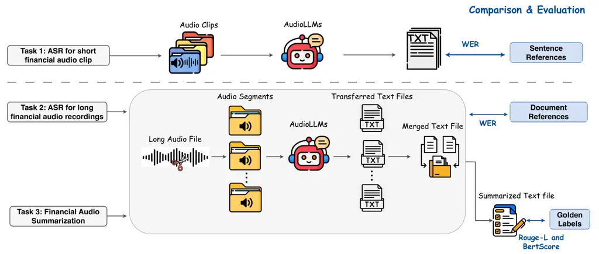
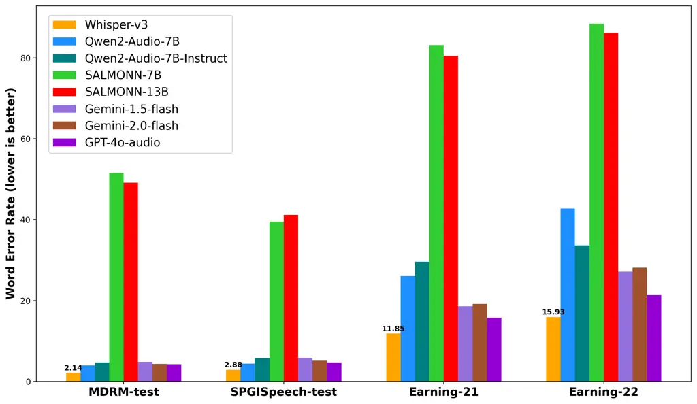
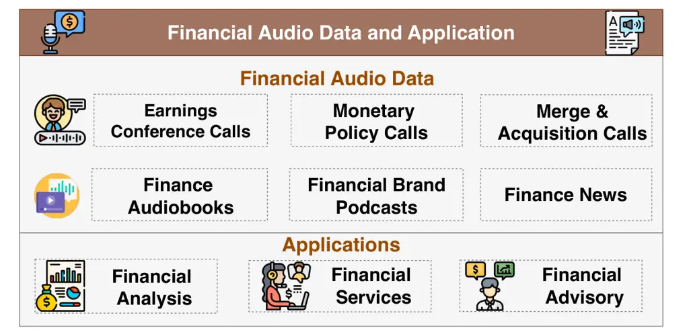
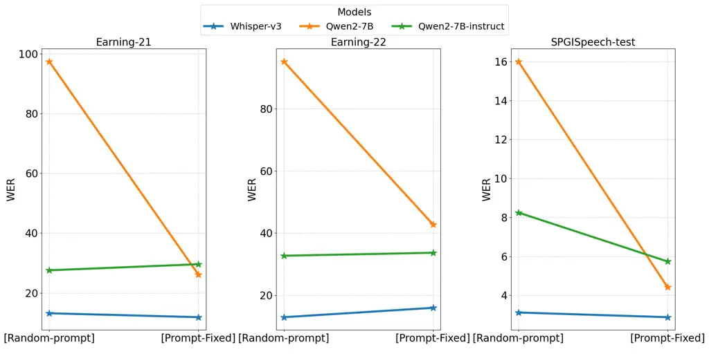

# FinAudio: A Benchmark for Audio Large Language Models in Financial Applications

Yupeng Cao Affiliation: Stevens Institute of Technology    Haohang Li
Affiliation: Stevens Institute of Technology    Yangyang Yu
Affiliation: Stevens Institute of Technology    Shashidhar Reddy Javaji
Affiliation: Stevens Institute of Technology    Yueru He
Affiliation: Columbia University    Jimin Huang Affiliation: The Fin AI
   Qianqian Xie Affiliation: The Fin AI    Fabrizio Dimino
Affiliation: Domyn    Xiao-Yang Liu Affiliation: Columbia University   
K.P. Subbalakshmi Affiliation: Stevens Institute of Technology   
Meikang Qiu Affiliation: Augusta University    Sophia Ananiadou
Affiliation: The University of Manchester    Jian-Yun Nie
Affiliation: University of Montreal

###### Abstract

Audio Large Language Models (AudioLLMs) have received widespread
attention and have significantly improved performance on audio tasks
such as conversation, audio understanding, and automatic speech
recognition (ASR). Despite these advancements, there is an absence of a
benchmark for assessing AudioLLMs in financial scenarios, where audio
data, such as earnings conference calls and CEO speeches, are crucial
resources for financial analysis and investment decisions. In this
paper, we introduce FinAudio, the first benchmark designed to evaluate
the capacity of AudioLLMs in the financial domain. We first define three
tasks based on the unique characteristics of the financial domain: 1)
ASR for short financial audio, 2) ASR for long financial audio, and 3)
summarization of long financial audio. Then, we curate two short and two
long audio datasets, respectively, and develop a novel dataset for
financial audio summarization, comprising the FinAudio benchmark. We
evaluate seven prevalent AudioLLMs on FinAudio. Our evaluation reveals
the limitations of existing AudioLLMs in the financial domain and offers
insights for improving AudioLLMs ([Project
Page](https://finaudio-doc.readthedocs.io/en/latest/)).

## 1 Introduction

Timely and accurate interpretation of financial audio underpins
sentiment analysis and investment decision-making \[1, 2, 3\]. Financial
audio data serves as a critical foundation across diverse scenarios,
including earnings conference calls, investor presentations, and
customer service interactions. Recent developments in financial AI have
been propelled by breakthroughs in language-centric models, particularly
large language models (e.g., BloombergGPT \[4\], PIXIU \[5\],
FinGPT \[6\]) and by evaluation suites such as FinBen \[7\] that
benchmark LLM performance on financial NLP tasks. However, a critical
gap remains: none of these models or benchmarks addresses financial
audio, and even the latest multimodal model (FinLLaVA-8B \[8\], designed
to handle text, images, and charts) cannot process audio inputs.

In the general domain, AudioLLMs incorporate an audio encoder into
language models \[9, 10, 11, 12, 13, 14, 15\]. This integration allows
LLMs to accept audio inputs and perform tasks such as automatic speech
recognition (ASR) and spoken question answering (SQA). These
audio-capable LLMs have demonstrated effectiveness on general
benchmarks \[16, 17\]. Yet, the financial domain still lacks a dedicated
audio benchmark, leaving researchers unable to systematically evaluate
model performance on financial audio or compare different approaches,
thereby hindering progress in audio-driven financial applications, such
as investment advisory services.

To address this critical need, we introduce FinAudio, the first AudioLLM
benchmark tailored for the financial domain. Specifically, FinAudio
includes three tasks representing real-world financial scenarios: (1)
ASR for short financial audio clips (each under 1 minute), (2) ASR for
long financial audio recordings (45–60 minutes, e.g. earnings calls),
and (3) summarization of financial audio data. To support these tasks,
we curated five financial audio datasets. Four are from existing
open-source datasets (two with short clips and two with full-length
recordings). Additionally, we created a new dataset tailored for
financial audio summarization, named FinAudioSum. Altogether, the
FinAudio benchmark provides 400+ hours of financial audio data,
comparable in scale to general-domain AudioLLM benchmarks.

On FinAudio, we evaluate seven representative AudioLLMs and observed the
following: (a) AudioLLMs achieve higher accuracy on short clips than on
long recordings; (b) Errors in long-audio ASR directly undermine the
quality of audio summaries. (c) AudioLLMs exhibit significant
variability in their robustness to different instructions; (d) The
open-source model Whisper-v3 outperforms closed-source models on all ASR
tasks, offering a low-cost, privacy-preserving solution for financial
applications. Our main contributions are below: (1) We present FinAudio,
the first comprehensive open-source benchmark for evaluating AudioLLMs
on financial audio tasks. (2) We design three realistic financial speech
tasks and compile five corresponding datasets, including the new
FinAudioSum dataset for audio summarization. (3) We conduct an extensive
evaluation of seven AudioLLMs on these tasks, highlighting each model’s
strengths and limitations and outlining challenges for future research.
FinAudio aims to accelerate the development of robust AudioLLMs for
financial applications, promoting transparency and accessibility of
financial information processing.

## 2 The FinAudio Benchmark

Figure 1 is an overview of FinAudio. This section defines three key
tasks in FinAudio and describes how we constructed the evaluation
datasets. Each task corresponds to a specific real-world financial audio
scenario, allowing us to test different aspects of an AudioLLM’s
capabilities. For each task, we both compile existing datasets and
develop new ones to ensure a comprehensive evaluation.

Figure 1: Evaluation pipelines for the three FinAudio’s tasks.

### 2.1 FinAudio Tasks

#### 2.1.1 ASR for short financial audio clip

Automatic Speech Recognition converts spoken language into text. Short
audio clips from financial chatbot assistants or financial news often
contain dense financial terms. This task evaluates AudioLLMs’ accuracy
in transcribing financial audio clips, directly impacting applications
such as financial voice assistants. In this task, each input is
represented as $`(A,Q,R)`$, where $`A`$ is an audio clip, $`Q`$ is the
prompt instruction, and $`R`$ is the reference transcript. The
transcribed text $`T`$ is generated as $`T=\textit{AudioLLM}(A,Q)`$. The
Word Error Rate (WER) is computed as: $`\text{WER}=\frac{S+D+I}{N}`$,
where $`S`$, $`D`$, and $`I`$ represent the number of substitutions,
deletions, and insertions, respectively, and $`N`$ is the total number
of words in the reference ($`N=S+D+C`$, with $`C`$ indicating correct
words). A lower WER indicates better ASR performance.

#### 2.1.2 ASR for long financial audio recordings

Long audio recordings are common in finance, capturing events like
quarterly earnings calls, mergers and acquisitions discussions, and
central bank meetings. In this scenario, ASR task is thus used to
transcribe lengthy financial audio, evaluating AudioLLMs’ capability to
handle extended audio inputs. Challenges include long durations and
complex financial terminology. This task assesses the models’ ability to
consistently maintain transcription accuracy over long recordings, which
is essential for comprehensive financial analysis. To handle the varying
window lengths and the inability of current AudioLLMs to process long
audio files within a single window, we standardize audio inputs to
30-second segments, dividing each raw audio $`A`$ into chunks
$`\{a_{1},a_{2},\dots,a_{n}\}`$. We transcribe each chunk $`a_{i}`$
using AudioLLMs into $`t_{i}`$, and concatenated the resulting
transcriptions as $`T=[t_{1};t_{2};\dots;t_{n}]`$. WER then evaluates
the transcription quality.

#### 2.1.3 Financial audio summarization

This task assesses the ability of AudioLLMs to accurately summarize
lengthy financial audio content, a scenario specific to financial
applications. It evaluates models’ understanding of financial
discussions, extraction of key points, and effectiveness in condensing
lengthy audio into concise summaries. This capability is crucial for
stakeholders needing quick insights from extensive financial dialogues,
such as investor briefings or regulatory meetings.

AudioLLMs can process audio with a maximum length of 30 seconds.
Therefore, AudioLLM cannot perform the summarization task independently,
we developed a processing pipeline. Given input data represented as
$`(A,Q,L)`$, where $`A`$ denotes the long audio recording, $`Q`$ the
prompt instruction, and $`L`$ the reference summary, the pipeline first
segments the long audio into smaller chunks (see Section 2.1.2). Each
chunk is transcribed by an AudioLLM into text segments $`t_{i}`$, which
are combined into a complete transcription $`T`$. This transcription is
then input into an LLM to generate the summary $`S`$. Summarization
performance is evaluated using two widely adopted summarization
evaluation metrics: Rouge-L \[18\] and BertScore \[19\], computed
between the generated summary ($`S`$) and the reference summary ($`L`$).
The higher values for these metrics indicate better AudioLLM
performance.

### 2.2 FinAudio Datasets

The FINAUDIO benchmark contributes a unified framework by careful
curation and task reformulation, transforming existing datasets into
meaningful and comprehensive evaluation tasks. As summarized in Table 1,
we construct MDRM-test and SPGISpeech-test by further developing their
respective existing datasets for short ASR evaluation, create
Earnings-21 and Earnings-22 test sets for long ASR tasks, and introduce
our newly structured FinAudioSum for audio summarization task. Through
this curation process, we establish over 430 hours of purposefully
organized financial audio that addresses domain-specific evaluation
needs not met by the original datasets. Detailed dataset descriptions
are provided in Appendix B.

| Dataset Name    | Type        | \#Samples | \# Hours | Task                               | Metrics             |
| --------------- | ----------- | --------- | -------- | ---------------------------------- | ------------------- |
| MDRM-test       | Short Clips | 22,208    | 87       | short financial clip ASR           | WER                 |
| SPGISpeech-test | Short Clips | 39,341    | 130      | short financial clip ASR           | WER                 |
| Earning-21      | Long Audio  | 44        | 39       | long financial audio ASR           | WER                 |
| Earning-22      | Long Audio  | 125       | 120      | long financial audio ASR           | WER                 |
| FinAudioSum     | Long Audio  | 64        | 55       | long financial audio Summarization | Rouge-L & BertScore |

Table 1: Statistics of the datasets in the FinAudio benchmark.

## 3 Experiment Results and Analysis

We describe the evaluated AudioLLMs and the experiment setup in the
appendix C.

### 3.1 Results on ASR Tasks

##### Results on short financial audio clips ASR.

Table 2 shows that Whisper-v3 achieves notably low WER scores (2%–3%) on
both datasets, highlighting its robust speech recognition without
domain-specific tuning. The Qwen2-Audio series (base and instruct
versions), GTP-4o-audio, and Gemini exhibit moderate performance with
WER scores between 4% and 6%. Conversely, SALMONN (7B and 13B)
demonstrates substantially lower effectiveness, with WER around or
exceeding 40%–50%. Despite SALMONN’s limited performance, these findings
highlight the potential of other mainstream AudioLLMs to support
voice-based financial services, particularly conversational assistants
handling iterative short audio communications.

Datasets Models Whisper Qwen2-Audio Qwen2-Audio SALMONN SALMONN Gemini
Gemini GPT-4o-audio -v3 -7B -7B-Instruct -7B -13B -1.5-flash -2.0-flash
-transcribe MDRM-test 2.14 3.97 4.68 51.52 49.17 4.850 4.321 4.23
SPGISpeech-test 2.88 4.42 5.74 39.51 41.17 5.802 5.143 4.66 Earning-21
11.85 26.06 29.58 83.20 80.54 18.58 19.17 15.78 Earning-22 15.93 42.76
33.65 88.50 86.23 27.13 28.12 21.37

Table 2: Comparison of model performance based on WER across various
speech datasets on ASR.

##### Results on long financial audio recording ASR.

Figure 2: WER on models across different datasets. Whisper-v3
consistently achieved the lowest WER.

In the long financial audio ASR task, Whisper-v3 remained the top
performance. It achieves lower WER in the range of approximately 12% -
16%. The GPT-4o-audio emerged as the second-best performer, with WER
spanning roughly 15%–21%. The error rate of Qwen2-Audio series models
has also increased significantly. SALMONN once again reported the
highest error rates across both financial datasets (80–88%). These
results reveal a decline in performance across all AudioLLMs, indicating
that AudioLLMs face significant challenges when processing long
financial audio data. The SALMONN series models performed poorly on both
ASR tasks. Upon reviewing the experimental logs, we observed that
SALMONN frequently produced empty outputs or failed to understand prompt
instructions. This suggests that SALMONN might be overfitting to
specific audio data or tasks, lacks robust instruction-following
capabilities, and exhibits a limited understanding of financial audio
content.

In Figure 2, we find no significant difference in performance between
Gemini-1.5 and Gemini-2.0. The open-source model Whisper-v3 achieves the
best overall performance across all datasets. These results demonstrate
robust capabilities even within long financial audio recognition. The
Qwen-2 series, another open-source model, delivers comparable results to
the closed-source Gemini models on short-audio ASR tasks but performs
slightly worse on long-audio ASR. These findings demonstrate that
open-source models can outperform their closed-source counterparts in
financial audio scenarios, indicating that open-source AudioLLMs
represent an effective, cost-efficient, and privacy-preserving solution
for developing AI-driven financial products.

### 3.2 Results on summarization task and ablation study

For summarization, we evaluated Whisper-v3, Qwen2-Audio-7B-Instruct,
Gemini-1.5-flash and GPT-4o-audio. The overall summarization quality
depends on the ASR performance of AudioLLMs. Gemini-1.5-flash achieved
the best ROUGE-L and BERTScore, while Whisper slightly outperformed
Qwen2-Audio-7B-Instruct, showing strong general summarization ability
without domain-specific tuning. We describe the detailed results in
Appendix D

We also examined prompt robustness across ASR tasks. Whisper-v3 and
Qwen2-Audio-7B-Instruct maintained stable performance under varied
prompts, whereas Qwen2-Audio-7B was more sensitive, highlighting the
importance of instruction tuning. Finally, our error analysis revealed
that AudioLLMs often struggle with financial terminology and numerical
information, underscoring the need for improved domain adaptation. We
show the detailed analysis and visualization in Appendix E. We also
conduct error analysis in Appendix F.

## 4 Conclusion and Research Outlook

We propose FinAudio, an AudioLLM Benchmark for financial audio data. We
constructed a total of 400h+ of audio data for three tasks and evaluated
it on seven AudioLLMs. Our systematic evaluation revealed substantial
challenges, notably the pronounced difficulty models face in accurately
processing long-form financial audio and specialized terminology. Future
research directions for applying AudioLLMs in the financial industry
include (1) extending the input context window length of AudioLLM, (2)
enhancing the models’ comprehension of numerical transcription and
specialized financial terminology, and (3) improving their reasoning
capabilities in financial contexts.

## References

- \[1\] Y. Qin and Y. Yang (2019) What you say and how you say it
  matters: predicting stock volatility using verbal and vocal cues. In
  Proceedings of the 57th Annual Meeting of the Association for
  Computational Linguistics, pp. 390–401. Cited by: 1st item, §B.1, §1.
- \[2\] L. Yang, T. L. J. Ng, B. Smyth, and R. Dong (2020) Html:
  hierarchical transformer-based multi-task learning for volatility
  prediction. In Proceedings of The Web Conference 2020, pp. 441–451.
  Cited by: §1.
- \[3\] Y. Cao, Z. Chen, Q. Pei, N. Lee, K. Subbalakshmi, and P. M.
  Ndiaye (2024) ECC Analyzer: extracting trading signal from earnings
  conference calls using large language model for stock volatility
  prediction. In Proceedings of the 5th ACM International Conference on
  AI in Finance, pp. 257–265. Cited by: §1.
- \[4\] S. Wu, O. Irsoy, S. Lu, V. Dabravolski, M. Dredze, S.
  Gehrmann, P. Kambadur, D. Rosenberg, and G. Mann (2023) BloombergGPT:
  a large language model for finance. arXiv preprint arXiv:2303.17564.
  Cited by: §A.2, §1.
- \[5\] Q. Xie, W. Han, X. Zhang, Y. Lai, M. Peng, A. Lopez-Lira, and J.
  Huang (2023) PIXIU: A comprehensive benchmark, instruction dataset and
  large language model for finance. Advances in Neural Information
  Processing Systems 36, pp. 33469–33484. Cited by: §A.2, §1.
- \[6\] X. Liu, G. Wang, H. Yang, and D. Zha FinGPT: democratizing
  internet-scale data for financial large language models. In NeurIPS
  2023 Workshop on Instruction Tuning and Instruction Following, Cited
  by: §A.2, §1.
- \[7\] Q. Xie, W. Han, Z. Chen, R. Xiang, X. Zhang, Y. He, M. Xiao, D.
  Li, Y. Dai, D. Feng, et al. (2025) Finben: a holistic financial
  benchmark for large language models. Advances in Neural Information
  Processing Systems 37, pp. 95716–95743. Cited by: §A.2, §1.
- \[8\] Q. Xie, D. Li, M. Xiao, Z. Jiang, R. Xiang, X. Zhang, Z.
  Chen, Y. He, W. Han, Y. Yang, et al. (2024) Open-finllms: open
  multimodal large language models for financial applications. arXiv
  preprint arXiv:2408.11878. Cited by: §A.2, §1.
- \[9\] J. Wu, W. Gan, Z. Chen, S. Wan, and S. Y. Philip (2023)
  Multimodal large language models: A survey. In 2023 IEEE International
  Conference on Big Data (BigData), pp. 2247–2256. Cited by: §1.
- \[10\] D. Zhang, Y. Yu, J. Dong, C. Li, D. Su, C. Chu, and D.
  Yu (2024) MM-LLMs: recent advances in multimodal large language
  models. arXiv preprint arXiv:2401.13601. Cited by: §1.
- \[11\] A. Radford, J. W. Kim, T. Xu, G. Brockman, C. McLeavey, and I.
  Sutskever (2023) Robust speech recognition via large-scale weak
  supervision. In International conference on machine learning,
  pp. 28492–28518. Cited by: §A.1, Appendix C, §1.
- \[12\] S. Hu, L. Zhou, S. Liu, S. Chen, L. Meng, H. Hao, J. Pan, X.
  Liu, J. Li, S. Sivasankaran, et al. (2024) WavLLM: towards robust and
  adaptive speech large language model. arXiv preprint arXiv:2404.00656.
  Cited by: §A.1, §1.
- \[13\] Y. Chu, J. Xu, X. Zhou, Q. Yang, S. Zhang, Z. Yan, C. Zhou,
  and J. Zhou (2023) Qwen-Audio: advancing universal audio understanding
  via unified large-scale audio-language models. arXiv preprint
  arXiv:2311.07919. Cited by: §A.1, §1.
- \[14\] Y. Chu, J. Xu, Q. Yang, H. Wei, X. Wei, Z. Guo, Y. Leng, Y.
  Lv, J. He, J. Lin, et al. (2024) Qwen2-Audio technical report. arXiv
  preprint arXiv:2407.10759. Cited by: §A.1, Appendix C, §1.
- \[15\] C. Tang, W. Yu, G. Sun, X. Chen, T. Tan, W. Li, L. Lu, M.
  Zejun, and C. Zhang SALMONN: towards generic hearing abilities for
  large language models. In The Twelfth International Conference on
  Learning Representations, Cited by: §A.1, Appendix C, §1.
- \[16\] Q. Yang, J. Xu, W. Liu, Y. Chu, Z. Jiang, X. Zhou, Y. Leng, Y.
  Lv, Z. Zhao, C. Zhou, et al. (2024) AIR-Bench: benchmarking large
  audio-language models via generative comprehension. In Proceedings of
  the 62nd Annual Meeting of the Association for Computational
  Linguistics (Volume 1: Long Papers), pp. 1979–1998. Cited by: §A.1,
  §1.
- \[17\] B. Wang, X. Zou, G. Lin, S. Sun, Z. Liu, W. Zhang, Z. Liu, A.
  Aw, and N. F. Chen (2024) AudioBench: a universal benchmark for audio
  large language models. arXiv preprint arXiv:2406.16020. Cited by:
  §A.1, Appendix E, §1.
- \[18\] C. Lin (2004) ROUGE: a package for automatic evaluation of
  summaries. In Text summarization branches out, pp. 74–81. Cited by:
  §2.1.3.
- \[19\] T. Zhang, V. Kishore, F. Wu, K. Q. Weinberger, and Y. Artzi
  BERTScore: evaluating text generation with bert. In International
  Conference on Learning Representations, Cited by: §2.1.3.
- \[20\] Y. Su, J. Bai, Q. Xu, K. Xu, and Y. Dou (2025) Audio-language
  models for audio-centric tasks: a survey. arXiv preprint
  arXiv:2501.15177. Cited by: §A.1.
- \[21\] G. Team, R. Anil, S. Borgeaud, J. Alayrac, J. Yu, R.
  Soricut, J. Schalkwyk, A. M. Dai, A. Hauth, K. Millican, et al. (2023)
  Gemini: a family of highly capable multimodal models. arXiv preprint
  arXiv:2312.11805. Cited by: §A.1, Appendix C.
- \[22\] Y. Su, T. Lan, H. Li, J. Xu, Y. Wang, and D. Cai (2023)
  PandaGPT: one model to instruction-follow them all. In Proceedings of
  the 1st Workshop on Taming Large Language Models: Controllability in
  the era of Interactive Assistants!, pp. 11–23. Cited by: §A.1.
- \[23\] R. Huang, M. Li, D. Yang, J. Shi, X. Chang, Z. Ye, Y. Wu, Z.
  Hong, J. Huang, J. Liu, et al. (2024) AudioGPT: understanding and
  generating speech, music, sound, and talking head. In Proceedings of
  the AAAI Conference on Artificial Intelligence, Vol. 38,
  pp. 23802–23804. Cited by: §A.1.
- \[24\] D. Zhang, S. Li, X. Zhang, J. Zhan, P. Wang, Y. Zhou, and X.
  Qiu (2023) SpeechGPT: empowering large language models with intrinsic
  cross-modal conversational abilities. In Findings of the Association
  for Computational Linguistics: EMNLP 2023, pp. 15757–15773. Cited by:
  §A.1.
- \[25\] P. K. Rubenstein, C. Asawaroengchai, D. D. Nguyen, A. Bapna, Z.
  Borsos, F. d. C. Quitry, P. Chen, D. E. Badawy, W. Han, E. Kharitonov,
  et al. (2023) AudioPALM: a large language model that can speak and
  listen. arXiv preprint arXiv:2306.12925. Cited by: §A.1.
- \[26\] Y. Yang, Y. Tang, and K. Y. Tam (2023) InvestLM: A large
  language model for investment using financial domain instruction
  tuning. arXiv preprint arXiv:2309.13064. Cited by: §A.2.
- \[27\] G. Bhatia, H. Cavusoglu, M. Abdul-Mageed, et al. (2024)
  FinTral: a family of GPT-4 level multimodal financial large language
  models. In Findings of the Association for Computational Linguistics
  ACL 2024, pp. 13064–13087. Cited by: §A.2.
- \[28\] G. Ang and E. Lim (2022) Guided attention multimodal multitask
  financial forecasting with inter-company relationships and global and
  local news. In Proceedings of the 60th Annual Meeting of the
  Association for Computational Linguistics (Volume 1: Long Papers),
  pp. 6313–6326. Cited by: §A.2.
- \[29\] Y. Yu and J. W. Suchow (2022) Deep tensor factorization models
  of first impressions. External Links:
  [Link](https://api.semanticscholar.org/CorpusID:253065093) Cited by:
  §A.2.
- \[30\] R. S. Shah, K. Chawla, D. Eidnani, A. Shah, W. Du, S. Chava, N.
  Raman, C. Smiley, J. Chen, and D. Yang (2022) When flue meets flang:
  benchmarks and large pre-trained language model for financial domain.
  arXiv preprint arXiv:2211.00083. Cited by: §A.2.
- \[31\] P. K. O’Neill, V. Lavrukhin, S. Majumdar, V. Noroozi, Y.
  Zhang, O. Kuchaiev, J. Balam, Y. Dovzhenko, K. Freyberg, M. D.
  Shulman, et al. (2021) SPGISpeech: 5,000 hours of transcribed
  financial audio for fully formatted end-to-end speech recognition.
  arXiv preprint arXiv:2104.02014. Cited by: 2nd item, §B.1.
- \[32\] M. Del Rio, N. Delworth, R. Westerman, M. Huang, N.
  Bhandari, J. Palakapilly, Q. McNamara, J. Dong, P. Zelasko, and M.
  Jetté (2021) Earnings-21: a practical benchmark for ASR in the wild.
  arXiv preprint arXiv:2104.11348. Cited by: 1st item.
- \[33\] M. Del Rio, P. Ha, Q. McNamara, C. Miller, and S.
  Chandra (2022) Earnings-22: a practical benchmark for accents in the
  wild. arXiv preprint arXiv:2203.15591. Cited by: 2nd item.
- \[34\] R. Mukherjee, A. Bohra, A. Banerjee, S. Sharma, M. Hegde, A.
  Shaikh, S. Shrivastava, K. Dasgupta, N. Ganguly, S. Ghosh, et
  al. (2022) ECTSum: a new benchmark dataset for bullet point
  summarization of long earnings call transcripts. In Proceedings of the
  2022 Conference on Empirical Methods in Natural Language Processing,
  pp. 10893–10906. Cited by: §B.3.

## Appendix A Related Work

### A.1 Advancements in AudioLLM

Among the modalities addressed by multimodal LLMs, audio stands out as
particularly critical and challenging \[20\]. Several multimodal models,
such as Gemini Pro \[21\] and PandaGPT \[22\], have been adapted to
process audio data. Prominent AudioLLMs include AudioGPT \[23\],
SpeechGPT \[24\], AudioPaLM \[25\], Qwen-Audio \[13\], WavLLM \[12\],
Whisper \[11\], Salmonn \[15\], and Qwen2-Audio \[14\]. Correspondingly,
general-domain benchmarks like AirBench \[16\], emphasizing
conversational scenarios, and AudioBench \[17\], evaluating eight tasks
across twenty datasets, have been developed to assess AudioLLMs.
However, these benchmarks contain limited financial audio data,
inadequate for a comprehensive evaluation in financial contexts.

Figure 3: An overview of critical financial audio data types and
applications.

### A.2 Progress in Multimodal Financial LLMs And Benchmark

Recent advances in general-domain LLMs have accelerated the emergence of
specialized financial LLMs, such as FinGPT \[6\], InvestLM \[26\], and
BloombergGPT \[4\]. The progression toward multimodal financial
LLMs—including Open-FinLLMs \[8\] and FinTral \[27\]—further highlights
efforts to address complex financial tasks involving charts and tabular
data. These multimodal models overcome the limitations of traditional
approaches \[28, 27, 29\] by more flexibly adapting to financial
contexts. As financial LLMs become increasingly specialized, the demand
for robust evaluation grows. In response, various benchmarks have been
proposed. FLUE \[30\] introduced the first benchmark for financial NLP
evaluation, covering tasks such as sentiment analysis, headline
classification, named entity recognition, structure boundary detection,
and question answering. PIXIU \[5\] extended these evaluations into
multimodal document analysis, while FinBen \[7\] significantly expanded
coverage, featuring 36 datasets across 24 financial tasks. Despite these
advances, existing benchmarks remain predominantly text-focused,
overlooking audio—an essential modality in financial applications.

## Appendix B Dataset

### B.1 Short financial audio clip datasets:

Two datasets provide financial audio clips: MDRM \[1\] and
SPGISpeech \[31\], both derived from earnings conference call
recordings. The original audio data was segmented at the sentence level
and aligned with corresponding transcripts. Each dataset is initially
split into training and test subsets; we utilize only the test sets for
evaluation.

- •
  MDRM \[1\]: This is the first dataset to use multimodal financial data
  for stock volatility and movement prediction. MDRM includes both audio
  recordings and text transcripts from the 2017 earnings calls of 500
  major companies listed on the S&P 500 and traded on U.S. stock
  exchanges. There are a total of 280 companies with 572 earnings
  conference calls. The author further segmented earnings conference
  calls into individual sentences based on the text and conducted
  corresponding audio segments. There are a total of 88,829 audio clips.
  We split the dataset into training and test sets using a 75%–25%
  ratio, with the test portion utilized as the evaluation set for the
  benchmark. The MDRM-test set includes 22,208 audio clips totaling 87
  hours.
- •
  SPGISpecch \[31\]: The dataset comprises 5,000 hours of earnings
  conference call recordings. The original audio is segmented by
  sentence and professionally transcribed into a structured format. Each
  audio segment is meticulously segmented by sentences, ranging from 5
  to 15 seconds in duration. Partitioned initially into training and
  test sets, our analysis focuses solely on the test subset, comprising
  39,341 clips and approximately 130 hours of audio.

### B.2 Long financial audio recording datasets:

There are two other publicly available earnings conference call datasets
containing raw audio recordings, which can be leveraged for the long
financial audio ASR task:

- •
  Earnings-21 \[32\]: The dataset comprises 44 complete earnings
  conference call recordings from 2021 (approximately 39 hours). A
  distinguishing characteristic of Earnings-21 is its emphasis on named
  entities, financial jargon, and numerical data, which often pose
  difficulties for ASR models. The aligned transcripts are further
  enhanced with detailed formatting and entity tags, making it possible
  to conduct granular error analysis.
- •
  Earnings-22 \[33\]: This is a updated version of Earnings-21. It has
  125 audio samples with a total of 120 hours. Each audio recording
  includes a corresponding manual transcript. We use both datasets
  entirely for evaluation.

### B.3 FinAudioSum

We introduce FinAudioSum, a novel dataset created explicitly for
long-form financial audio summarization tasks, building upon the
foundation of the ECTSum dataset \[34\]. While ECTSum was initially
designed for summarizing earnings calls based solely on textual
transcripts, our contribution uniquely expands this resource into the
audio modality, addressing a critical gap in multimodal financial
summarization research. ECTSum comprises 2,425 earnings transcripts
paired with expert-generated, telegram-style summaries. We obtain
corresponding audio recordings for the ECTSum test set from
earningcast¹¹ 1 [https://earningscast.com/](https://earningscast.com/).
To ensure uniqueness and avoid redundancy, we carefully eliminate any
overlapping audio entries from Earnings-21 and Earnings-22 datasets,
covering the years 2019–2022. The final FinAudioSum dataset includes 64
recordings totaling 55 hours.

Task Input Instruction Output ASR for Short financial audio clip
![[Uncaptioned
image]](arxiv-2503-20990--6a0599e9d891.figures/figure-4.webp) fast
fashion has made it possible for everyone to have access to
aesthetically thoughtful clothing (7s) Convert the audio speech into a
text transcript. fast fashion has made it possible for everyone to have
access to aesthetically thoughtful clothing ASR for Long financial audio
recording ![[Uncaptioned
image]](arxiv-2503-20990--6a0599e9d891.figures/figure-4.webp) Good
morning, everyone, and welcome to the NextEra Energy Inc… (40min+)
Transcribe the spoken words into written form. Good morning, everyone,
and welcome to the NextEra Energy Inc… FinAudioSum ![[Uncaptioned
image]](arxiv-2503-20990--6a0599e9d891.figures/figure-4.webp) Good
morning, everyone, and welcome to the NextEra Energy Inc… (40min+)
Listen to the audio and provide the text version. In past three month,
NextEra Energy Inc release…

Table 3: Examples of data in the FinAudio evaluation suite.

## Appendix C Model and Experiment Setup

We evaluate the performance of seven representative AudioLLMs on the
FinAudio benchmark. The chosen models include five open-source
models—Whisper \[11\], Qwen2-Audio-7B, Qwen2-Audio-7B-instruct \[14\],
SALMONN-7B, and SALMONN-13B \[15\]—and three closed-source models,
Gemini-1.5-flash and Gemini-2.0-flash \[21\], and GPT-4o-audio. These
models span various parameter sizes, open- and closed-source
implementations, and include both base and instruction-tuned versions,
enabling a comprehensive assessment of AudioLLMs for financial audio
tasks. This comprehensive evaluation enables a thorough analysis of
current AudioLLMs’ strengths and limitations within financial audio
contexts.

To ensure fairness, we standardized the prompt as: “Convert the audio
speech into a text transcript,”. For the summarization task, we employed
GPT-4o (temperature=0) to generate summaries from the model-produced
transcripts, ensuring a uniform summarization baseline. All open-source
AudioLLM evaluations are conducted on two NVIDIA RTX A6000 GPUs, each
equipped with 48GB of DRAM, necessitating approximately 200 hours per
evaluation round. Additionally, to account for experimental variability
and ensure the robustness of our assessments, each experiment was
conducted three times, with the reported results representing the
average performance.

## Appendix D Results on summarization task

Dataset Whisper Qwen2-Audio-7B-Instruct Gemini-1.5-flash GPT-4o-audio
Rouge-L BertScore Rouge-L BertScore Rouge-L BertScore Rouge-L BertScore
FinAudioSum 0.053 0.514 0.048 0.467 0.072 0.553 0.063 0.508

Table 4: Summarization performance using Rouge-L and BertScore.

Given the high WER in the ASR tasks, effective summarization cannot be
reliably performed by models with excessive transcription errors.
Therefore, we excluded the SALMONN model from the summarization
evaluation. Balancing model performance and computational cost, we
selected three models—Whisper-v3, Qwen2-Audio-7B-Instruct, and
Gemini-1.5-flash for summarization experiments.

As Table 4 shows, the summarization performance across all evaluated
models is moderate. The overall summarization quality depends on the ASR
performance of AudioLLMs. Gemini-1.5-flash achieves the highest scores
in both ROUGE-L (0.072) and BERTScore (0.553), suggesting that Gemini’s
transcription accuracy and semantic fidelity during the ASR stage align
more closely with the ground-truth labels. Whisper outperforms
Qwen2-Audio-7B-Instruct (ROUGE-L: 0.053 vs. 0.048; BERTScore: 0.514 vs.
0.467), demonstrating its robust general summarization capability even
without fine-tuning on financial domain data.

## Appendix E Prompt Robustness Analysis

The previous experiments indicated that different models respond
differently to the prompt. Therefore, we further conducted a prompt
robustness analysis on three AudioLLMs: Whisper-v3, Qwen2-Audio-7B, and
Qwen2-Audio-7B-Instruct - across three ASR datasets. Following the
approach from AudioBench \[17\], we constructed an instruction set
comprising 10 distinct prompts to evaluate the robustness of AudioLLMs.
These prompts convey similar instructions expressed in diverse
formulations. The detailed prompts are listed as follows.

Number Prompt Set 1 Convert the audio speech into a text transcript. 2
Transcribe the spoken words into written form. 3 Listen to the audio and
provide the text version. 4 Transform the speech into a text document. 5
Capture the spoken language and convert it to text. 6 Decode the audio
and give me the written transcription. 7 Recognize the verbal
communication and transcribe it into text. 8 Turn the speech input into
a text transcription. 9 Process the audio speech and provide the text
output. 10 Translate the spoken conversation into written text.

Table 5: The evaluation instruction set for AudioLLMs

For each audio input, we randomly selected one prompt from this set to
observe how variations in prompts affected model performance. This
approach closely simulates real-world scenarios, where user commands
often differ in wording yet convey the same intent.

Figure 4: Prompt robustness analysis: comparison of WER between
fixed-prompt and random-prompt trials.

We compare the WER in Figure 4 using two prompt types: the random prompt
described above and the fixed prompt from Section C, used in the main
results (Table 2). Results for Qwen2-7B-Instruct and Whisper-v3 remain
consistent, indicating their robustness across prompts. However, the
performance of Qwen2-7B notably declines under varied prompts,
exhibiting higher WER. The substantial performance gap between Qwen2-7B
and Qwen2-7B-Instruct indicates that this AudioLLM is sensitive to
prompt variations, providing empirical support for the necessity of
instruction-tuning in AudioLLM training.

## Appendix F Error Analysis

The experimental results demonstrate that ASR performance significantly
influences downstream tasks, such as summarization. Therefore, we take
an error analysis. During the ASR tasks, we noticed that AudioLLMs
sometimes misinterpret numerical information and specialized financial
terms in speech. Such errors significantly impact the factual accuracy
of AudioLLMs within financial contexts. Through detailed analysis of the
outputs, we identified the following major error categories: 1)
Financial terminology error: Financial audio frequently contains
specialized financial proper nouns, leading AudioLLMs to produce
translation errors. For example, the company name “NextEra Energy" was
incorrectly transcribed as “Era Energy." 2) Numerical information error:
Financial audio typically includes extensive numerical information, such
as monetary amounts. During transcription, AudioLLMs frequently
encounter issues like digit inconsistencies or missing monetary units.

This analysis will guide future model training by prioritizing
improvements in numerical recognition and enhancing the model’s ability
to accurately transcribe financial terminology.
