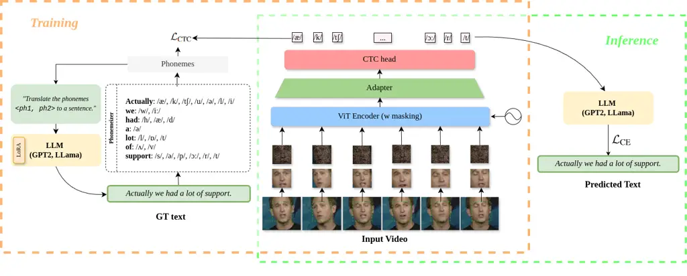
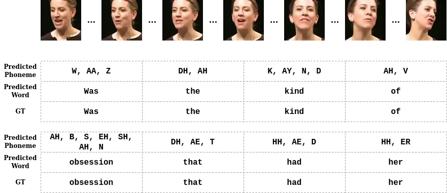
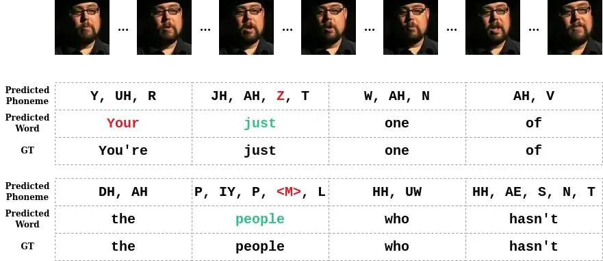
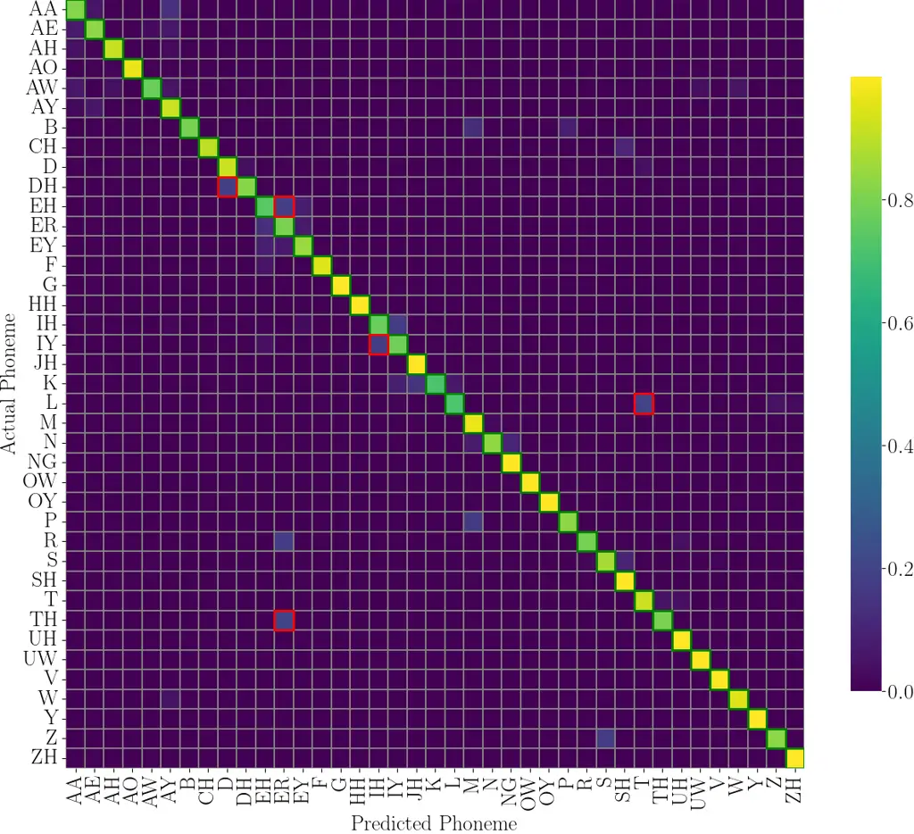
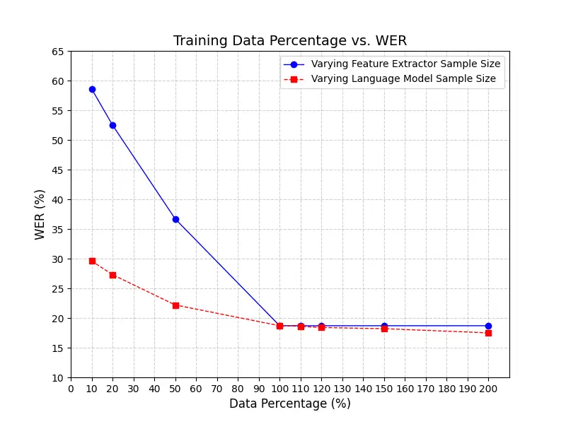

# VALLR: Visual ASR Language Model for Lip Reading

Marshall Thomas    Edward Fish    Richard Bowden Affiliation: University
of Surrey Email: [mt00893@surrey.ac.uk](mailto:)    ef0036@surrey.ac.uk
   r.bowden@surrey.ac.uk

###### Abstract

Lip Reading, or Visual Automatic Speech Recognition (V-ASR), is a
complex task requiring the interpretation of spoken language exclusively
from visual cues, primarily lip movements and facial expressions. This
task is especially challenging due to the absence of auditory
information and the inherent ambiguity when visually distinguishing
phonemes that have overlapping visemes, where different phonemes appear
identical on the lips. Current methods typically attempt to predict
words or characters directly from these visual cues, but this approach
frequently encounters high error rates due to coarticulation effects and
viseme ambiguity. We propose a novel two-stage, phoneme-centric
framework for Visual Automatic Speech Recognition (V-ASR) that addresses
these longstanding challenges. First, our model predicts a compact
sequence of phonemes from visual inputs using a Video Transformer with a
CTC head, thereby reducing the task complexity and achieving robust
speaker invariance. This phoneme output then serves as the input to a
fine-tuned Large Language Model (LLM), which reconstructs coherent words
and sentences by leveraging broader linguistic context. Unlike existing
methods that either predict words directly or rely on large-scale
multimodal pre-training, our approach explicitly encodes intermediate
linguistic structure while remaining highly data efficient. We
demonstrate state-of-the-art performance on two challenging datasets,
LRS2 and LRS3, where our method achieves significant reductions in Word
Error Rate (WER) achieving a SOTA WER of 18.7 on LRS3 despite using
99.4$`\%`$ less labelled video data than the next best approach. Code is
available here:
[https://github.com/MarshallT-99/VALLR](https://github.com/MarshallT-99/VALLR)

## 1 Introduction

Figure 1: Comparison between different models’ performances in WER for
Visual Automatic Speech Recognition on the LRS3 dataset \[3\] when
compared with the amount of labelled training data. Circle size (green)
denotes scale of pre-training data, while fine-tuned models (grey) are
not pre-trained. Our model (orange) outperforms all existing approaches
with just 30 hours of video training data, no self-supervised
pre-training, and without the requirement for additional labeled visual
data during fine-tuning.



Figure 2: An overview of our approach. First we extract facial regions
from 16 frames of input video. We apply random pixel masking at 50%
probability, add positional embedding, and encode visual features via a
vision transformer encoder (ViT-base \[13\]). We implement temporal
downsampling via 1D convolution and then use a CTC linear head to
predict sequences of phonemes. During training, we also fine-tune an LLM
to reconstruct sentences from phonemes with a text-only dataset \[51\].
During inference, the phonemes from the CTC head are processed via the
LLM to reconstruct the predicted text. This can be performed end-to-end
or in two stages, depending on available resources.

Lip Reading, or Visual Automatic Speech Recognition (V-ASR), involves
interpreting spoken language from visual cues such as lip movements and
facial expressions. As a natural skill, humans use it to supplement
auditory information, and as a technology, it has profound potential for
enhancing accessibility, particularly for the Deaf and hard-of-hearing
communities, as well as for applications in noisy or privacy-sensitive
environments \[1\]. Despite substantial advancements in ASR, the
visual-only interpretation of speech remains an unresolved challenge due
to inherent uncertainties in lip movements and their complex temporal
dynamics. A central difficulty in V-ASR stems from the inherent
ambiguity of visemes, the visual equivalents of phonemes, which often
appear nearly identical for different sounds (e.g., ‘p’ and ‘b’) \[7,
1\]. Further complicating this task are coarticulation effects \[32\],
where adjacent sounds blur one another’s articulation, making phoneme
boundaries visually unclear. Although some recent methods have focussed
on robust intermediary representations to deal with these cases, such as
leveraging subword-level predictions \[40\], or quantized latent
representations \[12\], these approaches can still fail to capture
broader contextual cues, limiting their ability to resolve visually
similar phonemes that might otherwise be distinguishable through
sentence-level semantics.

One approach to this challenge is to leverage large language models
(LLM’s) and attempt to map raw lip movements directly to sentences, thus
bypassing the issue of viseme ambiguity \[57, 58\]. However, bridging
the gap between high-dimensional, unstructured visual inputs and
detailed textual representations is resource intensive and typically
requires huge datasets, or specialized architectures. Moreover, these
purely end-to-end pipelines often lack an interpretable intermediary
step, making it unclear how the model is handling viseme ambiguity at a
finer linguistic granularity. This can lead to hallucination effects,
which become more critical in lip reading technologies designed for
accessibility, or security applications.

Our two-stage, phoneme-centric method addresses both issues. In the
first stage, we map short windows of video frames to a discrete,
interpretable phoneme sequence. This intermediate representation is
significantly easier to learn and more robust against speaker or
environmental variations, as phonemes abstract away speaker-specific
attributes. Subsequently, in the second stage, we fine-tune an LLM for
the task of reconstructing sentences from phonemes. By segmenting the
problem, we combine the interpretability and efficiency of phoneme-based
prediction with the sophisticated contextual reasoning of modern LLMs.
This phoneme$`\rightarrow`$sentence pipeline also aligns with
psycholinguistic models of speech perception, where phoneme-level
processing naturally precedes lexical access \[31, 30\].

Several advantages emerge from this design:

- (i)
  Compact Target Space: Predicting only 38 phoneme classes avoids
  learning entire word-level vocabularies, making the model more
  data-efficient and simpler to train.
- (ii)
  LLM-Enhanced Accuracy: A large language model, pre-trained for
  _phoneme_$`\to`$_sentence_ reconstruction, removes the requirement of
  direct word-level predictions from RGB data, reducing the need for
  complex multi-modal training.
- (iii)
  Data Availability: Exploiting easily available
  _phoneme_$`\to`$_sentence_ text pairs eliminates reliance on extensive
  lip-reading video data for pre-training.
- (iv)
  Interpretability & Error Analysis: The two-stage design yields an
  explicit phoneme-level output, constraining recognition errors to
  local phoneme segments, which the LLM subsequently repairs at the word
  level reducing errors at a sentence level.

## 2 Related Work

Here, we review key categories of approaches and highlight their
advantages and limitations in the context of our proposed
phoneme-centric, language-aware approach.

Lip Reading: Early methods predominantly relied on statistical models
such as Hidden Markov Models (HMMs) to aggregate temporal sequences of
lip movements alongside hand-crafted feature extractors \[8, 34, 35, 39,
1, 61\]. With the advent of deep learning, coupled with the availability
of large-scale datasets such as Grid \[11\], LRW \[10\], LRS2 \[46\],
and LRS3 \[3\], significant progress has been made in recent years.
Initially, Convolutional Neural Networks (CNNs) were applied to the task
of word recognition \[10\], with additional temporal processing via
RNN’s \[29, 54, 53\]. With greater compute came the possibility to
interpret full sentences with approaches applying Automatic Speech
Recognition (ASR) methodologies to the Visual Automatic Speech
Recognition (V-ASR) task. These included sequence-to-sequence models
\[2\], CTC approaches \[5, 45\], and hybrid models \[36, 37\]. These
models improved recognition accuracy by learning hierarchical
representations of visual features and modelling temporal dependencies.
The application of transformer models \[43, 49, 52, 13, 20\] in V-ASR
brought further performance gains in combination with extensive
self-supervised pre-training. Methods such as AV-HuBERT \[44\] and
LiteVSR \[23\] leveraged self-supervised learning to learn robust
representations from large amounts of unlabelled video data.

AV-ASR vs V-ASR: Lip reading approaches can be separated into Visual
Automatic Speech Recognition (V-ASR) and Audio-Visual Automatic Speech
Recognition (AV-ASR). In the AV-ASR task, labelled audio data is
available at training time which can be used to guide the visual encoder
in various ways. These can include generating synthetic additional
pre-training data \[24, 26\], or simply fusing audio-visual input
features \[45, 56, 44, 43\]. Other methods have used knowledge
distillation to inductively transfer knowledge from pre-trained ASR
models to visual encoders \[4, 27\]. However, these methods depend on
audio data or pre-trained ASR models, which may not be available or
reliable in scenarios where lip reading is most needed, such as noisy
environments. V-ASR, on the other hand, is a more challenging task that
relies only on visual data in the training stage \[61, 1, 59, 55\].
Recent methods have also shown the effectiveness of adapting visual
inputs to pre-trained ASR models \[41, 12, 23\] without the need for
audio data during training. This method is particularly powerful since
the ASR model already has the ability to reconstruct latent
representations to words from the pre-training task, however it relies
on large amounts of additional data to learn robust visual
representations and map them to the audio latent space \[41\].

Lip Reading with LLMs: Recent approaches have explored visual attention
mechanisms for sub-word units \[40, 14, 38, 47\] to capture fine-grained
linguistic features in lip reading. However, reconstructing these units
into coherent sentences remains challenging for networks lacking robust
contextual and semantic reasoning capabilities. Early phoneme-based
methods \[15, 48\] similarly struggled with effective decoding to
word-level representations and these methods were outpaced in
performance by end-to-end approaches \[5\] which could leverage
extensive data. As such they have not been fully explored in the context
of modern architectures and techniques.

For example, recent approaches which have integrated Large Language
Models (LLMs) \[42, 50\] into lip-reading pipelines \[57, 58\] have
started from mapping visual features directly to LLM text embeddings.
However, by omitting explicit intermediate representations, these
approaches inherit phonetic ambiguities that propagate through the
network. This manifests as increased word error rates and reduced
robustness, thus requiring substantially more training data to achieve
generalization.

Our work re-examines phonemes as an interpretable discrete
representation bridging visual and linguistic domains. Rather than
forcing LLMs to perform visual$`\rightarrow`$sentence translation
requiring expensive visual-text alignment – we constrain the LLM’s role
to phoneme$`\rightarrow`$sentence reconstruction. This decomposition
offers three key advantages: (1) Phoneme-to-text translation is a
well-constrained task requiring only lightweight LLM fine-tuning using
abundant textual corpora; (2) Speaker-independent phoneme
representations eliminate the need for visual adaptation in the language
model; (3) The modular architecture prevents error propagation between
visual and linguistic domains while maintaining interpretability.

## 3 Method

In this section, we present our two-stage _phoneme-centric_ approach to
visual-only lip reading. Figure 2 provides an overview of the framework.
Our goal is to learn a function

```math
\displaystyle f:\quad\mathbf{X} \displaystyle=\{x_{1},x_{2},\ldots,x_{T}\} \tag{1}
```

```math
\displaystyle\longmapsto\;\mathbf{Ph}=\{ph_{1},ph_{2},\ldots,ph_{m}\}
```

```math
\displaystyle\longmapsto\;\mathbf{S}=\{s_{1},s_{2},\ldots,s_{M}\}.
```

where $`\mathbf{X}\in\mathbb{R}^{T\times H\times W\times 3}`$ is a video
sequence of $`T`$ frames (with height $`H`$ and width $`W`$),
$`\mathbf{Ph}`$ denotes the phoneme sequence, and $`\mathbf{S}`$ is the
reconstructed sentence. Specifically, we decompose the task into:

1.  1.  Video$`\to`$Phoneme: Map the sequence of video frames to phonemes
        using a Vision Transformer and CTC head.
2.  2.  Phoneme$`\to`$Sentence: Convert phonemes to a coherent word sequence
        with a fine-tuned Large Language Model (LLM).

The model comprises four primary components:

- •
  Visual Feature Extractor: Captures relevant features from each frame
  via a Vision Transformer.
- •
  Adapter Network with Temporal Downsampling: Reduces sequence length to
  accommodate CTC alignment.
- •
  CTC Head: Predicts phoneme sequences without requiring explicit
  temporal labels.
- •
  LLM for Phoneme-to-Sentence Reconstruction: Translates predicted
  phonemes into final word sequences.

### 3.1 Pre-Processing Pipeline

Each frame $`x_{i}`$ is first passed through a face-detection model
\[25\] to identify and crop the speaker’s face region, centered on the
speaker’s lips. The detected region is then cropped, resized to
$`224\times 224`$, and normalized for batch processing.

### 3.2 Video Transformer

We employ a Vision Transformer (ViT) \[43\] to encode the
spatio-temporal information in the face region. Let
$`\mathrm{ViT}(\cdot)`$ denote this encoding function. The input
$`\mathbf{X}\in\mathbb{R}^{T\times H\times W\times 3}`$ is chunked into
patches, embedded, and equipped with positional encodings before passing
through multiple transformer blocks. We obtain:

```math
\mathbf{Z}\;=\;\mathrm{ViT}\bigl(\mathbf{X}\bigr)\;\in\;\mathbb{R}^{T\times D}, \tag{2}
```

where $`D`$ is the transformer output dimension per frame. During
training, we randomly mask portions of the input patches to promote
robust feature learning and improve generalization.

### 3.3 Adapter Network with Temporal Downsampling

The sequence length $`T`$ of the ViT output can be prohibitively large
for the subsequent CTC module. To reduce the temporal dimension, we
apply a sequence of 1D convolutions and pooling layers, as shown in
Table . Formally,

```math
\mathbf{G}_{\text{down}}\;=\;\mathrm{Adapt}\bigl(\mathbf{Z}\bigr)\;\in\;\mathbb{R}^{T^{\prime}\times C_{\text{adapter}}}, \tag{3}
```

where $`T^{\prime}<T`$ and $`C_{\text{adapter}}`$ is an intermediate
feature dimension aligned to the CTC head input.

| Stage | Module      | In $`\to`$ Out Channels          | Kernel | Stride | Padding | Downsample Factor | Output Length |
| ----- | ----------- | -------------------------------- | ------ | ------ | ------- | ----------------- | ------------- |
| 1     | Conv1d      | feature_size $`\to`$ adapter_dim | 5      | 2      | 2       | $`\times 2`$      | $`L/2`$       |
|       | BatchNorm1d | adapter_dim $`\to`$ adapter_dim  | –      | –      | –       |                   |               |
|       | ReLU        | —                                | –      | –      | –       |                   |               |
| 2     | Conv1d      | adapter_dim $`\to`$ adapter_dim  | 3      | 2      | 1       | $`\times 2`$      | $`L/4`$       |
|       | BatchNorm1d | adapter_dim $`\to`$ adapter_dim  | –      | –      | –       |                   |               |
|       | ReLU        | —                                | –      | –      | –       |                   |               |
| 3     | Conv1d      | adapter_dim $`\to`$ adapter_dim  | 3      | 2      | 1       | $`\times 2`$      | $`L/8`$       |
|       | BatchNorm1d | adapter_dim $`\to`$ adapter_dim  | –      | –      | –       |                   |               |
|       | ReLU        | —                                | –      | –      | –       |                   |               |
| 4     | Conv1d      | adapter_dim $`\to`$ adapter_dim  | 3      | 3      | 1       | $`\times 3`$      | $`L/24`$      |
|       | BatchNorm1d | adapter_dim $`\to`$ adapter_dim  | –      | –      | –       |                   |               |
|       | ReLU        | —                                | –      | –      | –       |                   |               |
| 5     | AvgPool1d   | adapter_dim $`\to`$ adapter_dim  | 5      | 8      | 0       | $`\times 8`$      | $`L/192`$     |
| 6     | Linear      | adapter_dim $`\to`$ CTC_dim      | \-     | \-     | \-      | $`\times 1`$      | $`L/192`$     |
|       | ReLU        | —                                | –      | –      | –       |                   |               |

Table 1: Architecture of the adapter for temporal downsampling, where
the input length is $`T=1568`$ and final output length is $`T=8`$.

### 3.4 CTC Head

An MLP with one hidden layer transforms
$`\mathbf{G}_{\text{down}}\in\mathbb{R}^{T^{\prime}\times C_{\text{adapter}}}`$
into phoneme logits:

```math
\mathbf{H}_{\text{ctc}}\;=\;\mathrm{MLP}\bigl(\mathbf{G}_{\text{down}}\bigr)\;\in\;\mathbb{R}^{T^{\prime}\times N_{\mathrm{phonemes}}}, \tag{4}
```

where $`N_{\mathrm{phonemes}}`$ is the size of our phoneme set (39
English phonemes plus a blank symbol). We then apply a logarithmic
softmax along the phoneme dimension to obtain log probabilities
$`\log p_{\mathrm{ctc}}(ph_{t}\mid\mathbf{X})`$ at each time step.

Since lip movements do not align cleanly with discrete phoneme
boundaries, we adopt the Connectionist Temporal Classification (CTC)
loss \[17\]:

```math
\mathcal{L}_{\text{CTC}}\;=\;-\ln\Bigl(\sum_{\alpha\in\mathcal{A}(\mathbf{Ph})}P_{\mathrm{ctc}}\bigl(\alpha\mid\mathbf{X}\bigr)\Bigr), \tag{5}
```

where $`\mathbf{Ph}=(ph_{1},\ldots,ph_{m})`$ is the ground-truth phoneme
sequence, $`\mathcal{A}(\mathbf{Ph})`$ is the set of all valid
alignments, and $`P_{\mathrm{ctc}}(\alpha\mid\mathbf{X})`$ is the
probability of alignment $`\alpha`$. Minimizing
$`\mathcal{L}_{\text{CTC}}`$ enables the model to learn frame-to-phoneme
mappings without explicit per-frame labels. At inference, we perform
beam search over the CTC log probabilities to decode the final phoneme
sequence.

### 3.5 Phoneme-to-Sentence Reconstruction Using LLM

The predicted phoneme sequence $`\widehat{\mathbf{Ph}}`$ is derived by
decoding the CTC logits from Eq. (4) via beam search. We then feed
$`\widehat{\mathbf{Ph}}`$ into a Large Language Model ($`\mathrm{LLM}`$)
that is fine-tuned to map phonemes to sentences:

```math
\mathbf{S}\;=\;\mathrm{LLM}\bigl(\widehat{\mathbf{Ph}}\bigr)\;=\;(s_{1},s_{2},\ldots,s_{M}). \tag{6}
```

#### LoRA Fine-Tuning.

To efficiently adapt the LLM, we employ Low-Rank Adaptation (LoRA)
\[21\] , injecting two low-rank matrices $`\mathbf{A}`$ and
$`\mathbf{B}`$ into each linear layer. This greatly reduces the number
of trainable parameters compared to full-model fine-tuning.
Specifically, for a linear layer
$`\mathbf{W}_{\text{orig}}\in\mathbb{R}^{d\times d}`$:

```math
\mathbf{W}^{\prime}\;=\;\mathbf{W}_{\text{orig}}+\mathbf{A}\,\mathbf{B},\quad\mathbf{A}\in\mathbb{R}^{d\times r},\;\mathbf{B}\in\mathbb{R}^{r\times d}, \tag{7}
```

where $`r\ll d`$. Only $`\mathbf{A}`$ and $`\mathbf{B}`$ are updated
during training.

#### Pretraining LLM Objective.

We fine-tune the LLM on a large phoneme$`\to`$sentence corpus generated
from WikiText \[33\]. Let $`\mathbf{S}=(s_{1},\ldots,s_{M})`$ be the
ground-truth sentence for a phoneme sequence $`\mathbf{Ph}`$. We employ
the cross-entropy loss:

```math
\mathcal{L}_{\text{CE}}\;=\;-\sum_{t=1}^{M}\ln\,p\bigl(s_{t}\,\big|\,\mathbf{Ph},\,s_{1:t-1}\bigr), \tag{8}
```

where $`p(s_{t}\mid\mathbf{Ph},s_{1:t-1})`$ is the likelihood of
predicting the correct word $`s_{t}`$, given the phoneme sequence and
previously generated words. During inference, we prompt the LLM with
$`\widehat{\mathbf{Ph}}`$ to generate $`\widehat{\mathbf{S}}`$.

### 3.6 Training Procedure

Stage 1: Video$`\to`$Phoneme. We train the visual extractor, adapter,
and CTC head to minimize $`\mathcal{L}_{\text{CTC}}`$ (Eq. 5) on
video-phoneme pairs. By learning without strict alignment constraints,
the model remains flexible to a wide range of speaking speeds and
styles.

Stage 2: Phoneme$`\to`$Sentence. We independently fine-tune the LLM via
cross-entropy loss (Eq. 8) on text-based phoneme$`\to`$sentence
datasets. This leverages easily obtained text data, allowing the LLM to
learn phonetic-linguistic mappings separately from visual modeling.

Inference. We compose the trained modules to form:

```math
\mathbf{X}\;\xrightarrow{f_{\mathrm{vis}}}\;\widehat{\mathbf{Ph}}\;\xrightarrow{f_{\mathrm{LLM}}}\;\widehat{\mathbf{S}},
```

where $`\widehat{\mathbf{Ph}}`$ is decoded from CTC logits, and
$`\widehat{\mathbf{S}}`$ is the final sentence. This approach is highly
modular and data-efficient, as each stage (visual and linguistic) is
learned with its own objective and dataset, yet easily integrated at
inference time.

## 4 Experiments

This section outlines the datasets and pre-processing methods used for
training the model architecture.

### 4.1 Data

The visual feature extractor, the adapter with downsampling, and CTC
head are trained on the LRS2 \[46\] and LRS3 \[3\] datasets. The LLM is
fine-tuned on the WikiText \[33\] dataset.

LRS2 \[46\]: The LRS2 dataset consists of 144,482 video clips of spoken
sentences from BBC television, consisting of approximately 224.5 hours
of footage and each sentences is up to 100 characters in length. The
videos are divided into a pre-training set with 96,318 utterances (195
hours), a training set with 45,839 utterances (28 hours), a validation
set with 1,082 utterances (0.6 hours) and a test set with 1,243
utterances (0.5 hours).

LRS3 \[3\]: The LRS3 dataset describes the largest public audio-visual
English dataset collected consists of clips from over 5,000 TED and TEDx
talks totaling 438.9 hours. It contains 438.9 hours with 151,819
utterances. Specifically, there are 118,516 utterances in the
‘pre-train’ set (408 hours), 31,982 utterances in the ‘train-val’ set
(30 hours) and 1,321 utterances in the ‘test’ set (0.9 hours).

In our setting, unlike other approaches, we do not utilise the
pre-training set and train our model on only the 28-hour and 30-hour
partitions.

Phoneme Sentence Pairs. Finally, the dataset used for training the LLM
was the WikiText \[33\] dataset with sentences converted into lists of
phonemes using the CMU dictionary \[51\]. These phonemes were then
masked and paired with the original sentences.

### 4.2 Evaluation Metrics

Following previous works \[10, 46\] we adopt Word Error Rate \[22\]
(WER) as our evaluation metric for Lip-Reading. WER calculates the
percentage of errors in the predicted text compared to the ground truth,
accounting for substitutions, insertions, and deletions. Similar to
previous studies \[10, 46, 3, 40, 41\], we report results on all recent
AV-ASR and V-ASR approaches.

## 5 Results

In this section, we present the results of our method and compare them
against those of existing SOTA approaches.

Public vs Private Data on LRS3 \[3\]: In Table 1, we compare different
V-ASR and AV-ASR models based on their WER on the LRS3 dataset, we split
the models into two categories; Fully Supervised models with publicly
available data and models trained on large-scale non-publicly available
datasets.

The Fully Supervised Models rely solely on publicly available labelled
datasets with the best WER being 40.6%, which was achieved by VTP
\[40\]. The non-public dataset models leverage extensive, proprietary
datasets, achieving much lower WERs with the best being 12.5% by LP
\[9\].

|                                                               |                 |               |         |
| ------------------------------------------------------------- | --------------- | ------------- | ------- |
| Method                                                        | Unlabeled (hrs) | Labeled (hrs) | WER (%) |
| Fully supervised models with publicly available data          |                 |               |         |
| ASR distillation \[4\]                                        | \-              | 590           | 68.8    |
| Conv-Seq2Seq \[59\]                                           | \-              | 855           | 60.1    |
| Discriminative AVSR \[56\]                                    | \-              | 590           | 57.8    |
| Hyb. + Conformer \[28\]                                       | \-              | 590           | 43.3    |
| VTP \[40\]                                                    | \-              | 698           | 40.6    |
| Trained on large-scale non-publicly available datasets        |                 |               |         |
| Deep-AV-SR \[2\]                                              | \-              | 1,519         | 58.9    |
| Large-scale AV-SR \[45\]                                      | \-              | 3,886         | 55.1    |
| RNN-T \[29\]                                                  | \-              | 31,000        | 33.6    |
| VTP \[40\]                                                    | \-              | 2,676         | 30.7    |
| ViT-3D \[43\]                                                 | \-              | 90,000        | 17.0    |
| LP \[9\]                                                      | \-              | 1,000,000     | 12.5    |
| Self-supervised pre-training + Supervised fine-tuning on LRS3 |                 |               |         |
| LiRA \[27\]                                                   | 433             | 30            | 71.9    |
| ASR distillation \[4\]                                        | 334             | 590           | 59.8    |
| LiteVSR \[23\]                                                | 639             | 59            | 45.7    |
| ES³ \[60\]                                                    | 433             | 30            | 43.5    |
| AV-HuBERT Large \[44\]                                        | 1,759           | 30            | 32.5    |
| Lip2Vec \[12\]                                                | 1,759           | 30            | 31.2    |
| Sub-Word\[40\]                                                | 2,676           | 2,676         | 30.7    |
| SynthVSR \[24\]                                               | 3,652           | 438           | 27.9    |
| Whisper \[41\]                                                | 1,759           | 30            | 25.5    |
| Auto-AVSR \[26\]                                              | 1,759           | 433           | 25.0    |
| LLaMA-AVSR \[LLaMA-AVSR\]                                     | \-              | 1756          | 24.0    |
| RAVEn \[18\]                                                  | 1759            | 433           | 23.1    |
| USR \[19\]                                                    | 1,326           | 433           | 21.5    |
| Supervised finetuning only on LRS3                            |                 |               |         |
| Ours                                                          | -               | 30            | 18.7    |

Table 2: Comparison of Word Error Rate (WER) across different models for
visual-only speech recognition on the LRS3 dataset. The table is divided
into three sections: fully supervised models trained on publicly
available data, models trained on large-scale non-public datasets, and
models that leverage self-supervised pre-training with supervised
fine-tuning on LRS3 \[3\]. Each entry details the amount of labelled and
unlabelled data used and the resulting WER. Our approach, tested with
various language models, achieves the lowest WER of 22.1% with the Llama
3.2-3B model, demonstrating the effectiveness of our phoneme-based,
LLM-assisted approach.

|                                                                       |                 |               |         |
| --------------------------------------------------------------------- | --------------- | ------------- | ------- |
| Method                                                                | Unlabeled (hrs) | Labeled (hrs) | WER (%) |
| Fully supervised models with publicly available data                  |                 |               |         |
| Auto-AV-SR \[26\]                                                     | \-              | 818           | 27.9    |
| Auto-AV-SR \[26\]                                                     | \-              | 3448          | 14.6    |
| Self-supervised pre-training + Supervised finetuning on LRS2 for AVSR |                 |               |         |
| LiRA \[27\]                                                           | 1,759           | 433           | 38.8    |
| ES³ \[60\]                                                            | 1,759           | 223           | 26.7    |
| Sub-Word \[40\]                                                       | 2,676           | 2,676         | 22.6    |
| RAVEn \[18\]                                                          | 1,759           | 223           | 17.9    |
| USR \[19\]                                                            | 1,759           | 223           | 15.4    |
| Supervised finetuning only on LRS2                                    |                 |               |         |
| Ours                                                                  | -               | 28            | 20.8    |

Table 3: Comparison of Word Error Rate (WER) for various self-supervised
pre-training and supervised fine-tuning methods evaluated on the LRS2
\[46\] dataset. Our method achieves competitive performance with other
methods, without the requirement of extensive pre-training, additional
labelled data, or additional audio modality as in the best performing
approaches. We are the only method to train on only the LRS2 train
dataset.

LRS3 \[3\]: In Table 1 we compare our results against other methods
based on results from the LRS3 dataset. The results in Table 1
demonstrate a consistent trend: models incorporating extensive
self-supervised pre-training followed by fine-tuning achieve lower WERs
than those using only supervised approaches. However, our model achieves
the lowest WER on the LRS3 dataset at 18.7% without self-supervised
pre-training or additional fine-tuning data.

LRS2 \[46\]: In Table 2, we compare our method against several other
state-of-the-art approaches for visual-only lip reading, focusing on
Word Error Rate (WER) on the LRS2 dataset. From Table 2 we can see that
increasing the amount of data available helps improve a model’s WER.
However, we can also see that even without increasing the size of the
dataset, our model still outperforms other models that only use publicly
available data, achieving the lowest WER at 20.8%.



Figure 3: Example of the model’s phonetic and sentence outputs from a
sample in the LRS3 dataset \[3\]. The table illustrates the model’s
ability to predict a sequence of phonemes from visual input, which are
then reconstructed into a coherent sentence by the LLM. In this example
all of the phonemes are predicted correctly and the words are recreated
correctly.

Therefore as shown in Tables 2 and 3, we can see that our method
provides a lower WER with the same amount, or less data, without the
requirement of self-supervised pre-training as current approaches \[4,
27, 23, 44, 24, 26, 12, 41\]. This large increase in performance and
generalisation can be explained by the powerful combination of the
multi-task objectives and the ability of the LLM to reconstruct
sentences accuratley even when phonemes are predicted incorrectly. In
Fig. 4, we find that the phonetic output of the visual encoder is
sometimes incorrect or misses phonemes, but the LLM is able to still
reconstruct the correct word (as in the example z$`\rightarrow`$s). We
also show how the model still struggles with tricky homophones such as
your and you’re. In Fig. 3, we show an additional example of the model’s
outputs at both phonetic and word levels, demonstrating how phonemes are
correctly predicted and combined by the LLM for sentence reconstruction.
For further examples please see the appendix.

### 5.1 Ablations

In this section, we aim to understand the performance contribution of
each component in the network and their performance on visual
$`\rightarrow`$ phoneme prediction and phoneme $`\rightarrow`$ word
reconstruction, alongside ablations related to architectural decisions,
and the limitations of the approach.



Figure 4: Comparison of the model’s phonetic and sentence outputs with
ground truth from a sample in the LRS3 \[3\] dataset. Red shows an
incorrect prediction, M shows a missing prediction and green shows a
correction from phonemes to words. In this example, even though the
model incorrectly predicts certain phonemes, the LLM can correctly
recreate the word but struggles to recreate homophones.

Visual $`\rightarrow`$ Phoneme: The confusion matrix in Fig. 5 shows
phoneme prediction performance of the model on the LRS3 \[3\] dataset.
The matrix indicates that some phonemes are misclassified more
frequently than others, as seen by the off-diagonal elements, with the
worst missed classifications being highlighted with a red bounding box.
This bias could be due to the similarity in the visual representation of
these sounds, making it challenging for the model to distinguish between
them. For instance, /S/ and /Z/ may often be confused due to similar lip
movements, leading to miss classifications between these phonemes.



Figure 5: Confusion matrix showing the performance on isolated phonemes
of the LRS3 \[3\] dataset. We observe a very high match rate between the
predicted phonemes and the ground truth. In red, we show the most
difficult phonemes for our model to identify.

Phoneme $`\rightarrow`$ Word: In Table 4 we take the top 5 words in
alphabetical order that are misclassified when predicting words directly
from phonemes after the LLM pretraining stage. We can observe that these
are words that may occur infrequently in the training set and are
missclassified due to some phonetic similarities between the words.

| Phonemes                           | True Word  | Predicted Word |
| ---------------------------------- | ---------- | -------------- |
| /EH/ /R/ /AH/ /N/ /S/ /AH/ /N/     | Aaronson   | Erasmus        |
| /AA/ /B/ /ER/ /G/                  | Aaberg     | Braggartly     |
| /AH/ /S/ /EH/ /R /AH/              | Acerra     | Esraa          |
| /AE/ /S/ /AH/ /T/ /EY /T/          | Acetate    | Asquette       |
| /AH/ /K/ /AH/ /S/ /T/ /AH/ /M/ /D/ | Accustomed | Accosted       |

Table 4: Examples of misclassification’s between predicted words and
ground truth based on phoneme sequences. Each row presents a sequence of
phonemes, the intended (true) word, and the model’s predicted word.
Differences in predictions illustrate common misclassifications, often
due to phonetic similarities between visually indistinct sounds.

Different LLMs: In this ablation study, we evaluate three different
Language models on our model architecture to understand the impact on
word error rate (WER) performance. The first model, GPT 2 \[42\], serves
as our baseline, consisting of the default GPT 2 \[42\] without
fine-tuning on lip-reading datasets. This model achieves a WER of 23.9%,
indicating the core components’ foundational capabilities. The second
model, Llama 3.2-1B \[50\] introduces fine-tuning on phoneme word pairs,
enhancing the model’s contextual understanding of phoneme sequences.
With this addition, Llama 3.2-1B \[50\] has a substantial improvement,
reducing the WER to 22.8%. Finally, Llama 3.2-3B \[50\] also
incorporates fine-tuning for phoneme-to-word reconstruction. However,
Llama 3.2-3B \[50\] is a larger model with more parameters than the
Llama 3.2-1B \[50\] model, further lowering the WER to 18.7%. This
progression highlights the significant contributions of fine-tuning for
purpose-specific LLMs.

| Model               | Parameters (B) | WER (%) |
| ------------------- | -------------- | ------- |
| GPT-2 Small \[42\]  | 0.12           | 33.9    |
| Llama 3.2-1B \[50\] | 1.0            | 22.8    |
| Llama 3.2-3B \[50\] | 3.0            | 18.7    |

Table 5: Comparison of Word Error Rate (WER) for different large
language models (LLMs) tested with our model. The table includes each
model’s parameter count (in billions) and resulting WER on the LRS3
\[3\] dataset. GPT-2 \[42\] Small with 0.12B parameters has the highest
WER at 23.9%. In contrast, Llama 3.2-3B \[50\] achieves the best WER of
18.7%, highlighting that increased model capacity improves
phoneme-to-word reconstruction accuracy.

Freezing the CTC Head: Inspired by works that directly map visual
features to pretrained ASR networks \[41\] we investigate the effect of
initialising the CTC head in our model with weights fro m a pre-trained
Wav2Vec2 ASR model \[6\]. The CTC head plays a crucial role in mapping
visual features to the phoneme sequences, and we hypothesized that
initialising and freezing its parameters could reduce computational
overhead while preserving feature alignment from audio pre-training. To
test this hypothesis a baseline model with a non-frozen CTC head and a
comparison model with a frozen CTC head were trained and a comparison of
the results was made as shown in Table 6. Freezing the CTC head led to a
slight increase in WER of 0.4%, indicating a decrease in performance.
This result suggests that while the frozen CTC head still provided a
foundation for phoneme alignment, we did not require extensive audio
pre-training to obtain superior performance.

Varying Sample Sizes: To understand the impact of additional data on
performance, we vary the quantity of data used to train both the
Video$`\rightarrow`$Phoneme network and the
Phoneme$`\rightarrow`$Sentence LLM and investigate the effect this has
on the WER when evaluated on the LRS3 \[3\] dataset. By varying the
percentages of data used in training, we can see the effect on the model
in Figure 6. Decreasing the amount of data used to train both models has
the expected effect on the WER by increasing it. However, increasing the
amount of training data for the Feature Extractor has a negligible
effect after 30 hours of data. However, by increasing the amount of
training data for the LLM we can also increase the effectiveness of the
model and decrease the total WER down further to 17.5%. The additional
data is randomly sampled from both AvSpeech \[16\] for the visual
encoder, and a BookCorpus \[62\] replica to match the quantity of data
in WikiText.



Figure 6: Graph showing the effect of varying the sample size of the
training datasets for both the Video $`\rightarrow`$ Phoneme network (in
blue) and for the Phoneme $`\rightarrow`$ Sentence LLM (in red). The
graph shows that decreasing the amount of data negatively impacts the
model for both networks, increasing the amount of training data for the
Video $`\rightarrow`$ Phoneme network has negligible effect and
increasing the amount of training data for the Phoneme $`\rightarrow`$
Sentence LLM has a noticeable positive effect.

End-To-End: For our final study, we investigate the effect of removing
the video $`\rightarrow`$ phoneme stage and train the model to directly
predict sentences from the video features, reproducing the method in
\[40\] but with the same ViT encoder \[43\], LLama LLM \[50\], and
limited data set. As shown in Table 6 we achieve a WER of 25.6% on LRS3,
demonstrating that the more parameterised transformer encoder improves
performance over the CNN encoder used in \[40\]. However, our two stage
approach still performs significantly better.

| Model                        | WER (%) |
| ---------------------------- | ------- |
| Ours (Two Stage)             | 18.7    |
| ViT + LLM (End to End)       | 25.6    |
| Sub-Word (End to End) \[40\] | 30.7    |

Table 6: Comparison of Word Error Rate (WER) between using the
intermediary Phonemes and skipping the CTC head. Removing the
intermediary representation increases the WER from 18.7 to 25.6, showing
the importance of the intermediary step and the effectiveness of the
phoneme centric fine-tuning.

## 6 Conclusion and Limitations

We have introduced a two-stage, phoneme-centric framework for
visual-only lip reading that first predicts phonemes from lip movements
and then reconstructs coherent sentences via a fine-tuned LLM. This
design sharply reduces word error rates on benchmark datasets (LRS2
\[46\] and LRS3 \[3\]), providing improvements of 3.5% and 6.8% WER,
respectively, over existing state-of-the-art approaches that focus on
end-to-end connectionist approaches.

Despite these gains, the approach remains limited by the visual
ambiguity of certain phonemes. Lip movements alone cannot always
differentiate minimal pairs such as /s/ vs. /z/, and words that share
near-identical phoneme sequences (e.g., “Hello” vs. “Hallow”) can still
result in misclassification. We plan to address these issues by refining
the phoneme-to-word generation process, potentially through deeper
linguistic context modeling and more specialized phoneme embeddings.
Future work may also explore speaker-adaptive fine-tuning or multi-frame
alignment strategies to better handle subtle visual distinctions.

## Acknowledgements

This work was supported by the SNSF project ‘SMILE II’ (CRSII5 193686),
the Innosuisse IICT Flagship (PFFS-21-47), EPSRC grant APP24554
(SignGPT-EP/Z535370/1) and through funding from Google.org via the AI
for Global Goals scheme. This work reflects only the author’s views and
the funders are not responsible for any use that may be made of the
information it contains.

## References

- \[1\] Emre Afacan and Gültekin Demirci. A survey on automatic
  lip-reading: Challenges and future directions. _Multimedia Tools and
  Applications_, 2019.
- \[2\] Triantafyllos Afouras, Joon Son Chung, Andrew Senior, Oriol
  Vinyals, and Andrew Zisserman. Deep audio-visual speech recognition.
  _IEEE transactions on pattern analysis and machine intelligence_,
  2018a.
- \[3\] Triantafyllos Afouras, Joon Son Chung, and Andrew Zisserman.
  Lrs3-ted: a large-scale dataset for visual speech recognition. _arXiv
  preprint arXiv:1809.00496_, 2018b.
- \[4\] Triantafyllos Afouras, Joon Son Chung, and Andrew Zisserman. Asr
  is all you need: Cross-modal distillation for lip reading. In _IEEE
  International Conference on Acoustics, Speech and Signal Processing
  (ICASSP)_, pages 2143–2147. IEEE, 2020.
- \[5\] Yannis M Assael, Brendan Shillingford, Shimon Whiteson, and
  Nando De Freitas. Lipnet: End-to-end sentence-level lipreading. _arXiv
  preprint arXiv:1611.01599_, 2016.
- \[6\] Alexei Baevski, Yuhao Zhou, Abdelrahman Mohamed, and Michael
  Auli. wav2vec 2.0: A framework for self-supervised learning of speech
  representations. _Advances in neural information processing
  systems_, 2020.
- \[7\] Helen L Bear, Richard W Harvey, Barry-John Theobald, and Yuxuan
  Lan. Which phoneme-to-viseme maps best improve visual-only computer
  lip-reading? In _International symposium on visual computing_.
  Springer, 2014.
- \[8\] Luca Cappelletta and Naomi Harte. Viseme definitions comparison
  for visual-only speech recognition. In _2011 19th European Signal
  Processing Conference_. IEEE, 2011.
- \[9\] Oscar Chang, Hank Liao, Dmitriy Serdyuk, Ankit Shahy, and
  Olivier Siohan. Conformer is all you need for visual speech
  recognition. In _IEEE International Conference on Acoustics, Speech
  and Signal Processing (ICASSP)_. IEEE, 2024.
- \[10\] Joon Son Chung and Andrew Zisserman. Lip reading in the wild.
  In _Asian Conference on Computer Vision_, 2016.
- \[11\] Martin Cooke, Jon Barker, Stuart Cunningham, and Xu Shao. Grid
  av speech corpus sample. _The Journal of the Accoustical Society of
  America_, 2013.
- \[12\] Yasser Abdelaziz Dahou Djilali, Sanath Narayan, Haithem
  Boussaid, Ebtessam Almazrouei, and Merouane Debbah. Lip2vec: Efficient
  and robust visual speech recognition via latent-to-latent visual to
  audio representation mapping. In _Proceedings of the IEEE/CVF
  International Conference on Computer Vision_, 2023.
- \[13\] Alexey Dosovitskiy. An image is worth 16x16 words: Transformers
  for image recognition at scale. _arXiv preprint
  arXiv:2010.11929_, 2020.
- \[14\] Randa El-Bialy, Daqing Chen, Souheil Fenghour, Walid Hussein,
  Perry Xiao, Omar H. Karam, and Bo Li. Developing phoneme-based
  lip-reading sentences system for silent speech recognition. _CAAI
  Transactions on Intelligence Technology_, 8(1):129–138, 2023a.
- \[15\] Randa El-Bialy, Daqing Chen, Souheil Fenghour, Walid Hussein,
  Perry Xiao, Omar H Karam, and Bo Li. Developing phoneme-based
  lip-reading sentences system for silent speech recognition. _CAAI
  Transactions on Intelligence Technology_, 2023b.
- \[16\] A. Ephrat, I. Mosseri, O. Lang, T. Dekel, K Wilson, A.
  Hassidim, W. T. Freeman, and M. Rubinstein. Looking to listen at the
  cocktail party: A speaker-independent audio-visual model for speech
  separation. _arXiv preprint arXiv:1804.03619_, 2018.
- \[17\] Alex Graves, Santiago Fernández, Faustino Gomez, and Jürgen
  Schmidhuber. Connectionist temporal classification: labelling
  unsegmented sequence data with recurrent neural networks. In
  _Proceedings of the 23rd international conference on Machine
  learning_, 2006.
- \[18\] Alexandros Haliassos, Pingchuan Ma, Rodrigo Mira, Stavros
  Petridis, and Maja Pantic. Jointly learning visual and auditory speech
  representations from raw data. _arXiv preprint
  arXiv:2212.06246_, 2022.
- \[19\] Alexandros Haliassos, Rodrigo Mira, Honglie Chen, Zoe Landgraf,
  Stavros Petridis, and Maja Pantic. Unified speech recognition: A
  single model for auditory, visual, and audiovisual inputs. _arXiv
  preprint arXiv:2411.02256_, 2024.
- \[20\] Wei-Ning Hsu, Benjamin Bolte, Yao-Hung Hubert Tsai, Kushal
  Lakhotia, Ruslan Salakhutdinov, and Abdelrahman Mohamed. Hubert:
  Self-supervised speech representation learning by masked prediction of
  hidden units. _IEEE/ACM transactions on audio, speech, and language
  processing_, 2021.
- \[21\] Edward J Hu, Yelong Shen, Phillip Wallis, Zeyuan Allen-Zhu,
  Yuanzhi Li, Shean Wang, Lu Wang, Weizhu Chen, et al. Lora: Low-rank
  adaptation of large language models. _ICLR_, 2022.
- \[22\] F. Jelinek, L. Bahl, and R. Mercer. Design of a linguistic
  statistical decoder for the recognition of continuous speech. _IEEE
  Transactions on Information Theory_, 21(3), 1975.
- \[23\] Hendrik Laux, Emil Mededovic, Ahmed Hallawa, Lukas Martin, Arne
  Peine, and Anke Schmeink. Litevsr: Efficient visual speech recognition
  by learning from speech representations of unlabeled data. In _IEEE
  International Conference on Acoustics, Speech and Signal Processing
  (ICASSP)_. IEEE, 2024.
- \[24\] Xubo Liu, Egor Lakomkin, Konstantinos Vougioukas, Pingchuan Ma,
  Honglie Chen, Ruiming Xie, Morrie Doulaty, Niko Moritz, Jachym Kolar,
  Stavros Petridis, et al. Synthvsr: Scaling up visual speech
  recognition with synthetic supervision. In _Proceedings of the
  IEEE/CVF Conference on Computer Vision and Pattern Recognition_, 2023.
- \[25\] Camillo Lugaresi, Jiuqiang Tang, Hadon Nash, Chris McClanahan,
  Esha Uboweja, Michael Hays, Fan Zhang, Chuo-Ling Chang, Ming Guang
  Yong, Juhyun Lee, et al. Mediapipe: A framework for building
  perception pipelines. _arXiv preprint arXiv:1906.08172_, 2019.
- \[26\] Pingchuan Ma and Alexandros et al. Haliassos. Auto-avsr:
  Audio-visual speech recognition with automatic labels. In _IEEE
  International Conference on Acoustics, Speech and Signal Processing
  (ICASSP)_. IEEE, 2023.
- \[27\] Pingchuan Ma and Rodrigo et al. Mira. Lira: Learning visual
  speech representations from audio through self-supervision.
  _arXiv_, 2021.
- \[28\] Pingchuan Ma, Stavros Petridis, and Maja Pantic. End-to-end
  audio-visual speech recognition with conformers. In _IEEE
  International Conference on Acoustics, Speech and Signal Processing
  (ICASSP)_. IEEE, 2021.
- \[29\] Takaki Makino, Hank Liao, Yannis Assael, Brendan Shillingford,
  Basilio Garcia, Otavio Braga, and Olivier Siohan. Recurrent neural
  network transducer for audio-visual speech recognition. In _IEEE
  automatic speech recognition and understanding workshop (ASRU)_.
  IEEE, 2019.
- \[30\] William D Marslen-Wilson. Functional parallelism in spoken
  word-recognition. _Cognition_, 25(1-2), 1987.
- \[31\] William D Marslen-Wilson and Alan Welsh. Processing
  interactions and lexical access during word recognition in continuous
  speech. _Cognitive psychology_, 10(1), 1978.
- \[32\] Harry McGurk and John MacDonald. Hearing lips and seeing
  voices. _Nature_, 1976.
- \[33\] Stephen Merity, Caiming Xiong, James Bradbury, and Richard
  Socher. Pointer sentinel mixture models. _arXiv preprint
  arXiv:1609.07843_, 2016.
- \[34\] Ara V Nefian, Luhong Liang, Xiaobo Pi, Liu Xiaoxiang, Crusoe
  Mao, and Kevin Murphy. A coupled hmm for audio-visual speech
  recognition. In _2002 IEEE International Conference on Acoustics,
  Speech, and Signal Processing_. IEEE, 2002.
- \[35\] Eng-Jon Ong and Richard Bowden. Learning temporal signatures
  for lip reading. In _2011 IEEE International Conference on Computer
  Vision Workshops (ICCV Workshops)_. IEEE, 2011.
- \[36\] Stavros Petridis and Maja Pantic. Deep complementary bottleneck
  features for visual speech recognition. In _2016 IEEE International
  Conference on Acoustics, Speech and Signal Processing (ICASSP)_.
  IEEE, 2016.
- \[37\] Stavros Petridis, Themos Stafylakis, Pingchuan Ma, Georgios
  Tzimiropoulos, and Maja Pantic. Audio-visual speech recognition with a
  hybrid ctc/attention architecture. In _2018 IEEE Spoken Language
  Technology Workshop (SLT)_. IEEE, 2018.
- \[38\] Javad Peymanfard, Vahid Saeedi, Mohammad Reza Mohammadi,
  Hossein Zeinali, and Nasser Mozayani. Leveraging visemes for better
  visual speech representation and lip reading, 2023.
- \[39\] Gerasimos Potamianos, Chalapathy Neti, Guillaume Gravier,
  Ashutosh Garg, and Andrew W Senior. Recent advances in the automatic
  recognition of audiovisual speech. _Proceedings of the IEEE_,
  91(9), 2003.
- \[40\] KR Prajwal, Triantafyllos Afouras, and Andrew Zisserman.
  Sub-word level lip reading with visual attention. In _Proceedings of
  the IEEE/CVF Conference on Computer Vision and Pattern
  Recognition_, 2022.
- \[41\] KR Prajwal, Triantafyllos Afouras, and Andrew Zisserman. Speech
  recognition models are strong lip-readers. In _Proc. Interspeech
  2024_, 2024.
- \[42\] Alec Radford and Karthik Narasimhan. Improving language
  understanding by generative pre-training. _arXiv_, 2018.
- \[43\] Dmitriy Serdyuk, Otavio Braga, and Olivier Siohan.
  Transformer-based video front-ends for audio-visual speech recognition
  for single and multi-person video. _arXiv preprint
  arXiv:2201.10439_, 2022.
- \[44\] Bowen Shi, Wei-Ning Hsu, Kushal Lakhotia, and Abdelrahman
  Mohamed. Learning audio-visual speech representation by masked
  multimodal cluster prediction. _ICLR_, 2022.
- \[45\] Brendan Shillingford, Yannis Assael, Matthew W Hoffman, Thomas
  Paine, Cían Hughes, Utsav Prabhu, Hank Liao, Hasim Sak, Kanishka Rao,
  Lorrayne Bennett, et al. Large-scale visual speech recognition.
  _InterSpeech_, 2018.
- \[46\] Joon Son Chung, Andrew Senior, Oriol Vinyals, and Andrew
  Zisserman. Lip reading sentences in the wild. In _Proceedings of the
  IEEE conference on computer vision and pattern recognition_, 2017.
- \[47\] Themos Stafylakis and Georgios Tzimiropoulos. Zero-shot keyword
  spotting for visual speech recognition in-the-wild. In _Proceedings of
  the European Conference on Computer Vision (ECCV)_, pages
  513–529, 2018.
- \[48\] Kwanchiva Thangthai, Helen L Bear, and Richard Harvey.
  Comparing phonemes and visemes with dnn-based lipreading. _arXiv
  preprint arXiv:1805.02924_, 2018.
- \[49\] Zhan Tong, Yibing Song, Jue Wang, and Limin Wang. Videomae:
  Masked autoencoders are data-efficient learners for self-supervised
  video pre-training. _Advances in neural information processing
  systems_, 35, 2022.
- \[50\] Hugo Touvron, Thibaut Lavril, Gautier Izacard, Xavier Martinet,
  Marie-Anne Lachaux, Timothée Lacroix, Baptiste Rozière, Naman Goyal,
  Eric Hambro, Faisal Azhar, et al. Llama: Open and efficient foundation
  language models. _arXiv preprint arXiv:2302.13971_, 2023.
- \[51\] Carnegie Mellon University. The cmu pronouncing
  dictionary, 1993.
  [http://www.speech.cs.cmu.edu/cgi-bin/cmudict](http://www.speech.cs.cmu.edu/cgi-bin/cmudict).
- \[52\] Ashish Vaswani, Noam Shazeer, Niki Parmar, Jakob Uszkoreit,
  Llion Jones, Aidan N Gomez, Łukasz Kaiser, and Illia Polosukhin.
  Attention is all you need. _Advances in neural information processing
  systems_, 2017.
- \[53\] Michael Wand, Jan Koutník, and Jürgen Schmidhuber. Lipreading
  with long short-term memory. In _IEEE International Conference on
  Acoustics, Speech and Signal Processing (ICASSP)_. IEEE, 2016a.
- \[54\] Michael Wand, Jan Koutník, and Jürgen Schmidhuber. Lipreading
  with long short-term memory. In _2016 IEEE International Conference on
  Acoustics, Speech and Signal Processing (ICASSP)_. IEEE, 2016b.
- \[55\] Xinshuo Weng and Kris Kitani. Learning spatio-temporal features
  with two-stream deep 3d cnns for lipreading. _arXiv preprint
  arXiv:1905.02540_, 2019.
- \[56\] Bo Xu, Cheng Lu, Yandong Guo, and Jacob Wang. Discriminative
  multi-modality speech recognition. In _Proceedings of the IEEE/CVF
  conference on Computer Vision and Pattern Recognition_, 2020.
- \[57\] Jeong Hun Yeo, Seunghee Han, Minsu Kim, and Yong Man Ro. Where
  visual speech meets language: Vsp-llm framework for efficient and
  context-aware visual speech processing. _arXiv preprint
  arXiv:2402.15151_, 2024a.
- \[58\] Jeong Hun Yeo, Chae Won Kim, Hyunjun Kim, Hyeongseop Rha,
  Seunghee Han, Wen-Huang Cheng, and Yong Man Ro. Personalized lip
  reading: Adapting to your unique lip movements with vision and
  language. _arXiv preprint arXiv:2409.00986_, 2024b.
- \[59\] Xingxuan Zhang, Feng Cheng, and Shilin Wang. Spatio-temporal
  fusion based convolutional sequence learning for lip reading. In
  _Proceedings of the IEEE/CVF International conference on Computer
  Vision_, 2019.
- \[60\] Yuanhang Zhang, Shuang Yang, Shiguang Shan, and Xilin Chen.
  Es3: Evolving self-supervised learning of robust audio-visual speech
  representations. In _Proceedings of the IEEE/CVF Conference on
  Computer Vision and Pattern Recognition_, 2024.
- \[61\] Ziheng Zhou, Guoying Zhao, Xiaopeng Hong, and Matti
  Pietikäinen. A review of recent advances in visual speech decoding.
  _Image and vision computing_, 32(9), 2014.
- \[62\] Yukun Zhu, Ryan Kiros, Rich Zemel, Ruslan Salakhutdinov, Raquel
  Urtasun, Antonio Torralba, and Sanja Fidler. Aligning books and
  movies: Towards story-like visual explanations by watching movies and
  reading books. In _Proceedings of the IEEE international conference on
  computer vision_, 2015.

Supplementary Material

## 7 Introduction

This supplementary material provides additional qualitative results from
our proposed network architecture, evaluated on the LRS3 dataset \[3\].
We include video examples referenced as exampletranslation1.mp4 and
exampletranslation2.mp4 to demonstrate the effectiveness of the method
in performing silent video captioning. These examples overlay the
predicted captions on the original videos to offer an intuitive
understanding of the predictions. Furthermore, we provide detailed
analysis of common errors in phoneme-to-word reconstruction to identify
limitations and strengths of the model. The additional results in this
document are organized in three parts:

Tab. 7: Common errors in phoneme $`\rightarrow`$ word predictions, such
as homophones (too vs. to) or under-represented words (sunflower
misinterpreted as son and flower)

Tab. 8: Challenging cases, including unseen names (e.g., Kofi Annan),
demonstrating areas for future improvement with larger-scale
pretraining.

Tab. 9: Correct phoneme and word predicitions.

These results complement the main paper and showcase the robustness of
our approach while highlighting areas for refinement.

## 8 Qualitative Results

In this section, we provide additional qualitative results in two parts.
Errors in the phoneme-to-word reconstruction process are highlighted in
red to draw attention to specific areas where the network requires
improvement.

### 8.1 Part 1: Common Errors

In Tab. 7, we observe that common errors include substitutions of
homophones like too and to, or there and their. Similarly, in examples
involving the word sunflower, the model predicts son and flower as
separate words. These errors are likely due to the absence of the
compound word sunflower in the fine-tuning dataset, while the individual
words son and flower are well-represented. Despite these mistakes, the
resulting text remains logical and understandable.

| File  | Video $`\rightarrow`$ Phoneme (Errors in red)                                                                                                                                                                                                                                                                                                                                                            | Phoneme $`\rightarrow`$ Word (Errors in red)                                                              | Ground Truth (GT)                                                                                       |
| ----- | -------------------------------------------------------------------------------------------------------------------------------------------------------------------------------------------------------------------------------------------------------------------------------------------------------------------------------------------------------------------------------------------------------- | --------------------------------------------------------------------------------------------------------- | ------------------------------------------------------------------------------------------------------- |
| 1.mp4 | \[’W’, ’AH’, ’N’, ’D’, ’EY’, ’AH’, ’Y’, ’NG’, ’B’, ’OY’, ’K’, ’AH’, ’M’, ’S’, ’AH’, ’P’, ’AA’, ’DH’, ’AH’, ’S’, ’AH’, ’N’, ’F’, ’L’, ’AW’, ’ER’, ’W’, ’AY’, ’L’, ’V’, ’IH’, ’S’, ’IH’, ’T’, ’IH’, ’NG’, ’DH’, ’AH’, ’G’, ’AA’, ’R’, ’D’, ’AH’, ’N’, ’AH’, ’N’, ’D’, ’HH’, ’IY’, ’N’, ’OW’, ’T’, ’AH’, ’S’, ’AH’, ’Z’, ’HH’, ’AW’, ’W’, ’IY’, ’K’, ’IH’, ’T’, ’L’, ’UH’, ’K’, ’S’\]                       | ONE DAY A YOUNG BOY COMES UP ON THE SON FLOWER WHILE VISITING THE GARDEN AND HE NOTICES HOW WEEK IT LOOKS | ONE DAY A YOUNG BOY COMES UPON THE SUNFLOWER WHILE VISITING THE GARDEN AND HE NOTICES HOW WEAK IT LOOKS |
| 2.mp4 | \[’JH’, ’AH’, ’S’, ’T’, ’L’, ’AY’, ’K’, ’R’, ’IY’, ’CH’, ’IH’, ’NG’, ’AW’, ’T’, ’T’, ’UW’, ’DH’, ’AH’, ’S’, ’AH’, ’N’, ’F’, ’L’, ’AW’, ’ER’, ’M’, ’AY’, ’P’, ’R’, ’AH’, ’V’, ’AY’, ’D’, ’IH’, ’NG’, ’S’, ’AH’, ’M’, ’W’, ’AH’, ’N’, ’HH’, ’UW’, ’IH’, ’Z’, ’K’, ’AH’, ’G’, ’L’, ’EH’, ’K’, ’T’, ’AH’, ’D’, ’AY’, ’S’, ’AH’, ’L’, ’EY’, ’T’, ’AH’, ’D’, ’AO’, ’R’, ’F’, ’ER’, ’G’, ’AA’, ’T’, ’AH’, ’N’\] | JUST LIKE REACHING OUT TO THE SON FLOWER BY PROVIDING SOME ONE WHO IS NEGLECTED ISOLATED OR FOR GOT TEN   | JUST LIKE REACHING OUT TO THE SUNFLOWER BY PROVIDING SOMEONE WHO IS NEGLECTED ISOLATED OR FORGOTTEN     |

Table 7: Common errors in phoneme $`\rightarrow`$ word predictions,
including homophones and compound words.

### 8.2 Part 2: Challenging Cases

In Tab. 8, we highlight challenging cases such as the omission of Kofi
Annan. This demonstrates the model’s difficulty in reconstructing
previously unseen names during phoneme-to-word mapping. Such issues
could be mitigated with additional pretraining on larger and more
diverse text datasets.

| File  | Video $`\rightarrow`$ Phoneme (Errors in red)                                                                                                                                                                                                           | Phoneme $`\rightarrow`$ Word (Errors in red)                 | Ground Truth (GT)                                                  |
| ----- | ------------------------------------------------------------------------------------------------------------------------------------------------------------------------------------------------------------------------------------------------------- | ------------------------------------------------------------ | ------------------------------------------------------------------ |
| 6.mp4 | \[’K’, ’OW’, ’F’, ’IY’, ’AE’, ’N’, ’AH’, ’N’, ’S’, ’EH’, ’D’, ’DH’, ’IH’, ’S’, ’W’, ’IH’, ’L’, ’B’, ’IY’, ’M’, ’EH’, ’N’, ’AH’, ’F’, ’IH’, ’SH’, ’AH’, ’L’, ’T’, ’UW’, ’M’, ’AY’, ’T’, ’R’, ’UW’, ’P’, ’Z’, ’AA’, ’N’, ’DH’, ’AH’, ’G’, ’R’, ’N’, ’D’\] | NAN SAID THIS WILL BE BENEFICIAL TOO MY TROOPS ON THE GROUND | KOFI ANNAN SAID THIS WILL BE BENEFICIAL TO MY TROOPS ON THE GROUND |
| 7.mp4 | \[’AH’, ’L’, ’T’, ’AH’, ’M’, ’AH’, ’T’, ’L’, ’IY’, ’DH’, ’AE’, ’T’, ’S’, ’W’, ’AH’, ’T’, ’IH’, ’T’, ’Z’, ’AH’, ’AW’, ’T’\]                                                                                                                              | ULTIMATE LEE THATS WHAT ITS ABOUT                            | ULTIMATELY THAT’S WHAT IT’S ABOUT                                  |

Table 8: Challenging cases, including omissions of names and complex
phoneme $`\rightarrow`$ word mappings.

### 8.3 Part 3: Correct Predictions

In Tab. 9, we showcase examples where the model successfully predicted
the phoneme $`\rightarrow`$ word mappings without errors. These results
demonstrate the model’s capability to reconstruct accurate text from
silent video inputs in scenarios with strong phoneme-word correlations
and sufficient representation in the fine-tuning dataset.

| File   | Video $`\rightarrow`$ Phoneme                                                                                                                                                                        | Phoneme $`\rightarrow`$ Word                        | Ground Truth (GT)                                   |
| ------ | ---------------------------------------------------------------------------------------------------------------------------------------------------------------------------------------------------- | --------------------------------------------------- | --------------------------------------------------- |
| 3.mp4  | \[’IH’, ’N’, ’M’, ’AY’, ’F’, ’EY’, ’TH’\]                                                                                                                                                            | IN MY FAITH                                         | IN MY FAITH                                         |
| 4.mp4  | \[’AY’, ’TH’, ’IH’, ’K’, ’DH’, ’AH’, ’K’, ’AE’, ’M’, ’ER’, ’AH’, ’IH’, ’S’\]                                                                                                                         | I THINK THE CAMERA IS                               | I THINK THE CAMERA IS                               |
| 5.mp4  | \[’DH’, ’IH’, ’S’, ’M’, ’AH’, ’S’, ’T’, ’B’, ’IY’, ’K’, ’R’, ’IY’, ’EY’, ’T’, ’D’\]                                                                                                                  | THIS MUST BE CREATED                                | THIS MUST BE CREATED                                |
| 8.mp4  | \[’AE’, ’K’, ’CH’, ’UW’, ’AH’, ’L’, ’IY’, ’Y’, ’UW’, ’ER’\]                                                                                                                                          | ACTUALLY YOU ARE                                    | ACTUALLY YOU ARE                                    |
| 9.mp4  | \[’DH’, ’EY’, ’IH’, ’N’, ’V’, ’EH’, ’N’, ’T’, ’AH’, ’D’, ’DH’, ’AE’, ’T’, ’T’, ’R’, ’AH’, ’D’, ’IH’, ’SH’, ’AH’, ’N’, ’F’, ’AO’, ’R’, ’DH’, ’EH’, ’R’, ’ER’, ’AY’, ’V’, ’AH’, ’L’, ’HH’, ’IY’, ’R’\] | THEY INVENTED THAT TRADITION FOR THEIR ARRIVAL HERE | THEY INVENTED THAT TRADITION FOR THEIR ARRIVAL HERE |
| 10.mp4 | \[’T’, ’AY’, ’D’, ’IY’, ’M’, ’UW’, ’T’, ’S’, ’IH’, ’S’, ’V’, ’EH’, ’R’, ’IY’, ’F’, ’AH’, ’S’, ’IY’, ’AH’, ’B’, ’AW’, ’T’, ’HH’, ’IH’, ’Z’, ’F’, ’UH’, ’T’, ’W’, ’EH’, ’R’\]                          | TIDY BOOTS IS VERY FUSSY ABOUT HIS FOOTWEAR         | TIDY BOOTS IS VERY FUSSY ABOUT HIS FOOTWEAR         |

Table 9: Examples of correct phoneme $`\rightarrow`$ word predictions.
These results showcase the model’s ability to caption silent videos with
high accuracy.
