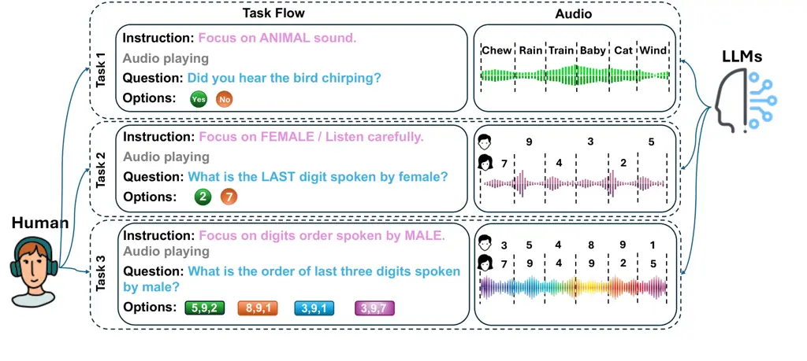
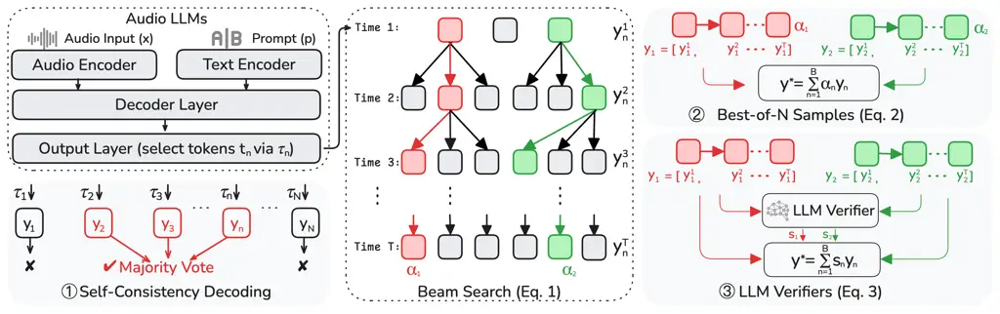
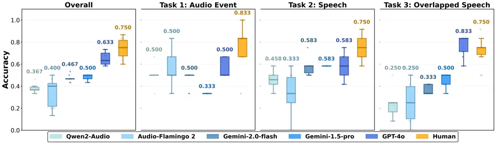
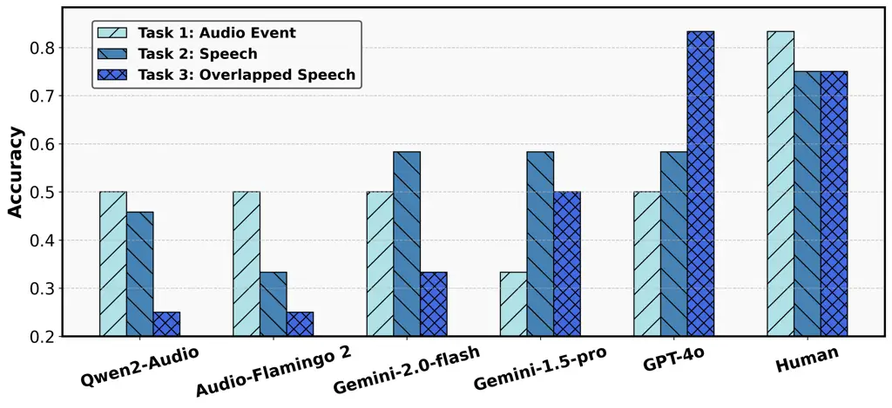
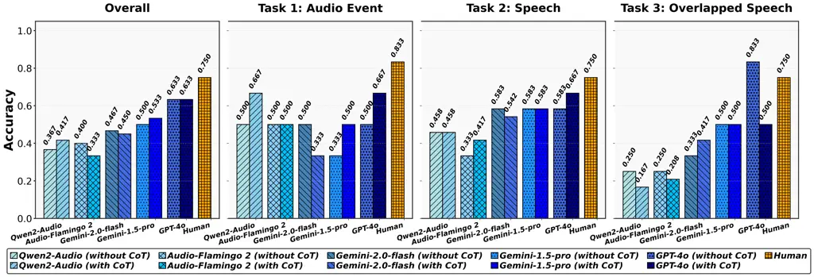
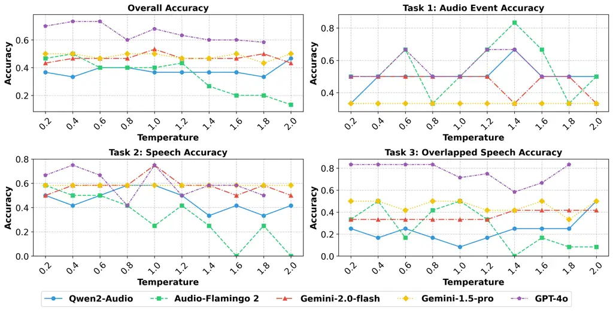

# Scaling Auditory Cognition via Test-Time Compute in Audio Language Models

Ting Dang Affiliation: School of Computing and Information Systems, The
University of Melbourne, Australia^(⋄)Department of Computer Science and
Technology, University of Cambridge,
UK{ting.dang,hong.jia}@unimelb.edu.au, yg381@cam.ac.uk    Yan Gao^(⋄)   
Hong Jia Affiliation: School of Computing and Information Systems, The
University of Melbourne, Australia^(⋄)Department of Computer Science and
Technology, University of Cambridge,
UK{ting.dang,hong.jia}@unimelb.edu.au, yg381@cam.ac.uk

###### Abstract

Large language models (LLMs) have shown exceptional versatility in
natural language processing, prompting recent efforts to extend their
multimodal capabilities to speech processing through the development of
audio large language models (Audio LLMs). While Audio LLMs excel in
tasks such as speech recognition and synthesis, it remains unclear how
they perform when faced with the auditory cognitive challenges posed by
real-world environments, such as audio comprehension and listening
recall, particularly in the presence of background noise or overlapping
speech. Unlike text-based LLMs, which have access to vast amounts of
text data for pre-training, retraining Audio LLMs with diverse auditory
cognitive scenes is difficult due to the limited datasets that simulate
real-world auditory cognitive scenarios and the challenge of acquiring
auditory cognitive labels for training. While test-time compute (TTC)
methods have been shown to enhance the capabilities of text-based LLMs
during inference, a key challenge lies in designing these TTC methods to
improve the auditory capabilities of Audio LLMs. This study aims to
address these two research gaps by: i) exploring the auditory cognitive
capabilities of Audio LLMs, and ii) enhancing their capabilities using
TTC approaches. We have investigated five different Audio LLMs for
auditory cognition using a self-collected database and have proposed
five TTC approaches to enhance auditory cognitive capabilities during
inference. Our findings reveal that Audio LLMs performance decreases in
more challenging auditory cognitive tasks. The proposed TTC approaches
significantly enhance cognitive auditory capabilities, advancing the
development of more adaptable and resilient Audio LLMs for practical
applications such as assistive listening devices, voice-based AI
assistants, and communication technologies.

## 1 Introduction

Large language models (LLMs) have achieved remarkable success as
versatile natural language processing systems, demonstrating strong
performance across a wide range of tasks such as machine translation (Xu
et al., 2024), question answering (Zhuang et al., 2023; Robinson et al.,
2022), and summarization (Laban et al., 2023; Zhang et al., 2024b).
Building on this progress, recent research has explored extending LLMs
to speech processing by integrating acoustic information into their
architectures. This has led to the development of audio large language
models (Audio LLMs), which can simultaneously process both spoken and
written language. Through cross-modal alignment techniques, these models
are increasingly capable of handling auditory tasks that require a
unified understanding of both linguistic and paralinguistic information,
such as emotion recognition (Bellver et al., 2024), speech quality
evaluation (Wang et al., 2025), and music understanding (Verma, 2025).

Existing research on audio LLMs primarily focuses on their ability to
process and align spoken and textual content, with efforts underway to
expand their capabilities to include not only speech but also acoustic
scenes and music (Gong et al., 2023; Li et al., 2024). However, most
existing studies were conducted on curated datasets or corpora (e.g.,
clean speech), which presents a significant limitation when applying the
proposed LLMs to real-world auditory environments characterized by
background noise, reverberation, and overlapping speech. Unlike
text-based benchmarks, often built on large-scale annotated corpora,
auditory cognition in complex settings relies on human adaptive
mechanisms that are inherently difficult to quantify or label. The
scarcity of datasets that faithfully replicate diverse real-world
auditory scenarios has led to a limited number of studies addressing
these challenging yet realistic conditions. Moreover, even fundamental
questions regarding how audio LLMs exhibit cognitive adaptation across
varying real-world listening environments remain largely unexplored.
Human listeners exhibit remarkable adaptability in complex situations,
effortlessly extracting meaningful information despite distortions like
the ”cocktail party problem” (Haykin & Chen, 2005), supported by
enhanced cognitive capabilities and working memory. A natural question
arises: do audio large LLMs possess capabilities comparable to those of
humans? More specifically, can audio LLMs develop human-like cognitive
strategies to maintain comprehension in adverse auditory environments?

Enhancing these models to improve cognitive auditory capabilities under
challenging conditions remains an important open question. In
particular, a key challenge lies in effectively adapting pre-trained
audio LLMs, originally trained on curated datasets, to real-world
auditory environments with minimal additional effort. Recent studies
have showed a potential solution, test-time compute (TTC), wherein
dynamic inference strategies enable models to ”think longer” on more
difficult problems, thereby significantly improving inference
performance without requiring additional fine-tuning (Snell et al.,
2024; Bi et al., 2024). Despite its effectiveness, applying TTC to
real-world auditory environments remains largely unexplored. This
presents a fundamental challenge: How can the auditory cognitive
robustness of audio LLMs be further enhanced during inference time?
Addressing these two gaps is crucial for advancing the next generation
of AI-driven auditory systems, enabling them to function reliably in
real-world applications such as assistive listening devices, voice-based
AI assistants, and communication technologies.

This paper aims to bridge this gap by investigating the inherent
cognitive capabilities of audio LLMs in auditory processing across
varying contexts, comparing their performance to human perception using
a self-collected dataset, and exploring TTC methods to enhance auditory
cognitive tasks. To address the first question, we explored various
audio LLMs in processing different auditory cognitive tasks, ranging
from simpler tasks such as audio event recognition to more complex
auditory cognitive tasks, including memorizing, recalling, and computing
digits spoken in a sequence with overlapped speech. Additionally, to
address the second gap, we designed five different TTC strategies to
enhance auditory cognitive capabilities. The results on five common
audio LLMs revealed that all models performed below human perception,
while GPT-4 demonstrated surprisingly strong performance in recognizing
overlapped speech. The performance of the five proposed TTC approaches
varies; however, all demonstrated improvements, with gains ranging from
9% to 150%. The optimal strategy was found to be highly dependent on
both the model structure and the complexity of the task. The
contributions of this paper are summarized as follows:

- •
  This is the first-study to investigate the auditory cognitive
  capabilities of audio LLMs in real-world environments, demonstrating
  the inferior performance of current audio LLMs on certain auditory
  tasks.
- •
  This work innovatively proposed and evaluated five TTC strategies
  aimed at enhancing the performance of audio LLMs on auditory cognitive
  tasks. It represents the first-attempt to enhance audio LLM
  capabilities during inference time.
- •
  The TTC experiments, conducted using five different audio LLMs across
  various tasks, demonstrated significant improvements, highlighting
  their potential to enhance auditory cognitive processing.

## 2 Related Work

### 2.1 Auditory Processing and Cognition

Human auditory processing is incredibly flexible and can adapt to a wide
range of complex scenarios, effectively managing cognitive load to
ensure accurate speech comprehension. This adaptability is exemplified
by the well-known “cocktail party effect” (Haykin & Chen, 2005), where
individuals can focus on a single conversation amid background noise, as
well as in various everyday settings such as busy streets, crowded
restaurants, and bustling office environments. This remarkable ability
is driven by advanced neural mechanisms encompassing adaptive auditory
cognition, which enables selective attention, auditory scene analysis,
and contextual understanding (Beaman, 2021).

Existing research on auditory cognition mainly focuses on psychological
analyses to understand the underlying biomechanics or psychological
processes (Baldwin, 2012; Anderson et al., 2013). While recent studies
have begun investigating computational modeling including the use of
LLMs for cognitive science, they primarily focus on general cognitive
functions or visual sensory aspects, such as working memory with visual
inputs, and visual-spatial reasoning that analyzes and synthesizes
abstract visual stimuli. There is less emphasis on understanding the
auditory cognition of audio LLMs (McDuff et al., 2024; Humphreys &
Bruce, 2021). A recent study investigates the auditory attention using
audio LLMs, by integrating intracranial electroencephalography (iEEG)
recordings with audio LLMs to identify which speaker a listener is
focusing on and to refine responses accordingly (Jiang et al., 2025).
However, this study is specific to a particular listener attention task
and requires fine-tuning the audio LLMs with additional iEEG modalities.
There still remains a lack of research exploring the potential of audio
LLMs for auditory cognition within real-world listening environments, as
well as effective strategies to enhance the models’ capabilities during
inference with minimal effort.

### 2.2 Audio LLMs

LLMs’ strong capabilities in natural language processing have
accelerated the development of audio LLMs that process both the
paralinguistic and linguistic information, leading to the emergence of
various audio LLMs that enhance capabilities in speech recognition,
sound generation, and auditory processing. Commonly used open-source
audio LLMs are generally developed based on pre-trained LLaMA, such as
LTU-AS (Gong et al., 2023) and SALMONN (Tang et al., ), or transformer
structures such as Qwen2-audio (Chu et al., 2024) and
Audio-Flamingo (Kong et al., 2024). These models generally employ a
pre-trained audio encoder such as Whisper (Radford et al., 2023) that
converts raw audio data into a series of audio embeddings, which are
then aligned with the text embeddings learned from tokenizers. This
alignment allows the embeddings to be processed by a transformer-based
architecture, enabling the model to understand audio patterns
effectively.

There are also closed-source audio models, such as GPT-4o (Hurst et al., 2024) and Gemini-1.5 pro (Google, 2024), which have also demonstrated
strong audio scene understanding capabilities. These models are
typically trained on large and diverse datasets, allowing them to
effectively process auditory content. However, there is still a paucity
of studies on how theses audio LLMs process auditory cognitive
capabilities in comparison to human perception.

### 2.3 Test-time Compute (TTC)

TTC encompasses a diverse array of strategies aimed at optimizing model
inference. These strategies can be categorized into two primary streams:
Chain-of-Thought (CoT) prompting and the search against verifiers
approach which samples multiple responses and select the optimal
response through a verification process.

##### Chain-of-Thought (CoT) Prompting.

CoT prompting has emerged as a promising approach for enhancing LLMs
performance and reasoning capabilities during the inference (Wei et al.,
2022). By breaking down complex tasks into a series of intermediate
steps or thoughts, CoT reasoning enables models to tackle challenges in
a more structured and transparent manner, particularly effective in
tasks that require logical reasoning or multi-step problem-solving (Fu
et al., 2022). The application of CoT prompting is not limited to
text-based tasks. Recent advancements have explored its potential in
multi-modal settings, including in the integration of auditory
information such as the integration of reasoning techniques in
audio-visual scene analysis (Shu et al., 2023). However, these studies
primarily focus on clean speech, and there remains a lack of research on
whether CoT reasoning is effective in handling complex auditory
scenarios, such as overlapping speech. Additionally, how to design CoT
prompting for more challenging and realistic audio environments is still
underexplored.

##### Search against Verifiers.

This approach typically involves two key steps. The first step generates
multiple candidate outputs instead of being limited to a single output.
The second step employs a verifier (a reward model), to score the
generated outputs in order to identify the optimal output. This method
does not require the re-training or fine-tuning of LLMs.

A verifier can range from a hard-coded heuristic to a learned reward
model. For the hard-coded heuristic, self-consistency decoding, namely a
majority voting mechanism, is commonly employed, where the most
frequently generated answer will be selected as the final answer (Wang
et al., 2022). Alternatively, a learnt reward model can be employed,
which plays a crucial role in the ranking and evaluation of multiple
outputs generated by the LLMs (Zhang et al., 2024a). This reward model
assesses the reliability and accuracy of the LLM’s multiple outputs by
verifying whether they meet specific criteria, such as logical validity,
absence of contradictions, and adherence to task-specific requirements.
This can be further extended with beam search, where the intermediate
steps for generating each candidate output will also be sampled and
scored (Yao et al., 2023). Typically, this verifier is another
task-specific LLM, fine-tuned for scoring the generated outputs. These
scores are then used to rank the outputs, with the highest-ranked one
being selected.

However, while these approaches have been validated in text-based
natural language processing tasks, their scalability to audio cognition
tasks, particularly in varied acoustic environments, remains uncertain.
A major challenge is the absence of suitable reward models for audio
tasks. Existing reward models are primarily designed for text-based
applications, where they generate scores based on the original text
input and the model’s text output (Wang et al., 2024). These models are
not applicable to audio tasks, which require processing the audio inputs
for scoring. Consequently, the development of appropriate reward models
for audio LLMs remains an open challenge.

## 3 Methods

### 3.1 Data and Design

##### Data.

To simulate a real-world auditory context and analyze LLMs’ auditory
processing capabilities, we self-collected a database that simulates
real-world scenarios. Specifically, we instructed participants to focus
on the sound and answer the questions after the audio was played, as
shown in Figure 1.



Figure 1: Data collection and experimental design. Three tasks with
increasing difficulty in auditory processing were designed, and both
humans and LLMs were prompted to answer the same questions after the
audio played.

Task 1 introduces a low-difficulty auditory scene, where natural sounds
devoid of linguistic content are played, such as birds chirping or dogs
barking. This task is designed to require minimal cognitive resources. A
pre-audio prompt encourages participants to focus on the specific sound
(e.g., ”Please focus on an animal sound”) and a post-audio question
(e.g., ”Did you hear a bird chirping?”) ensures active engagement and
helps validate their audio comprehension.

Task 2 increases the difficulty by introducing language comprehension,
requiring moderate cognitive resources. Participants hear a person (male
or female) reading digits mixed with slight background noise mimicking
real-world environments. As with previous tasks, a pre-audio prompt
directs participants to focus on digits spoken by a specific gender, and
a post-audio question asks them to recall specific details (e.g., ”What
is the last digit spoken by the female?”).

Task 3 presents a high-difficulty auditory scene, imposing a significant
cognitive load by simultaneously presenting two spoken digits from male
and female voices, amidst background noise. Participants must process
and differentiate between the digits spoken by each gender. A pre-audio
prompt instructs participants to focus on one gender or both, and a
post-audio question asks them to recall the digits spoken by the
targeted gender, as well as the sequence of the numbers (e.g., ”What is
the sum of the last two digits spoken by the male?”). This task is
designed to engage a high level of cognitive resources, including the
summation of digits, recalling digits that have not been spoken, aimed
at testing the limits of auditory processing and attention.

We collected data from 10 participants, including 6 males and 4 females,
aged 20 to 55, with an average age of 32. The diverse age range and
relatively balanced gender distribution ensure that the study’s findings
are representative across different demographic groups. All 10
participants provided consent for EEG data collection with the
16-channel wearable EEG headset (g.Nautilus RESEARCH) (g.tec medical
engineering GmbH, 2025) during the study, which was used for task
validation. Participants were instructed to maintain a stationary
sitting posture to minimize any extraneous bodily movements that could
introduce sound artifacts, ensuring the integrity of the data. Our
preliminary analysis of the EEG data has validated the effectiveness of
the task design in eliciting varying cognitive load, with increasing EEG
energy corresponding to increased cognitive load, consistent with
existing findings (Williamson et al., 2016).

##### Design.

To accurately simulate the context that humans use for auditory
processing during data collection, we incorporated both pre-audio and
post-audio questions in the prompt for LLMs, along with the audio event,
for processing by the audio LLMs. The audio LLMs take the audio input
along with a prompt that consists of i) the pre-audio instruction, ii) a
post-audio question, and iii) the available options. The model is then
prompted to select the best option from the choices provided. This
ensures that the information available to humans for answering the
questions is the same as what the LLMs receive, thereby maintaining a
fair comparison. The prompt used can be referred to Appendix A.1.

### 3.2 Test-time Compute

#### 3.2.1 CoT Prompting

We additionally include the CoT prompting for three tasks given the
context information. These CoT promptings provide additional information
on the background knowledge, such as whether one speaker is talking or
two speakers are speaking simultaneously. They direct the LLMs to think
step-by-step by identifying the gender and digits before arriving at the
final answer. The details of the CoT promoting can be referred to in
Appendix Table 3.

#### 3.2.2 Search against Verifiers

##### Self-Consistency Decoding.

Self-consistency decoding, also known as the majority voting approach,
enhances the reliability of model-generated outputs by aggregating
multiple responses. As shown in Figure 2 (left), given an audio input
$`\bm{x}`$ and a corresponding prompt $`p`$, the LLM backbone generates
$`N`$ outputs, denoted as $`\bm{y}_{n}`$, where $`n\in[2,N]`$. These
outputs can be obtained by varying the temperature values $`\tau_{n}`$
during sampling. A majority voting mechanism is then applied to
determine the most frequently selected answer $`\bm{y}^{*}`$.



Figure 2: Search against verifier approaches: i) Self-consistency
decoding, which applies a majority vote to the $`N`$ multiple outputs;
ii) Best-of-N sampling with beam search, where the selected beams
(outputs) are weighted by their log-likelihood; and iii) LLM verifier,
which employs a stronger LLM as the reward model to score the multiple
outputs, ranking or weighting them to optimize the final output.

##### Best-of-N Samples with Beam Search.

Similarly, the Best-of-N samples approach also generates multiple
responses $`\bm{y}_{n}`$, for a given audio input $`\bm{x}`$ and a
corresponding prompt $`p`$. It is generally integrated with beam search
to further explore intermediate steps in diverse decoding paths. In beam
search, the model maintains a set of the top $`B`$ candidate sequences
at each decoding step. This allows the model to consider multiple
high-likelihood outputs instead of committing to a single most probable
sequence, thereby enhancing output diversity and accuracy.

As shown in Figure 2 (beam search), at each decoding step $`t`$, the
model generates possible token sequences
$`\bm{y}_{n}=(y_{n}^{1},y_{n}^{2},\dots,y_{n}^{T}),t\in[1,T]`$, where
each $`y_{n}^{t}`$ represents a token at step $`t`$ in the output
sequence. The top $`B`$ sequences, represented as $`\mathcal{B}_{T}`$,
are selected based on their cumulative log probabilities:

```math
\mathcal{B}_{T}=\arg\max_{\mathcal{B}^{\prime}}\sum_{t=1}^{T}\log P(y_{n}^{t}\mid y_{n}^{1:t-1},\bm{x},p),\quad\text{where }|\mathcal{B}^{\prime}|=B. \tag{1}
```

Once decoding is complete at step $`T`$, a reward model is generally
employed to score the top $`B`$ sequences. This can be performed using
either an output reward model (ORM), which assesses only the final
output, or a process reward model (PRM), which also scores intermediate
steps along the decoding paths (Yao et al., 2023; Zhang et al., 2024a).
However, since ORM and PRM models have not yet been developed for audio
LLMs for auditory cognitive tasks to score the outputs effectively, we
propose using the cumulative log-likelihood as a scoring mechanism.

Specifically, we employ a weighted combination of all the beam-searched
outputs $`\bm{y}_{n}`$, with the weight $`\alpha_{n}`$ as the
corresponding log-likelihood scores as:

```math
\bm{y}^{*}=\sum_{n=1}^{B}\alpha_{n}\bm{y}_{n}=\sum_{n=1}^{B}\left(\sum_{t=1}^{T}\log P(y_{n}^{t}\mid y_{n}^{1:t-1},\bm{x},p)\right)\bm{y}_{n}. \tag{2}
```

This aims to leverage multiple outputs to optimize the final result,
which can be particularly beneficial in challenging auditory cognitive
scenarios where relying solely on the top output from audio LLMs may be
less reliable.

##### LLM Verifier.

Alternatively, we introduce another LLM verifier as the reward model, to
score the multiple outputs generated by the beam search (Figure 2). This
LLM verifier is chosen as the one with superior audio comprehension
capabilities, aiming to leverage a stronger LLM to evaluate the
responses of a weaker LLM, thereby enhancing the predictions. In this
case, the LLM verifier takes a prompt that describes the evaluation task
along with scoring criteria, as well as the audio input, and outputs a
score. The prompt used for the LLM verifier is detailed in Appendix A.3.

The response with the highest LLM verifier score is chosen as the final
output, or a weighted sum of responses $`\bm{y}_{n}`$ is calculated
using weights $`s_{n}`$ based on the scores $`S(\bm{y}_{n})`$ from the
LLM verifier as:

```math
\bm{y}^{*}=\arg\max_{\bm{y}_{n}}S(\bm{y}_{n})\quad\text{or}\quad\bm{y}^{*}=\sum_{n=1}^{N}s_{n}\bm{y}_{n} \tag{3}
```

## 4 Experimental setup

### 4.1 Models and implementation details

Five different audio LLMs were tested, including Qwen2-Audio (Chu
et al., 2024), Audio-Flamingo 2 (Ghosh et al., 2025),
Gemini-2.0-Flash (Google, 2025), Gemini-1.5-Pro (Google, 2024), and
GPT-4o (Hurst et al., 2024). Both Qwen2-Audio and Audio-Flamingo 2 are
based on the open-source QwenLM (32 decoder layers) (Bai et al., 2023)
and Flamingo (Kong et al., 2024) architecture. Further details on the
model structures can be referred to Appendix B.1, and the implementation
details can be referred to Appendix B.2¹¹ 1 The code will be available
upon acceptance..

### 4.2 TTC methods

Five TTC methods were used, including CoT and four other approaches
based on search against verifiers:

- •
  Temperature-based majority vote (Majority): For a single audio input,
  $`N`$ outputs are generated using varying temperatures, and majority
  voting is used to generate the final answer.
- •
  Beam search-based weighted log-likelihood (BS-W): The $`|B|`$
  sequences are weighted based on their log-likelihoods for each
  sequence.
- •
  LLM verifier with highest score (LLM-Top 1): LLM verifier scores the
  $`N`$ generated responses, and the one with the highest score is
  selected.
- •
  LLM verifier-based weighted scores (LLM-W): The final answer is
  selected as the weighted sum of the $`N`$ responses, with the weights
  corresponding to the scores evaluated by the LLM verifier.

## 5 Results

### 5.1 Comparison to human perceptions



Figure 3: Performance of audio LLMs (without TTC) in comparison to human
perception

Figure 3 presents a comparative analysis of the performance of various
audio LLMs and human perception in processing different auditory scenes.
To simulate the variability in human auditory perception, we employed
different temperature parameters within the same LLMs, allowing for a
range of perceptual sensitivities.

Overall, all five tested audio LLMs underperform compared to human in
processing auditory scenes of varying complexity. GPT-4o demonstrates
the highest performance, followed by the Gemini model series, while
Qwen2-Audio and Audio-Flamingo exhibit the lowest performance. This
could potentially be due to the limited and less diverse data used for
training the Qwen2-Audio models, and the smaller size (3B) of the
Audio-Flamingo 2 model. This trend is also consistent in general across
different auditory tasks, ranging from task 1 to task 3 with increasing
levels of complexity.



Figure 4: Performance trend from simple to complex acoustic scenes.

Specifically, for Task 1 (audio event recognition) and Task 2 (speech
comprehension), all audio LLMs perform similarly, with GPT-4o performing
slightly better. Surprisingly, for task 3 of overlapping speech, GPT-4o
performs better than the average human performance, although it does not
surpass the best human performance. This suggests that the current
GPT-4o can effectively process complex auditory conditions.

The trend across different auditory tasks is shown in Figure 4. A
decline is observed as task complexity increases in general apart from
GPT-4o and Gemini-1.5-pro. Qwen2-Audio, Audio-Flamingo 2 and
Gemini-2.0-flash exhibit a performance decline similar to that of human
perception as task difficulty increases. Interestingly, the performance
of GPT-4o and Gemini-1.5-pro improves from simple audio event
recognition tasks to more complex ones. This may be attributed to the
broader coverage of speech training data compared to acoustic event data
during the pre-training phase.

### 5.2 Performance using TTC

##### CoT.

We initially applied CoT reasoning to enhance auditory inference
capabilities. Figure 5 illustrates the performance improvements achieved
through CoT compared to the original models without CoT prompting. The
extent of these improvements varies depending on the specific models and
tasks. Generally, CoT enhances the performance of Qwen2-Audio and
Gemini-1.5-pro, while it does not yield significant benefits for other
models. Notably, the improvements over the baseline without using TTC
are primarily observed in task 2 of acoustic event recognition with
33.4% and 50% relative improvements for Qwen2-Audio and Gemini-1.5-pro,
whereas more challenging auditory scenes do not exhibit similar gains.
Interestingly, GPT-4o demonstrates a decline in task 3 performance when
CoT is employed. These results suggest that GPT-4o may have been trained
with reasoning capabilities, and therefore, CoT prompting does not
further enhance its performance, or the CoT prompt may require careful
design to be more effective.



Figure 5: Evaluating the effect of CoT on model performance. The
improvement with CoT varies depending on the specific models and tasks.

##### Search against verifiers.

Table 1 presents the performance using various approaches of search
against verifiers. The models Qwen2-Audio and Audio-Flamingo 2 were
selected due to their open-source nature, which allows access to
probabilities of outputs or search paths. Generally, all approaches
improved performance compared to the baseline without using TTC.
Specifically, for Qwen2-Audio, beam search yielded the best results,
with significant improvements in Task 2 and Task 3, showing relative
improvements of 63.8% and 66.8%, respectively. This indicates that
exploring multiple decoding pathways can potentially uncover alternative
answers when acoustic tasks are challenging, suggesting that considering
other options can be beneficial.

|           |               |               |               |               |                  |               |                |                |
| --------- | ------------- | ------------- | ------------- | ------------- | ---------------- | ------------- | -------------- | -------------- |
|           | Qwen2-Audio   |               |               |               | Audio-Flamingo 2 |               |                |                |
|           | Overall       | Task 1        | Task 2        | Task 3        | Overall          | Task 1        | Task 2         | Task 3         |
| No TTC    | 0.367         | 0.500         | 0.458         | 0.250         | 0.400            | 0.500         | 0.333          | 0.250          |
| CoT       | 0.417 (+13.6) | 0.667 (+33.4) | 0.458 (+0.00) | 0.167 (-33.2) | 0.333 (-16.8)    | 0.500 (+0.00) | 0.417 (+25.20) | 0.208 (-16.8)  |
| Majority  | 0.400 (+9.00) | 0.500 (+0.00) | 0.583 (+27.3) | 0.167 (-33.2) | 0.467 (+16.8)    | 0.500 (+0.00) | 0.500 (+50.20) | 0.417 (+66.8)  |
| BS-W      | 0.500 (+36.2) | 0.167 (-66.6) | 0.750 (+63.8) | 0.417 (+66.8) | 0.500 (+25.0)    | 0.500 (+0.00) | 0.750 (+125.2) | 0.250 (+0.00)  |
| LLM-Top 1 | 0.400 (+9.00) | 0.667 (+33.4) | 0.500 (+9.2)  | 0.167 (-33.2) | 0.667 (+66.8)    | 0.500 (+0.00) | 0.833 (+150.2) | 0.583 (+133.2) |
| LLM-W     | 0.400 (+9.00) | 0.667 (+33.4) | 0.500 (+9.2)  | 0.167 (-33.2) | 0.633 (+58.3)    | 0.667 (+33.4) | 0.667 (+100.3) | 0.583 (+133.2) |

Table 1: Performance comparison using different strategies of search
against verifiers. Paraphrase reflects the corresponding improvements in
percentage terms.

For Audio-Flamingo 2, the most effective approach was the LLM verifier,
indicating that advanced LLMs with a better understanding of acoustic
scenes can enhance the performance of weaker LLMs in auditory tasks.
Notably, the most significant improvements were observed in Task 2 and
Task 3, particularly in Task 2 with 1.5 times improvements. This
suggests that while these models may have some understanding of speech
tasks, additional pathways could be advantageous when confronted with
complex auditory scenes.

Figure 6: Performance with different beam sizes using Audio-Flamingo 2
model.

To gain a deeper understanding of how beam search contributes to the
improved performance, we conducted a detailed performance analysis using
different beam sizes with Audio-Flamingo 2, as illustrated in Figure 6.
The results indicate that as the beam size increases, overall accuracy
improves, as well as for Task 2 and Task 3. This suggests that a larger
beam size allows the model to generate multiple candidate answers,
thereby increasing the likelihood of selecting a more accurate response.
This is specifically beneficial when processing more challenging
acoustic scenes, as the model’s top candidate output may be less
reliable. More ablation studies can be referred to Appendix C.

## 6 Conclusion

This paper explored the inherent auditory cognitive capabilities of
audio LLMs and proposed five test-time compute methods to enhance their
performance across a range of complex auditory cognitive tasks. The
results revealed the underperformance of current audio LLMs,
particularly in handling complex auditory cognitive tasks. GPT-4
demonstrated the best performance and surprisingly surpassed some human
perception capabilities in handling complex acoustic scenes.
Additionally, the five test-time compute methods demonstrated
significant improvements in enhancing auditory cognitive performance,
paving the way for more effective audio LLMs in processing auditory
tasks. This study offers a novel approach to improving audio LLMs during
inference, and provides valuable insights for future research in audio
LLMs for auditory cognition. Future studies will focus on expanding the
dataset to evaluate more diverse auditory conditions and on developing
the reward models specifically tailored for auditory tasks.

## Acknowledgments

We acknowledge Nokia Bell Labs, Cambridge, UK for their collaboration in
data collection and extend our gratitude to everyone who participated in
the data collection process.

## Ethics Statement

Data collection for this study was conducted in accordance with approved
ethical guidelines. Ethical approval for the data collection process was
obtained prior to its commencement. Informed consent was acquired from
all participants before data collection began. The collected data is
securely stored on a server, with all personally identifiable
information removed, and will not be shared outside of the ethical
guidelines.

## References

- Anderson et al. (2013) Samira Anderson, Travis White-Schwoch,
  Alexandra Parbery-Clark, and Nina Kraus. A dynamic auditory-cognitive
  system supports speech-in-noise perception in older adults. _Hearing
  research_, 300:18–32, 2013.
- Bai et al. (2023) Jinze Bai, Shuai Bai, Yunfei Chu, Zeyu Cui, Kai
  Dang, Xiaodong Deng, Yang Fan, Wenbin Ge, Yu Han, Fei Huang, et al.
  Qwen technical report. _arXiv preprint arXiv:2309.16609_, 2023.
- Baldwin (2012) Carryl L Baldwin. _Auditory cognition and human
  performance: Research and applications_. CRC Press, 2012.
- Beaman (2021) Philip Beaman. _Auditory attention_. Oxford University
  Press, 2021.
- Bellver et al. (2024) Jaime Bellver, Ivan Martín-Fernández, Jose M
  Bravo-Pacheco, Sergio Esteban, Fernando Fernández-Martínez, and
  Luis Fernando D’Haro. Multimodal audio-language model for speech
  emotion recognition. In _Proc. odyssey 2024_, pp. 288–295, 2024.
- Bi et al. (2024) Zhenni Bi, Kai Han, Chuanjian Liu, Yehui Tang, and
  Yunhe Wang. Forest-of-thought: Scaling test-time compute for enhancing
  llm reasoning. _arXiv preprint arXiv:2412.09078_, 2024.
- Chu et al. (2024) Yunfei Chu, Jin Xu, Qian Yang, Haojie Wei, Xipin
  Wei, Zhifang Guo, Yichong Leng, Yuanjun Lv, Jinzheng He, Junyang Lin,
  et al. Qwen2-audio technical report. _arXiv preprint
  arXiv:2407.10759_, 2024.
- Fu et al. (2022) Yao Fu, Hao Peng, Ashish Sabharwal, Peter Clark, and
  Tushar Khot. Complexity-based prompting for multi-step reasoning.
  _arXiv preprint arXiv:2210.00720_, 2022.
- Ghosh et al. (2025) Sreyan Ghosh, Zhifeng Kong, Sonal Kumar, S Sakshi,
  Jaehyeon Kim, Wei Ping, Rafael Valle, Dinesh Manocha, and Bryan
  Catanzaro. Audio flamingo 2: An audio-language model with long-audio
  understanding and expert reasoning abilities. _arXiv preprint
  arXiv:2503.03983_, 2025.
- Gong et al. (2023) Yuan Gong, Alexander H Liu, Hongyin Luo, Leonid
  Karlinsky, and James Glass. Joint audio and speech understanding. In
  _2023 IEEE Automatic Speech Recognition and Understanding Workshop
  (ASRU)_, pp. 1–8. IEEE, 2023.
- Google (2024) Google. Gemini 1.5: Unlocking multimodal understanding
  across millions of tokens of context. _arXiv preprint
  arXiv:2403.05530_, 2024.
- Google (2025) Google. Gemini 2.0 Flash. Online, 2025. URL
  [https://deepmind.google/technologies/gemini/flash/](https://deepmind.google/technologies/gemini/flash/).
  Accessed: 2025-03-20.
- g.tec medical engineering GmbH (2025) g.tec medical engineering GmbH.
  g.Nautilus RESEARCH, 2025. URL
  [https://www.gtec.at/product/g-nautilus-research/](https://www.gtec.at/product/g-nautilus-research/).
  Wearable EEG headset for research applications with 8/16/32/64
  channels, active electrode technology, and wireless transmission.
- Haykin & Chen (2005) Simon Haykin and Zhe Chen. The cocktail party
  problem. _Neural computation_, 17(9):1875–1902, 2005.
- Humphreys & Bruce (2021) Glyn W Humphreys and Vicki Bruce. _Visual
  cognition: Computational, experimental and neuropsychological
  perspectives_. Psychology Press, 2021.
- Hurst et al. (2024) Aaron Hurst, Adam Lerer, Adam P Goucher, Adam
  Perelman, Aditya Ramesh, Aidan Clark, AJ Ostrow, Akila Welihinda, Alan
  Hayes, Alec Radford, et al. Gpt-4o system card. _arXiv preprint
  arXiv:2410.21276_, 2024.
- Jiang et al. (2025) Xilin Jiang, Sukru Samet Dindar, Vishal Choudhari,
  Stephan Bickel, Ashesh Mehta, Guy M McKhann, Adeen Flinker, Daniel
  Friedman, and Nima Mesgarani. Aad-llm: Neural attention-driven
  auditory scene understanding. _arXiv preprint arXiv:2502.16794_, 2025.
- Kong et al. (2024) Zhifeng Kong, Arushi Goel, Rohan Badlani, Wei Ping,
  Rafael Valle, and Bryan Catanzaro. Audio flamingo: a novel audio
  language model with few-shot learning and dialogue abilities. In
  _Proceedings of the 41st International Conference on Machine
  Learning_, pp. 25125–25148, 2024.
- Laban et al. (2023) Philippe Laban, Wojciech Kryściński, Divyansh
  Agarwal, Alexander Richard Fabbri, Caiming Xiong, Shafiq Joty, and
  Chien-Sheng Wu. Summedits: Measuring llm ability at factual reasoning
  through the lens of summarization. In _Proceedings of the 2023
  conference on empirical methods in natural language processing_, pp.
  9662–9676, 2023.
- Li et al. (2024) Dongting Li, Chenchong Tang, and Han Liu. Audio-llm:
  Activating the capabilities of large language models to comprehend
  audio data. In _International Symposium on Neural Networks_, pp.
  133–142. Springer, 2024.
- McDuff et al. (2024) Daniel McDuff, David Munday, Xin Liu, and Isaac
  Galatzer-Levy. Cognitive assessment of language models. In _ICML 2024
  Workshop on LLMs and Cognition_, 2024.
- Radford et al. (2023) Alec Radford, Jong Wook Kim, Tao Xu, Greg
  Brockman, Christine McLeavey, and Ilya Sutskever. Robust speech
  recognition via large-scale weak supervision. In _Proceedings of the
  40th International Conference on Machine Learning_, pp.
  28492–28518, 2023.
- Robinson et al. (2022) Joshua Robinson, Christopher Michael Rytting,
  and David Wingate. Leveraging large language models for multiple
  choice question answering. _arXiv preprint arXiv:2210.12353_, 2022.
- Shu et al. (2023) Fangxun Shu, Lei Zhang, Hao Jiang, and Cihang Xie.
  Audio-visual llm for video understanding. _arXiv preprint
  arXiv:2312.06720_, 2023.
- Snell et al. (2024) Charlie Snell, Jaehoon Lee, Kelvin Xu, and Aviral
  Kumar. Scaling llm test-time compute optimally can be more effective
  than scaling model parameters. _arXiv preprint
  arXiv:2408.03314_, 2024.
- (26) Changli Tang, Wenyi Yu, Guangzhi Sun, Xianzhao Chen, Tian Tan,
  Wei Li, Lu Lu, MA Zejun, and Chao Zhang. Salmonn: Towards generic
  hearing abilities for large language models. In _The Twelfth
  International Conference on Learning Representations_.
- Verma (2025) Prateek Verma. Whisper-gpt: A hybrid generative llm for
  speech and music. In _ICASSP 2025-2025 IEEE International Conference
  on Acoustics, Speech and Signal Processing (ICASSP)_, pp. 1–5.
  IEEE, 2025.
- Wang et al. (2024) Haoxiang Wang, Wei Xiong, Tengyang Xie, Han Zhao,
  and Tong Zhang. Interpretable preferences via multi-objective reward
  modeling and mixture-of-experts. _arXiv preprint
  arXiv:2406.12845_, 2024.
- Wang et al. (2025) Siyin Wang, Wenyi Yu, Yudong Yang, Changli Tang,
  Yixuan Li, Jimin Zhuang, Xianzhao Chen, Xiaohai Tian, Jun Zhang,
  Guangzhi Sun, et al. Enabling auditory large language models for
  automatic speech quality evaluation. In _ICASSP 2025-2025 IEEE
  International Conference on Acoustics, Speech and Signal Processing
  (ICASSP)_, pp. 1–5. IEEE, 2025.
- Wang et al. (2022) Xuezhi Wang, Jason Wei, Dale Schuurmans, Quoc Le,
  Ed Chi, Sharan Narang, Aakanksha Chowdhery, and Denny Zhou.
  Self-consistency improves chain of thought reasoning in language
  models. _arXiv preprint arXiv:2203.11171_, 2022.
- Wei et al. (2022) Jason Wei, Xuezhi Wang, Dale Schuurmans, Maarten
  Bosma, Fei Xia, Ed Chi, Quoc V Le, Denny Zhou, et al. Chain-of-thought
  prompting elicits reasoning in large language models. _Advances in
  neural information processing systems_, 35:24824–24837, 2022.
- Williamson et al. (2016) James R Williamson, Thomas F Quatieri,
  Christopher J Smalt, Joey Perricone, Brian J Helfer, Michael A Nolan,
  Marianna Eddy, and Joseph Moran. Using eeg to discriminate cognitive
  workload and performance based on neural activation and
  connectivity, 2016.
- Xu et al. (2024) Haoran Xu, Amr Sharaf, Yunmo Chen, Weiting Tan,
  Lingfeng Shen, Benjamin Van Durme, Kenton Murray, and Young Jin Kim.
  Contrastive preference optimization: Pushing the boundaries of llm
  performance in machine translation. _arXiv preprint
  arXiv:2401.08417_, 2024.
- Yao et al. (2023) Shunyu Yao, Dian Yu, Jeffrey Zhao, Izhak Shafran,
  Tom Griffiths, Yuan Cao, and Karthik Narasimhan. Tree of thoughts:
  Deliberate problem solving with large language models. _Advances in
  neural information processing systems_, 36:11809–11822, 2023.
- Zhang et al. (2024a) Lunjun Zhang, Arian Hosseini, Hritik Bansal,
  Mehran Kazemi, Aviral Kumar, and Rishabh Agarwal. Generative
  verifiers: Reward modeling as next-token prediction. _arXiv preprint
  arXiv:2408.15240_, 2024a.
- Zhang et al. (2024b) Yang Zhang, Hanlei Jin, Dan Meng, Jun Wang, and
  Jinghua Tan. A comprehensive survey on process-oriented automatic text
  summarization with exploration of llm-based methods. _arXiv preprint
  arXiv:2403.02901_, 2024b.
- Zhuang et al. (2023) Yuchen Zhuang, Yue Yu, Kuan Wang, Haotian Sun,
  and Chao Zhang. Toolqa: A dataset for llm question answering with
  external tools. _Advances in Neural Information Processing Systems_,
  36:50117–50143, 2023.

## Appendix

## Appendix A Methods

### A.1 Prompt for Audio LLMs

The example prompts used for audio LLMs without CoT are shown in
Table 2. For Gemini-series models and GPT-4o, the responses are clean
with no explanation. For Qwen2-Audio and Audio-Flamingo 2, an additional
constraint is added to ensure the output is clean as: ”Just output the
selected answer”.

| Task 1 Prompt: | Focus on ANIMAL sound. Did you hear the cat meowing? Select the best option from the following: \[’Yes’, ’No’\]. No explanation is needed.                  |
| -------------- | ----------------------------------------------------------------------------------------------------------------------------------------------------------- |
| Task 2 Prompt: | Listen carefully. What is the LAST TWO digits spoken by male? Select the best option from the following: \[’6,2’, ’2,2’\]. No explanation is needed.        |
| Task 3 Prompt: | Focus on FEMALE. Which digit has NOT been mentioned by female? Select the best option from the following: \[’4’, ’6’, ’8’, ’9’\]. No explanation is needed. |

Table 2: Example prompts for audio LLMs

### A.2 CoT prompting

In addition to the prompts used for audio LLMs, CoT prompting for three
different tasks is additionally integrated, as shown in Table 3.

| Auditory Tasks           | Chain of Thought (CoT) Prompting                                                                                                                                                                                                                                                                                                                                                                          |
| ------------------------ | --------------------------------------------------------------------------------------------------------------------------------------------------------------------------------------------------------------------------------------------------------------------------------------------------------------------------------------------------------------------------------------------------------- |
| Task1: Audio Event       | There are different sound events in this audio trial. First, recognize each audio event, and then determine if the sound event mentioned in the question is present among these sound events.                                                                                                                                                                                                             |
| Task2: Speech            | There is a sequence of digits spoken by either a male or a female speaker. First, recognize the gender and the digit for each spoken digit. Then, identify the gender of the speaker or speakers mentioned in the question, recall the corresponding part of the sequence, and find the digit or digits spoken by the identified gender or genders to answer the question.                                |
| Task3: Overlapped Speech | There is a sequence of digits spoken simultaneously by both male and female speakers. First, identify the digits in the sequence spoken by the female and male speakers separately. Then, determine the gender of the speaker or speakers mentioned in the question. Recall the corresponding part of the sequence and find the digits spoken by the identified gender or genders to answer the question. |

Table 3: CoT prompting for different tasks and acoustic scenes

### A.3 Prompt for LLM verifier

The prompt for the LLM verifier is displayed in Table 4. To improve the
reliability of the LLM verifier’s scoring, we instructed the LLM
backbones (i.e., Qwen2-Audio and Audio-Flamingo 2) to provide
explanations for their decisions, offering more comprehensive
information for scoring. These responses are further evaluated by the
LLM verifier using the prompt in Table 4.

[TABLE]

Table 4: Prompt for LLM verifier

An example response from the LLM verifier is given in Table 5.

| RATING:     | 0.8                                                                                                                                                                                                                                                                                                                                                                                                                          |
| ----------- | ---------------------------------------------------------------------------------------------------------------------------------------------------------------------------------------------------------------------------------------------------------------------------------------------------------------------------------------------------------------------------------------------------------------------------- |
| ANALYSIS:   | The machine’s response correctly identifies the last three digits spoken by the female voice as 6, 7, and 9. However, there is a mistake in the explanation. The response states that the last three digits spoken by the female are 9, 7, and 6, which is incorrect. Despite this inconsistency, the final answer matches the audio content, and the noted mistake doesn’t change the correctness of the identified digits. |
| YOUR ANSWER | \[6, 7, 9\]                                                                                                                                                                                                                                                                                                                                                                                                                  |

Table 5: An example response of LLM verifier.

## Appendix B Experimental setup

### B.1 Models

The models used in this study includes five audio LLMs.

- •
  Qwen2-Audio (Chu et al., 2024): Qwen2-Audio, developed by Alibaba, is
  a state-of-the-art multimodal model designed for processing and
  generating both text and audio. It is capable of handling various
  audio signal inputs to perform audio analysis or generate direct
  textual responses based on speech instructions. The model size
  utilized in our study is 7B parameters.
- •
  Audio-Flamingo 2 (Ghosh et al., 2025): Audio-Flamingo 2, developed by
  NVIDIA, is an extension of the Flamingo model that enhances long-audio
  understanding and reasoning capabilities. It has demonstrated superior
  performance compared to other audio LLMs. Audio-Flamingo 2, with just
  a 3B parameter small language model, achieves state-of-the-art results
  across more than 20 benchmarks.
- •
  Gemini-2.0-Flash (Google, 2025): Gemini-2.0-Flash is a lightweight
  version of the Gemini-2.0 series developed by Google and updated in
  2025, optimized for real-time audio processing with minimal latency.
  It maintains strong performance in speech recognition and synthesis
  while reducing computational requirements.
- •
  Gemini-1.5-Pro (Google, 2024): Gemini-1.5-Pro is a more advanced
  version of the Gemini-1.5 series, featuring enhanced multimodal
  capabilities and improved contextual reasoning for audio-based tasks.
  It is trained on a larger dataset, enabling robust performance in
  speech-to-text conversion, emotion recognition, and multilingual audio
  processing.
- •
  GPT-4o (Hurst et al., 2024): GPT-4o is OpenAI’s latest multimodal
  model, capable of processing and generating both text and audio with
  exceptional accuracy. It integrates a unified architecture for
  seamless cross-modal interactions, excelling in tasks such as audio
  transcription, voice synthesis, and conversational AI.



Figure 7: Impact of temperature

### B.2 Parameters

For the TTC majority vote baseline, we employed a range of temperature
values from 0 to 2, with increments of 0.2. In terms of beam search, we
utilized a beam count ranging from 2 to 7 constrained by memory
limitations.

For the LLM verifier, GPT-4o was chosen as the verifier model based on
our initial exploration of audio LLMs capabilities in audio
comprehension tasks. This exploration demonstrated GPT-4o’s superior
performance in audio processing tasks compared to other audio LLMs. The
verifier was prompted to score the generated $`N`$ responses by
considering both the audio inputs and the outputs from the first-stage
LLM.

## Appendix C Ablation study

##### Impact of temperature

Temperature controls the randomness of the model’s output during text
generation by influencing how the model samples from the probability
distribution of possible next words. As shown in Figure 7, different
models exhibit varying patterns in response to different temperature
settings. A temperature of 2.0 was not evaluated for GPT-4o, as it
generates nonsensical responses using temperature of 2.0. Additionally,
the temperature shows distinct patterns across different tasks,
suggesting that the model may require different temperature settings
tailored to optimize performance for various acoustic scenes.
