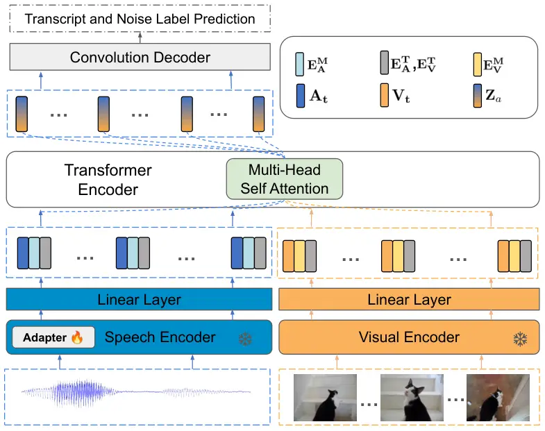

# Visual-Aware Speech Recognition for Noisy Scenarios

Lakshmipathi Balaji Affiliation: IIIT-Hyderabad, India
Email: [lakshmipathi.balaji@research.iiit.ac.in](mailto:)    Karan
Singla Affiliation: Whissle Inc., USA
Email: [ksingla@whissle.ai](mailto:)

###### Abstract

Humans have the ability to utilize visual cues, such as lip movements
and visual scenes, to enhance auditory perception, particularly in noisy
environments. However, current Automatic Speech Recognition (ASR) or
Audio-Visual Speech Recognition (AVSR) models often struggle in noisy
scenarios. To solve this task, we propose a model that improves
transcription by correlating noise sources to visual cues. Unlike works
that rely on lip motion and require the speaker’s visibility, we exploit
broader visual information from the environment. This allows our model
to naturally filter speech from noise and improve transcription, much
like humans do in noisy scenarios. Our method re-purposes pretrained
speech and visual encoders, linking them with multi-headed attention.
This approach enables the transcription of speech and the prediction of
noise labels in video inputs. We introduce a scalable pipeline to
develop audio-visual datasets, where visual cues correlate to noise in
the audio. We show significant improvements over existing audio-only
models in noisy scenarios. Results also highlight that visual cues play
a vital role in improved transcription accuracy.

## 1 Introduction

Automatic Speech Recognition (ASR) models have applications in many
voice-enabled applications, including audio-video calls, intelligent
virtual assistants, and media processing. These models are expected to
work well in noisy conditions for their effective use in real-world
scenarios. Several studies demonstrate that the human brain uses both
audio and visual streams (e.g. lip motion, visual scenes) for listening,
particularly when the speech is noisy  Sumby and Pollack (1954); McGurk
and MacDonald (1976); Boots et al. (2020). These models have
applications where the visual stream is also available as additional
input. These observations have led to the development of audio-visual
speech recognition (AVSR) models.

Several AVSR models show that transcription can be improved in the noisy
scenario by attending to lip-region movement Burchi and Timofte (2023);
Shi et al. (2022) and exploiting the correlation of visual scenes with
spoken content Seo et al. (2023). Recently Luo et al. (2024) show that
background scenes can help in improving transcription in a given
environment. However, its dependence on a manually collected dataset and
limited alignment between visual context and audio hinder its
scalability and effective utilization of visual cues.

Building on these insights, we address these limitations by proposing a
scalable data creation pipeline and finetuning method that utilizes
pretrained checkpoints. Our automated pipeline allows the mixing of
audio-visual noise datasets with clean speech at variable noise ratios,
eliminating the need for specialized datasets. In this work, we propose
an architecture that integrates pretrained audio and visual encoders via
Multi-Headed Attention. We hypothesize that training AVSR models with
visual cues of the noise sources will improve speech recognition in
noisy scenarios.

We use AudioSet Gemmeke et al. (2017) mixed with a clean speech corpus,
People speech Galvez et al. (2021) for finetuning purposes. We extract
speech embeddings for each time-step in audio and then calculate
enhanced representations by attending to visual features obtained from
CLIP visual encoder Radford et al. (2021). Our model takes (audio,
video) pairs and finetunes the speech encoder for multi-modal speech
recognition and noise label prediction jointly using CTC loss Graves and
Graves (2012). We hypothesize that leveraging the correlation between
noise sources and visual cues will lead to more accurate transcription
by providing richer context than background scene awareness alone.

The resultant finetuned model improves transcription quality while also
predicting noise labels. Ablation experiments further suggest that these
improvements in transcription accuracy, are primarily due to our model’s
ability to attend to visual cues. The main contributions of this work
are two-fold, (i) We propose a scalable dataset creation pipeline to
develop audio-visual datasets, where visual cues correlate to noise
sources in the audio. (ii) This work introduces a finetuning method that
is visually aware of the noise while doing transcription.

## 2 Related Work

### 2.1 Audio only noisy speech recognition

Noise can be removed as a pre-processing step before being fed to ASR
systems for improved transcription. Noise removal can be done either via
signal enhancement techniques Steinmetz et al. (2023) and via source
separation methods Rouard et al. (2023); Défossez (2021); Petermann
et al. (2023). Recent state-of-the-art E2E ASR systems enhance
robustness in noisy environments by adding synthetic noise into their
training datasets Baevski et al. (2020); Radford et al. (2022); Majumdar
et al. (2021); Chen et al. (2021). However, purely audio-based models
still face difficulties in extreme noise conditions, highlighting the
need for multi-modal approaches, such as AVSR, which leverage visual
cues to handle noise better.

### 2.2 Audio-visual Speech Recognition

Recent studies propose AVSR models capable of exploiting visual cues for
improved performance. Multiple works have focused on exploiting lip
motion as additional information along with audio to improve
transcription Shi et al. (2022); Huang and Kingsbury (2013); Burchi and
Timofte (2023). In the context of full frame features, some works show
that having visual cues related to the topics spoken helps with better
word disambiguation Gabeur et al. (2022); Seo et al. (2023). However
these works only see visual information to correlate with actual spoken
content, instead, we focus on exploiting visual context as a cognition
enhancer for ASR systems.

## 3 Dataset Creation Pipeline

We aim to create a dataset where audio noise is closely correlated with
the video content and each noise instance is uniquely annotated along
ground truth transcriptions. To facilitate this, we have developed a
dataset creation pipeline that selectively filters AudioSet Gemmeke
et al. (2017) for videos and corresponding noise audio with annotated
labels. We then mix noise-labeled videos with the People’s Speech
dataset Galvez et al. (2021), that have ground-truth transcriptions.
Further details are discussed below.

### 3.1 Filtering AudioSet

AudioSet Gemmeke et al. (2017) comprises of 2 million human-labelled,
10-second audio clips from YouTube, categorized into 632 audio event
classes arranged hierarchically. This work targets only the videos
associated with a noise label; thus, we exclude any video labelled with
speech or human voice. We limit our scope to videos that only have a
single noise label. We found that there is a big skew in the class
distribution of noise labels, therefore we only select labels having at
least 750 samples. This filtered subset of AudioSet has 44 unique noise
labels (e.g. car, water, fireworks).

### 3.2 Mixing with People’s Speech

People’s Speech Galvez et al. (2021) is an ASR dataset featuring 30K
hours of transcribed English speech from a diverse range of speakers. We
utilize clean subset of it for our dataset. Since AudioSet videos are of
10 seconds each, we select speech samples longer than 10 seconds and
then trim both audio and transcripts. We take a clean speech sample and
run an off-the-shelf forced aligner from the NeMo toolkit Kuchaiev
et al. (2019). The forced-aligned output provides word time stamps,
allowing us to trim both audio and transcripts to a 10-second duration.
We append the noise label as the final word to the transcripts, enabling
the model to learn both transcription and noise label prediction for
each sample.

We process our filtered AudioSet (10-second video clips) and clean
speech recordings to generate samples consisting of: video (without
audio), corresponding noisy audio, clean speech, and corresponding
transcripts. A noisy speech is obtained by mixing the clean speech
recording with the original noisy audio extracted from the same video
clip in a one-to-one correspondence.

Finally, we divide the dataset curated into training, validation, and
testing subsets, ensuring each set contains a uniform distribution of
noise samples from AudioSet. We refer to this dataset as the
Visual-Aware Noisy Speech (VANS) dataset in further sections. The
current VANS dataset contains 28K samples, providing 75 hours of
training data, and 2K samples each contributing 6.1 hours for validation
and testing. It is important to note that this dataset is scalable and
can be expanded by incorporating more samples from AudioSet that may
contain multiple labels, as well as more samples from People’s Speech.
Furthermore, we can enhance the dataset by dynamically altering the
sample mixing mappings during model training to create augmentations.

## 4 Method

### 4.1 Architecture

Drawing inspiration from previous works Gabeur et al. (2022); Burchi and
Timofte (2023), we employ a late fusion strategy. We re-purpose the
encoder from a pretrained E2E ASR¹¹ 1
[https://catalog.ngc.nvidia.com/orgs/nvidia/teams/nemo/models/stt_en_conformer_ctc_large](https://catalog.ngc.nvidia.com/orgs/nvidia/teams/nemo/models/stt_en_conformer_ctc_large),
based on Conformer architecture Gulati et al. (2020). For an input noisy
audio, we get $`\mathbf{H_{a}}`$ that represents audio embeddings from
the speech encoder. Similarly, we use CLIP’s ViT-L/14 image
encoder Radford et al. (2021) to extract visual features
$`\mathbf{H_{v}}`$. Note that, both encoders remain frozen; however, to
enhance learning from noisy speech, we finetune the speech encoder using
adapters. A visual overview of this approach is presented in Figure 1.
$`\mathbf{H_{a}}`$ and $`\mathbf{H_{v}}`$ are then brought to common
dimensionality using dense layers $`\mathbf{W_{A}}`$ and
$`\mathbf{W_{V}}`$ to get $`\mathbf{A_{t}}`$ and $`\mathbf{V_{t}}`$
respectively. Formally,

```math
\overline{\mathbf{A}_{t}}=\mathbf{W_{A}}\mathbf{H_{a}}+\mathbf{E^{M}_{A}}+\mathbf{E^{T}_{A}}, \tag{1}
```

```math
\overline{\mathbf{V}_{t}}=\mathbf{W_{V}}\mathbf{H_{v}}+\mathbf{E^{M}_{V}}+\mathbf{E^{T}_{V}}. \tag{2}
```

$`\mathbf{E^{T}_{A}}`$ and $`\mathbf{E^{T}_{V}}`$ represent the
positional embeddings for the audio and video time series, respectively.
We use separate positional embeddings for audio and visual features to
enhance the system’s ability to track context across both modalities.
Additionally, $`\mathbf{E^{M}_{A}}`$ for audio and
$`\mathbf{E^{M}_{V}}`$ for video are modality embeddings, enabling the
system to effectively distinguish between audio and visual information.

$`\overline{\mathbf{A_{t}}}`$ and $`\overline{\mathbf{V_{t}}}`$ from (1)
and (2) are then passed through a standard transformer encoder block,
facilitating Multi-Head Self-Attention across the modalities Vaswani
(2017). This cross-modal interaction yields outputs $`\mathbf{Z}_{a}`$
for audio and $`\mathbf{Z}_{v}`$ for video respectively. For our task,
we only utilize the visual-aware audio outputs $`\mathbf{Z}_{a}`$ and
ignore $`\mathbf{Z}_{v}`$. $`\mathbf{Z}_{a}`$ is then processed through
a convolutional decoder and then optimized for transcription task using
standardized CTC loss. In our case, the last word in the transcripts
refers to the noise label.



Figure 1: A visualization of our architecture. Speech and Visual
representations are first obtained from their respective encoders, then
aligned and enhanced via a Transformer-based Multi-Head Self-Attention
mechanism. The output is then decoded using a convolutional decoder for
simultaneous transcript and noise label prediction.

### 4.2 Base Model Pretraining

Existing ASR models and tokenizers typically include only
transcription-related tokens, whereas our model requires the final token
to represent noise label, which is not covered by the pretrained E2E ASR
tokenizer. Following Karan et al. (2023), we extended the tokenizer to
include special tokens for noise labels, necessitating the
reinitialization of the prediction layer in the convolutional decoder.
To adapt the model, we performed additional pretraining of ASR with this
extended tokenizer using 420 hours of People’s Speech data and CTC loss.
This produced a pretrained speech encoder capable of handling
transcription tokens along with noise label tokens that are predicted as
the last word.

## 5 Experiments & Results

Implementation details. Our experiments utilize a pretrained model,
initially trained solely on transcription task without visual inputs, as
described earlier. For visual information, we extract CLIP features at 5
fps. We use a Transformer Encoder with 4 layers with a dimensionality of 512. We assess model performance using Word Error Rate (WER) for
transcription task and noise label prediction accuracy. For each
prediction, we first strip away the noise label at the end, if present,
and then compare the remaining transcript against the ground truth
transcript of the audio clip. We use the extracted noise label to
evaluate the accuracy of the noise label prediction task.

Models. We conducted a series of experiments to demonstrate the improved
performance of our model in noisy conditions by leveraging visual
information. Thus, we selected 10dB SNR noisy speech samples for our
experiments and train audio and audio-visual models. We recognize that
it is impractical to train a separate model for each possible noise
level, therefore we adopt a uniform sampling strategy to dynamically
choose the SNR values in the range of -5 dB to +5 dB for each sample.
This method, termed AV-UNI-SNR, ensures that our model encounters a
varied but controlled set of noise scenarios, thus enhancing its ability
to generalize across similar conditions.

### 5.1 Results

|     |               |          |           |           |           |       |         |
| --- | ------------- | -------- | --------- | --------- | --------- | ----- | ------- |
|     | Model         | SNR (dB) | $`P_{r}`$ | $`V_{T}`$ | $`V_{I}`$ | WER   | ACC (%) |
| 1   | Conformer-CTC | \-       | \-        | \-        | \-        | 26.99 | \-      |
| 2   | A-SNR         | 10       | ✓         | \-        | \-        | 23.30 | 2.98    |
| 3   | A-UNI-SNR     | \[-5,5\] | ✓         | \-        | \-        | 23.11 | 4.54    |
| 3   | AV-SNR        | 10       | ✓         | ✓         | ✓         | 21.83 | 60.95   |
| 4   | AV-SNR        | 10       | \-        | ✓         | ✓         | 23.59 | 58.59   |
| 5   | AV-UNI-SNR    | \[-5,5\] | ✓         | ✓         | ✓         | 20.71 | 54.23   |
| 6   | AV-UNI-SNR    | \[-5,5\] | ✓         | ✓         | \-        | 22.29 | 2.36    |

Table 1: Model Performance at SNR 10 dB. $`P_{r}`$ refers to
pretraining, $`V_{T}`$ refers to visual information available during
training, and $`V_{I}`$ refers to visual information available during
inference. "A" indicates models using only audio, while "AV" represents
models utilizing both audio and video while training. "UNI" refers to
models trained with uniformly sampled SNR levels. For details, please
refer to section 5.1.

Table 1 presents the results of our experiments. On comparing R2 and R4
shows gains over the audio-only model in transcription accuracy with
visual awareness. Notably, results depict a big gain in the correct
prediction of noise labels when model learns to exploit cues from visual
background. This proves our hypothesis that the correlation of noise
with the visual cues helps with improved transcription and noise label
predictions. The comparison between R4 and R5 shows the importance of
pretraining, in preparing the model for both transcription and noise
prediction tasks.

Results for AV-UNI-SNR models show the best performance overall.
Performance gains are higher when visual information is provided at both
finetuning and inference time. However, results in the last row show our
model improves over the audio-only model (R3) even when visual
information is not provided at inference time. This suggests that models
trained with visual guidance for noise detection also perform well when
only audio is used during inference. It shows that models trained with
visual cues develop a more nuanced understanding of complex acoustic
environments than audio-only models. However, it falls short in
predicting noise labels without visual input. The model naturally tends
to rely on video context for noise prediction, as it offers clearer
cues. Consequently, when tested with only audio inputs, the model’s
performance on the noise prediction task declines. We discuss more about
results across SNRs and computational costs in section A.

|     | Models                             | LS test-clean | LS test-other |
| --- | ---------------------------------- | ------------- | ------------- |
| 1   | Conformer-CTC Gulati et al. (2020) | 31.07         | 39.89         |
| 2   | A-UNI-SNR (Ours)                   | 28.05         | 37.91         |
| 3   | AV-UNI-SNR (Ours)                  | 27.86         | 37.47         |

Table 2: Models Performance at SNR 0 dB  
on LibriSpeech (LS) Test Sets.

Out-of-Domain Evaluation. While AV-UNI-SNR is pretrained on People’s
Speech, and Conformer-CTC is pretrained on a broader range of datasets
including People’s Speech and LibriSpeech Panayotov et al. (2015), there
may be concerns that AV-UNI-SNR’s superior performance on noisy audio is
due to its specialized training on People’s Speech. To address this, we
conducted an additional experiment using LibriSpeech, mixed with
AudioSet samples as described in section 3. Importantly, LibriSpeech is
within the domain for Conformer-CTC but out-of-domain for our model. As
shown in Table 2, our model still outperforms R1 and R2 on this dataset
as well, confirming that R3 is robust in noisy environments even with
out-of-domain data.

## 6 Conclusion

In this work, we show that exploiting visual cues with audio signals
significantly improves transcription accuracy for noisy scenarios. Our
automated dataset creation pipeline, designed to align noise with visual
cues, provides a promising foundation for enhancing AVSR models. We show
that models trained across varied SNR levels, especially the AV-UNI-SNR
model, excel in diverse noise conditions. Our proposed method is easily
adaptable to other pretrained architectures and checkpoints.

## Limitations

While AudioSet provides a scalable foundation, the success of this
approach relies heavily on its fine-grained noise-to-video correlations.
These annotations, although extensive, are still manually curated and
may not fully capture the complexity of real-world noisy environments.
Incorporating visual inputs during inference introduces computational
overhead, primarily due to the use of a pretrained CLIP visual encoder.
While this overhead exists for achieving the best performance, our
approach mitigates this by outperforming audio-only models even when
used with only audio inputs during inference. However, for scenarios
demanding the highest accuracy, the additional computational cost
remains a trade-off.

## References

- Baevski et al. (2020) Alexei Baevski, Henry Zhou, Abdel rahman
  Mohamed, and Michael Auli. 2020. [wav2vec 2.0: A framework for
  self-supervised learning of speech
  representations](https://api.semanticscholar.org/CorpusID:219966759).
  _ArXiv_, abs/2006.11477.
- Boots et al. (2020) Robert James Boots, Gabrielle Mead, Oliver
  Rawashdeh, Judith Bellapart, Shane Townsend, Jennifer D. Paratz,
  Nicholas Garner, Pierre Clement, David Oddy, and On behalf of the
  Circadian Investigators in Critical Illness. 2020. [Circadian hygiene
  in the icu environment (chie)
  study](https://api.semanticscholar.org/CorpusID:238118950). _Critical
  Care and Resuscitation_, 22:361 – 369.
- Burchi and Timofte (2023) Maxime Burchi and Radu Timofte. 2023.
  [Audio-visual efficient conformer for robust speech
  recognition](https://api.semanticscholar.org/CorpusID:255416090).
  _2023 IEEE/CVF Winter Conference on Applications of Computer Vision
  (WACV)_, pages 2257–2266.
- Chen et al. (2021) Sanyuan Chen, Chengyi Wang, Zhengyang Chen, Yu Wu,
  Shujie Liu, Zhuo Chen, Jinyu Li, Naoyuki Kanda, Takuya Yoshioka, Xiong
  Xiao, Jian Wu, Long Zhou, Shuo Ren, Yanmin Qian, Yao Qian, Micheal
  Zeng, and Furu Wei. 2021. [Wavlm: Large-scale self-supervised
  pre-training for full stack speech
  processing](https://api.semanticscholar.org/CorpusID:239885872). _IEEE
  Journal of Selected Topics in Signal Processing_, 16:1505–1518.
- Défossez (2021) Alexandre Défossez. 2021. Hybrid spectrogram and
  waveform source separation. In _Proceedings of the ISMIR 2021 Workshop
  on Music Source Separation_.
- Gabeur et al. (2022) Valentin Gabeur, Paul Hongsuck Seo, Arsha
  Nagrani, Chen Sun, Alahari Karteek, and Cordelia Schmid. 2022.
  [Avatar: Unconstrained audiovisual speech
  recognition](https://api.semanticscholar.org/CorpusID:249674615). In
  _Interspeech_.
- Galvez et al. (2021) Daniel Galvez, Gregory Frederick Diamos, Juan
  Ciro, Juan Felipe Cer’on, Keith Achorn, Anjali Gopi, David Kanter,
  Maximilian Lam, Mark Mazumder, and Vijay Janapa Reddi. 2021. [The
  people’s speech: A large-scale diverse english speech recognition
  dataset for commercial
  usage](https://api.semanticscholar.org/CorpusID:237265975). _ArXiv_,
  abs/2111.09344.
- Gemmeke et al. (2017) Jort F. Gemmeke, Daniel P. W. Ellis, Dylan
  Freedman, Aren Jansen, Wade Lawrence, R. Channing Moore, Manoj Plakal,
  and Marvin Ritter. 2017. [Audio set: An ontology and human-labeled
  dataset for audio
  events](https://doi.org/10.1109/ICASSP.2017.7952261). In _2017 IEEE
  International Conference on Acoustics, Speech and Signal Processing
  (ICASSP)_, pages 776–780.
- Graves and Graves (2012) Alex Graves and Alex Graves. 2012.
  Connectionist temporal classification. _Supervised sequence labelling
  with recurrent neural networks_, pages 61–93.
- Gulati et al. (2020) Anmol Gulati, James Qin, Chung-Cheng Chiu, Niki
  Parmar, Yu Zhang, Jiahui Yu, Wei Han, Shibo Wang, Zhengdong Zhang,
  Yonghui Wu, and Ruoming Pang. 2020. [Conformer: Convolution-augmented
  transformer for speech
  recognition](https://api.semanticscholar.org/CorpusID:218674528).
  _ArXiv_, abs/2005.08100.
- Huang and Kingsbury (2013) Jing Huang and Brian Kingsbury. 2013.
  [Audio-visual deep learning for noise robust speech
  recognition](https://doi.org/10.1109/ICASSP.2013.6639140). In _2013
  IEEE International Conference on Acoustics, Speech and Signal
  Processing_, pages 7596–7599.
- Karan et al. (2023) Singla Karan, Jalalv Shahab, Kim Yeon-Jun, Ljolje
  Andrej, Daniel Antonio Moreno, Bangalore Srinivas, and Stern
  Benjamin. 2023. [1-step speech understanding and transcription using
  ctc loss](https://api.semanticscholar.org/CorpusID:271162394). In
  _ICON_.
- Kuchaiev et al. (2019) Oleksii Kuchaiev, Jason Li, Huyen Nguyen,
  Oleksii Hrinchuk, Ryan Leary, Boris Ginsburg, Samuel Kriman, Stanislav
  Beliaev, Vitaly Lavrukhin, Jack Cook, Patrice Castonguay, Mariya
  Popova, Jocelyn Huang, and Jonathan M. Cohen. 2019. [Nemo: a toolkit
  for building ai applications using neural
  modules](https://api.semanticscholar.org/CorpusID:202712805). _ArXiv_,
  abs/1909.09577.
- Luo et al. (2024) Cheng Luo, Yiguang Liu, Wenhui Sun, and Zhoujian
  Sun. 2024. [Multi-modality speech recognition driven by background
  visual scenes](https://api.semanticscholar.org/CorpusID:268603096).
  _ICASSP 2024 - 2024 IEEE International Conference on Acoustics, Speech
  and Signal Processing (ICASSP)_, pages 10926–10930.
- Majumdar et al. (2021) Somshubra Majumdar, Jagadeesh Balam, Oleksii
  Hrinchuk, Vitaly Lavrukhin, Vahid Noroozi, and Boris Ginsburg. 2021.
  Citrinet: Closing the gap between non-autoregressive and
  autoregressive end-to-end models for automatic speech recognition.
  _arXiv preprint arXiv:2104.01721_.
- McGurk and MacDonald (1976) Harry McGurk and John MacDonald. 1976.
  [Hearing lips and seeing
  voices](https://api.semanticscholar.org/CorpusID:4171157). _Nature_,
  264:746–748.
- Panayotov et al. (2015) Vassil Panayotov, Guoguo Chen, Daniel Povey,
  and Sanjeev Khudanpur. 2015. [Librispeech: An asr corpus based on
  public domain audio
  books](https://doi.org/10.1109/ICASSP.2015.7178964). In _2015 IEEE
  International Conference on Acoustics, Speech and Signal Processing
  (ICASSP)_, pages 5206–5210.
- Petermann et al. (2023) Darius Petermann, Gordon Wichern, Aswin
  Subramanian, and Jonathan Le Roux. 2023. Hyperbolic audio source
  separation. In _Proc. IEEE International Conference on Acoustics,
  Speech and Signal Processing (ICASSP)_.
- Radford et al. (2021) Alec Radford, Jong Wook Kim, Chris Hallacy,
  Aditya Ramesh, Gabriel Goh, Sandhini Agarwal, Girish Sastry, Amanda
  Askell, Pamela Mishkin, Jack Clark, Gretchen Krueger, and Ilya
  Sutskever. 2021. [Learning transferable visual models from natural
  language
  supervision](https://api.semanticscholar.org/CorpusID:231591445). In
  _International Conference on Machine Learning_.
- Radford et al. (2022) Alec Radford, Jong Wook Kim, Tao Xu, Greg
  Brockman, Christine McLeavey, and Ilya Sutskever. 2022. [Robust speech
  recognition via large-scale weak
  supervision](https://api.semanticscholar.org/CorpusID:252923993).
  _ArXiv_, abs/2212.04356.
- Rouard et al. (2023) Simon Rouard, Francisco Massa, and Alexandre
  Défossez. 2023. Hybrid transformers for music source separation. In
  _ICASSP 23_.
- Seo et al. (2023) Paul Hongsuck Seo, Arsha Nagrani, and Cordelia
  Schmid. 2023. [Avformer: Injecting vision into frozen speech models
  for zero-shot av-asr](https://doi.org/10.1109/CVPR52729.2023.02195).
  In _2023 IEEE/CVF Conference on Computer Vision and Pattern
  Recognition (CVPR)_, pages 22922–22931.
- Shi et al. (2022) Bowen Shi, Wei-Ning Hsu, Kushal Lakhotia, and Abdel
  rahman Mohamed. 2022. [Learning audio-visual speech representation by
  masked multimodal cluster
  prediction](https://api.semanticscholar.org/CorpusID:245769552).
  _ArXiv_, abs/2201.02184.
- Steinmetz et al. (2023) Christian J Steinmetz, Thomas Walther, and
  Joshua D Reiss. 2023. High-fidelity noise reduction with
  differentiable signal processing. _arXiv preprint arXiv:2310.11364_.
- Sumby and Pollack (1954) William H. Sumby and Irwin Pollack. 1954.
  [Visual contribution to speech intelligibility in
  noise](https://api.semanticscholar.org/CorpusID:121993592). _Journal
  of the Acoustical Society of America_, 26:212–215.
- Vaswani (2017) A Vaswani. 2017. Attention is all you need. _Advances
  in Neural Information Processing Systems_.

## Appendix A Appendix

In this section, we present additional experiments conducted across
various SNRs (A.1), analyze the computational costs of our AV model in
(A.2) and discuss the future works A.3.

### A.1 Results across SNRs

Figure 2: Model performance comparison across SNR levels on test set of
proposed VANS dataset, highlighting AV-UNI-SNR’s robustness in lower SNR
environments.

The results in Figure 2 show that AV-UNI-SNR generalizes well across
varying SNR levels, outperforming the individual models in lower SNR
conditions (below -5 dB). However, models trained at fixed SNRs perform
better at higher SNR values. These findings, along with the results from
Table 1, suggest that training on variable SNR values, as in the
AV-UNI-SNR model, enables robust performance across noisy conditions,
and using visual cues further enhances generalization, even when visual
cues are absent during inference.

Training Details. Our AVSR model was trained for 10 epochs on a single
L40S GPU with a batch size of 96, completing in approximately 8 hours.
The model employs a 4-layer Transformer Encoder with 8 attention heads
and a dimensionality of 512. Linear adapters with a dimensionality of 64
are incorporated into the speech encoder. For all other hyperparameters,
we adhere to the NEMO toolkit defaults.

### A.2 Computational costs?

|     | Models                     | Params | A   | V   | WER   |
| --- | -------------------------- | ------ | --- | --- | ----- |
| 1   | Conformer-CTC Large        | 120M   | ✓   | \-  | 26.99 |
| 2   | Conformer-CTC XLarge (XL)  | 635M   | ✓   | \-  | 26.15 |
| 3   | A-UNI-SNR (Large Backbone) | 150M   | ✓   | \-  | 23.11 |
| 4   | A-UNI-SNR (XL Backbone)    | 665M   | ✓   | \-  | 22.34 |
| 5   | AV-UNI-SNR (Ours)          | 453M   | ✓   | ✓   | 20.71 |
| 6   | AV-UNI-SNR (Ours)          | 150M   | ✓   | \-  | 22.29 |

Table 3: Comparison of Models, Parameters, Modalities, and WER on Test
Set of proposed dataset at 10dB.

We discuss the computational costs of our AV model in Table 3. Using
visual inputs at inference requires an additional 300M parameters for
CLIP feature extraction R5, increasing computational overhead compared
to audio-only models. However, our AV-UNI-SNR model is flexible,
supporting both audio-visual and audio-only inference. Notably, when
used with only audio R6 it requires just 30M more parameters than the
Conformer-CTC Large model (R1). Despite this smaller increase in
parameters, our AV-UNI-SNR model outperforms the A-UNI-SNR XL model
(R4), trained on audio-only data with 4x more parameters, demonstrating
the superior efficiency and performance of our AV framework.

### A.3 Future Work

We plan to improve our model by exploring additional pretrained speech
and visual encoder checkpoints and expanding our dataset pipeline to
include AudioSet samples with multiple noise labels, enhancing visual
context awareness. Furthermore, we plan to extend this approach to
scalable audio-visual speech transcription, incorporating not only noise
labels but also other visual cues and related events as tags.

Our framework discussed in section 3 has the potential to scale up and
generate over 4000 hours of data by leveraging the full clean subset of
People’s Speech and AudioSet. This scalability enables the community to
adopt and expand our approach for AVSR training, facilitating the
development of models that leverage our AV training strategy. Such
models could achieve superior performance with audio-only inputs at test
time compared to those trained solely with audio.
