# Spatial Audio Processing with Large Language Model on Wearable Devices

Ayushi Mishra Affiliation: Department of Computer Science, University of
Maryland, College Park, USA Correspondence to: <amishr13@umd.edu>   
Yang Bai Affiliation: Department of Computer Science, University of
Maryland, College Park, USA Correspondence to: <yangbai8@umd.edu>   
Priyadarshan Narayanasamy Affiliation: Department of Computer Science,
University of Maryland, College Park, USA    Nakul Garg
Affiliation: Department of Computer Science, University of Maryland,
College Park, USA    Nirupam Roy Affiliation: Department of Computer
Science, University of Maryland, College Park, USA Correspondence to:
<niruroy@umd.edu>

###### Abstract

Integrating spatial context into large language models (LLMs) has the
potential to revolutionize human-computer interaction, particularly in
wearable devices. In this work, we present a novel system architecture
that incorporates spatial speech understanding into LLMs, enabling
contextually aware and adaptive applications for wearable technologies.
Our approach leverages microstructure-based spatial sensing to extract
precise Direction of Arrival (DoA) information using a monaural
microphone. To address the lack of existing dataset for
microstructure-assisted speech recordings, we synthetically create a
dataset called OmniTalk by using the LibriSpeech dataset. This spatial
information is fused with linguistic embeddings from OpenAI’s Whisper
model, allowing each modality to learn complementary contextual
representations. The fused embeddings are aligned with the input space
of LLaMA-3.2 3B model and fine-tuned with lightweight adaptation
technique LoRA to optimize for on-device processing. SING supports
spatially-aware automatic speech recognition (ASR), achieving a mean
error of 25.72°—a substantial improvement compared to the 88.52° median
error in existing work—with a word error rate (WER) of 5.3. SING also
supports soundscaping, for example, inference how many people were
talking and their directions, with up to 5 people and a median DoA error
of 16°. Our system demonstrates superior performance in spatial speech
understanding while addressing the challenges of power efficiency,
privacy, and hardware constraints, paving the way for advanced
applications in augmented reality, accessibility, and immersive
experiences.

###### Keywords: 

Machine Learning, ICML

^(†)^(†)affiliationnotice: Equal contribution

## 1 Introduction

$`\blacksquare`$ Vision. Large language models (LLMs) have created new
possibilities by enabling intuitive, contextual, and natural
interactions with machine (Choi & Li, 2024; Cui et al., 2024; Kumaran
et al., 2023; Chen et al., 2024; Alayrac et al., 2022). Introduction of
this capability to smart earbuds and other wearables is around the
corner (FusionChat, 2025). Spatial understanding of speech in LLMs can
open up a frontier for wearable applications, as it enables such
ubiquitous devices to process directional cues, recognize speech from
multiple sources, and associate spoken content to its spatial context.
This capability can be a cornerstone in significantly enhancing user
experiences by making devices more responsive, intuitive, and
context-aware, particularly in applications like virtual assistants,
augmented reality (AR), and accessibility tools. By enabling LLMs to
reason about spatial acoustic cues, wearables can offer advanced
features such as selective voice summarization in meetings, sound-based
navigation for visually impaired individuals, and immersive XR
experiences that react dynamically to the user’s surroundings.

Spatial context is yet to be explored to its full potential with LLMs.
BAT (Zheng et al., 2024) is one of the first to support spatial
understanding for LLM. While inspiring, BAT supports inference only on
non-verbal audio, such as dog barking or bird chirping, without the
context of spoken language. In this paper, we aim to advance the idea of
introducing spatial knowledge in LLMs for speech signals and at the same
time make it more compatible for wearables and ubiquitous computing
devices. This work strive to achieve high accuracy of directional audio
sensing using a novel monaural setup and extending its capability to
spatial speech processing.

$`\blacksquare`$ Challenges and Our Approach.  
While promising, realization of this vision needs to overcome several
unique challenges.

A. Spatial cues in wearables. Sensing spatial features of sound, such as
direction-of-arrival (DoA) or source location, requires sampling the
wave in space using an array of microphones. However, traditional
methods are limited by space-time sampling constraints and requires
large and power hungry microphone arrays (Yang et al., 2022; Wang
et al., 2023) to achieve resolution of spatial cues essential for
understanding acoustic physical contexts. These arrays require
significant physical space, making them impractical for any miniature
wearables and ubiquitous devices such as microscale IoT sensors or
button-sized wearables. BAT (Zheng et al., 2024) achieves spatial
understanding using monaural or binaural microphones. While claimed
monaural, the mean error rate (MAE) is 88.52°, too high for real-world
applications. The physical configuration of the microphones for their
binaural setup was not mentioned. As a solution to minimize the size of
the setup for wearables, we break away from the traditional
spatio-temporal sampling model and build on pioneering idea (Garg
et al., 2021) of micro-structure assisted miniature and low-power
acoustic front-end. This setup requires only a monaural microphone
combined with a tiny microstructure to induce spatial diversity in the
recorded signal, eliminating the need for multiple microphones while
still enabling precise spatial encoding, making it an ultra-compact and
low-power solution suitable for wearable applications.

B. Spatial speech context in LLM. To capture critical spatial audio cues
such as directionality and reverberation, we leverage the
microstructure-based spatial sensing (Garg et al., 2021), which enables
compact setup for wearables and higher DoA estimation accuracy. These
cues are processed into embeddings using a lightweight architecture that
only has 16.3 million parameters. The speech encoder utilized in this
work is OpenAI’s Whisper model (Radford et al., 2023). Its encoder
generates features that are well-suited for modeling speech and
effectively incorporate contextual information about background
noises (Gong et al., 2023).

C. Aligning spatial speech context to LLM. To integrate spatial audio
understanding into LLMs, we propose a two-step alignment framework that
bridges the spatial encoder, Whisper’s speech-to-text encoder, and the
LLM. First, the spatial encoder processes acoustic signals to extract
directional and spatial cues, such as DoA, and generates embeddings that
encapsulate spatial information. Simultaneously, Whisper encodes speech
signals into rich linguistic representations, capturing both semantic
content and background context. We adopt the approach outlined in
LLava (Liu et al., 2024), employing a simple linear layer as a
projection matrix, denoted as W, to map the spatial features into the
language embedding space of the LLM. Then, the fused embeddings are
aligned with the input space of the LLM using a lightweight adapter
module and fine-tuned on task-specific prompts using low-rank adaptation
(LoRA) (Hu et al., 2021). This approach allows the LLM to interpret
spatially enriched embeddings and produce outputs that are both
contextually and spatially aware, enabling advanced applications in
spatial speech understanding and wearable interactions.

Our key contributions are summarized below:

- $`\bullet`$
  We present a novel framework that integrates spatial audio cues with
  LLMs, enabling advanced spatial speech understanding for real-world
  wearable applications.
- $`\bullet`$
  We design a novel spatial encoder tailored for microstructure-based
  spatial sensing, enabling precise DoA estimation with minimal
  hardware. This compact and efficient encoder is specifically optimized
  for small, wearable devices.
- $`\bullet`$
  Our framework enables wearable devices to perform advanced tasks such
  as spatially aware automatic speech recognition (ASR), meeting
  summarization with spatial context, and immersive audio experiences,
  showcasing the potential for applications in augmented reality,
  accessibility, and beyond.

## 2 Related Work

### 2.1 Spatial Audio Detection

Spatial audio processing involves techniques from both traditional
signal processing and modern deep learning approaches to extract spatial
information from sound sources. Signal processing methods, such as
beamforming  (Xu et al., 2017a), generalized cross-correlation
(GCC) (Knapp & Carter, 1976), and eigenvector-based techniques like
MUSIC (Schmidt, 1986) and ESPRIT (Roy & Kailath, 1989), utilize phase
differences and time delays between microphone pairs to estimate the
DoA. While effective, these methods often require large microphone
arrays and can struggle in reverberant environments. Deep learning
models, including convolutional neural networks (CNNs) (Adavanne et al.,
2018), recurrent neural networks (RNNs) (Xu et al., 2017b), and
transformer-based architectures (Park et al., 2021), have demonstrated
success in learning spatial features from raw audio and spectrograms,
often achieving superior results in complex scenarios, but microphone
arrays are still required. Recent developments in microstructure-based
sensing, where a monaural microphone is embedded in a designed physical
structure to create directionally-dependent frequency responses, offer a
promising approach for minimalist spatial audio sensing (Garg et al.,
2021). This method, inspired by biological systems like owl hearing,
introduce new opportunities for low-cost, efficient DoA estimation while
balancing physical constraints with data-driven learning.

### 2.2 Multimodal Large Language Models

Recent advancements in multimodal large language models (LLMs)(Yin
et al., 2023; Song et al., 2023; Huang et al., 2024a; Hsieh et al., 2024) have significantly expanded their capabilities across various
modalities, including audio, music, and visual data. AudioGPT (Huang
et al., 2024b) integrates ChatGPT as a versatile interface for a wide
array of audio and speech-related tasks, enabling complex reasoning and
synthesis using natural language prompts. For music understanding,
another work introduced a framework combining the MERT music encoder (Li
et al., 2023b) with an LLM, achieving state-of-the-art results in tasks
such as music captioning and mood classification. While audio-based LLMs
are gaining traction, multimodal LLMs have been more extensively
explored in the visual domain (Li et al., 2024; Li et al., 2023a; Liu
et al., 2024; Sun et al., 2024). Several models focus on image
understanding by combining LLMs with advanced vision encoders. BLIP-2
 (Li et al., 2023a) employs a pre-trained Vision Transformer (ViT) to
extract visual embeddings, which are then aligned with an LLM for tasks
such as image captioning, visual question answering (VQA), and reasoning
about visual content. LLaVA (Liu et al., 2024) extends this framework
with a lightweight visual encoder and cross-modal training strategies,
enabling improved performance in open-ended visual reasoning tasks.
These advancements underscore the expanding landscape of multimodal
LLMs, highlighting the importance of robust cross-modal architectures
for diverse real-world applications across audio, music, image, and
video tasks.

### 2.3 Spatial-Aware Large Language Models

LLMs have become increasingly popular and useful for various AI-driven
applications (OpenAI, 2023; Touvron et al., 2023; Team, 2023; Anthropic,
2023; MosaicML, 2023). However, the integration of LLMs with physical
context, particularly in spatial audio perception, remains sparse.
Recent papers, such as BAT (Zheng et al., 2024) and “Can Large Language
Models Understand Spatial Audio?” (Tang et al., 2024), have explored
integrating spatial audio with LLMs, focusing on non-speech sounds and
requiring larger microphone arrays. In contrast, our work targets
spatial speech processing using monaural setup with microstructure
sensing, enabling superior angular resolution with a smaller hardware
footprint suitable for wearables. The goal for using the spatial speech
is to enhance speech clarity and intelligibility by allowing listeners
to distinguish multiple speakers based on spatial positioning.
SALMONN (Tang et al., 2023) and GAMA (Ghosh et al., 2024) address speech
tasks but lack spatial awareness, limiting their applicability to speech
understanding. Our work bridges this gap, emphasizing low-power,
privacy-preserving processing tailored for real-world wearable
deployment.

## 3 Microstructure-Assisted Spatial Encoding

### 3.1 Spatial Encoding Microstructure

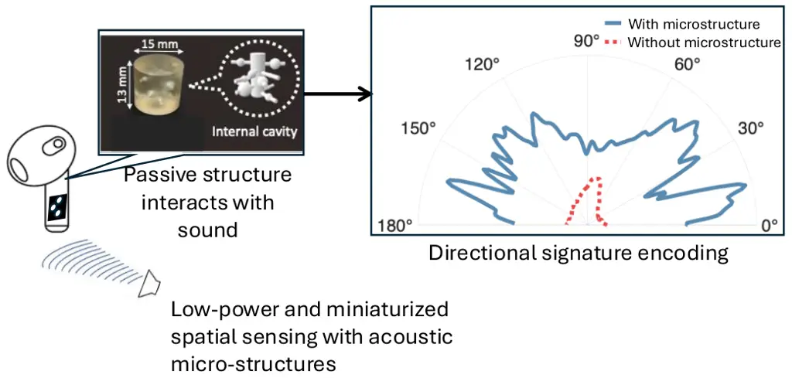

Figure 1: The vision and technical overview of Owlet (Garg et al.,
2021), a low-power and miniaturized system for introducing spatial
information into monaural recording of sound.

Microstructure-assisted spatial encoding builds upon the innovative
hardware design introduced in Owlet (Garg et al., 2021), which utilizes
a compact two-microphone array integrated with a microstructure to
achieve high spatial resolution. As shown in Figure 1, the
microstructure modifies sound wavefronts as they propagate, introducing
distinct acoustic patterns that encode angular information. The Owlet
system achieves spatial diversity in sound sensing with a monaural setup
by leveraging the physical principles of diffraction, capillary effects,
and structural resonance within a carefully designed microstructure.
Diffraction occurs as sound waves bend and scatter when interacting with
the edges and barriers inside the structure, creating phase shifts and
amplitude variations that depend on the sound’s DoA. Capillary effects
arise from the narrow channels within the microstructure, where confined
spaces alter sound propagation by introducing pressure gradients and
phase delays, further emphasizing directional differences in the
received signal. Additionally, structural resonance occurs when specific
sound frequencies align with the natural resonance modes of the
structure, amplifying certain frequency components while attenuating
others based on the sound’s angle of incidence. By combining these three
mechanisms, the Owlet design introduces directionally dependent
frequency responses, enabling precise DoA estimation with minimal
hardware complexity, avoiding the need for large microphone arrays while
maintaining high spatial resolution.

Monaural Recording Hardware: In its original design, Owlet used two
microphones, with an additional one placed outside the microstructure
cap. This extra microphone helped reduce the impact of room impulse
response on directional cues. Despite utilizing multiple microphones,
the system produces a monaural recording, where the sound wave is
essentially sampled at a single spatial location. Unlike binaural
recording hardware, which uses two separated microphones to achieve
spatial diversity, Owlet’s hardware captures multiple recordings using
closely placed microphones. As elaborated in Section 4, we leveraged the
second channel from the microphone outside the microstructure for speech
encoding and the microstructure-covered microphone channel for DoA
encoding.

### 3.2 Spatial Speech Generation

Capturing and annotating spatial speech in real-world environments is
often a labor-intensive process, further complicated by variations in
acoustic properties and the constraints of recording equipment. To
efficiently generate a diverse dataset that covers a wide range of sound
sources while ensuring comprehensive ground-truth metadata, a
simulation-based approach has been adopted.

For this study, we utilized the Librispeech dataset (Panayotov et al.,
2015), a publicly available corpus of high-quality English speech,
sampled at 16KHz. The dataset provides phonetically diverse speech
recordings, large vocabulary, and clean and noisy subsets, making it
ideal for speech recognition and spatial analysis under different
acoustic conditions (waywithwords2025speechdata). For the application of
spatial ASR, we generated a comprehensive 400-hour spatial speech
dataset. We pick 500 original samples from the LibriSpeech dataset, and
convoluted them with the impulse responses from 1° to 360° with 1°
resolution.

For the application of soundscaping, leveraging LibriSpeech, we
generated a comprehensive 2,000-hour spatial speech dataset that
simulates scenarios involving 1 to 5 speakers speaking simultaneously.
To ensure robust and representative data, the number of speakers is
evenly distributed across the dataset, with uniform coverage of DoA
angles. This design enhances the dataset’s robustness to variations in
DoA, speaker count, and speaker diversity. Multi-speaker samples were
created by randomly selecting speech segments and assigning distinct DoA
values, ensuring realistic spatial distributions and promoting
generalization to real-world scenarios. Our dataset, named OmniTalk,
symbolizes the 360° spatial diversity and multi-speaker dynamics it
embodies, offering a robust foundation for spatial speech processing.

Spatial Speech Generation Process: We created a synthetic spatial speech
dataset by convolving the clean Librispeech signals with Owlet-specific
impulse response at discrete angles. The system utilizes a set of
frequency-domain impulse response $`H(\omega,\theta)`$, where $`\omega`$
represents the angular frequency and $`\theta`$ denotes the angle of
arrival (in degrees). Since the microstructure has a consistent shape,
we did a one-time calibration of the impulse response. These responses
represent how the Owlet microstructure-based array processes incoming
speech signals from different directions. To convert the
frequency-domain representation into the time domain, an Inverse Fast
Fourier Transform (IFFT) is applied:

```math
h_{\theta}(t)=\mathcal{F}^{-1}\{H(\omega,\theta)\} \tag{1}
```

where $`h_{\theta}(t)`$ is the time-domain impulse response for angle
$`\theta`$. This transformation is performed for all the desired angles
$`\theta\in[1,360]`$, yielding angle-specific impulse responses. Each
speech file $`y_{\text{original}}(n)`$, sampled at original rate
$`f_{\text{original}}`$ is loaded and resampled to a uniform sampling
frequency $`f_{s}=16\,\text{kHz}`$. This ensures consistency across all
signals for accurate convolution wiht the impulse responses. The
resampled signal $`y(n)`$ is obtained as:

```math
y(n)=\text{Resample}\big(y_{\text{original}}(n),f_{s},f_{\text{original}}\big) \tag{2}
```

where the resampling operation adjusts the temporal resolution of the
signal while preserving it’s content.

To simulate how speech signal is perceived at angle $`\theta`$, the
resampled speech signal $`y(n)`$ is convolved with the corresponding
impulse response $`h_{\theta}(n)`$. The discrete-time convolution
operation is defined as:

```math
y_{\text{conv},\theta}(n)=(y*h_{\theta})(n)=\sum_{m=-\infty}^{\infty}y(m)\cdot h_{\theta}(n-m) \tag{3}
```

where,

- $`\bullet`$
  $`y(m)`$ is amplitude of the speech signal at time index $`m`$.
- $`\bullet`$
  $`h_{\theta}(n-m)`$ is the impulse response of the system for angle
  $`\theta`$, delayed by $`m`$ samples.
- $`\bullet`$
  $`y_{\text{conv},\theta}(n)`$ is the resulting signal after the speech
  is filtered by the spatial characteristics at angle $`\theta`$.

Refer to the spectrogram of recordings from different directions in
Appendix K.

Our dataset provides a high-fidelity synthetic spatial speech corpus
tailored for evaluating monaural spatial sensing models. By leveraging
Owlet-specific impulse responses, our dataset accurately simulates how
speech signals are perceived at different angles, ensuring realistic
spatial encoding. The one-time calibrated impulse responses maintain
consistency across experiments, eliminating variations caused by
environmental changes. Furthermore, the dataset is derived from
Librispeech, a widely used speech corpus, ensuring high-quality
linguistic content. The rigorous preprocessing steps, including uniform
resampling and frequency-to-time domain transformation via IFFT,
guarantee temporal alignment and signal integrity. By applying
discrete-time convolution with angle-specific impulse responses, our
dataset faithfully replicates the directional filtering imposed by the
Owlet microstructure, making it an ideal benchmark for spatial speech
recognition and DoA estimation tasks.

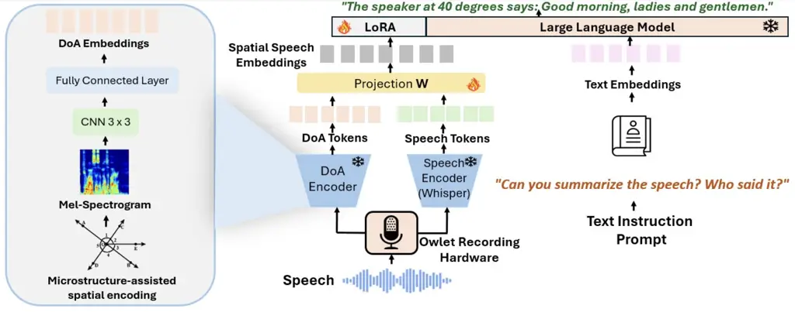

Figure 2: Spatial-aware framework for direction and speech
transcription.

## 4 SING: Spatial Context to Wearable LLM

Our system is designed to integrate spatial speech understanding into
LLMs while addressing the unique constraints of wearable devices. It
consists of three main components: spatial speech sensing, embedding
alignment, and LLM fine-tuning. As shown in Figure 2, the spatial speech
sensing module uses a Owlet recording hardware to capture
high-resolution spatial cues, such as directionality, without the need
for a traditional large microphone array. The recordings from the two
channels of the Owlet are the input for the DoA encoder and the speech
encoder. Spatial cues are processed into low-dimensional embeddings
using lightweight models. Whisper encodes raw speech into dense speech
embeddings that capture linguistic features. These embeddings together
with spatial embeddings are then aligned with the input space of LLMs.
The LLM is then fine-tuned on our spatial speech dataset, enabling it to
interpret speech and DoA.

### 4.1 Spatial Speech Encoder

Speech signal preprocessing. Different from existing work that uses an
array of microphones for spatial sensing, our system uses only a
monaural microphone inside the microstructure. Given the different
impulse responses from directions of speech, the amplitude of the signal
changes overtime, and different frequencies have different patterns of
amplitude change. Due to this nature, we convert the captured signal
from time domain $`x(n)`$ to frequency domain $`X(t,f)`$ using STFT

```math
X(t,f)=\sum_{n=0}^{N-1}x(n)\cdot w[n-t]\cdot e^{-j\frac{2\pi fn}{N}} \tag{4}
```

where w(n) represents a Window function of length N. Then we convert the
output into mel scale,

```math
S_{\text{mel}}(t,j)=\log\left(\sum_{k=1}^{K}|X(t,f)|^{2}\cdot H_{j}(k)+\epsilon\right) \tag{5}
```

where $`H_{j}(k)`$ is Mel filter for the j-th band, and $`\epsilon`$ is
a small constant to avoid log of zero.

DoA Encoder. The DoA encoder is a convolutional neural network,
balancing computational efficiency with robust feature extraction. The
architecture consists of three sequential convolutional blocks, each
comprising a 2D convolutional layer, batch normalization for stabilizing
training, a ReLU activation function, and max-pooling for spatial
dimension reduction. A flattening layer reshapes the output from the
convolutional layers into a 1D vector, which is then passed through a
fully connected layer with 512 units, followed by a dropout layer to
mitigate overfitting. The final linear layer maps the high-dimensional
feature vector to DoA prediction output. Refer to the 3D UMAP
visualization of the embeddings from different angles in Appendix G.

### 4.2 Speech-to-text Encoder.

The speech encoder utilized in this work is OpenAI’s Whisper
model (Radford et al., 2023). Its encoder generates features that are
well-suited for modeling speech and effectively incorporating contextual
information about background noises (Gong et al., 2023). To extract
Whisper embeddings, speech files are first processed to ensure
consistency in sampling rate, mono channel format and fixed duration by
padding to 30 seconds. The processed waveforms are passed through the
WhsiperProcessor for feature extraction, which generates mel-spectrogram
features as input to the model. We use a whisper-large-v3(Whisper, )
model for generating features. The encoder outputs hidden states for
each time frame, representing semantic and acoustic information. To
reduce the dimensionality while preserving critical information,
adaptive average pooling is applied to the hidden states along the
temporal axis, yielding fixed-size embeddings of shape \[POOL_SIZE,
hidden_dim\] for each speech file, where POOL_SIZE is 128 and hidden_dim
is 1024. The embeddings illustrate both temporal and semantic
characteristics of the speech for downstream tasks such as
transcription.

### 4.3 Alignment to LLM Space

Pretraining. The spatial encoder in our system is pre-trained on a
spatial ASR task consisting of two subtasks: DoA prediction, and speech
recognition. The DoA task estimates the directional angles of each
speaker. The ASR task transcribes spoken speech into text. The two tasks
are optimized using cross-entropy loss. The spatial embeddings derived
from DoA and the Whisper encoder are not inherently aligned with the
input space of LLMs. To address this, we adopted the approach outlined
in LLava (Liu et al., 2024), employing a simple linear layer as a
projection matrix, denoted as W, to map the spatial features into the
language embedding space of the LLM. This linear projection layer was
selected for its lightweight design, offering a more efficient and
streamlined solution compared to the Q-Former connection module used in
BLIP2 (Li et al., 2023a), the perceiver resampler and cross-attention
layers in Flamingo (Alayrac et al., 2022). This design choice
prioritizes efficiency and simplicity, ensuring seamless integration
without adding significant complexity to the model architecture.

Supervised Fine-Tuning. We fine-tuned our pre-trained model using an
instruction fine-tuning approach to enhance the LLM’s ability to follow
human instructions and provide greater control over its output.
Specifically, we adopted a supervised fine-tuning (SFT)
strategy (SFT_Trainer, ), enabling the model to learn from spatial
embeddings, prompts, and their corresponding responses under direct
supervision. For this purpose, we use the LLaMA 3.2 3B model (Touvron
et al., 2023) with LoRA (Hu et al., 2021), a method that optimizes the
fine-tuning process for spatial speech understanding. (Refer to the
detailed prompts in Appendix I) Instead of modifying the entire model,
LoRA introduces trainable low-rank matrices into the lower layers of the
LLM, significantly reducing computational and memory overhead while
accelerating training.

## 5 Soundscaping: Multi-DoA Encoder

Soundscaping for LLM will enhance human-AI interaction by creating more
natural, immersive and context-aware auditory experiences. We present
the first approach to incorporate multi-direction of arrival (multi-DoA)
information into an LLM. Our multi-DoA encoder consists of two key
components: a number-of-speaker encoder and a DoA encoder. The
number-of-speaker encoder predicts the count of active speakers in the
environment. (Refer to the performance of number-of-speaker encoder in
Appendix J) Based on the number of speakers, we call the corresponding
DoA encoder, capturing the precise DoA angles. We train 5 DoA encoders,
ranging from 1 to 5 speakers. The embeddings generated by the
number-of-speaker encoder and the corresponding DoA encoder are
concatenated to form a unified representation, which serves as the
output of our spatial speech encoder $`Z`$ as:

```math
Z_{spatial}=Concat(Num-speaker(X),DoA(X)), \tag{6}
```

where $`X`$ is a 8-second speech input, Num-speaker(·) and DoA(·) are
the number-of-speaker encoder and DoA enoder, Concat(·) is the
concatenation operation along the feature dimension. The
number-of-speaker encoder follows same structure as the DoA encoder
introduced in Section 4.1. The DoA encoders share the same structure
involves adjusting the final fully connected layer to produce a
regression output representing multiple DoAs sorted in ascending order.
This change allows the model to handle dynamic outputs while maintaining
the original convolutional structure for feature extraction. The
concatenated embedding is also aligned to the LLM space following the
same strategy as described in Section 4.3. We prepared question answer
pair for finetuning the LLM model generating contextual responses for
multiple DoA detection.

## 6 Evaluation of Spatial-Aware ASR

### 6.1 Dataset

To evaluate the proposed microstructure-based spatial speech encoder,
there are no publicly available real or synthetic datasets that consist
of general speech. Since DNN-based methods need sufficiently large
datasets to train on, we first calibrate the impulse response of the
microstructure from all angles, and then create a large synthetic
dataset by convolving the calibrated impulse response with the speech
samples in the LibriSpeech dataset, as described in Section 3.2. After
convolution with the impulse responses, we trim or pad these clips to 30
seconds. The resulting waveforms are monaural with only 1 channel at a
16kHz sampling rate. We use a window size of 400, a hop size of 160, and
80 mel-bins to compute the Short-Time Fourier Transforms (STFTs) and
mel-spectrograms. As a result, for a 30-second recording, the
Mel-spectrogram feature dimension is (1, 80, 3000).

### 6.2 Training Details

DoA encoder. The encoder is trained on 1 A100 GPU, with each epoch
taking approximately 20 minutes. The encoder was first trained as a
regression task where the output are the DoA values. We take the last
fully-connected layer as the embedding.

LLM alignment and fine-tuning. This part is separated into two stages.
We first lock the LLM model to train parameters for the projection
layer. After the loss has converged to stable, we fine-tune the LLM
model using LoRA to enhance the LLM’s ability to follow human
instructions and provide greater control over its output. The training
is completed on 3 H100 80 GB GPUs. Refer to the hyperparameters for
training in Appendix B.

### 6.3 Performance on Spatially Aware ASR

|                   |                                                       |                      |
| ----------------- | ----------------------------------------------------- | -------------------- |
| Model             | Supported Task                                        | Metric / Performance |
| BAT               | DoA Estimation + Audio Source Recognition (No Speech) | MAE (°) ↓: 88.52     |
| SING \[our work\] | DoA + Speech ASR (Spatial Awareness)                  | MAE (°) ↓: 25.72     |
| SALMONN           | Speech ASR and LLM Functions (No Spatial Awareness)   | WER (%) ↓: 2.2       |
| SING \[our work\] | Speech ASR (without DoA)                              | WER (%) ↓: 1.8       |
| SING \[our work\] | DoA + Speech ASR (Spatial Awareness)                  | WER (%) ↓: 5.3       |

Table 1: Comparison of Performance on Spatially Aware ASR with One Sound
Source. BAT supports DoA estimation and audio source type recognition,
while SALMONN focuses on speech ASR and other LLM functions but lacks
spatial awareness. Our model uniquely integrates DoA and ASR for
spatially aware ASR.

There is currently no existing work that integrates both DoA estimation
and ASR within a LLM framework. To provide a comprehensive evaluation,
we separately compare our model’s DoA performance with BAT and its ASR
performance with SALMONN, as shown in Table 2.

Since we only use the monaural microphone inside the microstructure for
DoA estimation, we compare our performance with BAT in monaural case.
Our model achieves a significantly lower Mean Absolute Error (MAE) of
25.72° compared to BAT’s 88.52°. This result underscores the strength of
our microstructure-based spatial encoding, which enables precise
localization of sound sources in a computationally efficient manner,
outperforming BAT’s approach. Our system also shows robust performance
under noise and room reverberation, as shown in Appendix E. Moreover, we
evaluated the performance for three other speech datasets and one audio
dataset. Further details can be found in Appendix F.

In terms of ASR, while our model achieves a word error rate (WER) of
5.3% for speech recognition in the spatial ASR configuration, which is
higher than SALMONN’s WER of 2.2%, it is important to highlight that our
model incorporates spatial features, a capability absent in SALMONN.
Integrating spatial information, such as DoA, introduces additional
complexity to the task by requiring the model to jointly process
acoustic and spatial cues. This enables advanced spatial reasoning and
makes our approach more versatile for applications involving spatially
distributed sound sources. Furthermore, when spatial features are
excluded, our model achieves a WER of 1.8%, outperforming SALMONN and
demonstrating its strong baseline performance for speech recognition.
These results underscore that the inclusion of spatial features, while
slightly increasing the WER, significantly broadens the utility of the
model, offering a trade-off between basic recognition accuracy and
enhanced spatial awareness. Refer to the qualitative examples in
Appendix C.

## 7 Evaluation of Multi-DoA Encoder

### 7.1 Dataset

Five datasets are generated with no temporally overlapping sources,
maximum two overlapping sources, maximum three overlapping sound
sources, four overlapping sound sources, and five overlapping sound
sources. We start synthesizing a recording by randomly choosing the
number of speech samples. Then we randomly pick the number of DoAs that
at least 10 degrees of separations are guaranteed between sound sources
to avoid spatial overlapping. After convolving the speeches with the
impulse response of its DoA, the convoluted speeches are summed together
as the final recording. The final recordings are first loudness
normalized by scaling them so that each clip has the same total sound
energy. The final recording is trim or pad to 8 seconds. The resulting
waveforms are monaural with only 1 channel at a 16kHz sampling rate. We
use a window size of 2048, a hop size of 512, and 128 mel-bins to
compute the Short-Time Fourier Transforms (STFTs) and mel-spectrograms.
As a result, for a 8-second recording, the Mel-spectrogram feature
dimension is (1, 128, 251).

### 7.2 Baseline

Since our approach enables DoA estimation using a monaural microphone,
which is fundamentally not achievable with traditional signal processing
methods like MUSIC (Kundu, 1996; Tang, 2014) that rely on multiple
microphones, we instead compare our model against deep learning-based
algorithms, as they can be designed to handle both monaural and
array-based spatial sensing setups. We compare our performance with
array-based speech DoA detection SELDNet (Adavanne et al., 2018).
Following the evaluation of BAT (Zheng et al., 2024), we train the
monaural-microphone based model AudioMAE (Huang et al., 2022) using our
microstructure-encoded monaural-microphone dataset for DoA estimation.

| Model       | Metric                        | 1 Source | 2 Sources | 3 Sources | 4 Sources | 5 Sources |
| ----------- | ----------------------------- | -------- | --------- | --------- | --------- | --------- |
| SELDNet     | MAE ($`\downarrow`$)          | 90.03    | ✗         | ✗         | ✗         | ✗         |
|             | MEEM ($`\downarrow`$)         | 360.12   | ✗         | ✗         | ✗         | ✗         |
|             | Median Error ($`\downarrow`$) | 90.14    | ✗         | ✗         | ✗         | ✗         |
| AudioMAE    | MAE ($`\downarrow`$)          | 43.79    | ✗         | ✗         | ✗         | ✗         |
|             | MEEM ($`\downarrow`$)         | 43.79    | ✗         | ✗         | ✗         | ✗         |
|             | Median Error ($`\downarrow`$) | 27.79    | ✗         | ✗         | ✗         | ✗         |
| SING (Ours) | MAE ($`\downarrow`$)          | 25.72    | 24.16     | 28.11     | 23.31     | 17.08     |
|             | MEEM ($`\downarrow`$)         | 25.72    | 24.16     | 28.11     | 23.31     | 17.08     |
|             | Median Error ($`\downarrow`$) | 13.00    | 13.00     | 20.00     | 18.00     | 13.00     |

Table 2: Comparison of MAE DOA error and MEEM across models with a known
number of active sources. MEEM is calculated as
$`\text{MSE}\times(\text{Number of Microphones})`$.

### 7.3 Evaluation Metrics

To comprehensively evaluate the performance of our model and facilitate
fair comparisons with prior works, we employ three metrics: Mean
Absolute Error (MAE), the Modified Error Efficiency Metric (MEEM), and
median error. MAE is a widely used metric that quantifies the average
angular difference, in degrees, between the estimated and ground-truth
DoA. This metric directly evaluates the accuracy of the DoA predictions,
offering an intuitive understanding of the model’s spatial localization
capabilities. In addition to MAE, we introduce MEEM, which is designed
to normalize the performance by accounting for the number of microphones
used in the system. MEEM is calculated as
MEEM=MSE×(Number of Microphones), where MSE represents the mean squared
error of the DoA predictions. Unlike traditional metrics, MEEM provides
a balanced view of model efficiency by penalizing setups that require a
larger number of microphones, making it particularly useful for
comparing models designed for minimalist setups like ours. By combining
these two metrics, we not only assess the raw accuracy of the models but
also highlight the efficiency of our approach in leveraging a monaural
microphone compared to multi-microphone arrays. We also show the median
error of DoA as a better understanding of the distribution of errors.

### 7.4 Performance of DoA Estimation

Table  presents the DoA estimation performance of various models under
scenarios with a known number of active sources. SELDNet, utilizing four
microphones, shows relatively high MAE error for a single source
(90.03°). Due to the lack of spatial information in AudioMAE, it shows a
MAE of 43.79° and a median error of 27.79°. Our proposed model, using
only one microphone, achieves competitive performance despite its
minimalist hardware setup. For one source, it yields an MAE of 25.72°
and median error of 13.00°, which outperforms AudioMAE, showing the
efficiency of microstructure. Notably, for scenarios involving two or
more sources, our model demonstrates robust performance with MAE values
of 24.16°, 28.11°, 23.31°, and 17.08° for two, three, four, and five
sources, respectively. Refer to the CDF plots in Appendix H. These
results highlight the ability of our monaural-microphone approach to
provide reasonable DoA estimation accuracy while minimizing hardware
complexity, making it suitable for wearable and low-power applications.
Additionally, the MEEM values underline the efficiency of our approach
in leveraging minimal hardware without significant performance
trade-offs. For qualitative results, refer to Appendix D.

## 8 Discussion and Future Work

Our work demonstrates the feasibility of integrating spatial speech
understanding into LLMs through a novel combination of spatial audio
encoders, DoA estimation, and speech recognition. By leveraging compact
microstructure-based sensing, we enable accurate speech transcription
and spatial awareness using significantly compact microphones compared
to traditional systems. Our method embeds spatial cues directly within a
monaural recording, allowing precise DoA estimation in an extremely
compact design, unlocking new possibilities for minimalist perception
approaches and wearable sensing technologies. While our model achieves
competitive performance in both numerical and qualitative evaluations,
several limitations and opportunities for future exploration remain.

Future work. Future work will focus on extending the spatial encoder to
support elevation angle estimation, enabling full 3D spatial audio
processing. Furthermore, collecting real-world datasets with diverse
acoustic conditions and speaker configurations will enhance the
robustness and applicability of the system. Another promising direction
is the integration of multimodal inputs, such as combining visual
information from cameras with audio, to improve spatial understanding
and enable richer context-aware applications. We also plan to optimize
the system for low-power hardware, ensuring its viability for real-time
processing on wearable devices.

## 9 Conclusion

In this work, we introduced a framework for spatial speech understanding
integrated with LLMs, enabling directional audio processing and speech
recognition on compact wearable devices. Through a microstructure-based
spatial encoder and alignment with Whisper embeddings, our system
achieves DoA estimation and speech ASR performance with minimal hardware
resources. This work paves the way for enhancing wearable technologies
in applications such as augmented reality and accessibility, laying a
foundation for future advancements in spatially aware LLMs.

## 10 Acknowledgment

This work was partially supported by NSF CAREER Award 2238433. We also
thank the various companies that sponsor the iCoSMoS laboratory at UMD.

## Impact Statement

This work introduces a novel framework for integrating spatial audio
context into LLMs, specifically designed for wearable devices. By
leveraging microstructure-based spatial sensing and efficient fusion
techniques, this research addresses key challenges in spatial speech
processing, such as computational efficiency, privacy, and hardware
constraints. The proposed system paves the way for transformative
applications in augmented reality, accessibility, and interactive
computing, enabling context-aware and intelligent interactions between
humans and machines. Beyond its technical contributions, this work has
the potential to improve accessibility for individuals with
disabilities, enhance safety in search-and-rescue operations, and
redefine user experiences in immersive environments. While promising,
the ethical implications of deploying such systems, including privacy
and responsible use, must be carefully considered to maximize societal
benefits.

## References

- Adavanne et al. (2018) Adavanne, S., Politis, A., Nikunen, J., and
  Virtanen, T. Sound event localization and detection of overlapping
  sources using convolutional recurrent neural networks. _IEEE Journal
  of Selected Topics in Signal Processing_, 13(1):34–48, 2018.
- Alayrac et al. (2022) Alayrac, J.-B., Donahue, J., Luc, P., Miech, A.,
  Barr, I., Hasson, Y., Lenc, K., Mensch, A., Millican, K., Reynolds,
  M., et al. Flamingo: a visual language model for few-shot learning.
  _Advances in neural information processing systems_,
  35:23716–23736, 2022.
- Anthropic (2023) Anthropic. Claude language model by anthropic.
  [https://www.anthropic.com/index/claude](https://www.anthropic.com/index/claude), 2023.
- Ardila et al. (2019) Ardila, R., Branson, M., Davis, K., Henretty, M.,
  Kohler, M., Meyer, J., Morais, R., Saunders, L., Tyers, F. M., and
  Weber, G. Common voice: A massively-multilingual speech corpus. _arXiv
  preprint arXiv:1912.06670_, 2019.
- Chen et al. (2024) Chen, J. C.-Y., Saha, S., Stengel-Eskin, E., and
  Bansal, M. Magdi: Structured distillation of multi-agent interaction
  graphs improves reasoning in smaller language models. _arXiv preprint
  arXiv:2402.01620_, 2024.
- Choi & Li (2024) Choi, H. K. and Li, Y. Picle: eliciting diverse
  behaviors from large language models with persona in-context learning.
  In _Proceedings of the 41st International Conference on Machine
  Learning_, ICML’24. JMLR.org, 2024.
- Cui et al. (2024) Cui, C., Ma, Y., Cao, X., Ye, W., and Wang, Z. Drive
  as you speak: Enabling human-like interaction with large language
  models in autonomous vehicles. In _Proceedings of the IEEE/CVF Winter
  Conference on Applications of Computer Vision_, pp. 902–909, 2024.
- FusionChat (2025) FusionChat. The future of listening: Google pixel
  buds to feature gemini llm and ai assistant, 2025. URL
  [https://fusionchat.ai/news/the-future-of-listening-google-pixel-buds-to-feature-gemini-llm-and-ai-assistant](https://fusionchat.ai/news/the-future-of-listening-google-pixel-buds-to-feature-gemini-llm-and-ai-assistant).
  Accessed: 2025-01-30.
- Garg et al. (2021) Garg, N., Bai, Y., and Roy, N. Owlet: Enabling
  spatial information in ubiquitous acoustic devices. In _Proceedings of
  the 19th Annual International Conference on Mobile Systems,
  Applications, and Services_, pp. 255–268, 2021.
- Ghosh et al. (2024) Ghosh, S., Kumar, S., Seth, A., Evuru, C. K. R.,
  Tyagi, U., Sakshi, S., Nieto, O., Duraiswami, R., and Manocha, D.
  Gama: A large audio-language model with advanced audio understanding
  and complex reasoning abilities. _arXiv preprint
  arXiv:2406.11768_, 2024.
- Gong et al. (2023) Gong, Y., Khurana, S., Karlinsky, L., and Glass, J.
  Whisper-at: Noise-robust automatic speech recognizers are also strong
  general audio event taggers. _arXiv preprint arXiv:2307.03183_, 2023.
- Hsieh et al. (2024) Hsieh, C.-Y., Zhang, J., Ma, Z., Kembhavi, A., and
  Krishna, R. Sugarcrepe: Fixing hackable benchmarks for vision-language
  compositionality. _Advances in neural information processing systems_,
  36, 2024.
- Hu et al. (2021) Hu, E. J., Shen, Y., Wallis, P., Allen-Zhu, Z., Li,
  Y., Wang, S., Wang, L., and Chen, W. Lora: Low-rank adaptation of
  large language models. _arXiv preprint arXiv:2106.09685_, 2021.
- Huang et al. (2024a) Huang, D., Yan, C., Li, Q., and Peng, X. From
  large language models to large multimodal models: A literature review.
  _Applied Sciences_, 14(12):5068, 2024a.
- Huang et al. (2022) Huang, P.-Y., Xu, H., Li, J., Baevski, A., Auli,
  M., Galuba, W., Metze, F., and Feichtenhofer, C. Masked autoencoders
  that listen. _Advances in Neural Information Processing Systems_,
  35:28708–28720, 2022.
- Huang et al. (2024b) Huang, R., Li, M., Yang, D., Shi, J., Chang, X.,
  Ye, Z., Wu, Y., Hong, Z., Huang, J., Liu, J., et al. Audiogpt:
  Understanding and generating speech, music, sound, and talking head.
  In _Proceedings of the AAAI Conference on Artificial Intelligence_,
  volume 38, pp. 23802–23804, 2024b.
- Ito (2017) Ito, K. The lj speech dataset. Online, 2017. URL
  [https://keithito.com/LJ-Speech-Dataset/](https://keithito.com/LJ-Speech-Dataset/).
  Accessed: 2025-01-29.
- Knapp & Carter (1976) Knapp, C. and Carter, G. The generalized
  correlation method for estimation of time delay. _IEEE transactions on
  acoustics, speech, and signal processing_, 24(4):320–327, 1976.
- Kumaran et al. (2023) Kumaran, V., Rowe, J., Mott, B., and Lester, J.
  Scenecraft: Automating interactive narrative scene generation in
  digital games with large language models. In _Proceedings of the AAAI
  Conference on Artificial Intelligence and Interactive Digital
  Entertainment_, volume 19, pp. 86–96, 2023.
- Kundu (1996) Kundu, D. Modified music algorithm for estimating doa of
  signals. _Signal processing_, 48(1):85–90, 1996.
- Li et al. (2023a) Li, J., Li, D., Savarese, S., and Hoi, S. Blip-2:
  Bootstrapping language-image pre-training with frozen image encoders
  and large language models. In _International conference on machine
  learning_, pp. 19730–19742. PMLR, 2023a.
- Li et al. (2024) Li, W., Fan, H., Wong, Y., Yang, Y., and
  Kankanhalli, M. Improving context understanding in multimodal large
  language models via multimodal composition learning. In _Proceedings
  of the 41st International Conference on Machine Learning_, ICML’24.
  JMLR.org, 2024.
- Li et al. (2023b) Li, Y., Yuan, R., Zhang, G., Ma, Y., Chen, X., Yin,
  H., Xiao, C., Lin, C., Ragni, A., Benetos, E., et al. Mert: Acoustic
  music understanding model with large-scale self-supervised training.
  _arXiv preprint arXiv:2306.00107_, 2023b.
- Liu et al. (2024) Liu, H., Li, C., Wu, Q., and Lee, Y. J. Visual
  instruction tuning. _Advances in neural information processing
  systems_, 36, 2024.
- McInnes et al. (2018) McInnes, L., Healy, J., and Melville, J. Umap:
  Uniform manifold approximation and projection for dimension reduction.
  _arXiv preprint arXiv:1802.03426_, 2018.
- MosaicML (2023) MosaicML. Introducing mpt-7b: A new standard for
  open-source, commercially usable language models. 2023. URL
  [https://www.mosaicml.com/blog/mpt-7b](https://www.mosaicml.com/blog/mpt-7b).
- Nagrani et al. (2017) Nagrani, A., Chung, J. S., and Zisserman, A.
  Voxceleb: a large-scale speaker identification dataset. _arXiv
  preprint arXiv:1706.08612_, 2017.
- OpenAI (2023) OpenAI. Gpt-4 technical report. _arXiv preprint
  arXiv:2303.08774_, 2023. URL
  [https://arxiv.org/abs/2303.08774](https://arxiv.org/abs/2303.08774).
- Panayotov et al. (2015) Panayotov, V., Chen, G., Povey, D., and
  Khudanpur, S. Librispeech: an asr corpus based on public domain audio
  books. In _2015 IEEE international conference on acoustics, speech and
  signal processing (ICASSP)_, pp. 5206–5210. IEEE, 2015.
- Park et al. (2021) Park, S., Jeong, Y., and Lee, T. Many-to-many audio
  spectrogram tansformer: Transformer for sound event localization and
  detection. In _DCASE_, pp. 105–109, 2021.
- Pekmezci & Genc (2024) Pekmezci, M. and Genc, Y. Evaluation of ssim
  loss function in rir generator gans. _Digital Signal Processing_,
  154:104685, 2024.
- Piczak (2015) Piczak, K. J. Esc: Dataset for environmental sound
  classification. In _Proceedings of the 23rd ACM international
  conference on Multimedia_, pp. 1015–1018, 2015.
- Radford et al. (2023) Radford, A., Kim, J. W., Xu, T., Brockman, G.,
  McLeavey, C., and Sutskever, I. Robust speech recognition via
  large-scale weak supervision. In _International conference on machine
  learning_, pp. 28492–28518. PMLR, 2023.
- Roy & Kailath (1989) Roy, R. and Kailath, T. Esprit-estimation of
  signal parameters via rotational invariance techniques. _IEEE
  Transactions on acoustics, speech, and signal processing_,
  37(7):984–995, 1989.
- Schmidt (1986) Schmidt, R. Multiple emitter location and signal
  parameter estimation. _IEEE transactions on antennas and propagation_,
  34(3):276–280, 1986.
- (36) SFT_Trainer. Hugging face sft trainer documentation. URL
  [https://huggingface.co/docs/trl/en/sft_trainer](https://huggingface.co/docs/trl/en/sft_trainer).
- Song et al. (2023) Song, S., Li, X., Li, S., Zhao, S., Yu, J., Ma, J.,
  Mao, X., and Zhang, W. How to bridge the gap between modalities: A
  comprehensive survey on multimodal large language model. _arXiv
  preprint arXiv:2311.07594_, 2023.
- Sun et al. (2024) Sun, G., Yu, W., Tang, C., Chen, X., Tan, T., Li,
  W., Lu, L., Ma, Z., Wang, Y., and Zhang, C. video-salmonn:
  speech-enhanced audio-visual large language models. In _Proceedings of
  the 41st International Conference on Machine Learning_, ICML’24.
  JMLR.org, 2024.
- Tang et al. (2023) Tang, C., Yu, W., Sun, G., Chen, X., Tan, T., Li,
  W., Lu, L., Ma, Z., and Zhang, C. Salmonn: Towards generic hearing
  abilities for large language models. _arXiv preprint
  arXiv:2310.13289_, 2023.
- Tang et al. (2024) Tang, C., Yu, W., Sun, G., Chen, X., Tan, T., Li,
  W., Zhang, J., Lu, L., Ma, Z., Wang, Y., et al. Can large language
  models understand spatial audio? _arXiv preprint
  arXiv:2406.07914_, 2024.
- Tang (2014) Tang, H. Doa estimation based on music algorithm, 2014.
- Team (2023) Team, V. Vicuna: An open-source chatbot impressing gpt-4
  with 90%\* chatgpt quality. _LMSYS Org_, 2023. URL
  [https://lmsys.org/blog/2023-03-30-vicuna/](https://lmsys.org/blog/2023-03-30-vicuna/).
- Touvron et al. (2023) Touvron, H., Lavril, T., Izacard, G., Martinet,
  X., Lachaux, M.-A., Lacroix, T., Rozière, B., Goyal, N., Hambro, E.,
  Azhar, F., et al. Llama: Open and efficient foundation language
  models. _arXiv preprint arXiv:2302.13971_, 2023.
- Wang et al. (2023) Wang, Y., Yang, B., and Li, X. Fn-ssl: Full-band
  and narrow-band fusion for sound source localization. _arXiv preprint
  arXiv:2305.19610_, 2023.
- (45) Whisper. Whisper large v3 model. URL
  [https://huggingface.co/openai/whisper-large-v3](https://huggingface.co/openai/whisper-large-v3).
- Xu et al. (2017a) Xu, Q., Jiang, C., Han, Y., Wang, B., and Liu, K. R.
  Waveforming: An overview with beamforming. _IEEE Communications
  Surveys & Tutorials_, 20(1):132–149, 2017a.
- Xu et al. (2017b) Xu, Y., Kong, Q., Huang, Q., Wang, W., and Plumbley,
  M. D. Convolutional gated recurrent neural network incorporating
  spatial features for audio tagging. In _2017 International Joint
  Conference on Neural Networks (IJCNN)_, pp. 3461–3466. IEEE, 2017b.
- Yang et al. (2022) Yang, B., Ding, R., Ban, Y., Li, X., and Liu, H.
  Enhancing direct-path relative transfer function using deep neural
  network for robust sound source localization. _CAAI Transactions on
  Intelligence Technology_, 7(3):446–454, 2022.
- Yin et al. (2023) Yin, S., Fu, C., Zhao, S., Li, K., Sun, X., Xu, T.,
  and Chen, E. A survey on multimodal large language models. _arXiv
  preprint arXiv:2306.13549_, 2023.
- Zheng et al. (2024) Zheng, Z., Peng, P., Ma, Z., Chen, X., Choi, E.,
  and Harwath, D. Bat: Learning to reason about spatial sounds with
  large language models. _arXiv preprint arXiv:2402.01591_, 2024.

## Appendix A Towards Spatially Aware Language Models

Large Language Models (LLMs) have proven invaluable for a wide range of
applications by assisting with complex tasks such as legal text
interpretation and other specialized domains including healthcare,
finance and academic research. However, as human interactions and
real-world scenarios increasingly demand context that goes beyond
textual or verbal cues, integrating spatial knowledge into LLMs has
become essential. Humans not only understand semantic context but also
perceive and interpret physical cues such as sound and location, which
inform more holistic decision-making in daily life. In this vein, the
physics-aware LLMs can power applications like autonomous robotics that
need to navigate and interact with three-dimensional spaces, or
digital-twins that can simulate real-world environments for urban
planning, energy management, and supply chain optimization. By grounding
LLMs in the realm of physical space, we ensure these models can provide
more accurate, relevant and human like support, bridging the gap between
abstract textual reasoning and tangible real-world contexts.

## Appendix B Hyperparameters

SING presents specific hyperparameters for DoA encoder, LLM pretraining
and finetuning in Table  3.

|                 |                   |                 |                 |
| --------------- | ----------------- | --------------- | --------------- |
| Hyperparam      | DoA Encoder       | LLM Pretraining | LLM Fine-Tuning |
| batch_size      | 32                | 8               | 8               |
| num_epochs      | 20                | 5               | 10              |
| learning_rate   | 0.001             | 1e-5            | 1e-5            |
| patience        | 5                 | ✗               | ✗               |
| warmup_steps    | ✗                 | 0               | 0               |
| loss_function   | MSELoss           | Causal LM loss  | Causal LM loss  |
| optimizer       | Adam              | AdamW           | AdamW           |
| scheduler       | ReduceLROnPlateau | Linear          | Linear          |
| gradient_chkpt  | ✗                 | Enabled         | Enabled         |
| max_seq_length  | ✗                 | 512             | 512             |
| LoRA_rank (r)   | ✗                 | ✗               | 8               |
| LoRA_alpha      | ✗                 | ✗               | 16              |
| LoRA_dropout    | ✗                 | ✗               | 0.1             |
| device          | CPU/GPU           | Multi-GPU Dist. | Multi-GPU Dist. |
| mixed_precision | ✗                 | FP16 autocast   | FP16 autocast   |

Table 3: Key hyperparameters for the DoA Encoder, LLM Pretraining, and
LLM Fine-Tuning. ‘✗‘ indicates that the hyperparameter does not apply.

## Appendix C Responses Generated for Spatial-Aware ASR

We present several examples of the spatial transcriptions from SING as
shown in Table  4.

| Spatial Transcriptions                                                                               |
| ---------------------------------------------------------------------------------------------------- |
| The speaker is speaking approximately at angle 61 degrees. The speech says: Lectures.                |
| The speaker is speaking approximately at angle 182 degrees. The speech says: The Emperor’s Daughter. |
| The speaker is speaking approximately at angle 140 degrees. The speech says: The Wandering Singer.   |
| The speaker is speaking approximately at angle 96 degrees. The speech says: Tom nodded worriedly.    |

Table 4: Spatial-aware ASR.

## Appendix D Responses Generated for Multiple Direction of Arrival Detection

Table 5 presents several examples of number of sound source inference
and the DoA detections from SING.

| Num of Sources | Response Generated                                                                                                                                                                                                                                                                                 |
| -------------- | -------------------------------------------------------------------------------------------------------------------------------------------------------------------------------------------------------------------------------------------------------------------------------------------------- |
| 1              | There is one speech source. The speech source’s degree of arrival is 77.0 degrees.                                                                                                                                                                                                                 |
| 2              | There are 2 speech sources. Speech source 1’s degree of arrival is 39.0 degrees, and speech source 2’s degree of arrival is 101.0 degrees.                                                                                                                                                         |
| 3              | There are 3 speech sources. speech source 1’s degree of arrival is 18 degrees, speech source 2’s degree of arrival is 39 degrees, and speech source 3’s degree of arrival is 257 degrees.                                                                                                          |
| 4              | There are 4 speech sources. Speech source 1’s degree of arrival is 3 degrees, speech source 2’s degree of arrival is 118 degrees, speech source 3’s degree of arrival is 203 degrees, and speech source 4’s degree of arrival is 242 degrees.                                                      |
| 5              | There are 5 speech sources. Speech source 1’s degree of arrival is 34 degrees, speech source 2’s degree of arrival is 161 degrees, speech source 3’s degree of arrival is 195 degrees, speech source 4’s degree of arrival is 234 degrees, and speech source 5’s degree of arrival is 317 degrees. |

Table 5: Response generated for multiple DoA detection.

## Appendix E Performance under Noise and Room Reverberation

To evaluate the impact of noise and reverberation on our system’s
performance, we leverage the GTU-RIR dataset (Pekmezci & Genc, 2024).
This dataset provides high-fidelity room impulse responses (RIRs)
measured in diverse acoustic environments. including 11 rooms with types
of classroom, conference hall, sports hall, office, hotel room and
staircase, making it ideal for simulating realistic reverberation
conditions in our evaluation. To systematically assess the robustness of
our model, we conduct experiments under controlled conditions with
varying levels of signal-to-noise ratio (SNR) and reverberation. Table 6
presents the results, showing the Mean Absolute Error (MAE) and Median
Error in degrees across different test conditions. Our findings indicate
that while reverberation and noise impact DoA accuracy, our system
remains robust compared to existing work. Specifically, without noise or
reverberation, we achieve a MAE of 25.72°, which increases to 48.69°
under reverberation, demonstrating the effect of multipath reflections.
The addition of noise at different SNR levels further degrades
performance, with errors increasing as noise levels rise. These results
underscore the importance of robust spatial encoding techniques in
real-world applications, particularly in noisy and reverberant
environments. Future work will focus on adaptive denoising strategies
and spatial de-reverberation methods to enhance the resilience of our
framework in challenging acoustic conditions.

| Noise | Reverberation | MAE (°) $`\downarrow`$ | Median Error (°) $`\downarrow`$ |
| ----- | ------------- | ---------------------- | ------------------------------- |
| ✗     | ✗             | 25.72                  | 13.00                           |
| ✗     | ✓             | 48.69                  | 28.42                           |
| 60dB  | ✓             | 48.57                  | 28.27                           |
| 50dB  | ✓             | 49.50                  | 28.95                           |
| 40dB  | ✓             | 50.89                  | 31.08                           |
| 30dB  | ✗             | 33.01                  | 21.25                           |
| 30dB  | ✓             | 54.43                  | 33.12                           |

Table 6: Performance under noise and room reverberation: We employ our
proposed architecture to infer under distinct scenarios, with and
without noise (different SNR in dB levels) and and reverberation.

## Appendix F Performance on Different Datasets

To assess the generalizability of our proposed spatial-aware ASR system,
we evaluate its performance across multiple datasets, including our
synthetically generated dataset based on LibriSpeech, as well as other
speech datasets Common Voice (Ardila et al., 2019), VoxCeleb (Nagrani
et al., 2017), and LJ Speech (Ito, 2017). Our results in Table 7
indicate that the model achieves the lowest MAE and Median Error,
benefiting from the model trained using the same dataset. However, when
tested on other datasets, the MAE and Median Error slightly increases as
expected. Despite this, our system still outperforms existing baselines
in spatial-aware ASR tasks, demonstrating its robustness and
adaptability to different acoustic conditions. Other than speech, we
also test the performance on audio dataset ESC-50 (Piczak, 2015), also
shows robust performance as speech.

| Dataset               | MAE (°) $`\downarrow`$ | Median Error (°) $`\downarrow`$ |
| --------------------- | ---------------------- | ------------------------------- |
| LibriSpeech (speech)  | 25.72                  | 13.00                           |
| Common Voice (speech) | 53.34                  | 32.11                           |
| VoxCeleb (speech)     | 41.22                  | 25.80                           |
| LJ Speech (speech)    | 80.21                  | 34.73                           |
| ESC-50 (audio)        | 49.99                  | 24.65                           |

Table 7: Performance on Different Datasets: We evaluate our model across
several datasets, reporting MAE and Median Error for DoA estimation.

## Appendix G 3D UMAP Visualization of Spatial Embeddings

To evaluate the spatial embeddings derived from the DoA encoder, we
utilized UMAP (Uniform Manifold Approximation and Projection)(McInnes
et al., 2018) to visualize their structure in a reduced-dimensional
space. Figure 3 showcases the 3D UMAP visualizations, where the
embeddings capture spatial cues from all angles, effectively encoding
directional information. The clustering and angular organization of the
points demonstrate the encoder’s capacity to represent spatial diversity
and preserve the underlying spatial structure of the speech signals.
This provides valuable insights into the model’s ability to generalize
spatial features across multiple sound sources.

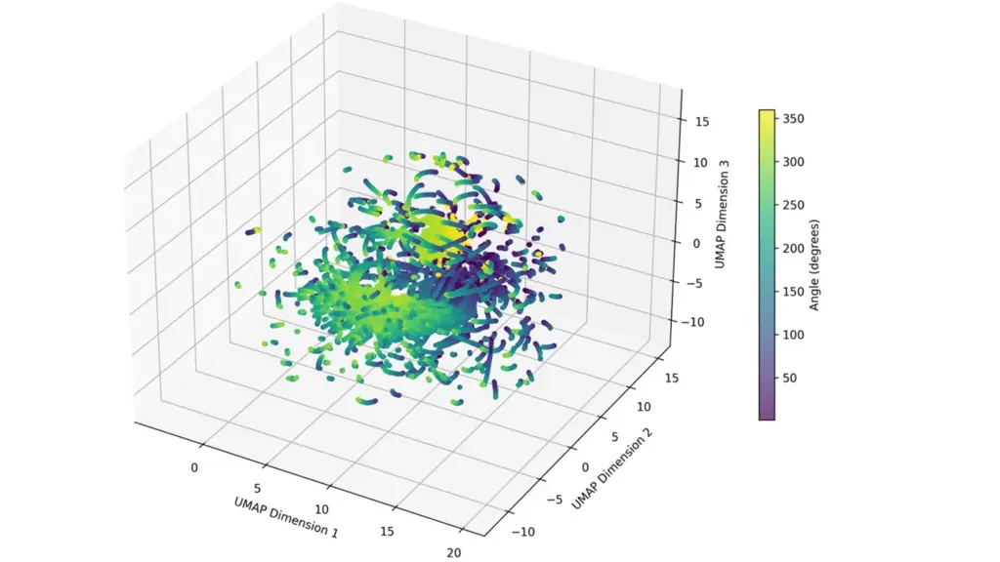

Figure 3: 3D UMAP visualization of spatial embeddings generated by the
DoA encoder.

## Appendix H Cumulative Distributive Analysis for different speech sources for SING

We focus on analyzing the mean and median errors across varying
conditions, illustrating our findings through comprehensive plots for
clarity. Figure 10 shows the cumulative distribution function (CDF)
plots for different speech sources.

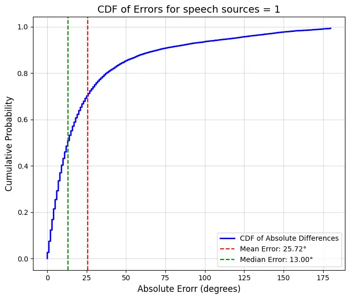

Figure 4: CDF for 1 DoA

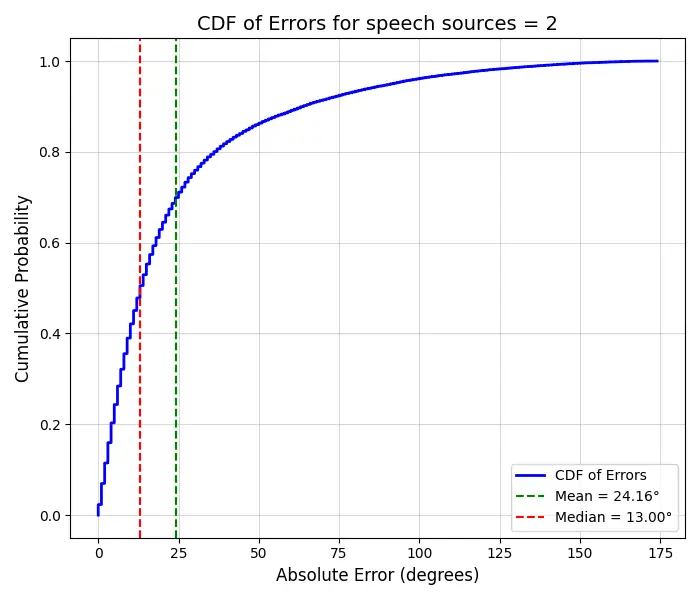

Figure 5: CDF for 2 DoAs

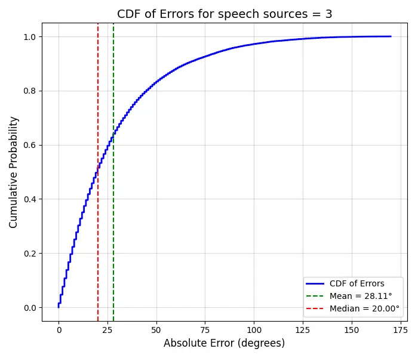

Figure 6: CDF for 3 DoAs

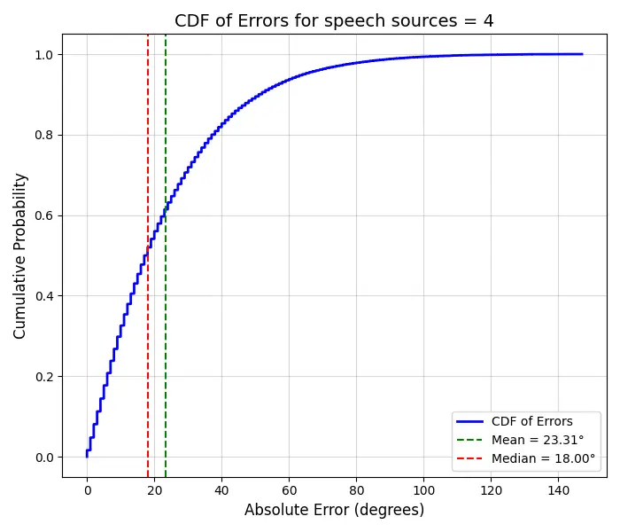

Figure 7: CDF for 4 DoAs

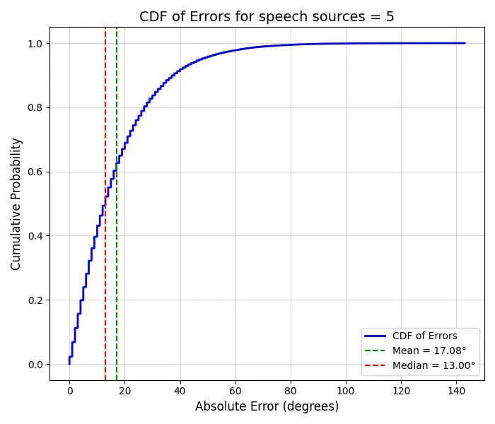

Figure 8: CDF for 5 DoAs

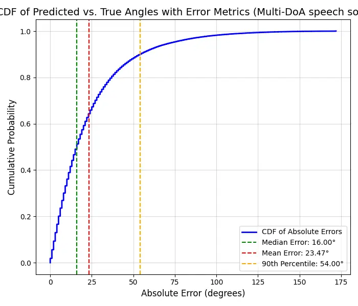

Figure 9: CDF for all speech sources

Figure 10: CDF plots of absolute errors for different numbers of speech
sources (DoAs). Mean and median errors are highlighted for comparison.

## Appendix I Prompt Details

To evaluate the capabilities of our Spatial-Aware ASR system, we design
various prompts corresponding to different speech processing tasks.
These prompts facilitate direction estimation, speaker counting, and
transcription summarization, enabling a more comprehensive understanding
of spatially distributed speech signals.

| Type                        | System Prompts                                                                                                                                                                      | Prompts                                                                     | Response Templates                                                                                                                         |
| --------------------------- | ----------------------------------------------------------------------------------------------------------------------------------------------------------------------------------- | --------------------------------------------------------------------------- | ------------------------------------------------------------------------------------------------------------------------------------------ |
| ASR (Whisper)               | You are an assistant that provides the summarization of the speech. Respond with the the correct summarization.                                                                     | What is the summarization of the speech?                                    | Mr. Swift’s eyes twinkled.                                                                                                                 |
| Spatial ASR (DoA + Whisper) | You are an assistant that provides the direction of the speech in degrees and a summarization of the speech. Respond with the exact angle in degrees and the correct summarization. | What is the direction of speech in degrees and summarization of the speech? | The speaker is speaking approximately at angle 217 degrees. The speech says: A low, deep moan broke from him.                              |
| DoA Detection               | You are an assistant that identifies the direction of sound. Respond with the exact angle in degrees.                                                                               | What is the direction of the speech source?                                 | The speech is coming from 45 degrees.                                                                                                      |
| Number of Speakers          | You are an assistant that identifies how many people are speaking at the same time. Respond with the exact numbers.                                                                 | How many people are speaking?                                               | There are 3 speech sources.                                                                                                                |
| Multi-DoA Detection         | You are an assistant that identifies how many people are speaking at the same time and the directions of speech. Respond with the exact angle in degrees.                           | How many people are speaking? What are the directions of the sound sources? | There are 2 speech sources. Speech source 1’s degree of arrival is 39.0 degrees, and speech source 2’s degree of arrival is 101.0 degrees. |

Table 8: Overview of different prompt types and their corresponding
response templates in the Spatial-Aware ASR system. The system is
capable of detecting speech direction, counting the number of speakers,
and summarizing transcriptions.

## Appendix J Performance of Number of Speakers Estimation

We show the performance of number of speakers estimation from the num of
speaker encoder. Figure 11 shows the normalized confusion matrix for the
number of speakers’ estimation task, represented as ratios. Each cell
indicates the proportion of predictions for a given actual class,
normalized by the total number of samples in that class. The diagonal
values highlight the model’s accuracy in correctly identifying the
number of speakers, with values close to 1 indicating high precision.
Off-diagonal values represent misclassifications, demonstrating the
model’s tendency to confuse certain classes. For example, the model
exhibits strong performance for classes 1, 2, 3, and 5, while class 4
shows more confusion with class 5, reflecting the challenges in
differentiating between these scenarios.

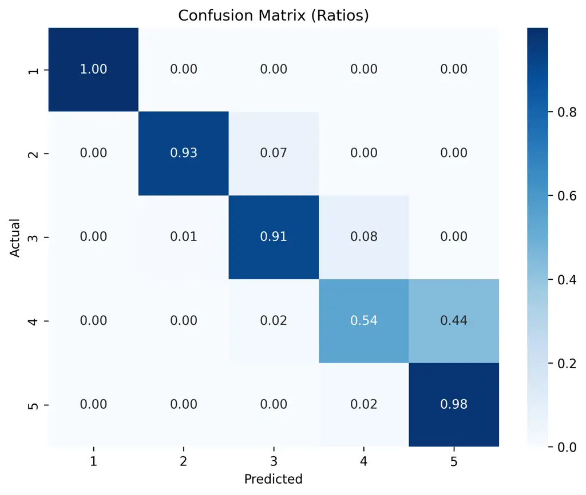

Figure 11: Confusion matrix for number of speakers estimation.

## Appendix K Spectrogram of Recordings from Directions

Figure 12 shows the difference between original speech and speech
signals coming from angles, captured by the microphone built in
microstructure. The differences in the spectrograms are evident in the
amplitude and frequency distributions, which vary significantly
depending on the Direction of Arrival (DoA). For example, at angles 244°
and 163°, the spectrograms display distinct patterns in the intensity
and distribution of energy across frequencies compared to the original
speech. These variations are introduced by the microstructure’s unique
modulation of sound waves, which embeds direction-specific
characteristics into the captured audio.

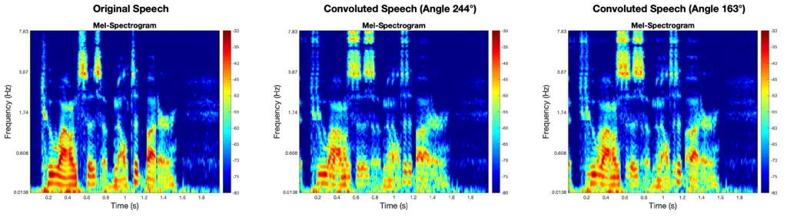

Figure 12: Comparison between original speech and speech captured from
directions.

langley00
