# Live![[Uncaptioned image]](arxiv-2504-16030--70ec757c8925.figures/figure-1.webp): Learning Video LLM with Streaming Speech Transcription at Scale

Joya Chen    Ziyun Zeng    Yiqi Lin    Wei Li    Zejun Ma    Mike Zheng
Shou Affiliation: ByteDance Affiliation: ByteDance    \[1mm\] Show Lab
   National University of Singapore

###### Abstract

Recent video large language models (Video LLMs) often depend on costly
human annotations or proprietary model APIs (_e.g._, GPT-4o) to produce
training data, which limits their training at scale. In this paper, we
explore large-scale training for Video LLM with cheap automatic speech
recognition (ASR) transcripts. Specifically, we propose a novel
streaming training approach that densely interleaves the ASR words and
video frames according to their timestamps. Compared to previous studies
in vision-language representation with ASR, our method naturally fits
the streaming characteristics of ASR, thus enabling the model to learn
temporally-aligned, fine-grained vision-language modeling. To support
the training algorithm, we introduce a data production pipeline to
process YouTube videos and their closed captions (CC, same as ASR),
resulting in
[Live-CC-5M](https://huggingface.co/datasets/chenjoya/Live-CC-5M)
dataset for pre-training and
[Live-WhisperX-526K](https://huggingface.co/datasets/chenjoya/Live-WhisperX-526K)
dataset for high-quality supervised fine-tuning (SFT). Remarkably, even
without SFT, the ASR-only pre-trained
[LiveCC-7B-Base](https://huggingface.co/chenjoya/LiveCC-7B-Base) model
demonstrates competitive general video QA performance and exhibits a new
capability in real-time video commentary. To evaluate this, we carefully
design a new
[LiveSports-3K](https://huggingface.co/datasets/stdKonjac/LiveSports-3K)
benchmark¹, using LLM-as-a-judge to measure the free-form commentary.
Experiments show our final
[LiveCC-7B-Instruct](https://huggingface.co/chenjoya/LiveCC-7B-Instruct)
model can surpass advanced 72B models (Qwen2.5-VL-72B-Instruct,
LLaVA-Video-72B) in commentary quality even working in a real-time mode.
Meanwhile, it achieves state-of-the-art results at the 7B/8B scale on
popular video QA benchmarks such as VideoMME and OVOBench, demonstrating
the broad generalizability of our approach. All resources of this paper
have been released at
[showlab.github.io/livecc](https://showlab.github.io/livecc). ²² 2
¹Welcome to participate the real-time video commentary competition at
CVPR25 workshop
[loveucvpr25/track2](https://sites.google.com/view/loveucvpr25/track2).
Free GPT-4o judging provided.

![[Uncaptioned
image]](arxiv-2504-16030--70ec757c8925.figures/figure-2.webp)

Figure 1: LiveCC provides real-time commentary for streaming video,
emulating a human commentator. This example is drawn from the YouTube
video (ID: [I7pTpMjqNRM](https://www.youtube.com/watch?v=I7pTpMjqNRM)),
featuring the Paris 2024 Olympics Men’s Basketball Final between France
and the USA. Our 7B model generates continuous commentary with a latency
of less than 0.5 seconds per frame, supporting real-time applications at
2 FPS.

¹¹ 1 ^(🖂)Corresponding Author.  ^(\*)Equal Contribution.

## 1 Introduction

The success of large language models (LLMs) OpenAI 2023a; OpenAI 2023b;
Touvron et al. 2023a; Touvron et al. 2023b; Dubey et al. 2024; Anil
et al. 2023; Bai et al. 2023a; Yang et al. 2024 owes much to the
large-scale auto-regressive language pre-training Kaplan et al. 2020;
Hoffmann et al. 2022; Radford et al. 2018; Radford et al. 2019; Brown
et al. 2020. This inspires large multimodal models (LMMs) Liu et al.
2023b; Zhu et al. 2023; OpenAI 2023c; GPT-4o 2024; Bai et al. 2023b,
which are initially only achieved by small-scale instruction tuning Liu
et al. 2023b; Zhu et al. 2023, to increasingly emphasize data scaling
during their training. While early large multimodal models (LMMs) such
as LLaVA Liu et al. 2023b were only supervised fine-tuned on 158K image
QA samples, recent advanced approaches Li et al. 2024b; Lin et al.
2024b; McKinzie et al. 2024; Zhang et al. 2024e; Chen et al. 2024d have
expanded the training data to millions of multimodal conversation
samples, substantially benefiting from the increased data size.

A long-term ambition in this field is to develop LMMs akin to
_J.A.R.V.I.S._, seamlessly assisting humans in real-life scenarios.
Building on prior successes in LLMs/LMMs, a possible way is to collect
extensive streaming video-text chat data. For instance, recordings of a
basketball coach providing real-time feedback to a novice player could
be great data for training. However, previous studies on streaming video
LLMs Chen et al. 2024a; Zhang et al. 2024a; Zhou et al. 2024; Qian
et al. 2025; Xiong et al. 2025; Zhang et al.; Liu et al. 2024a; Wang
et al. 2024b; Wang et al. 2024c; Fu et al. 2024b; Fu et al. 2025; Qian
et al. 2024 have explored the difficulties of collecting and scaling up
such data. They either rely on LLMs to generate “hallucinated” streaming
conversations from video annotations, or fine-tune on small-scale dense
caption datasets Krishna et al. 2017; Zhou et al. 2018; Huang et al. 2020. Neither approach is scalable enough to yield a truly powerful
streaming video LLM.

To address these limitations, two primary approaches merit
consideration. First, recent video-text datasets Zhang et al. 2024e;
Chen et al. 2024c; Chen et al. 2024b; Wang et al. 2023 increasingly
employ advanced LMMs, such as GPT-4o GPT-4o 2024, for synthetic data
generation. While effective, this approach is costly and risks violating
usage terms. Another alternative leverages the inherent audio channel in
videos by utilizing automatic speech recognition (ASR) transcriptions as
textual data. Prior works Miech et al. 2019; Zellers et al. 2022; Xue
et al. 2022; Yang et al. 2023b; Yang et al. 2023a have explored
large-scale video-ASR learning but typically treat ASR transcriptions as
global video captions, overlooking their valuable temporal alignment. In
practice, some ASR texts naturally synchronize with visual content,
offering an untapped opportunity for video-language learning,
escepically for streaming applications.

In this work, we aim to scale video LLM training by ASR transcriptions.
We propose a novel streaming training approach that densely interleaves
ASR words with corresponding video frames, as illustrated in Figure 5.
The model is trained to generate frame assigned ASR words in an
autoregressive manner. This approach marks a significant departure from
prior LMMs Liu et al. 2023b; Zhu et al. 2023; Chen et al. 2024a; Zhou
et al. 2024; Bai et al. 2023b, which primarily learn from complete
sentences or paragraphs. In contrast, our method simply learns the
native short, incomplete ASR word sequences that are temporally aligned
with video frames. This offers three key advantages: 1) it aligns
naturally with the real-world data, making it readily applicable to
video platforms like YouTube; 2) it enables the model to learn
fine-grained temporal correlations between visual content and spoken
language; and 3) during inference, it facilitates seamless streaming by
generating only a few words per frame, ensuring extremely low latency.

To achieve this goal, we address three fundamental challenges: 1) How
can video-ASR data be effectively curated and selected for training? 2)
How should video-ASR streaming sequences be efficiently modeled? 3) How
can streaming word generation—termed real-time video commentary—be
rigorously evaluated? To tackle these challenges, we first design a data
collection pipeline that integrates cost-effective techniques to enhance
ASR quality and improve visual-text alignment, such as active speaker
detection Liao et al. 2023 for filtering low-quality talking-head
videos. This pipeline enables the construction of the Live-CC-5M
pre-training set and the Live-WhisperX-526K SFT set. Next, we
incorporate our streaming pre-training approach into the
Qwen2-VL-7B-Base Wang et al. 2024a base model, yielding LiveCC-7B-Base,
and investigate key factors influencing accurate ASR word prediction,
such as leveraging video title and previous ASR as context to mitigate
the learning ambiguity. Then, we introduce LiveSports-3K, a new
benchmark that employs the LLM-as-a-judge Zheng et al. 2023 framework
for evaluating real-time video commentary. We fine-tune LiveCC-7B on
Live-WhisperX-526K and LLaVA-Video-178K Zhang et al. 2024e to obtain
LiveCC-7B-Instruct, achieving state-of-the-art performance on general QA
and streaming commentary tasks.

Extensive experiments demonstrate that our streaming pre-training
approach on Live-CC-5M substantially enhances commentary quality and
yields improvements in general video QA performance. By fine-tuning our
pre-trained model using the Live-WhisperX-526K dataset in conjunction
with LLaVA-Video-178K, our method achieves state-of-the-art results on
popular video QA benchmarks such as Video-MME Fu et al. 2024a and
OVOBench Li et al. 2025, as well as our proposed LiveSports-3K
benchmark, and delivers competitive performance on MVBench Li et al.
2024c. These results indicate that our comprehensive framework is not
only for real-time video commentary but also beneficial to common video
understanding capability.

## 2 Related Work

Large Multimodal Models. Early LMMs Alayrac et al. 2022; Li et al.
2023b; Liu et al. 2023b; Zhu et al. 2023; Dai et al. 2023 achieve image
dialogue by projecting the visual embedding (_e.g_., from CLIP Radford
et al. 2021; Zhai et al. 2023) to align with LLM token embedding space.
Then, lots of efforts explore more free-form interleaved vision-text
chatting OpenAI 2023c; Bai et al. 2023b; Li et al. 2023a; Anil et al.
2023; Yao et al. 2023; Liu et al. 2023a; Li et al. 2024b; Lin et al.
2024b, spatial/temporal grounding Zhang et al. 2023b; You et al. 2023;
Chen et al. 2023; Wang et al. 2024a; Lai et al. 2023; Lin et al. 2023b;
Ren et al. 2024, video comprehension Maaz et al. 2024; Li et al. 2023c;
Yang et al. 2023b; Zhang et al. 2023a; Song et al. 2023; Lin et al.
2023a; Zhang et al. 2024f; Fu et al. 2024b; GPT-4o 2024; Google 2024;
Shen et al. 2024, etc. Our model is also an LMM, but it offers new
insights into cost-effective and scalable ASR training data, as well as
a new capability of real-time video commentary.

Training Video LLMs. Popular video LLMs Zhang et al.; Wang et al. 2024a;
Bai et al. 2024; Zhang et al. 2024f; Chen et al. 2024d typically rely on
human- or LLM-crafted video caption/QA sequences for training. In
contrast, our work focuses on training less explored ASR transcription
data, leveraging its scalability and automatic extraction capabilities.
Several studies Zellers et al. 2022; Miech et al. 2019; Xue et al. 2022;
Yang et al. 2023b; Yang et al. 2023a; Lin et al. 2022 have investigated
learning spatio-temporal representations through video-ASR pre-training.
The most related work is Vid2Seq Yang et al. 2023b, which pre-trains a
model to predict timestamped ASR paragraph for videos. However, its
training paradigm still aligns with previous video captioning, aiming to
predict an overall event. In contrast, our approach aligns with the
streaming ASR, learning to predict short, incomplete ASR words per frame
causally, thereby enabling more fine-grained spatial-temporal learning.

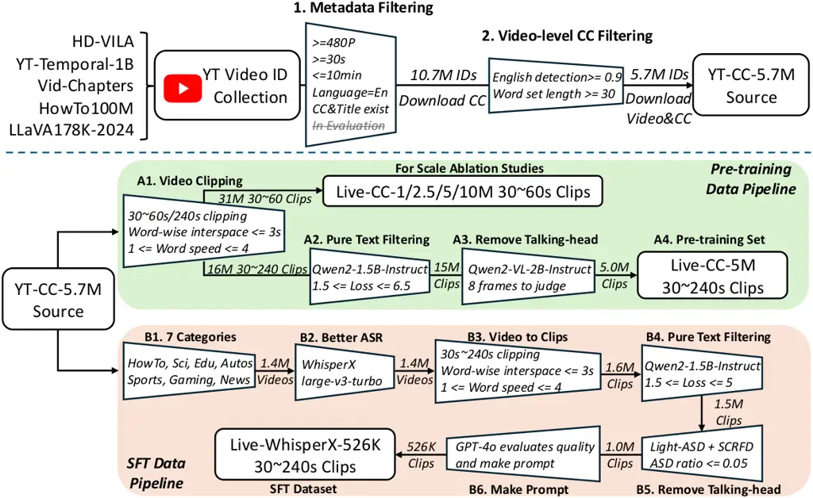

Figure 2: LiveCC data production pipeline. We begin by integrating
several large-scale YouTube video datasets Xue et al. 2022; Zellers
et al. 2022; Yang et al. 2023a; Miech et al. 2019; Zhang et al. 2024e,
followed by metadata filtering, resulting in a curated pool of 5.7M
videos. Then, the pre-training dataset is built using the original
YouTube CC, while the SFT dataset leverages higher-quality ASR
transcriptions generated by WhisperX Bain et al. 2023; Radford et al. 2023. We also introduce a set of efficient filtering techniques to
improve the SFT data quality. Please refer to Section 3.1 for details.

Streaming Video Understanding. Traditional video understanding
benchmarks Carreira and Zisserman 2017; Carreira et al. 2018; Goyal
et al. 2017; Heilbron et al. 2015; Idrees et al. 2017; Lei et al. 2018;
Mangalam et al. 2023; Xiao et al. 2021; AlAmri et al. 2019 allow models
to access entire video frames before making predictions, a setting
commonly referred to as “offline”. However, this paradigm does not align
well with many real-time applications (_e.g_., AR glasses). Previous
online video understanding tasks, such as online action detection Geest
et al. 2016; Zhao and Krähenbühl 2022; Zhao et al. 2023,
localization Buch et al. 2017; Singh et al. 2017; Kang et al. 2021, and
captioning Zhou et al. 2024, primarily focus on densely identifying
current or future actions. Recent advancements in streaming video
LLMs Chen et al. 2024a; Zhou et al. 2024; Qian et al. 2025; Zhang
et al.; Liu et al. 2024a; Wang et al. 2024b; Wang et al. 2024c; Fu
et al. 2024b; Fu et al. 2025; Qian et al. 2024 and benchmarks Xiong
et al. 2025; Lin et al. 2024a; Huang et al. 2025; Li et al. 2025 have
introduced capabilities such as proactive response, long-form streaming,
and interactive multimodal conversation. However, they heavily rely on
manual or GPT crafted data, and will be “blind” for video input before
the text/audio generation finished. Our work provides a comprehensive
solution that leverages ASR data to enhance both general QA and
streaming capabilities, and achieves novel real-time video commentary
feature, along with a new benchmark LiveSports-3K-CC for evaluation.

## 3 Methodology

### 3.1 Video-ASR Data Curation

To demonstrate the scalability of our pre-training strategy, we
aggregate four recent large-scale video datasets–HD-VILA Xue et al.
2022, YT-Temporal-1B Zellers et al. 2022, VidChapters Yang et al. 2023a,
and HowTo100M Miech et al. 2019–as our video sources. As illustrated in
Figure 2, we begin by retrieving video metadata (e.g., title, duration,
category) and the corresponding YouTube closed captions (CC) using the
released video IDs. To ensure high visual quality, we retain only videos
with a resolution of at least 480p. For storage efficiency, we filter
videos to be between 30 seconds and 10 minutes in length. We further
require the presence of both CC and title metadata. Additionally, we
observe that English videos typically yield better ASR quality;
therefore, we restrict our selection to English-language content.
Applying these filtering criteria results in a curated set of 10.7
million YouTube video IDs.

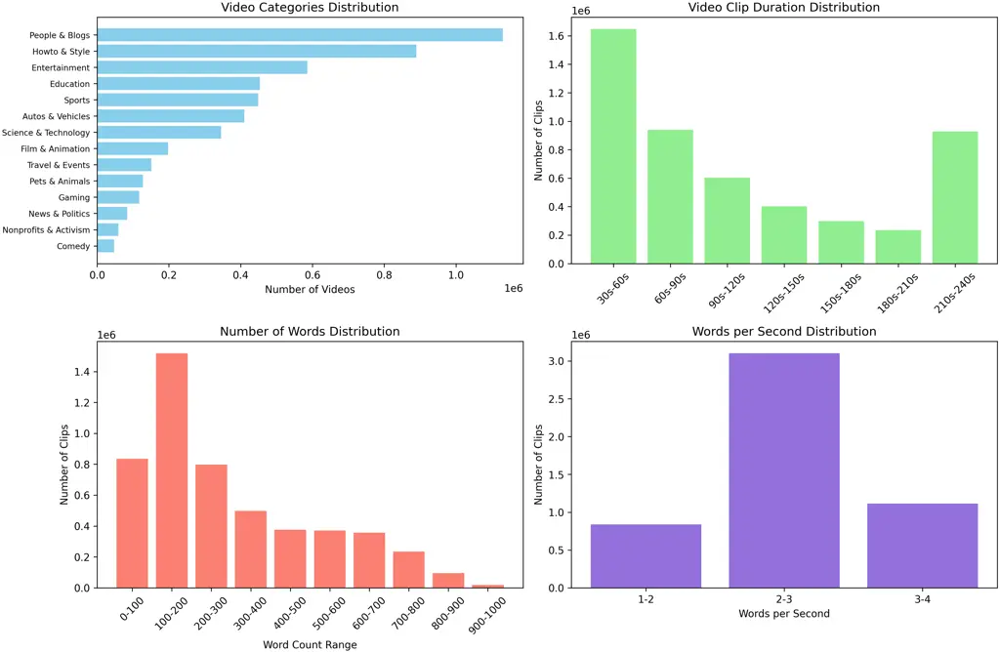

Figure 3: Overview of our proposed Live-CC-5M dataset.

YT-CC-Source-5.7M. We further observed that YouTube metadata often
mislabels the language category, _e.g_., marking videos as English
despite containing code-mixed content or garbled characters. To address
this, we apply the XLM-RoBERTa Conneau et al. 2020
(papluca/xlm-roberta-base-language-detection) for English detection,
using a confidence threshold of 0.9. In addition, we discard video IDs
with sparse CC, _e.g_. music videos with only a few words. We require
each video to contain at least 30 distinct words in its CC. Applying
these filters, we download these 5.7 million videos with English CC,
which serves as the source for both pre-training and SFT datasets.

YT-CC-Source-5.7M$`\rightarrow`$Live-CC-5M. Upon inspection, we observed
that YouTube CC is generally of low quality– lacking punctuation,
case-insensitive, and frequently containing garbled characters.
Nevertheless, due to their accessibility and low cost, they offer a
scalable data source, making them more suitable for pre-training rather
than SFT.

Therefore, we design the following steps for data curation: A1) First,
we segment the video based on ASR word timestamp gaps. If the gap
between words exceeds 3 seconds, a new clip is generated. If a clip
exceeds the maximum length, it is split into a new clip. Clips shorter
than 30 seconds or with a speech rate outside the 1 to 4 words per
second range are discarded. The extended range of silence or abnormal
speech speed makes it hard for the model to learn the end-of-sequence
(EOS) predictions. For pre-training, the default maximum clip length is
set to 240 seconds. For ablation studies, the clip length is set to 60
seconds for training efficiency. We rank these clips by their word set
size, which reflects content informativeness, and create pre-training
subsets with 1M, 2.5M, 5M, and 10M clips. A2) We compute the pure text
loss of ASR transcripts by language model to assess their dependency on
visual content. A very low perplexity suggests the transcript is
self-contained and does not require visual grounding, while a very high
perplexity often correlates with poor ASR quality. Empirically, we use
Qwen2-1.5B-Instruct Yang et al. 2024 to retain samples with loss values
in the range of 1.5 to 6.5; A3) To remove videos with people
consistently facing the camera and talking without meaningful visual
information, we apply visual filtering using Qwen-VL-2B-Instruct Wang
et al. 2024a. For each video, we use 8 uniformly sampled frames to
detect persistent face-speaking content by prompting
Qwen-VL-2B-Instruct. We keep the videos if the model’s confidence in
detecting the talking head is below a threshold of 0.3.

Finally, we obtain Live-CC-5M for pretraining. Figure 3 shows the
statistics of these data samples.

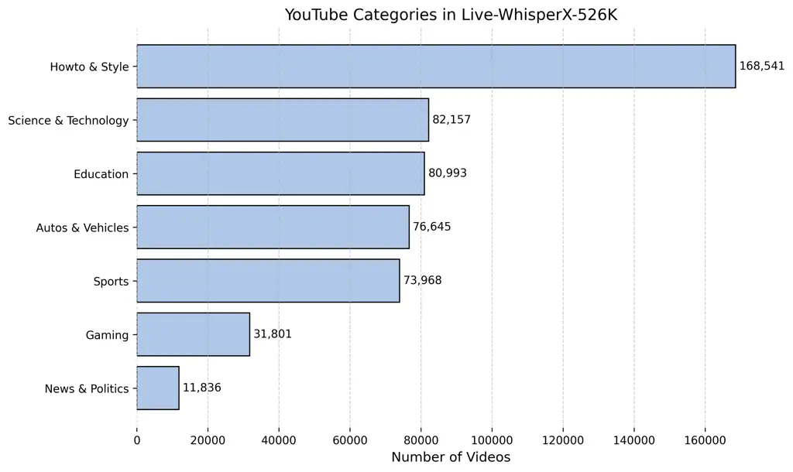

(a) Statistics of our proposed Live-WhisperX-526K dataset.

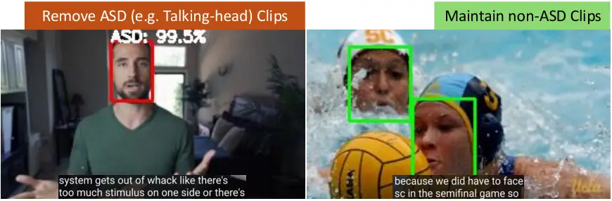

(b) An example of ASD removal in SFT data pipeline.

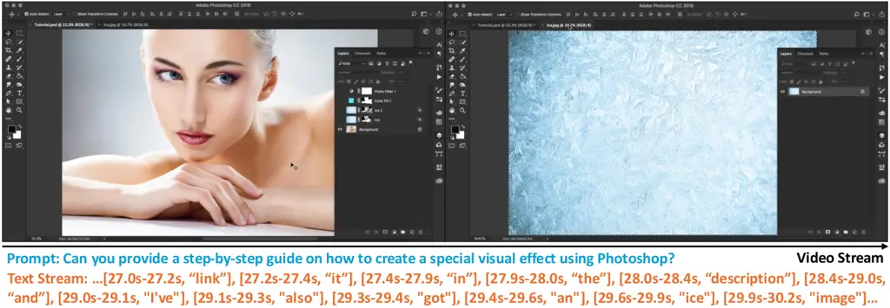

(c) An example from the Live-WhisperX-526K dataset.

Figure 4: Overview of the Live-WhisperX-526K dataset.

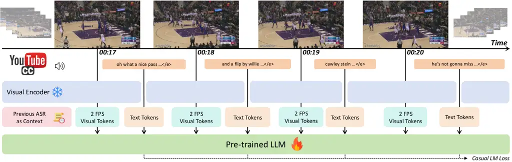

Figure 5: Modeling Overview of LiveCC. The model processes streaming
video frames through a visual encoder to produce visual tokens while
assigning ASR text from corresponding frame intervals as text tokens.
The LLM autoregressively predicts text tokens within this densely
interleaved token sequence. To mitigate learning ambiguity, additional
context of preceding ASR text or video title is provided during
pre-training. During SFT, the context part is only user query to match
the real-world applications.

YT-CC-Source-5.7M$`\rightarrow`$Live-WhisperX-526K. As the low-quality
YouTube CC makes them unsuitable for SFT data, we further perform the
following steps to obtain high-quality, visually grounded ASR
transcription: B1) We only maintain 7 YouTube categories shown in
Figure 4(a) but filter out “People & Blogs” and “Film & Animation”, as
their ASR content typically lacks correspondence with the visual events;
B2) We employ WhisperX Radford et al. 2023; Bain et al. 2023
(large-v3-turbo) to generate more accurate, word-level aligned ASR
transcriptions; B3) Similar to Step A1, the maximum clip length is 240
seconds. For pretraining, since pre-ASR provides context, clips can be
split in the middle of sentences. However, during the instruction
fine-tuning stage, where no pre-ASR context is available, we ensure that
each clip begins at the start of a sentence. Specifically, the last ASR
word must be a period, question mark, or exclamation mark, and the
current clip must start with a capital letter; B4) The same as Step A2,
while the range of text perplexity is 1.5 to 5; B5) Despite the above
filtering steps like Step A3, we observe that many remaining videos are
dominated by talking-head content, which is often useless for training
real-time video commentary. To address this, we employ active speaker
detection (ASD) Liao et al. 2023 to identify and exclude such videos.
For efficiency, we optimize Light-ASD Liao et al. 2023 pipeline in face
detection, tracking, and multiprocessing, achieving a 250$`\times`$
speed-up. As a result, processing a 5-minute video now takes only 1–1.5
seconds. An ASD removel example is in Figure 4(b). B6) Since these ASR
transcripts lack associated user prompts, we employ GPT-4o GPT-4o 2024
to generate a prompt for each sample. The prompts are crafted to match
the style and intent of the speech transcription without revealing
specific content. With this prompt, we no longer need pre-ASR applied
during SFT.

Finally, we get a high-quality SFT dataset comprising 526K video clips,
each paired with word-level timestamped ASR transcripts and a user
prompt. Figure 4(c) shows an example in Live-WhisperX-526K dataset.

### 3.2 Modeling

Training with Dense Interleaving Sequence. As shown in Figure 5, our
model architecture builds upon Qwen2-VL Wang et al. 2024a, which
integrates a Vision Transformer Dosovitskiy et al. 2021 with basic
dynamic resolution support and uses Qwen2 Yang et al. 2024 as the LLM
backbone. We adopt the base version of Qwen2-VL, which is pretrained
extensively on image-text data but has limited exposure to video-text
pairs. Following standard practice Liu et al. 2023b, the model is
trained to autoregressively predict text tokens while treating visual
tokens as non-predictive inputs, as illustrated in Figure 5. Unlike
existing approaches that use either captioning Liu et al. 2023b or
image-text interleaving Lin et al. 2024b style input, we propose to
densely interleave ASR words with video frames along the temporal
dimension. The training sequence is formatted as,

```math
\displaystyle \displaystyle\texttt{[Con]<F${}_{t:t+k}$><W${}_{t:t+k}$><F${}_{t+k:t+2k}$><W${}_{t+k:t+2k}$>}
```

```math
\displaystyle\texttt{...<F${}_{t+n*k:t+(n+1)*k}$><W${}_{t+n*k:t+(n+1)*k}$>},
```

where \[Con\] denotes context information of the video (_e.g_., prompt,
previous ASR, video title), \<F\> denotes a frame, \<W\> denotes the
words, $`t`$ represents the time index and $`k`$ represents the time
intervals. By default, we use 2 FPS frame rate and $`k=1`$ as the time
interval. We incorporate video titles and preceding ASR text as
contextual information to enhance text coherence, since ASR text may
start from the middle of a sentence, or use informal, verbal language. A
newline character concatenates the video title and previous ASR texts if
the ASR texts are available.

Sequence Pre-processing. For pre-training, we utilize the original
YouTube ASR transcripts, which employ fixed timestamps to segment speech
into chunks of approximately 2 to 3 seconds. To approximate word-level
alignment, we uniformly distribute each segment’s duration across its
constituent words. This heuristic yields reasonably accurate word-level
timestamps across the entire video. In contrast, during SFT, we leverage
WhisperX, which provides precise word-level timestamps, as detailed in
Section 3.1. To disambiguate the true end-of-sequence (EOS) from
temporary pauses in streaming, we simply use the ellipsis token (“ …”)
as an special EOS indicator appended to the per-frame text tokens. For
silent frames without corresponding subtitles, we directly predict this
ellipsis token.

Training Strategy. Our model training incorporates two stages including
pre-training and SFT. For the pre-training, we solely train the model
with dense interleaving sequences. The objective is to align frame
features with the temporally synchronized ASR words, enabling the model
to capture temporal correlations between frames and language. Next, to
improve the ability of LiveCC models to solve a diverse set of
downstream tasks, we jointly train the model with our Live-WhisperX-526K
in streaming mode, general video and image datasets Zhang et al. 2024e
for common caption or QA. To achieve this, we make the streaming
training be compatible with the Qwen2-VL Wang et al. 2024a conversation
template. The details can be found in the supplementary material.

Inference. During inference, our LiveCC model processes input frames
sequentially. To accelerate language decoding, we cache the Key-Value
(KV) pairs of previous prompts, visual frames, and generated text. For
long sequences, we discard visual tokens every 240 seconds—consistent
with the maximum duration in SFT training—while retaining the text
tokens to prefill the model again.

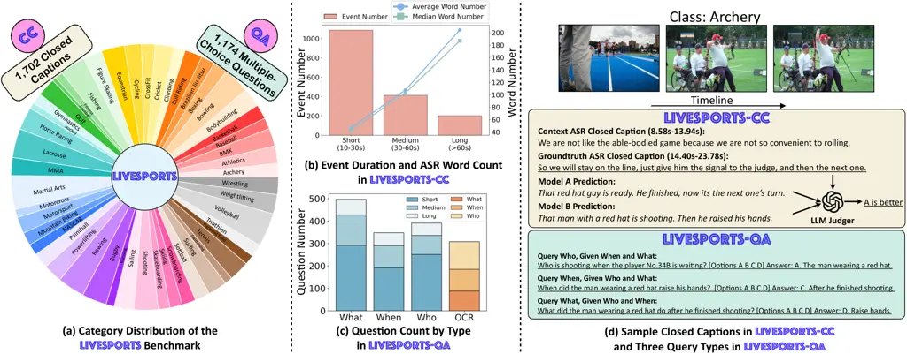

Figure 6: (a) Category Distribution of the LiveSports Benchmark: The
benchmark includes 3k live CCs and MCQs, split into two tracks: CC and
QA. (b) Event Duration and ASR Word Count in the CC track: For CC, event
duration (left y-axis) and ASR word count (right y-axis) are analyzed,
with durations categorized as short, medium, and long. (c) Question
Count by Type in the QA track: Questions are grouped into three query
types, with additional tracking of those requiring OCR for each type.
(d) Sample CCs and Query Types.

## 4 The LiveSports-3K Benchmark

### 4.1 LiveSports-3K Data Collection

As mentioned in Section 2, we present LiveSports-3K, a comprehensive
benchmark designed for systematic evaluation of video understanding
models’ capabilities. Unlike previous sports benchmarks like
SoccerNet Mkhallati et al. 2023 and MatchTime Rao et al. 2024, which
focus on specific sports, our benchmark spans a broader range of common
sports to ensure generalizability. To achieve this, we prompt
GPT-4o-mini GPT-4o 2024 to select the ongoing sports videos and classify
sports categories of our Live-WhisperX-526K dataset. We focused on the
top 50 most frequent sports categories and randomly sampled 12 videos
from each category, yielding a pool of 600 candidate videos covering
popular sports. After collecting candidate videos, we used GPT-4o-mini
to merge ASR transcriptions into semantically coherent events, recording
each event’s start and end timestamps. Given that ASR transcriptions are
not always visually relevant, we recruited English-proficient annotators
to filter out irrelevant events according to three criteria: 1) The
event must last more than 10 seconds; 2) The event clip must contain
ongoing sports action; 3) Most ASR transcriptions within the event clip
should be visually grounded. Events that failed to meet any of these
criteria were discarded. We curated 416 videos across 49 sports
categories (one category lack of qualified videos). The category
distribution is shown in Figure 6(a). We further remove these videos
from our training dataset for fair evaluation.

### 4.2 Crafting LiveSports-3K-CC/QA

LiveSports-3K-CC. Real-time commentary in sports videos encapsulates
rich spatiotemporal semantics. For instance, the commentary on a
football game often describes attackers, defenders, and their
interactions in detail, making it an ideal source for streaming video
understanding evaluations. Therefore, we developed this track to assess
video comprehension by evaluating the alignment between model-generated
and groundtruth CCs from ASR. Note that the data collection process has
ensured that the ASR event transcriptions are visually grounded. Thus,
we directly leverage ASR transcriptions from qualified events as
groundtruth. In summary, LiveSports-3K-CC consists of 1,702 events with
high-quality live CCs. Figure 6(b) presents the distribution of events
and word counts in three duration groups, showing a relatively balanced
total word count (_i.e._, video count $`\times`$ word count per group)
across groups. Additionally, Figure 6(d) illustrates a sample event,
demonstrating the highly visual-grounded nature of the ASR-transcribed
CCs retained through our filtering criteria.

For evaluation, we prompt the model with the video title and the
preceding CCs of the event, then record the model’s predictions. Given
the challenges of directly assessing discrepancies between the predicted
and groundtruth CCs, we adopt a pairwise comparison approach inspired by
Chatbot Arena Zheng et al. 2023. Specifically, for each pair of
predictions, we use GPT-4o as a judge to select the better prediction
based on the ground-truth CCs. The selection criteria include both
stylistic and semantic consistency. The winning rates of different
models serve as the ranking metric.

|                                   |                      |                     |                   |
| --------------------------------- | -------------------- | ------------------- | ----------------- |
| Video-ASR Sequence                | LiveSports-3K-CC     | Video-MME           |                   |
|                                   | Win Rate$`\uparrow`$ | Overall$`\uparrow`$ | Short$`\uparrow`$ |
| Caption (5M)                      | 14.0                 | 61.1                | 69.4              |
| Streaming (5M)                    | 32.9                 | 61.0                | 70.1              |
| Caption+Streaming (5M$`\times`$2) | 35.1                 | 60.5                | 69.0              |

(a) Training Paradigm during Pre-training.

|                        |                      |                     |                   |
| ---------------------- | -------------------- | ------------------- | ----------------- | ---- | ---- |
| Context                | LiveSports-3K-CC     | Video-MME           |                   |
|                        | Win Rate$`\uparrow`$ | Overall$`\uparrow`$ | Short$`\uparrow`$ |
| None                   | 14.7                 | 60.7                | 69.0              |
| Title                  | 24.8                 | 59.7                | 67.9              |
| Prev. ASR              | 32.0                 | 61.1                | 69.7              |
| Title $`\&`$ Prev. ASR | 33.8                 | 60.7                | 69.4              |
| Title $`               |                      | `$ Prev. ASR        | 32.9              | 61.0 | 70.1 |

(b) Context during Pre-training.

|      |                      |                     |                   |
| ---- | -------------------- | ------------------- | ----------------- |
| Data | LiveSports-3K-CC     | Video-MME           |                   |
|      | Win Rate$`\uparrow`$ | Overall$`\uparrow`$ | Short$`\uparrow`$ |
| 1M   | 29.1                 | 60.6                | 68.1              |
| 2.5M | 30.8                 | 60.9                | 69.1              |
| 5M   | 32.9                 | 61.0                | 70.1              |
| 10M  | 36.0                 | 58.0                | 67.6              |

(c) Pre-training Scalability.

Table 1: Ablation Study in the Pre-training Stage. Blue highlights our
default setting. Win Rate indicates the percentage of wins against
GPT-4o-08-06-generated commentary, using ground-truth ASR as the
reference. Models in these table are pre-trained on a maximum of 120
frames (60 seconds at 2 FPS), so we did not show results on medium- and
long- length videos for Video-MME Fu et al. 2024a to avoid misjudgment.
(a) Both caption-style and streaming-style sequence significantly
improve QA performance; however, only the streaming-style sequence
yields notable gains in commentary generation. (b) Incorporating
previous ASR enhances both commentary and QA. In contrast, simply adding
video titles degrades QA, unless previous ASR is absent (_e.g_., during
0–60s). (c) Commentary benefits from increased pre-training data, while
QA performance declines beyond 5M examples—likely due to overtraining on
the single-source (streaming ASR) data.

LiveSports-3K-QA. LiveSports-3K-CC offers a valuable track for assessing
video understanding comprehensively. However, it still lacks a precise
criterion for analyzing model behavior, especially when errors occur. To
address this, we decompose each event into three fundamental elements:
(i) When: Captures the temporal context of the event. (ii) What: Defines
the content or action taking place in the event. (iii) Who: Identifies
the participants involved in the event. By structuring events around
these elements, we enable targeted queries for each element based on the
other two, allowing us to isolate specific areas of weakness that
require improvement. Figure 6(c) provides detailed examples of these
three question types. Additionally, we recorded whether a question
required OCR capabilities, allowing for an auxiliary evaluation of model
performance on text recognition tasks. This process yielded 1,236
four-option MCQs across 414 videos, excluding two videos due to the
difficulty of designing appropriate questions. Finally, we manually
removed 62 questions that require speech recognition, leaving the
remaining 1,174 MCQs as the final benchmark. This track includes a
balanced distribution of the three query types, with OCR-reliant
questions evenly distributed among them, as shown in Figure 6(b).

## 5 Experiments

### 5.1 Experiments Setup

Implemetation Details. We initialize our model with the Qwen2-VL-7B-Base
checkpoint Wang et al. 2024a, following most of the configurations
provided in its HuggingFace release, with minimal modifications to
improve efficiency. Specifically, during ablation studies of
pre-training, we reduce the maximum number of frames from 768 to 120 and
shorten the visual context length from 128K to 16K tokens. During formal
pre-training and SFT, we increase the frame limit to 480 and extend the
visual context length to 24K, while slightly lowering the minimum
spatial resolution from $`128\times 28\times 28`$ to
$`100\times 28\times 28`$. Pre-training ablation studies are conducted
on the 30$`\sim`$60s Live-CC-1$`\sim`$10M dataset. The formal
pre-training is in 30$`\sim`$240s Live-CC-5M. The SFT stages uses our
Live-Whisper-526K and LLaVA-Video-178K Zhang et al. 2024e datasets
(without the training set of ActivityNetQA Heilbron et al. 2015,
Next-QA Xiao et al. 2021, and PerceptionTest Patraucean et al. 2024). We
implement the training engine using PyTorch Paszke et al. 2019 and
Transformers Wolf et al. 2020. The batch size for pre-training and SFT
is 512 on 128 GPUs, with a learning rate of 2e-5 for pre-training and
1e-5 for SFT.

|                  |                 |               |      |      |      |      |      |          |          |      |      |            |      |      |             |      |           |      |      |      |      |       |      |
| ---------------- | --------------- | ------------- | ---- | ---- | ---- | ---- | ---- | -------- | -------- | ---- | ---- | ---------- | ---- | ---- | ----------- | ---- | --------- | ---- | ---- | ---- | ---- | ----- | ---- |
| Pre-training     | SFT             | LiveSports-3K |      |      |      |      |      | VideoMME |          |      |      |            |      |      |             |      |           |      |      |      |      |       |      |
|                  |                 |               |      |      |      |      |      | All      | Duration |      |      | Perception |      |      | Recognition |      | Reasoning |      |      |      | OCR  | Count | IS   |
|                  |                 | CC            | QA   | OCR  | Who  | When | What |          | S        | M    | L    | Te         | Sp   | At   | Ac          | Ob   | Te        | Sp   | Ac   | Ob   |      |       |      |
| Qwen2-VL-7B-Base | LV178K          | 16.7          | 67.0 | 66.1 | 70.6 | 57.6 | 71.0 | 62.7     | 74.7     | 62.4 | 51.1 | 74.5       | 61.1 | 73.4 | 64.5        | 70.1 | 49.7      | 80.4 | 49.8 | 57.0 | 76.3 | 45.1  | 76.2 |
|                  | LV178K+Live526K | 33.7          | 67.1 | 66.8 | 69.8 | 57.0 | 72.3 | 63.6     | 74.4     | 63.1 | 53.2 | 74.5       | 57.4 | 75.2 | 66.5        | 70.1 | 49.7      | 76.8 | 54.4 | 57.5 | 72.7 | 44.4  | 78.9 |

(a) Ablation study in the SFT data.

|                  |                 |               |      |      |      |      |      |          |          |      |      |            |      |      |             |      |           |      |      |      |      |       |      |
| ---------------- | --------------- | ------------- | ---- | ---- | ---- | ---- | ---- | -------- | -------- | ---- | ---- | ---------- | ---- | ---- | ----------- | ---- | --------- | ---- | ---- | ---- | ---- | ----- | ---- |
| Pre-training     | SFT             | LiveSports-3K |      |      |      |      |      | VideoMME |          |      |      |            |      |      |             |      |           |      |      |      |      |       |      |
|                  |                 |               |      |      |      |      |      | All      | Duration |      |      | Perception |      |      | Recognition |      | Reasoning |      |      |      | OCR  | Count | IS   |
|                  |                 | CC            | QA   | OCR  | Who  | When | What |          | S        | M    | L    | Te         | Sp   | At   | Ac          | Ob   | Te        | Sp   | Ac   | Ob   |      |       |      |
| Qwen2-VL-7B-Base | -               | 16.3          | 64.0 | 64.8 | 65.2 | 57.9 | 67.3 | 63.4     | 73.2     | 63.2 | 53.9 | 72.7       | 63.0 | 76.1 | 63.9        | 67.2 | 44.6      | 78.6 | 57.5 | 61.5 | 72.7 | 39.6  | 80.2 |
| LiveCC-7B-Base   | -               | 43.2          | 57.9 | 61.4 | 59.4 | 50.7 | 61.9 | 61.4     | 68.1     | 58.9 | 57.3 | 65.5       | 63.0 | 64.9 | 60.7        | 61.0 | 50.3      | 80.4 | 56.1 | 61.5 | 61.2 | 42.9  | 82.4 |
| Qwen2-VL-7B-Base | LV178K+Live526K | 33.7          | 67.1 | 66.8 | 69.8 | 57.0 | 72.3 | 63.6     | 74.4     | 63.1 | 53.2 | 74.5       | 57.4 | 75.2 | 66.5        | 70.1 | 49.7      | 76.8 | 54.4 | 57.5 | 72.7 | 44.4  | 78.9 |
| LiveCC-7B-Base   | LV178K+Live526K | 41.5          | 66.8 | 66.4 | 71.4 | 56.1 | 70.8 | 64.1     | 74.8     | 63.9 | 53.7 | 74.5       | 64.8 | 74.3 | 66.1        | 68.6 | 50.3      | 76.8 | 52.3 | 59.5 | 77.0 | 46.3  | 79.9 |

(b) Ablation study in the SFT model initialization.

Table 2: Ablation studies in the SFT stage. LV178K denotes the datasets
used in LLaVA-Video-178K Zhang et al. 2024e. Live526K refers to our
proposed Live-WhisperX-526K. LiveSports-3K CC denotes the win rate
against commentary generated by LLaVA-Video-72B. LiveSports-3K QA is the
overall accuracy includes OCR, Who, When, What questions. Te, Sp, At,
Ac, Ob, IS denotes temporal, spatial, attribute, action, object,
information synopsis, respectively.

Evaluation Protocols and Metrics. For QA benchmarks, we evaluate our
models on VideoMME Fu et al. 2024a, MVBench Li et al. 2024c, OVOBench Li
et al. 2025, and our newly introduced LiveSports-3K-QA. For all models,
we calculate the logits of multiple choices to select answers, due to
the instruction following capability of streaming ASR pre-trained model
has been lost. We observe this does not make difference with
generation-based method Zhang et al. 2024b for SFT models, but the
evaluation is much faster.

The evaluation on LiveSports-3K-CC is like a conditioned video
captioning task, where the condition comprises the video title and
previous ASR text. With this condition, the model’s task is to complete
the ASR text based on the given video clip. Since most video LLMs lack
real-time streaming capabilities, we evaluate them using a general video
captioning approach, processing all video clip frames at once. In
contrast, our model supports real-time inference, enabling us to
generate captions on a frame-by-frame basis and then concatenate them
into a complete response for evaluation. Due to the challenges of
directly assessing open-ended text generation, we employ a pairwise
competition approach, similar to Chatbot Arena Zheng et al. 2023. We use
GPT-4o GPT-4o 2024 as the fixed competition opponent. In each
competition (tested model vs. GPT-4o), we also use GPT-4o GPT-4o 2024
acts as the judge, selecting the response that best aligns both
stylistically and semantically with the ground truth ASR transcriptions.
The evaluation metric is the win rate, which is defined as the
proportion of times the judge favors our model over the baseline. The
evaluation also involves latency comparison, which we discuss in the
supplementary material.

|                                        |          |       |         |          |      |      |      |
| -------------------------------------- | -------- | ----- | ------- | -------- | ---- | ---- | ---- |
| Model (7B/8B)                          | VideoMME |       | MVBench | OVOBench |      |      |      |
|                                        | w/o sub  | w sub | Avg.    | Avg.     | RTVP | BT   | FAR  |
| LongVA-7B Zhang et al. 2024d           | 52.6     | 54.3  | -       | -        | -    | -    | -    |
| InternVL2-8B Chen et al. 2024e         | 54.0     | 56.9  | 66.4    | 50.2     | 60.4 | 43.4 | 46.6 |
| LLaVA-OV-7B Li et al. 2024a            | 58.2     | 61.5  | 56.7    | 52.7     | 64.0 | 43.7 | 50.5 |
| Oryx-7B Liu et al. 2024b               | 58.3     | 62.6  | 63.9    | -        | -    | -    | -    |
| mPLUG-Owl3-7B Ye et al. 2024           | 59.3     | 68.1  | 59.5    | -        | -    | -    | -    |
| LongVU-7B Shen et al. 2024             | 60.6     | -     | 66.9    | 46.7     | 57.6 | 35.0 | 47.5 |
| MiniCPM-v2.6 Yao et al. 2024           | 60.9     | 63.6  | -       | -        | -    | -    | -    |
| Qwen2-VL-7B-Instruct Wang et al. 2024a | 63.3     | 69.0  | 67.0    | 50.4     | 56.0 | 46.5 | 48.7 |
| LLaVA-Video-7B Zhang et al. 2024f      | 63.3     | 69.7  | 58.6    | 52.9     | 63.5 | 40.4 | 54.8 |
| LiveCC-7B-Instruct                     | 64.1     | 70.3  | 62.8    | 59.8     | 59.1 | 68.9 | 51.5 |

Table 3: Comparison of QA accuracy (%) across VideoMME Fu et al. 2024a,
MVBench Li et al. 2024c, OVOBench Li et al. 2025. We only show results
before the CVPR 2025 submission period (Nov, 2024).

### 5.2 Ablation Study

Pre-training Paradigm. We first investigate the impact of different
pre-training paradigms on model performance using the following
baselines: (1) Caption, where all ASR text is concatenated and appended
after the visual input frames; (2) Streaming, where the model is trained
on sequential frame inputs sampled at 2 FPS, predicting ASR text
incrementally after receiving every 2 frames; and (3) Caption+Streaming,
where each training sample contributes to both captioning and streaming
objectives. As shown in Table 1(a), both caption and streaming
pre-training achieve strong general video QA performance (exceeding 60)
on the Video-MME benchmark Fu et al. 2024a, outperforming many existing
SFT models. Notably, the streaming-based pre-training yields
significantly better results on the commentary task compared to
caption-based pre-training, highlighting the effectiveness of our
proposed paradigm.

Context Input for Pre-training. In Table 1(b), we observe that providing
contextual information, particularly the previous ASR text,
significantly improves commentary generation. This improvement stems
from the fact that a 60-second segment can break the continuity of ASR,
making it difficult to interpret the current segment without prior
context. While incorporating the video title as additional context
offers benefits on commentary, it slightly degrades performance on
VideoMME. We attribute this to potential information leakage, which may
make training easier. To handle the cases where no previous ASR is
available (_e.g_., clips at the beginning of a video), we adopt a hybrid
strategy: “Title $`||`$ Prev. ASR”, which includes the video title only
when previous ASR is unavailable. This approach strikes the best balance
between enhancing commentary generation and maintaining general video QA
performance.

Pre-training Scalability. Table 1(c) presents the results of scaling up
the pre-training data. We observe that commentary performance
consistently improves with larger data size. However, QA performance
begins to decline beyond the 5M scale, likely due to the use of
single-source (streaming commentary) data during pre-training. Since our
primary goal is to demonstrate the effectiveness of the streaming-based
pre-training, we defer the use of multi-source data to the SFT stage.

|      |                                          |                            |      |         |      |      |      |      |
| ---- | ---------------------------------------- | -------------------------- | ---- | ------- | ---- | ---- | ---- | ---- |
| Size | Model                                    | LiveSports-3K $`\uparrow`$ |      |         |      |      |      |      |
|      |                                          | Live?                      | CC   | Overall | OCR  | Who  | When | What |
| -    | GPT-4o-08-06 GPT-4o 2024                 | ✗                          | ❀    | 72.2    | 74.0 | 75.8 | 63.4 | 75.4 |
|      | Gemini-1.5-Pro Anil et al. 2023          | ✗                          | 52.8 | 61.8    | 61.7 | 59.9 | 51.6 | 70.7 |
| 72B  | Qwen2-VL-72B-Instruct Wang et al. 2024a  | ✗                          | 17.0 | 70.8    | 67.8 | 74.6 | 61.2 | 74.6 |
|      | VideoLLaMA-2-72B Cheng et al. 2024       | ✗                          | 24.8 | 62.4    | 55.7 | 63.6 | 54.3 | 67.3 |
|      | LLaVA-OV-72B Li et al. 2024a             | ✗                          | 29.2 | 68.7    | 61.7 | 71.1 | 61.5 | 71.8 |
|      | Qwen2.5-VL-72B-Instruct Bai et al. 2024  | ✗                          | 30.4 | 73.7    | 70.1 | 75.7 | 69.3 | 75.3 |
|      | LLaVA-Video-72B Zhang et al. 2024f       | ✗                          | 35.0 | 71.1    | 65.1 | 74.1 | 64.8 | 73.3 |
| 7B   | Qwen2-VL-7B-Instruct Wang et al. 2024a   | ✗                          | 9.3  | 65.8    | 65.8 | 67.9 | 58.8 | 69.2 |
|      | Qwen2.5-VL-7B-Instruct Bai et al. 2024   | ✗                          | 17.3 | 67.0    | 64.8 | 70.3 | 60.6 | 69.0 |
|      | InternLM-XC2.5-7B Zhang et al. 2024c     | ✗                          | 17.3 | 59.3    | 56.7 | 60.7 | 54.9 | 61.3 |
|      | Qwen2.5-Omni-7B Xu et al. 2025 (Thinker) | ✗                          | 17.6 | 66.8    | 66.1 | 70.0 | 60.0 | 69.2 |
|      | LLaVA-Video-7B Zhang et al. 2024f        | ✗                          | 27.1 | 66.4    | 64.1 | 72.7 | 56.4 | 68.6 |
|      | LLaVA-OV-7B Li et al. 2024a              | ✗                          | 27.7 | 63.4    | 60.7 | 67.4 | 53.7 | 67.1 |
|      | Qwen2-VL-7B-LiveCCInstruct               | ✓                          | 33.7 | 67.1    | 66.8 | 69.8 | 57.0 | 72.3 |
|      | LiveCC-7B-Instruct                       | ✓                          | 41.5 | 66.8    | 66.4 | 71.4 | 56.1 | 70.8 |
|      | LiveCC-7B-Base                           | ✓                          | 43.2 | 57.9    | 61.4 | 59.4 | 50.7 | 61.9 |

Table 4: Win rate on the LiveSports-3K-CC track and QA accuracy on the
LiveSports-3K-QA track. GPT-4o-08-06 is used as the ❀ Baseline for the
commentary win rate comparison due to its strong performance. For a fair
comparison, all Qwen models Wang et al. 2024a; Bai et al. 2024; Xu
et al. 2025 and our models are evaluated on a maximum of 480 frames. The
Qwen models did not perform as expected, as they tend to simply caption
the video rather than follow the preceding ASR context to continue the
video commentary.

### 5.3 Overall Results

In Table 3 and Table 4, we compare the performance of various models on
general QA, streaming QA and our LiveSports-3K benchmarks, including
advanced proprietary models, SOTA open-source 72B models, and SOTA
open-source 7B models. Despite being initialized from Qwen2-VL-7B-Base,
our LiveCC-7B-Instruct outperforms Qwen2-VL-7B-Instruct on the general
QA, i.e., VideoMME (64.1 vs. 63.3) and the streaming benchmark, i.e.,
OVOBench (59.8 vs. 50.4). This demonstrates the strong generalization
capabilities of our dataset and training method. In our proposed
LiveSports-3K benchmark, we observe that our three models achieve
significant advantages in commentary while maintain competitive on QA,
which demonstrates the effectiveness of our method.

### 5.4 Streaming Commentary Capabilities

Figure 7 shows that the pre-trained model can already demonstrate
impressive real-time video commentary capabilities. With SFT, the model
further improves formatting (_e.g_., punctuation, case) and coherence.
More examples are provided in the supplementary material.

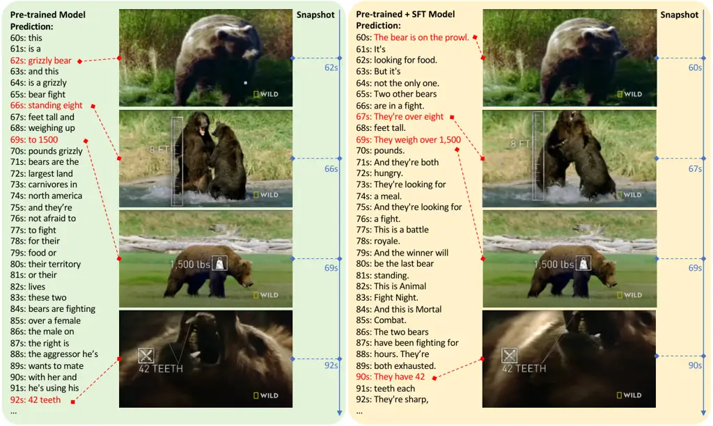

Figure 7: Comparison of pre-trained and instruction tuning enhanced
model’s predictions on the same video. This example is sourced from
Video-MME Fu et al. 2024a, with the YouTube ID whksDmTR9YE featuring
animal fights.

## 6 Conclusion

In this paper, we investigated the large-scale training of video LLMs
using ASR transcripts. We proposed a novel streaming training approach
that densely interleaves fine-grained ASR words with their corresponding
video frames based on timestamps. Our methodology involved the
collection of two datasets: Live-CC-5M for pre-training and
Live-WhisperX-526K for instruction tuning. We then developed our
streaming pre-training approach, introducing a series of innovative
training and inference strategies. Additionally, we designed
LiveSports-3K, with two evaluation tracks, LiveSports-3K-CC and
LiveSports-3K-QA, which are specifically tailored to assess the model’s
streaming capabilities. Our extensive experiments demonstrate that our
model can perform low-latency commentary for streaming videos and
general question answering for holistic video understanding in
state-of-the-art performance simultaneously. In future work, we seek
methods to train multimodal omni models in streaming.

## Acknowledgments

This research is supported by the National Research Foundation,
Singapore, under its AI Singapore Programme (AISG Award No:
AISG3-RP-2022-030). Joya Chen proposed the idea, designed and
implemented the data production pipeline and the model
training/inference codebase. Ziyun Zeng built the benchmark and designed
and implemented the free-form commentary evaluation. Yiqi Lin made
significant contributions to baseline model analysis, data collection,
and paper writing. We jointly trained and evaluated the models and
discussed the results together. We acknowledge the resource support from
TikTok AIIC and thank Wei Li and Zejun Ma for their valuable guidance.
We are also grateful for the insightful discussions with Rui Qian and Yu
Li, and we thank Kevin Qinghong Lin, Zhaoyang Lv, Yichi Zhang, and Huiyu
Wang for their constructive comments.

## References

- AlAmri et al. (2019) Huda AlAmri, Vincent Cartillier, Abhishek Das,
  Jue Wang, Anoop Cherian, Irfan Essa, Dhruv Batra, Tim K. Marks, Chiori
  Hori, Peter Anderson, Stefan Lee, and Devi Parikh. Audio visual
  scene-aware dialog. In _CVPR_, pages 7558–7567, 2019.
- Alayrac et al. (2022) Jean-Baptiste Alayrac, Jeff Donahue, Pauline
  Luc, Antoine Miech, Iain Barr, Yana Hasson, Karel Lenc, Arthur Mensch,
  Katherine Millican, Malcolm Reynolds, Roman Ring, Eliza Rutherford,
  Serkan Cabi, Tengda Han, Zhitao Gong, Sina Samangooei, Marianne
  Monteiro, Jacob L. Menick, Sebastian Borgeaud, Andy Brock, Aida
  Nematzadeh, Sahand Sharifzadeh, Mikolaj Binkowski, Ricardo Barreira,
  Oriol Vinyals, Andrew Zisserman, and Karén Simonyan. Flamingo: a
  visual language model for few-shot learning. In _NeurIPS_, 2022.
- Anil et al. (2023) Rohan Anil, Sebastian Borgeaud, Yonghui Wu,
  Jean-Baptiste Alayrac, Jiahui Yu, Radu Soricut, Johan Schalkwyk,
  Andrew M. Dai, Anja Hauth, Katie Millican, David Silver, Slav Petrov,
  Melvin Johnson, Ioannis Antonoglou, Julian Schrittwieser, Amelia
  Glaese, Jilin Chen, Emily Pitler, Timothy P. Lillicrap, Angeliki
  Lazaridou, Orhan Firat, James Molloy, Michael Isard, Paul Ronald
  Barham, Tom Hennigan, Benjamin Lee, Fabio Viola, Malcolm Reynolds,
  Yuanzhong Xu, Ryan Doherty, Eli Collins, Clemens Meyer, Eliza
  Rutherford, Erica Moreira, Kareem Ayoub, Megha Goel, George Tucker,
  Enrique Piqueras, Maxim Krikun, Iain Barr, Nikolay Savinov, Ivo
  Danihelka, Becca Roelofs, Anaïs White, Anders Andreassen, Tamara von
  Glehn, Lakshman Yagati, Mehran Kazemi, Lucas Gonzalez, Misha Khalman,
  Jakub Sygnowski, and et al. Gemini: A family of highly capable
  multimodal models. _arXiv:2312.11805_, 2023.
- Bai et al. (2023a) Jinze Bai, Shuai Bai, Yunfei Chu, Zeyu Cui, Kai
  Dang, Xiaodong Deng, Yang Fan, Wenbin Ge, Yu Han, Fei Huang, Binyuan
  Hui, Luo Ji, Mei Li, Junyang Lin, Runji Lin, Dayiheng Liu, Gao Liu,
  Chengqiang Lu, Keming Lu, Jianxin Ma, Rui Men, Xingzhang Ren,
  Xuancheng Ren, Chuanqi Tan, Sinan Tan, Jianhong Tu, Peng Wang, Shijie
  Wang, Wei Wang, Shengguang Wu, Benfeng Xu, Jin Xu, An Yang, Hao Yang,
  Jian Yang, Shusheng Yang, Yang Yao, Bowen Yu, Hongyi Yuan, Zheng Yuan,
  Jianwei Zhang, Xingxuan Zhang, Yichang Zhang, Zhenru Zhang, Chang
  Zhou, Jingren Zhou, Xiaohuan Zhou, and Tianhang Zhu. Qwen technical
  report. arXiv:2309.16609, 2023a.
- Bai et al. (2023b) Jinze Bai, Shuai Bai, Shusheng Yang, Shijie Wang,
  Sinan Tan, Peng Wang, Junyang Lin, Chang Zhou, and Jingren Zhou.
  Qwen-vl: A frontier large vision-language model with versatile
  abilities. _arXiv:2308.12966_, 2023b.
- Bai et al. (2024) Shuai Bai, Keqin Chen, Xuejing Liu, Jialin Wang,
  Wenbin Ge, Sibo Song, Kai Dang, Peng Wang, Shijie Wang, Jun Tang,
  Humen Zhong, Yuanzhi Zhu, Mingkun Yang, Zhaohai Li, Jianqiang Wan,
  Pengfei Wang, Wei Ding, Zheren Fu, Yiheng Xu, Jiabo Ye, Xi Zhang,
  Tianbao Xie, Zesen Cheng, Hang Zhang, Zhibo Yang, Haiyang Xu, and
  Junyang Lin. Qwen2.5-vl technical report. _arXiv:2412.15115_, 2024.
- Bain et al. (2023) Max Bain, Jaesung Huh, Tengda Han, and Andrew
  Zisserman. Whisperx: Time-accurate speech transcription of long-form
  audio. _arXiv preprint arXiv:2303.00747_, 2023.
- Brown et al. (2020) Tom Brown, Benjamin Mann, Nick Ryder, Melanie
  Subbiah, Jared D Kaplan, Prafulla Dhariwal, Arvind Neelakantan, Pranav
  Shyam, Girish Sastry, Amanda Askell, Sandhini Agarwal, Ariel
  Herbert-Voss, Gretchen Krueger, Tom Henighan, Rewon Child, Aditya
  Ramesh, Daniel Ziegler, Jeffrey Wu, Clemens Winter, Chris Hesse, Mark
  Chen, Eric Sigler, Mateusz Litwin, Scott Gray, Benjamin Chess, Jack
  Clark, Christopher Berner, Sam McCandlish, Alec Radford, Ilya
  Sutskever, and Dario Amodei. Language models are few-shot learners. In
  _NeurIPS_, pages 1877–1901, 2020.
- Buch et al. (2017) Shyamal Buch, Victor Escorcia, Chuanqi Shen,
  Bernard Ghanem, and Juan Carlos Niebles. Sst: Single-stream temporal
  action proposals. In _Proceedings of the IEEE conference on Computer
  Vision and Pattern Recognition_, pages 2911–2920, 2017.
- Carreira and Zisserman (2017) João Carreira and Andrew Zisserman. Quo
  vadis, action recognition? A new model and the kinetics dataset. In
  _CVPR_, pages 4724–4733, 2017.
- Carreira et al. (2018) João Carreira, Eric Noland, Andras
  Banki-Horvath, Chloe Hillier, and Andrew Zisserman. A short note about
  kinetics-600. _Arxiv_, 1808.01340, 2018.
- Chen et al. (2023) Jun Chen, Deyao Zhu, Xiaoqian Shen, Xiang Li,
  Zechun Liu, Pengchuan Zhang, Raghuraman Krishnamoorthi, Vikas Chandra,
  Yunyang Xiong, and Mohamed Elhoseiny. Minigpt-v2: large language model
  as a unified interface for vision-language multi-task learning.
  _arXiv:2310.09478_, 2023.
- Chen et al. (2024a) Joya Chen, Zhaoyang Lv, Shiwei Wu, Kevin Qinghong
  Lin, Chenan Song, Difei Gao, Jia-Wei Liu, Ziteng Gao, Dongxing Mao,
  and Mike Zheng Shou. Videollm-online: Online video large language
  model for streaming video. In _CVPR_, 2024a.
- Chen et al. (2024b) Lin Chen, Xilin Wei, Jinsong Li, Xiaoyi Dong, Pan
  Zhang, Yuhang Zang, Zehui Chen, Haodong Duan, Bin Lin, Zhenyu Tang,
  et al. Sharegpt4video: Improving video understanding and generation
  with better captions. _arXiv preprint arXiv:2406.04325_, 2024b.
- Chen et al. (2024c) Tsai-Shien Chen, Aliaksandr Siarohin, Willi
  Menapace, Ekaterina Deyneka, Hsiang-wei Chao, Byung Eun Jeon, Yuwei
  Fang, Hsin-Ying Lee, Jian Ren, Ming-Hsuan Yang, et al. Panda-70m:
  Captioning 70m videos with multiple cross-modality teachers. In
  _Proceedings of the IEEE/CVF Conference on Computer Vision and Pattern
  Recognition_, pages 13320–13331, 2024c.
- Chen et al. (2024d) Zhe Chen, Weiyun Wang, Yue Cao, Yangzhou Liu,
  Zhangwei Gao, Erfei Cui, Jinguo Zhu, Shenglong Ye, Hao Tian, Zhaoyang
  Liu, Lixin Gu, Xuehui Wang, Qingyun Li, Yimin Ren, Zixuan Chen,
  Jiapeng Luo, Jiahao Wang, Tan Jiang, Bo Wang, Conghui He, Botian Shi,
  Xingcheng Zhang, Han Lv, Yi Wang, Wenqi Shao, Pei Chu, Zhongying Tu,
  Tong He, Zhiyong Wu, Huipeng Deng, Jiaye Ge, Kai Chen, Min Dou, Lewei
  Lu, Xizhou Zhu, Tong Lu, Dahua Lin, Yu Qiao, Jifeng Dai, and Wenhai
  Wang. Expanding performance boundaries of open-source multimodal
  models with model, data, and test-time scaling. _arXiv:2412.05271_,
  2024d.
- Chen et al. (2024e) Zhe Chen, Weiyun Wang, Hao Tian, Shenglong Ye,
  Zhangwei Gao, Erfei Cui, Wenwen Tong, Kongzhi Hu, Jiapeng Luo, Zheng
  Ma, et al. How far are we to gpt-4v? closing the gap to commercial
  multimodal models with open-source suites. _arXiv preprint
  arXiv:2404.16821_, 2024e.
- Cheng et al. (2024) Zesen Cheng, Sicong Leng, Hang Zhang, Yifei Xin,
  Xin Li, Guanzheng Chen, Yongxin Zhu, Wenqi Zhang, Ziyang Luo, Deli
  Zhao, et al. Videollama 2: Advancing spatial-temporal modeling and
  audio understanding in video-llms. _arXiv preprint
  arXiv:2406.07476_, 2024.
- Conneau et al. (2020) Alexis Conneau, Kartikay Khandelwal, Naman
  Goyal, Vishrav Chaudhary, Guillaume Wenzek, Francisco Guzmán, Edouard
  Grave, Myle Ott, Luke Zettlemoyer, and Veselin Stoyanov. Unsupervised
  cross-lingual representation learning at scale. In _ACL_, 2020.
- Dai et al. (2023) Wenliang Dai, Junnan Li, Dongxu Li, Anthony
  Meng Huat Tiong, Junqi Zhao, Weisheng Wang, Boyang Li, Pascale Fung,
  and Steven C.H.Hoi. Instructblip: Towards general-purpose
  vision-language models with instruction tuning.
  _arXiv:2305.06500_, 2023.
- Dosovitskiy et al. (2021) Alexey Dosovitskiy, Lucas Beyer, Alexander
  Kolesnikov, Dirk Weissenborn, Xiaohua Zhai, Thomas Unterthiner,
  Mostafa Dehghani, Matthias Minderer, Georg Heigold, Sylvain Gelly,
  Jakob Uszkoreit, and Neil Houlsby. An image is worth 16x16 words:
  Transformers for image recognition at scale. In _ICLR_, 2021.
- Dubey et al. (2024) Abhimanyu Dubey, Abhinav Jauhri, Abhinav Pandey,
  Abhishek Kadian, Ahmad Al-Dahle, Aiesha Letman, Akhil Mathur, Alan
  Schelten, Amy Yang, Angela Fan, Anirudh Goyal, Anthony Hartshorn, Aobo
  Yang, Archi Mitra, Archie Sravankumar, Artem Korenev, Arthur Hinsvark,
  Arun Rao, Aston Zhang, Aurélien Rodriguez, Austen Gregerson, Ava
  Spataru, Baptiste Rozière, Bethany Biron, Binh Tang, Bobbie Chern,
  Charlotte Caucheteux, Chaya Nayak, Chloe Bi, Chris Marra, Chris
  McConnell, Christian Keller, Christophe Touret, Chunyang Wu, Corinne
  Wong, Cristian Canton Ferrer, Cyrus Nikolaidis, Damien Allonsius,
  Daniel Song, Danielle Pintz, Danny Livshits, David Esiobu, Dhruv
  Choudhary, Dhruv Mahajan, Diego Garcia-Olano, Diego Perino, Dieuwke
  Hupkes, Egor Lakomkin, Ehab AlBadawy, Elina Lobanova, Emily Dinan,
  Eric Michael Smith, Filip Radenovic, Frank Zhang, Gabriel Synnaeve,
  Gabrielle Lee, Georgia Lewis Anderson, Graeme Nail, Grégoire Mialon,
  Guan Pang, Guillem Cucurell, Hailey Nguyen, Hannah Korevaar, Hu Xu,
  Hugo Touvron, Iliyan Zarov, Imanol Arrieta Ibarra, Isabel M. Kloumann,
  Ishan Misra, Ivan Evtimov, Jade Copet, Jaewon Lee, Jan Geffert, Jana
  Vranes, Jason Park, Jay Mahadeokar, Jeet Shah, Jelmer van der Linde,
  Jennifer Billock, Jenny Hong, Jenya Lee, Jeremy Fu, Jianfeng Chi,
  Jianyu Huang, Jiawen Liu, Jie Wang, Jiecao Yu, Joanna Bitton, Joe
  Spisak, Jongsoo Park, Joseph Rocca, Joshua Johnstun, Joshua Saxe,
  Junteng Jia, Kalyan Vasuden Alwala, Kartikeya Upasani, Kate Plawiak,
  Ke Li, Kenneth Heafield, Kevin Stone, and et al. The llama 3 herd of
  models. _arXiv:2407.21783_, 2024.
- Fu et al. (2024a) Chaoyou Fu, Yuhan Dai, Yondong Luo, Lei Li, Shuhuai
  Ren, Renrui Zhang, Zihan Wang, Chenyu Zhou, Yunhang Shen, Mengdan
  Zhang, et al. Video-mme: The first-ever comprehensive evaluation
  benchmark of multi-modal llms in video analysis. _arXiv preprint
  arXiv:2405.21075_, 2024a.
- Fu et al. (2024b) Chaoyou Fu, Haojia Lin, Zuwei Long, Yunhang Shen,
  Meng Zhao, Yifan Zhang, Shaoqi Dong, Xiong Wang, Di Yin, Long Ma,
  et al. Vita: Towards open-source interactive omni multimodal llm.
  _arXiv:2408.05211_, 2024b.
- Fu et al. (2025) Chaoyou Fu, Haojia Lin, Xiong Wang, Yi-Fan Zhang,
  Yunhang Shen, Xiaoyu Liu, Yangze Li, Zuwei Long, Heting Gao, Ke Li,
  et al. Vita-1.5: Towards gpt-4o level real-time vision and speech
  interaction. _arXiv:2501.01957_, 2025.
- Geest et al. (2016) Roeland De Geest, Efstratios Gavves, Amir
  Ghodrati, Zhenyang Li, Cees Snoek, and Tinne Tuytelaars. Online action
  detection. In _ECCV_, pages 269–284, 2016.
- Google (2024) Gemini Team Google. Gemini 1.5: Unlocking multimodal
  understanding across millions of tokens of context.
  _arXiv:2403.05530_, 2024.
- Goyal et al. (2017) Raghav Goyal, Samira Ebrahimi Kahou, Vincent
  Michalski, Joanna Materzynska, Susanne Westphal, Heuna Kim, Valentin
  Haenel, Ingo Fründ, Peter Yianilos, Moritz Mueller-Freitag, Florian
  Hoppe, Christian Thurau, Ingo Bax, and Roland Memisevic. The
  ”something something” video database for learning and evaluating
  visual common sense. In _ICCV_, pages 5843–5851, 2017.
- GPT-4o (2024) GPT-4o. Hello gpt-4o, 2024.
- Heilbron et al. (2015) Fabian Caba Heilbron, Victor Escorcia, Bernard
  Ghanem, and Juan Carlos Niebles. Activitynet: A large-scale video
  benchmark for human activity understanding. In _CVPR_, pages
  961–970, 2015.
- Hoffmann et al. (2022) Jordan Hoffmann, Sebastian Borgeaud, Arthur
  Mensch, Elena Buchatskaya, Trevor Cai, Eliza Rutherford, Diego de
  Las Casas, Lisa Anne Hendricks, Johannes Welbl, Aidan Clark, Tom
  Hennigan, Eric Noland, Katie Millican, George van den Driessche,
  Bogdan Damoc, Aurelia Guy, Simon Osindero, Karen Simonyan, Erich
  Elsen, Jack W. Rae, Oriol Vinyals, and Laurent Sifre. Training
  compute-optimal large language models. _arXiv:2203.15556_, 2022.
- Huang et al. (2020) Gabriel Huang, Bo Pang, Zhenhai Zhu, Clara Rivera,
  and Radu Soricut. Multimodal pretraining for dense video captioning.
  In _IJCNLP-AACL_, pages 470–490, 2020.
- Huang et al. (2025) Zhenpeng Huang, Xinhao Li, Jiaqi Li, Jing Wang,
  Xiangyu Zeng, Cheng Liang, Tao Wu, Xi Chen, Liang Li, and Limin Wang.
  Online video understanding: A comprehensive benchmark and
  memory-augmented method. _arXiv:2501.00584_, 2025.
- Idrees et al. (2017) Haroon Idrees, Amir R. Zamir, Yu-Gang Jiang, Alex
  Gorban, Ivan Laptev, Rahul Sukthankar, and Mubarak Shah. The THUMOS
  challenge on action recognition for videos ”in the wild”. _Comput.
  Vis. Image Underst._, 155:1–23, 2017.
- Kang et al. (2021) Hyolim Kang, Kyungmin Kim, Yumin Ko, and Seon Joo
  Kim. Cag-qil: Context-aware actionness grouping via q imitation
  learning for online temporal action localization. In _Proceedings of
  the IEEE/CVF International Conference on Computer Vision_, pages
  13729–13738, 2021.
- Kaplan et al. (2020) Jared Kaplan, Sam McCandlish, Tom Henighan,
  Tom B. Brown, Benjamin Chess, Rewon Child, Scott Gray, Alec Radford,
  Jeffrey Wu, and Dario Amodei. Scaling laws for neural language models.
  _arXiv:2001.08361_, 2020.
- Krishna et al. (2017) Ranjay Krishna, Kenji Hata, Frederic Ren, Li
  Fei-Fei, and Juan Carlos Niebles. Dense-captioning events in videos.
  In _ICCV_, pages 706–715, 2017.
- Lai et al. (2023) Xin Lai, Zhuotao Tian, Yukang Chen, Yanwei Li, Yuhui
  Yuan, Shu Liu, and Jiaya Jia. Lisa: Reasoning segmentation via large
  language model. _arXiv:2308.00692_, 2023.
- Lei et al. (2018) Jie Lei, Licheng Yu, Mohit Bansal, and Tamara L.
  Berg. TVQA: localized, compositional video question answering. In
  _EMNLP_, pages 1369–1379, 2018.
- Li et al. (2023a) Bo Li, Yuanhan Zhang, Liangyu Chen, Jinghao Wang,
  Jingkang Yang, and Ziwei Liu. Otter: A multi-modal model with
  in-context instruction tuning. _arXiv:2305.03726_, 2023a.
- Li et al. (2024a) Bo Li, Yuanhan Zhang, Dong Guo, Renrui Zhang, Feng
  Li, Hao Zhang, Kaichen Zhang, Yanwei Li, Ziwei Liu, and Chunyuan Li.
  Llava-onevision: Easy visual task transfer. _arXiv preprint
  arXiv:2408.03326_, 2024a.
- Li et al. (2024b) Bo Li, Yuanhan Zhang, Dong Guo, Renrui Zhang, Feng
  Li, Hao Zhang, Kaichen Zhang, Yanwei Li, Ziwei Liu, and Chunyuan Li.
  Llava-onevision: Easy visual task transfer. _arXiv:2408.03326_, 2024b.
- Li et al. (2023b) Junnan Li, Dongxu Li, Silvio Savarese, and Steven
  Hoi. Blip-2: Bootstrapping language-image pre-training with frozen
  image encoders and large language models. _arXiv preprint
  arXiv:2301.12597_, 2023b.
- Li et al. (2023c) KunChang Li, Yinan He, Yi Wang, Yizhuo Li, Wenhai
  Wang, Ping Luo, Yali Wang, Limin Wang, and Yu Qiao. Videochat:
  Chat-centric video understanding. _arXiv:2305.06355_, 2023c.
- Li et al. (2024c) Kunchang Li, Yali Wang, Yinan He, Yizhuo Li, Yi
  Wang, Yi Liu, Zun Wang, Jilan Xu, Guo Chen, Ping Luo, et al. Mvbench:
  A comprehensive multi-modal video understanding benchmark. In _CVPR_,
  pages 22195–22206, 2024c.
- Li et al. (2025) Yifei Li, Junbo Niu, Ziyang Miao, Chunjiang Ge,
  Yuanhang Zhou, Qihao He, Xiaoyi Dong, Haodong Duan, Shuangrui Ding,
  Rui Qian, Pan Zhang, Yuhang Zang, Yuhang Cao, Conghui He, and Jiaqi
  Wang. Ovo-bench: How far is your video-llms from real-world online
  video understanding? _arXiv:2501.05510_, 2025.
- Liao et al. (2023) Junhua Liao, Haihan Duan, Kanghui Feng, Wanbing
  Zhao, Yanbing Yang, and Liangyin Chen. A light weight model for active
  speaker detection. In _CVPR_, pages 22932–22941, 2023.
- Lin et al. (2023a) Bin Lin, Bin Zhu, Yang Ye, Munan Ning, Peng Jin,
  and Li Yuan. Video-llava: Learning united visual representation by
  alignment before projection. _arXiv:2311.10122_, 2023a.
- Lin et al. (2024a) Junming Lin, Zheng Fang, Chi Chen, Zihao Wan, Fuwen
  Luo, Peng Li, Yang Liu, and Maosong Sun. Streamingbench: Assessing the
  gap for mllms to achieve streaming video understanding. _arXiv
  preprint arXiv:2411.03628_, 2024a.
- Lin et al. (2024b) Ji Lin, Hongxu Yin, Wei Ping, Pavlo Molchanov,
  Mohammad Shoeybi, and Song Han. VILA: on pre-training for visual
  language models. In _CVPR_, pages 26679–26689, 2024b.
- Lin et al. (2022) Kevin Qinghong Lin, Alex Jinpeng Wang, Mattia
  Soldan, Michael Wray, Rui Yan, Eric Zhongcong Xu, Difei Gao, Rongcheng
  Tu, Wenzhe Zhao, Weijie Kong, Chengfei Cai, Hongfa Wang, Dima Damen,
  Bernard Ghanem, Wei Liu, and Mike Zheng Shou. Egocentric
  video-language pretraining. _arXiv:2206.01670_, 2022.
- Lin et al. (2023b) Kevin Qinghong Lin, Pengchuan Zhang, Joya Chen,
  Shraman Pramanick, Difei Gao, Alex Jinpeng Wang, Rui Yan, and
  Mike Zheng Shou. Univtg: Towards unified video-language temporal
  grounding. In _ICCV_, pages 2782–2792, 2023b.
- Liu et al. (2023a) Haotian Liu, Chunyuan Li, Yuheng Li, and Yong Jae
  Lee. Improved baselines with visual instruction tuning.
  _arXiv:2310.03744_, 2023a.
- Liu et al. (2023b) Haotian Liu, Chunyuan Li, Qingyang Wu, and Yong Jae
  Lee. Visual instruction tuning. _NeurIPS_, 2023b.
- Liu et al. (2024a) Jihao Liu, Zhiding Yu, Shiyi Lan, Shihao Wang,
  Rongyao Fang, Jan Kautz, Hongsheng Li, and Jose M. Alvarez.
  Streamchat: Chatting with streaming video. _arXiv:2412.08646_, 2024a.
- Liu et al. (2024b) Zuyan Liu, Yuhao Dong, Ziwei Liu, Winston Hu, Jiwen
  Lu, and Yongming Rao. Oryx mllm: On-demand spatial-temporal
  understanding at arbitrary resolution. _arXiv preprint
  arXiv:2409.12961_, 2024b.
- Maaz et al. (2024) Muhammad Maaz, Hanoona Rasheed, Salman Khan, and
  Fahad Khan. Video-ChatGPT: Towards detailed video understanding via
  large vision and language models. In _Proceedings of the 62nd Annual
  Meeting of the Association for Computational Linguistics (Volume 1:
  Long Papers)_, pages 12585–12602, Bangkok, Thailand, 2024. Association
  for Computational Linguistics.
- Mangalam et al. (2023) Karttikeya Mangalam, Raiymbek Akshulakov, and
  Jitendra Malik. Egoschema: A diagnostic benchmark for very long-form
  video language understanding. In _NeurIPS_, pages 46212–46244, 2023.
- McKinzie et al. (2024) Brandon McKinzie, Zhe Gan, Jean-Philippe
  Fauconnier, Sam Dodge, Bowen Zhang, Philipp Dufter, Dhruti Shah,
  Xianzhi Du, Futang Peng, Floris Weers, et al. Mm1: Methods, analysis &
  insights from multimodal llm pre-training. _arXiv preprint
  arXiv:2403.09611_, 2024.
- Miech et al. (2019) Antoine Miech, Dimitri Zhukov, Jean-Baptiste
  Alayrac, Makarand Tapaswi, Ivan Laptev, and Josef Sivic. Howto100m:
  Learning a text-video embedding by watching hundred million narrated
  video clips. In _ICCV_, pages 2630–2640, 2019.
- Mkhallati et al. (2023) Hassan Mkhallati, Anthony Cioppa, Silvio
  Giancola, Bernard Ghanem, and Marc Van Droogenbroeck.
  Soccernet-caption: Dense video captioning for soccer broadcasts
  commentaries. In _Proceedings of the IEEE/CVF Conference on Computer
  Vision and Pattern Recognition_, pages 5074–5085, 2023.
- OpenAI (2023a) OpenAI. Introducing chatgpt.
  [https://openai.com/blog/chatgpt/](https://openai.com/blog/chatgpt/),
  2023a.
- OpenAI (2023b) OpenAI. GPT-4 technical report. _arXiv:2303.08774_,
  2023b.
- OpenAI (2023c) OpenAI. Gpt-4v(ision) system card.
  [https://cdn.openai.com/papers/GPTV_System_Card.pdf](https://cdn.openai.com/papers/GPTV_System_Card.pdf),
  2023c.
- Paszke et al. (2019) Adam Paszke, Sam Gross, and Francisco et al
  Massa. Pytorch: An imperative style, high-performance deep learning
  library. In _NeurIPS_, pages 8026–8037, 2019.
- Patraucean et al. (2024) Viorica Patraucean, Lucas Smaira, Ankush
  Gupta, Adria Recasens, Larisa Markeeva, Dylan Banarse, Skanda Koppula,
  Mateusz Malinowski, Yi Yang, Carl Doersch, et al. Perception test: A
  diagnostic benchmark for multimodal video models. _Advances in Neural
  Information Processing Systems_, 36, 2024.
- Qian et al. (2024) Rui Qian, Xiaoyi Dong, Pan Zhang, Yuhang Zang,
  Shuangrui Ding, Dahua Lin, and Jiaqi Wang. Streaming long video
  understanding with large language models. In _NeurIPS_, 2024.
- Qian et al. (2025) Rui Qian, Shuangrui Ding, Xiaoyi Dong, Pan Zhang,
  Yuhang Zang, Yuhang Cao, Dahua Lin, and Jiaqi Wang. Dispider: Enabling
  video llms with active real-time interaction via disentangled
  perception, decision, and reaction. _arXiv:2501.03218_, 2025.
- Radford et al. (2018) Alec Radford, Karthik Narasimhan, Tim Salimans,
  Ilya Sutskever, et al. Improving language understanding by generative
  pre-training. 2018.
- Radford et al. (2019) Alec Radford, Jeff Wu, Rewon Child, David Luan,
  Dario Amodei, and Ilya Sutskever. Language models are unsupervised
  multitask learners. 2019.
- Radford et al. (2021) Alec Radford, Jong Wook Kim, Chris Hallacy,
  Aditya Ramesh, Gabriel Goh, Sandhini Agarwal, Girish Sastry, Amanda
  Askell, Pamela Mishkin, Jack Clark, Gretchen Krueger, and Ilya
  Sutskever. Learning transferable visual models from natural language
  supervision. In _ICML_, pages 8748–8763, 2021.
- Radford et al. (2023) Alec Radford, Jong Wook Kim, Tao Xu, Greg
  Brockman, Christine McLeavey, and Ilya Sutskever. Robust speech
  recognition via large-scale weak supervision. In _ICML_, pages
  28492–28518, 2023.
- Rao et al. (2024) Jiayuan Rao, Haoning Wu, Chang Liu, Yanfeng Wang,
  and Weidi Xie. Matchtime: Towards automatic soccer game commentary
  generation. _arXiv preprint arXiv:2406.18530_, 2024.
- Ren et al. (2024) Shuhuai Ren, Linli Yao, Shicheng Li, Xu Sun, and Lu
  Hou. Timechat: A time-sensitive multimodal large language model for
  long video understanding. In _CVPR_, pages 14313–14323, 2024.
- Shen et al. (2024) Xiaoqian Shen, Yunyang Xiong, Changsheng Zhao,
  Lemeng Wu, Jun Chen, Chenchen Zhu, Zechun Liu, Fanyi Xiao,
  Balakrishnan Varadarajan, Florian Bordes, Zhuang Liu, Hu Xu,
  Hyunwoo J. Kim, Bilge Soran, Raghuraman Krishnamoorthi, Mohamed
  Elhoseiny, and Vikas Chandra. Longvu: Spatiotemporal adaptive
  compression for long video-language understanding.
  _arXiv:2410.17434_, 2024.
- Singh et al. (2017) Gurkirt Singh, Suman Saha, Michael Sapienza,
  Philip HS Torr, and Fabio Cuzzolin. Online real-time multiple
  spatiotemporal action localisation and prediction. In _Proceedings of
  the IEEE international conference on computer vision_, pages
  3637–3646, 2017.
- Song et al. (2023) Enxin Song, Wenhao Chai, Guanhong Wang, Yucheng
  Zhang, Haoyang Zhou, Feiyang Wu, Xun Guo, Tian Ye, Yan Lu, Jenq-Neng
  Hwang, et al. Moviechat: From dense token to sparse memory for long
  video understanding. _arXiv:2307.16449_, 2023.
- Touvron et al. (2023a) Hugo Touvron, Thibaut Lavril, Gautier Izacard,
  Xavier Martinet, Marie-Anne Lachaux, Timothée Lacroix, Baptiste
  Rozière, Naman Goyal, Eric Hambro, Faisal Azhar, et al. Llama: Open
  and efficient foundation language models. _arXiv:2302.13971_, 2023a.
- Touvron et al. (2023b) Hugo Touvron, Louis Martin, Kevin Stone, Peter
  Albert, Amjad Almahairi, Yasmine Babaei, Nikolay Bashlykov, Soumya
  Batra, Prajjwal Bhargava, Shruti Bhosale, Dan Bikel, Lukas Blecher,
  Cristian Canton-Ferrer, Moya Chen, Guillem Cucurull, David Esiobu,
  Jude Fernandes, Jeremy Fu, Wenyin Fu, Brian Fuller, Cynthia Gao,
  Vedanuj Goswami, Naman Goyal, Anthony Hartshorn, Saghar Hosseini, Rui
  Hou, Hakan Inan, Marcin Kardas, Viktor Kerkez, Madian Khabsa, Isabel
  Kloumann, Artem Korenev, Punit Singh Koura, Marie-Anne Lachaux,
  Thibaut Lavril, Jenya Lee, Diana Liskovich, Yinghai Lu, Yuning Mao,
  Xavier Martinet, Todor Mihaylov, Pushkar Mishra, Igor Molybog, Yixin
  Nie, Andrew Poulton, Jeremy Reizenstein, Rashi Rungta, Kalyan Saladi,
  Alan Schelten, Ruan Silva, Eric Michael Smith, Ranjan Subramanian,
  Xiaoqing Ellen Tan, Binh Tang, Ross Taylor, Adina Williams, Jian Xiang
  Kuan, Puxin Xu, Zheng Yan, Iliyan Zarov, Yuchen Zhang, Angela Fan,
  Melanie Kambadur, Sharan Narang, Aurélien Rodriguez, Robert Stojnic,
  Sergey Edunov, and Thomas Scialom. Llama 2: Open foundation and
  fine-tuned chat models. _arXiv:2307.09288_, 2023b.
- Wang et al. (2024a) Peng Wang, Shuai Bai, Sinan Tan, Shijie Wang,
  Zhihao Fan, Jinze Bai, Keqin Chen, Xuejing Liu, Jialin Wang, Wenbin
  Ge, et al. Qwen2-vl: Enhancing vision-language model’s perception of
  the world at any resolution. _arXiv:2409.12191_, 2024a.
- Wang et al. (2023) Yi Wang, Yinan He, Yizhuo Li, Kunchang Li, Jiashuo
  Yu, Xin Ma, Xinhao Li, Guo Chen, Xinyuan Chen, Yaohui Wang, et al.
  Internvid: A large-scale video-text dataset for multimodal
  understanding and generation. _arXiv:2307.06942_, 2023.
- Wang et al. (2024b) Yueqian Wang, Xiaojun Meng, Yuxuan Wang, Jianxin
  Liang, Jiansheng Wei, Huishuai Zhang, and Dongyan Zhao. Videollm knows
  when to speak: Enhancing time-sensitive video comprehension with
  video-text duet interaction format, 2024b.
- Wang et al. (2024c) Yuxuan Wang, Cihang Xie, Yang Liu, and Zilong
  Zheng. Videollamb: Long-context video understanding with recurrent
  memory bridges. _arXiv:2409.01071_, 2024c.
- Wolf et al. (2020) Thomas Wolf, Lysandre Debut, Victor Sanh, Julien
  Chaumond, Clement Delangue, Anthony Moi, Pierric Cistac, Tim Rault,
  Rémi Louf, Morgan Funtowicz, Joe Davison, Sam Shleifer, Patrick von
  Platen, Clara Ma, Yacine Jernite, Julien Plu, Canwen Xu, Teven Le
  Scao, Sylvain Gugger, Mariama Drame, Quentin Lhoest, and Alexander M.
  Rush. Transformers: State-of-the-art natural language processing. In
  _Proceedings of the 2020 Conference on Empirical Methods in Natural
  Language Processing: System Demonstrations_, pages 38–45,
  Online, 2020. Association for Computational Linguistics.
- Xiao et al. (2021) Junbin Xiao, Xindi Shang, Angela Yao, and Tat-Seng
  Chua. Next-qa: Next phase of question-answering to explaining temporal
  actions. In _Proceedings of the IEEE/CVF conference on computer vision
  and pattern recognition_, pages 9777–9786, 2021.
- Xiong et al. (2025) Haomiao Xiong, Zongxin Yang, Jiazuo Yu, Yunzhi
  Zhuge, Lu Zhang, Jiawen Zhu, and Huchuan Lu. Streaming video
  understanding and multi-round interaction with memory-enhanced
  knowledge. In _ICLR_, 2025.
- Xu et al. (2025) Jin Xu, Zhifang Guo, Jinzheng He, Hangrui Hu, Ting
  He, Shuai Bai, Keqin Chen, Jialin Wang, Yang Fan, Kai Dang, et al.
  Qwen2.5-omni technical report. _arXiv preprint
  arXiv:2503.20215_, 2025.
- Xue et al. (2022) Hongwei Xue, Tiankai Hang, Yanhong Zeng, Yuchong
  Sun, Bei Liu, Huan Yang, Jianlong Fu, and Baining Guo. Advancing
  high-resolution video-language representation with large-scale video
  transcriptions. In _CVPR_, pages 5026–5035, 2022.
- Yang et al. (2023a) Antoine Yang, Arsha Nagrani, Ivan Laptev, Josef
  Sivic, and Cordelia Schmid. Vidchapters-7m: Video chapters at scale.
  In _NeurIPS_, 2023a.
- Yang et al. (2023b) Antoine Yang, Arsha Nagrani, Paul Hongsuck Seo,
  Antoine Miech, Jordi Pont-Tuset, Ivan Laptev, Josef Sivic, and
  Cordelia Schmid. Vid2seq: Large-scale pretraining of a visual language
  model for dense video captioning. In _CVPR_, pages 10714–10726, 2023b.
- Yang et al. (2024) An Yang, Baosong Yang, Binyuan Hui, Bo Zheng, Bowen
  Yu, Chang Zhou, Chengpeng Li, Chengyuan Li, Dayiheng Liu, Fei Huang,
  et al. Qwen2 technical report. _arXiv preprint
  arXiv:2407.10671_, 2024.
- Yao et al. (2024) Yuan Yao, Tianyu Yu, Ao Zhang, Chongyi Wang, Junbo
  Cui, Hongji Zhu, Tianchi Cai, Haoyu Li, Weilin Zhao, Zhihui He, et al.
  Minicpm-v: A gpt-4v level mllm on your phone. _arXiv preprint
  arXiv:2408.01800_, 2024.
- Yao et al. (2023) Zhewei Yao, Xiaoxia Wu, Conglong Li, Minjia Zhang,
  Heyang Qi, Olatunji Ruwase, Ammar Ahmad Awan, Samyam Rajbhandari, and
  Yuxiong He. Deepspeed-visualchat: Multi-round multi-image interleave
  chat via multi-modal causal attention. _arXiv:2309.14327_, 2023.
- Ye et al. (2024) Jiabo Ye, Haiyang Xu, Haowei Liu, Anwen Hu, Ming Yan,
  Qi Qian, Ji Zhang, Fei Huang, and Jingren Zhou. mplug-owl3: Towards
  long image-sequence understanding in multi-modal large language
  models. _arXiv preprint arXiv:2408.04840_, 2024.
- You et al. (2023) Haoxuan You, Haotian Zhang, Zhe Gan, Xianzhi Du,
  Bowen Zhang, Zirui Wang, Liangliang Cao, Shih-Fu Chang, and Yinfei
  Yang. Ferret: Refer and ground anything anywhere at any granularity.
  _arXiv:2310.07704_, 2023.
- Zellers et al. (2022) Rowan Zellers, Jiasen Lu, Ximing Lu, Youngjae
  Yu, Yanpeng Zhao, Mohammadreza Salehi, Aditya Kusupati, Jack Hessel,
  Ali Farhadi, and Yejin Choi. MERLOT RESERVE: neural script knowledge
  through vision and language and sound. In _CVPR_, pages
  16354–16366, 2022.
- Zhai et al. (2023) Xiaohua Zhai, Basil Mustafa, Alexander Kolesnikov,
  and Lucas Beyer. Sigmoid loss for language image pre-training. In
  _ICCV_, pages 11941–11952, 2023.
- (98) Boqiang Zhang, Kehan Li, Zesen Cheng, Zhiqiang Hu, Yuqian Yuan,
  Guanzheng Chen, Sicong Leng, Yuming Jiang, Hang Zhang, Xin Li, Peng
  Jin, Wenqi Zhang, Fan Wang, Lidong Bing, and Deli Zhao. Videollama 3:
  Frontier multimodal foundation models for image and video
  understanding. _arXiv:2501.13106_.
- Zhang et al. (2023a) Hang Zhang, Xin Li, and Lidong Bing. Video-llama:
  An instruction-tuned audio-visual language model for video
  understanding. _arXiv:2306.02858_, 2023a.
- Zhang et al. (2024a) Haoji Zhang, Yiqin Wang, Yansong Tang, Yong Liu,
  Jiashi Feng, Jifeng Dai, and Xiaojie Jin. Flash-vstream: Memory-based
  real-time understanding for long video streams. _arXiv:2406.08085_,
  2024a.
- Zhang et al. (2024b) Kaichen Zhang, Bo Li, Peiyuan Zhang, Fanyi Pu,
  Joshua Adrian Cahyono, Kairui Hu, Shuai Liu, Yuanhan Zhang, Jingkang
  Yang, Chunyuan Li, and Ziwei Liu. Lmms-eval: Reality check on the
  evaluation of large multimodal models. _arXiv:2407.12772_, 2024b.
- Zhang et al. (2024c) Pan Zhang, Xiaoyi Dong, Yuhang Zang, Yuhang Cao,
  Rui Qian, Lin Chen, Qipeng Guo, Haodong Duan, Bin Wang, Linke Ouyang,
  et al. Internlm-xcomposer-2.5: A versatile large vision language model
  supporting long-contextual input and output. _arXiv preprint
  arXiv:2407.03320_, 2024c.
- Zhang et al. (2024d) Peiyuan Zhang, Kaichen Zhang, Bo Li, Guangtao
  Zeng, Jingkang Yang, Yuanhan Zhang, Ziyue Wang, Haoran Tan, Chunyuan
  Li, and Ziwei Liu. Long context transfer from language to vision.
  _arXiv preprint arXiv:2406.16852_, 2024d.
- Zhang et al. (2023b) Shilong Zhang, Peize Sun, Shoufa Chen, Min Xiao,
  Wenqi Shao, Wenwei Zhang, Kai Chen, and Ping Luo. Gpt4roi: Instruction
  tuning large language model on region-of-interest. _arXiv:2307.03601_,
  2023b.
- Zhang et al. (2024e) Yuanhan Zhang, Jinming Wu, Wei Li, Bo Li, Zejun
  Ma, Ziwei Liu, and Chunyuan Li. Video instruction tuning with
  synthetic data. _arXiv:2410.02713_, 2024e.
- Zhang et al. (2024f) Yuanhan Zhang, Jinming Wu, Wei Li, Bo Li, Zejun
  Ma, Ziwei Liu, and Chunyuan Li. Video instruction tuning with
  synthetic data. _arXiv preprint arXiv:2410.02713_, 2024f.
- Zhao and Krähenbühl (2022) Yue Zhao and Philipp Krähenbühl. Real-time
  online video detection with temporal smoothing transformers. In
  _European Conference on Computer Vision_, pages 485–502.
  Springer, 2022.
- Zhao et al. (2023) Yucheng Zhao, Chong Luo, Chuanxin Tang, Dongdong
  Chen, Noel Codella, and Zheng-Jun Zha. Streaming video model. In
  _Proceedings of the IEEE/CVF Conference on Computer Vision and Pattern
  Recognition_, pages 14602–14612, 2023.
- Zheng et al. (2023) Lianmin Zheng, Wei-Lin Chiang, Ying Sheng, Siyuan
  Zhuang, Zhanghao Wu, Yonghao Zhuang, Zi Lin, Zhuohan Li, Dacheng Li,
  Eric P. Xing, Hao Zhang, Joseph E. Gonzalez, and Ion Stoica. Judging
  llm-as-a-judge with mt-bench and chatbot arena. In _NeurIPS_, 2023.
- Zhou et al. (2018) Luowei Zhou, Chenliang Xu, and Jason J Corso.
  Towards automatic learning of procedures from web instructional
  videos. In _AAAI_, 2018.
- Zhou et al. (2024) Xingyi Zhou, Anurag Arnab, Shyamal Buch, Shen Yan,
  Austin Myers, Xuehan Xiong, Arsha Nagrani, and Cordelia Schmid.
  Streaming dense video captioning. In _CVPR_, pages 18243–18252, 2024.
- Zhu et al. (2023) Deyao Zhu, Jun Chen, Xiaoqian Shen, Xiang Li, and
  Mohamed Elhoseiny. Minigpt-4: Enhancing vision-language understanding
  with advanced large language models. _arXiv:2304.10592_, 2023.

Supplementary Material

Figure 8: The prompts used during the pre-training instruction-tuning
(aka. SFT) stages. CM represents commentary, QA denotes
question-answering. For pre-training and instruction-tuning, the
previous ASR texts are concatenated to form the context for the live
commentary task if they are available. Otherwise, the context is formed
by the video title. These contexts are masked during loss calculation.
Note that QA data is incorporated exclusively during the
instruction-tuning stage. As for inference, we remove the groundtruth in
the prompts, _i.e._, the words followed by a frame or the answer to a
multiple-choice question.

## 7 Demo

This section showcases four demo videos to demonstrate the capability of
our LiveCC-7B-Instruct to provide real-time commentary in real-world
videos across different domains, including sports (football), science
(astronomy), news (weather forecast), and instructional (computer
repair) videos. As illustrated in Figure 10-13, in the first demo, our
LiveCC-7B-Instruct model correctly recognizes all exact penalty timings,
highlighting its strong temporal perception abilities. By leveraging the
extensive world knowledge gained from watching millions of YouTube
videos, our model accurately reports the name of the related player. The
second demo showcases the model’s ability to comment beyond sports by
precisely presenting astronomy knowledge and demonstrating good OCR
capability to read large numbers. The third demo further reveals its
fine-grained temporal understanding capability, as evidenced by its
real-time commentary on subtle changes in weather maps. The final demo
demonstrates that our model is also capable of generating a tutorial to
guide users, revealing its potential to serve as a real-time assistant.

## 8 Implemetation Details

### 8.1 Prompt Template

In this section, we detail the prompt designs used during the
pre-training, instruction tuning, and inference stages. As shown in
Figure 8(a) and (b), the video title and previously transcribed ASR text
are provided as contextual information during pre-training but are
omitted during SFT. For the first round of vision token extraction, we
use a 3-second video clip, followed by 1-second clips in subsequent
rounds. Given a frame rate of 2 FPS, this corresponds to 6 and 2 frames,
respectively. For QA-style data used exclusively in SFT, illustrated in
Figure 8(c), we adopt the input format of Qwen2-VL-Instruct Wang et al.
2024a, which is also used during evaluation. However, for real-time
commentary evaluation, we follow the format in Figure 8(d), where the
video title and previous ASR transcripts are included to ensure
consistency with other non-streaming baselines.

### 8.2 Win Rate Computation on LiveSports-3K

In this section, we present the detailed process for computing the win
rate on LiveSports-3K-CC. To start, we categorize the models into two
groups based on their inference schemes: i) Clip-wise caption models,
including GPT-4o GPT-4o 2024, Gemini-1.5-Pro Anil et al. 2023,
LLaVA-OV-7/72B Li et al. 2024a, LLaVA-Video-7/72B Zhang et al. 2024f,
Qwen2-VL-7/72B-Instruct Wang et al. 2024a, Qwen2.5-VL-7/72B-Instruct Bai
et al. 2024 and Qwen2.5-Omni-7B Xu et al. 2025. ii) Frame-wise streaming
model, _i.e._, our LiveCC-7B-Base, Qwen2-VL-7B-LiveCCInstruct,
LiveCC-7B-Instruct.

For clip-wise caption models, we directly input the overall event clips,
perform a one-time generation, and use the generated response as the
commentary. To ensure stylistic consistency and fair evaluation, the
same prompt context as that shown in Figure 8(d) is applied across all
models. We use the video commentary from GPT-4o-08-06 GPT-4o 2024 serves
as the baseline for comparison with other models. For our models, we
adopt streaming inference shown in Figure 8(d), where commentary is
generated frame by frame. The generated tokens are then concatenated to
form the complete commentary, which is evaluated for quality.

For evaluation, we also prompt GPT-4o-08-06 GPT-4o 2024 to assess
whether a given commentary surpasses that of GPT-4o-08-06. The
evaluation is based on two key criteria: (i) Semantic Alignment, _i.e._,
consider which text conveys the same meaning, details, and key points as
the groundtruth ASR transcript, with minimal deviation. (ii) Stylistic
Consistency, _i.e._, assesses which text maintains a tone, word choice,
and structure similar to the ground-truth transcript. The overall prompt
is written as:

You are an expert in video commentary. Your task is to review two
commentaries (Commentary A and Commentary B), and select the one that
better aligns with the human commentary. You should consider the
criteria:

1. Semantic Alignment: The commentary should convey the same meaning,
   details, and key points as the human commentary.

If the above criteria is not enough to judge, then consider:

2. Stylistic Consistency: The commentary should maintain a tone, word
   choice, and structure similar to the human commentary.

---Commentary A---

{a_pred}

---

---Commentary B---

{b_pred}

---

---Human Commentary---

{gt_asr}

---

Your response should be "Commentary A is better aligned with the human
commentary" or "Commentary B is better aligned with the human
commentary".

The final win rate is calculated as the proportion of instances where
GPT-4o GPT-4o 2024 selects the model’s response over the baseline. To
mitigate positional bias in GPT’s responses, each prompt is evaluated
twice with the positions of the tested model and baseline text swapped.

## 9 Additional Experiments

### 9.1 Response Latency

|                                    |         |       |            |
| ---------------------------------- | ------- | ----- | ---------- |
| Model                              | Latency | Input | Inf. Type  |
| LLaVA-Video-72B Zhang et al. 2024f | 20.51s  | Clip  | Captioning |
| LLaVA-Video-7B Zhang et al. 2024f  | 5.62s   | Clip  | Captioning |
| LiveCC-7B-Instruct                 | 0.17s   | Frame | Streaming  |

Table 5: The response latency comparison between LLaVA-Video-7/72B and
our LiveCC-7B. Inf. is short for Inference.

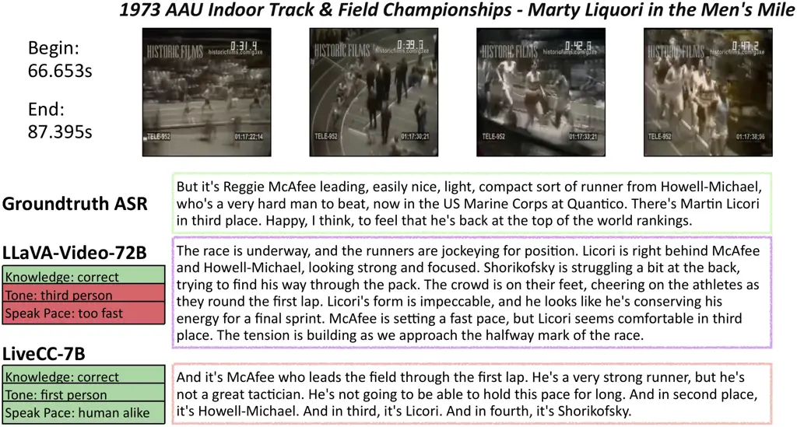

Figure 9: The comparison between the commentary generated by
LLaVA-Video-72B and our LiveCC-7B-Instruct.

To highlight the efficiency of our streaming model, we present the
response latency of LLaVA-Video-7B/72B alongside our model in Table 5.
Response latency is defined as the time a user waits to see the model’s
output, a critical factor affecting user experience. Since the
LLaVA-Video series are trained in a captioning style, requiring a full
clip as input rather than a single frame, their response latency is
significantly higher than that of our model. Notably, LiveCC not only
achieves lower latency but also delivers high-quality commentary (see
Table 4).

### 9.2 Commentary Quality

We analyzed the quality of the generated content, as shown in Figure 9.
Benefiting from training on millions of ASR-transcribed videos, our
model produces commentary that is more aligned with human preferences in
terms of tone and speaking pace, while maintaining accurate event
understanding. In contrast, the LLaVA-Video-72B, although capable of
correctly describing the event, falls short in emulating human-like
commentary.


(a) Video Time: 8.6s


(b) Video Time: 30.3s


(c) Video Time: 51.2s


(d) Video Time: 77.2s

Figure 10: Real-time video commentary demo on unseen YouTube video
(MCWJNOfJoSM). The original YouTube title is “Argentina v France: Full
Penalty Shoot-out — 2022 \#FIFAWorldCup Final”. We only give a part of
YouTube title “Full Penalty Shoot-out — 2022 \#FIFAWorldCup Final” as
prompt to avoid information leakage.


(a) Video Time: 2.6s

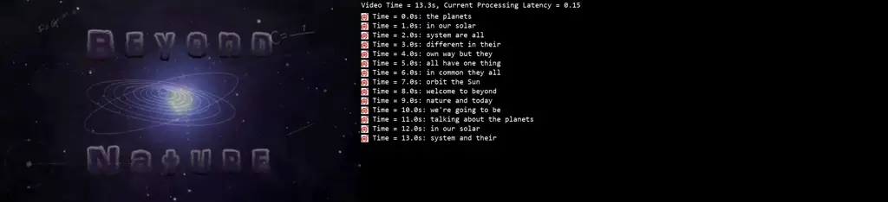

(b) Video Time: 13.3s


(c) Video Time: 31.6s

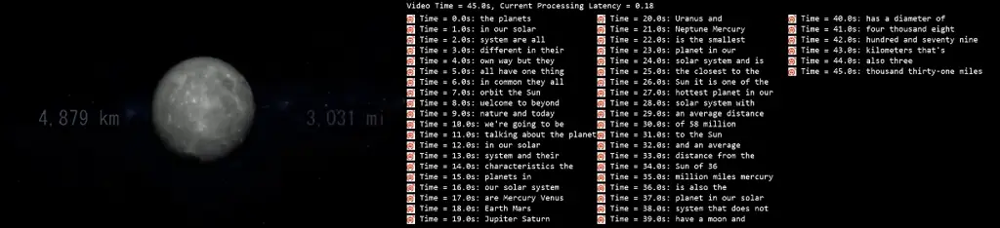

(d) Video Time: 45.0s

Figure 11: Real-time video commentary demo on unseen YouTube video
(lcZTcfdZ3Ow). We give the YouTube title “The Planets In Our Solar
System” as prompt.


(a) Video Time: 4.3s

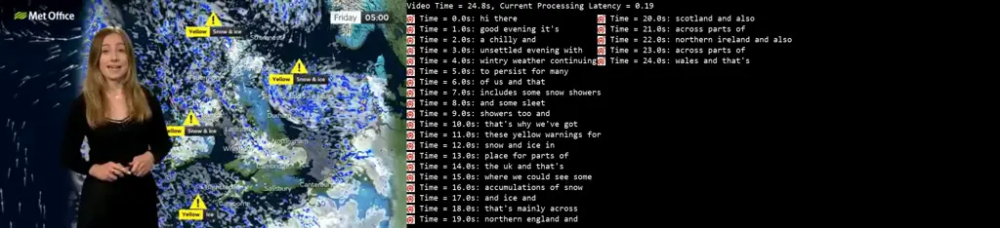

(b) Video Time: 24.8s

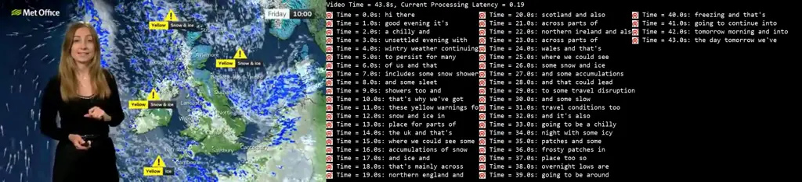

(c) Video Time: 43.8s

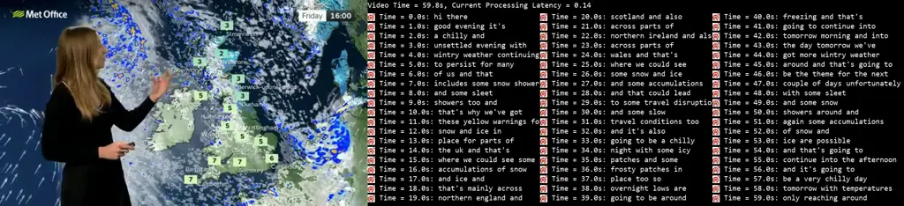

(d) Video Time: 59.8s

Figure 12: Real-time video commentary demo on unseen YouTube video
(8XajZdrCDsk). The original YouTube title is “21/11/24 - Wintry weather
perservering - Evening Weather Forecast UK – Met Office Weather”. We
only give “21/11/24 - Wintry weather perservering” as prompt to avoid
information leakage.


(a) Video Time: 4.6s


(b) Video Time: 15.6s


(c) Video Time: 44.0s

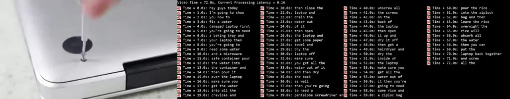

(d) Video Time: 72.8s

Figure 13: Real-time video commentary demo on unseen YouTube video
(115amzVdV44). We give the YouTube title “How To Fix a Water Damaged
Laptop” as the prompt.
