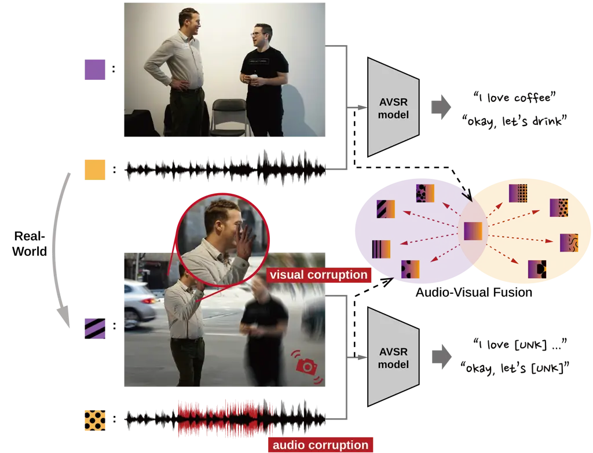
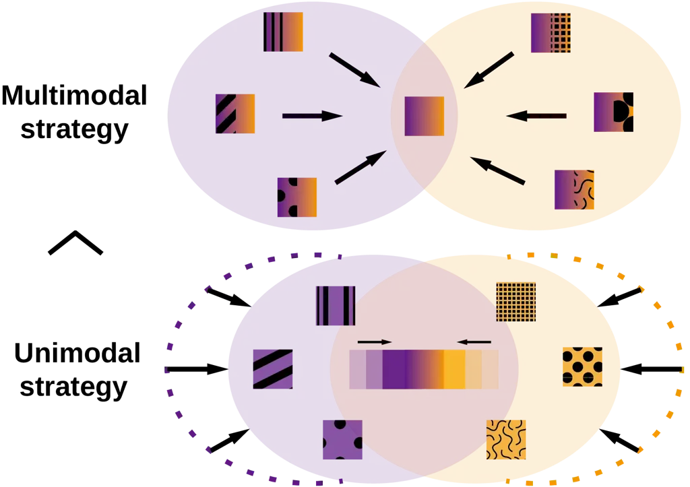
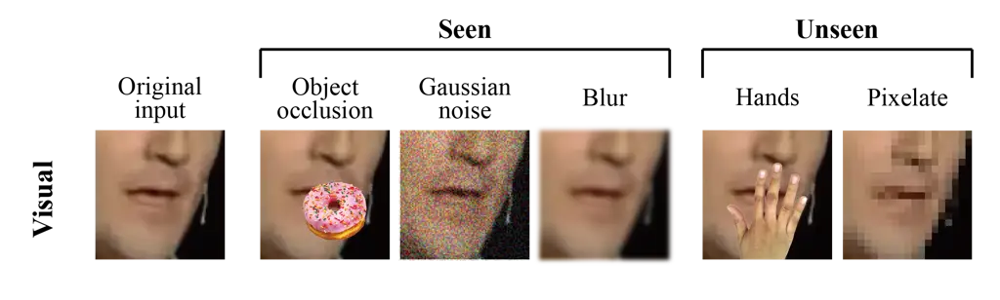
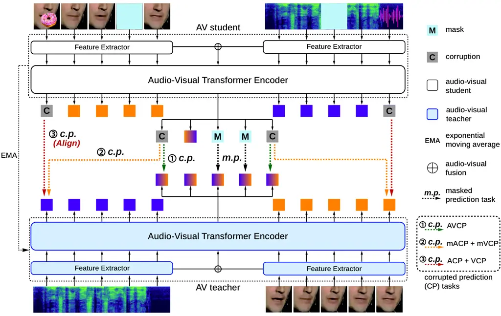
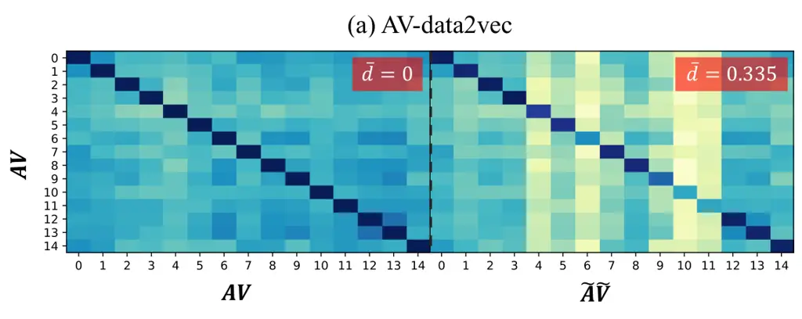
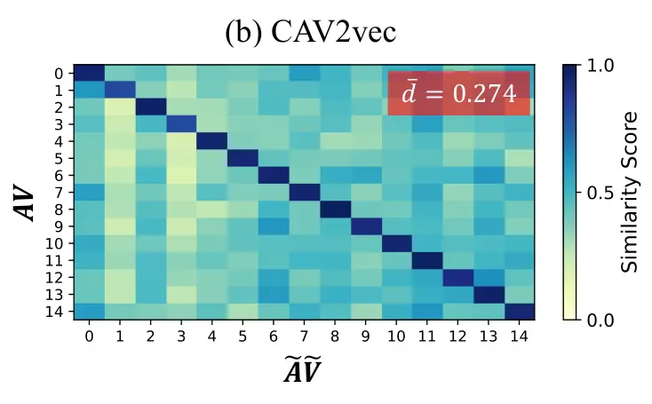
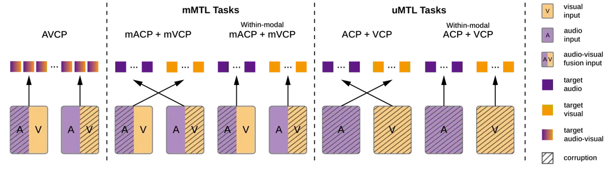
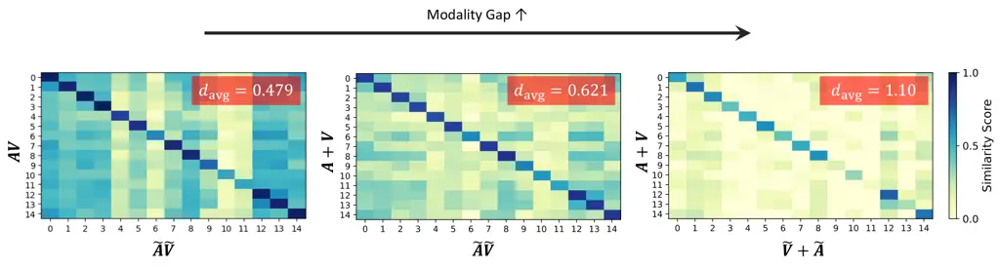
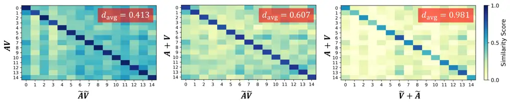

# Multi-Task Corrupted Prediction for Learning Robust Audio-Visual Speech Representation

Sungnyun Kim Affiliation: Kim Jaechul Graduate School of AI, KAIST   
Sungwoo Cho Affiliation: Kim Jaechul Graduate School of AI, KAIST   
Sangmin Bae Affiliation: Kim Jaechul Graduate School of AI, KAIST   
Kangwook Jang Affiliation: School of Electrical Engineering, KAIST   
Se-Young Yun Affiliation: Kim Jaechul Graduate School of AI, KAIST

###### Abstract

Audio-visual speech recognition (AVSR) incorporates auditory and visual
modalities to improve recognition accuracy, particularly in noisy
environments where audio-only speech systems are insufficient. While
previous research has largely addressed audio disruptions, few studies
have dealt with visual corruptions, _e.g.,_ lip occlusions or blurred
videos, which are also detrimental. To address this real-world
challenge, we propose CAV2vec, a novel self-supervised speech
representation learning framework particularly designed to handle
audio-visual joint corruption. CAV2vec employs a self-distillation
approach with a corrupted prediction task, where the student model
learns to predict clean targets, generated by the teacher model, with
corrupted input frames. Specifically, we suggest a unimodal multi-task
learning, which distills cross-modal knowledge and aligns the corrupted
modalities, by predicting clean audio targets with corrupted videos, and
clean video targets with corrupted audios. This strategy mitigates the
dispersion in the representation space caused by corrupted modalities,
leading to more reliable and robust audio-visual fusion. Our experiments
on robust AVSR benchmarks demonstrate that the corrupted representation
learning method significantly enhances recognition accuracy across
generalized environments involving various types of corruption. Our code
is available at
[https://github.com/sungnyun/cav2vec](https://github.com/sungnyun/cav2vec).

|     |
| --- |
|     |

## 1 Introduction

Audio-visual speech recognition (AVSR) (Noda et al., 2015; Afouras et
al., 2018a; Ma et al., 2021b; Shi et al., 2022a; Hsu & Shi, 2022; Hu et
al., 2023a) represents a significant advancement in speech recognition
by integrating both auditory and visual modalities to enhance
performance. This multimodal integration proves particularly vital in
contexts where audio-only speech recognition systems suffer from ambient
or background noise, as visual speech information like lip movements
significantly improves recognition capabilities (Makino et al., 2019;
Ren et al., 2021; Chen et al., 2023). In this sense, previous works on
AVSR have primarily focused on overcoming audio disruptions, _e.g.,_ Xu
et al. (2020) training an audio enhancement sub-network, or Shi et al.
(2022b) pretraining with noise-augmented audio. Nonetheless, real-world
applications often encounter scenarios where video corruption is as
critical as audio disturbances. For example, we may consider an outdoor
interview where not only is the audio disturbed by ambient noise or
traffic sound but visual cues are also intermittently occluded, either
when the speaker’s hands obstruct the view of their face or a camera is
out of focus (see Figure 1(a)). AVSR models often fail to accurately
recognize the utterance under these corrupted environments.



(a)



(b)

(c)

Figure 1: (a) Real-world speech recognition challenges. AVSR models
suffer from maintaining robust representations under the corrupted
environments and fail to recognize utterances. (b) Our corrupted
representation learning strategies with multimodal and unimodal
corrupted prediction tasks. (c) Speech recognition accuracy
(100 $`-`$ WER %), where frequency denotes the number of visual
corruption events in a sequence. Our representation learning framework,
CAV2vec with a unimodal strategy (U), significantly improves robustness
compared to the baseline model and even outperforms the multimodal
strategy (M).

Despite the effectiveness of current methods in addressing audio
corruptions, there is a lack of solutions for visual corruption,
highlighting the necessity for a more robust approach to tackle
audio-visual joint corruption in AVSR systems. Recent efforts have
addressed the visual corruption using techniques such as scoring modules
to assess the reliability of audio and video frames (Hong et al., 2023),
or generative pipelines to reconstruct occluded face images (Wang et
al., 2024). However, these methods often rely on specific architectures
or external modules, which limit their applicability. Building on recent
advances in audio-visual self-supervised learning that highlight the
efficacy of modality-fusion representations (Shi et al., 2022a; Lian et
al., 2023; Zhang et al., 2023), we propose CAV2vec, a novel audio-visual
speech representation learning method designed to handle jointly
corrupted audio-visual data. CAV2vec is trained through a corrupted
prediction task, where the model learns to predict clean targets from
corrupted input sequences. For this, we employ a teacher-student
self-distillation framework (Caron et al., 2021; Ruan et al., 2023),
which has proven effective in learning contextualized speech
representations (Baevski et al., 2020; Baevski et al., 2022; Shi et al.,
2022b; Zhu et al., 2024; Liu et al., 2024) without requiring
architectural changes or additional modules. In this framework,
corrupted sequences are fed into the student model, while the
self-evolving teacher model generates the clean targets online.

Within the CAV2vec representation learning framework, the corrupted
prediction task can be defined in a multimodal or unimodal strategy. A
multimodal strategy, inspired by the masked prediction task in
AV-data2vec (Lian et al., 2023), involves corrupting both audio and
video inputs to generate corrupted multimodal features, with the model
learning to predict clean multimodal targets. While this approach
enhances the robustness of multimodal representations, it is less
capable of isolating the effects of corruption on individual modalities,
as both inputs and targets contain mixed audio-visual information.
Multimodal fusion is often prone to combining redundant information (Hsu
& Shi, 2022; Mai et al., 2023), where discriminative unimodal
information is ignored, thereby the multimodal prediction falls into
overfitting. Previous approaches have tackled this by improving
cross-modal information, such as Mai et al. (2023) applying late-fusion
to filter out noisy information from unimodal features, and Hu et al.
(2023b) learning a viseme-phoneme mapping (Bear & Harvey, 2017) to
restore corrupted phonemes through visemes, but both of them rely on the
information bottleneck structure before the fusion.

To address the limitations of multimodal prediction approach, we
introduce CAV2vec with a unimodal multi-task learning strategy for
corrupted prediction tasks, which leverages corrupted unimodal sequences
to distill cross-modal knowledge. Our unimodal strategy involves
predicting clean audio targets with corrupted videos and predicting
clean video targets with corrupted audios. In AVSR, this cross-modal
alignment (Ren et al., 2021; Hu et al., 2023b; Hu et al., 2023c) is
essential for effectively integrating information from both modalities.
Our unimodal prediction strategy, as depicted in Figure 1(b), improves
cross-modal alignment by reducing the dispersion in representation
caused by the corrupted inputs. Figure 1(c) describes the AVSR
performance under audio-visual jointly corrupted environments. While
fine-tuning with corrupted data (CFT) improves robustness to some
extent, it remains challenging at higher degrees of corruption. By
incorporating the corrupted representation learning before CFT, CAV2vec
demonstrates superior performance. CAV2vec with unimodal multi-task
learning further enhances the corrupted prediction framework,
effectively aligning the corrupted modalities and achieving more robust
results. We summarize our contributions as follows.

- $`\circ`$
  We propose a novel audio-visual speech representation learning,
  CAV2vec, specifically designed for robustness under audio-visual joint
  corruption within a self-distillation framework.
- $`\circ`$
  CAV2vec conducts a unimodal multi-task learning for corrupted
  prediction tasks, predicting clean targets from corrupted input
  sequences. This strategy effectively enhances cross-modal alignment
  between corrupted audio and video for reliable multimodal fusion.
- $`\circ`$
  We establish an AVSR benchmark for generalization so that our setup
  includes novel types of corruption unseen during training, _e.g.,_
  mouth occlusion by hands or face pixelation along with public noise,
  allowing for diverse assessment of model robustness to audio-visual
  joint corruption. CAV2vec demonstrates significant performance
  improvement on our robust AVSR benchmarks.

## 2 Related Work

##### Audio-visual speech recognition models

Automatic speech recognition (ASR) methods that transcribe speech audio
to text have been extensively studied for years (Schneider et al., 2019;
Gulati et al., 2020; Baevski et al., 2020; Hsu et al., 2021; Chen et
al., 2022; Chiu et al., 2022). However, since audio signals are often
disrupted by background noise, multimodality, particularly visual
information from speech video, has been incorportaed into the ASR system
(Makino et al., 2019; Pan et al., 2022; Shi et al., 2022a; Seo et al.,
2023; Ma et al., 2023). In these multimodal approaches, the audio
modality captures the acoustic features of speech signal, while the
video modality provides visual information about the speaker’s face and
lip movements. This integration enhances the robustness of the ASR
system and improves its performance, especially in noisy audio
environments.

Several studies aimed at aligning and jointly training audio-visual
modalities have been developed in an end-to-end learning framework
(Dupont & Luettin, 2000; Ma et al., 2021b; Hong et al., 2022; Burchi &
Timofte, 2023) or self-supervised pretraining approach (Ma et al.,
2021a; Qu et al., 2022; Shi et al., 2022a; Seo et al., 2023; Zhu et al., 2023) that often utilizes masked modeling of speech representations.
Recently, among the multimodal speech recognition models leveraging the
self-supervised learning, a self-distillation approach (Lian et al.,
2023; Haliassos et al., 2023; Haliassos et al., 2024; Zhang et al.,
2024b; Liu et al., 2024), which learns the contextualized
representations by distilling the self-evolving teacher’s knowledge for
masked inputs, has demonstrated superior performances.

##### Learning robustness for AVSR

The AVSR studies have focused on developing robust models for various
types of noise while simultaneously utilizing audio and visual
information. Most of this research has initially focused on addressing
noise in the audio modality (Shi et al., 2022b; Hu et al., 2023b; Hu et
al., 2023c; Chen et al., 2023; Kim et al., 2024; Ithal et al., 2024).
However, more recent efforts have explored disturbances in visual data,
creating robust models by adding background noise, such as Gaussian
noise, to the speech videos. In this line of research, Hong et al.
(2023) have considered that human speech often involves a mouth region
being occluded by objects and first applied visual occlusion into speech
data. This has inspired further research addressing similar challenges
by restoring the occluded images by a generative model (Wang et al.,
2024). Additionally, Fu et al. (2024) have combined prompt learning with
contrastive learning to deal with audio-visual asynchrony, while Zhang
et al. (2024a) have examined the issue of a completely missing visual
modality, generating the visual hallucination during inference. Li et
al. (2024) demonstrate the effectiveness of leveraging unified
cross-modal attention and a synchronization module to encode audio and
video sequences in a unified feature space. In our study, we address
real-world challenges of audio-visual joint corruption by using
corrupted representation learning, offering a general framework without
relying on specific architectures or external modules.

## 3 Preliminaries

### 3.1 Notations

Let $`A=[a_{1},a_{2},\dots,a_{T}]`$ be the audio sequence and
$`V=[v_{1},v_{2},\dots,v_{T}]`$ be the video sequence over time $`T`$.
We define a set of corrupted indices for the audio sequence as
$`C^{a}\subseteq\{1,2,\dots,T\}`$ and a set of corrupted indices for the
video sequence as $`C^{v}\subseteq\{1,2,\dots,T\}`$. To model the
corruption, we define a family of corruption functions $`\Omega`$ that
can transform or corrupt certain frames of data. Thus, given some
corruption functions $`\omega^{a},\omega^{v}\in\Omega`$, the corrupted
audio sequence
$`\tilde{A}=[\tilde{a}_{1},\tilde{a}_{2},\dots,\tilde{a}_{T}]`$ and the
corrupted video sequence
$`\tilde{V}=[\tilde{v}_{1},\tilde{v}_{2},\dots,\tilde{v}_{T}]`$ are
defined as follows.

```math
\tilde{a}_{t}=\begin{cases}\omega^{a}(a_{t})&\text{if }t\in C^{a}\\
a_{t}&\text{else }\end{cases}\quad\text{and}\quad\tilde{v}_{t}=\begin{cases}\omega^{v}(v_{t})&\text{if }t\in C^{v}\\
v_{t}&\text{else }\end{cases} \tag{1}
```

Raw audio and video data are processed by its respective feature
extractor, and the resulting features are concatenated before being
input to the multimodal Transformer encoder
$`f_{\theta}:\mathbb{R}^{T\times D}\rightarrow\mathbb{R}^{T\times D}`$.
The output feature sequence for this multimodal input is denoted as
$`\tilde{{\bm{Z}}}^{av}=f_{\theta}(\tilde{A};\tilde{V})=[\tilde{{\bm{z}}}^{av}_{1},\tilde{{\bm{z}}}^{av}_{2},\dots,\tilde{{\bm{z}}}^{av}_{T}]`$.
If $`t\in C^{a}\cup C^{v}`$, then $`\tilde{{\bm{z}}}^{av}_{t}`$ is
considered a corrupted feature representation.



[TABLE]

Figure 2: The visual and audio corruption types we use in our training
and evaluation phases. Unseen corruption types are only utilized in
evaluation to assess the model’s generalizability. The speech audio
noise from LRS3 is ensured that there is no speaker overlap between
train and evaluation sets.

### 3.2 Masked Prediction Task

##### Self-distillation framework

The self-distillation approach as self-supervised learning has been
shown to be highly effective in learning contextualized representations
(Baevski et al., 2022; Baevski et al., 2023; Liu et al., 2024) without
supervised labels, including in multimodal feature spaces (Zhang et al.,
2023; Zhang et al., 2024b; Zhu et al., 2024). In this framework, a
reference function $`f`$, commonly referred to as the teacher model, is
updated by an exponential moving average (EMA) of the parameterized
student model $`f_{\theta}`$ with a decaying parameter $`\eta`$,
$`f\leftarrow\eta*f+(1-\eta)*f_{\theta}`$. The student model learns by
predicting targets generated online by the teacher. Thus, it enables
representation learning without requiring external modules or
modifications to the overall model structure.

##### Masked prediction task loss

In AV-data2vec (Lian et al., 2023), audio and video frames are randomly
masked, and a masked prediction task is performed by predicting each
masked frame with the target feature. The target features are obtained
from clean, unmasked data using the teacher model. Then, the masked
prediction loss is defined as:

```math
\mathcal{L}_{\text{MASK}}=\sum_{t\in M^{a}\cup M^{v}}\ell\Big([f_{\theta}(\texttt{MASK}(A);\texttt{MASK}(V))]_{t},\penalty\ [f(A;V)]_{t}\Big) \tag{2}
```

where $`M^{a}`$ and $`M^{v}`$ are the set of indices of masked audio and
video frames, respectively. $`\ell`$ is often used as a mean squared
error (MSE) loss, and $`f(\cdot)`$ as the teacher model’s average
representation—the output sequence averaged over top-$`k`$ Transformer
blocks to establish the target, _i.e.,_
$`f(A;V)=\frac{1}{k}\sum^{L}_{l=L-k+1}f^{l}(A;V)`$, where $`L`$ is the
number of blocks.

## 4 CAV2vec: Unimodal Multi-Task Corrupted Prediction

### 4.1 Visual and Audio Corruption Types

Figure 2 presents the visual and audio corruption types used in this
study. We propose a novel evaluation benchmark, introducing corruption
types unseen during training, to assess the model’s generalizability
under diverse and realistic conditions. During training, visual
corruptions include object occlusion, Gaussian noise, and blurring,
applied to video frames following Hong et al. (2023). For object
occlusion, we obscure the mouth regions by COCO (Lin et al., 2014)
object images, as presented in Voo et al. (2022). In evaluation, we
apply unseen visual corruption types, using the 11k-Hands dataset
(Afifi, 2019) to occlude the mouth regions with diverse hand images.
Furthermore, we apply corruption by pixelating the entire frame using
the opencv library, with a 3x3 patch interpolation. This allows us to
evaluate the model’s robustness under conditions where human faces are
often pixelated due to privacy or ethical concerns.

For the audio corruption, we use various types of background noise that
are recorded from different sources, at a $`-`$10 dB SNR
(signal-to-noise ratio). In the training, we apply conventionally used
audio noise types (Shi et al., 2022b; Hsu & Shi, 2022), babble, music,
and natural noise sampled from MUSAN (Snyder et al., 2015), and speech
noise sampled from LRS3 (Afouras et al., 2018b), onto the original
speech signal. In the evaluation, we introduce new corruption types from
the DEMAND dataset (Thiemann et al., 2013), which includes real-world
indoor and outdoor recordings. Out of 18 categories of recording, we
evaluate on 8 relatively noisy environments: park, river, cafe,
restaurant, cafeteria, metro, public station, and meeting room. For
results in the remaining categories, _e.g.,_ living room or office,
refer to Appendix C.2.

### 4.2 Corrupted Prediction Tasks of CAV2vec



Figure 3: Overview of our representation learning framework with
corrupted prediction tasks. For the corrupted prediction strategies,
focusing on the cross-modal alignment through unimodal multi-task
learning proves highly effective in gaining multimodal robustness.

We present CAV2vec, a robust representation learning framework to
account for corrupted audio-visual sequences. Inspired by the idea of
conventional masked prediction strategy (Lian et al., 2023), CAV2vec is
trained through a corrupted prediction task. The corrupted prediction
task loss is designed to minimize the difference between the student
model’s output for the corrupted data and the teacher model’s output for
the uncorrupted data. Figure 3 provides an overview of the corrupted
representation learning of CAV2vec. We apply corruption functions to
both video and audio data (see Figure 2) and perform the corrupted
prediction tasks on the corrupted frames, alongside the masked
prediction task on the masked frames. We suggest different strategies in
designing these corrupted prediction tasks, depending on the modality of
input and target representations.

##### Audio-visual corrupted prediction task

A straightforward approach is using corrupted multimodal inputs as well
as clean multimodal targets (\raisebox{-.9pt} {1}⃝ in Figure 3),
following the masked prediction strategy. We name it as audio-visual
corrupted prediction (AVCP) task, where the AVCP loss function is
analogously defined as:

```math
\mathcal{L}_{\text{AVCP}}=\sum_{t\in C^{a}\cup C^{v}}\ell\Big(\tilde{{\bm{z}}}^{av}_{t},\penalty\ [f(A;V)]_{t}\Big). \tag{3}
```

Here, the loss is computed only for the corrupted indices
$`t\in C^{a}\cup C^{v}`$, where $`\tilde{{\bm{Z}}}^{av}`$ represents the
student model’s predictions for (possibly) corrupted sequences
$`\tilde{A}`$ and $`\tilde{V}`$, and $`f(A;V)`$ represents the target
for clean sequences $`A`$ and $`V`$.

##### Unimodal corrupted prediction tasks

While the AVCP task in Eq. (3) is effective in learning robustness for
multimodal features, the mixed audio-visual information in both inputs
and targets makes it hard to isolate corruptions on individual
modalities (Mai et al., 2023). To address this, we introduce CAV2vec
with a unimodal multi-task learning strategy for corrupted prediction,
leveraging audio-only and video-only sequences (\raisebox{-.9pt} {3}⃝ in
Figure 3). These unimodal tasks enhance cross-modal alignment, which is
essential in AVSR for capturing multimodal correlations (Ren et al.,
2021; Hu et al., 2023b; Hu et al., 2023c), particularly when corruption
disrupts the link between two modalities. We propose the unimodal tasks
to distill cross-modal knowledge: audio corrupted prediction (ACP) task
and visual corrupted prediction (VCP) task. Their loss functions are
defined as:

```math
\mathcal{L}_{\text{ACP}}=\sum_{t\in C^{v}}\ell\Big(\tilde{{\bm{z}}}^{v}_{t},\penalty\ [f(A;\bm{0})]_{t}\Big),\quad\mathcal{L}_{\text{VCP}}=\sum_{t\in C^{a}}\ell\Big(\tilde{{\bm{z}}}^{a}_{t},\penalty\ [f(\bm{0};V)]_{t}\Big) \tag{4}
```

where $`\tilde{{\bm{Z}}}^{v}=f_{\theta}(\bm{0};\tilde{V})`$ and
$`\tilde{{\bm{Z}}}^{a}=f_{\theta}(\tilde{A};\bm{0})`$ denote video-only
and audio-only unimodal features, respectively. Thus, the ACP task
predicts clean audio targets with corrupted videos, and the VCP task
predicts clean video targets with corrupted audios. To thoroughly
examine the impact of each task and the relationship with modality
alignment, we also implement multimodal ACP and VCP tasks, called mACP
and mVCP, which use multimodal inputs $`\tilde{{\bm{Z}}}^{av}`$ and
unimodal targets (\raisebox{-.9pt} {2}⃝ in Figure 3). These are
formulated as
$`\mathcal{L}_{\text{mACP}}=\sum_{t\in C^{v}}\ell(\tilde{{\bm{z}}}^{av}_{t},[f(A;\bm{0})]_{t})`$
and
$`\mathcal{L}_{\text{mVCP}}=\sum_{t\in C^{a}}\ell(\tilde{{\bm{z}}}^{av}_{t},[f(\bm{0};V)]_{t})`$,
and their effectiveness is investigated in Section 5.3.

\captionlistentry

\captionlistentry

Figure 4: Similarity scores measured between audio-visual features of
sample sequences. Clean sequence representations are compared with
corrupted ones from (a) AV-data2vec and (b) CAV2vec. The normalized L2
distance $`\overline{d}`$ is calculated between the clean and corrupted
features per-sample.

##### Overall multi-task loss of CAV2vec

We employ both corrupted prediction in Eq. (4) and masked prediction in
Eq. (2), but we do not allow the overlap between masked and corrupted
frames to separate the tasks, _i.e.,_
$`(M^{a}\cup M^{v})\cap(C^{a}\cup C^{v})=\emptyset`$. We have
empirically found this task separation to be effective. Incorporating
the unimodal corrupted prediction tasks with modality dropout (Hsu &
Shi, 2022) as well as the masked prediction task for multimodal inputs,
the loss function for CAV2vec within multi-task learning is defined as
follows:

```math
\mathcal{L}_{\text{CAV2vec}}=\lambda_{\text{ACP}}\,\mathcal{L}_{\text{ACP}}+\lambda_{\text{VCP}}\,\mathcal{L}_{\text{VCP}}+\lambda_{\text{MASK}}\,\mathcal{L}_{\text{MASK}}+\lambda_{\text{MLM}}\,\mathcal{L}_{\text{MLM}} \tag{5}
```

where $`\mathcal{L}_{\text{MLM}}`$ is a masked language modeling-style
(MLM) loss used in Shi et al. (2022a); Zhang et al. (2023).
$`\mathcal{L}_{\text{MLM}}`$, which predicts the cluster index of the
masked features in a cross-entropy loss form, helps the model converge
faster than using $`\mathcal{L}_{\text{MASK}}`$ alone (Zhang et al.,
2023). In our experiments, we set
$`\lambda_{\text{ACP}}=\lambda_{\text{VCP}}=\lambda_{\text{MASK}}=1.0`$
and $`\lambda_{\text{MLM}}=2.0`$ to match the scales of each loss.

As shown in Figure 4, corruption disrupts audio-visual representations,
resulting in reduced similarity scores and increased dispersion of
features, which hinders the model’s ability to maintain robust
representations. In Figure 4, our corrupted representation learning
helps the model encode highly correlated audio-visual representations,
restoring high similarity (small distance) between clean and corrupted
sequence features and leading to a more compact and resilient
representation space.

## 5 Experiments and Results

### 5.1 Implementation Details

##### Datasets

We train and evaluate our model on LRS3 (Afouras et al., 2018b), which
contains roughly 433 hours of TED talks from over 5,000 speakers. Most
of our experimental configurations follow Shi et al. (2022b), including
noise augmentation and evaluation protocols. Audio noise is extracted
from the MUSAN (Snyder et al., 2015) (babble, music, natural) and LRS3
(speech) datasets, partitioned into training, validation, and test sets.
This noise is added to audio waveform during both training and
evaluation. The evaluation metric for AVSR is the word error rate (WER,
%). For audio feature extraction, we extract 26-dimensional log filter
bank features from raw audio at a stride of 10 ms, stacking 4 adjacent
frames to achieve a frame rate of 25 fps. Video track is sampled at
25Hz, with a 96$`\times`$96 region center-cropped on the speaker’s
mouth. During training, we randomly crop an 88$`\times`$88 region and
apply horizontal flips with probability 50%.

##### CAV2vec and baseline models

CAV2vec uses 24 Transformer (Vaswani et al., 2017) block layers for the
AVSR encoder and 9 layers for the decoder, based on the AV-HuBERT-Large
model (Shi et al., 2022a). The visual feature extractor is a modified
ResNet-18, while the audio feature extractor is a linear projection
layer. The extracted features are concatenated to form fusion
audio-visual features, which are input to the Transformer encoder. We
initialize the model using the publicly available checkpoint from Shi et
al. (2022b), the AV-HuBERT encoder pretrained on noise-augmented LRS3
(Afouras et al., 2018b) + VoxCeleb2 (Chung et al., 2018), and proceed
our representation learning phase afterwards. This training strategy
makes the whole process efficient, spanning only 2% of AV-HuBERT’s
pretraining cost (Shi et al., 2022a), as well as leveraging
high-resource knowledge of VoxCeleb2 (1,326 hours). Our representation
learning can thus be considered as an uptraining phase (Ainslie et al.,
2023), an additional pretraining step that helps the model adapt to
corrupted data before fine-tuning on the supervised speech recognition
task. As in prior self-distillation works (Caron et al., 2021; Baevski
et al., 2022), we employ single MLP-layer predictors assigned for each
task on the student model, which are removed after training.

For baseline models, we compare with (1) V-CAFE (Hong et al., 2022), (2)
RAVEn (Haliassos et al., 2023), (3) BRAVEn (Haliassos et al., 2024), (4)
AV-HuBERT (Shi et al., 2022a), (5) AV-data2vec (Lian et al., 2023), and
(6) AV-RelScore (Hong et al., 2023). V-CAFE is an end-to-end supervised
model with a relatively small model size, while the other models are
pretrained with their own loss functions. We re-implemented RelScore on
the AV-HuBERT backbone, as the original version based on V-CAFE (Hong et
al., 2023) performs poorly, and further trained the scoring module. All
baseline models are initialized from their respective pretrained
checkpoints and then fine-tuned using the same decoder architecture and
training configurations as our model. For details of each baseline
model, refer to Appendix A.1.

##### Training configuration

For CAV2vec uptraining, we sample audio noise at 0 dB SNR and randomly
perturb the clean speech signal with a 25% probability. The encoder is
updated for 60K steps, with a maximum of 16K tokens (_i.e.,_ 640
seconds) per step, which takes 8–10 hours on 4 RTX A6000 GPUs. Visual
corruption is applied to every sequence, randomly corrupting 10–50% of
the sequence length with object occlusion, Gaussian noise, or blurring.
Every clean audio sequence is corrupted by augmenting strong noise of
babble, speech, music, or natural, at $`-`$10 dB SNR to 30–50% of the
sequence length.

During fine-tuning, the encoder is frozen for the first 48K steps, while
the decoder is trained using sequence-to-sequence negative
log-likelihood as the AVSR loss function. The entire model is then
trained for additional 12K steps. The visual corruption applied during
fine-tuning is identical to that in the uptraining phase, while we
randomly corrupt 25% of the audio signal by an SNR value sampled from a
normal distribution with mean 0 and standard deviation 5. We note that
all baseline models follow the same fine-tuning procedure as ours for a
fair comparison: initialized from pretrained models and then fine-tuned
with audio-visual corrupted inputs.

### 5.2 Robust AVSR Benchmark Results

[TABLE]

Table 1: Comparisons of WER (%) with our model and prior works on the
LRS3 dataset (Afouras et al., 2018b). For audio corruption, babble,
music, and natural noise are sampled from the MUSAN dataset (Snyder et
al., 2015), while speech noise is sampled from the held-out set of LRS3.
N-WER averages the results across all four audio noise types and five
SNR (signal-to-noise ratio) values, while N $`\geq`$ S denotes
noise-dominant scenarios, averaging over {-10, -5, 0} SNRs. For visual
corruption, we evaluate on (a) object occlusion and noise, (b) occlusion
by hands, and (c) pixelated face.

[TABLE]

Table 2: Performance comparison on the LRS3 dataset (Afouras et al.,
2018b) with audio noise sampled from the DEMAND dataset (Thiemann et
al., 2013). For each noisy environment, WER (%) is measured by randomly
sampling the SNR value from the range \[$`-`$10 dB, 10 dB\].

##### LRS3 benchmark results with audio-visual joint corruption

Through our experiments, we address two questions: ($`i`$) does
representation learning with corrupted prediction task and multi-task
learning approach improve the model’s robustness to real-world
audio-visual corruption? and ($`ii`$) does it guarantee generalizability
to even unseen types of corruption? The evaluation environments in this
study are specifically challenging compared to previous works since
there exists audio-visual joint corruption. In Table 1, we present the
robust AVSR performance of our proposed model, CAV2vec, which is
superior to baseline models in diverse conditions. AV-HuBERT (Shi et
al., 2022b) and AV-data2vec (Lian et al., 2023) are based on a
multimodal encoder and have been pretrained on noise-augmented audio
conditions, which result in outperforming RAVEn (Haliassos et al., 2023)
and BRAVEn (Haliassos et al., 2024) that utilize two separate encoders
for ASR and VSR. RAVEn and BRAVEn particularly suffer in severely
corrupted environments, _i.e.,_ SNR $`\leq`$ 0 dB. While AV-RelScore is
specifically designed to address audio-visual joint corruption by
assessing the modality reliability (Hong et al., 2023) and outperforms
other baselines, it entails additional parameters for a scoring module
within the encoder, making it hard to incorporate with pretrained
models.

CAV2vec consistently demonstrates superior performance across all visual
and audio corruption levels. It surpasses all baseline models under the
object occlusion and visual noise condition, achieving an average N-WER
of 5.1% (Table 1(a)), while AV-data2vec and AV-RelScore obtain 6.2% and
5.9%, respectively. Furthermore, CAV2vec shows effectiveness in
generalizing to unseen types of corruption, with N-WER of 5.2% and 5.1%
for (b) hands occlusion and (c) pixelated face, respectively,
underscoring its practical applicability in real-world scenarios.
Occlusion by hands poses a particularly challenging situation, as the
obscured region is larger than that of the COCO objects (Lin et al.,
2014), and there is visual similarity between hands and facial tones.
While baseline models struggle with such unseen visual corruption type,
showing increases in average N-WER (6.5% for AV-data2vec and 6.1% for
AV-RelScore), CAV2vec maintains robustness, achieving an N-WER of 5.2%.

In the audio noise-dominant scenarios, characterized by an SNR value
less than or equal to 0 dB (denoted as N $`\geq`$ S), it is important to
fully leverage visual cues to compensate for impaired speech audio
signal. In such conditions, corrupted video inputs can be particularly
detrimental if the model is not robust to them. CAV2vec, with its
unimodal corrupted prediction tasks, effectively learns cross-modal
correlations under corruption, mitigating the recognition errors. We
also highlight that our model consistently achieves state-of-the-art
results even in the signal-dominant conditions, _i.e.,_ high SNR values,
demonstrating its versatility across varying levels of audio corruption.
In addition, to validate the model’s generalizability to real-world
audio corruption, Table 2 presents the AVSR performance with DEMAND
noise that includes more realistic environments. CAV2vec effectively
achieves robust recognition capabilities in environments like indoor
stores or outdoor public space.

##### LRS2 benchmark results

|             |      |     |     |     |       |
| ----------- | ---- | --- | --- | --- | ----- |
| Method      | B    | S   | M   | N   | Clean |
| AV-HuBERT   | 11.6 | 5.3 | 6.1 | 6.0 | 3.0   |
| AV-data2vec | 11.5 | 5.6 | 6.5 | 6.2 | 3.0   |
| AV-RelScore | 11.1 | 4.8 | 5.9 | 5.5 | 2.9   |
| CAV2vec     | 8.9  | 4.4 | 5.1 | 4.9 | 2.7   |

Table 3: Comparisons of WER (%) with our model and prior works on the
LRS2 dataset. We present N-WER, with babble (B), speech (S), music (M),
and natural (N) noise types, as well as clean WER results. Visual
corruption type is used as object occlusion + noise.



Figure 5: Our implemented strategies for corrupted prediction tasks. The
AVCP task uses the audio-visual targets. For the multi-task
learning (MTL) designs that utilize unimodal targets, mACP and mVCP
tasks use multimodal inputs (mMTL), while ACP and VCP tasks use unimodal
inputs (uMTL).

|     |      |      |                            |      |      |      |      |      |      |
| --- | ---- | ---- | -------------------------- | ---- | ---- | ---- | ---- | ---- | ---- |
| CRL | mMTL | uMTL | Tasks for corruption       | O/MS | O/DM | H/MS | H/DM | P/MS | P/DM |
| ✗   | ✗    | ✗    | \-                         | 6.2  | 5.1  | 6.5  | 5.5  | 6.0  | 4.9  |
| ✓   | ✗    | ✗    | AVCP                       | 5.3  | 4.5  | 5.6  | 4.7  | 5.6  | 4.8  |
| ✓   | ✓    | ✗    | mACP + mVCP                | 5.1  | 4.2  | 5.4  | 4.5  | 5.3  | 4.3  |
| ✓   | ✓    | ✗    | mACP + mVCP (within-modal) | 5.2  | 4.4  | 5.4  | 4.6  | 5.3  | 4.5  |
| ✓   | ✓    | ✗    | mACP + mVCP + AVCP         | 5.3  | 4.6  | 5.6  | 4.8  | 5.3  | 4.6  |
| ✓   | ✗    | ✓    | ACP + VCP                  | 5.1  | 4.3  | 5.2  | 4.3  | 5.1  | 4.2  |
| ✓   | ✗    | ✓    | ACP + VCP (within-modal)   | 5.2  | 4.6  | 5.4  | 4.7  | 5.2  | 4.4  |
| ✓   | ✗    | ✓    | ACP + VCP + AVCP           | 5.2  | 4.4  | 5.6  | 4.6  | 5.3  | 4.6  |
| ✓   | ✓    | ✓    | mACP + mVCP + ACP + VCP    | 5.1  | 4.3  | 5.2  | 4.4  | 5.2  | 4.2  |

Table 4: Ablation study for the configuration of corrupted prediction
tasks. We summarize the AVSR results (average N-WER) across visual
corruption types (O: object occlusion + noise, H: hands occlusion, P:
pixelate) and audio corruption types (MS: MUSAN and LRS3 noise, DM:
DEMAND noise), same evaluation procedures as Tables 1 and 2. CRL:
corrupted representation learning, mMTL: multimodal multi-task learning,
uMTL: unimodal multi-task learning. Refer to Figure 5 for each setting.
Note that the masked prediction task is utilized in every setup. Best
and second best results.

The LRS2 dataset (Son Chung et al., 2017) consists of 224 hours of BBC
video recordings, encompassing a wider variety of scenarios than LRS3,
including news delivery, panel discussion, and indoor and outdoor
interviews. This diversity allows for a more comprehensive evaluation of
the model’s generalizability. In Table 3, CAV2vec demonstrates strong
performance on the corrupted LRS2 benchmark, further validating its
robustness in real-world conditions. We note that all models compared
are based on the LRS3-pretrained models, with LRS2 used only in the
uptraining or fine-tuning phase.

### 5.3 Analysis

#### 5.3.1 Ablation Study for Corrupted Prediction Tasks

In designing our corrupted prediction tasks, we have introduced the AVCP
task in Eq. (3), along with the unimodal ACP and VCP tasks in Eq. (4).
Additionally, we explore the mACP and mVCP tasks for a more
comprehensive analysis. Figure 5 illustrates and compares these tasks,
as well as within-modal task designs. The within-modal ACP and VCP tasks
are implemented to align the corrupted inputs and targets within the
same modality. Table 4 summarizes the performance results for each task
design.

The first observation is that without incorporating the suggested
corrupted representation learning, the model struggles to achieve robust
speech recognition. Therefore, it is crucial to employ any forms of
corrupted prediction task. When utilizing multimodal inputs, the
mACP + mVCP tasks consistently outperform the AVCP task alone, and even
the combination with AVCP. This indicates that distilling knowledge
through unimodal targets for the corrupted modality shows effectiveness.
Besides, using unimodal inputs (ACP + VCP) proves even more effective,
as these tasks generally outperform the multimodal input tasks
(mACP + mVCP). We also note that within-modal strategies are less
effective than cross-modal approaches, as they do not directly target
audio-visual correlations.

These findings align with our hypothesis, as depicted in Figure 3, that
directly addressing the cross-modal alignment improves the correlation
between the two modalities, which is crucial in generating robust
audio-visual features. Since the masked prediction task is maintained
for learning contextualized multimodal representations, the AVCP or
mACP + mVCP tasks become redundant when unimodal tasks are being
employed. We thus separate the multi-task strategy as leveraging only
unimodal inputs for corrupted prediction and multimodal inputs for
masked prediction.

#### 5.3.2 Sensitivity Study on Corruption Ratios

|                            |                            |                            |       |              |           |       |
| -------------------------- | -------------------------- | -------------------------- | ----- | ------------ | --------- | ----- |
|                            |                            |                            | N-WER |              |           |       |
| $`p_{\text{corrupt}}^{v}`$ | $`p_{\text{corrupt}}^{a}`$ | $`\hat{p}_{\text{clean}}`$ | AVG   | N $`\geq`$ S | N $`<`$ S | Clean |
| 0.1–0.5                    | 0.3–0.5                    | 0.15                       | 5.1   | 7.2          | 1.9       | 1.5   |
| 0.1                        | 0.3                        | 0.22                       | 5.3   | 7.4          | 2.0       | 1.6   |
| 0.3                        | 0.5                        | 0.14                       | 5.0   | 7.1          | 2.0       | 1.5   |
| 0.5                        | 0.7                        | 0.09                       | 4.7   | 6.5          | 2.0       | 1.6   |
| 0.7                        | 0.9                        | 0.04                       | 4.7   | 6.5          | 2.1       | 1.6   |

Table 5: Sensitivity study on the corruption ratios in CAV2vec. Object
occlusion with Gaussian noise and blurring is used for visual
corruption, along with the MUSAN audio corruption, as in Table 1(a).

We evaluate the model across varying corruption ratios for both audio
($`p_{\text{corrupt}}^{a}`$) and visual ($`p_{\text{corrupt}}^{v}`$)
sequences to examine the impact of amount of corruption in learning
robustness. As shown in Table 5, higher corruption ratios naturally
reduce the empirical proportion of clean inputs
($`\hat{p}_{\text{clean}}`$). The result reveals a trade-off between the
performance in highly noisy environments (N $`\geq`$ S) and less
corrupted settings (N $`<`$ S and Clean), depending on the model’s
exposure to clean or corrupted sequences during training. While higher
corruption ratios significantly improve performance in noisy conditions,
it is also essential for the AVSR model to maintain reliability in less
corrupted scenarios. To balance this trade-off, we randomly sample the
visual corruption ratio from 0.1–0.5 and audio corruption ratio from
0.3–0.5, ensuring a balance between clean and corrupted inputs. In terms
of masking frames, we follow Shi et al. (2022b); Zhang et al. (2023) by
using a 0.3 masking ratio for video and 0.8 for audio. For both
corruption and masking, higher ratios for audio is necessary as audio
holds more critical information in speech. However, we note that masking
is applied after corruption, and we do not allow overlap between masked
and corrupted frames, which results in effective masking ratios of
roughly 0.1 for video and 0.2 for audio. We empirically observed that
adjusting the masking ratios has little effect on the CAV2vec’s
performance.

## 6 Conclusion

In this paper, we presented CAV2vec, a novel audio-visual representation
learning framework designed to address the challenges of audio-visual
joint corruption in speech recognition. By employing a corrupted
prediction task, CAV2vec enhances multimodal robustness, while
incorporating a unimodal multi-task learning strategy to improve
cross-modal alignment shows effectiveness. Our experiments on robust
AVSR benchmarks including LRS3 and LRS2 demonstrate that CAV2vec
significantly outperforms existing baseline models, consistently
exhibiting superior performance across a variety of corrupted
environments. Particularly in challenging audio noise-dominant
scenarios, CAV2vec effectively aligns corrupted modalities, leading to
more reliable and robust audio-visual fusion. Additionally, our model
showcases strong generalization abilities, achieving state-of-the-art
results even in unseen corruption types such as pixelated faces with
public audio noise. These findings establish CAV2vec as a robust,
adaptable framework for handling corrupted audio-visual data, setting a
new benchmark for multimodal speech recognition systems.

## Ethics Statement

Our research focuses on advancing representation learning methods for
audio-visual speech data, specifically addressing the challenge of
multimodal corruption in speech recognition systems. This study does not
involve human subjects, nor does it present any potential ethical
concerns related to harmful insights, conflicts of interest,
discrimination, or bias. The datasets used in this research, including
the newly introduced corruption types (_e.g.,_ hands occlusion or
background noise recordings), are publicly available and widely used in
the speech recognition community, ensuring our compliance with data
privacy and legal standards.

## Reproducibility Statement

To ensure the reproducibility of our work, we provide a comprehensive
description of our model architecture and training process in
Section 5.1. Additional details, including hyperparameters, training
strategies, and corruption techniques for CAV2vec, can be found in
Appendix A.2 and A.3. Appendix A.1 outlines the details of each baseline
model used in the experiments, including the implementation procedures
to fine-tune the models on the corrupted audio-visual data. We plan to
release the model checkpoint of CAV2vec to facilitate future research.

## Acknowledgments

This work was supported by Institute of Information & communications
Technology Planning & Evaluation (IITP) grant funded by the Korea
government (MSIT) \[No.2022-0-00641, XVoice: Multi-Modal Voice Meta
Learning, 90%\] and \[No.2019-0-00075, Artificial Intelligence Graduate
School Program (KAIST), 10%\].

## References

- Afifi (2019) Mahmoud Afifi. 11k hands: Gender recognition and
  biometric identification using a large dataset of hand images.
  _Multimedia Tools and Applications_, 78:20835–20854, 2019.
- Afouras et al. (2018a) Triantafyllos Afouras, Joon Son Chung, Andrew
  Senior, Oriol Vinyals, and Andrew Zisserman. Deep audio-visual speech
  recognition. _IEEE transactions on pattern analysis and machine
  intelligence_, 44(12):8717–8727, 2018a.
- Afouras et al. (2018b) Triantafyllos Afouras, Joon Son Chung, and
  Andrew Zisserman. Lrs3-ted: a large-scale dataset for visual speech
  recognition. _arXiv preprint arXiv:1809.00496_, 2018b.
- Ainslie et al. (2023) Joshua Ainslie, James Lee-Thorp, Michiel de
  Jong, Yury Zemlyanskiy, Federico Lebron, and Sumit Sanghai. Gqa:
  Training generalized multi-query transformer models from multi-head
  checkpoints. In _Proceedings of the 2023 Conference on Empirical
  Methods in Natural Language Processing_, pp. 4895–4901, 2023.
- Baevski et al. (2020) Alexei Baevski, Yuhao Zhou, Abdelrahman Mohamed,
  and Michael Auli. wav2vec 2.0: A framework for self-supervised
  learning of speech representations. _Advances in neural information
  processing systems_, 33:12449–12460, 2020.
- Baevski et al. (2022) Alexei Baevski, Wei-Ning Hsu, Qiantong Xu, Arun
  Babu, Jiatao Gu, and Michael Auli. Data2vec: A general framework for
  self-supervised learning in speech, vision and language. In
  _International Conference on Machine Learning_, pp. 1298–1312.
  PMLR, 2022.
- Baevski et al. (2023) Alexei Baevski, Arun Babu, Wei-Ning Hsu, and
  Michael Auli. Efficient self-supervised learning with contextualized
  target representations for vision, speech and language. In
  _International Conference on Machine Learning_, pp. 1416–1429.
  PMLR, 2023.
- Bear & Harvey (2017) Helen L Bear and Richard Harvey.
  Phoneme-to-viseme mappings: the good, the bad, and the ugly. _Speech
  Communication_, 95:40–67, 2017.
- Burchi & Timofte (2023) Maxime Burchi and Radu Timofte. Audio-visual
  efficient conformer for robust speech recognition. In _Proceedings of
  the IEEE/CVF Winter Conference on Applications of Computer Vision_,
  pp. 2258–2267, 2023.
- Caron et al. (2021) Mathilde Caron, Hugo Touvron, Ishan Misra, Hervé
  Jégou, Julien Mairal, Piotr Bojanowski, and Armand Joulin. Emerging
  properties in self-supervised vision transformers. In _Proceedings of
  the IEEE/CVF international conference on computer vision_, pp.
  9650–9660, 2021.
- Chen et al. (2023) Chen Chen, Yuchen Hu, Qiang Zhang, Heqing Zou,
  Beier Zhu, and Eng Siong Chng. Leveraging modality-specific
  representations for audio-visual speech recognition via reinforcement
  learning. In _Proceedings of the AAAI Conference on Artificial
  Intelligence_, volume 37, pp. 12607–12615, 2023.
- Chen et al. (2022) Sanyuan Chen, Chengyi Wang, Zhengyang Chen, Yu Wu,
  Shujie Liu, Zhuo Chen, Jinyu Li, Naoyuki Kanda, Takuya Yoshioka, Xiong
  Xiao, et al. Wavlm: Large-scale self-supervised pre-training for full
  stack speech processing. _IEEE Journal of Selected Topics in Signal
  Processing_, 16(6):1505–1518, 2022.
- Chiu et al. (2022) Chung-Cheng Chiu, James Qin, Yu Zhang, Jiahui Yu,
  and Yonghui Wu. Self-supervised learning with random-projection
  quantizer for speech recognition. In _International Conference on
  Machine Learning_, pp. 3915–3924. PMLR, 2022.
- Chung et al. (2018) Joon Son Chung, Arsha Nagrani, and Andrew
  Zisserman. Voxceleb2: Deep speaker recognition. In _Proceedings of the
  Annual Conference of the International Speech Communication
  Association, INTERSPEECH_, volume 2018, pp. 1086–1090, 2018.
- Dupont & Luettin (2000) Stéphane Dupont and Juergen Luettin.
  Audio-visual speech modeling for continuous speech recognition. _IEEE
  transactions on multimedia_, 2(3):141–151, 2000.
- Fu et al. (2024) Dongjie Fu, Xize Cheng, Xiaoda Yang, Hanting Wang,
  Zhou Zhao, and Tao Jin. Boosting speech recognition robustness to
  modality-distortion with contrast-augmented prompts. In _ACM
  Multimedia_, 2024.
- Graves et al. (2006) Alex Graves, Santiago Fernández, Faustino Gomez,
  and Jürgen Schmidhuber. Connectionist temporal classification:
  labelling unsegmented sequence data with recurrent neural networks. In
  _Proceedings of the 23rd international conference on Machine
  learning_, pp. 369–376, 2006.
- Gulati et al. (2020) Anmol Gulati, James Qin, Chung-Cheng Chiu, Niki
  Parmar, Yu Zhang, Jiahui Yu, Wei Han, Shibo Wang, Zhengdong Zhang,
  Yonghui Wu, et al. Conformer: Convolution-augmented transformer for
  speech recognition. In _Interspeech_. International Speech
  Communication Association, 2020.
- Haliassos et al. (2023) Alexandros Haliassos, Pingchuan Ma, Rodrigo
  Mira, Stavros Petridis, and Maja Pantic. Jointly learning visual and
  auditory speech representations from raw data. _The Eleventh
  International Conference on Learning Representations_, 2023.
- Haliassos et al. (2024) Alexandros Haliassos, Andreas Zinonos, Rodrigo
  Mira, Stavros Petridis, and Maja Pantic. Braven: Improving
  self-supervised pre-training for visual and auditory speech
  recognition. In _ICASSP 2024-2024 IEEE International Conference on
  Acoustics, Speech and Signal Processing (ICASSP)_, pp. 11431–11435.
  IEEE, 2024.
- Hong et al. (2022) Joanna Hong, Minsu Kim, Daehun Yoo, and Yong Man
  Ro. Visual context-driven audio feature enhancement for robust
  end-to-end audio-visual speech recognition. In _Proceedings of the
  Annual Conference of the International Speech Communication
  Association, INTERSPEECH_, volume 2022, pp. 2838–2842, 2022.
- Hong et al. (2023) Joanna Hong, Minsu Kim, Jeongsoo Choi, and Yong Man
  Ro. Watch or listen: Robust audio-visual speech recognition with
  visual corruption modeling and reliability scoring. In _Proceedings of
  the IEEE/CVF Conference on Computer Vision and Pattern Recognition_,
  pp. 18783–18794, 2023.
- Hsu & Shi (2022) Wei-Ning Hsu and Bowen Shi. u-hubert: Unified
  mixed-modal speech pretraining and zero-shot transfer to unlabeled
  modality. _Advances in Neural Information Processing Systems_,
  35:21157–21170, 2022.
- Hsu et al. (2021) Wei-Ning Hsu, Benjamin Bolte, Yao-Hung Hubert Tsai,
  Kushal Lakhotia, Ruslan Salakhutdinov, and Abdelrahman Mohamed.
  Hubert: Self-supervised speech representation learning by masked
  prediction of hidden units. _IEEE/ACM Transactions on Audio, Speech,
  and Language Processing_, 29:3451–3460, 2021.
- Hu et al. (2023a) Yuchen Hu, Chen Chen, Ruizhe Li, Heqing Zou, and Eng
  Siong Chng. Mir-gan: Refining frame-level modality-invariant
  representations with adversarial network for audio-visual speech
  recognition. In _Proceedings of the 61st Annual Meeting of the
  Association for Computational Linguistics (Volume 1: Long Papers)_,
  pp. 11610–11625, 2023a.
- Hu et al. (2023b) Yuchen Hu, Ruizhe Li, Chen Chen, Chengwei Qin,
  Qiu-Shi Zhu, and Eng Siong Chng. Hearing lips in noise: Universal
  viseme-phoneme mapping and transfer for robust audio-visual speech
  recognition. In _Proceedings of the 61st Annual Meeting of the
  Association for Computational Linguistics (Volume 1: Long Papers)_,
  pp. 15213–15232, 2023b.
- Hu et al. (2023c) Yuchen Hu, Ruizhe Li, Chen Chen, Heqing Zou, Qiushi
  Zhu, and Eng Siong Chng. Cross-modal global interaction and local
  alignment for audio-visual speech recognition. In _32nd International
  Joint Conference on Artificial Intelligence, IJCAI 2023_, pp.
  5076–5084. International Joint Conferences on Artificial Intelligence
  Organization, 2023c.
- Ithal et al. (2024) Bharath NV Ithal, TG Lagan, Rhea Sudheer, Swathi
  Rupali NV, and HR Mamatha. Enhancing robustness in audio visual speech
  recognition: A preprocessing approach with transformer and ctc loss.
  In _2024 International Conference on Advances in Modern Age
  Technologies for Health and Engineering Science (AMATHE)_, pp. 1–8.
  IEEE, 2024.
- Kim et al. (2024) Sungnyun Kim, Kangwook Jang, Sangmin Bae, Hoirin
  Kim, and Se-Young Yun. Learning video temporal dynamics with
  cross-modal attention for robust audio-visual speech recognition.
  _IEEE Spoken Language Technology Workshop (SLT)_, 2024.
- Kim et al. (2017) Suyoun Kim, Takaaki Hori, and Shinji Watanabe. Joint
  ctc-attention based end-to-end speech recognition using multi-task
  learning. In _2017 IEEE international conference on acoustics, speech
  and signal processing (ICASSP)_, pp. 4835–4839. IEEE, 2017.
- Kingma (2014) Diederik P Kingma. Adam: A method for stochastic
  optimization. _arXiv preprint arXiv:1412.6980_, 2014.
- Li et al. (2024) Jiahong Li, Chenda Li, Yifei Wu, and Yanmin Qian.
  Unified cross-modal attention: Robust audio-visual speech recognition
  and beyond. _IEEE/ACM Transactions on Audio, Speech, and Language
  Processing_, 32:1941–1953, 2024.
- Lian et al. (2023) Jiachen Lian, Alexei Baevski, Wei-Ning Hsu, and
  Michael Auli. Av-data2vec: Self-supervised learning of audio-visual
  speech representations with contextualized target representations. In
  _2023 IEEE Automatic Speech Recognition and Understanding Workshop
  (ASRU)_, pp. 1–8. IEEE, 2023.
- Lin et al. (2014) Tsung-Yi Lin, Michael Maire, Serge Belongie, James
  Hays, Pietro Perona, Deva Ramanan, Piotr Dollár, and C Lawrence
  Zitnick. Microsoft coco: Common objects in context. In _Computer
  Vision–ECCV 2014: 13th European Conference, Zurich, Switzerland,
  September 6-12, 2014, Proceedings, Part V 13_, pp. 740–755.
  Springer, 2014.
- Liu et al. (2024) Alexander H Liu, Heng-Jui Chang, Michael Auli,
  Wei-Ning Hsu, and Jim Glass. Dinosr: Self-distillation and online
  clustering for self-supervised speech representation learning.
  _Advances in Neural Information Processing Systems_, 36, 2024.
- Ma et al. (2021a) Pingchuan Ma, Rodrigo Mira, Stavros Petridis, Björn
  W Schuller, and Maja Pantic. Lira: Learning visual speech
  representations from audio through self-supervision. In _Interspeech_.
  International Speech Communication Association, 2021a.
- Ma et al. (2021b) Pingchuan Ma, Stavros Petridis, and Maja Pantic.
  End-to-end audio-visual speech recognition with conformers. In _ICASSP
  2021-2021 IEEE International Conference on Acoustics, Speech and
  Signal Processing (ICASSP)_, pp. 7613–7617. IEEE, 2021b.
- Ma et al. (2023) Pingchuan Ma, Alexandros Haliassos, Adriana
  Fernandez-Lopez, Honglie Chen, Stavros Petridis, and Maja Pantic.
  Auto-avsr: Audio-visual speech recognition with automatic labels. In
  _ICASSP 2023-2023 IEEE International Conference on Acoustics, Speech
  and Signal Processing (ICASSP)_, pp. 1–5. IEEE, 2023.
- Mai et al. (2023) Sijie Mai, Ying Zeng, and Haifeng Hu. Multimodal
  information bottleneck: Learning minimal sufficient unimodal and
  multimodal representations. _IEEE Transactions on Multimedia_,
  25:4121–4134, 2023.
- Makino et al. (2019) Takaki Makino, Hank Liao, Yannis Assael, Brendan
  Shillingford, Basilio Garcia, Otavio Braga, and Olivier Siohan.
  Recurrent neural network transducer for audio-visual speech
  recognition. In _2019 IEEE automatic speech recognition and
  understanding workshop (ASRU)_, pp. 905–912. IEEE, 2019.
- Noda et al. (2015) Kuniaki Noda, Yuki Yamaguchi, Kazuhiro Nakadai,
  Hiroshi G Okuno, and Tetsuya Ogata. Audio-visual speech recognition
  using deep learning. _Applied intelligence_, 42:722–737, 2015.
- Pan et al. (2022) Xichen Pan, Peiyu Chen, Yichen Gong, Helong Zhou,
  Xinbing Wang, and Zhouhan Lin. Leveraging unimodal self-supervised
  learning for multimodal audio-visual speech recognition. In
  _Proceedings of the 60th Annual Meeting of the Association for
  Computational Linguistics (Volume 1: Long Papers)_, pp.
  4491–4503, 2022.
- Qu et al. (2022) Leyuan Qu, Cornelius Weber, and Stefan Wermter.
  Lipsound2: Self-supervised pre-training for lip-to-speech
  reconstruction and lip reading. _IEEE transactions on neural networks
  and learning systems_, 35(2):2772–2782, 2022.
- Ren et al. (2021) Sucheng Ren, Yong Du, Jianming Lv, Guoqiang Han, and
  Shengfeng He. Learning from the master: Distilling cross-modal
  advanced knowledge for lip reading. In _Proceedings of the IEEE/CVF
  Conference on Computer Vision and Pattern Recognition_, pp.
  13325–13333, 2021.
- Ruan et al. (2023) Yangjun Ruan, Saurabh Singh, Warren Richard
  Morningstar, Alexander A Alemi, Sergey Ioffe, Ian Fischer, and Joshua
  V Dillon. Weighted ensemble self-supervised learning. In _ICLR_, 2023.
- Schneider et al. (2019) Steffen Schneider, Alexei Baevski, Ronan
  Collobert, and Michael Auli. wav2vec: Unsupervised pre-training for
  speech recognition. In _Interspeech_. International Speech
  Communication Association, 2019.
- Seo et al. (2023) Paul Hongsuck Seo, Arsha Nagrani, and Cordelia
  Schmid. Avformer: Injecting vision into frozen speech models for
  zero-shot av-asr. In _Proceedings of the IEEE/CVF Conference on
  Computer Vision and Pattern Recognition_, pp. 22922–22931, 2023.
- Shi et al. (2022a) Bowen Shi, Wei-Ning Hsu, Kushal Lakhotia, and
  Abdelrahman Mohamed. Learning audio-visual speech representation by
  masked multimodal cluster prediction. _International Conference on
  Learning Representations_, 2022a.
- Shi et al. (2022b) Bowen Shi, Wei-Ning Hsu, and Abdelrahman Mohamed.
  Robust self-supervised audio-visual speech recognition. In
  _Interspeech_. International Speech Communication Association, 2022b.
- Snyder et al. (2015) David Snyder, Guoguo Chen, and Daniel Povey.
  Musan: A music, speech, and noise corpus. _arXiv preprint
  arXiv:1510.08484_, 2015.
- Son Chung et al. (2017) Joon Son Chung, Andrew Senior, Oriol Vinyals,
  and Andrew Zisserman. Lip reading sentences in the wild. In
  _Proceedings of the IEEE conference on computer vision and pattern
  recognition_, pp. 6447–6456, 2017.
- Thiemann et al. (2013) Joachim Thiemann, Nobutaka Ito, and Emmanuel
  Vincent. The diverse environments multi-channel acoustic noise
  database (demand): A database of multichannel environmental noise
  recordings. In _Proceedings of Meetings on Acoustics_, volume 19. AIP
  Publishing, 2013.
- Vaswani et al. (2017) Ashish Vaswani, Noam Shazeer, Niki Parmar, Jakob
  Uszkoreit, Llion Jones, Aidan N Gomez, Łukasz Kaiser, and Illia
  Polosukhin. Attention is all you need. _Advances in neural information
  processing systems_, 30, 2017.
- Voo et al. (2022) Kenny TR Voo, Liming Jiang, and Chen Change Loy.
  Delving into high-quality synthetic face occlusion segmentation
  datasets. In _Proceedings of the IEEE/CVF Conference on Computer
  Vision and Pattern Recognition_, pp. 4711–4720, 2022.
- Wang et al. (2024) Jiadong Wang, Zexu Pan, Malu Zhang, Robby T Tan,
  and Haizhou Li. Restoring speaking lips from occlusion for
  audio-visual speech recognition. In _Proceedings of the AAAI
  Conference on Artificial Intelligence_, volume 38, pp.
  19144–19152, 2024.
- Xu et al. (2020) Bo Xu, Cheng Lu, Yandong Guo, and Jacob Wang.
  Discriminative multi-modality speech recognition. In _Proceedings of
  the IEEE/CVF conference on Computer Vision and Pattern Recognition_,
  pp. 14433–14442, 2020.
- Zhang et al. (2024a) Fang Zhang, Yongxin Zhu, Xiangxiang Wang, Huang
  Chen, Xing Sun, and Linli Xu. Visual hallucination elevates speech
  recognition. In _Proceedings of the AAAI Conference on Artificial
  Intelligence_, volume 38, pp. 19542–19550, 2024a.
- Zhang et al. (2023) Jing-Xuan Zhang, Genshun Wan, Zhen-Hua Ling, Jia
  Pan, Jianqing Gao, and Cong Liu. Self-supervised audio-visual speech
  representations learning by multimodal self-distillation. In _ICASSP
  2023-2023 IEEE International Conference on Acoustics, Speech and
  Signal Processing (ICASSP)_, pp. 1–5. IEEE, 2023.
- Zhang et al. (2024b) Yuanhang Zhang, Shuang Yang, Shiguang Shan, and
  Xilin Chen. Es3: Evolving self-supervised learning of robust
  audio-visual speech representations. In _Proceedings of the IEEE/CVF
  Conference on Computer Vision and Pattern Recognition_, pp.
  27069–27079, 2024b.
- Zhu et al. (2023) Qiushi Zhu, Long Zhou, Ziqiang Zhang, Shujie Liu,
  Binxing Jiao, Jie Zhang, Lirong Dai, Daxin Jiang, Jinyu Li, and Furu
  Wei. Vatlm: Visual-audio-text pre-training with unified masked
  prediction for speech representation learning. _IEEE Transactions on
  Multimedia_, 2023.
- Zhu et al. (2024) Qiushi Zhu, Jie Zhang, Yu Gu, Yuchen Hu, and Lirong
  Dai. Multichannel av-wav2vec2: A framework for learning multichannel
  multi-modal speech representation. In _Proceedings of the AAAI
  Conference on Artificial Intelligence_, volume 38, pp.
  19768–19776, 2024.

Appendix

## Appendix A Implementation Details

### A.1 Implementation of Baseline Models

We present the baseline models used in our experiments and provide the
details on how they have been (re-)implemented.

V-CAFE (Hong et al., 2022) is an end-to-end supervised model for AVSR,
designed to capture the lip movement and generate a noise reduction mask
by utilizing visual context. The model is built on a
Conformer-Transformer encoder-decoder architecture and employs a joint
CTC/Attention loss function (Kim et al., 2017). V-CAFE incorporates
visual context through cross-modal attention to generate a noise
reduction mask, where the generated mask is applied to the encoded audio
features to mitigate noisy audio representations.

For our experiments, we use the pretrained encoder from the publicly
available V-CAFE checkpoint¹¹ 1
[https://github.com/ms-dot-k/AVSR](https://github.com/ms-dot-k/AVSR),
which has been trained on the LRS3 dataset. To ensure a consistent
experimental setup across all baselines and our model, we fine-tune the
V-CAFE model by initializing the Transformer decoder and training it for
120,000 steps with a learning rate of $`2\times 10^{-3}`$. The encoder
remains frozen for the first 48,000 steps, after which the entire model
is updated over the remaining 72,000 steps.

RAVEn and BRAVEn (Haliassos et al., 2023; Haliassos et al., 2024) are
self-supervised learning ASR and VSR models that encode masked inputs
and predict contextualized targets generated by momentum encoder
teachers. In both models, two unimodal encoders are jointly trained,
each serving as a teacher for the cross-modal student encoder.
Specifically, the audio student predicts outputs from both audio and
video teachers, while the video student predicts only audio targets.
BRAVEn is the upgraded version of RAVEn, slightly modifying the
self-distillation framework with different hyperparameters to more
emphasize ASR than VSR.

We utilize the pretrained encoders of RAVEn and BRAVEn from the public
repository²² 2
[https://github.com/ahaliassos/raven](https://github.com/ahaliassos/raven).
Both ASR and VSR encoders are loaded, and these models are used to
encode the normalized raw audio waveform and video frames, respectively.
Although RAVEn and BRAVEn were not originally designed as multimodal
models, we follow the approach of Haliassos et al. (2024) to implement
an AVSR framework by fusing the encoded features from each modality. The
fusion audio-visual features are then fed into an initialized
Transformer decoder. Thus, the modality-fusion MLP layer is also trained
with the decoder. We train the model for 120,000 steps with a learning
rate of $`2\times 10^{-3}`$ while the encoder is frozen for the first
96,000 steps. Due to the absence of a pretrained multimodal encoder and
the fact that these models were not trained on noise-augmented data,
their AVSR performance in corrupted environments is suboptimal despite
of their large number of model parameters.

The RAVEn and BRAVEn results in Table 1 exhibit poor performances than
those reported in the original paper. This discrepancy can be attributed
to different evaluation settings. Our settings are designed to assess
noise-robust audio-visual models under real-world conditions, where the
type and extent of modality corruption are unpredictable. These results
(WER: RAVEn 2.3% and BRAVEn 1.8%) are measured under visual corruption,
whereas the published results pertain to clean audio conditions using a
standalone ASR model. Although standalone ASR models excel in clean
audio environments, their performance significantly degrades under noisy
conditions.

BRAVEn has reported low-resource AVSR performance (WER: RAVEn 4.7% and
BRAVEn 4.0%), but it does not provide results in high-resource settings
or under audio-visual corruption. Moreover, the specific hyperparameters
used for fine-tuning in conjunction with pretrained ASR and VSR encoders
and a decoder have not been detailed. The performance gap might also
stem from the larger unlabeled dataset and self-training technique
during pretraining and the use of a language model during inference,
which were not employed in our experimental setup. Also, while (B)RAVEn
used CTC/attention loss for fine-tuning, we only used attention loss to
ensure a fair comparison across all models. These variations in decoding
approaches can influence outcomes, although they could be orthogonally
applied to any models.

AV-HuBERT and AV-data2vec (Shi et al., 2022a; Lian et al., 2023) are
self-supervised learning models for audio-visual multimodal processing
within a single framework, both using masked inputs to predict unmasked
targets. They share the same structure for the encoder, with 24
Transformer blocks. The key difference lies in how they generate the
targets: AV-HuBERT uses the cluster indices of MFCC (mel-frequency
cepstral coefficient) features, while AV-data2vec uses the EMA teacher’s
output sequence. AV-HuBERT updates its targets after each iteration of
training using the current model, whereas AV-data2vec generates online
targets with a self-evolving teacher. Both methods are effective in
learning contextualized audio-visual multimodal features.

Since AV-HuBERT pretrained models are publicly available³³ 3
[https://github.com/facebookresearch/av_hubert](https://github.com/facebookresearch/av_hubert)
but AV-data2vec models are not, we implement AV-data2vec on top of the
AV-HuBERT pretrained model, and uptrained it for 60,000 steps in a
similar manner to CAV2vec. We use the Adam optimizer with a weight decay
of 0.01 and a learning rate of $`2\times 10^{-4}`$. We fine-tune the
decoder for both AV-HuBERT and AV-data2vec models, building on the
respective pretrained encoders. The fine-tuning process employs an
attention-based sequence-to-sequence cross-entropy loss, with accuracy
as the validation metric. The initial learning rate is $`10^{-3}`$,
scheduled with 20,000 warmup steps followed by decaying over the next
40,000 steps. During fine-tuning, the encoder remains frozen for the
first 48,000 steps, updating only the decoder. After 48,000 steps, both
the encoder and decoder are updated for the final 12,000 steps.

AV-RelScore (Hong et al., 2023) leverages a reliability scoring module
(RelScore) to assess the reliability of each input modality at every
frame. RelScore modules are appended after the feature extractor for
each modality and consist of three convolutional layers followed by a
sigmoid activation, which outputs a scalar value for each frame. The
original model is based on the V-CAFE backbone (Hong et al., 2022),
which has a smaller architecture and subpar performance on large-scale
datasets. To ensure a fair comparison with our baselines, we implement
RelScore on the AV-HuBERT-Large backbone, leveraging its pretrained
knowledge. For training AV-RelScore, we freeze the encoder and feature
extractors, training only the RelScore modules and the decoder for
50,000 steps. Afterward, we update the entire model, including the
encoder, for an additional 40,000 steps. Since the RelScore modules
introduce additional parameters and are located before the pretrained
encoder, AV-RelScore requires more fine-tuning steps until convergence
than required by AV-HuBERT.

### A.2 Training Details of CAV2vec

We perform uptraining using a Transformer-based AV-HuBERT-Large
architecture via unimodal corrupted prediction tasks. Both audio and
video data are processed at 25 frames per second (fps) and augmented
with various corruptions (refer to Figure 2). Each sample sequence is
trimmed to a maximum length of 400 frames during pre-processing. For
audio, 25% of the sequences are applied with noise at SNR = 0 dB,
following the noise augmentation strategy from Shi et al. (2022b), while
the remaining 75% undergo partial corruption at SNR = $`-`$10 dB. A
single chunk within each sequence is corrupted, with the corruption
length randomly selected between 30–50% of the sequence length. The
visual modality is corrupted at a frequency of 1, where frequency
denotes the number of visual corruption events in the entire sequence.
Object occlusion applied to the speaker’s lips occurs once, followed by
Gaussian noise or blurring, each with a probability of 0.3. The visual
corruption length is randomly selected as 10–50%.

We also apply frame masking for contextualized representation learning.
Following the strategy in previous works (Shi et al., 2022a), 80% of
audio frames are masked, with each mask segment lasting 10 frames, while
30% of video frames are masked, with each segment lasting 5 frames. The
high audio masking ratio helps the model focus on the most relevant
information from the audio context. However, we note that masking is
applied after corruption, and we do not allow overlap between masked and
corrupted frames. Therefore, the effective masking ratio is lower than
the initially set probability.

Additionally, modality dropout is applied to both audio and visual
inputs, each with a dropout rate of 0.25. In our implementation of
CAV2vec with unimodal multi-task learning, we use audio targets when the
audio input is dropped out (video-only input) and video targets when the
video input is dropped out (audio-only input). The audio-visual target
is always used for the masked prediction task. CAV2vec is optimized
using a multi-task loss function that includes ACP + VCP losses, each
weighted at 1.0 ($`\lambda_{\text{ACP}}=\lambda_{\text{VCP}}=1.0`$). The
masked prediction loss coefficient is weighted at 1.0, while the MLM
loss is weighted at 2.0
($`\lambda_{\text{MASK}}=1.0,\lambda_{\text{MLM}}=2.0`$), balancing the
scales of self-distillation regression loss and MLM cross-entropy loss.

We use the Adam optimizer (Kingma, 2014) with a weight decay of 0.01 and
a learning rate of $`10^{-4}`$. The EMA decaying parameter $`\eta`$
starts from 0.99 and increases up to 0.999 over training. The model is
updated for 60,000 steps, using a polynomial decay learning rate
scheduler with a warmup phase of the first 5,000 updates. Each model
update consumes a batch of 16,000 tokens, equivalent to 640 seconds of
audio-visual data. For fine-tuning, we largely follow AV-HuBERT and
apply the same procedure to all baseline models. This involves
initializing the 9-layer Transformer decoder and training the AVSR task
with a sequence-to-sequence negative log-likelihood loss. For simplicity
of fine-tuning, we do not use connectionist temporal classification
(CTC) loss (Graves et al., 2006).

### A.3 Evaluation Details

For evaluation, we assess the model’s performance under various
audio-visual joint corruption scenarios, including corruption types that
were not encountered during training. For visual corruption types,
object occlusion and Gaussian noise (or blurring) are applied with a
frequency of 1 each, consistent with the training phase. For unseen
visual corruptions, _i.e.,_ hands occlusion and pixelated face, we
randomly sample a frequency from {1, 2, 3}, resulting in an average of
two corruption occurrences per sequence, similar to the object
occlusion + noise. The model’s AVSR performance is measured using the
word error rate (WER) across five SNR values: $`\{-10,-5,0,5,10\}`$.
Audio corruption is introduced using noise from the MUSAN dataset,
including babble, music, and natural noise, as well as LRS3 speech
noise. To ensure that there is no speaker overlap between the training
and test sets, LRS3 speech noise is generated using distinct speakers.
Additionally, when evaluating the model with unseen DEMAND noise, we
corrupt audio by randomly sampling an SNR value from the range
$`[-10,10]`$ for each environment category.





Figure 6: Visualization of the modality gap of (1st row) AV-data2vec and
(2nd row) CAV2vec. Each column shows representation comparisons between
different modality configurations: (1st column) multimodal-to-multimodal
comparisons, (2nd column) unimodal-to-multimodal comparisons (averaged
across audio-to-multimodal and video-to-multimodal), and (3rd column)
unimodal-to-unimodal comparisons in a cross-modal manner.
$`d_{\text{avg}}`$ represents the distance between the average
embeddings of each modality.

## Appendix B Visualization of Modality Gap

Figure 6 visualizes the modality gap across different comparisons:
multimodal-to-multimodal, unimodal-to-multimodal, and
unimodal-to-unimodal. Similar to Figure 4, we measure the representation
similarity scores between sequence features, along with the distance
between the average embeddings over 50,000 samples. The diagonal line in
the similarity matrix effectively captures the modality gap, as it
indicates the distance between different modalities for the same sample.
The results demonstrate that the modality gap widens as more unimodal
features are introduced, following the intuition that the
unimodal-to-unimodal prediction task best improves cross-modal
alignment. According to Table 4, representation learning is enhanced
when directly targeting the larger modality gap (\raisebox{-.9pt} {3}⃝
$`>`$ \raisebox{-.9pt} {2}⃝ $`>`$ \raisebox{-.9pt} {1}⃝ in Figure 3). In
addition, we present the representation similarity of CAV2vec in the
second row of Figure 6, observing that the modality gaps are smaller
compared to AV-data2vec.

## Appendix C Additional Experiments

### C.1 Ablation Study for Corrupted Prediction Tasks

In Table 4, we have investigated different configurations of the
proposed corrupted prediction tasks. To clearly outline the definitions
for each acronym used, these are summarized in Table 6.

|          |                      |                |                 |
| -------- | -------------------- | -------------- | --------------- |
| Notation | Description          | Input modality | Target modality |
| MP       | masked prediction    | \-             | \-              |
| CP       | corrupted prediction | \-             | \-              |
| AVCP     | audio-visual CP      | AV             | AV              |
| mACP     | multimodal audio CP  | AV             | A               |
| mVCP     | multimodal visual CP | AV             | V               |
| ACP      | unimodal audio CP    | V              | A               |
| VCP      | unimodal visual CP   | A              | V               |

Table 6: Summary of notations for each task or loss in the CAV2vec
framework.

|     |      |      |                                         |      |      |      |      |      |      |
| --- | ---- | ---- | --------------------------------------- | ---- | ---- | ---- | ---- | ---- | ---- |
| CRL | mMTL | uMTL | Tasks for corruption                    | O/MS | O/DM | H/MS | H/DM | P/MS | P/DM |
| ✗   | ✗    | ✗    | \-                                      | 6.2  | 5.1  | 6.5  | 5.5  | 6.0  | 4.9  |
| ✓   | ✗    | ✗    | AVCP                                    | 5.3  | 4.5  | 5.6  | 4.7  | 5.6  | 4.8  |
| ✓   | ✓    | ✗    | mACP + mVCP                             | 5.1  | 4.2  | 5.4  | 4.5  | 5.3  | 4.3  |
| ✓   | ✓    | ✗    | mACP (w) + mVCP (w)                     | 5.2  | 4.4  | 5.4  | 4.6  | 5.3  | 4.5  |
| ✓   | ✓    | ✗    | mACP + mVCP + AVCP                      | 5.3  | 4.6  | 5.6  | 4.8  | 5.3  | 4.6  |
| ✓   | ✗    | ✓    | ACP + VCP                               | 5.1  | 4.3  | 5.2  | 4.3  | 5.1  | 4.2  |
| ✓   | ✗    | ✓    | ACP (w) + VCP (w)                       | 5.2  | 4.6  | 5.4  | 4.7  | 5.2  | 4.4  |
| ✓   | ✗    | ✓    | ACP + VCP + ACP (w)                     | 5.1  | 4.4  | 5.4  | 4.5  | 5.2  | 4.3  |
| ✓   | ✗    | ✓    | ACP + VCP + VCP (w)                     | 5.1  | 4.3  | 5.3  | 4.5  | 5.3  | 4.5  |
| ✓   | ✗    | ✓    | ACP + VCP + ACP (w) + VCP (w)           | 5.1  | 4.5  | 5.3  | 4.7  | 5.2  | 4.3  |
| ✓   | ✗    | ✓    | ACP + VCP + AVCP                        | 5.2  | 4.4  | 5.6  | 4.6  | 5.3  | 4.6  |
| ✓   | ✓    | ✓    | mACP + mVCP + ACP + VCP                 | 5.1  | 4.3  | 5.2  | 4.4  | 5.2  | 4.2  |
| ✓   | ✓    | ✓    | mACP (w) + mVCP (w) + ACP (w) + VCP (w) | 5.2  | 4.3  | 5.4  | 4.6  | 5.3  | 4.4  |

Table 7: Ablation study for the configuration of corrupted prediction
tasks. We summarize the AVSR results (average N-WER) across visual
corruption types (O: object occlusion + noise, H: hands occlusion, P:
pixelate) and audio corruption types (MS: MUSAN and LRS3 noise, DM:
DEMAND noise), same evaluation procedures as Tables 1 and 2. CRL:
corrupted representation learning, mMTL: multimodal multi-task learning,
uMTL: unimodal multi-task learning. Refer to Figure 5 for each setting.
The masked prediction task is utilized in every setup. (w) denotes the
within-modal strategies.

In addition to the results presented in Table 4, we provide complete
results for the ablation study on corrupted prediction tasks in Table 7.
We have included additional results on within-modal strategies, as
Haliassos et al. (2023) explored similar training strategies for
unimodal encoders. They concluded that, while the VSR student model
benefits from using an ASR teacher, the ASR student model requires
guidance from both ASR and VSR teachers. This is because the ASR model
provides more contextual information, leading to effective training of
both encoders.

We can similarly incorporate ACP and VCP tasks in a within-modal manner,
which allows us to experiment with an audio-to-audio guidance approach.
However, in Table 7, adding the within-modal ACP task has not gained
improvement, nor has the within-modal VCP task. We find that only using
cross-modal ACP + VCP tasks is sufficient, even surpassing the task
configurations with mACP + mVCP tasks. This is distinct from Haliassos
et al. (2023) where within-modal strategy is crucial for ASR, while our
model is a unified multimodal framework that requires cross-modal
knowledge.

### C.2 Additional DEMAND Noise Types

The original DEMAND dataset (Thiemann et al., 2013) contains 18
categories of recorded environments. In Table 2, we have presented
results for 8 out of these categories, specifically excluding relatively
quieter environments. In Table 8, we provide full results across all 18
categories, which include the following noise environments: park, river,
cafe, restaurant, cafeteria, metro (subway), public station, meeting
room, kitchen, living room, washroom, sports field, hallway, office,
public square, traffic intersection, bus, and car. Still, CAV2vec
generally outperforms the baselines in the remaining, relatively less
noisy environments.

[TABLE]

|                    |     |     |     |      |     |     |     |      |     |     |     |     |     |     |     |     |     |     |     |
| ------------------ | --- | --- | --- | ---- | --- | --- | --- | ---- | --- | --- | --- | --- | --- | --- | --- | --- | --- | --- | --- |
| BRAVEn             | 4.8 | 7.3 | 6.6 | 15.6 | 8.4 | 3.3 | 5.7 | 12.3 | 2.5 | 3.9 | 1.7 | 1.7 | 2.2 | 1.8 | 2.8 | 3.2 | 2.1 | 1.7 | 4.9 |
| AV-HuBERT          | 3.4 | 4.7 | 4.6 | 10.4 | 6.1 | 2.8 | 3.8 | 3.8  | 2.1 | 3.0 | 1.7 | 1.7 | 1.9 | 1.7 | 2.5 | 2.4 | 1.8 | 1.6 | 3.3 |
| AV-data2vec        | 3.4 | 4.7 | 5.0 | 9.3  | 5.5 | 3.0 | 4.1 | 3.9  | 2.1 | 3.2 | 1.7 | 1.8 | 2.1 | 1.6 | 2.3 | 2.6 | 1.8 | 1.5 | 3.3 |
| AV-RelScore        | 3.2 | 4.9 | 4.6 | 10.0 | 6.1 | 2.7 | 3.7 | 3.9  | 1.9 | 3.0 | 1.8 | 1.8 | 2.0 | 1.8 | 2.4 | 2.3 | 1.8 | 1.7 | 3.3 |
| CAV2vec            | 3.0 | 3.9 | 4.5 | 8.6  | 4.6 | 2.4 | 3.3 | 3.6  | 1.9 | 2.6 | 1.7 | 1.7 | 1.8 | 1.7 | 2.2 | 2.4 | 1.7 | 1.5 | 2.9 |
| (b) Pixelated Face |     |     |     |      |     |     |     |      |     |     |     |     |     |     |     |     |     |     |     |

Table 8: Performance comparison on the LRS3 dataset (Afouras et al.,
2018b) with audio noise sampled from the DEMAND dataset (Thiemann et
al., 2013). For each noisy environment, WER (%) is measured by randomly
sampling the SNR value from the range \[$`-`$10 dB, 10 dB\].

[TABLE]

Table 9: Comparisons of WER (%) with our model and prior works on the
LRS2 dataset (Son Chung et al., 2017). We follow the experimental setup
as in Table 1.

[TABLE]

Table 10: Performance comparison on the LRS2 dataset (Son Chung et al., 2017) with audio noise sampled from the DEMAND dataset (Thiemann et al.,
2013). We follow the experimental setup as in Table 2.

### C.3 Full Results of LRS2 Evaluation

In Tables 9 and 10, we show the full results of our evaluation on the
LRS2 benchmark (Son Chung et al., 2017), with the same experimental
setup as LRS3 evaluation. CAV2vec outperforms the baselines across all
audio-visual corruption, effectively demonstrating the model’s
robustness under real-world conditions.

### C.4 Sensitivity Analysis on Task Loss Coefficients

We explore the sensitivity of task loss coefficients for the corrupted
prediction and masked prediction tasks, where both tasks employ the
self-distillation MSE loss. The loss coefficients for these tasks are
initially set to 1.0, matching the scale with that of the MLM-style
cross-entropy loss, which is assigned a coefficient of 2.0. Table 11
summarizes the result of our experiments varying these loss coefficients
within the CAV2vec framework.

Our observation indicates that the model performs consistently well
across different coefficient settings. Meanwhile, it is recommended that
the masked prediction loss coefficient is not set lower than the
coefficients for ACP and VCP tasks. The masked prediction task plays a
crucial role in contextualized representation learning. We also observe
that when $`\lambda_{\text{ACP}}=1.0`$ and $`\lambda_{\text{VCP}}=0.5`$,
the model outperforms particularly in conditions with low audio noise
level. This result may be attributed to the informative nature of the
audio target, as similarly reported in Haliassos et al. (2024), where
stronger audio guidance than visual guidance is utilized for training
the ASR model. However, this configuration has resulted in suboptimal
performance under more challenging conditions, such as high noise levels
or unseen DEMAND noise types.

|                          |                          |                           |        |        |       |         |       |
| ------------------------ | ------------------------ | ------------------------- | ------ | ------ | ----- | ------- | ----- |
| $`\lambda_{\text{ACP}}`$ | $`\lambda_{\text{VCP}}`$ | $`\lambda_{\text{Mask}}`$ | Babble | Speech | Music | Natural | Clean |
| 0.5                      | 0.5                      | 1.0                       | 9.2    | 3.2    | 4.0   | 4.0     | 1.5   |
| 0.5                      | 1.0                      | 1.0                       | 9.0    | 3.2    | 4.0   | 3.7     | 1.5   |
| 1.0                      | 0.5                      | 1.0                       | 9.0    | 3.1    | 3.9   | 3.9     | 1.4   |
| 1.0                      | 1.0                      | 1.0                       | 9.2    | 3.2    | 4.1   | 3.9     | 1.5   |
| 1.0                      | 2.0                      | 1.0                       | 9.3    | 3.2    | 4.2   | 4.1     | 1.6   |
| 2.0                      | 1.0                      | 1.0                       | 9.1    | 3.2    | 3.9   | 3.9     | 1.6   |
| 2.0                      | 2.0                      | 1.0                       | 9.2    | 3.3    | 4.0   | 3.9     | 1.6   |
| 1.0                      | 1.0                      | 0.5                       | 9.1    | 3.1    | 4.1   | 4.0     | 1.6   |
| 1.0                      | 1.0                      | 1.0                       | 9.2    | 3.2    | 4.1   | 3.9     | 1.5   |
| 1.0                      | 1.0                      | 2.0                       | 9.4    | 3.2    | 4.1   | 3.9     | 1.6   |

Table 11: Sensitivity analysis on task loss coefficients, exploring
different values for the ACP, VCP, and masked prediction tasks under
various noise conditions. We present N-WER for each noise type as well
as clean WER results. Visual corruption type is used as object
occlusion + noise.

### C.5 ASR and VSR Results

Completely missing modalities are common in real-world scenarios, and
evaluating the single-modality performance, _i.e.,_ ASR and VSR, under
corrupted conditions is also essential. In Table 12, we evaluated ASR
and VSR tasks, comparing three models: AV-HuBERT, AV-RelScore, and
CAV2vec. For ASR, we used audio corruptions such as babble, speech,
music, and natural noises (N-WER), and for VSR, we used object occlusion
with noise, hands occlusion, and pixelated face. We also report results
in clean conditions. The results confirm that our CAV2vec framework
robustly works with both unimodal and multimodal data across all
conditions, demonstrating its effectiveness in producing robust
representations even when modalities are partially or completely
corrupted.

|             |        |        |       |         |       |        |       |          |       |
| ----------- | ------ | ------ | ----- | ------- | ----- | ------ | ----- | -------- | ----- |
|             | ASR    |        |       |         |       | VSR    |       |          |       |
| Method      | Babble | Speech | Music | Natural | Clean | Object | Hands | Pixelate | Clean |
| AV-HuBERT   | 35.8   | 22.6   | 13.9  | 12.8    | 1.6   | 34.9   | 37.2  | 35.6     | 28.7  |
| AV-RelScore | 36.2   | 22.5   | 15.0  | 13.5    | 1.7   | 34.2   | 37.7  | 36.0     | 28.6  |
| CAV2vec     | 35.2   | 20.3   | 13.6  | 12.3    | 1.5   | 33.9   | 36.6  | 35.6     | 27.9  |

Table 12: ASR and VSR task results on the LRS3 benchmark.

### C.6 Pretraining from Different Initializations

In our experiments, we have utilized pretrained AV-HuBERT model to train
CAV2vec, since fully training an audio-visual representation learning
model from scratch requires substantial resources. For instance,
training AV-HuBERT using LRS3 (433h) + VoxCeleb2 (1326h) requires 600K
training steps on 64 GPUs, which spans $`\sim`$4 days to complete (Shi
et al., 2022a). Given our limited resources, conducting full pretraining
from scratch has not been feasible. Thus, the use of pre-existing
weights allowed us to achieve robust performance with minimal additional
training cost, demonstrating the efficiency of our method in achieving
robustness with fewer resources.

Nevertheless, to investigate the effect of initialization, we compared
different pretraining strategies, AV-data2vec and CAV2vec, within our
resource constraints. This includes the performance of models with
random initialization, pretraining on LRS3 (433h) for 120K steps with 4
GPUs, using 4 forward passes per update step to compensate for the small
batch size. Table 13 shows that CAV2vec pretraining with corrupted
prediction significantly outperforms AV-data2vec. Furthermore, the
performance enhancement gap becomes more pronounced when the models are
trained from scratch, implying the potential benefits of our method if
more extensive resources were available.

|             |               |            |      |      |      |      |      |      |
| ----------- | ------------- | ---------- | ---- | ---- | ---- | ---- | ---- | ---- |
| Method      | Unlabeled hrs | Init.      | O/MS | O/DM | H/MS | H/DM | P/MS | P/DM |
| AV-data2vec | 433h          | random     | 10.5 | 8.5  | 11.1 | 9.0  | 10.0 | 8.2  |
| CAV2vec     | 433h          | random     | 8.8  | 7.7  | 9.0  | 7.8  | 8.9  | 7.4  |
| AV-data2vec | 433h + 1326h  | pretrained | 6.2  | 5.1  | 6.5  | 5.5  | 6.0  | 4.9  |
| CAV2vec     | 433h + 1326h  | pretrained | 5.1  | 4.3  | 5.2  | 4.3  | 5.1  | 4.2  |

Table 13: Comparison between the models pretrained from different
initializations.

### C.7 Comparison between Self-supervised Pretraining with Corrupted Data

In the framework of CAV2vec, we designed the corrupted prediction tasks
to highlight the importance of robust representation learning, and
demonstrated the advantages of a unimodal strategy in corrupted
representation learning. To dissect the impact of data corruption and
CAV2vec’s training by corrupted prediction tasks, other SSL methods
could also be trained on corrupted data during the representation
learning. We conducted uptraining within the AV-HuBERT and AV-data2vec
pretraining frameworks, using the same data corruptions and same number
of training steps as CAV2vec. As demonstrated in Table 14, the
incorporation of corrupted prediction tasks in CAV2vec is critical in
robust representation learning with corrupted data, highlighting its
effectiveness compared to other methods which do not gain large
robustness through corrupted data augmentation.

|             |                      |      |      |      |      |      |      |
| ----------- | -------------------- | ---- | ---- | ---- | ---- | ---- | ---- |
| Method      | PT w/ corrupted data | O/MS | O/DM | H/MS | H/DM | P/MS | P/DM |
| AV-HuBERT   | ✗                    | 6.0  | 5.0  | 6.2  | 5.4  | 5.8  | 4.9  |
| AV-data2vec | ✗                    | 6.2  | 5.1  | 6.5  | 5.5  | 6.0  | 4.9  |
| AV-HuBERT   | ✓                    | 5.8  | 4.9  | 5.9  | 5.1  | 5.8  | 4.7  |
| AV-data2vec | ✓                    | 5.8  | 4.9  | 6.0  | 5.0  | 5.9  | 4.8  |
| CAV2vec     | ✓                    | 5.1  | 4.3  | 5.2  | 4.3  | 5.1  | 4.2  |

Table 14: Comparison between different self-supervised pretraining
frameworks under corrupted environments. When pretraining (PT) with
corrupted data, we use the same training and data configurations across
all models.
