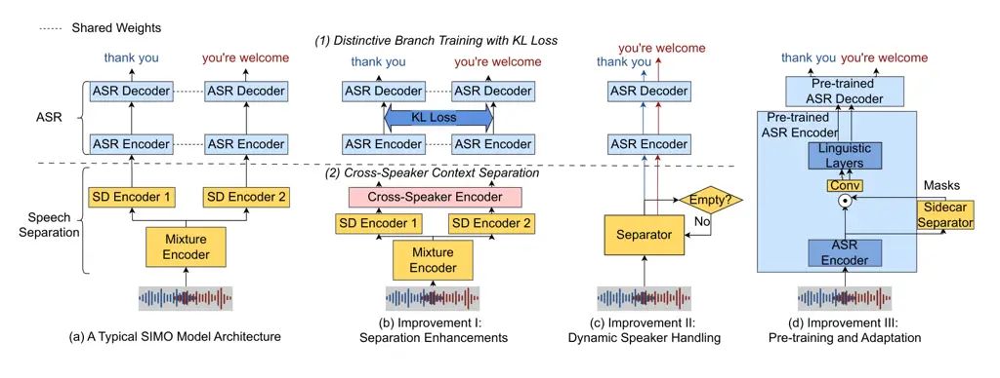
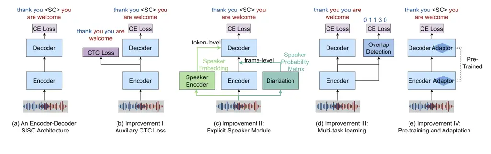

# Survey of End-to-End Multi-Speaker Automatic Speech Recognition for Monaural Audio

Xinlu He and Jacob Whitehill Affiliation: Worcester Polytechnic
Institute, 100 Institute Road, Worcester, 01609, MA, USA

###### Abstract

Monaural multi-speaker automatic speech recognition (ASR) remains
challenging due to data scarcity and the intrinsic difficulty of
recognizing and attributing words to individual speakers, particularly
in overlapping speech. Recent advances have driven the shift from
cascade systems to end-to-end (E2E) architectures, which reduce error
propagation and better exploit the synergy between speech content and
speaker identity. Despite rapid progress in E2E multi-speaker ASR, the
field lacks a comprehensive review of recent developments. This survey
provides a systematic taxonomy of E2E neural approaches for
multi-speaker ASR, highlighting recent advances and comparative
analysis. Specifically, we analyze: (1) architectural paradigms
(single-input-multiple-output (SIMO) vs. single-input-single-output
(SISO)) for pre-segmented audio, analyzing their distinct
characteristics and trade-offs; (2) recent architectural and algorithmic
improvements based on these two paradigms, including multi-modal inputs;
(3) extensions to long-form speech, including segmentation strategy and
speaker-consistent hypothesis stitching. Further, we (4) evaluate and
compare methods across standard benchmarks. We conclude with a
discussion of open challenges and future research directions towards
building robust and scalable multi-speaker ASR.

###### Keywords: 

multi-speaker ASR, end-to-end ASR, monaural audio, speech overlap

## 1 Introduction

Multi-speaker Automatic Speech Recognition (ASR) aims to transcribe
speech from audio containing multiple speakers whose speech may overlap.
In contrast to single-speaker ASR, which focuses on what was said,
multi-speaker ASR additionally determines who says what Hershey et al.
\[2010\], Settle et al. \[2018\], Watanabe et al. \[2020a\]. This task
is closely related to the well-known cocktail party problem Qian et al.
\[2018\], where humans focus on one speaker in a noisy environment
filled with competing talkers. Multi-speaker ASR extends this concept by
transcribing all speakers in the mixture, and attributing words to
individual speakers. This enables practical applications in real-world
scenarios such as meetings, group discussions, and phone call
recordings, and supports diverse downstream tasks such as meeting
summaries, dialogue analytics, and intelligent conversational
assistants.

Compared to single-speaker ASR, multi-speaker ASR poses unique
challenges, primarily due to overlapping speech and the need for speaker
distinction. These require advanced modeling and are further constrained
by the scarcity of large, well-annotated datasets. Additionally,
multi-speaker ASR is inherently multifaceted, involving not only
recognition and diarization but also overlap detection, turn-taking
detection, and target-speaker ASR. Although these tasks are interrelated
and can benefit from joint modeling, effectively leveraging their
synergy remains challenging.

While there are multiple comprehensive literature surveys for
single-speaker ASR Arora and Singh \[2012\], Malik et al. \[2021\],
Prabhavalkar et al. \[2024\], no recent survey has reviewed end-to-end
multi-speaker ASR systems. Our paper seeks to fill this gap. Before
exploring end-to-end solutions, we examine the limitations of
traditional cascade architectures, which served as the initial attempts
to address the multi-speaker ASR task.

### 1.1 The Limits of Cascade Methods

Early multi-speaker ASR systems often adopted cascade (modular) methods
Kanda et al. \[2021c\], Yu et al. \[2022a\], as shown in Fig. 1. One
approach is diarization-segmented cascade system (Fig. 1(a)): (1) Apply
speaker diarization to determine who spoke when to obtain time-stamped
speaker boundaries. (2) Split the audio into segments by detected
speaker boundaries. (3) Use a single-speaker ASR model on each segment
to obtain individual transcription. This approach leverages
well-established single-speaker ASR and works well under minimal
overlap. However, its accuracy degrades with overlapping speech.
Moreover, traditional diarization Anguera et al. \[2012\], Sell and
Garcia-Romero \[2014\], Díez et al. \[2018\], Landini et al. \[2020\]
assumes a single active speaker per frame. Even with later diarization
methods that support multi-speaker labeling per frame Fujita et al.
\[2019a\], Fujita et al. \[2019b\], Li and Whitehill \[2021\], Li et al.
\[2023c\], the resulting segments may still contain overlapping speech,
posing challenges for single-speaker ASR models.

Figure 1: Two Types of Cascade Multi-Speaker ASR Systems. (a)
Diarization-Segmented Cascade System: The mixed audio is segmented by
speaker and then processed by a single-speaker ASR model, potentially
introducing errors in overlapping speech regions. (b) Separation-Based
Cascade System: The mixture is first separated into individual speaker
streams using speech separation, followed by single-speaker ASR
processing. This method may propagate errors from the separation stage.

Another separation-based cascade system (Fig. 1(b)) incorporates a
speech separation module. (1) A separation model enhances and denoises
the mixed audio into multiple single-speaker streams, addressing
overlapping at the signal level. (2) Each stream is then transcribed
using a single-speaker ASR model. While this method can separate
overlapping speech in the initial stage, its overall accuracy is
dependent on the separation models, which typically optimize
signal-level objectives rather than directly targeting ASR performance.
Consequently, errors introduced during the speech separation phase can
propagate to the subsequent ASR process, compounding the overall error
rate of the system Kanda et al. \[2021c\]. These limitations have
motivated end-to-end (E2E) multi-speaker ASR approaches that directly
map mixed audio to speaker-attributed transcriptions.

### 1.2 Preview of End-to-End Methods

Unlike cascade methods that explicitly separate speakers before
transcription, E2E systems model _jointly_ optimize the complementary
problems “who is speaking” and “what is being said”. This can improve
accuracy on both tasks. In E2E frameworks, the input is the raw mixed
audio, and the output is the transcriptions partitioned by different
speakers.

Initial explorations on E2E multi-speaker ASR Yu et al. \[2017a\], Seki
et al. \[2018\], Settle et al. \[2018\], Chang et al. \[2020\] primarily
adopted a single-input multiple-output (SIMO) design, where mixed speech
is processed through parallel branches to extract speaker-specific
representations. These methods typically follow a
separation-then-recognition process and are trained end-to-end, often
using permutation invariant training (PIT) Yu et al. \[2017b\], Kolbæk
et al. \[2017\]. A key limitation is that they assume a fixed number of
speakers. To address this limitation, single-input single-output (SISO)
methods were proposed Kanda et al. \[2020a\], Kanda et al. \[2021d\],
Liang et al. \[2023\], Shi et al. \[2024a\], notably using serialized
output training (SOT) Kanda et al. \[2020b\], which generates a unified
sequence across speakers. Both SIMO and SISO have since been extended
with various architectural and training improvements.

In light of recent advances, this review consolidates recent progress in
end-to-end multi-speaker ASR by providing a structured taxonomy of
representative models. We analyze core designs and improvements, and
compare performance across benchmarks. Three key observations are
summarized:

1.  1.  A key distinction in multi-speaker ASR research lies in whether to
        separate the speech mixture explicitly. Explicit separation
        generates multiple outputs (SIMO), offering clearer modularity and
        easier integration with separation and ASR. In contrast, direct
        mixture processing produces a single output (SISO), preserving
        contextual information across stages and enabling multi-task
        learning with mixture-based tasks.
2.  2.  There is a growing trend to adapt foundation speech models Radford
        et al. \[2023\], Baevski et al. \[2020\], Hsu et al. \[2021\] to
        multi-speaker scenarios via lightweight structure modifications and
        fine-tuning, aiming to mitigate data scarcity.
3.  3.  Model comparison is hindered by limited open-source implementations
        and inconsistent settings. We provide setting-wise comparisons on
        standard datasets (AMI, LibriSpeechMix, LibriMix), and analyze
        models on their design focus.

### 1.3 Review Scope and Organization

In this paper, we review the recent progress on end-to-end multi-speaker
ASR where multiple speakers may talk simultaneously. In particular, we
focus on monaural (single-channel) audio recordings and offline (not
real-time/streaming) speech analysis. To structure the comparison of
recent models, we identify four key dimensions: (1) Model architecture:
whether the system follows a SIMO or SISO framework. (2) Multi-modal
inputs: whether the model incorporates additional modalities beyond
audio; this has become an emerging design choice in recent systems. (3)
Input granularity: whether the system is designed and evaluated on
pre-segmented clips or long-form continuous audio. (4) Speaker
enrollment: whether the system incorporates speaker enrollment to
improve the system.

The rest of the paper is organized as follows:

- •
  Section 2 reviews background techniques for multi-speaker ASR:
  end-to-end ASR and speech separation techniques.
- •
  Section 3 categorizes and reviews recent advances in SISO and SIMO
  models for pre-segmented audio.
- •
  Section 4 discusses methods that use extra modalities, such as visual
  information of the speakers’ faces, or textual context to make ASR
  predictions.
- •
  Section 5 focuses on long-form audio, discussing segmentation
  techniques and hypothesis stitching.
- •
  Section 6 reviews datasets and metrics for multi-speaker ASR, and
  presents performance comparisons across different experimental
  settings.

## 2 Background Techniques

This section reviews two background techniques for multi-speaker ASR.
First, we discuss E2E ASR architectures, detailing prevalent model
designs and objectives. Second, we outline the speech separation
techniques that process mixed audio into isolated streams, which inspire
architecture or serve as pre-processing modules for multi-speaker ASR.

### 2.1 End-to-End ASR

Recent advances in deep learning have enabled E2E network approaches to
achieve state-of-the-art performance in ASR. These systems utilize
sequence-to-sequence models to directly map speech signals to text
outputs. The three primary end-to-end ASR architectures are: (1)
Connectionist Temporal Classification (CTC) which relies solely on the
previous input; (2) Recurrent Neural Network Transducer (RNN-T), which
depends on both previous input and previous output; and (3)
Attention-based Encoder-Decoder (AED) architectures, which consider all
inputs and previous outputs.

Among these, AED has gained wide appeal through the development of
state-of-the-art systems such as Whisper Radford et al. \[2023\]. In
AED, the encoder processes the input acoustic features into a sequence
of hidden states, and the decoder predicts output tokens conditioned on
past outputs via an attention mechanism over encoder representations.
Early AED implementations relied on RNNs for both the encoder and
decoder, but recent models increasingly adopt Transformer Vaswani et al.
\[2023\] and Conformer Gulati et al. \[2020\] architectures for their
ability to model long-range dependencies with global attention.
Recently, large speech foundation models (e.g., Whisper Radford et al.
\[2023\], Wav2Vec Baevski et al. \[2020\], Hubert Hsu et al. \[2021\])
leverage self-supervised learning or multi-task training on massive
datasets. After fine-tuning for ASR, these models achieve
state-of-the-art performance.

The training objective typically employs a cross-entropy loss to
maximize the probability of transcription. Additionally, a joint CTC
loss is often applied to the encoder outputs to enforce monotonic
alignment, leveraging its dependence only on previous inputs. This also
enhances the encoder’s acoustic modeling. However, due to CTC’s strict
monotonic constraint, it struggles with overlapping speech, requiring
careful adaptation in multi-speaker ASR.

### 2.2 Speech Separation Techniques

In end-to-end multi-speaker ASR, it sometimes includes a speech
separation module and is trained together with the ASR part, inspired by
the cascade model. Here we look back at the deep-learning-based speech
separation techniques.

The deep-learning-based speech separation can be divided into
frequency-domain methods and time-domain methods. The frequency-domain
methods process the frequency feature of mixed speech and estimate
time-frequency masks or spectral magnitudes for each speaker. The deep
clustering framework (DPCL) Hershey et al. \[2016\] first maps each
time-frequency spectral magnitude into a speaker-discriminative
embedding, and then the clustering algorithm is used to get the speaker
label. Alternatively, a mask output for speech separation can be
directly estimated by a deep neural network without embedding. Chimera
Wang et al. \[2018\] combines the two, outputting both speaker embedding
and mask. The time domain methods, such as TasNet Luo and Mesgarani
\[2017\], directly consume the waveforms using the
encoder-separator-decoder framework. The encoder decomposes the mixture
into learnable basis functions, the separator estimates speaker-specific
weights, and the decoder reconstructs clean waveforms.

In training, label ambiguity arises when multiple outputs must be
matched to multiple labels without a predefined order. Permutation
Invariant Training (PIT) Yu et al. \[2017c\] addresses this by
dynamically aligning model outputs with reference signals. It evaluates
all possible permutations and selects the one that minimizes the loss.
Consider a mixture of speech from $`S`$ speakers, and a model produces a
set of estimated signals $`\{\hat{Y}^{s}\}_{s=1}^{S}`$. The
corresponding reference signals $`\{Y^{s}\}_{s=1}^{S}`$ have no inherent
correspondence to the outputs due to the unknown order of speakers. The
objective function is defined as:

```math
\mathcal{L}_{\text{PIT}}=\min_{\pi\in\mathcal{P}(S)}\sum_{s=1}^{S}\mathcal{L}(\hat{Y}^{s},Y^{\pi(s)}), \tag{1}
```

where $`\mathcal{P}(S)`$ represents all permutations of
$`\{1,\ldots,S\}`$, and $`\mathcal{L}(\hat{Y}^{s},Y^{\pi(s)})`$ computes
loss between $`\hat{Y}^{s}`$ and the permuted reference $`Y^{\pi(s)}`$.

Despite its effectiveness, PIT faces computational challenges due to the
need to evaluate all possible permutations. Additionally, alternative
approaches like HEAT Lu et al. \[2021\] have been developed to reduce
computational cost by using the Hungarian algorithm to efficiently find
the optimal permutation.

## 3 End-to-End Multispeaker ASR

In this section, we explore end-to-end multi-speaker ASR systems on two
prominent frameworks: single-input single-output (SISO) and single-input
multi-output (SIMO) (as shown in Fig. 2). While SIMO frameworks generate
separate transcriptions for each speaker through parallel branches, SISO
frameworks process mixed audio to produce a single transcription output.
We review their architectural designs, training methodologies, and key
improvements of both frameworks, highlighting their strengths and
limitations. This section focuses on processing predefined audio clips,
typically segmented from continuous audio using silence points and
heuristic rules (e.g., duration thresholds). In single-speaker ASR, such
segments are commonly known as utterances. For multi-speaker ASR, the
concept of utterance group Kanda et al. \[2021e\] has been introduced as
multiple utterances linked through overlapping regions (as shown in
Fig. 3).

Figure 2: Single-input multiple-output (SIMO) and single-input
single-output (SISO) processes for multi-speaker ASR.

Figure 3: Example of utterance groups consisting of overlapping speech
segments from multiple speakers.

### 3.1 Single-Input Multiple-Output (SIMO)

SIMO frameworks process mixture audio with exactly $`S`$ speakers and
produce $`S`$ transcriptions, one per speaker through parallel branches,
as illustrated in Fig. 2(a). Here, $`S`$ is a fixed parameter that
denotes the number of speakers. From the standard architecture, we
discuss advancements in separation enhancement, speaker scalability, and
leveraging pre-trained models.

#### 3.1.1 Model Architecture

The SIMO framework generates a separate transcription for each speaker
through distinct output branches. A simple implementation involves a
shared network followed by $`S`$ individual networks, each dedicated to
a speaker’s transcription. For instance, Yu et al. \[2017a\] employs a
shared RNN with $`S`$ linear heads to produce $`S`$ transcriptions.
Alternatively, inspired by separation-based cascade methods, a class of
SIMO frameworks (e.g., Seki et al. \[2018\], Lin et al. \[2022\]) was
proposed to integrate speech separation and ASR in a unified structure.

Fig. 4a illustrates a typical SIMO model architecture Seki et al.
\[2018\], Chang et al. \[2020\], Zhang et al. \[2019\], Zhang et al.
\[2020\] that integrates the speaker separation process and ASR into a
single framework, enabling end-to-end training from scratch. The
architecture adopts a stacked design comprising shared and unshared
modules across branches. The process begins with a mixture encoder,
$`\text{Encoder}_{\text{Mix}}`$, which extracts an intermediate feature
sequence $`\mathbf{Z}`$ from the mixed audio input $`\mathbf{X}`$,
serving as the input for subsequent separation and ASR. This feature
sequence is then fed into $`S`$ parallel branches, each dedicated to one
of the $`S`$ speakers. Within branch $`s`$, a speaker differentiating
encoder, $`\text{Encoder}_{\text{SD}^{s}}`$, disentangles the speech
content $`\mathbf{Z^{s}}`$ of the corresponding speaker from the mixture
feature $`\mathbf{Z}`$. Finally, a shared ASR model, such as an
attention-based encoder-decoder (AED) or transformer, generates the
transcription hypothesis $`\mathbf{H^{s}}`$ for speaker $`s`$. The
process can be formally described as:

```math
\displaystyle\mathbf{Z} \displaystyle=\text{Encoder}_{Mix}(\mathbf{X}), \tag{2}
```

```math
\displaystyle\mathbf{Z}^{s} \displaystyle=\text{Encoder}_{SD^{s}}(\mathbf{Z}),\quad s=1,\dots,S \tag{3}
```

```math
\displaystyle\mathbf{H}^{s} \displaystyle=\text{ASR}(\mathbf{Z}^{s}),\quad s=1,\dots,S \tag{4}
```

The training objective of each branch follows that of single-speaker
ASR: cross-entropy loss $`\mathcal{L}_{\text{CE}}`$ to maximize the
transcription accuracy, and an optional CTC loss
$`\mathcal{L}_{\text{CTC}}`$ for monotonic alignment. Similar to speech
separation, SIMO models with multiple output branches introduce label
ambiguity, where the correspondence between hypotheses and references is
unclear. Permutation Invariant Training (PIT) is also utilized to align
hypotheses $`\mathbf{H}^{s}=(h_{1}^{s},\ldots,h_{N_{s}}^{s})`$ with
reference transcriptions
$`\mathbf{R}^{s}=(r_{1}^{s},\ldots,r_{N_{ss}}^{s})`$ through
permutations Yu et al. \[2017a\]. To reduce the permutation
computational cost, label matching is often determined solely based on
the CTC loss, while both CTC and cross-entropy losses are used (Seki et
al. \[2018\], Chang et al. \[2019\], Zhang et al. \[2019\], Zhang et al.
\[2020\]).

SIMO provides a natural framework for integrating traditional separation
and ASR methods into an end-to-end system. This design facilitates the
incorporation of state-of-the-art separation techniques to enhance
performance. However, the fixed number of branches limits the model’s
ability to handle a variable number of speakers, which remains a
significant constraint in real-world scenarios. Also, limited separation
performance still causes redundancy and omissions in the final
transcription output.



Figure 4: A typical SIMO architecture (a) and three types of key
improvements (b-d). (b) Enhance separation by (1) Introducing an
auxiliary KL Loss to promote distinctive separation between speakers.
(2) Incorporating a Cross-Speaker Encoder to provide cross-speaker
contextual cues for compensating omission and reducing repetitions
between branches; (c) Support dynamic speaker counts using iterative
separation. (d) Adapt pre-trained large speech foundation model with a
Sidecar separator.

#### 3.1.2 SIMO Improvements

To address SIMO’s limitations, recent research has focused on three key
goals: (1) enhancing separation performance, (2) enabling a flexible
number of speakers, and (3) mitigating data scarcity. The following
sections detail these categories. Fig. 5 summarizes the corresponding
goals and methods.

##### a. Separation Enhancement

While end-to-end models jointly train separation and recognition
modules, independent branches can propagate early separation errors,
resulting in repeated or omitted transcriptions. Recent work addresses
this by increasing inter-branch distinctiveness and leveraging context
to refine separation.

###### Distinctive Branch Training:

To encourage distinct transcriptions across output branches, auxiliary
loss functions can be applied between ASR hidden state vectors. In
AED-based models, Seki et al. Seki et al. \[2018\] proposed a
contrastive loss that maximizes Kullback-Leibler (KL) divergence between
the ASR encoder states from different branches, as shown in Fig. 4(b.1).

This loss penalizes similarity between streams, reducing the likelihood
of redundant transcriptions.

###### Context-Aware Separation:

More recently, the separation has been further improved by introducing
cross-speaker context to enhance the separation quality. Traditional
SIMO systems process each speaker independently in parallel branches,
restricting the model’s capacity to capture cross-speaker dependencies
and perform mutual correction. To address this, Kang et al. Kang et al.
\[2024\] proposes a Cross-Speaker Encoder
($`\text{Encoder}_{\text{CSE}}`$), positioned between the
$`\text{Encoder}_{SD}`$ and ASR model to enable information sharing
across branches (Fig. 4(b.2)). It consumes the concatenation of mixture
encoding from $`\text{Encoder}_{\text{{Mix}}}`$ and different speaker’s
individual encodings from $`\text{Encoder}_{\text{{SD}}}`$, and employs
a conformer block to enable information sharing across branches. The
conformer output is then partitioned into branch-specific
representations and passed to the respective ASR encoders. This
context-aware mechanism leverages the local context of the mixed speech
to refine the single-speaker features, thereby improving separation
accuracy.

##### b. Dynamic Speaker Handling

A key limitation of traditional SIMO frameworks is their reliance on a
fixed number of speaker streams, which constrains their applicability to
real-world scenarios. Recent work addresses this challenge by
introducing iterative and adaptive systems to determine dynamically the
number of speakers. As illustrated in Fig. 5(c), Neumann et al. von
Neumann et al. \[2020\] propose an iterative approach where the system
separates one speaker’s audio at a time with a Dual-Path RNN TasNet Luo
et al. \[2020\] separator. The residual mixture is then passed to
subsequent iterations until no speech remains. Each separated feature is
then fed into a shared ASR model, which can be jointly fine-tuned with
the separator. This design supports end-to-end training while supporting
varying numbers of speakers.

Figure 5: SIMO Improvements by Goal. Targeting better separation
performance, variable speaker handling, and data scarcity mitigation by
module refinement, iterative processing, and pre-trained model
integration.

##### c. Pretraining and Adaptation

Leveraging pre-trained models mitigates the data scarcity challenge in
mult-speaker ASR, as shown in Fig. 4(d). In the SIMO paradigm, a common
approach is to adopt a dual-module framework consisting of a pre-trained
speech separation module and a pre-trained ASR module, with joint
fine-tuning to align their objectives. For example, Settle et al. Settle
et al. \[2018\] includes Chimera++, a pre-trained separation module, to
generate speaker masks over mixture features, producing $`S`$ separate
streams. These streams are then fed into a shared ASR model for
transcription, and the two modules are subsequently fine-tuned together
to enable end-to-end optimization.

More recent advances introduce large speech foundation models like
Whisper Radford et al. \[2023\] and Wav2Vec Baevski et al. \[2020\] into
the SIMO pipeline. Since these models are not inherently designed for
multi-speaker inputs, a separation module must be inserted to enable
SIMO-style processing. To this end, Meng et al. Meng et al. \[2023\],
Meng et al. \[2024b\] propose a lightweight convolutional network
Sidecar separation module inserted between layers of a frozen Wav2Vec2.0
or Whisper model. This design splits the mixed audio into multiple
streams, each processed independently by subsequent Wav2Vec layers to
produce distinct transcriptions. Instead of building an external
separation module, it operates directly on the internal feature
representation of the pre-trained model, enabling an efficient and
seamless adaptation of pre-trained single-speaker ASR models to
multi-speaker scenarios.

### 3.2 Single-Input Single-Output (SISO)

SISO is another multi-speaker ASR framework that only generates a single
output sequence containing all speakers’ transcriptions. Unlike SIMO,
which produces separate outputs per speaker, SISO relies on serialized
output training (SOT) Kanda et al. \[2020b\] to serialize transcriptions
into a unified stream. The transcriptions of all speakers are
concatenated into one output.

SISO offers several advantages. First, it naturally handles varying
numbers of speakers, making it well-suited to real-world scenarios with
unknown speaker counts. Second, by generating a single output sequence,
SISO captures inter-speaker dependencies, improving both coherence and
overall transcription accuracy. Third, it reduces computational cost by
enforcing a fixed output order, thereby simplifying training.

This section first introduces two forms of SOT output: speaker-ordered
sentence-based SOT and temporal-ordered token-based SOT. We then discuss
improvements to the SISO architecture.

#### 3.2.1 Serialized Output

Figure 6: An example of different SOT texts, containing speaker-change
symbol \<sc\> and \<cc\>.

SOT can be implemented in two primary forms: sentence-based SOT and
token-based SOT (Fig. 6). In sentence-based SOT, all sentences of each
speaker are concatenated into a sequence. Special token \<sc\> is
inserted between the transcriptions to indicate changes in the speaker.
Consecutive sentences from the same speaker are simply concatenated in
the transcript, even if those sentences may be partially or even
completely interrupted by another speaker’s sentence. The order of
speakers can be arbitrary, with PIT used in loss. Alternatively,
sentence-based SOT can follow a first-in, first-out (FIFO) order, where
transcriptions are arranged by each speaker’s start time, from the
earliest to the latest.

In contrast, token-based SOT serializes transcriptions based on token
timestamps. The channel change symbol \<cc\> is utilized in token-based
SOT. This approach provides finer granularity in capturing overlapping
speech by preserving the timing order, while remaining compatible with
CTC loss, which is well-suited for mostly time-monotonic sequences Li et
al. \[2024\] Fan et al. \[2024\]. However, when the same speaker’s
sentence is interleaved with others, a more advanced decoder is needed
to effectively model long-range context and maintain coherence within
that speaker’s speech.

#### 3.2.2 SISO Model and Improvements



Figure 7: An encoder-decoder SISO architecture (a) and four
representative improvements (b-e). (b) Adding an auxiliary CTC loss to
enhance acoustic modeling and speaker-awareness capability; (c)
Incorporating explicit speaker modules to inject speaker information at
the frame or token level; (d) Applying multi-task learning with
auxiliary tasks such as overlap detection; (e) Integrating pre-trained
models and fine-tuning them with mechanisms such as adapters.

Since SISO models produce a single output stream, they typically build
on single-speaker architectures without requiring explicit speaker
separation. Fig. 7(a) shows an encoder-decoder model that has been
successfully adapted to SISO-based multi-speaker ASR in Kanda et al.
\[2020b\]. In this setting, the ASR encoder generates hidden
representations $`\mathbf{Z}^{\text{asr}}`$, which are then passed to
ASR decoder to obtain serialized transcriptions.

Although using a single processing path enables cross-speaker context
modeling, the lack of explicit separation mechanisms in SISO systems
makes accurate transcription of overlapping speech challenging. To
address this and compensate for limited multi-speaker training data,
researchers have proposed four main strategies: (1) auxiliary
CTC-related losses, (2) integration of external speaker modules, (3)
multi-task learning, and (4) pre-training and adaptation. Figure 8 shows
the improvement type.

##### a. Auxiliary CTC-Related Loss

As described in Section 2.1, CTC loss commonly serves as an auxiliary
objective to cross-entropy loss in AED to enhance the encoder’s acoustic
modeling. In the SISO framework, it can be applied similarly, through a
parallel branch connected to the encoder output, independent of the
attention-based decoder, as illustrated in Fig. 7. In addition, modified
CTC variants can incorporate speaker information to improve speaker
differentiation in multi-speaker transcription, as described below.

###### CTC in SISO:

To leverage CTC for improving acoustic alignment in SISO systems, the
CTC loss objective must maintain temporal consistency with the original
mixed acoustic features. Typically, token-based SOT serves as the CTC
target in this setting. If the model’s final output follows
sentence-based SOT, the remaining components (not supervised by CTC)
need to handle the utterance-level reordering. For instance, Liang et
al. Liang et al. \[2023\] proposed a two-stage CTC approach: the first
CTC loss is applied after the initial encoder layers, optimized for
token-based SOT to enhance acoustic modeling, while the second CTC loss
operates on the full encoder output with sentence-based SOT supervision.

###### Speaker-Enhanced CTC:

The second approach modifies CTC to explicitly integrate speaker
information. A noticeable example is Speaker-Aware CTC (SACTC) Kang et
al. \[2025\] proposed by Kang et al., which formulates a
Bayes-risk-based CTC that constrains the encoder to distinguish
speaker-specific features at specific time frames, explicitly modeling
speaker separation. More recently, Speaker-Disguishable CTC
(SD-CTC) Sakuma et al. \[2025\] extends CTC by jointly assigning a token
and its corresponding speaker label to each frame. Another advancement
comes from Zheng et al. Zheng et al. \[2024\] with Weakening and
Enhancing CTC (WECTC) loss, which enhances speaker change token (\<sc\>)
prediction by adjusting pseudo-label posteriors.

Despite its widespread use in SISO frameworks and extensions with
speaker-enhanced modules, CTC remains limited in overlapping speech
scenarios, as shown in the results of Kang et al. \[2025\]. It assumes
conditional independence between output tokens and enforces a
one-token-per-frame constraint, producing a single, linear output
sequence. This makes it fundamentally incompatible with simultaneous
speech from multiple speakers, often resulting in entangled or
incomplete transcriptions. Future research may investigate approaches
that relax this constraint while preserving CTC’s alignment ability.

##### b. External Speaker Module

One direction for improving the SISO framework is the integration of
explicit speaker information into the model architecture. By
incorporating speaker-specific cues, the model can enhance its ability
to differentiate between speakers and better handle overlapping speech.
Current approaches can be broadly categorized into two methodologies:
(1) Frame-level Speaker Conditioning (FSC) and (2) Token-level Speaker
Conditioning (TSC).

###### Frame-level Speaker Conditioning (FSC)

incorporates speaker information by aligning speaker and speech
timestamps at the frame level. Modular FSC Yu et al. \[2022a\] directly
aligns diarization results with SOT transcriptions in a post-processing
stage, which is not an end-to-end approach and may lead to error
propagation. Later end-to-end FSC methods (right side of Fig. 7(c))
integrate speaker information before the decoder, aligning the
diarization output with ASR encoding representation at the frame level.
Specifically, the diarization module generates an $`S`$-speaker
assignment probability matrix for $`T`$ frames, denoted as
$`\mathbf{P}\in\mathbb{R}^{S\times T}`$. This matrix is used to
incorporate speaker information into the ASR encoder representations
$`\mathbf{Z}\in\mathbb{R}^{M\times T}`$ before passing the fused
representation to the decoder through different integration strategies.
One approach Park et al. \[2024\] incorporates a sinusoidal matrix,
similar to the sinusoidal positional encoding used in Transformers
Vaswani et al. \[2023\]. Each speaker is associated with a unique
sinusoidal pattern, which is then weighted by the probability matrix
$`\mathbf{P}`$ and added to the original encoder representation
$`\mathbf{Z}`$. This mechanism can differentiate speakers in a
structured, deterministic way, and can be disabled to fall back to a
standard ASR pipeline. Alternatively, Wang et al. proposed Meta-Cat Wang
et al. \[2025\], which first computes a speaker-specific representation
$`\mathbf{Z}_{s}`$ by element-wise multiplying the encoder output
$`\mathbf{Z}`$ with the frame-level probability vector $`P_{s}`$ for
each speaker $`s`$. These representations are then concatenated across
all speakers to form a supervector, which is passed to the decoder. This
method expands the ASR embedding multiple times according to the number
of speakers. Both approaches ensure the entire model remains
differentiable, enabling joint training of the whole system.

###### Token-level Speaker Conditioning (TSC)

introduces speaker embeddings as auxiliary input to the decoder during
token generation. Unlike FSC, which aligns frame-level probabilities,
TSC typically uses a speaker encoder to extract speaker embeddings for
speaker-aware decoding (left side of Fig. 7(c)). A typical TSC
speaker-attributed ASR system (Kanda et al. \[2020a\], Kanda et al.
\[2021a\], Kanda et al. \[2021d\]) consists of four modules: ASR
encoder, speaker encoder, speaker decoder, and ASR decoder. The input
mixture is processed in parallel by the ASR and speaker encoders to
generate the speech representation $`\mathbf{Z}^{\text{asr}}`$ and
speaker embeddings $`\mathbf{Z}^{\text{spk}}`$, respectively. These are
fed into the decoder, along with the previous token sequence, to produce
the context-aware speaker representation. The ASR decoder then takes
this speaker representation as extra input with ASR encoder states and
previous output to predict the next token.

Here, the speaker representation is related to a pre-defined speaker
inventory $`\mathcal{D}=\{\mathbf{d}_{1},\dots,\mathbf{d}_{K}\}`$, where
$`\mathbf{d}_{k}`$ represents a speaker profile in the inventory. The
output of the speaker decoder is used as a query to compute attention
over this speaker inventory $`\mathcal{D}`$, and generates a weighted
speaker profile $`\bar{\mathbf{d}}_{n}`$ as final speaker representation
given to the speaker decoder. Later approaches proposed by Shi et al.
(Shi et al. \[2023\]) considered contextual information for speaker
representation generation. A separate contextual text encoder is
deployed before the speaker decoder to aggregate the semantic
information of the whole output utterance. In addition, when calculating
$`\bar{\mathbf{d}}_{n}`$, an extra context-dependent scorer is employed
to model the local speaker discriminability by contrasting with speakers
in the context. Fan et al. Fan et al. \[2024\] also enhance the speaker
contextural relationship by replacing the weighted profile
$`\bar{\mathbf{d}}_{n}`$ as a similarity matrix and passing this matrix
to the ASR decoder. In this way, the system can incorporate the speaker
information without the speaker inventory $`\mathcal{D}`$.

Figure 8: SISO Improvements by Goal and Type. Aiming to enhance
speaker-aware capabilities, utilize shared representation and alleviate
data scarcity via auxiliary losses, external speaker modules, multi-task
learning, and pre-trained models adaptation.

##### c. Multi-Task Learning

Multi-task learning enables the joint optimization of synergistic tasks
via a fully or partially shared network, which can in turn improve the
performance of individual tasks (e.g., multi-speaker ASR and overlapping
detection). Compared to its application in SIMO models, multi-task
learning in SISO can directly leverage the shared representation and
jointly train the ASR model with mixture-related tasks such as
diarization and overlap detection by sharing network components.

###### Unified Labeling:

Task-specific labels can be inserted into the serialized output as
special tokens. This unified labeling enables joint modeling of multiple
tasks, such as speaker identification and timestamp predictions, without
modifying the original auto-regressive multi-speaker ASR architecture.
First, specific speaker tokens (e.g., \<spk0\> \<spk1\>) can replace
general speaker changing tokens (\<sc\> and \<cc\>) to differentiate
speakers, as in Cornell et al. \[2024\] Makishima et al. \[2024\]. This
reduces the speaker ambiguity in SOT, especially token-level SOT.
Second, quantized timestamp tokens (e.g., 20ms resolution) can be
inserted as special tokens to indicate the start and end time of an
utterance Makishima et al. \[2023\], Li et al. \[2023a\], Cornell et al.
\[2024\], Makishima et al. \[2024\]. Timestamp tokens provide extra
information about speaker turn-taking, temporal order, and overlapping
speech. In some systems, additional timestamp tokens are inserted based
on heuristic rules, such as when the gap between consecutive tokens
exceeds two seconds, to indicate pauses or silence Li et al. \[2023a\].
Additionally, Masumura et al. Masumura et al. \[2021\] and Li et al. Li
et al. \[2023a\] independently explored the use of speaker attribute
tokens (e.g., gender, age) and language tokens, respectively, to enrich
the output with contextual information. All tasks under this unified
labeling scheme are handled by a single model with a shared output head.

###### Task Specific Output Head:

Separate labels and output heads for each auxiliary task can serve as
another implementation of multi-task learning in SISO. In this case,
tasks share parts of the network, typically lower-layer acoustic or
speaker-related representations, while maintaining task-specific output
branches in the later stages. For example, Shakeel et al. Shakeel et al.
\[2025\] introduce a unified multi-speaker encoder (UME) that jointly
addresses the speech separation, speech diarization, and multi-speaker
ASR tasks within a single architecture. Their approach uses the Open
Whisper-style Speech Model (OWSMv3.1) Peng et al. \[2024\] to extract
representations from multiple layers, and fuses them using learnable
weighting parameters. The resulting shared representation is then fed
into task-specific heads. For the separation module, the model also
directly incorporates the original speech mixture as an additional
input. Overall, UME demonstrates substantial gains over strong
single-task SOTA baselines across three tasks. Li et al. Li et al.
\[2024\] jointly optimize the overlapping prediction task and the ASR
task to enhance multi-speaker ASR (Fig. 7(d)). Specifically, the
overlap-aware task predicts two binary states for each token: whether it
overlaps with other tokens and whether it is a boundary token. Both the
ASR and overlapping prediction models adopt an encoder-decoder
structure, sharing lower layers of the encoder to leverage acoustic
features while diverging to predict overlap-aware labels. The total loss
combines the ASR loss and the overlap-aware loss, enabling joint
training to improve performance in overlapping speech scenarios.

Speaker change detection has also been integrated as an auxiliary task
in multi-task learning frameworks. For example, Liang et al. Liang et
al. \[2023\] proposed Boundary-Aware SOT (BA-SOT). Specifically, the
model adds a speaker change detection (SCD) module as the output head
for the speaker change task after several decoder blocks. A binary
speaker change label is used for the auxiliary task, while the ASR task
adopts FIFO-style SOT labels without speaker change tokens. The total
loss consists of ASR loss, SCD loss, and a newly introduced boundary
constraint loss. Studies Liang et al. \[2023\], Li et al. \[2024\] have
shown that joint modeling of ASR with auxiliary tasks such as speaker
change detection and overlap detection can lead to improved recognition
accuracy.

##### d. Pretraining and Adaptation

Similar to SIMO, leveraging pre-trained modules in SISO architectures
helps mitigate the data scarcity in multi-speaker ASR. Because SISO
models share the same model structure and single-output format with
single-speaker ASR, SISO models can be directly initialized from
pre-trained single-speaker models without architectural modification
Denisov and Vu \[2019\], Rose et al. \[2023\]. This facilitates transfer
learning from large-scale simulated mixtures, which are artificially
created multi-speaker audio samples (see section 6). These simulated
datasets can be used for pre-training and subsequently fine-tuned on
real-world corpora to achieve competitive performance Kanda et al.
\[2021e\]. Moreover, speaker-specific modules in SISO models – such as
speaker encoder and diarization model – can also be initialized from
pre-trained modules Park et al. \[2024\], Wang et al. \[2025\].

This structural compatibility also holds for speech foundation models:
single-speaker models, such as Whisper and WavLM-based ASR, can be
directly fine-tuned under the SISO framework for multi-speaker ASR,
unlike SIMO models that require additional separation modules. These
models can either be fully fine-tuned, or adapted using lightweight
modules like LoRA Hu et al. \[2022\], enabling resource-efficient
training while keeping most pre-trained parameters frozen Shi et al.
\[2024b\], Wang et al. \[2024\], Meng et al. \[2024b\], Polok et al.
\[2026\]. In addition, Shi et al. Shi et al. \[2024b\] explored
maintaining the multilingual property of foundation models by leveraging
adapters.

### 3.3 SIMO vs. SISO: Summary

By performing speaker separation and speech recognition separately, SIMO
provides more modularity than SISO, which performs both tasks in an
integrated way. However, SIMO is less flexible than SISO in three key
aspects: (1) SISO accommodates variable speaker counts, whereas SIMO
requires knowing the number of speakers _a priori_; (2) SIMO’s
branch-specific separation lacks cross-speaker validation for redundancy
and complementarity and further underutilizes cross-speaker information
in ASR. Very few (e.g., Kang et al. \[2024\]) SIMO approaches attempt to
address this shortcoming. (3) SISO’s retention of mixed features enables
multi-task learning with mixture-based tasks, such as overlapping
detection. Additionally, SISO’s fixed speaker order in transcription
(e.g, FIFO) reduces computational overhead from label matching in SIMO
training.

These structural differences lead to distinct improvement priorities.
SIMO’s overall recognition performance is fundamentally limited by its
separation module: poor separation introduces residual noise or
truncated phonemes, degrading ASR accuracy. Thus, SIMO requires enhanced
separation for optimal performance. In contrast, SISO lacks explicit
separation, and thus harnessing speaker information to disambiguate
overlapping speech is a focus for SISO improvement. Some advances are
largely incremental, such as variations of the CTC loss or other
light-weight architectural refinements. In contrast, other developments,
such as the incorporation of large foundation models, represent more
transformative progress in multi-speaker ASR.

Both SIMO and SISO address data scarcity by utilizing pre-trained
models, particularly recent large foundation models. For SIMO, this
requires adding a separation process to the foundation model. SISO
directly fine-tune the foundation ASR model on multi-speaker data. Both
frameworks can achieve strong performance by tuning only 8-10% of all
parameters.

### 3.4 Future Directions

One promising direction is SIMO-SISO hybridization, which aims to
combine SIMO’s separation precision with SISO’s comprehensive modeling.
In such framework, the model can first separate the input audio into
multiple speaker-specific branches, whose representations are then
concatenated and passed to additional network layers for integrated
decoding. Recent work has explored this hybridization at different
representation levels. For example, Cross-speaker encoder Kang et al.
\[2024\] combined acoustic features from different branches before ASR,
to enhance separation by providing cross-speaker context. Also, Huang et
al. Huang et al. \[2023\] adapt WavLM to extract target-speaker
transcriptions from mixture audio using speaker embeddings. The
resulting utterances are concatenated and passed through a joint speaker
module to generate the final serialized transcript. Future studies may
further explore multi-level integration with advanced model architecture
to enhance SIMO’s contextual modeling and improve SISO’s ability to
handle overlapping speech.

Another direction is the adapted foundation model enhancement.
Foundation-model adaptation represents a transformative direction with
the potential to reshape multi-speaker ASR. There are lots of questions
that remain underexplored. For instance, can a foundation-adapted SIMO
model also leverage cross-speaker context? How can foundation-adapted
SISO models benefit from multi-task learning? Beyond
architecture-specific adaptations, future work may further investigate
the integration of multi-speaker ASR into multi-modal LLM-based unified
frameworks. This can extend current instruction-based approaches Shi et
al. \[2024c\] to more practical, real-world applications.

## 4 Multi-Modal Multispeaker ASR

The previous section categorized end-to-end multi-speaker ASR systems
primarily based on their output format. However, from the input
perspective, a growing body of work explores feeding multi-speaker ASR
models with multi-modal inputs. When the acoustic mixture is excessively
noisy, is highly overlapped, or contains rare or long-tail words that
challenge audio-only systems, additional modalities can provide
complementary cues to better resolve both speaker identity and
linguistic content.  
Most existing multi-modal approaches follow the SISO architectures, as
this design retains the complete acoustic mixture throughout the encoder
and decoder, thus allowing high-level visual or textual context to be
fused directly into the joint modeling of speakers and speech. In
contrast, SIMO pipelines must decide where to incorporate cross-modal
signals: either before separation or after separation.  
The auxiliary context usually falls into two categories: (1) visual
information, such as video and images; (2) textual information that
leverages the text-understanding capabilities of multi-modal LLMs.

### 4.1 Audio-Visual Multi-speaker ASR

Visual information in audio-visual speech recognition typically comes
from face tracks and mouth movements. Prior single-speaker studies Ma et
al. \[2023\], Li et al. \[2023b\], Seo et al. \[2023\] have consistently
shown that visual cues can improve ASR robustness, especially under
adverse acoustic conditions, because the visual modality is unaffected
by background noise. In most systems, visual features are incorporated
by concatenating them with audio features, which is then given to
audio-visual ASR model.  
In multi-speaker scenarios, visual cues also help improve transcription
accuracy. Early multi-person audio-visual ASR studies Braga et al.
\[2020\], Braga and Siohan \[2022a\] explored how to incorporate
face-track features into a standard ASR model without explicitly
predicting speaker labels. Importantly, these approaches do not require
any training labels regarding which face corresponds to which voice;
rather, this correspondence is inferred dynamically by the model. Let
$`\mathbf{Z}^{a}`$ denote the audio encoder representation and
$`\mathbf{Z}^{v_{s}}`$ the visual representation for speaker
$`s\in\{1,\ldots,S\}`$. A cross-attention module takes
$`\mathbf{Z}^{a}`$ as the query and $`\{\mathbf{Z}^{v_{s}}\}_{s=1}^{S}`$
as key and values. This allows the model to produce a weighted visual
summary $`\tilde{\mathbf{Z}}^{v}`$ that emphasizes the most relevant
speaker-specific visual cues. The fused representation
$`\mathbf{Z}=\mathrm{Concat}(\mathbf{Z}^{a},\tilde{\mathbf{Z}}^{v})`$ is
then fed into the audio-visual ASR model. Subsequent work Braga and
Siohan \[2022b\] extends this by adding an auxiliary active-speaker
detection task, using the same fused representation $`\mathbf{Z}`$ to
jointly predict the speaking face.  
For multi-speaker ASR that distinguishes speakers in a sentence, where
multiple speakers must be differentiated within a single mixture, both
SIMO and SISO systems benefit from visual conditioning, although in
different ways. In the SIMO architecture, Wu et al. \[2021\] injects
visual representations $`\mathbf{Z}^{v}`$ into both the encoder and
decoder using the same cross-modal attention module. Their experiments
show that it significantly outperforms simply concatenating all
face-track features before the mixture encoder
$`\mathrm{Encoder}_{\text{Mix}}`$. Visual information also helps resolve
output-stream permutation. In SISO settings, where all speakers are
decoded in a single transcript, Makishima et al. \[2025\] concatenates
all available visual features with the audio representation prior to
decoding, similar to single-speaker audio-visual ASR, and reports
consistent performance gains.

### 4.2 LLM-based text conditioning

Recently, the emergence of multi-modal large language models
(MLLMs) Latif et al. \[2023\] has provided a unified framework for a
wide range of speech and language tasks. These models typically consist
of a speech encoder and a projector that projects acoustic features into
the LLM embedding space, followed by an LLM that performs sequence
generation. Like single-speaker ASR with multimodal LLM Trinh et al.
\[2024\], multi-speaker ASR can also be cast into this unified
architecture Li et al. \[2023a\], Shi et al. \[2025\]. Because the
unified output format of SISO models naturally aligns with the
generation paradigm of MLLMs, current LLM-based multi-speaker systems
almost exclusively adopt the SISO output format.  
MLLM-based systems benefit from instruction-based multi-task learning,
which enhances speech understanding and enables flexible, user-defined
interaction scenarios. The recent work of Meng et al. Meng et al.
\[2024a\] exemplifies this interactive paradigm: users can specify
multi-speaker ASR tasks through natural language instructions, such as
transcribing only the first speaker, a female speaker, or utterances
containing specific keywords. The system integrates speech
representations from the Whisper encoder and WavLM with an LLM. Compared
to training with only a generic multi-speaker ASR instruction, this
instruction-based training with additional contextual prompts improves
the model’s speech understanding and overall multi-speaker ASR
performance.  
In addition, MLLMs can ingest auxiliary textual context that benefits
both speech and speaker recognition. Long-tail or rare words can be
supplied as external context; prior work in single-speaker ASR Trinh et
al. \[2025\] demonstrates the effectiveness of providing such terms to a
multimodal LLM, and He et al. \[2025\] extends this idea to the
multi-speaker setting with similar gains. Diarization information can
also be integrated into an MLLM to assist multi-speaker decoding, as
shown in Lin et al. \[2025\]. In this framework, the LLM consumes not
only projected speech tokens but also structured diarization triplets
(speaker embeddings, start indices, and end indices), each aligned to
the LLM embedding space through learnable linear layers.

## 5 Long-Form Multispeaker ASR

The previous section focuses on pre-segmented audio. We turn to
continuous long-form audio in this section. Unlike pre-segmented data,
long-form audio must be partitioned before being processed by either
SIMO or SISO ASR models, and the results must be integrated into a
coherent global transcription with consistent speaker identities. This
section addresses these two key challenges. An ideal segmentation
algorithm should be computationally efficient while preserving
linguistic coherence. The segmentation methods are introduced in Section
5.1. Section 5.2 discusses how to merge local hypotheses into a unified
global transcription, with consistent speaker identities across all
segments.

### 5.1 Segmentation Methods

Segmenting long-form multi-speaker audio is crucial for enabling
accurate and efficient ASR. Strategies need to balance computational
efficiency and preserve linguistic coherence. Existing methods typically
rely on acoustic or semantic cues.

Voice activity detection (VAD) segments speech by detecting silent
intervals based on acoustic features such as energy levels and spectral
patterns. Its simplicity leads to widespread use in both cascade and
end-to-end systems Kanda et al. \[2021c\], Kanda et al. \[2021a\], Yu et
al. \[2022a\]. However, VAD-based segments may still be excessively
long, necessitating further clipping to meet the input requirements of
downstream ASR models. Also, since VAD operates purely on acoustic cues,
it may inadvertently split sentences at unnatural boundaries,
particularly when speakers pause or hesitate mid-sentence, which can
disrupt linguistic coherence and degrade the performance of subsequent
ASR tasks.

Sliding window segmentation is another strategy, which processes audio
using fixed-length windows and a pre-defined stride. Unlike VAD, the
sliding window method generates uniformly sized segments ready for ASR
models. However, it still risks disrupting semantic coherence by
splitting sentences at arbitrary boundaries, a problem exacerbated by
rigid window constraints. Additionally, shorter strides can inflate
computational costs due to extensive overlap.

To address these limitations, recent studies incorporate semantic
information into segmentation. For example, Cornell et al. Cornell et
al. \[2024\] introduce an adaptive sliding window strategy, which
inserts the special token \<trunc\> to mark truncation, and resumes from
the last silence point to preserve linguistic continuity and reduce
redundancy. Huang et al. Huang et al. \[2022\] predict segment
boundaries in a streaming manner, based on both acoustic and text-level
cues, enabling dynamic segmentation with minimal overhead.

### 5.2 Hypothesis Stitching Methods

Generating the final global hypothesis requires concatenating and
aligning local transcriptions from segmented audio. A straightforward
approach is to concatenate local transcriptions directly with
VAD-segmented clips Kanda et al. \[2022\], Kanda et al. \[2021a\],
Cornell et al. \[2024\]. When long audio is segmented with overlaps, the
final global transcription cannot be obtained by simple concatenation
due to redundancy and potential mismatch. High-confidence word selection
can be employed in overlapping parts Chiu et al. \[2019\], while a
neural-network-based hypothesis stitcher Chang et al. \[2021\] fuses
segment outputs into a coherent transcription without requiring
alignment.

Maintaining globally consistent speaker labels is essential for
long-form multi-speaker ASR. Existing approaches rely on speaker
profiles or embeddings learned jointly within the ASR model. In
profile-based methods, speaker identities can be resolved during
speaker-attributed decoding when speaker enrollment is available. When
enrollment is not possible, speaker profiles can be approximated through
unsupervised clustering of embeddings from a pretrained speaker encoder
Kanda et al. \[2022\]. Even supplying dummy profiles, which do not
appear in the input audio, can improve performance Kanda et al.
\[2021a\]. In the joint modeling approach, the multi-speaker ASR system
outputs both transcriptions and speaker embeddings, typically by a
multi-task learning framework. Global labels can be obtained by
clustering the embeddings. In Cornell et al. \[2024\], each window of
the E2E DAST model provides local speaker transcription and diarization
with time-averaged speaker embeddings. Meanwhile, Mao et al. \[2020\]
demonstrates the advantages of jointly learning speaker embeddings and
transcriptions for hour-long multi-speaker podcasts, using lexical cues
to improve speaker label assignment. After processing all windows, final
diarization and speaker embeddings can be obtained by clustering these
time-averaged embeddings. This method eliminates the need for additional
speaker embedding models and improves computational efficiency, but its
performance is heavily dependent on embedding quality.

## 6 Evaluation

Multi-speaker ASR research relies on both real-world and simulated
datasets. Real-world datasets are collected from natural conversation
scenarios such as meetings or phone calls; they provide authentic
acoustic conditions, spontaneous speech patterns, and natural overlaps.
However, they are often small, noisy and domain-specific, posing
challenges for early-stage model training and broader applicability.
Simulated datasets are created by overlapping single-speaker recordings
and introducing noise at the configurable overlapping rate and noise
level, enabling scalable as well as controlled training and evaluation
of overlap and noise robustness. To improve realism, Yang et al. Yang et
al. \[2023\] leverages statistical language models to guide overlap
patterns. Additionally, Moriya et al. Moriya et al. \[2024\] introduce
on-the-fly data generation to support dynamic parameter adjustment and
improve memory efficiency. Table 1 highlights commonly used
multi-speaker ASR datasets.

|      |                                    |             |        |              |             |
| ---- | ---------------------------------- | ----------- | ------ | ------------ | ----------- |
|      | Dataset                            | Scenario    | Hours  | Language     | \# Speakers |
| Real | AMI                                | Meetings    | 100    | English      | 3–5         |
|      | AliMeeting Yu et al. \[2022b\]     | Meetings    | 120    | Chinese      | 2–4         |
|      | CallHome                           | Phone calls | 60     | Multilingual | 2           |
|      | LibriCSS Chen et al. \[2020\]      | Meetings    | 10     | English      | 8           |
| Sim  | WSJ0-2mix Hershey et al. \[2016\]  | Read speech | 45     | English      | 2           |
|      | LibriMix Cosentino et al. \[2020\] | Read speech | 500    | English      | 2–3         |
|      | LibriHeavyMix Jin et al. \[2024\]  | Read speech | 20,000 | English      | 2–4         |

Table 1: Common real-world and simulated datasets. \# Speakers refers to
the number of speakers per recording in real datasets, and the exact
mixed speaker number per sample in simulated datasets.

Evaluating multi-speaker ASR systems requires measuring both
transcription accuracy and the system’s ability to assign speaker
labels. Word error rate (WER) evaluates overall transcription accuracy
by measuring insertions, deletions, and substitutions. Character Error
Rate (CER) is adopted for languages with non-alphabetic scripts, while
Sentence Error Rate (SER) captures the proportion of sentences
containing any error. In multi-speaker settings, these metrics can be
extended with special tokens for speaker changes, overlapping speech,
timestamps, and speaker identities. This extension enables evaluation
not only for content accuracy but also of the system’s capability to
handle speaker turns and overlaps.

In addition to standard WER, several evaluation metrics have been
proposed to account for speaker distinctions in multi-speaker ASR.
Concatenated minimum-permutation WER (cpWER) Watanabe et al. \[2020b\]
concatenates utterances per speaker and computes the WER across all
permutations of hypotheses and references, selecting the lowest:

```math
\text{cpWER}=\min_{\pi\in\mathcal{P}(S)}\frac{\sum_{s=1}^{S}\mathrm{WER}(H^{s},R^{\pi(s)})\cdot N_{\pi(s)}}{\sum_{s=1}^{S}N_{s}} \tag{5}
```

where $`\mathcal{P}(S)`$ denotes all permutations of $`\{1,\ldots,S\}`$,
$`N_{s}`$ is the number of words in the reference transcript $`R^{s}`$,
and $`H^{s}`$, $`R^{\pi(s)}`$ denote the hypothesis and reference for
speaker $`s`$, respectively. cpWER jointly reflects transcription and
speaker assignment accuracy. ¹¹ 1 Note: a previous version of this paper
showed an incorrect formula; this has now been fixed. Speaker-attributed
WER (SA-WER) further enforces speaker correspondence by requiring that
hypotheses be matched with the reference of the correct speaker label.
It penalizes speaker assignment errors and provides a stricter
evaluation of speaker-aware performance. Among these, WER, cpWER, and
SA-WER are increasingly strict in evaluation criteria. To incorporate
temporal alignment, Neumann et al. von Neumann et al. \[2023\] propose
time-constrained cpWER (tcpWER), which restricts word matching to a
fixed time window in addition to speaker permutation, which requires
real or estimated token timestamps.

### 6.1 Performance Comparison of E2E Approaches

[TABLE]

Table 2: cpWER of multi-speaker ASR models on AMI, LibrispeechMix, and
LibriMix corpus. SDM denotes single distant microphone; IHM denotes
mixture of independent headset microphones. Mix Pre. Hrs indicates the
hours of simulated mixture data used for pretraining. Params Tr/To
indicates trainable / total model parameters in millions. \# Tr. Spk
refers to the speaker configuration used during training. Methods are
grouped by input granularity and listed chronologically. \* and †
signify the paper reported results as standard WER or SA-WER,
respectively.

This section compares various techniques and their accuracy across
standard multi-speaker benchmarks. We report results on both real-world
data (AMI) and simulated mixtures (LibriSpeechMix and LibriMix), as
shown in Table 2. LibrispeechMix Kanda et al. \[2020b\] provides the
standard dev/test set for evaluation. To facilitate comparison between
methods, we adopt cpWER as the primary evaluation metric to include
speaker determination in WER. Note that some methods only report results
on standard WER and SA-WER (see the results marked with \* and †); those
accuracies cannot be directly compared with those of other methods. All
results are reported directly from the original papers. Our analysis
examines how different scenarios and training approaches impact results.

The results demonstrate no consistent superiority between SISO and SIMO
approaches in multi-speaker ASR. For instance, SISO methods Kanda et al.
\[2021e\], Shi et al. \[2024d\] outperform SIMO Huang et al. \[2023\],
Meng et al. \[2023\] on AMI and LibriMix respectively, while SIMO method
Meng et al. \[2024b\] surpasses SISO Kanda et al. \[2021d\] on
LibriSeechMix. Moreover, cpWER has not shown consistent improvement
throughout the six-year development period of end-to-end multi-speaker
ASR approaches. The currently best performance on AMI comes from a
relatively small 50M model trained on extensive 900k hours of simulated
mixture data Kanda et al. \[2021e\] in 2021. This suggests a stagnation
in real-world benchmark progress, despite many recent methodological
proposals.

In general, contemporary research on multi-speaker ASR is less about
pursuing marginal WER improvements on specific benchmark datasets.
Instead, it tends to follow three trends: (1) Understanding
scenario-dependent factors: For example, LibriMix methods demonstrate
this evolution: while early works Kanda et al. \[2020b\] used no speaker
enrollment, subsequent studies Kanda et al. \[2020a\], Kanda et al.
\[2021d\] introduced speaker-attributed (SA) methods with enrollment.
This was further advanced by CIF SA-SOT Fan et al. \[2024\], which
achieved speaker attribution without enrollment. Meanwhile,
Transcribe-to-Diarize Kanda et al. \[2022\] extends the approach from
Kanda et al. \[2020a\] to long-form scenarios. (2) Exploring novel
architectures and information fusion methods, such as cross-speaker
encoding for SIMO Kang et al. \[2024\], enhancing CTC loss with speaker
attribute Kang et al. \[2025\]. (3) Efficiently adapting single-speaker
foundation ASR systems to multi-speaker settings with minimal training,
such as Adapted USM Li et al. \[2023a\], WavLM/wTSE&JSM Huang et al.
\[2023\], Whisper-SS-TTI Meng et al. \[2024b\], W2V-Sidecar Meng et al.
\[2023\]. The \# Parameters (Train / Total) in tables partially reflect
the reduced training effort, though they don’t fully capture cases like
META-CAT Wang et al. \[2025\], which achieves efficiency through fewer
training epochs despite its larger trained size.

Currently, limited open-source availability makes fair comparisons
difficult and slows research progress. Lots of methods show their
improvements by comparing with their own baseline systems that don’t
include the new architectures. This highlights the importance of
developing standardized benchmarks and sharing reproducible models as a
community. A coordinated effort toward standardized open-source
benchmark suites and consistent experiment protocols would substantially
improve comparability and accelerate progress in multi-speaker ASR.

In addition to standardized benchmarks, several open-source toolkits
provide practical starting points for building and evaluating
multi-speaker ASR systems. ESPnet Watanabe and others \[2018\],
SpeechBrain Ravanelli and others \[2021\], NVIDIA NeMo Kuchaiev and
others \[2019\], and Pyannote Bredin and others \[2020\] respectively
provide SOT recipes, audio-visual ASR pipelines, integrated
diarization–ASR modules, and state-of-the-art diarization components.
These resources further support reproducibility and practical usage.

## 7 Conclusion and Future Directions

Recent research on multi-speaker ASR has increasingly focused on
end-to-end (E2E) methods, aiming to produce more accurate
speaker-distinguishable transcriptions in scenarios such as phone calls,
meetings, and group discussions. E2E methods can overcome the
limitations of traditional modular systems, such as error propagation
and failure to leverage cross-task synergies. Furthermore, progress in
single-speaker ASR, speech separation, and diarization has provided the
architectural foundation and pretrained model for initialization that
facilitate the training of a multi-speaker ASR system, although with the
scarcity of large-scale multi-speaker data.

This review provided an overview of end-to-end multi-speaker ASR
approaches, from segment-level methods to processing continuous
long-form recordings. Various architectural designs (Section 3) were
described for how to disentangle different speakers, and how to
effectively leverage contextual cues from mixed speech, such as
inter-speaker, overlapping, and temporal dependencies. Beyond
acoustic-only designs, Section 4 surveyed emerging multi-modal
extensions, ranging from audio-visual fusion to LLM-based text
conditioning, which provide complementary cues for speaker attribution
and linguistic disambiguation, especially under heavy overlap or noise.
Recent work on long-form processing (Section 5), which has further
improved applicability to real-world cases, was also presented. Our
accuracy comparisons indicate that, while end-to-end models often
outperform modular approaches, no single architecture consistently
outperforms others across end-to-end designs. Ongoing research continues
to explore more sophisticated designs leveraging complex interaction
patterns, while integrating advances in large-scale pretrained ASR
models. Also, practical deployment factors, such as latency, streaming
constraints, and computational cost, are becoming increasingly important
and warrant further attention.

Overall, the future of the multi-speaker ASR lies in developing more
robust, adaptive, and scalable systems for various scenarios. While
recent designs have made significant progress, key challenges remain in
robustly handling overlapping speech, and designing effective SISO/SIMO
hybrids (Section 3.4). Moreover, future research may also explore
adaptive modeling, such as transforming single-speaker models into
multi-speaker systems without performance degradation, and optional
speaker enrollment. In addition, advancing multi-speaker understanding –
through joint training with downstream objectives, cross-modal fusion
(Section 4), and injecting multi-speaker ASR into a unified multi-task
foundation model.

Acknowledgment: This research was supported by the NSF National AI
Institute for Student-AI Teaming (iSAT) under grant DRL \#2019805, and
also from grant \#2046505. The opinions expressed are those of the
authors and do not represent the views of the NSF. Finally, we are
grateful for the feedback from the anonymous reviewers.

## References

- Anguera et al. (2012) X. Anguera, S. Bozonnet, N. Evans, C.
  Fredouille, G. Friedland, and O. Vinyals Speaker diarization: a review
  of recent research. IEEE Transactions on Audio, Speech & Language
  Processing. External Links:
  [Document](https://dx.doi.org/10.1109/TASL.2011.2125954) Cited by:
  §1.1.
- Arora and Singh (2012) S. Arora and R. Singh Automatic speech
  recognition: a review. International Journal of Computer Applications.
  External Links: [Document](https://dx.doi.org/10.5120/9722-4190) Cited
  by: §1.
- Baevski et al. (2020) A. Baevski, H. Zhou, A. Mohamed, and M. Auli
  Wav2vec 2.0: A framework for self-supervised learning of speech
  representations. External Links: 2006.11477 Cited by: item 2, §2.1,
  ¶c.
- Braga et al. (2020) O. Braga, T. Makino, O. Siohan, and H. Liao
  End-to-end multi-person audio/visual automatic speech recognition. In
  ICASSP 2020 - 2020 IEEE International Conference on Acoustics, Speech
  and Signal Processing (ICASSP), Vol. , pp. 6994–6998. External Links:
  [Document](https://dx.doi.org/10.1109/ICASSP40776.2020.9053974) Cited
  by: §4.1.
- Braga and Siohan (2022a) O. Braga and O. Siohan A closer look at
  audio-visual multi-person speech recognition and active speaker
  selection. External Links: 2205.05684,
  [Link](https://arxiv.org/abs/2205.05684) Cited by: §4.1.
- Braga and Siohan (2022b) O. Braga and O. Siohan Best of both worlds:
  multi-task audio-visual automatic speech recognition and active
  speaker detection. In ICASSP 2022 - 2022 IEEE International Conference
  on Acoustics, Speech and Signal Processing (ICASSP), Vol. ,
  pp. 6047–6051. External Links:
  [Document](https://dx.doi.org/10.1109/ICASSP43922.2022.9746036) Cited
  by: §4.1.
- Bredin et al. (2020) H. Bredin et al. Pyannote.audio: neural building
  blocks for speaker diarization. In Proc. ICASSP, Cited by: §6.1.
- Chang et al. (2021) X. Chang, N. Kanda, Y. Gaur, X. Wang, Z. Meng,
  and T. Yoshioka Hypothesis stitcher for end-to-end speaker-attributed
  asr on long-form multi-talker recordings. In ICASSP, Vol. . External
  Links: [Document](https://dx.doi.org/10.1109/ICASSP39728.2021.9414432)
  Cited by: §5.2, Table 2.
- Chang et al. (2019) X. Chang, Y. Qian, K. Yu, and S. Watanabe
  End-to-end monaural multi-speaker asr system without pretraining. In
  ICASSP, Vol. . External Links:
  [Document](https://dx.doi.org/10.1109/ICASSP.2019.8682822) Cited by:
  §3.1.1.
- Chang et al. (2020) X. Chang, W. Zhang, Y. Qian, J. L. Roux, and S.
  Watanabe End-to-end multi-speaker speech recognition with transformer.
  In ICASSP, Vol. . External Links:
  [Document](https://dx.doi.org/10.1109/ICASSP40776.2020.9054029) Cited
  by: §1.2, §3.1.1.
- Chen et al. (2020) Z. Chen, T. Yoshioka, L. Lu, T. Zhou, Z. Meng, Y.
  Luo, J. Wu, and J. Li Continuous speech separation: dataset and
  analysis. External Links: 2001.11482 Cited by: Table 1.
- Chiu et al. (2019) C. Chiu, W. Han, Y. Zhang, R. Pang, S.
  Kishchenko, P. Nguyen, A. Narayanan, H. Liao, S. Zhang, A. Kannan, R.
  Prabhavalkar, Z. Chen, T. N. Sainath, and Y. Wu A comparison of
  end-to-end models for long-form speech recognition. ASRU. Cited by:
  §5.2.
- Cornell et al. (2024) S. Cornell, J. Jung, S. Watanabe, and S.
  Squartini One model to rule them all ? towards end-to-end joint
  speaker diarization and speech recognition. In ICASSPs, Vol. . Cited
  by: ¶3.2.2.1, §5.1, §5.2, §5.2, Table 2.
- Cosentino et al. (2020) J. Cosentino, M. Pariente, S. Cornell, A.
  Deleforge, and E. Vincent LibriMix: an open-source dataset for
  generalizable speech separation. External Links: 2005.11262 Cited by:
  Table 1.
- Denisov and Vu (2019) P. Denisov and N. T. Vu End-to-end multi-speaker
  speech recognition using speaker embeddings and transfer learning.
  ArXiv. Cited by: ¶d.
- Díez et al. (2018) M. Díez, L. Burget, and P. Matejka Speaker
  diarization based on bayesian hmm with eigenvoice priors. In The
  Speaker and Language Recognition Workshop, Cited by: §1.1.
- Fan et al. (2024) Z. Fan, L. Dong, J. Zhang, L. Lu, and Z. Ma SA-sot:
  speaker-aware serialized output training for multi-talker asr. In
  ICASSP, Vol. . Cited by: §3.2.1, ¶3.2.2.2, §6.1, Table 2.
- Fujita et al. (2019a) Y. Fujita, N. Kanda, S. Horiguchi, K. Nagamatsu,
  and S. Watanabe End-to-end neural speaker diarization with
  permutation-free objectives. In Interspeech, Cited by: §1.1.
- Fujita et al. (2019b) Y. Fujita, N. Kanda, S. Horiguchi, K. Nagamatsu,
  and S. Watanabe End-to-End Neural Speaker Diarization with
  Permutation-free Objectives. In Interspeech, Cited by: §1.1.
- Gulati et al. (2020) A. Gulati, J. Qin, C. Chiu, N. Parmar, Y.
  Zhang, J. Yu, W. Han, S. Wang, Z. Zhang, Y. Wu, and R. Pang Conformer:
  convolution-augmented transformer for speech recognition. External
  Links: 2005.08100 Cited by: §2.1.
- He et al. (2025) J. He, N. Sawada, K. Miyazaki, and T. Toda CMT-llm:
  contextual multi-talker asr utilizing large language models.
  pp. 2575–2579. External Links:
  [Document](https://dx.doi.org/10.21437/Interspeech.2025-943) Cited by:
  §4.2, Table 2, Table 2.
- Hershey et al. (2016) J. R. Hershey, Z. Chen, J. Le Roux, and S.
  Watanabe Deep clustering: discriminative embeddings for segmentation
  and separation. In ICASSP, Vol. . External Links:
  [Document](https://dx.doi.org/10.1109/ICASSP.2016.7471631) Cited by:
  §2.2, Table 1.
- Hershey et al. (2010) J. Hershey, S. Rennie, P. Olsen, and T.
  Kristjansson Superhuman multi-talker speech recognition: a graphical
  modeling approach. Computer Speech & Language. External Links:
  [Document](https://dx.doi.org/10.1016/j.csl.2008.11.001) Cited by: §1.
- Hsu et al. (2021) W. Hsu, B. Bolte, Y. H. Tsai, K. Lakhotia, R.
  Salakhutdinov, and A. Mohamed HuBERT: self-supervised speech
  representation learning by masked prediction of hidden units. External
  Links: 2106.07447 Cited by: item 2, §2.1.
- Hu et al. (2022) E. J. Hu, yelong shen, P. Wallis, Z. Allen-Zhu, Y.
  Li, S. Wang, L. Wang, and W. Chen LoRA: low-rank adaptation of large
  language models. In International Conference on Learning
  Representations, Cited by: ¶d.
- Huang et al. (2022) W. R. Huang, S. Chang, D. Rybach, R.
  Prabhavalkar, T. N. Sainath, C. Allauzen, C. Peyser, and Z. Lu E2E
  segmenter: joint segmenting and decoding for long-form asr. In
  Interspeech, Cited by: §5.1.
- Huang et al. (2023) Z. Huang, D. Raj, P. García, and S. Khudanpur
  Adapting self-supervised models to multi-talker speech recognition
  using speaker embeddings. In ICASSP, Vol. . External Links:
  [Document](https://dx.doi.org/10.1109/ICASSP49357.2023.10097139) Cited
  by: §3.4, §6.1, §6.1, Table 2, Table 2.
- Jin et al. (2024) Z. Jin, Y. Yang, M. Shi, W. Kang, X. Yang, Z.
  Yao, F. Kuang, L. Guo, L. Meng, L. Lin, Y. Xu, and S. Zhang
  LibriheavyMix: a 20,000-hour dataset for single-channel reverberant
  multi-talker speech separation, asr and speaker diarization. External
  Links: [Document](https://dx.doi.org/10.21437/Interspeech.2024-90)
  Cited by: Table 1.
- Kanda et al. (2021a) N. Kanda, X. Chang, Y. Gaur, X. Wang, Z. Meng, Z.
  Chen, and T. Yoshioka Investigation of end-to-end speaker-attributed
  asr for continuous multi-talker recordings. In SLT, Vol. . External
  Links: [Document](https://dx.doi.org/10.1109/SLT48900.2021.9383600)
  Cited by: ¶3.2.2.2, §5.1, §5.2, §5.2.
- Kanda et al. (2020a) N. Kanda, Y. Gaur, X. Wang, Z. Meng, Z. Chen, T.
  Zhou, and T. Yoshioka Joint speaker counting, speech recognition, and
  speaker identification for overlapped speech of any number of
  speakers. ArXiv. Cited by: §1.2, ¶3.2.2.2, §6.1, Table 2.
- Kanda et al. (2020b) N. Kanda, Y. Gaur, X. Wang, Z. Meng, and T.
  Yoshioka Serialized output training for end-to-end overlapped speech
  recognition. In Interspeech, Cited by: §1.2, §3.2.2, §3.2, §6.1, §6.1,
  Table 2.
- Kanda et al. (2021b) N. Kanda, Z. Meng, L. Lu, Y. Gaur, X. Wang, Z.
  Chen, and T. Yoshioka Minimum bayes risk training for end-to-end
  speaker-attributed asr. In ICASSP, Vol. . External Links:
  [Document](https://dx.doi.org/10.1109/ICASSP39728.2021.9415062) Cited
  by: Table 2.
- Kanda et al. (2022) N. Kanda, X. Xiao, Y. Gaur, X. Wang, Z. Meng, Z.
  Chen, and T. Yoshioka Transcribe-to-diarize: neural speaker
  diarization for unlimited number of speakers using end-to-end
  speaker-attributed asr. In ICASSP, Vol. . Cited by: §5.2, §5.2, §6.1,
  Table 2.
- Kanda et al. (2021c) N. Kanda, X. Xiao, J. Wu, T. Zhou, Y. Gaur, X.
  Wang, Z. Meng, Z. Chen, and T. Yoshioka A comparative study of modular
  and joint approaches for speaker-attributed asr on monaural long-form
  audio. In ASRU, Vol. . External Links:
  [Document](https://dx.doi.org/10.1109/ASRU51503.2021.9687974) Cited
  by: §1.1, §1.1, §5.1.
- Kanda et al. (2021d) N. Kanda, G. Ye, Y. Gaur, X. Wang, Z. Meng, Z.
  Chen, and T. Yoshioka End-to-end speaker-attributed asr with
  transformer. External Links:
  [Document](https://dx.doi.org/10.21437/Interspeech.2021-101) Cited by:
  §1.2, ¶3.2.2.2, §6.1, §6.1, Table 2, Table 2.
- Kanda et al. (2021e) N. Kanda, G. Ye, Y. Wu, Y. Gaur, X. Wang, Z.
  Meng, Z. Chen, and T. Yoshioka Large-scale pre-training of end-to-end
  multi-talker asr for meeting transcription with single distant
  microphone. Cited by: ¶d, §3, §6.1, Table 2.
- Kang et al. (2024) J. Kang, L. Meng, M. Cui, H. Guo, X. Wu, X. Liu,
  and H. Meng Cross-speaker encoding network for multi-talker speech
  recognition. ICASSP. Cited by: ¶3.1.2.2, §3.3, §3.4, §6.1, Table 2.
- Kang et al. (2025) J. Kang, L. Meng, M. Cui, Y. Wang, X. Wu, X. Liu,
  and H. Meng Disentangling speakers in multi-talker speech recognition
  with speaker-aware ctc. In ICASSP, Vol. . External Links:
  [Document](https://dx.doi.org/10.1109/ICASSP49660.2025.10888841) Cited
  by: ¶3.2.2.2, ¶3.2.2.2, §6.1, Table 2.
- Kashiwagi et al. (2024) Y. Kashiwagi, H. Futami, E. Tsunoo, S. Arora,
  and S. Watanabe Hypothesis clustering and merging: novel multitalker
  speech recognition with speaker tokens. External Links:
  [Document](https://dx.doi.org/10.48550/arXiv.2409.15732) Cited by:
  Table 2.
- Kolbæk et al. (2017) M. Kolbæk, D. Yu, Z. Tan, and J. H. Jensen
  Multi-talker speech separation and tracing with permutation invariant
  training of deep recurrent neural networks. ArXiv. Cited by: §1.2.
- Kuchaiev et al. (2019) O. Kuchaiev et al. NeMo: a toolkit for building
  ai applications using neural modules. In Proc. ICASSP, Cited by: §6.1.
- Landini et al. (2020) F. Landini, J. Profant, M. Diez, and L. Burget
  Bayesian hmm clustering of x-vector sequences (vbx) in speaker
  diarization: theory, implementation and analysis on standard tasks.
  External Links:
  [Document](https://dx.doi.org/10.48550/arXiv.2012.14952) Cited by:
  §1.1.
- Latif et al. (2023) S. Latif, M. Shoukat, F. Shamshad, M. Usama, H.
  Cuayáhuitl, and B. Schuller Sparks of large audio models: a survey and
  outlook. External Links:
  [Document](https://dx.doi.org/10.48550/arXiv.2308.12792) Cited by:
  §4.2.
- Li et al. (2023a) C. Li, Y. Qian, Z. Chen, N. Kanda, D. Wang, T.
  Yoshioka, Y. Qian, and M. Zeng Adapting multi-lingual asr models for
  handling multiple talkers. ArXiv. Cited by: ¶3.2.2.1, §4.2, §6.1,
  Table 2.
- Li et al. (2023b) J. Li, C. Li, Y. Wu, and Y. Qian Robust audio-visual
  asr with unified cross-modal attention. In ICASSP 2023 - 2023 IEEE
  International Conference on Acoustics, Speech and Signal Processing
  (ICASSP), Vol. , pp. 1–5. External Links:
  [Document](https://dx.doi.org/10.1109/ICASSP49357.2023.10096893) Cited
  by: §4.1.
- Li et al. (2024) T. Li, F. Wang, W. Guan, L. Huang, Q. Hong, and L. Li
  Improving multi-speaker asr with overlap-aware encoding and monotonic
  attention. In ICASSP, Vol. . Cited by: §3.2.1, ¶3.2.2.2, ¶3.2.2.2.
- Li et al. (2023c) Z. Li, X. He, and J. Whitehill Compositional
  clustering: applications to multi-label object recognition and speaker
  identification. Pattern Recognition. External Links:
  [Document](https://dx.doi.org/10.1016/j.patcog.2023.109829) Cited by:
  §1.1.
- Li and Whitehill (2021) Z. Li and J. Whitehill Compositional embedding
  models for speaker identification and diarization with simultaneous
  speech from 2+ speakers. In ICASSP, Vol. . External Links:
  [Document](https://dx.doi.org/10.1109/ICASSP39728.2021.9413752) Cited
  by: §1.1.
- Liang et al. (2023) Y. Liang, F. Yu, Y. Li, P. Guo, S. Zhang, Q. Chen,
  and L. Xie BA-sot: boundary-aware serialized output training for
  multi-talker asr. In Interspeech, Cited by: §1.2, ¶3.2.2.1, ¶3.2.2.2.
- Lin et al. (2025) Y. Lin, M. Cheng, Z. Li, B. Tang, and M. Li
  Diarization-aware multi-speaker automatic speech recognition via large
  language models. External Links:
  [Link](https://api.semanticscholar.org/CorpusID:279244049) Cited by:
  §4.2.
- Lin et al. (2022) Y. Lin, Z. Du, S. Zhang, F. Yu, Z. Zhao, and F. Wu
  Separate-to-recognize: joint multi-target speech separation and speech
  recognition for speaker-attributed asr. In ISCSLP, Vol. . External
  Links:
  [Document](https://dx.doi.org/10.1109/ISCSLP57327.2022.10037902) Cited
  by: §3.1.1.
- Lu et al. (2021) L. Lu, N. Kanda, J. Li, and Y. Gong Streaming
  end-to-end multi-talker speech recognition. IEEE Signal Processing
  Letters 28. Cited by: §2.2.
- Luo et al. (2020) Y. Luo, Z. Chen, and T. Yoshioka Dual-path rnn:
  efficient long sequence modeling for time-domain single-channel speech
  separation. External Links: 1910.06379 Cited by: ¶b.
- Luo and Mesgarani (2017) Y. Luo and N. Mesgarani TasNet: time-domain
  audio separation network for real-time, single-channel speech
  separation. External Links: 1711.00541 Cited by: §2.2.
- Ma et al. (2023) P. Ma, A. Haliassos, A. Fernandez-Lopez, H. Chen, S.
  Petridis, and M. Pantic Auto-avsr: audio-visual speech recognition
  with automatic labels. In ICASSP 2023 - 2023 IEEE International
  Conference on Acoustics, Speech and Signal Processing (ICASSP), Vol. ,
  pp. 1–5. External Links:
  [Document](https://dx.doi.org/10.1109/ICASSP49357.2023.10096889) Cited
  by: §4.1.
- Makishima et al. (2024) N. Makishima, N. Kawata, M. Ihori, T.
  Tanaka, S. Orihashi, A. Ando, and R. Masumura SOMSRED: sequential
  output modeling for joint multi-talker overlapped speech recognition
  and speaker diarization. Interspeech 2024. Cited by: ¶3.2.2.1.
- Makishima et al. (2025) N. Makishima, N. Kawata, T. Yamane, M.
  Ihori, T. Tanaka, S. Suzuki, S. Orihashi, and R. Masumura Unified
  Audio-Visual Modeling for Recognizing Which Face Spoke When and What
  in Multi-Talker Overlapped Speech and Video. In Interspeech 2025,
  pp. 1838–1842. External Links:
  [Document](https://dx.doi.org/10.21437/Interspeech.2025-451), ISSN
  2958-1796 Cited by: §4.1.
- Makishima et al. (2023) N. Makishima, K. Suzuki, S. Suzuki, A. Ando,
  and R. Masumura Joint autoregressive modeling of end-to-end
  multi-talker overlapped speech recognition and utterance-level
  timestamp prediction. In Interspeech, External Links: ISSN 2958-1796
  Cited by: ¶3.2.2.1.
- Malik et al. (2021) M. Malik, M. Malik, K. Mehmood, and I. Makhdoom
  Automatic speech recognition: a survey. Multimedia Tools and
  Applications. External Links:
  [Document](https://dx.doi.org/10.1007/s11042-020-10073-7) Cited by:
  §1.
- Mao et al. (2020) H. H. Mao, S. Li, J. McAuley, and G. Cottrell Speech
  recognition and multi-speaker diarization of long conversations. In
  Interspeech, Cited by: §5.2.
- Masumura et al. (2021) R. Masumura, D. Okamura, N. Makishima, M.
  Ihori, A. Takashima, T. Tanaka, and S. Orihashi Unified autoregressive
  modeling for joint end-to-end multi-talker overlapped speech
  recognition and speaker attribute estimation. In Interspeech, Cited
  by: ¶3.2.2.1.
- Meng et al. (2024a) L. Meng, S. Hu, J. Kang, Z. Li, Y. Wang, W. Wu, X.
  Wu, X. Liu, and H. Meng Large language model can transcribe speech in
  multi-talker scenarios with versatile instructions. External Links:
  2409.08596 Cited by: §4.2, Table 2.
- Meng et al. (2023) L. Meng, J. Kang, M. Cui, Y. Wang, X. Wu, and H.
  Meng A sidecar separator can convert a single-talker speech
  recognition system to a multi-talker one. In ICASSP, Vol. . External
  Links:
  [Document](https://dx.doi.org/10.1109/ICASSP49357.2023.10095295) Cited
  by: ¶c, §6.1, §6.1, Table 2, Table 2.
- Meng et al. (2024b) L. Meng, J. Kang, Y. Wang, Z. Jin, X. Wu, X. Liu,
  and H. Meng Empowering whisper as a joint multi-talker and
  target-talker speech recognition system. External Links:
  [Document](https://dx.doi.org/10.21437/Interspeech.2024-971) Cited by:
  ¶c, ¶d, §6.1, §6.1, Table 2, Table 2, Table 2, Table 2, Table 2, Table 2.
- Moriya et al. (2024) T. Moriya, S. Horiguchi, M. Delcroix, R.
  Masumura, T. Ashihara, H. Sato, K. Matsuura, and M. Mimura
  Alignment-free training for transducer-based multi-talker asr.
  External Links:
  [Document](https://dx.doi.org/10.48550/arXiv.2409.20301) Cited by: §6.
- Park et al. (2024) T. J. Park, I. Medennikov, K. Dhawan, W. Wang, H.
  Huang, N. R. Koluguri, K. C. Puvvada, J. Balam, and B. Ginsburg
  Sortformer: seamless integration of speaker diarization and asr by
  bridging timestamps and tokens. ArXiv. Cited by: ¶3.2.2.1, ¶d.
- Peng et al. (2024) Y. Peng, J. Tian, J. Jung, and S. e. al. Watanabe
  OWSM v3.1: better and faster open whisper-style speech models based on
  e-branchformer. In Proc. Interspeech, Cited by: ¶3.2.2.2.
- Polok et al. (2026) A. Polok, D. Klement, M. Kocour, J. Han, F.
  Landini, B. Yusuf, M. Wiesner, S. Khudanpur, J. Černocký, and L.
  Burget DiCoW: diarization-conditioned whisper for target speaker
  automatic speech recognition. 95, pp. 101841. External Links: ISSN
  0885-2308,
  [Link](https://www.sciencedirect.com/science/article/pii/S088523082500066X),
  [Document](https://dx.doi.org/https%3A//doi.org/10.1016/j.csl.2025.101841)
  Cited by: ¶d.
- Prabhavalkar et al. (2024) R. Prabhavalkar, T. Hori, T. N. Sainath, R.
  Schlüter, and S. Watanabe End-to-end speech recognition: a survey.
  IEEE/ACM Transactions on Audio, Speech, and Language Processing ().
  External Links:
  [Document](https://dx.doi.org/10.1109/TASLP.2023.3328283) Cited by:
  §1.
- Qian et al. (2018) Y. Qian, C. Weng, X. Chang, S. Wang, and D. Yu Past
  review, current progress, and challenges ahead on the cocktail party
  problem. Frontiers of Info. Technology and Electronic Engineering.
  External Links: [Document](https://dx.doi.org/10.1631/FITEE.1700814)
  Cited by: §1.
- Radford et al. (2023) A. Radford, J. W. Kim, T. Xu, G. Brockman, C.
  McLeavey, and I. Sutskever Robust speech recognition via large-scale
  weak supervision. In ICML, Cited by: item 2, §2.1, ¶c.
- Ravanelli et al. (2021) M. Ravanelli et al. SpeechBrain: a
  general-purpose speech toolkit. arXiv preprint arXiv:2106.04624. Cited
  by: §6.1.
- Rose et al. (2023) R. Rose, O. Chang, and O. Siohan Cascaded encoders
  for fine-tuning asr models on overlapped speech. External Links:
  2306.16398 Cited by: ¶d.
- Sakuma et al. (2025) A. Sakuma, H. Sato, R. Sugano, T. Kumano, Y.
  Kawai, and T. Ogawa Speaker-distinguishable ctc: learning speaker
  distinction using ctc for multi-talker speech recognition. In Proc.
  Interspeech, Cited by: ¶3.2.2.2, Table 2.
- Seki et al. (2018) H. Seki, T. Hori, S. Watanabe, J. Le Roux,
  and J. R. Hershey A purely end-to-end system for multi-speaker speech
  recognition. In Proceedings of the Annual Meeting of the Assoc. for
  Comp. Linguistics, External Links:
  [Document](https://dx.doi.org/10.18653/v1/P18-1244) Cited by: §1.2,
  §3.1.1, §3.1.1, §3.1.1, ¶3.1.2.1.
- Sell and Garcia-Romero (2014) G. Sell and D. Garcia-Romero Speaker
  diarization with plda i-vector scoring and unsupervised calibration.
  SLT. Cited by: §1.1.
- Seo et al. (2023) P. H. Seo, A. Nagrani, and C. Schmid AVFormer:
  injecting vision into frozen speech models for zero-shot av-asr. In
  Proceedings of the IEEE/CVF Conference on Computer Vision and Pattern
  Recognition (CVPR), pp. 22922–22931. Cited by: §4.1.
- Settle et al. (2018) S. Settle, J. L. Roux, T. Hori, S. Watanabe,
  and J. R. Hershey End-to-end multi-speaker speech recognition. In
  ICASSP, Vol. . External Links:
  [Document](https://dx.doi.org/10.1109/ICASSP.2018.8461893) Cited by:
  §1.2, §1, ¶c.
- Shakeel et al. (2025) M. Shakeel, Y. Sudo, Y. Peng, C. Lin, and S.
  Watanabe Unifying diarization, separation, and ASR with multi-speaker
  encoder. External Links:
  [Link](https://openreview.net/forum?id=5oaUMZEjWe) Cited by: ¶3.2.2.2.
- Shi et al. (2025) H. Shi, Y. Fujita, T. Mizumoto, L. Liu, A. Kojima,
  and Y. Sudo Serialized output prompting for large language model-based
  multi-talker speech recognition. External Links: 2509.04488,
  [Link](https://arxiv.org/abs/2509.04488) Cited by: §4.2.
- Shi et al. (2024a) H. Shi, Y. Gao, Z. Ni, and T. Kawahara Serialized
  speech information guidance with overlapped encoding separation for
  multi-speaker automatic speech recognition. External Links:
  [Document](https://dx.doi.org/10.48550/arXiv.2409.00815) Cited by:
  §1.2.
- Shi et al. (2023) M. Shi, Z. Du, Q. Chen, F. Yu, Y. Li, S. Zhang, J.
  Zhang, and L. Dai CASA-asr: context-aware speaker-attributed asr. In
  Interspeech, External Links:
  [Document](https://dx.doi.org/10.21437/Interspeech.2023-601), ISSN
  2958-1796 Cited by: ¶3.2.2.2.
- Shi et al. (2024b) M. Shi, Z. Jin, Y. Xu, Y. Xu, S. Zhang, K. Wei, Y.
  Shao, C. Zhang, and D. Yu Advancing multi-talker asr performance with
  large language models. External Links: 2408.17431 Cited by: ¶d.
- Shi et al. (2024c) M. Shi, Z. Jin, Y. Xu, Y. Xu, S. Zhang, K. Wei, Y.
  Shao, C. Zhang, and D. Yu Advancing multi-talker asr performance with
  large language models. SLT. Cited by: §3.4.
- Shi et al. (2024d) Y. Shi, L. Li, S. Yin, D. Wang, and J. Han
  Serialized output training by learned dominance. ArXiv. Cited by:
  §6.1, Table 2.
- Trinh et al. (2025) V. A. Trinh, X. He, and J. Whitehill Improving
  named entity transcription with contextual llm-based revision.
  External Links: 2506.10779, [Link](https://arxiv.org/abs/2506.10779)
  Cited by: §4.2.
- Trinh et al. (2024) V. A. Trinh, R. Southwell, Y. Guan, X. He, Z.
  Wang, and J. Whitehill Discrete multimodal transformers with a
  pretrained large language model for mixed-supervision speech
  processing. External Links: 2406.06582,
  [Link](https://arxiv.org/abs/2406.06582) Cited by: §4.2.
- Vaswani et al. (2023) A. Vaswani, N. Shazeer, N. Parmar, J.
  Uszkoreit, L. Jones, A. N. Gomez, L. Kaiser, and I. Polosukhin
  Attention is all you need. External Links: 1706.03762 Cited by: §2.1,
  ¶3.2.2.1.
- von Neumann et al. (2023) T. von Neumann, C. Boeddeker, M. Delcroix,
  and R. Haeb-Umbach MeetEval: a toolkit for computation of word error
  rates for meeting transcription systems. External Links:
  [Document](https://dx.doi.org/10.48550/arXiv.2307.11394) Cited by: §6.
- von Neumann et al. (2020) T. von Neumann, C. Boeddeker, L. Drude, K.
  Kinoshita, M. Delcroix, T. Nakatani, and R. Haeb-Umbach Multi-talker
  asr for an unknown number of sources: joint training of source
  counting, separation and asr. ArXiv. Cited by: ¶b.
- Wang et al. (2025) J. Wang, W. Wang, K. Dhawan, T. Park, M. Kim, I.
  Medennikov, H. Huang, N. Koluguri, J. Balam, and B. Ginsburg META-cat:
  speaker-informed speech embeddings via meta information concatenation
  for multi-talker asr. In ICASSP 2025, Vol. . External Links:
  [Document](https://dx.doi.org/10.1109/ICASSP49660.2025.10889841) Cited
  by: ¶3.2.2.1, ¶d, §6.1, Table 2.
- Wang et al. (2024) W. Wang, K. Dhawan, T. Park, K. Puvvada, I.
  Medennikov, S. Majumdar, H. Huang, J. Balam, and B. Ginsburg
  Resource-efficient adaptation of speech foundation models for
  multi-speaker asr. External Links:
  [Document](https://dx.doi.org/10.1109/SLT61566.2024.10832215) Cited
  by: ¶d.
- Wang et al. (2018) Z. Wang, J. L. Roux, and J. R. Hershey Alternative
  objective functions for deep clustering. In ICASSP, Vol. . External
  Links: [Document](https://dx.doi.org/10.1109/ICASSP.2018.8462507)
  Cited by: §2.2.
- Watanabe et al. (2020a) S. Watanabe, M. I. Mandel, J. Barker, and E.
  Vincent CHiME-6 challenge: tackling multispeaker speech recognition
  for unsegmented recordings. External Links: 2004.09249 Cited by: §1.
- Watanabe et al. (2020b) S. Watanabe, M. I. Mandel, J. Barker, and E.
  Vincent CHiME-6 challenge: tackling multispeaker speech recognition
  for unsegmented recordings. External Links: 2004.09249 Cited by: §6.
- Watanabe et al. (2018) S. Watanabe et al. ESPnet: end-to-end speech
  processing toolkit. In Proc. Interspeech, Cited by: §6.1.
- Wu et al. (2021) Y. Wu, C. Li, S. Yang, Z. Wu, and Y. Qian
  Audio-visual multi-talker speech recognition in a cocktail party. In
  Interspeech 2021, pp. 3021–3025. External Links:
  [Document](https://dx.doi.org/10.21437/Interspeech.2021-2128), ISSN
  2958-1796 Cited by: §4.1.
- Yang et al. (2023) M. Yang, N. Kanda, X. Wang, J. Wu, S.
  Sivasankaran, Z. Chen, J. Li, and T. Yoshioka Simulating realistic
  speech overlaps improves multi-talker asr. In ICASSP, Vol. . Cited by:
  §6.
- Yu et al. (2017a) D. Yu, X. Chang, and Y. Qian Recognizing
  multi-talker speech with permutation invariant training. In
  Interspeech, Cited by: §1.2, §3.1.1, §3.1.1.
- Yu et al. (2017b) D. Yu, M. Kolbæk, Z. Tan, and J. Jensen Permutation
  invariant training of deep models for speaker-independent multi-talker
  speech separation. In ICASSP, Vol. . External Links:
  [Document](https://dx.doi.org/10.1109/ICASSP.2017.7952154) Cited by:
  §1.2.
- Yu et al. (2017c) D. Yu, M. Kolbæk, Z. Tan, and J. Jensen Permutation
  invariant training of deep models for speaker-independent multi-talker
  speech separation. In ICASSP, Vol. . External Links:
  [Document](https://dx.doi.org/10.1109/ICASSP.2017.7952154) Cited by:
  §2.2.
- Yu et al. (2022a) F. Yu, Z. Du, S. Zhang, Y. Lin, and L. Xie A
  comparative study on speaker-attributed automatic speech recognition
  in multi-party meetings. In Interspeech, Cited by: §1.1, ¶3.2.2.1,
  §5.1.
- Yu et al. (2022b) F. Yu, S. Zhang, Y. Fu, L. Xie, S. Zheng, Z. Du, W.
  Huang, P. Guo, Z. Yan, B. Ma, X. Xu, and H. Bu M2Met: the icassp 2022
  multi-channel multi-party meeting transcription challenge. In ICASSP,
  Vol. . External Links:
  [Document](https://dx.doi.org/10.1109/ICASSP43922.2022.9746465) Cited
  by: Table 1.
- Zhang et al. (2020) W. Zhang, X. Chang, Y. Qian, and S. Watanabe
  Improving end-to-end single-channel multi-talker speech recognition.
  IEEE/ACM Transactions on Audio, Speech, and Language Processing ().
  External Links:
  [Document](https://dx.doi.org/10.1109/TASLP.2020.2988423) Cited by:
  §3.1.1, §3.1.1.
- Zhang et al. (2019) W. Zhang, X. Chang, and Y. Qian Knowledge
  distillation for end-to-end monaural multi-talker asr system. In
  Interspeech 2019, External Links:
  [Document](https://dx.doi.org/10.21437/Interspeech.2019-3192), ISSN
  2958-1796 Cited by: §3.1.1, §3.1.1.
- Zheng et al. (2024) L. Zheng, H. Zhu, S. Tian, Q. Zhao, and T. Li
  Unsupervised domain adaptation on end-to-end multi-talker overlapped
  speech recognition. IEEE Signal Processing Letters (). External Links:
  [Document](https://dx.doi.org/10.1109/LSP.2024.3487795) Cited by:
  ¶3.2.2.2.
