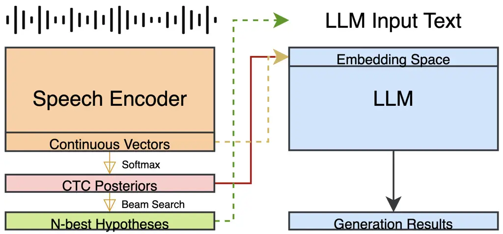
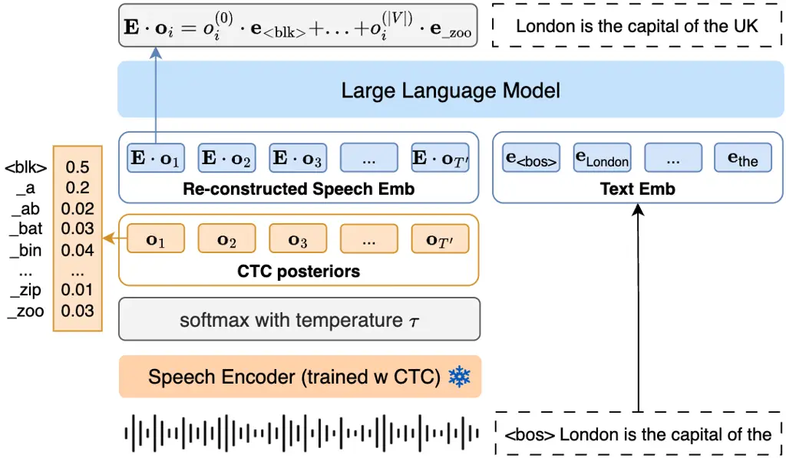
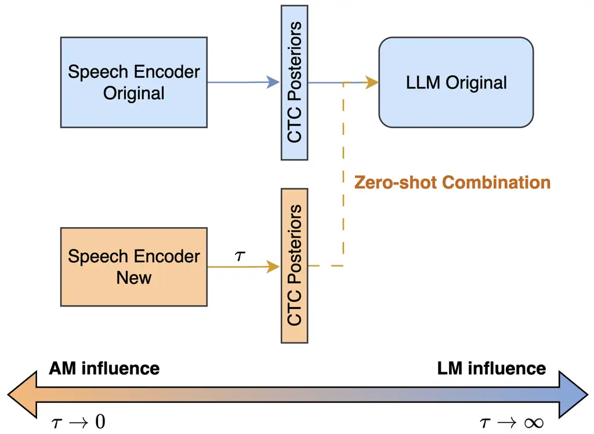
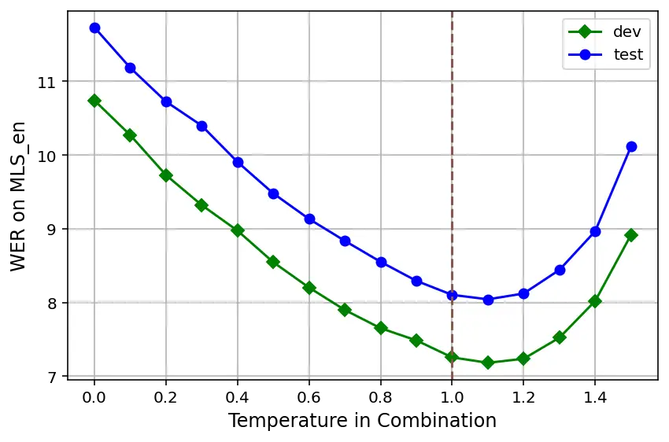
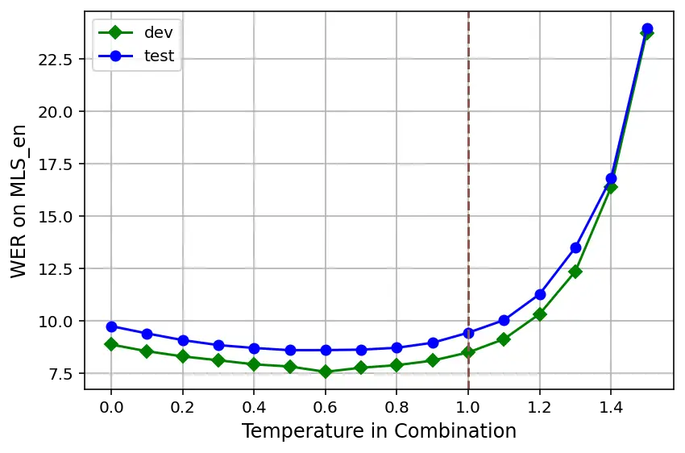
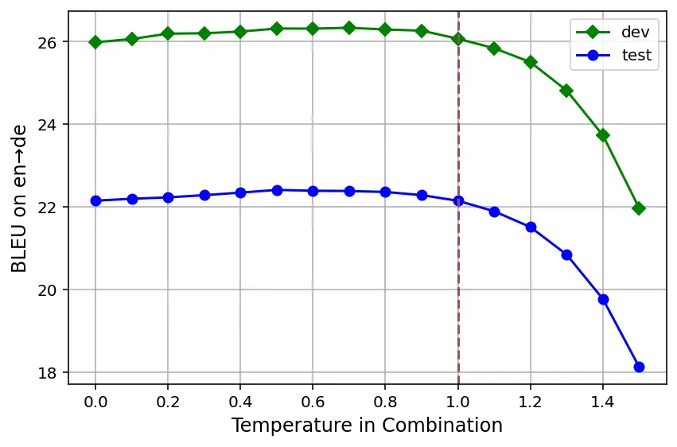
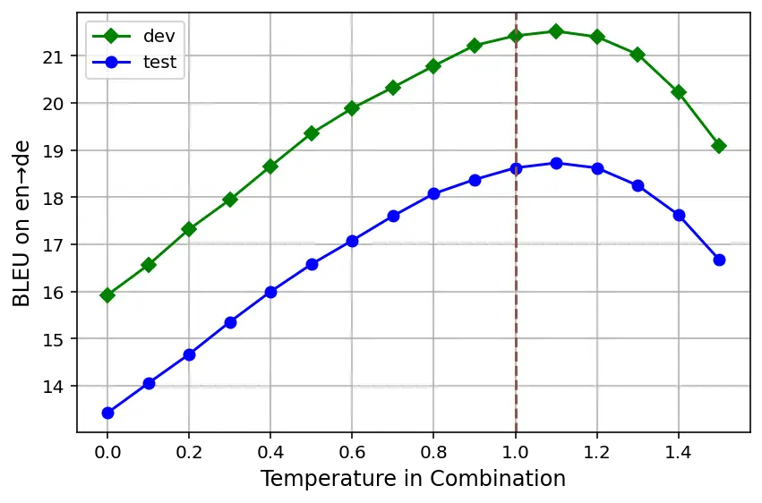

# LegoSLM: Connecting LLM with Speech Encoder using CTC Posteriors

Rao Ma ^(†)^(†)thanks: Work done during internship at Google.
Affiliation: University of Cambridge    Tongzhou Chen
Affiliation: Google Deepmind    Kartik Audhkhasi Affiliation: Google
Deepmind    Bhuvana Ramabhadran Affiliation: Google Deepmind

###### Abstract

Recently, large-scale pre-trained speech encoders and Large Language
Models (LLMs) have been released, which show state-of-the-art
performance on a range of spoken language processing tasks including
Automatic Speech Recognition (ASR). To effectively combine both models
for better performance, continuous speech prompts, and ASR error
correction have been adopted. However, these methods are prone to
suboptimal performance or are inflexible. In this paper, we propose a
new paradigm, LegoSLM, that bridges speech encoders and LLMs using the
ASR posterior matrices. The speech encoder is trained to generate
Connectionist Temporal Classification (CTC) posteriors over the LLM
vocabulary, which are used to reconstruct pseudo-audio embeddings by
computing a weighted sum of the LLM input embeddings. These embeddings
are concatenated with text embeddings in the LLM input space. Using the
well-performing USM and Gemma models as an example, we demonstrate that
our proposed LegoSLM method yields good performance on both ASR and
speech translation tasks. By connecting USM with Gemma models, we can
get an average of 49% WERR over the USM-CTC baseline on 8 MLS testsets.
The trained model also exhibits modularity in a range of settings –
after fine-tuning the Gemma model weights, the speech encoder can be
switched and combined with the LLM in a zero-shot fashion. Additionally,
we propose to control the decode-time influence of the USM and LLM using
a softmax temperature, which shows effectiveness in domain adaptation.

## 1 Introduction

With the advancement of self-supervised and semi-supervised learning,
large-scale pre-trained speech and text models have been released in
recent years Bommasani et al. (2021). Today, speech encoders are
pre-trained on extensive datasets that cover a wide range of spoken
languages Barrault et al. (2023); Zhang et al. (2023); Pratap et al.
(2024). These models have achieved state-of-the-art performance in
various spoken language processing tasks, including automatic speech
recognition (ASR) and automatic speech translation (AST). In the field
of natural language processing (NLP), large language models (LLMs) aim
to capture general world knowledge in the network parameters through the
task of next-word prediction Touvron et al. (2023); Achiam et al.
(2023). After being pre-trained on vast text corpora, LLMs have
demonstrated remarkable capabilities in complex language understanding
tasks facilitated by prompt engineering.



Figure 1: Comparison of different connection methods: ASR error
correction (in green), speech prompts (in orange), and the proposed
LegoSLM (in red).

To enhance the performance of spoken language processing tasks, several
studies have focused on integrating speech encoders with LLMs. In ASR
error correction (AEC), a cascaded system is built where the decoded
hypotheses from the ASR system are given as input to the LLMs for
correction Errattahi et al. (2018). Such a method does not require deep
access to the ASR system and has the advantage of being modular.
Previous work has shown that an LLM trained on the outputs from one ASR
encoder can be re-used to correct the outputs of other speech encoders
without any retraining Ma et al. (2023b). However, the AEC performance
is constrained by the limited contextual information accessible to LLM
Zhu et al. (2021).

Another popular approach to equipping LLMs with speech processing
ability is to prompt LLMs with vectors transformed from the speech
encoder output Verdini et al. (2024). Usually, a mapping network is
inserted and trained to match the embedding space of the speech and text
modalities Fathullah et al. (2024); Gaido et al. (2024). By directly
passing the continuous encoder outputs, this approach largely mitigates
the information loss encountered in cascaded AEC systems. While speech
prompts demonstrate strong performance on various datasets, this
approach sacrifices some flexibility. The LLM is bonded with a specific
speech encoder and fails to perform the task when prompted with outputs
from a different speech encoder.

In this paper, we present LegoSLM, a new paradigm to bridge pre-trained
speech encoders and LLMs, as shown with the red line in Figure 1. First,
the pre-trained speech encoder is fine-tuned with Connectionist Temporal
Classification (CTC) loss using the same vocabulary as the LLM.
Afterward, we multiply output CTC posteriors with the LLM embedding
table to reproduce pseudo-speech embeddings as the LLM input. Compared
to traditional AEC methods where the ASR hypotheses are decoded and
passed, much more information is preserved with our proposed approach.
At the same time, our approach maintains flexibility. The CTC
posteriors, as opposed to the continuous ASR outputs, are acquired,
which helps to protect the speaker’s privacy. Moreover, after
fine-tuning the LLM weights, new speech encoders can be plugged in a
zero-shot fashion. Using the USM Zhang et al. (2023) and Gemma Team
et al. (2024) models as an example, we design comprehensive experiments
to study the system performance on ASR and AST tasks. Experiments on ASR
demonstrate that LegoSLM outperforms AEC and achieves performance
comparable to the speech prompt method where the encoder weights are
kept frozen. On AST, the proposed LegoSLM model shows improved
performance over all baseline systems.

## 2 Related Work

#### Modular ASR Approach

Within the domain of E2E ASR systems, Dalmia et al. (2023); Botros
et al. (2023) focus on building modular architectures. Similar to our
proposed method, their methods train a decoder network that embeds the
CTC posteriors generated by the speech encoder and outputs refined ASR
hypotheses. This design allows encoders and decoders trained in
different setups to be seamlessly combined. In contrast to these
approaches, our work employs a decoder-only Transformer model instead of
using an encoder-decoder architecture. Notably, our method connects a
pre-trained speech encoder with LLM, rather than training the decoder
weights from scratch. By leveraging the extensive world knowledge
acquired during the LLM’s pre-training, we aim to enhance the overall
system performance. Furthermore, we introduce several novel extensions
of LegoSLM.

#### ASR Error Correction

AEC is a widely used post-processing approach to enhance the overall
performance of an ASR system. It takes the ASR hypotheses as input and
is trained on the reference text to automatically detect and correct
recognition errors Mani et al. (2020). Since it only requires decoding
hypotheses from the ASR system, AEC can be applied to API-based services
without requiring in-depth access Ma et al. (2023b). Several studies
leverage ASR N-best lists as input instead of using the top-1
hypothesis, as these provide richer information and have been shown to
enhance the system performance Zhu et al. (2021); Ma et al. (2023a).
Recent works build AEC models using powerful LLMs to leverage their
superior language understanding and reasoning capabilities Ma et al.
(2023c); Chen et al. (2023); Li et al. (2024).

#### LLM with Speech Prompts

The success of LLMs in text processing has driven their application to
other modalities, such as vision Wang et al. (2024) and speech Tang
et al. (2024). In the speech domain, a mapping network can be used to
bridge speech encoders and LLMs, which transform the outputs from the
speech encoder into acoustic prompts that are compatible with the LLM
text embedding space Verdini et al. (2024); Hono et al. (2023). Various
designs for the mapping network exist, and even a basic projection layer
has demonstrated strong performance in aligning both modalities
Fathullah et al. (2024); Ma et al. (2024). As outputs from the speech
encoder can be quite long, some approaches propose to reduce the
sequence length by stacking multiple vectors or employing a CTC-based
compressor Wu et al. (2023).

## 3 Methodology

### 3.1 Structure of Speech Encoder

Given input audio features $`\mathbf{X}_{1:T}`$, the pre-trained speech
encoder transform them into a sequence of hidden representations
$`\mathbf{h}_{1:T^{\prime}}`$,

```math
\mathbf{h}_{1:T^{\prime}}=\text{speech\_encoder}(\mathbf{X}_{1:T}) \tag{1}
```

We add an output layer $`W_{o}`$ to the speech encoder and fine-tune the
model with CTC loss Graves et al. (2006) on supervised ASR training
data. The model output then becomes $`\mathbf{o}_{1:T^{\prime}}`$,

```math
\begin{split}\mathbf{z}_{t}&=W_{o}\cdot\mathbf{h}_{t}\\
\mathbf{o}_{t}&=\text{softmax}(\mathbf{z}_{t})\end{split} \tag{2}
```

The CTC loss function is given by:

```math
\mathcal{L}_{\text{CTC}}(\mathbf{y}_{1:N},\mathbf{o}_{1:T^{\prime}})=-\log\sum_{\pi\in\mathcal{A}(\mathbf{y})}\prod_{t=1}^{T^{\prime}}\mathbf{o}_{t}^{(\pi_{t})} \tag{3}
```

where $`\mathcal{A}(\mathbf{y})`$ represents the set of all valid
alignments of generating the target sequence $`\mathbf{y}`$ from the
input sequence $`\mathbf{X}`$.

For the CTC training process, we use the same vocabulary as the one used
by LLM. Let $`|V|`$ be the size of the LLM vocabulary, the CTC outputs
thus consist of $`|V|+1`$ tokens, including the “blank” token. In the
experimental section, we show that our approach remains effective when
the vocabularies of the speech encoder and the LLM differ.

### 3.2 The LegoSLM Connection Method



Figure 2: Depiction of the proposed LegoSLM method. The speech
embeddings are reconstructed using ASR CTC posteriors and the LLM
embedding table.

The architecture of the LegoSLM system is illustrated in Figure 2, where
the generated CTC posteriors $`\mathbf{o}_{1:T^{\prime}}`$ are utilized
to integrate the speech encoder with the LLM. In the adaption, we freeze
the model weights of the speech encoder and only fine-tune the LLM. To
generate speech representations $`\mathbf{s}_{t}`$ that are aligned with
the text embedding space, we compute a weighted sum of the LLM embedding
table $`\mathbf{E}`$ from the CTC posteriors
$`\mathbf{o}_{1:T^{\prime}}`$,

```math
\mathbf{s}_{t}=\mathbf{E}\cdot\mathbf{o}_{t}\\
 \tag{4}
```

These computed speech embeddings are concatenated with the text
embeddings for processing in subsequent layers.

Compared to the speech prompt method, we also use continuous vectors to
represent information from the original utterance. However, the text
embeddings are used as codebooks for speech embedding reconstruction,
which implicitly matches the two modalities. In this paper, we showcase
the application of LegoSLM architecture in ASR and AST tasks. For ASR,
LLM is trained to generate transcriptions based on the CTC posterior
outputs from the speech encoder. For AST, the speech encoder is trained
to generate posteriors over tokens of the source language, which are
used by the LLM to produce translations in the target language.

### 3.3 Discussion of the CTC Blank Token

CTC network outputs a special token \<blk\> for use in the alignment
process, which is not part of the LLM vocabulary. In the experiments, we
map it to a new LLM embedding vector $`\mathbf{e}_{\text{<blk>}}`$ that
is randomly initialized. Usually, the blank tokens occur more frequently
than the non-blank symbols in the CTC decoding result and tend to have
sharper posteriors Graves et al. (2006). As the \<blk\> token carries
limited content information about the utterance, we introduce a model
variant that suppresses its probability in the $`\mathbf{z}_{t}`$
distribution, thereby enhancing the representation of more meaningful
tokens.

```math
\begin{split}\mathbf{\hat{z}}_{t}^{\text{<blk>}}=\mathbf{z}_{t}^{\text{<blk>}}-\log(\text{blk\_downscale})\end{split} \tag{5}
```

The default value of blk_downscale is set to 1 in the experiments. In a
model variant LegoSLM\*, we increase blk_downscale to $`1e4`$, and
further increasing it does not lead to improved performance.

### 3.4 Zero-shot System Combination



Figure 3: Illustration of the zero-shot system combination test where
speech encoders and LLMs trained in different setups are seamlessly
combined.

An advantage of the LegoSLM architecture is that it enforces the
modularity between the speech encoder and the LLM since only CTC
posteriors are passed to the LLM. After training the system, the LLM can
accept outputs from a different speech encoder as long as the model also
operates on the same CTC vocabulary. This property is useful in
real-life applications, where, for example, the ASR encoder needs to be
updated with more training data or adapted to a new domain. In the
experiments, we conduct the zero-shot system combination test, as
illustrated in Figure 3. Specifically, we fine-tune the LLM weights
based on outputs from the original speech encoder. Then during
evaluation, we plug in a separately-trained speech encoder to the LLM
decoder and evaluate the system performance without updating any model
weight.

### 3.5 AM/LM Spectrum Control

Following the previous section, when we seamlessly combine speech
encoder and LLM trained in different setups, the capability of these
models may differ. In traditional phonetic-based systems, the acoustic
model (AM) and the language model (LM) are trained individually and
combined during decoding. To achieve better recognition performance, a
scaling parameter is often introduced to adjust the influence of the two
models in the system combination Young et al. (2002). A similar strategy
is employed for integrating external language models into E2E ASR
systems Toshniwal et al. (2018). Nevertheless, for work that empowers
LLM with speech ability, how to control the weighting of the speech
encoder and the LLM has not been thoroughly explored in previous
studies. To address this research question, we propose to use a
temperature parameter $`\tau>0`$ in the CTC softmax layer for influence
control,

```math
o_{t}^{(i)}=\frac{\exp(z_{t}^{(i)}/\tau)}{\sum_{j=1}^{|V|+1}\exp({z_{t}^{(j)}/\tau})} \tag{6}
```

When $`\tau>1`$, the CTC probabilities become flatter, allowing greater
flexibility for the LLM in the generation process. Conversely, when
$`\tau<1`$, the CTC probability distribution becomes sharper, granting
the speech encoder more certainty.

### 3.6 Model Variants

In the LegoSLM method, the CTC probability distribution over the entire
vocabulary is utilized. Nonetheless, most probability is distributed to
the top token predictions, following a long-tail distribution.
Therefore, retaining only the top $`K`$ predictions at each frame’s
output is expected to preserve most of the information. In the
following, two model variants are introduced: combining the top-$`K`$
CTC predictions with softmax (LegoTopS) and with a projection layer
(LegoTopP).

In the LegoTopS approach, a vector $`\mathbf{i}_{t}`$ is computed that
corresponds to the indices of the top-$`K`$ values in the speech encoder
output $`\mathbf{z}_{t}`$. Accordingly, we reconstruct the speech
embeddings $`\tilde{\mathbf{s}}_{1:T^{\prime}}`$ by computing a weighted
sum of the associated LLM input embeddings using the top-$`K`$
predictions as multipliers,

```math
\begin{split}\mathbf{i}_{t}&=\text{argmax\_k}(\mathbf{z}_{t})\\
\tilde{\mathbf{s}}_{t}&=E[\mathbf{i}_{t}]\cdot\text{softmax}(\mathbf{z}_{t}[\mathbf{i}_{t}])\end{split} \tag{7}
```

With the LegoTopP variant, LLM token embeddings associated with the
$`\mathbf{i}_{t}`$ predictions are concatenated and mapped to the
original embedding dimension using a linear projection layer. This layer
is randomly initialized and jointly trained with the LLM weights in the
adaptation. Different values of $`K`$ are tested in the experimental
section.

## 4 Experimental Setup

### 4.1 Models

To demonstrate the effectiveness of our proposed LegoSLM framework, we
design experiments on both ASR and AST tasks. The Universal Speech Model
(USM) Zhang et al. (2023) with 300M parameters is used as the speech
encoder in our experiments. The model is pre-trained on multilingual
YouTube data with the BEST-RQ loss in an unsupervised fashion Chiu
et al. (2022). We build a USM-CTC model by adding a CTC layer to the USM
encoder and fine-tune the model on various datasets to simulate
scenarios with varying amounts of available labeled ASR data. For the
LLM decoder, we experiment with the Gemma 2B model Team et al. (2024).
The pt_f32 and it_f32 checkpoints are used separately in the ASR and AST
experiments. The former model is only trained with predicting the next
token while the latter one is further trained with instruction tuning.
In the LegoSLM training, we freeze the USM-CTC model and only adapt the
LLM weights. The detailed training setup and hyperparamers can be found
in Appendix A.2.

### 4.2 Baselines

To evaluate the performance of the proposed method, several baseline
approaches are compared:

USM-CTC: Since the USM is trained with CTC loss, we can decode it on the
test set and compute the WER for the speech encoder solely. In the
experiment section, we show the beam search results with a beam size of 10.

Speech Prompts (SP): For the speech prompt method, we test a simple yet
effective mapping network to bridge the speech encoder and the LLM –
training a linear layer in between for dimension match Fathullah et al.
(2024). Our preliminary experiments suggest that Gemma tends to
hallucinate when its weights are frozen, likely because the Gemma model
was trained without any speech inputs. Hence, in the U+P+G setup, we
update weights of USM, projection layer, and the Gemma model. We also
train with the P+G setup where only the projection layer and the Gemma
model are tuned. Moreover, as indicated by preliminary experiments,
stacking multiple speech embeddings to reduce the input length does not
yield performance improvements. Consequently, speech outputs from each
frame are fed as individual LLM inputs.

ASR Error Correction (AEC): For AEC, the ASR N-best list generated by
the beam search on USM-CTC is collected and fed as input to train the
LLM decoder. Following Ma et al. (2023a), top $`n`$-best ASR hypotheses
are concatenated in order as the model input, separated by \<sep\>
tokens in between to denote the sentence boundaries.

### 4.3 Dataset

For ASR experiments, we train USM-CTC models and the corresponding Gemma
models in four different settings: three English-only ASR systems and a
multilingual system built for 8 languages. The mls-en model is trained
on the en-us part of the MLS Pratap et al. (2020) dataset. Public
represents the combination of the MLS en-us subset and the SpeechStew
dataset Chan et al. (2021), which is a collection of multiple public ASR
datasets. The model with the lbs label is only trained on the
LibriSpeech training set Panayotov et al. (2015). In the multilingual
setup, model multi learns from MLS training data of all 8 languages. To
evaluate the model performance, WER results on the English test set from
MLS and the test_other set from LibriSpeech are calculated, denoted as
MLS_en and LBS_other. For speech translation, we conduct experiments on
the public CoVoST 2 dataset Wang et al. (2021). We use the same USM-CTC
models in the multi ASR experiments and train Gemma models separately on
three translation directions: fr$`\rightarrow`$en, de$`\rightarrow`$en
and en$`\rightarrow`$de. All datasets are publicly available for
research purposes, and their use in this paper aligns with their
intended purpose.

## 5 Results

### 5.1 Experiments on ASR

Table 1 listed the ASR performance for models trained on MLS en-us data.
For the speech prompt method, the best performance can be observed on
both sets when all components including the USM model weights,
projection layer, and the Gemma weights are jointly fine-tuned. Since
the USM weights are kept frozen in the LegoSLM adaptation phase, our
proposed method is more comparable to the P+G setup. For AEC, $`n=1`$
leads to minor performance improvement on the MLS_en set and degradation
on the LBS_other set. The results indicate that relying solely on the
top-1 ASR hypothesis limits the LLM’s ability to correct errors
effectively. To achieve better performance, we feed ASR N-best lists as
input, which include highly probable transcription alternatives.
Increasing $`n`$ leads to better performance, and when the 10-best list
is used, the best performance of 13% WERR can be seen on the MLS_en set.

|                  |                 |        |           |
| ---------------- | --------------- | ------ | --------- |
| Model (mls-en)   |                 | MLS_en | LBS_other |
| Encoder: USM-CTC |                 | 8.9    | 6.8       |
| +Gemma           | SP (U+P+G)      | 5.2    | 4.8       |
|                  | SP (P+G)        | 5.5    | 5.2       |
|                  | AEC (n=1)       | 8.9    | 8.0       |
|                  | AEC (n=5)       | 8.0    | 6.5       |
|                  | AEC (n=10)      | 7.8    | 5.7       |
|                  | Ours: LegoSLM   | 6.1    | 5.5       |
|                  | Ours: LegoSLM\* | 5.6    | 5.2       |

Table 1: WER results for speech prompts, ASR error correction, and the
proposed LegoSLM method. Models are trained on the MLS en-us data.
Results with \* reduce the predicted probability of the \<blk\> token.

| Model (multi)     |                 | en  | de   | nl   | fr   | es   | it   | pt   | pl   | Avg. |
| ----------------- | --------------- | --- | ---- | ---- | ---- | ---- | ---- | ---- | ---- | ---- |
| Baseline: USM-CTC |                 | 9.5 | 12.7 | 18.2 | 14.5 | 10.2 | 23.0 | 22.5 | 32.1 | 17.8 |
| +Gemma            | SP (P+G)        | 5.5 | 6.1  | 12.2 | 5.4  | 4.9  | 11.6 | 12.7 | 11.7 | 8.8  |
|                   | AEC (n=10)      | 8.2 | 9.5  | 14.5 | 9.2  | 8.0  | 19.1 | 19.1 | 22.9 | 13.8 |
|                   | Ours: LegoSLM\* | 5.7 | 5.1  | 12.1 | 5.8  | 5.1  | 12.4 | 13.6 | 12.7 | 9.1  |

Table 2: WER results for models trained on the multilingual MLS data
across 8 languages.

Our proposed LegoSLM method achieves a WER of 6.1 on the MLS_en test
set. Here, we use the probability predicted in the CTC layer output
directly. With the LegoSLM\* setting, the logit of the \<blk\> token is
decreased by $`\log(1e4)`$ to reduce its influence. Results indicate
that decreasing the weight of \<blk\> when reconstructing the speech
embeddings leads to notable performance improvement, contributing to a
total WERR of 37%. The LegoSLM models largely outperform AEC and are
more cost-effective when generating features. In the AEC approach, the
input length increases proportionally with $`n`$, leading to training
inefficiencies. Additionally, generating the ASR N-best list involves
running a beam search, whereas LegoSLM only uses the plain probability
distribution. LegoSLM\* also achieves comparable performance with the SP
(P+G) setting. These findings suggest that using CTC posteriors as an
intermediate representation preserves most of the information compared
to the continuous ASR outputs. The WER decomposition is listed in Table 10.

Table 2 presents ASR performance on the multilingual LibriSpeech
dataset, where the model is jointly trained on speech data from eight
languages. The projected speech prompts, ASR error correction, and
LegoSLM\* achieve average WERRs of 50%, 22%, and 49%, respectively. As
indicated by the results, our proposed method demonstrates strong
performance in the multilingual setup. Nevertheless, the performance gap
of LegoSLM\* with the SP method widens for languages with less training
data, such as Polish with 104h of speech data. Additional results on
LibriSpeech and public English datasets, provided in Appendix B.2,
further validate the effectiveness of our approach.

### 5.2 Zero-shot System Combination

Table 3 evaluates the modularity of various connection methods. In this
setup, the Gemma model is initially trained using outputs from the
USM-CTC encoder that is developed on the MLS en-us dataset. This is the
same model setting in Table 1. During the evaluation, this trained Gemma
model is utilized without additional training to integrate outputs from
other speech encoders. As shown in the table, the continuous speech
prompt method fails to transfer across setups, as the output spaces from
different speech encoders are incompatible, causing the LLM to
underperform. For the cascaded AEC method, the trained Gemma model shows
effectiveness in refining the transcriptions from other speech encoders,
though the performance gains over the USM-CTC baseline remain limited.

|                  |                 |       |        |       |
| ---------------- | --------------- | ----- | ------ | ----- |
| Model            |                 | multi | public | lbs   |
| Encoder: USM-CTC |                 | 9.5   | 10.7   | 12.8  |
| +Gemma (mls-en)  | SP (U+P+G)      | 200.0 | 165.2  | 218.6 |
|                  | SP (P+G)        | 195.9 | 169.3  | 181.8 |
|                  | AEC (n=1)       | 9.6   | 10.0   | 12.2  |
|                  | AEC (n=5)       | 8.8   | 9.2    | 11.0  |
|                  | AEC (n=10)      | 8.3   | 8.6    | 10.7  |
|                  | Ours: LegoSLM   | 6.7   | 7.2    | 8.1   |
|                  | Ours: LegoSLM\* | 6.4   | 7.0    | 8.8   |

Table 3: Experimental results of zero-shot system combination on the
MLS_en test set. The Gemma model is trained in the mls-en setup while we
plug in USM encoders trained from multi, public, and lbs setups.

The LegoSLM models maintain strong performance across different USM
encoders, achieving WERRs of 32% to 37% compared to baseline CTC
decoding results. For the USM-CTC model trained on LibriSpeech, reducing
the weight of the \<blk\> token leads to performance degradation, likely
due to the distributional differences between LibriSpeech and the MLS
en-us dataset. As a result, using the original probability distribution
eases the transfer process. These experiments highlight LegoSLM’s
modularity, a valuable property in real-life applications where the LLM
does not require retraining when the ASR encoder is replaced.

### 5.3 Experiments on AM/LM Spectrum





Figure 4: Effect of changing the temperature value in LegoSLM. The
speech encoder and LLM are trained on different setups. Top: USM-CTC
(lbs) + Gemma (mls-en). Bottom: USM-CTC (mls-en) + Gemma (lbs).

In the context of zero-shot system combination, the encoder and decoder
may exhibit varying levels of capability when trained on different data.
In the following experiments, we utilize the temperature value $`\tau`$
in the CTC softmax to adjust the emphasis given to the speech encoder
and LLM in the generation. Figure 4 demonstrates the impact of selecting
different temperature values during softmax computation. In the first
setup, the USM model was trained on LibriSpeech, while the Gemma decoder
was fine-tuned on MLS-en. Since the decoder is more robust in this
scenario, the model shows the best performance at $`\tau=1.1`$, granting
the LLM greater freedom during decoding. In contrast, for the setup
depicted in the figure below, the optimal temperature value is
approximately 0.6, emphasizing the role of the USM-CTC encoder in the
system combination. These results highlight the effectiveness of
temperature control in balancing the contributions of the encoder and
decoder, leading to improved overall ASR performance. Detailed WER
results and a case study illustrating the effects of temperature values
can be found in Appendix C.

### 5.4 Model Variants

|            |       |        |           |
| ---------- | ----- | ------ | --------- |
| Model      | $`K`$ | MLS_en | LBS_other |
| LegoSLM\*  | \-    | 5.6    | 5.2       |
| LegoTopP\* | 3     | 6.2    | 5.9       |
|            | 5     | 6.1    | 6.7       |
|            | 10    | 6.0    | 7.5       |
| LegoTopS\* | 1     | 7.0    | 6.6       |
|            | 10    | 5.8    | 5.5       |
|            | 100   | 5.6    | 5.3       |

Table 4: Ablation of the LegoSLM\* approach where we only keep the
top-$`K`$ token predictions at each frame.

In Table 4, we analyze the impact of constraining the LLM input to be
the top-$`K`$ tokens derived from the CTC posteriors at each frame.
Results at $`K=10`$ indicate that using a softmax-based approach to
combine LLM text embeddings outperforms the projection-based method,
emphasizing the importance of incorporating ASR scores. At $`K=100`$,
the performance of LegoTopS\* is comparable to LegoSLM\*, indicating
robustness across varying input sizes. Notably, due to the long-tail
distribution of the CTC outputs, retaining only the top token
predictions preserves the most relevant information, leading to minimal
performance degradation compared to using the probability distribution
generated on the full vocabulary. This method also has a speed
advantage, as softmax over the entire vocabulary is no longer required.
In the extreme case of $`K=1`$, which corresponds to utilizing CTC
greedy decoding results without token merging or blank removal, the ASR
performance drops substantially. This highlights the importance of
leveraging alternative predictions for the LLM to generate accurate ASR
hypotheses.

| CTC Vocab   | Model           | MLS_en | LBS_other |
| ----------- | --------------- | ------ | --------- |
| 256K        | USM-CTC         | 8.9    | 6.8       |
| (matched)   | Ours: LegoSLM\* | 5.6    | 5.2       |
| 16,384      | USM-CTC         | 10.0   | 7.5       |
| (different) | Ours: LegoSLM\* | 5.6    | 5.2       |

Table 5: WER results for LegoSLM\* systems trained on MLS en-us data.
The Gemma model uses a vocabulary of 256K tokens and we test both cases
when USM-CTC uses a matched and a different vocabulary.

Previous experiments were conducted under the assumption that the speech
encoder and the LLM share the same vocabulary. However, this constraint
may be difficult to meet in practical applications. Table 5 further
evaluates the system’s performance when the vocabularies remain
different. Specifically, the USM-CTC model is trained with a vocabulary
size of 16K, while the Gemma model operates with 256K tokens. To handle
this mismatch, an additional input embedding table is introduced to the
LLM. This table is randomly initialized and jointly trained alongside
the other LLM parameters. These 12M additional parameters effectively
map the ASR output logits to the LLM’s input space. Baseline results
from CTC decoding indicate that the USM-CTC system performs better when
trained with a fine-grained vocabulary. However, after fine-tuning using
the LegoSLM\* method, ASR performance becomes comparable, highlighting
the robustness of our approach even when the ASR and LLM vocabularies
are not aligned.

### 5.5 Experiments on Speech Translation

Table 6 presents the experimental results of the speech translation
task, which requires the model to comprehend the semantics of the
utterance in the source language and generate accurate transcriptions in
the target language. In the Oracle setup, a text translation system is
trained using ASR references as input, serving as an upper bound for
performance evaluation. For the other approaches, the USM-CTC model
learns from the multilingual LibriSpeech data to perform speech
recognition in the source language. The Gemma decoder is tuned on CoVoST
2 to generate translation in the target language given outputs from the
speech encoder. When the training data is limited, aligning the speech
encoder outputs with the LLM text embedding space becomes challenging,
leading to the underperformance of the speech prompts method.
Nevertheless, the cascaded AEC systems exhibit strong performance, as
utilizing the transcription in the source language assists the LLM in
understanding the utterance’s meaning, thus reducing the complexity of
the task. The LegoSLM\* method further boosts system performance by
mitigating information loss compared to AEC, achieving the best results
across all AST configurations.

|                 |                     |                     |                     |
| --------------- | ------------------- | ------------------- | ------------------- |
| Model           | fr$`\rightarrow`$en | de$`\rightarrow`$en | en$`\rightarrow`$de |
| Oracle          | 36.5                | 30.1                | 31.8                |
| SP (U+P+G)      | 11.3                | 9.8                 | 15.7                |
| SP (P+G)        | 9.7                 | 7.5                 | 13.4                |
| AEC (n=1)       | 18.7                | 16.7                | 18.6                |
| AEC (n=5)       | 20.7                | 18.2                | 19.8                |
| AEC (n=10)      | 21.5                | 18.7                | 20.3                |
| Ours: LegoSLM   | 23.8                | 18.9                | 20.3                |
| Ours: LegoSLM\* | 25.8                | 21.1                | 21.1                |

Table 6: BLEU scores ($`\uparrow`$) for speech translation performance
on CoVoST 2 test sets. Oracle fine-tunes the Gemma model using ASR
reference texts as input.

|                      |        |        |      |
| -------------------- | ------ | ------ | ---- |
| Model                | mls-en | public | lbs  |
| SP (U+P+G)           | 3.5    | 3.0    | 2.8  |
| SP (P+G)             | 3.1    | 2.9    | 4.0  |
| AEC (n=1)            | 19.5   | 21.4   | 17.7 |
| AEC (n=5)            | 20.6   | 22.2   | 18.3 |
| AEC (n=10)           | 20.9   | 22.3   | 18.4 |
| Ours: LegoSLM (best) | 20.9   | 22.4   | 18.7 |

Table 7: BLEU scores of the zero-shot system combination on the
en$`\rightarrow`$de AST test set.

For the AST task of translating English utterances into German text, we
test the modularity of the system by swapping the USM encoder. As shown
in Table 7, after training the Gemma model on the AST data, it becomes
possible to seamlessly integrate a different USM-CTC encoder trained on
another ASR set. For the LegoSLM method, we report the best BLEU score
achieved with the optimal temperature value. This method demonstrates
superior performance across three setups, with the AEC system using a
10-best list delivering comparable speech translation performance.

| Type       | Text                                                                                     |
| ---------- | ---------------------------------------------------------------------------------------- |
| ASR-REF    | La France est un grand pays, nous en sommes convaincus.                                  |
| AST-REF    | France is a big country, we are convinced about it.                                      |
| SP (U+P+G) | France is a conquered country, we are getting rid of it.                                 |
| LegoSLM\*  | France is a great country, we are convinced of it.                                       |
| ASR-REF    | Nous avons décidé, au contraire, de renforcer la progressivité de l’impôt sur le revenu. |
| AST-REF    | We have decided, on the contrary, to strength the progressiveness of the income tax.     |
| SP (U+P+G) | We had decided to give flexibility to companies.                                         |
| LegoSLM\*  | On the contrary, we have decided to strength the income tax.                             |

Table 8: Case analysis on the fr$`\rightarrow`$en AST test set.

Table 8 presents two examples from the AST test set. The speech
translation results produced using the continuous speech prompt approach
fail to accurately convey the sentence meaning, whereas the proposed
LegoSLM\* method generates translations that closely align with the
reference text.

## 6 Conclusions

In this work, we propose a novel approach to combine a pre-trained
speech encoder and LLM. Extensive experimental results show that LegoSLM
achieves competitive performance compared to prior approaches. Since CTC
posteriors are used to bridge the two modules, after training the LLM,
the ASR encoder can be switched in a zero-shot manner. Additionally, we
propose using the temperature value in softmax to adjust the relative
emphasis placed on the speech encoder and the LLM components.
Furthermore, several model variants are introduced and evaluated. The
results presented in this paper indicate that LegoSLM has potential for
broader applications, such as speech summarization and spoken language
understanding.

## 7 Limitations

This study serves as an initial exploration of how the CTC posteriors
from a speech encoder empower LLMs to handle the speech modality. In
this paper, we present experiments using the USM and Gemma models to
demonstrate the effectiveness of our approach. We generate posteriors
from a CTC-based speech encoder, given its efficiency and its popularity
in the speech pre-training field. Nevertheless, our approach can be
extended to speech encoders with other architectures such as RNN-T or
LAS models. Moving forward, we aim to expand our analysis to other
large-scale foundation models to draw broader conclusions. In this work,
we employ fine-tuning to adapt the LLM weights. However, alternative
parameter-efficient tuning methods, such as LoRA, are commonly used for
adapting LLMs. While this is not addressed in the current version, we
anticipate observing similar performance trends with these methods.

## 8 Risks and Ethics

There are no known ethical concerns or risks associated with the
findings of this work.

## References

- Achiam et al. (2023) Josh Achiam, Steven Adler, Sandhini Agarwal, Lama
  Ahmad, Ilge Akkaya, Florencia Leoni Aleman, Diogo Almeida, Janko
  Altenschmidt, Sam Altman, Shyamal Anadkat, et al. 2023. GPT-4
  technical report. _arXiv preprint arXiv:2303.08774_.
- Ardila et al. (2020) Rosana Ardila, Megan Branson, Kelly Davis,
  Michael Kohler, Josh Meyer, Michael Henretty, Reuben Morais, Lindsay
  Saunders, Francis Tyers, and Gregor Weber. 2020. Common Voice: A
  Massively-Multilingual Speech Corpus. In _Proceedings of the Twelfth
  Language Resources and Evaluation Conference_, pages 4218–4222.
- Barrault et al. (2023) Loïc Barrault, Yu-An Chung, Mariano Cora
  Meglioli, David Dale, Ning Dong, Paul-Ambroise Duquenne, Hady Elsahar,
  Hongyu Gong, Kevin Heffernan, John Hoffman, et al. 2023.
  SeamlessM4T-Massively Multilingual & Multimodal Machine Translation.
  _arXiv preprint arXiv:2308.11596_.
- Bommasani et al. (2021) Rishi Bommasani, Drew A Hudson, Ehsan Adeli,
  Russ Altman, Simran Arora, Sydney von Arx, Michael S Bernstein,
  Jeannette Bohg, Antoine Bosselut, Emma Brunskill, et al. 2021. On the
  opportunities and risks of foundation models. _arXiv preprint
  arXiv:2108.07258_.
- Botros et al. (2023) Rami Botros, Rohit Prabhavalkar, Johan Schalkwyk,
  Ciprian Chelba, Tara N Sainath, and Françoise Beaufays. 2023.
  Lego-Features: Exporting modular encoder features for streaming and
  deliberation ASR. In _ICASSP 2023-2023 IEEE International Conference
  on Acoustics, Speech and Signal Processing (ICASSP)_, pages 1–5. IEEE.
- Chan et al. (2021) William Chan, Daniel Park, Chris Lee, Yu Zhang,
  Quoc Le, and Mohammad Norouzi. 2021. Speechstew: Simply mix all
  available speech recognition data to train one large neural network.
  _arXiv preprint arXiv:2104.02133_.
- Chen et al. (2023) Chen Chen, Yuchen Hu, Chao-Han Huck Yang,
  Sabato Marco Siniscalchi, Pin-Yu Chen, and Eng-Siong Chng. 2023.
  Hyporadise: An open baseline for generative speech recognition with
  large language models. In _Proceedings of the 37th International
  Conference on Neural Information Processing Systems_, pages
  31665–31688.
- Chiu et al. (2022) Chung-Cheng Chiu, James Qin, Yu Zhang, Jiahui Yu,
  and Yonghui Wu. 2022. Self-supervised learning with random-projection
  quantizer for speech recognition. In _International Conference on
  Machine Learning_, pages 3915–3924. PMLR.
- Dalmia et al. (2023) Siddharth Dalmia, Dmytro Okhonko, Mike Lewis,
  Sergey Edunov, Shinji Watanabe, Florian Metze, Luke Zettlemoyer, and
  Abdelrahman Mohamed. 2023. LegoNN: Building modular encoder-decoder
  models. _IEEE/ACM Transactions on Audio, Speech, and Language
  Processing_.
- Errattahi et al. (2018) Rahhal Errattahi, Asmaa El Hannani, and Hassan
  Ouahmane. 2018. Automatic speech recognition errors detection and
  correction: A review. _Procedia Computer Science_, 128:32–37.
- Fathullah et al. (2024) Yassir Fathullah, Chunyang Wu, Egor Lakomkin,
  Junteng Jia, Yuan Shangguan, Ke Li, Jinxi Guo, Wenhan Xiong, Jay
  Mahadeokar, Ozlem Kalinli, et al. 2024. Prompting large language
  models with speech recognition abilities. In _ICASSP 2024-2024 IEEE
  International Conference on Acoustics, Speech and Signal Processing
  (ICASSP)_, pages 13351–13355. IEEE.
- Gaido et al. (2024) Marco Gaido, Sara Papi, Matteo Negri, and Luisa
  Bentivogli. 2024. Speech Translation with Speech Foundation Models and
  Large Language Models: What is There and What is Missing? In
  _Proceedings of the 62nd Annual Meeting of the Association for
  Computational Linguistics (Volume 1: Long Papers)_, pages 14760–14778.
- Graves et al. (2006) Alex Graves, Santiago Fernández, Faustino Gomez,
  and Jürgen Schmidhuber. 2006. Connectionist temporal classification:
  labelling unsegmented sequence data with recurrent neural networks. In
  _Proceedings of the 23rd international conference on Machine
  learning_, pages 369–376.
- Hono et al. (2023) Yukiya Hono, Koh Mitsuda, Tianyu Zhao, Kentaro
  Mitsui, Toshiaki Wakatsuki, and Kei Sawada. 2023. An integration of
  pre-trained speech and language models for end-to-end speech
  recognition. _arXiv preprint arXiv:2312.03668_.
- Li et al. (2024) Sheng Li, Chen Chen, Chin Yuen Kwok, Chenhui Chu,
  Eng Siong Chng, and Hisashi Kawai. 2024. Investigating ASR error
  correction with large language model and multilingual 1-best
  hypotheses. In _Proc. Interspeech 2024_, pages 1315–1319.
- Ma et al. (2023a) Rao Ma, Mark J. F. Gales, Kate M. Knill, and Mengjie
  Qian. 2023a. N-best T5: Robust ASR Error Correction using Multiple
  Input Hypotheses and Constrained Decoding Space. In _Proc.
  INTERSPEECH_, pages 3267–3271.
- Ma et al. (2023b) Rao Ma, Mengjie Qian, Mark J. F. Gales, and Kate M.
  Knill. 2023b. Adapting an Unadaptable ASR System. In _Proc.
  INTERSPEECH 2023_, pages 989–993.
- Ma et al. (2023c) Rao Ma, Mengjie Qian, Potsawee Manakul, Mark Gales,
  and Kate Knill. 2023c. Can generative large language models perform
  ASR error correction? _arXiv preprint arXiv:2307.04172_.
- Ma et al. (2024) Ziyang Ma, Guanrou Yang, Yifan Yang, Zhifu Gao,
  Jiaming Wang, Zhihao Du, Fan Yu, Qian Chen, Siqi Zheng, Shiliang
  Zhang, et al. 2024. An Embarrassingly Simple Approach for LLM with
  Strong ASR Capacity. _arXiv preprint arXiv:2402.08846_.
- Mani et al. (2020) Anirudh Mani, Shruti Palaskar, Nimshi Venkat
  Meripo, Sandeep Konam, and Florian Metze. 2020. ASR error correction
  and domain adaptation using machine translation. In _ICASSP 2020-2020
  IEEE International Conference on Acoustics, Speech and Signal
  Processing (ICASSP)_, pages 6344–6348. IEEE.
- Panayotov et al. (2015) Vassil Panayotov, Guoguo Chen, Daniel Povey,
  and Sanjeev Khudanpur. 2015. Librispeech: an ASR corpus based on
  public domain audio books. In _2015 IEEE international conference on
  acoustics, speech and signal processing (ICASSP)_, pages 5206–5210.
  IEEE.
- Park et al. (2019) Daniel S. Park, William Chan, Yu Zhang, Chung-Cheng
  Chiu, Barret Zoph, Ekin D. Cubuk, and Quoc V. Le. 2019. SpecAugment: A
  Simple Data Augmentation Method for Automatic Speech Recognition. In
  _Interspeech 2019_, pages 2613–2617.
- Pratap et al. (2024) Vineel Pratap, Andros Tjandra, Bowen Shi, Paden
  Tomasello, Arun Babu, Sayani Kundu, Ali Elkahky, Zhaoheng Ni, Apoorv
  Vyas, Maryam Fazel-Zarandi, et al. 2024. Scaling speech technology to
  1,000+ languages. _Journal of Machine Learning Research_, 25(97):1–52.
- Pratap et al. (2020) Vineel Pratap, Qiantong Xu, Anuroop Sriram,
  Gabriel Synnaeve, and Ronan Collobert. 2020. MLS: A Large-Scale
  Multilingual Dataset for Speech Research. In _Interspeech 2020_, pages
  2757–2761.
- Tang et al. (2024) Changli Tang, Wenyi Yu, Guangzhi Sun, Xianzhao
  Chen, Tian Tan, Wei Li, Lu Lu, MA Zejun, and Chao Zhang. 2024.
  SALMONN: Towards Generic Hearing Abilities for Large Language Models.
  In _The Twelfth International Conference on Learning Representations_.
- Team et al. (2024) Gemma Team, Thomas Mesnard, Cassidy Hardin, Robert
  Dadashi, Surya Bhupatiraju, Shreya Pathak, Laurent Sifre, Morgane
  Rivière, Mihir Sanjay Kale, Juliette Love, et al. 2024. Gemma: Open
  models based on gemini research and technology. _arXiv preprint
  arXiv:2403.08295_.
- Toshniwal et al. (2018) Shubham Toshniwal, Anjuli Kannan, Chung-Cheng
  Chiu, Yonghui Wu, Tara N Sainath, and Karen Livescu. 2018. A
  comparison of techniques for language model integration in
  encoder-decoder speech recognition. In _2018 IEEE spoken language
  technology workshop (SLT)_, pages 369–375. IEEE.
- Touvron et al. (2023) Hugo Touvron, Thibaut Lavril, Gautier Izacard,
  Xavier Martinet, Marie-Anne Lachaux, Timothée Lacroix, Baptiste
  Rozière, Naman Goyal, Eric Hambro, Faisal Azhar, et al. 2023. Llama:
  Open and efficient foundation language models. _arXiv preprint
  arXiv:2302.13971_.
- Verdini et al. (2024) Francesco Verdini, Pierfrancesco Melucci,
  Stefano Perna, Francesco Cariaggi, Marco Gaido, Sara Papi, Szymon
  Mazurek, Marek Kasztelnik, Luisa Bentivogli, Sébastien Bratières,
  et al. 2024. How to Connect Speech Foundation Models and Large
  Language Models? What Matters and What Does Not. _arXiv preprint
  arXiv:2409.17044_.
- Wang et al. (2021) Changhan Wang, Anne Wu, Jiatao Gu, and Juan
  Pino. 2021. CoVoST 2 and Massively Multilingual Speech Translation.
- Wang et al. (2024) Wenhai Wang, Zhe Chen, Xiaokang Chen, Jiannan Wu,
  Xizhou Zhu, Gang Zeng, Ping Luo, Tong Lu, Jie Zhou, Yu Qiao,
  et al. 2024. VisionLLM: Large language model is also an open-ended
  decoder for vision-centric tasks. _Advances in Neural Information
  Processing Systems_, 36.
- Wu et al. (2023) Jian Wu, Yashesh Gaur, Zhuo Chen, Long Zhou, Yimeng
  Zhu, Tianrui Wang, Jinyu Li, Shujie Liu, Bo Ren, Linquan Liu,
  et al. 2023. On decoder-only architecture for speech-to-text and large
  language model integration. In _2023 IEEE Automatic Speech Recognition
  and Understanding Workshop (ASRU)_, pages 1–8. IEEE.
- Young et al. (2002) Steve Young, Gunnar Evermann, Mark Gales, Thomas
  Hain, Dan Kershaw, Xunying Liu, Gareth Moore, Julian Odell, Dave
  Ollason, Dan Povey, et al. 2002. The HTK book. _Cambridge university
  engineering department_, 3(175):12.
- Zhang et al. (2023) Yu Zhang, Wei Han, James Qin, Yongqiang Wang,
  Ankur Bapna, Zhehuai Chen, Nanxin Chen, Bo Li, Vera Axelrod, Gary
  Wang, et al. 2023. Google USM: Scaling automatic speech recognition
  beyond 100 languages. _arXiv preprint arXiv:2303.01037_.
- Zhu et al. (2021) Linchen Zhu, Wenjie Liu, Linquan Liu, and Edward
  Lin. 2021. Improving ASR error correction using n-best hypotheses. In
  _2021 IEEE Automatic Speech Recognition and Understanding Workshop
  (ASRU)_, pages 83–89. IEEE.

## Appendix A Training Details

### A.1 Dataset Details

For speech recognition, MLS Pratap et al. (2020), LibriSpeech Panayotov
et al. (2015) and SpeechStew Chan et al. (2021) datasets are used in our
experiments. The LibriSpeech corpus consists of 960 hours of English
read speech data, collected from the LibriVox project. Later on, MLS is
released, which is a multilingual version of LibriSpeech at a larger
scale. It is also derived from audiobooks and contains data from 8
languages, with 44.5K hours of English data and 6K hours of speech over
other 7 languages. Speechstew is a large-scale multi-domain ASR dataset
created by mixing various public datasets: AMI, Broadcast News, Common
Voice, LibriSpeech, Swithboard/Fisher, and WSJ.

The standard CoVoST 2 Wang et al. (2021) corpus is used for training and
evaluation in the speech translation experiments. It is a diversified
translation set based on the Common Voice project Ardila et al. (2020).
For each language pair, the speech from the source language and the text
reference in the target language is provided. The original data contains
translation from 21 languages into English and translation from English
into 15 languages. In this paper, we design experiments in three
translation directions. The number of utterances and hours of speech
data are listed in Table 9.

|      |             |                     |         |        |
| ---- | ----------- | ------------------- | ------- | ------ |
| Task | Data        | Split               | \#Utts  | Hours  |
| ASR  | MLS         | en-us               | 10,808K | 44,660 |
|      |             | de-de               | 469K    | 1,966  |
|      |             | nl-nl               | 374K    | 1,554  |
|      |             | fr-fr               | 258K    | 1,076  |
|      |             | es-es               | 220K    | 917    |
|      |             | it-it               | 59K     | 247    |
|      |             | pt-br               | 37K     | 161    |
|      |             | pl-pl               | 25K     | 104    |
|      | LibriSpeech | \-                  | 281K    | 960    |
|      | SpeechStew  | \-                  | 4,452K  | 4,730  |
| AST  | CoVoST 2    | fr$`\rightarrow`$en | 207K    | 180    |
|      |             | de$`\rightarrow`$en | 127K    | 119    |
|      |             | en$`\rightarrow`$de | 289K    | 364    |

Table 9: Statistics of the training datasets.

### A.2 Training Details

The USM-CTC models are fine-tuned from the pre-trained USM BERT-RQ
checkpoints on multiple ASR training sets. The encoder contains 2 layers
of subsampling convolution layers and 24 Conformer layers, with a model
dimension of 768. In the fine-tuning, a linear layer with softmax is
added to the USM encoder. The model is trained with CTC loss to make
predictions for each frame in a vocabulary of 256K. During the training,
the learning rate increases linearly to the maximum of 3e-5 in 5K steps
and decays exponentially to 5e-5. USM-CTC is trained for 200K steps with
a batch size of 192 on the training set. For the LLM used in our
experiments, Gemma 2B has 18 Transformer layers with a model dimension
of 2048. The vocabulary consists of 256K tokens, which is the same one
used in the USM-CTC training. In the Gemma fine-tuning, a learning rate
of 1e-4 with the cosine decay strategy is applied. Models are trained
for 5000 steps on LibriSpeech and CoVoST 2 with a batch size of 512. The
mls-en, multi, and public models are trained for 25K, 40K, and 40K steps
accordingly, with a batch size of 1024. For better generalization,
SpecAugment Park et al. (2019) and a dropout rate of 0.1 are applied in
training. All models are trained and tested on TPU pods.

For ASR training, no prompt is applied in the input prefix. In the AST
training, several prompts are used interchangeably: 1. Translate the
{src} speech into {tgt} text: 2. Translate this {src} audio into {tgt}
text: 3. Convert this {src} audio recording into {tgt} text: 4.
Transform this {src} audio into {tgt} text: 5. Generate a {tgt} text
version of this {src} audio: 6. Extract the spoken content from this
{src} audio and present it in {tgt} text: 7. Turn this {src} audio into
{tgt} text: 8. Rewrite this {src} audio in {tgt} text: 9. I need this
{src} audio translated into {tgt} text: 10. Can you translate this {src}
audio recording into {tgt} text? 11. What would this {src} audio sound
like in {tgt}? 12. Translate the audio into {tgt} text:. In the
evaluation, the first prompt is applied to all test utterances.

## Appendix B ASR Performance

### B.1 Additional Experiments on MLS en-us

|                  |                 |     |     |     |     |
| ---------------- | --------------- | --- | --- | --- | --- |
| Model (mls-en)   |                 | WER | Sub | Del | Ins |
| Encoder: USM-CTC |                 | 8.9 | 6.7 | 1.4 | 0.8 |
| +Gemma           | SP (U+P+G)      | 5.2 | 3.6 | 0.8 | 0.7 |
|                  | SP (P+G)        | 5.5 | 4.0 | 0.8 | 0.7 |
|                  | AEC (n=1)       | 8.9 | 6.1 | 1.3 | 1.5 |
|                  | AEC (n=5)       | 8.0 | 5.5 | 1.2 | 1.3 |
|                  | AEC (n=10)      | 7.8 | 5.3 | 1.2 | 1.3 |
|                  | Ours: LegoSLM   | 6.1 | 4.4 | 0.9 | 0.7 |
|                  | Ours: LegoSLM\* | 5.6 | 4.0 | 0.9 | 0.7 |

Table 10: WER decomposition of different ASR models trained on the MLS
en-us data.

The USM-CTC and Gemma models in this section are developed using the MLS
en-us data. Table 10 shows the WER breakdown on the test set in terms of
substitution, deletion and insertion errors. Compared to the USM-CTC
baseline, our proposed LegoSLM reduces all types of recognition errors,
in particular substitution errors.

|                 |                |       |                |       |
| --------------- | -------------- | ----- | -------------- | ----- |
| Model           | Log Perplexity |       | Token Accuracy |       |
|                 | Init           | Final | Init           | Final |
| SP (U+P+G)      | 116.2          | 0.1   | 0.0            | 97.8  |
| SP (P+G)        | 116.2          | 0.1   | 0.0            | 97.7  |
| AEC (n=1)       | 1.4            | 0.2   | 82.1           | 96.4  |
| AEC (n=5)       | 1.0            | 0.1   | 87.3           | 97.3  |
| AEC (n=10)      | 1.0            | 0.1   | 87.4           | 97.4  |
| Ours: LegoSLM   | 5.9            | 0.1   | 25.9           | 97.7  |
| Ours: LegoSLM\* | 4.8            | 0.1   | 25.2           | 97.7  |

Table 11: Average log perplexity ($`\downarrow`$) and average token
accuracy ($`\uparrow`$) results on the dev set. “Init” and “Final” refer
to the statistics gathered before the training starts and after the
training process is completed.

The teaching-forcing practice is adopted in training where outputs from
the speech encoder as well as the correct sentence history are given to
the LLM to predict the next token. Under this setup, we compute the log
perplexity of generating the reference text and the accuracy of the LLM
in predicting the next tokens on the dev set, as presented in Table 11.
Before training begins, AEC achieves the best performance on both tasks,
as LLM can leverage information from ASR hypotheses during generation.
SP performs poorly on both tasks since LLM struggles to interpret the
continuous outputs from the speech encoder without training. The
proposed LegoSLM methods show strong performance, suggesting that LLM
can effectively extract information from the reconstructed speech
embeddings. As a result, LegoSLM reduces the adaptation complexity
compared to the speech prompt method. After the adaptation, all models
achieve quite low perplexity and high accuracy on the dev set.

|         |         |            |        |
| ------- | ------- | ---------- | ------ |
| dropout | specaug | freeze_emb | MLS_en |
|         |         |            | 7.0    |
| ✓       |         |            | 6.7    |
|         | ✓       |            | 5.7    |
| ✓       | ✓       |            | 5.6    |
| ✓       | ✓       | ✓          | 5.8    |

Table 12: WER results on the MLS en-us test set with different training
setups for LegoSLM\*.

In Table 12, we conduct an ablation study on various training
configurations for LegoSLM\* trained on the MLS en-us data. For the
default experimental setting in this paper, we apply a dropout rate of
0.1 to the LLM and use SpecAugment where two frequency masks with 44
bins and two time masks with a ratio of 0.1 are set. This setup achieves
a WER of 5.6 on the test set. The ablation results reveal that omitting
these techniques leads to a substantial drop in model performance.
Additionally, we test a setup where the LLM embedding layer is frozen
during adaptation. The model achieves comparable performance to
fine-tuning all parameters, indicating that freezing the embedding table
does not adversely affect the model’s capability to integrate the speech
modality.

### B.2 Experiments on Other Datasets

Table 1 and Table 2 train both English and multilingual ASR models on
the MLS data. As listed below, we further present the WER results of
models trained on a public English dataset and the LibriSpeech corpus in
Table 13 and Table 14. Here, 49K hours and 1K speech data are used in
the training, respectively. The results consistently demonstrate that
LegoSLM achieves strong performance regardless of the training data
size.

|                  |                 |        |           |
| ---------------- | --------------- | ------ | --------- |
| Model (public)   |                 | MLS_en | LBS_other |
| Encoder: USM-CTC |                 | 10.7   | 7.2       |
| +Gemma           | SP (U+P+G)      | 5.1    | 3.4       |
|                  | SP (P+G)        | 5.6    | 4.4       |
|                  | AEC (n=1)       | 9.6    | 7.5       |
|                  | AEC (n=5)       | 8.7    | 6.0       |
|                  | AEC (n=10)      | 8.3    | 5.6       |
|                  | Ours: LegoSLM   | 5.9    | 4.8       |
|                  | Ours: LegoSLM\* | 5.7    | 4.6       |

Table 13: WER results for models trained on public data consisting of
SpeechStew and MLS en-us split.

|                  |                 |        |           |
| ---------------- | --------------- | ------ | --------- |
| Model (lbs)      |                 | MLS_en | LBS_other |
| Encoder: USM-CTC |                 | 12.8   | 8.2       |
| +Gemma           | SP (U+P+G)      | 8.5    | 5.6       |
|                  | SP (P+G)        | 10.1   | 6.8       |
|                  | AEC (n=1)       | 16.6   | 10.8      |
|                  | AEC (n=5)       | 14.3   | 8.3       |
|                  | AEC (n=10)      | 13.7   | 7.7       |
|                  | Ours: LegoSLM   | 11.0   | 7.2       |
|                  | Ours: LegoSLM\* | 10.5   | 7.0       |

Table 14: WER results for models trained on LibriSpeech.

## Appendix C Full Results of AM/LM Spectrum Control

|              |           |       |                        |     |     |     |     |      |      |      |      |      |      |      |       |
| ------------ | --------- | ----- | ---------------------- | --- | --- | --- | --- | ---- | ---- | ---- | ---- | ---- | ---- | ---- | ----- |
| USM/Gemma    | Dataset   | Split | Temperature ($`\tau`$) |     |     |     |     |      |      |      |      |      |      |      |       |
|              |           |       | 1e-4                   | 0.5 | 0.6 | 0.7 | 0.8 | 0.9  | 1.0  | 1.1  | 1.2  | 1.3  | 1.4  | 1.5  | 1e4   |
| mls-en / lbs | MLS_en    | dev   | 8.9                    | 7.8 | 7.8 | 7.8 | 7.9 | 8.1  | 8.5  | 9.1  | 10.3 | 12.3 | 16.4 | 23.7 | 318.2 |
|              |           | test  | 9.4                    | 8.6 | 8.6 | 8.6 | 8.7 | 8.9  | 9.4  | 10.0 | 11.3 | 13.5 | 16.8 | 23.9 | 319.5 |
|              | LBS_other | dev   | 7.5                    | 6.4 | 6.3 | 6.3 | 6.3 | 6.5  | 6.8  | 7.0  | 7.6  | 9.1  | 11.5 | 16.2 | 683.9 |
|              |           | test  | 7.3                    | 6.3 | 6.2 | 6.3 | 6.2 | 6.4  | 6.8  | 7.2  | 7.9  | 9.1  | 11.6 | 16.6 | 679.5 |
| lbs / mls-en | MLS_en    | dev   | 10.7                   | 8.5 | 8.2 | 7.9 | 7.7 | 7.5  | 7.2  | 7.2  | 7.2  | 7.5  | 8.0  | 8.9  | 320.6 |
|              |           | test  | 11.7                   | 9.5 | 9.1 | 8.8 | 8.6 | 8.3  | 8.1  | 8.0  | 8.1  | 8.4  | 9.0  | 10.1 | 322.0 |
|              | LBS_other | dev   | 8.3                    | 6.8 | 6.7 | 6.7 | 6.3 | 5.9  | 6.0  | 6.0  | 5.8  | 6.1  | 6.7  | 7.4  | 234.8 |
|              |           | test  | 8.8                    | 7.0 | 6.7 | 6.7 | 6.5 | 6.5  | 6.4  | 6.4  | 6.3  | 6.7  | 7.2  | 8.0  | 240.6 |
| public / lbs | MLS_en    | dev   | 10.4                   | 9.0 | 8.9 | 8.8 | 8.8 | 9.0  | 9.3  | 9.9  | 11.2 | 14.2 | 19.7 | 34.0 | 318.2 |
|              |           | test  | 11.3                   | 9.9 | 9.8 | 9.8 | 9.9 | 10.1 | 10.4 | 11.2 | 12.8 | 15.4 | 22.0 | 36.9 | 319.5 |
|              | LBS_other | dev   | 7.9                    | 6.6 | 6.7 | 6.6 | 6.7 | 6.6  | 6.8  | 7.1  | 7.7  | 9.0  | 11.5 | 16.8 | 683.3 |
|              |           | test  | 8.0                    | 6.8 | 6.8 | 6.7 | 6.7 | 6.7  | 6.9  | 7.3  | 7.8  | 9.0  | 11.0 | 15.4 | 679.1 |
| lbs / public | MLS_en    | dev   | 11.1                   | 8.7 | 8.2 | 8.0 | 7.6 | 7.3  | 7.1  | 6.9  | 7.1  | 7.4  | 8.0  | 9.1  | 212.3 |
|              |           | test  | 12.1                   | 9.6 | 9.2 | 8.7 | 8.4 | 8.0  | 7.8  | 7.6  | 7.8  | 8.1  | 8.8  | 9.9  | 212.6 |
|              | LBS_other | dev   | 8.3                    | 6.3 | 6.1 | 5.8 | 5,7 | 5.6  | 5.4  | 5.4  | 5.5  | 5.6  | 6.3  | 7.1  | 130.0 |
|              |           | test  | 8.3                    | 6.5 | 6.2 | 6.0 | 5.7 | 5.6  | 5.5  | 5.5  | 5.7  | 5.9  | 6.5  | 7.4  | 131.4 |

Table 15: WER results of zero-shot system combination for LegoSLM with
various temperature values applied in the CTC softmax layer. In each
setup, the USM-CTC and Gemma models are trained from different data.

Table 10 presents the detailed WER results across four ASR setups when
different temperature values $`\tau`$ are used in the generation. In a
normal softmax distribution, the temperature value is set to 1.0,
allowing equal influence from the speech encoder and LLM. As indicated
by the WER results, manipulating the value of $`\tau`$ leads to improved
model performance compared to using the default value of 1.0. When the
speech encoder is trained on more data, the optimal $`\tau`$ falls below
1.0, generating a sharper probability distribution and thus representing
more certainty in the speech embeddings. Conversely, when the LLM learns
from more data, using a larger $`\tau`$ results in a more uniform
distribution of the CTC posteriors, allowing more freedom to LLM in the
generation. We also evaluate the extreme cases by setting $`\tau`$ to
$`1e{-4}`$ and $`1e4`$. The first experiment closely resembles the
USM-CTC baseline, while the second results in hallucination in the LLM
generation. When $`\tau`$ is approaching infinity, speech embeddings
become average vectors of the LLM embedding table and fail to convey
meaningful information about the utterance.





Figure 5: Effect of changing the temperature value in LegoSLM on the
CoVoST 2 en$`\rightarrow`$de speech translation task. For each
experimental configuration, the speech encoder and LLM are trained under
different setups and combined in a zero-shot fashion. Left: USM-CTC
(public) + Gemma (multi). Right: USM-CTC (lbs) + Gemma (multi).

Figure 5 depicts the influence of $`\tau`$ on speech translation tasks
where we can observe a similar trend that adjusting the temperature
value results in improved BLEU scores on the CoVoST 2 test set.

Table 16 demonstrates the influence of the temperature value with two
examples from the MLS_en test set. For the first example, the optimal
$`\tau`$ falls around 0.4 to 0.8, and for the second example, the
optimal $`\tau`$ is in the range of 0.2 to 0.9. When $`\tau`$ is set to
0.5, fewer recognition errors can be observed compared to using $`\tau`$
equal to 1.0. By increasing $`\tau`$ to 1.5, the speech embeddings
become less informative to LLM, leading to more erroneous hypotheses. In
this case, the LLM leverages more of the stored world knowledge to
complete the sentence. For instance, the second example generates coffee
in the decoding hypothesis at $`\tau=1.5`$, which is semantically close
to beef tea from the ASR reference. In the extreme case of $`1e4`$, the
speech embeddings contain no valid information about the input
utterance, causing the LLM to hallucinate and output repeating the
united states of america in the output.

|         |          |                                                                                                                                                                                                                                                            |
| ------- | -------- | ---------------------------------------------------------------------------------------------------------------------------------------------------------------------------------------------------------------------------------------------------------- |
| Source  | $`\tau`$ | Transcription                                                                                                                                                                                                                                              |
| ASR-REF | \-       | so among primitive men the weakest and stupidest went to the wall while the toughest and shrewdest those who were best fitted to cope with their circumstances but not the best in another way survived                                                    |
| LegoSLM | 1e-4     | so among primitive men the weaker and stupid went to \*\*\* war while were tough and shrewders those who were best pitted to cope with their circumstances but not the best in another way survived                                                        |
|         | 0.5      | so among primitive men the weakest and stupidest went to \*\*\* war while the tough and shrewder those who were best fitted to cope with their circumstances but not the best in another way survived                                                      |
|         | 1.0      | so among primitive men the weak and stupid ones went to \*\*\* war while the sagacious and shrewd ones those who were best fitted to cope with their circumstances but not the best in another way survived                                                |
|         | 1.5      | some of the most primitive men were the most weak and stupid of us went through our ordeal while the more sophisticated and shrewder ones those who were best fitted to cope with the new circumstances got out of the best and most enduring way survived |
|         | 1e4      | and the united states of america the united states of america the united states of america the united states of america the united states of america the united states of america …                                                                        |
| ASR-REF | \-       | at last however the beef tea was ready and valerie poured it into a cup which she stood in a bowl of cold water to cool it and then she hurried up with it to the child’s room                                                                             |
| LegoSLM | 1e-4     | at last however the victorytea \*\*\* was ready and val poured it into a cup which she stood in a bowl of cold water to cool it and then she hurried up with it to the taos room                                                                           |
|         | 0.5      | at last however the victory tea was ready and valeria poured it into a cup which she stood in a bowl of cold water to cool it and then she hurried up with it to the taffrail room                                                                         |
|         | 1.0      | at last however the victory tea was ready and valeria poured it into a cup which she stood in a bowl of cold water to cool and then she hurried up with it to the tars tarkas room                                                                         |
|         | 1.5      | at last however the \*\*\*\* coffee was ready and valeria poured it into a cup which she stood in a bowl of cold water to cool \*\* and then she hurried upstairs \*\*\*\* \*\* to the tchinovniks room                                                    |
|         | 1e4      | and the united states of america the united states of america the united states of america the united states of america the united states of america the united states of america …                                                                        |

Table 16: A case analysis of LegoSLM for ASR performance on the MLS_en
test set. The USM-CTC model is trained on MLS en-us data and Gemma is
trained on LibriSpeech. Recognition errors are highlighted in red color.
