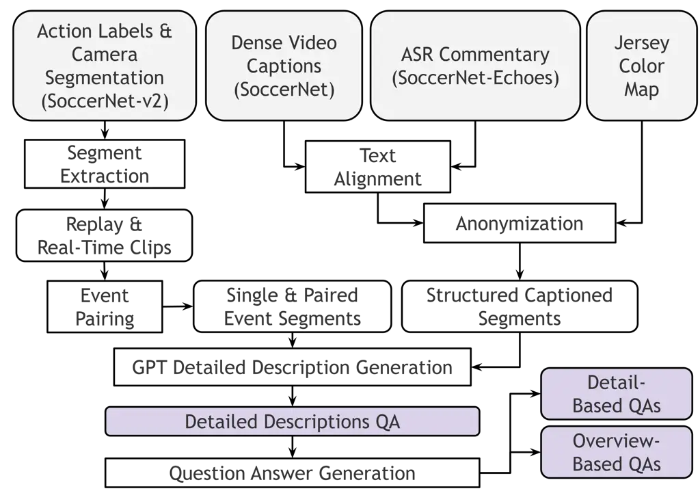
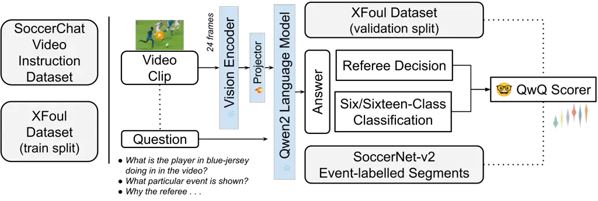
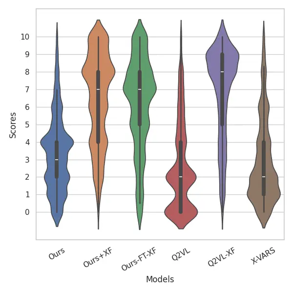
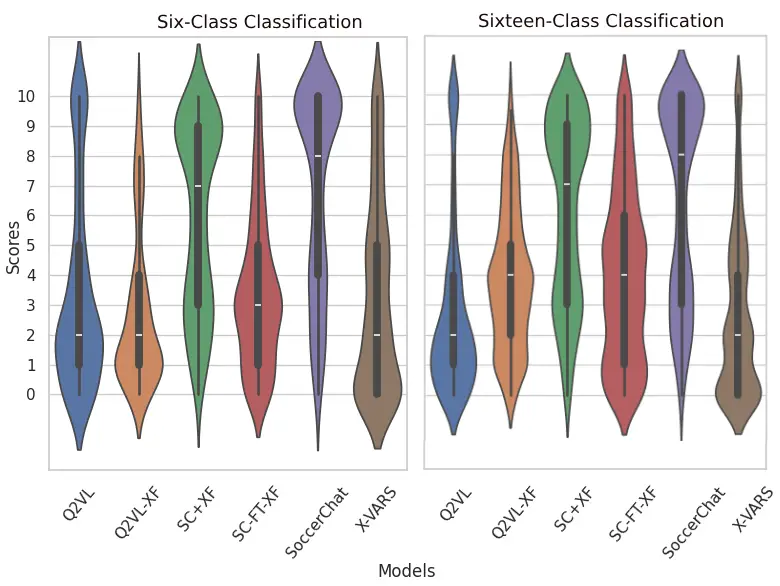
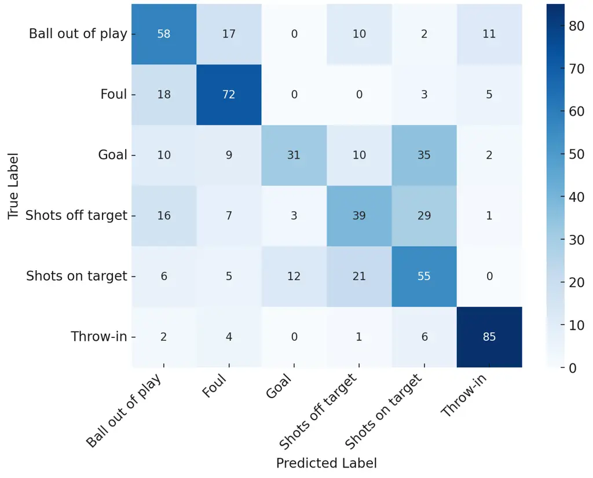
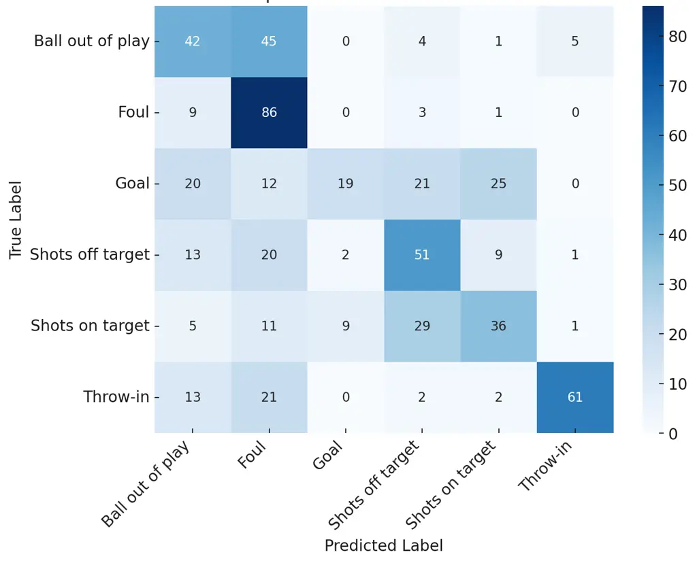
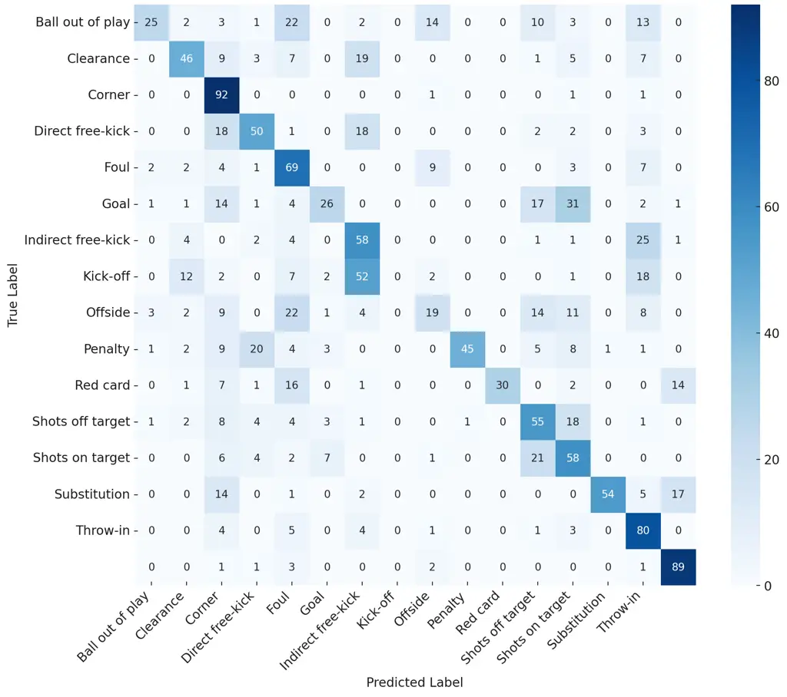

# SoccerChat: Integrating Multimodal Data for Enhanced Soccer Game Understanding

Sushant Gautam Affiliation: SimulaMet and OsloMet, Norway
Email: [sushant@simula.no](mailto:)    Cise Midoglu
Affiliation: Forzasys, Norway Email: [cisemidoglu@gmail.com](mailto:)   
Vajira Thambawita Affiliation: SimulaMet, Norway
Email: [vajira@simula.no](mailto:)    Michael A. Riegler
Affiliation: SimulaMet, Norway Email: [michael@simula.no](mailto:)   
Pål Halvorsen Affiliation: SimulaMet, OsloMet, and Forzasys, Norway
Email: [paalh@simula.no](mailto:)    Mubarak Shah
Affiliation: University of Central Florida, USA
Email: [shah@crcv.ucf.edu](mailto:)

###### Abstract

The integration of artificial intelligence in sports analytics has
transformed soccer video understanding, enabling real-time, automated
insights into complex game dynamics. Traditional approaches rely on
isolated data streams, limiting their effectiveness in capturing the
full context of a match. To address this, we introduce SoccerChat, a
multimodal conversational AI framework that integrates visual, and
textual data for enhanced soccer video comprehension. Leveraging the
extensive SoccerNet dataset, enriched with jersey color annotations and
automatic speech recognition (ASR) transcripts, SoccerChat is fine-tuned
on a structured video instruction dataset to facilitate accurate game
understanding, event classification, and referee decision making. We
benchmark SoccerChat on action classification and referee
decision-making tasks, demonstrating its performance in general soccer
event comprehension while maintaining competitive accuracy in referee
decision making. Our findings highlight the importance of multimodal
integration in advancing soccer analytics, paving the way for more
interactive and explainable AI-driven sports analysis.

[https://github.com/simula/SoccerChat](https://github.com/simula/SoccerChat)

## 1 Introduction

The integration of artificial intelligence (AI) into sports analytics
has transformed our understanding of complex game dynamics, particularly
in soccer. As the world’s most popular sport, soccer generates vast data
through matches, which, when effectively analyzed, provides valuable
insights into team strategies, player performances, and game mechanics.
Traditional analysis relies on manual annotation and isolated data
streams, limiting depth and efficiency. The rise of multimodal AI,
combining visual, auditory, and textual data, offers a holistic approach
to soccer video understanding, enabling automated, real-time analysis
that mirrors human-like comprehension.

Despite significant advancements, several challenges persist in the
realm of soccer video analysis. One primary issue is the scarcity of
comprehensive, annotated datasets that encompass the multifaceted nature
of soccer matches. Existing datasets often lack synchronization between
modalities or fail to capture the contextual nuances essential for
accurate interpretation. Moreover, current models may struggle with the
dynamic and unstructured environment of soccer games, where rapid
movements, frequent occlusions, and complex interactions are prevalent.
This complexity necessitates sophisticated models capable of integrating
and processing multimodal data to achieve a coherent understanding of
the game.

In response to these challenges, we introduce SoccerChat, a multimodal
conversational AI framework designed specifically for comprehensive
soccer video understanding. SoccerChat leverages the extensive SoccerNet
dataset, enhancing it with additional annotations such as jersey color
identification and automatic speech recognition (ASR) transcripts. This
enriched dataset serves as the foundation for training our model to
interpret complex game scenarios and generate contextually relevant
responses. By integrating visual, auditory, and textual data, SoccerChat
aims to emulate a human-like understanding of soccer matches,
facilitating real-time analysis and interactive applications.

This paper presents the following key contributions:

- •
  Dataset Enhancement: We have curated a unique video instruction
  dataset with 49,120 question-answer pairs derived from SoccerNet
  videos, enriched with jersey color annotations and ASR transcripts,
  providing a valuable resource for training and evaluating soccer
  analysis models.
- •
  Model Development: We introduce SoccerChat, a conversational AI model
  fine-tuned on the enhanced dataset, capable of understanding and
  generating contextually appropriate responses based on the multimodal
  inputs.
- •
  Comprehensive Evaluation: Through different experiments, we
  demonstrate SoccerChat’s proficiency in tasks such as event
  classification, and referee decision making.

To encourage reproducibility and further research, we release all
artifacts, including the SoccerChat dataset, fine-tuned model weights
for all variants, evaluation code, and intermediate files (LLM
generations and scores).

The remainder of this paper is structured as follows: Section 2 reviews
related work on soccer video analysis and multimodal datasets. Section 3
details the methodology, including dataset construction, model
configurations, and integration techniques. Section 4 presents the
experimental setup and evaluation protocols, followed by the results in
Section 5 and discussions in Section 6. Finally, Section 7 concludes the
paper and sets the stage for future research.

## 2 Related Work

### 2.1 Soccer Video Understanding

Soccer video understanding has gained significant traction in recent
years, driven by advancements in multimodal data integration \[13, 35,
33\]. This field focuses on analyzing player movements, game dynamics,
and contextual events in soccer matches \[45\]. Foundational tasks such
as player segmentation, detection, tracking, re-identification, and
keypoint detection are critical for understanding player interactions
and strategies \[8, 30\]. Beyond player analysis, key research areas
include action recognition, summarization, commentary generation, and
replay grounding \[17, 11, 30, 15, 14, 35\]. The evolution of soccer
video understanding also involves camera calibration, sports health
monitoring, intelligent refereeing, and tactical analysis \[7, 28, 21,
18\], all of which benefit from challenges like SoccerNet \[9\]. Recent
developments in Vision-Language Models (VLMs) and Multimodal Large
Language Models (MLLMs) have further propelled progress, enabling
comprehensive, real-time, and context-aware analysis of soccer
videos \[13, 47\].

### 2.2 Datasets for Soccer Video Analysis

The advancement of soccer video understanding relies heavily on robust
datasets \[17, 45\]. One seminal contribution is the SoccerNet dataset
comprising 500 complete soccer matches from major European leagues,
totaling 764 hours of footage \[17\]. It features 6,637 temporal
annotations for events such as goals, cards, and substitutions,
facilitating research in action spotting and event detection \[17\].
SoccerNet-v2 expanded this dataset with approximately 300,000 manual
annotations across 500 untrimmed broadcasts, introducing tasks like
camera shot segmentation and replay grounding \[11\]. The SoccerDB
dataset \[24\] offers 171,191 video segments from 346 high-quality
matches, supporting object detection, action recognition, temporal
action localization, and highlight detection tasks.Additionally, the
SoccerReplay-1988 dataset \[33\] includes 1,988 matches with event
labels and textual commentaries, serving as a rich resource for
multimodal research. Specialized datasets like SoccerNet-XFoul,
annotated by over 70 referees with 22,000 video-question-answer
triplets \[21\], and VARS, featuring multi-view clips with detailed foul
descriptions \[20\], address the complexities of refereeing decisions.
These datasets form the backbone for training and evaluating AI systems
in soccer video analysis.

### 2.3 Multimodal Soccer Video Understanding

Recent progress in multimodal models has significantly enhanced soccer
video understanding \[46, 47, 33\]. Vision-Language Models (VLMs) and
Multimodal Large Language Models (MLLMs) now excel in tasks such as
classification, segmentation, image-text retrieval, dense video
captioning, temporal alignment, and audio description \[40, 6, 42\].
Notably in soccer, the MatchVision model \[33\], leveraging
spatiotemporal information, supports event classification, commentary
generation, and multi-view foul recognition within a unified framework.
Similarly, the SPORTU benchmark \[47\] evaluates MLLMs across
multi-level sports reasoning tasks, including rule comprehension and
strategic analysis. The X-VARS model \[21\] addresses video-based
question answering, action recognition, and conversational interactions
tailored for professional soccer refereeing contexts. These models
demonstrate the potential of integrating visual, textual, and auditory
data for comprehensive soccer video understanding, although challenges
such as domain-specific adaptation and explainability remain \[21, 47\].

### 2.4 Multimodal Integration Techniques

Effective multimodal integration techniques are vital for robust soccer
video understanding \[13\]. The fusion of visual and textual data
enables contextual comprehension, with models embedding visual
information from images and videos into language model spaces \[31, 41,
40\]. The SoccerReplay-1988 dataset \[33\], combined with the
visual-language foundation model MatchVision, exemplifies successful
spatiotemporal integration, excelling in event classification and
commentary generation. Unified frameworks like SCBench and its
associated CommentarySet dataset \[47\] assess the performance of
video-language models in generating relevant commentary. Moreover,
multimodal deep learning approaches utilizing video, static images,
audio, and optical flow data have been employed for real-time event
detection, enhancing model performance by addressing labeling
inconsistencies and image quality issues \[36, 48, 38, 39\]. These
integration techniques are essential for developing AI systems capable
of delivering holistic insights in sports video analysis \[10\].

### 2.5 Datasets for Fine-Tuning Multimodal Models

Instruction datasets play a crucial role in fine-tuning multimodal
language models for soccer video analysis \[46, 21\]. TaskGalaxy,
introduced in 2025, comprises over 19,000 hierarchical task types \[5\],
enabling models to understand complex multimodal instructions. The
SPORTU benchmark further supports this by offering SPORTU-text,
featuring 900 multiple-choice questions with human-annotated
explanations, and SPORTU-video, containing 1,701 slow-motion clips with
12,048 QA pairs \[47\] . These resources evaluate the reasoning
abilities of multimodal models by integrating textual and visual
information \[43, 51\]. Fine-tuning typically involves supervised
learning, where models learn task-specific patterns and instructions
from these comprehensive datasets, significantly improving performance
in sports video understanding tasks \[27, 40, 25, 26\].

### 2.6 Multimodal AI in Soccer Analysis

The applications of multimodal AI in soccer analysis are diverse and
transformative \[2, 46\]. Real-time event detection benefits from deep
learning models that combine video, audio, static images, and optical
flow data \[50, 32, 1\]. Commentary generation systems, evaluated by
benchmarks like SCBench and CommentarySet dataset, provide contextually
relevant narratives \[16\]. Tactical analysis systems utilize player
tracking and state reconstruction to understand formations and
strategies \[44, 34\], while sports health monitoring assesses athlete
performance and workload through video analysis \[12, 19\]. Intelligent
refereeing systems, such as those developed using the SoccerNet-XFoul
dataset \[21\], integrate multimodal data to support complex
decision-making processes. Generative AI is also revolutionizing sports
content creation and post-production, allowing broadcasters to automate
routine tasks, generate match highlights rapidly, and engage fans
through social media \[35, 37, 23\]. These applications underscore the
potential of multimodal AI to enhance the depth, accuracy, and
interactivity of soccer video analysis.

### 2.7 Challenges and Future Directions

Despite significant advancements, several challenges persist in
multimodal AI for soccer video understanding \[49, 33\]. Adapting
vision-language models to specific professional domains like sports
refereeing remains complex, requiring explainability and domain-specific
knowledge \[20, 33, 47\]. Real-time analysis demands robust models
capable of handling multimodal data with minimal latency \[22\]. The
integration of generative AI and multimodal learning presents
opportunities for transforming content creation and fan engagement, but
requires careful handling of data quality and contextual accuracy \[4,
3\]. Future research should focus on developing explainable models
tailored to professional sports contexts, improving real-time processing
capabilities, and enhancing domain-specific adaptations \[46, 29\]. The
continuous evolution of large-scale, annotated datasets and
sophisticated multimodal frameworks will be pivotal in addressing these
challenges and advancing soccer video understanding \[24, 11, 33\].

## 3 Dataset

Figure 1: Pipeline that processes different dataset modalities to
generate question-answer (QA) pairs for the SoccerChat instruction
dataset.

This section outlines the comprehensive methodology employed for
creating, refining, and analyzing a soccer video chat instruction
dataset derived from multiple existing soccer datasets. Each step has
been explained to ensures reproducibility, accuracy, and scientific
rigor, enabling an in-depth review of the method used here for the
multimodal soccer video understanding and have been summarized in Figure

1.

### 3.1 Dataset Sources

The datasets utilized in this work include:

1.  1.  SoccerNet-v2 \[11\]: A large-scale dataset designed for analyzing
        broadcast soccer videos. It comprises 500 full-length matches from
        major European leagues, totaling approximately 764 hours of footage.
        Our focus is on two key aspects:
    - •
      Event Labels: Annotated action labels identifying specific soccer
      events (e.g., goals, fouls, substitutions) along with timestamps.
      The dataset includes around 300,000 manually annotated events
      covering 17 action classes, essential for associating key moments
      with corresponding video segments.
    - •
      Camera Shot Segmentation: Annotations specifying camera types and
      shot transitions (”replay” or ”real-time”), along with their start
      and end times. These annotations facilitate identifying
      transitions between replays and real-time gameplay within
      broadcast footage.

2.  2.  SoccerNet Dense Video Captioning \[30\]: Provides timestamped
        textual captions describing key soccer match events. These captions,
        sourced from online game portals, serve as a foundation for
        generating video segment descriptions and question-answer pairs. The
        dataset includes references to players and teams by name.
3.  3.  SoccerNetEchoes \[15\]: Contains automated speech recognition (ASR)
        transcripts from human commentary during soccer matches. While ASR
        output may introduce noise and references to elements not visible in
        the video or unrelated to the current match, it enhances contextual
        understanding of events.
4.  4.  Jersey Color Information: Annotated jersey colors of home and away
        teams across all games are used to generalize player and team
        identifiers. Since captions and commentary contain real player and
        team names, jersey color data anonymizes these references. This
        ensures that models focus on event dynamics rather than memorizing
        specific names, facilitating more generalizable representations.

### 3.2 Dataset Construction

The construction of the soccer video instruction dataset involved a
multi-step process, leveraging the aforementioned datasets to segment
the video and align information in different datasets to the segments
effectively.

#### 3.2.1 Soccer Clip Extraction

To extract relevant video clips, the SoccerNet datasets were utilized.
The segmentation process involved identifying intervals labeled as
either ”replay” or ”real-time” from Camera Shot Segmentation
annotations, ensuring that each clip included relevant actions without
any camera transitions. Action labels from SoccerNet-v2 were then paired
with real-time segments, ensuring consistency in camera type within a
$`\pm 5`$-second window centered on action events. Replay segments were
subsequently paired with corresponding real-time segments by identifying
transition points. These paired segments were refined to ensure that the
final clips were no longer than 10 seconds, with truncation applied as
necessary. This resulted in a dataset comprising 90,834 event clips.
Metadata for these clips, including their labels, timestamps, camera
annotations, and replay type was also extracted. ffmpeg was used to crop
the game videos into smaller clips.

#### 3.2.2 Identifying Consecutive Events

To produce short clips containing two events, we first identified
consecutive events with temporal proximity. Specifically, we selected
events that occurred between 1 and 7 seconds after the preceding event.
Each clip segment was then annotated as ”start,” ”end,” or ”unrelated”
based on its role within the pair. Next, we validated the segments to
ensure they were not simply replays of the same event. Valid event pairs
were further refined to ensure their boundaries fit within a maximum
duration of 10 seconds, and segments longer than 8 seconds were
additionally flagged. This process yielded 12,827 valid event pairs,
each with a calculated time difference.

### 3.3 Caption and Commentary Integration

To enhance the audio-visual modality with textual context, captions from
SoccerNet Dense Video Captioning and commentary from SoccerNetEchoes
were integrated. Specific player and team names were replaced with
jersey color references (e.g., ”red-jerseyed team”) to maintain
anonymity. The captions were aligned with video segments by matching
them within a window that begins 3 seconds after an event and ends 10
seconds after the event. This window was determined empirically,
reflecting the time required for humans to process game events before
producing captions or commentary.

ASR commentaries were filtered to exclude replay segments as well as
redundant words, reducing the likelihood of hallucinations by language
models in the ASR. The filtering process resulted in 10,615 single-event
clips and 2,982 paired-event clips with associated captions and
commentary. This integration provided a rich textual layer to accompany
the video data.

### 3.4 Data Fusion and Question-Answer Generation

#### 3.4.1 Structured Descriptions with GPT

Multimodal data fusion was employed to generate structured descriptions
and question-answer (QA) pairs for each soccer video clip. Event
information, jersey colors, captions, and commentary were integrated
into templated descriptions, ensuring contextual consistency.

Long Description Generation  
To anonymize team and player identifiers, jersey colors replaced
original names in captions, while commentary retained its original
identifiers. Prompt engineering guided the language model to exclude
name-based references in generated descriptions, ensuring uniformity.
Descriptions strictly adhered to visual content, avoiding direct mention
of captions or commentary as sources.

Detailed descriptions, typically 250–300 words, were generated using
GPT-3.5 Turbo , focusing solely on observed events. These descriptions
captured essential contextual details and served as foundational content
for QA generation. Each was paired with a long-form question encouraging
inference from visual data rather than textual annotations. Structural
variations between single-event and paired-event clips were addressed
through tailored prompts and scripts, ensuring consistency in outputs.

Overview-Based and Detail-Based QAs  
Overview-based QA provided a high-level synthesis of visible events,
emphasizing the game’s broader narrative rather than granular details.
Questions focused on overall flow, strategic developments, or key
moments within a clip, ensuring responses reflected general context.

Conversely, detail-based QA was applied to paired events, prioritizing
precise, fact-based responses. These QAs leveraged temporally related
segments to formulate questions about events occurring before or after a
given moment. Unlike the broader overview-based approach, detail-based
QAs focused on specific details while maintaining contextual alignment
with annotated data.

Long descriptions were systematically leveraged as source material, with
carefully designed prompts ensuring a structured balance between breadth
and depth. Responses were constrained to short, well-formed sentences
for clarity and informativeness. This dual approach enriched the dataset
by capturing both high-level understanding and granular insights,
enhancing annotation comprehensiveness.

## 4 Methodology

In this section, we present the architecture and implementation details
of SoccerChat, a model fine-tuned from Qwen2-VL to enhance comprehension
of soccer-related dialogues using a novel video instructional dataset.

### 4.1 SoccerChat Architecture

Figure 2: SoccerChat Model based on Qwen2-VL \[42\], illustrating the
integration of visual and textual data for enhanced soccer video
comprehension.

SoccerChat builds upon the robust foundation of Qwen2-VL, incorporating
specific adaptations to effectively process and understand soccer video
content.

#### 4.1.1 Base Model: Qwen2-VL-7B-Instruct

Qwen2-VL-7B-Instruct is an advanced vision-language model integrating a
Vision Transformer (ViT) with approximately 675 million parameters and
the Qwen2 language model, as shown in Figure 2. This architecture
enables seamless handling of both image and video inputs, facilitating
comprehensive multimodal understanding.

The model incorporates Naive Dynamic Resolution, which dynamically maps
images of varying resolutions into a corresponding number of visual
tokens, ensuring consistency between input data and inherent visual
information \[42\]. Additionally, it employs Multimodal Rotary Position
Embedding (M-RoPE) to decompose positional embeddings into temporal and
spatial components, effectively capturing and integrating 1D textual, 2D
visual, and 3D video positional information, thereby enhancing its
multimodal processing capabilities \[42\].

#### 4.1.2 Fine-Tuning for Soccer Video Processing

To tailor Qwen2-VL for soccer-specific applications, SoccerChat
incorporates the following modifications:

- •
  Dynamic Resolution Handling for Sports Videos: Soccer videos in
  SoccerNet has varying aspect ratios and resolutions. SoccerChat
  processes images in video frames by resizing them to maintain their
  original aspect ratio within a maximum pixel dimension of 28×28 per
  visual patch. This approach ensures that each image is represented by
  up to 128 visual tokens, preserving the integrity of visual
  information without distortion. For instance, a video with a 16:9
  aspect ratio can be resized to fit within the 28×28 patch grid,
  resulting in 112 patches, thereby staying within the 128-token limit.
- •
  Frame Sampling Strategy: Efficient temporal representation is crucial
  for understanding dynamic sports content. SoccerChat always extracts a
  total of 24 frames for each video segment, employing a frame sampling
  rate of 2.4 frames per second (FPS) for 10-second segment. For example
  for a segment of 16:9 aspect ratio, this results in a comprehensive
  token sequence of 24 frames × 112 tokens per frame = 2,688 tokens per
  segment , capturing essential temporal dynamics while maintaining
  computational efficiency.

While audio can provide valuable contextual information in sports
videos, the current implementation of SoccerChat does not directly
incorporate audio data, as Qwen2-VL does not support audio processing.

### 4.2 Model Configurations and Benchmarking

The SoccerChat training dataset was constructed by combining Long
description, Overview-Based and Detail-Based QAs. To assess the
effectiveness of our dataset in training a multimodal soccer video
understanding model, we developed and evaluated six model variants.
These models were designed to test different training data compositions
and configurations to identify the most effective approach for soccer
video analysis. SoccerChat is a Qwen2-VL-7B-Instruct model fine-tuned on
the SoccerChat dataset, utilizing structured descriptions and both
overview- and detail-based QAs. SC+XF extends SoccerChat by
incorporating the XFoul dataset during training to enhance understanding
of fouls and referee decisions. SC-FT-XF follows a sequential
fine-tuning approach, first on SoccerChat and then on XFoul, evaluating
whether this improves performance over direct training. Q2VL serves as a
general-purpose baseline, representing the publicly available
Qwen2-VL-7B-Instruct model. Q2VL-XF is a public checkpoint of the X-VARS
model trained on XFoul. Finally, X-VARS is fine-tuned solely on XFoul,
establishing a baseline for referee decision tasks.

### 4.3 Evaluation Tasks

The trained models were evaluated on multiple tasks to measure their
effectiveness in different aspects of soccer video understanding. These
tasks included question-answer validation using the XFoul dataset and
classification tasks using SoccerNet-v2.

#### 4.3.1 XFoul Question-Answer Validation

For question-answer validation, we utilized the XFoul validation set as
the ground truth. The answers provided by each model were compared
against natural sentence responses in the XFoul dataset. The objective
was to assess how well the models generate informative and contextually
accurate responses.

#### 4.3.2 Action Classification Tasks

To evaluate the models’ ability to classify soccer actions, we designed
two classification tasks using video segments from SoccerNet-v2. The
first task, Six-Class Classification, involved categorizing video clips
into six predefined labels: Ball out of play, Foul, Goal, Shots off
target, Shots on target, and Throw-in. Models were required to predict
the appropriate class and justify their selection, focusing on key
events from single-event segments. The second task, Sixteen-Class
Classification, extended the complexity by incorporating all labels from
SoccerNet-v2, with up to 100 videos per class. This setup included
additional labels appearing in segments with paired events, providing a
more comprehensive evaluation of the models’ classification
capabilities.

### 4.4 Evaluation Method

To quantitatively measure performance, we employed the QwQ Scorer model,
which assigned scores between 0 and 10 based on alignment with ground
truth annotations. 0 represents no alignment or correctness, 10
signifies perfect alignment and justification, and scores in between
indicate varying levels of partial correctness and alignment. For the
classification tasks, models were prompted to predict the appropriate
class label and justify their choice. The generated responses were
scored based on their correctness and explanatory quality. For the XFoul
validation task, the models’ answers were compared against the XFoul
ground truth responses, with scoring based on similarity and contextual
alignment.

To visually interpret the performance across different models, results
were analyzed and presented using grouped violin plots. These plots
illustrated the score distributions, enabling a comparative analysis of
the model variants and their effectiveness in various evaluation tasks.

## 5 Experiments

We conducted extensive experiments to evaluate the effectiveness of our
SoccerChat dataset and the proposed models on two primary tasks: XFoul
question-answer validation (referee decision-making) and action
classification using SoccerNet-v2. The evaluation relied on the QwQ
Scorer model, which assigns scores between 0 and 10 based on alignment
with ground truth annotations. Performance comparisons were visualized
using grouped violin plots to highlight score distributions across
different model configurations.

### 5.1 XFoul Question-Answer Validation (Referee Decision Task)

Figure 3: Score distribution of models for referee decision tasks shown
using violin plots with quartiles and median indicators

We evaluated multiple models on their ability to answer soccer
foul-related questions using the XFoul validation dataset. The score
distribution of different model variants for both tasks is shown in
Figure 3. The Q2VL-XF model achieved the highest average score of 6.81,
demonstrating strong alignment with referee decisions. The SC+XF model
followed closely with a score of 6.46, indicating that integrating
SoccerChat and XFoul datasets enhances referee decision performance. The
SC-FT-XF model scored slightly lower at 6.14, suggesting that
fine-tuning on XFoul after pretraining on SoccerChat is less effective
than training on both datasets simultaneously. The SoccerChat model,
which lacked XFoul training, scored significantly lower at 3.37,
highlighting its limited ability in referee decision despite broader
soccer understanding. Surprisingly, X-VARS, despite being exclusively
trained on XFoul, achieved only 2.91, comparable to Q2VL (2.58), which
had no soccer-specific training. This suggests that X-VARS may lack
robust general pretraining, limiting its effectiveness despite exposure
to XFoul data. Standard deviation across XFoul-trained models remained
around 2.6, indicating some response inconsistency. Overall, models
trained on XFoul significantly outperformed those without, emphasizing
the dataset’s importance in referee decision tasks.

### 5.2 Action Classification Tasks

We evaluated multiple models on two classification tasks—six-class and
sixteen-class event classification—to assess their performance in
detecting key soccer events. The score distribution of different model
variants for both tasks is shown in Figure 4.

Figure 4: Score distribution of models for six-class (left) and
sixteen-class (right) classification tasks.

#### 5.2.1 Six-Class Classification

Figure 5: Confusion matrix for the six-class classification task.

[TABLE]

Table 1: Summary of the performance of different model variants in the
six-class classification task.

The evaluation of six model variants for soccer action classification,
as shown in Table 1, revealed significant performance differences.

As shown in Figure 4 (left), SoccerChat emerged as the strongest
performer, achieving the highest mean score (6.80) with a 75th
percentile score of 10, indicating strong alignment with ground truth
annotations. SC+XF, trained on both SoccerChat and XFoul datasets, also
performed well with a mean score of 5.97, suggesting that foul-related
data integration did not significantly compromise general event
classification. However, SC-FT-XF underperformed with a mean score of
3.40, implying that fine-tuning on foul-related data diminished its
general classification ability. General-purpose models, Q2VL (3.44) and
X-VARS (3.26), struggled, reinforcing that models not specifically
trained on soccer-related datasets lack precise event classification
capabilities. The weakest performer, Q2VL-XF (2.72), demonstrated that
training exclusively on XFoul fails to generalize to broader soccer
actions. These results highlight the importance of balanced dataset
exposure for optimizing classification accuracy. The confusion matrix
for the validation set in Figure 5 shows that the SoccerChat model
correctly classifies most football events, particularly corners,
penalties, and yellow cards. However, it struggles with similar
categories, such as direct vs. indirect free-kicks and shots on vs. off
target.

#### 5.2.2 Sixteen-Class Classification

The sixteen-class classification task further evaluated six models using
the QwQ Scorer. As shown in Figure 4 (right), SoccerChat achieved the
highest mean score of 6.42, reinforcing its effectiveness in soccer
action classification. SC+XF followed with a score of 6.15, slightly
trailing SoccerChat, indicating that integrating XFoul data introduced
minor inconsistencies. SC-FT-XF (4.00) performed notably worse,
suggesting that fine-tuning on foul-related data negatively impacted
overall soccer event understanding. General-purpose models, Q2VL (2.72)
and X-VARS (2.70), recorded the lowest scores, confirming their struggle
in soccer-specific contexts. Q2VL-XF (3.88), trained on XFoul, slightly
improved upon Q2VL but remained significantly behind soccer-specialized
models. The overall trend demonstrated that models extensively trained
on the SoccerChat dataset (SoccerChat, SC+XF) outperformed those focused
solely on fouls (X-VARS, Q2VL-XF) or general-purpose vision-language
models (Q2VL).

## 6 Discussion

The evaluation results across different tasks consistently highlight the
critical role of training methodology, dataset specialization, and the
balance between general pretraining and fine-tuning. The Q2VL-XF model
achieved the highest performance in the XFoul question-answer validation
task due to its direct training on the XFoul dataset, allowing it to
capture intricate referee decision-making patterns. Similarly, SC+XF
performed well, demonstrating that joint training on SoccerChat and
XFoul enables models to understand both general soccer discussions and
referee decisions effectively. In contrast, SC-FT-XF, which was
sequentially fine-tuned on XFoul after SoccerChat, performed worse,
suggesting that training datasets together from the outset is a more
effective strategy than fine-tuning in stages.

The generally poor performance of SoccerChat and X-VARS in the XFoul
validation task suggests that while SoccerChat is strong in
soccer-related discussions, it lacks referee decision-specific
knowledge. Similarly, despite being trained exclusively on XFoul, X-VARS
underperformed due to its lack of a strong pretraining foundation. These
findings emphasize the importance of robust pretraining before
fine-tuning on specialized tasks. Additionally, general-purpose
vision-language models like Q2VL struggled the most, reinforcing the
need for domain-specific training to achieve strong soccer analysis
performance.

The classification tasks further reinforced these insights. SoccerChat
excelled in soccer event classification due to its structured dataset,
while SC+XF benefited from incorporating foul-specific knowledge without
losing general classification ability. However, SC-FT-XF underperformed,
likely due to overfitting on fouls, reducing its ability to generalize
to other soccer actions. Models trained exclusively on foul datasets,
such as X-VARS and Q2VL-XF, struggled with broader soccer
classification, indicating that recognizing fouls alone does not
translate into a comprehensive understanding of soccer dynamics. The
sixteen-class classification task further emphasized that fine-tuning on
XFoul after SoccerChat training could lead to catastrophic forgetting,
where the model becomes overly specialized in fouls at the cost of
broader soccer comprehension. Interestingly, SC+XF slightly
underperformed compared to SoccerChat in this task, suggesting that the
inclusion of XFoul data might introduce conflicting decision patterns,
making the model more cautious in general classification.

Overall, these experiments confirm that optimal performance in
soccer-related AI tasks requires both strong general pretraining and
carefully structured domain-specific training. Joint training on
multiple datasets proves to be more effective than sequential
fine-tuning, ensuring a balanced and contextually aware understanding of
both general soccer events and referee decision. These findings
highlight the importance of dataset selection and training strategy when
designing AI models for specialized sports analytics tasks.

## 7 Conclusion

In this paper, we presented SoccerChat, a multimodal AI framework
designed to enhance soccer game understanding through the integration of
visual, auditory, and textual data. By enriching the SoccerNet dataset
with jersey color annotations and ASR transcripts, we created a robust
instruction dataset to train and evaluate SoccerChat on key soccer
analytics tasks. Experimental results show that joint training on
multimodal data significantly improves event understanding and referee
decision making, outperforming general-purpose models and fine-tuned
baselines. However, sequential fine-tuning on specialized datasets
introduces trade-offs in generalizability, underscoring the need for
carefully structured dataset integration. Our work demonstrates the
potential of multimodal AI in sports analytics, setting the stage for
future research in real-time soccer analysis, interactive sports AI, and
explainable decision-making systems.

## References

- \[1\] Imad Afyouni, Zaher Al Aghbari, and Reshma Abdul Razack.
  Multi-feature, multi-modal, and multi-source social event detection: A
  comprehensive survey. _Information Fusion_, 79:279–308, 2022.
- \[2\] Peter Andrews, Oda Elise Nordberg, Stephanie Zubicueta Portales,
  Njål Borch, Frode Guribye, Kazuyuki Fujita, and Morten Fjeld.
  AiCommentator: A Multimodal Conversational Agent for Embedded
  Visualization in Football Viewing. In _ACM Conferences_, pages 14–34.
  Association for Computing Machinery, New York, NY, USA, 2024.
- \[3\] Staphord Bengesi, Hoda El-Sayed, M. D. Kamruzzaman Sarker, Yao
  Houkpati, John Irungu, and Timothy Oladunni. Advancements in
  Generative AI: A Comprehensive Review of GANs, GPT, Autoencoders,
  Diffusion Model, and Transformers. _IEEE Access_,
  12:69812–69837, 2024.
- \[4\] Yihan Cao, Siyu Li, Yixin Liu, Zhiling Yan, Yutong Dai,
  Philip S. Yu, and Lichao Sun. A Comprehensive Survey of AI-Generated
  Content (AIGC): A History of Generative AI from GAN to ChatGPT.
  _arXiv_, 2023.
- \[5\] Jiankang Chen, Tianke Zhang, Changyi Liu, Haojie Ding, Yaya Shi,
  Feng Cheng, Huihui Xiao, Bin Wen, Fan Yang, Tingting Gao, et al.
  TaskGalaxy: Scaling Multi-modal Instruction Fine-tuning with Tens of
  Thousands Vision Task Types. _arXiv_, 2025.
- \[6\] Zheyi Chen, Liuchang Xu, Hongting Zheng, Luyao Chen, Amr Tolba,
  Liang Zhao, Keping Yu, and Hailin Feng. Evolution and Prospects of
  Foundation Models: From Large Language Models to Large Multimodal
  Models, 2024.
- \[7\] Anthony Cioppa, Adrien Deliège, Floriane Magera, Silvio
  Giancola, Olivier Barnich, Bernard Ghanem, and Marc Van Droogenbroeck.
  _Camera Calibration and Player Localization in SoccerNet-v2 and
  Investigation of their Representations for Action Spotting_. IEEE
  Computer Society, 2021.
- \[8\] Anthony Cioppa, Silvio Giancola, Adrien Deliège, Le Kang, Xin
  Zhou, and Zhiyu Cheng. SoccerNet-Tracking: Multiple Object Tracking
  Dataset and Benchmark in Soccer Videos. In _IEEE/CVF Conference on
  Computer Vision and Pattern Recognition Workshops (CVPRW)_, pages
  19–20. IEEE, 2022.
- \[9\] Anthony Cioppa, Silvio Giancola, Vladimir Somers, Floriane
  Magera, Xin Zhou, Hassan Mkhallati, Adrien Deliège, Jan Held, Carlos
  Hinojosa, Amir M. Mansourian, et al. SoccerNet 2023 challenges
  results. _Sports Eng._, 27(2):1–18, 2024.
- \[10\] Victor R. A. Cossich, Dave Carlgren, Robert John Holash, and
  Larry Katz. Technological Breakthroughs in Sport: Current Practice and
  Future Potential of Artificial Intelligence, Virtual Reality,
  Augmented Reality, and Modern Data Visualization in Performance
  Analysis. _Appl. Sci._, 13(23):12965, 2023.
- \[11\] Adrien Deliège, Anthony Cioppa, Silvio Giancola, Meisam J.
  Seikavandi, Jacob V. Dueholm, Kamal Nasrollahi, Bernard Ghanem,
  Thomas B. Moeslund, and Marc Van Droogenbroeck. _SoccerNet-v2: A
  Dataset and Benchmarks for Holistic Understanding of Broadcast Soccer
  Videos_. IEEE Computer Society, 2021.
- \[12\] António Ferraz, Pedro Duarte-Mendes, Hugo Sarmento, João
  Valente-Dos-Santos, and Bruno Travassos. Tracking devices and physical
  performance analysis in team sports: a comprehensive framework for
  research—trends and future directions. _Front. Sports Act. Living_,
  5:1284086, 2023.
- \[13\] Sushant Gautam. Bridging Multimedia Modalities: Enhanced
  Multimodal AI Understanding and Intelligent Agents. In _ICMI ’23:
  Proceedings of the 25th International Conference on Multimodal
  Interaction_, pages 695–699. Association for Computing Machinery, New
  York, NY, USA, 2023.
- \[14\] Sushant Gautam, Cise Midoglu, Saeed Shafiee Sabet,
  Dinesh Baniya Kshatri, and Pål Halvorsen. Soccer Game Summarization
  using Audio Commentary, Metadata, and Captions. In _ACM Conferences_,
  pages 13–22. Association for Computing Machinery, New York, NY,
  USA, 2022.
- \[15\] Sushant Gautam, Mehdi Houshmand Sarkhoosh, Jan Held, Cise
  Midoglu, Anthony Cioppa, Silvio Giancola, Vajira Thambawita,
  Michael A. Riegler, Pål Halvorsen, and Mubarak Shah. SoccerNet-Echoes:
  A Soccer Game Audio Commentary Dataset. _arXiv_, 2024.
- \[16\] Kuangzhi Ge, Lingjun Chen, Kevin Zhang, Yulin Luo, Tianyu Shi,
  Liaoyuan Fan, Xiang Li, Guanqun Wang, and Shanghang Zhang. SCBench: A
  Sports Commentary Benchmark for Video LLMs. _arXiv_, 2024.
- \[17\] Silvio Giancola, Mohieddine Amine, Tarek Dghaily, and Bernard
  Ghanem. _SoccerNet: A Scalable Dataset for Action Spotting in Soccer
  Videos_. IEEE Computer Society, 2018.
- \[18\] F. R. Goes, L. A. Meerhoff, M. J. O. Bueno, D. M. Rodrigues,
  F. A. Moura, M. S. Brink, M. T. Elferink-Gemser, A. J. Knobbe, S. A.
  Cunha, R. S. Torres, and K. A. P. M. Lemmink. Unlocking the potential
  of big data to support tactical performance analysis in professional
  soccer: A systematic review. _European Journal of Sport Science_,
  21(4):481–496, 2021.
- \[19\] Carlos D. Gómez-Carmona, Alejandro Bastida-Castillo, Sergio J.
  Ibáñez, and José Pino-Ortega. Accelerometry as a method for external
  workload monitoring in invasion team sports. A systematic review.
  _PLoS One_, 15(8):e0236643, 2020.
- \[20\] Jan Held, Hani Itani, Anthony Cioppa, Silvio Giancola, Bernard
  Ghanem, and Marc Van Droogenbroeck. _X-VARS: Introducing
  Explainability in Football Refereeing with Multi-Modal Large Language
  Models_. IEEE Computer Society, 2024a.
- \[21\] Jan Held, Hani Itani, Anthony Cioppa, Silvio Giancola, Bernard
  Ghanem, and Marc Van Droogenbroeck. X-VARS: Introducing Explainability
  in Football Refereeing with Multi-Modal Large Language Models. In
  _IEEE/CVF Conference on Computer Vision and Pattern Recognition
  Workshops (CVPRW)_, pages 17–18. IEEE, 2024b.
- \[22\] Md Emran Hossain, Md Tanvir Rahman Tarafder, Nisher Ahmed,
  Abdullah Al Noman, Md Imran Sarkar, and Zakir Hossain. Integrating AI
  with Edge Computing and Cloud Services for Real-Time Data Processing
  and Decision Making. _ijmdsa_, 2(4):252–261, 2023.
- \[23\] IBM NewsRoom. Ibm study: Fan engagement and consumption of
  sports shifting, reveals new opportunities for technology integrations
  including ai.
  [https://newsroom.ibm.com/](https://newsroom.ibm.com/), 2024.
  Accessed: 2024-02-19.
- \[24\] Yudong Jiang, Kaixu Cui, Leilei Chen, Canjin Wang, and
  Changliang Xu. SoccerDB: A Large-Scale Database for Comprehensive
  Video Understanding. _arXiv_, 2019.
- \[25\] Chunggi Lee, Tica Lin, Hanspeter Pfister, and Chen Zhu-Tian.
  Sportify: Question Answering with Embedded Visualizations and
  Personified Narratives for Sports Video. _IEEE Trans. Visual. Comput.
  Graphics_, 31(1):12–22, 2024.
- \[26\] Muhammad Maaz, Hanoona Rasheed, Salman Khan, and Fahad Khan.
  VideoGPT+: Integrating Image and Video Encoders for Enhanced Video
  Understanding. _arXiv_, 2024.
- \[27\] Neelu Madan, Andreas Moegelmose, Rajat Modi, Yogesh S. Rawat,
  and Thomas B. Moeslund. Foundation Models for Video Understanding: A
  Survey. _arXiv_, 2024.
- \[28\] Cise Midoglu, Andreas Kjæreng Winther, Matthias Boeker, Susann
  Dahl Pettersen, Sigurd Pedersen, Nourhan Ragab, Tomas Kupka, Steven A.
  Hicks, Morten Bredsgaard Randers, Ramesh Jain, Håvard J. Dagenborg,
  Svein Arne Pettersen, Dag Johansen, Michael A. Riegler, and Pål
  Halvorsen. A large-scale multivariate soccer athlete health,
  performance, and position monitoring dataset. _Sci. Data_,
  11(553):1–19, 2024.
- \[29\] Tymoteusz Miller, Irmina Durlik, Adrianna Łobodzińska, Lech
  Dorobczyński, and Robert Jasionowski. AI in Context: Harnessing Domain
  Knowledge for Smarter Machine Learning. _Appl. Sci._,
  14(24):11612, 2024.
- \[30\] Hassan Mkhallati, Anthony Cioppa, Silvio Giancola, Bernard
  Ghanem, and Marc Van Droogenbroeck. _SoccerNet-Caption: Dense Video
  Captioning for Soccer Broadcasts Commentaries_. IEEE Computer
  Society, 2023.
- \[31\] Aditya Mogadala, Marimuthu Kalimuthu, and Dietrich Klakow.
  Trends in Integration of Vision and Language Research: A Survey of
  Tasks, Datasets, and Methods. _J. Artif. Intell. Res._,
  71:1183–1317, 2021.
- \[32\] Chinthakindi Balaram Murthy, Mohammad Farukh Hashmi,
  Neeraj Dhanraj Bokde, and Zong Woo Geem. Investigations of Object
  Detection in Images/Videos Using Various Deep Learning Techniques and
  Embedded Platforms—A Comprehensive Review. _Appl. Sci._,
  10(9):3280, 2020.
- \[33\] Jiayuan Rao, Haoning Wu, Hao Jiang, Ya Zhang, Yanfeng Wang, and
  Weidi Xie. Towards Universal Soccer Video Understanding.
  _arXiv_, 2024.
- \[34\] Markel Rico-González, José Pino-Ortega, Fabio Y. Nakamura,
  Felipe Arruda Moura, Daniel Rojas-Valverde, and Asier Los Arcos. Past,
  present, and future of the technological tracking methods to assess
  tactical variables in team sports: A systematic review. _Proceedings
  of the Institution of Mechanical Engineers, Part P: Journal of Sports
  Engineering and Technology_, 234(4):281–290, 2020.
- \[35\] Mehdi Houshmand Sarkhoosh, Sushant Gautam, Cise Midoglu,
  Saeed Shafiee Sabet, and Pål Halvorsen. Multimodal AI-Based
  Summarization and Storytelling for Soccer on Social Media. In _ACM
  Conferences_, pages 485–491. Association for Computing Machinery, New
  York, NY, USA, 2024.
- \[36\] Saman Sarraf and Mehdi Noori. Multimodal deep learning approach
  for event detection in sports using Amazon SageMaker. _AWS Machine
  Learning Blog_, 2021.
- \[37\] Husnain Sattar, Muhammad Shamil Umar, Eeman Ijaz, and
  Muhammad Umair Arshad. Multi-Modal Architecture for Cricket Highlights
  Generation: Using Computer Vision and Large Language Model. In _17th
  International Conference on Open Source Systems and Technologies
  (ICOSST)_, pages 20–21. IEEE, 2023.
- \[38\] Muhammad Bilal Shaikh, Douglas Chai, Syed Mohammed Shamsul
  Islam, and Naveed Akhtar. Multimodal fusion for audio-image and video
  action recognition. _Neural Comput. &. Applic._,
  36(10):5499–5513, 2024.
- \[39\] Wenwen Sun, Lin Cao, Yanan Guo, and Kangning Du. Multimodal and
  multiscale feature fusion for weakly supervised video anomaly
  detection. _Sci. Rep._, 14(22835):1–19, 2024.
- \[40\] Yunlong Tang, Jing Bi, Siting Xu, Luchuan Song, Susan Liang,
  Teng Wang, Daoan Zhang, Jie An, Jingyang Lin, Rongyi Zhu, et al. Video
  Understanding with Large Language Models: A Survey. _arXiv_, 2023.
- \[41\] Shagun Uppal, Sarthak Bhagat, Devamanyu Hazarika, Navonil
  Majumder, Soujanya Poria, Roger Zimmermann, and Amir Zadeh. Multimodal
  research in vision and language: A review of current and emerging
  trends. _Information Fusion_, 77:149–171, 2022.
- \[42\] Peng Wang, Shuai Bai, Sinan Tan, Shijie Wang, Zhihao Fan, Jinze
  Bai, Keqin Chen, Xuejing Liu, Jialin Wang, Wenbin Ge, et al. Qwen2-VL:
  Enhancing Vision-Language Model’s Perception of the World at Any
  Resolution. _arXiv_, 2024a.
- \[43\] Yiqi Wang, Wentao Chen, Xiaotian Han, Xudong Lin, Haiteng Zhao,
  Yongfei Liu, Bohan Zhai, Jianbo Yuan, Quanzeng You, and Hongxia Yang.
  Exploring the Reasoning Abilities of Multimodal Large Language Models
  (MLLMs): A Comprehensive Survey on Emerging Trends in Multimodal
  Reasoning. _arXiv_, 2024b.
- \[44\] Zhe Wang, Petar Veličković, Daniel Hennes, Nenad Tomašev,
  Laurel Prince, Michael Kaisers, Yoram Bachrach, Romuald Elie, Li Kevin
  Wenliang, Federico Piccinini, et al. TacticAI: an AI assistant for
  football tactics. _Nat. Commun._, 15(1906):1–13, 2024c.
- \[45\] Fei Wu, Qingzhong Wang, Jiang Bian, Ning Ding, Feixiang Lu, and
  Jun Cheng. A Survey on Video Action Recognition in Sports: Datasets,
  Methods and Applications. _IEEE Trans. Multimedia_,
  25:7943–7966, 2022.
- \[46\] Haotian Xia, Zhengbang Yang, Yun Zhao, Yuqing Wang, Jingxi Li,
  Rhys Tracy, Zhuangdi Zhu, Yuan-fang Wang, Hanjie Chen, and Weining
  Shen. Language and Multimodal Models in Sports: A Survey of Datasets
  and Applications. _arXiv_, 2024a.
- \[47\] Haotian Xia, Zhengbang Yang, Junbo Zou, Rhys Tracy, Yuqing
  Wang, Chi Lu, Christopher Lai, Yanjun He, Xun Shao, Zhuoqing Xie,
  et al. SPORTU: A Comprehensive Sports Understanding Benchmark for
  Multimodal Large Language Models. _arXiv_, 2024b.
- \[48\] Yang Xiao, Guxue Gao, Liejun Wang, and Huicheng Lai. Optical
  Flow-Aware-Based Multi-Modal Fusion Network for Violence Detection.
  _Entropy_, 24(7):939, 2022.
- \[49\] Zhengbang Yang, Haotian Xia, Jingxi Li, Zezhi Chen, Zhuangdi
  Zhu, and Weining Shen. Sports Intelligence: Assessing the Sports
  Understanding Capabilities of Language Models through Question
  Answering from Text to Video. _arXiv_, 2024.
- \[50\] Manzhu Yu, Myra Bambacus, Guido Cervone, Keith Clarke, Daniel
  Duffy, Qunying Huang, Jing Li, Wenwen Li, Zhenlong Li, Qian Liu,
  et al. Spatiotemporal event detection: a review. _International
  Journal of Digital Earth_, 13(12):1339–1365, 2020.
- \[51\] Chao Zhang, Zichao Yang, Xiaodong He, and Li Deng. Multimodal
  Intelligence: Representation Learning, Information Fusion, and
  Applications. _IEEE J. Sel. Top. Signal Process._,
  14(3):478–493, 2020.

Supplementary Material

## 8 SoccerChat Dataset Generation

This section presents the dataset generation templates, which facilitate
long description generation and short question-answering based on soccer
video clips.

Figure  illustrates the instruction template used for generating long
descriptions of video clips containing a single event. The instructions
define the LLM’s role in generating detailed and well-structured
descriptions based on fragmented information about a soccer clip. The
template ensures that the response is purely visual-based and does not
rely on commentary or captions explicitly. The input format for this
generation task for GPT-3.5 Turbo is presented in Figure , which
structures the event, jersey colors, supporting captions, and commentary
into a structured input format.

For generating detailed, event-based QAs, Figure  provides a structured
guideline. The system first plays the role of a human inquiring about
specific soccer events and then acts as an AI assistant providing
detailed responses. The generated questions focus on extracting
event-specific details directly from the provided captions while
ensuring that answers remain descriptive and insightful.

Table 2 provides randomly selected examples of question-answer pairs
from the SoccerChat dataset. Each example corresponds to a specific
soccer video clip, such as a corner kick or a throw-in leading to a shot
off target. The questions are designed to explore various aspects of the
events, including player actions, defensive tactics, and the overall
strategic context of the game. The answers provide comprehensive
insights into the visual content of the clips, simulating a detailed
soccer analysis.

These structured templates and examples contribute to enhancing
automatic video understanding by generating high-quality descriptive
text and detailed QAs for soccer game clips.

## 9 QwQ Scorer

To ensure a structured and consistent evaluation of model-generated
classifications, we employed the QwQ Scorer as described in Section 4.4,
which assigns a score between 0 and 10 based on alignment with ground
truth annotations. The scorer considers both the correctness of the
classification and the quality of the justification. Listing provides
the structured template used for scoring classification tasks
particularly for six-class classification as in 5.2.1. This template
defines the evaluation criteria, input format, and the expected
structured output in the form of a Python dictionary. The scorer ensures
that no two models receive the same score, enhancing the differentiation
in performance comparison. Additionally, it enforces alignment with six
predefined class labels—‘Ball out of play’, ‘Foul’, ‘Goal’, ‘Shots off
target’, ‘Shots on target’, and ‘Throw-in’—with an explicit ‘Wrong
Prediction’ category for misclassified outputs.

Input template for the long description generation particularly for
clips with single event in Listing . The angle brackets hold variables
received from the real dataset with round brackets showing the data
source.

Video Clip:

shows only \<(event)Goal\> event by

\<(home_jersey_color)red\>-jerseyed team in the match between teams in

\<(home_jersey_color)red\> vs

\<(away_jersey_color)blue\> jerseys.

---

Possible Supporting Caption:

\<(caption)red-jerseyed team scores a brilliant goal!\>

---

Possible Supporting Commentary:

\<(ASR)What a stunning finish! The home team takes the lead!\>

Instructions for long description generation particularly for clips with
single event as described in Section 3.4.

{

"role": "system",

"content":

"You will play two roles: a human asking questions related to describing
a short soccer video clip and an intelligent chatbot designed for video
description, storytelling and captioning. Your task is to generate a
detailed and descriptive paragraph based on the provided fragmented
information about a short video clip. "

"##TASK:"

"Users will provide event description, supporting caption and commentary
of a clip, and you will generate ONE conversation-like question and
answer related to describing the video and the game event in detail. The
question should ask to describe the video content in detail. The answer
should be a paraphrased and well-structured paragraph based on the
provided description, with a minimum of 250 words and a maximum of 300
words. "

"##INSTRUCTIONS:"

"- The question must be like a human conversation and focused on
describing the video and event in detail. "

"- Reject the information in supporting commentary and caption if not
relevant and logical to the event visible in the clip. "

"- The answer must be a paraphrased version of the provided information,
very detailed and descriptive, and within the specified word count. "

"- Act as if you are really seeing the visual content live and have no
access to the commentary and caption. Don’t mention about ’commentary’
and ’caption’ in the answer. "

"- Only use the supporting commentary and caption to be smart enough to
interpret the visual content, faking as though you got the information
from the video itself."

"- Avoid mentioning actual player names and team names from the
commentary as it is not visible in video; instead, refer to them by
jersey-color if possible, else ignore the information."

"- Begin answers with creative opening."

},

{

"role": "user",

"content":

f"The fragmented information: {game-details}. Please generate the
response in the form of a Python JSON dictionary string with keys ’Q’
for question and ’A’ for answer. Each corresponding value should be the
question and answer text respectively. "

"For example, your response should look like this: {’Q’: ’Your question
here...’, ’A’: ’Your answer here...’}. Emphasize that the answer should
focus on describing the video content as detailed as possible."

}

Instructions for long detail-based QAs generation particularly as
described in Section 3.4.

{

"role": "system",

"content": "You play two roles: a human asking questions related to a
short soccer video clip and an intelligent chatbot designed to help
people understand specific events within the clip. "

"Your task is to focus on soccer video summarization, which will be
utilized by users to comprehend key moments in soccer matches through
various questions based on the video content. "

"This summarization will assist in applications like analyzing game
highlights, generating summaries for sports content platforms, creating
brief overviews for coaching analysis, or providing quick updates for
fans. "

"You will first act as a human inquiring about specific events in a
soccer match and then switch roles to an AI assistant providing detailed
information based on the video’s content."

"------"

"##TASK:"

"You will be given a caption of a specific event from a short soccer
video clip. Based on this caption, you will generate a set of
conversational-style questions and answers related to the visible
events. \<event_info\> "

"The questions should be crafted to extract information DIRECTLY from
the provided caption, so that it or parts of it can serve as the
answers. "

"Generate THREE different descriptive and conversational style questions
and detailed answers based on the given information."

"------"

"##INSTRUCTIONS:"

"- The questions must be conversational and directly related to the
events in the soccer video clip. "

"- The questions should be designed to extract information DIRECTLY from
the given caption, so that it or parts of it can serve as the answers. "

"- The answers must be detailed, descriptive, and should directly
reference the information provided. "

"- The questions can focus on player actions, game strategies, scoring
opportunities, defensive tactics, or any key moments in the clip. "

"------"

"##SAMPLE QUESTIONS (based on given caption and event type):"

"- How did the player score the goal in the clip?"

"- What defensive strategy did the team use to prevent the goal?"

"- Describe the sequence of passes that led to the goal."

"- Was there an offside violation in the buildup to the goal?"

"- How did the goalkeeper react to the shot?"

},

{

"role": "user",

"content": "The video caption is: \<long_description\>. "

"Please generate the response in the form of a Python JSON, where JSON
strings start with keys ’Q’ for question and ’A’ for answer. Each
corresponding value should be the question and answer text respectively.
"

"The response should look EXACTLY like this : {’Q1’: ’Your first
question here...’, ’A1’: ’Your first answer here...’, ’Q2’: ’Your second
question here...’, ’A2’: ’Your second answer here...’, ’Q3’: ’Your third
question here...’, ’A3’: ’Your third answer here...’}. "

"Emphasize that ALL THREE questions must be designed to extract
information DIRECTLY from the given caption, so that it or parts of it
can serve as the answers, and provide detailed and descriptive answers."

}

| Question                                                                                                                                                                           | Answer                                                                                                                                                                                                                                                                                                                                                                                                                                                                                                                                                      |
| ---------------------------------------------------------------------------------------------------------------------------------------------------------------------------------- | ----------------------------------------------------------------------------------------------------------------------------------------------------------------------------------------------------------------------------------------------------------------------------------------------------------------------------------------------------------------------------------------------------------------------------------------------------------------------------------------------------------------------------------------------------------- |
| Single Event Clip: 40035_Corner.mp4                                                                                                                                                |                                                                                                                                                                                                                                                                                                                                                                                                                                                                                                                                                             |
| Can you describe the goalkeeper’s actions during the corner kick?                                                                                                                  | A player from the blue/red stripe-jerseyed team delivers the corner kick, and the goalkeeper of the yellow jerseys team leaps into action, swiftly coming off his line to intercept the corner and prevent any potential threat.                                                                                                                                                                                                                                                                                                                            |
| What key event is captured in the video clip?                                                                                                                                      | The video captures a corner event in a match between teams wearing blue/red stripe jerseys and yellow jerseys.                                                                                                                                                                                                                                                                                                                                                                                                                                              |
| How does the goalkeeper’s play reflect the intense tactical battle in the match?                                                                                                   | The strategic positioning and decisive action of the goalkeeper reflect the intense tactical battle unfolding in the match, as both teams seek to gain the upper hand and secure a positive outcome.                                                                                                                                                                                                                                                                                                                                                        |
| Two Event Clip: 113345_Throw-in–Shotsofftarget.mp4                                                                                                                                 |                                                                                                                                                                                                                                                                                                                                                                                                                                                                                                                                                             |
| How did the goalkeeper from the turquoise/teal-jerseyed team respond to the long-range shot attempted by the red/white stripe-jerseyed player?                                     | The goalkeeper from the turquoise/teal-jerseyed team adeptly responded to the long-range shot attempted by the red/white stripe-jerseyed player by showcasing remarkable anticipation and agility. This response involved positioning, reflexes, and decision-making to make a comfortable save, demonstrating the goalkeeper’s skill in protecting the goal.                                                                                                                                                                                               |
| Could you briefly summarize the video content?                                                                                                                                     | The video showcases a strategic throw-in by the red/white stripe-jerseyed team, followed by a skilled long-range shot towards the goal, which was met with an adept save by the goalkeeper from the turquoise/teal-jerseyed team. It captures the intense battle and the skillful gameplay between the two teams.                                                                                                                                                                                                                                           |
| What are the main events shown in the video?                                                                                                                                       | The main events in the video include the red/white stripe-jerseyed team taking a throw-in to showcase their strategic gameplay, followed by a player attempting a long-range shot towards the bottom left corner of the goal, which was skillfully saved by the goalkeeper from the turquoise/teal-jerseyed team.                                                                                                                                                                                                                                           |
| What does the skillful play by the red/white stripe-jerseyed team and the reaction by the turquoise/teal-jerseyed team’s goalkeeper reveal about the battle between the two teams? | The skillful play by the red/white stripe-jerseyed team and the reaction by the turquoise/teal-jerseyed team’s goalkeeper reveal the intense battle between the two teams. The red/white stripe-jerseyed team persistently attempts to breach the opposition’s defense through skillful passing and opportunistic long shots, while the turquoise/teal-jerseyed team’s goalkeeper remains alert and well-positioned to defend their goal. This highlights the competitive nature of the match and the strategic efforts of both teams to gain an advantage. |
| What strategic gameplay did the red/white stripe-jerseyed team showcase during the throw-in?                                                                                       | During the throw-in, the red/white stripe-jerseyed team showcased strategic gameplay by making calculated decisions to maintain possession and advance their position on the field. This may have involved specific player movements, strategic passing options, or tactical positioning to create potential scoring opportunities based on the situation at hand.                                                                                                                                                                                          |

Table 2: Random examples with questions and answers from the SoccerChat
dataset

Template for QwQ Scorer used for performance evaluation particularly for
classification as described in Section 4.4. The scorer assigns a score
between 0 and 10 based on the alignment of model-generated responses
with ground truth annotations. The template provides a structured format
for inputting predictions, justifications, and assessing correctness and
explanatory quality. This ensures consistent evaluation across
classification tasks.

The task is to classify the outputs of different models based on whether
they correctly identified the given class. The score reflects the
model’s ability to correctly classify the Query into the Actual Label
provided.

\### Scoring Criteria:

- 0: Completely incorrect classification (model’s answer does not match
  the Actual Label at all).

- 10: Fully correct classification (model’s answer exactly matches the
  Actual Label).

\### Inputs:

Query: {query}

Actual Label: "{label}"

LLM-Answers: {answers}

\### Task:

For each model’s answer provided in the LLM-Answers dictionary:

1. Assess whether the model’s output correctly identifies the Actual
   Label.

2. Assign a score from 0 to 10 based on the correctness of the
   classification. If the classification is fully correct, assign a score
   of 10. If it is completely incorrect, assign a score of 0. Partial
   correctness or near misses can be scored in between.

3. Ensure no two models have the same score to clarify the comparison.

4. predicted_class could be ’Wrong Prediction’ if the model’s answer is
   different from the six possible classes

Output a dictionary enclosed by ‘‘‘ on both sides with three keys:

- "scores": A dictionary where each key is the model name from the
  LLM-Answers dictionary, and the value is the score (range 0-10) assigned
  to the model’s answer.

- "reason": A dictionary where each key is the model name, and the
  value is a string explanation for why the score was assigned to the
  respective model.

- "predicted_class": A dictionary where each key is the model name, and
  the value is one best predicted class only out of the six possible
  classes: ’Ball out of play’, ’Foul’, ’Goal’ , ’Shots off target’, ’Shots
  on target’, or ’Throw-in’. Output ’Wrong Prediction’ if the the model’s
  answer does not match any of the possible classes.

\### Output:

No coding is required. Directly provide the expected output result as a
valid Python JSON dict of dict enclosed in ‘‘‘.

## 10 More Evaluation Results

Figure 6: Confusion matrix for SC+XFoul model for six-class
classification problem.

Figure 7: Confusion matrix for SoccerChat model for sixteen-class
classification problem.

|                    |           |        |      |         |
| ------------------ | --------- | ------ | ---- | ------- |
| Class              | Precision | Recall | F1   | Support |
| Ball out of play   | 0.76      | 0.25   | 0.38 | 100     |
| Clearance          | 0.62      | 0.46   | 0.53 | 99      |
| Corner             | 0.46      | 0.97   | 0.62 | 95      |
| Direct free-kick   | 0.57      | 0.53   | 0.55 | 95      |
| Foul               | 0.40      | 0.69   | 0.51 | 100     |
| Goal               | 0.62      | 0.26   | 0.37 | 100     |
| Indirect free-kick | 0.36      | 0.60   | 0.45 | 97      |
| Kick-off           | 0.00      | 0.00   | 0.00 | 100     |
| Offside            | 0.39      | 0.19   | 0.26 | 98      |
| Penalty            | 0.98      | 0.45   | 0.62 | 100     |
| Red card           | 1.00      | 0.41   | 0.58 | 74      |
| Shots off target   | 0.43      | 0.55   | 0.48 | 100     |
| Shots on target    | 0.39      | 0.58   | 0.47 | 100     |
| Substitution       | 0.98      | 0.56   | 0.71 | 97      |
| Throw-in           | 0.47      | 0.80   | 0.59 | 100     |
| Yellow card        | 0.73      | 0.91   | 0.81 | 98      |
| Accuracy           |           |        | 0.51 | 1553    |
| Macro avg          | 0.54      | 0.48   | 0.47 | 1553    |
| Weighted avg       | 0.57      | 0.51   | 0.49 | 1553    |

Table 3: Classification Report for SoccerChat Model for Sixteen-Class
Classification Problem.

[TABLE]

Table 4: Summary of the Sixteen-Class Classification Task.

|                  |           |        |          |         |
| ---------------- | --------- | ------ | -------- | ------- |
| Class            | Precision | Recall | F1-score | Support |
| Ball out of play | 0.53      | 0.58   | 0.55     | 100     |
| Foul             | 0.63      | 0.72   | 0.67     | 100     |
| Goal             | 0.67      | 0.31   | 0.42     | 100     |
| Shots off target | 0.48      | 0.39   | 0.43     | 100     |
| Shots on target  | 0.42      | 0.55   | 0.48     | 100     |
| Throw-in         | 0.82      | 0.85   | 0.83     | 100     |
| Wrong Prediction | 0.00      | 0.00   | 0.00     | 0       |
| Accuracy         |           |        | 0.57     | 600     |
| Macro avg        | 0.51      | 0.49   | 0.48     | 600     |
| Weighted avg     | 0.59      | 0.57   | 0.57     | 600     |

Table 5: Classification Report for SoccerChat Model for Six-Class
Classification Problem.

Figure 6 presents the confusion matrix for the SC+XFoul model on the
six-class classification task. The matrix highlights the model’s
performance across different event categories, showing patterns in
misclassification and the overall distribution of predictions.

Similarly, Figure 7 depicts the confusion matrix for the SoccerChat
model on the sixteen-class classification problem. This visualization
provides insights into how well the model differentiates between various
football events, highlighting both strong and weak classification areas.
One thing to be noted is that Kick-off event isn’t classified at all as
examples of these types aren’t present in the SoccerChat dataset.

The classification report for the sixteen-class problem, shown in
Table 3, provides a breakdown of precision, recall, and F1 scores for
each event type. Notably, some classes, such as ”Yellow card” and
”Throw-in,” achieve higher recall and F1 scores, whereas others, such as
”Kick-off” and ”Offside,” exhibit lower performance, indicating
challenges in their correct classification.

Table 4 summarizes the overall performance of different models in the
sixteen-class task. The SoccerChat model achieves the highest weighted
F1-score, Cohen’s Kappa, and Matthews Correlation Coefficient (MCC),
outperforming alternative approaches such as Q2VL and X-VARS.

For the six-class classification problem, Table 5 presents the
classification report of the SoccerChat model. The results indicate that
”Throw-in” and ”Foul” classes achieve relatively high performance,
whereas ”Goal” and ”Shots off target” remain more challenging. The
overall accuracy for this task is 57

These results collectively provide a comprehensive evaluation of the
models across different classification tasks, highlighting both their
strengths and areas requiring further improvements.
