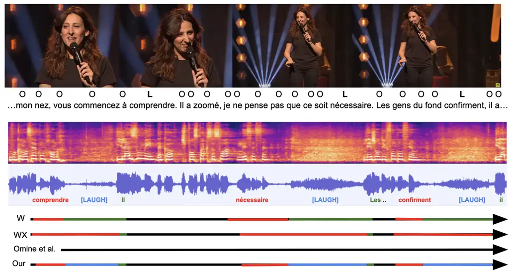

# StandUp4AI: A New Multilingual Dataset for Humor Detection in Stand-up Comedy Videos

Valentin Barriere ^(†)^(†)thanks: Same supervision
Affiliation: Universidad de Chile – DCC Affiliation: Santiago, Chile
Email: [vbarriere@dcc.uchile.cl](mailto:)    Nahuel Gomez
Affiliation: Universidad de Chile – DIE Affiliation: Santiago, Chile
Email: [nahuel.gomez@ug.uchile.cl](mailto:)    Leo Hemamou
Affiliation: Without Affiliation Affiliation: Paris, France
Email: [l.hemamou@gmail.com](mailto:)    Sofia Callejas
Affiliation: INRIA Chile Affiliation: Santiago, Chile
Email: [sofia.callejas@inria.cl](mailto:)    Brian Ravenet^(\*)
Affiliation: Université Paris Saclay – LISN Affiliation: Orsay, France
Email: [brian.ravenet@universite-paris-saclay.fr](mailto:)

###### Abstract

Aiming towards improving current computational models of humor
detection, we propose a new multimodal dataset of stand-up comedies, in
seven languages: English, French, Spanish, Italian, Portuguese,
Hungarian and Czech. Our dataset of more than 330 hours is automatically
annotated in laughter (from the audience), and the subpart left for
model validation is manually annotated. Contrary to contemporary
approaches, we do not frame the task of humor detection as a binary
sequence classification, but as word-level sequence labeling, in order
to take into account all the context of the sequence and to capture the
continuous joke tagging mechanism typically occurring in natural
conversations. As par with unimodal baselines results, we propose a
method for e propose a method to enhance the automatic laughter
detection based on Audio Speech Recognition errors. Our code and data
are available online:
[https://tinyurl.com/EMNLPHumourStandUpPublic](https://tinyurl.com/EMNLPHumourStandUpPublic)

## 1 Introduction and Related Works

Figure 1: Overview of humor detection modeled as a sequence labeling
task, and the method relying on complementary errors from the ASR
outputs. Omine et al. (2024) model detected no laughter. Video
[available here](https://youtu.be/OxvCVuGQ-uk?feature=shared&t=42)

Humor detection remains a challenging tasks for computer systems
Kalloniatis and Adamidis (2024); Hyun et al. (2024). Yet, such
mechanisms could be a massive improvement, in particular for
conversational interactive systems such as chatbots and socially
interactive agents. These kind of systems, which are designed to
simulate a natural human-like conversation and its structure Ludusan and
Schuppler (2022), often struggle to identify or handle humorous attempts
from the user, leading to inefficient and frustrating experiences
Zargham et al. (2023). While different theories of humor exist, most of
them have in common the idea that humor emerges when the current
situation surprisingly deviates from our expectations Warren and McGraw
(2016). Generally, a joke or funny story is based on the following
sequence : the setup of a joke introduces some expectations on how a
story usually ends and the punchline reveals the reality and the
unexpected (and funny) twist of the story Martin and Ford (2018).
Sometimes, additional funny comments called tags can be added around and
after the punchline to maintain the momentum of the laughter.
Conversational humor often stems from unexpected deviations in content,
behavior, or context, with timing and intensity being critical yet
unpredictable triggers Wyer and Collins (1992). Despite theoretical
models, comedians rely on live testing to refine timing, phrasing, and
delivery for audience engagement Raskin (1979), as responses depend on
cultural and contextual factors. This highlights the complexity of
modeling humor computationally, necessitating diverse datasets to
capture its multifaceted dynamics. Stand-up comedy, due to its nature
aiming at recreating the spontaneity of everyday conversational humor,
is a great context for studying these mechanisms and structures with
computers.

Many previous works investigating computational techniques to process
humor relied on corpus of people speaking in less natural and more
conventional and standardized ways. For instance, in Purandare and
Litman (2006); Bertero and Fung (2016); Patro et al. (2021); Liu et al.
(2024), the authors relied on acted data from sitcoms. The UR-FUNNY and
Ted Laughter Hasan et al. (2019); Chen and Lee (2017) datasets are
composed of TED talks, which contain less outbursts of laughter and
poorer language diversity than stand-up comedy. Most of the work
participating in The MuSE challenges for the automatic estimation of
humor are relying on public interviews Amiriparian et al. (2023);
Amiriparian et al. (2024), using the Passau-Spontaneous Football Coach
Humour dataset Christ et al. (2022). Additionally, while some of the
previous work explored other languages Chauhan et al. (2021), most of
them are investigating english humorous content only. Another early work
on stand-up humor is the one of Turano and Strapparava (2022), which
analyzes 90 scripts of 68 comedians, in English only. The closest work
from ours would be the one described in Kuznetsova and Strapparava
(2024), which proposed a 40 hours dataset in Russian and English.

Most humor detection models in videos treat humor as a sequence
classification task, identifying punchlines only at the end of a
sequence Choube and Soleymani (2020); Hasan et al. (2019); Kuznetsova
and Strapparava (2024); Liu et al. (2024). However, multiple laughs can
occur within a single sentence, sometimes consecutively. To address
this, we reframe the task as sequence labeling, enabling continuous
prediction of audience laughter throughout the joke, rather than relying
on end-only classification.

In this article, we are presenting multiple contributions towards the
development of humor detection models. First, we collected and annotated
a dataset of stand-up comedy performance in different languages
extracted from online videos. This dataset is the largest and most
linguistically diverse multilingual dataset of live comedy performances.
It has the ambition to be a reference dataset for any type of humor
modeling tasks. Second, we propose a original methodology for the task
of humor detection by using a sequence labeling approach we adapted to
automatically predict laughter during a performance. Third, this led us
to came up with new techniques for handling errors in automatic
transcription and automatic laughter detection, validated on a manually
laughter annotated test set. Fourth, we present first results of
sequence labeling models built on our dataset and applied to predict
laughter to be used as baselines by the community.

| Youtube Channels            | Language   | Videos | Hours | Words     | Laughter |
| --------------------------- | ---------- | ------ | ----- | --------- | -------- |
| Comedy Central              | English    | 263    | 51.2  | 442,904   | 25,772   |
| Comedy Central UK           |            | 319    | 18.6  | 174,369   | 13,486   |
| Comedy Central Latam        | Spanish    | 971    | 59.2  | 499,329   | 21,708   |
| Comedy Central España       |            | 404    | 18.0  | 150,256   | 5,215    |
| Comedy Central Italia       | Italian    | 567    | 55.0  | 433,417   | 12,248   |
| Comedy Central Magyarország | Hungarian  | 73     | 11.4  | 78,002    | 6,875    |
| Paramount Network CZ        | Czech      | 123    | 11.5  | 75,806    | 6,129    |
| Montreux Comedy             | French     | 652    | 86.0  | 814,727   | 26,789   |
| Comedy Central Brasil       | Portuguese | 245    | 23.4  | 218,592   | 9,972    |
| Total                       | MLing      | 3,617  | 334.2 | 2,887,402 | 128,194  |

Table 1: The collection of videos retained for the dataset. Laughter is
the number of words labeled as laughter.

## 2 Dataset

The StandUp4AI dataset is composed of 3,617 standup videos in 7
languages. It contains the associated transcriptions and audience
laughters that have been automatically refined, of comedians during
Stand-up comedy performances in various languages. To build the dataset,
we first collected a specific set of videos of Stand-up comedy from the
internet, we then performed automatic transcription on these videos and
we finally fixed some errors in the outputs by developing improved
transcription and automatic laughter annotation techniques (overview in
Figure 1).

### 2.1 Video Recollection

In total, we gathered 334 hours of video in 7 morphologically diverse
languages¹¹ 1 latin, germanic, slavic, and uralic which is around 3M
words and 130k laughter labels. Table 1 illustrates the quantity of
videos collected per channel and per language. On each channels, we
excluded videos from the Youtube Shorts section and videos where more
than one comedian appeared.

### 2.2 Automatic laughter detection

The next step was to run a task of automatic laughter detection on the
videos. The detected laughter would be used to identify and
automatically annotate funny events in the performance. We originally
based this task on the approach of Kuznetsova and Strapparava (2024),
who used an off-the-shelf model Gillick et al. (2021). In our case, we
used the state-of-the-art model of Omine et al. (2024), which has shown
better performances for this task.

### 2.3 Transcript extraction

We perform transcript extraction on each sample using two Audio Speech
Recognition (ASR): Whisper Radford et al. (2023) and WhisperX Bain
et al. (2023). These tools allowed us to obtain the timestamped full
script of the comedians’ performance.

### 2.4 ASR-Based Automatic Laughter Detection

#### Error Detection

The timestamps obtained from the ASR were inconsistent for words around
events such as laughters and "mouth noises" that activate the ASR’s
voice activity detection. Such words were frequently assigned an
incorrect begin or end timestamps, as the laughter duration would be
added to the word duration (and the laughter not detected). As this
would make the data unreliable to build our model, we engineered a
correction by aggregating the outputs of both Whisper and WhisperX. When
laughters are perturbating the timestamps of surrouding words, Whisper
tends to merge the laughter duration with the next word while WhisperX
tends to merge it with the previous one (see Table 6 in Appendix). To
fix this, we first searched for the longer-in-time words, and checked
for intersections between both transcripts. Once found, we kept the
begin and end timestamps of the intersection to insert a new laughter in
the resulting transcript, and we removed the intersection from the
previous and next word timestamps. This method provides a solution to
the problem of erroneous timestamps, and extract potential candidates
not discovered by the initial laughter detector.

#### Automatic Candidate Laughter Validation

In order to select or not a candidate laughter, we manually annotated
the candidates detected in 50 videos with respect to whether or not they
were real laughter. We subsequently train a Random Forest classifier on
these examples using classical acoustic features. More details are
available in Appendix B.

| Lang.      | Laughters | CS   | EN   | ES   | FR   | HU   | IT   | PT   | Avg. |
| ---------- | --------- | ---- | ---- | ---- | ---- | ---- | ---- | ---- | ---- |
| Multiling. | Raw       | 47.4 | 40.4 | 41.4 | 41.8 | 48.4 | 39.5 | 36.8 | 42.2 |
|            | Enhanced  | 47.1 | 40.3 | 40.4 | 42.4 | 48.7 | 39.5 | 38.1 | 42.4 |
| Monoling.  | Enhanced  | 41.8 | 38.4 | 37.4 | 42.6 | 45.4 | 35.6 | 34.4 | 39.4 |

Table 2: F1 scores by model language and data. Enhanced means trained
with laughter from our ASR-based method.

### 2.5 Laughter Detection as Sequence Labeling

We prepare the task of laughter prediction as a sequence labeling task,
motivated by the idea that a simple sentence can contains many humorous
events that would expect laughter. Each word was labeled with a binary
tag indicating whether laughter occurs right after it and before the end
of next word. In this way, the model predicts in advance if there will
be a laughter event. Further details are provided in Appendix A.

### 2.6 Test Set Annotation

Following the protocol of Kuznetsova and Strapparava (2024), we manually
annotate a test set composed of 70 videos (10 per language). These
samples have been manually annotated in laughs with precise timestamps
at 0.1 seconds, using the audio file and audacity. The ASR outputs have
been manually checked to ensure that the labels are true. The test set
is used to validate both the laughter detection method based on the ASR
outputs and acoustic classifier, and the sequence labeling models.

### 2.7 Other Features

Even though we did not add them in the current baseline experiments, we
also release a set of features we extracted from the data. We extracted
Action Units using the LibreFace library Chang et al. (2024), poses
using the MMdetection and MMpose libraries Chen et al. (2019);
Contributors (2020), and the camera angle changes using PySceneDetect
library Castellano (2014). We release these features with the data and
plan to investigate how they can contribute to the task in future works.

## 3 Experiments and Results

We conducted two types of experiments. The first validate the proposed
technique to find new outbursts of laughter that were not detected using
the off-the-shelf model of Omine et al. (2024). The second is the
sequence labeling task.

### 3.1 ASR-based Laughter Detection Validation

Using the proposed method, we obtained 376 outburst candidates on 50
videos that were manually annotated into real laughter or other event.
208 of them were real outbursts of laughter non previously detected by
the off-the-shelf laughter detection model. We extracted acoustic
features with librosa Brian McFee et al. (2015) and trained a random
forests to binary detect an outburst. Results are shown in Table 3. The
overall method allows detecting approximately 3 new outbursts of
laughter per video. More details on the features and models are
available in Appendix B.

|          | Prec. | Rec. | F1   |
| -------- | ----- | ---- | ---- |
| Other    | 0.79  | 0.87 | 0.82 |
| Laughter | 0.89  | 0.81 | 0.85 |
| Macro    | 0.84  | 0.84 | 0.83 |

Table 3: Performances of the Random Forest Candidate Laughter Classifier

We validate the whole laughter detection system on the manually
annotated test set task with the Intersection over Union (IoU). With a
IoU threshold of 0.2,²² 2 if IoU ¿ 0.2, prediction is considered as
positive we obtained a F1-score of 0.51 using the off-the-shelf model,
versus a F1-score of 0.58 using our method. More details in Appendix D.

### 3.2 Sequence Labeler

We trained unimodal pretrained transformer models Lample and Conneau
(2019) based on the text input in order to predict laughter at the
word-level in a binary way. A maximum sequence length of 512 was used
with a stripe of 128 when cutting from the same monologue to ensure past
context. We optimized it with Adam Kingma and Ba (2014), 10 epochs, and
a learning rate of $`1e-5`$. We validate the models with classification
metrics and not rigid sequence classification metrics such as seqeval
Nakayama (2018) because of the task difficulty.

#### Experimental Protocol

The transformers library Wolf et al. (2019) was used to access the
pre-trained xlm-roberta-base and to fine-tune sequence labeling models.
The random forests were trained using scikit-learn Pedregosa et al.
(2012). Experiments were run using torch 2.1.2 Abadi et al. (2016),
transformers 4.46.3 Wolf et al. (2019), a GPU Nvidia RTX-A6000 and CUDA
12.2.

#### Results

Results are shown in Table 2. First, the multilingual models trained
with the raw outputs obtained from Omine et al. (2024)’s laughter
detection (Raw) and the ASR-based one (Enhanced) are compared. Results
show that the models trained on the cleaned data are reaching higher
performances, indicating a second time the quality of ti, as the
proposed treatment helps to enhance the quality as the data as training
material. Second, the results of the multilingual model are compared
with the ones of the monolingual models, highlighting the interest of
the diversity of our corpus.

## 4 Conclusion

In this article we presented the most diverse dataset of multilingual
stand-up comedy performance at the date of today, StandUp4AI. We propose
baseline results on the tasks of laughter prediction approached as a
sequence labeling task, highlighting the interest of the diversity
contained in our dataset. On top of this, we show the interest of a
simple yet efficient technique enhancing a state-of-the-art automatic
laughter detection method, that we successfully validate with manual
annotations and by using it to train a humor detection model. The
results highlighted the potential of our dataset for the development of
computational models of humor.

## 5 Limitations

This work faces several limitations. First the humor detection task only
focuses on unimodal textual model for now. This is by design as we
decided to focus on unimodal approach in order to acquire initial
results before moving towards multimodal models in future works.

Second, we do not take into account different intensity of the laughter.
This is because there is a significant variability in acoustic intensity
in the collected videos. We plan to address this, by performing at least
a normalization, and to include this additional dimension in future
steps.

Third, a more thorough analysis of the ASR errors would be beneficial.
Dialect languages such as Mexican or Chilean Spanish can be challenging
for the speech-to-text models, especially for discourses where slang and
vulgarity play a big part. However, we believe that this is a small
portion of the whole dataset and does not impact its global quality.

Finally, the paper relies on Youtube Videos that can be subject to
deletion. However, we do not release neither the video nor audio
content, just the metadata and annotations, like other famous corpora
Zadeh et al. (2020); Zadeh et al. (2019); Hasan et al. (2019).

## References

- Abadi et al. (2016) Martín Abadi, Paul Barham, Jianmin Chen, Zhifeng
  Chen, Andy Davis, Jeffrey Dean, Matthieu Devin, Sanjay Ghemawat,
  Geoffrey Irving, Michael Isard, Manjunath Kudlur, Josh Levenberg,
  Rajat Monga, Sherry Moore, Derek G. Murray, Benoit Steiner, Paul
  Tucker, Vijay Vasudevan, Pete Warden, Martin Wicke, Yuan Yu, and
  Xiaoqiang Zheng. 2016. TensorFlow: A system for large-scale machine
  learning. _Proceedings of the 12th USENIX Symposium on Operating
  Systems Design and Implementation, OSDI 2016_, pages 265–283.
- Amiriparian et al. (2024) Shahin Amiriparian, Lukas Christ, Alexander
  Kathan, Maurice Gerczuk, Niklas Müller, Steffen Klug, Lukas Stappen,
  Andreas König, Erik Cambria, Björn Schuller, and Simone Eulitz. 2024.
  [The MuSe 2024 Multimodal Sentiment Analysis Challenge: Social
  Perception and Humor Recognition](http://arxiv.org/abs/2406.07753).
- Amiriparian et al. (2023) Shahin Amiriparian, Lukas Christ, Andreas
  König, Alan Cowen, Eva Maria Meßner, Erik Cambria, and Björn W.
  Schuller. 2023. [MuSe 2023 Challenge: Multimodal Prediction of
  Mimicked Emotions, Cross-Cultural Humour, and Personalised Recognition
  of Affects](https://doi.org/10.1145/3581783.3610943). _MM 2023 -
  Proceedings of the 31st ACM International Conference on Multimedia_,
  pages 9723–9725.
- Bain et al. (2023) Max Bain, Jaesung Huh, Tengda Han, and Andrew
  Zisserman. 2023. [WhisperX: Time-Accurate Speech Transcription of
  Long-Form Audio](https://doi.org/10.21437/Interspeech.2023-78).
  _Proceedings of the Annual Conference of the International Speech
  Communication Association, INTERSPEECH_, 2023-Augus:4489–4493.
- Bertero and Fung (2016) Dario Bertero and Pascale Fung. 2016. Deep
  Learning of Audio and Language Features for Humor Prediction. _Lrec_,
  pages 496–501.
- Brian McFee et al. (2015) Brian McFee, Colin Raffel, Dawen Liang,
  Daniel P.W. Ellis, Matt McVicar, Eric Battenberg, and Oriol
  Nieto. 2015. [librosa: Audio and Music Signal Analysis in
  Python](https://doi.org/10.25080/Majora-7b98e3ed-003). In _Proceedings
  of the 14th Python in Science Conference_, pages 18 – 24.
- Castellano (2014) Brandon Castellano. 2014.
  [Pyscenedetect](https://github.com/Breakthrough/PySceneDetect).
- Chang et al. (2024) Di Chang, Yufeng Yin, Zongjian Li, Minh Tran, and
  Mohammad Soleymani. 2024. [LibreFace: An Open-Source Toolkit for Deep
  Facial Expression
  Analysis](https://doi.org/10.1109/WACV57701.2024.00802).
  _Proceedings - 2024 IEEE Winter Conference on Applications of Computer
  Vision, WACV 2024_, pages 8190–8200.
- Chauhan et al. (2021) Dushyant Singh Chauhan, Gopendra Vikram Singh,
  Navonil Majumder, Amir Zadeh, Asif Ekbal, Pushpak Bhattacharyya,
  Louis Philippe Morency, and Soujanya Poria. 2021. [M2H2: A Multimodal
  Multiparty Hindi Dataset for Humor Recognition in
  Conversations](https://doi.org/10.1145/3462244.3479959). _ICMI 2021 -
  Proceedings of the 2021 International Conference on Multimodal
  Interaction_, pages 773–777.
- Chen et al. (2019) Kai Chen, Jiaqi Wang, Jiangmiao Pang, Yuhang Cao,
  Yu Xiong, Xiaoxiao Li, Shuyang Sun, Wansen Feng, Ziwei Liu, Jiarui Xu,
  Zheng Zhang, Dazhi Cheng, Chenchen Zhu, Tianheng Cheng, Qijie Zhao,
  Buyu Li, Xin Lu, Rui Zhu, Yue Wu, Jifeng Dai, Jingdong Wang, Jianping
  Shi, Wanli Ouyang, Chen Change Loy, and Dahua Lin. 2019. MMDetection:
  Open mmlab detection toolbox and benchmark. _arXiv preprint
  arXiv:1906.07155_.
- Chen and Lee (2017) Lei Chen and Chong Min Lee. 2017. [Predicting
  audience’s laughter during presentations using convolutional neural
  network](https://doi.org/10.18653/v1/w17-5009). _EMNLP 2017 - 12th
  Workshop on Innovative Use of NLP for Building Educational
  Applications, BEA 2017 - Proceedings of the Workshop_, (c):86–90.
- Choube and Soleymani (2020) Akshat Choube and Mohammad
  Soleymani. 2020. [Punchline Detection using Context-Aware Hierarchical
  Multimodal Fusion](https://doi.org/10.1145/3382507.3418891). _ICMI
  2020 - Proceedings of the 2020 International Conference on Multimodal
  Interaction_, pages 675–679.
- Christ et al. (2022) Lukas Christ, Shahin Amiriparian, Alexander
  Kathan, Niklas Müller, Andreas König, and Björn W. Schuller. 2022.
  [Multimodal Prediction of Spontaneous Humour: A Novel Dataset and
  First Results](http://arxiv.org/abs/2209.14272). XX(X):1–18.
- Contributors (2020) MMPose Contributors. 2020. Openmmlab pose
  estimation toolbox and benchmark.
  [https://github.com/open-mmlab/mmpose](https://github.com/open-mmlab/mmpose).
- Gillick et al. (2021) Jon Gillick, Wesley Deng, Kimiko Ryokai, and
  David Bamman. 2021. [Robust Laughter Detection in Noisy
  Environments](https://doi.org/10.21437/Interspeech.2021-353). In
  _Proceedings of the Annual Conference of the International Speech
  Communication Association, INTERSPEECH_, volume 1, pages 736–740.
  International Speech Communication Association.
- Hasan et al. (2019) Md Kamrul Hasan, Wasifur Rahman, Amir Zadeh,
  Jianyuan Zhong, Md Iftekhar Tanveer, Louis-Philippe Morency, Mohammed,
  and Hoque. 2019. [UR-FUNNY: A Multimodal Language Dataset for
  Understanding Humor](http://arxiv.org/abs/1904.06618).
- Hyun et al. (2024) Lee Hyun, Kim Sung-Bin, Seungju Han, Youngjae Yu,
  and Tae Hyun Oh. 2024. SMILE: Multimodal Dataset for Understanding
  Laughter with Language Models. _Findings of the Association for
  Computational Linguistics: NAACL 2024 - Findings_, pages 1149–1167.
- Kalloniatis and Adamidis (2024) Antonios Kalloniatis and Panagiotis
  Adamidis. 2024. Computational humor recognition: a systematic
  literature review. _Artificial Intelligence Review_, 58(2):43.
- Kingma and Ba (2014) Diederik Kingma and Jimmy Ba. 2014. [Adam: A
  Method for Stochastic
  Optimization](https://doi.org/http://doi.acm.org.ezproxy.lib.ucf.edu/10.1145/1830483.1830503).
  _International Conference on Learning Representations_, pages 1–13.
- Kuznetsova and Strapparava (2024) Anna Kuznetsova and Carlo
  Strapparava. 2024. Multimodal and Multilingual Laughter Detection in
  Stand-Up Comedy Videos. _2024 Joint International Conference on
  Computational Linguistics, Language Resources and Evaluation,
  LREC-COLING 2024 - Main Conference Proceedings_, pages 11884–11889.
- Lample and Conneau (2019) Guillaume Lample and Alexis Conneau. 2019.
  [Cross-lingual Language Model
  Pretraining](http://arxiv.org/abs/1901.07291).
- Liu et al. (2024) Zhi Song Liu, Robin Courant, and Vicky
  Kalogeiton. 2024. [FunnyNet-W: Multimodal Learning of Funny Moments in
  Videos in the Wild](https://doi.org/10.1007/s11263-024-02000-2).
  _International Journal of Computer Vision_, 132(8):2885–2906.
- Ludusan and Schuppler (2022) Bogdan Ludusan and Barbara
  Schuppler. 2022. [To laugh or not to laugh? The use of laughter to
  mark discourse
  structure](https://doi.org/10.18653/v1/2022.sigdial-1.8). _SIGDIAL
  2022 - 23rd Annual Meeting of the Special Interest Group on Discourse
  and Dialogue, Proceedings of the Conference_, pages 76–82.
- Martin and Ford (2018) Rod A Martin and Thomas Ford. 2018. _The
  psychology of humor: An integrative approach_. Academic press.
- Nakayama (2018) Hiroki Nakayama. 2018. [{seqeval}: A Python framework
  for sequence labeling
  evaluation](https://github.com/chakki-works/seqeval).
- Omine et al. (2024) Taisei Omine, Kenta Akita, and Reiji
  Tsuruno. 2024. [Robust Laughter Segmentation with Automatic Diverse
  Data Synthesis](https://doi.org/10.21437/interspeech.2024-1644). In
  _Interspeech_, September, pages 4748–4752.
- Patro et al. (2021) Badri N. Patro, Mayank Lunayach, Deepankar
  Srivastava, Sarvesh Sarvesh, Hunar Singh, and Vinay P.
  Namboodiri. 2021. [Multimodal humor dataset: Predicting laughter
  tracks for sitcoms](https://doi.org/10.1109/WACV48630.2021.00062).
  _Proceedings - 2021 IEEE Winter Conference on Applications of Computer
  Vision, WACV 2021_, pages 576–585.
- Pedregosa et al. (2012) Fabian Pedregosa, Gaël Varoquaux, Alexandre
  Gramfort, Vincent Michel, Bertrand Thirion, Olivier Grisel, Mathieu
  Blondel, Peter Prettenhofer, Ron Weiss, Vincent Dubourg, Jake
  Vanderplas, Alexandre Passos, David Cournapeau, Matthieu Brucher,
  Matthieu Perrot, and Édouard Duchesnay. 2012. [Scikit-learn: Machine
  Learning in Python](https://doi.org/10.1007/s13398-014-0173-7.2).
  _Journal of Machine Learning Research_, 12:2825–2830.
- Purandare and Litman (2006) Amruta Purandare and Diane Litman. 2006.
  Humor : Prosody Analysis and Automatic Recognition for F \* R \* I \*
  E \* N \* D \* S \*. In _EMNLP_, July, pages 208–215.
- Radford et al. (2023) Alec Radford, Jong Wook Kim, Tao Xu, Greg
  Brockman, Christine McLeavey, and Ilya Sutskever. 2023. Robust Speech
  Recognition via Large-Scale Weak Supervision. _Proceedings of Machine
  Learning Research_, 202:28492–28518.
- Raskin (1979) Victor Raskin. 1979. Semantic mechanisms of humor. In
  _Annual Meeting of the Berkeley Linguistics Society_, pages 325–335.
- Turano and Strapparava (2022) Beatrice Turano and Carlo
  Strapparava. 2022. Making People Laugh like a Pro: Analysing Humor
  Through Stand-Up Comedy. _2022 Language Resources and Evaluation
  Conference, LREC 2022_, (June):5206–5211.
- Warren and McGraw (2016) Caleb Warren and A Peter McGraw. 2016.
  Differentiating what is humorous from what is not. _Journal of
  Personality and Social Psychology_, 110(3):407.
- Wolf et al. (2019) Thomas Wolf, Lysandre Debut, Victor Sanh, Julien
  Chaumond, Clement Delangue, Anthony Moi, Pierric Cistac, Tim Rault,
  Rémi Louf, Morgan Funtowicz, and Jamie Brew. 2019. [HuggingFace’s
  Transformers: State-of-the-art Natural Language
  Processing](http://arxiv.org/abs/1910.03771).
- Wyer and Collins (1992) Robert S Wyer and James E Collins. 1992. A
  theory of humor elicitation. _Psychological review_, 99(4):663.
- Zadeh et al. (2020) Amir Zadeh, Yan Sheng Cao, Simon Hessner, Paul Pu
  Liang, Soujanya Poria, and Louis-philippe Morency. 2020. CMU-MOSEAS :
  A Multimodal Language Dataset for Spanish , Portuguese , German and
  French. In _EMNLP_, volume 1, pages 1801–1812.
- Zadeh et al. (2019) Amir Zadeh, Michael Chan, Paul Pu Liang, Edmund
  Tong, and Louis-philippe Morency. 2019. Social-IQ : A Question
  Answering Benchmark for Artificial Social Intelligence. In _CVPR_,
  pages 8807–8817.
- Zargham et al. (2023) Nima Zargham, Vino Avanesi, Leon Reicherts,
  Ava Elizabeth Scott, Yvonne Rogers, and Rainer Malaka. 2023. “funny
  how?” a serious look at humor in conversational agents. In
  _Proceedings of the 5th International Conference on Conversational
  User Interfaces_, pages 1–7.

| Lang.               | CS   | EN   | ES   | FR   | HU   | IT   | PT   | Avg  |
| ------------------- | ---- | ---- | ---- | ---- | ---- | ---- | ---- | ---- |
| Monoling. Raw       | 34.8 | 26.5 | 24.5 | 27.6 | 40.5 | 15.0 | 19.6 | 26.9 |
| Monoling. Enhanced  | 36.4 | 27.4 | 27.3 | 27.2 | 40.1 | 14.2 | 22.7 | 27.9 |
| Multiling. Enhanced | 35.8 | 27.5 | 27.4 | 28.0 | 42.8 | 17.5 | 21.9 | 28.7 |

Table 4: F1 scores by model type and test language, using the automatic
laughter detection. Enhanced means model trained on our ASR-enhanced set
of laughters.

## Appendix A Labels Creation

Every word was tagged so that its label means that the agent should
laugh right after it, or that is should continue to laugh. With this
method, the agent can predict when to start and stop laughing, before it
actually happens to the audience. For each laughter segment with start
$`t_{0}`$ and end $`t_{1}`$, we first locate the “start” word by finding
the word whose timing window either overlaps or immediately follows the
laughter’s $`t_{0}`$; similarly we find the “end” word around $`t_{1}`$.
If both boundaries fall on the same word, that word is labeled positive.
Otherwise, all the words in between are tagged as positive.

## Appendix B Candidate Laughter Selection

#### Acoustic Features

The acoustic features extracted can be categorized into several groups,
including temporal characteristics such as duration, voiced ratio,
voiced frames, burst count, and temporal centroid. Additionally,
features related to energy and amplitude were extracted, including rms
mean, rms standard deviation, rms slope, energy at the 90th percentile,
and root mean square (rms). Spectral features were also considered,
comprising spectral bandwidth, spectral rolloff at 85% and 95%, spectral
flatness, spectral contrast, and spectral centroid. Furthermore,
pitch-related features such as pitch median, pitch standard deviation,
and harmonics-to-noise ratio (hnr) were included, along with modulation
energy between 4-12 Hz. The feature set was further enriched with chroma
features (chroma 1-12), Mel-frequency cepstral coefficients (mfcc 1-13),
and their first and second derivatives (delta mfcc 1-13 and delta2 mfcc
1-13), providing a detailed representation of the audio signals’
spectral and temporal properties.

#### Classifier

Once the acoustic features were extracted and verified, a two-stage
pipeline was implemented: verification and classification.

In the verification stage, all audio segments with a duration shorter
than 0.5 seconds were discarded and classified as ‘other’. These cases
were not considered in the evaluation of the model’s performance.

Subsequently, a Random Forest classifier was applied. For hyperparameter
tuning, 15% of the dataset was randomly selected, focusing on the
parameters n_estimators, max_depth, and min_samples_split, whose optimal
values were 50, 13, and 2, respectively.

With the selected hyperparameters, 200 iterations were performed,
varying the training/testing split in each run, while consistently using
15% of the data for validation.

The classifier was designed as a binary model, distinguishing between
the laughter and non-laughter classes. The latter included events such
as fillers, claps, silence, and general noise.

The 95% confidence intervals for the performance metrics obtained were
as follows:

| Class        | Precision | Recall    | F1 Score  |
| ------------ | --------- | --------- | --------- |
| Non-laughter | 0.77–0.80 | 0.85–0.88 | 0.81–0.83 |
| Laughter     | 0.88–0.90 | 0.80–0.82 | 0.83–0.85 |
| Macro avg.   | 0.83–0.85 | 0.83–0.85 | 0.82–0.84 |

Table 5: 95% confidence intervals for the performance metrics of the
Random Forest laughter classifier

## Appendix C Correcting Timestamp Errors

Table 6 shows the principal of the algorithm we used to correct the
timestamps errors of WhisperX and Whisper around outbursts of laughter.

|          |                                                   |                                          |                                 |
| -------- | ------------------------------------------------- | ---------------------------------------- | ------------------------------- |
|          | Word1                                             | \[Laugh\]                                | Word2                           |
| WhisperX | $`t_{0,w_{1}}`$                                   | $`t_{1,w_{1}}`$                          | $`t_{0,w_{2}}`$ $`t_{1,w_{2}}`$ |
| Whisper  | $`t^{\prime}_{0,w_{1}}`$ $`t^{\prime}_{1,w_{1}}`$ | $`t^{\prime}_{0,w_{2}}`$                 | $`t^{\prime}_{1,w_{2}}`$        |
| Our      | $`t^{\prime}_{0,w_{1}}`$ $`t^{\prime}_{1,w_{1}}`$ | $`t^{\prime}_{0,w_{2}}`$ $`t_{1,w_{1}}`$ | $`t_{0,w_{2}}`$ $`t_{1,w_{2}}`$ |

Table 6: Example of errors in the ASR outputs

## Appendix D ASR-based Acoustic Laughter Detection

We validate the ASR-based Acoustic Laughter Detection method on the
manually annotated test set. We used the Intersection over Union to
validate the quality of the predictions. Using a threshold of 0.2, we
obtained the results in Table 7.

|                   | Prec. | Rec. | F1   |
| ----------------- | ----- | ---- | ---- |
| Omine et al. 2024 | 0.68  | 0.41 | 0.51 |
| All Candidates    | 0.62  | 0.52 | 0.56 |
| Filtered (RF)     | 0.70  | 0.49 | 0.58 |

Table 7: Performances of the ASR-based Acoustic Laughter Detection
methods on the Manually Annotated Test Set

## Appendix E Humor Detection on the Automatic Test Set

The performances of the model on the test set, when using automatic
laughter detection (not manual) are shown in Table 4. The performances
are 14 points lower than when comparing with the ground truth. This
means that, even though trained with weak labels, the system achieves to
detect the real humor case.
