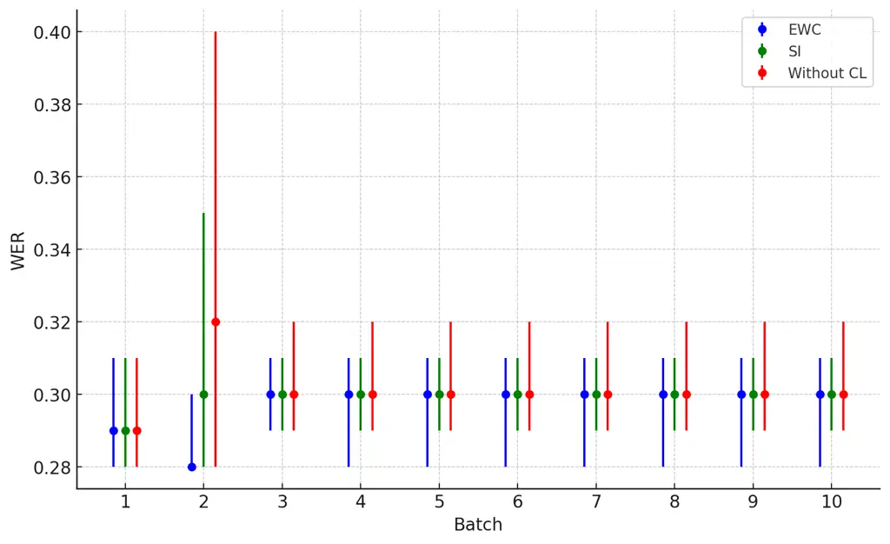

Ahadzi Pratap Singh Kinnunen Hautamaki University of Eastern
FinlandFinland

# Continuous Learning for Children’s ASR: Overcoming Catastrophic Forgetting with Elastic Weight Consolidation and Synaptic Intelligence

Edem    Vishwanath    Tomi    Ville Affiliation: 

###### Abstract

In this work, we present the first study addressing automatic speech
recognition (ASR) for children in an online learning setting. This is
particularly important for both child-centric applications and the
privacy protection of minors, where training models with sequentially
arriving data is critical. The conventional approach of model
fine-tuning often suffers from catastrophic forgetting. To tackle this
issue, we explore two established techniques: elastic weight
consolidation (EWC) and synaptic intelligence (SI). Using a custom
protocol on the MyST corpus, tailored to the online learning setting, we
achieve relative word error rate (WER) reductions of 5.21 % with EWC and
4.36 % with SI, compared to the fine-tuning baseline.

###### keywords

automatic speech recognition, children speech recognition, continual
learning, elastic weight consolidation, synaptic intelligence

^(†)^(†)email: eahadzi@uef.fi, vsingh@uef.fi, tomi.kinnune@uef.fi,
ville.hautamaki@uef.fi

## 1 Introduction

_Automatic speech recognition_ (ASR) is a mature technology that
achieves high accuracy on varied and realistic speech data produced by
adult speakers \[1, 2\]. Unfortunately, the overfocus on adult speech
has hindered the development of ASR systems for children. While
essential in applications such as educational tools, communication aids,
and interactive learning environments, children ASR performance remains
low \[3, 4\]. Children’s speech poses unique challenges due to rapid
developmental changes and distinct acoustic and linguistic
characteristics \[4, 5, 6\]. Anatomically, children’s vocal tracts are
shorter compared to adults, resulting in higher pitch and different
formant structures \[7, 8\]. Linguistically, underdeveloped
pronunciation skills lead to inconsistent articulation \[9\]. Although
the usual approach in large-scale machine learning tasks, including ASR,
is to boost performance by increasing the quantity and diversity of
training data, data resources available for children remain relatively
scarce \[10\].

The above challenges are further exacerbated by ASR training methods,
which typically rely on _static_, _non-evolving_ datasets where models
are exposed to a fixed corpus all at once \[11\]. This is problematic
for any application where data arrives sequentially, with its underlying
properties drifting over time. In addition, specifically relevant to
children, strict privacy regulations such as the _General Data
Protection Regulation_ (GDPR) in the European Union (Article 5(1)(e))
and the _Children’s Online Privacy Protection Act_ (COPPA) in the United
States (16 CFR §312.10) mandate deletion of minors’ data once the
immediate processing purpose has been met. These requirements make it
impractical to store and revisit earlier datasets to be used for
subsequent training runs. These constraints motivate the need for
approaches that can efficiently train models on new data as it becomes
available.

The common approach is to fine-tune or re-train the ASR model as soon as
new data is available. While this approach readily adapts to the latest
information, especially retraining is computationally demanding. But
even more critically, both retraining and finetuning lead easily to
so-called _catastrophic forgetting_ \[12, 13, 14\], a phenomenon where
the model focus on the new data, but loses the previously acquired
knowledge \[15\]. An ASR system that performed well earlier is at risk
of being ”downgraded” due to its over-emphasis on the most recent data.

There are various approaches for mitigating catastrophic forgetting.
These include data-based methods (which store or generate past examples
to replay and preserve knowledge) \[16, 17, 18, 19, 20\],
parameter-regularization approaches (which penalize large changes in
model parameters critical for previous tasks) \[12, 21, 14, 22, 23\],
and dynamic architecture techniques (which expand or reorganize model
components to accommodate new tasks) \[24, 25, 26\].

We focus on two methods, _elastic weight consolidation_ (EWC) \[12\] and
_synaptic intelligence_ (SI)  \[14\]. Both are computationally
efficient, robust, and theoretically grounded (see Section 2) approaches
for balancing the retention of past knowledge with the acquisition of
new information. EWC has been particularly successful in alleviating
catastrophic forgetting in ASR. Prior studies have applied it to domain
adaptation for different accents or geographic regions \[27, 28\],
multilingual learning \[29, 30\], and recognition of _out-of-vocabulary_
(OOV) words \[31\]. These studies, however, are focused on adult speech,
leaving the question of the utility of EWC and SI in children ASR tasks
unanswered. Our study seeks to address this knowledge gap. It is useful
to keep in mind that children are not merely ‘scaled down adults’; their
speech exhibits substantial variability not only between different
speakers, but also within the same speaker over relatively short
time-scale, caused by developmental changes. This necessitates further
investigation and re-assessment of results obtained for adult speaker
populations, important for practical children ASR applications. In our
experiments, we simulate gradual drift in speaker population through a
novel experimental pipeline (on the otherwise standard MyST corpus),
detailed in Section 3. Our experiments also address practical
consideration related to which (and how many) ASR models one can retain
during online learning. Before the experiments, however, we begin with
self-contained description of the parameter regularization methodology.

## 2 Methods

### 2.1 Overview of Parameter-Based Continual Learning

In continual learning, a model incrementally acquires knowledge across a
series of tasks, with the aim of maintaining performance on previously
learned tasks while integrating new information. A key challenge in this
paradigm is catastrophic forgetting, where updates for new tasks
overwrite important representations acquired earlier.

Various approaches have been proposed to address this problem, including
parameter regularization. The idea is to penalize large changes to
previous model parameters, ensuring that new knowledge can be integrated
without ’erasing’ essential information from earlier tasks. Both EWC and
SI selectively penalize changes to parameters identified as critical for
previous tasks. Their optimization objective has the form,

```math
\mathcal{L}(\theta)=\mathcal{L}_{\mathrm{new}}(\theta)+\beta\sum_{i}\omega_{i}\left(\theta_{i}-\theta_{i}^{*}\right)^{2}, \tag{1}
```

where $`\mathcal{L}_{\mathrm{new}}(\theta)`$ is the loss on the current
(new) task, $`\theta^{*}`$ denotes parameters learned from previous
tasks and $`\beta`$ controls the degree of regularization. In EWC,
$`\beta`$ is set as $`\lambda/2`$, where $`\lambda`$ is the
hyper-parameter controlling regularization strength, and can be
interpreted within a Bayesian framework as imposing a Gaussian prior
over the parameters. Accordingly, the quadratic penalty corresponds to
the negative log-prior, and $`\beta`$ reflects the inverse of the prior
variance \[12\]. In contrast, SI adopts an empirically driven approach
to regularization. Here, a global scaling factor $`\alpha`$ serves a
similar regularization role to that in EWC but is determined based on
empirical observations rather than rooted on probabilistic
principles \[14\]. In both cases, the importance of a parameter
$`\theta_{i}`$ is quantified by $`\omega_{i}`$: for EWC, $`\omega_{i}`$
is expressed as $`F_{ii}`$, the diagonal of _Fisher information matrix_
(FIM) that captures the sensitivity of the loss to changes in
$`\theta_{i}`$; for SI, it is denoted as $`\Omega_{i}^{T-1}`$, a
cumulative measure reflecting the parameter’s contribution to previously
learned tasks. We discuss these techniques in more detail in
Sections 2.2 and 2.3.

### 2.2 Elastic Weight Consolidation

EWC is a continual learning technique that imposes a quadratic penalty
on parameter deviations from the parameter vector $`\theta_{T}^{*}`$
learned in the most recent, $`T^{\text{th}}`$ task \[12\]. Rather than
storing and revisiting data from every previous task, it uses a single
regularization term that reflects the importance of parameters, measured
through the empirical FIM \[32\].

Specifically, whenever the model transitions to a new task, EWC computes
a single regularization term based on the parameters $`\theta_{T}^{*}`$
from the most recently completed task and penalize deviations from these
parameters in the loss function. This formulation is obtained by
approximating the posterior distribution
$`p(\theta\mid D_{\text{old}})`$ from the previous task as a Gaussian
via a Laplace approximation—with mean $`\theta_{T}^{*}`$ and diagonal
precision given by the Fisher information $`F`$—which yields a quadratic
penalty term that constrains important parameters \[12\]. Consequently,
the modified loss function for a new task becomes:

```math
\mathcal{L}(\theta)=\mathcal{L}_{\mathrm{new}}(\theta)+\frac{\lambda}{2}\sum_{i}F_{ii}(\theta_{i}-\theta_{T,i}^{*})^{2}, \tag{2}
```

where $`\theta_{T}^{*}`$ are the parameters learned from the immediately
preceding task $`T`$, $`\lambda`$ is a hyper-parameter controlling the
strength of the regularization, and $`F`$ is a measure of parameter
importance derived from the FIM.

The FIM quantifies the sensitivity of a model’s log-likelihood to its
parameters, identifying which parameters were most important for the
model’s performance on the previous task \[32\]. It is defined as:

```math
F=\mathbb{E}\Bigl[\nabla_{\theta}\log p(x,y;\theta)\nabla_{\theta}\log p(x,y;\theta)^{\top}\Bigr], \tag{3}
```

where $`x`$ represents the input data, $`y`$ represents the
corresponding target outputs and $`\theta`$ is the set of model
parameters. In practice, we approximate this expectation by using the
empirical FIM computed over the training samples
$`\{x^{(i)},y^{(i)}\}_{i=1}^{N}`$:

```math
F\approx\frac{1}{N}\sum_{i=1}^{N}\sum_{k=1}^{C}\nabla_{\theta}f_{\theta,k}(x^{(i)})\nabla_{\theta}f_{\theta,k}(x^{(i)})^{\top}, \tag{4}
```

where $`f_{\theta,k}`$ is the $`k`$-th output of the neural network. The
empirical FIM converges to the true FIM as $`N\to\infty`$ \[32\]. In
ASR, the output typically corresponds to the predicted probability for
the $`k`$-th token (character, phoneme, or word) in the output
vocabulary at a given time step. $`C`$ is the total number of output
units, that is, the size of the output vocabulary, and $`N`$ is the
number of training samples used for this computation.

### 2.3 Synaptic Intelligence

Synaptic intelligence is another regularization technique. Unlike EWC,
which is a _second-order_ method relying on FIM, SI uses a _first-order_
measure of parameter importance \[33\]. SI tracks how each parameter
$`\theta_{i}`$ is updated over successive training iterations and how
these updates contribute to reducing the training loss \[14\].
Parameters whose changes result in more substantial decreases in the
loss are deemed more important for preserving previously acquired
knowledge.

Specifically, when training on a given task $`T`$, SI keeps a running
tally of how each parameter $`\theta_{i}`$ changes, as well as how such
changes affect the overall loss. After each training step, SI updates an
importance factor $`\Omega_{i}`$ for parameter $`\theta_{i}`$,
reflecting its importance for maintaining performance on task $`T`$
\[14\]. Consider an infinitesimal change $`\delta(t)`$ to the parameter
vector $`\theta(t)`$ at training iteration $`t`$. The respective change
in the loss can then be approximated by

```math
\mathcal{L}(\theta(t)+\delta(t))-\mathcal{L}(\theta(t))\approx\sum_{k}g_{k}(t)\delta_{k}(t), \tag{5}
```

where $`g_{k}(t)=\partial L/\partial\theta_{k}`$ is the gradient of the
loss with respect to $`\theta_{k}`$. In this expression, each individual
parameter change $`\delta_{k}(t)=\theta^{\prime}_{k}(t)`$ contributes
$`g_{k}(t)\theta^{\prime}_{k}(t)`$ to the total loss change. To capture
the cumulative effect over the entire training trajectory for task
$`T`$, we compute the integral of these contributions along the path in
parameter space \[14\]. This corresponds to:

```math
\int_{t_{T-1}}^{t_{T}}g(\theta(t))\cdot\theta^{\prime}(t)\,dt, \tag{6}
```

which, since the gradient is a conservative field, equals the loss
difference between end and start point:
$`\mathcal{L}(\theta(t_{T}))-\mathcal{L}(\theta(t_{T-1}))`$. Decomposing
 (6) as a sum over the individual parameters gives:

```math
\begin{split}\int_{t_{T-1}}^{t_{T}}g(\theta(t))\cdot\theta^{\prime}(t)\,dt&=\sum_{k}\int_{t_{T-1}}^{t_{T}}g_{k}(\theta(t))\,\theta^{\prime}_{k}(t)\,dt\\
&\equiv-\sum_{k}\omega_{k}^{T}.\end{split} \tag{7}
```

Here, $`\omega_{k}^{T}`$ represents the total contribution of parameter
$`\theta_{k}`$ to reducing the loss during task $`T`$; a larger
$`\omega_{k}^{T}`$ indicates that changes in $`\theta_{k}`$ were more
instrumental in decreasing the loss \[14\].

Once training on task $`T`$ completes, these importance measures
$`(\omega_{k}^{T})_{k=1}^{N}`$ are consolidated into final per-parameter
importance scores $`(\Omega_{k}^{T})_{k=1}^{N}`$. A normalization term
is applied to ensure stability, which involves the total parameter
change $`\Delta_{k}^{T}`$ and a small damping constant $`\xi`$. The
damping constant $`\xi`$ is introduced to bound the expression in cases
where $`\Delta_{k}^{T}\to 0`$ \[14\]:

```math
\Omega_{k}^{T}\;=\;\sum_{\tau<T}\frac{\omega_{k}^{\tau}}{(\Delta_{k}^{\tau})^{2}+\xi}.\quad \tag{8}
```

Here,
$`\Delta_{k}^{\tau}=\theta_{k}(t_{\tau})\;-\;\theta_{k}(t_{\tau-1}).`$
This accumulation process yields a single importance weight
$`\Omega_{k}^{T}`$ for each parameter, capturing how critical
$`\theta_{k}`$ was deemed for task $`T`$ \[14\]. Finally, the loss
function for the new task becomes

```math
\mathcal{L}_{T}(\theta)=\mathcal{L}_{\text{new}}(\theta)+\alpha\sum_{k}\,\Omega_{k}^{T-1}\,\bigl(\theta_{k}-\theta_{k}^{T-1}\bigr)^{2}, \tag{9}
```

where $`\mathcal{L}_{\text{new}}(\theta)`$ is the standard loss for the
new task (cross-entropy in our experiments), $`\theta^{T-1}`$ denotes
the parameter values after training on previous tasks,
$`\Omega_{k}^{T-1}`$ represents the accumulated importance of parameter
$`\theta_{k}`$ from earlier tasks, and $`\alpha`$ is a hyper-parameter
controlling the regularization strength. It penalizes significant
deviations of parameters that were crucial for past tasks, thereby
helping to mitigate catastrophic forgetting.

## 3 Experimental Setup

### 3.1 Dataset

We utilize the _My science tutor_ (MyST) corpus \[34\]—one of the most
extensive collections of children’s conversational speech in English. It
comprises approximately 473 hours of audio from 1,371 students in grades
3 to 5, collected over 10,496 virtual tutoring sessions. The MyST
project uniquely assigned each student’s data to one of three
partitions—training, development, or test—thereby preventing speaker
overlap.

During data preprocessing, we used only transcribed utterances (a
requirement for supervised ASR training) and excluded utterances shorter
than 0.5 seconds (which contain minimal linguistic content), and those
longer than 30 seconds (which exceed the input constraints of the
Whisper model \[35\]). After filtering, the dataset consists of 71,939
utterances (145.54 hours) for training from 567 unique speakers, 11,592
utterances (23.09 hours) for development from 80 unique speakers, and
12,578 utterances (25.05 hours) for testing from 91 unique speakers.

To simulate sequential data acquisition, we organized the training data
into ten sequential _utterance batches_. Unlike the ’_batch_’ in machine
learning—a randomly sampled subset _of the same dataset_ used at a
single training step—the utterance batch is intended to represent a
distinct snapshot _of an evolving dataset_ (see Table 1).

| UB  | New Speakers ($`S_{i}`$) | Total Speakers ($`N_{i}`$) | Utterance (Hrs) |
| --- | ------------------------ | -------------------------- | --------------- |
| 1   | 56                       | 56                         | 6216 (12.84)    |
| 2   | 28                       | 56                         | 6275 (11.73)    |
| 3   | 28                       | 56                         | 6272 (11.81)    |
| 4   | 28                       | 56                         | 6203 (12.43)    |
| 5   | 28                       | 56                         | 6201 (12.32)    |
| 6   | 30                       | 58                         | 6128 (11.99)    |
| 7   | 31                       | 59                         | 6199 (12.92)    |
| 8   | 33                       | 61                         | 6133 (12.79)    |
| 9   | 31                       | 59                         | 6270 (12.83)    |
| 10  | 39                       | 67                         | 6194 (12.62)    |

Table 1: Summary of utterance batch statistics, including the number of
new speakers introduced ($`S_{i}`$), the total number of speakers
($`N_{i}`$) in each utterance batch (UB), and the corresponding number
of utterances with their recording hours.

The utterance batches contain a partially overlapping, but progressively
changing, set of speakers motivated by the natural decay in speaker
recurrence in a real-world application. We model the retention of
speakers from previous batches to decay exponentially; specifically, the
number of speakers retained from an earlier batch $`j`$ in a later batch
$`i`$ (with $`i>j`$) is given by

```math
R_{ij}=\left\lfloor S_{j}\left(\frac{1}{2}\right)^{i-j}\right\rfloor, \tag{10}
```

where $`S_{j}`$ is the number of new speakers introduced in batch $`j`$
and $`(1/2)^{\,i-j}`$ represents the exponential decay factor. The total
number of speakers in batch $`i`$ is then

```math
N_{i}=\sum_{j=1}^{i-1}\left\lfloor S_{j}\left(\frac{1}{2}\right)^{i-j}\right\rfloor+S_{i}. \tag{11}
```

### 3.2 Model

We adopt OpenAI’s _Whisper small_ model \[35\] for our continual
learning framework. This modern, high-performance ASR model pre-trained
on around 680,000 hours of audio (including numerous accents and speech
styles) represents a suitable trade-off between accuracy and
computational efficiency, both important considerations to our
resource-constrained lifelong learning setting. Whisper uses
Transformer-based encoder-decoder architecture \[36\] with multi-headed
self-attention \[36\] to capture both short- and long-range speech
dependencies.

### 3.3 Experiments

In our experiments, we vary both the parameter regularization methods
and model selection strategies. The former consists of (1) no continual
learning, a model fine tuned incrementally on new data without any
mechanism to prevent forgetting; (2) EWC as detailed in Section 2.2; and
(3) SI as detailed in Section 2.3. The latter concerns strategy used for
caching best-performing models in the online ASR setting. (i) First, the
no selection (NS) strategy continues training the most recent model
without re-evaluation, entailing minimum overhead but possibly resulting
in performance degradation if the updated model fails to improve WER.
(ii) rolling window of 3 (RW3) maintains the latest three models,
requiring moderate storage and periodic validation to identify the best
among these. While providing safeguard against performance drop more
effectively, it also limits how many past models can be revisited. Thus,
the final (iii) best-of-all-so-far (BoA) strategy keeps track of every
model generated thus far, picking the top performer at each step.
Although this guarantees strong performance, it may be computationally
and memory intensive if many models must be stored and evaluated over
time.

All the models are trained for three epochs. For hyper-parameter tuning,
we experimented with learning rates ranging from $`1.25\times 10^{-5}`$
to $`1\times 10^{-10}`$ and regularization strengths ($`\lambda`$ for
EWC and $`\alpha`$ for SI) of 0.1 and 0.01. We select the model that
corresponds to the epoch with lowest WER on the development set. As for
performance evaluation, we report word error rate (WER) on the
development and test sets, including its 95% confidence interval
(computed using a standard bootstrap approach with multiple resamplings
of the test data) \[37\].

## 4 Results and Discussion

Table 2 presents the batch-wise WERs for both the development and test
data. Notably, when sequential fine-tuning is performed without any
continual learning techniques, the development and test WER begins at a
comparable WER with other experiments. However, an upward drift is
evident up until the fourth utterance batch, after which the WER
stabilizes at a marginally higher level. This upward trend in WER
suggests that, over time, the absence of mechanisms to protect important
parameters can lead to small, but noticeable, increase in WER.

In contrast, sequential fine-tuning with EWC and SI (i.e., the ’no
selection’ strategy) displayed relatively stable performance over the
ten utterance batches. The WER on the development set after fine-tuning
with EWC decreases from 18.94% after utterance batch 1 to 18.75% by
utterance batch 4 without large deviations, while its test set WER
decreases from 21.42% after batch 1 to 21.11% by batch 4. Fine-tuning
with SI follows a similar pattern, with the development set WER moving
from 18.94% at utterance batch 1 to 18.80% by utterance batch 4, and the
test set WER from 21.42% to 21.30% by utterance batch 4. These results
indicate that both methods retained knowledge from earlier tasks while
adapting to new data, demonstrating effective mitigation of catastrophic
forgetting.

|     | Exp. | Method | Set  | B1    | B2    | B3    | B4    | B5    | B6    | B7    | B8    | B9    | B10   |
| --- | ---- | ------ | ---- | ----- | ----- | ----- | ----- | ----- | ----- | ----- | ----- | ----- | ----- |
| NS  | (1)  | No CL  | Dev  | 18.94 | 18.68 | 18.77 | 19.19 | 19.18 | 19.17 | 19.18 | 19.17 | 19.17 | 19.17 |
|     |      |        | Test | 21.42 | 21.32 | 21.98 | 22.27 | 22.27 | 22.27 | 22.27 | 22.27 | 22.27 | 22.27 |
|     | (2)  | EWC    | Dev  | 18.94 | 18.57 | 18.72 | 18.75 | 18.75 | 18.74 | 18.75 | 18.75 | 18.74 | 18.75 |
|     |      |        | Test | 21.42 | 21.08 | 21.30 | 21.11 | 21.11 | 21.11 | 21.11 | 21.11 | 21.11 | 21.11 |
|     | (3)  | SI     | Dev  | 18.94 | 18.57 | 18.78 | 18.80 | 18.79 | 18.79 | 18.79 | 18.79 | 18.79 | 18.79 |
|     |      |        | Test | 21.42 | 21.22 | 21.29 | 21.30 | 21.30 | 21.30 | 21.30 | 21.30 | 21.30 | 21.30 |
| RW3 | (4)  | No CL  | Dev  | 18.94 | 18.68 | 18.77 | 19.98 | 21.53 | 18.89 | 18.88 | 18.89 | 18.89 | 18.89 |
|     |      |        | Test | 21.42 | 21.32 | 21.98 | 23.24 | 27.38 | 21.33 | 21.33 | 21.18 | 21.18 | 21.18 |
|     | (5)  | EWC    | Dev  | 18.94 | 18.57 | 18.72 | 19.79 | 21.07 | 18.73 | 18.74 | 18.74 | 18.74 | 18.74 |
|     |      |        | Test | 21.42 | 21.08 | 21.30 | 22.79 | 25.69 | 21.30 | 21.30 | 21.30 | 21.30 | 21.30 |
|     | (6)  | SI     | Dev  | 18.94 | 18.57 | 18.78 | 19.78 | 20.60 | 18.79 | 18.79 | 18.79 | 18.79 | 18.79 |
|     |      |        | Test | 21.42 | 21.22 | 21.29 | 23.05 | 25.61 | 21.29 | 21.29 | 21.29 | 21.29 | 21.29 |
| BoA | (7)  | No CL  | Dev  | 18.94 | 18.68 | 18.77 | 19.98 | 21.53 | 20.39 | 19.37 | 19.21 | 19.75 | 19.88 |
|     |      |        | Test | 21.42 | 21.32 | 21.98 | 23.24 | 27.38 | 23.78 | 22.38 | 23.38 | 21.90 | 22.77 |
|     | (8)  | EWC    | Dev  | 18.94 | 18.57 | 18.72 | 19.79 | 21.07 | 19.69 | 19.26 | 19.64 | 19.89 | 19.84 |
|     |      |        | Test | 21.42 | 21.08 | 21.30 | 22.79 | 25.69 | 22.55 | 22.18 | 23.03 | 22.82 | 22.30 |
|     | (9)  | SI     | Dev  | 18.94 | 18.57 | 18.78 | 19.78 | 20.60 | 19.17 | 19.14 | 19.73 | 19.82 | 19.62 |
|     |      |        | Test | 21.42 | 21.22 | 21.29 | 23.05 | 25.61 | 22.33 | 21.90 | 22.38 | 21.97 | 22.54 |

Table 2: Development and Test Word Error Rate (WER, %) after training on
10 sequential batches. For each method, B$`n`$ is the WER after batch
$`n`$. ‘NS’ stands for No Selection, ‘RW3’ stands for ‘Rolling Window of
3’ and ‘BoA’ for ‘Best-of-All-So-Far.’

Introducing the two model selection strategies, RW3 and BoA, adds
another layer of complexity. For both the EWC and SI enhanced
approaches—where continual learning is integrated with model selection
via RW3 and BoA—there is a sudden performance spike around utterance
batches 4 and 5. For example, EWC with the RW3 selection strategy sees
the development set WER jump to 21.07% at utterance batch 5 from 19.79%
in the previous utterance batch. However, the validation step allows the
system to revert to a better-performing model from either the rolling
window or the pool of past models, allowing the WER to revert to around
18.7–18.8% on the development set. Similarly, non-continual learning
with RW3 experiences a sharp drop in performance at utterance batch 5
(from 23.23% to 27.38% on the test set) but recovers by selecting a more
favorable model from the rolling window. While model selection helps
prevent the system from persisting with a model that has undergone a
detrimental update, an unexpected speaker shift can briefly raise WER
when the system reverts to a model lacking the latest speaker data.

A notable trend across all approaches is the eventual plateau in WER.
Regardless of regularization strategy or model selection, the models
converge to a narrow performance band. This plateau indicates
limitations related to the homogeneity of data across batches, where
each batch closely resembles the previous one. Even though we introduced
speaker scheduling to increase diversity, the MyST dataset itsself is
drawn from a relatively narrow age group (grades 3–5). This contributes
to the overall homogeneity of the data and effectively constrains
performance to a tight range.

A closer look at Figure 1, which provides the average WER and
corresponding 95% confidence intervals, highlights how EWC and SI
enhanced fine tuning differ statistically from non-continual learning.
Both EWC and SI enhanced fine tuning and maintain relatively low average
WERs with a narrow confidence intervals of 0.28-0.31 and 0.29-0.31,
respectively. This narrower interval reflects the consistency observed
in the batch-wise results. Meanwhile, fine-tuning without CL has an
average WER ranging from about 0.29 to 0.32, with occasional confidence
intervals reaching up to 0.40. This broader range suggests greater
variability, aligning with the modest upward drift observed mid-training
and the slightly higher final WERs in certain batches.



Figure 1: WER with 95% Confidence Intervals obtained via bootstrap
resampling across batches for each method

## 5 Conclusion

Our results on the MyST corpus demonstrate that the problem of
catastrophic forgetting can be effectively mitigated using either of the
two parameter regularization techniques, EWC and SI. Both outperform
standard fine-tuning in preserving earlier knowledge, while being
capable of capturing new information. This dual capability has the
potential of substantially enhancing online speech recognition for
children, where data is continuously collected and speaker profiles
evolve over time. While SI and EWC were found comparable in terms of
WER, in practice SI is faster and is therefore recommended as the first
choice for practitioners.

While our work provides a novel experimental validation of the efficacy
of EWC and SI in children’s online ASR tasks, we are constrained with
the homogenous nature of the MyST corpus itself. Future work may
consider e.g. simulated additive noise or reverberation to address
robustness of EWC and SI to varied quality of data.

## 6 Acknowledgement

This study has been partially supported by the Academy of Finland
(Decision No. 349605, project ”SPEECHFAKES”)

## References

- \[1\] W. Xiong, J. Droppo, X. Huang, F. Seide, M. Seltzer, A. Stolcke,
  D. Yu, and G. Zweig, “Achieving human parity in conversational speech
  recognition,” 2017. \[Online\]. Available:
  [1610.05256](https://1610.05256)
- \[2\] G. Saon, G. Kurata, T. Sercu, K. Audhkhasi, S. Thomas,
  D. Dimitriadis, X. Cui, B. Ramabhadran, M. Picheny, L.-L. Lim,
  B. Roomi, and P. Hall, “English conversational telephone speech
  recognition by humans and machines,” 2017. \[Online\]. Available:
  [1703.02136](https://1703.02136)
- \[3\] M. Gerosa, D. Giuliani, S. Narayanan, and A. Potamianos, “A
  review of asr technologies for children’s speech,” _Proceedings of the
  2nd Workshop on Child, Computer and Interaction, WOCCI ’09_, 11 2009.
- \[4\] A. A. Attia, J. Liu, W. Ai, D. Demszky, and C. Espy-Wilson,
  “Kid-whisper: Towards bridging the performance gap in automatic speech
  recognition for children vs. adults,” 2024. \[Online\]. Available:
  [2309.07927](https://2309.07927)
- \[5\] P. G. Shivakumar and S. Narayanan, “End-to-end neural systems
  for automatic children speech recognition: An empirical study,” 2021.
  \[Online\]. Available: [2102.09918](https://2102.09918)
- \[6\] M. Gerosa, D. Giuliani, S. Narayanan, and A. Potamianos, “A
  review of asr technologies for children’s speech,” _Proceedings of the
  2nd Workshop on Child, Computer and Interaction, WOCCI ’09_, 11 2009.
- \[7\] S. Lee, A. Potamianos, and S. S. Narayanan, “Analysis of
  children’s speech, pitch and formant frequency,” _Journal of the
  Acoustical Society of America_, vol. 101, p. 3194–3194, 1997.
- \[8\] ——, “Acoustics of children’s speech: Developmental changes of
  temporal and spectral parameters,” _Journal of the Acoustical Society
  of America_, vol. 105, pp. 1455–1468, 1999.
- \[9\] Q. Li and M. Russell, “An analysis of the causes of increased
  error rates in children’s speech recognition,” in _Proc. of the
  International Conference on Spoken Language Processing (ICSLP)_, 2002.
- \[10\] V. P. Singh, H. Sailor, S. Bhattacharya, and A. Pandey,
  “Spectral modification based data augmentation for improving
  end-to-end asr for children’s speech,” 2022. \[Online\]. Available:
  [2203.06600](https://2203.06600)
- \[11\] H. Kheddar, M. Hemis, and Y. Himeur, “Automatic speech
  recognition using advanced deep learning approaches: A survey,”
  _Information Fusion_, vol. 109, p. 102422, Sep. 2024. \[Online\].
  Available:
  [http://dx.doi.org/10.1016/j.inffus.2024.102422](http://dx.doi.org/10.1016/j.inffus.2024.102422)
- \[12\] J. Kirkpatrick, R. Pascanu, N. Rabinowitz, J. Veness,
  G. Desjardins, A. A. Rusu, K. Milan, J. Quan, T. Ramalho,
  A. Grabska-Barwinska, D. Hassabis, C. Clopath, D. Kumaran, and
  R. Hadsell, “Overcoming catastrophic forgetting in neural networks,”
  _Proceedings of the National Academy of Sciences_, vol. 114,
  no. 13, p. 3521–3526, Mar. 2017. \[Online\]. Available:
  [http://dx.doi.org/10.1073/pnas.1611835114](http://dx.doi.org/10.1073/pnas.1611835114)
- \[13\] R. M. French, “Catastrophic forgetting in connectionist
  networks,” _Trends in Cognitive Sciences_, vol. 3, no. 4, pp.
  128–135, 1999. \[Online\]. Available:
  [https://www.sciencedirect.com/science/article/pii/S1364661399012942](https://www.sciencedirect.com/science/article/pii/S1364661399012942)
- \[14\] F. Zenke, B. Poole, and S. Ganguli, “Continual learning through
  synaptic intelligence,” 2017. \[Online\]. Available:
  [1703.04200](https://1703.04200)
- \[15\] G. M. van de Ven, N. Soures, and D. Kudithipudi, “Continual
  learning and catastrophic forgetting,” 2024. \[Online\]. Available:
  [2403.05175](https://2403.05175)
- \[16\] D. Lopez-Paz and M. Ranzato, “Gradient episodic memory for
  continual learning,” 2022. \[Online\]. Available:
  [1706.08840](https://1706.08840)
- \[17\] Z. Li and D. Hoiem, “Learning without forgetting,” 2017.
  \[Online\]. Available: [1606.09282](https://1606.09282)
- \[18\] F.-K. Sun, C.-H. Ho, and H.-Y. Lee, “Lamol: Language modeling
  for lifelong language learning,” 2019. \[Online\]. Available:
  [1909.03329](https://1909.03329)
- \[19\] J. von Oswald, C. Henning, B. F. Grewe, and J. Sacramento,
  “Continual learning with hypernetworks,” 2022. \[Online\]. Available:
  [1906.00695](https://1906.00695)
- \[20\] G. Saha, I. Garg, and K. Roy, “Gradient projection memory for
  continual learning,” 2021. \[Online\]. Available:
  [2103.09762](https://2103.09762)
- \[21\] J. Schwarz, J. Luketina, W. M. Czarnecki, A. Grabska-Barwinska,
  Y. W. Teh, R. Pascanu, and R. Hadsell, “Progress & compress: A
  scalable framework for continual learning,” 2018. \[Online\].
  Available: [1805.06370](https://1805.06370)
- \[22\] R. Aljundi, F. Babiloni, M. Elhoseiny, M. Rohrbach, and
  T. Tuytelaars, “Memory aware synapses: Learning what (not) to
  forget,” 2018. \[Online\]. Available: [1711.09601](https://1711.09601)
- \[23\] B. Ehret, C. Henning, M. R. Cervera, A. Meulemans, J. von
  Oswald, and B. F. Grewe, “Continual learning in recurrent neural
  networks,” 2021. \[Online\]. Available:
  [2006.12109](https://2006.12109)
- \[24\] A. A. Rusu, N. C. Rabinowitz, G. Desjardins, H. Soyer,
  J. Kirkpatrick, K. Kavukcuoglu, R. Pascanu, and R. Hadsell,
  “Progressive neural networks,” 2022. \[Online\]. Available:
  [1606.04671](https://1606.04671)
- \[25\] C. Fernando, D. Banarse, C. Blundell, Y. Zwols, D. Ha, A. A.
  Rusu, A. Pritzel, and D. Wierstra, “Pathnet: Evolution channels
  gradient descent in super neural networks,” 2017. \[Online\].
  Available: [1701.08734](https://1701.08734)
- \[26\] A. Mallya and S. Lazebnik, “Packnet: Adding multiple tasks to a
  single network by iterative pruning,” 2018. \[Online\]. Available:
  [1711.05769](https://1711.05769)
- \[27\] S. Ghorbani, S. Khorram, and J. H. L. Hansen, “Domain expansion
  in dnn-based acoustic models for robust speech recognition,” 2019.
  \[Online\]. Available: [1910.00565](https://1910.00565)
- \[28\] V. A. Trinh, P. Ghahremani, B. King, J. Droppo, A. Stolcke, and
  R. Maas, “Reducing geographic disparities in automatic speech
  recognition via elastic weight consolidation,” in _Interspeech
  2022_. ISCA, Sep. 2022, p. 1298–1302. \[Online\]. Available:
  [http://dx.doi.org/10.21437/Interspeech.2022-11063](http://dx.doi.org/10.21437/Interspeech.2022-11063)
- \[29\] N.-Q. Pham, J. Niehues, and A. Waibel, “Towards continually
  learning new languages,” 2024. \[Online\]. Available:
  [2211.11703](https://2211.11703)
- \[30\] M. Qian, S. Tang, R. Ma, K. M. Knill, and M. J. Gales, “Learn
  and don’t forget: Adding a new language to asr foundation models,” in
  _Interspeech 2024_. ISCA, Sep. 2024, p. 2544–2548. \[Online\].
  Available:
  [http://dx.doi.org/10.21437/Interspeech.2024-1045](http://dx.doi.org/10.21437/Interspeech.2024-1045)
- \[31\] L. Qu, C. Weber, and S. Wermter, “Emphasizing unseen words: New
  vocabulary acquisition for end-to-end speech recognition,” _Neural
  Networks_, vol. 161, p. 494–504, Apr. 2023. \[Online\]. Available:
  [http://dx.doi.org/10.1016/j.neunet.2023.01.027](http://dx.doi.org/10.1016/j.neunet.2023.01.027)
- \[32\] R. Karakida, S. Akaho, and S. ichi Amari, “Universal statistics
  of fisher information in deep neural networks: Mean field
  approach,” 2019. \[Online\]. Available:
  [1806.01316](https://1806.01316)
- \[33\] F. Benzing, “Unifying regularisation methods for continual
  learning,” 2021. \[Online\]. Available:
  [2006.06357](https://2006.06357)
- \[34\] S. S. Pradhan, R. A. Cole, and W. H. Ward, “My science tutor
  (myst) – a large corpus of children’s conversational speech,” 2023.
  \[Online\]. Available: [2309.13347](https://2309.13347)
- \[35\] A. Radford, J. W. Kim, T. Xu, G. Brockman, C. McLeavey, and
  I. Sutskever, “Robust speech recognition via large-scale weak
  supervision,” 2022. \[Online\]. Available:
  [2212.04356](https://2212.04356)
- \[36\] A. Vaswani, N. Shazeer, N. Parmar, J. Uszkoreit, L. Jones,
  A. N. Gomez, L. Kaiser, and I. Polosukhin, “Attention is all you
  need,” 2023. \[Online\]. Available: [1706.03762](https://1706.03762)
- \[37\] M. Bisani and H. Ney, “Bootstrap estimates for confidence
  intervals in asr performance evaluation,” vol. 1, 06 2004, pp. I
  – 409.
