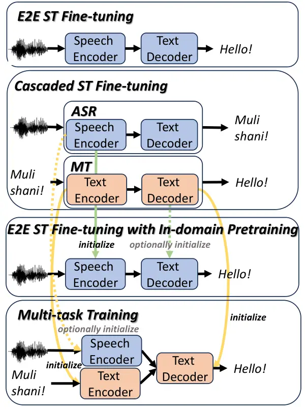

# GMU Systems for the IWSLT 2025 Low-Resource Speech Translation Shared Task

Chutong Meng    Antonios Anastasopoulos Affiliation: George Mason
University Email: [{cmeng2,antonis}@gmu.edu](mailto:)

###### Abstract

This paper describes the GMU systems for the IWSLT 2025 low-resource
speech translation shared task. We trained systems for all language
pairs, except for Levantine Arabic. We fine-tuned SeamlessM4T-v2
Seamless Communication et al. (2023b) for automatic speech recognition
(ASR), machine translation (MT), and end-to-end speech translation (E2E
ST). The ASR and MT models are also used to form cascaded ST systems.
Additionally, we explored various training paradigms for E2E ST
fine-tuning, including direct E2E fine-tuning, multi-task training, and
parameter initialization using components from fine-tuned ASR and/or MT
models. Our results show that (1) direct E2E fine-tuning yields strong
results; (2) initializing with a fine-tuned ASR encoder improves ST
performance on languages SeamlessM4T-v2 has not been trained on; (3)
multi-task training can be slightly helpful.¹¹ 1 We release our code for
reproducibility:
[https://github.com/mct10/IWSLT2025_LowRes_ST](https://github.com/mct10/IWSLT2025_LowRes_ST).

## 1 Introduction



Figure 1: Illustration of our SeamlessM4T-v2 fine-tuning strategies.
Speech Encoder, Text Encoder, and Text Decoder refer to the
corresponding components of SeamlessM4T-v2.

Speech translation (ST) is a task that aims to translate speech in one
language into text in another language. It can be addressed by either an
end-to-end (E2E) ST model or a cascaded system that combines an
automatic speech recognition (ASR) model and a machine translation (MT)
model. Recent advances in E2E ST have been driven by the development of
large multilingual models trained on large amounts of multilingual
datasets Seamless Communication et al. (2023a); Seamless Communication
et al. (2023b); Radford et al. (2023). Similar trends can be observed in
ASR Radford et al. (2023) and MT NLLB Team et al. (2022) as well.
Despite these models have covered a wide range of languages, many
low-resource languages remain underrepresented and are not yet well
supported by existing models.

The IWSLT low-resource speech translation shared tasks Abdulmumin et al.
(2025); Ahmad et al. (2024); Agarwal et al. (2023); Anastasopoulos
et al. (2022) are designed to advance ST technology for low-resource
languages. To address the challenge of data scarcity, previous
submissions have explored various pre-trained models, including
multilingual self-supervised speech models such as XLSR Conneau et al.
(2021), multilingual ASR models such as Whisper Radford et al. (2023),
multilingual MT models such as NLLB NLLB Team et al. (2022), and
multilingual ST models such as SeamlessM4T Seamless Communication et al.
(2023a); Seamless Communication et al. (2023b). These pre-trained models
were then fine-tuned on ST datasets for low-resource languages. Among
them, SeamlessM4T-v2 has demonstrated superior performance, according to
last year’s evaluations Ahmad et al. (2024).

This paper describes GMU submissions to the IWSLT 2025 low-resource
speech translation task Abdulmumin et al. (2025). Our work focuses on
fine-tuning the SeamlessM4T-v2 model Seamless Communication et al.
(2023b) for all language pairs except Levantine Arabic-to-English. We
fine-tuned the model for both E2E and cascaded systems. For E2E ST
fine-tuning, we explored multiple strategies, including multi-task
training with MT and knowledge distillation objectives, as well as
initializing model components with those from fine-tuned ASR and/or MT
models, trying to utilize all available datasets. Figure 1 illustrates
our strategies. Our results show that direct E2E fine-tuning
SeamlessM4T-v2 yields strong performance across all languages pairs,
except Quechua, which has too little training data. For languages not
seen during SeamlessM4T-v2 pre-training, we show that fine-tuning the
model on ASR data and initializing the ST encoder with the ASR encoder
improves performance significantly. We also show that multi-task
training offers some performance gains when the MT model significantly
outperforms the E2E ST model.

|          |          |                       |                                               |
| -------- | -------- | --------------------- | --------------------------------------------- |
| Language | Task     | Amount                | Sources                                       |
| aeb-eng  | ASR      | 156 hours             | LDC2022E01                                    |
|          | 3-way ST | 161 hours/202k lines  |                                               |
| bem-eng  | 3-way ST | 167 hours/82k lines   | Sikasote et al. (2023)                        |
| fon-fra  | 2-way ST | 47 hours              | IWSLT2025 Abdulmumin et al. (2025)            |
| gle-eng  | ASR      | 5 hours               | CommonVoice 21.0                              |
|          | 2-way ST | 7 hours               | IWSLT2025                                     |
|          | 3-way ST | 202 hours             | Moslem (2024)                                 |
| bho-hin  | 2-way ST | 20 hours              | IWSLT2025                                     |
|          | ASR      | 60 hours              | ULCA                                          |
| est-eng  | 3-way ST | 1213 hours/581k lines | IWSLT2025                                     |
| mlt-eng  | 3-way ST | 12 hours/9k lines     | IWST2025                                      |
| mar-hin  | ASR      | 15 hours              | CommonVoice 21.0; He et al. (2020)            |
|          | 2-way ST | 16 hours              | IWSLT2025                                     |
| que-spa  | MT       | 46k lines             | Ortega et al. (2020); NLLB Team et al. (2022) |
|          | ASR      | 48 hours              | Cardenas et al. (2018)                        |
|          | 3-way ST | 9 hours/2k lines      | IWSLT2025; Zevallos et al. (2022)             |

Table 1: Summary of datasets used for training. 2-way ST refers to
datasets with paired source speech and target text, while 3-way ST
includes paired source speech, source text, and target text. The 3-way
ST datasets can be used for ASR and MT training as well.

## 2 Task Descriptions

The IWSLT 2025 low-resource ST task Abdulmumin et al. (2025) covers 10
language pairs: (North) Levantine Dialectal Arabic to English
(`apc`-`eng`), Tunisian Arabic Dialect to English (`aeb`-`eng`), Bemba
to English (`bem`-`eng`), Fongbe to French (`fon`-`fra`), Irish to
English (`gle`-`eng`), Bhojpuri to Hindi (`bho`-`hin`), Estonian to
English (`est`-`eng`), Maltese to English (`mlt`-`eng`), Marathi to
Hindi (`mar`-`hin`), and Quechua to Spanish (`que`-`spa`). In each of
these language pairs, the source language is low-resource while the
target language is high-resource. We trained systems for all language
pairs except for `apc`-`eng`.²² 2 The LDC resources for apc cannot be
obtained for free this year.

Formally, E2E ST is defined as translating a speech utterance
$`x^{\text{sp}}`$ in the source language into text $`y`$ in the target
language. For cascaded ST, a source speech utterance $`x^{\text{sp}}`$
is first transcribed into text $`x^{\text{text}}`$ in the source
language using an ASR model, which is then translated into the
target-language text $`y`$ using an MT model.

The datasets we used are summarized in Table 1. Each of the official
datasets provided by the organizers is either a 2-way ST or a 3-way ST
dataset. A 2-way ST data sample is represented as a tuple
$`(x^{\text{sp}},y)`$, while a 3-way ST data sample refers to a triple
$`(x^{\text{sp}},x^{\text{text}},y)`$. 3-way ST datasets are available
for `aeb-eng`, `bem-eng`, `est-eng`, `mlt-eng`, and `que-spa`. The other
languages are provided with 2-way ST datasets. Among these, `est-eng`
has the largest dataset with more than 1,000 hours of speech. Both
`aeb-eng` and `bem-eng` have more than 100 hours of data, while datasets
for other languages are limited and having only about 10 hours of
speech. In addition, the organizers provide pointers to additional ASR
and MT datasets. An ASR data sample is represented as
$`(x^{\text{sp}},x^{\text{text}})`$, while an MT data sample is
represented as $`(x^{\text{text}},y)`$. It is evident that both ASR and
MT datasets can be derived from 3-way ST datasets.

The task allows submissions under two conditions: constrained and
unconstrained. Under the constrained condition, only the provided
dataset can be used and no pre-trained models are allowed. The
unconstrained condition allows the use of any models and any datasets.
All of our submissions fall under the unconstrained condition.

## 3 Methods

Our methods focus on fine-tuning the SeamlessM4T-v2 model Seamless
Communication et al. (2023b). We explore 4 different fine-tuning
strategies: (1) E2E ST fine-tuning; (2) ASR and MT fine-tuning for the
cascaded system; (3) multi-task training similar to Seamless
Communication et al. (2023b); (4) initializing ST model components with
those from ASR and/or MT models. We fine-tune the model on a single
language pair at a time. Due to the dataset availability and model
performance for each language pair, not all strategies have been tried
for every pair.

Although the MT components of SeamlessM4T-v2 are initialized by the NLLB
model NLLB Team et al. (2022), SeamlessM4T-v2 has been trained on less
languages and supports MT for only 4 out of the 10 language pairs in
this shared task. In contrast, the NLLB model supports MT for all 10
pairs. To evaluate whether the smaller language coverage of
SeamlessM4T-v2 impacts performance, we additionally fine-tuned an NLLB
model on the MT datasets, using it as the MT baseline. Section 3.1
introduces the NLLB and SeamlessM4T-v2 models. Section 3.2 through
Section 3.5 elaborate our fine-tuning strategies.

### 3.1 Base Models

NLLB NLLB Team et al. (2022). NLLB is a multilingual MT model supporting
over 200 languages, including all language pairs in this shared task.
The model is available in two architecture variants: a sparsely gated
mixture-of-experts (MoE) one and a set of dense transformer models. The
dense transformer architecture comprises a text encoder and a text
decoder. While the MoE variant (NLLB-200) achieves the strongest
performance, it has 54.5B parameters and is not practical for
fine-tuning. Therefore, in our experiments, we choose the 1.3B dense
transformer model distilled from NLLB-200, referred to as
`NLLB-200-Distilled-1.3B`.

SeamlessM4T-v2 Seamless Communication et al. (2023b). SeamlessM4T-v2 is
the state-of-the-art foundation model for ST. While it supports
into-speech translation, we only focus on its into-text translation
capabilities for the purpose of this shared task. SeamlessM4T-v2 is
composed of a speech encoder, a text encoder, and a shared text decoder.
Its `Large` variant has 2B parameters in total and we refer to it as
`SeamlessM4T-v2-Large`. The speech encoder is pre-trained on 4.5M hours
of unlabeled audio with the w2v-BERT 2.0 objective. The text encoder and
decoder are initialized by the NLLB model. During fine-tuning, a
multi-task training strategy is employed, incorporating ASR, MT, ST, and
knowledge distillation (KD) objectives. We also explore this strategy in
our experiments. The model supports 101 languages for speech input and
96 languages for text input and output. Among the low-resource languages
in this shared task, SeamlessM4T-v2 supports `est`, `gle`, `mar`, and
`mlt`, but does not support `aeb`, `bem`, `bho`, `fon`, and `que`.

### 3.2 E2E ST Fine-tuning

For E2E fine-tuning, we utilize 2-way ST data samples
$`(x^{\text{sp}},y)`$. We use Equation 1 as the loss function to
optimize the speech encoder and the text decoder.

```math
\displaystyle\begin{split}L_{\text{E2E}}=&-\frac{1}{|y|}\log p(y|x^{\text{sp}};\theta_{\text{se}},\theta_{\text{td}})\\
&=-\frac{1}{|y|}\sum_{i=1}^{|y|}\log p(y_{i}|y_{<i},x^{\text{sp}};\theta_{\text{se}},\theta_{\text{td}})\end{split} \tag{1}
```

$`\theta_{\text{se}}`$ and $`\theta_{\text{td}}`$ denote the parameters
of the speech encoder and the text decoder, respectively.

### 3.3 ASR and MT Fine-tuning for the Cascaded ST System

Since SeamlessM4T-v2 also supports multilingual ASR and MT, it is
suitable for being fine-tuned on the low-resource languages for ASR and
MT as well. Specifically, ASR data samples
$`(x^{\text{sp}},x^{\text{text}})`$ and MT data samples
$`(x^{\text{text}},y)`$ are used. A cascaded system can then be built by
a fine-tuned ASR and a fine-tuned MT model. The corresponding loss
functions for ASR and MT fine-tuning are defined in Equation 2 and
Equation 3, respectively. Equation 3 is also used for NLLB MT
fine-tuning.

```math
\displaystyle\begin{split}L_{\text{ASR}}=&-\frac{1}{|x^{\text{text}}|}\log p(x^{\text{text}}|x^{\text{sp}};\theta_{\text{se}},\theta_{\text{td}})\\
&=-\frac{1}{|x^{\text{text}}|}\sum_{i=1}^{|x^{\text{text}}|}\log p(x^{\text{text}}_{i}|x^{\text{text}}_{<i},x^{\text{sp}};\theta_{\text{se}},\theta_{\text{td}})\end{split} \tag{2}
```

```math
\displaystyle\begin{split}L_{\text{MT}}=&-\frac{1}{|y|}\log p(y|x^{\text{text}};\theta_{\text{te}},\theta_{\text{td}})\\
&=-\frac{1}{y}\sum_{i=1}^{|y|}\log p(y_{i}|y_{<i},x^{\text{text}};\theta_{\text{te}},\theta_{\text{td}})\end{split} \tag{3}
```

$`\theta_{\text{te}}`$ refers to the parameters of the text encoder. We
use $`\theta_{\text{se}}^{\text{ASR}}`$ and
$`\theta_{\text{td}}^{\text{ASR}}`$ to denote the fine-tuned ASR
components, $`\theta_{\text{te}}^{\text{MT}}`$ and
$`\theta_{\text{td}}^{\text{MT}}`$ to denote the fine-tuned MT
components.

### 3.4 Multi-task Fine-tuning

Inspired by the multi-task fine-tuning strategy in Seamless
Communication et al. (2023b), we adopt a similar approach and explore
its effect in the low-resource ST setting.

Our approach includes ST, MT, and KD objectives, using paired 3-way ST
data samples $`(x^{\text{sp}},x^{\text{text}},y)`$. The ST objective
follows Equation 1 and the MT objective follows Equation 3. The goal of
applying the KD objective is to use the MT components to enhance the ST
components. The motivation is that MT is generally an easier task than
ST and often yields better performance, and we hope to mitigate this
performance gap. In order to have a strong MT teacher, we initialize the
text encoder and the text decoder in SeamlessM4T-v2 with
$`\theta_{\text{te}}^{\text{MT}}`$ and
$`\theta_{\text{td}}^{\text{MT}}`$ from Section 3.3, respectively.
Optionally, to help with convergence, we can initialize the speech
encoder with $`\theta_{\text{se}}^{\text{ASR}}`$. Equation 4 explains
how we obtain the teacher probability distribution from the MT
components.

```math
\displaystyle\begin{split}&p_{\text{teacher}}(\cdot|y_{<i},x^{\text{text}})\\
&=\text{stop-gradient}\left(p(\cdot|y_{<i},x^{\text{text}};\theta_{\text{te}},\theta_{\text{td}})\right)\end{split} \tag{4}
```

$`\text{stop-gradient}(\cdot)`$ means that we detach the resultant
tensor from the computation graph, thereby preventing the gradients from
the teacher probability distribution being propagated to the MT teacher
parameters $`\theta_{\text{te}}`$ and $`\theta_{\text{td}}`$. We tried
without $`\text{stop-gradient}(\cdot)`$ but observed a performance drop.
Then, we compute KL-Divergence between the student and the teacher
probability distributions with Equation 5.

```math
\displaystyle\begin{split}&L_{\text{KD}}\\
&=\frac{1}{|y|}\sum_{i=1}^{|y|}D_{\text{KL}}\left[p_{\text{teacher}}(\cdot|y_{<i},x^{\text{text}})||p(\cdot|y_{<i},x^{\text{sp}};\theta_{\text{se}},\theta_{\text{td}})\right]\\
&=\frac{1}{|y|}\sum_{i=1}^{|y|}\left[p_{\text{teacher}}(\cdot|y_{<i},x^{\text{text}})\cdot\log\frac{p_{\text{teacher}}(\cdot|y_{<i},x^{\text{text}})}{p(\cdot|y_{<i},x^{\text{sp}};\theta_{\text{se}},\theta_{\text{td}})}\right]\end{split} \tag{5}
```

The student probability distribution comes from the ST components
$`\theta_{\text{se}}`$ and $`\theta_{\text{td}}`$.

During fine-tuning, $`\theta_{\text{se}}`$ and $`\theta_{\text{td}}`$
are updated while $`\theta_{\text{te}}`$ is kept frozen. The final loss
function is a linear combination of the three losses:

```math
\displaystyle L=\alpha\cdot L_{\text{E2E}}+\beta\cdot L_{\text{MT}}+\gamma\cdot L_{\text{KD}} \tag{6}
```

where $`\alpha`$, $`\beta`$, and $`\gamma`$ are constants which can be
tuned on the development set. Empirically, we found that $`\alpha=1`$,
$`\beta=1`$, and $`\gamma=2`$ worked best.

### 3.5 E2E ST Fine-tuning with In-domain Pre-trained Components

As mentioned in Section 3.1, the SeamlessM4T-v2 model has not been
trained on 5 low-resource languages of interest. To better adapt the
model to new languages for ST, we fine-tune it on in-domain ASR data
with Equation 2, such that the fine-tuned speech encoder
$`\theta_{\text{sp}}^{\text{ASR}}`$ can better capture semantics from
the speech in the new language. Then, we can initialize the speech
encoder of the ST model with $`\theta_{\text{sp}}^{\text{ASR}}`$ for E2E
ST fine-tuning. Optionally, we can also initialize the text decoder by
$`\theta_{\text{td}}^{\text{MT}}`$. However, we do not expect the
fine-tuned decoder to be as helpful as the fine-tuned speech encoder, as
the target language is always high-resource and the SeamlessM4T-v2 model
has been trained on a lot of that. After the initializations, we perform
E2E ST fine-tuning with Equation 1.

## 4 Experiments

We describe the additional datasets we used in Section 4.1. In Section
4.2, we describe the fine-tuning hyperparameters. The evaluation metrics
are described in Section 4.3.

### 4.1 Dataset

All datasets are summarized in Table 1. Besides the official ST datasets
provided by the organizers, we use the following additional datasets.

gle-eng. We use the synthetic 3-way ST dataset from Moslem (2024). The
text is extracted from OPUS Tiedemann (2012), covering portions of the
Wikimedia, Tatoeba, and EUbbookshop corpora. The speech is synthesized
using the Azure Speech service. This synthetic dataset has about 202
hours of speech. We also use the `gle` ASR dataset from CommonVoice
21.0³³ 3
[https://commonvoice.mozilla.org/en/datasets](https://commonvoice.mozilla.org/en/datasets) Ardila
et al. (2020) to include real speech data.

bho-hin. We use the `bho` dataset from the ULCA corpus.⁴⁴ 4
[https://github.com/Open-Speech-EkStep/ULCA-asr-dataset-corpus](https://github.com/Open-Speech-EkStep/ULCA-asr-dataset-corpus)
It has 60 hours of speech.

mar-hin. We collect Marathi ASR data from CommonVoice Ardila et al.
(2020) and OpenSLR64 He et al. (2020), totaling 15 hours of speech.

que-spa. The official 3-way ST dataset has merely 1.6 hours of speech,
so we try to find and use as much data as possible. We use the
additional synthetic 3-way ST dataset Zevallos et al. (2022), whose
Spanish translations are generated by Google Translate. We also include
the additional 48-hour ASR dataset Cardenas et al. (2018). For MT, we
use the additional MT dataset Ortega et al. (2020) extracted from JW300
and Hinantin. The data is very noisy, so we apply extensive text
cleaning strategies inspired by Koehn et al. (2018). Furthermore, we
obtain the NLLB Quechua-English dataset from OPUS⁵⁵ 5
[https://opus.nlpl.eu/NLLB/qu&en/v1/NLLB](https://opus.nlpl.eu/NLLB/qu&en/v1/NLLB)
Tiedemann (2012). This dataset is obtained by text mining Fan et al.
(2020); Schwenk et al. (2021). We translate the English text into
Spanish by applying `NLLB-200-Distilled-1.3B`, creating a synthetic
Quechua-Spanish MT dataset having approximately 34k lines.

In general, for ASR, MT, and E2E ST experiments, we use their designated
datasets as well as subsets extracted from the 3-way ST datasets if
available.

In our experiments, we keep the text in their original form. No text
normalization is performed, except for apostrophe normalization in
`fon`. All speech files are resampled to 16khz if they originally have a
different sampling rate.

### 4.2 Experiment Setup

We fine-tune `SeamlessM4T-v2-Large` for all language pairs. Two
codebases are used in our experiments. One is the official repository,⁶⁶
6
[https://github.com/facebookresearch/seamless_communication](https://github.com/facebookresearch/seamless_communication)
which is for E2E ST fine-tuning (Section 3.2) only. To support all
fine-tuning strategies, we have implemented a second codebase based on
the HuggingFace Transformers toolkit⁷⁷ 7
[https://huggingface.co/docs/transformers/main/model_doc/seamless_m4t_v2](https://huggingface.co/docs/transformers/main/model_doc/seamless_m4t_v2)
Wolf et al. (2020). The HuggingFace codebase is designed to be identical
to the official fine-tuning script. However, in practice, we observed
some performance gaps between the two codebases, which we discuss in
detail in Appendix A.

Additionally, we fine-tune NLLB-200- Distilled-1.3B as the MT baseline
(the reason is discussed in Section 3).

For all experiments, we use the AdamW optimizer Loshchilov and Hutter
(2019) with betas $`(0.9,0.98)`$, and no weight decay. Models are
trained for a maximum of 10 epochs. We use a learning rate of 1e-4, with
the first epoch being the warmup phase. For E2E ST fine-tuning with
model components initialized by ASR and/or MT components, we use a
smaller learning rate of 6e-5. We use the inverse square root learning
rate scheduler. The batch size is 120 utterances for speech input tasks
(ASR and ST) and 256 sentences for text input tasks (MT). The label
smoothing weight is 0.2. These hyperparameters can be slightly adjusted
for different language pairs depending on dataset characteristics. For
instance, for `que-spa`, we use a learning rate of 1e-5 for ST
fine-tuning and the maximum epoch number is 200. For ASR fine-tuning on
`est-eng` and `que-spa`, the batch size is 72 utterances due to longer
input durations. Lastly, for MT fine-tuning, the hyperparameters for
NLLB are exactly the same as SeamlessM4T-v2. During inference, we use a
beam size of 5 and length penalty of 1.0.

### 4.3 Evaluation Metrics

We evaluate ASR performance using word error rate (WER) and character
error rate (CER) with the `jiwer`⁸⁸ 8
[https://github.com/jitsi/jiwer](https://github.com/jitsi/jiwer)
package. For MT performance, we use SacreBLEU⁹⁹ 9
[https://github.com/mjpost/sacrebleu](https://github.com/mjpost/sacrebleu)
Post (2018) to compute BLEU¹⁰¹⁰ 10 Signature: nrefs:1 + case:lc +
eff:no + tok:13a + smooth:exp + version:2.5.1 scores. For both
evaluations, text is lowercased and punctuations are removed before
scoring.

## 5 Results and Analysis

We first present the ASR and MT performance in Section 5.1 and 5.2,
respectively. Then, we summarize the ST performance in Section 5.3. The
ablation study of using additional datasets is presented in Appendix B.

### 5.1 Automatic Speech Recognition

|         |             |       |       |             |       |
| ------- | ----------- | ----- | ----- | ----------- | ----- |
| Lang    | System      | Dev   |       | Public Test |       |
| CER     | WER         | CER   | WER   |             |       |
| aeb     | Seamless-FT | 20.7  | 41.2  | 24.6        | 49.0  |
| bem     | Seamless-FT | 9.27  | 31.08 | 8.86        | 30.40 |
| gle     | Seamless-0s | 14.27 | 23.90 | 14.79       | 24.61 |
|         | Seamless-FT | 5.51  | 9.47  | 4.71        | 8.39  |
| bho^(†) | Seamless-FT | 32.68 | 41.86 | \-          | \-    |
| est     | Seamless-0s | 12.94 | 22.22 | \-          | \-    |
|         | Seamless-FT | 3.06  | 8.59  | \-          | \-    |
| mlt     | Seamless-0s | 8.57  | 20.68 | \-          | \-    |
|         | Seamless-FT | 3.69  | 12.12 | \-          | \-    |
| mar^(†) | Seamless-0s | 4.28  | 17.40 | 4.73        | 18.44 |
|         | Seamless-FT | 1.90  | 8.42  | 8.15        | 2.08  |
| que     | Seamless-FT | 15.54 | 37.80 | \-          | \-    |

Table 2: ASR results for languages with available ASR datasets. ^(†):
Models are not evaluated on official IWSLT2025 datasets but on
additional ASR datasets. The bho model is evaluated on ULCA, and the mar
model is evaluated on CommonVoice. 0s denotes a zero-shot model, while
FT denotes a fine-tuned model.

|      |             |        |       |        |      |
| ---- | ----------- | ------ | ----- | ------ | ---- |
| Lang | System      | Eval 1 |       | Eval 2 |      |
|      |             | CER    | WER   | CER    | WER  |
| aeb  | Seamless-FT | 19.7   | 38    | 22.3   | 39.9 |
| bem  | Seamless-FT | 8.96   | 30.62 | \-     | \-   |

Table 3: Official ASR Evaluation results for aeb and bem. We did not
submit hypothesis for other language pairs unfortunately.

Internal evaluation results are presented in Table 2, and the official
evaluation results Abdulmumin et al. (2025) are in Table 3. Seamless-FT
refers to `SeamlessM4T-v2-Large` fine-tuned on all available ASR
datasets, while Seamless-0s refers to `SeamlessM4T-v2-Large` evaluated
in a zero-shot manner without fine-tuning. Languages without zero-shot
results are not supported by SeamlessM4T-v2’s ASR capability. For `bho`
and `mar`, no official ASR datasets are provided by the organizers, so
we evaluate them on held-out subsets from ULCA and CommonVoice,
respectively.

The zero-shot performances on `gle`, `est`, `mlt`, and `mar` are
relatively strong, all with WER around 20% and CER around 10%. Further
fine-tuning on in-domain ASR datasets yields substantial improvements,
reducing both CER and WER by about 50% in relative value. For languages
that SeamlessM4T-v2 has not been trained on, ASR performance is poorer.
`aeb` and `bho` are particularly challenging, with WERs greater than
40%. `que` also has a high WER of 37.8%. The model performs relatively
well on `bem`, achieving a low CER of approximately 9%, although its WER
remains high at around 30%. We can conclude from these results that the
fine-tuned `SeamlessM4T-v2-Large` performs better on languages it has
been trained on.

### 5.2 Text Machine Translation

|      |             |       |             |
| ---- | ----------- | ----- | ----------- |
| Lang | System      | Dev   | Public Test |
|      |             | BLEU  | BLEU        |
| aeb  | NLLB-0s     | 11.05 | 8.98        |
|      | NLLB-FT     | 30.48 | 27.11       |
|      | Seamless-FT | 30.39 | 27.54       |
| bem  | NLLB-0s     | 8.57  | 8.58        |
|      | NLLB-FT     | 29.20 | 30.42       |
|      | Seamless-FT | 28.86 | 29.27       |
| est  | NLLB-0s     | 31.60 | \-          |
|      | Seamless-0s | 30.33 | \-          |
|      | NLLB-FT     | 32.85 | \-          |
|      | Seamless-FT | 40.23 | \-          |
| mlt  | NLLB-0s     | 50.39 | \-          |
|      | Seamless-0s | 53.96 | \-          |
|      | NLLB-FT     | 64.29 | \-          |
|      | Seamless-FT | 62.13 |             |
| que  | NLLB-0s     | 5.05  | \-          |
|      | NLLB-FT     | 15.98 | \-          |
|      | Seamless-FT | 15.29 | \-          |

Table 4: MT results for languages with available MT datasets. 0s denotes
a zero-shot model, while FT denotes a fine-tuned model. There are only
small gaps between NLLB-FT and Seamless-FT.

Table 4 presents MT performance for languages with available MT
datasets. We report both 0-shot and fine-tuned results for
`SeamlessM4T-v2-Large` and `NLLB-200-Distilled-1.3B`. NLLB-0s and
Seamless-0s refer to the zero-shot performance, while NLLB-FT and
Seamless-FT refer to the fine-tuned results. Note that NLLB results are
used only for reference. The fine-tuned `NLLB-200-Distilled-1.3B` are
neither used for submissions nor for model initialization.

Fine-tuning on the in-domain MT datasets leads to substantial
improvements. `NLLB-200-Distilled-1.3B` achieves +10 BLEU for all
languages, except for `est`, where the gain is +1.25 BLEU. For `aeb` and
`bem`, the improvements even reach approximately +20 BLEU. Despite being
trained on fewer languages, the fine-tuned `SeamlessM4T-v2-Large`
achieves performance comparable to that of the fine-tuned
`NLLB-200-Distilled-1.3B`. This justifies our choice of adopting
`SeamlessM4T-v2-Large` as the MT model.

### 5.3 Speech Translation

| Lang | Dev   | Public Test |
| ---- | ----- | ----------- |
| aeb  | 4.29  | 3.22        |
| bem  | 0.93  | 0.93        |
| fon  | 1.09  | \-          |
| gle  | 28.98 | 47.66       |
| bho  | 25.28 | \-          |
| est  | 26.21 | \-          |
| mlt  | 50.02 | \-          |
| mar  | 24.07 | 31.77       |
| que  | 1.47  | \-          |

Table 5: Zero-shot SeamlessM4T-v2-Large ST results for all languages.
Results are obtained using the official codebase.

|          |                                                       |               |       |             |        |           |
| -------- | ----------------------------------------------------- | ------------- | ----- | ----------- | ------ | --------- |
| Lang     | System                                                | Submission    | Dev   | Public Test | Eval 1 | Eval 2    |
| aeb      | HF-E2E-ASR$`{}_{\text{init}}`$                        | Primary       | 25.48 | 21.41       | 20.30  | 17.8^(†)  |
|          | HF-MLT-ASR$`{}_{\text{init}}`$                        | Contrastive 1 | 24.64 | 21.18       | 19.2   | 17.3      |
|          | HF-Cascaded                                           | Contrastive 2 | 24.42 | 21.01       | 18.90  | 17.3      |
|          | HF-MLT                                                | \-            | 24.23 | 20.33       | \-     | \-        |
|          | HF-E2E-ASR$`{}_{\text{init}}`$-MT$`{}_{\text{init}}`$ | \-            | 24.08 | 20.41       | \-     | \-        |
|          | OFF-E2E                                               | \-            | 23.76 | 19.67       | \-     | \-        |
|          | HF-E2E                                                | \-            | 22.73 | 18.35       | \-     | \-        |
| bem      | HF-E2E-ASR$`{}_{\text{init}}`$                        | Primary       | 31.96 | 32.12       | 31.7   | \-        |
|          | HF-E2E                                                | Contrastive 1 | 31.14 | 30.93       | 30.6   | \-        |
|          | HF-Cascaded                                           | Contrastive 2 | 28.02 | 28.02       | 27.9   | \-        |
|          | OFF-E2E                                               | \-            | 30.69 | 31.23       | \-     | \-        |
| fon      | OFF-E2E                                               | Primary       | 40.86 | \-          | 31.96  | \-        |
| gle^(\*) | OFF-E2E                                               | Primary       | 29.63 | 51.91       | 13.4   | \-        |
|          | HF-E2E                                                | Contrastive 1 | 24.07 | 51.21       | 8.4    | \-        |
|          | HF-E2E-ASR$`{}_{\text{init}}`$                        | Contrastive 2 | 23.34 | 51.43       | 6.7    | \-        |
| bho      | OFF-E2E                                               | Primary       | 41.96 | \-          | 3.9    | \-        |
|          | HF-E2E-ASR$`{}_{\text{init}}`$                        | Contrastive 1 | 39.04 | \-          | 3.4    | \-        |
|          | HF-E2E                                                | Contrastive 2 | 33.92 | \-          | 2      | \-        |
| est      | OFF-E2E                                               | Primary       | 38.07 | \-          | 29.8   | \-        |
|          | HF-Cascaded                                           | Contrastive 1 | 38.00 | \-          | 30.2   | \-        |
|          | HF-E2E-ASR$`{}_{\text{init}}`$                        | Contrastive 2 | 36.97 | \-          | 29.6   | \-        |
|          | HF-E2E                                                | \-            | 36.89 | \-          | \-     | \-        |
| mlt      | OFF-E2E                                               | Primary       | 57.92 | \-          | 67.1   | 47.87^(‡) |
|          | HF-E2E                                                | Contrastive 1 | 57.65 | \-          | 64.21  | 48.53     |
|          | HF-E2E-ASR$`{}_{\text{init}}`$                        | Contrastive 2 | 57.57 | \-          | 63.23  | 48.65     |
|          | HF-MLT                                                | \-            | 57.46 | \-          | \-     | \-        |
|          | HF-Cascaded                                           | \-            | 57.04 | \-          | \-     | \-        |
| mar      | HF-E2E                                                | Primary       | 44.84 | 53.80       | 43.4   | \-        |
|          | HF-E2E-ASR$`{}_{\text{init}}`$                        | Contrastive 1 | 44.72 | 53.77       | 44.3   | \-        |
|          | OFF-E2E                                               | Contrastive 2 | 42.52 | 51.34       | 41.5   | \-        |
| que      | HF-E2E-ASR$`{}_{\text{init}}`$-MT$`{}_{\text{init}}`$ | Primary       | 13.37 | \-          | 12.7   | \-        |
|          | HF-MLT-ASR$`{}_{\text{init}}`$                        | Contrastive 1 | 13.03 | \-          | 12.9   | \-        |
|          | HF-E2E-ASR$`{}_{\text{init}}`$                        | Contrastive 2 | 13.00 | \-          | 13.0   | \-        |
|          | HF-Cascaded                                           | \-            | 13.15 | \-          | \-     | \-        |
|          | HF-E2E                                                | \-            | 12.32 | \-          | \-     | \-        |

Table 6: ST results for all languages. HF-\* means the model is trained
with HuggingFace toolkit, while OFF-\* refers to the official codebase.
Eval refers to the official evaluation result. ^(\*)For gle, the results
are obtained without using the synthetic data Moslem (2024). ^(†)For
aeb, Eval 1 refers to LDC20022E02 and Eval 2 refers to LDC2023E09.
^(‡)For mlt, Eval 1 refers to CV and Eval 2 refers to Masri.

Internal evaluation and official evaluation Abdulmumin et al. (2025)
results are presented in Table 6. The HF prefix indicates models
fine-tuned using the HuggingFace toolkit, while the OFF prefix refers to
models fine-tuned with the official codebase. For a fair comparison, we
compare results obtained from the same codebase. E2E refers to E2E ST
fine-tuning (Section 3.2), Cascaded refers to the cascaded ST system
(Section 3.3), and MLT denotes multi-task fine-tuning (Section 3.4).
ASR$`{}_{\text{init}}`$ and MT$`{}_{\text{init}}`$ indicate that the
speech encoder and the text decoder are initialized with the fine-tuned
ASR encoder and MT decoder, respectively (Section 3.5). For `gle`,
results are reported without using the synthetic ST dataset Moslem
(2024), as we observed a performance drop when including it.
Additionally, we report the zero-shot performance of
`SeamlessM4T-v2-Large` in Table 5.

The official codebase yields stronger performance. In Table 6, E2E ST
fine-tuning using the official codebase performs strongest in 5 out of 9
languages. It is unexpected that the official codebase (OFF-E2E)
outperforms the HuggingFace codebase (HF-E2E) in all languages except
for `bem` and `mar`. We discuss the discrepancies in Appendix A.

E2E ST fine-tuning produces strong models in general. Compared to the
zero-shot `SeamlessM4T-v2-Large` performance in Table 5, E2E ST
fine-tuning leads to substantial improvements. For `aeb`, `bem`, `fon`,
and `que` whose zero-shot BLEU scores are close to 0, E2E fine-tuning
improves by about +20, +30, +40, and +10 BLEU, respectively. For
languages where `SeamlessM4T-v2-Large` has good performance already, E2E
fine-tuning yields improvements of at least +10 BLEU, except for `gle`,
which has a modest gain of +1 BLEU. Overall, E2E ST fine-tuning
(including both OFF-E2E and HF-E2E) achieves the best performance in 6
out of the 9 languages. Notably, for `bem`, the E2E ST result even
surpasses the MT result by about 2 BLEU.

E2E ST fine-tuning performs best for languages with ASR support. Next,
we compare different fine-tuning strategies. For a fair comparison, we
compare results obtained by the HF codebase. HF-E2E performs best in
`gle`, `mlt` and `mar`, exactly the languages that
`SeamlessM4T-v2-Large` provides ASR support. Having been trained on
large amounts of ASR data, `SeamlessM4T-v2-Large` already has a strong
capability to extract semantics from speech in those languages. Further
fine-tuning on our own small ASR datasets may just hurt the model’s
generalization capability. However, ASR encoder initialization has only
a minor negative effect, with a performance drop less than 1 BLEU.

In-domain pre-training improves performance for languages without ASR
support. For languages that `SeamlessM4T-v2-Large` does not support ASR
for, fine-tuning on in-domain ASR datasets improve the ST performance.
Specifically, for `bho` and `aeb`, ASR training improves performance by
about +5 and +3 BLEU, respectively. Smaller gains of about +1 BLEU are
observed for `bem` and `que`, while the remaining languages see
improvements of less than 1 BLEU. In contrast, text decoder
initialization is less effective. It provides a slight improvement for
`que` but hurts `aeb` performance.

Multi-task training is beneficial when MT performance is strong. We
explored multi-task training for `aeb`, `mlt`, and `que`, languages for
which fine-tuned MT models outperform E2E ST models. The gaps are
approximately 8, 5, and 2 BLEU, respectively. Multi-task improves `aeb`
performance by 2 BLEU and improves `que` by about 0.7 BLEU. However,
there is no improvement for `mlt`.

Cascaded systems are competitive but generally underperform E2E ST
fine-tuning. We evaluate cascaded systems for `aeb`, `bem`, `est`,
`mlt`, and `que`. Among these, the cascaded system only outperforms E2E
ST fine-tuning in `est`, with a modest gain of +1 BLEU. For `bem` and
`mlt`, cascaded systems even underperform direct E2E ST fine-tuning. For
`aeb` and `que`, although cascaded systems are better than direct E2E ST
fine-tuning, they fall short compared to ST models initialized with
in-domain pre-trained components.

## 6 Conclusion and Future Work

In this paper, we describe GMU systems for the IWSLT 2025 Low-resource
ST shared task. We focus on fine-tuning the `SeamlessM4T-v2-Large` model
and explore four fine-tuning strategies. We find that E2E ST fine-tuning
performs best on languages with ASR support. For languages without ASR
support, we can fine-tune the model on in-domain ASR datasets first and
then initialize the ST encoder with the ASR encoder, which significantly
improves performance. Multi-task training and cascaded systems are not
as good as E2E fine-tuning in general. We hypothesize that it is because
`SeamlessM4T-v2-Large` is strong enough on ST, and the fine-tuned MT
performance is not strong enough to provide useful additional
performance gains.

For future work, we could explore better pre-training methods to
mitigate the gap between the speech encoder and the text decoder Le
et al. (2023). We could also explore the use of speech large language
models, as large language models have recently achieved success in MT
tasks Kocmi et al. (2024).

## Acknowledgements

We are thankful to the Shared Task organizers and the anonymous
reviewers for their valuable feedback. This work is supported by the
National Science Foundation under awards IIS-2327143 and CIRC-2346334.

## References

- Abdulmumin et al. (2025) Idris Abdulmumin, Victor Agostinelli, Tanel
  Alumäe, Antonios Anastasopoulos, Ashwin, Luisa Bentivogli, Ondřej
  Bojar, Claudia Borg, Fethi Bougares, Roldano Cattoni, Mauro Cettolo,
  Lizhong Chen, William Chen, Raj Dabre, Yannick Estève, Marcello
  Federico, Marco Gaido, Dávid Javorský, Marek Kasztelnik, and 30
  others. 2025. Findings of the iwslt 2025 evaluation campaign. In
  _Proceedings of the 22nd International Conference on Spoken Language
  Translation (IWSLT 2025)_, Vienna, Austria (in-person and online).
  Association for Computational Linguistics. To appear.
- Agarwal et al. (2023) Milind Agarwal, Sweta Agrawal, Antonios
  Anastasopoulos, Luisa Bentivogli, Ondřej Bojar, Claudia Borg, Marine
  Carpuat, Roldano Cattoni, Mauro Cettolo, Mingda Chen, William Chen,
  Khalid Choukri, Alexandra Chronopoulou, Anna Currey, Thierry Declerck,
  Qianqian Dong, Kevin Duh, Yannick Estève, Marcello Federico, and 43
  others. 2023. [FINDINGS OF THE IWSLT 2023 EVALUATION
  CAMPAIGN](https://doi.org/10.18653/v1/2023.iwslt-1.1). In _Proceedings
  of the 20th International Conference on Spoken Language Translation
  (IWSLT 2023)_, pages 1–61, Toronto, Canada (in-person and online).
  Association for Computational Linguistics.
- Ahmad et al. (2024) Ibrahim Said Ahmad, Antonios Anastasopoulos,
  Ondřej Bojar, Claudia Borg, Marine Carpuat, Roldano Cattoni, Mauro
  Cettolo, William Chen, Qianqian Dong, Marcello Federico, Barry Haddow,
  Dávid Javorský, Mateusz Krubiński, Tsz Kin Lam, Xutai Ma, Prashant
  Mathur, Evgeny Matusov, Chandresh Maurya, John McCrae, and 25
  others. 2024. [FINDINGS OF THE IWSLT 2024 EVALUATION
  CAMPAIGN](https://doi.org/10.18653/v1/2024.iwslt-1.1). In _Proceedings
  of the 21st International Conference on Spoken Language Translation
  (IWSLT 2024)_, pages 1–11, Bangkok, Thailand (in-person and online).
  Association for Computational Linguistics.
- Anastasopoulos et al. (2022) Antonios Anastasopoulos, Loïc Barrault,
  Luisa Bentivogli, Marcely Zanon Boito, Ondřej Bojar, Roldano Cattoni,
  Anna Currey, Georgiana Dinu, Kevin Duh, Maha Elbayad, Clara Emmanuel,
  Yannick Estève, Marcello Federico, Christian Federmann, Souhir
  Gahbiche, Hongyu Gong, Roman Grundkiewicz, Barry Haddow, Benjamin Hsu,
  and 24 others. 2022. [Findings of the IWSLT 2022 evaluation
  campaign](https://doi.org/10.18653/v1/2022.iwslt-1.10). In
  _Proceedings of the 19th International Conference on Spoken Language
  Translation (IWSLT 2022)_, pages 98–157, Dublin, Ireland (in-person
  and online). Association for Computational Linguistics.
- Ardila et al. (2020) Rosana Ardila, Megan Branson, Kelly Davis,
  Michael Kohler, Josh Meyer, Michael Henretty, Reuben Morais, Lindsay
  Saunders, Francis Tyers, and Gregor Weber. 2020. [Common voice: A
  massively-multilingual speech
  corpus](https://aclanthology.org/2020.lrec-1.520/). In _Proceedings of
  the Twelfth Language Resources and Evaluation Conference_, pages
  4218–4222, Marseille, France. European Language Resources Association.
- Cardenas et al. (2018) Ronald Cardenas, Rodolfo Zevallos, Reynaldo
  Baquerizo, and Luis Camacho. 2018. Siminchik: A speech corpus for
  preservation of southern quechua. _ISI-NLP 2_, page 21.
- Conneau et al. (2021) Alexis Conneau, Alexei Baevski, Ronan Collobert,
  Abdelrahman Mohamed, and Michael Auli. 2021. [Unsupervised
  Cross-Lingual Representation Learning for Speech
  Recognition](https://doi.org/10.21437/Interspeech.2021-329). In
  _Interspeech 2021_, pages 2426–2430.
- Fan et al. (2020) Angela Fan, Shruti Bhosale, Holger Schwenk, Zhiyi
  Ma, Ahmed El-Kishky, Siddharth Goyal, Mandeep Baines, Onur Celebi,
  Guillaume Wenzek, Vishrav Chaudhary, Naman Goyal, Tom Birch, Vitaliy
  Liptchinsky, Sergey Edunov, Edouard Grave, Michael Auli, and Armand
  Joulin. 2020. [Beyond English-Centric Multilingual Machine
  Translation](https://arxiv.org/abs/2010.11125). _Preprint_,
  arXiv:2010.11125.
- He et al. (2020) Fei He, Shan-Hui Cathy Chu, Oddur Kjartansson, Clara
  Rivera, Anna Katanova, Alexander Gutkin, Isin Demirsahin, Cibu Johny,
  Martin Jansche, Supheakmungkol Sarin, and Knot Pipatsrisawat. 2020.
  [Open-source multi-speaker speech corpora for building Gujarati,
  Kannada, Malayalam, Marathi, Tamil and Telugu speech synthesis
  systems](https://aclanthology.org/2020.lrec-1.800/). In _Proceedings
  of the Twelfth Language Resources and Evaluation Conference_, pages
  6494–6503, Marseille, France. European Language Resources Association.
- Kocmi et al. (2024) Tom Kocmi, Eleftherios Avramidis, Rachel Bawden,
  Ondřej Bojar, Anton Dvorkovich, Christian Federmann, Mark Fishel,
  Markus Freitag, Thamme Gowda, Roman Grundkiewicz, Barry Haddow,
  Marzena Karpinska, Philipp Koehn, Benjamin Marie, Christof Monz,
  Kenton Murray, Masaaki Nagata, Martin Popel, Maja Popović, and 3
  others. 2024. [Findings of the WMT24 general machine translation
  shared task: The LLM era is here but MT is not solved
  yet](https://doi.org/10.18653/v1/2024.wmt-1.1). In _Proceedings of the
  Ninth Conference on Machine Translation_, pages 1–46, Miami, Florida,
  USA. Association for Computational Linguistics.
- Koehn et al. (2018) Philipp Koehn, Huda Khayrallah, Kenneth Heafield,
  and Mikel L. Forcada. 2018. [Findings of the WMT 2018 shared task on
  parallel corpus filtering](https://doi.org/10.18653/v1/W18-6453). In
  _Proceedings of the Third Conference on Machine Translation: Shared
  Task Papers_, pages 726–739, Belgium, Brussels. Association for
  Computational Linguistics.
- Le et al. (2023) Phuong-Hang Le, Hongyu Gong, Changhan Wang, Juan
  Pino, Benjamin Lecouteux, and Didier Schwab. 2023. Pre-training for
  speech translation: CTC meets optimal transport. In _International
  Conference on Machine Learning_, pages 18667–18685. PMLR.
- Loshchilov and Hutter (2019) Ilya Loshchilov and Frank Hutter. 2019.
  [Decoupled Weight Decay
  Regularization](https://arxiv.org/abs/1711.05101). _Preprint_,
  arXiv:1711.05101.
- Moslem (2024) Yasmin Moslem. 2024. [Leveraging synthetic audio data
  for end-to-end low-resource speech
  translation](https://arxiv.org/abs/2406.17363). In _Proceedings of the
  2024 International Conference on Spoken Language Translation (IWSLT 2024)_, Bangkok, Thailand.
- NLLB Team et al. (2022) NLLB Team, Marta R. Costa-jussà, James Cross,
  Onur Çelebi, Maha Elbayad, Kenneth Heafield, Kevin Heffernan, Elahe
  Kalbassi, Janice Lam, Daniel Licht, Jean Maillard, Anna Sun, Skyler
  Wang, Guillaume Wenzek, Al Youngblood, Bapi Akula, Loic Barrault,
  Gabriel Mejia-Gonzalez, Prangthip Hansanti, and 20 others. 2022. No
  language left behind: Scaling human-centered machine translation.
- Ortega et al. (2020) John E Ortega, Richard Castro Mamani, and
  Kyunghyun Cho. 2020. Neural machine translation with a polysynthetic
  low resource language. _Machine Translation_, 34(4):325–346.
- Post (2018) Matt Post. 2018. [A call for clarity in reporting BLEU
  scores](https://doi.org/10.18653/v1/W18-6319). In _Proceedings of the
  Third Conference on Machine Translation: Research Papers_, pages
  186–191, Brussels, Belgium. Association for Computational Linguistics.
- Radford et al. (2023) Alec Radford, Jong Wook Kim, Tao Xu, Greg
  Brockman, Christine Mcleavey, and Ilya Sutskever. 2023. [Robust Speech
  Recognition via Large-Scale Weak
  Supervision](https://proceedings.mlr.press/v202/radford23a.html). In
  _Proceedings of the 40th International Conference on Machine
  Learning_, volume 202 of _Proceedings of Machine Learning Research_,
  pages 28492–28518. PMLR.
- Schwenk et al. (2021) Holger Schwenk, Guillaume Wenzek, Sergey Edunov,
  Edouard Grave, Armand Joulin, and Angela Fan. 2021. [CCMatrix: Mining
  billions of high-quality parallel sentences on the
  web](https://doi.org/10.18653/v1/2021.acl-long.507). In _Proceedings
  of the 59th Annual Meeting of the Association for Computational
  Linguistics and the 11th International Joint Conference on Natural
  Language Processing (Volume 1: Long Papers)_, pages 6490–6500, Online.
  Association for Computational Linguistics.
- Seamless Communication et al. (2023a) Seamless Communication, Loïc
  Barrault, Yu-An Chung, Mariano Cora Meglioli, David Dale, Ning Dong,
  Paul-Ambroise Duquenne, Hady Elsahar, Hongyu Gong, Kevin Heffernan,
  John Hoffman, Christopher Klaiber, Pengwei Li, Daniel Licht, Jean
  Maillard, Alice Rakotoarison, Kaushik Ram Sadagopan, Guillaume Wenzek,
  Ethan Ye, and 49 others. 2023a. [SeamlessM4T: Massively Multilingual &
  Multimodal Machine Translation](https://arxiv.org/abs/2308.11596).
  _Preprint_, arXiv:2308.11596.
- Seamless Communication et al. (2023b) Seamless Communication, Loïc
  Barrault, Yu-An Chung, Mariano Coria Meglioli, David Dale, Ning Dong,
  Mark Duppenthaler, Paul-Ambroise Duquenne, Brian Ellis, Hady Elsahar,
  Justin Haaheim, John Hoffman, Min-Jae Hwang, Hirofumi Inaguma,
  Christopher Klaiber, Ilia Kulikov, Pengwei Li, Daniel Licht, Jean
  Maillard, and 46 others. 2023b. [Seamless: Multilingual Expressive and
  Streaming Speech Translation](https://arxiv.org/abs/2312.05187).
  _Preprint_, arXiv:2312.05187.
- Sikasote et al. (2023) Claytone Sikasote, Eunice Mukonde,
  Md Mahfuz Ibn Alam, and Antonios Anastasopoulos. 2023. [BIG-C: a
  multimodal multi-purpose dataset for
  Bemba](https://doi.org/10.18653/v1/2023.acl-long.115). In _Proceedings
  of the 61st Annual Meeting of the Association for Computational
  Linguistics (Volume 1: Long Papers)_, pages 2062–2078, Toronto,
  Canada. Association for Computational Linguistics.
- Tiedemann (2012) Jörg Tiedemann. 2012. [Parallel data, tools and
  interfaces in OPUS](https://aclanthology.org/L12-1246/). In
  _Proceedings of the Eighth International Conference on Language
  Resources and Evaluation (LREC‘12)_, pages 2214–2218, Istanbul,
  Turkey. European Language Resources Association (ELRA).
- Wolf et al. (2020) Thomas Wolf, Lysandre Debut, Victor Sanh, Julien
  Chaumond, Clement Delangue, Anthony Moi, Pierric Cistac, Tim Rault,
  Remi Louf, Morgan Funtowicz, Joe Davison, Sam Shleifer, Patrick von
  Platen, Clara Ma, Yacine Jernite, Julien Plu, Canwen Xu, Teven
  Le Scao, Sylvain Gugger, and 3 others. 2020. [Transformers:
  State-of-the-art natural language
  processing](https://doi.org/10.18653/v1/2020.emnlp-demos.6). In
  _Proceedings of the 2020 Conference on Empirical Methods in Natural
  Language Processing: System Demonstrations_, pages 38–45, Online.
  Association for Computational Linguistics.
- Zevallos et al. (2022) Rodolfo Zevallos, Luis Camacho, and Nelsi
  Melgarejo. 2022. Huqariq: A multilingual speech corpus of native
  languages of peru forspeech recognition. In _Proceedings of the
  Thirteenth Language Resources and Evaluation Conference_, pages
  5029–5034.

## Appendix A Discrepancies between codebases

There are three discrepancies between our HuggingFace codebase and the
official codebase.

Loss on the target language code. During training, the target sequence
is formatted as
$`\left[</\text{s}>,<\text{lang}>,\text{token}_{1},\ldots,\text{token}_{n},</\text{s}>\right]`$,
where $`</\text{s}>`$ is both the start-of-sentence and end-of-sentence
token, and $`<\text{lang}>`$ denotes the language code. The text decoder
takes as input
$`\left[</\text{s}>,<\text{lang}>,\text{token}_{1},\ldots,\text{token}_{n}\right]`$.
The losses described in Section 3 are computed using
$`\left[<\text{lang}>,\text{token}_{1},\ldots,\text{token}_{n},</\text{s}>\right]`$
as the label. The official codebase ignores the loss on the first label,
i.e., $`<\text{lang}>`$. However, we still include this loss, because we
use the same codebase for ASR and we want to train the language code
embedding for newly added languages like `<aeb>`.

Parameter sharing of word embeddings. There are three word embeddings in
a SeamlessM4T model: a text encoder embedding, a text decoder input
embedding, and a text decoder output embedding (also termed lm_head).
These three embeddings are intended to share the same weight matrix.
However, in the official codebase, the lm_head is accidentally untied
from the other two embeddings during model initialization, resulting in
additional 262M trainable parameters. In contrast, the HuggingFace
codebase still ties all three embeddings.

Dropout modules. There are a few dropout modules in the HuggingFace
model that differ from the official model.

1.  1.  `ffn_dropout` in the decoder layers: The HuggingFace model uses
        $`p=0.0`$, whereas the official model uses $`p=0.1`$.
2.  2.  `dropout` in the `self_attn` module of the adapter layer: The
        HuggingFace model uses $`p=0.0`$, while the official model uses
        $`p=0.1`$.
3.  3.  `intermediate_dropout` in the `ffn` module of the adapter layer: The
        HuggingFace model uses $`p=0.1`$, while the official model uses
        $`p=0.0`$.
4.  4.  There is a dropout module with $`p=0.1`$ applied to the text decoder
        input word embedding in the official model, but it is missing in the
        HuggingFace model.

We are able to fix the first 3 dropout modules easily. However, adding a
missing dropout module for the last one would require some more efforts,
so we leave it unresolved for now.

We also present experiment results on `aeb` after addressing these
discrepancies. As Table 7 shows, the HuggingFace model achieves
performance comparable as the official model for E2E ST after resolving
all three discrepancies (+`lm_head`+dropout+lang). Addressing only a
single or two of the discrepancies does not have a significant effect.

| System         | Dev   | Public Test |
| -------------- | ----- | ----------- |
|                | BLEU  | BLEU        |
| OFF-E2E        | 23.76 | 19.67       |
| HF-E2E         | 22.73 | 18.35       |
| \+`lm_head`    | 22.88 | 19.14       |
|      +dropout  | 22.88 | 19.22       |
|      +lang     | 22.36 | 18.86       |
|       +dropout | 23.50 | 20.12       |
| +dropout       | 22.58 | 19.52       |

Table 7: ST results for aeb. +lm_head means the lm_head is untied from
word embeddings. +dropout means we use the same drop modules as in the
official model. +lang means we do not compute loss on the target
language code. Combining all three changes yields comparable performance
as the official codebase.

## Appendix B Ablation study of using additional datasets

In this section, we present results when using different amounts of ST
training data for `gle` and `que`.

gle-eng. There are approximately 7 hours of official 2-way ST data and
about 200 hours of synthetic 3-way ST data Moslem (2024) available for
`gle`. We attempted to incorporate the synthetic 3-way ST data into E2E
ST fine-tuning. However, it did not help as shown in Table 8. When
training on the official ST dataset only, the dev set performance is
29.63 BLEU. In contrast, training on both the official and synthetic
data results in a performance drop of 1 BLEU.

| Datasets            | Dev   | Public Test |
| ------------------- | ----- | ----------- |
|                     | BLEU  | BLEU        |
| IWSLT2025           | 29.63 | 51.91       |
|      +Moslem (2024) | 28.69 | 51.46       |

Table 8: gle-eng results on the IWSLT2025 dev set. All models are
trained using the official codebase.

que-spa. There are only 1.67 hours of official 3-way ST data for `que`.
Additional resources include approximately 8 hours of synthetic 3-way
data Zevallos et al. (2022), about 12k lines of MT data Ortega et al.
(2020), and about 48 hours of ASR data Cardenas et al. (2018). We also
created a synthetic `que`-`spa` MT dataset using the NLLB NLLB Team
et al. (2022) `que`-`eng` alignments, resulting in approximately 34k
lines of bitext. Details have been described in Section 4.1.

The ASR, MT, and E2E ST results are presented in Table 9, Table 10,
Table 11, respectively, which show that incorporating all available
datasets improve the performance across all three tasks. For ASR, using
additional data reduces CER by 3.65 and WER by 12.98 in absolute value.
For MT, incorporating Zevallos et al. (2022) and Ortega et al. (2020)
substantially improves the performance by 8.5 BLEU. Although the
synthetic NLLB dataset is the largest, adding it only yields a marginal
further improvement of 0.91 BLEU. For ST, adding the synthetic dataset
significantly improves E2E ST by 8.59 BLEU. While the gains are smaller
for E2E-ASR$`{}_{\text{init}}`$ and
E2E-ASR$`{}_{\text{init}}`$-MT$`{}_{\text{init}}`$, the additional data
still improves the performance by 3.16 and 2.95 BLEU, respectively. The
ASR and MT models used for initialization are the best ones from Table 9
and Table 10, respectively.

| Datasets                      | Dev   |       |
| ----------------------------- | ----- | ----- |
|                               | CER   | WER   |
| IWSLT2025                     | 19.19 | 50.78 |
|      +Zevallos et al. (2022)  | 16.97 | 41.14 |
|       +Cardenas et al. (2018) | 15.54 | 37.80 |

Table 9: ASR results on the ASR split of the official 3-way ST dev set.

|                                |       |
| ------------------------------ | ----- |
| Datasets                       | Dev   |
|                                | BLEU  |
| IWSLT2025                      | 5.88  |
|      +Zevallos et al. (2022)   | 14.38 |
|      +Ortega et al. (2020)     |       |
|       +NLLB Team et al. (2022) | 15.29 |

Table 10: MT results on the MT split of the official 3-way ST dev set.

|                         |                                                    |       |
| ----------------------- | -------------------------------------------------- | ----- |
| Datasets                | System                                             | Dev   |
|                         |                                                    | BLEU  |
| IWSLT2025               | E2E                                                | 3.73  |
|                         | E2E-ASR$`{}_{\text{init}}`$                        | 9.84  |
|                         | E2E-ASR$`{}_{\text{init}}`$-MT$`{}_{\text{init}}`$ | 10.42 |
| +Zevallos et al. (2022) | E2E                                                | 12.32 |
|                         | E2E-ASR$`{}_{\text{init}}`$                        | 13.00 |
|                         | E2E-ASR$`{}_{\text{init}}`$-MT$`{}_{\text{init}}`$ | 13.37 |

Table 11: ST results on the ST split of the official 3-way ST dev set.
Models are trained using the HuggingFace codebase. The ASR and MT models
are the best ones trained on all available ASR and MT datasets,
respectively.
