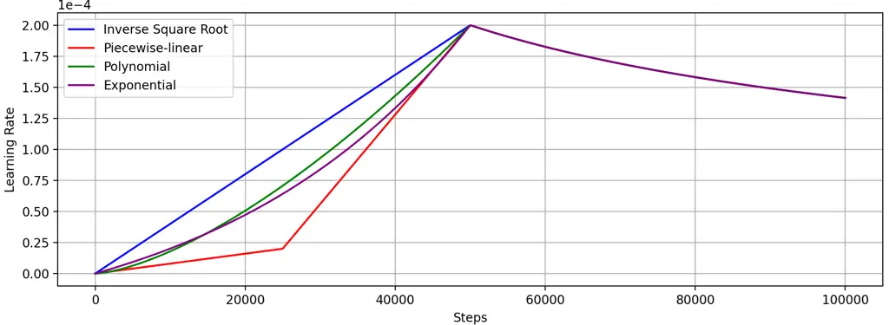
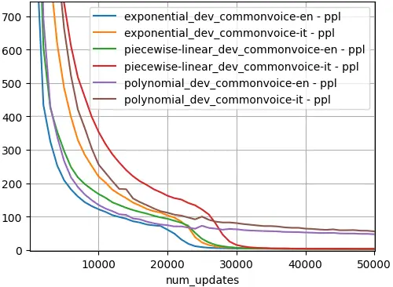
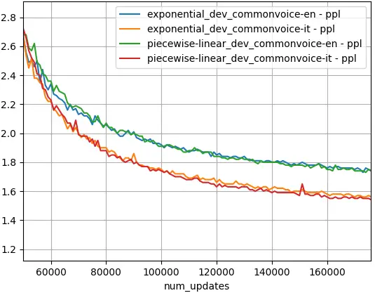
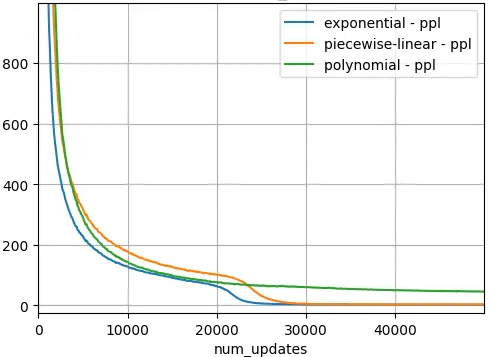
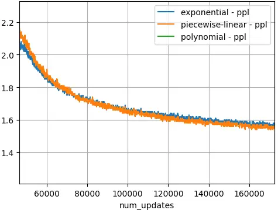
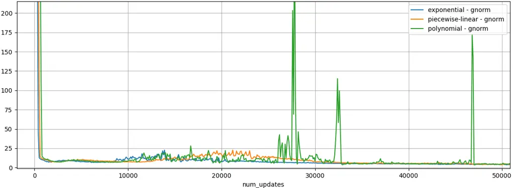

# The Warmup Dilemma: How Learning Rate Strategies Impact Speech-to-Text Model Convergence

Marco Gaido^(\*)    Sara Papi^(\*)    Luisa Bentivogli    Alessio Brutti
   Mauro Cettolo Affiliation: Roberto Gretter, Marco Matassoni, Mohamed
Nabih, Matteo Negri Affiliation: Fondazione Bruno Kessler, Italy
Email: [{mgaido,spapi,bentivo,brutti,cettolo,gretter,matasso,mnabih,negri}@fbk.eu](mailto:)

###### Abstract

Training large-scale models presents challenges not only in terms of
resource requirements but also in terms of their convergence. For this
reason, the learning rate (LR) is often decreased when the size of a
model is increased. Such a simple solution is not enough in the case of
speech-to-text (S2T) trainings, where evolved and more complex variants
of the Transformer architecture – e.g., Conformer or Branchformer – are
used in light of their better performance. As a workaround, OWSM
designed a double linear warmup of the LR, increasing it to a very small
value in the first phase before updating it to a higher value in the
second phase. While this solution worked well in practice, it was not
compared with alternative solutions, nor was the impact on the final
performance of different LR warmup schedules studied. This paper fills
this gap, revealing that i) large-scale S2T trainings demand a
sub-exponential LR warmup, and ii) a higher LR in the warmup phase
accelerates initial convergence, but it does not boost final
performance.

^(†)^(†) \* Equal contribution.

## 1 Introduction

Following the success of Large Language Models (LLM) (Radford et al.,
2019), large-scale speech-to-text (S2T) trainings have gained increased
interest with the goal of building Large Speech Models (LSM) or Speech
Foundation Models (SFM) with similar abilities for the speech modality
(Communication et al., 2023; Peng et al., 2023; Radford et al., 2023;
Zhang et al., 2023).

Scaling the size of the training data and trained models with respect to
traditional small-scale speech trainings has posed many challenges
beyond engineering efforts and demanding hardware requirements. Among
them, a significant challenge was ensuring the convergence of large
models, which required adaptations to the learning rate (LR) (Radford
et al., 2023; Peng et al., 2024). In particular, Whisper (Radford
et al., 2023) lowered the peak LR with the increase of the model size.
Differently, OWSM 3.1 (Peng et al., 2024) introduced a new LR scheduler,
driven by the insight that reducing the peak LR would compromise the
quality of the trained model (Kalra and Barkeshli, 2024). The new LR
scheduler – named piecewise LR scheduler – modifies the warmup phase
from a simple linear increase to a two-phase linear warmup while keeping
unaltered the decay phase after the LR peak. However, this design choice
was not motivated, nor was it investigated whether alternative warmup
policies could be more effective or how they might impact the final
model quality.



Figure 1: LR schedulers with inverse square root, piecewise-linear,
polynomial, and exponential warmup policies.

In this paper, we fill these gaps by studying which factors lead to a
more difficult convergence of large-scale models and what is the impact
of different LR warmup policies on the final performance. To this aim,
we train large-scale S2T Conformer (Gulati et al., 2020) models on more
than 150K hours of speech data, exploring alternative warmup methods –
specifically an exponential and a polynomial policy – operating between
the double linear warmup by OWSM and the traditional linear warmup phase
of the inverse square root LR scheduler. Our experiments demonstrate
that:

- •
  Advanced and more complex variants of the Transformer architecture,
  such as Conformer and Branchformer (Peng et al., 2022), widely used in
  speech processing for their superior performance, are more difficult
  to train due to their deeper layers involving additional components
  (e.g., extra convolutional or linear layers), making them more prone
  to “exploding gradient” (Bengio et al., 1994) issues;
- •
  The LR warmup should follow an exponential or sub-exponential function
  and, while it plays a crucial role in the convergence of the model by
  ensuring a smooth transition to a good model initialization, it does
  not significantly affect the final result as long as convergence of
  the model is achieved.

To ease future research on the topic, foster reproducibility of our
work, and in accordance with the Open Science principles (White et al.,
2024), we release the code, logs, and intermediate checkpoints under the
open-source Apache 2.0 license at
[https://github.com/hlt-mt/FBK-fairseq](https://github.com/hlt-mt/FBK-fairseq).

## 2 Learning Rate Schedulers

This section describes the LR schedulers analyzed in this work, starting
from the widely adopted inverse square root with linear warmup (§2.1)
and piecewise-linear warmup (§2.2), to the alternative sub-linear warmup
policies, namely polynomial (§2.3) and exponential (§2.4), designed to
be as close as possible to the traditional inverse square root LR. All
LR schedulers are shown in Figure 1.

### 2.1 Inverse Square Root Policy

Since the introduction of the Transformer architecture, the LR scheduler
has followed an inverse square root policy (Vaswani et al., 2017). This
scheduler has therefore been widely adopted in S2T training settings
(Inaguma et al., 2020; Wang et al., 2020) and entails two phases.
Firstly, the LR linearly increases for a predefined number of steps
$`w`$ from 0 to the peak LR $`\eta`$, where $`w`$ and $`\eta`$ are two
hyper-parameters whose tuning is critical for the success of the
training and the quality of the resulting model (Popel and Bojar, 2018).
In this phase, the LR $`\eta_{i}`$ at the $`i`$-th step is
$`\eta_{i}=\eta\cdot i/w`$. Secondly, after reaching $`\eta`$, the LR
decreases proportionally to the inverse square root of the number of
steps, i.e. $`\eta_{i}=\eta\cdot\sqrt{w}/\sqrt{i}`$. Overall, the LR
$`\eta_{i}`$ at the $`i`$-th step is:

```math
\eta_{i}=\eta\cdot\min\left(\frac{i}{w},\frac{\sqrt{w}}{\sqrt{i}}\right)
```

where $`w`$ is set to 50k and $`\eta`$ to $`2e^{-4}`$ in this work.

### 2.2 Piecewise-linear Warmup

Peng et al. (2024) found that the linear warmup of the standard inverse
square root LR scheduler was not suitable for training their large-scale
1B Branchformer model and introduced the piecewise-linear warmup policy.
This policy splits the warmup step into two linear phases, introducing
an intermediate LR $`\eta^{\prime}`$ with a corresponding number of
intermediate warmup steps $`w^{\prime}`$ as additional hyperparameters.
In the first $`w^{\prime}`$ steps, the LR linearly increases from 0 to
$`\eta^{\prime}`$, which is typically set to a much smaller value than
$`\eta`$, and then in the steps between $`w^{\prime}`$ and $`w`$ it
increases from $`\eta^{\prime}`$ to $`\eta`$. As such, in the warmup
phase, i.e. at the step $`i<w`$, the LR $`\eta_{i}`$ is:

```math
\eta_{i<w}=\max\left(\eta^{\prime}\cdot\frac{i}{w^{\prime}},\eta^{\prime}+\frac{(\eta-\eta^{\prime})\cdot(i-w^{\prime})}{w-w^{\prime}}\right)
```

In this work, we follow Peng et al. (2024) and set the number of
intermediate warmup steps $`w^{\prime}`$ to $`w/2`$ i.e., 25k, and the
intermediate LR $`w^{\prime}`$ to $`\eta/10`$.

### 2.3 Polynomial Warmup

As a first alternative to the piecewise-linear policy, we propose to
increase the LR with a polynomial function with respect to the number of
steps. The slope of the increase is controlled by a hyper-parameter
$`\alpha`$, according to the formula:

```math
\eta_{i<w}=\eta\cdot\left(\frac{i}{w}\right)^{\alpha}
```

We set $`\alpha`$ to 1.5, and the polynomial warmup function is
visualized in Figure 1 (green curve).

### 2.4 Exponential Warmup

As a second alternative, we introduce an exponential policy that,
compared to the polynomial one, has a steeper LR increase in the first
part of the warmup and a lower LR in the second. Also in this case, the
hyper-parameter $`\alpha`$ controls the smoothness of the function, and
the higher the $`\alpha`$ the smaller the LR in the warmup phase.
Specifically, this policy follows the formula:

```math
\eta_{i<w}=\eta\cdot\frac{e^{\alpha\cdot\frac{i}{w}}-1}{e^{\alpha}-1}
```

Similarly to the polynomial warmup (Section 2.3), we set $`\alpha`$ to
1.5, and the exponential warmup function is visualized in Figure 1
(purple curve).

## 3 Experimental Settings

To ensure that divergence issues are not due to a particularly
challenging setting, we avoided multi-task trainings, resorting to
training S2T models on the automatic speech recognition (ASR) task for
two languages (English and Italian). As training data, we use
$`\sim`$150k hours of publicly available speech datasets, which are
described in Appendix A. For validation, we use the English (en) and
Italian (it) dev sets of CommonVoice (Ardila et al., 2020).

Our encoder-decoder models have a Transformer decoder and a Conformer
encoder preceded by two 1D convolutional layers that downsample the
sequence length by a factor of 4. For the Conformer encoder, we use the
implementation by Papi et al. (2024) that fixes issues in padding
handling. Given the results of preliminary experiments (§4.1), we set 24
encoder layers and 12 decoder layers for the experiments in §4.2. The
embeddings have 1024 features, with an FFN hidden dimension of 4096 and
16 attention heads. In total, our models have 878M parameters. Further
details are provided in Appendix A.

## 4 Results

### 4.1 Preliminary Experiments

In preliminary experiments, we varied the number of encoder and decoder
layers to understand when the depth of the network becomes critical –
i.e., the model starts diverging – with the standard inverse square root
LR scheduler. In this scenario, we observed that the number of encoder
layers was the driver of the issue while adding more decoder layers was
not. Specifically, models with more than 18 encoder layers were not
converging. For instance, models with 18 encoder layers and 6 decoder
layers diverge, while models with 12 encoder and 12 decoder layers
converge without issues. This observation, together with the fact that
Whisper (which features a Transformer encoder) was trained without the
need for adapting the learning rate scheduler, suggests that complex
layers featuring many subcomponents, such as Conformer and Branchformer
layers, pose convergence issues with deep models. In our Conformer
implementation, each subcomponent is wrapped in a residual connection
(He et al., 2016), which may indicate a need for additional
normalization layers within each encoder block to mitigate potential
scaling effects. However, we leave this investigation for future work.

### 4.2 LR Warmup Analysis

Moving to the comparison of the warmup policies, Figure 2 shows the
resulting learning curves on the validation sets for the two languages,
which display the same behaviors, with the only difference that the
Italian curves have a higher perplexity at the beginning and decline
later than English ones. Similar trends can be observed in the training
set, which we report in Appendix B.



Figure 2: Perplexity on the English and Italian validation sets for the
polynomial, piecewise-linear, and exponential policies for the first 50k
steps (warmup phase).

#### Model Convergence

First, we notice that the model convergence is obtained only with the
exponential and piecewise-linear policies. The polynomial policy,
instead, displays the same pattern as the standard inverse square root
policy (which we do not report here) leading the model to a high
perplexity that minimally degrades with the progression of the training.
This convergence issue can be attributed to an exploding gradient: as we
show in Appendix C, in the polynomial training there are huge spikes in
the gradient norm in the range 25k-30k steps and later, where the other
policies feature a steep decrease that the polynomial fails to achieve.
The exponential policy, despite a higher LR during the first $`\sim`$15k
steps, has a slightly lower LR in the 15k-50k range than the polynomial
policy. This minimal difference is sufficient to enable model
convergence. Therefore, we can conclude that the exponential policy
closely approaches the highest feasible LR during the warmup phase
without compromising model convergence.

#### Convergence Speed

Figure 2 also shows that, as expected, higher LRs result in lower
perplexity during the initial steps. In both the English and Italian
validation sets, the exponential policy – which features the highest LR
in the first $`\sim`$15k steps – always displays the lowest perplexity.
The polynomial one starts with the highest perplexity due to its lower
LR in the initial steps. However, it later surpasses the
piecewise-linear policy and closes the gap with the exponential one,
thanks to its higher LR in the later stages, until it ultimately fails
to converge. Interestingly, the learning curves of the two converging
policies show a step-like decrease, which is anticipated for the
exponential policy ($`\sim`$20k vs $`\sim`$23k steps for English and
$`\sim`$22k vs $`\sim`$26k for Italian) as per its faster convergence.

| LR  | CV   |      | MLS |      | VP  |      | AVG  |
| --- | ---- | ---- | --- | ---- | --- | ---- | ---- |
|     | en   | it   | en  | it   | en  | it   |      |
| PL  | 18.4 | 13.7 | 7.4 | 17.4 | 8.3 | 17.8 | 13.8 |
| Exp | 19.1 | 14.3 | 7.5 | 17.9 | 8.6 | 18.3 | 14.3 |

Table 1: WER ($`\downarrow`$), computed using jiwer and the Whisper text
normalizer, on the CommonVoice (CV), VoxPopuli (VP), and MLS test sets
of the 170k-steps checkpoints obtained with the LR scheduler with
piecewise-linear (PL) and exponential (Exp) warm up.



Figure 3: Perplexity on the English and Italian validation sets for the
piecewise-linear and exponential policies for the steps after the warmup
phase (50k-170k).

#### Effect on the Resulting Model

Lastly, we explore whether the faster initial convergence of the
exponential policy results in a better model at the end of the training
compared to that obtained with the piecewise-linear policy. Figure 3
shows the learning curve after the first 50k steps, up to the end of the
whole pass over the training set (i.e., the first training epoch at step
170k). The learning curves of the piecewise-linear scheduler not only
reach the perplexity of those of the exponential policy but the English
one also becomes slightly better. The same trend is observed in the
training data (see Figure 5 in Appendix B), in which the English data is
more than 80%. The WER on test sets for the checkpoint at the 170k step
also testifies to a slight superiority of the model obtained using the
piecewise-linear policy on both languages, as shown in Table 1. We can
conclude that a faster convergence in the early stages of the training
does not imply a better resulting model and that the warmup policy of
the LR scheduler is critical to ensure the convergence of the model,
but, once that is achieved, its role in the model quality is limited.

## 5 Conclusions

In this study, we analyzed one of the key challenges – beyond
engineering, data curation, and hardware efforts – associated with
training large-scale S2T models i.e., the role of the LR scheduler and,
in particular, of its warmup strategy in model convergence and final
performance. To this aim, we compared the standard linear warmup and the
piecewise-linear warmup strategies with two policies – polynomial and
exponential – aimed at finding the highest possible LR in the warmup
phase that does not lead to convergence issues. Through experiments on
large-scale ASR trainings of a $`\sim`$900M parameters Conformer model,
we demonstrated that while the LR warmup phase is crucial for
stabilizing convergence, it has a minimal impact on final model
performance and that the LR warmup phase should follow an exponential or
sub-exponential rise to ensure model convergence.

## Acknowledgments

This paper has received funding from the PNRR project FAIR - Future AI
Research (PE00000013), under the NRRP MUR program funded by the
NextGenerationEU, and from the European Union’s Horizon research and
innovation programme under grant agreement No 101135798, project
Meetween (My Personal AI Mediator for Virtual MEETings BetWEEN People).
We acknowledge CINECA for the availability of high-performance computing
resources and support.

## Limitations

#### Effect of Multilingualism and Multi-task

In this work, we decided to experiment with a single task and two
languages in the training, even though the amount of training data we
used was comparable to that used in other works to train S2T models on
multiple tasks and more than 100 languages (e.g., OWSM uses 180k hours
of data against our 150k hours). Although there is no reason to posit
that a different setting may lead to different conclusions since the
behaviors we observed were similar to those of OWSM, future works should
validate that our findings extend to these scenarios.

#### Multiple Runs

While performing multiple runs for each setting would provide stronger
insights into the possible statistical significance of the observed
differences, this would require extensive computational costs that go
beyond our budget.

#### Tuning $`\alpha`$

Although by tuning $`\alpha`$ we could, for instance, obtain a
converging model even with the polynomial policy, this was not the focus
of our work. In this paper, we attempted to understand the role of
different LR schedulers on the resulting model and what could be
achieved by using different LR warmup policies. Since two extreme
solutions – the piecewise-linear policy with a relatively low LR and the
exponential policy with the highest feasible LR – do not show evident
differences, finding other values of $`\alpha`$ or other policies
leading to similar results would not have added much to our discussion.
Also, as noted above, each run is computationally demanding, limiting
our ability to explore the space of the possible values.

## References

- Ardila et al. (2020) Rosana Ardila, Megan Branson, Kelly Davis,
  Michael Kohler, Josh Meyer, Michael Henretty, Reuben Morais, Lindsay
  Saunders, Francis Tyers, and Gregor Weber. 2020. [Common voice: A
  massively-multilingual speech
  corpus](https://aclanthology.org/2020.lrec-1.520). In _Proceedings of
  the Twelfth Language Resources and Evaluation Conference_, pages
  4218–4222, Marseille, France. European Language Resources Association.
- Bahar et al. (2019) Parnia Bahar, Tobias Bieschke, and Hermann
  Ney. 2019. [A comparative study on end-to-end speech to text
  translation](https://doi.org/10.1109/ASRU46091.2019.9003774). In _2019
  IEEE Automatic Speech Recognition and Understanding Workshop (ASRU)_,
  pages 792–799.
- Bengio et al. (1994) Y. Bengio, P. Simard, and P. Frasconi. 1994.
  [Learning long-term dependencies with gradient descent is
  difficult](https://doi.org/10.1109/72.279181). _IEEE Transactions on
  Neural Networks_, 5(2):157–166.
- Communication et al. (2023) Seamless Communication et al. 2023.
  [SeamlessM4T: Massively Multilingual & Multimodal Machine
  Translation](https://arxiv.org/abs/2308.11596). _Preprint_,
  arXiv:2308.11596.
- Conneau et al. (2023) Alexis Conneau, Min Ma, Simran Khanuja,
  Yu Zhang, Vera Axelrod, Siddharth Dalmia, Jason Riesa, Clara Rivera,
  and Ankur Bapna. 2023. [Fleurs: Few-shot learning evaluation of
  universal representations of
  speech](https://doi.org/10.1109/SLT54892.2023.10023141). In _2022 IEEE
  Spoken Language Technology Workshop (SLT)_, pages 798–805.
- Gaido et al. (2024) Marco Gaido, Sara Papi, Luisa Bentivogli, Alessio
  Brutti, Mauro Cettolo, Roberto Gretter, Marco Matassoni, Mohamed
  Nabih, and Matteo Negri. 2024. MOSEL: 950,000 Hours of Speech Data for
  Open-Source Speech Foundation Model Training on EU Languages. In
  _Proceedings of the 2024 Conference on Empirical Methods in Natural
  Language Processing_, Miami, United States. Association for
  Computational Linguistics.
- Graves et al. (2006) Alex Graves, Santiago Fernández, Faustino J.
  Gomez, and Jürgen Schmidhuber. 2006. Connectionist Temporal
  Classification: Labelling Unsegmented Sequence Data with Recurrent
  Neural Networks. In _Proceedings of the 23rd international conference
  on Machine learning (ICML)_, pages 369–376, Pittsburgh, Pennsylvania.
- Gulati et al. (2020) Anmol Gulati, James Qin, Chung-Cheng Chiu, Niki
  Parmar, Yu Zhang, Jiahui Yu, Wei Han, Shibo Wang, Zhengdong Zhang,
  Yonghui Wu, and Ruoming Pang. 2020. [Conformer: Convolution-augmented
  transformer for speech
  recognition](https://doi.org/10.21437/Interspeech.2020-3015). In
  _Interspeech 2020_, pages 5036–5040.
- He et al. (2016) Kaiming He, Xiangyu Zhang, Shaoqing Ren, and Jian
  Sun. 2016. [Deep residual learning for image
  recognition](https://doi.org/10.1109/CVPR.2016.90). In _2016 IEEE
  Conference on Computer Vision and Pattern Recognition (CVPR)_, pages
  770–778.
- Inaguma et al. (2020) Hirofumi Inaguma, Shun Kiyono, Kevin Duh,
  Shigeki Karita, Nelson Yalta, Tomoki Hayashi, and Shinji
  Watanabe. 2020. [ESPnet-ST: All-in-one speech translation
  toolkit](https://www.aclweb.org/anthology/2020.acl-demos.34). In
  _Proceedings of the 58th Annual Meeting of the Association for
  Computational Linguistics: System Demonstrations_, pages 302–311,
  Online. Association for Computational Linguistics.
- Kahn et al. (2020) J. Kahn, M. Rivière, W. Zheng, E. Kharitonov,
  Q. Xu, P. E. Mazaré, J. Karadayi, V. Liptchinsky, R. Collobert,
  C. Fuegen, T. Likhomanenko, G. Synnaeve, A. Joulin, A. Mohamed, and
  E. Dupoux. 2020. Libri-Light: A Benchmark for ASR with Limited or No
  Supervision. In _ICASSP 2020 - 2020 IEEE International Conference on
  Acoustics, Speech and Signal Processing (ICASSP)_, pages 7669–7673.
  [https://github.com/facebookresearch/libri-light](https://github.com/facebookresearch/libri-light).
- Kalra and Barkeshli (2024) Dayal Singh Kalra and Maissam
  Barkeshli. 2024. [Why warmup the learning rate? underlying mechanisms
  and improvements](https://openreview.net/forum?id=NVl4SAmz5c). In _The
  Thirty-eighth Annual Conference on Neural Information Processing
  Systems_.
- Kudo (2018) Taku Kudo. 2018. [Subword regularization: Improving neural
  network translation models with multiple subword
  candidates](https://doi.org/10.18653/v1/P18-1007). In _Proceedings of
  the 56th Annual Meeting of the Association for Computational
  Linguistics (Volume 1: Long Papers)_, pages 66–75, Melbourne,
  Australia.
- Papi et al. (2025) Sara Papi, Marco Gaido, Luisa Bentivogli, Alessio
  Brutti, Mauro Cettolo, Roberto Gretter, Marco Matassoni, Mohamed
  Nabih, and Matteo Negri. 2025. FAMA: The First Large-Scale
  Open-Science Speech Foundation Model for English and Italian.
- Papi et al. (2024) Sara Papi, Marco Gaido, Andrea Pilzer, and Matteo
  Negri. 2024. [When good and reproducible results are a giant with feet
  of clay: The importance of software quality in
  NLP](https://doi.org/10.18653/v1/2024.acl-long.200). In _Proceedings
  of the 62nd Annual Meeting of the Association for Computational
  Linguistics (Volume 1: Long Papers)_, pages 3657–3672, Bangkok,
  Thailand. Association for Computational Linguistics.
- Peng et al. (2022) Yifan Peng, Siddharth Dalmia, Ian Lane, and Shinji
  Watanabe. 2022. [Branchformer: Parallel MLP-attention architectures to
  capture local and global context for speech recognition and
  understanding](https://proceedings.mlr.press/v162/peng22a.html). In
  _Proceedings of the 39th International Conference on Machine
  Learning_, volume 162 of _Proceedings of Machine Learning Research_,
  pages 17627–17643. PMLR.
- Peng et al. (2024) Yifan Peng, Jinchuan Tian, William Chen, Siddhant
  Arora, Brian Yan, Yui Sudo, Muhammad Shakeel, Kwanghee Choi, Jiatong
  Shi, Xuankai Chang, Jee weon Jung, and Shinji Watanabe. 2024. [Owsm
  v3.1: Better and faster open whisper-style speech models based on
  e-branchformer](https://doi.org/10.21437/Interspeech.2024-1194). In
  _Interspeech 2024_, pages 352–356.
- Peng et al. (2023) Yifan Peng, Jinchuan Tian, Brian Yan, Dan Berrebbi,
  Xuankai Chang, Xinjian Li, Jiatong Shi, Siddhant Arora, William Chen,
  Roshan Sharma, Wangyou Zhang, Yui Sudo, Muhammad Shakeel, Jee-Weon
  Jung, Soumi Maiti, and Shinji Watanabe. 2023. [Reproducing
  whisper-style training using an open-source toolkit and publicly
  available data](https://doi.org/10.1109/ASRU57964.2023.10389676). In
  _2023 IEEE Automatic Speech Recognition and Understanding Workshop
  (ASRU)_, pages 1–8.
- PleIAs (2024) PleIAs. 2024. PleIAs/YouTube-Commons · Datasets at
  Hugging Face — huggingface.co.
  [https://huggingface.co/datasets/PleIAs/YouTube-Commons](https://huggingface.co/datasets/PleIAs/YouTube-Commons).
  \[Accessed 10-06-2024\].
- Popel and Bojar (2018) Martin Popel and Ondřej Bojar. 2018. Training
  tips for the transformer model. _The Prague Bulletin of Mathematical
  Linguistics_, 110:43–70.
- Pratap et al. (2020) Vineel Pratap, Qiantong Xu, Anuroop Sriram,
  Gabriel Synnaeve, and Ronan Collobert. 2020. [MLS: A Large-Scale
  Multilingual Dataset for Speech
  Research](https://doi.org/10.21437/Interspeech.2020-2826). In _Proc.
  Interspeech 2020_, pages 2757–2761.
- Radford et al. (2023) Alec Radford, Jong Wook Kim, Tao Xu, Greg
  Brockman, Christine Mcleavey, and Ilya Sutskever. 2023. [Robust speech
  recognition via large-scale weak
  supervision](https://proceedings.mlr.press/v202/radford23a.html). In
  _Proceedings of the 40th International Conference on Machine
  Learning_, volume 202 of _Proceedings of Machine Learning Research_,
  pages 28492–28518.
- Radford et al. (2019) Alec Radford, Jeff Wu, Rewon Child, David Luan,
  Dario Amodei, and Ilya Sutskever. 2019. Language Models are
  Unsupervised Multitask Learners.
- Szegedy et al. (2016) Christian Szegedy, Vincent Vanhoucke, Sergey
  Ioffe, Jon Shlens, and Zbigniew Wojna. 2016. Rethinking the inception
  architecture for computer vision. In _Proceedings of the IEEE
  conference on computer vision and pattern recognition_, pages
  2818–2826.
- Vaswani et al. (2017) Ashish Vaswani, Noam Shazeer, Niki Parmar, Jakob
  Uszkoreit, Llion Jones, Aidan N Gomez, Ł ukasz Kaiser, and Illia
  Polosukhin. 2017. [Attention is all you
  need](https://proceedings.neurips.cc/paper/2017/file/3f5ee243547dee91fbd053c1c4a845aa-Paper.pdf).
  In _Advances in Neural Information Processing Systems_, volume 30.
  Curran Associates, Inc.
- Wang et al. (2021a) Changhan Wang, Morgane Riviere, Ann Lee, Anne Wu,
  Chaitanya Talnikar, Daniel Haziza, Mary Williamson, Juan Pino, and
  Emmanuel Dupoux. 2021a. [VoxPopuli: A large-scale multilingual speech
  corpus for representation learning, semi-supervised learning and
  interpretation](https://doi.org/10.18653/v1/2021.acl-long.80). In
  _Proceedings of the 59th Annual Meeting of the Association for
  Computational Linguistics and the 11th International Joint Conference
  on Natural Language Processing (Volume 1: Long Papers)_, pages
  993–1003, Online. Association for Computational Linguistics.
- Wang et al. (2020) Changhan Wang, Yun Tang, Xutai Ma, Anne Wu, Dmytro
  Okhonko, and Juan Pino. 2020. [Fairseq S2T: Fast speech-to-text
  modeling with fairseq](https://doi.org/10.18653/v1/2020.aacl-demo.6).
  In _Proceedings of the 1st Conference of the Asia-Pacific Chapter of
  the Association for Computational Linguistics and the 10th
  International Joint Conference on Natural Language Processing: System
  Demonstrations_, pages 33–39, Suzhou, China. Association for
  Computational Linguistics.
- Wang et al. (2021b) Changhan Wang, Anne Wu, Jiatao Gu, and Juan Pino.
  2021b. [CoVoST 2 and Massively Multilingual Speech
  Translation](https://doi.org/10.21437/Interspeech.2021-2027). In
  _Proc. Interspeech 2021_, pages 2247–2251.
- White et al. (2024) Matt White, Ibrahim Haddad, Cailean Osborne,
  Xiao-Yang Liu Yanglet, Ahmed Abdelmonsef, and Sachin Varghese. 2024.
  [The model openness framework: Promoting completeness and openness for
  reproducibility, transparency, and usability in artificial
  intelligence](https://arxiv.org/abs/2403.13784). _Preprint_,
  arXiv:2403.13784.
- Yan et al. (2023) Brian Yan, Siddharth Dalmia, Yosuke Higuchi, Graham
  Neubig, Florian Metze, Alan W Black, and Shinji Watanabe. 2023. [CTC
  alignments improve autoregressive
  translation](https://doi.org/10.18653/v1/2023.eacl-main.119). In
  _Proceedings of the 17th Conference of the European Chapter of the
  Association for Computational Linguistics_, pages 1623–1639,
  Dubrovnik, Croatia.
- Zhang et al. (2023) Yu Zhang, Wei Han, James Qin, Yongqiang Wang,
  Ankur Bapna, Zhehuai Chen, Nanxin Chen, Bo Li, Vera Axelrod, Gary
  Wang, Zhong Meng, Ke Hu, Andrew Rosenberg, Rohit Prabhavalkar,
  Daniel S. Park, Parisa Haghani, Jason Riesa, Ginger Perng, Hagen
  Soltau, Trevor Strohman, Bhuvana Ramabhadran, Tara Sainath, Pedro
  Moreno, Chung-Cheng Chiu, Johan Schalkwyk, Françoise Beaufays, and
  Yonghui Wu. 2023. [Google usm: Scaling automatic speech recognition
  beyond 100 languages](https://arxiv.org/abs/2303.01037). _Preprint_,
  arXiv:2303.01037.

## Appendix A Training Settings

We train the models on $`\sim`$150k hours of speech datasets, namely the
train section of CommonVoice (Ardila et al., 2020), CoVoST2 (Wang
et al., 2021b), FLEURS (Conneau et al., 2023), LibriLight (Kahn et al.,
2020), MLS (Pratap et al., 2020), VoxPopuli (Wang et al., 2021a), and
YouTube-Commons (PleIAs, 2024). When the transcript was not available
for a given dataset, we used the automatic transcripts of MOSEL v1.0
(Gaido et al., 2024). As YouTube-Commons transcripts are not available
in MOSEL v1.0¹¹ 1 They have been added in v2.0., we used the transcript
provided for the training of FAMA (Papi et al., 2025). Our training data
is exactly the same used for FAMA and is available at
[https://huggingface.co/datasets/FBK-MT/fama-data](https://huggingface.co/datasets/FBK-MT/fama-data).
The textual data is used to build the vocabulary with 16,000
SentencePiece unigrams (Kudo, 2018).

We optimize our models using the Adam optimizer with betas (0.9, 0.98).
The training loss is the linear combination of the label-smoothed
cross-entropy (Szegedy et al., 2016) on the decoder output and two CTC
(Graves et al., 2006) losses, one at the 16th encoder layer and one on
top of the encoder (Bahar et al., 2019; Yan et al., 2023). We also
experimented with removing the auxiliary CTC losses, to ensure that they
were not the driver of divergence issues and, indeed, their removal did
not change anything in terms of whether a model converges or not. We
clip the gradient norm at 10.0 and use 0.001 weight decay. We trained
the models on 16 A100 GPUs (64GB VRAM) for 1 epoch with at most 55
seconds of data in each mini-batch and 5 gradient accumulation steps,
resulting in 176,208 batches to complete an epoch. One run in this
setting lasts 6 days.

## Appendix B Perplexity on the Training Set



Figure 4: Perplexity on the training set for the polynomial,
piecewise-linear, and exponential warmup policies for the first 50k
steps (warmup phase).

Figure 4 shows the perplexity (PPL) of the different warmup policies on
the training set for the first part of the training. Compared to Figure
2 presenting the PPL obtained on the validation set, the training curves
show similar behaviors, with the polynomial warmup not converging, and
the piecewise-linear and exponential leading to, respectively, slower
and faster convergence.



Figure 5: Perplexity on the training set for the piecewise-linear and
exponential warmup policies for the steps after the warmup phase
(50k-170k).



Figure 6: Gradient norm comparison across the piecewise-linear,
polynomial, and exponential warmup policies.

Looking at Figure 5 that isolates the PPL behavior after the first 50k
steps, we notice that, again, the piecewise-linear and exponential
warmup exhibit similar trends to those reported for the validation set
in Figure 3: the curves are very close, with the piecewise-linear,
initially above the exponential, becoming slightly below the exponential
in the long run. This reconfirms the results discussed in Section 4,
where we highlighted the convergence issues of the polynomial function,
which is actually reflected in the training set, and the slower but
slightly better convergence of the piecewise-linear warmup against the
exponential one.

## Appendix C Gnorm Analysis

Figure 6 reports the gradient norm in the warmup phase for the different
policies (exponential, polynomial, and piecewise-linear). Except for the
initial steps, the gradient norm for the policies leading to convergence
always remains low ($`<`$25). For the polynomial warmup, instead, there
are huge spikes beyond 100 and even 200 after 25k steps. These
explosions of the gradient norm have also been observed in all the runs
with the inverse square root LR scheduler that did not converge in our
preliminary experiments. We can conclude that huge spikes in the
gradient norm can be used to detect non-converging trainings.

Analyzing the gradient norm of the exponential and piecewise-linear
policies, we observe that the gradient norm is higher at the beginning
(8k-15k steps) for the exponential policy, which displays faster
convergence in this phase. On the opposite, the gradient norm of the
piecewise-linear policy is higher in the 15k-30k steps range, in which
closes the initial gap with the exponential policy.
