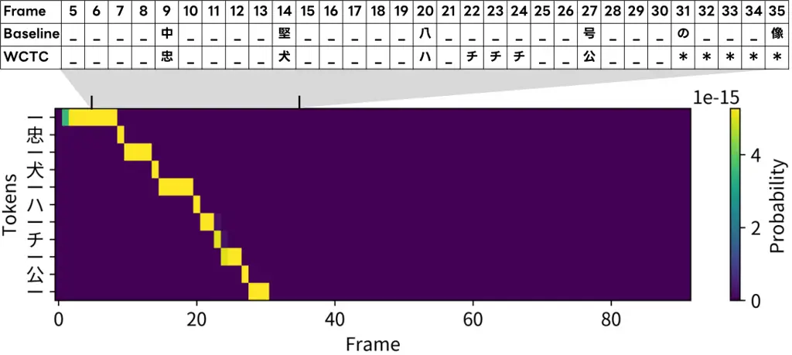

Nakagome Hentschel LINE WORKS CorporationJapan NAVER Cloud
CorporationSouth Korea

# WCTC-Biasing: Retraining-free Contextual Biasing ASR with Wildcard CTC-based Keyword Spotting and Inter-layer Biasing

Yu Affiliation:     Michael Affiliation: 

###### Abstract

Despite recent advances in end-to-end speech recognition methods, the
output tends to be biased to the training data’s vocabulary, resulting
in inaccurate recognition of proper nouns and other unknown terms. To
address this issue, we propose a method to improve recognition accuracy
of such rare words in CTC-based models without additional training or
text-to-speech systems. Specifically, keyword spotting is performed
using acoustic features of intermediate layers during inference, and a
bias is applied to the subsequent layers of the acoustic model for
detected keywords. For keyword detection, we adopt a wildcard CTC that
is both fast and tolerant of ambiguous matches, allowing flexible
handling of words that are difficult to match strictly. Since this
method does not require retraining of existing models, it can be easily
applied to even large-scale models. In experiments on Japanese speech
recognition, the proposed method achieved a 29% improvement in the F1
score for unknown words.

###### keywords

speech recognition, contextual biasing, CTC, wildcard paths,
self-conditioning

^(†)^(†)email: y.nakagome@line-works.com

## 1 Introduction

In recent years, the rapid progress of deep neural networks has brought
about a dramatic improvement in the performance of end-to-end (E2E)
automatic speech recognition (ASR) models, such as connectionist
temporal classification (CTC) \[1\], recurrent neural network
transducers \[2\], attention-based encoder-decoders \[3, 4\], and
decoder-only architectures \[5, 6\]. These models are now widely
employed in real-world applications, including conference transcription
and AI dialog systems. However, their performance heavily depends on the
training data. Consequently, it remains challenging to accurately
recognize rare words such as internal jargon, personal names, and
specialized technical terms when these words are rarely observed in the
training corpus.

Traditional approaches have often relied on constructing or adapting
decoding graphs using weighted finite state transducers (WFSTs) \[7, 8,
9\] to improve recognition performance for these rare words. While
WFST-based decoding graph generation has proven effective, updating or
rebuilding these graphs is not suitable for E2E models such as CTC,
which are inherently designed to operate without decoding graphs.

In contrast, deep biasing \[10, 11, 12, 13, 14, 15, 16\] has recently
garnered attention. Deep biasing directly intervenes in the ASR training
process, integrating a specified keyword list to enhance recognition of
rare terms. Concretely, the approach encodes the keywords into the
model’s encoder, subsequently applying bias through mechanisms such as
cross-attention. However, this technique complicates model training and
introduces the possibility that the set of recognizable rare words might
be influenced by the keywords seen during training.

Another emerging research direction leverages speech language model
(LM) \[6, 17\] to enhance recognition performance. In this approach, the
LM directly accepts a context biasing list via prompts, allowing for
more flexible biasing. Nevertheless, practical constraints arise due to
limitations on the number of prompt tokens. Additionally, if the
acoustic model fails to correctly recognize the rare words in the first
place, the biasing effect is diminished, ultimately necessitating
biasing within the acoustic encoder itself \[17\].

A more practical approach that requires neither model retraining nor the
construction of decoding graphs is keyword boosted beam search
(KBBS) \[18\]. In KBBS, beam search paths are dynamically adjusted by
boosting the scores of specified keywords to encourage their appearance
in the final recognition output. However, if a targeted keyword never
appears in any beam hypothesis, boosting cannot be applied. This
shortcoming is particularly problematic for languages such as Japanese,
where there is significant variability in written forms. Moreover,
CTC-based models tend to produce sharp posterior distributions \[19\],
making it unlikely for rare words to appear among beam hypotheses. To
address these issues, InterBiasing \[20\] extends the self-conditioned
CTC \[21\] by injecting keywords into the intermediate layers of the
acoustic encoder. In this approach, pre-generated text-to-speech (TTS)
samples are decoded to collect error patterns. During inference, these
patterns are used to correct the intermediate predictions, and the
acoustic encoder is conditioned on the corrected target keywords. While
this method is effective, it requires an additional TTS module and
entails a more complex decoding process.

To improve on InterBiasing \[20\], we propose _WCTC-Biasing_, a novel
approach that does not require any additional training or TTS modules.
Specifically, during inference, we employ wildcard CTC \[22\] to compute
the CTC paths for target keywords at an intermediate layer of the
acoustic encoder, thereby enabling keyword detection. We then bias the
acoustic encoder towards the detected keywords by conditioning the
subsequent layers on these keyword candidates within the
self-conditioned CTC \[21\] framework. In the acoustic encoder, wildcard
CTC treats all non-keyword segments as “wildcards,” allowing efficient
computation of CTC paths for only the target keywords. Moreover, because
CTC utilizes both forward and backward paths, this method remains robust
to pronunciation ambiguities and partial omissions. Even at lower layers
of the encoder, where output hypotheses may be inaccurate, the approach
can still flexibly detect keywords. The key feature of the proposed
method is that it requires neither additional training nor a TTS module,
making it particularly easy to integrate into large-scale CTC-based
models.

## 2 Background

This section describes CTC \[1\], self-conditioned CTC \[21\] and
InterBiasing \[20\], which are the backbone of WCTC-Biasing.

### 2.1 Connectionist Temporal Classification

E2E ASR aims to model the probability distribution of a token sequence
$`Y=(y_{l}\in\mathcal{V}\mid l=1,\dots,L)`$ given a sequence of
$`D`$-dimensional audio features
$`X=(\mathbf{x}_{t}\in\mathbb{R}^{D}\mid t=1,\dots,T)`$, where
$`\mathcal{V}`$ is a token vocabulary. In the CTC framework \[1\],
frame-level alignment paths between $`X`$ and $`Y`$ are introduced with
a special blank token $`\epsilon`$. An alignment path is denoted by
$`\pi=\left(\pi_{t}\in\mathcal{V}^{\prime}\mid t=1,\dots,T\right)`$,
where $`\mathcal{V}^{\prime}=\mathcal{V}\cup\{\epsilon\}`$. The
alignment path can be transformed into the corresponding token sequence
by using the collapsing function $`\mathcal{B}`$ that removes all
repeated tokens and blank tokens. A neural network is trained to
estimate the probability distribution of $`\pi_{t}`$. We denote the
output sequence of the neural network by
$`Z=(\mathbf{z}_{t}\in(0,1)^{|\mathcal{V}^{\prime}|}\mid t=1,\dots,T)`$,
where each element $`z_{t,k}`$ is interpreted as $`p(\pi_{t}=k|X)`$. The
training objective of CTC is the negative log-likelihood over all
possible alignment paths with the conditional independence assumption
per frame, as follows:

```math
\displaystyle\mathcal{L}_{\mathsf{ctc}}(Z,Y)=-\log\sum_{\pi\in\mathcal{B}^{-1}(Y)}\prod_{t}z_{t,\pi_{t}}. \tag{1}
```

The estimated token sequence $`\hat{Y}`$ is obtained as follows:

```math
\displaystyle\hat{Y}=\mathcal{B}(\mathsf{argmax}(Z)). \tag{2}
```

### 2.2 Self-conditioned CTC encoder

Our model adopts an $`N`$-layer Conformer encoder \[23\] alongside the
self-conditioned CTC framework \[21\]. Let $`X`$ be the subsampled input
features. The $`n`$-th encoder transforms its input $`X^{(n-1)}`$ into
$`X^{(n)}`$:

```math
\displaystyle X^{(n)}=\mathsf{Encoder}^{(n)}\bigl(X^{(n-1)}\bigr),\quad X^{(0)}=X. \tag{3}
```

After the final layer, we apply a linear projection and softmax to
obtain the output sequence $`Z`$:

```math
\displaystyle Z=\mathsf{Softmax}\bigl(\mathsf{Linear}_{D\rightarrow|\mathcal{V}^{\prime}|}(X^{(N)})\bigr). \tag{4}
```

To improve training stability, we incorporate the idea of Intermediate
CTC \[24\]. Let $`Z^{(n)}`$ be the softmax output at layer $`n`$:

```math
\displaystyle Z^{(n)}=\mathsf{Softmax}\bigl(\mathsf{Linear}_{D\rightarrow|\mathcal{V}^{\prime}|}(X^{(n)})\bigr). \tag{5}
```

Each $`Z^{(n)}`$ is used to compute the intermediate CTC loss and
combined with the encoder output CTC loss as

```math
\mathcal{L}_{\mathsf{ic}}=(1-\lambda)\mathcal{L}_{\mathsf{ctc}}(Z,Y)+\frac{\lambda}{|\mathcal{N}|}\sum_{n\in\mathcal{N}}\mathcal{L}_{\mathsf{ctc}}\bigl(Z^{(n)},Y\bigr), \tag{6}
```

where $`\lambda`$ is a mixing weight, $`Y`$ is the ground-truth
sequence, and $`\mathcal{N}`$ indicates the encoder layers for
intermediate supervision.

Self-conditioned CTC \[21\] further leverages these intermediate outputs
to condition subsequent layers. Specifically, each $`Z^{(n)}`$ is
linearly mapped back to the encoder dimension $`D`$:

```math
\displaystyle C^{(n)} \displaystyle=\mathsf{Linear}_{|\mathcal{V}^{\prime}|\rightarrow D}\bigl(Z^{(n)}\bigr), \tag{7}
```

and then added to $`X^{(n)}`$ to yield $`X^{\prime(n)}`$:

```math
\displaystyle X^{\prime(n)} \displaystyle=\begin{cases}X^{(n)}+C^{(n)}&(n\in\mathcal{N}),\\
X^{(n)}&(n\notin\mathcal{N}).\end{cases} \tag{8}
```

By injecting the intermediate predictions back into the encoder, the
model refines its latent representations in higher layers, which
improves CTC-based speech recognition performance \[25\].

### 2.3 InterBiasing: TTS-based keyword error collection and Inter-layer biasing

To improve rare word recognition performance, InterBiasing \[20\] has
been proposed. InterBiasing, an extension of the self-conditioned CTC
framework, injects the correct target keyword into the intermediate
encoder layers instead of the recognition hypotheses. This method
requires generating TTS audio for each keyword $`\kappa\in\mathcal{K}`$,
where $`\mathcal{K}`$ denotes the set of target keywords, as
$`X_{\text{TTS},\kappa}=\mathsf{TTS}(\kappa)`$, to collect
misrecognitions of unknown keywords. By applying Eqs.3, 5 to
$`X_{\text{TTS},\kappa}`$, the intermediate predictions
$`\hat{Y}^{(n)}_{\text{TTS},\kappa}`$ can be obtained. The recognition
hypotheses of keyword $`\kappa`$ at layer index
$`\mathcal{M}_{\mathsf{bias}}`$ are selected as the trigger word set
$`W_{\text{trigger},\kappa}`$:

```math
\displaystyle W_{\text{trigger},\kappa}=\hat{Y}^{(n)}_{\text{TTS},\kappa}\quad(n\in\mathcal{M}_{\mathsf{bias}}). \tag{9}
```

During decoding, if the current intermediate prediction
$`\hat{Y}^{(n)}`$ partially matches $`W_{\text{trigger},\kappa}`$, the
corresponding word is replaced with $`\kappa`$ to form the text sequence
$`\hat{Y}^{(n)}_{\mathsf{bias}}`$. Next, Viterbi alignment is applied:

```math
\displaystyle A^{(n)}_{\mathsf{bias}}=\textsf{Viterbi}(\hat{Y}^{(n)}_{\mathsf{bias}},Z^{(n)}), \tag{10}
```

and this alignment $`A^{(n)}_{\mathsf{bias}}`$ is converted into a
one-hot vector $`{Z}^{(n)}_{\mathsf{bias}}`$. Subsequently, a weighted
sum of the original softmax probability $`Z^{(n)}`$ and the bias one-hot
vector is computed using a bias weight $`\psi`$:

```math
\displaystyle Z^{\prime(n)}=\mathsf{Softmax}\bigl((1-\psi)Z^{(n)}+\psi{Z}^{(n)}_{\mathsf{bias}}), \tag{11}
```

and finally a linear layer transforms $`Z^{\prime(n)}`$ to obtain the
bias features $`C^{(n)}_{\mathsf{Bias}}`$:

```math
\displaystyle C^{(n)}_{\mathsf{Bias}}=\mathsf{Linear}_{|\mathcal{V}^{\prime}|\rightarrow D}\bigl(Z^{\prime(n)}\bigr). \tag{12}
```

This feature $`C^{(n)}_{\mathsf{Bias}}`$ is fed into Eq.8 to condition
the subsequent layer. If no trigger word is detected in
$`\hat{Y}^{(n)}`$, the standard self-conditioned CTC is used instead.

## 3 WCTC-Biasing: Wildcard CTC-based keyword spotting and Inter-layer biasing

Figure 1: Overview of the proposed WCTC-Biasing. During inference,
wildcard CTC is applied to an intermediate acoustic encoder layer to
detect the target keyword, which is then injected into subsequent
layers.

Figure 1 illustrates the proposed framework. Keyword spotting is
performed using intermediate outputs from the acoustic encoder. The
detected keywords are converted into frame-level bias features and
injected into the subsequent layers.

### 3.1 Wildcard CTC-based Keyword Spotting

Although the standard CTC framework \[1\] (Section 2.1) effectively
learns a mapping between an audio feature sequence $`X`$ and a label
sequence $`Y`$ by summing over all possible alignment paths, it assumes
that each frame must be assigned to either a blank symbol or one of the
tokens in $`\mathcal{V}`$. This can become problematic when certain
segments (e.g., the beginning or end of an utterance) are unlabeled or
deliberately omitted. Wildcard CTC \[22\] addresses this issue by
introducing a special _wildcard_ token, denoted by “$`\ast`$.” This
token can match any symbol including blank at zero cost, allowing the
model to ignore unlabeled or irrelevant parts. Formally, let
$`\mathcal{V}^{\prime}=\mathcal{V}\cup\{\epsilon\}`$ be the extended CTC
vocabulary, and let
$`\mathcal{V}^{\prime}_{\ast}=\mathcal{V}^{\prime}\cup\{\ast\}`$ include
the wildcard token. A wildcard CTC alignment path $`\pi_{\ast}`$ is
given by

```math
\displaystyle\pi_{\ast}=(\pi_{t}\in\mathcal{V}^{\prime}_{\ast}\mid t=1,\dots,T). \tag{13}
```

To encourage the model to assign the wildcard token to frames with
ambiguous or low-confidence predictions, we introduce a threshold
$`\theta`$. Specifically, we define a biased indicator for each time
frame as follows:

```math
\displaystyle Z^{(n)}_{\mathsf{bias},\kappa,t}=\begin{cases}\mathsf{OneHot}_{\kappa},&\text{if }\log\sum_{\pi_{\ast}\in\mathcal{B}^{-1}(\kappa)}p(\pi_{t}\mid z_{t}^{(n)})>\theta,\\
0,&\text{otherwise},\end{cases} \tag{14}
```

where $`\mathsf{OneHot}_{\kappa}`$ is a one-hot vector of dimension
$`\mathcal{V}^{\prime}`$ that has a value of 1 at the index
corresponding to $`\kappa`$ and 0 in all other indices.

In summary, by allowing the wildcard token “$`\ast`$” to skip irrelevant
frames, wildcard CTC becomes well-suited for robust keyword spotting.
This is because the model can focus on whether the relevant keyword
tokens appear in the encoder output sequence, without forcing all frames
to be strictly labeled.

### 3.2 Biasing Intermediate Predictions

To bias the intermediate predictions toward recognizing target keywords,
we interpolate the original output $`Z^{(n)}`$ with the aggregated
biased features $`Z^{(n)}_{\mathsf{bias}}`$ as follows:

```math
\displaystyle Z^{(n)}_{\mathsf{bias}} \displaystyle=\bigvee_{\kappa\in\mathcal{K}}{Z^{(n)}_{\mathsf{bias},\kappa}}, \tag{15}
```

```math
\displaystyle Z^{\prime(n)} \displaystyle=\mathsf{Softmax}\bigl((1-{\omega})Z^{(n)}+{\omega}Z^{(n)}_{\mathsf{bias}}), \tag{16}
```

where $`\omega\in[0,1]`$ is a weighting factor that controls the
contribution of the biasing feature. Here, the Softmax function is
applied to normalize the combined scores into a valid probability
distribution over the vocabulary. Note that the biasing mechanism is
applied only to the intermediate layers $`n`$ in the set
$`\mathcal{S}\subseteq\{1,\dots,N\}`$, which specifies the layers
selected for biasing. For layers $`n\notin\mathcal{S}`$, the original
predictions are used without modification. Next, the biased intermediate
predictions $`Z^{\prime(n)}`$ are converted into the biasing features:

```math
\displaystyle C^{(n)}_{\mathsf{Bias}} \displaystyle=\mathsf{Linear}_{|\mathcal{V}^{\prime}|\rightarrow D}\bigl(Z^{\prime(n)}\bigr). \tag{17}
```

$`C^{(n)}_{\mathsf{Bias}}`$ is used in Eq.8 to condition the subsequent
encoder layer.

## 4 Experiments

To evaluate the proposed method, we conducted Japanese ASR experiments
using the NeMo toolkit ¹¹ 1 https://github.com/NVIDIA/NeMo \[26\]. The
models were evaluated based on character error rates (CERs) and F1
scores. Following previous studies \[18\], we used the F1 score as
evaluation metric for keyword recognition.

|               |               |           |             |
| ------------- | ------------- | --------- | ----------- | --- | ---------------- |
|               | Dataset       | $`        | \mathcal{K} | `$  | Avg. char length |
|               |               | OOV / IV  | OOV / IV    |
| In-domain     | CSJ eval3     | 23 / 8    | 4.3 / 3.1   |
| Out-of-domain | Common Voice  | 59 / 54   | 5.6 / 4.3   |
|               | JSUT basic 5k | 212 / 103 | 3.7 / 2.8   |
|               | TEDxJP-10K    | 99 / 78   | 4.0 / 3.6   |

Table 1: Summary of keyword set sizes and average character length for
OOV and IV keywords in each testset.

### 4.1 Data

Our model was trained on the CSJ corpus \[27\], which consists of
Japanese public speeches on academic topics. The vocabulary
$`\mathcal{V}`$ comprised 3,260 character units, and 80-dimensional
Mel-spectrograms were used as input features. SpecAugment \[28\] and
speed perturbation \[29\] were also applied with the ESPNet
recipe \[30\].

For evaluation, we tested on one in-domain testset (CSJ eval3 \[27\])
and three out-of-domain testsets (JSUT-basic 5000 \[31\], Common Voice
v8.0 \[32\], and TEDxJP-10K \[33\]). The out-of-domain sets reflect
typical real-world conditions where the acoustic and lexical properties
of unseen user data differ from those in the training data.

Next, we describe how the bias keywords were selected. First, we decoded
each evaluation set using the CSJ-trained model. By comparing the
resulting hypotheses with the corresponding reference labels, we
identified misrecognized words. These words were segmented using
morphological analysis with MeCab \[34\], and we retained only proper
nouns and personal names consisting of two or more characters based on
morphological labels. Obvious segmentation errors were then removed
manually. Finally, the remaining keywords were categorized into
in-vocabulary (IV) and out-of-vocabulary (OOV) classes based on whether
or not they were included in the original CSJ corpus. Table 1 summarizes
the number of IV and OOV keywords in each evaluation set. Note that we
did not use CSJ eval1 or eval2 because we could not collect a sufficient
number of OOV keywords from these sets.

|                         |                          |     |                   |                    |                    |                    |
| ----------------------- | ------------------------ | --- | ----------------- | ------------------ | ------------------ | ------------------ |
|                         | CER (%) / OOV F1 / IV F1 |     |                   |                    |                    |                    |
| Methods                 | Decoding                 | TTS | CSJ eval3         | Common Voice       | JSUT basic 5000    | TEDxJP-10K         |
|                         | Greedy                   | ✗   | 3.4 / 6.2 / 69.8  | 19.0 / 18.6 / 81.4 | 11.7 / 9.2 / 54.6  | 16.1 / 12.0 / 85.3 |
| SelfCond \[21\]         | LM+BS                    | ✗   | 3.4 / 9.2 / 72.7  | 17.3 / 18.6 / 82.8 | 11.5 / 9.2 / 54.9  | 15.8 / 12.0 / 85.6 |
|                         | LM + KBBS                | ✗   | 3.4 / 29.3 / 75.6 | 17.7 / 50.9 / 85.1 | 11.5 / 33.9 / 67.5 | 15.9 / 27.7 / 86.8 |
|                         | Greedy                   | ✗   | 3.5 / 9.2 / 69.6  | 19.2 / 26.7 / 81.6 | 11.9 / 10.7 / 58.8 | 16.3 / 16.4 / 84.7 |
| WCTC-Biasing$`\dagger`$ | LM + BS                  | ✗   | 3.4 / 9.3 / 71.7  | 17.6 / 22.7 / 82.5 | 11.5 / 12.8 / 59.9 | 15.9 / 18.5 / 86.6 |
|                         | LM + KBBS                | ✗   | 3.4 / 36.3 / 80.9 | 17.9 / 57.4 / 86.5 | 11.5 / 41.6 / 69.2 | 15.9 / 35.6 / 87.6 |
|                         | Greedy                   | ✓   | 3.5 / 27.4 / 75.6 | 19.0 / 22.7 / 82.9 | 11.7 / 13.5 / 59.5 | 16.1 / 13.1 / 85.9 |
| InterBiasing \[20\]     | LM + BS                  | ✓   | 3.5 / 36.8 / 80.9 | 17.3 / 18.6 / 84.0 | 11.5 / 12.1 / 59.8 | 15.8 / 14.2 / 86.3 |
|                         | LM + KBBS                | ✓   | 3.3 / 62.4 / 83.3 | 17.7 / 52.3 / 85.8 | 11.5 / 41.5 / 70.2 | 15.8 / 33.0 / 87.4 |

Table 2: CERs and F1 scores for Out-of-Vocabulary (OOV) and IV
(In-Vocabulary) words in CSJ eval3, Common Voice, JSUT basic 5000 and
TEDxJP-10K. Reported metrics are presented in the following format: CER
/ F1 of OOV words / F1 of IV words.“LM + BS” indicates LM shallow
fusion + beam search and “LM + KBBS” indicates LM shallow fusion +
Keyword-boosted beam search. $`\dagger`$ denotes the proposed method and
$`\checkmark`$ indicates that a TTS module is used.

### 4.2 Model Configurations

SelfCond: We adopted the Self-conditioned CTC described in Section 2.2,
with 18 conformer layers ($`N=18`$) and a hidden dimension of 512
($`D=512`$). The convolutional kernel size was 31, and the model used 8
attention heads. The model was trained for 50 epochs, and the final
model was obtained by averaging the 10 best checkpoints based on
validation CER. The effective batch size was 120. The Adam
optimizer \[35\] with $`\beta_{1}=0.9`$, $`\beta_{2}=0.98`$, the Noam
Annealing learning rate scheduling \[36\] with 1k warmup steps was used
for training. Self-conditioning was applied at every layer
($`\mathcal{N}=\{1,2,...,17\}`$).

InterBiasing: For generating trigger words, we synthesized speech using
an in-house TTS engine. The resulting audio was passed through the
SelfCond model, where greedy decoding was performed on intermediate
layer outputs. We used a bias weight of $`\psi=0.9`$. InterBiasing was
applied to all layers from 1 to 17 ($`\mathcal{M}=\{1,2,\ldots,17\}`$).

WCTC-Biasing: We used a bias weight of $`\omega=0.7`$. For keyword
spotting, the threshold $`\theta`$ was set to $`-40`$. WCTC-Biasing was
applied to every 3 layers ($`\mathcal{S}=\{3,6,9,\ldots,15\}`$).

Beam Search decoding: For LM shallow fusion, a 6-gram model was trained
with the text corpus from the speech training data with KenLM \[37\].
The beam size, LM weight, and length penalty were set to 10, 0.5, and
0.2, respectively, based on tuning with the CSJ dev set. The KBBS weight
was $`3.0`$.

### 4.3 Results

Table 2 summarizes the experimental results. First, we compare the
baseline model, Self-Cond \[21\], with the proposed WCTC-Biasing. The
results indicate that, for both greedy decoding and LM beam search
decoding, the proposed method consistently improves the F1 score for
keywords, regardless of whether the data was in-domain or out-of-domain.
In particular, with LM + KBBS decoding, the improvement is even more
pronounced, with a relative increase of 29% in the F1 score for OOV
keywords in the TEDxJP-10K testsets. This improvement can be attributed
to the biasing applied to the intermediate layers of the acoustic model,
which causes target keywords to appear more frequently among the top
candidates during beam search. Importantly, despite the improvement in
the F1 score, the CER remains largely unchanged, suggesting that the
recognition accuracy for non-keyword content is not significantly
degraded.

Next, we compare the proposed WCTC-Biasing with the conventional
InterBiasing approach \[20\]. It should be noted that InterBiasing
requires the use of a TTS module. The experimental results reveal that
while InterBiasing achieves higher recognition accuracy on the CSJ eval3
and JSUT basic 5000 testsets, the proposed method outperforms it on the
CommonVoice and TEDxJP-10K testsets. These findings suggest that, even
with a simpler architecture that does not rely on a TTS module, the
proposed WCTC-Biasing can achieve recognition performance comparable to
that of the conventional InterBiasing approach. In our parameter tuning
on the validation set, we also found that using a relatively low
threshold $`\theta`$ yielded better results. This suggests that
detecting and biasing a larger number of candidate keywords increases
the likelihood of capturing partially matched or weakly pronounced
keywords.

Figure 2 shows the alignment paths computed by the wildcard CTC for a
target keyword. Although the keyword was misrecognized by the baseline
Self-Cond model, it was correctly detected using wildcard CTC. The use
of the wildcard allowed the model to skip non-keyword frames, and the
frame range corresponding to the detected keyword was appropriately
captured.



Figure 2: Wildcard CTC path for target keyword. Bias keyword (OOV):
“忠犬ハチ公”(Chuken Hachiko), ground truth:
“忠犬ハチ公の像は渋谷駅前に立っている”, SelfCond outputs:
“中堅八号の像は渋谷駅前に建っている”. “\_” is blank symbol.

## 5 Conclusions

In this paper, we proposed a method to improve the recognition of
unknown words and proper nouns in existing CTC-based models without
requiring retraining. During inference, wildcard CTC is applied to an
intermediate layer of the acoustic encoder to efficiently search CTC
paths corresponding to target keywords. These paths are then used to
bias subsequent layers. By treating non-keyword segments as wildcards,
the proposed approach is robust to ambiguous alignments, enabling
keyword detection even at lower encoder layers, where predictions are
generally less reliable. In Japanese ASR experiments, the method
achieved a 29% improvement in the F1 score for unknown words. Since no
additional training or text-to-speech modules are required, the method
can be easily integrated into large-scale CTC-based ASR models, reducing
operational costs while improving the recognition of target keywords.

## References

- \[1\] A. Graves, S. Fernández, F. Gomez, and J. Schmidhuber,
  “Connectionist temporal classification: Labelling unsegmented sequence
  data with recurrent neural networks,” in _Proc. ICML_, 2006, p.
  369–376.
- \[2\] A. Graves, “Sequence transduction with recurrent neural
  networks,” in _Proc. ICML: Representation Learning Workshop_, 2012.
- \[3\] J. K. Chorowski, D. Bahdanau, D. Serdyuk, K. Cho, and Y. Bengio,
  “Attention-based models for speech recognition,” in _Proc. NeurIPS_,
  2015, pp. 577–585.
- \[4\] W. Chan, N. Jaitly, Q. Le, and O. Vinyals, “Listen, attend and
  spell: A neural network for large vocabulary conversational speech
  recognition,” in _Proc. ICASSP_, 2016, pp. 4960–4964.
- \[5\] P. K. Rubenstein, C. Asawaroengchai, D. D. Nguyen, A. Bapna,
  Z. Borsos, F. d. C. Quitry, P. Chen, D. E. Badawy, W. Han,
  E. Kharitonov _et al._, “Audiopalm: A large language model that can
  speak and listen,” _arXiv preprint arXiv:2306.12925_, 2023.
- \[6\] E. Lakomkin, C. Wu, Y. Fathullah, O. Kalinli, M. L. Seltzer, and
  C. Fuegen, “End-to-end speech recognition contextualization with large
  language models,” in _Proc. ICASSP_, 2024, pp. 12 406–12 410.
- \[7\] D. Zhao, T. N. Sainath, D. Rybach, P. Rondon, D. Bhatia, B. Li,
  and R. Pang, “Shallow-Fusion End-to-End Contextual Biasing,” in _Proc.
  INTERSPEECH_, 2019, pp. 1418–1422.
- \[8\] R. Huang, O. Abdel-hamid, X. Li, and G. Evermann, “Class lm and
  word mapping for contextual biasing in end-to-end asr,” in _Proc.
  INTERSPEECH_, 2020, pp. 4348–4351.
- \[9\] D. Le, M. Jain, G. Keren, S. Kim, Y. Shi, J. Mahadeokar,
  J. Chan, Y. Shangguan, C. Fuegen, O. Kalinli, Y. Saraf, and
  M. Seltzer, “Contextualized streaming end-to-end speech recognition
  with trie-based deep biasing and shallow fusion,” in _Proc.
  INTERSPEECH_, 2021, pp. 1772–1776.
- \[10\] G. Pundak, T. N. Sainath, R. Prabhavalkar, A. Kannan, and
  D. Zhao, “Deep context: End-to-end contextual speech recognition,” in
  _Proc. SLT_, 2018, pp. 418–425.
- \[11\] M. Jain, G. Keren, J. Mahadeokar, G. Zweig, F. Metze, and
  Y. Saraf, “Contextual rnn-t for open domain asr,” in _Proc.
  INTERSPEECH_, 2020, pp. 11–15.
- \[12\] F.-J. Chang, J. Liu, M. Radfar, A. Mouchtaris, M. Omologo,
  A. Rastrow, and S. Kunzmann, “Context-aware transformer transducer for
  speech recognition,” in _Proc. ASRU_, 2021, pp. 503–510.
- \[13\] D. Le, M. Jain, G. Keren, S. Kim, Y. Shi, J. Mahadeokar,
  J. Chan, Y. Shangguan, C. Fuegen, O. Kalinli, Y. Saraf, and M. L.
  Seltzer, “Contextualized streaming end-to-end speech recognition with
  trie-based deep biasing and shallow fusion,” in _Proc. INTERSPEECH_,
  2021, pp. 1772–1776.
- \[14\] K. M. Sathyendra, T. Muniyappa, F.-J. Chang, J. Liu, J. Su
  _et al._, “Contextual Adapters for Personalized Speech Recognition in
  Neural Transducers,” in _Proc. ICASSP_, 2022, pp. 8537–8541.
- \[15\] K. Huang, A. Zhang, Z. Yang, P. Guo, B. Mu, T. Xu, and L. Xie,
  “Contextualized End-to-End Speech Recognition with Contextual Phrase
  Prediction Network,” in _Proc. INTERSPEECH_, 2023, pp. 4933–4937.
- \[16\] Y. Sudo, M. Shakeel, Y. Fukumoto, Y. Peng, and S. Watanabe,
  “Contextualized automatic speech recognition with attention-based bias
  phrase boosted beam search,” in _Proc. ICASSP_, 2024, pp.
  10 896–10 900.
- \[17\] X. Gong, A. Lv, Z. Wang, and Y. Qian, “Contextual biasing
  speech recognition in speech-enhanced large language model,” in _Proc.
  INTERSPEECH_, 2024, pp. 257–261.
- \[18\] N. Jung, G. Kim, and J. S. Chung, “Spell my name: Keyword
  boosted speech recognition,” in _Proc. ICASSP_, 2022, pp. 6642–6646.
- \[19\] A. Zeyer, R. Schluter, and H. Ney, “Why does ctc result in
  peaky behavior?” _arXiv preprint arXiv:2105.14849_, 2021.
- \[20\] Y. Nakagome and M. Hentschel, “Interbiasing: Boost unseen word
  recognition through biasing intermediate predictions,” in _Proc.
  INTERSPEECH_, 2024, pp. 207–211.
- \[21\] J. Nozaki and T. Komatsu, “Relaxing the conditional
  independence assumption of CTC-based ASR by conditioning on
  intermediate predictions,” in _Proc. INTERSPEECH_, 2021.
- \[22\] X. Cai, J. Yuan, Y. Bian, G. Xun, J. Huang, and K. Church,
  “W-CTC: a connectionist temporal classification loss with wild cards,”
  in _Proc. ICLR_, 2022.
- \[23\] A. Gulati, J. Qin, C.-C. Chiu, N. Parmar, Y. Zhang, J. Yu,
  W. Han, S. Wang, Z. Zhang, Y. Wu, and R. Pang, “Conformer:
  Convolution-augmented Transformer for Speech Recognition,” in _Proc.
  INTERSPEECH_, 2020, pp. 5036–5040.
- \[24\] J. Lee and S. Watanabe, “Intermediate loss regularization for
  ctc-based speech recognition,” in _Proc. ICASSP_, 2021, pp. 6224–6228.
- \[25\] Y. Higuchi, N. Chen, Y. Fujita, H. Inaguma, T. Komatsu, J. Lee,
  J. Nozaki, T. Wang, and S. Watanabe, “A comparative study on
  non-autoregressive modelings for speech-to-text generation,” in _Proc.
  ASRU_, 2021, pp. 47–54.
- \[26\] O. Kuchaiev, J. Li, H. Nguyen, O. Hrinchuk, R. Leary,
  B. Ginsburg, S. Kriman, S. Beliaev, V. Lavrukhin, J. Cook _et al._,
  “Nemo: a toolkit for building ai applications using neural modules,”
  _arXiv preprint arXiv:1909.09577_, 2019.
- \[27\] K. Maekawa, “Corpus of spontaneous japanese: Its design and
  evaluation,” in _ISCA & IEEE Workshop on Spontaneous Speech Processing
  and Recognition_, 2003.
- \[28\] D. S. Park, W. Chan, Y. Zhang, C.-C. Chiu, B. Zoph, E. D.
  Cubuk, and Q. V. Le, “SpecAugment: A Simple Data Augmentation Method
  for Automatic Speech Recognition,” in _Proc. INTERSPEECH_, 2019, pp.
  2613–2617.
- \[29\] T. Ko, V. Peddinti, D. Povey, and S. Khudanpur, “Audio
  augmentation for speech recognition,” in _Proc. INTERSPEECH_, 2015,
  pp. 3586–3589.
- \[30\] S. Watanabe, T. Hori, S. Karita, T. Hayashi, J. Nishitoba,
  Y. Unno, N. Enrique Yalta Soplin, J. Heymann, M. Wiesner, N. Chen,
  A. Renduchintala, and T. Ochiai, “ESPnet: End-to-End Speech Processing
  Toolkit,” in _Proc. INTERSPEECH_, 2018, pp. 2207–2211.
- \[31\] R. Sonobe, S. Takamichi, and H. Saruwatari, “Jsut corpus: free
  large-scale japanese speech corpus for end-to-end speech synthesis,”
  _ArXiv_, vol. abs/1711.00354, 2017.
- \[32\] R. Ardila, M. Branson, K. Davis, M. Henretty, M. Kohler,
  J. Meyer, R. Morais, L. Saunders, F. M. Tyers, and G. Weber, “Common
  voice: A massively-multilingual speech corpus,” in _Proc. LREC_, 2020,
  pp. 4211–4215.
- \[33\] S. Ando and H. Fujihara, “Construction of a large-scale
  japanese asr corpus on tv recordings,” in _Proc. ICASSP_, 2021, pp.
  6948–6952.
- \[34\] T. Kudo, K. Yamamoto, and Y. Matsumoto, “Applying conditional
  random fields to Japanese morphological analysis,” in _Proc. EMNLP_,
  2004, pp. 230–237.
- \[35\] D. P. Kingma and J. Ba, “Adam: A Method for Stochastic
  Optimization,” in _Proc. ICLR_, 2015.
- \[36\] A. Vaswani, N. Shazeer, N. Parmar, J. Uszkoreit, L. Jones,
  A. N. Gomez, L. Kaiser, and I. Polosukhin, “Attention is all you
  need,” in _Proc. NeurlPS_, 2017, p. 6000–6010.
- \[37\] K. Heafield, “KenLM: Faster and smaller language model
  queries,” in _Proceedings of the Sixth Workshop on Statistical Machine
  Translation_, Jul. 2011, pp. 187–197.
