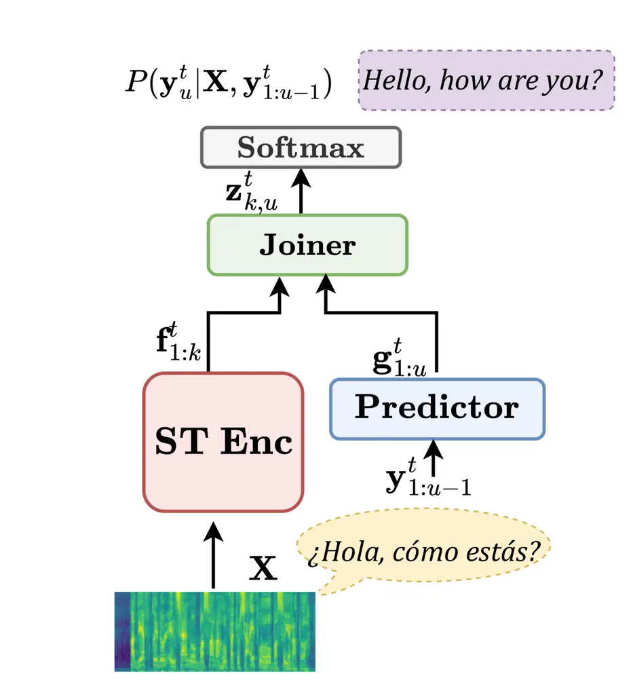
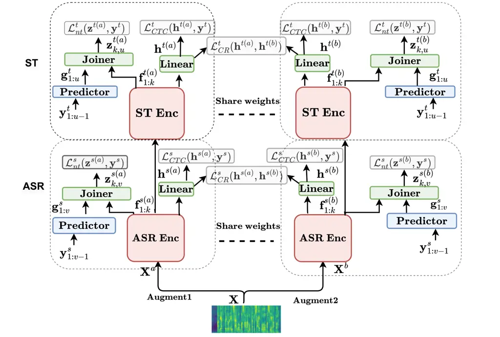

# HENT-SRT: Hierarchical Efficient Neural Transducer with Self-Distillation for Joint Speech Recognition and Translation

Amir Hussein Affiliation: CLSP Affiliation: JHU    Cihan Xiao
Affiliation: CLSP Affiliation: JHU    Matthew Wiesner
Affiliation: HLTCOE Affiliation: JHU    Dan Povey Affiliation: Xiaomi   
Leibny Paola Garcia Affiliation: HLTCOE/CLSP Affiliation: JHU    Sanjeev
Khudanpur Affiliation: HLTCOE/CLSP Affiliation: JHU

###### Abstract

Neural transducers (NT) provide an effective framework for speech
streaming, demonstrating strong performance in automatic speech
recognition (ASR). However, the application of NT to speech translation
(ST) remains challenging, as existing approaches struggle with word
reordering and performance degradation when jointly modeling ASR and ST,
resulting in a gap with attention-based encoder-decoder (AED) models.
Existing NT-based ST approaches also suffer from high computational
training costs. To address these issues, we propose HENT-SRT
(Hierarchical Efficient Neural Transducer for Speech Recognition and
Translation), a novel framework that factorizes ASR and translation
tasks to better handle reordering. To ensure robust ST while preserving
ASR performance, we use self-distillation with CTC consistency
regularization. Moreover, we improve computational efficiency by
incorporating best practices from ASR transducers, including a
down-sampled hierarchical encoder, a stateless predictor, and a pruned
transducer loss to reduce training complexity. Finally, we introduce a
blank penalty during decoding, reducing deletions and improving
translation quality. Our approach is evaluated on three conversational
datasets Arabic, Spanish, and Mandarin achieving new state-of-the-art
performance among NT models and substantially narrowing the gap with
AED-based systems.

⁰⁰footnotetext: Accepted to IWSLT 2025.

## 1 Introduction

Translation of spoken conversations across languages plays a crucial
role in cross-cultural communication, healthcare, and education Köksal
and Yürük (2020); Nakamura (2009); Al Shamsi et al. (2020).
Traditionally, speech translation (ST) systems have been built using a
cascaded approach, where automatic speech recognition (ASR) first
transcribes speech into text, which is then passed to a machine
translation (MT) system (Matusov et al., 2005; Bertoldi and Federico,
2005; Sperber et al., 2017; Pino et al., 2019; Yang et al., 2022). This
modular approach facilitates the use of large text corpora for MT
training, at the cost of (1) complex beam search algorithms in streaming
applications (Rabatin et al., 2024), (2) error propagation from the ASR
to MT model, (3) an inability to leverage paralinguistic information
such as prosody, and (4) additional latency, as MT processing must wait
for ASR to complete.

To overcome the limitations of cascaded systems, end-to-end speech
translation (E2E-ST) has emerged as a promising approach that directly
maps source speech to target text, providing a more streamlined
architecture, reduced latency, and competitive performance (Berard
et al., 2016; Berard et al., 2018; Dalmia et al., 2021; Gaido et al.,
2020; Yan et al., 2023b). However, most end-to-end speech translation
(E2E-ST) research has focused on offline attention-based encoder-decoder
(AED) architectures. As label-synchronous systems, AEDs require multiple
input frames before emitting each output token, which limits their
suitability for streaming applications and increases sensitivity to
utterance segmentation (Anastasopoulos et al., 2022; Sinclair et al.,
2014). To enable streaming in AED models, researchers have proposed
wait-k policies, which introduce a controlled buffering mechanism to
balance latency and translation quality (Ma et al., 2020; Chen et al.,
2021; Ma et al., 2021). However, finding the optimal wait-k policy is
challenging, as it must balance latency and quality, and the necessary
buffering cause delays, making AED-based models less suitable for
streaming applications.

In contrast, frame-synchronous architectures like Connectionist Temporal
Classification (CTC) (Graves et al., 2006) and the Neural Transducer
(NT) (Graves, 2012) more naturally handle streaming data and demonstrate
greater robustness to utterance segmentation, mitigating the over- and
under-generation issues in AED models (Chiu et al., 2019; Yan et al.,
2023a). While CTC enforces strictly monotonic alignments, which limits
its ability to handle word reordering (Yan et al., 2023a), the neural
transducer (NT) relaxes these constraints, allowing the generation of
longer output sequences and the modeling of autoregressive token
dependencies. This makes NT more suitable for translation, as
illustrated in Figure 2. To improve NT’s reordering capabilities,
researchers have proposed augmenting the joiner with cross-attention
(Liu et al., 2021) and the predictor with an AED-based decoder (Tang
et al., 2023), though these additions increase computational complexity
and latency. To further enhance translation quality, (Tang et al., 2023)
introduced attention pooling for better encoder-predictor fusion at the
frame level, while (Xue et al., 2022) explored similar mechanisms.
Additionally, (Wang et al., 2023) proposed a transducer-based model for
unified ASR and ST, but its shared encoder struggles with reordering,
making it less effective than AED in offline settings.



(a) Neural Transducer based speech translation architecture



(b) Proposed hierarchical neural transducer framework with
self-distillation for joint speech recognition and translation
(HENT-SRT).

Figure 1: Neural transducer-based speech translation and the proposed
HENT-SRT architecture

In this work, we propose a hierarchical neural transducer architecture,
HENT-SRT,¹¹ 1 Code is available at
[https://github.com/k2-fsa/icefall](https://github.com/k2-fsa/icefall).
which decomposes speech translation (ST) into an automatic speech
recognition (ASR) task followed by a translation task, effectively
handling word reordering. The system employs multi-task training to
optimize ASR and ST objectives simultaneously with a separate predictor
and joiner for each task. Our objectives are three-fold: (1) to close
the performance gap with state-of-the-art AED models in offline ST
settings, (2) to improve computational efficiency during training and
inference, and (3) to jointly model ASR and ST while maintaining ASR
performance. To this end, we introduce HENT-SRT, a neural
transducer-based ST framework that addresses (1) through a hierarchical
encoder architecture, enabling more effective handling of reordering in
translation. To improve ST efficiency in (2), we integrate a stateless
1D-CNN predictor (Ghodsi et al., 2020) and adopt the Zipformer
architecture (Yao et al., 2024a), which achieves superior ASR
performance compared to state-of-the-art AED models such as
E-Branchformer (Kim et al., 2023), while offering greater computational
efficiency. Additionally, to reduce training complexity, we employ the
pruned transducer loss (Kuang et al., 2022). To mitigate ASR degradation
in joint modeling for (3), we employ self-distillation with CTC
consistency regularization (Yao et al., 2024b). We evaluate the
effectiveness of our approach on conversational speech translation
across three language pairs: Tunisian Arabic-English, Spanish-English,
and Chinese-English described in (Hussein et al., 2024). Furthermore, we
conduct a comprehensive ablation study to analyze the impact of each ST
design choice in both offline and streaming setups.

## 2 Proposed Approach

Let
$`\mathbf{X}=(\mathbf{x}_{1},\ldots,\mathbf{x}_{T})\in\mathbb{R}^{T\times F}`$
denote the source speech, a sequence of $`T`$ acoustic feature vectors
of dimension $`F`$. The goal is to generate a target word sequence
$`\mathbf{y}^{(t)}=(y^{(t)}_{1},\ldots,y^{(t)}_{U})\in\mathcal{V}^{(t)}_{U}`$,
a translation of length $`U`$. We use superscripts $`(s)`$ and $`(t)`$
to refer to the _source_ and _target_ languages, respectively. Speech
translation task is trained using discriminative learning by minimizing
the negative log-likelihood
$`\mathcal{L}=-\log P(\mathbf{y}^{(t)}|\mathbf{X})`$. Transducers
compute this probability by marginalizing over the set of all possible
alignments $`\mathbf{a}\in\bar{\mathcal{V}}^{(t)}_{T+U}`$ as follows:

```math
P(\mathbf{y}^{(t)}|\mathbf{X})=\sum_{\mathbf{a}\in\mathcal{B}^{-1}(\mathbf{y}^{(t)})}P(\mathbf{a}|\mathbf{X}) \tag{1}
```

where $`\bar{\mathcal{V}}^{(t)}=\mathcal{V}^{(t)}\cup\{\phi\}`$,
$`\phi`$ is a blank label and
$`\mathcal{B}:\bar{\mathcal{V}}^{(t)}_{T+U}\to\mathcal{V}^{(t)}_{U}`$ is
the deterministic mapping from an alignment $`\mathbf{a}`$ to the
sequence $`\mathbf{Y}^{(t)}`$ of its non-blank symbols. Transducers
parameterize $`P(\mathbf{a}|\mathbf{X})`$ using an encoder, a prediction
network, and a joiner, as illustrated in Figure 1(a). The encoder maps
$`\mathbf{X}`$ to a representation sequence
$`\mathbf{f}^{\text{t}}_{1:k},k\in\{1,\ldots,T\}`$, the predictor
transforms $`\mathbf{y}^{(t)}`$ sequentially into
$`\mathbf{g}_{1:u}^{\text{t}},u\in\{1,\ldots,U\}`$, and the joiner
combines $`\mathbf{f}^{\text{t}}_{1:k}`$ and
$`\mathbf{g}^{\text{t}}_{1:u}`$ to generate logits $`z^{t}_{k,u}`$ whose
softmax is the posterior distribution of $`a_{k}`$ (over
$`\bar{\mathcal{V}}^{(t)}`$), i.e.

```math
\displaystyle P(\mathbf{y}^{(t)}|\mathbf{X}) \displaystyle=\sum_{\mathbf{a}\in\mathcal{B}^{-1}(\mathbf{y}^{(t)})}\prod_{k=1}^{T+U}P(\mathbf{a}^{(t)}_{k}|f^{t}_{1:k},g^{t}_{1:u(k)}) \tag{2}
```

```math
\displaystyle=\sum_{\mathbf{a}\in\mathcal{B}^{-1}(\mathbf{y}^{(t)})}\prod_{k=1}^{T+U}\text{softmax}(z^{st}_{k,u(k)})
```

where $`u(k)\in\{1,\cdots,U\}`$ denotes the index in the label sequence
at time $`k`$. The negative log of the quantity in (2) is known as the
transducer loss.

### 2.1 ST hierarchical encoder

To enhance the model’s ability to handle word reordering during
translation, we propose a hierarchical architecture by adding a
translation-specific encoder on top of the ASR encoder, as illustrated
in Figure 1(b). This design enables joint modeling of ASR and ST while
decomposing ST into ASR and translation tasks. Unlike Wang et al.
(2023), our translation-specific encoder facilitates more flexible
reordering over the latent, monotonic ASR representations. Inspired
by Dalmia et al. (2021), we adopt a two-stage training strategy: (1) ASR
pretraining, followed by (2) multitask fine-tuning with both ST and ASR
objectives. The ASR encoder, $`\mathrm{ENC_{asr}}(\cdot)`$, maps the
input acoustic features $`\mathbf{X}`$ to a latent representation,
$`\mathbf{f}^{\mathrm{s}}`$, as defined in Eq. (3).

```math
\mathbf{f}^{\mathrm{s}}=ENC_{\mathrm{asr}}(\mathbf{X}) \tag{3}
```

Following this, the representation, $`\mathbf{f}^{\mathrm{s}}`$, serves
as input to the ST encoder, $`\mathrm{ENC^{st}}(\cdot)`$, demonstrated
in Eq. (4)

```math
\mathbf{f}^{\mathrm{t}}=ENC_{\mathrm{st}}(\mathbf{f}^{\mathrm{s}}) \tag{4}
```

The transducer loss is computed for both ASR ($`\mathcal{L}^{s}_{nt}`$)
and ST ($`\mathcal{L}^{t}_{nt}`$) objectives following Eq. (2). The
overall multitask objective, $`\mathcal{L}_{nt}`$, is the weighted sum
of the two objectives:

```math
\mathcal{L}_{nt}=\alpha_{asr}\mathcal{L}^{s}_{nt}+\alpha_{st}\mathcal{L}^{t}_{nt} \tag{5}
```

where $`\alpha_{asr}`$ and $`\alpha_{st}`$ are hyperparameters
controlling the contribution of ASR and ST losses, respectively.

### 2.2 CR-CTC self-distillation

Balancing multitask ASR and ST optimization in a two-stage training
approach is challenging, as it often improves ST performance at the cost
of ASR degradation. To achieve robust ST performance with minimal ASR
degradation, we employ self-distillation with consistency-regularized
CTC (CR-CTC) Yao et al. (2024b). This approach applies SpecAugment Park
et al. (2019) to generate two augmented views of the same input,
$`\mathbf{X}^{a}`$ and $`\mathbf{X}^{b}`$, which are then processed by a
shared ASR encoder:

```math
\displaystyle\mathbf{f}^{s(a)} \displaystyle=\mathrm{ENC}_{\mathrm{asr}}(\mathbf{X}^{(a)}) \tag{6}
```

```math
\displaystyle\mathbf{f}^{s(b)} \displaystyle=\mathrm{ENC}_{\mathrm{asr}}(\mathbf{X}^{(b)}) \tag{7}
```

The CR-CTC framework optimizes two objectives: the CTC loss
$`\mathcal{L}_{CTC}`$ and the consistency regularization
$`\mathcal{L}_{CR}`$, computed using the Kullback-Leibler divergence
($`D_{KL}`$) between encoder outputs:

```math
\displaystyle\mathcal{L}_{CTC} \displaystyle=\frac{1}{2}(\mathcal{L}_{CTC}(\mathbf{h}^{(a)},\mathbf{y})
```

```math
\displaystyle\quad+\mathcal{L}_{CTC}(\mathbf{h}^{(b)},\mathbf{y})) \tag{8}
```

```math
\displaystyle\mathcal{L}_{CR} \displaystyle=\frac{1}{2}\sum_{k=1}^{T}\Big(D_{KL}(\text{sg}(h_{k}^{(b)})\parallel h_{k}^{(a)})
```

```math
\displaystyle\quad+D_{KL}(\text{sg}(h_{k}^{(a)})\parallel h_{k}^{(b)})\Big) \tag{9}
```

where $`\text{sg}(\cdot)`$ denotes the stop-gradient operation. In the
proposed HENT-SRT framework, $`\mathcal{L}_{CR}`$ and
$`\mathcal{L}_{CTC}`$ are computed for both ASR and ST encoders, as
illustrated in Figure 1(b). The final objective is optimized using a
multitask learning formulation that combines CR and CTC losses from both
ASR and ST tasks along with the NT loss from Eq. 5:

```math
\displaystyle\mathcal{L} \displaystyle=\mathcal{L}_{\text{nt}}+\alpha_{\text{CR(asr)}}\mathcal{L}^{s}_{\text{CR}}+\alpha_{\text{CTC(asr)}}\mathcal{L}^{s}_{\text{CTC}}
```

```math
\displaystyle\quad+\alpha_{\text{CR(st)}}\mathcal{L}^{t}_{\text{CR}}+\alpha_{\text{CTC(st)}}\mathcal{L}^{t}_{\text{CTC}} \tag{10}
```

where $`\alpha`$ values are hyperparameters controlling the relative
contributions of each loss term.

### 2.3 ST decoding

The translation decoding objective is to find the most probable target
sequence $`\hat{\mathbf{y}}^{(t)}`$ among all possible outputs
$`\mathbf{y}^{(t)*}`$ by maximizing the log-likelihood:

```math
\hat{\mathbf{y}}^{(t)}=\argmax_{\mathbf{y}^{(t)*}}\sum_{l=1}^{U}\log P(\mathbf{y}^{(t)}_{l}|\mathbf{y}^{(t)}_{<l},\mathbf{X}) \tag{11}
```

Neural transducers can model word reordering by using blank emissions to
delay output tokens and then emitting multiple tokens within a single
time step, as shown in Figure 2.

Figure 2: Illustration of the transducer decoding graph for an ST task.

One challenge with transducer decoding is that the input audio features
are typically longer than the output sequence, non-spoken regions are
mainly represented by blank tokens, leading to a bias toward blank
emissions Mahadeokar et al. (2021). This bias increases deletions and
degrades translation quality. To mitigate this issue and control blank
emissions during decoding, we introduce a blank penalty (BP) by
adjusting the logit scores $`\mathbf{z}`$ in the log space:

```math
z^{t}[:,0]=z^{t}[:,0]-BP \tag{12}
```

### 2.4 Computation efficiency

To improve computational efficiency during training and inference, we
adopt best practices from ASR transducer and examine their impact on ST
in Section 3.2. For the encoder, we utilize the recently proposed
Zipformer (Yao et al., 2024a), which consists of multiple encoder blocks
operating at different down-sampling rates. This hierarchical structure
reduces the number of frames to process, thereby lowering computational
complexity. Additionally, we replace the traditional LSTM-based
prediction network with a stateless 1D-CNN trigram model (Ghodsi et al.,
2020). Another major drawback of NT is the high memory consumption of
the transducer loss due to the need for marginalization over logit
tensor of size (batch, T, U, Vocab). To address this, we replace the
full-sum transducer loss with the pruned transducer loss, which applies
a simple linear joiner to prune the alignment lattice before computing
the full sum on the reduced lattice (Kuang et al., 2022). This
significantly reduces memory overhead while maintaining competitive
performance.

## 3 Experiments

### 3.1 Experimental setup

We evaluate the effectiveness of our proposed approach on three
conversational datasets: Fisher Spanish-English (Post et al., 2013),
Tunisian Arabic-English (Ansari et al., 2020), and HKUST Chinese-English
(Wotherspoon et al., 2024). These datasets contain $`3`$-way data
comprising telephone speech, source language transcriptions, and
corresponding English translations.  
Data pre-processing: Our experiments utilize the Icefall framework,²² 2
[https://github.com/k2-fsa/icefall](https://github.com/k2-fsa/icefall)
with the Lhotse toolkit (Żelasko et al., 2021) for speech data
preparation. All audio recordings are resampled from $`8`$kHz to
$`16`$kHz and augmented with speed perturbations at factors of $`0.9`$,
$`1.0`$, and $`1.1`$. We extract 80-dimensional mel-spectrogram features
using a 25ms window with a 10ms frame shift. Additionally, we apply
on-the-fly SpecAugment (Park et al., 2019), incorporating time warping
(maximum factor of 80), frequency masking (two regions, max width of 27
bins), and time masking (ten regions, max width of 100 frames). For
CR-CTC self-distillation, we follow (Yao et al., 2024b) and increase
both the number of time-masked regions and the maximum masking fraction
by a factor of 2.5. For vocabulary, we employ a shared Byte Pair
Encoding (BPE) vocabulary of size $`5000`$ for multilingual source
transcriptions and $`4000`$ for English target translations.  
Models: As a baseline, we reproduce the multitask (ASR+ST) neural
transducer with a shared encoder (Wang et al., 2023), employing the
Zipformer architecture (Yao et al., 2024a). The model consists of $`8`$
blocks, each containing $`2`$ self-attention layers. The number of
attention heads per block is set to {4, 4, 4, 8, 8, 8, 4, 4}, with
attention dimensions of {192, 256, 384, 512, 512, 384, 384, 256}. The
feed-forward dimensions per block are configured as {512, 768, 1024,
1024, 1024, 1024, 1024, 768}, and the convolution kernel sizes are {31,
31, 15, 15, 15, 15, 31, 31}. For the proposed hierarchical approach, we
explore two architectural variants: shallow (NT-Hier1) and deep
(NT-Hier2). In the shallow configuration, we partition the baseline
encoder by assigning the first five blocks to the ASR encoder
$`\mathrm{ENC_{asr}}`$ in Eq. (3) and the remaining three blocks to the
ST encoder $`\mathrm{ENC_{st}}`$ in Eq. (4). In contrast, the deep
variant increases the depth of the ST encoder to five blocks while
reducing the number of parameters per block by approximately half,
thereby maintaining the overall model size. Both the baseline and
hierarchical variants contain approximately $`70`$M parameters. For the
ablation studies in Sec. 3.2, which focus on a single language pair, we
use a smaller model by reducing the depth of both the ASR and ST
encoders by one block, resulting in a total of 45M parameters. We
experiment with two types of predictor networks: a stateless predictor
implemented as a single Conv1D layer with kernel size $`2`$, and a
stateful LSTM predictor, both with hidden size $`256`$. Our training
configuration utilizes the ScaledAdam optimizer (Yao et al., 2024a) with
a learning rate of $`0.045`$. The multitask weights $`\alpha_{asr}`$ and
$`\alpha_{st}`$ in Eq. (5) are set to $`1`$, while $`\alpha_{CR(asr)}`$
and $`\alpha_{CR(st)}`$ are set to $`0.05`$, and $`\alpha_{CTC(asr)}`$
and $`\alpha_{CTC(st)}`$ are set to $`0.1`$ in Eq. (10). For comparison,
we use the ESPnet CTC/Attention ST model³³ 3
[https://github.com/espnet/espnet/blob/master/egs2/must_c_v2/st1/conf/tuning/train_st_ctc_conformer_asrinit_v2.yaml](https://github.com/espnet/espnet/blob/master/egs2/must_c_v2/st1/conf/tuning/train_st_ctc_conformer_asrinit_v2.yaml)
with 75M parameters. We choose the Conformer encoder, as it outperforms
eBranchformer in translation quality. The optimal learning rate and
warmup steps, set to $`0.001`$ and $`30`$k, are selected from the ranges
{0.0005–0.002} and {15k–40k}, respectively. All models are trained for
$`30`$ epochs on $`4`$ V$`100`$ GPUs, using a batch size of $`400`$
seconds. Unless otherwise noted, all decoding results reported in the
offline setting (Sec. 3.3) use beam search with a beam size of 20.  
Evaluation: To ensure a comprehensive evaluation of translation quality,
we utilize BLEU (Papineni et al., 2002) for surface-level word matching,
chrF++ for character-level accuracy, and COMET (Rei et al., 2020)⁴⁴ 4 We
used Unbabel/wmt22-comet-da model. for semantic adequacy. Translation
evaluation is conducted in a case-insensitive manner, without
punctuation. ASR performance is assessed using word error rate (WER). To
assess the processing delay of the system during streaming, we report
the real-time factor (RTF).

|                   |     |        |         |        |                    |                   |                    |                   |
| ----------------- | --- | ------ | ------- | ------ | ------------------ | ----------------- | ------------------ | ----------------- |
| Model             |     | Prune- | Warmup- | Pre-   | Dev1               |                   | Dev2               |                   |
|                   | BP  | range  | steps   | dictor | WER $`\downarrow`$ | BLEU $`\uparrow`$ | WER $`\downarrow`$ | BLEU $`\uparrow`$ |
| NT (ASR)          | 0   | 5      | 20k     | CNN    | 40.0               | \-                | 42.4               | \-                |
| NT (ST)           | 0   | 5      | 20k     | CNN    | \-                 | 14.7              | \-                 | 12.4              |
| NT (ST)           | 0   | 10     | 20k     | CNN    | \-                 | 16.2              | \-                 | 13.2              |
| NT (ST)           | 0   | 10     | 20k     | LSTM   | \-                 | 15.8              | \-                 | 13.0              |
| NT (ST)           | 0   | 10     | 5k      | CNN    | \-                 | 18.1              | \-                 | 14.7              |
| NT-Hier1 (ASR+ST) | 0   | 10     | 5k      | CNN    | 40.0               | 18.5              | 42.8               | 15.7              |
| NT-Hier2 (ASR+ST) | 0   | 10     | 5k      | CNN    | 40.3               | 19.0              | 43.6               | 15.8              |
| NT-Hier2 (ASR+ST) | 1   | 10     | 5k      | CNN    | 40.3               | 20.4              | 43.6               | 17.1              |

Table 1: Ablation for transducer based ST, including blank-penalty (BP),
lattice pruning-range, scaling warmup-steps, predictor and encoder
structure.

|                                       |     |                    |                   |                     |                    |                    |                   |                     |                    |                    |                   |                     |                    |
| ------------------------------------- | --- | ------------------ | ----------------- | ------------------- | ------------------ | ------------------ | ----------------- | ------------------- | ------------------ | ------------------ | ----------------- | ------------------- | ------------------ |
| Model                                 |     | Tunisian           |                   |                     |                    | HKUST-Chinese      |                   |                     |                    | Fisher-Spanish     |                   |                     |                    |
|                                       | BP  | WER $`\downarrow`$ | BLEU $`\uparrow`$ | chrF++ $`\uparrow`$ | COMET $`\uparrow`$ | WER $`\downarrow`$ | BLEU $`\uparrow`$ | chrF++ $`\uparrow`$ | COMET $`\uparrow`$ | WER $`\downarrow`$ | BLEU $`\uparrow`$ | chrF++ $`\uparrow`$ | COMET $`\uparrow`$ |
| NT (ASR)                              | \-  | 41.4               | \-                | \-                  | \-                 | 22.8               | \-                | \-                  | \-                 | 18.2               | \-                | \-                  |                    |
| NT (ST)                               | \-  | \-                 | 15.3              | 35.9                | 0.656              | \-                 | 10.0              | 30.5                | 0.711              | \-                 | 30.6              | 56.0                | 0.793              |
| NT-Shared (ASR+ST) Wang et al. (2023) | \-  | 41.6               | 16.3              | 37.1                | 0.660              | 23.8               | 10.4              | 30.9                | 0.714              | 18.0               | 31.0              | 56.4                | 0.798              |
| NT-Hier1 (ASR+ST)                     | \-  | 42.6               | 17.8              | 40.4                | 0.670              | 23.5               | 11.3              | 33.8                | 0.720              | 18.3               | 31.9              | 58.2                | 0.801              |
| NT-Hier2 (ASR+ST)                     | \-  | 43.1               | 18.3              | 40.6                | 0.672              | 23.9               | 12.0              | 33.9                | 0.722              | 18.9               | 32.4              | 58.5                | 0.801              |
| NT-Hier2 (ASR+ST)                     | 0.5 | 43.1               | 19.4              | 42.6                | 0.674              | 23.9               | 12.9              | 36.2                | 0.724              | 18.9               | 33.0              | 59.9                | 0.801              |
| CR-CTC (ASR)                          | \-  | 40.1               | \-                | \-                  | \-                 | 21.7               | \-                | \-                  | \-                 | 17.3               | \-                | \-                  | \-                 |
| HENT-SRT                              | \-  | 41.4               | 17.8              | 39.8                | 0.675              | 22.8               | 11.5              | 32.7                | 0.726              | 17.8               | 31.8              | 57.5                | 0.803              |
| HENT-SRT                              | 1.0 | 41.4               | 20.6              | 43.4                | 0.682              | 22.8               | 14.7              | 37.5                | 0.734              | 17.8               | 33.7              | 60.5                | 0.803              |
| CTC/Attention (CA) Yan et al. (2023c) | \-  | 42.7               | 20.4              | 44.2                | 0.680              | 24.6               | 15.2              | 38.8                | 0.706              | 18.9               | 33.9              | 60.8                | 0.796              |

Table 2: Comparison of ASR and ST performance between the
state-of-the-art Neural Transducer (NT) with a shared encoder and a
multi-decoder AED (MultiDec). ASR performance is measured using WER,
while ST performance is evaluated using BLEU, chrF++, and COMET.

### 3.2 Ablation analysis

To assess the impact of efficiency-related design choices in our
proposed hierarchical ST approach, we conduct ablation studies on the
Tunisian-English dataset, which includes two development sets for
hyperparameter tuning, as shown in Table 1. To ensure fair comparisons,
we maintain a consistent model size of approximately 45M parameters
across all experiments. We begin by evaluating the vanilla pruned
transducer (NT) architecture for ST, examining the effect of increasing
the pruning range beyond the default value of $`5`$ (used in NT for
ASR). Expanding the pruning range to $`10`$ leads to a BLEU improvement
of up to $`+1.5`$, indicating that a larger alignment lattice enhances
the model’s ability to perform word reordering during translation.
However, further increases in pruning range provide only marginal
additional gains. Next, we explore the role of the prediction network in
ST performance. Our results show that a simple trigram 1D-CNN stateless
predictor performs comparably to a more complex LSTM-based predictor,
consistent with previous observations in ASR (Ghodsi et al., 2020). We
also vary the number of training steps before fully incorporating the
pruned loss, effectively controlling the balance between the simple and
pruned objectives during early training. Reducing the number of warm-up
steps yields BLEU gains of up to $`+1.8`$, suggesting that earlier
exposure to pruning improves optimization. To assess the effect of
hierarchical modeling, we compare shallow (NT-Hier$`1`$) and deep
(NT-Hier$`2`$) ST encoders. To keep the parameter count constant,
NT-Hier$`2`$ doubles the number of layers while halving the parameters
per layer in the ST encoder. Our findings indicate that deeper
architectures can improve ST performance by up to $`+0.5`$ BLEU, though
at the cost of reduced ASR accuracy highlighting a trade-off between ST
and ASR tasks. Finally, we evaluate the impact of a blank-penalty term
applied during decoding. Introducing a small blank penalty leads to BLEU
improvements of up to $`+1.4`$, demonstrating its effectiveness in
refining translation quality. A more detailed analysis of the blank
penalty is presented in Sec. 3.4.

### 3.3 Comparison with state-of-the-art models

In this section, we compare the proposed hierarchical neural transducer
with self-distillation (HENT-SRT) model to state-of-the-art systems in
the offline setting. Specifically, we evaluate against the multitask
ASR-ST transducer with a shared encoder NT-Shared) Wang et al. (2023),
and the CTC/Attention-based AED model (CA) Yan et al. (2023b), shown in
Table 2. Comparing the vanilla transducer models (NT-ASR and NT-ST) to
NT-Shared, we find that a single multilingual ASR-ST model can be
trained with the same number of parameters while maintaining comparable
performance achieving up to +$`1`$ BLEU improvement in ST with at most +$`1`$ WER degradation in ASR. The hierarchical ST transducer models
(NT-Hier) consistently outperform NT-Shared across all ST metrics,
yielding improvements of up to +$`2`$ BLEU, +$`3.5`$ chrF++, and +$`0.01`$ COMET, but at the cost of up to +$`2`$ WER degradation in ASR
performance. Furthermore, NT-Hier2, which employs a deeper ST encoder,
achieves better translation performance up to +$`0.7`$ BLEU improvement
over NT-Hier1 but incurs an additional ASR degradation of up to +$`0.5`$
WER. These findings suggest that the hierarchical two-stage training
enhances translation quality, particularly in handling reordering (see
Sec. A), but at the expense of ASR accuracy.

Figure 3: Impact of the blank penalty on translation length ratio
(hypothesis/reference) during greedy decoding for Tunisian (Ta-En),
HKUST (Zh-En), and Fisher-Spanish (Sp-En). A ratio close to 1.0
indicates ideal length matching between hypothesis and reference.

ST performance can be further improved by applying a blank penalty
during decoding, yielding up to +$`1`$ BLEU and +$`2.3`$ chrF++ gains.
To ensure robust ST performance with minimal ASR degradation, we
integrate self-distillation with consistency-regularized CR-CTC to
NT-Hier2, resulting in the proposed HENT-SRT model. Notably, HENT-SRT
performs slightly worse than NT-Hier2 in ST when no blank penalty is
applied. However, applying the optimal blank penalty to both models
yields further gains for HENT-SRT, with improvements of up to +1.8 BLEU,
+1.3 chrF++, and +0.01 COMET over NT-Hier2. Additionally, CR-CTC loss
also acts as a regularizer, maintaining ASR performance close to the
best results observed with CR-CTC(ASR). Finally, compared to the
AED-based CA model Yan et al. (2023b), HENT-SRT closes the ST
performance gap while achieving superior ASR performance.

### 3.4 Streaming Translation

In this section, we explore streaming speech translation using our
proposed hierarchical ST framework. Streaming is simulated with greedy
decoding by enabling causal convolution and applying chunked processing,
using a chunk size of $`64`$ frames and a left context of $`128`$
frames. Specifically, the input is segmented into fixed-size chunks, and
each chunk attends only to a fixed number of preceding chunks, with all
future frames masked. To ensure low-latency decoding, we restrict the
number of emitted symbols per frame to $`20`$, as larger values offer
minimal additional improvements. We then examine the effect of the blank
penalty on translation quality, as shown in Table 3. While tuning is
performed on development sets, we report test set results for
completeness. Across all datasets, increasing the blank penalty for
NT-Hier2 up to a value of 2 consistently improves BLEU scores by
reducing deletion errors, supporting the hypothesis presented in
Section 2.3. This trend is further confirmed in Figure 3, which shows
that higher blank penalties result in longer translations that more
closely align with reference lengths, with a penalty of 2 achieving
near-perfect length matching. Overall, the proposed HENT-SRT framework
achieves the best streaming performance across datasets, with BLEU
improvements of up to +4.5 points compared to NT-Hier2. Importantly, the
hierarchical ST design introduces no additional latency in terms of
real-time factor compared to the vanilla NT model. This is expected, as
the hierarchical structure reuses the original encoder in a sequentially
factorized ASR-ST configuration without increasing computational
complexity.

|           |     |          |      |       |       |      |       |           |      |       |
| --------- | --- | -------- | ---- | ----- | ----- | ---- | ----- | --------- | ---- | ----- |
| Model     | BP  | Tunisian |      |       | HKUST |      |       | Fisher-Sp |      |       |
|           |     | Dev1     | Test | RTF   | Dev   | Test | RTF   | Dev       | Test | RTF   |
| NT        | 0.0 | 6.8      | 6.1  | 0.013 | 3.1   | 3.4  | 0.016 | 14.2      | 15.6 | 0.013 |
| NT-Shared | 0.0 | 7.0      | 6.0  | 0.010 | 3.3   | 3.7  | 0.014 | 14.8      | 16.3 | 0.010 |
| NT-Hier2  | 0.0 | 9.5      | 9.0  | 0.012 | 4.2   | 4.6  | 0.013 | 16.8      | 17.9 | 0.012 |
| NT-Hier2  | 0.5 | 10.4     | 10.0 | 0.012 | 5.0   | 5.7  | 0.012 | 19.3      | 19.6 | 0.012 |
| NT-Hier2  | 1.0 | 14.1     | 13.0 | 0.012 | 7.2   | 7.4  | 0.015 | 24.8      | 25.6 | 0.012 |
| NT-Hier2  | 2.0 | 16.8     | 14.0 | 0.014 | 6.7   | 7.5  | 0.018 | 24.9      | 26.3 | 0.013 |
| HENT-SRT  | 2.0 | 18.6     | 17.2 | 0.013 | 10.2  | 11.2 | 0.017 | 29.2      | 30.8 | 0.013 |

Table 3: Comparison of translation BLEU scores and processing delays
measured by real-time factor (RTF)

## 4 Conclusion

In this paper, we proposed HENT-SRT, a novel hierarchical transducer
architecture for joint speech recognition and translation (ST). The
model factorizes the ST task into two stages, ASR followed by a
translation, enabling more effective handling of word reordering. To
improve computational efficiency, HENT-SRT design incorporates key
transducer-based ASR practices, including a downsampled encoder,
stateless predictor, and pruned transducer loss. To maintain robust ST
performance without sacrificing ASR accuracy, we apply self-distillation
with CTC consistency regularization. Additionally, we introduce a blank
penalty mechanism during decoding, which effectively reduces deletion
errors and enhances translation quality. Experimental results show that
HENT-SRT significantly outperforms previous state-of-the-art
transducer-based ST models and closes the gap with attention-based
encoder-decoder architectures, while achieving superior ASR performance.
Moreover, our approach offers substantial gains in streaming scenarios
without introducing additional delays.

## Limitations

In this work, we focus on non-overlapping speech translation,
translating multilingual source speech into English text. For future
work, we aim to extend our hierarchical approach to handle overlapped
speech while expanding support for additional target languages and
broader translation directions.

## References

- Al Shamsi et al. (2020) Hilal Al Shamsi, Abdullah G Almutairi,
  Sulaiman Al Mashrafi, and Talib Al Kalbani. 2020. Implications of
  language barriers for healthcare: a systematic review. _Oman medical
  journal_, 35(2):e122.
- Anastasopoulos et al. (2022) Antonios Anastasopoulos, Loïc Barrault,
  Luisa Bentivogli, Marcely Zanon Boito, Ondřej Bojar, Roldano Cattoni,
  Anna Currey, Georgiana Dinu, Kevin Duh, Maha Elbayad, and 1
  others. 2022. Findings of the iwslt 2022 evaluation campaign. In
  _Proceedings of the 19th International Conference on Spoken Language
  Translation (IWSLT 2022)_, pages 98–157.
- Ansari et al. (2020) Ebrahim Ansari, Amittai Axelrod, Nguyen Bach,
  Ondřej Bojar, Roldano Cattoni, Fahim Dalvi, Nadir Durrani, Marcello
  Federico, Christian Federmann, Jiatao Gu, Fei Huang, Kevin Knight,
  Xutai Ma, Ajay Nagesh, Matteo Negri, Jan Niehues, Juan Pino, Elizabeth
  Salesky, Xing Shi, and 4 others. 2020. [FINDINGS OF THE IWSLT 2020
  EVALUATION CAMPAIGN](https://doi.org/10.18653/v1/2020.iwslt-1.1). In
  _Proceedings of the 17th International Conference on Spoken Language
  Translation_, pages 1–34, Online. Association for Computational
  Linguistics.
- Berard et al. (2018) Alexandre Berard, Laurent Besacier, Ali Can
  Kocabiyikoglu, and Olivier Pietquin. 2018. [End-to-end automatic
  speech translation of
  audiobooks](https://doi.org/10.1109/ICASSP.2018.8461690). In _2018
  IEEE International Conference on Acoustics, Speech and Signal
  Processing, ICASSP 2018, Calgary, AB, Canada, April 15-20, 2018_,
  pages 6224–6228. IEEE.
- Berard et al. (2016) Alexandre Berard, Olivier Pietquin, Christophe
  Servan, and Laurent Besacier. 2016. Listen and translate: A proof of
  concept for end-to-end speech-to-text translation. In _Proceedings of
  the NIPS Workshop on end-to-end learning for speech and audio
  processing_, Barcelona, Spain.
- Bertoldi and Federico (2005) Nicola Bertoldi and Marcello
  Federico. 2005. A new decoder for spoken language translation based on
  confusion networks. In _IEEE Workshop on Automatic Speech Recognition
  and Understanding, 2005._, pages 86–91. IEEE.
- Chen et al. (2021) Junkun Chen, Mingbo Ma, Renjie Zheng, and Liang
  Huang. 2021. [Direct simultaneous speech-to-text translation assisted
  by synchronized streaming
  ASR](https://doi.org/10.18653/v1/2021.findings-acl.406). In _Findings
  of the Association for Computational Linguistics: ACL-IJCNLP 2021_,
  pages 4618–4624, Online. Association for Computational Linguistics.
- Chiu et al. (2019) Chung-Cheng Chiu, Wei Han, Yu Zhang, Ruoming Pang,
  Sergey Kishchenko, Patrick Nguyen, Arun Narayanan, Hank Liao, Shuyuan
  Zhang, Anjuli Kannan, and 1 others. 2019. A comparison of end-to-end
  models for long-form speech recognition. In _2019 IEEE automatic
  speech recognition and understanding workshop (ASRU)_, pages 889–896.
  IEEE.
- Dalmia et al. (2021) Siddharth Dalmia, Brian Yan, Vikas Raunak,
  Florian Metze, and Shinji Watanabe. 2021. [Searchable hidden
  intermediates for end-to-end models of decomposable sequence
  tasks](https://doi.org/10.18653/v1/2021.naacl-main.151). In
  _Proceedings of the 2021 Conference of the North American Chapter of
  the Association for Computational Linguistics: Human Language
  Technologies_, pages 1882–1896, Online. Association for Computational
  Linguistics.
- Gaido et al. (2020) Marco Gaido, Mattia A. Di Gangi, Matteo Negri, and
  Marco Turchi. 2020. [End-to-end speech-translation with knowledge
  distillation:
  FBK@IWSLT2020](https://doi.org/10.18653/v1/2020.iwslt-1.8). In
  _Proceedings of the 17th International Conference on Spoken Language
  Translation_, pages 80–88, Online. Association for Computational
  Linguistics.
- Ghodsi et al. (2020) Mohammadreza Ghodsi, Xiaofeng Liu, James Apfel,
  Rodrigo Cabrera, and Eugene Weinstein. 2020. Rnn-transducer with
  stateless prediction network. In _ICASSP 2020-2020 IEEE International
  Conference on Acoustics, Speech and Signal Processing (ICASSP)_, pages
  7049–7053. IEEE.
- Graves (2012) Alex Graves. 2012. Sequence transduction with recurrent
  neural networks. _arXiv preprint arXiv:1211.3711_.
- Graves et al. (2006) Alex Graves, Santiago Fernández, Faustino Gomez,
  and Jürgen Schmidhuber. 2006. Connectionist temporal classification:
  labelling unsegmented sequence data with recurrent neural networks. In
  _Proceedings of the 23rd international conference on Machine
  learning_, pages 369–376.
- Hussein et al. (2024) Amir Hussein, Brian Yan, Antonios
  Anastasopoulos, Shinji Watanabe, and Sanjeev Khudanpur. 2024.
  Enhancing end-to-end conversational speech translation through target
  language context utilization. In _ICASSP 2024-2024 IEEE International
  Conference on Acoustics, Speech and Signal Processing (ICASSP)_, pages
  11971–11975. IEEE.
- Kim et al. (2023) Kwangyoun Kim, Felix Wu, Yifan Peng, Jing Pan,
  Prashant Sridhar, Kyu J Han, and Shinji Watanabe. 2023.
  E-branchformer: Branchformer with enhanced merging for speech
  recognition. In _2022 IEEE Spoken Language Technology Workshop (SLT)_,
  pages 84–91. IEEE.
- Köksal and Yürük (2020) Onur Köksal and Nurcihan Yürük. 2020. The role
  of translator in intercultural communication. _International Journal
  of Curriculum and Instruction_, 12(1):327–338.
- Kuang et al. (2022) Fangjun Kuang, Liyong Guo, Wei Kang, Long Lin,
  Mingshuang Luo, Zengwei Yao, and Daniel Povey. 2022. Pruned RNN-T for
  fast, memory-efficient ASR training. In _Interspeech_.
- Liu et al. (2021) Dan Liu, Mengge Du, Xiaoxi Li, Ya Li, and Enhong
  Chen. 2021. Cross attention augmented transducer networks for
  simultaneous translation. In _Proceedings of the 2021 Conference on
  Empirical Methods in Natural Language Processing_, pages 39–55.
- Ma et al. (2020) Xutai Ma, Juan Pino, and Philipp Koehn. 2020.
  [SimulMT to SimulST: Adapting simultaneous text translation to
  end-to-end simultaneous speech
  translation](https://doi.org/10.18653/v1/2020.aacl-main.58). In
  _Proceedings of the 1st Conference of the Asia-Pacific Chapter of the
  Association for Computational Linguistics and the 10th International
  Joint Conference on Natural Language Processing_, pages 582–587,
  Suzhou, China. Association for Computational Linguistics.
- Ma et al. (2021) Xutai Ma, Yongqiang Wang, Mohammad Javad Dousti,
  Philipp Koehn, and Juan Pino. 2021. Streaming simultaneous speech
  translation with augmented memory transformer. In _ICASSP 2021-2021
  IEEE International Conference on Acoustics, Speech and Signal
  Processing (ICASSP)_, pages 7523–7527. IEEE.
- Mahadeokar et al. (2021) Jay Mahadeokar, Yuan Shangguan, Duc Le, Gil
  Keren, Hang Su, Thong Le, Ching-Feng Yeh, Christian Fuegen, and
  Michael L Seltzer. 2021. Alignment restricted streaming recurrent
  neural network transducer. In _2021 IEEE Spoken Language Technology
  Workshop (SLT)_, pages 52–59. IEEE.
- Matusov et al. (2005) Evgeny Matusov, Stephan Kanthak, and Hermann
  Ney. 2005. On the integration of speech recognition and statistical
  machine translation. In _Interspeech_, pages 3177–3180.
- Nakamura (2009) Satoshi Nakamura. 2009. Overcoming the language
  barrier with speech translation technology. _Science & Technology
  Trends-Quarterly Review_, 31.
- Papineni et al. (2002) Kishore Papineni, Salim Roukos, Todd Ward, and
  Wei-Jing Zhu. 2002. Bleu: a method for automatic evaluation of machine
  translation. In _Proceedings of the 40th annual meeting of the
  Association for Computational Linguistics_, pages 311–318.
- Park et al. (2019) Daniel S Park, William Chan, Yu Zhang, Chung-Cheng
  Chiu, Barret Zoph, Ekin D Cubuk, and Quoc V Le. 2019. Specaugment: A
  simple data augmentation method for automatic speech recognition. In
  _Proc. Interspeech 2019_, pages 2613–2617.
- Pino et al. (2019) Juan Pino, Liezl Puzon, Jiatao Gu, Xutai Ma,
  Arya D. McCarthy, and Deepak Gopinath. 2019. [Harnessing indirect
  training data for end-to-end automatic speech translation: Tricks of
  the trade](https://aclanthology.org/2019.iwslt-1.18). In _Proceedings
  of the 16th International Conference on Spoken Language Translation_,
  Hong Kong. Association for Computational Linguistics.
- Post et al. (2013) Matt Post, Gaurav Kumar, Adam Lopez, Damianos
  Karakos, Chris Callison-Burch, and Sanjeev Khudanpur. 2013. Improved
  speech-to-text translation with the fisher and callhome
  Spanish-English speech translation corpus. In _Proceedings of the 10th
  International Workshop on Spoken Language Translation: Papers_,
  Heidelberg, Germany.
- Rabatin et al. (2024) Rastislav Rabatin, Frank Seide, and Ernie
  Chang. 2024. Navigating the minefield of mt beam search in cascaded
  streaming speech translation. _arXiv preprint arXiv:2407.11010_.
- Rei et al. (2020) Ricardo Rei, Craig Stewart, Ana C Farinha, and Alon
  Lavie. 2020. Comet: A neural framework for mt evaluation. In
  _Proceedings of the 2020 Conference on Empirical Methods in Natural
  Language Processing (EMNLP)_, pages 2685–2702.
- Sinclair et al. (2014) Mark Sinclair, Peter Bell, Alexandra Birch, and
  Fergus McInnes. 2014. [A semi-markov model for speech segmentation
  with an utterance-break
  prior](https://doi.org/10.21437/Interspeech.2014-511). In _Interspeech
  2014_, pages 2351–2355.
- Sperber et al. (2017) Matthias Sperber, Jan Niehues, and Alex
  Waibel. 2017. [Toward robust neural machine translation for noisy
  input sequences](https://aclanthology.org/2017.iwslt-1.13). In
  _Proceedings of the 14th International Conference on Spoken Language
  Translation_, pages 90–96, Tokyo, Japan. International Workshop on
  Spoken Language Translation.
- Tang et al. (2023) Yun Tang, Anna Sun, Hirofumi Inaguma, Xinyue Chen,
  Ning Dong, Xutai Ma, Paden Tomasello, and Juan Pino. 2023. Hybrid
  transducer and attention based encoder-decoder modeling for
  speech-to-text tasks. In _Proceedings of the 61st Annual Meeting of
  the Association for Computational Linguistics (Volume 1: Long
  Papers)_, pages 12441–12455.
- Wang et al. (2023) Peidong Wang, Eric Sun, Jian Xue, Yu Wu, Long Zhou,
  Yashesh Gaur, Shujie Liu, and Jinyu Li. 2023. [Lamassu: A streaming
  language-agnostic multilingual speech recognition and translation
  model using neural
  transducers](https://doi.org/10.21437/Interspeech.2023-2004). In
  _Interspeech 2023_, pages 57–61.
- Wotherspoon et al. (2024) Shannon Wotherspoon, William Hartmann, and
  Matthew Snover. 2024. [Advancing speech translation: A corpus of
  mandarin-english conversational telephone
  speech](https://arxiv.org/abs/2404.11619). _arXiv preprint_,
  arXiv:2404.11619.
- Xue et al. (2022) Jian Xue, Peidong Wang, Jinyu Li, Matt Post, and
  Yashesh Gaur. 2022. Large-scale streaming end-to-end speech
  translation with neural transducers. In _Proc. Interspeech 2022_,
  pages 3263–3267.
- Yan et al. (2023a) Brian Yan, Siddharth Dalmia, Yosuke Higuchi, Graham
  Neubig, Florian Metze, Alan W Black, and Shinji Watanabe. 2023a. Ctc
  alignments improve autoregressive translation. In _Proceedings of the
  17th Conference of the European Chapter of the Association for
  Computational Linguistics_, pages 1623–1639.
- Yan et al. (2023b) Brian Yan, Jiatong Shi, Yun Tang, Hirofumi Inaguma,
  Yifan Peng, Siddharth Dalmia, Peter Polák, Patrick Fernandes, Dan
  Berrebbi, Tomoki Hayashi, Xiaohui Zhang, Zhaoheng Ni, Moto Hira, Soumi
  Maiti, Juan Pino, and Shinji Watanabe. 2023b. [ESPnet-ST-v2:
  Multipurpose spoken language translation
  toolkit](https://doi.org/10.18653/v1/2023.acl-demo.38). In
  _Proceedings of the 61st Annual Meeting of the Association for
  Computational Linguistics (Volume 3: System Demonstrations)_, pages
  400–411, Toronto, Canada. Association for Computational Linguistics.
- Yan et al. (2023c) Brian Yan, Jiatong Shi, Yun Tang, Hirofumi Inaguma,
  Yifan Peng, Siddharth Dalmia, Peter Polák, Patrick Fernandes, Dan
  Berrebbi, Tomoki Hayashi, and 1 others. 2023c. [Espnet-st-v2:
  Multipurpose spoken language translation
  toolkit](https://arxiv.org/abs/2304.04596). _ArXiv preprint_,
  abs/2304.04596.
- Yang et al. (2022) Jinyi Yang, Amir Hussein, Matthew Wiesner, and
  Sanjeev Khudanpur. 2022. [JHU IWSLT 2022 dialect speech translation
  system description](https://doi.org/10.18653/v1/2022.iwslt-1.29). In
  _Proceedings of the 19th International Conference on Spoken Language
  Translation (IWSLT 2022)_, pages 319–326, Dublin, Ireland (in-person
  and online). Association for Computational Linguistics.
- Yao et al. (2024a) Zengwei Yao, Liyong Guo, Xiaoyu Yang, Wei Kang,
  Fangjun Kuang, Yifan Yang, Zengrui Jin, Long Lin, and Daniel Povey.
  2024a. Zipformer: A faster and better encoder for automatic speech
  recognition. In _ICLR_.
- Yao et al. (2024b) Zengwei Yao, Wei Kang, Xiaoyu Yang, Fangjun Kuang,
  Liyong Guo, Han Zhu, Zengrui Jin, Zhaoqing Li, Long Lin, and Daniel
  Povey. 2024b. Cr-ctc: Consistency regularization on ctc for improved
  speech recognition. _arXiv preprint arXiv:2410.05101_.
- Żelasko et al. (2021) Piotr Żelasko, Daniel Povey, Jan Trmal, Sanjeev
  Khudanpur, and 1 others. 2021. Lhotse: a speech data representation
  library for the modern deep learning ecosystem. In _NeurIPS
  Data-Centric AI Workshop_.

## Appendix A Linguistic Analysis of Speech Translation Performance

| Row | Source (ref_src)                                                           | Reference (ref_tgt)                                                                                                                                 | NT-Hier2                                                                                            | NT-Shared                                                                                     |
| --- | -------------------------------------------------------------------------- | --------------------------------------------------------------------------------------------------------------------------------------------------- | --------------------------------------------------------------------------------------------------- | --------------------------------------------------------------------------------------------- |
| 1   | 没有问题对对没关系                                                         | that’s alright if there’s no problem it’s fine                                                                                                      | no problem that’s right it doesn’t matter                                                           | no problem that’s right it doesn’t matter                                                     |
| 2   | 那谁给他办的绿卡谁给他办的                                                 | who applied that green card for him who did it for him                                                                                              | then who did it for him then who green it                                                           | then who who do it                                                                            |
| 3   | 我八月中旬就去上班然后再回来再回来答辩就是然后然后十二月份应该就可以毕业了 | i would go to work at the mid august then i would come back again for my thesis defence that’s it and then i should be able to graduate in december | i will go to work in and then come back again and then i mean in december i can graduate in october | in august i will go to work on and then come back to work again and then i mean after october |

Table 4: Comparison of NT-Hier2 and NT-Shared System Outputs on the
Chinese test set

### A.1 Chinese HKUST Test Set Analysis

The Chinese HKUST test set contains conversational Mandarin translated
into English. The source utterances include informal structures,
frequent repetitions (e.g., “对对” / “yes yes”), fillers (e.g., “呃” /
“uh”), and discourse markers (e.g., “啊”, “哎呀”). We compare the
NT-Hier2 and NT-Shared system outputs against reference translations to
analyze their differences and better understand how hierarchical
modeling improves translation quality. Table 4 presents representative
examples comparing the NT-Hier2 and NT-Shared systems.

#### A.1.1 Observations and Comparison:

- •
  Syntactic Structure: In longer utterances (e.g., Row 3), NT-Hier2
  retains more of the reference structure, including mentions of "thesis
  defence" and a full sequence of events. However, it introduces
  timeline inconsistencies such as "in December I can graduate in
  October." Despite this, metrics like BLEU and COMET may still reward
  NT-Hier2’s output for preserving semantic content.
- •
  Handling Reordering: In Row 2, the NT-Hier2 output more accurately
  preserves the source’s repeated clause structure (e.g., “who did it
  for him”), while the NT-Shared output compresses the translation and
  omits part of the repeated question. This indicates that NT-Hier2 is
  better at modeling long-range reordering and maintaining structural
  fidelity.
- •
  Handling Informal Speech: Row 1 illustrates a relatively simple
  informal sentence, where both systems produce fluent and semantically
  equivalent outputs. This supports our observation that informal
  utterances with low lexical variability are easier to translate.
  However, in general, fillers and discourse markers may be translated
  literally, rephrased, or omitted depending on context, which
  introduces challenges for exact-match metrics like BLEU.

BLEU vs. COMET Discrepancy: The Chinese test set yields a BLEU score of
12.9 and a COMET score of 0.72, in contrast to Fisher Spanish (BLEU =
33, COMET = 0.80) and IWSLT23 Tunisian (BLEU = 19.4, COMET = 0.67). We
hypothesize that the low BLEU score for Chinese BBN stems from
significant lexical variation in the system outputs. COMET, on the other
hand, is sensitive to semantic similarity and rewards outputs that
convey approximate meaning (e.g., “no problem” aligns semantically with
“it’s fine”). This discrepancy is consistent with the conversational
nature of the dataset, where multiple valid translations (e.g., “it’s
fine” vs. “it doesn’t matter”) are possible, thereby reducing BLEU’s
reliability due to its reliance on a single reference.  
Pattern and Theory: A recurring pattern in the NT-Hier2 system’s output
is its tendency to produce more lexically diverse and expressive
translations. In contrast, the NT-Shared system often generates shorter,
simpler outputs, suggesting possible underfitting or reduced modeling
capacity. We argue that the low BLEU score reflects not only actual
translation errors but also the limitations of BLEU in evaluating
Chinese-to-English translation, especially in high-variability,
conversational settings. Future work could explore multi-reference BLEU
or fine-tuned semantic metrics to better capture these nuances.
