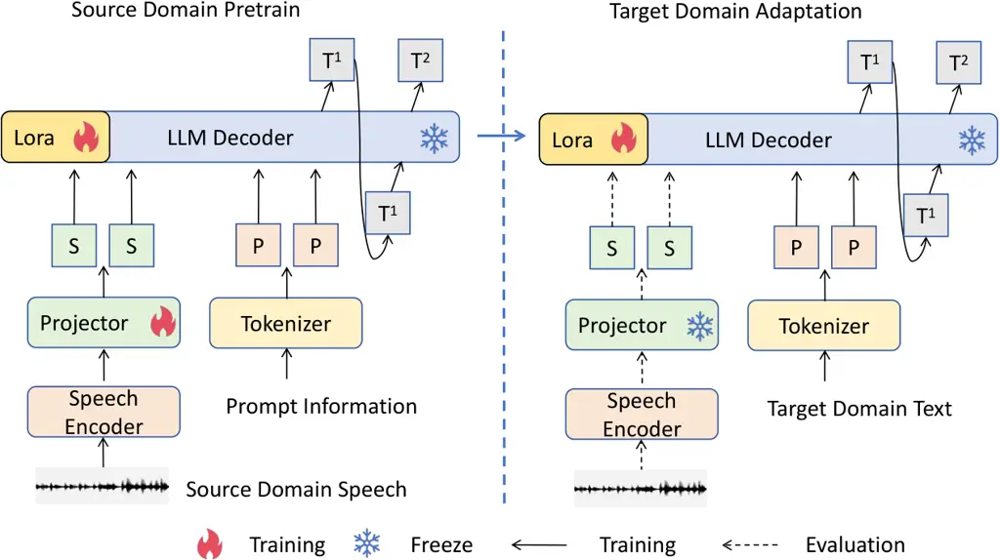
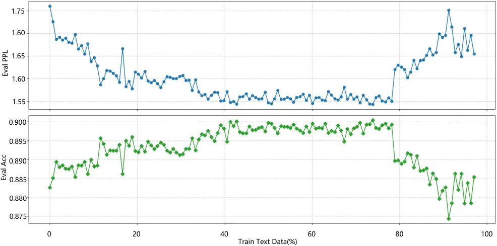

# Low-Resource Domain Adaptation for Speech LLMs via Text-Only Fine-Tuning

Yangui Fang^(1,4∗), Jing Peng^(2,3∗), Xu Li⁴ , Yu Xi^(2,3), Chengwei
Zhang^(1†),Guohui Zhong¹, Kai Yu^(2,3) ^(†)^(†)thanks: \* Yangui Fang
and Jing Peng contributed equally to this work.^(†)^(†)thanks: \$ˆ†\$
Corresponding Author. Affiliation: ¹Huazhong University of Science and
Technology, School of Electronic Information and Communications
Affiliation: ²MoE Key Lab of Artificial Intelligence, AI Institute,
X-LANCE Lab, Shanghai Jiao Tong University, Shanghai, China
Affiliation: ³Jiangsu Key Lab of Language Computing, Suzhou,
China⁴AISpeech Co., Ltd., Suzhou, China Affiliation: 
{fangyg,zhangcw,zhonggh}@hust.edu.cn   danieljingpeng@gmail.com   {yuxi.cs,kai.yu}@sjtu.edu.cn   
xu.li@aispeech.com   

###### Abstract

Recent advances in automatic speech recognition (ASR) have combined
speech encoders with large language models (LLMs) through projection,
forming Speech LLMs with strong performance. However, adapting them to
new domains remains challenging, especially in low-resource settings
where paired speech-text data is scarce. We propose a text-only
fine-tuning strategy for Speech LLMs using unpaired target-domain text
without requiring additional audio. To preserve speech-text alignment,
we introduce a real-time evaluation mechanism during fine-tuning. This
enables effective domain adaptation while maintaining source-domain
performance. Experiments on LibriSpeech, SlideSpeech, and Medical
datasets show that our method achieves competitive recognition
performance, with minimal degradation compared to full audio-text
fine-tuning. It also improves generalization to new domains without
catastrophic forgetting, highlighting the potential of text-only
fine-tuning for low-resource domain adaptation of ASR.

###### Index Terms: 

speech large language model, automatic speech recognition, unpaired text
fine-tune, domain adaptation

## I Introduction

Automatic speech recognition (ASR) is a core technology in intelligent
speech systems. It has evolved from traditional ASR models \[21, 20, 3\]
to end-to-end (E2E) models \[1, 16, 13, 15, 29\] and is now undergoing a
third paradigm shift toward Speech LLMs \[26, 4\]. Speech LLMs extend
general-purpose LLMs by incorporating audio encoders that extract
acoustic features, which are then projected into the LLM input space and
combined with text token embeddings \[24, 33\]. Empowered by the strong
contextual reasoning capabilities of LLMs, Speech LLMs have demonstrated
remarkable performance in the field of ASR. Recent models such as
SeedASR \[6\] and FireRedASR \[37\] have achieved state-of-the-art
results on benchmark datasets including LibriSpeech \[25\] and AISHELL
\[7\] , significantly surpassing the performance of previous approaches.

Leveraging the strong learning capacity of Speech LLMs, these models
have achieved outstanding recognition performance on widely-used
benchmark datasets. However, this success also introduces a significant
risk: the training and performance improvements of Speech LLMs heavily
depend on the availability of large-scale data. In scenarios where
training data are sparse, the model is prone to overfitting to specific
domains\[18\], resulting in degraded generalization to unseen or broader
domains. And a more important question is, in low-resource speech
domains, the scarcity of paired audio-text data\[30, 5\] poses a major
bottleneck, making it difficult to perform domain-specific fine-tuning
and leading to poor recognition accuracy in those domains.

One approach leverages the relative abundance of textual data in
low-resource domains. Given sufficient in-domain text, an LLM can
generate domain-specific content, and a text-to-speech (TTS) system can
synthesize corresponding audio to create pseudo audio-text pairs.
However, synthetic speech often lacks naturalness and variability \[9,
10\], and the overall pipeline incurs significant computational and
engineering costs. Another direction reduces the number of trainable
parameters in Speech LLMs\[22, 23\], such as prompt tuning or prefix
tuning. While these methods lessen retraining overhead, they require
domain-specific prompt design, limiting generalizability and introducing
additional manual effort.

To address these challenges, we propose a novel training strategy that
fine-tunes the Speech LLM using unpaired text data without requiring
additional audio, while maintaining cross-modal alignment through
real-time alignment evaluation during fine-tuning. Our main
contributions are summarized as follows:

- •
  To the best of our knowledge, this is the first work in the field of
  Speech LLMs that explores domain adaptation by fine-tuning the LLM
  using only text data from the target domain.
- •
  To mitigate the risk of degradation in speech recognition performance
  caused by excessive text fine-tuning, we propose a real-time
  evaluation strategy that employs text data for training while using
  paired speech-text data for evaluation.
- •
  Our experiments demonstrate that text-based fine-tuning not only
  facilitates domain adaptation in low-resource scenarios but also
  preserves superior recognition performance in the original domain
  compared to conventional speech-based fine-tuning methods.

## II Related Works

This section first reviews traditional domain adaptation methodologies
and end-to-end speech recognition adaptation strategies, which serve as
foundational inspirations for our approach. It then examines solutions
based on TTS for addressing domain adaptation in low-resource scenarios,
highlighting their limitations. Finally, recent advances in Speech LLMs
are discussed as a promising yet still challenging direction, forming
the primary focus of this work.

### II-A Domain Adaptation for Traditional Models

Traditional ASR systems typically consist of three independent
components: an acoustic model (AM), a pronunciation lexicon (PM), and a
language model (LM). The recognition process can be formulated as

```math
P_{\mathrm{LM}}(T)\cdot P_{\mathrm{AM}}(T\mid A), \tag{1}
```

where $`A`$ denotes the input audio signal and $`T`$ denotes the
corresponding output text sequence.

In domain adaptation, the objective is to leverage a model trained on a
source domain to recognize speech from a different target domain. The
recognition process under domain adaptation can be formulated as

```math
P_{\mathrm{LM}_{\phi}}(T_{\tau})\cdot P_{\mathrm{AM}_{\phi}}(T_{\tau}\mid A_{\tau}), \tag{2}
```

where $`\phi`$ denotes the model parameters trained on the source
domain, $`\tau`$ denotes the target domain, $`A_{\tau}`$ denotes the
input audio from the target domain, and $`T_{\tau}`$ denotes the
corresponding output text sequence.

Domain mismatches between training and target data may cause significant
performance degradation. To mitigate this issue, it is often necessary
to adapt the acoustic model or the language model trained on the source
domain. Given the lower retraining cost, language models are typically
adapted more frequently. Specifically, integrating domain-specific
language models facilitates effective adaptation of traditional systems.
And the training process can be formulated as

```math
P_{\mathrm{LM}_{\phi}}(T_{\tau})\cdot P_{\mathrm{AM}_{\phi}}(T_{\tau}\mid A_{\tau})\longrightarrow P_{\mathrm{LM}_{\phi+\tau}}(T_{\tau})\cdot P_{\mathrm{AM}_{\phi}}(T_{\tau}\mid A_{\tau}) \tag{3}
```

where $`P_{\mathrm{LM}_{\phi+\tau}}`$ denotes the language model
originally trained on the source domain and adapted to the target domain
$`\tau`$, while $`P_{\mathrm{AM}_{\phi}}`$ remains fixed with the
original parameters $`\phi`$. The proposed method draws upon the
conventional strategy.

### II-B Domain Adaptation For End to End Models

In end-to-end (E2E) models, domain adaptation can also be performed by
replacing the LM; however, the LM is no longer a necessary component of
E2E architectures. In such systems, the LM is typically incorporated via
shallow fusion \[40\], deep fusion \[35\], or cold fusion \[31\]. For
deep fusion and cold fusion approaches, domain adaptation through LM
replacement is challenging because the LM is implicitly integrated into
the model. The recognition probability in this case can be formulated as

```math
P_{\mathrm{E2E}_{\phi}}\left(T_{\tau}\mid A_{\tau},\mathrm{LM}_{\phi}^{\text{(implicit)}}\right), \tag{4}
```

where $`\mathrm{LM}_{\phi}^{\text{(implicit)}}`$ indicates that the LM
is implicitly integrated into the model with parameters $`\phi`$.

Another approach is to augment the model with relevant information from
the target domain \[2\]. For example, Pundak et al. \[27\] incorporate
contextual information through a context encoder and an attention
mechanism. Huang et al. \[17\] propose combining context embeddings with
acoustic representations extracted from the acoustic encoder and text
representations obtained using a prediction network based on previous
sub-word units. Yang et al. \[39\] further propose an effective method
to construct high-quality context lists for unified streaming and
non-streaming E2E models. However, these methods require additional
resources or supervision.

### II-C Domain Adaptation For Synthetic Speech

The development of synthetic speech technology enables the use of speech
synthesized from text in data-scarce domains to promote domain
adaptation. Su et al. \[32\] studied an E2E pipeline where LLMs are used
to generate text, followed by speech synthesis and domain adaptation,
potentially eliminating the reliance on textual data. D et al. \[11\]
adopt the method proposed by Thomas et al. \[35\] to investigate whether
synthetic speech can be substituted by injected contextual information.

However, a major limitation of the synthetic speech approach is that it
requires substantial computational resources for speech synthesis, and
its effectiveness heavily depends on the quality of the generated
speech. The objective is to ensure that the model performance on
synthetic speech approximates that on real speech, which can be
formalized as

```math
P_{\mathrm{E2E}_{\phi}}\left(T_{\tau}\mid A_{\tau}^{\text{(synth)}}\right)\approx P_{\mathrm{E2E}_{\phi}}\left(T_{\tau}\mid A_{\tau}\right), \tag{5}
```

where $`T_{\tau}`$ denotes the output text sequence for the target
domain, $`A_{\tau}`$ denotes the input audio from the target domain, and
$`A_{\tau}^{\text{(synth)}}`$ represents the synthetic audio generated
from text for the target domain.

### II-D Domain Adaptation For Speech LLMs

Speech large language models (Speech LLMs) leverage extensive
general-domain textual information acquired during pre-training and can
further inject domain-specific knowledge by exploiting their contextual
capabilities. Yang et al. \[38\] improve recognition performance by
prompting the LLM with hot words extracted from slide text. Similarly,
Lakomkin et al. \[19\] incorporate metadata such as titles to enhance
recognition accuracy. Nevertheless, obtaining specific contextual
information for each speech utterance remains challenging.

Li et al. \[22\] propose using domain-specific text prompts to improve
recognition performance in a particular domain; however, the prompts
must be carefully designed, and devising a stable and broadly applicable
prompting strategy remains an open problem. Liao et al. \[23\]
investigate using LLMs to generate descriptions for corresponding speech
segments, allowing models like Whisper to leverage these descriptions
for recognition enhancement. Despite its potential, generating a text
description for each utterance is often impractical.



Fig. 1: An overview of our two-stage training framework. Left: Source
domain pretraining aims to achieve cross-modal alignment between speech
and text, following mainstream training strategies. Right: Target domain
adaptation seeks to maintain alignment while improving performance on
the target domain. During training, the LLM is fine-tuned with LoRA
using text-only data, while real-time evaluation of alignment is
conducted using text-audio paired data.

## III Domain Adaptation for Speech LLMs via Text-Only Fine-Tuning

### III-A Fine-Tuning LLM on Target Domain Text for Adaptation

To construct a Speech LLM, a general-purpose LLM is connected to a
pretrained speech encoder via an adapter module. The resulting
architecture is trained on paired audio-text data from a source domain
to achieve cross-modal alignment between speech and text. The
recognition process can be formalized as

```math
P_{\mathrm{SpeechLLM}}\left(T_{\tau}\,\middle|\,\underbrace{\mathrm{Projector}_{\phi}\left(\mathrm{Encoder}_{\phi}(A_{\tau})\right)}_{\text{Acoustic feature mapping}},\ \mathrm{LLM}_{\theta_{s}+\phi}\right) \tag{6}
```

where $`\mathrm{LLM}_{\theta_{s}+\phi}`$ denotes a large language model
initially pre-trained on general-domain text $`\theta_{s}`$ and
subsequently adapted to the source domain via cross-modal training with
paired speech-text data. The model parameters, including the pretrained
encoder $`\mathrm{Encoder}_{\phi}`$, the projection module
$`\mathrm{Projector}_{\phi}`$, and the source-domain adapted LLM
$`\mathrm{LLM}_{\theta_{s}+\phi}`$ , are jointly optimized by minimizing
the cross-entropy loss between the predicted transcription and the
ground-truth text. We refer to this stage as source domain pretraining,
as illustrated on the left side of Fig. 1. Both the projector and the
LLM are included in the training process to achieve better
generalization ability \[18\].

While traditional domain adaptation methods typically perform end-to-end
fine-tuning on speech-text paired data, if this approach is directly
applied to Speech LLMs, the speech recognition process will be
formulated as

```math
P_{\mathrm{SpeechLLM}}\left(T_{\tau}\,\middle|\,\mathrm{Projector}_{\phi+\tau}\left(\mathrm{Encoder}_{\phi+\tau}(A_{\tau})\right),\ \mathrm{LLM}_{\theta_{s}+\phi+\tau}\right) \tag{7}
```

where $`\mathrm{LLM}_{\theta_{s}+\phi+\tau}`$ denotes the large language
model initially pre-trained on general-domain text, adapted to the
source domain via cross-modal training, and further fine-tuned on the
target domain speech-text data for domain-specific adaptation. However,
this approach faces two significant challenges: (1) the Speech LLMs are
prone to overfitting when limited domain data is available, (2) the
training process acquires sufficient speech-text paired corpora in
low-resource domains, such as those with specialized terminology, is
difficult.

To address these challenges, we propose a hierarchical adaptation
strategy, as shown on the right side of Fig. 1. In the target domain
adaptation phase, only the LoRA layers within the LLM decoder are
fine-tuned by leveraging only text data. The training objective is the
standard autoregressive language modeling loss, which minimizes the
negative log-likelihood of the target domain text sequences.

After adaptation, the speech recognition process can be formulated as

```math
P_{\mathrm{SpeechLLM}}\left(T_{\tau}\,\middle|\,\mathrm{Projector}_{\phi}\left(\mathrm{Encoder}_{\phi}(A_{\tau})\right),\ \mathrm{LLM}_{\theta_{s}+\phi+\tau_{\text{text}}}\right) \tag{8}
```

where $`\mathrm{LLM}_{\theta_{s}+\phi+\tau_{\text{text}}}`$ denotes the
large language model initially pre-trained on general-domain text,
adapted to the source domain via cross-modal training, and further
fine-tuned on target domain text data using LoRA-based lightweight
adaptation.

This adaptation strategy offers three advantages: (a) it preserves the
original-domain generalization capability of the acoustic feature
extractor, including the projector and encoder; (b) it injects
domain-specific knowledge by leveraging the relatively abundant textual
data; and (c) it mitigates the risk of overfitting arising from joint
optimization of acoustic and textual modalities.

### III-B Real Time Evaluation

The LoRA adapters in LLMs exhibit dual functionalities across two stages
in our method: cross-modal alignment optimization (enhancing
speech-to-text representation mapping during the initial source domain
pretraining stage) and language modeling enhancement (learning
domain-specific linguistic patterns through target domain text
adaptation in the second stage).

However, while conventional text-only fine-tuning approaches typically
focus exclusively on improving language modeling capability, monitored
through the language modeling loss $`\mathcal{L}_{\text{LM}}`$, they
often neglect the preservation of speech-text alignment established
during the initial cross-modal pretraining. This omission can lead to
degradation in alignment performance, as the model overfits to the text
modality and loses its ability to effectively integrate acoustic
representations.

To address this limitation, we propose a dynamic evaluation strategy
that ensures the cross-modal alignment is maintained throughout the text
adaptation process:

- •
  Training: Update the LoRA parameters of the LLM by minimizing the
  language modeling loss $`\mathcal{L}_{\text{LM}}`$.
- •
  Evaluation: Freeze the encoder, projector, and base LLM parameters,
  and integrate the updated LoRA parameters to evaluate the speech
  recognition loss on paired speech-text data.

By continuously monitoring the speech-text alignment of the text-adapted
model during fine-tuning, we ensure that text-only adaptation enhances
domain-specific language modeling while preserving robust cross-modal
representation capabilities.

|             |           |       |        |         |                |                                                  |
| ----------- | --------- | ----- | ------ | ------- | -------------- | ------------------------------------------------ |
| Dataset     | Train     | Dev   | Test   | Hours   | Source         | Features                                         |
| Librispeech | 181,240   | 5,567 | 5,558  | 1,000   | Audiobook      | Source domain dataset                            |
| Medical     | 381       | 385   | 5,895  | 8       | Medical        | Small-scale medical domain dataset               |
| Slidespeech | 481,930   | 1,801 | 3,188  | 473     | Online Meeting | Medium-scale conference domain dataset           |
| Gigaspeech  | 8,282,988 | 5,715 | 19,930 | 10,000+ | Internet       | Large-scale general-purpose multi-domain dataset |

TABLE I: Details of the selected datasets and characteristics of each
dataset

## IV Experimental Setup

### IV-A Dataset

Table I summarizes the datasets used. LibriSpeech \[25\] (1,000 hours)
serves as the source domain, comprising audiobook recordings with
test-clean and test-other subsets. For cross-domain evaluation, we adopt
SlideSpeech \[36\] (470 hours) from the online meeting domain and
Medical \[12\] (8 hours) from the healthcare domain, simulating diverse
low-resource scenarios across academic and specialized medical fields.
Additionally, GigaSpeech \[8\] (10,000+ hours) provides large-scale
evaluation for generalization assessment. These datasets collectively
support rigorous cross-domain adaptation experiments.

|                    |             |               |               |             |      |       |              |            |
| ------------------ | ----------- | ------------- | ------------- | ----------- | ---- | ----- | ------------ | ---------- |
| Fine-Tune Strategy |             | Source Domain | Target Domain | Error Types |      |       | Other Domain |            |
| Text               | Speech      | LibriSpeech   | SlideSpeech   | Sub         | Del  | Ins   | Medical      | GigaSpeech |
| –                  | –           | 3.73 / 6.52   | 27.59         | 7.63        | 5.38 | 14.58 | 13.03        | 39.47      |
| SlideSpeech        | –           | 4.36 / 6.55   | 16.22         | 6.01        | 8.35 | 1.66  | 13.08        | 17.09      |
| –                  | SlideSpeech | 9.71 / 12.47  | 12.99         | 5.43        | 3.13 | 4.42  | 20.69        | 18.13      |
| SlideSpeech        | SlideSpeech | 9.48 / 12.16  | 12.92         | 5.39        | 3.07 | 4.46  | 20.67        | 17.92      |

TABLE II: Detailed analysis of substitution, deletion, and insertion
errors under different fine-tuning strategies, along with evaluation
results on source, target and other domains. The speech LLM is trained
on Librispeech.

### IV-B Model Architecture

As illustrated in Figure 1, our Speech LLM consists of a speech encoder,
a projector, and an LLM decoder. We adopt Whisper-large-v3 \[28\] as the
encoder, with 635M parameters and 128-dimensional MFCC features, padding
all inputs to 30 seconds. The encoder has a downsampling factor of 2,
yielding a fixed output of 1500 frames with 1280 dimensions.

The projector comprises two linear layers with a ReLU activation,
totaling 20M parameters, and applies a downsampling factor of 5 by
folding every 5 tokens into 1. Remaining tokens are discarded if fewer
than five.

For the decoder, we use Qwen2.5-7B-Instruct \[34\], a 7B-parameter LLM.
We fine-tune it using LoRA, applying modifications to the query, key,
value, and output projection matrices in each decoder layer, while
freezing the rest. LoRA is configured with a rank of 64, dropout of 5%,
and $`\text{LoRA}_{\alpha}`$ of 16, introducing 161M trainable
parameters.

### IV-C Training Strategy

Training uses the Adam optimizer with $`\beta_{1}=0.9`$,
$`\beta_{2}=0.98`$, weight decay of $`10^{-5}`$, and a warmup schedule
with 1,000 steps to a base learning rate of $`10^{-4}`$. For text-only
fine-tuning, the learning rate is reduced to $`5\times 10^{-6}`$ with a
100-step warmup.

In the source domain pretraining stage, the training proceeds in two
phases: first optimizing the projector for 3–5 epochs until convergence,
followed by joint optimization of the projector and LoRA parameters for
1–2 epochs, following the main training strategy such as SLAMOON \[14\]
and OSUM \[33\].

For target domain adaptation, we fine-tune the Speech LLM using three
strategies to enable a systematic comparison of their effectiveness.

1.  1.  Text fine-tuning: We use the text of the training data to fine-tune
        the LLM in Speech LLM through pre-training. The trainable parameters
        at this time are the pre-trained LoRA.
2.  2.  Speech fine-tuning: The entire Speech LLM is fine-tuned using
        speech-text pairs, which is the same as the way to train speech LLM.
        The trainable parameters at this time are Linear+LoRA.
3.  3.  Text-then-Speech fine-tuning: Take the LoRA parameters of the LLM
        after text fine-tuning to continue fine-tuning of Speech LLM using
        the speech-text pair.

|                     |                      |       |                      |             |            |
| ------------------- | -------------------- | ----- | -------------------- | ----------- | ---------- |
| Text Fine-tune Data | Source Domain (WER%) |       | Target Domain (WER%) |             |            |
|                     | Clean                | Other | Medical              | SlideSpeech | Gigaspeech |
| \-                  | 3.73                 | 6.52  | 13.03                | 27.59       | 39.47      |
| Medical             | 4.05                 | 5.97  | 12.48                | 16.53       | 18.04      |
| SlideSpeech         | 4.36                 | 6.55  | 13.08                | 16.22       | 17.09      |
| Gigaspeech          | 4.90                 | 6.55  | 12.26                | 17.09       | 17.79      |

TABLE III: Cross-domain speech recognition text fine-tuning results. The
model is Speech LLM (8B) with 181M trainable parameters, trained on
LibriSpeech. Fine-tuning datasets include Medical (less than 1h),
SlideSpeech (473h), and Gigaspeech (10k+h). WER(%) is reported for both
source and target domains.

## V Evaluation and Results Analysis

### V-A Generalization Evaluation of Speech LLM After Source Domain Pretraining

As shown in the first row of Table III, the base model is trained on
LibriSpeech as the source domain. Consistent with findings in \[18\],
the Speech LLM achieves relatively good performance on LibriSpeech due
to its large parameter size and superior learning capacity. (Note that
with more training epochs, the performance could be further improved on
source dataset; however, we limit the epochs for efficient
experimentation and relatively good generalization ability.) However,
its performance significantly degrades on cross-domain datasets
(SlideSpeech, GigaSpeech, etc.), revealing critical limitations in
domain generalization.

### V-B Cross-Domain Speech Recognition Text Fine-Tuning Results

As shown in Table III, our proposed text-only fine-tuning method
achieves substantial improvements when applied to the
LibriSpeech-pretrained Speech LLM (8B) model. On SlideSpeech, text
fine-tuning reduces the WER by 11.37 absolute points (41% relative error
reduction), demonstrating strong domain adaptation capability. For
Medical data, representing an extremely low-resource scenario (less than
1 hour of corresponding text), a WER reduction of 0.55 (4.2% relative
improvement) is observed, although the improvement is less pronounced
due to the limited amount of training data.

It is worth noting that text fine-tuning on GigaSpeech yields the best
performance on the Medical domain, achieving a WER of 12.26%. This can
be attributed to the scale and coverage of GigaSpeech, which, despite
its noisier text quality, provides sufficient generalization benefits
for low-resource domains. However, due to the extensive size and
relatively lower text cleanliness, its performance on SlideSpeech and
GigaSpeech target domains is slightly inferior compared to fine-tuning
directly on SlideSpeech.

Notably, SlideSpeech achieves the best overall adaptation results, not
only on its own domain but also on GigaSpeech, likely because of its
moderate size and higher text quality.

Furthermore, the source domain performance on LibriSpeech (Clean/Other)
remains stable after fine-tuning, with no significant degradation
observed. This indicates that the proposed method enhances target-domain
performance while effectively preserving source-domain knowledge,
mitigating catastrophic forgetting and improving cross-domain
generalization.

Overall, the WERs across different target domains converge to similar
levels after fine-tuning, suggesting that the model approaches a
critical point in balancing adaptation and overfitting, a phenomenon
worthy of further investigation in the context of large-scale Speech
LLMs. Notably, this also demonstrates the effectiveness of our real-time
evaluation strategy.



Fig. 2: Real-time perplexity (PPL) and accuracy (Acc) evaluation of
speech alignment capabilities during text fine-tuning on the gigaspeech
dataset

### V-C Comparison of Text Fine-Tuning and Speech Fine-Tuning

Table II presents a detailed analysis of different fine-tuning
strategies under a domain adaptation setting with complete speech data.
Two key observations can be made.

First, text-based fine-tuning demonstrates strong generalization to
unseen domains. Although its WER on the target domain (SlideSpeech) is
relatively higher than that of speech-based fine-tuning (16.22% vs.
12.99%), it significantly outperforms speech-based fine-tuning in the
source (LibriSpeech) and other domains (Medical and GigaSpeech).
Specifically, text fine-tuning results in minimal performance
degradation on LibriSpeech (WER increases of only 0.63% and 0.03%), and
achieves the lowest WERs in the Medical (13.08%) and GigaSpeech (17.09%)
domains. This indicates that text fine-tuning effectively mitigates
overfitting to the target domain and preserves robust cross-domain
generalization.

Second, in terms of error types, text fine-tuning substantially reduces
substitution and insertion errors, with the improvement in insertion
errors attributed to better alignment induced by textual supervision.
However, it slightly increases deletion errors, likely due to a weakened
speech-to-text alignment capacity.

By contrast, speech-based fine-tuning achieves better WER in the target
domain but suffers from substantial degradation in both source and other
domains. Furthermore, it consistently reduces substitution and deletion
errors, benefiting from enhanced acoustic alignment. Nevertheless, its
poor cross-domain generalization limits its broader applicability.

In summary, while speech fine-tuning improves target-domain performance
and alignment accuracy, text fine-tuning provides superior
generalization and robust performance across domains, making it a more
reliable choice in diverse deployment scenarios.

### V-D Real-time evaluation

GigaSpeech has the largest amount of data and the most text materials,
so we analyze the ppl, loss, and acc during the training of GigaSpeech
using the real-time evaluation method mentioned above. As shown in the
figure, the recognition effect of the model first increases and then
decreases. The early increase is because the lora parameters of the LLM
have domain adaptation to the text in this field, and the later increase
is because too much text destroys the alignment ability of the lora
parameters in the LLM between speech and text. The actual optimal point
uses 74.6% of the training text of the whole text, and not all the text
is used. Of course, lowering the learning rate may make the time point
of destroying the speech alignment later to obtain the results of all
text training.

## VI Conclusion and Future Work

This paper presents a text-based fine-tuning strategy for domain
adaptation in Speech LLMs under data-scarce conditions. By leveraging
only text data, the proposed method reduces the reliance on costly
speech resources and mitigates the risk of overfitting to the target
domain.

Experiments on multiple datasets show that text fine-tuning achieves
competitive adaptation performance while preserving strong
generalization across domains. A real-time evaluation strategy is
further introduced to maintain speech alignment capabilities during
adaptation, making the approach practical and scalable for deployment in
low-resource scenarios.

However, the method still trails behind full speech-text fine-tuning in
target domain performance, and the benefit is limited when LLM
parameters remain frozen during pre-training. Another problem is that
excessive text fine-tuning in the absence of speech can cause the model
to lose its recognition ability. Although we avoid this problem by
reducing the learning rate of text fine-tuning and adopting real-time
evaluation, we still do not completely solve this problem. Future work
will explore hybrid strategies combining text and limited speech
supervision, and joint optimization of speech and language components to
further enhance adaptation effectiveness.

## VII Acknowledgment

This research was carried out by Yangui Fang and Jing Peng while they
were interning at AISPEECH. We would like to express our gratitude to
AISPEECH for providing the necessary computing resources to support this
work.

## References

- \[1\] O. Abdel-Hamid, A. Mohamed, H. Jiang, L. Deng, G. Penn, and D.
  Yu (2014) Convolutional neural networks for speech recognition.
  IEEE/ACM Transactions on audio, speech, and language processing 22
  (10), pp. 1533–1545. Cited by: §I.
- \[2\] P. S. Aleksic, M. Ghodsi, A. H. Michaely, C. Allauzen, K. B.
  Hall, B. Roark, D. Rybach, and P. J. Moreno (2015) Bringing contextual
  information to google speech recognition.. In Interspeech,
  pp. 468–472. Cited by: §II-B.
- \[3\] S. Alharbi, M. Alrazgan, A. Alrashed, T. Alnomasi, R.
  Almojel, R. Alharbi, S. Alharbi, S. Alturki, F. Alshehri, and M.
  Almojil (2021) Automatic speech recognition: systematic literature
  review. IEEE Access 9 (), pp. 131858–131876. External Links:
  [Document](https://dx.doi.org/10.1109/ACCESS.2021.3112535) Cited by:
  §I.
- \[4\] S. Arora, K. Chang, C. Chien, Y. Peng, H. Wu, Y. Adi, E.
  Dupoux, H. Lee, K. Livescu, and S. Watanabe (2025) On the landscape of
  spoken language models: a comprehensive survey. External Links:
  2504.08528, [Link](https://arxiv.org/abs/2504.08528) Cited by: §I.
- \[5\] L. Ashok Kumar, D. Karthika Renuka, K. Naveena, and S. Sree
  Resmi (2024) Domain adaptation-based self-supervised asr models for
  low-resource target domain. Automatic Speech Recognition and
  Translation for Low Resource Languages, pp. 51–67. Cited by: §I.
- \[6\] Y. Bai, J. Chen, J. Chen, W. Chen, Z. Chen, C. Ding, L. Dong, Q.
  Dong, Y. Du, K. Gao, et al. (2024) Seed-asr: understanding diverse
  speech and contexts with llm-based speech recognition. arXiv preprint
  arXiv:2407.04675. Cited by: §I.
- \[7\] H. Bu, J. Du, X. Na, B. Wu, and H. Zheng (2017) AISHELL-1: an
  open-source mandarin speech corpus and a speech recognition baseline.
  In 2017 20th Conference of the Oriental Chapter of the International
  Coordinating Committee on Speech Databases and Speech I/O Systems and
  Assessment (O-COCOSDA), pp. 1–5. External Links:
  [Document](https://dx.doi.org/10.1109/ICSDA.2017.8384449), ISBN
  978-1-5386-3333-5 Cited by: §I.
- \[8\] G. Chen, S. Chai, G. Wang, J. Du, W. Zhang, C. Weng, D. Su, D.
  Povey, J. Trmal, J. Zhang, M. Jin, S. Khudanpur, S. Watanabe, S.
  Zhao, W. Zou, X. Li, X. Yao, Y. Wang, Y. Wang, Z. You, and Z. Yan
  (2021)GigaSpeech: An Evolving, Multi-domain ASR Corpus with 10,000
  Hours of Transcribed Audio(Website) External Links:
  [Document](https://dx.doi.org/10.48550/arXiv.2106.06909) Cited by:
  §IV-A.
- \[9\] E. Dunbar, R. Algayres, J. Karadayi, M. Bernard, J. Benjumea, X.
  Cao, L. Miskic, C. Dugrain, L. Ondel, A. W. Black, et al. (2019) The
  zero resource speech challenge 2019: tts without t. arXiv preprint
  arXiv:1904.11469. Cited by: §I.
- \[10\] P. D’Alterio, C. Hensel, and B. A. S. Hasan (2023) Can unpaired
  textual data replace synthetic speech in asr model adaptation?. In
  2023 IEEE Automatic Speech Recognition and Understanding Workshop
  (ASRU), Vol. , pp. 1–8. External Links:
  [Document](https://dx.doi.org/10.1109/ASRU57964.2023.10389722) Cited
  by: §I.
- \[11\] P. D’Alterio, C. Hensel, and B. A. S. Hasan (2023) Can unpaired
  textual data replace synthetic speech in asr model adaptation?. In
  2023 IEEE Automatic Speech Recognition and Understanding Workshop
  (ASRU), pp. 1–8. Cited by: §II-C.
- \[12\] Figure Eight Inc. (2019) Medical speech, transcription, and
  intent. Note:
  [https://www.kaggle.com/datasets/paultimothymooney/medical-speech-transcription-and-intent](https://www.kaggle.com/datasets/paultimothymooney/medical-speech-transcription-and-intent)
  Cited by: §IV-A.
- \[13\] Z. Gao, S. Zhang, I. McLoughlin, and Z. Yan (2022) Paraformer:
  fast and accurate parallel transformer for non-autoregressive
  end-to-end speech recognition. arXiv preprint arXiv:2206.08317. Cited
  by: §I.
- \[14\] X. Geng, K. Wei, Q. Shao, S. Liu, Z. Lin, Z. Zhao, G. Li, W.
  Tian, P. Chen, Y. Li, et al. (2025) OSUM: Advancing open speech
  understanding models with limited resources in academia. arXiv
  preprint arXiv:2501.13306. Cited by: §IV-C.
- \[15\] A. Graves and J. Schmidhuber (2005) Framewise phoneme
  classification with bidirectional lstm and other neural network
  architectures. Neural networks 18 (5-6), pp. 602–610. Cited by: §I.
- \[16\] A. Gulati, J. Qin, C. Chiu, N. Parmar, Y. Zhang, J. Yu, W.
  Han, S. Wang, Z. Zhang, Y. Wu, et al. (2020) Conformer:
  convolution-augmented transformer for speech recognition. arXiv
  preprint arXiv:2005.08100. Cited by: §I.
- \[17\] K. Huang, A. Zhang, Z. Yang, P. Guo, B. Mu, T. Xu, and L.
  Xie (2023) Contextualized end-to-end speech recognition with
  contextual phrase prediction network. arXiv preprint arXiv:2305.12493.
  Cited by: §II-B.
- \[18\] S. Kumar, I. Thorbecke, S. Burdisso, E. Villatoro-Tello, K.
  Hacioğlu, P. Rangappa, P. Motlicek, A. Ganapathiraju, A. Stolcke, et
  al. (2024) Performance evaluation of slam-asr: the good, the bad, the
  ugly, and the way forward. arXiv preprint arXiv:2411.03866. Cited by:
  §I, §III-A, §V-A.
- \[19\] E. Lakomkin, C. Wu, Y. Fathullah, O. Kalinli, M. L. Seltzer,
  and C. Fuegen (2024) End-to-end speech recognition contextualization
  with large language models. In ICASSP 2024-2024 IEEE International
  Conference on Acoustics, Speech and Signal Processing (ICASSP),
  pp. 12406–12410. Cited by: §II-D.
- \[20\] K. Lee and H. Hon (1989) Speaker-independent phone recognition
  using hidden markov models. IEEE Transactions on Acoustics, Speech,
  and Signal Processing 37 (11), pp. 1641–1648. Cited by: §I.
- \[21\] S. E. Levinson, L. R. Rabiner, and M. M. Sondhi (1983) An
  introduction to the application of the theory of probabilistic
  functions of a markov process to automatic speech recognition. Bell
  System Technical Journal 62 (4), pp. 1035–1074. Cited by: §I.
- \[22\] Y. Li, Y. Wu, J. Li, and S. Liu (2023) Prompting large language
  models for zero-shot domain adaptation in speech recognition. In 2023
  IEEE Automatic Speech Recognition and Understanding Workshop (ASRU),
  pp. 1–8. Cited by: §I, §II-D.
- \[23\] F. Liao, Y. Chan, Y. Chen, C. Hsu, and D. Shiu (2023) Zero-shot
  domain-sensitive speech recognition with prompt-conditioning
  fine-tuning. In 2023 IEEE Automatic Speech Recognition and
  Understanding Workshop (ASRU), pp. 1–8. Cited by: §I, §II-D.
- \[24\] Z. Ma, G. Yang, Y. Yang, Z. Gao, J. Wang, Z. Du, F. Yu, Q.
  Chen, S. Zheng, S. Zhang, et al. (2024) An embarrassingly simple
  approach for llm with strong asr capacity. arXiv preprint
  arXiv:2402.08846. Cited by: §I.
- \[25\] V. Panayotov, G. Chen, D. Povey, and S. Khudanpur (2015)
  Librispeech: an ASR corpus based on public domain audio books. In 2015
  IEEE International Conference on Acoustics, Speech and Signal
  Processing (ICASSP), pp. 5206–5210. External Links: ISSN 2379-190X,
  [Document](https://dx.doi.org/10.1109/ICASSP.2015.7178964) Cited by:
  §I, §IV-A.
- \[26\] J. Peng, Y. Wang, Y. Xi, X. Li, X. Zhang, and K. Yu (2025) A
  survey on speech large language models. External Links: 2410.18908,
  [Link](https://arxiv.org/abs/2410.18908) Cited by: §I.
- \[27\] G. Pundak, T. N. Sainath, R. Prabhavalkar, A. Kannan, and D.
  Zhao (2018) Deep context: end-to-end contextual speech recognition. In
  2018 IEEE spoken language technology workshop (SLT), pp. 418–425.
  Cited by: §II-B.
- \[28\] A. Radford, J. W. Kim, T. Xu, G. Brockman, C. Mcleavey, and I.
  Sutskever (2023) Robust speech recognition via large-scale weak
  supervision. In Proceedings of the 40th International Conference on
  Machine Learning, pp. 28492–28518. External Links: ISSN 2640-3498,
  [Link](https://proceedings.mlr.press/v202/radford23a.html) Cited by:
  §IV-B.
- \[29\] X. Ren, H. Zhu, L. Wei, M. Wu, and J. Hao (2022) Improving
  mandarin speech recogntion with block-augmented transformer. arXiv
  preprint arXiv:2207.11697. Cited by: §I.
- \[30\] P. Singhal, R. Walambe, S. Ramanna, and K. Kotecha (2023)
  Domain adaptation: challenges, methods, datasets, and applications.
  IEEE access 11, pp. 6973–7020. Cited by: §I.
- \[31\] A. Sriram, H. Jun, S. Satheesh, and A. Coates (2017) Cold
  fusion: training seq2seq models together with language models. arXiv
  preprint arXiv:1708.06426. Cited by: §II-B.
- \[32\] H. Su, T. Hu, H. S. Koppula, R. Vemulapalli, J. R. Chang, K.
  Yang, G. V. Mantena, and O. Tuzel (2024) Corpus synthesis for
  zero-shot asr domain adaptation using large language models. In ICASSP
  2024-2024 IEEE International Conference on Acoustics, Speech and
  Signal Processing (ICASSP), pp. 12326–12330. Cited by: §II-C.
- \[33\] C. Tang, W. Yu, G. Sun, X. Chen, T. Tan, W. Li, L. Lu, Z. Ma,
  and C. Zhang (2023) Salmonn: towards generic hearing abilities for
  large language models. arXiv preprint arXiv:2310.13289. Cited by: §I,
  §IV-C.
- \[34\] Q. Team (2024) Qwen2.5: a party of foundation models. External
  Links: [Link](https://qwenlm.github.io/blog/qwen2.5/) Cited by: §IV-B.
- \[35\] S. Thomas, B. Kingsbury, G. Saon, and H. J. Kuo (2022)
  Integrating text inputs for training and adapting rnn transducer asr
  models. In ICASSP 2022-2022 IEEE International Conference on
  Acoustics, Speech and Signal Processing (ICASSP), pp. 8127–8131. Cited
  by: §II-B, §II-C.
- \[36\] H. Wang, F. Yu, X. Shi, Y. Wang, S. Zhang, and M. Li (2024)
  SlideSpeech: A Large Scale Slide-Enriched Audio-Visual Corpus. In
  ICASSP 2024 - 2024 IEEE International Conference on Acoustics, Speech
  and Signal Processing (ICASSP), pp. 11076–11080. External Links:
  [Document](https://dx.doi.org/10.1109/ICASSP48485.2024.10448079), ISBN
  979-8-3503-4485-1 Cited by: §IV-A.
- \[37\] K. Xu, F. Xie, X. Tang, and Y. Hu (2025) FireRedASR:
  open-source industrial-grade mandarin speech recognition models from
  encoder-decoder to llm integration. arXiv preprint arXiv:2501.14350.
  Cited by: §I.
- \[38\] G. Yang, Z. Ma, F. Yu, Z. Gao, S. Zhang, and X. Chen (2024)
  Mala-asr: multimedia-assisted llm-based asr. arXiv preprint
  arXiv:2406.05839. Cited by: §II-D.
- \[39\] Z. Yang, S. Sun, X. Wang, Y. Zhang, L. Ma, and L. Xie (2023)
  Two stage contextual word filtering for context bias in unified
  streaming and non-streaming transducer. arXiv preprint
  arXiv:2301.06735. Cited by: §II-B.
- \[40\] D. Zhao, T. N. Sainath, D. Rybach, P. Rondon, D. Bhatia, B. Li,
  and R. Pang (2019) Shallow-fusion end-to-end contextual biasing.. In
  Interspeech, pp. 1418–1422. Cited by: §II-B.
