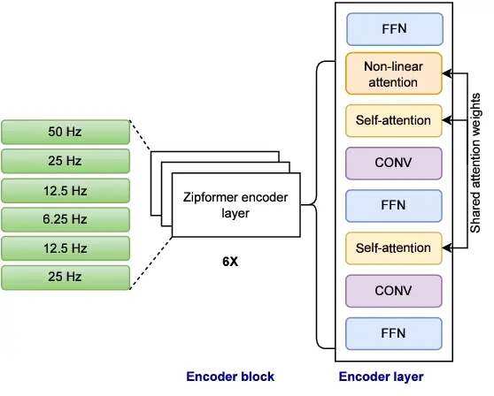
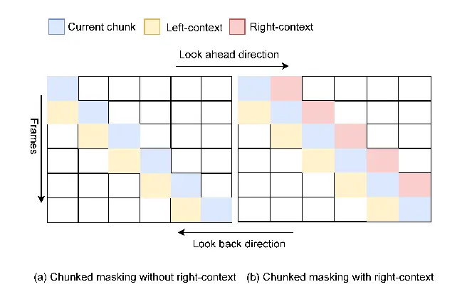
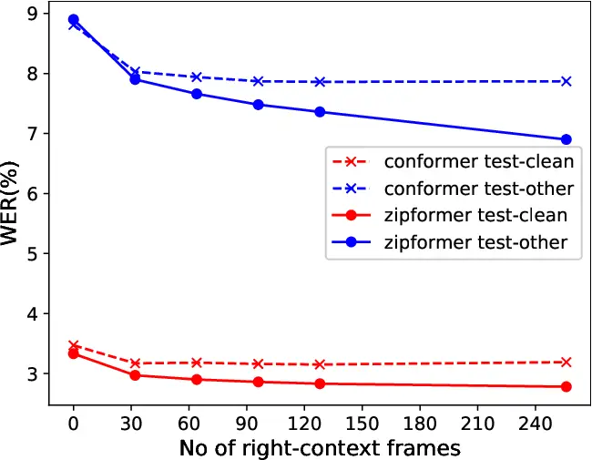
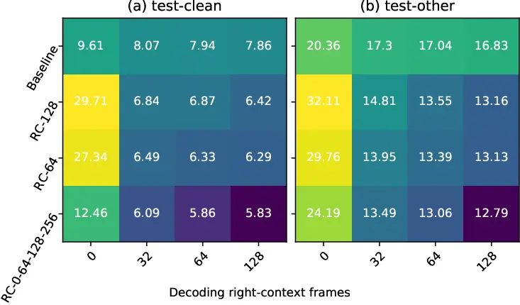

# Unifying Streaming and Non-streaming Zipformer-based ASR

Bidisha Sharma Affiliation: Uniphore, India & USA
Email: [bidisha@uniphore.com](mailto:)    Karthik Pandia Durai
Affiliation: Uniphore, India & USA
Email: [karthikpandia@uniphore.com](mailto:)    Shankar Venkatesan
Affiliation: Uniphore, India & USA
Email: [shankar.venkatesan@uniphore.com](mailto:)    Jeena J Prakash
Affiliation: Uniphore, India & USA Email: [jeena@uniphore.com](mailto:)
   Shashi Kumar Affiliation: Idiap Research Institute, Switzerland
Email: [malolan.chetlur@uniphore.com](mailto:)    Malolan Chetlur
Affiliation: Uniphore, India & USA
Email: [andreas.stolcke@uniphore.com](mailto:)    Andreas Stolcke
Affiliation: Uniphore, India & USA
Email: [shashi.kumar@idiap.ch](mailto:)

###### Abstract

There has been increasing interest in unifying streaming and
non-streaming automatic speech recognition (ASR) models to reduce
development, training, and deployment costs. We present a unified
framework that trains a single end-to-end ASR model for both streaming
and non-streaming applications, leveraging future context information.
We propose to use dynamic right-context through the chunked attention
masking in the training of zipformer-based ASR models. We demonstrate
that using right-context is more effective in zipformer models compared
to other conformer models due to its multi-scale nature. We analyze the
effect of varying the number of right-context frames on accuracy and
latency of the streaming ASR models. We use Librispeech and large
in-house conversational datasets to train different versions of
streaming and non-streaming models and evaluate them in a production
grade server-client setup across diverse testsets of different domains.
The proposed strategy reduces word error by relative 7.9% with a small
degradation in user-perceived latency. By adding more right-context
frames, we are able to achieve streaming performance close to that of
non-streaming models. Our approach also allows flexible control of the
latency-accuracy tradeoff according to customers requirements.

## 1 Introduction

In recent times, end-to-end (E2E) ASR models have started taking the
main stage in industrial use-cases Povey et al. (2016). Recurrent neural
networks (RNNs) are crucial as they can model the temporal dependencies
in audio sequences effectively Chiu et al. (2018); Rao et al. (2017);
Sainath et al. (2020). The transformer architecture with self-attention
has gained substantial attention in ASR to capture long distance global
context and show high training efficiency Zhang et al. (2020b); Vaswani
et al. (2017); Hsu et al. (2021); Chen et al. (2022). Alternatively, ASR
based on convolutional neural networks (CNNs) has also been successful
due to its ability to exploit local information Li et al. (2019); Han
et al. (2020a); Abdel-Hamid et al. (2014). Recently, the conformer ASR
model Gulati et al. (2020) was proposed for combining the advantages of
CNN and transformer models, to extract both local and global information
from a speech sequence Han et al. (2020b); Shi et al. (2021); Kim et al.
(2022); Yao et al. (2023). Zipformer Yao et al. (2023) is an extension
of the previous conformer models, providing a transformer that is
faster, more memory-efficient, and better-performing.

Latency-accuracy is a critical trade-off for an ASR model, especially
for streaming ASR models. In systems with concurrent call processing, it
becomes critical to find the optimal operating point in the
latency-concurrency-accuracy trio. Streaming decoders work on
chunk-based processing, where, for each frame the encoder has access to,
the entire left-context and a variable right-context depending on the
frame’s position in a chunk are used.

Right context has a significant role in the context of a unified model
in streaming and in offline production environment. Typically, the WER
of the offline model is significantly lower compared to that of a
streaming model. Therefore, separate models are generally trained for
offline and streaming use-cases. This requires twice the compute
resource to train the models and additional resource to maintain and
update the models. Adding right-context helps bridge the gap in WER
between offline and streaming models with a small degradation in latency
in the streaming case.

In Swietojanski et al. (2023), authors use variable attention masking in
a transformer transducer setting, however the influence of different
numbers of right-context frames is not explored and the work instead
focuses on using right-context ranging from multiple chunks to full
context, which may not be possible for a streaming setup. Li et al.
(2023) propose a dynamic chunk-based convolution, where the core idea is
to restrict the convolution at chunk boundaries so that it does not have
access to any future context and resembles the inference scenario. Our
approach, by contrast, uses limited additional right-context frames
beyond chunk boundaries. Our proposed method is also different from that
of Tripathi et al. (2020), where initial layers are trained with zero
right context and the final few layers are trained with variable
context. If we wanted a streaming model with different latency during
inference, the model would need to be retrained. Zhang et al. (2020a)
use dynamic chunk sizes for different batches in training and the
attention scope varies from left-context only to full context. The
authors in Wu et al. (2021) further enhance their strategy by employing
bidirectional decoders in both forward and backward direction of the
labeling sequence. In both passes, they use either full right-context or
full left-context attention masking, which may adversely impact the
real-time streaming use-case.

Our work is significantly different from the aforementioned approaches
in terms of training with variable right-context while decoding with
extra right-context frames in addition to the chunk being decoded in the
inference phase. We propose to unify streaming and non-streaming
zipformer-based ASR models by leveraging future context. The
conventional zipformer model uses chunked attention masking and utilizes
only left-context while we use a variable number of right-context frames
for different mini-batches during training, providing the flexibility to
select a desired number of right-context frames during inference,
according to the desired accuracy-latency tradeoff. We study the effect
of choosing different amounts of right context on latency and accuracy,
finding that as the number of decoding right-context frames increases,
the streaming zipformer ASR model can approach the performance of the
corresponding non-streaming model without significantly degrading
latency. We evaluate our method on both open-source read speech and
industry-scale production-specific conversational speech data.

## 2 Right-context in Zipformer

Here we review the zipformer model and the attention masking employed to
incorporate right-context information Gulati et al. (2020); Yao et al.
(2023).

### 2.1 Zipformer model



Figure 1: Zipformer encoder architecture showing each layer at different
frame rates (left) and different modules in each encoder layer (right).

The zipformer model is a significant advancement in transformer-based
ASR encoding, offering superior speed, memory efficiency, and
performance compared to conventional conformer models. A conformer model
adds a convolution module to a transformer to add both local and global
dependencies. In contrast to the fixed frame rate of 25Hz used by
conformers, the zipformer employs a U-Net-like structure, enabling it to
learn temporal representations at multiple resolutions in a more
streamlined manner.

In the zipformer encoder architecture, we have six encoder blocks, each
at different sampling rates learning temporal representation at
different resolutions in a more efficient way. Specifically, given the
acoustic features with frame rate of 100 Hz, a convolution based module
reduces it first to 50 Hz, followed by the six cascaded stacks to learn
temporal representation at frame rates of 50Hz, 25Hz, 12.5Hz, 6.25Hz,
12.5Hz, and 25Hz, respectively as shown on the left side of Figure 1.
The middle block operates at 6.25 Hz undergoing stronger downsampling,
thus facilitating more efficient training by reducing the number of
frames to process. The frame rate between each block is consistently 50
Hz. Different stacks have different embedding dimensions, and the middle
stacks have larger dimensions. The output of each stack is truncated or
padded with zeros to match the dimension of the next stack. The final
encoder output dimension is set to the maximum of all stacks’
dimensions.

The inner structure of each encoder block is shown in the right side of
Figure 1. The primary motivation is to reuse attention weights to
improve efficiency in both time and memory. The block input is first
processed by a multi-head attention module, which computes the attention
weights. These weights are then shared across a non-linear attention
module and two self-attention modules. Meanwhile, the block input is
also fed into a feed-forward module followed by the non-linear attention
module.

### 2.2 Attention masking

The multi-head self-attention facilitates fine-grained control over
neighboring information at each time step. At each time t,
$`Zipformer(x,t)`$ may be derived from an arbitrary subset of features
in x, as defined by the masking strategy implemented in the
self-attention layers Vaswani et al. (2017). Given the attention input
$`Y=(y_{1},\ldots,y_{L_{y}}),y_{t}\in\mathbb{R}`$ self-attention
computes

```math
Q=\mathcal{F}^{q}(Y),K=\mathcal{F}^{v}(Y),V=\mathcal{F}^{v}(Y),\\
 \tag{1}
```

```math
Att(Q,K,V)=softmax\left(\frac{\mathcal{M}(QK^{T})}{\sqrt{d}}\right)V^{T},\\
 \tag{2}
```

where, $`d`$ is the attention dimension, $`\mathcal{M}`$ is the
attention mask with values 0 and 1 of dimension $`L_{y}\times L_{k}`$.
The attention mask in the Equation 2 regulates the allowance of number
of left and right-context frames corresponding to each frame of $`Y`$.

### 2.3 Right-context attention masking

The attention masks constrain the receptive field in each layer without
the need for physically segmenting the input sequence. In a streaming
ASR setup, to mitigate computational costs and latency, the processing
occurs at the chunk level rather than at the frame level. A specific
number of frames are grouped into chunks, and each chunk is then encoded
as a batch. Following Shi et al. (2021); Chen et al. (2021), we use
chunked attention masking to confine the receptive field during
self-attention computation. In conventional chunked attention masking,
each frame within a chunk is exposed to varying extents of left- and
right-context frames. The initial frames in a chunk have access to some
right-context frames, while the later frames have no access to
right-context frames, enforcing a causal constraint at chunk boundaries.

The conformer and zipformer ASR recipes in k2-fsa icefall¹¹ 1
https://github.com/k2-fsa/icefall Gulati et al. (2020); Shi et al.
(2021) deploy chunked attention masking and use only left-context as
shown in Figure 2(a). For streaming decoders, each frame in the encoder
accesses left-context and variable right-context depending on the
frame’s position in a chunk.

However, the right-context information is very relevant to learn the
acoustic-linguistic attributes of a chunk. Utilizing a modest right and
left context may yield improved performance in terms of WER and latency
when compared to solely relying on an extensive left-context.
Incorporating right-context will thus help to narrow the gap in WER
between streaming and non-streaming models. Furthermore, due to the
varying temporal resolutions of each layer within the zipformer encoder
block, the utilization of right-context frames becomes more efficient.
In this work, we deploy chunked masking with right-context as shown in
Figure 2(b), where the extent of right-context and left-context can be
varied based on requirements. We note that the right-context frames are
the frames beyond the chunk boundaries, not within the chunks.



Figure 2: Attention masking in zipformer; (a) chunked masking with
left-context and no right-context, (b) chunked masking with both
left-context and right-context.

## 3 Experiments

Below we discuss the database used and experiments conducted to
demonstrate the effectiveness of right-context in unified streaming and
non-streaming ASR models.

### 3.1 Dataset

We conduct experiments using two data setups, using Librispeech and
large in-house conversational data. In the Librispeech setup, we use the
standard 960 hours of training data, as well as test-clean (5.40 hrs)
and test-other (5.10 hr) partitions for testing. Using the Librispeech
setup we train a conventional conformer transducer streaming model and a
baseline zipformer streaming model without any right-context during
training. Using this setup, we also train a zipformer streaming model
with proposed right-context strategy and a non-streaming model.

Using the large in-house conversational setup, we train zipformer models
without right-context, with right-context and the non-streaming variant.
The in-house training data is derived by combining different open source
databases along with in-house conversational and simulated
conversational telephonic datasets as shown in Table 1. In total we use
12,468 hours of training data. The training data also includes a
synthesized corpus generated using a text-to-speech model. We employ
diverse in-house test datasets listed in Table 1 that comprise different
domains and accents. The DefinedAI en-in, en-ph, en-au and en-gb subsets
correspond to Indian, Filipino, Australian and UK-accented English,
respectively. To evaluate the latency and inference time in the
server-client setup, we use long conversations as test data to mimic the
production use-cases.

|                    |                  |                                                 |
| ------------------ | ---------------- | ----------------------------------------------- |
| Dataset            | Duration (hours) | Domains                                         |
| Train data         |                  |                                                 |
| Defined AI         | 2876.99          | Banking, Insurance, Retail, Telecom             |
| WoW AI             | 5316.76          | Airlines, Auto-insurance, Automotive, Medicare, |
|                    |                  | Customer Service, Home Service, Generic         |
| Client-1-3         | 1457.34          | Telecom                                         |
| Client-4           | 52.55            | Healthcare                                      |
| Client-5           | 75.00            | Airlines                                        |
| Client-6           | 45.42            | Banking                                         |
| Client-7           | 13.75            | Medicare                                        |
| Client-8-16        | 956.95           | Generic                                         |
| Spgispeech         | 866.45           | Generic                                         |
| Switchboard        | 309.99           | Generic                                         |
| CommonVoice        | 179.15           | Generic                                         |
| GigaSpeech         | 124.14           | Generic                                         |
| Alphadigits        | 30.83            | Alphadigits                                     |
| Synthesised data   | 162.72           | Generic, Banking                                |
| Test data          |                  |                                                 |
| Defined AI en-in   | 85.34            | Banking, Insurance, Retail, Telecom             |
| Defined AI en-gb   | 52.08            | Banking, Insurance, Retail, Telecom             |
| Defined AI en-ph   | 31.90            | Banking, Insurance, Retail, Telecom             |
| Defined AI en-au   | 51.28            | Banking, Insurance, Retail, Telecom             |
| Client-1           | 12.36            | Telecom                                         |
| Client-2           | 3.60             | Telecom                                         |
| Client-3           | 7.64             | Telecom                                         |
| Client-17          | 35.96            | Generic                                         |
| Latency test data  |                  |                                                 |
| Long calls testset | 310.09           | Generic                                         |

Table 1: Duration and domain information for different training and test
sets used in the experiments.

### 3.2 Experimental setup

To assess the effectiveness of the proposed approach to unify streaming
and non-streaming ASR models, we setup our experiments using Librispeech
and large in-house conversational dataset. For both the setups, we
evaluate different baseline and right-context models using Icefall’s
simulated streaming decoding approach. We further evaluate the large
in-house ASR models in server-client production setup.

#### 3.2.1 Librispeech models

Using the Librispeech setup, we initially train a baseline conformer
transducer streaming model Kuang et al. (2022)
($`{\text{Conformer}}_{\text{Baseline}}`$) without any right-context.
Further, we train two zipformer streaming models: the baseline model
($`\text{Libri}_{\text{Baseline}}`$), the right-context model
($`\text{Libri}_{\text{RC-0-64-128-256}}`$). Additionally, a
non-streaming model ($`{\text{Libri}}_{\text{NS}}`$) is trained using
this setup.

#### 3.2.2 Large-data conversational models

Utilizing the large in-house conversational English data, we showcase
the efficacy of the proposed approach in a more challenging
conversational environment with different test cases comprising
different domains and accents. Using this data, We train two streaming
zipformer models: $`\text{Large}_{\text{Baseline}}`$, and
$`\text{Large}_{\text{RC-0-64-128-256}}`$, and a non-streaming model
$`{\text{Large}}_{\text{NS}}`$.

#### 3.2.3 Training setup

All experiments described above (except
$`{\text{Conformer}}_{\text{Baseline}}`$ model) adhere to the standard
zipformer recipe²² 2 https://tinyurl.com/2whxxub2 within the Icefall
toolkit. The conformer model ($`{\text{Conformer}}_{\text{Baseline}}`$)
is trained using the pruned_transducer_stateless4 recipe in Icefall
toolkit. We use the zipformer-medium setup for Librispeech model and
zipformer-large for the large in-house models Yao et al. (2023). The
base learning rate is 0.045 for the Librispeech setup, and 0.05 for the
large in-house model training. Additionally, the chunk-size varies among
the values \[16, 32, 64\] frames during training, where, each frame
corresponds to 10 ms in both training and decoding. Based on our
experiments on a a small-data setup, we use varying numbers of
right-context frames by randomly choosing from the set
$`\{0,64,128,256\}`$ for each batch during training. All models undergo
training for up to 30 epochs, using eight NVIDIA V100 GPUs.

Evaluation is conducted using 128 left-context frames, a chunk size of
32 frames, 30 epochs with an averaging over 6. We evaluate different
baseline and right-context models using Icefall’s simulated streaming
decoding approach for both Librispeech and Large in-house setups. We
also demonstrate performance in server-client setup for the in-house
models.

#### 3.2.4 Server-client-based evaluation

To demonstrate the performance of the proposed unified ASR training
approach, we evaluate the in-house models
($`\text{Large}_{\text{Baseline}}`$,
$`\text{Large}_{\text{RC-0-64-128-256}}`$,
$`{\text{Large}}_{\text{NS}}`$) in server-client setup. We use Sherpa
websocket server for real-time streaming³³ 3
https://github.com/k2-fsa/sherpa. The ASR model is loaded on a cpp-based
websocket server, which listens to a specific port on a server machine.
A Python client is used to create multiple and simultaneous websocket
connections to the server to support concurrent processing. The client
streams audio chunks of 500 ms in real time. When an endpoint is reached
in the audio, the transcripts are sent back to the client. “Final-chunk
latency” is the metric used to measure the latency of the ASR output:
latency is measured in the client as the time from when the last chunk
is streamed to the server to the time when the final transcript is
received back in the client. The server used in this experiment is a
g5.2xlarge AWS instance, which has 1 Nvidia A10G GPU, 8 vPUs and 32GB
RAM.

### 3.3 Evaluation metrics

We use word error rate (WER) as the performance metric for recognition
accuracy. Final-chunk latency as described above is evaluated in the
client-server setting and simply referred to as latency here. Another
measure to analyze the inference time is inverse real time factor
(RTFX). RTFX is calculated as,
$`\text{RTFX}=\frac{\text{duration of testset}}{\text{inference time}}`$.
Higher RTFX corresponds to less inference time. As in production
environment, we process multiple calls at the same time, we analyse the
latency and RTFX over different concurrency values. Concurrency can be
defined as the number of concurrent calls being sent from the client to
the server at a given point in time.

We measure latency only for streaming ASR and RTFX for both streaming
and non-streaming ASR models. Non-streaming models do not support
concurrency in our setup, as they process a conversation by splitting it
into smaller segments.

## 4 Results

### 4.1 Librispeech setup

In Figure 3, we compare the WER (%) of the
$`{\text{Conformer}}_{\text{Baseline}}`$ model with that of the
zipformer-based $`\text{Medium}_{\text{Baseline}}`$ model for
Librispeech test-clean and test-other testsets. We note that these two
models are not trained with right-context. Figure 3, illustrates that
during inference, increasing the number of right-context frames leads to
WER improvement for both models. However, the zipformer-based model
shows more pronounced improvement in WER compared to the conformer
model. The enhanced performance is due to the varying frame rates across
different encoder blocks in the zipformer architecture, making it a
superior choice for a unified ASR model.



Figure 3: Comparison of conventional conformer
($`{\text{Conformer}}_{\text{Baseline}}`$) and zipformer
($`\text{Medium}_{\text{Baseline}}`$) models in terms of WER(%) with
different number of right-context frames during inference.

In Table 2, we show the WER(%) for $`\text{Libri}_{\text{Baseline}}`$
and $`\text{Libri}_{\text{RC-0-64-128-256}}`$ models for different
numbers of right-context frames during decoding. A noteworthy
observation is the improvement in WER of the
$`\text{Libri}_{\text{Baseline}}`$ model, which decreases from 3.33% to
2.83% as the number of decoding right-context frames increases from 0 to
256, despite this model not being trained with right-context. In the
baseline model, although we do not explicitly impose right-context
frames, the initial frames of a chunk see the entire chunk length as
right-context, whereas the later frames do not have access to any
right-context. The $`\text{Libri}_{\text{RC-0-64-128-256}}`$ model
achieves WERs of 2.43% in test-clean and 6.55% in test-other, compared
to the baseline model’s respective WERs of 3.33% and 8.90%, bringing it
closer to the non-streaming model’s ($`\text{Libri}_{\text{NS}}`$)
performance, as shown in Table 2. Across all models, increasing the
number of decoding right-context frames consistently contributes to
obtaining a viable unified model for both streaming and non-streaming
applications.

| models$`\rightarrow`$              | $`\text{Libri}_{\text{Baseline}}`$ |            | $`\text{Libri}_{\text{RC-0-64-128-256}}`$ |            | $`\text{Libri}_{\text{NS}}`$ |
| ---------------------------------- | ---------------------------------- | ---------- | ----------------------------------------- | ---------- | ---------------------------- |
| \#Decoding RC frames$`\downarrow`$ | test-clean                         | test-other | test-clean                                | test-other |                              |
| 0                                  | 3.33                               | 8.90       | 4.43                                      | 9.50       |                              |
| 32                                 | 2.97                               | 7.90       | 2.80                                      | 7.10       | test-clean: 2.38             |
| 64                                 | 2.90                               | 7.66       | 2.74                                      | 6.89       | test-other: 5.72             |
| 96                                 | 2.86                               | 7.48       | 2.58                                      | 6.85       |                              |
| 128                                | 2.83                               | 7.36       | 2.46                                      | 6.70       |                              |
| 256                                | 2.81                               | 7.36       | 2.43                                      | 6.55       |                              |

Table 2: WER(%) of the models trained on 960 hours of Librispeech data,
including $`\text{Libri}_{\text{Baseline}}`$,
$`\text{Libri}_{\text{RC-0-64-128-256}}`$ and non-streaming model.

### 4.2 Large in-house conversational setup

In Table 3, we depict the WER values of the
$`\text{Large}_{\text{Baseline}}`$ and
$`\text{Large}_{\text{RC-0-64-128-256}}`$ models with the number of
right-context frames in decoding varying from 0 to 256. We can observe
that the WER of $`\text{Large}_{\text{Baseline}}`$ improves as we
increase the number of right-context frames in decoding, although the
model is not trained with right-context. However, the right-context
training strategy presented in this paper helps to further improve the
performance of the $`\text{Large}_{\text{RC-0-64-128-256}}`$ model
across all testsets. Notably, with 64 right-context frames during
decoding, the average WER improves to 8.31% compared to 10.34% in the
baseline without right context during training and decoding. Moreover,
the results in Table 3 exhibit the convergence of the streaming model’s
performance towards the non-streaming model with the proposed
right-context attention mask. This convergence signifies the potential
for deploying a streaming ASR model in place of its corresponding
non-streaming counterpart, facilitated by increasing the decoding right
context frames. Ultimately, these results affirm that a unified
zipformer-based model can effectively serve both streaming and
non-streaming applications through the proposed right-context chunked
and hybrid attention masking training methods. Apart from unifying
streaming and non-streaming models, the proposed approach adds
flexibility to choose a balance between accuracy and latency by
selecting an suitable number of right-context frames in decoding
according to requirement.

| Model$`\rightarrow`$                | $`\text{Large}_{\text{Baseline}}`$ |       |       |       |       | $`\text{Large}_{\text{RC-0-64-128-256}}`$ |       | $`\text{Large}_{\text{NS}}`$ |
| ----------------------------------- | ---------------------------------- | ----- | ----- | ----- | ----- | ----------------------------------------- | ----- | ---------------------------- |
| \#Decoding RC frames$`\rightarrow`$ | 0                                  | 32    | 64    | 128   | 256   | 32                                        | 64    |                              |
| Defined AI en-au                    | 6.95                               | 6.75  | 6.72  | 6.72  | 6.72  | 6.41                                      | 6.39  | 6.2                          |
| Defined AI en-in                    | 6.28                               | 6.01  | 5.96  | 5.92  | 5.90  | 5.80                                      | 5.76  | 5.7                          |
| Defined AI en-ph                    | 7.21                               | 6.82  | 6.75  | 6.69  | 6.68  | 6.29                                      | 6.29  | 7.9                          |
| Defined AI en-gb                    | 5.80                               | 5.42  | 5.40  | 5.38  | 5.33  | 4.72                                      | 4.73  | 4.5                          |
| Client-1                            | 13.81                              | 12.85 | 12.69 | 12.74 | 12.8  | 10.9                                      | 10.74 | 10.5                         |
| Client-2                            | 15.66                              | 14.02 | 13.88 | 13.91 | 14.00 | 11.88                                     | 11.60 | 11.1                         |
| Client-3                            | 13.64                              | 12.83 | 12.63 | 12.53 | 12.48 | 11.05                                     | 10.91 | 10.4                         |
| Client-17                           | 13.38                              | 12.08 | 11.62 | 11.42 | 11.28 | 10.60                                     | 10.08 | 9.8                          |
| Average                             | 10.34                              | 9.50  | 9.45  | 9.41  | 9.30  | 8.45                                      | 8.31  | 8.26                         |

Table 3: WER(%) of the models trained on 12,460 hours of in-house
conversational data, including $`\text{Large}_{\text{Baseline}}`$,
$`\text{Large}_{\text{RC-0-64-128-256}}`$, and non-streaming model with
in-house testsets.

#### 4.2.1 Server-client setup

As discussed in Section 3.2, we deploy the large in-house conversation
model in server-client environment. In Table 4, we show the WERs for the
$`\text{Large}_{\text{Baseline}}`$ model with no right-context in
decoding and the $`\text{Large}_{\text{RC-0-64-128-256}}`$ model with 0,
32, and 64 right-context frames in decoding along with the non-streaming
model ($`\text{Large}_{\text{NS}}`$). We note that for the same model
there is a difference in performance between the simulated streaming and
real streaming (server-client) environments, because of the padding
involved in the real streaming case. However, from Table 4 we can
observe that the average WER of the in-house model improves from 9.0% to
8.2% with the streaming model, approaching the non-streaming model.

| Model$`\rightarrow`$                | $`\text{Large}_{\text{RC-0-64-128-256}}`$ |      |      | $`\text{Large}_{\text{NS}}`$ |
| ----------------------------------- | ----------------------------------------- | ---- | ---- | ---------------------------- |
| \#Decoding RC frames$`\rightarrow`$ | 0                                         | 32   | 64   |                              |
| Defined AI en-au                    | 6.5                                       | 6.3  | 6.2  | 6.2                          |
| Defined AI en-in                    | 6.0                                       | 5.7  | 5.3  | 5.7                          |
| Defined AI en-ph                    | 9.9                                       | 9.5  | 8.5  | 7.9                          |
| Defined AI en-gb                    | 5.0                                       | 4.7  | 4.2  | 4.5                          |
| Client-1                            | 11.3                                      | 10.4 | 10.4 | 10.5                         |
| Client-2                            | 12.1                                      | 11.2 | 11.0 | 11.1                         |
| Client-3                            | 10.9                                      | 10.4 | 10.4 | 10.4                         |
| Client-17                           | 10.7                                      | 10.9 | 9.8  | 9.8                          |
| Average                             | 9.0                                       | 8.5  | 8.2  | 8.2                          |

Table 4: WER(%) of the $`\text{Large}_{\text{RC-0-64-128-256}}`$ and
non-streaming models trained on 12,460 hours of in-house conversational
data for different in-house testsets.

| Model$`\rightarrow`$                | $`\text{Large}_{\text{RC-0-64-128-256}}`$ |        |         |        |         |        | $`\text{Large}_{\text{NS}}`$ |
| ----------------------------------- | ----------------------------------------- | ------ | ------- | ------ | ------- | ------ | ---------------------------- |
| \#Decoding RC frames$`\rightarrow`$ | 0                                         |        | 32      |        | 64      |        |                              |
| Concurrency$`\downarrow`$           | Latency                                   | RTFX   | Latency | RTFX   | Latency | RTFX   |                              |
| 100                                 | 1.41                                      | 82.65  | 1.44    | 82.66  | 1.47    | 82.66  |                              |
| 200                                 | 2.17                                      | 163.76 | 2.17    | 163.77 | 2.35    | 163.73 | 143.89                       |
| 300                                 | 2.45                                      | 242.27 | 2.83    | 242.21 | 3.24    | 242.23 |                              |

Table 5: Latency (sec) and RTFX values of the
$`\text{Large}_{\text{RC-0-64-128-256}}`$ and
$`\text{Large}_{\text{NS}}`$ models trained on 12,460 hours of in-house
conversational data in server-client setup for the long calls testset.

Apart from WER, latency or inference time plays a crucial role in
industrial streaming ASR models. In Table 5, we show the latency and
RTFX values of the $`\text{Large}_{\text{RC-0-64-128-256}}`$ model for
different numbers of decoding right-context frames for concurrency of
100, 200 and 300. In this evaluation we use the long conversations
testset in Table 1. From Table 5, we can observe that there is no
significant degradation of user-perceived latency as right-context
increases. The RTFX values of the streaming
$`\text{Large}_{\text{RC-0-64-128-256}}`$ model are higher than that of
the non-streaming model in all the cases. The greater RTFX demonstrates
less inference time for the streaming model with right-context compared
to the non-streaming model. For the streaming application, with the
introduction of right-context we observe increase in accuracy and a
small degradation in latency; for the non-streaming use-case the
accuracy drops with the reduction in inference time or latency. As we
further increase the number of decoding right-context frames, the
accuracy of streaming model eventually comes close to that of the
non-streaming model.

## 5 Conclusions

We propose to unify streaming and non-streaming zipformer ASR models by
incorporating right-context frames. We employ a chunked attention
masking strategy with dynamic right-context to improve the WER of a
zipformer-based streaming ASR model. We observe that baseline streaming
models trained without right-context eventually shows improved
performance with right-context during inference. With the increase in
decoding right-context frames, the gap in WER% between the streaming and
non-streaming model decreases, thereby validating the proposed unified
training of streaming and non-streaming zipformer models. Our approach
yields a flexible ASR model that can achieve the desired
accuracy-latency tradeoff during inference, based on application
requirements.

## References

- Abdel-Hamid et al. (2014) Ossama Abdel-Hamid, Abdel-rahman Mohamed,
  Hui Jiang, Li Deng, Gerald Penn, and Dong Yu. 2014. Convolutional
  neural networks for speech recognition. _IEEE/ACM Transactions on
  audio, speech, and language processing_, 22(10):1533–1545.
- Chen et al. (2022) Sanyuan Chen, Chengyi Wang, Zhengyang Chen, Yu Wu,
  Shujie Liu, Zhuo Chen, Jinyu Li, Naoyuki Kanda, Takuya Yoshioka, Xiong
  Xiao, et al. 2022. Wavlm: Large-scale self-supervised pre-training for
  full stack speech processing. _IEEE Journal of Selected Topics in
  Signal Processing_, 16(6):1505–1518.
- Chen et al. (2021) Xie Chen, Yu Wu, Zhenghao Wang, Shujie Liu, and
  Jinyu Li. 2021. Developing real-time streaming transformer transducer
  for speech recognition on large-scale dataset. In _IEEE International
  Conference on Acoustics, Speech and Signal Processing (ICASSP)_, pages
  5904–5908. IEEE.
- Chiu et al. (2018) Chung-Cheng Chiu, Tara N Sainath, Yonghui Wu, Rohit
  Prabhavalkar, Patrick Nguyen, Zhifeng Chen, Anjuli Kannan, Ron J
  Weiss, Kanishka Rao, Ekaterina Gonina, et al. 2018. State-of-the-art
  speech recognition with sequence-to-sequence models. In _IEEE
  international conference on acoustics, speech and signal processing
  (ICASSP)_, pages 4774–4778. IEEE.
- Gulati et al. (2020) Anmol Gulati, James Qin, Chung-Cheng Chiu, Niki
  Parmar, Yu Zhang, Jiahui Yu, Wei Han, Shibo Wang, Zhengdong Zhang,
  Yonghui Wu, and Ruoming Pang. 2020. [Conformer: Convolution-augmented
  Transformer for Speech
  Recognition](https://doi.org/10.21437/Interspeech.2020-3015). In
  _Proc. Interspeech_, pages 5036–5040.
- Han et al. (2020a) Wei Han, Zhengdong Zhang, Yu Zhang, Jiahui Yu,
  Chung-Cheng Chiu, James Qin, Anmol Gulati, Ruoming Pang, and Yonghui
  Wu. 2020a. Contextnet: Improving convolutional neural networks for
  automatic speech recognition with global context. _arXiv preprint
  arXiv:2005.03191_.
- Han et al. (2020b) Wei Han, Zhengdong Zhang, Yu Zhang, Jiahui Yu,
  Chung-Cheng Chiu, James Qin, Anmol Gulati, Ruoming Pang, and Yonghui
  Wu. 2020b. [ContextNet: Improving Convolutional Neural Networks for
  Automatic Speech Recognition with Global
  Context](https://doi.org/10.21437/Interspeech.2020-2059). In _Proc.
  Interspeech_, pages 3610–3614.
- Hsu et al. (2021) Wei-Ning Hsu, Benjamin Bolte, Yao-Hung Hubert Tsai,
  Kushal Lakhotia, Ruslan Salakhutdinov, and Abdelrahman Mohamed. 2021.
  Hubert: Self-supervised speech representation learning by masked
  prediction of hidden units. _IEEE/ACM Transactions on Audio, Speech,
  and Language Processing_, 29:3451–3460.
- Kim et al. (2022) Sehoon Kim, Amir Gholami, Albert Shaw, Nicholas Lee,
  Karttikeya Mangalam, Jitendra Malik, Michael W Mahoney, and Kurt
  Keutzer. 2022. Squeezeformer: An efficient transformer for automatic
  speech recognition. _Advances in Neural Information Processing
  Systems_, 35:9361–9373.
- Kuang et al. (2022) Fangjun Kuang, Liyong Guo, Wei Kang, Long Lin,
  Mingshuang Luo, Zengwei Yao, and Daniel Povey. 2022. Pruned rnn-t for
  fast, memory-efficient asr training. _arXiv preprint
  arXiv:2206.13236_.
- Li et al. (2019) Jason Li, Vitaly Lavrukhin, Boris Ginsburg, Ryan
  Leary, Oleksii Kuchaiev, Jonathan M Cohen, Huyen Nguyen, and Ravi Teja
  Gadde. 2019. Jasper: An end-to-end convolutional neural acoustic
  model. _arXiv preprint arXiv:1904.03288_.
- Li et al. (2023) Xilai Li, Goeric Huybrechts, Srikanth Ronanki, Jeff
  Farris, and Sravan Bodapati. 2023. Dynamic chunk convolution for
  unified streaming and non-streaming conformer asr. In _IEEE
  International Conference on Acoustics, Speech and Signal Processing
  (ICASSP)_, pages 1–5. IEEE.
- Povey et al. (2016) Daniel Povey, Vijayaditya Peddinti, Daniel Galvez,
  Pegah Ghahremani, Vimal Manohar, Xingyu Na, Yiming Wang, and Sanjeev
  Khudanpur. 2016. [Purely Sequence-Trained Neural Networks for ASR
  Based on Lattice-Free
  MMI](https://doi.org/10.21437/Interspeech.2016-595). In _Proc.
  Interspeech_, pages 2751–2755.
- Rao et al. (2017) Kanishka Rao, Haşim Sak, and Rohit
  Prabhavalkar. 2017. Exploring architectures, data and units for
  streaming end-to-end speech recognition with rnn-transducer. In _2017
  IEEE automatic speech recognition and understanding workshop (ASRU)_,
  pages 193–199. IEEE.
- Sainath et al. (2020) Tara N Sainath, Yanzhang He, Bo Li, Arun
  Narayanan, Ruoming Pang, Antoine Bruguier, Shuo-yiin Chang, Wei Li,
  Raziel Alvarez, Zhifeng Chen, et al. 2020. A streaming on-device
  end-to-end model surpassing server-side conventional model quality and
  latency. In _IEEE International Conference on Acoustics, Speech and
  Signal Processing (ICASSP)_, pages 6059–6063. IEEE.
- Shi et al. (2021) Yangyang Shi, Yongqiang Wang, Chunyang Wu,
  Ching-Feng Yeh, Julian Chan, Frank Zhang, Duc Le, and Mike
  Seltzer. 2021. Emformer: Efficient memory transformer based acoustic
  model for low latency streaming speech recognition. In _IEEE
  International Conference on Acoustics, Speech and Signal Processing
  (ICASSP)_, pages 6783–6787. IEEE.
- Swietojanski et al. (2023) Pawel Swietojanski, Stefan Braun, Dogan
  Can, Thiago Fraga Da Silva, Arnab Ghoshal, Takaaki Hori, Roger Hsiao,
  Henry Mason, Erik McDermott, Honza Silovsky, et al. 2023. Variable
  attention masking for configurable transformer transducer speech
  recognition. In _IEEE International Conference on Acoustics, Speech
  and Signal Processing (ICASSP)_, pages 1–5. IEEE.
- Tripathi et al. (2020) Anshuman Tripathi, Jaeyoung Kim, Qian Zhang,
  Han Lu, and Hasim Sak. 2020. Transformer transducer: One model
  unifying streaming and non-streaming speech recognition. _arXiv
  preprint arXiv:2010.03192_.
- Vaswani et al. (2017) Ashish Vaswani, Noam Shazeer, Niki Parmar, Jakob
  Uszkoreit, Llion Jones, Aidan N Gomez, Łukasz Kaiser, and Illia
  Polosukhin. 2017. Attention is all you need. _Advances in neural
  information processing systems_, 30.
- Wu et al. (2021) Di Wu, Binbin Zhang, Chao Yang, Zhendong Peng,
  Wenjing Xia, Xiaoyu Chen, and Xin Lei. 2021. U2++: Unified two-pass
  bidirectional end-to-end model for speech recognition. _arXiv preprint
  arXiv:2106.05642_.
- Yao et al. (2023) Zengwei Yao, Liyong Guo, Xiaoyu Yang, Wei Kang,
  Fangjun Kuang, Yifan Yang, Zengrui Jin, Long Lin, and Daniel
  Povey. 2023. Zipformer: A faster and better encoder for automatic
  speech recognition. _arXiv preprint arXiv:2310.11230_.
- Zhang et al. (2020a) Binbin Zhang, Di Wu, Zhuoyuan Yao, Xiong Wang,
  Fan Yu, Chao Yang, Liyong Guo, Yaguang Hu, Lei Xie, and Xin Lei.
  2020a. Unified streaming and non-streaming two-pass end-to-end model
  for speech recognition. _arXiv preprint arXiv:2012.05481_.
- Zhang et al. (2020b) Qian Zhang, Han Lu, Hasim Sak, Anshuman Tripathi,
  Erik McDermott, Stephen Koo, and Shankar Kumar. 2020b. Transformer
  transducer: A streamable speech recognition model with transformer
  encoders and rnn-t loss. In _IEEE International Conference on
  Acoustics, Speech and Signal Processing (ICASSP)_, pages 7829–7833.
  IEEE.

## Appendix A Experiments to find optimal right-context training setup



Figure 4: WER(%) of the models trained on 100 hours of clean Librispeech
training data, varying the number of right-context frames, evaluated on
(a) test-clean and (b) test-other datasets.

To refine the number of right-context frames that the model acquires
during the training process, we first train various zipformer models
using the small-scale Librispeech 100 hours training dataset.

First, we develop a baseline streaming model without right-context.
Subsequently, we train different models: with constant 128 frames of
right-context in training (RC-128), and another incorporating 64 frames
of right-context, termed as the RC-64 model. In successive models, we
introduce variability in the number of right-context frames utilized
during training. Specifically, within each batch, the number of
right-context frames is randomly selected from the set
$`\{0,64,128,256\}`$ for the RC-0-64-128-256 model. In these models the
number of right-context frames is constant over the training. We note
that the duration of contexts of RC-64 and RC-128 are $`1.28sec`$ and
$`2.56sec`$, respectively.

To assess the impact of the number of right-context frames used in
decoding, we evaluate each model for 0, 32, 64, and 128 right-context
frames.

We found that all models trained with right-context outperform the
baseline model without right-context. Notably, models trained with
varying right-context frames during training demonstrate superior
performance compared to those trained with fixed right-context frames.
Among these, the RC-0-64-128-256 model achieves the lowest WER. In all
cases, increasing the number of right-context frames in decoding leads
to improved performance. Additionally, we note that models trained with
right-context experience degraded performance when decoded without
right-context frames. Figure 4 (a) and Figure 4 (b) show the WER values
corresponding to the test-clean and test-other testsets, respectively.
In Figure 4(a), we observe a diagonal improvement in WER from 9.61% to
5.83% with the introduction of right context. A similar trend is evident
in Figure 4(b) for the test-other testset.
